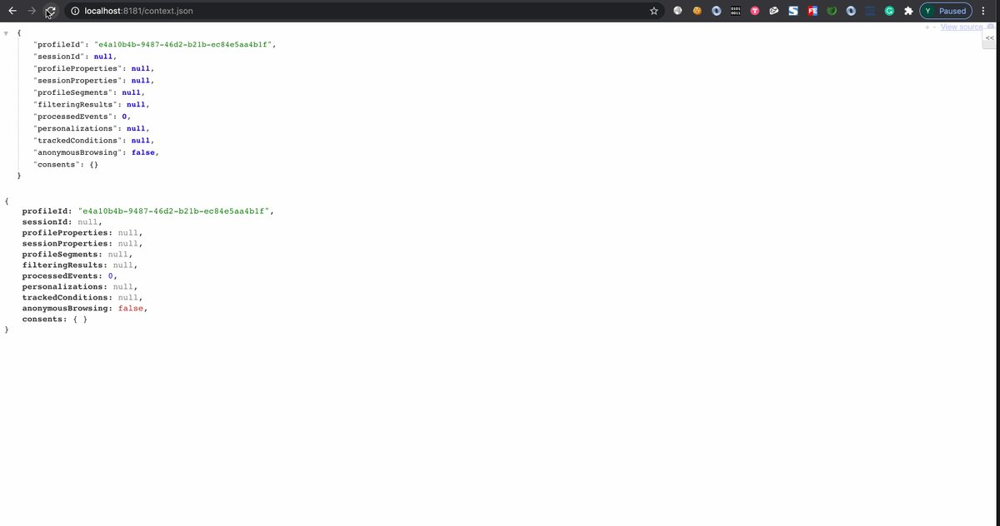
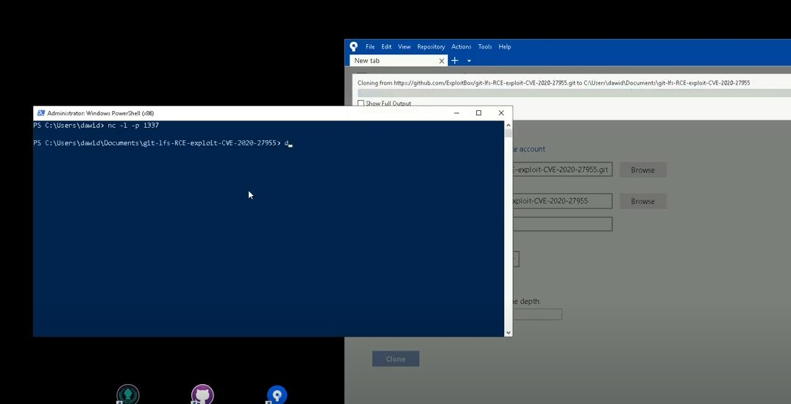

# andersonc0d3
**https://twitter.com/andersonc0d3/status/1333546211425603585 _at 2020-11-30 22:59:27_**
<blockquote>
Maybe @andreyknvl could have used that technique to bypass SMAP on his work on CVE-2017-18344.

https://t.co/neXNTqqMBU
</blockquote>

* https://github.com/xairy/kernel-exploits/blob/master/CVE-2017-18344/poc.c

<table><tr>
<td>Quotes: <code>0</code></td>
<td>Replies: <code>0</code></td>
<td>Retweets: <code>0</code></td>
<td>Favorites: <code>4</code></td>
</tr></table>

---

# cry__pto
**https://twitter.com/cry__pto/status/1333494847639080962 _at 2020-11-30 19:35:21_**
<blockquote>
Remove duplicates from MASSIVE wordlist:
https://t.co/LSojmv29w7 
CRLF and open redirect fuzzer:
https://t.co/qPrZ1zKprI 
Privilege Escalation Enumeration Script for Windows:
https://t.co/PkiSVruuwd 
Some scripts useful for red team activities:
https://t.co/jb5TkvX7h7 
#BugBounty
</blockquote>

* https://github.com/nil0x42/duplicut
* https://github.com/BountyStrike/Injectus
* https://github.com/itm4n/PrivescCheck
* https://github.com/BankSecurity/Red_Team

<table><tr>
<td>Quotes: <code>0</code></td>
<td>Replies: <code>0</code></td>
<td>Retweets: <code>31</code></td>
<td>Favorites: <code>38</code></td>
</tr></table>

---

# binitamshah
**https://twitter.com/binitamshah/status/1333307870243217408 _at 2020-11-30 07:12:22_**
<blockquote>
Desktop environment in the browser : https://t.co/DofDOE2D2B 

https://t.co/Aabo0MOMvq https://t.co/o8hdlNjQRA
</blockquote>

* https://github.com/DustinBrett/x
* https://x.dustinbrett.com/

<table><tr>
<td></td>
</table></tr>
<table><tr>
<td>Quotes: <code>3</code></td>
<td>Replies: <code>3</code></td>
<td>Retweets: <code>41</code></td>
<td>Favorites: <code>152</code></td>
</tr></table>

---

# binitamshah
**https://twitter.com/binitamshah/status/1333298153701863424 _at 2020-11-30 06:33:45_**
<blockquote>
Blizzard-Jailbreak : An Open-Source iOS 13.7* - 13.0 Jailbreak , made for teaching purposes : https://t.co/A6JtaBAM1w credits @FCE365  (added)*
</blockquote>

* https://github.com/GeoSn0w/Blizzard-Jailbreak

<table><tr>
<td>Quotes: <code>0</code></td>
<td>Replies: <code>0</code></td>
<td>Retweets: <code>26</code></td>
<td>Favorites: <code>57</code></td>
</tr></table>

---

# binitamshah
**https://twitter.com/binitamshah/status/1333285417743908864 _at 2020-11-30 05:43:09_**
<blockquote>
RT @Intel80x86: So far, Over 50,000 lines of code have been written for the @HyperDbg debugger.😊

https://t.co/ezLjuFiFOQ https://t.co/vW3u…
</blockquote>

* https://github.com/HyperDbg/HyperDbg

<table><tr>
<td>Quotes: <code>0</code></td>
<td>Replies: <code>0</code></td>
<td>Retweets: <code>44</code></td>
<td>Favorites: <code>0</code></td>
</tr></table>

---

# binitamshah
**https://twitter.com/binitamshah/status/1333276243861540865 _at 2020-11-30 05:06:42_**
<blockquote>
Exploiting a “Simple” Vulnerability – In 35 Easy Steps or Less! : https://t.co/MeaWzbFCqs credits @yarden_shafir

PoC demonstrating the use of cve-2020-1034 for privilege escalation : https://t.co/odMCuUnvWa https://t.co/7EFzXVgSx2
</blockquote>

* https://windows-internals.com/exploiting-a-simple-vulnerability-in-35-easy-steps-or-less/
* https://github.com/yardenshafir/CVE-2020-1034

<table><tr>
<td></td>
<td></td>
</table></tr>
<table><tr>
<td>Quotes: <code>1</code></td>
<td>Replies: <code>0</code></td>
<td>Retweets: <code>47</code></td>
<td>Favorites: <code>160</code></td>
</tr></table>

---

# BrieflyX
**https://twitter.com/BrieflyX/status/1333224795769430016 _at 2020-11-30 01:42:16_**
<blockquote>
I solved spark in HITCON CTF 2020.
The CONFIG_SLAB_FREELIST_HARDENED made it hard to exploit via a single UAF and costs much of my time. Eventually another out-of-bound bug in query algorithm saved me.
Thanks to @david942j for 2 interesting kernel chals!

https://t.co/J9BzQeuv5z
</blockquote>

* https://github.com/BrieflyX/ctf-pwns/tree/master/kernel/spark

<table><tr>
<td>Quotes: <code>3</code></td>
<td>Replies: <code>3</code></td>
<td>Retweets: <code>8</code></td>
<td>Favorites: <code>48</code></td>
</tr></table>

---

# binitamshah
**https://twitter.com/binitamshah/status/1332673469855662080 _at 2020-11-28 13:11:29_**
<blockquote>
NetworkSniffer : Log iOS network traffic without a proxy (This includes WKWebView and UIWebView) : https://t.co/EeaQB6rexf credits @EvilPenguin_
</blockquote>

* https://github.com/evilpenguin/NetworkSniffer

<table><tr>
<td>Quotes: <code>2</code></td>
<td>Replies: <code>1</code></td>
<td>Retweets: <code>41</code></td>
<td>Favorites: <code>102</code></td>
</tr></table>

---

# binitamshah
**https://twitter.com/binitamshah/status/1332672521175322628 _at 2020-11-28 13:07:43_**
<blockquote>
Build simple fuzzer (Part 4) : https://t.co/XNmntngmCv

Part 3 : https://t.co/SPa0UL7Uqu

Part 2 : https://t.co/MJTl69H4Z2

Part 1 : https://t.co/vqaPnJEGoK

rFuss2 : Simple rust fuzzer : https://t.co/wbPW8rn4a8 credits @carste1n
</blockquote>

* https://carstein.github.io/2020/05/21/writing-simple-fuzzer-4.html
* https://carstein.github.io/2020/05/02/writing-simple-fuzzer-3.html
* https://carstein.github.io/2020/04/25/writing-simple-fuzzer-2.html
* https://carstein.github.io/2020/04/18/writing-simple-fuzzer-1.html
* https://github.com/carstein/rfuss2

<table><tr>
<td>Quotes: <code>1</code></td>
<td>Replies: <code>0</code></td>
<td>Retweets: <code>38</code></td>
<td>Favorites: <code>84</code></td>
</tr></table>

---

# r00tpgp
**https://twitter.com/r00tpgp/status/1332243301521530882 _at 2020-11-27 08:42:09_**
<blockquote>
MobileIron rce exploit, not yet tested. Cve-2020-15505
https://t.co/CWokbb3huI
</blockquote>

* https://github.com/httpvoid/CVE-Reverse/tree/master/CVE-2020-15505

<table><tr>
<td>Quotes: <code>0</code></td>
<td>Replies: <code>0</code></td>
<td>Retweets: <code>0</code></td>
<td>Favorites: <code>0</code></td>
</tr></table>

---

# SBousseaden
**https://twitter.com/SBousseaden/status/1332017238929502209 _at 2020-11-26 17:43:52_**
<blockquote>
detection traces added for UAC bypass via hijacking CDSSync scheduled task 

https://t.co/KYz63z61wc

https://t.co/J5baBVOzb0 https://t.co/odHFn7lEbR
</blockquote>

* https://github.com/sbousseaden/EVTX-ATTACK-SAMPLES/blob/master/Privilege%20Escalation/sysmon_uacbypass_CDSSync_schtask_hijack_byeintegrity5.evtx
* https://github.com/AzAgarampur/byeintegrity5-uac

<table><tr>
<td></td>
</table></tr>
<table><tr>
<td>Quotes: <code>0</code></td>
<td>Replies: <code>0</code></td>
<td>Retweets: <code>23</code></td>
<td>Favorites: <code>84</code></td>
</tr></table>

---

# campuscodi
**https://twitter.com/campuscodi/status/1331701598314262528 _at 2020-11-25 20:49:37_**
<blockquote>
Let me save you some clicks

0day technical write-up: https://t.co/gIIetuw2if

Security tool: https://t.co/xZQwmQ3TKi

ACROS micro-patch (until Microsoft releases one, if they release one, as both W7 and WS 2008R2 are EOL): https://t.co/eAABKITJNC
</blockquote>

* https://itm4n.github.io/windows-registry-rpceptmapper-eop/
* https://github.com/itm4n/PrivescCheck
* https://blog.0patch.com/2020/11/0day-in-windows-7-and-server-2008-r2.html

<table><tr>
<td>Quotes: <code>1</code></td>
<td>Replies: <code>0</code></td>
<td>Retweets: <code>16</code></td>
<td>Favorites: <code>47</code></td>
</tr></table>

---

# ptracesecurity
**https://twitter.com/ptracesecurity/status/1331621468086661121 _at 2020-11-25 15:31:12_**
<blockquote>
CVE-2020-13942 unauthenticated RCE POC through MVEL and OGNL injection  https://t.co/PQzsIJb3Y6  #Pentesting #RCE #CyberSecurity #Infosec https://t.co/bHT0yOUSQt
</blockquote>

* https://github.com/eugenebmx/CVE-2020-13942

<table><tr>
<td></td>
<td></td>
</table></tr>
<table><tr>
<td>Quotes: <code>0</code></td>
<td>Replies: <code>0</code></td>
<td>Retweets: <code>7</code></td>
<td>Favorites: <code>27</code></td>
</tr></table>

---

# cyber_advising
**https://twitter.com/cyber_advising/status/1331543537863839744 _at 2020-11-25 10:21:32_**
<blockquote>
CVE-2020-13942: inject malicious OGNL or MVEL scripts into the /context.json public endpoint.

#RCe #Vulnerability #CyberSecurity #Infosec

https://t.co/vcbgWvRygi https://t.co/hguqvPeLd3
</blockquote>

* https://github.com/eugenebmx/CVE-2020-13942

<table><tr>
<td></td>
</table></tr>
<table><tr>
<td>Quotes: <code>0</code></td>
<td>Replies: <code>0</code></td>
<td>Retweets: <code>8</code></td>
<td>Favorites: <code>28</code></td>
</tr></table>

---

# AirbusSecLab
**https://twitter.com/AirbusSecLab/status/1331541416091250690 _at 2020-11-25 10:13:07_**
<blockquote>
Tired of diffing firmware updates by hand? Your 400MB enterprise software target has a new point release? We got you covered. https://t.co/295FrYwxrl  provides a summary of the changes between two files or directories, keeping only the changes that matter to you. https://t.co/lOovT3wUt2
</blockquote>

* https://github.com/airbus-seclab/diffware/

<table><tr>
<td></td>
<td></td>
</table></tr>
<table><tr>
<td>Quotes: <code>10</code></td>
<td>Replies: <code>0</code></td>
<td>Retweets: <code>69</code></td>
<td>Favorites: <code>195</code></td>
</tr></table>

---

# ancst
**https://twitter.com/ancst/status/1331485738685390848 _at 2020-11-25 06:31:52_**
<blockquote>
A new @metasploit module has been added in to exploit CVE-2020-26124. Successful exploitation allows arbitrary command execution on the underlying operating system as the root user. https://t.co/xPUGB5RftP
</blockquote>

* https://github.com/rapid7/metasploit-framework/pull/14241

<table><tr>
<td>Quotes: <code>0</code></td>
<td>Replies: <code>0</code></td>
<td>Retweets: <code>1</code></td>
<td>Favorites: <code>2</code></td>
</tr></table>

---

# KeyZ3r0
**https://twitter.com/KeyZ3r0/status/1331449295199899648 _at 2020-11-25 04:07:03_**
<blockquote>
It seems chromium patched my first found since I started hunting for chromium sandbox escape this year(CVE-2020-16018 reported by Man Yue Mo @mmolgtm), really interested in focusing on a new challenging research😋 https://t.co/qwn1cDAwL7
</blockquote>

<table><tr>
<td></td>
</table></tr>
<table><tr>
<td>Quotes: <code>0</code></td>
<td>Replies: <code>3</code></td>
<td>Retweets: <code>7</code></td>
<td>Favorites: <code>107</code></td>
</tr></table>

---

# wdormann
**https://twitter.com/wdormann/status/1331005263181193224 _at 2020-11-23 22:42:38_**
<blockquote>
@MCKSysAr https://t.co/GG6VH2LImA

It works quite well for a one-shot assessment of a number of things that can lead to privesc.  With the ability to see the details in the generated text file. https://t.co/C9u6c1SVBu
</blockquote>

* https://github.com/itm4n/PrivescCheck

<table><tr>
<td></td>
<td></td>
</table></tr>
<table><tr>
<td>Quotes: <code>1</code></td>
<td>Replies: <code>2</code></td>
<td>Retweets: <code>8</code></td>
<td>Favorites: <code>36</code></td>
</tr></table>

---

# _Icewall
**https://twitter.com/_Icewall/status/1330998292029837321 _at 2020-11-23 22:14:56_**
<blockquote>
Some of my Webkit GTK/WPE vulns have been patched :
https://t.co/sNuOOwwVjB
CVE-2020-13584
CVE-2020-9951
More details next week ;)
</blockquote>

* https://webkitgtk.org/security/WSA-2020-0008.html

<table><tr>
<td>Quotes: <code>0</code></td>
<td>Replies: <code>3</code></td>
<td>Retweets: <code>5</code></td>
<td>Favorites: <code>40</code></td>
</tr></table>

---

# ulldma
**https://twitter.com/ulldma/status/1330947425457102850 _at 2020-11-23 18:52:48_**
<blockquote>
Write-up of the code execution vulnerability I found in the Elixir-based Paginator project (CVE-2020-15150)

https://t.co/sv2zfe6aNv
</blockquote>

* https://www.alphabot.com/security/blog/2020/elixir/Remote-code-execution-vulnerability-in-Elixir-based-Paginator-project.html

<table><tr>
<td>Quotes: <code>3</code></td>
<td>Replies: <code>3</code></td>
<td>Retweets: <code>19</code></td>
<td>Favorites: <code>39</code></td>
</tr></table>

---

# piedpiper1616
**https://twitter.com/piedpiper1616/status/1330928818840764417 _at 2020-11-23 17:38:52_**
<blockquote>
GitHub - yardenshafir/CVE-2020-1034: PoC demonstrating the use of cve-2020-1034 for privilege escalation - https://t.co/qsXBcxzu7U
</blockquote>

* https://github.com/yardenshafir/CVE-2020-1034

<table><tr>
<td>Quotes: <code>2</code></td>
<td>Replies: <code>0</code></td>
<td>Retweets: <code>35</code></td>
<td>Favorites: <code>89</code></td>
</tr></table>

---

# 0xedh
**https://twitter.com/0xedh/status/1330919517782945794 _at 2020-11-23 17:01:54_**
<blockquote>
After a while I have published the exploit for CVE-2020-9527, Hichip's P2P cameras RCE. Thanks to @PaulMarrapese for his previous research.

https://t.co/n34q3AlE0V
</blockquote>

* https://github.com/0xedh/hichip-p2p-firmware-rce

<table><tr>
<td>Quotes: <code>3</code></td>
<td>Replies: <code>3</code></td>
<td>Retweets: <code>22</code></td>
<td>Favorites: <code>36</code></td>
</tr></table>

---

# SoatokDhole
**https://twitter.com/SoatokDhole/status/1330779803977388033 _at 2020-11-23 07:46:44_**
<blockquote>
I implemented a variant of the X3DH deniable authenticated key agreement protocol in TypeScript using libsodium and released it on Github.

I call it: Rawr-X3DH!

https://t.co/B4NhQwGPa7
</blockquote>

* https://github.com/soatok/rawr-x3dh

<table><tr>
<td>Quotes: <code>0</code></td>
<td>Replies: <code>4</code></td>
<td>Retweets: <code>5</code></td>
<td>Favorites: <code>32</code></td>
</tr></table>

---

# Intel80x86
**https://twitter.com/Intel80x86/status/1330197805114269697 _at 2020-11-21 17:14:05_**
<blockquote>
So far, Over 50,000 lines of code have been written for the @HyperDbg debugger.😊

https://t.co/ezLjuFiFOQ https://t.co/vW3uEZrB2o
</blockquote>

* https://github.com/HyperDbg/HyperDbg

<table><tr>
<td></td>
</table></tr>
<table><tr>
<td>Quotes: <code>4</code></td>
<td>Replies: <code>9</code></td>
<td>Retweets: <code>44</code></td>
<td>Favorites: <code>259</code></td>
</tr></table>

---

# jedisct1
**https://twitter.com/jedisct1/status/1329912913235210240 _at 2020-11-20 22:22:01_**
<blockquote>
RT @pheeelicks: After 7 years of closed-source, I've changed direction and  just launched: Procedural GL JS https://t.co/EQcaJ6dMAI, an #op…
</blockquote>

* https://github.com/felixpalmer/procedural-gl-js

<table><tr>
<td>Quotes: <code>0</code></td>
<td>Replies: <code>0</code></td>
<td>Retweets: <code>218</code></td>
<td>Favorites: <code>0</code></td>
</tr></table>

---

# atombeast
**https://twitter.com/atombeast/status/1329830767065587712 _at 2020-11-20 16:55:36_**
<blockquote>
Cryptol v2.10.0 is ready! Includes a faster interpreter with primitive functions for AES, SHA-2, and some elliptic curve point operations. Also adds primality checking to the type system and an RPC interface. Get it here: https://t.co/LqvnSB3tzK
</blockquote>

* https://github.com/GaloisInc/cryptol/releases

<table><tr>
<td>Quotes: <code>0</code></td>
<td>Replies: <code>1</code></td>
<td>Retweets: <code>18</code></td>
<td>Favorites: <code>32</code></td>
</tr></table>

---

# pheeelicks
**https://twitter.com/pheeelicks/status/1329806806034558978 _at 2020-11-20 15:20:23_**
<blockquote>
After 7 years of closed-source, I've changed direction and  just launched: Procedural GL JS https://t.co/EQcaJ6dMAI, an #opensource #webgl #javascript #threejs #dataviz library, for rendering 3D terrains. https://t.co/rmXJj37WOJ
</blockquote>

* https://github.com/felixpalmer/procedural-gl-js

<table><tr>
<td></td>
<td></td>
<td></td>
<td></td>
</table></tr>
<table><tr>
<td>Quotes: <code>32</code></td>
<td>Replies: <code>26</code></td>
<td>Retweets: <code>218</code></td>
<td>Favorites: <code>1226</code></td>
</tr></table>

---

# imnarendrabhati
**https://twitter.com/imnarendrabhati/status/1329794356841070592 _at 2020-11-20 14:30:55_**
<blockquote>
Safari 14.0.1 With Fixes of Address Bar Spoofing Vulnerability.
CVE-2020-9945
details will be out once the fix is released from different browsers as well.
https://t.co/NSyAtPd8iQ 
#infosec #infosec #hacking #bugbounty https://t.co/yRyyxlD1h7
</blockquote>

* https://support.apple.com/en-in/HT211934

<table><tr>
<td></td>
</table></tr>
<table><tr>
<td>Quotes: <code>0</code></td>
<td>Replies: <code>6</code></td>
<td>Retweets: <code>5</code></td>
<td>Favorites: <code>42</code></td>
</tr></table>

---

# lobuhisec
**https://twitter.com/lobuhisec/status/1329705441883017218 _at 2020-11-20 08:37:36_**
<blockquote>
My biggest contribution to github ever made: byp4xx, a simple bash script to bypass 403 forbidden error using methods mentioned in #bugbountytips:
https://t.co/SIqr61piiu https://t.co/8dvgJuT9dU
</blockquote>

* https://github.com/lobuhi/byp4xx/

<table><tr>
<td></td>
</table></tr>
<table><tr>
<td>Quotes: <code>15</code></td>
<td>Replies: <code>9</code></td>
<td>Retweets: <code>258</code></td>
<td>Favorites: <code>786</code></td>
</tr></table>

---

# Yalujb
**https://twitter.com/Yalujb/status/1329519913556344832 _at 2020-11-19 20:20:23_**
<blockquote>
iOS 13.7 jailbreak source code released, offsets to be added for some devices (dev - @FreeTheSandbox). #iOS137 #jailbreak https://t.co/B1VvOj5eUc
</blockquote>

* https://github.com/ZecOps/FreeTheSandbox_LPE_POC_13.7

<table><tr>
<td>Quotes: <code>0</code></td>
<td>Replies: <code>4</code></td>
<td>Retweets: <code>4</code></td>
<td>Favorites: <code>55</code></td>
</tr></table>

---

# iFenixx
**https://twitter.com/iFenixx/status/1329507437280419845 _at 2020-11-19 19:30:48_**
<blockquote>
iOS jailbreak, works on iOS 13.7 and earlier..🔥🔥

- hardcoded offsets to be added for some devices.

https://t.co/A4Kx4P4hQ8
</blockquote>

* https://github.com/ZecOps/FreeTheSandbox_LPE_POC_13.7

<table><tr>
<td>Quotes: <code>5</code></td>
<td>Replies: <code>7</code></td>
<td>Retweets: <code>33</code></td>
<td>Favorites: <code>200</code></td>
</tr></table>

---

# AldeabAhmed
**https://twitter.com/AldeabAhmed/status/1329506624508194817 _at 2020-11-19 19:27:34_**
<blockquote>
مشروع جلبريك iOS 13.7 

https://t.co/Sb0Y5jtapx
</blockquote>

* https://github.com/ZecOps/FreeTheSandbox_LPE_POC_13.7

<table><tr>
<td>Quotes: <code>6</code></td>
<td>Replies: <code>5</code></td>
<td>Retweets: <code>7</code></td>
<td>Favorites: <code>38</code></td>
</tr></table>

---

# _mohemiv
**https://twitter.com/_mohemiv/status/1329438812158746629 _at 2020-11-19 14:58:07_**
<blockquote>
Do you known that Cisco ISE is vulnerable to CVE-2017-5638 Apache Struts2 RCE?

Port: 8443
Payload:

GET /sponsorportal/LoginCheck.action HTTP/1.0
Host: 10.0.0.1:8443
User-Agent: Mozilla
Content-Type: %{...}

Cisco ISE is a NAP system that might be found on network boundaries.
</blockquote>

<table><tr>
<td>Quotes: <code>6</code></td>
<td>Replies: <code>4</code></td>
<td>Retweets: <code>103</code></td>
<td>Favorites: <code>368</code></td>
</tr></table>

---

# jedisct1
**https://twitter.com/jedisct1/status/1329421633287827457 _at 2020-11-19 13:49:51_**
<blockquote>
RT @ptswarm: The advisory for multiple unauth RCE in Cisco Integrated Management Controller (CVE-2020-3470) is now out!

Buffer Overflows l…
</blockquote>

<table><tr>
<td>Quotes: <code>0</code></td>
<td>Replies: <code>0</code></td>
<td>Retweets: <code>70</code></td>
<td>Favorites: <code>0</code></td>
</tr></table>

---

# ptswarm
**https://twitter.com/ptswarm/status/1329417273719853062 _at 2020-11-19 13:32:32_**
<blockquote>
The advisory for multiple unauth RCE in Cisco Integrated Management Controller (CVE-2020-3470) is now out!

Buffer Overflows lead to RCE with uid=0 (root) privileges

Discovered by Nikita Abramov

https://t.co/s6T3YDswoG https://t.co/8fBFauF8SR
</blockquote>

* https://tools.cisco.com/security/center/content/CiscoSecurityAdvisory/cisco-sa-ucs-api-rce-UXwpeDHd

<table><tr>
<td></td>
</table></tr>
<table><tr>
<td>Quotes: <code>3</code></td>
<td>Replies: <code>1</code></td>
<td>Retweets: <code>70</code></td>
<td>Favorites: <code>143</code></td>
</tr></table>

---

# jedisct1
**https://twitter.com/jedisct1/status/1329413316800897024 _at 2020-11-19 13:16:48_**
<blockquote>
RT @bryanlimy: We can now train @TensorFlow models using the dGPU on @Apple MacBooks 🤩

https://t.co/JFFmyqGMJB https://t.co/kh5Xdpxrh1
</blockquote>

* https://github.com/apple/tensorflow_macos

<table><tr>
<td></td>
</table></tr>
<table><tr>
<td>Quotes: <code>0</code></td>
<td>Replies: <code>0</code></td>
<td>Retweets: <code>117</code></td>
<td>Favorites: <code>0</code></td>
</tr></table>

---

# bryanlimy
**https://twitter.com/bryanlimy/status/1329170392653713415 _at 2020-11-18 21:11:31_**
<blockquote>
We can now train @TensorFlow models using the dGPU on @Apple MacBooks 🤩

https://t.co/JFFmyqGMJB https://t.co/kh5Xdpxrh1
</blockquote>

* https://github.com/apple/tensorflow_macos

<table><tr>
<td></td>
</table></tr>
<table><tr>
<td>Quotes: <code>25</code></td>
<td>Replies: <code>19</code></td>
<td>Retweets: <code>117</code></td>
<td>Favorites: <code>745</code></td>
</tr></table>

---

# GHSecurityLab
**https://twitter.com/GHSecurityLab/status/1329091248997625857 _at 2020-11-18 15:57:01_**
<blockquote>
ICYMI @mmolgtm explains how to exploit CVE-2020-6449, a use-after-free (UAF) in the WebAudio module of Chrome, and achieve a sandboxed RCE. Read also how he used #CodeQL to accelerate his code audit https://t.co/k5ddV8Scv3
</blockquote>

* https://github.co/3msMoMy

<table><tr>
<td>Quotes: <code>2</code></td>
<td>Replies: <code>0</code></td>
<td>Retweets: <code>29</code></td>
<td>Favorites: <code>83</code></td>
</tr></table>

---

# wugeej
**https://twitter.com/wugeej/status/1328942729095753731 _at 2020-11-18 06:06:51_**
<blockquote>
CVE-2020-16846
CVE-2020-25592
SaltStack Salt REST API RCE

[PoC]
POST /run HTTP/1.1
Host: [Victim:8888]
...
...

token=12312&amp;client=ssh&amp;tgt=*&amp;fun=a&amp;roster=whip1ash&amp;ssh_priv=aaa|open%20/System/Applications/Calculator.app%3b

https://t.co/jdgIUFSW6x https://t.co/s7xlLDkHDX
</blockquote>

* https://paper.seebug.org/1398/

<table><tr>
<td></td>
</table></tr>
<table><tr>
<td>Quotes: <code>2</code></td>
<td>Replies: <code>0</code></td>
<td>Retweets: <code>19</code></td>
<td>Favorites: <code>52</code></td>
</tr></table>

---

# pyn3rd
**https://twitter.com/pyn3rd/status/1328920545442680837 _at 2020-11-18 04:38:42_**
<blockquote>
#CVE-2020-13942 Apache Unomi Remote Code Execution

PoC:
{"filters":[{"id" : "pyn3rd","filters": [{"condition": {"parameterValues": {"pyn3rd": "script::Runtime.getRuntime().exec('open -a Calculator')"},"type":"profilePropertyCondition"}}]}],"sessionId": "pyn3rd"} https://t.co/Gcw5FcZiNp
</blockquote>

<table><tr>
<td></td>
</table></tr>
<table><tr>
<td>Quotes: <code>7</code></td>
<td>Replies: <code>14</code></td>
<td>Retweets: <code>176</code></td>
<td>Favorites: <code>493</code></td>
</tr></table>

---

# iamelli0t
**https://twitter.com/iamelli0t/status/1328890412413534209 _at 2020-11-18 02:38:58_**
<blockquote>
When analyzing CVE-2020-1380, I found another path to trigger a similar UAF vulnerability by neutering ArrayBuffer without JIT. 
It has beed fixed in Microsoft November’s Patch as CVE-2020-17053.
https://t.co/ucHH2cmYVN
</blockquote>

* https://www.trendmicro.com/en_us/research/20/k/cve-2020-17053-use-after-free-ie-vulnerability.html

<table><tr>
<td>Quotes: <code>1</code></td>
<td>Replies: <code>2</code></td>
<td>Retweets: <code>32</code></td>
<td>Favorites: <code>99</code></td>
</tr></table>

---

# marcinguy
**https://twitter.com/marcinguy/status/1328819769869553677 _at 2020-11-17 21:58:16_**
<blockquote>
Some more updates. I guess we need to exploit TCMalloc somehow to get RCE. WIll look when I have time and want to play with this damn CVE :) https://t.co/HgVdsJPNT1 #cve-2020-15999
</blockquote>

* https://github.com/marcinguy/CVE-2020-15999/blob/main/README.md#update-7

<table><tr>
<td>Quotes: <code>0</code></td>
<td>Replies: <code>1</code></td>
<td>Retweets: <code>0</code></td>
<td>Favorites: <code>1</code></td>
</tr></table>

---

# frycos
**https://twitter.com/frycos/status/1328412045092548609 _at 2020-11-16 18:58:06_**
<blockquote>
Since Cisco PSIRT became unresponsive and the published release 4.22 still doesn't mention any of the vulnerabilities, here are 12 PoCs in 1 gist:

https://t.co/h31QO5rmde
</blockquote>

* https://gist.github.com/Frycos/8bf5c125d720b3504b4f28a1126e509e

<table><tr>
<td>Quotes: <code>20</code></td>
<td>Replies: <code>10</code></td>
<td>Retweets: <code>196</code></td>
<td>Favorites: <code>330</code></td>
</tr></table>

---

# luca_dd7
**https://twitter.com/luca_dd7/status/1327712997356302336 _at 2020-11-14 20:40:20_**
<blockquote>
A script for privilege escalation on Linux systems: https://t.co/IWGKDAL24S
#infosec #ctf #bugbountytips
</blockquote>

* https://github.com/carlospolop/privilege-escalation-awesome-scripts-suite/tree/master/linPEAS

<table><tr>
<td>Quotes: <code>0</code></td>
<td>Replies: <code>1</code></td>
<td>Retweets: <code>21</code></td>
<td>Favorites: <code>42</code></td>
</tr></table>

---

# ptracesecurity
**https://twitter.com/ptracesecurity/status/1327652599051464704 _at 2020-11-14 16:40:20_**
<blockquote>
Exploring the Exploitability of “Bad Neighbor”: The Recent ICMPv6 Vulnerability (CVE-2020-16898)  https://t.co/WHjYcHvudH  #Pentesting #RCE #Vulnerability #CyberSecurity #Infosec https://t.co/CpYiv9N27y
</blockquote>

* https://blog.zecops.com/vulnerabilities/exploring-the-exploitability-of-bad-neighbor-the-recent-icmpv6-vulnerability-cve-2020-16898/

<table><tr>
<td></td>
<td></td>
</table></tr>
<table><tr>
<td>Quotes: <code>1</code></td>
<td>Replies: <code>0</code></td>
<td>Retweets: <code>48</code></td>
<td>Favorites: <code>81</code></td>
</tr></table>

---

# HackerOn2Wheels
**https://twitter.com/HackerOn2Wheels/status/1326927875279380480 _at 2020-11-12 16:40:33_**
<blockquote>
Nothing critical, but here is the PoC for the new CVE I got credited for: CVE-2020-14815. 

https://target[.]com/bi-security-login/login.jsp?msi=false&amp;redirect="&gt;&lt;img/src/onerror%3dalert(document.domain)&gt;

Got a couple of Med in H1 using it. Have Fun!

#bugbounty #bugbountytips https://t.co/A8qx640VgE
</blockquote>

<table><tr>
<td></td>
</table></tr>
<table><tr>
<td>Quotes: <code>3</code></td>
<td>Replies: <code>7</code></td>
<td>Retweets: <code>134</code></td>
<td>Favorites: <code>343</code></td>
</tr></table>

---

# _r_netsec
**https://twitter.com/_r_netsec/status/1326830372450000902 _at 2020-11-12 10:13:06_**
<blockquote>
PYTMIPE (Python 3 library for Token Manipulation and Impersonation for Privilege Escalation on Windows) &amp; TMIPE (python client) https://t.co/G9Djv3twrb
</blockquote>

* https://github.com/quentinhardy/pytmipe

<table><tr>
<td>Quotes: <code>0</code></td>
<td>Replies: <code>0</code></td>
<td>Retweets: <code>25</code></td>
<td>Favorites: <code>44</code></td>
</tr></table>

---

# campuscodi
**https://twitter.com/campuscodi/status/1326656333580480514 _at 2020-11-11 22:41:32_**
<blockquote>
BREAKING: Google patches two more Chrome zero-days

This includes:
-CVE-2020-16013 - impacts Chrome V8 JS engine
-CVE-2020-16017 - impacts Chrome's Site Isolation feature

Google has now patched five Chrome zero-days in three weeks

https://t.co/ohF2CHwvOG https://t.co/BXFa1wzSwR
</blockquote>

* https://www.zdnet.com/article/google-patches-two-more-chrome-zero-days/

<table><tr>
<td></td>
</table></tr>
<table><tr>
<td>Quotes: <code>13</code></td>
<td>Replies: <code>2</code></td>
<td>Retweets: <code>94</code></td>
<td>Favorites: <code>157</code></td>
</tr></table>

---

# sourceincite
**https://twitter.com/sourceincite/status/1326626570073755648 _at 2020-11-11 20:43:16_**
<blockquote>
Microsoft Exchange Server ExportExchangeCertificate WriteCertiricate File Write Remote Code Execution Vulnerability

CVE: CVE-2020-17083
Advisory: https://t.co/sf7upoNmjC
PoC exploit: https://t.co/lzKWSGhSjG
</blockquote>

* https://srcincite.io/advisories/src-2020-0025/
* https://srcincite.io/pocs/cve-2020-17083.ps1.txt

<table><tr>
<td>Quotes: <code>3</code></td>
<td>Replies: <code>0</code></td>
<td>Retweets: <code>124</code></td>
<td>Favorites: <code>201</code></td>
</tr></table>

---

# nathanqthai
**https://twitter.com/nathanqthai/status/1326593214695006209 _at 2020-11-11 18:30:43_**
<blockquote>
Remember that wildcarding works in search:
tags:"Oracle WebLogic RCE CVE-2020-14*"

We relied a TON on @jas502n's and @testanull's work to understand and issue these tags

Please feel free to hit me up with questions and feedback

https://t.co/k3o25F7whL

https://t.co/SoATeRen7D
</blockquote>

* https://github.com/jas502n/CVE-2020-14882
* https://testbnull.medium.com/weblogic-rce-by-only-one-get-request-cve-2020-14882-analysis-6e4b09981dbf

<table><tr>
<td>Quotes: <code>0</code></td>
<td>Replies: <code>1</code></td>
<td>Retweets: <code>1</code></td>
<td>Favorites: <code>2</code></td>
</tr></table>

---

# ackmage
**https://twitter.com/ackmage/status/1326583893080870915 _at 2020-11-11 17:53:41_**
<blockquote>
new tags to track recent WebLogic RCE (CVE-2020-14882, 14883, 14750) -

https://t.co/XH4J4A5RIh

https://t.co/uq9mqYuvHV
</blockquote>

* http://viz.greynoise.io/query/?gnql=tags%3A%22Oracle%20WebLogic%20RCE%20CVE-2020-14882%22
* http://viz.greynoise.io/query/?gnql=tags%3A%22Oracle%20WebLogic%20RCE%20CVE-2020-14750%22

<table><tr>
<td>Quotes: <code>3</code></td>
<td>Replies: <code>0</code></td>
<td>Retweets: <code>11</code></td>
<td>Favorites: <code>33</code></td>
</tr></table>

---

# nico_yn0
**https://twitter.com/nico_yn0/status/1326528376996319232 _at 2020-11-11 14:13:05_**
<blockquote>
... 📡Tengamos en cuenta que la versión 4.0.0 fue liberada el 23 Agosto de 2013, 7 años de producto afectado https://t.co/3d7W138qxn

... 🔝 La vulnerabilidada CVE-2020-13958 ya tiene PoC y posiblemente irá a más... #prayforopenofficeusers

https://t.co/hgaMTaIKqS
</blockquote>

* https://cwiki.apache.org/confluence/display/OOOUSERS/AOO+4.0
* https://github.com/irsl/apache-openoffice-rce-via-uno-links

<table><tr>
<td>Quotes: <code>0</code></td>
<td>Replies: <code>1</code></td>
<td>Retweets: <code>0</code></td>
<td>Favorites: <code>1</code></td>
</tr></table>

---

# _simo36
**https://twitter.com/_simo36/status/1326520994786398209 _at 2020-11-11 13:43:45_**
<blockquote>
Here is a PoC kernel exploit, it demonstrates how to get kernel task port on iOS 13.7.  I will update the PoC with a writeup later.
https://t.co/NnJQ7ZRou0
</blockquote>

* https://github.com/0x36/oob_events

<table><tr>
<td>Quotes: <code>24</code></td>
<td>Replies: <code>30</code></td>
<td>Retweets: <code>140</code></td>
<td>Favorites: <code>489</code></td>
</tr></table>

---

# TheHackersNews
**https://twitter.com/TheHackersNews/status/1326468227040374784 _at 2020-11-11 10:14:04_**
<blockquote>
November 2020 Patch Tuesday — #Microsoft releases security updates for 112 newly discovered vulnerabilities, including an actively exploited zero-day flaw (CVE-2020-17087) disclosed by #Google's security team last week.

https://t.co/DwSQZTX8v6

#Infosec #CyberSecurity
</blockquote>

* https://thehackernews.com/2020/11/microsoft-releases-windows-security.html

<table><tr>
<td>Quotes: <code>12</code></td>
<td>Replies: <code>5</code></td>
<td>Retweets: <code>141</code></td>
<td>Favorites: <code>214</code></td>
</tr></table>

---

# steventseeley
**https://twitter.com/steventseeley/status/1326284184122519561 _at 2020-11-10 22:02:45_**
<blockquote>
The description for CVE-2020-17083 is wrong, user interaction is *not* required. Also this is RCE as SYSTEM, so the actual CVSS is 8.5: https://t.co/qJWBH3ldCf
</blockquote>

* https://msrc.microsoft.com/update-guide/en-US/vulnerability/CVE-2020-17083

<table><tr>
<td>Quotes: <code>4</code></td>
<td>Replies: <code>4</code></td>
<td>Retweets: <code>24</code></td>
<td>Favorites: <code>96</code></td>
</tr></table>

---

# EranShimony
**https://twitter.com/EranShimony/status/1326225811087749121 _at 2020-11-10 18:10:48_**
<blockquote>
This was a long wait, this will be my last blog for some while - CVE-2020-22460, CVE-12330, CVE-2020-12335
https://t.co/ALNAPL16xT
</blockquote>

* https://www.cyberark.com/resources/threat-research-blog/intel-please-stop-assisting-me

<table><tr>
<td>Quotes: <code>3</code></td>
<td>Replies: <code>2</code></td>
<td>Retweets: <code>15</code></td>
<td>Favorites: <code>40</code></td>
</tr></table>

---

# binitamshah
**https://twitter.com/binitamshah/status/1325942838245289984 _at 2020-11-09 23:26:22_**
<blockquote>
Dog : Command-line DNS client : https://t.co/wkV2g1gMfr https://t.co/Pxf3i5aVJj
</blockquote>

* https://github.com/ogham/dog

<table><tr>
<td></td>
</table></tr>
<table><tr>
<td>Quotes: <code>8</code></td>
<td>Replies: <code>5</code></td>
<td>Retweets: <code>121</code></td>
<td>Favorites: <code>418</code></td>
</tr></table>

---

# binitamshah
**https://twitter.com/binitamshah/status/1325936887635218433 _at 2020-11-09 23:02:43_**
<blockquote>
Dump AES keys for Spotify songs from a compatible Windows Spotify version : https://t.co/zAqYldPdqj credits @ProfessorTox
</blockquote>

* https://gitlab.com/fuck-capitalism/spotifykeydumper

<table><tr>
<td>Quotes: <code>0</code></td>
<td>Replies: <code>1</code></td>
<td>Retweets: <code>21</code></td>
<td>Favorites: <code>90</code></td>
</tr></table>

---

# binitamshah
**https://twitter.com/binitamshah/status/1325935382991523840 _at 2020-11-09 22:56:44_**
<blockquote>
Critical Vulnerabilities Discovered in TCL Android TVs

CVE-2020-27403
Full file system browsing of the TV in the browser.

CVE-2020-28055
World writable update folder (malicious updates possible)
 : https://t.co/nahQGxkhGY 

credits @sickcodes  || @johnjhacking
</blockquote>

* https://sick.codes/extraordinary-vulnerabilities-discovered-in-tcl-android-tvs-now-worlds-3rd-largest-tv-manufacturer/

<table><tr>
<td>Quotes: <code>2</code></td>
<td>Replies: <code>2</code></td>
<td>Retweets: <code>36</code></td>
<td>Favorites: <code>89</code></td>
</tr></table>

---

# binitamshah
**https://twitter.com/binitamshah/status/1325932631062507520 _at 2020-11-09 22:45:48_**
<blockquote>
Coldfire : Golang malware development library : https://t.co/IgbdjP7Uwt
</blockquote>

* https://github.com/redcode-labs/Coldfire

<table><tr>
<td>Quotes: <code>3</code></td>
<td>Replies: <code>1</code></td>
<td>Retweets: <code>44</code></td>
<td>Favorites: <code>172</code></td>
</tr></table>

---

# binitamshah
**https://twitter.com/binitamshah/status/1325930948223881216 _at 2020-11-09 22:39:07_**
<blockquote>
Red Kube : a red team cheat sheet based on kubectl commands : https://t.co/qon0qB2aSW credits @AzarzarOr
</blockquote>

* https://github.com/lightspin-tech/red-kube

<table><tr>
<td>Quotes: <code>0</code></td>
<td>Replies: <code>1</code></td>
<td>Retweets: <code>21</code></td>
<td>Favorites: <code>54</code></td>
</tr></table>

---

# binitamshah
**https://twitter.com/binitamshah/status/1325930252464320512 _at 2020-11-09 22:36:21_**
<blockquote>
Global Socket (gsocket) : moving data from here to there, securely, fast and trough NAT/firewalls : https://t.co/Pv9TDcSIfl credits @hackerschoice https://t.co/6bSdZ3TpSi
</blockquote>

* https://github.com/hackerschoice/gsocket

<table><tr>
<td></td>
</table></tr>
<table><tr>
<td>Quotes: <code>0</code></td>
<td>Replies: <code>1</code></td>
<td>Retweets: <code>34</code></td>
<td>Favorites: <code>105</code></td>
</tr></table>

---

# binitamshah
**https://twitter.com/binitamshah/status/1325926835591421953 _at 2020-11-09 22:22:46_**
<blockquote>
How I found a Tor vulnerability in Brave Browser, reported it, watched it get patched, got a CVE (CVE-2020-8276) and a small bounty, all in one working day : https://t.co/byy6rmUOl7   credits @sickcodes
</blockquote>

* https://community.disclose.io/t/how-i-found-a-tor-vulnerability-in-brave-browser-reported-it-watched-it-get-patched-got-a-cve-cve-2020-8276-and-a-small-bounty-all-in-one-working-day/65

<table><tr>
<td>Quotes: <code>2</code></td>
<td>Replies: <code>6</code></td>
<td>Retweets: <code>55</code></td>
<td>Favorites: <code>290</code></td>
</tr></table>

---

# binitamshah
**https://twitter.com/binitamshah/status/1325926011490365440 _at 2020-11-09 22:19:30_**
<blockquote>
First Contributions : Complete guide on how to contribute to open-source projects : https://t.co/zAI8UkTG8A
</blockquote>

* https://github.com/firstcontributions/first-contributions

<table><tr>
<td>Quotes: <code>2</code></td>
<td>Replies: <code>1</code></td>
<td>Retweets: <code>17</code></td>
<td>Favorites: <code>52</code></td>
</tr></table>

---

# zyn3rgy
**https://twitter.com/zyn3rgy/status/1325829707355594753 _at 2020-11-09 15:56:49_**
<blockquote>
Authenticated RCE against Exchange ECP (CVE-2020-0688) was very prevalent over the past several months during assessments, so I wrote a PoC that will hopefully make scanning and exploitation a little more streamlined.

https://t.co/ftQkiI0cve
</blockquote>

* https://github.com/zyn3rgy/ecp_slap

<table><tr>
<td>Quotes: <code>1</code></td>
<td>Replies: <code>0</code></td>
<td>Retweets: <code>3</code></td>
<td>Favorites: <code>3</code></td>
</tr></table>

---

# NaserifardA
**https://twitter.com/NaserifardA/status/1325554616654770176 _at 2020-11-08 21:43:42_**
<blockquote>
Git-lfs Remote Code Execution (RCE) exploit CVE-2020-27955 (Go version)
https://t.co/kIov6ZUCN5
</blockquote>

* https://github.com/ExploitBox/git-lfs-RCE-exploit-CVE-2020-27955-Go

<table><tr>
<td>Quotes: <code>0</code></td>
<td>Replies: <code>0</code></td>
<td>Retweets: <code>0</code></td>
<td>Favorites: <code>1</code></td>
</tr></table>

---

# Nahr3n
**https://twitter.com/Nahr3n/status/1325338707893891073 _at 2020-11-08 07:25:46_**
<blockquote>
CVE-2020-25668:
Linux kernel 5.9.2 concurrency use-after-free in vt (PoC)
https://t.co/5cE57V2h9f
</blockquote>

* https://seclists.org/oss-sec/2020/q4/84

<table><tr>
<td>Quotes: <code>0</code></td>
<td>Replies: <code>0</code></td>
<td>Retweets: <code>0</code></td>
<td>Favorites: <code>0</code></td>
</tr></table>

---

# GossiTheDog
**https://twitter.com/GossiTheDog/status/1324896051128635392 _at 2020-11-07 02:06:48_**
<blockquote>
Free threat intel - identify and patch VMware ESX vulnerabilities CVE-2019-5544 and CVE-2020-3992. 

Ransomware group using them to bypass all Windows OS security, by shutting down VMs and encrypting the VMDK’s directly on hypervisor.
</blockquote>

<table><tr>
<td>Quotes: <code>35</code></td>
<td>Replies: <code>13</code></td>
<td>Retweets: <code>307</code></td>
<td>Favorites: <code>769</code></td>
</tr></table>

---

# alcastronic
**https://twitter.com/alcastronic/status/1324482270514892801 _at 2020-11-05 22:42:35_**
<blockquote>
Interesting RCE in git-lfs for windows, CVE-2020-27955, with the PoC being written in #GO by @dawid_golunski 
https://t.co/5aeiANnZKj
</blockquote>

* https://seclists.org/oss-sec/2020/q4/98

<table><tr>
<td>Quotes: <code>0</code></td>
<td>Replies: <code>0</code></td>
<td>Retweets: <code>0</code></td>
<td>Favorites: <code>0</code></td>
</tr></table>

---

# infosecstuff
**https://twitter.com/infosecstuff/status/1324448220777533442 _at 2020-11-05 20:27:17_**
<blockquote>
#Vulnerability Git LFS (git-lfs) - Remote Code Execution (RCE) exploit CVE-2020-27955 - Clone to Pwn https://t.co/UGZwuJdcZ9 #fulldisclosure
</blockquote>

* http://seclists.org/fulldisclosure/2020/Nov/1

<table><tr>
<td>Quotes: <code>0</code></td>
<td>Replies: <code>0</code></td>
<td>Retweets: <code>0</code></td>
<td>Favorites: <code>1</code></td>
</tr></table>

---

# cherepanov74
**https://twitter.com/cherepanov74/status/1324427068592001025 _at 2020-11-05 19:03:14_**
<blockquote>
RT @benhawkes: Apple have fixed three issues reported by Project Zero that were being actively exploited in the wild. CVE-2020-27930 (RCE),…
</blockquote>

<table><tr>
<td>Quotes: <code>0</code></td>
<td>Replies: <code>0</code></td>
<td>Retweets: <code>455</code></td>
<td>Favorites: <code>0</code></td>
</tr></table>

---

# benhawkes
**https://twitter.com/benhawkes/status/1324422885830610944 _at 2020-11-05 18:46:37_**
<blockquote>
Apple have fixed three issues reported by Project Zero that were being actively exploited in the wild. CVE-2020-27930 (RCE), CVE-2020-27950 (memory leak), and CVE-2020-27932 (kernel privilege escalation). The security bulletin is available here: https://t.co/4OIReajIp6
</blockquote>

* https://support.apple.com/en-us/HT211929

<table><tr>
<td>Quotes: <code>144</code></td>
<td>Replies: <code>19</code></td>
<td>Retweets: <code>452</code></td>
<td>Favorites: <code>1007</code></td>
</tr></table>

---

# ptracesecurity
**https://twitter.com/ptracesecurity/status/1324373761592799232 _at 2020-11-05 15:31:25_**
<blockquote>
Git-lfs RCE exploit CVE-2020-27955 - tested on Windows on: git, gh cli, GitHub Desktop, Visual Studio, SourceTree etc.  https://t.co/J5t48uTufk  #Windows #RCE #Exploit #CVE #CyberSecurity #Infosec https://t.co/whawKUIU44
</blockquote>

* https://github.com/ExploitBox/git-lfs-RCE-exploit-CVE-2020-27955

<table><tr>
<td></td>
<td></td>
</table></tr>
<table><tr>
<td>Quotes: <code>1</code></td>
<td>Replies: <code>1</code></td>
<td>Retweets: <code>15</code></td>
<td>Favorites: <code>26</code></td>
</tr></table>

---

# cyber_advising
**https://twitter.com/cyber_advising/status/1324294177140711425 _at 2020-11-05 10:15:10_**
<blockquote>
CVE-2020-27955: Git-lfs Remote Code Execution (RCE) 
Vulnerable: git, GitHub CLI (gh), GitHub Desktop, Visual Studio Code, SourceTree, SmartGit, GitKraken etc.
PoC
https://t.co/qHplRRz7em

https://t.co/vey4E0aWmu https://t.co/izbkxNGoZf
</blockquote>

* https://github.com/ExploitBox/git-lfs-RCE-exploit-CVE-2020-27955-Go
* https://github.com/ExploitBox/git-lfs-RCE-exploit-CVE-2020-27955

<table><tr>
<td></td>
</table></tr>
<table><tr>
<td>Quotes: <code>2</code></td>
<td>Replies: <code>0</code></td>
<td>Retweets: <code>12</code></td>
<td>Favorites: <code>27</code></td>
</tr></table>

---

# Exploit_Box
**https://twitter.com/Exploit_Box/status/1324198238887514112 _at 2020-11-05 03:53:57_**
<blockquote>
Git  &amp; GitHub CLI Remote CodeExec #RCE #exploit  via Git LFS CVE-2020-27955 @dawid_golunski

Repo clone to Pwn ;) Full advisory with #PoC at
https://t.co/n0vnrcSUCg

#cybersecurity #infosec #hacking #security  #0day #git #github cli  #vuln #DevOps https://t.co/516I33RxYd
</blockquote>

* https://exploitbox.io/vuln/Git-Git-LFS-RCE-Exploit-CVE-2020-27955.html

<table><tr>
<td></td>
</table></tr>
<table><tr>
<td>Quotes: <code>6</code></td>
<td>Replies: <code>0</code></td>
<td>Retweets: <code>44</code></td>
<td>Favorites: <code>57</code></td>
</tr></table>

---

# VP_helena
**https://twitter.com/VP_helena/status/1324135694508445696 _at 2020-11-04 23:45:25_**
<blockquote>
CVE-2020-15999 Chrome Crash POC #chrome #0day #rce
https://t.co/HItQdZKGgL
</blockquote>

* https://github.com/marcinguy/CVE-2020-15999

<table><tr>
<td>Quotes: <code>0</code></td>
<td>Replies: <code>0</code></td>
<td>Retweets: <code>1</code></td>
<td>Favorites: <code>1</code></td>
</tr></table>

---

# TimoHirvonen
**https://twitter.com/TimoHirvonen/status/1324060555536117764 _at 2020-11-04 18:46:50_**
<blockquote>
How would you exploit this UAF :)?

“Discovery and analysis of a Windows PhoneBook Use-After-Free vulnerability (CVE-2020-1530)”, an instructive blog post by @symeonp:
https://t.co/AHw1uWdm7e
</blockquote>

* https://symeonp.github.io/2020/12/08/phonebook-uaf-analysis.html

<table><tr>
<td>Quotes: <code>1</code></td>
<td>Replies: <code>1</code></td>
<td>Retweets: <code>30</code></td>
<td>Favorites: <code>67</code></td>
</tr></table>

---

# hackerfantastic
**https://twitter.com/hackerfantastic/status/1324022373255909377 _at 2020-11-04 16:15:07_**
<blockquote>
CVE-2020-14871 had been exploited and distributed in the wild to numerous groups since at least October 6th 2014. That's 6 years that this vulnerability was available as 0day to multiple non-exclusive parties, VBI leak in HT emails shows it's the same bug. https://t.co/Prh3tm3DHN https://t.co/Efv6jtPFOB
</blockquote>

* https://wikileaks.org/hackingteam/emails/emailid/45441

<table><tr>
<td></td>
<td></td>
<td></td>
</table></tr>
<table><tr>
<td>Quotes: <code>2</code></td>
<td>Replies: <code>2</code></td>
<td>Retweets: <code>69</code></td>
<td>Favorites: <code>127</code></td>
</tr></table>

---

# steventseeley
**https://twitter.com/steventseeley/status/1323694078022848512 _at 2020-11-03 18:30:35_**
<blockquote>
For those that want to repro CVE-2020-1300 you can just use makecab, no need to manually calc checksums now:

c:\&gt;type files.txt
"rce.exe" "../../rce.exe"
c:\&gt;makecab /f files.txt
</blockquote>

<table><tr>
<td>Quotes: <code>4</code></td>
<td>Replies: <code>0</code></td>
<td>Retweets: <code>36</code></td>
<td>Favorites: <code>136</code></td>
</tr></table>

---

# hackerfantastic
**https://twitter.com/hackerfantastic/status/1323640631613394945 _at 2020-11-03 14:58:13_**
<blockquote>
Dirty libssh2 PoC for CVE-2020-14871 to core target and pack with your favorite shellcode &amp; return addresses, something for the kidz on lockdown. Happy Hacking. https://t.co/7dqSGjOXqw https://t.co/UtnyDtxx1s
</blockquote>

* https://github.com/hackerhouse-opensource/exploits/blob/master/prdelka-vs-SUN-sshd.tgz

<table><tr>
<td></td>
</table></tr>
<table><tr>
<td>Quotes: <code>3</code></td>
<td>Replies: <code>6</code></td>
<td>Retweets: <code>99</code></td>
<td>Favorites: <code>294</code></td>
</tr></table>

---

# matarturo
**https://twitter.com/matarturo/status/1323460543580168192 _at 2020-11-03 03:02:36_**
<blockquote>
CVE-2020-25668:
Linux kernel 5.9.2 concurrency use-after-free in vt (PoC)
https://t.co/f55gEqThwI
</blockquote>

* https://seclists.org/oss-sec/2020/q4/84?utm_source=dlvr.it&utm_medium=twitter

<table><tr>
<td>Quotes: <code>0</code></td>
<td>Replies: <code>0</code></td>
<td>Retweets: <code>0</code></td>
<td>Favorites: <code>0</code></td>
</tr></table>

---

# benhawkes
**https://twitter.com/benhawkes/status/1323444628926820352 _at 2020-11-03 01:59:22_**
<blockquote>
A few people noticed that CVE-2020-16010 wasn't included in the link above. That's because Chrome has separate release notes for Desktop and Android. The release notes covering CVE-2020-16010 (sandbox escape for Chrome on Android) are now available here: https://t.co/6hBKMuCAaK
</blockquote>

* https://chromereleases.googleblog.com/2020/11/chrome-for-android-update.html

<table><tr>
<td>Quotes: <code>1</code></td>
<td>Replies: <code>0</code></td>
<td>Retweets: <code>10</code></td>
<td>Favorites: <code>35</code></td>
</tr></table>

---

# hackerfantastic
**https://twitter.com/hackerfantastic/status/1323431512822435841 _at 2020-11-03 01:07:15_**
<blockquote>
CVE-2020-14871 - well that was easy, SSH pre-auth RCE on Solaris through libpam. As a PoC trigger you need to ensure the remote host is using keyboard-interactive and then reach the vulnerable code path by specifying a blank username to get PAM to hit the vulnerable function. https://t.co/HQtSBBQ6g1
</blockquote>

<table><tr>
<td></td>
<td></td>
</table></tr>
<table><tr>
<td>Quotes: <code>26</code></td>
<td>Replies: <code>18</code></td>
<td>Retweets: <code>263</code></td>
<td>Favorites: <code>696</code></td>
</tr></table>

---

# benhawkes
**https://twitter.com/benhawkes/status/1323374326150701057 _at 2020-11-02 21:20:01_**
<blockquote>
Today Chrome fixed two more vulnerabilities that were being actively exploited in the wild (discovered by Project Zero/Google TAG last week). CVE-2020-16009 is a v8 bug used for remote code execution, CVE-2020-16010 is a Chrome sandbox escape for Android. https://t.co/IOhFwT0Wx1
</blockquote>

* https://chromereleases.googleblog.com/2020/11/stable-channel-update-for-desktop.html

<table><tr>
<td>Quotes: <code>9</code></td>
<td>Replies: <code>5</code></td>
<td>Retweets: <code>133</code></td>
<td>Favorites: <code>313</code></td>
</tr></table>

---

# anttitikkanen
**https://twitter.com/anttitikkanen/status/1323371654966349826 _at 2020-11-02 21:09:24_**
<blockquote>
Another in-the-wild Chrome 0day patched (CVE-2020-16009), reported by @_clem1 from TAG and @5aelo from Project Zero: https://t.co/SP1SR3aXEp
</blockquote>

* https://chromereleases.googleblog.com/2020/11/stable-channel-update-for-desktop.html

<table><tr>
<td>Quotes: <code>5</code></td>
<td>Replies: <code>0</code></td>
<td>Retweets: <code>30</code></td>
<td>Favorites: <code>84</code></td>
</tr></table>

---

# TheHackersNews
**https://twitter.com/TheHackersNews/status/1323199634538332162 _at 2020-11-02 09:45:51_**
<blockquote>
WATCH OUT! Google disclosed details of a new zero-day flaw (CVE-2020-17087) in the Windows operating system that's being actively exploited in the wild.

Details: https://t.co/tgtxsM9N2u

#infosec #cybersecurity
</blockquote>

* https://thehackernews.com/2020/11/warning-google-discloses-windows-zero.html

<table><tr>
<td>Quotes: <code>13</code></td>
<td>Replies: <code>4</code></td>
<td>Retweets: <code>181</code></td>
<td>Favorites: <code>225</code></td>
</tr></table>

---

# certbund
**https://twitter.com/certbund/status/1322978362575540232 _at 2020-11-01 19:06:36_**
<blockquote>
⚠️ Please apply the latest Chromium-based browser security updates (e. g. Chromium, Chrome, Microsoft Edge, Vivaldi) to fix FreeType heap-based buffer overflow CVE-2020-15999 which is actively exploited 🔥
https://t.co/gm0LrCFEmM
https://t.co/CB7HHt8FRb
https://t.co/fu6gPRX1gX
</blockquote>

* https://chromereleases.googleblog.com/2020/10/stable-channel-update-for-desktop_20.html
* https://portal.msrc.microsoft.com/en-us/security-guidance/advisory/ADV200002
* https://vivaldi.com/blog/news/minor-update-for-vivaldi-desktop-browser-3-4/

<table><tr>
<td>Quotes: <code>3</code></td>
<td>Replies: <code>1</code></td>
<td>Retweets: <code>27</code></td>
<td>Favorites: <code>32</code></td>
</tr></table>

---

