# thezdi
**https://twitter.com/thezdi/status/1349767878720028679 _at 2021-01-14 17:18:34_**
<blockquote>
Just published: 5 advisories in #SolarWinds, including 2 RCE bugs fixed in CVE-2020-14005, which has been publicly linked with #SunBurst. Other bugs are privilege escalation, info disclosure, and arbitrary file creation. https://t.co/LnQUrpwkLS
</blockquote>

* https://www.zerodayinitiative.com/advisories/published/

<table><tr>
<td>Quotes: <code>1</code></td>
<td>Replies: <code>0</code></td>
<td>Retweets: <code>34</code></td>
<td>Favorites: <code>87</code></td>
</table></tr>

---

# _chipik
**https://twitter.com/_chipik/status/1349713193443209216 _at 2021-01-14 13:41:16_**
<blockquote>
RCE PoC for CVE-2020-6207 (Missing Authentication Check in SAP Solution Manager)

https://t.co/PVg72190wM https://t.co/enoqzKEVTv
</blockquote>

* https://github.com/chipik/SAP_EEM_CVE-2020-6207

<table><tr>
<td>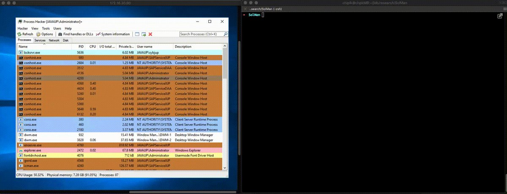</td>
</table></tr>
<table><tr>
<td>Quotes: <code>1</code></td>
<td>Replies: <code>0</code></td>
<td>Retweets: <code>3</code></td>
<td>Favorites: <code>10</code></td>
</table></tr>

---

# netbiosX
**https://twitter.com/netbiosX/status/1349615898638897158 _at 2021-01-14 07:14:39_**
<blockquote>
Red Terroir - Terraform resources for building HTTP, DNS, phishing, and mail server red team infrastructure https://t.co/ThSEfgcgmJ
</blockquote>

* https://github.com/b3n-j4m1n/Red-Terroir

<table><tr>
<td>Quotes: <code>0</code></td>
<td>Replies: <code>0</code></td>
<td>Retweets: <code>54</code></td>
<td>Favorites: <code>173</code></td>
</table></tr>

---

# TheHackersNews
**https://twitter.com/TheHackersNews/status/1349222849362317313 _at 2021-01-13 05:12:49_**
<blockquote>
~~ Patch Tuesday, Jan 2021 ~~

#Microsoft releases Windows updates to patch a total of 83 newly discovered security flaws, including an actively exploited zero-day RCE #vulnerability affecting Defender (CVE-2021-1647) application.

https://t.co/IuW3s7ubiF

#infosec #cybersecurity
</blockquote>

* https://thehackernews.com/2021/01/microsoft-issues-patches-for-defender.html

<table><tr>
<td>Quotes: <code>9</code></td>
<td>Replies: <code>3</code></td>
<td>Retweets: <code>155</code></td>
<td>Favorites: <code>209</code></td>
</table></tr>

---

# jfslowik
**https://twitter.com/jfslowik/status/1349120985195106304 _at 2021-01-12 22:28:02_**
<blockquote>
Hey, for CVE-2021-1647 - I thought if a product auto-updates Microsoft doesn't deem that worth a CVE???

https://t.co/qPoH8QI2zn
</blockquote>

* https://thehackernews.com/2020/12/zero-click-wormable-rce-vulnerability.html#:~:text=Zero%2DClick%20Wormable%20RCE%20Vulnerability%20Reported%20in%20Microsoft%20Teams,-%EE%A0%82December%2007&text=Microsoft%20did%20not%20assign%20a,automatically%20updates%20without%20user's%20interaction.%22

<table><tr>
<td>Quotes: <code>0</code></td>
<td>Replies: <code>2</code></td>
<td>Retweets: <code>8</code></td>
<td>Favorites: <code>36</code></td>
</table></tr>

---

# maddiestone
**https://twitter.com/maddiestone/status/1349085464754409472 _at 2021-01-12 20:06:54_**
<blockquote>
One 0-day from today's Microsoft Patch Tuesday is marked as exploited in the wild: CVE-2021-1647, a RCE in Microsoft Defender. https://t.co/Nnz5z0kCun
</blockquote>

* https://msrc.microsoft.com/update-guide/vulnerability/CVE-2021-1647

<table><tr>
<td>Quotes: <code>14</code></td>
<td>Replies: <code>5</code></td>
<td>Retweets: <code>163</code></td>
<td>Favorites: <code>322</code></td>
</table></tr>

---

# steventseeley
**https://twitter.com/steventseeley/status/1349058761370071041 _at 2021-01-12 18:20:47_**
<blockquote>
A story on how I gained RCE against Microsoft Exchange Online using CVE-2020-16875 and bypassed their patches twice over. Latest patch bypass is unpatched against on-premise deployments!

Making Clouds Rain - Remote Code Execution in Microsoft Office 365: https://t.co/HqVQTRCYF6
</blockquote>

* https://srcincite.io/blog/2021/01/12/making-clouds-rain-rce-in-office-365.html

<table><tr>
<td>Quotes: <code>16</code></td>
<td>Replies: <code>12</code></td>
<td>Retweets: <code>353</code></td>
<td>Favorites: <code>741</code></td>
</table></tr>

---

# campuscodi
**https://twitter.com/campuscodi/status/1349058436907073536 _at 2021-01-12 18:19:30_**
<blockquote>
Microsoft fixes Windows Defender zero-day in January 2021 Patch Tuesday (CVE-2021-1647)

-82 other bugs also fixed this month
-this includes a patch for CVE-2021-1648, a Windows EoP bug disclosed by ZDI last month

https://t.co/wnP0fML0zO https://t.co/Q13Q9OLWBG
</blockquote>

* https://www.zdnet.com/article/microsoft-fixes-defender-zero-day-in-january-2021-patch-tuesday/

<table><tr>
<td></td>
</table></tr>
<table><tr>
<td>Quotes: <code>3</code></td>
<td>Replies: <code>1</code></td>
<td>Retweets: <code>32</code></td>
<td>Favorites: <code>58</code></td>
</table></tr>

---

# tekwizz123
**https://twitter.com/tekwizz123/status/1348857992695963649 _at 2021-01-12 05:03:00_**
<blockquote>
Metasploit module for CVE-2020-17136 has now been landed. Allows for LPE on Windows 10 1803 and later. Features a (as far as I am aware) new DLL hijack that I found using the healthapi.dll DLL and the Microsoft Storage Spaces SMP service https://t.co/AGCKoxNKB7
</blockquote>

* https://github.com/rapid7/metasploit-framework/pull/14585

<table><tr>
<td>Quotes: <code>1</code></td>
<td>Replies: <code>2</code></td>
<td>Retweets: <code>36</code></td>
<td>Favorites: <code>77</code></td>
</table></tr>

---

# qntm
**https://twitter.com/qntm/status/1348743734448558084 _at 2021-01-11 21:28:59_**
<blockquote>
`fastjson` is my JSON library which

* returns `null` on parse and the string "null" on stringification
* every time, regardless of input
* in full compliance with RFC 7159

https://t.co/QHsGgMZP6Y
</blockquote>

* https://github.com/qntm/fastjson

<table><tr>
<td>Quotes: <code>3</code></td>
<td>Replies: <code>6</code></td>
<td>Retweets: <code>36</code></td>
<td>Favorites: <code>123</code></td>
</table></tr>

---

# binitamshah
**https://twitter.com/binitamshah/status/1348672721790541824 _at 2021-01-11 16:46:48_**
<blockquote>
Zerologon : Instantly Become Domain Admin by Subverting Netlogon Cryptography (CVE-2020-1472) : https://t.co/BgyDYgJgda 

More --&gt; Understanding &amp; Exploiting Zerologon : https://t.co/p28eWUjlzu
</blockquote>

* https://www.secura.com/uploads/whitepapers/Zerologon.pdf
* https://www.exploit-db.com/docs/49368

<table><tr>
<td>Quotes: <code>2</code></td>
<td>Replies: <code>0</code></td>
<td>Retweets: <code>24</code></td>
<td>Favorites: <code>60</code></td>
</table></tr>

---

# binitamshah
**https://twitter.com/binitamshah/status/1348668987404505089 _at 2021-01-11 16:31:58_**
<blockquote>
s3viewer : new tool to list contents of a publicly open s3 buckets in order to identify information leaks : https://t.co/gutH3PaCuj
</blockquote>

* https://github.com/SharonBrizinov/s3viewer

<table><tr>
<td>Quotes: <code>0</code></td>
<td>Replies: <code>3</code></td>
<td>Retweets: <code>42</code></td>
<td>Favorites: <code>135</code></td>
</table></tr>

---

# harshtya9i
**https://twitter.com/harshtya9i/status/1348668208979398657 _at 2021-01-11 16:28:52_**
<blockquote>
for blind injection vulnerabilities, SQLi time based, Command injection, code injection, SSTI

https://t.co/709EsC7TNJ

python3 -u https://t.co/AVaz2StTCZ[*] -p payload list

@ofjaaah 

#bugbounty #bugbountytip
</blockquote>

* https://github.com/zeronine9/Blind_SPOT
* http://target.com/?=1

<table><tr>
<td>Quotes: <code>0</code></td>
<td>Replies: <code>0</code></td>
<td>Retweets: <code>63</code></td>
<td>Favorites: <code>115</code></td>
</table></tr>

---

# MaKyOtOx
**https://twitter.com/MaKyOtOx/status/1348557407241330691 _at 2021-01-11 09:08:35_**
<blockquote>
FasterXML jackson-databind RCE #exploit #PoC https://t.co/GcD8ZxtXru #CVE-2020-36179 #CVE-2020-36180 #CVE-2020-36181 #CVE-2020-36182
</blockquote>

* https://github.com/Al1ex/CVE-2020-36179

<table><tr>
<td>Quotes: <code>0</code></td>
<td>Replies: <code>0</code></td>
<td>Retweets: <code>0</code></td>
<td>Favorites: <code>2</code></td>
</table></tr>

---

# CodeColorist
**https://twitter.com/CodeColorist/status/1348174280836583434 _at 2021-01-10 07:46:11_**
<blockquote>
In case you are looking for it, here's the sandbox escape PoC for CVE-2020-9979 (patched before macOS 10.15 dev)
https://t.co/ca0YJFtPi6 It won't compile because the WebKit exploit and shellcode MachO loader are not included
</blockquote>

* https://github.com/ChiChou/sploits/tree/master/CVE-2020-9979

<table><tr>
<td>Quotes: <code>1</code></td>
<td>Replies: <code>0</code></td>
<td>Retweets: <code>7</code></td>
<td>Favorites: <code>43</code></td>
</table></tr>

---

# ptracesecurity
**https://twitter.com/ptracesecurity/status/1347929059322441729 _at 2021-01-09 15:31:45_**
<blockquote>
CVE-2020-11851 Remote Code Execution vulnerability on ArcSight Logger  https://t.co/TaASz7HhXO #Pentesting #RCE #Vulnerability #CyberSecurity #Infosec https://t.co/HQjZwFRIcS
</blockquote>

* https://github.com/ch1nghz/CVE-2020-11851

<table><tr>
<td>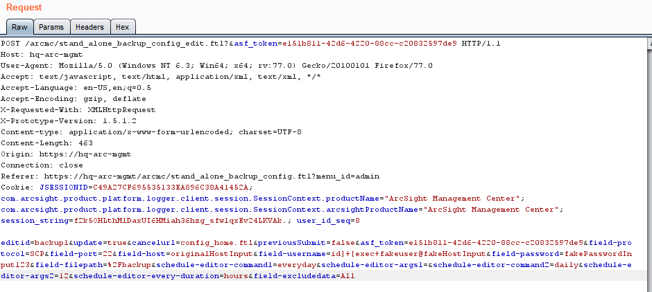</td>
<td>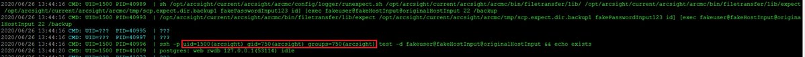</td>
</table></tr>
<table><tr>
<td>Quotes: <code>1</code></td>
<td>Replies: <code>0</code></td>
<td>Retweets: <code>23</code></td>
<td>Favorites: <code>38</code></td>
</table></tr>

---

# cyber_advising
**https://twitter.com/cyber_advising/status/1347878066488569857 _at 2021-01-09 12:09:08_**
<blockquote>
CVE-2020-11851: Remote Code Execution vulnerability on ArcSight Logger (via ArcSight Management Center)

PoC
https://t.co/6Zfole0Nor https://t.co/d88RFGsoFM
</blockquote>

* https://github.com/ch1nghz/CVE-2020-11851

<table><tr>
<td></td>
</table></tr>
<table><tr>
<td>Quotes: <code>1</code></td>
<td>Replies: <code>0</code></td>
<td>Retweets: <code>9</code></td>
<td>Favorites: <code>29</code></td>
</table></tr>

---

# binitamshah
**https://twitter.com/binitamshah/status/1347867980017717251 _at 2021-01-09 11:29:03_**
<blockquote>
Intel Owl: analyze files, domains, IPs in multiple ways from a single API at scale : https://t.co/baMVV4iB7K credits @matte_lodi
</blockquote>

* https://github.com/intelowlproject/IntelOwl

<table><tr>
<td>Quotes: <code>0</code></td>
<td>Replies: <code>2</code></td>
<td>Retweets: <code>40</code></td>
<td>Favorites: <code>148</code></td>
</table></tr>

---

# binitamshah
**https://twitter.com/binitamshah/status/1347867350859583491 _at 2021-01-09 11:26:33_**
<blockquote>
CrackQ : Python based Password cracking GUI for Hashcat : https://t.co/KjVwhUa7kP
</blockquote>

* https://github.com/f0cker/crackq

<table><tr>
<td>Quotes: <code>0</code></td>
<td>Replies: <code>2</code></td>
<td>Retweets: <code>126</code></td>
<td>Favorites: <code>392</code></td>
</table></tr>

---

# binitamshah
**https://twitter.com/binitamshah/status/1347861047634403329 _at 2021-01-09 11:01:30_**
<blockquote>
atom : Shell scripting that will knock your socks off : https://t.co/8AkOykXbCN credits @adamthekiwi99 https://t.co/kYK9VY0BQN
</blockquote>

* https://github.com/adam-mcdaniel/atom

<table><tr>
<td>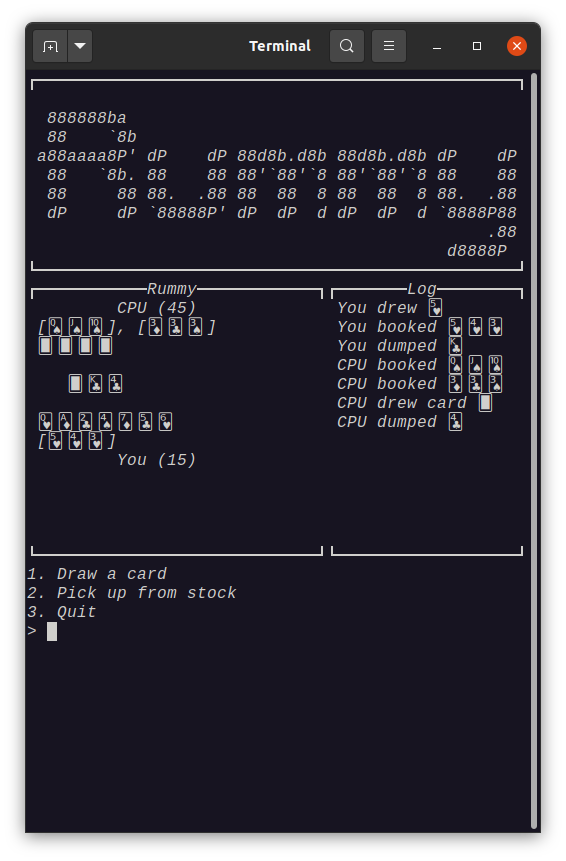</td>
<td>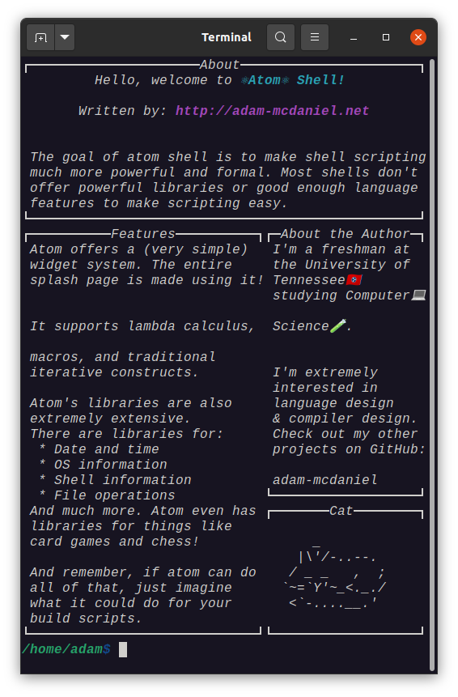</td>
<td>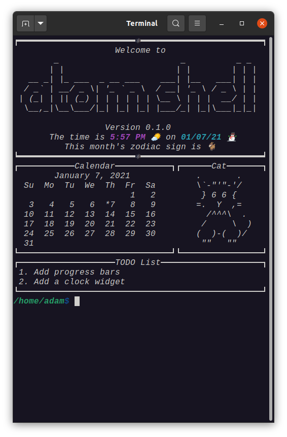</td>
</table></tr>
<table><tr>
<td>Quotes: <code>1</code></td>
<td>Replies: <code>2</code></td>
<td>Retweets: <code>36</code></td>
<td>Favorites: <code>151</code></td>
</table></tr>

---

# binitamshah
**https://twitter.com/binitamshah/status/1347204278050463746 _at 2021-01-07 15:31:44_**
<blockquote>
PyBeacon : a collection of scripts for dealing with Cobalt Strike's encrypted traffic. 

It can encrypt / decrypt beacon metadata, as well as parse symmetric encrypted taskings : https://t.co/tjzMDHq6jV credits @buffaloverflow
</blockquote>

* https://github.com/nccgroup/pybeacon

<table><tr>
<td>Quotes: <code>0</code></td>
<td>Replies: <code>0</code></td>
<td>Retweets: <code>14</code></td>
<td>Favorites: <code>51</code></td>
</table></tr>

---

# yeswehack
**https://twitter.com/yeswehack/status/1347124757452513282 _at 2021-01-07 10:15:45_**
<blockquote>
SSTI, LFI, SQL injections or XSS cheatsheets right inside your browser? 
Yes ! and many more.
Hack-Tools browser extension by Ludovic COULON &amp; Riadh BOUCHAHOUA is nice, give it a try.

https://t.co/hqXSucDc40
</blockquote>

* https://github.com/LasCC/Hack-Tools

<table><tr>
<td>Quotes: <code>4</code></td>
<td>Replies: <code>0</code></td>
<td>Retweets: <code>61</code></td>
<td>Favorites: <code>173</code></td>
</table></tr>

---

# ptracesecurity
**https://twitter.com/ptracesecurity/status/1347042122554339328 _at 2021-01-07 04:47:23_**
<blockquote>
NTFS Remote Code Execution (CVE-2020-17096) Analysis  https://t.co/0tyZqwYp8g  #Pentesting #RCE #Vulnerability #Exploit #CyberSecurity #Infosec https://t.co/WAIoPMYrVp
</blockquote>

* https://blog.zecops.com/vulnerabilities/ntfs-remote-code-execution-cve-2020-17096-analysis/

<table><tr>
<td>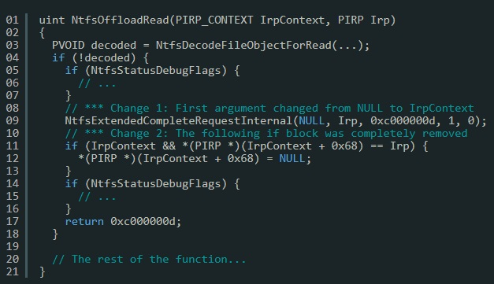</td>
<td>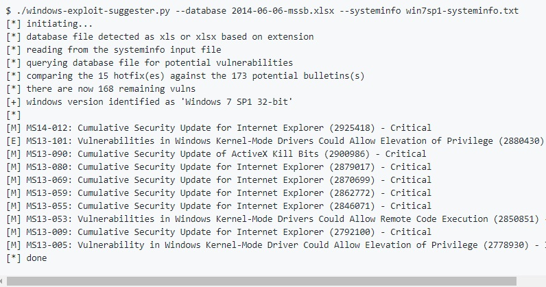</td>
<td>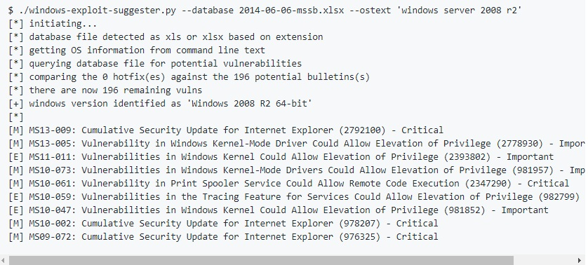</td>
<td>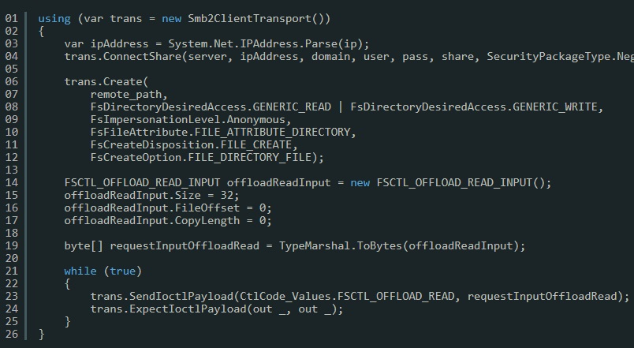</td>
</table></tr>
<table><tr>
<td>Quotes: <code>2</code></td>
<td>Replies: <code>0</code></td>
<td>Retweets: <code>11</code></td>
<td>Favorites: <code>34</code></td>
</table></tr>

---

# ale_sp_brazil
**https://twitter.com/ale_sp_brazil/status/1346703252507787264 _at 2021-01-06 06:20:50_**
<blockquote>
NTFS Remote Code Execution (CVE-2020-17096) Analysis:

https://t.co/QeH0EuzRQu

#exploitation #windows #ntfs #cybersecurity https://t.co/7cTlb5RvpI
</blockquote>

* https://blog.zecops.com/vulnerabilities/ntfs-remote-code-execution-cve-2020-17096-analysis/

<table><tr>
<td>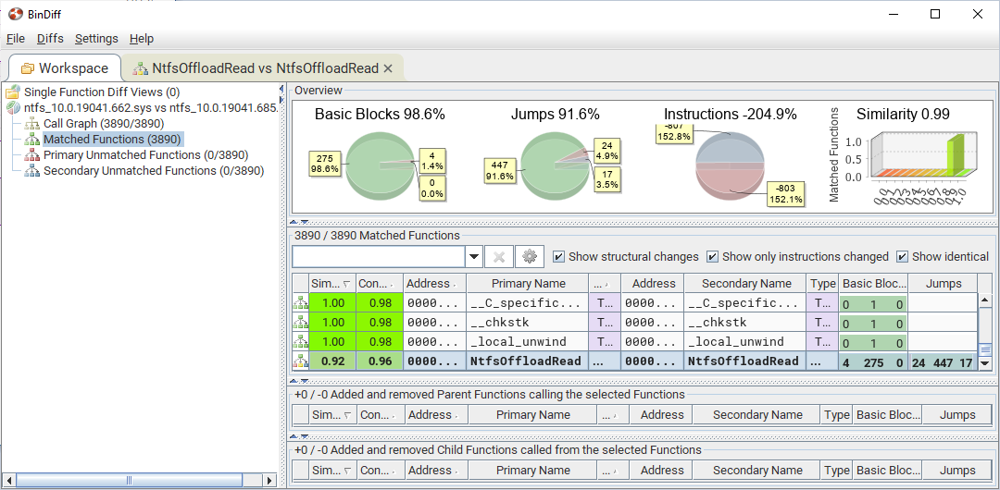</td>
</table></tr>
<table><tr>
<td>Quotes: <code>2</code></td>
<td>Replies: <code>0</code></td>
<td>Retweets: <code>29</code></td>
<td>Favorites: <code>67</code></td>
</table></tr>

---

# ZecOps
**https://twitter.com/ZecOps/status/1346559882825064450 _at 2021-01-05 20:51:08_**
<blockquote>
NTFS Remote Code Execution (CVE-2020-17096) Analysis - ZecOps Blog https://t.co/RvjL9lEEtZ
</blockquote>

* https://blog.zecops.com/vulnerabilities/ntfs-remote-code-execution-cve-2020-17096-analysis/

<table><tr>
<td>Quotes: <code>3</code></td>
<td>Replies: <code>2</code></td>
<td>Retweets: <code>102</code></td>
<td>Favorites: <code>235</code></td>
</table></tr>

---

# yamanoku
**https://twitter.com/yamanoku/status/1346441121224744961 _at 2021-01-05 12:59:13_**
<blockquote>
Reading… Server-Side Request Forgery in Axios · CVE-2020-28168 · GitHub Advisory Database https://t.co/RoOiZFFZGa
</blockquote>

* https://github.com/advisories/GHSA-4w2v-q235-vp99

<table><tr>
<td>Quotes: <code>0</code></td>
<td>Replies: <code>0</code></td>
<td>Retweets: <code>0</code></td>
<td>Favorites: <code>0</code></td>
</table></tr>

---

# wugeej
**https://twitter.com/wugeej/status/1346348017389998081 _at 2021-01-05 06:49:15_**
<blockquote>
CVE-2020-0646 SharePoint RCE

PoC
CallExternalMethodActivity x:Name="foo" 
....System.Diagnostics.Process.Start("cmd.exe",

Google Dork
.sharepoint.com/_vti_bin/webpartpages/asmx -docs -msdn -mdsec

https://t.co/DRGcSRZ6Co https://t.co/w1OI4ADbbJ
</blockquote>

* https://www.mdsec.co.uk/2020/01/code-injection-in-workflows-leading-to-sharepoint-rce-cve-2020-0646/?fbclid=IwAR0b4QZxdQKVYN-ES62rdt9yN5MMzfgpK7DkdkbIq44Flm-ODiuqzeIglUQ

<table><tr>
<td>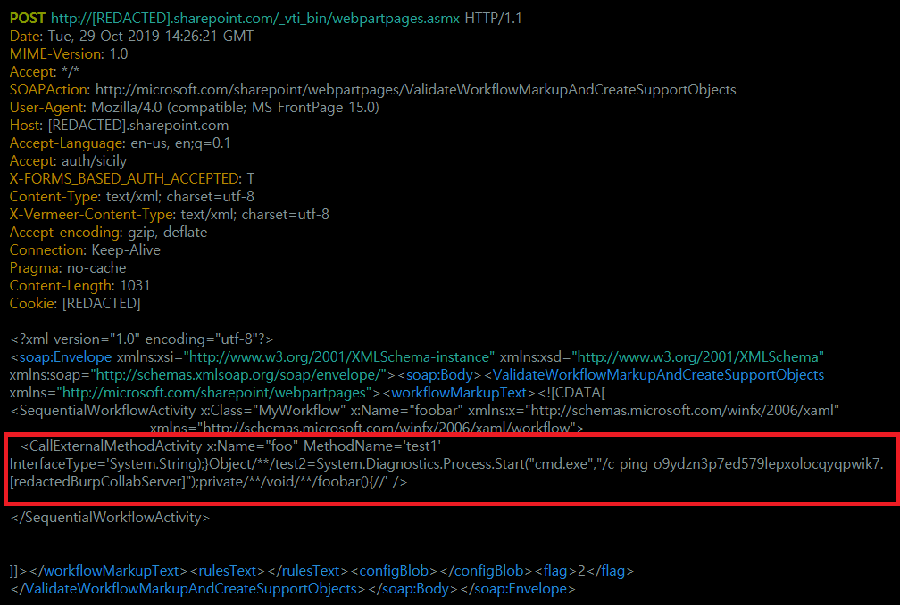</td>
<td>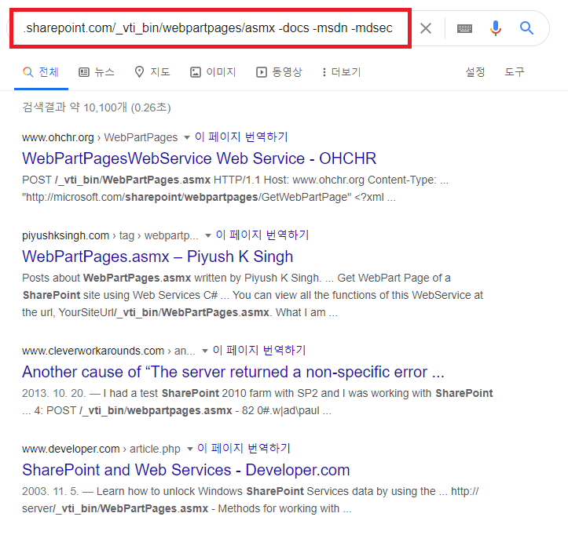</td>
</table></tr>
<table><tr>
<td>Quotes: <code>3</code></td>
<td>Replies: <code>0</code></td>
<td>Retweets: <code>179</code></td>
<td>Favorites: <code>418</code></td>
</table></tr>

---

# Shadow0pz
**https://twitter.com/Shadow0pz/status/1346156099750268931 _at 2021-01-04 18:06:39_**
<blockquote>
@IanColdwater Drops CVE-2021-0231 A Twitter RCE via timing attack thus extending February to 31 days.

So far it appears this exploit POC has been very successful.

😂😂

❤️ Ian you deserve to be verified. Here's hoping it happens this year.
</blockquote>

<table><tr>
<td>Quotes: <code>0</code></td>
<td>Replies: <code>1</code></td>
<td>Retweets: <code>4</code></td>
<td>Favorites: <code>36</code></td>
</table></tr>

---

# G0ldenGunSec
**https://twitter.com/G0ldenGunSec/status/1345410255069581318 _at 2021-01-02 16:42:55_**
<blockquote>
Cobalt Strike BOF to enum processes with the CLR loaded, allows you to identify a spawnTo target for execute-assembly without having to start any additional processes: https://t.co/BPmk2U0wTT 

Due to BOF memory limitations, will only currently enum up to 325 processes at a time https://t.co/UtEEP8cqdy
</blockquote>

* https://gist.github.com/G0ldenGunSec/8ca0e853dd5637af2881697f8de6aecc

<table><tr>
<td>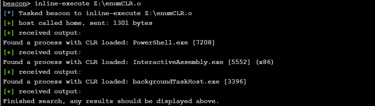</td>
</table></tr>
<table><tr>
<td>Quotes: <code>4</code></td>
<td>Replies: <code>1</code></td>
<td>Retweets: <code>102</code></td>
<td>Favorites: <code>214</code></td>
</table></tr>

---

# KLINIX5
**https://twitter.com/KLINIX5/status/1345063704035995649 _at 2021-01-01 17:45:51_**
<blockquote>
I just created a GUI tool which exploit another 0day arbitrary file overwrite tool when plugging USB sticks it can be used to break windows installation with just a simple USB stick
The tool is open source so enjoy :) 
https://t.co/HmvaVD76W8
</blockquote>

* https://github.com/klinix5/WinUSBKiller

<table><tr>
<td>Quotes: <code>0</code></td>
<td>Replies: <code>2</code></td>
<td>Retweets: <code>13</code></td>
<td>Favorites: <code>52</code></td>
</table></tr>

---

