# TheHackersNews
**https://twitter.com/TheHackersNews/status/1377251617985110029 _at 2021-03-31 13:29:08_**
<blockquote>
VMware releases security patches for newly-discovered critical server-side request forgery (CVE-2021-21975) and Arbitrary file write (CVE-2021-21983) vulnerabilities in its vRealize Operations Manager API.

https://t.co/ihMkKbdN0L
</blockquote>

* https://www.vmware.com/security/advisories/VMSA-2021-0004.html

<table><tr>
<td>Quotes: <code>3</code></td>
<td>Replies: <code>2</code></td>
<td>Retweets: <code>55</code></td>
<td>Favorites: <code>74</code></td>
</tr></table>

---

# TheHackersNews
**https://twitter.com/TheHackersNews/status/1377251079390339075 _at 2021-03-31 13:27:00_**
<blockquote>
There has been a new #vulnerability (CVE-2021-27137) reported in DD-WRT that could allow an unauthenticated attacker to overflow an internal buffer used by UPNP and trigger code execution attacks.

https://t.co/A2znJXSFGk
</blockquote>

* https://ssd-disclosure.com/ssd-advisory-dd-wrt-upnp-buffer-overflow/

<table><tr>
<td>Quotes: <code>2</code></td>
<td>Replies: <code>1</code></td>
<td>Retweets: <code>59</code></td>
<td>Favorites: <code>80</code></td>
</tr></table>

---

# jedisct1
**https://twitter.com/jedisct1/status/1377204238758076418 _at 2021-03-31 10:20:52_**
<blockquote>
RT @waleedassar: Here is POC for CVE-2021-1699.

https://t.co/qJ4CxqmLoW
</blockquote>

* https://github.com/waleedassar/CVE-2021-1699

<table><tr>
<td>Quotes: <code>0</code></td>
<td>Replies: <code>0</code></td>
<td>Retweets: <code>27</code></td>
<td>Favorites: <code>0</code></td>
</tr></table>

---

# waleedassar
**https://twitter.com/waleedassar/status/1377176682826592258 _at 2021-03-31 08:31:22_**
<blockquote>
Here is POC for CVE-2021-1699.

https://t.co/qJ4CxqmLoW
</blockquote>

* https://github.com/waleedassar/CVE-2021-1699

<table><tr>
<td>Quotes: <code>0</code></td>
<td>Replies: <code>3</code></td>
<td>Retweets: <code>27</code></td>
<td>Favorites: <code>92</code></td>
</tr></table>

---

# ptracesecurity
**https://twitter.com/ptracesecurity/status/1377121999231705088 _at 2021-03-31 04:54:04_**
<blockquote>
The report and the exploit of CVE-2021-26943, the kernel-to-SMM local privilege escalation vulnerability in ASUS UX360CA BIOS version 303.  https://t.co/aqIjklX9td  #Pentestring #Vulerability #Exploit #CyberSecurity #Infosec https://t.co/b4n8qurMjr
</blockquote>

* https://github.com/tandasat/SmmExploit

<table><tr>
<td>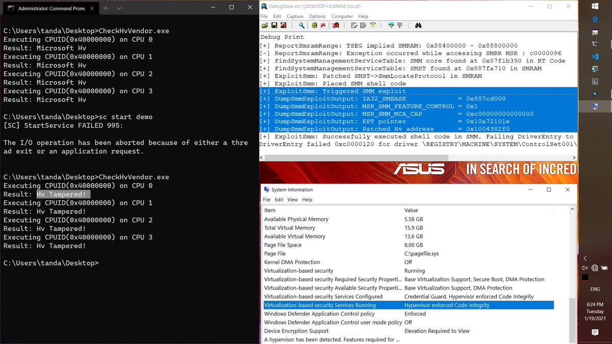</td>
<td>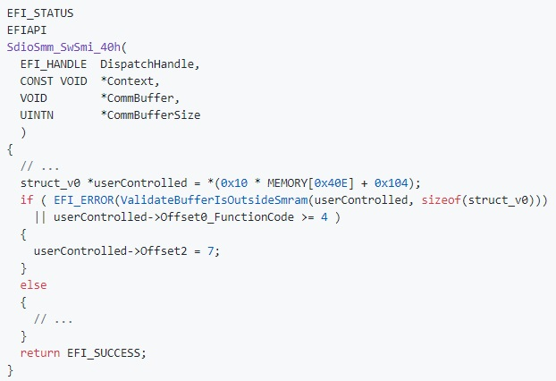</td>
</table></tr>
<table><tr>
<td>Quotes: <code>0</code></td>
<td>Replies: <code>0</code></td>
<td>Retweets: <code>6</code></td>
<td>Favorites: <code>8</code></td>
</tr></table>

---

# binitamshah
**https://twitter.com/binitamshah/status/1376916067222646787 _at 2021-03-30 15:15:46_**
<blockquote>
Spying on Microcontrollers using Current Sensing and embedded TinyML models : https://t.co/NoBBhdsP9V credits @LargeCardinal https://t.co/D8FXZcTAB7
</blockquote>

* https://github.com/Santandersecurityresearch/CurrentSense-TinyML

<table><tr>
<td>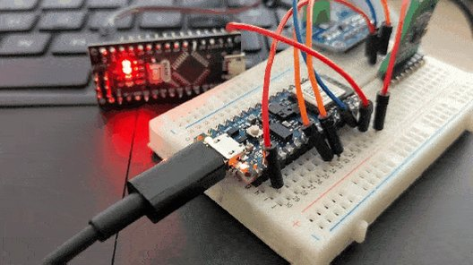</td>
</table></tr>
<table><tr>
<td>Quotes: <code>0</code></td>
<td>Replies: <code>4</code></td>
<td>Retweets: <code>20</code></td>
<td>Favorites: <code>65</code></td>
</tr></table>

---

# binitamshah
**https://twitter.com/binitamshah/status/1376914738924281862 _at 2021-03-30 15:10:30_**
<blockquote>
A FREE comprehensive reverse engineering course covering x86, x64, 32-bit ARM &amp; 64-bit ARM architectures. : https://t.co/a0JKJykz4s credits @mytechnotalent

Reversing for everyone  : https://t.co/05yD1DsD7X  (pdf / credits : @0xInfection)
</blockquote>

* https://github.com/mytechnotalent/Reverse-Engineering
* https://0xinfection.github.io/reversing/reversing-for-everyone.pdf

<table><tr>
<td>Quotes: <code>3</code></td>
<td>Replies: <code>10</code></td>
<td>Retweets: <code>274</code></td>
<td>Favorites: <code>667</code></td>
</tr></table>

---

# binitamshah
**https://twitter.com/binitamshah/status/1376913206740807680 _at 2021-03-30 15:04:24_**
<blockquote>
Speculating The Entire X86-64 Instruction Set In Seconds With This One Weird Trick : https://t.co/IuTT4r2UIS credits @_can1357

Exploration of x86-64 ISA using speculative execution. : https://t.co/3dC0XIb7fU
</blockquote>

* https://blog.can.ac/2021/03/22/speculating-x86-64-isa-with-one-weird-trick/
* https://github.com/can1357/haruspex/

<table><tr>
<td>Quotes: <code>0</code></td>
<td>Replies: <code>0</code></td>
<td>Retweets: <code>7</code></td>
<td>Favorites: <code>38</code></td>
</tr></table>

---

# binitamshah
**https://twitter.com/binitamshah/status/1376874462491013123 _at 2021-03-30 12:30:27_**
<blockquote>
Fingerprinting Tor relays with JARM &amp; RECAP :  https://t.co/ew83SGUrzV

RECAP is a tool that generates JARM hashes for all known Tor relays : https://t.co/WvLyca11jE

https://t.co/P4Prll6geH : Garlic keeps track of various bits of metadata about sites running on the Tor network
</blockquote>

* https://chaos.institute/fingeprinting-tor-relays-with-jarm/
* https://github.com/1cbf94bc-bc47-42b9-9197-244437fad1e6/recap
* https://osint.party/

<table><tr>
<td>Quotes: <code>1</code></td>
<td>Replies: <code>0</code></td>
<td>Retweets: <code>22</code></td>
<td>Favorites: <code>35</code></td>
</tr></table>

---

# binitamshah
**https://twitter.com/binitamshah/status/1376872289816301571 _at 2021-03-30 12:21:49_**
<blockquote>
Moderna mRNA sequence released to GitHub : https://t.co/QTj9KzO1F8 (pdf)
</blockquote>

* https://github.com/NAalytics/Assemblies-of-putative-SARS-CoV2-spike-encoding-mRNA-sequences-for-vaccines-BNT-162b2-and-mRNA-1273/blob/main/Assemblies%20of%20putative%20SARS-CoV2-spike-encoding%20mRNA%20sequences%20for%20vaccines%20BNT-162b2%20and%20mRNA-1273.docx.pdf

<table><tr>
<td>Quotes: <code>1</code></td>
<td>Replies: <code>0</code></td>
<td>Retweets: <code>30</code></td>
<td>Favorites: <code>68</code></td>
</tr></table>

---

# FAMASoon
**https://twitter.com/FAMASoon/status/1376532563473264649 _at 2021-03-29 13:51:52_**
<blockquote>
🧐🧐🧐🧐🧐🧐 
» tandasat/SmmExploit: The report and the exploit of CVE-2021-26943, the kernel-to-SMM local privilege escalation vulnerability in ASUS UX360CA BIOS version 303. https://t.co/gHW0IJgCHQ
</blockquote>

* https://github.com/tandasat/SmmExploit

<table><tr>
<td>Quotes: <code>0</code></td>
<td>Replies: <code>0</code></td>
<td>Retweets: <code>0</code></td>
<td>Favorites: <code>0</code></td>
</tr></table>

---

# binitamshah
**https://twitter.com/binitamshah/status/1376529651472891912 _at 2021-03-29 13:40:18_**
<blockquote>
Extract owner's information of any public Google document : https://t.co/MjOCwrFVrb 

It's working on :

Google Docs
Google Spreadsheets
Google Slides
Google Drawning
Google My Maps
Google Apps Script
Google Jamboard 

Credits @MalfratsInd https://t.co/rJ9VItT2dR
</blockquote>

* https://github.com/Malfrats/xeuledoc

<table><tr>
<td>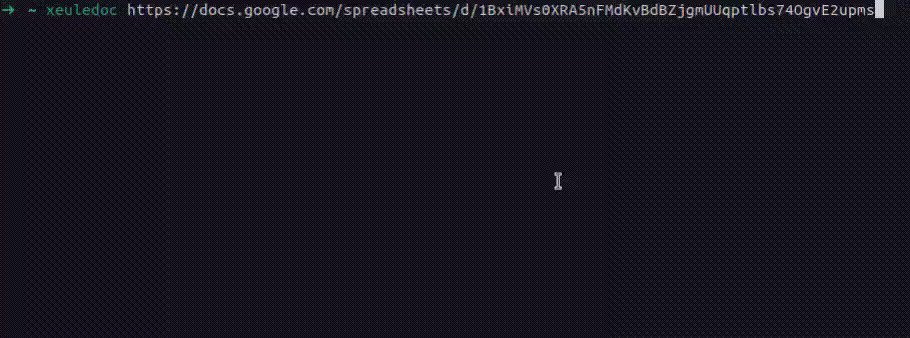</td>
</table></tr>
<table><tr>
<td>Quotes: <code>2</code></td>
<td>Replies: <code>1</code></td>
<td>Retweets: <code>54</code></td>
<td>Favorites: <code>144</code></td>
</tr></table>

---

# standa_t
**https://twitter.com/standa_t/status/1376525000002334725 _at 2021-03-29 13:21:49_**
<blockquote>
New blog about using DCI with WinDbg and debugging  SMM code
https://t.co/1Z6ig5hMGA

Plus, accompanying my first kernel-to-SMM LPE exploit &amp; demo
https://t.co/DKWOXKDCN7 https://t.co/6Tuqp7PGpG
</blockquote>

* https://standa-note.blogspot.com/2021/03/debugging-system-with-dci-and-windbg.html
* https://github.com/tandasat/SmmExploit

<table><tr>
<td>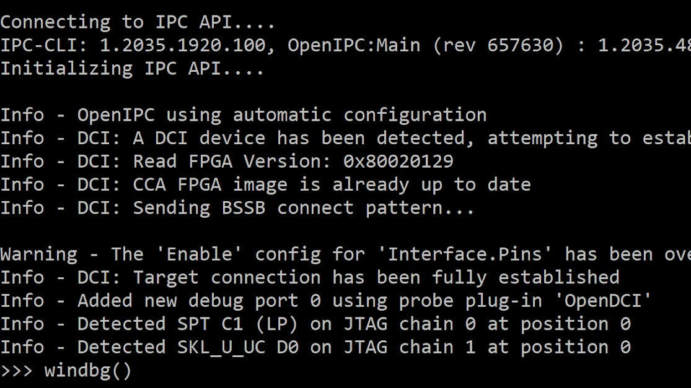</td>
</table></tr>
<table><tr>
<td>Quotes: <code>4</code></td>
<td>Replies: <code>5</code></td>
<td>Retweets: <code>142</code></td>
<td>Favorites: <code>299</code></td>
</tr></table>

---

# binitamshah
**https://twitter.com/binitamshah/status/1376517377865576451 _at 2021-03-29 12:51:31_**
<blockquote>
Limelighter - A tool for generating fake code signing certificates or signing real ones : https://t.co/76nkv0e2Dc credits @Tyl0us
</blockquote>

* https://github.com/Tylous/Limelighter

<table><tr>
<td>Quotes: <code>1</code></td>
<td>Replies: <code>0</code></td>
<td>Retweets: <code>9</code></td>
<td>Favorites: <code>38</code></td>
</tr></table>

---

# akaclandestine
**https://twitter.com/akaclandestine/status/1376452621075107845 _at 2021-03-29 08:34:12_**
<blockquote>
#Threat_Research
Google Chrome Renderer RCE (PoC for CVE-2020-15972)
https://t.co/EFyJnhmz7J
]-&gt; Full exploit:
https://t.co/ftrf55DRRu
</blockquote>

* https://securitylab.github.com/research/one_day_short_of_a_fullchain_renderer
* https://github.com/github/securitylab/tree/main/SecurityExploits/Chrome/blink/CVE-2020-15972

<table><tr>
<td>Quotes: <code>0</code></td>
<td>Replies: <code>0</code></td>
<td>Retweets: <code>1</code></td>
<td>Favorites: <code>0</code></td>
</tr></table>

---

# 0xdea
**https://twitter.com/0xdea/status/1376393924034576386 _at 2021-03-29 04:40:58_**
<blockquote>
Universal “netmask” npm package, used by 270,000+ projects, vulnerable to octal input data: server-side request forgery, remote file inclusion, local file inclusion, and more (CVE-2021-28918)

https://t.co/vU5W4udWua
</blockquote>

* https://sick.codes/universal-netmask-npm-package-used-by-270000-projects-vulnerable-to-octal-input-data-server-side-request-forgery-remote-file-inclusion-local-file-inclusion-and-more-cve-2021-28918/

<table><tr>
<td>Quotes: <code>2</code></td>
<td>Replies: <code>0</code></td>
<td>Retweets: <code>42</code></td>
<td>Favorites: <code>51</code></td>
</tr></table>

---

# kwestin
**https://twitter.com/kwestin/status/1376332468266000385 _at 2021-03-29 00:36:46_**
<blockquote>
Universal "netmask" npm package, used by 270,000+ projects, vulnerable to octal input data: server-side request forgery, remote file inclusion, local file inclusion, and more (CVE-2021-28918)  https://t.co/4MayUbmGXQ
</blockquote>

* https://sick.codes/universal-netmask-npm-package-used-by-270000-projects-vulnerable-to-octal-input-data-server-side-request-forgery-remote-file-inclusion-local-file-inclusion-and-more-cve-2021-28918/

<table><tr>
<td>Quotes: <code>2</code></td>
<td>Replies: <code>0</code></td>
<td>Retweets: <code>30</code></td>
<td>Favorites: <code>109</code></td>
</tr></table>

---

# TheHackersNews
**https://twitter.com/TheHackersNews/status/1375701186976702464 _at 2021-03-27 06:48:16_**
<blockquote>
Update your #iPhone, iPad, Apple Watch now!!!

Apple released a URGENT PATCH UPDATE for all its devices yesterday to fix another zero-day #vulnerability (CVE-2021-1879) that is being exploited in the wild.

Find details here: https://t.co/JJQFBzgLIn

#infosec #cybersecurity #tech
</blockquote>

* https://thehackernews.com/2021/03/apple-issues-urgent-patch-update-for.html

<table><tr>
<td>Quotes: <code>29</code></td>
<td>Replies: <code>4</code></td>
<td>Retweets: <code>312</code></td>
<td>Favorites: <code>329</code></td>
</tr></table>

---

# 0xLupin
**https://twitter.com/0xLupin/status/1375356952218337280 _at 2021-03-26 08:00:24_**
<blockquote>
If you like XSS, and do not know where to start WAF Bypassing, here is a link for you:

https://t.co/NT0eYMGAHn

A lot of people are focusing on bypassing the HTML blockers but not the Javascript. This link can give you at least 3 powerful WAF bypasses 🤟
</blockquote>

* https://github.com/denysdovhan/wtfjs

<table><tr>
<td>Quotes: <code>1</code></td>
<td>Replies: <code>1</code></td>
<td>Retweets: <code>41</code></td>
<td>Favorites: <code>138</code></td>
</tr></table>

---

# cyber_advising
**https://twitter.com/cyber_advising/status/1375253419167002628 _at 2021-03-26 01:09:00_**
<blockquote>
CVE-2021-26295: Apache OFBiz has unsafe deserialization prior to 17.12.06. An unauthenticated attacker can use this vulnerability to successfully take over Apache OFBiz.

PoC
https://t.co/ShWPytI4qH https://t.co/tbitgMnu2k
</blockquote>

* https://github.com/yumusb/CVE-2021-26295-POC

<table><tr>
<td>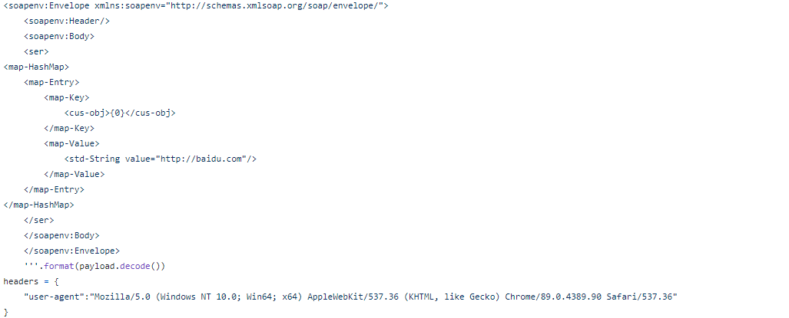</td>
</table></tr>
<table><tr>
<td>Quotes: <code>1</code></td>
<td>Replies: <code>0</code></td>
<td>Retweets: <code>13</code></td>
<td>Favorites: <code>28</code></td>
</tr></table>

---

# HackingTeam1
**https://twitter.com/HackingTeam1/status/1375092075985788930 _at 2021-03-25 14:27:53_**
<blockquote>
Android Kernel Privilege Escalation (CVE-2020-11239)
Blog: https://t.co/rPn58nVMHm
Exploit: https://t.co/5w3CeAZqSa
</blockquote>

* https://securitylab.github.com/research/one_day_short_of_a_fullchain_android/
* https://github.com/github/securitylab/tree/main/SecurityExploits/Android/Qualcomm/CVE-2020-11239

<table><tr>
<td>Quotes: <code>0</code></td>
<td>Replies: <code>0</code></td>
<td>Retweets: <code>1</code></td>
<td>Favorites: <code>2</code></td>
</tr></table>

---

# 0dayCTF
**https://twitter.com/0dayCTF/status/1374856607272697856 _at 2021-03-24 22:52:13_**
<blockquote>
My personal favorite LFI lists
-
https://t.co/otCNhVdxPb
-
Repo by: @pentest_swissky 
-
#LFI #ctftools #ctf #hacktricks #cybersecuritytips #imagepayload #localfileinclusion #hacking #bugbounty #tryhackme #swissky #swisskyrepo #payloadallthethings https://t.co/AHnB7ojgsJ
</blockquote>

* https://github.com/swisskyrepo/PayloadsAllTheThings/tree/master/File%20Inclusion/Intruders

<table><tr>
<td>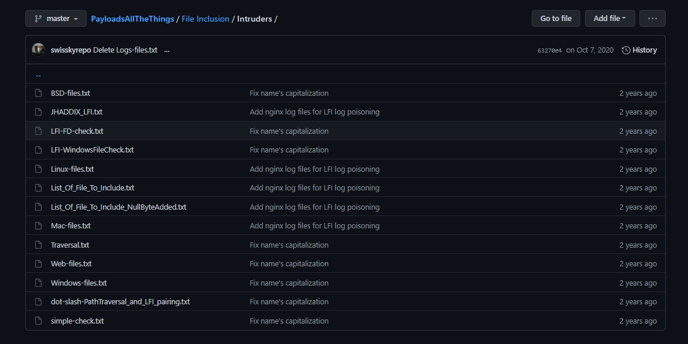</td>
</table></tr>
<table><tr>
<td>Quotes: <code>0</code></td>
<td>Replies: <code>1</code></td>
<td>Retweets: <code>55</code></td>
<td>Favorites: <code>159</code></td>
</tr></table>

---

# JanmeyjaySharma
**https://twitter.com/JanmeyjaySharma/status/1374521379345768457 _at 2021-03-24 00:40:08_**
<blockquote>
Unauthenticated Remote Command Execution Vulnerability [CVE-2021-22986]  - POC 😎🤓

#RCE #Exploit #ItTakesACrowd @Bugcrowd @Hacker0x01 https://t.co/adbDsEzDUi
</blockquote>

<table><tr>
<td>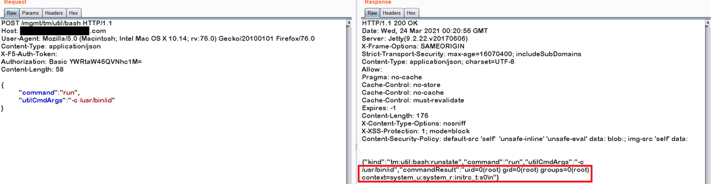</td>
</table></tr>
<table><tr>
<td>Quotes: <code>1</code></td>
<td>Replies: <code>4</code></td>
<td>Retweets: <code>44</code></td>
<td>Favorites: <code>203</code></td>
</tr></table>

---

# maddiestone
**https://twitter.com/maddiestone/status/1374438223011737605 _at 2021-03-23 19:09:42_**
<blockquote>
There's been lots of great info published about the in-the-wild Exchange exploits, I'd love if anyone wanted to submit root cause analyses for those exploits 😄

https://t.co/kVZXrB3whg
</blockquote>

* https://github.com/googleprojectzero/0days-in-the-wild

<table><tr>
<td>Quotes: <code>1</code></td>
<td>Replies: <code>1</code></td>
<td>Retweets: <code>19</code></td>
<td>Favorites: <code>65</code></td>
</tr></table>

---

# futurevuls
**https://twitter.com/futurevuls/status/1374262676000440322 _at 2021-03-23 07:32:09_**
<blockquote>
F5から公開されたBIG-IP製品の脆弱性 CVE-2021-22986 ですが、今朝頃にPoCが公開されました。
未対応の方、緩和策が実施されていない方、は対応をお早めにお願いします。
- RCE：認証されていない第三者が任意のコードを実行可能です。
- 既に悪用の兆候はあるため、早急な対応が必要です。
</blockquote>

<table><tr>
<td>Quotes: <code>2</code></td>
<td>Replies: <code>2</code></td>
<td>Retweets: <code>29</code></td>
<td>Favorites: <code>52</code></td>
</tr></table>

---

# misaelban
**https://twitter.com/misaelban/status/1374203628349755392 _at 2021-03-23 03:37:31_**
<blockquote>
#F5 BIG-IP iControl REST unauthenticated  #vulnerability RCE CVE-2021-22986 nuclei templates.   #exploit available  #0day #infosecurity #hacking #cybersecurity  #pentesting
@CVEannounce @CVEnew @F5_latam  
https://t.co/V9PYn3OUCr https://t.co/6mH3lxVPt0
</blockquote>

* https://github.com/projectdiscovery/nuclei-templates/tree/master/cves/2021

<table><tr>
<td>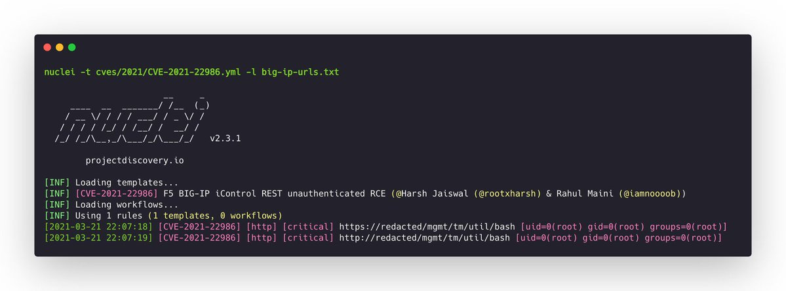</td>
</table></tr>
<table><tr>
<td>Quotes: <code>1</code></td>
<td>Replies: <code>0</code></td>
<td>Retweets: <code>13</code></td>
<td>Favorites: <code>6</code></td>
</tr></table>

---

# 0dayCTF
**https://twitter.com/0dayCTF/status/1374174886957084674 _at 2021-03-23 01:43:18_**
<blockquote>
ProxyLogon Exploit PoC
-
https://t.co/rmgJeZfihc
-
Creator: @haus3c
-
#ctf #reverseshell #webshell #bugbounty #tryhackme #hacktricks #bugtips #rce #netcat #proxylogon #hackerhashtags #cybersecurity #cybersecuritytips #staylegal #hackerone #bugcrowd https://t.co/WG7rBCBQvD
</blockquote>

* https://github.com/hausec/ProxyLogon

<table><tr>
<td>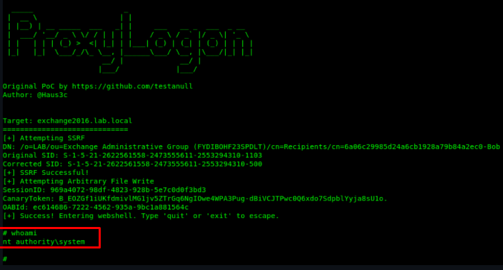</td>
</table></tr>
<table><tr>
<td>Quotes: <code>0</code></td>
<td>Replies: <code>0</code></td>
<td>Retweets: <code>15</code></td>
<td>Favorites: <code>37</code></td>
</tr></table>

---

# coder_rc
**https://twitter.com/coder_rc/status/1374028438214873091 _at 2021-03-22 16:01:22_**
<blockquote>
CVE-2021-26069:
Affected versions of Atlassian Jira Server and Data Center allow unauthenticated remote attackers to download temporary files and enumerate project keys via an Information Disclosure vulnerability in the /rest/api/1.0/issues/{id}/ActionsAndOperations API endpoint.
</blockquote>

<table><tr>
<td>Quotes: <code>1</code></td>
<td>Replies: <code>2</code></td>
<td>Retweets: <code>13</code></td>
<td>Favorites: <code>49</code></td>
</tr></table>

---

# akaclandestine
**https://twitter.com/akaclandestine/status/1373925694229610496 _at 2021-03-22 09:13:06_**
<blockquote>
Chrome V8 Exploit
https://t.co/6FXXwXpwmZ

+ PoC for CVE-2019-17571:
Apache Log4j Deserialization RCE
https://t.co/HGdLZmLJpW
</blockquote>

* https://gist.github.com/hkraw/5ba2df87925fb7de8acc3c4bcec4774e
* https://0xsapra.github.io/website/CVE-2019-17571

<table><tr>
<td>Quotes: <code>0</code></td>
<td>Replies: <code>0</code></td>
<td>Retweets: <code>1</code></td>
<td>Favorites: <code>0</code></td>
</tr></table>

---

# TheHackersNews
**https://twitter.com/TheHackersNews/status/1373918661988159494 _at 2021-03-22 08:45:09_**
<blockquote>
A high severity RCE #vulnerability (CVE-2021-26295) has been found in Apache OFBiz that could let unauthenticated, remote hackers seize control of the enterprise resource planning (ERP) systems.

Details: https://t.co/E9uAMAqz5y

Patch released, update your software immediately.
</blockquote>

* https://thehackernews.com/2021/03/critical-rce-vulnerability-found-in.html

<table><tr>
<td>Quotes: <code>2</code></td>
<td>Replies: <code>2</code></td>
<td>Retweets: <code>72</code></td>
<td>Favorites: <code>113</code></td>
</tr></table>

---

# ptracesecurity
**https://twitter.com/ptracesecurity/status/1373858846058418179 _at 2021-03-22 04:47:28_**
<blockquote>
RCE Exploit in BIG IP https://t.co/RhxpSmUlV0  #Pentesting #RCE #Exploit #CyberSecurity #Infosec https://t.co/CExHKMHfHu
</blockquote>

* https://github.com/h4x0r-dz/RCE-Exploit-in-BIG-IP

<table><tr>
<td></td>
<td>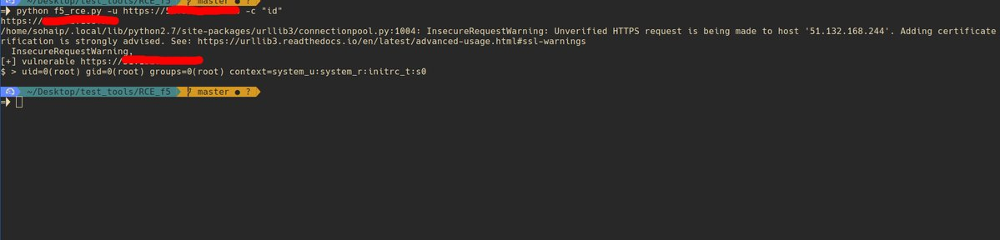</td>
</table></tr>
<table><tr>
<td>Quotes: <code>2</code></td>
<td>Replies: <code>1</code></td>
<td>Retweets: <code>52</code></td>
<td>Favorites: <code>133</code></td>
</tr></table>

---

# pdnuclei
**https://twitter.com/pdnuclei/status/1373677326077108227 _at 2021-03-21 16:46:10_**
<blockquote>
F5 BIG-IP iControl REST unauthenticated RCE — (CVE-2021-22986) nuclei templates by @iamnoooob @rootxharsh 

Template details —https://t.co/J94Jj0E3eY

#hackwithautomation #appsec #pentest https://t.co/ggV2pjECN2
</blockquote>

* https://github.com/projectdiscovery/nuclei-templates/blob/master/cves/2021/CVE-2021-22986.yml

<table><tr>
<td>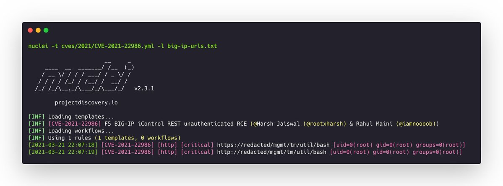</td>
</table></tr>
<table><tr>
<td>Quotes: <code>3</code></td>
<td>Replies: <code>5</code></td>
<td>Retweets: <code>110</code></td>
<td>Favorites: <code>377</code></td>
</tr></table>

---

# elhackernet
**https://twitter.com/elhackernet/status/1373668312853446662 _at 2021-03-21 16:10:21_**
<blockquote>
RCE Exploit in BIG-IP. 
CVE-2021-22986, CVE-2021-22987

python f5_rce.py -u https://ip_target
python f5_rce.py -f ip_list.txt
python f5_rce.py -c "$commend"

POC: https://t.co/Ds8vdwL1V4 https://t.co/eqt9XfOjOP
</blockquote>

* https://github.com/h4x0r-dz/RCE-Exploit-in-BIG-IP

<table><tr>
<td></td>
<td></td>
</table></tr>
<table><tr>
<td>Quotes: <code>0</code></td>
<td>Replies: <code>0</code></td>
<td>Retweets: <code>2</code></td>
<td>Favorites: <code>3</code></td>
</tr></table>

---

# Anastasis_King
**https://twitter.com/Anastasis_King/status/1373607104225935362 _at 2021-03-21 12:07:08_**
<blockquote>
[CVE-2021-22986, CVE-2021-22987] F5 Big-IP RCE Exploit PoC
Cc @h4x0r_dz

https://t.co/XDSG9M8zDV
</blockquote>

* https://github.com/h4x0r-dz/RCE-Exploit-in-BIG-IP

<table><tr>
<td>Quotes: <code>0</code></td>
<td>Replies: <code>0</code></td>
<td>Retweets: <code>0</code></td>
<td>Favorites: <code>0</code></td>
</tr></table>

---

# jedisct1
**https://twitter.com/jedisct1/status/1373551043787771904 _at 2021-03-21 08:24:22_**
<blockquote>
RT @h4x0r_dz: RCE Exploit in BIG-IP. 
CVE-2021-22986, CVE-2021-22987

python f5_rce.py -u https://ip_target
python f5_rce.py -f ip_list.txt…
</blockquote>

<table><tr>
<td>Quotes: <code>0</code></td>
<td>Replies: <code>0</code></td>
<td>Retweets: <code>550</code></td>
<td>Favorites: <code>0</code></td>
</tr></table>

---

# elhackernet
**https://twitter.com/elhackernet/status/1373367993393090560 _at 2021-03-20 20:17:00_**
<blockquote>
Top 25 vulnerabilidades web:
XSS - Cross-Site Scripting
SSRF - Server-Side Request Forgery 
SQLi - SQL Injection 
RCE - Remote Code Execution 
LFI - Local File Inclusion
Open redirect
https://t.co/1e8Et7DOtJ https://t.co/KofyemML4l
</blockquote>

* https://github.com/lutfumertceylan/top25-parameter

<table><tr>
<td>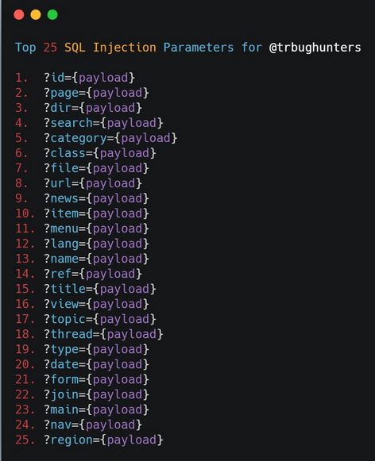</td>
<td>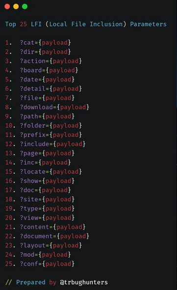</td>
<td>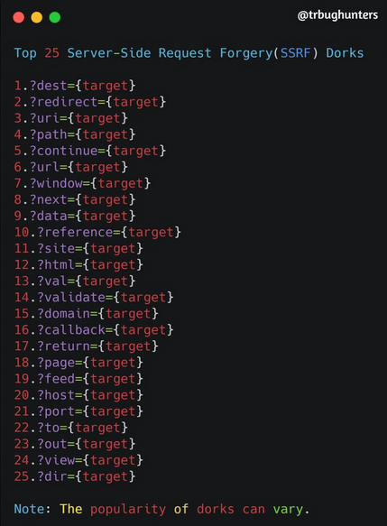</td>
<td>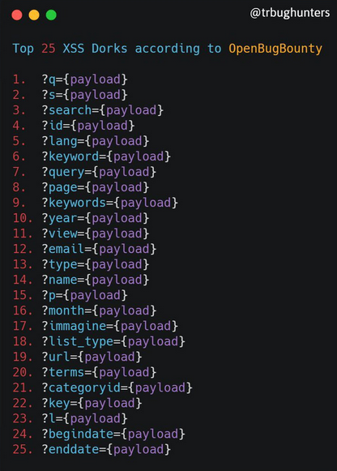</td>
</table></tr>
<table><tr>
<td>Quotes: <code>2</code></td>
<td>Replies: <code>1</code></td>
<td>Retweets: <code>120</code></td>
<td>Favorites: <code>285</code></td>
</tr></table>

---

# h4x0r_dz
**https://twitter.com/h4x0r_dz/status/1373365080876810246 _at 2021-03-20 20:05:25_**
<blockquote>
RCE Exploit in BIG-IP. 
CVE-2021-22986, CVE-2021-22987

python f5_rce.py -u https://ip_target
python f5_rce.py -f ip_list.txt
python f5_rce.py -c "$commend"

POC: https://t.co/mkjCuPVR0y

#bugbountytip #BugBounty #infosec https://t.co/uHZqdzTFUi
</blockquote>

* https://github.com/h4x0r-dz/RCE-Exploit-in-BIG-IP

<table><tr>
<td></td>
<td>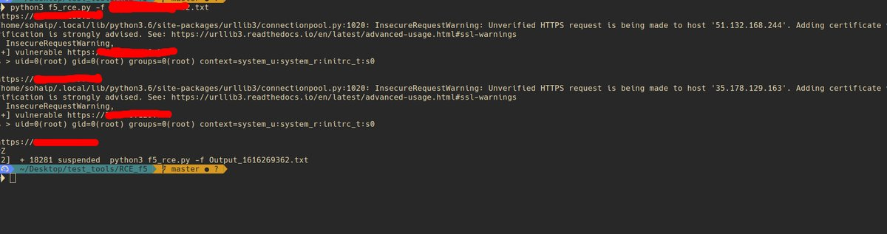</td>
</table></tr>
<table><tr>
<td>Quotes: <code>15</code></td>
<td>Replies: <code>8</code></td>
<td>Retweets: <code>550</code></td>
<td>Favorites: <code>1320</code></td>
</tr></table>

---

# 1ZRR4H
**https://twitter.com/1ZRR4H/status/1373206181955653632 _at 2021-03-20 09:34:01_**
<blockquote>
F5 BIG-IP iControl Unauthenticated Remote Command Execution (CVE-2021-22986) POC 😎

#RCE #Exploit https://t.co/87fvLVu74I
</blockquote>

<table><tr>
<td>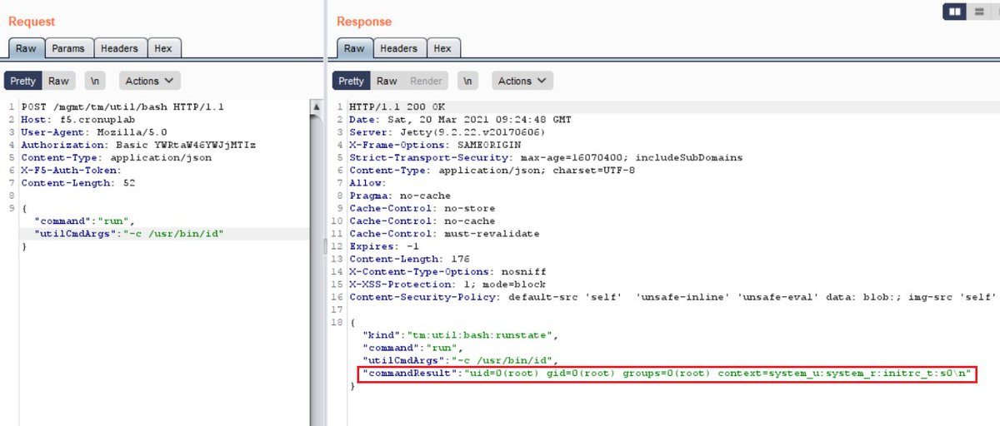</td>
</table></tr>
<table><tr>
<td>Quotes: <code>4</code></td>
<td>Replies: <code>1</code></td>
<td>Retweets: <code>59</code></td>
<td>Favorites: <code>130</code></td>
</tr></table>

---

# Unit42_Intel
**https://twitter.com/Unit42_Intel/status/1373017186818781190 _at 2021-03-19 21:03:01_**
<blockquote>
We are now observing the Mirai variant from https://t.co/ZDTVwtdYlq attempting to exploit CVE-2021-22986, an unauthenticated RCE in F5 BIG-IP &amp; BIG-IQ products, and CVE-2020-28188. 

IOCs for the new activity available at:
https://t.co/bc0IySEAEk https://t.co/ZsUqxq60XO
</blockquote>

* https://bit.ly/3cCK1Dd
* https://bit.ly/2P40CI9

<table><tr>
<td>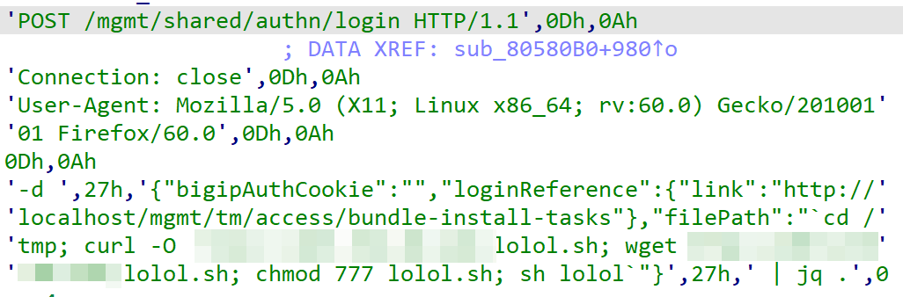</td>
</table></tr>
<table><tr>
<td>Quotes: <code>7</code></td>
<td>Replies: <code>0</code></td>
<td>Retweets: <code>42</code></td>
<td>Favorites: <code>70</code></td>
</tr></table>

---

# n0x08
**https://twitter.com/n0x08/status/1372617747633299458 _at 2021-03-18 18:35:47_**
<blockquote>
An important thing to remember is back in July, attackers were using CVE-2020-5902 to create backdoor admin accounts.

If the systems were patched, but these accounts left in place, these new attacks become all the more dangerous as you don't need SSRF to get an auth'd session.
</blockquote>

<table><tr>
<td>Quotes: <code>1</code></td>
<td>Replies: <code>0</code></td>
<td>Retweets: <code>11</code></td>
<td>Favorites: <code>38</code></td>
</tr></table>

---

# 0xACK
**https://twitter.com/0xACK/status/1372606642752266246 _at 2021-03-18 17:51:40_**
<blockquote>
Full exploit chain of F5 iControl REST RCE (CVE-2021-22986) is likely to be public soon, which is why @buffaloverflow and I just published an overview of detection methods for successful SSRF + auth bypass + RCE. https://t.co/988Je0Makj
</blockquote>

* https://research.nccgroup.com/2021/03/18/rift-detection-capabilities-for-recent-f5-big-ip-big-iq-icontrol-rest-api-vulnerabilities-cve-2021-22986/

<table><tr>
<td>Quotes: <code>1</code></td>
<td>Replies: <code>1</code></td>
<td>Retweets: <code>16</code></td>
<td>Favorites: <code>36</code></td>
</tr></table>

---

# Mekhalleh
**https://twitter.com/Mekhalleh/status/1372604760709283845 _at 2021-03-18 17:44:11_**
<blockquote>
#ProxyLogon #Metasploit #RCE 

I haven't seen a PoC yet that uses this msExchangeTargetMailbox header.

https://t.co/THWDxtR9QQ

New POC: https://t.co/dwoUlEPE68

cc @Dinosn @binitamshah https://t.co/BF4Tnadhm0
</blockquote>

* https://github.com/rapid7/metasploit-framework/pull/14860#issuecomment-802135102
* https://github.com/rapid7/metasploit-framework/blob/c76e04e92bdeed1f082f9b160118cc054f7e5999/modules/exploits/windows/http/exchange_proxylogon_rce.rb

<table><tr>
<td>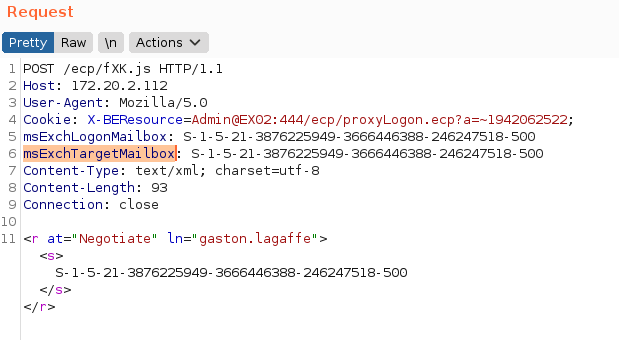</td>
</table></tr>
<table><tr>
<td>Quotes: <code>0</code></td>
<td>Replies: <code>1</code></td>
<td>Retweets: <code>36</code></td>
<td>Favorites: <code>90</code></td>
</tr></table>

---

# maddiestone
**https://twitter.com/maddiestone/status/1372543655110610946 _at 2021-03-18 13:41:22_**
<blockquote>
Root cause analysis for CVE-2021-26411, the IE MSHTML use-after-free/double free vulnerability:

https://t.co/lk7eN6dEh2
</blockquote>

* https://googleprojectzero.github.io/0days-in-the-wild/0day-RCAs/2021/CVE-2021-26411.html

<table><tr>
<td>Quotes: <code>1</code></td>
<td>Replies: <code>0</code></td>
<td>Retweets: <code>32</code></td>
<td>Favorites: <code>80</code></td>
</tr></table>

---

# vahidnameni
**https://twitter.com/vahidnameni/status/1372456904082006021 _at 2021-03-18 07:56:39_**
<blockquote>
آخر سال هست و تقریبا ما ایرانی ها در تعطیلات هستیم. ما تعطیلیم ولی بقیه جهان نه!
اگر  WP Super Cache و یا Elementor Pro روی وردپرس دارید به آخرین نسخه ارتقا بدید.
از GitLab هاتون هم فراموش نکنید، چون آسیب پذیری با امتیاز 9.9 داره!
https://t.co/CjAyPJPw3F

https://t.co/m49JIG8adS
</blockquote>

* https://about.gitlab.com/releases/2021/03/17/security-release-gitlab-13-9-4-released/
* https://thehackernews.com/2021/03/flaws-in-two-popular-wordpress-plugins.html

<table><tr>
<td>Quotes: <code>1</code></td>
<td>Replies: <code>2</code></td>
<td>Retweets: <code>7</code></td>
<td>Favorites: <code>32</code></td>
</tr></table>

---

# wugeej
**https://twitter.com/wugeej/status/1372392693989445635 _at 2021-03-18 03:41:30_**
<blockquote>
F5 BIG-IP iControl RCE (CVE-2021-22986)

execute arbitrary system commands
create or delete files
disable services

PoC #1
curl -su admin: -H "Content-Type: application/json" http://[victimIP]/mgmt/tm/util/bash -d '{"command":"run","utilCmdArgs":"-c id"}'

https://t.co/6i3IYFeHt5 https://t.co/yzD1k3ClTF
</blockquote>

* https://attackerkb.com/topics/J6pWeg5saG/k03009991-icontrol-rest-unauthenticated-remote-command-execution-vulnerability-cve-2021-22986

<table><tr>
<td>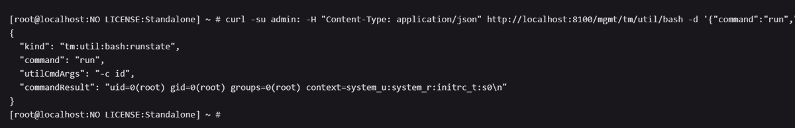</td>
</table></tr>
<table><tr>
<td>Quotes: <code>20</code></td>
<td>Replies: <code>9</code></td>
<td>Retweets: <code>319</code></td>
<td>Favorites: <code>648</code></td>
</tr></table>

---

# jedisct1
**https://twitter.com/jedisct1/status/1372306423590354946 _at 2021-03-17 21:58:42_**
<blockquote>
RT @justincormack: OCI runtime for FreeBSD you have been asking for this for years! https://t.co/JbldPVY6nF by @samuelkarp
</blockquote>

* https://github.com/samuelkarp/runj

<table><tr>
<td>Quotes: <code>0</code></td>
<td>Replies: <code>0</code></td>
<td>Retweets: <code>35</code></td>
<td>Favorites: <code>0</code></td>
</tr></table>

---

# cyber_advising
**https://twitter.com/cyber_advising/status/1371991607545827328 _at 2021-03-17 01:07:44_**
<blockquote>
CVE-2021-22986 (F5 iControl REST RCE).

PoC
https://t.co/dfaNm5rS09 https://t.co/qjgquJzPIe
</blockquote>

* https://attackerkb.com/topics/J6pWeg5saG/k03009991-icontrol-rest-unauthenticated-remote-command-execution-vulnerability-cve-2021-22986

<table><tr>
<td>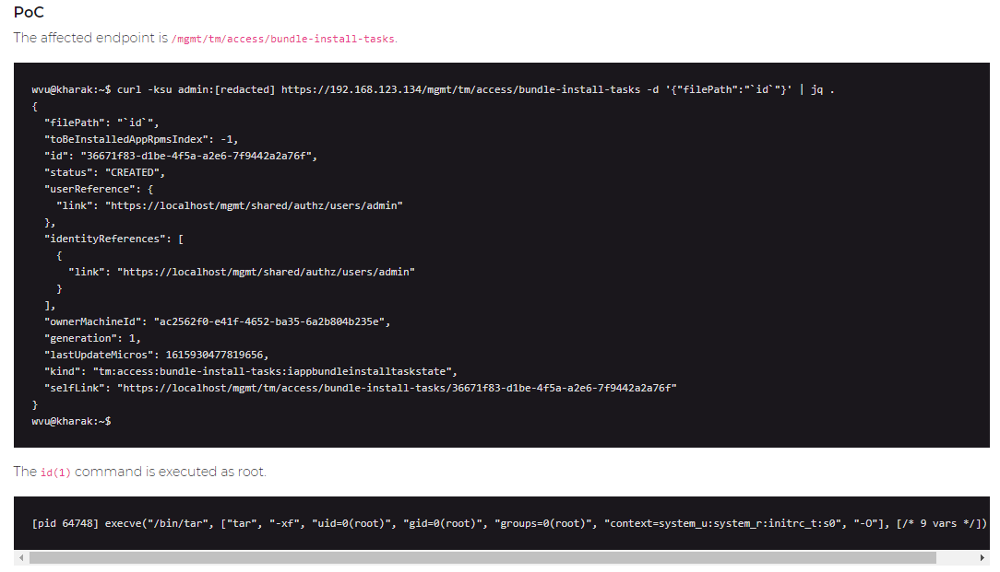</td>
</table></tr>
<table><tr>
<td>Quotes: <code>1</code></td>
<td>Replies: <code>0</code></td>
<td>Retweets: <code>83</code></td>
<td>Favorites: <code>181</code></td>
</tr></table>

---

# mobilesecurity_
**https://twitter.com/mobilesecurity_/status/1371895985908154370 _at 2021-03-16 18:47:46_**
<blockquote>
One day short of a full chain: Part 2 - Chrome sandbox escape
#MobileSecurity #AndroidSecurity by @mmolgtm 
https://t.co/sne5CB2riR
</blockquote>

* https://securitylab.github.com/research/one_day_short_of_a_fullchain_sbx

<table><tr>
<td>Quotes: <code>0</code></td>
<td>Replies: <code>1</code></td>
<td>Retweets: <code>8</code></td>
<td>Favorites: <code>33</code></td>
</tr></table>

---

# justincormack
**https://twitter.com/justincormack/status/1371882351278575616 _at 2021-03-16 17:53:35_**
<blockquote>
OCI runtime for FreeBSD you have been asking for this for years! https://t.co/JbldPVY6nF by @samuelkarp
</blockquote>

* https://github.com/samuelkarp/runj

<table><tr>
<td>Quotes: <code>1</code></td>
<td>Replies: <code>3</code></td>
<td>Retweets: <code>35</code></td>
<td>Favorites: <code>112</code></td>
</tr></table>

---

# renniepak
**https://twitter.com/renniepak/status/1371858196210548740 _at 2021-03-16 16:17:36_**
<blockquote>
I created a JS bookmarklet to quickly fill all input fields (type="text") on a webpage with your favorite XSS payload.

https://t.co/2daKjvzZvJ

Just add it as a bookmark in your browser, click it, BOOM etc.

#BugBountyTips

ɴᴏᴛ ɢᴜᴀʀᴀɴᴛᴇᴇᴅ ᴛᴏ ᴡᴏʀᴋ 👀
</blockquote>

* https://gist.github.com/renniepak/e7afcd7e727e1a0c481d955ba10441a9

<table><tr>
<td>Quotes: <code>2</code></td>
<td>Replies: <code>6</code></td>
<td>Retweets: <code>20</code></td>
<td>Favorites: <code>70</code></td>
</tr></table>

---

# VulmonFeeds
**https://twitter.com/VulmonFeeds/status/1371533126644723718 _at 2021-03-15 18:45:53_**
<blockquote>
CVE-2021-23357

All versions of package https://t.co/ctpnUCbkxh are vulnerable to Directory Traversal via the handleAddOrUpdateApi function. This function is able to delete arbitrary JSON files on th...

https://t.co/Y750L3fbKH
</blockquote>

* http://github.com/tyktechnologies/tyk/gateway
* http://vulmon.com/vulnerabilitydetails?qid=CVE-2021-23357

<table><tr>
<td>Quotes: <code>0</code></td>
<td>Replies: <code>0</code></td>
<td>Retweets: <code>0</code></td>
<td>Favorites: <code>0</code></td>
</tr></table>

---

# papa_anniekey
**https://twitter.com/papa_anniekey/status/1371281874136436737 _at 2021-03-15 02:07:30_**
<blockquote>
I made and published my original custom IPS/IDSsignature for McAfee NSP for CVE-2020-7961 which is vulnerability of Liferay Poral. In Liferay Portal 7.2.0 and earlier contains a RCE vulnerability. This signature can find an attack in http traffic. https://t.co/fwnaRLxKjM https://t.co/4mw9mkG6bi
</blockquote>

* https://github.com/papa-anniekey/CustomSignatures/blob/master/UDS-HTTP%20Liferay%20Portal%20Unauthenticated%20Remote%20code%20execution%20via%20JSONWS(CVE-2020-7961).zip

<table><tr>
<td>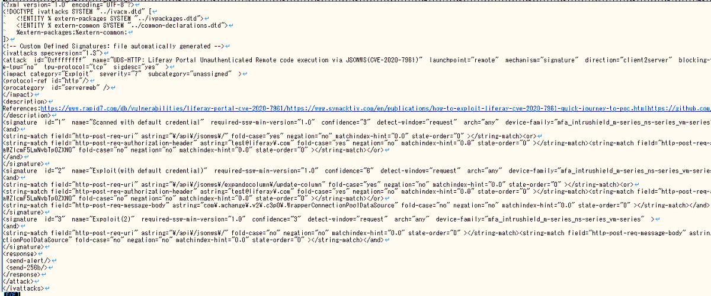</td>
</table></tr>
<table><tr>
<td>Quotes: <code>2</code></td>
<td>Replies: <code>0</code></td>
<td>Retweets: <code>0</code></td>
<td>Favorites: <code>7</code></td>
</tr></table>

---

# m0nkeyshell
**https://twitter.com/m0nkeyshell/status/1371043551203692551 _at 2021-03-14 10:20:30_**
<blockquote>
My first Lab released base on #waah for learning basic application attacks like SQLi, blind XSS, etc for beginners

Will keep updating the lab with more features and some complex bugs to understand real world scenarios.

https://t.co/3AbGdFgwmW
</blockquote>

* https://github.com/m0nkeyshell/WAAH_Lab

<table><tr>
<td>Quotes: <code>0</code></td>
<td>Replies: <code>0</code></td>
<td>Retweets: <code>15</code></td>
<td>Favorites: <code>45</code></td>
</tr></table>

---

# TheHackersNews
**https://twitter.com/TheHackersNews/status/1370576411648352260 _at 2021-03-13 03:24:15_**
<blockquote>
🔥 WARNING — A second Google #Chrome browser zero-day #vulnerability (CVE-2021-21193) has been found actively exploited in-the-wild.

Read details: https://t.co/EFt5OinSKa

Update your browser for Windows, Mac, and #Linux systems to 89.0.4389.90 or the latest available version.
</blockquote>

* https://thehackernews.com/2021/03/another-google-chrome-0-day-bug-found.html

<table><tr>
<td>Quotes: <code>23</code></td>
<td>Replies: <code>10</code></td>
<td>Retweets: <code>317</code></td>
<td>Favorites: <code>377</code></td>
</tr></table>

---

# jeffball55
**https://twitter.com/jeffball55/status/1370499831941185540 _at 2021-03-12 22:19:57_**
<blockquote>
Linux kernel LPE Exploit. Now with symbols for the latest RHEL8 kernel. Get it while it's still an 0day!  https://t.co/2GxeBLfeTW
</blockquote>

* https://github.com/grimm-co/NotQuite0DayFriday/tree/trunk/2021.03.12-linux-iscsi

<table><tr>
<td>Quotes: <code>2</code></td>
<td>Replies: <code>2</code></td>
<td>Retweets: <code>69</code></td>
<td>Favorites: <code>172</code></td>
</tr></table>

---

# 3XS0
**https://twitter.com/3XS0/status/1370458184914206725 _at 2021-03-12 19:34:27_**
<blockquote>
XSS in Jenzabar (CVE-2021-26723)

POC:
/ics?tool=search&amp;query="&gt;&lt;script&gt;alert('xss')&lt;/script&gt;

#XSS https://t.co/cGM957RGCU
</blockquote>

<table><tr>
<td></td>
</table></tr>
<table><tr>
<td>Quotes: <code>1</code></td>
<td>Replies: <code>1</code></td>
<td>Retweets: <code>49</code></td>
<td>Favorites: <code>132</code></td>
</tr></table>

---

# deanward81
**https://twitter.com/deanward81/status/1370319347810439168 _at 2021-03-12 10:22:46_**
<blockquote>
Anybody at MS able to fix CVE-2021-26701 release notes? It references SDK 3.1.406 as having the fix but it’s supposed to be 3.1.407! Not sure how to log an issue against an announcement :)
https://t.co/zOTw6B5d5V
</blockquote>

* https://github.com/dotnet/announcements/issues/178

<table><tr>
<td>Quotes: <code>0</code></td>
<td>Replies: <code>1</code></td>
<td>Retweets: <code>0</code></td>
<td>Favorites: <code>2</code></td>
</tr></table>

---

# wartapotan
**https://twitter.com/wartapotan/status/1370037112318300160 _at 2021-03-11 15:41:16_**
<blockquote>
#Research
"One day short of a full chain:
Part 1 - Android Kernel arbitrary code execution".
https://t.co/PIO0ytEPgP
]-&gt; Exploit for Qualcomm (CVE-2020-11239):
https://t.co/hdYbY4rtZX
]-&gt; Use-after-free in Qualcomm kgsl driver:
https://t.co/0E7L2BTBw6
</blockquote>

* https://securitylab.github.com/research/one_day_short_of_a_fullchain_android
* https://github.com/github/securitylab/tree/main/SecurityExploits/Android/Qualcomm/CVE-2020-11239
* https://securitylab.github.com/advisories/GHSL-2020-375-kgsl

<table><tr>
<td>Quotes: <code>0</code></td>
<td>Replies: <code>0</code></td>
<td>Retweets: <code>0</code></td>
<td>Favorites: <code>0</code></td>
</tr></table>

---

# zhzyker
**https://twitter.com/zhzyker/status/1369946740665675776 _at 2021-03-11 09:42:10_**
<blockquote>
#CVE CVE-2021-26855 CVE-2021-27065
Microsoft Exchange From SSRF to RCE🤔
https://t.co/v52fC2vcq1 --&gt; webshell --&gt; rce --&gt; down xx.ps1  --&gt; cobaltstrike --&gt; exit
https://t.co/v52fC2vcq1 provided by @_0xf4n9x_ 👍 https://t.co/kf4c5VYmqy
</blockquote>

* http://exp.py
* http://exp.py

<table><tr>
<td>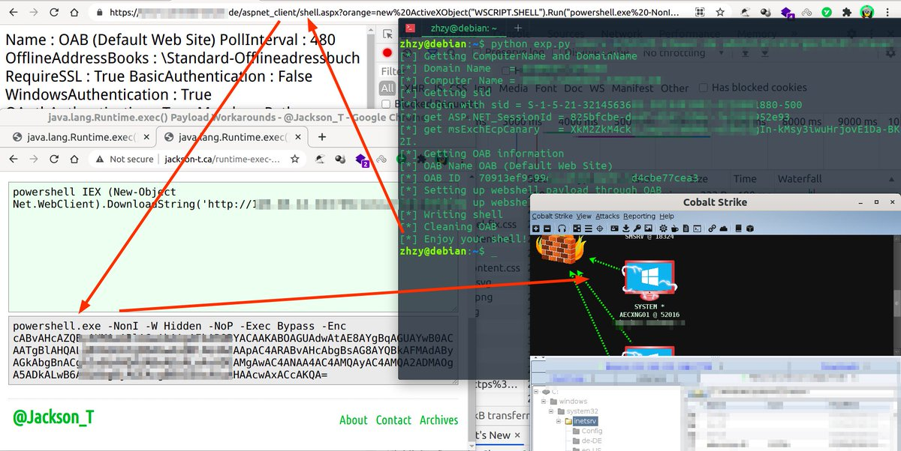</td>
<td>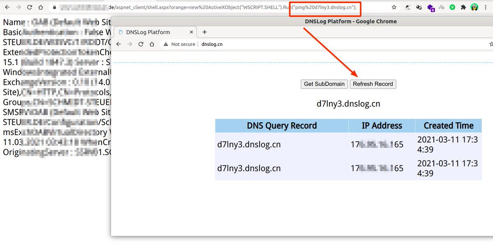</td>
</table></tr>
<table><tr>
<td>Quotes: <code>1</code></td>
<td>Replies: <code>1</code></td>
<td>Retweets: <code>14</code></td>
<td>Favorites: <code>41</code></td>
</tr></table>

---

# TheHackersNews
**https://twitter.com/TheHackersNews/status/1369892308108255233 _at 2021-03-11 06:05:52_**
<blockquote>
A critical pre-auth RCE flaw (CVE-2021-22986) has been discovered in the F5's Big-IP and BIG-IQ #software — Patch ASAP!

Read details: https://t.co/dYFN1aSNOB

Besides this, a few other newly reported flaws also result in a denial of service (DoS) attack.

#infosec #cybersecurity
</blockquote>

* https://thehackernews.com/2021/03/critical-pre-auth-rce-flaw-found-in-f5.html

<table><tr>
<td>Quotes: <code>12</code></td>
<td>Replies: <code>3</code></td>
<td>Retweets: <code>151</code></td>
<td>Favorites: <code>185</code></td>
</tr></table>

---

# mmolgtm
**https://twitter.com/mmolgtm/status/1369705143294365700 _at 2021-03-10 17:42:08_**
<blockquote>
In this series of posts I'll exploit 3 bugs that I reported last year. Together they can form a full chain from Chrome beta v86 to the Android kernel. The first post is about exploiting a UAF in the kernel reachable from the App sandbox: https://t.co/A7RIzV3RoF
</blockquote>

* https://securitylab.github.com/research/one_day_short_of_a_fullchain_android

<table><tr>
<td>Quotes: <code>7</code></td>
<td>Replies: <code>2</code></td>
<td>Retweets: <code>134</code></td>
<td>Favorites: <code>371</code></td>
</tr></table>

---

# buffaloverflow
**https://twitter.com/buffaloverflow/status/1369692589193039874 _at 2021-03-10 16:52:15_**
<blockquote>
Here is the advisory for CVE-2021-21518, which is a Local Privilege Escalation vulnerability I found in Dell SupportAssist

 https://t.co/VqeGRB1gu0 https://t.co/45U0HWFpdz
</blockquote>

* https://research.nccgroup.com/2021/03/10/technical-advisory-dell-supportassist-local-privilege-escalation-cve-202-21518/

<table><tr>
<td>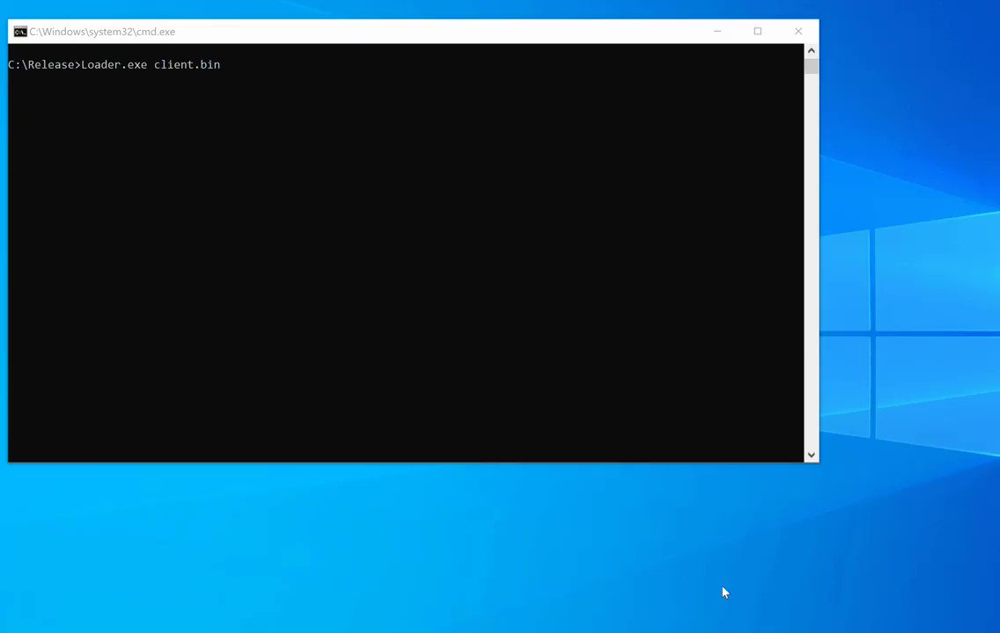</td>
</table></tr>
<table><tr>
<td>Quotes: <code>5</code></td>
<td>Replies: <code>10</code></td>
<td>Retweets: <code>103</code></td>
<td>Favorites: <code>269</code></td>
</tr></table>

---

# ESETresearch
**https://twitter.com/ESETresearch/status/1369634459025346562 _at 2021-03-10 13:01:16_**
<blockquote>
#ESETresearch documents its findings following recent pre-auth RCE vulnerability impacting Exchange servers globally. We identified at least 10 APT groups using exploits for CVE-2021-26855, CVE-2021-26857, CVE-2021-26858, and CVE-2021-27065. Read more: https://t.co/I2hP1HT576 1/5
</blockquote>

* https://www.welivesecurity.com/2021/03/10/exchange-servers-under-siege-10-apt-groups/

<table><tr>
<td>Quotes: <code>22</code></td>
<td>Replies: <code>3</code></td>
<td>Retweets: <code>122</code></td>
<td>Favorites: <code>207</code></td>
</tr></table>

---

# testanull
**https://twitter.com/testanull/status/1369633239845937158 _at 2021-03-10 12:56:25_**
<blockquote>
Analysis of ProxyLogon
A perfect combination of CVE-2021-26855 and  27065 
Kudo
Perfect bugs of 2021!
Have fun ;)
https://t.co/LNymwabGT5
</blockquote>

* https://link.medium.com/uyuaffLPveb

<table><tr>
<td>Quotes: <code>3</code></td>
<td>Replies: <code>5</code></td>
<td>Retweets: <code>82</code></td>
<td>Favorites: <code>220</code></td>
</tr></table>

---

# binitamshah
**https://twitter.com/binitamshah/status/1369611742276247557 _at 2021-03-10 11:31:00_**
<blockquote>
COFFLOADER : Buliding your own in memory loader or How to run BOFS (Beacon object files) : https://t.co/sxQMEQJqJ1 

Repo : https://t.co/iWxvXpRUqc https://t.co/1FV2UjwuRP
</blockquote>

* https://www.trustedsec.com/blog/coffloader-building-your-own-in-memory-loader-or-how-to-run-bofs/
* https://github.com/trustedsec/COFFLoader

<table><tr>
<td>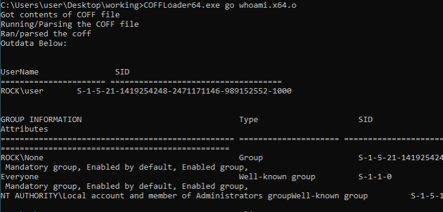</td>
</table></tr>
<table><tr>
<td>Quotes: <code>0</code></td>
<td>Replies: <code>0</code></td>
<td>Retweets: <code>22</code></td>
<td>Favorites: <code>46</code></td>
</tr></table>

---

# binitamshah
**https://twitter.com/binitamshah/status/1369604868181086209 _at 2021-03-10 11:03:41_**
<blockquote>
HowToHunt : Tutorials and Things to Do while Hunting Vulnerability : https://t.co/5KSratLUsk 

GitBook Link : https://t.co/8sAJLzLhcD credits @KathanP19
</blockquote>

* https://github.com/KathanP19/HowToHunt
* https://kathan19.gitbook.io/howtohunt/

<table><tr>
<td>Quotes: <code>1</code></td>
<td>Replies: <code>0</code></td>
<td>Retweets: <code>48</code></td>
<td>Favorites: <code>146</code></td>
</tr></table>

---

# binitamshah
**https://twitter.com/binitamshah/status/1369599029177323522 _at 2021-03-10 10:40:29_**
<blockquote>
ScareCrow - Payload creation framework designed around EDR bypass : https://t.co/OORWFF5rab 

Ref : Endpoint Detection and Response:  https://t.co/t8TICPlula

EDR and Blending In: https://t.co/RK3EUT2MFB 

Bypass EDR’s memory protection, intro to hooking : https://t.co/Z2OrXofdyD
</blockquote>

* https://github.com/optiv/ScareCrow
* https://www.optiv.com/explore-optiv-insights/source-zero/endpoint-detection-and-response-how-hackers-have-evolved
* https://www.optiv.com/explore-optiv-insights/source-zero/edr-and-blending-how-attackers-avoid-getting-caught
* https://medium.com/@fsx30/bypass-edrs-memory-protection-introduction-to-hooking-2efb21acffd6

<table><tr>
<td>Quotes: <code>0</code></td>
<td>Replies: <code>0</code></td>
<td>Retweets: <code>21</code></td>
<td>Favorites: <code>59</code></td>
</tr></table>

---

# binitamshah
**https://twitter.com/binitamshah/status/1369594042959294465 _at 2021-03-10 10:20:40_**
<blockquote>
whereami : Uses WiFi signals and machine learning to predict where you are : https://t.co/olPGAu9t8a
</blockquote>

* https://github.com/kootenpv/whereami

<table><tr>
<td>Quotes: <code>1</code></td>
<td>Replies: <code>1</code></td>
<td>Retweets: <code>40</code></td>
<td>Favorites: <code>79</code></td>
</tr></table>

---

# binitamshah
**https://twitter.com/binitamshah/status/1369560252044087298 _at 2021-03-10 08:06:23_**
<blockquote>
emba : An analyzer for Linux-based firmware of embedded devices : https://t.co/qm6ADB8kiw credits @s3cur1ty_de
</blockquote>

* https://github.com/e-m-b-a/emba

<table><tr>
<td>Quotes: <code>0</code></td>
<td>Replies: <code>0</code></td>
<td>Retweets: <code>44</code></td>
<td>Favorites: <code>143</code></td>
</tr></table>

---

# cyber_advising
**https://twitter.com/cyber_advising/status/1369545928340877314 _at 2021-03-10 07:09:28_**
<blockquote>
Microsoft Exchange Proxylogon Exploit Chain.

CVE-2021-26857 : insecure deserialization vulnerability
CVE-2021-26855 : Server-Side Request Forgery
CVE-2021-27065 : Arbitrary File Write
https://t.co/h1PnhZ3ySW https://t.co/J77rZh6R3C
</blockquote>

* https://www.praetorian.com/blog/reproducing-proxylogon-exploit/

<table><tr>
<td>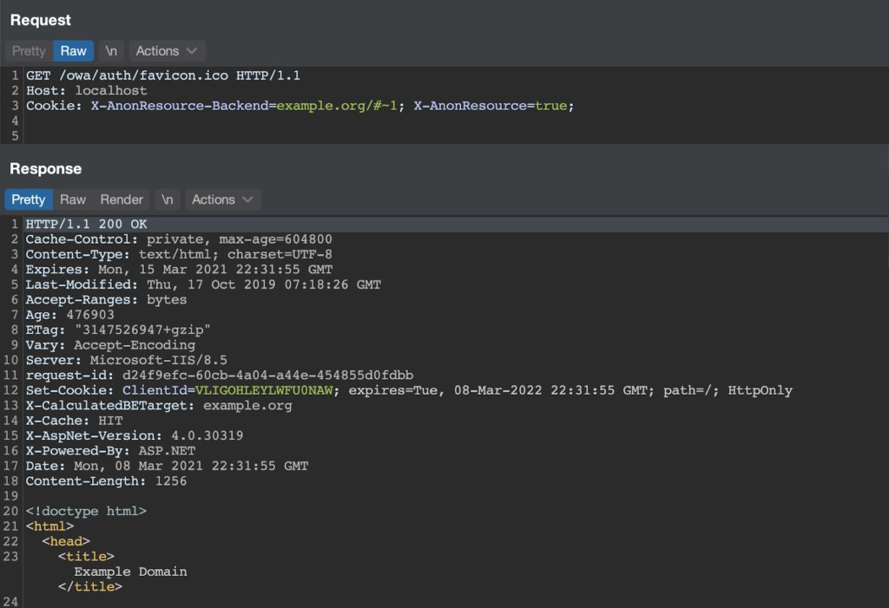</td>
</table></tr>
<table><tr>
<td>Quotes: <code>0</code></td>
<td>Replies: <code>0</code></td>
<td>Retweets: <code>7</code></td>
<td>Favorites: <code>35</code></td>
</tr></table>

---

# HonkHase
**https://twitter.com/HonkHase/status/1369405693078482947 _at 2021-03-09 21:52:14_**
<blockquote>
Microsoft patchday starring:
* CVE-2021-26897 – Windows DNS Server Remote Code Execution Vulnerability
* CVE-2021-26867 – Windows Hyper-V Remote Code Execution Vulnerability
* CVE-2021-27076 – Microsoft SharePoint Server Remote Code Execution Vulnerability
https://t.co/lvwBYKSyNG https://t.co/e7bsCOOz72
</blockquote>

* https://www.thezdi.com/blog/2021/3/9/the-march-2021-security-update-review

<table><tr>
<td>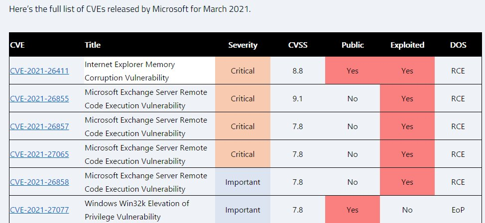</td>
</table></tr>
<table><tr>
<td>Quotes: <code>8</code></td>
<td>Replies: <code>9</code></td>
<td>Retweets: <code>27</code></td>
<td>Favorites: <code>49</code></td>
</tr></table>

---

# Mekhalleh
**https://twitter.com/Mekhalleh/status/1369385771254317057 _at 2021-03-09 20:33:04_**
<blockquote>
#ProxyLogon https://t.co/HbhpDjef7D #Gather cc @Dinosn @binitamshah
</blockquote>

* https://github.com/rapid7/metasploit-framework/blob/f7fe97a1458df7b45562013af3a70f5bd0a8cf7b/modules/auxiliary/gather/exchange_proxylogon_collector.rb

<table><tr>
<td>Quotes: <code>1</code></td>
<td>Replies: <code>0</code></td>
<td>Retweets: <code>22</code></td>
<td>Favorites: <code>48</code></td>
</tr></table>

---

# coreclrissues
**https://twitter.com/coreclrissues/status/1369356217089482763 _at 2021-03-09 18:35:38_**
<blockquote>
Microsoft Security Advisory CVE-2021-26701 | .NET Core Remote Code Execution Vulnerability
dotnet/runtime #49377 https://t.co/t8C0xmETuk
</blockquote>

* https://github.com/dotnet/runtime/issues/49377

<table><tr>
<td>Quotes: <code>0</code></td>
<td>Replies: <code>0</code></td>
<td>Retweets: <code>0</code></td>
<td>Favorites: <code>0</code></td>
</tr></table>

---

# blowdart
**https://twitter.com/blowdart/status/1369354423617662982 _at 2021-03-09 18:28:30_**
<blockquote>
Patch Tuesday and there's one for core. There was a rewrite of some of our text encoding functions, because remote code execution. If you're using System.Text.Encodings.Web down-level you'll need to update your package reference https://t.co/SOjksxHZ6Y
</blockquote>

* https://github.com/dotnet/announcements/issues/178

<table><tr>
<td>Quotes: <code>5</code></td>
<td>Replies: <code>5</code></td>
<td>Retweets: <code>27</code></td>
<td>Favorites: <code>36</code></td>
</tr></table>

---

# maddiestone
**https://twitter.com/maddiestone/status/1369349514658676736 _at 2021-03-09 18:09:00_**
<blockquote>
Microsoft issues patch for the Internet Explorer MSHTML bug disclosed by Enki back in February. They had said that it had been used by NK to target security researchers. CVE-2021-26411 https://t.co/a4LgVLeVeo

https://t.co/5n620E9cuT
</blockquote>

* https://enki.co.kr/blog/2021/02/04/ie_0day.html
* https://msrc.microsoft.com/update-guide/vulnerability/CVE-2021-26411

<table><tr>
<td>Quotes: <code>2</code></td>
<td>Replies: <code>4</code></td>
<td>Retweets: <code>66</code></td>
<td>Favorites: <code>142</code></td>
</tr></table>

---

# runtimeissues
**https://twitter.com/runtimeissues/status/1369348809562677250 _at 2021-03-09 18:06:12_**
<blockquote>
Microsoft Security Advisory CVE-2021-26701 | .NET Core Remote Code Execution Vulnerability
dotnet/announcements #178 https://t.co/YfJUdQlkuP
</blockquote>

* https://github.com/dotnet/announcements/issues/178

<table><tr>
<td>Quotes: <code>0</code></td>
<td>Replies: <code>0</code></td>
<td>Retweets: <code>0</code></td>
<td>Favorites: <code>0</code></td>
</tr></table>

---

# Mormoroth
**https://twitter.com/Mormoroth/status/1369298066600300548 _at 2021-03-09 14:44:34_**
<blockquote>
این باگ( CVE-2021-26855 ) که روی Exchange اومده رو جدی بگیرید. از شرکت کوچیک و هولدینگ تا خطوط هواپیمایی دارن از Microsoft Exchange Server استفاده میکنن و اکثرن آسیب پذیرن. تستش کردم و فکر کنم تا الان اگه داشتید دسترسی ازتون نگرفته باشن شانس آوردین https://t.co/NmuzJ8SGI3
</blockquote>

<table><tr>
<td>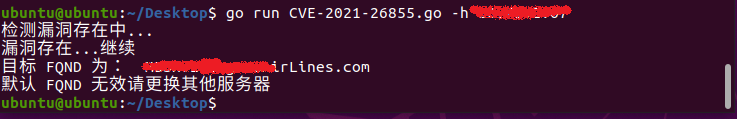</td>
</table></tr>
<table><tr>
<td>Quotes: <code>2</code></td>
<td>Replies: <code>4</code></td>
<td>Retweets: <code>10</code></td>
<td>Favorites: <code>80</code></td>
</tr></table>

---

# binitamshah
**https://twitter.com/binitamshah/status/1369286682038603782 _at 2021-03-09 13:59:19_**
<blockquote>
Farming for Red Teams: Harvesting NetNTLM : https://t.co/HtxBUbSZ9B 

Farmer : Collecting NetNTLM hashes in a Windows domain : https://t.co/Ra1Tz9RdbZ credits @domchell
</blockquote>

* https://www.mdsec.co.uk/2021/02/farming-for-red-teams-harvesting-netntlm/
* https://github.com/mdsecactivebreach/Farmer

<table><tr>
<td>Quotes: <code>1</code></td>
<td>Replies: <code>2</code></td>
<td>Retweets: <code>22</code></td>
<td>Favorites: <code>88</code></td>
</tr></table>

---

# binitamshah
**https://twitter.com/binitamshah/status/1369284694496309248 _at 2021-03-09 13:51:25_**
<blockquote>
traitor : Automatic Linux privesc via exploitation of low-hanging fruit e.g. gtfobins : https://t.co/PfHmues0vl credits @liam_galvin https://t.co/gxCwWt1vZ2
</blockquote>

* https://github.com/liamg/traitor

<table><tr>
<td>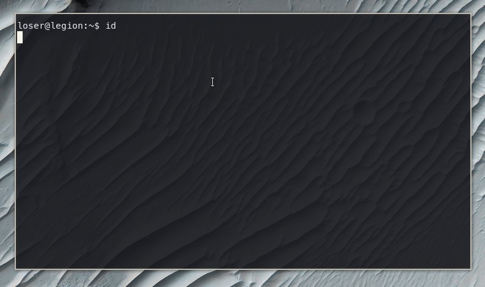</td>
</table></tr>
<table><tr>
<td>Quotes: <code>3</code></td>
<td>Replies: <code>2</code></td>
<td>Retweets: <code>128</code></td>
<td>Favorites: <code>452</code></td>
</tr></table>

---

# h4x0r_dz
**https://twitter.com/h4x0r_dz/status/1369254600612708362 _at 2021-03-09 11:51:50_**
<blockquote>
Thousands of US companies have been hacked by Chinese hackers using This RCE.

Microsoft Exchange Server Remote Code Execution CVE-2021-26855 Exploit.
https://t.co/4UNlGK3ewf

#BugBounty #RCE #infosec https://t.co/YKWOCIKjXk
</blockquote>

* https://github.com/GreyOrder/CVE-2021-26855

<table><tr>
<td>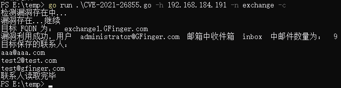</td>
<td>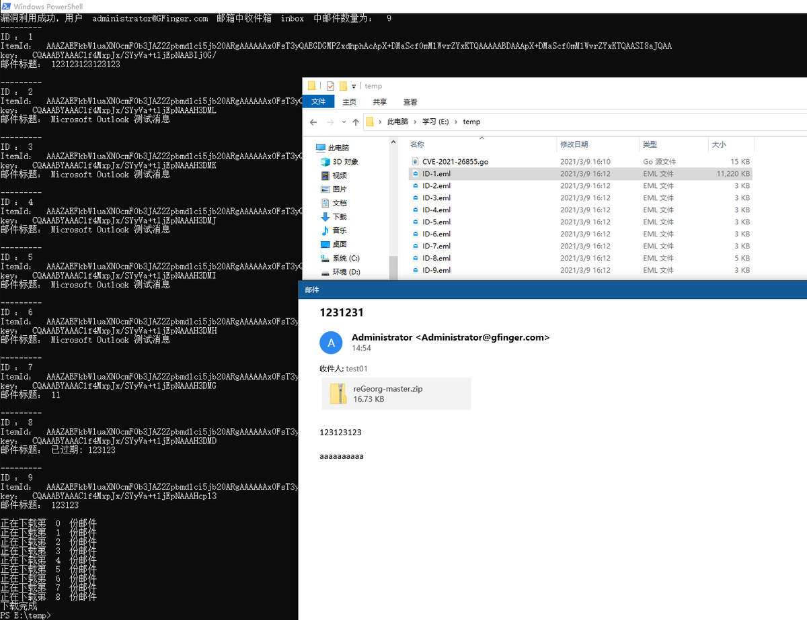</td>
<td>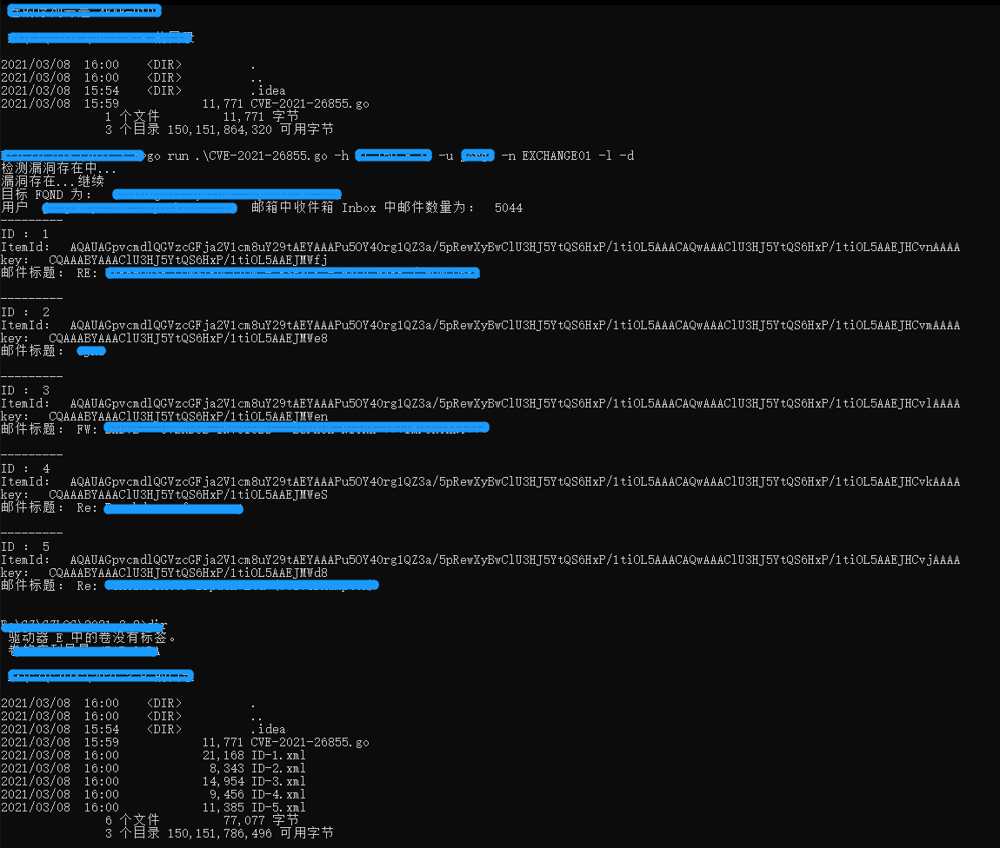</td>
<td>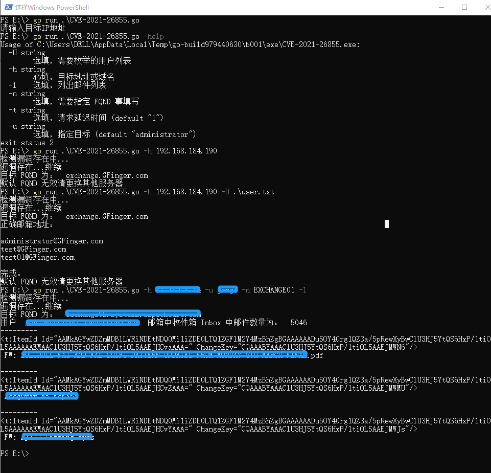</td>
</table></tr>
<table><tr>
<td>Quotes: <code>12</code></td>
<td>Replies: <code>20</code></td>
<td>Retweets: <code>230</code></td>
<td>Favorites: <code>537</code></td>
</tr></table>

---

# cycatz2
**https://twitter.com/cycatz2/status/1369162459739693057 _at 2021-03-09 05:45:42_**
<blockquote>
Atlassian Jira unauthenticated user enumeration (CVE-2020-14181)!
 Versions affected:
Jira &lt; 7.13.6
8.0.0 ≤ Jira &lt; 8.5.7
8.6.0 ≤ Jira &lt; 8.12.0
username=john ---&gt; user does not exist
username=admin ---&gt;  jira-robot
#bugbounty #bugbountytip #bugbountytips #pentesting https://t.co/WaH6utohPw
</blockquote>

<table><tr>
<td>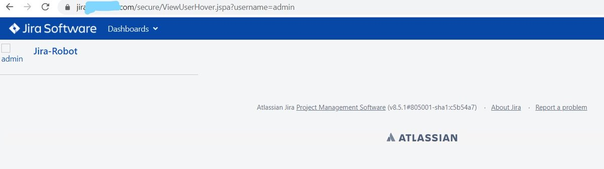</td>
<td>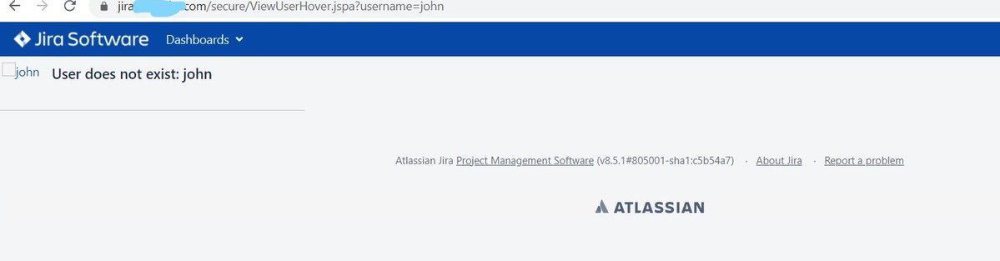</td>
</table></tr>
<table><tr>
<td>Quotes: <code>1</code></td>
<td>Replies: <code>2</code></td>
<td>Retweets: <code>42</code></td>
<td>Favorites: <code>98</code></td>
</tr></table>

---

# GHSecurityLab
**https://twitter.com/GHSecurityLab/status/1368964741125836804 _at 2021-03-08 16:40:03_**
<blockquote>
GHSL-2020-166: Use-after-free (UaF) in Chrome PaymentCredential - CVE-2020-16018 https://t.co/JeaZiVbO38
</blockquote>

* https://github.co/3sYRjI1

<table><tr>
<td>Quotes: <code>1</code></td>
<td>Replies: <code>0</code></td>
<td>Retweets: <code>2</code></td>
<td>Favorites: <code>34</code></td>
</tr></table>

---

# standa_t
**https://twitter.com/standa_t/status/1368923034623483905 _at 2021-03-08 13:54:19_**
<blockquote>
Can I run my own SMM (ring -2) code for research? 

Sure, go nuts👍 Here is how you can get started with only 70 lines of code

https://t.co/zXTNEj8azA https://t.co/FyIX5sZHCt
</blockquote>

* https://github.com/tandasat/HelloSmm

<table><tr>
<td>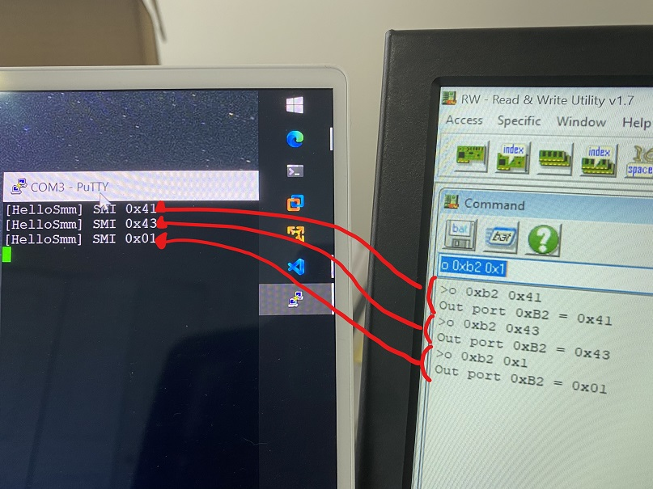</td>
</table></tr>
<table><tr>
<td>Quotes: <code>1</code></td>
<td>Replies: <code>6</code></td>
<td>Retweets: <code>60</code></td>
<td>Favorites: <code>197</code></td>
</tr></table>

---

# amanmahendra_
**https://twitter.com/amanmahendra_/status/1368652217645867008 _at 2021-03-07 19:58:11_**
<blockquote>
Shodan Dork For CVE-2021-26855

1.title:"Outlook Web App"
2."Set-Cookie: ClientId="

#bugbountytips #bugbountytip #ssrf #togetherwehitharder  #hackerone #bugcrowd #CVE-2021-26855
</blockquote>

<table><tr>
<td>Quotes: <code>4</code></td>
<td>Replies: <code>3</code></td>
<td>Retweets: <code>134</code></td>
<td>Favorites: <code>367</code></td>
</tr></table>

---

# nav1n0x
**https://twitter.com/nav1n0x/status/1368640580205568001 _at 2021-03-07 19:11:57_**
<blockquote>
CVE-2021-26855 - Exchange Server-Side Request Forgery (SSRF)

Nuclei Template: https://t.co/NYk5BHkzzT

#BugBounty #bugbountytips #MicrosoftExchange #ExchangeServerSSRF #SSRF https://t.co/R6j5pDqO7H
</blockquote>

* https://github.com/projectdiscovery/nuclei-templates/blob/master/cves/2021/CVE-2021-26855.yaml

<table><tr>
<td>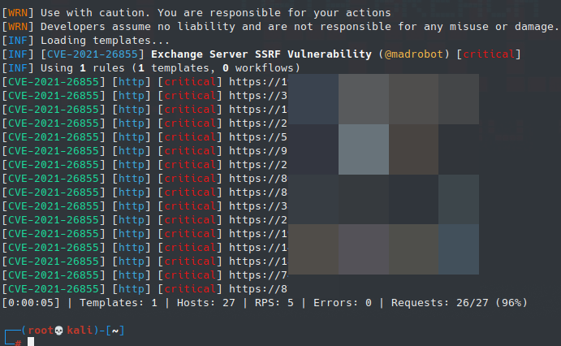</td>
</table></tr>
<table><tr>
<td>Quotes: <code>0</code></td>
<td>Replies: <code>0</code></td>
<td>Retweets: <code>1</code></td>
<td>Favorites: <code>5</code></td>
</tr></table>

---

# ziglang
**https://twitter.com/ziglang/status/1368604829787033603 _at 2021-03-07 16:49:53_**
<blockquote>
Friendly reminder to all new people interested in trying out Zig: learning a new language is even better when you have access to someone that can help you when you get stuck!

Join one of the Zig communities and enjoy a comfy on-boarding experience

https://t.co/1gFIcf5ktD
</blockquote>

* https://github.com/ziglang/zig/wiki/Community

<table><tr>
<td>Quotes: <code>1</code></td>
<td>Replies: <code>1</code></td>
<td>Retweets: <code>14</code></td>
<td>Favorites: <code>61</code></td>
</tr></table>

---

# g0t_rOoT_
**https://twitter.com/g0t_rOoT_/status/1368500060158193675 _at 2021-03-07 09:53:34_**
<blockquote>
Automate XSS using QuickXSS !

Releasing QuickXSS v2.0.0 🎉🎉

Features : 
1. Added gau for better results
2. Header Injection with Blind XSS Payload
3. Installation file to install all tools.
4. Option to store Result.
5. And many more 🤘

https://t.co/oBNWsNZkUN

#bugbountytips
</blockquote>

* https://github.com/theinfosecguy/QuickXSS

<table><tr>
<td>Quotes: <code>0</code></td>
<td>Replies: <code>7</code></td>
<td>Retweets: <code>160</code></td>
<td>Favorites: <code>392</code></td>
</tr></table>

---

# jedisct1
**https://twitter.com/jedisct1/status/1368294699233140742 _at 2021-03-06 20:17:32_**
<blockquote>
Famous bugs fixed and problems solved in software history https://t.co/HTPAcTAkPU
</blockquote>

* https://github.com/umutphp/famous-bugs

<table><tr>
<td>Quotes: <code>0</code></td>
<td>Replies: <code>0</code></td>
<td>Retweets: <code>14</code></td>
<td>Favorites: <code>44</code></td>
</tr></table>

---

# campuscodi
**https://twitter.com/campuscodi/status/1368243224951873547 _at 2021-03-06 16:53:00_**
<blockquote>
CERT Latvia has released a Powershell script to detect webshells dropped on Microsoft Exchange servers via the recent 0day attacks

https://t.co/AYMcULfb2j https://t.co/BkgLqXPCQs
</blockquote>

* https://github.com/cert-lv/exchange_webshell_detection

<table><tr>
<td>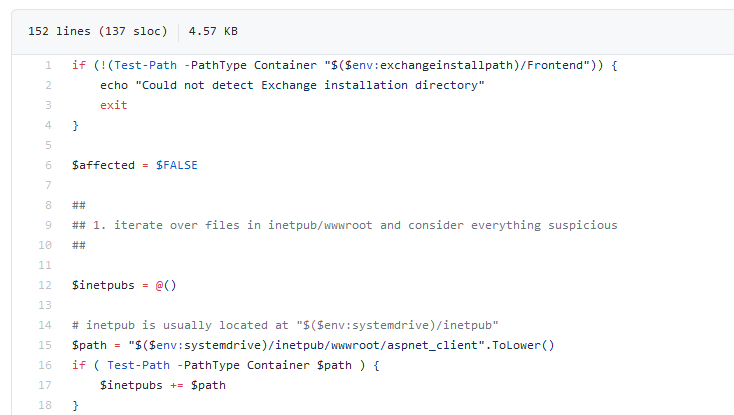</td>
</table></tr>
<table><tr>
<td>Quotes: <code>6</code></td>
<td>Replies: <code>3</code></td>
<td>Retweets: <code>206</code></td>
<td>Favorites: <code>407</code></td>
</tr></table>

---

# jas502n
**https://twitter.com/jas502n/status/1368164120936116226 _at 2021-03-06 11:38:40_**
<blockquote>
Exchange

1. get /ecp/main.css  X-FEServer 
2. Cookie: X-BEResource=xxx/EWS/Exchange.asmx?a=~1

https://t.co/bqjeA3FX1r
https://t.co/CknY7iZb82
https://t.co/bEnkuhvuMc
https://t.co/3A007UqWE0 https://t.co/CRFopBBMT1
</blockquote>

* https://raw.githubusercontent.com/microsoft/CSS-Exchange/main/Security/http-vuln-cve2021-26855.nse
* https://github.com/projectdiscovery/nuclei-templates/blob/master/cves/2021/CVE-2021-26855.yaml
* https://gist.github.com/testanull/324546bffab2fe4916d0f9d1f03ffa09
* https://www.volexity.com/blog/2021/03/02/active-exploitation-of-microsoft-exchange-zero-day-vulnerabilities/

<table><tr>
<td>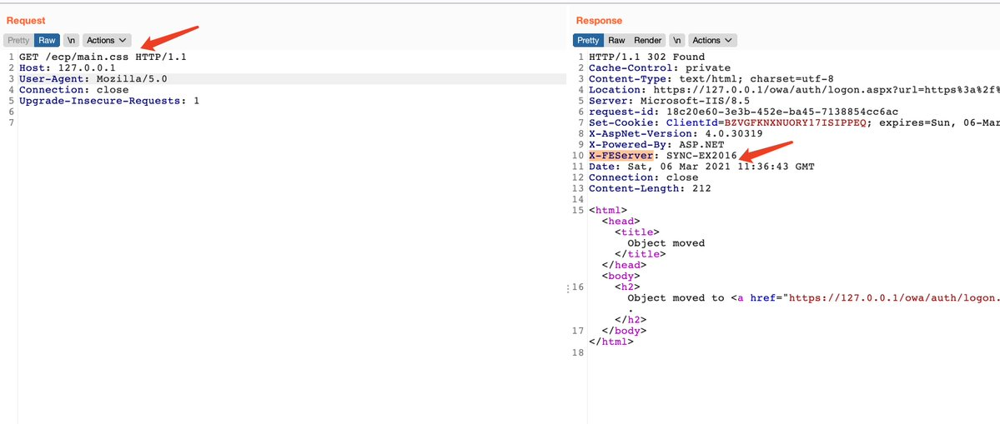</td>
<td>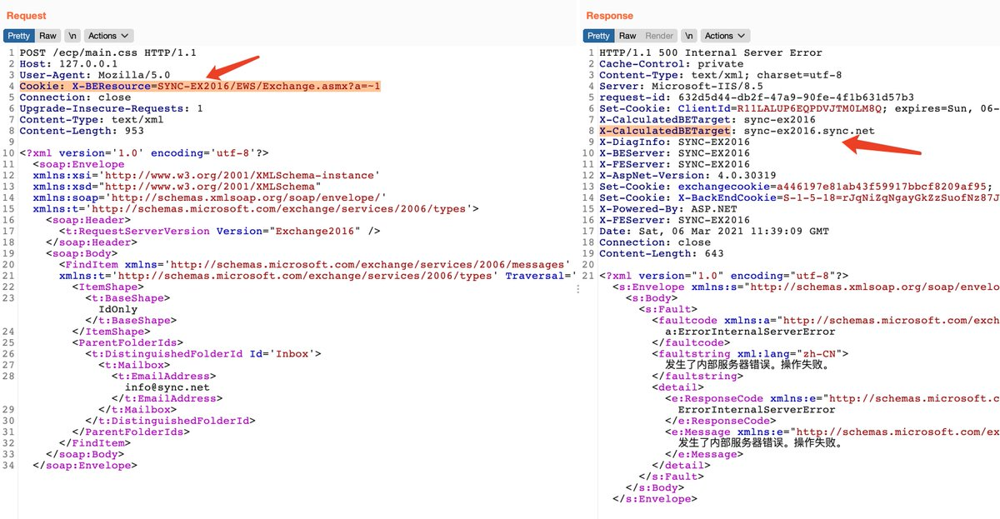</td>
<td>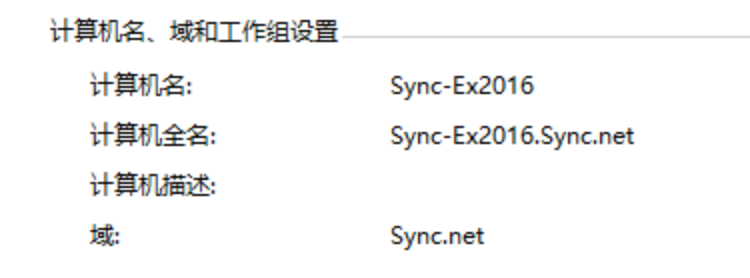</td>
</table></tr>
<table><tr>
<td>Quotes: <code>5</code></td>
<td>Replies: <code>1</code></td>
<td>Retweets: <code>190</code></td>
<td>Favorites: <code>437</code></td>
</tr></table>

---

# pdnuclei
**https://twitter.com/pdnuclei/status/1368109257879547904 _at 2021-03-06 08:00:39_**
<blockquote>
Detecting Microsoft Exchange Server SSRF — (CVE-2021-26855) using nuclei templates.

Thanks to @Madrobot_ for quickly sharing the template for this 🙌🙌

#hackwithautomation #appsec #pentest #proxylogon https://t.co/6vseXzDReX
</blockquote>

<table><tr>
<td>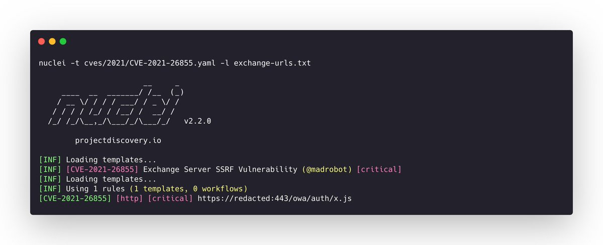</td>
</table></tr>
<table><tr>
<td>Quotes: <code>4</code></td>
<td>Replies: <code>1</code></td>
<td>Retweets: <code>88</code></td>
<td>Favorites: <code>316</code></td>
</tr></table>

---

# Dinosn
**https://twitter.com/Dinosn/status/1368104784314662913 _at 2021-03-06 07:42:53_**
<blockquote>
Nuclei now includes CVE-2021-26855 (Microsoft Exchange Server Remote Code Execution Vulnerability) https://t.co/yEOsxbcEBi
</blockquote>

* https://github.com/projectdiscovery/nuclei-templates/blob/master/cves/2021/CVE-2021-26855.yaml

<table><tr>
<td>Quotes: <code>3</code></td>
<td>Replies: <code>2</code></td>
<td>Retweets: <code>40</code></td>
<td>Favorites: <code>123</code></td>
</tr></table>

---

# binitamshah
**https://twitter.com/binitamshah/status/1367794511301124100 _at 2021-03-05 11:09:58_**
<blockquote>
Fuzzing sockets - Part 1 : FTP Servers : https://t.co/BJrUUeQnt2 

Part 2 : Fuzzing FreeRDP : https://t.co/dCztRsJBwc

Part 3 : Apache HTTP (Part 1: Mutations) : https://t.co/v3rbKThkjg
</blockquote>

* https://securitylab.github.com/research/fuzzing-sockets-FTP
* https://securitylab.github.com/research/fuzzing-sockets-FreeRDP
* https://securitylab.github.com/research/fuzzing-apache-1

<table><tr>
<td>Quotes: <code>0</code></td>
<td>Replies: <code>0</code></td>
<td>Retweets: <code>46</code></td>
<td>Favorites: <code>133</code></td>
</tr></table>

---

# circl_lu
**https://twitter.com/circl_lu/status/1367789572436922374 _at 2021-03-05 10:50:21_**
<blockquote>
"Detect webshells dropped on Microsoft Exchange servers after 0day compromises" by @certlv 
https://t.co/XEaCTIq0Li
</blockquote>

* https://github.com/cert-lv/exchange_webshell_detection

<table><tr>
<td>Quotes: <code>0</code></td>
<td>Replies: <code>0</code></td>
<td>Retweets: <code>20</code></td>
<td>Favorites: <code>34</code></td>
</tr></table>

---

# binitamshah
**https://twitter.com/binitamshah/status/1367764993786056707 _at 2021-03-05 09:12:41_**
<blockquote>
Reverse-engineering Rosetta 2 (Part 1) : Analyzing AOT files and Rosetta 2 runtime : https://t.co/2qwIuotXyy

AOT Shared Cache Extractor : https://t.co/9B52QsYYUm
</blockquote>

* https://ffri.github.io/ProjectChampollion/part1/
* https://github.com/FFRI/ProjectChampollion/tree/main/AotSharedCacheExtractor

<table><tr>
<td>Quotes: <code>0</code></td>
<td>Replies: <code>0</code></td>
<td>Retweets: <code>35</code></td>
<td>Favorites: <code>96</code></td>
</tr></table>

---

# binitamshah
**https://twitter.com/binitamshah/status/1367456009371885572 _at 2021-03-04 12:44:53_**
<blockquote>
ConPtyShell - Fully Interactive Reverse Shell for Windows : https://t.co/5asJs5sako credits @splinter_code https://t.co/8b73Yg5xaJ
</blockquote>

* https://github.com/antonioCoco/ConPtyShell

<table><tr>
<td>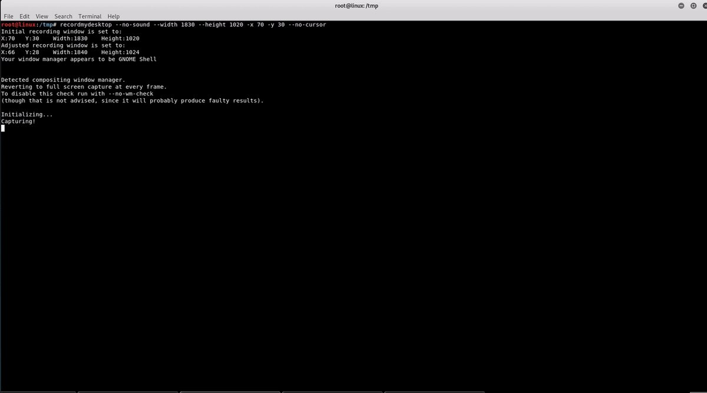</td>
</table></tr>
<table><tr>
<td>Quotes: <code>0</code></td>
<td>Replies: <code>0</code></td>
<td>Retweets: <code>25</code></td>
<td>Favorites: <code>56</code></td>
</tr></table>

---

# binitamshah
**https://twitter.com/binitamshah/status/1367444874874691584 _at 2021-03-04 12:00:38_**
<blockquote>
Awesome One-liner Bug Bounty : A collection of awesome one-liner scripts especially for bug bounty tips : https://t.co/oqW65zDyi3 credits @dwisiswant0
</blockquote>

* https://github.com/dwisiswant0/awesome-oneliner-bugbounty

<table><tr>
<td>Quotes: <code>0</code></td>
<td>Replies: <code>0</code></td>
<td>Retweets: <code>41</code></td>
<td>Favorites: <code>107</code></td>
</tr></table>

---

# binitamshah
**https://twitter.com/binitamshah/status/1367444562545831942 _at 2021-03-04 11:59:24_**
<blockquote>
teler : Real-time HTTP Intrusion Detection : https://t.co/eXkrh6Jy1F credits @dwisiswant0 https://t.co/Jijyid0nLU
</blockquote>

* https://github.com/kitabisa/teler

<table><tr>
<td></td>
</table></tr>
<table><tr>
<td>Quotes: <code>0</code></td>
<td>Replies: <code>2</code></td>
<td>Retweets: <code>31</code></td>
<td>Favorites: <code>104</code></td>
</tr></table>

---

# binitamshah
**https://twitter.com/binitamshah/status/1367427228284248064 _at 2021-03-04 10:50:31_**
<blockquote>
apkleaks : Scanning APK file for URIs, endpoints &amp; secrets : https://t.co/2CgSE8fsQC credits @dwisiswant0 https://t.co/bRg2VHzwCf
</blockquote>

* https://github.com/dwisiswant0/apkleaks

<table><tr>
<td>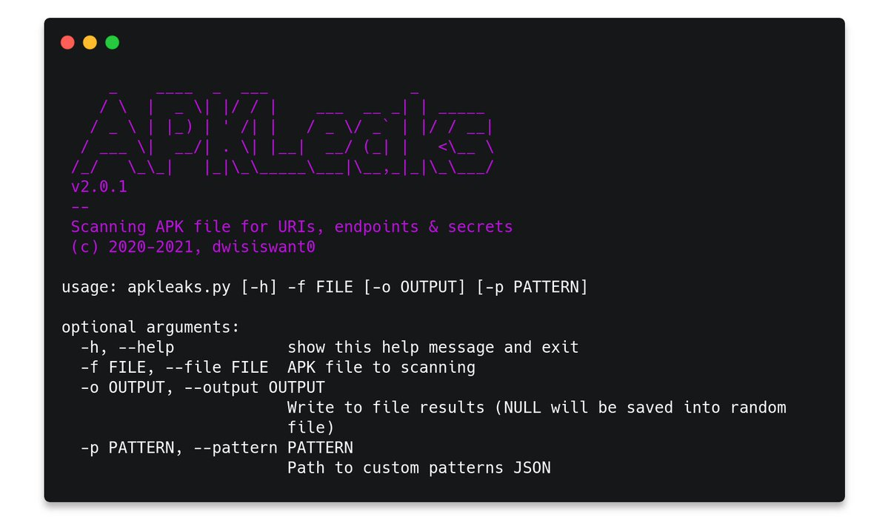</td>
</table></tr>
<table><tr>
<td>Quotes: <code>2</code></td>
<td>Replies: <code>3</code></td>
<td>Retweets: <code>142</code></td>
<td>Favorites: <code>482</code></td>
</tr></table>

---

# TheHackersNews
**https://twitter.com/TheHackersNews/status/1367370169224364033 _at 2021-03-04 07:03:47_**
<blockquote>
VMware releases security patch for a remote code execution #vulnerability (CVSSv3 8.6) (CVE-2021-21978) affecting VMware View Planner.

https://t.co/dYev7CFQlj
</blockquote>

* https://www.vmware.com/security/advisories/VMSA-2021-0003.html

<table><tr>
<td>Quotes: <code>3</code></td>
<td>Replies: <code>1</code></td>
<td>Retweets: <code>66</code></td>
<td>Favorites: <code>111</code></td>
</tr></table>

---

# TheHackersNews
**https://twitter.com/TheHackersNews/status/1367318331032694792 _at 2021-03-04 03:37:48_**
<blockquote>
Anatomy of an Exploit: RCE with CVE-2020-1350 (SIGRed)

PoC released: https://t.co/Zj4tugitU6

via @GraplSec https://t.co/31iwebqPSh
</blockquote>

* https://www.graplsecurity.com/post/anatomy-of-an-exploit-rce-with-cve-2020-1350-sigred

<table><tr>
<td>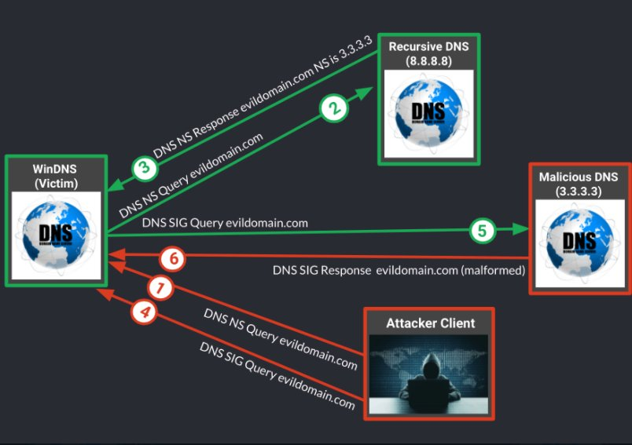</td>
</table></tr>
<table><tr>
<td>Quotes: <code>2</code></td>
<td>Replies: <code>2</code></td>
<td>Retweets: <code>66</code></td>
<td>Favorites: <code>164</code></td>
</tr></table>

---

# GossiTheDog
**https://twitter.com/GossiTheDog/status/1367247281687248896 _at 2021-03-03 22:55:28_**
<blockquote>
.@chompie1337 has published the first public, working RCE exploit for CVE-2020-1350 (Windows DNS server vuln). Tested, works great. https://t.co/eHv65yvxjV
</blockquote>

* https://www.graplsecurity.com/post/anatomy-of-an-exploit-rce-with-cve-2020-1350-sigred

<table><tr>
<td>Quotes: <code>1</code></td>
<td>Replies: <code>2</code></td>
<td>Retweets: <code>47</code></td>
<td>Favorites: <code>109</code></td>
</tr></table>

---

# fransrosen
**https://twitter.com/fransrosen/status/1367173805140037632 _at 2021-03-03 18:03:30_**
<blockquote>
I wrote a simple reflection script which helps a lot to find script gadgets (@kkotowicz @slekies @sirdarckcat) for XSS. There are probably more advanced solutions but it makes it a lot easier to go through large amounts of js-files to find candidates. https://t.co/9GP2YI20oz https://t.co/I3fxLiByRJ
</blockquote>

* https://gist.github.com/fransr/2b294feff892660ee87b1e4dfae5127d

<table><tr>
<td></td>
</table></tr>
<table><tr>
<td>Quotes: <code>1</code></td>
<td>Replies: <code>4</code></td>
<td>Retweets: <code>105</code></td>
<td>Favorites: <code>346</code></td>
</tr></table>

---

# ChroNoDotA
**https://twitter.com/ChroNoDotA/status/1367169310515322880 _at 2021-03-03 17:45:39_**
<blockquote>
Just found an old OBS Win/Loss tracker that I made a while ago. It lets you update the win/loss by clicking 1 button, rather than having to go into the OBS source properties after each game. Feel free to use it and let me know if you have any questions 😁https://t.co/7cYEudC3d2 https://t.co/Ksdss65jFJ
</blockquote>

* https://github.com/NikoRaisanen/Win-Loss-Counter

<table><tr>
<td>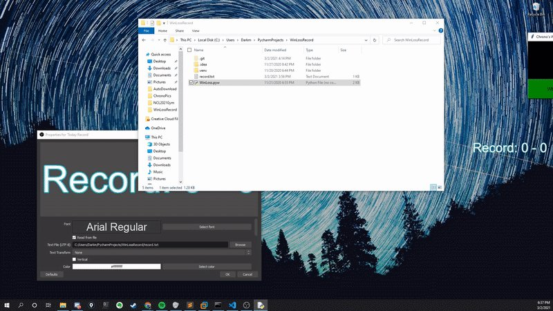</td>
</table></tr>
<table><tr>
<td>Quotes: <code>0</code></td>
<td>Replies: <code>2</code></td>
<td>Retweets: <code>8</code></td>
<td>Favorites: <code>66</code></td>
</tr></table>

---

# cyber_advising
**https://twitter.com/cyber_advising/status/1367167985560014853 _at 2021-03-03 17:40:23_**
<blockquote>
CVE-2021-23132: Joomla com_media allowed paths that are not intended for image uploads to RCE.

PoC
https://t.co/hGCx8aIPsB https://t.co/rSgYaycqH0
</blockquote>

* https://github.com/HoangKien1020/CVE-2021-23132

<table><tr>
<td>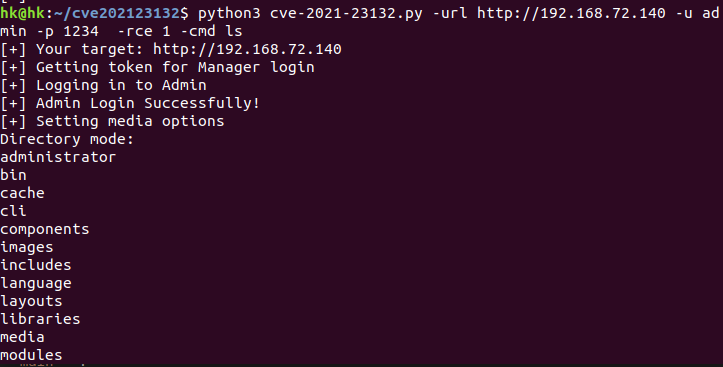</td>
</table></tr>
<table><tr>
<td>Quotes: <code>3</code></td>
<td>Replies: <code>1</code></td>
<td>Retweets: <code>99</code></td>
<td>Favorites: <code>243</code></td>
</tr></table>

---

# _Icewall
**https://twitter.com/_Icewall/status/1367153757230931969 _at 2021-03-03 16:43:50_**
<blockquote>
CVE-2020-13558 Webkit AudioSourceProviderGStreamer use-after-free vulnerability
Advisory : https://t.co/IP0AS63mfl
</blockquote>

* https://talosintelligence.com/vulnerability_reports/TALOS-2020-1172

<table><tr>
<td>Quotes: <code>0</code></td>
<td>Replies: <code>0</code></td>
<td>Retweets: <code>5</code></td>
<td>Favorites: <code>32</code></td>
</tr></table>

---

# nathanqthai
**https://twitter.com/nathanqthai/status/1367130234663940110 _at 2021-03-03 15:10:22_**
<blockquote>
Seeing traffic related to Ignition Laravel Debug RCE CVE-2021-3129. @GreyNoiseIO tag will be out soon!

Checkout @ambionics' write-up and proof-of-concept:
https://t.co/4zqhTM5eIr
https://t.co/BoO8Gfwxo6

Additional Info:
https://t.co/JnVcplvqmZ https://t.co/FONTphEjJt
</blockquote>

* https://www.ambionics.io/blog/laravel-debug-rce
* https://github.com/ambionics/laravel-exploits
* https://github.com/SNCKER/CVE-2021-3129

<table><tr>
<td>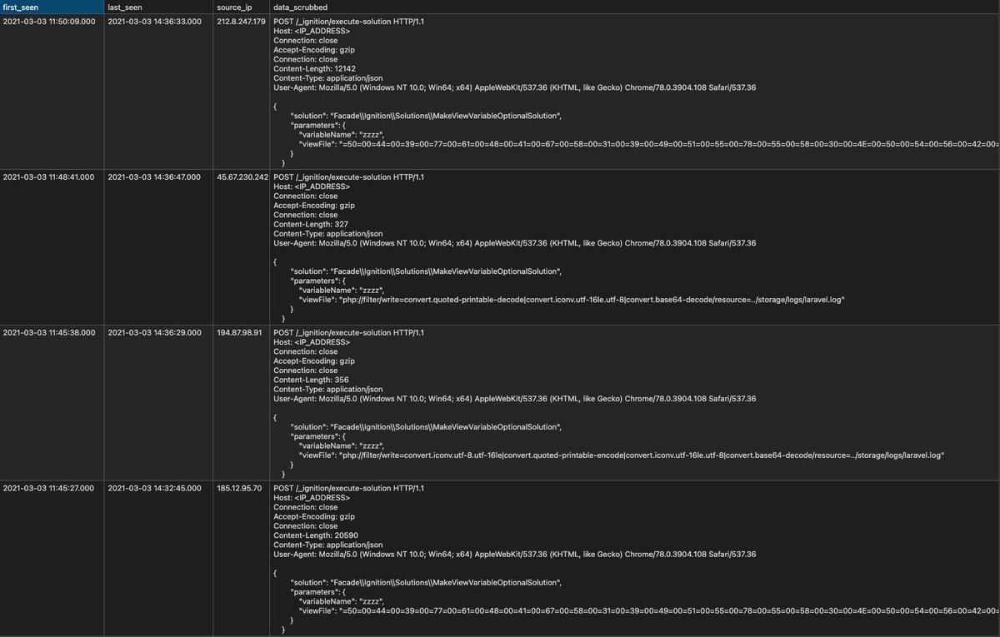</td>
</table></tr>
<table><tr>
<td>Quotes: <code>1</code></td>
<td>Replies: <code>0</code></td>
<td>Retweets: <code>4</code></td>
<td>Favorites: <code>11</code></td>
</tr></table>

---

# sec715
**https://twitter.com/sec715/status/1367110116311322624 _at 2021-03-03 13:50:26_**
<blockquote>
ClusterEngine V4.0 RCE (CVE-2020-21224)

POC:
POST /login.php

op=login&amp;username=;`cat /etc/passwd`&amp;password="

Ref:https://t.co/8bV9s3xT4x https://t.co/s0IXjkqAKn
</blockquote>

* https://github.com/NS-Sp4ce/Inspur/tree/master/ClusterEngineV4.0%20Vul

<table><tr>
<td>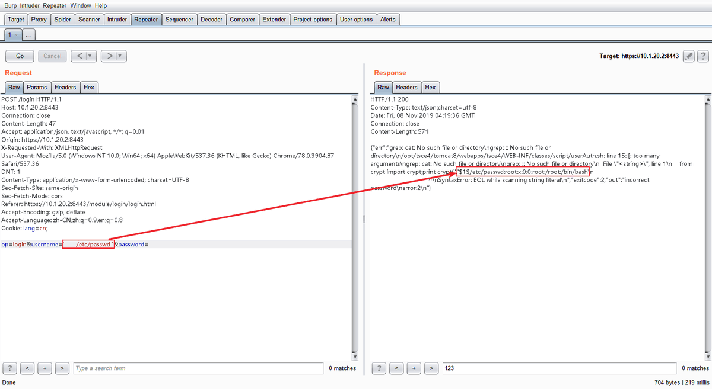</td>
</table></tr>
<table><tr>
<td>Quotes: <code>2</code></td>
<td>Replies: <code>3</code></td>
<td>Retweets: <code>74</code></td>
<td>Favorites: <code>227</code></td>
</tr></table>

---

# NCCGroupInfosec
**https://twitter.com/NCCGroupInfosec/status/1367074064699908096 _at 2021-03-03 11:27:10_**
<blockquote>
We've just released 'Wubes' - it is like Qubes but for Windows. The idea is to leverage the Windows 10 Sandbox technology to spawn applications in isolation.

We currently support @firefox but welcome contributions for others.

https://t.co/BcLPrRe0CA

by @saidelike
</blockquote>

* https://github.com/nccgroup/Wubes

<table><tr>
<td>Quotes: <code>2</code></td>
<td>Replies: <code>3</code></td>
<td>Retweets: <code>61</code></td>
<td>Favorites: <code>150</code></td>
</tr></table>

---

# BlogLoki
**https://twitter.com/BlogLoki/status/1367059614240415744 _at 2021-03-03 10:29:45_**
<blockquote>
【PoC】CVE-2020-13160

https://t.co/dyNWlSB1EV
</blockquote>

* https://www.exploit-db.com/exploits/49613

<table><tr>
<td>Quotes: <code>0</code></td>
<td>Replies: <code>0</code></td>
<td>Retweets: <code>0</code></td>
<td>Favorites: <code>0</code></td>
</tr></table>

---

# maarten_goet
**https://twitter.com/maarten_goet/status/1367027797072429056 _at 2021-03-03 08:23:19_**
<blockquote>
PATCH NOW! This is not a drill 📢

👉 HAFNIUM targeting #Exchange w/ 0day exploit: https://t.co/VPY26hPRyr
✔ @GossiTheDog created handy NMAP script: https://t.co/E7ZT1d3rkt
🏆 #MSDefender has detections &amp; detailed Threat Analytics info
💙 #AzureSentinel has analytics rules: https://t.co/x1qYfEJOKX
</blockquote>

* https://www.microsoft.com/security/blog/2021/03/02/hafnium-targeting-exchange-servers/
* https://github.com/GossiTheDog/scanning/blob/main/http-vuln-exchange.nse

<table><tr>
<td>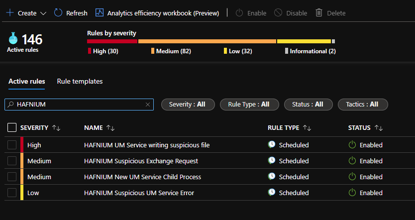</td>
</table></tr>
<table><tr>
<td>Quotes: <code>0</code></td>
<td>Replies: <code>3</code></td>
<td>Retweets: <code>56</code></td>
<td>Favorites: <code>117</code></td>
</tr></table>

---

# pentest_swissky
**https://twitter.com/pentest_swissky/status/1366979648907743232 _at 2021-03-03 05:12:00_**
<blockquote>
WINDOWS KERNEL ZERO-DAY EXPLOIT (CVE-2021-1732) IS USED BY BITTER APT IN TARGETED ATTACK https://t.co/gEMIg0vxoB
</blockquote>

* https://ti.dbappsecurity.com.cn/blog/index.php/2021/02/10/windows-kernel-zero-day-exploit-is-used-by-bitter-apt-in-targeted-attack/

<table><tr>
<td>Quotes: <code>2</code></td>
<td>Replies: <code>1</code></td>
<td>Retweets: <code>84</code></td>
<td>Favorites: <code>211</code></td>
</tr></table>

---

# tekwizz123
**https://twitter.com/tekwizz123/status/1366944380196691968 _at 2021-03-03 02:51:51_**
<blockquote>
CVE-2020-7200 PR is now up at https://t.co/QEfDVeADGv, should still be quite a few machines vulnerable to this due to a lack of a full patch (advisory at https://t.co/n4aZlSR4uY states to manually remove the affected file). Massive thanks to @testanull for his excellent writeup!
</blockquote>

* https://github.com/rapid7/metasploit-framework/pull/14846
* https://support.hpe.com/hpesc/public/docDisplay?docLocale=en_US&docId=hpesbgn04068en_us

<table><tr>
<td>Quotes: <code>1</code></td>
<td>Replies: <code>0</code></td>
<td>Retweets: <code>6</code></td>
<td>Favorites: <code>15</code></td>
</tr></table>

---

# Mefistofeles_WH
**https://twitter.com/Mefistofeles_WH/status/1366916609118330880 _at 2021-03-03 01:01:30_**
<blockquote>
Aquí está un exploit para CVE-2020-0674 (Internet Explorer UAF)

Bono: EMET 5.52 (la versión final de EMET) no parece detectar esto (en Windows x64 parece)...

https://t.co/HzEHnKjjeQ
</blockquote>

* https://github.com/maxpl0it/CVE-2020-0674-Exploit

<table><tr>
<td>Quotes: <code>0</code></td>
<td>Replies: <code>0</code></td>
<td>Retweets: <code>1</code></td>
<td>Favorites: <code>1</code></td>
</tr></table>

---

# campuscodi
**https://twitter.com/campuscodi/status/1366895005772693510 _at 2021-03-02 23:35:39_**
<blockquote>
Chrome 89 was released today.

Comes with a zero-day fix (CVE-2021-21166). As always, zero details on who's exploiting it.

https://t.co/NT2LbraHjF https://t.co/KdXvalrZpc
</blockquote>

* https://chromereleases.googleblog.com/2021/03/stable-channel-update-for-desktop.html

<table><tr>
<td>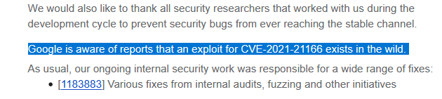</td>
</table></tr>
<table><tr>
<td>Quotes: <code>2</code></td>
<td>Replies: <code>4</code></td>
<td>Retweets: <code>37</code></td>
<td>Favorites: <code>75</code></td>
</tr></table>

---

# HaifeiLi
**https://twitter.com/HaifeiLi/status/1366878579368157188 _at 2021-03-02 22:30:23_**
<blockquote>
I want to be the first before Google researchers to report that there's also a Chrome 0day in the wild. CVE-2021-21166
https://t.co/0jGPFtJlPF
</blockquote>

* https://chromereleases.googleblog.com/

<table><tr>
<td>Quotes: <code>1</code></td>
<td>Replies: <code>0</code></td>
<td>Retweets: <code>14</code></td>
<td>Favorites: <code>54</code></td>
</tr></table>

---

# akaclandestine
**https://twitter.com/akaclandestine/status/1366852530572054530 _at 2021-03-02 20:46:52_**
<blockquote>
#Threat_Research
1. The little bug that couldn’t: Securing OpenSSL...
https://t.co/QMVshCoChD
2. CVE-2020-28243 - SaltStack Minion LPE
https://t.co/NWzO9DBWG8
]-&gt; PoC Exploit in SaltStack Minion:
https://t.co/u3RgQfXnC6
</blockquote>

* https://github.blog/2021-02-25-the-little-bug-that-couldnt-securing-openssl
* https://sec.stealthcopter.com/cve-2020-28243
* https://github.com/stealthcopter/CVE-2020-28243

<table><tr>
<td>Quotes: <code>0</code></td>
<td>Replies: <code>0</code></td>
<td>Retweets: <code>1</code></td>
<td>Favorites: <code>1</code></td>
</tr></table>

---

# chompie1337
**https://twitter.com/chompie1337/status/1366800284563963907 _at 2021-03-02 17:19:16_**
<blockquote>
My first ever blog post: Anatomy of an Exploit: RCE CVE-2020-1350 #SIGRed. RCE PoC included, for research purposes. This was my first userland Windows heap exploit and I hope a deep dive into the process will help others. Patch or apply the workaround. https://t.co/CFRTs7Wdvs
</blockquote>

* https://www.graplsecurity.com/post/anatomy-of-an-exploit-rce-with-cve-2020-1350-sigred

<table><tr>
<td>Quotes: <code>11</code></td>
<td>Replies: <code>14</code></td>
<td>Retweets: <code>291</code></td>
<td>Favorites: <code>735</code></td>
</tr></table>

---

# donk_enby
**https://twitter.com/donk_enby/status/1366783269874860036 _at 2021-03-02 16:11:39_**
<blockquote>
List of approved investments included in the data: https://t.co/jZaAvZtD20
Grouped by country which was source of the investment (a lot of multinationals do their business via Singapore)

Data also includes pending/rejected proposals and 150GB of associated confidential documents
</blockquote>

* https://gist.github.com/d0nk/cf1b8e95fe6476292c255483626d1251

<table><tr>
<td>Quotes: <code>2</code></td>
<td>Replies: <code>4</code></td>
<td>Retweets: <code>21</code></td>
<td>Favorites: <code>54</code></td>
</tr></table>

---

# misaelban
**https://twitter.com/misaelban/status/1366756179775520771 _at 2021-03-02 14:24:01_**
<blockquote>
@CVEnew #CVE-2021-21972 #VMware #vCenter Server RCE - #OpenSource script to check vulnerability

PoC With @nmap 
nmap -p443 --script cve-2021-21972.nse --script-args vulns.showall [Target IP]

https://t.co/K3w0CL5CCz 

 #CyberSecurity #infosecurity #hacking #Pentesting
</blockquote>

* https://github.com/GuayoyoLabs/CVE-2021-21972

<table><tr>
<td>Quotes: <code>1</code></td>
<td>Replies: <code>0</code></td>
<td>Retweets: <code>13</code></td>
<td>Favorites: <code>4</code></td>
</tr></table>

---

# BlogLoki
**https://twitter.com/BlogLoki/status/1366727211667972096 _at 2021-03-02 12:28:54_**
<blockquote>
【PoC】CVE-2020-25787

[webapps] Tiny Tiny RSS - Remote Code Execution https://t.co/Wbs3M6y73m #rce #feedly
</blockquote>

* https://www.exploit-db.com/exploits/49606

<table><tr>
<td>Quotes: <code>0</code></td>
<td>Replies: <code>0</code></td>
<td>Retweets: <code>1</code></td>
<td>Favorites: <code>1</code></td>
</tr></table>

---

# BlogLoki
**https://twitter.com/BlogLoki/status/1366726851406688256 _at 2021-03-02 12:27:28_**
<blockquote>
【PoC】CVE-2021-3291

[webapps] Zen Cart 1.5.7b - Remote Code Execution (Authenticated) https://t.co/K0VJRTsvdb #rce #feedly
</blockquote>

* https://www.exploit-db.com/exploits/49608

<table><tr>
<td>Quotes: <code>0</code></td>
<td>Replies: <code>0</code></td>
<td>Retweets: <code>0</code></td>
<td>Favorites: <code>1</code></td>
</tr></table>

---

# wugeej
**https://twitter.com/wugeej/status/1366653374288961538 _at 2021-03-02 07:35:30_**
<blockquote>
CVE-2021-21972 vCenter Server RCE - Nmap script to check vulnerability

Ex)
nmap -p443 --script cve-2021-21972.nse --script-args vulns.showall [Target IP]

https://t.co/1jabqgbyTk https://t.co/qKsrD3tsu1
</blockquote>

* https://github.com/GuayoyoLabs/CVE-2021-21972

<table><tr>
<td>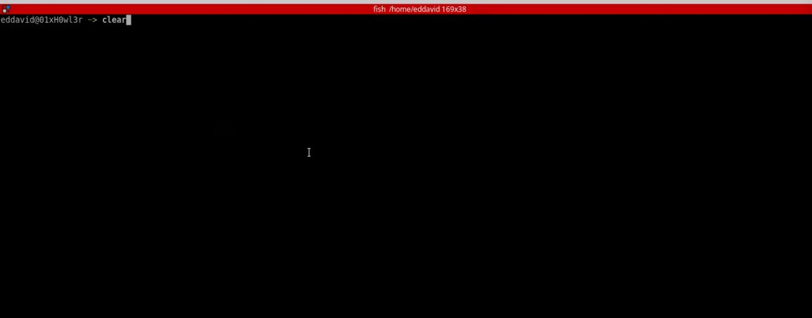</td>
</table></tr>
<table><tr>
<td>Quotes: <code>2</code></td>
<td>Replies: <code>6</code></td>
<td>Retweets: <code>129</code></td>
<td>Favorites: <code>283</code></td>
</tr></table>

---

# Synacktiv
**https://twitter.com/Synacktiv/status/1366455599412613120 _at 2021-03-01 18:29:37_**
<blockquote>
#Pwn2Own Tokyo 2020. This blogpost explains the details of our CVE-2021-27246, a remote code execution on TP-Link AC1750 Smart Wifi Router.

Exploit, wait, and get root! 

https://t.co/KmzsSmT6Fv https://t.co/NiJfaw7quS
</blockquote>

* https://www.synacktiv.com/en/publications/pwn2own-tokyo-2020-defeating-the-tp-link-ac1750.html

<table><tr>
<td>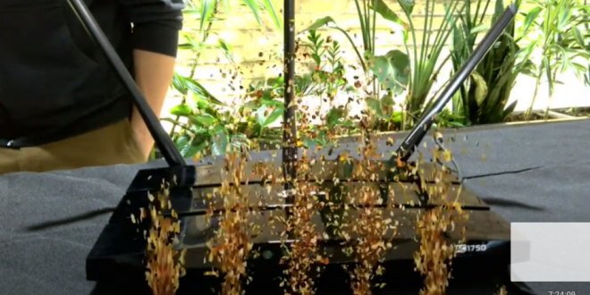</td>
</table></tr>
<table><tr>
<td>Quotes: <code>2</code></td>
<td>Replies: <code>0</code></td>
<td>Retweets: <code>67</code></td>
<td>Favorites: <code>157</code></td>
</tr></table>

---

