# jedisct1
**https://twitter.com/jedisct1/status/1385310681067573253 _at 2021-04-22 19:12:58_**
<blockquote>
OpenVPN CVE-2020-15078 https://t.co/UvRnlA7faP (but please, stop using OpenVPN. Use Wireguard, Glorytun or DSVPN).
</blockquote>

* https://community.openvpn.net/openvpn/changeset/f7b3bf067ffce72e7de49a4174fd17a3a83f0573/?__cf_chl_jschl_tk__=49fc8a303d49253be3b95811195fea4cf1e0a322-1619118638-0-AbanP_ZyaYcdRW49RI4_DIA4spBTfHfJNdPIQv43V_OTUcShKDq32WyIyB1pPtaOSPW3tmjNWzNH4SN0GsupSIeKsI48HEwjyuYHY6mCAGahcnRtMOaZ5Cou720H1ZhRlK6Zji2DiLG2KhSIVUUR-nRlt70Mw6J3tsXj9Y8Rfhqq8UkrOvdoe3zUlyK2_ovy-9XNsqKKLZ_5RtdSrBUwkDDh-PUTN03MPmhEFwSBdwarYWFwaxxtGOQznvkf0nzPx9StI9xrhGh18_VXeqHS7uV115D2f0wfmeAEoxeBHIQSc-uvhUabGoaUa_nUdDNL_22m5WMW3MXBHBJc2sBBtZRlK8R-WCscWC9Ck1qYe8KnpZCBkg-EoeEpEA90Dq3zD_QyzHh5UH-D-f_ASg_jRF1WPeZFxI2hb4uamAcEYKR9QObhpH33vUfW_70nE5VYMhUgOxi4yf6wnJdo4lzs62I

<table><tr>
<td>Quotes: <code>1</code></td>
<td>Replies: <code>3</code></td>
<td>Retweets: <code>20</code></td>
<td>Favorites: <code>41</code></td>
</tr></table>

---

# 0xTib3rius
**https://twitter.com/0xTib3rius/status/1385288733453430785 _at 2021-04-22 17:45:46_**
<blockquote>
LinPEAS has been updated. Instead of creating an SUID version of /bin/sh it now creates an empty file (using the exploit) and then checks / deletes it. Depending on how you define "exploit" this may still be #OSCP illegal. Wait for more info.

https://t.co/g9e2hcV5gU
</blockquote>

* https://github.com/carlospolop/privilege-escalation-awesome-scripts-suite/blob/84e9df0addddd9a9cfabf31e517d5a9266f9eb3a/linPEAS/linpeas.sh#L1576

<table><tr>
<td>Quotes: <code>6</code></td>
<td>Replies: <code>12</code></td>
<td>Retweets: <code>58</code></td>
<td>Favorites: <code>224</code></td>
</tr></table>

---

# blackorbird
**https://twitter.com/blackorbird/status/1385062113085825027 _at 2021-04-22 02:45:15_**
<blockquote>
Microsoft Office Remote Code Execution Vulnerability(CVE-2021-27059)
Internet Explorer Remote Code Execution Vulnerability(CVE-2021-27085)
0day(exploit) in the Wild But no one talk about it😅
https://t.co/AYawN0X30A
https://t.co/G2RYjq9dQ5 https://t.co/uUkGQJ147x
</blockquote>

* https://msrc.microsoft.com/update-guide/vulnerability/CVE-2021-27059
* https://msrc.microsoft.com/update-guide/en-US/vulnerability/CVE-2021-27085

<table><tr>
<td>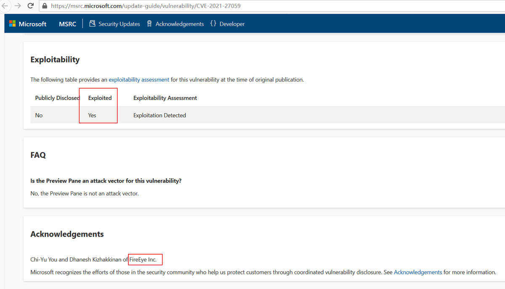</td>
<td>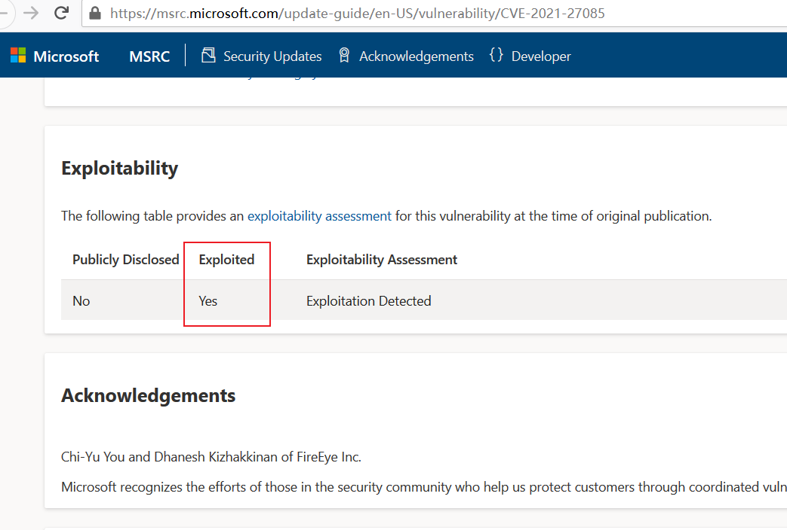</td>
</table></tr>
<table><tr>
<td>Quotes: <code>8</code></td>
<td>Replies: <code>4</code></td>
<td>Retweets: <code>213</code></td>
<td>Favorites: <code>413</code></td>
</tr></table>

---

# jedisct1
**https://twitter.com/jedisct1/status/1385016091945078787 _at 2021-04-21 23:42:23_**
<blockquote>
RT @a_denkiewicz: Here's a promised write-up of Windows Privilege Elevation bug that I've discovered / CVE-2021-26415
https://t.co/1uQoF9wA…
</blockquote>

<table><tr>
<td>Quotes: <code>0</code></td>
<td>Replies: <code>0</code></td>
<td>Retweets: <code>216</code></td>
<td>Favorites: <code>0</code></td>
</tr></table>

---

# a_denkiewicz
**https://twitter.com/a_denkiewicz/status/1384956782200725504 _at 2021-04-21 19:46:42_**
<blockquote>
Here's a promised write-up of Windows Privilege Elevation bug that I've discovered / CVE-2021-26415
https://t.co/1uQoF9wAip

#security #EOP #LPE #bugbounty https://t.co/VJzEcXw4tu
</blockquote>

* https://www.cloaked.pl/2021/04/cve-2021-26415/

<table><tr>
<td>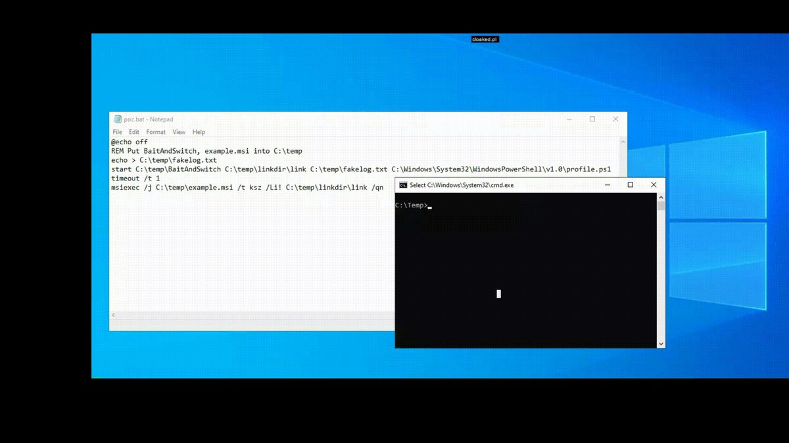</td>
</table></tr>
<table><tr>
<td>Quotes: <code>4</code></td>
<td>Replies: <code>8</code></td>
<td>Retweets: <code>232</code></td>
<td>Favorites: <code>467</code></td>
</tr></table>

---

# cherepanov74
**https://twitter.com/cherepanov74/status/1384514284059774976 _at 2021-04-20 14:28:23_**
<blockquote>
RT @JohnHultquist: Chinese cyber espionage actors (possibly including APT5) have been using a zero-day vuln (CVE-2021-22893) as well as som…
</blockquote>

<table><tr>
<td>Quotes: <code>0</code></td>
<td>Replies: <code>0</code></td>
<td>Retweets: <code>266</code></td>
<td>Favorites: <code>0</code></td>
</tr></table>

---

# JohnHultquist
**https://twitter.com/JohnHultquist/status/1384510043878576128 _at 2021-04-20 14:11:32_**
<blockquote>
Chinese cyber espionage actors (possibly including APT5) have been using a zero-day vuln (CVE-2021-22893) as well as some older, known vulns in Pulse Secure VPN to gain access to dozens of government, finance, and defense orgs in the US and Europe. https://t.co/E9gGizuDpK
</blockquote>

* https://www.fireeye.com/blog/threat-research/2021/04/suspected-apt-actors-leverage-bypass-techniques-pulse-secure-zero-day.html

<table><tr>
<td>Quotes: <code>25</code></td>
<td>Replies: <code>6</code></td>
<td>Retweets: <code>266</code></td>
<td>Favorites: <code>402</code></td>
</tr></table>

---

# SBousseaden
**https://twitter.com/SBousseaden/status/1383917216593170442 _at 2021-04-18 22:55:51_**
<blockquote>
if you see an instance of dwDrvInst.exe (unsigned by Solarwinds) running with cmdline like "smartcard -install" that could be a sign of successful RCE exploitation of CVE-2019-3980

https://t.co/FyZvQ2IYVj https://t.co/8OIarbbqeQ
</blockquote>

* https://github.com/tenable/poc/blob/master/Solarwinds/Dameware/dwrcs_dwDrvInst_rce.py

<table><tr>
<td>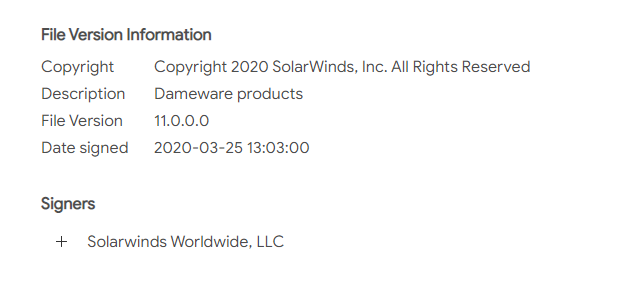</td>
<td>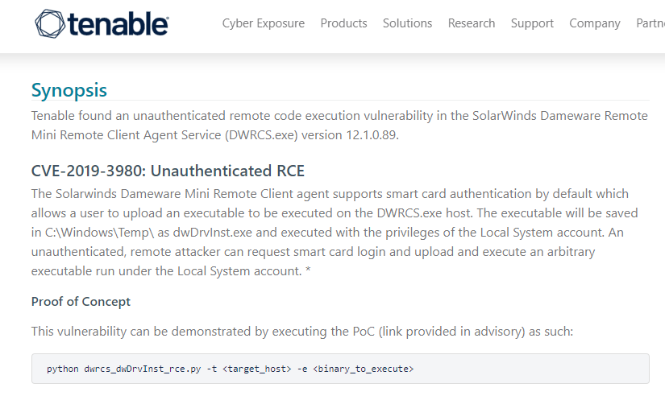</td>
</table></tr>
<table><tr>
<td>Quotes: <code>0</code></td>
<td>Replies: <code>0</code></td>
<td>Retweets: <code>38</code></td>
<td>Favorites: <code>80</code></td>
</tr></table>

---

# Arkbird_SOLG
**https://twitter.com/Arkbird_SOLG/status/1383501142676566016 _at 2021-04-17 19:22:31_**
<blockquote>
So that's the 0day from Chrome founded some days ago
https://t.co/ADpSZ5kFMY
cc @h2jazi @BushidoToken
</blockquote>

* https://github.com/avboy1337/1195777-chrome0day/blob/main/1195777.html

<table><tr>
<td>Quotes: <code>0</code></td>
<td>Replies: <code>2</code></td>
<td>Retweets: <code>13</code></td>
<td>Favorites: <code>38</code></td>
</tr></table>

---

# vxunderground
**https://twitter.com/vxunderground/status/1383184465199988739 _at 2021-04-16 22:24:09_**
<blockquote>
January 12th, 2021 Google Project Zero released CVE-2021-1647: Windows Defender mpengine remote code execution.

We were able to get our hands on a sample. You can read about it here: https://t.co/boF2BZX7rZ

You can download it here: https://t.co/mR3lKuZziK
</blockquote>

* https://googleprojectzero.github.io/0days-in-the-wild//0day-RCAs/2021/CVE-2021-1647.html
* https://vx-underground.org/tmp/

<table><tr>
<td>Quotes: <code>3</code></td>
<td>Replies: <code>0</code></td>
<td>Retweets: <code>44</code></td>
<td>Favorites: <code>130</code></td>
</tr></table>

---

# TheHackersNews
**https://twitter.com/TheHackersNews/status/1383137068683972609 _at 2021-04-16 19:15:49_**
<blockquote>
Airstrike Attack (CVE-2021-28316) — BitLocker full disk encryption bypass and Privilege Escalation on domain joined Windows workstations.

https://t.co/b80FsdYkzG https://t.co/KBes7HGZJK
</blockquote>

* https://shenaniganslabs.io/2021/04/13/Airstrike.html

<table><tr>
<td>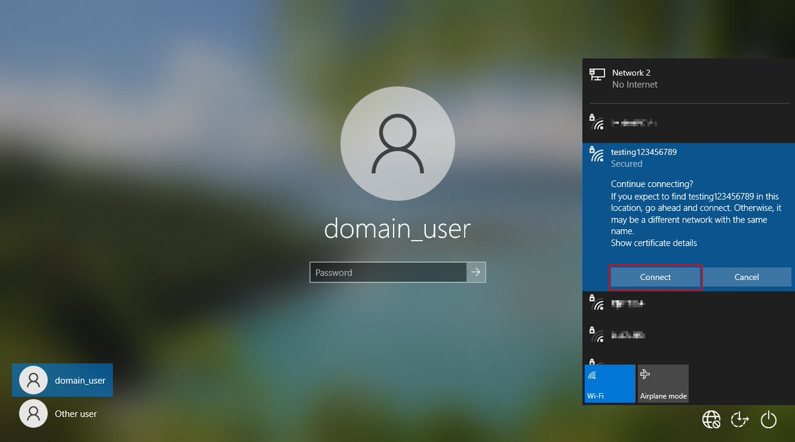</td>
</table></tr>
<table><tr>
<td>Quotes: <code>17</code></td>
<td>Replies: <code>11</code></td>
<td>Retweets: <code>318</code></td>
<td>Favorites: <code>601</code></td>
</tr></table>

---

# TheHackersNews
**https://twitter.com/TheHackersNews/status/1383136319044415488 _at 2021-04-16 19:12:50_**
<blockquote>
A critical RCE #vulnerability (CVE-2021-0254) was recently discovered in the "Junos Network Operating System" by Juniper Networks residing in the overlayd service.

Patches and vulnerable versions can be found here: https://t.co/GidSzIPGMT https://t.co/aavrHVtVLh
</blockquote>

* https://kb.juniper.net/InfoCenter/index?page=content&id=JSA11147

<table><tr>
<td></td>
</table></tr>
<table><tr>
<td>Quotes: <code>5</code></td>
<td>Replies: <code>0</code></td>
<td>Retweets: <code>49</code></td>
<td>Favorites: <code>66</code></td>
</tr></table>

---

# bad_packets
**https://twitter.com/bad_packets/status/1383132627306127364 _at 2021-04-16 18:58:10_**
<blockquote>
Mass scanning activity detected from 185.191.32.158 (🇷🇺) targeting Fortinet VPN servers vulnerable to unauthenticated arbitrary file read (CVE-2018-13379) leading to disclosure of usernames and passwords in plaintext. #threatintel https://t.co/Hrn5hr6V5H
</blockquote>

<table><tr>
<td>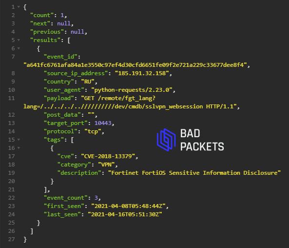</td>
</table></tr>
<table><tr>
<td>Quotes: <code>1</code></td>
<td>Replies: <code>0</code></td>
<td>Retweets: <code>17</code></td>
<td>Favorites: <code>33</code></td>
</tr></table>

---

# AdmVonSchneider
**https://twitter.com/AdmVonSchneider/status/1383052868794642435 _at 2021-04-16 13:41:14_**
<blockquote>
Ghidra 9.2.3 is out and works with BinExport.
https://t.co/Q2VGlODiVF
#BinDiff #Ghidra @GHIDRA_RE
</blockquote>

* https://github.com/google/binexport/releases/tag/v12-20210416-rc3

<table><tr>
<td>Quotes: <code>2</code></td>
<td>Replies: <code>1</code></td>
<td>Retweets: <code>59</code></td>
<td>Favorites: <code>150</code></td>
</tr></table>

---

# briankrebs
**https://twitter.com/briankrebs/status/1382767168421572620 _at 2021-04-15 18:45:58_**
<blockquote>
A joint advisory from the FBI, CISA and NSA seems to confirm my reporting from December that a VMWare flaw (CVE-2020-4006) was used as an attack vector by the Russian SVU attackers involved in SolarWinds https://t.co/dw0fnHKY7a https://t.co/cLazD1CEch https://t.co/iMyrUddM9Q
</blockquote>

* https://krebsonsecurity.com/2020/12/vmware-flaw-a-vector-in-solarwinds-breach/
* https://www.fbi.gov/news/pressrel/press-releases/russian-foreign-intelligence-service-exploiting-five-publicly-known-vulnerabilities-to-compromise-us-and-allied-networks

<table><tr>
<td>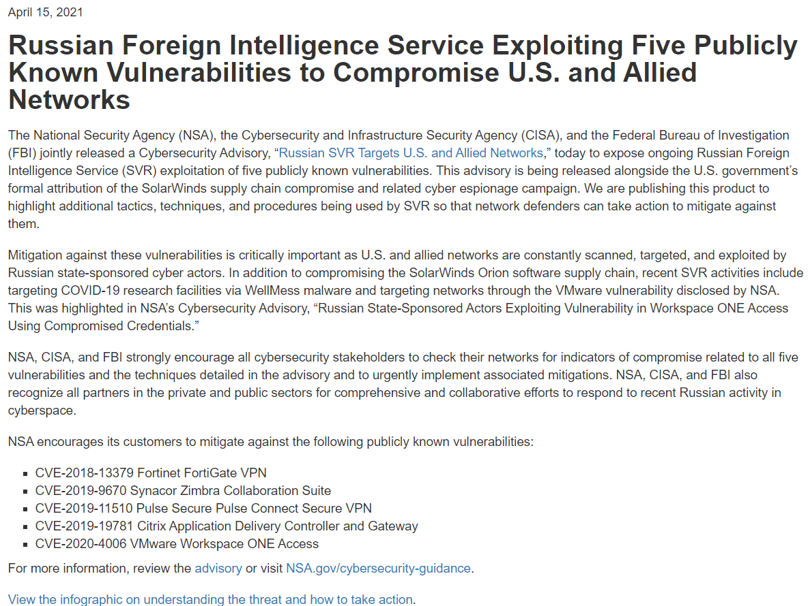</td>
</table></tr>
<table><tr>
<td>Quotes: <code>2</code></td>
<td>Replies: <code>7</code></td>
<td>Retweets: <code>103</code></td>
<td>Favorites: <code>221</code></td>
</tr></table>

---

# hosselot
**https://twitter.com/hosselot/status/1382607095439233026 _at 2021-04-15 08:09:53_**
<blockquote>
Just confirmed that following exploit works on the latest Chrome (90.0.4430.72). Attackers can convert a js JIT engine PoC to a working exploit in a few minutes thanks to WebAssembly (RWX). Dear vendors, do not publish PoC until fixed version is out.
https://t.co/VKSzwuUvkv
</blockquote>

* https://github.com/avboy1337/1195777-chrome0day

<table><tr>
<td>Quotes: <code>1</code></td>
<td>Replies: <code>1</code></td>
<td>Retweets: <code>31</code></td>
<td>Favorites: <code>71</code></td>
</tr></table>

---

# harshbothra_
**https://twitter.com/harshbothra_/status/1382554628882001921 _at 2021-04-15 04:41:24_**
<blockquote>
#Learn365 Day - 105: XXE Simplified 

Learn365 Repo: https://t.co/LDnI0Reu53

Blog by @shreyapohekar : https://t.co/b6JLORuZdL

#appsec #infosec #bugbountytips #webappsec
</blockquote>

* https://github.com/harsh-bothra/learn365
* https://shreyapohekar.com/blogs/xxe-simplified-the-concept-attacks-and-mitigations/

<table><tr>
<td>Quotes: <code>0</code></td>
<td>Replies: <code>0</code></td>
<td>Retweets: <code>30</code></td>
<td>Favorites: <code>115</code></td>
</tr></table>

---

# BlogLoki
**https://twitter.com/BlogLoki/status/1382468646547517443 _at 2021-04-14 22:59:45_**
<blockquote>
【PoC】CVE-2021-29003

https://t.co/DiimXPtM9G
</blockquote>

* https://www.exploit-db.com/exploits/49764

<table><tr>
<td>Quotes: <code>0</code></td>
<td>Replies: <code>0</code></td>
<td>Retweets: <code>0</code></td>
<td>Favorites: <code>0</code></td>
</tr></table>

---

# AdmVonSchneider
**https://twitter.com/AdmVonSchneider/status/1382390325373730822 _at 2021-04-14 17:48:31_**
<blockquote>
RT @maddiestone: ✨Root Cause Analysis for in-the-wild 0day CVE-2021-1647✨

The Windows Defender RCE that was exploited in-the-wild and patc…
</blockquote>

<table><tr>
<td>Quotes: <code>0</code></td>
<td>Replies: <code>0</code></td>
<td>Retweets: <code>249</code></td>
<td>Favorites: <code>0</code></td>
</tr></table>

---

# maddiestone
**https://twitter.com/maddiestone/status/1382372859780079620 _at 2021-04-14 16:39:07_**
<blockquote>
✨Root Cause Analysis for in-the-wild 0day CVE-2021-1647✨

The Windows Defender RCE that was exploited in-the-wild and patched in January. 

https://t.co/jZBO7NQgA2
</blockquote>

* https://googleprojectzero.github.io/0days-in-the-wild//0day-RCAs/2021/CVE-2021-1647.html

<table><tr>
<td>Quotes: <code>8</code></td>
<td>Replies: <code>5</code></td>
<td>Retweets: <code>249</code></td>
<td>Favorites: <code>581</code></td>
</tr></table>

---

# jedisct1
**https://twitter.com/jedisct1/status/1382365983264940036 _at 2021-04-14 16:11:48_**
<blockquote>
RT @_argp: Remote exploitation of a man-in-the-disk vulnerability in WhatsApp (CVE-2021-24027); epic logical exploitation writeup by huku:…
</blockquote>

<table><tr>
<td>Quotes: <code>0</code></td>
<td>Replies: <code>0</code></td>
<td>Retweets: <code>301</code></td>
<td>Favorites: <code>0</code></td>
</tr></table>

---

# geeknik
**https://twitter.com/geeknik/status/1382314856569704451 _at 2021-04-14 12:48:38_**
<blockquote>
We recently released a @pdnuclei template for CVE-2018-2894, an easily exploitable vuln which allows an unauthenticated attacker to takeover an Oracle WebLogic Server via HTTP. 🤙 https://t.co/pE8NF4q7Wi
</blockquote>

* https://github.com/projectdiscovery/nuclei-templates/blob/master/cves/2018/CVE-2018-2894.yaml

<table><tr>
<td>Quotes: <code>0</code></td>
<td>Replies: <code>0</code></td>
<td>Retweets: <code>7</code></td>
<td>Favorites: <code>26</code></td>
</tr></table>

---

# nytr0gen_
**https://twitter.com/nytr0gen_/status/1382303345994522625 _at 2021-04-14 12:02:54_**
<blockquote>
I was doing sql injection and XSSes since 11-12yo. I believe any kid can do it. I even built a tool around that time for dumping the database, which I dug up today from the archives :))) 

https://t.co/ab2vVyAjvZ
</blockquote>

* https://github.com/nytr0gen/mysql5-injection-dumper

<table><tr>
<td>Quotes: <code>0</code></td>
<td>Replies: <code>3</code></td>
<td>Retweets: <code>0</code></td>
<td>Favorites: <code>43</code></td>
</tr></table>

---

# frust93717815
**https://twitter.com/frust93717815/status/1382301769577861123 _at 2021-04-14 11:56:38_**
<blockquote>
another chrome 0day
https://t.co/QJy24ARKlU
Just here to drop a chrome 0day. Yes you read that right.
</blockquote>

* https://github.com/avboy1337/1195777-chrome0day

<table><tr>
<td>Quotes: <code>23</code></td>
<td>Replies: <code>9</code></td>
<td>Retweets: <code>191</code></td>
<td>Favorites: <code>461</code></td>
</tr></table>

---

# _argp
**https://twitter.com/_argp/status/1382250573668442112 _at 2021-04-14 08:33:12_**
<blockquote>
Remote exploitation of a man-in-the-disk vulnerability in WhatsApp (CVE-2021-24027); epic logical exploitation writeup by huku: https://t.co/ZAc64X1SUj
</blockquote>

* https://census-labs.com/news/2021/04/14/whatsapp-mitd-remote-exploitation-CVE-2021-24027/

<table><tr>
<td>Quotes: <code>20</code></td>
<td>Replies: <code>6</code></td>
<td>Retweets: <code>301</code></td>
<td>Favorites: <code>669</code></td>
</tr></table>

---

# ido_cohen2
**https://twitter.com/ido_cohen2/status/1382247075883155457 _at 2021-04-14 08:19:18_**
<blockquote>
🌐 Again, update your Exchange server's ASAP! and run this script that scans Exchange log files for IOCs to help determine whether their systems are compromised 
CVE-2021-26855

https://t.co/LMtODhe0aP

#CyberSecurity #Microsoft #Exchange #ZeroDay #0day #Cyber #databreach #CVE https://t.co/27MknRGfSg
</blockquote>

* https://github.com/microsoft/CSS-Exchange/tree/main/Security

<table><tr>
<td></td>
</table></tr>
<table><tr>
<td>Quotes: <code>1</code></td>
<td>Replies: <code>0</code></td>
<td>Retweets: <code>3</code></td>
<td>Favorites: <code>1</code></td>
</tr></table>

---

# theXSSrat
**https://twitter.com/theXSSrat/status/1382120447974768642 _at 2021-04-13 23:56:08_**
<blockquote>
I love this tool by @codingo_ !! &lt;3 https://t.co/pg4AFz4nJz

I feel like a lot of people know about content discovery but not a lot of people know about virtual hosts🚨 Def worth checking out &lt;3
</blockquote>

* https://github.com/codingo/VHostScan

<table><tr>
<td>Quotes: <code>0</code></td>
<td>Replies: <code>1</code></td>
<td>Retweets: <code>23</code></td>
<td>Favorites: <code>82</code></td>
</tr></table>

---

# e_kaspersky
**https://twitter.com/e_kaspersky/status/1382070720671453186 _at 2021-04-13 20:38:32_**
<blockquote>
Zero-day vulnerability in Desktop Window Manager (CVE-2021-28310) used in the wild 👉 https://t.co/58ZFF3hkSm https://t.co/Ay6MWO3gvk
</blockquote>

* https://kas.pr/g79y

<table><tr>
<td>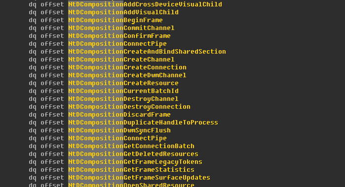</td>
</table></tr>
<table><tr>
<td>Quotes: <code>19</code></td>
<td>Replies: <code>3</code></td>
<td>Retweets: <code>254</code></td>
<td>Favorites: <code>583</code></td>
</tr></table>

---

# Alra3ees
**https://twitter.com/Alra3ees/status/1382040861584846851 _at 2021-04-13 18:39:53_**
<blockquote>
KNR-XSS-Payloads:-

Almost all XSS Payloads.

"XSS All" file contain all the XSS Payloads.

https://t.co/DMt6RnchVe
</blockquote>

* https://github.com/irfan-knr/KNR-XSS-Payloads

<table><tr>
<td>Quotes: <code>0</code></td>
<td>Replies: <code>0</code></td>
<td>Retweets: <code>134</code></td>
<td>Favorites: <code>306</code></td>
</tr></table>

---

# drivertomtt
**https://twitter.com/drivertomtt/status/1381840645061373952 _at 2021-04-13 05:24:17_**
<blockquote>
Chrome 0day曝光，POC经测试可用
复现需要用chrome --no-sandbox关闭沙箱
https://t.co/aikRuMSNax https://t.co/30645r2zdL
</blockquote>

* https://github.com/r4j0x00/exploits/tree/master/chrome-0day

<table><tr>
<td>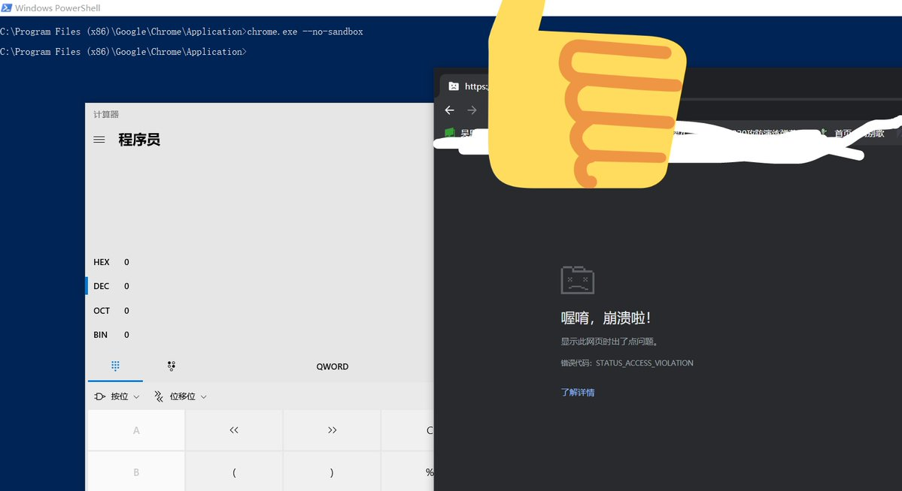</td>
</table></tr>
<table><tr>
<td>Quotes: <code>0</code></td>
<td>Replies: <code>4</code></td>
<td>Retweets: <code>8</code></td>
<td>Favorites: <code>46</code></td>
</tr></table>

---

# matrosov
**https://twitter.com/matrosov/status/1381768809824972800 _at 2021-04-13 00:38:50_**
<blockquote>
@standa_t Good stuff! Btw you can check some research I did in the past for Computrace and you can discover some pointers for the next blogs about Computrace :-)
https://t.co/YQvG9e5ptU
https://t.co/ZOCoJ37cCO
</blockquote>

* https://github.com/REhints/Publications/tree/master/Conferences/UEFI%20Firmware%20Rootkits%20Myths%20and%20Reality
* https://github.com/REhints/Publications/blob/master/Conferences/Bypassing%20Hardware%20Root%20of%20Trust/BHASIA2019_matrosov_final.pdf

<table><tr>
<td>Quotes: <code>1</code></td>
<td>Replies: <code>1</code></td>
<td>Retweets: <code>9</code></td>
<td>Favorites: <code>48</code></td>
</tr></table>

---

# aaditya_purani
**https://twitter.com/aaditya_purani/status/1381649069957767168 _at 2021-04-12 16:43:02_**
<blockquote>
Got assigned 4 CVE-IDs for my findings on ObserveIT. All findings are marked as "High" Severity. 

If you run ObserveIT, it is recommended to update.

CVE-2021-27900 (Authorization Bypass)
CVE-2021-22158 (XXE)
CVE-2021-27899 (Imp Cert validation)
CVE-2021-22157 (Multiple XSS)
</blockquote>

<table><tr>
<td>Quotes: <code>1</code></td>
<td>Replies: <code>3</code></td>
<td>Retweets: <code>13</code></td>
<td>Favorites: <code>98</code></td>
</tr></table>

---

# r4j0x00
**https://twitter.com/r4j0x00/status/1381643526010597380 _at 2021-04-12 16:21:00_**
<blockquote>
Just here to drop a chrome 0day. Yes you read that right.
https://t.co/sKDKmRYWBP https://t.co/PpVJrVitLR
</blockquote>

* https://github.com/r4j0x00/exploits/tree/master/chrome-0day

<table><tr>
<td>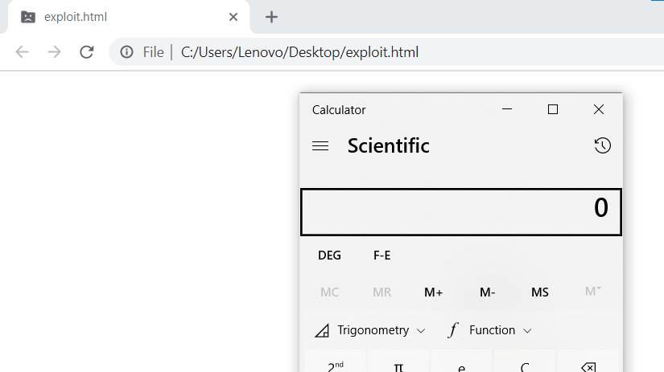</td>
</table></tr>
<table><tr>
<td>Quotes: <code>81</code></td>
<td>Replies: <code>60</code></td>
<td>Retweets: <code>859</code></td>
<td>Favorites: <code>2594</code></td>
</tr></table>

---

# pry0cc
**https://twitter.com/pry0cc/status/1381336352827015173 _at 2021-04-11 20:00:25_**
<blockquote>
Run this with glow (https://t.co/CmWnneNvTA) on PayloadsAllTheThings for a searchable fuzzy finder reference! 

glow "$(find ~/docs/PayloadsAllTheThings -name "https://t.co/oKq3GqCMrE" | fzf)" --pager https://t.co/IJzWfhW54n
</blockquote>

* https://github.com/charmbracelet/glow
* http://README.md

<table><tr>
<td>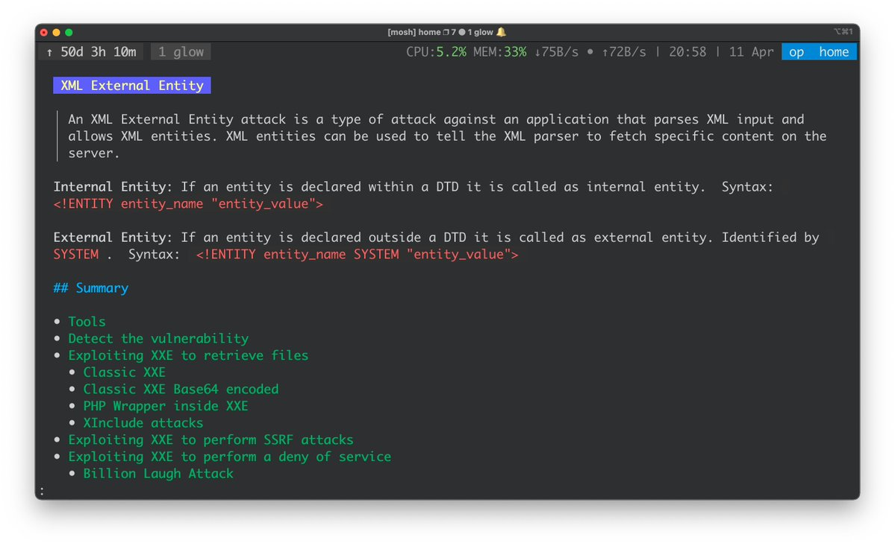</td>
<td></td>
</table></tr>
<table><tr>
<td>Quotes: <code>3</code></td>
<td>Replies: <code>4</code></td>
<td>Retweets: <code>25</code></td>
<td>Favorites: <code>114</code></td>
</tr></table>

---

# mdisec
**https://twitter.com/mdisec/status/1381288667419918338 _at 2021-04-11 16:50:56_**
<blockquote>
For those who interested with msf module.

https://t.co/7XTJkkAgAJ
</blockquote>

* https://github.com/rapid7/metasploit-framework/pull/15030

<table><tr>
<td>Quotes: <code>0</code></td>
<td>Replies: <code>0</code></td>
<td>Retweets: <code>4</code></td>
<td>Favorites: <code>37</code></td>
</tr></table>

---

# jedisct1
**https://twitter.com/jedisct1/status/1381182604322476033 _at 2021-04-11 09:49:28_**
<blockquote>
RT @Enno_Insinuator: Fuzzotron is a simple network fuzzer supporting TCP, UDP and multithreading
https://t.co/cPzjfAwHmH
</blockquote>

* https://github.com/denandz/fuzzotron

<table><tr>
<td>Quotes: <code>0</code></td>
<td>Replies: <code>0</code></td>
<td>Retweets: <code>34</code></td>
<td>Favorites: <code>0</code></td>
</tr></table>

---

# sec715
**https://twitter.com/sec715/status/1381045152135831555 _at 2021-04-11 00:43:17_**
<blockquote>
TurboCRM XSS Tested With Nuclei 

POC:
http://IP/login/forgetpswd.php?loginsys=1&amp;orgcode=%22%3E%3Cscript%3Ealert(/XSS/)%3C/script%3E&amp;loginname=%22%3E%3Cscript%3Ealert(/XSS/)%3C/script%3E

Ref:https://t.co/X9nVcvs4Wc https://t.co/CLSakvA9nl
</blockquote>

* https://gist.github.com/pikpikcu/9689c5220abbe04d4927ffa660241b4a

<table><tr>
<td>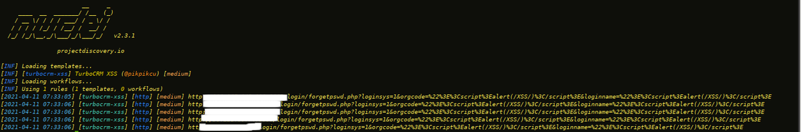</td>
</table></tr>
<table><tr>
<td>Quotes: <code>0</code></td>
<td>Replies: <code>2</code></td>
<td>Retweets: <code>43</code></td>
<td>Favorites: <code>139</code></td>
</tr></table>

---

# Enno_Insinuator
**https://twitter.com/Enno_Insinuator/status/1380861458804785153 _at 2021-04-10 12:33:21_**
<blockquote>
Fuzzotron is a simple network fuzzer supporting TCP, UDP and multithreading
https://t.co/cPzjfAwHmH
</blockquote>

* https://github.com/denandz/fuzzotron

<table><tr>
<td>Quotes: <code>1</code></td>
<td>Replies: <code>0</code></td>
<td>Retweets: <code>34</code></td>
<td>Favorites: <code>87</code></td>
</tr></table>

---

# AdmVonSchneider
**https://twitter.com/AdmVonSchneider/status/1380837183527993346 _at 2021-04-10 10:56:53_**
<blockquote>
Just updated BinExport for Binary Ninja:
https://t.co/fDxRw4aYdR
(macOS bins not notarized, though)
#BinDiff @vector35
</blockquote>

* https://github.com/google/binexport/releases/tag/v11-20210410-rc2

<table><tr>
<td>Quotes: <code>1</code></td>
<td>Replies: <code>1</code></td>
<td>Retweets: <code>12</code></td>
<td>Favorites: <code>33</code></td>
</tr></table>

---

# iamelli0t
**https://twitter.com/iamelli0t/status/1380819370755072001 _at 2021-04-10 09:46:07_**
<blockquote>
[New Blog] Exploiting Windows RPC to bypass CFG mitigation: analysis of CVE-2021-26411 in-the-wild sample
https://t.co/mmM0B9BzN3 https://t.co/kxR7HWkueb
</blockquote>

* https://iamelli0t.github.io/2021/04/10/RPC-Bypass-CFG.html

<table><tr>
<td>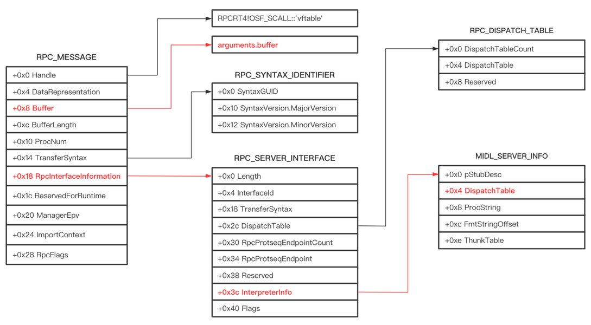</td>
</table></tr>
<table><tr>
<td>Quotes: <code>4</code></td>
<td>Replies: <code>1</code></td>
<td>Retweets: <code>230</code></td>
<td>Favorites: <code>527</code></td>
</tr></table>

---

# WangTielei
**https://twitter.com/WangTielei/status/1380705360298835970 _at 2021-04-10 02:13:04_**
<blockquote>
Slides for my talk "Rooting macOS Big Sur on Apple Silicon" on zer0con21, demonstrating how we found new bugs by analyzing patches for a bug found by GP0 being exploited in the wild, and how to exploit the new bugs to achieve privilege escalation.
https://t.co/vPfQ16Y7Ig
</blockquote>

* https://github.com/wangtielei/Slides/blob/main/zer0con21.pdf

<table><tr>
<td>Quotes: <code>1</code></td>
<td>Replies: <code>7</code></td>
<td>Retweets: <code>135</code></td>
<td>Favorites: <code>398</code></td>
</tr></table>

---

# zeroSteiner
**https://twitter.com/zeroSteiner/status/1380607912058494976 _at 2021-04-09 19:45:51_**
<blockquote>
This week I got around to adding @chompie1337's SMBGhost RCE to Metasploit, learned quite a bit while doing so too https://t.co/1fseak4NyQ
</blockquote>

* https://github.com/rapid7/metasploit-framework/pull/15024

<table><tr>
<td>Quotes: <code>3</code></td>
<td>Replies: <code>3</code></td>
<td>Retweets: <code>68</code></td>
<td>Favorites: <code>176</code></td>
</tr></table>

---

# jedisct1
**https://twitter.com/jedisct1/status/1380580516722831360 _at 2021-04-09 17:56:59_**
<blockquote>
[CVE-2021-29154] Linux kernel incorrect computation of branch displacements in BPF JIT compiler can be abused to execute arbitrary code in Kernel mode https://t.co/fFqxuRv7f6
</blockquote>

* https://www.openwall.com/lists/oss-security/2021/04/08/1

<table><tr>
<td>Quotes: <code>26</code></td>
<td>Replies: <code>1</code></td>
<td>Retweets: <code>77</code></td>
<td>Favorites: <code>205</code></td>
</tr></table>

---

# BlogLoki
**https://twitter.com/BlogLoki/status/1380331951723216898 _at 2021-04-09 01:29:17_**
<blockquote>
【PoC】CVE-2020-14166

・XSSを経由して任意のファイルをアップロード可能

https://t.co/jRtbhpPGVi
</blockquote>

* https://www.exploit-db.com/exploits/49748

<table><tr>
<td>Quotes: <code>0</code></td>
<td>Replies: <code>0</code></td>
<td>Retweets: <code>0</code></td>
<td>Favorites: <code>1</code></td>
</tr></table>

---

# jedisct1
**https://twitter.com/jedisct1/status/1380107279773671431 _at 2021-04-08 10:36:31_**
<blockquote>
RT @TheHackersNews: Technical details and a proof of concept have been released for denial of service #vulnerability (CVE-2021-24086) affec…
</blockquote>

<table><tr>
<td>Quotes: <code>0</code></td>
<td>Replies: <code>0</code></td>
<td>Retweets: <code>65</code></td>
<td>Favorites: <code>0</code></td>
</tr></table>

---

# mdisec
**https://twitter.com/mdisec/status/1380088335977353216 _at 2021-04-08 09:21:14_**
<blockquote>
Hey folks ! Update your GravCMS asap. 

Unexpected Journey #7 – GravCMS Unauthenticated Arbitrary YAML Write/Update leads to Remote Code Execution (CVE-2021-21425)

https://t.co/C5w2dEGe5t
</blockquote>

* https://pentest.blog/unexpected-journey-7-gravcms-unauthenticated-arbitrary-yaml-write-update-leads-to-code-execution/

<table><tr>
<td>Quotes: <code>4</code></td>
<td>Replies: <code>2</code></td>
<td>Retweets: <code>25</code></td>
<td>Favorites: <code>84</code></td>
</tr></table>

---

# TheHackersNews
**https://twitter.com/TheHackersNews/status/1380080499209564160 _at 2021-04-08 08:50:06_**
<blockquote>
Technical details and a proof of concept have been released for denial of service #vulnerability (CVE-2021-24086) affecting IPv6 stacks in all supported versions of the Windows operating system.

https://t.co/Y17nwlaYRg https://t.co/Nzhk8Uwe47
</blockquote>

* https://blog.quarkslab.com/analysis-of-a-windows-ipv6-fragmentation-vulnerability-cve-2021-24086.html

<table><tr>
<td>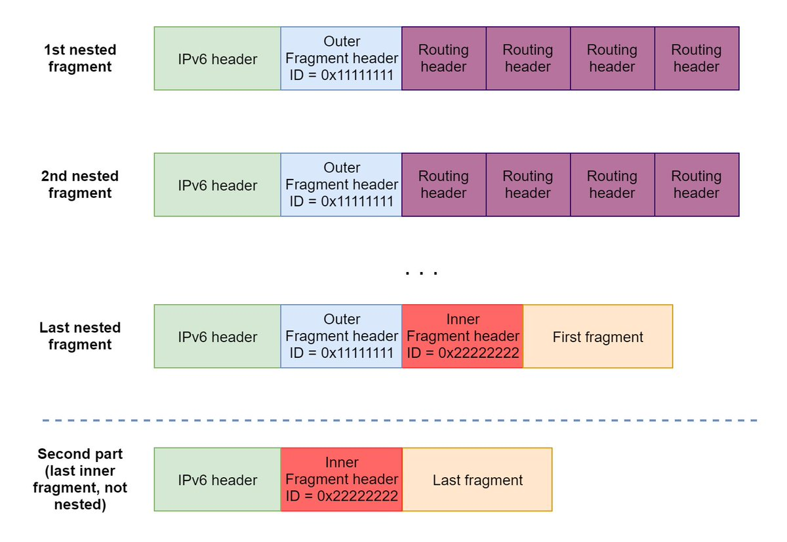</td>
</table></tr>
<table><tr>
<td>Quotes: <code>2</code></td>
<td>Replies: <code>1</code></td>
<td>Retweets: <code>65</code></td>
<td>Favorites: <code>112</code></td>
</tr></table>

---

# jedisct1
**https://twitter.com/jedisct1/status/1380054299380682755 _at 2021-04-08 07:05:59_**
<blockquote>
RT @campuscodi: New Cring ransomware deployed via unpatched Fortinet VPNs

CVE-2018-13379 -- the gift that keeps on giving!

https://t.co/5…
</blockquote>

<table><tr>
<td>Quotes: <code>0</code></td>
<td>Replies: <code>0</code></td>
<td>Retweets: <code>174</code></td>
<td>Favorites: <code>0</code></td>
</tr></table>

---

# Anastasis_King
**https://twitter.com/Anastasis_King/status/1380050110768353281 _at 2021-04-08 06:49:21_**
<blockquote>
CVE-2020-16040 : Google Chrome prior 87.0.4280.88 V8 Remote Code Execution PoC

https://t.co/Uu3ewbZqiw
</blockquote>

* https://github.com/r4j0x00/exploits/blob/master/CVE-2020-16040/exploit.js

<table><tr>
<td>Quotes: <code>0</code></td>
<td>Replies: <code>0</code></td>
<td>Retweets: <code>0</code></td>
<td>Favorites: <code>0</code></td>
</tr></table>

---

# ofjaaah
**https://twitter.com/ofjaaah/status/1379979159083057153 _at 2021-04-08 02:07:24_**
<blockquote>
xargs -a xss -P10 -I@ sh -c 'goop @ | grep 200'

goop to search .git files.

https://t.co/pszczYP3Gg

#bugbounty #bugbountytips https://t.co/C4O6JamQG7
</blockquote>

* https://github.com/deletescape/goop

<table><tr>
<td>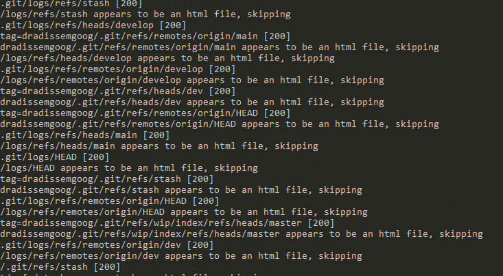</td>
</table></tr>
<table><tr>
<td>Quotes: <code>0</code></td>
<td>Replies: <code>2</code></td>
<td>Retweets: <code>28</code></td>
<td>Favorites: <code>92</code></td>
</tr></table>

---

# fdfalcon
**https://twitter.com/fdfalcon/status/1379827925965549570 _at 2021-04-07 16:06:28_**
<blockquote>
Just published my analysis and PoC for CVE-2021-24086, an IPv6 fragmentation vulnerability on Windows: 

https://t.co/grUrwJgdZb https://t.co/97pbm2cpI9
</blockquote>

* https://blog.quarkslab.com/analysis-of-a-windows-ipv6-fragmentation-vulnerability-cve-2021-24086.html

<table><tr>
<td></td>
</table></tr>
<table><tr>
<td>Quotes: <code>12</code></td>
<td>Replies: <code>5</code></td>
<td>Retweets: <code>162</code></td>
<td>Favorites: <code>334</code></td>
</tr></table>

---

# campuscodi
**https://twitter.com/campuscodi/status/1379822702316388355 _at 2021-04-07 15:45:42_**
<blockquote>
New Cring ransomware deployed via unpatched Fortinet VPNs

CVE-2018-13379 -- the gift that keeps on giving!

https://t.co/56ervYeOSk https://t.co/Gs3xopiGm9
</blockquote>

* https://therecord.media/new-cring-ransomware-deployed-via-unpatched-fortinet-vpns/

<table><tr>
<td></td>
</table></tr>
<table><tr>
<td>Quotes: <code>7</code></td>
<td>Replies: <code>3</code></td>
<td>Retweets: <code>174</code></td>
<td>Favorites: <code>295</code></td>
</tr></table>

---

# jedisct1
**https://twitter.com/jedisct1/status/1379783214877786118 _at 2021-04-07 13:08:48_**
<blockquote>
RT @0vercl0k: I've built a PoC for CVE-2021-24086: https://t.co/YKRacxk73X 🔥

Will blog about the details later on https://t.co/5IU7XSFNIQ…
</blockquote>

* https://github.com/0vercl0k/CVE-2021-24086
* http://doar-e.github.io

<table><tr>
<td>Quotes: <code>0</code></td>
<td>Replies: <code>0</code></td>
<td>Retweets: <code>260</code></td>
<td>Favorites: <code>0</code></td>
</tr></table>

---

# 0vercl0k
**https://twitter.com/0vercl0k/status/1379779764605620225 _at 2021-04-07 12:55:05_**
<blockquote>
I've built a PoC for CVE-2021-24086: https://t.co/YKRacxk73X 🔥

Will blog about the details later on https://t.co/5IU7XSFNIQ 🍻 https://t.co/sbR7rKIr62
</blockquote>

* https://github.com/0vercl0k/CVE-2021-24086
* http://doar-e.github.io

<table><tr>
<td>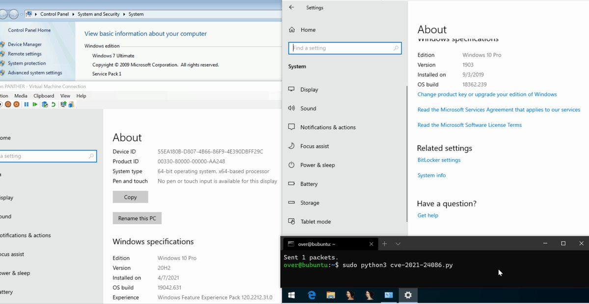</td>
</table></tr>
<table><tr>
<td>Quotes: <code>14</code></td>
<td>Replies: <code>3</code></td>
<td>Retweets: <code>260</code></td>
<td>Favorites: <code>607</code></td>
</tr></table>

---

# FabiusArtrel
**https://twitter.com/FabiusArtrel/status/1379610288647979008 _at 2021-04-07 01:41:39_**
<blockquote>
As technical details have been made public, I'm sharing my exploit for vRealize. It leverage CVE-2021-21975 and CVE-2021-21983 as well as a privesc 0day. This is my first project in go, so feedback is welcome.

#VMware #vRealize #SSRF #RCE #0day

https://t.co/NGXOUh1RSf
</blockquote>

* https://github.com/rabidwh0re/REALITY_SMASHER

<table><tr>
<td>Quotes: <code>0</code></td>
<td>Replies: <code>1</code></td>
<td>Retweets: <code>8</code></td>
<td>Favorites: <code>12</code></td>
</tr></table>

---

# github
**https://twitter.com/github/status/1379527313277267972 _at 2021-04-06 20:11:56_**
<blockquote>
Ever wanted to pair program with your favorite open source maintainer, or book a support session with a project you use? GitHub Sponsors now supports one-time payments – go invest in the open source economy today. ✨ 

https://t.co/8vr3AixwY1 https://t.co/hh50hiAuAZ
</blockquote>

* https://github.com/sponsors/community

<table><tr>
<td></td>
</table></tr>
<table><tr>
<td>Quotes: <code>115</code></td>
<td>Replies: <code>28</code></td>
<td>Retweets: <code>310</code></td>
<td>Favorites: <code>1353</code></td>
</tr></table>

---

# fr0gger_
**https://twitter.com/fr0gger_/status/1379465947505889283 _at 2021-04-06 16:08:05_**
<blockquote>
A good paper about the use of #windows privileges for #LPE https://t.co/ks9ybEcpPI
</blockquote>

* https://github.com/hatRiot/token-priv/blob/master/abusing_token_eop_1.0.txt

<table><tr>
<td>Quotes: <code>0</code></td>
<td>Replies: <code>1</code></td>
<td>Retweets: <code>22</code></td>
<td>Favorites: <code>85</code></td>
</tr></table>

---

# binitamshah
**https://twitter.com/binitamshah/status/1379399971603107842 _at 2021-04-06 11:45:55_**
<blockquote>
Tracee: Linux Runtime Security and Forensics using eBPF : https://t.co/OnTGAHsU63
</blockquote>

* https://github.com/aquasecurity/tracee

<table><tr>
<td>Quotes: <code>2</code></td>
<td>Replies: <code>0</code></td>
<td>Retweets: <code>36</code></td>
<td>Favorites: <code>95</code></td>
</tr></table>

---

# binitamshah
**https://twitter.com/binitamshah/status/1379397332270084097 _at 2021-04-06 11:35:26_**
<blockquote>
TeleRAT : It uses Telegram for sending commands and receiving data to and from a victim computer (written in Python) : https://t.co/mbgcguWqO4 

Coqui : Bare Bones Banking malware coded for research &amp; educational purposes : https://t.co/jcgTfW4Df1
</blockquote>

* https://github.com/1d8/teleRAT
* https://github.com/1d8/Coqui

<table><tr>
<td>Quotes: <code>0</code></td>
<td>Replies: <code>1</code></td>
<td>Retweets: <code>39</code></td>
<td>Favorites: <code>74</code></td>
</tr></table>

---

# BlogLoki
**https://twitter.com/BlogLoki/status/1379392422174715907 _at 2021-04-06 11:15:55_**
<blockquote>
【PoC】CVE-2020-6507、CVE-2020-16040

久しく見なかったChromeのPoCです。RCEです。

・CVE-2020-6507
https://t.co/WMgmtNH19t
・CVE-2020-16040
https://t.co/XOpyyESkS7
</blockquote>

* https://www.exploit-db.com/exploits/49746
* https://www.exploit-db.com/exploits/49745

<table><tr>
<td>Quotes: <code>0</code></td>
<td>Replies: <code>0</code></td>
<td>Retweets: <code>1</code></td>
<td>Favorites: <code>1</code></td>
</tr></table>

---

# Hamza_Mega
**https://twitter.com/Hamza_Mega/status/1379237723769307139 _at 2021-04-06 01:01:13_**
<blockquote>
CVE-2020-16040 : Google Chrome prior 87.0.4280.88 V8 Remote Code Execution PoC @ExploitWareLabs

https://t.co/ba4YVa3tOt
</blockquote>

* https://github.com/r4j0x00/exploits/blob/master/CVE-2020-16040/exploit.js

<table><tr>
<td>Quotes: <code>0</code></td>
<td>Replies: <code>0</code></td>
<td>Retweets: <code>0</code></td>
<td>Favorites: <code>0</code></td>
</tr></table>

---

# vector35
**https://twitter.com/vector35/status/1379185551996284930 _at 2021-04-05 21:33:54_**
<blockquote>
Our latest blog post shows the behind-the-scenes details on the new AArch64 module that was open-sourced earlier this year (https://t.co/FyrFMu2DUD) is built from the machine-readable ARM specification: https://t.co/Um6sxNMPJG
</blockquote>

* https://github.com/vector35/arch-arm64
* https://binary.ninja/2021/04/05/groundup-aarch64.html

<table><tr>
<td>Quotes: <code>1</code></td>
<td>Replies: <code>0</code></td>
<td>Retweets: <code>12</code></td>
<td>Favorites: <code>32</code></td>
</tr></table>

---

# mikey96_bh
**https://twitter.com/mikey96_bh/status/1378851494976483329 _at 2021-04-04 23:26:28_**
<blockquote>
Decided to release the tool - Reflection - that 
@castilho101 and I have been working on, it automates searching a large number of endpoints for XSS, SQLi &amp; SSRF in hidden parameters. Give it a try and give us some feedback! #BugBounty #bugbountytips https://t.co/QeQ4aqHNCG
</blockquote>

* https://github.com/mikey96/reflection-public

<table><tr>
<td>Quotes: <code>7</code></td>
<td>Replies: <code>7</code></td>
<td>Retweets: <code>123</code></td>
<td>Favorites: <code>285</code></td>
</tr></table>

---

# ptracesecurity
**https://twitter.com/ptracesecurity/status/1378749233730351104 _at 2021-04-04 16:40:07_**
<blockquote>
One day short of a full chain: Part 3 - Chrome renderer RCE https://t.co/0wkhvKFY3e  #Pentesting #WebSecurity #CyberSecurity #Infosec https://t.co/CByIiUW8tw
</blockquote>

* https://securitylab.github.com/research/one_day_short_of_a_fullchain_renderer/

<table><tr>
<td>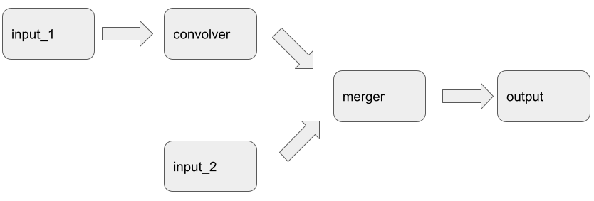</td>
<td>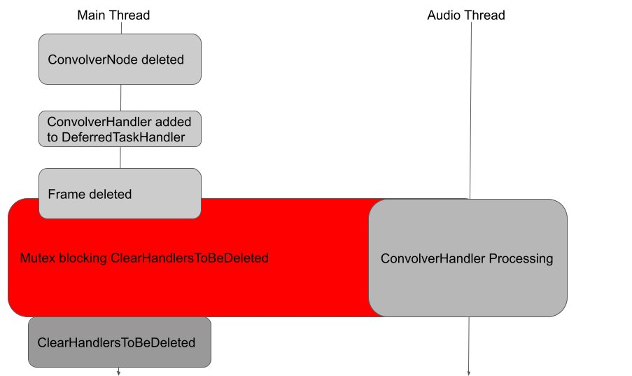</td>
<td>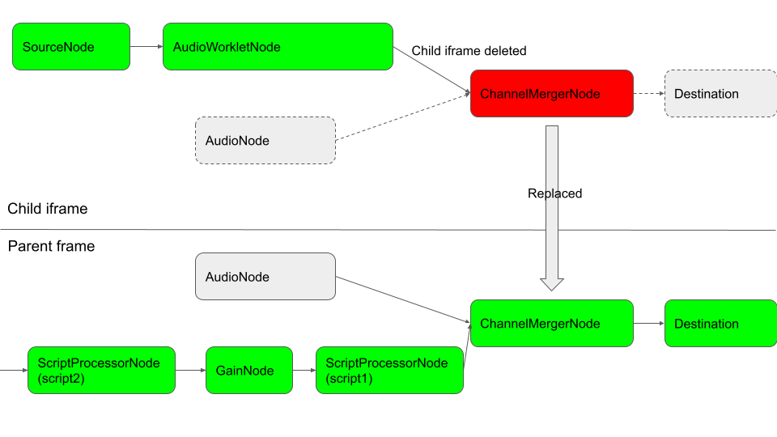</td>
<td>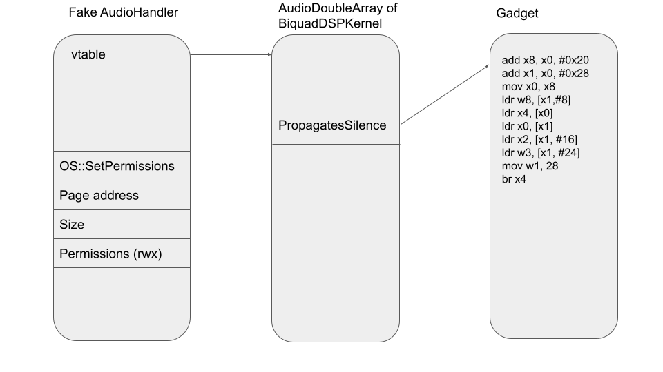</td>
</table></tr>
<table><tr>
<td>Quotes: <code>0</code></td>
<td>Replies: <code>0</code></td>
<td>Retweets: <code>30</code></td>
<td>Favorites: <code>34</code></td>
</tr></table>

---

# nao_sec
**https://twitter.com/nao_sec/status/1378546891349106692 _at 2021-04-04 03:16:05_**
<blockquote>
#PurpleFox Exploit Kit has exploited CVE-2021-26411!?
(CC: @malware_traffic, @jeromesegura)
https://t.co/UpqQrPuR42 https://t.co/p4ej4O0O9w
</blockquote>

* https://app.any.run/tasks/0f8a285f-8ff1-47cd-9ccf-c9cb3397daf4

<table><tr>
<td>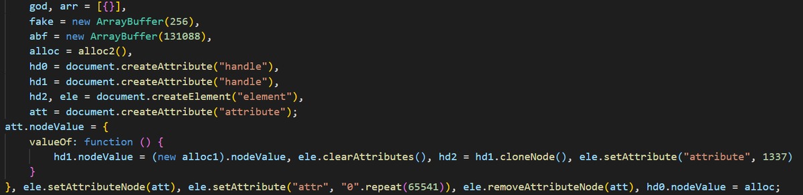</td>
<td>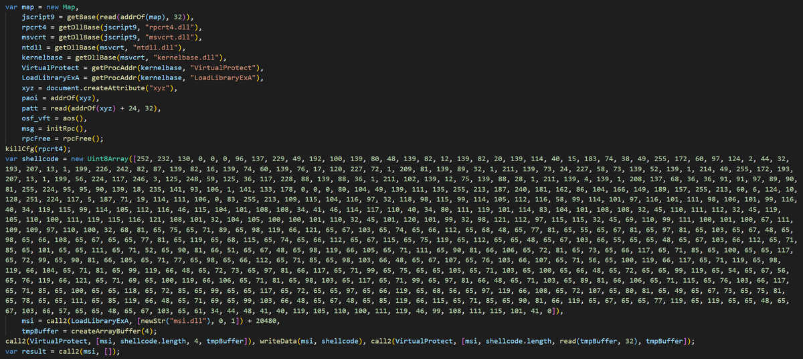</td>
</table></tr>
<table><tr>
<td>Quotes: <code>4</code></td>
<td>Replies: <code>2</code></td>
<td>Retweets: <code>52</code></td>
<td>Favorites: <code>146</code></td>
</tr></table>

---

# bad_packets
**https://twitter.com/bad_packets/status/1378414106777034753 _at 2021-04-03 18:28:27_**
<blockquote>
Mass scanning activity detected from 45.155.205.165 (🇷🇺) targeting Fortinet VPN servers vulnerable to unauthenticated arbitrary file read (CVE-2018-13379) leading to disclosure of usernames and passwords in plaintext. #threatintel https://t.co/SIgxNEGd88
</blockquote>

<table><tr>
<td>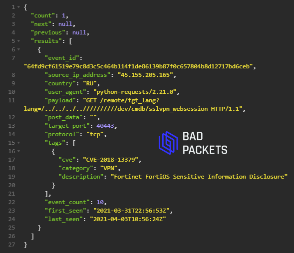</td>
</table></tr>
<table><tr>
<td>Quotes: <code>3</code></td>
<td>Replies: <code>1</code></td>
<td>Retweets: <code>51</code></td>
<td>Favorites: <code>87</code></td>
</tr></table>

---

# jedisct1
**https://twitter.com/jedisct1/status/1378314414617677825 _at 2021-04-03 11:52:18_**
<blockquote>
This man thought opening a TXT file is fine, he thought wrong. macOS CVE-2019-8761 https://t.co/2tOuCvLqUR
</blockquote>

* https://www.paulosyibelo.com/2021/04/this-man-thought-opening-txt-file-is.html

<table><tr>
<td>Quotes: <code>4</code></td>
<td>Replies: <code>1</code></td>
<td>Retweets: <code>26</code></td>
<td>Favorites: <code>65</code></td>
</tr></table>

---

# dotMorten
**https://twitter.com/dotMorten/status/1378134814910341121 _at 2021-04-02 23:58:39_**
<blockquote>
Woohoo! The #WinUI 3 memory leaks in .NET has been fixed. And what a fix it took https://t.co/58Eizb3HpY
</blockquote>

* https://github.com/microsoft/CsWinRT/pull/782/files

<table><tr>
<td>Quotes: <code>1</code></td>
<td>Replies: <code>3</code></td>
<td>Retweets: <code>6</code></td>
<td>Favorites: <code>60</code></td>
</tr></table>

---

# goby77463399
**https://twitter.com/goby77463399/status/1377512468336029700 _at 2021-04-01 06:45:40_**
<blockquote>
New vulnerability: Apache OFBiz rmi RCE（CVE-2021-26295）

More Vulnerabilities, https://t.co/wkYqnJXCLb
Provide Feedback, https://t.co/A9JYTBSEIR
Join Telegram, https://t.co/uI4YmQTLPX https://t.co/9pzfrtw0as
</blockquote>

* http://github.com/gobysec/GobyVuls
* http://github.com/Gobysec/Goby/issues
* http://t.me/gobies

<table><tr>
<td>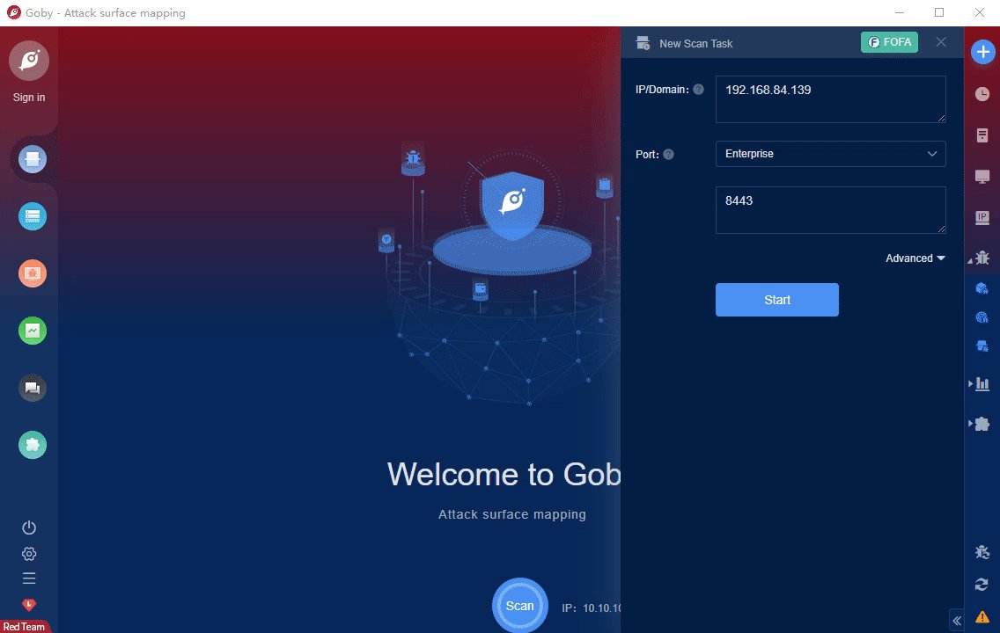</td>
</table></tr>
<table><tr>
<td>Quotes: <code>0</code></td>
<td>Replies: <code>0</code></td>
<td>Retweets: <code>3</code></td>
<td>Favorites: <code>1</code></td>
</tr></table>

---

