# 0vercl0k
**https://twitter.com/0vercl0k/status/1399475341601607685 _at 2021-05-31 21:18:17_**
<blockquote>
I built a PoC for CVE-2021-28476, a guest-to-host "Hyper-V Remote Code Execution Vulnerability" in vmswitch.sys: https://t.co/PPEHLHbPyw 🔥🔥 https://t.co/aKCAwk42gj
</blockquote>

* https://github.com/0vercl0k/CVE-2021-28476

<table><tr>
<td>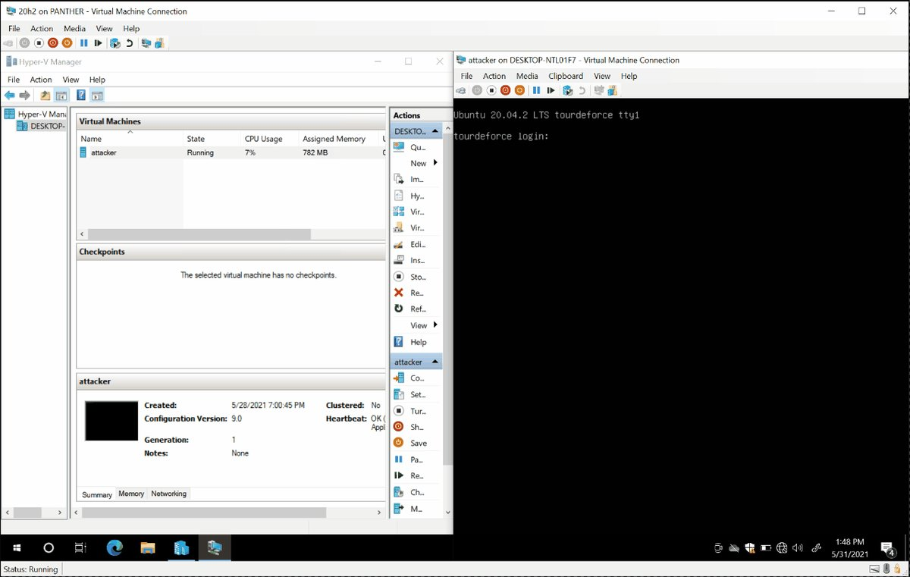</td>
</table></tr>
<table><tr>
<td>Quotes: <code>9</code></td>
<td>Replies: <code>7</code></td>
<td>Retweets: <code>411</code></td>
<td>Favorites: <code>1049</code></td>
</tr></table>

---

# Dinosn
**https://twitter.com/Dinosn/status/1399413694027730949 _at 2021-05-31 17:13:19_**
<blockquote>
This tool will help you to generate Gopher payload for exploiting SSRF (Server Side Request Forgery) and gaining RCE (Remote Code Execution) https://t.co/K7tG1gbkVT
</blockquote>

* https://github.com/tarunkant/Gopherus

<table><tr>
<td>Quotes: <code>0</code></td>
<td>Replies: <code>0</code></td>
<td>Retweets: <code>27</code></td>
<td>Favorites: <code>88</code></td>
</tr></table>

---

# jeredbare
**https://twitter.com/jeredbare/status/1399396667078631442 _at 2021-05-31 16:05:39_**
<blockquote>
CVE-2021-21985 - VCenter RCE - Nmap Checker Script
https://t.co/AiPHgXfwdE
</blockquote>

* https://github.com/alt3kx/CVE-2021-21985_PoC/blob/main/CVE-2021-21985.nse

<table><tr>
<td>Quotes: <code>0</code></td>
<td>Replies: <code>0</code></td>
<td>Retweets: <code>2</code></td>
<td>Favorites: <code>2</code></td>
</tr></table>

---

# blueteamsec1
**https://twitter.com/blueteamsec1/status/1399337001598390275 _at 2021-05-31 12:08:34_**
<blockquote>
CVE-2021-31166: Microsoft Windows HTTP Protocol Stack Remote Code Execution Vulnerability - blue screens a target currently (i.e. does not achieve full RCE) https://t.co/65KuocT5bl #security #threathunting #infosec https://t.co/mxu6iFvp2F
</blockquote>

* http://dlvr.it/S0mjX7

<table><tr>
<td>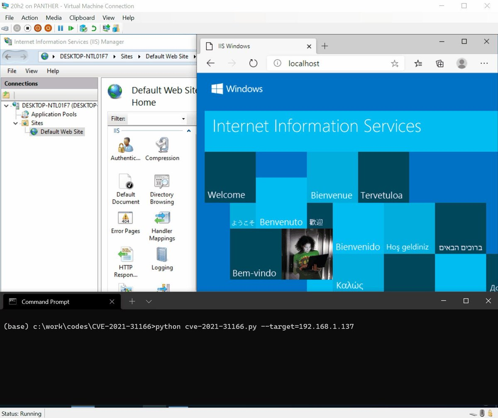</td>
</table></tr>
<table><tr>
<td>Quotes: <code>3</code></td>
<td>Replies: <code>0</code></td>
<td>Retweets: <code>25</code></td>
<td>Favorites: <code>70</code></td>
</tr></table>

---

# TheHackersNews
**https://twitter.com/TheHackersNews/status/1399306525512900608 _at 2021-05-31 10:07:28_**
<blockquote>
A new #vulnerability has been discovered in Postbird, the cross-platform GUI client for #PostgreSQL, which could result in #databreach, local file inclusion and password disclosure.

Details: https://t.co/zgPja5cMuR

Demo: https://t.co/q3KwOPRliL
</blockquote>

* https://github.com/Tridentsec-io/postbird
* https://www.youtube.com/watch?v=KvK9FSrkBek

<table><tr>
<td>Quotes: <code>5</code></td>
<td>Replies: <code>0</code></td>
<td>Retweets: <code>36</code></td>
<td>Favorites: <code>51</code></td>
</tr></table>

---

# bad_packets
**https://twitter.com/bad_packets/status/1398797161819623424 _at 2021-05-30 00:23:26_**
<blockquote>
Ongoing mass scanning activity detected from 193.27.13.26 (🇺🇸) targeting Fortinet VPN servers vulnerable to unauthenticated arbitrary file read (CVE-2018-13379) leading to disclosure of usernames and passwords in plaintext. #threatintel https://t.co/r73O8FIsMX
</blockquote>

<table><tr>
<td>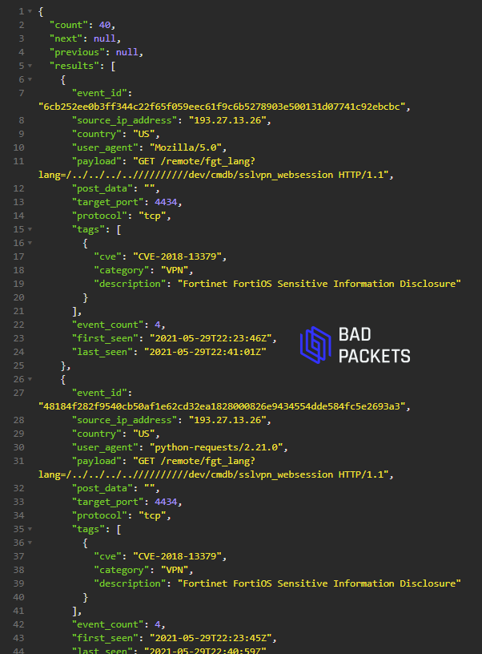</td>
</table></tr>
<table><tr>
<td>Quotes: <code>0</code></td>
<td>Replies: <code>0</code></td>
<td>Retweets: <code>28</code></td>
<td>Favorites: <code>59</code></td>
</tr></table>

---

# cyber_advising
**https://twitter.com/cyber_advising/status/1398642401288335367 _at 2021-05-29 14:08:28_**
<blockquote>
CVE-2021-21985/CVE-2021-21986: The vSphere Client (HTML5) contains a remote code execution vulnerability due to lack of input validation in the Virtual SAN Health Check plug-in which is enabled by default in vCenter Server. 

PoC
https://t.co/vWYuwZugx4 https://t.co/JcAv2IRipM
</blockquote>

* https://attackerkb.com/topics/X85GKjaVER/cve-2021-21985#rapid7-analysis

<table><tr>
<td>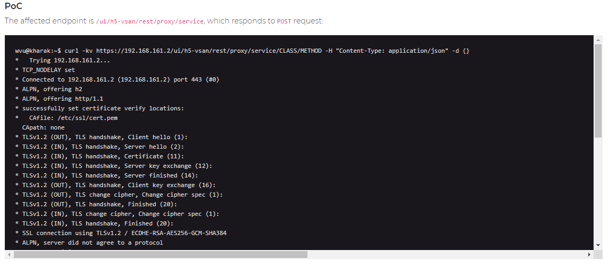</td>
</table></tr>
<table><tr>
<td>Quotes: <code>3</code></td>
<td>Replies: <code>0</code></td>
<td>Retweets: <code>93</code></td>
<td>Favorites: <code>214</code></td>
</tr></table>

---

# chompie1337
**https://twitter.com/chompie1337/status/1398431515051167749 _at 2021-05-29 00:10:29_**
<blockquote>
tried something new and wrote an LPE exploit for CVE-2021-3490, a bug in the Linux Kernel eBPF verifier. was fun and learned a lot - blog post + PoC coming soon. happy memorial day! https://t.co/6kKWX2jw5W
</blockquote>

<table><tr>
<td>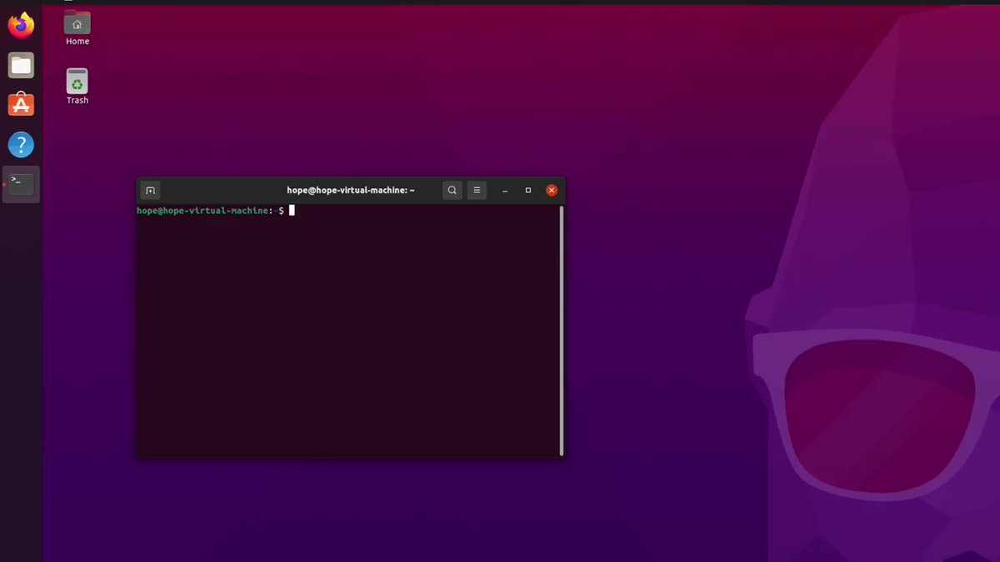</td>
</table></tr>
<table><tr>
<td>Quotes: <code>12</code></td>
<td>Replies: <code>31</code></td>
<td>Retweets: <code>296</code></td>
<td>Favorites: <code>2016</code></td>
</tr></table>

---

# bad_packets
**https://twitter.com/bad_packets/status/1398358990015188992 _at 2021-05-28 19:22:18_**
<blockquote>
Opportunistic mass scanning activity targeting this vulnerability is ongoing. 

Query our API for "tags=CVE-2021-21985" for relevant indicators and source IP addresses. #threatintel
</blockquote>

<table><tr>
<td>Quotes: <code>3</code></td>
<td>Replies: <code>1</code></td>
<td>Retweets: <code>22</code></td>
<td>Favorites: <code>38</code></td>
</tr></table>

---

# r00tpgp
**https://twitter.com/r00tpgp/status/1398155868395294723 _at 2021-05-28 05:55:10_**
<blockquote>
WordPress - Authenticated XXE (CVE-2021-29447) - untested. 
https://t.co/qof3HAuJ0c
</blockquote>

* https://github.com//motikan2010//CVE-2021-29447

<table><tr>
<td>Quotes: <code>0</code></td>
<td>Replies: <code>0</code></td>
<td>Retweets: <code>1</code></td>
<td>Favorites: <code>2</code></td>
</tr></table>

---

# wvuuuuuuuuuuuuu
**https://twitter.com/wvuuuuuuuuuuuuu/status/1397978306323095559 _at 2021-05-27 18:09:36_**
<blockquote>
Updated with further patch analysis and PoC/IOCs.

curl -kv https://[redacted]/ui/h5-vsan/rest/proxy/service/CLASS/METHOD -H "Content-Type: application/json" -d {}

VMware vCenter Server CVE-2021-21985?
</blockquote>

<table><tr>
<td>Quotes: <code>2</code></td>
<td>Replies: <code>3</code></td>
<td>Retweets: <code>39</code></td>
<td>Favorites: <code>103</code></td>
</tr></table>

---

# naman_1910
**https://twitter.com/naman_1910/status/1397865202868133889 _at 2021-05-27 10:40:10_**
<blockquote>
For the past 1 week, i was learning XXE  attack. And These are some resources that helped me to learn.
Anyone who wants to learn XXE and XML can go through this 

https://t.co/Youbvspx32
Retweet for better reach
#bugbounty #bugbountytips #infosec I
</blockquote>

* https://github.com/h4ckboy19/XXE_A_TO_Z/blob/main/Resources

<table><tr>
<td>Quotes: <code>5</code></td>
<td>Replies: <code>7</code></td>
<td>Retweets: <code>174</code></td>
<td>Favorites: <code>442</code></td>
</tr></table>

---

# hahwul
**https://twitter.com/hahwul/status/1397740579119800321 _at 2021-05-27 02:24:57_**
<blockquote>
PortSwigger's #XSS Payloads file
https://t.co/4SMY7quScl
</blockquote>

* https://github.com/TheKingOfDuck/easyXssPayload/blob/master/burpXssPayload.txt

<table><tr>
<td>Quotes: <code>1</code></td>
<td>Replies: <code>3</code></td>
<td>Retweets: <code>54</code></td>
<td>Favorites: <code>188</code></td>
</tr></table>

---

# cyber_advising
**https://twitter.com/cyber_advising/status/1397560837104193539 _at 2021-05-26 14:30:43_**
<blockquote>
Nagios #RCE &amp; Privilege Escalation ... 
CVE-2020-28903 - CVE-2020-28905 - CVE-2020-28902 - CVE-2020-28901 - CVE-2020-28904 - CVE-2020-28900 - CVE-2020-28907 - CVE-2020-28906 - CVE-2020-28909 - CVE-2020-28908 - CVE-2020-28911...
PoC
https://t.co/UMZwZfeVug https://t.co/fqFQgrjh8V
</blockquote>

* https://skylightcyber.com/2021/05/20/13-nagios-vulnerabilities-7-will-shock-you/

<table><tr>
<td>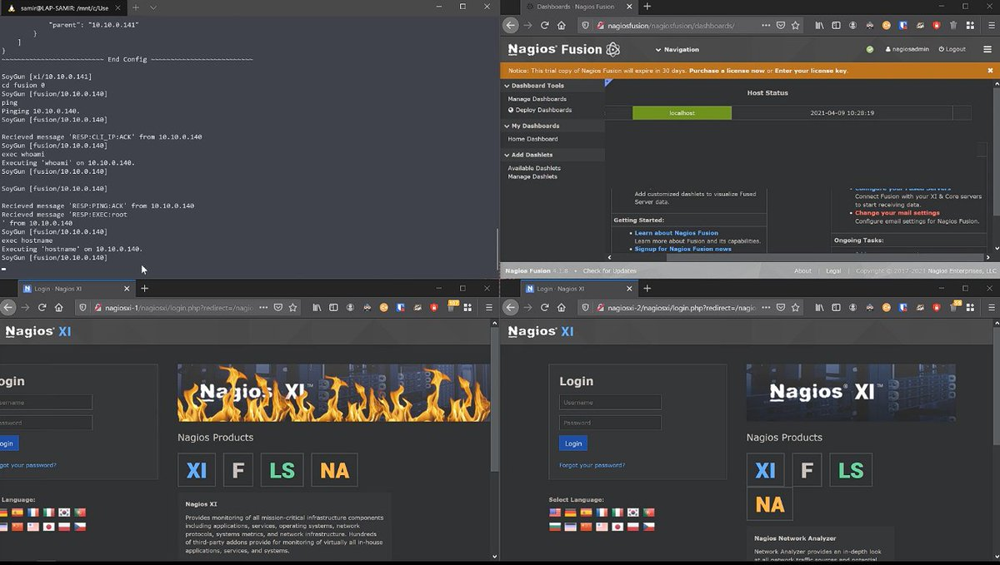</td>
</table></tr>
<table><tr>
<td>Quotes: <code>1</code></td>
<td>Replies: <code>1</code></td>
<td>Retweets: <code>18</code></td>
<td>Favorites: <code>31</code></td>
</tr></table>

---

# GossiTheDog
**https://twitter.com/GossiTheDog/status/1397459281084141568 _at 2021-05-26 07:47:10_**
<blockquote>
There is a public exploit for VMware ESXi CVE-2021-21974, a pre-auth RCE vulnerability from February. 

Write up: https://t.co/w4Hp4xtXar

PoC (validated, only works against 6.7 out of box): https://t.co/qmZ729KnwC
</blockquote>

* https://link.medium.com/HmCaPqjhzgb
* https://github.com/straightblast/My-PoC-Exploits/blob/master/CVE-2021-21974.py

<table><tr>
<td>Quotes: <code>6</code></td>
<td>Replies: <code>1</code></td>
<td>Retweets: <code>105</code></td>
<td>Favorites: <code>199</code></td>
</tr></table>

---

# KathanP19
**https://twitter.com/KathanP19/status/1397420242851098627 _at 2021-05-26 05:12:03_**
<blockquote>
Collection of Nice XSS Payloads you can use in pentesting 
https://t.co/v9EoXD7DCu

#bugbounty #bugbountytips #bugbountytip
</blockquote>

* https://github.com/RenwaX23/XSS-Payloads

<table><tr>
<td>Quotes: <code>0</code></td>
<td>Replies: <code>0</code></td>
<td>Retweets: <code>59</code></td>
<td>Favorites: <code>143</code></td>
</tr></table>

---

# TheHackersNews
**https://twitter.com/TheHackersNews/status/1397417268657541122 _at 2021-05-26 05:00:14_**
<blockquote>
A critical flaw — CVE-2021-21985 — has been found in VMware vCenter Server that could let attackers execute arbitrary code on the targeted servers.

https://t.co/Q5Ar1gaK4o

Additionally, #VMware has released patches for a separate authentication issue affecting vSphere Client.
</blockquote>

* https://thehackernews.com/2021/05/critical-rce-vulnerability-found-in.html

<table><tr>
<td>Quotes: <code>9</code></td>
<td>Replies: <code>0</code></td>
<td>Retweets: <code>129</code></td>
<td>Favorites: <code>213</code></td>
</tr></table>

---

# bad_packets
**https://twitter.com/bad_packets/status/1397388928403984394 _at 2021-05-26 03:07:37_**
<blockquote>
CVE-2021-21985
"The vSphere Client (HTML5) contains a remote code execution vulnerability due to lack of input validation in the Virtual SAN Health Check plug-in which is enabled by default in vCenter Server."

Vendor advisory: https://t.co/D0aWkbQMPT https://t.co/dIOZIIIy9o
</blockquote>

* https://www.vmware.com/security/advisories/VMSA-2021-0010.html

<table><tr>
<td>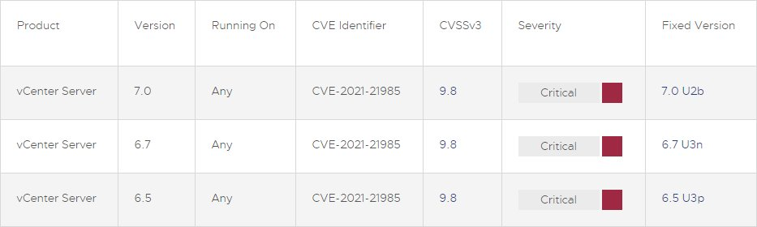</td>
</table></tr>
<table><tr>
<td>Quotes: <code>4</code></td>
<td>Replies: <code>0</code></td>
<td>Retweets: <code>24</code></td>
<td>Favorites: <code>49</code></td>
</tr></table>

---

# patrickwardle
**https://twitter.com/patrickwardle/status/1397271474587660290 _at 2021-05-25 19:20:54_**
<blockquote>
This bug (just patched as CVE-2021-30713) joins CVE-2021-30657 as being exploited by malware as an 0day 😱

Kudos to @JamfSoftware's, JamfProtect, for the ability  to detect exploitation attempts for *both* far before Apple's patches🛡️ 

...other macOS enterprise EDR products? 🤔
</blockquote>

<table><tr>
<td>Quotes: <code>0</code></td>
<td>Replies: <code>2</code></td>
<td>Retweets: <code>10</code></td>
<td>Favorites: <code>55</code></td>
</tr></table>

---

# piedpiper1616
**https://twitter.com/piedpiper1616/status/1397153522529931267 _at 2021-05-25 11:32:12_**
<blockquote>
PoC_CVE-2021–31474.json · GitHub - https://t.co/x4gWFJ11lH
</blockquote>

* https://gist.github.com/testanull/dcb536b409a28d74430a441d53b14456

<table><tr>
<td>Quotes: <code>2</code></td>
<td>Replies: <code>0</code></td>
<td>Retweets: <code>14</code></td>
<td>Favorites: <code>56</code></td>
</tr></table>

---

# Alra3ees
**https://twitter.com/Alra3ees/status/1396781745400389634 _at 2021-05-24 10:54:53_**
<blockquote>
1:- Use @fasthm00 https://t.co/9yGPCE8Vv3
2:- Import to burpsuite match and replace.
3:- Run gospider. gospider -s url -a -w --sitemap -r -c 100 -d 8 -p http://127.0.0.1:8080
4:- The Blind xss payload will added automatically by burp and gospider.

Finally:- 4 BLIND XSS REPORTS. https://t.co/g2I3aJbIeo
</blockquote>

* https://github.com/Leoid/MatchandReplace

<table><tr>
<td>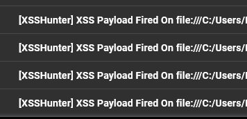</td>
</table></tr>
<table><tr>
<td>Quotes: <code>2</code></td>
<td>Replies: <code>7</code></td>
<td>Retweets: <code>253</code></td>
<td>Favorites: <code>561</code></td>
</tr></table>

---

# HackENews
**https://twitter.com/HackENews/status/1396643428906135552 _at 2021-05-24 01:45:16_**
<blockquote>
Automate XSS using QuickXSS !

Releasing QuickXSS v2.0.0 🎉🎉

Link :- https://t.co/cc9UMMqmCu

#Hackenews #bugbonty #bugbountytips #infosec #cybersecurity #bugbountytip #Linux
</blockquote>

* https://github.com/theinfosecguy/QuickXSS

<table><tr>
<td>Quotes: <code>1</code></td>
<td>Replies: <code>1</code></td>
<td>Retweets: <code>76</code></td>
<td>Favorites: <code>204</code></td>
</tr></table>

---

# kurtuluskarasu
**https://twitter.com/kurtuluskarasu/status/1396474327923634182 _at 2021-05-23 14:33:19_**
<blockquote>
We tested and finalized 
⁃CVE-2021-31166 (MS HTTP Protocol Stack RCE)
⁃Target : Windows 10 with IIS 
⁃Update: KB5003173
-    https://t.co/FMfI1JTSsn
#Vulnerability #bug #CVE #ProofOfConsept https://t.co/8WYtKTbItU
</blockquote>

* https://github.com/0vercl0k/CVE-2021-31166

<table><tr>
<td>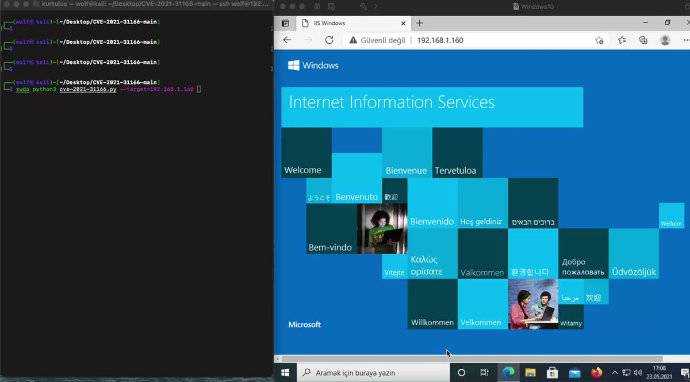</td>
</table></tr>
<table><tr>
<td>Quotes: <code>0</code></td>
<td>Replies: <code>0</code></td>
<td>Retweets: <code>1</code></td>
<td>Favorites: <code>0</code></td>
</tr></table>

---

# hackerfantastic
**https://twitter.com/hackerfantastic/status/1396179238328406030 _at 2021-05-22 19:00:44_**
<blockquote>
2million+ Windows hosts are vulnerable to a kernel-based UAF. There is already PoC for triggering the condition. Patch this urgently on Microsoft IIS based services and disable/filter WinRM at your network perimeter. Patch CVE-2021-31166 urgently.
</blockquote>

<table><tr>
<td>Quotes: <code>2</code></td>
<td>Replies: <code>2</code></td>
<td>Retweets: <code>49</code></td>
<td>Favorites: <code>111</code></td>
</tr></table>

---

# 90security
**https://twitter.com/90security/status/1395777906811437058 _at 2021-05-21 16:25:59_**
<blockquote>
Vulnerability项目20210522更新了132条漏洞信息，其中部分为0day，项目地址：
https://t.co/MV3jQxrvAj https://t.co/Y1be0u7VQC
</blockquote>

* https://github.com/EdgeSecurityTeam/Vulnerability

<table><tr>
<td>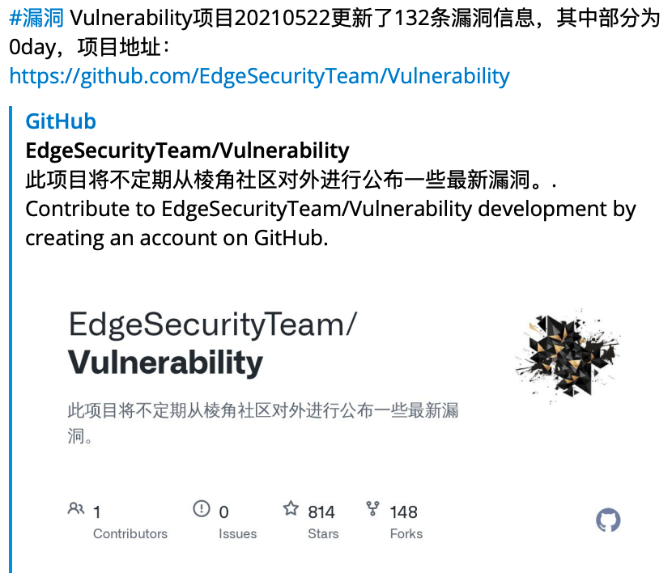</td>
</table></tr>
<table><tr>
<td>Quotes: <code>0</code></td>
<td>Replies: <code>3</code></td>
<td>Retweets: <code>31</code></td>
<td>Favorites: <code>97</code></td>
</tr></table>

---

# cyb3rops
**https://twitter.com/cyb3rops/status/1395763929805115393 _at 2021-05-21 15:30:27_**
<blockquote>
CVE-2021-31166

it's not just systems running IIS on Win10 but also WinRM that's affected

&gt; brace for impact

PoC 
https://t.co/Fm3ES6Cis8

YARA (shot in the dark)
https://t.co/amkXvFaq2I https://t.co/1q21z2t0HB
</blockquote>

* https://github.com/0vercl0k/CVE-2021-31166
* https://github.com/Neo23x0/signature-base/blob/master/yara/exploit_cve_2021_31166.yar

<table><tr>
<td>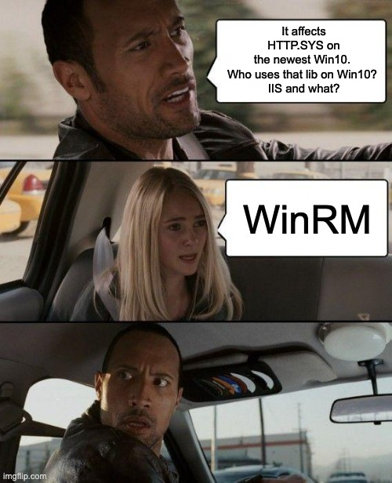</td>
</table></tr>
<table><tr>
<td>Quotes: <code>32</code></td>
<td>Replies: <code>21</code></td>
<td>Retweets: <code>495</code></td>
<td>Favorites: <code>1164</code></td>
</tr></table>

---

# WPSecScanner
**https://twitter.com/WPSecScanner/status/1395679771103748096 _at 2021-05-21 09:56:02_**
<blockquote>
WordPress XXE Vulnerability in Media Library – CVE-2021-29447

https://t.co/x48Pt2ZlL7

#BugBounty #XXE #WordPress #Vulnerability #CyberSecurity #PenTest #PenetrationTest #Writeup
</blockquote>

* https://blog.wpsec.com/wordpress-xxe-in-media-library-cve-2021-29447/

<table><tr>
<td>Quotes: <code>5</code></td>
<td>Replies: <code>22</code></td>
<td>Retweets: <code>298</code></td>
<td>Favorites: <code>4845</code></td>
</tr></table>

---

# wugeej
**https://twitter.com/wugeej/status/1395668830563618818 _at 2021-05-21 09:12:34_**
<blockquote>
[CVE-2021-31166] MS HTTP Protocol Stack RCE #PoC

GET / HTTP/1.1
Host: [VictimIP]
Accept-Encoding: xx, aa, bb, , 

-&gt; Accept-Encoding: [unknown content-coding], [unknown content-coding], [unknown content-coding], [Null], [CRLF]

https://t.co/vP4DI6IAkm https://t.co/HSRaVupAeb
</blockquote>

* https://github.com/0vercl0k/CVE-2021-31166

<table><tr>
<td>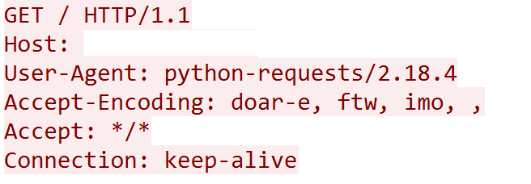</td>
</table></tr>
<table><tr>
<td>Quotes: <code>3</code></td>
<td>Replies: <code>2</code></td>
<td>Retweets: <code>52</code></td>
<td>Favorites: <code>149</code></td>
</tr></table>

---

# Void_Sec
**https://twitter.com/Void_Sec/status/1395402052616998920 _at 2021-05-20 15:32:29_**
<blockquote>
CVE-2021-21551- DELL "dbutil_2_3.sys" driver Write What Where to Local Privilege Escalation. Reverse Engineering, Root Cause Analysis and Exploit code

https://t.co/WG8qNDCtwu
</blockquote>

* https://voidsec.com/reverse-engineering-and-exploiting-dell-cve-2021-21551/

<table><tr>
<td>Quotes: <code>1</code></td>
<td>Replies: <code>3</code></td>
<td>Retweets: <code>136</code></td>
<td>Favorites: <code>260</code></td>
</tr></table>

---

# _hg8_
**https://twitter.com/_hg8_/status/1395361615416107009 _at 2021-05-20 12:51:48_**
<blockquote>
CVE-2021-31166: HTTP Protocol Stack Remote Code Execution Vulnerability PoC

Tl;Dr: use-after-free dereference in http.sys patched by Microsoft in May 2021. 

https://t.co/xQw1U3Ija8 #cve #poc #exploit
</blockquote>

* https://github.com/0vercl0k/CVE-2021-31166

<table><tr>
<td>Quotes: <code>0</code></td>
<td>Replies: <code>0</code></td>
<td>Retweets: <code>2</code></td>
<td>Favorites: <code>1</code></td>
</tr></table>

---

# ptracesecurity
**https://twitter.com/ptracesecurity/status/1395318118101266435 _at 2021-05-20 09:58:57_**
<blockquote>
A simple python PoC to exploit CVE-2021-26814 and gain RCE on Wazuh Manager (v.4.0.0-4.0.3) through the API service.   https://t.co/gQ37NP7vC1  #Pentesting #Exploit #CVE #RCE #Infosec https://t.co/ibG6NtmCUT
</blockquote>

* https://github.com/WickdDavid/CVE-2021-26814

<table><tr>
<td>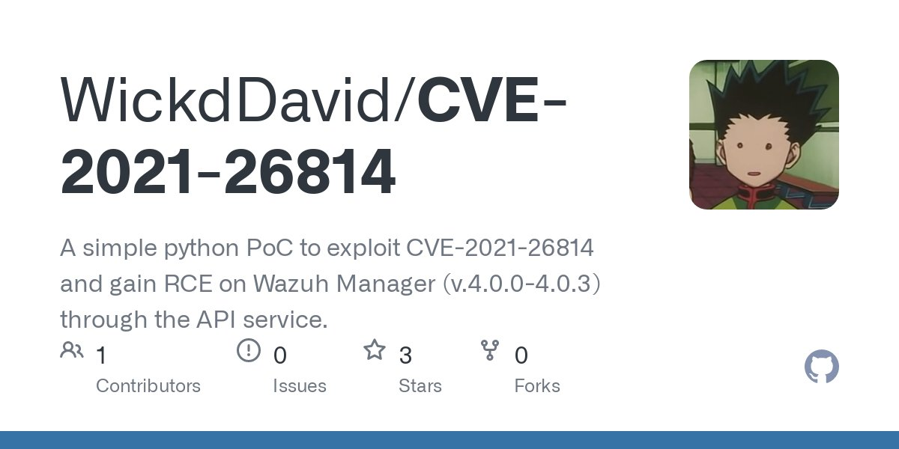</td>
</table></tr>
<table><tr>
<td>Quotes: <code>1</code></td>
<td>Replies: <code>0</code></td>
<td>Retweets: <code>11</code></td>
<td>Favorites: <code>12</code></td>
</tr></table>

---

# Anastasis_King
**https://twitter.com/Anastasis_King/status/1395290298109120513 _at 2021-05-20 08:08:24_**
<blockquote>
CVE-2021-31166: HTTP Protocol Stack Remote Code Execution Vulnerability

This is a proof of concept for CVE-2021-31166 ("HTTP Protocol Stack Remote Code Execution Vulnerability"), a use-after-free dereference in http.sys patched by Microsoft in May 2021.

https://t.co/RwtyufiWW0
</blockquote>

* https://github.com/0vercl0k/CVE-2021-31166

<table><tr>
<td>Quotes: <code>0</code></td>
<td>Replies: <code>0</code></td>
<td>Retweets: <code>3</code></td>
<td>Favorites: <code>0</code></td>
</tr></table>

---

# 0xTib3rius
**https://twitter.com/0xTib3rius/status/1395042906264670217 _at 2021-05-19 15:45:22_**
<blockquote>
I wrote this Dynamic DTD server to help with fuzzing for files / internal resources when exploiting an out-of-band XXE Injection. Releasing it to the community on @WhiteOakSec's GitHub: https://t.co/bDhIxH7PHS

Enjoy!

#InfoSec #CyberSecurity
</blockquote>

* https://github.com/WhiteOakSecurity/Dynamic-DTD

<table><tr>
<td>Quotes: <code>1</code></td>
<td>Replies: <code>0</code></td>
<td>Retweets: <code>23</code></td>
<td>Favorites: <code>51</code></td>
</tr></table>

---

# hackingtruthin
**https://twitter.com/hackingtruthin/status/1394639352668442626 _at 2021-05-18 13:01:47_**
<blockquote>
Proof of concept for CVE-2021-31166, a remote HTTP.sys use-after-free triggered remotely. #Microsoft
#IIS #CVE #Developer
https://t.co/AK5MQPq7vD
</blockquote>

* https://github.com/0vercl0k/CVE-2021-31166

<table><tr>
<td>Quotes: <code>0</code></td>
<td>Replies: <code>0</code></td>
<td>Retweets: <code>2</code></td>
<td>Favorites: <code>1</code></td>
</tr></table>

---

# tais9
**https://twitter.com/tais9/status/1394576775292735489 _at 2021-05-18 08:53:07_**
<blockquote>
0vercl0k/CVE-2021-31166: Proof of concept for CVE-2021-31166, a remote HTTP.sys use-after-free triggered remotely. https://t.co/hlUz6KPnnh
</blockquote>

* https://github.com/0vercl0k/CVE-2021-31166

<table><tr>
<td>Quotes: <code>0</code></td>
<td>Replies: <code>0</code></td>
<td>Retweets: <code>1</code></td>
<td>Favorites: <code>1</code></td>
</tr></table>

---

# jukubird
**https://twitter.com/jukubird/status/1394572569693495296 _at 2021-05-18 08:36:25_**
<blockquote>
Exploit released for wormable Windows HTTP vulnerability
https://t.co/ZQ8cBlgQdu

CVE-2021-31166: Proof of concept for CVE-2021-31166, a remote HTTP.sys use-after-free triggered remotely.
https://t.co/euvsgqAH8U
</blockquote>

* https://www.bleepingcomputer.com/news/security/exploit-released-for-wormable-windows-http-vulnerability/
* https://github.com/0vercl0k/CVE-2021-31166

<table><tr>
<td>Quotes: <code>0</code></td>
<td>Replies: <code>0</code></td>
<td>Retweets: <code>1</code></td>
<td>Favorites: <code>0</code></td>
</tr></table>

---

# catnap707
**https://twitter.com/catnap707/status/1394467572192477186 _at 2021-05-18 01:39:11_**
<blockquote>
GitHub - 0vercl0k/CVE-2021-31166: Proof of concept for CVE-2021-31166, a remote HTTP.sys use-after-free triggered remotely. https://t.co/t6GryyGWAF
</blockquote>

* https://github.com/0vercl0k/CVE-2021-31166

<table><tr>
<td>Quotes: <code>2</code></td>
<td>Replies: <code>1</code></td>
<td>Retweets: <code>1</code></td>
<td>Favorites: <code>3</code></td>
</tr></table>

---

# JGamblin
**https://twitter.com/JGamblin/status/1394388753758752773 _at 2021-05-17 20:26:00_**
<blockquote>
CVE-2021-31166  (HTTP Protocol Stack Remote Code Execution Vulnerability) POC that causes a BSOD. https://t.co/eCef5hEhQg
</blockquote>

* https://github.com/0vercl0k/CVE-2021-31166

<table><tr>
<td>Quotes: <code>2</code></td>
<td>Replies: <code>0</code></td>
<td>Retweets: <code>10</code></td>
<td>Favorites: <code>13</code></td>
</tr></table>

---

# sans_isc
**https://twitter.com/sans_isc/status/1394306375791091717 _at 2021-05-17 14:58:39_**
<blockquote>
PoC released for http.sys vulnerability (CVE-2021-31166) https://t.co/e4KJ3lEa7k PATCH PATCH PATCH ... #httpsys #poc #msft #cve202131166
</blockquote>

* https://github.com/0vercl0k/CVE-2021-31166

<table><tr>
<td>Quotes: <code>3</code></td>
<td>Replies: <code>1</code></td>
<td>Retweets: <code>35</code></td>
<td>Favorites: <code>58</code></td>
</tr></table>

---

# 0xR
**https://twitter.com/0xR/status/1394241606270787589 _at 2021-05-17 10:41:17_**
<blockquote>
Proof of concept for CVE-2021-31166, a remote HTTP.sys use-after-free triggered remotely

https://t.co/i1Fu7SfpmK
</blockquote>

* https://github.com/0vercl0k/CVE-2021-31166

<table><tr>
<td>Quotes: <code>0</code></td>
<td>Replies: <code>0</code></td>
<td>Retweets: <code>1</code></td>
<td>Favorites: <code>0</code></td>
</tr></table>

---

# ido_cohen2
**https://twitter.com/ido_cohen2/status/1394218462273224713 _at 2021-05-17 09:09:19_**
<blockquote>
🌐 I love the smell of #RCE in the morning, HTTP Protocol Stack Remote Code Execution Vulnerability (CVE-2021-31166) 💥

#Cyber #CyberSecurity #CyberAttack #Remote #Code #Execution #Microsoft #Update #CVE #Windows #Exploit #Vulnerability 

https://t.co/GWBb47Bo3r
</blockquote>

* https://github.com/0vercl0k/CVE-2021-31166

<table><tr>
<td>Quotes: <code>1</code></td>
<td>Replies: <code>1</code></td>
<td>Retweets: <code>1</code></td>
<td>Favorites: <code>0</code></td>
</tr></table>

---

# vahidnameni
**https://twitter.com/vahidnameni/status/1394169988307640321 _at 2021-05-17 05:56:42_**
<blockquote>
آسیب پذیری RCE و DoS در سری های جدید ویندوز که با شناسه CVE-2021-31166 هفته پیش وصله شد به شدت خطرناک (9.8) است چراکه نیاز به احرازهویت نیست و به راحتی از راه دور قابل Exploit است و البته به خاطر ماهیت آسیب پذیری به صورت worm قابل گسترش است! 
https://t.co/tArZES5u5P https://t.co/wOHrNhpPKH
</blockquote>

* https://github.com/0vercl0k/CVE-2021-31166

<table><tr>
<td></td>
</table></tr>
<table><tr>
<td>Quotes: <code>0</code></td>
<td>Replies: <code>0</code></td>
<td>Retweets: <code>6</code></td>
<td>Favorites: <code>21</code></td>
</tr></table>

---

# 0vercl0k
**https://twitter.com/0vercl0k/status/1393970836302811138 _at 2021-05-16 16:45:20_**
<blockquote>
I've built a PoC for CVE-2021-31166 the "HTTP Protocol Stack Remote Code Execution Vulnerability":  https://t.co/8mqLCByvCp 🔥🔥 https://t.co/yzgUs2CQO5
</blockquote>

* https://github.com/0vercl0k/CVE-2021-31166

<table><tr>
<td></td>
</table></tr>
<table><tr>
<td>Quotes: <code>27</code></td>
<td>Replies: <code>13</code></td>
<td>Retweets: <code>590</code></td>
<td>Favorites: <code>1324</code></td>
</tr></table>

---

# kmkz_security
**https://twitter.com/kmkz_security/status/1393964327695265793 _at 2021-05-16 16:19:28_**
<blockquote>
#Chrome Exploitation #CVE-2020-16040 &amp; CVE-2020-16041 Fullchain (#RCE + SBX) - #Samsung (ARM) browser
Version: 13.2.3.2(Chromium: 83.0.4103.106)
Slides from @Zer0CON :
https://t.co/XZLmHVsJrm
Exploits:
https://t.co/8iNMTEqXSe
By @dmxcsnsbh from @SingularSecLab
</blockquote>

* https://github.com/singularseclab/Slides/blob/main/2021/chrome_exploitation-zer0con2021.pdf
* https://github.com/singularseclab/Browser_Exploits/tree/master/CVE-2020-1604%5B0%7C1%5D

<table><tr>
<td>Quotes: <code>1</code></td>
<td>Replies: <code>0</code></td>
<td>Retweets: <code>82</code></td>
<td>Favorites: <code>144</code></td>
</tr></table>

---

# cyber_advising
**https://twitter.com/cyber_advising/status/1393621541112401920 _at 2021-05-15 17:37:22_**
<blockquote>
CVE-2020-28018: Exim Use-after-free (UAF) leading to RCE.

There exists a Use-after-free (UAF) vulnerability in tls-openssl.c that allow remote unauthenticated attackers to corrupt internal memory data, thus finally achieving remote code execution.

PoC
https://t.co/haUro0nANy https://t.co/CdI2KUHOkq
</blockquote>

* https://github.com/lockedbyte/CVE-Exploits/tree/master/CVE-2020-28018

<table><tr>
<td></td>
</table></tr>
<table><tr>
<td>Quotes: <code>2</code></td>
<td>Replies: <code>0</code></td>
<td>Retweets: <code>18</code></td>
<td>Favorites: <code>60</code></td>
</tr></table>

---

# lockedbyte
**https://twitter.com/lockedbyte/status/1393441739407515649 _at 2021-05-15 05:42:54_**
<blockquote>
I developed a Remote Code Execution PoC exploit for the Exim Use-After-Free that was recently disclosed (as part of @qualys 21Nails advisory). Tested just on Exim 4.92. PoC available: https://t.co/Su55rIZpgj https://t.co/P2GJFjSc3S
</blockquote>

* https://github.com/lockedbyte/CVE-Exploits/tree/master/CVE-2020-28018

<table><tr>
<td></td>
</table></tr>
<table><tr>
<td>Quotes: <code>7</code></td>
<td>Replies: <code>7</code></td>
<td>Retweets: <code>345</code></td>
<td>Favorites: <code>902</code></td>
</tr></table>

---

# cyb3rops
**https://twitter.com/cyb3rops/status/1393330628708417538 _at 2021-05-14 22:21:23_**
<blockquote>
HTTP Protocol Stack Remote Code Execution Vulnerability - CVE-2021-31166

Wormable, RCE, HTTP Protocol IIS Service, CVSS 9.8 &gt; Panic 😱

Looking at the list of affected systems, you suddenly start to relax 💆🏻‍♂️ https://t.co/hKAU4XvXuG
</blockquote>

<table><tr>
<td>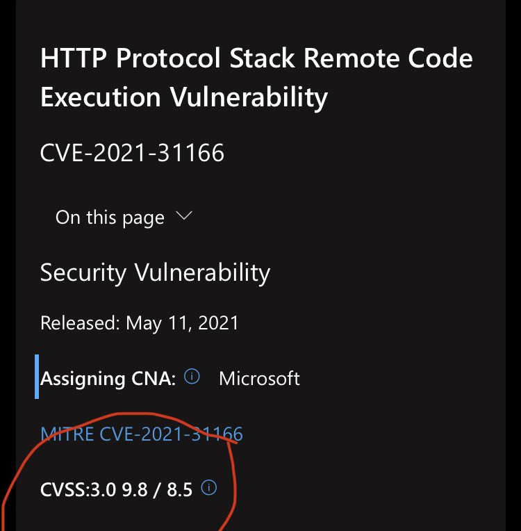</td>
<td>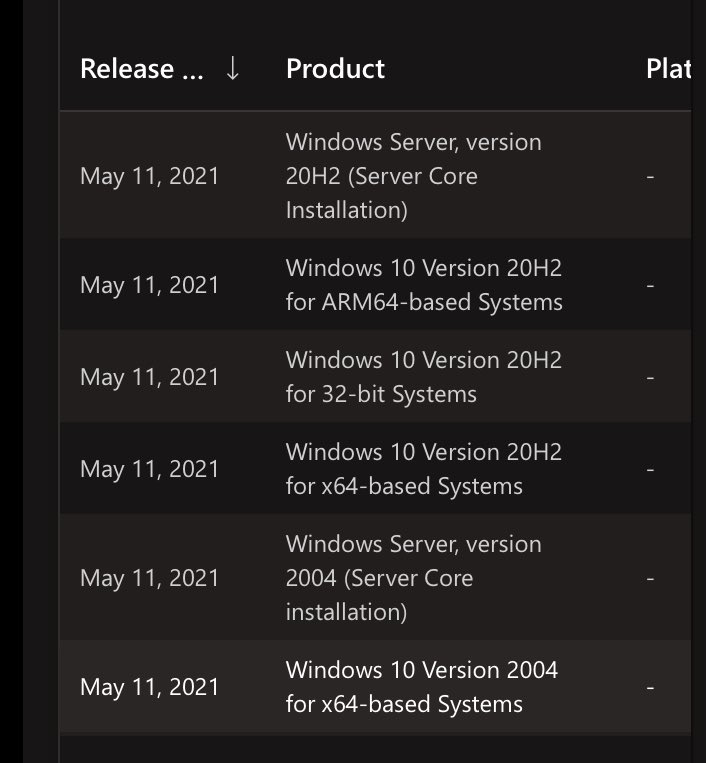</td>
</table></tr>
<table><tr>
<td>Quotes: <code>13</code></td>
<td>Replies: <code>8</code></td>
<td>Retweets: <code>194</code></td>
<td>Favorites: <code>548</code></td>
</tr></table>

---

# akaclandestine
**https://twitter.com/akaclandestine/status/1392788441457364994 _at 2021-05-13 10:26:55_**
<blockquote>
#exploit
CVE-2020-28502:
node-XMLHttpRequest RCE
https://t.co/nOyLllJ47u
</blockquote>

* https://github.com/s-index/CVE-2020-28502

<table><tr>
<td>Quotes: <code>0</code></td>
<td>Replies: <code>0</code></td>
<td>Retweets: <code>1</code></td>
<td>Favorites: <code>0</code></td>
</tr></table>

---

# akaclandestine
**https://twitter.com/akaclandestine/status/1392785927542562825 _at 2021-05-13 10:16:56_**
<blockquote>
#exploit
CVE-2021-29200:
Apache OFBiz has unsafe deserialization &lt;17.12.07. An unauthenticated user can perform an RCE attack
https://t.co/YnonjoCoEt
</blockquote>

* https://github.com/r0ckysec/CVE-2021-29200

<table><tr>
<td>Quotes: <code>0</code></td>
<td>Replies: <code>0</code></td>
<td>Retweets: <code>1</code></td>
<td>Favorites: <code>0</code></td>
</tr></table>

---

# oct0xor
**https://twitter.com/oct0xor/status/1392456302069157889 _at 2021-05-12 12:27:07_**
<blockquote>
Tomorrow I will be hosting a workshop on exploit analysis for beginners.
I will demonstrate how to setup debugging, how to use WinDBG (+how to solve common problems), and we will analyse the latest Windows 0day CVE-2021-28310.

(13/05 - 2:00 PM GMT) https://t.co/SPO8qYbymp https://t.co/yJTSqIM6gR
</blockquote>

* https://kas.pr/t4z8

<table><tr>
<td></td>
</table></tr>
<table><tr>
<td>Quotes: <code>1</code></td>
<td>Replies: <code>2</code></td>
<td>Retweets: <code>39</code></td>
<td>Favorites: <code>144</code></td>
</tr></table>

---

# TheHackersNews
**https://twitter.com/TheHackersNews/status/1392449332918378501 _at 2021-05-12 11:59:26_**
<blockquote>
Patch Tuesday (May 2021)

Microsoft has released the latest Windows updates to patch a dozen newly discovered vulnerabilities, one of the most critical of which is a wormable RCE (CVE-2021-31166) in the HTTP protocol stack.

Read details - https://t.co/4cHXSogd4o

#infosec
</blockquote>

* https://thehackernews.com/2021/05/latest-microsoft-windows-updates-patch.html

<table><tr>
<td>Quotes: <code>7</code></td>
<td>Replies: <code>4</code></td>
<td>Retweets: <code>121</code></td>
<td>Favorites: <code>184</code></td>
</tr></table>

---

# Zero0x00
**https://twitter.com/Zero0x00/status/1392256984385085441 _at 2021-05-11 23:15:06_**
<blockquote>
@cheatdroit @ADITYASHENDE17 @ofjaaah @th3cyb3rc0p @theXSSrat @alicanact60 @naglinagli https://t.co/trxZYy9PlS
Other than this do watch @InsiderPhD YouTube ApI security series, as well practice over the lab being published by her awsome one
https://t.co/3jlb0HXfIg
https://t.co/GSUh52t6Mb
</blockquote>

* https://github.com/arainho/awesome-api-security
* https://youtube.com/playlist?list=PLbyncTkpno5HqX1h2MnV6Qt4wvTb8Mpol
* https://github.com/InsiderPhD/Generic-University

<table><tr>
<td>Quotes: <code>1</code></td>
<td>Replies: <code>0</code></td>
<td>Retweets: <code>19</code></td>
<td>Favorites: <code>32</code></td>
</tr></table>

---

# wvuuuuuuuuuuuuu
**https://twitter.com/wvuuuuuuuuuuuuu/status/1392245805654986764 _at 2021-05-11 22:30:41_**
<blockquote>
WIP exploit for NetMotion Mobility CVE-2021-26914, pre-auth RCE in a mobile VPN server. Many thanks to @steventseeley for the vuln and support. 🔥

https://t.co/JfGqtfWe01
</blockquote>

* https://github.com/rapid7/metasploit-framework/pull/15186

<table><tr>
<td>Quotes: <code>3</code></td>
<td>Replies: <code>4</code></td>
<td>Retweets: <code>15</code></td>
<td>Favorites: <code>53</code></td>
</tr></table>

---

# autiomaa
**https://twitter.com/autiomaa/status/1392180998490791938 _at 2021-05-11 18:13:10_**
<blockquote>
VS Code update (April 2021 Recovery) https://t.co/q1dNlicNMX has security patches for several Remote Code Execution Vulnerability issues (CVE-2021-31211, CVE-2021-31214).
</blockquote>

* https://github.com/microsoft/vscode/milestone/155?closed=1

<table><tr>
<td>Quotes: <code>0</code></td>
<td>Replies: <code>1</code></td>
<td>Retweets: <code>1</code></td>
<td>Favorites: <code>1</code></td>
</tr></table>

---

# peleghd
**https://twitter.com/peleghd/status/1392163013910745093 _at 2021-05-11 17:01:42_**
<blockquote>
CVSS 9.9! The vulnerability we (+@OphirHarpaz) found, CVE-2021-28476 (Hyper-V RCE), was patched today!

Our research, fuzzer and vulnerability details was submitted to @BlackHatEvents and @defcon, there is a lot to look forward to.

https://t.co/Uz0AzsITeh
</blockquote>

* https://msrc.microsoft.com/update-guide/vulnerability/CVE-2021-28476

<table><tr>
<td>Quotes: <code>6</code></td>
<td>Replies: <code>5</code></td>
<td>Retweets: <code>90</code></td>
<td>Favorites: <code>315</code></td>
</tr></table>

---

# mavillon1
**https://twitter.com/mavillon1/status/1392036718275186689 _at 2021-05-11 08:39:51_**
<blockquote>
SMBGhost CVE-2020-0796 Remote Code Execution Full Source Code #exploit #rce #SMBGhost
https://t.co/l1KAR21NWl
</blockquote>

* https://github.com/mavillon1/SMBGhost-Full-RCE

<table><tr>
<td>Quotes: <code>0</code></td>
<td>Replies: <code>0</code></td>
<td>Retweets: <code>3</code></td>
<td>Favorites: <code>3</code></td>
</tr></table>

---

# wugeej
**https://twitter.com/wugeej/status/1391945556902121472 _at 2021-05-11 02:37:36_**
<blockquote>
Microsoft Exchange Deserialization to Post-Auth RCE (CVE-2021-28482)

#PoC
https://t.co/hzpypNjNyr

https://t.co/SnJvOns24Y

https://t.co/jKMpbQWOgw https://t.co/iyZBypNlTF
</blockquote>

* https://github.com/Shadow0ps/CVE-2021-28482-Exchange-POC/blob/main/Proof-Of-Concept.py
* https://gist.github.com/testanull/9ebbd6830f7a501e35e67f2fcaa57bda
* https://testbnull.medium.com/microsoft-exchange-from-deserialization-to-post-auth-rce-cve-2021-28482-e713001d915f

<table><tr>
<td></td>
<td></td>
</table></tr>
<table><tr>
<td>Quotes: <code>4</code></td>
<td>Replies: <code>2</code></td>
<td>Retweets: <code>75</code></td>
<td>Favorites: <code>126</code></td>
</tr></table>

---

# wugeej
**https://twitter.com/wugeej/status/1391945096002682886 _at 2021-05-11 02:35:46_**
<blockquote>
Microsoft Exchange Deserialization to Post-Auth RCE (CVE-2021-28482)

* MeetingPollHandler Deserialization

GET /owa/MeetingPollHandler.ashx?PayloadType=ApproveProposedOptions&amp;ItemId=OID.xxxxxx.2021/05/11&amp;RequestId=123123123"

https://t.co/Ex7yeagJrZ https://t.co/qgL2fNuPcw
</blockquote>

* https://www.youtube.com/watch?v=2ludXDGfOlQ

<table><tr>
<td></td>
</table></tr>
<table><tr>
<td>Quotes: <code>6</code></td>
<td>Replies: <code>4</code></td>
<td>Retweets: <code>303</code></td>
<td>Favorites: <code>644</code></td>
</tr></table>

---

# chybeta
**https://twitter.com/chybeta/status/1391699442638540804 _at 2021-05-10 10:19:38_**
<blockquote>
CVE-2021-29200  Apache OFbiz RMI bypass RCE

analysis: https://t.co/DyZfwSN9z3 ( @r00t4dm )
some payload: https://t.co/7MBbsdbBuT https://t.co/RGMuIc6WQD
</blockquote>

* https://xz.aliyun.com/t/9556
* https://t.zsxq.com/mmAAYfE

<table><tr>
<td></td>
</table></tr>
<table><tr>
<td>Quotes: <code>1</code></td>
<td>Replies: <code>0</code></td>
<td>Retweets: <code>23</code></td>
<td>Favorites: <code>70</code></td>
</tr></table>

---

# bad_packets
**https://twitter.com/bad_packets/status/1391166600447893505 _at 2021-05-08 23:02:18_**
<blockquote>
Ongoing mass scanning activity detected from 85.114.101.170 (🇵🇸) targeting Fortinet VPN servers vulnerable to unauthenticated arbitrary file read (CVE-2018-13379) leading to disclosure of usernames and passwords in plaintext. #threatintel https://t.co/aE7OOYVUio
</blockquote>

<table><tr>
<td>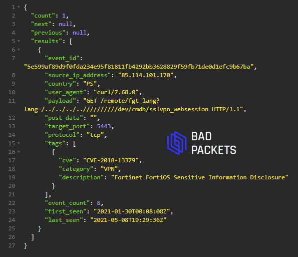</td>
</table></tr>
<table><tr>
<td>Quotes: <code>0</code></td>
<td>Replies: <code>2</code></td>
<td>Retweets: <code>27</code></td>
<td>Favorites: <code>35</code></td>
</tr></table>

---

# pdnuclei
**https://twitter.com/pdnuclei/status/1390774227830149121 _at 2021-05-07 21:03:09_**
<blockquote>
Nuclei Templates v8.2.5 release updates 🔉🔉

Newly added templates: 15

𝗧𝗲𝗺𝗽𝗹𝗮𝘁𝗲𝘀 𝗰𝗵𝗮𝗻𝗴𝗲𝗹𝗼𝗴:
https://t.co/1NM2u8BBaA

#hackwithautomation #pentest #cybersecurity #bugbounty https://t.co/MN3fBdwHDG
</blockquote>

* https://github.com/projectdiscovery/nuclei-templates/releases/tag/v8.2.5

<table><tr>
<td></td>
</table></tr>
<table><tr>
<td>Quotes: <code>1</code></td>
<td>Replies: <code>0</code></td>
<td>Retweets: <code>16</code></td>
<td>Favorites: <code>41</code></td>
</tr></table>

---

# theevilbit
**https://twitter.com/theevilbit/status/1390640283084328965 _at 2021-05-07 12:10:54_**
<blockquote>
My new blog post about the local privilege escalation vulnerability I found in macOS Preferences (CVE-2021-1815). First reported by @R3dF09 and @yuebinsun2020 
👇👇👇
</blockquote>

<table><tr>
<td>Quotes: <code>2</code></td>
<td>Replies: <code>0</code></td>
<td>Retweets: <code>24</code></td>
<td>Favorites: <code>78</code></td>
</tr></table>

---

# notdan
**https://twitter.com/notdan/status/1389809540548337671 _at 2021-05-05 05:09:50_**
<blockquote>
The University of Minnesota intentionally introduced multiple bugdoors in the linux kernel as a Proof-of-Concept, showing the ease of manipulating FOSS projects. https://t.co/2kXJAX9ZsN 
This UAF persisted for 5 years, for example. https://t.co/mvnzIL1RZT https://t.co/C0EtZQ4vnC
</blockquote>

* https://seclists.org/oss-sec/2021/q2/53
* https://www.cvedetails.com/cve/CVE-2019-12819

<table><tr>
<td></td>
</table></tr>
<table><tr>
<td>Quotes: <code>9</code></td>
<td>Replies: <code>5</code></td>
<td>Retweets: <code>18</code></td>
<td>Favorites: <code>58</code></td>
</tr></table>

---

# Arkbird_SOLG
**https://twitter.com/Arkbird_SOLG/status/1389769385527611400 _at 2021-05-05 02:30:16_**
<blockquote>
I share the samples and the yara rule of vulnerability CVE-2021-1647 (RCE Windows Defender)
Yara : 
https://t.co/22psynjLvW
Samples :
https://t.co/UxY2YWTGUA
Note : interesting Indonesian domain that continue to drop the tool for the RCE https://t.co/D3s2H17Swe
</blockquote>

* https://github.com/StrangerealIntel/DailyIOC/blob/master/2021-05-04/CVE-2021-1647/EXP_CVE_2021_1647_Apr_2021_1.yara
* https://bazaar.abuse.ch/browse/tag/CVE-2021-1647/

<table><tr>
<td></td>
</table></tr>
<table><tr>
<td>Quotes: <code>4</code></td>
<td>Replies: <code>1</code></td>
<td>Retweets: <code>35</code></td>
<td>Favorites: <code>84</code></td>
</tr></table>

---

# thezdi
**https://twitter.com/thezdi/status/1389626615706099712 _at 2021-05-04 17:02:57_**
<blockquote>
In a new guest blog, @kkokkokye describes how CVE-2021-26900 can be used to escalate privileges on #Windows through win32k. His write-up includes root cause, patch analysis, and PoC. Read the details at https://t.co/Mk6EtnEh5e
</blockquote>

* https://bit.ly/3nOpPDz

<table><tr>
<td>Quotes: <code>2</code></td>
<td>Replies: <code>1</code></td>
<td>Retweets: <code>91</code></td>
<td>Favorites: <code>182</code></td>
</tr></table>

---

# JGamblin
**https://twitter.com/JGamblin/status/1389604870303502338 _at 2021-05-04 15:36:33_**
<blockquote>
Microsoft Exchange Server Remote Code Execution Vulnerability POC for CVE-2021-28482.  https://t.co/t2ZMWMCFhO
</blockquote>

* https://gist.github.com/testanull/9ebbd6830f7a501e35e67f2fcaa57bda

<table><tr>
<td>Quotes: <code>0</code></td>
<td>Replies: <code>0</code></td>
<td>Retweets: <code>1</code></td>
<td>Favorites: <code>0</code></td>
</tr></table>

---

# _ForrestOrr
**https://twitter.com/_ForrestOrr/status/1389556306508451840 _at 2021-05-04 12:23:34_**
<blockquote>
Today I completed the world's first re-creation of the Darkhotel APT "Double Star" exploit chain, including many enhancements and personalizations. From Firefox RCE, to sandbox escape, to EoP to SYSTEM utilizing CVE-2020-0674 and CVE-2019-17026 https://t.co/UNPyfjFchI
</blockquote>

* https://github.com/forrest-orr/DoubleStar

<table><tr>
<td>Quotes: <code>5</code></td>
<td>Replies: <code>6</code></td>
<td>Retweets: <code>177</code></td>
<td>Favorites: <code>381</code></td>
</tr></table>

---

# darklotuskdb
**https://twitter.com/darklotuskdb/status/1388885326647611392 _at 2021-05-02 15:57:20_**
<blockquote>
Methodology: #xss 
1. xargs -n1 -a urls.txt -P 20 -I % curl -ks1L "%/?=DarkLotus" | grep -i 'DarkLotus'
2. If reflectes; then try to bypass it.
3. https://t.co/bRAPQpuVIx
4. https://t.co/5dZQpjf61Z

#HR51KDB #bugbountytip #bugbountytips #infosec
</blockquote>

* https://portswigger.net/web-security/cross-site-scripting/cheat-sheet
* https://github.com/s0md3v/MyPapers/tree/master/Bypassing-XSS-detection-mechanisms

<table><tr>
<td>Quotes: <code>1</code></td>
<td>Replies: <code>0</code></td>
<td>Retweets: <code>76</code></td>
<td>Favorites: <code>183</code></td>
</tr></table>

---

# divya_mudgal
**https://twitter.com/divya_mudgal/status/1388675838271492099 _at 2021-05-02 02:04:54_**
<blockquote>
My first contribution "Lansweeper &lt;=7.1.115.4 Unauthenticated SQL Injection" to @pdiscoveryio Nuclei Templates is available now.
https://t.co/mTHdMfeXES

Credit for original exploit discovery: https://t.co/n724mPhQNC 

#infosec #cybersecurity #projectdiscovery #nuclei https://t.co/fYoRSfElfw
</blockquote>

* https://github.com/projectdiscovery/nuclei-templates/blob/master/cves/2019/CVE-2019-13462.yaml
* https://www.nccgroup.com/ae/our-research/technical-advisory-unauthenticated-sql-injection-in-lansweeper/

<table><tr>
<td></td>
</table></tr>
<table><tr>
<td>Quotes: <code>0</code></td>
<td>Replies: <code>5</code></td>
<td>Retweets: <code>31</code></td>
<td>Favorites: <code>196</code></td>
</tr></table>

---

