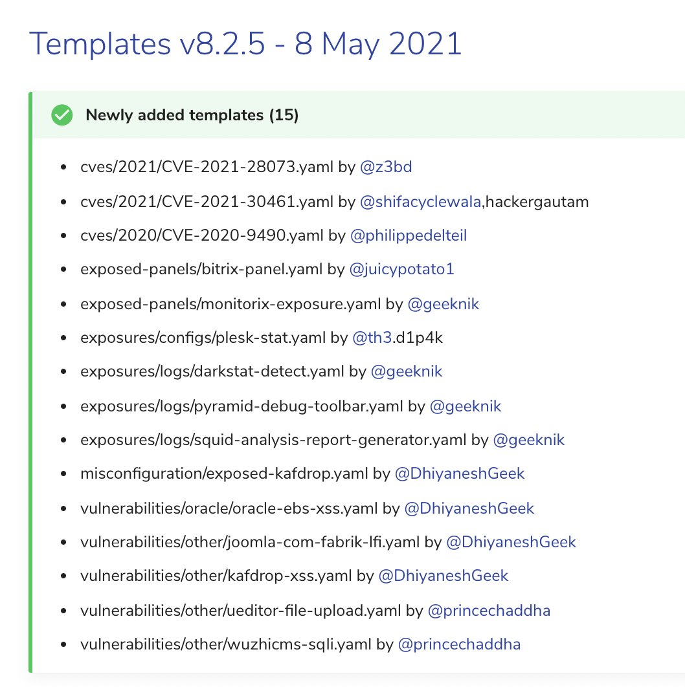

# sans_isc
**https://twitter.com/sans_isc/status/1394306375791091717 _at 2021-05-17 14:58:39_**
<blockquote>
PoC released for http.sys vulnerability (CVE-2021-31166) https://t.co/e4KJ3lEa7k PATCH PATCH PATCH ... #httpsys #poc #msft #cve202131166
</blockquote>

* https://github.com/0vercl0k/CVE-2021-31166

<table><tr>
<td>Quotes: <code>3</code></td>
<td>Replies: <code>1</code></td>
<td>Retweets: <code>32</code></td>
<td>Favorites: <code>53</code></td>
</tr></table>

---

# 0xR
**https://twitter.com/0xR/status/1394241606270787589 _at 2021-05-17 10:41:17_**
<blockquote>
Proof of concept for CVE-2021-31166, a remote HTTP.sys use-after-free triggered remotely

https://t.co/i1Fu7SfpmK
</blockquote>

* https://github.com/0vercl0k/CVE-2021-31166

<table><tr>
<td>Quotes: <code>0</code></td>
<td>Replies: <code>0</code></td>
<td>Retweets: <code>1</code></td>
<td>Favorites: <code>0</code></td>
</tr></table>

---

# ido_cohen2
**https://twitter.com/ido_cohen2/status/1394218462273224713 _at 2021-05-17 09:09:19_**
<blockquote>
🌐 I love the smell of #RCE in the morning, HTTP Protocol Stack Remote Code Execution Vulnerability (CVE-2021-31166) 💥

#Cyber #CyberSecurity #CyberAttack #Remote #Code #Execution #Microsoft #Update #CVE #Windows #Exploit #Vulnerability 

https://t.co/GWBb47Bo3r
</blockquote>

* https://github.com/0vercl0k/CVE-2021-31166

<table><tr>
<td>Quotes: <code>0</code></td>
<td>Replies: <code>1</code></td>
<td>Retweets: <code>2</code></td>
<td>Favorites: <code>1</code></td>
</tr></table>

---

# vahidnameni
**https://twitter.com/vahidnameni/status/1394169988307640321 _at 2021-05-17 05:56:42_**
<blockquote>
آسیب پذیری RCE و DoS در سری های جدید ویندوز که با شناسه CVE-2021-31166 هفته پیش وصله شد به شدت خطرناک (9.8) است چراکه نیاز به احرازهویت نیست و به راحتی از راه دور قابل Exploit است و البته به خاطر ماهیت آسیب پذیری به صورت worm قابل گسترش است! 
https://t.co/tArZES5u5P https://t.co/wOHrNhpPKH
</blockquote>

* https://github.com/0vercl0k/CVE-2021-31166

<table><tr>
<td></td>
</table></tr>
<table><tr>
<td>Quotes: <code>0</code></td>
<td>Replies: <code>0</code></td>
<td>Retweets: <code>6</code></td>
<td>Favorites: <code>21</code></td>
</tr></table>

---

# 0vercl0k
**https://twitter.com/0vercl0k/status/1393970836302811138 _at 2021-05-16 16:45:20_**
<blockquote>
I've built a PoC for CVE-2021-31166 the "HTTP Protocol Stack Remote Code Execution Vulnerability":  https://t.co/8mqLCByvCp 🔥🔥 https://t.co/yzgUs2CQO5
</blockquote>

* https://github.com/0vercl0k/CVE-2021-31166

<table><tr>
<td></td>
</table></tr>
<table><tr>
<td>Quotes: <code>21</code></td>
<td>Replies: <code>13</code></td>
<td>Retweets: <code>481</code></td>
<td>Favorites: <code>1093</code></td>
</tr></table>

---

# kmkz_security
**https://twitter.com/kmkz_security/status/1393964327695265793 _at 2021-05-16 16:19:28_**
<blockquote>
#Chrome Exploitation #CVE-2020-16040 &amp; CVE-2020-16041 Fullchain (#RCE + SBX) - #Samsung (ARM) browser
Version: 13.2.3.2(Chromium: 83.0.4103.106)
Slides from @Zer0CON :
https://t.co/XZLmHVsJrm
Exploits:
https://t.co/8iNMTEqXSe
By @dmxcsnsbh from @SingularSecLab
</blockquote>

* https://github.com/singularseclab/Slides/blob/main/2021/chrome_exploitation-zer0con2021.pdf
* https://github.com/singularseclab/Browser_Exploits/tree/master/CVE-2020-1604%5B0%7C1%5D

<table><tr>
<td>Quotes: <code>1</code></td>
<td>Replies: <code>0</code></td>
<td>Retweets: <code>73</code></td>
<td>Favorites: <code>125</code></td>
</tr></table>

---

# cyber_advising
**https://twitter.com/cyber_advising/status/1393621541112401920 _at 2021-05-15 17:37:22_**
<blockquote>
CVE-2020-28018: Exim Use-after-free (UAF) leading to RCE.

There exists a Use-after-free (UAF) vulnerability in tls-openssl.c that allow remote unauthenticated attackers to corrupt internal memory data, thus finally achieving remote code execution.

PoC
https://t.co/haUro0nANy https://t.co/CdI2KUHOkq
</blockquote>

* https://github.com/lockedbyte/CVE-Exploits/tree/master/CVE-2020-28018

<table><tr>
<td></td>
</table></tr>
<table><tr>
<td>Quotes: <code>2</code></td>
<td>Replies: <code>0</code></td>
<td>Retweets: <code>16</code></td>
<td>Favorites: <code>55</code></td>
</tr></table>

---

# lockedbyte
**https://twitter.com/lockedbyte/status/1393441739407515649 _at 2021-05-15 05:42:54_**
<blockquote>
I developed a Remote Code Execution PoC exploit for the Exim Use-After-Free that was recently disclosed (as part of @qualys 21Nails advisory). Tested just on Exim 4.92. PoC available: https://t.co/Su55rIZpgj https://t.co/P2GJFjSc3S
</blockquote>

* https://github.com/lockedbyte/CVE-Exploits/tree/master/CVE-2020-28018

<table><tr>
<td></td>
</table></tr>
<table><tr>
<td>Quotes: <code>6</code></td>
<td>Replies: <code>4</code></td>
<td>Retweets: <code>334</code></td>
<td>Favorites: <code>893</code></td>
</tr></table>

---

# akaclandestine
**https://twitter.com/akaclandestine/status/1392788441457364994 _at 2021-05-13 10:26:55_**
<blockquote>
#exploit
CVE-2020-28502:
node-XMLHttpRequest RCE
https://t.co/nOyLllJ47u
</blockquote>

* https://github.com/s-index/CVE-2020-28502

<table><tr>
<td>Quotes: <code>0</code></td>
<td>Replies: <code>0</code></td>
<td>Retweets: <code>1</code></td>
<td>Favorites: <code>0</code></td>
</tr></table>

---

# akaclandestine
**https://twitter.com/akaclandestine/status/1392785927542562825 _at 2021-05-13 10:16:56_**
<blockquote>
#exploit
CVE-2021-29200:
Apache OFBiz has unsafe deserialization &lt;17.12.07. An unauthenticated user can perform an RCE attack
https://t.co/YnonjoCoEt
</blockquote>

* https://github.com/r0ckysec/CVE-2021-29200

<table><tr>
<td>Quotes: <code>0</code></td>
<td>Replies: <code>0</code></td>
<td>Retweets: <code>1</code></td>
<td>Favorites: <code>0</code></td>
</tr></table>

---

# oct0xor
**https://twitter.com/oct0xor/status/1392456302069157889 _at 2021-05-12 12:27:07_**
<blockquote>
Tomorrow I will be hosting a workshop on exploit analysis for beginners.
I will demonstrate how to setup debugging, how to use WinDBG (+how to solve common problems), and we will analyse the latest Windows 0day CVE-2021-28310.

(13/05 - 2:00 PM GMT) https://t.co/SPO8qYbymp https://t.co/yJTSqIM6gR
</blockquote>

* https://kas.pr/t4z8

<table><tr>
<td></td>
</table></tr>
<table><tr>
<td>Quotes: <code>1</code></td>
<td>Replies: <code>2</code></td>
<td>Retweets: <code>39</code></td>
<td>Favorites: <code>144</code></td>
</tr></table>

---

# TheHackersNews
**https://twitter.com/TheHackersNews/status/1392449332918378501 _at 2021-05-12 11:59:26_**
<blockquote>
Patch Tuesday (May 2021)

Microsoft has released the latest Windows updates to patch a dozen newly discovered vulnerabilities, one of the most critical of which is a wormable RCE (CVE-2021-31166) in the HTTP protocol stack.

Read details - https://t.co/4cHXSogd4o

#infosec
</blockquote>

* https://thehackernews.com/2021/05/latest-microsoft-windows-updates-patch.html

<table><tr>
<td>Quotes: <code>7</code></td>
<td>Replies: <code>4</code></td>
<td>Retweets: <code>121</code></td>
<td>Favorites: <code>184</code></td>
</tr></table>

---

# Zero0x00
**https://twitter.com/Zero0x00/status/1392256984385085441 _at 2021-05-11 23:15:06_**
<blockquote>
@cheatdroit @ADITYASHENDE17 @ofjaaah @th3cyb3rc0p @theXSSrat @alicanact60 @naglinagli https://t.co/trxZYy9PlS
Other than this do watch @InsiderPhD YouTube ApI security series, as well practice over the lab being published by her awsome one
https://t.co/3jlb0HXfIg
https://t.co/GSUh52t6Mb
</blockquote>

* https://github.com/arainho/awesome-api-security
* https://youtube.com/playlist?list=PLbyncTkpno5HqX1h2MnV6Qt4wvTb8Mpol
* https://github.com/InsiderPhD/Generic-University

<table><tr>
<td>Quotes: <code>1</code></td>
<td>Replies: <code>0</code></td>
<td>Retweets: <code>19</code></td>
<td>Favorites: <code>32</code></td>
</tr></table>

---

# wvuuuuuuuuuuuuu
**https://twitter.com/wvuuuuuuuuuuuuu/status/1392245805654986764 _at 2021-05-11 22:30:41_**
<blockquote>
WIP exploit for NetMotion Mobility CVE-2021-26914, pre-auth RCE in a mobile VPN server. Many thanks to @steventseeley for the vuln and support. 🔥

https://t.co/JfGqtfWe01
</blockquote>

* https://github.com/rapid7/metasploit-framework/pull/15186

<table><tr>
<td>Quotes: <code>3</code></td>
<td>Replies: <code>4</code></td>
<td>Retweets: <code>15</code></td>
<td>Favorites: <code>53</code></td>
</tr></table>

---

# autiomaa
**https://twitter.com/autiomaa/status/1392180998490791938 _at 2021-05-11 18:13:10_**
<blockquote>
VS Code update (April 2021 Recovery) https://t.co/q1dNlicNMX has security patches for several Remote Code Execution Vulnerability issues (CVE-2021-31211, CVE-2021-31214).
</blockquote>

* https://github.com/microsoft/vscode/milestone/155?closed=1

<table><tr>
<td>Quotes: <code>0</code></td>
<td>Replies: <code>1</code></td>
<td>Retweets: <code>1</code></td>
<td>Favorites: <code>1</code></td>
</tr></table>

---

# mavillon1
**https://twitter.com/mavillon1/status/1392036718275186689 _at 2021-05-11 08:39:51_**
<blockquote>
SMBGhost CVE-2020-0796 Remote Code Execution Full Source Code #exploit #rce #SMBGhost
https://t.co/l1KAR21NWl
</blockquote>

* https://github.com/mavillon1/SMBGhost-Full-RCE

<table><tr>
<td>Quotes: <code>0</code></td>
<td>Replies: <code>0</code></td>
<td>Retweets: <code>3</code></td>
<td>Favorites: <code>3</code></td>
</tr></table>

---

# wugeej
**https://twitter.com/wugeej/status/1391945556902121472 _at 2021-05-11 02:37:36_**
<blockquote>
Microsoft Exchange Deserialization to Post-Auth RCE (CVE-2021-28482)

#PoC
https://t.co/hzpypNjNyr

https://t.co/SnJvOns24Y

https://t.co/jKMpbQWOgw https://t.co/iyZBypNlTF
</blockquote>

* https://github.com/Shadow0ps/CVE-2021-28482-Exchange-POC/blob/main/Proof-Of-Concept.py
* https://gist.github.com/testanull/9ebbd6830f7a501e35e67f2fcaa57bda
* https://testbnull.medium.com/microsoft-exchange-from-deserialization-to-post-auth-rce-cve-2021-28482-e713001d915f

<table><tr>
<td></td>
<td></td>
</table></tr>
<table><tr>
<td>Quotes: <code>4</code></td>
<td>Replies: <code>2</code></td>
<td>Retweets: <code>73</code></td>
<td>Favorites: <code>125</code></td>
</tr></table>

---

# wugeej
**https://twitter.com/wugeej/status/1391945096002682886 _at 2021-05-11 02:35:46_**
<blockquote>
Microsoft Exchange Deserialization to Post-Auth RCE (CVE-2021-28482)

* MeetingPollHandler Deserialization

GET /owa/MeetingPollHandler.ashx?PayloadType=ApproveProposedOptions&amp;ItemId=OID.xxxxxx.2021/05/11&amp;RequestId=123123123"

https://t.co/Ex7yeagJrZ https://t.co/qgL2fNuPcw
</blockquote>

* https://www.youtube.com/watch?v=2ludXDGfOlQ

<table><tr>
<td></td>
</table></tr>
<table><tr>
<td>Quotes: <code>5</code></td>
<td>Replies: <code>4</code></td>
<td>Retweets: <code>300</code></td>
<td>Favorites: <code>637</code></td>
</tr></table>

---

# chybeta
**https://twitter.com/chybeta/status/1391699442638540804 _at 2021-05-10 10:19:38_**
<blockquote>
CVE-2021-29200  Apache OFbiz RMI bypass RCE

analysis: https://t.co/DyZfwSN9z3 ( @r00t4dm )
some payload: https://t.co/7MBbsdbBuT https://t.co/RGMuIc6WQD
</blockquote>

* https://xz.aliyun.com/t/9556
* https://t.zsxq.com/mmAAYfE

<table><tr>
<td></td>
</table></tr>
<table><tr>
<td>Quotes: <code>1</code></td>
<td>Replies: <code>0</code></td>
<td>Retweets: <code>23</code></td>
<td>Favorites: <code>69</code></td>
</tr></table>

---

# pdnuclei
**https://twitter.com/pdnuclei/status/1390774227830149121 _at 2021-05-07 21:03:09_**
<blockquote>
Nuclei Templates v8.2.5 release updates 🔉🔉

Newly added templates: 15

𝗧𝗲𝗺𝗽𝗹𝗮𝘁𝗲𝘀 𝗰𝗵𝗮𝗻𝗴𝗲𝗹𝗼𝗴:
https://t.co/1NM2u8BBaA

#hackwithautomation #pentest #cybersecurity #bugbounty https://t.co/MN3fBdwHDG
</blockquote>

* https://github.com/projectdiscovery/nuclei-templates/releases/tag/v8.2.5

<table><tr>
<td></td>
</table></tr>
<table><tr>
<td>Quotes: <code>1</code></td>
<td>Replies: <code>0</code></td>
<td>Retweets: <code>16</code></td>
<td>Favorites: <code>41</code></td>
</tr></table>

---

# theevilbit
**https://twitter.com/theevilbit/status/1390640283084328965 _at 2021-05-07 12:10:54_**
<blockquote>
My new blog post about the local privilege escalation vulnerability I found in macOS Preferences (CVE-2021-1815). First reported by @R3dF09 and @yuebinsun2020 
👇👇👇
</blockquote>

<table><tr>
<td>Quotes: <code>2</code></td>
<td>Replies: <code>0</code></td>
<td>Retweets: <code>24</code></td>
<td>Favorites: <code>78</code></td>
</tr></table>

---

# notdan
**https://twitter.com/notdan/status/1389809540548337671 _at 2021-05-05 05:09:50_**
<blockquote>
The University of Minnesota intentionally introduced multiple bugdoors in the linux kernel as a Proof-of-Concept, showing the ease of manipulating FOSS projects. https://t.co/2kXJAX9ZsN 
This UAF persisted for 5 years, for example. https://t.co/mvnzIL1RZT https://t.co/C0EtZQ4vnC
</blockquote>

* https://seclists.org/oss-sec/2021/q2/53
* https://www.cvedetails.com/cve/CVE-2019-12819

<table><tr>
<td></td>
</table></tr>
<table><tr>
<td>Quotes: <code>9</code></td>
<td>Replies: <code>6</code></td>
<td>Retweets: <code>18</code></td>
<td>Favorites: <code>61</code></td>
</tr></table>

---

# Arkbird_SOLG
**https://twitter.com/Arkbird_SOLG/status/1389769385527611400 _at 2021-05-05 02:30:16_**
<blockquote>
I share the samples and the yara rule of vulnerability CVE-2021-1647 (RCE Windows Defender)
Yara : 
https://t.co/22psynjLvW
Samples :
https://t.co/UxY2YWTGUA
Note : interesting Indonesian domain that continue to drop the tool for the RCE https://t.co/D3s2H17Swe
</blockquote>

* https://github.com/StrangerealIntel/DailyIOC/blob/master/2021-05-04/CVE-2021-1647/EXP_CVE_2021_1647_Apr_2021_1.yara
* https://bazaar.abuse.ch/browse/tag/CVE-2021-1647/

<table><tr>
<td></td>
</table></tr>
<table><tr>
<td>Quotes: <code>4</code></td>
<td>Replies: <code>1</code></td>
<td>Retweets: <code>36</code></td>
<td>Favorites: <code>86</code></td>
</tr></table>

---

# thezdi
**https://twitter.com/thezdi/status/1389626615706099712 _at 2021-05-04 17:02:57_**
<blockquote>
In a new guest blog, @kkokkokye describes how CVE-2021-26900 can be used to escalate privileges on #Windows through win32k. His write-up includes root cause, patch analysis, and PoC. Read the details at https://t.co/Mk6EtnEh5e
</blockquote>

* https://bit.ly/3nOpPDz

<table><tr>
<td>Quotes: <code>2</code></td>
<td>Replies: <code>1</code></td>
<td>Retweets: <code>91</code></td>
<td>Favorites: <code>182</code></td>
</tr></table>

---

# JGamblin
**https://twitter.com/JGamblin/status/1389604870303502338 _at 2021-05-04 15:36:33_**
<blockquote>
Microsoft Exchange Server Remote Code Execution Vulnerability POC for CVE-2021-28482.  https://t.co/t2ZMWMCFhO
</blockquote>

* https://gist.github.com/testanull/9ebbd6830f7a501e35e67f2fcaa57bda

<table><tr>
<td>Quotes: <code>0</code></td>
<td>Replies: <code>0</code></td>
<td>Retweets: <code>1</code></td>
<td>Favorites: <code>0</code></td>
</tr></table>

---

# darklotuskdb
**https://twitter.com/darklotuskdb/status/1388885326647611392 _at 2021-05-02 15:57:20_**
<blockquote>
Methodology: #xss 
1. xargs -n1 -a urls.txt -P 20 -I % curl -ks1L "%/?=DarkLotus" | grep -i 'DarkLotus'
2. If reflectes; then try to bypass it.
3. https://t.co/bRAPQpuVIx
4. https://t.co/5dZQpjf61Z

#HR51KDB #bugbountytip #bugbountytips #infosec
</blockquote>

* https://portswigger.net/web-security/cross-site-scripting/cheat-sheet
* https://github.com/s0md3v/MyPapers/tree/master/Bypassing-XSS-detection-mechanisms

<table><tr>
<td>Quotes: <code>1</code></td>
<td>Replies: <code>0</code></td>
<td>Retweets: <code>76</code></td>
<td>Favorites: <code>183</code></td>
</tr></table>

---

# divya_mudgal
**https://twitter.com/divya_mudgal/status/1388675838271492099 _at 2021-05-02 02:04:54_**
<blockquote>
My first contribution "Lansweeper &lt;=7.1.115.4 Unauthenticated SQL Injection" to @pdiscoveryio Nuclei Templates is available now.
https://t.co/mTHdMfeXES

Credit for original exploit discovery: https://t.co/n724mPhQNC 

#infosec #cybersecurity #projectdiscovery #nuclei https://t.co/fYoRSfElfw
</blockquote>

* https://github.com/projectdiscovery/nuclei-templates/blob/master/cves/2019/CVE-2019-13462.yaml
* https://www.nccgroup.com/ae/our-research/technical-advisory-unauthenticated-sql-injection-in-lansweeper/

<table><tr>
<td></td>
</table></tr>
<table><tr>
<td>Quotes: <code>0</code></td>
<td>Replies: <code>5</code></td>
<td>Retweets: <code>31</code></td>
<td>Favorites: <code>196</code></td>
</tr></table>

---

