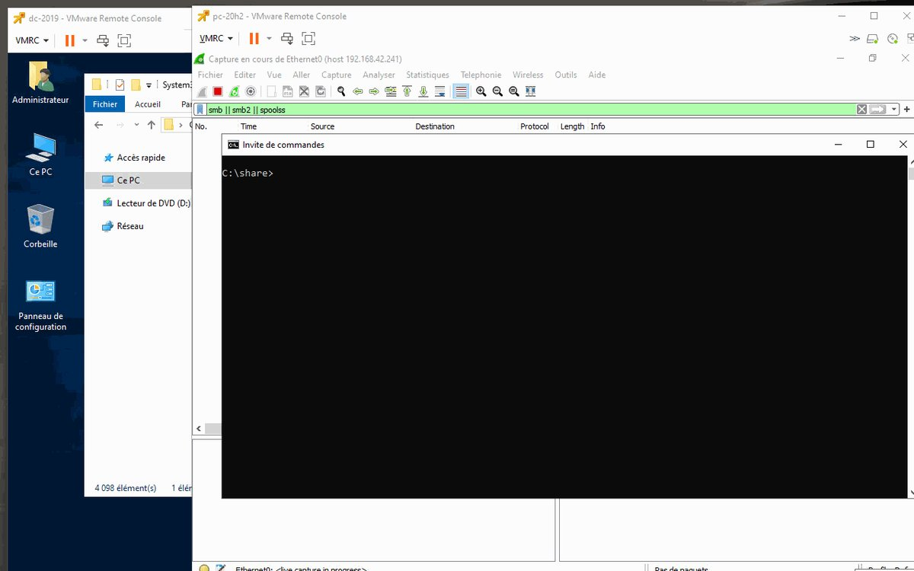
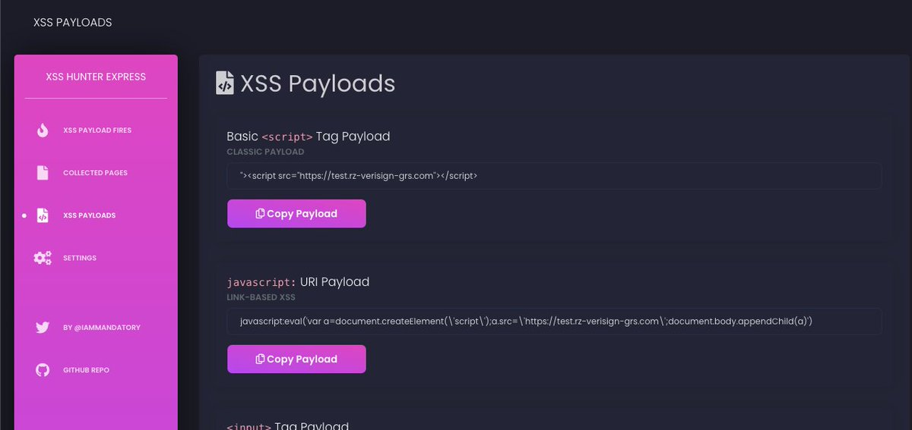
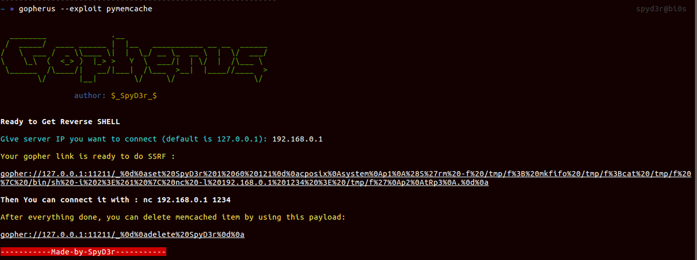

# HuntressLabs
**https://twitter.com/HuntressLabs/status/1410293681941356553 _at 2021-06-30 17:46:30_**
<blockquote>
Update: We’ve posted a blog with more details about CVE-2021-1675, a critical vulnerability that exposes Windows Servers to remote code execution. We’ll continue to post updates to this blog as we learn more. https://t.co/1mHb73pVvI https://t.co/andwkVE1Kv
</blockquote>

* https://hubs.ly/H0Rlf8H0

<table><tr>
<td></td>
</table></tr>
<table><tr>
<td>Quotes: <code>7</code></td>
<td>Replies: <code>1</code></td>
<td>Retweets: <code>21</code></td>
<td>Favorites: <code>50</code></td>
</tr></table>

---

# HuntressLabs
**https://twitter.com/HuntressLabs/status/1410265926528909313 _at 2021-06-30 15:56:13_**
<blockquote>
Breaking: Huntress is aware of CVE-2021-1675, a critical remote code execution and local privilege escalation vulnerability dubbed as PrintNightmare. The only known mitigation right now is to disable the Print Spooler service. We’re working on a blog post with more details.
</blockquote>

<table><tr>
<td>Quotes: <code>1</code></td>
<td>Replies: <code>0</code></td>
<td>Retweets: <code>25</code></td>
<td>Favorites: <code>84</code></td>
</tr></table>

---

# Truesec
**https://twitter.com/Truesec/status/1410238757136224257 _at 2021-06-30 14:08:15_**
<blockquote>
Exploitable critical vulnerability allows for full Active Directory compromise. Fully patched systems are vulnerable. Immediate action is strongly recommended! 

Check details here: 

https://t.co/sLpa5DpYUy

#PrintNightmare #CVE-2021-1675
</blockquote>

* https://blog.truesec.com/2021/06/30/exploitable-critical-rce-vulnerability-allows-regular-users-to-fully-compromise-active-directory-printnightmare-cve-2021-1675/

<table><tr>
<td>Quotes: <code>3</code></td>
<td>Replies: <code>1</code></td>
<td>Retweets: <code>22</code></td>
<td>Favorites: <code>34</code></td>
</tr></table>

---

# TheHackersNews
**https://twitter.com/TheHackersNews/status/1410200039675236354 _at 2021-06-30 11:34:24_**
<blockquote>
🔥 Researchers publish a proof-of-concept exploit for a critical #vulnerability (CVE-2021-1675) affecting #Microsoft Windows operating systems.

Details — https://t.co/e9megsOj6v

#infosec #hacking #cybersecurity
</blockquote>

* https://thehackernews.com/2021/06/researchers-leak-poc-exploit-for.html

<table><tr>
<td>Quotes: <code>15</code></td>
<td>Replies: <code>4</code></td>
<td>Retweets: <code>187</code></td>
<td>Favorites: <code>272</code></td>
</tr></table>

---

# certbe
**https://twitter.com/certbe/status/1410181930935631878 _at 2021-06-30 10:22:26_**
<blockquote>
WARNING: #Patch your Windows systems for CVE-2021-1675, codenamed #PrintNightmare. A PoC exploit was released and can be used for a Remote Code Execution (RCE) attack on any vulnerable Windows system. https://t.co/IcSwCXLzdE
#SIGMA rule by @cyb3rops https://t.co/blIJIHMCJD
</blockquote>

* https://msrc.microsoft.com/update-guide/en-US/vulnerability/CVE-2021-1675
* https://github.com/SigmaHQ/sigma/blob/a27d3d5880e3e5c6b26da068d113cb121ab391c5/rules/windows/file_event/win_cve_2021_1675_printspooler.yml

<table><tr>
<td>Quotes: <code>3</code></td>
<td>Replies: <code>2</code></td>
<td>Retweets: <code>23</code></td>
<td>Favorites: <code>20</code></td>
</tr></table>

---

# CKsTechNews
**https://twitter.com/CKsTechNews/status/1410181198954086400 _at 2021-06-30 10:19:32_**
<blockquote>
PrintNightmare (CVE-2021-1675): Remote code execution in Windows Spooler Service 

The exploit also works on Windows 11.

https://t.co/PF2rzxSuuQ https://t.co/FlUUaNH8nW
</blockquote>

* https://github.com/afwu/PrintNightmare

<table><tr>
<td></td>
<td></td>
</table></tr>
<table><tr>
<td>Quotes: <code>0</code></td>
<td>Replies: <code>0</code></td>
<td>Retweets: <code>1</code></td>
<td>Favorites: <code>1</code></td>
</tr></table>

---

# akaclandestine
**https://twitter.com/akaclandestine/status/1410157890594381830 _at 2021-06-30 08:46:55_**
<blockquote>
#exploit
CVE-2021-35523:
Local Privilege Escalation in Securepoint SSL VPN Client 2.0.3
https://t.co/mjSzmNOJD0

CVE-2021-1675:
"PrintNightmare" - RCE in Windows Spooler Service
https://t.co/pSTg1Tsreo
]-&gt; Impacket implementation:
https://t.co/eY0GkTVmRO
</blockquote>

* https://bogner.sh/2021/06/local-privilege-escalation-in-securepoint-ssl-vpn-client-2-0-30
* https://github.com/afwu/PrintNightmare
* https://github.com/cube0x0/CVE-2021-1675

<table><tr>
<td>Quotes: <code>0</code></td>
<td>Replies: <code>0</code></td>
<td>Retweets: <code>1</code></td>
<td>Favorites: <code>0</code></td>
</tr></table>

---

# RubertPereira
**https://twitter.com/RubertPereira/status/1410148183687184384 _at 2021-06-30 08:08:20_**
<blockquote>
#PrintNightmare (CVE-2021-1675): Remote code execution #RCE en Windows Spooler Service
- Grave vulnerabilidad Windows
- RCE en Servicio Impresión Windows spoolsv.exe
PoC Exploit en Github fue eliminado:
https://t.co/grZrmcpRns
Será presentando BlackHat USA
…
</blockquote>

* http://web.archive.org/web/20210629055600/https://github.com/hhlxf/PrintNightmare

<table><tr>
<td>Quotes: <code>0</code></td>
<td>Replies: <code>0</code></td>
<td>Retweets: <code>0</code></td>
<td>Favorites: <code>0</code></td>
</tr></table>

---

# ptracesecurity
**https://twitter.com/ptracesecurity/status/1410139271625859072 _at 2021-06-30 07:32:56_**
<blockquote>
PrintNightmare (CVE-2021-1675): Remote code execution in Windows Spooler Service  https://t.co/rPdJzaKE9Z  #Pentesting #RCE #CVE #Windows #Infosec https://t.co/5dUpyxQfZ2
</blockquote>

* https://github.com/afwu/PrintNightmare

<table><tr>
<td></td>
<td></td>
</table></tr>
<table><tr>
<td>Quotes: <code>1</code></td>
<td>Replies: <code>0</code></td>
<td>Retweets: <code>11</code></td>
<td>Favorites: <code>13</code></td>
</tr></table>

---

# hackerfantastic
**https://twitter.com/hackerfantastic/status/1410100394492112898 _at 2021-06-30 04:58:27_**
<blockquote>
Fully patched Windows 2019 domain controller, popped with 0day exploit (CVE-2021-1675) from a regular Domain User's account giving full SYSTEM privileges. Disable "Print Spooler" service on servers that do not require it. https://t.co/6SUVQYy5Tl
</blockquote>

<table><tr>
<td></td>
<td></td>
</table></tr>
<table><tr>
<td>Quotes: <code>39</code></td>
<td>Replies: <code>27</code></td>
<td>Retweets: <code>496</code></td>
<td>Favorites: <code>1030</code></td>
</tr></table>

---

# gentilkiwi
**https://twitter.com/gentilkiwi/status/1410066827590447108 _at 2021-06-30 02:45:04_**
<blockquote>
This #printnightmare / CVE-2021-1675 is really serious 🤪

Just adapted/simplified original POC then:
*From Remote standard user to SYSTEM*

Here on a domain controller, but valid on all systems with RPC to spooler available, remote or local

➡️ disable service now (no patch yet) https://t.co/qpUFgPUZyh
</blockquote>

<table><tr>
<td></td>
</table></tr>
<table><tr>
<td>Quotes: <code>47</code></td>
<td>Replies: <code>13</code></td>
<td>Retweets: <code>594</code></td>
<td>Favorites: <code>1174</code></td>
</tr></table>

---

# OatmealThief
**https://twitter.com/OatmealThief/status/1410051181943037958 _at 2021-06-30 01:42:53_**
<blockquote>
PrintNightmare (CVE-2021-1675) is going to be a nightmare for Microsoft. It allows for authenticated RCE as well as privilege escalation by exploiting flaws in the Windows Print Spooler service.

PoC just dropped on Github: https://t.co/v7MoSaWxQm
</blockquote>

* https://github.com/blackorbird/PrintNightmare

<table><tr>
<td>Quotes: <code>0</code></td>
<td>Replies: <code>1</code></td>
<td>Retweets: <code>2</code></td>
<td>Favorites: <code>2</code></td>
</tr></table>

---

# hackerfantastic
**https://twitter.com/hackerfantastic/status/1410046975941263363 _at 2021-06-30 01:26:11_**
<blockquote>
CVE-2021-1675 PoC can be used to load DLL's into a remote Windows host and a regular domain user can execute code as SYSTEM on a Domain Controller. This issue is trivially exploitable to obtain SYSTEM on a Domain Controller and systems with Print Spooler service enabled.
</blockquote>

<table><tr>
<td>Quotes: <code>11</code></td>
<td>Replies: <code>6</code></td>
<td>Retweets: <code>109</code></td>
<td>Favorites: <code>288</code></td>
</tr></table>

---

# KasunEinz
**https://twitter.com/KasunEinz/status/1409950524326105089 _at 2021-06-29 19:02:55_**
<blockquote>
🚨 #PrintNightmare (CVE-2021-1675) 🚨
RCE &amp; LPE in Windows Printer Spooler Service.
Make Sure June Patch Updates have been applied.  
https://t.co/ATRhsieANo
</blockquote>

* https://github.com/afwu/PrintNightmare

<table><tr>
<td>Quotes: <code>0</code></td>
<td>Replies: <code>1</code></td>
<td>Retweets: <code>0</code></td>
<td>Favorites: <code>3</code></td>
</tr></table>

---

# maddiestone
**https://twitter.com/maddiestone/status/1409936902631825408 _at 2021-06-29 18:08:47_**
<blockquote>
🌟 New 0-day Root Cause Analysis! 🌟

CVE-2021-1905: 0-day in Qualcomm Adreno GPU for Android by Ben Hawkes

https://t.co/abDHuWGFZU
</blockquote>

* https://googleprojectzero.github.io/0days-in-the-wild/0day-RCAs/2021/CVE-2021-1905.html

<table><tr>
<td>Quotes: <code>5</code></td>
<td>Replies: <code>1</code></td>
<td>Retweets: <code>108</code></td>
<td>Favorites: <code>247</code></td>
</tr></table>

---

# TheHackersNews
**https://twitter.com/TheHackersNews/status/1409898390737985545 _at 2021-06-29 15:35:45_**
<blockquote>
A PoC exploit has been released for a critical unauthenticated RCE vulnerability (CVE-2021-27850) discovered in all recent versions of Apache Tapestry.

https://t.co/w0uucSJU38
</blockquote>

* https://github.com/kahla-sec/CVE-2021-27850_POC

<table><tr>
<td>Quotes: <code>3</code></td>
<td>Replies: <code>1</code></td>
<td>Retweets: <code>63</code></td>
<td>Favorites: <code>107</code></td>
</tr></table>

---

# portslug
**https://twitter.com/portslug/status/1409872023174758403 _at 2021-06-29 13:50:59_**
<blockquote>
PrintNightmare (CVE-2021-1675): RCE in Windows Spooler Service dropped by @edwardzpeng and @lxf02942370.They will also be disclosing more at Blackhat 2021 in a talk "Diving into Spooler: Discovering LPE and RCE vulns in Windows Printer".

https://t.co/gQ4cSTpVg0
</blockquote>

* https://github.com/afwu/PrintNightmare

<table><tr>
<td>Quotes: <code>0</code></td>
<td>Replies: <code>0</code></td>
<td>Retweets: <code>2</code></td>
<td>Favorites: <code>1</code></td>
</tr></table>

---

# ShitSecure
**https://twitter.com/ShitSecure/status/1409815256021536769 _at 2021-06-29 10:05:24_**
<blockquote>
I did not test it but this looks bad for missing June patches:

https://t.co/wBfHy0tzsB

CVE-2021-1675 - Exploit released. https://t.co/pXSnqomZmd
</blockquote>

* https://github.com/afwu/PrintNightmare

<table><tr>
<td></td>
</table></tr>
<table><tr>
<td>Quotes: <code>6</code></td>
<td>Replies: <code>4</code></td>
<td>Retweets: <code>85</code></td>
<td>Favorites: <code>207</code></td>
</tr></table>

---

# blackorbird
**https://twitter.com/blackorbird/status/1409794227731460100 _at 2021-06-29 08:41:51_**
<blockquote>
#POC 
PrintNightmare (CVE-2021-1675): Remote code execution in Windows Spooler Service 
https://t.co/R3ldQKrXOX https://t.co/B9N2guWdTy
</blockquote>

* https://github.com/hhlxf/PrintNightmare

<table><tr>
<td></td>
<td></td>
</table></tr>
<table><tr>
<td>Quotes: <code>5</code></td>
<td>Replies: <code>2</code></td>
<td>Retweets: <code>111</code></td>
<td>Favorites: <code>257</code></td>
</tr></table>

---

# Raj_Samani
**https://twitter.com/Raj_Samani/status/1409750870900740098 _at 2021-06-29 05:49:34_**
<blockquote>
Our latest @McAfee_Labs post details our root cause analysis of CVE-2021-1665 – GDI+ Remote Code Execution Vulnerability using WinAFL: https://t.co/amzOzrDedT #cybersecurity #infosec https://t.co/8pr747Zk1F
</blockquote>

* https://www.mcafee.com/blogs/other-blogs/mcafee-labs/analyzing-cve-2021-1665-remote-code-execution-vulnerability-in-windows-gdi/

<table><tr>
<td></td>
</table></tr>
<table><tr>
<td>Quotes: <code>2</code></td>
<td>Replies: <code>0</code></td>
<td>Retweets: <code>23</code></td>
<td>Favorites: <code>39</code></td>
</tr></table>

---

# hardik05
**https://twitter.com/hardik05/status/1409670194042073103 _at 2021-06-29 00:28:59_**
<blockquote>
My blog from McAfee on CVE-2021-1665. this is something I reported last year and it was fixed in Jan21 patch Tuesday..
 #cybersecurity #infosec #cve-2021-1665 #vulnerability 

enjoy reading!

https://t.co/zY0HMhw10i
</blockquote>

* https://www.mcafee.com/blogs/other-blogs/mcafee-labs/analyzing-cve-2021-1665-remote-code-execution-vulnerability-in-windows-gdi/

<table><tr>
<td>Quotes: <code>5</code></td>
<td>Replies: <code>1</code></td>
<td>Retweets: <code>42</code></td>
<td>Favorites: <code>94</code></td>
</tr></table>

---

# kento932376
**https://twitter.com/kento932376/status/1409527086067318784 _at 2021-06-28 15:00:19_**
<blockquote>
I've published MsIo64.sys kernel exploit PoC.

- Arbitrary NT-Kernel API calls
- Arbitrary code execution in CPL0 context

In this repo I've implemented privilege escalation for example.

https://t.co/xbovRi2Pfw
</blockquote>

* https://github.com/kkent030315/MsIoExploit

<table><tr>
<td>Quotes: <code>0</code></td>
<td>Replies: <code>0</code></td>
<td>Retweets: <code>67</code></td>
<td>Favorites: <code>130</code></td>
</tr></table>

---

# RedDrip7
**https://twitter.com/RedDrip7/status/1409353110187757575 _at 2021-06-28 03:29:00_**
<blockquote>
Recently, we found right approaches to exploit #CVE-2021-1675 successfully, both #LPE and #RCE. It is interesting that the vulnerability was classified into #LPE only by Microsoft, however, it was changed into Remote Code Execution recently.

https://t.co/PQO3B12hoE https://t.co/kbYknK9fBw
</blockquote>

* https://msrc.microsoft.com/update-guide/en-US/vulnerability/CVE-2021-1675

<table><tr>
<td></td>
</table></tr>
<table><tr>
<td>Quotes: <code>11</code></td>
<td>Replies: <code>3</code></td>
<td>Retweets: <code>136</code></td>
<td>Favorites: <code>318</code></td>
</tr></table>

---

# 0dayCTF
**https://twitter.com/0dayCTF/status/1408896530933760007 _at 2021-06-26 21:14:43_**
<blockquote>
Semi Interactive Web Shell (phpbash)
-
Repo: https://t.co/WK9YMrDbm4
-
#CyberSecurity #BugBounty #bugbountytips #CTF #webshell #exploit #RCE #PHP https://t.co/3l46CPYDWt
</blockquote>

* https://github.com/Arrexel/phpbash

<table><tr>
<td></td>
</table></tr>
<table><tr>
<td>Quotes: <code>2</code></td>
<td>Replies: <code>2</code></td>
<td>Retweets: <code>53</code></td>
<td>Favorites: <code>160</code></td>
</tr></table>

---

# piedpiper1616
**https://twitter.com/piedpiper1616/status/1408563640836390914 _at 2021-06-25 23:11:56_**
<blockquote>
GitHub - kahla-sec/CVE-2021-27850_POC: A Proof of concept for CVE-2021-27850 affecting Apache Tapestry and leading to unauthencticated remote code execution. - https://t.co/teXU7d9Dhm
</blockquote>

* https://github.com/kahla-sec/CVE-2021-27850_POC

<table><tr>
<td>Quotes: <code>1</code></td>
<td>Replies: <code>0</code></td>
<td>Retweets: <code>7</code></td>
<td>Favorites: <code>28</code></td>
</tr></table>

---

# theXSSrat
**https://twitter.com/theXSSrat/status/1408493289842618371 _at 2021-06-25 18:32:23_**
<blockquote>
WAF bypass checklist as well: 

https://t.co/ffsLlvZlFz
</blockquote>

* https://github.com/The-XSS-Rat/SecurityTesting/blob/master/Checklists/WAF-bypass-checklist.md

<table><tr>
<td>Quotes: <code>1</code></td>
<td>Replies: <code>1</code></td>
<td>Retweets: <code>42</code></td>
<td>Favorites: <code>78</code></td>
</tr></table>

---

# theXSSrat
**https://twitter.com/theXSSrat/status/1408489163578654721 _at 2021-06-25 18:15:59_**
<blockquote>
Now also on my github :D &lt;3 
https://t.co/2Dmfrh6fUN
</blockquote>

* https://github.com/The-XSS-Rat/SecurityTesting/blob/master/Checklists/webAppSec.md

<table><tr>
<td>Quotes: <code>1</code></td>
<td>Replies: <code>5</code></td>
<td>Retweets: <code>58</code></td>
<td>Favorites: <code>166</code></td>
</tr></table>

---

# sec715
**https://twitter.com/sec715/status/1408218852245135362 _at 2021-06-25 00:21:52_**
<blockquote>
BOOM🔥🔥 Gitlab SSRF (CVE-2021-22214).

POC:
curl -s --show-error -H 'Content-Type: application/json' --data '{ "include_merged_yaml": true, "content": "include:\n  remote: http://x.x.x.x/api/v1/targets?test.yml"}' https://REDACTED/api/v4/ci/lint -k

#SSRF #Gitlab #bugbountytips https://t.co/07NnNq6in0
</blockquote>

<table><tr>
<td></td>
<td></td>
</table></tr>
<table><tr>
<td>Quotes: <code>2</code></td>
<td>Replies: <code>4</code></td>
<td>Retweets: <code>55</code></td>
<td>Favorites: <code>142</code></td>
</tr></table>

---

# Alra3ees
**https://twitter.com/Alra3ees/status/1408098656595611649 _at 2021-06-24 16:24:15_**
<blockquote>
Enum_For_All:-

Recon.
Vulnerability analysis.
Privilege escalation.

https://t.co/zt8CX1lhyn https://t.co/ImYYrSlE8R
</blockquote>

* https://github.com/0xtz/Enum_For_All

<table><tr>
<td></td>
</table></tr>
<table><tr>
<td>Quotes: <code>0</code></td>
<td>Replies: <code>0</code></td>
<td>Retweets: <code>67</code></td>
<td>Favorites: <code>196</code></td>
</tr></table>

---

# TheHackersNews
**https://twitter.com/TheHackersNews/status/1407905106910007303 _at 2021-06-24 03:35:09_**
<blockquote>
Experts share details for a vulnerability (CVE-2021-31958) affecting the MSRPC service, enabling attackers to relay NTLM authentication and open a privileged session with the Event Viewer service, remotely.

https://t.co/twFncdghlU https://t.co/Ux8nrBTDBh
</blockquote>

* https://www.armis.com/blog/security-advisory-windows-event-viewer-service-vulnerable-to-ntlm-relay-attacks/

<table><tr>
<td></td>
</table></tr>
<table><tr>
<td>Quotes: <code>4</code></td>
<td>Replies: <code>0</code></td>
<td>Retweets: <code>79</code></td>
<td>Favorites: <code>126</code></td>
</tr></table>

---

# TheHackersNews
**https://twitter.com/TheHackersNews/status/1407570705500176385 _at 2021-06-23 05:26:22_**
<blockquote>
A memory leak #vulnerability [CVE-2021-20019] affecting SonicWall #VPN appliances was left unpatched amidst 0-day attacks that could allow remote attackers access to sensitive data.

Read: https://t.co/q1vTXNYcE9

Security patches have now been released.

#infosec #cybersecurity
</blockquote>

* https://thehackernews.com/2021/06/sonicwall-left-vpn-flaw-partially.html

<table><tr>
<td>Quotes: <code>4</code></td>
<td>Replies: <code>1</code></td>
<td>Retweets: <code>72</code></td>
<td>Favorites: <code>110</code></td>
</tr></table>

---

# bad_packets
**https://twitter.com/bad_packets/status/1407487734642470915 _at 2021-06-22 23:56:40_**
<blockquote>
Ongoing mass scanning activity detected from 91.241.19.51 (🇷🇺) targeting Fortinet VPN servers vulnerable to unauthenticated arbitrary file read (CVE-2018-13379) leading to disclosure of usernames and passwords in plaintext. #threatintel https://t.co/1EeRpuCZrh
</blockquote>

<table><tr>
<td></td>
</table></tr>
<table><tr>
<td>Quotes: <code>2</code></td>
<td>Replies: <code>3</code></td>
<td>Retweets: <code>63</code></td>
<td>Favorites: <code>101</code></td>
</tr></table>

---

# bc0d3
**https://twitter.com/bc0d3/status/1407412033130315779 _at 2021-06-22 18:55:51_**
<blockquote>
I found this CVE-2021-31769. ATO Vulnerability and RCE :) 
#cve #chile #offsec #vulnerabilities 
https://t.co/xbpNWtHjpl
</blockquote>

* https://gist.github.com/bc0d3/6d55866a78f66569383241406e18794f

<table><tr>
<td>Quotes: <code>0</code></td>
<td>Replies: <code>0</code></td>
<td>Retweets: <code>3</code></td>
<td>Favorites: <code>3</code></td>
</tr></table>

---

# Alra3ees
**https://twitter.com/Alra3ees/status/1406624769353601025 _at 2021-06-20 14:47:33_**
<blockquote>
My second @pdnuclei template is out CVE-2020-11110 - Grafana Unauthenticated Stored XSS.

Discovered by: Ahmed A. Sherif
https://t.co/X9mslmAfXd

The writeup by @serWazito0 

https://t.co/HXoqLVinjI

https://t.co/ivUjglj1Fn
</blockquote>

* https://www.linkedin.com/in/ahmeds93/
* https://ctf-writeup.revers3c.com/challenges/web/CVE-2020-11110/index.html
* https://github.com/projectdiscovery/nuclei-templates/commit/c7a11cd1b1b29a563dbdb9a3032582fda32305d7

<table><tr>
<td>Quotes: <code>2</code></td>
<td>Replies: <code>1</code></td>
<td>Retweets: <code>56</code></td>
<td>Favorites: <code>154</code></td>
</tr></table>

---

# azz_maher
**https://twitter.com/azz_maher/status/1406389083912482816 _at 2021-06-19 23:11:01_**
<blockquote>
I wrote an LPE for CVE-2014-3153 AKA Towelroot, a bug in the Linux Kernel that was used to root Android devices earlier. The original exploit is closed source and protected against reverse engineering.
PoC + mini write-up here:
https://t.co/uETe1eBnZo https://t.co/8Zm5mgPS4S
</blockquote>

* https://git.io/Jnazk

<table><tr>
<td></td>
</table></tr>
<table><tr>
<td>Quotes: <code>1</code></td>
<td>Replies: <code>1</code></td>
<td>Retweets: <code>78</code></td>
<td>Favorites: <code>253</code></td>
</tr></table>

---

# _darrenmartyn
**https://twitter.com/_darrenmartyn/status/1406346145367007235 _at 2021-06-19 20:20:24_**
<blockquote>
Submitted a PR containing a @pdnuclei template for CVE-2019-4781, a SonicWall VPN SQL injection bug being exploited in the wild. 
https://t.co/4eBeArEZYP
</blockquote>

* https://github.com/projectdiscovery/nuclei-templates/pull/1734

<table><tr>
<td>Quotes: <code>1</code></td>
<td>Replies: <code>1</code></td>
<td>Retweets: <code>12</code></td>
<td>Favorites: <code>34</code></td>
</tr></table>

---

# almorabea
**https://twitter.com/almorabea/status/1406291853054558213 _at 2021-06-19 16:44:40_**
<blockquote>
tried to write the exploit code for Polkit privilege escalation CVE-2021-3560, a bug for authentication bypass on polkit. 
The bug allows unprivileged user to call privileged methods using DBus
https://t.co/e7cPjtpTNB #cybersecurity #exploit https://t.co/gIYNLzfE0s
</blockquote>

* https://github.com/Almorabea/Polkit-exploit

<table><tr>
<td></td>
</table></tr>
<table><tr>
<td>Quotes: <code>1</code></td>
<td>Replies: <code>0</code></td>
<td>Retweets: <code>22</code></td>
<td>Favorites: <code>49</code></td>
</tr></table>

---

# mavillon1
**https://twitter.com/mavillon1/status/1405764731932012549 _at 2021-06-18 05:50:04_**
<blockquote>
Google Chrome 0day WebGL RCE, CVE-2021-30554 #0day #RCE
https://t.co/XS98CnGHYn
</blockquote>

* https://chromium.googlesource.com/chromium/src/+/b77b38a3380c7a5aa2a898cbf4b714e34d9baf70%5E%21/#F0

<table><tr>
<td>Quotes: <code>1</code></td>
<td>Replies: <code>1</code></td>
<td>Retweets: <code>47</code></td>
<td>Favorites: <code>140</code></td>
</tr></table>

---

# blueteamsec1
**https://twitter.com/blueteamsec1/status/1405203910185259009 _at 2021-06-16 16:41:34_**
<blockquote>
VMware vCenter Server CVE-2021-21985 Remote Code Execution Vulnerability nmap checker script https://t.co/n2ZdEeGsJs #security #threathunting #infosec https://t.co/FlmG2QQF47
</blockquote>

* http://dlvr.it/S1rx2M

<table><tr>
<td></td>
</table></tr>
<table><tr>
<td>Quotes: <code>1</code></td>
<td>Replies: <code>0</code></td>
<td>Retweets: <code>42</code></td>
<td>Favorites: <code>103</code></td>
</tr></table>

---

# SQLInterstellar
**https://twitter.com/SQLInterstellar/status/1403336256264704003 _at 2021-06-11 13:00:10_**
<blockquote>
Android Kernel Privilege Escalation (CVE-2020-11239)
Blog: https://t.co/468UISSirO
Exploit: https://t.co/1icvT3mFyd
</blockquote>

* https://securitylab.github.com/research/one_day_short_of_a_fullchain_android/
* https://github.com/github/securitylab/tree/main/SecurityExploits/Android/Qualcomm/CVE-2020-11239

<table><tr>
<td>Quotes: <code>0</code></td>
<td>Replies: <code>0</code></td>
<td>Retweets: <code>1</code></td>
<td>Favorites: <code>0</code></td>
</tr></table>

---

# e11i0t_4lders0n
**https://twitter.com/e11i0t_4lders0n/status/1403046199091863554 _at 2021-06-10 17:47:35_**
<blockquote>
Checklist and Cheatsheets

WAPT-https://t.co/YTtemCZoGJ

Authenication-https://t.co/VB2zj0HVhg

Oauth Misconfiguration-https://t.co/pNDaiQXXWX

File Upload-https://t.co/DnGZb0eidJ

IDOR-https://t.co/d7p8mqlewi

XSS-https://t.co/c4wPY9eQec

#bugbountytips
</blockquote>

* https://github.com/KathanP19/HowToHunt/blob/master/CheckList/Web_Checklist_by_Chintan_Gurjar.pdf
* https://github.com/HolyBugx/HolyTips/blob/main/Checklist/Authentication.pdf
* https://www.binarybrotherhood.io/oauth2_threat_model.html
* https://github.com/HolyBugx/HolyTips/blob/main/Checklist/File%20Upload.pdf
* https://www.notion.so/IDOR-Attack-vectors-exploitation-bypasses-and-chains-0b73eb18e9b640ce8c337af83f397a6b
* https://portswigger.net/web-security/cross-site-scripting/cheat-sheet

<table><tr>
<td>Quotes: <code>5</code></td>
<td>Replies: <code>5</code></td>
<td>Retweets: <code>351</code></td>
<td>Favorites: <code>675</code></td>
</tr></table>

---

# uuallan
**https://twitter.com/uuallan/status/1402706709198561284 _at 2021-06-09 19:18:35_**
<blockquote>
This write-up about the ransomware challenges by @GossiTheDog is worth the 21 minute read. This passage struck me as especially relevant given the release of CVE-2021-31963, an RCE against SharePoint, yesterday. 
1/2
https://t.co/PSlP5fCnUO https://t.co/NH1qWhY0KV
</blockquote>

* https://doublepulsar.com/the-hard-truth-about-ransomware-we-arent-prepared-it-s-a-battle-with-new-rules-and-it-hasn-t-a93ad3030a54

<table><tr>
<td></td>
</table></tr>
<table><tr>
<td>Quotes: <code>8</code></td>
<td>Replies: <code>3</code></td>
<td>Retweets: <code>37</code></td>
<td>Favorites: <code>143</code></td>
</tr></table>

---

# MMelkersen
**https://twitter.com/MMelkersen/status/1402693687629471748 _at 2021-06-09 18:26:50_**
<blockquote>
CVE-2021-31980 Microsoft Intune Management Extension Remote Code Execution Vulnerability

https://t.co/wMVSNKpbhA

No action required, but if you need to know that everything is ok, the you can run this as pre-remediation:
https://t.co/B4f9uq6UuG

#MSIntune #MEM #Vulnerability https://t.co/MZb6AcqVKK
</blockquote>

* https://docs.microsoft.com/en-us/mem/intune/fundamentals/whats-new#upgrade-to-the-microsoft-intune-management-extension
* https://github.com/mmelkersen/EndpointManager/blob/main/Proactive%20Remediation/Detect_IME_Version.ps1

<table><tr>
<td></td>
</table></tr>
<table><tr>
<td>Quotes: <code>1</code></td>
<td>Replies: <code>0</code></td>
<td>Retweets: <code>8</code></td>
<td>Favorites: <code>22</code></td>
</tr></table>

---

# mavillon1
**https://twitter.com/mavillon1/status/1402521099125014528 _at 2021-06-09 07:01:02_**
<blockquote>
I republished my exploit POC and full code. 
CVE-2021-26868 LPE, CVE-2021-33739 #0day #lpe #exploit
https://t.co/dMXSoQZYju
</blockquote>

* https://github.com/mavillon1/CVE-2021-33739-POC

<table><tr>
<td>Quotes: <code>2</code></td>
<td>Replies: <code>2</code></td>
<td>Retweets: <code>54</code></td>
<td>Favorites: <code>92</code></td>
</tr></table>

---

# cyber_advising
**https://twitter.com/cyber_advising/status/1402038550066089990 _at 2021-06-07 23:03:33_**
<blockquote>
CVE-2021-22911: Pre-Auth Blind NoSQL Injection leading to Remote Code Execution in Rocket Chat 3.12.1

PoC
https://t.co/TzccUkebdQ https://t.co/kgt1nuV2g7
</blockquote>

* https://github.com/CsEnox/CVE-2021-22911

<table><tr>
<td></td>
</table></tr>
<table><tr>
<td>Quotes: <code>1</code></td>
<td>Replies: <code>1</code></td>
<td>Retweets: <code>30</code></td>
<td>Favorites: <code>72</code></td>
</tr></table>

---

# M_Shahpasandi
**https://twitter.com/M_Shahpasandi/status/1401925163042627591 _at 2021-06-07 15:33:00_**
<blockquote>
VMware vCenter Server remote code execution vulnerability (CVE-2021-21985)

just damn patch it!!

Remediation:
https://t.co/DHFpzxXUeE

Nmap NSE script for detection:
https://t.co/SxatiquUpx https://t.co/JbTfB3YvJH
</blockquote>

* https://www.vmware.com/security/advisories/VMSA-2021-0010.html
* https://github.com/alt3kx/CVE-2021-21985_PoC

<table><tr>
<td></td>
</table></tr>
<table><tr>
<td>Quotes: <code>0</code></td>
<td>Replies: <code>0</code></td>
<td>Retweets: <code>3</code></td>
<td>Favorites: <code>4</code></td>
</tr></table>

---

# 0xdea
**https://twitter.com/0xdea/status/1401790636093849600 _at 2021-06-07 06:38:26_**
<blockquote>
7350topless — Armbian 0day LPE exploit 

https://t.co/hnVmsgHOd1
</blockquote>

* https://github.com/stealth/7350topless

<table><tr>
<td>Quotes: <code>0</code></td>
<td>Replies: <code>0</code></td>
<td>Retweets: <code>16</code></td>
<td>Favorites: <code>43</code></td>
</tr></table>

---

# Alra3ees
**https://twitter.com/Alra3ees/status/1401241390718332931 _at 2021-06-05 18:15:56_**
<blockquote>
Penetration Testing POC:-

More than 300 POC.

penetration-testing python-script poc getshell csrf xss cms php-getshell domainmod-xss penetration-testing-poc csrf-webshell cobub-razor cve rce sql sql-poc poc-exp bypass oa-getshell cve-cms https://t.co/4fgUy0bu6e
</blockquote>

* https://github.com/Mr-xn/Penetration_Testing_POC

<table><tr>
<td>Quotes: <code>1</code></td>
<td>Replies: <code>0</code></td>
<td>Retweets: <code>86</code></td>
<td>Favorites: <code>171</code></td>
</tr></table>

---

# csenox1
**https://twitter.com/csenox1/status/1401235661319901184 _at 2021-06-05 17:53:10_**
<blockquote>
Wrote an exploit for CVE-2021-22911, which is a NoSQL injection leading to RCE in Rocket Chat 3.12.1.
https://t.co/FWl3WWOdsW
</blockquote>

* https://github.com/CsEnox/CVE-2021-22911

<table><tr>
<td>Quotes: <code>2</code></td>
<td>Replies: <code>3</code></td>
<td>Retweets: <code>7</code></td>
<td>Favorites: <code>35</code></td>
</tr></table>

---

# Alra3ees
**https://twitter.com/Alra3ees/status/1401202252149411842 _at 2021-06-05 15:40:24_**
<blockquote>
gf Pattern for Detect SQL Injection in WordPress Plugin.
https://t.co/EYlxFjI8yg

Case-study: https://t.co/dKEc8Vwqaj
</blockquote>

* https://gist.github.com/dwisiswant0/839db613d3cc6320c10d1857f551a816
* https://dl.packetstormsecurity.net/papers/general/detect-sql-wp.pdf

<table><tr>
<td>Quotes: <code>0</code></td>
<td>Replies: <code>1</code></td>
<td>Retweets: <code>35</code></td>
<td>Favorites: <code>72</code></td>
</tr></table>

---

# ptracesecurity
**https://twitter.com/ptracesecurity/status/1401200396450869251 _at 2021-06-05 15:33:02_**
<blockquote>
PoC for CVE-2021-28476 a guest-to-host "Hyper-V Remote Code Execution Vulnerability" in vmswitch.sys.  https://t.co/VRt3RCHWJl  #Pentesting #RCE #CVE #Vulnerability #CyberSecurity #Infosec https://t.co/7hJcm0tkVr
</blockquote>

* https://github.com/0vercl0k/CVE-2021-28476

<table><tr>
<td></td>
<td></td>
</table></tr>
<table><tr>
<td>Quotes: <code>4</code></td>
<td>Replies: <code>0</code></td>
<td>Retweets: <code>62</code></td>
<td>Favorites: <code>91</code></td>
</tr></table>

---

# TheHackersNews
**https://twitter.com/TheHackersNews/status/1401132711654289409 _at 2021-06-05 11:04:04_**
<blockquote>
ALERT — Cybercriminals are actively scanning the Internet for #VMware vCenter servers that have not yet been patched against a recently disclosed critical RCE #vulnerability.

(CVE-2021-21985 / CVSS score 9.8)
https://t.co/NZeg25yUo2

#infosec #malware #cybersecurity #cyberattack
</blockquote>

* https://thehackernews.com/2021/06/alert-critical-rce-bug-in-vmware.html

<table><tr>
<td>Quotes: <code>9</code></td>
<td>Replies: <code>9</code></td>
<td>Retweets: <code>175</code></td>
<td>Favorites: <code>210</code></td>
</tr></table>

---

# USCERT_gov
**https://twitter.com/USCERT_gov/status/1400952001530417153 _at 2021-06-04 23:06:00_**
<blockquote>
.@CISAgov is aware of the likelihood that cyber threat actors are attempting to exploit CVE-2021-21985, a remote code execution vulnerability in VMware vCenter Server and VMware Cloud Foundation. Learn more at https://t.co/kr3plGmCmz.
</blockquote>

* https://go.usa.gov/x6bA5

<table><tr>
<td>Quotes: <code>21</code></td>
<td>Replies: <code>3</code></td>
<td>Retweets: <code>182</code></td>
<td>Favorites: <code>276</code></td>
</tr></table>

---

# 0x_Akoko
**https://twitter.com/0x_Akoko/status/1400745860422537217 _at 2021-06-04 09:26:52_**
<blockquote>
I have pushed a nuclei template for Mediumish WordPress Theme &lt;= 1.0.47 - Unauthenticated Reflected XSS &amp; XFS (CVE-2021-24316)

enjoy :-) https://t.co/ZRV8KxKwlg
</blockquote>

<table><tr>
<td></td>
</table></tr>
<table><tr>
<td>Quotes: <code>0</code></td>
<td>Replies: <code>2</code></td>
<td>Retweets: <code>16</code></td>
<td>Favorites: <code>91</code></td>
</tr></table>

---

# wugeej
**https://twitter.com/wugeej/status/1400336603604668418 _at 2021-06-03 06:20:37_**
<blockquote>
#Apache Airflow 1.10.10 RCE
(CVE-2020-11978 CVE-2020-13927)

The CVE-2020-13927 vulnerability to Apache Airflow Authentication Bypass.

The CVE-2020-11978 vulnerability is exploited to insert remote execution code into Apache Airflow worker/scheduler.

https://t.co/zxUkhxG3xw https://t.co/4ewEDfDPqi
</blockquote>

* https://xz.aliyun.com/t/8037#toc-4

<table><tr>
<td></td>
</table></tr>
<table><tr>
<td>Quotes: <code>1</code></td>
<td>Replies: <code>1</code></td>
<td>Retweets: <code>20</code></td>
<td>Favorites: <code>56</code></td>
</tr></table>

---

# testanull
**https://twitter.com/testanull/status/1400335066350292992 _at 2021-06-03 06:14:31_**
<blockquote>
Quick confirm that this is the real PoC of CVE-2021-21985 👍 https://t.co/jsXKFf1lZZ
</blockquote>

<table><tr>
<td></td>
</table></tr>
<table><tr>
<td>Quotes: <code>5</code></td>
<td>Replies: <code>2</code></td>
<td>Retweets: <code>31</code></td>
<td>Favorites: <code>106</code></td>
</tr></table>

---

# IAmMandatory
**https://twitter.com/IAmMandatory/status/1400302983292887044 _at 2021-06-03 04:07:02_**
<blockquote>
Want to run your own version of XSS Hunter? I wrote a new version that you can set up in 5 minutes: https://t.co/GUP6Hpp9G5

It automatically sets up and renews certificates via @letsencrypt for min maintenance. Still needs a bit more testing (please let me know about bugs) 👍 https://t.co/OOC9eI0b7W
</blockquote>

* https://github.com/mandatoryprogrammer/xsshunter-express

<table><tr>
<td></td>
<td></td>
<td></td>
<td></td>
</table></tr>
<table><tr>
<td>Quotes: <code>5</code></td>
<td>Replies: <code>12</code></td>
<td>Retweets: <code>206</code></td>
<td>Favorites: <code>578</code></td>
</tr></table>

---

# akaclandestine
**https://twitter.com/akaclandestine/status/1400035118958448657 _at 2021-06-02 10:22:38_**
<blockquote>
#Threat_Research
1. Threats from Readme:
Suspected years of supply chain attack analysis
https://t.co/tYh6x4ZTUC
2. PoC for CVE-2021-28476 a guest-to-host
"Hyper-V RCE Vulnerability" in vmswitch.sys
https://t.co/jBSfTSrCLY
</blockquote>

* https://security.tencent.com/index.php/blog/msg/192
* https://github.com/0vercl0k/CVE-2021-28476

<table><tr>
<td>Quotes: <code>0</code></td>
<td>Replies: <code>0</code></td>
<td>Retweets: <code>1</code></td>
<td>Favorites: <code>0</code></td>
</tr></table>

---

# ptracesecurity
**https://twitter.com/ptracesecurity/status/1400031188442550274 _at 2021-06-02 10:07:01_**
<blockquote>
This tool generates gopher link for exploiting SSRF and gaining RCE in various servers  https://t.co/bNTQSqo5Qx  #Pentesting #Exploit #SSRF #RCE #CyberSecurity #Infosec https://t.co/JN2iSzhsvL
</blockquote>

* https://github.com/tarunkant/Gopherus

<table><tr>
<td></td>
<td></td>
<td></td>
<td></td>
</table></tr>
<table><tr>
<td>Quotes: <code>1</code></td>
<td>Replies: <code>1</code></td>
<td>Retweets: <code>35</code></td>
<td>Favorites: <code>60</code></td>
</tr></table>

---

# csenox1
**https://twitter.com/csenox1/status/1400020542770454528 _at 2021-06-02 09:24:43_**
<blockquote>
RCE Exploit Script for GitLab&lt; 13.9.4 https://t.co/VYijrkxJhA

Credits: https://t.co/yv8spaMHQB
</blockquote>

* https://github.com/CsEnox/GitLab-Wiki-RCE
* https://hackerone.com/reports/1125425

<table><tr>
<td>Quotes: <code>0</code></td>
<td>Replies: <code>3</code></td>
<td>Retweets: <code>11</code></td>
<td>Favorites: <code>45</code></td>
</tr></table>

---

# ptracesecurity
**https://twitter.com/ptracesecurity/status/1399970062304378884 _at 2021-06-02 06:04:07_**
<blockquote>
PoC for CVE-2021-28476 a guest-to-host "Hyper-V Remote Code Execution Vulnerability" in vmswitch.sys.  https://t.co/VRt3RCqlkL  #Pentesting #RCE #Vulnerability #Infosec https://t.co/hhgScuOvqh
</blockquote>

* https://github.com/0vercl0k/CVE-2021-28476

<table><tr>
<td></td>
<td></td>
</table></tr>
<table><tr>
<td>Quotes: <code>1</code></td>
<td>Replies: <code>0</code></td>
<td>Retweets: <code>12</code></td>
<td>Favorites: <code>37</code></td>
</tr></table>

---

# JGamblin
**https://twitter.com/JGamblin/status/1399872449731309574 _at 2021-06-01 23:36:15_**
<blockquote>
CVE-2021-28476 POC:  "Microsoft Hyper-V Remote Code Execution Vulnerability" in vmswitch.sys.
https://t.co/x3fDyTmBwL
</blockquote>

* https://github.com/0vercl0k/CVE-2021-28476

<table><tr>
<td>Quotes: <code>0</code></td>
<td>Replies: <code>0</code></td>
<td>Retweets: <code>1</code></td>
<td>Favorites: <code>8</code></td>
</tr></table>

---

# ptswarm
**https://twitter.com/ptswarm/status/1399759160967938054 _at 2021-06-01 16:06:04_**
<blockquote>
💥Fortinet fixed a Post-Auth RCE in FortiWeb (CVE-2021-22123) found by our researcher Andrey Medov.

This vulnerability was part of an Unauth RCE chain submitted together with CVE-2020-29015 (Unauth SQL Injection), fixed by Fortinet earlier.

Advisory: https://t.co/Xk0zQQpx7y https://t.co/HSh7LZMXRf
</blockquote>

* https://www.fortiguard.com/psirt/FG-IR-20-120

<table><tr>
<td></td>
</table></tr>
<table><tr>
<td>Quotes: <code>4</code></td>
<td>Replies: <code>1</code></td>
<td>Retweets: <code>90</code></td>
<td>Favorites: <code>231</code></td>
</tr></table>

---

# mertcangokgoz
**https://twitter.com/mertcangokgoz/status/1399711452307591170 _at 2021-06-01 12:56:30_**
<blockquote>
CVE-2021-28476 kodlu Microsoft Hyper-V RCE zafiyeti için PoC yayımlandı yamaları yapmayanları ilginç saatler bekleyecek yayımlanan PoC kodlarına erişmek isteyenleri de şöyle alalım.

https://t.co/BOBOFUXurt
</blockquote>

* https://github.com/0vercl0k/CVE-2021-28476

<table><tr>
<td>Quotes: <code>0</code></td>
<td>Replies: <code>0</code></td>
<td>Retweets: <code>2</code></td>
<td>Favorites: <code>4</code></td>
</tr></table>

---

# susession
**https://twitter.com/susession/status/1399656305934094348 _at 2021-06-01 09:17:22_**
<blockquote>
Trending News: GitHub - 0vercl0k/CVE-2021-28476: PoC for CVE-2021-28476 a guest-to-host "Hyper-V Remote Code Execution Vulnerability" in vmswitch.sys. https://t.co/ruY4JIIlVb, see more https://t.co/RUiPmre2Oi
</blockquote>

* https://github.com/0vercl0k/CVE-2021-28476
* http://tweetedtimes.com/susession?s=tnp

<table><tr>
<td>Quotes: <code>0</code></td>
<td>Replies: <code>0</code></td>
<td>Retweets: <code>1</code></td>
<td>Favorites: <code>0</code></td>
</tr></table>

---

