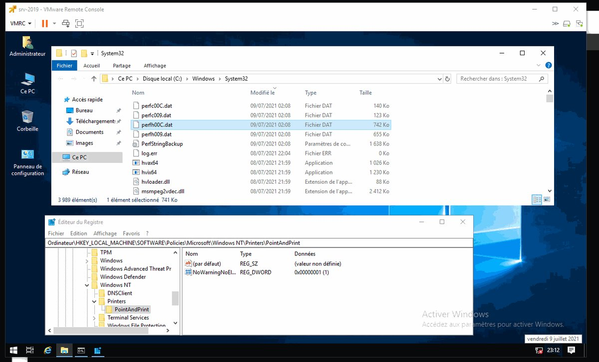

# MsftSecIntel
**https://twitter.com/MsftSecIntel/status/1415079092974673920 _at 2021-07-13 22:42:01_**
<blockquote>
Microsoft has detected a 0-day remote code execution exploit being used to attack SolarWinds Serv-U FTP software in limited and targeted attacks. The vulnerability being exploited is CVE-2021-35211, reported by Microsoft and recently patched by SolarWinds. https://t.co/8Z1zAjfr8f
</blockquote>

* https://msft.it/6019nwox3

<table><tr>
<td>Quotes: <code>28</code></td>
<td>Replies: <code>3</code></td>
<td>Retweets: <code>207</code></td>
<td>Favorites: <code>339</code></td>
</tr></table>

---

# TheHackersNews
**https://twitter.com/TheHackersNews/status/1414796985681383426 _at 2021-07-13 04:01:01_**
<blockquote>
🔥 #Microsoft has found a new critical zero-day RCE #vulnerability (CVE-2021-35211) affecting #SolarWinds Serv-U that is being actively exploited by hackers.

Details — https://t.co/sImkO0cDQq

#infosec #hacking #cyberattack #cybersecurity
</blockquote>

* https://thehackernews.com/2021/07/a-new-critical-solarwinds-zero-day.html

<table><tr>
<td>Quotes: <code>14</code></td>
<td>Replies: <code>4</code></td>
<td>Retweets: <code>152</code></td>
<td>Favorites: <code>194</code></td>
</tr></table>

---

# gentilkiwi
**https://twitter.com/gentilkiwi/status/1413612565092052999 _at 2021-07-09 21:34:33_**
<blockquote>
I rewrited #mimikatz 🥝code for #printnightmare 
- less calls (can be in only 1 call, LPE or RCE) ;
- more efficient ;
- mimispool library can be modified to be a real driver ;
- support Windows 7 to Windows 11 (TPM or not🤪)

&gt; https://t.co/Wzb5GAfWfd https://t.co/lEMqRXAI4J
</blockquote>

* https://github.com/gentilkiwi/mimikatz/releases

<table><tr>
<td></td>
</table></tr>
<table><tr>
<td>Quotes: <code>4</code></td>
<td>Replies: <code>6</code></td>
<td>Retweets: <code>228</code></td>
<td>Favorites: <code>587</code></td>
</tr></table>

---

# gentilkiwi
**https://twitter.com/gentilkiwi/status/1413420341658066944 _at 2021-07-09 08:50:44_**
<blockquote>
Clarified Guidance for CVE-2021-34527 #printnightmare

So I presume all is OK, and:
- you will not change UNC path detection
- RestrictDriverInstallationToAdministrators &amp; driver no explaination?

➡️It's not, and you know it

&gt; https://t.co/ONmlFjuhn0 https://t.co/aqMDS8gdJa
</blockquote>

* https://msrc-blog.microsoft.com/2021/07/08/clarified-guidance-for-cve-2021-34527-windows-print-spooler-vulnerability/

<table><tr>
<td></td>
</table></tr>
<table><tr>
<td>Quotes: <code>3</code></td>
<td>Replies: <code>9</code></td>
<td>Retweets: <code>48</code></td>
<td>Favorites: <code>125</code></td>
</tr></table>

---

# msftsecresponse
**https://twitter.com/msftsecresponse/status/1413302865569845250 _at 2021-07-09 01:03:55_**
<blockquote>
MSRC just released a new blog post regarding CVE-2021-34527: https://t.co/i9g9fVQzTF
</blockquote>

* https://msrc-blog.microsoft.com/2021/07/08/clarified-guidance-for-cve-2021-34527-windows-print-spooler-vulnerability/

<table><tr>
<td>Quotes: <code>20</code></td>
<td>Replies: <code>8</code></td>
<td>Retweets: <code>173</code></td>
<td>Favorites: <code>240</code></td>
</tr></table>

---

# c9999z
**https://twitter.com/c9999z/status/1413246438188912658 _at 2021-07-08 21:19:42_**
<blockquote>
CVE-2021-1675 - PrintNightmare LPE (PowerShell)

https://t.co/jqCST0xuR2

#printnightmare #cve #vulnerability #Windows #exploitation #redteam #blueteam
</blockquote>

* https://github.com/calebstewart/CVE-2021-1675

<table><tr>
<td>Quotes: <code>0</code></td>
<td>Replies: <code>0</code></td>
<td>Retweets: <code>1</code></td>
<td>Favorites: <code>2</code></td>
</tr></table>

---

# thezdi
**https://twitter.com/thezdi/status/1413190321878470665 _at 2021-07-08 17:36:43_**
<blockquote>
Looking into CVE-2021-28474: a recently patched  #Microsoft #SharePoint remote code execution bug via a server-side control interpretation conflict. Read all of the details at https://t.co/9Wji4rYKoD
</blockquote>

* https://www.zerodayinitiative.com/blog/2021/7/7/cve-2021-28474-sharepoint-remote-code-execution-via-server-side-control-interpretation-conflict

<table><tr>
<td>Quotes: <code>4</code></td>
<td>Replies: <code>0</code></td>
<td>Retweets: <code>36</code></td>
<td>Favorites: <code>77</code></td>
</tr></table>

---

# wvuuuuuuuuuuuuu
**https://twitter.com/wvuuuuuuuuuuuuu/status/1412850102499217417 _at 2021-07-07 19:04:48_**
<blockquote>
Sage X3 ERP unauthenticated RCE (CVE-2020-7388). Patch available. https://t.co/0sAsJdEMt7
</blockquote>

* https://www.rapid7.com/blog/post/2021/07/07/cve-2020-7387-7390-multiple-sage-x3-vulnerabilities/

<table><tr>
<td>Quotes: <code>1</code></td>
<td>Replies: <code>1</code></td>
<td>Retweets: <code>20</code></td>
<td>Favorites: <code>37</code></td>
</tr></table>

---

# wdormann
**https://twitter.com/wdormann/status/1412813044279910416 _at 2021-07-07 16:37:33_**
<blockquote>
Confirmed.
If you have a system where PointAndPrint NoWarningNoElevationOnInstall = 1, then Microsoft's patch for #PrintNightmare CVE-2021-34527 does nothing to prevent either LPE or RCE. https://t.co/Ntxe9wpuke
</blockquote>

<table><tr>
<td></td>
<td></td>
</table></tr>
<table><tr>
<td>Quotes: <code>8</code></td>
<td>Replies: <code>6</code></td>
<td>Retweets: <code>108</code></td>
<td>Favorites: <code>208</code></td>
</tr></table>

---

# domineefh
**https://twitter.com/domineefh/status/1412737419368148998 _at 2021-07-07 11:37:02_**
<blockquote>
PrintNightmare (CVE-2021-1675): Remote code execution in Windows Spooler Service https://t.co/SzvWcaOFWu https://t.co/iUbcVQFFIZ
</blockquote>

* https://github.com/afwu/PrintNightmare

<table><tr>
<td></td>
</table></tr>
<table><tr>
<td>Quotes: <code>0</code></td>
<td>Replies: <code>0</code></td>
<td>Retweets: <code>1</code></td>
<td>Favorites: <code>0</code></td>
</tr></table>

---

# byteben
**https://twitter.com/byteben/status/1412678928620216321 _at 2021-07-07 07:44:37_**
<blockquote>
Windows Defender Hunting queries for the Windows Print Spooler Remote Code Execution Vulnerability CVE-2021-34527 https://t.co/63oKIpamL9 #PrintNightmare
</blockquote>

* https://github.com/microsoft/Microsoft-365-Defender-Hunting-Queries/tree/master/Exploits/Print%20Spooler%20RCE

<table><tr>
<td>Quotes: <code>2</code></td>
<td>Replies: <code>0</code></td>
<td>Retweets: <code>28</code></td>
<td>Favorites: <code>36</code></td>
</tr></table>

---

# ptracesecurity
**https://twitter.com/ptracesecurity/status/1412653520508051457 _at 2021-07-07 06:03:39_**
<blockquote>
Analyzing CVE-2021-1665 – Remote Code Execution Vulnerability in Windows GDI+  https://t.co/h9VLraIIrU  #Pentesting #Windows #Vulnerability #RCE #CVE #Infosec https://t.co/dU2fQmWa51
</blockquote>

* https://www.mcafee.com/blogs/other-blogs/mcafee-labs/analyzing-cve-2021-1665-remote-code-execution-vulnerability-in-windows-gdi/

<table><tr>
<td></td>
<td></td>
<td></td>
<td></td>
</table></tr>
<table><tr>
<td>Quotes: <code>2</code></td>
<td>Replies: <code>0</code></td>
<td>Retweets: <code>16</code></td>
<td>Favorites: <code>32</code></td>
</tr></table>

---

# MsftSecIntel
**https://twitter.com/MsftSecIntel/status/1412524469755674626 _at 2021-07-06 21:30:51_**
<blockquote>
Microsoft has released security updates to address CVE-2021-34527 (Windows Print Spooler Remote Code Execution Vulnerability)
</blockquote>

<table><tr>
<td>Quotes: <code>25</code></td>
<td>Replies: <code>16</code></td>
<td>Retweets: <code>330</code></td>
<td>Favorites: <code>550</code></td>
</tr></table>

---

# msftsecresponse
**https://twitter.com/msftsecresponse/status/1412520378644135937 _at 2021-07-06 21:14:36_**
<blockquote>
Microsoft has released updates to protect against CVE-2021-34527.  Please see: https://t.co/QZATXCPXnx
</blockquote>

* https://msrc.microsoft.com/update-guide/vulnerability/CVE-2021-34527

<table><tr>
<td>Quotes: <code>63</code></td>
<td>Replies: <code>26</code></td>
<td>Retweets: <code>448</code></td>
<td>Favorites: <code>743</code></td>
</tr></table>

---

# kmkz_security
**https://twitter.com/kmkz_security/status/1412280058568445953 _at 2021-07-06 05:19:39_**
<blockquote>
Bypassing OS protections:
kASLR + SMEP bypass
https://t.co/XJ3HidM153

On HEVD (HackSys Extremely Vulnerable Driver https://t.co/TBL5BezUMG)
</blockquote>

* https://fluidattacks.com/blog/hevd-smep-bypass/
* https://github.com/hacksysteam/HackSysExtremeVulnerableDriver

<table><tr>
<td>Quotes: <code>0</code></td>
<td>Replies: <code>1</code></td>
<td>Retweets: <code>57</code></td>
<td>Favorites: <code>145</code></td>
</tr></table>

---

# hackerfantastic
**https://twitter.com/hackerfantastic/status/1412070601687277571 _at 2021-07-05 15:27:21_**
<blockquote>
CVE-2021-34527 from a LPE perspective works on all non-domain joined workstations I have tested out of the box (including Windows 11). The domain-joined systems return a permission denied error indicating that once joined to a domain, the ACL check might not be bypassable. https://t.co/993ZrYtnsI
</blockquote>

<table><tr>
<td></td>
</table></tr>
<table><tr>
<td>Quotes: <code>3</code></td>
<td>Replies: <code>4</code></td>
<td>Retweets: <code>32</code></td>
<td>Favorites: <code>93</code></td>
</tr></table>

---

# 404death
**https://twitter.com/404death/status/1412058823104208898 _at 2021-07-05 14:40:32_**
<blockquote>
created poc for NT SYSTEM 

Local Privilege Escalation of PrintNightmare

https://t.co/YBTZjo0UNz

#PrintNightmare #cve-2021-1675 #lpe https://t.co/7cmrn9SJGs
</blockquote>

* https://github.com/sailay1996/PrintNightmare-LPE

<table><tr>
<td></td>
<td></td>
</table></tr>
<table><tr>
<td>Quotes: <code>1</code></td>
<td>Replies: <code>1</code></td>
<td>Retweets: <code>23</code></td>
<td>Favorites: <code>81</code></td>
</tr></table>

---

# TheHackersNews
**https://twitter.com/TheHackersNews/status/1411941671596527625 _at 2021-07-05 06:55:01_**
<blockquote>
#Microsoft is urging #Azure users to update the #PowerShell command line tool as soon as possible to protect against a critical RCE #vulnerability (CVE-2021-26701) that impacts . NET Core.

Read: https://t.co/RGJnDzys84

#infosec #cybersecurity
</blockquote>

* https://thehackernews.com/2021/07/microsoft-urges-azure-users-to-update.html

<table><tr>
<td>Quotes: <code>6</code></td>
<td>Replies: <code>1</code></td>
<td>Retweets: <code>164</code></td>
<td>Favorites: <code>189</code></td>
</tr></table>

---

# CyberWarship
**https://twitter.com/CyberWarship/status/1411422504602775553 _at 2021-07-03 20:32:02_**
<blockquote>
Microsoft Windows LNK Remote Code Execution Vulnerability - CVE-2020-1299 

#infosec #pentest #redteam
https://t.co/H8JimuuOyJ https://t.co/FDzGWxLtQn
</blockquote>

* https://blog.vincss.net/2020/06/cve49-microsoft-windows-lnk-remote-code-execution-vuln-cve-2020-1299-eng.html?m=1

<table><tr>
<td></td>
<td></td>
</table></tr>
<table><tr>
<td>Quotes: <code>1</code></td>
<td>Replies: <code>0</code></td>
<td>Retweets: <code>74</code></td>
<td>Favorites: <code>135</code></td>
</tr></table>

---

# SecGuru_OTX
**https://twitter.com/SecGuru_OTX/status/1410941602114252801 _at 2021-07-02 12:41:06_**
<blockquote>
Hunting Query:

"Windows Print Spooler Remote Code Execution Vulnerability" - CVE-2021-34527

#PrinterNightmare 

(Source: Microsoft Threat Analytics) https://t.co/9wPjENGISW
</blockquote>

<table><tr>
<td></td>
</table></tr>
<table><tr>
<td>Quotes: <code>2</code></td>
<td>Replies: <code>1</code></td>
<td>Retweets: <code>32</code></td>
<td>Favorites: <code>105</code></td>
</tr></table>

---

# anyrun_app
**https://twitter.com/anyrun_app/status/1410940562191101955 _at 2021-07-02 12:36:58_**
<blockquote>
Testing #PrintNightmare vulnerability on a live system is easy! Try ANYRUN to see how it works. You can take a look at the implementation of CVE-2021-1675 local privilege escalation written in PowerShell, made by @_johnhammond and @calebjstewart
https://t.co/uIqDo7QFdb
</blockquote>

* https://app.any.run/tasks/83734a89-3f3e-4ab1-9d6b-d43230d2a900

<table><tr>
<td>Quotes: <code>6</code></td>
<td>Replies: <code>1</code></td>
<td>Retweets: <code>83</code></td>
<td>Favorites: <code>185</code></td>
</tr></table>

---

# _RFC1918
**https://twitter.com/_RFC1918/status/1410930018461569024 _at 2021-07-02 11:55:04_**
<blockquote>
PoC Demo of the new PrintNightmare (CVE-2021-1675) exploit. #printnightmare #cve_2021_1675 #0day

Source code: https://t.co/ak5vrM1id0

https://t.co/J0E8rVONKB https://t.co/6LLPt6Fg6c
</blockquote>

* https://github.com/cube0x0/CVE-2021-1675
* https://youtu.be/PbXO3b8_aYY

<table><tr>
<td></td>
</table></tr>
<table><tr>
<td>Quotes: <code>0</code></td>
<td>Replies: <code>0</code></td>
<td>Retweets: <code>3</code></td>
<td>Favorites: <code>0</code></td>
</tr></table>

---

# TheHackersNews
**https://twitter.com/TheHackersNews/status/1410836661206884352 _at 2021-07-02 05:44:06_**
<blockquote>
🔥 WATCH OUT! Microsoft warns of a critical #PrintNightmare RCE vulnerability (CVE-2021-34527) being exploited in the wild.

Details: https://t.co/E42gdYBGYU

It is separate from the Windows Print Spooler issue (CVE-2021-1675) Microsoft patched recently.

#infosec #cybersecurity
</blockquote>

* https://thehackernews.com/2021/07/microsoft-warns-of-critical.html

<table><tr>
<td>Quotes: <code>12</code></td>
<td>Replies: <code>8</code></td>
<td>Retweets: <code>176</code></td>
<td>Favorites: <code>211</code></td>
</tr></table>

---

# campuscodi
**https://twitter.com/campuscodi/status/1410770644317446149 _at 2021-07-02 01:21:47_**
<blockquote>
The PrintNightmare RCE gets its own CVE (as CVE-2021-34527) but there's no other new information in the Microsoft advisory
</blockquote>

<table><tr>
<td>Quotes: <code>1</code></td>
<td>Replies: <code>2</code></td>
<td>Retweets: <code>29</code></td>
<td>Favorites: <code>57</code></td>
</tr></table>

---

# calebjstewart
**https://twitter.com/calebjstewart/status/1410765738588131328 _at 2021-07-02 01:02:17_**
<blockquote>
I've been working on a pure PowerShell PoC for CVE-2021-1675 (#PrintNightmare) Local Privilege Escalation tonight with @_johnhammond and I think it's come out pretty good! Includes bundled DLL to add a local admin user plus the option of using your own DLL https://t.co/hwb1R1BmAI
</blockquote>

* https://github.com/calebstewart/CVE-2021-1675

<table><tr>
<td>Quotes: <code>0</code></td>
<td>Replies: <code>2</code></td>
<td>Retweets: <code>9</code></td>
<td>Favorites: <code>37</code></td>
</tr></table>

---

# GossiTheDog
**https://twitter.com/GossiTheDog/status/1410664919037513736 _at 2021-07-01 18:21:40_**
<blockquote>
There’s a local privilege escalation exploit for this, to go from local user to SYSTEM on Remote Desktop, Citrix etc. https://t.co/frCfJanAxJ
</blockquote>

* https://github.com/hlldz/CVE-2021-1675-LPE

<table><tr>
<td>Quotes: <code>3</code></td>
<td>Replies: <code>2</code></td>
<td>Retweets: <code>35</code></td>
<td>Favorites: <code>70</code></td>
</tr></table>

---

# clintgibler
**https://twitter.com/clintgibler/status/1410614193477197835 _at 2021-07-01 15:00:06_**
<blockquote>
@paulschwarzen @github @barracud4_ @carlospolopm @HolyBugx @owasp @gose1 @lancinimarco @jupiterone_io @halbecaf @TheRSC @Skyscanner @Nebuk89 @AyoubFandiGRC 🎓 File Upload Master Class

@barracud4_ Media payloads
https://t.co/nHmTPPGH2G

@carlospolopm, @HolyBugx
Checklist, bypass filters
https://t.co/gIpwz80FD4

@owasp Unrestricted File Upload
https://t.co/3Chhyn00ug

Cheatsheet
https://t.co/9e5vkLuVoi

#bugbountytips #bugbounty
</blockquote>

* https://github.com/barrracud4/image-upload-exploits
* https://book.hacktricks.xyz/pentesting-web/file-upload
* https://owasp.org/www-community/vulnerabilities/Unrestricted_File_Upload
* https://cheatsheetseries.owasp.org/cheatsheets/File_Upload_Cheat_Sheet.html

<table><tr>
<td>Quotes: <code>0</code></td>
<td>Replies: <code>1</code></td>
<td>Retweets: <code>21</code></td>
<td>Favorites: <code>39</code></td>
</tr></table>

---

# hlldz
**https://twitter.com/hlldz/status/1410541768412647427 _at 2021-07-01 10:12:18_**
<blockquote>
I just released Local Privilege Escalation Edition of CVE-2021-1675 #PrintNightmare 

This edition of exploit automatically finds UNIDRV.DLL, no changes are required in the code.

https://t.co/kl7LAh7tdo
</blockquote>

* https://github.com/hlldz/CVE-2021-1675-LPE

<table><tr>
<td>Quotes: <code>5</code></td>
<td>Replies: <code>2</code></td>
<td>Retweets: <code>137</code></td>
<td>Favorites: <code>303</code></td>
</tr></table>

---

# PenTesting
**https://twitter.com/PenTesting/status/1410505868085542920 _at 2021-07-01 07:49:39_**
<blockquote>
PrintNightmare (CVE-2021-1675): Remote code execution in Windows Spooler Service POC
https://t.co/FAk4SjTLns

#cve #windows #spooler #rce
</blockquote>

* https://github.com/afwu/PrintNightmare

<table><tr>
<td>Quotes: <code>1</code></td>
<td>Replies: <code>0</code></td>
<td>Retweets: <code>5</code></td>
<td>Favorites: <code>7</code></td>
</tr></table>

---

