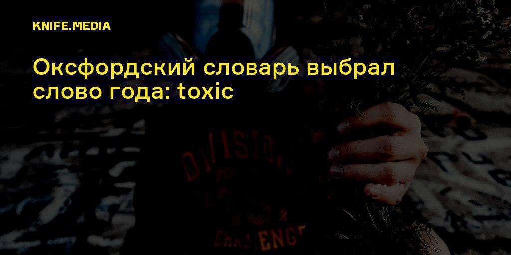

# ctfchat
`2018-11-17 10:51:42`

<blockquote>
https://github.com/ctftime/ctftime.org/issues/2 :-(
</blockquote>

<table><tr><td><b>→</b><a href="https://github.com/ctftime/ctftime.org/issues/2">
https://github.com/ctftime/ctftime.org/issues/2
</a>
<blockquote>
Managing team names and aliases, creating teams after the CTF, merging existing teams - it's a routine process, but it takes a lot of time. What if we use CTFtime as an authentication source during event registration. Personally, I don't...
</blockquote>
</td></tr></table>

---

# ctfchat
`2018-11-17 10:49:39`

<blockquote>
https://github.com/ctftime/ctftime.org/issues/80
</blockquote>

<table><tr><td><b>→</b><a href="https://github.com/ctftime/ctftime.org/issues/80">
https://github.com/ctftime/ctftime.org/issues/80
</a>
<blockquote>
Many CTFs deal t-shirts to participants. Mb size field (XS - XXL) may help organisers collect this data&amp;
</blockquote>
</td></tr></table>

---

# ctfchat
`2018-11-17 10:46:34`

<blockquote>
А лучше создавай issue в https://github.com/ctftime/ctftime.org/issues и зови всех ставить лайки туда
</blockquote>

<table><tr><td><b>→</b><a href="https://github.com/ctftime/ctftime.org/issues">
https://github.com/ctftime/ctftime.org/issues
</a>
<blockquote>
meta repository for ctftime.org issues, feature-requests etc - ctftime/ctftime.org
</blockquote>
</td></tr></table>

---

# ctfchat
`2018-11-15 17:36:59`

<blockquote>
https://github.com/SPbCTF/bigtraining/blob/master/LICENSE.ABAGPL.txt
</blockquote>

---

# ctfchat
`2018-11-11 18:07:32`

<blockquote>
https://github.com/HackerDom/ructf-2017/wiki/%D0%98%D0%BD%D1%82%D0%B5%D1%80%D1%84%D0%B5%D0%B9%D1%81-%C2%AB%D0%BF%D1%80%D0%BE%D0%B2%D0%B5%D1%80%D1%8F%D1%8E%D1%89%D0%B0%D1%8F-%D1%81%D0%B8%D1%81%D1%82%D0%B5%D0%BC%D0%B0-%D1%87%D0%B5%D0%BA%D0%B5%D1%80%D1%8B%C2%BB&#35;%D0%A0%D0%B5%D0%B6%D0%B8%D0%BC%D1%8B
</blockquote>

<table><tr><td><b>→</b><a href="https://github.com/HackerDom/ructf-2017/wiki/%D0%98%D0%BD%D1%82%D0%B5%D1%80%D1%84%D0%B5%D0%B9%D1%81-%C2%AB%D0%BF%D1%80%D0%BE%D0%B2%D0%B5%D1%80%D1%8F%D1%8E%D1%89%D0%B0%D1%8F-%D1%81%D0%B8%D1%81%D1%82%D0%B5%D0%BC%D0%B0-%D1%87%D0%B5%D0%BA%D0%B5%D1%80%D1%8B%C2%BB">
https://github.com/HackerDom/ructf-2017/wiki/%D0%98%D0%BD%D1%82%D0%B5%D1%80%D1%84%D0%B5%D0%B9%D1%81-%C2%AB%D0%BF%D1%80%D0%BE%D0%B2%D0%B5%D1%80%D1%8F%D1%8E%D1%89%D0%B0%D1%8F-%D1%81%D0%B8%D1%81%D1%82%D0%B5%D0%BC%D0%B0-%D1%87%D0%B5%D0%BA%D0%B5%D1%80%D1%8B%C2%BB
</a>
<blockquote>
Contribute to HackerDom/ructf-2017 development by creating an account on GitHub.
</blockquote>
</td></tr></table>

---

# ctfchat
`2018-11-11 13:53:47`

<blockquote>
вот к https://gitlab.com/omctf-devs/omctf2018ad/omctf2018ad-fiasco где &quot;оригинал&quot;?
</blockquote>

<table><tr><td><b>→</b><a href="https://gitlab.com/omctf-devs/omctf2018ad/omctf2018ad-fiasco">
https://gitlab.com/omctf-devs/omctf2018ad/omctf2018ad-fiasco
</a>
<blockquote>
Fiasco service
</blockquote>
</td></tr></table>

---

# ctfchat
`2018-11-10 23:24:30`

<blockquote>
https://vk.com/getcybber?w&#61;wall-66766496_4629
</blockquote>

<table><tr><td><b>→</b><a href="https://vk.com/getcybber?w=wall-66766496_4629">
https://vk.com/getcybber?w=wall-66766496_4629
</a>
<blockquote>
Курс молодого бойца в оупенсорсе 😏 https://github.com/mkobilev/kmb-docs Ждём ваших материалов в пул реквестах
</blockquote>
</td></tr></table>

---

# phd_soc
`2018-11-01 16:33:14`

<blockquote>
Коллеги, надеюсь, что все в этом чатике уже в курсе про недавно опубликованную уязвимость (CVE-2018-15454, CVSS Score: 8.6), обнаруженную в Cisco ASA и Firepower Threat Defense. 
Подробнее тут: https://tools.cisco.com/security/center/content/CiscoSecurityAdvisory/cisco-sa-20181031-asaftd-sip-dos 
Штука серьезная - гарантированный DoS периметрального сетевого СЗИ, вектор понятный, реализация эксплуатации простая. Если вы до сих пор не были в курсе, то рекомендую срочно озаботиться вопросом выявления уязвимых устройств и выполнить рекомендации Cisco. Если коротко - нужно отключить инспектирование SIP трафика на уязвимых устройствах.
Сигнатуру для PT Network Attack Discovery для выявления эксплуатации этой уязвимости, можно взять из гит репозитория продукта, подробнее тут:
https://twitter.com/attackdetection/status/1057987866842796033?s&#61;21
</blockquote>

<table><tr><td><b>→</b><a href="https://tools.cisco.com/security/center/content/CiscoSecurityAdvisory/cisco-sa-20181031-asaftd-sip-dos">
https://tools.cisco.com/security/center/content/CiscoSecurityAdvisory/cisco-sa-20181031-asaftd-sip-dos
</a>
<blockquote>
A vulnerability in the Session Initiation Protocol (SIP) inspection
engine of Cisco Adaptive Security Appliance (ASA) Software and Cisco
Firepower Threat Defense (FTD) Software could allow an unauthenticated,
remote attacker to cause an affected device to reload or trigger high CPU, resulting in a
denial of service (DoS) condition.

The vulnerability is due to
improper handling of SIP traffic. An attacker could exploit
this vulnerability by sending SIP requests designed to specifically trigger this issue at a high rate across an affected
device.
Cisco has released software updates that address this vulnerability. There are no workarounds that address this vulnerability. Mitigation options that address this vulnerability are available.
This advisory is available at the following link:
https://tools.cisco.com/security/center/content/CiscoSecurityAdvisory/cisco-sa-20181031-asaftd-sip-dos
</blockquote>
</td></tr></table>

---

