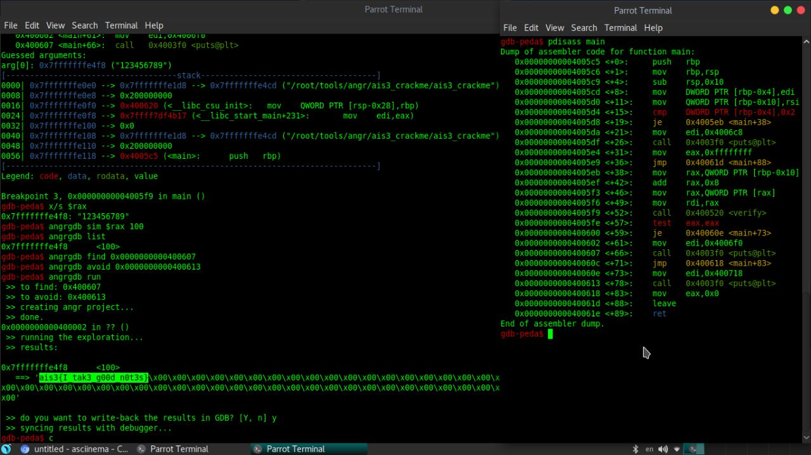
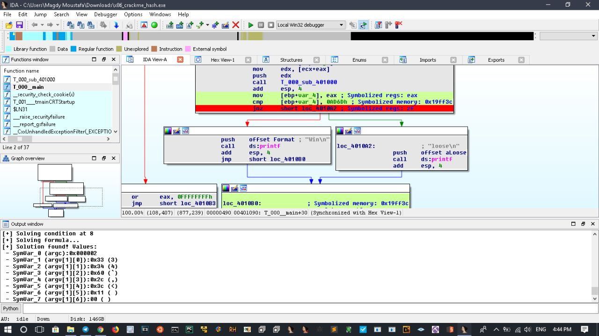

# defcon_news
`2019-01-31 18:14:21`

<blockquote>
Гайд по автоматическому аудиту смарт-контрактов. Часть 2: Slither
https://habr.com/ru/post/438338/

via Информационная безопасность – Защита данных
</blockquote>

<table><tr><td><b>→</b><a href="https://habr.com/ru/post/438338/">
https://habr.com/ru/post/438338/
</a>
<blockquote>
Анализатор: Slither Описание: Open-source static analysis framework for Solidity githib: https://github.com/trailofbits/slither Это статический анализатор кода,...
</blockquote>
</td></tr></table>

---

# reverseengineeringx
`2019-01-31 17:11:59`

<blockquote>
Manalyze 
A static analyzer for PE executables.
https://github.com/JusticeRage/Manalyze
</blockquote>

<table><tr><td><b>→</b><a href="https://github.com/JusticeRage/Manalyze">
https://github.com/JusticeRage/Manalyze
</a>
<blockquote>
A static analyzer for PE executables. Contribute to JusticeRage/Manalyze development by creating an account on GitHub.
</blockquote>
</td></tr></table>

---

# reverseengineeringx
`2019-01-31 16:48:02`

<blockquote>
protection techniques coded in C++

https://github.com/rootm0s/Protectors
</blockquote>

<table><tr><td><b>→</b><a href="https://github.com/rootm0s/Protectors">
https://github.com/rootm0s/Protectors
</a>
<blockquote>
🛡️ Obfuscator, Encryption, Junkcode, Anti-Debug, PE protection/modification - rootm0s/Protectors
</blockquote>
</td></tr></table>

---

# reverseengineeringx
`2019-01-31 16:45:02`

<blockquote>
amber a reflective PE packer for bypassing security products and mitigations
https://github.com/EgeBalci/Amber
</blockquote>

---

# sysadm_in_channel
`2019-01-30 17:41:39`

<blockquote>
Прикольно... В Android возможно многие встречали такой файл-менеджер, как ES File Explorer? Наверняка встречали, кто-то пользуется и рекомендует его всем подряд...

Оказывается этот менеджер, имел встроенный, скрытый web сервер, через который, к примеру можно было удаленно скачивать файлы с устройства...

Вот скрипт на GitHub который позволяет использовать эту &quot;уязвимость&quot;:
https://github.com/fs0c131y/ESFileExplorerOpenPortVuln

Вот собственно видос:
https://www.youtube.com/watch?v&#61;z6hfgnPNBRE
</blockquote>

<table><tr><td><b>→</b><a href="https://github.com/fs0c131y/ESFileExplorerOpenPortVuln">
https://github.com/fs0c131y/ESFileExplorerOpenPortVuln
</a>
<blockquote>
ES File Explorer Open Port Vulnerability - CVE-2019-6447 - fs0c131y/ESFileExplorerOpenPortVuln
</blockquote>
</td></tr></table>

---

# defcon_news
`2019-01-30 03:21:27`

<blockquote>
Re: Multiple Reflected Cross-site Scripting Vulnerabilities in Coppermine 1.5.46
http://seclists.org/fulldisclosure/2019/Jan/70

via Full Disclosure
</blockquote>

<table><tr><td><b>→</b><a href="https://seclists.org/fulldisclosure/2019/Jan/70">
https://seclists.org/fulldisclosure/2019/Jan/70
</a>
</td></tr></table>

---

# defcon_news
`2019-01-29 14:06:22`

<blockquote>
jQuery-File-Upload CVE-2018-9206 Arbitrary File Upload Vulnerability
http://exploit.kitploit.com/2019/01/jquery-file-upload-cve-2018-9206.html

via Exploit Collector
</blockquote>

<table><tr><td><b>→</b><a href="https://exploit.kitploit.com/2019/01/jquery-file-upload-cve-2018-9206.html">
https://exploit.kitploit.com/2019/01/jquery-file-upload-cve-2018-9206.html
</a>
<blockquote>
Exploit Collector is the ultimate collection of public exploits and exploitable vulnerabilities. Remote/Local Exploits, Shellcode and 0days.
</blockquote>
</td></tr></table>

---

# R0_Crew
`2019-01-28 13:58:22`

<blockquote>
Diff tool for comparing symbols in PDB files https://github.com/WalkingCat/SymDiff &#35;darw1n
</blockquote>

<table><tr><td><b>→</b><a href="https://github.com/WalkingCat/SymDiff">
https://github.com/WalkingCat/SymDiff
</a>
<blockquote>
Diff tool for comparing symbols in PDB files. Contribute to WalkingCat/SymDiff development by creating an account on GitHub.
</blockquote>
</td></tr></table>

---

# R0_Crew
`2019-01-28 12:09:59`

<blockquote>
Xendbg: A Full-Featured Debugger for the Xen Hypervisor Article: https://www.nccgroup.trust/us/about-us/newsroom-and-events/blog/2019/january/xendbg-a-full-featured-debugger-for-the-xen-hypervisor/ Source: https://github.com/nccgroup/xendbg &#35;xen &#35;debugger &#35;dukeBarman
</blockquote>

<table><tr><td><b>→</b><a href="https://github.com/nccgroup/xendbg">
https://github.com/nccgroup/xendbg
</a>
<blockquote>
A feature-complete reference implementation of a modern Xen VMI debugger. - nccgroup/xendbg
</blockquote>
</td></tr></table>

---

# defcon_news
`2019-01-28 12:06:24`

<blockquote>
LibGD CVE-2019-6977 Heap Buffer Overflow Vulnerability
http://exploit.kitploit.com/2019/01/libgd-cve-2019-6977-heap-buffer.html

via Exploit Collector
</blockquote>

<table><tr><td><b>→</b><a href="https://exploit.kitploit.com/2019/01/libgd-cve-2019-6977-heap-buffer.html">
https://exploit.kitploit.com/2019/01/libgd-cve-2019-6977-heap-buffer.html
</a>
<blockquote>
Exploit Collector is the ultimate collection of public exploits and exploitable vulnerabilities. Remote/Local Exploits, Shellcode and 0days.
</blockquote>
</td></tr></table>

---

# defcon_news
`2019-01-28 11:31:22`

<blockquote>
Over 9,000 Cisco RV320/RV325 small business routers are vulnerable to CVE-2019-1653
https://www.reddit.com/r/netsec/comments/aklf99/over_9000_cisco_rv320rv325_small_business_routers/

via /r/netsec - Information Security News &amp; Discussion
</blockquote>

<table><tr><td><b>→</b><a href="https://www.reddit.com/r/netsec/comments/aklf99/over_9000_cisco_rv320rv325_small_business_routers/">
https://www.reddit.com/r/netsec/comments/aklf99/over_9000_cisco_rv320rv325_small_business_routers/
</a>
<blockquote>
2 votes and 0 comments so far on Reddit
</blockquote>
</td></tr></table>

---

# defcon_news
`2019-01-26 16:45:54`

<blockquote>
Stored Cross-site Scripting Vulnerability in Podcast Generator 2.7
http://seclists.org/fulldisclosure/2019/Jan/63

via Full Disclosure
</blockquote>

<table><tr><td><b>→</b><a href="https://seclists.org/fulldisclosure/2019/Jan/63">
https://seclists.org/fulldisclosure/2019/Jan/63
</a>
</td></tr></table>

---

# R0_Crew
`2019-01-26 12:46:10`

<blockquote>
Simplify 1.2.1 is released
https://github.com/CalebFenton/simplify/releases &#35;KosBeg
</blockquote>

<table><tr><td><b>→</b><a href="https://github.com/CalebFenton/simplify/releases">
https://github.com/CalebFenton/simplify/releases
</a>
<blockquote>
Android virtual machine and deobfuscator. Contribute to CalebFenton/simplify development by creating an account on GitHub.
</blockquote>
</td></tr></table>

---

# R0_Crew
`2019-01-26 06:14:16`

<blockquote>
Rellic produces goto-free C output from LLVM bitcode https://github.com/trailofbits/rellic &#35;reverse &#35;llvm &#35;dukeBarman
</blockquote>

<table><tr><td><b>→</b><a href="https://github.com/trailofbits/rellic">
https://github.com/trailofbits/rellic
</a>
<blockquote>
Rellic produces goto-free C output from LLVM bitcode - lifting-bits/rellic
</blockquote>
</td></tr></table>

---

# defcon_news
`2019-01-25 23:20:25`

<blockquote>
APPLE-SA-2019-1-24-1 iTunes 12.9.3 for Windows
http://seclists.org/fulldisclosure/2019/Jan/69

via Full Disclosure
</blockquote>

<table><tr><td><b>→</b><a href="https://seclists.org/fulldisclosure/2019/Jan/69">
https://seclists.org/fulldisclosure/2019/Jan/69
</a>
</td></tr></table>

---

# defcon_news
`2019-01-25 23:20:24`

<blockquote>
APPLE-SA-2019-1-22-3 watchOS 5.1.3
http://seclists.org/fulldisclosure/2019/Jan/68

via Full Disclosure
</blockquote>

<table><tr><td><b>→</b><a href="https://seclists.org/fulldisclosure/2019/Jan/68">
https://seclists.org/fulldisclosure/2019/Jan/68
</a>
</td></tr></table>

---

# defcon_news
`2019-01-25 23:20:23`

<blockquote>
APPLE-SA-2019-1-22-6 iCloud for Windows 7.10
http://seclists.org/fulldisclosure/2019/Jan/67

via Full Disclosure
</blockquote>

<table><tr><td><b>→</b><a href="https://seclists.org/fulldisclosure/2019/Jan/67">
https://seclists.org/fulldisclosure/2019/Jan/67
</a>
</td></tr></table>

---

# defcon_news
`2019-01-25 23:10:32`

<blockquote>
APPLE-SA-2019-1-22-4 tvOS 12.1.2
http://seclists.org/fulldisclosure/2019/Jan/66

via Full Disclosure
</blockquote>

<table><tr><td><b>→</b><a href="https://seclists.org/fulldisclosure/2019/Jan/66">
https://seclists.org/fulldisclosure/2019/Jan/66
</a>
</td></tr></table>

---

# defcon_news
`2019-01-25 23:10:31`

<blockquote>
APPLE-SA-2019-1-22-5 Safari 12.0.3
http://seclists.org/fulldisclosure/2019/Jan/65

via Full Disclosure
</blockquote>

<table><tr><td><b>→</b><a href="https://seclists.org/fulldisclosure/2019/Jan/65">
https://seclists.org/fulldisclosure/2019/Jan/65
</a>
</td></tr></table>

---

# defcon_news
`2019-01-25 23:10:30`

<blockquote>
APPLE-SA-2019-1-22-1 iOS 12.1.3
http://seclists.org/fulldisclosure/2019/Jan/64

via Full Disclosure
</blockquote>

<table><tr><td><b>→</b><a href="https://seclists.org/fulldisclosure/2019/Jan/64">
https://seclists.org/fulldisclosure/2019/Jan/64
</a>
</td></tr></table>

---

# defcon_news
`2019-01-25 22:51:44`

<blockquote>
APPLE-SA-2019-1-22-2 macOS Mojave 10.14.3, Security Update 2019-001 High Sierra, Security Update 2019-001 Sierra
http://seclists.org/fulldisclosure/2019/Jan/62

via Full Disclosure
</blockquote>

<table><tr><td><b>→</b><a href="https://seclists.org/fulldisclosure/2019/Jan/62">
https://seclists.org/fulldisclosure/2019/Jan/62
</a>
</td></tr></table>

---

# defcon_news
`2019-01-25 22:51:43`

<blockquote>
CA20190124-01: Security Notice for CA Automic Workload Automation
http://seclists.org/fulldisclosure/2019/Jan/61

via Full Disclosure
</blockquote>

<table><tr><td><b>→</b><a href="https://seclists.org/fulldisclosure/2019/Jan/61">
https://seclists.org/fulldisclosure/2019/Jan/61
</a>
</td></tr></table>

---

# defcon_news
`2019-01-25 22:51:42`

<blockquote>
Multiple Reflected Cross-site Scripting Vulnerabilities in Coppermine 1.5.46
http://seclists.org/fulldisclosure/2019/Jan/60

via Full Disclosure
</blockquote>

<table><tr><td><b>→</b><a href="https://seclists.org/fulldisclosure/2019/Jan/60">
https://seclists.org/fulldisclosure/2019/Jan/60
</a>
</td></tr></table>

---

# defcon_news
`2019-01-25 22:51:41`

<blockquote>
Cross-site Scripting via XML Vulnerability in DNN 9.1
http://seclists.org/fulldisclosure/2019/Jan/58

via Full Disclosure
</blockquote>

<table><tr><td><b>→</b><a href="https://seclists.org/fulldisclosure/2019/Jan/58">
https://seclists.org/fulldisclosure/2019/Jan/58
</a>
</td></tr></table>

---

# defcon_news
`2019-01-25 22:51:41`

<blockquote>
Cross-site Scripting Vulnerability in Abantecart 1.2.12
http://seclists.org/fulldisclosure/2019/Jan/59

via Full Disclosure
</blockquote>

<table><tr><td><b>→</b><a href="https://seclists.org/fulldisclosure/2019/Jan/59">
https://seclists.org/fulldisclosure/2019/Jan/59
</a>
</td></tr></table>

---

# defcon_news
`2019-01-25 22:16:01`

<blockquote>
Microsoft Windows .CONTACT File / HTML Injection Mailto: Remote Code Execution
http://seclists.org/fulldisclosure/2019/Jan/57

via Full Disclosure
</blockquote>

<table><tr><td><b>→</b><a href="https://seclists.org/fulldisclosure/2019/Jan/57">
https://seclists.org/fulldisclosure/2019/Jan/57
</a>
</td></tr></table>

---

# defcon_news
`2019-01-25 15:50:40`

<blockquote>
CVE-2019-6111 и другие уязвимости в scp
https://habr.com/ru/post/437508/

via Информационная безопасность – Защита данных
</blockquote>

<table><tr><td><b>→</b><a href="https://habr.com/ru/post/437508/">
https://habr.com/ru/post/437508/
</a>
<blockquote>
TL;DR; Совсем недавно ( примерно с 1983 года ) оказалось, что OpenSSH, как наследник rsh, для команды scp ( ex. rcp ) позволяет серверу выбрать, какой файл и с к...
</blockquote>
</td></tr></table>

---

# defcon_news
`2019-01-25 10:25:32`

<blockquote>
SSHtranger Things: OpenSSH scp arbitrary file write PoC (CVE-2019-6111)
https://www.reddit.com/r/netsec/comments/aj2iuk/sshtranger_things_openssh_scp_arbitrary_file/

via /r/netsec - Information Security News &amp; Discussion
</blockquote>

<table><tr><td><b>→</b><a href="https://www.reddit.com/r/netsec/comments/aj2iuk/sshtranger_things_openssh_scp_arbitrary_file/">
https://www.reddit.com/r/netsec/comments/aj2iuk/sshtranger_things_openssh_scp_arbitrary_file/
</a>
<blockquote>
1 vote and 0 comments so far on Reddit
</blockquote>
</td></tr></table>

---

# defcon_news
`2019-01-25 02:10:57`

<blockquote>
SEC Consult SA-20190124-0 :: Cross-site scripting in CA Automic Workload Automation Web Interface (AWI)
http://seclists.org/fulldisclosure/2019/Jan/56

via Full Disclosure
</blockquote>

<table><tr><td><b>→</b><a href="https://seclists.org/fulldisclosure/2019/Jan/56">
https://seclists.org/fulldisclosure/2019/Jan/56
</a>
</td></tr></table>

---

# defcon_news
`2019-01-24 21:10:26`

<blockquote>
Новая критическая уязвимость в Ghostscript, эксплуатируемая через ImageMagick
http://www.opennet.ru/opennews/art.shtml?num&#61;50019

via OpenNews.opennet.ru: Проблемы безопасности
</blockquote>

<table><tr><td><b>→</b><a href="https://www.opennet.ru/opennews/art.shtml?num=50019">
https://www.opennet.ru/opennews/art.shtml?num=50019
</a>
<blockquote>
Объявлено в выявлении новой критической уязвимости (CVE-2019-6116) в Ghostscript, наборе инструментов для обработки, преобразования и генерации документов в форматах PostScript и PDF. Уязвимость позволяет организовать выполнение произвольного кода в системе при обработке специально оформленных документов. Это 14 опасная уязвимость, выявленная в Ghostscript за последние 6 месяцев. На этот раз для обхода режима изоляции &quot;-dSAFER&quot; использованы особенности обработки подпрограмм с псевдооператорами.
</blockquote>
</td></tr></table>

---

# defcon_news
`2019-01-24 17:06:48`

<blockquote>
RVAsec 2019 Call for Presentations (CFP)
http://seclists.org/fulldisclosure/2019/Jan/55

via Full Disclosure
</blockquote>

<table><tr><td><b>→</b><a href="https://seclists.org/fulldisclosure/2019/Jan/55">
https://seclists.org/fulldisclosure/2019/Jan/55
</a>
</td></tr></table>

---

# defcon_news
`2019-01-24 12:51:27`

<blockquote>
[RT-SA-2018-004] Cisco RV320 Command Injection
http://seclists.org/fulldisclosure/2019/Jan/54

via Full Disclosure
</blockquote>

<table><tr><td><b>→</b><a href="https://seclists.org/fulldisclosure/2019/Jan/54">
https://seclists.org/fulldisclosure/2019/Jan/54
</a>
</td></tr></table>

---

# defcon_news
`2019-01-24 12:51:26`

<blockquote>
[RT-SA-2018-003] Cisco RV320 Unauthenticated Diagnostic Data Retrieval
http://seclists.org/fulldisclosure/2019/Jan/53

via Full Disclosure
</blockquote>

<table><tr><td><b>→</b><a href="https://seclists.org/fulldisclosure/2019/Jan/53">
https://seclists.org/fulldisclosure/2019/Jan/53
</a>
</td></tr></table>

---

# defcon_news
`2019-01-24 12:51:25`

<blockquote>
[RT-SA-2018-002] Cisco RV320 Unauthenticated Configuration Export
http://seclists.org/fulldisclosure/2019/Jan/52

via Full Disclosure
</blockquote>

<table><tr><td><b>→</b><a href="https://seclists.org/fulldisclosure/2019/Jan/52">
https://seclists.org/fulldisclosure/2019/Jan/52
</a>
</td></tr></table>

---

# webware
`2019-01-24 02:53:38`

* https://youtu.be/F7nk7LUQ5bw

<blockquote>
​​Обзор Dos-атаки под названием Slowloris. В видео продемонстрировано: как определить уязвимость к атаке и сама атака на web-сервер

&#35;codeby &#35;thecodeby &#35;youtube

https://youtu.be/F7nk7LUQ5bw
</blockquote>

<table><tr><td><b>→</b><a href="https://youtu.be/F7nk7LUQ5bw">
https://youtu.be/F7nk7LUQ5bw
</a>
<blockquote>
Обзор Dos-атаки под названием Slowloris. В видео продемонстрировано: как определить уязвимость к атаке и сама атака на web-сервер. Ссылка на скрипт: https://github.com/gkbrk/slowloris
</blockquote>
</td></tr></table>

---

# reverseengineeringx
`2019-01-24 02:30:31`

<blockquote>
Angr management alpha release 

https://github.com/angr/angr-management/releases/tag/v0.0.0.0.0.0.0.0.00001-alpha
</blockquote>

---

# R0_Crew
`2019-01-23 14:04:39`

<blockquote>
Miasm release v0.1.0 is finally available!
http://www.miasm.re/blog/2018/12/20/release_v0_1_0.html
https://github.com/cea-sec/miasm/releases/tag/v0.1.0 &#35;miasm &#35;reverse &#35;KosBeg
</blockquote>

<table><tr><td><b>→</b><a href="https://miasm.re/blog/2018/12/20/release_v0_1_0.html">
https://miasm.re/blog/2018/12/20/release_v0_1_0.html
</a>
<blockquote>
Miasm: Python reverse engineering framework
</blockquote>
</td></tr></table>

---

# defcon_news
`2019-01-23 04:56:22`

<blockquote>
CVE-2019-6260: Gaining control of BMC from the host processor
https://www.reddit.com/r/netsec/comments/aiu96o/cve20196260_gaining_control_of_bmc_from_the_host/

via /r/netsec - Information Security News &amp; Discussion
</blockquote>

<table><tr><td><b>→</b><a href="https://www.reddit.com/r/netsec/comments/aiu96o/cve20196260_gaining_control_of_bmc_from_the_host/">
https://www.reddit.com/r/netsec/comments/aiu96o/cve20196260_gaining_control_of_bmc_from_the_host/
</a>
<blockquote>
10 votes and 4 comments so far on Reddit
</blockquote>
</td></tr></table>

---

# defcon_news
`2019-01-22 23:31:32`

<blockquote>
Уязвимость в пакетном менеджере APT, позволяющая подменить загружаемый пакет
http://www.opennet.ru/opennews/art.shtml?num&#61;50007

via OpenNews.opennet.ru: Проблемы безопасности
</blockquote>

<table><tr><td><b>→</b><a href="https://www.opennet.ru/opennews/art.shtml?num=50007">
https://www.opennet.ru/opennews/art.shtml?num=50007
</a>
<blockquote>
В пакетном менеджере APT выявлена уязвимость (CVE-2019-3462), позволяющая злоумышленнику инициировать подмену устанавливаемого пакета, если атакующий получил контроль за зеркалом репозитория или способен вклиниться в транзитный трафик между пользователем и репозиторием (MITM-атака). Проблему выявил исследователь безопасности Max Justicz, известный обнаружением уязвимостей в пакетном менеджере APK (Alpine) и репозиториях Packagist, NPM и RubyGems.
</blockquote>
</td></tr></table>

---

# defcon_news
`2019-01-22 21:22:02`

<blockquote>
[Several CVE]: NUUO CMS - multiple vulnerabilities resulting in unauth RCE
http://seclists.org/fulldisclosure/2019/Jan/51

via Full Disclosure
</blockquote>

<table><tr><td><b>→</b><a href="https://seclists.org/fulldisclosure/2019/Jan/51">
https://seclists.org/fulldisclosure/2019/Jan/51
</a>
</td></tr></table>

---

# defcon_news
`2019-01-22 21:22:01`

<blockquote>
CA20190117-01: Security Notice for CA Service Desk Manager
http://seclists.org/fulldisclosure/2019/Jan/50

via Full Disclosure
</blockquote>

<table><tr><td><b>→</b><a href="https://seclists.org/fulldisclosure/2019/Jan/50">
https://seclists.org/fulldisclosure/2019/Jan/50
</a>
</td></tr></table>

---

# defcon_news
`2019-01-22 21:21:59`

<blockquote>
Call For Paper - leHACK - July 6th - July 7th, 2019
http://seclists.org/fulldisclosure/2019/Jan/49

via Full Disclosure
</blockquote>

<table><tr><td><b>→</b><a href="https://seclists.org/fulldisclosure/2019/Jan/49">
https://seclists.org/fulldisclosure/2019/Jan/49
</a>
</td></tr></table>

---

# defcon_news
`2019-01-22 19:21:23`

<blockquote>
Critical RCE Flaw in Linux APT Allows Remote Attackers to Hack Systems
https://thehackernews.com/2019/01/linux-apt-http-hacking.html

via The Hacker News
</blockquote>

<table><tr><td><b>→</b><a href="https://thehackernews.com/2019/01/linux-apt-http-hacking.html">
https://thehackernews.com/2019/01/linux-apt-http-hacking.html
</a>
<blockquote>
A remote code execution vulnerability (CVE-2019-3462) in Linux APT package manager could allow remote MiTM hackers to hack systems.
</blockquote>
</td></tr></table>

---

# defcon_news
`2019-01-22 13:41:23`

<blockquote>
[SRP-2018-02] Security of NC+ SAT TV platform and ST chipsets
http://seclists.org/fulldisclosure/2019/Jan/48

via Full Disclosure
</blockquote>

<table><tr><td><b>→</b><a href="https://seclists.org/fulldisclosure/2019/Jan/48">
https://seclists.org/fulldisclosure/2019/Jan/48
</a>
</td></tr></table>

---

# defcon_news
`2019-01-20 15:28:15`

<blockquote>
GitHub - fs0c131y/CVE-2018-20555: Social Network Tabs Wordpress Plugin Vulnerability - Leaks tokens
https://www.reddit.com/r/netsec/comments/ahwxp2/github_fs0c131ycve201820555_social_network_tabs/

via /r/netsec - Information Security News &amp; Discussion
</blockquote>

<table><tr><td><b>→</b><a href="https://www.reddit.com/r/netsec/comments/ahwxp2/github_fs0c131ycve201820555_social_network_tabs/">
https://www.reddit.com/r/netsec/comments/ahwxp2/github_fs0c131ycve201820555_social_network_tabs/
</a>
<blockquote>
1 vote and 0 comments so far on Reddit
</blockquote>
</td></tr></table>

---

# reverseengineeringx
`2019-01-19 12:47:59`

<blockquote>
IDA Pro script to add some useful runtime info to static analysis

https://github.com/deresz/funcap
</blockquote>

<table><tr><td><b>→</b><a href="https://github.com/deresz/funcap">
https://github.com/deresz/funcap
</a>
<blockquote>
IDA Pro script to add some useful runtime info to static analysis - deresz/funcap
</blockquote>
</td></tr></table>

---

# reverseengineeringx
`2019-01-19 12:47:18`

<blockquote>
The official x64dbg plugin for IDA pro 

https://github.com/x64dbg/x64dbgida
</blockquote>

<table><tr><td><b>→</b><a href="https://github.com/x64dbg/x64dbgida">
https://github.com/x64dbg/x64dbgida
</a>
<blockquote>
Official x64dbg plugin for IDA Pro. Contribute to x64dbg/x64dbgida development by creating an account on GitHub.
</blockquote>
</td></tr></table>

---

# reverseengineeringx
`2019-01-19 12:43:57`

<blockquote>
Pigaios a tool for matching and diffing source codes directly against binaries.

https://github.com/joxeankoret/pigaios
</blockquote>

<table><tr><td><b>→</b><a href="https://github.com/joxeankoret/pigaios">
https://github.com/joxeankoret/pigaios
</a>
<blockquote>
A tool for matching and diffing source codes directly against binaries. - joxeankoret/pigaios
</blockquote>
</td></tr></table>

---

# reverseengineeringx
`2019-01-19 12:43:13`

<blockquote>
Diaphora, the most advanced Free and Open Source program diffing tool
 https://github.com/joxeankoret/diaphora
</blockquote>

<table><tr><td><b>→</b><a href="https://github.com/joxeankoret/diaphora">
https://github.com/joxeankoret/diaphora
</a>
<blockquote>
Diaphora, the most advanced Free and Open Source program diffing tool. - joxeankoret/diaphora
</blockquote>
</td></tr></table>

---

# defcon_news
`2019-01-18 23:43:23`

<blockquote>
Defense in depth -- the Microsoft way (part 59): we only fix every other vulnerability
http://seclists.org/fulldisclosure/2019/Jan/47

via Full Disclosure
</blockquote>

<table><tr><td><b>→</b><a href="https://seclists.org/fulldisclosure/2019/Jan/47">
https://seclists.org/fulldisclosure/2019/Jan/47
</a>
</td></tr></table>

---

# defcon_news
`2019-01-18 23:43:22`

<blockquote>
Open-Xchange Security Advisory 2019-01-18
http://seclists.org/fulldisclosure/2019/Jan/46

via Full Disclosure
</blockquote>

<table><tr><td><b>→</b><a href="https://seclists.org/fulldisclosure/2019/Jan/46">
https://seclists.org/fulldisclosure/2019/Jan/46
</a>
</td></tr></table>

---

# defcon_news
`2019-01-18 23:23:53`

<blockquote>
Microsoft Windows &quot;.contact&quot; File / Insufficient UI Warning Arbitrary Code Execution
http://seclists.org/fulldisclosure/2019/Jan/45

via Full Disclosure
</blockquote>

<table><tr><td><b>→</b><a href="https://seclists.org/fulldisclosure/2019/Jan/45">
https://seclists.org/fulldisclosure/2019/Jan/45
</a>
</td></tr></table>

---

# defcon_news
`2019-01-18 23:23:52`

<blockquote>
Become a speaker at PHDays 9!
http://seclists.org/fulldisclosure/2019/Jan/44

via Full Disclosure
</blockquote>

<table><tr><td><b>→</b><a href="https://seclists.org/fulldisclosure/2019/Jan/44">
https://seclists.org/fulldisclosure/2019/Jan/44
</a>
</td></tr></table>

---

# R0_Crew
`2019-01-18 16:35:17`

<blockquote>
IDA Dynamic Data Resolver (DDR) - IDA Plugin (use DynamoRIO) Article: https://blog.talosintelligence.com/2019/01/ddr.html Github: https://github.com/Cisco-Talos/DynDataResolver &#35;reverse &#35;ida &#35;dukeBarman
</blockquote>

<table><tr><td><b>→</b><a href="https://blog.talosintelligence.com/2019/01/ddr.html">
https://blog.talosintelligence.com/2019/01/ddr.html
</a>
<blockquote>
A blog from the world class Intelligence Group, Talos, Cisco's Intelligence Group
</blockquote>
</td></tr></table>

---

# defcon_news
`2019-01-17 14:03:25`

<blockquote>
Poppler CVE-2017-14517 Denial of Service Vulnerability
http://exploit.kitploit.com/2019/01/poppler-cve-2017-14517-denial-of.html

via Exploit Collector
</blockquote>

<table><tr><td><b>→</b><a href="https://exploit.kitploit.com/2019/01/poppler-cve-2017-14517-denial-of.html">
https://exploit.kitploit.com/2019/01/poppler-cve-2017-14517-denial-of.html
</a>
<blockquote>
Exploit Collector is the ultimate collection of public exploits and exploitable vulnerabilities. Remote/Local Exploits, Shellcode and 0days.
</blockquote>
</td></tr></table>

---

# R0_Crew
`2019-01-17 08:48:22`

<blockquote>
IDAPython tool for creating automatic C++ virtual tables in IDA Pro https://github.com/0xgalz/Virtuailor &#35;ida &#35;idapython &#35;dukeBarman
</blockquote>

<table><tr><td><b>→</b><a href="https://github.com/0xgalz/Virtuailor">
https://github.com/0xgalz/Virtuailor
</a>
<blockquote>
IDAPython tool for creating automatic C++ virtual tables in IDA Pro - 0xgalz/Virtuailor
</blockquote>
</td></tr></table>

---

# sysadm_in_channel
`2019-01-16 12:53:18`

<blockquote>
Фикс CVE-2019-0543 от Microsoft, аффектит работу WinRM PowerShell. Тем кто юзает удаленное управление при помощи PS, посвящается:

https://blogs.msdn.microsoft.com/powershell/2019/01/10/windows-security-change-affecting-powershell/
</blockquote>

<table><tr><td><b>→</b><a href="https://blogs.msdn.microsoft.com/powershell/2019/01/10/windows-security-change-affecting-powershell/">
https://blogs.msdn.microsoft.com/powershell/2019/01/10/windows-security-change-affecting-powershell/
</a>
<blockquote>
Windows Security change affecting PowerShell January 9, 2019 The recent (1/8/2019) Windows security patch CVE-2019-0543, has introduced a breaking change for a PowerShell remoting scenario. It is a narrowly scoped scenario that should have low impact for most users. The breaking change only affects local loopback remoting,
</blockquote>
</td></tr></table>

---

# defcon_news
`2019-01-16 10:08:14`

<blockquote>
Apache Tomcat CVE-2018-11784 Open Redirection Vulnerability
http://exploit.kitploit.com/2019/01/apache-tomcat-cve-2018-11784-open.html

via Exploit Collector
</blockquote>

<table><tr><td><b>→</b><a href="https://exploit.kitploit.com/2019/01/apache-tomcat-cve-2018-11784-open.html">
https://exploit.kitploit.com/2019/01/apache-tomcat-cve-2018-11784-open.html
</a>
<blockquote>
Exploit Collector is the ultimate collection of public exploits and exploitable vulnerabilities. Remote/Local Exploits, Shellcode and 0days.
</blockquote>
</td></tr></table>

---

# defcon_news
`2019-01-15 22:23:55`

<blockquote>
SCP client multiple vulnerabilities
http://seclists.org/fulldisclosure/2019/Jan/43

via Full Disclosure
</blockquote>

<table><tr><td><b>→</b><a href="https://seclists.org/fulldisclosure/2019/Jan/43">
https://seclists.org/fulldisclosure/2019/Jan/43
</a>
</td></tr></table>

---

# defcon_news
`2019-01-15 22:23:54`

<blockquote>
secuvera-SA-2016-01: Multiple authentication weaknesses in Arvato Systems Streamworks Job Scheduler
http://seclists.org/fulldisclosure/2019/Jan/42

via Full Disclosure
</blockquote>

<table><tr><td><b>→</b><a href="https://seclists.org/fulldisclosure/2019/Jan/42">
https://seclists.org/fulldisclosure/2019/Jan/42
</a>
</td></tr></table>

---

# defcon_news
`2019-01-15 22:23:53`

<blockquote>
EuskalHack Security Congress Call For Papers
http://seclists.org/fulldisclosure/2019/Jan/41

via Full Disclosure
</blockquote>

<table><tr><td><b>→</b><a href="https://seclists.org/fulldisclosure/2019/Jan/41">
https://seclists.org/fulldisclosure/2019/Jan/41
</a>
</td></tr></table>

---

# defcon_news
`2019-01-15 22:23:53`

<blockquote>
Re: Reflected Cross-site Scripting Vulnerability in CubeCart 6.2.2
http://seclists.org/fulldisclosure/2019/Jan/40

via Full Disclosure
</blockquote>

<table><tr><td><b>→</b><a href="https://seclists.org/fulldisclosure/2019/Jan/40">
https://seclists.org/fulldisclosure/2019/Jan/40
</a>
</td></tr></table>

---

# defcon_news
`2019-01-15 21:03:22`

<blockquote>
Foreman CVE-2018-14664 Multiple HTML Injection Vulnerabilities
http://exploit.kitploit.com/2019/01/foreman-cve-2018-14664-multiple-html.html

via Exploit Collector
</blockquote>

<table><tr><td><b>→</b><a href="https://exploit.kitploit.com/2019/01/foreman-cve-2018-14664-multiple-html.html">
https://exploit.kitploit.com/2019/01/foreman-cve-2018-14664-multiple-html.html
</a>
<blockquote>
Exploit Collector is the ultimate collection of public exploits and exploitable vulnerabilities. Remote/Local Exploits, Shellcode and 0days.
</blockquote>
</td></tr></table>

---

# defcon_news
`2019-01-15 17:58:24`

<blockquote>
GNU Binutils CVE-2018-20712 Heap Buffer Overflow Vulnerability
http://exploit.kitploit.com/2019/01/gnu-binutils-cve-2018-20712-heap-buffer.html

via Exploit Collector
</blockquote>

<table><tr><td><b>→</b><a href="https://exploit.kitploit.com/2019/01/gnu-binutils-cve-2018-20712-heap-buffer.html">
https://exploit.kitploit.com/2019/01/gnu-binutils-cve-2018-20712-heap-buffer.html
</a>
<blockquote>
Exploit Collector is the ultimate collection of public exploits and exploitable vulnerabilities. Remote/Local Exploits, Shellcode and 0days.
</blockquote>
</td></tr></table>

---

# R0_Crew
`2019-01-14 06:12:52`

<blockquote>
https://github.com/RedhawkSDR/redhawk &#35;sdr &#35;jeisonwi
</blockquote>

<table><tr><td><b>→</b><a href="https://github.com/RedhawkSDR/redhawk">
https://github.com/RedhawkSDR/redhawk
</a>
<blockquote>
A submodule repository for distributing REDHAWK artifacts and the latest REDHAWK source code.  Use 'git clone --recurse-submodules git@github.com:RedhawkSDR/redhawk.git' to also clo...
</blockquote>
</td></tr></table>

---

# R0_Crew
`2019-01-14 03:22:17`

<blockquote>
https://github.com/radareorg/cutter/releases/tag/v1.7.3 &#35;radare2 &#35;jeisonwi
</blockquote>

<table><tr><td><b>→</b><a href="https://github.com/radareorg/cutter/releases/tag/v1.7.3">
https://github.com/radareorg/cutter/releases/tag/v1.7.3
</a>
<blockquote>
Cutter 1.7.3
Additions

Added recent projects list in NewFileDialog (&#35;785)
Added extra function information to function widget (&#35;788)
Added color scheme customization feature (&#35;709)
Added status ba...
</blockquote>
</td></tr></table>

---

# reverseengineeringx
`2019-01-12 16:56:12`

<blockquote>
Useful Github repositories

https://github.com/tylerha97/awesome-reversing

https://github.com/rshipp/awesome-malware-analysis

https://github.com/FabioBaroni/awesome-exploit-development
</blockquote>

---

# reverseengineeringx
`2019-01-12 16:08:45`

<blockquote>
Angrgdb, Create an angr state from the current debugger state.

https://github.com/andreafioraldi/angrgdb
</blockquote>

---

# reverseengineeringx
`2019-01-12 01:57:32`

<blockquote>
Ponce plugin for one click taint analysis and symbolic execution 
https://github.com/illera88/Ponce
</blockquote>

---

# defcon_news
`2019-01-11 22:11:10`

<blockquote>
System Down: A systemd-journald exploit
http://seclists.org/fulldisclosure/2019/Jan/39

via Full Disclosure
</blockquote>

<table><tr><td><b>→</b><a href="https://seclists.org/fulldisclosure/2019/Jan/39">
https://seclists.org/fulldisclosure/2019/Jan/39
</a>
</td></tr></table>

---

# defcon_news
`2019-01-11 22:11:09`

<blockquote>
[CVE-2018-10093] Remote command injection vulnerability in AudioCode IP phones
http://seclists.org/fulldisclosure/2019/Jan/38

via Full Disclosure
</blockquote>

<table><tr><td><b>→</b><a href="https://seclists.org/fulldisclosure/2019/Jan/38">
https://seclists.org/fulldisclosure/2019/Jan/38
</a>
</td></tr></table>

---

# defcon_news
`2019-01-11 22:11:08`

<blockquote>
[CVE-2018-10091] Stored XSS vulnerabilities in AudioCode IP phones
http://seclists.org/fulldisclosure/2019/Jan/37

via Full Disclosure
</blockquote>

<table><tr><td><b>→</b><a href="https://seclists.org/fulldisclosure/2019/Jan/37">
https://seclists.org/fulldisclosure/2019/Jan/37
</a>
</td></tr></table>

---

# defcon_news
`2019-01-11 22:11:07`

<blockquote>
Re: Reflected Cross-site Scripting in Mantis 2.11.1
http://seclists.org/fulldisclosure/2019/Jan/36

via Full Disclosure
</blockquote>

<table><tr><td><b>→</b><a href="https://seclists.org/fulldisclosure/2019/Jan/36">
https://seclists.org/fulldisclosure/2019/Jan/36
</a>
</td></tr></table>

---

# defcon_news
`2019-01-11 21:51:20`

<blockquote>
Re: Reflected Cross-site Scripting Vulnerability in CubeCart 6.2.2
http://seclists.org/fulldisclosure/2019/Jan/33

via Full Disclosure
</blockquote>

<table><tr><td><b>→</b><a href="https://seclists.org/fulldisclosure/2019/Jan/33">
https://seclists.org/fulldisclosure/2019/Jan/33
</a>
</td></tr></table>

---

# defcon_news
`2019-01-11 21:51:19`

<blockquote>
Multiple Reflected Cross-site Scripting Vulnerabilities in Ampache 3.8.6
http://seclists.org/fulldisclosure/2019/Jan/35

via Full Disclosure
</blockquote>

<table><tr><td><b>→</b><a href="https://seclists.org/fulldisclosure/2019/Jan/35">
https://seclists.org/fulldisclosure/2019/Jan/35
</a>
</td></tr></table>

---

# defcon_news
`2019-01-11 21:51:18`

<blockquote>
XML External Entity Injection Vulnerability in BlogEngine 3.3
http://seclists.org/fulldisclosure/2019/Jan/34

via Full Disclosure
</blockquote>

<table><tr><td><b>→</b><a href="https://seclists.org/fulldisclosure/2019/Jan/34">
https://seclists.org/fulldisclosure/2019/Jan/34
</a>
</td></tr></table>

---

# defcon_news
`2019-01-11 21:41:18`

<blockquote>
Open Redirection Vulnerabilities in OrangeForum 1.4.0
http://seclists.org/fulldisclosure/2019/Jan/32

via Full Disclosure
</blockquote>

<table><tr><td><b>→</b><a href="https://seclists.org/fulldisclosure/2019/Jan/32">
https://seclists.org/fulldisclosure/2019/Jan/32
</a>
</td></tr></table>

---

# defcon_news
`2019-01-11 21:41:17`

<blockquote>
Capstone v4.0.1 is out!
http://seclists.org/fulldisclosure/2019/Jan/31

via Full Disclosure
</blockquote>

<table><tr><td><b>→</b><a href="https://seclists.org/fulldisclosure/2019/Jan/31">
https://seclists.org/fulldisclosure/2019/Jan/31
</a>
</td></tr></table>

---

# defcon_news
`2019-01-11 21:41:16`

<blockquote>
Microsoft VCF File Insufficient UI Warning Remote Code Execution 0day
http://seclists.org/fulldisclosure/2019/Jan/30

via Full Disclosure
</blockquote>

<table><tr><td><b>→</b><a href="https://seclists.org/fulldisclosure/2019/Jan/30">
https://seclists.org/fulldisclosure/2019/Jan/30
</a>
</td></tr></table>

---

# defcon_news
`2019-01-11 21:41:15`

<blockquote>
X41 D-Sec GmbH Security Advisory X41-2018-009: ReDoS Vulnerability in UA-Parser
http://seclists.org/fulldisclosure/2019/Jan/29

via Full Disclosure
</blockquote>

<table><tr><td><b>→</b><a href="https://seclists.org/fulldisclosure/2019/Jan/29">
https://seclists.org/fulldisclosure/2019/Jan/29
</a>
</td></tr></table>

---

# defcon_news
`2019-01-11 16:46:42`

<blockquote>
COM XSL Transformation: Bypassing Microsoft Application Control Solutions (CVE-2018-8492) - Awesome post!
https://www.reddit.com/r/netsec/comments/aevhad/com_xsl_transformation_bypassing_microsoft/

via /r/netsec - Information Security News &amp; Discussion
</blockquote>

<table><tr><td><b>→</b><a href="https://www.reddit.com/r/netsec/comments/aevhad/com_xsl_transformation_bypassing_microsoft/">
https://www.reddit.com/r/netsec/comments/aevhad/com_xsl_transformation_bypassing_microsoft/
</a>
<blockquote>
1 vote and 0 comments so far on Reddit
</blockquote>
</td></tr></table>

---

# R0_Crew
`2019-01-10 19:11:18`

<blockquote>
This repo aims at providing practical examples on how to use r2frida https://github.com/enovella/r2frida-wiki &#35;radare2 &#35;frida &#35;mobile &#35;dukeBarman
</blockquote>

<table><tr><td><b>→</b><a href="https://github.com/enovella/r2frida-wiki">
https://github.com/enovella/r2frida-wiki
</a>
<blockquote>
This repo aims at providing practical examples on how to use r2frida - enovella/r2frida-wiki
</blockquote>
</td></tr></table>

---

# defcon_news
`2019-01-10 16:11:17`

<blockquote>
Cisco IP Phone 8800 Series CVE-2018-0461 Arbitrary Script Injection Vulnerability
http://exploit.kitploit.com/2019/01/cisco-ip-phone-8800-series-cve-2018.html

via Exploit Collector
</blockquote>

<table><tr><td><b>→</b><a href="https://exploit.kitploit.com/2019/01/cisco-ip-phone-8800-series-cve-2018.html">
https://exploit.kitploit.com/2019/01/cisco-ip-phone-8800-series-cve-2018.html
</a>
<blockquote>
Exploit Collector is the ultimate collection of public exploits and exploitable vulnerabilities. Remote/Local Exploits, Shellcode and 0days.
</blockquote>
</td></tr></table>

---

# defcon_news
`2019-01-10 15:26:28`

<blockquote>
New Systemd Privilege Escalation Flaws Affect Most Linux Distributions
https://thehackernews.com/2019/01/linux-systemd-exploit.html

via The Hacker News
</blockquote>

<table><tr><td><b>→</b><a href="https://thehackernews.com/2019/01/linux-systemd-exploit.html">
https://thehackernews.com/2019/01/linux-systemd-exploit.html
</a>
<blockquote>
Security researchers have discovered three vulnerabilities in Systemd, assigned as CVE-2018-16864, CVE-2018-16865, and CVE-2018-16866, that could allow unprivileged local attackers or malicious programs to gain root access on the targeted systems.
</blockquote>
</td></tr></table>

---

# defcon_news
`2019-01-10 14:16:10`

<blockquote>
Cisco Prime Network Control System CVE-2018-0482 HTML Injection Vulnerability
http://exploit.kitploit.com/2019/01/cisco-prime-network-control-system-cve.html

via Exploit Collector
</blockquote>

<table><tr><td><b>→</b><a href="https://exploit.kitploit.com/2019/01/cisco-prime-network-control-system-cve.html">
https://exploit.kitploit.com/2019/01/cisco-prime-network-control-system-cve.html
</a>
<blockquote>
Exploit Collector is the ultimate collection of public exploits and exploitable vulnerabilities. Remote/Local Exploits, Shellcode and 0days.
</blockquote>
</td></tr></table>

---

# defcon_news
`2019-01-09 21:41:21`

<blockquote>
SEC Consult SA-20190109-0 :: Multiple Vulnerabilities in Cisco VoIP Phones (88xx series)
http://seclists.org/fulldisclosure/2019/Jan/28

via Full Disclosure
</blockquote>

<table><tr><td><b>→</b><a href="https://seclists.org/fulldisclosure/2019/Jan/28">
https://seclists.org/fulldisclosure/2019/Jan/28
</a>
</td></tr></table>

---

# defcon_news
`2019-01-09 21:41:20`

<blockquote>
Path Traversal in Aspose.ZIP library
http://seclists.org/fulldisclosure/2019/Jan/27

via Full Disclosure
</blockquote>

<table><tr><td><b>→</b><a href="https://seclists.org/fulldisclosure/2019/Jan/27">
https://seclists.org/fulldisclosure/2019/Jan/27
</a>
</td></tr></table>

---

# defcon_news
`2019-01-09 21:41:19`

<blockquote>
Re: Vulnerabilities in Zurmo 2.3.4
http://seclists.org/fulldisclosure/2019/Jan/26

via Full Disclosure
</blockquote>

<table><tr><td><b>→</b><a href="https://seclists.org/fulldisclosure/2019/Jan/26">
https://seclists.org/fulldisclosure/2019/Jan/26
</a>
</td></tr></table>

---

# defcon_news
`2019-01-09 19:36:04`

<blockquote>
Атака по определению состояния памяти процессов при помощи страничного кэша
http://www.opennet.ru/opennews/art.shtml?num&#61;49927

via OpenNews.opennet.ru: Проблемы безопасности
</blockquote>

<table><tr><td><b>→</b><a href="https://www.opennet.ru/opennews/art.shtml?num=49927">
https://www.opennet.ru/opennews/art.shtml?num=49927
</a>
<blockquote>
Группа исследователей безопасности, из которых несколько участвовали в выявлении первых уязвимостей Meltdown и Spectre, разработали новый вид атаки по сторонним каналам, проводимой на основе анализа содержимого страничного кэша (page cache), в котором содержится информация, полученная в результате обращения операционной системы к дискам, SSD-накопителям и другим блочным устройствам. В отличие от атак Spectre, новая уязвимость не вызвана аппаратными проблемами, а касается только программных реализаций страничного кэша и проявляется в Linux (CVE-2019-5489), Windows и, вероятно, во многих других операционных системах. Для ядра Linux исправление уже доступно в виде патча. В Windows 10 проблема устранена в тестовой сборке (Insider Preview Build) 18305.
</blockquote>
</td></tr></table>

---

# defcon_news
`2019-01-08 21:25:09`

<blockquote>
Multiple Root RCE in Unibox Wifi Access Controller 0.x - 3.x
http://seclists.org/fulldisclosure/2019/Jan/23

via Full Disclosure
</blockquote>

<table><tr><td><b>→</b><a href="https://seclists.org/fulldisclosure/2019/Jan/23">
https://seclists.org/fulldisclosure/2019/Jan/23
</a>
</td></tr></table>

---

# defcon_news
`2019-01-08 21:25:06`

<blockquote>
Re: Reflected Cross-site Scripting Vulnerability in Microweber 1.0.8
http://seclists.org/fulldisclosure/2019/Jan/25

via Full Disclosure
</blockquote>

<table><tr><td><b>→</b><a href="https://seclists.org/fulldisclosure/2019/Jan/25">
https://seclists.org/fulldisclosure/2019/Jan/25
</a>
</td></tr></table>

---

# defcon_news
`2019-01-08 21:25:05`

<blockquote>
New Release: UFONet v1.2 - &quot;Armageddon!&quot;
http://seclists.org/fulldisclosure/2019/Jan/24

via Full Disclosure
</blockquote>

<table><tr><td><b>→</b><a href="https://seclists.org/fulldisclosure/2019/Jan/24">
https://seclists.org/fulldisclosure/2019/Jan/24
</a>
</td></tr></table>

---

# defcon_news
`2019-01-08 21:25:04`

<blockquote>
Multiple Cross-site Scripting Vulnerabilities in ZenPhoto 1.4.14
http://seclists.org/fulldisclosure/2019/Jan/22

via Full Disclosure
</blockquote>

<table><tr><td><b>→</b><a href="https://seclists.org/fulldisclosure/2019/Jan/22">
https://seclists.org/fulldisclosure/2019/Jan/22
</a>
</td></tr></table>

---

# defcon_news
`2019-01-08 21:25:03`

<blockquote>
Reflected Cross-site Scripting in Mantis 2.11.1
http://seclists.org/fulldisclosure/2019/Jan/21

via Full Disclosure
</blockquote>

<table><tr><td><b>→</b><a href="https://seclists.org/fulldisclosure/2019/Jan/21">
https://seclists.org/fulldisclosure/2019/Jan/21
</a>
</td></tr></table>

---

# defcon_news
`2019-01-08 21:25:02`

<blockquote>
Re: Reflected Cross-site Scripting Vulnerability in Microweber 1.0.8
http://seclists.org/fulldisclosure/2019/Jan/20

via Full Disclosure
</blockquote>

<table><tr><td><b>→</b><a href="https://seclists.org/fulldisclosure/2019/Jan/20">
https://seclists.org/fulldisclosure/2019/Jan/20
</a>
</td></tr></table>

---

# sysadm_in_channel
`2019-01-08 17:19:38`

<blockquote>
Кто пишет скрипты, держит репы на GitHub в Free аккаунте.. Бесплатный аккаунт GitHub теперь может содержать приватные репы!!!  

Хорошая новость в начале года :) Информация в офф блоге GitHub:
https://blog.github.com/2019-01-07-new-year-new-github/
</blockquote>

<table><tr><td><b>→</b><a href="https://blog.github.com/2019-01-07-new-year-new-github/">
https://blog.github.com/2019-01-07-new-year-new-github/
</a>
<blockquote>
Today we’re announcing two major updates to make GitHub more accessible to developers.
</blockquote>
</td></tr></table>

---

# defcon_news
`2019-01-08 13:20:34`

<blockquote>
CSRF in MapSVG Lite could allow an attacker to do almost anything an admin can (WordPress plugin)
http://seclists.org/fulldisclosure/2019/Jan/19

via Full Disclosure
</blockquote>

<table><tr><td><b>→</b><a href="https://seclists.org/fulldisclosure/2019/Jan/19">
https://seclists.org/fulldisclosure/2019/Jan/19
</a>
</td></tr></table>

---

# defcon_news
`2019-01-07 08:05:20`

<blockquote>
Microsoft Windows Kernel CVE-2018-8611 Local Privilege Escalation Vulnerability
http://exploit.kitploit.com/2019/01/microsoft-windows-kernel-cve-2018-8611.html

via Exploit Collector
</blockquote>

<table><tr><td><b>→</b><a href="https://exploit.kitploit.com/2019/01/microsoft-windows-kernel-cve-2018-8611.html">
https://exploit.kitploit.com/2019/01/microsoft-windows-kernel-cve-2018-8611.html
</a>
<blockquote>
Exploit Collector is the ultimate collection of public exploits and exploitable vulnerabilities. Remote/Local Exploits, Shellcode and 0days.
</blockquote>
</td></tr></table>

---

# defcon_news
`2019-01-05 17:51:15`

<blockquote>
CWE-80 XSS Bose Soundtouch App
http://seclists.org/fulldisclosure/2019/Jan/16

via Full Disclosure
</blockquote>

<table><tr><td><b>→</b><a href="https://seclists.org/fulldisclosure/2019/Jan/16">
https://seclists.org/fulldisclosure/2019/Jan/16
</a>
</td></tr></table>

---

# defcon_news
`2019-01-05 17:51:14`

<blockquote>
CVE-2018-19509-19513: multiple vulnerabilities (incl. critical pre-auth RCE) in Webgalamb
http://seclists.org/fulldisclosure/2019/Jan/15

via Full Disclosure
</blockquote>

<table><tr><td><b>→</b><a href="https://seclists.org/fulldisclosure/2019/Jan/15">
https://seclists.org/fulldisclosure/2019/Jan/15
</a>
</td></tr></table>

---

# defcon_news
`2019-01-05 17:51:13`

<blockquote>
Multiple Cross-site Scripting Vulnerabilities in Family Connections 3.7.0
http://seclists.org/fulldisclosure/2019/Jan/14

via Full Disclosure
</blockquote>

<table><tr><td><b>→</b><a href="https://seclists.org/fulldisclosure/2019/Jan/14">
https://seclists.org/fulldisclosure/2019/Jan/14
</a>
</td></tr></table>

---

# defcon_news
`2019-01-05 17:51:12`

<blockquote>
Multiple Cross-site Scripting Vulnerabilities in GeniXCMS 1.1.5
http://seclists.org/fulldisclosure/2019/Jan/13

via Full Disclosure
</blockquote>

<table><tr><td><b>→</b><a href="https://seclists.org/fulldisclosure/2019/Jan/13">
https://seclists.org/fulldisclosure/2019/Jan/13
</a>
</td></tr></table>

---

# defcon_news
`2019-01-05 17:51:11`

<blockquote>
Reflected Cross-site Scripting Vulnerability in Microweber 1.0.8
http://seclists.org/fulldisclosure/2019/Jan/12

via Full Disclosure
</blockquote>

<table><tr><td><b>→</b><a href="https://seclists.org/fulldisclosure/2019/Jan/12">
https://seclists.org/fulldisclosure/2019/Jan/12
</a>
</td></tr></table>

---

# defcon_news
`2019-01-04 22:36:13`

<blockquote>
DSA-2018-226: RSA® Authentication Manager Relative Path Traversal Vulnerability
http://seclists.org/fulldisclosure/2019/Jan/18

via Full Disclosure
</blockquote>

<table><tr><td><b>→</b><a href="https://seclists.org/fulldisclosure/2019/Jan/18">
https://seclists.org/fulldisclosure/2019/Jan/18
</a>
</td></tr></table>

---

# defcon_news
`2019-01-04 22:36:12`

<blockquote>
BMC Network Automation v8.7 - remote session hijacking.
http://seclists.org/fulldisclosure/2019/Jan/17

via Full Disclosure
</blockquote>

<table><tr><td><b>→</b><a href="https://seclists.org/fulldisclosure/2019/Jan/17">
https://seclists.org/fulldisclosure/2019/Jan/17
</a>
</td></tr></table>

---

# defcon_news
`2019-01-04 22:06:22`

<blockquote>
BMC Remedy + ITAM - multiple security issues.
http://seclists.org/fulldisclosure/2019/Jan/11

via Full Disclosure
</blockquote>

<table><tr><td><b>→</b><a href="https://seclists.org/fulldisclosure/2019/Jan/11">
https://seclists.org/fulldisclosure/2019/Jan/11
</a>
</td></tr></table>

---

# defcon_news
`2019-01-04 22:06:21`

<blockquote>
Open-Xchange Security Advisory 2018-12-31
http://seclists.org/fulldisclosure/2019/Jan/10

via Full Disclosure
</blockquote>

<table><tr><td><b>→</b><a href="https://seclists.org/fulldisclosure/2019/Jan/10">
https://seclists.org/fulldisclosure/2019/Jan/10
</a>
</td></tr></table>

---

# defcon_news
`2019-01-04 22:06:20`

<blockquote>
Vulnerabilities in Zurmo 2.3.4
http://seclists.org/fulldisclosure/2019/Jan/9

via Full Disclosure
</blockquote>

<table><tr><td><b>→</b><a href="https://seclists.org/fulldisclosure/2019/Jan/9">
https://seclists.org/fulldisclosure/2019/Jan/9
</a>
</td></tr></table>

---

# defcon_news
`2019-01-04 22:06:19`

<blockquote>
Multiple Cross-site Scripting Vulnerabilities in ImpressCMS 1.3.10
http://seclists.org/fulldisclosure/2019/Jan/8

via Full Disclosure
</blockquote>

<table><tr><td><b>→</b><a href="https://seclists.org/fulldisclosure/2019/Jan/8">
https://seclists.org/fulldisclosure/2019/Jan/8
</a>
</td></tr></table>

---

# defcon_news
`2019-01-04 22:06:18`

<blockquote>
/bin/statistics in TWiki 6.0.2 allows XSS via the webs parameter(CVE-2018-20212)
http://seclists.org/fulldisclosure/2019/Jan/7

via Full Disclosure
</blockquote>

<table><tr><td><b>→</b><a href="https://seclists.org/fulldisclosure/2019/Jan/7">
https://seclists.org/fulldisclosure/2019/Jan/7
</a>
</td></tr></table>

---

# defcon_news
`2019-01-04 09:21:15`

<blockquote>
Adobe patches two critical vulnerabilities [CVE-2018-16011/CVE-2018-19725]
https://www.reddit.com/r/netsec/comments/acf5wo/adobe_patches_two_critical_vulnerabilities/

via /r/netsec - Information Security News &amp; Discussion
</blockquote>

<table><tr><td><b>→</b><a href="https://www.reddit.com/r/netsec/comments/acf5wo/adobe_patches_two_critical_vulnerabilities/">
https://www.reddit.com/r/netsec/comments/acf5wo/adobe_patches_two_critical_vulnerabilities/
</a>
<blockquote>
1 vote and 0 comments so far on Reddit
</blockquote>
</td></tr></table>

---

# R0_Crew
`2019-01-03 12:15:56`

<blockquote>
https://github.com/iGio90/Dwarf &#35;android &#35;frida &#35;dukeBarman
</blockquote>

<table><tr><td><b>→</b><a href="https://github.com/iGio90/Dwarf">
https://github.com/iGio90/Dwarf
</a>
<blockquote>
Full featured multi arch/os debugger built on top of PyQt5 and frida - iGio90/Dwarf
</blockquote>
</td></tr></table>

---

# R0_Crew
`2019-01-02 20:45:16`

<blockquote>
https://github.com/fireeye/flare-emu marries IDA Pro’s binary analysis capabilities with Unicorn’s emulation framework to provide the user with an easy to use and flexible interface for scripting emulation tasks. It is designed to handle all the housekeeping of setting up a flexible and robust emulator for its supported architectures so that you can focus on solving your code analysis problems. Currently, flare-emu supports the x86, x86_64, ARM, and ARM64 architectures.
&#35;re &#35;ida &#35;unicorn &#35;emulation &#35;OKOB2016
</blockquote>

<table><tr><td><b>→</b><a href="https://github.com/fireeye/flare-emu">
https://github.com/fireeye/flare-emu
</a>
<blockquote>
Contribute to fireeye/flare-emu development by creating an account on GitHub.
</blockquote>
</td></tr></table>

---

# R0_Crew
`2019-01-02 20:43:02`

<blockquote>
Pwn2Own 2018 (Safari + macOS): Safari RCE, sandbox escape, and LPE to kernel for macOS 10.13.3 https://github.com/saelo/pwn2own2018 &#35;rce &#35;lpe &#35;safari &#35;macos &#35;darw1n
</blockquote>

<table><tr><td><b>→</b><a href="https://github.com/saelo/pwn2own2018">
https://github.com/saelo/pwn2own2018
</a>
<blockquote>
A Pwn2Own exploit chain. Contribute to saelo/pwn2own2018 development by creating an account on GitHub.
</blockquote>
</td></tr></table>

---

# R0_Crew
`2019-01-02 20:42:57`

<blockquote>
https://github.com/Microsoft/WinDbg-Samples &#35;windbg &#35;debugger &#35;dukeBarman
</blockquote>

<table><tr><td><b>→</b><a href="https://github.com/Microsoft/WinDbg-Samples">
https://github.com/Microsoft/WinDbg-Samples
</a>
<blockquote>
Sample extensions, scripts, and API uses for WinDbg. - microsoft/WinDbg-Samples
</blockquote>
</td></tr></table>

---

# defcon_news
`2019-01-02 16:16:10`

<blockquote>
IBM Quality Manager CVE-2017-1609 Cross Site Scripting Vulnerability
http://exploit.kitploit.com/2019/01/ibm-quality-manager-cve-2017-1609-cross.html

via Exploit Collector
</blockquote>

<table><tr><td><b>→</b><a href="https://exploit.kitploit.com/2019/01/ibm-quality-manager-cve-2017-1609-cross.html">
https://exploit.kitploit.com/2019/01/ibm-quality-manager-cve-2017-1609-cross.html
</a>
<blockquote>
Exploit Collector is the ultimate collection of public exploits and exploitable vulnerabilities. Remote/Local Exploits, Shellcode and 0days.
</blockquote>
</td></tr></table>

---

# defcon_news
`2019-01-01 23:36:14`

<blockquote>
Re: [CVE-2018-18009] dirary0.js on D-Link DIR-140L, DIR-640L devices allows remote unauthenticated attackers to discover admin credentials
http://seclists.org/fulldisclosure/2019/Jan/6

via Full Disclosure
</blockquote>

<table><tr><td><b>→</b><a href="https://seclists.org/fulldisclosure/2019/Jan/6">
https://seclists.org/fulldisclosure/2019/Jan/6
</a>
</td></tr></table>

---

# defcon_news
`2019-01-01 23:36:14`

<blockquote>
Re: [CVE-2018-18008] spaces.htm on multiple D-Link devices (DSL, DIR, DWR) allows remote unauthenticated attackers to discover admin credentials
http://seclists.org/fulldisclosure/2019/Jan/5

via Full Disclosure
</blockquote>

<table><tr><td><b>→</b><a href="https://seclists.org/fulldisclosure/2019/Jan/5">
https://seclists.org/fulldisclosure/2019/Jan/5
</a>
</td></tr></table>

---

# defcon_news
`2019-01-01 23:36:13`

<blockquote>
Re: [CVE-2018-18007] atbox.htm on D-Link DSL-2770L devices allows remote unauthenticated attackers to discover admin credentials
http://seclists.org/fulldisclosure/2019/Jan/4

via Full Disclosure
</blockquote>

<table><tr><td><b>→</b><a href="https://seclists.org/fulldisclosure/2019/Jan/4">
https://seclists.org/fulldisclosure/2019/Jan/4
</a>
</td></tr></table>

---

# defcon_news
`2019-01-01 23:36:12`

<blockquote>
DSA-2018-224:RSA Archer GRC Platform Improper Access Control Vulnerability
http://seclists.org/fulldisclosure/2019/Jan/3

via Full Disclosure
</blockquote>

<table><tr><td><b>→</b><a href="https://seclists.org/fulldisclosure/2019/Jan/3">
https://seclists.org/fulldisclosure/2019/Jan/3
</a>
</td></tr></table>

---

# defcon_news
`2019-01-01 23:26:44`

<blockquote>
Chrome Browser for Android Reveals Sensitive Hardware Information
http://seclists.org/fulldisclosure/2019/Jan/2

via Full Disclosure
</blockquote>

<table><tr><td><b>→</b><a href="https://seclists.org/fulldisclosure/2019/Jan/2">
https://seclists.org/fulldisclosure/2019/Jan/2
</a>
</td></tr></table>

---

# defcon_news
`2019-01-01 23:26:43`

<blockquote>
Call for Papers for ShmooCon Epilogue Closes Jan 1
http://seclists.org/fulldisclosure/2019/Jan/1

via Full Disclosure
</blockquote>

<table><tr><td><b>→</b><a href="https://seclists.org/fulldisclosure/2019/Jan/1">
https://seclists.org/fulldisclosure/2019/Jan/1
</a>
</td></tr></table>

---

# defcon_news
`2019-01-01 23:26:42`

<blockquote>
Multiple Stored Cross-site Scripting Vulnerabilities in ForkCMS 5.0.6
http://seclists.org/fulldisclosure/2019/Jan/0

via Full Disclosure
</blockquote>

<table><tr><td><b>→</b><a href="https://seclists.org/fulldisclosure/2019/Jan/0">
https://seclists.org/fulldisclosure/2019/Jan/0
</a>
</td></tr></table>

---

# defcon_news
`2019-01-01 11:02:13`

<blockquote>
GNU Binutils CVE-2018-20623 Heap Based Buffer Overflow Vulnerability
http://exploit.kitploit.com/2019/01/gnu-binutils-cve-2018-20623-heap-based.html

via Exploit Collector
</blockquote>

<table><tr><td><b>→</b><a href="https://exploit.kitploit.com/2019/01/gnu-binutils-cve-2018-20623-heap-based.html">
https://exploit.kitploit.com/2019/01/gnu-binutils-cve-2018-20623-heap-based.html
</a>
<blockquote>
Exploit Collector is the ultimate collection of public exploits and exploitable vulnerabilities. Remote/Local Exploits, Shellcode and 0days.
</blockquote>
</td></tr></table>

---

# ctfchat
`2019-01-01 01:00:08`

<blockquote>
@vient Shivam  https://github.com/Hhro/ctfs/tree/master/2018/35c3/rev/notifico
</blockquote>

<table><tr><td><b>→</b><a href="https://github.com/Hhro/ctfs/tree/master/2018/35c3/rev/notifico">
https://github.com/Hhro/ctfs/tree/master/2018/35c3/rev/notifico
</a>
<blockquote>
Write-up for interesting CTF challs. Contribute to Hhro/ctfs development by creating an account on GitHub.
</blockquote>
</td></tr></table>

---

