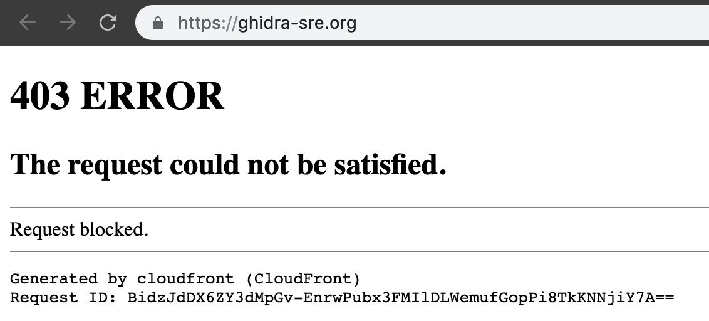

# reverseengineeringx
`2019-03-31 16:50:27`

<blockquote>
https://github.com/Genbox/VirusTotal.Net
</blockquote>

<table><tr><td><b>→</b><a href="https://github.com/Genbox/VirusTotal.Net">
https://github.com/Genbox/VirusTotal.Net
</a>
<blockquote>
A full implementation of the VirusTotal 2.0 API. Contribute to Genbox/VirusTotalNet development by creating an account on GitHub.
</blockquote>
</td></tr></table>

---

# reverseengineeringx
`2019-03-31 16:41:49`

<blockquote>
https://github.com/NYAN-x-CAT/Lime-Miner
</blockquote>

<table><tr><td><b>→</b><a href="https://github.com/NYAN-x-CAT/Lime-Miner">
https://github.com/NYAN-x-CAT/Lime-Miner
</a>
<blockquote>
a simple hidden silent XMR miner. Contribute to NYAN-x-CAT/Lime-Miner development by creating an account on GitHub.
</blockquote>
</td></tr></table>

---

# reverseengineeringx
`2019-03-31 16:40:22`

<blockquote>
https://github.com/NYAN-x-CAT/Lime-RAT
</blockquote>

<table><tr><td><b>→</b><a href="https://github.com/NYAN-x-CAT/Lime-RAT">
https://github.com/NYAN-x-CAT/Lime-RAT
</a>
<blockquote>
LimeRAT | Simple, yet powerful remote administration tool for Windows (RAT) - NYAN-x-CAT/Lime-RAT
</blockquote>
</td></tr></table>

---

# reverseengineeringx
`2019-03-31 16:30:17`

<blockquote>
https://github.com/VirusTotal/c-vtapi
</blockquote>

<table><tr><td><b>→</b><a href="https://github.com/VirusTotal/c-vtapi/">
https://github.com/VirusTotal/c-vtapi/
</a>
<blockquote>
Official implementation of the VirusTotal API in C programming language - VirusTotal/c-vtapi
</blockquote>
</td></tr></table>

---

# reverseengineeringx
`2019-03-31 16:20:32`

<blockquote>
https://github.com/maliceio/malice
</blockquote>

<table><tr><td><b>→</b><a href="https://github.com/maliceio/malice">
https://github.com/maliceio/malice
</a>
<blockquote>
VirusTotal Wanna Be - Now with 100% more Hipster. Contribute to maliceio/malice development by creating an account on GitHub.
</blockquote>
</td></tr></table>

---

# defcon_news
`2019-03-31 11:46:14`

<blockquote>
Kubernetes (kubectl) directory traversal vulnerability due to insufficient fix - CVE-2019-1002101
https://www.reddit.com/r/netsec/comments/b7lkg6/kubernetes_kubectl_directory_traversal/

via /r/netsec - Information Security News &amp; Discussion
</blockquote>

<table><tr><td><b>→</b><a href="https://www.reddit.com/r/netsec/comments/b7lkg6/kubernetes_kubectl_directory_traversal/">
https://www.reddit.com/r/netsec/comments/b7lkg6/kubernetes_kubectl_directory_traversal/
</a>
<blockquote>
0 votes and 0 comments so far on Reddit
</blockquote>
</td></tr></table>

---

# exploitex
`2019-03-29 13:00:23`

* https://telegra.ph/Fajly-po-relsam-Kak-chitat-lyubye-fajly-s-servera-cherez-Ruby-on-Rails-03-23

<blockquote>
Файлы по рельсам. Как читать любые файлы с сервера через Ruby on Rails
</blockquote>

<table><tr><td><b>→</b><a href="https://telegra.ph/Fajly-po-relsam-Kak-chitat-lyubye-fajly-s-servera-cherez-Ruby-on-Rails-03-23">
https://telegra.ph/Fajly-po-relsam-Kak-chitat-lyubye-fajly-s-servera-cherez-Ruby-on-Rails-03-23
</a>
<blockquote>
Ты наверняка в курсе, что такое Ruby on Rails, если когда-нибудь сталкивался с веб-девом. Этот фреймворк в свое время захватил умы разработчиков и успешно применяется до сих пор. Любая уязвимость в нем означает огромное количество потенциальных целей. В этот раз мы посмотрим, как недавно найденный баг позволяет читать любые файлы на целевой системе. Уязвимость имеет номер CVE-2019-5418 и заключается в раскрытии содержимого файла в компоненте ActionView. Специально сформированные заголовки Accept при выполнении…
</blockquote>
</td></tr></table>

---

# defcon_news
`2019-03-29 10:36:07`

<blockquote>
APPLE-SA-2019-3-27-1 watchOS 5.2
http://seclists.org/fulldisclosure/2019/Mar/63

via Full Disclosure
</blockquote>

<table><tr><td><b>→</b><a href="https://seclists.org/fulldisclosure/2019/Mar/63">
https://seclists.org/fulldisclosure/2019/Mar/63
</a>
</td></tr></table>

---

# defcon_news
`2019-03-29 10:26:10`

<blockquote>
[SAUTH-2019-0002] - Pydio 8 Multiple Vulnerabilities
http://seclists.org/fulldisclosure/2019/Mar/62

via Full Disclosure
</blockquote>

<table><tr><td><b>→</b><a href="https://seclists.org/fulldisclosure/2019/Mar/62">
https://seclists.org/fulldisclosure/2019/Mar/62
</a>
</td></tr></table>

---

# phd_soc
`2019-03-29 10:15:41`

<blockquote>
На уровне, как публичные у Флориана?
https://github.com/Neo23x0/sigma/tree/master/rules
</blockquote>

<table><tr><td><b>→</b><a href="https://www.github.com/Neo23x0/sigma/tree/master/rules">
https://www.github.com/Neo23x0/sigma/tree/master/rules
</a>
<blockquote>
Generic Signature Format for SIEM Systems. Contribute to SigmaHQ/sigma development by creating an account on GitHub.
</blockquote>
</td></tr></table>

---

# defcon_news
`2019-03-29 02:51:33`

<blockquote>
DEF CON 27 Voting Village Call for Papers!
https://drive.google.com/file/d/1ff4TvMTytYjB_ou4sU1auwIY5O88hToz/view

via DEF CON Announcements!
</blockquote>

<table><tr><td><b>→</b><a href="https://drive.google.com/file/d/1ff4TvMTytYjB_ou4sU1auwIY5O88hToz/view">
https://drive.google.com/file/d/1ff4TvMTytYjB_ou4sU1auwIY5O88hToz/view
</a>
</td></tr></table>

---

# defcon_news
`2019-03-28 18:37:24`

<blockquote>
Zerokit (GAPZ rootkit)
https://xss.is/threads/28464/

via XSS.is (ex DaMaGeLaB)
</blockquote>

<table><tr><td><b>→</b><a href="https://xss.is/threads/28464/">
https://xss.is/threads/28464/
</a>
<blockquote>
https://github.com/Darkabode/zerokit
</blockquote>
</td></tr></table>

---

# defcon_news
`2019-03-28 15:32:15`

<blockquote>
RCE, Huawei Router HG532, CVE-2017-17215
https://xss.is/threads/28460/

via XSS.is (ex DaMaGeLaB)
</blockquote>

<table><tr><td><b>→</b><a href="https://xss.is/threads/28460/">
https://xss.is/threads/28460/
</a>
<blockquote>
import threading, sys, time, random, socket, re, os, struct, array, requests
from requests.auth import HTTPDigestAuth
ips &#61; open(sys.argv[1], &quot;r&quot;).readlines()
cmd &#61; &quot;&quot; &#35; Your MIPS (SSHD)
rm &#61; &quot;\n...
</blockquote>
</td></tr></table>

---

# defcon_news
`2019-03-28 14:32:14`

<blockquote>
Cisco RV320 Information Disclosure\Command Injection, CVE-2019-1653\CVE-2019-1652
https://xss.is/threads/28459/

via XSS.is (ex DaMaGeLaB)
</blockquote>

<table><tr><td><b>→</b><a href="https://xss.is/threads/28459/">
https://xss.is/threads/28459/
</a>
<blockquote>
CVE-2019-1653/CVE-2019-1652 Exploits For Dumping Cisco RV320 Configurations and getting RCE
https://github.com/0x27/CiscoRV320Dump
</blockquote>
</td></tr></table>

---

# sysadm_in_channel
`2019-03-28 06:31:52`

<blockquote>
Nvidia исправляет недостаток своего Experience компонента (никогда им не пользовался и не ставил, руками всегда отслеживал и отслеживаю обновления)... 

Короче

Ошибка, отслеживаемая как CVE-2019-5674, может быть использована для создания условий для проведения DoS атак путем перезаписи важных системных файлов.Уязвимость можно использовать для выполнения произвольного кода, вставляя команды в определенный файл журнала NVIDIA и создавая вредоносный BAT-файл в папке автозагрузки Windows.

Ясно что надо обновляться...

Собственно PoC:

https://rhinosecuritylabs.com/application-security/nvidia-arbitrary-file-writes-to-command-execution-cve-2019-5674/

Эксплоит:

https://github.com/RhinoSecurityLabs/CVEs/blob/master/CVE-2019-5674/README.md
</blockquote>

<table><tr><td><b>→</b><a href="https://rhinosecuritylabs.com/application-security/nvidia-arbitrary-file-writes-to-command-execution-cve-2019-5674/">
https://rhinosecuritylabs.com/application-security/nvidia-arbitrary-file-writes-to-command-execution-cve-2019-5674/
</a>
<blockquote>
A walkthrough of exploiting NVIDIA GeForce Experience through arbitrary file overwrites, CVE-2019-5674.
</blockquote>
</td></tr></table>

---

# defcon_news
`2019-03-28 00:12:51`

<blockquote>
Microsoft Windows Win32k CVE-2019-0808 Local Privilege Escalation
http://exploit.kitploit.com/2019/03/microsoft-windows-win32k-cve-2019-0808_27.html

via Exploit Collector
</blockquote>

<table><tr><td><b>→</b><a href="https://exploit.kitploit.com/2019/03/microsoft-windows-win32k-cve-2019-0808_27.html">
https://exploit.kitploit.com/2019/03/microsoft-windows-win32k-cve-2019-0808_27.html
</a>
<blockquote>
Exploit Collector is the ultimate collection of public exploits and exploitable vulnerabilities. Remote/Local Exploits, Shellcode and 0days.
</blockquote>
</td></tr></table>

---

# defcon_news
`2019-03-28 00:12:38`

<blockquote>
Microsoft Windows Win32k CVE-2019-0808 Local Privilege Escalation
https://packetstormsecurity.com/files/152267/cve-2019-0808-poc-master.tgz

via Exploit Files ≈ Packet Storm
</blockquote>

<table><tr><td><b>→</b><a href="https://packetstormsecurity.com/files/152267/cve-2019-0808-poc-master.tgz">
https://packetstormsecurity.com/files/152267/cve-2019-0808-poc-master.tgz
</a>
<blockquote>
Information Security Services, News, Files, Tools, Exploits, Advisories and Whitepapers
</blockquote>
</td></tr></table>

---

# sysadm_in_channel
`2019-03-27 21:16:32`

<blockquote>
Крайне неприятная новость:

http://www.opennet.ru/opennews/art.shtml?num&#61;50402
</blockquote>

<table><tr><td><b>→</b><a href="http://www.opennet.ru/opennews/art.shtml?num=50402">
http://www.opennet.ru/opennews/art.shtml?num=50402
</a>
<blockquote>
В инструментариях для управления самодостаточными пакетами snapd и flatpak выявлены похожие уязвимости (CVE-2019-7303, CVE-2019-10063), позволяющие на 64-разрядных системах обойти средства изоляции приложений и получить доступ к основной системе. При удачной атаке (эксплоит) злоумышленник может симулировать набор команд в активном терминале и выполнить произвольные команды вне изолированного окружения. Уязвимости устранены в выпусках snapd 2.37.4, flatpak 1.2.4 и flatpak 1.0.8.
</blockquote>
</td></tr></table>

---

# defcon_news
`2019-03-27 20:27:05`

<blockquote>
Уязвимость в snapd и flatpak, позволяющая обойти режим изоляции
http://www.opennet.ru/opennews/art.shtml?num&#61;50402

via OpenNews.opennet.ru: Проблемы безопасности
</blockquote>

<table><tr><td><b>→</b><a href="http://www.opennet.ru/opennews/art.shtml?num=50402">
http://www.opennet.ru/opennews/art.shtml?num=50402
</a>
<blockquote>
В инструментариях для управления самодостаточными пакетами snapd и flatpak выявлены похожие уязвимости (CVE-2019-7303, CVE-2019-10063), позволяющие на 64-разрядных системах обойти средства изоляции приложений и получить доступ к основной системе. При удачной атаке (эксплоит) злоумышленник может симулировать набор команд в активном терминале и выполнить произвольные команды вне изолированного окружения. Уязвимости устранены в выпусках snapd 2.37.4, flatpak 1.2.4 и flatpak 1.0.8.
</blockquote>
</td></tr></table>

---

# defcon_news
`2019-03-27 19:22:14`

<blockquote>
NVIDIA Arbitrary File Writes to Command Execution CVE-2019-5674
https://www.reddit.com/r/netsec/comments/b660rt/nvidia_arbitrary_file_writes_to_command_execution/

via /r/netsec - Information Security News &amp; Discussion
</blockquote>

<table><tr><td><b>→</b><a href="https://www.reddit.com/r/netsec/comments/b660rt/nvidia_arbitrary_file_writes_to_command_execution/">
https://www.reddit.com/r/netsec/comments/b660rt/nvidia_arbitrary_file_writes_to_command_execution/
</a>
<blockquote>
0 votes and 0 comments so far on Reddit
</blockquote>
</td></tr></table>

---

# defcon_news
`2019-03-27 16:27:28`

<blockquote>
CVE-2019-0192: Mitigating Unsecure Deserialization in Apache Solr
https://blog.trendmicro.com/trendlabs-security-intelligence/cve-2019-0192-mitigating-unsecure-deserialization-in-apache-solr/

via TrendLabs Security Intelligence Blog
</blockquote>

<table><tr><td><b>→</b><a href="https://blog.trendmicro.com/trendlabs-security-intelligence/cve-2019-0192-mitigating-unsecure-deserialization-in-apache-solr/">
https://blog.trendmicro.com/trendlabs-security-intelligence/cve-2019-0192-mitigating-unsecure-deserialization-in-apache-solr/
</a>
<blockquote>
We took a closer look at CVE-2019-0192, an unsecure deserialization vulnerability in Apache Solr, and how it can be mitigated.
</blockquote>
</td></tr></table>

---

# defcon_news
`2019-03-27 13:12:15`

<blockquote>
[RT-SA-2019-004] Cisco RV320 Unauthenticated Diagnostic Data Retrieval
http://seclists.org/fulldisclosure/2019/Mar/60

via Full Disclosure
</blockquote>

<table><tr><td><b>→</b><a href="https://seclists.org/fulldisclosure/2019/Mar/60">
https://seclists.org/fulldisclosure/2019/Mar/60
</a>
</td></tr></table>

---

# defcon_news
`2019-03-27 13:12:15`

<blockquote>
[RT-SA-2019-005] Cisco RV320 Command Injection Retrieval
http://seclists.org/fulldisclosure/2019/Mar/61

via Full Disclosure
</blockquote>

<table><tr><td><b>→</b><a href="https://seclists.org/fulldisclosure/2019/Mar/61">
https://seclists.org/fulldisclosure/2019/Mar/61
</a>
</td></tr></table>

---

# defcon_news
`2019-03-27 13:12:13`

<blockquote>
[RT-SA-2019-003] Cisco RV320 Unauthenticated Configuration Export
http://seclists.org/fulldisclosure/2019/Mar/59

via Full Disclosure
</blockquote>

<table><tr><td><b>→</b><a href="https://seclists.org/fulldisclosure/2019/Mar/59">
https://seclists.org/fulldisclosure/2019/Mar/59
</a>
</td></tr></table>

---

# defcon_news
`2019-03-27 04:27:48`

<blockquote>
APPLE-SA-2019-3-25-1 iOS 12.2
http://seclists.org/fulldisclosure/2019/Mar/58

via Full Disclosure
</blockquote>

<table><tr><td><b>→</b><a href="https://seclists.org/fulldisclosure/2019/Mar/58">
https://seclists.org/fulldisclosure/2019/Mar/58
</a>
</td></tr></table>

---

# defcon_news
`2019-03-27 04:27:47`

<blockquote>
APPLE-SA-2019-3-25-6 iCloud for Windows 7.11
http://seclists.org/fulldisclosure/2019/Mar/57

via Full Disclosure
</blockquote>

<table><tr><td><b>→</b><a href="https://seclists.org/fulldisclosure/2019/Mar/57">
https://seclists.org/fulldisclosure/2019/Mar/57
</a>
</td></tr></table>

---

# defcon_news
`2019-03-27 04:27:46`

<blockquote>
APPLE-SA-2019-3-25-3 tvOS 12.2
http://seclists.org/fulldisclosure/2019/Mar/56

via Full Disclosure
</blockquote>

<table><tr><td><b>→</b><a href="https://seclists.org/fulldisclosure/2019/Mar/56">
https://seclists.org/fulldisclosure/2019/Mar/56
</a>
</td></tr></table>

---

# defcon_news
`2019-03-27 04:27:42`

<blockquote>
APPLE-SA-2019-3-25-5 iTunes 12.9.4 for Windows
http://seclists.org/fulldisclosure/2019/Mar/55

via Full Disclosure
</blockquote>

<table><tr><td><b>→</b><a href="https://seclists.org/fulldisclosure/2019/Mar/55">
https://seclists.org/fulldisclosure/2019/Mar/55
</a>
</td></tr></table>

---

# defcon_news
`2019-03-27 04:27:41`

<blockquote>
APPLE-SA-2019-3-25-7 Xcode 10.2
http://seclists.org/fulldisclosure/2019/Mar/54

via Full Disclosure
</blockquote>

<table><tr><td><b>→</b><a href="https://seclists.org/fulldisclosure/2019/Mar/54">
https://seclists.org/fulldisclosure/2019/Mar/54
</a>
</td></tr></table>

---

# defcon_news
`2019-03-27 04:27:40`

<blockquote>
APPLE-SA-2019-3-25-4 Safari 12.1
http://seclists.org/fulldisclosure/2019/Mar/53

via Full Disclosure
</blockquote>

<table><tr><td><b>→</b><a href="https://seclists.org/fulldisclosure/2019/Mar/53">
https://seclists.org/fulldisclosure/2019/Mar/53
</a>
</td></tr></table>

---

# defcon_news
`2019-03-27 04:27:39`

<blockquote>
[SYSS-2018-036]: ABUS Secvest Remote Control - Denial of Service - Uncontrolled Resource Consumption (CWE-400)
http://seclists.org/fulldisclosure/2019/Mar/52

via Full Disclosure
</blockquote>

<table><tr><td><b>→</b><a href="https://seclists.org/fulldisclosure/2019/Mar/52">
https://seclists.org/fulldisclosure/2019/Mar/52
</a>
</td></tr></table>

---

# defcon_news
`2019-03-27 04:27:38`

<blockquote>
[SYSS-2018-035]: ABUS Secvest Remote Control - Missing Encryption of Sensitive Data (CWE-311)
http://seclists.org/fulldisclosure/2019/Mar/51

via Full Disclosure
</blockquote>

<table><tr><td><b>→</b><a href="https://seclists.org/fulldisclosure/2019/Mar/51">
https://seclists.org/fulldisclosure/2019/Mar/51
</a>
</td></tr></table>

---

# defcon_news
`2019-03-26 20:32:47`

<blockquote>
ESA-2017-123: EMC Networker Remote Code Execution Vulnerability
http://seclists.org/fulldisclosure/2019/Mar/50

via Full Disclosure
</blockquote>

<table><tr><td><b>→</b><a href="https://seclists.org/fulldisclosure/2019/Mar/50">
https://seclists.org/fulldisclosure/2019/Mar/50
</a>
</td></tr></table>

---

# defcon_news
`2019-03-26 20:32:43`

<blockquote>
APPLE-SA-2019-3-25-2 macOS Mojave 10.14.4, Security Update 2019-002 High Sierra, Security Update 2019-002 Sierra
http://seclists.org/fulldisclosure/2019/Mar/49

via Full Disclosure
</blockquote>

<table><tr><td><b>→</b><a href="https://seclists.org/fulldisclosure/2019/Mar/49">
https://seclists.org/fulldisclosure/2019/Mar/49
</a>
</td></tr></table>

---

# defcon_news
`2019-03-26 20:32:42`

<blockquote>
[SYSS-2018-034]: ABUS Secvest - Rolling Code - Predictable from Observable State (CWE-341)
http://seclists.org/fulldisclosure/2019/Mar/48

via Full Disclosure
</blockquote>

<table><tr><td><b>→</b><a href="https://seclists.org/fulldisclosure/2019/Mar/48">
https://seclists.org/fulldisclosure/2019/Mar/48
</a>
</td></tr></table>

---

# defcon_news
`2019-03-26 20:32:41`

<blockquote>
CVE-2019-10009 Titan FTP Server Version 2019 Build 3505 Directory Traversal/Local File Inclusion
http://seclists.org/fulldisclosure/2019/Mar/47

via Full Disclosure
</blockquote>

<table><tr><td><b>→</b><a href="https://seclists.org/fulldisclosure/2019/Mar/47">
https://seclists.org/fulldisclosure/2019/Mar/47
</a>
</td></tr></table>

---

# defcon_news
`2019-03-26 20:32:40`

<blockquote>
Recon 2019 Call For Papers - June 28 - 30, 2019 - Montreal, Canada
http://seclists.org/fulldisclosure/2019/Mar/46

via Full Disclosure
</blockquote>

<table><tr><td><b>→</b><a href="https://seclists.org/fulldisclosure/2019/Mar/46">
https://seclists.org/fulldisclosure/2019/Mar/46
</a>
</td></tr></table>

---

# defcon_news
`2019-03-26 20:32:39`

<blockquote>
Repeat of CVE-2018-4251 in Razer Laptops
http://seclists.org/fulldisclosure/2019/Mar/45

via Full Disclosure
</blockquote>

<table><tr><td><b>→</b><a href="https://seclists.org/fulldisclosure/2019/Mar/45">
https://seclists.org/fulldisclosure/2019/Mar/45
</a>
</td></tr></table>

---

# defcon_news
`2019-03-26 17:37:35`

<blockquote>
[RT-SA-2019-007] Code Execution via Insecure Shell Function getopt_simple
http://seclists.org/fulldisclosure/2019/Mar/44

via Full Disclosure
</blockquote>

<table><tr><td><b>→</b><a href="https://seclists.org/fulldisclosure/2019/Mar/44">
https://seclists.org/fulldisclosure/2019/Mar/44
</a>
</td></tr></table>

---

# ctfchat
`2019-03-26 14:21:25`

<blockquote>
https://github.com/ShadowServants/sieged/blob/master/internal/flag_handler/handler_test.go
</blockquote>

<table><tr><td><b>→</b><a href="https://github.com/ShadowServants/sieged/blob/master/internal/flag_handler/handler_test.go">
https://github.com/ShadowServants/sieged/blob/master/internal/flag_handler/handler_test.go
</a>
<blockquote>
Sieged — distributed version of Attack/Defence ctf scoreboard - ShadowServants/sieged
</blockquote>
</td></tr></table>

---

# ctfchat
`2019-03-26 14:12:08`

<blockquote>
Возможно, это было отсылкой к одному уже давно пофикшенному багу в руцтфной жюрейке: https://github.com/HackerDom/checksystem/pull/2
</blockquote>

<table><tr><td><b>→</b><a href="https://github.com/HackerDom/checksystem/pull/2">
https://github.com/HackerDom/checksystem/pull/2
</a>
<blockquote>
When you calculate flag points change for the round, you get stolen flags from database in random order. This patch fixes flags ordering.
Invalid order may lead to incorrect scoring.
Example:

Ther...
</blockquote>
</td></tr></table>

---

# ctfchat
`2019-03-26 14:00:50`

<blockquote>
на кубке @alagunto и @jnovikov юзали схему, основанную на Эло
https://github.com/ShadowServants/sieged
</blockquote>

<table><tr><td><b>→</b><a href="https://github.com/ShadowServants/sieged">
https://github.com/ShadowServants/sieged
</a>
<blockquote>
Sieged — distributed version of Attack/Defence ctf scoreboard - ShadowServants/sieged
</blockquote>
</td></tr></table>

---

# defcon_news
`2019-03-26 09:17:18`

<blockquote>
Zoho ManageEngine ServiceDesk Plus CVE-2017-9376 Multiple Local File Include Vulnerabilities
http://exploit.kitploit.com/2019/03/zoho-manageengine-servicedesk-plus-cve.html

via Exploit Collector
</blockquote>

<table><tr><td><b>→</b><a href="https://exploit.kitploit.com/2019/03/zoho-manageengine-servicedesk-plus-cve.html">
https://exploit.kitploit.com/2019/03/zoho-manageengine-servicedesk-plus-cve.html
</a>
<blockquote>
Exploit Collector is the ultimate collection of public exploits and exploitable vulnerabilities. Remote/Local Exploits, Shellcode and 0days.
</blockquote>
</td></tr></table>

---

# defcon_news
`2019-03-26 08:12:27`

<blockquote>
Net-SNMP CVE-2018-18065 Remote Denial of Service Vulnerability
http://exploit.kitploit.com/2019/03/net-snmp-cve-2018-18065-remote-denial.html

via Exploit Collector
</blockquote>

<table><tr><td><b>→</b><a href="https://exploit.kitploit.com/2019/03/net-snmp-cve-2018-18065-remote-denial.html">
https://exploit.kitploit.com/2019/03/net-snmp-cve-2018-18065-remote-denial.html
</a>
<blockquote>
Exploit Collector is the ultimate collection of public exploits and exploitable vulnerabilities. Remote/Local Exploits, Shellcode and 0days.
</blockquote>
</td></tr></table>

---

# defcon_news
`2019-03-25 14:31:30`

<blockquote>
Python urllib CVE-2019-9948 Security Bypass Vulnerability
http://exploit.kitploit.com/2019/03/python-urllib-cve-2019-9948-security.html

via Exploit Collector
</blockquote>

<table><tr><td><b>→</b><a href="https://exploit.kitploit.com/2019/03/python-urllib-cve-2019-9948-security.html">
https://exploit.kitploit.com/2019/03/python-urllib-cve-2019-9948-security.html
</a>
<blockquote>
Exploit Collector is the ultimate collection of public exploits and exploitable vulnerabilities. Remote/Local Exploits, Shellcode and 0days.
</blockquote>
</td></tr></table>

---

# defcon_news
`2019-03-25 14:31:28`

<blockquote>
Signal CVE-2019-9970 Homograph Domain Spoofing Vulnerability
http://exploit.kitploit.com/2019/03/signal-cve-2019-9970-homograph-domain.html

via Exploit Collector
</blockquote>

<table><tr><td><b>→</b><a href="https://exploit.kitploit.com/2019/03/signal-cve-2019-9970-homograph-domain.html">
https://exploit.kitploit.com/2019/03/signal-cve-2019-9970-homograph-domain.html
</a>
<blockquote>
Exploit Collector is the ultimate collection of public exploits and exploitable vulnerabilities. Remote/Local Exploits, Shellcode and 0days.
</blockquote>
</td></tr></table>

---

# defcon_news
`2019-03-25 12:31:36`

<blockquote>
ImageMagick CVE-2019-9956 Stack Buffer Overflow Vulnerability
http://exploit.kitploit.com/2019/03/imagemagick-cve-2019-9956-stack-buffer.html

via Exploit Collector
</blockquote>

<table><tr><td><b>→</b><a href="https://exploit.kitploit.com/2019/03/imagemagick-cve-2019-9956-stack-buffer.html">
https://exploit.kitploit.com/2019/03/imagemagick-cve-2019-9956-stack-buffer.html
</a>
<blockquote>
Exploit Collector is the ultimate collection of public exploits and exploitable vulnerabilities. Remote/Local Exploits, Shellcode and 0days.
</blockquote>
</td></tr></table>

---

# isast
`2019-03-24 21:52:15`

<blockquote>
https://youtu.be/n6kP-CWO_0Q
https://github.com/kcc?tab&#61;repositories
https://www.usenix.org/conference/usenixsecurity17/technical-sessions/presentation/serebryany
</blockquote>

<table><tr><td><b>→</b><a href="https://youtu.be/n6kP-CWO_0Q">
https://youtu.be/n6kP-CWO_0Q
</a>
<blockquote>
Kostya Serebryany, Google

The goal of OSS-Fuzz is to make common software infrastructure more secure by applying modern fuzzing techniques at large scale. Since the launch in Dec’16, our service has attracted over 50 popular OSS projects (from OpenSSL to LibreOffice) and automatically reported 1000+ bugs (including 200+ potential security vulnerabilities). In this talk, you will learn why we started this free service (hello, Heartbleed!), how it works, what kinds of bugs it detects, how to participate, and even how to get rewarded. The talk will include a ~20 minute live demo of libFuzzer - one of the fuzzing engines used by OSS-Fuzz.

View the full program: https://www.usenix.org/sec17/program
</blockquote>
</td></tr></table>

---

# defcon_news
`2019-03-24 12:11:26`

<blockquote>
GitLab: Guests Will Disclose the Private Project Full Activity Via Project Activity Feeds
https://vulners.com/hackerone/H1:491319?utm_source&#61;rss&amp;utm_medium&#61;rss&amp;utm_campaign&#61;rss

via Vulners.com RSS Feed
</blockquote>

<table><tr><td><b>→</b><a href="https://vulners.com/hackerone/H1:491319?utm_source=rss&utm_medium=rss&utm_campaign=rss">
https://vulners.com/hackerone/H1:491319?utm_source=rss&utm_medium=rss&utm_campaign=rss
</a>
<blockquote>
Hello! Here guests will disclose the complete activity of the project via feeds Reproduction Steps: Create Private Project. Invite Attacker as Guest. Next attacker will go to https://gitlab.com/victimyoursz/helloproject/activity and he access the feeds link...
</blockquote>
</td></tr></table>

---

# R0_Crew
`2019-03-23 14:25:59`

<blockquote>
New C++ library for extending and consuming the WinDbg debugger data model https://github.com/Microsoft/WinDbg-Libraries/tree/master/DbgModelCppLib &#35;windbg &#35;debugger &#35;dukeBarman
</blockquote>

<table><tr><td><b>→</b><a href="https://github.com/Microsoft/WinDbg-Libraries/tree/master/DbgModelCppLib">
https://github.com/Microsoft/WinDbg-Libraries/tree/master/DbgModelCppLib
</a>
<blockquote>
Libraries for extending WinDbg and its underlying components. - microsoft/WinDbg-Libraries
</blockquote>
</td></tr></table>

---

# R0_Crew
`2019-03-23 14:25:22`

<blockquote>
KLEE 2.0 was released https://github.com/klee/klee/releases/tag/v2.0 &#35;klee &#35;llvm &#35;dukeBarman
</blockquote>

<table><tr><td><b>→</b><a href="https://github.com/klee/klee/releases/tag/v2.0">
https://github.com/klee/klee/releases/tag/v2.0
</a>
<blockquote>
KLEE 2.0, 19 March 2019
Incorporating changes from 22 July 2017 to 19 March 2019
Maintainers during this time span: @andreamattavelli, @ccadar, @delcypher, @MartinNowack
Documentation at http://kle...
</blockquote>
</td></tr></table>

---

# defcon_news
`2019-03-23 11:06:28`

<blockquote>
Уязвимость в библиотеке Fizz с реализацией TLS 1.3 от Facebook
http://www.opennet.ru/opennews/art.shtml?num&#61;50380

via OpenNews.opennet.ru: Проблемы безопасности
</blockquote>

<table><tr><td><b>→</b><a href="https://www.opennet.ru/opennews/art.shtml?num=50380">
https://www.opennet.ru/opennews/art.shtml?num=50380
</a>
<blockquote>
В Fizz, развиваемой компанией Facebook открытой реализации протокола TLS 1.3 на языке C++14, выявлена уязвимость (CVE-2019-3560), позволяющая совершить DoS-атаку через введение обработчика в состояние бесконечного зацикливания из-за целочисленного переполнения.
</blockquote>
</td></tr></table>

---

# R0_Crew
`2019-03-23 02:41:57`

<blockquote>
A tutorial walking through the process of devirtualising programmes protected by VMProtect 3 https://github.com/1111joe1111/tuts/tree/master/vm_protect_3 &#35;vmprotect &#35;reverse &#35;ida &#35;dukeBarman
</blockquote>

<table><tr><td><b>→</b><a href="https://github.com/1111joe1111/tuts/tree/master/vm_protect_3">
https://github.com/1111joe1111/tuts/tree/master/vm_protect_3
</a>
<blockquote>
Reverse engineering tutorials. Contribute to 1111joe1111/tuts development by creating an account on GitHub.
</blockquote>
</td></tr></table>

---

# chkpchat
`2019-03-22 21:47:27`

<blockquote>
Если коротко, то https://github.com/kjur/jsrsasign/blob/master/test/qunit-do-base64x.html
</blockquote>

<table><tr><td><b>→</b><a href="https://github.com/kjur/jsrsasign/blob/master/test/qunit-do-base64x.html">
https://github.com/kjur/jsrsasign/blob/master/test/qunit-do-base64x.html
</a>
<blockquote>
The 'jsrsasign' (RSA-Sign JavaScript Library) is an opensource free cryptography library supporting RSA/RSAPSS/ECDSA/DSA signing/validation, ASN.1, PKCS&#35;1/5/8 private/public key, X.509 cert...
</blockquote>
</td></tr></table>

---

# defcon_news
`2019-03-22 20:51:18`

<blockquote>
Re: YOP Poll 6.0.2 - Reflected XSS (WordPress Plugin)
http://seclists.org/fulldisclosure/2019/Mar/43

via Full Disclosure
</blockquote>

<table><tr><td><b>→</b><a href="https://seclists.org/fulldisclosure/2019/Mar/43">
https://seclists.org/fulldisclosure/2019/Mar/43
</a>
</td></tr></table>

---

# defcon_news
`2019-03-22 20:51:17`

<blockquote>
Re: wpGoogleMaps 7.10.41 - Reflected XSS (WordPress Plugin)
http://seclists.org/fulldisclosure/2019/Mar/41

via Full Disclosure
</blockquote>

<table><tr><td><b>→</b><a href="https://seclists.org/fulldisclosure/2019/Mar/41">
https://seclists.org/fulldisclosure/2019/Mar/41
</a>
</td></tr></table>

---

# defcon_news
`2019-03-22 20:51:17`

<blockquote>
Re: WP Live Chat Support 8.0.17 - Reflected XSS (WordPress Plugin)
http://seclists.org/fulldisclosure/2019/Mar/42

via Full Disclosure
</blockquote>

<table><tr><td><b>→</b><a href="https://seclists.org/fulldisclosure/2019/Mar/42">
https://seclists.org/fulldisclosure/2019/Mar/42
</a>
</td></tr></table>

---

# defcon_news
`2019-03-22 20:51:16`

<blockquote>
Re: NextScripts: Social Networks Auto-Poster 4.2.7 - Reflected XSS (WordPress Plugin)
http://seclists.org/fulldisclosure/2019/Mar/40

via Full Disclosure
</blockquote>

<table><tr><td><b>→</b><a href="https://seclists.org/fulldisclosure/2019/Mar/40">
https://seclists.org/fulldisclosure/2019/Mar/40
</a>
</td></tr></table>

---

# defcon_news
`2019-03-22 20:41:37`

<blockquote>
Re: KingComposer 2.7.6 - Reflected XSS (WordPress Plugin)
http://seclists.org/fulldisclosure/2019/Mar/39

via Full Disclosure
</blockquote>

<table><tr><td><b>→</b><a href="https://seclists.org/fulldisclosure/2019/Mar/39">
https://seclists.org/fulldisclosure/2019/Mar/39
</a>
</td></tr></table>

---

# defcon_news
`2019-03-22 20:41:36`

<blockquote>
Re: Give 2.3.0 - Reflected XSS (WordPress Plugin)
http://seclists.org/fulldisclosure/2019/Mar/38

via Full Disclosure
</blockquote>

<table><tr><td><b>→</b><a href="https://seclists.org/fulldisclosure/2019/Mar/38">
https://seclists.org/fulldisclosure/2019/Mar/38
</a>
</td></tr></table>

---

# defcon_news
`2019-03-22 20:41:35`

<blockquote>
Re: Font_Organizer 2.1.1 - Reflected XSS (WordPress Plugin)
http://seclists.org/fulldisclosure/2019/Mar/37

via Full Disclosure
</blockquote>

<table><tr><td><b>→</b><a href="https://seclists.org/fulldisclosure/2019/Mar/37">
https://seclists.org/fulldisclosure/2019/Mar/37
</a>
</td></tr></table>

---

# defcon_news
`2019-03-22 20:41:34`

<blockquote>
CVE-2018-17057: phar deserialization in TCPDF might lead to RCE
http://seclists.org/fulldisclosure/2019/Mar/36

via Full Disclosure
</blockquote>

<table><tr><td><b>→</b><a href="https://seclists.org/fulldisclosure/2019/Mar/36">
https://seclists.org/fulldisclosure/2019/Mar/36
</a>
</td></tr></table>

---

# defcon_news
`2019-03-22 19:26:10`

<blockquote>
WinRAR Path Traversal уязвимость. Создаём Evil архив
https://codeby.net/threads/winrar-path-traversal-ujazvimost-sozdajom-evil-arxiv.67214/

via Форум специалистов по информационной безопасности - codeby.net
</blockquote>

<table><tr><td><b>→</b><a href="https://codeby.net/threads/winrar-path-traversal-ujazvimost-sozdajom-evil-arxiv.67214/">
https://codeby.net/threads/winrar-path-traversal-ujazvimost-sozdajom-evil-arxiv.67214/
</a>
<blockquote>
Здравствуйте, сегодня вы узнаете, как создать архив эксплуатируя уязвимость Path Traversal архиватора WinRAR до версии 5.61 включительно. Данная уязвимость получила идентификаторы CVE-2018-20250...
</blockquote>
</td></tr></table>

---

# defcon_news
`2019-03-22 16:14:20`

<blockquote>
CVE-2019-0604: Details of a Microsoft SharePoint RCE Vulnerability
https://www.reddit.com/r/netsec/comments/b44tnz/cve20190604_details_of_a_microsoft_sharepoint_rce/

via /r/netsec - Information Security News &amp; Discussion
</blockquote>

<table><tr><td><b>→</b><a href="https://www.reddit.com/r/netsec/comments/b44tnz/cve20190604_details_of_a_microsoft_sharepoint_rce/">
https://www.reddit.com/r/netsec/comments/b44tnz/cve20190604_details_of_a_microsoft_sharepoint_rce/
</a>
<blockquote>
0 votes and 0 comments so far on Reddit
</blockquote>
</td></tr></table>

---

# defcon_news
`2019-03-22 09:04:54`

<blockquote>
Очередные критические уязвимости в Ghostscript
http://www.opennet.ru/opennews/art.shtml?num&#61;50370

via OpenNews.opennet.ru: Проблемы безопасности
</blockquote>

<table><tr><td><b>→</b><a href="http://www.opennet.ru/opennews/art.shtml?num=50370">
http://www.opennet.ru/opennews/art.shtml?num=50370
</a>
<blockquote>
Продолжают находить критические уязвимости в Ghostscript, наборе инструментов для обработки, преобразования и генерации документов в форматах PostScript и PDF. Новые проблемы CVE-2019-3835 и CVE-2019-3838 позволяют обойти режим изоляции &quot;-dSAFER&quot; и организовать выполнение произвольного кода в системе при обработке специально оформленных документов. В дистрибутивах уязвимости устранены в RHEL, Fedora и Ubuntu и остаются неисправленными в Debian, Arch, SUSE, FreeBSD. За последние 6 месяцев в Ghostscript выявлено уже 16 подобных уязвимостей.
</blockquote>
</td></tr></table>

---

# defcon_news
`2019-03-22 01:59:34`

<blockquote>
[CVE-2019-5418] File Content Disclosure on Rails
https://www.reddit.com/r/netsec/comments/b3x1zz/cve20195418_file_content_disclosure_on_rails/

via /r/netsec - Information Security News &amp; Discussion
</blockquote>

<table><tr><td><b>→</b><a href="https://www.reddit.com/r/netsec/comments/b3x1zz/cve20195418_file_content_disclosure_on_rails/">
https://www.reddit.com/r/netsec/comments/b3x1zz/cve20195418_file_content_disclosure_on_rails/
</a>
<blockquote>
0 votes and 0 comments so far on Reddit
</blockquote>
</td></tr></table>

---

# reverseengineeringx
`2019-03-21 18:28:31`

<blockquote>
https://github.com/fireeye/flare-fakenet-ng
</blockquote>

<table><tr><td><b>→</b><a href="https://github.com/fireeye/flare-fakenet-ng">
https://github.com/fireeye/flare-fakenet-ng
</a>
<blockquote>
[Suspended] FakeNet-NG - Next Generation Dynamic Network Analysis Tool - fireeye/flare-fakenet-ng
</blockquote>
</td></tr></table>

---

# sysadm_in_channel
`2019-03-21 10:19:15`

<blockquote>
Пюрешка все-же есть:

https://threatpost.com/nsa-ghidra-bug-rce/142937/
</blockquote>

<table><tr><td><b>→</b><a href="https://threatpost.com/nsa-ghidra-bug-rce/142937/">
https://threatpost.com/nsa-ghidra-bug-rce/142937/
</a>
<blockquote>
Researchers have released a proof-of-concept showing how a XXE vulnerability can be exploited to attack Ghidra project users.
</blockquote>
</td></tr></table>

---

# defcon_news
`2019-03-21 10:09:53`

<blockquote>
Red Hat JBoss BPMS CVE-2016-6343 Cross Site Scripting Vulnerability
http://exploit.kitploit.com/2019/03/red-hat-jboss-bpms-cve-2016-6343-cross.html

via Exploit Collector
</blockquote>

<table><tr><td><b>→</b><a href="https://exploit.kitploit.com/2019/03/red-hat-jboss-bpms-cve-2016-6343-cross.html">
https://exploit.kitploit.com/2019/03/red-hat-jboss-bpms-cve-2016-6343-cross.html
</a>
<blockquote>
Exploit Collector is the ultimate collection of public exploits and exploitable vulnerabilities. Remote/Local Exploits, Shellcode and 0days.
</blockquote>
</td></tr></table>

---

# defcon_news
`2019-03-20 13:19:35`

<blockquote>
[SE-2019-01] Java Card vulnerabilities
http://seclists.org/fulldisclosure/2019/Mar/35

via Full Disclosure
</blockquote>

<table><tr><td><b>→</b><a href="https://seclists.org/fulldisclosure/2019/Mar/35">
https://seclists.org/fulldisclosure/2019/Mar/35
</a>
</td></tr></table>

---

# reverseengineeringx
`2019-03-20 08:08:24`

<blockquote>
https://github.com/anatolikalysch/VMAttack
</blockquote>

<table><tr><td><b>→</b><a href="https://github.com/anatolikalysch/VMAttack">
https://github.com/anatolikalysch/VMAttack
</a>
<blockquote>
VMAttack PlugIn for IDA Pro. Contribute to anatolikalysch/VMAttack development by creating an account on GitHub.
</blockquote>
</td></tr></table>

---

# R0_Crew
`2019-03-20 05:10:14`

<blockquote>
pocsuite3 is an open-sourced remote vulnerability testing framework developed by the Knownsec 404 Team https://github.com/knownsec/pocsuite3 &#35;exploit &#35;dukeBarman
</blockquote>

<table><tr><td><b>→</b><a href="https://github.com/knownsec/pocsuite3">
https://github.com/knownsec/pocsuite3
</a>
<blockquote>
pocsuite3 is an open-sourced remote vulnerability testing framework developed by the Knownsec 404 Team. - knownsec/pocsuite3
</blockquote>
</td></tr></table>

---

# defcon_news
`2019-03-19 21:09:30`

<blockquote>
CVE-2018-19971: JFrog Artifactory Pro SAML SSO signature validation error
http://seclists.org/fulldisclosure/2019/Mar/34

via Full Disclosure
</blockquote>

<table><tr><td><b>→</b><a href="https://seclists.org/fulldisclosure/2019/Mar/34">
https://seclists.org/fulldisclosure/2019/Mar/34
</a>
</td></tr></table>

---

# defcon_news
`2019-03-19 20:39:07`

<blockquote>
2FA &amp; macOS Disk Encryption Bypass in Abine Blur 7.24* [CVE-2019-6481]
http://seclists.org/fulldisclosure/2019/Mar/33

via Full Disclosure
</blockquote>

<table><tr><td><b>→</b><a href="https://seclists.org/fulldisclosure/2019/Mar/33">
https://seclists.org/fulldisclosure/2019/Mar/33
</a>
</td></tr></table>

---

# defcon_news
`2019-03-19 20:39:06`

<blockquote>
Re: WordPress Plugin GraceMedia Media Player 1.0 - Local File Inclusion
http://seclists.org/fulldisclosure/2019/Mar/32

via Full Disclosure
</blockquote>

<table><tr><td><b>→</b><a href="https://seclists.org/fulldisclosure/2019/Mar/32">
https://seclists.org/fulldisclosure/2019/Mar/32
</a>
</td></tr></table>

---

# reverseengineeringx
`2019-03-19 19:44:53`

<blockquote>
https://github.com/ghidraninja/ghidra_scripts

 * Ghidra has it's own builtin plugins *
</blockquote>

<table><tr><td><b>→</b><a href="https://github.com/ghidraninja/ghidra_scripts">
https://github.com/ghidraninja/ghidra_scripts
</a>
<blockquote>
Scripts for the Ghidra software reverse engineering suite. - ghidraninja/ghidra_scripts
</blockquote>
</td></tr></table>

---

# reverseengineeringx
`2019-03-19 19:40:42`

<blockquote>
https://github.com/daenerys-sre/source
</blockquote>

<table><tr><td><b>→</b><a href="https://github.com/daenerys-sre/source">
https://github.com/daenerys-sre/source
</a>
<blockquote>
Daenerys: A framework for interoperability between IDA and Ghidra - daenerys-sre/source
</blockquote>
</td></tr></table>

---

# reverseengineeringx
`2019-03-19 02:46:58`

<blockquote>
https://github.com/OALabs/PyIATRebuild
</blockquote>

<table><tr><td><b>→</b><a href="https://github.com/OALabs/PyIATRebuild">
https://github.com/OALabs/PyIATRebuild
</a>
<blockquote>
Automatically rebuild Import Address Table for dumped PE file. With python bindings! - OALabs/PyIATRebuild
</blockquote>
</td></tr></table>

---

# defcon_news
`2019-03-19 01:31:49`

<blockquote>
Arbitrary Directory Deletion in WP-Fastest-Cache
https://blog.sucuri.net/2019/03/arbitrary-directory-deletion-in-wp-fastest-cache.html

via Sucuri Blog
</blockquote>

<table><tr><td><b>→</b><a href="https://blog.sucuri.net/2019/03/arbitrary-directory-deletion-in-wp-fastest-cache.html">
https://blog.sucuri.net/2019/03/arbitrary-directory-deletion-in-wp-fastest-cache.html
</a>
<blockquote>
The WP-Fastest-Cache plugin authors released a new update, version 0.8.9.1, fixing a vulnerability (CVE-2019-6726) present during its install alongside the WP-PostRatings plugin. According to seclists.org:  “A successful attack allows an unauthenticated attacker to specify a path
</blockquote>
</td></tr></table>

---

# defcon_news
`2019-03-18 22:56:38`

<blockquote>
CVE-2018-17057: yet another phar deserialization in TCPDF
https://www.reddit.com/r/netsec/comments/b27qzy/cve201817057_yet_another_phar_deserialization_in/

via /r/netsec - Information Security News &amp; Discussion
</blockquote>

<table><tr><td><b>→</b><a href="https://www.reddit.com/r/netsec/comments/b27qzy/cve201817057_yet_another_phar_deserialization_in/">
https://www.reddit.com/r/netsec/comments/b27qzy/cve201817057_yet_another_phar_deserialization_in/
</a>
<blockquote>
1 vote and 0 comments so far on Reddit
</blockquote>
</td></tr></table>

---

# R0_Crew
`2019-03-18 12:29:26`

<blockquote>
Microsoft released a port of OpenDTrace for Windows dubbed as DTrace. 

Article: https://techcommunity.microsoft.com/t5/Windows-Kernel-Internals/DTrace-on-Windows/ba-p/362902

Github: https://github.com/opendtrace/opendtrace/tree/windows

&#35;re &#35;debug &#35;tools &#35;dtrace &#35;darw1n
</blockquote>

<table><tr><td><b>→</b><a href="https://techcommunity.microsoft.com/t5/Windows-Kernel-Internals/DTrace-on-Windows/ba-p/362902">
https://techcommunity.microsoft.com/t5/Windows-Kernel-Internals/DTrace-on-Windows/ba-p/362902
</a>
<blockquote>
Here at Microsoft, we are always looking to engage with open source communities to produce better solutions for the community and our customers . One of the more useful debugging advances that have arrived in the last decade is DTrace. DTrace of course needs no introduction: it’s a dynamic tracing f...
</blockquote>
</td></tr></table>

---

# dataleak
`2019-03-17 12:18:35`

* https://github.com/fdhadzh/clickdown
* https://www.devicelock.com/ru/blog/obnaruzhenie-otkrytyh-baz-dannyh-mongodb-i-elasticsearch.html

<blockquote>
Мы много пишем про обнаружение свободно доступных баз данных с персональными данными практически во всех странах мира, но новостей про российские базы данных, оставленные в открытом доступе почти нет (если не считать новость про «руку Кремля»: https://t.me/dataleak/728).

Может сложиться неверное представление, что в России все замечательно и владельцы крупных российских онлайн-проектов подходят ответственно к хранению данных пользователей. Спешим развенчать данный миф на примере проекта DOC+. 😂

DOC+ (ООО «Новая Медицина») это российская медицинская компания, оказывающая услуги в области телемедицины, вызова врача на дом, хранения и обработки персональных медицинских данных.

Компания получила инвестиции от Яндекса и для хранения логов доступа клиентов к своему онлайн-сервису использует базу данных ClickHouse, также имеющую отношение к Яндексу (была создана и разрабатывается Яндексом).

К несчастью эта база ClickHouse свободно доступна, и кто угодно, зная IP-адрес может получить логи доступа. 😱

Из логов можно узнать информацию о местоположении некоторых пользователей, их IP-адреса, информацию об устройствах, с которых они подключались к сервису DOC+ и т.п.

Но это не самое интересное. Самое интересное ниже: 👇

В логах также можно найти персональные данные сотрудников ООО «Новая Медицина», а именно: ФИО, даты рождения, пол, ИНН, адреса прописки и фактического места проживания, телефоны, должности, адреса электронной почты и многое другое. Судя по логам, вся эта информация изначально хранится в системе 1С:Предприятие 8.3. 🔥🔥

Более того, в логах содержатся токены (API_USER_TOKEN) пользователей сервиса, с помощью которых можно получить их личные данные. 🔥🔥🔥

База данных «живая», т.е. дополняется новыми логами. По нашей информации, DOC+ были уведомлены, но до сих пор не предприняли никаких действий по закрытию доступа к базе. 🤦‍♂️

Для обнаружения открытых баз данных ClickHouse удобно использовать поисковик Shodan.io в связке со специальным скриптом ClickDown.

Про то, как исследователи обнаруживают открытые базы данных читайте тут.

За информацию спасибо читателю канала!
</blockquote>

<table><tr><td><b>→</b><a href="https://t.me/dataleak/728">
https://t.me/dataleak/728
</a>
<blockquote>
Голландский исследователь безопасности Victor Gevers заявил, что он обнаружил  ̶р̶у̶к̶у̶ ̶К̶р̶е̶м̶л̶я̶ административный аккаунт Admin@kremlin.ru в более чем 2000 открытых базах данных MongoDB, принадлежащих российским и даже украинским организациям. 🔥

Среди обнаруженных открытых баз MongoDB были базы Walt Disney Russia, Столото и даже МВД Украины.

Исследователь немедленно сделал единственно возможный вывод – Кремль, через этот аккаунт, контролирует российский бизнес. 🙈

Правда, все обнаруженные базы данных были установлены с дефолтными настройками, и кто угодно имел права доступа на чтение и изменение (Create, Read, Update и Delete). 😂
</blockquote>
</td></tr></table>

---

# R0_Crew
`2019-03-17 10:27:03`

<blockquote>
CVE-2019-0539 Microsoft Edge Chakra Exploitation: Achieving memory full R\W primitive

https://perception-point.io/resources/research/cve-2019-0539-exploitation/

&#35;re &#35;expdev &#35;rce &#35;edge &#35;darw1n
</blockquote>

<table><tr><td><b>→</b><a href="https://perception-point.io/resources/research/cve-2019-0539-exploitation/">
https://perception-point.io/resources/research/cve-2019-0539-exploitation/
</a>
<blockquote>
Microsoft Edge Chakra JIT Type Confusion.
</blockquote>
</td></tr></table>

---

# R0_Crew
`2019-03-17 10:26:41`

<blockquote>
MSHTML Engine RCE - CVE-2019-0541: Running arbitrary code on any Windows version since at least XP up to latest 10 and Server 2019 made SURPRISINGLY easy.

Video: https://www.youtube.com/watch?v&#61;OdEwBY7rXMw&amp;feature&#61;youtu.be

PoC:  https://github.com/offensive-security/exploitdb-bin-sploits/raw/master/bin-sploits/46536.zip

&#35;re &#35;expdev &#35;mshtml &#35;rce &#35;poc &#35;darw1n
</blockquote>

<table><tr><td><b>→</b><a href="https://www.youtube.com/watch?v=OdEwBY7rXMw&feature=youtu.be">
https://www.youtube.com/watch?v=OdEwBY7rXMw&feature=youtu.be
</a>
<blockquote>
Vide demonstration of the above issue. The 'ProgId' exploit: Arbitrary Code Execution made easy!
</blockquote>
</td></tr></table>

---

# defcon_news
`2019-03-16 20:31:57`

<blockquote>
[SYSS-2018-033]: Fujitsu Wireless Keyboard Set LX901 - Keystroke Injection Vulnerability
http://seclists.org/fulldisclosure/2019/Mar/31

via Full Disclosure
</blockquote>

<table><tr><td><b>→</b><a href="https://seclists.org/fulldisclosure/2019/Mar/31">
https://seclists.org/fulldisclosure/2019/Mar/31
</a>
</td></tr></table>

---

# defcon_news
`2019-03-16 20:31:56`

<blockquote>
SQL injection in joshcam/mysqli-database-class library
http://seclists.org/fulldisclosure/2019/Mar/30

via Full Disclosure
</blockquote>

<table><tr><td><b>→</b><a href="https://seclists.org/fulldisclosure/2019/Mar/30">
https://seclists.org/fulldisclosure/2019/Mar/30
</a>
</td></tr></table>

---

# defcon_news
`2019-03-16 20:06:17`

<blockquote>
IPv6 Security for IPv4 Engineers
http://seclists.org/fulldisclosure/2019/Mar/29

via Full Disclosure
</blockquote>

<table><tr><td><b>→</b><a href="https://seclists.org/fulldisclosure/2019/Mar/29">
https://seclists.org/fulldisclosure/2019/Mar/29
</a>
</td></tr></table>

---

# defcon_news
`2019-03-16 20:06:16`

<blockquote>
Cisco Common Service Platform Collector - Hardcoded Credentials (CVE-2019-1723)
http://seclists.org/fulldisclosure/2019/Mar/28

via Full Disclosure
</blockquote>

<table><tr><td><b>→</b><a href="https://seclists.org/fulldisclosure/2019/Mar/28">
https://seclists.org/fulldisclosure/2019/Mar/28
</a>
</td></tr></table>

---

# defcon_news
`2019-03-16 20:06:13`

<blockquote>
[**UPDATED] Microsoft Windows .Reg File / Dialog Box Message Spoofing 0day
http://seclists.org/fulldisclosure/2019/Mar/27

via Full Disclosure
</blockquote>

<table><tr><td><b>→</b><a href="https://seclists.org/fulldisclosure/2019/Mar/27?utm_source=feedburner&utm_medium=feed&utm_campaign=Feed%3A+seclists%2FFullDisclosure+%28Full+Disclosure%29">
https://seclists.org/fulldisclosure/2019/Mar/27?utm_source=feedburner&utm_medium=feed&utm_campaign=Feed%3A+seclists%2FFullDisclosure+%28Full+Disclosure%29
</a>
</td></tr></table>

---

# defcon_news
`2019-03-16 20:06:12`

<blockquote>
WordPress Plugin GraceMedia Media Player 1.0 - Local File Inclusion
http://seclists.org/fulldisclosure/2019/Mar/26

via Full Disclosure
</blockquote>

<table><tr><td><b>→</b><a href="https://seclists.org/fulldisclosure/2019/Mar/26">
https://seclists.org/fulldisclosure/2019/Mar/26
</a>
</td></tr></table>

---

# reverseengineeringx
`2019-03-16 03:14:12`

<blockquote>
https://github.com/PacktPublishing/Mastering-Reverse-Engineering
</blockquote>

<table><tr><td><b>→</b><a href="https://github.com/PacktPublishing/Mastering-Reverse-Engineering">
https://github.com/PacktPublishing/Mastering-Reverse-Engineering
</a>
<blockquote>
Mastering Reverse Engineering, published by Packt. Contribute to PacktPublishing/Mastering-Reverse-Engineering development by creating an account on GitHub.
</blockquote>
</td></tr></table>

---

# reverseengineeringx
`2019-03-16 01:36:13`

<blockquote>
~&#35; apt install torsocks
~&#35; usewithtor curl ipinfo.io/ip
https://github.com/dgoulet/torsocks
</blockquote>

<table><tr><td><b>→</b><a href="https://github.com/dgoulet/torsocks">
https://github.com/dgoulet/torsocks
</a>
<blockquote>
Library to torify application - NOTE: upstream has been moved to https://gitweb.torproject.org/torsocks.git - dgoulet/torsocks
</blockquote>
</td></tr></table>

---

# reverseengineeringx
`2019-03-15 17:21:08`

<blockquote>
https://github.com/hasherezade/hollows_hunter
</blockquote>

<table><tr><td><b>→</b><a href="https://github.com/hasherezade/hollows_hunter">
https://github.com/hasherezade/hollows_hunter
</a>
<blockquote>
Scans all running processes. Recognizes and dumps a variety of potentially malicious implants (replaced/implanted PEs, shellcodes, hooks, in-memory patches). - hasherezade/hollows_hunter
</blockquote>
</td></tr></table>

---

# defcon_news
`2019-03-15 14:04:44`

<blockquote>
Microsoft Windows Win32k CVE-2019-0808 Local Privilege Escalation Vulnerability
http://exploit.kitploit.com/2019/03/microsoft-windows-win32k-cve-2019-0808.html

via Exploit Collector
</blockquote>

<table><tr><td><b>→</b><a href="https://exploit.kitploit.com/2019/03/microsoft-windows-win32k-cve-2019-0808.html">
https://exploit.kitploit.com/2019/03/microsoft-windows-win32k-cve-2019-0808.html
</a>
<blockquote>
Exploit Collector is the ultimate collection of public exploits and exploitable vulnerabilities. Remote/Local Exploits, Shellcode and 0days.
</blockquote>
</td></tr></table>

---

# R0_Crew
`2019-03-15 05:02:05`

<blockquote>
NSA releases own software reverse engineering (SRE) suite - GHIDRA

Site: https://ghidra-sre.org/
Github: https://github.com/NationalSecurityAgency/ghidra
Direct link: https://ghidra-sre.org/ghidra_9.0_PUBLIC_20190228.zip

P.S. Don't forget about checking backdoors ;)

&#35;reverse &#35;dukeBarman
</blockquote>

<table><tr><td><b>→</b><a href="https://github.com/NationalSecurityAgency/ghidra">
https://github.com/NationalSecurityAgency/ghidra
</a>
<blockquote>
Ghidra is a software reverse engineering (SRE) framework - NationalSecurityAgency/ghidra
</blockquote>
</td></tr></table>

---

# R0_Crew
`2019-03-15 04:59:02`

<blockquote>
MS Edge RCE (CVE-2018-8495). Chaining a few bugs in Edge to be able achieve remote code execution by mainly abusing custom URI schemes.

Article: 
https://leucosite.com/Microsoft-Edge-RCE/

POC: 
https://github.com/kmkz/exploit/blob/master/CVE-2018-8495.html

&#35;browser &#35;edge &#35;rce &#35;expdev &#35;darw1n
</blockquote>

<table><tr><td><b>→</b><a href="https://leucosite.com/Microsoft-Edge-RCE/">
https://leucosite.com/Microsoft-Edge-RCE/
</a>
<blockquote>
(CVE-2018-8495) Chaining small bugs together to achieve RCE
</blockquote>
</td></tr></table>

---

# reverseengineeringx
`2019-03-15 01:46:53`

<blockquote>
https://github.com/mxmssh/drltrace
</blockquote>

<table><tr><td><b>→</b><a href="https://github.com/mxmssh/drltrace">
https://github.com/mxmssh/drltrace
</a>
<blockquote>
Drltrace is a library calls tracer for Windows and Linux applications. - mxmssh/drltrace
</blockquote>
</td></tr></table>

---

# ibebs
`2019-03-14 19:37:53`

<blockquote>
Коллеги, 21.03 проводим вебинар по удаленной идентификации, где рассмотрим в том числе вопросы ИБ. Подготовили для вас видео-ролик с демонстрацией клиентского сценария:
https://drive.google.com/file/d/1M4iu_9V8A6AjOwEJbUu6kNVZQ6TIv_MY/view
</blockquote>

<table><tr><td><b>→</b><a href="https://drive.google.com/file/d/1M4iu_9V8A6AjOwEJbUu6kNVZQ6TIv_MY/view">
https://drive.google.com/file/d/1M4iu_9V8A6AjOwEJbUu6kNVZQ6TIv_MY/view
</a>
</td></tr></table>

---

# defcon_news
`2019-03-14 17:24:39`

<blockquote>
Root Cause Of The CVE-2019-0808 Kernel Privilege Escalation
http://exploit.kitploit.com/2019/03/root-cause-of-cve-2019-0808-kernel.html

via Exploit Collector
</blockquote>

<table><tr><td><b>→</b><a href="https://exploit.kitploit.com/2019/03/root-cause-of-cve-2019-0808-kernel.html">
https://exploit.kitploit.com/2019/03/root-cause-of-cve-2019-0808-kernel.html
</a>
<blockquote>
Exploit Collector is the ultimate collection of public exploits and exploitable vulnerabilities. Remote/Local Exploits, Shellcode and 0days.
</blockquote>
</td></tr></table>

---

# defcon_news
`2019-03-14 17:24:38`

<blockquote>
Root Cause Of The CVE-2019-0808 Kernel Privilege Escalation
https://packetstormsecurity.com/files/152082/CVE-2019-0808.pdf

via Exploit Files ≈ Packet Storm
</blockquote>

<table><tr><td><b>→</b><a href="https://packetstormsecurity.com/files/152082/CVE-2019-0808.pdf?utm_source=dlvr.it&utm_medium=twitter">
https://packetstormsecurity.com/files/152082/CVE-2019-0808.pdf?utm_source=dlvr.it&utm_medium=twitter
</a>
<blockquote>
Information Security Services, News, Files, Tools, Exploits, Advisories and Whitepapers
</blockquote>
</td></tr></table>

---

# defcon_news
`2019-03-14 17:20:05`

<blockquote>
Threat Groups SandCat, FruityArmor Exploiting Microsoft Win32k Flaw
https://packetstormsecurity.com/news/view/29934/Threat-Groups-SandCat-FruityArmor-Exploiting-Microsoft-Win32k-Flaw.html

via Packet Storm Security
</blockquote>

<table><tr><td><b>→</b><a href="https://packetstormsecurity.com/news/view/29934/Threat-Groups-SandCat-FruityArmor-Exploiting-Microsoft-Win32k-Flaw.html">
https://packetstormsecurity.com/news/view/29934/Threat-Groups-SandCat-FruityArmor-Exploiting-Microsoft-Win32k-Flaw.html
</a>
<blockquote>
Newly patched CVE-2019-0797 is being actively exploited by two APTs, FruityArmor and SandCat.
</blockquote>
</td></tr></table>

---

# ctfchat
`2019-03-14 15:45:09`

<blockquote>
Но вроде есть IDArling. По тому, что мы с братюней ревали, более или менее стабильный https://github.com/IDArlingTeam/IDArling
</blockquote>

<table><tr><td><b>→</b><a href="https://github.com/IDArlingTeam/IDArling">
https://github.com/IDArlingTeam/IDArling
</a>
<blockquote>
Collaborative Reverse Engineering plugin for IDA Pro &amp; Hex-Rays - IDArlingTeam/IDArling
</blockquote>
</td></tr></table>

---

# defcon_news
`2019-03-14 15:09:58`

<blockquote>
CVE-2019-7238: Insufficient Access Controls in Sonatype Nexus Repository Manager 3 Allows Remote Code Execution
https://blog.trendmicro.com/trendlabs-security-intelligence/cve-2019-7238-insufficient-access-controls-in-sonatype-nexus-repository-manager-3-allows-remote-code-execution/

via TrendLabs Security Intelligence Blog
</blockquote>

<table><tr><td><b>→</b><a href="https://blog.trendmicro.com/trendlabs-security-intelligence/cve-2019-7238-insufficient-access-controls-in-sonatype-nexus-repository-manager-3-allows-remote-code-execution/">
https://blog.trendmicro.com/trendlabs-security-intelligence/cve-2019-7238-insufficient-access-controls-in-sonatype-nexus-repository-manager-3-allows-remote-code-execution/
</a>
<blockquote>
A critical remote code execution (RCE) vulnerability (CVE-2019-7238) was found in Sonatype’s Nexus Repository Manager (NXRM) 3, an open source project that allows developers, such as DevOps professionals, to manage software components required for software development, application deployment, and automated hardware provisioning.
</blockquote>
</td></tr></table>

---

# R0_Crew
`2019-03-13 20:02:09`

<blockquote>
A curated list of fuzzing resources ( Books, courses - free and paid, videos, tools, tutorials and vulnerable applications to practice on ) for learning Fuzzing and initial phases of Exploit Development like root cause analysis.

https://github.com/secfigo/Awesome-Fuzzing

&#35;re &#35;fuzzing &#35;expdev &#35;darw1n
</blockquote>

<table><tr><td><b>→</b><a href="https://github.com/secfigo/Awesome-Fuzzing">
https://github.com/secfigo/Awesome-Fuzzing
</a>
<blockquote>
A curated list of fuzzing resources ( Books, courses - free and paid, videos, tools, tutorials and vulnerable applications to practice on ) for learning Fuzzing and initial phases of Exploit Develo...
</blockquote>
</td></tr></table>

---

# defcon_news
`2019-03-13 18:04:49`

<blockquote>
Vixie Cron CVE-2019-9705 Denial of Service Vulnerability
http://exploit.kitploit.com/2019/03/vixie-cron-cve-2019-9705-denial-of.html

via Exploit Collector
</blockquote>

<table><tr><td><b>→</b><a href="https://exploit.kitploit.com/2019/03/vixie-cron-cve-2019-9705-denial-of.html">
https://exploit.kitploit.com/2019/03/vixie-cron-cve-2019-9705-denial-of.html
</a>
<blockquote>
Exploit Collector is the ultimate collection of public exploits and exploitable vulnerabilities. Remote/Local Exploits, Shellcode and 0days.
</blockquote>
</td></tr></table>

---

# cibsecurity
`2019-03-13 17:20:45`

* https://threatpost.com/sandcat-fruityarmor-exploiting-microsoft-win32k/142751/

<blockquote>
❌ Threat Groups SandCat, FruityArmor Exploiting Microsoft Win32k Flaw ❌

Newly patched CVE-2019-0797 is being actively exploited by two APTs, FruityArmor and SandCat.

📖 Read

via &quot;Threatpost&quot;.
</blockquote>

<table><tr><td><b>→</b><a href="https://threatpost.com/sandcat-fruityarmor-exploiting-microsoft-win32k/142751/">
https://threatpost.com/sandcat-fruityarmor-exploiting-microsoft-win32k/142751/
</a>
<blockquote>
Newly patched CVE-2019-0797 is being actively exploited by two APTs, FruityArmor and SandCat.
</blockquote>
</td></tr></table>

---

# defcon_news
`2019-03-13 17:02:09`

<blockquote>
CVE-2019-0539 Microsoft Edge Chakra Exploitation: Achieving memory full R\W primitive
https://www.reddit.com/r/netsec/comments/b0m3xq/cve20190539_microsoft_edge_chakra_exploitation/

via /r/netsec - Information Security News &amp; Discussion
</blockquote>

<table><tr><td><b>→</b><a href="https://www.reddit.com/r/netsec/comments/b0m3xq/cve20190539_microsoft_edge_chakra_exploitation/?utm_source=ifttt">
https://www.reddit.com/r/netsec/comments/b0m3xq/cve20190539_microsoft_edge_chakra_exploitation/?utm_source=ifttt
</a>
<blockquote>
0 votes and 0 comments so far on Reddit
</blockquote>
</td></tr></table>

---

# defcon_news
`2019-03-13 10:41:06`

<blockquote>
March’s Patch Tuesday Fixes Privilege Escalation Vulnerabilities Exploited in the Wild
https://blog.trendmicro.com/trendlabs-security-intelligence/marchs-patch-tuesday-fixes-privilege-escalation-vulnerabilities-exploited-in-the-wild/

via TrendLabs Security Intelligence Blog
</blockquote>

<table><tr><td><b>→</b><a href="https://blog.trendmicro.com/trendlabs-security-intelligence/marchs-patch-tuesday-fixes-privilege-escalation-vulnerabilities-exploited-in-the-wild/?utm_source=trendmicroresearch&utm_medium=smk&utm_campaign=0319_patch">
https://blog.trendmicro.com/trendlabs-security-intelligence/marchs-patch-tuesday-fixes-privilege-escalation-vulnerabilities-exploited-in-the-wild/?utm_source=trendmicroresearch&utm_medium=smk&utm_campaign=0319_patch
</a>
<blockquote>
March's Patch Tuesday fixed 64 vulnerabilities, two of which (CVE-2019-0797 and CVE-2019-0808) were reported to have been actively exploited in the wild.
</blockquote>
</td></tr></table>

---

# defcon_news
`2019-03-13 10:26:10`

<blockquote>
Уязвимость в пакетном менеджере pacman, позволяющая выполнить код в ходе MITM-атаки
http://www.opennet.ru/opennews/art.shtml?num&#61;50311

via OpenNews.opennet.ru: Проблемы безопасности
</blockquote>

<table><tr><td><b>→</b><a href="https://www.opennet.ru/opennews/art.shtml?num=50311">
https://www.opennet.ru/opennews/art.shtml?num=50311
</a>
<blockquote>
В пакетном менеджере pacman, применяемом в дистрибутиве Arch Linux, выявлена уязвимость (CVE-2019-9686), позволяющая добиться выполнения кода с правами root в момент установки пакета, в случае контроля атакующим зеркала репозитория или транзитного трафика жертвы (например, при подключении пользователя через сетевой шлюз, VPN или беспроводную точку доступа, подконтрольные атакующему). Проблема устранена в обновлении pacman 5.1.3-1.
</blockquote>
</td></tr></table>

---

# defcon_news
`2019-03-13 05:01:53`

<blockquote>
CVE-2019-9649 CoreFTP FTP / SFTP Server v2 - Build 674 MDTM Directory Traversal
http://seclists.org/fulldisclosure/2019/Mar/25

via Full Disclosure
</blockquote>

<table><tr><td><b>→</b><a href="https://seclists.org/fulldisclosure/2019/Mar/25">
https://seclists.org/fulldisclosure/2019/Mar/25
</a>
</td></tr></table>

---

# defcon_news
`2019-03-12 22:12:15`

<blockquote>
SAP NetWeaver Java AS CVE-2019-0275 Cross Site Scripting Vulnerability
http://exploit.kitploit.com/2019/03/sap-netweaver-java-as-cve-2019-0275.html

via Exploit Collector
</blockquote>

<table><tr><td><b>→</b><a href="https://exploit.kitploit.com/2019/03/sap-netweaver-java-as-cve-2019-0275.html">
https://exploit.kitploit.com/2019/03/sap-netweaver-java-as-cve-2019-0275.html
</a>
<blockquote>
Exploit Collector is the ultimate collection of public exploits and exploitable vulnerabilities. Remote/Local Exploits, Shellcode and 0days.
</blockquote>
</td></tr></table>

---

# R0_Crew
`2019-03-12 22:11:18`

<blockquote>
Modular And Compositional analysis with KLEE Engine https://github.com/tum-i22/macke &#35;klee &#35;symbolic &#35;fuzzing &#35;dukeBarman
</blockquote>

<table><tr><td><b>→</b><a href="https://github.com/tum-i22/macke">
https://github.com/tum-i22/macke
</a>
<blockquote>
Modular And Compositional analysis with KLEE Engine - tum-i4/macke
</blockquote>
</td></tr></table>

---

# R0_Crew
`2019-03-12 22:11:08`

<blockquote>
A WebKit exploit using CVE-2018-4441 to obtain RCE on PS4 6.20.

https://github.com/Cryptogenic/PS4-6.20-WebKit-Code-Execution-Exploit

&#35;re &#35;expdev &#35;webkit &#35;browser &#35;ps4 &#35;darw1n
</blockquote>

<table><tr><td><b>→</b><a href="https://github.com/Cryptogenic/PS4-6.20-WebKit-Code-Execution-Exploit">
https://github.com/Cryptogenic/PS4-6.20-WebKit-Code-Execution-Exploit
</a>
<blockquote>
A WebKit exploit using CVE-2018-4441 to obtain RCE on PS4 6.20. - Cryptogenic/PS4-6.20-WebKit-Code-Execution-Exploit
</blockquote>
</td></tr></table>

---

# defcon_news
`2019-03-12 20:17:06`

<blockquote>
FlexPaper &lt;&#61;2.3.6 Remote Command Execution
http://seclists.org/fulldisclosure/2019/Mar/24

via Full Disclosure
</blockquote>

<table><tr><td><b>→</b><a href="https://seclists.org/fulldisclosure/2019/Mar/24">
https://seclists.org/fulldisclosure/2019/Mar/24
</a>
</td></tr></table>

---

# defcon_news
`2019-03-12 20:17:05`

<blockquote>
CVE-2019-9648 CoreFTP Server FTP / SFTP Server v2 - Build 674 SIZE Directory Traversal
http://seclists.org/fulldisclosure/2019/Mar/23

via Full Disclosure
</blockquote>

<table><tr><td><b>→</b><a href="https://seclists.org/fulldisclosure/2019/Mar/23">
https://seclists.org/fulldisclosure/2019/Mar/23
</a>
</td></tr></table>

---

# defcon_news
`2019-03-12 20:17:04`

<blockquote>
Re: Contact Form Email 7.10.41 - Reflected XSS &amp; CSRF (WordPress Plugin)
http://seclists.org/fulldisclosure/2019/Mar/22

via Full Disclosure
</blockquote>

<table><tr><td><b>→</b><a href="https://seclists.org/fulldisclosure/2019/Mar/22">
https://seclists.org/fulldisclosure/2019/Mar/22
</a>
</td></tr></table>

---

# defcon_news
`2019-03-12 20:17:03`

<blockquote>
Microsoft Windows .Reg File / Dialog Box Message Spoofing Vulnerability
http://seclists.org/fulldisclosure/2019/Mar/21

via Full Disclosure
</blockquote>

<table><tr><td><b>→</b><a href="https://seclists.org/fulldisclosure/2019/Mar/21">
https://seclists.org/fulldisclosure/2019/Mar/21
</a>
</td></tr></table>

---

# defcon_news
`2019-03-12 18:26:39`

<blockquote>
Exploiting CVE-2018-1335: command injection in Apache Tika
https://www.reddit.com/r/netsec/comments/b08uhr/exploiting_cve20181335_command_injection_in/

via /r/netsec - Information Security News &amp; Discussion
</blockquote>

<table><tr><td><b>→</b><a href="https://www.reddit.com/r/netsec/comments/b08uhr/exploiting_cve20181335_command_injection_in/">
https://www.reddit.com/r/netsec/comments/b08uhr/exploiting_cve20181335_command_injection_in/
</a>
<blockquote>
0 votes and 0 comments so far on Reddit
</blockquote>
</td></tr></table>

---

# R0_Crew
`2019-03-12 11:33:05`

<blockquote>
Details of Microsoft Windows WDS tftp Server Use-after-free Vulnerability by Check Point Research (CVE-2018-8476)
https://research.checkpoint.com/pxe-dust-finding-a-vulnerability-in-windows-servers-deployment-services/ &#35;expdev &#35;re &#35;darw1n
</blockquote>

<table><tr><td><b>→</b><a href="https://research.checkpoint.com/pxe-dust-finding-a-vulnerability-in-windows-servers-deployment-services/">
https://research.checkpoint.com/pxe-dust-finding-a-vulnerability-in-windows-servers-deployment-services/
</a>
<blockquote>
Research By: Omer Gull   Introduction Many large organizations use Windows Deployment Services (WDS) to install customized operating systems on new machines in the network. The Windows Deployment Services is usually, by its nature, accessible to anyone connected via an LAN port and provides the relevant software. They determine the Operating System as well as... Click to Read More
</blockquote>
</td></tr></table>

---

# webware
`2019-03-12 08:13:51`

* http://telegra.ph/Cromebackdoor---The-Botnet-Browser-Backdoor-04-02

<blockquote>
&#35;backdoor &#35;botnet 
Cromebackdoor - The Botnet Browser Backdoor
</blockquote>

<table><tr><td><b>→</b><a href="http://telegra.ph/Cromebackdoor---The-Botnet-Browser-Backdoor-04-02">
http://telegra.ph/Cromebackdoor---The-Botnet-Browser-Backdoor-04-02
</a>
<blockquote>
t.me/webware Приветствую, аудитория форума! В этой статье я хочу вас познакомить с довольно интересным инструментом для пентеста. Этот инструмент позволит нам создавать backdoor’s для браузеров, для последующего управления ими на удаленной машине, а так же позволит создавать собственные ботнеты. Программа называется Сhromebackdoor. Установим ее себе на Kali Linux: &gt; git clone https://github.com/graniet/chromebackdoor &gt; cd chromebackdoor &gt; ls –a &gt; chmod a+x chromebackdoor.py Затем запустим программу: &gt; python…
</blockquote>
</td></tr></table>

---

# R0_Crew
`2019-03-12 04:23:56`

<blockquote>
https://github.com/ytisf/theZoo &#35;malware &#35;god_bless_r0
</blockquote>

<table><tr><td><b>→</b><a href="https://github.com/ytisf/theZoo">
https://github.com/ytisf/theZoo
</a>
<blockquote>
A repository of LIVE malwares for your own joy and pleasure. theZoo is a project created to make the possibility of malware analysis open and available to the public. - ytisf/theZoo
</blockquote>
</td></tr></table>

---

# defcon_news
`2019-03-09 21:22:34`

<blockquote>
DSA-2019-025: RSA Archer GRC Platform Multiple Vulnerabilities
http://seclists.org/fulldisclosure/2019/Mar/19

via Full Disclosure
</blockquote>

<table><tr><td><b>→</b><a href="https://seclists.org/fulldisclosure/2019/Mar/19">
https://seclists.org/fulldisclosure/2019/Mar/19
</a>
</td></tr></table>

---

# defcon_news
`2019-03-09 21:22:33`

<blockquote>
Re: Blog2Social 5.0.2 - Reflected XSS (WordPress Plugin)
http://seclists.org/fulldisclosure/2019/Mar/20

via Full Disclosure
</blockquote>

<table><tr><td><b>→</b><a href="https://seclists.org/fulldisclosure/2019/Mar/20">
https://seclists.org/fulldisclosure/2019/Mar/20
</a>
</td></tr></table>

---

# defcon_news
`2019-03-09 21:22:32`

<blockquote>
Re: Quiz And Survey Master 6.0.4 - Reflected XSS (WordPress Plugin)
http://seclists.org/fulldisclosure/2019/Mar/18

via Full Disclosure
</blockquote>

<table><tr><td><b>→</b><a href="https://seclists.org/fulldisclosure/2019/Mar/18">
https://seclists.org/fulldisclosure/2019/Mar/18
</a>
</td></tr></table>

---

# defcon_news
`2019-03-09 21:22:31`

<blockquote>
CVE-2019-6726: Arbitrary File Deletion in WP fastest Cache &lt;&#61;0.8.9.0
http://seclists.org/fulldisclosure/2019/Mar/17

via Full Disclosure
</blockquote>

<table><tr><td><b>→</b><a href="https://seclists.org/fulldisclosure/2019/Mar/17">
https://seclists.org/fulldisclosure/2019/Mar/17
</a>
</td></tr></table>

---

# defcon_news
`2019-03-09 21:22:30`

<blockquote>
UFONet v-1.3 - [SLY] SingularitY!
http://seclists.org/fulldisclosure/2019/Mar/16

via Full Disclosure
</blockquote>

<table><tr><td><b>→</b><a href="https://seclists.org/fulldisclosure/2019/Mar/16">
https://seclists.org/fulldisclosure/2019/Mar/16
</a>
</td></tr></table>

---

# R0_Crew
`2019-03-08 18:24:12`

<blockquote>
Library consisting of explanation and implementation of all the existing attacks on various Encryption Systems, Digital Signatures, Hashing Algorithms along with example challenges from CTFs

https://github.com/ashutosh1206/Crypton

&#35;crypto &#35;ctf &#35;darw1n
</blockquote>

<table><tr><td><b>→</b><a href="https://github.com/ashutosh1206/Crypton">
https://github.com/ashutosh1206/Crypton
</a>
<blockquote>
Library consisting of explanation and implementation of all the existing attacks on various Encryption Systems, Digital Signatures, Key Exchange, Authentication methods along with example challenge...
</blockquote>
</td></tr></table>

---

# defcon_news
`2019-03-08 09:27:06`

<blockquote>
Google развеял домыслы в отношении 0-day уязвимости в Chrome
http://www.opennet.ru/opennews/art.shtml?num&#61;50276

via OpenNews.opennet.ru: Проблемы безопасности
</blockquote>

<table><tr><td><b>→</b><a href="https://www.opennet.ru/opennews/art.shtml?num=50276">
https://www.opennet.ru/opennews/art.shtml?num=50276
</a>
<blockquote>
Первого марта компания Google опубликовала очередное обновление браузера Chrome 72.0.3626.121 с устранением уязвимости (CVE-2019-5786), позволяющей инициировать обращение к уже освобождённому блоку памяти (Use-after-free) через манипуляцию с API FileReader. Проблеме был присвоен высокий, но не критический, уровень опасности, т.е. обозначено, что уязвимость не позволяет обойти все уровни защиты браузера и её недостаточно чтобы выполнить код в системе за пределами sandbox-окружения. При этом руководитель команды по обеспечению безопасности Chrome через твиттер рекомендовали как можно быстрее установить обновление, но отказался раскрывать детальную информацию об уязвимости до установки обновления большей частью пользователей, что вызвало много домыслов в СМИ об опасности и самодостаточности проблемы.
</blockquote>
</td></tr></table>

---

# R0_Crew
`2019-03-07 17:24:44`

<blockquote>
https://github.com/alexander-hanel/hansel &#35;ida &#35;reverse &#35;dukeBarman
</blockquote>

<table><tr><td><b>→</b><a href="https://github.com/alexander-hanel/hansel">
https://github.com/alexander-hanel/hansel
</a>
<blockquote>
Hansel - a simple but flexible search for IDA. Contribute to alexander-hanel/hansel development by creating an account on GitHub.
</blockquote>
</td></tr></table>

---

# R0_Crew
`2019-03-07 17:24:08`

<blockquote>
(CVE-2019-6340) Drupal &lt; 8.6.10 / &lt; 8.5.11 - REST Module Remote Code Execution https://www.ambionics.io/blog/drupal8-rce POC: https://gist.github.com/leonjza/d0ab053be9b06fa020b66f00358e3d88 &#35;web &#35;drupal &#35;rce &#35;poc
</blockquote>

<table><tr><td><b>→</b><a href="https://www.ambionics.io/blog/drupal8-rce">
https://www.ambionics.io/blog/drupal8-rce
</a>
<blockquote>
Exploitation and mitigation bypasses for the new Drupal 8 RCE (SA-CORE-2019-003, CVE-2019-6340), targeting the REST module.
</blockquote>
</td></tr></table>

---

# R0_Crew
`2019-03-07 17:23:38`

<blockquote>
Awesome-WAF: A curated list of awesome web-app firewall (WAF) stuff: 
- Fingerprints of almost all known WAFs (80+) 
- Popular methods for evasion w/ ex. 
- Compiled list of known bypasses for WAFs 
- Tools,papers,videos &amp; presentations

https://github.com/0xInfection/Awesome-WAF

&#35;web &#35;pentest &#35;waf &#35;bypass &#35;darw1n
</blockquote>

<table><tr><td><b>→</b><a href="https://github.com/0xInfection/Awesome-WAF">
https://github.com/0xInfection/Awesome-WAF
</a>
<blockquote>
🔥 Everything about web-application firewalls (WAF). - 0xInfection/Awesome-WAF
</blockquote>
</td></tr></table>

---

# defcon_news
`2019-03-07 14:25:16`

<blockquote>
Sparkasse - Multiple Persistent Cross Site Scripting Web Vulnerabilities
http://seclists.org/fulldisclosure/2019/Mar/15

via Full Disclosure
</blockquote>

<table><tr><td><b>→</b><a href="https://seclists.org/fulldisclosure/2019/Mar/15">
https://seclists.org/fulldisclosure/2019/Mar/15
</a>
</td></tr></table>

---

# defcon_news
`2019-03-06 21:55:28`

<blockquote>
[CVE-2019-5786] Chrome / Chromium severe bug
https://www.reddit.com/r/netsec/comments/ay2b0l/cve20195786_chrome_chromium_severe_bug/

via /r/netsec - Information Security News &amp; Discussion
</blockquote>

<table><tr><td><b>→</b><a href="https://www.reddit.com/r/netsec/comments/ay2b0l/cve20195786_chrome_chromium_severe_bug/?utm_source=ifttt">
https://www.reddit.com/r/netsec/comments/ay2b0l/cve20195786_chrome_chromium_severe_bug/?utm_source=ifttt
</a>
<blockquote>
0 votes and 0 comments so far on Reddit
</blockquote>
</td></tr></table>

---

# defcon_news
`2019-03-06 21:35:18`

<blockquote>
2019-03-06 | Typo leads to RCE, GHIDRA open-sourced by NSA, and A cat explains DNS
https://www.hackerone.com/zerodaily/2019-03-06

via www.hackerone.com/zerodaily.rss
</blockquote>

<table><tr><td><b>→</b><a href="https://www.hackerone.com/zerodaily/2019-03-06">
https://www.hackerone.com/zerodaily/2019-03-06
</a>
<blockquote>
Wednesday, March 6

TOP STORY

Typo leads to RCE: CVE-2018-9022

TWEET OF THE DAY
</blockquote>
</td></tr></table>

---

# defcon_news
`2019-03-06 17:50:40`

<blockquote>
SAP J2EE Engine/7.01/Fiori Reflected Cross Site Scripting (XSS)
http://seclists.org/fulldisclosure/2019/Mar/14

via Full Disclosure
</blockquote>

<table><tr><td><b>→</b><a href="https://seclists.org/fulldisclosure/2019/Mar/14">
https://seclists.org/fulldisclosure/2019/Mar/14
</a>
</td></tr></table>

---

# defcon_news
`2019-03-06 17:50:38`

<blockquote>
SAP J2EE Engine/7.01/Fiori Reflected Cross Site Scripting (XSS)
http://seclists.org/fulldisclosure/2019/Mar/13

via Full Disclosure
</blockquote>

<table><tr><td><b>→</b><a href="https://seclists.org/fulldisclosure/2019/Mar/13">
https://seclists.org/fulldisclosure/2019/Mar/13
</a>
</td></tr></table>

---

# sysadm_in_channel
`2019-03-06 15:10:48`

<blockquote>
Если ты ещё не знаешь, что у канала есть группа, где единомышленники делятся знаниями и опытом в IT-сфере, то welcome to @sysadm_in
В последнее время, участники группы, стали размещать запросы на поиск сотрудников, специалистов и т.п. Так как подобные сообщения идут в разрез с правилами данной группы, поступило предложение о создании отдельной, для размещения информации о вакансиях. В результате чего образовался:
  
https://t.me/sysadm_in_job

Если ты находишься в поиске сотрудника или же наоборот, сам являешься соискателем, то надеемся тебе будет полезно участие в новой группе.
</blockquote>

<table><tr><td><b>→</b><a href="https://t.me/sysadm_in_job">
https://t.me/sysadm_in_job
</a>
<blockquote>
Поиск работы, предложения работы в области ИТ

* Правила / Описание - https://github.com/m0zgen/forum-chat-rules/blob/master/Sys-Admin-job-group.md
</blockquote>
</td></tr></table>

---

# defcon_news
`2019-03-06 12:55:13`

<blockquote>
New Google Chrome Zero-Day Vulnerability Found Actively Exploited in the Wild
https://thehackernews.com/2019/03/update-google-chrome-hack.html

via The Hacker News
</blockquote>

<table><tr><td><b>→</b><a href="https://thehackernews.com/2019/03/update-google-chrome-hack.html">
https://thehackernews.com/2019/03/update-google-chrome-hack.html
</a>
<blockquote>
Update your Google Chrome browser immediately to patch a new high-severity zero-day RCE vulnerability (CVE-2019-5786) that hackers are actively exploiting in the wild
</blockquote>
</td></tr></table>

---

# defcon_news
`2019-03-06 11:55:16`

<blockquote>
Уязвимые Docker-хосты находятся под угрозой заражения майнерами
https://xakep.ru/2019/03/06/docker-miners/

via «Хакер»
</blockquote>

<table><tr><td><b>→</b><a href="https://xakep.ru/2019/03/06/docker-miners/">
https://xakep.ru/2019/03/06/docker-miners/
</a>
<blockquote>
Эксперты Imperva предупреждают, что сотни Docker-хостов все еще уязвимы перед проблемой CVE-2019-5736, обнаруженной в прошлом месяце.
</blockquote>
</td></tr></table>

---

# sysadm_in_channel
`2019-03-06 10:04:36`

<blockquote>
АНБ на офф сайте выложило в паблик кроссплатформенный инструмент (Ghidra) предназначенный для ресерчинга и реверса:

https://www.nsa.gov/resources/everyone/ghidra/

Мало того у АНБ есть открытый пул реп на гитхаб (возможно с пюрешками 😄) с кучей различных тулз:

https://github.com/nationalsecurityagency
</blockquote>

<table><tr><td><b>→</b><a href="https://www.nsa.gov/resources/everyone/ghidra/">
https://www.nsa.gov/resources/everyone/ghidra/
</a>
<blockquote>
Ghidra is a software reverse engineering framework that includes a suite of software analysis tools to analyze compiled code on a variety of platforms including Windows, Mac OS and Linux.
</blockquote>
</td></tr></table>

---

# defcon_news
`2019-03-06 09:27:09`

<blockquote>
Ответ для &quot;Русских хекеров&quot;
</blockquote>

---

# defcon_news
`2019-03-06 07:02:22`

<blockquote>
GHIDRA

A software reverse engineering (SRE) suite of tools developed by NSA's Research Directorate in support of the Cybersecurity mission

https://ghidra-sre.org/ (https://www.nsa.gov/resources/everyone/ghidra/)

https://github.com/NationalSecurityAgency/ghidra
</blockquote>

<table><tr><td><b>→</b><a href="https://www.nsa.gov/resources/everyone/ghidra/">
https://www.nsa.gov/resources/everyone/ghidra/
</a>
<blockquote>
Ghidra is a software reverse engineering framework that includes a suite of software analysis tools to analyze compiled code on a variety of platforms including Windows, Mac OS and Linux.
</blockquote>
</td></tr></table>

---

# reverseengineeringx
`2019-03-06 00:04:39`

<blockquote>
https://github.com/x64dbg/x64dbg/wiki/Plugins
</blockquote>

<table><tr><td><b>→</b><a href="https://github.com/x64dbg/x64dbg/wiki/Plugins">
https://github.com/x64dbg/x64dbg/wiki/Plugins
</a>
<blockquote>
An open-source x64/x32 debugger for windows. Contribute to x64dbg/x64dbg development by creating an account on GitHub.
</blockquote>
</td></tr></table>

---

# defcon_news
`2019-03-05 21:35:39`

<blockquote>
Sagemcom router insufficient default PSK entropy
http://seclists.org/fulldisclosure/2019/Mar/12

via Full Disclosure
</blockquote>

<table><tr><td><b>→</b><a href="https://seclists.org/fulldisclosure/2019/Mar/12">
https://seclists.org/fulldisclosure/2019/Mar/12
</a>
</td></tr></table>

---

# defcon_news
`2019-03-05 21:35:38`

<blockquote>
Open Redirection vulnerability in Babel (CMSMS Module)
http://seclists.org/fulldisclosure/2019/Mar/11

via Full Disclosure
</blockquote>

<table><tr><td><b>→</b><a href="https://seclists.org/fulldisclosure/2019/Mar/11">
https://seclists.org/fulldisclosure/2019/Mar/11
</a>
</td></tr></table>

---

# defcon_news
`2019-03-05 21:35:37`

<blockquote>
Re: Forminator 1.5.4 - Unauthenticated Persistent XSS, Blind SQL Injection (WordPress Plugin)
http://seclists.org/fulldisclosure/2019/Mar/10

via Full Disclosure
</blockquote>

<table><tr><td><b>→</b><a href="https://seclists.org/fulldisclosure/2019/Mar/10">
https://seclists.org/fulldisclosure/2019/Mar/10
</a>
</td></tr></table>

---

# defcon_news
`2019-03-05 21:35:36`

<blockquote>
SAP J2EE Engine/7.01/Fiori Reflected Cross Site Scripting (XSS)
http://seclists.org/fulldisclosure/2019/Mar/9

via Full Disclosure
</blockquote>

<table><tr><td><b>→</b><a href="https://seclists.org/fulldisclosure/2019/Mar/9">
https://seclists.org/fulldisclosure/2019/Mar/9
</a>
</td></tr></table>

---

# defcon_news
`2019-03-05 21:35:35`

<blockquote>
SAP J2EE Engine/7.01/Fiori Reflected Cross Site Scripting (XSS)
http://seclists.org/fulldisclosure/2019/Mar/8

via Full Disclosure
</blockquote>

<table><tr><td><b>→</b><a href="https://seclists.org/fulldisclosure/2019/Mar/8">
https://seclists.org/fulldisclosure/2019/Mar/8
</a>
</td></tr></table>

---

# defcon_news
`2019-03-05 21:35:34`

<blockquote>
SAP J2EE Engine/7.01/Portal/EPP Reflected Cross Site Scripting (XSS)
http://seclists.org/fulldisclosure/2019/Mar/7

via Full Disclosure
</blockquote>

<table><tr><td><b>→</b><a href="https://seclists.org/fulldisclosure/2019/Mar/7">
https://seclists.org/fulldisclosure/2019/Mar/7
</a>
</td></tr></table>

---

# defcon_news
`2019-03-05 21:35:33`

<blockquote>
SAP J2EE Engine/7.01/Portal/EPP Reflected Cross Site Scripting (XSS)
http://seclists.org/fulldisclosure/2019/Mar/6

via Full Disclosure
</blockquote>

<table><tr><td><b>→</b><a href="https://seclists.org/fulldisclosure/2019/Mar/6">
https://seclists.org/fulldisclosure/2019/Mar/6
</a>
</td></tr></table>

---

# defcon_news
`2019-03-05 15:10:31`

<blockquote>
Windows 7 may insecurely load Dynamic Link Libraries (CVE-2019-5921)
https://www.reddit.com/r/netsec/comments/axkcya/windows_7_may_insecurely_load_dynamic_link/

via /r/netsec - Information Security News &amp; Discussion
</blockquote>

<table><tr><td><b>→</b><a href="https://www.reddit.com/r/netsec/comments/axkcya/windows_7_may_insecurely_load_dynamic_link/">
https://www.reddit.com/r/netsec/comments/axkcya/windows_7_may_insecurely_load_dynamic_link/
</a>
<blockquote>
47 votes and 15 comments so far on Reddit
</blockquote>
</td></tr></table>

---

# defcon_news
`2019-03-05 04:30:46`

<blockquote>
Craft CMS 3.1.12 Pro Cross Site Scripting
https://packetstormsecurity.com/files/151944/CVE-2019-9554.txt

via Exploit Files ≈ Packet Storm
</blockquote>

<table><tr><td><b>→</b><a href="https://packetstormsecurity.com/files/151944/CVE-2019-9554.txt">
https://packetstormsecurity.com/files/151944/CVE-2019-9554.txt
</a>
<blockquote>
Information Security Services, News, Files, Tools, Exploits, Advisories and Whitepapers
</blockquote>
</td></tr></table>

---

# defcon_news
`2019-03-05 04:30:45`

<blockquote>
Bold CMS 3.6.4 Cross Site Scripting
https://packetstormsecurity.com/files/151943/CVE-2019-9553.txt

via Exploit Files ≈ Packet Storm
</blockquote>

<table><tr><td><b>→</b><a href="https://packetstormsecurity.com/files/151943/CVE-2019-9553.txt">
https://packetstormsecurity.com/files/151943/CVE-2019-9553.txt
</a>
<blockquote>
Information Security Services, News, Files, Tools, Exploits, Advisories and Whitepapers
</blockquote>
</td></tr></table>

---

# defcon_news
`2019-03-05 01:50:15`

<blockquote>
CVE-2019-0539 Exploitation
https://www.reddit.com/r/netsec/comments/axd9kt/cve20190539_exploitation/

via /r/netsec - Information Security News &amp; Discussion
</blockquote>

<table><tr><td><b>→</b><a href="https://www.reddit.com/r/netsec/comments/axd9kt/cve20190539_exploitation/">
https://www.reddit.com/r/netsec/comments/axd9kt/cve20190539_exploitation/
</a>
<blockquote>
0 votes and 0 comments so far on Reddit
</blockquote>
</td></tr></table>

---

# defcon_news
`2019-03-03 13:34:18`

<blockquote>
Adobe and Cisco Release Patches for Recently Discovered CRITICAL Vulnerabilities
https://latesthackingnews.com/2019/03/03/adobe-and-cisco-release-patches-for-recently-discovered-critical-vulnerabilities/

via Latest Hacking News
</blockquote>

<table><tr><td><b>→</b><a href="https://latesthackingnews.com/2019/03/03/adobe-and-cisco-release-patches-for-recently-discovered-critical-vulnerabilities/">
https://latesthackingnews.com/2019/03/03/adobe-and-cisco-release-patches-for-recently-discovered-critical-vulnerabilities/
</a>
<blockquote>
Both Cisco and Adobe have earlier this week released patches for vulnerabilities to their products Cisco wireless VPN and router related products updates Cisco dealt with CVE-2019-1663, a 9.8 CVSS scored flaw found in its wireless routers on selected models. The vulnerability allowed hackers to...
</blockquote>
</td></tr></table>

---

# reverseengineeringx
`2019-03-03 02:10:21`

<blockquote>
Sandbox for semi-automatic Javascript malware analysis, deobfuscation and payload extraction. Written for Node.js

https://github.com/HynekPetrak/malware-jail
</blockquote>

<table><tr><td><b>→</b><a href="https://github.com/HynekPetrak/malware-jail/">
https://github.com/HynekPetrak/malware-jail/
</a>
<blockquote>
Sandbox for semi-automatic Javascript malware analysis, deobfuscation and payload extraction. Written for Node.js - HynekPetrak/malware-jail
</blockquote>
</td></tr></table>

---

# defcon_news
`2019-03-02 00:19:11`

<blockquote>
DSA-2019-038: RSA® Authentication Manager Insecure Credential Management Vulnerability
http://seclists.org/fulldisclosure/2019/Mar/5

via Full Disclosure
</blockquote>

<table><tr><td><b>→</b><a href="https://seclists.org/fulldisclosure/2019/Mar/5">
https://seclists.org/fulldisclosure/2019/Mar/5
</a>
</td></tr></table>

---

# defcon_news
`2019-03-01 23:59:03`

<blockquote>
DSA-2019-025: RSA Archer GRC Platform Multiple Vulnerabilities
http://seclists.org/fulldisclosure/2019/Mar/4

via Full Disclosure
</blockquote>

<table><tr><td><b>→</b><a href="https://seclists.org/fulldisclosure/2019/Mar/4">
https://seclists.org/fulldisclosure/2019/Mar/4
</a>
</td></tr></table>

---

# defcon_news
`2019-03-01 23:49:19`

<blockquote>
[CVE-2019-9206, CVE-2019-9207] Cross Site Scripting in PRTG Network Monitor v7.1.3.3378
http://seclists.org/fulldisclosure/2019/Mar/3

via Full Disclosure
</blockquote>

<table><tr><td><b>→</b><a href="https://seclists.org/fulldisclosure/2019/Mar/3">
https://seclists.org/fulldisclosure/2019/Mar/3
</a>
</td></tr></table>

---

# defcon_news
`2019-03-01 23:39:19`

<blockquote>
Apache UNO API RCE
http://seclists.org/fulldisclosure/2019/Mar/2

via Full Disclosure
</blockquote>

<table><tr><td><b>→</b><a href="https://seclists.org/fulldisclosure/2019/Mar/2">
https://seclists.org/fulldisclosure/2019/Mar/2
</a>
</td></tr></table>

---

# defcon_news
`2019-03-01 23:29:42`

<blockquote>
SHAREit for Android Authentication Bypass and Remote File Download
http://seclists.org/fulldisclosure/2019/Mar/1

via Full Disclosure
</blockquote>

<table><tr><td><b>→</b><a href="https://seclists.org/fulldisclosure/2019/Mar/1">
https://seclists.org/fulldisclosure/2019/Mar/1
</a>
</td></tr></table>

---

# defcon_news
`2019-03-01 23:29:42`

<blockquote>
[CORE-2018-0012] - Cisco WebEx Meetings Elevation of Privilege Vulnerability Version 2
http://seclists.org/fulldisclosure/2019/Mar/0

via Full Disclosure
</blockquote>

<table><tr><td><b>→</b><a href="https://seclists.org/fulldisclosure/2019/Mar/0">
https://seclists.org/fulldisclosure/2019/Mar/0
</a>
</td></tr></table>

---

# defcon_news
`2019-03-01 16:33:41`

<blockquote>
Critical Cisco Wireless Patch for RV Series, CVE-2019-1663., (Fri, Mar 1st)
https://isc.sans.edu/diary/rss/24702

via SANS Internet Storm Center, InfoCON: green
</blockquote>

<table><tr><td><b>→</b><a href="https://isc.sans.edu/diary/rss/24702">
https://isc.sans.edu/diary/rss/24702
</a>
<blockquote>
Critical Cisco Wireless Patch for RV Series, CVE-2019-1663., Author: Tom Webb
</blockquote>
</td></tr></table>

---

# defcon_news
`2019-03-01 11:48:18`

<blockquote>
Analyzing a Windows DHCP Server Bug (CVE-2019-0626) - MalwareTech
https://www.reddit.com/r/netsec/comments/aw2le5/analyzing_a_windows_dhcp_server_bug_cve20190626/

via /r/netsec - Information Security News &amp; Discussion
</blockquote>

<table><tr><td><b>→</b><a href="https://www.reddit.com/r/netsec/comments/aw2le5/analyzing_a_windows_dhcp_server_bug_cve20190626/">
https://www.reddit.com/r/netsec/comments/aw2le5/analyzing_a_windows_dhcp_server_bug_cve20190626/
</a>
<blockquote>
0 votes and 0 comments so far on Reddit
</blockquote>
</td></tr></table>

---

# defcon_news
`2019-03-01 09:28:44`

<blockquote>
Multiple PSI GridConnect GmbH Products CVE-2019-6528 Cross Site Scripting Vulnerability
http://exploit.kitploit.com/2019/02/multiple-psi-gridconnect-gmbh-products.html

via Exploit Collector
</blockquote>

<table><tr><td><b>→</b><a href="https://exploit.kitploit.com/2019/02/multiple-psi-gridconnect-gmbh-products.html">
https://exploit.kitploit.com/2019/02/multiple-psi-gridconnect-gmbh-products.html
</a>
<blockquote>
Exploit Collector is the ultimate collection of public exploits and exploitable vulnerabilities. Remote/Local Exploits, Shellcode and 0days.
</blockquote>
</td></tr></table>

---

# defcon_news
`2019-03-01 09:13:48`

<blockquote>
Microsoft Teams CVE-2019-5922 DLL Loading Remote Code Execution Vulnerability
http://exploit.kitploit.com/2019/02/microsoft-teams-cve-2019-5922-dll.html

via Exploit Collector
</blockquote>

<table><tr><td><b>→</b><a href="https://exploit.kitploit.com/2019/02/microsoft-teams-cve-2019-5922-dll.html">
https://exploit.kitploit.com/2019/02/microsoft-teams-cve-2019-5922-dll.html
</a>
<blockquote>
Exploit Collector is the ultimate collection of public exploits and exploitable vulnerabilities. Remote/Local Exploits, Shellcode and 0days.
</blockquote>
</td></tr></table>

---

