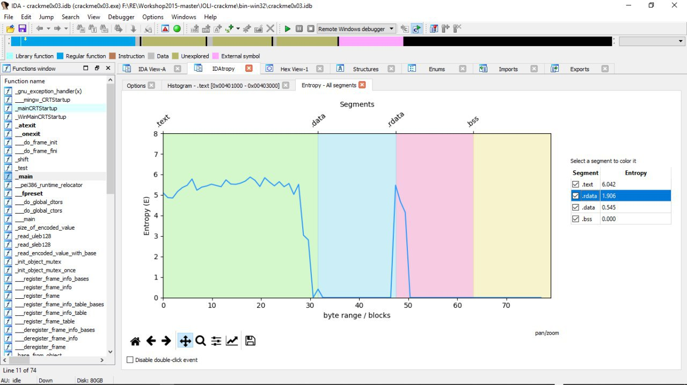
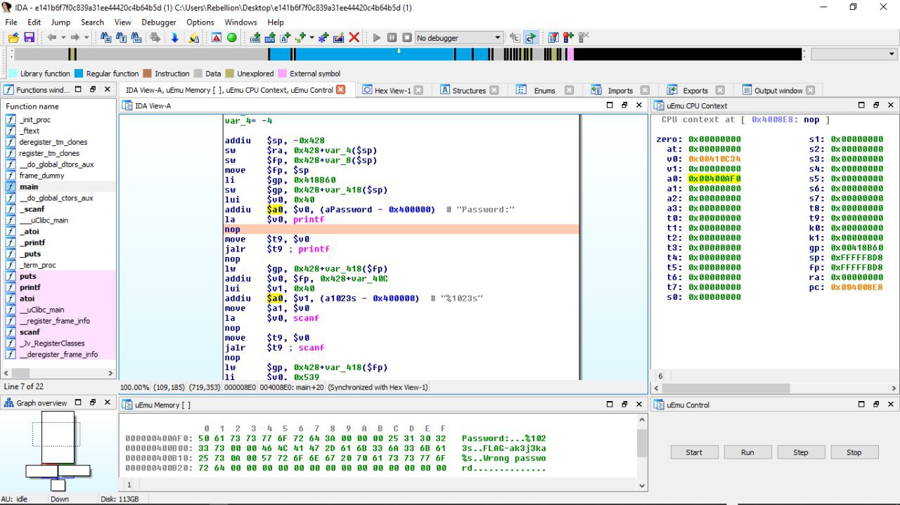

# reverseengineeringx
`2019-05-31 23:29:22`

<blockquote>
https://github.com/barryclark/jekyll-now
</blockquote>

<table><tr><td><b>→</b><a href="https://github.com/barryclark/jekyll-now">
https://github.com/barryclark/jekyll-now
</a>
<blockquote>
Build a Jekyll blog in minutes, without touching the command line. - barryclark/jekyll-now
</blockquote>
</td></tr></table>

---

# reverseengineeringx
`2019-05-31 17:07:14`

<blockquote>
https://github.com/Battelle/afl-unicorn
</blockquote>

<table><tr><td><b>→</b><a href="https://github.com/Battelle/afl-unicorn">
https://github.com/Battelle/afl-unicorn
</a>
<blockquote>
afl-unicorn lets you fuzz any piece of binary that can be emulated by Unicorn Engine. - Battelle/afl-unicorn
</blockquote>
</td></tr></table>

---

# defcon_news
`2019-05-31 08:13:17`

<blockquote>
Microsoft Windows Remote Desktop Services CVE-2019-0708 Remote Code Execution Vulnerability
http://exploit.kitploit.com/2019/05/microsoft-windows-remote-desktop.html

via Exploit Collector
</blockquote>

<table><tr><td><b>→</b><a href="https://exploit.kitploit.com/2019/05/microsoft-windows-remote-desktop.html">
https://exploit.kitploit.com/2019/05/microsoft-windows-remote-desktop.html
</a>
<blockquote>
Exploit Collector is the ultimate collection of public exploits and exploitable vulnerabilities. Remote/Local Exploits, Shellcode and 0days.
</blockquote>
</td></tr></table>

---

# reverseengineeringx
`2019-05-30 23:20:51`

<blockquote>
https://github.com/zhkl0228/unidbg
</blockquote>

<table><tr><td><b>→</b><a href="https://github.com/zhkl0228/unidbg">
https://github.com/zhkl0228/unidbg
</a>
<blockquote>
Allows you to emulate an Android ARM32 and/or ARM64 native library, and an experimental  iOS emulation - zhkl0228/unidbg
</blockquote>
</td></tr></table>

---

# reverseengineeringx
`2019-05-30 23:14:34`

<blockquote>
https://github.com/iGio90/Dwarf
</blockquote>

<table><tr><td><b>→</b><a href="https://github.com/iGio90/Dwarf">
https://github.com/iGio90/Dwarf
</a>
<blockquote>
Full featured multi arch/os debugger built on top of PyQt5 and frida - iGio90/Dwarf
</blockquote>
</td></tr></table>

---

# reverseengineeringx
`2019-05-30 23:06:30`

<blockquote>
https://github.com/Coldzer0/Cmulator
</blockquote>

<table><tr><td><b>→</b><a href="https://github.com/Coldzer0/Cmulator">
https://github.com/Coldzer0/Cmulator
</a>
<blockquote>
Cmulator  is ( x86 - x64 ) Scriptable Reverse Engineering Sandbox Emulator for shellcode and PE binaries . Based on Unicorn &amp; Zydis Engine &amp; javascript - Coldzer0/Cmulator
</blockquote>
</td></tr></table>

---

# reverseengineeringx
`2019-05-30 22:56:47`

<blockquote>
https://github.com/iGio90/uDdbg
</blockquote>

<table><tr><td><b>→</b><a href="https://github.com/iGio90/uDdbg">
https://github.com/iGio90/uDdbg
</a>
<blockquote>
A gdb like debugger that provide a runtime env to unicorn emulator and additionals features! - iGio90/uDdbg
</blockquote>
</td></tr></table>

---

# reverseengineeringx
`2019-05-30 22:42:33`

<blockquote>
https://github.com/trailofbits/manticore
</blockquote>

<table><tr><td><b>→</b><a href="https://github.com/trailofbits/manticore">
https://github.com/trailofbits/manticore
</a>
<blockquote>
Symbolic execution tool. Contribute to trailofbits/manticore development by creating an account on GitHub.
</blockquote>
</td></tr></table>

---

# reverseengineeringx
`2019-05-30 22:32:46`

<blockquote>
https://github.com/hugsy/cemu
</blockquote>

<table><tr><td><b>→</b><a href="https://github.com/hugsy/cemu">
https://github.com/hugsy/cemu
</a>
<blockquote>
Cheap EMUlator: lightweight multi-architecture assembly playground - hugsy/cemu
</blockquote>
</td></tr></table>

---

# reverseengineeringx
`2019-05-30 22:20:18`

<blockquote>
https://github.com/lunixbochs/usercorn
</blockquote>

<table><tr><td><b>→</b><a href="https://github.com/lunixbochs/usercorn">
https://github.com/lunixbochs/usercorn
</a>
<blockquote>
dynamic binary analysis via platform emulation. Contribute to lunixbochs/usercorn development by creating an account on GitHub.
</blockquote>
</td></tr></table>

---

# R0_Crew
`2019-05-30 18:11:51`

<blockquote>
https://github.com/linuxboot/fiano &#35;uefi &#35;go &#35;dukeBarman
</blockquote>

<table><tr><td><b>→</b><a href="https://github.com/linuxboot/fiano">
https://github.com/linuxboot/fiano
</a>
<blockquote>
Go-based tools for modifying UEFI firmware. Contribute to linuxboot/fiano development by creating an account on GitHub.
</blockquote>
</td></tr></table>

---

# R0_Crew
`2019-05-30 16:38:44`

<blockquote>
A set of Linux binary exploitation tasks for beginners https://github.com/xairy/easy-linux-pwn &#35;exploit &#35;dukeBarman
</blockquote>

<table><tr><td><b>→</b><a href="https://github.com/xairy/easy-linux-pwn">
https://github.com/xairy/easy-linux-pwn
</a>
<blockquote>
A set of Linux binary exploitation tasks for beginners on various architectures - xairy/easy-linux-pwn
</blockquote>
</td></tr></table>

---

# cibsecurity
`2019-05-30 14:23:11`

* https://nakedsecurity.sophos.com/2019/05/30/a-million-devices-are-vulnerable-to-bluekeep/

<blockquote>
⚠ A million devices still vulnerable to ‘wormable’ RDP hole ⚠

An internet-wide scan has revealed almost one million devices vulnerable to CVE-2019-0708.

📖 Read

via &quot;Naked Security&quot;.
</blockquote>

<table><tr><td><b>→</b><a href="https://nakedsecurity.sophos.com/2019/05/30/a-million-devices-are-vulnerable-to-bluekeep/">
https://nakedsecurity.sophos.com/2019/05/30/a-million-devices-are-vulnerable-to-bluekeep/
</a>
<blockquote>
An internet-wide scan has revealed almost one million devices vulnerable to CVE-2019-0708.
</blockquote>
</td></tr></table>

---

# defcon_news
`2019-05-30 14:20:06`

<blockquote>
A million devices still vulnerable to ‘wormable’ RDP hole
http://nakedsecurity.sophos.com/2019/05/30/a-million-devices-are-vulnerable-to-bluekeep/

via Naked Security
</blockquote>

<table><tr><td><b>→</b><a href="https://nakedsecurity.sophos.com/2019/05/30/a-million-devices-are-vulnerable-to-bluekeep/">
https://nakedsecurity.sophos.com/2019/05/30/a-million-devices-are-vulnerable-to-bluekeep/
</a>
<blockquote>
An internet-wide scan has revealed almost one million devices vulnerable to CVE-2019-0708.
</blockquote>
</td></tr></table>

---

# defcon_news
`2019-05-30 05:40:44`

<blockquote>
Anviz M3 RFID Access Control security issues
http://seclists.org/fulldisclosure/2019/May/51

via Full Disclosure
</blockquote>

<table><tr><td><b>→</b><a href="https://seclists.org/fulldisclosure/2019/May/51">
https://seclists.org/fulldisclosure/2019/May/51
</a>
</td></tr></table>

---

# defcon_news
`2019-05-30 05:40:43`

<blockquote>
XSS in SSI printenv command – Apache Tomcat – CVE-2019-0221
http://seclists.org/fulldisclosure/2019/May/50

via Full Disclosure
</blockquote>

<table><tr><td><b>→</b><a href="https://seclists.org/fulldisclosure/2019/May/50">
https://seclists.org/fulldisclosure/2019/May/50
</a>
</td></tr></table>

---

# defcon_news
`2019-05-30 05:40:41`

<blockquote>
APPLE-SA-2019-5-28-1 iTunes for Windows 12.9.5
http://seclists.org/fulldisclosure/2019/May/48

via Full Disclosure
</blockquote>

<table><tr><td><b>→</b><a href="https://seclists.org/fulldisclosure/2019/May/48">
https://seclists.org/fulldisclosure/2019/May/48
</a>
</td></tr></table>

---

# defcon_news
`2019-05-30 05:40:40`

<blockquote>
APPLE-SA-2019-5-28-2 iCloud for Windows 7.12
http://seclists.org/fulldisclosure/2019/May/47

via Full Disclosure
</blockquote>

<table><tr><td><b>→</b><a href="https://seclists.org/fulldisclosure/2019/May/47">
https://seclists.org/fulldisclosure/2019/May/47
</a>
</td></tr></table>

---

# defcon_news
`2019-05-30 05:40:39`

<blockquote>
Local Privilege Escalation via Serv-U FTP Server
http://seclists.org/fulldisclosure/2019/May/46

via Full Disclosure
</blockquote>

<table><tr><td><b>→</b><a href="https://seclists.org/fulldisclosure/2019/May/46">
https://seclists.org/fulldisclosure/2019/May/46
</a>
</td></tr></table>

---

# defcon_news
`2019-05-30 05:40:38`

<blockquote>
[SYSS-2019-014]: Siemens LOGO! 8 - Storing Passwords in a Recoverable Format (CWE-257)
http://seclists.org/fulldisclosure/2019/May/49

via Full Disclosure
</blockquote>

<table><tr><td><b>→</b><a href="https://seclists.org/fulldisclosure/2019/May/49">
https://seclists.org/fulldisclosure/2019/May/49
</a>
</td></tr></table>

---

# defcon_news
`2019-05-30 05:40:34`

<blockquote>
[SYSS-2019-013]: Siemens LOGO! 8 - Missing Authentication for Critical Function (CWE-306)
http://seclists.org/fulldisclosure/2019/May/45

via Full Disclosure
</blockquote>

<table><tr><td><b>→</b><a href="https://seclists.org/fulldisclosure/2019/May/45">
https://seclists.org/fulldisclosure/2019/May/45
</a>
</td></tr></table>

---

# defcon_news
`2019-05-30 05:40:33`

<blockquote>
[SYSS-2019-012]: Siemens LOGO! 8 - Use of Hard-coded Cryptographic Key (CWE-321)
http://seclists.org/fulldisclosure/2019/May/44

via Full Disclosure
</blockquote>

<table><tr><td><b>→</b><a href="https://seclists.org/fulldisclosure/2019/May/44">
https://seclists.org/fulldisclosure/2019/May/44
</a>
</td></tr></table>

---

# defcon_news
`2019-05-30 05:40:32`

<blockquote>
Cross-site Scripting Vulnerabilities in VFront 0.99.5
http://seclists.org/fulldisclosure/2019/May/42

via Full Disclosure
</blockquote>

<table><tr><td><b>→</b><a href="https://seclists.org/fulldisclosure/2019/May/42">
https://seclists.org/fulldisclosure/2019/May/42
</a>
</td></tr></table>

---

# defcon_news
`2019-05-30 05:40:32`

<blockquote>
CA20190523-01: Security Notice for CA Risk Authentication and CA Strong Authentication
http://seclists.org/fulldisclosure/2019/May/43

via Full Disclosure
</blockquote>

<table><tr><td><b>→</b><a href="https://seclists.org/fulldisclosure/2019/May/43">
https://seclists.org/fulldisclosure/2019/May/43
</a>
</td></tr></table>

---

# defcon_news
`2019-05-30 05:40:31`

<blockquote>
Reflected Cross-site Scripting Vulnerability in Kanboard 1.2.7
http://seclists.org/fulldisclosure/2019/May/41

via Full Disclosure
</blockquote>

<table><tr><td><b>→</b><a href="https://seclists.org/fulldisclosure/2019/May/41">
https://seclists.org/fulldisclosure/2019/May/41
</a>
</td></tr></table>

---

# defcon_news
`2019-05-30 04:35:28`

<blockquote>
A Debugging Primer with CVE-2019-0708
https://www.reddit.com/r/netsec/comments/bum64z/a_debugging_primer_with_cve20190708/

via /r/netsec - Information Security News &amp; Discussion
</blockquote>

<table><tr><td><b>→</b><a href="https://www.reddit.com/r/netsec/comments/bum64z/a_debugging_primer_with_cve20190708/">
https://www.reddit.com/r/netsec/comments/bum64z/a_debugging_primer_with_cve20190708/
</a>
<blockquote>
0 votes and 0 comments so far on Reddit
</blockquote>
</td></tr></table>

---

# reverseengineeringx
`2019-05-29 22:25:45`

<blockquote>
https://github.com/mkorman90/VolatilityBot
</blockquote>

<table><tr><td><b>→</b><a href="https://github.com/mkorman90/VolatilityBot">
https://github.com/mkorman90/VolatilityBot
</a>
<blockquote>
VolatilityBot – An automated memory analyzer for malware samples and memory dumps  - mkorman90/VolatilityBot
</blockquote>
</td></tr></table>

---

# reverseengineeringx
`2019-05-29 21:05:45`

<blockquote>
Ret-sync now supports Ghidra (syncing with popular debuggers)

https://github.com/bootleg/ret-sync
</blockquote>

<table><tr><td><b>→</b><a href="https://github.com/bootleg/ret-sync">
https://github.com/bootleg/ret-sync
</a>
<blockquote>
ret-sync is a set of plugins that helps to synchronize a debugging session (WinDbg/GDB/LLDB/OllyDbg2/x64dbg) with IDA/Ghidra/Binary Ninja disassemblers. - bootleg/ret-sync
</blockquote>
</td></tr></table>

---

# webware
`2019-05-29 18:51:37`

<blockquote>
CVE-2018-7600 или майнер на серваке, исходники, аналитика, примеры. Часть 2

https://codeby.net/threads/cve-2018-7600-ili-majner-na-servake-isxodniki-analitika-primery-chast-2.63158/
</blockquote>

<table><tr><td><b>→</b><a href="https://codeby.net/threads/cve-2018-7600-ili-majner-na-servake-isxodniki-analitika-primery-chast-2.63158/">
https://codeby.net/threads/cve-2018-7600-ili-majner-na-servake-isxodniki-analitika-primery-chast-2.63158/
</a>
<blockquote>
Погнали дальше!

Как же все монетезировались? Покопавшись на серваках я начал находить одни и те же файлы с новой датой, присмотрелся - МАЙНЕР, мать его за ногу.
SA -
udevd
x11_kenp0le
xm111
Все...
</blockquote>
</td></tr></table>

---

# defcon_news
`2019-05-29 16:40:14`

<blockquote>
Microsoft Windows AppX Deployment Service Local Privilege Escalation
https://packetstormsecurity.com/files/153114/CVE-2019-0841-BYPASS.tgz

via Exploit Files ≈ Packet Storm
</blockquote>

<table><tr><td><b>→</b><a href="https://packetstormsecurity.com/files/153114/CVE-2019-0841-BYPASS.tgz">
https://packetstormsecurity.com/files/153114/CVE-2019-0841-BYPASS.tgz
</a>
<blockquote>
Information Security Services, News, Files, Tools, Exploits, Advisories and Whitepapers
</blockquote>
</td></tr></table>

---

# defcon_news
`2019-05-29 15:05:55`

<blockquote>
CVE-2019-0725: An Analysis of Its Exploitability
https://blog.trendmicro.com/trendlabs-security-intelligence/cve-2019-0725-an-analysis-of-its-exploitability/

via TrendLabs Security Intelligence Blog
</blockquote>

<table><tr><td><b>→</b><a href="https://blog.trendmicro.com/trendlabs-security-intelligence/cve-2019-0725-an-analysis-of-its-exploitability/">
https://blog.trendmicro.com/trendlabs-security-intelligence/cve-2019-0725-an-analysis-of-its-exploitability/
</a>
<blockquote>
It’s worth noting that DHCP-related vulnerabilities are drawing more attention in Patch Tuesdays this year. An example is CVE-2019-0725, which doesn’t require user interaction, and affects all versions of Windows Server. How bad is it exactly?
</blockquote>
</td></tr></table>

---

# sysadm_in_channel
`2019-05-29 14:21:20`

<blockquote>
Докер потёк, уже не первый раз:

https://seclists.org/oss-sec/2019/q2/131

http://www.opennet.ru/opennews/art.shtml?num&#61;50765
</blockquote>

<table><tr><td><b>→</b><a href="https://seclists.org/oss-sec/2019/q2/131">
https://seclists.org/oss-sec/2019/q2/131
</a>
</td></tr></table>

---

# R0_Crew
`2019-05-29 13:43:40`

<blockquote>
Pandemic binary program analysis framework in OCaml https://github.com/RolfRolles/PandemicML &#35;reverse &#35;ocaml &#35;dukeBarman
</blockquote>

<table><tr><td><b>→</b><a href="https://github.com/RolfRolles/PandemicML">
https://github.com/RolfRolles/PandemicML
</a>
<blockquote>
Pandemic binary program analysis framework in OCaml (abandoned) - RolfRolles/PandemicML
</blockquote>
</td></tr></table>

---

# defcon_news
`2019-05-29 13:30:31`

<blockquote>
Уязвимость в Docker, позволяющая выбраться из контейнера
http://www.opennet.ru/opennews/art.shtml?num&#61;50765

via OpenNews.opennet.ru: Проблемы безопасности
</blockquote>

<table><tr><td><b>→</b><a href="https://www.opennet.ru/opennews/art.shtml?num=50765">
https://www.opennet.ru/opennews/art.shtml?num=50765
</a>
<blockquote>
В инструментарии для управления изолированными Linux-контейнерами Docker выявлена уязвимость (CVE-2018-15664), которая при определённом стечении обстоятельств позволяет получить доступ к хост-окружению из контейнера при наличии возможности запуска своих образов в системе или при доступе к выполняемому контейнеру. Проблема проявляется во всех версиях Docker и остаётся неисправленной (предложен, но пока не принят, патч, реализующий приостановку работы контейнера на время выполнения операций с ФС).
</blockquote>
</td></tr></table>

---

# defcon_news
`2019-05-29 10:45:34`

<blockquote>
Около миллиона устройств все еще уязвимы перед RDP-проблемой BlueKeep
https://xakep.ru/2019/05/29/bluekeep-stats/

via «Хакер»
</blockquote>

<table><tr><td><b>→</b><a href="https://xakep.ru/2019/05/29/bluekeep-stats/">
https://xakep.ru/2019/05/29/bluekeep-stats/
</a>
<blockquote>
Согласно новому исследованию, перед RDP-уязвимостью CVE-2019-0708, обладающей потенциалом червя, уязвимы около миллиона устройств по всему миру.
</blockquote>
</td></tr></table>

---

# defcon_news
`2019-05-29 01:40:21`

<blockquote>
Analysis of a 1day (cve-2019-0547) and discovery of a forgotten condition in the patch (cve-2019-0726) 1/2
https://www.reddit.com/r/netsec/comments/bu6gl4/analysis_of_a_1day_cve20190547_and_discovery_of_a/

via /r/netsec - Information Security News &amp; Discussion
</blockquote>

<table><tr><td><b>→</b><a href="https://www.reddit.com/r/netsec/comments/bu6gl4/analysis_of_a_1day_cve20190547_and_discovery_of_a/">
https://www.reddit.com/r/netsec/comments/bu6gl4/analysis_of_a_1day_cve20190547_and_discovery_of_a/
</a>
<blockquote>
0 votes and 0 comments so far on Reddit
</blockquote>
</td></tr></table>

---

# defcon_news
`2019-05-29 01:30:26`

<blockquote>
curl: Github wikis are editable by anyone &#35;Githubwikistakeover
https://vulners.com/hackerone/H1:545052?utm_source&#61;rss&amp;utm_medium&#61;rss&amp;utm_campaign&#61;rss

via Vulners.com RSS Feed
</blockquote>

<table><tr><td><b>→</b><a href="https://vulners.com/hackerone/H1:545052?utm_source=rss&utm_medium=rss&utm_campaign=rss">
https://vulners.com/hackerone/H1:545052?utm_source=rss&utm_medium=rss&utm_campaign=rss
</a>
<blockquote>
Hey Curl, Github wiki on the following project, https://github.com/curl/curl/wiki can be edited by any logged in user in the system. This poses security and reputation risk for the company. As your policy i doesnot edited any of the wiki :-) Regards, @MSRC29 Impact As wikis...
</blockquote>
</td></tr></table>

---

# defcon_news
`2019-05-29 01:26:34`

<blockquote>
curl: Github wikis are editable by anyone &#35;Githubwikistakeover
https://vulners.com/hackerone/H1:545052?utm_source&#61;rss&amp;utm_medium&#61;rss&amp;utm_campaign&#61;rss

via Vulners.com RSS Feed
</blockquote>

<table><tr><td><b>→</b><a href="https://vulners.com/hackerone/H1:545052?utm_source=rss&utm_medium=rss&utm_campaign=rss">
https://vulners.com/hackerone/H1:545052?utm_source=rss&utm_medium=rss&utm_campaign=rss
</a>
<blockquote>
Hey Curl, Github wiki on the following project, https://github.com/curl/curl/wiki can be edited by any logged in user in the system. This poses security and reputation risk for the company. As your policy i doesnot edited any of the wiki :-) Regards, @MSRC29 Impact As wikis...
</blockquote>
</td></tr></table>

---

# R0_Crew
`2019-05-28 21:28:55`

<blockquote>
Cutter v1.8.2 has just been released! https://github.com/radareorg/cutter/releases/tag/v1.8.2 &#35;radare2 &#35;reverse &#35;dukeBarman
</blockquote>

<table><tr><td><b>→</b><a href="https://github.com/radareorg/cutter/releases/tag/v1.8.2">
https://github.com/radareorg/cutter/releases/tag/v1.8.2
</a>
<blockquote>
Additions

Updated radare2 to 3.5.1
New Hexedit (&#35;1516)
Save Console Wrap in QSettings (&#35;1550)
Added hotkeys for undo and redo seek (&#35;1514)
Added advanced options aao and avrr to the initial option...
</blockquote>
</td></tr></table>

---

# defcon_news
`2019-05-28 21:05:23`

<blockquote>
Неизвестные активно сканируют сеть в поисках машин, уязвимых перед проблемой BlueKeep
https://xakep.ru/2019/05/28/bluekeep-scans/

via «Хакер»
</blockquote>

<table><tr><td><b>→</b><a href="https://xakep.ru/2019/05/28/bluekeep-scans/">
https://xakep.ru/2019/05/28/bluekeep-scans/
</a>
<blockquote>
Опасной RDP-уязвимостью CVE-2019-0708 уже интересуются преступники: исследователи обнаружили массовые сканирования сети.
</blockquote>
</td></tr></table>

---

# defcon_news
`2019-05-28 19:40:05`

<blockquote>
Almost One Million Vulnerable to BlueKeep Vuln (CVE-2019-0708)
https://www.reddit.com/r/netsec/comments/bu25wo/almost_one_million_vulnerable_to_bluekeep_vuln/

via /r/netsec - Information Security News &amp; Discussion
</blockquote>

<table><tr><td><b>→</b><a href="https://www.reddit.com/r/netsec/comments/bu25wo/almost_one_million_vulnerable_to_bluekeep_vuln/">
https://www.reddit.com/r/netsec/comments/bu25wo/almost_one_million_vulnerable_to_bluekeep_vuln/
</a>
<blockquote>
0 votes and 0 comments so far on Reddit
</blockquote>
</td></tr></table>

---

# sysadm_in_channel
`2019-05-28 06:37:45`

<blockquote>
Testinfra - Тесты на проверку состояний с выдачей результата, эдакий юнит-тест для сервера(ов) :)

Testinfra может применяться совместно с Ansible, Salt, Puppet, Chef, используется как модуль Python. Можно тестировать состояние сервисов, конфигов и много чего еще...

Детали на офф сайте
https://testinfra.readthedocs.io/en/latest/

Офф репозиторий:
https://github.com/philpep/testinfra

Пример работы с докер, ансибл:
Part1 - https://medium.com/@chaks/testing-ansible-role-with-molecule-docker-testinfra-goss-part-1-c0277b748b63
Part2 - https://medium.com/@chaks/testing-ansible-role-with-molecule-docker-testinfra-goss-part-2-b5138eff59ab

Пример теста redis:
https://www.unixdaemon.net/tools/five-minutes-with-testinfra/

Как пример установка и запуск в Fedora:
https://sys-adm.in/sections/adm/859-fedora-test-sostoyanij-servisov-i-versij-paketov-pri-pomoshchi-testinfra.html

Честно, всегда писал кастомыне скрипты для проверки тех или иных состояний, теперь ситуация изменилась. Кто не пробовал, обаязательно попробуйте.
</blockquote>

<table><tr><td><b>→</b><a href="https://github.com/philpep/testinfra">
https://github.com/philpep/testinfra
</a>
<blockquote>
Testinfra test your infrastructures. Contribute to pytest-dev/pytest-testinfra development by creating an account on GitHub.
</blockquote>
</td></tr></table>

---

# reverseengineeringx
`2019-05-25 06:05:38`

<blockquote>
IDAtropy is a plugin for Hex-Ray's IDA Pro designed to generate charts of entropy and histograms using the power of idapython and matplotlib. 
https://github.com/danigargu/IDAtropy
</blockquote>

---

# reverseengineeringx
`2019-05-25 05:08:05`

<blockquote>
uEMU Tiny cute emulator plugin for IDA based on unicorn. 
https://github.com/alexhude/uEmu
</blockquote>

---

# defcon_news
`2019-05-24 20:35:20`

<blockquote>
[CVE-2019-11604] Quest KACE Systems Management Appliance &lt;&#61;9.0 kbot_service_notsoap.php METHOD Reflected Cross-Site Scripting
http://seclists.org/fulldisclosure/2019/May/40

via Full Disclosure
</blockquote>

<table><tr><td><b>→</b><a href="https://seclists.org/fulldisclosure/2019/May/40">
https://seclists.org/fulldisclosure/2019/May/40
</a>
</td></tr></table>

---

# defcon_news
`2019-05-24 20:35:19`

<blockquote>
Exploring the File System via Jenkins Credentials Plugin Vulnerability – CVE-2019-10320
http://seclists.org/fulldisclosure/2019/May/39

via Full Disclosure
</blockquote>

<table><tr><td><b>→</b><a href="https://seclists.org/fulldisclosure/2019/May/39">
https://seclists.org/fulldisclosure/2019/May/39
</a>
</td></tr></table>

---

# defcon_news
`2019-05-24 20:35:19`

<blockquote>
[REVIVE-SA-2019-002] Revive Adserver Vulnerability
http://seclists.org/fulldisclosure/2019/May/38

via Full Disclosure
</blockquote>

<table><tr><td><b>→</b><a href="https://seclists.org/fulldisclosure/2019/May/38">
https://seclists.org/fulldisclosure/2019/May/38
</a>
</td></tr></table>

---

# defcon_news
`2019-05-24 20:35:18`

<blockquote>
New BlackArch Linux ISOs + OVA Image (2019.06.01) with 2200 Tools released
http://seclists.org/fulldisclosure/2019/May/37

via Full Disclosure
</blockquote>

<table><tr><td><b>→</b><a href="https://seclists.org/fulldisclosure/2019/May/37">
https://seclists.org/fulldisclosure/2019/May/37
</a>
</td></tr></table>

---

# defcon_news
`2019-05-24 20:35:17`

<blockquote>
CMS Made Simple 2.2.10 - (Authenticated) Persistent Cross-Site Scripting
http://seclists.org/fulldisclosure/2019/May/36

via Full Disclosure
</blockquote>

<table><tr><td><b>→</b><a href="https://seclists.org/fulldisclosure/2019/May/36">
https://seclists.org/fulldisclosure/2019/May/36
</a>
</td></tr></table>

---

# defcon_news
`2019-05-24 20:05:12`

<blockquote>
A brief analysis on CVE-2019-11815
https://www.reddit.com/r/netsec/comments/bsja7c/a_brief_analysis_on_cve201911815/

via /r/netsec - Information Security News &amp; Discussion
</blockquote>

<table><tr><td><b>→</b><a href="https://www.reddit.com/r/netsec/comments/bsja7c/a_brief_analysis_on_cve201911815/?utm_source=ifttt">
https://www.reddit.com/r/netsec/comments/bsja7c/a_brief_analysis_on_cve201911815/?utm_source=ifttt
</a>
<blockquote>
0 votes and 1 comment so far on Reddit
</blockquote>
</td></tr></table>

---

# R0_Crew
`2019-05-24 15:50:19`

<blockquote>
Malware Theory - PE Malformations and Anomalies https://www.youtube.com/watch?v&#61;-0DEEbQq8jU &#35;malware &#35;newbie &#35;dukeBarman
</blockquote>

<table><tr><td><b>→</b><a href="https://www.youtube.com/watch?v=-0DEEbQq8jU">
https://www.youtube.com/watch?v=-0DEEbQq8jU
</a>
<blockquote>
We explore malformations and anomalies of the Portable Executable format. What kinds of malformations exist, why do they occur and how do they affect PE file parsers?

OALabs video with export malformation: https://www.youtube.com/watch?v&#61;FNuFlhnfZQU
Video on PE Structure: https://www.youtube.com/watch?v&#61;l6GjU8fm8sM
Video on PE Resources: https://www.youtube.com/watch?v&#61;3PcgwKffytI
PoC PE files with malformations (Corkami): https://github.com/indrora/corkami/tree/master/src/PE
TinyPE: https://webserver2.tecgraf.puc-rio.br/~ismael/Cursos/YC++/apostilas/win32_xcoff_pe/tyne-example/Tiny%20PE.htm
Portable Executable Malware: https://github.com/katjahahn/PortEx/raw/master/masterthesis/masterthesis.pdf
PortExAnalyzer: https://github.com/katjahahn/PortEx/tree/master/progs
My Twitter account: @struppigel
</blockquote>
</td></tr></table>

---

# defcon_news
`2019-05-24 15:05:38`

<blockquote>
CVE-2019-11815: A Cautionary Tale About CVSS Scores
https://blog.trendmicro.com/trendlabs-security-intelligence/cve-2019-11815-a-cautionary-tale-about-cvss-scores/

via TrendLabs Security Intelligence Blog
</blockquote>

<table><tr><td><b>→</b><a href="https://blog.trendmicro.com/trendlabs-security-intelligence/cve-2019-11815-a-cautionary-tale-about-cvss-scores/?utm_source=trendmicroresearch&utm_medium=socal">
https://blog.trendmicro.com/trendlabs-security-intelligence/cve-2019-11815-a-cautionary-tale-about-cvss-scores/?utm_source=trendmicroresearch&utm_medium=socal
</a>
<blockquote>
by John Simpson Vulnerabilities in the Linux kernel are not uncommon. There are roughly 26 million lines of code, with 3,385,121 lines added and 2,512,040 lines removed in 2018 alone. The sheer complexity of that much code means that vulnerabilities are bound to exist. However, what is not at all common is the existence of...
</blockquote>
</td></tr></table>

---

# defcon_news
`2019-05-24 10:15:55`

<blockquote>
Atlassian Bitbucket Server CVE-2019-3397 Directory Traversal Vulnerability
http://exploit.kitploit.com/2019/05/atlassian-bitbucket-server-cve-2019.html

via Exploit Collector
</blockquote>

<table><tr><td><b>→</b><a href="https://exploit.kitploit.com/2019/05/atlassian-bitbucket-server-cve-2019.html">
https://exploit.kitploit.com/2019/05/atlassian-bitbucket-server-cve-2019.html
</a>
<blockquote>
Exploit Collector is the ultimate collection of public exploits and exploitable vulnerabilities. Remote/Local Exploits, Shellcode and 0days.
</blockquote>
</td></tr></table>

---

# defcon_news
`2019-05-23 19:40:37`

<blockquote>
Anviz M3 RFID Missing Access Controls
https://packetstormsecurity.com/files/153042/anviz-m3-rfid-cve-2019-11523-poc-master.zip

via Exploit Files ≈ Packet Storm
</blockquote>

<table><tr><td><b>→</b><a href="https://packetstormsecurity.com/files/153042/anviz-m3-rfid-cve-2019-11523-poc-master.zip">
https://packetstormsecurity.com/files/153042/anviz-m3-rfid-cve-2019-11523-poc-master.zip
</a>
<blockquote>
Information Security Services, News, Files, Tools, Exploits, Advisories and Whitepapers
</blockquote>
</td></tr></table>

---

# defcon_news
`2019-05-23 19:40:36`

<blockquote>
Microsoft Windows Win32k Privilege Escalation
https://packetstormsecurity.com/files/153034/CVE-2019-0803-master.tgz

via Exploit Files ≈ Packet Storm
</blockquote>

<table><tr><td><b>→</b><a href="https://packetstormsecurity.com/files/153034/CVE-2019-0803-master.tgz">
https://packetstormsecurity.com/files/153034/CVE-2019-0803-master.tgz
</a>
<blockquote>
Information Security Services, News, Files, Tools, Exploits, Advisories and Whitepapers
</blockquote>
</td></tr></table>

---

# defcon_news
`2019-05-23 13:45:52`

<blockquote>
Продемонстрированы эксплоиты для RCE-проблемы BlueKeep
https://xakep.ru/2019/05/23/bluekeep-exploits/

via «Хакер»
</blockquote>

<table><tr><td><b>→</b><a href="https://xakep.ru/2019/05/23/bluekeep-exploits/">
https://xakep.ru/2019/05/23/bluekeep-exploits/
</a>
<blockquote>
Исследователи изучают уязвимость CVE-2019-0708, благодаря которой атакующие могут распространять малварь подобно червю.
</blockquote>
</td></tr></table>

---

# sysadm_in_channel
`2019-05-23 10:52:03`

<blockquote>
Docker контейнеры без root пароля, в списке есть контейнеры от HashiCorp и Microsoft. Среди проверенных, из тысячи контейнеров - 20% из них оказались &quot;дырявыми&quot;, хотя если нет пароля, то не не всегда это причина для беспокойства, но тем не менее...

https://www.zdnet.com/article/root-account-misconfigurations-found-in-20-of-top-1000-docker-containers/
</blockquote>

<table><tr><td><b>→</b><a href="https://www.zdnet.com/article/root-account-misconfigurations-found-in-20-of-top-1000-docker-containers/">
https://www.zdnet.com/article/root-account-misconfigurations-found-in-20-of-top-1000-docker-containers/
</a>
<blockquote>
Issue similar to Alpine Linux's CVE-2019-5021 impacts 194 other Docker images.
</blockquote>
</td></tr></table>

---

# R0_Crew
`2019-05-23 04:47:31`

<blockquote>
Scripts for the Ghidra software reverse engineering suite. https://github.com/ghidraninja/ghidra_scripts  &#35;ghidra &#35;reverse &#35;dukeBarman
</blockquote>

<table><tr><td><b>→</b><a href="https://github.com/ghidraninja/ghidra_scripts">
https://github.com/ghidraninja/ghidra_scripts
</a>
<blockquote>
Scripts for the Ghidra software reverse engineering suite. - ghidraninja/ghidra_scripts
</blockquote>
</td></tr></table>

---

# defcon_news
`2019-05-22 20:20:37`

<blockquote>
An Update on the Microsoft Windows RDP &quot;Bluekeep&quot; Vulnerability (CVE-2019-0708) [now with pcaps], (Wed, May 22nd)
https://isc.sans.edu/diary/rss/24960

via SANS Internet Storm Center, InfoCON: green
</blockquote>

<table><tr><td><b>→</b><a href="https://isc.sans.edu/diary/rss/24960">
https://isc.sans.edu/diary/rss/24960
</a>
<blockquote>
An Update on the Microsoft Windows RDP &quot;Bluekeep&quot; Vulnerability (CVE-2019-0708) [now with pcaps], Author: Johannes Ullrich
</blockquote>
</td></tr></table>

---

# defcon_news
`2019-05-22 10:25:27`

<blockquote>
Unauthenticated CVE-2019-0708 (RDP RCE) scanner PoC
https://www.reddit.com/r/netsec/comments/brllt5/unauthenticated_cve20190708_rdp_rce_scanner_poc/

via /r/netsec - Information Security News &amp; Discussion
</blockquote>

<table><tr><td><b>→</b><a href="https://www.reddit.com/r/netsec/comments/brllt5/unauthenticated_cve20190708_rdp_rce_scanner_poc/">
https://www.reddit.com/r/netsec/comments/brllt5/unauthenticated_cve20190708_rdp_rce_scanner_poc/
</a>
<blockquote>
0 votes and 0 comments so far on Reddit
</blockquote>
</td></tr></table>

---

# defcon_news
`2019-05-21 20:24:18`

<blockquote>
Emerson Network Power Cross Site Scripting(XSS) Vulnerability
http://seclists.org/fulldisclosure/2019/May/35

via Full Disclosure
</blockquote>

<table><tr><td><b>→</b><a href="https://seclists.org/fulldisclosure/2019/May/35">
https://seclists.org/fulldisclosure/2019/May/35
</a>
</td></tr></table>

---

# defcon_news
`2019-05-21 20:24:17`

<blockquote>
Blackhole for Bad Bots WordPress Plugin 2.5 - Detection Bypass
http://seclists.org/fulldisclosure/2019/May/34

via Full Disclosure
</blockquote>

<table><tr><td><b>→</b><a href="https://seclists.org/fulldisclosure/2019/May/34">
https://seclists.org/fulldisclosure/2019/May/34
</a>
</td></tr></table>

---

# defcon_news
`2019-05-21 20:24:16`

<blockquote>
Epic Web Honeypot 2.0a - Fingerprinting Vulnerability
http://seclists.org/fulldisclosure/2019/May/33

via Full Disclosure
</blockquote>

<table><tr><td><b>→</b><a href="https://seclists.org/fulldisclosure/2019/May/33">
https://seclists.org/fulldisclosure/2019/May/33
</a>
</td></tr></table>

---

# defcon_news
`2019-05-21 20:24:15`

<blockquote>
Re: GAT-Ship Web Module &gt;1.30 - Unauthenticated Information Disclosure Vulnerability
http://seclists.org/fulldisclosure/2019/May/32

via Full Disclosure
</blockquote>

<table><tr><td><b>→</b><a href="https://seclists.org/fulldisclosure/2019/May/32">
https://seclists.org/fulldisclosure/2019/May/32
</a>
</td></tr></table>

---

# defcon_news
`2019-05-21 13:44:12`

<blockquote>
Network detection rule for CVE-2019-0708 in RDP tested with &#35;Suricata
https://www.reddit.com/r/netsec/comments/br8mpp/network_detection_rule_for_cve20190708_in_rdp/

via /r/netsec - Information Security News &amp; Discussion
</blockquote>

<table><tr><td><b>→</b><a href="https://www.reddit.com/r/netsec/comments/br8mpp/network_detection_rule_for_cve20190708_in_rdp/">
https://www.reddit.com/r/netsec/comments/br8mpp/network_detection_rule_for_cve20190708_in_rdp/
</a>
<blockquote>
0 votes and 0 comments so far on Reddit
</blockquote>
</td></tr></table>

---

# defcon_news
`2019-05-21 08:49:05`

<blockquote>
CVE-2019-3568: WhatsApp 0 day analysis
https://www.reddit.com/r/netsec/comments/br6adu/cve20193568_whatsapp_0_day_analysis/

via /r/netsec - Information Security News &amp; Discussion
</blockquote>

<table><tr><td><b>→</b><a href="https://www.reddit.com/r/netsec/comments/br6adu/cve20193568_whatsapp_0_day_analysis/?utm_source=ifttt">
https://www.reddit.com/r/netsec/comments/br6adu/cve20193568_whatsapp_0_day_analysis/?utm_source=ifttt
</a>
<blockquote>
0 votes and 5 comments so far on Reddit
</blockquote>
</td></tr></table>

---

# defcon_news
`2019-05-20 06:44:13`

<blockquote>
CVE-2019-0604 Attack, (Mon, May 20th)
https://isc.sans.edu/diary/rss/24952

via SANS Internet Storm Center, InfoCON: green
</blockquote>

<table><tr><td><b>→</b><a href="https://isc.sans.edu/diary/rss/24952">
https://isc.sans.edu/diary/rss/24952
</a>
<blockquote>
CVE-2019-0604 Attack, Author: Tom Webb
</blockquote>
</td></tr></table>

---

# R0_Crew
`2019-05-19 23:32:02`

<blockquote>
https://github.com/0ffffffffh/dragondance &#35;ghidra &#35;reverse &#35;dukeBarman
</blockquote>

<table><tr><td><b>→</b><a href="https://github.com/0ffffffffh/dragondance">
https://github.com/0ffffffffh/dragondance
</a>
<blockquote>
Binary code coverage visualizer plugin for Ghidra. Contribute to 0ffffffffh/dragondance development by creating an account on GitHub.
</blockquote>
</td></tr></table>

---

# defcon_news
`2019-05-19 23:04:21`

<blockquote>
Notes On CVE-2019-0708 (RCE 0day)
https://www.secjuice.com/cve-2019-0708-rdp-rce-0day/

via Secjuice Infosec Writers Guild
</blockquote>

<table><tr><td><b>→</b><a href="https://www.secjuice.com/cve-2019-0708-rdp-rce-0day/">
https://www.secjuice.com/cve-2019-0708-rdp-rce-0day/
</a>
<blockquote>
This week a major RCE vulnerability has been spotted in the wild which affects affects a number of Microsoft OS's.
</blockquote>
</td></tr></table>

---

# R0_Crew
`2019-05-19 20:16:51`

<blockquote>
ANBU - Automatic New Binary Unpacker with PIN DBI Framework https://github.com/Fare9/ANBU &#35;reverse &#35;pin &#35;dukeBarman
</blockquote>

<table><tr><td><b>→</b><a href="https://github.com/Fare9/ANBU">
https://github.com/Fare9/ANBU
</a>
<blockquote>
ANBU (Automatic New Binary Unpacker) a tool for me to learn about PIN and about algorithms for generic unpacking. - Fare9/ANBU
</blockquote>
</td></tr></table>

---

# cibsecurity
`2019-05-17 21:01:45`

* https://www.darkreading.com/perimeter/when-older-windows-systems-wont-die/d/d-id/1334749?_mc=rss_x_drr_edt_aud_dr_x_x-rss-simple

<blockquote>
🕴 When Older Windows Systems Won't Die 🕴

Microsoft's decision to patch unsupported machines for the critical CVE-2019-0708 flaw is a reminder that XP, 2003, and other older versions of Windows still run in some enterprises.

📖 Read

via &quot;Dark Reading: &quot;.
</blockquote>

<table><tr><td><b>→</b><a href="https://www.darkreading.com/perimeter/when-older-windows-systems-wont-die/d/d-id/1334749?_mc=rss_x_drr_edt_aud_dr_x_x-rss-simple">
https://www.darkreading.com/perimeter/when-older-windows-systems-wont-die/d/d-id/1334749?_mc=rss_x_drr_edt_aud_dr_x_x-rss-simple
</a>
<blockquote>
Microsoft's decision to patch unsupported machines for the critical CVE-2019-0708 flaw is a reminder that XP, 2003, and other older versions of Windows still run in some enterprises.
</blockquote>
</td></tr></table>

---

# defcon_news
`2019-05-17 21:01:05`

<blockquote>
When Older Windows Systems Won't Die
https://www.darkreading.com/perimeter/when-older-windows-systems-wont-die/d/d-id/1334749

via Dark Reading:
</blockquote>

<table><tr><td><b>→</b><a href="https://www.darkreading.com/perimeter/when-older-windows-systems-wont-die/d/d-id/1334749">
https://www.darkreading.com/perimeter/when-older-windows-systems-wont-die/d/d-id/1334749
</a>
<blockquote>
Microsoft's decision to patch unsupported machines for the critical CVE-2019-0708 flaw is a reminder that XP, 2003, and other older versions of Windows still run in some enterprises.
</blockquote>
</td></tr></table>

---

# defcon_news
`2019-05-17 20:05:37`

<blockquote>
local privilege escalation via CDE dtprintinfo
http://seclists.org/fulldisclosure/2019/May/31

via Full Disclosure
</blockquote>

<table><tr><td><b>→</b><a href="https://seclists.org/fulldisclosure/2019/May/31">
https://seclists.org/fulldisclosure/2019/May/31
</a>
</td></tr></table>

---

# defcon_news
`2019-05-17 20:05:37`

<blockquote>
[CVE-2019-11880] CommSy &lt;&#61;8.6.5 - SQL injection
http://seclists.org/fulldisclosure/2019/May/30

via Full Disclosure
</blockquote>

<table><tr><td><b>→</b><a href="https://seclists.org/fulldisclosure/2019/May/30">
https://seclists.org/fulldisclosure/2019/May/30
</a>
</td></tr></table>

---

# defcon_news
`2019-05-17 20:05:36`

<blockquote>
GAT-Ship Web Module &gt;1.30 - Unauthenticated Information Disclosure Vulnerability
http://seclists.org/fulldisclosure/2019/May/29

via Full Disclosure
</blockquote>

<table><tr><td><b>→</b><a href="https://seclists.org/fulldisclosure/2019/May/29">
https://seclists.org/fulldisclosure/2019/May/29
</a>
</td></tr></table>

---

# defcon_news
`2019-05-17 18:23:29`

<blockquote>
https://github.com/streaak/keyhacks
</blockquote>

<table><tr><td><b>→</b><a href="https://github.com/streaak/keyhacks">
https://github.com/streaak/keyhacks
</a>
<blockquote>
Keyhacks is a repository which shows quick ways in which API keys leaked by a bug bounty program can be checked to see if they're valid. - streaak/keyhacks
</blockquote>
</td></tr></table>

---

# MPSIEMChat
`2019-05-17 13:50:25`

<blockquote>
https://github.com/feedb/honeypot_logs/blob/master/ssh-honeypot.log тут пары login:pass с моего ssh хонейпота, тоже можно заюзать под справочник
</blockquote>

<table><tr><td><b>→</b><a href="https://github.com/feedb/honeypot_logs/blob/master/ssh-honeypot.log">
https://github.com/feedb/honeypot_logs/blob/master/ssh-honeypot.log
</a>
<blockquote>
Logs from my ssh honeypot. Contribute to feedb/honeypot_logs development by creating an account on GitHub.
</blockquote>
</td></tr></table>

---

# MPSIEMChat
`2019-05-17 13:48:45`

<blockquote>
https://github.com/feedb/MPSiem_addons/tree/master/password%20dics
</blockquote>

<table><tr><td><b>→</b><a href="https://github.com/feedb/MPSiem_addons/tree/master/password%20dics">
https://github.com/feedb/MPSiem_addons/tree/master/password%20dics
</a>
<blockquote>
реп полезностей для PT MaxPatrol SIEM. Contribute to feedb/MPSiem_addons development by creating an account on GitHub.
</blockquote>
</td></tr></table>

---

# defcon_news
`2019-05-17 10:45:52`

<blockquote>
[RT-SA-2019-002] Directory Traversal in Cisco Expressway Gateway
http://seclists.org/fulldisclosure/2019/May/28

via Full Disclosure
</blockquote>

<table><tr><td><b>→</b><a href="https://seclists.org/fulldisclosure/2019/May/28">
https://seclists.org/fulldisclosure/2019/May/28
</a>
</td></tr></table>

---

# defcon_news
`2019-05-17 00:54:18`

<blockquote>
https://github.com/yadox666/The-Hackers-Hardware-Toolkit/blob/master/README.md
</blockquote>

<table><tr><td><b>→</b><a href="https://github.com/yadox666/The-Hackers-Hardware-Toolkit/blob/master/README.md">
https://github.com/yadox666/The-Hackers-Hardware-Toolkit/blob/master/README.md
</a>
<blockquote>
The best hacker's gadgets for Red Team pentesters and security researchers. - yadox666/The-Hackers-Hardware-Toolkit
</blockquote>
</td></tr></table>

---

# isast
`2019-05-16 21:16:05`

<blockquote>
GitHub - zlonov/security-blogs: Блоги по информационной безопасности
https://github.com/zlonov/security-blogs/
</blockquote>

<table><tr><td><b>→</b><a href="https://github.com/zlonov/security-blogs">
https://github.com/zlonov/security-blogs
</a>
<blockquote>
Блоги по информационной безопасности. Contribute to zlonov/security-blogs development by creating an account on GitHub.
</blockquote>
</td></tr></table>

---

# infobezopasnost
`2019-05-16 07:20:45`

<blockquote>
Thrangrycat: критическая уязвимость в прошивке устройств Cisco позволяет хакерам устанавливать на них бэкдоры
https://habr.com/ru/post/451970/?utm_campaign&#61;451970
</blockquote>

<table><tr><td><b>→</b><a href="https://habr.com/ru/post/451970/?utm_campaign=451970">
https://habr.com/ru/post/451970/?utm_campaign=451970
</a>
<blockquote>
Исследователи информационной безопасности обнаружили опасную уязвимость в прошивке, которая используется на устройствах Cisco разных типов. Ошибка CVE-2019-164...
</blockquote>
</td></tr></table>

---

# defcon_news
`2019-05-15 19:15:46`

<blockquote>
Falco Vulnerability – CVE-2019-8339
https://www.reddit.com/r/netsec/comments/boz97l/falco_vulnerability_cve20198339/

via /r/netsec - Information Security News &amp; Discussion
</blockquote>

<table><tr><td><b>→</b><a href="https://www.reddit.com/r/netsec/comments/boz97l/falco_vulnerability_cve20198339/?utm_source=ifttt">
https://www.reddit.com/r/netsec/comments/boz97l/falco_vulnerability_cve20198339/?utm_source=ifttt
</a>
<blockquote>
0 votes and 1 comment so far on Reddit
</blockquote>
</td></tr></table>

---

# defcon_news
`2019-05-15 17:20:09`

<blockquote>
Thrangrycat: критическая уязвимость в прошивке устройств Cisco позволяет хакерам устанавливать на них бэкдоры
https://habr.com/ru/post/451970/

via Информационная безопасность – Защита данных
</blockquote>

<table><tr><td><b>→</b><a href="https://habr.com/ru/post/451970/?utm_campaign=451970">
https://habr.com/ru/post/451970/?utm_campaign=451970
</a>
<blockquote>
Исследователи информационной безопасности обнаружили опасную уязвимость в прошивке, которая используется на устройствах Cisco разных типов. Ошибка CVE-2019-164...
</blockquote>
</td></tr></table>

---

# defcon_news
`2019-05-15 11:50:27`

<blockquote>
SEC Consult SA-20190515-0 :: Authorization Bypass in RSA NetWitness (@sec_consult)
http://seclists.org/fulldisclosure/2019/May/27

via Full Disclosure
</blockquote>

<table><tr><td><b>→</b><a href="https://seclists.org/fulldisclosure/2019/May/27">
https://seclists.org/fulldisclosure/2019/May/27
</a>
</td></tr></table>

---

# infobezopasnost
`2019-05-15 07:55:47`

<blockquote>
https://m.habr.com/ru/company/jetinfosystems/blog/451852/
</blockquote>

<table><tr><td><b>→</b><a href="https://m.habr.com/ru/company/jetinfosystems/blog/451852/">
https://m.habr.com/ru/company/jetinfosystems/blog/451852/
</a>
<blockquote>
Стало известно об опасной уязвимости в протоколе RDP: корпорация Microsoft подготовила экстренный патч для уязвимости с идентификатором CVE-2019-0708, позволяющей выполнить произвольный код на...
</blockquote>
</td></tr></table>

---

# defcon_news
`2019-05-15 02:55:27`

<blockquote>
SSDD - Remote desktop RCE CVE-2019-0708.
https://www.reddit.com/r/netsec/comments/boqdp5/ssdd_remote_desktop_rce_cve20190708/

via /r/netsec - Information Security News &amp; Discussion
</blockquote>

<table><tr><td><b>→</b><a href="https://www.reddit.com/r/netsec/comments/boqdp5/ssdd_remote_desktop_rce_cve20190708/?utm_source=ifttt">
https://www.reddit.com/r/netsec/comments/boqdp5/ssdd_remote_desktop_rce_cve20190708/?utm_source=ifttt
</a>
<blockquote>
0 votes and 1 comment so far on Reddit
</blockquote>
</td></tr></table>

---

# defcon_news
`2019-05-15 01:16:01`

<blockquote>
Обнаружена критическая RCE-уязвимость уровня EternalBlue
https://habr.com/ru/post/451864/

via Информационная безопасность – Защита данных
</blockquote>

<table><tr><td><b>→</b><a href="https://habr.com/ru/post/451864/">
https://habr.com/ru/post/451864/
</a>
<blockquote>
Стало известно о критичной RCE-уязвимости в Службах Удаленных рабочих столов RDS (на более ранних ОС – Служба Терминалов TS ) в ОС Windows (CVE-2019-0708), котор...
</blockquote>
</td></tr></table>

---

# defcon_news
`2019-05-15 00:15:22`

<blockquote>
Prevent a worm by updating Remote Desktop Services (CVE-2019-0708) – Microsoft Security Response Center
https://www.reddit.com/r/netsec/comments/bonwil/prevent_a_worm_by_updating_remote_desktop/

via /r/netsec - Information Security News &amp; Discussion
</blockquote>

<table><tr><td><b>→</b><a href="https://www.reddit.com/r/netsec/comments/bonwil/prevent_a_worm_by_updating_remote_desktop/?utm_source=ifttt">
https://www.reddit.com/r/netsec/comments/bonwil/prevent_a_worm_by_updating_remote_desktop/?utm_source=ifttt
</a>
<blockquote>
0 votes and 1 comment so far on Reddit
</blockquote>
</td></tr></table>

---

# defcon_news
`2019-05-14 23:20:15`

<blockquote>
VMWare just released a security update to address a DLL-hijacking issue affecting VMware Workstation Pro / Player. Details: https://www.vmware.com/security/advisories/VMSA-2019-0007.html, (Tue, May 14th)
https://isc.sans.edu/diary/rss/24936

via SANS Internet Storm Center, InfoCON: green
</blockquote>

<table><tr><td><b>→</b><a href="https://www.vmware.com/security/advisories/VMSA-2019-0007.html">
https://www.vmware.com/security/advisories/VMSA-2019-0007.html
</a>
<blockquote>
VMware Workstation update addresses a DLL-hijacking issue (CVE-2019-5526)
</blockquote>
</td></tr></table>

---

# defcon_news
`2019-05-14 22:45:17`

<blockquote>
Удаленное выполнение произвольного кода в протоколе RDP
https://habr.com/ru/post/451852/

via Информационная безопасность – Защита данных
</blockquote>

<table><tr><td><b>→</b><a href="https://habr.com/ru/post/451852/">
https://habr.com/ru/post/451852/
</a>
<blockquote>
Стало известно об опасной уязвимости в протоколе RDP: корпорация Microsoft подготовила экстренный патч для уязвимости с идентификатором CVE-2019-0708, позволяю...
</blockquote>
</td></tr></table>

---

# R0_Crew
`2019-05-14 21:32:18`

<blockquote>
Slides from &#35;ghidra workshop INFILTRATE 2019 https://github.com/0xAlexei/INFILTRATE2019/blob/master/INFILTRATE%20Ghidra%20Slides.pdf &#35;reverse &#35;dukeBarman
</blockquote>

<table><tr><td><b>→</b><a href="https://github.com/0xAlexei/INFILTRATE2019/blob/master/INFILTRATE%20Ghidra%20Slides.pdf">
https://github.com/0xAlexei/INFILTRATE2019/blob/master/INFILTRATE%20Ghidra%20Slides.pdf
</a>
<blockquote>
INFILTRATE 2019 Demo Materials. Contribute to 0xAlexei/INFILTRATE2019 development by creating an account on GitHub.
</blockquote>
</td></tr></table>

---

# R0_Crew
`2019-05-14 21:32:02`

<blockquote>
SAFE (Self Attentive Function Embedding) - compute binary function embeddings to find out if two functions are similar or not. Based on radare2.  github: https://github.com/gadiluna/SAFE Article: https://medium.com/@massarelli/safe-self-attentive-function-embedding-d80abbfea794 &#35;reverse &#35;radare2 &#35;dukeBarman
</blockquote>

<table><tr><td><b>→</b><a href="https://github.com/gadiluna/SAFE">
https://github.com/gadiluna/SAFE
</a>
<blockquote>
SAFE: Self-Attentive Function Embeddings for binary similarity - gadiluna/SAFE
</blockquote>
</td></tr></table>

---

# defcon_news
`2019-05-14 21:25:10`

<blockquote>
[CVE-2018-7841] Schneider Electric U.Motion Builder &lt;&#61;1.3.4 track_import_export.php object_id Unauthenticated Command Injection
http://seclists.org/fulldisclosure/2019/May/26

via Full Disclosure
</blockquote>

<table><tr><td><b>→</b><a href="https://seclists.org/fulldisclosure/2019/May/26">
https://seclists.org/fulldisclosure/2019/May/26
</a>
</td></tr></table>

---

# defcon_news
`2019-05-14 20:50:21`

<blockquote>
Samba Releases Security Updates
https://www.us-cert.gov/ncas/current-activity/2019/05/14/Samba-Releases-Security-Updates

via US-CERT Current Activity
</blockquote>

<table><tr><td><b>→</b><a href="https://www.us-cert.gov/ncas/current-activity/2019/05/14/Samba-Releases-Security-Updates">
https://www.us-cert.gov/ncas/current-activity/2019/05/14/Samba-Releases-Security-Updates
</a>
<blockquote>
The Samba Team has released security updates to address a vulnerability in Samba. An attacker could exploit this vulnerability take control of an affected system.The Cybersecurity and Infrastructure Security Agency (CISA) encourages users and administrators to review the Samba Security Announcement for CVE-2018-16860 and apply the necessary updates.
</blockquote>
</td></tr></table>

---

# defcon_news
`2019-05-14 20:15:18`

<blockquote>
Facebook Releases Security Advisory for WhatsApp
https://www.us-cert.gov/ncas/current-activity/2019/05/14/Facebook-Releases-Security-Advisory-WhatsApp

via US-CERT Current Activity
</blockquote>

<table><tr><td><b>→</b><a href="https://www.us-cert.gov/ncas/current-activity/2019/05/14/Facebook-Releases-Security-Advisory-WhatsApp">
https://www.us-cert.gov/ncas/current-activity/2019/05/14/Facebook-Releases-Security-Advisory-WhatsApp
</a>
<blockquote>
Facebook has released a security advisory to address a vulnerability in WhatsApp. A remote attacker could exploit this vulnerability to take control of an affected device.The Cybersecurity and Infrastructure Security Agency (CISA) encourages users to review the Facebook Security Advisory for CVE-2019-3568 and upgrade to the appropriate version.
</blockquote>
</td></tr></table>

---

# chkpchat
`2019-05-14 14:59:51`

<blockquote>
Допилил скрипт по проверке статуса и переключению провайдеров с использование web api. Кому интересно, выложил на github: https://github.com/sc1pion/isp_switcher
</blockquote>

<table><tr><td><b>→</b><a href="https://github.com/sc1pion/isp_switcher">
https://github.com/sc1pion/isp_switcher
</a>
<blockquote>
Script for testing and switching ISP on checkpoint - sc1pion/isp_switcher
</blockquote>
</td></tr></table>

---

# defcon_news
`2019-05-14 14:30:47`

<blockquote>
APPLE-SA-2019-5-13-5 Safari 12.1.1
http://seclists.org/fulldisclosure/2019/May/25

via Full Disclosure
</blockquote>

<table><tr><td><b>→</b><a href="https://seclists.org/fulldisclosure/2019/May/25">
https://seclists.org/fulldisclosure/2019/May/25
</a>
</td></tr></table>

---

# defcon_news
`2019-05-14 14:30:46`

<blockquote>
APPLE-SA-2019-5-13-6 Apple TV Software 7.3
http://seclists.org/fulldisclosure/2019/May/24

via Full Disclosure
</blockquote>

<table><tr><td><b>→</b><a href="https://seclists.org/fulldisclosure/2019/May/24">
https://seclists.org/fulldisclosure/2019/May/24
</a>
</td></tr></table>

---

# defcon_news
`2019-05-14 14:30:45`

<blockquote>
APPLE-SA-2019-5-13-4 watchOS 5.2.1
http://seclists.org/fulldisclosure/2019/May/23

via Full Disclosure
</blockquote>

<table><tr><td><b>→</b><a href="https://seclists.org/fulldisclosure/2019/May/23">
https://seclists.org/fulldisclosure/2019/May/23
</a>
</td></tr></table>

---

# defcon_news
`2019-05-14 10:50:15`

<blockquote>
Критическая уязвимость в приложении WhatsApp, пригодная для внедрения вредоносного ПО
http://www.opennet.ru/opennews/art.shtml?num&#61;50679

via OpenNews.opennet.ru: Проблемы безопасности
</blockquote>

<table><tr><td><b>→</b><a href="https://www.opennet.ru/opennews/art.shtml?num=50679">
https://www.opennet.ru/opennews/art.shtml?num=50679
</a>
<blockquote>
Раскрыты сведения о критической уязвимости (CVE-2019-3568) в мобильном приложении WhatsApp, позволяющей добиться выполнения своего кода через отправку специально оформленного голосового вызова. Для успешной атаки ответ на вредоносный вызов не требуется, достаточно поступления звонка. При этом часто подобный вызов не оседает в журнале звонков и атака может остаться незамеченной пользователем.
</blockquote>
</td></tr></table>

---

# R0_Crew
`2019-05-14 09:25:49`

<blockquote>
The Story of Two Winning Pwn2Own JIT Vulnerabilities in Mozilla Firefox (CVE-2019-9810/CVE-2019-9813 )

https://www.thezdi.com/blog/2019/4/18/the-story-of-two-winning-pwn2own-jit-vulnerabilities-in-mozilla-firefox

&#35;re &#35;expdev &#35;poc &#35;jit &#35;darw1n
</blockquote>

<table><tr><td><b>→</b><a href="https://www.thezdi.com/blog/2019/4/18/the-story-of-two-winning-pwn2own-jit-vulnerabilities-in-mozilla-firefox">
https://www.thezdi.com/blog/2019/4/18/the-story-of-two-winning-pwn2own-jit-vulnerabilities-in-mozilla-firefox
</a>
<blockquote>
Every year some of the greatest security researchers around the globe gather together for the Pwn2Own event to demonstrate their skills by compromising widely used applications. This year’s event recently  completed  and did not disappoint. On the second day of the competition, the Fluoroacetate tea
</blockquote>
</td></tr></table>

---

# defcon_news
`2019-05-14 09:15:25`

<blockquote>
Hackers Used WhatsApp 0-Day Flaw to Secretly Install Spyware On Phones
https://thehackernews.com/2019/05/hack-whatsapp-vulnerability.html

via The Hacker News
</blockquote>

<table><tr><td><b>→</b><a href="https://thehackernews.com/2019/05/hack-whatsapp-vulnerability.html">
https://thehackernews.com/2019/05/hack-whatsapp-vulnerability.html
</a>
<blockquote>
Whatsapp team discovered a critical 0-day vulnerability (CVE-2019-3568) in its audio calling feature that was being exploited by attackers to secretly install spyware app on targeted smartphones just by calling them.
</blockquote>
</td></tr></table>

---

# R0_Crew
`2019-05-14 08:47:31`

<blockquote>
https://github.com/radare/radare2/releases/tag/3.5.0 &#35;radare2 &#35;jeisonwi
</blockquote>

<table><tr><td><b>→</b><a href="https://github.com/radare/radare2/releases/tag/3.5.0">
https://github.com/radare/radare2/releases/tag/3.5.0
</a>
<blockquote>
Release Notes
Version: 3.5.0
From: 3.4.1
To: 3.5.0
Commits: 419
Contributors: 41

Authors

Alex Kornitzer alex.kornitzer@countercept.com
Amith Venugopal a.meth.cloud@gmail.com
Andrew D'Addesio ...
</blockquote>
</td></tr></table>

---

# defcon_news
`2019-05-14 07:45:27`

<blockquote>
M0d2377ba4f5077062407de4a743baf673
https://www.alienvault.com/blogs/labs-research/sharepoint-vulnerability-exploited-in-the-wild&#35;When:14:42:00Z

via AlienVult Labs Blog
</blockquote>

<table><tr><td><b>→</b><a href="https://www.alienvault.com/blogs/labs-research/sharepoint-vulnerability-exploited-in-the-wild">
https://www.alienvault.com/blogs/labs-research/sharepoint-vulnerability-exploited-in-the-wild
</a>
<blockquote>
The CVE-2019-0604 (Sharepoint) exploit and what you need to know

AT&amp;T Alien Labs has seen a number of reports of active exploitation of a vulnerability in Microsoft Sharepoint (CVE-2019-0604).

One report by the Saudi Cyber Security Centre appears to be primarily targeted at organisations within the kingdom.

An earlier report by the Canadian Cyber Security Centre identified similar deployment of the tiny China Chopper web-shell to gain an initial foothold.

AT&amp;T Alien Labs has identifi
</blockquote>
</td></tr></table>

---

# MPSIEMChat
`2019-05-14 06:51:03`

<blockquote>
Доброе утро, на гитхабе апдейт: https://github.com/feedb/MPSiem_addons/tree/master/mpxsiem_monitoring_community . Добавлены конфиг-файлы для telegraf агентов и готовые дашборды Grafana для мониторинга MaxPatrol SIEM. Автор @dips_o, за что ему большое спасибо
</blockquote>

<table><tr><td><b>→</b><a href="https://github.com/feedb/MPSiem_addons/tree/master/mpxsiem_monitoring_community">
https://github.com/feedb/MPSiem_addons/tree/master/mpxsiem_monitoring_community
</a>
<blockquote>
реп полезностей для PT MaxPatrol SIEM. Contribute to feedb/MPSiem_addons development by creating an account on GitHub.
</blockquote>
</td></tr></table>

---

# defcon_news
`2019-05-13 21:40:19`

<blockquote>
Re: System Down: A systemd-journald exploit
http://seclists.org/fulldisclosure/2019/May/21

via Full Disclosure
</blockquote>

<table><tr><td><b>→</b><a href="https://seclists.org/fulldisclosure/2019/May/21">
https://seclists.org/fulldisclosure/2019/May/21
</a>
</td></tr></table>

---

# defcon_news
`2019-05-13 21:40:15`

<blockquote>
APPLE-SA-2019-5-13-3 tvOS 12.3
http://seclists.org/fulldisclosure/2019/May/22

via Full Disclosure
</blockquote>

<table><tr><td><b>→</b><a href="https://seclists.org/fulldisclosure/2019/May/22">
https://seclists.org/fulldisclosure/2019/May/22
</a>
</td></tr></table>

---

# defcon_news
`2019-05-13 21:40:14`

<blockquote>
APPLE-SA-2019-5-13-1 iOS 12.3
http://seclists.org/fulldisclosure/2019/May/19

via Full Disclosure
</blockquote>

<table><tr><td><b>→</b><a href="https://seclists.org/fulldisclosure/2019/May/19">
https://seclists.org/fulldisclosure/2019/May/19
</a>
</td></tr></table>

---

# defcon_news
`2019-05-13 21:40:14`

<blockquote>
APPLE-SA-2019-5-13-2 macOS Mojave 10.14.5, Security Update 2019-003 High Sierra, Security Update 2019-003 Sierra
http://seclists.org/fulldisclosure/2019/May/20

via Full Disclosure
</blockquote>

<table><tr><td><b>→</b><a href="https://seclists.org/fulldisclosure/2019/May/20">
https://seclists.org/fulldisclosure/2019/May/20
</a>
</td></tr></table>

---

# defcon_news
`2019-05-13 21:40:13`

<blockquote>
[CVE-2019-8978] Improper Authentication (CWE-287) in Ellucian Banner Web Tailor and Banner Enterprise Identity Services
http://seclists.org/fulldisclosure/2019/May/18

via Full Disclosure
</blockquote>

<table><tr><td><b>→</b><a href="https://seclists.org/fulldisclosure/2019/May/18">
https://seclists.org/fulldisclosure/2019/May/18
</a>
</td></tr></table>

---

# defcon_news
`2019-05-13 21:40:12`

<blockquote>
TOR browser / Firefox telemetry data
http://seclists.org/fulldisclosure/2019/May/17

via Full Disclosure
</blockquote>

<table><tr><td><b>→</b><a href="https://seclists.org/fulldisclosure/2019/May/17">
https://seclists.org/fulldisclosure/2019/May/17
</a>
</td></tr></table>

---

# defcon_news
`2019-05-13 21:05:15`

<blockquote>
Enforcing Alpine Linux Docker images vulnerability (CVE-2019-5021) with the open source Anchore Engine
https://www.reddit.com/r/netsec/comments/bo65du/enforcing_alpine_linux_docker_images/

via /r/netsec - Information Security News &amp; Discussion
</blockquote>

<table><tr><td><b>→</b><a href="https://www.reddit.com/r/netsec/comments/bo65du/enforcing_alpine_linux_docker_images/?utm_source=ifttt">
https://www.reddit.com/r/netsec/comments/bo65du/enforcing_alpine_linux_docker_images/?utm_source=ifttt
</a>
<blockquote>
0 votes and 0 comments so far on Reddit
</blockquote>
</td></tr></table>

---

# defcon_news
`2019-05-13 20:50:18`

<blockquote>
Уязвимость в TCP-подсистеме ядра Linux
http://www.opennet.ru/opennews/art.shtml?num&#61;50676

via OpenNews.opennet.ru: Проблемы безопасности
</blockquote>

<table><tr><td><b>→</b><a href="https://www.opennet.ru/opennews/art.shtml?num=50676">
https://www.opennet.ru/opennews/art.shtml?num=50676
</a>
<blockquote>
В коде обработчика протокола RDS на базе TCP (Reliable Datagram Socket, net/rds/tcp.c) выявлена уязвимость (CVE-2019-11815), которая может привести к обращению к уже освобождённой области памяти и отказу в обслуживании (потенциально не исключается возможность эксплуатации проблемы для организации выполнения кода). Проблема вызывается состоянием гонки (race condition), которое может возникнуть при выполнении функции rds_tcp_kill_sock в момент очистки сокетов для пространства сетевых имён.
</blockquote>
</td></tr></table>

---

# defcon_news
`2019-05-13 20:10:28`

<blockquote>
This Week in Security: Backdoors in Cisco Switches, PGP Spoofing in Emails, Git Ransomware
https://hackaday.com/2019/05/13/this-week-in-security-backdoors-in-cisco-switches-pgp-spoofing-in-emails-git-ransomware/

via Hackaday
</blockquote>

<table><tr><td><b>→</b><a href="https://hackaday.com/2019/05/13/this-week-in-security-backdoors-in-cisco-switches-pgp-spoofing-in-emails-git-ransomware/">
https://hackaday.com/2019/05/13/this-week-in-security-backdoors-in-cisco-switches-pgp-spoofing-in-emails-git-ransomware/
</a>
<blockquote>
Some switches in Cisco’s 9000 series are susceptible to a remote vulnerability, numbered CVE-2019-1804 . It’s a bit odd to call it a vulnerability, actually, because the software is ope…
</blockquote>
</td></tr></table>

---

# phd_soc
`2019-05-13 19:27:47`

<blockquote>
https://github.com/CyberMonitor/APT_CyberCriminal_Campagin_Collections
</blockquote>

<table><tr><td><b>→</b><a href="https://github.com/CyberMonitor/APT_CyberCriminal_Campagin_Collections">
https://github.com/CyberMonitor/APT_CyberCriminal_Campagin_Collections
</a>
<blockquote>
APT &amp; CyberCriminal Campaign Collection. Contribute to CyberMonitor/APT_CyberCriminal_Campagin_Collections development by creating an account on GitHub.
</blockquote>
</td></tr></table>

---

# phd_soc
`2019-05-13 16:47:54`

<blockquote>
Как насчет этого? https://github.com/aptnotes/data
</blockquote>

<table><tr><td><b>→</b><a href="https://github.com/aptnotes/data">
https://github.com/aptnotes/data
</a>
<blockquote>
APTnotes data. Contribute to aptnotes/data development by creating an account on GitHub.
</blockquote>
</td></tr></table>

---

# defcon_news
`2019-05-13 16:35:21`

<blockquote>
SEC Consult SA-20190513-0 :: Cleartext message spoofing in supplementary Go Cryptography Libraries (@sec_consult)
http://seclists.org/fulldisclosure/2019/May/16

via Full Disclosure
</blockquote>

<table><tr><td><b>→</b><a href="https://seclists.org/fulldisclosure/2019/May/16">
https://seclists.org/fulldisclosure/2019/May/16
</a>
</td></tr></table>

---

# R0_Crew
`2019-05-13 11:53:17`

<blockquote>
A Python implementation of IDA FindCrypt/FindCrypt2 plugin https://github.com/you0708/ida/tree/master/idapython_tools/findcrypt &#35;ida &#35;reverse &#35;dukeBarman
</blockquote>

<table><tr><td><b>→</b><a href="https://github.com/you0708/ida/tree/master/idapython_tools/findcrypt">
https://github.com/you0708/ida/tree/master/idapython_tools/findcrypt
</a>
<blockquote>
IDA related stuff. Contribute to you0708/ida development by creating an account on GitHub.
</blockquote>
</td></tr></table>

---

# sysadm_in_channel
`2019-05-13 09:44:05`

<blockquote>
Свежий PoC по недавней RCE уязвимости MS SharePoint:

https://www.zerodayinitiative.com/blog/2019/3/13/cve-2019-0604-details-of-a-microsoft-sharepoint-rce-vulnerability

Детали по уязвимости на офф сайте:

https://portal.msrc.microsoft.com/en-US/security-guidance/advisory/CVE-2019-0604
</blockquote>

<table><tr><td><b>→</b><a href="https://www.zerodayinitiative.com/blog/2019/3/13/cve-2019-0604-details-of-a-microsoft-sharepoint-rce-vulnerability">
https://www.zerodayinitiative.com/blog/2019/3/13/cve-2019-0604-details-of-a-microsoft-sharepoint-rce-vulnerability
</a>
<blockquote>
Last month, Microsoft released patches to address two remote code execution (RCE) vulnerabilities in SharePoint. In both Critical-rated cases, an attacker could send a specially crafted request to execute their code in the context of the SharePoint application pool and the SharePoint server farm acc
</blockquote>
</td></tr></table>

---

# sysadm_in_channel
`2019-05-13 08:29:56`

<blockquote>
Уязвимость в продукте Антивируса Касперского - выполнение произвольного кода, ссылка на CVE:

http://cve.mitre.org/cgi-bin/cvename.cgi?name&#61;CVE-2019-8285

Описание на офф ресурса KAV:
https://support.kaspersky.com/vulnerability.aspx?el&#61;12430&#35;080519
</blockquote>

<table><tr><td><b>→</b><a href="https://cve.mitre.org/cgi-bin/cvename.cgi?name=CVE-2019-8285">
https://cve.mitre.org/cgi-bin/cvename.cgi?name=CVE-2019-8285
</a>
<blockquote>
Common Vulnerabilities and Exposures (CVE®) is a list of entries — each containing an identification number, a description, and at least one public reference — for publicly known cybersecurity vulnerabilities. Assigned by CVE Numbering Authorities (CNAs) from around the world, use of CVE Entries ensures confidence among parties when used to discuss or share information about a unique software vulnerability, provides a baseline for tool evaluation, and enables data exchange for cybersecurity automation.
</blockquote>
</td></tr></table>

---

# defcon_news
`2019-05-11 14:28:43`

<blockquote>
RICOH SP 4520DN Printer HTML Injection
https://packetstormsecurity.com/files/152790/CVE-2019-11844.txt

via Exploit Files ≈ Packet Storm
</blockquote>

<table><tr><td><b>→</b><a href="https://packetstormsecurity.com/files/152790/CVE-2019-11844.txt?utm_source=dlvr.it&utm_medium=twitter">
https://packetstormsecurity.com/files/152790/CVE-2019-11844.txt?utm_source=dlvr.it&utm_medium=twitter
</a>
<blockquote>
Information Security Services, News, Files, Tools, Exploits, Advisories and Whitepapers
</blockquote>
</td></tr></table>

---

# defcon_news
`2019-05-11 14:28:42`

<blockquote>
RICOH SP 4510DN Printer HTML Injection
https://packetstormsecurity.com/files/152789/CVE-2019-11845.txt

via Exploit Files ≈ Packet Storm
</blockquote>

<table><tr><td><b>→</b><a href="https://packetstormsecurity.com/files/152789/CVE-2019-11845.txt?utm_source=dlvr.it&utm_medium=twitter">
https://packetstormsecurity.com/files/152789/CVE-2019-11845.txt?utm_source=dlvr.it&utm_medium=twitter
</a>
<blockquote>
Information Security Services, News, Files, Tools, Exploits, Advisories and Whitepapers
</blockquote>
</td></tr></table>

---

# defcon_news
`2019-05-11 14:28:41`

<blockquote>
dotCMS 5.1.1 HTML Injection
https://packetstormsecurity.com/files/152788/CVE-2019-11846.txt

via Exploit Files ≈ Packet Storm
</blockquote>

<table><tr><td><b>→</b><a href="https://packetstormsecurity.com/files/152788/CVE-2019-11846.txt?utm_source=dlvr.it&utm_medium=twitter">
https://packetstormsecurity.com/files/152788/CVE-2019-11846.txt?utm_source=dlvr.it&utm_medium=twitter
</a>
<blockquote>
Information Security Services, News, Files, Tools, Exploits, Advisories and Whitepapers
</blockquote>
</td></tr></table>

---

# reverseengineeringx
`2019-05-11 00:13:41`

<blockquote>
https://github.com/polymorf/findcrypt-yara
https://github.com/hy00un/Hyara
https://github.com/OALabs/FindYara
</blockquote>

<table><tr><td><b>→</b><a href="https://github.com/polymorf/findcrypt-yara">
https://github.com/polymorf/findcrypt-yara
</a>
<blockquote>
IDA pro plugin to find crypto constants (and more) - polymorf/findcrypt-yara
</blockquote>
</td></tr></table>

---

# reverseengineeringx
`2019-05-11 00:08:15`

<blockquote>
https://github.com/Yara-Rules/rules
</blockquote>

<table><tr><td><b>→</b><a href="https://github.com/Yara-Rules/rules">
https://github.com/Yara-Rules/rules
</a>
<blockquote>
Repository of yara rules. Contribute to Yara-Rules/rules development by creating an account on GitHub.
</blockquote>
</td></tr></table>

---

# defcon_news
`2019-05-10 22:23:29`

<blockquote>
Уязвимость в библиотеке PharStreamWrapper, затрагивающая Drupal, Joomla и Typo3
http://www.opennet.ru/opennews/art.shtml?num&#61;50665

via OpenNews.opennet.ru: Проблемы безопасности
</blockquote>

<table><tr><td><b>→</b><a href="https://www.opennet.ru/opennews/art.shtml?num=50665">
https://www.opennet.ru/opennews/art.shtml?num=50665
</a>
<blockquote>
В библиотеке PharStreamWrapper, предоставляющей обработчики для защиты от проведения атак через подстановку файлов в формате &quot;Phar&quot;, выявлена уязвимость (CVE-2019-11831), позволяющая обойти защиту от десериализации кода через подстановку символов &quot;..&quot; в пути. Например, атакующий может использовать для атаки URL вида &quot;phar:///path/bad.phar/../good.phar&quot; и библиотека выделит при проверке базовое имя &quot;/path/good.phar&quot;, хотя при дальнейшей обработке подобного пути будет использован файл &quot;/path/bad.phar&quot;.
</blockquote>
</td></tr></table>

---

# defcon_news
`2019-05-10 21:04:05`

<blockquote>
Microsoft SharePoint Bug Exploited in the Wild
https://www.darkreading.com/endpoint/microsoft-sharepoint-bug-exploited-in-the-wild/d/d-id/1334683

via Dark Reading:
</blockquote>

<table><tr><td><b>→</b><a href="https://www.darkreading.com/endpoint/microsoft-sharepoint-bug-exploited-in-the-wild/d/d-id/1334683">
https://www.darkreading.com/endpoint/microsoft-sharepoint-bug-exploited-in-the-wild/d/d-id/1334683
</a>
<blockquote>
A number of reports show CVE-2019-0604 is under active attack, Alien Labs researchers say.
</blockquote>
</td></tr></table>

---

# cibsecurity
`2019-05-10 20:55:32`

* https://www.darkreading.com/endpoint/microsoft-sharepoint-bug-exploited-in-the-wild/d/d-id/1334683?_mc=rss_x_drr_edt_aud_dr_x_x-rss-simple

<blockquote>
🕴 Microsoft SharePoint Bug Exploited in the Wild 🕴

A number of reports show CVE-2019-0604 is under active attack, Alien Labs researchers say.

📖 Read

via &quot;Dark Reading: &quot;.
</blockquote>

<table><tr><td><b>→</b><a href="https://www.darkreading.com/endpoint/microsoft-sharepoint-bug-exploited-in-the-wild/d/d-id/1334683?_mc=rss_x_drr_edt_aud_dr_x_x-rss-simple">
https://www.darkreading.com/endpoint/microsoft-sharepoint-bug-exploited-in-the-wild/d/d-id/1334683?_mc=rss_x_drr_edt_aud_dr_x_x-rss-simple
</a>
<blockquote>
A number of reports show CVE-2019-0604 is under active attack, Alien Labs researchers say.
</blockquote>
</td></tr></table>

---

# defcon_news
`2019-05-10 20:48:58`

<blockquote>
Cross Site Scripting | WolfCMS v0.8.3.1 and before
http://seclists.org/fulldisclosure/2019/May/15

via Full Disclosure
</blockquote>

<table><tr><td><b>→</b><a href="https://seclists.org/fulldisclosure/2019/May/15">
https://seclists.org/fulldisclosure/2019/May/15
</a>
</td></tr></table>

---

# defcon_news
`2019-05-10 20:48:57`

<blockquote>
CSV Injection | Alkacon OpenCMS v10.5.4 and before
http://seclists.org/fulldisclosure/2019/May/14

via Full Disclosure
</blockquote>

<table><tr><td><b>→</b><a href="https://seclists.org/fulldisclosure/2019/May/14">
https://seclists.org/fulldisclosure/2019/May/14
</a>
</td></tr></table>

---

# defcon_news
`2019-05-10 20:33:36`

<blockquote>
Cross Site Scripting | Alkacon OpenCMS v10.5.4 and before
http://seclists.org/fulldisclosure/2019/May/12

via Full Disclosure
</blockquote>

<table><tr><td><b>→</b><a href="https://seclists.org/fulldisclosure/2019/May/12">
https://seclists.org/fulldisclosure/2019/May/12
</a>
</td></tr></table>

---

# defcon_news
`2019-05-10 20:33:35`

<blockquote>
Re: dotCMS v5.1.1 HTML Injection &amp; XSS Vulnerability
http://seclists.org/fulldisclosure/2019/May/13

via Full Disclosure
</blockquote>

<table><tr><td><b>→</b><a href="https://seclists.org/fulldisclosure/2019/May/13">
https://seclists.org/fulldisclosure/2019/May/13
</a>
</td></tr></table>

---

# defcon_news
`2019-05-10 20:33:34`

<blockquote>
dotCMS v5.1.1 HTML Injection &amp; XSS Vulnerability
http://seclists.org/fulldisclosure/2019/May/11

via Full Disclosure
</blockquote>

<table><tr><td><b>→</b><a href="https://seclists.org/fulldisclosure/2019/May/11">
https://seclists.org/fulldisclosure/2019/May/11
</a>
</td></tr></table>

---

# defcon_news
`2019-05-10 20:33:33`

<blockquote>
dotCMS v5.1.1 Vulnerabilities
http://seclists.org/fulldisclosure/2019/May/10

via Full Disclosure
</blockquote>

<table><tr><td><b>→</b><a href="https://seclists.org/fulldisclosure/2019/May/10">
https://seclists.org/fulldisclosure/2019/May/10
</a>
</td></tr></table>

---

# defcon_news
`2019-05-10 20:18:35`

<blockquote>
Enghouse Interactive´s CCSP 7.2.5 API XXE and SSRF,vulnerability via unauthenticated GET Request
http://seclists.org/fulldisclosure/2019/May/9

via Full Disclosure
</blockquote>

<table><tr><td><b>→</b><a href="https://seclists.org/fulldisclosure/2019/May/9">
https://seclists.org/fulldisclosure/2019/May/9
</a>
</td></tr></table>

---

# defcon_news
`2019-05-10 20:18:34`

<blockquote>
WordPress Plugin Form Maker 1.13.3 - SQL Injection
http://seclists.org/fulldisclosure/2019/May/8

via Full Disclosure
</blockquote>

<table><tr><td><b>→</b><a href="https://seclists.org/fulldisclosure/2019/May/8">
https://seclists.org/fulldisclosure/2019/May/8
</a>
</td></tr></table>

---

# defcon_news
`2019-05-10 10:43:08`

<blockquote>
SEC Consult SA-20190510-0 :: Unauthenticated SQL Injection vulnerability in OpenProject
http://seclists.org/fulldisclosure/2019/May/7

via Full Disclosure
</blockquote>

<table><tr><td><b>→</b><a href="https://seclists.org/fulldisclosure/2019/May/7">
https://seclists.org/fulldisclosure/2019/May/7
</a>
</td></tr></table>

---

# defcon_news
`2019-05-10 10:05:12`

<blockquote>
Alpine Linux Docker Image CVE-2019-5021 Hard Coded Credentials Authentication Bypass Vulnerability
http://exploit.kitploit.com/2019/05/alpine-linux-docker-image-cve-2019-5021.html

via Exploit Collector
</blockquote>

<table><tr><td><b>→</b><a href="https://exploit.kitploit.com/2019/05/alpine-linux-docker-image-cve-2019-5021.html">
https://exploit.kitploit.com/2019/05/alpine-linux-docker-image-cve-2019-5021.html
</a>
<blockquote>
Exploit Collector is the ultimate collection of public exploits and exploitable vulnerabilities. Remote/Local Exploits, Shellcode and 0days.
</blockquote>
</td></tr></table>

---

# reverseengineeringx
`2019-05-09 23:10:30`

<blockquote>
Recognize cpu instructions in an arbitrary binary files &amp; shellcodes 

https://github.com/airbus-seclab/cpu_rec
</blockquote>

<table><tr><td><b>→</b><a href="https://github.com/airbus-seclab/cpu_rec">
https://github.com/airbus-seclab/cpu_rec
</a>
<blockquote>
Recognize cpu instructions in an arbitrary binary file - airbus-seclab/cpu_rec
</blockquote>
</td></tr></table>

---

# defcon_news
`2019-05-09 21:19:53`

<blockquote>
Уязвимость в СУБД SQLite
http://www.opennet.ru/opennews/art.shtml?num&#61;50658

via OpenNews.opennet.ru: Проблемы безопасности
</blockquote>

<table><tr><td><b>→</b><a href="http://www.opennet.ru/opennews/art.shtml?num=50658">
http://www.opennet.ru/opennews/art.shtml?num=50658
</a>
<blockquote>
В СУБД SQLite выявлена уязвимость (CVE-2019-5018), позволяющая выполнить свой код в системе при наличии возможности выполнения SQL-запроса, подготовленного злоумышленником. Проблема вызвана ошибкой в реализации оконных функций и проявляется начиная с ветки SQLite 3.26. Уязвимость устранена в апрельском выпуске SQLite 3.28 без явного упоминания об исправлении проблем с безопасностью.
</blockquote>
</td></tr></table>

---

# defcon_news
`2019-05-09 14:10:37`

<blockquote>
SEC Consult SA-20190509-0 :: Multiple Vulnerabilities in Gemalto (Thales Group) DS3 Authentication Server / Ezio Server
http://seclists.org/fulldisclosure/2019/May/6

via Full Disclosure
</blockquote>

<table><tr><td><b>→</b><a href="https://seclists.org/fulldisclosure/2019/May/6">
https://seclists.org/fulldisclosure/2019/May/6
</a>
</td></tr></table>

---

# defcon_news
`2019-05-09 10:24:29`

<blockquote>
Docker-образы Alpine поставлялись с пустым паролем пользователя root
http://www.opennet.ru/opennews/art.shtml?num&#61;50654

via OpenNews.opennet.ru: Проблемы безопасности
</blockquote>

<table><tr><td><b>→</b><a href="https://www.opennet.ru/opennews/art.shtml?num=50654">
https://www.opennet.ru/opennews/art.shtml?num=50654
</a>
<blockquote>
Исследователи безопасности из компании Cisco раскрыли сведения об уязвимости (CVE-2019-5021) в сборках дистрибутива Alpine для системы контейнерной изоляции Docker. Суть выявленной проблемы в том, что для пользователя root был задан по умолчанию пустой пароль без блокировки прямого входа под root. Напомним, что Alpine используется для формирования официальных образов от проекта Docker (раньше официальные сборки основывались на Ubuntu, но потом были переведены на Alpine).
</blockquote>
</td></tr></table>

---

# isast
`2019-05-08 16:31:47`

<blockquote>
У нового(!) терминала(!) для винды(!) есть своё рекламное(!) видео(!!!) от которого натурально хочется его трогать и творить великое!!! 
В терминале... 
На винде...
Я даже в окно выглянул, но нет, вроде там всё по старому.
https://www.youtube.com/watch?v&#61;8gw0rXPMMPE
</blockquote>

<table><tr><td><b>→</b><a href="https://www.youtube.com/watch?v=8gw0rXPMMPE">
https://www.youtube.com/watch?v=8gw0rXPMMPE
</a>
<blockquote>
We are so excited to announce Windows Terminal! Windows Terminal is a new, modern, fast, efficient, powerful, and productive terminal application for users of command-line tools and shells like Command Prompt, PowerShell, and WSL. 
Blog post: http://devblogs.microsoft.com/commandline/introducing-windows-terminal/
GitHub: https://github.com/microsoft/terminal
</blockquote>
</td></tr></table>

---

# webware
`2019-05-08 05:00:14`

* https://www.youtube.com/watch?v=oHzmdrvf3pw

<blockquote>
​​Новый ролик на канале codeby

&#35;codeby &#35;pentest &#35;youtube

https://www.youtube.com/watch?v&#61;oHzmdrvf3pw
</blockquote>

<table><tr><td><b>→</b><a href="https://www.youtube.com/watch?v=oHzmdrvf3pw">
https://www.youtube.com/watch?v=oHzmdrvf3pw
</a>
<blockquote>
В сегодняшнем видео рассмотрим скрипт для автоматического поиска бесплатных openvpn серверов с выборкой по стране и автоматическим подключением.

https://github.com/adtac/autovpn
</blockquote>
</td></tr></table>

---

# R0_Crew
`2019-05-08 00:34:28`

<blockquote>
An archive of low-level CTF challenges developed by j00ru over the years https://github.com/j00ru/ctf-tasks &#35;ctf &#35;reverse &#35;dukeBarman
</blockquote>

<table><tr><td><b>→</b><a href="https://github.com/j00ru/ctf-tasks">
https://github.com/j00ru/ctf-tasks
</a>
<blockquote>
An archive of low-level CTF challenges developed over the years - j00ru/ctf-tasks
</blockquote>
</td></tr></table>

---

# defcon_news
`2019-05-07 20:54:27`

<blockquote>
Open source tool | Lets Map Your Network
http://seclists.org/fulldisclosure/2019/May/5

via Full Disclosure
</blockquote>

<table><tr><td><b>→</b><a href="https://seclists.org/fulldisclosure/2019/May/5">
https://seclists.org/fulldisclosure/2019/May/5
</a>
</td></tr></table>

---

# defcon_news
`2019-05-07 19:24:23`

<blockquote>
Свежий эксплойт Oracle WebLogic набирает популярность
https://threatpost.ru/cybercriminals-exploit-new-oracleweblogic-vulnerability/32560/

via Threatpost
</blockquote>

<table><tr><td><b>→</b><a href="https://threatpost.ru/cybercriminals-exploit-new-oracleweblogic-vulnerability/32560/">
https://threatpost.ru/cybercriminals-exploit-new-oracleweblogic-vulnerability/32560/
</a>
<blockquote>
Преступники пользуются обнаруженной в апреле брешью CVE-2019-2725 для вымогательства и скрытной добычи криптовалют.
</blockquote>
</td></tr></table>

---

# defcon_news
`2019-05-07 15:24:10`

<blockquote>
CVE-2019-3396 Redux: Confluence Vulnerability Exploited to Deliver Cryptocurrency Miner With Rootkit
https://blog.trendmicro.com/trendlabs-security-intelligence/cve-2019-3396-redux-confluence-vulnerability-exploited-to-deliver-cryptocurrency-miner-with-rootkit/

via TrendLabs Security Intelligence Blog
</blockquote>

<table><tr><td><b>→</b><a href="https://blog.trendmicro.com/trendlabs-security-intelligence/cve-2019-3396-redux-confluence-vulnerability-exploited-to-deliver-cryptocurrency-miner-with-rootkit/">
https://blog.trendmicro.com/trendlabs-security-intelligence/cve-2019-3396-redux-confluence-vulnerability-exploited-to-deliver-cryptocurrency-miner-with-rootkit/
</a>
<blockquote>
We discovered the Confluence vulnerability CVE-2019-3396 being used to deliver a cryptocurrency-mining malware containing a rootkit that was designed to hide its activities.
</blockquote>
</td></tr></table>

---

# MPSIEMChat
`2019-05-07 11:37:13`

<blockquote>
https://github.com/0x4D31/awesome-threat-detection/blob/master/README.md&#35;threat-simulation

https://github.com/meirwah/awesome-incident-response/blob/master/README.md&#35;adversary-emulation
</blockquote>

<table><tr><td><b>→</b><a href="https://github.com/0x4D31/awesome-threat-detection/blob/master/README.md">
https://github.com/0x4D31/awesome-threat-detection/blob/master/README.md
</a>
<blockquote>
A curated list of awesome threat detection and hunting resources - 0x4D31/awesome-threat-detection
</blockquote>
</td></tr></table>

---

# defcon_news
`2019-05-06 22:05:11`

<blockquote>
Prinect Archive System 2015 Release 2.6 Cross Site Scripting
https://packetstormsecurity.com/files/152727/CVE-2019-10685.txt

via Exploit Files ≈ Packet Storm
</blockquote>

<table><tr><td><b>→</b><a href="https://packetstormsecurity.com/files/152727/CVE-2019-10685.txt">
https://packetstormsecurity.com/files/152727/CVE-2019-10685.txt
</a>
<blockquote>
Information Security Services, News, Files, Tools, Exploits, Advisories and Whitepapers
</blockquote>
</td></tr></table>

---

# defcon_news
`2019-05-06 13:15:49`

<blockquote>
CVE-2019-7286 Part II: Gaining PC Control
https://www.reddit.com/r/netsec/comments/bla88f/cve20197286_part_ii_gaining_pc_control/

via /r/netsec - Information Security News &amp; Discussion
</blockquote>

<table><tr><td><b>→</b><a href="https://www.reddit.com/r/netsec/comments/bla88f/cve20197286_part_ii_gaining_pc_control/?utm_source=ifttt">
https://www.reddit.com/r/netsec/comments/bla88f/cve20197286_part_ii_gaining_pc_control/?utm_source=ifttt
</a>
<blockquote>
0 votes and 0 comments so far on Reddit
</blockquote>
</td></tr></table>

---

# defcon_news
`2019-05-04 23:50:20`

<blockquote>
CVE-2018-18500: Write-after-free vulnerability in Firefox, analysis and exploitation
https://www.reddit.com/r/netsec/comments/bkeupt/cve201818500_writeafterfree_vulnerability_in/

via /r/netsec - Information Security News &amp; Discussion
</blockquote>

<table><tr><td><b>→</b><a href="https://www.reddit.com/r/netsec/comments/bkeupt/cve201818500_writeafterfree_vulnerability_in/?utm_source=ifttt">
https://www.reddit.com/r/netsec/comments/bkeupt/cve201818500_writeafterfree_vulnerability_in/?utm_source=ifttt
</a>
<blockquote>
3 votes and 0 comments so far on Reddit
</blockquote>
</td></tr></table>

---

# defcon_news
`2019-05-04 22:35:21`

<blockquote>
RCE in CGI Servlet – Apache Tomcat on Windows – CVE-2019-0232
http://seclists.org/fulldisclosure/2019/May/4

via Full Disclosure
</blockquote>

<table><tr><td><b>→</b><a href="https://seclists.org/fulldisclosure/2019/May/4">
https://seclists.org/fulldisclosure/2019/May/4
</a>
</td></tr></table>

---

# defcon_news
`2019-05-04 20:50:10`

<blockquote>
[SYSS-2019-005]: ABUS Secvest - Proximity Key - Cryptographic Issues (CWE-310)
http://seclists.org/fulldisclosure/2019/May/3

via Full Disclosure
</blockquote>

<table><tr><td><b>→</b><a href="https://seclists.org/fulldisclosure/2019/May/3">
https://seclists.org/fulldisclosure/2019/May/3
</a>
</td></tr></table>

---

# defcon_news
`2019-05-04 20:50:09`

<blockquote>
OneShield - Policy Solutions - Dragon Framework Persistent XSS in Framework Textboxes
http://seclists.org/fulldisclosure/2019/May/2

via Full Disclosure
</blockquote>

<table><tr><td><b>→</b><a href="https://seclists.org/fulldisclosure/2019/May/2">
https://seclists.org/fulldisclosure/2019/May/2
</a>
</td></tr></table>

---

# defcon_news
`2019-05-04 20:50:09`

<blockquote>
OneShield - Policy Solutions - Dragon Framework Log Poisoning
http://seclists.org/fulldisclosure/2019/May/1

via Full Disclosure
</blockquote>

<table><tr><td><b>→</b><a href="https://seclists.org/fulldisclosure/2019/May/1">
https://seclists.org/fulldisclosure/2019/May/1
</a>
</td></tr></table>

---

# defcon_news
`2019-05-04 20:50:07`

<blockquote>
Windows PowerShell ISE / Filename Parsing Flaw Remote Code Execution 0day
http://seclists.org/fulldisclosure/2019/May/0

via Full Disclosure
</blockquote>

<table><tr><td><b>→</b><a href="https://seclists.org/fulldisclosure/2019/May/0">
https://seclists.org/fulldisclosure/2019/May/0
</a>
</td></tr></table>

---

# R0_Crew
`2019-05-04 18:25:20`

<blockquote>
Create and use macros in IDA's CLIs https://github.com/0xeb/ida-climacros &#35;ida &#35;dukeBarman
</blockquote>

<table><tr><td><b>→</b><a href="https://github.com/0xeb/ida-climacros">
https://github.com/0xeb/ida-climacros
</a>
<blockquote>
Create and use macros in IDA's CLIs. Contribute to 0xeb/ida-climacros development by creating an account on GitHub.
</blockquote>
</td></tr></table>

---

# defcon_news
`2019-05-03 09:46:33`

<blockquote>
Уязвимость в ядре Linux, позволяющая вызвать крах через отправку UDP-пакета
http://www.opennet.ru/opennews/art.shtml?num&#61;50620

via OpenNews.opennet.ru: Проблемы безопасности
</blockquote>

<table><tr><td><b>→</b><a href="https://www.opennet.ru/opennews/art.shtml?num=50620">
https://www.opennet.ru/opennews/art.shtml?num=50620
</a>
<blockquote>
В ядре Linux выявлена уязвимость (CVE-2019-11683), позволяющая удалённо вызвать отказ в обслуживании через отправку специально оформленных UDP-пакетов (packet-of-death). Проблема вызвана ошибкой в обработчике udp_gro_receive_segment (net/ipv4/udp_offload.c) с реализацией технологии GRO (Generic Receive Оffload) и может привести к повреждению содержимого областей памяти ядра при обработке UDP-пакетов с нулевым заполнением (пустой payload).
</blockquote>
</td></tr></table>

---

# defcon_news
`2019-05-01 14:41:37`

<blockquote>
RCE in CGI Servlet – Apache Tomcat on Windows – CVE-2019-0232
https://www.reddit.com/r/netsec/comments/bjfu2b/rce_in_cgi_servlet_apache_tomcat_on_windows/

via /r/netsec - Information Security News &amp; Discussion
</blockquote>

<table><tr><td><b>→</b><a href="https://www.reddit.com/r/netsec/comments/bjfu2b/rce_in_cgi_servlet_apache_tomcat_on_windows/?utm_source=ifttt">
https://www.reddit.com/r/netsec/comments/bjfu2b/rce_in_cgi_servlet_apache_tomcat_on_windows/?utm_source=ifttt
</a>
<blockquote>
0 votes and 0 comments so far on Reddit
</blockquote>
</td></tr></table>

---

# defcon_news
`2019-05-01 11:06:22`

<blockquote>
Linux Kernel CVE-2019-11599 Local Race Condition Vulnerability
http://exploit.kitploit.com/2019/05/linux-kernel-cve-2019-11599-local-race.html

via Exploit Collector
</blockquote>

<table><tr><td><b>→</b><a href="https://exploit.kitploit.com/2019/05/linux-kernel-cve-2019-11599-local-race.html">
https://exploit.kitploit.com/2019/05/linux-kernel-cve-2019-11599-local-race.html
</a>
<blockquote>
Exploit Collector is the ultimate collection of public exploits and exploitable vulnerabilities. Remote/Local Exploits, Shellcode and 0days.
</blockquote>
</td></tr></table>

---

# R0_Crew
`2019-05-01 08:37:43`

<blockquote>
Безопасность DHCP в Windows 10: разбираем критическую уязвимость CVE-2019-0726

https://habr.com/ru/company/pt/blog/448378/

&#35;re &#35;expdev &#35;bof &#35;dhcp &#35;darw1n
</blockquote>

<table><tr><td><b>→</b><a href="https://habr.com/ru/company/pt/blog/448378/">
https://habr.com/ru/company/pt/blog/448378/
</a>
<blockquote>
Изображение: Pexels С выходом январских обновлений для Windows новость о критически опасной уязвимости CVE-2019-0547 в DHCP-клиентах всколыхнула общественност...
</blockquote>
</td></tr></table>

---

