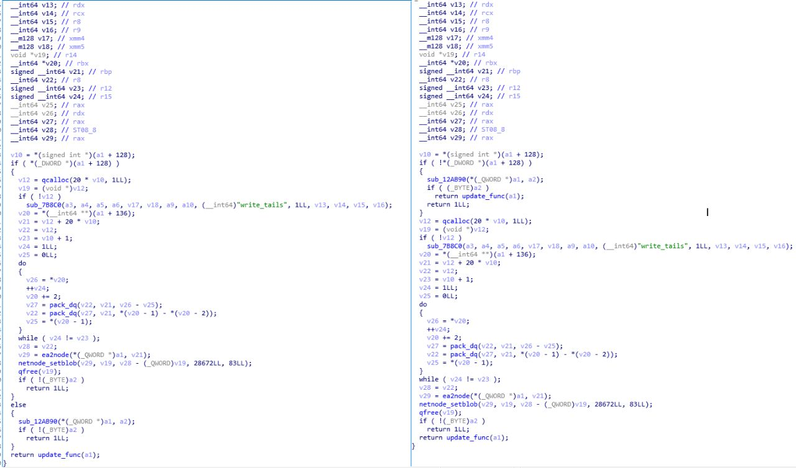
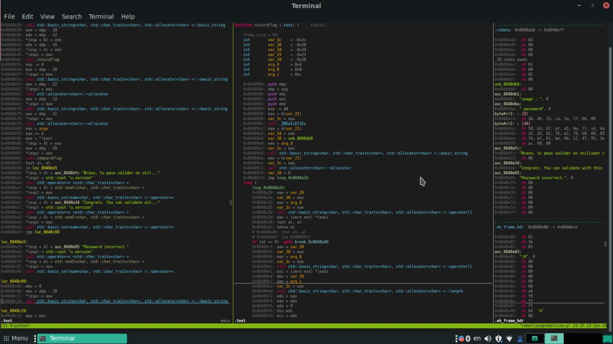

# webware
`2019-06-29 16:36:48`

* https://telegra.ph/Godofwar-Generirovanie-shell-05-17

<blockquote>
Godofwar Генерирование shell

&#35;pentest &#35;bindshell &#35;recerseshell
</blockquote>

<table><tr><td><b>→</b><a href="https://telegra.ph/Godofwar-Generirovanie-shell-05-17">
https://telegra.ph/Godofwar-Generirovanie-shell-05-17
</a>
<blockquote>
t.me/webware Добрый день,Уважаемые Друзья и Форумчане. Много чего тестировал в свободное время,что-то получилось,что-то нет. Остановиться решил на софте,который генерирует файлы с полезной нагрузкой. Инструмент называется Godofwar. Создал его пентестер KING SABRI. Известен он тем,что работал над Tamper-API для Sqlmap. Сам инструмент написан на ruby, а генерация вредоносных reverse shell и bind shell происходит на Java. Собственно, этим он и интересен. Установка: &#35; git clone https://github.com/KINGSABRI/godofwar.git…
</blockquote>
</td></tr></table>

---

# defcon_news
`2019-06-29 13:41:32`

<blockquote>
Cloud Foundry UAA CVE-2019-11268 – Identity zones SQL vulnerability
https://www.reddit.com/r/netsec/comments/c6x5ar/cloud_foundry_uaa_cve201911268_identity_zones_sql/

via /r/netsec - Information Security News &amp; Discussion
</blockquote>

<table><tr><td><b>→</b><a href="https://www.reddit.com/r/netsec/comments/c6x5ar/cloud_foundry_uaa_cve201911268_identity_zones_sql/">
https://www.reddit.com/r/netsec/comments/c6x5ar/cloud_foundry_uaa_cve201911268_identity_zones_sql/
</a>
<blockquote>
0 votes and 0 comments so far on Reddit
</blockquote>
</td></tr></table>

---

# R0_Crew
`2019-06-29 09:59:58`

<blockquote>
Instructions tracing powered by frida https://github.com/iGio90/Hooah-Trace &#35;frida &#35;dukeBarman
</blockquote>

<table><tr><td><b>→</b><a href="https://github.com/iGio90/Hooah-Trace">
https://github.com/iGio90/Hooah-Trace
</a>
<blockquote>
Instructions tracing powered by frida. Contribute to iGio90/Hooah-Trace development by creating an account on GitHub.
</blockquote>
</td></tr></table>

---

# R0_Crew
`2019-06-29 09:59:44`

<blockquote>
Radare2 3.6.0 released https://github.com/radare/radare2/releases/tag/3.6.0 &#35;radare2 &#35;reverse &#35;dukeBarman
</blockquote>

<table><tr><td><b>→</b><a href="https://github.com/radare/radare2/releases/tag/3.6.0">
https://github.com/radare/radare2/releases/tag/3.6.0
</a>
<blockquote>
http://radare.mikelloc.com/release/3.6.0
Release Notes
Version: 3.6.0
From: 3.5.1
To: 3.6.0
Commits: 365
Contributors: 30
Authors

Наташа 44512235+ickromwerk@users.noreply.github.com
Alex Gaines ro...
</blockquote>
</td></tr></table>

---

# defcon_news
`2019-06-29 05:21:11`

<blockquote>
Hexext - A plugin for extending Hexrays 7.0 via microcode - Now with 32 bit support
https://forum.reverse4you.org/t/hexext-a-plugin-for-extending-hexrays-7-0-via-microcode-now-with-32-bit-support/10631/4

via R0 CREW - Latest posts
</blockquote>

<table><tr><td><b>→</b><a href="https://forum.reverse4you.org/t/hexext-a-plugin-for-extending-hexrays-7-0-via-microcode-now-with-32-bit-support/10631/4">
https://forum.reverse4you.org/t/hexext-a-plugin-for-extending-hexrays-7-0-via-microcode-now-with-32-bit-support/10631/4
</a>
<blockquote>
I reversed the microcode format on the leaked Hexrays 7.0. But now fuckin 7.2 has leaked so now I have to support that shit too. Anyway, this plugin makes code prettier. It does a bunch of transformations at different phases of decompilation to clean it up, remove gotos, replace bitops, change bitwise lookup tables into comparisons.  The github with the binary releases is here: https://github.com/chrisps/hexext-releases-IDA7.0  It also includes a dumb of my hexx64 ida database as idc, and a pdb ...
</blockquote>
</td></tr></table>

---

# R0_Crew
`2019-06-28 22:14:03`

<blockquote>
IDAPyHelper is a script for the Interactive Disassembler that helps writing IDAPython scripts and plugins. https://github.com/patois/IDAPyHelper &#35;ida &#35;reverse &#35;dukeBarman
</blockquote>

<table><tr><td><b>→</b><a href="https://github.com/patois/IDAPyHelper">
https://github.com/patois/IDAPyHelper
</a>
<blockquote>
IDAPyHelper is a script for the Interactive Disassembler that helps writing IDAPython scripts and plugins. - patois/IDAPyHelper
</blockquote>
</td></tr></table>

---

# defcon_news
`2019-06-28 20:06:08`

<blockquote>
[XSS] IFrame Buster tools and news
http://seclists.org/fulldisclosure/2019/Jun/48

via Full Disclosure
</blockquote>

<table><tr><td><b>→</b><a href="https://seclists.org/fulldisclosure/2019/Jun/48">
https://seclists.org/fulldisclosure/2019/Jun/48
</a>
</td></tr></table>

---

# R0_Crew
`2019-06-27 15:11:11`

<blockquote>
Analyzing an Integer Overflow in Bitdefender AV (CVE-2017-17408).

Part 1 (Vulnerability): https://www.zerodayinitiative.com/blog/2018/6/19/analyzing-an-integer-overflow-in-bitdefender-av-part-1-the-vulnerability
Part 2 (PoC): https://www.zerodayinitiative.com/blog/2018/6/21/analyzing-an-integer-overflow-in-bitdefender-av-part-2-the-exploit

&#35;expdev &#35;darw1n
</blockquote>

<table><tr><td><b>→</b><a href="https://www.zerodayinitiative.com/blog/2018/6/19/analyzing-an-integer-overflow-in-bitdefender-av-part-1-the-vulnerability">
https://www.zerodayinitiative.com/blog/2018/6/19/analyzing-an-integer-overflow-in-bitdefender-av-part-1-the-vulnerability
</a>
<blockquote>
In the pantheon of software bugs, vulnerabilities that occur in security software are considered more severe than others. We rely of the security software to defend against attackers, so bugs in our defenses could not just allow attackers to cause harm, they could lead to a false sense of security.
</blockquote>
</td></tr></table>

---

# defcon_news
`2019-06-27 11:06:35`

<blockquote>
GNU Binutils CVE-2019-12972 Heap Based Buffer Overflow Vulnerability
http://exploit.kitploit.com/2019/06/gnu-binutils-cve-2019-12972-heap-based.html

via Exploit Collector
</blockquote>

<table><tr><td><b>→</b><a href="https://exploit.kitploit.com/2019/06/gnu-binutils-cve-2019-12972-heap-based.html">
https://exploit.kitploit.com/2019/06/gnu-binutils-cve-2019-12972-heap-based.html
</a>
<blockquote>
Exploit Collector is the ultimate collection of public exploits and exploitable vulnerabilities. Remote/Local Exploits, Shellcode and 0days.
</blockquote>
</td></tr></table>

---

# R0_Crew
`2019-06-26 21:12:14`

<blockquote>
Whitepaper of SGX-ROP
https://arxiv.org/pdf/1902.03256.pdf

SGX-ROP POC
https://github.com/sgxrop/sgxrop

Intel TSX - Additional for the whitepaper
https://software.intel.com/en-us/node/524022

Intel SGX - Additional for the whitepaper
https://software.intel.com/en-us/videos/intel-software-guard-extensions-intel-sgx-webinar

&#35;sgx &#35;rop &#35;expdev &#35;rootkit &#35;gdynamics
</blockquote>

<table><tr><td><b>→</b><a href="https://github.com/sgxrop/sgxrop">
https://github.com/sgxrop/sgxrop
</a>
<blockquote>
The code to the SGX-ROP paper. Contribute to IAIK/sgxrop development by creating an account on GitHub.
</blockquote>
</td></tr></table>

---

# defcon_news
`2019-06-26 12:09:16`

<blockquote>
Linux kernel CVE-2019-12817 Local Privilege Escalation Vulnerability
http://exploit.kitploit.com/2019/06/linux-kernel-cve-2019-12817-local.html

via Exploit Collector
</blockquote>

<table><tr><td><b>→</b><a href="https://exploit.kitploit.com/2019/06/linux-kernel-cve-2019-12817-local.html">
https://exploit.kitploit.com/2019/06/linux-kernel-cve-2019-12817-local.html
</a>
<blockquote>
Exploit Collector is the ultimate collection of public exploits and exploitable vulnerabilities. Remote/Local Exploits, Shellcode and 0days.
</blockquote>
</td></tr></table>

---

# defcon_news
`2019-06-26 11:29:26`

<blockquote>
Уязвимость в AMD SEV, позволяющая определить ключи шифрования
http://www.opennet.ru/opennews/art.shtml?num&#61;50969

via OpenNews.opennet.ru: Проблемы безопасности
</blockquote>

<table><tr><td><b>→</b><a href="http://www.opennet.ru/opennews/art.shtml?num=50969">
http://www.opennet.ru/opennews/art.shtml?num=50969
</a>
<blockquote>
Разработчики из команды Google Cloud выявили уязвимость (CVE-2019-9836) в реализации технологии AMD SEV (Secure Encrypted Virtualization), позволяющую скомпрометировать защищённые при помощи данной технологии данные. AMD SEV на аппаратном уровне обеспечивает прозрачное шифрование памяти виртуальных машин, при которой доступ к расшифрованным данным имеет только текущая гостевая система, а остальные виртуальные машины и гипервизор при попытке обращения к этой памяти получают зашифрованный набор данных.
</blockquote>
</td></tr></table>

---

# defcon_news
`2019-06-26 10:04:11`

<blockquote>
Nessus CVE-2019-3961 Cross Site Scripting Vulnerability
http://exploit.kitploit.com/2019/06/nessus-cve-2019-3961-cross-site.html

via Exploit Collector
</blockquote>

<table><tr><td><b>→</b><a href="https://exploit.kitploit.com/2019/06/nessus-cve-2019-3961-cross-site.html">
https://exploit.kitploit.com/2019/06/nessus-cve-2019-3961-cross-site.html
</a>
<blockquote>
Exploit Collector is the ultimate collection of public exploits and exploitable vulnerabilities. Remote/Local Exploits, Shellcode and 0days.
</blockquote>
</td></tr></table>

---

# defcon_news
`2019-06-26 04:49:26`

<blockquote>
Apache Releases Security Advisory for Apache Tomcat
https://www.us-cert.gov/ncas/current-activity/2019/06/20/Apache-Releases-Security-Advisory-Apache-Tomcat

via CISA Current Activity
</blockquote>

<table><tr><td><b>→</b><a href="https://www.us-cert.gov/ncas/current-activity/2019/06/20/Apache-Releases-Security-Advisory-Apache-Tomcat">
https://www.us-cert.gov/ncas/current-activity/2019/06/20/Apache-Releases-Security-Advisory-Apache-Tomcat
</a>
<blockquote>
Apache has released a security advisory to address a vulnerability in Apache Tomcat. An attacker could exploit this vulnerability to cause a denial-of-service condition.The Cybersecurity and Infrastructure Security Agency (CISA) encourages users and administrators to review the Apache security advisory for CVE-2019-10072 and upgrade to the appropriate version.
</blockquote>
</td></tr></table>

---

# defcon_news
`2019-06-26 04:49:22`

<blockquote>
ISC Releases BIND Security Updates
https://www.us-cert.gov/ncas/current-activity/2019/06/19/ISC-Releases-BIND-Security-Updates

via CISA Current Activity
</blockquote>

<table><tr><td><b>→</b><a href="https://www.us-cert.gov/ncas/current-activity/2019/06/19/ISC-Releases-BIND-Security-Updates">
https://www.us-cert.gov/ncas/current-activity/2019/06/19/ISC-Releases-BIND-Security-Updates
</a>
<blockquote>
The Internet Systems Consortium (ISC) has released updates that address a vulnerability in versions of ISC Berkeley Internet Name Domain (BIND). A remote attacker could exploit this vulnerability to cause a denial-of-service condition.The Cybersecurity and Infrastructure Security Agency (CISA) encourages users and administrators to review the ISC advisory for CVE-2019-6471 and
</blockquote>
</td></tr></table>

---

# defcon_news
`2019-06-25 21:54:44`

<blockquote>
Hexext - A plugin for extending Hexrays 7.0 via microcode
https://forum.reverse4you.org/t/hexext-a-plugin-for-extending-hexrays-7-0-via-microcode/10631/3

via R0 CREW - Latest posts
</blockquote>

<table><tr><td><b>→</b><a href="https://forum.reverse4you.org/t/hexext-a-plugin-for-extending-hexrays-7-0-via-microcode/10631/3">
https://forum.reverse4you.org/t/hexext-a-plugin-for-extending-hexrays-7-0-via-microcode/10631/3
</a>
<blockquote>
I reversed the microcode format on the leaked Hexrays 7.0. But now fuckin 7.2 has leaked so now I have to support that shit too. Anyway, this plugin makes code prettier. It does a bunch of transformations at different phases of decompilation to clean it up, remove gotos, replace bitops, change bitwise lookup tables into comparisons.  The github with the binary releases is here: https://github.com/chrisps/hexext-releases-IDA7.0  It also includes a dumb of my hexx64 ida database as idc, and a pdb ...
</blockquote>
</td></tr></table>

---

# defcon_news
`2019-06-25 21:21:14`

<blockquote>
D-LINK admin password in plain text if &quot;user&quot; or &quot;User&quot; use blank password
http://seclists.org/fulldisclosure/2019/Jun/47

via Full Disclosure
</blockquote>

<table><tr><td><b>→</b><a href="https://seclists.org/fulldisclosure/2019/Jun/47">
https://seclists.org/fulldisclosure/2019/Jun/47
</a>
</td></tr></table>

---

# defcon_news
`2019-06-25 21:21:13`

<blockquote>
AMD-SEV: Platform DH key recovery via invalid curve attack (CVE-2019-9836)
http://seclists.org/fulldisclosure/2019/Jun/46

via Full Disclosure
</blockquote>

<table><tr><td><b>→</b><a href="https://seclists.org/fulldisclosure/2019/Jun/46">
https://seclists.org/fulldisclosure/2019/Jun/46
</a>
</td></tr></table>

---

# defcon_news
`2019-06-25 20:54:39`

<blockquote>
Hexext - A plugin for extending Hexrays 7.0 via microcode
https://forum.reverse4you.org/t/hexext-a-plugin-for-extending-hexrays-7-0-via-microcode/10631/2

via R0 CREW - Latest posts
</blockquote>

<table><tr><td><b>→</b><a href="https://forum.reverse4you.org/t/hexext-a-plugin-for-extending-hexrays-7-0-via-microcode/10631/2">
https://forum.reverse4you.org/t/hexext-a-plugin-for-extending-hexrays-7-0-via-microcode/10631/2
</a>
<blockquote>
I reversed the microcode format on the leaked Hexrays 7.0. But now fuckin 7.2 has leaked so now I have to support that shit too. Anyway, this plugin makes code prettier. It does a bunch of transformations at different phases of decompilation to clean it up, remove gotos, replace bitops, change bitwise lookup tables into comparisons.  The github with the binary releases is here: https://github.com/chrisps/hexext-releases-IDA7.0  It also includes a dumb of my hexx64 ida database as idc, and a pdb ...
</blockquote>
</td></tr></table>

---

# defcon_news
`2019-06-25 15:09:31`

<blockquote>
Using Whitelisting to Remediate an RCE Vulnerability (CVE-2019-2729) in Oracle WebLogic
https://blog.trendmicro.com/trendlabs-security-intelligence/using-whitelisting-to-remediate-an-rce-vulnerability-cve-2019-2729-in-oracle-weblogic/

via TrendLabs Security Intelligence Blog
</blockquote>

<table><tr><td><b>→</b><a href="https://blog.trendmicro.com/trendlabs-security-intelligence/using-whitelisting-to-remediate-an-rce-vulnerability-cve-2019-2729-in-oracle-weblogic/?utm_source=feedburner&utm_medium=feed&utm_campaign=Feed%3A+Anti-MalwareBlog+%28Trendlabs+Security+Intelligence+Blog%29">
https://blog.trendmicro.com/trendlabs-security-intelligence/using-whitelisting-to-remediate-an-rce-vulnerability-cve-2019-2729-in-oracle-weblogic/?utm_source=feedburner&utm_medium=feed&utm_campaign=Feed%3A+Anti-MalwareBlog+%28Trendlabs+Security+Intelligence+Blog%29
</a>
<blockquote>
Oracle WebLogic has recently disclosed and patched remote-code-execution (RCE) vulnerabilities in its software, many of which were due to insecure deserialization. Oracle addressed the most recent vulnerability in an out-of-band security patch.
</blockquote>
</td></tr></table>

---

# reverseengineeringx
`2019-06-25 11:23:41`

<blockquote>
hexext, a plugin to improve the output of the hexrays decompiler through microcode manipulation.

https://github.com/chrisps/hexext-releases-IDA7.0
</blockquote>

---

# defcon_news
`2019-06-25 06:49:30`

<blockquote>
Webex meetings are vulnerable to mitm
http://seclists.org/fulldisclosure/2019/Jun/45

via Full Disclosure
</blockquote>

<table><tr><td><b>→</b><a href="https://seclists.org/fulldisclosure/2019/Jun/45">
https://seclists.org/fulldisclosure/2019/Jun/45
</a>
</td></tr></table>

---

# defcon_news
`2019-06-25 06:49:29`

<blockquote>
BlogEngine.NET 3.3.7 and earlier Directory Traversal + Listing
http://seclists.org/fulldisclosure/2019/Jun/44

via Full Disclosure
</blockquote>

<table><tr><td><b>→</b><a href="https://seclists.org/fulldisclosure/2019/Jun/44">
https://seclists.org/fulldisclosure/2019/Jun/44
</a>
</td></tr></table>

---

# defcon_news
`2019-06-25 02:24:06`

<blockquote>
Hexext - A plugin for extending Hexrays 7.0 via microcode
https://forum.reverse4you.org/t/hexext-a-plugin-for-extending-hexrays-7-0-via-microcode/10631/1

via R0 CREW - Latest posts
</blockquote>

<table><tr><td><b>→</b><a href="https://forum.reverse4you.org/t/hexext-a-plugin-for-extending-hexrays-7-0-via-microcode/10631/1">
https://forum.reverse4you.org/t/hexext-a-plugin-for-extending-hexrays-7-0-via-microcode/10631/1
</a>
<blockquote>
I reversed the microcode format on the leaked Hexrays 7.0. But now fuckin 7.2 has leaked so now I have to support that shit too. Anyway, this plugin makes code prettier. It does a bunch of transformations at different phases of decompilation to clean it up, remove gotos, replace bitops, change bitwise lookup tables into comparisons.  The github with the binary releases is here: https://github.com/chrisps/hexext-releases-IDA7.0  It also includes a dumb of my hexx64 ida database as idc, and a pdb ...
</blockquote>
</td></tr></table>

---

# defcon_news
`2019-06-24 10:59:22`

<blockquote>
XL-19-012 - ABB IDAL HTTP Server Uncontrolled Format String Vulnerability
http://seclists.org/fulldisclosure/2019/Jun/43

via Full Disclosure
</blockquote>

<table><tr><td><b>→</b><a href="https://seclists.org/fulldisclosure/2019/Jun/43">
https://seclists.org/fulldisclosure/2019/Jun/43
</a>
</td></tr></table>

---

# defcon_news
`2019-06-24 10:59:21`

<blockquote>
Fortinet FortiCam FCM-MB40 Vulnerabilities
http://seclists.org/fulldisclosure/2019/Jun/42

via Full Disclosure
</blockquote>

<table><tr><td><b>→</b><a href="https://seclists.org/fulldisclosure/2019/Jun/42">
https://seclists.org/fulldisclosure/2019/Jun/42
</a>
</td></tr></table>

---

# defcon_news
`2019-06-24 10:59:20`

<blockquote>
APPLE-SA-2019-6-20-1 AirPort Base Station Firmware Update 7.8.1
http://seclists.org/fulldisclosure/2019/Jun/41

via Full Disclosure
</blockquote>

<table><tr><td><b>→</b><a href="https://seclists.org/fulldisclosure/2019/Jun/41">
https://seclists.org/fulldisclosure/2019/Jun/41
</a>
</td></tr></table>

---

# defcon_news
`2019-06-24 10:59:19`

<blockquote>
XL-19-011 - ABB IDAL HTTP Server Stack-Based Buffer Overflow Vulnerability
http://seclists.org/fulldisclosure/2019/Jun/40

via Full Disclosure
</blockquote>

<table><tr><td><b>→</b><a href="https://seclists.org/fulldisclosure/2019/Jun/40">
https://seclists.org/fulldisclosure/2019/Jun/40
</a>
</td></tr></table>

---

# defcon_news
`2019-06-24 10:44:24`

<blockquote>
XL-19-010 - ABB IDAL HTTP Server Authentication Bypass Vulnerability
http://seclists.org/fulldisclosure/2019/Jun/39

via Full Disclosure
</blockquote>

<table><tr><td><b>→</b><a href="https://seclists.org/fulldisclosure/2019/Jun/39">
https://seclists.org/fulldisclosure/2019/Jun/39
</a>
</td></tr></table>

---

# defcon_news
`2019-06-24 10:44:23`

<blockquote>
XL-19-009 - ABB HMI Hardcoded Credentials Vulnerability
http://seclists.org/fulldisclosure/2019/Jun/38

via Full Disclosure
</blockquote>

<table><tr><td><b>→</b><a href="https://seclists.org/fulldisclosure/2019/Jun/38">
https://seclists.org/fulldisclosure/2019/Jun/38
</a>
</td></tr></table>

---

# defcon_news
`2019-06-24 10:44:22`

<blockquote>
XL-19-008 - ABB IDAL FTP Server Path Traversal Vulnerability
http://seclists.org/fulldisclosure/2019/Jun/37

via Full Disclosure
</blockquote>

<table><tr><td><b>→</b><a href="https://seclists.org/fulldisclosure/2019/Jun/37">
https://seclists.org/fulldisclosure/2019/Jun/37
</a>
</td></tr></table>

---

# defcon_news
`2019-06-24 10:44:21`

<blockquote>
XL-19-006 - ABB HMI Outdated Software Components
http://seclists.org/fulldisclosure/2019/Jun/36

via Full Disclosure
</blockquote>

<table><tr><td><b>→</b><a href="https://seclists.org/fulldisclosure/2019/Jun/36">
https://seclists.org/fulldisclosure/2019/Jun/36
</a>
</td></tr></table>

---

# defcon_news
`2019-06-24 10:44:20`

<blockquote>
XL-19-007 - ABB IDAL FTP Server Buffer Overflow Vulnerability
http://seclists.org/fulldisclosure/2019/Jun/35

via Full Disclosure
</blockquote>

<table><tr><td><b>→</b><a href="https://seclists.org/fulldisclosure/2019/Jun/35">
https://seclists.org/fulldisclosure/2019/Jun/35
</a>
</td></tr></table>

---

# defcon_news
`2019-06-24 10:44:19`

<blockquote>
XL-19-005 - ABB HMI Absence of Signature Verification Vulnerability
http://seclists.org/fulldisclosure/2019/Jun/34

via Full Disclosure
</blockquote>

<table><tr><td><b>→</b><a href="https://seclists.org/fulldisclosure/2019/Jun/34">
https://seclists.org/fulldisclosure/2019/Jun/34
</a>
</td></tr></table>

---

# defcon_news
`2019-06-24 10:24:14`

<blockquote>
XL-19-004 - ABB IDAL FTP Server Uncontrolled Format String Vulnerability
http://seclists.org/fulldisclosure/2019/Jun/33

via Full Disclosure
</blockquote>

<table><tr><td><b>→</b><a href="https://seclists.org/fulldisclosure/2019/Jun/33">
https://seclists.org/fulldisclosure/2019/Jun/33
</a>
</td></tr></table>

---

# defcon_news
`2019-06-24 10:24:13`

<blockquote>
Re: Multiple Cross-site Scripting Vulnerabilities in Shopware 5.5.6
http://seclists.org/fulldisclosure/2019/Jun/32

via Full Disclosure
</blockquote>

<table><tr><td><b>→</b><a href="https://seclists.org/fulldisclosure/2019/Jun/32">
https://seclists.org/fulldisclosure/2019/Jun/32
</a>
</td></tr></table>

---

# defcon_news
`2019-06-24 10:24:12`

<blockquote>
Quarking Password Manager 3.1.84 - Clickjacking Vulnerability
http://seclists.org/fulldisclosure/2019/Jun/31

via Full Disclosure
</blockquote>

<table><tr><td><b>→</b><a href="https://seclists.org/fulldisclosure/2019/Jun/31">
https://seclists.org/fulldisclosure/2019/Jun/31
</a>
</td></tr></table>

---

# defcon_news
`2019-06-24 10:24:11`

<blockquote>
BlogEngine.Net XXE issues
http://seclists.org/fulldisclosure/2019/Jun/30

via Full Disclosure
</blockquote>

<table><tr><td><b>→</b><a href="https://seclists.org/fulldisclosure/2019/Jun/30">
https://seclists.org/fulldisclosure/2019/Jun/30
</a>
</td></tr></table>

---

# sysadm_in_channel
`2019-06-24 04:24:11`

<blockquote>
Windows Terminal получил возможность работы со вкладками в которых можно запускать разные типы консолей (cmd, wsl, powershell), консоли можно преднастраивать при помощи конфигурационных json файлов. Статус у проекта пока preview, терминал можно установить из ms store в Windows 10 версии 1903 и в сборке 18362.0 или выше.

Ссылка на загрузку присутствует в официальной репе проекта:
https://github.com/microsoft/terminal
</blockquote>

<table><tr><td><b>→</b><a href="https://github.com/microsoft/terminal">
https://github.com/microsoft/terminal
</a>
<blockquote>
The new Windows Terminal and the original Windows console host, all in the same place! - microsoft/terminal
</blockquote>
</td></tr></table>

---

# reverseengineeringx
`2019-06-23 19:38:35`

<blockquote>
PLASMA is an interactive disassembler. It can generate a more readable assembly (pseudo code) with colored syntax. You can write scripts with the available Python api.

https://github.com/plasma-disassembler/plasma
</blockquote>

---

# R0_Crew
`2019-06-23 09:12:51`

<blockquote>
Docker image for building ghidra RE framework from source https://github.com/dukebarman/ghidra-builder &#35;ghidra &#35;reverse &#35;dukeBarman
</blockquote>

<table><tr><td><b>→</b><a href="https://github.com/dukebarman/ghidra-builder">
https://github.com/dukebarman/ghidra-builder
</a>
<blockquote>
Docker image for building ghidra RE framework from source - dukebarman/ghidra-builder
</blockquote>
</td></tr></table>

---

# R0_Crew
`2019-06-23 09:08:00`

<blockquote>
genmc - Display Hex-Rays Microcode https://github.com/patois/genmc &#35;reverse &#35;ida &#35;dukeBarman
</blockquote>

<table><tr><td><b>→</b><a href="https://github.com/patois/genmc">
https://github.com/patois/genmc
</a>
<blockquote>
Display Hex-Rays Microcode. Contribute to patois/genmc development by creating an account on GitHub.
</blockquote>
</td></tr></table>

---

# R0_Crew
`2019-06-23 09:07:41`

<blockquote>
IDA script for vmprotect Windows Api address decoder  https://github.com/saweol/vwaad &#35;ida &#35;reverse &#35;dukeBarman
</blockquote>

<table><tr><td><b>→</b><a href="https://github.com/saweol/vwaad">
https://github.com/saweol/vwaad
</a>
<blockquote>
IDA script  for vmprotect Windows Api address decoder - saweol/vwaad
</blockquote>
</td></tr></table>

---

# defcon_news
`2019-06-22 02:09:42`

<blockquote>
PC-Doctor Toolbox before 7.3 has an Uncontrolled Search Path Element
http://seclists.org/fulldisclosure/2019/Jun/29

via Full Disclosure
</blockquote>

<table><tr><td><b>→</b><a href="https://seclists.org/fulldisclosure/2019/Jun/29">
https://seclists.org/fulldisclosure/2019/Jun/29
</a>
</td></tr></table>

---

# cibsecurity
`2019-06-21 22:57:13`

* https://threatpost.com/microsoft-outlook-android-xss/145924/

<blockquote>
❌ Microsoft Outlook for Android Open to XSS Attacks ❌

A spoofing bug (CVE-2019-1105) can open the door to an email attack chain.

📖 Read

via &quot;Threatpost&quot;.
</blockquote>

<table><tr><td><b>→</b><a href="https://threatpost.com/microsoft-outlook-android-xss/145924/">
https://threatpost.com/microsoft-outlook-android-xss/145924/
</a>
<blockquote>
A spoofing bug (CVE-2019-1105) can open the door to an email attack chain.
</blockquote>
</td></tr></table>

---

# ctfchat
`2019-06-21 18:44:51`

<blockquote>
история обсуждения в гитхабе цтфтайма:
https://github.com/ctftime/ctftime.org/issues/1

https://github.com/ctftime/ctftime.org/issues/40

https://github.com/ctftime/ctftime.org/issues/61
</blockquote>

<table><tr><td><b>→</b><a href="https://github.com/ctftime/ctftime.org/issues/1">
https://github.com/ctftime/ctftime.org/issues/1
</a>
<blockquote>
A lot of people say that rating weight is non-transparent at the moment. What if we allow last years top 10 (20?) teams to decide event ratings?
</blockquote>
</td></tr></table>

---

# defcon_news
`2019-06-21 17:59:18`

<blockquote>
Security Flaw in Pre-Installed Dell Support Software Affects Million of Computers (Analysis of CVE-2019-12280)
https://www.reddit.com/r/netsec/comments/c3b5i1/security_flaw_in_preinstalled_dell_support/

via /r/netsec - Information Security News &amp; Discussion
</blockquote>

<table><tr><td><b>→</b><a href="https://www.reddit.com/r/netsec/comments/c3b5i1/security_flaw_in_preinstalled_dell_support/">
https://www.reddit.com/r/netsec/comments/c3b5i1/security_flaw_in_preinstalled_dell_support/
</a>
<blockquote>
0 votes and 0 comments so far on Reddit
</blockquote>
</td></tr></table>

---

# defcon_news
`2019-06-21 15:54:11`

<blockquote>
CVE-2019-8635: Double Free Vulnerability in Apple macOS Lets Attackers Escalate System Privileges and Execute Arbitrary Code
https://blog.trendmicro.com/trendlabs-security-intelligence/cve-2019-8635-double-free-vulnerability-in-apple-macos-lets-attackers-escalate-system-privileges-and-execute-arbitrary-code/

via TrendLabs Security Intelligence Blog
</blockquote>

<table><tr><td><b>→</b><a href="https://blog.trendmicro.com/trendlabs-security-intelligence/cve-2019-8635-double-free-vulnerability-in-apple-macos-lets-attackers-escalate-system-privileges-and-execute-arbitrary-code">
https://blog.trendmicro.com/trendlabs-security-intelligence/cve-2019-8635-double-free-vulnerability-in-apple-macos-lets-attackers-escalate-system-privileges-and-execute-arbitrary-code
</a>
<blockquote>
We discovered a double free vulnerability (assigned as CVE-2019-8635) in macOS. The vulnerability is caused by a memory corruption flaw in the AMD component.
</blockquote>
</td></tr></table>

---

# defcon_news
`2019-06-21 10:14:24`

<blockquote>
Cisco Prime Service Catalog CVE-2019-1875 Cross Site Scripting Vulnerability
http://exploit.kitploit.com/2019/06/cisco-prime-service-catalog-cve-2019.html

via Exploit Collector
</blockquote>

<table><tr><td><b>→</b><a href="https://exploit.kitploit.com/2019/06/cisco-prime-service-catalog-cve-2019.html">
https://exploit.kitploit.com/2019/06/cisco-prime-service-catalog-cve-2019.html
</a>
<blockquote>
Exploit Collector is the ultimate collection of public exploits and exploitable vulnerabilities. Remote/Local Exploits, Shellcode and 0days.
</blockquote>
</td></tr></table>

---

# defcon_news
`2019-06-21 04:39:36`

<blockquote>
Apache Releases Security Advisory for Apache Tomcat
https://www.us-cert.gov/ncas/current-activity/2019/06/20/Apache-Releases-Security-Advisory-Apache-Tomcat

via US-CERT Current Activity
</blockquote>

<table><tr><td><b>→</b><a href="https://www.us-cert.gov/ncas/current-activity/2019/06/20/Apache-Releases-Security-Advisory-Apache-Tomcat">
https://www.us-cert.gov/ncas/current-activity/2019/06/20/Apache-Releases-Security-Advisory-Apache-Tomcat
</a>
<blockquote>
Apache has released a security advisory to address a vulnerability in Apache Tomcat. An attacker could exploit this vulnerability to cause a denial-of-service condition.The Cybersecurity and Infrastructure Security Agency (CISA) encourages users and administrators to review the Apache security advisory for CVE-2019-10072 and upgrade to the appropriate version.
</blockquote>
</td></tr></table>

---

# defcon_news
`2019-06-20 22:44:34`

<blockquote>
Important Flaw in Outlook App for Android Affects Over 100 Millions Users
https://thehackernews.com/2019/06/outlook-app-android.html

via The Hacker News
</blockquote>

<table><tr><td><b>→</b><a href="https://thehackernews.com/2019/06/outlook-app-android.html">
https://thehackernews.com/2019/06/outlook-app-android.html
</a>
<blockquote>
Microsoft's Outlook App for Android Patches Important Security Vulnerability (CVE-2019-1105) 

Affects Over 100 Millions of Users
</blockquote>
</td></tr></table>

---

# defcon_news
`2019-06-20 21:24:30`

<blockquote>
В Firefox 67.0.4 и 60.7.2 устранена ещё одна 0-day уязвимость
http://www.opennet.ru/opennews/art.shtml?num&#61;50913

via OpenNews.opennet.ru: Проблемы безопасности
</blockquote>

<table><tr><td><b>→</b><a href="https://www.opennet.ru/opennews/art.shtml?num=50913">
https://www.opennet.ru/opennews/art.shtml?num=50913
</a>
<blockquote>
Следом за выпусками Firefox 67.0.3 и 60.7.1 опубликованы дополнительные корректирующие релизы 67.0.4 и 60.7.2, в которых устранена вторая 0-day уязвимость (CVE-2019-11708), позволяющая обойти механизм sandbox-изоляции. Проблема использует манипуляцию с IPC-вызовом Prompt:Open для открытия в родительском процессе, в котором не применяется sandbox, web-контента, выбранного дочерним процессом. В сочетании с другой уязвимостью данная проблема позволяет обойти все уровни защиты и организовать выполнение кода в системе.
</blockquote>
</td></tr></table>

---

# cibsecurity
`2019-06-20 19:02:35`

* https://threatpost.com/tor-browser-update-critical-flaw/145857/

<blockquote>
❌ Tor Browser Issues Update for Critical System Takeover Flaw ❌

The update patches critical flaw (CVE-2019-11707), a type confusion vulnerability in the Mozilla Firefox code that Tor uses.

📖 Read

via &quot;Threatpost&quot;.
</blockquote>

<table><tr><td><b>→</b><a href="https://threatpost.com/tor-browser-update-critical-flaw/145857/?utm_source=dlvr.it&utm_medium=twitter">
https://threatpost.com/tor-browser-update-critical-flaw/145857/?utm_source=dlvr.it&utm_medium=twitter
</a>
<blockquote>
The update patches critical flaw (CVE-2019-11707), a type confusion vulnerability in the Mozilla Firefox code that Tor uses.
</blockquote>
</td></tr></table>

---

# MPSIEMChat
`2019-06-20 12:08:34`

<blockquote>
https://github.com/feedb/MPSiem_addons/blob/master/import%20blacklists%20in%20list/import_bl.py
</blockquote>

<table><tr><td><b>→</b><a href="https://github.com/feedb/MPSiem_addons/blob/master/import%20blacklists%20in%20list/import_bl.py">
https://github.com/feedb/MPSiem_addons/blob/master/import%20blacklists%20in%20list/import_bl.py
</a>
<blockquote>
реп полезностей для PT MaxPatrol SIEM. Contribute to feedb/MPSiem_addons development by creating an account on GitHub.
</blockquote>
</td></tr></table>

---

# defcon_news
`2019-06-20 05:19:20`

<blockquote>
ISC Releases BIND Security Updates
https://www.us-cert.gov/ncas/current-activity/2019/06/19/ISC-Releases-BIND-Security-Updates

via US-CERT Current Activity
</blockquote>

<table><tr><td><b>→</b><a href="https://www.us-cert.gov/ncas/current-activity/2019/06/19/ISC-Releases-BIND-Security-Updates">
https://www.us-cert.gov/ncas/current-activity/2019/06/19/ISC-Releases-BIND-Security-Updates
</a>
<blockquote>
The Internet Systems Consortium (ISC) has released updates that address a vulnerability in versions of ISC Berkeley Internet Name Domain (BIND). A remote attacker could exploit this vulnerability to cause a denial-of-service condition.The Cybersecurity and Infrastructure Security Agency (CISA) encourages users and administrators to review the ISC advisory for CVE-2019-6471 and
</blockquote>
</td></tr></table>

---

# defcon_news
`2019-06-19 21:49:14`

<blockquote>
New Critical Oracle WebLogic Flaw Under Active Attack — Patch Now
https://thehackernews.com/2019/06/oracle-weblogic-vulnerability.html

via The Hacker News
</blockquote>

<table><tr><td><b>→</b><a href="https://thehackernews.com/2019/06/oracle-weblogic-vulnerability.html">
https://thehackernews.com/2019/06/oracle-weblogic-vulnerability.html
</a>
<blockquote>
Oracle has released security update to patch a critical deserialization vulnerability (CVE-2019-2729) in WebLogic servers
</blockquote>
</td></tr></table>

---

# defcon_news
`2019-06-19 18:04:55`

<blockquote>
Symantec DLP CVE-2019-9701 Cross Site Scripting Vulnerability
http://exploit.kitploit.com/2019/06/symantec-dlp-cve-2019-9701-cross-site.html

via Exploit Collector
</blockquote>

<table><tr><td><b>→</b><a href="https://exploit.kitploit.com/2019/06/symantec-dlp-cve-2019-9701-cross-site.html">
https://exploit.kitploit.com/2019/06/symantec-dlp-cve-2019-9701-cross-site.html
</a>
<blockquote>
Exploit Collector is the ultimate collection of public exploits and exploitable vulnerabilities. Remote/Local Exploits, Shellcode and 0days.
</blockquote>
</td></tr></table>

---

# defcon_news
`2019-06-19 18:04:54`

<blockquote>
Oracle WebLogic Server Deserialization CVE-2019-2729 Remote Code Execution Vulnerability
http://exploit.kitploit.com/2019/06/oracle-weblogic-server-deserialization.html

via Exploit Collector
</blockquote>

<table><tr><td><b>→</b><a href="https://exploit.kitploit.com/2019/06/oracle-weblogic-server-deserialization.html">
https://exploit.kitploit.com/2019/06/oracle-weblogic-server-deserialization.html
</a>
<blockquote>
Exploit Collector is the ultimate collection of public exploits and exploitable vulnerabilities. Remote/Local Exploits, Shellcode and 0days.
</blockquote>
</td></tr></table>

---

# defcon_news
`2019-06-19 16:39:41`

<blockquote>
Samba Releases Security Updates
https://www.us-cert.gov/ncas/current-activity/2019/06/19/Samba-Releases-Security-Updates

via US-CERT Current Activity
</blockquote>

<table><tr><td><b>→</b><a href="https://www.us-cert.gov/ncas/current-activity/2019/06/19/Samba-Releases-Security-Updates">
https://www.us-cert.gov/ncas/current-activity/2019/06/19/Samba-Releases-Security-Updates
</a>
<blockquote>
The Samba Team has released security updates to address vulnerabilities in Samba 4.9 and all versions of Samba from 4.10 onward. An attacker could exploit these vulnerabilities to cause a denial-of-service condition.The Cybersecurity and Infrastructure Security Agency (CISA) encourages users and administrators to review the Samba Security Announcements for CVE-2019-12435 and
</blockquote>
</td></tr></table>

---

# defcon_news
`2019-06-19 16:24:30`

<blockquote>
Critical Actively Exploited WebLogic Flaw Patched CVE-2019-2729, (Wed, Jun 19th)
https://isc.sans.edu/diary/rss/25050

via SANS Internet Storm Center, InfoCON: green
</blockquote>

<table><tr><td><b>→</b><a href="https://isc.sans.edu/diary/rss/25050">
https://isc.sans.edu/diary/rss/25050
</a>
<blockquote>
Critical Actively Exploited WebLogic Flaw Patched  CVE-2019-2729, Author: Johannes Ullrich
</blockquote>
</td></tr></table>

---

# defcon_news
`2019-06-19 15:34:15`

<blockquote>
Rdpscan - A Quick Scanner For The CVE-2019-0708 &quot;BlueKeep&quot; Vulnerability
http://www.kitploit.com/2019/06/rdpscan-quick-scanner-for-cve-2019-0708.html

via KitPloit - PenTest Tools!
</blockquote>

<table><tr><td><b>→</b><a href="https://www.kitploit.com/2019/06/rdpscan-quick-scanner-for-cve-2019-0708.html">
https://www.kitploit.com/2019/06/rdpscan-quick-scanner-for-cve-2019-0708.html
</a>
</td></tr></table>

---

# exploitex
`2019-06-19 13:05:36`

* https://telegra.ph/file/bff17fde5cd9a39f8c984.jpg

<blockquote>
​​PassHunt

Этот скрипт на Python поможет найти дефолтный пароль от любого сетевого устройства домашнего или производственного уровня. В базе приложения хранится достаточное количество паролей (2084 штуки) для входа на разные роутеры известных производителей. Устанавливается это чудо с помощью четырех команд:

git clone https://github.com/Viralmaniar/Passhunt.git

cd Passhunt

pip3 install -r requirements.txt

python3 Passhunt.py
</blockquote>

<table><tr><td><b>→</b><a href="https://telegra.ph/file/bff17fde5cd9a39f8c984.jpg">
https://telegra.ph/file/bff17fde5cd9a39f8c984.jpg
</a>
</td></tr></table>

---

# reverseengineeringx
`2019-06-19 09:29:46`

<blockquote>
Karta - source code assisted fast binary matching plugin for IDA

https://github.com/CheckPointSW/Karta
</blockquote>

<table><tr><td><b>→</b><a href="https://github.com/CheckPointSW/Karta">
https://github.com/CheckPointSW/Karta
</a>
<blockquote>
Karta - source code assisted fast binary matching plugin for IDA - CheckPointSW/Karta
</blockquote>
</td></tr></table>

---

# defcon_news
`2019-06-19 09:24:18`

<blockquote>
Mozilla Firefox and Firefox ESR CVE-2019-11707 Denial of Service Vulnerability
http://exploit.kitploit.com/2019/06/mozilla-firefox-and-firefox-esr-cve.html

via Exploit Collector
</blockquote>

<table><tr><td><b>→</b><a href="https://exploit.kitploit.com/2019/06/mozilla-firefox-and-firefox-esr-cve.html">
https://exploit.kitploit.com/2019/06/mozilla-firefox-and-firefox-esr-cve.html
</a>
<blockquote>
Exploit Collector is the ultimate collection of public exploits and exploitable vulnerabilities. Remote/Local Exploits, Shellcode and 0days.
</blockquote>
</td></tr></table>

---

# defcon_news
`2019-06-19 06:24:11`

<blockquote>
Firefox Releases Critical Patch Update to Stop Ongoing Zero-Day Attacks
https://thehackernews.com/2019/06/mozilla-firefox-patch-update.html

via The Hacker News
</blockquote>

<table><tr><td><b>→</b><a href="https://thehackernews.com/2019/06/mozilla-firefox-patch-update.html">
https://thehackernews.com/2019/06/mozilla-firefox-patch-update.html
</a>
<blockquote>
Firefox Releases Patch Update to Fix a Critical Flaw (CVE-2019-11707) and Stop Ongoing Zero-Day Attacks
</blockquote>
</td></tr></table>

---

# defcon_news
`2019-06-18 23:14:10`

<blockquote>
Обновления Firefox 67.0.3 и 60.7.1 с устранением уязвимости
http://www.opennet.ru/opennews/art.shtml?num&#61;50897

via OpenNews.opennet.ru: Проблемы безопасности
</blockquote>

<table><tr><td><b>→</b><a href="https://www.opennet.ru/opennews/art.shtml?num=50897">
https://www.opennet.ru/opennews/art.shtml?num=50897
</a>
<blockquote>
Опубликованы корректирующие выпуски Firefox 67.0.3 и 60.7.1, в которых устранена критическая уязвимость (CVE-2019-11707), позволяющая вызвать крах браузера при выполнении вредоносного JavaScript-кода. Уязвимость вызвана проблемой с обработкой типов в методе Array.pop. Доступ к детальной информации пока ограничен. Также не ясно ограничивается ли проблема заявленным крахом или потенциально может быть использована для организации выполнения кода злоумышленника.
</blockquote>
</td></tr></table>

---

# sysadm_in_channel
`2019-06-18 13:43:22`

<blockquote>
Уязвимости в ядре Linux делают возможным удаленные DoS-атаки

По этому поводу Red Hat опубликовал описание проблем:

https://access.redhat.com/security/vulnerabilities/tcpsack

Netflix:
https://github.com/Netflix/security-bulletins/blob/master/advisories/third-party/2019-001.md

AWS:
https://aws.amazon.com/security/security-bulletins/AWS-2019-005/

Аналогичные нотации были выпущены для Ubuntu:
https://wiki.ubuntu.com/SecurityTeam/KnowledgeBase/SACKPanic

Debian:
https://security-tracker.debian.org/tracker/CVE-2019-11477

Arch:
https://security.archlinux.org/AVG-983
</blockquote>

<table><tr><td><b>→</b><a href="https://access.redhat.com/security/vulnerabilities/tcpsack">
https://access.redhat.com/security/vulnerabilities/tcpsack
</a>
<blockquote>
The Red Hat Customer Portal delivers the knowledge, expertise, and guidance available through your Red Hat subscription.
</blockquote>
</td></tr></table>

---

# defcon_news
`2019-06-18 11:34:08`

<blockquote>
CVE-2019-12323 / HC10 HC.Server Service 10.14 / Remote Invalid Pointer Write
http://seclists.org/fulldisclosure/2019/Jun/28

via Full Disclosure
</blockquote>

<table><tr><td><b>→</b><a href="https://seclists.org/fulldisclosure/2019/Jun/28">
https://seclists.org/fulldisclosure/2019/Jun/28
</a>
</td></tr></table>

---

# defcon_news
`2019-06-18 11:34:07`

<blockquote>
Microsoft Word (2016) / Deceptive File Reference Vuln
http://seclists.org/fulldisclosure/2019/Jun/27

via Full Disclosure
</blockquote>

<table><tr><td><b>→</b><a href="https://seclists.org/fulldisclosure/2019/Jun/27">
https://seclists.org/fulldisclosure/2019/Jun/27
</a>
</td></tr></table>

---

# defcon_news
`2019-06-18 11:34:06`

<blockquote>
BlogEngine.NET Directory traversal + RCE
http://seclists.org/fulldisclosure/2019/Jun/26

via Full Disclosure
</blockquote>

<table><tr><td><b>→</b><a href="https://seclists.org/fulldisclosure/2019/Jun/26">
https://seclists.org/fulldisclosure/2019/Jun/26
</a>
</td></tr></table>

---

# reverseengineeringx
`2019-06-18 08:35:02`

<blockquote>
Xori is an automation-ready disassembly and static analysis library for PE32, 32+ and shellcode

https://github.com/endgameinc/xori
</blockquote>

<table><tr><td><b>→</b><a href="https://github.com/endgameinc/xori">
https://github.com/endgameinc/xori
</a>
<blockquote>
Xori is an automation-ready disassembly and static analysis library for PE32, 32+ and shellcode - endgameinc/xori
</blockquote>
</td></tr></table>

---

# defcon_news
`2019-06-17 23:08:13`

<blockquote>
https://access.redhat.com/security/vulnerabilities/tcpsack
</blockquote>

<table><tr><td><b>→</b><a href="https://access.redhat.com/security/vulnerabilities/tcpsack">
https://access.redhat.com/security/vulnerabilities/tcpsack
</a>
<blockquote>
The Red Hat Customer Portal delivers the knowledge, expertise, and guidance available through your Red Hat subscription.
</blockquote>
</td></tr></table>

---

# defcon_news
`2019-06-17 22:48:24`

<blockquote>
SACK Panic - CVE-2019-11477 - Multiple TCP-based remote denial of service issues
https://www.reddit.com/r/netsec/comments/c1qng5/sack_panic_cve201911477_multiple_tcpbased_remote/

via /r/netsec - Information Security News &amp; Discussion
</blockquote>

<table><tr><td><b>→</b><a href="https://www.reddit.com/r/netsec/comments/c1qng5/sack_panic_cve201911477_multiple_tcpbased_remote/">
https://www.reddit.com/r/netsec/comments/c1qng5/sack_panic_cve201911477_multiple_tcpbased_remote/
</a>
<blockquote>
186 votes and 30 comments so far on Reddit
</blockquote>
</td></tr></table>

---

# R0_Crew
`2019-06-15 19:06:43`

<blockquote>
Ret-sync now supports Ghidra (syncing with popular debuggers) https://github.com/bootleg/ret-sync &#35;ghidra &#35;reverse &#35;debugger &#35;dukeBarman
</blockquote>

<table><tr><td><b>→</b><a href="https://github.com/bootleg/ret-sync">
https://github.com/bootleg/ret-sync
</a>
<blockquote>
ret-sync is a set of plugins that helps to synchronize a debugging session (WinDbg/GDB/LLDB/OllyDbg2/x64dbg) with IDA/Ghidra/Binary Ninja disassemblers. - bootleg/ret-sync
</blockquote>
</td></tr></table>

---

# defcon_news
`2019-06-15 10:03:10`

<blockquote>
AttackDetection/cve-2019-0708.rules which detect possible exploitation under TLS
https://www.reddit.com/r/netsec/comments/c0uegc/attackdetectioncve20190708rules_which_detect/

via /r/netsec - Information Security News &amp; Discussion
</blockquote>

<table><tr><td><b>→</b><a href="https://www.reddit.com/r/netsec/comments/c0uegc/attackdetectioncve20190708rules_which_detect/">
https://www.reddit.com/r/netsec/comments/c0uegc/attackdetectioncve20190708rules_which_detect/
</a>
<blockquote>
0 votes and 0 comments so far on Reddit
</blockquote>
</td></tr></table>

---

# defcon_news
`2019-06-14 23:20:10`

<blockquote>
DSA-2019-092: Dell EMC Avamar Security Update for ADMe Web UI Vulnerability
http://seclists.org/fulldisclosure/2019/Jun/25

via Full Disclosure
</blockquote>

<table><tr><td><b>→</b><a href="https://seclists.org/fulldisclosure/2019/Jun/25">
https://seclists.org/fulldisclosure/2019/Jun/25
</a>
</td></tr></table>

---

# defcon_news
`2019-06-14 23:20:09`

<blockquote>
X41 D-Sec GmbH Security Advisory X41-2019-004: Type confusion in Thunderbird
http://seclists.org/fulldisclosure/2019/Jun/24

via Full Disclosure
</blockquote>

<table><tr><td><b>→</b><a href="https://seclists.org/fulldisclosure/2019/Jun/24">
https://seclists.org/fulldisclosure/2019/Jun/24
</a>
</td></tr></table>

---

# defcon_news
`2019-06-14 22:50:25`

<blockquote>
[Project] Open frame to the main.
http://seclists.org/fulldisclosure/2019/Jun/23

via Full Disclosure
</blockquote>

<table><tr><td><b>→</b><a href="https://seclists.org/fulldisclosure/2019/Jun/23">
https://seclists.org/fulldisclosure/2019/Jun/23
</a>
</td></tr></table>

---

# defcon_news
`2019-06-14 22:50:24`

<blockquote>
X41 D-Sec GmbH Security Advisory X41-2019-003: Stack-based buffer overflow in Thunderbird
http://seclists.org/fulldisclosure/2019/Jun/22

via Full Disclosure
</blockquote>

<table><tr><td><b>→</b><a href="https://seclists.org/fulldisclosure/2019/Jun/22">
https://seclists.org/fulldisclosure/2019/Jun/22
</a>
</td></tr></table>

---

# defcon_news
`2019-06-14 22:50:20`

<blockquote>
X41 D-Sec GmbH Security Advisory X41-2019-002: Heap-based buffer overflow in Thunderbird
http://seclists.org/fulldisclosure/2019/Jun/21

via Full Disclosure
</blockquote>

<table><tr><td><b>→</b><a href="https://seclists.org/fulldisclosure/2019/Jun/21">
https://seclists.org/fulldisclosure/2019/Jun/21
</a>
</td></tr></table>

---

# defcon_news
`2019-06-14 22:50:19`

<blockquote>
X41 D-Sec GmbH Security Advisory X41-2019-001: Heap-based buffer overflow in Thunderbird
http://seclists.org/fulldisclosure/2019/Jun/20

via Full Disclosure
</blockquote>

<table><tr><td><b>→</b><a href="https://seclists.org/fulldisclosure/2019/Jun/20">
https://seclists.org/fulldisclosure/2019/Jun/20
</a>
</td></tr></table>

---

# defcon_news
`2019-06-14 19:30:30`

<blockquote>
Злоумышленники опробуют новый эксплойт для Exim
https://threatpost.ru/researchers-observe-first-attempts-to-exploit-new-exim-bug-at-scale/33094/

via Threatpost
</blockquote>

<table><tr><td><b>→</b><a href="https://threatpost.ru/researchers-observe-first-attempts-to-exploit-new-exim-bug-at-scale/33094/">
https://threatpost.ru/researchers-observe-first-attempts-to-exploit-new-exim-bug-at-scale/33094/
</a>
<blockquote>
Уязвимость CVE-2019-10149 в популярном почтовом агенте пытаются использовать как минимум две группы хакеров.
</blockquote>
</td></tr></table>

---

# defcon_news
`2019-06-14 13:05:35`

<blockquote>
[SE-2019-01] Java Card vulnerabilities (post shutdown release)
http://seclists.org/fulldisclosure/2019/Jun/19

via Full Disclosure
</blockquote>

<table><tr><td><b>→</b><a href="https://seclists.org/fulldisclosure/2019/Jun/19">
https://seclists.org/fulldisclosure/2019/Jun/19
</a>
</td></tr></table>

---

# defcon_news
`2019-06-14 10:01:18`

<blockquote>
Массовая атака на уязвимые почтовые серверы на основе Exim
http://www.opennet.ru/opennews/art.shtml?num&#61;50870

via OpenNews.opennet.ru: Проблемы безопасности
</blockquote>

<table><tr><td><b>→</b><a href="https://www.opennet.ru/opennews/art.shtml?num=50870">
https://www.opennet.ru/opennews/art.shtml?num=50870
</a>
<blockquote>
Исследователи безопасности из компании Cybereason предупредили администраторов почтовых серверов о выявлении массовой автоматизированной атаки, эксплуатирующей критическую уязвимость (CVE-2019-10149) в Exim, выявленную на прошлой неделе. В ходе атаки злоумышленники добиваются выполнения своего кода с правами root и устанавливают на сервер вредоносное ПО для майнинга криптовалют.
</blockquote>
</td></tr></table>

---

# defcon_news
`2019-06-14 01:35:15`

<blockquote>
Exploiting CVE-2019-1040 - Combining relay vulnerabilities for RCE and Domain Admin
https://www.reddit.com/r/netsec/comments/c0bg99/exploiting_cve20191040_combining_relay/

via /r/netsec - Information Security News &amp; Discussion
</blockquote>

<table><tr><td><b>→</b><a href="https://www.reddit.com/r/netsec/comments/c0bg99/exploiting_cve20191040_combining_relay/">
https://www.reddit.com/r/netsec/comments/c0bg99/exploiting_cve20191040_combining_relay/
</a>
<blockquote>
0 votes and 0 comments so far on Reddit
</blockquote>
</td></tr></table>

---

# defcon_news
`2019-06-13 23:05:26`

<blockquote>
Exim Releases Security Patches
https://www.us-cert.gov/ncas/current-activity/2019/06/13/Exim-Releases-Security-Patches

via US-CERT Current Activity
</blockquote>

<table><tr><td><b>→</b><a href="https://www.us-cert.gov/ncas/current-activity/2019/06/13/Exim-Releases-Security-Patches">
https://www.us-cert.gov/ncas/current-activity/2019/06/13/Exim-Releases-Security-Patches
</a>
<blockquote>
Exim has released patches to address a vulnerability affecting Exim versions 4.87–4.91. A remote attacker could exploit this vulnerability to take control of an affected email server. This vulnerability was detected in exploits in the wild.The Cybersecurity and Infrastructure Security Agency (CISA) encourages users and administrators to review the Exim CVE-2019-10149 page and
</blockquote>
</td></tr></table>

---

# dataleak
`2019-06-13 20:18:53`

<blockquote>
Поправка к новости про Venmo (https://t.me/dataleak/1099)! 👇

Все-таки это оказалась не утечка из открытой MongoDB, а собранные записи через публичный API.

Скачать можно по этой ссылке:
https://github.com/sa7mon/venmo-data
</blockquote>

<table><tr><td><b>→</b><a href="https://t.me/dataleak/1099">
https://t.me/dataleak/1099
</a>
<blockquote>
В свободном доступе появились данные по транзакциям пользователей приложения Venmo. Venmo (принадлежит PayPal) это сервис социальных платежей, который используют миллионы людей для совершения платежей и перечисления средств друзьям и родственникам.

Данные были скачены из базы MongoDB, явно оставленной Venmo без аутентификации. 🙈

Доступно 7,076,585 записей в файле формата BSON, общим размером 10,3 Гб. Все платежи относятся к периоду с июля 2018 по февраль 2019.

По каждой транзакции доступна следующая информация:

🌵 логин пользователя, его имя и фамилия
🌵 размер платежа
🌵 адрес электронной почты
🌵 номер телефона
🌵 ссылка на фотографию из профиля
🌵 дата

Следует отметить, что данная база — это не компиляция из публичных транзакций, доступных каждому по ссылке https://venmo.com/api/v5/public, в ней содержатся не публичные транзакции пользователей Venmo.
</blockquote>
</td></tr></table>

---

# defcon_news
`2019-06-13 11:10:17`

<blockquote>
Drop the MIC - CVE-2019-1040
https://www.reddit.com/r/netsec/comments/c02e6w/drop_the_mic_cve20191040/

via /r/netsec - Information Security News &amp; Discussion
</blockquote>

<table><tr><td><b>→</b><a href="https://www.reddit.com/r/netsec/comments/c02e6w/drop_the_mic_cve20191040/?utm_source=dlvr.it&utm_medium=twitter">
https://www.reddit.com/r/netsec/comments/c02e6w/drop_the_mic_cve20191040/?utm_source=dlvr.it&utm_medium=twitter
</a>
<blockquote>
7 votes and 0 comments so far on Reddit
</blockquote>
</td></tr></table>

---

# defcon_news
`2019-06-13 10:10:18`

<blockquote>
Microsoft Windows Installer CVE-2019-0973 DLL Loading Local Privilege Escalation Vulnerability
http://exploit.kitploit.com/2019/06/microsoft-windows-installer-cve-2019.html

via Exploit Collector
</blockquote>

<table><tr><td><b>→</b><a href="https://exploit.kitploit.com/2019/06/microsoft-windows-installer-cve-2019.html">
https://exploit.kitploit.com/2019/06/microsoft-windows-installer-cve-2019.html
</a>
<blockquote>
Exploit Collector is the ultimate collection of public exploits and exploitable vulnerabilities. Remote/Local Exploits, Shellcode and 0days.
</blockquote>
</td></tr></table>

---

# defcon_news
`2019-06-13 10:10:17`

<blockquote>
Microsoft Windows CVE-2019-1064 Local Privilege Escalation Vulnerability
http://exploit.kitploit.com/2019/06/microsoft-windows-cve-2019-1064-local.html

via Exploit Collector
</blockquote>

<table><tr><td><b>→</b><a href="https://exploit.kitploit.com/2019/06/microsoft-windows-cve-2019-1064-local.html">
https://exploit.kitploit.com/2019/06/microsoft-windows-cve-2019-1064-local.html
</a>
<blockquote>
Exploit Collector is the ultimate collection of public exploits and exploitable vulnerabilities. Remote/Local Exploits, Shellcode and 0days.
</blockquote>
</td></tr></table>

---

# defcon_news
`2019-06-13 10:10:16`

<blockquote>
Microsoft Windows Shell CVE-2019-1053 Local Privilege Escalation Vulnerability
http://exploit.kitploit.com/2019/06/microsoft-windows-shell-cve-2019-1053.html

via Exploit Collector
</blockquote>

<table><tr><td><b>→</b><a href="https://exploit.kitploit.com/2019/06/microsoft-windows-shell-cve-2019-1053.html">
https://exploit.kitploit.com/2019/06/microsoft-windows-shell-cve-2019-1053.html
</a>
<blockquote>
Exploit Collector is the ultimate collection of public exploits and exploitable vulnerabilities. Remote/Local Exploits, Shellcode and 0days.
</blockquote>
</td></tr></table>

---

# defcon_news
`2019-06-13 09:20:18`

<blockquote>
SEC Consult SA-20190612-0 :: Multiple vulnerabilities in WAGO 852 Industrial Managed Switch Series
http://seclists.org/fulldisclosure/2019/Jun/18

via Full Disclosure
</blockquote>

<table><tr><td><b>→</b><a href="https://seclists.org/fulldisclosure/2019/Jun/18">
https://seclists.org/fulldisclosure/2019/Jun/18
</a>
</td></tr></table>

---

# defcon_news
`2019-06-12 23:45:29`

<blockquote>
Уязвимость в Vim, приводящая к выполнению кода при открытии вредоносного файла
http://www.opennet.ru/opennews/art.shtml?num&#61;50857

via OpenNews.opennet.ru: Проблемы безопасности
</blockquote>

<table><tr><td><b>→</b><a href="https://www.opennet.ru/opennews/art.shtml?num=50857">
https://www.opennet.ru/opennews/art.shtml?num=50857
</a>
<blockquote>
В текстовых редакторах Vim и Neovim найдена уязвимость (CVE-2019-12735), позволяющая выполнить произвольный код при открытии специально оформленного файла. Проблема проявляется при активности включенного по умолчанию режима modeline (&quot;:set modeline&quot;), который позволяет определить в обрабатываемом файле опции редактирования. Уязвимость устранена в выпусках Vim 8.1.1365 и Neovim 0.3.6.
</blockquote>
</td></tr></table>

---

# defcon_news
`2019-06-12 20:25:24`

<blockquote>
[SYSS-2019-015]: Logitech R700 Laser Presentation Remote - Keystroke Injection Vulnerability
http://seclists.org/fulldisclosure/2019/Jun/15

via Full Disclosure
</blockquote>

<table><tr><td><b>→</b><a href="https://seclists.org/fulldisclosure/2019/Jun/15">
https://seclists.org/fulldisclosure/2019/Jun/15
</a>
</td></tr></table>

---

# defcon_news
`2019-06-12 20:25:23`

<blockquote>
[SYSS-2019-008]: Inateck 2.4 GHz Wearable Wireless Presenter WP2002 - Keystroke Injection Vulnerability
http://seclists.org/fulldisclosure/2019/Jun/14

via Full Disclosure
</blockquote>

<table><tr><td><b>→</b><a href="https://seclists.org/fulldisclosure/2019/Jun/14">
https://seclists.org/fulldisclosure/2019/Jun/14
</a>
</td></tr></table>

---

# defcon_news
`2019-06-12 20:25:22`

<blockquote>
Rapid7’s Windows InsightIDR Agent: Local Privilege Escalation
http://seclists.org/fulldisclosure/2019/Jun/13

via Full Disclosure
</blockquote>

<table><tr><td><b>→</b><a href="https://seclists.org/fulldisclosure/2019/Jun/13">
https://seclists.org/fulldisclosure/2019/Jun/13
</a>
</td></tr></table>

---

# defcon_news
`2019-06-12 20:25:21`

<blockquote>
Multiple Cross-site Scripting Vulnerabilities in Shopware 5.5.6
http://seclists.org/fulldisclosure/2019/Jun/12

via Full Disclosure
</blockquote>

<table><tr><td><b>→</b><a href="https://seclists.org/fulldisclosure/2019/Jun/12">
https://seclists.org/fulldisclosure/2019/Jun/12
</a>
</td></tr></table>

---

# defcon_news
`2019-06-12 20:25:17`

<blockquote>
[ Tool ] Linux kernel module generator for custom rules with Netfilter hooking.
http://seclists.org/fulldisclosure/2019/Jun/11

via Full Disclosure
</blockquote>

<table><tr><td><b>→</b><a href="https://seclists.org/fulldisclosure/2019/Jun/11">
https://seclists.org/fulldisclosure/2019/Jun/11
</a>
</td></tr></table>

---

# defcon_news
`2019-06-12 20:25:17`

<blockquote>
[CVE-2019-12789] Telus Actiontec T2200H Local Privilege Escalation
http://seclists.org/fulldisclosure/2019/Jun/10

via Full Disclosure
</blockquote>

<table><tr><td><b>→</b><a href="https://seclists.org/fulldisclosure/2019/Jun/10">
https://seclists.org/fulldisclosure/2019/Jun/10
</a>
</td></tr></table>

---

# defcon_news
`2019-06-12 20:25:16`

<blockquote>
Telus Actiontec WEB6000Q Serial Number Information Disclosure
http://seclists.org/fulldisclosure/2019/Jun/9

via Full Disclosure
</blockquote>

<table><tr><td><b>→</b><a href="https://seclists.org/fulldisclosure/2019/Jun/9">
https://seclists.org/fulldisclosure/2019/Jun/9
</a>
</td></tr></table>

---

# defcon_news
`2019-06-12 20:25:15`

<blockquote>
Telus Actiontec T2200H Serial Number Information Disclosure
http://seclists.org/fulldisclosure/2019/Jun/8

via Full Disclosure
</blockquote>

<table><tr><td><b>→</b><a href="https://seclists.org/fulldisclosure/2019/Jun/8">
https://seclists.org/fulldisclosure/2019/Jun/8
</a>
</td></tr></table>

---

# defcon_news
`2019-06-12 20:25:14`

<blockquote>
Telus Actiontec WEB6000Q Denial of Service of Management Interface
http://seclists.org/fulldisclosure/2019/Jun/7

via Full Disclosure
</blockquote>

<table><tr><td><b>→</b><a href="https://seclists.org/fulldisclosure/2019/Jun/7">
https://seclists.org/fulldisclosure/2019/Jun/7
</a>
</td></tr></table>

---

# defcon_news
`2019-06-11 21:07:28`

<blockquote>
Disclosing a security vulnerability
http://seclists.org/fulldisclosure/2019/Jun/17

via Full Disclosure
</blockquote>

<table><tr><td><b>→</b><a href="https://seclists.org/fulldisclosure/2019/Jun/17">
https://seclists.org/fulldisclosure/2019/Jun/17
</a>
</td></tr></table>

---

# defcon_news
`2019-06-11 21:07:27`

<blockquote>
The Return of the WIZard: RCE in Exim (CVE-2019-10149)
http://seclists.org/fulldisclosure/2019/Jun/16

via Full Disclosure
</blockquote>

<table><tr><td><b>→</b><a href="https://seclists.org/fulldisclosure/2019/Jun/16">
https://seclists.org/fulldisclosure/2019/Jun/16
</a>
</td></tr></table>

---

# defcon_news
`2019-06-11 20:17:20`

<blockquote>
APPLE-SA-2019-5-30-1 AirPort Base Station Firmware Update 7.9.1
http://seclists.org/fulldisclosure/2019/Jun/6

via Full Disclosure
</blockquote>

<table><tr><td><b>→</b><a href="https://seclists.org/fulldisclosure/2019/Jun/6">
https://seclists.org/fulldisclosure/2019/Jun/6
</a>
</td></tr></table>

---

# defcon_news
`2019-06-11 20:17:20`

<blockquote>
New Version of Hyperion (PE runtime encrypter) released.
http://seclists.org/fulldisclosure/2019/Jun/5

via Full Disclosure
</blockquote>

<table><tr><td><b>→</b><a href="https://seclists.org/fulldisclosure/2019/Jun/5">
https://seclists.org/fulldisclosure/2019/Jun/5
</a>
</td></tr></table>

---

# defcon_news
`2019-06-11 20:17:19`

<blockquote>
[SYSS-2019-007]: Inateck 2.4 GHz Wireless Presenter WP1001 - Keystroke Injection Vulnerability
http://seclists.org/fulldisclosure/2019/Jun/4

via Full Disclosure
</blockquote>

<table><tr><td><b>→</b><a href="https://seclists.org/fulldisclosure/2019/Jun/4">
https://seclists.org/fulldisclosure/2019/Jun/4
</a>
</td></tr></table>

---

# defcon_news
`2019-06-11 20:17:18`

<blockquote>
Goby 1.0 Released!
http://seclists.org/fulldisclosure/2019/Jun/3

via Full Disclosure
</blockquote>

<table><tr><td><b>→</b><a href="https://seclists.org/fulldisclosure/2019/Jun/3">
https://seclists.org/fulldisclosure/2019/Jun/3
</a>
</td></tr></table>

---

# defcon_news
`2019-06-11 20:17:17`

<blockquote>
[CVE-2018-15557] Telus Actiontec WEB6000Q Remote Privilege Escalation
http://seclists.org/fulldisclosure/2019/Jun/2

via Full Disclosure
</blockquote>

<table><tr><td><b>→</b><a href="https://seclists.org/fulldisclosure/2019/Jun/2">
https://seclists.org/fulldisclosure/2019/Jun/2
</a>
</td></tr></table>

---

# defcon_news
`2019-06-11 20:17:16`

<blockquote>
[CVE-2018-15555 / 15556] Telus Actiontec WEB6000Q Local Privilege Escalation
http://seclists.org/fulldisclosure/2019/Jun/1

via Full Disclosure
</blockquote>

<table><tr><td><b>→</b><a href="https://seclists.org/fulldisclosure/2019/Jun/1">
https://seclists.org/fulldisclosure/2019/Jun/1
</a>
</td></tr></table>

---

# defcon_news
`2019-06-11 20:17:15`

<blockquote>
Telus Actiontec T2200H WiFi Credential Disclosure
http://seclists.org/fulldisclosure/2019/Jun/0

via Full Disclosure
</blockquote>

<table><tr><td><b>→</b><a href="https://seclists.org/fulldisclosure/2019/Jun/0">
https://seclists.org/fulldisclosure/2019/Jun/0
</a>
</td></tr></table>

---

# R0_Crew
`2019-06-11 18:01:49`

<blockquote>
MrsPicky - An IDAPython decompiler script that helps auditing calls to the memcpy(dst, src, n) and memmove(dst, c, n) functions. https://github.com/patois/mrspicky &#35;ida &#35;dukeBarman
</blockquote>

<table><tr><td><b>→</b><a href="https://github.com/patois/mrspicky">
https://github.com/patois/mrspicky
</a>
<blockquote>
MrsPicky - An IDAPython decompiler script that helps auditing calls to the memcpy() and memmove() functions. - patois/mrspicky
</blockquote>
</td></tr></table>

---

# R0_Crew
`2019-06-11 14:23:24`

<blockquote>
Ghidra utilities for analyzing firmware https://github.com/al3xtjames/ghidra-firmware-utils &#35;hardware &#35;reverse &#35;ghidra &#35;dukeBarman
</blockquote>

<table><tr><td><b>→</b><a href="https://github.com/al3xtjames/ghidra-firmware-utils">
https://github.com/al3xtjames/ghidra-firmware-utils
</a>
<blockquote>
Ghidra utilities for analyzing PC firmware. Contribute to al3xtjames/ghidra-firmware-utils development by creating an account on GitHub.
</blockquote>
</td></tr></table>

---

# defcon_news
`2019-06-10 21:32:10`

<blockquote>
Your Linux Can Get Hacked Just by Opening a File in Vim or Neovim Editor
https://thehackernews.com/2019/06/linux-vim-vulnerability.html

via The Hacker News
</blockquote>

<table><tr><td><b>→</b><a href="https://thehackernews.com/2019/06/linux-vim-vulnerability.html">
https://thehackernews.com/2019/06/linux-vim-vulnerability.html
</a>
<blockquote>
Critical Code Execution Flaw (CVE-2019-12735) Found in the Popular Vim and Neovim Linux Editors
</blockquote>
</td></tr></table>

---

# R0_Crew
`2019-06-10 17:18:47`

<blockquote>
Fermion, an electron wrapper for Frida &amp; Monaco. https://github.com/FuzzySecurity/Fermion &#35;frida &#35;dukeBarman
</blockquote>

<table><tr><td><b>→</b><a href="https://github.com/FuzzySecurity/Fermion">
https://github.com/FuzzySecurity/Fermion
</a>
<blockquote>
Fermion, an electron wrapper for Frida &amp; Monaco. Contribute to FuzzySecurity/Fermion development by creating an account on GitHub.
</blockquote>
</td></tr></table>

---

# defcon_news
`2019-06-10 10:52:07`

<blockquote>
CVE-2019-2725 Exploited and Certificate Files Used for Obfuscation to Deliver Monero Miner
https://blog.trendmicro.com/trendlabs-security-intelligence/cve-2019-2725-exploited-and-certificate-files-used-for-obfuscation-to-deliver-monero-miner/

via TrendLabs Security Intelligence Blog
</blockquote>

<table><tr><td><b>→</b><a href="https://blog.trendmicro.com/trendlabs-security-intelligence/cve-2019-2725-exploited-and-certificate-files-used-for-obfuscation-to-deliver-monero-miner/">
https://blog.trendmicro.com/trendlabs-security-intelligence/cve-2019-2725-exploited-and-certificate-files-used-for-obfuscation-to-deliver-monero-miner/
</a>
<blockquote>
We found cryptocurrency-mining activity that involves the exploitation of the Oracle WebLogic server vulnerability CVE-2019-2725, with the interesting behavior of using certificate files as an obfuscation tactic.
</blockquote>
</td></tr></table>

---

# defcon_news
`2019-06-10 09:02:48`

<blockquote>
Новая спам-атака на пользователей Microsoft Office
https://threatpost.ru/microsoft-sees-uptick-in-spam-targeting-cve-2017-11882/33003/

via Threatpost
</blockquote>

<table><tr><td><b>→</b><a href="https://threatpost.ru/microsoft-sees-uptick-in-spam-targeting-cve-2017-11882/33003/">
https://threatpost.ru/microsoft-sees-uptick-in-spam-targeting-cve-2017-11882/33003/
</a>
<blockquote>
Зафиксирован всплеск спам-рассылок, нацеленных на засев трояна через эксплуатацию уязвимости CVE-2017-11882.
</blockquote>
</td></tr></table>

---

# cibsecurity
`2019-06-07 18:33:07`

* https://threatpost.com/sandboxescaper-byebear-windows-bypass/145470/

<blockquote>
❌ SandboxEscaper Debuts ByeBear Windows Patch Bypass ❌

SandboxEscaper is back, with a second bypass for the recent CVE-2019-0841 Windows patch.

📖 Read

via &quot;Threatpost&quot;.
</blockquote>

<table><tr><td><b>→</b><a href="https://threatpost.com/sandboxescaper-byebear-windows-bypass/145470/">
https://threatpost.com/sandboxescaper-byebear-windows-bypass/145470/
</a>
<blockquote>
SandboxEscaper is back, with a second bypass for the recent CVE-2019-0841 Windows patch.
</blockquote>
</td></tr></table>

---

# sysadm_in_channel
`2019-06-07 12:43:05`

<blockquote>
Кто помнит тетрис? Как на счет тетриса в терминале Linux? Легко:

https://github.com/samtay/tetris
</blockquote>

<table><tr><td><b>→</b><a href="https://github.com/samtay/tetris">
https://github.com/samtay/tetris
</a>
<blockquote>
A terminal interface for Tetris. Contribute to samtay/tetris development by creating an account on GitHub.
</blockquote>
</td></tr></table>

---

# defcon_news
`2019-06-06 21:54:08`

<blockquote>
New VMWare security advisory that affects VMware tools and Workstation - more information at https://www.vmware.com/security/advisories/VMSA-2019-0009.html, (Thu, Jun 6th)
https://isc.sans.edu/diary/rss/25010

via SANS Internet Storm Center, InfoCON: green
</blockquote>

<table><tr><td><b>→</b><a href="https://www.vmware.com/security/advisories/VMSA-2019-0009.html">
https://www.vmware.com/security/advisories/VMSA-2019-0009.html
</a>
<blockquote>
VMware Tools and Workstation updates address out of bounds read and use-after-free vulnerabilities. (CVE-2019-5522, CVE-2019-5525)
</blockquote>
</td></tr></table>

---

# defcon_news
`2019-06-06 15:14:31`

<blockquote>
Osquery for Windows access right misconfiguration Elevation of Privilege (CVE-2019-3567)
https://www.reddit.com/r/netsec/comments/bxfxb5/osquery_for_windows_access_right_misconfiguration/

via /r/netsec - Information Security News &amp; Discussion
</blockquote>

<table><tr><td><b>→</b><a href="https://www.reddit.com/r/netsec/comments/bxfxb5/osquery_for_windows_access_right_misconfiguration/?utm_source=ifttt">
https://www.reddit.com/r/netsec/comments/bxfxb5/osquery_for_windows_access_right_misconfiguration/?utm_source=ifttt
</a>
<blockquote>
0 votes and 0 comments so far on Reddit
</blockquote>
</td></tr></table>

---

# defcon_news
`2019-06-06 14:14:18`

<blockquote>
Критическая уязвимость в Exim, позволяющая выполнить код на сервере с правами root
http://www.opennet.ru/opennews/art.shtml?num&#61;50819

via OpenNews.opennet.ru: Проблемы безопасности
</blockquote>

<table><tr><td><b>→</b><a href="https://www.opennet.ru/opennews/art.shtml?num=50819">
https://www.opennet.ru/opennews/art.shtml?num=50819
</a>
<blockquote>
В почтовом сервере Exim выявлена критическая уязвимость (CVE-2019-10149), которая может привести к удалённому выполнению кода на сервере с правами root при обработке специально оформленного запроса. Возможность эксплуатации проблемы отмечена в версиях с 4.87 по 4.91 включительно или при сборке с опцией EXPERIMENTAL_EVENT.
</blockquote>
</td></tr></table>

---

# sysadm_in_channel
`2019-06-06 14:08:39`

<blockquote>
Ахтунг тем, кто использует Exim. Критическая уязвимость в Exim, позволяющая выполнить код на сервере с правами root
http://www.opennet.ru/opennews/art.shtml?num&#61;50819
</blockquote>

<table><tr><td><b>→</b><a href="https://www.opennet.ru/opennews/art.shtml?num=50819">
https://www.opennet.ru/opennews/art.shtml?num=50819
</a>
<blockquote>
В почтовом сервере Exim выявлена критическая уязвимость (CVE-2019-10149), которая может привести к удалённому выполнению кода на сервере с правами root при обработке специально оформленного запроса. Возможность эксплуатации проблемы отмечена в версиях с 4.87 по 4.91 включительно или при сборке с опцией EXPERIMENTAL_EVENT.
</blockquote>
</td></tr></table>

---

# cibsecurity
`2019-06-05 19:34:24`

* https://www.darkreading.com/threat-intelligence/nsa-issues-advisory-for-bluekeep-vulnerability/d/d-id/1334880?_mc=rss_x_drr_edt_aud_dr_x_x-rss-simple

<blockquote>
🕴 NSA Issues Advisory for 'BlueKeep' Vulnerability 🕴

The National Security Agency joins Microsoft in urging Windows admins to patch wormable bug CVE-2019-0708.

📖 Read

via &quot;Dark Reading: &quot;.
</blockquote>

<table><tr><td><b>→</b><a href="https://www.darkreading.com/threat-intelligence/nsa-issues-advisory-for-bluekeep-vulnerability/d/d-id/1334880?_mc=rss_x_drr_edt_aud_dr_x_x-rss-simple">
https://www.darkreading.com/threat-intelligence/nsa-issues-advisory-for-bluekeep-vulnerability/d/d-id/1334880?_mc=rss_x_drr_edt_aud_dr_x_x-rss-simple
</a>
<blockquote>
The National Security Agency joins Microsoft in urging Windows admins to patch wormable bug CVE-2019-0708.
</blockquote>
</td></tr></table>

---

# defcon_news
`2019-06-05 19:32:42`

<blockquote>
NSA Issues Advisory for 'BlueKeep' Vulnerability
https://www.darkreading.com/threat-intelligence/nsa-issues-advisory-for-bluekeep-vulnerability/d/d-id/1334880

via Dark Reading:
</blockquote>

<table><tr><td><b>→</b><a href="https://www.darkreading.com/threat-intelligence/nsa-issues-advisory-for-bluekeep-vulnerability/d/d-id/1334880">
https://www.darkreading.com/threat-intelligence/nsa-issues-advisory-for-bluekeep-vulnerability/d/d-id/1334880
</a>
<blockquote>
The National Security Agency joins Microsoft in urging Windows admins to patch wormable bug CVE-2019-0708.
</blockquote>
</td></tr></table>

---

# defcon_news
`2019-06-05 15:32:14`

<blockquote>
Способ обойти экран блокировки Windows на сеансах RDP
https://habr.com/ru/post/454928/

via Информационная безопасность – Защита данных
</blockquote>

<table><tr><td><b>→</b><a href="https://habr.com/ru/post/454928/?utm_source=vk&utm_medium=social&utm_campaign=na-dnyah-issledovatel-bezopasnosti-raskr">
https://habr.com/ru/post/454928/?utm_source=vk&utm_medium=social&utm_campaign=na-dnyah-issledovatel-bezopasnosti-raskr
</a>
<blockquote>
На днях исследователь безопасности раскрыл детали новой уязвимости в протоколе удаленного рабочего стола Microsoft Windows (RDP). Уязвимость CVE-2019-9510 поз...
</blockquote>
</td></tr></table>

---

# sysadm_in_channel
`2019-06-05 12:56:37`

<blockquote>
Кто роет evtx логи штатыми средствами Windows (особенно оснасткой) навреное частенько замечали, как это может быть муторно... Иной раз на много проще это сделать, когда лог в xml или csv формате, здесь на помощь может прийти такая вот простая, но возможно в некоторых ситуациях полезная утилита (в репе есть короткое видео, как работает)
https://github.com/BeanBagKing/EventFinder2
</blockquote>

<table><tr><td><b>→</b><a href="https://github.com/BeanBagKing/EventFinder2">
https://github.com/BeanBagKing/EventFinder2
</a>
<blockquote>
Finds event logs between two time points. Useful for helpdesk/support/malware analysis. - BeanBagKing/EventFinder2
</blockquote>
</td></tr></table>

---

# defcon_news
`2019-06-05 09:22:15`

<blockquote>
Django CVE-2019-12308 Cross Site Scripting Vulnerability
http://exploit.kitploit.com/2019/06/django-cve-2019-12308-cross-site.html

via Exploit Collector
</blockquote>

<table><tr><td><b>→</b><a href="https://exploit.kitploit.com/2019/06/django-cve-2019-12308-cross-site.html">
https://exploit.kitploit.com/2019/06/django-cve-2019-12308-cross-site.html
</a>
<blockquote>
Exploit Collector is the ultimate collection of public exploits and exploitable vulnerabilities. Remote/Local Exploits, Shellcode and 0days.
</blockquote>
</td></tr></table>

---

# defcon_news
`2019-06-05 03:47:13`

<blockquote>
NSA Releases Advisory on BlueKeep Vulnerability
https://www.us-cert.gov/ncas/current-activity/2019/06/04/NSA-Releases-Advisory-BlueKeep-Vulnerability

via US-CERT Current Activity
</blockquote>

<table><tr><td><b>→</b><a href="https://www.us-cert.gov/ncas/current-activity/2019/06/04/NSA-Releases-Advisory-BlueKeep-Vulnerability">
https://www.us-cert.gov/ncas/current-activity/2019/06/04/NSA-Releases-Advisory-BlueKeep-Vulnerability
</a>
<blockquote>
The National Security Agency (NSA) has released a cybersecurity advisory for CVE-2019-0708—a vulnerability dubbed BlueKeep. Although Microsoft has issued a patch, potentially millions of machines are still unpatched and remain vulnerable.
</blockquote>
</td></tr></table>

---

# defcon_news
`2019-06-04 15:38:24`

<blockquote>
Уязвимость в умных телевизорах Supra, позволяющая вывести фиктивное видео
http://www.opennet.ru/opennews/art.shtml?num&#61;50806

via OpenNews.opennet.ru: Проблемы безопасности
</blockquote>

<table><tr><td><b>→</b><a href="https://www.opennet.ru/opennews/art.shtml?num=50806">
https://www.opennet.ru/opennews/art.shtml?num=50806
</a>
<blockquote>
В телевизорах Supra Smart Cloud TV выявлена уязвимость (CVE-2019-12477), позволяющая подменить просматриваемую в данный момент передачу на контент атакующего. В качестве примера продемонстрирован вывод фиктивного предупреждения о возникновении чрезвычайной ситуации.
</blockquote>
</td></tr></table>

---

# cibsecurity
`2019-06-04 01:04:12`

* https://www.darkreading.com/threat-intelligence/microsoft-urges-businesses-to-patch-bluekeep-flaw/d/d-id/1334862?_mc=rss_x_drr_edt_aud_dr_x_x-rss-simple

<blockquote>
🕴 Microsoft Urges Businesses to Patch 'BlueKeep' Flaw 🕴

Fearing another worm of WannaCry severity, Microsoft warns vulnerable users to apply the software update for CVE-2019-0708.

📖 Read

via &quot;Dark Reading: &quot;.
</blockquote>

<table><tr><td><b>→</b><a href="https://www.darkreading.com/threat-intelligence/microsoft-urges-businesses-to-patch-bluekeep-flaw/d/d-id/1334862?_mc=rss_x_drr_edt_aud_dr_x_x-rss-simple">
https://www.darkreading.com/threat-intelligence/microsoft-urges-businesses-to-patch-bluekeep-flaw/d/d-id/1334862?_mc=rss_x_drr_edt_aud_dr_x_x-rss-simple
</a>
<blockquote>
Fearing another worm of WannaCry severity, Microsoft warns vulnerable users to apply the software update for CVE-2019-0708.
</blockquote>
</td></tr></table>

---

# defcon_news
`2019-06-04 01:02:18`

<blockquote>
Microsoft Urges Businesses to Patch 'BlueKeep' Flaw
https://www.darkreading.com/threat-intelligence/microsoft-urges-businesses-to-patch-bluekeep-flaw/d/d-id/1334862

via Dark Reading:
</blockquote>

<table><tr><td><b>→</b><a href="https://www.darkreading.com/threat-intelligence/microsoft-urges-businesses-to-patch-bluekeep-flaw/d/d-id/1334862">
https://www.darkreading.com/threat-intelligence/microsoft-urges-businesses-to-patch-bluekeep-flaw/d/d-id/1334862
</a>
<blockquote>
Fearing another worm of WannaCry severity, Microsoft warns vulnerable users to apply the software update for CVE-2019-0708.
</blockquote>
</td></tr></table>

---

# defcon_news
`2019-06-03 19:17:38`

<blockquote>
NVIDIA GeForce Experience OS Command Injection: CVE-2019-5678
https://www.reddit.com/r/netsec/comments/bwc918/nvidia_geforce_experience_os_command_injection/

via /r/netsec - Information Security News &amp; Discussion
</blockquote>

<table><tr><td><b>→</b><a href="https://www.reddit.com/r/netsec/comments/bwc918/nvidia_geforce_experience_os_command_injection/">
https://www.reddit.com/r/netsec/comments/bwc918/nvidia_geforce_experience_os_command_injection/
</a>
<blockquote>
252 votes and 42 comments so far on Reddit
</blockquote>
</td></tr></table>

---

# R0_Crew
`2019-06-03 15:15:32`

<blockquote>
Package manager for IDA Pro https://github.com/Jinmo/idapkg &#35;ida &#35;reverse &#35;dukeBarman
</blockquote>

<table><tr><td><b>→</b><a href="https://github.com/Jinmo/idapkg">
https://github.com/Jinmo/idapkg
</a>
<blockquote>
Packages for IDA Pro (written in python but supports all) - Jinmo/idapkg
</blockquote>
</td></tr></table>

---

# R0_Crew
`2019-06-03 15:10:47`

<blockquote>
Analysis of a 1day (CVE-2019-0547) and discovery of a forgotten condition in the patch (CVE-2019-0726) – Part 1 of 2  https://sensepost.com/blog/2019/analysis-of-a-1day-cve-2019-0547-and-discovery-of-a-forgotten-condition-in-the-patch-cve-2019-0726-part-1-of-2/ &#35;exploitation &#35;reverse &#35;dukeBarman
</blockquote>

<table><tr><td><b>→</b><a href="https://sensepost.com/blog/2019/analysis-of-a-1day-cve-2019-0547-and-discovery-of-a-forgotten-condition-in-the-patch-cve-2019-0726-part-1-of-2/">
https://sensepost.com/blog/2019/analysis-of-a-1day-cve-2019-0547-and-discovery-of-a-forgotten-condition-in-the-patch-cve-2019-0726-part-1-of-2/
</a>
<blockquote>
Leaders in Information Security
</blockquote>
</td></tr></table>

---

# MPSIEMChat
`2019-06-02 21:04:20`

<blockquote>
https://github.com/feedb/MPSiem_addons/tree/master/correlations одно скинул с описанием, простое как дважды два, но результат дало нормальный
</blockquote>

<table><tr><td><b>→</b><a href="https://github.com/feedb/MPSiem_addons/tree/master/correlations">
https://github.com/feedb/MPSiem_addons/tree/master/correlations
</a>
<blockquote>
реп полезностей для PT MaxPatrol SIEM. Contribute to feedb/MPSiem_addons development by creating an account on GitHub.
</blockquote>
</td></tr></table>

---

# R0_Crew
`2019-06-02 08:25:32`

<blockquote>
Razzer: Finding kernel race bugs through fuzzing https://github.com/compsec-snu/razzer &#35;fuzzing &#35;linux &#35;dukeBarman
</blockquote>

<table><tr><td><b>→</b><a href="https://github.com/compsec-snu/razzer">
https://github.com/compsec-snu/razzer
</a>
<blockquote>
A Kernel fuzzer focusing on race bugs. Contribute to compsec-snu/razzer development by creating an account on GitHub.
</blockquote>
</td></tr></table>

---

