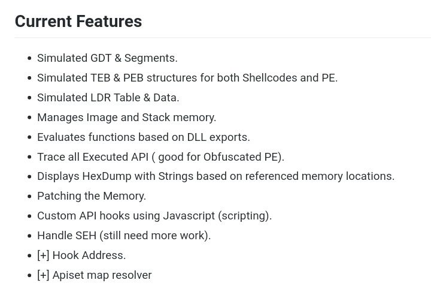

# reverseengineeringx
`2019-08-31 18:26:57`

<blockquote>
https://github.com/patrickfav/uber-apk-signer
</blockquote>

<table><tr><td><b>→</b><a href="https://github.com/patrickfav/uber-apk-signer">
https://github.com/patrickfav/uber-apk-signer
</a>
<blockquote>
A cli tool that helps signing and zip aligning single or multiple Android application packages (APKs) with either debug or provided release certificates. It supports v1, v2 and v3 Android signing s...
</blockquote>
</td></tr></table>

---

# defcon_news
`2019-08-31 10:35:18`

<blockquote>
Очередные 4 уязвимости в Ghostscript
http://www.opennet.ru/opennews/art.shtml?num&#61;51397

via OpenNews.opennet.ru: Проблемы безопасности
</blockquote>

<table><tr><td><b>→</b><a href="https://www.opennet.ru/opennews/art.shtml?num=51397">
https://www.opennet.ru/opennews/art.shtml?num=51397
</a>
<blockquote>
Спустя две недели с момента обнаружения прошлой критической проблемы в Ghostscript выявлены ещё 4 похожие уязвимости (CVE-2019-14811, CVE-2019-14812, CVE-2019-14813, CVE-2019-14817), которые позволяют через создание ссылки на &quot;.forceput&quot; обойти режим изоляции &quot;-dSAFER&quot;. При обработке специально оформленных документов атакующий может получить доступ к содержимому ФС и добиться выполнения произвольного кода в системе (например, через добавление команд в ~/.bashrc или ~/.profile). Исправление доступно в виде патчей (1, 2). За появлением обновления пакетов в дистрибутивах можно проследить на данных страницах: Debian, Fedora, Ubuntu, SUSE/openSUSE, RHEL, Arch, ROSA, FreeBSD.
</blockquote>
</td></tr></table>

---

# sysadm_in_channel
`2019-08-31 06:14:52`

<blockquote>
На некоторых серверах использовал Dovecot, а вы?

http://www.opennet.ru/opennews/art.shtml?num&#61;51391
</blockquote>

<table><tr><td><b>→</b><a href="https://www.opennet.ru/opennews/art.shtml?num=51391">
https://www.opennet.ru/opennews/art.shtml?num=51391
</a>
<blockquote>
В корректирующих выпусках POP3/IMAP4-сервера Dovecot 2.3.7.2 и 2.2.36.4, а также в дополнении Pigeonhole 0.5.7.2 и 0.4.24.2 , устранена критическая уязвимость (CVE-2019-11500), которая позволяет добиться записи данных за пределы выделенного буфера через отправку специально оформленного запроса по протоколам IMAP или ManageSieve.
</blockquote>
</td></tr></table>

---

# defcon_news
`2019-08-31 03:20:41`

<blockquote>
Early Release Video: Brent Stone - Reverse Engineering 17+ Cars in Less than 10 Minutes
https://youtu.be/KkgxFplsTnM

via DEF CON Announcements!
</blockquote>

<table><tr><td><b>→</b><a href="https://youtu.be/KkgxFplsTnM">
https://youtu.be/KkgxFplsTnM
</a>
<blockquote>
Brent provides a live demonstration reversing engineering 17 or more unknown passenger vehicle CAN networks in under 10 minutes using new automated techniques. These unsupervised techniques are over 90% accurate and consistent when tested using production CAN networks and different driving conditions. He then introduces the Python and R code used for the demo and posted to his public GitHub repository at https://github.com/brent-stone/CAN_Reverse_Engineering. The Dissertation explaining how the code works is also posted.

Brent Stone
Dr. Brent Stone is a Cyber officer with the U.S. Military. His professional experience includes 10 years of IT and cyber work in North America, the Middle East, and Asia. The focus of his PhD research was developing AI methods to help security researchers overcome the 'security through obscurity' used in the automotive industry. He presented initial findings at the 2018 IEEE Connected and Automated Vehicles Symposium and is an active member of the Open Garage's car hacking group.…
</blockquote>
</td></tr></table>

---

# defcon_news
`2019-08-30 22:40:14`

<blockquote>
Критическая язвимость в IMAP-сервере Dovecot
http://www.opennet.ru/opennews/art.shtml?num&#61;51391

via OpenNews.opennet.ru: Проблемы безопасности
</blockquote>

<table><tr><td><b>→</b><a href="https://www.opennet.ru/opennews/art.shtml?num=51391">
https://www.opennet.ru/opennews/art.shtml?num=51391
</a>
<blockquote>
В корректирующих выпусках POP3/IMAP4-сервера Dovecot 2.3.7.2 и 2.2.36.4, а также в дополнении Pigeonhole 0.5.7.2 и 0.4.24.2 , устранена критическая уязвимость (CVE-2019-11500), которая позволяет добиться записи данных за пределы выделенного буфера через отправку специально оформленного запроса по протоколам IMAP или ManageSieve.
</blockquote>
</td></tr></table>

---

# R0_Crew
`2019-08-30 21:57:01`

<blockquote>
&quot;Building universal Android rooting with a type confusion vulnerability&quot; (Zerocon 2019) Slides: https://github.com/ThomasKing2014/slides/blob/master/Building%20universal%20Android%20rooting%20with%20a%20type%20confusion%20vulnerability.pdf  Demo: https://www.youtube.com/watch?v&#61;zHEQ8fOLSrM&amp;feature&#61;youtu.be &#35;android &#35;exploitation &#35;dukeBarman
</blockquote>

<table><tr><td><b>→</b><a href="https://github.com/ThomasKing2014/slides/blob/master/Building%20universal%20Android%20rooting%20with%20a%20type%20confusion%20vulnerability.pdf">
https://github.com/ThomasKing2014/slides/blob/master/Building%20universal%20Android%20rooting%20with%20a%20type%20confusion%20vulnerability.pdf
</a>
<blockquote>
Contribute to ThomasKing2014/slides development by creating an account on GitHub.
</blockquote>
</td></tr></table>

---

# defcon_news
`2019-08-30 19:25:26`

<blockquote>
Multiple vulns in Cisco UCS Director: from unauth remote access to code execution as root
http://seclists.org/fulldisclosure/2019/Aug/36

via Full Disclosure
</blockquote>

<table><tr><td><b>→</b><a href="https://seclists.org/fulldisclosure/2019/Aug/36">
https://seclists.org/fulldisclosure/2019/Aug/36
</a>
</td></tr></table>

---

# defcon_news
`2019-08-30 19:25:25`

<blockquote>
New BlackArch Linux ISOs + OVA Image (2019.09.01)with 2350 Tools released
http://seclists.org/fulldisclosure/2019/Aug/35

via Full Disclosure
</blockquote>

<table><tr><td><b>→</b><a href="https://seclists.org/fulldisclosure/2019/Aug/35">
https://seclists.org/fulldisclosure/2019/Aug/35
</a>
</td></tr></table>

---

# defcon_news
`2019-08-30 19:25:24`

<blockquote>
GGPowerShell / Windows PowerShell Unsanitized RCE File Tool
http://seclists.org/fulldisclosure/2019/Aug/34

via Full Disclosure
</blockquote>

<table><tr><td><b>→</b><a href="https://seclists.org/fulldisclosure/2019/Aug/34">
https://seclists.org/fulldisclosure/2019/Aug/34
</a>
</td></tr></table>

---

# defcon_news
`2019-08-30 19:25:23`

<blockquote>
[SBA-ADV-20190305-01] CVE-2019-13564: Ping Identity Agentless Integration Kit &lt;1.5 Reflected Cross-site Scripting (XSS)
http://seclists.org/fulldisclosure/2019/Aug/33

via Full Disclosure
</blockquote>

<table><tr><td><b>→</b><a href="https://seclists.org/fulldisclosure/2019/Aug/33">
https://seclists.org/fulldisclosure/2019/Aug/33
</a>
</td></tr></table>

---

# defcon_news
`2019-08-30 15:35:21`

<blockquote>
[dos] VX Search Enterprise 10.4.16 - 'User-Agent' Denial of Service
https://www.exploit-db.com/exploits/47328

via Exploit Database
</blockquote>

<table><tr><td><b>→</b><a href="https://www.exploit-db.com/exploits/47328">
https://www.exploit-db.com/exploits/47328
</a>
<blockquote>
VX Search Enterprise 10.4.16 - 'User-Agent' Denial of Service.. dos exploit for Windows platform
</blockquote>
</td></tr></table>

---

# defcon_news
`2019-08-30 15:35:20`

<blockquote>
[webapps] WordPress Plugin WooCommerce Product Feed 2.2.18 - Cross-Site Scripting
https://www.exploit-db.com/exploits/47327

via Exploit Database
</blockquote>

<table><tr><td><b>→</b><a href="https://www.exploit-db.com/exploits/47327">
https://www.exploit-db.com/exploits/47327
</a>
<blockquote>
WordPress Plugin WooCommerce Product Feed 2.2.18 - Cross-Site Scripting. CVE-2019-1010124 . webapps exploit for PHP platform
</blockquote>
</td></tr></table>

---

# defcon_news
`2019-08-30 15:35:19`

<blockquote>
[webapps] YouPHPTube 7.4 - Remote Code Execution
https://www.exploit-db.com/exploits/47326

via Exploit Database
</blockquote>

<table><tr><td><b>→</b><a href="https://www.exploit-db.com/exploits/47326">
https://www.exploit-db.com/exploits/47326
</a>
<blockquote>
YouPHPTube 7.4 - Remote Code Execution.. webapps exploit for PHP platform
</blockquote>
</td></tr></table>

---

# defcon_news
`2019-08-30 15:20:58`

<blockquote>
[webapps] DomainMod 4.13 - Cross-Site Scripting
https://www.exploit-db.com/exploits/47325

via Exploit Database
</blockquote>

<table><tr><td><b>→</b><a href="https://www.exploit-db.com/exploits/47325">
https://www.exploit-db.com/exploits/47325
</a>
<blockquote>
DomainMod 4.13 - Cross-Site Scripting. CVE-2019-15811 . webapps exploit for PHP platform
</blockquote>
</td></tr></table>

---

# defcon_news
`2019-08-30 15:20:57`

<blockquote>
[webapps] Sentrifugo 3.2 - File Upload Restriction Bypass
https://www.exploit-db.com/exploits/47323

via Exploit Database
</blockquote>

<table><tr><td><b>→</b><a href="https://www.exploit-db.com/exploits/47323">
https://www.exploit-db.com/exploits/47323
</a>
<blockquote>
Sentrifugo 3.2 - File Upload Restriction Bypass. CVE-2019-15813 . webapps exploit for PHP platform
</blockquote>
</td></tr></table>

---

# defcon_news
`2019-08-30 15:20:57`

<blockquote>
[webapps] Sentrifugo 3.2 - Persistent Cross-Site Scripting
https://www.exploit-db.com/exploits/47324

via Exploit Database
</blockquote>

<table><tr><td><b>→</b><a href="https://www.exploit-db.com/exploits/47324">
https://www.exploit-db.com/exploits/47324
</a>
<blockquote>
Sentrifugo 3.2 - Persistent Cross-Site Scripting. CVE-2019-15814 . webapps exploit for PHP platform
</blockquote>
</td></tr></table>

---

# defcon_news
`2019-08-30 15:20:56`

<blockquote>
[dos] Asus Precision TouchPad 11.0.0.25 - Denial of Service
https://www.exploit-db.com/exploits/47322

via Exploit Database
</blockquote>

<table><tr><td><b>→</b><a href="https://www.exploit-db.com/exploits/47322">
https://www.exploit-db.com/exploits/47322
</a>
<blockquote>
Asus Precision TouchPad 11.0.0.25 - Denial of Service. CVE-2019-10709 . dos exploit for Windows platform
</blockquote>
</td></tr></table>

---

# defcon_news
`2019-08-30 15:06:14`

<blockquote>
[local] Canon PRINT 2.5.5 - Information Disclosure
https://www.exploit-db.com/exploits/47321

via Exploit Database
</blockquote>

<table><tr><td><b>→</b><a href="https://www.exploit-db.com/exploits/47321">
https://www.exploit-db.com/exploits/47321
</a>
<blockquote>
Canon PRINT 2.5.5 - Information Disclosure. CVE-2019-14339 . local exploit for Android platform
</blockquote>
</td></tr></table>

---

# defcon_news
`2019-08-30 15:06:13`

<blockquote>
[dos] Easy MP3 Downloader 4.7.8.8 - 'Unlock Code' Denial of Service
https://www.exploit-db.com/exploits/47319

via Exploit Database
</blockquote>

<table><tr><td><b>→</b><a href="https://www.exploit-db.com/exploits/47319">
https://www.exploit-db.com/exploits/47319
</a>
<blockquote>
Easy MP3 Downloader 4.7.8.8 - 'Unlock Code' Denial of Service.. dos exploit for Windows platform
</blockquote>
</td></tr></table>

---

# defcon_news
`2019-08-30 15:06:12`

<blockquote>
[dos] SQL Server Password Changer 1.90 - Denial of Service
https://www.exploit-db.com/exploits/47318

via Exploit Database
</blockquote>

<table><tr><td><b>→</b><a href="https://www.exploit-db.com/exploits/47318">
https://www.exploit-db.com/exploits/47318
</a>
<blockquote>
SQL Server Password Changer 1.90 - Denial of Service.. dos exploit for Windows platform
</blockquote>
</td></tr></table>

---

# defcon_news
`2019-08-30 15:06:11`

<blockquote>
[remote] QEMU - Denial of Service
https://www.exploit-db.com/exploits/47320

via Exploit Database
</blockquote>

<table><tr><td><b>→</b><a href="https://www.exploit-db.com/exploits/47320">
https://www.exploit-db.com/exploits/47320
</a>
<blockquote>
QEMU - Denial of Service. CVE-2019-14378 . remote exploit for Linux platform
</blockquote>
</td></tr></table>

---

# defcon_news
`2019-08-30 10:40:22`

<blockquote>
SEC Consult SA-20190829-1 :: External DNS Requests in Zyxel USG/UAG/ATP/VPN/NXC series
http://seclists.org/fulldisclosure/2019/Aug/32

via Full Disclosure
</blockquote>

<table><tr><td><b>→</b><a href="https://seclists.org/fulldisclosure/2019/Aug/32">
https://seclists.org/fulldisclosure/2019/Aug/32
</a>
</td></tr></table>

---

# defcon_news
`2019-08-30 10:40:21`

<blockquote>
SEC Consult SA-20190829-0 :: Hardcoded FTP Credentials in Zyxel NWA/NAP/WAC wireless access point series
http://seclists.org/fulldisclosure/2019/Aug/31

via Full Disclosure
</blockquote>

<table><tr><td><b>→</b><a href="https://seclists.org/fulldisclosure/2019/Aug/31">
https://seclists.org/fulldisclosure/2019/Aug/31
</a>
</td></tr></table>

---

# cibsecurity
`2019-08-29 17:12:38`

* https://threatpost.com/critical-cisco-bug-remote-takeover-routers/147826/

<blockquote>
❌ Critical Cisco VM Bug Allows Remote Takeover of Routers ❌

CVE-2019-12643 has been given the highest possible severity rating.

📖 Read

via &quot;Threatpost&quot;.
</blockquote>

<table><tr><td><b>→</b><a href="https://threatpost.com/critical-cisco-bug-remote-takeover-routers/147826/">
https://threatpost.com/critical-cisco-bug-remote-takeover-routers/147826/
</a>
<blockquote>
CVE-2019-12643 has been given the highest possible severity rating.
</blockquote>
</td></tr></table>

---

# defcon_news
`2019-08-29 16:32:38`

<blockquote>
Rooting RouterOS with a USB Drive (CVE-2019-15055)
https://www.reddit.com/r/netsec/comments/cx08uy/rooting_routeros_with_a_usb_drive_cve201915055/

via /r/netsec - Information Security News &amp; Discussion
</blockquote>

<table><tr><td><b>→</b><a href="https://www.reddit.com/r/netsec/comments/cx08uy/rooting_routeros_with_a_usb_drive_cve201915055/">
https://www.reddit.com/r/netsec/comments/cx08uy/rooting_routeros_with_a_usb_drive_cve201915055/
</a>
<blockquote>
0 votes and 0 comments so far on Reddit
</blockquote>
</td></tr></table>

---

# defcon_news
`2019-08-29 15:20:18`

<blockquote>
[dos] Webkit JSC: JIT - Uninitialized Variable Access in ArgumentsEliminationPhase::transform
https://www.exploit-db.com/exploits/47316

via Exploit Database
</blockquote>

<table><tr><td><b>→</b><a href="https://www.exploit-db.com/exploits/47316">
https://www.exploit-db.com/exploits/47316
</a>
<blockquote>
Webkit JSC: JIT - Uninitialized Variable Access in ArgumentsEliminationPhase::transform. CVE-2019-8689 . dos exploit for Multiple platform
</blockquote>
</td></tr></table>

---

# defcon_news
`2019-08-29 14:55:20`

<blockquote>
[webapps] PilusCart 1.4.1 - Local File Disclosure
https://www.exploit-db.com/exploits/47315

via Exploit Database
</blockquote>

<table><tr><td><b>→</b><a href="https://www.exploit-db.com/exploits/47315">
https://www.exploit-db.com/exploits/47315
</a>
<blockquote>
PilusCart 1.4.1 - Local File Disclosure.. webapps exploit for PHP platform
</blockquote>
</td></tr></table>

---

# defcon_news
`2019-08-29 14:55:19`

<blockquote>
[webapps] Jobberbase 2.0 - 'subscribe' SQL Injection
https://www.exploit-db.com/exploits/47314

via Exploit Database
</blockquote>

<table><tr><td><b>→</b><a href="https://www.exploit-db.com/exploits/47314">
https://www.exploit-db.com/exploits/47314
</a>
<blockquote>
Jobberbase 2.0 - 'subscribe' SQL Injection.. webapps exploit for PHP platform
</blockquote>
</td></tr></table>

---

# sysadm_in_channel
`2019-08-29 14:36:22`

<blockquote>
Сервера многих компаний, включая компании, которые занимаются предоставлением VPN услуг, до сих пор подвержены CVE-2019-11510 (это когда удаленный злоумышленник, не прошедший проверку подлинности, может отправить специально созданный URI для выполнения произвольного чтения файлов)

Дальнейшее использование серверов, которые живут с этой уязвимостью, может позволить удаленное выполнение кода (RCE) на клиентах, подключающихся например к скомпрометированному VPN-серверу (что напрмер очень эффективно можно использовать для распространения вымогателей / любых других типов вредоносных программ)

https://badpackets.net/over-14500-pulse-secure-vpn-endpoints-vulnerable-to-cve-2019-11510/
</blockquote>

<table><tr><td><b>→</b><a href="https://badpackets.net/over-14500-pulse-secure-vpn-endpoints-vulnerable-to-cve-2019-11510/">
https://badpackets.net/over-14500-pulse-secure-vpn-endpoints-vulnerable-to-cve-2019-11510/
</a>
<blockquote>
On Thursday, August 22, 2019, our honeypots detected opportunistic mass scanning activity from a host in Spain targeting Pulse Secure &quot;Pulse Connect Secure&quot; VPN server endpoints vulnerable to CVE-2019-11510. This arbitrary file reading vulnerability allows sensitive information disclosure enabling u
</blockquote>
</td></tr></table>

---

# defcon_news
`2019-08-29 09:50:45`

<blockquote>
Три уязвимости в wifi-драйвере marvell, входящем в состав ядра Linux
http://www.opennet.ru/opennews/art.shtml?num&#61;51381

via OpenNews.opennet.ru: Проблемы безопасности
</blockquote>

<table><tr><td><b>→</b><a href="http://www.opennet.ru/opennews/art.shtml?num=51381">
http://www.opennet.ru/opennews/art.shtml?num=51381
</a>
<blockquote>
В драйвере для беспроводных устройств на чипах Marvell выявлены три уязвимости (CVE-2019-14814, CVE-2019-14815, CVE-2019-14816), которые могут привести к записи данных за пределы выделенного буфера при обработке специально оформленных пакетов, отправленных через интерфейс Netlink.
</blockquote>
</td></tr></table>

---

# defcon_news
`2019-08-28 22:25:34`

<blockquote>
Non-root containers, Kubernetes CVE-2019-11245 and why you should care
https://www.reddit.com/r/netsec/comments/cwouic/nonroot_containers_kubernetes_cve201911245_and/

via /r/netsec - Information Security News &amp; Discussion
</blockquote>

<table><tr><td><b>→</b><a href="https://www.reddit.com/r/netsec/comments/cwouic/nonroot_containers_kubernetes_cve201911245_and/">
https://www.reddit.com/r/netsec/comments/cwouic/nonroot_containers_kubernetes_cve201911245_and/
</a>
<blockquote>
Posted in r/netsec by u/pingpongfifa • 60 points and 7 comments
</blockquote>
</td></tr></table>

---

# R0_Crew
`2019-08-28 19:04:07`

<blockquote>
Extract annoations from Ghidra into an X32/X64 dbg database https://github.com/revolver-ocelot-saa/GhidraX64Dbg &#35;reverse &#35;ghidra &#35;dukeBarman
</blockquote>

<table><tr><td><b>→</b><a href="https://github.com/revolver-ocelot-saa/GhidraX64Dbg">
https://github.com/revolver-ocelot-saa/GhidraX64Dbg
</a>
<blockquote>
Extract annoations from Ghidra into an X32/X64 dbg database - revolver-ocelot-saa/GhidraX64Dbg
</blockquote>
</td></tr></table>

---

# defcon_news
`2019-08-28 18:50:51`

<blockquote>
[remote] Cisco UCS Director, Cisco Integrated Management Controller Supervisor and Cisco UCS Director Express for Big Data - Multiple Vulnerabilities
https://www.exploit-db.com/exploits/47313

via Exploit Database
</blockquote>

<table><tr><td><b>→</b><a href="https://www.exploit-db.com/exploits/47313?utm_source=dlvr.it&utm_medium=twitter">
https://www.exploit-db.com/exploits/47313?utm_source=dlvr.it&utm_medium=twitter
</a>
<blockquote>
Cisco UCS Director, Cisco Integrated Management Controller Supervisor and Cisco UCS Director Express for Big Data - Multiple Vulnerabilities.. remote exploit for Multiple platform
</blockquote>
</td></tr></table>

---

# defcon_news
`2019-08-28 15:50:42`

<blockquote>
[webapps] Jobberbase 2.0 CMS - 'jobs-in' SQL Injection
https://www.exploit-db.com/exploits/47311

via Exploit Database
</blockquote>

<table><tr><td><b>→</b><a href="https://www.exploit-db.com/exploits/47311">
https://www.exploit-db.com/exploits/47311
</a>
<blockquote>
Jobberbase 2.0 CMS - 'jobs-in' SQL Injection.. webapps exploit for PHP platform
</blockquote>
</td></tr></table>

---

# defcon_news
`2019-08-28 15:50:41`

<blockquote>
[webapps] SQLiteManager 1.2.0 / 1.2.4 - Blind SQL Injection
https://www.exploit-db.com/exploits/47310

via Exploit Database
</blockquote>

<table><tr><td><b>→</b><a href="https://www.exploit-db.com/exploits/47310">
https://www.exploit-db.com/exploits/47310
</a>
<blockquote>
SQLiteManager 1.2.0 / 1.2.4 - Blind SQL Injection. CVE-2019-9083 . webapps exploit for PHP platform
</blockquote>
</td></tr></table>

---

# defcon_news
`2019-08-28 15:50:40`

<blockquote>
[dos] Outlook Password Recovery 2.10 - Denial of Service
https://www.exploit-db.com/exploits/47309

via Exploit Database
</blockquote>

<table><tr><td><b>→</b><a href="https://www.exploit-db.com/exploits/47309">
https://www.exploit-db.com/exploits/47309
</a>
<blockquote>
Outlook Password Recovery 2.10 - Denial of Service.. dos exploit for Windows platform
</blockquote>
</td></tr></table>

---

# isast
`2019-08-28 09:57:55`

<blockquote>
https://github.com/alexdetrano/4CAN
</blockquote>

<table><tr><td><b>→</b><a href="https://github.com/alexdetrano/4CAN">
https://github.com/alexdetrano/4CAN
</a>
<blockquote>
Contribute to alexdetrano/4CAN development by creating an account on GitHub.
</blockquote>
</td></tr></table>

---

# defcon_news
`2019-08-28 04:50:34`

<blockquote>
[local] Windows 10 - SET_REPARSE_POINT_EX Mount Point Security Feature Bypass
https://www.exploit-db.com/exploits/47306

via Exploit Database
</blockquote>

<table><tr><td><b>→</b><a href="https://www.exploit-db.com/exploits/47306">
https://www.exploit-db.com/exploits/47306
</a>
<blockquote>
Windows 10 - SET_REPARSE_POINT_EX Mount Point Security Feature Bypass. CVE-2019-1170 . local exploit for Windows platform
</blockquote>
</td></tr></table>

---

# reverseengineeringx
`2019-08-27 20:56:20`

<blockquote>
https://github.com/ALSchwalm/dwarfexport
</blockquote>

<table><tr><td><b>→</b><a href="https://github.com/ALSchwalm/dwarfexport">
https://github.com/ALSchwalm/dwarfexport
</a>
<blockquote>
Export dwarf debug information from IDA Pro. Contribute to ALSchwalm/dwarfexport development by creating an account on GitHub.
</blockquote>
</td></tr></table>

---

# defcon_news
`2019-08-27 20:20:40`

<blockquote>
Multiple CSRF Vulnerabilities in Django CRM 0.2.1
http://seclists.org/fulldisclosure/2019/Aug/30

via Full Disclosure
</blockquote>

<table><tr><td><b>→</b><a href="https://seclists.org/fulldisclosure/2019/Aug/30">
https://seclists.org/fulldisclosure/2019/Aug/30
</a>
</td></tr></table>

---

# defcon_news
`2019-08-27 20:20:39`

<blockquote>
APPLE-SA-2019-8-26-2 macOS Mojave 10.14.6 Supplemental Update
http://seclists.org/fulldisclosure/2019/Aug/29

via Full Disclosure
</blockquote>

<table><tr><td><b>→</b><a href="https://seclists.org/fulldisclosure/2019/Aug/29">
https://seclists.org/fulldisclosure/2019/Aug/29
</a>
</td></tr></table>

---

# defcon_news
`2019-08-27 20:20:38`

<blockquote>
APPLE-SA-2019-8-26-3 tvOS 12.4.1
http://seclists.org/fulldisclosure/2019/Aug/28

via Full Disclosure
</blockquote>

<table><tr><td><b>→</b><a href="https://seclists.org/fulldisclosure/2019/Aug/28">
https://seclists.org/fulldisclosure/2019/Aug/28
</a>
</td></tr></table>

---

# defcon_news
`2019-08-27 20:20:37`

<blockquote>
APPLE-SA-2019-8-26-1 iOS 12.4.1
http://seclists.org/fulldisclosure/2019/Aug/27

via Full Disclosure
</blockquote>

<table><tr><td><b>→</b><a href="https://seclists.org/fulldisclosure/2019/Aug/27">
https://seclists.org/fulldisclosure/2019/Aug/27
</a>
</td></tr></table>

---

# isast
`2019-08-27 13:29:50`

<blockquote>
A curated list of &#35;awesome &#35;malware &#35;analysis tools and resources.
https://github.com/rshipp/awesome-malware-analysis
</blockquote>

<table><tr><td><b>→</b><a href="https://github.com/rshipp/awesome-malware-analysis">
https://github.com/rshipp/awesome-malware-analysis
</a>
<blockquote>
Defund the Police. Contribute to rshipp/awesome-malware-analysis development by creating an account on GitHub.
</blockquote>
</td></tr></table>

---

# defcon_news
`2019-08-27 10:35:10`

<blockquote>
[webapps] Tableau - XML External Entity
https://www.exploit-db.com/exploits/47308

via Exploit Database
</blockquote>

<table><tr><td><b>→</b><a href="https://www.exploit-db.com/exploits/47308">
https://www.exploit-db.com/exploits/47308
</a>
<blockquote>
Tableau - XML External Entity. CVE-2019-15637 . webapps exploit for Multiple platform
</blockquote>
</td></tr></table>

---

# defcon_news
`2019-08-27 03:50:20`

<blockquote>
Unquoted Path - Trend Micro
http://seclists.org/fulldisclosure/2019/Aug/26

via Full Disclosure
</blockquote>

<table><tr><td><b>→</b><a href="https://seclists.org/fulldisclosure/2019/Aug/26">
https://seclists.org/fulldisclosure/2019/Aug/26
</a>
</td></tr></table>

---

# defcon_news
`2019-08-27 03:50:19`

<blockquote>
[CVE-2019-15150] CSRF in MediaWiki extension OAuth2 Client 0.3
http://seclists.org/fulldisclosure/2019/Aug/25

via Full Disclosure
</blockquote>

<table><tr><td><b>→</b><a href="https://seclists.org/fulldisclosure/2019/Aug/25">
https://seclists.org/fulldisclosure/2019/Aug/25
</a>
</td></tr></table>

---

# reverseengineeringx
`2019-08-26 22:11:37`

<blockquote>
https://github.com/multiarch/qemu-user-static
</blockquote>

<table><tr><td><b>→</b><a href="https://github.com/multiarch/qemu-user-static">
https://github.com/multiarch/qemu-user-static
</a>
<blockquote>
:earth_africa: `/usr/bin/qemu-*-static`. Contribute to multiarch/qemu-user-static development by creating an account on GitHub.
</blockquote>
</td></tr></table>

---

# defcon_news
`2019-08-26 15:40:05`

<blockquote>
[local] Exim 4.87 / 4.91 - Local Privilege Escalation (Metasploit)
https://www.exploit-db.com/exploits/47307

via Exploit Database
</blockquote>

<table><tr><td><b>→</b><a href="https://www.exploit-db.com/exploits/47307">
https://www.exploit-db.com/exploits/47307
</a>
<blockquote>
Exim 4.87 / 4.91 - Local Privilege Escalation (Metasploit). CVE-2019-10149 . local exploit for Linux platform
</blockquote>
</td></tr></table>

---

# defcon_news
`2019-08-26 14:50:50`

<blockquote>
[webapps] openITCOCKPIT 3.6.1-2 - Cross-Site Request Forgery
https://www.exploit-db.com/exploits/47305

via Exploit Database
</blockquote>

<table><tr><td><b>→</b><a href="https://www.exploit-db.com/exploits/47305">
https://www.exploit-db.com/exploits/47305
</a>
<blockquote>
openITCOCKPIT 3.6.1-2 - Cross-Site Request Forgery. CVE-2019-10227 . webapps exploit for PHP platform
</blockquote>
</td></tr></table>

---

# defcon_news
`2019-08-26 14:50:49`

<blockquote>
[webapps] WordPress Plugin UserPro 4.9.32 - Cross-Site Scripting
https://www.exploit-db.com/exploits/47304

via Exploit Database
</blockquote>

<table><tr><td><b>→</b><a href="https://www.exploit-db.com/exploits/47304?utm_source=dlvr.it&utm_medium=twitter">
https://www.exploit-db.com/exploits/47304?utm_source=dlvr.it&utm_medium=twitter
</a>
<blockquote>
WordPress Plugin UserPro 4.9.32 - Cross-Site Scripting. CVE-2019-14470 . webapps exploit for PHP platform
</blockquote>
</td></tr></table>

---

# defcon_news
`2019-08-26 14:50:48`

<blockquote>
[webapps] WordPress Plugin Import Export WordPress Users 1.3.1 - CSV Injection
https://www.exploit-db.com/exploits/47303

via Exploit Database
</blockquote>

<table><tr><td><b>→</b><a href="https://www.exploit-db.com/exploits/47303?utm_source=dlvr.it&utm_medium=twitter">
https://www.exploit-db.com/exploits/47303?utm_source=dlvr.it&utm_medium=twitter
</a>
<blockquote>
WordPress Plugin Import Export WordPress Users 1.3.1 - CSV Injection. CVE-2019-15092 . webapps exploit for PHP platform
</blockquote>
</td></tr></table>

---

# defcon_news
`2019-08-26 14:50:47`

<blockquote>
[webapps] LSoft ListServ &lt; 16.5-2018a - Cross-Site Scripting
https://www.exploit-db.com/exploits/47302

via Exploit Database
</blockquote>

<table><tr><td><b>→</b><a href="https://www.exploit-db.com/exploits/47302">
https://www.exploit-db.com/exploits/47302
</a>
<blockquote>
LSoft ListServ &lt; 16.5-2018a - Cross-Site Scripting. CVE-2019-15501 . webapps exploit for Windows platform
</blockquote>
</td></tr></table>

---

# defcon_news
`2019-08-26 08:10:36`

<blockquote>
Hard-coded credentials on ProGrade/Lierda Grill Temperature Monitor [CVE-2019-15304]
http://seclists.org/fulldisclosure/2019/Aug/24

via Full Disclosure
</blockquote>

<table><tr><td><b>→</b><a href="https://seclists.org/fulldisclosure/2019/Aug/24">
https://seclists.org/fulldisclosure/2019/Aug/24
</a>
</td></tr></table>

---

# defcon_news
`2019-08-26 08:10:35`

<blockquote>
Realtek Managed Switch Controller RTL83xx
http://seclists.org/fulldisclosure/2019/Aug/23

via Full Disclosure
</blockquote>

<table><tr><td><b>→</b><a href="https://seclists.org/fulldisclosure/2019/Aug/23">
https://seclists.org/fulldisclosure/2019/Aug/23
</a>
</td></tr></table>

---

# defcon_news
`2019-08-26 08:10:34`

<blockquote>
CoreFTP Server FTP / SFTP Server v2 - Build 674 MDTM Directory Traversal (Metasploit) Exploit
http://seclists.org/fulldisclosure/2019/Aug/22

via Full Disclosure
</blockquote>

<table><tr><td><b>→</b><a href="https://seclists.org/fulldisclosure/2019/Aug/22">
https://seclists.org/fulldisclosure/2019/Aug/22
</a>
</td></tr></table>

---

# defcon_news
`2019-08-26 08:10:33`

<blockquote>
CoreFTP Server FTP / SFTP Server v2 - Build 674 SIZE Directory Traversal (Metasploit) Exploit
http://seclists.org/fulldisclosure/2019/Aug/21

via Full Disclosure
</blockquote>

<table><tr><td><b>→</b><a href="https://seclists.org/fulldisclosure/2019/Aug/21">
https://seclists.org/fulldisclosure/2019/Aug/21
</a>
</td></tr></table>

---

# defcon_news
`2019-08-26 08:10:32`

<blockquote>
CVE-2019-10071: Timing Attack in HMAC Verification in Apache Tapestry
http://seclists.org/fulldisclosure/2019/Aug/20

via Full Disclosure
</blockquote>

<table><tr><td><b>→</b><a href="https://seclists.org/fulldisclosure/2019/Aug/20">
https://seclists.org/fulldisclosure/2019/Aug/20
</a>
</td></tr></table>

---

# defcon_news
`2019-08-26 08:10:30`

<blockquote>
[CFP] Bsides Lisbon 2019
http://seclists.org/fulldisclosure/2019/Aug/19

via Full Disclosure
</blockquote>

<table><tr><td><b>→</b><a href="https://seclists.org/fulldisclosure/2019/Aug/19">
https://seclists.org/fulldisclosure/2019/Aug/19
</a>
</td></tr></table>

---

# defcon_news
`2019-08-25 09:41:37`

<blockquote>
&#35;api https://github.com/streaak/keyhacks
</blockquote>

<table><tr><td><b>→</b><a href="https://github.com/streaak/keyhacks">
https://github.com/streaak/keyhacks
</a>
<blockquote>
Keyhacks is a repository which shows quick ways in which API keys leaked by a bug bounty program can be checked to see if they're valid. - streaak/keyhacks
</blockquote>
</td></tr></table>

---

# defcon_news
`2019-08-25 07:12:34`

<blockquote>
Раскрыты детали критической уязвимости (CVE-2019-14378) в обработчике SLIRP, по умолчанию применяемом в QEMU для организации канала связи между виртуальным сетевым адаптером в гостевой системе и сетевым бэкендом на стороне QEMU. Проблема также затрагивает системы виртуализации на базе KVM (в режиме Usermode) и Virtualbox, в которых используются бэкенд slirp из QEMU, а также приложения, применяющие сетевой стек в пространстве пользователя libSLIRP (эмулятор TCP/IP). 

Уязвимость, позволяющая выйти из изолированного окружения QEMU  
https://www.opennet.ru/opennews/art.shtml?num&#61;51343
</blockquote>

<table><tr><td><b>→</b><a href="https://www.opennet.ru/opennews/art.shtml?num=51343">
https://www.opennet.ru/opennews/art.shtml?num=51343
</a>
<blockquote>
Раскрыты детали критической уязвимости (CVE-2019-14378) в обработчике SLIRP, по умолчанию применяемом в QEMU для организации канала связи между виртуальным сетевым адаптером в гостевой системе и сетевым бэкендом на стороне QEMU. Проблема также затрагивает системы виртуализации на базе KVM (в режиме Usermode) и Virtualbox, в которых используются бэкенд slirp из QEMU, а также приложения, применяющие сетевой стек в пространстве пользователя libSLIRP (эмулятор TCP/IP).
</blockquote>
</td></tr></table>

---

# defcon_news
`2019-08-25 03:26:29`

<blockquote>
Over 2,500 Pulse Secure VPN endpoints vulnerable to CVE-2019-11510
https://www.reddit.com/r/netsec/comments/cuxvlo/over_2500_pulse_secure_vpn_endpoints_vulnerable/

via /r/netsec - Information Security News &amp; Discussion
</blockquote>

<table><tr><td><b>→</b><a href="https://www.reddit.com/r/netsec/comments/cuxvlo/over_2500_pulse_secure_vpn_endpoints_vulnerable/">
https://www.reddit.com/r/netsec/comments/cuxvlo/over_2500_pulse_secure_vpn_endpoints_vulnerable/
</a>
<blockquote>
0 votes and 0 comments so far on Reddit
</blockquote>
</td></tr></table>

---

# defcon_news
`2019-08-24 17:46:18`

<blockquote>
Over 2,500 Pulse Secure VPN endpoints vulnerable to CVE-2019-11510
https://www.reddit.com/r/netsec/comments/cusp98/over_2500_pulse_secure_vpn_endpoints_vulnerable/

via /r/netsec - Information Security News &amp; Discussion
</blockquote>

<table><tr><td><b>→</b><a href="https://www.reddit.com/r/netsec/comments/cusp98/over_2500_pulse_secure_vpn_endpoints_vulnerable/">
https://www.reddit.com/r/netsec/comments/cusp98/over_2500_pulse_secure_vpn_endpoints_vulnerable/
</a>
<blockquote>
65 votes and 0 comments so far on Reddit
</blockquote>
</td></tr></table>

---

# defcon_news
`2019-08-23 15:06:53`

<blockquote>
[webapps] Nimble Streamer 3.0.2-2 &lt; 3.5.4-9 - Directory Traversal
https://www.exploit-db.com/exploits/47301

via Exploit Database
</blockquote>

<table><tr><td><b>→</b><a href="https://www.exploit-db.com/exploits/47301">
https://www.exploit-db.com/exploits/47301
</a>
<blockquote>
Nimble Streamer 3.0.2-2 &lt; 3.5.4-9 - Directory Traversal. CVE-2019-11013 . webapps exploit for Multiple platform
</blockquote>
</td></tr></table>

---

# defcon_news
`2019-08-23 14:02:06`

<blockquote>
The Many Possibilities of CVE-2019-8646
https://www.reddit.com/r/netsec/comments/cubccz/the_many_possibilities_of_cve20198646/

via /r/netsec - Information Security News &amp; Discussion
</blockquote>

<table><tr><td><b>→</b><a href="https://www.reddit.com/r/netsec/comments/cubccz/the_many_possibilities_of_cve20198646/?utm_source=ifttt">
https://www.reddit.com/r/netsec/comments/cubccz/the_many_possibilities_of_cve20198646/?utm_source=ifttt
</a>
<blockquote>
Posted in r/netsec by u/albinowax • 30 points and 2 comments
</blockquote>
</td></tr></table>

---

# defcon_news
`2019-08-23 11:21:13`

<blockquote>
Уязвимость, позволяющая выйти из изолированного окружения QEMU
http://www.opennet.ru/opennews/art.shtml?num&#61;51343

via OpenNews.opennet.ru: Проблемы безопасности
</blockquote>

<table><tr><td><b>→</b><a href="https://www.opennet.ru/opennews/art.shtml?num=51343">
https://www.opennet.ru/opennews/art.shtml?num=51343
</a>
<blockquote>
Раскрыты детали критической уязвимости (CVE-2019-14378) в обработчике SLIRP, по умолчанию применяемом в QEMU для организации канала связи между виртуальным сетевым адаптером в гостевой системе и сетевым бэкендом на стороне QEMU. Проблема также затрагивает системы виртуализации на базе KVM (в режиме Usermode) и Virtualbox, в которых используются бэкенд slirp из QEMU, а также приложения, применяющие сетевой стек в пространстве пользователя libSLIRP (эмулятор TCP/IP).
</blockquote>
</td></tr></table>

---

# defcon_news
`2019-08-22 22:56:26`

<blockquote>
The Many Possibilities of CVE-2019-8646
https://googleprojectzero.blogspot.com/2019/08/the-many-possibilities-of-cve-2019-8646.html

via Project Zero
</blockquote>

<table><tr><td><b>→</b><a href="https://googleprojectzero.blogspot.com/2019/08/the-many-possibilities-of-cve-2019-8646.html">
https://googleprojectzero.blogspot.com/2019/08/the-many-possibilities-of-cve-2019-8646.html
</a>
<blockquote>
Posted by Natalie Silvanovich, Project Zero     CVE-2019-8646  is a somewhat unusual vulnerability I reported in iMessage. It has a number ...
</blockquote>
</td></tr></table>

---

# defcon_news
`2019-08-22 17:51:56`

<blockquote>
CVE-2019-15092 WordPress Plugin Import Export Users &#61; 1.3.0 - CSV Injection
https://www.reddit.com/r/netsec/comments/ctwjw1/cve201915092_wordpress_plugin_import_export_users/

via /r/netsec - Information Security News &amp; Discussion
</blockquote>

<table><tr><td><b>→</b><a href="https://www.reddit.com/r/netsec/comments/ctwjw1/cve201915092_wordpress_plugin_import_export_users/">
https://www.reddit.com/r/netsec/comments/ctwjw1/cve201915092_wordpress_plugin_import_export_users/
</a>
<blockquote>
0 votes and 0 comments so far on Reddit
</blockquote>
</td></tr></table>

---

# defcon_news
`2019-08-22 14:31:25`

<blockquote>
SEC Consult SA-20190822-0 :: Multiple Vulnerabilities in OpenPGP.js
http://seclists.org/fulldisclosure/2019/Aug/18

via Full Disclosure
</blockquote>

<table><tr><td><b>→</b><a href="https://seclists.org/fulldisclosure/2019/Aug/18">
https://seclists.org/fulldisclosure/2019/Aug/18
</a>
</td></tr></table>

---

# defcon_news
`2019-08-22 11:26:03`

<blockquote>
Обновление свободного антивирусного пакета ClamAV 0.101.4 с устранением уязвимостей
http://www.opennet.ru/opennews/art.shtml?num&#61;51337

via OpenNews.opennet.ru: Проблемы безопасности
</blockquote>

<table><tr><td><b>→</b><a href="http://www.opennet.ru/opennews/art.shtml?num=51337">
http://www.opennet.ru/opennews/art.shtml?num=51337
</a>
<blockquote>
Сформирован релиз свободного антивирусного пакета ClamAV 0.101.4, в котором устранена уязвимость (CVE-2019-12900) в реализации распаковщика архивов bzip2, которая может привести к перезаписи областей памяти вне выделенного буфера при обработке слишком большого числа селекторов.
</blockquote>
</td></tr></table>

---

# defcon_news
`2019-08-21 22:16:35`

<blockquote>
Удалённая DoS-уязвимость в IPv6-стеке FreeBSD
http://www.opennet.ru/opennews/art.shtml?num&#61;51332

via OpenNews.opennet.ru: Проблемы безопасности
</blockquote>

<table><tr><td><b>→</b><a href="https://www.opennet.ru/opennews/art.shtml?num=51332">
https://www.opennet.ru/opennews/art.shtml?num=51332
</a>
<blockquote>
Во FreeBSD устранена уязвимость (CVE-2019-5611), позволяющая вызвать крах ядра (packet-of-death) через отправку специально фрагментированных пакетов ICMPv6 MLD (Multicast Listener Discovery). Проблема вызвана отсутствием необходимой проверки в вызове m_pulldown(), что может привести к возврату не непрерывных цепочек mbufs, вопреки ожидания вызывающей стороны.
</blockquote>
</td></tr></table>

---

# defcon_news
`2019-08-21 15:36:31`

<blockquote>
SEC Consult SA-20190821-0 :: Unauthenticated sensitive information leakage in Zoho Corporation ManageEngine ServiceDesk Plus
http://seclists.org/fulldisclosure/2019/Aug/17

via Full Disclosure
</blockquote>

<table><tr><td><b>→</b><a href="https://seclists.org/fulldisclosure/2019/Aug/17">
https://seclists.org/fulldisclosure/2019/Aug/17
</a>
</td></tr></table>

---

# defcon_news
`2019-08-21 11:56:18`

<blockquote>
[remote] LibreOffice &lt; 6.2 Macro - Python Code Execution (Metasploit)
https://www.exploit-db.com/exploits/47298

via Exploit Database
</blockquote>

<table><tr><td><b>→</b><a href="https://www.exploit-db.com/exploits/47298">
https://www.exploit-db.com/exploits/47298
</a>
<blockquote>
LibreOffice &lt; 6.2.6 Macro - Python Code Execution (Metasploit). CVE-2019-9851 . remote exploit for Multiple platform
</blockquote>
</td></tr></table>

---

# defcon_news
`2019-08-21 11:06:08`

<blockquote>
[webapps] Pulse Secure 8.1R15.1/8.2/8.3/9.0 SSL VPN - Arbitrary File Disclosure (metasploit)
https://www.exploit-db.com/exploits/47297

via Exploit Database
</blockquote>

<table><tr><td><b>→</b><a href="https://www.exploit-db.com/exploits/47297">
https://www.exploit-db.com/exploits/47297
</a>
<blockquote>
Pulse Secure 8.1R15.1/8.2/8.3/9.0 SSL VPN - Arbitrary File Disclosure (Metasploit). CVE-2019-11510 . webapps exploit for Multiple platform
</blockquote>
</td></tr></table>

---

# defcon_news
`2019-08-20 22:46:21`

<blockquote>
В rest-client и ещё 10 Ruby-пакетах выявлен вредоносный код
http://www.opennet.ru/opennews/art.shtml?num&#61;51321

via OpenNews.opennet.ru: Проблемы безопасности
</blockquote>

<table><tr><td><b>→</b><a href="http://www.opennet.ru/opennews/art.shtml?num=51321">
http://www.opennet.ru/opennews/art.shtml?num=51321
</a>
<blockquote>
В популярном gem-пакете rest-client, насчитывающем в сумме 113 миллиона загрузок, выявлена подстановка вредоносного кода (CVE-2019-15224), который загружает исполняемые команды и отправляет информацию на внешний хост. Атака была произведена через компрометацию учётной записи разработчика rest-client в репозитории rubygems.org, после чего злоумышленники 13 и 14 августа опубликовали выпуски 1.6.10-1.6.13, включающие вредоносные изменения. До блокировки вредоносных версий их успели загрузить около тысячи пользователей (атакующие чтобы не привлекать внимание выпустили обновления старых версий).
</blockquote>
</td></tr></table>

---

# defcon_news
`2019-08-20 19:20:15`

<blockquote>
Очень странная лажа со стороны Apple. Они исправили некий баг в 12.3, а в 12.4, видимо, влили какой-то старый код, который фикс откатил обратно. Результат: используя этот баг, исследователи смогли выпустить джейлбрейк для версии 12.4, что стало первым джейлбрейком iOS для публичной актуальной версии системы за последние несколько лет

https://www.vice.com/en_us/article/qvgp77/hacker-releases-first-public-iphone-jailbreak-in-years

https://github.com/pwn20wndstuff/Undecimus/releases

Это в целом достаточно серьезная лажа, так как джейлбрейк может применяться с разными целями. Кто-то может поставить себе приложение-рекордер звонков, а кто-то - вредоносное ПО-шпион. Джейлбрейки в сфере инфосека часто используются для того, чтобы получить более свободный доступ к системе и изучать её на предмет других уязвимостей.  Не удивлюсь, если в ближайшие пару дней Apple срочно выкатит 12.4.1 для исправления этой лажи.
</blockquote>

<table><tr><td><b>→</b><a href="https://www.vice.com/en_us/article/qvgp77/hacker-releases-first-public-iphone-jailbreak-in-years">
https://www.vice.com/en_us/article/qvgp77/hacker-releases-first-public-iphone-jailbreak-in-years
</a>
<blockquote>
Apple accidentally unpatched a vulnerability it had already fixed, making current versions of iOS vulnerable to hackers.
</blockquote>
</td></tr></table>

---

# defcon_news
`2019-08-20 11:06:34`

<blockquote>
Обновление медиапроигрывателя VLC 3.0.8 с устранением уязвимостей
http://www.opennet.ru/opennews/art.shtml?num&#61;51317

via OpenNews.opennet.ru: Проблемы безопасности
</blockquote>

<table><tr><td><b>→</b><a href="https://www.opennet.ru/opennews/art.shtml?num=51317">
https://www.opennet.ru/opennews/art.shtml?num=51317
</a>
<blockquote>
Представлен корректирующий релиз медиаплеера VLC 3.0.8, в котором устранены накопившиеся ошибки и устранено 13 уязвимостей, среди которых три проблемы (CVE-2019-14970, CVE-2019-14777, CVE-2019-14533) могут привести к выполнению кода злоумышленника при попытке воспроизведения специально оформленных мультимедийных файлов в форматах MKV и ASF (переполнение буфера на запись и две проблемы с обращением к памяти после её освобождения).
</blockquote>
</td></tr></table>

---

# defcon_news
`2019-08-20 10:26:25`

<blockquote>
[webapps] WordPress Plugin 2.2.1 - Cross-Site Request Forgery
https://www.exploit-db.com/exploits/47295

via Exploit Database
</blockquote>

<table><tr><td><b>→</b><a href="https://www.exploit-db.com/exploits/47295">
https://www.exploit-db.com/exploits/47295
</a>
<blockquote>
WordPress Add Mime Types Plugin 2.2.1 - Cross-Site Request Forgery.. webapps exploit for PHP platform
</blockquote>
</td></tr></table>

---

# sysadm_in_channel
`2019-08-20 07:43:15`

<blockquote>
Знаю многие используют, поэтому положу сюда:
http://www.opennet.ru/opennews/art.shtml?num&#61;51315
</blockquote>

<table><tr><td><b>→</b><a href="https://www.opennet.ru/opennews/art.shtml?num=51315">
https://www.opennet.ru/opennews/art.shtml?num=51315
</a>
<blockquote>
В пакете Webmin, предоставляющем средства для удалённого управления сервером, выявлен бэкдор (CVE-2019-15107), обнаруженный в официальных сборках проекта, распространяемых через Sourceforge и рекомендованных на основном сайте. Бэкдор присутствовал в сборках с 1.882 по 1.921 включительно (в git-репозитории код с бэкдором отсутствовал) и позволял удалённо без прохождения аутентификации выполнить произвольные shell-команды в системе с правами root.
</blockquote>
</td></tr></table>

---

# defcon_news
`2019-08-20 07:18:20`

<blockquote>
https://github.com/jas502n/CVE-2019-7238/blob/master/README.md
</blockquote>

<table><tr><td><b>→</b><a href="https://github.com/jas502n/CVE-2019-7238/blob/master/README.md">
https://github.com/jas502n/CVE-2019-7238/blob/master/README.md
</a>
<blockquote>
Nexus Repository Manager 3 Remote Code Execution without authentication &lt; 3.15.0 - jas502n/CVE-2019-7238
</blockquote>
</td></tr></table>

---

# defcon_news
`2019-08-20 01:03:17`

<blockquote>
В Webmin найден бэкдор, позволяющий удалённо получить доступ с правами root
http://www.opennet.ru/opennews/art.shtml?num&#61;51315

via OpenNews.opennet.ru: Проблемы безопасности
</blockquote>

<table><tr><td><b>→</b><a href="https://www.opennet.ru/opennews/art.shtml?num=51315">
https://www.opennet.ru/opennews/art.shtml?num=51315
</a>
<blockquote>
В пакете Webmin, предоставляющем средства для удалённого управления сервером, выявлен бэкдор (CVE-2019-15107), обнаруженный в официальных сборках проекта, распространяемых через Sourceforge и рекомендованных на основном сайте. Бэкдор присутствовал в сборках с 1.882 по 1.921 включительно (в git-репозитории код с бэкдором отсутствовал) и позволял удалённо без прохождения аутентификации выполнить произвольные shell-команды в системе с правами root.
</blockquote>
</td></tr></table>

---

# defcon_news
`2019-08-19 18:23:39`

<blockquote>
Webmin Remote Comman Execution
https://packetstormsecurity.com/files/154141/CVE-2019-15107.sh.txt

via Exploit Files ≈ Packet Storm
</blockquote>

<table><tr><td><b>→</b><a href="https://packetstormsecurity.com/files/154141/CVE-2019-15107.sh.txt">
https://packetstormsecurity.com/files/154141/CVE-2019-15107.sh.txt
</a>
<blockquote>
Information Security Services, News, Files, Tools, Exploits, Advisories and Whitepapers
</blockquote>
</td></tr></table>

---

# defcon_news
`2019-08-19 15:17:14`

<blockquote>
[webapps] YouPHPTube 7.2 - 'userCreate.json.php' SQL Injection
https://www.exploit-db.com/exploits/47294

via Exploit Database
</blockquote>

<table><tr><td><b>→</b><a href="https://www.exploit-db.com/exploits/47294">
https://www.exploit-db.com/exploits/47294
</a>
<blockquote>
YouPHPTube 7.2 - 'userCreate.json.php' SQL Injection. CVE-2019-14430 . webapps exploit for PHP platform
</blockquote>
</td></tr></table>

---

# defcon_news
`2019-08-19 15:17:13`

<blockquote>
[webapps] Webmin 1.920 - Remote Code Execution
https://www.exploit-db.com/exploits/47293

via Exploit Database
</blockquote>

<table><tr><td><b>→</b><a href="https://www.exploit-db.com/exploits/47293">
https://www.exploit-db.com/exploits/47293
</a>
<blockquote>
Webmin 1.920 - Remote Code Execution. CVE-2019-15107 . webapps exploit for Linux platform
</blockquote>
</td></tr></table>

---

# defcon_news
`2019-08-19 14:52:59`

<blockquote>
[webapps] Neo Billing 3.5 - Persistent Cross-Site Scripting
https://www.exploit-db.com/exploits/47289

via Exploit Database
</blockquote>

<table><tr><td><b>→</b><a href="https://www.exploit-db.com/exploits/47289">
https://www.exploit-db.com/exploits/47289
</a>
<blockquote>
Neo Billing 3.5 - Persistent Cross-Site Scripting.. webapps exploit for PHP platform
</blockquote>
</td></tr></table>

---

# defcon_news
`2019-08-19 14:52:58`

<blockquote>
[webapps] FortiOS 5.6.3 - 5.6.7 / FortiOS 6.0.0 - 6.0.4 - Credentials Disclosure
https://www.exploit-db.com/exploits/47288

via Exploit Database
</blockquote>

<table><tr><td><b>→</b><a href="https://www.exploit-db.com/exploits/47288">
https://www.exploit-db.com/exploits/47288
</a>
<blockquote>
Fortinet FortiOS 5.6.3 - 5.6.7 / FortiOS 6.0.0 - 6.0.4 - Credentials Disclosure. CVE-2018-13379 . webapps exploit for Hardware platform
</blockquote>
</td></tr></table>

---

# defcon_news
`2019-08-19 14:52:57`

<blockquote>
[webapps] FortiOS 5.6.3 - 5.6.7 / FortiOS 6.0.0 - 6.0.4 - Credentials Disclosure (Metasploit)
https://www.exploit-db.com/exploits/47287

via Exploit Database
</blockquote>

<table><tr><td><b>→</b><a href="https://www.exploit-db.com/exploits/47287">
https://www.exploit-db.com/exploits/47287
</a>
<blockquote>
FortiOS 5.6.3 - 5.6.7 / FortiOS 6.0.0 - 6.0.4 - Credentials Disclosure (Metasploit). CVE-2018-13379 . webapps exploit for Hardware platform
</blockquote>
</td></tr></table>

---

# defcon_news
`2019-08-19 14:37:08`

<blockquote>
[webapps] Kimai 2 - Persistent Cross-Site Scripting
https://www.exploit-db.com/exploits/47286

via Exploit Database
</blockquote>

<table><tr><td><b>→</b><a href="https://www.exploit-db.com/exploits/47286">
https://www.exploit-db.com/exploits/47286
</a>
<blockquote>
Kimai 2 - Persistent Cross-Site Scripting.. webapps exploit for PHP platform
</blockquote>
</td></tr></table>

---

# defcon_news
`2019-08-19 14:37:07`

<blockquote>
[dos] RAR Password Recovery 1.80 - 'User Name and Registration Code' Denial of Service
https://www.exploit-db.com/exploits/47285

via Exploit Database
</blockquote>

<table><tr><td><b>→</b><a href="https://www.exploit-db.com/exploits/47285">
https://www.exploit-db.com/exploits/47285
</a>
<blockquote>
RAR Password Recovery 1.80 - 'User Name and Registration Code' Denial of Service.. dos exploit for Windows platform
</blockquote>
</td></tr></table>

---

# phd_soc
`2019-08-19 11:22:23`

<blockquote>
А вот эласталерт: https://github.com/Yelp/elastalert
</blockquote>

<table><tr><td><b>→</b><a href="https://github.com/Yelp/elastalert">
https://github.com/Yelp/elastalert
</a>
<blockquote>
Easy &amp; Flexible Alerting With ElasticSearch. Contribute to Yelp/elastalert development by creating an account on GitHub.
</blockquote>
</td></tr></table>

---

# phd_soc
`2019-08-19 11:21:51`

<blockquote>
Вот еще: https://github.com/opendistro-for-elasticsearch/alerting-kibana-plugin
</blockquote>

<table><tr><td><b>→</b><a href="https://github.com/opendistro-for-elasticsearch/alerting-kibana-plugin">
https://github.com/opendistro-for-elasticsearch/alerting-kibana-plugin
</a>
<blockquote>
📟 Open Distro for Elasticsearch Kibana Alerting Plugin - opendistro-for-elasticsearch/alerting-kibana-plugin
</blockquote>
</td></tr></table>

---

# reverseengineeringx
`2019-08-19 02:36:30`

<blockquote>
https://github.com/d35ha/xLogger
</blockquote>

<table><tr><td><b>→</b><a href="https://github.com/d35ha/xLogger">
https://github.com/d35ha/xLogger
</a>
<blockquote>
Simple windows API logger. Contribute to d35ha/xLogger development by creating an account on GitHub.
</blockquote>
</td></tr></table>

---

# R0_Crew
`2019-08-18 07:54:18`

<blockquote>
A research kernel and hypervisor attempting to get fully deterministic emulation with minimum performance cost https://github.com/gamozolabs/orange_slice &#35;fuzzing  &#35;hypervisor &#35;dukeBarman
</blockquote>

<table><tr><td><b>→</b><a href="https://github.com/gamozolabs/orange_slice">
https://github.com/gamozolabs/orange_slice
</a>
<blockquote>
A research kernel and hypervisor attempting to get fully deterministic emulation with minimum performance cost - gamozolabs/orange_slice
</blockquote>
</td></tr></table>

---

# reverseengineeringx
`2019-08-17 19:41:49`

<blockquote>
https://github.com/m0n0ph1/malware-1
</blockquote>

<table><tr><td><b>→</b><a href="https://github.com/m0n0ph1/malware-1">
https://github.com/m0n0ph1/malware-1
</a>
<blockquote>
Malware source code samples leaked online uploaded to GitHub for those who want to analyze the code. - m0n0ph1/malware-1
</blockquote>
</td></tr></table>

---

# defcon_news
`2019-08-17 09:57:36`

<blockquote>
APPLE-SA-2019-08-13-5 SwiftNIO HTTP/2 1.5.0
http://seclists.org/fulldisclosure/2019/Aug/16

via Full Disclosure
</blockquote>

<table><tr><td><b>→</b><a href="https://seclists.org/fulldisclosure/2019/Aug/16">
https://seclists.org/fulldisclosure/2019/Aug/16
</a>
</td></tr></table>

---

# defcon_news
`2019-08-17 09:57:34`

<blockquote>
APPLE-SA-2019-8-13-4 Additional information for APPLE-SA-2019-7-22-5 tvOS 12.4
http://seclists.org/fulldisclosure/2019/Aug/15

via Full Disclosure
</blockquote>

<table><tr><td><b>→</b><a href="https://seclists.org/fulldisclosure/2019/Aug/15">
https://seclists.org/fulldisclosure/2019/Aug/15
</a>
</td></tr></table>

---

# defcon_news
`2019-08-16 20:44:15`

<blockquote>
No cON Name 2019 Congress CFP
http://seclists.org/fulldisclosure/2019/Aug/12

via Full Disclosure
</blockquote>

<table><tr><td><b>→</b><a href="https://seclists.org/fulldisclosure/2019/Aug/12">
https://seclists.org/fulldisclosure/2019/Aug/12
</a>
</td></tr></table>

---

# defcon_news
`2019-08-16 20:44:14`

<blockquote>
APPLE-SA-2019-8-13-3 Additional information for APPLE-SA-2019-7-22-4 watchOS 5.3
http://seclists.org/fulldisclosure/2019/Aug/14

via Full Disclosure
</blockquote>

<table><tr><td><b>→</b><a href="https://seclists.org/fulldisclosure/2019/Aug/14">
https://seclists.org/fulldisclosure/2019/Aug/14
</a>
</td></tr></table>

---

# defcon_news
`2019-08-16 20:44:13`

<blockquote>
APPLE-SA-2019-8-13-1 Additional information for APPLE-SA-2019-7-22-2 macOS Mojave 10.14.6, Security Update 2019-004 High Sierra, Security Update 2019-004 Sierra
http://seclists.org/fulldisclosure/2019/Aug/11

via Full Disclosure
</blockquote>

<table><tr><td><b>→</b><a href="https://seclists.org/fulldisclosure/2019/Aug/11">
https://seclists.org/fulldisclosure/2019/Aug/11
</a>
</td></tr></table>

---

# defcon_news
`2019-08-16 20:44:13`

<blockquote>
APPLE-SA-2019-8-13-2 Additional information for APPLE-SA-2019-7-22-1 iOS 12.4
http://seclists.org/fulldisclosure/2019/Aug/13

via Full Disclosure
</blockquote>

<table><tr><td><b>→</b><a href="https://seclists.org/fulldisclosure/2019/Aug/13">
https://seclists.org/fulldisclosure/2019/Aug/13
</a>
</td></tr></table>

---

# defcon_news
`2019-08-16 20:39:30`

<blockquote>
Open-Xchange Security Advisory 2019-08-15
http://seclists.org/fulldisclosure/2019/Aug/10

via Full Disclosure
</blockquote>

<table><tr><td><b>→</b><a href="https://seclists.org/fulldisclosure/2019/Aug/10">
https://seclists.org/fulldisclosure/2019/Aug/10
</a>
</td></tr></table>

---

# defcon_news
`2019-08-16 20:39:29`

<blockquote>
Open-Xchange Security Advisory 2019-08-15
http://seclists.org/fulldisclosure/2019/Aug/9

via Full Disclosure
</blockquote>

<table><tr><td><b>→</b><a href="https://seclists.org/fulldisclosure/2019/Aug/9">
https://seclists.org/fulldisclosure/2019/Aug/9
</a>
</td></tr></table>

---

# defcon_news
`2019-08-16 17:39:43`

<blockquote>
[webapps] Web Wiz Forums 12.01 - 'PF' SQL Injection
https://www.exploit-db.com/exploits/47284

via Exploit Database
</blockquote>

<table><tr><td><b>→</b><a href="https://www.exploit-db.com/exploits/47284">
https://www.exploit-db.com/exploits/47284
</a>
<blockquote>
Web Wiz Forums 12.01 - 'PF' SQL Injection.. webapps exploit for ASP platform
</blockquote>
</td></tr></table>

---

# defcon_news
`2019-08-16 12:39:35`

<blockquote>
[webapps] Integria IMS 5.0.86 - Arbitrary File Upload
https://www.exploit-db.com/exploits/47283

via Exploit Database
</blockquote>

<table><tr><td><b>→</b><a href="https://www.exploit-db.com/exploits/47283">
https://www.exploit-db.com/exploits/47283
</a>
<blockquote>
Integria IMS 5.0.86 - Arbitrary File Upload.. webapps exploit for PHP platform
</blockquote>
</td></tr></table>

---

# defcon_news
`2019-08-16 11:49:22`

<blockquote>
[dos] GetGo Download Manager 6.2.2.3300 - Denial of Service
https://www.exploit-db.com/exploits/47282

via Exploit Database
</blockquote>

<table><tr><td><b>→</b><a href="https://www.exploit-db.com/exploits/47282">
https://www.exploit-db.com/exploits/47282
</a>
<blockquote>
GetGo Download Manager 6.2.2.3300 - Denial of Service.. dos exploit for Windows_x86-64 platform
</blockquote>
</td></tr></table>

---

# defcon_news
`2019-08-16 10:54:25`

<blockquote>
[webapps] Joomla! component com_jsjobs 1.2.6 - Arbitrary File Deletion
https://www.exploit-db.com/exploits/47281

via Exploit Database
</blockquote>

<table><tr><td><b>→</b><a href="https://www.exploit-db.com/exploits/47281">
https://www.exploit-db.com/exploits/47281
</a>
<blockquote>
Joomla! component com_jsjobs 1.2.6 - Arbitrary File Deletion.. webapps exploit for PHP platform
</blockquote>
</td></tr></table>

---

# defcon_news
`2019-08-16 10:44:36`

<blockquote>
[webapps] EyesOfNetwork 5.1 - Authenticated Remote Command Execution
https://www.exploit-db.com/exploits/47280

via Exploit Database
</blockquote>

<table><tr><td><b>→</b><a href="https://www.exploit-db.com/exploits/47280">
https://www.exploit-db.com/exploits/47280
</a>
<blockquote>
EyesOfNetwork 5.1 - Authenticated Remote Command Execution.. webapps exploit for PHP platform
</blockquote>
</td></tr></table>

---

# phd_soc
`2019-08-16 00:39:27`

<blockquote>
https://github.com/baronpan/SysmonHunter
</blockquote>

<table><tr><td><b>→</b><a href="https://github.com/baronpan/SysmonHunter">
https://github.com/baronpan/SysmonHunter
</a>
<blockquote>
An easy ATT&amp;CK-based Sysmon hunting tool, showing in Blackhat USA 2019 Arsenal - baronpan/SysmonHunter
</blockquote>
</td></tr></table>

---

# defcon_news
`2019-08-15 23:44:26`

<blockquote>
Microsoft Releases Security Update for Windows Elevation of Privilege Vulnerability
https://www.us-cert.gov/ncas/current-activity/2019/08/15/microsoft-releases-security-update-windows-elevation-privilege

via CISA Current Activity
</blockquote>

<table><tr><td><b>→</b><a href="https://www.us-cert.gov/ncas/current-activity/2019/08/15/microsoft-releases-security-update-windows-elevation-privilege">
https://www.us-cert.gov/ncas/current-activity/2019/08/15/microsoft-releases-security-update-windows-elevation-privilege
</a>
<blockquote>
Microsoft has released a security update to address an elevation of privilege vulnerability (CVE-2019-1162) in Windows. An attacker could exploit this vulnerability to take control of an affected system.

The Cybersecurity and Infrastructure Security Agency (CISA) encourages users and administrators to review the Microsoft Security Advisory and apply the necessary update.
</blockquote>
</td></tr></table>

---

# phd_soc
`2019-08-15 23:34:04`

<blockquote>
https://t.me/RuSecJobs
</blockquote>

<table><tr><td><b>→</b><a href="https://t.me/RuSecJobs">
https://t.me/RuSecJobs
</a>
<blockquote>
Вакансии и Резюме ИБ в России - без обсуждений
Правила https://github.com/cyberjobsrussia/rules/blob/main/README.md       
Вакансии и вопросы cjr_post@cyberlands.io
</blockquote>
</td></tr></table>

---

# defcon_news
`2019-08-15 19:19:41`

<blockquote>
[dos] Adobe Acrobat Reader DC for Windows - Double Free due to Malformed JP2 Stream
https://www.exploit-db.com/exploits/47279

via Exploit Database
</blockquote>

<table><tr><td><b>→</b><a href="https://www.exploit-db.com/exploits/47279">
https://www.exploit-db.com/exploits/47279
</a>
<blockquote>
Adobe Acrobat Reader DC for Windows - Double Free due to Malformed JP2 Stream. CVE-2019-8044 . dos exploit for Windows platform
</blockquote>
</td></tr></table>

---

# defcon_news
`2019-08-15 19:19:40`

<blockquote>
[dos] Adobe Acrobat Reader DC for Windows - free() of Uninitialized Pointer due to Malformed JBIG2Globals Stream
https://www.exploit-db.com/exploits/47278

via Exploit Database
</blockquote>

<table><tr><td><b>→</b><a href="https://www.exploit-db.com/exploits/47278">
https://www.exploit-db.com/exploits/47278
</a>
<blockquote>
Adobe Acrobat Reader DC for Windows - free() of Uninitialized Pointer due to Malformed JBIG2Globals Stream. CVE-2019-8045 . dos exploit for Windows platform
</blockquote>
</td></tr></table>

---

# defcon_news
`2019-08-15 19:14:29`

<blockquote>
[dos] Adobe Acrobat Reader DC for Windows - Heap-Based Memory Corruption due to Malformed TTF Font
https://www.exploit-db.com/exploits/47276

via Exploit Database
</blockquote>

<table><tr><td><b>→</b><a href="https://www.exploit-db.com/exploits/47276">
https://www.exploit-db.com/exploits/47276
</a>
<blockquote>
Adobe Acrobat Reader DC for Windows - Heap-Based Memory Corruption due to Malformed TTF Font. CVE-2019-8042 . dos exploit for Windows platform
</blockquote>
</td></tr></table>

---

# defcon_news
`2019-08-15 19:14:28`

<blockquote>
[dos] Adobe Acrobat Reader DC for Windows - Heap-Based Buffer Overflow in CoolType.dll
https://www.exploit-db.com/exploits/47275

via Exploit Database
</blockquote>

<table><tr><td><b>→</b><a href="https://www.exploit-db.com/exploits/47275">
https://www.exploit-db.com/exploits/47275
</a>
<blockquote>
Adobe Acrobat Reader DC for Windows - Heap-Based Buffer Overflow in CoolType.dll. CVE-2019-8041 . dos exploit for Windows platform
</blockquote>
</td></tr></table>

---

# defcon_news
`2019-08-15 19:14:27`

<blockquote>
[dos] Adobe Acrobat Reader DC for Windows - Heap-Based Buffer Overflow due to Malformed Font Stream
https://www.exploit-db.com/exploits/47274

via Exploit Database
</blockquote>

<table><tr><td><b>→</b><a href="https://www.exploit-db.com/exploits/47274">
https://www.exploit-db.com/exploits/47274
</a>
<blockquote>
Adobe Acrobat Reader DC for Windows - Heap-Based Buffer Overflow due to Malformed Font Stream. CVE-2019-8049 . dos exploit for Windows platform
</blockquote>
</td></tr></table>

---

# defcon_news
`2019-08-15 19:14:26`

<blockquote>
[dos] Adobe Acrobat Reader DC for Windows - Static Buffer Overflow due to Malformed Font Stream
https://www.exploit-db.com/exploits/47273

via Exploit Database
</blockquote>

<table><tr><td><b>→</b><a href="https://www.exploit-db.com/exploits/47273">
https://www.exploit-db.com/exploits/47273
</a>
<blockquote>
Adobe Acrobat Reader DC for Windows - Static Buffer Overflow due to Malformed Font Stream. CVE-2019-8048 . dos exploit for Windows platform
</blockquote>
</td></tr></table>

---

# defcon_news
`2019-08-15 19:14:25`

<blockquote>
[dos] Adobe Acrobat Reader DC for Windows - Heap-Based Buffer Overflow While Processing Malformed PDF
https://www.exploit-db.com/exploits/47272

via Exploit Database
</blockquote>

<table><tr><td><b>→</b><a href="https://www.exploit-db.com/exploits/47272">
https://www.exploit-db.com/exploits/47272
</a>
<blockquote>
Adobe Acrobat Reader DC for Windows - Heap-Based Buffer Overflow While Processing Malformed PDF. CVE-2019-8050 . dos exploit for Windows platform
</blockquote>
</td></tr></table>

---

# defcon_news
`2019-08-15 19:14:25`

<blockquote>
[dos] Adobe Acrobat Reader DC for Windows - Use-After-Free due to Malformed JP2 Stream
https://www.exploit-db.com/exploits/47271

via Exploit Database
</blockquote>

<table><tr><td><b>→</b><a href="https://www.exploit-db.com/exploits/47271">
https://www.exploit-db.com/exploits/47271
</a>
<blockquote>
Adobe Acrobat Reader DC for Windows - Use-After-Free due to Malformed JP2 Stream. CVE-2019-8024 . dos exploit for Windows platform
</blockquote>
</td></tr></table>

---

# defcon_news
`2019-08-15 19:14:24`

<blockquote>
[dos] Adobe Acrobat Reader DC for Windows - Heap-Based Out-of-Bounds read due to Malformed JP2 Stream
https://www.exploit-db.com/exploits/47270

via Exploit Database
</blockquote>

<table><tr><td><b>→</b><a href="https://www.exploit-db.com/exploits/47270">
https://www.exploit-db.com/exploits/47270
</a>
<blockquote>
Adobe Acrobat Reader DC for Windows - Heap-Based Out-of-Bounds read due to Malformed JP2 Stream. CVE-2019-8043 . dos exploit for Windows platform
</blockquote>
</td></tr></table>

---

# defcon_news
`2019-08-15 19:14:23`

<blockquote>
[dos] Microsoft Font Subsetting - DLL Heap-Based Out-of-Bounds read in FixSbitSubTableFormat1
https://www.exploit-db.com/exploits/47269

via Exploit Database
</blockquote>

<table><tr><td><b>→</b><a href="https://www.exploit-db.com/exploits/47269?utm_source=dlvr.it&utm_medium=twitter">
https://www.exploit-db.com/exploits/47269?utm_source=dlvr.it&utm_medium=twitter
</a>
<blockquote>
Microsoft Font Subsetting - DLL Heap-Based Out-of-Bounds read in FixSbitSubTableFormat1. CVE-2019-1153 . dos exploit for Windows platform
</blockquote>
</td></tr></table>

---

# defcon_news
`2019-08-15 19:14:22`

<blockquote>
[dos] Microsoft Font Subsetting - DLL Heap Corruption in MakeFormat12MergedGlyphList
https://www.exploit-db.com/exploits/47268

via Exploit Database
</blockquote>

<table><tr><td><b>→</b><a href="https://www.exploit-db.com/exploits/47268?utm_source=dlvr.it&utm_medium=twitter">
https://www.exploit-db.com/exploits/47268?utm_source=dlvr.it&utm_medium=twitter
</a>
<blockquote>
Microsoft Font Subsetting - DLL Heap Corruption in MakeFormat12MergedGlyphList. CVE-2019-1152 . dos exploit for Windows platform
</blockquote>
</td></tr></table>

---

# defcon_news
`2019-08-15 19:14:21`

<blockquote>
[dos] Microsoft Font Subsetting - DLL Heap-Based Out-of-Bounds read in WriteTableFromStructure
https://www.exploit-db.com/exploits/47267

via Exploit Database
</blockquote>

<table><tr><td><b>→</b><a href="https://www.exploit-db.com/exploits/47267">
https://www.exploit-db.com/exploits/47267
</a>
<blockquote>
Microsoft Font Subsetting - DLL Heap-Based Out-of-Bounds read in WriteTableFromStructure. CVE-2019-1150 . dos exploit for Windows platform
</blockquote>
</td></tr></table>

---

# defcon_news
`2019-08-15 19:14:20`

<blockquote>
[dos] Microsoft Font Subsetting - DLL Heap Corruption in ReadAllocFormat12CharGlyphMapList
https://www.exploit-db.com/exploits/47266

via Exploit Database
</blockquote>

<table><tr><td><b>→</b><a href="https://www.exploit-db.com/exploits/47266?utm_source=dlvr.it&utm_medium=twitter">
https://www.exploit-db.com/exploits/47266?utm_source=dlvr.it&utm_medium=twitter
</a>
<blockquote>
Microsoft Font Subsetting - DLL Heap Corruption in ReadAllocFormat12CharGlyphMapList. CVE-2019-1151 . dos exploit for Windows platform
</blockquote>
</td></tr></table>

---

# defcon_news
`2019-08-15 19:10:18`

<blockquote>
[dos] Microsoft Font Subsetting - DLL Heap Corruption in ReadTableIntoStructure
https://www.exploit-db.com/exploits/47265

via Exploit Database
</blockquote>

<table><tr><td><b>→</b><a href="https://www.exploit-db.com/exploits/47265">
https://www.exploit-db.com/exploits/47265
</a>
<blockquote>
Microsoft Font Subsetting - DLL Heap Corruption in ReadTableIntoStructure. CVE-2019-1150 . dos exploit for Windows platform
</blockquote>
</td></tr></table>

---

# defcon_news
`2019-08-15 19:10:17`

<blockquote>
[dos] Microsoft Font Subsetting - DLL Heap Corruption in FixSbitSubTables
https://www.exploit-db.com/exploits/47264

via Exploit Database
</blockquote>

<table><tr><td><b>→</b><a href="https://www.exploit-db.com/exploits/47264?utm_source=dlvr.it&utm_medium=twitter">
https://www.exploit-db.com/exploits/47264?utm_source=dlvr.it&utm_medium=twitter
</a>
<blockquote>
Microsoft Font Subsetting - DLL Heap Corruption in FixSbitSubTables. CVE-2019-1149 . dos exploit for Windows platform
</blockquote>
</td></tr></table>

---

# defcon_news
`2019-08-15 18:34:21`

<blockquote>
[dos] Microsoft Font Subsetting - DLL Double Free in MergeFormat12Cmap / MakeFormat12MergedGlyphList
https://www.exploit-db.com/exploits/47263

via Exploit Database
</blockquote>

<table><tr><td><b>→</b><a href="https://www.exploit-db.com/exploits/47263">
https://www.exploit-db.com/exploits/47263
</a>
<blockquote>
Microsoft Font Subsetting - DLL Double Free in MergeFormat12Cmap / MakeFormat12MergedGlyphList. CVE-2019-1144 . dos exploit for Windows platform
</blockquote>
</td></tr></table>

---

# defcon_news
`2019-08-15 18:24:49`

<blockquote>
[dos] Microsoft Font Subsetting - DLL Heap-Based Out-of-Bounds read in GetGlyphIdx
https://www.exploit-db.com/exploits/47262

via Exploit Database
</blockquote>

<table><tr><td><b>→</b><a href="https://www.exploit-db.com/exploits/47262">
https://www.exploit-db.com/exploits/47262
</a>
<blockquote>
Microsoft Font Subsetting - DLL Heap-Based Out-of-Bounds read in GetGlyphIdx. CVE-2019-1148 . dos exploit for Windows platform
</blockquote>
</td></tr></table>

---

# defcon_news
`2019-08-15 18:24:48`

<blockquote>
[dos] Microsoft Font Subsetting - DLL Returning a Dangling Pointer via MergeFontPackage
https://www.exploit-db.com/exploits/47261

via Exploit Database
</blockquote>

<table><tr><td><b>→</b><a href="https://www.exploit-db.com/exploits/47261">
https://www.exploit-db.com/exploits/47261
</a>
<blockquote>
Microsoft Font Subsetting - DLL Returning a Dangling Pointer via MergeFontPackage. CVE-2019-1145 . dos exploit for Windows platform
</blockquote>
</td></tr></table>

---

# defcon_news
`2019-08-15 18:24:47`

<blockquote>
[dos] Adobe Acrobat CoolType (AFDKO) - Call from Uninitialized Memory due to Empty FDArray in Type 1 Fonts
https://www.exploit-db.com/exploits/47260

via Exploit Database
</blockquote>

<table><tr><td><b>→</b><a href="https://www.exploit-db.com/exploits/47260">
https://www.exploit-db.com/exploits/47260
</a>
<blockquote>
Adobe Acrobat CoolType (AFDKO) - Call from Uninitialized Memory due to Empty FDArray in Type 1 Fonts. CVE-2019-8017 . dos exploit for Windows platform
</blockquote>
</td></tr></table>

---

# defcon_news
`2019-08-15 18:24:46`

<blockquote>
[dos] Adobe Acrobat CoolType (AFDKO) - Memory Corruption in the Handling of Type 1 Font load/store Operators
https://www.exploit-db.com/exploits/47259

via Exploit Database
</blockquote>

<table><tr><td><b>→</b><a href="https://www.exploit-db.com/exploits/47259">
https://www.exploit-db.com/exploits/47259
</a>
<blockquote>
Adobe Acrobat CoolType (AFDKO) - Memory Corruption in the Handling of Type 1 Font load/store Operators. CVE-2019-8016 . dos exploit for Windows platform
</blockquote>
</td></tr></table>

---

# defcon_news
`2019-08-15 18:24:45`

<blockquote>
[local] Microsoft Windows Text Services Framework MSCTF - Multiple Vulnerabilities
https://www.exploit-db.com/exploits/47258

via Exploit Database
</blockquote>

<table><tr><td><b>→</b><a href="https://www.exploit-db.com/exploits/47258">
https://www.exploit-db.com/exploits/47258
</a>
<blockquote>
Microsoft Windows Text Services Framework MSCTF - Multiple Vulnerabilities.. local exploit for Windows platform
</blockquote>
</td></tr></table>

---

# defcon_news
`2019-08-15 18:24:44`

<blockquote>
[dos] NSKeyedUnarchiver - Info Leak in Decoding SGBigUTF8String
https://www.exploit-db.com/exploits/47257

via Exploit Database
</blockquote>

<table><tr><td><b>→</b><a href="https://www.exploit-db.com/exploits/47257?utm_source=dlvr.it&utm_medium=twitter">
https://www.exploit-db.com/exploits/47257?utm_source=dlvr.it&utm_medium=twitter
</a>
<blockquote>
NSKeyedUnarchiver - Info Leak in Decoding SGBigUTF8String. CVE-2019-8663 . dos exploit for Multiple platform
</blockquote>
</td></tr></table>

---

# defcon_news
`2019-08-15 13:44:26`

<blockquote>
Новая уязвимость в Ghostscript
http://www.opennet.ru/opennews/art.shtml?num&#61;51288

via OpenNews.opennet.ru: Проблемы безопасности
</blockquote>

<table><tr><td><b>→</b><a href="https://www.opennet.ru/opennews/art.shtml?num=51288">
https://www.opennet.ru/opennews/art.shtml?num=51288
</a>
<blockquote>
Не прекращается череда уязвимостей (1, 2, 3, 4, 5, 6) в Ghostscript, наборе инструментов для обработки, преобразования и генерации документов в форматах PostScript и PDF. Как и прошлые уязвимости новая проблема (CVE-2019-10216) позволяет при обработке специально оформленных документов обойти режим изоляции &quot;-dSAFER&quot; (через манипуляции с &quot;.buildfont1&quot;) и получить доступ к содержимому ФС, что можно использовать для организации атаки для выполнения произвольного кода в системе (например, через добавление команд в ~/.bashrc или ~/.profile). Исправление доступно в виде патча. За появлением обновления пакетов в дистрибутивах можно проследить на данных страницах: Debian, Fedora, Ubuntu, SUSE/openSUSE, RHEL, Arch, FreeBSD.
</blockquote>
</td></tr></table>

---

# defcon_news
`2019-08-15 10:24:19`

<blockquote>
[webapps] Mitsubishi Electric smartRTU / INEA ME-RTU - Unauthenticated OS Command Injection Bind Shell
https://www.exploit-db.com/exploits/47235

via Exploit Database
</blockquote>

<table><tr><td><b>→</b><a href="https://www.exploit-db.com/exploits/47235">
https://www.exploit-db.com/exploits/47235
</a>
<blockquote>
Mitsubishi Electric smartRTU / INEA ME-RTU - Unauthenticated OS Command Injection Bind Shell. CVE-2019-14931 . webapps exploit for PHP platform
</blockquote>
</td></tr></table>

---

# defcon_news
`2019-08-15 10:24:18`

<blockquote>
[webapps] Mitsubishi Electric smartRTU / INEA ME-RTU - Unauthenticated Configuration Download
https://www.exploit-db.com/exploits/47234

via Exploit Database
</blockquote>

<table><tr><td><b>→</b><a href="https://www.exploit-db.com/exploits/47234">
https://www.exploit-db.com/exploits/47234
</a>
<blockquote>
Mitsubishi Electric smartRTU / INEA ME-RTU - Unauthenticated Configuration Download. CVE-2019-14927 . webapps exploit for PHP platform
</blockquote>
</td></tr></table>

---

# R0_Crew
`2019-08-14 23:50:07`

<blockquote>
Cutter v1.8.3 has just been released! With significantly better performance and stability 🚀
We introduce major improvements to our analysis speed, a better UI and fixed bugs that were reported by you - keep 'em coming! https://github.com/radareorg/cutter/releases/tag/v1.8.3 &#35;radare2 &#35;reverse &#35;dukeBarman
</blockquote>

<table><tr><td><b>→</b><a href="https://github.com/radareorg/cutter/releases/tag/v1.8.3">
https://github.com/radareorg/cutter/releases/tag/v1.8.3
</a>
<blockquote>
Additions

Updated radare2 to 3.6.0
Case Insensitive ASM search (&#35;1612)
Improve hex selection painting and right click behavior. (&#35;1602)
Implement Editing and Viewing of Types in the Types Widget (...
</blockquote>
</td></tr></table>

---

# defcon_news
`2019-08-14 20:34:15`

<blockquote>
Microsoft Releases Security Updates to Address Remote Code Execution Vulnerabilities
https://www.us-cert.gov/ncas/current-activity/2019/08/14/microsoft-releases-security-updates-address-remote-code-execution

via CISA Current Activity
</blockquote>

<table><tr><td><b>→</b><a href="https://www.us-cert.gov/ncas/current-activity/2019/08/14/microsoft-releases-security-updates-address-remote-code-execution">
https://www.us-cert.gov/ncas/current-activity/2019/08/14/microsoft-releases-security-updates-address-remote-code-execution
</a>
<blockquote>
Microsoft has released security updates to address two remote code execution vulnerabilities, CVE-2019-1181 and CVE-2019-1182, in the following operating systems:
</blockquote>
</td></tr></table>

---

# webware
`2019-08-14 18:41:40`

<blockquote>
CVE-2018-7600 или майнер на серваке, исходники, аналитика, примеры. Часть 1

https://codeby.net/threads/cve-2018-7600-ili-majner-na-servake-isxodniki-analitika-primery-chast-1.63154/
</blockquote>

<table><tr><td><b>→</b><a href="https://codeby.net/threads/cve-2018-7600-ili-majner-na-servake-isxodniki-analitika-primery-chast-1.63154/">
https://codeby.net/threads/cve-2018-7600-ili-majner-na-servake-isxodniki-analitika-primery-chast-1.63154/
</a>
<blockquote>
Копипаста! Все понимаю, но не могу не поделиться подобным.
С разрешения автора делюсь с теми, кто еще не видел статью на соседнем форуме эксплоит.ин от кодера с ником merdock.
Сам еще разбираюсь...
</blockquote>
</td></tr></table>

---

# defcon_news
`2019-08-14 16:09:36`

<blockquote>
[remote] Agent Tesla Botnet - Arbitrary Code Execution (Metasploit)
https://www.exploit-db.com/exploits/47256

via Exploit Database
</blockquote>

<table><tr><td><b>→</b><a href="https://www.exploit-db.com/exploits/47256">
https://www.exploit-db.com/exploits/47256
</a>
<blockquote>
Agent Tesla Botnet - Arbitrary Code Execution (Metasploit).. remote exploit for PHP platform
</blockquote>
</td></tr></table>

---

# defcon_news
`2019-08-14 15:49:56`

<blockquote>
[webapps] ManageEngine opManager 12.3.150 - Authenticated Code Execution
https://www.exploit-db.com/exploits/47255

via Exploit Database
</blockquote>

<table><tr><td><b>→</b><a href="https://www.exploit-db.com/exploits/47255">
https://www.exploit-db.com/exploits/47255
</a>
<blockquote>
ManageEngine opManager 12.3.150 - Authenticated Code Execution.. webapps exploit for Windows platform
</blockquote>
</td></tr></table>

---

# defcon_news
`2019-08-14 15:49:55`

<blockquote>
[dos] ABC2MTEX 1.6.1 - Command Line Stack Overflow
https://www.exploit-db.com/exploits/47254

via Exploit Database
</blockquote>

<table><tr><td><b>→</b><a href="https://www.exploit-db.com/exploits/47254?utm_source=dlvr.it&utm_medium=twitter">
https://www.exploit-db.com/exploits/47254?utm_source=dlvr.it&utm_medium=twitter
</a>
<blockquote>
ABC2MTEX 1.6.1 - Command Line Stack Overflow.. dos exploit for Linux platform
</blockquote>
</td></tr></table>

---

# defcon_news
`2019-08-14 15:49:55`

<blockquote>
[local] Microsoft Windows 10 AppXSvc Deployment Service - Arbitrary File Deletion
https://www.exploit-db.com/exploits/47253

via Exploit Database
</blockquote>

<table><tr><td><b>→</b><a href="https://www.exploit-db.com/exploits/47253">
https://www.exploit-db.com/exploits/47253
</a>
<blockquote>
Microsoft Windows 10 AppXSvc Deployment Service - Arbitrary File Deletion.. local exploit for Windows platform
</blockquote>
</td></tr></table>

---

# defcon_news
`2019-08-14 15:34:07`

<blockquote>
[webapps] TortoiseSVN 1.12.1 - Remote Code Execution
https://www.exploit-db.com/exploits/47252

via Exploit Database
</blockquote>

<table><tr><td><b>→</b><a href="https://www.exploit-db.com/exploits/47252">
https://www.exploit-db.com/exploits/47252
</a>
<blockquote>
TortoiseSVN 1.12.1 - Remote Code Execution. CVE-2019-14422 . webapps exploit for Windows platform
</blockquote>
</td></tr></table>

---

# defcon_news
`2019-08-14 15:19:08`

<blockquote>
[webapps] WordPress Plugin Download Manager 2.5 - Cross-Site Request Forgery
https://www.exploit-db.com/exploits/47251

via Exploit Database
</blockquote>

<table><tr><td><b>→</b><a href="https://www.exploit-db.com/exploits/47251">
https://www.exploit-db.com/exploits/47251
</a>
<blockquote>
WordPress Plugin Download Manager 2.5 - Cross-Site Request Forgery.. webapps exploit for PHP platform
</blockquote>
</td></tr></table>

---

# defcon_news
`2019-08-14 15:19:07`

<blockquote>
[webapps] D-Link DIR-600M - Authentication Bypass (Metasploit)
https://www.exploit-db.com/exploits/47250

via Exploit Database
</blockquote>

<table><tr><td><b>→</b><a href="https://www.exploit-db.com/exploits/47250">
https://www.exploit-db.com/exploits/47250
</a>
<blockquote>
D-Link DIR-600M - Authentication Bypass (Metasploit). CVE-2019-13101 . webapps exploit for Hardware platform
</blockquote>
</td></tr></table>

---

# defcon_news
`2019-08-14 15:10:11`

<blockquote>
HTTP-заголовок Alt-Svc может применяться для сканирования портов внутренней сети
http://www.opennet.ru/opennews/art.shtml?num&#61;51278

via OpenNews.opennet.ru: Проблемы безопасности
</blockquote>

<table><tr><td><b>→</b><a href="https://www.opennet.ru/opennews/art.shtml?num=51278">
https://www.opennet.ru/opennews/art.shtml?num=51278
</a>
<blockquote>
Исследователи из Бостонского университета разработали метод атаки (CVE-2019-11728), позволяющий осуществить сканирование IP-адресов и открытых сетевых портов во внутренней сети пользователя, отгороженной от внешней сети межсетевым экраном, или на текущей системе (localhost). Атака может быть совершена при открытии в браузере специально оформленной страницы. Предложенная техника основана на применении HTTP-заголовка Alt-Svc (HTTP Alternate Services, RFC-7838). Проблема проявляется в Firefox, Chrome и основанных на их движках браузерах, включая Tor Browser и Brave.
</blockquote>
</td></tr></table>

---

# defcon_news
`2019-08-14 15:06:02`

<blockquote>
[webapps] Joomla! Component JS Jobs (com_jsjobs) 1.2.5 - 'customfields.php' SQL Injection
https://www.exploit-db.com/exploits/47249

via Exploit Database
</blockquote>

<table><tr><td><b>→</b><a href="https://www.exploit-db.com/exploits/47249?utm_source=dlvr.it&utm_medium=twitter">
https://www.exploit-db.com/exploits/47249?utm_source=dlvr.it&utm_medium=twitter
</a>
<blockquote>
Joomla! Component JS Jobs (com_jsjobs) 1.2.5 - 'customfields.php' SQL Injection.. webapps exploit for PHP platform
</blockquote>
</td></tr></table>

---

# defcon_news
`2019-08-14 15:06:01`

<blockquote>
[dos] Windows PowerShell - Unsanitized Filename Command Execution
https://www.exploit-db.com/exploits/47248

via Exploit Database
</blockquote>

<table><tr><td><b>→</b><a href="https://www.exploit-db.com/exploits/47248?utm_source=dlvr.it&utm_medium=twitter">
https://www.exploit-db.com/exploits/47248?utm_source=dlvr.it&utm_medium=twitter
</a>
<blockquote>
Windows PowerShell - Unsanitized Filename Command Execution.. dos exploit for Windows platform
</blockquote>
</td></tr></table>

---

# defcon_news
`2019-08-14 15:06:00`

<blockquote>
[webapps] SugarCRM Enterprise 9.0.0 - Cross-Site Scripting
https://www.exploit-db.com/exploits/47247

via Exploit Database
</blockquote>

<table><tr><td><b>→</b><a href="https://www.exploit-db.com/exploits/47247?utm_source=dlvr.it&utm_medium=twitter">
https://www.exploit-db.com/exploits/47247?utm_source=dlvr.it&utm_medium=twitter
</a>
<blockquote>
SugarCRM Enterprise 9.0.0 - Cross-Site Scripting. CVE-2019-14974 . webapps exploit for PHP platform
</blockquote>
</td></tr></table>

---

# defcon_news
`2019-08-13 23:41:13`

<blockquote>
BlueKeep-2 — теперь и для всех новых версий Windows
https://habr.com/ru/post/463591/

via Информационная безопасность – Защита данных
</blockquote>

<table><tr><td><b>→</b><a href="https://habr.com/ru/post/463591">
https://habr.com/ru/post/463591
</a>
<blockquote>
Ещё не успела отшуметь уязвимость BlueKeep (CVE-2019-0708) для старых версий ОС Windows, нацеленная на реализацию протокола RDP, как снова пора ставить патчи. Те...
</blockquote>
</td></tr></table>

---

# defcon_news
`2019-08-13 21:31:07`

<blockquote>
4 New BlueKeep-like 'Wormable' Windows Remote Desktop Flaws Discovered
https://thehackernews.com/2019/08/windows-rdp-wormable-flaws.html

via The Hacker News
</blockquote>

<table><tr><td><b>→</b><a href="https://thehackernews.com/2019/08/windows-rdp-wormable-flaws.html">
https://thehackernews.com/2019/08/windows-rdp-wormable-flaws.html
</a>
<blockquote>
4 New BlueKeep-like 'Wormable' Windows Remote Desktop Flaws Discovered ( CVE-2019-1181, CVE-2019-1182, CVE-2019-1222, and CVE-2019-1226)
</blockquote>
</td></tr></table>

---

# defcon_news
`2019-08-13 20:36:16`

<blockquote>
Some interesting facts about gitlab runners
http://seclists.org/fulldisclosure/2019/Aug/8

via Full Disclosure
</blockquote>

<table><tr><td><b>→</b><a href="https://seclists.org/fulldisclosure/2019/Aug/8">
https://seclists.org/fulldisclosure/2019/Aug/8
</a>
</td></tr></table>

---

# reverseengineeringx
`2019-08-13 20:29:45`

<blockquote>
https://youtu.be/u15-r5Erfnw
</blockquote>

<table><tr><td><b>→</b><a href="https://youtu.be/u15-r5Erfnw">
https://youtu.be/u15-r5Erfnw
</a>
<blockquote>
Download Windows API Ghidra Data Type Archives (the .gdt files): https://github.com/0x6d696368/ghidra-data/tree/master/typeinfo Obviously you can also right ...
</blockquote>
</td></tr></table>

---

# reverseengineeringx
`2019-08-13 18:37:34`

<blockquote>
https://github.com/NationalSecurityAgency/ghidra/issues/376
</blockquote>

<table><tr><td><b>→</b><a href="https://github.com/NationalSecurityAgency/ghidra/issues/376">
https://github.com/NationalSecurityAgency/ghidra/issues/376
</a>
<blockquote>
From Jython APIs how can i retrieve raw assembly and/or decompiled code from a function? I can't find anything related. Thanks.
</blockquote>
</td></tr></table>

---

# defcon_news
`2019-08-13 17:36:28`

<blockquote>
TortoiseSVN v1.12.1 - Remote Code Execution Vulnerability
http://seclists.org/fulldisclosure/2019/Aug/7

via Full Disclosure
</blockquote>

<table><tr><td><b>→</b><a href="https://seclists.org/fulldisclosure/2019/Aug/7">
https://seclists.org/fulldisclosure/2019/Aug/7
</a>
</td></tr></table>

---

# defcon_news
`2019-08-13 16:36:51`

<blockquote>
[remote] Azorult Botnet - SQL Injection
https://www.exploit-db.com/exploits/47244

via Exploit Database
</blockquote>

<table><tr><td><b>→</b><a href="https://www.exploit-db.com/exploits/47244">
https://www.exploit-db.com/exploits/47244
</a>
<blockquote>
AZORult Botnet - SQL Injection.. remote exploit for PHP platform
</blockquote>
</td></tr></table>

---

# defcon_news
`2019-08-13 16:36:50`

<blockquote>
[remote] Agent Tesla Botnet - Arbitrary Code Execution
https://www.exploit-db.com/exploits/47243

via Exploit Database
</blockquote>

<table><tr><td><b>→</b><a href="https://www.exploit-db.com/exploits/47243">
https://www.exploit-db.com/exploits/47243
</a>
<blockquote>
Agent Tesla Botnet - Arbitrary Code Execution.. remote exploit for PHP platform
</blockquote>
</td></tr></table>

---

# MPSIEMChat
`2019-08-13 14:37:07`

<blockquote>
https://github.com/feedb/MPSiem_addons/blob/master/import%20blacklists%20in%20list/import_bl.py
</blockquote>

<table><tr><td><b>→</b><a href="https://github.com/feedb/MPSiem_addons/blob/master/import%20blacklists%20in%20list/import_bl.py">
https://github.com/feedb/MPSiem_addons/blob/master/import%20blacklists%20in%20list/import_bl.py
</a>
<blockquote>
реп полезностей для PT MaxPatrol SIEM. Contribute to feedb/MPSiem_addons development by creating an account on GitHub.
</blockquote>
</td></tr></table>

---

# defcon_news
`2019-08-13 13:56:28`

<blockquote>
[local] Steam Windows Client - Local Privilege Escalation
https://www.exploit-db.com/exploits/47238

via Exploit Database
</blockquote>

<table><tr><td><b>→</b><a href="https://www.exploit-db.com/exploits/47238">
https://www.exploit-db.com/exploits/47238
</a>
<blockquote>
Steam Windows Client - Local Privilege Escalation.. local exploit for Windows platform
</blockquote>
</td></tr></table>

---

# defcon_news
`2019-08-12 22:11:35`

<blockquote>
[dos] WebKit - UXSS via XSLT and Nested Document Replacements
https://www.exploit-db.com/exploits/47237

via Exploit Database
</blockquote>

<table><tr><td><b>→</b><a href="https://www.exploit-db.com/exploits/47237">
https://www.exploit-db.com/exploits/47237
</a>
<blockquote>
WebKit - UXSS via XSLT and Nested Document Replacements. CVE-2019-8690 . dos exploit for Multiple platform
</blockquote>
</td></tr></table>

---

# defcon_news
`2019-08-12 22:01:20`

<blockquote>
[dos] Linux - Use-After-Free Reads in show_numa_stats()
https://www.exploit-db.com/exploits/47236

via Exploit Database
</blockquote>

<table><tr><td><b>→</b><a href="https://www.exploit-db.com/exploits/47236">
https://www.exploit-db.com/exploits/47236
</a>
<blockquote>
Linux - Use-After-Free Reads in show_numa_stats().. dos exploit for Linux platform
</blockquote>
</td></tr></table>

---

# defcon_news
`2019-08-12 19:21:38`

<blockquote>
[dos] VxWorks 6.8 - TCP Urgent Pointer &#61; 0 Integer Underflow
https://www.exploit-db.com/exploits/47233

via Exploit Database
</blockquote>

<table><tr><td><b>→</b><a href="https://www.exploit-db.com/exploits/47233">
https://www.exploit-db.com/exploits/47233
</a>
<blockquote>
VxWorks 6.8 - TCP Urgent Pointer &#61; 0 Integer Underflow. CVE-2019-12255 . dos exploit for VxWorks platform
</blockquote>
</td></tr></table>

---

# defcon_news
`2019-08-12 19:06:59`

<blockquote>
[webapps] Joomla! Component JS Jobs (com_jsjobs) 1.2.5 - 'cities.php' SQL Injection
https://www.exploit-db.com/exploits/47232

via Exploit Database
</blockquote>

<table><tr><td><b>→</b><a href="https://www.exploit-db.com/exploits/47232?utm_source=dlvr.it&utm_medium=twitter">
https://www.exploit-db.com/exploits/47232?utm_source=dlvr.it&utm_medium=twitter
</a>
<blockquote>
Joomla! Component JS Jobs (com_jsjobs) 1.2.5 - 'cities.php' SQL Injection.. webapps exploit for PHP platform
</blockquote>
</td></tr></table>

---

# defcon_news
`2019-08-12 19:06:58`

<blockquote>
[local] Ghidra (Linux) 9.0.4 - .gar Arbitrary Code Execution
https://www.exploit-db.com/exploits/47231

via Exploit Database
</blockquote>

<table><tr><td><b>→</b><a href="https://www.exploit-db.com/exploits/47231">
https://www.exploit-db.com/exploits/47231
</a>
<blockquote>
Ghidra (Linux) 9.0.4 - .gar Arbitrary Code Execution. CVE-2019-13623 . local exploit for Linux platform
</blockquote>
</td></tr></table>

---

# defcon_news
`2019-08-12 19:02:08`

<blockquote>
[remote] Webmin 1.920 - Unauthenticated Remote Code Execution (Metasploit)
https://www.exploit-db.com/exploits/47230

via Exploit Database
</blockquote>

<table><tr><td><b>→</b><a href="https://www.exploit-db.com/exploits/47230">
https://www.exploit-db.com/exploits/47230
</a>
<blockquote>
Webmin 1.920 - Unauthenticated Remote Code Execution (Metasploit). CVE-2019-15107 . remote exploit for Linux platform
</blockquote>
</td></tr></table>

---

# defcon_news
`2019-08-12 19:02:07`

<blockquote>
[remote] ManageEngine OpManager 12.4x - Unauthenticated Remote Command Execution (Metasploit)
https://www.exploit-db.com/exploits/47229

via Exploit Database
</blockquote>

<table><tr><td><b>→</b><a href="https://www.exploit-db.com/exploits/47229">
https://www.exploit-db.com/exploits/47229
</a>
<blockquote>
ManageEngine OpManager 12.4x - Unauthenticated Remote Command Execution (Metasploit). CVE-2019-15106 . remote exploit for Multiple platform
</blockquote>
</td></tr></table>

---

# defcon_news
`2019-08-12 19:02:06`

<blockquote>
[remote] ManageEngine Application Manager 14.2 - Privilege Escalation / Remote Command Execution (Metasploit)
https://www.exploit-db.com/exploits/47228

via Exploit Database
</blockquote>

<table><tr><td><b>→</b><a href="https://www.exploit-db.com/exploits/47228">
https://www.exploit-db.com/exploits/47228
</a>
<blockquote>
ManageEngine Application Manager 14.2 - Privilege Escalation / Remote Command Execution (Metasploit). CVE-2019-15105 . remote exploit for Multiple platform
</blockquote>
</td></tr></table>

---

# defcon_news
`2019-08-12 19:02:05`

<blockquote>
[remote] ManageEngine OpManager 12.4x - Privilege Escalation / Remote Command Execution (Metasploit)
https://www.exploit-db.com/exploits/47227

via Exploit Database
</blockquote>

<table><tr><td><b>→</b><a href="https://www.exploit-db.com/exploits/47227">
https://www.exploit-db.com/exploits/47227
</a>
<blockquote>
ManageEngine OpManager 12.4x - Privilege Escalation / Remote Command Execution (Metasploit). CVE-2019-15104 . remote exploit for Multiple platform
</blockquote>
</td></tr></table>

---

# defcon_news
`2019-08-12 18:56:16`

<blockquote>
[webapps] osTicket 1.12 - Persistent Cross-Site Scripting
https://www.exploit-db.com/exploits/47226

via Exploit Database
</blockquote>

<table><tr><td><b>→</b><a href="https://www.exploit-db.com/exploits/47226">
https://www.exploit-db.com/exploits/47226
</a>
<blockquote>
osTicket 1.12 - Persistent Cross-Site Scripting. CVE-2019-14750 . webapps exploit for PHP platform
</blockquote>
</td></tr></table>

---

# defcon_news
`2019-08-12 18:51:46`

<blockquote>
[webapps] osTicket 1.12 - Formula Injection
https://www.exploit-db.com/exploits/47225

via Exploit Database
</blockquote>

<table><tr><td><b>→</b><a href="https://www.exploit-db.com/exploits/47225">
https://www.exploit-db.com/exploits/47225
</a>
<blockquote>
osTicket 1.12 - Formula Injection. CVE-2019-14749 . webapps exploit for PHP platform
</blockquote>
</td></tr></table>

---

# defcon_news
`2019-08-12 18:51:45`

<blockquote>
[webapps] osTicket 1.12 - Persistent Cross-Site Scripting via File Upload
https://www.exploit-db.com/exploits/47224

via Exploit Database
</blockquote>

<table><tr><td><b>→</b><a href="https://www.exploit-db.com/exploits/47224">
https://www.exploit-db.com/exploits/47224
</a>
<blockquote>
osTicket 1.12 - Persistent Cross-Site Scripting via File Upload. CVE-2019-14748 . webapps exploit for PHP platform
</blockquote>
</td></tr></table>

---

# defcon_news
`2019-08-12 18:37:05`

<blockquote>
[webapps] Joomla! Component JS Support Ticket (com_jssupportticket) 1.1.6 - 'ticket.php' Arbitrary File Deletion
https://www.exploit-db.com/exploits/47223

via Exploit Database
</blockquote>

<table><tr><td><b>→</b><a href="https://www.exploit-db.com/exploits/47223">
https://www.exploit-db.com/exploits/47223
</a>
<blockquote>
Joomla! Component JS Support Ticket (com_jssupportticket) 1.1.6 - 'ticket.php' Arbitrary File Deletion.. webapps exploit for PHP platform
</blockquote>
</td></tr></table>

---

# defcon_news
`2019-08-12 18:37:04`

<blockquote>
[webapps] Joomla! Component JS Support Ticket (com_jssupportticket) 1.1.6 - 'ticketreply.php' SQL Injection
https://www.exploit-db.com/exploits/47222

via Exploit Database
</blockquote>

<table><tr><td><b>→</b><a href="https://www.exploit-db.com/exploits/47222?utm_source=dlvr.it&utm_medium=twitter">
https://www.exploit-db.com/exploits/47222?utm_source=dlvr.it&utm_medium=twitter
</a>
<blockquote>
Joomla! Component JS Support Ticket (com_jssupportticket) 1.1.6 - 'ticketreply.php' SQL Injection.. webapps exploit for PHP platform
</blockquote>
</td></tr></table>

---

# defcon_news
`2019-08-12 18:37:03`

<blockquote>
[webapps] UNA 10.0.0 RC1 - 'polyglot.php' Persistent Cross-Site Scripting
https://www.exploit-db.com/exploits/47221

via Exploit Database
</blockquote>

<table><tr><td><b>→</b><a href="https://www.exploit-db.com/exploits/47221?utm_source=dlvr.it&utm_medium=twitter">
https://www.exploit-db.com/exploits/47221?utm_source=dlvr.it&utm_medium=twitter
</a>
<blockquote>
UNA 10.0.0 RC1 - 'polyglot.php' Persistent Cross-Site Scripting. CVE-2019-14804 . webapps exploit for PHP platform
</blockquote>
</td></tr></table>

---

# defcon_news
`2019-08-12 18:31:21`

<blockquote>
[webapps] Cisco Adaptive Security Appliance - Path Traversal (Metasploit)
https://www.exploit-db.com/exploits/47220

via Exploit Database
</blockquote>

<table><tr><td><b>→</b><a href="https://www.exploit-db.com/exploits/47220">
https://www.exploit-db.com/exploits/47220
</a>
<blockquote>
Cisco Adaptive Security Appliance - Path Traversal (Metasploit). CVE-2018-0296 . webapps exploit for Hardware platform
</blockquote>
</td></tr></table>

---

# defcon_news
`2019-08-12 18:31:20`

<blockquote>
[webapps] BSI Advance Hotel Booking System 2.0 - 'booking_details.php Persistent Cross-Site Scripting
https://www.exploit-db.com/exploits/47219

via Exploit Database
</blockquote>

<table><tr><td><b>→</b><a href="https://www.exploit-db.com/exploits/47219?utm_source=dlvr.it&utm_medium=twitter">
https://www.exploit-db.com/exploits/47219?utm_source=dlvr.it&utm_medium=twitter
</a>
<blockquote>
BSI Advance Hotel Booking System 2.0 - 'booking_details.php Persistent Cross-Site Scripting. CVE-2014-4035 . webapps exploit for PHP platform
</blockquote>
</td></tr></table>

---

# sysadm_in_channel
`2019-08-12 15:16:41`

<blockquote>
Nmap 7.8 released, добавлены новые скрипты, включая Vulners. Winpcap заменён на npcap. 

Changelog здесь:

https://nmap.org/changelog.html&#35;7.80

Анонс релиза:

https://seclists.org/nmap-announce/2019/0
</blockquote>

<table><tr><td><b>→</b><a href="https://nmap.org/changelog.html">
https://nmap.org/changelog.html
</a>
<blockquote>
List of the most recent changes to
the free Nmap Security Scanner
</blockquote>
</td></tr></table>

---

# R0_Crew
`2019-08-10 07:29:35`

<blockquote>
JNIEnv-translate recovers the offset used to access a function in JNIEnv and translates that into the corresponding function https://github.com/maddiestone/IDAPythonEmbeddedToolkit/blob/master/Android/jni_translate.py &#35;android &#35;ida &#35;dukeBarman
</blockquote>

<table><tr><td><b>→</b><a href="https://github.com/maddiestone/IDAPythonEmbeddedToolkit/blob/master/Android/jni_translate.py">
https://github.com/maddiestone/IDAPythonEmbeddedToolkit/blob/master/Android/jni_translate.py
</a>
<blockquote>
IDA Python Embedded Toolkit -- IDAPython scripts for automating analysis of firmware of embedded devices - maddiestone/IDAPythonEmbeddedToolkit
</blockquote>
</td></tr></table>

---

# defcon_news
`2019-08-10 01:54:25`

<blockquote>
Multiple banks - potential risk of an inconsequent client separation
http://seclists.org/fulldisclosure/2019/Aug/6

via Full Disclosure
</blockquote>

<table><tr><td><b>→</b><a href="https://seclists.org/fulldisclosure/2019/Aug/6">
https://seclists.org/fulldisclosure/2019/Aug/6
</a>
</td></tr></table>

---

# defcon_news
`2019-08-10 01:54:24`

<blockquote>
Dlink-CVE-2019-13101
http://seclists.org/fulldisclosure/2019/Aug/5

via Full Disclosure
</blockquote>

<table><tr><td><b>→</b><a href="https://seclists.org/fulldisclosure/2019/Aug/5">
https://seclists.org/fulldisclosure/2019/Aug/5
</a>
</td></tr></table>

---

# defcon_news
`2019-08-10 01:54:23`

<blockquote>
Mitel 6869i SIP Deskphone 4.2.2032: Unauthenticated Bash Command Injection Vulnerability with Root Priviledges in /cgi-bin/webuploadconfig script
http://seclists.org/fulldisclosure/2019/Aug/4

via Full Disclosure
</blockquote>

<table><tr><td><b>→</b><a href="https://seclists.org/fulldisclosure/2019/Aug/4">
https://seclists.org/fulldisclosure/2019/Aug/4
</a>
</td></tr></table>

---

# webware
`2019-08-09 02:42:46`

* http://telegra.ph/Nettacker---Auto-Pentest-Framework-04-20

<blockquote>
Nettacker - Auto Pentest Framework

&#35;pentest
</blockquote>

<table><tr><td><b>→</b><a href="http://telegra.ph/Nettacker---Auto-Pentest-Framework-04-20">
http://telegra.ph/Nettacker---Auto-Pentest-Framework-04-20
</a>
<blockquote>
t.me/webware Привет! Хочу сделать небольшой обзор на инструмент, целью которого является автоматизация процесса получения доступа к выбранному вами ресурсу, посредством проведения брутфорс-атаки, сканирования доменов и подсетей. Собственно, Nettacker: Установка: (Kali Linux 2017.1) &gt; git clone https://github.com/Nettacker/Nettacker &gt; cd Nettacker &gt; pip install –r requirements.txt &gt; chmod +x nettacker.py &gt; ./nettacker.py Справка: &gt; ./nettacker.py –h Пример запуска (с опцией брутфорс-атаки): &gt; ./nettacker.py…
</blockquote>
</td></tr></table>

---

# defcon_news
`2019-08-08 16:29:47`

<blockquote>
Reverse RDP, the Hyper-V Connection - CVE-2019-0887 (Kudos to /r/netsec)
https://www.reddit.com/r/netsec/comments/cnkb0b/reverse_rdp_the_hyperv_connection_cve20190887/

via /r/netsec - Information Security News &amp; Discussion
</blockquote>

<table><tr><td><b>→</b><a href="https://www.reddit.com/r/netsec/comments/cnkb0b/reverse_rdp_the_hyperv_connection_cve20190887/">
https://www.reddit.com/r/netsec/comments/cnkb0b/reverse_rdp_the_hyperv_connection_cve20190887/
</a>
<blockquote>
Posted in r/netsec by u/eyalitki • 169 points and 21 comments
</blockquote>
</td></tr></table>

---

# defcon_news
`2019-08-08 16:19:30`

<blockquote>
[webapps] Joomla! Component JS Support Ticket (component com_jssupportticket) 1.1.5 - SQL Injection
https://www.exploit-db.com/exploits/47218

via Exploit Database
</blockquote>

<table><tr><td><b>→</b><a href="https://www.exploit-db.com/exploits/47218">
https://www.exploit-db.com/exploits/47218
</a>
<blockquote>
Joomla! Component JS Support Ticket (component com_jssupportticket) 1.1.5 - SQL Injection.. webapps exploit for PHP platform
</blockquote>
</td></tr></table>

---

# defcon_news
`2019-08-08 16:19:29`

<blockquote>
[webapps] Adive Framework 2.0.7 - Cross-Site Request Forgery
https://www.exploit-db.com/exploits/47217

via Exploit Database
</blockquote>

<table><tr><td><b>→</b><a href="https://www.exploit-db.com/exploits/47217">
https://www.exploit-db.com/exploits/47217
</a>
<blockquote>
Adive Framework 2.0.7 - Cross-Site Request Forgery. CVE-2019-14346 . webapps exploit for PHP platform
</blockquote>
</td></tr></table>

---

# defcon_news
`2019-08-08 16:19:28`

<blockquote>
[webapps] Joomla! Component JS Support Ticket (component com_jssupportticket) 1.1.5 - Arbitrary File Download
https://www.exploit-db.com/exploits/47216

via Exploit Database
</blockquote>

<table><tr><td><b>→</b><a href="https://www.exploit-db.com/exploits/47216">
https://www.exploit-db.com/exploits/47216
</a>
<blockquote>
Joomla! Component JS Support Ticket (component com_jssupportticket) 1.1.5 - Arbitrary File Download.. webapps exploit for PHP platform
</blockquote>
</td></tr></table>

---

# defcon_news
`2019-08-08 16:19:27`

<blockquote>
[remote] Baldr Botnet Panel - Arbitrary Code Execution (Metasploit)
https://www.exploit-db.com/exploits/47215

via Exploit Database
</blockquote>

<table><tr><td><b>→</b><a href="https://www.exploit-db.com/exploits/47215">
https://www.exploit-db.com/exploits/47215
</a>
<blockquote>
Baldr Botnet Panel - Arbitrary Code Execution (Metasploit).. remote exploit for PHP platform
</blockquote>
</td></tr></table>

---

# defcon_news
`2019-08-08 16:19:26`

<blockquote>
[webapps] Aptana Jaxer 1.0.3.4547 - Local File inclusion
https://www.exploit-db.com/exploits/47214

via Exploit Database
</blockquote>

<table><tr><td><b>→</b><a href="https://www.exploit-db.com/exploits/47214?utm_source=dlvr.it&utm_medium=twitter">
https://www.exploit-db.com/exploits/47214?utm_source=dlvr.it&utm_medium=twitter
</a>
<blockquote>
Aptana Jaxer 1.0.3.4547 - Local File inclusion. CVE-2019-14312 . webapps exploit for Multiple platform
</blockquote>
</td></tr></table>

---

# defcon_news
`2019-08-08 16:10:01`

<blockquote>
[webapps] Daily Expense Manager 1.0 - Cross-Site Request Forgery (Delete Income)
https://www.exploit-db.com/exploits/47213

via Exploit Database
</blockquote>

<table><tr><td><b>→</b><a href="https://www.exploit-db.com/exploits/47213?utm_source=dlvr.it&utm_medium=twitter">
https://www.exploit-db.com/exploits/47213?utm_source=dlvr.it&utm_medium=twitter
</a>
<blockquote>
Daily Expense Manager 1.0 - Cross-Site Request Forgery (Delete Income).. webapps exploit for PHP platform
</blockquote>
</td></tr></table>

---

# defcon_news
`2019-08-08 16:10:00`

<blockquote>
[webapps] Open-School 3.0 / Community Edition 2.3 - Cross-Site Scripting
https://www.exploit-db.com/exploits/47212

via Exploit Database
</blockquote>

<table><tr><td><b>→</b><a href="https://www.exploit-db.com/exploits/47212?utm_source=dlvr.it&utm_medium=twitter">
https://www.exploit-db.com/exploits/47212?utm_source=dlvr.it&utm_medium=twitter
</a>
<blockquote>
Open-School 3.0 / Community Edition 2.3 - Cross-Site Scripting. CVE-2019-14696 . webapps exploit for PHP platform
</blockquote>
</td></tr></table>

---

# isast
`2019-08-08 00:35:41`

<blockquote>
GitHub - seL4/seL4: The seL4 microkernel
https://github.com/seL4/seL4
</blockquote>

<table><tr><td><b>→</b><a href="https://github.com/seL4/seL4">
https://github.com/seL4/seL4
</a>
<blockquote>
The seL4 microkernel. Contribute to seL4/seL4 development by creating an account on GitHub.
</blockquote>
</td></tr></table>

---

# defcon_news
`2019-08-07 23:20:50`

<blockquote>
New Tool - Phishing Simulation
http://seclists.org/fulldisclosure/2019/Aug/3

via Full Disclosure
</blockquote>

<table><tr><td><b>→</b><a href="https://seclists.org/fulldisclosure/2019/Aug/3">
https://seclists.org/fulldisclosure/2019/Aug/3
</a>
</td></tr></table>

---

# defcon_news
`2019-08-07 23:20:49`

<blockquote>
Fortinet FortiRecorder Hardcoded Password
http://seclists.org/fulldisclosure/2019/Aug/2

via Full Disclosure
</blockquote>

<table><tr><td><b>→</b><a href="https://seclists.org/fulldisclosure/2019/Aug/2">
https://seclists.org/fulldisclosure/2019/Aug/2
</a>
</td></tr></table>

---

# defcon_news
`2019-08-07 16:35:18`

<blockquote>
Privilege Escalation in Cloud Foundry UAA – CVE-2019-11270
https://www.reddit.com/r/netsec/comments/cn4boo/privilege_escalation_in_cloud_foundry_uaa/

via /r/netsec - Information Security News &amp; Discussion
</blockquote>

<table><tr><td><b>→</b><a href="https://www.reddit.com/r/netsec/comments/cn4boo/privilege_escalation_in_cloud_foundry_uaa/">
https://www.reddit.com/r/netsec/comments/cn4boo/privilege_escalation_in_cloud_foundry_uaa/
</a>
<blockquote>
Posted in r/netsec by u/YuvalAvra • 1 point and 0 comments
</blockquote>
</td></tr></table>

---

# defcon_news
`2019-08-07 16:04:33`

<blockquote>
[dos] Google Chrome 74.0.3729.0 / 76.0.3789.0 - Heap Use-After-Free in blink::PresentationAvailabilityState::UpdateAvailability
https://www.exploit-db.com/exploits/47211

via Exploit Database
</blockquote>

<table><tr><td><b>→</b><a href="https://www.exploit-db.com/exploits/47211">
https://www.exploit-db.com/exploits/47211
</a>
<blockquote>
Google Chrome 74.0.3729.0 / 76.0.3789.0 - Heap Use-After-Free in blink::PresentationAvailabilityState::UpdateAvailability.. dos exploit for Multiple platform
</blockquote>
</td></tr></table>

---

# defcon_news
`2019-08-07 15:51:00`

<blockquote>
[webapps] WordPress Plugin JoomSport 3.3 - SQL Injection
https://www.exploit-db.com/exploits/47210

via Exploit Database
</blockquote>

<table><tr><td><b>→</b><a href="https://www.exploit-db.com/exploits/47210">
https://www.exploit-db.com/exploits/47210
</a>
<blockquote>
WordPress Plugin JoomSport 3.3 - SQL Injection. CVE-2019-14348 . webapps exploit for PHP platform
</blockquote>
</td></tr></table>

---

# defcon_news
`2019-08-07 10:25:18`

<blockquote>
SWAPGS - новая уязвимость в механизме спекулятивного выполнения CPU
http://www.opennet.ru/opennews/art.shtml?num&#61;51234

via OpenNews.opennet.ru: Проблемы безопасности
</blockquote>

<table><tr><td><b>→</b><a href="https://www.opennet.ru/opennews/art.shtml?num=51234">
https://www.opennet.ru/opennews/art.shtml?num=51234
</a>
<blockquote>
Исследователи из компании Bitdefender выявили новую уязвимость (CVE-2019-1125) в механизме спекулятивного выполнения инструкций современных CPU, которая получила имя SWAPGS, соответствующее названию процессорной инструкции, вызывающей проблему. Уязвимость позволяет непривилегированному атакующему определить содержимое областей памяти ядра или запущенных виртуальных машин. Проблема подтверждена в процессорах Intel (x86_64) и частично затрагивает процессоры AMD, для которых не проявляется основной вектор атаки. Ранее реализованные методы противодействия уязвимостям Spectre и Meltdown не защищают от атаки SWAPGS при использовании процессоров Intel, но для Linux, ChromeOS, Android и Windows уже предложены исправления.
</blockquote>
</td></tr></table>

---

# defcon_news
`2019-08-07 03:35:23`

<blockquote>
SWAPGS Spectre Side-Channel Vulnerability
https://www.us-cert.gov/ncas/current-activity/2019/08/06/swapgs-spectre-side-channel-vulnerability

via CISA Current Activity
</blockquote>

<table><tr><td><b>→</b><a href="https://www.us-cert.gov/ncas/current-activity/2019/08/06/swapgs-spectre-side-channel-vulnerability">
https://www.us-cert.gov/ncas/current-activity/2019/08/06/swapgs-spectre-side-channel-vulnerability
</a>
<blockquote>
The Cybersecurity and Infrastructure Security Agency (CISA) is aware of a vulnerability (CVE-2019-1125) known as SWAPGS, which is a variant of Spectre Variant 1—that affects modern computer processors. This vulnerability can be exploited to steal sensitive data present in a computer systems' memory.
</blockquote>
</td></tr></table>

---

# defcon_news
`2019-08-06 14:10:46`

<blockquote>
Уязвимость в чипах Qualcomm, позволяющая атаковать Android-устройство через Wi-Fi
http://www.opennet.ru/opennews/art.shtml?num&#61;51228

via OpenNews.opennet.ru: Проблемы безопасности
</blockquote>

<table><tr><td><b>→</b><a href="https://www.opennet.ru/opennews/art.shtml?num=51228">
https://www.opennet.ru/opennews/art.shtml?num=51228
</a>
<blockquote>
В беспроводном стеке чипов Qualcomm выявлены три уязвимости, которые преподнесены под кодовым именем &quot;QualPwn&quot;. Первая проблема (CVE-2019-10539) позволяет удалённо атаковать устройства на базе платформы Android через Wi-Fi. Вторая проблема присутствует в проприетарной прошивке с беспроводным стеком Qualcomm и позволяет получить доступ к baseband-модему (CVE-2019-10540). Третья проблема присутствует в драйвере icnss (CVE-2019-10538) и даёт возможность добиться выполнения своего кода на уровне ядра платформы Android. В случае успешной эксплуатации связки из указанных уязвимостей атакующий может удаленно получить контроль за устройством пользователя, на котором активен Wi-Fi (для атаки требуется, чтобы жертва и атакующий были подключены к одной беспроводной сети).
</blockquote>
</td></tr></table>

---

# defcon_news
`2019-08-06 02:03:28`

<blockquote>
[remote] ARMBot Botnet - Arbitrary Code Execution
https://www.exploit-db.com/exploits/47209

via Exploit Database
</blockquote>

<table><tr><td><b>→</b><a href="https://www.exploit-db.com/exploits/47209">
https://www.exploit-db.com/exploits/47209
</a>
<blockquote>
ARMBot Botnet - Arbitrary Code Execution.. remote exploit for Multiple platform
</blockquote>
</td></tr></table>

---

# reverseengineeringx
`2019-08-05 19:14:52`

<blockquote>
Cmulator is ( x86 - x64 ) 
Scriptable Reverse Engineering Sandbox Emulator for shellcode and PE binaries 
Based on Unicorn &amp; Capstone Engine &amp; javascript. v0.2 is up! 

https://github.com/Coldzer0/Cmulator
</blockquote>

---

# defcon_news
`2019-08-05 15:55:18`

<blockquote>
[remote] Apache Tika 1.15 - 1.17 - Header Command Injection (Metasploit)
https://www.exploit-db.com/exploits/47208

via Exploit Database
</blockquote>

<table><tr><td><b>→</b><a href="https://www.exploit-db.com/exploits/47208">
https://www.exploit-db.com/exploits/47208
</a>
<blockquote>
Apache Tika 1.15 - 1.17 - Header Command Injection (Metasploit). CVE-2018-1335 . remote exploit for Windows platform
</blockquote>
</td></tr></table>

---

# defcon_news
`2019-08-05 15:55:16`

<blockquote>
[dos] macOS iMessage - Heap Overflow when Deserializing
https://www.exploit-db.com/exploits/47207

via Exploit Database
</blockquote>

<table><tr><td><b>→</b><a href="https://www.exploit-db.com/exploits/47207">
https://www.exploit-db.com/exploits/47207
</a>
<blockquote>
macOS iMessage - Heap Overflow when Deserializing. CVE-2019-8661 . dos exploit for macOS platform
</blockquote>
</td></tr></table>

---

# webware
`2019-08-04 12:31:08`

* http://telegra.ph/NPS-Payload---Skript-dlya-generacii-poleznyh-nagruzok-05-16

<blockquote>
NPS Payload - Скрипт для генерации полезных нагрузок
</blockquote>

<table><tr><td><b>→</b><a href="http://telegra.ph/NPS-Payload---Skript-dlya-generacii-poleznyh-nagruzok-05-16">
http://telegra.ph/NPS-Payload---Skript-dlya-generacii-poleznyh-nagruzok-05-16
</a>
<blockquote>
t.me/webware Приветствую, форумчане! В этой статье хочу представить свежий инструмент для генерации полезных нагрузок. Представляет он из себя скрипт под названием NPS Payload. Nps_payload - создает полезную нагрузку, используя базовые методы для предотвращения обнаружения его действий. Зависимости: · Metasploit Framework · Python 2.7.x Установка: · git clone https://github.com/trustedsec/nps_payload · pip install -r requirements.txt Запуск: · python nps_payload.py Задаем все необходимые параметры для генерации…
</blockquote>
</td></tr></table>

---

# defcon_news
`2019-08-04 10:08:09`

<blockquote>
Новые уязвимости в технологии защиты беспроводных сетей WPA3 и в EAP-pwd
http://www.opennet.ru/opennews/art.shtml?num&#61;51216

via OpenNews.opennet.ru: Проблемы безопасности
</blockquote>

<table><tr><td><b>→</b><a href="https://www.opennet.ru/opennews/art.shtml?num=51216">
https://www.opennet.ru/opennews/art.shtml?num=51216
</a>
<blockquote>
Мэти Ванхофом (Mathy Vanhoef) и Эяль Ронен (Eyal Ronen) выявили новый метод атаки (CVE-2019-13377) на беспроводные сети, использующие технологию защиты WPA3, позволяющий получить сведения о характеристиках пароля, которые можно использовать для проведения его подбора в offline-режиме. Проблема проявляется в актуальной версии Hostapd.
</blockquote>
</td></tr></table>

---

# defcon_news
`2019-08-03 18:20:47`

<blockquote>
POC or Stop The Calc Popping Videos - CVE-2017-9830 - CVE-2019-7839
https://www.reddit.com/r/netsec/comments/cljtcb/poc_or_stop_the_calc_popping_videos_cve20179830/

via /r/netsec - Information Security News &amp; Discussion
</blockquote>

<table><tr><td><b>→</b><a href="https://www.reddit.com/r/netsec/comments/cljtcb/poc_or_stop_the_calc_popping_videos_cve20179830/">
https://www.reddit.com/r/netsec/comments/cljtcb/poc_or_stop_the_calc_popping_videos_cve20179830/
</a>
<blockquote>
Posted in r/netsec by u/securifera • 31 points and 9 comments
</blockquote>
</td></tr></table>

---

# defcon_news
`2019-08-03 10:08:16`

<blockquote>
Уязвимость в LibreOffice, позволяющая выполнить код при открытии вредоносных документов
http://www.opennet.ru/opennews/art.shtml?num&#61;51214

via OpenNews.opennet.ru: Проблемы безопасности
</blockquote>

<table><tr><td><b>→</b><a href="https://www.opennet.ru/opennews/art.shtml?num=51214">
https://www.opennet.ru/opennews/art.shtml?num=51214
</a>
<blockquote>
В офисном пакете LibreOffice выявлена уязвимость (CVE-2019-9848), которую можно использовать для выполнения произвольного кода при открытии документов, подготовленных злоумышленником.
</blockquote>
</td></tr></table>

---

# sysadm_in_channel
`2019-08-03 09:56:41`

<blockquote>
А ведь я им пользуюсь (не не в винде 🙂 как это следует из статьи об найденной уязвимости) 
http://www.opennet.ru/opennews/art.shtml?num&#61;51214
</blockquote>

<table><tr><td><b>→</b><a href="https://www.opennet.ru/opennews/art.shtml?num=51214">
https://www.opennet.ru/opennews/art.shtml?num=51214
</a>
<blockquote>
В офисном пакете LibreOffice выявлена уязвимость (CVE-2019-9848), которую можно использовать для выполнения произвольного кода при открытии документов, подготовленных злоумышленником.
</blockquote>
</td></tr></table>

---

# defcon_news
`2019-08-02 21:55:27`

<blockquote>
Avira Free Security Suite 2019 - Exploiting Arbitrary File Writes for Local Elevation of Privilege
http://seclists.org/fulldisclosure/2019/Aug/1

via Full Disclosure
</blockquote>

<table><tr><td><b>→</b><a href="https://seclists.org/fulldisclosure/2019/Aug/1">
https://seclists.org/fulldisclosure/2019/Aug/1
</a>
</td></tr></table>

---

# defcon_news
`2019-08-02 21:55:26`

<blockquote>
Microsoft Windows PowerShell / Unsanitized Filename Command Execution
http://seclists.org/fulldisclosure/2019/Aug/0

via Full Disclosure
</blockquote>

<table><tr><td><b>→</b><a href="https://seclists.org/fulldisclosure/2019/Aug/0">
https://seclists.org/fulldisclosure/2019/Aug/0
</a>
</td></tr></table>

---

# MPSIEMChat
`2019-08-02 20:56:34`

<blockquote>
Скрипты на custom event collector точно не нужны. Нужно что-то вроде https://github.com/feedb/MPSiem_addons/blob/master/import%20blacklists%20in%20list/import_bl.py
</blockquote>

<table><tr><td><b>→</b><a href="https://github.com/feedb/MPSiem_addons/blob/master/import%20blacklists%20in%20list/import_bl.py">
https://github.com/feedb/MPSiem_addons/blob/master/import%20blacklists%20in%20list/import_bl.py
</a>
<blockquote>
реп полезностей для PT MaxPatrol SIEM. Contribute to feedb/MPSiem_addons development by creating an account on GitHub.
</blockquote>
</td></tr></table>

---

# defcon_news
`2019-08-02 14:38:18`

<blockquote>
[webapps] 1CRM On-Premise Software 8.5.7 - Persistent Cross-Site Scripting
https://www.exploit-db.com/exploits/47206

via Exploit Database
</blockquote>

<table><tr><td><b>→</b><a href="https://www.exploit-db.com/exploits/47206">
https://www.exploit-db.com/exploits/47206
</a>
<blockquote>
1CRM On-Premise Software 8.5.7 - Persistent Cross-Site Scripting. CVE-2019-14221 . webapps exploit for PHP platform
</blockquote>
</td></tr></table>

---

# defcon_news
`2019-08-02 14:38:17`

<blockquote>
[webapps] Rest - Cafe and Restaurant Website CMS - 'slug' SQL Injection
https://www.exploit-db.com/exploits/47205

via Exploit Database
</blockquote>

<table><tr><td><b>→</b><a href="https://www.exploit-db.com/exploits/47205">
https://www.exploit-db.com/exploits/47205
</a>
<blockquote>
Rest - Cafe and Restaurant Website CMS - 'slug' SQL Injection.. webapps exploit for PHP platform
</blockquote>
</td></tr></table>

---

# defcon_news
`2019-08-02 14:10:22`

<blockquote>
[webapps] Sar2HTML 3.2.1 - Remote Command Execution
https://www.exploit-db.com/exploits/47204

via Exploit Database
</blockquote>

<table><tr><td><b>→</b><a href="https://www.exploit-db.com/exploits/47204">
https://www.exploit-db.com/exploits/47204
</a>
<blockquote>
Sar2HTML 3.2.1 - Remote Command Execution.. webapps exploit for PHP platform
</blockquote>
</td></tr></table>

---

# exploitex
`2019-08-02 13:00:28`

* https://telegra.ph/file/9680f16a0edb923c87513.jpg

<blockquote>
​​Sqlmap

Полезный софт для применения к базе данных SQL-инъекций на лету. В ПО встроен движок определения уязвимости, анализа базы данных, поиска небезопасного соединения и открытых логинов/паролей. Ставится приложение клоном с гитхаба:

git clone --depth 1 https://github.com/sqlmapproject/sqlmap.git sqlmap-dev

Работа протестирована на Python 2.6.x и 2.7.x.
</blockquote>

<table><tr><td><b>→</b><a href="https://telegra.ph/file/9680f16a0edb923c87513.jpg">
https://telegra.ph/file/9680f16a0edb923c87513.jpg
</a>
</td></tr></table>

---

# R0_Crew
`2019-08-02 11:44:44`

<blockquote>
Game Boy Ghidra Sleigh https://github.com/CTurt/GameBoy_GhidraSleigh &#35;reverse &#35;ghidra &#35;dukeBarman
</blockquote>

<table><tr><td><b>→</b><a href="https://github.com/CTurt/GameBoy_GhidraSleigh">
https://github.com/CTurt/GameBoy_GhidraSleigh
</a>
<blockquote>
Ghidra Processor support for Nintendo Game Boy. Contribute to CTurt/GameBoy_GhidraSleigh development by creating an account on GitHub.
</blockquote>
</td></tr></table>

---

# phd_soc
`2019-08-01 17:49:34`

<blockquote>
На, держи. Этого достаточно, чтобы сделать свой. https://github.com/cisco/joy
</blockquote>

<table><tr><td><b>→</b><a href="https://github.com/cisco/joy">
https://github.com/cisco/joy
</a>
<blockquote>
A package for capturing and analyzing network flow data and intraflow data, for network research, forensics, and security monitoring. - cisco/joy
</blockquote>
</td></tr></table>

---

# defcon_news
`2019-08-01 11:06:42`

<blockquote>
[webapps] Cisco Catalyst 3850 Series Device Manager - Cross-Site Request Forgery
https://www.exploit-db.com/exploits/47203

via Exploit Database
</blockquote>

<table><tr><td><b>→</b><a href="https://www.exploit-db.com/exploits/47203?utm_source=dlvr.it&utm_medium=twitter">
https://www.exploit-db.com/exploits/47203?utm_source=dlvr.it&utm_medium=twitter
</a>
<blockquote>
Cisco Catalyst 3850 Series Device Manager - Cross-Site Request Forgery.. webapps exploit for Hardware platform
</blockquote>
</td></tr></table>

---

# defcon_news
`2019-08-01 10:51:38`

<blockquote>
[webapps] WebIncorp ERP - SQL injection
https://www.exploit-db.com/exploits/47199

via Exploit Database
</blockquote>

<table><tr><td><b>→</b><a href="https://www.exploit-db.com/exploits/47199">
https://www.exploit-db.com/exploits/47199
</a>
<blockquote>
WebIncorp ERP - SQL injection.. webapps exploit for PHP platform
</blockquote>
</td></tr></table>

---

# defcon_news
`2019-08-01 10:51:37`

<blockquote>
[webapps] Ultimate Loan Manager 2.0 - Cross-Site Scripting
https://www.exploit-db.com/exploits/47198

via Exploit Database
</blockquote>

<table><tr><td><b>→</b><a href="https://www.exploit-db.com/exploits/47198">
https://www.exploit-db.com/exploits/47198
</a>
<blockquote>
Ultimate Loan Manager 2.0 - Cross-Site Scripting.. webapps exploit for Multiple platform
</blockquote>
</td></tr></table>

---

