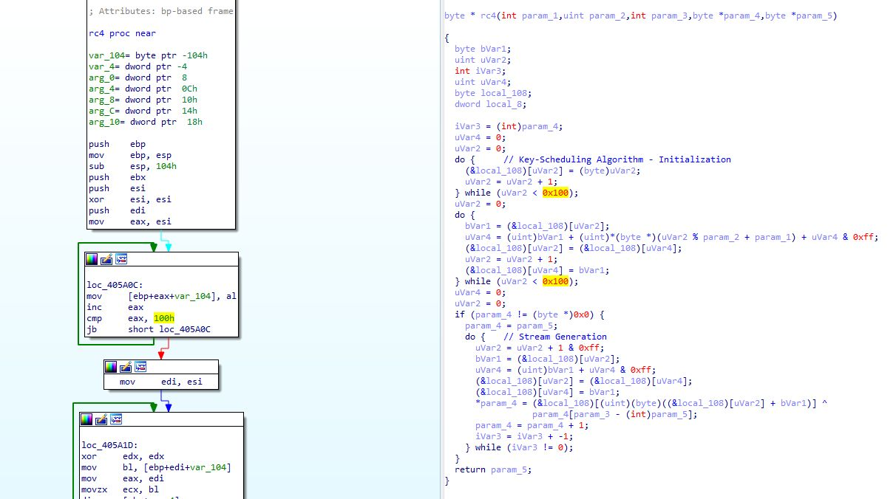

# defcon_news
`2019-09-30 15:22:20`

<blockquote>
New Critical Exim Flaw Exposes Email Servers to Remote Attacks — Patch Released
https://thehackernews.com/2019/09/exim-email-security-vulnerability.html

via The Hacker News
</blockquote>

<table><tr><td><b>→</b><a href="https://thehackernews.com/2019/09/exim-email-security-vulnerability.html">
https://thehackernews.com/2019/09/exim-email-security-vulnerability.html
</a>
<blockquote>
New Critical Exim Security Vulnerability (CVE-2019-16928) Exposes Email Servers to Remote Attacks — Patched Exim version 4.92.3 Released
</blockquote>
</td></tr></table>

---

# defcon_news
`2019-09-29 21:22:17`

<blockquote>
Опубликован Exim 4.92.3 с устранением четвёртой за год критической уязвимости
https://www.opennet.ru/opennews/art.shtml?num&#61;51590

via OpenNews.opennet.ru: Проблемы безопасности
</blockquote>

<table><tr><td><b>→</b><a href="https://www.opennet.ru/opennews/art.shtml?num=51590">
https://www.opennet.ru/opennews/art.shtml?num=51590
</a>
<blockquote>
Опубликован экстренный выпуск почтового сервера Exim 4.92.3 с устранением очередной критической уязвимости (CVE-2019-16928), потенциально позволяющей удалённо выполнить свой код на сервере через передачу специально оформленной строки в команде EHLO. Уязвимость проявляется на стадии после сброса привилегий и ограничена выполнением кода с правами непривилегированного пользователя, под которым выполняется обработчик поступающих сообщений.
</blockquote>
</td></tr></table>

---

# reverseengineeringx
`2019-09-29 06:46:09`

<blockquote>
https://github.com/David-Reguera-Garcia-Dreg/DbgChild
</blockquote>

<table><tr><td><b>→</b><a href="https://github.com/David-Reguera-Garcia-Dreg/DbgChild">
https://github.com/David-Reguera-Garcia-Dreg/DbgChild
</a>
<blockquote>
Debug Child Process Tool (auto attach). Contribute to David-Reguera-Garcia-Dreg/DbgChild development by creating an account on GitHub.
</blockquote>
</td></tr></table>

---

# defcon_news
`2019-09-28 19:37:44`

<blockquote>
[webapps] WordPress Theme Zoner Real Estate - 4.1.1 Persistent Cross-Site Scripting
https://www.exploit-db.com/exploits/47436

via Exploit Database
</blockquote>

<table><tr><td><b>→</b><a href="https://www.exploit-db.com/exploits/47436">
https://www.exploit-db.com/exploits/47436
</a>
<blockquote>
WordPress Theme Zoner Real Estate - 4.1.1 Persistent Cross-Site Scripting.. webapps exploit for PHP platform
</blockquote>
</td></tr></table>

---

# defcon_news
`2019-09-28 19:37:43`

<blockquote>
[webapps] V-SOL GPON/EPON OLT Platform 2.03 - Remote Privilege Escalation
https://www.exploit-db.com/exploits/47435

via Exploit Database
</blockquote>

<table><tr><td><b>→</b><a href="https://www.exploit-db.com/exploits/47435">
https://www.exploit-db.com/exploits/47435
</a>
<blockquote>
V-SOL GPON/EPON OLT Platform 2.03 - Remote Privilege Escalation.. webapps exploit for Hardware platform
</blockquote>
</td></tr></table>

---

# defcon_news
`2019-09-28 19:37:42`

<blockquote>
[webapps] V-SOL GPON/EPON OLT Platform 2.03 - Cross-Site Request Forgery
https://www.exploit-db.com/exploits/47434

via Exploit Database
</blockquote>

<table><tr><td><b>→</b><a href="https://www.exploit-db.com/exploits/47434?utm_source=dlvr.it&utm_medium=twitter">
https://www.exploit-db.com/exploits/47434?utm_source=dlvr.it&utm_medium=twitter
</a>
<blockquote>
V-SOL GPON/EPON OLT Platform 2.03 - Cross-Site Request Forgery.. webapps exploit for Hardware platform
</blockquote>
</td></tr></table>

---

# defcon_news
`2019-09-28 19:37:41`

<blockquote>
[webapps] V-SOL GPON/EPON OLT Platform 2.03 - Unauthenticated Configuration Download
https://www.exploit-db.com/exploits/47433

via Exploit Database
</blockquote>

<table><tr><td><b>→</b><a href="https://www.exploit-db.com/exploits/47433?utm_source=dlvr.it&utm_medium=twitter">
https://www.exploit-db.com/exploits/47433?utm_source=dlvr.it&utm_medium=twitter
</a>
<blockquote>
V-SOL GPON/EPON OLT Platform 2.03 - Unauthenticated Configuration Download.. webapps exploit for Hardware platform
</blockquote>
</td></tr></table>

---

# defcon_news
`2019-09-28 19:37:40`

<blockquote>
[webapps] thesystem App 1.0 - 'username' SQL Injection
https://www.exploit-db.com/exploits/47432

via Exploit Database
</blockquote>

<table><tr><td><b>→</b><a href="https://www.exploit-db.com/exploits/47432?utm_source=dlvr.it&utm_medium=twitter">
https://www.exploit-db.com/exploits/47432?utm_source=dlvr.it&utm_medium=twitter
</a>
<blockquote>
thesystem App 1.0 - 'username' SQL Injection.. webapps exploit for PHP platform
</blockquote>
</td></tr></table>

---

# defcon_news
`2019-09-28 19:37:40`

<blockquote>
[webapps] thesystem App 1.0 - Persistent Cross-Site Scripting
https://www.exploit-db.com/exploits/47431

via Exploit Database
</blockquote>

<table><tr><td><b>→</b><a href="https://www.exploit-db.com/exploits/47431?utm_source=dlvr.it&utm_medium=twitter">
https://www.exploit-db.com/exploits/47431?utm_source=dlvr.it&utm_medium=twitter
</a>
<blockquote>
thesystem App 1.0 - Persistent Cross-Site Scripting.. webapps exploit for PHP platform
</blockquote>
</td></tr></table>

---

# defcon_news
`2019-09-28 19:37:39`

<blockquote>
[webapps] thesystem App 1.0 - 'server_name' SQL Injection
https://www.exploit-db.com/exploits/47430

via Exploit Database
</blockquote>

<table><tr><td><b>→</b><a href="https://www.exploit-db.com/exploits/47430">
https://www.exploit-db.com/exploits/47430
</a>
<blockquote>
thesystem App 1.0 - 'server_name' SQL Injection.. webapps exploit for PHP platform
</blockquote>
</td></tr></table>

---

# defcon_news
`2019-09-28 19:37:38`

<blockquote>
[remote] Mobatek MobaXterm 12.1 - Buffer Overflow (SEH)
https://www.exploit-db.com/exploits/47429

via Exploit Database
</blockquote>

<table><tr><td><b>→</b><a href="https://www.exploit-db.com/exploits/47429?utm_source=dlvr.it&utm_medium=twitter">
https://www.exploit-db.com/exploits/47429?utm_source=dlvr.it&utm_medium=twitter
</a>
<blockquote>
Mobatek MobaXterm 12.1 - Buffer Overflow (SEH).. remote exploit for Windows platform
</blockquote>
</td></tr></table>

---

# defcon_news
`2019-09-28 19:37:37`

<blockquote>
[webapps] InoERP 0.7.2 - Persistent Cross-Site Scripting
https://www.exploit-db.com/exploits/47428

via Exploit Database
</blockquote>

<table><tr><td><b>→</b><a href="https://www.exploit-db.com/exploits/47428">
https://www.exploit-db.com/exploits/47428
</a>
<blockquote>
InoERP 0.7.2 - Persistent Cross-Site Scripting.. webapps exploit for PHP platform
</blockquote>
</td></tr></table>

---

# defcon_news
`2019-09-28 19:37:33`

<blockquote>
[webapps] citecodecrashers Pic-A-Point 1.1 - 'Consignment' SQL Injection
https://www.exploit-db.com/exploits/47427

via Exploit Database
</blockquote>

<table><tr><td><b>→</b><a href="https://www.exploit-db.com/exploits/47427">
https://www.exploit-db.com/exploits/47427
</a>
<blockquote>
citecodecrashers Pic-A-Point 1.1 - 'Consignment' SQL Injection.. webapps exploit for PHP platform
</blockquote>
</td></tr></table>

---

# defcon_news
`2019-09-28 19:37:32`

<blockquote>
[webapps] inoERP 4.15 - 'download' SQL Injection
https://www.exploit-db.com/exploits/47426

via Exploit Database
</blockquote>

<table><tr><td><b>→</b><a href="https://www.exploit-db.com/exploits/47426">
https://www.exploit-db.com/exploits/47426
</a>
<blockquote>
inoERP 4.15 - 'download' SQL Injection. CVE-2019-16894 . webapps exploit for PHP platform
</blockquote>
</td></tr></table>

---

# defcon_news
`2019-09-28 19:37:31`

<blockquote>
[webapps] all-in-one-seo-pack 3.2.7 - Persistent Cross-Site Scripting
https://www.exploit-db.com/exploits/47425

via Exploit Database
</blockquote>

<table><tr><td><b>→</b><a href="https://www.exploit-db.com/exploits/47425">
https://www.exploit-db.com/exploits/47425
</a>
<blockquote>
all-in-one-seo-pack 3.2.7 - Persistent Cross-Site Scripting.. webapps exploit for PHP platform
</blockquote>
</td></tr></table>

---

# defcon_news
`2019-09-28 19:37:30`

<blockquote>
[webapps] Duplicate-Post 3.2.3 - Persistent Cross-Site Scripting
https://www.exploit-db.com/exploits/47424

via Exploit Database
</blockquote>

<table><tr><td><b>→</b><a href="https://www.exploit-db.com/exploits/47424">
https://www.exploit-db.com/exploits/47424
</a>
<blockquote>
Duplicate-Post 3.2.3 - Persistent Cross-Site Scripting.. webapps exploit for PHP platform
</blockquote>
</td></tr></table>

---

# defcon_news
`2019-09-28 19:37:29`

<blockquote>
[webapps] Chamillo LMS 1.11.8 - Arbitrary File Upload
https://www.exploit-db.com/exploits/47423

via Exploit Database
</blockquote>

<table><tr><td><b>→</b><a href="https://www.exploit-db.com/exploits/47423?utm_source=dlvr.it&utm_medium=twitter">
https://www.exploit-db.com/exploits/47423?utm_source=dlvr.it&utm_medium=twitter
</a>
<blockquote>
Chamillo LMS 1.11.8 - Arbitrary File Upload.. webapps exploit for PHP platform
</blockquote>
</td></tr></table>

---

# R0_Crew
`2019-09-28 12:13:29`

* https://github.com/axi0mX/ipwndfu
* https://github.com/axi0mX/ipwndfu/commit/2d0abd321dfc947899f6b79cf2d189be9a622ab0

<blockquote>
axi0mX introduced update for own utility ipwndfu (open-source jailbreaking tool for older iOS devices) with new exploit - checkm8 (read &quot;checkmate&quot;), a permanent unpatchable bootrom exploit for most iOS devices (A5-A11 chip) &#35;exploit &#35;ios &#35;dukeBarman
</blockquote>

<table><tr><td><b>→</b><a href="https://github.com/axi0mX/ipwndfu">
https://github.com/axi0mX/ipwndfu
</a>
<blockquote>
open-source jailbreaking tool for many iOS devices - axi0mX/ipwndfu
</blockquote>
</td></tr></table>

---

# defcon_news
`2019-09-27 20:52:06`

<blockquote>
APPLE-SA-2019-9-26-9 Safari 13.0.1
http://seclists.org/fulldisclosure/2019/Sep/44

via Full Disclosure
</blockquote>

<table><tr><td><b>→</b><a href="https://seclists.org/fulldisclosure/2019/Sep/44">
https://seclists.org/fulldisclosure/2019/Sep/44
</a>
</td></tr></table>

---

# defcon_news
`2019-09-27 20:37:43`

<blockquote>
APPLE-SA-2019-9-26-8 iOS 13.1 and iPadOS 13.1
http://seclists.org/fulldisclosure/2019/Sep/43

via Full Disclosure
</blockquote>

<table><tr><td><b>→</b><a href="https://seclists.org/fulldisclosure/2019/Sep/43">
https://seclists.org/fulldisclosure/2019/Sep/43
</a>
</td></tr></table>

---

# defcon_news
`2019-09-27 20:37:42`

<blockquote>
APPLE-SA-2019-9-26-7 Xcode 11.0
http://seclists.org/fulldisclosure/2019/Sep/42

via Full Disclosure
</blockquote>

<table><tr><td><b>→</b><a href="https://seclists.org/fulldisclosure/2019/Sep/42">
https://seclists.org/fulldisclosure/2019/Sep/42
</a>
</td></tr></table>

---

# defcon_news
`2019-09-27 20:37:38`

<blockquote>
APPLE-SA-2019-9-26-6 tvOS 13
http://seclists.org/fulldisclosure/2019/Sep/41

via Full Disclosure
</blockquote>

<table><tr><td><b>→</b><a href="https://seclists.org/fulldisclosure/2019/Sep/41">
https://seclists.org/fulldisclosure/2019/Sep/41
</a>
</td></tr></table>

---

# defcon_news
`2019-09-27 20:37:37`

<blockquote>
APPLE-SA-2019-9-26-5 watchOS 6
http://seclists.org/fulldisclosure/2019/Sep/40

via Full Disclosure
</blockquote>

<table><tr><td><b>→</b><a href="https://seclists.org/fulldisclosure/2019/Sep/40">
https://seclists.org/fulldisclosure/2019/Sep/40
</a>
</td></tr></table>

---

# defcon_news
`2019-09-27 20:37:36`

<blockquote>
APPLE-SA-2019-9-26-3 iOS 13
http://seclists.org/fulldisclosure/2019/Sep/39

via Full Disclosure
</blockquote>

<table><tr><td><b>→</b><a href="https://seclists.org/fulldisclosure/2019/Sep/39">
https://seclists.org/fulldisclosure/2019/Sep/39
</a>
</td></tr></table>

---

# defcon_news
`2019-09-27 20:37:35`

<blockquote>
APPLE-SA-2019-9-26-4 Safari 13
http://seclists.org/fulldisclosure/2019/Sep/38

via Full Disclosure
</blockquote>

<table><tr><td><b>→</b><a href="https://seclists.org/fulldisclosure/2019/Sep/38">
https://seclists.org/fulldisclosure/2019/Sep/38
</a>
</td></tr></table>

---

# defcon_news
`2019-09-27 20:17:36`

<blockquote>
APPLE-SA-2019-9-26-2 macOS Mojave 10.14.6 Supplemental Update 2, Security Update 2019-005 High Sierra, Security Update 2019-005 Sierra
http://seclists.org/fulldisclosure/2019/Sep/37

via Full Disclosure
</blockquote>

<table><tr><td><b>→</b><a href="https://seclists.org/fulldisclosure/2019/Sep/37">
https://seclists.org/fulldisclosure/2019/Sep/37
</a>
</td></tr></table>

---

# defcon_news
`2019-09-27 20:17:35`

<blockquote>
APPLE-SA-2019-9-26-1 iOS 12.4.2
http://seclists.org/fulldisclosure/2019/Sep/36

via Full Disclosure
</blockquote>

<table><tr><td><b>→</b><a href="https://seclists.org/fulldisclosure/2019/Sep/36">
https://seclists.org/fulldisclosure/2019/Sep/36
</a>
</td></tr></table>

---

# defcon_news
`2019-09-27 20:17:34`

<blockquote>
DOM based XSS (Login page) in &quot;GFI Kerio Control&quot; Firewalls v9.3.0 / CVE-2019-16414 - working exploit attached
http://seclists.org/fulldisclosure/2019/Sep/35

via Full Disclosure
</blockquote>

<table><tr><td><b>→</b><a href="https://seclists.org/fulldisclosure/2019/Sep/35">
https://seclists.org/fulldisclosure/2019/Sep/35
</a>
</td></tr></table>

---

# isast
`2019-09-27 16:06:01`

* http://tiny.cc/ghjidz
* https://t.me/itgram_channel/35
* https://hypothesis.readthedocs.io/en/latest/index.html
* https://t.me/itgram_channel/82
* https://timothycrosley.github.io/hypothesis-auto/
* https://t.me/opensource_findings/138
* https://github.com/life4/deal
* https://github.com/python/mypy

<blockquote>
Наткнулся тут на язык Whiley со встроенным контрактным программированием. По сути, под капотом просто на этапе проверки запускает функцию с разными входными параметрами. Если входные данные не соответствуют pre-condition, просто игнорируем этот тест. Если соответствует, но падает на ensure (post-condition),  то, значит, контракт нарушен, паникуем. Собственно, это вся магия. Простой способ вместо полных тестов писать только условия на входные параметры и результат, а о конкретный значениях, да ещё чтобы покрыть все крайние случаи, пусть машина думает.

В Python подобное можно провернуть с помощью hypothesis. Навешиваете на тест декоратор, в котором говорите &quot;я хочу получать на вход 2 целых числа&quot;, пишете сам тест, и hypothesis сделает всё остальное: подберет значение, сгруппирует ошибки, сформирует минимальный пример ломающих всё входных данных. Я уже писал про него когда-то, в посте про тестирование в Python. Пример из документации:

@given(text())
def test_decode_inverts_encode(s):
    assert decode(encode(s)) &#61;&#61; s

Но можно пойти дальше. В большом проекте тестов много, да и никто на них не смотрит, когда код читает, на самом деле. У нас есть сигнатура функции, из которой понятно, какие параметры в функцию нужно передать. А теперь ещё есть аннотации типов. Указываем, какого типа значения можно передавать в каждый параметр, и всё, мы уже знаем довольно много о входных значениях. Ну так вот, hypothesis-auto — как раз тот самый инструмент, который умеет смотреть на сигнатуру и аннотации, чтобы формировать стратегии для hypothesis. Чуть побольше можно почтать в Opensource findings. Пример кода:

auto_test(divide, auto_allow_exceptions_&#61;(ZeroDivisionError, ))

Но аннотации покрывают далеко не все условия, накладываемые на входные параметры. Даже в примере выше мы знаем, что второй параметр divide должен быть не нулём. Библиотека deal позволяет делать честные контракты. Только аннотации туда не стоит переносить, потому что типы можно проверить статически (что mypy и делает), а контракты — только запустив функцию. Пример кода:

@deal.pre(lambda a, b: b !&#61; 0)
def div(a: int, b: int) -&gt; float:
    return a / b

А теперь лёгким движением руки скрещиваем hypothesis-auto, аннотации и deal, и получаем магическую строчку для автоматического тестирования функции выше:

auto_test(div, auto_allow_exceptions_&#61;deal.PreContractError)

Конечно, это не все тесты, которые нужно сделать для проекта. Но когда можно красиво описать условия, накладываемые на входные и выходные значения функции, а затем просто попросить машину самостоятельно проверить эти условия — это очень круто. Бесплатные тесты и повышение понятности кода при минимальных усилиях.
</blockquote>

<table><tr><td><b>→</b><a href="http://tiny.cc/ghjidz">
http://tiny.cc/ghjidz
</a>
<blockquote>
programming language
</blockquote>
</td></tr></table>

---

# cyberoffru
`2019-09-27 10:04:12`

<blockquote>
пейлоады например он в папку собирает, но копаться там не всегда хочется, а по их хешам, взятым из кибаны тип пейлоада выдал только один сервис. поэтому в иделе:
1. выйгрузка пейлоадов куда либо на сторону клиента.
2. есть такая штука https://github.com/maliceio/malice у нее есть команда watch folder - будет проверят пейлоады на вредоносный код и в кибану репорты выкидывать - станет жизнь немного удобней. 
Тут с кибаной нужно поиграться, визуализация для одной версии, плагин этой системы для другой версии + настроить адекватно проверку пейлоадов и отправку инфы в эластик. В общем пытаюсь минимизировать копание в недрах fs TPOT  до минимума
</blockquote>

<table><tr><td><b>→</b><a href="https://github.com/maliceio/malice">
https://github.com/maliceio/malice
</a>
<blockquote>
VirusTotal Wanna Be - Now with 100% more Hipster. Contribute to maliceio/malice development by creating an account on GitHub.
</blockquote>
</td></tr></table>

---

# defcon_news
`2019-09-26 19:47:42`

<blockquote>
vBulletin 5.x 0-Day Pre-Auth Remote Command Execution
https://packetstormsecurity.com/files/154623/http-vuln-CVE-2019-16759.nse.txt

via Exploit Files ≈ Packet Storm
</blockquote>

<table><tr><td><b>→</b><a href="https://packetstormsecurity.com/files/154623/http-vuln-CVE-2019-16759.nse.txt?utm_source=dlvr.it&utm_medium=twitter">
https://packetstormsecurity.com/files/154623/http-vuln-CVE-2019-16759.nse.txt?utm_source=dlvr.it&utm_medium=twitter
</a>
<blockquote>
Information Security Services, News, Files, Tools, Exploits, Advisories and Whitepapers
</blockquote>
</td></tr></table>

---

# defcon_news
`2019-09-26 10:02:10`

<blockquote>
SEC Consult SA-20190926-0 :: Multiple SQL Injection vulnerabilities in eBrigade
http://seclists.org/fulldisclosure/2019/Sep/34

via Full Disclosure
</blockquote>

<table><tr><td><b>→</b><a href="https://seclists.org/fulldisclosure/2019/Sep/34">
https://seclists.org/fulldisclosure/2019/Sep/34
</a>
</td></tr></table>

---

# defcon_news
`2019-09-25 19:37:41`

<blockquote>
[webapps] YzmCMS 5.3 - 'Host' Header Injection
https://www.exploit-db.com/exploits/47422

via Exploit Database
</blockquote>

<table><tr><td><b>→</b><a href="https://www.exploit-db.com/exploits/47422?utm_source=dlvr.it&utm_medium=twitter">
https://www.exploit-db.com/exploits/47422?utm_source=dlvr.it&utm_medium=twitter
</a>
<blockquote>
YzmCMS 5.3 - 'Host' Header Injection.. webapps exploit for PHP platform
</blockquote>
</td></tr></table>

---

# defcon_news
`2019-09-25 19:22:19`

<blockquote>
[CVE-2019-14783] Arbitrary file create with system-app privilege in Samsung Mobile Android FotaAgent Component
http://seclists.org/fulldisclosure/2019/Sep/33

via Full Disclosure
</blockquote>

<table><tr><td><b>→</b><a href="https://seclists.org/fulldisclosure/2019/Sep/33">
https://seclists.org/fulldisclosure/2019/Sep/33
</a>
</td></tr></table>

---

# defcon_news
`2019-09-25 19:22:18`

<blockquote>
[CVE-2019-16253] Privilege Escalation in Samsung Mobile Android SamsungTTS Component
http://seclists.org/fulldisclosure/2019/Sep/32

via Full Disclosure
</blockquote>

<table><tr><td><b>→</b><a href="https://seclists.org/fulldisclosure/2019/Sep/32">
https://seclists.org/fulldisclosure/2019/Sep/32
</a>
</td></tr></table>

---

# defcon_news
`2019-09-25 17:52:14`

<blockquote>
[local] ABRT - sosreport Privilege Escalation (Metasploit)
https://www.exploit-db.com/exploits/47421

via Exploit Database
</blockquote>

<table><tr><td><b>→</b><a href="https://www.exploit-db.com/exploits/47421?utm_source=dlvr.it&utm_medium=twitter">
https://www.exploit-db.com/exploits/47421?utm_source=dlvr.it&utm_medium=twitter
</a>
<blockquote>
ABRT - sosreport Privilege Escalation (Metasploit). CVE-2015-5287 . local exploit for Linux platform
</blockquote>
</td></tr></table>

---

# defcon_news
`2019-09-25 17:22:42`

<blockquote>
OpenSSL (IBB): Windows builds with insecure path defaults (CVE-2019-1552)
https://vulners.com/hackerone/H1:683318?utm_source&#61;rss&amp;utm_medium&#61;rss&amp;utm_campaign&#61;rss

via Vulners
</blockquote>

<table><tr><td><b>→</b><a href="https://vulners.com/hackerone/H1:683318?utm_source=rss&utm_medium=rss&utm_campaign=rss">
https://vulners.com/hackerone/H1:683318?utm_source=rss&utm_medium=rss&utm_campaign=rss
</a>
<blockquote>
Advisory: https://www.openssl.org/news/secadv/20190730.txt ``` Severity: Low OpenSSL has internal defaults for a directory tree where it can find a configuration file as well as certificates used for verification in TLS.  This directory is most commonly referred to as...
</blockquote>
</td></tr></table>

---

# defcon_news
`2019-09-25 17:12:09`

<blockquote>
[webapps] NPMJS gitlabhook 0.0.17 - 'repository' Remote Command Execution
https://www.exploit-db.com/exploits/47420

via Exploit Database
</blockquote>

<table><tr><td><b>→</b><a href="https://www.exploit-db.com/exploits/47420">
https://www.exploit-db.com/exploits/47420
</a>
<blockquote>
NPMJS gitlabhook 0.0.17 - 'repository' Remote Command Execution. CVE-2019-5485 . webapps exploit for JSON platform
</blockquote>
</td></tr></table>

---

# defcon_news
`2019-09-25 16:47:27`

<blockquote>
[webapps] WP Server Log Viewer 1.0 - 'logfile' Persistent Cross-Site Scripting
https://www.exploit-db.com/exploits/47419

via Exploit Database
</blockquote>

<table><tr><td><b>→</b><a href="https://www.exploit-db.com/exploits/47419">
https://www.exploit-db.com/exploits/47419
</a>
<blockquote>
WP Server Log Viewer 1.0 - 'logfile' Persistent Cross-Site Scripting.. webapps exploit for PHP platform
</blockquote>
</td></tr></table>

---

# cyberoffru
`2019-09-25 15:24:54`

<blockquote>
https://github.com/dtag-dev-sec/tpotce
</blockquote>

<table><tr><td><b>→</b><a href="https://github.com/dtag-dev-sec/tpotce">
https://github.com/dtag-dev-sec/tpotce
</a>
<blockquote>
🍯 T-Pot - The All In One Honeypot Platform 🐝. Contribute to telekom-security/tpotce development by creating an account on GitHub.
</blockquote>
</td></tr></table>

---

# cyberoffru
`2019-09-25 13:51:10`

<blockquote>
https://github.com/threatstream/mhn
</blockquote>

<table><tr><td><b>→</b><a href="https://github.com/threatstream/mhn">
https://github.com/threatstream/mhn
</a>
<blockquote>
Modern Honey Network. Contribute to pwnlandia/mhn development by creating an account on GitHub.
</blockquote>
</td></tr></table>

---

# defcon_news
`2019-09-25 11:37:24`

<blockquote>
[dos] SpotIE Internet Explorer Password Recovery 2.9.5 - 'Key' Denial of Service
https://www.exploit-db.com/exploits/47418

via Exploit Database
</blockquote>

<table><tr><td><b>→</b><a href="https://www.exploit-db.com/exploits/47418?utm_source=dlvr.it&utm_medium=twitter">
https://www.exploit-db.com/exploits/47418?utm_source=dlvr.it&utm_medium=twitter
</a>
<blockquote>
SpotIE Internet Explorer Password Recovery 2.9.5 - 'Key' Denial of Service.. dos exploit for Windows platform
</blockquote>
</td></tr></table>

---

# defcon_news
`2019-09-25 11:37:23`

<blockquote>
[webapps] Microsoft SharePoint 2013 SP1 - 'DestinationFolder' Persistant Cross-Site Scripting
https://www.exploit-db.com/exploits/47417

via Exploit Database
</blockquote>

<table><tr><td><b>→</b><a href="https://www.exploit-db.com/exploits/47417">
https://www.exploit-db.com/exploits/47417
</a>
<blockquote>
Microsoft SharePoint 2013 SP1 - 'DestinationFolder' Persistant Cross-Site Scripting. CVE-2019-1262 . webapps exploit for ASPX platform
</blockquote>
</td></tr></table>

---

# defcon_news
`2019-09-25 08:57:04`

<blockquote>
Неисправленная 0-day уязвимость в движке для создания web-форумов vBulletin
http://www.opennet.ru/opennews/art.shtml?num&#61;51559

via OpenNews.opennet.ru: Проблемы безопасности
</blockquote>

<table><tr><td><b>→</b><a href="http://www.opennet.ru/opennews/art.shtml?num=51559">
http://www.opennet.ru/opennews/art.shtml?num=51559
</a>
<blockquote>
Раскрыта информация о неисправленной критической уязвимости (CVE-2019-16759) в движке для создания web-форумов vBulletin, позволяющей выполнить код на сервере через отправку специально оформленного POST-запроса. Для проблемы доступен рабочий эксплоит. vBulletin используется многими открытыми проектами, в том числе на базе данного движка работают форумы Ubuntu, openSUSE, BSD-систем и Slackware.
</blockquote>
</td></tr></table>

---

# defcon_news
`2019-09-25 06:12:16`

<blockquote>
Укрощение Горыныча, или Декомпиляция eBPF в Ghidra
https://habr.com/ru/post/468529/

via Информационная безопасность – Защита данных
</blockquote>

<table><tr><td><b>→</b><a href="https://habr.com/ru/post/468529/?utm_source=habrahabr&utm_medium=rss&utm_campaign=468529">
https://habr.com/ru/post/468529/?utm_source=habrahabr&utm_medium=rss&utm_campaign=468529
</a>
<blockquote>
Автор статьи https://github.com/Nalen98 Добрый день! Тема моего исследования в рамках летней стажировки «Summer of Hack 2019» в компании Digital Security была «...
</blockquote>
</td></tr></table>

---

# defcon_news
`2019-09-24 19:52:52`

<blockquote>
vBulletin 5.x 0day pre-auth RCE exploit
http://seclists.org/fulldisclosure/2019/Sep/31

via Full Disclosure
</blockquote>

<table><tr><td><b>→</b><a href="https://seclists.org/fulldisclosure/2019/Sep/31">
https://seclists.org/fulldisclosure/2019/Sep/31
</a>
</td></tr></table>

---

# defcon_news
`2019-09-24 19:52:52`

<blockquote>
XSSer v.1.8[1] - &quot;The Hive!&quot; released
http://seclists.org/fulldisclosure/2019/Sep/30

via Full Disclosure
</blockquote>

<table><tr><td><b>→</b><a href="https://seclists.org/fulldisclosure/2019/Sep/30">
https://seclists.org/fulldisclosure/2019/Sep/30
</a>
</td></tr></table>

---

# defcon_news
`2019-09-24 17:37:25`

<blockquote>
[remote] Microsoft Windows - BlueKeep RDP Remote Windows Kernel Use After Free (Metasploit)
https://www.exploit-db.com/exploits/47416

via Exploit Database
</blockquote>

<table><tr><td><b>→</b><a href="https://www.exploit-db.com/exploits/47416">
https://www.exploit-db.com/exploits/47416
</a>
<blockquote>
Microsoft Windows - BlueKeep RDP Remote Windows Kernel Use After Free (Metasploit). CVE-2019-0708 . remote exploit for Windows platform
</blockquote>
</td></tr></table>

---

# defcon_news
`2019-09-24 17:22:11`

<blockquote>
[dos] iMessage - Decoding NSSharedKeyDictionary Can Read Object Out of Bounds
https://www.exploit-db.com/exploits/47415

via Exploit Database
</blockquote>

<table><tr><td><b>→</b><a href="https://www.exploit-db.com/exploits/47415?utm_source=dlvr.it&utm_medium=twitter">
https://www.exploit-db.com/exploits/47415?utm_source=dlvr.it&utm_medium=twitter
</a>
<blockquote>
iMessage - Decoding NSSharedKeyDictionary Can Read Object Out of Bounds. CVE-2019-8641 . dos exploit for iOS platform
</blockquote>
</td></tr></table>

---

# defcon_news
`2019-09-24 17:22:10`

<blockquote>
[dos] Microsoft Windows cryptoapi - SymCrypt Modular Inverse Algorithm Denial of Service
https://www.exploit-db.com/exploits/47414

via Exploit Database
</blockquote>

<table><tr><td><b>→</b><a href="https://www.exploit-db.com/exploits/47414">
https://www.exploit-db.com/exploits/47414
</a>
<blockquote>
Microsoft Windows cryptoapi - SymCrypt Modular Inverse Algorithm Denial of Service.. dos exploit for Windows platform
</blockquote>
</td></tr></table>

---

# defcon_news
`2019-09-24 16:37:36`

<blockquote>
[webapps] Pfsense 2.3.4 / 2.4.4-p3 - Remote Code Injection
https://www.exploit-db.com/exploits/47413

via Exploit Database
</blockquote>

<table><tr><td><b>→</b><a href="https://www.exploit-db.com/exploits/47413">
https://www.exploit-db.com/exploits/47413
</a>
<blockquote>
Pfsense 2.3.4 / 2.4.4-p3 - Remote Code Injection. CVE-2019-16701 . webapps exploit for PHP platform
</blockquote>
</td></tr></table>

---

# defcon_news
`2019-09-24 16:22:32`

<blockquote>
[remote] File Sharing Wizard 1.5.0 - POST SEH Overflow
https://www.exploit-db.com/exploits/47412

via Exploit Database
</blockquote>

<table><tr><td><b>→</b><a href="https://www.exploit-db.com/exploits/47412">
https://www.exploit-db.com/exploits/47412
</a>
<blockquote>
File Sharing Wizard 1.5.0 - POST SEH Overflow. CVE-2019-16724 . remote exploit for Windows platform
</blockquote>
</td></tr></table>

---

# defcon_news
`2019-09-24 16:22:30`

<blockquote>
[local] Easy File Sharing Web Server 7.2 - 'New User' Local SEH Overflow
https://www.exploit-db.com/exploits/47411

via Exploit Database
</blockquote>

<table><tr><td><b>→</b><a href="https://www.exploit-db.com/exploits/47411">
https://www.exploit-db.com/exploits/47411
</a>
<blockquote>
The Exploit Database - Exploits, Shellcode, 0days, Remote Exploits, Local Exploits, Web Apps, Vulnerability Reports, Security Articles, Tutorials and more.
</blockquote>
</td></tr></table>

---

# defcon_news
`2019-09-24 15:52:10`

<blockquote>
[dos] DeviceViewer 3.12.0.1 - 'creating user' Denial of Service
https://www.exploit-db.com/exploits/47410

via Exploit Database
</blockquote>

<table><tr><td><b>→</b><a href="https://www.exploit-db.com/exploits/47410">
https://www.exploit-db.com/exploits/47410
</a>
<blockquote>
DeviceViewer 3.12.0.1 - 'creating user' Denial of Service.. dos exploit for Windows platform
</blockquote>
</td></tr></table>

---

# defcon_news
`2019-09-24 11:37:26`

<blockquote>
Microsoft экстренно устранила 0-day уязвимости в составе IE и Microsoft Defender
https://xakep.ru/2019/09/24/windows-0days/

via «Хакер»
</blockquote>

<table><tr><td><b>→</b><a href="https://xakep.ru/2019/09/24/windows-0days/">
https://xakep.ru/2019/09/24/windows-0days/
</a>
<blockquote>
Разработчики Microsoft выпустили срочные патчи для проблем CVE-2019-1367 и CVE-2019-1255, тем самым устранив две уязвимости нулевого дня в своих продуктах.
</blockquote>
</td></tr></table>

---

# webware
`2019-09-24 08:34:06`

* https://telegra.ph/Samurai-Email-Discovery---Utilita-dlya-poiska-e-mail-adresov-01-21

<blockquote>
Samurai Email Discovery - Утилита для поиска e-mail адресов
</blockquote>

<table><tr><td><b>→</b><a href="https://telegra.ph/Samurai-Email-Discovery---Utilita-dlya-poiska-e-mail-adresov-01-21">
https://telegra.ph/Samurai-Email-Discovery---Utilita-dlya-poiska-e-mail-adresov-01-21
</a>
<blockquote>
t.me/webware Всем привет! Сегодня хочу ознакомить Вас с небольшим фреймворком, написанным на Bash, целью которого является поиск почтовых ящиков. Samurai Email Discovery – много писать о нем смысла не имеет, я лучше покажу. Samurai Email Discovery – производит поиск адресов по трем векторам: Google Dork – поиск по доркам Google Domain – поиск по доменному имени Company – поиск по названию/домену компании. Установка: git clone https://github.com/0x3curity/Samurai Обязательным является наличие в системе Lynx…
</blockquote>
</td></tr></table>

---

# sysadm_in_channel
`2019-09-23 18:48:38`

<blockquote>
Сетевое хранилище D-LINK в опасносте, или как выполнить удалённо код пользователю не прошедшему авторизацию:

https://blog.cystack.net/d-link-dns-320-rce/

И как шифровальщики это используют:

https://www.bleepingcomputer.com/news/security/cr1ptt0r-ransomware-infects-d-link-nas-devices-targets-embedded-systems/


Собственно о уязвимости на офф сайте:

https://supportannouncement.us.dlink.com/announcement/publication.aspx?name&#61;SAP10123
</blockquote>

<table><tr><td><b>→</b><a href="https://blog.cystack.net/d-link-dns-320-rce/">
https://blog.cystack.net/d-link-dns-320-rce/
</a>
<blockquote>
CyStack Advisory IDCSA-2019-03CVE IDs CVE-2019-16057
[https://www.cvedetails.com/cve/CVE-2019-16057/]SeverityCriticalCVSS v2 Base10.0
Vendor's announcementLink
[https://supportannouncement.us.dlink.com/announcement/publication.aspx?name&#61;SAP10123]
Synopsis
CyStack Security discovered a remote code execution vulnerability in the D-Link
DNS-320 ShareCenter [http://sharecenter.dlink.com/products/DNS-320]device which
its version is lower or equal 2.05.B10 . By exploiting the vulnerability, a
remote,
</blockquote>
</td></tr></table>

---

# defcon_news
`2019-09-23 16:07:50`

<blockquote>
Bug Bounty Competition 2019
http://seclists.org/fulldisclosure/2019/Sep/29

via Full Disclosure
</blockquote>

<table><tr><td><b>→</b><a href="https://seclists.org/fulldisclosure/2019/Sep/29">
https://seclists.org/fulldisclosure/2019/Sep/29
</a>
</td></tr></table>

---

# defcon_news
`2019-09-23 13:07:13`

<blockquote>
[remote] HPE Intelligent Management Center &lt; 7.3 E0506P09 - Information Disclosure
https://www.exploit-db.com/exploits/47408

via Exploit Database
</blockquote>

<table><tr><td><b>→</b><a href="https://www.exploit-db.com/exploits/47408">
https://www.exploit-db.com/exploits/47408
</a>
<blockquote>
HPE Intelligent Management Center &lt; 7.3 E0506P09 - Information Disclosure. CVE-2019-5392 . remote exploit for watchOS platform
</blockquote>
</td></tr></table>

---

# defcon_news
`2019-09-23 13:07:11`

<blockquote>
[webapps] Gila CMS &lt; 1.11.1 - Local File Inclusion
https://www.exploit-db.com/exploits/47407

via Exploit Database
</blockquote>

<table><tr><td><b>→</b><a href="https://www.exploit-db.com/exploits/47407">
https://www.exploit-db.com/exploits/47407
</a>
<blockquote>
Gila CMS &lt; 1.11.1 - Local File Inclusion. CVE-2019-16679 . webapps exploit for Multiple platform
</blockquote>
</td></tr></table>

---

# defcon_news
`2019-09-23 10:52:36`

<blockquote>
[remote] Hisilicon HiIpcam V100R003 Remote ADSL - Credentials Disclosure
https://www.exploit-db.com/exploits/47405

via Exploit Database
</blockquote>

<table><tr><td><b>→</b><a href="https://www.exploit-db.com/exploits/47405">
https://www.exploit-db.com/exploits/47405
</a>
<blockquote>
Hisilicon HiIpcam V100R003 Remote ADSL - Credentials Disclosure.. remote exploit for Hardware platform
</blockquote>
</td></tr></table>

---

# defcon_news
`2019-09-23 07:44:26`

<blockquote>
CVE-2019-1082 Windows Local Privileges Escalation. Little Writeup How i found lpe vulnerability.
https://www.reddit.com/r/netsec/comments/d80o63/cve20191082_windows_local_privileges_escalation/

via /r/netsec - Information Security News &amp; Discussion
</blockquote>

<table><tr><td><b>→</b><a href="https://www.reddit.com/r/netsec/comments/d80o63/cve20191082_windows_local_privileges_escalation/">
https://www.reddit.com/r/netsec/comments/d80o63/cve20191082_windows_local_privileges_escalation/
</a>
<blockquote>
Posted in r/netsec by u/alfaraw • 32 points and 1 comment
</blockquote>
</td></tr></table>

---

# R0_Crew
`2019-09-22 00:02:16`

<blockquote>
A set of helpers and examples to fuzz Win32 binaries with AFL++ QEMU https://github.com/andreafioraldi/WineAFLplusplusDEMO &#35;fuzzing &#35;dukeBarman
</blockquote>

<table><tr><td><b>→</b><a href="https://github.com/andreafioraldi/WineAFLplusplusDEMO">
https://github.com/andreafioraldi/WineAFLplusplusDEMO
</a>
<blockquote>
A set of helpers and examples to fuzz Win32 binaries with AFL++ QEMU - AFLplusplus/Fuzz-With-Wine-Demo
</blockquote>
</td></tr></table>

---

# defcon_news
`2019-09-20 21:16:35`

<blockquote>
Reflected XSS – HRworks Login (v1.16.1)
http://seclists.org/fulldisclosure/2019/Sep/28

via Full Disclosure
</blockquote>

<table><tr><td><b>→</b><a href="https://seclists.org/fulldisclosure/2019/Sep/28">
https://seclists.org/fulldisclosure/2019/Sep/28
</a>
</td></tr></table>

---

# defcon_news
`2019-09-20 18:56:24`

<blockquote>
CVE-2019-6145 - Forcepoint VPN Client - Unquoted Search Path and Potential Abuses
https://www.reddit.com/r/netsec/comments/d6vafo/cve20196145_forcepoint_vpn_client_unquoted_search/

via /r/netsec - Information Security News &amp; Discussion
</blockquote>

<table><tr><td><b>→</b><a href="https://www.reddit.com/r/netsec/comments/d6vafo/cve20196145_forcepoint_vpn_client_unquoted_search/">
https://www.reddit.com/r/netsec/comments/d6vafo/cve20196145_forcepoint_vpn_client_unquoted_search/
</a>
<blockquote>
Posted in r/netsec by u/peleghd • 99 points and 15 comments
</blockquote>
</td></tr></table>

---

# exploitex
`2019-09-20 13:00:20`

* https://telegra.ph/file/d34cca15b5abac03a1d5e.jpg
* https://github.com/gentilkiwi/mimikatz

<blockquote>
​​Mimikatz

Приложение-стенд для тренировки с правами доступа, безопасностью и уязвимостями Windows. Хотя винда кишит массой уязвимых “дырок”, эта тулза, написанная на C, поможет найти новые, или поиграться с уже известными огрехами Microsoft.

📎 Github
</blockquote>

<table><tr><td><b>→</b><a href="https://telegra.ph/file/d34cca15b5abac03a1d5e.jpg">
https://telegra.ph/file/d34cca15b5abac03a1d5e.jpg
</a>
</td></tr></table>

---

# defcon_news
`2019-09-20 12:36:38`

<blockquote>
[webapps] LayerBB &lt; 1.1.4 - Cross-Site Request Forgery
https://www.exploit-db.com/exploits/47403

via Exploit Database
</blockquote>

<table><tr><td><b>→</b><a href="https://www.exploit-db.com/exploits/47403">
https://www.exploit-db.com/exploits/47403
</a>
<blockquote>
LayerBB &lt; 1.1.4 - Cross-Site Request Forgery. CVE-2019-16531 . webapps exploit for PHP platform
</blockquote>
</td></tr></table>

---

# defcon_news
`2019-09-19 22:51:11`

<blockquote>
[webapps] GOautodial 4.0 - 'CreateEvent' Persistent Cross-Site Scripting
https://www.exploit-db.com/exploits/47402

via Exploit Database
</blockquote>

<table><tr><td><b>→</b><a href="https://www.exploit-db.com/exploits/47402">
https://www.exploit-db.com/exploits/47402
</a>
<blockquote>
GOautodial 4.0 - 'CreateEvent' Persistent Cross-Site Scripting.. webapps exploit for PHP platform
</blockquote>
</td></tr></table>

---

# defcon_news
`2019-09-19 21:41:30`

<blockquote>
[webapps] DIGIT CENTRIS 4 ERP - 'datum1' SQL Injection
https://www.exploit-db.com/exploits/47401

via Exploit Database
</blockquote>

<table><tr><td><b>→</b><a href="https://www.exploit-db.com/exploits/47401">
https://www.exploit-db.com/exploits/47401
</a>
<blockquote>
DIGIT CENTRIS 4 ERP - 'datum1' SQL Injection.. webapps exploit for PHP platform
</blockquote>
</td></tr></table>

---

# defcon_news
`2019-09-19 15:46:26`

<blockquote>
Critical Vulnerability in Harbor Enables Privilege Escalation from Zero to Admin (CVE-2019-16097)
https://www.reddit.com/r/netsec/comments/d6d4sj/critical_vulnerability_in_harbor_enables/

via /r/netsec - Information Security News &amp; Discussion
</blockquote>

<table><tr><td><b>→</b><a href="https://www.reddit.com/r/netsec/comments/d6d4sj/critical_vulnerability_in_harbor_enables/">
https://www.reddit.com/r/netsec/comments/d6d4sj/critical_vulnerability_in_harbor_enables/
</a>
<blockquote>
Posted in r/netsec by u/pingpongfifa • 1 point and 0 comments
</blockquote>
</td></tr></table>

---

# defcon_news
`2019-09-19 15:11:56`

<blockquote>
[local] macOS 18.7.0 Kernel - Local Privilege Escalation
https://www.exploit-db.com/exploits/47400

via Exploit Database
</blockquote>

<table><tr><td><b>→</b><a href="https://www.exploit-db.com/exploits/47400">
https://www.exploit-db.com/exploits/47400
</a>
<blockquote>
macOS 18.7.0 Kernel - Local Privilege Escalation.. local exploit for macOS platform
</blockquote>
</td></tr></table>

---

# R0_Crew
`2019-09-19 13:00:59`

<blockquote>
SVD-Loader for Ghidra: Simplifying bare-metal ARM reverse engineering https://github.com/leveldown-security/SVD-Loader-Ghidra &#35;reverse &#35;ghidra &#35;dukeBarman
</blockquote>

<table><tr><td><b>→</b><a href="https://github.com/leveldown-security/SVD-Loader-Ghidra">
https://github.com/leveldown-security/SVD-Loader-Ghidra
</a>
<blockquote>
Contribute to leveldown-security/SVD-Loader-Ghidra development by creating an account on GitHub.
</blockquote>
</td></tr></table>

---

# reverseengineeringx
`2019-09-19 12:29:01`

<blockquote>
https://github.com/HynekPetrak/malware-jail
</blockquote>

<table><tr><td><b>→</b><a href="https://github.com/HynekPetrak/malware-jail/">
https://github.com/HynekPetrak/malware-jail/
</a>
<blockquote>
Sandbox for semi-automatic Javascript malware analysis, deobfuscation and payload extraction. Written for Node.js - HynekPetrak/malware-jail
</blockquote>
</td></tr></table>

---

# reverseengineeringx
`2019-09-19 12:28:31`

<blockquote>
https://github.com/HynekPetrak/javascript-malware-collection
</blockquote>

<table><tr><td><b>→</b><a href="https://github.com/HynekPetrak/javascript-malware-collection">
https://github.com/HynekPetrak/javascript-malware-collection
</a>
<blockquote>
Collection of almost 40.000 javascript malware samples - HynekPetrak/javascript-malware-collection
</blockquote>
</td></tr></table>

---

# defcon_news
`2019-09-19 11:56:26`

<blockquote>
[webapps] Western Digital My Book World II NAS 1.02.12 - Authentication Bypass / Command Execution
https://www.exploit-db.com/exploits/47399

via Exploit Database
</blockquote>

<table><tr><td><b>→</b><a href="https://www.exploit-db.com/exploits/47399">
https://www.exploit-db.com/exploits/47399
</a>
<blockquote>
Western Digital My Book World II NAS 1.02.12 - Authentication Bypass / Command Execution. CVE-2019-16399 . webapps exploit for Hardware platform
</blockquote>
</td></tr></table>

---

# defcon_news
`2019-09-19 08:31:40`

<blockquote>
Уязвимость в vhost-net, позволяющая обойти изоляцию в системах на базе QEMU-KVM
http://www.opennet.ru/opennews/art.shtml?num&#61;51520

via OpenNews.opennet.ru: Проблемы безопасности
</blockquote>

<table><tr><td><b>→</b><a href="https://www.opennet.ru/opennews/art.shtml?num=51520">
https://www.opennet.ru/opennews/art.shtml?num=51520
</a>
<blockquote>
Раскрыта информация об уязвимости (CVE-2019-14835), позволяющей выйти за пределы гостевой системы в KVM (qemu-kvm) и выполнить свой код на стороне хост-окружения в контексте ядра Linux. Уязвимости присвоено кодовое имя V-gHost. Проблема позволяет из гостевой системы создать условия для переполнения буфера в модуле ядра vhost-net (сетевой бэкенд для virtio), выполняемом на стороне хост-окружения. Атака может быть проведена злоумышленником, имеющим привилегированный доступ в гостевой системе, во время выполнения операции миграции виртуальных машин.
</blockquote>
</td></tr></table>

---

# sysadm_in_channel
`2019-09-19 07:57:25`

<blockquote>
PMA под угрозой, атакующий может создать поддельную гиперссылку, содержащую запрос, который выполнится от лица пользователя. В этом случае открывается возможность для атаки вида CSRF из-за неправильного использования HTTP-метода.

Если кратко - CSRF атака, позволяет атакующему выполнить на атакуемом сайте различные действия от имени других, зарегистрированных посетителей (например администратора БД)

https://seclists.org/fulldisclosure/2019/Sep/23
</blockquote>

<table><tr><td><b>→</b><a href="https://seclists.org/fulldisclosure/2019/Sep/23">
https://seclists.org/fulldisclosure/2019/Sep/23
</a>
</td></tr></table>

---

# defcon_news
`2019-09-19 07:37:54`

<blockquote>
Корректирующий выпуск Chrome 77.0.3865.90 с устранением критической уязвимости
http://www.opennet.ru/opennews/art.shtml?num&#61;51518

via OpenNews.opennet.ru: Проблемы безопасности
</blockquote>

<table><tr><td><b>→</b><a href="https://www.opennet.ru/opennews/art.shtml?num=51518">
https://www.opennet.ru/opennews/art.shtml?num=51518
</a>
<blockquote>
Доступно обновление браузера Chrome 77.0.3865.90, в котором устранены четыре уязвимости, одной из которых присвоен статус критической проблемы, позволяющей обойти все уровни защиты браузера и выполнить код в системе, за пределами sandbox-окружения. Детали о критической уязвимости (CVE-2019-13685) пока не раскрываются, известно только, что она вызвана обращением к уже освобождённому блоку памяти в обработчиках, связанных с интерфейсом пользователя (доступ к информации будет открыт после того, как большая часть пользователей установит обновление).
</blockquote>
</td></tr></table>

---

# defcon_news
`2019-09-18 20:24:29`

<blockquote>
[webapps] Hospital-Management 1.26 - 'fname' SQL Injection
https://www.exploit-db.com/exploits/47398

via Exploit Database
</blockquote>

<table><tr><td><b>→</b><a href="https://www.exploit-db.com/exploits/47398">
https://www.exploit-db.com/exploits/47398
</a>
<blockquote>
Hospital-Management 1.26 - 'fname' SQL Injection.. webapps exploit for PHP platform
</blockquote>
</td></tr></table>

---

# defcon_news
`2019-09-18 14:19:29`

<blockquote>
SEC Consult SA-20190918-0 :: Reflected Cross-Site Scripting (XSS) in Oracle Mojarra JSF
http://seclists.org/fulldisclosure/2019/Sep/27

via Full Disclosure
</blockquote>

<table><tr><td><b>→</b><a href="https://seclists.org/fulldisclosure/2019/Sep/27">
https://seclists.org/fulldisclosure/2019/Sep/27
</a>
</td></tr></table>

---

# defcon_news
`2019-09-17 00:14:24`

<blockquote>
[webapps] CollegeManagementSystem-CMS 1.3 - 'batch' SQL Injection
https://www.exploit-db.com/exploits/47395

via Exploit Database
</blockquote>

<table><tr><td><b>→</b><a href="https://www.exploit-db.com/exploits/47395">
https://www.exploit-db.com/exploits/47395
</a>
<blockquote>
CollegeManagementSystem-CMS 1.3 - 'batch' SQL Injection.. webapps exploit for PHP platform
</blockquote>
</td></tr></table>

---

# defcon_news
`2019-09-16 20:34:24`

<blockquote>
[local] AppXSvc - Privilege Escalation
https://www.exploit-db.com/exploits/47389

via Exploit Database
</blockquote>

<table><tr><td><b>→</b><a href="https://www.exploit-db.com/exploits/47389">
https://www.exploit-db.com/exploits/47389
</a>
<blockquote>
AppXSvc - Privilege Escalation. CVE-2019-1253 . local exploit for Windows platform
</blockquote>
</td></tr></table>

---

# defcon_news
`2019-09-16 20:34:23`

<blockquote>
[local] Windows NTFS - Privileged File Access Enumeration
https://www.exploit-db.com/exploits/47357

via Exploit Database
</blockquote>

<table><tr><td><b>→</b><a href="https://www.exploit-db.com/exploits/47357">
https://www.exploit-db.com/exploits/47357
</a>
<blockquote>
Windows NTFS - Privileged File Access Enumeration.. local exploit for Windows platform
</blockquote>
</td></tr></table>

---

# defcon_news
`2019-09-16 16:24:31`

<blockquote>
[local] docPrint Pro 8.0 - SEH Buffer Overflow
https://www.exploit-db.com/exploits/47394

via Exploit Database
</blockquote>

<table><tr><td><b>→</b><a href="https://www.exploit-db.com/exploits/47394">
https://www.exploit-db.com/exploits/47394
</a>
<blockquote>
docPrint Pro 8.0 - SEH Buffer Overflow.. local exploit for Windows platform
</blockquote>
</td></tr></table>

---

# defcon_news
`2019-09-16 16:10:20`

<blockquote>
[webapps] Symantec Advanced Secure Gateway (ASG) / ProxySG - Unrestricted File Upload
https://www.exploit-db.com/exploits/47392

via Exploit Database
</blockquote>

<table><tr><td><b>→</b><a href="https://www.exploit-db.com/exploits/47392?utm_source=dlvr.it&utm_medium=twitter">
https://www.exploit-db.com/exploits/47392?utm_source=dlvr.it&utm_medium=twitter
</a>
<blockquote>
Symantec Advanced Secure Gateway (ASG) / ProxySG - Unrestricted File Upload. CVE-2016-10258 . webapps exploit for CFM platform
</blockquote>
</td></tr></table>

---

# defcon_news
`2019-09-16 12:49:10`

<blockquote>
[remote] Inteno IOPSYS Gateway - Improper Access Restrictions
https://www.exploit-db.com/exploits/47390

via Exploit Database
</blockquote>

<table><tr><td><b>→</b><a href="https://www.exploit-db.com/exploits/47390">
https://www.exploit-db.com/exploits/47390
</a>
<blockquote>
Inteno IOPSYS Gateway - Improper Access Restrictions.. remote exploit for Hardware platform
</blockquote>
</td></tr></table>

---

# defcon_news
`2019-09-14 21:07:51`

<blockquote>
[webapps] College-Management-System 1.2 - Authentication Bypass
https://www.exploit-db.com/exploits/47388

via Exploit Database
</blockquote>

<table><tr><td><b>→</b><a href="https://www.exploit-db.com/exploits/47388">
https://www.exploit-db.com/exploits/47388
</a>
<blockquote>
College-Management-System 1.2 - Authentication Bypass.. webapps exploit for PHP platform
</blockquote>
</td></tr></table>

---

# reverseengineeringx
`2019-09-14 15:35:59`

<blockquote>
FLARE VM - a fully customizable, Windows-based security distribution for malware analysis, incident response, penetration testing, etc.

https://github.com/fireeye/flare-vm
</blockquote>

<table><tr><td><b>→</b><a href="https://github.com/fireeye/flare-vm">
https://github.com/fireeye/flare-vm
</a>
<blockquote>
Contribute to fireeye/flare-vm development by creating an account on GitHub.
</blockquote>
</td></tr></table>

---

# defcon_news
`2019-09-14 14:52:25`

<blockquote>
[webapps] Ticket-Booking 1.4 - Authentication Bypass
https://www.exploit-db.com/exploits/47387

via Exploit Database
</blockquote>

<table><tr><td><b>→</b><a href="https://www.exploit-db.com/exploits/47387">
https://www.exploit-db.com/exploits/47387
</a>
<blockquote>
Ticket-Booking 1.4 - Authentication Bypass.. webapps exploit for PHP platform
</blockquote>
</td></tr></table>

---

# sysadm_in_channel
`2019-09-13 18:38:51`

<blockquote>
Ахах, просто супер 😁

https://github.com/dekuNukem/daytripper/blob/master/README.md
</blockquote>

<table><tr><td><b>→</b><a href="https://github.com/dekuNukem/daytripper/blob/master/README.md">
https://github.com/dekuNukem/daytripper/blob/master/README.md
</a>
<blockquote>
Hide-My-Windows Laser Tripwire. Contribute to dekuNukem/daytripper development by creating an account on GitHub.
</blockquote>
</td></tr></table>

---

# R0_Crew
`2019-09-13 15:30:39`

<blockquote>
IDA loader for Apple 64 bits SecureROM, based on _argp's iBoot64helper https://github.com/matteyeux/srom64helper &#35;ida &#35;reverse &#35;dukeBarman
</blockquote>

<table><tr><td><b>→</b><a href="https://github.com/matteyeux/srom64helper">
https://github.com/matteyeux/srom64helper
</a>
<blockquote>
use https://github.com/argp/iBoot64helper which is the orginal repo and far more advanced - matteyeux/srom64helper
</blockquote>
</td></tr></table>

---

# defcon_news
`2019-09-13 15:22:04`

<blockquote>
[webapps] LimeSurvey 3.17.13 - Cross-Site Scripting
https://www.exploit-db.com/exploits/47386

via Exploit Database
</blockquote>

<table><tr><td><b>→</b><a href="https://www.exploit-db.com/exploits/47386">
https://www.exploit-db.com/exploits/47386
</a>
<blockquote>
LimeSurvey 3.17.13 - Cross-Site Scripting. CVE-2019-16173CVE-2019-16172 . webapps exploit for PHP platform
</blockquote>
</td></tr></table>

---

# defcon_news
`2019-09-13 15:12:14`

<blockquote>
[webapps] phpMyAdmin 4.9.0.1 - Cross-Site Request Forgery
https://www.exploit-db.com/exploits/47385

via Exploit Database
</blockquote>

<table><tr><td><b>→</b><a href="https://www.exploit-db.com/exploits/47385">
https://www.exploit-db.com/exploits/47385
</a>
<blockquote>
phpMyAdmin 4.9.0.1 - Cross-Site Request Forgery. CVE-2019-12922 . webapps exploit for PHP platform
</blockquote>
</td></tr></table>

---

# defcon_news
`2019-09-13 14:52:52`

<blockquote>
[webapps] Dolibarr ERP-CRM 10.0.1 - 'User-Agent' Cross-Site Scripting
https://www.exploit-db.com/exploits/47384

via Exploit Database
</blockquote>

<table><tr><td><b>→</b><a href="https://www.exploit-db.com/exploits/47384?utm_source=dlvr.it&utm_medium=twitter">
https://www.exploit-db.com/exploits/47384?utm_source=dlvr.it&utm_medium=twitter
</a>
<blockquote>
Dolibarr ERP-CRM 10.0.1 - 'User-Agent' Cross-Site Scripting. CVE-2019-16197 . webapps exploit for PHP platform
</blockquote>
</td></tr></table>

---

# defcon_news
`2019-09-13 14:37:34`

<blockquote>
[dos] Folder Lock 7.7.9 - Denial of Service
https://www.exploit-db.com/exploits/47383

via Exploit Database
</blockquote>

<table><tr><td><b>→</b><a href="https://www.exploit-db.com/exploits/47383">
https://www.exploit-db.com/exploits/47383
</a>
<blockquote>
Folder Lock 7.7.9 - Denial of Service.. dos exploit for Windows platform
</blockquote>
</td></tr></table>

---

# defcon_news
`2019-09-13 11:02:41`

<blockquote>
Insecure tmpdir() use in dbtoepub.rb in docbook / xslt10-stylesheets
http://seclists.org/fulldisclosure/2019/Sep/26

via Full Disclosure
</blockquote>

<table><tr><td><b>→</b><a href="https://seclists.org/fulldisclosure/2019/Sep/26">
https://seclists.org/fulldisclosure/2019/Sep/26
</a>
</td></tr></table>

---

# defcon_news
`2019-09-13 11:02:40`

<blockquote>
Piwigo - Version 2.9.5 [CVE-2019-13363, CVE-2019-13364 ]
http://seclists.org/fulldisclosure/2019/Sep/25

via Full Disclosure
</blockquote>

<table><tr><td><b>→</b><a href="https://seclists.org/fulldisclosure/2019/Sep/25">
https://seclists.org/fulldisclosure/2019/Sep/25
</a>
</td></tr></table>

---

# defcon_news
`2019-09-13 11:02:39`

<blockquote>
FTPShell client 6.74 - Local Buffer Overflow (SEH)
http://seclists.org/fulldisclosure/2019/Sep/24

via Full Disclosure
</blockquote>

<table><tr><td><b>→</b><a href="https://seclists.org/fulldisclosure/2019/Sep/24">
https://seclists.org/fulldisclosure/2019/Sep/24
</a>
</td></tr></table>

---

# defcon_news
`2019-09-13 11:02:38`

<blockquote>
phpMyAdmin 4.9.0.1 - Cross-Site Request Forgery
http://seclists.org/fulldisclosure/2019/Sep/23

via Full Disclosure
</blockquote>

<table><tr><td><b>→</b><a href="https://seclists.org/fulldisclosure/2019/Sep/23">
https://seclists.org/fulldisclosure/2019/Sep/23
</a>
</td></tr></table>

---

# isast
`2019-09-13 10:13:47`

* https://telegra.ph/file/ed547e756ce1edf1c7783.jpg

<blockquote>
​И немного о том, почему не все языки программирования одинаково полезны, а половина из них так и вообще языки скриптовые.
Группа товарищей загорелась идеей написать драйвер для 10Gb сетевушки Intel Ixgbe (X5xx) на десяти популярных сейчас языках. По условиям, драйвер должен работать в user space и быть максимально оптимизирован с учётом особенностей каждого языка.
По итогу получилось, что:
- Если надо, чтобы действительно работало, лучше С всё ещё не изобрели, но Rust дышит в затылок и первый кандидат на трон.
- Чуть-чуть более близкие к народу C&#35; и Go тоже молодцы, хоть и отстают.
- Модные Js и Python, несомненно, очень близки к народу и молодцы, но писать на них драйвера это про троллейбус из хлеба.

Помни, юзернейм, выбор правильного инструмента для задачи, облегчает тебе жизнь во много раз!


https://github.com/ixy-languages/ixy-languages
</blockquote>

<table><tr><td><b>→</b><a href="https://telegra.ph/file/ed547e756ce1edf1c7783.jpg">
https://telegra.ph/file/ed547e756ce1edf1c7783.jpg
</a>
</td></tr></table>

---

# defcon_news
`2019-09-12 22:54:44`

<blockquote>
SEC Consult SA-20190912-0 :: Stored and reflected XSS vulnerabilities in LimeSurvey
http://seclists.org/fulldisclosure/2019/Sep/22

via Full Disclosure
</blockquote>

<table><tr><td><b>→</b><a href="https://seclists.org/fulldisclosure/2019/Sep/22">
https://seclists.org/fulldisclosure/2019/Sep/22
</a>
</td></tr></table>

---

# defcon_news
`2019-09-12 16:19:10`

<blockquote>
[dos] Microsoft DirectWrite - Out-of-Bounds Read in sfac_GetSbitBitmap While Processing TTF Fonts
https://www.exploit-db.com/exploits/47382

via Exploit Database
</blockquote>

<table><tr><td><b>→</b><a href="https://www.exploit-db.com/exploits/47382">
https://www.exploit-db.com/exploits/47382
</a>
<blockquote>
Microsoft DirectWrite - Out-of-Bounds Read in sfac_GetSbitBitmap While Processing TTF Fonts. CVE-2019-1244 . dos exploit for Windows platform
</blockquote>
</td></tr></table>

---

# defcon_news
`2019-09-12 16:05:15`

<blockquote>
[dos] Microsoft DirectWrite - Invalid Read in SplicePixel While Processing OTF Fonts
https://www.exploit-db.com/exploits/47381

via Exploit Database
</blockquote>

<table><tr><td><b>→</b><a href="https://www.exploit-db.com/exploits/47381">
https://www.exploit-db.com/exploits/47381
</a>
<blockquote>
Microsoft DirectWrite - Invalid Read in SplicePixel While Processing OTF Fonts. CVE-2019-1245 . dos exploit for Windows platform
</blockquote>
</td></tr></table>

---

# MPSIEMChat
`2019-09-12 15:53:04`

<blockquote>
https://github.com/feedb/MPSiem_addons/tree/master/software/Export%20Data%20GUI
</blockquote>

<table><tr><td><b>→</b><a href="https://github.com/feedb/MPSiem_addons/tree/master/software/Export%20Data%20GUI">
https://github.com/feedb/MPSiem_addons/tree/master/software/Export%20Data%20GUI
</a>
<blockquote>
реп полезностей для PT MaxPatrol SIEM. Contribute to feedb/MPSiem_addons development by creating an account on GitHub.
</blockquote>
</td></tr></table>

---

# defcon_news
`2019-09-12 15:14:25`

<blockquote>
From BinDiff to Zero-Day: A Proof of Concept Exploiting CVE-2019-1208 in Internet Explorer
https://blog.trendmicro.com/trendlabs-security-intelligence/from-bindiff-to-zero-day-a-proof-of-concept-exploiting-cve-2019-1208-in-internet-explorer/

via TrendLabs Security Intelligence Blog
</blockquote>

<table><tr><td><b>→</b><a href="https://blog.trendmicro.com/trendlabs-security-intelligence/from-bindiff-to-zero-day-a-proof-of-concept-exploiting-cve-2019-1208-in-internet-explorer/">
https://blog.trendmicro.com/trendlabs-security-intelligence/from-bindiff-to-zero-day-a-proof-of-concept-exploiting-cve-2019-1208-in-internet-explorer/
</a>
<blockquote>
This looks furhter into the Internet Explorer vulnerability (CVE-2019-1208), which we discovered through BinDiff (a binary code analysis tool). This is a proof of concept (PoC) showing how it can be fully and consistently exploited in Windows 10 RS5.
</blockquote>
</td></tr></table>

---

# defcon_news
`2019-09-12 10:04:38`

<blockquote>
Пропатчил Exim — пропатчь еще раз. Свежее Remote Command Execution в Exim 4.92 в один запрос
https://habr.com/ru/post/467089/

via Информационная безопасность – Защита данных
</blockquote>

<table><tr><td><b>→</b><a href="https://habr.com/ru/post/467089/?utm_campaign=467089&utm_source=habrahabr&utm_medium=rss">
https://habr.com/ru/post/467089/?utm_campaign=467089&utm_source=habrahabr&utm_medium=rss
</a>
<blockquote>
Совсем недавно, в начале лета, появились массовые призывы к обновлению Exim до версии 4.92 из-за уязвимости CVE-2019-10149 (Срочно обновляйте exim до 4.92 — идё...
</blockquote>
</td></tr></table>

---

# sysadm_in_channel
`2019-09-11 20:01:38`

<blockquote>
Ещё немного о Телеграм конфиденциальности:

https://www.inputzero.io/2019/09/telegram-privacy-fails-again.html
</blockquote>

<table><tr><td><b>→</b><a href="https://www.inputzero.io/2019/09/telegram-privacy-fails-again.html">
https://www.inputzero.io/2019/09/telegram-privacy-fails-again.html
</a>
<blockquote>
Telegram Vulnerability | CVE-2019-16248
</blockquote>
</td></tr></table>

---

# defcon_news
`2019-09-11 17:44:31`

<blockquote>
PreAuth RCE on Palo Alto GlobalProtect Part II (CVE-2019-1579)
https://www.reddit.com/r/netsec/comments/d2qx3v/preauth_rce_on_palo_alto_globalprotect_part_ii/

via /r/netsec - Information Security News &amp; Discussion
</blockquote>

<table><tr><td><b>→</b><a href="https://www.reddit.com/r/netsec/comments/d2qx3v/preauth_rce_on_palo_alto_globalprotect_part_ii/">
https://www.reddit.com/r/netsec/comments/d2qx3v/preauth_rce_on_palo_alto_globalprotect_part_ii/
</a>
<blockquote>
Posted in r/netsec by u/securifera • 139 points and 7 comments
</blockquote>
</td></tr></table>

---

# defcon_news
`2019-09-11 12:54:05`

<blockquote>
[webapps] eWON Flexy - Authentication Bypass
https://www.exploit-db.com/exploits/47380

via Exploit Database
</blockquote>

<table><tr><td><b>→</b><a href="https://www.exploit-db.com/exploits/47380?utm_source=dlvr.it&utm_medium=twitter">
https://www.exploit-db.com/exploits/47380?utm_source=dlvr.it&utm_medium=twitter
</a>
<blockquote>
eWON Flexy - Authentication Bypass.. webapps exploit for Hardware platform
</blockquote>
</td></tr></table>

---

# defcon_news
`2019-09-11 12:24:36`

<blockquote>
[webapps] AVCON6 systems management platform - OGNL Remote Command Execution
https://www.exploit-db.com/exploits/47379

via Exploit Database
</blockquote>

<table><tr><td><b>→</b><a href="https://www.exploit-db.com/exploits/47379?utm_source=dlvr.it&utm_medium=twitter">
https://www.exploit-db.com/exploits/47379?utm_source=dlvr.it&utm_medium=twitter
</a>
<blockquote>
AVCON6 systems management platform - OGNL Remote Command Execution.. webapps exploit for Java platform
</blockquote>
</td></tr></table>

---

# defcon_news
`2019-09-11 03:39:17`

<blockquote>
The Internet: Linux kernel: CVE-2017-1000112: a memory corruption due to UFO to non-UFO path switch
https://vulners.com/hackerone/H1:684573?utm_source&#61;rss&amp;utm_medium&#61;rss&amp;utm_campaign&#61;rss

via Vulners
</blockquote>

<table><tr><td><b>→</b><a href="https://vulners.com/hackerone/H1:684573?utm_source=rss&utm_medium=rss&utm_campaign=rss">
https://vulners.com/hackerone/H1:684573?utm_source=rss&utm_medium=rss&utm_campaign=rss
</a>
<blockquote>
Hi! CVE-2017-1000112 is a vulnerability I found in the Linux kernel caused by a UFO to non-UFO path switch for UFO packets. It can be exploited to gain kernel code execution from an unprivileged process. This vulnerability was reported to security@kernel.org and linux-distros@...
</blockquote>
</td></tr></table>

---

# defcon_news
`2019-09-11 03:39:16`

<blockquote>
The Internet: Linux kernel: CVE-2017-7308: a signedness issue in AF_PACKET sockets
https://vulners.com/hackerone/H1:684567?utm_source&#61;rss&amp;utm_medium&#61;rss&amp;utm_campaign&#61;rss

via Vulners
</blockquote>

<table><tr><td><b>→</b><a href="https://vulners.com/hackerone/H1:684567?utm_source=rss&utm_medium=rss&utm_campaign=rss">
https://vulners.com/hackerone/H1:684567?utm_source=rss&utm_medium=rss&utm_campaign=rss
</a>
<blockquote>
Hi! CVE-2017-7308 is a vulnerability I found in the Linux kernel caused by a signedness issue in AF_PACKET sockets. It can be exploited to gain kernel code execution from an unprivileged process. The kernel has to be built with CONFIG_PACKET for the vulnerability to be...
</blockquote>
</td></tr></table>

---

# reverseengineeringx
`2019-09-10 22:38:18`

<blockquote>
Automatic Exploit Generation (AEG) and remote flag capture for exploitable CTF problems

https://github.com/ChrisTheCoolHut/Zeratool
</blockquote>

<table><tr><td><b>→</b><a href="https://github.com/ChrisTheCoolHut/Zeratool">
https://github.com/ChrisTheCoolHut/Zeratool
</a>
<blockquote>
Automatic Exploit Generation (AEG) and remote flag capture for exploitable CTF problems - ChrisTheCoolHut/Zeratool
</blockquote>
</td></tr></table>

---

# reverseengineeringx
`2019-09-10 22:37:47`

<blockquote>
Automatic exploit generation for simple linux pwn challenges.

https://github.com/xct/ropstar
</blockquote>

<table><tr><td><b>→</b><a href="https://github.com/xct/ropstar">
https://github.com/xct/ropstar
</a>
<blockquote>
Automatic exploit generation for simple linux pwn challenges. - xct/ropstar
</blockquote>
</td></tr></table>

---

# reverseengineeringx
`2019-09-10 22:17:13`

<blockquote>
A VBA parser and emulation engine to analyze malicious macros.

https://github.com/decalage2/ViperMonkey
</blockquote>

<table><tr><td><b>→</b><a href="https://github.com/decalage2/ViperMonkey">
https://github.com/decalage2/ViperMonkey
</a>
<blockquote>
A VBA parser and emulation engine to analyze malicious macros. - decalage2/ViperMonkey
</blockquote>
</td></tr></table>

---

# defcon_news
`2019-09-10 21:10:15`

<blockquote>
[CVE-2019-12516] SlickQuiz for Wordpress 1.3.7.1 &quot;/wp-admin/admin.php?page&#61;slickquiz-*&quot; Multiple Authenticated SQL Injections
http://seclists.org/fulldisclosure/2019/Sep/21

via Full Disclosure
</blockquote>

<table><tr><td><b>→</b><a href="https://seclists.org/fulldisclosure/2019/Sep/21">
https://seclists.org/fulldisclosure/2019/Sep/21
</a>
</td></tr></table>

---

# defcon_news
`2019-09-10 21:10:14`

<blockquote>
[CVE-2019-12517] SlickQuiz for Wordpress 1.3.7.1 &quot;/wp-admin/admin.php?page&#61;slickquiz&quot; Multiple Stored XSS
http://seclists.org/fulldisclosure/2019/Sep/20

via Full Disclosure
</blockquote>

<table><tr><td><b>→</b><a href="https://seclists.org/fulldisclosure/2019/Sep/20">
https://seclists.org/fulldisclosure/2019/Sep/20
</a>
</td></tr></table>

---

# defcon_news
`2019-09-10 20:34:33`

<blockquote>
Multiple Reflected Cross-site Scripting Vulnerabilities in OpenEdx version Ironwood.1
http://seclists.org/fulldisclosure/2019/Sep/19

via Full Disclosure
</blockquote>

<table><tr><td><b>→</b><a href="https://seclists.org/fulldisclosure/2019/Sep/19">
https://seclists.org/fulldisclosure/2019/Sep/19
</a>
</td></tr></table>

---

# defcon_news
`2019-09-10 16:24:41`

<blockquote>
[local] Windows 10 - UAC Protection Bypass Via Windows Store (WSReset.exe) and Registry (Metasploit)
https://www.exploit-db.com/exploits/47378

via Exploit Database
</blockquote>

<table><tr><td><b>→</b><a href="https://www.exploit-db.com/exploits/47378">
https://www.exploit-db.com/exploits/47378
</a>
<blockquote>
Microsoft Windows 10 - UAC Protection Bypass Via Microsoft Windows Store (WSReset.exe) and Registry (Metasploit).. local exploit for Windows platform
</blockquote>
</td></tr></table>

---

# defcon_news
`2019-09-10 16:24:40`

<blockquote>
[local] Windows 10 - UAC Protection Bypass Via Windows Store (WSReset.exe) (Metasploit)
https://www.exploit-db.com/exploits/47377

via Exploit Database
</blockquote>

<table><tr><td><b>→</b><a href="https://www.exploit-db.com/exploits/47377">
https://www.exploit-db.com/exploits/47377
</a>
<blockquote>
Windows 10 - UAC Protection Bypass Via Windows Store (WSReset.exe) (Metasploit).. local exploit for Windows platform
</blockquote>
</td></tr></table>

---

# defcon_news
`2019-09-10 16:24:39`

<blockquote>
[remote] October CMS - Upload Protection Bypass Code Execution (Metasploit)
https://www.exploit-db.com/exploits/47376

via Exploit Database
</blockquote>

<table><tr><td><b>→</b><a href="https://www.exploit-db.com/exploits/47376">
https://www.exploit-db.com/exploits/47376
</a>
<blockquote>
October CMS - Upload Protection Bypass Code Execution (Metasploit). CVE-2017-1000119 . remote exploit for PHP platform
</blockquote>
</td></tr></table>

---

# defcon_news
`2019-09-10 16:24:38`

<blockquote>
[remote] LibreNMS - Collectd Command Injection (Metasploit)
https://www.exploit-db.com/exploits/47375

via Exploit Database
</blockquote>

<table><tr><td><b>→</b><a href="https://www.exploit-db.com/exploits/47375?utm_source=dlvr.it&utm_medium=twitter">
https://www.exploit-db.com/exploits/47375?utm_source=dlvr.it&utm_medium=twitter
</a>
<blockquote>
LibreNMS - Collectd Command Injection (Metasploit). CVE-2019-10669 . remote exploit for Linux platform
</blockquote>
</td></tr></table>

---

# defcon_news
`2019-09-10 15:04:59`

<blockquote>
[webapps] WordPress Plugin Photo Gallery 1.5.34 - Cross-Site Scripting (2)
https://www.exploit-db.com/exploits/47373

via Exploit Database
</blockquote>

<table><tr><td><b>→</b><a href="https://www.exploit-db.com/exploits/47373">
https://www.exploit-db.com/exploits/47373
</a>
<blockquote>
WordPress Plugin Photo Gallery 1.5.34 - Cross-Site Scripting (2). CVE-2019-16118 . webapps exploit for PHP platform
</blockquote>
</td></tr></table>

---

# defcon_news
`2019-09-10 15:04:58`

<blockquote>
[webapps] WordPress Plugin Photo Gallery 1.5.34 - Cross-Site Scripting
https://www.exploit-db.com/exploits/47372

via Exploit Database
</blockquote>

<table><tr><td><b>→</b><a href="https://www.exploit-db.com/exploits/47372">
https://www.exploit-db.com/exploits/47372
</a>
<blockquote>
WordPress Plugin Photo Gallery 1.5.34 - Cross-Site Scripting. CVE-2019-16117 . webapps exploit for PHP platform
</blockquote>
</td></tr></table>

---

# defcon_news
`2019-09-10 15:04:57`

<blockquote>
[webapps] WordPress Plugin Photo Gallery 1.5.34 - SQL Injection
https://www.exploit-db.com/exploits/47371

via Exploit Database
</blockquote>

<table><tr><td><b>→</b><a href="https://www.exploit-db.com/exploits/47371">
https://www.exploit-db.com/exploits/47371
</a>
<blockquote>
WordPress Plugin Photo Gallery 1.5.34 - SQL Injection. CVE-2019-16119 . webapps exploit for PHP platform
</blockquote>
</td></tr></table>

---

# defcon_news
`2019-09-10 13:54:29`

<blockquote>
Вредонос Sustes обновился и теперь распространяется через уязвимость в Exim (CVE-2019-10149)
https://habr.com/ru/post/466877/

via Информационная безопасность – Защита данных
</blockquote>

<table><tr><td><b>→</b><a href="https://habr.com/ru/post/466877/?utm_campaign=466877&utm_source=habrahabr&utm_medium=rss">
https://habr.com/ru/post/466877/?utm_campaign=466877&utm_source=habrahabr&utm_medium=rss
</a>
<blockquote>
Вредонос Sustes обновился и теперь распространяется через уязвимость в Exim (CVE-2019-10149). Новая волна криптомайнера Sustes теперь использует для заражений...
</blockquote>
</td></tr></table>

---

# defcon_news
`2019-09-10 01:09:24`

<blockquote>
NtFileSins v2.1 / Windows NTFS Privileged File Access Enumeration Tool
http://seclists.org/fulldisclosure/2019/Sep/18

via Full Disclosure
</blockquote>

<table><tr><td><b>→</b><a href="https://seclists.org/fulldisclosure/2019/Sep/18">
https://seclists.org/fulldisclosure/2019/Sep/18
</a>
</td></tr></table>

---

# defcon_news
`2019-09-10 01:09:24`

<blockquote>
CVE-2018-18809 Path traversal in Tibco JasperSoft
http://seclists.org/fulldisclosure/2019/Sep/17

via Full Disclosure
</blockquote>

<table><tr><td><b>→</b><a href="https://seclists.org/fulldisclosure/2019/Sep/17">
https://seclists.org/fulldisclosure/2019/Sep/17
</a>
</td></tr></table>

---

# defcon_news
`2019-09-10 01:09:20`

<blockquote>
Core FTP LE Version 2.2, build 1935 - Local Buffer Overflow (SEH Unicode)
http://seclists.org/fulldisclosure/2019/Sep/16

via Full Disclosure
</blockquote>

<table><tr><td><b>→</b><a href="https://seclists.org/fulldisclosure/2019/Sep/16">
https://seclists.org/fulldisclosure/2019/Sep/16
</a>
</td></tr></table>

---

# defcon_news
`2019-09-10 01:09:19`

<blockquote>
CA20190904-01: Security Notice for CA Common Services Distributed Intelligence Architecture (DIA)
http://seclists.org/fulldisclosure/2019/Sep/15

via Full Disclosure
</blockquote>

<table><tr><td><b>→</b><a href="https://seclists.org/fulldisclosure/2019/Sep/15">
https://seclists.org/fulldisclosure/2019/Sep/15
</a>
</td></tr></table>

---

# defcon_news
`2019-09-10 01:09:18`

<blockquote>
Re: CVE 2019-13224 (UAF in PHP and Ruby regex lib)
http://seclists.org/fulldisclosure/2019/Sep/14

via Full Disclosure
</blockquote>

<table><tr><td><b>→</b><a href="https://seclists.org/fulldisclosure/2019/Sep/14">
https://seclists.org/fulldisclosure/2019/Sep/14
</a>
</td></tr></table>

---

# defcon_news
`2019-09-10 01:09:17`

<blockquote>
NtFileSins v2 / Windows NTFS Privileged File Access Enumeration Tool
http://seclists.org/fulldisclosure/2019/Sep/13

via Full Disclosure
</blockquote>

<table><tr><td><b>→</b><a href="https://seclists.org/fulldisclosure/2019/Sep/13">
https://seclists.org/fulldisclosure/2019/Sep/13
</a>
</td></tr></table>

---

# defcon_news
`2019-09-09 15:14:37`

<blockquote>
[webapps] Dolibarr ERP-CRM 10.0.1 - SQL Injection
https://www.exploit-db.com/exploits/47370

via Exploit Database
</blockquote>

<table><tr><td><b>→</b><a href="https://www.exploit-db.com/exploits/47370">
https://www.exploit-db.com/exploits/47370
</a>
<blockquote>
Dolibarr ERP-CRM 10.0.1 - SQL Injection.. webapps exploit for PHP platform
</blockquote>
</td></tr></table>

---

# defcon_news
`2019-09-09 15:14:36`

<blockquote>
[webapps] WordPress Plugin Sell Downloads 1.0.86 - Cross-Site Scripting
https://www.exploit-db.com/exploits/47369

via Exploit Database
</blockquote>

<table><tr><td><b>→</b><a href="https://www.exploit-db.com/exploits/47369">
https://www.exploit-db.com/exploits/47369
</a>
<blockquote>
WordPress Plugin Sell Downloads 1.0.86 - Cross-Site Scripting.. webapps exploit for PHP platform
</blockquote>
</td></tr></table>

---

# defcon_news
`2019-09-09 15:14:35`

<blockquote>
[webapps] Rifatron Intelligent Digital Security System - 'animate.cgi' Stream Disclosure
https://www.exploit-db.com/exploits/47368

via Exploit Database
</blockquote>

<table><tr><td><b>→</b><a href="https://www.exploit-db.com/exploits/47368">
https://www.exploit-db.com/exploits/47368
</a>
<blockquote>
Rifatron Intelligent Digital Security System - 'animate.cgi' Stream Disclosure.. webapps exploit for CGI platform
</blockquote>
</td></tr></table>

---

# defcon_news
`2019-09-09 15:14:34`

<blockquote>
[webapps] Online Appointment - SQL Injection
https://www.exploit-db.com/exploits/47366

via Exploit Database
</blockquote>

<table><tr><td><b>→</b><a href="https://www.exploit-db.com/exploits/47366">
https://www.exploit-db.com/exploits/47366
</a>
<blockquote>
Online Appointment - SQL Injection.. webapps exploit for PHP platform
</blockquote>
</td></tr></table>

---

# defcon_news
`2019-09-09 12:34:27`

<blockquote>
Dabman &amp; Imperial (i&amp;d) Web Radio Devices - Undocumented Telnet Backdoor &amp; Command Execution Vulnerability
http://seclists.org/fulldisclosure/2019/Sep/12

via Full Disclosure
</blockquote>

<table><tr><td><b>→</b><a href="https://seclists.org/fulldisclosure/2019/Sep/12">
https://seclists.org/fulldisclosure/2019/Sep/12
</a>
</td></tr></table>

---

# defcon_news
`2019-09-09 12:19:35`

<blockquote>
[webapps] Enigma NMS 65.0.0 - SQL Injection
https://www.exploit-db.com/exploits/47365

via Exploit Database
</blockquote>

<table><tr><td><b>→</b><a href="https://www.exploit-db.com/exploits/47365">
https://www.exploit-db.com/exploits/47365
</a>
<blockquote>
Enigma NMS 65.0.0 - SQL Injection.. webapps exploit for Multiple platform
</blockquote>
</td></tr></table>

---

# defcon_news
`2019-09-09 12:19:33`

<blockquote>
[webapps] Enigma NMS 65.0.0 - OS Command Injection
https://www.exploit-db.com/exploits/47364

via Exploit Database
</blockquote>

<table><tr><td><b>→</b><a href="https://www.exploit-db.com/exploits/47364">
https://www.exploit-db.com/exploits/47364
</a>
<blockquote>
Enigma NMS 65.0.0 - OS Command Injection. CVE-2019-16072 . webapps exploit for Multiple platform
</blockquote>
</td></tr></table>

---

# defcon_news
`2019-09-09 12:19:32`

<blockquote>
[webapps] Enigma NMS 65.0.0 - Cross-Site Request Forgery
https://www.exploit-db.com/exploits/47363

via Exploit Database
</blockquote>

<table><tr><td><b>→</b><a href="https://www.exploit-db.com/exploits/47363">
https://www.exploit-db.com/exploits/47363
</a>
<blockquote>
Enigma NMS 65.0.0 - Cross-Site Request Forgery. CVE-2019-16068 . webapps exploit for Multiple platform
</blockquote>
</td></tr></table>

---

# defcon_news
`2019-09-09 12:04:09`

<blockquote>
[webapps] Dolibarr ERP-CRM 10.0.1 - 'elemid' SQL Injection
https://www.exploit-db.com/exploits/47362

via Exploit Database
</blockquote>

<table><tr><td><b>→</b><a href="https://www.exploit-db.com/exploits/47362">
https://www.exploit-db.com/exploits/47362
</a>
<blockquote>
Dolibarr ERP-CRM 10.0.1 - 'elemid' SQL Injection.. webapps exploit for PHP platform
</blockquote>
</td></tr></table>

---

# defcon_news
`2019-09-09 10:54:16`

<blockquote>
[webapps] Wordpress 5.2.3 - Cross-Site Host Modification
https://www.exploit-db.com/exploits/47361

via Exploit Database
</blockquote>

<table><tr><td><b>→</b><a href="https://www.exploit-db.com/exploits/47361">
https://www.exploit-db.com/exploits/47361
</a>
<blockquote>
WordPress Core 5.2.3 - Cross-Site Host Modification.. webapps exploit for PHP platform
</blockquote>
</td></tr></table>

---

# reverseengineeringx
`2019-09-09 10:19:02`

<blockquote>
https://github.com/decalage2/oletools
</blockquote>

<table><tr><td><b>→</b><a href="https://github.com/decalage2/oletools">
https://github.com/decalage2/oletools
</a>
<blockquote>
oletools - python tools to analyze MS OLE2 files (Structured Storage, Compound File Binary Format) and MS Office documents, for malware analysis, forensics and debugging. - decalage2/oletools
</blockquote>
</td></tr></table>

---

# reverseengineeringx
`2019-09-08 22:39:26`

<blockquote>
https://github.com/OALabs/BlobRunner
</blockquote>

<table><tr><td><b>→</b><a href="https://github.com/OALabs/BlobRunner">
https://github.com/OALabs/BlobRunner
</a>
<blockquote>
Quickly debug shellcode extracted during malware analysis - OALabs/BlobRunner
</blockquote>
</td></tr></table>

---

# defcon_news
`2019-09-06 23:59:22`

<blockquote>
Initial Metasploit Exploit Module for BlueKeep (CVE-2019-0708)
https://www.reddit.com/r/netsec/comments/d0k2ht/initial_metasploit_exploit_module_for_bluekeep/

via /r/netsec - Information Security News &amp; Discussion
</blockquote>

<table><tr><td><b>→</b><a href="https://www.reddit.com/r/netsec/comments/d0k2ht/initial_metasploit_exploit_module_for_bluekeep/">
https://www.reddit.com/r/netsec/comments/d0k2ht/initial_metasploit_exploit_module_for_bluekeep/
</a>
<blockquote>
Posted in r/netsec by u/exaltedsky • 2 points and 0 comments
</blockquote>
</td></tr></table>

---

# defcon_news
`2019-09-06 20:24:36`

<blockquote>
Re: Totaljs CMS authenticated path traversal (could lead to RCE)
http://seclists.org/fulldisclosure/2019/Sep/11

via Full Disclosure
</blockquote>

<table><tr><td><b>→</b><a href="https://seclists.org/fulldisclosure/2019/Sep/11">
https://seclists.org/fulldisclosure/2019/Sep/11
</a>
</td></tr></table>

---

# defcon_news
`2019-09-06 20:24:35`

<blockquote>
Windows NTFS / Privileged File Access Enumeration
http://seclists.org/fulldisclosure/2019/Sep/10

via Full Disclosure
</blockquote>

<table><tr><td><b>→</b><a href="https://seclists.org/fulldisclosure/2019/Sep/10">
https://seclists.org/fulldisclosure/2019/Sep/10
</a>
</td></tr></table>

---

# defcon_news
`2019-09-06 20:09:33`

<blockquote>
Раскрыты подробности критической уязвимости в Exim
http://www.opennet.ru/opennews/art.shtml?num&#61;51435

via OpenNews.opennet.ru: Проблемы безопасности
</blockquote>

<table><tr><td><b>→</b><a href="http://www.opennet.ru/opennews/art.shtml?num=51435">
http://www.opennet.ru/opennews/art.shtml?num=51435
</a>
<blockquote>
Опубликован корректирующий выпуск Exim 4.92.2 с устранением критической уязвимости (CVE-2019-15846), которая в конфигурации по умолчанию может привести к удалённому выполнению кода злоумышленника с правами root. Проблема проявляется только при включении поддержки TLS и эксплуатируется через передачу специально оформленного клиентского сертификата или модифицированного значения в SNI. Уязвимость выявлена компанией Qualys.
</blockquote>
</td></tr></table>

---

# sysadm_in_channel
`2019-09-06 17:27:54`

<blockquote>
Опять, да что же это такое :)

https://seclists.org/oss-sec/2019/q3/192
</blockquote>

<table><tr><td><b>→</b><a href="https://seclists.org/oss-sec/2019/q3/192?utm_source=dlvr.it&utm_medium=twitter">
https://seclists.org/oss-sec/2019/q3/192?utm_source=dlvr.it&utm_medium=twitter
</a>
</td></tr></table>

---

# defcon_news
`2019-09-06 15:55:01`

<blockquote>
[CVE-2019-15846] Exim SNI RCE
https://www.reddit.com/r/netsec/comments/d0ftbd/cve201915846_exim_sni_rce/

via /r/netsec - Information Security News &amp; Discussion
</blockquote>

<table><tr><td><b>→</b><a href="https://www.reddit.com/r/netsec/comments/d0ftbd/cve201915846_exim_sni_rce/">
https://www.reddit.com/r/netsec/comments/d0ftbd/cve201915846_exim_sni_rce/
</a>
<blockquote>
Posted in r/netsec by u/libcrypt_so • 15 points and 0 comments
</blockquote>
</td></tr></table>

---

# defcon_news
`2019-09-06 15:14:47`

<blockquote>
[remote] FusionPBX 4.4.8 - Remote Code Execution
https://www.exploit-db.com/exploits/47358

via Exploit Database
</blockquote>

<table><tr><td><b>→</b><a href="https://www.exploit-db.com/exploits/47358">
https://www.exploit-db.com/exploits/47358
</a>
<blockquote>
FusionPBX 4.4.8 - Remote Code Execution. CVE-2019-15029 . remote exploit for Linux platform
</blockquote>
</td></tr></table>

---

# defcon_news
`2019-09-06 15:14:46`

<blockquote>
[webapps] Inventory Webapp - 'itemquery' SQL injection
https://www.exploit-db.com/exploits/47356

via Exploit Database
</blockquote>

<table><tr><td><b>→</b><a href="https://www.exploit-db.com/exploits/47356">
https://www.exploit-db.com/exploits/47356
</a>
<blockquote>
Inventory Webapp - 'itemquery' SQL injection.. webapps exploit for PHP platform
</blockquote>
</td></tr></table>

---

# reverseengineeringx
`2019-09-06 13:29:14`

<blockquote>
GhIDA - Ghidra Decompiler for IDA Pro

https://github.com/Cisco-Talos/GhIDA
</blockquote>



---

# defcon_news
`2019-09-06 12:24:18`

<blockquote>
[remote] Pulse Secure 8.1R15.1/8.2/8.3/9.0 SSL VPN - Remote Code Execution
https://www.exploit-db.com/exploits/47354

via Exploit Database
</blockquote>

<table><tr><td><b>→</b><a href="https://www.exploit-db.com/exploits/47354">
https://www.exploit-db.com/exploits/47354
</a>
<blockquote>
Pulse Secure 8.1R15.1/8.2/8.3/9.0 SSL VPN - Remote Code Execution. CVE-2019-11539 . remote exploit for Multiple platform
</blockquote>
</td></tr></table>

---

# defcon_news
`2019-09-05 23:29:46`

<blockquote>
CVE-2019-10677 DASAN Zhone ZNID
https://www.reddit.com/r/netsec/comments/d03vb1/cve201910677_dasan_zhone_znid/

via /r/netsec - Information Security News &amp; Discussion
</blockquote>

<table><tr><td><b>→</b><a href="https://www.reddit.com/r/netsec/comments/d03vb1/cve201910677_dasan_zhone_znid/">
https://www.reddit.com/r/netsec/comments/d03vb1/cve201910677_dasan_zhone_znid/
</a>
<blockquote>
0 votes and 0 comments so far on Reddit
</blockquote>
</td></tr></table>

---

# defcon_news
`2019-09-05 18:10:03`

<blockquote>
AST-2019-005: Remote Crash Vulnerability in audio transcoding
http://seclists.org/fulldisclosure/2019/Sep/9

via Full Disclosure
</blockquote>

<table><tr><td><b>→</b><a href="https://seclists.org/fulldisclosure/2019/Sep/9">
https://seclists.org/fulldisclosure/2019/Sep/9
</a>
</td></tr></table>

---

# defcon_news
`2019-09-05 18:10:01`

<blockquote>
AST-2019-004: Crash when negotiating for T.38 with a declined stream
http://seclists.org/fulldisclosure/2019/Sep/8

via Full Disclosure
</blockquote>

<table><tr><td><b>→</b><a href="https://seclists.org/fulldisclosure/2019/Sep/8">
https://seclists.org/fulldisclosure/2019/Sep/8
</a>
</td></tr></table>

---

# defcon_news
`2019-09-05 15:54:17`

<blockquote>
[remote] AwindInc SNMP Service - Command Injection (Metasploit)
https://www.exploit-db.com/exploits/47353

via Exploit Database
</blockquote>

<table><tr><td><b>→</b><a href="https://www.exploit-db.com/exploits/47353">
https://www.exploit-db.com/exploits/47353
</a>
<blockquote>
AwindInc SNMP Service - Command Injection (Metasploit). CVE-2017-16709 . remote exploit for Linux platform
</blockquote>
</td></tr></table>

---

# defcon_news
`2019-09-05 00:39:36`

<blockquote>
SEC Consult SA-20190904-0 :: Multiple vulnerabilities in Cisco router series RV34X, RV26X and RV16X
http://seclists.org/fulldisclosure/2019/Sep/7

via Full Disclosure
</blockquote>

<table><tr><td><b>→</b><a href="https://seclists.org/fulldisclosure/2019/Sep/7">
https://seclists.org/fulldisclosure/2019/Sep/7
</a>
</td></tr></table>

---

# defcon_news
`2019-09-04 18:59:33`

<blockquote>
Remote Code Execution in Aruba Mobility Controller (ArubaOS) - CVE-2018-7081
https://www.reddit.com/r/netsec/comments/czmqoz/remote_code_execution_in_aruba_mobility/

via /r/netsec - Information Security News &amp; Discussion
</blockquote>

<table><tr><td><b>→</b><a href="https://www.reddit.com/r/netsec/comments/czmqoz/remote_code_execution_in_aruba_mobility/">
https://www.reddit.com/r/netsec/comments/czmqoz/remote_code_execution_in_aruba_mobility/
</a>
<blockquote>
0 votes and 0 comments so far on Reddit
</blockquote>
</td></tr></table>

---

# chkpchat
`2019-09-04 18:42:11`

<blockquote>
Насколько мне известно, да. Там только ограничения на глобальную часть политики. В худшем случае можно написать свой скрипт для выгрузки, используя &quot;чистый&quot; sdk для py. https://github.com/CheckPointSW/cp_mgmt_api_python_sdk
</blockquote>

<table><tr><td><b>→</b><a href="https://github.com/CheckPointSW/cp_mgmt_api_python_sdk">
https://github.com/CheckPointSW/cp_mgmt_api_python_sdk
</a>
<blockquote>
Check Point API Python Development Kit simplifies the use of the Check Point Management APIs. - CheckPointSW/cp_mgmt_api_python_sdk
</blockquote>
</td></tr></table>

---

# defcon_news
`2019-09-04 18:24:36`

<blockquote>
Samba Releases Security Updates
https://www.us-cert.gov/ncas/current-activity/2019/09/04/samba-releases-security-updates

via CISA Current Activity
</blockquote>

<table><tr><td><b>→</b><a href="https://www.us-cert.gov/ncas/current-activity/2019/09/04/samba-releases-security-updates">
https://www.us-cert.gov/ncas/current-activity/2019/09/04/samba-releases-security-updates
</a>
<blockquote>
The Samba Team has released security updates to address a vulnerability in all versions of Samba from 4.9.0 onward. An attacker could exploit this vulnerability to obtain sensitive information.

The Cybersecurity and Infrastructure Security Agency (CISA) encourages users and administrators to review the Samba Security Announcement for CVE-2019-10197 and apply the necessary updates and workarounds.
</blockquote>
</td></tr></table>

---

# webware
`2019-09-04 15:55:14`

<blockquote>
15-ти часовой курс для начинающих пентестеров https://www.youtube.com/watch?v&#61;3Kq1MIfTWCE
</blockquote>

<table><tr><td><b>→</b><a href="https://www.youtube.com/watch?v=3Kq1MIfTWCE">
https://www.youtube.com/watch?v=3Kq1MIfTWCE
</a>
<blockquote>
Learn network penetration testing / ethical hacking in this full tutorial course for beginners. This course teaches everything you need to know to get started with ethical hacking and penetration testing. You will learn the practical skills necessary to work in the field. Throughout the course, we will develop our own Active Directory lab in Windows, make it vulnerable, hack it, and patch it. We'll cover the red and blue sides. We'll also cover some of the boring stuff like report writing :).

This course was originally live streamed weekly on Twitch and built from lessons learned in the previous week. 

💻 GitHub repo (for homework): https://github.com/hmaverickadams/Beginner-Network-Pentesting

🎥 Course created by The Cyber Mentor. Check out his YouTube channel: https://www.youtube.com/channel/UC0ArlFuFYMpEewyRBzdLHiw
🐦 The Cyber Mentor on Twitter: https://twitter.com/thecybermentor

⭐️ Course Contents ⭐️
⌨️ (0:00) - Course Introduction/whoami
⌨️ (6:12) -  Part 1: Introduction, Notekeeping, and Introductory…
</blockquote>
</td></tr></table>

---

# defcon_news
`2019-09-04 15:14:32`

<blockquote>
[webapps] DASAN Zhone ZNID GPON 2426A EU - Multiple Cross-Site Scripting
https://www.exploit-db.com/exploits/47351

via Exploit Database
</blockquote>

<table><tr><td><b>→</b><a href="https://www.exploit-db.com/exploits/47351">
https://www.exploit-db.com/exploits/47351
</a>
<blockquote>
DASAN Zhone ZNID GPON 2426A EU - Multiple Cross-Site Scripting. CVE-2019-10677 . webapps exploit for Hardware platform
</blockquote>
</td></tr></table>

---

# defcon_news
`2019-09-04 14:54:08`

<blockquote>
[webapps] WordPress Plugin Download Manager 2.9.93 - Cross-Site Scripting
https://www.exploit-db.com/exploits/47350

via Exploit Database
</blockquote>

<table><tr><td><b>→</b><a href="https://www.exploit-db.com/exploits/47350?utm_source=dlvr.it&utm_medium=twitter">
https://www.exploit-db.com/exploits/47350?utm_source=dlvr.it&utm_medium=twitter
</a>
<blockquote>
WordPress Plugin Download Manager 2.9.93 - Cross-Site Scripting. CVE-2019-15889 . webapps exploit for PHP platform
</blockquote>
</td></tr></table>

---

# defcon_news
`2019-09-03 23:36:23`

<blockquote>
Обновление Samba 4.10.8 и 4.9.13 с устранением уязвимости
http://www.opennet.ru/opennews/art.shtml?num&#61;51412

via OpenNews.opennet.ru: Проблемы безопасности
</blockquote>

<table><tr><td><b>→</b><a href="http://www.opennet.ru/opennews/art.shtml?num=51412">
http://www.opennet.ru/opennews/art.shtml?num=51412
</a>
<blockquote>
Подготовлены корректирующие выпуски пакета Samba 4.10.8 и 4.9.13, в которых устранена уязвимость (CVE-2019-10197), позволяющая пользователю получить доступ к корневому каталогу, в котором размещён сетевой раздел Samba. Проблема проявляется при указании в настройках опции 'wide links &#61; yes' в сочетании с 'unix extensions &#61; no' или 'allow insecure wide links &#61; yes'. Доступ к файлам вне текущего совместного раздела ограничен правами доступа пользователя, т.е. атакующий может прочитать и записать файлы в соответствии со своим uid/gid.
</blockquote>
</td></tr></table>

---

# defcon_news
`2019-09-03 21:56:14`

<blockquote>
[webapps] FileThingie 2.5.7 - Arbitrary File Upload
https://www.exploit-db.com/exploits/47349

via Exploit Database
</blockquote>

<table><tr><td><b>→</b><a href="https://www.exploit-db.com/exploits/47349">
https://www.exploit-db.com/exploits/47349
</a>
<blockquote>
FileThingie 2.5.7 - Arbitrary File Upload.. webapps exploit for PHP platform
</blockquote>
</td></tr></table>

---

# defcon_news
`2019-09-03 20:36:45`

<blockquote>
One Identity Defender - Insecure Cryptographic Storage
http://seclists.org/fulldisclosure/2019/Sep/4

via Full Disclosure
</blockquote>

<table><tr><td><b>→</b><a href="https://seclists.org/fulldisclosure/2019/Sep/4">
https://seclists.org/fulldisclosure/2019/Sep/4
</a>
</td></tr></table>

---

# defcon_news
`2019-09-03 20:36:44`

<blockquote>
Totaljs CMS Broken Access Control on the API call
http://seclists.org/fulldisclosure/2019/Sep/6

via Full Disclosure
</blockquote>

<table><tr><td><b>→</b><a href="https://seclists.org/fulldisclosure/2019/Sep/6">
https://seclists.org/fulldisclosure/2019/Sep/6
</a>
</td></tr></table>

---

# defcon_news
`2019-09-03 20:36:43`

<blockquote>
Totaljs CMS Authenticated Code injection on widget creation
http://seclists.org/fulldisclosure/2019/Sep/5

via Full Disclosure
</blockquote>

<table><tr><td><b>→</b><a href="https://seclists.org/fulldisclosure/2019/Sep/5">
https://seclists.org/fulldisclosure/2019/Sep/5
</a>
</td></tr></table>

---

# defcon_news
`2019-09-03 20:21:19`

<blockquote>
Totaljs CMS Insecure Admin Session cookie
http://seclists.org/fulldisclosure/2019/Sep/3

via Full Disclosure
</blockquote>

<table><tr><td><b>→</b><a href="https://seclists.org/fulldisclosure/2019/Sep/3">
https://seclists.org/fulldisclosure/2019/Sep/3
</a>
</td></tr></table>

---

# defcon_news
`2019-09-03 20:21:18`

<blockquote>
Totaljs CMS authenticated path traversal (could lead to RCE)
http://seclists.org/fulldisclosure/2019/Sep/2

via Full Disclosure
</blockquote>

<table><tr><td><b>→</b><a href="https://seclists.org/fulldisclosure/2019/Sep/2">
https://seclists.org/fulldisclosure/2019/Sep/2
</a>
</td></tr></table>

---

# defcon_news
`2019-09-03 20:21:17`

<blockquote>
ZeroNights 2019
http://seclists.org/fulldisclosure/2019/Sep/1

via Full Disclosure
</blockquote>

<table><tr><td><b>→</b><a href="https://seclists.org/fulldisclosure/2019/Sep/1">
https://seclists.org/fulldisclosure/2019/Sep/1
</a>
</td></tr></table>

---

# defcon_news
`2019-09-03 20:21:16`

<blockquote>
Wolters Kluwer TeamMate+ – Cross-Site Request Forgery (CSRF) vulnerability
http://seclists.org/fulldisclosure/2019/Sep/0

via Full Disclosure
</blockquote>

<table><tr><td><b>→</b><a href="https://seclists.org/fulldisclosure/2019/Sep/0">
https://seclists.org/fulldisclosure/2019/Sep/0
</a>
</td></tr></table>

---

# defcon_news
`2019-09-03 15:56:21`

<blockquote>
[remote] Cisco RV110W/RV130(W)/RV215W Routers Management Interface - Remote Command Execution (Metasploit)
https://www.exploit-db.com/exploits/47348

via Exploit Database
</blockquote>

<table><tr><td><b>→</b><a href="https://www.exploit-db.com/exploits/47348">
https://www.exploit-db.com/exploits/47348
</a>
<blockquote>
Cisco RV110W/RV130(W)/RV215W Routers Management Interface - Remote Command Execution (Metasploit). CVE-2019-1663 . remote exploit for Hardware platform
</blockquote>
</td></tr></table>

---

# defcon_news
`2019-09-03 15:56:20`

<blockquote>
[remote] Cisco Data Center Network Manager - Unauthenticated Remote Code Execution (Metasploit)
https://www.exploit-db.com/exploits/47347

via Exploit Database
</blockquote>

<table><tr><td><b>→</b><a href="https://www.exploit-db.com/exploits/47347">
https://www.exploit-db.com/exploits/47347
</a>
<blockquote>
Cisco Data Center Network Manager - Unauthenticated Remote Code Execution (Metasploit). CVE-2019-1622CVE-2019-1620CVE-2019-1619 . remote exploit for Java platform
</blockquote>
</td></tr></table>

---

# defcon_news
`2019-09-03 15:46:32`

<blockquote>
[remote] Cisco UCS Director - default scpuser password (Metasploit)
https://www.exploit-db.com/exploits/47346

via Exploit Database
</blockquote>

<table><tr><td><b>→</b><a href="https://www.exploit-db.com/exploits/47346">
https://www.exploit-db.com/exploits/47346
</a>
<blockquote>
Cisco UCS Director - default scpuser password (Metasploit). CVE-2019-1935 . remote exploit for Unix platform
</blockquote>
</td></tr></table>

---

# defcon_news
`2019-09-03 15:46:31`

<blockquote>
[local] ptrace - Sudo Token Privilege Escalation (Metasploit)
https://www.exploit-db.com/exploits/47345

via Exploit Database
</blockquote>

<table><tr><td><b>→</b><a href="https://www.exploit-db.com/exploits/47345">
https://www.exploit-db.com/exploits/47345
</a>
<blockquote>
ptrace - Sudo Token Privilege Escalation (Metasploit).. local exploit for Linux platform
</blockquote>
</td></tr></table>

---

# defcon_news
`2019-09-03 15:46:29`

<blockquote>
[local] ktsuss 1.4 - suid Privilege Escalation (Metasploit)
https://www.exploit-db.com/exploits/47344

via Exploit Database
</blockquote>

<table><tr><td><b>→</b><a href="https://www.exploit-db.com/exploits/47344?utm_source=dlvr.it&utm_medium=twitter">
https://www.exploit-db.com/exploits/47344?utm_source=dlvr.it&utm_medium=twitter
</a>
<blockquote>
ktsuss 1.4 - suid Privilege Escalation (Metasploit). CVE-2011-2921 . local exploit for Linux platform
</blockquote>
</td></tr></table>

---

# defcon_news
`2019-09-02 21:06:37`

<blockquote>
Exploit of the day Bluekeep CVE-2019-0708
https://www.reddit.com/r/netsec/comments/cyrnkw/exploit_of_the_day_bluekeep_cve20190708/

via /r/netsec - Information Security News &amp; Discussion
</blockquote>

<table><tr><td><b>→</b><a href="https://www.reddit.com/r/netsec/comments/cyrnkw/exploit_of_the_day_bluekeep_cve20190708/">
https://www.reddit.com/r/netsec/comments/cyrnkw/exploit_of_the_day_bluekeep_cve20190708/
</a>
<blockquote>
0 votes and 0 comments so far on Reddit
</blockquote>
</td></tr></table>

---

# defcon_news
`2019-09-02 20:56:34`

<blockquote>
Exploitation Of Windows CVE-2019-0708 (BlueKeep)
http://exploit.kitploit.com/2019/09/exploitation-of-windows-cve-2019-0708.html

via Exploit Collector
</blockquote>

<table><tr><td><b>→</b><a href="https://exploit.kitploit.com/2019/09/exploitation-of-windows-cve-2019-0708.html">
https://exploit.kitploit.com/2019/09/exploitation-of-windows-cve-2019-0708.html
</a>
<blockquote>
Exploit Collector is the ultimate collection of public exploits and exploitable vulnerabilities. Remote/Local Exploits, Shellcode and 0days.
</blockquote>
</td></tr></table>

---

# defcon_news
`2019-09-02 14:36:23`

<blockquote>
[webapps] Craft CMS 2.7.9/3.2.5 - Information Disclosure
https://www.exploit-db.com/exploits/47343

via Exploit Database
</blockquote>

<table><tr><td><b>→</b><a href="https://www.exploit-db.com/exploits/47343">
https://www.exploit-db.com/exploits/47343
</a>
<blockquote>
Craft CMS 2.7.9/3.2.5 - Information Disclosure. CVE-2019-14280 . webapps exploit for PHP platform
</blockquote>
</td></tr></table>

---

# defcon_news
`2019-09-02 14:16:40`

<blockquote>
[local] Kaseya VSA agent 9.5 - Privilege Escalation
https://www.exploit-db.com/exploits/47341

via Exploit Database
</blockquote>

<table><tr><td><b>→</b><a href="https://www.exploit-db.com/exploits/47341">
https://www.exploit-db.com/exploits/47341
</a>
<blockquote>
Kaseya VSA agent 9.5 - Privilege Escalation.. local exploit for Windows platform
</blockquote>
</td></tr></table>

---

# defcon_news
`2019-09-02 14:16:39`

<blockquote>
[webapps] Alkacon OpenCMS 10.5.x - Local File inclusion
https://www.exploit-db.com/exploits/47340

via Exploit Database
</blockquote>

<table><tr><td><b>→</b><a href="https://www.exploit-db.com/exploits/47340">
https://www.exploit-db.com/exploits/47340
</a>
<blockquote>
Alkacon OpenCMS 10.5.x - Local File inclusion. CVE-2019-13237 . webapps exploit for Multiple platform
</blockquote>
</td></tr></table>

---

# defcon_news
`2019-09-02 14:16:37`

<blockquote>
[webapps] Alkacon OpenCMS 10.5.x - Cross-Site Scripting (2)
https://www.exploit-db.com/exploits/47339

via Exploit Database
</blockquote>

<table><tr><td><b>→</b><a href="https://www.exploit-db.com/exploits/47339">
https://www.exploit-db.com/exploits/47339
</a>
<blockquote>
Alkacon OpenCMS 10.5.x - Cross-Site Scripting (2). CVE-2019-13236 . webapps exploit for Multiple platform
</blockquote>
</td></tr></table>

---

# defcon_news
`2019-09-02 13:56:40`

<blockquote>
[webapps] Alkacon OpenCMS 10.5.x - Cross-Site Scripting
https://www.exploit-db.com/exploits/47338

via Exploit Database
</blockquote>

<table><tr><td><b>→</b><a href="https://www.exploit-db.com/exploits/47338?utm_source=dlvr.it&utm_medium=twitter">
https://www.exploit-db.com/exploits/47338?utm_source=dlvr.it&utm_medium=twitter
</a>
<blockquote>
Alkacon OpenCMS 10.5.x - Cross-Site Scripting. CVE-2019-13235CVE-2019-13234 . webapps exploit for Multiple platform
</blockquote>
</td></tr></table>

---

# defcon_news
`2019-09-02 13:56:39`

<blockquote>
[remote] IntelBras TELEFONE IP TIP200/200 LITE 60.61.75.15 - Arbitrary File Read
https://www.exploit-db.com/exploits/47337

via Exploit Database
</blockquote>

<table><tr><td><b>→</b><a href="https://www.exploit-db.com/exploits/47337">
https://www.exploit-db.com/exploits/47337
</a>
<blockquote>
IntelBras TELEFONE IP TIP200/200 LITE 60.61.75.15 - Arbitrary File Read.. remote exploit for Hardware platform
</blockquote>
</td></tr></table>

---

# defcon_news
`2019-09-02 13:56:38`

<blockquote>
[webapps] Wordpress Plugin Event Tickets 4.10.7.1 - CSV Injection
https://www.exploit-db.com/exploits/47335

via Exploit Database
</blockquote>

<table><tr><td><b>→</b><a href="https://www.exploit-db.com/exploits/47335">
https://www.exploit-db.com/exploits/47335
</a>
<blockquote>
Wordpress Plugin Event Tickets 4.10.7.1 - CSV Injection.. webapps exploit for PHP platform
</blockquote>
</td></tr></table>

---

# defcon_news
`2019-09-02 13:21:23`

<blockquote>
[local] ChaosPro 3.1 - SEH Buffer Overflow
https://www.exploit-db.com/exploits/47334

via Exploit Database
</blockquote>

<table><tr><td><b>→</b><a href="https://www.exploit-db.com/exploits/47334">
https://www.exploit-db.com/exploits/47334
</a>
<blockquote>
ChaosPro 3.1 - SEH Buffer Overflow.. local exploit for Windows platform
</blockquote>
</td></tr></table>

---

# defcon_news
`2019-09-02 13:06:35`

<blockquote>
[local] ChaosPro 2.1 - SEH Buffer Overflow
https://www.exploit-db.com/exploits/47333

via Exploit Database
</blockquote>

<table><tr><td><b>→</b><a href="https://www.exploit-db.com/exploits/47333?utm_source=dlvr.it&utm_medium=twitter">
https://www.exploit-db.com/exploits/47333?utm_source=dlvr.it&utm_medium=twitter
</a>
<blockquote>
ChaosPro 2.1 - SEH Buffer Overflow.. local exploit for Windows platform
</blockquote>
</td></tr></table>

---

# defcon_news
`2019-09-02 13:06:34`

<blockquote>
[local] ChaosPro 2.0 - SEH Buffer Overflow
https://www.exploit-db.com/exploits/47332

via Exploit Database
</blockquote>

<table><tr><td><b>→</b><a href="https://www.exploit-db.com/exploits/47332?utm_source=dlvr.it&utm_medium=twitter">
https://www.exploit-db.com/exploits/47332?utm_source=dlvr.it&utm_medium=twitter
</a>
<blockquote>
ChaosPro 2.0 - SEH Buffer Overflow.. local exploit for Windows platform
</blockquote>
</td></tr></table>

---

# defcon_news
`2019-09-02 12:36:48`

<blockquote>
[webapps] Opencart 3.x - Cross-Site Scripting
https://www.exploit-db.com/exploits/47331

via Exploit Database
</blockquote>

<table><tr><td><b>→</b><a href="https://www.exploit-db.com/exploits/47331">
https://www.exploit-db.com/exploits/47331
</a>
<blockquote>
Opencart 3.x - Cross-Site Scripting. CVE-2019-15081 . webapps exploit for PHP platform
</blockquote>
</td></tr></table>

---

# defcon_news
`2019-09-02 12:21:24`

<blockquote>
[remote] Cisco Email Security Appliance (IronPort) C160 - 'Host' Header Injection
https://www.exploit-db.com/exploits/47329

via Exploit Database
</blockquote>

<table><tr><td><b>→</b><a href="https://www.exploit-db.com/exploits/47329">
https://www.exploit-db.com/exploits/47329
</a>
<blockquote>
Cisco Email Security Appliance (IronPort) C160 - 'Host' Header Injection.. remote exploit for Hardware platform
</blockquote>
</td></tr></table>

---

# isast
`2019-09-01 14:04:35`

* https://github.com/reviewdog/reviewdog

<blockquote>
reviewdog (собака-ревьювака) -- штука, которая парсит вывод линтеров на CI и добавляет комментарии с ошибками к нужным строчкам кода в Pull Request. Позволяет быстрее видет ошибки и где они находятся. Распарсить можно сообщения в любом формате, можно как перенаправить их в stdin инструмента, так и непосредственно запустить линтеры с помощью этой штуки, указав их в конфиге. Я проверил, всё отлично работает. А ещё написано на Go.

&#35;ci &#35;lint
</blockquote>

<table><tr><td><b>→</b><a href="https://github.com/reviewdog/reviewdog">
https://github.com/reviewdog/reviewdog
</a>
<blockquote>
🐶 Automated code review tool integrated with any code analysis tools regardless of programming language - reviewdog/reviewdog
</blockquote>
</td></tr></table>

---

