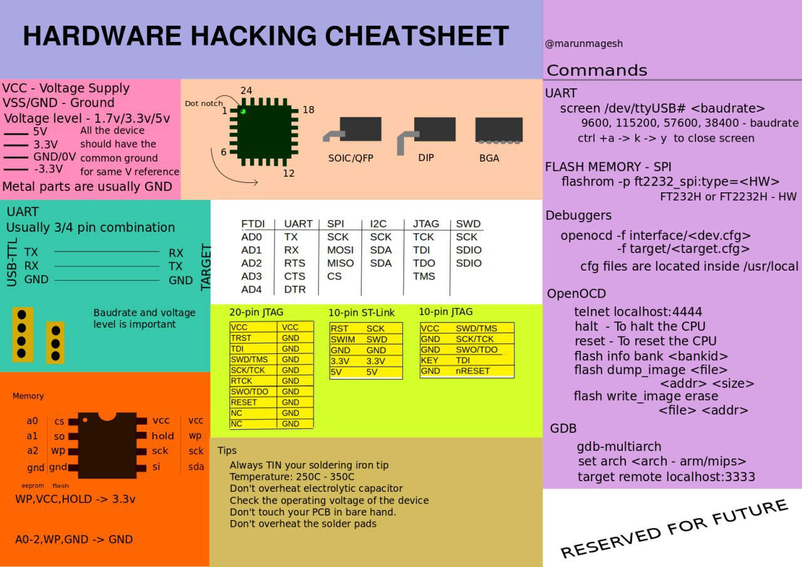
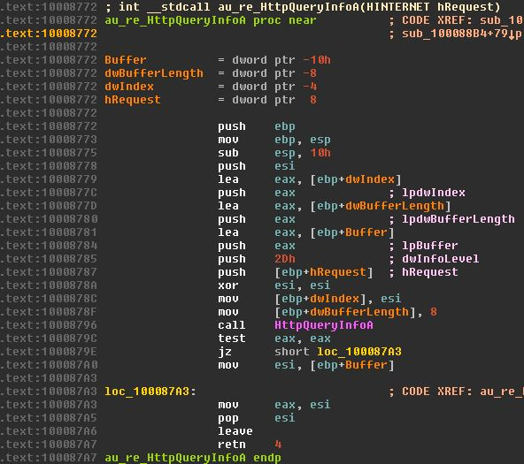
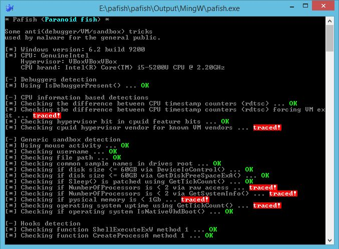

# R0_Crew
`2019-10-31 21:00:05`

<blockquote>
KTRW: The journey to build a debuggable iPhone (performing single-step kernel debugging with LLDB and IDA Pro over USB)
Article: https://googleprojectzero.blogspot.com/2019/10/ktrw-journey-to-build-debuggable-iphone.html
Source: https://github.com/googleprojectzero/ktrw &#35;ios &#35;debugger &#35;dukeBarman
</blockquote>

<table><tr><td><b>→</b><a href="https://googleprojectzero.blogspot.com/2019/10/ktrw-journey-to-build-debuggable-iphone.html">
https://googleprojectzero.blogspot.com/2019/10/ktrw-journey-to-build-debuggable-iphone.html
</a>
<blockquote>
Posted by Brandon Azad, Project Zero    In my role here at Project Zero, I do not use some of the tooling used by some external iOS securit...
</blockquote>
</td></tr></table>

---

# defcon_news
`2019-10-31 15:50:50`

<blockquote>
[local] WMV to AVI MPEG DVD WMV Convertor 4.6.1217 - Buffer OverFlow (SEH)
https://www.exploit-db.com/exploits/47568

via Exploit Database
</blockquote>

<table><tr><td><b>→</b><a href="https://www.exploit-db.com/exploits/47568">
https://www.exploit-db.com/exploits/47568
</a>
<blockquote>
WMV to AVI MPEG DVD WMV Convertor 4.6.1217 - Buffer OverFlow (SEH).. local exploit for Windows platform
</blockquote>
</td></tr></table>

---

# defcon_news
`2019-10-31 15:50:49`

<blockquote>
[webapps] Wordpress Plugin Google Review Slider 6.1 - 'tid' SQL Injection
https://www.exploit-db.com/exploits/47567

via Exploit Database
</blockquote>

<table><tr><td><b>→</b><a href="https://www.exploit-db.com/exploits/47567">
https://www.exploit-db.com/exploits/47567
</a>
<blockquote>
WordPress Plugin Google Review Slider 6.1 - 'tid' SQL Injection.. webapps exploit for PHP platform
</blockquote>
</td></tr></table>

---

# defcon_news
`2019-10-31 15:50:48`

<blockquote>
[dos] JavaScriptCore - GetterSetter Type Confusion During DFG Compilation
https://www.exploit-db.com/exploits/47565

via Exploit Database
</blockquote>

<table><tr><td><b>→</b><a href="https://www.exploit-db.com/exploits/47565">
https://www.exploit-db.com/exploits/47565
</a>
<blockquote>
JavaScriptCore - GetterSetter Type Confusion During DFG Compilation. CVE-2019-8765 . dos exploit for Multiple platform
</blockquote>
</td></tr></table>

---

# defcon_news
`2019-10-31 15:50:48`

<blockquote>
[remote] MikroTik RouterOS 6.45.6 - DNS Cache Poisoning
https://www.exploit-db.com/exploits/47566

via Exploit Database
</blockquote>

<table><tr><td><b>→</b><a href="https://www.exploit-db.com/exploits/47566">
https://www.exploit-db.com/exploits/47566
</a>
<blockquote>
MikroTik RouterOS 6.45.6 - DNS Cache Poisoning. CVE-2019-3978 . remote exploit for Hardware platform
</blockquote>
</td></tr></table>

---

# defcon_news
`2019-10-31 15:50:47`

<blockquote>
[dos] WMV to AVI MPEG DVD WMV Convertor 4.6.1217 - Denial of Service
https://www.exploit-db.com/exploits/47563

via Exploit Database
</blockquote>

<table><tr><td><b>→</b><a href="https://www.exploit-db.com/exploits/47563">
https://www.exploit-db.com/exploits/47563
</a>
<blockquote>
WMV to AVI MPEG DVD WMV Convertor 4.6.1217 - Denial of Service.. dos exploit for Windows platform
</blockquote>
</td></tr></table>

---

# defcon_news
`2019-10-31 15:50:46`

<blockquote>
[webapps] iSeeQ Hybrid DVR WH-H4 2.0.0.P - (get_jpeg) Stream Disclosure
https://www.exploit-db.com/exploits/47562

via Exploit Database
</blockquote>

<table><tr><td><b>→</b><a href="https://www.exploit-db.com/exploits/47562">
https://www.exploit-db.com/exploits/47562
</a>
<blockquote>
iSeeQ Hybrid DVR WH-H4 2.0.0.P - (get_jpeg) Stream Disclosure.. webapps exploit for Hardware platform
</blockquote>
</td></tr></table>

---

# defcon_news
`2019-10-31 15:50:42`

<blockquote>
[webapps] Citrix StoreFront Server 7.15 - XML External Entity Injection
https://www.exploit-db.com/exploits/47561

via Exploit Database
</blockquote>

<table><tr><td><b>→</b><a href="https://www.exploit-db.com/exploits/47561">
https://www.exploit-db.com/exploits/47561
</a>
<blockquote>
Citrix StoreFront Server 7.15 - XML External Entity Injection.. webapps exploit for XML platform
</blockquote>
</td></tr></table>

---

# defcon_news
`2019-10-31 15:50:41`

<blockquote>
[webapps] Ajenti 2.1.31 - Remote Code Exection (Metasploit)
https://www.exploit-db.com/exploits/47560

via Exploit Database
</blockquote>

<table><tr><td><b>→</b><a href="https://www.exploit-db.com/exploits/47560">
https://www.exploit-db.com/exploits/47560
</a>
<blockquote>
Ajenti 2.1.31 - Remote Code Exection (Metasploit).. webapps exploit for JSON platform
</blockquote>
</td></tr></table>

---

# defcon_news
`2019-10-31 15:50:40`

<blockquote>
[remote] Microsoft Windows Server 2012 - 'Group Policy' Security Feature Bypass
https://www.exploit-db.com/exploits/47559

via Exploit Database
</blockquote>

<table><tr><td><b>→</b><a href="https://www.exploit-db.com/exploits/47559">
https://www.exploit-db.com/exploits/47559
</a>
<blockquote>
Microsoft Windows Server 2012 - 'Group Policy' Security Feature Bypass. CVE-2015-0009 . remote exploit for Windows platform
</blockquote>
</td></tr></table>

---

# defcon_news
`2019-10-31 15:50:39`

<blockquote>
[remote] Microsoft Windows Server 2012 - 'Group Policy' Remote Code Execution
https://www.exploit-db.com/exploits/47558

via Exploit Database
</blockquote>

<table><tr><td><b>→</b><a href="https://www.exploit-db.com/exploits/47558">
https://www.exploit-db.com/exploits/47558
</a>
<blockquote>
Microsoft Windows Server 2012 - 'Group Policy' Remote Code Execution (MS15-011). CVE-2015-0008 . remote exploit for Windows platform
</blockquote>
</td></tr></table>

---

# defcon_news
`2019-10-31 15:50:38`

<blockquote>
[webapps] Wordpress 5.2.4 - Cross-Origin Resource Sharing
https://www.exploit-db.com/exploits/47557

via Exploit Database
</blockquote>

<table><tr><td><b>→</b><a href="https://www.exploit-db.com/exploits/47557">
https://www.exploit-db.com/exploits/47557
</a>
<blockquote>
WordPress Core 5.2.4 - Cross-Origin Resource Sharing.. webapps exploit for PHP platform
</blockquote>
</td></tr></table>

---

# defcon_news
`2019-10-31 15:50:37`

<blockquote>
[local] Intelligent Security System SecurOS Enterprise 10.2 - 'SecurosCtrlService' Unquoted Service Path
https://www.exploit-db.com/exploits/47556

via Exploit Database
</blockquote>

<table><tr><td><b>→</b><a href="https://www.exploit-db.com/exploits/47556">
https://www.exploit-db.com/exploits/47556
</a>
<blockquote>
Intelligent Security System SecurOS Enterprise 10.2 - 'SecurosCtrlService' Unquoted Service Path.. local exploit for Windows platform
</blockquote>
</td></tr></table>

---

# defcon_news
`2019-10-31 15:50:36`

<blockquote>
[webapps] rConfig 3.9.2 - Remote Code Execution
https://www.exploit-db.com/exploits/47555

via Exploit Database
</blockquote>

<table><tr><td><b>→</b><a href="https://www.exploit-db.com/exploits/47555">
https://www.exploit-db.com/exploits/47555
</a>
<blockquote>
rConfig 3.9.2 - Remote Code Execution. CVE-2019-16662 . webapps exploit for PHP platform
</blockquote>
</td></tr></table>

---

# defcon_news
`2019-10-31 15:50:35`

<blockquote>
[remote] Win10 MailCarrier 2.51 - 'POP3 User' Remote Buffer Overflow
https://www.exploit-db.com/exploits/47554

via Exploit Database
</blockquote>

<table><tr><td><b>→</b><a href="https://www.exploit-db.com/exploits/47554">
https://www.exploit-db.com/exploits/47554
</a>
<blockquote>
Win10 MailCarrier 2.51 - 'POP3 User' Remote Buffer Overflow.. remote exploit for Windows platform
</blockquote>
</td></tr></table>

---

# defcon_news
`2019-10-31 15:50:34`

<blockquote>
[webapps] PHP-FPM + Nginx - Remote Code Execution
https://www.exploit-db.com/exploits/47553

via Exploit Database
</blockquote>

<table><tr><td><b>→</b><a href="https://www.exploit-db.com/exploits/47553">
https://www.exploit-db.com/exploits/47553
</a>
<blockquote>
PHP-FPM + Nginx - Remote Code Execution. CVE-2019-11043 . webapps exploit for PHP platform
</blockquote>
</td></tr></table>

---

# defcon_news
`2019-10-31 01:46:23`

<blockquote>
Expoiting prototype pollution – RCE in Kibana (CVE-2019-7609)
https://www.reddit.com/r/netsec/comments/dpa75v/expoiting_prototype_pollution_rce_in_kibana/

via /r/netsec - Information Security News &amp; Discussion
</blockquote>

<table><tr><td><b>→</b><a href="https://www.reddit.com/r/netsec/comments/dpa75v/expoiting_prototype_pollution_rce_in_kibana/?utm_source=ifttt">
https://www.reddit.com/r/netsec/comments/dpa75v/expoiting_prototype_pollution_rce_in_kibana/?utm_source=ifttt
</a>
<blockquote>
Posted in r/netsec by u/securitymb • 28 points and 1 comment
</blockquote>
</td></tr></table>

---

# sysadm_in_channel
`2019-10-30 22:40:19`

<blockquote>
Только поговорили про темные паттерны и тут на тебе... Microsoft не самым красивым способом навязывает IE и Edge, продукты в которых даже Office 365 не хочет работать нормально:

https://www.securitylab.ru/news/495579.php

Но это еще не все, в этих продуктах находят уязвимости, которые ставят в принципе под сомнение использование этих браузеров, на сколько я понимаю проблемам здесь нет ни осла ни края...

Edge:

Spoofing attack - https://portal.msrc.microsoft.com/en-US/security-guidance/advisory/CVE-2018-8425

Information disclosure - https://portal.msrc.microsoft.com/en-US/security-guidance/advisory/CVE-2018-8366

Security restrictions bypass - https://portal.msrc.microsoft.com/en-US/security-guidance/advisory/CVE-2018-8463

Buffer overflow - https://portal.msrc.microsoft.com/en-US/security-guidance/advisory/CVE-2018-8464

Security restrictions bypass - https://portal.msrc.microsoft.com/en-US/security-guidance/advisory/CVE-2018-8469

IE:

Buffer overflow - https://portal.msrc.microsoft.com/en-US/security-guidance/advisory/CVE-2018-8461 и https://portal.msrc.microsoft.com/en-US/security-guidance/advisory/CVE-2018-8447

Cross-site scripting - https://portal.msrc.microsoft.com/en-US/security-guidance/advisory/CVE-2018-8470
</blockquote>

<table><tr><td><b>→</b><a href="https://www.securitylab.ru/news/495579.php">
https://www.securitylab.ru/news/495579.php
</a>
<blockquote>
В инсайдерской версии Windows 10 сборки 1809 процесс инсталляции браузеров прерывается и появляется реклама Edge.
</blockquote>
</td></tr></table>

---

# defcon_news
`2019-10-30 15:36:34`

<blockquote>
NFC Beaming Bypasses Security Controls in Android [CVE-2019-2114]
https://www.reddit.com/r/netsec/comments/dp5nik/nfc_beaming_bypasses_security_controls_in_android/

via /r/netsec - Information Security News &amp; Discussion
</blockquote>

<table><tr><td><b>→</b><a href="https://www.reddit.com/r/netsec/comments/dp5nik/nfc_beaming_bypasses_security_controls_in_android/">
https://www.reddit.com/r/netsec/comments/dp5nik/nfc_beaming_bypasses_security_controls_in_android/
</a>
<blockquote>
Posted in r/netsec by u/nightwatchcyber • 31 points and 5 comments
</blockquote>
</td></tr></table>

---

# defcon_news
`2019-10-30 14:06:25`

<blockquote>
Tracking CVE-2019-11043 PHP Vulnerability – An Uncommon Chain of Events
https://www.imperva.com/blog/tracking-cve-2019-11043-php-vulnerability/

via Blog
</blockquote>

<table><tr><td><b>→</b><a href="https://www.imperva.com/blog/tracking-cve-2019-11043-php-vulnerability/">
https://www.imperva.com/blog/tracking-cve-2019-11043-php-vulnerability/
</a>
<blockquote>
Surprisingly, we found that attack attempts using the recently disclosed vulnerability were carried out long before the release of the official patch.
</blockquote>
</td></tr></table>

---

# R0_Crew
`2019-10-30 12:56:25`

<blockquote>
r2elk: &#35;Radare2 API bindings to extract binary metadata into Elasticsearch https://github.com/jaredestroud/r2elk &#35;reverse &#35;dukeBarman
</blockquote>

<table><tr><td><b>→</b><a href="https://github.com/jaredestroud/r2elk">
https://github.com/jaredestroud/r2elk
</a>
<blockquote>
Radare2 Metadata Extraction to Elasticsearch. Contribute to archcloudlabs/r2elk development by creating an account on GitHub.
</blockquote>
</td></tr></table>

---

# defcon_news
`2019-10-30 11:33:56`

<blockquote>
⭕️ Если у вас Mikrotik с версией до 6.45.7, и открытым наружу tcp портом 8291 (Winbox), то как вам такое:

CVE-2019-3979 - DNS Cache Poisoning без аутентификации. 
Через winbox_dns_request можно попросить ваш микротик отрезолвить любой домен через контролируемый вами dns сервер. 
DNS ответ будет заботливо закеширован микротиком, и таким образом можно заставить его думать, что добрый download.mikrotik.com переехал на злой сервер 1.2.3.4 
Если вдруг этот ваш микротик полезет обновляться, или вы сумеете триггернуть обновление, то прошивка будет стянута с 1.2.3.4 и привет admin без пароля (да, это микротик) и версия постарше, а то и с бекдорами.

⚠️Читайте детали https://medium.com/tenable-techblog/routeros-chain-to-root-f4e0b07c0b21 и смотрите демонстрацию https://youtu.be/5SW7z0eUDuA

&#35;mikrotik &#35;winbox
</blockquote>

---

# defcon_news
`2019-10-29 21:46:28`

<blockquote>
Proof of Concept for &quot;Apache Httpd Limited cross-site scripting in mod_proxy error page (CVE-2019-10092)&quot;
https://www.reddit.com/r/netsec/comments/dopquq/proof_of_concept_for_apache_httpd_limited/

via /r/netsec - Information Security News &amp; Discussion
</blockquote>

<table><tr><td><b>→</b><a href="https://www.reddit.com/r/netsec/comments/dopquq/proof_of_concept_for_apache_httpd_limited/">
https://www.reddit.com/r/netsec/comments/dopquq/proof_of_concept_for_apache_httpd_limited/
</a>
<blockquote>
Posted in r/netsec by u/gehaxelt • 1 point and 0 comments
</blockquote>
</td></tr></table>

---

# defcon_news
`2019-10-29 21:46:27`

<blockquote>
Testing CVE-2019-11043 (php-fpm security vulnerability) with LXD system containers
https://www.reddit.com/r/netsec/comments/dopmln/testing_cve201911043_phpfpm_security/

via /r/netsec - Information Security News &amp; Discussion
</blockquote>

<table><tr><td><b>→</b><a href="https://www.reddit.com/r/netsec/comments/dopmln/testing_cve201911043_phpfpm_security/">
https://www.reddit.com/r/netsec/comments/dopmln/testing_cve201911043_phpfpm_security/
</a>
<blockquote>
Posted in r/netsec by u/simosx • 2 points and 0 comments
</blockquote>
</td></tr></table>

---

# R0_Crew
`2019-10-29 15:04:21`

<blockquote>
Hardware Hacking Cheatsheet infograph https://github.com/arunmagesh/hw_hacking_cheatsheet &#35;hardware &#35;reverse &#35;dukeBarman
</blockquote>

---

# R0_Crew
`2019-10-29 10:23:16`

<blockquote>
The C/C++ code analysis platform Joern has been resurrected!

https://medium.com/@fabs_60995/joern-reborn-f04e74399b2b
https://github.com/ShiftLeftSecurity/joern/releases &#35;darw1n
</blockquote>

<table><tr><td><b>→</b><a href="https://medium.com/@fabs_60995/joern-reborn-f04e74399b2b">
https://medium.com/@fabs_60995/joern-reborn-f04e74399b2b
</a>
<blockquote>
In a blog post back in May 2018, we outlined our plans for saving the open-source C/C++ code analyzer “Joern”. Today, we are happy to…
</blockquote>
</td></tr></table>

---

# defcon_news
`2019-10-29 05:51:07`

<blockquote>
Open Redirects In Improperly Configured mod_rewrite Rules (PoC for CVE-2019-10098?)
https://www.reddit.com/r/netsec/comments/doirfl/open_redirects_in_improperly_configured_mod/

via /r/netsec - Information Security News &amp; Discussion
</blockquote>

<table><tr><td><b>→</b><a href="https://www.reddit.com/r/netsec/comments/doirfl/open_redirects_in_improperly_configured_mod/">
https://www.reddit.com/r/netsec/comments/doirfl/open_redirects_in_improperly_configured_mod/
</a>
<blockquote>
Posted in r/netsec by u/gehaxelt • 1 point and 0 comments
</blockquote>
</td></tr></table>

---

# R0_Crew
`2019-10-29 03:14:41`

<blockquote>
&#35;radare2 4.0 is out! codename &quot;Kràmpack&quot; https://github.com/radareorg/radare2/releases/tag/4.0.0 &#35;reverse &#35;dukeBarman
</blockquote>

<table><tr><td><b>→</b><a href="https://github.com/radareorg/radare2/releases/tag/4.0.0">
https://github.com/radareorg/radare2/releases/tag/4.0.0
</a>
<blockquote>
Release Notes
Version: 4.0.0
From: 3.9.0
To: 4.0.0
Commits: 299
Contributors: 48
Changes
anal

Bring back the MASK_DISASM because not all nanal plugins support it yet &#35;&#35;anal
Select default var type...
</blockquote>
</td></tr></table>

---

# defcon_news
`2019-10-28 20:51:42`

<blockquote>
Уязвимость в PHP7 угрожает безопасности серверов nginx
https://xakep.ru/2019/10/28/php7-rce/

via «Хакер»
</blockquote>

<table><tr><td><b>→</b><a href="https://xakep.ru/2019/10/28/php7-rce/">
https://xakep.ru/2019/10/28/php7-rce/
</a>
<blockquote>
Проблема удаленного выполнения кода, обнаруженная в PHP7 (CVE-2019-11043), представляет опасность для серверов nginx поддержкой PHP-FPM.
</blockquote>
</td></tr></table>

---

# R0_Crew
`2019-10-28 19:50:50`

<blockquote>
An binary-to-LLVM IR lifter that leverages Ghidra's IR and analysis

https://github.com/toor-de-force/Ghidra-to-LLVM

&#35;re &#35;llvm &#35;ghidra &#35;darw1n
</blockquote>

<table><tr><td><b>→</b><a href="https://github.com/toor-de-force/Ghidra-to-LLVM">
https://github.com/toor-de-force/Ghidra-to-LLVM
</a>
<blockquote>
An binary-to-LLVM IR lifter that leverages Ghidra's IR and analysis - toor-de-force/Ghidra-to-LLVM
</blockquote>
</td></tr></table>

---

# cibsecurity
`2019-10-28 19:20:48`

* https://threatpost.com/php-bug-rce-nginx-servers/149593/

<blockquote>
❌ PHP Bug Allows Remote Code-Execution on NGINX Servers ❌

CVE-2019-11043 is trivial to exploit -- and a proof of concept is available.

📖 Read

via &quot;Threatpost&quot;.
</blockquote>

<table><tr><td><b>→</b><a href="https://threatpost.com/php-bug-rce-nginx-servers/149593/">
https://threatpost.com/php-bug-rce-nginx-servers/149593/
</a>
<blockquote>
CVE-2019-11043 is trivial to exploit — and a proof of concept is available.
</blockquote>
</td></tr></table>

---

# defcon_news
`2019-10-28 15:51:22`

<blockquote>
[dos] WebKit - Universal XSS in HTMLFrameElementBase::isURLAllowed
https://www.exploit-db.com/exploits/47552

via Exploit Database
</blockquote>

<table><tr><td><b>→</b><a href="https://www.exploit-db.com/exploits/47552">
https://www.exploit-db.com/exploits/47552
</a>
<blockquote>
WebKit - Universal XSS in HTMLFrameElementBase::isURLAllowed.. dos exploit for Multiple platform
</blockquote>
</td></tr></table>

---

# defcon_news
`2019-10-28 15:51:21`

<blockquote>
[local] ChaosPro 2.0 - Buffer Overflow (SEH)
https://www.exploit-db.com/exploits/47551

via Exploit Database
</blockquote>

<table><tr><td><b>→</b><a href="https://www.exploit-db.com/exploits/47551?utm_source=dlvr.it&utm_medium=twitter">
https://www.exploit-db.com/exploits/47551?utm_source=dlvr.it&utm_medium=twitter
</a>
<blockquote>
ChaosPro 2.0 - Buffer Overflow (SEH).. local exploit for Windows platform
</blockquote>
</td></tr></table>

---

# defcon_news
`2019-10-28 15:51:20`

<blockquote>
[webapps] delpino73 Blue-Smiley-Organizer 1.32 - 'datetime' SQL Injection
https://www.exploit-db.com/exploits/47550

via Exploit Database
</blockquote>

<table><tr><td><b>→</b><a href="https://www.exploit-db.com/exploits/47550">
https://www.exploit-db.com/exploits/47550
</a>
<blockquote>
delpino73 Blue-Smiley-Organizer 1.32 - 'datetime' SQL Injection.. webapps exploit for PHP platform
</blockquote>
</td></tr></table>

---

# defcon_news
`2019-10-28 15:51:19`

<blockquote>
[local] JumpStart 0.6.0.0 - 'jswpbapi' Unquoted Service Path
https://www.exploit-db.com/exploits/47549

via Exploit Database
</blockquote>

<table><tr><td><b>→</b><a href="https://www.exploit-db.com/exploits/47549">
https://www.exploit-db.com/exploits/47549
</a>
<blockquote>
JumpStart 0.6.0.0 - 'jswpbapi' Unquoted Service Path.. local exploit for Windows platform
</blockquote>
</td></tr></table>

---

# defcon_news
`2019-10-28 15:51:18`

<blockquote>
[webapps] waldronmatt FullCalendar-BS4-PHP-MySQL-JSON 1.21 - 'description' Cross-Site Scripting
https://www.exploit-db.com/exploits/47548

via Exploit Database
</blockquote>

<table><tr><td><b>→</b><a href="https://www.exploit-db.com/exploits/47548">
https://www.exploit-db.com/exploits/47548
</a>
<blockquote>
waldronmatt FullCalendar-BS4-PHP-MySQL-JSON 1.21 - 'description' Cross-Site Scripting.. webapps exploit for PHP platform
</blockquote>
</td></tr></table>

---

# defcon_news
`2019-10-28 15:51:18`

<blockquote>
[webapps] Part-DB 0.4 - Authentication Bypass
https://www.exploit-db.com/exploits/47547

via Exploit Database
</blockquote>

<table><tr><td><b>→</b><a href="https://www.exploit-db.com/exploits/47547">
https://www.exploit-db.com/exploits/47547
</a>
<blockquote>
Part-DB 0.4 - Authentication Bypass.. webapps exploit for PHP platform
</blockquote>
</td></tr></table>

---

# defcon_news
`2019-10-28 15:51:17`

<blockquote>
[webapps] waldronmatt FullCalendar-BS4-PHP-MySQL-JSON 1.21 - 'start' SQL Injection
https://www.exploit-db.com/exploits/47546

via Exploit Database
</blockquote>

<table><tr><td><b>→</b><a href="https://www.exploit-db.com/exploits/47546">
https://www.exploit-db.com/exploits/47546
</a>
<blockquote>
waldronmatt FullCalendar-BS4-PHP-MySQL-JSON 1.21 - 'start' SQL Injection.. webapps exploit for PHP platform
</blockquote>
</td></tr></table>

---

# defcon_news
`2019-10-28 15:51:15`

<blockquote>
[webapps] Intelbras Router WRN150 1.0.18 - Cross-Site Request Forgery
https://www.exploit-db.com/exploits/47545

via Exploit Database
</blockquote>

<table><tr><td><b>→</b><a href="https://www.exploit-db.com/exploits/47545">
https://www.exploit-db.com/exploits/47545
</a>
<blockquote>
Intelbras Router WRN150 1.0.18 - Cross-Site Request Forgery.. webapps exploit for Hardware platform
</blockquote>
</td></tr></table>

---

# defcon_news
`2019-10-28 09:51:16`

<blockquote>
10 уязвимостей в гипервизоре Xen
https://www.opennet.ru/opennews/art.shtml?num&#61;51764

via OpenNews.opennet.ru: Проблемы безопасности
</blockquote>

<table><tr><td><b>→</b><a href="https://www.opennet.ru/opennews/art.shtml?num=51764">
https://www.opennet.ru/opennews/art.shtml?num=51764
</a>
<blockquote>
Опубликованы сведения о 10 уязвимостях в гипервизоре Xen, из которых пять (CVE-2019-17341, CVE-2019-17342, CVE-2019-17340, CVE-2019-17346, CVE-2019-17343) потенциально позволяют выйти за пределы текущего гостевого окружения и повысить свои привилегии, одна уязвимость (CVE-2019-17347) даёт возможность непривилегированному процессу получить контроль над процессами других пользователей в той же гостевой системе, оставшиеся четыре (CVE-2019-17344, CVE-2019-17345, CVE-2019-17348, CVE-2019-17351) уязвимости позволяют вызвать отказ в обслуживании (крах хост-окружения). Проблемы устранены в выпусках Xen 4.12.1, 4.11.2 и 4.10.4.
</blockquote>
</td></tr></table>

---

# R0_Crew
`2019-10-27 21:27:24`

<blockquote>
Ghidra C++ Class and Run Time Type Information Analyzer https://github.com/astrelsky/Ghidra-Cpp-Class-Analyzer &#35;reverse &#35;ghidra &#35;dukeBarman
</blockquote>

<table><tr><td><b>→</b><a href="https://github.com/astrelsky/Ghidra-Cpp-Class-Analyzer">
https://github.com/astrelsky/Ghidra-Cpp-Class-Analyzer
</a>
<blockquote>
Ghidra C++ Class and Run Time Type Information Analyzer - astrelsky/Ghidra-Cpp-Class-Analyzer
</blockquote>
</td></tr></table>

---

# reverseengineeringx
`2019-10-26 16:54:32`

<blockquote>
Auto-renaming dummy-named functions, which have one API call or jump to the imported API

https://github.com/a1ext/auto_re
</blockquote>

---

# defcon_news
`2019-10-25 23:38:12`

<blockquote>
Microsoft Office Bug Remains Top Malware Delivery Vector
https://www.darkreading.com/operations/microsoft-office-bug-remains-top-malware-delivery-vector/d/d-id/1336182

via Dark Reading
</blockquote>

<table><tr><td><b>→</b><a href="https://www.darkreading.com/operations/microsoft-office-bug-remains-top-malware-delivery-vector/d/d-id/1336182">
https://www.darkreading.com/operations/microsoft-office-bug-remains-top-malware-delivery-vector/d/d-id/1336182
</a>
<blockquote>
CVE-2017-11882 has been attackers' favorite malware delivery mechanism throughout the second and third quarters of 2019.
</blockquote>
</td></tr></table>

---

# cibsecurity
`2019-10-25 23:34:05`

* https://www.darkreading.com/operations/microsoft-office-bug-remains-top-malware-delivery-vector/d/d-id/1336182?_mc=rss_x_drr_edt_aud_dr_x_x-rss-simple

<blockquote>
🕴 Microsoft Office Bug Remains Top Malware Delivery Vector 🕴

CVE-2017-11882 has been attackers' favorite malware delivery mechanism throughout the second and third quarters of 2019.

📖 Read

via &quot;Dark Reading: &quot;.
</blockquote>

<table><tr><td><b>→</b><a href="https://www.darkreading.com/operations/microsoft-office-bug-remains-top-malware-delivery-vector/d/d-id/1336182?_mc=rss_x_drr_edt_aud_dr_x_x-rss-simple">
https://www.darkreading.com/operations/microsoft-office-bug-remains-top-malware-delivery-vector/d/d-id/1336182?_mc=rss_x_drr_edt_aud_dr_x_x-rss-simple
</a>
<blockquote>
CVE-2017-11882 has been attackers' favorite malware delivery mechanism throughout the second and third quarters of 2019.
</blockquote>
</td></tr></table>

---

# defcon_news
`2019-10-25 15:58:44`

<blockquote>
[local] Linux Polkit - pkexec helper PTRACE_TRACEME local root (Metasploit)
https://www.exploit-db.com/exploits/47543

via Exploit Database
</blockquote>

<table><tr><td><b>→</b><a href="https://www.exploit-db.com/exploits/47543">
https://www.exploit-db.com/exploits/47543
</a>
<blockquote>
Linux Polkit - pkexec helper PTRACE_TRACEME local root (Metasploit). CVE-2019-13272 . local exploit for Linux platform
</blockquote>
</td></tr></table>

---

# defcon_news
`2019-10-25 15:58:44`

<blockquote>
[webapps] ClonOs WEB UI 19.09 - Improper Access Control
https://www.exploit-db.com/exploits/47544

via Exploit Database
</blockquote>

<table><tr><td><b>→</b><a href="https://www.exploit-db.com/exploits/47544">
https://www.exploit-db.com/exploits/47544
</a>
<blockquote>
ClonOs WEB UI 19.09 - Improper Access Control. CVE-2019-18418 . webapps exploit for PHP platform
</blockquote>
</td></tr></table>

---

# defcon_news
`2019-10-25 15:58:43`

<blockquote>
[webapps] AUO SunVeillance Monitoring System 1.1.9e - 'MailAdd' SQL Injection
https://www.exploit-db.com/exploits/47542

via Exploit Database
</blockquote>

<table><tr><td><b>→</b><a href="https://www.exploit-db.com/exploits/47542?utm_source=dlvr.it&utm_medium=twitter">
https://www.exploit-db.com/exploits/47542?utm_source=dlvr.it&utm_medium=twitter
</a>
<blockquote>
AUO SunVeillance Monitoring System 1.1.9e - 'MailAdd' SQL Injection.. webapps exploit for Hardware platform
</blockquote>
</td></tr></table>

---

# defcon_news
`2019-10-25 15:58:42`

<blockquote>
[webapps] AUO SunVeillance Monitoring System 1.1.9e - Incorrect Access Control
https://www.exploit-db.com/exploits/47541

via Exploit Database
</blockquote>

<table><tr><td><b>→</b><a href="https://www.exploit-db.com/exploits/47541?utm_source=dlvr.it&utm_medium=twitter">
https://www.exploit-db.com/exploits/47541?utm_source=dlvr.it&utm_medium=twitter
</a>
<blockquote>
AUO SunVeillance Monitoring System 1.1.9e - Incorrect Access Control.. webapps exploit for Hardware platform
</blockquote>
</td></tr></table>

---

# defcon_news
`2019-10-25 15:58:41`

<blockquote>
[webapps] Wordpress Sliced Invoices 3.8.2 - 'post' SQL Injection
https://www.exploit-db.com/exploits/47540

via Exploit Database
</blockquote>

<table><tr><td><b>→</b><a href="https://www.exploit-db.com/exploits/47540">
https://www.exploit-db.com/exploits/47540
</a>
<blockquote>
WordPress Plugin Sliced Invoices 3.8.2 - 'post' SQL Injection.. webapps exploit for PHP platform
</blockquote>
</td></tr></table>

---

# defcon_news
`2019-10-25 15:58:40`

<blockquote>
[webapps] Joomla! 3.4.6 - Remote Code Execution (Metasploit)
https://www.exploit-db.com/exploits/47539

via Exploit Database
</blockquote>

<table><tr><td><b>→</b><a href="https://www.exploit-db.com/exploits/47539">
https://www.exploit-db.com/exploits/47539
</a>
<blockquote>
Joomla! 3.4.6 - Remote Code Execution (Metasploit).. webapps exploit for PHP platform
</blockquote>
</td></tr></table>

---

# defcon_news
`2019-10-25 15:58:39`

<blockquote>
[local] IObit Uninstaller 9.1.0.8 - 'IObitUnSvr' Unquoted Service Path
https://www.exploit-db.com/exploits/47538

via Exploit Database
</blockquote>

<table><tr><td><b>→</b><a href="https://www.exploit-db.com/exploits/47538">
https://www.exploit-db.com/exploits/47538
</a>
<blockquote>
IObit Uninstaller 9.1.0.8 - 'IObitUnSvr' Unquoted Service Path.. local exploit for Windows platform
</blockquote>
</td></tr></table>

---

# defcon_news
`2019-10-25 15:58:38`

<blockquote>
[remote] Moxa EDR-810 - Command Injection / Information Disclosure
https://www.exploit-db.com/exploits/47536

via Exploit Database
</blockquote>

<table><tr><td><b>→</b><a href="https://www.exploit-db.com/exploits/47536">
https://www.exploit-db.com/exploits/47536
</a>
<blockquote>
Moxa EDR-810 - Command Injection / Information Disclosure. CVE-2019-10969CVE-2019-10963 . remote exploit for Hardware platform
</blockquote>
</td></tr></table>

---

# defcon_news
`2019-10-25 15:58:38`

<blockquote>
[webapps] Rocket.Chat 2.1.0 - Cross-Site Scripting
https://www.exploit-db.com/exploits/47537

via Exploit Database
</blockquote>

<table><tr><td><b>→</b><a href="https://www.exploit-db.com/exploits/47537">
https://www.exploit-db.com/exploits/47537
</a>
<blockquote>
Rocket.Chat 2.1.0 - Cross-Site Scripting. CVE-2019-17220 . webapps exploit for Linux platform
</blockquote>
</td></tr></table>

---

# R0_Crew
`2019-10-25 14:22:47`

<blockquote>
Export a binary from ghidra to emulate with unicorn https://github.com/AndrewFasano/ghidra-unicorn &#35;reverse &#35;ghidra &#35;dukeBarman
</blockquote>

<table><tr><td><b>→</b><a href="https://github.com/AndrewFasano/ghidra-unicorn">
https://github.com/AndrewFasano/ghidra-unicorn
</a>
<blockquote>
Export a binary from ghidra to emulate with unicorn - AndrewFasano/ghidra-unicorn
</blockquote>
</td></tr></table>

---

# defcon_news
`2019-10-24 20:38:41`

<blockquote>
Уязвимость php-fpm, позволяющая удалённо выполнить код на сервере
https://www.opennet.ru/opennews/art.shtml?num&#61;51749

via OpenNews.opennet.ru: Проблемы безопасности
</blockquote>

<table><tr><td><b>→</b><a href="https://www.opennet.ru/opennews/art.shtml?num=51749">
https://www.opennet.ru/opennews/art.shtml?num=51749
</a>
<blockquote>
Доступны корректирующие релизы PHP 7.3.11, 7.1.33 и 7.2.24, в которых устранена критическая уязвимость (CVE-2019-11043) в расширении PHP-FPM (менеджер процессов FastCGI), позволяющая удалённо выполнить свой код в системе. Для атаки на серверы, использующие для запуска PHP-скриптов PHP-FPM в связке с Nginx, уже публично доступен рабочий эксплоит.
</blockquote>
</td></tr></table>

---

# MPSIEMChat
`2019-10-24 19:28:45`

<blockquote>
Всем доброго дня. Немного странный вопрос. А вот на этот код можно опираться для интеграции с внешними фидами ? https://github.com/feedb/MPSiem_addons/tree/master/import%20blacklists%20in%20list
</blockquote>

<table><tr><td><b>→</b><a href="https://github.com/feedb/MPSiem_addons/tree/master/import%20blacklists%20in%20list">
https://github.com/feedb/MPSiem_addons/tree/master/import%20blacklists%20in%20list
</a>
<blockquote>
реп полезностей для PT MaxPatrol SIEM. Contribute to feedb/MPSiem_addons development by creating an account on GitHub.
</blockquote>
</td></tr></table>

---

# defcon_news
`2019-10-24 18:18:10`

<blockquote>
EOL D-Link Routers Vulnerable to Remote Command Execution
https://www.us-cert.gov/ncas/current-activity/2019/10/24/eol-d-link-routers-vulnerable-remote-command-execution

via CISA Current Activity
</blockquote>

<table><tr><td><b>→</b><a href="https://www.us-cert.gov/ncas/current-activity/2019/10/24/eol-d-link-routers-vulnerable-remote-command-execution">
https://www.us-cert.gov/ncas/current-activity/2019/10/24/eol-d-link-routers-vulnerable-remote-command-execution
</a>
<blockquote>
The CERT Coordination Center (CERT/CC) has released information on a vulnerability (CVE-2019-16920) affecting multiple D-Link routers. A remote attacker could exploit this vulnerability to take control of an affected device.
</blockquote>
</td></tr></table>

---

# R0_Crew
`2019-10-24 17:36:13`

<blockquote>
Windows 10 (RS1-19H2+) UAC bypass using EditionUpgradeManager undocumented autoelevated COM interface. Works together with environment variables spoofing,

https://gist.github.com/hfiref0x/de9c83966623236f5ebf8d9ae2407611

&#35;re &#35;redteam &#35;uac &#35;darw1n
</blockquote>

<table><tr><td><b>→</b><a href="https://gist.github.com/hfiref0x/de9c83966623236f5ebf8d9ae2407611">
https://gist.github.com/hfiref0x/de9c83966623236f5ebf8d9ae2407611
</a>
<blockquote>
UAC bypass using EditionUpgradeManager COM interface  - akagi_58a.c
</blockquote>
</td></tr></table>

---

# R0_Crew
`2019-10-24 09:34:50`

<blockquote>
r2pipe script to autorename all the functions by recovering the original name from the assert statements https://gist.github.com/radare/04612d3804fa72c0cc832d06208cadaf &#35;reverse &#35;radare2 &#35;dukeBarman
</blockquote>

<table><tr><td><b>→</b><a href="https://gist.github.com/radare/04612d3804fa72c0cc832d06208cadaf">
https://gist.github.com/radare/04612d3804fa72c0cc832d06208cadaf
</a>
<blockquote>
radare2 script to autoname functions by taking it from the assert calls - assnam.py
</blockquote>
</td></tr></table>

---

# sysadm_in_channel
`2019-10-24 08:54:01`

<blockquote>
GitLab телеметрия, здесь. Нужно больше телеметрии. Встречайте новое соглашение об использовании сервиса :)

https://gitlab.com/gitlab-org/gitaly/issues/2113
</blockquote>

<table><tr><td><b>→</b><a href="https://gitlab.com/gitlab-org/gitaly/issues/2113">
https://gitlab.com/gitlab-org/gitaly/issues/2113
</a>
<blockquote>
We've heard your concerns and questions and have rolled back any changes to our Terms of Service. We're going to process the feedback and rethink our approach. We...
</blockquote>
</td></tr></table>

---

# R0_Crew
`2019-10-23 21:26:26`

<blockquote>
Extract labels from IDA .lst or Ghidra .csv file and export x64dbg database https://github.com/utkonos/lst2x64dbg &#35;reverse &#35;ghidra &#35;radare2 &#35;dukeBarman
</blockquote>

<table><tr><td><b>→</b><a href="https://github.com/utkonos/lst2x64dbg">
https://github.com/utkonos/lst2x64dbg
</a>
<blockquote>
Extract labels from IDA, Ghidra, Binary Ninja, and Relyze files and export x64dbg database. Including radare2 main address. - utkonos/lst2x64dbg
</blockquote>
</td></tr></table>

---

# R0_Crew
`2019-10-23 20:16:47`

<blockquote>
https://blog.rapid7.com/2019/09/06/initial-metasploit-exploit-module-for-bluekeep-cve-2019-0708/ &#35;re &#35;expdev &#35;yobaboba
</blockquote>

<table><tr><td><b>→</b><a href="https://blog.rapid7.com/2019/09/06/initial-metasploit-exploit-module-for-bluekeep-cve-2019-0708/">
https://blog.rapid7.com/2019/09/06/initial-metasploit-exploit-module-for-bluekeep-cve-2019-0708/
</a>
<blockquote>
Today, Metasploit is releasing an initial public exploit module for CVE-2019-0708, also known as BlueKeep, as a pull request on Metasploit Framework.
</blockquote>
</td></tr></table>

---

# R0_Crew
`2019-10-23 20:16:32`

<blockquote>
Ghidra decompiler integration for &#35;radare2 &amp; Cutter https://github.com/radareorg/r2ghidra-dec &#35;reverse &#35;r2con &#35;dukeBarman
</blockquote>

<table><tr><td><b>→</b><a href="https://github.com/radareorg/r2ghidra-dec">
https://github.com/radareorg/r2ghidra-dec
</a>
<blockquote>
Deep ghidra decompiler and sleigh disassembler integration for rizin - rizinorg/rz-ghidra
</blockquote>
</td></tr></table>

---

# R0_Crew
`2019-10-23 20:16:05`

<blockquote>
Patching system improvement plugin for IDA https://github.com/scottmudge/DebugAutoPatch &#35;reverse &#35;ida &#35;dukeBarman
</blockquote>

<table><tr><td><b>→</b><a href="https://github.com/scottmudge/DebugAutoPatch">
https://github.com/scottmudge/DebugAutoPatch
</a>
<blockquote>
Patching system improvement plugin for IDA. Contribute to scottmudge/DebugAutoPatch development by creating an account on GitHub.
</blockquote>
</td></tr></table>

---

# R0_Crew
`2019-10-23 20:16:00`

<blockquote>
A few useful scripts for &#35;Ghidra https://github.com/Ayrx/ghidra_utils &#35;reverse &#35;dukeBarman
</blockquote>

<table><tr><td><b>→</b><a href="https://github.com/Ayrx/ghidra_utils">
https://github.com/Ayrx/ghidra_utils
</a>
<blockquote>
Analysis scripts for Ghidra to work with Android NDK libraries. - Ayrx/JNIAnalyzer
</blockquote>
</td></tr></table>

---

# R0_Crew
`2019-10-23 20:15:50`

<blockquote>
DynamoRIO plugin to get ASAN and SanitizerCoverage compatible output for closed-source executables https://github.com/googleprojectzero/DrSancov &#35;fuzzing &#35;dukeBarman
</blockquote>

<table><tr><td><b>→</b><a href="https://github.com/googleprojectzero/DrSancov">
https://github.com/googleprojectzero/DrSancov
</a>
<blockquote>
DynamoRIO plugin to get ASAN and SanitizerCoverage compatible output for closed-source executables - googleprojectzero/DrSancov
</blockquote>
</td></tr></table>

---

# R0_Crew
`2019-10-23 20:15:45`

<blockquote>
Binee: binary emulation environment https://github.com/carbonblack/binee &#35;malware &#35;dukeBarman
</blockquote>

<table><tr><td><b>→</b><a href="https://github.com/carbonblack/binee">
https://github.com/carbonblack/binee
</a>
<blockquote>
Binee: binary emulation environment. Contribute to carbonblack/binee development by creating an account on GitHub.
</blockquote>
</td></tr></table>

---

# R0_Crew
`2019-10-23 20:15:34`

<blockquote>
BinDiff wrapper script for multiple binary diffing https://github.com/TakahiroHaruyama/ida_haru/tree/master/bindiff &#35;reverse &#35;dukeBarman
</blockquote>

<table><tr><td><b>→</b><a href="https://github.com/TakahiroHaruyama/ida_haru/tree/master/bindiff">
https://github.com/TakahiroHaruyama/ida_haru/tree/master/bindiff
</a>
<blockquote>
scripts/plugins for IDA Pro. Contribute to TakahiroHaruyama/ida_haru development by creating an account on GitHub.
</blockquote>
</td></tr></table>

---

# R0_Crew
`2019-10-23 20:15:28`

<blockquote>
lpe is a collection of verified Linux kernel exploits https://github.com/jollheef/lpe &#35;exploit &#35;dukeBarman
</blockquote>

<table><tr><td><b>→</b><a href="https://github.com/jollheef/lpe">
https://github.com/jollheef/lpe
</a>
<blockquote>
collection of verified Linux kernel exploits. Contribute to jollheef/lpe development by creating an account on GitHub.
</blockquote>
</td></tr></table>

---

# R0_Crew
`2019-10-23 20:14:15`

<blockquote>
Reversing Cisco IOS Raw Binary Firmware Images with Ghidra https://gist.github.com/nstarke/ed0aba2c882b8b3078747a567ee00520 &#35;ghidra &#35;reverse &#35;dukeBarman
</blockquote>

<table><tr><td><b>→</b><a href="https://gist.github.com/nstarke/ed0aba2c882b8b3078747a567ee00520">
https://gist.github.com/nstarke/ed0aba2c882b8b3078747a567ee00520
</a>
<blockquote>
Reversing Cisco IOS Raw Binary Firmware Images with Ghidra - 01-reversing-cisco-ios-raw-binary-firmware-images-with-ghidra.md
</blockquote>
</td></tr></table>

---

# R0_Crew
`2019-10-23 20:14:10`

<blockquote>
XPN's RpcEnum but based on IDA instead of Ghidra https://github.com/tsarpaul/RpcEnumIDA &#35;ida &#35;dukeBarman
</blockquote>

<table><tr><td><b>→</b><a href="https://github.com/tsarpaul/RpcEnumIDA">
https://github.com/tsarpaul/RpcEnumIDA
</a>
<blockquote>
XPN's RpcEnum but based on IDA instead of Ghidra. Contribute to tsarpaul/RpcEnumIDA development by creating an account on GitHub.
</blockquote>
</td></tr></table>

---

# R0_Crew
`2019-10-23 20:14:05`

<blockquote>
IDA Pro plugin to manage classes https://github.com/RicBent/Classy &#35;ida &#35;dukeBarman
</blockquote>

<table><tr><td><b>→</b><a href="https://github.com/RicBent/Classy">
https://github.com/RicBent/Classy
</a>
<blockquote>
IDA Pro plugin to manage classes. Contribute to RicBent/Classy development by creating an account on GitHub.
</blockquote>
</td></tr></table>

---

# R0_Crew
`2019-10-23 20:14:00`

<blockquote>
IDA+Triton plugin in order to extract opaque predicates using a Forward-Bounded DSE https://github.com/JonathanSalwan/X-Tunnel-Opaque-Predicates &#35;ida &#35;dukeBarman
</blockquote>

<table><tr><td><b>→</b><a href="https://github.com/JonathanSalwan/X-Tunnel-Opaque-Predicates">
https://github.com/JonathanSalwan/X-Tunnel-Opaque-Predicates
</a>
<blockquote>
IDA+Triton plugin in order to extract opaque predicates using a Forward-Bounded DSE. Example with X-Tunnel. - JonathanSalwan/X-Tunnel-Opaque-Predicates
</blockquote>
</td></tr></table>

---

# R0_Crew
`2019-10-23 20:13:37`

<blockquote>
Modern Debugging with WinDbg Preview https://github.com/hugsy/defcon_27_windbg_workshop/ &#35;debugger &#35;defcon &#35;windbg &#35;dukeBarman
</blockquote>

<table><tr><td><b>→</b><a href="https://github.com/hugsy/defcon_27_windbg_workshop">
https://github.com/hugsy/defcon_27_windbg_workshop
</a>
<blockquote>
DEFCON 27 workshop - Modern Debugging with WinDbg Preview - hugsy/defcon_27_windbg_workshop
</blockquote>
</td></tr></table>

---

# R0_Crew
`2019-10-23 20:13:23`

<blockquote>
A set of tools able to transform hardware execution traces into formats more suitable for integration into other tools https://github.com/lse/wakare &#35;reverse &#35;radare2 &#35;binaryninja &#35;dukeBarman
</blockquote>

<table><tr><td><b>→</b><a href="https://github.com/lse/wakare">
https://github.com/lse/wakare
</a>
<blockquote>
experimentation/code from Tanguy Dubroca (summer 2019) - lse/wakare
</blockquote>
</td></tr></table>

---

# R0_Crew
`2019-10-23 20:13:12`

<blockquote>
Collin Mulliner released the FwAnalyzer, a tool for automated review of firmware images, at &#35;Blackhat 2019 https://github.com/cruise-automation/fwanalyzer &#35;reverse &#35;hardware &#35;dukeBarman
</blockquote>

<table><tr><td><b>→</b><a href="https://github.com/cruise-automation/fwanalyzer">
https://github.com/cruise-automation/fwanalyzer
</a>
<blockquote>
a tool to analyze filesystem images for security. Contribute to cruise-automation/fwanalyzer development by creating an account on GitHub.
</blockquote>
</td></tr></table>

---

# R0_Crew
`2019-10-23 16:18:32`

<blockquote>
ZeroNights HackQuest: Micosoft Linux (How to Solve):

https://github.com/icecube27/ctf-writeups/tree/master/2019/Zeronights-Hackquest/micosoft-linux

&#35;re &#35;writeup &#35;darw1n
</blockquote>

<table><tr><td><b>→</b><a href="https://github.com/icecube27/ctf-writeups/tree/master/2019/Zeronights-Hackquest/micosoft-linux">
https://github.com/icecube27/ctf-writeups/tree/master/2019/Zeronights-Hackquest/micosoft-linux
</a>
<blockquote>
Contribute to icecube27/ctf-writeups development by creating an account on GitHub.
</blockquote>
</td></tr></table>

---

# sysadm_in_channel
`2019-10-23 16:06:45`

<blockquote>
Avast, AVG и Avira - уязвимости эскалации привилегий через dll + PoC

Avira
https://safebreach.com/Post/Avira-Antivirus-2019-4-Services-DLL-Preloading-and-Potential-Abuses-CVE-2019-17449

Про Avast + AVG
https://safebreach.com/Post/Avast-Antivirus-AVG-Antivirus-DLL-Preloading-into-PPL-and-Potential-Abuses
</blockquote>

<table><tr><td><b>→</b><a href="https://safebreach.com/Post/Avira-Antivirus-2019-4-Services-DLL-Preloading-and-Potential-Abuses-CVE-2019-17449">
https://safebreach.com/Post/Avira-Antivirus-2019-4-Services-DLL-Preloading-and-Potential-Abuses-CVE-2019-17449
</a>
</td></tr></table>

---

# defcon_news
`2019-10-22 22:38:10`

<blockquote>
CVE-2019-11043 PHuiP-FPizdaM exploit [nginx + php-fpm]
https://www.reddit.com/r/netsec/comments/dlk80h/cve201911043_phuipfpizdam_exploit_nginx_phpfpm/

via /r/netsec - Information Security News &amp; Discussion
</blockquote>

<table><tr><td><b>→</b><a href="https://www.reddit.com/r/netsec/comments/dlk80h/cve201911043_phuipfpizdam_exploit_nginx_phpfpm/">
https://www.reddit.com/r/netsec/comments/dlk80h/cve201911043_phuipfpizdam_exploit_nginx_phpfpm/
</a>
<blockquote>
Posted in r/netsec by u/i_bo0om • 81 points and 12 comments
</blockquote>
</td></tr></table>

---

# defcon_news
`2019-10-22 22:23:08`

<blockquote>
Gift Certificates and More: A complete lack of security
http://seclists.org/fulldisclosure/2019/Oct/43

via Full Disclosure
</blockquote>

<table><tr><td><b>→</b><a href="https://seclists.org/fulldisclosure/2019/Oct/43">
https://seclists.org/fulldisclosure/2019/Oct/43
</a>
</td></tr></table>

---

# defcon_news
`2019-10-22 22:23:07`

<blockquote>
Trend Micro Anti-Threat Toolkit (ATTK) &lt;&#61;v1.62.0.1218 Remote Code Execution 0day CVE-2019-9491
http://seclists.org/fulldisclosure/2019/Oct/42

via Full Disclosure
</blockquote>

<table><tr><td><b>→</b><a href="https://seclists.org/fulldisclosure/2019/Oct/42">
https://seclists.org/fulldisclosure/2019/Oct/42
</a>
</td></tr></table>

---

# defcon_news
`2019-10-22 15:53:55`

<blockquote>
[remote] Total.js CMS 12 - Widget JavaScript Code Injection (Metasploit)
https://www.exploit-db.com/exploits/47531

via Exploit Database
</blockquote>

<table><tr><td><b>→</b><a href="https://www.exploit-db.com/exploits/47531?utm_source=dlvr.it&utm_medium=twitter">
https://www.exploit-db.com/exploits/47531?utm_source=dlvr.it&utm_medium=twitter
</a>
<blockquote>
Total.js CMS 12 - Widget JavaScript Code Injection (Metasploit). CVE-2019-15954 . remote exploit for Multiple platform
</blockquote>
</td></tr></table>

---

# defcon_news
`2019-10-22 15:53:51`

<blockquote>
[local] Solaris 11.4 - xscreensaver Privilege Escalation
https://www.exploit-db.com/exploits/47529

via Exploit Database
</blockquote>

<table><tr><td><b>→</b><a href="https://www.exploit-db.com/exploits/47529">
https://www.exploit-db.com/exploits/47529
</a>
<blockquote>
Solaris 11.4 - xscreensaver Privilege Escalation. CVE-2019-3010 . local exploit for Solaris platform
</blockquote>
</td></tr></table>

---

# defcon_news
`2019-10-22 15:53:50`

<blockquote>
[dos] Adobe Acrobat Reader DC for Windows - Heap-Based Buffer Overflow due to Malformed JP2 Stream (2)
https://www.exploit-db.com/exploits/47528

via Exploit Database
</blockquote>

<table><tr><td><b>→</b><a href="https://www.exploit-db.com/exploits/47528">
https://www.exploit-db.com/exploits/47528
</a>
<blockquote>
Adobe Acrobat Reader DC for Windows - Heap-Based Buffer Overflow due to Malformed JP2 Stream (2). CVE-2019-8197 . dos exploit for Windows platform
</blockquote>
</td></tr></table>

---

# defcon_news
`2019-10-22 15:53:50`

<blockquote>
[local] Trend Micro Anti-Threat Toolkit 1.62.0.1218 - Remote Code Execution
https://www.exploit-db.com/exploits/47527

via Exploit Database
</blockquote>

<table><tr><td><b>→</b><a href="https://www.exploit-db.com/exploits/47527">
https://www.exploit-db.com/exploits/47527
</a>
<blockquote>
Trend Micro Anti-Threat Toolkit 1.62.0.1218 - Remote Code Execution. CVE-2019-9491 . local exploit for Windows platform
</blockquote>
</td></tr></table>

---

# defcon_news
`2019-10-22 15:53:49`

<blockquote>
[local] winrar 5.80 - XML External Entity Injection
https://www.exploit-db.com/exploits/47526

via Exploit Database
</blockquote>

<table><tr><td><b>→</b><a href="https://www.exploit-db.com/exploits/47526?utm_source=dlvr.it&utm_medium=twitter">
https://www.exploit-db.com/exploits/47526?utm_source=dlvr.it&utm_medium=twitter
</a>
<blockquote>
winrar 5.80 - XML External Entity Injection.. local exploit for XML platform
</blockquote>
</td></tr></table>

---

# defcon_news
`2019-10-22 15:53:48`

<blockquote>
[dos] winrar 5.80 64bit - Denial of Service
https://www.exploit-db.com/exploits/47525

via Exploit Database
</blockquote>

<table><tr><td><b>→</b><a href="https://www.exploit-db.com/exploits/47525">
https://www.exploit-db.com/exploits/47525
</a>
<blockquote>
WinRAR 5.80 (x64) - Denial of Service.. dos exploit for Windows_x86-64 platform
</blockquote>
</td></tr></table>

---

# defcon_news
`2019-10-21 20:44:36`

<blockquote>
CVE-2019-17093 - Avast Antivirus / AVG Antivirus - DLL Preloading into PPL and Potential Abuses
https://www.reddit.com/r/netsec/comments/dl2453/cve201917093_avast_antivirus_avg_antivirus_dll/

via /r/netsec - Information Security News &amp; Discussion
</blockquote>

<table><tr><td><b>→</b><a href="https://www.reddit.com/r/netsec/comments/dl2453/cve201917093_avast_antivirus_avg_antivirus_dll/">
https://www.reddit.com/r/netsec/comments/dl2453/cve201917093_avast_antivirus_avg_antivirus_dll/
</a>
<blockquote>
Posted in r/netsec by u/peleghd • 1 point and 0 comments
</blockquote>
</td></tr></table>

---

# defcon_news
`2019-10-21 20:44:35`

<blockquote>
CVE-2019-17449 - Avira Antivirus 2019 (4 Services) - DLL Preloading and Potential Abuses
https://www.reddit.com/r/netsec/comments/dl2280/cve201917449_avira_antivirus_2019_4_services_dll/

via /r/netsec - Information Security News &amp; Discussion
</blockquote>

<table><tr><td><b>→</b><a href="https://www.reddit.com/r/netsec/comments/dl2280/cve201917449_avira_antivirus_2019_4_services_dll/">
https://www.reddit.com/r/netsec/comments/dl2280/cve201917449_avira_antivirus_2019_4_services_dll/
</a>
<blockquote>
Posted in r/netsec by u/peleghd • 145 points and 11 comments
</blockquote>
</td></tr></table>

---

# defcon_news
`2019-10-21 20:44:32`

<blockquote>
Exploiting an old noVNC XSS (CVE-2017-18635) in OpenStack - Shielder
https://www.reddit.com/r/netsec/comments/dk7t5m/exploiting_an_old_novnc_xss_cve201718635_in/

via /r/netsec - Information Security News &amp; Discussion
</blockquote>

<table><tr><td><b>→</b><a href="https://www.reddit.com/r/netsec/comments/dk7t5m/exploiting_an_old_novnc_xss_cve201718635_in/">
https://www.reddit.com/r/netsec/comments/dk7t5m/exploiting_an_old_novnc_xss_cve201718635_in/
</a>
<blockquote>
Posted in r/netsec by u/smaury • 3 points and 0 comments
</blockquote>
</td></tr></table>

---

# reverseengineeringx
`2019-10-21 20:32:52`

<blockquote>
Malware Configuration And Payload Extraction

https://github.com/ctxis/CAPE
</blockquote>

<table><tr><td><b>→</b><a href="https://github.com/ctxis/CAPE">
https://github.com/ctxis/CAPE
</a>
<blockquote>
Malware Configuration And Payload Extraction. Contribute to ctxis/CAPE development by creating an account on GitHub.
</blockquote>
</td></tr></table>

---

# defcon_news
`2019-10-20 21:39:52`

<blockquote>
Уязвимость в http-сервере Nostromo, приводящая к удалённому выполнению кода
https://www.opennet.ru/opennews/art.shtml?num&#61;51716

via OpenNews.opennet.ru: Проблемы безопасности
</blockquote>

<table><tr><td><b>→</b><a href="https://www.opennet.ru/opennews/art.shtml?num=51716">
https://www.opennet.ru/opennews/art.shtml?num=51716
</a>
<blockquote>
В http-сервере Nostromo (nhttpd) выявлена уязвимость (CVE-2019-16278), позволяющая атакующему удалённо выполнить свой код на сервере через отправку специально оформленного HTTP-запроса. Проблема будет устранена в выпуске 1.9.7 (ещё не опубликован). Судя по информации от поисковой системы Shodan http-сервер Nostromo используется примерно на 2000 публично доступных хостах.
</blockquote>
</td></tr></table>

---

# reverseengineeringx
`2019-10-20 05:17:08`

<blockquote>
Pafish is a demonstration tool that employs several techniques to detect sandboxes and analysis environments in the same way as malware families do.

https://github.com/a0rtega/pafish
</blockquote>

---

# R0_Crew
`2019-10-20 02:35:50`

<blockquote>
Frida-based general purpose fuzzer https://github.com/demantz/frizzer &#35;fuzzing &#35;frida &#35;dukeBarman
</blockquote>

<table><tr><td><b>→</b><a href="https://github.com/demantz/frizzer">
https://github.com/demantz/frizzer
</a>
<blockquote>
Frida-based general purpose fuzzer. Contribute to demantz/frizzer development by creating an account on GitHub.
</blockquote>
</td></tr></table>

---

# defcon_news
`2019-10-20 00:09:26`

<blockquote>
CVE-2019-16278 - Unauthenticated Remote Code Execution in Nostromo web server
https://www.reddit.com/r/netsec/comments/dk6x11/cve201916278_unauthenticated_remote_code/

via /r/netsec - Information Security News &amp; Discussion
</blockquote>

<table><tr><td><b>→</b><a href="https://www.reddit.com/r/netsec/comments/dk6x11/cve201916278_unauthenticated_remote_code/">
https://www.reddit.com/r/netsec/comments/dk6x11/cve201916278_unauthenticated_remote_code/
</a>
<blockquote>
Posted in r/netsec by u/sudo_sudoka • 11 points and 2 comments
</blockquote>
</td></tr></table>

---

# defcon_news
`2019-10-19 18:59:27`

<blockquote>
Android Binder Use-After-Free
https://packetstormsecurity.com/files/154911/CVE-2019-2215.txt

via Exploit Files ≈ Packet Storm
</blockquote>

<table><tr><td><b>→</b><a href="https://packetstormsecurity.com/files/154911/CVE-2019-2215.txt">
https://packetstormsecurity.com/files/154911/CVE-2019-2215.txt
</a>
<blockquote>
Information Security Services, News, Files, Tools, Exploits, Advisories and Whitepapers
</blockquote>
</td></tr></table>

---

# defcon_news
`2019-10-19 15:54:22`

<blockquote>
[webapps] Joomla! 3.4.6 - Remote Code Execution
https://www.exploit-db.com/exploits/47524

via Exploit Database
</blockquote>

<table><tr><td><b>→</b><a href="https://www.exploit-db.com/exploits/47524">
https://www.exploit-db.com/exploits/47524
</a>
<blockquote>
Joomla! 3.4.6 - Remote Code Execution.. webapps exploit for PHP platform
</blockquote>
</td></tr></table>

---

# defcon_news
`2019-10-19 15:54:21`

<blockquote>
[local] Web Companion versions 5.1.1035.1047 - 'WCAssistantService' Unquoted Service Path
https://www.exploit-db.com/exploits/47522

via Exploit Database
</blockquote>

<table><tr><td><b>→</b><a href="https://www.exploit-db.com/exploits/47522">
https://www.exploit-db.com/exploits/47522
</a>
<blockquote>
Web Companion versions 5.1.1035.1047 - 'WCAssistantService' Unquoted Service Path.. local exploit for Windows platform
</blockquote>
</td></tr></table>

---

# defcon_news
`2019-10-19 15:54:21`

<blockquote>
[local] WorkgroupMail 7.5.1 - 'WorkgroupMail' Unquoted Service Path
https://www.exploit-db.com/exploits/47523

via Exploit Database
</blockquote>

<table><tr><td><b>→</b><a href="https://www.exploit-db.com/exploits/47523?utm_source=dlvr.it&utm_medium=twitter">
https://www.exploit-db.com/exploits/47523?utm_source=dlvr.it&utm_medium=twitter
</a>
<blockquote>
WorkgroupMail 7.5.1 - 'WorkgroupMail' Unquoted Service Path.. local exploit for Windows platform
</blockquote>
</td></tr></table>

---

# defcon_news
`2019-10-19 15:54:20`

<blockquote>
[local] BlackMoon FTP Server 3.1.2.1731 - 'BMFTP-RELEASE' Unquoted Serive Path
https://www.exploit-db.com/exploits/47521

via Exploit Database
</blockquote>

<table><tr><td><b>→</b><a href="https://www.exploit-db.com/exploits/47521?utm_source=dlvr.it&utm_medium=twitter">
https://www.exploit-db.com/exploits/47521?utm_source=dlvr.it&utm_medium=twitter
</a>
<blockquote>
BlackMoon FTP Server 3.1.2.1731 - 'BMFTP-RELEASE' Unquoted Serive Path.. local exploit for Windows platform
</blockquote>
</td></tr></table>

---

# defcon_news
`2019-10-19 15:54:16`

<blockquote>
[webapps] Restaurant Management System 1.0 - Remote Code Execution
https://www.exploit-db.com/exploits/47520

via Exploit Database
</blockquote>

<table><tr><td><b>→</b><a href="https://www.exploit-db.com/exploits/47520">
https://www.exploit-db.com/exploits/47520
</a>
<blockquote>
Restaurant Management System 1.0  - Remote Code Execution.. webapps exploit for PHP platform
</blockquote>
</td></tr></table>

---

# defcon_news
`2019-10-19 15:54:15`

<blockquote>
[remote] ThinVNC 1.0b1 - Authentication Bypass
https://www.exploit-db.com/exploits/47519

via Exploit Database
</blockquote>

<table><tr><td><b>→</b><a href="https://www.exploit-db.com/exploits/47519">
https://www.exploit-db.com/exploits/47519
</a>
<blockquote>
ThinVNC 1.0b1 - Authentication Bypass. CVE-2019-17662 . remote exploit for Windows platform
</blockquote>
</td></tr></table>

---

# defcon_news
`2019-10-19 15:54:14`

<blockquote>
[webapps] Wordpress Popup Builder 3.49 - Persistent Cross-Site Scripting
https://www.exploit-db.com/exploits/47518

via Exploit Database
</blockquote>

<table><tr><td><b>→</b><a href="https://www.exploit-db.com/exploits/47518">
https://www.exploit-db.com/exploits/47518
</a>
<blockquote>
WordPress Plugin Popup Builder 3.49 - Persistent Cross-Site Scripting.. webapps exploit for PHP platform
</blockquote>
</td></tr></table>

---

# defcon_news
`2019-10-19 15:54:13`

<blockquote>
[webapps] Wordpress Soliloquy Lite 2.5.6 - Persistent Cross-Site Scripting
https://www.exploit-db.com/exploits/47517

via Exploit Database
</blockquote>

<table><tr><td><b>→</b><a href="https://www.exploit-db.com/exploits/47517">
https://www.exploit-db.com/exploits/47517
</a>
<blockquote>
WordPress Plugin Soliloquy Lite 2.5.6 - Persistent Cross-Site Scripting.. webapps exploit for PHP platform
</blockquote>
</td></tr></table>

---

# defcon_news
`2019-10-19 15:54:13`

<blockquote>
[webapps] Wordpress FooGallery 1.8.12 - Persistent Cross-Site Scripting
https://www.exploit-db.com/exploits/47516

via Exploit Database
</blockquote>

<table><tr><td><b>→</b><a href="https://www.exploit-db.com/exploits/47516">
https://www.exploit-db.com/exploits/47516
</a>
<blockquote>
Wordpress FooGallery 1.8.12 - Persistent Cross-Site Scripting.. webapps exploit for PHP platform
</blockquote>
</td></tr></table>

---

# defcon_news
`2019-10-19 07:49:16`

<blockquote>
Python (IBB): A reflected XSS in python/Lib/DocXMLRPCServer.py
https://vulners.com/hackerone/H1:705420?utm_source&#61;rss&amp;utm_medium&#61;rss&amp;utm_campaign&#61;rss

via Vulners
</blockquote>

<table><tr><td><b>→</b><a href="https://vulners.com/hackerone/H1:705420?utm_source=rss&utm_medium=rss&utm_campaign=rss">
https://vulners.com/hackerone/H1:705420?utm_source=rss&utm_medium=rss&utm_campaign=rss
</a>
<blockquote>
I have report this issue to PSRT and it has been resolved now. Details about this issue is at https://bugs.python.org/issue38243 and http://cve.mitre.org/cgi-bin/cvename.cgi?name&#61;CVE-2019-16935 Impact It's the same with other...
</blockquote>
</td></tr></table>

---

# R0_Crew
`2019-10-19 05:49:59`

<blockquote>
port of checkm8 to C https://github.com/pgarba/King &#35;ios &#35;exploit &#35;dukeBarman
</blockquote>

<table><tr><td><b>→</b><a href="https://github.com/pgarba/King">
https://github.com/pgarba/King
</a>
<blockquote>
port of checkm8 to C. Contribute to pgarba/King development by creating an account on GitHub.
</blockquote>
</td></tr></table>

---

# defcon_news
`2019-10-18 20:43:28`

<blockquote>
Sangoma SBC bypass authentication via argument injection - CVE-2019-12148
http://seclists.org/fulldisclosure/2019/Oct/41

via Full Disclosure
</blockquote>

<table><tr><td><b>→</b><a href="https://seclists.org/fulldisclosure/2019/Oct/41">
https://seclists.org/fulldisclosure/2019/Oct/41
</a>
</td></tr></table>

---

# defcon_news
`2019-10-18 20:43:27`

<blockquote>
Sangoma SBC local sudo user creation vulnerability without authentication - CVE-2019-12147
http://seclists.org/fulldisclosure/2019/Oct/40

via Full Disclosure
</blockquote>

<table><tr><td><b>→</b><a href="https://seclists.org/fulldisclosure/2019/Oct/40">
https://seclists.org/fulldisclosure/2019/Oct/40
</a>
</td></tr></table>

---

# defcon_news
`2019-10-18 20:23:12`

<blockquote>
CVE-2019-3010 - Local privilege escalation on Solaris 11.x via xscreensaver
http://seclists.org/fulldisclosure/2019/Oct/39

via Full Disclosure
</blockquote>

<table><tr><td><b>→</b><a href="https://seclists.org/fulldisclosure/2019/Oct/39">
https://seclists.org/fulldisclosure/2019/Oct/39
</a>
</td></tr></table>

---

# defcon_news
`2019-10-18 20:13:34`

<blockquote>
CVE 2019-2215 Android Binder Use After Free
http://seclists.org/fulldisclosure/2019/Oct/38

via Full Disclosure
</blockquote>

<table><tr><td><b>→</b><a href="https://seclists.org/fulldisclosure/2019/Oct/38">
https://seclists.org/fulldisclosure/2019/Oct/38
</a>
</td></tr></table>

---

# defcon_news
`2019-10-18 20:13:33`

<blockquote>
CA20191015-01: Security Notice for CA Performance Management
http://seclists.org/fulldisclosure/2019/Oct/37

via Full Disclosure
</blockquote>

<table><tr><td><b>→</b><a href="https://seclists.org/fulldisclosure/2019/Oct/37">
https://seclists.org/fulldisclosure/2019/Oct/37
</a>
</td></tr></table>

---

# defcon_news
`2019-10-18 20:13:32`

<blockquote>
Information leakage found in FRITZ!OS 6.83 &amp; 6.80 (AVM DSL Router Fritz!Box 7490) [DTC-A-20170323-001]
http://seclists.org/fulldisclosure/2019/Oct/36

via Full Disclosure
</blockquote>

<table><tr><td><b>→</b><a href="https://seclists.org/fulldisclosure/2019/Oct/36">
https://seclists.org/fulldisclosure/2019/Oct/36
</a>
</td></tr></table>

---

# defcon_news
`2019-10-18 20:13:31`

<blockquote>
WiKID 2FA Enterprise Server Multiple Issues
http://seclists.org/fulldisclosure/2019/Oct/35

via Full Disclosure
</blockquote>

<table><tr><td><b>→</b><a href="https://seclists.org/fulldisclosure/2019/Oct/35">
https://seclists.org/fulldisclosure/2019/Oct/35
</a>
</td></tr></table>

---

# defcon_news
`2019-10-18 09:33:21`

<blockquote>
Уязвимость в пакетном менеджере GNU Guix
https://www.opennet.ru/opennews/art.shtml?num&#61;51701

via OpenNews.opennet.ru: Проблемы безопасности
</blockquote>

<table><tr><td><b>→</b><a href="https://www.opennet.ru/opennews/art.shtml?num=51701">
https://www.opennet.ru/opennews/art.shtml?num=51701
</a>
<blockquote>
В пакетном менеджере GNU Guix выявлена уязвимость (CVE-2019-18192), позволяющая добиться выполнения кода в контексте другого пользователя. Проблема проявляется в многопользовательских конфигурациях Guix и вызвана неверным выставлением прав доступа на системный каталог с профилями пользователей.
</blockquote>
</td></tr></table>

---

# defcon_news
`2019-10-18 09:03:16`

<blockquote>
Удалённо эксплуатируемая уязвимость в Linux-драйвере для чипов Realtek
https://www.opennet.ru/opennews/art.shtml?num&#61;51700

via OpenNews.opennet.ru: Проблемы безопасности
</blockquote>

<table><tr><td><b>→</b><a href="https://www.opennet.ru/opennews/art.shtml?num=51700">
https://www.opennet.ru/opennews/art.shtml?num=51700
</a>
<blockquote>
Во входящем в состав ядра Linux драйвере rtlwifi для беспроводных адаптеров на чипах Realtek выявлена уязвимость (CVE-2019-17666), которая потенциально может быть эксплуатирована для организации выполнения кода в контексте ядра при отправке специально оформленных кадров.
</blockquote>
</td></tr></table>

---

# R0_Crew
`2019-10-17 19:04:42`

<blockquote>
fuzzilli - a JavaScript Engine Fuzzer https://github.com/googleprojectzero/fuzzilli &#35;fuzzing &#35;dukeBarman
</blockquote>

<table><tr><td><b>→</b><a href="https://github.com/googleprojectzero/fuzzilli">
https://github.com/googleprojectzero/fuzzilli
</a>
<blockquote>
A JavaScript Engine Fuzzer. Contribute to googleprojectzero/fuzzilli development by creating an account on GitHub.
</blockquote>
</td></tr></table>

---

# cibsecurity
`2019-10-17 17:32:14`

* https://threatpost.com/kubernetes-bugs-authentication-bypass-dos/149265/

<blockquote>
❌ Dangerous Kubernetes Bugs Allow Authentication Bypass, DoS ❌

The flaws in the container technology, CVE-2019-16276 and CVE-2019-11253, are simple to exploit.

📖 Read

via &quot;Threatpost&quot;.
</blockquote>

<table><tr><td><b>→</b><a href="https://threatpost.com/kubernetes-bugs-authentication-bypass-dos/149265/">
https://threatpost.com/kubernetes-bugs-authentication-bypass-dos/149265/
</a>
<blockquote>
A pair of bugs in the Kubernetes open-source cloud container software can be “highly dangerous” under some Kubernetes configurations, according to researchers. The flaws, CVE-2019-16276 and CVE-2019-11253, have been patched in Kubernetes builds 1.14.8, 1.15.5 and 1.16.2. Exploitation of the first issue, CVE-2019-16276, is “very simple,” according to Ariel Zelivansky and Aviv Sasson at Palo
</blockquote>
</td></tr></table>

---

# defcon_news
`2019-10-17 11:38:26`

<blockquote>
Опубликован эксплоит для свежей 0-day уязвимости в Android
https://xakep.ru/2019/10/17/qu1ckr00t/

via «Хакер»
</blockquote>

<table><tr><td><b>→</b><a href="https://xakep.ru/2019/10/17/qu1ckr00t/">
https://xakep.ru/2019/10/17/qu1ckr00t/
</a>
<blockquote>
Появился эксплоит для проблемы CVE-2019-2215, которая уже находится под атаками и позволяет злоумышленнику получить root-доступ к целевому устройству.
</blockquote>
</td></tr></table>

---

# R0_Crew
`2019-10-17 01:31:45`

<blockquote>
libdft: Practical Dynamic Data Flow Tracking https://github.com/AngoraFuzzer/libdft64  &#35;pin &#35;reverse &#35;dukeBarman
</blockquote>

<table><tr><td><b>→</b><a href="https://github.com/AngoraFuzzer/libdft64">
https://github.com/AngoraFuzzer/libdft64
</a>
<blockquote>
libdft for Intel Pin 3.x and 64 bit platform. (Dynamic taint tracking, taint analysis) - AngoraFuzzer/libdft64
</blockquote>
</td></tr></table>

---

# defcon_news
`2019-10-16 22:53:52`

<blockquote>
Tailoring CVE-2019-2215 to Achieve Root
https://www.reddit.com/r/netsec/comments/dit634/tailoring_cve20192215_to_achieve_root/

via /r/netsec - Information Security News &amp; Discussion
</blockquote>

<table><tr><td><b>→</b><a href="https://www.reddit.com/r/netsec/comments/dit634/tailoring_cve20192215_to_achieve_root/">
https://www.reddit.com/r/netsec/comments/dit634/tailoring_cve20192215_to_achieve_root/
</a>
<blockquote>
Posted in r/netsec by u/Titokhan • 1 point and 0 comments
</blockquote>
</td></tr></table>

---

# defcon_news
`2019-10-16 18:53:17`

<blockquote>
New VMware security advisory: https://www.vmware.com/security/advisories/VMSA-2019-0016.html | Oracle quarterly patches bundle: https://www.oracle.com/technetwork/security-advisory/cpuoct2019-5072832.html, (Wed, Oct 16th)
https://isc.sans.edu/diary/rss/25422

via SANS Internet Storm Center, InfoCON: green
</blockquote>

<table><tr><td><b>→</b><a href="https://www.vmware.com/security/advisories/VMSA-2019-0016.html">
https://www.vmware.com/security/advisories/VMSA-2019-0016.html
</a>
<blockquote>
VMware Cloud Foundation and VMware Harbor Container Registry for PCF address broken access control vulnerability (CVE-2019-16919)
</blockquote>
</td></tr></table>

---

# defcon_news
`2019-10-16 18:13:38`

<blockquote>
Analysis of Two Newly Patched Kubernetes Vulnerabilities (CVE-2019-16276 and CVE-2019-11253)
https://www.reddit.com/r/netsec/comments/dip36k/analysis_of_two_newly_patched_kubernetes/

via /r/netsec - Information Security News &amp; Discussion
</blockquote>

<table><tr><td><b>→</b><a href="https://www.reddit.com/r/netsec/comments/dip36k/analysis_of_two_newly_patched_kubernetes/">
https://www.reddit.com/r/netsec/comments/dip36k/analysis_of_two_newly_patched_kubernetes/
</a>
<blockquote>
Posted in r/netsec by u/pingpongfifa • 1 point and 0 comments
</blockquote>
</td></tr></table>

---

# R0_Crew
`2019-10-16 18:11:52`

<blockquote>
Tool for PDB generation from IDA Pro database https://github.com/Mixaill/FakePDB &#35;reverse &#35;ida &#35;dukeBarman
</blockquote>

<table><tr><td><b>→</b><a href="https://github.com/Mixaill/FakePDB">
https://github.com/Mixaill/FakePDB
</a>
<blockquote>
Tool for PDB generation from IDA Pro database. Contribute to Mixaill/FakePDB development by creating an account on GitHub.
</blockquote>
</td></tr></table>

---

# defcon_news
`2019-10-16 16:28:34`

<blockquote>
ISPY: Exploiting EternalBlue And BlueKeep Vulnerabilities With Metasploit
https://hakin9.org/ispy-exploiting-eternalblue-and-bluekeep-vulnerabilities-with-metasploit/

via Hakin9 – IT Security Magazine
</blockquote>

<table><tr><td><b>→</b><a href="https://hakin9.org/ispy-exploiting-eternalblue-and-bluekeep-vulnerabilities-with-metasploit/">
https://hakin9.org/ispy-exploiting-eternalblue-and-bluekeep-vulnerabilities-with-metasploit/
</a>
<blockquote>
ispy is a Eternalblue (MS17-010) and BlueKeep (CVE-2019-0708) scanner and exploiter with Metasploit Framework.    What is eternalblue:  EternalBlue is a cyberattack exploit developed by the U.S. National Security Agency (NSA) according to testimony by former NSA employees.
</blockquote>
</td></tr></table>

---

# defcon_news
`2019-10-16 15:54:03`

<blockquote>
[remote] Whatsapp 2.19.216 - Remote Code Execution
https://www.exploit-db.com/exploits/47515

via Exploit Database
</blockquote>

<table><tr><td><b>→</b><a href="https://www.exploit-db.com/exploits/47515">
https://www.exploit-db.com/exploits/47515
</a>
<blockquote>
Whatsapp 2.19.216 - Remote Code Execution. CVE-2019-11932 . remote exploit for Android platform
</blockquote>
</td></tr></table>

---

# defcon_news
`2019-10-16 15:54:01`

<blockquote>
[local] Mikogo 5.2.2.150317 - 'Mikogo-Service' Unquoted Serive Path
https://www.exploit-db.com/exploits/47510

via Exploit Database
</blockquote>

<table><tr><td><b>→</b><a href="https://www.exploit-db.com/exploits/47510">
https://www.exploit-db.com/exploits/47510
</a>
<blockquote>
Mikogo 5.2.2.150317 - 'Mikogo-Service' Unquoted Serive Path.. local exploit for Windows platform
</blockquote>
</td></tr></table>

---

# defcon_news
`2019-10-16 15:54:00`

<blockquote>
[local] Solaris xscreensaver 11.4 - Privilege Escalation
https://www.exploit-db.com/exploits/47509

via Exploit Database
</blockquote>

<table><tr><td><b>→</b><a href="https://www.exploit-db.com/exploits/47509">
https://www.exploit-db.com/exploits/47509
</a>
<blockquote>
Solaris xscreensaver 11.4 - Privilege Escalation.. local exploit for Solaris platform
</blockquote>
</td></tr></table>

---

# defcon_news
`2019-10-16 15:53:56`

<blockquote>
[local] LiteManager 4.5.0 - 'romservice' Unquoted Serive Path
https://www.exploit-db.com/exploits/47508

via Exploit Database
</blockquote>

<table><tr><td><b>→</b><a href="https://www.exploit-db.com/exploits/47508">
https://www.exploit-db.com/exploits/47508
</a>
<blockquote>
LiteManager 4.5.0 - 'romservice' Unquoted Serive Path.. local exploit for Windows platform
</blockquote>
</td></tr></table>

---

# defcon_news
`2019-10-16 15:53:55`

<blockquote>
[local] X.Org X Server 1.20.4 - Local Stack Overflow
https://www.exploit-db.com/exploits/47507

via Exploit Database
</blockquote>

<table><tr><td><b>→</b><a href="https://www.exploit-db.com/exploits/47507">
https://www.exploit-db.com/exploits/47507
</a>
<blockquote>
X.Org X Server 1.20.4 - Local Stack Overflow. CVE-2019-17624 . local exploit for Linux platform
</blockquote>
</td></tr></table>

---

# defcon_news
`2019-10-16 15:53:54`

<blockquote>
[local] Zilab Remote Console Server 3.2.9 - 'zrcs' Unquoted Service Path
https://www.exploit-db.com/exploits/47506

via Exploit Database
</blockquote>

<table><tr><td><b>→</b><a href="https://www.exploit-db.com/exploits/47506">
https://www.exploit-db.com/exploits/47506
</a>
<blockquote>
Zilab Remote Console Server 3.2.9 - 'zrcs' Unquoted Service Path.. local exploit for Windows platform
</blockquote>
</td></tr></table>

---

# defcon_news
`2019-10-16 15:53:53`

<blockquote>
[webapps] Accounts Accounting 7.02 - Persistent Cross-Site Scripting
https://www.exploit-db.com/exploits/47505

via Exploit Database
</blockquote>

<table><tr><td><b>→</b><a href="https://www.exploit-db.com/exploits/47505">
https://www.exploit-db.com/exploits/47505
</a>
<blockquote>
Accounts Accounting 7.02 - Persistent Cross-Site Scripting.. webapps exploit for PHP platform
</blockquote>
</td></tr></table>

---

# defcon_news
`2019-10-16 15:53:53`

<blockquote>
[local] Lavasoft 2.3.4.7 - 'LavasoftTcpService' Unquoted Service Path
https://www.exploit-db.com/exploits/47504

via Exploit Database
</blockquote>

<table><tr><td><b>→</b><a href="https://www.exploit-db.com/exploits/47504">
https://www.exploit-db.com/exploits/47504
</a>
<blockquote>
Lavasoft 2.3.4.7 - 'LavasoftTcpService' Unquoted Service Path.. local exploit for Windows platform
</blockquote>
</td></tr></table>

---

# defcon_news
`2019-10-16 15:53:49`

<blockquote>
[local] ActiveFax Server 6.92 Build 0316 - 'ActiveFaxServiceNT' Unquoted Service Path
https://www.exploit-db.com/exploits/47503

via Exploit Database
</blockquote>

<table><tr><td><b>→</b><a href="https://www.exploit-db.com/exploits/47503">
https://www.exploit-db.com/exploits/47503
</a>
<blockquote>
ActiveFax Server 6.92 Build 0316 - 'ActiveFaxServiceNT' Unquoted Service Path.. local exploit for Windows platform
</blockquote>
</td></tr></table>

---

# defcon_news
`2019-10-16 15:53:48`

<blockquote>
[local] sudo 1.2.27 - Security Bypass
https://www.exploit-db.com/exploits/47502

via Exploit Database
</blockquote>

<table><tr><td><b>→</b><a href="https://www.exploit-db.com/exploits/47502">
https://www.exploit-db.com/exploits/47502
</a>
<blockquote>
sudo 1.8.27 - Security Bypass. CVE-2019-14287 . local exploit for Linux platform
</blockquote>
</td></tr></table>

---

# defcon_news
`2019-10-16 15:53:47`

<blockquote>
[webapps] Bolt CMS 3.6.10 - Cross-Site Request Forgery
https://www.exploit-db.com/exploits/47501

via Exploit Database
</blockquote>

<table><tr><td><b>→</b><a href="https://www.exploit-db.com/exploits/47501">
https://www.exploit-db.com/exploits/47501
</a>
<blockquote>
Bolt CMS 3.6.10 - Cross-Site Request Forgery. CVE-2019-1759 . webapps exploit for PHP platform
</blockquote>
</td></tr></table>

---

# defcon_news
`2019-10-16 15:53:46`

<blockquote>
[remote] Podman &amp; Varlink 1.5.1 - Remote Code Execution
https://www.exploit-db.com/exploits/47500

via Exploit Database
</blockquote>

<table><tr><td><b>→</b><a href="https://www.exploit-db.com/exploits/47500">
https://www.exploit-db.com/exploits/47500
</a>
<blockquote>
Podman &amp; Varlink 1.5.1 - Remote Code Execution.. remote exploit for Linux platform
</blockquote>
</td></tr></table>

---

# defcon_news
`2019-10-16 15:53:45`

<blockquote>
[webapps] Kirona-DRS 5.5.3.5 - Information Disclosure
https://www.exploit-db.com/exploits/47498

via Exploit Database
</blockquote>

<table><tr><td><b>→</b><a href="https://www.exploit-db.com/exploits/47498">
https://www.exploit-db.com/exploits/47498
</a>
<blockquote>
Kirona-DRS 5.5.3.5 - Information Disclosure. CVE-2019-17503CVE-2019-17504 . webapps exploit for PHP platform
</blockquote>
</td></tr></table>

---

# defcon_news
`2019-10-16 15:53:41`

<blockquote>
[webapps] Ajenti 2.1.31 - Remote Code Execution
https://www.exploit-db.com/exploits/47497

via Exploit Database
</blockquote>

<table><tr><td><b>→</b><a href="https://www.exploit-db.com/exploits/47497">
https://www.exploit-db.com/exploits/47497
</a>
<blockquote>
Ajenti 2.1.31 - Remote Code Execution.. webapps exploit for Python platform
</blockquote>
</td></tr></table>

---

# defcon_news
`2019-10-16 15:53:40`

<blockquote>
[webapps] Express Invoice 7.12 - 'Customer' Persistent Cross-Site Scripting
https://www.exploit-db.com/exploits/47496

via Exploit Database
</blockquote>

<table><tr><td><b>→</b><a href="https://www.exploit-db.com/exploits/47496">
https://www.exploit-db.com/exploits/47496
</a>
<blockquote>
Express Invoice 7.12 - 'Customer' Persistent Cross-Site Scripting.. webapps exploit for PHP platform
</blockquote>
</td></tr></table>

---

# defcon_news
`2019-10-16 15:53:40`

<blockquote>
[dos] ActiveFax Server 6.92 Build 0316 - 'POP3 Server' Denial of Service
https://www.exploit-db.com/exploits/47495

via Exploit Database
</blockquote>

<table><tr><td><b>→</b><a href="https://www.exploit-db.com/exploits/47495">
https://www.exploit-db.com/exploits/47495
</a>
<blockquote>
ActiveFax Server 6.92 Build 0316 - 'POP3 Server' Denial of Service.. dos exploit for Windows platform
</blockquote>
</td></tr></table>

---

# defcon_news
`2019-10-16 15:53:39`

<blockquote>
[dos] SpotAuditor 5.3.1.0 - Denial of Service
https://www.exploit-db.com/exploits/47494

via Exploit Database
</blockquote>

<table><tr><td><b>→</b><a href="https://www.exploit-db.com/exploits/47494">
https://www.exploit-db.com/exploits/47494
</a>
<blockquote>
SpotAuditor 5.3.1.0 - Denial of Service.. dos exploit for Windows platform
</blockquote>
</td></tr></table>

---

# defcon_news
`2019-10-16 15:53:38`

<blockquote>
[local] Uplay 92.0.0.6280 - Local Privilege Escalation
https://www.exploit-db.com/exploits/47493

via Exploit Database
</blockquote>

<table><tr><td><b>→</b><a href="https://www.exploit-db.com/exploits/47493">
https://www.exploit-db.com/exploits/47493
</a>
<blockquote>
Uplay 92.0.0.6280 - Local Privilege Escalation.. local exploit for Windows platform
</blockquote>
</td></tr></table>

---

# exploitex
`2019-10-16 13:02:51`

* https://telegra.ph/file/6b97f8cc88b8371fc859c.jpg
* http://sqlmap.org/

<blockquote>
​​SQLMAP

Одна из мощнейших открытых утилит для пентестера, которая автоматизирует процесс поиска и эксплуатации SQL-инъекций с целью извлечения данных или захвата уда- ленного хоста. Движок для определения SQL-уязвимостей — пускай и самая важная, но все-таки не единственная часть функционала sqlmap. 

Утилита имеет множество функций, незаменимых в хозяйстве: автоматическое из- влечение данных при разных типах слепых инъекций, брут- форс хешей всех известных баз данных, поддержка прямо- го подключения к базе данных (без явного использования SQL-уязвимости), а также удобный шелл для выполнения команд. 

Одной из уникальных возможностей программы является использование техники DNS Data Exfiltration для получения данных из БД через DNS-запросы. Инструмент активно развивается.

📌Установка, с помощью git:
git clone --depth 1 https://github.com/sqlmapproject/sqlmap.git sqlmap-dev

📌Скачать с оффициального сайта
</blockquote>

<table><tr><td><b>→</b><a href="https://telegra.ph/file/6b97f8cc88b8371fc859c.jpg">
https://telegra.ph/file/6b97f8cc88b8371fc859c.jpg
</a>
</td></tr></table>

---

# defcon_news
`2019-10-16 12:28:26`

<blockquote>
How to detect CVE-2019-14287 using Falco
https://www.reddit.com/r/netsec/comments/dimry9/how_to_detect_cve201914287_using_falco/

via /r/netsec - Information Security News &amp; Discussion
</blockquote>

<table><tr><td><b>→</b><a href="https://www.reddit.com/r/netsec/comments/dimry9/how_to_detect_cve201914287_using_falco/">
https://www.reddit.com/r/netsec/comments/dimry9/how_to_detect_cve201914287_using_falco/
</a>
<blockquote>
Posted in r/netsec by u/bencer • 0 points and 0 comments
</blockquote>
</td></tr></table>

---

# defcon_news
`2019-10-16 12:28:25`

<blockquote>
CVE-2019-3010 - Local privilege escalation on Solaris 11.x via xscreensaver
https://www.reddit.com/r/netsec/comments/dim6pf/cve20193010_local_privilege_escalation_on_solaris/

via /r/netsec - Information Security News &amp; Discussion
</blockquote>

<table><tr><td><b>→</b><a href="https://www.reddit.com/r/netsec/comments/dim6pf/cve20193010_local_privilege_escalation_on_solaris/?utm_source=ifttt">
https://www.reddit.com/r/netsec/comments/dim6pf/cve20193010_local_privilege_escalation_on_solaris/?utm_source=ifttt
</a>
<blockquote>
Posted in r/netsec by u/0xdea • 1 point and 0 comments
</blockquote>
</td></tr></table>

---

# defcon_news
`2019-10-16 09:13:35`

<blockquote>
reinersct: receiving annual awards for trivial insecurity
http://seclists.org/fulldisclosure/2019/Oct/34

via Full Disclosure
</blockquote>

<table><tr><td><b>→</b><a href="https://seclists.org/fulldisclosure/2019/Oct/34">
https://seclists.org/fulldisclosure/2019/Oct/34
</a>
</td></tr></table>

---

# defcon_news
`2019-10-16 09:13:34`

<blockquote>
Tomedo Server - Weak encryption mech.
http://seclists.org/fulldisclosure/2019/Oct/33

via Full Disclosure
</blockquote>

<table><tr><td><b>→</b><a href="https://seclists.org/fulldisclosure/2019/Oct/33">
https://seclists.org/fulldisclosure/2019/Oct/33
</a>
</td></tr></table>

---

# defcon_news
`2019-10-16 09:13:33`

<blockquote>
APPLE-SA-2019-10-11-1 Swift 5.1.1 for Ubuntu
http://seclists.org/fulldisclosure/2019/Oct/32

via Full Disclosure
</blockquote>

<table><tr><td><b>→</b><a href="https://seclists.org/fulldisclosure/2019/Oct/32">
https://seclists.org/fulldisclosure/2019/Oct/32
</a>
</td></tr></table>

---

# defcon_news
`2019-10-16 09:13:32`

<blockquote>
Reflected XSS via Broken Link Checker v.1.11.8 WordPress Plugin
http://seclists.org/fulldisclosure/2019/Oct/31

via Full Disclosure
</blockquote>

<table><tr><td><b>→</b><a href="https://seclists.org/fulldisclosure/2019/Oct/31">
https://seclists.org/fulldisclosure/2019/Oct/31
</a>
</td></tr></table>

---

# defcon_news
`2019-10-16 09:13:31`

<blockquote>
[CFP] BSides San Francisco – February 2020
http://seclists.org/fulldisclosure/2019/Oct/30

via Full Disclosure
</blockquote>

<table><tr><td><b>→</b><a href="https://seclists.org/fulldisclosure/2019/Oct/30">
https://seclists.org/fulldisclosure/2019/Oct/30
</a>
</td></tr></table>

---

# R0_Crew
`2019-10-15 22:14:26`

<blockquote>
Assembled Labeled Library for Static Analysis Research (only slides yet) https://github.com/JHUAPL/ALLSTAR &#35;reverse &#35;dukeBarman
</blockquote>

<table><tr><td><b>→</b><a href="https://github.com/JHUAPL/ALLSTAR">
https://github.com/JHUAPL/ALLSTAR
</a>
<blockquote>
Assembled Labeled Library for Static Analysis Research - Debian packages built for 6 architectures, storing compiler artifacts, binaries and symbols  - JHUAPL/ALLSTAR
</blockquote>
</td></tr></table>

---

# R0_Crew
`2019-10-15 10:41:12`

<blockquote>
find and decode all MSR/VMCS codes inside binary files https://github.com/RceNinja/Re-Scripts &#35;reverse &#35;ida &#35;dukeBarman
</blockquote>

<table><tr><td><b>→</b><a href="https://github.com/RceNinja/Re-Scripts">
https://github.com/RceNinja/Re-Scripts
</a>
<blockquote>
Contribute to RceNinja/Re-Scripts development by creating an account on GitHub.
</blockquote>
</td></tr></table>

---

# sysadm_in_channel
`2019-10-15 09:22:44`

<blockquote>
Уязвимость в sudo позволяет выйти за рамки ограничений указанных в sudoers параметрах:

https://www.opennet.ru/opennews/art.shtml?num&#61;51675
</blockquote>

<table><tr><td><b>→</b><a href="https://www.opennet.ru/opennews/art.shtml?num=51675">
https://www.opennet.ru/opennews/art.shtml?num=51675
</a>
<blockquote>
В утилите Sudo, используемой для организации выполнения команд от имени других пользователей, выявлена уязвимость (CVE-2019-14287), которая позволяет добиться выполнения команд с правами root, при наличии в настройках sudoers правил, в которых в секции проверки идентификатора пользователя после разрешающего ключевого слова &quot;ALL&quot; следует явный запрет запуска с правами root (&quot;... (ALL, !root) ...&quot;). В конфигурациях по умолчанию в дистрибутивах уязвимость не проявляется.
</blockquote>
</td></tr></table>

---

# defcon_news
`2019-10-15 09:10:16`

<blockquote>
Уязвимость в sudo, позволяющая повысить привилегии при использовании специфичных правил
https://www.opennet.ru/opennews/art.shtml?num&#61;51675

via OpenNews.opennet.ru: Проблемы безопасности
</blockquote>

<table><tr><td><b>→</b><a href="https://www.opennet.ru/opennews/art.shtml?num=51675">
https://www.opennet.ru/opennews/art.shtml?num=51675
</a>
<blockquote>
В утилите Sudo, используемой для организации выполнения команд от имени других пользователей, выявлена уязвимость (CVE-2019-14287), которая позволяет добиться выполнения команд с правами root, при наличии в настройках sudoers правил, в которых в секции проверки идентификатора пользователя после разрешающего ключевого слова &quot;ALL&quot; следует явный запрет запуска с правами root (&quot;... (ALL, !root) ...&quot;). В конфигурациях по умолчанию в дистрибутивах уязвимость не проявляется.
</blockquote>
</td></tr></table>

---

# defcon_news
`2019-10-15 00:59:17`

<blockquote>
CVE-2019-14287: Sudo Flaw Lets Linux Users Run Commands As Root Even When They're Restricted
https://www.reddit.com/r/netsec/comments/dhxln5/cve201914287_sudo_flaw_lets_linux_users_run/

via /r/netsec - Information Security News &amp; Discussion
</blockquote>

<table><tr><td><b>→</b><a href="https://www.reddit.com/r/netsec/comments/dhxln5/cve201914287_sudo_flaw_lets_linux_users_run/">
https://www.reddit.com/r/netsec/comments/dhxln5/cve201914287_sudo_flaw_lets_linux_users_run/
</a>
<blockquote>
A community for technical news and discussion of information security and closely related topics.
</blockquote>
</td></tr></table>

---

# defcon_news
`2019-10-14 21:25:09`

<blockquote>
Sudo Flaw Lets Linux Users Run Commands As Root Even When They're Restricted
https://thehackernews.com/2019/10/linux-sudo-run-as-root-flaw.html

via The Hacker News
</blockquote>

<table><tr><td><b>→</b><a href="https://thehackernews.com/2019/10/linux-sudo-run-as-root-flaw.html">
https://thehackernews.com/2019/10/linux-sudo-run-as-root-flaw.html
</a>
<blockquote>
A vulnerability in Sudo, tracked as CVE-2019-14287, could allow Linux users to run commands as root user even when they're restricted.
</blockquote>
</td></tr></table>

---

# R0_Crew
`2019-10-14 18:16:18`

<blockquote>
&#35;ghidra plugin for easy patch diffing source: https://github.com/threatrack/ghidra-patchdiff-correlator article: https://blog.threatrack.de/2019/10/10/ghidra-correlator/ &#35;reverse &#35;dukeBarman
</blockquote>

<table><tr><td><b>→</b><a href="https://github.com/threatrack/ghidra-patchdiff-correlator">
https://github.com/threatrack/ghidra-patchdiff-correlator
</a>
<blockquote>
This project tries to provide additional Ghidra Version Tracking Correlators suitable for patch diffing. - threatrack/ghidra-patchdiff-correlator
</blockquote>
</td></tr></table>

---

# defcon_news
`2019-10-14 18:10:29`

<blockquote>
SEC Consult SA-20191014-0 :: Reflected XSS vulnerability in OpenProject
http://seclists.org/fulldisclosure/2019/Oct/29

via Full Disclosure
</blockquote>

<table><tr><td><b>→</b><a href="https://seclists.org/fulldisclosure/2019/Oct/29">
https://seclists.org/fulldisclosure/2019/Oct/29
</a>
</td></tr></table>

---

# R0_Crew
`2019-10-14 17:05:36`

<blockquote>
&#35;Ghidra Processor for the Play Station 2's Emotion Engine MIPS based CPU https://github.com/beardypig/ghidra-emotionengine &#35;reverse &#35;dukeBarman
</blockquote>

<table><tr><td><b>→</b><a href="https://github.com/beardypig/ghidra-emotionengine">
https://github.com/beardypig/ghidra-emotionengine
</a>
<blockquote>
Ghidra Processor for the Play Station 2's Emotion Engine MIPS based CPU - beardypig/ghidra-emotionengine
</blockquote>
</td></tr></table>

---

# chkpchat
`2019-10-14 15:37:36`

<blockquote>
Может быть это как-то поможет
https://github.com/mattburch/CPParser
</blockquote>

<table><tr><td><b>→</b><a href="https://github.com/mattburch/CPParser">
https://github.com/mattburch/CPParser
</a>
<blockquote>
Contribute to mattburch/CPParser development by creating an account on GitHub.
</blockquote>
</td></tr></table>

---

# sysadm_in_channel
`2019-10-14 08:39:15`

<blockquote>
Злой Мангуст, который позволяет сканировать Windows / Linux системы на предмет поиска уязвимостей с целью поиска уязвимостей связанных с повышением привилегий:

https://github.com/lawrenceamer/0xsp-Mongoose/blob/master/README.md
</blockquote>

<table><tr><td><b>→</b><a href="https://github.com/lawrenceamer/0xsp-Mongoose/blob/master/README.md">
https://github.com/lawrenceamer/0xsp-Mongoose/blob/master/README.md
</a>
<blockquote>
a unique framework for cybersecurity simulation and red teaming operations, windows auditing for newer vulnerabilities, misconfigurations and privilege escalations attacks, replicate the tactics an...
</blockquote>
</td></tr></table>

---

# defcon_news
`2019-10-13 15:55:35`

<blockquote>
[webapps] WordPress Arforms 3.7.1 - Directory Traversal
https://www.exploit-db.com/exploits/47492

via Exploit Database
</blockquote>

<table><tr><td><b>→</b><a href="https://www.exploit-db.com/exploits/47492">
https://www.exploit-db.com/exploits/47492
</a>
<blockquote>
WordPress Plugin Arforms 3.7.1 - Directory Traversal.. webapps exploit for PHP platform
</blockquote>
</td></tr></table>

---

# defcon_news
`2019-10-13 15:55:34`

<blockquote>
[webapps] Intelbras Router WRN150 1.0.18 - Persistent Cross-Site Scripting
https://www.exploit-db.com/exploits/47491

via Exploit Database
</blockquote>

<table><tr><td><b>→</b><a href="https://www.exploit-db.com/exploits/47491">
https://www.exploit-db.com/exploits/47491
</a>
<blockquote>
Intelbras Router WRN150 1.0.18 - Persistent Cross-Site Scripting.. webapps exploit for Hardware platform
</blockquote>
</td></tr></table>

---

# defcon_news
`2019-10-13 15:55:33`

<blockquote>
[local] National Instruments Circuit Design Suite 14.0 - Local Privilege Escalation
https://www.exploit-db.com/exploits/47490

via Exploit Database
</blockquote>

<table><tr><td><b>→</b><a href="https://www.exploit-db.com/exploits/47490">
https://www.exploit-db.com/exploits/47490
</a>
<blockquote>
National Instruments Circuit Design Suite 14.0 - Local Privilege Escalation.. local exploit for Windows platform
</blockquote>
</td></tr></table>

---

# defcon_news
`2019-10-11 21:20:15`

<blockquote>
[SYSS-2019-035]: Microsoft Surface Mouse - Insufficient Protection of Code (Firmware) and Data (Cryptographic Key)
http://seclists.org/fulldisclosure/2019/Oct/28

via Full Disclosure
</blockquote>

<table><tr><td><b>→</b><a href="https://seclists.org/fulldisclosure/2019/Oct/28">
https://seclists.org/fulldisclosure/2019/Oct/28
</a>
</td></tr></table>

---

# defcon_news
`2019-10-11 21:20:14`

<blockquote>
[SYSS-2019-034]: Microsoft Surface Keyboard - Insufficient Protection of Code (Firmware) and Data (Cryptographic Key)
http://seclists.org/fulldisclosure/2019/Oct/27

via Full Disclosure
</blockquote>

<table><tr><td><b>→</b><a href="https://seclists.org/fulldisclosure/2019/Oct/27">
https://seclists.org/fulldisclosure/2019/Oct/27
</a>
</td></tr></table>

---

# defcon_news
`2019-10-11 21:20:13`

<blockquote>
[SYSS-2019-033]: Microsoft Designer Bluetooth Desktop - Insufficient Protection of Code (Firmware) and Data (Cryptographic Key)
http://seclists.org/fulldisclosure/2019/Oct/26

via Full Disclosure
</blockquote>

<table><tr><td><b>→</b><a href="https://seclists.org/fulldisclosure/2019/Oct/26">
https://seclists.org/fulldisclosure/2019/Oct/26
</a>
</td></tr></table>

---

# defcon_news
`2019-10-11 21:20:12`

<blockquote>
Open-Xchange Security Advisory 2019-10-09
http://seclists.org/fulldisclosure/2019/Oct/25

via Full Disclosure
</blockquote>

<table><tr><td><b>→</b><a href="https://seclists.org/fulldisclosure/2019/Oct/25">
https://seclists.org/fulldisclosure/2019/Oct/25
</a>
</td></tr></table>

---

# defcon_news
`2019-10-11 21:20:11`

<blockquote>
Multiple Cross-site Scripting Vulnerabilities in Openfire 4.4.1
http://seclists.org/fulldisclosure/2019/Oct/24

via Full Disclosure
</blockquote>

<table><tr><td><b>→</b><a href="https://seclists.org/fulldisclosure/2019/Oct/24">
https://seclists.org/fulldisclosure/2019/Oct/24
</a>
</td></tr></table>

---

# defcon_news
`2019-10-10 22:10:20`

<blockquote>
[KIS-2019-08] SugarCRM &lt;&#61;9.0.1 Multiple PHP Object Injection Vulnerabilities
http://seclists.org/fulldisclosure/2019/Oct/23

via Full Disclosure
</blockquote>

<table><tr><td><b>→</b><a href="https://seclists.org/fulldisclosure/2019/Oct/23">
https://seclists.org/fulldisclosure/2019/Oct/23
</a>
</td></tr></table>

---

# defcon_news
`2019-10-10 22:10:19`

<blockquote>
[KIS-2019-07] SugarCRM &lt;&#61;9.0.1 Multiple PHP Code Injection Vulnerabilities
http://seclists.org/fulldisclosure/2019/Oct/22

via Full Disclosure
</blockquote>

<table><tr><td><b>→</b><a href="https://seclists.org/fulldisclosure/2019/Oct/22">
https://seclists.org/fulldisclosure/2019/Oct/22
</a>
</td></tr></table>

---

# defcon_news
`2019-10-10 21:55:23`

<blockquote>
[KIS-2019-09] SugarCRM &lt;&#61;9.0.1 Multiple Phar Deserialization Vulnerabilities
http://seclists.org/fulldisclosure/2019/Oct/21

via Full Disclosure
</blockquote>

<table><tr><td><b>→</b><a href="https://seclists.org/fulldisclosure/2019/Oct/21">
https://seclists.org/fulldisclosure/2019/Oct/21
</a>
</td></tr></table>

---

# defcon_news
`2019-10-10 21:55:22`

<blockquote>
[KIS-2019-06] SugarCRM &lt;&#61;9.0.1 Multiple Path Traversal Vulnerabilities
http://seclists.org/fulldisclosure/2019/Oct/20

via Full Disclosure
</blockquote>

<table><tr><td><b>→</b><a href="https://seclists.org/fulldisclosure/2019/Oct/20">
https://seclists.org/fulldisclosure/2019/Oct/20
</a>
</td></tr></table>

---

# defcon_news
`2019-10-10 21:55:21`

<blockquote>
[KIS-2019-05] SugarCRM &lt;&#61;9.0.1 Multiple Broken Access Control Vulnerabilities
http://seclists.org/fulldisclosure/2019/Oct/19

via Full Disclosure
</blockquote>

<table><tr><td><b>→</b><a href="https://seclists.org/fulldisclosure/2019/Oct/19">
https://seclists.org/fulldisclosure/2019/Oct/19
</a>
</td></tr></table>

---

# defcon_news
`2019-10-10 21:55:20`

<blockquote>
[KIS-2019-04] SugarCRM &lt;&#61;9.0.1 Multiple SQL Injection Vulnerabilities
http://seclists.org/fulldisclosure/2019/Oct/18

via Full Disclosure
</blockquote>

<table><tr><td><b>→</b><a href="https://seclists.org/fulldisclosure/2019/Oct/18">
https://seclists.org/fulldisclosure/2019/Oct/18
</a>
</td></tr></table>

---

# defcon_news
`2019-10-10 21:55:19`

<blockquote>
[KIS-2019-03] SugarCRM &lt;&#61;9.0.1 Multiple Reflected Cross-Site Scripting Vulnerabilities
http://seclists.org/fulldisclosure/2019/Oct/17

via Full Disclosure
</blockquote>

<table><tr><td><b>→</b><a href="https://seclists.org/fulldisclosure/2019/Oct/17">
https://seclists.org/fulldisclosure/2019/Oct/17
</a>
</td></tr></table>

---

# defcon_news
`2019-10-10 19:55:25`

<blockquote>
HP Touchpoint Analytics - DLL Search-Order Hijacking - Potential Abuses (CVE-2019-6333)
https://www.reddit.com/r/netsec/comments/dfy8tc/hp_touchpoint_analytics_dll_searchorder_hijacking/

via /r/netsec - Information Security News &amp; Discussion
</blockquote>

<table><tr><td><b>→</b><a href="https://www.reddit.com/r/netsec/comments/dfy8tc/hp_touchpoint_analytics_dll_searchorder_hijacking/">
https://www.reddit.com/r/netsec/comments/dfy8tc/hp_touchpoint_analytics_dll_searchorder_hijacking/
</a>
<blockquote>
Posted in r/netsec by u/peleghd • 1 point and 0 comments
</blockquote>
</td></tr></table>

---

# defcon_news
`2019-10-10 16:20:33`

<blockquote>
CVE-2019-16928: Exploiting an Exim Vulnerability via EHLO Strings
https://blog.trendmicro.com/trendlabs-security-intelligence/cve-2019-16928-exploiting-an-exim-vulnerability-via-ehlo-strings/

via TrendLabs Security Intelligence Blog
</blockquote>

<table><tr><td><b>→</b><a href="https://blog.trendmicro.com/trendlabs-security-intelligence/cve-2019-16928-exploiting-an-exim-vulnerability-via-ehlo-strings/">
https://blog.trendmicro.com/trendlabs-security-intelligence/cve-2019-16928-exploiting-an-exim-vulnerability-via-ehlo-strings/
</a>
<blockquote>
In September, security researchers discovered the existence of CVE-2019-16928, a vulnerability involving the mail transfer agent Exim. Exim accounts for over 50% of publicly reachable mail servers on the internet. What makes the bug particularly noteworthy is that threat actors could exploit it to perform denial of service (DoS) or possibly even remote code execution attacks (RCE) — making it a serious concern for Exim customers who use vulnerable versions of the software.
</blockquote>
</td></tr></table>

---

# defcon_news
`2019-10-10 15:49:55`

<blockquote>
[dos] Windows Kernel - Out-of-Bounds Read in nt!MiRelocateImage While Parsing Malformed PE File
https://www.exploit-db.com/exploits/47489

via Exploit Database
</blockquote>

<table><tr><td><b>→</b><a href="https://www.exploit-db.com/exploits/47489">
https://www.exploit-db.com/exploits/47489
</a>
<blockquote>
Microsoft Windows Kernel - Out-of-Bounds Read in nt!MiRelocateImage While Parsing Malformed PE File. CVE-2019-1347 . dos exploit for Windows platform
</blockquote>
</td></tr></table>

---

# defcon_news
`2019-10-10 15:49:54`

<blockquote>
[dos] Windows Kernel - Out-of-Bounds Read in CI!HashKComputeFirstPageHash While Parsing Malformed PE File
https://www.exploit-db.com/exploits/47488

via Exploit Database
</blockquote>

<table><tr><td><b>→</b><a href="https://www.exploit-db.com/exploits/47488?utm_source=dlvr.it&utm_medium=twitter">
https://www.exploit-db.com/exploits/47488?utm_source=dlvr.it&utm_medium=twitter
</a>
<blockquote>
Windows Kernel - Out-of-Bounds Read in CI!HashKComputeFirstPageHash While Parsing Malformed PE File. CVE-2019-1346 . dos exploit for Windows platform
</blockquote>
</td></tr></table>

---

# defcon_news
`2019-10-10 15:49:53`

<blockquote>
[dos] Windows Kernel - Out-of-Bounds Read in nt!MiParseImageLoadConfig While Parsing Malformed PE File
https://www.exploit-db.com/exploits/47487

via Exploit Database
</blockquote>

<table><tr><td><b>→</b><a href="https://www.exploit-db.com/exploits/47487?utm_source=dlvr.it&utm_medium=twitter">
https://www.exploit-db.com/exploits/47487?utm_source=dlvr.it&utm_medium=twitter
</a>
<blockquote>
Windows Kernel - Out-of-Bounds Read in nt!MiParseImageLoadConfig While Parsing Malformed PE File. CVE-2019-1345 . dos exploit for Windows platform
</blockquote>
</td></tr></table>

---

# defcon_news
`2019-10-10 15:49:52`

<blockquote>
[dos] Windows Kernel - Out-of-Bounds Read in CI!CipFixImageType While Parsing Malformed PE File
https://www.exploit-db.com/exploits/47486

via Exploit Database
</blockquote>

<table><tr><td><b>→</b><a href="https://www.exploit-db.com/exploits/47486?utm_source=dlvr.it&utm_medium=twitter">
https://www.exploit-db.com/exploits/47486?utm_source=dlvr.it&utm_medium=twitter
</a>
<blockquote>
Windows Kernel - Out-of-Bounds Read in CI!CipFixImageType While Parsing Malformed PE File. CVE-2019-1344 . dos exploit for Windows platform
</blockquote>
</td></tr></table>

---

# defcon_news
`2019-10-10 15:49:51`

<blockquote>
[dos] Windows Kernel - NULL Pointer Dereference in nt!MiOffsetToProtos While Parsing Malformed PE File
https://www.exploit-db.com/exploits/47485

via Exploit Database
</blockquote>

<table><tr><td><b>→</b><a href="https://www.exploit-db.com/exploits/47485">
https://www.exploit-db.com/exploits/47485
</a>
<blockquote>
Microsoft Windows Kernel - NULL Pointer Dereference in nt!MiOffsetToProtos While Parsing Malformed PE File. CVE-2019-1343 . dos exploit for Windows platform
</blockquote>
</td></tr></table>

---

# defcon_news
`2019-10-10 15:49:50`

<blockquote>
[dos] Windows Kernel - win32k.sys TTF Font Processing Pool Corruption in win32k!ulClearTypeFilter
https://www.exploit-db.com/exploits/47484

via Exploit Database
</blockquote>

<table><tr><td><b>→</b><a href="https://www.exploit-db.com/exploits/47484">
https://www.exploit-db.com/exploits/47484
</a>
<blockquote>
Windows Kernel - win32k.sys TTF Font Processing Pool Corruption in win32k!ulClearTypeFilter. CVE-2019-1364 . dos exploit for Windows platform
</blockquote>
</td></tr></table>

---

# defcon_news
`2019-10-10 15:49:49`

<blockquote>
[webapps] TP-Link TL-WR1043ND 2 - Authentication Bypass
https://www.exploit-db.com/exploits/47483

via Exploit Database
</blockquote>

<table><tr><td><b>→</b><a href="https://www.exploit-db.com/exploits/47483">
https://www.exploit-db.com/exploits/47483
</a>
<blockquote>
TP-Link TL-WR1043ND 2 - Authentication Bypass. CVE-2019-6971 . webapps exploit for Hardware platform
</blockquote>
</td></tr></table>

---

# defcon_news
`2019-10-10 15:49:49`

<blockquote>
[local] ASX to MP3 converter 3.1.3.7 - '.asx' Local Stack Overflow (Metasploit, DEP Bypass)
https://www.exploit-db.com/exploits/47482

via Exploit Database
</blockquote>

<table><tr><td><b>→</b><a href="https://www.exploit-db.com/exploits/47482">
https://www.exploit-db.com/exploits/47482
</a>
<blockquote>
ASX to MP3 converter 3.1.3.7 - '.asx' Local Stack Overflow (Metasploit, DEP Bypass).. local exploit for Linux platform
</blockquote>
</td></tr></table>

---

# defcon_news
`2019-10-10 15:49:48`

<blockquote>
[webapps] SMA Solar Technology AG Sunny WebBox device - 1.6 - Cross-Site Request Forgery
https://www.exploit-db.com/exploits/47480

via Exploit Database
</blockquote>

<table><tr><td><b>→</b><a href="https://www.exploit-db.com/exploits/47480">
https://www.exploit-db.com/exploits/47480
</a>
<blockquote>
SMA Solar Technology AG Sunny WebBox device - 1.6 - Cross-Site Request Forgery. CVE-2019-13529 . webapps exploit for Hardware platform
</blockquote>
</td></tr></table>

---

# defcon_news
`2019-10-10 15:49:44`

<blockquote>
[dos] XNU - Remote Double-Free via Data Race in IPComp Input Path
https://www.exploit-db.com/exploits/47479

via Exploit Database
</blockquote>

<table><tr><td><b>→</b><a href="https://www.exploit-db.com/exploits/47479">
https://www.exploit-db.com/exploits/47479
</a>
<blockquote>
XNU - Remote Double-Free via Data Race in IPComp Input Path. CVE-2019-8717 . dos exploit for macOS platform
</blockquote>
</td></tr></table>

---

# defcon_news
`2019-10-10 15:49:43`

<blockquote>
[dos] Foscam Video Management System 1.1.6.6 - 'UID' Denial of Service (PoC)
https://www.exploit-db.com/exploits/47478

via Exploit Database
</blockquote>

<table><tr><td><b>→</b><a href="https://www.exploit-db.com/exploits/47478">
https://www.exploit-db.com/exploits/47478
</a>
<blockquote>
Foscam Video Management System 1.1.6.6 - 'UID' Denial of Service (PoC).. dos exploit for Windows platform
</blockquote>
</td></tr></table>

---

# defcon_news
`2019-10-10 15:49:42`

<blockquote>
[local] DeviceViewer 3.12.0.1 - 'add user' Local Buffer Overflow (DEP Bypass)
https://www.exploit-db.com/exploits/47477

via Exploit Database
</blockquote>

<table><tr><td><b>→</b><a href="https://www.exploit-db.com/exploits/47477?utm_source=dlvr.it&utm_medium=twitter">
https://www.exploit-db.com/exploits/47477?utm_source=dlvr.it&utm_medium=twitter
</a>
<blockquote>
DeviceViewer 3.12.0.1 - 'add user' Local Buffer Overflow (DEP Bypass).. local exploit for Windows platform
</blockquote>
</td></tr></table>

---

# defcon_news
`2019-10-10 15:49:41`

<blockquote>
[webapps] Zabbix 4.4 - Authentication Bypass
https://www.exploit-db.com/exploits/47474

via Exploit Database
</blockquote>

<table><tr><td><b>→</b><a href="https://www.exploit-db.com/exploits/47474">
https://www.exploit-db.com/exploits/47474
</a>
<blockquote>
Zabbix 4.4 - Authentication Bypass.. webapps exploit for PHP platform
</blockquote>
</td></tr></table>

---

# defcon_news
`2019-10-10 15:49:40`

<blockquote>
[webapps] vBulletin 5.0 &lt; 5.5.4 - 'updateAvatar' Authenticated Remote Code Execution
https://www.exploit-db.com/exploits/47475

via Exploit Database
</blockquote>

<table><tr><td><b>→</b><a href="https://www.exploit-db.com/exploits/47475">
https://www.exploit-db.com/exploits/47475
</a>
<blockquote>
vBulletin 5.0 &lt; 5.5.4 - 'updateAvatar' Authenticated Remote Code Execution. CVE-2019-17132 . webapps exploit for PHP platform
</blockquote>
</td></tr></table>

---

# R0_Crew
`2019-10-10 12:58:53`

<blockquote>
A sniffer for Bluetooth 5 and 4.x LE https://github.com/nccgroup/sniffle &#35;hardware &#35;dukeBarman
</blockquote>

<table><tr><td><b>→</b><a href="https://github.com/nccgroup/sniffle">
https://github.com/nccgroup/sniffle
</a>
<blockquote>
A sniffer for Bluetooth 5 and 4.x LE. Contribute to nccgroup/Sniffle development by creating an account on GitHub.
</blockquote>
</td></tr></table>

---

# R0_Crew
`2019-10-10 12:58:48`

<blockquote>
&quot;IDA, I Think It’s Time You And I Had a Talk: Controlling IDA Pro With Voice Control Software&quot; Article: https://www.fireeye.com/blog/threat-research/2019/10/controlling-ida-pro-with-voice-control-software.html Source: https://github.com/fireeye/IDA_Pro_VoiceAttack_profile &#35;reverse &#35;ida &#35;dukeBarman
</blockquote>

<table><tr><td><b>→</b><a href="https://github.com/fireeye/IDA_Pro_VoiceAttack_profile">
https://github.com/fireeye/IDA_Pro_VoiceAttack_profile
</a>
<blockquote>
Contribute to fireeye/IDA_Pro_VoiceAttack_profile development by creating an account on GitHub.
</blockquote>
</td></tr></table>

---

# R0_Crew
`2019-10-10 11:29:11`

<blockquote>
A tiny C++ obfuscation framework https://github.com/fritzone/obfy &#35;obfuscation &#35;dukeBarman
</blockquote>

<table><tr><td><b>→</b><a href="https://github.com/fritzone/obfy">
https://github.com/fritzone/obfy
</a>
<blockquote>
A tiny C++ obfuscation framework. Contribute to fritzone/obfy development by creating an account on GitHub.
</blockquote>
</td></tr></table>

---

# R0_Crew
`2019-10-10 11:29:02`

<blockquote>
Scripts and cheatsheets for IDAPython
https://github.com/inforion/idapython-cheatsheet &#35;re &#35;idapro &#35;ida &#35;p_rusanov
</blockquote>

<table><tr><td><b>→</b><a href="https://github.com/inforion/idapython-cheatsheet">
https://github.com/inforion/idapython-cheatsheet
</a>
<blockquote>
Scripts and cheatsheets for IDAPython. Contribute to inforion/idapython-cheatsheet development by creating an account on GitHub.
</blockquote>
</td></tr></table>

---

# R0_Crew
`2019-10-10 11:28:46`

<blockquote>
People finished reverse engineering of 1801VM2 using actual die pics: https://github.com/1801BM1/cpu11/tree/master/vm2 &#35;reverse &#35;hardware &#35;dukeBarman
</blockquote>

<table><tr><td><b>→</b><a href="https://github.com/1801BM1/cpu11/tree/master/vm2">
https://github.com/1801BM1/cpu11/tree/master/vm2
</a>
<blockquote>
Revengineered ancient PDP-11 CPUs, originals and clones - 1801BM1/cpu11
</blockquote>
</td></tr></table>

---

# R0_Crew
`2019-10-10 11:27:51`

<blockquote>
Hexext - A plugin for extending Hexrays 7.0 via microcode. It makes code prettier. It does a bunch of transformations at different phases of decompilation to clean it up, remove gotos, replace bitops, change bitwise lookup tables into comparisons.

https://forum.reverse4you.org/t/hexext-a-plugin-for-extending-hexrays-7-0-via-microcode/10631 &#35;re &#35;ida &#35;plugin &#35;darw1n
</blockquote>

<table><tr><td><b>→</b><a href="https://forum.reverse4you.org/t/hexext-a-plugin-for-extending-hexrays-7-0-via-microcode/10631">
https://forum.reverse4you.org/t/hexext-a-plugin-for-extending-hexrays-7-0-via-microcode/10631
</a>
<blockquote>
I reversed the microcode format on the leaked Hexrays 7.0. But now fuckin 7.2 has leaked so now I have to support that shit too. Anyway, this plugin makes code prettier. It does a bunch of transformations at different phases of decompilation to clean it up, remove gotos, replace bitops, change bitwise lookup tables into comparisons.  The github with the binary releases is here: https://github.com/chrisps/hexext-releases-IDA7.0  It also includes a dumb of my hexx64 ida database as idc, and a pdb ...
</blockquote>
</td></tr></table>

---

# defcon_news
`2019-10-10 00:06:13`

<blockquote>
Ispy - Eternalblue (MS17-010) / Bluekeep (CVE-2019-0708) Scanner And Exploit
http://www.kitploit.com/2019/10/ispy-eternalblue-ms17-010-bluekeep-cve.html

via KitPloit - PenTest Tools!
</blockquote>

<table><tr><td><b>→</b><a href="https://www.kitploit.com/2019/10/ispy-eternalblue-ms17-010-bluekeep-cve.html">
https://www.kitploit.com/2019/10/ispy-eternalblue-ms17-010-bluekeep-cve.html
</a>
</td></tr></table>

---

# defcon_news
`2019-10-09 20:31:14`

<blockquote>
APPLE-SA-2019-10-07-4 iCloud for Windows 7.14
http://seclists.org/fulldisclosure/2019/Oct/16

via Full Disclosure
</blockquote>

<table><tr><td><b>→</b><a href="https://seclists.org/fulldisclosure/2019/Oct/16">
https://seclists.org/fulldisclosure/2019/Oct/16
</a>
</td></tr></table>

---

# defcon_news
`2019-10-09 19:26:14`

<blockquote>
iTerm2 Vulnerability
https://www.us-cert.gov/ncas/current-activity/2019/10/09/iterm2-vulnerability

via CISA Current Activity
</blockquote>

<table><tr><td><b>→</b><a href="https://www.us-cert.gov/ncas/current-activity/2019/10/09/iterm2-vulnerability">
https://www.us-cert.gov/ncas/current-activity/2019/10/09/iterm2-vulnerability
</a>
<blockquote>
The CERT Coordination Center (CERT/CC) has released information on a vulnerability (CVE-2019-9535) affecting iTerm2, a macOS terminal emulator. An attacker could exploit this vulnerability to take control of an affected system.
</blockquote>
</td></tr></table>

---

# defcon_news
`2019-10-09 18:16:37`

<blockquote>
Windows Error Reporting Manager arbitrary file move Elevation of Privilege (CVE-2019-1315)
https://www.reddit.com/r/netsec/comments/dfi48o/windows_error_reporting_manager_arbitrary_file/

via /r/netsec - Information Security News &amp; Discussion
</blockquote>

<table><tr><td><b>→</b><a href="https://www.reddit.com/r/netsec/comments/dfi48o/windows_error_reporting_manager_arbitrary_file/?utm_source=ifttt">
https://www.reddit.com/r/netsec/comments/dfi48o/windows_error_reporting_manager_arbitrary_file/?utm_source=ifttt
</a>
<blockquote>
Posted in r/netsec by u/AlmondOffSec • 126 points and 3 comments
</blockquote>
</td></tr></table>

---

# phd_soc
`2019-10-08 21:11:10`

<blockquote>
https://github.com/splunk/botsv2
</blockquote>

<table><tr><td><b>→</b><a href="https://github.com/splunk/botsv2">
https://github.com/splunk/botsv2
</a>
<blockquote>
Splunk Boss of the SOC version 2 dataset. Contribute to splunk/botsv2 development by creating an account on GitHub.
</blockquote>
</td></tr></table>

---

# defcon_news
`2019-10-08 20:26:16`

<blockquote>
APPLE-SA-2019-10-07-1 macOS Catalina 10.15
http://seclists.org/fulldisclosure/2019/Oct/15

via Full Disclosure
</blockquote>

<table><tr><td><b>→</b><a href="https://seclists.org/fulldisclosure/2019/Oct/15">
https://seclists.org/fulldisclosure/2019/Oct/15
</a>
</td></tr></table>

---

# defcon_news
`2019-10-08 20:26:16`

<blockquote>
RENPHO iOS missing encryption and integrity check
http://seclists.org/fulldisclosure/2019/Oct/13

via Full Disclosure
</blockquote>

<table><tr><td><b>→</b><a href="https://seclists.org/fulldisclosure/2019/Oct/13">
https://seclists.org/fulldisclosure/2019/Oct/13
</a>
</td></tr></table>

---

# defcon_news
`2019-10-08 20:26:15`

<blockquote>
APPLE-SA-2019-10-07-3 iCloud for Windows 10.7
http://seclists.org/fulldisclosure/2019/Oct/14

via Full Disclosure
</blockquote>

<table><tr><td><b>→</b><a href="https://seclists.org/fulldisclosure/2019/Oct/14">
https://seclists.org/fulldisclosure/2019/Oct/14
</a>
</td></tr></table>

---

# defcon_news
`2019-10-08 20:26:14`

<blockquote>
APPLE-SA-2019-10-07-2 iTunes for Windows 12.10.1
http://seclists.org/fulldisclosure/2019/Oct/12

via Full Disclosure
</blockquote>

<table><tr><td><b>→</b><a href="https://seclists.org/fulldisclosure/2019/Oct/12">
https://seclists.org/fulldisclosure/2019/Oct/12
</a>
</td></tr></table>

---

# defcon_news
`2019-10-08 20:26:13`

<blockquote>
CVE-2019-17128: OmniCenter 12.1.1 – Unauthenticated SQL Injection
http://seclists.org/fulldisclosure/2019/Oct/11

via Full Disclosure
</blockquote>

<table><tr><td><b>→</b><a href="https://seclists.org/fulldisclosure/2019/Oct/11">
https://seclists.org/fulldisclosure/2019/Oct/11
</a>
</td></tr></table>

---

# defcon_news
`2019-10-08 20:26:12`

<blockquote>
Password disclosure in the web interface on socomec DIRIS A-40 devices before 48250501
http://seclists.org/fulldisclosure/2019/Oct/10

via Full Disclosure
</blockquote>

<table><tr><td><b>→</b><a href="https://seclists.org/fulldisclosure/2019/Oct/10">
https://seclists.org/fulldisclosure/2019/Oct/10
</a>
</td></tr></table>

---

# defcon_news
`2019-10-08 17:01:29`

<blockquote>
D-Link Gear Open To Remote Takeover Will Remain Unpatched
https://packetstormsecurity.com/news/view/30564/D-Link-Gear-Open-To-Remote-Takeover-Will-Remain-Unpatched.html

via Packet Storm Security
</blockquote>

<table><tr><td><b>→</b><a href="https://packetstormsecurity.com/news/view/30564/D-Link-Gear-Open-To-Remote-Takeover-Will-Remain-Unpatched.html">
https://packetstormsecurity.com/news/view/30564/D-Link-Gear-Open-To-Remote-Takeover-Will-Remain-Unpatched.html
</a>
<blockquote>
CVE-2019-16920 allows remote unauthenticated attackers to execute code on a target device.
</blockquote>
</td></tr></table>

---

# R0_Crew
`2019-10-08 09:45:12`

<blockquote>
PoC for a taint based attack on VMProtect https://github.com/pgarba/UniTaint &#35;reverse &#35;dukeBarman
</blockquote>

<table><tr><td><b>→</b><a href="https://github.com/pgarba/UniTaint">
https://github.com/pgarba/UniTaint
</a>
<blockquote>
PoC for a taint based attack on VMProtect. Contribute to pgarba/UniTaint development by creating an account on GitHub.
</blockquote>
</td></tr></table>

---

# R0_Crew
`2019-10-08 08:23:01`

<blockquote>
PHP Security Check List 
https://github.com/ismailtasdelen/php-security-check-list 
&#35;web &#35;pentest &#35;checklist &#35;darw1n
</blockquote>

<table><tr><td><b>→</b><a href="https://github.com/ismailtasdelen/php-security-check-list">
https://github.com/ismailtasdelen/php-security-check-list
</a>
<blockquote>
PHP Security Check List [ EN ] 🌋 ☣️. Contribute to security-checklist/php-security-check-list development by creating an account on GitHub.
</blockquote>
</td></tr></table>

---

# webware
`2019-10-08 02:28:35`

* http://telegra.ph/CyberCrowl---Python-Skaner-03-20

<blockquote>
CyberCrowl - Python Сканер

&#35;python
</blockquote>

<table><tr><td><b>→</b><a href="http://telegra.ph/CyberCrowl---Python-Skaner-03-20">
http://telegra.ph/CyberCrowl---Python-Skaner-03-20
</a>
<blockquote>
t.me/webware Привет, Сodeby.net! В этой статье я хочу показать вам небольшой Web Path сканер. Называется он CyberCrowl, вот ссылка на страницу разработчика: &gt; https://github.com/chamli/CyberCrowl Копируем сканер на свою машину с помощью git. Я устанавливаю на Kali Linux 2.0. &gt; git clone https://github.com/chamli/CyberCrowl.git &gt; cd CyberCrowl/ &gt; ls –a &gt; chmod a+x cybercrowl.py Поддерживаемые ОС: Windows XP/7/8/10 GNU/Linux MacOSX Зависимости: python 2.7.x tldextract python module requests python module Changelog…
</blockquote>
</td></tr></table>

---

# defcon_news
`2019-10-08 01:56:17`

<blockquote>
Technical synopsis of DarkRATv2
https://www.reddit.com/r/Malware/comments/dep8ek/technical_synopsis_of_darkratv2/

via Malware Analysis &amp; Reports
</blockquote>

<table><tr><td><b>→</b><a href="https://www.reddit.com/r/Malware/comments/dep8ek/technical_synopsis_of_darkratv2/">
https://www.reddit.com/r/Malware/comments/dep8ek/technical_synopsis_of_darkratv2/
</a>
<blockquote>
[https://github.com/albertzsigovits/malware-writeups/tree/master/DarkRATv2](https://github.com/albertzsigovits/malware-writeups/tree/master/DarkRATv2)
</blockquote>
</td></tr></table>

---

# defcon_news
`2019-10-07 23:06:08`

<blockquote>
[KIS-2019-02] vBulletin &lt;&#61;5.5.4 (updateAvatar) Remote Code Execution Vulnerability
http://seclists.org/fulldisclosure/2019/Oct/9

via Full Disclosure
</blockquote>

<table><tr><td><b>→</b><a href="https://seclists.org/fulldisclosure/2019/Oct/9">
https://seclists.org/fulldisclosure/2019/Oct/9
</a>
</td></tr></table>

---

# defcon_news
`2019-10-07 23:06:07`

<blockquote>
vBulletin &lt;&#61;5.5.4 Two SQL Injection Vulnerabilities
http://seclists.org/fulldisclosure/2019/Oct/8

via Full Disclosure
</blockquote>

<table><tr><td><b>→</b><a href="https://seclists.org/fulldisclosure/2019/Oct/8">
https://seclists.org/fulldisclosure/2019/Oct/8
</a>
</td></tr></table>

---

# cibsecurity
`2019-10-07 21:22:22`

* https://threatpost.com/d-link-home-routers-unpatched/148941/

<blockquote>
❌ D-Link Home Routers Open to Remote Takeover Will Remain Unpatched ❌

CVE-2019-16920 allows remote unauthenticated attackers to execute code on a target device.

📖 Read

via &quot;Threatpost&quot;.
</blockquote>

<table><tr><td><b>→</b><a href="https://threatpost.com/d-link-home-routers-unpatched/148941/">
https://threatpost.com/d-link-home-routers-unpatched/148941/
</a>
<blockquote>
CVE-2019-16920 allows remote unauthenticated attackers to execute code on a target device.
</blockquote>
</td></tr></table>

---

# defcon_news
`2019-10-07 17:16:33`

<blockquote>
0-day уязвимость в Android опасна для устройств Samsung, Xiaomi, Pixel и так далее
https://xakep.ru/2019/10/07/cve-2019-2215/

via «Хакер»
</blockquote>

<table><tr><td><b>→</b><a href="https://xakep.ru/2019/10/07/cve-2019-2215/">
https://xakep.ru/2019/10/07/cve-2019-2215/
</a>
<blockquote>
Аналитики команды Google Project Zero обнаружили в ядре Android опасный баг, перед которым уязвимы многие устройства, включая Pixel 2, Samsung S7, S8, S9 и так далее.
</blockquote>
</td></tr></table>

---

# defcon_news
`2019-10-07 15:46:38`

<blockquote>
[remote] freeFTP 1.0.8 - Remote Buffer Overflow
https://www.exploit-db.com/exploits/47472

via Exploit Database
</blockquote>

<table><tr><td><b>→</b><a href="https://www.exploit-db.com/exploits/47472">
https://www.exploit-db.com/exploits/47472
</a>
<blockquote>
freeFTP 1.0.8 - 'PASS' Remote Buffer Overflow.. remote exploit for Windows platform
</blockquote>
</td></tr></table>

---

# defcon_news
`2019-10-07 15:46:34`

<blockquote>
[local] CheckPoint Endpoint Security Client/ZoneAlarm 15.4.062.17802 - Privilege Escalation
https://www.exploit-db.com/exploits/47471

via Exploit Database
</blockquote>

<table><tr><td><b>→</b><a href="https://www.exploit-db.com/exploits/47471">
https://www.exploit-db.com/exploits/47471
</a>
<blockquote>
CheckPoint Endpoint Security Client/ZoneAlarm 15.4.062.17802 - Privilege Escalation. CVE-2019-8452 . local exploit for Windows platform
</blockquote>
</td></tr></table>

---

# defcon_news
`2019-10-07 15:46:33`

<blockquote>
[webapps] IBM Bigfix Platform 9.5.9.62 - Arbitrary File Upload
https://www.exploit-db.com/exploits/47470

via Exploit Database
</blockquote>

<table><tr><td><b>→</b><a href="https://www.exploit-db.com/exploits/47470">
https://www.exploit-db.com/exploits/47470
</a>
<blockquote>
IBM Bigfix Platform 9.5.9.62 - Arbitrary File Upload. CVE-2019-4013 . webapps exploit for Java platform
</blockquote>
</td></tr></table>

---

# defcon_news
`2019-10-07 15:46:32`

<blockquote>
[webapps] Subrion 4.2.1 - 'Email' Persistant Cross-Site Scripting
https://www.exploit-db.com/exploits/47469

via Exploit Database
</blockquote>

<table><tr><td><b>→</b><a href="https://www.exploit-db.com/exploits/47469?utm_source=dlvr.it&utm_medium=twitter">
https://www.exploit-db.com/exploits/47469?utm_source=dlvr.it&utm_medium=twitter
</a>
<blockquote>
Subrion 4.2.1 - 'Email' Persistant Cross-Site Scripting. CVE-2019-17225 . webapps exploit for PHP platform
</blockquote>
</td></tr></table>

---

# defcon_news
`2019-10-07 15:46:32`

<blockquote>
[local] ASX to MP3 converter 3.1.3.7 - '.asx' Local Stack Overflow (DEP)
https://www.exploit-db.com/exploits/47468

via Exploit Database
</blockquote>

<table><tr><td><b>→</b><a href="https://www.exploit-db.com/exploits/47468">
https://www.exploit-db.com/exploits/47468
</a>
<blockquote>
ASX to MP3 converter 3.1.3.7 - '.asx' Local Stack Overflow (DEP).. local exploit for Windows_x86-64 platform
</blockquote>
</td></tr></table>

---

# defcon_news
`2019-10-07 15:46:31`

<blockquote>
[webapps] Zabbix 4.2 - Authentication Bypass
https://www.exploit-db.com/exploits/47467

via Exploit Database
</blockquote>

<table><tr><td><b>→</b><a href="https://www.exploit-db.com/exploits/47467">
https://www.exploit-db.com/exploits/47467
</a>
<blockquote>
Zabbix 4.2 - Authentication Bypass.. webapps exploit for PHP platform
</blockquote>
</td></tr></table>

---

# defcon_news
`2019-10-07 15:46:30`

<blockquote>
[local] logrotten 3.15.1 - Privilege Escalation
https://www.exploit-db.com/exploits/47466

via Exploit Database
</blockquote>

<table><tr><td><b>→</b><a href="https://www.exploit-db.com/exploits/47466">
https://www.exploit-db.com/exploits/47466
</a>
<blockquote>
logrotten 3.15.1 - Privilege Escalation.. local exploit for Linux platform
</blockquote>
</td></tr></table>

---

# defcon_news
`2019-10-07 15:46:29`

<blockquote>
[webapps] Joomla 3.4.6 - 'configuration.php' Remote Code Execution
https://www.exploit-db.com/exploits/47465

via Exploit Database
</blockquote>

<table><tr><td><b>→</b><a href="https://www.exploit-db.com/exploits/47465">
https://www.exploit-db.com/exploits/47465
</a>
<blockquote>
Joomla! 3.4.6 - 'configuration.php' Remote Code Execution.. webapps exploit for PHP platform
</blockquote>
</td></tr></table>

---

# defcon_news
`2019-10-07 15:46:28`

<blockquote>
[local] Android - Binder Driver Use-After-Free
https://www.exploit-db.com/exploits/47463

via Exploit Database
</blockquote>

<table><tr><td><b>→</b><a href="https://www.exploit-db.com/exploits/47463">
https://www.exploit-db.com/exploits/47463
</a>
<blockquote>
Android - Binder Driver Use-After-Free. CVE-2019-2215 . local exploit for Android platform
</blockquote>
</td></tr></table>

---

# reverseengineeringx
`2019-10-06 13:00:22`

<blockquote>
https://github.com/jdhitsolutions/PSScriptTools
</blockquote>

<table><tr><td><b>→</b><a href="https://github.com/jdhitsolutions/PSScriptTools">
https://github.com/jdhitsolutions/PSScriptTools
</a>
<blockquote>
:wrench: :hammer: A set of PowerShell functions you might use to enhance your own functions and scripts or to facilitate working in the console. Most should work in both Windows PowerShell and Powe...
</blockquote>
</td></tr></table>

---

# reverseengineeringx
`2019-10-06 12:58:56`

<blockquote>
https://github.com/FuzzySecurity/PowerShell-Suite
</blockquote>

<table><tr><td><b>→</b><a href="https://github.com/FuzzySecurity/PowerShell-Suite">
https://github.com/FuzzySecurity/PowerShell-Suite
</a>
<blockquote>
My musings with PowerShell. Contribute to FuzzySecurity/PowerShell-Suite development by creating an account on GitHub.
</blockquote>
</td></tr></table>

---

# defcon_news
`2019-10-04 15:48:22`

<blockquote>
[webapps] LabCollector 5.423 - SQL Injection
https://www.exploit-db.com/exploits/47460

via Exploit Database
</blockquote>

<table><tr><td><b>→</b><a href="https://www.exploit-db.com/exploits/47460?utm_source=dlvr.it&utm_medium=twitter">
https://www.exploit-db.com/exploits/47460?utm_source=dlvr.it&utm_medium=twitter
</a>
<blockquote>
LabCollector 5.423 - SQL Injection.. webapps exploit for PHP platform
</blockquote>
</td></tr></table>

---

# defcon_news
`2019-10-04 15:48:21`

<blockquote>
[webapps] PHP 7.0 &lt; 7.3 - 'gc' Disable Functions Bypass
https://www.exploit-db.com/exploits/47462

via Exploit Database
</blockquote>

<table><tr><td><b>→</b><a href="https://www.exploit-db.com/exploits/47462">
https://www.exploit-db.com/exploits/47462
</a>
<blockquote>
PHP 7.0 &lt; 7.3 (Unix) - 'gc' disable_functions Bypass.. webapps exploit for PHP platform
</blockquote>
</td></tr></table>

---

# defcon_news
`2019-10-04 15:48:20`

<blockquote>
[webapps] AnchorCMS &lt; 0.12.3a - Information Disclosure
https://www.exploit-db.com/exploits/47459

via Exploit Database
</blockquote>

<table><tr><td><b>→</b><a href="https://www.exploit-db.com/exploits/47459">
https://www.exploit-db.com/exploits/47459
</a>
<blockquote>
AnchorCMS &lt; 0.12.3a - Information Disclosure. CVE-2018-7251 . webapps exploit for Multiple platform
</blockquote>
</td></tr></table>

---

# defcon_news
`2019-10-04 15:48:20`

<blockquote>
[webapps] mintinstall 7.9.9 - Code Execution
https://www.exploit-db.com/exploits/47457

via Exploit Database
</blockquote>

<table><tr><td><b>→</b><a href="https://www.exploit-db.com/exploits/47457?utm_source=dlvr.it&utm_medium=twitter">
https://www.exploit-db.com/exploits/47457?utm_source=dlvr.it&utm_medium=twitter
</a>
<blockquote>
mintinstall 7.9.9 - Code Execution. CVE-2019-17080 . webapps exploit for Linux platform
</blockquote>
</td></tr></table>

---

# defcon_news
`2019-10-04 15:48:19`

<blockquote>
[remote] DOUBLEPULSAR - Payload Execution and Neutralization (Metasploit)
https://www.exploit-db.com/exploits/47456

via Exploit Database
</blockquote>

<table><tr><td><b>→</b><a href="https://www.exploit-db.com/exploits/47456">
https://www.exploit-db.com/exploits/47456
</a>
<blockquote>
DOUBLEPULSAR - Payload Execution and Neutralization (Metasploit). CVE-2017-0148CVE-2017-0147CVE-2017-0146CVE-2017-0145CVE-2017-0144CVE-2017-0143 . remote exploit for Windows platform
</blockquote>
</td></tr></table>

---

# defcon_news
`2019-10-04 15:48:18`

<blockquote>
[webapps] Detrix EDMS 1.2.3.1505 - SQL Injection
https://www.exploit-db.com/exploits/47455

via Exploit Database
</blockquote>

<table><tr><td><b>→</b><a href="https://www.exploit-db.com/exploits/47455?utm_source=dlvr.it&utm_medium=twitter">
https://www.exploit-db.com/exploits/47455?utm_source=dlvr.it&utm_medium=twitter
</a>
<blockquote>
Detrix EDMS 1.2.3.1505 - SQL Injection.. webapps exploit for PHP platform
</blockquote>
</td></tr></table>

---

# defcon_news
`2019-10-04 15:48:17`

<blockquote>
[local] Counter-Strike Global Offensive 1.37.1.1 - 'vphysics.dll' Denial of Service (PoC)
https://www.exploit-db.com/exploits/47454

via Exploit Database
</blockquote>

<table><tr><td><b>→</b><a href="https://www.exploit-db.com/exploits/47454?utm_source=dlvr.it&utm_medium=twitter">
https://www.exploit-db.com/exploits/47454?utm_source=dlvr.it&utm_medium=twitter
</a>
<blockquote>
Counter-Strike Global Offensive 1.37.1.1 - 'vphysics.dll' Denial of Service (PoC). CVE-2019-15943 . dos exploit for Windows platform
</blockquote>
</td></tr></table>

---

# defcon_news
`2019-10-04 12:08:29`

<blockquote>
New 0-Day Flaw Affecting Most Android Phones Being Exploited in the Wild
https://thehackernews.com/2019/10/android-kernel-vulnerability.html

via The Hacker News
</blockquote>

<table><tr><td><b>→</b><a href="https://thehackernews.com/2019/10/android-kernel-vulnerability.html">
https://thehackernews.com/2019/10/android-kernel-vulnerability.html
</a>
<blockquote>
New Android zero-day vulnerability, tracked as CVE-2019-2215, affects popular devices from Samsung, Huawei, Oppo and Xiaomi.
</blockquote>
</td></tr></table>

---

# defcon_news
`2019-10-04 06:48:18`

<blockquote>
[AIT-SA-20190930-01] CVE-2019-15741: Privilege Escalation via Logrotate in Gitlab Omnibus
http://seclists.org/fulldisclosure/2019/Oct/7

via Full Disclosure
</blockquote>

<table><tr><td><b>→</b><a href="https://seclists.org/fulldisclosure/2019/Oct/7">
https://seclists.org/fulldisclosure/2019/Oct/7
</a>
</td></tr></table>

---

# defcon_news
`2019-10-04 06:48:17`

<blockquote>
CA20190930-01: Security Notice for CA Network Flow Analysis
http://seclists.org/fulldisclosure/2019/Oct/6

via Full Disclosure
</blockquote>

<table><tr><td><b>→</b><a href="https://seclists.org/fulldisclosure/2019/Oct/6">
https://seclists.org/fulldisclosure/2019/Oct/6
</a>
</td></tr></table>

---

# defcon_news
`2019-10-04 06:48:16`

<blockquote>
Bsides Lisbon 2019 Trainings
http://seclists.org/fulldisclosure/2019/Oct/5

via Full Disclosure
</blockquote>

<table><tr><td><b>→</b><a href="https://seclists.org/fulldisclosure/2019/Oct/5">
https://seclists.org/fulldisclosure/2019/Oct/5
</a>
</td></tr></table>

---

# defcon_news
`2019-10-04 00:02:29`

<blockquote>
Microsoft Re-Releases Security Updates
https://www.us-cert.gov/ncas/current-activity/2019/10/03/microsoft-re-releases-security-updates

via CISA Current Activity
</blockquote>

<table><tr><td><b>→</b><a href="https://www.us-cert.gov/ncas/current-activity/2019/10/03/microsoft-re-releases-security-updates">
https://www.us-cert.gov/ncas/current-activity/2019/10/03/microsoft-re-releases-security-updates
</a>
<blockquote>
Microsoft has re-released security updates to address a vulnerability in Microsoft software. A remote attacker could exploit this vulnerability to take control of an affected system. Updates are now available automatically via Windows Update or Windows Server Update Services.

The Cybersecurity and Infrastructure Security Agency (CISA) encourages users and administrators to review Microsoft Security Advisory for CVE-2019-1367 and apply the necessary updates.
</blockquote>
</td></tr></table>

---

# sysadm_in_channel
`2019-10-03 19:24:48`

<blockquote>
Во как.. Полезная в хозяйстве вещь:

https://github.com/woj-ciech/kamerka/blob/master/README.md
</blockquote>

<table><tr><td><b>→</b><a href="https://github.com/woj-ciech/kamerka/blob/master/README.md">
https://github.com/woj-ciech/kamerka/blob/master/README.md
</a>
<blockquote>
Build interactive map of cameras from Shodan. Contribute to woj-ciech/kamerka development by creating an account on GitHub.
</blockquote>
</td></tr></table>

---

# defcon_news
`2019-10-03 11:52:15`

<blockquote>
Just Sending a GIF via WhatsApp Could Have Hacked Your Android Phone
https://thehackernews.com/2019/10/whatsapp-rce-vulnerability.html

via The Hacker News
</blockquote>

<table><tr><td><b>→</b><a href="https://thehackernews.com/2019/10/whatsapp-rce-vulnerability.html?utm_source=social_share">
https://thehackernews.com/2019/10/whatsapp-rce-vulnerability.html?utm_source=social_share
</a>
<blockquote>
WhatsApp has recently patched a critical security vulnerability (CVE-2019-11932) in its app for Android that could have hacked your phone while sending malicious GIF file to someone.
</blockquote>
</td></tr></table>

---

# defcon_news
`2019-10-02 18:12:36`

<blockquote>
Notepad++ Code Execution / Denial Of Service
https://packetstormsecurity.com/files/154706/CVE-2019-16294.tgz

via Exploit Files ≈ Packet Storm
</blockquote>

<table><tr><td><b>→</b><a href="https://packetstormsecurity.com/files/154706/CVE-2019-16294.tgz?utm_source=dlvr.it&utm_medium=twitter">
https://packetstormsecurity.com/files/154706/CVE-2019-16294.tgz?utm_source=dlvr.it&utm_medium=twitter
</a>
<blockquote>
Information Security Services, News, Files, Tools, Exploits, Advisories and Whitepapers
</blockquote>
</td></tr></table>

---

# defcon_news
`2019-10-02 18:12:35`

<blockquote>
Counter-Strike Global Offensive Code Execution / Denial Of Service
https://packetstormsecurity.com/files/154705/CVE-2019-15943.tgz

via Exploit Files ≈ Packet Storm
</blockquote>

<table><tr><td><b>→</b><a href="https://packetstormsecurity.com/files/154705/CVE-2019-15943.tgz?utm_source=dlvr.it&utm_medium=twitter">
https://packetstormsecurity.com/files/154705/CVE-2019-15943.tgz?utm_source=dlvr.it&utm_medium=twitter
</a>
<blockquote>
Information Security Services, News, Files, Tools, Exploits, Advisories and Whitepapers
</blockquote>
</td></tr></table>

---

# phd_soc
`2019-10-02 16:34:20`

<blockquote>
https://github.com/feedb/MPSiem_addons/tree/master/telegram-bot%20incidents
</blockquote>

<table><tr><td><b>→</b><a href="https://github.com/feedb/MPSiem_addons/tree/master/telegram-bot%20incidents">
https://github.com/feedb/MPSiem_addons/tree/master/telegram-bot%20incidents
</a>
<blockquote>
реп полезностей для PT MaxPatrol SIEM. Contribute to feedb/MPSiem_addons development by creating an account on GitHub.
</blockquote>
</td></tr></table>

---

# MPSIEMChat
`2019-10-02 06:44:35`

<blockquote>
https://github.com/feedb/MPSiem_addons/tree/master/ExpertPacks/10 тут исправленный мануал по 10 экспертпаку и sysmon конфиг для этого пака.
</blockquote>

<table><tr><td><b>→</b><a href="https://github.com/feedb/MPSiem_addons/tree/master/ExpertPacks/10">
https://github.com/feedb/MPSiem_addons/tree/master/ExpertPacks/10
</a>
<blockquote>
реп полезностей для PT MaxPatrol SIEM. Contribute to feedb/MPSiem_addons development by creating an account on GitHub.
</blockquote>
</td></tr></table>

---

# MPSIEMChat
`2019-10-02 06:30:16`

<blockquote>
https://github.com/ion-storm/sysmon-config/blob/master/sysmonconfig-export.xml
</blockquote>

<table><tr><td><b>→</b><a href="https://github.com/ion-storm/sysmon-config/blob/master/sysmonconfig-export.xml">
https://github.com/ion-storm/sysmon-config/blob/master/sysmonconfig-export.xml
</a>
<blockquote>
Advanced Sysmon configuration, Installer &amp; Auto Updater with high-quality event tracing - ion-storm/sysmon-config
</blockquote>
</td></tr></table>

---

# defcon_news
`2019-10-02 00:02:30`

<blockquote>
GFI Kerio Control 9.3.0 Cross Site Scripting
https://packetstormsecurity.com/files/154678/CVE-2019-16414_exploit.txt

via Exploit Files ≈ Packet Storm
</blockquote>

<table><tr><td><b>→</b><a href="https://packetstormsecurity.com/files/154678/CVE-2019-16414_exploit.txt">
https://packetstormsecurity.com/files/154678/CVE-2019-16414_exploit.txt
</a>
<blockquote>
Information Security Services, News, Files, Tools, Exploits, Advisories and Whitepapers
</blockquote>
</td></tr></table>

---

# defcon_news
`2019-10-01 22:32:32`

<blockquote>
All Your Cloud Are Belong To Us
https://packetstormsecurity.com/news/view/30539/All-Your-Cloud-Are-Belong-To-Us.html

via Packet Storm Security
</blockquote>

<table><tr><td><b>→</b><a href="https://packetstormsecurity.com/news/view/30539/All-Your-Cloud-Are-Belong-To-Us.html">
https://packetstormsecurity.com/news/view/30539/All-Your-Cloud-Are-Belong-To-Us.html
</a>
<blockquote>
From incident response to uncovering a multi-cloud compromising vulnerability - read about our serendipitous journey!
</blockquote>
</td></tr></table>

---

# defcon_news
`2019-10-01 22:12:16`

<blockquote>
Обновление Ruby 2.6.5, 2.5.7 и 2.4.8 с устранением уязвимостей
https://www.opennet.ru/opennews/art.shtml?num&#61;51598

via OpenNews.opennet.ru: Проблемы безопасности
</blockquote>

<table><tr><td><b>→</b><a href="https://www.opennet.ru/opennews/art.shtml?num=51598">
https://www.opennet.ru/opennews/art.shtml?num=51598
</a>
<blockquote>
Сформированы корректирующие релизы языка программирования Ruby 2.6.5, 2.5.7 и 2.4.8, в которых устранены четыре уязвимости. Наиболее опасная уязвимость (CVE-2019-16255) в стандартной библиотеке Shell (lib/shell.rb), которая позволяет осуществить подстановку кода. В случае обработки полученных от пользователя данных в первом аргументе методов Shell&#35;[] или Shell&#35;test, используемых для проверки наличия файла, атакующий может добиться вызова произвольного Ruby-метода.
</blockquote>
</td></tr></table>

---

# defcon_news
`2019-10-01 20:52:19`

<blockquote>
APPLE-SA-2019-9-27-1 iOS 13.1.1 and iPadOS 13.1.1
http://seclists.org/fulldisclosure/2019/Oct/4

via Full Disclosure
</blockquote>

<table><tr><td><b>→</b><a href="https://seclists.org/fulldisclosure/2019/Oct/4">
https://seclists.org/fulldisclosure/2019/Oct/4
</a>
</td></tr></table>

---

# defcon_news
`2019-10-01 20:52:18`

<blockquote>
PDFex: Security weakness in PDF encryption
http://seclists.org/fulldisclosure/2019/Oct/3

via Full Disclosure
</blockquote>

<table><tr><td><b>→</b><a href="https://seclists.org/fulldisclosure/2019/Oct/3">
https://seclists.org/fulldisclosure/2019/Oct/3
</a>
</td></tr></table>

---

# defcon_news
`2019-10-01 20:52:18`

<blockquote>
Duplicator Pro &lt;&#61;1.3.14: Local Information Disclosure
http://seclists.org/fulldisclosure/2019/Oct/2

via Full Disclosure
</blockquote>

<table><tr><td><b>→</b><a href="https://seclists.org/fulldisclosure/2019/Oct/2">
https://seclists.org/fulldisclosure/2019/Oct/2
</a>
</td></tr></table>

---

# defcon_news
`2019-10-01 20:52:17`

<blockquote>
Metasploit Pro Includes a 4 year old Java Runtime with 223 vulnerabilities 53 being critical
http://seclists.org/fulldisclosure/2019/Oct/1

via Full Disclosure
</blockquote>

<table><tr><td><b>→</b><a href="https://seclists.org/fulldisclosure/2019/Oct/1">
https://seclists.org/fulldisclosure/2019/Oct/1
</a>
</td></tr></table>

---

# defcon_news
`2019-10-01 20:52:16`

<blockquote>
Fortinet FortiSIEM - Improper Certificate Validation
http://seclists.org/fulldisclosure/2019/Oct/0

via Full Disclosure
</blockquote>

<table><tr><td><b>→</b><a href="https://seclists.org/fulldisclosure/2019/Oct/0">
https://seclists.org/fulldisclosure/2019/Oct/0
</a>
</td></tr></table>

---

# defcon_news
`2019-10-01 19:27:27`

<blockquote>
CompleteFTP Server Local Privilege Escalation: CVE-2019-16116
https://www.reddit.com/r/netsec/comments/dbu73w/completeftp_server_local_privilege_escalation/

via /r/netsec - Information Security News &amp; Discussion
</blockquote>

<table><tr><td><b>→</b><a href="https://www.reddit.com/r/netsec/comments/dbu73w/completeftp_server_local_privilege_escalation/">
https://www.reddit.com/r/netsec/comments/dbu73w/completeftp_server_local_privilege_escalation/
</a>
<blockquote>
Posted in r/netsec by u/hackers_and_builders • 1 point and 0 comments
</blockquote>
</td></tr></table>

---

# defcon_news
`2019-10-01 18:07:21`

<blockquote>
Exim Releases Security Update
https://www.us-cert.gov/ncas/current-activity/2019/10/01/exim-releases-security-update

via CISA Current Activity
</blockquote>

<table><tr><td><b>→</b><a href="https://www.us-cert.gov/ncas/current-activity/2019/10/01/exim-releases-security-update">
https://www.us-cert.gov/ncas/current-activity/2019/10/01/exim-releases-security-update
</a>
<blockquote>
Exim has released a security update to address a vulnerability affecting Exim versions 4.92 to 4.92.2. A remote attacker could exploit this vulnerability to take control of an affected email server.

The Cybersecurity and Infrastructure Security Agency (CISA) encourages users and administrators to review the Exim CVE-2019-16928 page and upgrade to Exim 4.92.3.
</blockquote>
</td></tr></table>

---

# defcon_news
`2019-10-01 15:47:34`

<blockquote>
[dos] WebKit - Universal XSS Using Cached Pages
https://www.exploit-db.com/exploits/47453

via Exploit Database
</blockquote>

<table><tr><td><b>→</b><a href="https://www.exploit-db.com/exploits/47453">
https://www.exploit-db.com/exploits/47453
</a>
<blockquote>
WebKit - Universal XSS Using Cached Pages.. dos exploit for Multiple platform
</blockquote>
</td></tr></table>

---

# defcon_news
`2019-10-01 15:47:34`

<blockquote>
[dos] WebKit - User-agent Shadow root Leak in WebCore::ReplacementFragment::ReplacementFragment
https://www.exploit-db.com/exploits/47452

via Exploit Database
</blockquote>

<table><tr><td><b>→</b><a href="https://www.exploit-db.com/exploits/47452">
https://www.exploit-db.com/exploits/47452
</a>
<blockquote>
WebKit - User-agent Shadow root Leak in WebCore::ReplacementFragment::ReplacementFragment.. dos exploit for Multiple platform
</blockquote>
</td></tr></table>

---

# defcon_news
`2019-10-01 15:47:33`

<blockquote>
[dos] WebKit - Universal XSS in WebCore::command
https://www.exploit-db.com/exploits/47451

via Exploit Database
</blockquote>

<table><tr><td><b>→</b><a href="https://www.exploit-db.com/exploits/47451?utm_source=dlvr.it&utm_medium=twitter">
https://www.exploit-db.com/exploits/47451?utm_source=dlvr.it&utm_medium=twitter
</a>
<blockquote>
WebKit - Universal XSS in WebCore::command.. dos exploit for Multiple platform
</blockquote>
</td></tr></table>

---

# defcon_news
`2019-10-01 15:47:32`

<blockquote>
[dos] WebKit - UXSS Using JavaScript: URI and Synchronous Page Loads
https://www.exploit-db.com/exploits/47450

via Exploit Database
</blockquote>

<table><tr><td><b>→</b><a href="https://www.exploit-db.com/exploits/47450">
https://www.exploit-db.com/exploits/47450
</a>
<blockquote>
WebKit - UXSS Using JavaScript: URI and Synchronous Page Loads.. dos exploit for Multiple platform
</blockquote>
</td></tr></table>

---

# defcon_news
`2019-10-01 15:47:31`

<blockquote>
[webapps] DotNetNuke &lt; 9.4.0 - Cross-Site Scripting
https://www.exploit-db.com/exploits/47448

via Exploit Database
</blockquote>

<table><tr><td><b>→</b><a href="https://www.exploit-db.com/exploits/47448">
https://www.exploit-db.com/exploits/47448
</a>
<blockquote>
DotNetNuke &lt; 9.4.0 - Cross-Site Scripting. CVE-2019-12562 . webapps exploit for Multiple platform
</blockquote>
</td></tr></table>

---

# defcon_news
`2019-10-01 15:47:30`

<blockquote>
[dos] kic 2.4a - Denial of Service
https://www.exploit-db.com/exploits/47445

via Exploit Database
</blockquote>

<table><tr><td><b>→</b><a href="https://www.exploit-db.com/exploits/47445?utm_source=dlvr.it&utm_medium=twitter">
https://www.exploit-db.com/exploits/47445?utm_source=dlvr.it&utm_medium=twitter
</a>
<blockquote>
kic 2.4a - Denial of Service.. dos exploit for Linux platform
</blockquote>
</td></tr></table>

---

# defcon_news
`2019-10-01 15:47:26`

<blockquote>
[local] DameWare Remote Support 12.1.0.34 - Buffer Overflow (SEH)
https://www.exploit-db.com/exploits/47444

via Exploit Database
</blockquote>

<table><tr><td><b>→</b><a href="https://www.exploit-db.com/exploits/47444">
https://www.exploit-db.com/exploits/47444
</a>
<blockquote>
DameWare Remote Support 12.1.0.34 - Buffer Overflow (SEH).. local exploit for Windows platform
</blockquote>
</td></tr></table>

---

# defcon_news
`2019-10-01 15:47:25`

<blockquote>
[remote] Cisco Small Business 220 Series - Multiple Vulnerabilities
https://www.exploit-db.com/exploits/47442

via Exploit Database
</blockquote>

<table><tr><td><b>→</b><a href="https://www.exploit-db.com/exploits/47442">
https://www.exploit-db.com/exploits/47442
</a>
<blockquote>
Cisco Small Business 220 Series - Multiple Vulnerabilities. CVE-2019-1914CVE-2019-1913CVE-2019-1912 . remote exploit for Hardware platform
</blockquote>
</td></tr></table>

---

# defcon_news
`2019-10-01 15:47:24`

<blockquote>
[webapps] TheSystem 1.0 - Command Injection
https://www.exploit-db.com/exploits/47441

via Exploit Database
</blockquote>

<table><tr><td><b>→</b><a href="https://www.exploit-db.com/exploits/47441">
https://www.exploit-db.com/exploits/47441
</a>
<blockquote>
TheSystem 1.0 - Command Injection.. webapps exploit for Python platform
</blockquote>
</td></tr></table>

---

# defcon_news
`2019-10-01 15:47:23`

<blockquote>
[webapps] thesystem 1.0 - Cross-Site Scripting
https://www.exploit-db.com/exploits/47440

via Exploit Database
</blockquote>

<table><tr><td><b>→</b><a href="https://www.exploit-db.com/exploits/47440?utm_source=dlvr.it&utm_medium=twitter">
https://www.exploit-db.com/exploits/47440?utm_source=dlvr.it&utm_medium=twitter
</a>
<blockquote>
thesystem 1.0 - Cross-Site Scripting.. webapps exploit for Python platform
</blockquote>
</td></tr></table>

---

# defcon_news
`2019-10-01 15:47:22`

<blockquote>
[remote] GoAhead 2.5.0 - Host Header Injection
https://www.exploit-db.com/exploits/47439

via Exploit Database
</blockquote>

<table><tr><td><b>→</b><a href="https://www.exploit-db.com/exploits/47439?utm_source=dlvr.it&utm_medium=twitter">
https://www.exploit-db.com/exploits/47439?utm_source=dlvr.it&utm_medium=twitter
</a>
<blockquote>
GoAhead 2.5.0 - Host Header Injection. CVE-2019-16645 . remote exploit for Multiple platform
</blockquote>
</td></tr></table>

---

# defcon_news
`2019-10-01 15:47:21`

<blockquote>
[webapps] vBulletin 5.x - Remote Command Execution (Metasploit)
https://www.exploit-db.com/exploits/47437

via Exploit Database
</blockquote>

<table><tr><td><b>→</b><a href="https://www.exploit-db.com/exploits/47437">
https://www.exploit-db.com/exploits/47437
</a>
<blockquote>
vBulletin 5.x - Remote Command Execution (Metasploit). CVE-2019-16759 . webapps exploit for PHP platform
</blockquote>
</td></tr></table>

---

# defcon_news
`2019-10-01 15:47:21`

<blockquote>
[webapps] phpIPAM 1.4 - SQL Injection
https://www.exploit-db.com/exploits/47438

via Exploit Database
</blockquote>

<table><tr><td><b>→</b><a href="https://www.exploit-db.com/exploits/47438">
https://www.exploit-db.com/exploits/47438
</a>
<blockquote>
phpIPAM 1.4 - SQL Injection. CVE-2019-16692 . webapps exploit for PHP platform
</blockquote>
</td></tr></table>

---

# defcon_news
`2019-10-01 15:47:20`

<blockquote>
[webapps] PHP 7.1 &lt; 7.3 - disable_functions Bypass
https://www.exploit-db.com/exploits/47446

via Exploit Database
</blockquote>

<table><tr><td><b>→</b><a href="https://www.exploit-db.com/exploits/47446">
https://www.exploit-db.com/exploits/47446
</a>
<blockquote>
PHP 7.1 &lt; 7.3 - 'json serializer' disable_functions Bypass.. webapps exploit for Multiple platform
</blockquote>
</td></tr></table>

---

# defcon_news
`2019-10-01 15:47:19`

<blockquote>
[webapps] vBulletin 5.0 &lt; 5.5.4 - Unauthenticated Remote Code Execution
https://www.exploit-db.com/exploits/47447

via Exploit Database
</blockquote>

<table><tr><td><b>→</b><a href="https://www.exploit-db.com/exploits/47447">
https://www.exploit-db.com/exploits/47447
</a>
<blockquote>
vBulletin 5.0 &lt; 5.5.4 - 'widget_php ' Unauthenticated Remote Code Execution. CVE-2019-16759 . webapps exploit for PHP platform
</blockquote>
</td></tr></table>

---

# defcon_news
`2019-10-01 10:02:13`

<blockquote>
Третья уязвимость Steam Windows Client, но не 0day
https://habr.com/ru/post/469507/

via Информационная безопасность – Защита данных
</blockquote>

<table><tr><td><b>→</b><a href="https://habr.com/ru/post/469507/?utm_campaign=469507&utm_source=habrahabr&utm_medium=rss">
https://habr.com/ru/post/469507/?utm_campaign=469507&utm_source=habrahabr&utm_medium=rss
</a>
<blockquote>
В предыдущих сериях Не так давно я рассказал о двух уязвимостях Стима: CVE-2019-14743 и CVE-2019-15316. Там была целая история о том, как я пытался зарепортить и...
</blockquote>
</td></tr></table>

---

# defcon_news
`2019-10-01 08:42:35`

<blockquote>
Локальная root-уязвимость в pam-python
https://www.opennet.ru/opennews/art.shtml?num&#61;51592

via OpenNews.opennet.ru: Проблемы безопасности
</blockquote>

<table><tr><td><b>→</b><a href="https://www.opennet.ru/opennews/art.shtml?num=51592">
https://www.opennet.ru/opennews/art.shtml?num=51592
</a>
<blockquote>
В предоставляемом проектом pam-python PAM-модуле, позволяющем подключать модули аутентификации на языке Python, выявлена уязвимость (CVE-2019-16729), дающая возможность повысить свои привилегии в системе. При использовании уязвимой версии pam-python (по умолчанию не устанавливается), локальный пользователь может получить доступ с правами root, путём манипуляций с обрабатываемыми в Python по умолчанию переменными окружения (например, можно инициировать сохранение файла с байткодом для перезаписи системных файлов).
</blockquote>
</td></tr></table>

---

