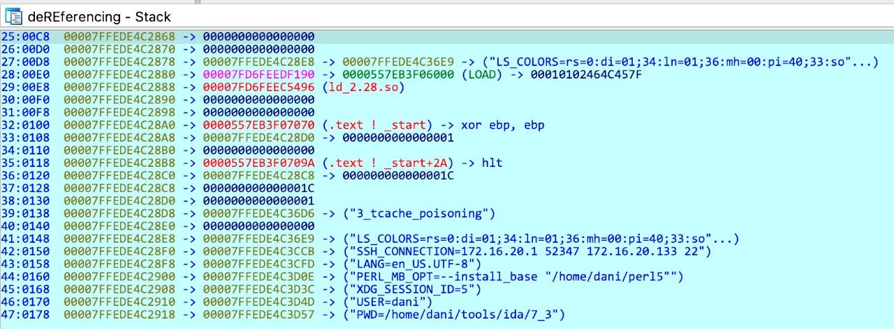
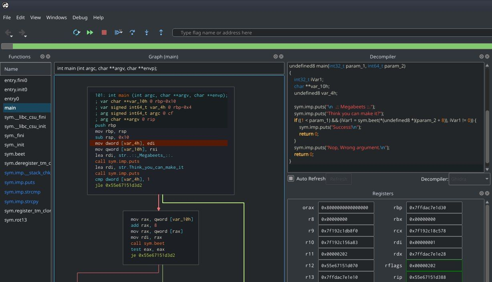

# reverseengineeringx
`2019-12-31 18:36:59`

<blockquote>
DbgChild is a stand alone tool for debugging child processes (auto attach).

https://github.com/David-Reguera-Garcia-Dreg/DbgChild
</blockquote>

<table><tr><td><b>→</b><a href="https://github.com/David-Reguera-Garcia-Dreg/DbgChild">
https://github.com/David-Reguera-Garcia-Dreg/DbgChild
</a>
<blockquote>
Debug Child Process Tool (auto attach). Contribute to David-Reguera-Garcia-Dreg/DbgChild development by creating an account on GitHub.
</blockquote>
</td></tr></table>

---

# defcon_news
`2019-12-31 18:27:24`

<blockquote>
Some Thoughts About the Critical Citrix ADC/Gateway Vulnerability (CVE-2019-19781), (Tue, Dec 31st)
https://isc.sans.edu/diary/rss/25660

via SANS Internet Storm Center, InfoCON: green
</blockquote>

<table><tr><td><b>→</b><a href="https://isc.sans.edu/diary/rss/25660">
https://isc.sans.edu/diary/rss/25660
</a>
<blockquote>
Some Thoughts About the Critical Citrix ADC/Gateway Vulnerability (CVE-2019-19781), Author: Johannes Ullrich
</blockquote>
</td></tr></table>

---

# R0_Crew
`2019-12-31 16:10:10`

<blockquote>
A tool to recover a fully analyzable .ELF from a raw kernel, through extracting the kernel symbol table (kallsyms)  https://github.com/marin-m/vmlinux-to-elf &#35;reverse &#35;linux &#35;dukeBarman
</blockquote>

<table><tr><td><b>→</b><a href="https://github.com/marin-m/vmlinux-to-elf">
https://github.com/marin-m/vmlinux-to-elf
</a>
<blockquote>
A tool to recover a fully analyzable .ELF from a raw kernel, through extracting the kernel symbol table (kallsyms) - marin-m/vmlinux-to-elf
</blockquote>
</td></tr></table>

---

# defcon_news
`2019-12-31 14:57:42`

<blockquote>
[webapps] Wordpress Ultimate Addons for Beaver Builder 1.2.4.1 - Authentication Bypass
https://www.exploit-db.com/exploits/47832

via Exploit Database
</blockquote>

<table><tr><td><b>→</b><a href="https://www.exploit-db.com/exploits/47832">
https://www.exploit-db.com/exploits/47832
</a>
<blockquote>
WordPress Plugin Ultimate Addons for Beaver Builder 1.2.4.1 - Authentication Bypass.. webapps exploit for PHP platform
</blockquote>
</td></tr></table>

---

# defcon_news
`2019-12-31 14:57:41`

<blockquote>
[local] NextVPN v4.10 - Insecure File Permissions
https://www.exploit-db.com/exploits/47831

via Exploit Database
</blockquote>

<table><tr><td><b>→</b><a href="https://www.exploit-db.com/exploits/47831">
https://www.exploit-db.com/exploits/47831
</a>
<blockquote>
NextVPN v4.10 - Insecure File Permissions.. local exploit for Windows platform
</blockquote>
</td></tr></table>

---

# defcon_news
`2019-12-31 12:57:08`

<blockquote>
CVE-2019-19632 and CVE-2019-19631: XSS and Sensitive Information Disclosure
https://www.reddit.com/r/netsec/comments/ehr3pp/cve201919632_and_cve201919631_xss_and_sensitive/

via /r/netsec - Information Security News &amp; Discussion
</blockquote>

<table><tr><td><b>→</b><a href="https://www.reddit.com/r/netsec/comments/ehr3pp/cve201919632_and_cve201919631_xss_and_sensitive/">
https://www.reddit.com/r/netsec/comments/ehr3pp/cve201919632_and_cve201919631_xss_and_sensitive/
</a>
<blockquote>
Posted in r/netsec by u/breach_house • 2 points and 0 comments
</blockquote>
</td></tr></table>

---

# R0_Crew
`2019-12-31 04:27:34`

<blockquote>
AFL++2.59c released https://github.com/vanhauser-thc/AFLplusplus/releases/tag/2.59c &#35;fuzzing &#35;dukeBarman
</blockquote>

<table><tr><td><b>→</b><a href="https://github.com/vanhauser-thc/AFLplusplus/releases/tag/2.59c">
https://github.com/vanhauser-thc/AFLplusplus/releases/tag/2.59c
</a>
<blockquote>
Version ++2.59c (release):

qbdi_mode: fuzz android native libraries via QBDI framework
unicorn_mode: switched to the new unicornafl, thanks domenukk
(see https://github.com/vanhauser-thc/unicorn)
...
</blockquote>
</td></tr></table>

---

# defcon_news
`2019-12-30 20:57:25`

<blockquote>
[local] FreeBSD-SA-19:15.mqueuefs - Privilege Escalation
https://www.exploit-db.com/exploits/47830

via Exploit Database
</blockquote>

<table><tr><td><b>→</b><a href="https://www.exploit-db.com/exploits/47830">
https://www.exploit-db.com/exploits/47830
</a>
<blockquote>
FreeBSD-SA-19:15.mqueuefs - Privilege Escalation.. local exploit for FreeBSD platform
</blockquote>
</td></tr></table>

---

# defcon_news
`2019-12-30 20:57:24`

<blockquote>
[local] FreeBSD-SA-19:02.fd - Privilege Escalation
https://www.exploit-db.com/exploits/47829

via Exploit Database
</blockquote>

<table><tr><td><b>→</b><a href="https://www.exploit-db.com/exploits/47829">
https://www.exploit-db.com/exploits/47829
</a>
<blockquote>
FreeBSD-SA-19:02.fd - Privilege Escalation. CVE-2019-5596 . local exploit for FreeBSD platform
</blockquote>
</td></tr></table>

---

# defcon_news
`2019-12-30 20:57:14`

<blockquote>
[webapps] Heatmiser Netmonitor 3.03 - HTML Injection
https://www.exploit-db.com/exploits/47828

via Exploit Database
</blockquote>

<table><tr><td><b>→</b><a href="https://www.exploit-db.com/exploits/47828">
https://www.exploit-db.com/exploits/47828
</a>
<blockquote>
Heatmiser Netmonitor 3.03 - HTML Injection.. webapps exploit for Hardware platform
</blockquote>
</td></tr></table>

---

# defcon_news
`2019-12-30 20:27:22`

<blockquote>
[webapps] RICOH Web Image Monitor 1.09 - HTML Injection
https://www.exploit-db.com/exploits/47827

via Exploit Database
</blockquote>

<table><tr><td><b>→</b><a href="https://www.exploit-db.com/exploits/47827?utm_source=dlvr.it&utm_medium=twitter">
https://www.exploit-db.com/exploits/47827?utm_source=dlvr.it&utm_medium=twitter
</a>
<blockquote>
RICOH Web Image Monitor 1.09 - HTML Injection.. webapps exploit for Hardware platform
</blockquote>
</td></tr></table>

---

# defcon_news
`2019-12-30 20:27:21`

<blockquote>
[webapps] RICOH SP 4510SF Printer - HTML Injection
https://www.exploit-db.com/exploits/47826

via Exploit Database
</blockquote>

<table><tr><td><b>→</b><a href="https://www.exploit-db.com/exploits/47826?utm_source=dlvr.it&utm_medium=twitter">
https://www.exploit-db.com/exploits/47826?utm_source=dlvr.it&utm_medium=twitter
</a>
<blockquote>
RICOH SP 4510SF Printer - HTML Injection.. webapps exploit for Hardware platform
</blockquote>
</td></tr></table>

---

# defcon_news
`2019-12-30 19:57:41`

<blockquote>
[local] Domain Quester Pro 6.02 - Stack Overflow (SEH)
https://www.exploit-db.com/exploits/47825

via Exploit Database
</blockquote>

<table><tr><td><b>→</b><a href="https://www.exploit-db.com/exploits/47825?utm_source=dlvr.it&utm_medium=twitter">
https://www.exploit-db.com/exploits/47825?utm_source=dlvr.it&utm_medium=twitter
</a>
<blockquote>
Domain Quester Pro 6.02 - Stack Overflow (SEH).. local exploit for Windows platform
</blockquote>
</td></tr></table>

---

# defcon_news
`2019-12-30 19:57:40`

<blockquote>
[webapps] MyDomoAtHome REST API Domoticz ISS Gateway 0.2.40 - Information Disclosure
https://www.exploit-db.com/exploits/47824

via Exploit Database
</blockquote>

<table><tr><td><b>→</b><a href="https://www.exploit-db.com/exploits/47824?utm_source=dlvr.it&utm_medium=twitter">
https://www.exploit-db.com/exploits/47824?utm_source=dlvr.it&utm_medium=twitter
</a>
<blockquote>
MyDomoAtHome REST API Domoticz ISS Gateway 0.2.40 - Information Disclosure.. webapps exploit for Hardware platform
</blockquote>
</td></tr></table>

---

# defcon_news
`2019-12-30 19:57:39`

<blockquote>
[webapps] Heatmiser Netmonitor 3.03 - Hardcoded Credentials
https://www.exploit-db.com/exploits/47823

via Exploit Database
</blockquote>

<table><tr><td><b>→</b><a href="https://www.exploit-db.com/exploits/47823?utm_source=dlvr.it&utm_medium=twitter">
https://www.exploit-db.com/exploits/47823?utm_source=dlvr.it&utm_medium=twitter
</a>
<blockquote>
Heatmiser Netmonitor 3.03 - Hardcoded Credentials.. webapps exploit for Hardware platform
</blockquote>
</td></tr></table>

---

# defcon_news
`2019-12-30 19:57:38`

<blockquote>
[webapps] AVE DOMINAplus 1.10.x - Authentication Bypass
https://www.exploit-db.com/exploits/47822

via Exploit Database
</blockquote>

<table><tr><td><b>→</b><a href="https://www.exploit-db.com/exploits/47822?utm_source=dlvr.it&utm_medium=twitter">
https://www.exploit-db.com/exploits/47822?utm_source=dlvr.it&utm_medium=twitter
</a>
<blockquote>
AVE DOMINAplus 1.10.x - Authentication Bypass.. webapps exploit for Hardware platform
</blockquote>
</td></tr></table>

---

# defcon_news
`2019-12-30 19:57:37`

<blockquote>
[webapps] AVE DOMINAplus 1.10.x - Cross-Site Request Forgery (enable/disable alarm)
https://www.exploit-db.com/exploits/47821

via Exploit Database
</blockquote>

<table><tr><td><b>→</b><a href="https://www.exploit-db.com/exploits/47821?utm_source=dlvr.it&utm_medium=twitter">
https://www.exploit-db.com/exploits/47821?utm_source=dlvr.it&utm_medium=twitter
</a>
<blockquote>
AVE DOMINAplus 1.10.x - Cross-Site Request Forgery (enable/disable alarm).. webapps exploit for Hardware platform
</blockquote>
</td></tr></table>

---

# defcon_news
`2019-12-30 19:27:45`

<blockquote>
[webapps] AVE DOMINAplus 1.10.x - Unauthenticated Remote Reboot
https://www.exploit-db.com/exploits/47820

via Exploit Database
</blockquote>

<table><tr><td><b>→</b><a href="https://www.exploit-db.com/exploits/47820">
https://www.exploit-db.com/exploits/47820
</a>
<blockquote>
AVE DOMINAplus 1.10.x - Unauthenticated Remote Reboot.. webapps exploit for Hardware platform
</blockquote>
</td></tr></table>

---

# defcon_news
`2019-12-30 19:27:45`

<blockquote>
[webapps] AVE DOMINAplus 1.10.x - Credential Disclosure
https://www.exploit-db.com/exploits/47819

via Exploit Database
</blockquote>

<table><tr><td><b>→</b><a href="https://www.exploit-db.com/exploits/47819">
https://www.exploit-db.com/exploits/47819
</a>
<blockquote>
AVE DOMINAplus 1.10.x - Credential Disclosure.. webapps exploit for Hardware platform
</blockquote>
</td></tr></table>

---

# defcon_news
`2019-12-30 19:27:44`

<blockquote>
[local] Wing FTP Server 6.0.7 - Unquoted Service Path
https://www.exploit-db.com/exploits/47818

via Exploit Database
</blockquote>

<table><tr><td><b>→</b><a href="https://www.exploit-db.com/exploits/47818">
https://www.exploit-db.com/exploits/47818
</a>
<blockquote>
Wing FTP Server 6.0.7 - Unquoted Service Path.. local exploit for Windows platform
</blockquote>
</td></tr></table>

---

# defcon_news
`2019-12-30 19:27:40`

<blockquote>
[webapps] WEMS BEMS 21.3.1 - Undocumented Backdoor Account
https://www.exploit-db.com/exploits/47817

via Exploit Database
</blockquote>

<table><tr><td><b>→</b><a href="https://www.exploit-db.com/exploits/47817">
https://www.exploit-db.com/exploits/47817
</a>
<blockquote>
WEMS BEMS 21.3.1 - Undocumented Backdoor Account.. webapps exploit for Hardware platform
</blockquote>
</td></tr></table>

---

# defcon_news
`2019-12-30 19:27:39`

<blockquote>
[webapps] XEROX WorkCentre 7830 Printer - Cross-Site Request Forgery (Add Admin)
https://www.exploit-db.com/exploits/47816

via Exploit Database
</blockquote>

<table><tr><td><b>→</b><a href="https://www.exploit-db.com/exploits/47816">
https://www.exploit-db.com/exploits/47816
</a>
<blockquote>
XEROX WorkCentre 7830 Printer - Cross-Site Request Forgery (Add Admin).. webapps exploit for Hardware platform
</blockquote>
</td></tr></table>

---

# defcon_news
`2019-12-30 19:27:38`

<blockquote>
[webapps] XEROX WorkCentre 7855 Printer - Cross-Site Request Forgery (Add Admin)
https://www.exploit-db.com/exploits/47815

via Exploit Database
</blockquote>

<table><tr><td><b>→</b><a href="https://www.exploit-db.com/exploits/47815?utm_source=dlvr.it&utm_medium=twitter">
https://www.exploit-db.com/exploits/47815?utm_source=dlvr.it&utm_medium=twitter
</a>
<blockquote>
XEROX WorkCentre 7855 Printer - Cross-Site Request Forgery (Add Admin).. webapps exploit for Hardware platform
</blockquote>
</td></tr></table>

---

# defcon_news
`2019-12-30 19:27:37`

<blockquote>
[webapps] Thrive Smart Home 1.1 - Authentication Bypass
https://www.exploit-db.com/exploits/47814

via Exploit Database
</blockquote>

<table><tr><td><b>→</b><a href="https://www.exploit-db.com/exploits/47814">
https://www.exploit-db.com/exploits/47814
</a>
<blockquote>
Thrive Smart Home 1.1 - Authentication Bypass.. webapps exploit for PHP platform
</blockquote>
</td></tr></table>

---

# defcon_news
`2019-12-30 19:27:36`

<blockquote>
[webapps] XEROX WorkCentre 6655 Printer - Cross-Site Request Forgery (Add Admin)
https://www.exploit-db.com/exploits/47813

via Exploit Database
</blockquote>

<table><tr><td><b>→</b><a href="https://www.exploit-db.com/exploits/47813?utm_source=dlvr.it&utm_medium=twitter">
https://www.exploit-db.com/exploits/47813?utm_source=dlvr.it&utm_medium=twitter
</a>
<blockquote>
XEROX WorkCentre 6655 Printer - Cross-Site Request Forgery (Add Admin).. webapps exploit for Hardware platform
</blockquote>
</td></tr></table>

---

# defcon_news
`2019-12-30 18:57:23`

<blockquote>
[local] FTP Navigator 8.03 - Stack Overflow (SEH)
https://www.exploit-db.com/exploits/47812

via Exploit Database
</blockquote>

<table><tr><td><b>→</b><a href="https://www.exploit-db.com/exploits/47812?utm_source=dlvr.it&utm_medium=twitter">
https://www.exploit-db.com/exploits/47812?utm_source=dlvr.it&utm_medium=twitter
</a>
<blockquote>
FTP Navigator 8.03 - Stack Overflow (SEH).. local exploit for Windows platform
</blockquote>
</td></tr></table>

---

# defcon_news
`2019-12-30 18:27:21`

<blockquote>
[webapps] elearning-script 1.0 - Authentication Bypass
https://www.exploit-db.com/exploits/47811

via Exploit Database
</blockquote>

<table><tr><td><b>→</b><a href="https://www.exploit-db.com/exploits/47811?utm_source=dlvr.it&utm_medium=twitter">
https://www.exploit-db.com/exploits/47811?utm_source=dlvr.it&utm_medium=twitter
</a>
<blockquote>
elearning-script 1.0 - Authentication Bypass.. webapps exploit for Windows platform
</blockquote>
</td></tr></table>

---

# defcon_news
`2019-12-30 18:27:17`

<blockquote>
[local] AVS Audio Converter 9.1.2.600 - Stack Overflow (PoC)
https://www.exploit-db.com/exploits/47810

via Exploit Database
</blockquote>

<table><tr><td><b>→</b><a href="https://www.exploit-db.com/exploits/47810?utm_source=dlvr.it&utm_medium=twitter">
https://www.exploit-db.com/exploits/47810?utm_source=dlvr.it&utm_medium=twitter
</a>
<blockquote>
AVS Audio Converter 9.1.2.600 - Stack Overflow (PoC).. local exploit for Windows platform
</blockquote>
</td></tr></table>

---

# defcon_news
`2019-12-30 17:57:29`

<blockquote>
[webapps] HomeAutomation 3.3.2 - Remote Code Execution
https://www.exploit-db.com/exploits/47809

via Exploit Database
</blockquote>

<table><tr><td><b>→</b><a href="https://www.exploit-db.com/exploits/47809">
https://www.exploit-db.com/exploits/47809
</a>
<blockquote>
HomeAutomation 3.3.2 - Remote Code Execution.. webapps exploit for PHP platform
</blockquote>
</td></tr></table>

---

# defcon_news
`2019-12-30 17:57:28`

<blockquote>
[webapps] HomeAutomation 3.3.2 - Cross-Site Request Forgery (Add Admin)
https://www.exploit-db.com/exploits/47808

via Exploit Database
</blockquote>

<table><tr><td><b>→</b><a href="https://www.exploit-db.com/exploits/47808">
https://www.exploit-db.com/exploits/47808
</a>
<blockquote>
HomeAutomation 3.3.2 - Cross-Site Request Forgery (Add Admin).. webapps exploit for PHP platform
</blockquote>
</td></tr></table>

---

# defcon_news
`2019-12-30 17:57:27`

<blockquote>
[webapps] HomeAutomation 3.3.2 - Authentication Bypass
https://www.exploit-db.com/exploits/47807

via Exploit Database
</blockquote>

<table><tr><td><b>→</b><a href="https://www.exploit-db.com/exploits/47807">
https://www.exploit-db.com/exploits/47807
</a>
<blockquote>
HomeAutomation 3.3.2 - Authentication Bypass.. webapps exploit for PHP platform
</blockquote>
</td></tr></table>

---

# defcon_news
`2019-12-30 17:57:26`

<blockquote>
[webapps] HomeAutomation 3.3.2 - Persistent Cross-Site Scripting
https://www.exploit-db.com/exploits/47806

via Exploit Database
</blockquote>

<table><tr><td><b>→</b><a href="https://www.exploit-db.com/exploits/47806">
https://www.exploit-db.com/exploits/47806
</a>
<blockquote>
HomeAutomation 3.3.2 - Persistent Cross-Site Scripting.. webapps exploit for Hardware platform
</blockquote>
</td></tr></table>

---

# defcon_news
`2019-12-30 16:57:29`

<blockquote>
[local] Microsoft UPnP - Local Privilege Elevation (Metasploit)
https://www.exploit-db.com/exploits/47805

via Exploit Database
</blockquote>

<table><tr><td><b>→</b><a href="https://www.exploit-db.com/exploits/47805">
https://www.exploit-db.com/exploits/47805
</a>
<blockquote>
Microsoft UPnP - Local Privilege Elevation (Metasploit). CVE-2019-1405CVE-2019-1322 . local exploit for Windows platform
</blockquote>
</td></tr></table>

---

# defcon_news
`2019-12-30 16:57:29`

<blockquote>
[local] Reptile Rootkit - reptile_cmd Privilege Escalation (Metasploit)
https://www.exploit-db.com/exploits/47804

via Exploit Database
</blockquote>

<table><tr><td><b>→</b><a href="https://www.exploit-db.com/exploits/47804">
https://www.exploit-db.com/exploits/47804
</a>
<blockquote>
Reptile Rootkit - reptile_cmd Privilege Escalation (Metasploit).. local exploit for Linux platform
</blockquote>
</td></tr></table>

---

# defcon_news
`2019-12-30 16:57:28`

<blockquote>
[local] OpenBSD - Dynamic Loader chpass Privilege Escalation (Metasploit)
https://www.exploit-db.com/exploits/47803

via Exploit Database
</blockquote>

<table><tr><td><b>→</b><a href="https://www.exploit-db.com/exploits/47803?utm_source=dlvr.it&utm_medium=twitter">
https://www.exploit-db.com/exploits/47803?utm_source=dlvr.it&utm_medium=twitter
</a>
<blockquote>
OpenBSD - Dynamic Loader chpass Privilege Escalation (Metasploit). CVE-2019-19726 . local exploit for OpenBSD platform
</blockquote>
</td></tr></table>

---

# defcon_news
`2019-12-28 06:48:38`

<blockquote>
Parsuite: A Modularized Parser Framework Written in Python 3
https://www.reddit.com/r/netsec/comments/egf9v8/parsuite_a_modularized_parser_framework_written/

via /r/netsec - Information Security News &amp; Discussion
</blockquote>

<table><tr><td><b>→</b><a href="https://www.reddit.com/r/netsec/comments/egf9v8/parsuite_a_modularized_parser_framework_written/">
https://www.reddit.com/r/netsec/comments/egf9v8/parsuite_a_modularized_parser_framework_written/
</a>
<blockquote>
https://github.com/arch4ngel/parsuite I came across...
</blockquote>
</td></tr></table>

---

# defcon_news
`2019-12-24 09:55:10`

<blockquote>
Уязвимость в SQLite, позволяющая удалённо атаковать Chrome через WebSQL
https://www.opennet.ru/opennews/art.shtml?num&#61;52084

via OpenNews.opennet.ru: Проблемы безопасности
</blockquote>

<table><tr><td><b>→</b><a href="https://www.opennet.ru/opennews/art.shtml?num=52084">
https://www.opennet.ru/opennews/art.shtml?num=52084
</a>
<blockquote>
Исследователи безопасности из китайской компании Tencent представили новый вариант уязвимости Magellan (CVE-2019-13734), позволяющей добиться выполнения кода при обработке в СУБД SQLite определённым образом оформленных SQL-конструкций. Похожая уязвимость была опубликована теми же исследователями год назад. Уязвимость примечательна тем, что позволяет удалённо атаковать браузер Chrome и добиться получения контроля над системой пользователя при открытии подконтрольных злоумышленнику web-страниц.
</blockquote>
</td></tr></table>

---

# reverseengineeringx
`2019-12-23 07:13:49`

<blockquote>
deReferencing is an IDA Pro plugin that implements new registers and stack views. Adds dereferenced pointers, colors and other useful information, similar to some GDB plugins (e.g: PEDA, GEF, pwndbg, etc).

Supports following architectures: x86, x86-64, ARM, ARM64, MIPS32 and MIPS64

https://github.com/danigargu/deREferencing
</blockquote>

---

# defcon_news
`2019-12-20 16:34:08`

<blockquote>
[webapps] phpMyChat-Plus 1.98 - 'pmc_username' Reflected Cross-Site Scripting
https://www.exploit-db.com/exploits/47798

via Exploit Database
</blockquote>

<table><tr><td><b>→</b><a href="https://www.exploit-db.com/exploits/47798">
https://www.exploit-db.com/exploits/47798
</a>
<blockquote>
phpMyChat-Plus 1.98 - 'pmc_username' Reflected Cross-Site Scripting.. webapps exploit for PHP platform
</blockquote>
</td></tr></table>

---

# R0_Crew
`2019-12-20 12:49:53`

<blockquote>
New important ability in Cutter (radare2 gui)  - debugger! 

Some of the currently supported features:
‣ Multiplatform native debugger
‣ Remote debugging using GDB or WinDbg
‣ Kernel debugging
‣ Attaching to a process
‣ STDIO interaction with debugge
‣ Stack, Registers, Backtrace, Memory map, breakpoints and more
‣ Support for multi-threading
‣ Stack and Registers inspection
‣ Backtrace
‣ and more ...

https://github.com/radareorg/cutter

P.S. Developers wait for your feedback!

 &#35;reverse &#35;radare2 &#35;debugger &#35;dukeBarman
</blockquote>

<table><tr><td><b>→</b><a href="https://github.com/radareorg/cutter/">
https://github.com/radareorg/cutter/
</a>
<blockquote>
Free and Open Source Reverse Engineering Platform powered by rizin - rizinorg/cutter
</blockquote>
</td></tr></table>

---

# R0_Crew
`2019-12-20 12:49:32`

<blockquote>
Launch radare2 from pwntools in tmux https://github.com/ps1337/pwntools-r2 &#35;reverse &#35;radare2 &#35;dukeBarman
</blockquote>

<table><tr><td><b>→</b><a href="https://github.com/ps1337/pwntools-r2">
https://github.com/ps1337/pwntools-r2
</a>
<blockquote>
Launch radare2 like a boss from pwntools in tmux. Contribute to ps1337/pwntools-r2 development by creating an account on GitHub.
</blockquote>
</td></tr></table>

---

# R0_Crew
`2019-12-20 12:49:27`

<blockquote>
A collection of debugging stories https://github.com/danluu/debugging-stories &#35;debugger &#35;dukeBarman
</blockquote>

<table><tr><td><b>→</b><a href="https://github.com/danluu/debugging-stories">
https://github.com/danluu/debugging-stories
</a>
<blockquote>
A collection of debugging stories. PRs welcome (sorry for the backlog) :-) - danluu/debugging-stories
</blockquote>
</td></tr></table>

---

# R0_Crew
`2019-12-20 12:49:21`

<blockquote>
Suite of IDA scripts for SEGA Genesis ROM hacking https://github.com/zznop/ida-genesis &#35;reverse &#35;ida &#35;dukeBarman
</blockquote>

<table><tr><td><b>→</b><a href="https://github.com/zznop/ida-genesis">
https://github.com/zznop/ida-genesis
</a>
<blockquote>
Suite of IDA scripts for SEGA Genesis ROM hacking. Contribute to zznop/ida-genesis development by creating an account on GitHub.
</blockquote>
</td></tr></table>

---

# R0_Crew
`2019-12-20 11:11:48`

<blockquote>
Material for a RE 101 class on Intel x64 binaries https://github.com/0xdidu/Reverse-Engineering-Intel-x64-101 &#35;reverse &#35;IDA &#35;dukeBarman
</blockquote>

<table><tr><td><b>→</b><a href="https://github.com/0xdidu/Reverse-Engineering-Intel-x64-101">
https://github.com/0xdidu/Reverse-Engineering-Intel-x64-101
</a>
<blockquote>
Material for a RE 101 class on Intel x64 binaries. Contribute to 0xdidu/Reverse-Engineering-Intel-x64-101 development by creating an account on GitHub.
</blockquote>
</td></tr></table>

---

# cyberoffru
`2019-12-19 15:53:49`

<blockquote>
потому что вот:
https://www.opennet.ru/opennews/art.shtml?num&#61;50765
</blockquote>

<table><tr><td><b>→</b><a href="https://www.opennet.ru/opennews/art.shtml?num=50765">
https://www.opennet.ru/opennews/art.shtml?num=50765
</a>
<blockquote>
В инструментарии для управления изолированными Linux-контейнерами Docker выявлена уязвимость (CVE-2018-15664), которая при определённом стечении обстоятельств позволяет получить доступ к хост-окружению из контейнера при наличии возможности запуска своих образов в системе или при доступе к выполняемому контейнеру. Проблема проявляется во всех версиях Docker и остаётся неисправленной (предложен, но пока не принят, патч, реализующий приостановку работы контейнера на время выполнения операций с ФС).
</blockquote>
</td></tr></table>

---

# defcon_news
`2019-12-19 14:34:20`

<blockquote>
[webapps] Deutsche Bahn Ticket Vending Machine Local Kiosk - Privilege Escalation
https://www.exploit-db.com/exploits/47796

via Exploit Database
</blockquote>

<table><tr><td><b>→</b><a href="https://www.exploit-db.com/exploits/47796">
https://www.exploit-db.com/exploits/47796
</a>
<blockquote>
Deutsche Bahn Ticket Vending Machine Local Kiosk - Privilege Escalation.. webapps exploit for Hardware platform
</blockquote>
</td></tr></table>

---

# defcon_news
`2019-12-19 14:34:18`

<blockquote>
[dos] FTP Navigator 8.03 - 'Custom Command' Denial of Service (SEH)
https://www.exploit-db.com/exploits/47794

via Exploit Database
</blockquote>

<table><tr><td><b>→</b><a href="https://www.exploit-db.com/exploits/47794?utm_source=dlvr.it&utm_medium=twitter">
https://www.exploit-db.com/exploits/47794?utm_source=dlvr.it&utm_medium=twitter
</a>
<blockquote>
FTP Navigator 8.03 -  'Custom Command' Denial of Service (SEH).. dos exploit for Windows platform
</blockquote>
</td></tr></table>

---

# defcon_news
`2019-12-19 13:34:24`

<blockquote>
Deutsche Bahn Ticket Vending Machine Windows XP - Local Kiosk Privilege Escalation Vulnerability
http://seclists.org/fulldisclosure/2019/Dec/36

via Full Disclosure
</blockquote>

<table><tr><td><b>→</b><a href="https://seclists.org/fulldisclosure/2019/Dec/36">
https://seclists.org/fulldisclosure/2019/Dec/36
</a>
</td></tr></table>

---

# cibsecurity
`2019-12-18 22:18:04`

* https://threatpost.com/microsoft-issues-out-of-band-update-sharepoint-bug/151260/

<blockquote>
❌ Microsoft Issues Out-of-Band Update for SharePoint Bug ❌

An attacker could exploit CVE-2019-1491 to obtain sensitive information that could be used to mount further attacks.

📖 Read

via &quot;Threatpost&quot;.
</blockquote>

<table><tr><td><b>→</b><a href="https://threatpost.com/microsoft-issues-out-of-band-update-sharepoint-bug/151260/">
https://threatpost.com/microsoft-issues-out-of-band-update-sharepoint-bug/151260/
</a>
<blockquote>
An attacker could exploit CVE-2019-1491 to obtain sensitive information that could be used to mount further attacks.
</blockquote>
</td></tr></table>

---

# defcon_news
`2019-12-18 19:34:23`

<blockquote>
Microsoft Releases Out-of-Band Security Updates
https://www.us-cert.gov/ncas/current-activity/2019/12/18/microsoft-releases-out-band-security-updates

via CISA Current Activity
</blockquote>

<table><tr><td><b>→</b><a href="https://www.us-cert.gov/ncas/current-activity/2019/12/18/microsoft-releases-out-band-security-updates">
https://www.us-cert.gov/ncas/current-activity/2019/12/18/microsoft-releases-out-band-security-updates
</a>
<blockquote>
Microsoft has released out-of-band security updates to address a vulnerability in SharePoint Server. An attacker could exploit this vulnerability to obtain sensitive information.

The Cybersecurity and Infrastructure Security Agency (CISA) encourages users and administrators to review Microsoft Security Advisory for CVE-2019-1491 and apply the necessary updates.
</blockquote>
</td></tr></table>

---

# defcon_news
`2019-12-18 17:34:28`

<blockquote>
Telerik UI Remote Code Execution
https://packetstormsecurity.com/files/155720/CVE-2019-18935-master.tgz

via Exploit Files ≈ Packet Storm
</blockquote>

<table><tr><td><b>→</b><a href="https://packetstormsecurity.com/files/155720/CVE-2019-18935-master.tgz">
https://packetstormsecurity.com/files/155720/CVE-2019-18935-master.tgz
</a>
<blockquote>
Information Security Services, News, Files, Tools, Exploits, Advisories and Whitepapers
</blockquote>
</td></tr></table>

---

# defcon_news
`2019-12-18 17:04:20`

<blockquote>
[webapps] Telerik UI - Remote Code Execution via Insecure Deserialization
https://www.exploit-db.com/exploits/47793

via Exploit Database
</blockquote>

<table><tr><td><b>→</b><a href="https://www.exploit-db.com/exploits/47793">
https://www.exploit-db.com/exploits/47793
</a>
<blockquote>
Telerik UI - Remote Code Execution via Insecure Deserialization. CVE-2019-18935 . webapps exploit for ASPX platform
</blockquote>
</td></tr></table>

---

# defcon_news
`2019-12-18 16:34:19`

<blockquote>
[dos] macOS 10.14.6 (18G87) - Kernel Use-After-Free due to Race Condition in wait_for_namespace_event()
https://www.exploit-db.com/exploits/47791

via Exploit Database
</blockquote>

<table><tr><td><b>→</b><a href="https://www.exploit-db.com/exploits/47791?utm_source=dlvr.it&utm_medium=twitter">
https://www.exploit-db.com/exploits/47791?utm_source=dlvr.it&utm_medium=twitter
</a>
<blockquote>
macOS 10.14.6 (18G87) - Kernel Use-After-Free due to Race Condition in wait_for_namespace_event().. dos exploit for macOS platform
</blockquote>
</td></tr></table>

---

# defcon_news
`2019-12-18 16:34:16`

<blockquote>
[remote] OpenMRS - Java Deserialization RCE (Metasploit)
https://www.exploit-db.com/exploits/47792

via Exploit Database
</blockquote>

<table><tr><td><b>→</b><a href="https://www.exploit-db.com/exploits/47792">
https://www.exploit-db.com/exploits/47792
</a>
<blockquote>
OpenMRS - Java Deserialization RCE (Metasploit). CVE-2018-19276 . remote exploit for Linux platform
</blockquote>
</td></tr></table>

---

# defcon_news
`2019-12-18 14:34:05`

<blockquote>
[webapps] Rumpus FTP Web File Manager 8.2.9.1 - Reflected Cross-Site Scripting
https://www.exploit-db.com/exploits/47789

via Exploit Database
</blockquote>

<table><tr><td><b>→</b><a href="https://www.exploit-db.com/exploits/47789?utm_source=dlvr.it&utm_medium=twitter">
https://www.exploit-db.com/exploits/47789?utm_source=dlvr.it&utm_medium=twitter
</a>
<blockquote>
Rumpus FTP Web File Manager 8.2.9.1 - Reflected Cross-Site Scripting. CVE-2019-19368 . webapps exploit for ASP platform
</blockquote>
</td></tr></table>

---

# defcon_news
`2019-12-18 14:34:04`

<blockquote>
[local] AVS Audio Converter 9.1 - 'Exit folder' Buffer Overflow
https://www.exploit-db.com/exploits/47788

via Exploit Database
</blockquote>

<table><tr><td><b>→</b><a href="https://www.exploit-db.com/exploits/47788?utm_source=dlvr.it&utm_medium=twitter">
https://www.exploit-db.com/exploits/47788?utm_source=dlvr.it&utm_medium=twitter
</a>
<blockquote>
AVS Audio Converter 9.1 - 'Exit folder' Buffer Overflow.. local exploit for Windows platform
</blockquote>
</td></tr></table>

---

# defcon_news
`2019-12-18 14:34:03`

<blockquote>
[webapps] Xerox AltaLink C8035 Printer - Cross-Site Request Forgery (Add Admin)
https://www.exploit-db.com/exploits/47787

via Exploit Database
</blockquote>

<table><tr><td><b>→</b><a href="https://www.exploit-db.com/exploits/47787">
https://www.exploit-db.com/exploits/47787
</a>
<blockquote>
Xerox AltaLink C8035 Printer - Cross-Site Request Forgery (Add Admin).. webapps exploit for Hardware platform
</blockquote>
</td></tr></table>

---

# defcon_news
`2019-12-18 14:04:10`

<blockquote>
[dos] XnView 2.49.1 - 'Research' Denial of Service (PoC)
https://www.exploit-db.com/exploits/47786

via Exploit Database
</blockquote>

<table><tr><td><b>→</b><a href="https://www.exploit-db.com/exploits/47786?utm_source=dlvr.it&utm_medium=twitter">
https://www.exploit-db.com/exploits/47786?utm_source=dlvr.it&utm_medium=twitter
</a>
<blockquote>
XnView 2.49.1 - 'Research' Denial of Service (PoC).. dos exploit for Windows platform
</blockquote>
</td></tr></table>

---

# R0_Crew
`2019-12-18 12:58:48`

<blockquote>
miasm v0.1.3 release. Now both python2 &amp;&amp; python3 are supported!
https://github.com/cea-sec/miasm/releases &#35;reverse &#35;KosBeg
</blockquote>

<table><tr><td><b>→</b><a href="https://github.com/cea-sec/miasm/releases">
https://github.com/cea-sec/miasm/releases
</a>
<blockquote>
Reverse engineering framework in Python. Contribute to cea-sec/miasm development by creating an account on GitHub.
</blockquote>
</td></tr></table>

---

# defcon_news
`2019-12-18 12:34:34`

<blockquote>
[webapps] Tautulli 2.1.9 - Cross-Site Request Forgery (ShutDown)
https://www.exploit-db.com/exploits/47785

via Exploit Database
</blockquote>

<table><tr><td><b>→</b><a href="https://www.exploit-db.com/exploits/47785">
https://www.exploit-db.com/exploits/47785
</a>
<blockquote>
Tautulli 2.1.9 - Cross-Site Request Forgery (ShutDown).. webapps exploit for Windows platform
</blockquote>
</td></tr></table>

---

# sysadm_in_channel
`2019-12-18 06:43:59`

<blockquote>
Новый RAT под названием Dacls от Lazarus нацелен на Linux и Windows системы.

Модульный, кроссплатформенный, пока обнаружен на серверах где установлен продукт Atlassian Confluence, известно точно, что используется уязвимость этого продукта для внедрения Dacls на конечные системы.

Детальный PoC, как и что (правда на китайском) от первого лица:

https://blog.netlab.360.com/dacls-the-dual-platform-rat/

Atlassian CVE:
https://nvd.nist.gov/vuln/detail/CVE-2019-3396
</blockquote>

<table><tr><td><b>→</b><a href="https://blog.netlab.360.com/dacls-the-dual-platform-rat/">
https://blog.netlab.360.com/dacls-the-dual-platform-rat/
</a>
<blockquote>
背景介绍
2019年10月25号，360Netlab未知威胁检测系统发现一个可疑的ELF文件(80c0efb9e129f7f9b05a783df6959812)。一开始，我们以为这是在我们发现的Unknown
Botnet中比较平凡的一个，并且在那时候VirusTotal上有2款杀毒引擎能够识别。当我们关联分析它的相关样本特征和IoC时，我们发现这个案例跟Lazarus
Group有关，并决定深入分析它。

目前，业界也从未公开过关于Lazarus
Group针对Linux平台的攻击样本和案例。通过详细的分析，我们确定这是一款功能完善，行为隐蔽并适用于Windows和Linux平台的RAT程序，并且其幕后攻击者疑似Lazarus
Group。

事实上，这款远程控制软件相关样本早在2019年5月份就已经出现，目前在VirusTotal上显示被26款杀毒软件厂商识别为泛型的恶意软件，但它还是不为人所知，我们也没有找到相关分析报告。所以，我们会详细披露它的一些技术特征，并根据它的文件名和硬编码字符串特征将它命名为Dacls。

Dacls 概览
Dacls是一款新型的远程控制软件，包括Wi
</blockquote>
</td></tr></table>

---

# sysadm_in_channel
`2019-12-17 21:53:04`

<blockquote>
В Intel rapid найдена уязвимость позволяющая запускать привилегированные процессы, а также потенциально обходить черные списки антивирусов.

Intel rapid технология обеспечивающая повышенную производительность жёстких дисков SATA. Работает под Windows и поставляется, как правило уже в предустановленном виде с ноутбуками оснащёнными ОС Windows. Так что желательно этот момент проверить и обновить это ПО. 

PoC:
https://safebreach.com/Post/Intel-Rapid-Storage-Technology-Service-DLL-Preloading-and-Potential-Abuses-CVE-2019-14568
</blockquote>

<table><tr><td><b>→</b><a href="https://safebreach.com/Post/Intel-Rapid-Storage-Technology-Service-DLL-Preloading-and-Potential-Abuses-CVE-2019-14568">
https://safebreach.com/Post/Intel-Rapid-Storage-Technology-Service-DLL-Preloading-and-Potential-Abuses-CVE-2019-14568
</a>
<blockquote>
December 16, 2019
Peleg Hadar
Security Researcher, SafeBreach Labs
Introduction
SafeBreach Labs discovered a vulnerability in Intel(R) Rapid Storage Technology Service.
In this post, we will d…
</blockquote>
</td></tr></table>

---

# defcon_news
`2019-12-17 21:22:09`

<blockquote>
D-Link DIR-615 — Vertical Prviliege Escalation
http://seclists.org/fulldisclosure/2019/Dec/35

via Full Disclosure
</blockquote>

<table><tr><td><b>→</b><a href="https://seclists.org/fulldisclosure/2019/Dec/35">
https://seclists.org/fulldisclosure/2019/Dec/35
</a>
</td></tr></table>

---

# defcon_news
`2019-12-17 20:52:27`

<blockquote>
[webapps] Roxy Fileman 1.4.5 - Directory Traversal
https://www.exploit-db.com/exploits/47777

via Exploit Database
</blockquote>

<table><tr><td><b>→</b><a href="https://www.exploit-db.com/exploits/47777">
https://www.exploit-db.com/exploits/47777
</a>
<blockquote>
Roxy Fileman 1.4.5 - Directory Traversal. CVE-2019-19731 . webapps exploit for ASPX platform
</blockquote>
</td></tr></table>

---

# defcon_news
`2019-12-17 20:52:26`

<blockquote>
[webapps] D-Link DIR-615 Wireless Router  -  Persistent Cross-Site Scripting
https://www.exploit-db.com/exploits/47776

via Exploit Database
</blockquote>

<table><tr><td><b>→</b><a href="https://www.exploit-db.com/exploits/47776?utm_source=dlvr.it&utm_medium=twitter">
https://www.exploit-db.com/exploits/47776?utm_source=dlvr.it&utm_medium=twitter
</a>
<blockquote>
D-Link DIR-615 Wireless Router  -  Persistent Cross-Site Scripting.. webapps exploit for Hardware platform
</blockquote>
</td></tr></table>

---

# defcon_news
`2019-12-17 17:22:21`

<blockquote>
CVE-2019-18935: Remote Code Execution via Insecure Deserialization in Telerik UI
https://www.reddit.com/r/netsec/comments/ebvrhk/cve201918935_remote_code_execution_via_insecure/

via /r/netsec - Information Security News &amp; Discussion
</blockquote>

<table><tr><td><b>→</b><a href="https://www.reddit.com/r/netsec/comments/ebvrhk/cve201918935_remote_code_execution_via_insecure/">
https://www.reddit.com/r/netsec/comments/ebvrhk/cve201918935_remote_code_execution_via_insecure/
</a>
<blockquote>
Posted in r/netsec by u/albinowax • 1 point and 0 comments
</blockquote>
</td></tr></table>

---

# defcon_news
`2019-12-17 14:52:19`

<blockquote>
[webapps] NopCommerce 4.2.0 - Privilege Escalation
https://www.exploit-db.com/exploits/47783

via Exploit Database
</blockquote>

<table><tr><td><b>→</b><a href="https://www.exploit-db.com/exploits/47783">
https://www.exploit-db.com/exploits/47783
</a>
<blockquote>
NopCommerce 4.2.0 - Privilege Escalation.. webapps exploit for ASPX platform
</blockquote>
</td></tr></table>

---

# defcon_news
`2019-12-17 14:52:16`

<blockquote>
[webapps] Netgear R6400 - Remote Code Execution
https://www.exploit-db.com/exploits/47782

via Exploit Database
</blockquote>

<table><tr><td><b>→</b><a href="https://www.exploit-db.com/exploits/47782">
https://www.exploit-db.com/exploits/47782
</a>
<blockquote>
Netgear R6400 - Remote Code Execution.. webapps exploit for Hardware platform
</blockquote>
</td></tr></table>

---

# defcon_news
`2019-12-17 14:22:22`

<blockquote>
[webapps] Zendesk App SweetHawk Survey 1.6 - Persistent Cross-Site Scripting
https://www.exploit-db.com/exploits/47781

via Exploit Database
</blockquote>

<table><tr><td><b>→</b><a href="https://www.exploit-db.com/exploits/47781?utm_source=dlvr.it&utm_medium=twitter">
https://www.exploit-db.com/exploits/47781?utm_source=dlvr.it&utm_medium=twitter
</a>
<blockquote>
Zendesk App SweetHawk Survey 1.6 - Persistent Cross-Site Scripting.. webapps exploit for Java platform
</blockquote>
</td></tr></table>

---

# defcon_news
`2019-12-16 19:52:30`

<blockquote>
Breaking the Rules: A Tough Outlook for Home Page Attacks (CVE-2017-11774)
http://www.fireeye.fr/blog/threat-research/2019/12/breaking-the-rules-tough-outlook-for-home-page-attacks.html

via Fire Eye Threat Research
</blockquote>

<table><tr><td><b>→</b><a href="https://www.fireeye.fr/blog/threat-research/2019/12/breaking-the-rules-tough-outlook-for-home-page-attacks.html">
https://www.fireeye.fr/blog/threat-research/2019/12/breaking-the-rules-tough-outlook-for-home-page-attacks.html
</a>
<blockquote>
We explain how attackers are &quot;unpatching&quot; an exploit and then provide new Outlook hardening guidance.
</blockquote>
</td></tr></table>

---

# defcon_news
`2019-12-16 16:22:14`

<blockquote>
[local] OpenBSD 6.x - Dynamic Loader Privilege Escalation
https://www.exploit-db.com/exploits/47780

via Exploit Database
</blockquote>

<table><tr><td><b>→</b><a href="https://www.exploit-db.com/exploits/47780">
https://www.exploit-db.com/exploits/47780
</a>
<blockquote>
OpenBSD 6.x - Dynamic Loader Privilege Escalation. CVE-2019-19726 . local exploit for OpenBSD platform
</blockquote>
</td></tr></table>

---

# defcon_news
`2019-12-16 16:22:13`

<blockquote>
[local] Linux 5.3 - Privilege Escalation via io_uring Offload of sendmsg() onto Kernel Thread with Kernel Creds
https://www.exploit-db.com/exploits/47779

via Exploit Database
</blockquote>

<table><tr><td><b>→</b><a href="https://www.exploit-db.com/exploits/47779">
https://www.exploit-db.com/exploits/47779
</a>
<blockquote>
Linux 5.3 - Privilege Escalation via io_uring Offload of sendmsg() onto Kernel Thread with Kernel Creds. CVE-2019-19241 . local exploit for Linux platform
</blockquote>
</td></tr></table>

---

# defcon_news
`2019-12-16 13:22:20`

<blockquote>
[webapps] D-Link DIR-615 - Privilege Escalation
https://www.exploit-db.com/exploits/47778

via Exploit Database
</blockquote>

<table><tr><td><b>→</b><a href="https://www.exploit-db.com/exploits/47778">
https://www.exploit-db.com/exploits/47778
</a>
<blockquote>
D-Link DIR-615 - Privilege Escalation. CVE-2019-19743 . webapps exploit for Hardware platform
</blockquote>
</td></tr></table>

---

# defcon_news
`2019-12-16 13:22:19`

<blockquote>
Уязвимость в NPM, позволяющая изменить произвольные файлы при установке пакета
https://www.opennet.ru/opennews/art.shtml?num&#61;52043

via OpenNews.opennet.ru: Проблемы безопасности
</blockquote>

<table><tr><td><b>→</b><a href="https://www.opennet.ru/opennews/art.shtml?num=52043">
https://www.opennet.ru/opennews/art.shtml?num=52043
</a>
<blockquote>
В обновлении пакетного менеджера NPM 6.13.4, входящего в поставку Node.js и применяемого для распространения модулей на языке JavaScript, устранены три уязвимости (CVE-2019-16775, CVE-2019-16776 и CVE-2019-16777), позволяющие модифицировать или перезаписать произвольные системные файлы при установке пакета, подготовленного злоумышленником. В качестве обходного пути защиты может быть установка с опцией &quot;--ignore-scripts&quot;, запрещающей выполнение встроенных пакеты обработчиков. Разработчики NPM проанализировали имеющиеся в репозитории пакеты и не нашли следов использования выявленных проблем для совершения атак.
</blockquote>
</td></tr></table>

---

# sysadm_in_channel
`2019-12-16 07:16:13`

<blockquote>
Любителям и знатокам Vim :)

https://github.com/vim/killersheep/blob/master/README.md
</blockquote>

<table><tr><td><b>→</b><a href="https://github.com/vim/killersheep/blob/master/README.md">
https://github.com/vim/killersheep/blob/master/README.md
</a>
<blockquote>
Silly game for Vim 8.2. Contribute to vim/killersheep development by creating an account on GitHub.
</blockquote>
</td></tr></table>

---

# R0_Crew
`2019-12-16 07:03:33`

<blockquote>
Update for &#35;Ghidra building docker image: https://github.com/dukebarman/ghidra-builder Now you can build this from host's source folder. &#35;reverse &#35;dukeBarman
</blockquote>

<table><tr><td><b>→</b><a href="https://github.com/dukebarman/ghidra-builder">
https://github.com/dukebarman/ghidra-builder
</a>
<blockquote>
Docker image for building ghidra RE framework from source - dukebarman/ghidra-builder
</blockquote>
</td></tr></table>

---

# cyberoffru
`2019-12-15 23:38:01`

<blockquote>
Стыд и срам, если будет желание и время порофлить - https://github.com/LordNoteworthy/al-khaser
</blockquote>

<table><tr><td><b>→</b><a href="https://github.com/LordNoteworthy/al-khaser">
https://github.com/LordNoteworthy/al-khaser
</a>
<blockquote>
Public malware techniques used in the wild: Virtual Machine, Emulation, Debuggers, Sandbox detection.  - LordNoteworthy/al-khaser
</blockquote>
</td></tr></table>

---

# overlamer1
`2019-12-15 20:12:05`

* https://telegra.ph/Otravlennyj-dokument-Kak-ispolzovat-samye-opasnye-bagi-v-Microsoft-Office-za-poslednee-vremya-12-15

<blockquote>
Отравленный документ. Как использовать самые опасные баги в Microsoft Office за последнее время
</blockquote>

<table><tr><td><b>→</b><a href="https://telegra.ph/Otravlennyj-dokument-Kak-ispolzovat-samye-opasnye-bagi-v-Microsoft-Office-za-poslednee-vremya-12-15">
https://telegra.ph/Otravlennyj-dokument-Kak-ispolzovat-samye-opasnye-bagi-v-Microsoft-Office-za-poslednee-vremya-12-15
</a>
<blockquote>
В этой статье мы разберем несколько далеко не новых, но в свое время нашумевших критических уязвимостей в офисных программах Microsoft. Под них уже давно есть модули Metasploit и куча заготовок на GitHub. Однако непропатченный Office — это по-прежнему бич корпоративной безопасности и путь на компьютер пользователей.   Некорректная обработка ответов от OLE (CVE-2017-8570) В основе этого бага лежит ошибка, связанная с некорректной обработкой ответов от сервера в функции Microsoft OLE (Object Linking and Embedding)…
</blockquote>
</td></tr></table>

---

# reverseengineeringx
`2019-12-14 21:16:30`

<blockquote>
Hi everyone! We are so happy to announce that we finally implemented a debugger in Cutter! 🎉 
The beta version of the debugger is available NOW on the Master branch so you can build the recent version of Cutter or download the precompiled executable from Appveyor (if you're on Windows).

We will release the debugger officially in about a week, until then - we are looking forward to your feedback so please make sure to try it and report us any issue or feature requests you have. 🍻 

https://github.com/radareorg/cutter
</blockquote>

---

# defcon_news
`2019-12-14 04:42:14`

<blockquote>
eGain Web API Email Header Injection: CVE-2019-17123
https://www.reddit.com/r/netsec/comments/e99thn/egain_web_api_email_header_injection_cve201917123/

via /r/netsec - Information Security News &amp; Discussion
</blockquote>

<table><tr><td><b>→</b><a href="https://www.reddit.com/r/netsec/comments/e99thn/egain_web_api_email_header_injection_cve201917123/">
https://www.reddit.com/r/netsec/comments/e99thn/egain_web_api_email_header_injection_cve201917123/
</a>
<blockquote>
Posted in r/netsec by u/cyberbutler • 3 points and 0 comments
</blockquote>
</td></tr></table>

---

# phd_soc
`2019-12-14 01:41:19`

<blockquote>
Вдруг из маминой из спальни... ололо пыщ-пыщ реальни https://github.com/defenxor/dsiem
</blockquote>

<table><tr><td><b>→</b><a href="https://github.com/defenxor/dsiem">
https://github.com/defenxor/dsiem
</a>
<blockquote>
Security event correlation engine for ELK stack. Contribute to defenxor/dsiem development by creating an account on GitHub.
</blockquote>
</td></tr></table>

---

# defcon_news
`2019-12-13 22:12:22`

<blockquote>
Squiz Matrix CMS &lt;&#61;5.5.3.2 - Multiple Issues may lead to Remote Code Execution
http://seclists.org/fulldisclosure/2019/Dec/34

via Full Disclosure
</blockquote>

<table><tr><td><b>→</b><a href="https://seclists.org/fulldisclosure/2019/Dec/34">
https://seclists.org/fulldisclosure/2019/Dec/34
</a>
</td></tr></table>

---

# defcon_news
`2019-12-13 22:12:21`

<blockquote>
CSV injection vulnerability in SolarWinds Serv-U FTP Server
http://seclists.org/fulldisclosure/2019/Dec/33

via Full Disclosure
</blockquote>

<table><tr><td><b>→</b><a href="https://seclists.org/fulldisclosure/2019/Dec/33">
https://seclists.org/fulldisclosure/2019/Dec/33
</a>
</td></tr></table>

---

# defcon_news
`2019-12-13 22:12:21`

<blockquote>
Stored Cross-Site Scripting in Serv-U FTP Server
http://seclists.org/fulldisclosure/2019/Dec/32

via Full Disclosure
</blockquote>

<table><tr><td><b>→</b><a href="https://seclists.org/fulldisclosure/2019/Dec/32">
https://seclists.org/fulldisclosure/2019/Dec/32
</a>
</td></tr></table>

---

# defcon_news
`2019-12-13 22:12:20`

<blockquote>
Local Privilege Escalation in OpenBSD's dynamic loader (CVE-2019-19726)
http://seclists.org/fulldisclosure/2019/Dec/31

via Full Disclosure
</blockquote>

<table><tr><td><b>→</b><a href="https://seclists.org/fulldisclosure/2019/Dec/31">
https://seclists.org/fulldisclosure/2019/Dec/31
</a>
</td></tr></table>

---

# defcon_news
`2019-12-13 22:12:19`

<blockquote>
APPLE-SA-2019-12-10-8 watchOS 6.1.1
http://seclists.org/fulldisclosure/2019/Dec/30

via Full Disclosure
</blockquote>

<table><tr><td><b>→</b><a href="https://seclists.org/fulldisclosure/2019/Dec/30">
https://seclists.org/fulldisclosure/2019/Dec/30
</a>
</td></tr></table>

---

# defcon_news
`2019-12-13 22:12:15`

<blockquote>
APPLE-SA-2019-12-10-7 Xcode 11.3
http://seclists.org/fulldisclosure/2019/Dec/29

via Full Disclosure
</blockquote>

<table><tr><td><b>→</b><a href="https://seclists.org/fulldisclosure/2019/Dec/29">
https://seclists.org/fulldisclosure/2019/Dec/29
</a>
</td></tr></table>

---

# defcon_news
`2019-12-13 22:12:14`

<blockquote>
APPLE-SA-2019-12-10-6 Safari 13.0.4
http://seclists.org/fulldisclosure/2019/Dec/28

via Full Disclosure
</blockquote>

<table><tr><td><b>→</b><a href="https://seclists.org/fulldisclosure/2019/Dec/28">
https://seclists.org/fulldisclosure/2019/Dec/28
</a>
</td></tr></table>

---

# defcon_news
`2019-12-13 22:12:13`

<blockquote>
APPLE-SA-2019-12-10-5 tvOS 13.3
http://seclists.org/fulldisclosure/2019/Dec/27

via Full Disclosure
</blockquote>

<table><tr><td><b>→</b><a href="https://seclists.org/fulldisclosure/2019/Dec/27">
https://seclists.org/fulldisclosure/2019/Dec/27
</a>
</td></tr></table>

---

# defcon_news
`2019-12-13 22:12:12`

<blockquote>
APPLE-SA-2019-12-10-3 macOS Catalina 10.15.2, Security Update 2019-002 Mojave, Security Update 2019-007 High Sierra
http://seclists.org/fulldisclosure/2019/Dec/26

via Full Disclosure
</blockquote>

<table><tr><td><b>→</b><a href="https://seclists.org/fulldisclosure/2019/Dec/26">
https://seclists.org/fulldisclosure/2019/Dec/26
</a>
</td></tr></table>

---

# defcon_news
`2019-12-13 22:12:11`

<blockquote>
APPLE-SA-2019-12-10-4 watchOS 5.3.4
http://seclists.org/fulldisclosure/2019/Dec/25

via Full Disclosure
</blockquote>

<table><tr><td><b>→</b><a href="https://seclists.org/fulldisclosure/2019/Dec/25">
https://seclists.org/fulldisclosure/2019/Dec/25
</a>
</td></tr></table>

---

# defcon_news
`2019-12-13 21:42:25`

<blockquote>
APPLE-SA-2019-12-10-2 iOS 12.4.4
http://seclists.org/fulldisclosure/2019/Dec/24

via Full Disclosure
</blockquote>

<table><tr><td><b>→</b><a href="https://seclists.org/fulldisclosure/2019/Dec/24">
https://seclists.org/fulldisclosure/2019/Dec/24
</a>
</td></tr></table>

---

# defcon_news
`2019-12-13 21:42:24`

<blockquote>
APPLE-SA-2019-12-10-1 iOS 13.3 and iPadOS 13.3
http://seclists.org/fulldisclosure/2019/Dec/23

via Full Disclosure
</blockquote>

<table><tr><td><b>→</b><a href="https://seclists.org/fulldisclosure/2019/Dec/23">
https://seclists.org/fulldisclosure/2019/Dec/23
</a>
</td></tr></table>

---

# defcon_news
`2019-12-13 21:42:23`

<blockquote>
CA20191210-01: Security Notice for CA Automic Sysload
http://seclists.org/fulldisclosure/2019/Dec/22

via Full Disclosure
</blockquote>

<table><tr><td><b>→</b><a href="https://seclists.org/fulldisclosure/2019/Dec/22">
https://seclists.org/fulldisclosure/2019/Dec/22
</a>
</td></tr></table>

---

# defcon_news
`2019-12-13 21:42:22`

<blockquote>
CVE-2019-12750 - Exploitation Write-ups
http://seclists.org/fulldisclosure/2019/Dec/21

via Full Disclosure
</blockquote>

<table><tr><td><b>→</b><a href="https://seclists.org/fulldisclosure/2019/Dec/21">
https://seclists.org/fulldisclosure/2019/Dec/21
</a>
</td></tr></table>

---

# defcon_news
`2019-12-13 11:12:26`

<blockquote>
[webapps] NVMS 1000 - Directory Traversal
https://www.exploit-db.com/exploits/47774

via Exploit Database
</blockquote>

<table><tr><td><b>→</b><a href="https://www.exploit-db.com/exploits/47774">
https://www.exploit-db.com/exploits/47774
</a>
<blockquote>
NVMS 1000 - Directory Traversal.. webapps exploit for Hardware platform
</blockquote>
</td></tr></table>

---

# defcon_news
`2019-12-13 11:12:26`

<blockquote>
[local] FTP Commander Pro 8.03 - Local Stack Overflow
https://www.exploit-db.com/exploits/47775

via Exploit Database
</blockquote>

<table><tr><td><b>→</b><a href="https://www.exploit-db.com/exploits/47775">
https://www.exploit-db.com/exploits/47775
</a>
<blockquote>
FTP Commander Pro 8.03 - Local Stack Overflow.. local exploit for Windows platform
</blockquote>
</td></tr></table>

---

# R0_Crew
`2019-12-13 07:17:47`

<blockquote>
Insecure Boot https://github.com/abarisani/abarisani.github.io/tree/master/research/secure_boot &#35;hardware &#35;dukeBarman
</blockquote>

<table><tr><td><b>→</b><a href="https://github.com/abarisani/abarisani.github.io/tree/master/research/secure_boot">
https://github.com/abarisani/abarisani.github.io/tree/master/research/secure_boot
</a>
<blockquote>
Contribute to abarisani/abarisani.github.io development by creating an account on GitHub.
</blockquote>
</td></tr></table>

---

# defcon_news
`2019-12-13 00:42:13`

<blockquote>
Critical VMware Vulnerability (OpenSLP): https://www.vmware.com/security/advisories/VMSA-2019-0022.html, (Thu, Dec 12th)
https://isc.sans.edu/diary/rss/25602

via SANS Internet Storm Center, InfoCON: green
</blockquote>

<table><tr><td><b>→</b><a href="https://www.vmware.com/security/advisories/VMSA-2019-0022.html">
https://www.vmware.com/security/advisories/VMSA-2019-0022.html
</a>
<blockquote>
VMware ESXi and Horizon DaaS updates address OpenSLP remote code execution vulnerability (CVE-2019-5544)
</blockquote>
</td></tr></table>

---

# sysadm_in_channel
`2019-12-12 18:59:37`

<blockquote>
AirDrop + DDoS &#61; AirDoS

PoC:

https://github.com/KishanBagaria/AirDoS/blob/master/README.md
</blockquote>

<table><tr><td><b>→</b><a href="https://github.com/KishanBagaria/AirDoS/blob/master/README.md">
https://github.com/KishanBagaria/AirDoS/blob/master/README.md
</a>
<blockquote>
💣 Remotely render any nearby iPhone or iPad unusable - KishanBagaria/AirDoS
</blockquote>
</td></tr></table>

---

# defcon_news
`2019-12-12 14:12:41`

<blockquote>
[webapps] OpenNetAdmin 18.1.1 - Command Injection Exploit (Metasploit)
https://www.exploit-db.com/exploits/47772

via Exploit Database
</blockquote>

<table><tr><td><b>→</b><a href="https://www.exploit-db.com/exploits/47772">
https://www.exploit-db.com/exploits/47772
</a>
<blockquote>
OpenNetAdmin 18.1.1 - Command Injection Exploit (Metasploit).. webapps exploit for PHP platform
</blockquote>
</td></tr></table>

---

# defcon_news
`2019-12-12 14:12:41`

<blockquote>
[webapps] Bullwark Momentum Series JAWS 1.0 - Directory Traversal
https://www.exploit-db.com/exploits/47773

via Exploit Database
</blockquote>

<table><tr><td><b>→</b><a href="https://www.exploit-db.com/exploits/47773?utm_source=dlvr.it&utm_medium=twitter">
https://www.exploit-db.com/exploits/47773?utm_source=dlvr.it&utm_medium=twitter
</a>
<blockquote>
Bullwark Momentum Series JAWS 1.0 - Directory Traversal.. webapps exploit for PHP platform
</blockquote>
</td></tr></table>

---

# defcon_news
`2019-12-12 14:12:40`

<blockquote>
[dos] Lenovo Power Management Driver 1.67.17.48 - 'mdrvs.sys' Denial of Service (PoC)
https://www.exploit-db.com/exploits/47771

via Exploit Database
</blockquote>

<table><tr><td><b>→</b><a href="https://www.exploit-db.com/exploits/47771?utm_source=dlvr.it&utm_medium=twitter">
https://www.exploit-db.com/exploits/47771?utm_source=dlvr.it&utm_medium=twitter
</a>
<blockquote>
Lenovo Power Management Driver 1.67.17.48 - 'pmdrvs.sys' Denial of Service (PoC). CVE-2019-6192 . dos exploit for Windows platform
</blockquote>
</td></tr></table>

---

# defcon_news
`2019-12-12 14:12:29`

<blockquote>
Local Privilege Escalation in OpenBSD's dynamic loader (CVE-2019-19726)
https://www.reddit.com/r/netsec/comments/e9icyo/local_privilege_escalation_in_openbsds_dynamic/

via /r/netsec - Information Security News &amp; Discussion
</blockquote>

<table><tr><td><b>→</b><a href="https://www.reddit.com/r/netsec/comments/e9icyo/local_privilege_escalation_in_openbsds_dynamic/?utm_source=ifttt">
https://www.reddit.com/r/netsec/comments/e9icyo/local_privilege_escalation_in_openbsds_dynamic/?utm_source=ifttt
</a>
<blockquote>
Posted in r/netsec by u/th3typh00n • 2 points and 1 comment
</blockquote>
</td></tr></table>

---

# defcon_news
`2019-12-12 12:12:04`

<blockquote>
SEC Consult SA-20191211-0 :: File Extension Spoofing in Windows Defender Antivirus
http://seclists.org/fulldisclosure/2019/Dec/20

via Full Disclosure
</blockquote>

<table><tr><td><b>→</b><a href="https://seclists.org/fulldisclosure/2019/Dec/20">
https://seclists.org/fulldisclosure/2019/Dec/20
</a>
</td></tr></table>

---

# defcon_news
`2019-12-12 02:25:43`

<blockquote>
Deserialized Double Dirty - Exploiting CVE-2017-12149
https://www.reddit.com/r/netsec/comments/e99v79/deserialized_double_dirty_exploiting_cve201712149/

via /r/netsec - Information Security News &amp; Discussion
</blockquote>

<table><tr><td><b>→</b><a href="https://www.reddit.com/r/netsec/comments/e99v79/deserialized_double_dirty_exploiting_cve201712149/">
https://www.reddit.com/r/netsec/comments/e99v79/deserialized_double_dirty_exploiting_cve201712149/
</a>
<blockquote>
Posted in r/netsec by u/coalfirelabs • 1 point and 1 comment
</blockquote>
</td></tr></table>

---

# phd_soc
`2019-12-11 22:18:19`

<blockquote>
На самом деле я просто хотел вбросить. По поводу вайтлистинга для фидов. Если кто-то соберется в лоб использовать, то не советую https://github.com/MISP/misp-warninglists
</blockquote>

<table><tr><td><b>→</b><a href="https://github.com/MISP/misp-warninglists">
https://github.com/MISP/misp-warninglists
</a>
<blockquote>
Warning lists to inform users of MISP about potential false-positives or other information in indicators - MISP/misp-warninglists
</blockquote>
</td></tr></table>

---

# defcon_news
`2019-12-11 15:49:13`

<blockquote>
[webapps] Apache Olingo OData 4.0 - XML External Entity Injection
https://www.exploit-db.com/exploits/47770

via Exploit Database
</blockquote>

<table><tr><td><b>→</b><a href="https://www.exploit-db.com/exploits/47770?utm_source=dlvr.it&utm_medium=twitter">
https://www.exploit-db.com/exploits/47770?utm_source=dlvr.it&utm_medium=twitter
</a>
<blockquote>
Apache Olingo OData 4.0 - XML External Entity Injection. CVE-2019-17554 . webapps exploit for Java platform
</blockquote>
</td></tr></table>

---

# defcon_news
`2019-12-11 15:49:11`

<blockquote>
[dos] Adobe Acrobat Reader DC - Heap-Based Memory Corruption due to Malformed TTF Font
https://www.exploit-db.com/exploits/47769

via Exploit Database
</blockquote>

<table><tr><td><b>→</b><a href="https://www.exploit-db.com/exploits/47769">
https://www.exploit-db.com/exploits/47769
</a>
<blockquote>
Adobe Acrobat Reader DC - Heap-Based Memory Corruption due to Malformed TTF Font. CVE-2019-16451 . dos exploit for Windows platform
</blockquote>
</td></tr></table>

---

# defcon_news
`2019-12-11 14:55:12`

<blockquote>
Повышение привилегий в Windows клиенте EA Origin (CVE-2019-19247 и CVE-2019-19248)
https://habr.com/ru/post/479704/

via Информационная безопасность – Защита данных
</blockquote>

<table><tr><td><b>→</b><a href="https://habr.com/ru/post/479704/?utm_campaign=479704&utm_source=habrahabr&utm_medium=rss">
https://habr.com/ru/post/479704/?utm_campaign=479704&utm_source=habrahabr&utm_medium=rss
</a>
<blockquote>
Приветствую всех, кто решил прочитать мою новую статью с разбором уязвимостей. В прошлый раз небольшим циклом из трех статей я рассказал об уязвимостях в Steam (...
</blockquote>
</td></tr></table>

---

# defcon_news
`2019-12-11 14:55:08`

<blockquote>
[dos] AppXSvc 17763 - Arbitrary File Overwrite (DoS)
https://www.exploit-db.com/exploits/47768

via Exploit Database
</blockquote>

<table><tr><td><b>→</b><a href="https://www.exploit-db.com/exploits/47768?utm_source=dlvr.it&utm_medium=twitter">
https://www.exploit-db.com/exploits/47768?utm_source=dlvr.it&utm_medium=twitter
</a>
<blockquote>
AppXSvc 17763 - Arbitrary File Overwrite (DoS). CVE-2019-1476 . dos exploit for Windows platform
</blockquote>
</td></tr></table>

---

# defcon_news
`2019-12-11 14:55:07`

<blockquote>
[dos] Product Key Explorer 4.2.0.0 - 'Key' Denial of Service (PoC)
https://www.exploit-db.com/exploits/47767

via Exploit Database
</blockquote>

<table><tr><td><b>→</b><a href="https://www.exploit-db.com/exploits/47767?utm_source=dlvr.it&utm_medium=twitter">
https://www.exploit-db.com/exploits/47767?utm_source=dlvr.it&utm_medium=twitter
</a>
<blockquote>
Product Key Explorer 4.2.0.0 - 'Key' Denial of Service (PoC).. dos exploit for Windows platform
</blockquote>
</td></tr></table>

---

# defcon_news
`2019-12-11 14:55:06`

<blockquote>
[dos] Product Key Explorer 4.2.0.0 - 'Name' Denial of Service (POC)
https://www.exploit-db.com/exploits/47766

via Exploit Database
</blockquote>

<table><tr><td><b>→</b><a href="https://www.exploit-db.com/exploits/47766?utm_source=dlvr.it&utm_medium=twitter">
https://www.exploit-db.com/exploits/47766?utm_source=dlvr.it&utm_medium=twitter
</a>
<blockquote>
Product Key Explorer 4.2.0.0 - 'Name' Denial of Service (POC).. dos exploit for Windows platform
</blockquote>
</td></tr></table>

---

# defcon_news
`2019-12-11 13:26:23`

<blockquote>
Plundervolt - новый метод атаки на процессоры Intel, затрагивающий технологию SGX
https://www.opennet.ru/opennews/art.shtml?num&#61;52011

via OpenNews.opennet.ru: Проблемы безопасности
</blockquote>

<table><tr><td><b>→</b><a href="https://www.opennet.ru/opennews/art.shtml?num=52011">
https://www.opennet.ru/opennews/art.shtml?num=52011
</a>
<blockquote>
Компания Intel выпустила обновление микрокода, устраняющего уязвимость (CVE-2019-14607), позволяющую через манипуляции с механизмом динамического управления напряжением и частотой в CPU инициировать повреждение содержимого ячеек с данными, в том числе в областях, используемых при вычислениях в изолированных анклавах Intel SGX. Атака получила название Plundervolt и потенциально позволяет локальному пользователю добиться повышения своих привилегий в системе, вызвать отказ в обслуживании и получить доступ к закрытым данным.
</blockquote>
</td></tr></table>

---

# defcon_news
`2019-12-11 13:26:21`

<blockquote>
New PlunderVolt Attack Targets Intel SGX Enclaves by Tweaking CPU Voltage
https://thehackernews.com/2019/12/intel-sgx-voltage-attack.html

via The Hacker News
</blockquote>

<table><tr><td><b>→</b><a href="https://thehackernews.com/2019/12/intel-sgx-voltage-attack.html">
https://thehackernews.com/2019/12/intel-sgx-voltage-attack.html
</a>
<blockquote>
New PlunderVolt Attack (CVE-2019-11157) Targets SGX Enclaves on Intel Processors by Tweaking CPU Voltage.
</blockquote>
</td></tr></table>

---

# phd_soc
`2019-12-11 09:11:09`

<blockquote>
Фигня для автоматизации хайва 

https://github.com/TheHive-Project/Cortex
</blockquote>

<table><tr><td><b>→</b><a href="https://github.com/TheHive-Project/Cortex">
https://github.com/TheHive-Project/Cortex
</a>
<blockquote>
Cortex: a Powerful Observable Analysis and Active Response Engine - TheHive-Project/Cortex
</blockquote>
</td></tr></table>

---

# defcon_news
`2019-12-11 03:17:22`

<blockquote>
DAViCal CalDAV Server 1.1.8 Reflective Cross Site Scripting
https://packetstormsecurity.com/files/155630/CVE-2019-18345.txt

via Exploit Files ≈ Packet Storm
</blockquote>

<table><tr><td><b>→</b><a href="https://packetstormsecurity.com/files/155630/CVE-2019-18345.txt?utm_source=dlvr.it&utm_medium=twitter">
https://packetstormsecurity.com/files/155630/CVE-2019-18345.txt?utm_source=dlvr.it&utm_medium=twitter
</a>
<blockquote>
Information Security Services, News, Files, Tools, Exploits, Advisories and Whitepapers
</blockquote>
</td></tr></table>

---

# defcon_news
`2019-12-11 03:17:21`

<blockquote>
DAViCal CalDAV Server 1.1.8 Cross Site Request Forgery
https://packetstormsecurity.com/files/155629/CVE-2019-18346.txt

via Exploit Files ≈ Packet Storm
</blockquote>

<table><tr><td><b>→</b><a href="https://packetstormsecurity.com/files/155629/CVE-2019-18346.txt?utm_source=dlvr.it&utm_medium=twitter">
https://packetstormsecurity.com/files/155629/CVE-2019-18346.txt?utm_source=dlvr.it&utm_medium=twitter
</a>
<blockquote>
Information Security Services, News, Files, Tools, Exploits, Advisories and Whitepapers
</blockquote>
</td></tr></table>

---

# defcon_news
`2019-12-11 03:17:20`

<blockquote>
DAViCal CalDAV Server 1.1.8 Persistent Cross Site Scripting
https://packetstormsecurity.com/files/155628/CVE-2019-18347.txt

via Exploit Files ≈ Packet Storm
</blockquote>

<table><tr><td><b>→</b><a href="https://packetstormsecurity.com/files/155628/CVE-2019-18347.txt?utm_source=dlvr.it&utm_medium=twitter">
https://packetstormsecurity.com/files/155628/CVE-2019-18347.txt?utm_source=dlvr.it&utm_medium=twitter
</a>
<blockquote>
Information Security Services, News, Files, Tools, Exploits, Advisories and Whitepapers
</blockquote>
</td></tr></table>

---

# defcon_news
`2019-12-10 22:57:16`

<blockquote>
CVE-2019-18345 Reflected Cross-Site Scripting (XSS) vulnerability in DAViCal CalDAV Server
http://seclists.org/fulldisclosure/2019/Dec/19

via Full Disclosure
</blockquote>

<table><tr><td><b>→</b><a href="https://seclists.org/fulldisclosure/2019/Dec/19">
https://seclists.org/fulldisclosure/2019/Dec/19
</a>
</td></tr></table>

---

# defcon_news
`2019-12-10 22:28:28`

<blockquote>
CVE-2019-18346 Cross-Site Request Forgery (CSRF) vulnerability in DAViCal CalDAV Server
http://seclists.org/fulldisclosure/2019/Dec/18

via Full Disclosure
</blockquote>

<table><tr><td><b>→</b><a href="https://seclists.org/fulldisclosure/2019/Dec/18">
https://seclists.org/fulldisclosure/2019/Dec/18
</a>
</td></tr></table>

---

# defcon_news
`2019-12-10 22:28:24`

<blockquote>
CVE-2019-18347 Persistent Cross-Site Scripting (XSS) vulnerability in DAViCal CalDAV Server
http://seclists.org/fulldisclosure/2019/Dec/17

via Full Disclosure
</blockquote>

<table><tr><td><b>→</b><a href="https://seclists.org/fulldisclosure/2019/Dec/17">
https://seclists.org/fulldisclosure/2019/Dec/17
</a>
</td></tr></table>

---

# defcon_news
`2019-12-10 22:28:23`

<blockquote>
CA20191209-01: Security Notice for CA Nolio (Release Automation)
http://seclists.org/fulldisclosure/2019/Dec/16

via Full Disclosure
</blockquote>

<table><tr><td><b>→</b><a href="https://seclists.org/fulldisclosure/2019/Dec/16">
https://seclists.org/fulldisclosure/2019/Dec/16
</a>
</td></tr></table>

---

# defcon_news
`2019-12-10 19:53:35`

<blockquote>
Samba Releases Security Updates
https://www.us-cert.gov/ncas/current-activity/2019/12/10/samba-releases-security-updates

via CISA Current Activity
</blockquote>

<table><tr><td><b>→</b><a href="https://www.us-cert.gov/ncas/current-activity/2019/12/10/samba-releases-security-updates">
https://www.us-cert.gov/ncas/current-activity/2019/12/10/samba-releases-security-updates
</a>
<blockquote>
The Samba Team has released security updates to address vulnerabilities in multiple versions of Samba. An attacker could exploit one of these vulnerabilities to take control of an affected system.

The Cybersecurity and Infrastructure Security Agency (CISA) encourages users and administrators to review the Samba Security Announcements for CVE-2019-14861 and CVE-2019-14870 and apply the necessary updates and workarounds.
</blockquote>
</td></tr></table>

---

# defcon_news
`2019-12-10 19:27:24`

<blockquote>
AVCLASS++: Yet Another Massive Malware Labeling Tool
https://www.reddit.com/r/Malware/comments/e8s6x9/avclass_yet_another_massive_malware_labeling_tool/

via Malware Analysis &amp; Reports
</blockquote>

<table><tr><td><b>→</b><a href="https://www.reddit.com/r/Malware/comments/e8s6x9/avclass_yet_another_massive_malware_labeling_tool/">
https://www.reddit.com/r/Malware/comments/e8s6x9/avclass_yet_another_massive_malware_labeling_tool/
</a>
<blockquote>
[https://github.com/malrev/avclassplusplus](https://github.com/malrev/avclassplusplus)
</blockquote>
</td></tr></table>

---

# exploitex
`2019-12-10 16:31:01`

* https://telegra.ph/Otravlennye-dokumenty-Kak-ispolzovat-samye-opasnye-bagi-v-Microsoft-Office-za-poslednee-vremya-12-07

<blockquote>
Отравленный документ. Как использовать самые опасные баги в Microsoft Office за последнее время

В этой статье мы разберем несколько далеко не новых, но в свое время нашумевших критических уязвимостей в офисных программах Microsoft. Под них уже давно есть модули Metasploit и куча заготовок на GitHub. Однако непропатченный Office — это по-прежнему бич корпоративной безопасности и путь на компьютер пользователей.

📌 Как использовать самые опасные баги в Microsoft Office за последнее время
</blockquote>

<table><tr><td><b>→</b><a href="https://telegra.ph/Otravlennye-dokumenty-Kak-ispolzovat-samye-opasnye-bagi-v-Microsoft-Office-za-poslednee-vremya-12-07">
https://telegra.ph/Otravlennye-dokumenty-Kak-ispolzovat-samye-opasnye-bagi-v-Microsoft-Office-za-poslednee-vremya-12-07
</a>
<blockquote>
В этой статье мы разберем несколько далеко не новых, но в свое время нашумевших критических уязвимостей в офисных программах Microsoft. Под них уже давно есть модули Metasploit и куча заготовок на GitHub. Однако непропатченный Office — это по-прежнему бич корпоративной безопасности и путь на компьютер пользователей.   Некорректная обработка ответов от OLE (CVE-2017-8570) В основе этого бага лежит ошибка, связанная с некорректной обработкой ответов от сервера в функции Microsoft OLE (Object Linking and Embedding)…
</blockquote>
</td></tr></table>

---

# webware
`2019-12-10 14:26:28`

* https://telegra.ph/Vychislenie-celi-po-ssylke-s-I-See-You-04-08

<blockquote>
Вычисление цели по ссылке с I-See-You

&#35;pentest
</blockquote>

<table><tr><td><b>→</b><a href="https://telegra.ph/Vychislenie-celi-po-ssylke-s-I-See-You-04-08">
https://telegra.ph/Vychislenie-celi-po-ssylke-s-I-See-You-04-08
</a>
<blockquote>
t.me/webware Добрый день,Друзья и Уважаемые Форумчане. Между подготовкой более серьёзного материала для вас и отдыхом,увидел вот такую занимательную вещь. Принципиально нового,в данном софте нет,но может быть кому и пригодится. I-See-You создал Viral Maniar из Австралии для вычисления цели по подкинутой ссылке. Ссылку генерирует сам инструмент используя ресурс serveo net. Перед предложением цели пройти по ссылке,желательно её сократить и завуалировать. Установка: &#35; git clone https://github.com/Viralmaniar/I…
</blockquote>
</td></tr></table>

---

# defcon_news
`2019-12-10 14:23:06`

<blockquote>
[webapps] Inim Electronics Smartliving SmartLAN 6.x - Remote Command Execution
https://www.exploit-db.com/exploits/47765

via Exploit Database
</blockquote>

<table><tr><td><b>→</b><a href="https://www.exploit-db.com/exploits/47765?utm_source=dlvr.it&utm_medium=twitter">
https://www.exploit-db.com/exploits/47765?utm_source=dlvr.it&utm_medium=twitter
</a>
<blockquote>
Inim Electronics Smartliving SmartLAN 6.x - Remote Command Execution.. webapps exploit for Hardware platform
</blockquote>
</td></tr></table>

---

# defcon_news
`2019-12-10 14:23:05`

<blockquote>
[webapps] Inim Electronics Smartliving SmartLAN 6.x - Unauthenticated Server-Side Request Forgery
https://www.exploit-db.com/exploits/47764

via Exploit Database
</blockquote>

<table><tr><td><b>→</b><a href="https://www.exploit-db.com/exploits/47764?utm_source=dlvr.it&utm_medium=twitter">
https://www.exploit-db.com/exploits/47764?utm_source=dlvr.it&utm_medium=twitter
</a>
<blockquote>
Inim Electronics Smartliving SmartLAN 6.x - Unauthenticated Server-Side Request Forgery.. webapps exploit for Hardware platform
</blockquote>
</td></tr></table>

---

# defcon_news
`2019-12-10 13:54:16`

<blockquote>
[local] Inim Electronics Smartliving SmartLAN 6.x - Hard-coded Credentials
https://www.exploit-db.com/exploits/47763

via Exploit Database
</blockquote>

<table><tr><td><b>→</b><a href="https://www.exploit-db.com/exploits/47763?utm_source=dlvr.it&utm_medium=twitter">
https://www.exploit-db.com/exploits/47763?utm_source=dlvr.it&utm_medium=twitter
</a>
<blockquote>
Inim Electronics Smartliving SmartLAN 6.x - Hard-coded Credentials.. local exploit for Hardware platform
</blockquote>
</td></tr></table>

---

# sysadm_in_channel
`2019-12-09 19:39:54`

<blockquote>
Свежая утилита от Google

Исходный код инструмента, предназначенного для помощи разработчикам в выявлении уязвимостей, связанных с доступом к файлам

https://github.com/google/path-auditor
</blockquote>

<table><tr><td><b>→</b><a href="https://github.com/google/path-auditor">
https://github.com/google/path-auditor
</a>
<blockquote>
Contribute to google/path-auditor development by creating an account on GitHub.
</blockquote>
</td></tr></table>

---

# defcon_news
`2019-12-09 19:27:11`

<blockquote>
Mozilla Firefox Windows 64-Bit Chain Exploit
https://packetstormsecurity.com/files/155592/CVE-2019-11708-master.tgz

via Exploit Files ≈ Packet Storm
</blockquote>

<table><tr><td><b>→</b><a href="https://packetstormsecurity.com/files/155592/CVE-2019-11708-master.tgz">
https://packetstormsecurity.com/files/155592/CVE-2019-11708-master.tgz
</a>
<blockquote>
Information Security Services, News, Files, Tools, Exploits, Advisories and Whitepapers
</blockquote>
</td></tr></table>

---

# defcon_news
`2019-12-09 15:29:08`

<blockquote>
[webapps] Oracle Siebel Sales 8.1 - Persistent Cross-Site Scripting
https://www.exploit-db.com/exploits/47762

via Exploit Database
</blockquote>

<table><tr><td><b>→</b><a href="https://www.exploit-db.com/exploits/47762">
https://www.exploit-db.com/exploits/47762
</a>
<blockquote>
Oracle Siebel Sales 8.1 - Persistent Cross-Site Scripting.. webapps exploit for Java platform
</blockquote>
</td></tr></table>

---

# defcon_news
`2019-12-09 14:55:23`

<blockquote>
[webapps] Alcatel-Lucent Omnivista 8770 - Remote Code Execution
https://www.exploit-db.com/exploits/47761

via Exploit Database
</blockquote>

<table><tr><td><b>→</b><a href="https://www.exploit-db.com/exploits/47761">
https://www.exploit-db.com/exploits/47761
</a>
<blockquote>
Alcatel-Lucent Omnivista 8770 - Remote Code Execution.. webapps exploit for PHP platform
</blockquote>
</td></tr></table>

---

# defcon_news
`2019-12-09 14:55:22`

<blockquote>
[webapps] Yachtcontrol Webapplication 1.0 - Unauthenticated Remote Code Execution
https://www.exploit-db.com/exploits/47760

via Exploit Database
</blockquote>

<table><tr><td><b>→</b><a href="https://www.exploit-db.com/exploits/47760">
https://www.exploit-db.com/exploits/47760
</a>
<blockquote>
Yachtcontrol Webapplication 1.0 - Unauthenticated Remote Code Execution.. webapps exploit for Hardware platform
</blockquote>
</td></tr></table>

---

# defcon_news
`2019-12-09 14:55:17`

<blockquote>
[local] SpotAuditor 5.3.2 - 'Base64' Local Buffer Overflow (SEH)
https://www.exploit-db.com/exploits/47759

via Exploit Database
</blockquote>

<table><tr><td><b>→</b><a href="https://www.exploit-db.com/exploits/47759?utm_source=dlvr.it&utm_medium=twitter">
https://www.exploit-db.com/exploits/47759?utm_source=dlvr.it&utm_medium=twitter
</a>
<blockquote>
SpotAuditor 5.3.2 - 'Base64' Local Buffer Overflow (SEH).. local exploit for Windows platform
</blockquote>
</td></tr></table>

---

# defcon_news
`2019-12-09 14:23:26`

<blockquote>
[webapps] PRO-7070 Hazır Profesyonel Web Sitesi 1.0 - Authentication Bypass
https://www.exploit-db.com/exploits/47758

via Exploit Database
</blockquote>

<table><tr><td><b>→</b><a href="https://www.exploit-db.com/exploits/47758?utm_source=dlvr.it&utm_medium=twitter">
https://www.exploit-db.com/exploits/47758?utm_source=dlvr.it&utm_medium=twitter
</a>
<blockquote>
PRO-7070 Hazır Profesyonel Web Sitesi 1.0 - Authentication Bypass.. webapps exploit for PHP platform
</blockquote>
</td></tr></table>

---

# defcon_news
`2019-12-09 14:23:25`

<blockquote>
[dos] Omron PLC 1.0.0 - Denial of Service (PoC)
https://www.exploit-db.com/exploits/47757

via Exploit Database
</blockquote>

<table><tr><td><b>→</b><a href="https://www.exploit-db.com/exploits/47757">
https://www.exploit-db.com/exploits/47757
</a>
<blockquote>
Omron PLC 1.0.0 - Denial of Service (PoC).. dos exploit for Hardware platform
</blockquote>
</td></tr></table>

---

# defcon_news
`2019-12-09 14:23:24`

<blockquote>
[webapps] Snipe-IT Open Source Asset Management 4.7.5 - Persistent Cross-Site Scripting
https://www.exploit-db.com/exploits/47756

via Exploit Database
</blockquote>

<table><tr><td><b>→</b><a href="https://www.exploit-db.com/exploits/47756">
https://www.exploit-db.com/exploits/47756
</a>
<blockquote>
Snipe-IT Open Source Asset Management 4.7.5 - Persistent Cross-Site Scripting.. webapps exploit for PHP platform
</blockquote>
</td></tr></table>

---

# defcon_news
`2019-12-09 13:26:38`

<blockquote>
Уязвимость Linux позволяет получить сторонний доступ к VPN-подключению
https://securenews.ru/uyazvimost-linuks-pozvolyaet-poluchit-dostup/

via SecureNews
</blockquote>

<table><tr><td><b>→</b><a href="https://securenews.ru/uyazvimost-linuks-pozvolyaet-poluchit-dostup/">
https://securenews.ru/uyazvimost-linuks-pozvolyaet-poluchit-dostup/
</a>
<blockquote>
Исследователи безопасности обнаружили новую уязвимость, позволяющую потенциальным злоумышленникам перехватывать VPN-подключения на уязвимых устройствах * NIX и вставлять произвольные данные в потоки TCP IPv4 и IPv6, - передает BleepingComputer. Стало известно, что уязвимость влияет на большинство дистрибутивов Linux и Unix-подобных операционных систем, включая FreeBSD, OpenBSD, macOS, iOS и Android. Исследователи раскрыли уязвимость системы, известную как CVE-2019-14899, предназначенную для дистрибутивов и группы безопасности ядра Linux, а также для других, таких как Systemd, Google, Apple, OpenVPN и WireGuard. Кибербезопасники тестировали на уязвимости: Ubuntu 19.10 (systemd), Fedora (systemd), Debian 10.2 (systemd), Arch 2019.05 (systemd), Manjaro 18.1.1 (systemd), Devuan (init sysV), MX Linux 19 (Mepis Читать далее
</blockquote>
</td></tr></table>

---

# defcon_news
`2019-12-09 12:27:30`

<blockquote>
Full exploit chain (CVE-2019-11708 &amp; CVE-2019-9810) against Firefox on Windows 64-bit.
https://www.reddit.com/r/netsec/comments/e84vcy/full_exploit_chain_cve201911708_cve20199810/

via /r/netsec - Information Security News &amp; Discussion
</blockquote>

<table><tr><td><b>→</b><a href="https://www.reddit.com/r/netsec/comments/e84vcy/full_exploit_chain_cve201911708_cve20199810/">
https://www.reddit.com/r/netsec/comments/e84vcy/full_exploit_chain_cve201911708_cve20199810/
</a>
<blockquote>
Posted in r/netsec by u/netsec_burn • 263 points and 4 comments
</blockquote>
</td></tr></table>

---

# defcon_news
`2019-12-09 10:24:25`

<blockquote>
[local] Microsoft Windows - Multiple UAC Protection Bypasses
https://www.exploit-db.com/exploits/47753

via Exploit Database
</blockquote>

<table><tr><td><b>→</b><a href="https://www.exploit-db.com/exploits/47753?utm_source=dlvr.it&utm_medium=twitter">
https://www.exploit-db.com/exploits/47753?utm_source=dlvr.it&utm_medium=twitter
</a>
<blockquote>
Microsoft Windows - Multiple UAC Protection Bypasses.. local exploit for Windows platform
</blockquote>
</td></tr></table>

---

# defcon_news
`2019-12-09 10:24:24`

<blockquote>
[local] Mozilla FireFox (Windows 10 x64) - Full Chain Client Side Attack
https://www.exploit-db.com/exploits/47752

via Exploit Database
</blockquote>

<table><tr><td><b>→</b><a href="https://www.exploit-db.com/exploits/47752">
https://www.exploit-db.com/exploits/47752
</a>
<blockquote>
Mozilla FireFox (Windows 10 x64) - Full Chain Client Side Attack. CVE-2019-9810CVE-2019-11708 . local exploit for Windows_x86-64 platform
</blockquote>
</td></tr></table>

---

# webware
`2019-12-08 20:14:03`

<blockquote>
ISPiggy - утилита маскировки DNS запросов

https://codeby.net/threads/ispiggy-utilita-maskirovki-dns-zaprosov.59510/

&#35;dns
</blockquote>

<table><tr><td><b>→</b><a href="https://codeby.net/threads/ispiggy-utilita-maskirovki-dns-zaprosov.59510/">
https://codeby.net/threads/ispiggy-utilita-maskirovki-dns-zaprosov.59510/
</a>
<blockquote>
Привет!
Так как, провайдеры могут отслеживать ваши DNS-запросы, хочу показать небольшую утилитку по этой теме.

ISPiggy - https://github.com/meliton/ISPiggy

Целью этого проекта является скрыть...
</blockquote>
</td></tr></table>

---

# R0_Crew
`2019-12-07 01:43:42`

<blockquote>
Hashashin: A Fuzzy Matching Tool for Binary Ninja https://github.com/riverloopsec/hashashin &#35;reverse &#35;binaryninja &#35;dukeBarman
</blockquote>

<table><tr><td><b>→</b><a href="https://github.com/riverloopsec/hashashin">
https://github.com/riverloopsec/hashashin
</a>
<blockquote>
Hashashin: A Fuzzy Matching Tool for Binary Ninja. Contribute to riverloopsec/hashashin development by creating an account on GitHub.
</blockquote>
</td></tr></table>

---

# defcon_news
`2019-12-06 23:13:20`

<blockquote>
[AIT-SA-20191129-01] CVE-2019-16885: Unauthenticated remote code execution in OkayCMS
http://seclists.org/fulldisclosure/2019/Dec/15

via Full Disclosure
</blockquote>

<table><tr><td><b>→</b><a href="https://seclists.org/fulldisclosure/2019/Dec/15">
https://seclists.org/fulldisclosure/2019/Dec/15
</a>
</td></tr></table>

---

# defcon_news
`2019-12-06 23:13:19`

<blockquote>
Authentication vulnerabilities in OpenBSD
http://seclists.org/fulldisclosure/2019/Dec/14

via Full Disclosure
</blockquote>

<table><tr><td><b>→</b><a href="https://seclists.org/fulldisclosure/2019/Dec/14">
https://seclists.org/fulldisclosure/2019/Dec/14
</a>
</td></tr></table>

---

# defcon_news
`2019-12-06 23:13:16`

<blockquote>
SiteVision Insufficient Module Access Control
http://seclists.org/fulldisclosure/2019/Dec/13

via Full Disclosure
</blockquote>

<table><tr><td><b>→</b><a href="https://seclists.org/fulldisclosure/2019/Dec/13">
https://seclists.org/fulldisclosure/2019/Dec/13
</a>
</td></tr></table>

---

# defcon_news
`2019-12-06 23:13:15`

<blockquote>
SiteVision Remote Code Execution
http://seclists.org/fulldisclosure/2019/Dec/12

via Full Disclosure
</blockquote>

<table><tr><td><b>→</b><a href="https://seclists.org/fulldisclosure/2019/Dec/12">
https://seclists.org/fulldisclosure/2019/Dec/12
</a>
</td></tr></table>

---

# defcon_news
`2019-12-06 23:13:14`

<blockquote>
Symantec Endoint Security LPE CVE-2019-12750
http://seclists.org/fulldisclosure/2019/Dec/11

via Full Disclosure
</blockquote>

<table><tr><td><b>→</b><a href="https://seclists.org/fulldisclosure/2019/Dec/11">
https://seclists.org/fulldisclosure/2019/Dec/11
</a>
</td></tr></table>

---

# defcon_news
`2019-12-06 23:13:14`

<blockquote>
External Service Interaction (DNS) on Skype for Business
http://seclists.org/fulldisclosure/2019/Dec/10

via Full Disclosure
</blockquote>

<table><tr><td><b>→</b><a href="https://seclists.org/fulldisclosure/2019/Dec/10">
https://seclists.org/fulldisclosure/2019/Dec/10
</a>
</td></tr></table>

---

# defcon_news
`2019-12-06 18:13:21`

<blockquote>
This Week in Security: Tegra Bootjacking, Leaking SSH, and StrandHogg
https://hackaday.com/2019/12/06/this-week-in-security-tegra-bootjacking-leaking-ssh-and-strandhogg/

via Hackaday
</blockquote>

<table><tr><td><b>→</b><a href="https://hackaday.com/2019/12/06/this-week-in-security-tegra-bootjacking-leaking-ssh-and-strandhogg/">
https://hackaday.com/2019/12/06/this-week-in-security-tegra-bootjacking-leaking-ssh-and-strandhogg/
</a>
<blockquote>
CVE-2019-5700 is a vulnerability in the Nvidia Tegra bootloader, discovered by [Ryan Grachek], and breaking first here at Hackaday. To understand the vulnerability, one first has to understand a bi…
</blockquote>
</td></tr></table>

---

# defcon_news
`2019-12-06 14:13:23`

<blockquote>
New Linux Bug Lets Attackers Hijack Encrypted VPN Connections
https://thehackernews.com/2019/12/linux-vpn-hacking.html

via The Hacker News
</blockquote>

<table><tr><td><b>→</b><a href="https://thehackernews.com/2019/12/linux-vpn-hacking.html">
https://thehackernews.com/2019/12/linux-vpn-hacking.html
</a>
<blockquote>
A new vulnerability, tracked as CVE-2019-14899, affecting most Linux and Unix-like operating systems could allow hackers to spy on and hijack encrypted VPN connections.
</blockquote>
</td></tr></table>

---

# defcon_news
`2019-12-06 14:13:21`

<blockquote>
Уязвимость, позволяющая вклиниваться в TCP-соединения, осуществляемые через VPN-туннели
https://www.opennet.ru/opennews/art.shtml?num&#61;51986

via OpenNews.opennet.ru: Проблемы безопасности
</blockquote>

<table><tr><td><b>→</b><a href="https://www.opennet.ru/opennews/art.shtml?num=51986">
https://www.opennet.ru/opennews/art.shtml?num=51986
</a>
<blockquote>
Опубликована техника атаки (CVE-2019-14899), позволяющая подменить, изменить или подставить пакеты в TCP-соединения, пробрасываемые через VPN-туннели. Проблема затрагивает Linux, FreeBSD, OpenBSD, Android, macOS, iOS и другие Unix-подобные системы. Linux поддерживает механизм rp_filter (reverse path filtering) для IPv4, включение которого в режим &quot;Strict&quot; нейтрализует данную проблему.
</blockquote>
</td></tr></table>

---

# defcon_news
`2019-12-06 12:13:15`

<blockquote>
[local] Trend Micro Deep Security Agent 11 - Arbitrary File Overwrite
https://www.exploit-db.com/exploits/47751

via Exploit Database
</blockquote>

<table><tr><td><b>→</b><a href="https://www.exploit-db.com/exploits/47751">
https://www.exploit-db.com/exploits/47751
</a>
<blockquote>
Trend Micro Deep Security Agent 11 - Arbitrary File Overwrite. CVE-2019-15627 . local exploit for Windows platform
</blockquote>
</td></tr></table>

---

# defcon_news
`2019-12-06 12:13:14`

<blockquote>
[remote] Integard Pro NoJs 2.2.0.9026 - Remote Buffer Overflow
https://www.exploit-db.com/exploits/47750

via Exploit Database
</blockquote>

<table><tr><td><b>→</b><a href="https://www.exploit-db.com/exploits/47750">
https://www.exploit-db.com/exploits/47750
</a>
<blockquote>
Integard Pro NoJs 2.2.0.9026 - Remote Buffer Overflow. CVE-2019-16702 . remote exploit for Windows platform
</blockquote>
</td></tr></table>

---

# defcon_news
`2019-12-06 11:13:17`

<blockquote>
[webapps] Verot 2.0.3 - Remote Code Execution
https://www.exploit-db.com/exploits/47749

via Exploit Database
</blockquote>

<table><tr><td><b>→</b><a href="https://www.exploit-db.com/exploits/47749">
https://www.exploit-db.com/exploits/47749
</a>
<blockquote>
Verot 2.0.3 - Remote Code Execution. CVE-2019-19576 . webapps exploit for PHP platform
</blockquote>
</td></tr></table>

---

# codeibcommunity
`2019-12-06 09:51:03`

<blockquote>
https://github.com/e-ago/bitcracker   Возможно поможет
</blockquote>

<table><tr><td><b>→</b><a href="https://github.com/e-ago/bitcracker">
https://github.com/e-ago/bitcracker
</a>
<blockquote>
BitCracker is the first open source password cracking tool for memory units encrypted with BitLocker - e-ago/bitcracker
</blockquote>
</td></tr></table>

---

# sysadm_in_channel
`2019-12-06 05:25:08`

<blockquote>
Перехват VPN соединений Linux, Unix, Android возможен.

Уязвимость работает против OpenVPN, WireGuard, IKEv2 / IPSec.. tor под вопросом...

Детали:
https://seclists.org/oss-sec/2019/q4/122
</blockquote>

<table><tr><td><b>→</b><a href="https://seclists.org/oss-sec/2019/q4/122">
https://seclists.org/oss-sec/2019/q4/122
</a>
</td></tr></table>

---

# R0_Crew
`2019-12-06 00:36:22`

<blockquote>
IDA Pro Scripting Intro - Automate Dynamic Import Resolving for REvil Ransomware https://www.youtube.com/watch?v&#61;R4xJou6JsIE &#35;reverse &#35;IDA &#35;dukeBarman
</blockquote>

<table><tr><td><b>→</b><a href="https://www.youtube.com/watch?v=R4xJou6JsIE">
https://www.youtube.com/watch?v=R4xJou6JsIE
</a>
<blockquote>
Join us for an introduction to IDA Python scripting. In this tutorial we automate resolving the dynamic imports for REvil ransomware. Expand for more...

Automated Malware Unpacking
https://www.unpac.me/

This is the 3rd video in a series where we learn some malware reverse engineering fundamentals using the REvil ransomware sample.

Part 1 - Unpacking REvil malware:
https://youtu.be/0raUaL4TIo4

Part 2 - Reversing the import hash algorithm:
https://youtu.be/hM2Zvsak3GM

Clean unpacked REvil sample:
5f56d5748940e4039053f85978074bde16d64bd5ba97f6f0026ba8172cb29e93
https://malshare.com/sample.php?action&#61;detail&amp;hash&#61;890a58f200dfff23165df9e1b088e58f

IDA python REvil import builder script:
https://gist.github.com/OALabs/fc68ad4d63fd68c910f32d66fa5e981d

DLL export dictionary builder script:
https://gist.github.com/OALabs/94ff4fc02bf02d55a8161068cafd11c0

Exports DB (json):
https://gist.github.com/OALabs/536fede0b4ef58fe6ba4d5bde12a78d5

Excellent IDA Python book:
https://leanpub.com/IDAPython-Book

FireEye Flare…
</blockquote>
</td></tr></table>

---

# defcon_news
`2019-12-05 23:49:17`

<blockquote>
CVE-2019-14899: Inferring and hijacking VPN-tunneled TCP connections.
https://www.reddit.com/r/netsec/comments/e6keg1/cve201914899_inferring_and_hijacking_vpntunneled/

via /r/netsec - Information Security News &amp; Discussion
</blockquote>

<table><tr><td><b>→</b><a href="https://www.reddit.com/r/netsec/comments/e6keg1/cve201914899_inferring_and_hijacking_vpntunneled/">
https://www.reddit.com/r/netsec/comments/e6keg1/cve201914899_inferring_and_hijacking_vpntunneled/
</a>
<blockquote>
Posted in r/netsec by u/pimterry • 223 points and 25 comments
</blockquote>
</td></tr></table>

---

# defcon_news
`2019-12-05 19:14:17`

<blockquote>
Microsoft Releases Security Advisory for Windows Hello for Business
https://www.us-cert.gov/ncas/current-activity/2019/12/05/microsoft-releases-security-advisory-windows-hello-business

via CISA Current Activity
</blockquote>

<table><tr><td><b>→</b><a href="https://www.us-cert.gov/ncas/current-activity/2019/12/05/microsoft-releases-security-advisory-windows-hello-business">
https://www.us-cert.gov/ncas/current-activity/2019/12/05/microsoft-releases-security-advisory-windows-hello-business
</a>
<blockquote>
Microsoft has released a Security Advisory to address an issue in Windows Hello for Business (WHfB). An attacker could exploit this issue on devices that were affected by CVE-2017-15361, also known as Return of Coppersmith’s Attack (ROCA), to take control of an affected system.
</blockquote>
</td></tr></table>

---

# cibsecurity
`2019-12-05 19:12:16`

* https://threatpost.com/openbsd-authentication-lpe-bugs/150849/

<blockquote>
❌ OpenBSD Hit with Authentication, LPE Bugs ❌

The authentication bypass (CVE-2019-19521) is remotely exploitable.

📖 Read

via &quot;Threatpost&quot;.
</blockquote>

<table><tr><td><b>→</b><a href="https://threatpost.com/openbsd-authentication-lpe-bugs/150849/">
https://threatpost.com/openbsd-authentication-lpe-bugs/150849/
</a>
<blockquote>
The authentication bypass (CVE-2019-19521) is remotely exploitable.
</blockquote>
</td></tr></table>

---

# sysadm_in_channel
`2019-12-05 18:31:35`

<blockquote>
Cisco Talos выложили в паблик инструмент автоматизации построения зависимостей приложений Mussels.

Mussels - кросс-платформенный, можно уже пробовать стянуть с PyPI

Собственно Git:

https://github.com/Cisco-Talos/Mussels

Описание от авторов на сайте ClamAV:

https://blog.clamav.net/2019/12/introducing-mussels-application.html
</blockquote>

<table><tr><td><b>→</b><a href="https://github.com/Cisco-Talos/Mussels">
https://github.com/Cisco-Talos/Mussels
</a>
<blockquote>
Contribute to Cisco-Talos/Mussels development by creating an account on GitHub.
</blockquote>
</td></tr></table>

---

# defcon_news
`2019-12-05 12:24:12`

<blockquote>
[webapps] Broadcom CA Privilged Access Manager 2.8.2 - Remote Command Execution
https://www.exploit-db.com/exploits/47748

via Exploit Database
</blockquote>

<table><tr><td><b>→</b><a href="https://www.exploit-db.com/exploits/47748">
https://www.exploit-db.com/exploits/47748
</a>
<blockquote>
Broadcom CA Privilged Access Manager 2.8.2 - Remote Command Execution. CVE-2018-9022CVE-2018-9021 . webapps exploit for Windows platform
</blockquote>
</td></tr></table>

---

# defcon_news
`2019-12-05 12:09:26`

<blockquote>
[local] Amiti Antivirus 25.0.640 - Unquoted Service Path
https://www.exploit-db.com/exploits/47747

via Exploit Database
</blockquote>

<table><tr><td><b>→</b><a href="https://www.exploit-db.com/exploits/47747?utm_source=dlvr.it&utm_medium=twitter">
https://www.exploit-db.com/exploits/47747?utm_source=dlvr.it&utm_medium=twitter
</a>
<blockquote>
Amiti Antivirus 25.0.640 - Unquoted Service Path.. local exploit for Windows platform
</blockquote>
</td></tr></table>

---

# defcon_news
`2019-12-05 11:54:06`

<blockquote>
[local] NETGATE Data Backup 3.0.620 - 'NGDatBckpSrv' Unquoted Service Path
https://www.exploit-db.com/exploits/47746

via Exploit Database
</blockquote>

<table><tr><td><b>→</b><a href="https://www.exploit-db.com/exploits/47746?utm_source=dlvr.it&utm_medium=twitter">
https://www.exploit-db.com/exploits/47746?utm_source=dlvr.it&utm_medium=twitter
</a>
<blockquote>
NETGATE Data Backup 3.0.620 - 'NGDatBckpSrv' Unquoted Service Path.. local exploit for Windows platform
</blockquote>
</td></tr></table>

---

# defcon_news
`2019-12-04 22:09:11`

<blockquote>
[KIS-2019-10] YouPHPTube &lt;&#61;7.7 (getChat.json.php) SQL Injection Vulnerability
http://seclists.org/fulldisclosure/2019/Dec/9

via Full Disclosure
</blockquote>

<table><tr><td><b>→</b><a href="https://seclists.org/fulldisclosure/2019/Dec/9">
https://seclists.org/fulldisclosure/2019/Dec/9
</a>
</td></tr></table>

---

# defcon_news
`2019-12-04 15:44:14`

<blockquote>
Turbolist3r – An Automated Subdomain Scanning Tool
https://latesthackingnews.com/2019/12/04/turbolist3r-an-automated-subdomain-scanning-tool/

via Latest Hacking News
</blockquote>

<table><tr><td><b>→</b><a href="https://latesthackingnews.com/2019/12/04/turbolist3r-an-automated-subdomain-scanning-tool/">
https://latesthackingnews.com/2019/12/04/turbolist3r-an-automated-subdomain-scanning-tool/
</a>
<blockquote>
Turbolist3r is a subdomain enumeration tool which can identify subdomain takeovers. It is heavily based on sublist3r: https://latesthackingnews.com/2016/01/27/sublist3r-free-tool-to-enumerate-subdomains-for-pentester/ Installation and usage git clone https://github.com/fleetcaptain/Turbolist3r cd...
</blockquote>
</td></tr></table>

---

# defcon_news
`2019-12-04 13:54:18`

<blockquote>
[webapps] OwnCloud 8.1.8 - Username Disclosure
https://www.exploit-db.com/exploits/47745

via Exploit Database
</blockquote>

<table><tr><td><b>→</b><a href="https://www.exploit-db.com/exploits/47745">
https://www.exploit-db.com/exploits/47745
</a>
<blockquote>
OwnCloud 8.1.8 - Username Disclosure.. webapps exploit for PHP platform
</blockquote>
</td></tr></table>

---

# defcon_news
`2019-12-04 13:54:17`

<blockquote>
[webapps] Cisco WLC 2504 8.9 - Denial of Service (PoC)
https://www.exploit-db.com/exploits/47744

via Exploit Database
</blockquote>

<table><tr><td><b>→</b><a href="https://www.exploit-db.com/exploits/47744?utm_source=dlvr.it&utm_medium=twitter">
https://www.exploit-db.com/exploits/47744?utm_source=dlvr.it&utm_medium=twitter
</a>
<blockquote>
Cisco WLC 2504 8.9 - Denial of Service (PoC). CVE-2019-15276 . webapps exploit for Hardware platform
</blockquote>
</td></tr></table>

---

# defcon_news
`2019-12-04 13:09:28`

<blockquote>
Breaking the Rules: A Tough Outlook for Home Page Attacks (CVE-2017-11774)
http://www.fireeye.com/blog/threat-research/2019/12/breaking-the-rules-tough-outlook-for-home-page-attacks.html

via Fire Eye Threat Research
</blockquote>

<table><tr><td><b>→</b><a href="https://www.fireeye.com/blog/threat-research/2019/12/breaking-the-rules-tough-outlook-for-home-page-attacks.html">
https://www.fireeye.com/blog/threat-research/2019/12/breaking-the-rules-tough-outlook-for-home-page-attacks.html
</a>
<blockquote>
We explain how attackers are &quot;unpatching&quot; an exploit and then provide new Outlook hardening guidance.
</blockquote>
</td></tr></table>

---

# exploitex
`2019-12-04 13:00:26`

* https://telegra.ph/file/bfe4066a7ecf81eff8054.jpg
* https://github.com/derv82/wifite2

<blockquote>
​​Wifite2

Бесплатная утилита для аудита Wi-Fi сетей с открытыми исходниками, разработанная на Python для идеальной работы с пентестерскими дистрибутивами. Это полная переработка Wifite и, следовательно, демонстрирует улучшенную производительность.

Утилита отлично справляется со снятием маскировки и взломом скрытых точек доступа, взломом слабых паролей WEP с использованием ряда методов хакинга и многим другим.

Установка: 
git clone https://github.com/derv82/wifite2.git
cd wifite2
sudo ./Wifite.py

💾GitHub
</blockquote>

<table><tr><td><b>→</b><a href="https://telegra.ph/file/bfe4066a7ecf81eff8054.jpg">
https://telegra.ph/file/bfe4066a7ecf81eff8054.jpg
</a>
</td></tr></table>

---

# R0_Crew
`2019-12-04 12:53:00`

<blockquote>
Recover mutation chain from an AFL seed https://github.com/adrianherrera/afl-mutation-chain  &#35;fuzzing &#35;dukeBarman
</blockquote>

<table><tr><td><b>→</b><a href="https://github.com/adrianherrera/afl-mutation-chain">
https://github.com/adrianherrera/afl-mutation-chain
</a>
<blockquote>
Recover mutation graph from an AFL seed. Contribute to adrianherrera/afl-mutation-graph development by creating an account on GitHub.
</blockquote>
</td></tr></table>

---

# defcon_news
`2019-12-04 12:19:11`

<blockquote>
[local] Microsoft Visual Basic 2010 Express - XML External Entity Injection
https://www.exploit-db.com/exploits/47743

via Exploit Database
</blockquote>

<table><tr><td><b>→</b><a href="https://www.exploit-db.com/exploits/47743?utm_source=dlvr.it&utm_medium=twitter">
https://www.exploit-db.com/exploits/47743?utm_source=dlvr.it&utm_medium=twitter
</a>
<blockquote>
Microsoft Visual Basic 2010 Express - XML External Entity Injection.. local exploit for XML platform
</blockquote>
</td></tr></table>

---

# defcon_news
`2019-12-04 12:19:10`

<blockquote>
[webapps] SSDWLAB 6.1 - Authentication Bypass
https://www.exploit-db.com/exploits/47742

via Exploit Database
</blockquote>

<table><tr><td><b>→</b><a href="https://www.exploit-db.com/exploits/47742?utm_source=dlvr.it&utm_medium=twitter">
https://www.exploit-db.com/exploits/47742?utm_source=dlvr.it&utm_medium=twitter
</a>
<blockquote>
SSDWLAB 6.1 - Authentication Bypass.. webapps exploit for ASPX platform
</blockquote>
</td></tr></table>

---

# defcon_news
`2019-12-04 12:19:09`

<blockquote>
[webapps] Online Clinic Management System 2.2 - HTML Injection
https://www.exploit-db.com/exploits/47741

via Exploit Database
</blockquote>

<table><tr><td><b>→</b><a href="https://www.exploit-db.com/exploits/47741?utm_source=dlvr.it&utm_medium=twitter">
https://www.exploit-db.com/exploits/47741?utm_source=dlvr.it&utm_medium=twitter
</a>
<blockquote>
Online Clinic Management System 2.2 - HTML Injection.. webapps exploit for PHP platform
</blockquote>
</td></tr></table>

---

# defcon_news
`2019-12-04 09:04:07`

<blockquote>
15 уязвимостей в USB-драйверах, поставляемых в ядре Linux
https://www.opennet.ru/opennews/art.shtml?num&#61;51974

via OpenNews.opennet.ru: Проблемы безопасности
</blockquote>

<table><tr><td><b>→</b><a href="https://www.opennet.ru/opennews/art.shtml?num=51974">
https://www.opennet.ru/opennews/art.shtml?num=51974
</a>
<blockquote>
Андрей Коновалов из компании Google опубликовал отчёт о выявлении очередных 15 уязвимостей (CVE-2019-19523 - CVE-2019-19537) в USB-драйверах, предлагаемых в ядре Linux. Это третья порция проблем, найденных при проведении fuzzing-тестирования USB-стека в пакете syzkaller - ранее данный исследователь уже сообщал о наличии 29 уязвимостей.
</blockquote>
</td></tr></table>

---

# defcon_news
`2019-12-04 08:24:23`

<blockquote>
XXE in BMC Smart Reporting 7.3 20180418 - CVE-2019-11216
http://seclists.org/fulldisclosure/2019/Dec/7

via Full Disclosure
</blockquote>

<table><tr><td><b>→</b><a href="https://seclists.org/fulldisclosure/2019/Dec/7">
https://seclists.org/fulldisclosure/2019/Dec/7
</a>
</td></tr></table>

---

# defcon_news
`2019-12-04 02:54:34`

<blockquote>
[webapps] Revive Adserver 4.2 - Remote Code Execution
https://www.exploit-db.com/exploits/47739

via Exploit Database
</blockquote>

<table><tr><td><b>→</b><a href="https://www.exploit-db.com/exploits/47739">
https://www.exploit-db.com/exploits/47739
</a>
<blockquote>
Revive Adserver 4.2 - Remote Code Execution. CVE-2019-5434 . webapps exploit for PHP platform
</blockquote>
</td></tr></table>

---

# defcon_news
`2019-12-03 21:49:20`

<blockquote>
Windows Kernel DirectX - Local Denial Of Service
http://seclists.org/fulldisclosure/2019/Dec/8

via Full Disclosure
</blockquote>

<table><tr><td><b>→</b><a href="https://seclists.org/fulldisclosure/2019/Dec/8">
https://seclists.org/fulldisclosure/2019/Dec/8
</a>
</td></tr></table>

---

# defcon_news
`2019-12-03 21:39:14`

<blockquote>
CarolinaCon 16 CFP is now OPEN
http://seclists.org/fulldisclosure/2019/Dec/5

via Full Disclosure
</blockquote>

<table><tr><td><b>→</b><a href="https://seclists.org/fulldisclosure/2019/Dec/5">
https://seclists.org/fulldisclosure/2019/Dec/5
</a>
</td></tr></table>

---

# defcon_news
`2019-12-03 21:39:10`

<blockquote>
Reflected XSS in CSS Hero (v.4.0.3)
http://seclists.org/fulldisclosure/2019/Dec/6

via Full Disclosure
</blockquote>

<table><tr><td><b>→</b><a href="https://seclists.org/fulldisclosure/2019/Dec/6">
https://seclists.org/fulldisclosure/2019/Dec/6
</a>
</td></tr></table>

---

# defcon_news
`2019-12-03 21:39:09`

<blockquote>
Microsoft Windows Media Center / XXE MotW Bypass (Anniversary Edition)
http://seclists.org/fulldisclosure/2019/Dec/4

via Full Disclosure
</blockquote>

<table><tr><td><b>→</b><a href="https://seclists.org/fulldisclosure/2019/Dec/4">
https://seclists.org/fulldisclosure/2019/Dec/4
</a>
</td></tr></table>

---

# defcon_news
`2019-12-03 21:39:08`

<blockquote>
Microsoft Visual Studio 2008 Express IDE / XML External Entity Injection
http://seclists.org/fulldisclosure/2019/Dec/3

via Full Disclosure
</blockquote>

<table><tr><td><b>→</b><a href="https://seclists.org/fulldisclosure/2019/Dec/3">
https://seclists.org/fulldisclosure/2019/Dec/3
</a>
</td></tr></table>

---

# defcon_news
`2019-12-03 21:39:07`

<blockquote>
Microsoft Excel 2016 v1901 / Import Error XML External Entity Injection
http://seclists.org/fulldisclosure/2019/Dec/2

via Full Disclosure
</blockquote>

<table><tr><td><b>→</b><a href="https://seclists.org/fulldisclosure/2019/Dec/2">
https://seclists.org/fulldisclosure/2019/Dec/2
</a>
</td></tr></table>

---

# defcon_news
`2019-12-03 15:44:18`

<blockquote>
FinalRecon – An All In One OSINT Tool for Web Reconnaissance
https://latesthackingnews.com/2019/12/03/finalrecon-an-all-in-one-osint-tool-for-web-reconnaissance/

via Latest Hacking News
</blockquote>

<table><tr><td><b>→</b><a href="https://latesthackingnews.com/2019/12/03/finalrecon-an-all-in-one-osint-tool-for-web-reconnaissance/?utm_source=dlvr.it&utm_medium=twitter">
https://latesthackingnews.com/2019/12/03/finalrecon-an-all-in-one-osint-tool-for-web-reconnaissance/?utm_source=dlvr.it&utm_medium=twitter
</a>
<blockquote>
Final Recon is a useful tool for gathering data about a target from open source resources, the tool is written in Python3. Installation steps It is really easy to install the tool from the official github link: https://github.com/thewhiteh4t/FinalRecon/blob/master/finalrecon.py There are also a...
</blockquote>
</td></tr></table>

---

# defcon_news
`2019-12-03 15:24:40`

<blockquote>
SEC Consult SA-20191203-0 :: Multiple vulnerabilites in Fronius Solar Inverter Series
http://seclists.org/fulldisclosure/2019/Dec/1

via Full Disclosure
</blockquote>

<table><tr><td><b>→</b><a href="https://seclists.org/fulldisclosure/2019/Dec/1">
https://seclists.org/fulldisclosure/2019/Dec/1
</a>
</td></tr></table>

---

# defcon_news
`2019-12-03 13:39:19`

<blockquote>
[local] Microsoft Windows Media Center 2002 - XML External Entity MotW Bypass
https://www.exploit-db.com/exploits/47740

via Exploit Database
</blockquote>

<table><tr><td><b>→</b><a href="https://www.exploit-db.com/exploits/47740?utm_source=dlvr.it&utm_medium=twitter">
https://www.exploit-db.com/exploits/47740?utm_source=dlvr.it&utm_medium=twitter
</a>
<blockquote>
Microsoft Windows Media Center 2002 - XML External Entity MotW Bypass.. local exploit for XML platform
</blockquote>
</td></tr></table>

---

# defcon_news
`2019-12-03 12:54:12`

<blockquote>
[webapps] Intelbras Router RF1200 1.1.3 - Cross-Site Request Forgery
https://www.exploit-db.com/exploits/47738

via Exploit Database
</blockquote>

<table><tr><td><b>→</b><a href="https://www.exploit-db.com/exploits/47738">
https://www.exploit-db.com/exploits/47738
</a>
<blockquote>
Intelbras Router RF1200 1.1.3 - Cross-Site Request Forgery. CVE-2019-19516 . webapps exploit for Hardware platform
</blockquote>
</td></tr></table>

---

# defcon_news
`2019-12-03 12:34:10`

<blockquote>
[webapps] Online Invoicing System 2.6 - 'description' Persistent Cross-Site Scripting
https://www.exploit-db.com/exploits/47737

via Exploit Database
</blockquote>

<table><tr><td><b>→</b><a href="https://www.exploit-db.com/exploits/47737?utm_source=dlvr.it&utm_medium=twitter">
https://www.exploit-db.com/exploits/47737?utm_source=dlvr.it&utm_medium=twitter
</a>
<blockquote>
Online Invoicing System 2.6 - 'description' Persistent Cross-Site Scripting.. webapps exploit for PHP platform
</blockquote>
</td></tr></table>

---

# sysadm_in_channel
`2019-12-03 04:57:20`

<blockquote>
Kaspersky Secure Connection (vpn клиент, разворачивать можно через KIS и ряд других одноименных продуктов) найдена уязвимость предварительной загрузки dll позволяющая повысить привилегии до уровня SYSTEM:

https://safebreach.com/Post/Kaspersky-Secure-Connection-DLL-Preloading-and-Potential-Abuses-CVE-2019-15689
</blockquote>

<table><tr><td><b>→</b><a href="https://safebreach.com/Post/Kaspersky-Secure-Connection-DLL-Preloading-and-Potential-Abuses-CVE-2019-15689">
https://safebreach.com/Post/Kaspersky-Secure-Connection-DLL-Preloading-and-Potential-Abuses-CVE-2019-15689
</a>
<blockquote>
Kaspersky Secure Connection - DLL Preloading and Potential Abuses (CVE-2019-15689)
 
December 2nd, 2019
Peleg Hadar
Security Researcher, SafeBreach Labs
Introduction
SafeBreach Labs discovered…
</blockquote>
</td></tr></table>

---

# defcon_news
`2019-12-03 02:59:26`

<blockquote>
Trend Micro Security 16 - CVE-2019-15628
https://www.reddit.com/r/netsec/comments/e54v2n/trend_micro_security_16_cve201915628/

via /r/netsec - Information Security News &amp; Discussion
</blockquote>

<table><tr><td><b>→</b><a href="https://www.reddit.com/r/netsec/comments/e54v2n/trend_micro_security_16_cve201915628/">
https://www.reddit.com/r/netsec/comments/e54v2n/trend_micro_security_16_cve201915628/
</a>
<blockquote>
Posted in r/netsec by u/peleghd • 1 point and 0 comments
</blockquote>
</td></tr></table>

---

# defcon_news
`2019-12-03 00:24:12`

<blockquote>
SEC Consult SA-20191202-0 :: Multiple Critical Vulnerabilities in SALTO ProAccess SPACE
http://seclists.org/fulldisclosure/2019/Dec/0

via Full Disclosure
</blockquote>

<table><tr><td><b>→</b><a href="https://seclists.org/fulldisclosure/2019/Dec/0">
https://seclists.org/fulldisclosure/2019/Dec/0
</a>
</td></tr></table>

---

# reverseengineeringx
`2019-12-02 19:36:04`

<blockquote>
https://youtu.be/R4xJou6JsIE
</blockquote>

<table><tr><td><b>→</b><a href="https://youtu.be/R4xJou6JsIE">
https://youtu.be/R4xJou6JsIE
</a>
<blockquote>
Join us for an introduction to IDA Python scripting. In this tutorial we automate resolving the dynamic imports for REvil ransomware. Expand for more...

Automated Malware Unpacking
https://www.unpac.me/

This is the 3rd video in a series where we learn some malware reverse engineering fundamentals using the REvil ransomware sample.

Part 1 - Unpacking REvil malware:
https://youtu.be/0raUaL4TIo4

Part 2 - Reversing the import hash algorithm:
https://youtu.be/hM2Zvsak3GM

Clean unpacked REvil sample:
5f56d5748940e4039053f85978074bde16d64bd5ba97f6f0026ba8172cb29e93
https://malshare.com/sample.php?action&#61;detail&amp;hash&#61;890a58f200dfff23165df9e1b088e58f

IDA python REvil import builder script:
https://gist.github.com/OALabs/fc68ad4d63fd68c910f32d66fa5e981d

DLL export dictionary builder script:
https://gist.github.com/OALabs/94ff4fc02bf02d55a8161068cafd11c0

Exports DB (json):
https://gist.github.com/OALabs/536fede0b4ef58fe6ba4d5bde12a78d5

Excellent IDA Python book:
https://leanpub.com/IDAPython-Book

FireEye Flare…
</blockquote>
</td></tr></table>

---

# defcon_news
`2019-12-02 14:09:09`

<blockquote>
[local] Microsoft Excel 2016 1901 - XML External Entity Injection
https://www.exploit-db.com/exploits/47735

via Exploit Database
</blockquote>

<table><tr><td><b>→</b><a href="https://www.exploit-db.com/exploits/47735">
https://www.exploit-db.com/exploits/47735
</a>
<blockquote>
Microsoft Excel 2016 1901 - XML External Entity Injection.. local exploit for XML platform
</blockquote>
</td></tr></table>

---

# defcon_news
`2019-12-02 14:09:08`

<blockquote>
[local] Anviz CrossChex 4.3.12 - Local Buffer Overflow
https://www.exploit-db.com/exploits/47734

via Exploit Database
</blockquote>

<table><tr><td><b>→</b><a href="https://www.exploit-db.com/exploits/47734">
https://www.exploit-db.com/exploits/47734
</a>
<blockquote>
Anviz CrossChex 4.3.12 - Local Buffer Overflow.. local exploit for Windows platform
</blockquote>
</td></tr></table>

---

# defcon_news
`2019-12-02 14:09:07`

<blockquote>
[dos] Nsauditor 3.1.8.0 - 'Key' Denial of Service (PoC)
https://www.exploit-db.com/exploits/47732

via Exploit Database
</blockquote>

<table><tr><td><b>→</b><a href="https://www.exploit-db.com/exploits/47732?utm_source=dlvr.it&utm_medium=twitter">
https://www.exploit-db.com/exploits/47732?utm_source=dlvr.it&utm_medium=twitter
</a>
<blockquote>
Nsauditor 3.1.8.0 - 'Key' Denial of Service (PoC).. dos exploit for Windows platform
</blockquote>
</td></tr></table>

---

# defcon_news
`2019-12-02 14:09:07`

<blockquote>
[local] Max Secure Anti Virus Plus 19.0.4.020 - Insecure File Permissions
https://www.exploit-db.com/exploits/47733

via Exploit Database
</blockquote>

<table><tr><td><b>→</b><a href="https://www.exploit-db.com/exploits/47733?utm_source=dlvr.it&utm_medium=twitter">
https://www.exploit-db.com/exploits/47733?utm_source=dlvr.it&utm_medium=twitter
</a>
<blockquote>
Max Secure Anti Virus Plus 19.0.4.020 - Insecure File Permissions.. local exploit for Windows platform
</blockquote>
</td></tr></table>

---

# defcon_news
`2019-12-02 13:54:24`

<blockquote>
[webapps] Dokuwiki 2018-04-22b - Username Enumeration
https://www.exploit-db.com/exploits/47731

via Exploit Database
</blockquote>

<table><tr><td><b>→</b><a href="https://www.exploit-db.com/exploits/47731?utm_source=dlvr.it&utm_medium=twitter">
https://www.exploit-db.com/exploits/47731?utm_source=dlvr.it&utm_medium=twitter
</a>
<blockquote>
Dokuwiki 2018-04-22b - Username Enumeration.. webapps exploit for PHP platform
</blockquote>
</td></tr></table>

---

# defcon_news
`2019-12-02 13:54:23`

<blockquote>
[webapps] SmartHouse Webapp 6.5.33 - Cross-Site Request Forgery
https://www.exploit-db.com/exploits/47730

via Exploit Database
</blockquote>

<table><tr><td><b>→</b><a href="https://www.exploit-db.com/exploits/47730?utm_source=dlvr.it&utm_medium=twitter">
https://www.exploit-db.com/exploits/47730?utm_source=dlvr.it&utm_medium=twitter
</a>
<blockquote>
SmartHouse Webapp 6.5.33 - Cross-Site Request Forgery.. webapps exploit for PHP platform
</blockquote>
</td></tr></table>

---

# defcon_news
`2019-12-02 13:54:22`

<blockquote>
[local] Visual Studio 2008 - XML External Entity Injection
https://www.exploit-db.com/exploits/47729

via Exploit Database
</blockquote>

<table><tr><td><b>→</b><a href="https://www.exploit-db.com/exploits/47729?utm_source=dlvr.it&utm_medium=twitter">
https://www.exploit-db.com/exploits/47729?utm_source=dlvr.it&utm_medium=twitter
</a>
<blockquote>
Visual Studio 2008 - XML External Entity Injection.. local exploit for XML platform
</blockquote>
</td></tr></table>

---

# defcon_news
`2019-12-02 13:34:18`

<blockquote>
[dos] Nsauditor 3.1.8.0 - 'Name' Denial of Service (PoC)
https://www.exploit-db.com/exploits/47728

via Exploit Database
</blockquote>

<table><tr><td><b>→</b><a href="https://www.exploit-db.com/exploits/47728">
https://www.exploit-db.com/exploits/47728
</a>
<blockquote>
Nsauditor 3.1.8.0 - 'Name' Denial of Service (PoC).. dos exploit for Windows platform
</blockquote>
</td></tr></table>

---

# defcon_news
`2019-12-02 10:24:26`

<blockquote>
truffleHog – Search Git for High Entropy Strings with Commit History
https://www.darknet.org.uk/2019/12/trufflehog-search-git-for-high-entropy-strings-with-commit-history/?utm_source&#61;rss&amp;utm_medium&#61;social&amp;utm_campaign&#61;darknetfeed

via Darknet
</blockquote>

<table><tr><td><b>→</b><a href="https://www.darknet.org.uk/2019/12/trufflehog-search-git-for-high-entropy-strings-with-commit-history/?utm_source=rss&utm_medium=social&utm_campaign=darknetfeed">
https://www.darknet.org.uk/2019/12/trufflehog-search-git-for-high-entropy-strings-with-commit-history/?utm_source=rss&utm_medium=social&utm_campaign=darknetfeed
</a>
<blockquote>
truffleHog is a Python-based tool to search Git for high entropy strings, digging deep into commit history and branches. This is effective at finding secrets accidentally committed. truffleHog previously functioned by running entropy checks on git diffs. This functionality still exists, but high signal regex checks have been added, and the ability to surpress entropy checking has also been added. truffleHog --regex --entropy&#61;False https://github.com/dxa4481/truffleHog.git or truffleHog file:///user/dxa4481/codeprojects/truffleHog/ truffleHog will go through the entire commit history of each branch, and check each diff from each commit, and check for secrets. This is both by regex and by entropy. For entropy checks,
</blockquote>
</td></tr></table>

---

# ctfchat
`2019-12-01 22:53:34`

<blockquote>
Код взят скорее от сюда: https://github.com/pwntester/pwntester-blog/blob/master/content/post/hackyou2014-crypto200-write-up.md
</blockquote>

<table><tr><td><b>→</b><a href="https://github.com/pwntester/pwntester-blog/blob/master/content/post/hackyou2014-crypto200-write-up.md">
https://github.com/pwntester/pwntester-blog/blob/master/content/post/hackyou2014-crypto200-write-up.md
</a>
<blockquote>
Pwntester Blog. Contribute to pwntester/pwntester-blog development by creating an account on GitHub.
</blockquote>
</td></tr></table>

---

# R0_Crew
`2019-12-01 16:34:12`

<blockquote>
Researcher patois updated own &#35;IDA plugins to Python3 support

- https://github.com/patois/IDACyber (Data Visualization Plugin)
- https://github.com/patois/genmc (display Hex-Rays Microcode)
- https://github.com/patois/IDAPyHelper (script template)
- https://github.com/patois/xray (colorizes and filters the decompiler's output based on regular expressions)
- https://github.com/patois/mrspicky (helps auditing calls to the memcpy() and memmove() functions)

 &#35;reverse &#35;dukeBarman
</blockquote>

<table><tr><td><b>→</b><a href="https://github.com/patois/IDACyber">
https://github.com/patois/IDACyber
</a>
<blockquote>
Data Visualization Plugin for IDA Pro. Contribute to patois/IDACyber development by creating an account on GitHub.
</blockquote>
</td></tr></table>

---

