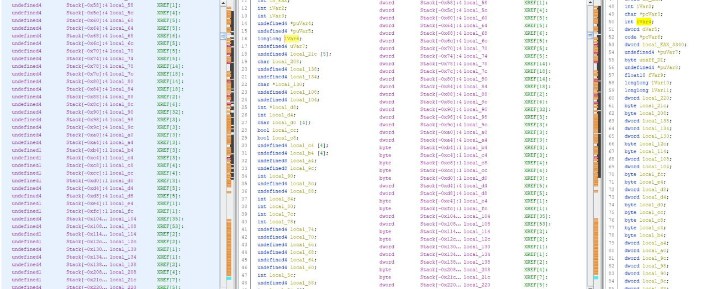
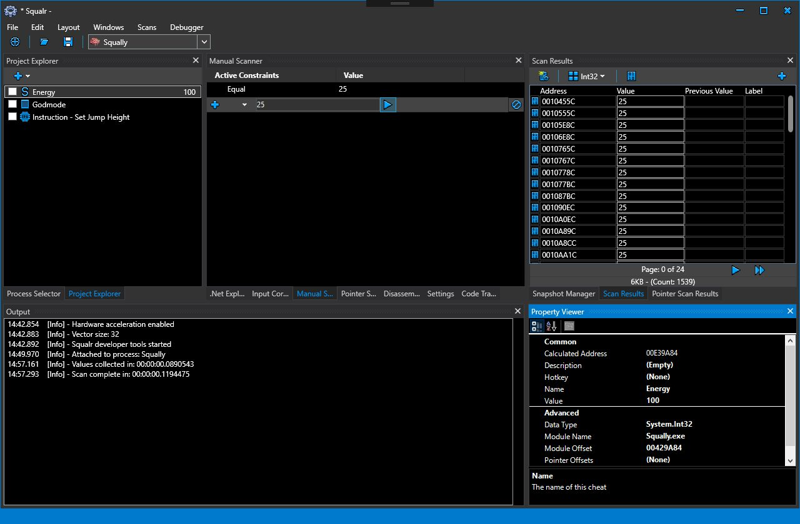
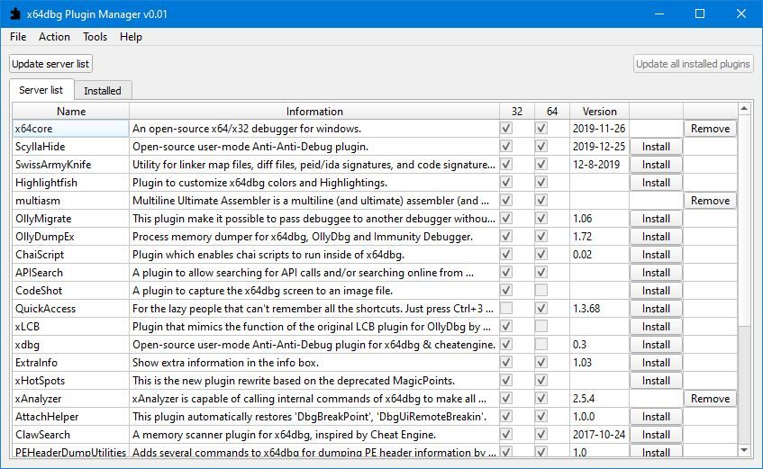

# webware
`2020-01-31 23:38:28`

* https://telegra.ph/file/a60b7265827c17fb311ff.jpg

<blockquote>
​​Анализ CVE-2019-2215(/dev/binder UAF)

За последние несколько недель, я пытался понять недавний Android Binder Use-After-Free (UAF), опубликованный Проектом Google Project Zero (p0). Этот баг на самом деле не новый, проблема была обнаружена и исправлена в основном ядре в феврале 2018 года, однако, p0 обнаружил, что многие популярные устройства не получили патч

Читать статью на кодебай: https://codeby.net/threads/analiz-cve-2019-2215-dev-binder-uaf.69977/

&#35;android &#35;cve &#35;java &#35;kernelleak
</blockquote>

<table><tr><td><b>→</b><a href="https://telegra.ph/file/a60b7265827c17fb311ff.jpg">
https://telegra.ph/file/a60b7265827c17fb311ff.jpg
</a>
</td></tr></table>

---

# defcon_news
`2020-01-31 17:56:03`

<blockquote>
[webapps] FlexNet Publisher 11.12.1 - Cross-Site Request Forgery (Add Local Admin)
https://www.exploit-db.com/exploits/47986

via Exploit Database
</blockquote>

<table><tr><td><b>→</b><a href="https://www.exploit-db.com/exploits/47986">
https://www.exploit-db.com/exploits/47986
</a>
<blockquote>
FlexNet Publisher 11.12.1 - Cross-Site Request Forgery (Add Local Admin).. webapps exploit for PHP platform
</blockquote>
</td></tr></table>

---

# defcon_news
`2020-01-31 14:56:10`

<blockquote>
[webapps] Lotus Core CMS 1.0.1 - Local File Inclusion
https://www.exploit-db.com/exploits/47985

via Exploit Database
</blockquote>

<table><tr><td><b>→</b><a href="https://www.exploit-db.com/exploits/47985">
https://www.exploit-db.com/exploits/47985
</a>
<blockquote>
Lotus Core CMS 1.0.1 - Local File Inclusion.. webapps exploit for PHP platform
</blockquote>
</td></tr></table>

---

# cyberoffru
`2020-01-31 08:41:58`

<blockquote>
Root-уязвимость в sudo, затрагивающая Linux Mint и Elementary OS https://opennet.ru/52284/
</blockquote>

<table><tr><td><b>→</b><a href="https://opennet.ru/52284/">
https://opennet.ru/52284/
</a>
<blockquote>
В утилите sudo, используемой для организации выполнения команд от имени других пользователей, выявлена уязвимость (CVE-2019-18634), позволяющая повысить свои привилегии в системе до пользователя root. Проблема проявляется начиная с выпуска sudo 1.7.1 только при использовании в файле /etc/sudoers опции &quot;pwfeedback&quot;, которая отключена по умолчанию, но активирована в некоторых дистрибутивах, таких как Linux Mint и Elementary OS. Проблема устранена в выпуске sudo 1.8.31, опубликованном несколько часов назад. В дистрибутивах уязвимость пока остаётся неисправленной.
</blockquote>
</td></tr></table>

---

# defcon_news
`2020-01-30 17:26:08`

<blockquote>
Ragnarok Ransomware Exploits Citrix Vulnerability To Target Vulnerable Servers
https://latesthackingnews.com/2020/01/30/ragnarok-ransomware-exploits-citrix-vulnerability-to-target-vulnerable-servers/

via Latest Hacking News
</blockquote>

<table><tr><td><b>→</b><a href="https://latesthackingnews.com/2020/01/30/ragnarok-ransomware-exploits-citrix-vulnerability-to-target-vulnerable-servers/?utm_source=dlvr.it&utm_medium=twitter">
https://latesthackingnews.com/2020/01/30/ragnarok-ransomware-exploits-citrix-vulnerability-to-target-vulnerable-servers/?utm_source=dlvr.it&utm_medium=twitter
</a>
<blockquote>
Here is another incident to reemphasize the need for patching the serious Citrix vulnerability (CVE-2019-19781). A new ransomware called Ragnarok is in the wild and is actively targeting vulnerable Citrix ADC servers. Ragnarok Ransomware Exploiting Citrix Researchers have found new ransomware...
</blockquote>
</td></tr></table>

---

# phd_soc
`2020-01-30 16:26:27`

<blockquote>
Не знаю, было или нет. И это вообще не сплоит. Но как напоминалка-пугалка ЕЛК-ерам, вполне https://www.exploit-db.com/exploits/47971
</blockquote>

<table><tr><td><b>→</b><a href="https://www.exploit-db.com/exploits/47971">
https://www.exploit-db.com/exploits/47971
</a>
<blockquote>
Kibana 6.6.1 - CSV Injection.. webapps exploit for Windows platform
</blockquote>
</td></tr></table>

---

# defcon_news
`2020-01-30 15:26:13`

<blockquote>
[remote] OpenSMTPD 6.6.2 - Remote Code Execution
https://www.exploit-db.com/exploits/47984

via Exploit Database
</blockquote>

<table><tr><td><b>→</b><a href="https://www.exploit-db.com/exploits/47984">
https://www.exploit-db.com/exploits/47984
</a>
<blockquote>
OpenSMTPD 6.6.1 - Remote Code Execution. CVE-2020-7247 . remote exploit for Linux platform
</blockquote>
</td></tr></table>

---

# defcon_news
`2020-01-30 15:26:12`

<blockquote>
[webapps] rConfig 3.9.3 - Authenticated Remote Code Execution
https://www.exploit-db.com/exploits/47982

via Exploit Database
</blockquote>

<table><tr><td><b>→</b><a href="https://www.exploit-db.com/exploits/47982">
https://www.exploit-db.com/exploits/47982
</a>
<blockquote>
rConfig 3.9.3 - Authenticated Remote Code Execution. CVE-2019-19509 . webapps exploit for PHP platform
</blockquote>
</td></tr></table>

---

# defcon_news
`2020-01-30 12:26:13`

<blockquote>
Critical OpenSMTPD Bug Opens Linux and OpenBSD Mail Servers to Hackers
https://thehackernews.com/2020/01/openbsd-opensmtpd-hacking.html

via The Hacker News
</blockquote>

<table><tr><td><b>→</b><a href="https://thehackernews.com/2020/01/openbsd-opensmtpd-hacking.html">
https://thehackernews.com/2020/01/openbsd-opensmtpd-hacking.html
</a>
<blockquote>
New Remote Code Execution Vulnerability (CVE-2020-7247) in OpenSMTPD Opens Linux and OpenBSD Mail Servers to Hackers
</blockquote>
</td></tr></table>

---

# phd_soc
`2020-01-30 11:52:59`

<blockquote>
Я вот что вспомнил. Если прям хочет поучаствовать в чем-то разрабатывающимся с 0. То вот проект Саши Леонова https://github.com/leonov-av/zbrunk
</blockquote>

<table><tr><td><b>→</b><a href="https://github.com/leonov-av/zbrunk">
https://github.com/leonov-av/zbrunk
</a>
<blockquote>
Universal data analysis system. Contribute to leonov-av/zbrunk development by creating an account on GitHub.
</blockquote>
</td></tr></table>

---

# phd_soc
`2020-01-30 10:29:41`

<blockquote>
@memorilik посмотрите
 https://github.com/Cyb3rWard0g/HELK 
https://github.com/apache/metron 
https://github.com/outflanknl/RedELK
</blockquote>

<table><tr><td><b>→</b><a href="https://github.com/Cyb3rWard0g/HELK">
https://github.com/Cyb3rWard0g/HELK
</a>
<blockquote>
The Hunting ELK. Contribute to Cyb3rWard0g/HELK development by creating an account on GitHub.
</blockquote>
</td></tr></table>

---

# defcon_news
`2020-01-29 23:56:03`

<blockquote>
[webapps] Fifthplay S.A.M.I 2019.2_HP - Persistent Cross-Site Scripting
https://www.exploit-db.com/exploits/47979

via Exploit Database
</blockquote>

<table><tr><td><b>→</b><a href="https://www.exploit-db.com/exploits/47979">
https://www.exploit-db.com/exploits/47979
</a>
<blockquote>
Fifthplay S.A.M.I 2019.2_HP - Persistent Cross-Site Scripting.. webapps exploit for Hardware platform
</blockquote>
</td></tr></table>

---

# defcon_news
`2020-01-29 22:56:12`

<blockquote>
[webapps] Centreon 19.10.5 - 'centreontrapd' Remote Command Execution
https://www.exploit-db.com/exploits/47978

via Exploit Database
</blockquote>

<table><tr><td><b>→</b><a href="https://www.exploit-db.com/exploits/47978">
https://www.exploit-db.com/exploits/47978
</a>
<blockquote>
Centreon 19.10.5 - 'centreontrapd' Remote Command Execution.. webapps exploit for PHP platform
</blockquote>
</td></tr></table>

---

# defcon_news
`2020-01-29 22:56:11`

<blockquote>
[webapps] Centreon 19.10.5 - 'Pollers' Remote Command Execution
https://www.exploit-db.com/exploits/47977

via Exploit Database
</blockquote>

<table><tr><td><b>→</b><a href="https://www.exploit-db.com/exploits/47977">
https://www.exploit-db.com/exploits/47977
</a>
<blockquote>
Centreon 19.10.5 - 'Pollers' Remote Command Execution.. webapps exploit for PHP platform
</blockquote>
</td></tr></table>

---

# defcon_news
`2020-01-29 22:26:18`

<blockquote>
[webapps] Satellian 1.12 - Remote Code Execution
https://www.exploit-db.com/exploits/47976

via Exploit Database
</blockquote>

<table><tr><td><b>→</b><a href="https://www.exploit-db.com/exploits/47976">
https://www.exploit-db.com/exploits/47976
</a>
<blockquote>
Satellian 1.12 - Remote Code Execution. CVE-2020-7980 . webapps exploit for Hardware platform
</blockquote>
</td></tr></table>

---

# defcon_news
`2020-01-29 21:56:26`

<blockquote>
[local] Microsoft Windows 10 - Theme API 'ThemePack' File Parsing
https://www.exploit-db.com/exploits/47975

via Exploit Database
</blockquote>

<table><tr><td><b>→</b><a href="https://www.exploit-db.com/exploits/47975">
https://www.exploit-db.com/exploits/47975
</a>
<blockquote>
Microsoft Windows 10 - Theme API 'ThemePack' File Parsing. CVE-2018-8413 . local exploit for Windows platform
</blockquote>
</td></tr></table>

---

# defcon_news
`2020-01-29 21:56:25`

<blockquote>
[local] XMLBlueprint 16.191112 - XML External Entity Injection
https://www.exploit-db.com/exploits/47974

via Exploit Database
</blockquote>

<table><tr><td><b>→</b><a href="https://www.exploit-db.com/exploits/47974">
https://www.exploit-db.com/exploits/47974
</a>
<blockquote>
XMLBlueprint 16.191112 - XML External Entity Injection. CVE-2019-19032 . local exploit for Windows platform
</blockquote>
</td></tr></table>

---

# defcon_news
`2020-01-29 21:26:10`

<blockquote>
[webapps] Cups Easy 1.0 - Cross Site Request Forgery (Password Reset)
https://www.exploit-db.com/exploits/47973

via Exploit Database
</blockquote>

<table><tr><td><b>→</b><a href="https://www.exploit-db.com/exploits/47973">
https://www.exploit-db.com/exploits/47973
</a>
<blockquote>
Cups Easy 1.0 - Cross Site Request Forgery (Password Reset). CVE-2020-8424CVE-2020-8425 . webapps exploit for PHP platform
</blockquote>
</td></tr></table>

---

# defcon_news
`2020-01-29 21:26:09`

<blockquote>
[webapps] Liferay CE Portal 6.0.2 - Remote Command Execution
https://www.exploit-db.com/exploits/47972

via Exploit Database
</blockquote>

<table><tr><td><b>→</b><a href="https://www.exploit-db.com/exploits/47972">
https://www.exploit-db.com/exploits/47972
</a>
<blockquote>
Liferay CE Portal 6.0.2 - Remote Command Execution.. webapps exploit for Java platform
</blockquote>
</td></tr></table>

---

# defcon_news
`2020-01-29 20:56:22`

<blockquote>
[webapps] Kibana 6.6.1 - CSV Injection
https://www.exploit-db.com/exploits/47971

via Exploit Database
</blockquote>

<table><tr><td><b>→</b><a href="https://www.exploit-db.com/exploits/47971">
https://www.exploit-db.com/exploits/47971
</a>
<blockquote>
Kibana 6.6.1 - CSV Injection.. webapps exploit for Windows platform
</blockquote>
</td></tr></table>

---

# defcon_news
`2020-01-29 18:56:10`

<blockquote>
OpenSMTPD Library RCE Impacts BSD And Linux
https://packetstormsecurity.com/news/view/30889/OpenSMTPD-Library-RCE-Impacts-BSD-And-Linux.html

via Packet Storm Security
</blockquote>

<table><tr><td><b>→</b><a href="https://packetstormsecurity.com/news/view/30889/OpenSMTPD-Library-RCE-Impacts-BSD-And-Linux.html">
https://packetstormsecurity.com/news/view/30889/OpenSMTPD-Library-RCE-Impacts-BSD-And-Linux.html
</a>
<blockquote>
Vulnerability, tracked as CVE-2020-7247, can be exploited remotely over the internet.
</blockquote>
</td></tr></table>

---

# R0_Crew
`2020-01-29 18:19:54`

<blockquote>
VivienneVMM is a stealthy debugging framework implemented via an Intel VT-x hypervisor https://github.com/changeofpace/VivienneVMM &#35;exploitation &#35;dukeBarman
</blockquote>

<table><tr><td><b>→</b><a href="https://github.com/changeofpace/VivienneVMM">
https://github.com/changeofpace/VivienneVMM
</a>
<blockquote>
VivienneVMM is a stealthy debugging framework implemented via an Intel VT-x hypervisor. - changeofpace/VivienneVMM
</blockquote>
</td></tr></table>

---

# defcon_news
`2020-01-29 10:26:18`

<blockquote>
Уязвимость в OpenSMTPD, позволяющая удалённо выполнить код с правами root
https://www.opennet.ru/opennews/art.shtml?num&#61;52267

via OpenNews.opennet.ru: Проблемы безопасности
</blockquote>

<table><tr><td><b>→</b><a href="https://www.opennet.ru/opennews/art.shtml?num=52267">
https://www.opennet.ru/opennews/art.shtml?num=52267
</a>
<blockquote>
В развиваемом проектом OpenBSD почтовом сервере OpenSMTPD выявлена критическая уязвимость (CVE-2020-7247), позволяющая удалённо выполнить shell-команды на сервере с правами пользователя root. Уязвимость выявлена в ходе повторного аудита, проведённого компанией Qualys Security (прошлый аудит OpenSMTPD проводился в 2015 году, а новая уязвимость присутствует с мая 2018 года). Проблема устранена в выпуске OpenSMTPD 6.6.2. Всем пользователям рекомендуется срочно установить обновление (для OpenBSD исправление можно установить через syspatch).
</blockquote>
</td></tr></table>

---

# cyberoffru
`2020-01-29 09:59:04`

<blockquote>
Уязвимость в OpenSMTPD, позволяющая удалённо выполнить код с правами root https://opennet.ru/52267/
</blockquote>

<table><tr><td><b>→</b><a href="https://opennet.ru/52267/">
https://opennet.ru/52267/
</a>
<blockquote>
В развиваемом проектом OpenBSD почтовом сервере OpenSMTPD выявлена критическая уязвимость (CVE-2020-7247), позволяющая удалённо выполнить shell-команды на сервере с правами пользователя root. Уязвимость выявлена в ходе повторного аудита, проведённого компанией Qualys Security (прошлый аудит OpenSMTPD проводился в 2015 году, а новая уязвимость присутствует с мая 2018 года). Проблема устранена в выпуске OpenSMTPD 6.6.2. Всем пользователям рекомендуется срочно установить обновление (для OpenBSD исправление можно будет установить через syspatch).
</blockquote>
</td></tr></table>

---

# defcon_news
`2020-01-29 09:26:27`

<blockquote>
oss-security — LPE and RCE in OpenSMTPD (CVE-2020-7247)
https://www.reddit.com/r/netsec/comments/eviouw/osssecurity_lpe_and_rce_in_opensmtpd_cve20207247/

via /r/netsec - Information Security News &amp; Discussion
</blockquote>

<table><tr><td><b>→</b><a href="https://www.reddit.com/r/netsec/comments/eviouw/osssecurity_lpe_and_rce_in_opensmtpd_cve20207247/?utm_source=ifttt">
https://www.reddit.com/r/netsec/comments/eviouw/osssecurity_lpe_and_rce_in_opensmtpd_cve20207247/?utm_source=ifttt
</a>
<blockquote>
Posted in r/netsec by u/Mcnst • 7 points and 3 comments
</blockquote>
</td></tr></table>

---

# defcon_news
`2020-01-28 21:01:12`

<blockquote>
Become a speaker at Positive Hack Days 10. Call for Papers is now open
http://seclists.org/fulldisclosure/2020/Jan/37

via Full Disclosure
</blockquote>

<table><tr><td><b>→</b><a href="https://seclists.org/fulldisclosure/2020/Jan/37">
https://seclists.org/fulldisclosure/2020/Jan/37
</a>
</td></tr></table>

---

# defcon_news
`2020-01-28 20:01:16`

<blockquote>
New 'CacheOut' Attack Leaks Data from Intel CPUs, VMs and SGX Enclave
https://thehackernews.com/2020/01/new-cacheout-attack-leaks-data-from.html

via The Hacker News
</blockquote>

<table><tr><td><b>→</b><a href="https://thehackernews.com/2020/01/new-cacheout-attack-leaks-data-from.html">
https://thehackernews.com/2020/01/new-cacheout-attack-leaks-data-from.html
</a>
<blockquote>
Researchers demonstrated a new speculative execution vulnerability, dubbed 'CacheOut' assigned CVE-2020-0549, in Intel processors that could allow attackers to leak targeted sensitive data from OS kernel, co-resident virtual machines, and even stored within Intel's secured SGX enclave.
</blockquote>
</td></tr></table>

---

# phd_soc
`2020-01-28 18:53:25`

<blockquote>
https://github.com/pe3zx/mthc
</blockquote>

<table><tr><td><b>→</b><a href="https://github.com/pe3zx/mthc">
https://github.com/pe3zx/mthc
</a>
<blockquote>
All-in-one bundle of MISP, TheHive and Cortex. Contribute to pe3zx/mthc development by creating an account on GitHub.
</blockquote>
</td></tr></table>

---

# defcon_news
`2020-01-28 18:01:29`

<blockquote>
Что известно о новой уязвимости кабельных модемов
https://habr.com/ru/post/485934/

via Информационная безопасность – Защита данных
</blockquote>

<table><tr><td><b>→</b><a href="https://habr.com/ru/post/485934/?utm_campaign=485934&utm_source=habrahabr&utm_medium=rss">
https://habr.com/ru/post/485934/?utm_campaign=485934&utm_source=habrahabr&utm_medium=rss
</a>
<blockquote>
Специалисты из датской компании, которая проводит консультации в сфере ИБ, обнаружили новую критическую уязвимость Cable Haunt (CVE-2019-19494). Она связана с чи...
</blockquote>
</td></tr></table>

---

# defcon_news
`2020-01-28 17:01:18`

<blockquote>
[dos] macOS/iOS ImageIO - Heap Corruption when Processing Malformed TIFF Image
https://www.exploit-db.com/exploits/47970

via Exploit Database
</blockquote>

<table><tr><td><b>→</b><a href="https://www.exploit-db.com/exploits/47970">
https://www.exploit-db.com/exploits/47970
</a>
<blockquote>
macOS/iOS ImageIO - Heap Corruption when Processing Malformed TIFF Image.. dos exploit for Multiple platform
</blockquote>
</td></tr></table>

---

# defcon_news
`2020-01-28 16:01:28`

<blockquote>
[webapps] Centreon 19.10.5 - Remote Command Execution
https://www.exploit-db.com/exploits/47969

via Exploit Database
</blockquote>

<table><tr><td><b>→</b><a href="https://www.exploit-db.com/exploits/47969">
https://www.exploit-db.com/exploits/47969
</a>
<blockquote>
Centreon 19.10.5 - Remote Command Execution.. webapps exploit for PHP platform
</blockquote>
</td></tr></table>

---

# defcon_news
`2020-01-28 16:01:27`

<blockquote>
[webapps] Centreon 19.10.5 - Database Credentials Disclosure
https://www.exploit-db.com/exploits/47968

via Exploit Database
</blockquote>

<table><tr><td><b>→</b><a href="https://www.exploit-db.com/exploits/47968">
https://www.exploit-db.com/exploits/47968
</a>
<blockquote>
Centreon 19.10.5 - Database Credentials Disclosure.. webapps exploit for PHP platform
</blockquote>
</td></tr></table>

---

# defcon_news
`2020-01-28 16:01:26`

<blockquote>
[webapps] Octeth Oempro 4.8 - 'CampaignID' SQL Injection
https://www.exploit-db.com/exploits/47967

via Exploit Database
</blockquote>

<table><tr><td><b>→</b><a href="https://www.exploit-db.com/exploits/47967">
https://www.exploit-db.com/exploits/47967
</a>
<blockquote>
Octeth Oempro 4.8 - 'CampaignID' SQL Injection. CVE-2019-19740 . webapps exploit for PHP platform
</blockquote>
</td></tr></table>

---

# defcon_news
`2020-01-28 16:01:25`

<blockquote>
[webapps] Adive Framework 2.0.8 - Cross-Site Request Forgery (Change Admin Password)
https://www.exploit-db.com/exploits/47966

via Exploit Database
</blockquote>

<table><tr><td><b>→</b><a href="https://www.exploit-db.com/exploits/47966">
https://www.exploit-db.com/exploits/47966
</a>
<blockquote>
Adive Framework 2.0.8 - Cross-Site Request Forgery (Change Admin Password). CVE-2020-7991 . webapps exploit for PHP platform
</blockquote>
</td></tr></table>

---

# sysadm_in_channel
`2020-01-28 13:43:01`

<blockquote>
Снова security факап и снова интел: https://cacheoutattack.com/

Процы:
https://software.intel.com/security-software-guidance/software-guidance/l1d-eviction-sampling

CVE:
https://software.intel.com/security-software-guidance/software-guidance/l1d-eviction-sampling

За ссылку спасибо @ldviolet
</blockquote>

<table><tr><td><b>→</b><a href="https://software.intel.com/security-software-guidance/software-guidance/l1d-eviction-sampling">
https://software.intel.com/security-software-guidance/software-guidance/l1d-eviction-sampling
</a>
<blockquote>
A speculative execution side channel variant known as L1D Eviction Sampling may allow the data value of some modified cache lines in the L1 data cache to be inferred under a specific set of complex conditions. L1D eviction sampling has been assigned CVE-2020-0549 with a CVSS of 6.5 CVSS:3.1/AV:L/AC:L/PR:L/UI:N/S:C/C:H/I:N/A:N. 
 
On some processors under certain microarchitectural conditions, data from the most recently evicted modified L1 data cache (L1D) line may be propagated into an unused (invalid) L1D fill buffer. On processors affected by Microarchitectural Data Samping (MDS) or Transactional Asynchronous Abort (TAA), data from an L1D fill buffer may be inferred using one of these data sampling side channel methods. By combining these two behaviors together, it may be possible for a malicious actor to infer data values from modified cache lines that were previously evicted from the L1 data cache. This is called L1D eviction sampling. 
 
Malicious software may be able to use L1D eviction sampling to infer…
</blockquote>
</td></tr></table>

---

# cyberoffru
`2020-01-28 11:11:41`

<blockquote>
CacheOut (L1DES) и VRS - новые уязвимости в микроархитектурных структурах CPU Intel https://opennet.ru/52260/
</blockquote>

<table><tr><td><b>→</b><a href="https://opennet.ru/52260">
https://opennet.ru/52260
</a>
<blockquote>
Компания Intel раскрыла сведения о двух новых уязвимостях в CPU Intel, вызванных утечкой данных из кэша L1D (CVE-2020-0549, L1DES - L1D Eviction Sampling) и векторных регистров (CVE-2020-0548, VRS - Vector Register Sampling). Уязвимости относятся к классу MDS (Microarchitectural Data Sampling) и основываются на применении методов анализа по сторонним каналам к данным в микроархитектурных структурах. AMD, ARM и другие процессоры проблемам не подвержены.
</blockquote>
</td></tr></table>

---

# defcon_news
`2020-01-28 11:01:16`

<blockquote>
L1DES (CacheOut) и VRS - новые уязвимости в микроархитектурных структурах CPU Intel
https://www.opennet.ru/opennews/art.shtml?num&#61;52260

via OpenNews.opennet.ru: Проблемы безопасности
</blockquote>

<table><tr><td><b>→</b><a href="https://www.opennet.ru/opennews/art.shtml?num=52260">
https://www.opennet.ru/opennews/art.shtml?num=52260
</a>
<blockquote>
Компания Intel раскрыла сведения о двух новых уязвимостях в CPU Intel, вызванных утечкой данных из кэша L1D (CVE-2020-0549, L1DES - L1D Eviction Sampling) и векторных регистров (CVE-2020-0548, VRS - Vector Register Sampling). Уязвимости относятся к классу MDS (Microarchitectural Data Sampling) и основываются на применении методов анализа по сторонним каналам к данным в микроархитектурных структурах. AMD, ARM и другие процессоры проблемам не подвержены.
</blockquote>
</td></tr></table>

---

# defcon_news
`2020-01-28 03:31:26`

<blockquote>
Hacker demonstrates Remote Code Execution exploit for Windows Remote Desktop Gateway
https://news.hitb.org/content/hacker-demonstrates-remote-code-execution-exploit-windows-remote-desktop-gateway

via HITBSecNews - Keeping Knowledge Free for Over a Decade
</blockquote>

<table><tr><td><b>→</b><a href="https://news.hitb.org/content/hacker-demonstrates-remote-code-execution-exploit-windows-remote-desktop-gateway">
https://news.hitb.org/content/hacker-demonstrates-remote-code-execution-exploit-windows-remote-desktop-gateway
</a>
<blockquote>
A self-described &quot;reverser/pwner [and] Windows kernel hacker&quot; has demoed a working exploit for two recently discovered vulnerabilities in Windows Remote Desktop Gateway (RD Gateway).
The exploit takes advantage of the CVE-2020-0609 and CVE-2020-0610 vulnerabilities which have already been shown to make a denial of service attack possible. Now Luca Marcelli has shown how the same vulnerabilities can be exploited in a Remote Code Execution attack.
</blockquote>
</td></tr></table>

---

# sysadm_in_channel
`2020-01-27 18:07:26`

<blockquote>
RDP прокси, иди сюда :)

Во как (PoC):

https://github.com/ollypwn/BlueGate/blob/master/README.md
</blockquote>

<table><tr><td><b>→</b><a href="https://github.com/ollypwn/BlueGate/blob/master/README.md">
https://github.com/ollypwn/BlueGate/blob/master/README.md
</a>
<blockquote>
PoC (DoS + scanner) for CVE-2020-0609 &amp; CVE-2020-0610 - RD Gateway RCE - ollypwn/BlueGate
</blockquote>
</td></tr></table>

---

# defcon_news
`2020-01-27 14:01:41`

<blockquote>
[local] Torrent 3GP Converter 1.51 - Stack Overflow (SEH)
https://www.exploit-db.com/exploits/47965

via Exploit Database
</blockquote>

<table><tr><td><b>→</b><a href="https://www.exploit-db.com/exploits/47965">
https://www.exploit-db.com/exploits/47965
</a>
<blockquote>
Torrent 3GP Converter 1.51 - Stack Overflow (SEH).. local exploit for Windows platform
</blockquote>
</td></tr></table>

---

# defcon_news
`2020-01-27 02:46:32`

<blockquote>
Citrix releases final patches for critical CVE-2019-19781 security flaw
https://news.hitb.org/content/citrix-releases-final-patches-critical-cve-2019-19781-security-flaw

via HITBSecNews - Keeping Knowledge Free for Over a Decade
</blockquote>

<table><tr><td><b>→</b><a href="https://news.hitb.org/content/citrix-releases-final-patches-critical-cve-2019-19781-security-flaw">
https://news.hitb.org/content/citrix-releases-final-patches-critical-cve-2019-19781-security-flaw
</a>
<blockquote>
Citrix has finally released the last permanent fixes for the CVE-2019-19781 security flaw for version 10.5 of the Citrix Application Delivery Controller (ADC). The company now claims to have released permanent fixes for all supported versions of ADC, Gateway and SD-WAN WANOP.
Citrix has urged organisations to &quot;patch immediately&quot; - presumably, over the weekend. The flaw enables remote, unauthenticated attackers to perform arbitrary code execution, with exploits already having been detected in the wild.
</blockquote>
</td></tr></table>

---

# defcon_news
`2020-01-26 19:31:10`

<blockquote>
[CVE-2019-14615] iGPU Leak: An Information Leakage Vulnerability on Intel Integrated GPU
https://www.reddit.com/r/netsec/comments/eu6rtx/cve201914615_igpu_leak_an_information_leakage/

via /r/netsec - Information Security News &amp; Discussion
</blockquote>

<table><tr><td><b>→</b><a href="https://www.reddit.com/r/netsec/comments/eu6rtx/cve201914615_igpu_leak_an_information_leakage/">
https://www.reddit.com/r/netsec/comments/eu6rtx/cve201914615_igpu_leak_an_information_leakage/
</a>
<blockquote>
Posted in r/netsec by u/digicat • 136 points and 14 comments
</blockquote>
</td></tr></table>

---

# defcon_news
`2020-01-26 19:31:09`

<blockquote>
CVE-2020-2551: Weblogic RCE with IIOP
https://www.reddit.com/r/netsec/comments/eu6r6y/cve20202551_weblogic_rce_with_iiop/

via /r/netsec - Information Security News &amp; Discussion
</blockquote>

<table><tr><td><b>→</b><a href="https://www.reddit.com/r/netsec/comments/eu6r6y/cve20202551_weblogic_rce_with_iiop/">
https://www.reddit.com/r/netsec/comments/eu6r6y/cve20202551_weblogic_rce_with_iiop/
</a>
<blockquote>
Posted in r/netsec by u/digicat • 1 point and 0 comments
</blockquote>
</td></tr></table>

---

# phd_soc
`2020-01-26 17:01:11`

<blockquote>
https://github.com/MISP/misp-training
</blockquote>

<table><tr><td><b>→</b><a href="https://github.com/MISP/misp-training">
https://github.com/MISP/misp-training
</a>
<blockquote>
MISP trainings, threat intel and information sharing training materials with source code - MISP/misp-training
</blockquote>
</td></tr></table>

---

# reverseengineeringx
`2020-01-26 16:49:56`

<blockquote>
python-exe-unpacker
A script that helps researcher to unpack and decompile executable written in python. 

https://github.com/countercept/python-exe-unpacker
</blockquote>

<table><tr><td><b>→</b><a href="https://github.com/countercept/python-exe-unpacker">
https://github.com/countercept/python-exe-unpacker
</a>
<blockquote>
A helper script for unpacking and decompiling EXEs compiled from python code.  - countercept/python-exe-unpacker
</blockquote>
</td></tr></table>

---

# reverseengineeringx
`2020-01-26 14:40:40`

<blockquote>
https://github.com/theevilbit/injection
</blockquote>

<table><tr><td><b>→</b><a href="https://github.com/theevilbit/injection">
https://github.com/theevilbit/injection
</a>
<blockquote>
Contribute to theevilbit/injection development by creating an account on GitHub.
</blockquote>
</td></tr></table>

---

# defcon_news
`2020-01-25 11:25:22`

<blockquote>
RATELIMITED: xss in /users/[id]/set_tier endpoint
https://vulners.com/hackerone/H1:782764?utm_source&#61;rss&amp;utm_medium&#61;rss&amp;utm_campaign&#61;rss

via Vulners
</blockquote>

<table><tr><td><b>→</b><a href="https://vulners.com/hackerone/H1:782764?utm_source=rss&utm_medium=rss&utm_campaign=rss">
https://vulners.com/hackerone/H1:782764?utm_source=rss&utm_medium=rss&utm_campaign=rss
</a>
<blockquote>
Summary: [add summary of the vulnerability] Hello there ! I found an XSS since you forgot to add the json content-type response header right there: https://github.com/gtsatsis/RLAPI-v3-OOP/blob/508d3c610ccc9076753bdc81151a5e8d76871a3e/src/Controller/UserController.php&#35;L93 The...
</blockquote>
</td></tr></table>

---

# defcon_news
`2020-01-24 21:25:26`

<blockquote>
Multiple vulnerabilities in TOTOLINK and other Realtek SDK based routers
http://seclists.org/fulldisclosure/2020/Jan/36

via Full Disclosure
</blockquote>

<table><tr><td><b>→</b><a href="https://seclists.org/fulldisclosure/2020/Jan/36">
https://seclists.org/fulldisclosure/2020/Jan/36
</a>
</td></tr></table>

---

# defcon_news
`2020-01-24 21:25:25`

<blockquote>
[UPDATED - POC] Neowise CarbonFTP v1.4 / Insecure Proprietary Password Encryption / CVE-2020-6857
http://seclists.org/fulldisclosure/2020/Jan/35

via Full Disclosure
</blockquote>

<table><tr><td><b>→</b><a href="https://seclists.org/fulldisclosure/2020/Jan/35">
https://seclists.org/fulldisclosure/2020/Jan/35
</a>
</td></tr></table>

---

# defcon_news
`2020-01-24 21:25:24`

<blockquote>
CVE-2019-19363 - Local Privilege Escalation in many Ricoh Printer Drivers for Windows
http://seclists.org/fulldisclosure/2020/Jan/34

via Full Disclosure
</blockquote>

<table><tr><td><b>→</b><a href="https://seclists.org/fulldisclosure/2020/Jan/34">
https://seclists.org/fulldisclosure/2020/Jan/34
</a>
</td></tr></table>

---

# defcon_news
`2020-01-24 20:25:18`

<blockquote>
Nice Try: 501 (Ransomware) Not Implemented
http://www.fireeye.com/blog/threat-research/2020/01/nice-try-501-ransomware-not-implemented.html

via Fire Eye Threat Research
</blockquote>

<table><tr><td><b>→</b><a href="https://www.fireeye.com/blog/threat-research/2020/01/nice-try-501-ransomware-not-implemented.html">
https://www.fireeye.com/blog/threat-research/2020/01/nice-try-501-ransomware-not-implemented.html
</a>
<blockquote>
FireEye continues to observe actors taking advantage of CVE-2019-19781, this time with the likely intent of distributing ransomware.
</blockquote>
</td></tr></table>

---

# defcon_news
`2020-01-24 19:25:05`

<blockquote>
This Week in Security: Chrome Speech bug, UDP Fragmentation, and the Big Citrix Vulnerability
https://hackaday.com/2020/01/24/this-week-in-security-chrome-speech-bug-udp-fragmentation-and-the-big-citrix-vulnerability/

via Hackaday
</blockquote>

<table><tr><td><b>→</b><a href="https://hackaday.com/2020/01/24/this-week-in-security-chrome-speech-bug-udp-fragmentation-and-the-big-citrix-vulnerability/">
https://hackaday.com/2020/01/24/this-week-in-security-chrome-speech-bug-udp-fragmentation-and-the-big-citrix-vulnerability/
</a>
<blockquote>
A critical security bug was fixed in Chrome recently, CVE-2020-6378. The CVE report is still marked private, as well as the bug report. All we have is “Use-after-free in speech recognizer&amp;&#35;82…
</blockquote>
</td></tr></table>

---

# defcon_news
`2020-01-24 16:55:12`

<blockquote>
[dos] Remote Desktop Gateway - 'BlueGate' Denial of Service (PoC)
https://www.exploit-db.com/exploits/47964

via Exploit Database
</blockquote>

<table><tr><td><b>→</b><a href="https://www.exploit-db.com/exploits/47964">
https://www.exploit-db.com/exploits/47964
</a>
<blockquote>
Remote Desktop Gateway - 'BlueGate' Denial of Service (PoC). CVE-2020-0610CVE-2020-0609 . dos exploit for Windows platform
</blockquote>
</td></tr></table>

---

# defcon_news
`2020-01-24 16:55:11`

<blockquote>
[local] Ricoh Printer Drivers - Local Privilege Escalation
https://www.exploit-db.com/exploits/47962

via Exploit Database
</blockquote>

<table><tr><td><b>→</b><a href="https://www.exploit-db.com/exploits/47962?utm_source=dlvr.it&utm_medium=twitter">
https://www.exploit-db.com/exploits/47962?utm_source=dlvr.it&utm_medium=twitter
</a>
<blockquote>
Ricoh Printer Drivers - Local Privilege Escalation. CVE-2019-19363 . local exploit for Windows platform
</blockquote>
</td></tr></table>

---

# isast
`2020-01-24 15:34:03`

<blockquote>
Не все знают, но у Яндекса уже давно есть утилитка gixy для статического анализа мисконфигов в Nginx, позволяющая избежать множества проблем при конфигурировании любимого веб-сервера. И ребята ее постоянно обновляют вместе с документацией.

Так что при копировании очередных сниппетов с гитхаба, прогоните их хотя бы с помощью gixy :)

https://github.com/yandex/gixy
</blockquote>

<table><tr><td><b>→</b><a href="https://github.com/yandex/gixy">
https://github.com/yandex/gixy
</a>
<blockquote>
Nginx configuration static analyzer. Contribute to yandex/gixy development by creating an account on GitHub.
</blockquote>
</td></tr></table>

---

# defcon_news
`2020-01-24 14:55:29`

<blockquote>
[webapps] Genexis Platinum-4410 2.1 - Authentication Bypass
https://www.exploit-db.com/exploits/47961

via Exploit Database
</blockquote>

<table><tr><td><b>→</b><a href="https://www.exploit-db.com/exploits/47961?utm_source=dlvr.it&utm_medium=twitter">
https://www.exploit-db.com/exploits/47961?utm_source=dlvr.it&utm_medium=twitter
</a>
<blockquote>
Genexis Platinum-4410 2.1 - Authentication Bypass. CVE-2020-6170 . webapps exploit for Hardware platform
</blockquote>
</td></tr></table>

---

# defcon_news
`2020-01-24 14:55:28`

<blockquote>
[webapps] OLK Web Store 2020 - Cross-Site Request Forgery
https://www.exploit-db.com/exploits/47960

via Exploit Database
</blockquote>

<table><tr><td><b>→</b><a href="https://www.exploit-db.com/exploits/47960?utm_source=dlvr.it&utm_medium=twitter">
https://www.exploit-db.com/exploits/47960?utm_source=dlvr.it&utm_medium=twitter
</a>
<blockquote>
OLK Web Store 2020 - Cross-Site Request Forgery.. webapps exploit for ASP platform
</blockquote>
</td></tr></table>

---

# defcon_news
`2020-01-24 14:25:28`

<blockquote>
[webapps] Webtareas 2.0 - 'id' SQL Injection
https://www.exploit-db.com/exploits/47959

via Exploit Database
</blockquote>

<table><tr><td><b>→</b><a href="https://www.exploit-db.com/exploits/47959">
https://www.exploit-db.com/exploits/47959
</a>
<blockquote>
Webtareas 2.0 - 'id' SQL Injection.. webapps exploit for PHP platform
</blockquote>
</td></tr></table>

---

# defcon_news
`2020-01-24 14:25:26`

<blockquote>
[webapps] TP-Link TP-SG105E 1.0.0 - Unauthenticated Remote Reboot
https://www.exploit-db.com/exploits/47958

via Exploit Database
</blockquote>

<table><tr><td><b>→</b><a href="https://www.exploit-db.com/exploits/47958">
https://www.exploit-db.com/exploits/47958
</a>
<blockquote>
TP-Link TP-SG105E 1.0.0 - Unauthenticated Remote Reboot. CVE-2019-16893 . webapps exploit for Hardware platform
</blockquote>
</td></tr></table>

---

# phd_soc
`2020-01-24 13:46:27`

<blockquote>
я изначально, не хотел как-то пиарится, но так всем будет проще. Так что опубликую тут, заранее прошу прощения если нарушу правило или кто-то против (если что напишите я удалю).

Я из компании RBK Money мы сами все пишеим для себя и выкладываем в опенсорс. Если что помогаем с поддержкой и внедрением (это отдельная история). Вот статья про наш антифрод https://habr.com/ru/company/rbkmoney/blog/477950/. Там еще комента толковые как мне кажется

Мы всегда рады идеям, предложениям и новым знакомствам с адекватными людьми
https://github.com/rbkmoney/fraudbusters
</blockquote>

<table><tr><td><b>→</b><a href="https://habr.com/ru/company/rbkmoney/blog/477950/">
https://habr.com/ru/company/rbkmoney/blog/477950/
</a>
<blockquote>
На самом деле, правило фиговое. Но понятное дело, почему оно работает. В среде безопасников считается, что антифрод должен быть такой суперсекретной штуковиной з...
</blockquote>
</td></tr></table>

---

# R0_Crew
`2020-01-24 13:43:53`

<blockquote>
Lecture notes for the Hardware and Embedded Systems Security lecture https://github.com/david-oswald/hwsec_lecture_notes &#35;reverse &#35;hardware &#35;dukeBarman
</blockquote>

<table><tr><td><b>→</b><a href="https://github.com/david-oswald/hwsec_lecture_notes">
https://github.com/david-oswald/hwsec_lecture_notes
</a>
<blockquote>
Lecture notes for the Hardware and Embedded Systems Security lecture - david-oswald/hwsec_lecture_notes
</blockquote>
</td></tr></table>

---

# ctfchat
`2020-01-24 13:24:38`

<blockquote>
https://cve.mitre.org/cgi-bin/cvename.cgi?name&#61;CVE-2020-7245
</blockquote>

<table><tr><td><b>→</b><a href="https://cve.mitre.org/cgi-bin/cvename.cgi?name=CVE-2020-7245">
https://cve.mitre.org/cgi-bin/cvename.cgi?name=CVE-2020-7245
</a>
<blockquote>
Common Vulnerabilities and Exposures (CVE®) is a list of entries — each containing an identification number, a description, and at least one public reference — for publicly known cybersecurity vulnerabilities. Assigned by CVE Numbering Authorities (CNAs) from around the world, use of CVE Entries ensures confidence among parties when used to discuss or share information about a unique software vulnerability, provides a baseline for tool evaluation, and enables data exchange for cybersecurity automation.
</blockquote>
</td></tr></table>

---

# exploitex
`2020-01-24 13:00:06`

* https://telegra.ph/file/10202609fc2036f2a175a.jpg
* https://github.com/DanMcInerney/wifijammer

<blockquote>
​​Глушим все WiFi сети в округе 

Для глушения Wi-Fi бывает удобно использовать утилиту wifijammer. Она крайне проста в использовании, так что обсуждать здесь почти нечего: без параметров она просто будет глушить все, что найдет в радиусе досягаемости адаптера. Чтобы не задеть своих, можно исключить некоторые MAC-адреса с опцией -s.

Устанавливаем wifijammer:
$ git clone https://github.com/DanMcInerney/wifijammer.git
$ cd wifijammer/
$ sudo python2 wifijammer.py --help

И запускаем:
$ sudo python2 wifijammer.py -s &lt;MAC для исключения&gt;
</blockquote>

<table><tr><td><b>→</b><a href="https://telegra.ph/file/10202609fc2036f2a175a.jpg">
https://telegra.ph/file/10202609fc2036f2a175a.jpg
</a>
</td></tr></table>

---

# defcon_news
`2020-01-24 10:25:23`

<blockquote>
PoC (DoS) for CVE-2020-0609 &amp; CVE-2020-0610 - RD Gateway RCE
https://www.reddit.com/r/netsec/comments/et1vhz/poc_dos_for_cve20200609_cve20200610_rd_gateway_rce/

via /r/netsec - Information Security News &amp; Discussion
</blockquote>

<table><tr><td><b>→</b><a href="https://www.reddit.com/r/netsec/comments/et1vhz/poc_dos_for_cve20200609_cve20200610_rd_gateway_rce/">
https://www.reddit.com/r/netsec/comments/et1vhz/poc_dos_for_cve20200609_cve20200610_rd_gateway_rce/
</a>
<blockquote>
Posted in r/netsec by u/ollypwn • 17 points and 1 comment
</blockquote>
</td></tr></table>

---

# reverseengineeringx
`2020-01-24 02:23:49`

<blockquote>
Replica. Ghidra analysis script that aims to help in malware analysis.

https://github.com/reb311ion/replica
</blockquote>

---

# defcon_news
`2020-01-24 00:55:28`

<blockquote>
Citrix Releases Security Updates for SD-WAN WANOP
https://www.us-cert.gov/ncas/current-activity/2020/01/23/citrix-releases-security-updates-sd-wan-wanop

via CISA Current Activity
</blockquote>

<table><tr><td><b>→</b><a href="https://www.us-cert.gov/ncas/current-activity/2020/01/23/citrix-releases-security-updates-sd-wan-wanop">
https://www.us-cert.gov/ncas/current-activity/2020/01/23/citrix-releases-security-updates-sd-wan-wanop
</a>
<blockquote>
Citrix has released security updates to address the CVE-2019-19781 vulnerability in Citrix SD-WAN WANOP. An attacker could exploit this vulnerability to take control of an affected system. Citrix has also released an Indicators of Compromise Scanner that aims to identify evidence of successful exploitation of CVE-2019-19781.
</blockquote>
</td></tr></table>

---

# defcon_news
`2020-01-23 18:25:11`

<blockquote>
[local] Reliable Datagram Sockets (RDS) - rds_atomic_free_op NULL pointer dereference Privilege Escalation (Metasploit)
https://www.exploit-db.com/exploits/47957

via Exploit Database
</blockquote>

<table><tr><td><b>→</b><a href="https://www.exploit-db.com/exploits/47957">
https://www.exploit-db.com/exploits/47957
</a>
<blockquote>
Reliable Datagram Sockets (RDS) - rds_atomic_free_op NULL pointer dereference Privilege Escalation (Metasploit). CVE-2019-9213CVE-2018-5333 . local exploit for Linux platform
</blockquote>
</td></tr></table>

---

# defcon_news
`2020-01-23 17:55:21`

<blockquote>
SEC Consult SA-20200123-0 :: Cross-Site Request Forgery (CSRF) in Umbraco CMS
http://seclists.org/fulldisclosure/2020/Jan/33

via Full Disclosure
</blockquote>

<table><tr><td><b>→</b><a href="https://seclists.org/fulldisclosure/2020/Jan/33">
https://seclists.org/fulldisclosure/2020/Jan/33
</a>
</td></tr></table>

---

# cibsecurity
`2020-01-23 16:55:21`

* https://nakedsecurity.sophos.com/2020/01/23/looking-for-silver-linings-in-the-cve-2020-0601-crypto-vulnerability/

<blockquote>
⚠ Looking for silver linings in the CVE-2020-0601 crypto vulnerability ⚠

Is there some good news hidden in the story of the CVE-2020-0601 crypto vulnerability?

📖 Read

via &quot;Naked Security&quot;.
</blockquote>

<table><tr><td><b>→</b><a href="https://nakedsecurity.sophos.com/2020/01/23/looking-for-silver-linings-in-the-cve-2020-0601-crypto-vulnerability/">
https://nakedsecurity.sophos.com/2020/01/23/looking-for-silver-linings-in-the-cve-2020-0601-crypto-vulnerability/
</a>
<blockquote>
Is there some good news hidden in the story of the CVE-2020-0601 crypto vulnerability?
</blockquote>
</td></tr></table>

---

# defcon_news
`2020-01-23 16:55:15`

<blockquote>
Looking for silver linings in the CVE-2020-0601 crypto vulnerability
https://nakedsecurity.sophos.com/2020/01/23/looking-for-silver-linings-in-the-cve-2020-0601-crypto-vulnerability/

via Naked Security
</blockquote>

<table><tr><td><b>→</b><a href="https://nakedsecurity.sophos.com/2020/01/23/looking-for-silver-linings-in-the-cve-2020-0601-crypto-vulnerability/">
https://nakedsecurity.sophos.com/2020/01/23/looking-for-silver-linings-in-the-cve-2020-0601-crypto-vulnerability/
</a>
<blockquote>
Is there some good news hidden in the story of the CVE-2020-0601 crypto vulnerability?
</blockquote>
</td></tr></table>

---

# defcon_news
`2020-01-23 13:55:05`

<blockquote>
[remote] Pachev FTP Server 1.0 - Path Traversal
https://www.exploit-db.com/exploits/47956

via Exploit Database
</blockquote>

<table><tr><td><b>→</b><a href="https://www.exploit-db.com/exploits/47956">
https://www.exploit-db.com/exploits/47956
</a>
<blockquote>
Pachev FTP Server 1.0 - Path Traversal.. remote exploit for Linux platform
</blockquote>
</td></tr></table>

---

# defcon_news
`2020-01-23 13:25:24`

<blockquote>
[dos] BOOTP Turbo 2.0 - Denial of Service (SEH)(PoC)
https://www.exploit-db.com/exploits/47955

via Exploit Database
</blockquote>

<table><tr><td><b>→</b><a href="https://www.exploit-db.com/exploits/47955?utm_source=dlvr.it&utm_medium=twitter">
https://www.exploit-db.com/exploits/47955?utm_source=dlvr.it&utm_medium=twitter
</a>
<blockquote>
BOOTP Turbo 2.0 - Denial of Service (SEH)(PoC).. dos exploit for Windows platform
</blockquote>
</td></tr></table>

---

# defcon_news
`2020-01-23 13:25:23`

<blockquote>
[webapps] qdPM 9.1 - Remote Code Execution
https://www.exploit-db.com/exploits/47954

via Exploit Database
</blockquote>

<table><tr><td><b>→</b><a href="https://www.exploit-db.com/exploits/47954">
https://www.exploit-db.com/exploits/47954
</a>
<blockquote>
qdPM 9.1 - Remote Code Execution. CVE-2020-7246 . webapps exploit for PHP platform
</blockquote>
</td></tr></table>

---

# R0_Crew
`2020-01-23 12:49:11`

<blockquote>
radare2 version 4.2 is out! https://github.com/radareorg/radare2/releases/tag/4.2.0 &#35;reverse &#35;radare2 &#35;dukeBarman
</blockquote>

<table><tr><td><b>→</b><a href="https://github.com/radareorg/radare2/releases/tag/4.2.0">
https://github.com/radareorg/radare2/releases/tag/4.2.0
</a>
<blockquote>
On February 2, 2020, GitHub will capture a snapshot of every active public repository, to be preserved in the GitHub Arctic Code Vault. This data will be stored on 3,500-foot film reels, provided a...
</blockquote>
</td></tr></table>

---

# sysadm_in_channel
`2020-01-23 08:48:12`

<blockquote>
И снова Microsoft. Народ негодует.

Во время установки o365 ProPlus, установщик внедряет свою поисковую систему (Bing) в браузеры (Chrome) и делает ее поисковой системой по умолчанию.

+ Еще ряд тенденций (тред довольно большой)
 https://old.reddit.com/r/sysadmin/comments/es6xp5/office_365_proplus_to_change_chromes_default/

Гит-инфо
https://github.com/MicrosoftDocs/OfficeDocs-DeployOffice/issues/521
https://github.com/MicrosoftDocs/OfficeDocs-DeployOffice/issues/522
https://github.com/MicrosoftDocs/OfficeDocs-DeployOffice/issues/523
https://github.com/MicrosoftDocs/OfficeDocs-DeployOffice/issues/524
https://github.com/MicrosoftDocs/OfficeDocs-DeployOffice/issues/525

За подборку ссылок спасибо @ldviolet
</blockquote>

<table><tr><td><b>→</b><a href="https://old.reddit.com/r/sysadmin/comments/es6xp5/office_365_proplus_to_change_chromes_default/">
https://old.reddit.com/r/sysadmin/comments/es6xp5/office_365_proplus_to_change_chromes_default/
</a>
<blockquote>
Not sure what the hell they are thinking, but starting with version 2002 [ProPlus will install an extension to Chrome changing its default search...
</blockquote>
</td></tr></table>

---

# defcon_news
`2020-01-22 16:48:24`

<blockquote>
Local Privilege Escalation in many Ricoh Printer Drivers for Windows (CVE-2019-19363) + Exploit
https://www.reddit.com/r/netsec/comments/es9gjb/local_privilege_escalation_in_many_ricoh_printer/

via /r/netsec - Information Security News &amp; Discussion
</blockquote>

<table><tr><td><b>→</b><a href="https://www.reddit.com/r/netsec/comments/es9gjb/local_privilege_escalation_in_many_ricoh_printer/">
https://www.reddit.com/r/netsec/comments/es9gjb/local_privilege_escalation_in_many_ricoh_printer/
</a>
<blockquote>
Posted in r/netsec by u/aunga • 1 point and 0 comments
</blockquote>
</td></tr></table>

---

# defcon_news
`2020-01-22 16:48:23`

<blockquote>
CVE-2020-2655 - JSSE Client Authentication Bypass
https://www.reddit.com/r/netsec/comments/es8jrt/cve20202655_jsse_client_authentication_bypass/

via /r/netsec - Information Security News &amp; Discussion
</blockquote>

<table><tr><td><b>→</b><a href="https://www.reddit.com/r/netsec/comments/es8jrt/cve20202655_jsse_client_authentication_bypass/">
https://www.reddit.com/r/netsec/comments/es8jrt/cve20202655_jsse_client_authentication_bypass/
</a>
<blockquote>
Posted in r/netsec by u/0xdea • 1 point and 0 comments
</blockquote>
</td></tr></table>

---

# defcon_news
`2020-01-22 16:18:13`

<blockquote>
[dos] KeePass 2.44 - Denial of Service (PoC)
https://www.exploit-db.com/exploits/47952

via Exploit Database
</blockquote>

<table><tr><td><b>→</b><a href="https://www.exploit-db.com/exploits/47952">
https://www.exploit-db.com/exploits/47952
</a>
<blockquote>
KeePass 2.44 - Denial of Service (PoC).. dos exploit for Multiple platform
</blockquote>
</td></tr></table>

---

# defcon_news
`2020-01-22 16:18:12`

<blockquote>
[webapps] Citrix XenMobile Server 10.8 - XML External Entity Injection
https://www.exploit-db.com/exploits/47951

via Exploit Database
</blockquote>

<table><tr><td><b>→</b><a href="https://www.exploit-db.com/exploits/47951">
https://www.exploit-db.com/exploits/47951
</a>
<blockquote>
Citrix XenMobile Server 10.8 - XML External Entity Injection. CVE-2018-10653 . webapps exploit for XML platform
</blockquote>
</td></tr></table>

---

# defcon_news
`2020-01-22 14:18:28`

<blockquote>
SEC Consult SA-20200122-0 :: Reflected XSS in ZOHO ManageEngine ServiceDeskPlus
http://seclists.org/fulldisclosure/2020/Jan/32

via Full Disclosure
</blockquote>

<table><tr><td><b>→</b><a href="https://seclists.org/fulldisclosure/2020/Jan/32">
https://seclists.org/fulldisclosure/2020/Jan/32
</a>
</td></tr></table>

---

# defcon_news
`2020-01-21 22:18:16`

<blockquote>
Micropatching a Workaround for CVE-2020-0674
https://www.reddit.com/r/netsec/comments/eryioo/micropatching_a_workaround_for_cve20200674/

via /r/netsec - Information Security News &amp; Discussion
</blockquote>

<table><tr><td><b>→</b><a href="https://www.reddit.com/r/netsec/comments/eryioo/micropatching_a_workaround_for_cve20200674/">
https://www.reddit.com/r/netsec/comments/eryioo/micropatching_a_workaround_for_cve20200674/
</a>
<blockquote>
Posted in r/netsec by u/dielel • 24 points and 0 comments
</blockquote>
</td></tr></table>

---

# defcon_news
`2020-01-21 22:18:11`

<blockquote>
CarolinaCon CFP
http://seclists.org/fulldisclosure/2020/Jan/31

via Full Disclosure
</blockquote>

<table><tr><td><b>→</b><a href="https://seclists.org/fulldisclosure/2020/Jan/31">
https://seclists.org/fulldisclosure/2020/Jan/31
</a>
</td></tr></table>

---

# defcon_news
`2020-01-21 22:18:10`

<blockquote>
[REVIVE-SA-2020-001] Revive Adserver Vulnerability
http://seclists.org/fulldisclosure/2020/Jan/30

via Full Disclosure
</blockquote>

<table><tr><td><b>→</b><a href="https://seclists.org/fulldisclosure/2020/Jan/30">
https://seclists.org/fulldisclosure/2020/Jan/30
</a>
</td></tr></table>

---

# defcon_news
`2020-01-21 22:18:09`

<blockquote>
Neowise CarbonFTP v1.4 / Insecure Proprietary Password Encryption / CVE-2020-6857
http://seclists.org/fulldisclosure/2020/Jan/29

via Full Disclosure
</blockquote>

<table><tr><td><b>→</b><a href="https://seclists.org/fulldisclosure/2020/Jan/29">
https://seclists.org/fulldisclosure/2020/Jan/29
</a>
</td></tr></table>

---

# defcon_news
`2020-01-21 20:18:09`

<blockquote>
Microsoft Zero Day Actively Exploited, Patch Forthcoming
https://packetstormsecurity.com/news/view/30859/Microsoft-Zero-Day-Actively-Exploited-Patch-Forthcoming.html

via Packet Storm Security
</blockquote>

<table><tr><td><b>→</b><a href="https://packetstormsecurity.com/news/view/30859/Microsoft-Zero-Day-Actively-Exploited-Patch-Forthcoming.html">
https://packetstormsecurity.com/news/view/30859/Microsoft-Zero-Day-Actively-Exploited-Patch-Forthcoming.html
</a>
<blockquote>
CVE-2020-0674 is a critical flaw for most Internet Explorer versions, allowing remote code execution and complete takeover.
</blockquote>
</td></tr></table>

---

# cibsecurity
`2020-01-21 18:29:03`

* https://threatpost.com/microsoft-zero-day-actively-exploited-patch/152018/

<blockquote>
❌ Microsoft Zero-Day Actively Exploited, Patch Forthcoming ❌

CVE-2020-0674 is a critical flaw for most Internet Explorer versions, allowing remote code execution and complete takeover.

📖 Read

via &quot;Threatpost&quot;.
</blockquote>

<table><tr><td><b>→</b><a href="https://threatpost.com/microsoft-zero-day-actively-exploited-patch/152018/">
https://threatpost.com/microsoft-zero-day-actively-exploited-patch/152018/
</a>
<blockquote>
CVE-2020-0674 is a critical flaw for most Internet Explorer versions, allowing remote code execution and complete takeover.
</blockquote>
</td></tr></table>

---

# defcon_news
`2020-01-21 13:18:17`

<blockquote>
[local] NEOWISE CARBONFTP 1.4 - Weak Password Encryption
https://www.exploit-db.com/exploits/47950

via Exploit Database
</blockquote>

<table><tr><td><b>→</b><a href="https://www.exploit-db.com/exploits/47950">
https://www.exploit-db.com/exploits/47950
</a>
<blockquote>
NEOWISE CARBONFTP 1.4 - Weak Password Encryption.. local exploit for Windows platform
</blockquote>
</td></tr></table>

---

# defcon_news
`2020-01-21 13:18:16`

<blockquote>
[webapps] ManageEngine Network Configuration Manager 12.2 - 'apiKey' SQL Injection
https://www.exploit-db.com/exploits/47949

via Exploit Database
</blockquote>

<table><tr><td><b>→</b><a href="https://www.exploit-db.com/exploits/47949">
https://www.exploit-db.com/exploits/47949
</a>
<blockquote>
ManageEngine Network Configuration Manager 12.2 - 'apiKey' SQL Injection.. webapps exploit for Java platform
</blockquote>
</td></tr></table>

---

# defcon_news
`2020-01-21 13:18:15`

<blockquote>
ModSecurity 3 suffers from trivial DoS weakness that kills NGINX (CVE-2019-19886, CVSS 7.5 - HIGH)
https://www.reddit.com/r/netsec/comments/ers70v/modsecurity_3_suffers_from_trivial_dos_weakness/

via /r/netsec - Information Security News &amp; Discussion
</blockquote>

<table><tr><td><b>→</b><a href="https://www.reddit.com/r/netsec/comments/ers70v/modsecurity_3_suffers_from_trivial_dos_weakness/?utm_source=ifttt">
https://www.reddit.com/r/netsec/comments/ers70v/modsecurity_3_suffers_from_trivial_dos_weakness/?utm_source=ifttt
</a>
<blockquote>
Posted in r/netsec by u/dune73 • 4 points and 0 comments
</blockquote>
</td></tr></table>

---

# defcon_news
`2020-01-21 11:18:09`

<blockquote>
Microsoft предупреждает об эксплойтах нулевого дня в Internet Explorer
https://securenews.ru/microsoft-internet-explorer/

via SecureNews
</blockquote>

<table><tr><td><b>→</b><a href="https://securenews.ru/microsoft-internet-explorer/">
https://securenews.ru/microsoft-internet-explorer/
</a>
<blockquote>
Microsoft заявляет, что готовит патч для исправления ошибки во многих версиях Internet Explorer, которой могут воспользоваться злоумышленники. В сообщении безопасности, выпущенном в пятницу, Microsoft говорит, что уязвимость, обозначенная как CVE-2020-0674, присутствует в IE9, работающем на Windows Server 2008, IE10 на Windows Server 2012 и IE11 на Windows 7, 8.1, RT 8.1, 10. Microsoft предупреждает, что этот эксплойт уже используется в «некоторых ограниченных целевых атаках». Специалисты Microsoft не анонсируют никаких сроков, когда будет опубликовано исправление, хотя и отмечает, что он предпочитает выпускать обновления безопасности во второй вторник каждого месяца, как часть своей ежемесячной серии исправлений «Патч вторник». Следовательно, 11 февраля может оказаться вероятной датой появления Читать далее
</blockquote>
</td></tr></table>

---

# defcon_news
`2020-01-20 17:48:10`

<blockquote>
Citrix Releases Patches for Critical ADC Vulnerability Under Active Attack
https://thehackernews.com/2020/01/citrix-adc-patch-update.html

via The Hacker News
</blockquote>

<table><tr><td><b>→</b><a href="https://thehackernews.com/2020/01/citrix-adc-patch-update.html">
https://thehackernews.com/2020/01/citrix-adc-patch-update.html
</a>
<blockquote>
Citrix has finally started rolling out security patches for a critical vulnerability (CVE-2019-19781) in ADC and Gateway software that attackers exploiting in the wild.
</blockquote>
</td></tr></table>

---

# defcon_news
`2020-01-20 16:18:15`

<blockquote>
Attack surfaces, tools and techniques cheat sheet | by SANS
https://hakin9.org/attack-surfaces-tools-and-techniques-cheat-sheet-by-sans/

via Hakin9 – IT Security Magazine
</blockquote>

<table><tr><td><b>→</b><a href="https://hakin9.org/attack-surfaces-tools-and-techniques-cheat-sheet-by-sans/">
https://hakin9.org/attack-surfaces-tools-and-techniques-cheat-sheet-by-sans/
</a>
<blockquote>
https://github.com/The-Art-of-Hacking/h4cker/blob/master/cheat_sheets/Attack-Surfaces-Tools-and-Techniques.pdf
</blockquote>
</td></tr></table>

---

# defcon_news
`2020-01-20 14:18:16`

<blockquote>
[webapps] Centreon 19.04 - Authenticated Remote Code Execution (Metasploit)
https://www.exploit-db.com/exploits/47948

via Exploit Database
</blockquote>

<table><tr><td><b>→</b><a href="https://www.exploit-db.com/exploits/47948?utm_source=dlvr.it&utm_medium=twitter">
https://www.exploit-db.com/exploits/47948?utm_source=dlvr.it&utm_medium=twitter
</a>
<blockquote>
Centreon 19.04 - Authenticated Remote Code Execution (Metasploit).. webapps exploit for PHP platform
</blockquote>
</td></tr></table>

---

# defcon_news
`2020-01-20 14:18:12`

<blockquote>
[dos] Sysax Multi Server 5.50 - Denial of Service (PoC)
https://www.exploit-db.com/exploits/47947

via Exploit Database
</blockquote>

<table><tr><td><b>→</b><a href="https://www.exploit-db.com/exploits/47947?utm_source=dlvr.it&utm_medium=twitter">
https://www.exploit-db.com/exploits/47947?utm_source=dlvr.it&utm_medium=twitter
</a>
<blockquote>
Sysax Multi Server 5.50 - Denial of Service (PoC).. dos exploit for Windows platform
</blockquote>
</td></tr></table>

---

# defcon_news
`2020-01-20 14:18:11`

<blockquote>
[webapps] Adive Framework 2.0.8 - Persistent Cross-Site Scripting
https://www.exploit-db.com/exploits/47946

via Exploit Database
</blockquote>

<table><tr><td><b>→</b><a href="https://www.exploit-db.com/exploits/47946">
https://www.exploit-db.com/exploits/47946
</a>
<blockquote>
Adive Framework 2.0.8 - Persistent Cross-Site Scripting.. webapps exploit for PHP platform
</blockquote>
</td></tr></table>

---

# defcon_news
`2020-01-20 14:18:10`

<blockquote>
[local] Easy XML Editor 1.7.8 - XML External Entity Injection
https://www.exploit-db.com/exploits/47945

via Exploit Database
</blockquote>

<table><tr><td><b>→</b><a href="https://www.exploit-db.com/exploits/47945">
https://www.exploit-db.com/exploits/47945
</a>
<blockquote>
Easy XML Editor 1.7.8 - XML External Entity Injection. CVE-2019-19031 . local exploit for XML platform
</blockquote>
</td></tr></table>

---

# defcon_news
`2020-01-20 09:18:26`

<blockquote>
Как критическая уязвимость Citrix NetScaler обнажила скрытые проблемы IT-отрасли
https://habr.com/ru/post/484548/

via Информационная безопасность – Защита данных
</blockquote>

<table><tr><td><b>→</b><a href="https://habr.com/ru/post/484548/">
https://habr.com/ru/post/484548/
</a>
<blockquote>
Дорогой читатель, прежде всего хотелось бы указать на то, что будучи жителем Германии, я прежде всего описываю ситуацию в данной стране. Возможно, в вашей стране...
</blockquote>
</td></tr></table>

---

# defcon_news
`2020-01-20 03:38:36`

<blockquote>
Microsoft Warns of Unpatched IE Browser Zero-Day That's Under Active Attacks
https://news.hitb.org/content/microsoft-warns-unpatched-ie-browser-zero-day-thats-under-active-attacks

via HITBSecNews - Keeping Knowledge Free for Over a Decade
</blockquote>

<table><tr><td><b>→</b><a href="https://news.hitb.org/content/microsoft-warns-unpatched-ie-browser-zero-day-thats-under-active-attacks">
https://news.hitb.org/content/microsoft-warns-unpatched-ie-browser-zero-day-thats-under-active-attacks
</a>
<blockquote>
Microsoft earlier today issued an emergency security advisory warning millions of Windows users of a new zero-day vulnerability in Internet Explorer (IE) browser that attackers are actively exploiting in the wild — and there is no patch yet available for it.
The vulnerability, tracked as CVE-2020-0674 and rated moderated, is a remote code execution issue that exists in the way the scripting engine handles objects in memory of Internet Explorer and triggers through JScript.dll library.
</blockquote>
</td></tr></table>

---

# defcon_news
`2020-01-19 21:38:16`

<blockquote>
CVE-2020-0674: Microsoft Internet Explorer 0day - Scripting Engine Memory Corruption Vulnerability being exploited in the wild
https://www.reddit.com/r/netsec/comments/equ1s6/cve20200674_microsoft_internet_explorer_0day/

via /r/netsec - Information Security News &amp; Discussion
</blockquote>

<table><tr><td><b>→</b><a href="https://www.reddit.com/r/netsec/comments/equ1s6/cve20200674_microsoft_internet_explorer_0day/?utm_source=ifttt">
https://www.reddit.com/r/netsec/comments/equ1s6/cve20200674_microsoft_internet_explorer_0day/?utm_source=ifttt
</a>
<blockquote>
Posted in r/netsec by u/digicat • 282 points and 18 comments
</blockquote>
</td></tr></table>

---

# defcon_news
`2020-01-19 21:38:15`

<blockquote>
LoRa Craft: a set of tools to perform security assessments on LoRa and LoRaWAN
https://www.reddit.com/r/netsec/comments/eqnof4/lora_craft_a_set_of_tools_to_perform_security/

via /r/netsec - Information Security News &amp; Discussion
</blockquote>

<table><tr><td><b>→</b><a href="https://www.reddit.com/r/netsec/comments/eqnof4/lora_craft_a_set_of_tools_to_perform_security/">
https://www.reddit.com/r/netsec/comments/eqnof4/lora_craft_a_set_of_tools_to_perform_security/
</a>
<blockquote>
[https://github.com/PentHertz/LoRa\_Craft](https://github.com/PentHertz/LoRa_Craft)
</blockquote>
</td></tr></table>

---

# defcon_news
`2020-01-19 18:08:06`

<blockquote>
Imperva Mitigates Exploits of Citrix Vulnerability – Right Out of the Box
https://www.imperva.com/blog/imperva-mitigates-exploits-of-citrix-vulnerability-right-out-of-the-box/

via Blog
</blockquote>

<table><tr><td><b>→</b><a href="https://www.imperva.com/blog/imperva-mitigates-exploits-of-citrix-vulnerability-right-out-of-the-box/">
https://www.imperva.com/blog/imperva-mitigates-exploits-of-citrix-vulnerability-right-out-of-the-box/
</a>
<blockquote>
On December 17, Citrix issued a Security Bulletin on an unauthenticated remote code execution vulnerability (CVE-2019-19781) affecting its Citrix Application Delivery Controller (ADC) – formerly known as NetScaler ADC – and its Citrix Gateway – formerly known as NetScaler Gateway. At the time of the security bulletin release, there was no official information available on […]
</blockquote>
</td></tr></table>

---

# ctfchat
`2020-01-19 07:09:32`

<blockquote>
Я не криптограф, посмотри здесь https://github.com/Ganapati/RsaCtfTool
</blockquote>

<table><tr><td><b>→</b><a href="https://github.com/Ganapati/RsaCtfTool">
https://github.com/Ganapati/RsaCtfTool
</a>
<blockquote>
RSA attack tool (mainly for ctf) - retreive private key from weak public key and/or uncipher data - Ganapati/RsaCtfTool
</blockquote>
</td></tr></table>

---

# isast
`2020-01-18 12:28:09`

<blockquote>
https://github.com/Microsoft/ApplicationInspector
</blockquote>

<table><tr><td><b>→</b><a href="https://github.com/Microsoft/ApplicationInspector">
https://github.com/Microsoft/ApplicationInspector
</a>
<blockquote>
A source code analyzer built for surfacing features of interest and other characteristics to answer the question 'What's in the code?' quickly using static analysis with a j...
</blockquote>
</td></tr></table>

---

# defcon_news
`2020-01-18 07:38:05`

<blockquote>
Citrix Adds SD-WAN WANOP, Updated Mitigations to CVE-2019-19781 Advisory
https://www.us-cert.gov/ncas/current-activity/2020/01/17/citrix-adds-sd-wan-wanop-updated-mitigations-cve-2019-19781

via CISA Current Activity
</blockquote>

<table><tr><td><b>→</b><a href="https://www.us-cert.gov/ncas/current-activity/2020/01/17/citrix-adds-sd-wan-wanop-updated-mitigations-cve-2019-19781">
https://www.us-cert.gov/ncas/current-activity/2020/01/17/citrix-adds-sd-wan-wanop-updated-mitigations-cve-2019-19781
</a>
<blockquote>
Citrix has released an article with updates on CVE-2019-19781, a vulnerability affecting Citrix Application Delivery Controller (ADC) and Citrix Gateway. This vulnerability also affects Citrix SD-WAN WANOP product versions 10.2.6 and version 11.0.3. The article includes updated mitigations for Citrix ADC and Citrix Gateway Release 12.1 build 50.28. An attacker could exploit CVE-2019-19781 to take control of an affected system. Citrix plans to begin releasing security updates for affected software starting January 20, 2020.
</blockquote>
</td></tr></table>

---

# defcon_news
`2020-01-17 22:08:19`

<blockquote>
[TZO-10-2020] - Bitdefender Malformed Archive bypass (RAR Compression Information)
http://seclists.org/fulldisclosure/2020/Jan/28

via Full Disclosure
</blockquote>

<table><tr><td><b>→</b><a href="https://seclists.org/fulldisclosure/2020/Jan/28">
https://seclists.org/fulldisclosure/2020/Jan/28
</a>
</td></tr></table>

---

# defcon_news
`2020-01-17 21:38:24`

<blockquote>
[TZO-09-2020] - Bitdefender Malformed Archive bypass (RAR Uncompressed Size)
http://seclists.org/fulldisclosure/2020/Jan/27

via Full Disclosure
</blockquote>

<table><tr><td><b>→</b><a href="https://seclists.org/fulldisclosure/2020/Jan/27">
https://seclists.org/fulldisclosure/2020/Jan/27
</a>
</td></tr></table>

---

# defcon_news
`2020-01-17 21:38:23`

<blockquote>
.diagcab directory traversal leading to arbitrary code execution
http://seclists.org/fulldisclosure/2020/Jan/26

via Full Disclosure
</blockquote>

<table><tr><td><b>→</b><a href="https://seclists.org/fulldisclosure/2020/Jan/26">
https://seclists.org/fulldisclosure/2020/Jan/26
</a>
</td></tr></table>

---

# defcon_news
`2020-01-17 21:38:22`

<blockquote>
Re: Fortinet FortiSIEM Hardcoded SSH Key
http://seclists.org/fulldisclosure/2020/Jan/25

via Full Disclosure
</blockquote>

<table><tr><td><b>→</b><a href="https://seclists.org/fulldisclosure/2020/Jan/25">
https://seclists.org/fulldisclosure/2020/Jan/25
</a>
</td></tr></table>

---

# defcon_news
`2020-01-17 21:38:21`

<blockquote>
CVE-2020-2696 - Local privilege escalation via CDE dtsession
http://seclists.org/fulldisclosure/2020/Jan/24

via Full Disclosure
</blockquote>

<table><tr><td><b>→</b><a href="https://seclists.org/fulldisclosure/2020/Jan/24">
https://seclists.org/fulldisclosure/2020/Jan/24
</a>
</td></tr></table>

---

# defcon_news
`2020-01-17 21:38:20`

<blockquote>
CVE-2020-2656 - Low impact information disclosure via Solaris xlock
http://seclists.org/fulldisclosure/2020/Jan/23

via Full Disclosure
</blockquote>

<table><tr><td><b>→</b><a href="https://seclists.org/fulldisclosure/2020/Jan/23">
https://seclists.org/fulldisclosure/2020/Jan/23
</a>
</td></tr></table>

---

# defcon_news
`2020-01-17 21:38:19`

<blockquote>
CVE-2019-19697 / Trend Micro Security 2019 (Consumer) / Security Bypass Protected Service Tampering
http://seclists.org/fulldisclosure/2020/Jan/22

via Full Disclosure
</blockquote>

<table><tr><td><b>→</b><a href="https://seclists.org/fulldisclosure/2020/Jan/22">
https://seclists.org/fulldisclosure/2020/Jan/22
</a>
</td></tr></table>

---

# defcon_news
`2020-01-17 21:38:18`

<blockquote>
CVE-2019-20357 / Trend Micro Security (Consumer) / Persistent Arbitrary Code Execution
http://seclists.org/fulldisclosure/2020/Jan/21

via Full Disclosure
</blockquote>

<table><tr><td><b>→</b><a href="https://seclists.org/fulldisclosure/2020/Jan/21">
https://seclists.org/fulldisclosure/2020/Jan/21
</a>
</td></tr></table>

---

# defcon_news
`2020-01-17 18:08:07`

<blockquote>
[local] Plantronics Hub 3.13.2 - SpokesUpdateService Privilege Escalation (Metasploit)
https://www.exploit-db.com/exploits/47944

via Exploit Database
</blockquote>

<table><tr><td><b>→</b><a href="https://www.exploit-db.com/exploits/47944?utm_source=dlvr.it&utm_medium=twitter">
https://www.exploit-db.com/exploits/47944?utm_source=dlvr.it&utm_medium=twitter
</a>
<blockquote>
Plantronics Hub 3.13.2 - SpokesUpdateService Privilege Escalation (Metasploit). CVE-2019-15742 . local exploit for Windows platform
</blockquote>
</td></tr></table>

---

# defcon_news
`2020-01-17 14:38:17`

<blockquote>
[local] Trend Micro Maximum Security 2019 - Privilege Escalation
https://www.exploit-db.com/exploits/47943

via Exploit Database
</blockquote>

<table><tr><td><b>→</b><a href="https://www.exploit-db.com/exploits/47943">
https://www.exploit-db.com/exploits/47943
</a>
<blockquote>
Trend Micro Maximum Security 2019 - Privilege Escalation.. local exploit for Windows platform
</blockquote>
</td></tr></table>

---

# defcon_news
`2020-01-17 14:38:16`

<blockquote>
[dos] GTalk Password Finder 2.2.1 - 'Key' Denial of Service (PoC)
https://www.exploit-db.com/exploits/47942

via Exploit Database
</blockquote>

<table><tr><td><b>→</b><a href="https://www.exploit-db.com/exploits/47942">
https://www.exploit-db.com/exploits/47942
</a>
<blockquote>
GTalk Password Finder 2.2.1 - 'Key' Denial of Service (PoC).. dos exploit for Windows platform
</blockquote>
</td></tr></table>

---

# defcon_news
`2020-01-17 14:38:13`

<blockquote>
[local] Trend Micro Maximum Security 2019 - Arbitrary Code Execution
https://www.exploit-db.com/exploits/47940

via Exploit Database
</blockquote>

<table><tr><td><b>→</b><a href="https://www.exploit-db.com/exploits/47940?utm_source=dlvr.it&utm_medium=twitter">
https://www.exploit-db.com/exploits/47940?utm_source=dlvr.it&utm_medium=twitter
</a>
<blockquote>
Trend Micro Maximum Security 2019 - Arbitrary Code Execution.. local exploit for Windows platform
</blockquote>
</td></tr></table>

---

# defcon_news
`2020-01-17 14:38:13`

<blockquote>
[webapps] Wordpress Time Capsule Plugin 1.21.16 - Authentication Bypass
https://www.exploit-db.com/exploits/47941

via Exploit Database
</blockquote>

<table><tr><td><b>→</b><a href="https://www.exploit-db.com/exploits/47941">
https://www.exploit-db.com/exploits/47941
</a>
<blockquote>
WordPress Plugin Time Capsule 1.21.16 - Authentication Bypass.. webapps exploit for PHP platform
</blockquote>
</td></tr></table>

---

# defcon_news
`2020-01-17 14:38:11`

<blockquote>
[webapps] Wordpress Plugin InfiniteWP Client 1.9.4.5 - Authentication Bypass
https://www.exploit-db.com/exploits/47939

via Exploit Database
</blockquote>

<table><tr><td><b>→</b><a href="https://www.exploit-db.com/exploits/47939">
https://www.exploit-db.com/exploits/47939
</a>
<blockquote>
WordPress Plugin InfiniteWP Client 1.9.4.5 - Authentication Bypass.. webapps exploit for PHP platform
</blockquote>
</td></tr></table>

---

# defcon_news
`2020-01-17 14:38:09`

<blockquote>
[local] Torrent FLV Converter 1.51 Build 117 - Stack Oveflow (SEH partial overwrite)
https://www.exploit-db.com/exploits/47938

via Exploit Database
</blockquote>

<table><tr><td><b>→</b><a href="https://www.exploit-db.com/exploits/47938">
https://www.exploit-db.com/exploits/47938
</a>
<blockquote>
Torrent FLV Converter 1.51 Build 117 - Stack Oveflow (SEH partial overwrite).. local exploit for Windows platform
</blockquote>
</td></tr></table>

---

# defcon_news
`2020-01-17 14:38:08`

<blockquote>
[dos] APKF Product Key Finder 2.5.8.0 - 'Name' Denial of Service (PoC)
https://www.exploit-db.com/exploits/47937

via Exploit Database
</blockquote>

<table><tr><td><b>→</b><a href="https://www.exploit-db.com/exploits/47937?utm_source=dlvr.it&utm_medium=twitter">
https://www.exploit-db.com/exploits/47937?utm_source=dlvr.it&utm_medium=twitter
</a>
<blockquote>
APKF Product Key Finder 2.5.8.0 - 'Name' Denial of Service (PoC).. dos exploit for Windows platform
</blockquote>
</td></tr></table>

---

# defcon_news
`2020-01-17 08:38:05`

<blockquote>
Обновление Chrome 79.0.3945.130 с устранением критической уязвимости
https://www.opennet.ru/opennews/art.shtml?num&#61;52199

via OpenNews.opennet.ru: Проблемы безопасности
</blockquote>

<table><tr><td><b>→</b><a href="https://www.opennet.ru/opennews/art.shtml?num=52199">
https://www.opennet.ru/opennews/art.shtml?num=52199
</a>
<blockquote>
Доступно обновление браузера Chrome 79.0.3945.130 в котором устранены четыре уязвимости, одной из которых присвоен статус критической проблемы, позволяющей обойти все уровни защиты браузера и выполнить код в системе, за пределами sandbox-окружения. Детали о критической уязвимости (CVE-2020-6378) пока не раскрываются, известно только, что она вызвана обращением к уже освобождённому блоку памяти в компоненте для распознавания речи.
</blockquote>
</td></tr></table>

---

# sysadm_in_channel
`2020-01-17 08:29:30`

<blockquote>
Вышло обновление для Google Chrome, с набором различных фиксов (ссылка на описание ниже), интересно то, что в этот набор добавлен фикс связанный с защитой от NSACrypt (cve-2020-0601):

https://chromereleases.googleblog.com/2020/01/stable-channel-update-for-desktop_16.html?m&#61;1
</blockquote>

<table><tr><td><b>→</b><a href="https://chromereleases.googleblog.com/2020/01/stable-channel-update-for-desktop_16.html?m=1">
https://chromereleases.googleblog.com/2020/01/stable-channel-update-for-desktop_16.html?m=1
</a>
<blockquote>
The stable channel has been updated to 79.0.3945.130 for Windows, Mac, and Linux,   which will roll out over the coming days/weeks.      A l...
</blockquote>
</td></tr></table>

---

# defcon_news
`2020-01-17 01:18:25`

<blockquote>
Summing up CVE-2020-0601, or the Let?s Decrypt vulnerability, (Thu, Jan 16th)
https://isc.sans.edu/diary/rss/25720

via SANS Internet Storm Center, InfoCON: green
</blockquote>

<table><tr><td><b>→</b><a href="https://isc.sans.edu/diary/rss/25720">
https://isc.sans.edu/diary/rss/25720
</a>
<blockquote>
Summing up CVE-2020-0601, or the Let?s Decrypt vulnerability, Author: Bojan Zdrnja
</blockquote>
</td></tr></table>

---

# R0_Crew
`2020-01-16 19:59:03`

<blockquote>
&#35;Ghidra Script that sets the names for missing function names by looking for relevant patterns in the binary (using regex!) https://github.com/alephsecurity/general-research-tools/tree/master/ghidra_scripts &#35;reverse &#35;dukeBarman
</blockquote>

<table><tr><td><b>→</b><a href="https://github.com/alephsecurity/general-research-tools/tree/master/ghidra_scripts">
https://github.com/alephsecurity/general-research-tools/tree/master/ghidra_scripts
</a>
<blockquote>
Contribute to alephsecurity/general-research-tools development by creating an account on GitHub.
</blockquote>
</td></tr></table>

---

# defcon_news
`2020-01-16 19:48:07`

<blockquote>
CurveBall Microsoft Windows CryptoAPI Spoofing Proof Of Concept
https://packetstormsecurity.com/files/155961/CVE-2020-0601-master.zip

via Exploit Files ≈ Packet Storm
</blockquote>

<table><tr><td><b>→</b><a href="https://packetstormsecurity.com/files/155961/CVE-2020-0601-master.zip?utm_source=dlvr.it&utm_medium=twitter">
https://packetstormsecurity.com/files/155961/CVE-2020-0601-master.zip?utm_source=dlvr.it&utm_medium=twitter
</a>
<blockquote>
Information Security Services, News, Files, Tools, Exploits, Advisories and Whitepapers
</blockquote>
</td></tr></table>

---

# defcon_news
`2020-01-16 18:48:13`

<blockquote>
CVE-2020-0601: the ChainOfFools attack explained with PoC and a test website.
https://www.reddit.com/r/netsec/comments/epjqhh/cve20200601_the_chainoffools_attack_explained/

via /r/netsec - Information Security News &amp; Discussion
</blockquote>

<table><tr><td><b>→</b><a href="https://www.reddit.com/r/netsec/comments/epjqhh/cve20200601_the_chainoffools_attack_explained/">
https://www.reddit.com/r/netsec/comments/epjqhh/cve20200601_the_chainoffools_attack_explained/
</a>
<blockquote>
Posted in r/netsec by u/AnomalRoil • 2 points and 0 comments
</blockquote>
</td></tr></table>

---

# isast
`2020-01-16 16:51:23`

<blockquote>
https://github.com/src-d/awesome-machine-learning-on-source-code&#35;program-repair-and-bug-detection

A curated list of awesome research papers, datasets and software projects devoted to machine learning and source code.

&quot;Список замечательных исследовательских работ, наборов данных и программных проектов, посвященных машинному обучению и исходному коду.&quot;

Раздел &quot;Program Repair and Bug Detection&quot;
</blockquote>

---

# defcon_news
`2020-01-16 16:48:21`

<blockquote>
PoC - CVE-2020-0601 crypt32.dll
https://www.reddit.com/r/netsec/comments/epa9eg/poc_cve20200601_crypt32dll/

via /r/netsec - Information Security News &amp; Discussion
</blockquote>

<table><tr><td><b>→</b><a href="https://www.reddit.com/r/netsec/comments/epa9eg/poc_cve20200601_crypt32dll/">
https://www.reddit.com/r/netsec/comments/epa9eg/poc_cve20200601_crypt32dll/
</a>
<blockquote>
Posted in r/netsec by u/ollypwn • 3 points and 0 comments
</blockquote>
</td></tr></table>

---

# defcon_news
`2020-01-16 14:48:08`

<blockquote>
[remote] Sagemcom F@ST 3890 (50_10_19-T1) Cable Modem - 'Cable Haunt' Remote Code Execution
https://www.exploit-db.com/exploits/47936

via Exploit Database
</blockquote>

<table><tr><td><b>→</b><a href="https://www.exploit-db.com/exploits/47936">
https://www.exploit-db.com/exploits/47936
</a>
<blockquote>
Sagemcom F@ST 3890 (50_10_19-T1) Cable Modem - 'Cable Haunt' Remote Code Execution.. remote exploit for Hardware platform
</blockquote>
</td></tr></table>

---

# defcon_news
`2020-01-16 13:48:31`

<blockquote>
[webapps] Rukovoditel Project Management CRM 2.5.2 - 'filters' SQL Injection
https://www.exploit-db.com/exploits/47934

via Exploit Database
</blockquote>

<table><tr><td><b>→</b><a href="https://www.exploit-db.com/exploits/47934">
https://www.exploit-db.com/exploits/47934
</a>
<blockquote>
Rukovoditel Project Management CRM 2.5.2 - 'filters' SQL Injection.. webapps exploit for PHP platform
</blockquote>
</td></tr></table>

---

# defcon_news
`2020-01-16 13:48:30`

<blockquote>
[local] Microsoft Windows 10 (19H1 1901 x64) - 'ws2ifsl.sys' Use After Free Local Privilege Escalation (kASLR kCFG SMEP)
https://www.exploit-db.com/exploits/47935

via Exploit Database
</blockquote>

<table><tr><td><b>→</b><a href="https://www.exploit-db.com/exploits/47935">
https://www.exploit-db.com/exploits/47935
</a>
<blockquote>
Microsoft Windows 10 (19H1 1901 x64) - 'ws2ifsl.sys' Use After Free Local Privilege Escalation (kASLR kCFG SMEP). CVE-2019-1215 . local exploit for Windows_x86-64 platform
</blockquote>
</td></tr></table>

---

# defcon_news
`2020-01-16 13:48:29`

<blockquote>
[local] SunOS 5.10 Generic_147148-26 - Local Privilege Escalation
https://www.exploit-db.com/exploits/47932

via Exploit Database
</blockquote>

<table><tr><td><b>→</b><a href="https://www.exploit-db.com/exploits/47932">
https://www.exploit-db.com/exploits/47932
</a>
<blockquote>
SunOS 5.10 Generic_147148-26 - Local Privilege Escalation.. local exploit for Solaris platform
</blockquote>
</td></tr></table>

---

# defcon_news
`2020-01-16 13:48:28`

<blockquote>
[local] Microsoft Windows - CryptoAPI (Crypt32.dll) Elliptic Curve Cryptography (ECC) Spoof Code-Signing Certificate
https://www.exploit-db.com/exploits/47933

via Exploit Database
</blockquote>

<table><tr><td><b>→</b><a href="https://www.exploit-db.com/exploits/47933">
https://www.exploit-db.com/exploits/47933
</a>
<blockquote>
Microsoft Windows - CryptoAPI (Crypt32.dll) Elliptic Curve Cryptography (ECC) Spoof Code-Signing Certificate. CVE-2020-0601 . local exploit for Windows platform
</blockquote>
</td></tr></table>

---

# defcon_news
`2020-01-16 13:48:26`

<blockquote>
[webapps] Rukovoditel Project Management CRM 2.5.2 - 'entities_id' SQL Injection
https://www.exploit-db.com/exploits/47931

via Exploit Database
</blockquote>

<table><tr><td><b>→</b><a href="https://www.exploit-db.com/exploits/47931?utm_source=dlvr.it&utm_medium=twitter">
https://www.exploit-db.com/exploits/47931?utm_source=dlvr.it&utm_medium=twitter
</a>
<blockquote>
Rukovoditel Project Management CRM 2.5.2 - 'entities_id' SQL Injection.. webapps exploit for PHP platform
</blockquote>
</td></tr></table>

---

# defcon_news
`2020-01-16 13:48:25`

<blockquote>
[webapps] Citrix Application Delivery Controller (ADC) and Gateway 13.0 - Path Traversal
https://www.exploit-db.com/exploits/47930

via Exploit Database
</blockquote>

<table><tr><td><b>→</b><a href="https://www.exploit-db.com/exploits/47930">
https://www.exploit-db.com/exploits/47930
</a>
<blockquote>
Citrix Application Delivery Controller (ADC) and Gateway 13.0 - Path Traversal. CVE-2019-19781 . webapps exploit for Multiple platform
</blockquote>
</td></tr></table>

---

# defcon_news
`2020-01-16 13:48:23`

<blockquote>
[webapps] Tautulli 2.1.9 - Denial of Service ( Metasploit )
https://www.exploit-db.com/exploits/47929

via Exploit Database
</blockquote>

<table><tr><td><b>→</b><a href="https://www.exploit-db.com/exploits/47929?utm_source=dlvr.it&utm_medium=twitter">
https://www.exploit-db.com/exploits/47929?utm_source=dlvr.it&utm_medium=twitter
</a>
<blockquote>
Tautulli 2.1.9 - Denial of Service ( Metasploit ).. webapps exploit for Multiple platform
</blockquote>
</td></tr></table>

---

# defcon_news
`2020-01-16 13:48:22`

<blockquote>
[webapps] Online Book Store 1.0 - Arbitrary File Upload
https://www.exploit-db.com/exploits/47928

via Exploit Database
</blockquote>

<table><tr><td><b>→</b><a href="https://www.exploit-db.com/exploits/47928?utm_source=dlvr.it&utm_medium=twitter">
https://www.exploit-db.com/exploits/47928?utm_source=dlvr.it&utm_medium=twitter
</a>
<blockquote>
Online Book Store 1.0 - Arbitrary File Upload.. webapps exploit for PHP platform
</blockquote>
</td></tr></table>

---

# defcon_news
`2020-01-16 13:48:16`

<blockquote>
[webapps] Jenkins Gitlab Hook Plugin 1.4.2 - Reflected Cross-Site Scripting
https://www.exploit-db.com/exploits/47927

via Exploit Database
</blockquote>

<table><tr><td><b>→</b><a href="https://www.exploit-db.com/exploits/47927">
https://www.exploit-db.com/exploits/47927
</a>
<blockquote>
Jenkins Gitlab Hook Plugin 1.4.2 - Reflected Cross-Site Scripting. CVE-2020-2096 . webapps exploit for Java platform
</blockquote>
</td></tr></table>

---

# defcon_news
`2020-01-16 13:48:15`

<blockquote>
[webapps] Rukovoditel Project Management CRM 2.5.2 - 'reports_id' SQL Injection
https://www.exploit-db.com/exploits/47926

via Exploit Database
</blockquote>

<table><tr><td><b>→</b><a href="https://www.exploit-db.com/exploits/47926?utm_source=dlvr.it&utm_medium=twitter">
https://www.exploit-db.com/exploits/47926?utm_source=dlvr.it&utm_medium=twitter
</a>
<blockquote>
Rukovoditel Project Management CRM 2.5.2 - 'reports_id' SQL Injection.. webapps exploit for PHP platform
</blockquote>
</td></tr></table>

---

# defcon_news
`2020-01-16 13:48:14`

<blockquote>
[webapps] WordPress Plugin Postie 1.9.40 - Persistent Cross-Site Scripting
https://www.exploit-db.com/exploits/47925

via Exploit Database
</blockquote>

<table><tr><td><b>→</b><a href="https://www.exploit-db.com/exploits/47925?utm_source=dlvr.it&utm_medium=twitter">
https://www.exploit-db.com/exploits/47925?utm_source=dlvr.it&utm_medium=twitter
</a>
<blockquote>
WordPress Plugin Postie 1.9.40 - Persistent Cross-Site Scripting. CVE-2019-20204 . webapps exploit for PHP platform
</blockquote>
</td></tr></table>

---

# MPSIEMChat
`2020-01-16 10:42:47`

<blockquote>
https://github.com/ollypwn/cve-2020-0601
</blockquote>

<table><tr><td><b>→</b><a href="https://github.com/ollypwn/cve-2020-0601">
https://github.com/ollypwn/cve-2020-0601
</a>
<blockquote>
PoC for CVE-2020-0601- Windows CryptoAPI (Crypt32.dll) - ollypwn/CurveBall
</blockquote>
</td></tr></table>

---

# MPSIEMChat
`2020-01-16 08:44:36`

<blockquote>
https://github.com/feedb/MPSiem_addons/tree/master/the%20hive
</blockquote>

<table><tr><td><b>→</b><a href="https://github.com/feedb/MPSiem_addons/tree/master/the%20hive">
https://github.com/feedb/MPSiem_addons/tree/master/the%20hive
</a>
<blockquote>
реп полезностей для PT MaxPatrol SIEM. Contribute to feedb/MPSiem_addons development by creating an account on GitHub.
</blockquote>
</td></tr></table>

---

# reverseengineeringx
`2020-01-16 00:34:11`

<blockquote>
IDA StringCluster
 extending IDA's string navigation capabilities

https://github.com/Comsecuris/ida_strcluster
</blockquote>

<table><tr><td><b>→</b><a href="https://github.com/Comsecuris/ida_strcluster">
https://github.com/Comsecuris/ida_strcluster
</a>
<blockquote>
extending IDA's string navigation capabilities. Contribute to Comsecuris/ida_strcluster development by creating an account on GitHub.
</blockquote>
</td></tr></table>

---

# reverseengineeringx
`2020-01-16 00:30:54`

<blockquote>
Simple No-meaning Assembly Omitter for IDA Pro (This is just a prototype)

https://github.com/tkmru/nao
</blockquote>

<table><tr><td><b>→</b><a href="https://github.com/tkmru/nao">
https://github.com/tkmru/nao
</a>
<blockquote>
Simple No-meaning Assembly Omitter for IDA Pro (This is just a prototype) - tkmru/nao
</blockquote>
</td></tr></table>

---

# defcon_news
`2020-01-15 21:48:09`

<blockquote>
CVE-2020-0601 Followup, (Wed, Jan 15th)
https://isc.sans.edu/diary/rss/25714

via SANS Internet Storm Center, InfoCON: green
</blockquote>

<table><tr><td><b>→</b><a href="https://isc.sans.edu/diary/rss/25714">
https://isc.sans.edu/diary/rss/25714
</a>
<blockquote>
CVE-2020-0601 Followup, Author: Johannes Ullrich
</blockquote>
</td></tr></table>

---

# sysadm_in_channel
`2020-01-15 17:33:18`

<blockquote>
Сегодня день алертов прям.

VMWare под угрозой, то-же здрасьте:

https://www.vmware.com/security/advisories/VMSA-2020-0002.html
</blockquote>

<table><tr><td><b>→</b><a href="https://www.vmware.com/security/advisories/VMSA-2020-0002.html">
https://www.vmware.com/security/advisories/VMSA-2020-0002.html
</a>
<blockquote>
VMware Tools workaround addresses a local privilege escalation vulnerability (CVE-2020-3941)
</blockquote>
</td></tr></table>

---

# defcon_news
`2020-01-15 16:48:09`

<blockquote>
CVE-2020-2696 – Local privilege escalation via CDE dtsession
https://www.reddit.com/r/netsec/comments/ep1eej/cve20202696_local_privilege_escalation_via_cde/

via /r/netsec - Information Security News &amp; Discussion
</blockquote>

<table><tr><td><b>→</b><a href="https://www.reddit.com/r/netsec/comments/ep1eej/cve20202696_local_privilege_escalation_via_cde/?utm_source=ifttt">
https://www.reddit.com/r/netsec/comments/ep1eej/cve20202696_local_privilege_escalation_via_cde/?utm_source=ifttt
</a>
<blockquote>
Posted in r/netsec by u/0xdea • 29 points and 2 comments
</blockquote>
</td></tr></table>

---

# defcon_news
`2020-01-15 16:18:04`

<blockquote>
[remote] Barco WePresent - file_transfer.cgi Command Injection (Metasploit)
https://www.exploit-db.com/exploits/47924

via Exploit Database
</blockquote>

<table><tr><td><b>→</b><a href="https://www.exploit-db.com/exploits/47924?utm_source=dlvr.it&utm_medium=twitter">
https://www.exploit-db.com/exploits/47924?utm_source=dlvr.it&utm_medium=twitter
</a>
<blockquote>
Barco WePresent - file_transfer.cgi Command Injection (Metasploit). CVE-2019-3929 . remote exploit for Linux platform
</blockquote>
</td></tr></table>

---

# defcon_news
`2020-01-15 13:48:26`

<blockquote>
[webapps] Huawei HG255 - Directory Traversal ( Metasploit )
https://www.exploit-db.com/exploits/47923

via Exploit Database
</blockquote>

<table><tr><td><b>→</b><a href="https://www.exploit-db.com/exploits/47923?utm_source=dlvr.it&utm_medium=twitter">
https://www.exploit-db.com/exploits/47923?utm_source=dlvr.it&utm_medium=twitter
</a>
<blockquote>
Huawei HG255 - Directory Traversal ( Metasploit ).. webapps exploit for Hardware platform
</blockquote>
</td></tr></table>

---

# defcon_news
`2020-01-15 13:48:25`

<blockquote>
[webapps] Online Book Store 1.0 - 'bookisbn' SQL Injection
https://www.exploit-db.com/exploits/47922

via Exploit Database
</blockquote>

<table><tr><td><b>→</b><a href="https://www.exploit-db.com/exploits/47922">
https://www.exploit-db.com/exploits/47922
</a>
<blockquote>
Online Book Store 1.0 - 'bookisbn' SQL Injection.. webapps exploit for PHP platform
</blockquote>
</td></tr></table>

---

# defcon_news
`2020-01-15 06:48:11`

<blockquote>
[dos] WeChat - Memory Corruption in CAudioJBM::InputAudioFrameToJBM
https://www.exploit-db.com/exploits/47920

via Exploit Database
</blockquote>

<table><tr><td><b>→</b><a href="https://www.exploit-db.com/exploits/47920">
https://www.exploit-db.com/exploits/47920
</a>
<blockquote>
WeChat - Memory Corruption in CAudioJBM::InputAudioFrameToJBM.. dos exploit for Android platform
</blockquote>
</td></tr></table>

---

# sysadm_in_channel
`2020-01-15 05:42:36`

<blockquote>
Новый релиз Windows Terminal, из новшеств - включение old style, поиск. Честно говоря начинает чем-то напоминать tilix 🤔

Новости релиза:

https://github.com/microsoft/terminal/issues/3600&#35;issuecomment-572813961
</blockquote>

<table><tr><td><b>→</b><a href="https://github.com/microsoft/terminal/issues/3600">
https://github.com/microsoft/terminal/issues/3600
</a>
<blockquote>
This issue contains all of the status updates for Windows Terminal. This helps provide insight into where the project is at between releases. Feel free to subscribe to this issue to receive updates...
</blockquote>
</td></tr></table>

---

# cibsecurity
`2020-01-15 03:41:09`

* https://www.darkreading.com/threat-intelligence/microsoft-patches-windows-vuln-discovered-by-the-nsa-/d/d-id/1336807?_mc=rss_x_drr_edt_aud_dr_x_x-rss-simple

<blockquote>
🕴 Microsoft Patches Windows Vuln Discovered by the NSA 🕴

The National Security Agency is publicly acknowledged for its finding and reporting of CVE-2020-0601, marking the start of what it says is a new approach to security.

📖 Read

via &quot;Dark Reading: &quot;.
</blockquote>

<table><tr><td><b>→</b><a href="https://www.darkreading.com/threat-intelligence/microsoft-patches-windows-vuln-discovered-by-the-nsa-/d/d-id/1336807?_mc=rss_x_drr_edt_aud_dr_x_x-rss-simple">
https://www.darkreading.com/threat-intelligence/microsoft-patches-windows-vuln-discovered-by-the-nsa-/d/d-id/1336807?_mc=rss_x_drr_edt_aud_dr_x_x-rss-simple
</a>
<blockquote>
The National Security Agency is publicly acknowledged for its finding and reporting of CVE-2020-0601, marking the start of what it says is a new approach to security.
</blockquote>
</td></tr></table>

---

# defcon_news
`2020-01-15 02:48:25`

<blockquote>
Microsoft Patches Windows Vuln Discovered by the NSA
https://www.darkreading.com/threat-intelligence/microsoft-patches-windows-vuln-discovered-by-the-nsa-/d/d-id/1336807

via Dark Reading
</blockquote>

<table><tr><td><b>→</b><a href="https://www.darkreading.com/threat-intelligence/microsoft-patches-windows-vuln-discovered-by-the-nsa-/d/d-id/1336807">
https://www.darkreading.com/threat-intelligence/microsoft-patches-windows-vuln-discovered-by-the-nsa-/d/d-id/1336807
</a>
<blockquote>
The National Security Agency is publicly acknowledged for its finding and reporting of CVE-2020-0601, marking the start of what it says is a new approach to security.
</blockquote>
</td></tr></table>

---

# defcon_news
`2020-01-14 23:48:41`

<blockquote>
CVE-2020-0601
https://www.reddit.com/r/netsec/comments/eooyil/cve20200601/

via /r/netsec - Information Security News &amp; Discussion
</blockquote>

<table><tr><td><b>→</b><a href="https://www.reddit.com/r/netsec/comments/eooyil/cve20200601/">
https://www.reddit.com/r/netsec/comments/eooyil/cve20200601/
</a>
<blockquote>
Posted in r/netsec by u/NKevros • 188 points and 80 comments
</blockquote>
</td></tr></table>

---

# defcon_news
`2020-01-14 21:48:07`

<blockquote>
Warning: Quickly Patch A New Critical Windows 10 Flaw Discovered by the NSA
https://thehackernews.com/2020/01/warning-quickly-patch-new-critical.html

via The Hacker News
</blockquote>

<table><tr><td><b>→</b><a href="https://thehackernews.com/2020/01/warning-quickly-patch-new-critical.html">
https://thehackernews.com/2020/01/warning-quickly-patch-new-critical.html
</a>
<blockquote>
Microsoft Releases Patch for Critical Windows CryptoAPI Spoofing Flaw (CVE-2020-0601)  Discovered by the NSA.
</blockquote>
</td></tr></table>

---

# defcon_news
`2020-01-14 17:18:25`

<blockquote>
[dos] Android - ashmem Readonly Bypasses via remap_file_pages() and ASHMEM_UNPIN
https://www.exploit-db.com/exploits/47921

via Exploit Database
</blockquote>

<table><tr><td><b>→</b><a href="https://www.exploit-db.com/exploits/47921">
https://www.exploit-db.com/exploits/47921
</a>
<blockquote>
Android - ashmem Readonly Bypasses via remap_file_pages() and ASHMEM_UNPIN. CVE-2020-0009 . dos exploit for Android platform
</blockquote>
</td></tr></table>

---

# defcon_news
`2020-01-14 14:48:13`

<blockquote>
[dos] Redir 3.3 - Denial of Service (PoC)
https://www.exploit-db.com/exploits/47919

via Exploit Database
</blockquote>

<table><tr><td><b>→</b><a href="https://www.exploit-db.com/exploits/47919">
https://www.exploit-db.com/exploits/47919
</a>
<blockquote>
Redir 3.3 - Denial of Service (PoC).. dos exploit for Linux platform
</blockquote>
</td></tr></table>

---

# defcon_news
`2020-01-14 14:48:12`

<blockquote>
[webapps] IBM RICOH 6400 Printer - HTML Injection
https://www.exploit-db.com/exploits/47918

via Exploit Database
</blockquote>

<table><tr><td><b>→</b><a href="https://www.exploit-db.com/exploits/47918?utm_source=dlvr.it&utm_medium=twitter">
https://www.exploit-db.com/exploits/47918?utm_source=dlvr.it&utm_medium=twitter
</a>
<blockquote>
IBM RICOH 6400 Printer - HTML Injection.. webapps exploit for Hardware platform
</blockquote>
</td></tr></table>

---

# defcon_news
`2020-01-14 14:48:11`

<blockquote>
[webapps] IBM RICOH InfoPrint 6500 Printer - HTML Injection
https://www.exploit-db.com/exploits/47917

via Exploit Database
</blockquote>

<table><tr><td><b>→</b><a href="https://www.exploit-db.com/exploits/47917?utm_source=dlvr.it&utm_medium=twitter">
https://www.exploit-db.com/exploits/47917?utm_source=dlvr.it&utm_medium=twitter
</a>
<blockquote>
IBM RICOH InfoPrint 6500 Printer - HTML Injection.. webapps exploit for Hardware platform
</blockquote>
</td></tr></table>

---

# defcon_news
`2020-01-14 14:48:10`

<blockquote>
[local] VPN unlimited 6.1 - Unquoted Service Path
https://www.exploit-db.com/exploits/47916

via Exploit Database
</blockquote>

<table><tr><td><b>→</b><a href="https://www.exploit-db.com/exploits/47916?utm_source=dlvr.it&utm_medium=twitter">
https://www.exploit-db.com/exploits/47916?utm_source=dlvr.it&utm_medium=twitter
</a>
<blockquote>
VPN unlimited 6.1 - Unquoted Service Path.. local exploit for Windows platform
</blockquote>
</td></tr></table>

---

# defcon_news
`2020-01-14 09:48:14`

<blockquote>
[TOOL] Permanent SD Card Locker (Read Only)
http://seclists.org/fulldisclosure/2020/Jan/20

via Full Disclosure
</blockquote>

<table><tr><td><b>→</b><a href="https://seclists.org/fulldisclosure/2020/Jan/20">
https://seclists.org/fulldisclosure/2020/Jan/20
</a>
</td></tr></table>

---

# defcon_news
`2020-01-14 09:48:13`

<blockquote>
[TZO-06-2020] - Kaspersky Generic Archive Bypass (ZIP FLNMLEN)
http://seclists.org/fulldisclosure/2020/Jan/19

via Full Disclosure
</blockquote>

<table><tr><td><b>→</b><a href="https://seclists.org/fulldisclosure/2020/Jan/19">
https://seclists.org/fulldisclosure/2020/Jan/19
</a>
</td></tr></table>

---

# defcon_news
`2020-01-14 09:48:12`

<blockquote>
[TZO-08-2020] Bitdefender Generic Malformed Archive Bypass (ZIP GPFLAG)
http://seclists.org/fulldisclosure/2020/Jan/18

via Full Disclosure
</blockquote>

<table><tr><td><b>→</b><a href="https://seclists.org/fulldisclosure/2020/Jan/18">
https://seclists.org/fulldisclosure/2020/Jan/18
</a>
</td></tr></table>

---

# FinSecurity
`2020-01-14 09:39:29`

<blockquote>
выкладывайте на https://github.com
</blockquote>

<table><tr><td><b>→</b><a href="https://github.com/">
https://github.com/
</a>
<blockquote>
GitHub is where over 65 million developers shape the future of software, together. Contribute to the open source community, manage your Git repositories, review code like a pro, track bugs and feat...
</blockquote>
</td></tr></table>

---

# defcon_news
`2020-01-13 22:49:06`

<blockquote>
CISA Releases Test for Citrix ADC and Gateway Vulnerability
https://www.us-cert.gov/ncas/current-activity/2020/01/13/cisa-releases-test-citrix-adc-and-gateway-vulnerability

via CISA Current Activity
</blockquote>

<table><tr><td><b>→</b><a href="https://www.us-cert.gov/ncas/current-activity/2020/01/13/cisa-releases-test-citrix-adc-and-gateway-vulnerability">
https://www.us-cert.gov/ncas/current-activity/2020/01/13/cisa-releases-test-citrix-adc-and-gateway-vulnerability
</a>
<blockquote>
The Cybersecurity and Infrastructure Security Agency (CISA) has released a utility that enables users and administrators to test whether their Citrix Application Delivery Controller (ADC) and Citrix Gateway software is susceptible to the CVE-2019-19781 vulnerability. According to Citrix Security Bulletin CTX267027, beginning on January 20, 2020, Citrix will be releasing new versions of Citrix ADC and Citrix Gateway that will patch CVE-2019-19781.
</blockquote>
</td></tr></table>

---

# defcon_news
`2020-01-13 22:19:26`

<blockquote>
New Snort rules protect against recently discovered Citrix vulnerability
https://blog.talosintelligence.com/2020/01/snort-rules-cve-2019-19781.html

via Talos Blog
</blockquote>

<table><tr><td><b>→</b><a href="https://blog.talosintelligence.com/2020/01/snort-rules-cve-2019-19781.html">
https://blog.talosintelligence.com/2020/01/snort-rules-cve-2019-19781.html
</a>
<blockquote>
A blog from the world class Intelligence Group, Talos, Cisco's Intelligence Group
</blockquote>
</td></tr></table>

---

# R0_Crew
`2020-01-13 14:19:43`

<blockquote>
Remote iPhone Exploitation

https://googleprojectzero.blogspot.com/2020/01/remote-iphone-exploitation-part-1.html 
https://googleprojectzero.blogspot.com/2020/01/remote-iphone-exploitation-part-2.html
https://googleprojectzero.blogspot.com/2020/01/remote-iphone-exploitation-part-3.html

 &#35;exploit &#35;ios &#35;dukeBarman
</blockquote>

<table><tr><td><b>→</b><a href="https://googleprojectzero.blogspot.com/2020/01/remote-iphone-exploitation-part-1.html">
https://googleprojectzero.blogspot.com/2020/01/remote-iphone-exploitation-part-1.html
</a>
<blockquote>
Posted by Samuel Groß, Project Zero  Introduction   This is the first blog post in a three-part series that will detail how a vulnerability...
</blockquote>
</td></tr></table>

---

# defcon_news
`2020-01-13 12:19:15`

<blockquote>
[local] Microsoft Windows 10 build 1809 - Local Privilege Escalation (UAC Bypass)
https://www.exploit-db.com/exploits/47915

via Exploit Database
</blockquote>

<table><tr><td><b>→</b><a href="https://www.exploit-db.com/exploits/47915">
https://www.exploit-db.com/exploits/47915
</a>
<blockquote>
Microsoft Windows 10 build 1809 - Local Privilege Escalation (UAC Bypass).. local exploit for Windows platform
</blockquote>
</td></tr></table>

---

# defcon_news
`2020-01-13 11:49:11`

<blockquote>
[webapps] Digi AnywhereUSB 14 - Reflective Cross-Site Scripting
https://www.exploit-db.com/exploits/47914

via Exploit Database
</blockquote>

<table><tr><td><b>→</b><a href="https://www.exploit-db.com/exploits/47914?utm_source=dlvr.it&utm_medium=twitter">
https://www.exploit-db.com/exploits/47914?utm_source=dlvr.it&utm_medium=twitter
</a>
<blockquote>
Digi AnywhereUSB 14 - Reflective Cross-Site Scripting. CVE-2019-18859 . webapps exploit for PHP platform
</blockquote>
</td></tr></table>

---

# defcon_news
`2020-01-13 11:49:10`

<blockquote>
[webapps] Citrix Application Delivery Controller and Gateway 10.5 - Remote Code Execution (Metasploit)
https://www.exploit-db.com/exploits/47913

via Exploit Database
</blockquote>

<table><tr><td><b>→</b><a href="https://www.exploit-db.com/exploits/47913">
https://www.exploit-db.com/exploits/47913
</a>
<blockquote>
Citrix Application Delivery Controller and Gateway 10.5 - Remote Code Execution (Metasploit). CVE-2019-19781 . webapps exploit for Multiple platform
</blockquote>
</td></tr></table>

---

# defcon_news
`2020-01-13 11:49:05`

<blockquote>
[dos] Top Password Firefox Password Recovery 2.8 - Denial of Service (PoC)
https://www.exploit-db.com/exploits/47912

via Exploit Database
</blockquote>

<table><tr><td><b>→</b><a href="https://www.exploit-db.com/exploits/47912?utm_source=dlvr.it&utm_medium=twitter">
https://www.exploit-db.com/exploits/47912?utm_source=dlvr.it&utm_medium=twitter
</a>
<blockquote>
Top Password Firefox Password Recovery 2.8 - Denial of Service (PoC).. dos exploit for Windows platform
</blockquote>
</td></tr></table>

---

# defcon_news
`2020-01-13 11:49:04`

<blockquote>
[dos] TaskCanvas 1.4.0 - 'Registration' Denial Of Service
https://www.exploit-db.com/exploits/47911

via Exploit Database
</blockquote>

<table><tr><td><b>→</b><a href="https://www.exploit-db.com/exploits/47911?utm_source=dlvr.it&utm_medium=twitter">
https://www.exploit-db.com/exploits/47911?utm_source=dlvr.it&utm_medium=twitter
</a>
<blockquote>
TaskCanvas 1.4.0 - 'Registration' Denial Of Service.. dos exploit for Windows platform
</blockquote>
</td></tr></table>

---

# defcon_news
`2020-01-13 11:49:03`

<blockquote>
[local] Allok RM RMVB to AVI MPEG DVD Converter 3.6.1217 - Stack Overflow (SEH)
https://www.exploit-db.com/exploits/47910

via Exploit Database
</blockquote>

<table><tr><td><b>→</b><a href="https://www.exploit-db.com/exploits/47910?utm_source=dlvr.it&utm_medium=twitter">
https://www.exploit-db.com/exploits/47910?utm_source=dlvr.it&utm_medium=twitter
</a>
<blockquote>
Allok RM RMVB to AVI MPEG DVD Converter 3.6.1217 - Stack Overflow (SEH).. local exploit for Windows platform
</blockquote>
</td></tr></table>

---

# defcon_news
`2020-01-13 11:49:02`

<blockquote>
[dos] Backup Key Recovery 2.2.5 - 'Name' Denial of Service (PoC)
https://www.exploit-db.com/exploits/47909

via Exploit Database
</blockquote>

<table><tr><td><b>→</b><a href="https://www.exploit-db.com/exploits/47909?utm_source=dlvr.it&utm_medium=twitter">
https://www.exploit-db.com/exploits/47909?utm_source=dlvr.it&utm_medium=twitter
</a>
<blockquote>
Backup Key Recovery 2.2.5 - 'Name' Denial of Service (PoC).. dos exploit for Windows platform
</blockquote>
</td></tr></table>

---

# defcon_news
`2020-01-13 11:19:20`

<blockquote>
[local] Allok Video Converter 4.6.1217 - Stack Overflow (SEH)
https://www.exploit-db.com/exploits/47908

via Exploit Database
</blockquote>

<table><tr><td><b>→</b><a href="https://www.exploit-db.com/exploits/47908">
https://www.exploit-db.com/exploits/47908
</a>
<blockquote>
Allok Video Converter 4.6.1217 - Stack Overflow (SEH).. local exploit for Windows platform
</blockquote>
</td></tr></table>

---

# defcon_news
`2020-01-13 11:19:19`

<blockquote>
[dos] Top Password Software Dialup Password Recovery 1.30 - Denial of Service (PoC)
https://www.exploit-db.com/exploits/47907

via Exploit Database
</blockquote>

<table><tr><td><b>→</b><a href="https://www.exploit-db.com/exploits/47907">
https://www.exploit-db.com/exploits/47907
</a>
<blockquote>
Top Password Software Dialup Password Recovery 1.30 - Denial of Service (PoC).. dos exploit for Windows platform
</blockquote>
</td></tr></table>

---

# defcon_news
`2020-01-13 11:19:17`

<blockquote>
[dos] SpotOutlook 1.2.6 - 'Name' Denial of Service (PoC)
https://www.exploit-db.com/exploits/47906

via Exploit Database
</blockquote>

<table><tr><td><b>→</b><a href="https://www.exploit-db.com/exploits/47906">
https://www.exploit-db.com/exploits/47906
</a>
<blockquote>
SpotOutlook 1.2.6 - 'Name' Denial of Service (PoC).. dos exploit for Windows platform
</blockquote>
</td></tr></table>

---

# defcon_news
`2020-01-13 11:19:16`

<blockquote>
[local] Advanced System Repair Pro 1.9.1.7 - Insecure File Permissions
https://www.exploit-db.com/exploits/47905

via Exploit Database
</blockquote>

<table><tr><td><b>→</b><a href="https://www.exploit-db.com/exploits/47905">
https://www.exploit-db.com/exploits/47905
</a>
<blockquote>
Advanced System Repair Pro 1.9.1.7 - Insecure File Permissions.. local exploit for Windows platform
</blockquote>
</td></tr></table>

---

# defcon_news
`2020-01-13 11:19:15`

<blockquote>
[dos] SpotDialup 1.6.7 - 'Name' Denial of Service (PoC)
https://www.exploit-db.com/exploits/47904

via Exploit Database
</blockquote>

<table><tr><td><b>→</b><a href="https://www.exploit-db.com/exploits/47904">
https://www.exploit-db.com/exploits/47904
</a>
<blockquote>
SpotDialup 1.6.7 - 'Name' Denial of Service (PoC).. dos exploit for Windows platform
</blockquote>
</td></tr></table>

---

# defcon_news
`2020-01-13 11:19:14`

<blockquote>
[webapps] Chevereto 3.13.4 Core - Remote Code Execution
https://www.exploit-db.com/exploits/47903

via Exploit Database
</blockquote>

<table><tr><td><b>→</b><a href="https://www.exploit-db.com/exploits/47903?utm_source=dlvr.it&utm_medium=twitter">
https://www.exploit-db.com/exploits/47903?utm_source=dlvr.it&utm_medium=twitter
</a>
<blockquote>
Chevereto 3.13.4 Core - Remote Code Execution.. webapps exploit for PHP platform
</blockquote>
</td></tr></table>

---

# reverseengineeringx
`2020-01-13 11:15:35`

<blockquote>
Ghidra Python Scripting Cheat-sheet

https://github.com/ghidraninja/ghidra_scripts/wiki/Python-Scripting-Cheat-Sheet
</blockquote>

<table><tr><td><b>→</b><a href="https://github.com/ghidraninja/ghidra_scripts/wiki/Python-Scripting-Cheat-Sheet">
https://github.com/ghidraninja/ghidra_scripts/wiki/Python-Scripting-Cheat-Sheet
</a>
<blockquote>
Scripts for the Ghidra software reverse engineering suite. - ghidraninja/ghidra_scripts
</blockquote>
</td></tr></table>

---

# sysadm_in_channel
`2020-01-13 05:28:49`

<blockquote>
Уязвимости Pulse Secure VPN используют снова и снова. Злоумышленники шифруют данные, требуют выкуп, если такового нет, публикуют данные компаний в паблик.

Хронология развития событий и собственно ахтунг об уязвимости:

https://www.us-cert.gov/ncas/alerts/aa20-010a
</blockquote>

<table><tr><td><b>→</b><a href="https://www.us-cert.gov/ncas/alerts/aa20-010a">
https://www.us-cert.gov/ncas/alerts/aa20-010a
</a>
<blockquote>
Unpatched Pulse Secure VPN servers continue to be an attractive target for malicious actors. Affected organizations that have not applied the software patch to fix an arbitrary file reading vulnerability, known as CVE-2019-11510, can become compromised in an attack. [1]
</blockquote>
</td></tr></table>

---

# defcon_news
`2020-01-12 06:19:15`

<blockquote>
Over 25,000 Citrix (NetScaler) endpoints vulnerable to CVE-2019-19781
https://www.reddit.com/r/netsec/comments/enh5g4/over_25000_citrix_netscaler_endpoints_vulnerable/

via /r/netsec - Information Security News &amp; Discussion
</blockquote>

<table><tr><td><b>→</b><a href="https://www.reddit.com/r/netsec/comments/enh5g4/over_25000_citrix_netscaler_endpoints_vulnerable/">
https://www.reddit.com/r/netsec/comments/enh5g4/over_25000_citrix_netscaler_endpoints_vulnerable/
</a>
<blockquote>
Posted in r/netsec by u/bad_packets • 98 points and 6 comments
</blockquote>
</td></tr></table>

---

# sysadm_in_channel
`2020-01-12 06:03:20`

<blockquote>
Появились эксплойты для цитрикса
https://www.reddit.com/r/blueteamsec/comments/en4m7j/_/

За ссылку спасибо @SalaDys
</blockquote>

<table><tr><td><b>→</b><a href="https://www.reddit.com/r/blueteamsec/comments/en4m7j/_/">
https://www.reddit.com/r/blueteamsec/comments/en4m7j/_/
</a>
<blockquote>
***Last update:*** January 20 - 07:01 UTC/GMT **Patches Now Out for Some** Updates to 11.1 (11.1 63.15) and 12.0 (12.0 63.13) are now...
</blockquote>
</td></tr></table>

---

# defcon_news
`2020-01-11 11:49:07`

<blockquote>
Multiple Exploits for CVE-2019-19781 (Citrix ADC/Netscaler) released overnight - prepare for mass exploitation
https://www.reddit.com/r/netsec/comments/en4mmo/multiple_exploits_for_cve201919781_citrix/

via /r/netsec - Information Security News &amp; Discussion
</blockquote>

<table><tr><td><b>→</b><a href="https://www.reddit.com/r/netsec/comments/en4mmo/multiple_exploits_for_cve201919781_citrix/">
https://www.reddit.com/r/netsec/comments/en4mmo/multiple_exploits_for_cve201919781_citrix/
</a>
<blockquote>
Posted in r/netsec by u/digicat • 298 points and 32 comments
</blockquote>
</td></tr></table>

---

# defcon_news
`2020-01-11 10:19:18`

<blockquote>
Атака Cable Haunt, позволяющая получить контроль за кабельными модемами
https://www.opennet.ru/opennews/art.shtml?num&#61;52169

via OpenNews.opennet.ru: Проблемы безопасности
</blockquote>

<table><tr><td><b>→</b><a href="https://www.opennet.ru/opennews/art.shtml?num=52169">
https://www.opennet.ru/opennews/art.shtml?num=52169
</a>
<blockquote>
Исследователи безопасности из компании Lyrebirds раскрыли сведения об уязвимости (CVE-2019-19494) в кабельных модемах на базе чипов Broadcom, позволяющей получить полный контроль над устройством. По предположению исследователей, проблеме подвержены около 200 миллионов устройств в Европе, применяемых разными кабельными операторами. Для проверки своего модема подготовлен скрипт, оценивающий активность проблемного сервиса, а также рабочий прототип эксплоита для совершения атаки при открытии в браузере пользователя специально оформленной страницы.
</blockquote>
</td></tr></table>

---

# defcon_news
`2020-01-11 10:19:16`

<blockquote>
[TZO-07-2020] Bitdefender Generic Malformed Archive Bypass (RAR HOST_OS)
http://seclists.org/fulldisclosure/2020/Jan/17

via Full Disclosure
</blockquote>

<table><tr><td><b>→</b><a href="https://seclists.org/fulldisclosure/2020/Jan/17">
https://seclists.org/fulldisclosure/2020/Jan/17
</a>
</td></tr></table>

---

# defcon_news
`2020-01-11 10:19:15`

<blockquote>
[TZO-05-2020] Kaspersky Generic Malformed Archive Bypass (ZIP Compressed Size)
http://seclists.org/fulldisclosure/2020/Jan/16

via Full Disclosure
</blockquote>

<table><tr><td><b>→</b><a href="https://seclists.org/fulldisclosure/2020/Jan/16">
https://seclists.org/fulldisclosure/2020/Jan/16
</a>
</td></tr></table>

---

# defcon_news
`2020-01-11 10:19:14`

<blockquote>
[PATCH] (security) launcher: don't attempt to execute arbitrary binaries
http://seclists.org/fulldisclosure/2020/Jan/15

via Full Disclosure
</blockquote>

<table><tr><td><b>→</b><a href="https://seclists.org/fulldisclosure/2020/Jan/15">
https://seclists.org/fulldisclosure/2020/Jan/15
</a>
</td></tr></table>

---

# defcon_news
`2020-01-11 04:19:34`

<blockquote>
Using ollvm obfuscator and syscalls in place of libc apis in Android native library
https://www.reddit.com/r/netsec/comments/emtbyz/using_ollvm_obfuscator_and_syscalls_in_place_of/

via /r/netsec - Information Security News &amp; Discussion
</blockquote>

<table><tr><td><b>→</b><a href="https://www.reddit.com/r/netsec/comments/emtbyz/using_ollvm_obfuscator_and_syscalls_in_place_of/">
https://www.reddit.com/r/netsec/comments/emtbyz/using_ollvm_obfuscator_and_syscalls_in_place_of/
</a>
<blockquote>
Refer [github](https://github.com/darvincisec/DetectFrida) for using syscalls in place of libc and using ollvm obfuscator in android native library.
</blockquote>
</td></tr></table>

---

# defcon_news
`2020-01-11 04:19:32`

<blockquote>
[webapps] Citrix Application Delivery Controller and Citrix Gateway - Remote Code Execution
https://www.exploit-db.com/exploits/47902

via Exploit Database
</blockquote>

<table><tr><td><b>→</b><a href="https://www.exploit-db.com/exploits/47902">
https://www.exploit-db.com/exploits/47902
</a>
<blockquote>
Citrix Application Delivery Controller and Citrix Gateway - Remote Code Execution. CVE-2019-1978 . webapps exploit for Multiple platform
</blockquote>
</td></tr></table>

---

# defcon_news
`2020-01-11 04:19:31`

<blockquote>
[webapps] Citrix Application Delivery Controller and Citrix Gateway - Remote Code Execution (PoC)
https://www.exploit-db.com/exploits/47901

via Exploit Database
</blockquote>

<table><tr><td><b>→</b><a href="https://www.exploit-db.com/exploits/47901">
https://www.exploit-db.com/exploits/47901
</a>
<blockquote>
Citrix Application Delivery Controller and Citrix Gateway - Remote Code Execution (PoC). CVE-2019-19781 . webapps exploit for Multiple platform
</blockquote>
</td></tr></table>

---

# R0_Crew
`2020-01-11 00:42:08`

<blockquote>
Native XEX loader for IDA 7+, supporting most known Xbox360 executable formats. https://github.com/emoose/idaxex &#35;reverse &#35;ida &#35;dukeBarman
</blockquote>

<table><tr><td><b>→</b><a href="https://github.com/emoose/idaxex">
https://github.com/emoose/idaxex
</a>
<blockquote>
XEX loader for IDA 7+, and xex1tool, supporting most known Xbox360/Xenon executable formats. - emoose/idaxex
</blockquote>
</td></tr></table>

---

# R0_Crew
`2020-01-10 22:46:47`

<blockquote>
[ KASLD ] Kernel Address Space Layout Derandomization - A collection of various techniques to bypass KASLR and retrieve the Linux kernel base virtual address on x86 / x86_64 architectures as an unprivileged user https://github.com/bcoles/kasld &#35;exploitation &#35;linux &#35;dukeBarman
</blockquote>

<table><tr><td><b>→</b><a href="https://github.com/bcoles/kasld">
https://github.com/bcoles/kasld
</a>
<blockquote>
[ KASLD ] Kernel Address Space Layout Derandomization - A collection of various techniques to bypass Linux Kernel Address Space Layout Randomization (KASLR) and retrieve the kernel base virtual add...
</blockquote>
</td></tr></table>

---

# R0_Crew
`2020-01-10 19:39:10`

<blockquote>
Root cause analysis and exploit for a Windows kernel ws2ifsl.sys use-after-free vulnerability. 

https://labs.bluefrostsecurity.de/blog/2020/01/07/cve-2019-1215-analysis-of-a-use-after-free-in-ws2ifsl/

&#35;re &#35;expdev &#35;uaf &#35;windows &#35;darw1n
</blockquote>

<table><tr><td><b>→</b><a href="https://labs.bluefrostsecurity.de/blog/2020/01/07/cve-2019-1215-analysis-of-a-use-after-free-in-ws2ifsl/">
https://labs.bluefrostsecurity.de/blog/2020/01/07/cve-2019-1215-analysis-of-a-use-after-free-in-ws2ifsl/
</a>
</td></tr></table>

---

# R0_Crew
`2020-01-10 18:16:40`

<blockquote>
PEDA-like debugger UI for WinDbg https://github.com/bruce30262/TWindbg &#35;reverse &#35;debugger &#35;windbg &#35;dukeBarman
</blockquote>

<table><tr><td><b>→</b><a href="https://github.com/bruce30262/TWindbg">
https://github.com/bruce30262/TWindbg
</a>
<blockquote>
PEDA-like debugger UI for WinDbg. Contribute to bruce30262/TWindbg development by creating an account on GitHub.
</blockquote>
</td></tr></table>

---

# defcon_news
`2020-01-10 17:53:06`

<blockquote>
Deep Dive in to Citrix ADC Remote Code Execution, CVE-2019-19781
https://www.reddit.com/r/netsec/comments/emr5ny/deep_dive_in_to_citrix_adc_remote_code_execution/

via /r/netsec - Information Security News &amp; Discussion
</blockquote>

<table><tr><td><b>→</b><a href="https://www.reddit.com/r/netsec/comments/emr5ny/deep_dive_in_to_citrix_adc_remote_code_execution/">
https://www.reddit.com/r/netsec/comments/emr5ny/deep_dive_in_to_citrix_adc_remote_code_execution/
</a>
<blockquote>
Posted in r/netsec by u/dmchell • 2 points and 0 comments
</blockquote>
</td></tr></table>

---

# reverseengineeringx
`2020-01-10 16:52:31`

<blockquote>
Nightmare is an intro to binary exploitation / reverse engineering course based around ctf challenges. 

https://github.com/guyinatuxedo/nightmare
</blockquote>

<table><tr><td><b>→</b><a href="https://github.com/guyinatuxedo/nightmare">
https://github.com/guyinatuxedo/nightmare
</a>
<blockquote>
Contribute to guyinatuxedo/nightmare development by creating an account on GitHub.
</blockquote>
</td></tr></table>

---

# sysadm_in_channel
`2020-01-10 16:48:22`

<blockquote>
Во как. И снова на Rust:

https://github.com/BLAKE3-team/BLAKE3/blob/master/README.md

За ссылку спасибо @ldviolet
</blockquote>

<table><tr><td><b>→</b><a href="https://github.com/BLAKE3-team/BLAKE3/blob/master/README.md">
https://github.com/BLAKE3-team/BLAKE3/blob/master/README.md
</a>
<blockquote>
the official Rust and C implementations of the BLAKE3 cryptographic hash function - BLAKE3-team/BLAKE3
</blockquote>
</td></tr></table>

---

# defcon_news
`2020-01-10 13:23:20`

<blockquote>
[webapps] ASTPP 4.0.1 VoIP Billing - Database Backup Download
https://www.exploit-db.com/exploits/47900

via Exploit Database
</blockquote>

<table><tr><td><b>→</b><a href="https://www.exploit-db.com/exploits/47900">
https://www.exploit-db.com/exploits/47900
</a>
<blockquote>
ASTPP 4.0.1 VoIP Billing - Database Backup Download.. webapps exploit for Linux platform
</blockquote>
</td></tr></table>

---

# defcon_news
`2020-01-10 13:23:19`

<blockquote>
[webapps] PixelStor 5000 K:4.0.1580-20150629 - Remote Code Execution
https://www.exploit-db.com/exploits/47899

via Exploit Database
</blockquote>

<table><tr><td><b>→</b><a href="https://www.exploit-db.com/exploits/47899?utm_source=dlvr.it&utm_medium=twitter">
https://www.exploit-db.com/exploits/47899?utm_source=dlvr.it&utm_medium=twitter
</a>
<blockquote>
PixelStor 5000 K:4.0.1580-20150629 - Remote Code Execution. CVE-2020-6756 . webapps exploit for PHP platform
</blockquote>
</td></tr></table>

---

# defcon_news
`2020-01-10 13:23:18`

<blockquote>
[webapps] Pandora 7.0NG - Remote Code Execution
https://www.exploit-db.com/exploits/47898

via Exploit Database
</blockquote>

<table><tr><td><b>→</b><a href="https://www.exploit-db.com/exploits/47898?utm_source=dlvr.it&utm_medium=twitter">
https://www.exploit-db.com/exploits/47898?utm_source=dlvr.it&utm_medium=twitter
</a>
<blockquote>
Pandora 7.0NG - Remote Code Execution.. webapps exploit for PHP platform
</blockquote>
</td></tr></table>

---

# defcon_news
`2020-01-10 13:23:17`

<blockquote>
[local] TotalAV 2020 4.14.31 - Privilege Escalation
https://www.exploit-db.com/exploits/47897

via Exploit Database
</blockquote>

<table><tr><td><b>→</b><a href="https://www.exploit-db.com/exploits/47897?utm_source=dlvr.it&utm_medium=twitter">
https://www.exploit-db.com/exploits/47897?utm_source=dlvr.it&utm_medium=twitter
</a>
<blockquote>
TotalAV 2020 4.14.31 - Privilege Escalation.. local exploit for Windows platform
</blockquote>
</td></tr></table>

---

# defcon_news
`2020-01-10 05:23:13`

<blockquote>
Cisco delivers your Patch Tuesday warm-up with WebEx, IOS fixes for a few irritating security holes
https://news.hitb.org/content/cisco-delivers-your-patch-tuesday-warm-webex-ios-fixes-few-irritating-security-holes

via HITBSecNews - Keeping Knowledge Free for Over a Decade
</blockquote>

<table><tr><td><b>→</b><a href="https://news.hitb.org/content/cisco-delivers-your-patch-tuesday-warm-webex-ios-fixes-few-irritating-security-holes">
https://news.hitb.org/content/cisco-delivers-your-patch-tuesday-warm-webex-ios-fixes-few-irritating-security-holes
</a>
<blockquote>
Cisco has released a fresh batch of security updates for its networking and comms gear lines.
The high-priority patch this month is the fix for CVE-2019-16009, a cross-site request forgery, in the web UI of Cisco IOS and Cisco IOS XE that can be exploited to steal credentials from users via malicious links.
</blockquote>
</td></tr></table>

---

# defcon_news
`2020-01-09 23:23:10`

<blockquote>
Уязвимость в e2fsck, проявляющаяся при обработке специально оформленных каталогов
https://www.opennet.ru/opennews/art.shtml?num&#61;52162

via OpenNews.opennet.ru: Проблемы безопасности
</blockquote>

<table><tr><td><b>→</b><a href="https://www.opennet.ru/opennews/art.shtml?num=52162">
https://www.opennet.ru/opennews/art.shtml?num=52162
</a>
<blockquote>
В утилите e2fsck, поставляемой в составе пакета e2fsprogs, выявлена уязвимость (CVE-2019-5188), позволяющая добиться выполнения кода злоумышленника при выполнении проверки файловой системы, содержащей специальным образом оформленные каталоги. Наличие уязвимости подтверждено в выпусках с 1.43.3 по 1.45.4. Уязвимость устранена в обновлении e2fsck 1.45.5. В дистрибутивах проблема пока остаётся неисправленной (Debian, Arch Linux, SUSE/openSUSE, Ubuntu, RHEL).
</blockquote>
</td></tr></table>

---

# defcon_news
`2020-01-09 21:53:12`

<blockquote>
Remote iPhone Exploitation Part 1: Poking Memory via iMessage and CVE-2019-8641
https://www.reddit.com/r/netsec/comments/emczwa/remote_iphone_exploitation_part_1_poking_memory/

via /r/netsec - Information Security News &amp; Discussion
</blockquote>

<table><tr><td><b>→</b><a href="https://www.reddit.com/r/netsec/comments/emczwa/remote_iphone_exploitation_part_1_poking_memory/">
https://www.reddit.com/r/netsec/comments/emczwa/remote_iphone_exploitation_part_1_poking_memory/
</a>
<blockquote>
Posted in r/netsec by u/albinowax • 117 points and 2 comments
</blockquote>
</td></tr></table>

---

# defcon_news
`2020-01-09 20:53:43`

<blockquote>
Remote iPhone Exploitation Part 1: Poking Memory via iMessage and CVE-2019-8641
https://googleprojectzero.blogspot.com/2020/01/remote-iphone-exploitation-part-1.html

via Project Zero
</blockquote>

<table><tr><td><b>→</b><a href="https://googleprojectzero.blogspot.com/2020/01/remote-iphone-exploitation-part-1.html">
https://googleprojectzero.blogspot.com/2020/01/remote-iphone-exploitation-part-1.html
</a>
<blockquote>
Posted by Samuel Groß, Project Zero  Introduction   This is the first blog post in a three-part series that will detail how a vulnerability...
</blockquote>
</td></tr></table>

---

# defcon_news
`2020-01-09 12:23:27`

<blockquote>
[local] MSN Password Recovery 1.30 - XML External Entity Injection
https://www.exploit-db.com/exploits/47896

via Exploit Database
</blockquote>

<table><tr><td><b>→</b><a href="https://www.exploit-db.com/exploits/47896">
https://www.exploit-db.com/exploits/47896
</a>
<blockquote>
MSN Password Recovery 1.30 - XML External Entity Injection.. local exploit for XML platform
</blockquote>
</td></tr></table>

---

# defcon_news
`2020-01-09 12:23:26`

<blockquote>
[webapps] Oracle Weblogic 10.3.6.0.0 - Remote Command Execution
https://www.exploit-db.com/exploits/47895

via Exploit Database
</blockquote>

<table><tr><td><b>→</b><a href="https://www.exploit-db.com/exploits/47895">
https://www.exploit-db.com/exploits/47895
</a>
<blockquote>
Oracle Weblogic 10.3.6.0.0 - Remote Command Execution. CVE-2019-2729 . webapps exploit for Java platform
</blockquote>
</td></tr></table>

---

# defcon_news
`2020-01-09 11:23:33`

<blockquote>
[dos] ZIP Password Recovery 2.30 - 'ZIP File' Denial of Service (PoC)
https://www.exploit-db.com/exploits/47894

via Exploit Database
</blockquote>

<table><tr><td><b>→</b><a href="https://www.exploit-db.com/exploits/47894">
https://www.exploit-db.com/exploits/47894
</a>
<blockquote>
ZIP Password Recovery 2.30 - 'ZIP File' Denial of Service (PoC).. dos exploit for Windows platform
</blockquote>
</td></tr></table>

---

# defcon_news
`2020-01-09 09:23:29`

<blockquote>
Обновление Firefox 72.0.1 и 68.4.1 с устранением критической 0-day уязвимости
https://www.opennet.ru/opennews/art.shtml?num&#61;52155

via OpenNews.opennet.ru: Проблемы безопасности
</blockquote>

<table><tr><td><b>→</b><a href="https://www.opennet.ru/opennews/art.shtml?num=52155">
https://www.opennet.ru/opennews/art.shtml?num=52155
</a>
<blockquote>
Опубликованы экстренные корректирующие выпуски Firefox 72.0.1 и 68.4.1, в которых устранена критическая уязвимость (CVE-2019-17026), позволяющая организовать выполнение кода при открытии определённым образом оформленных страниц. Опасность усугубляется тем, что ещё до внесения исправления зафиксированы факты совершения атак с использованием данной уязвимости и в руках злоумышленников находится рабочий эксплоит. Всем пользователям Firefox рекомендуется срочно обновить браузер, а пользователям Tor Browser необходимо дождаться выхода обновления 9.0.4, которое будет опубликовано в течение нескольких часов.
</blockquote>
</td></tr></table>

---

# defcon_news
`2020-01-09 06:23:09`

<blockquote>
Ian Dunn: Dos https://iandunn.name/ via CVE-2018-6389 exploitation
https://vulners.com/hackerone/H1:770508?utm_source&#61;rss&amp;utm_medium&#61;rss&amp;utm_campaign&#61;rss

via Vulners
</blockquote>

<table><tr><td><b>→</b><a href="https://vulners.com/hackerone/H1:770508?utm_source=rss&utm_medium=rss&utm_campaign=rss">
https://vulners.com/hackerone/H1:770508?utm_source=rss&utm_medium=rss&utm_campaign=rss
</a>
<blockquote>
Similar to &#35;752010 Detail:- There is possibility in /wp-admin/load-scripts.php script to generate large (~3Mb) amount of data via simple non-authenticated request to server. The vulnerability is registered as https://cve.mitre.org/cgi-bin/cvename.cgi?name&#61;CVE-2018-6389...
</blockquote>
</td></tr></table>

---

# defcon_news
`2020-01-08 18:23:21`

<blockquote>
[webapps] Sony Playstation 4 (PS4) &lt; 6.72 - WebKit Code Execution (PoC)
https://www.exploit-db.com/exploits/47893

via Exploit Database
</blockquote>

<table><tr><td><b>→</b><a href="https://www.exploit-db.com/exploits/47893">
https://www.exploit-db.com/exploits/47893
</a>
<blockquote>
Sony Playstation 4 (PS4) &lt; 6.72 - WebKit Code Execution (PoC). CVE-2018-4386 . webapps exploit for Hardware platform
</blockquote>
</td></tr></table>

---

# defcon_news
`2020-01-08 16:23:18`

<blockquote>
CVE-2019-1215 Analysis of a Use After Free in ws2ifsl
https://www.reddit.com/r/netsec/comments/elqopa/cve20191215_analysis_of_a_use_after_free_in/

via /r/netsec - Information Security News &amp; Discussion
</blockquote>

<table><tr><td><b>→</b><a href="https://www.reddit.com/r/netsec/comments/elqopa/cve20191215_analysis_of_a_use_after_free_in/">
https://www.reddit.com/r/netsec/comments/elqopa/cve20191215_analysis_of_a_use_after_free_in/
</a>
<blockquote>
Posted in r/netsec by u/flxflndy • 1 point and 0 comments
</blockquote>
</td></tr></table>

---

# defcon_news
`2020-01-08 15:53:14`

<blockquote>
[webapps] Tomcat proprietaryEvaluate 9.0.0.M1 - Sandbox Escape
https://www.exploit-db.com/exploits/47892

via Exploit Database
</blockquote>

<table><tr><td><b>→</b><a href="https://www.exploit-db.com/exploits/47892?utm_source=dlvr.it&utm_medium=twitter">
https://www.exploit-db.com/exploits/47892?utm_source=dlvr.it&utm_medium=twitter
</a>
<blockquote>
Tomcat proprietaryEvaluate 9.0.0.M1 - Sandbox Escape.. webapps exploit for Java platform
</blockquote>
</td></tr></table>

---

# defcon_news
`2020-01-08 15:53:13`

<blockquote>
[remote] JetBrains TeamCity 2018.2.4 - Remote Code Execution
https://www.exploit-db.com/exploits/47891

via Exploit Database
</blockquote>

<table><tr><td><b>→</b><a href="https://www.exploit-db.com/exploits/47891">
https://www.exploit-db.com/exploits/47891
</a>
<blockquote>
JetBrains TeamCity 2018.2.4 - Remote Code Execution. CVE-2019-15039 . remote exploit for Java platform
</blockquote>
</td></tr></table>

---

# defcon_news
`2020-01-08 15:53:11`

<blockquote>
[remote] ASTPP VoIP 4.0.1 - Remote Code Execution
https://www.exploit-db.com/exploits/47889

via Exploit Database
</blockquote>

<table><tr><td><b>→</b><a href="https://www.exploit-db.com/exploits/47889">
https://www.exploit-db.com/exploits/47889
</a>
<blockquote>
ASTPP VoIP 4.0.1 - Remote Code Execution.. remote exploit for Linux platform
</blockquote>
</td></tr></table>

---

# defcon_news
`2020-01-08 15:53:10`

<blockquote>
[remote] EBBISLAND EBBSHAVE 6100-09-04-1441 - Remote Buffer Overflow
https://www.exploit-db.com/exploits/47888

via Exploit Database
</blockquote>

<table><tr><td><b>→</b><a href="https://www.exploit-db.com/exploits/47888?utm_source=dlvr.it&utm_medium=twitter">
https://www.exploit-db.com/exploits/47888?utm_source=dlvr.it&utm_medium=twitter
</a>
<blockquote>
EBBISLAND EBBSHAVE 6100-09-04-1441 - Remote Buffer Overflow. CVE-2017-3623 . remote exploit for Hardware platform
</blockquote>
</td></tr></table>

---

# defcon_news
`2020-01-08 15:53:09`

<blockquote>
[webapps] Online Book Store 1.0 - Unauthenticated Remote Code Execution
https://www.exploit-db.com/exploits/47887

via Exploit Database
</blockquote>

<table><tr><td><b>→</b><a href="https://www.exploit-db.com/exploits/47887">
https://www.exploit-db.com/exploits/47887
</a>
<blockquote>
Online Book Store 1.0 - Unauthenticated Remote Code Execution.. webapps exploit for PHP platform
</blockquote>
</td></tr></table>

---

# R0_Crew
`2020-01-08 15:49:59`

<blockquote>
Library to disassemble MC7 bytecode for Siemens PLC SIMATIC S7-300 and S7-400 https://github.com/wargio/libmc7 &#35;reverse &#35;radare2 &#35;dukeBarman
</blockquote>

<table><tr><td><b>→</b><a href="https://github.com/wargio/libmc7">
https://github.com/wargio/libmc7
</a>
<blockquote>
Library to disassemble MC7 bytecode for Siemens PLC SIMATIC S7-300 and S7-400 - wargio/libmc7
</blockquote>
</td></tr></table>

---

# defcon_news
`2020-01-08 15:23:34`

<blockquote>
[webapps] Codoforum 4.8.3 - 'input_txt' Persistent Cross-Site Scripting
https://www.exploit-db.com/exploits/47886

via Exploit Database
</blockquote>

<table><tr><td><b>→</b><a href="https://www.exploit-db.com/exploits/47886?utm_source=dlvr.it&utm_medium=twitter">
https://www.exploit-db.com/exploits/47886?utm_source=dlvr.it&utm_medium=twitter
</a>
<blockquote>
Codoforum 4.8.3 - 'input_txt' Persistent Cross-Site Scripting.. webapps exploit for PHP platform
</blockquote>
</td></tr></table>

---

# defcon_news
`2020-01-08 15:23:33`

<blockquote>
[remote] Cisco DCNM JBoss 10.4 - Credential Leakage
https://www.exploit-db.com/exploits/47885

via Exploit Database
</blockquote>

<table><tr><td><b>→</b><a href="https://www.exploit-db.com/exploits/47885">
https://www.exploit-db.com/exploits/47885
</a>
<blockquote>
Cisco DCNM JBoss 10.4 - Credential Leakage. CVE-2019-15999 . remote exploit for Java platform
</blockquote>
</td></tr></table>

---

# defcon_news
`2020-01-07 20:58:11`

<blockquote>
Multiple Reflected Cross-site Scripting Vulnerabilities in ERPNext 11.1.47
http://seclists.org/fulldisclosure/2020/Jan/13

via Full Disclosure
</blockquote>

<table><tr><td><b>→</b><a href="https://seclists.org/fulldisclosure/2020/Jan/13">
https://seclists.org/fulldisclosure/2020/Jan/13
</a>
</td></tr></table>

---

# defcon_news
`2020-01-07 20:58:11`

<blockquote>
[TZO-04-2020] Bitdefender Generic Malformed Archive Bypass (BZ2)
http://seclists.org/fulldisclosure/2020/Jan/14

via Full Disclosure
</blockquote>

<table><tr><td><b>→</b><a href="https://seclists.org/fulldisclosure/2020/Jan/14">
https://seclists.org/fulldisclosure/2020/Jan/14
</a>
</td></tr></table>

---

# defcon_news
`2020-01-07 20:58:10`

<blockquote>
Two vulnerabilities found in MikroTik's RouterOS
http://seclists.org/fulldisclosure/2020/Jan/12

via Full Disclosure
</blockquote>

<table><tr><td><b>→</b><a href="https://seclists.org/fulldisclosure/2020/Jan/12">
https://seclists.org/fulldisclosure/2020/Jan/12
</a>
</td></tr></table>

---

# defcon_news
`2020-01-07 20:58:09`

<blockquote>
Microsoft Windows VCF Card / Mailto Link Denial Of Service
http://seclists.org/fulldisclosure/2020/Jan/11

via Full Disclosure
</blockquote>

<table><tr><td><b>→</b><a href="https://seclists.org/fulldisclosure/2020/Jan/11">
https://seclists.org/fulldisclosure/2020/Jan/11
</a>
</td></tr></table>

---

# defcon_news
`2020-01-07 20:58:07`

<blockquote>
Fortinet FortiSIEM Hardcoded SSH Key
http://seclists.org/fulldisclosure/2020/Jan/10

via Full Disclosure
</blockquote>

<table><tr><td><b>→</b><a href="https://seclists.org/fulldisclosure/2020/Jan/10">
https://seclists.org/fulldisclosure/2020/Jan/10
</a>
</td></tr></table>

---

# defcon_news
`2020-01-07 19:58:03`

<blockquote>
Three Android Apps Have Been Exploiting CVE-2019-2215 Since March
https://packetstormsecurity.com/news/view/30818/Three-Android-Apps-Have-Been-Exploiting-CVE-2019-2215-Since-March.html

via Packet Storm Security
</blockquote>

<table><tr><td><b>→</b><a href="https://packetstormsecurity.com/news/view/30818/Three-Android-Apps-Have-Been-Exploiting-CVE-2019-2215-Since-March.html">
https://packetstormsecurity.com/news/view/30818/Three-Android-Apps-Have-Been-Exploiting-CVE-2019-2215-Since-March.html
</a>
<blockquote>
Apps spotted abusing use-after-free() bug seven months before patch
</blockquote>
</td></tr></table>

---

# defcon_news
`2020-01-07 19:58:02`

<blockquote>
3 Google Play Store Apps Exploit Android Zero-Day Used by NSO Group
https://thehackernews.com/2020/01/android-zero-day-malware-apps.html

via The Hacker News
</blockquote>

<table><tr><td><b>→</b><a href="https://thehackernews.com/2020/01/android-zero-day-malware-apps.html">
https://thehackernews.com/2020/01/android-zero-day-malware-apps.html
</a>
<blockquote>
3 Google Play Store Apps Found Exploiting Android Zero-Day (CVE-2019-2215) Vulnerability Used by NSO Group
</blockquote>
</td></tr></table>

---

# phd_soc
`2020-01-07 18:55:45`

* https://github.com/JohnLaTwC/Shared/issues/2

<blockquote>
upd.

Запилил issue с подробностями.
</blockquote>

<table><tr><td><b>→</b><a href="https://github.com/JohnLaTwC/Shared/issues/2">
https://github.com/JohnLaTwC/Shared/issues/2
</a>
<blockquote>
Here is the google document that we use for collaborative translation. Ping me here on GitHub or in Telegram for edit access to the doc if you would like to join the translation. The initial transl...
</blockquote>
</td></tr></table>

---

# defcon_news
`2020-01-07 16:28:13`

<blockquote>
A Quick Update on Scanning for CVE-2019-19781 (Citrix ADC / Gateway Vulnerability), (Tue, Jan 7th)
https://isc.sans.edu/diary/rss/25686

via SANS Internet Storm Center, InfoCON: green
</blockquote>

<table><tr><td><b>→</b><a href="https://isc.sans.edu/diary/rss/25686">
https://isc.sans.edu/diary/rss/25686
</a>
<blockquote>
A Quick Update on Scanning for CVE-2019-19781 (Citrix ADC / Gateway Vulnerability), Author: Johannes Ullrich
</blockquote>
</td></tr></table>

---

# defcon_news
`2020-01-07 10:58:07`

<blockquote>
[webapps] Complaint Management System 4.0 - Remote Code Execution
https://www.exploit-db.com/exploits/47884

via Exploit Database
</blockquote>

<table><tr><td><b>→</b><a href="https://www.exploit-db.com/exploits/47884?utm_source=dlvr.it&utm_medium=twitter">
https://www.exploit-db.com/exploits/47884?utm_source=dlvr.it&utm_medium=twitter
</a>
<blockquote>
Complaint Management System 4.0 - Remote Code Execution.. webapps exploit for PHP platform
</blockquote>
</td></tr></table>

---

# defcon_news
`2020-01-07 10:58:06`

<blockquote>
[local] AnyDesk 5.4.0 - Unquoted Service Path
https://www.exploit-db.com/exploits/47883

via Exploit Database
</blockquote>

<table><tr><td><b>→</b><a href="https://www.exploit-db.com/exploits/47883">
https://www.exploit-db.com/exploits/47883
</a>
<blockquote>
AnyDesk 5.4.0 - Unquoted Service Path.. local exploit for Windows platform
</blockquote>
</td></tr></table>

---

# defcon_news
`2020-01-07 10:58:05`

<blockquote>
[webapps] piSignage 2.6.4 - Directory Traversal
https://www.exploit-db.com/exploits/47882

via Exploit Database
</blockquote>

<table><tr><td><b>→</b><a href="https://www.exploit-db.com/exploits/47882?utm_source=dlvr.it&utm_medium=twitter">
https://www.exploit-db.com/exploits/47882?utm_source=dlvr.it&utm_medium=twitter
</a>
<blockquote>
piSignage 2.6.4 - Directory Traversal. CVE-2019-20354 . webapps exploit for Hardware platform
</blockquote>
</td></tr></table>

---

# defcon_news
`2020-01-07 10:58:04`

<blockquote>
[webapps] Job Portal 1.0 - Remote Code Execution
https://www.exploit-db.com/exploits/47881

via Exploit Database
</blockquote>

<table><tr><td><b>→</b><a href="https://www.exploit-db.com/exploits/47881">
https://www.exploit-db.com/exploits/47881
</a>
<blockquote>
Job Portal 1.0 - Remote Code Execution.. webapps exploit for PHP platform
</blockquote>
</td></tr></table>

---

# defcon_news
`2020-01-07 02:28:12`

<blockquote>
Malicious Google Play Apps Linked to SideWinder APT
https://www.darkreading.com/application-security/malicious-google-play-apps-linked-to-sidewinder-apt/d/d-id/1336728

via Dark Reading
</blockquote>

<table><tr><td><b>→</b><a href="https://www.darkreading.com/application-security/malicious-google-play-apps-linked-to-sidewinder-apt/d/d-id/1336728">
https://www.darkreading.com/application-security/malicious-google-play-apps-linked-to-sidewinder-apt/d/d-id/1336728
</a>
<blockquote>
The active attack involving three malicious Android applications is the first exploiting CVE-2019-2215, Trend Micro researchers report.
</blockquote>
</td></tr></table>

---

# cibsecurity
`2020-01-07 01:56:41`

* https://www.darkreading.com/application-security/malicious-google-play-apps-linked-to-sidewinder-apt/d/d-id/1336728?_mc=rss_x_drr_edt_aud_dr_x_x-rss-simple

<blockquote>
🕴 Malicious Google Play Apps Linked to SideWinder APT 🕴

The active attack involving three malicious Android applications is the first exploiting CVE-2019-2215, Trend Micro researchers report.

📖 Read

via &quot;Dark Reading: &quot;.
</blockquote>

<table><tr><td><b>→</b><a href="https://www.darkreading.com/application-security/malicious-google-play-apps-linked-to-sidewinder-apt/d/d-id/1336728?_mc=rss_x_drr_edt_aud_dr_x_x-rss-simple">
https://www.darkreading.com/application-security/malicious-google-play-apps-linked-to-sidewinder-apt/d/d-id/1336728?_mc=rss_x_drr_edt_aud_dr_x_x-rss-simple
</a>
<blockquote>
The active attack involving three malicious Android applications is the first exploiting CVE-2019-2215, Trend Micro researchers report.
</blockquote>
</td></tr></table>

---

# reverseengineeringx
`2020-01-07 01:46:05`

<blockquote>
https://youtu.be/FctDptnYukQ
</blockquote>

<table><tr><td><b>→</b><a href="https://youtu.be/FctDptnYukQ">
https://youtu.be/FctDptnYukQ
</a>
<blockquote>
https://www.unpac.me

Automated malware unpacking! Expand description for more info...

Video Bookmarks:
Terminology 4:31
Packer Basics 7:27
Packer Evolution 10:07
Unpacking Basics 25:18
Automated Unpacking 26:44
Building UnpacMe 1.0 35:58
Building UnpacMe 2.0 39:41

Some research notes...

Saffron BlackHat Talk
https://www.blackhat.com/presentations/bh-usa-07/Quist_and_Valsmith/Presentation/bh-usa-07-quist_and_valsmith.pdf

Packer Attacker Talk
https://www.slideshare.net/EC-Council/attacking-packing-captain-hook-beats-down-on-peter-packer

Pintool Unpacking PoC
http://jbremer.org/malware-unpacking-level-pintool/

Open Sourced Frida Based Unpacker (Proof of Concept)
https://github.com/OALabs/frida-extract

EndGame Process Injection Techniques
https://www.endgame.com/blog/technical-blog/ten-process-injection-techniques-technical-survey-common-and-trending-process

Feedback, questions, and suggestions are always welcome : )

Sergei https://twitter.com/herrcore
Sean https://twitter.com/seanmw

As always check out…
</blockquote>
</td></tr></table>

---

# defcon_news
`2020-01-06 18:28:04`

<blockquote>
[local] Windows - Shell COM Server Registrar Local Privilege Escalation
https://www.exploit-db.com/exploits/47880

via Exploit Database
</blockquote>

<table><tr><td><b>→</b><a href="https://www.exploit-db.com/exploits/47880">
https://www.exploit-db.com/exploits/47880
</a>
<blockquote>
Microsoft Windows - Shell COM Server Registrar Local Privilege Escalation. CVE-2019-1184 . local exploit for Windows platform
</blockquote>
</td></tr></table>

---

# R0_Crew
`2020-01-06 18:13:25`

<blockquote>
&#35;r2con2019 - Who You Gonna Syscall? using automation to analyse protected iOS apps https://www.youtube.com/watch?v&#61;qFLJjByneA4 &#35;reverse &#35;ios &#35;dukeBarman
</blockquote>

<table><tr><td><b>→</b><a href="https://www.youtube.com/watch?v=qFLJjByneA4">
https://www.youtube.com/watch?v=qFLJjByneA4
</a>
<blockquote>
Analyzing protected apps can be slow and painful and often you don't have a lot of time to spend on these activities. During this talk, we'll look at how we can use r2pipe to speed up some of the common tasks that help make reversing protected iOS apps even easier.

Slides. https://github.com/radareorg/r2con2019/tree/c66e4e00398cc39654ed234f551844f14345d3f4/talks/WhoYouGonnaSyscall
</blockquote>
</td></tr></table>

---

# defcon_news
`2020-01-06 17:58:36`

<blockquote>
[webapps] Django &lt; 3.0 &lt; 2.2 &lt; 1.11 - Account Hijack
https://www.exploit-db.com/exploits/47879

via Exploit Database
</blockquote>

<table><tr><td><b>→</b><a href="https://www.exploit-db.com/exploits/47879">
https://www.exploit-db.com/exploits/47879
</a>
<blockquote>
Django &lt; 3.0 &lt; 2.2 &lt; 1.11 - Account Hijack. CVE-2019-19844 . webapps exploit for Python platform
</blockquote>
</td></tr></table>

---

# defcon_news
`2020-01-06 16:58:19`

<blockquote>
[dos] Microsoft Outlook VCF cards - Denial of Service (PoC)
https://www.exploit-db.com/exploits/47878

via Exploit Database
</blockquote>

<table><tr><td><b>→</b><a href="https://www.exploit-db.com/exploits/47878?utm_source=dlvr.it&utm_medium=twitter">
https://www.exploit-db.com/exploits/47878?utm_source=dlvr.it&utm_medium=twitter
</a>
<blockquote>
Microsoft Outlook VCF cards - Denial of Service (PoC).. dos exploit for Windows platform
</blockquote>
</td></tr></table>

---

# defcon_news
`2020-01-06 16:58:16`

<blockquote>
First Active Attack Exploiting CVE-2019-2215 Found on Google Play, Linked to SideWinder APT Group
https://blog.trendmicro.com/trendlabs-security-intelligence/first-active-attack-exploiting-cve-2019-2215-found-on-google-play-linked-to-sidewinder-apt-group/

via TrendLabs Security Intelligence Blog
</blockquote>

<table><tr><td><b>→</b><a href="https://blog.trendmicro.com/trendlabs-security-intelligence/first-active-attack-exploiting-cve-2019-2215-found-on-google-play-linked-to-sidewinder-apt-group/">
https://blog.trendmicro.com/trendlabs-security-intelligence/first-active-attack-exploiting-cve-2019-2215-found-on-google-play-linked-to-sidewinder-apt-group/
</a>
<blockquote>
We found malicious apps that work together to compromise devices and collect user data. One of the apps, called Camero, exploits CVE-2019-2215, a flaw that exists in Binder. This is the first instance in the wild that exploits said UAF vulnerability.
</blockquote>
</td></tr></table>

---

# defcon_news
`2020-01-06 16:28:16`

<blockquote>
[webapps] Codoforum 4.8.3 - Persistent Cross-Site Scripting
https://www.exploit-db.com/exploits/47876

via Exploit Database
</blockquote>

<table><tr><td><b>→</b><a href="https://www.exploit-db.com/exploits/47876?utm_source=dlvr.it&utm_medium=twitter">
https://www.exploit-db.com/exploits/47876?utm_source=dlvr.it&utm_medium=twitter
</a>
<blockquote>
Codoforum 4.8.3 - Persistent Cross-Site Scripting.. webapps exploit for PHP platform
</blockquote>
</td></tr></table>

---

# defcon_news
`2020-01-06 16:28:15`

<blockquote>
[webapps] Voyager 1.3.0 - Directory Traversal
https://www.exploit-db.com/exploits/47875

via Exploit Database
</blockquote>

<table><tr><td><b>→</b><a href="https://www.exploit-db.com/exploits/47875">
https://www.exploit-db.com/exploits/47875
</a>
<blockquote>
Voyager 1.3.0 - Directory Traversal.. webapps exploit for PHP platform
</blockquote>
</td></tr></table>

---

# defcon_news
`2020-01-06 16:28:14`

<blockquote>
[webapps] Small CRM 2.0 - Authentication Bypass
https://www.exploit-db.com/exploits/47874

via Exploit Database
</blockquote>

<table><tr><td><b>→</b><a href="https://www.exploit-db.com/exploits/47874">
https://www.exploit-db.com/exploits/47874
</a>
<blockquote>
Small CRM 2.0 - Authentication Bypass.. webapps exploit for PHP platform
</blockquote>
</td></tr></table>

---

# defcon_news
`2020-01-06 16:28:12`

<blockquote>
[dos] Duplicate Cleaner Pro 4 - Denial of Service (PoC)
https://www.exploit-db.com/exploits/47873

via Exploit Database
</blockquote>

<table><tr><td><b>→</b><a href="https://www.exploit-db.com/exploits/47873?utm_source=dlvr.it&utm_medium=twitter">
https://www.exploit-db.com/exploits/47873?utm_source=dlvr.it&utm_medium=twitter
</a>
<blockquote>
Duplicate Cleaner Pro 4 - Denial of Service (PoC).. dos exploit for Windows platform
</blockquote>
</td></tr></table>

---

# defcon_news
`2020-01-06 15:58:16`

<blockquote>
[dos] FTPGetter Professional 5.97.0.223 - Denial of Service (PoC)
https://www.exploit-db.com/exploits/47871

via Exploit Database
</blockquote>

<table><tr><td><b>→</b><a href="https://www.exploit-db.com/exploits/47871">
https://www.exploit-db.com/exploits/47871
</a>
<blockquote>
FTPGetter Professional 5.97.0.223 - Denial of Service (PoC).. dos exploit for Windows platform
</blockquote>
</td></tr></table>

---

# defcon_news
`2020-01-06 15:58:15`

<blockquote>
[dos] SpotIM 2.2 - 'Name' Denial Of Service
https://www.exploit-db.com/exploits/47870

via Exploit Database
</blockquote>

<table><tr><td><b>→</b><a href="https://www.exploit-db.com/exploits/47870?utm_source=dlvr.it&utm_medium=twitter">
https://www.exploit-db.com/exploits/47870?utm_source=dlvr.it&utm_medium=twitter
</a>
<blockquote>
SpotIM 2.2 - 'Name' Denial Of Service.. dos exploit for Windows platform
</blockquote>
</td></tr></table>

---

# defcon_news
`2020-01-06 15:58:14`

<blockquote>
[dos] SpotMSN 2.4.6 - 'Name' Denial of Service (PoC)
https://www.exploit-db.com/exploits/47869

via Exploit Database
</blockquote>

<table><tr><td><b>→</b><a href="https://www.exploit-db.com/exploits/47869?utm_source=dlvr.it&utm_medium=twitter">
https://www.exploit-db.com/exploits/47869?utm_source=dlvr.it&utm_medium=twitter
</a>
<blockquote>
SpotMSN 2.4.6 - 'Name' Denial of Service (PoC).. dos exploit for Windows platform
</blockquote>
</td></tr></table>

---

# defcon_news
`2020-01-06 15:58:13`

<blockquote>
[dos] SpotFTP FTP Password Recovery 3.0.0.0 - 'Name' Denial of Service (PoC)
https://www.exploit-db.com/exploits/47868

via Exploit Database
</blockquote>

<table><tr><td><b>→</b><a href="https://www.exploit-db.com/exploits/47868?utm_source=dlvr.it&utm_medium=twitter">
https://www.exploit-db.com/exploits/47868?utm_source=dlvr.it&utm_medium=twitter
</a>
<blockquote>
SpotFTP FTP Password Recovery 3.0.0.0 - 'Name' Denial of Service (PoC).. dos exploit for Windows platform
</blockquote>
</td></tr></table>

---

# defcon_news
`2020-01-06 15:58:12`

<blockquote>
[dos] Office Product Key Finder 1.5.4 - Denial of Service (PoC)
https://www.exploit-db.com/exploits/47867

via Exploit Database
</blockquote>

<table><tr><td><b>→</b><a href="https://www.exploit-db.com/exploits/47867?utm_source=dlvr.it&utm_medium=twitter">
https://www.exploit-db.com/exploits/47867?utm_source=dlvr.it&utm_medium=twitter
</a>
<blockquote>
Office Product Key Finder 1.5.4 - Denial of Service (PoC).. dos exploit for Windows platform
</blockquote>
</td></tr></table>

---

# defcon_news
`2020-01-06 15:58:11`

<blockquote>
[dos] NBMonitor 1.6.6.0 - 'Key' Denial of Service (PoC)
https://www.exploit-db.com/exploits/47866

via Exploit Database
</blockquote>

<table><tr><td><b>→</b><a href="https://www.exploit-db.com/exploits/47866?utm_source=dlvr.it&utm_medium=twitter">
https://www.exploit-db.com/exploits/47866?utm_source=dlvr.it&utm_medium=twitter
</a>
<blockquote>
NBMonitor 1.6.6.0 - 'Key' Denial of Service (PoC).. dos exploit for Windows platform
</blockquote>
</td></tr></table>

---

# defcon_news
`2020-01-06 15:58:10`

<blockquote>
[dos] RemShutdown 2.9.0.0 - 'Name' Denial of Service (PoC)
https://www.exploit-db.com/exploits/47865

via Exploit Database
</blockquote>

<table><tr><td><b>→</b><a href="https://www.exploit-db.com/exploits/47865?utm_source=dlvr.it&utm_medium=twitter">
https://www.exploit-db.com/exploits/47865?utm_source=dlvr.it&utm_medium=twitter
</a>
<blockquote>
RemShutdown 2.9.0.0 - 'Name' Denial of Service (PoC).. dos exploit for Windows platform
</blockquote>
</td></tr></table>

---

# defcon_news
`2020-01-06 15:58:09`

<blockquote>
[dos] Backup Key Recovery Recover Keys Crashed Hard Disk Drive 2.2.5 - 'Key' Denial of Service (PoC)
https://www.exploit-db.com/exploits/47864

via Exploit Database
</blockquote>

<table><tr><td><b>→</b><a href="https://www.exploit-db.com/exploits/47864?utm_source=dlvr.it&utm_medium=twitter">
https://www.exploit-db.com/exploits/47864?utm_source=dlvr.it&utm_medium=twitter
</a>
<blockquote>
Backup Key Recovery Recover Keys Crashed Hard Disk Drive 2.2.5 - 'Key' Denial of Service (PoC).. dos exploit for Windows platform
</blockquote>
</td></tr></table>

---

# defcon_news
`2020-01-06 15:58:08`

<blockquote>
[dos] RemShutdown 2.9.0.0 - 'Key' Denial of Service (PoC)
https://www.exploit-db.com/exploits/47863

via Exploit Database
</blockquote>

<table><tr><td><b>→</b><a href="https://www.exploit-db.com/exploits/47863?utm_source=dlvr.it&utm_medium=twitter">
https://www.exploit-db.com/exploits/47863?utm_source=dlvr.it&utm_medium=twitter
</a>
<blockquote>
RemShutdown 2.9.0.0 - 'Key' Denial of Service (PoC).. dos exploit for Windows platform
</blockquote>
</td></tr></table>

---

# defcon_news
`2020-01-06 15:58:07`

<blockquote>
[dos] TextCrawler Pro3.1.1 - Denial of Service (PoC)
https://www.exploit-db.com/exploits/47862

via Exploit Database
</blockquote>

<table><tr><td><b>→</b><a href="https://www.exploit-db.com/exploits/47862?utm_source=dlvr.it&utm_medium=twitter">
https://www.exploit-db.com/exploits/47862?utm_source=dlvr.it&utm_medium=twitter
</a>
<blockquote>
TextCrawler Pro3.1.1 - Denial of Service (PoC).. dos exploit for Windows platform
</blockquote>
</td></tr></table>

---

# defcon_news
`2020-01-06 15:58:05`

<blockquote>
[dos] Dnss Domain Name Search Software - 'Name' Denial of Service (PoC)
https://www.exploit-db.com/exploits/47861

via Exploit Database
</blockquote>

<table><tr><td><b>→</b><a href="https://www.exploit-db.com/exploits/47861?utm_source=dlvr.it&utm_medium=twitter">
https://www.exploit-db.com/exploits/47861?utm_source=dlvr.it&utm_medium=twitter
</a>
<blockquote>
Dnss Domain Name Search Software - 'Name' Denial of Service (PoC).. dos exploit for Windows platform
</blockquote>
</td></tr></table>

---

# defcon_news
`2020-01-06 15:28:28`

<blockquote>
[dos] NetShareWatcher 1.5.8.0 - 'Key' Denial of Service (PoC)
https://www.exploit-db.com/exploits/47860

via Exploit Database
</blockquote>

<table><tr><td><b>→</b><a href="https://www.exploit-db.com/exploits/47860?utm_source=dlvr.it&utm_medium=twitter">
https://www.exploit-db.com/exploits/47860?utm_source=dlvr.it&utm_medium=twitter
</a>
<blockquote>
NetShareWatcher 1.5.8.0 - 'Key' Denial of Service (PoC).. dos exploit for Windows platform
</blockquote>
</td></tr></table>

---

# defcon_news
`2020-01-06 15:28:27`

<blockquote>
[dos] ShareAlarmPro Advanced Network Access Control - 'Key' Denial of Service (PoC)
https://www.exploit-db.com/exploits/47859

via Exploit Database
</blockquote>

<table><tr><td><b>→</b><a href="https://www.exploit-db.com/exploits/47859?utm_source=dlvr.it&utm_medium=twitter">
https://www.exploit-db.com/exploits/47859?utm_source=dlvr.it&utm_medium=twitter
</a>
<blockquote>
ShareAlarmPro Advanced Network Access Control - 'Key' Denial of Service (PoC).. dos exploit for Windows platform
</blockquote>
</td></tr></table>

---

# defcon_news
`2020-01-06 15:28:26`

<blockquote>
[webapps] elaniin CMS 1.0 - Authentication Bypass
https://www.exploit-db.com/exploits/47858

via Exploit Database
</blockquote>

<table><tr><td><b>→</b><a href="https://www.exploit-db.com/exploits/47858?utm_source=dlvr.it&utm_medium=twitter">
https://www.exploit-db.com/exploits/47858?utm_source=dlvr.it&utm_medium=twitter
</a>
<blockquote>
elaniin CMS 1.0 - Authentication Bypass.. webapps exploit for PHP platform
</blockquote>
</td></tr></table>

---

# defcon_news
`2020-01-06 15:28:25`

<blockquote>
[dos] BlueAuditor 1.7.2.0 - 'Name' Denial of Service (PoC)
https://www.exploit-db.com/exploits/47857

via Exploit Database
</blockquote>

<table><tr><td><b>→</b><a href="https://www.exploit-db.com/exploits/47857?utm_source=dlvr.it&utm_medium=twitter">
https://www.exploit-db.com/exploits/47857?utm_source=dlvr.it&utm_medium=twitter
</a>
<blockquote>
BlueAuditor 1.7.2.0 - 'Name' Denial of Service (PoC).. dos exploit for Windows platform
</blockquote>
</td></tr></table>

---

# defcon_news
`2020-01-06 15:28:24`

<blockquote>
[dos] Dnss Domain Name Search Software - 'Key' Denial of Service (PoC)
https://www.exploit-db.com/exploits/47856

via Exploit Database
</blockquote>

<table><tr><td><b>→</b><a href="https://www.exploit-db.com/exploits/47856?utm_source=dlvr.it&utm_medium=twitter">
https://www.exploit-db.com/exploits/47856?utm_source=dlvr.it&utm_medium=twitter
</a>
<blockquote>
Dnss Domain Name Search Software - 'Key' Denial of Service (PoC).. dos exploit for Windows platform
</blockquote>
</td></tr></table>

---

# defcon_news
`2020-01-06 15:28:23`

<blockquote>
[dos] SpotIE 2.9.5 - 'Key' Denial of Service (PoC)
https://www.exploit-db.com/exploits/47855

via Exploit Database
</blockquote>

<table><tr><td><b>→</b><a href="https://www.exploit-db.com/exploits/47855?utm_source=dlvr.it&utm_medium=twitter">
https://www.exploit-db.com/exploits/47855?utm_source=dlvr.it&utm_medium=twitter
</a>
<blockquote>
SpotIE 2.9.5 - 'Key' Denial of Service (PoC).. dos exploit for Windows platform
</blockquote>
</td></tr></table>

---

# defcon_news
`2020-01-06 15:28:22`

<blockquote>
[webapps] Hostel Management System 2.0 - 'id' SQL Injection
https://www.exploit-db.com/exploits/47854

via Exploit Database
</blockquote>

<table><tr><td><b>→</b><a href="https://www.exploit-db.com/exploits/47854?utm_source=dlvr.it&utm_medium=twitter">
https://www.exploit-db.com/exploits/47854?utm_source=dlvr.it&utm_medium=twitter
</a>
<blockquote>
Hostel Management System 2.0 - 'id' SQL Injection.. webapps exploit for PHP platform
</blockquote>
</td></tr></table>

---

# defcon_news
`2020-01-06 15:28:21`

<blockquote>
[dos] NetworkSleuth 3.0.0.0 - 'Key' Denial of Service (PoC)
https://www.exploit-db.com/exploits/47853

via Exploit Database
</blockquote>

<table><tr><td><b>→</b><a href="https://www.exploit-db.com/exploits/47853?utm_source=dlvr.it&utm_medium=twitter">
https://www.exploit-db.com/exploits/47853?utm_source=dlvr.it&utm_medium=twitter
</a>
<blockquote>
NetworkSleuth 3.0.0.0 - 'Key' Denial of Service (PoC).. dos exploit for Windows platform
</blockquote>
</td></tr></table>

---

# defcon_news
`2020-01-06 14:58:33`

<blockquote>
[local] Adaware Web Companion 4.9.2159 - 'WCAssistantService' Unquoted Service Path
https://www.exploit-db.com/exploits/47852

via Exploit Database
</blockquote>

<table><tr><td><b>→</b><a href="https://www.exploit-db.com/exploits/47852?utm_source=dlvr.it&utm_medium=twitter">
https://www.exploit-db.com/exploits/47852?utm_source=dlvr.it&utm_medium=twitter
</a>
<blockquote>
Adaware Web Companion 4.9.2159 - 'WCAssistantService' Unquoted Service Path.. local exploit for Windows platform
</blockquote>
</td></tr></table>

---

# defcon_news
`2020-01-06 14:58:32`

<blockquote>
[webapps] Subrion CMS 4.0.5 - Cross-Site Request Forgery (Add Admin)
https://www.exploit-db.com/exploits/47851

via Exploit Database
</blockquote>

<table><tr><td><b>→</b><a href="https://www.exploit-db.com/exploits/47851?utm_source=dlvr.it&utm_medium=twitter">
https://www.exploit-db.com/exploits/47851?utm_source=dlvr.it&utm_medium=twitter
</a>
<blockquote>
Subrion CMS 4.0.5 - Cross-Site Request Forgery (Add Admin).. webapps exploit for PHP platform
</blockquote>
</td></tr></table>

---

# defcon_news
`2020-01-06 14:58:28`

<blockquote>
[webapps] IBM RICOH Infoprint 1532 Printer - Persistent Cross-Site Scripting
https://www.exploit-db.com/exploits/47850

via Exploit Database
</blockquote>

<table><tr><td><b>→</b><a href="https://www.exploit-db.com/exploits/47850?utm_source=dlvr.it&utm_medium=twitter">
https://www.exploit-db.com/exploits/47850?utm_source=dlvr.it&utm_medium=twitter
</a>
<blockquote>
IBM RICOH Infoprint 1532 Printer - Persistent Cross-Site Scripting.. webapps exploit for Hardware platform
</blockquote>
</td></tr></table>

---

# defcon_news
`2020-01-06 14:58:27`

<blockquote>
[dos] NetShareWatcher 1.5.8.0 - 'Name' Denial Of Service
https://www.exploit-db.com/exploits/47848

via Exploit Database
</blockquote>

<table><tr><td><b>→</b><a href="https://www.exploit-db.com/exploits/47848?utm_source=dlvr.it&utm_medium=twitter">
https://www.exploit-db.com/exploits/47848?utm_source=dlvr.it&utm_medium=twitter
</a>
<blockquote>
NetShareWatcher 1.5.8.0 - 'Name' Denial Of Service.. dos exploit for Windows platform
</blockquote>
</td></tr></table>

---

# defcon_news
`2020-01-06 14:58:26`

<blockquote>
[webapps] Complaint Management System 4.0 - 'cid' SQL injection
https://www.exploit-db.com/exploits/47847

via Exploit Database
</blockquote>

<table><tr><td><b>→</b><a href="https://www.exploit-db.com/exploits/47847?utm_source=dlvr.it&utm_medium=twitter">
https://www.exploit-db.com/exploits/47847?utm_source=dlvr.it&utm_medium=twitter
</a>
<blockquote>
Complaint Management System 4.0 - 'cid' SQL injection.. webapps exploit for PHP platform
</blockquote>
</td></tr></table>

---

# defcon_news
`2020-01-06 14:58:25`

<blockquote>
[webapps] Dairy Farm Shop Management System 1.0 - 'username' SQL Injection
https://www.exploit-db.com/exploits/47846

via Exploit Database
</blockquote>

<table><tr><td><b>→</b><a href="https://www.exploit-db.com/exploits/47846">
https://www.exploit-db.com/exploits/47846
</a>
<blockquote>
Dairy Farm Shop Management System 1.0 - 'username' SQL Injection.. webapps exploit for PHP platform
</blockquote>
</td></tr></table>

---

# ctfchat
`2020-01-05 21:02:50`

<blockquote>
https://github.com/perfectblue/ctf-writeups/blob/master/whitehat-grandprix-2019/misc02/writeup.md
</blockquote>

<table><tr><td><b>→</b><a href="https://github.com/perfectblue/ctf-writeups/blob/master/whitehat-grandprix-2019/misc02/writeup.md">
https://github.com/perfectblue/ctf-writeups/blob/master/whitehat-grandprix-2019/misc02/writeup.md
</a>
<blockquote>
Perfect Blue's CTF Writeups. Contribute to perfectblue/ctf-writeups development by creating an account on GitHub.
</blockquote>
</td></tr></table>

---

# sysadm_in_channel
`2020-01-05 12:52:32`

* https://forum.sys-adm.in/uploads/default/original/2X/6/63ad92f40c33ffd7b6e9a507a703e152d5d78064.png
* https://github.com/kpcyrd/sniffglue

<blockquote>
Sniffglue - многопоточный сниффер на Rust
⁠
 Sniffglue использует все ядра процессора, цель проекта - безопасный запуск в недоверенных сетях.

🔗 kpcyrd/sniffglue

за ссылку спасибо @ldviolet
</blockquote>

<table><tr><td><b>→</b><a href="https://forum.sys-adm.in/uploads/default/original/2X/6/63ad92f40c33ffd7b6e9a507a703e152d5d78064.png">
https://forum.sys-adm.in/uploads/default/original/2X/6/63ad92f40c33ffd7b6e9a507a703e152d5d78064.png
</a>
</td></tr></table>

---

# R0_Crew
`2020-01-04 18:04:47`

<blockquote>
fn_fuzzy.py - IDAPython script for fast multiple binary diffing triage https://github.com/TakahiroHaruyama/ida_haru/tree/master/fn_fuzzy &#35;reverse &#35;ida &#35;dukeBarman
</blockquote>

<table><tr><td><b>→</b><a href="https://github.com/TakahiroHaruyama/ida_haru/tree/master/fn_fuzzy">
https://github.com/TakahiroHaruyama/ida_haru/tree/master/fn_fuzzy
</a>
<blockquote>
scripts/plugins for IDA Pro. Contribute to TakahiroHaruyama/ida_haru development by creating an account on GitHub.
</blockquote>
</td></tr></table>

---

# R0_Crew
`2020-01-04 18:04:24`

<blockquote>
Suite of plugins that provide the ability to transfer analysis data between Binary Ninja and IDA https://github.com/zznop/bnida &#35;reverse &#35;ida &#35;binaryninja &#35;dukeBarman
</blockquote>

<table><tr><td><b>→</b><a href="https://github.com/zznop/bnida">
https://github.com/zznop/bnida
</a>
<blockquote>
Suite of plugins that provide the ability to transfer analysis data between Binary Ninja and IDA - zznop/bnida
</blockquote>
</td></tr></table>

---

# R0_Crew
`2020-01-04 18:03:27`

<blockquote>
Another XMas release - frida-fuzzer v1.2 https://github.com/andreafioraldi/frida-fuzzer/releases/tag/1.2 &#35;reverse &#35;fuzzing &#35;frida &#35;dukeBarman
</blockquote>

<table><tr><td><b>→</b><a href="https://github.com/andreafioraldi/frida-fuzzer/releases/tag/1.2">
https://github.com/andreafioraldi/frida-fuzzer/releases/tag/1.2
</a>
<blockquote>
Fuzzer queue cached in the process to minimize the exchanged messages and speedup remote fuzzing (e.g. Android via adb)
Stalker transform in CModule to speedup not-x64 targets
Support to fuzzer dic...
</blockquote>
</td></tr></table>

---

# R0_Crew
`2020-01-04 18:02:35`

<blockquote>
Integrate Ghidra's decompiler as an Ida plugin https://github.com/cseagle/blc &#35;reverse &#35;ida &#35;ghidra &#35;dukeBarman
</blockquote>

<table><tr><td><b>→</b><a href="https://github.com/cseagle/blc">
https://github.com/cseagle/blc
</a>
<blockquote>
Integrate Ghidra's decompiler as an Ida plugin. Contribute to cseagle/blc development by creating an account on GitHub.
</blockquote>
</td></tr></table>

---

# reverseengineeringx
`2020-01-04 12:24:22`

<blockquote>
Squalr is performant Memory Editing software that allows users to create and share cheats in their windows desktop games. This includes memory scanning, pointers, x86/x64 assembly injection, and so on.

https://github.com/Squalr/Squalr
</blockquote>

---

# reverseengineeringx
`2020-01-04 11:03:16`

<blockquote>
X64dbg Plugin Manager 

https://github.com/horsicq/x64dbg-Plugin-Manager
</blockquote>

---

# defcon_news
`2020-01-03 22:03:20`

<blockquote>
[TZO-03-2020] ESET Generic Malformed Archive Bypass (ZIP Compression Information)
http://seclists.org/fulldisclosure/2020/Jan/9

via Full Disclosure
</blockquote>

<table><tr><td><b>→</b><a href="https://seclists.org/fulldisclosure/2020/Jan/9">
https://seclists.org/fulldisclosure/2020/Jan/9
</a>
</td></tr></table>

---

# defcon_news
`2020-01-03 22:03:19`

<blockquote>
[TZO-01-2020] AVIRA Generic Malformed Container bypass (ISO)
http://seclists.org/fulldisclosure/2020/Jan/6

via Full Disclosure
</blockquote>

<table><tr><td><b>→</b><a href="https://seclists.org/fulldisclosure/2020/Jan/6">
https://seclists.org/fulldisclosure/2020/Jan/6
</a>
</td></tr></table>

---

# defcon_news
`2020-01-03 22:03:19`

<blockquote>
[TZO-02-2020] Kaspersyk Generic Malformed Archive Bypass (ZIP GFlag)
http://seclists.org/fulldisclosure/2020/Jan/8

via Full Disclosure
</blockquote>

<table><tr><td><b>→</b><a href="https://seclists.org/fulldisclosure/2020/Jan/8">
https://seclists.org/fulldisclosure/2020/Jan/8
</a>
</td></tr></table>

---

# defcon_news
`2020-01-03 22:03:17`

<blockquote>
Open-Xchange Security Advisory 2020-01-02
http://seclists.org/fulldisclosure/2020/Jan/7

via Full Disclosure
</blockquote>

<table><tr><td><b>→</b><a href="https://seclists.org/fulldisclosure/2020/Jan/7">
https://seclists.org/fulldisclosure/2020/Jan/7
</a>
</td></tr></table>

---

# defcon_news
`2020-01-03 21:33:17`

<blockquote>
CA20191218-01: Security Notice for CA Client Automation Agent for Windows
http://seclists.org/fulldisclosure/2020/Jan/5

via Full Disclosure
</blockquote>

<table><tr><td><b>→</b><a href="https://seclists.org/fulldisclosure/2020/Jan/5">
https://seclists.org/fulldisclosure/2020/Jan/5
</a>
</td></tr></table>

---

# defcon_news
`2020-01-03 21:33:16`

<blockquote>
New BlackArch Linux ISOs + OVA Image available!
http://seclists.org/fulldisclosure/2020/Jan/4

via Full Disclosure
</blockquote>

<table><tr><td><b>→</b><a href="https://seclists.org/fulldisclosure/2020/Jan/4">
https://seclists.org/fulldisclosure/2020/Jan/4
</a>
</td></tr></table>

---

# defcon_news
`2020-01-03 21:33:15`

<blockquote>
Microsoft Windows .Group File / URL Field Code Execution
http://seclists.org/fulldisclosure/2020/Jan/3

via Full Disclosure
</blockquote>

<table><tr><td><b>→</b><a href="https://seclists.org/fulldisclosure/2020/Jan/3">
https://seclists.org/fulldisclosure/2020/Jan/3
</a>
</td></tr></table>

---

# defcon_news
`2020-01-03 21:33:14`

<blockquote>
Microsoft Exchange Server, External Service Interaction (DNS)
http://seclists.org/fulldisclosure/2020/Jan/2

via Full Disclosure
</blockquote>

<table><tr><td><b>→</b><a href="https://seclists.org/fulldisclosure/2020/Jan/2">
https://seclists.org/fulldisclosure/2020/Jan/2
</a>
</td></tr></table>

---

# sysadm_in_channel
`2020-01-03 16:46:07`

* https://github.com/python/devguide/pull/344

<blockquote>
Bye bye - Python 2.7

1 января 2020 года Python 2.7 официально достиг конца срока службы и больше не будет получать обновления безопасности, исправления ошибок или другие улучшения в будущем…

🔗 Update Python 2.7 EOL date
</blockquote>

<table><tr><td><b>→</b><a href="https://github.com/python/devguide/pull/344">
https://github.com/python/devguide/pull/344
</a>
<blockquote>
Let's not play games with semantics. The way I see the situation for 2.7 is
that EOL is January 1st, 2020, and there will be no updates, not even
source-only security patches, after that da...
</blockquote>
</td></tr></table>

---

# defcon_news
`2020-01-03 15:33:06`

<blockquote>
[local] Plantronics Hub 3.13.2 - Local Privilege Escalation
https://www.exploit-db.com/exploits/47845

via Exploit Database
</blockquote>

<table><tr><td><b>→</b><a href="https://www.exploit-db.com/exploits/47845">
https://www.exploit-db.com/exploits/47845
</a>
<blockquote>
Plantronics Hub 3.13.2 - Local Privilege Escalation.. local exploit for Windows platform
</blockquote>
</td></tr></table>

---

# defcon_news
`2020-01-03 15:33:05`

<blockquote>
[webapps] Karakuzu ERP Management Web 5.7.0 - 'k_adi_duz' SQL Injection
https://www.exploit-db.com/exploits/47844

via Exploit Database
</blockquote>

<table><tr><td><b>→</b><a href="https://www.exploit-db.com/exploits/47844?utm_source=dlvr.it&utm_medium=twitter">
https://www.exploit-db.com/exploits/47844?utm_source=dlvr.it&utm_medium=twitter
</a>
<blockquote>
Karakuzu ERP Management Web 5.7.0 - 'k_adi_duz' SQL Injection.. webapps exploit for PHP platform
</blockquote>
</td></tr></table>

---

# defcon_news
`2020-01-03 15:33:04`

<blockquote>
[webapps] Online Course Registration 2.0 - Remote Code Execution
https://www.exploit-db.com/exploits/47843

via Exploit Database
</blockquote>

<table><tr><td><b>→</b><a href="https://www.exploit-db.com/exploits/47843">
https://www.exploit-db.com/exploits/47843
</a>
<blockquote>
Online Course Registration 2.0 - Remote Code Execution.. webapps exploit for PHP platform
</blockquote>
</td></tr></table>

---

# sysadm_in_channel
`2020-01-03 09:52:25`

<blockquote>
Уязвимость удаленного выполнения кода в устройствах D-Link:

https://medium.com/@s1kr10s/d-link-dir-859-rce-unautenticated-cve-2019-17621-en-d94b47a15104
</blockquote>

<table><tr><td><b>→</b><a href="https://medium.com/@s1kr10s/d-link-dir-859-rce-unautenticated-cve-2019-17621-en-d94b47a15104">
https://medium.com/@s1kr10s/d-link-dir-859-rce-unautenticated-cve-2019-17621-en-d94b47a15104
</a>
<blockquote>
Researchers
</blockquote>
</td></tr></table>

---

# defcon_news
`2020-01-02 18:33:20`

<blockquote>
[RT-SA-2019-016] IceWarp: Cross-Site Scripting in Notes
http://seclists.org/fulldisclosure/2020/Jan/1

via Full Disclosure
</blockquote>

<table><tr><td><b>→</b><a href="https://seclists.org/fulldisclosure/2020/Jan/1">
https://seclists.org/fulldisclosure/2020/Jan/1
</a>
</td></tr></table>

---

# defcon_news
`2020-01-02 17:33:29`

<blockquote>
[RT-SA-2019-015] IceWarp: Cross-Site Scripting in Notes for Contacts
http://seclists.org/fulldisclosure/2020/Jan/0

via Full Disclosure
</blockquote>

<table><tr><td><b>→</b><a href="https://seclists.org/fulldisclosure/2020/Jan/0">
https://seclists.org/fulldisclosure/2020/Jan/0
</a>
</td></tr></table>

---

# defcon_news
`2020-01-02 16:03:33`

<blockquote>
[webapps] BloodX 1.0 - Authentication Bypass
https://www.exploit-db.com/exploits/47842

via Exploit Database
</blockquote>

<table><tr><td><b>→</b><a href="https://www.exploit-db.com/exploits/47842">
https://www.exploit-db.com/exploits/47842
</a>
<blockquote>
BloodX 1.0 - Authentication Bypass.. webapps exploit for PHP platform
</blockquote>
</td></tr></table>

---

# defcon_news
`2020-01-02 16:03:32`

<blockquote>
[webapps] Hospital Management System 4.0 - Persistent Cross-Site Scripting
https://www.exploit-db.com/exploits/47841

via Exploit Database
</blockquote>

<table><tr><td><b>→</b><a href="https://www.exploit-db.com/exploits/47841?utm_source=dlvr.it&utm_medium=twitter">
https://www.exploit-db.com/exploits/47841?utm_source=dlvr.it&utm_medium=twitter
</a>
<blockquote>
Hospital Management System 4.0 - Persistent Cross-Site Scripting.. webapps exploit for PHP platform
</blockquote>
</td></tr></table>

---

# defcon_news
`2020-01-02 16:03:31`

<blockquote>
[webapps] Hospital Management System 4.0 - 'searchdata' SQL Injection
https://www.exploit-db.com/exploits/47840

via Exploit Database
</blockquote>

<table><tr><td><b>→</b><a href="https://www.exploit-db.com/exploits/47840">
https://www.exploit-db.com/exploits/47840
</a>
<blockquote>
Hospital Management System 4.0 - 'searchdata' SQL Injection. CVE-2020-5192 . webapps exploit for PHP platform
</blockquote>
</td></tr></table>

---

# defcon_news
`2020-01-02 15:33:22`

<blockquote>
[dos] MSN Password Recovery 1.30 - Denial of Service (PoC)
https://www.exploit-db.com/exploits/47839

via Exploit Database
</blockquote>

<table><tr><td><b>→</b><a href="https://www.exploit-db.com/exploits/47839">
https://www.exploit-db.com/exploits/47839
</a>
<blockquote>
MSN Password Recovery 1.30 - Denial of Service (PoC).. dos exploit for Windows platform
</blockquote>
</td></tr></table>

---

# defcon_news
`2020-01-01 20:57:19`

<blockquote>
[local] Microsoft Windows .Group File - Code Execution
https://www.exploit-db.com/exploits/47838

via Exploit Database
</blockquote>

<table><tr><td><b>→</b><a href="https://www.exploit-db.com/exploits/47838">
https://www.exploit-db.com/exploits/47838
</a>
<blockquote>
Microsoft Windows .Group File - Code Execution.. local exploit for Windows platform
</blockquote>
</td></tr></table>

---

# defcon_news
`2020-01-01 20:57:18`

<blockquote>
[remote] nostromo 1.9.6 - Remote Code Execution
https://www.exploit-db.com/exploits/47837

via Exploit Database
</blockquote>

<table><tr><td><b>→</b><a href="https://www.exploit-db.com/exploits/47837">
https://www.exploit-db.com/exploits/47837
</a>
<blockquote>
nostromo 1.9.6 - Remote Code Execution. CVE-2019-16278 . remote exploit for Multiple platform
</blockquote>
</td></tr></table>

---

# defcon_news
`2020-01-01 20:57:17`

<blockquote>
[webapps] Hospital Management System 4.0 - Authentication Bypass
https://www.exploit-db.com/exploits/47836

via Exploit Database
</blockquote>

<table><tr><td><b>→</b><a href="https://www.exploit-db.com/exploits/47836">
https://www.exploit-db.com/exploits/47836
</a>
<blockquote>
Hospital Management System 4.0 - Authentication Bypass.. webapps exploit for PHP platform
</blockquote>
</td></tr></table>

---

# defcon_news
`2020-01-01 20:57:16`

<blockquote>
[webapps] IBM InfoPrint 4247-Z03 Impact Matrix Printer - Directory Traversal
https://www.exploit-db.com/exploits/47835

via Exploit Database
</blockquote>

<table><tr><td><b>→</b><a href="https://www.exploit-db.com/exploits/47835?utm_source=dlvr.it&utm_medium=twitter">
https://www.exploit-db.com/exploits/47835?utm_source=dlvr.it&utm_medium=twitter
</a>
<blockquote>
IBM InfoPrint 4247-Z03 Impact Matrix Printer - Directory Traversal.. webapps exploit for Hardware platform
</blockquote>
</td></tr></table>

---

# defcon_news
`2020-01-01 20:27:24`

<blockquote>
[webapps] Shopping Portal ProVersion 3.0 - Authentication Bypass
https://www.exploit-db.com/exploits/47834

via Exploit Database
</blockquote>

<table><tr><td><b>→</b><a href="https://www.exploit-db.com/exploits/47834">
https://www.exploit-db.com/exploits/47834
</a>
<blockquote>
Shopping Portal ProVersion 3.0 - Authentication Bypass.. webapps exploit for PHP platform
</blockquote>
</td></tr></table>

---

# infobezopasnost
`2020-01-01 14:51:31`

<blockquote>
НКЦКИ уведомляет об угрозе выполнения произвольного кода в ПО Citrix
https://safe-surf.ru/specialists/news/640334/
</blockquote>

<table><tr><td><b>→</b><a href="https://safe-surf.ru/specialists/news/640334/">
https://safe-surf.ru/specialists/news/640334/
</a>
<blockquote>
ациональный координационный центр по компьютерным инцидентам (НКЦКИ) предупреждает, что в ПО Citrix Application Delivery Controller (ADC) и в Citrix Gateway, ранее известых как NetScaler ADC и NetScaler Gateway, была обнаружена критическая уязвимость (CVE-2019-19781), позволяющая удаленному неаутентифицированному злоумышленнику выполнить произвольный код в целевой системе.
</blockquote>
</td></tr></table>

---

