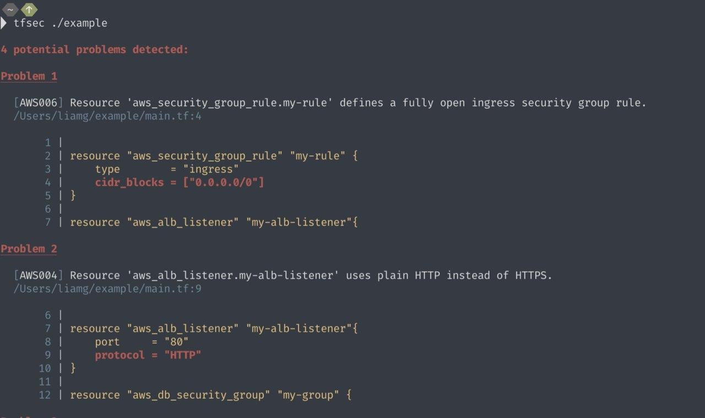

# cyberoffru
`2020-02-29 22:47:36`

<blockquote>
Уязвимость в Apache Tomcat, позволяющая получить содержимое файлов web-приложений https://opennet.ru/52459/
</blockquote>

<table><tr><td><b>→</b><a href="https://opennet.ru/52459/">
https://opennet.ru/52459/
</a>
<blockquote>
Исследователи из китайской компании Chaitin Tech выявили уязвимость (CVE-2020-1938) в Apache Tomcat, открытой реализации технологий Java Servlet, JavaServer Pages, Java Expression Language и Java WebSocket. Уязвимости присвоено кодовое имя Ghostcat и критический уровень опасности (9.8 CVSS). Проблема позволяет в конфигурации по умолчанию через отправку запроса по сетевому порту 8009 прочитать содержимое любых файлов из каталога web-приложения, в том числе файлов с настройками и исходных текстов приложения.
</blockquote>
</td></tr></table>

---

# FinSecurity
`2020-02-28 12:31:18`

<blockquote>
Нафиг криптоарм, https://github.com/sergiomarotco/CryptCP-automatizator 😬
</blockquote>

<table><tr><td><b>→</b><a href="https://github.com/sergiomarotco/CryptCP-automatizator">
https://github.com/sergiomarotco/CryptCP-automatizator
</a>
<blockquote>
Программа автоматизации КриптоПРО CryptCP. Contribute to sergiomarotco/CryptCP-automatizator development by creating an account on GitHub.
</blockquote>
</td></tr></table>

---

# isast
`2020-02-27 18:21:18`

<blockquote>
https://github.com/doorstop-dev/doorstop
</blockquote>

<table><tr><td><b>→</b><a href="https://github.com/doorstop-dev/doorstop">
https://github.com/doorstop-dev/doorstop
</a>
<blockquote>
Requirements management using version control. Contribute to doorstop-dev/doorstop development by creating an account on GitHub.
</blockquote>
</td></tr></table>

---

# FinSecurity
`2020-02-26 17:59:20`

<blockquote>
Коллеги, кто-нибудь пользовался браузером от КриптоПро?
https://github.com/deemru/chromium-gost/releases/tag/80.0.3987.122
Нормально работает?
</blockquote>

<table><tr><td><b>→</b><a href="https://github.com/deemru/chromium-gost/releases/tag/80.0.3987.122">
https://github.com/deemru/chromium-gost/releases/tag/80.0.3987.122
</a>
<blockquote>
Chromium с поддержкой алгоритмов ГОСТ. Contribute to deemru/chromium-gost development by creating an account on GitHub.
</blockquote>
</td></tr></table>

---

# phd_soc
`2020-02-25 17:24:17`

<blockquote>
https://github.com/cisco/joy
</blockquote>

<table><tr><td><b>→</b><a href="https://github.com/cisco/joy">
https://github.com/cisco/joy
</a>
<blockquote>
A package for capturing and analyzing network flow data and intraflow data, for network research, forensics, and security monitoring. - cisco/joy
</blockquote>
</td></tr></table>

---

# phd_soc
`2020-02-25 16:43:29`

<blockquote>
https://github.com/appneta/tcpreplay
</blockquote>

<table><tr><td><b>→</b><a href="https://github.com/appneta/tcpreplay">
https://github.com/appneta/tcpreplay
</a>
<blockquote>
Pcap editing and replay tools for *NIX and Windows - Users please download source from - appneta/tcpreplay
</blockquote>
</td></tr></table>

---

# cyberoffru
`2020-02-24 23:45:46`

<blockquote>
Ещё две уязвимости в OpenSMTPD, позволяющие удалённо и локально получить права root https://opennet.ru/52423/
</blockquote>

<table><tr><td><b>→</b><a href="https://opennet.ru/52423/">
https://opennet.ru/52423/
</a>
<blockquote>
Компания Qualys выявила ещё одну критическую уязвимость (CVE-2020-8794) в почтовом сервере OpenSMTPD, развиваемом проектом OpenBSD. Как и прошлая уязвимость, новая проблема даёт возможность удалённо выполнить произвольные команды shell на сервере с правами пользователя root. Уязвимость устранена в выпуске OpenSMTPD 6.6.4p1.
</blockquote>
</td></tr></table>

---

# isast
`2020-02-21 09:07:09`

<blockquote>
https://github.com/microsoft/microsoft.unity.analyzers
</blockquote>

<table><tr><td><b>→</b><a href="https://github.com/microsoft/microsoft.unity.analyzers">
https://github.com/microsoft/microsoft.unity.analyzers
</a>
<blockquote>
Roslyn analyzers for Unity game developers. Contribute to microsoft/Microsoft.Unity.Analyzers development by creating an account on GitHub.
</blockquote>
</td></tr></table>

---

# exploitex
`2020-02-20 12:10:13`

* https://telegra.ph/file/bf9d3b9862669078b727b.jpg
* https://www.exploit-db.com/google-hacking-database

<blockquote>
​​Готовые запросы для расширенного поиска в Google

Google Hacking Database - самая популярная база поисковых запросов, которая ежедневно пополняется пользователями.  Здесь авторы публикуют готовые запросы для google, которые помогут вам найти утечки на других сайтах или просто информацию которую не успели скрыть.

Например, поисковый запрос intitle:index.of &quot;credential.txt&quot; может вывести вас на забытый кем-то файл с паролями или другой конфиденциальной информацией. 

На сайте уже имеется более 600 разных запросов и список ежедневно пополняется.

&#35;хакинг
</blockquote>

<table><tr><td><b>→</b><a href="https://telegra.ph/file/bf9d3b9862669078b727b.jpg">
https://telegra.ph/file/bf9d3b9862669078b727b.jpg
</a>
</td></tr></table>

---

# ctfchat
`2020-02-19 17:40:19`

<blockquote>
https://github.com/codeblue-ctf/bullseye-infra
</blockquote>

<table><tr><td><b>→</b><a href="https://github.com/codeblue-ctf/bullseye-infra">
https://github.com/codeblue-ctf/bullseye-infra
</a>
<blockquote>
Contribute to codeblue-ctf/bullseye-infra development by creating an account on GitHub.
</blockquote>
</td></tr></table>

---

# cyberoffru
`2020-02-18 13:53:50`

<blockquote>
Система удаления человека с видеоизображения в реальном режиме времени. Вы помните как в кино на камеры подавали статическое изображение, чтобы небыло видно злоумышленников? Так вот, им даже не снилось, теперь можно просто вставить в код камеры алгоритм, который стирает вас с видео, все остальное будет реальным.

Редкий случай, когда до такого не додумались даже в фантастических фильмах. Обратите внимание, система работает прямо в браузере, на клиентской стороне https://github.com/jasonmayes/Real-Time-Person-Removal
</blockquote>

<table><tr><td><b>→</b><a href="https://github.com/jasonmayes/Real-Time-Person-Removal">
https://github.com/jasonmayes/Real-Time-Person-Removal
</a>
<blockquote>
Removing people from complex backgrounds in real time using TensorFlow.js in the web browser - jasonmayes/Real-Time-Person-Removal
</blockquote>
</td></tr></table>

---

# isast
`2020-02-17 19:58:04`

<blockquote>
Security in IaC (Terraform)

В предыдущем посте упомянал тулзу cfn-nag для сканирования шаблонов CloudFormation. Сегодня рассмотрим утилиты для сканирования шаблонов Terraform

Checkov - это инструмент статического анализа кода для infrastructure-as-code. Он сканирует облачную инфраструктуру, предоставляемую с помощью Terraform, и обнаруживает неправильные конфигурации безопасности.

Terrascan - набор инструментов для статического анализа terraform шаблнов используя terraform_validate.

tfsec - аналогичная предыдущим тулза для проверки terraform шаблонов. В отличие от Terrascan проверяет шаблоны для Azure и Google

&#35;tools &#35;terraform
</blockquote>

---

# chkpchat
`2020-02-13 12:18:15`

<blockquote>
https://github.com/jimoq?tab&#61;repositories
</blockquote>

<table><tr><td><b>→</b><a href="https://github.com/jimoq?tab=repositories">
https://github.com/jimoq?tab=repositories
</a>
<blockquote>
Security Management Solutions Expert @CheckPointSW - jimoq
</blockquote>
</td></tr></table>

---

# chkpchat
`2020-02-13 12:16:28`

<blockquote>
https://github.com/CheckPointSW
</blockquote>

<table><tr><td><b>→</b><a href="https://github.com/CheckPointSW">
https://github.com/CheckPointSW
</a>
<blockquote>
World's leading provider of cyber security solutions to governments and corporate enterprises. Visit our CloudGuard Dome9 account at https://github.com/Dome9 - Check Point Software Technolo...
</blockquote>
</td></tr></table>

---

# isast
`2020-02-12 18:57:35`

<blockquote>
Compliance as Code - tools (free)

Небольшая подборка инструментов по &quot;Compliance left&quot; и обеспечение соответствия как непрерывный процесс

Chef InSpec - это бесплатный фреймворк с открытым исходным кодом для тестирования и аудита приложений и инфраструктуры. Вебинар про возможности InSpec

Compliance Masonry - позволяет пользователям создавать сертификационную документацию с использованием схемы OpenControl. Полезно, если вы собираетесь проходить PCI DSS, например.

OpenSCAP - проект при поддержке Red Hat. Инструменты OpenSCAP совместно с Scap Security Guide можно использовать для автоматического аудита системы и проверки соответствия. Вот как это работает на примере с HIPPA

&#35;tools &#35;compliance
</blockquote>

---

# phd_soc
`2020-02-11 23:29:04`

<blockquote>
А Гугл говорит ещё о https://github.com/mitre/stix2patterns_translator, например
</blockquote>

<table><tr><td><b>→</b><a href="https://github.com/mitre/stix2patterns_translator">
https://github.com/mitre/stix2patterns_translator
</a>
<blockquote>
Translate STIX 2 Patterning Queries. Contribute to mitre/stix2patterns_translator development by creating an account on GitHub.
</blockquote>
</td></tr></table>

---

# phd_soc
`2020-02-10 08:34:42`

<blockquote>
https://gitlab.com/mosajjal/dnsmonster
</blockquote>

<table><tr><td><b>→</b><a href="https://gitlab.com/mosajjal/dnsmonster">
https://gitlab.com/mosajjal/dnsmonster
</a>
<blockquote>
Passive DNS collector with ClickHouse backend
</blockquote>
</td></tr></table>

---

# cyberoffru
`2020-02-07 14:08:19`

<blockquote>
Уязвимость в Android, позволяющая удалённо выполнить код при включённом Bluetooth https://opennet.ru/52330/
</blockquote>

<table><tr><td><b>→</b><a href="https://opennet.ru/52330/">
https://opennet.ru/52330/
</a>
<blockquote>
В февральском обновлении платформы Android устранена критическая уязвимость (CVE-2020-0022) в Bluetooth-стеке, позволяющая организовать удалённое выполнение кода через отправку специально оформленного Bluetooth-пакета. Проблема может быть незаметно эксплуатирована атакующим, находящимся в пределах досягаемости Bluetooth. Не исключено задействование уязвимости для создания червей, по цепочке поражающих соседние устройства.
</blockquote>
</td></tr></table>

---

# isast
`2020-02-06 22:02:33`

<blockquote>
https://github.com/parsiya/eslinter
</blockquote>

<table><tr><td><b>→</b><a href="https://github.com/parsiya/eslinter">
https://github.com/parsiya/eslinter
</a>
<blockquote>
Manual JavaScript Linting is a Bug. Contribute to parsiya/eslinter development by creating an account on GitHub.
</blockquote>
</td></tr></table>

---

# cyberoffru
`2020-02-06 15:47:33`

<blockquote>
А вот например опенсорсная тула. Которая судя по ману вполне подходит под &quot;AS CODE&quot;. Но давненько не обновлялась.
https://github.com/izar/pytm
</blockquote>

<table><tr><td><b>→</b><a href="https://github.com/izar/pytm">
https://github.com/izar/pytm
</a>
<blockquote>
A Pythonic framework for threat modeling. Contribute to izar/pytm development by creating an account on GitHub.
</blockquote>
</td></tr></table>

---

# webware
`2020-02-06 07:25:49`

* https://telegra.ph/Nettacker---Auto-Pentest-Framework-04-20

<blockquote>
Nettacker - Auto Pentest Framework

&#35;pentest
</blockquote>

<table><tr><td><b>→</b><a href="http://telegra.ph/Nettacker---Auto-Pentest-Framework-04-20">
http://telegra.ph/Nettacker---Auto-Pentest-Framework-04-20
</a>
<blockquote>
t.me/webware Привет! Хочу сделать небольшой обзор на инструмент, целью которого является автоматизация процесса получения доступа к выбранному вами ресурсу, посредством проведения брутфорс-атаки, сканирования доменов и подсетей. Собственно, Nettacker: Установка: (Kali Linux 2017.1) &gt; git clone https://github.com/Nettacker/Nettacker &gt; cd Nettacker &gt; pip install –r requirements.txt &gt; chmod +x nettacker.py &gt; ./nettacker.py Справка: &gt; ./nettacker.py –h Пример запуска (с опцией брутфорс-атаки): &gt; ./nettacker.py…
</blockquote>
</td></tr></table>

---

# phd_soc
`2020-02-03 12:39:19`

<blockquote>
https://github.com/Cyb3rWard0g/HELK
</blockquote>

<table><tr><td><b>→</b><a href="https://github.com/Cyb3rWard0g/HELK">
https://github.com/Cyb3rWard0g/HELK
</a>
<blockquote>
The Hunting ELK. Contribute to Cyb3rWard0g/HELK development by creating an account on GitHub.
</blockquote>
</td></tr></table>

---

# phd_soc
`2020-02-03 12:33:19`

<blockquote>
Порог входа со спарком будет довольно высоким. По факту взять и сделать коррелятор.
Из опенсорса что-то простенькое можно собрать на https://github.com/Yelp/elastalert
</blockquote>

<table><tr><td><b>→</b><a href="https://github.com/Yelp/elastalert">
https://github.com/Yelp/elastalert
</a>
<blockquote>
Easy &amp; Flexible Alerting With ElasticSearch. Contribute to Yelp/elastalert development by creating an account on GitHub.
</blockquote>
</td></tr></table>

---

# isast
`2020-02-02 16:41:54`

* https://telegra.ph/file/1e14fb7f81c937e60a755.png

<blockquote>
​Выходные не прошли даром, случайно наткнулся на проект под названием Cutter — бесплатный фреймворк с открытом кодом, построенный на базе radare2 и созданный реверсерами для реверсеров, по-братски.

Выглядит симпатично и удобно, поэтому если вдруг подустали от ida и нужен хороший инструмент, учитывая его бесплатность, Cutter отлично подходит.

https://cutter.re/
https://github.com/radareorg/cutter
@r2cutter
</blockquote>

<table><tr><td><b>→</b><a href="https://telegra.ph/file/1e14fb7f81c937e60a755.png">
https://telegra.ph/file/1e14fb7f81c937e60a755.png
</a>
</td></tr></table>

---

