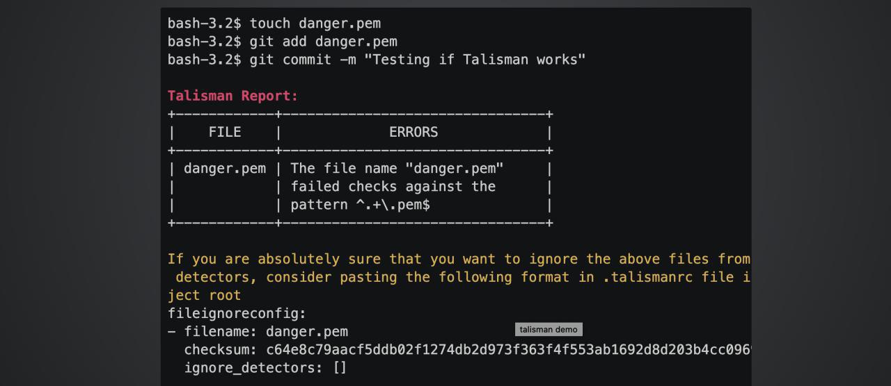
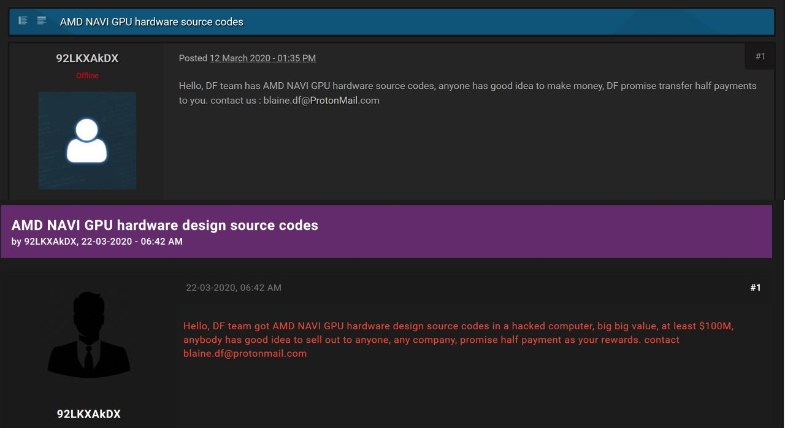
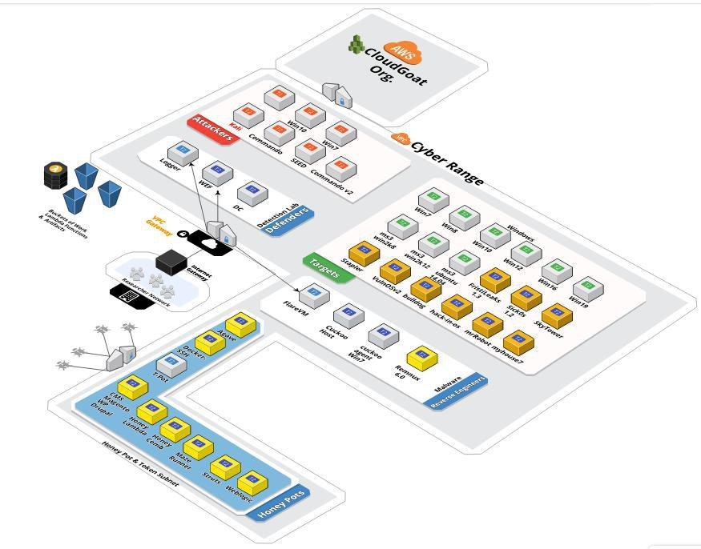
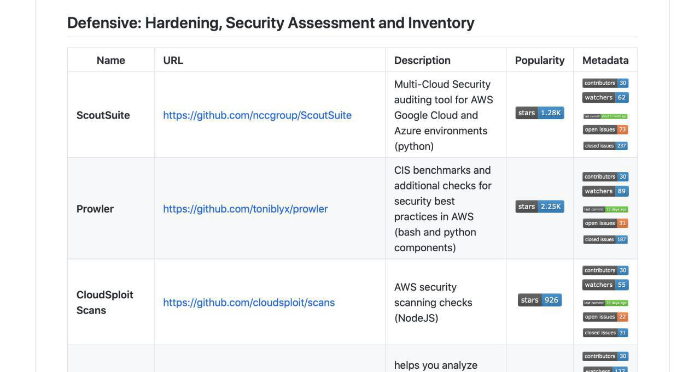
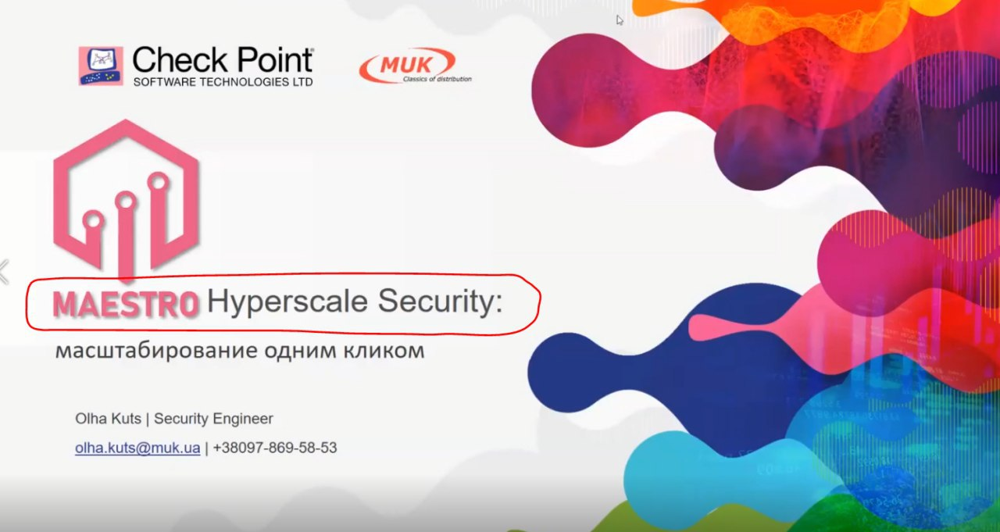
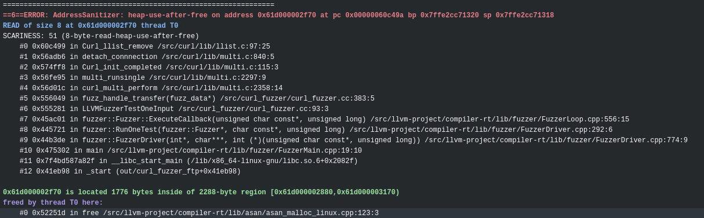
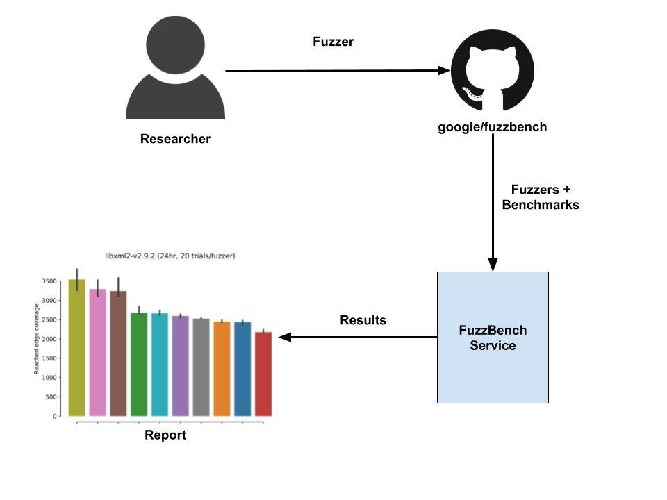

# defcon_news
`2020-03-31 22:23:06`

<blockquote>
CVE-2020-10560 OSSN Arbitrary File Read
https://www.reddit.com/r/netsec/comments/fs0ssj/cve202010560_ossn_arbitrary_file_read/

via /r/netsec - Information Security News &amp; Discussion
</blockquote>

<table><tr><td><b>→</b><a href="https://www.reddit.com/r/netsec/comments/fs0ssj/cve202010560_ossn_arbitrary_file_read/">
https://www.reddit.com/r/netsec/comments/fs0ssj/cve202010560_ossn_arbitrary_file_read/
</a>
<blockquote>
Posted in r/netsec by u/kev-thehermit • 3 points and 0 comments
</blockquote>
</td></tr></table>

---

# defcon_news
`2020-03-31 21:23:40`

<blockquote>
Exploiting Liferay CVE-2020-7961: A quick journey to PoC
https://www.reddit.com/r/netsec/comments/frswgd/exploiting_liferay_cve20207961_a_quick_journey_to/

via /r/netsec - Information Security News &amp; Discussion
</blockquote>

<table><tr><td><b>→</b><a href="https://www.reddit.com/r/netsec/comments/frswgd/exploiting_liferay_cve20207961_a_quick_journey_to/">
https://www.reddit.com/r/netsec/comments/frswgd/exploiting_liferay_cve20207961_a_quick_journey_to/
</a>
<blockquote>
Posted in r/netsec by u/mabote • 9 points and 0 comments
</blockquote>
</td></tr></table>

---

# defcon_news
`2020-03-31 21:23:38`

<blockquote>
CVE-2020-8515: DrayTek pre-auth remote root RCE (PoC)
https://www.reddit.com/r/netsec/comments/frr2aw/cve20208515_draytek_preauth_remote_root_rce_poc/

via /r/netsec - Information Security News &amp; Discussion
</blockquote>

<table><tr><td><b>→</b><a href="https://www.reddit.com/r/netsec/comments/frr2aw/cve20208515_draytek_preauth_remote_root_rce_poc/">
https://www.reddit.com/r/netsec/comments/frr2aw/cve20208515_draytek_preauth_remote_root_rce_poc/
</a>
<blockquote>
Posted in r/netsec by u/0xsha • 4 points and 0 comments
</blockquote>
</td></tr></table>

---

# defcon_news
`2020-03-31 21:23:36`

<blockquote>
Released a public exploit (Local Privilege Escalation) for SMBv3 bug (CVE-2020-0796)
https://www.reddit.com/r/netsec/comments/frqkzq/released_a_public_exploit_local_privilege/

via /r/netsec - Information Security News &amp; Discussion
</blockquote>

<table><tr><td><b>→</b><a href="https://www.reddit.com/r/netsec/comments/frqkzq/released_a_public_exploit_local_privilege/?utm_source=ifttt">
https://www.reddit.com/r/netsec/comments/frqkzq/released_a_public_exploit_local_privilege/?utm_source=ifttt
</a>
<blockquote>
Posted in r/netsec by u/gid0rah • 13 points and 0 comments
</blockquote>
</td></tr></table>

---

# defcon_news
`2020-03-31 20:53:20`

<blockquote>
Defense in depth -- the Microsoft way (part 66): attachment manager allows to load arbitrary DLLs
http://seclists.org/fulldisclosure/2020/Mar/56

via Full Disclosure
</blockquote>

<table><tr><td><b>→</b><a href="https://seclists.org/fulldisclosure/2020/Mar/56">
https://seclists.org/fulldisclosure/2020/Mar/56
</a>
</td></tr></table>

---

# defcon_news
`2020-03-31 20:53:19`

<blockquote>
Re: Defense in depth -- the Microsoft way (part 64): Windows Defender loads and exeutes arbitrary DLLs
http://seclists.org/fulldisclosure/2020/Mar/55

via Full Disclosure
</blockquote>

<table><tr><td><b>→</b><a href="https://seclists.org/fulldisclosure/2020/Mar/55">
https://seclists.org/fulldisclosure/2020/Mar/55
</a>
</td></tr></table>

---

# defcon_news
`2020-03-31 20:53:18`

<blockquote>
TP-LINK Cloud Cameras NCXXX Remote NULL Pointer Dereference
http://seclists.org/fulldisclosure/2020/Mar/54

via Full Disclosure
</blockquote>

<table><tr><td><b>→</b><a href="https://seclists.org/fulldisclosure/2020/Mar/54">
https://seclists.org/fulldisclosure/2020/Mar/54
</a>
</td></tr></table>

---

# defcon_news
`2020-03-31 20:53:17`

<blockquote>
Re: Defense in depth -- the Microsoft way (part 64): Windows Defender loads and exeutes arbitrary DLLs
http://seclists.org/fulldisclosure/2020/Mar/53

via Full Disclosure
</blockquote>

<table><tr><td><b>→</b><a href="https://seclists.org/fulldisclosure/2020/Mar/53">
https://seclists.org/fulldisclosure/2020/Mar/53
</a>
</td></tr></table>

---

# defcon_news
`2020-03-31 20:53:16`

<blockquote>
Recon-Informer v1 - Intel for offensive systems tool
http://seclists.org/fulldisclosure/2020/Mar/52

via Full Disclosure
</blockquote>

<table><tr><td><b>→</b><a href="https://seclists.org/fulldisclosure/2020/Mar/52">
https://seclists.org/fulldisclosure/2020/Mar/52
</a>
</td></tr></table>

---

# defcon_news
`2020-03-31 20:53:15`

<blockquote>
Deskpro Helpdesk &lt; 2019.8.0 (Privilege Escalation, RCE)
http://seclists.org/fulldisclosure/2020/Mar/51

via Full Disclosure
</blockquote>

<table><tr><td><b>→</b><a href="https://seclists.org/fulldisclosure/2020/Mar/51">
https://seclists.org/fulldisclosure/2020/Mar/51
</a>
</td></tr></table>

---

# defcon_news
`2020-03-31 19:53:22`

<blockquote>
Microsoft Windows 10 SMB 3.1.1 Local Privilege Escalation
https://packetstormsecurity.com/files/156980/CVE-2020-0796.tgz

via Exploit Files ≈ Packet Storm
</blockquote>

<table><tr><td><b>→</b><a href="https://packetstormsecurity.com/files/156980/CVE-2020-0796.tgz">
https://packetstormsecurity.com/files/156980/CVE-2020-0796.tgz
</a>
<blockquote>
Information Security Services, News, Files, Tools, Exploits, Advisories and Whitepapers
</blockquote>
</td></tr></table>

---

# defcon_news
`2020-03-31 17:23:35`

<blockquote>
[remote] SharePoint Workflows - XOML Injection (Metasploit)
https://www.exploit-db.com/exploits/48275

via Exploit Database
</blockquote>

<table><tr><td><b>→</b><a href="https://www.exploit-db.com/exploits/48275">
https://www.exploit-db.com/exploits/48275
</a>
<blockquote>
SharePoint Workflows - XOML Injection (Metasploit). CVE-2020-0646 . remote exploit for Windows platform
</blockquote>
</td></tr></table>

---

# sysadm_in_channel
`2020-03-31 16:55:10`

<blockquote>
Как работает Stuxnet червь (полный расклад с дизассемблингом):

https://airbus-cyber-security.com/applying-a-stuxnet-type-attack-to-a-modicon-plc/

Что это за червь:

https://ru.wikipedia.org/wiki/Stuxnet

Кратко
Stuxnet, червь, атаковавший ядерные объекты Ирана (реакторы). Что характерно, червь использовал 0day-уязвимость при обработке файлов ярлыков
(.lnk), ЭТО БЫЛ 2010 ГОД! Почему заглавными, да потому что в Windows 10 недавно был обнаружен зеродей тоже связанный с LNK и его обработкой, Карл - ПРОШЛО 10 ЛЕТ!

Расклад по LNK уязвимости 2020
https://www.zerodayinitiative.com/blog/2020/3/25/cve-2020-0729-remote-code-execution-through-lnk-files

Как оно работало в 2010 году
https://xakep.ru/2010/11/18/53950/
</blockquote>

<table><tr><td><b>→</b><a href="https://airbus-cyber-security.com/applying-a-stuxnet-type-attack-to-a-modicon-plc/">
https://airbus-cyber-security.com/applying-a-stuxnet-type-attack-to-a-modicon-plc/
</a>
<blockquote>
Discover how to perform a ‘Stuxnet type’ attack on Modicon PLC software, and how this inspired the design of our new automation program.
</blockquote>
</td></tr></table>

---

# defcon_news
`2020-03-31 16:53:30`

<blockquote>
[remote] DLINK DWL-2600 - Authenticated Remote Command Injection (Metasploit)
https://www.exploit-db.com/exploits/48274

via Exploit Database
</blockquote>

<table><tr><td><b>→</b><a href="https://www.exploit-db.com/exploits/48274">
https://www.exploit-db.com/exploits/48274
</a>
<blockquote>
DLINK DWL-2600 - Authenticated Remote Command Injection (Metasploit). CVE-2019-20499 . remote exploit for Hardware platform
</blockquote>
</td></tr></table>

---

# defcon_news
`2020-03-31 16:23:16`

<blockquote>
[remote] IBM TM1 / Planning Analytics - Unauthenticated Remote Code Execution (Metasploit)
https://www.exploit-db.com/exploits/48273

via Exploit Database
</blockquote>

<table><tr><td><b>→</b><a href="https://www.exploit-db.com/exploits/48273">
https://www.exploit-db.com/exploits/48273
</a>
<blockquote>
IBM TM1 / Planning Analytics - Unauthenticated Remote Code Execution (Metasploit). CVE-2019-4716 . remote exploit for Multiple platform
</blockquote>
</td></tr></table>

---

# defcon_news
`2020-03-31 16:23:15`

<blockquote>
[remote] Redis - Replication Code Execution (Metasploit)
https://www.exploit-db.com/exploits/48272

via Exploit Database
</blockquote>

<table><tr><td><b>→</b><a href="https://www.exploit-db.com/exploits/48272">
https://www.exploit-db.com/exploits/48272
</a>
<blockquote>
Redis - Replication Code Execution (Metasploit).. remote exploit for Linux platform
</blockquote>
</td></tr></table>

---

# defcon_news
`2020-03-31 12:53:26`

<blockquote>
[webapps] Grandstream UCM6200 Series WebSocket 1.0.20.20 - 'user_password' SQL Injection
https://www.exploit-db.com/exploits/48271

via Exploit Database
</blockquote>

<table><tr><td><b>→</b><a href="https://www.exploit-db.com/exploits/48271">
https://www.exploit-db.com/exploits/48271
</a>
<blockquote>
Grandstream UCM6200 Series WebSocket 1.0.20.20 - 'user_password' SQL Injection.. webapps exploit for Hardware platform
</blockquote>
</td></tr></table>

---

# defcon_news
`2020-03-31 12:23:18`

<blockquote>
[webapps] Grandstream UCM6200 Series CTI Interface - 'user_password' SQL Injection
https://www.exploit-db.com/exploits/48270

via Exploit Database
</blockquote>

<table><tr><td><b>→</b><a href="https://www.exploit-db.com/exploits/48270">
https://www.exploit-db.com/exploits/48270
</a>
<blockquote>
Grandstream UCM6200 Series CTI Interface - 'user_password' SQL Injection. CVE-2020-5726 . webapps exploit for Hardware platform
</blockquote>
</td></tr></table>

---

# defcon_news
`2020-03-31 11:23:09`

<blockquote>
Уязвимость в ядре Linux, позволяющая повысить свои привилегии через BPF
https://www.opennet.ru/opennews/art.shtml?num&#61;52640

via OpenNews.opennet.ru: Проблемы безопасности
</blockquote>

<table><tr><td><b>→</b><a href="https://www.opennet.ru/opennews/art.shtml?num=52640">
https://www.opennet.ru/opennews/art.shtml?num=52640
</a>
<blockquote>
Опубликованы сведения об уязвимости (CVE-2020-8835) в ядре Linux, которая была использована в соревновании Pwn2Own 2020 при демонстрации взлома Ubuntu. Уязвимость позволила непривилегированному пользователю получить права root. Рабочий эксплоит существует, но пока не опубликован. Уязвимость присутствует в подсистеме eBPF, позволяющей запускать обработчики для трассировки, анализа работы подсистем и управления трафиком, выполняемые внутри ядра в специальной виртуальной машине с JIT.
</blockquote>
</td></tr></table>

---

# defcon_news
`2020-03-31 10:53:19`

<blockquote>
[dos] FlashFXP 4.2.0 Build 1730 - Denial of Service (PoC)
https://www.exploit-db.com/exploits/48269

via Exploit Database
</blockquote>

<table><tr><td><b>→</b><a href="https://www.exploit-db.com/exploits/48269">
https://www.exploit-db.com/exploits/48269
</a>
<blockquote>
FlashFXP 4.2.0 Build 1730 - Denial of Service (PoC).. dos exploit for Windows platform
</blockquote>
</td></tr></table>

---

# defcon_news
`2020-03-31 06:23:28`

<blockquote>
CVE-2020-0796 - Windows SMBv3 LPE Exploit &#35;SMBGhost
http://www.kitploit.com/2020/03/cve-2020-0796-windows-smbv3-lpe-exploit.html

via KitPloit - PenTest Tools!
</blockquote>

<table><tr><td><b>→</b><a href="https://www.kitploit.com/2020/03/cve-2020-0796-windows-smbv3-lpe-exploit.html">
https://www.kitploit.com/2020/03/cve-2020-0796-windows-smbv3-lpe-exploit.html
</a>
</td></tr></table>

---

# defcon_news
`2020-03-31 06:23:26`

<blockquote>
CVE-2020-0796 - CVE-2020-0796 Pre-Auth POC
http://www.kitploit.com/2020/03/cve-2020-0796-cve-2020-0796-pre-auth-poc.html

via KitPloit - PenTest Tools!
</blockquote>

<table><tr><td><b>→</b><a href="https://www.kitploit.com/2020/03/cve-2020-0796-cve-2020-0796-pre-auth-poc.html">
https://www.kitploit.com/2020/03/cve-2020-0796-cve-2020-0796-pre-auth-poc.html
</a>
</td></tr></table>

---

# defcon_news
`2020-03-31 06:23:16`

<blockquote>
R00Kie-Kr00Kie - PoC Exploit For The CVE-2019-15126 Kr00K Vulnerability
http://www.kitploit.com/2020/03/r00kie-kr00kie-poc-exploit-for-cve-2019.html

via KitPloit - PenTest Tools!
</blockquote>

<table><tr><td><b>→</b><a href="https://www.kitploit.com/2020/03/r00kie-kr00kie-poc-exploit-for-cve-2019.html">
https://www.kitploit.com/2020/03/r00kie-kr00kie-poc-exploit-for-cve-2019.html
</a>
</td></tr></table>

---

# defcon_news
`2020-03-31 03:23:31`

<blockquote>
[remote] Multiple DrayTek Products - Pre-authentication Remote Root Code Execution
https://www.exploit-db.com/exploits/48268

via Exploit Database
</blockquote>

<table><tr><td><b>→</b><a href="https://www.exploit-db.com/exploits/48268">
https://www.exploit-db.com/exploits/48268
</a>
<blockquote>
Multiple DrayTek Products - Pre-authentication Remote Root Code Execution. CVE-2020-8515 . remote exploit for Linux platform
</blockquote>
</td></tr></table>

---

# defcon_news
`2020-03-31 03:23:30`

<blockquote>
[local] Microsoft Windows 10 (1903/1909) - 'SMBGhost' SMB3.1.1 'SMB2_COMPRESSION_CAPABILITIES' Local Privilege Escalation
https://www.exploit-db.com/exploits/48267

via Exploit Database
</blockquote>

<table><tr><td><b>→</b><a href="https://www.exploit-db.com/exploits/48267">
https://www.exploit-db.com/exploits/48267
</a>
<blockquote>
Microsoft Windows 10 (1903/1909) - 'SMBGhost' SMB3.1.1 'SMB2_COMPRESSION_CAPABILITIES' Local Privilege Escalation. CVE-2020-0796 . local exploit for Windows platform
</blockquote>
</td></tr></table>

---

# R0_Crew
`2020-03-31 03:02:42`

<blockquote>
Analysis of Latest Android Binder vulnerability (CVE-2020-0041)

Article:
https://www.synacktiv.com/posts/exploit/binder-analysis-and-exploitation-of-cve-2020-0041.html

Slides:
https://www.synacktiv.com/ressources/thcon2020_binder.pdf

&#35;re &#35;expdev &#35;android &#35;cve &#35;mobile &#35;darw1n
</blockquote>

<table><tr><td><b>→</b><a href="https://www.synacktiv.com/ressources/thcon2020_binder.pdf">
https://www.synacktiv.com/ressources/thcon2020_binder.pdf
</a>
</td></tr></table>

---

# defcon_news
`2020-03-30 15:23:12`

<blockquote>
[webapps] Zen Load Balancer 3.10.1 - Remote Code Execution
https://www.exploit-db.com/exploits/48266

via Exploit Database
</blockquote>

<table><tr><td><b>→</b><a href="https://www.exploit-db.com/exploits/48266">
https://www.exploit-db.com/exploits/48266
</a>
<blockquote>
Zen Load Balancer 3.10.1 - Remote Code Execution.. webapps exploit for CGI platform
</blockquote>
</td></tr></table>

---

# defcon_news
`2020-03-30 14:23:14`

<blockquote>
[local] 10-Strike Network Inventory Explorer 9.03 - 'Read from File' Buffer Overflow (SEH)(ROP)
https://www.exploit-db.com/exploits/48264

via Exploit Database
</blockquote>

<table><tr><td><b>→</b><a href="https://www.exploit-db.com/exploits/48264">
https://www.exploit-db.com/exploits/48264
</a>
<blockquote>
10-Strike Network Inventory Explorer 9.03 - 'Read from File' Buffer Overflow (SEH)(ROP).. local exploit for Windows platform
</blockquote>
</td></tr></table>

---

# defcon_news
`2020-03-30 12:53:17`

<blockquote>
[webapps] Joomla! com_fabrik 3.9.11 - Directory Traversal
https://www.exploit-db.com/exploits/48263

via Exploit Database
</blockquote>

<table><tr><td><b>→</b><a href="https://www.exploit-db.com/exploits/48263">
https://www.exploit-db.com/exploits/48263
</a>
<blockquote>
Joomla! com_fabrik 3.9.11 - Directory Traversal.. webapps exploit for PHP platform
</blockquote>
</td></tr></table>

---

# defcon_news
`2020-03-30 10:53:18`

<blockquote>
[dos] Odin Secure FTP Expert 7.6.3 - 'Site Info' Denial of Service (PoC)
https://www.exploit-db.com/exploits/48262

via Exploit Database
</blockquote>

<table><tr><td><b>→</b><a href="https://www.exploit-db.com/exploits/48262">
https://www.exploit-db.com/exploits/48262
</a>
<blockquote>
Odin Secure FTP Expert 7.6.3 - 'Site Info' Denial of Service (PoC).. dos exploit for Windows platform
</blockquote>
</td></tr></table>

---

# exploitex
`2020-03-30 10:20:45`

* https://telegra.ph/file/4f9506968822a3d19cafd.jpg
* https://play.google.com/store/apps/details?id=com.termux&hl=ru

<blockquote>
​​Получение доступа к камерам с помощью Termux

Для начала, скачиваем Termux.

Запускаем Termux, и обновляем пакеты:
apt update &amp; apt upgrade

Устанавливаем python:
apt install git python2

Делаем запрос на установку:
pip2 install requests

Клонируем репозиторий:
git clone https://github.com/AngelSecurityTeam/Cam-Hackers

Открываем директорию:
cd Cam-Hackers

Запускаем программу:
python3 cam-hackers.py

Далее, вам нужно будет выбрать страну, после чего, откроется целый список ссылок, которые достаточно просто вставить в браузер и получить изображение с камеры.
Если на камере стоит пароль, то просто так вы к ней не подключитесь. Большенство пользователей не меняют дефолтные пароли, поэтому их без труда можно подобрать. Рекомендуем проверить, нет ли ваших камер в списке в всегда менять дефолтные пароли.
</blockquote>

<table><tr><td><b>→</b><a href="https://telegra.ph/file/4f9506968822a3d19cafd.jpg">
https://telegra.ph/file/4f9506968822a3d19cafd.jpg
</a>
</td></tr></table>

---

# defcon_news
`2020-03-29 00:26:25`

<blockquote>
CVE-2020-8816 – Pi-hole Remote Code Execution – Detailed write-up about the vulnerability and exploitation proof of concept
https://www.reddit.com/r/netsec/comments/fqlegv/cve20208816_pihole_remote_code_execution_detailed/

via /r/netsec - Information Security News &amp; Discussion
</blockquote>

<table><tr><td><b>→</b><a href="https://www.reddit.com/r/netsec/comments/fqlegv/cve20208816_pihole_remote_code_execution_detailed/">
https://www.reddit.com/r/netsec/comments/fqlegv/cve20208816_pihole_remote_code_execution_detailed/
</a>
<blockquote>
Posted in r/netsec by u/nate_kappa • 369 points and 78 comments
</blockquote>
</td></tr></table>

---

# isast
`2020-03-28 17:14:30`

* https://blog.gitguardian.com/leaking-secrets-on-github-what-to-do/
* https://github.com/GitGuardian/APISecurityBestPractices/blob/master/Good%20development%20practices.md

<blockquote>
Раскрытие секретов на GitHub: что делать после утечки учетных данных и ключей API

На GitGuardian есть отдельная статья, что делать, если вы поняли, что ваши секреты утекли в Интернет.

Если коротко:
1) Отозвать секреты, либо учетные данные
2) Если есть секреты, которые нельзя отозвать (например, записи БД), либо учетные данные, про которые никто не может гарантировать, что они были отозваны должным образом (например, ключи SSH, которые можно использовать в разных местах), то просто напросто избавиться от улик
3) Проверка журналов
4) Внедрение инструментов и лучших практик

Руководством по практике работы с  API

&#35;bestpractice &#35;secret
</blockquote>

<table><tr><td><b>→</b><a href="https://blog.gitguardian.com/leaking-secrets-on-github-what-to-do/">
https://blog.gitguardian.com/leaking-secrets-on-github-what-to-do/
</a>
<blockquote>
If you have discovered that you have just exposed a sensitive file or secrets to a public git repository, there are some very important steps to follow.
</blockquote>
</td></tr></table>

---

# defcon_news
`2020-03-27 23:26:18`

<blockquote>
[SYSS-2019-047] Micro Focus Vibe - Cross-Site Scripting (CVE-2020-9520)
http://seclists.org/fulldisclosure/2020/Mar/50

via Full Disclosure
</blockquote>

<table><tr><td><b>→</b><a href="https://seclists.org/fulldisclosure/2020/Mar/50">
https://seclists.org/fulldisclosure/2020/Mar/50
</a>
</td></tr></table>

---

# defcon_news
`2020-03-27 23:26:17`

<blockquote>
[SYSS-2019-046] Micro Focus Vibe - HTML Injection
http://seclists.org/fulldisclosure/2020/Mar/49

via Full Disclosure
</blockquote>

<table><tr><td><b>→</b><a href="https://seclists.org/fulldisclosure/2020/Mar/49">
https://seclists.org/fulldisclosure/2020/Mar/49
</a>
</td></tr></table>

---

# defcon_news
`2020-03-27 23:26:13`

<blockquote>
Defense in depth -- the Microsoft way (part 65): unsafe, easy to rediect paths all over
http://seclists.org/fulldisclosure/2020/Mar/48

via Full Disclosure
</blockquote>

<table><tr><td><b>→</b><a href="https://seclists.org/fulldisclosure/2020/Mar/48">
https://seclists.org/fulldisclosure/2020/Mar/48
</a>
</td></tr></table>

---

# defcon_news
`2020-03-27 22:26:13`

<blockquote>
APPLE-SA-2020-03-25-2 iCloud for Windows 7.18
http://seclists.org/fulldisclosure/2020/Mar/47

via Full Disclosure
</blockquote>

<table><tr><td><b>→</b><a href="https://seclists.org/fulldisclosure/2020/Mar/47">
https://seclists.org/fulldisclosure/2020/Mar/47
</a>
</td></tr></table>

---

# defcon_news
`2020-03-27 22:26:12`

<blockquote>
APPLE-SA-2020-03-25-1 iCloud for Windows 10.9.3
http://seclists.org/fulldisclosure/2020/Mar/46

via Full Disclosure
</blockquote>

<table><tr><td><b>→</b><a href="https://seclists.org/fulldisclosure/2020/Mar/46">
https://seclists.org/fulldisclosure/2020/Mar/46
</a>
</td></tr></table>

---

# defcon_news
`2020-03-27 22:26:11`

<blockquote>
Defense in depth -- the Microsoft way (part 64): Windows Defender loads and exeutes arbitrary DLLs
http://seclists.org/fulldisclosure/2020/Mar/45

via Full Disclosure
</blockquote>

<table><tr><td><b>→</b><a href="https://seclists.org/fulldisclosure/2020/Mar/45">
https://seclists.org/fulldisclosure/2020/Mar/45
</a>
</td></tr></table>

---

# defcon_news
`2020-03-27 22:26:11`

<blockquote>
CVE-2019-4716: conf overwrite + auth bypass &#61; rce as root / SYSTEM on IBM PA / TM1
http://seclists.org/fulldisclosure/2020/Mar/44

via Full Disclosure
</blockquote>

<table><tr><td><b>→</b><a href="https://seclists.org/fulldisclosure/2020/Mar/44">
https://seclists.org/fulldisclosure/2020/Mar/44
</a>
</td></tr></table>

---

# defcon_news
`2020-03-27 22:26:10`

<blockquote>
New tool: nullscan v1.0.0 - A modular framework designed to chain and automate security tests
http://seclists.org/fulldisclosure/2020/Mar/43

via Full Disclosure
</blockquote>

<table><tr><td><b>→</b><a href="https://seclists.org/fulldisclosure/2020/Mar/43">
https://seclists.org/fulldisclosure/2020/Mar/43
</a>
</td></tr></table>

---

# defcon_news
`2020-03-27 22:26:09`

<blockquote>
CVE-2019-19913
http://seclists.org/fulldisclosure/2020/Mar/42

via Full Disclosure
</blockquote>

<table><tr><td><b>→</b><a href="https://seclists.org/fulldisclosure/2020/Mar/42">
https://seclists.org/fulldisclosure/2020/Mar/42
</a>
</td></tr></table>

---

# defcon_news
`2020-03-27 22:26:08`

<blockquote>
CVE-2019-19912
http://seclists.org/fulldisclosure/2020/Mar/41

via Full Disclosure
</blockquote>

<table><tr><td><b>→</b><a href="https://seclists.org/fulldisclosure/2020/Mar/41">
https://seclists.org/fulldisclosure/2020/Mar/41
</a>
</td></tr></table>

---

# defcon_news
`2020-03-27 15:26:24`

<blockquote>
[webapps] rConfig 3.9.4 - 'searchField' Unauthenticated Root Remote Code Execution
https://www.exploit-db.com/exploits/48261

via Exploit Database
</blockquote>

<table><tr><td><b>→</b><a href="https://www.exploit-db.com/exploits/48261">
https://www.exploit-db.com/exploits/48261
</a>
<blockquote>
rConfig 3.9.4 - 'searchField' Unauthenticated Root Remote Code Execution.. webapps exploit for PHP platform
</blockquote>
</td></tr></table>

---

# defcon_news
`2020-03-27 14:26:14`

<blockquote>
CVE-2019-4719: IBM PA / TM1 unauth conf overwrite + auth bypass &#61; rce as root / SYSTEM
https://www.reddit.com/r/netsec/comments/fpt234/cve20194719_ibm_pa_tm1_unauth_conf_overwrite_auth/

via /r/netsec - Information Security News &amp; Discussion
</blockquote>

<table><tr><td><b>→</b><a href="https://www.reddit.com/r/netsec/comments/fpt234/cve20194719_ibm_pa_tm1_unauth_conf_overwrite_auth/?utm_source=ifttt">
https://www.reddit.com/r/netsec/comments/fpt234/cve20194719_ibm_pa_tm1_unauth_conf_overwrite_auth/?utm_source=ifttt
</a>
<blockquote>
Posted in r/netsec by u/ChoiceGrapefruit0 • 5 points and 0 comments
</blockquote>
</td></tr></table>

---

# defcon_news
`2020-03-27 13:26:31`

<blockquote>
Zero Day Initiative — CVE-2020-0729: Remote Code Execution Through .LNK Files
https://www.reddit.com/r/netsec/comments/fpdlx0/zero_day_initiative_cve20200729_remote_code/

via /r/netsec - Information Security News &amp; Discussion
</blockquote>

<table><tr><td><b>→</b><a href="https://www.reddit.com/r/netsec/comments/fpdlx0/zero_day_initiative_cve20200729_remote_code/">
https://www.reddit.com/r/netsec/comments/fpdlx0/zero_day_initiative_cve20200729_remote_code/
</a>
<blockquote>
Posted in r/netsec by u/thracky • 1 point and 0 comments
</blockquote>
</td></tr></table>

---

# defcon_news
`2020-03-27 10:56:14`

<blockquote>
[webapps] Jinfornet Jreport 15.6 - Unauthenticated Directory Traversal
https://www.exploit-db.com/exploits/48260

via Exploit Database
</blockquote>

<table><tr><td><b>→</b><a href="https://www.exploit-db.com/exploits/48260">
https://www.exploit-db.com/exploits/48260
</a>
<blockquote>
Jinfornet Jreport 15.6 - Unauthenticated Directory Traversal.. webapps exploit for Java platform
</blockquote>
</td></tr></table>

---

# defcon_news
`2020-03-27 10:26:17`

<blockquote>
[dos] Everest 5.50.2100 - 'Open File' Denial of Service (PoC)
https://www.exploit-db.com/exploits/48259

via Exploit Database
</blockquote>

<table><tr><td><b>→</b><a href="https://www.exploit-db.com/exploits/48259?utm_source=dlvr.it&utm_medium=twitter">
https://www.exploit-db.com/exploits/48259?utm_source=dlvr.it&utm_medium=twitter
</a>
<blockquote>
Everest 5.50.2100 - 'Open File' Denial of Service (PoC).. dos exploit for Windows platform
</blockquote>
</td></tr></table>

---

# defcon_news
`2020-03-27 10:26:16`

<blockquote>
[webapps] ECK Hotel 1.0 - Cross-Site Request Forgery (Add Admin)
https://www.exploit-db.com/exploits/48258

via Exploit Database
</blockquote>

<table><tr><td><b>→</b><a href="https://www.exploit-db.com/exploits/48258">
https://www.exploit-db.com/exploits/48258
</a>
<blockquote>
ECK Hotel 1.0 - Cross-Site Request Forgery (Add Admin).. webapps exploit for PHP platform
</blockquote>
</td></tr></table>

---

# defcon_news
`2020-03-27 10:26:15`

<blockquote>
[local] Easy RM to MP3 Converter 2.7.3.700 - 'Input' Local Buffer Overflow (SEH)
https://www.exploit-db.com/exploits/48257

via Exploit Database
</blockquote>

<table><tr><td><b>→</b><a href="https://www.exploit-db.com/exploits/48257">
https://www.exploit-db.com/exploits/48257
</a>
<blockquote>
Easy RM to MP3 Converter 2.7.3.700 - 'Input' Local Buffer Overflow (SEH).. local exploit for Windows platform
</blockquote>
</td></tr></table>

---

# cibsecurity
`2020-03-26 23:29:08`

* https://threatpost.com/critical-codesys-bug-remote-code-execution/154213/

<blockquote>
❌ Critical CODESYS Bug Allows Remote Code Execution ❌

CVE-2020-10245, a heap-based buffer overflow that rates 10 out of 10 in severity, exists in the CODESYS web server and takes little skill to exploit.

📖 Read

via &quot;Threatpost&quot;.
</blockquote>

<table><tr><td><b>→</b><a href="https://threatpost.com/critical-codesys-bug-remote-code-execution/154213/">
https://threatpost.com/critical-codesys-bug-remote-code-execution/154213/
</a>
<blockquote>
CVE-2020-10245, a heap-based buffer overflow that rates 10 out of 10 in severity, exists in the CODESYS web server and takes little skill to exploit.
</blockquote>
</td></tr></table>

---

# isast
`2020-03-26 19:10:20`

<blockquote>
Talisman

Talisman - это инструмент для проверки изменений кода, которые должны быть вытеснены из локального репозитория Git на рабочей станции разработчика. Talisman проверяет исходящие изменения на наличие открытых секретов, таких как потенциальные ключи SSH, токены авторизации, закрытые ключи и т.д. 

&#35;tools
</blockquote>

---

# dataleak
`2020-03-26 15:59:56`

<blockquote>
В ноябре 2019 г. хакер получил доступ к одному из компьютеров «AMD», на котором он обнаружил (и затем скачал) документы, содержавшие информацию (в том числе исходные коды) по текущим и будущим графическим продуктам компании: «Navi 10», «Navi 21» и «Arden».  🔥

За скачанные данные хакер требует $100 млн., а если покупатель не найдется, то информацию он обещает выложить в открытый доступ. 

В качестве подтверждения пользователем xxXsoullessXxx на GitHub были выложены куски исходных кодов. В настоящий момент этот репозитарий (и несколько его клонов) недоступен, а в другом выложены скриншоты и условия.

Кроме того, на нескольких теневых форумах недавно были размещены объявления о продаже исходников «AMD».

В «AMD» признали факт утечки. 👍
</blockquote>

---

# defcon_news
`2020-03-26 11:56:14`

<blockquote>
[webapps] Centreo 19.10.8 - 'DisplayServiceStatus' Remote Code Execution
https://www.exploit-db.com/exploits/48256

via Exploit Database
</blockquote>

<table><tr><td><b>→</b><a href="https://www.exploit-db.com/exploits/48256?utm_source=dlvr.it&utm_medium=twitter">
https://www.exploit-db.com/exploits/48256?utm_source=dlvr.it&utm_medium=twitter
</a>
<blockquote>
Centreo 19.10.8 - 'DisplayServiceStatus' Remote Code Execution.. webapps exploit for PHP platform
</blockquote>
</td></tr></table>

---

# defcon_news
`2020-03-26 11:56:13`

<blockquote>
[webapps] TP-Link Archer C50 3 - Denial of Service (PoC)
https://www.exploit-db.com/exploits/48255

via Exploit Database
</blockquote>

<table><tr><td><b>→</b><a href="https://www.exploit-db.com/exploits/48255?utm_source=dlvr.it&utm_medium=twitter">
https://www.exploit-db.com/exploits/48255?utm_source=dlvr.it&utm_medium=twitter
</a>
<blockquote>
TP-Link Archer C50 3 - Denial of Service (PoC). CVE-2020-9375 . dos exploit for Hardware platform
</blockquote>
</td></tr></table>

---

# defcon_news
`2020-03-26 04:27:18`

<blockquote>
Hackers 2 Hackers Conference 17th Edition Call For Papers
http://seclists.org/fulldisclosure/2020/Mar/36

via Full Disclosure
</blockquote>

<table><tr><td><b>→</b><a href="https://seclists.org/fulldisclosure/2020/Mar/36">
https://seclists.org/fulldisclosure/2020/Mar/36
</a>
</td></tr></table>

---

# defcon_news
`2020-03-26 04:27:17`

<blockquote>
APPLE-SA-2020-03-24-5 Safari 13.1
http://seclists.org/fulldisclosure/2020/Mar/35

via Full Disclosure
</blockquote>

<table><tr><td><b>→</b><a href="https://seclists.org/fulldisclosure/2020/Mar/35">
https://seclists.org/fulldisclosure/2020/Mar/35
</a>
</td></tr></table>

---

# defcon_news
`2020-03-26 04:27:16`

<blockquote>
APPLE-SA-2020-03-24-6 iTunes for Windows 12.10.5
http://seclists.org/fulldisclosure/2020/Mar/34

via Full Disclosure
</blockquote>

<table><tr><td><b>→</b><a href="https://seclists.org/fulldisclosure/2020/Mar/34">
https://seclists.org/fulldisclosure/2020/Mar/34
</a>
</td></tr></table>

---

# defcon_news
`2020-03-26 04:27:15`

<blockquote>
APPLE-SA-2020-03-24-4 watchOS 6.2
http://seclists.org/fulldisclosure/2020/Mar/33

via Full Disclosure
</blockquote>

<table><tr><td><b>→</b><a href="https://seclists.org/fulldisclosure/2020/Mar/33">
https://seclists.org/fulldisclosure/2020/Mar/33
</a>
</td></tr></table>

---

# defcon_news
`2020-03-26 04:27:14`

<blockquote>
APPLE-SA-2020-03-24-7 Xcode 11.4
http://seclists.org/fulldisclosure/2020/Mar/32

via Full Disclosure
</blockquote>

<table><tr><td><b>→</b><a href="https://seclists.org/fulldisclosure/2020/Mar/32">
https://seclists.org/fulldisclosure/2020/Mar/32
</a>
</td></tr></table>

---

# phd_soc
`2020-03-26 00:29:48`

<blockquote>
все что касается реагирования давно изложено в книгах. Вот одна из ключевых по DFIR [1]. 

Может и кажется что в РФ оно появилось типо лет пять назад (что вообще, с позиции масштабов какбе так и есть), но вообще для мира это не ново.

если нужны тренинги, то смотрите в сторону:

- Института SANS серии FOR [2]
- AND от Криса Сандерса, Investigation Theory и другие [3]

Но в целом я бы вам рекомендовал вот этот документ [4], вам поможет с порядком в плане постановки вопросов и поиска информации. 

[1] https://g.co/kgs/LL5Bah
[2] https://www.sans.org/courses/incident-response-digital-forensics
[3] https://www.networkdefense.io/library/the-analyst-mindset/110302/about/
[4] https://github.com/DC7499/kb/blob/master/beginners.md
</blockquote>

<table><tr><td><b>→</b><a href="https://g.co/kgs/LL5Bah">
https://g.co/kgs/LL5Bah
</a>
<blockquote>
The all-new edition of this security bestseller reveals the most relevant and up-to-date incident response techniques, tools, and case scenarios. ...
</blockquote>
</td></tr></table>

---

# isast
`2020-03-25 18:50:02`

<blockquote>
MobSF

Mobile Security Framework (MobSF) - это мобильное приложение (Android / iOS / Windows) для проведения тестирования, анализа вредоносных программ и оценки безопасности, способное выполнять статический и динамический анализ. MobSF поддерживает двоичные файлы мобильных приложений (APK, IPA и APPX), исходный код и предоставляет REST API для  интеграции с вашим CI / CD.

Недавно вышла неплохая статью про опыт анализа iOS с помощью MobSF:
https://www.netguru.com/codestories/ios-security-analysis-with-mobsf

&#35;mobile &#35;sast &#35;dast
</blockquote>

---

# defcon_news
`2020-03-25 16:57:09`

<blockquote>
GitLab: Email notification about login email changed is not received when using verified linked email address
https://vulners.com/hackerone/H1:801973?utm_source&#61;rss&amp;utm_medium&#61;rss&amp;utm_campaign&#61;rss

via Vulners
</blockquote>

<table><tr><td><b>→</b><a href="https://vulners.com/hackerone/H1:801973?utm_source=rss&utm_medium=rss&utm_campaign=rss">
https://vulners.com/hackerone/H1:801973?utm_source=rss&utm_medium=rss&utm_campaign=rss
</a>
<blockquote>
Summary In https://gitlab.com/profile, user can update the email id to use for login to gitlab account using field &quot;Email&quot;. Usually, when this login email id is updated, there will be 2 email sent on previous email Id with subjects as.  Email 1 - Email Changed:- This tell that...
</blockquote>
</td></tr></table>

---

# defcon_news
`2020-03-25 15:27:07`

<blockquote>
[local] 10-Strike Network Inventory Explorer 8.54 - 'Add' Local Buffer Overflow (SEH)
https://www.exploit-db.com/exploits/48253

via Exploit Database
</blockquote>

<table><tr><td><b>→</b><a href="https://www.exploit-db.com/exploits/48253">
https://www.exploit-db.com/exploits/48253
</a>
<blockquote>
10-Strike Network Inventory Explorer 8.54 - 'Add' Local Buffer Overflow (SEH).. local exploit for Windows platform
</blockquote>
</td></tr></table>

---

# defcon_news
`2020-03-25 15:27:06`

<blockquote>
[local] 10-Strike Network Inventory Explorer - 'srvInventoryWebServer' Unquoted Service Path
https://www.exploit-db.com/exploits/48251

via Exploit Database
</blockquote>

<table><tr><td><b>→</b><a href="https://www.exploit-db.com/exploits/48251">
https://www.exploit-db.com/exploits/48251
</a>
<blockquote>
10-Strike Network Inventory Explorer - 'srvInventoryWebServer' Unquoted Service Path.. local exploit for Windows platform
</blockquote>
</td></tr></table>

---

# defcon_news
`2020-03-25 13:27:21`

<blockquote>
[webapps] LeptonCMS 4.5.0 - Persistent Cross-Site Scripting
https://www.exploit-db.com/exploits/48250

via Exploit Database
</blockquote>

<table><tr><td><b>→</b><a href="https://www.exploit-db.com/exploits/48250">
https://www.exploit-db.com/exploits/48250
</a>
<blockquote>
LeptonCMS 4.5.0 - Persistent Cross-Site Scripting.. webapps exploit for PHP platform
</blockquote>
</td></tr></table>

---

# defcon_news
`2020-03-25 13:27:20`

<blockquote>
[local] AVAST SecureLine 5.5.522.0 - 'SecureLine' Unquoted Service Path
https://www.exploit-db.com/exploits/48249

via Exploit Database
</blockquote>

<table><tr><td><b>→</b><a href="https://www.exploit-db.com/exploits/48249?utm_source=dlvr.it&utm_medium=twitter">
https://www.exploit-db.com/exploits/48249?utm_source=dlvr.it&utm_medium=twitter
</a>
<blockquote>
AVAST SecureLine 5.5.522.0 - 'SecureLine' Unquoted Service Path.. local exploit for Windows platform
</blockquote>
</td></tr></table>

---

# defcon_news
`2020-03-25 13:27:19`

<blockquote>
[webapps] Joomla! Component GMapFP 3.30 - Arbitrary File Upload
https://www.exploit-db.com/exploits/48248

via Exploit Database
</blockquote>

<table><tr><td><b>→</b><a href="https://www.exploit-db.com/exploits/48248">
https://www.exploit-db.com/exploits/48248
</a>
<blockquote>
Joomla! Component GMapFP 3.30 - Arbitrary File Upload.. webapps exploit for PHP platform
</blockquote>
</td></tr></table>

---

# defcon_news
`2020-03-25 11:57:17`

<blockquote>
HP ThinPro - Privileged command injection
http://seclists.org/fulldisclosure/2020/Mar/40

via Full Disclosure
</blockquote>

<table><tr><td><b>→</b><a href="https://seclists.org/fulldisclosure/2020/Mar/40">
https://seclists.org/fulldisclosure/2020/Mar/40
</a>
</td></tr></table>

---

# defcon_news
`2020-03-25 11:57:16`

<blockquote>
HP ThinPro - Citrix command injection
http://seclists.org/fulldisclosure/2020/Mar/39

via Full Disclosure
</blockquote>

<table><tr><td><b>→</b><a href="https://seclists.org/fulldisclosure/2020/Mar/39">
https://seclists.org/fulldisclosure/2020/Mar/39
</a>
</td></tr></table>

---

# defcon_news
`2020-03-25 11:57:15`

<blockquote>
HP ThinPro - Privilege escalation
http://seclists.org/fulldisclosure/2020/Mar/38

via Full Disclosure
</blockquote>

<table><tr><td><b>→</b><a href="https://seclists.org/fulldisclosure/2020/Mar/38">
https://seclists.org/fulldisclosure/2020/Mar/38
</a>
</td></tr></table>

---

# defcon_news
`2020-03-25 11:57:14`

<blockquote>
HP ThinPro - Application filter bypass
http://seclists.org/fulldisclosure/2020/Mar/37

via Full Disclosure
</blockquote>

<table><tr><td><b>→</b><a href="https://seclists.org/fulldisclosure/2020/Mar/37">
https://seclists.org/fulldisclosure/2020/Mar/37
</a>
</td></tr></table>

---

# defcon_news
`2020-03-25 11:57:13`

<blockquote>
HP ThinPro - Information disclosure
http://seclists.org/fulldisclosure/2020/Mar/30

via Full Disclosure
</blockquote>

<table><tr><td><b>→</b><a href="https://seclists.org/fulldisclosure/2020/Mar/30">
https://seclists.org/fulldisclosure/2020/Mar/30
</a>
</td></tr></table>

---

# defcon_news
`2020-03-25 11:57:12`

<blockquote>
APPLE-SA-2020-03-24-2 macOS Catalina 10.15.4, Security Update 2020-002 Mojave, Security Update 2020-002 High Sierra
http://seclists.org/fulldisclosure/2020/Mar/31

via Full Disclosure
</blockquote>

<table><tr><td><b>→</b><a href="https://seclists.org/fulldisclosure/2020/Mar/31">
https://seclists.org/fulldisclosure/2020/Mar/31
</a>
</td></tr></table>

---

# defcon_news
`2020-03-25 11:57:11`

<blockquote>
APPLE-SA-2020-03-24-3 tvOS 13.4
http://seclists.org/fulldisclosure/2020/Mar/29

via Full Disclosure
</blockquote>

<table><tr><td><b>→</b><a href="https://seclists.org/fulldisclosure/2020/Mar/29">
https://seclists.org/fulldisclosure/2020/Mar/29
</a>
</td></tr></table>

---

# defcon_news
`2020-03-25 11:57:10`

<blockquote>
APPLE-SA-2020-03-24-1 iOS 13.4 and iPadOS 13.4
http://seclists.org/fulldisclosure/2020/Mar/28

via Full Disclosure
</blockquote>

<table><tr><td><b>→</b><a href="https://seclists.org/fulldisclosure/2020/Mar/28">
https://seclists.org/fulldisclosure/2020/Mar/28
</a>
</td></tr></table>

---

# defcon_news
`2020-03-25 11:27:25`

<blockquote>
New version of Hyperion PE runtime crypter
http://seclists.org/fulldisclosure/2020/Mar/27

via Full Disclosure
</blockquote>

<table><tr><td><b>→</b><a href="https://seclists.org/fulldisclosure/2020/Mar/27">
https://seclists.org/fulldisclosure/2020/Mar/27
</a>
</td></tr></table>

---

# defcon_news
`2020-03-25 10:27:25`

<blockquote>
Authentication Bypass in Tribal SITS:Vision
http://seclists.org/fulldisclosure/2020/Mar/26

via Full Disclosure
</blockquote>

<table><tr><td><b>→</b><a href="https://seclists.org/fulldisclosure/2020/Mar/26">
https://seclists.org/fulldisclosure/2020/Mar/26
</a>
</td></tr></table>

---

# phd_soc
`2020-03-25 09:03:20`

<blockquote>
Ну раз все чем то делятся то и мы попробуем. Все - бета, использовать на свой страх и риск. https://github.com/izsoc
</blockquote>

<table><tr><td><b>→</b><a href="https://github.com/izsoc">
https://github.com/izsoc
</a>
<blockquote>
izsoc has 3 repositories available. Follow their code on GitHub.
</blockquote>
</td></tr></table>

---

# isast
`2020-03-24 20:16:12`

* https://github.com/security-prince/Application-Security-Engineer-Interview-Questions
* https://www.synopsys.com/blogs/software-security/web-appsec-interview-questions/

<blockquote>
Application Security Engineer - вопросы на собеседовании 

Не так давно в одном из тематических чатов поднимали вопрос того, что спрашивают при приеме на AppSec. Я изначально устраивался на инженера по сетевой безопасности, поэтому поделиться чисто своим опытом не смогу, но я нашел для вас две полезные для подготовки ссылки (полезные и для самооценки). 

- Большая подборка вопросов по AppSec с ссылками для объяснения.
- Вопросы по Web AppSec от Synopsys

Я считаю, что, спрашивая алгоритм сжатия файлов, можно спугнуть действительно рукастого инженера, и гораздо эффективнее задавать верхнеуровневые вопросы (про SDLC например), давать домашние задания и более внимательно наблюдать за работой специалиста в течение всего испытательного срока. Как бы очевидно это не звучало -  определить качество работы специалиста можно только в процессе его работы.

&#35;start
</blockquote>

<table><tr><td><b>→</b><a href="https://github.com/security-prince/Application-Security-Engineer-Interview-Questions">
https://github.com/security-prince/Application-Security-Engineer-Interview-Questions
</a>
<blockquote>
Some of the questions which i was asked when i was giving interviews for Application/Product Security roles. I am sure this is not an exhaustive list but i felt these questions were important to be...
</blockquote>
</td></tr></table>

---

# defcon_news
`2020-03-24 18:57:10`

<blockquote>
Mirai Variant Mukashi Searching Out Zixel NAS Devices
https://packetstormsecurity.com/news/view/31053/Mirai-Variant-Mukashi-Searching-Out-Zixel-NAS-Devices.html

via Packet Storm Security
</blockquote>

<table><tr><td><b>→</b><a href="https://packetstormsecurity.com/news/view/31053/Mirai-Variant-Mukashi-Searching-Out-Zixel-NAS-Devices.html">
https://packetstormsecurity.com/news/view/31053/Mirai-Variant-Mukashi-Searching-Out-Zixel-NAS-Devices.html
</a>
<blockquote>
The new Mirai variant Mukashi is targeting Zyxel network attached storage (NAS) devices using brute force attacks based on the default admin credentials and then exploiting CVE-2020-9054.
</blockquote>
</td></tr></table>

---

# defcon_news
`2020-03-24 12:57:22`

<blockquote>
[webapps] UCM6202 1.0.18.13 - Remote Command Injection
https://www.exploit-db.com/exploits/48247

via Exploit Database
</blockquote>

<table><tr><td><b>→</b><a href="https://www.exploit-db.com/exploits/48247">
https://www.exploit-db.com/exploits/48247
</a>
<blockquote>
UCM6202 1.0.18.13 - Remote Command Injection. CVE-2020-5722 . webapps exploit for Hardware platform
</blockquote>
</td></tr></table>

---

# defcon_news
`2020-03-24 12:57:21`

<blockquote>
[local] Veyon 4.3.4 - 'VeyonService' Unquoted Service Path
https://www.exploit-db.com/exploits/48246

via Exploit Database
</blockquote>

<table><tr><td><b>→</b><a href="https://www.exploit-db.com/exploits/48246">
https://www.exploit-db.com/exploits/48246
</a>
<blockquote>
Veyon 4.3.4 - 'VeyonService' Unquoted Service Path.. local exploit for Windows platform
</blockquote>
</td></tr></table>

---

# defcon_news
`2020-03-24 12:57:20`

<blockquote>
[webapps] Wordpress Plugin WPForms 1.5.9 - Persistent Cross-Site Scripting
https://www.exploit-db.com/exploits/48245

via Exploit Database
</blockquote>

<table><tr><td><b>→</b><a href="https://www.exploit-db.com/exploits/48245">
https://www.exploit-db.com/exploits/48245
</a>
<blockquote>
WordPress Plugin WPForms 1.5.8.2 - Persistent Cross-Site Scripting. CVE-2020-10385 . webapps exploit for PHP platform
</blockquote>
</td></tr></table>

---

# defcon_news
`2020-03-24 12:27:13`

<blockquote>
[webapps] UliCMS 2020.1 - Persistent Cross-Site Scripting
https://www.exploit-db.com/exploits/48244

via Exploit Database
</blockquote>

<table><tr><td><b>→</b><a href="https://www.exploit-db.com/exploits/48244?utm_source=dlvr.it&utm_medium=twitter">
https://www.exploit-db.com/exploits/48244?utm_source=dlvr.it&utm_medium=twitter
</a>
<blockquote>
UliCMS 2020.1 - Persistent Cross-Site Scripting.. webapps exploit for PHP platform
</blockquote>
</td></tr></table>

---

# sysadm_in_channel
`2020-03-24 10:40:27`

<blockquote>
The Kubelet has been found to be vulnerable to a denial of service attack via the kubelet API:

- https://github.com/kubernetes/kubernetes/issues/89377
- https://github.com/kubernetes/kubernetes/issues/89378

За ссылки спасибо @ldviolet
</blockquote>

<table><tr><td><b>→</b><a href="https://github.com/kubernetes/kubernetes/issues/89377">
https://github.com/kubernetes/kubernetes/issues/89377
</a>
<blockquote>
CVSS Rating: CVSS:3.0/AV:A/AC:L/PR:N/UI:N/S:U/C:N/I:N/A:L (Medium) The Kubelet has been found to be vulnerable to a denial of service attack via the kubelet API, including the unauthenticated HTTP ...
</blockquote>
</td></tr></table>

---

# cibsecurity
`2020-03-24 00:25:31`

* https://threatpost.com/apache-tomcat-exploit-stealing-files/154055/?utm_source=rss&utm_medium=rss&utm_campaign=apache-tomcat-exploit-stealing-files

<blockquote>
❌ Apache Tomcat Exploit Poised to Pounce, Stealing Files ❌

Researchers said that a working exploit for CVE-2020-1938 leaked on GitHub makes is a snap to compromise webservers.

📖 Read

via &quot;Threatpost&quot;.
</blockquote>

<table><tr><td><b>→</b><a href="https://threatpost.com/apache-tomcat-exploit-stealing-files/154055/">
https://threatpost.com/apache-tomcat-exploit-stealing-files/154055/
</a>
<blockquote>
Researchers said that a working exploit for CVE-2020-1938 leaked on GitHub makes is a snap to compromise webservers.
</blockquote>
</td></tr></table>

---

# R0_Crew
`2020-03-23 21:28:47`

<blockquote>
64-bit iOS boot image patcher written in C https://github.com/dayt0n/kairos &#35;ios &#35;dukeBarman
</blockquote>

<table><tr><td><b>→</b><a href="https://github.com/dayt0n/kairos">
https://github.com/dayt0n/kairos
</a>
<blockquote>
64-bit iOS boot image patcher written in C. Contribute to dayt0n/kairos development by creating an account on GitHub.
</blockquote>
</td></tr></table>

---

# defcon_news
`2020-03-23 16:27:22`

<blockquote>
[webapps] Joomla! com_hdwplayer 4.2 - 'search.php' SQL Injection
https://www.exploit-db.com/exploits/48242

via Exploit Database
</blockquote>

<table><tr><td><b>→</b><a href="https://www.exploit-db.com/exploits/48242">
https://www.exploit-db.com/exploits/48242
</a>
<blockquote>
Joomla! com_hdwplayer 4.2 - 'search.php' SQL Injection.. webapps exploit for PHP platform
</blockquote>
</td></tr></table>

---

# phd_soc
`2020-03-23 13:18:44`

<blockquote>
https://github.com/JPCERTCC/LogonTracer
</blockquote>

<table><tr><td><b>→</b><a href="https://github.com/JPCERTCC/LogonTracer">
https://github.com/JPCERTCC/LogonTracer
</a>
<blockquote>
Investigate malicious Windows logon by visualizing and analyzing Windows event log - JPCERTCC/LogonTracer
</blockquote>
</td></tr></table>

---

# defcon_news
`2020-03-23 12:57:02`

<blockquote>
[webapps] rConfig 3.9.4 - 'search.crud.php' Remote Command Injection
https://www.exploit-db.com/exploits/48241

via Exploit Database
</blockquote>

<table><tr><td><b>→</b><a href="https://www.exploit-db.com/exploits/48241">
https://www.exploit-db.com/exploits/48241
</a>
<blockquote>
rConfig 3.9.4 - 'search.crud.php' Remote Command Injection. CVE-2020-10879 . webapps exploit for PHP platform
</blockquote>
</td></tr></table>

---

# defcon_news
`2020-03-23 12:28:20`

<blockquote>
[webapps] rConfig 3.9.4 - 'search.crud.php' Remote Command Injection
https://www.exploit-db.com/exploits/48241

via Exploit Database
</blockquote>

<table><tr><td><b>→</b><a href="https://www.exploit-db.com/exploits/48241">
https://www.exploit-db.com/exploits/48241
</a>
<blockquote>
rConfig 3.9.4 - 'search.crud.php' Remote Command Injection. CVE-2020-10879 . webapps exploit for PHP platform
</blockquote>
</td></tr></table>

---

# defcon_news
`2020-03-23 12:27:43`

<blockquote>
[webapps] FIBARO System Home Center 5.021 - Remote File Include
https://www.exploit-db.com/exploits/48240

via Exploit Database
</blockquote>

<table><tr><td><b>→</b><a href="https://www.exploit-db.com/exploits/48240">
https://www.exploit-db.com/exploits/48240
</a>
<blockquote>
FIBARO System Home Center 5.021 - Remote File Include.. webapps exploit for Multiple platform
</blockquote>
</td></tr></table>

---

# defcon_news
`2020-03-23 12:27:42`

<blockquote>
[remote] CyberArk PSMP 10.9.1 - Policy Restriction Bypass
https://www.exploit-db.com/exploits/48239

via Exploit Database
</blockquote>

<table><tr><td><b>→</b><a href="https://www.exploit-db.com/exploits/48239">
https://www.exploit-db.com/exploits/48239
</a>
<blockquote>
CyberArk PSMP 10.9.1 - Policy Restriction Bypass.. remote exploit for Multiple platform
</blockquote>
</td></tr></table>

---

# defcon_news
`2020-03-23 12:27:38`

<blockquote>
[dos] Google Chrome 80.0.3987.87 - Heap-Corruption Remote Denial of Service (PoC)
https://www.exploit-db.com/exploits/48237

via Exploit Database
</blockquote>

<table><tr><td><b>→</b><a href="https://www.exploit-db.com/exploits/48237">
https://www.exploit-db.com/exploits/48237
</a>
<blockquote>
Google Chrome 80.0.3987.87 - Heap-Corruption Remote Denial of Service (PoC).. dos exploit for Windows platform
</blockquote>
</td></tr></table>

---

# defcon_news
`2020-03-23 12:27:37`

<blockquote>
[dos] ProficySCADA for iOS 5.0.25920 - 'Password' Denial of Service (PoC)
https://www.exploit-db.com/exploits/48236

via Exploit Database
</blockquote>

<table><tr><td><b>→</b><a href="https://www.exploit-db.com/exploits/48236">
https://www.exploit-db.com/exploits/48236
</a>
<blockquote>
ProficySCADA for iOS 5.0.25920 - 'Password' Denial of Service (PoC).. dos exploit for iOS platform
</blockquote>
</td></tr></table>

---

# isast
`2020-03-22 20:22:10`

<blockquote>
CyberRange

CyberRange - большая open-source лаборатория, позволяющая начинающим и опытным специалистам погрузиться в безопсность разработки. Для инсталяции необходимо заполнить форму, указав номер аккаунта AWS, после чего для вас станут доступны инстансы, включающие ряд уязвимых приложений, среду для атаки и аудита защищенности. Инициализация проекта осуществляется через Terraform.

Видео:
https://youtu.be/Ed1ujM3xWNg

&#35;practice
</blockquote>

---

# R0_Crew
`2020-03-22 13:56:49`

<blockquote>
Zelos (Zeropoint Emulated Lightweight Operating System) is a python-based binary emulation platform https://github.com/zeropointdynamics/zelos &#35;reverse &#35;dukeBarman
</blockquote>

<table><tr><td><b>→</b><a href="https://github.com/zeropointdynamics/zelos">
https://github.com/zeropointdynamics/zelos
</a>
<blockquote>
A comprehensive binary emulation and instrumentation platform. - zeropointdynamics/zelos
</blockquote>
</td></tr></table>

---

# isast
`2020-03-22 09:12:29`

<blockquote>
Harbian-QA

Clang checker for symbolic execution

Introduction of Clang checker

Clang checker can be a great static analysis tool, you can do lots of amazing work by write your checker. For example, you can write a checker to do taint analysis, symbolic execution ...
We write a checker to static analyse which data structure is relevant to satisfy conditions constraint( c language). Unlike IR parser, clang checker still remain the programing syntax information in compile time, it's readable if you reconstruct the source code from these information. Since we just want to extract these information of symbolic inputs, but not run a symbolic execution base on them, these information should be more readable. So, Clang checker is the best choice in our case.

https://github.com/hardenedlinux/harbian-qa/tree/master/static_analysis_tools
</blockquote>

<table><tr><td><b>→</b><a href="https://github.com/hardenedlinux/harbian-qa/tree/master/static_analysis_tools">
https://github.com/hardenedlinux/harbian-qa/tree/master/static_analysis_tools
</a>
<blockquote>
Bug hunting through fuzzer/*-sanitizer/etc... Contribute to hardenedlinux/harbian-qa development by creating an account on GitHub.
</blockquote>
</td></tr></table>

---

# exploitex
`2020-03-21 11:59:52`

* https://telegra.ph/file/ec2a92f16c0fe2b1fbbc3.jpg
* https://play.google.com/store/apps/details?id=com.termux&hl=ru

<blockquote>
​​Как организовать спам SMS сообщениями на Termux

Для начала нам необходимо скачать Termux. Через Play Market. 

Запускаем Termux и обновляем пакеты:
apt update &amp; apt upgrade -y

Устанавливаем git:
pkg install git

Указываем ссылку на GitHub, где лежит пакет установки:
git clone https://github.com/Argisht44/android.git

Переходим в директорию и запускаем бомбер:
cd android
cd Infinite-Bomber-arm64
chmod 777 infinite-bomber
./infinite-bomber

После ввода этих команд, SMS Bomber запустится. Тебе потребуется ввести номер телефона, который ты собираешься использовать для атаки и следовать инструкции. Если запустить несколько сессий в Termux то у тебя получится отправить в разы больше SMS. 

&#35;хакинг &#35;Termux
</blockquote>

<table><tr><td><b>→</b><a href="https://telegra.ph/file/ec2a92f16c0fe2b1fbbc3.jpg">
https://telegra.ph/file/ec2a92f16c0fe2b1fbbc3.jpg
</a>
</td></tr></table>

---

# defcon_news
`2020-03-21 11:46:06`

<blockquote>
Mukashi: A New Mirai IoT Botnet Variant Targeting Zyxel NAS Devices
https://thehackernews.com/2020/03/zyxel-mukashi-mirai-iot-botnet.html

via The Hacker News
</blockquote>

<table><tr><td><b>→</b><a href="https://thehackernews.com/2020/03/zyxel-mukashi-mirai-iot-botnet.html">
https://thehackernews.com/2020/03/zyxel-mukashi-mirai-iot-botnet.html
</a>
<blockquote>
Mukashi, a new version of Mirai IoT botnet malware is exploiting critical CVE-2020-9054 vulnerability in Zyxel network-attached storage (NAS) devices.
</blockquote>
</td></tr></table>

---

# defcon_news
`2020-03-21 09:46:26`

<blockquote>
CVE-2020-10558 | Tesla Model 3 Vulnerability - Disable Autopilot Notifications, Speedometer, Web Browser, Climate Controls, Turn Signals, Navigation, etc.
https://www.reddit.com/r/netsec/comments/flncsv/cve202010558_tesla_model_3_vulnerability_disable/

via /r/netsec - Information Security News &amp; Discussion
</blockquote>

<table><tr><td><b>→</b><a href="https://www.reddit.com/r/netsec/comments/flncsv/cve202010558_tesla_model_3_vulnerability_disable/">
https://www.reddit.com/r/netsec/comments/flncsv/cve202010558_tesla_model_3_vulnerability_disable/
</a>
<blockquote>
425 votes and 54 comments so far on Reddit
</blockquote>
</td></tr></table>

---

# defcon_news
`2020-03-21 09:46:25`

<blockquote>
Autorize 1.4 is out! Burpsuite extension for automatic authorization enforcement detection
https://www.reddit.com/r/netsec/comments/fjt3uh/autorize_14_is_out_burpsuite_extension_for/

via /r/netsec - Information Security News &amp; Discussion
</blockquote>

<table><tr><td><b>→</b><a href="https://www.reddit.com/r/netsec/comments/fjt3uh/autorize_14_is_out_burpsuite_extension_for/">
https://www.reddit.com/r/netsec/comments/fjt3uh/autorize_14_is_out_burpsuite_extension_for/
</a>
<blockquote>
Come and celebrate 300 stars with us! Check it out on Github: [https://github.com/Quitten/Autorize](https://github.com/Quitten/Autorize)
</blockquote>
</td></tr></table>

---

# defcon_news
`2020-03-20 21:16:37`

<blockquote>
LPE in Avast Secure Browser
http://seclists.org/fulldisclosure/2020/Mar/25

via Full Disclosure
</blockquote>

<table><tr><td><b>→</b><a href="https://seclists.org/fulldisclosure/2020/Mar/25">
https://seclists.org/fulldisclosure/2020/Mar/25
</a>
</td></tr></table>

---

# defcon_news
`2020-03-20 21:16:36`

<blockquote>
Oce Colorwave 500 printer - multiple vulnerabilities
http://seclists.org/fulldisclosure/2020/Mar/24

via Full Disclosure
</blockquote>

<table><tr><td><b>→</b><a href="https://seclists.org/fulldisclosure/2020/Mar/24">
https://seclists.org/fulldisclosure/2020/Mar/24
</a>
</td></tr></table>

---

# defcon_news
`2020-03-20 11:46:28`

<blockquote>
[local] VMware Fusion 11.5.2 - Privilege Escalation
https://www.exploit-db.com/exploits/48235

via Exploit Database
</blockquote>

<table><tr><td><b>→</b><a href="https://www.exploit-db.com/exploits/48235?utm_source=dlvr.it&utm_medium=twitter">
https://www.exploit-db.com/exploits/48235?utm_source=dlvr.it&utm_medium=twitter
</a>
<blockquote>
VMware Fusion 11.5.2 - Privilege Escalation. CVE-2020-3950 . local exploit for macOS platform
</blockquote>
</td></tr></table>

---

# defcon_news
`2020-03-20 11:46:27`

<blockquote>
[webapps] Exagate Sysguard 6001 - Cross-Site Request Forgery (Add Admin)
https://www.exploit-db.com/exploits/48234

via Exploit Database
</blockquote>

<table><tr><td><b>→</b><a href="https://www.exploit-db.com/exploits/48234?utm_source=dlvr.it&utm_medium=twitter">
https://www.exploit-db.com/exploits/48234?utm_source=dlvr.it&utm_medium=twitter
</a>
<blockquote>
Exagate Sysguard 6001 - Cross-Site Request Forgery (Add Admin).. webapps exploit for PHP platform
</blockquote>
</td></tr></table>

---

# defcon_news
`2020-03-20 01:20:13`

<blockquote>
New PoC for KR00K vulnerability
https://www.reddit.com/r/netsec/comments/fkum2o/new_poc_for_kr00k_vulnerability/

via /r/netsec - Information Security News &amp; Discussion
</blockquote>

<table><tr><td><b>→</b><a href="https://www.reddit.com/r/netsec/comments/fkum2o/new_poc_for_kr00k_vulnerability/">
https://www.reddit.com/r/netsec/comments/fkum2o/new_poc_for_kr00k_vulnerability/
</a>
<blockquote>
It seems an interesting PoC script [https://github.com/akabe1/kr00ker](https://github.com/akabe1/kr00ker) to exploit the vulnerability...
</blockquote>
</td></tr></table>

---

# defcon_news
`2020-03-19 17:20:30`

<blockquote>
[remote] Broadcom Wi-Fi Devices - 'KR00K Information Disclosure
https://www.exploit-db.com/exploits/48233

via Exploit Database
</blockquote>

<table><tr><td><b>→</b><a href="https://www.exploit-db.com/exploits/48233">
https://www.exploit-db.com/exploits/48233
</a>
<blockquote>
Broadcom Wi-Fi Devices - 'KR00K Information Disclosure. CVE-2019-15126 . remote exploit for Multiple platform
</blockquote>
</td></tr></table>

---

# defcon_news
`2020-03-19 15:50:26`

<blockquote>
pppd 2.4.8 Buffer Overflow
https://packetstormsecurity.com/files/156802/CVE-2020-8597.py.txt

via Exploit Files ≈ Packet Storm
</blockquote>

<table><tr><td><b>→</b><a href="https://packetstormsecurity.com/files/156802/CVE-2020-8597.py.txt">
https://packetstormsecurity.com/files/156802/CVE-2020-8597.py.txt
</a>
<blockquote>
Information Security Services, News, Files, Tools, Exploits, Advisories and Whitepapers
</blockquote>
</td></tr></table>

---

# reverseengineeringx
`2020-03-19 00:14:13`

<blockquote>
PinCTF
This tool is designed to use instruction counting as an avenue for Side Channel Analysis. By counting the number of instruction exeuted

https://github.com/ChrisTheCoolHut/PinCTF
</blockquote>

<table><tr><td><b>→</b><a href="https://github.com/ChrisTheCoolHut/PinCTF">
https://github.com/ChrisTheCoolHut/PinCTF
</a>
<blockquote>
Using Intel's PIN tool to solve CTF problems. Contribute to ChrisTheCoolHut/PinCTF development by creating an account on GitHub.
</blockquote>
</td></tr></table>

---

# isast
`2020-03-18 18:51:21`

<blockquote>
Epic list of AWS security tools 

Не так давно я выкладывал пост с большой подборкой бесплатных инструментов,  встраиваемых в Сontainer-based SDLC. Так вот я нашел еще более мощную подборку. На этот раз это список инструментов по AWS Security:  hardening, assessment, inventory, audit, forensics, incident responce.

https://github.com/toniblyx/my-arsenal-of-aws-security-tools

&#35;tools &#35;aws
</blockquote>

---

# defcon_news
`2020-03-18 15:50:40`

<blockquote>
[remote] Microtik SSH Daemon 6.44.3 - Denial of Service (PoC)
https://www.exploit-db.com/exploits/48228

via Exploit Database
</blockquote>

<table><tr><td><b>→</b><a href="https://www.exploit-db.com/exploits/48228">
https://www.exploit-db.com/exploits/48228
</a>
<blockquote>
Microtik SSH Daemon 6.44.3 - Denial of Service (PoC).. dos exploit for Hardware platform
</blockquote>
</td></tr></table>

---

# defcon_news
`2020-03-18 15:50:39`

<blockquote>
[local] NetBackup 7.0 - 'NetBackup INET Daemon' Unquoted Service Path
https://www.exploit-db.com/exploits/48227

via Exploit Database
</blockquote>

<table><tr><td><b>→</b><a href="https://www.exploit-db.com/exploits/48227">
https://www.exploit-db.com/exploits/48227
</a>
<blockquote>
NetBackup 7.0 - 'NetBackup INET Daemon' Unquoted Service Path.. local exploit for Windows platform
</blockquote>
</td></tr></table>

---

# defcon_news
`2020-03-18 15:50:38`

<blockquote>
[local] VMWare Fusion - Local Privilege Escalation
https://www.exploit-db.com/exploits/48232

via Exploit Database
</blockquote>

<table><tr><td><b>→</b><a href="https://www.exploit-db.com/exploits/48232">
https://www.exploit-db.com/exploits/48232
</a>
<blockquote>
VMWare Fusion - Local Privilege Escalation.. local exploit for macOS platform
</blockquote>
</td></tr></table>

---

# defcon_news
`2020-03-18 15:50:37`

<blockquote>
[local] Microsoft VSCode Python Extension - Code Execution
https://www.exploit-db.com/exploits/48231

via Exploit Database
</blockquote>

<table><tr><td><b>→</b><a href="https://www.exploit-db.com/exploits/48231">
https://www.exploit-db.com/exploits/48231
</a>
<blockquote>
Microsoft VSCode Python Extension - Code Execution.. local exploit for Multiple platform
</blockquote>
</td></tr></table>

---

# chkpchat
`2020-03-18 12:56:24`

<blockquote>
https://github.com/rharmonson/richtech/wiki/CentOS-7-Minimal-&amp;-Two-factor-Authentication-using-FreeRADIUS-3,-SSSD-1.12,-&amp;-Google-Authenticator&#35;sssd
</blockquote>

<table><tr><td><b>→</b><a href="https://github.com/rharmonson/richtech/wiki/CentOS-7-Minimal-&-Two-factor-Authentication-using-FreeRADIUS-3,-SSSD-1.12,-&-Google-Authenticator">
https://github.com/rharmonson/richtech/wiki/CentOS-7-Minimal-&-Two-factor-Authentication-using-FreeRADIUS-3,-SSSD-1.12,-&-Google-Authenticator
</a>
<blockquote>
Contribute to rharmonson/richtech development by creating an account on GitHub.
</blockquote>
</td></tr></table>

---

# defcon_news
`2020-03-18 12:50:18`

<blockquote>
[webapps] Netlink GPON Router 1.0.11 - Remote Code Execution
https://www.exploit-db.com/exploits/48225

via Exploit Database
</blockquote>

<table><tr><td><b>→</b><a href="https://www.exploit-db.com/exploits/48225">
https://www.exploit-db.com/exploits/48225
</a>
<blockquote>
Netlink GPON Router 1.0.11 - Remote Code Execution.. webapps exploit for Hardware platform
</blockquote>
</td></tr></table>

---

# chkpchat
`2020-03-18 12:48:41`

<blockquote>
https://github.com/rharmonson/richtech/wiki/Two-Factor-Authentication-using-FreeRADIUS-with-SSSD-(FreeIPA-or-Active-Directory)-and-Google-Authenticator-on-CentOS-7
</blockquote>

<table><tr><td><b>→</b><a href="https://github.com/rharmonson/richtech/wiki/Two-Factor-Authentication-using-FreeRADIUS-with-SSSD-(FreeIPA-or-Active-Directory)-and-Google-Authenticator-on-CentOS-7">
https://github.com/rharmonson/richtech/wiki/Two-Factor-Authentication-using-FreeRADIUS-with-SSSD-(FreeIPA-or-Active-Directory)-and-Google-Authenticator-on-CentOS-7
</a>
<blockquote>
Contribute to rharmonson/richtech development by creating an account on GitHub.
</blockquote>
</td></tr></table>

---

# reverseengineeringx
`2020-03-18 01:54:26`

<blockquote>
https://www.youtube.com/watch?v&#61;JMz_PYnpJPY&amp;t&#61;197s
</blockquote>

<table><tr><td><b>→</b><a href="https://www.youtube.com/watch?v=JMz_PYnpJPY&t=197s">
https://www.youtube.com/watch?v=JMz_PYnpJPY&t=197s
</a>
<blockquote>
In the advent of 1990 I played NES games a lot. Knowing nothing about programming but being geekish by nature, I obsessed over cracking the password systems in those games. In this series we will reverse engineer some of these password generators.

Become a member: https://youtube.com/Bisqwit/join

Twitter: https://twitter.com/RealBisqwit
Patreon: https://patreon.com/Bisqwit (alternatives at http://iki.fi/bisqwit/donate.html)
Twitch: http://twitch.tv/RealBisqwit
Homepage: http://iki.fi/bisqwit/

You can contribute subtitles: http://www.youtube.com/timedtext_video?ref&#61;share&amp;v&#61;JMz_PYnpJPY

Downloads:
https://bisqwit.iki.fi/jkp2/dynablaster-passwords.php
https://github.com/bisqwit/password_codecs/

Channels of the guest star Toni Rosendahl, man of gadgets:
https://www.youtube.com/channel/UC3rC-hEBYllV9y6OcLPfEZw https://www.youtube.com/user/trflight

More DOS stuff on my channel:
– https://youtu.be/N8elxpSu9pw Raytracer
– https://youtu.be/vkUwT9U1GzA OpenGL
– https://youtu.be/ZwcFV3KrnQA MIDI player
More cracking…
</blockquote>
</td></tr></table>

---

# defcon_news
`2020-03-17 19:50:11`

<blockquote>
ZoneAlarm TrueVector Internet Monitor service insecure NTFS permissions vulnerability
http://seclists.org/fulldisclosure/2020/Mar/23

via Full Disclosure
</blockquote>

<table><tr><td><b>→</b><a href="https://seclists.org/fulldisclosure/2020/Mar/23">
https://seclists.org/fulldisclosure/2020/Mar/23
</a>
</td></tr></table>

---

# defcon_news
`2020-03-17 16:20:23`

<blockquote>
[remote] ManageEngine Desktop Central - Java Deserialization (Metasploit)
https://www.exploit-db.com/exploits/48224

via Exploit Database
</blockquote>

<table><tr><td><b>→</b><a href="https://www.exploit-db.com/exploits/48224">
https://www.exploit-db.com/exploits/48224
</a>
<blockquote>
ManageEngine Desktop Central - Java Deserialization (Metasploit). CVE-2020-10189 . remote exploit for Multiple platform
</blockquote>
</td></tr></table>

---

# defcon_news
`2020-03-17 16:20:22`

<blockquote>
[remote] Rconfig 3.x - Chained Remote Code Execution (Metasploit)
https://www.exploit-db.com/exploits/48223

via Exploit Database
</blockquote>

<table><tr><td><b>→</b><a href="https://www.exploit-db.com/exploits/48223">
https://www.exploit-db.com/exploits/48223
</a>
<blockquote>
Rconfig 3.x - Chained Remote Code Execution (Metasploit). CVE-2020-10220CVE-2019-19509 . remote exploit for Linux platform
</blockquote>
</td></tr></table>

---

# chkpchat
`2020-03-16 22:51:20`

<blockquote>
https://drive.google.com/open?id&#61;1mJSuMpeMu-kBsTpDsyzFrYqEty-JImSq
</blockquote>

---

# phd_soc
`2020-03-16 22:43:52`

<blockquote>
Есть простой способ организовать удаленный доступ к веб приложениям на основе фактора владения электронной почтой, без интеграций и из свободных компонент. Ссылка на дему и пример конфигурации внутри:
https://github.com/supereldar/lua-resty-access
Если коротко, то это специальный lua модуль для nginx, точнее его модификации - openresty. Модуль реализует беспарольную аутентификацию и авторизацию для проксируемых приложений. Можно задавать разрешенные почтовые ящики или их маски прямо в конфиге nginx. Для доставки писем по умолчанию используется публичный http/smtp relay, но можно указать и собственный smtp сервер. Разрабатывал под себя для сопровождения онлайн составляющей тренингов, но возможно, сейчас понадобиться кому-то еще.
</blockquote>

<table><tr><td><b>→</b><a href="https://github.com/supereldar/lua-resty-access">
https://github.com/supereldar/lua-resty-access
</a>
<blockquote>
Safe way to public insecure web applications. . Contribute to supereldar/lua-resty-access development by creating an account on GitHub.
</blockquote>
</td></tr></table>

---

# defcon_news
`2020-03-16 16:03:26`

<blockquote>
[webapps] PHPKB Multi-Language 9 - 'image-upload.php' Authenticated Remote Code Execution
https://www.exploit-db.com/exploits/48221

via Exploit Database
</blockquote>

<table><tr><td><b>→</b><a href="https://www.exploit-db.com/exploits/48221">
https://www.exploit-db.com/exploits/48221
</a>
<blockquote>
PHPKB Multi-Language 9 - 'image-upload.php' Authenticated Remote Code Execution. CVE-2020-10386 . webapps exploit for PHP platform
</blockquote>
</td></tr></table>

---

# defcon_news
`2020-03-16 15:03:10`

<blockquote>
[webapps] PHPKB Multi-Language 9 - Authenticated Directory Traversal
https://www.exploit-db.com/exploits/48220

via Exploit Database
</blockquote>

<table><tr><td><b>→</b><a href="https://www.exploit-db.com/exploits/48220">
https://www.exploit-db.com/exploits/48220
</a>
<blockquote>
PHPKB Multi-Language 9 - Authenticated Directory Traversal. CVE-2020-10387 . webapps exploit for PHP platform
</blockquote>
</td></tr></table>

---

# defcon_news
`2020-03-16 15:03:09`

<blockquote>
[webapps] PHPKB Multi-Language 9 - Authenticated Remote Code Execution
https://www.exploit-db.com/exploits/48219

via Exploit Database
</blockquote>

<table><tr><td><b>→</b><a href="https://www.exploit-db.com/exploits/48219?utm_source=dlvr.it&utm_medium=twitter">
https://www.exploit-db.com/exploits/48219?utm_source=dlvr.it&utm_medium=twitter
</a>
<blockquote>
PHPKB Multi-Language 9 - Authenticated Remote Code Execution.. webapps exploit for PHP platform
</blockquote>
</td></tr></table>

---

# defcon_news
`2020-03-16 15:03:08`

<blockquote>
[webapps] MiladWorkShop VIP System 1.0 - 'lang' SQL Injection
https://www.exploit-db.com/exploits/48218

via Exploit Database
</blockquote>

<table><tr><td><b>→</b><a href="https://www.exploit-db.com/exploits/48218">
https://www.exploit-db.com/exploits/48218
</a>
<blockquote>
MiladWorkShop VIP System 1.0 - 'lang' SQL Injection.. webapps exploit for PHP platform
</blockquote>
</td></tr></table>

---

# defcon_news
`2020-03-16 14:33:07`

<blockquote>
[webapps] Enhanced Multimedia Router 3.0.4.27 - Cross-Site Request Forgery (Add Admin)
https://www.exploit-db.com/exploits/48217

via Exploit Database
</blockquote>

<table><tr><td><b>→</b><a href="https://www.exploit-db.com/exploits/48217">
https://www.exploit-db.com/exploits/48217
</a>
<blockquote>
Enhanced Multimedia Router 3.0.4.27 - Cross-Site Request Forgery (Add Admin).. webapps exploit for ASP platform
</blockquote>
</td></tr></table>

---

# webware
`2020-03-16 06:07:51`

* https://telegra.ph/file/735bc7e0ddacc49a54aac.jpg

<blockquote>
​Статья CVE-2020-2555: RCE из-за ошибки десериализации на сервере oracle weblogic

Уязвимости небезопасной десериализации стали популярной целью для злоумышленников/исследователей веб-приложений Java. Эти уязвимости часто приводят к удаленному выполнению кода и, как правило, их сложно исправить.

Читать: https://codeby.net/threads/cve-2020-2555-rce-iz-za-oshibki-deserializacii-na-servere-oracle-weblogic.72438/

&#35;pentest
</blockquote>

<table><tr><td><b>→</b><a href="https://telegra.ph/file/735bc7e0ddacc49a54aac.jpg">
https://telegra.ph/file/735bc7e0ddacc49a54aac.jpg
</a>
</td></tr></table>

---

# defcon_news
`2020-03-15 17:33:11`

<blockquote>
CoronaBlue / SMBGhost Microsoft Windows 10 SMB 3.1.1 Proof Of Concept
https://packetstormsecurity.com/files/156731/CVE-2020-0796-PoC-master.tgz

via Exploit Files ≈ Packet Storm
</blockquote>

<table><tr><td><b>→</b><a href="https://packetstormsecurity.com/files/156731/CVE-2020-0796-PoC-master.tgz">
https://packetstormsecurity.com/files/156731/CVE-2020-0796-PoC-master.tgz
</a>
<blockquote>
Information Security Services, News, Files, Tools, Exploits, Advisories and Whitepapers
</blockquote>
</td></tr></table>

---

# exploitex
`2020-03-15 11:01:59`

* https://telegra.ph/file/00900573482c59d50c043.jpg

<blockquote>
​​Программы для взлома из сериала Мистер Робот

На Github опубликован набор для взлома сайтов, собранный по мотивам сериала Мистер Робот! В нем присутствуют программы, которые использует Эллиот, а также те, без которых при пентесте обойтись нельзя.

Можно установить как на Kali Linux, так и на Termux и OsX

Установка: 
git clone https://github.com/Manisso/fsociety.git

Запуск:
cd fsociety &amp;&amp; python fsociety.py

&#35;хакинг &#35;linux &#35;termux
</blockquote>

<table><tr><td><b>→</b><a href="https://telegra.ph/file/00900573482c59d50c043.jpg">
https://telegra.ph/file/00900573482c59d50c043.jpg
</a>
</td></tr></table>

---

# defcon_news
`2020-03-15 01:03:11`

<blockquote>
Multiple vulnerabilities found in Zyxel CNM SecuManager
http://seclists.org/fulldisclosure/2020/Mar/22

via Full Disclosure
</blockquote>

<table><tr><td><b>→</b><a href="https://seclists.org/fulldisclosure/2020/Mar/22">
https://seclists.org/fulldisclosure/2020/Mar/22
</a>
</td></tr></table>

---

# defcon_news
`2020-03-15 01:03:10`

<blockquote>
[dos] Microsoft Windows 10 (1903/1909) - 'SMBGhost' SMB3.1.1 'SMB2_COMPRESSION_CAPABILITIES' Buffer Overflow (PoC)
https://www.exploit-db.com/exploits/48216

via Exploit Database
</blockquote>

<table><tr><td><b>→</b><a href="https://www.exploit-db.com/exploits/48216">
https://www.exploit-db.com/exploits/48216
</a>
<blockquote>
Microsoft Windows 10 (1903/1909) - 'SMBGhost' SMB3.1.1 'SMB2_COMPRESSION_CAPABILITIES' Buffer Overflow (PoC). CVE-2020-0796 . dos exploit for Windows platform
</blockquote>
</td></tr></table>

---

# defcon_news
`2020-03-15 01:03:09`

<blockquote>
[webapps] Horde Groupware Webmail Edition 5.2.22 - Remote Code Execution
https://www.exploit-db.com/exploits/48215

via Exploit Database
</blockquote>

<table><tr><td><b>→</b><a href="https://www.exploit-db.com/exploits/48215">
https://www.exploit-db.com/exploits/48215
</a>
<blockquote>
Horde Groupware Webmail Edition 5.2.22 - Remote Code Execution. CVE-2020-8518 . webapps exploit for PHP platform
</blockquote>
</td></tr></table>

---

# defcon_news
`2020-03-14 14:03:04`

<blockquote>
Чипы памяти DDR4 остаются уязвимы для атак RowHammer, несмотря на добавленную защиту
https://www.opennet.ru/opennews/art.shtml?num&#61;52543

via OpenNews.opennet.ru: Проблемы безопасности
</blockquote>

<table><tr><td><b>→</b><a href="https://www.opennet.ru/opennews/art.shtml?num=52543">
https://www.opennet.ru/opennews/art.shtml?num=52543
</a>
<blockquote>
Группа исследователей из Амстердамского свободного университета, Швейцарской высшей технической школы Цюриха и компании Qualcomm провели исследование эффективности применяемой в современных чипах памяти DDR4 защиты от атак класса RowHammer, позволяющих изменить содержимое отдельных битов динамической оперативной памяти (DRAM). Результаты оказались неутешительными и чипы DDR4 основных производителей по-прежнему остаются уязвимы (CVE-2020-10255).
</blockquote>
</td></tr></table>

---

# defcon_news
`2020-03-14 11:33:07`

<blockquote>
Уязвимость в Bluetooth-стеке Bluez
https://www.opennet.ru/opennews/art.shtml?num&#61;52542

via OpenNews.opennet.ru: Проблемы безопасности
</blockquote>

<table><tr><td><b>→</b><a href="https://www.opennet.ru/opennews/art.shtml?num=52542">
https://www.opennet.ru/opennews/art.shtml?num=52542
</a>
<blockquote>
В свободном Bluetooth-стеке BlueZ, который используется в дистрибутивах Linux и Chrome OS, выявлена уязвимость (CVE-2020-0556), потенциально позволяющая злоумышленнику получить доступ к системе. Из-за некорректной проверки доступа в реализации Bluetooth-профилей HID и HOGP уязвимость позволяет без прохождения процедуры привязки устройства к хосту добиться отказа в обслуживании или повышения своих привилегий при подсоединении вредоносного Bluetooth-устройства. Вредоносное Bluetooth-устройство без прохождения процедуры сопряжения может выдать себя за другое HID-устройство (клавиатура, мышь, игровые контроллеры и т.п.) или организовать скрытую подстановку данных в подсистему ввода.
</blockquote>
</td></tr></table>

---

# defcon_news
`2020-03-14 06:33:25`

<blockquote>
CVE-2020-8518 - RCE in Horde Webmail CSV import
https://www.reddit.com/r/netsec/comments/fhxk8k/cve20208518_rce_in_horde_webmail_csv_import/

via /r/netsec - Information Security News &amp; Discussion
</blockquote>

<table><tr><td><b>→</b><a href="https://www.reddit.com/r/netsec/comments/fhxk8k/cve20208518_rce_in_horde_webmail_csv_import/">
https://www.reddit.com/r/netsec/comments/fhxk8k/cve20208518_rce_in_horde_webmail_csv_import/
</a>
<blockquote>
Posted in r/netsec by u/albinowax • 25 points and 0 comments
</blockquote>
</td></tr></table>

---

# defcon_news
`2020-03-14 02:49:15`

<blockquote>
RichFaces exploitation toolkit
http://seclists.org/fulldisclosure/2020/Mar/21

via Full Disclosure
</blockquote>

<table><tr><td><b>→</b><a href="https://seclists.org/fulldisclosure/2020/Mar/21">
https://seclists.org/fulldisclosure/2020/Mar/21
</a>
</td></tr></table>

---

# defcon_news
`2020-03-13 21:34:23`

<blockquote>
[RT-SA-2020-001] Credential Disclosure in WatchGuard Fireware AD Helper Component
http://seclists.org/fulldisclosure/2020/Mar/20

via Full Disclosure
</blockquote>

<table><tr><td><b>→</b><a href="https://seclists.org/fulldisclosure/2020/Mar/20">
https://seclists.org/fulldisclosure/2020/Mar/20
</a>
</td></tr></table>

---

# defcon_news
`2020-03-13 21:34:22`

<blockquote>
Defense in depth -- the Microsoft way (part 63): program defaults, settings, policies ... and (un)trustworthy computing
http://seclists.org/fulldisclosure/2020/Mar/19

via Full Disclosure
</blockquote>

<table><tr><td><b>→</b><a href="https://seclists.org/fulldisclosure/2020/Mar/19">
https://seclists.org/fulldisclosure/2020/Mar/19
</a>
</td></tr></table>

---

# defcon_news
`2020-03-13 21:34:21`

<blockquote>
CarolinaCon is POSTPONED
http://seclists.org/fulldisclosure/2020/Mar/18

via Full Disclosure
</blockquote>

<table><tr><td><b>→</b><a href="https://seclists.org/fulldisclosure/2020/Mar/18">
https://seclists.org/fulldisclosure/2020/Mar/18
</a>
</td></tr></table>

---

# defcon_news
`2020-03-13 21:34:20`

<blockquote>
[REVIVE-SA-2020-002] Revive Adserver Vulnerabilities
http://seclists.org/fulldisclosure/2020/Mar/17

via Full Disclosure
</blockquote>

<table><tr><td><b>→</b><a href="https://seclists.org/fulldisclosure/2020/Mar/17">
https://seclists.org/fulldisclosure/2020/Mar/17
</a>
</td></tr></table>

---

# defcon_news
`2020-03-13 21:04:22`

<blockquote>
SEC Consult SA-20200312-0 :: Authenticated Command Injection in Phoenix Contact TC Router &amp; TC Cloud Client
http://seclists.org/fulldisclosure/2020/Mar/16

via Full Disclosure
</blockquote>

<table><tr><td><b>→</b><a href="https://seclists.org/fulldisclosure/2020/Mar/16">
https://seclists.org/fulldisclosure/2020/Mar/16
</a>
</td></tr></table>

---

# defcon_news
`2020-03-13 21:04:20`

<blockquote>
SEC Consult SA-20200312-0 :: Authenticated Command Injection in Phoenix Contact TC Router &amp; TC Cloud Client
http://seclists.org/fulldisclosure/2020/Mar/15

via Full Disclosure
</blockquote>

<table><tr><td><b>→</b><a href="https://seclists.org/fulldisclosure/2020/Mar/15">
https://seclists.org/fulldisclosure/2020/Mar/15
</a>
</td></tr></table>

---

# defcon_news
`2020-03-13 16:34:23`

<blockquote>
Microsoft Patches SMBv3 Compression RCE bug - https://portal.msrc.microsoft.com/en-US/security-guidance/advisory/CVE-2020-0796, (Fri, Mar 13th)
https://isc.sans.edu/diary/rss/25902

via SANS Internet Storm Center, InfoCON: green
</blockquote>

<table><tr><td><b>→</b><a href="https://isc.sans.edu/diary/rss/25902">
https://isc.sans.edu/diary/rss/25902
</a>
<blockquote>
Microsoft Patches SMBv3 Compression RCE bug - https://portal.msrc.microsoft.com/en-US/security-guidance/advisory/CVE-2020-0796, Author: Rob VandenBrink
</blockquote>
</td></tr></table>

---

# defcon_news
`2020-03-13 15:34:16`

<blockquote>
[remote] Drobo 5N2 4.1.1 - Remote Command Injection
https://www.exploit-db.com/exploits/48214

via Exploit Database
</blockquote>

<table><tr><td><b>→</b><a href="https://www.exploit-db.com/exploits/48214">
https://www.exploit-db.com/exploits/48214
</a>
<blockquote>
Drobo 5N2 4.1.1 - Remote Command Injection.. remote exploit for Hardware platform
</blockquote>
</td></tr></table>

---

# defcon_news
`2020-03-13 10:34:13`

<blockquote>
[webapps] Centos WebPanel 7 - 'term' SQL Injection
https://www.exploit-db.com/exploits/48212

via Exploit Database
</blockquote>

<table><tr><td><b>→</b><a href="https://www.exploit-db.com/exploits/48212">
https://www.exploit-db.com/exploits/48212
</a>
<blockquote>
Centos WebPanel 7 - 'term' SQL Injection. CVE-2020-10230 . webapps exploit for Linux platform
</blockquote>
</td></tr></table>

---

# defcon_news
`2020-03-13 10:34:12`

<blockquote>
[local] AnyBurn 4.8 - Buffer Overflow (SEH)
https://www.exploit-db.com/exploits/48211

via Exploit Database
</blockquote>

<table><tr><td><b>→</b><a href="https://www.exploit-db.com/exploits/48211">
https://www.exploit-db.com/exploits/48211
</a>
<blockquote>
AnyBurn 4.8 - Buffer Overflow (SEH).. local exploit for Windows platform
</blockquote>
</td></tr></table>

---

# cibsecurity
`2020-03-12 23:17:12`

* https://digitalguardian.com/blog/microsoft-patches-smbv3-bug

<blockquote>
🔏 Microsoft Patches SMBv3 Bug 🔏

Microsoft issued an out-of-band security update for a critical SMB bug (CVE-2020-0796) on Thursday.

📖 Read

via &quot;Subscriber Blog RSS Feed &quot;.
</blockquote>

<table><tr><td><b>→</b><a href="https://digitalguardian.com/blog/microsoft-patches-smbv3-bug">
https://digitalguardian.com/blog/microsoft-patches-smbv3-bug
</a>
<blockquote>
Microsoft issued an out-of-band security update for a critical SMB bug (CVE-2020-0796) on Thursday.
</blockquote>
</td></tr></table>

---

# FinSecurity
`2020-03-12 21:14:59`

<blockquote>
https://github.com/ollypwn/SMBGhost
</blockquote>

<table><tr><td><b>→</b><a href="https://github.com/ollypwn/SMBGhost">
https://github.com/ollypwn/SMBGhost
</a>
<blockquote>
Scanner for CVE-2020-0796 - SMBv3 RCE. Contribute to ollypwn/SMBGhost development by creating an account on GitHub.
</blockquote>
</td></tr></table>

---

# defcon_news
`2020-03-12 21:04:26`

<blockquote>
Microsoft Releases Out-of-Band Security Updates for SMB RCE Vulnerability
https://www.us-cert.gov/ncas/current-activity/2020/03/12/microsoft-releases-out-band-security-updates-smb-rce-vulnerability

via CISA Current Activity
</blockquote>

<table><tr><td><b>→</b><a href="https://www.us-cert.gov/ncas/current-activity/2020/03/12/microsoft-releases-out-band-security-updates-smb-rce-vulnerability">
https://www.us-cert.gov/ncas/current-activity/2020/03/12/microsoft-releases-out-band-security-updates-smb-rce-vulnerability
</a>
<blockquote>
Microsoft has released out-of-band security updates to address a remote code execution vulnerability (CVE-2020-0796) in Microsoft Server Message Block 3.1.1 (SMBv3). A remote attacker could exploit this vulnerability to take control of an affected system.
 
The Cybersecurity and Infrastructure Security Agency (CISA) encourages users and administrators to review the following resources and apply the necessary updates or workarounds.
</blockquote>
</td></tr></table>

---

# defcon_news
`2020-03-12 20:04:28`

<blockquote>
Security Patch Released for 'Wormable' SMBv3 Vulnerability — Install It ASAP!
https://thehackernews.com/2020/03/patch-wormable-smb-vulnerability.html

via The Hacker News
</blockquote>

<table><tr><td><b>→</b><a href="https://thehackernews.com/2020/03/patch-wormable-smb-vulnerability.html">
https://thehackernews.com/2020/03/patch-wormable-smb-vulnerability.html
</a>
<blockquote>
Microsoft Issues Software Patch Update for 'Wormable' SMBv3 Vulnerability (CVE-2020-0796) — Download and Install It ASAP!
</blockquote>
</td></tr></table>

---

# sysadm_in_channel
`2020-03-12 17:09:36`

<blockquote>
Сканер той самой SMBv3 уязвимости - https://github.com/ollypwn/SMBGhost

Как работает уязвимость (коротенькое видео о том, как компьютер ловит “синий” экран)
https://vimeo.com/397149983
</blockquote>

<table><tr><td><b>→</b><a href="https://github.com/ollypwn/SMBGhost">
https://github.com/ollypwn/SMBGhost
</a>
<blockquote>
Scanner for CVE-2020-0796 - SMBv3 RCE. Contribute to ollypwn/SMBGhost development by creating an account on GitHub.
</blockquote>
</td></tr></table>

---

# defcon_news
`2020-03-12 17:04:33`

<blockquote>
OpenSMTPD Vulnerability (CVE-2020-8794) Can Lead to Root Privilege Escalation and Remote Code Execution
https://blog.trendmicro.com/trendlabs-security-intelligence/opensmtpd-vulnerability-cve-2020-8794-can-lead-to-root-privilege-escalation-and-remote-code-execution/

via TrendLabs Security Intelligence Blog
</blockquote>

<table><tr><td><b>→</b><a href="https://blog.trendmicro.com/trendlabs-security-intelligence/opensmtpd-vulnerability-cve-2020-8794-can-lead-to-root-privilege-escalation-and-remote-code-execution/">
https://blog.trendmicro.com/trendlabs-security-intelligence/opensmtpd-vulnerability-cve-2020-8794-can-lead-to-root-privilege-escalation-and-remote-code-execution/
</a>
<blockquote>
A root privilege escalation and remote execution vulnerability (designated as CVE-2020-8794) has been discovered in the free and open-source Unix Daemon, OpenSMTPD. The flaw originates from an out-of-bounds read, which attackers can take advantage of to execute arbitrary code on vulnerable systems.
</blockquote>
</td></tr></table>

---

# defcon_news
`2020-03-12 15:34:05`

<blockquote>
[webapps] Horde Groupware Webmail Edition 5.2.22 - PHAR Loading
https://www.exploit-db.com/exploits/48210

via Exploit Database
</blockquote>

<table><tr><td><b>→</b><a href="https://www.exploit-db.com/exploits/48210">
https://www.exploit-db.com/exploits/48210
</a>
<blockquote>
Horde Groupware Webmail Edition 5.2.22 - PHAR Loading. CVE-2020-8866CVE-2020-8865 . webapps exploit for PHP platform
</blockquote>
</td></tr></table>

---

# defcon_news
`2020-03-12 15:34:04`

<blockquote>
[webapps] Horde Groupware Webmail Edition 5.2.22 - PHP File Inclusion
https://www.exploit-db.com/exploits/48209

via Exploit Database
</blockquote>

<table><tr><td><b>→</b><a href="https://www.exploit-db.com/exploits/48209">
https://www.exploit-db.com/exploits/48209
</a>
<blockquote>
Horde Groupware Webmail Edition 5.2.22 - PHP File Inclusion. CVE-2020-8866CVE-2020-8865 . webapps exploit for PHP platform
</blockquote>
</td></tr></table>

---

# defcon_news
`2020-03-12 14:34:15`

<blockquote>
[webapps] rConfig 3.9 - 'searchColumn' SQL Injection
https://www.exploit-db.com/exploits/48208

via Exploit Database
</blockquote>

<table><tr><td><b>→</b><a href="https://www.exploit-db.com/exploits/48208">
https://www.exploit-db.com/exploits/48208
</a>
<blockquote>
rConfig 3.9 - 'searchColumn' SQL Injection. CVE-2020-10220 . webapps exploit for PHP platform
</blockquote>
</td></tr></table>

---

# cyberoffru
`2020-03-12 14:03:57`

<blockquote>
https://m.habr.com/ru/news/t/492014/
</blockquote>

<table><tr><td><b>→</b><a href="https://m.habr.com/ru/news/t/492014/">
https://m.habr.com/ru/news/t/492014/
</a>
<blockquote>
Фото: heather/Flickr  Портал Microsoft MSRC сообщил, что уязвимость CVE-2020-0796 в протоколе сетевой коммуникации Microsoft Server Message Block 3.1.1 (SMBv3) д...
</blockquote>
</td></tr></table>

---

# defcon_news
`2020-03-12 13:34:07`

<blockquote>
[webapps] rConfig 3.93 - 'ajaxAddTemplate.php' Authenticated Remote Code Execution
https://www.exploit-db.com/exploits/48207

via Exploit Database
</blockquote>

<table><tr><td><b>→</b><a href="https://www.exploit-db.com/exploits/48207">
https://www.exploit-db.com/exploits/48207
</a>
<blockquote>
rConfig 3.93 - 'ajaxAddTemplate.php' Authenticated Remote Code Execution. CVE-2020-10221 . webapps exploit for PHP platform
</blockquote>
</td></tr></table>

---

# defcon_news
`2020-03-12 10:34:16`

<blockquote>
[local] ASUS AAHM 1.00.22 - 'asHmComSvc' Unquoted Service Path
https://www.exploit-db.com/exploits/48206

via Exploit Database
</blockquote>

<table><tr><td><b>→</b><a href="https://www.exploit-db.com/exploits/48206">
https://www.exploit-db.com/exploits/48206
</a>
<blockquote>
ASUS AAHM 1.00.22 - 'asHmComSvc' Unquoted Service Path.. local exploit for Windows platform
</blockquote>
</td></tr></table>

---

# defcon_news
`2020-03-12 10:34:15`

<blockquote>
[webapps] HRSALE 1.1.8 - Cross-Site Request Forgery (Add Admin)
https://www.exploit-db.com/exploits/48205

via Exploit Database
</blockquote>

<table><tr><td><b>→</b><a href="https://www.exploit-db.com/exploits/48205">
https://www.exploit-db.com/exploits/48205
</a>
<blockquote>
HRSALE 1.1.8 - Cross-Site Request Forgery (Add Admin).. webapps exploit for PHP platform
</blockquote>
</td></tr></table>

---

# defcon_news
`2020-03-12 10:34:13`

<blockquote>
[webapps] Wordpress Plugin Appointment Booking Calendar 1.3.34 - CSV Injection
https://www.exploit-db.com/exploits/48204

via Exploit Database
</blockquote>

<table><tr><td><b>→</b><a href="https://www.exploit-db.com/exploits/48204">
https://www.exploit-db.com/exploits/48204
</a>
<blockquote>
Wordpress Plugin Appointment Booking Calendar 1.3.34 - CSV Injection. CVE-2020-9372CVE-2020-9371 . webapps exploit for PHP platform
</blockquote>
</td></tr></table>

---

# defcon_news
`2020-03-12 10:34:12`

<blockquote>
[webapps] WatchGuard Fireware AD Helper Component 5.8.5.10317 - Credential Disclosure
https://www.exploit-db.com/exploits/48203

via Exploit Database
</blockquote>

<table><tr><td><b>→</b><a href="https://www.exploit-db.com/exploits/48203">
https://www.exploit-db.com/exploits/48203
</a>
<blockquote>
WatchGuard Fireware AD Helper Component 5.8.5.10317 - Credential Disclosure.. webapps exploit for Java platform
</blockquote>
</td></tr></table>

---

# defcon_news
`2020-03-12 10:34:11`

<blockquote>
[webapps] Joomla! Component com_newsfeeds 1.0 - 'feedid' SQL Injection
https://www.exploit-db.com/exploits/48202

via Exploit Database
</blockquote>

<table><tr><td><b>→</b><a href="https://www.exploit-db.com/exploits/48202">
https://www.exploit-db.com/exploits/48202
</a>
<blockquote>
Joomla! Component com_newsfeeds 1.0 - 'feedid' SQL Injection.. webapps exploit for PHP platform
</blockquote>
</td></tr></table>

---

# defcon_news
`2020-03-12 09:34:13`

<blockquote>
CVE-2019-18683: Эксплуатация уязвимости в подсистеме V4L2 ядра Linux
https://habr.com/ru/post/491756/

via Информационная безопасность – Защита данных
</blockquote>

<table><tr><td><b>→</b><a href="https://habr.com/ru/post/491756/?utm_source=habrahabr&utm_medium=rss&utm_campaign=491756">
https://habr.com/ru/post/491756/?utm_source=habrahabr&utm_medium=rss&utm_campaign=491756
</a>
<blockquote>
В данной статье описана эксплуатация уязвимости CVE-2019-18683 в ядре Linux, которую я обнаружил и исправил в конце 2019 года. Указанный CVE-идентификатор присво...
</blockquote>
</td></tr></table>

---

# defcon_news
`2020-03-11 23:04:28`

<blockquote>
Удаленное исполнение кода в SMB v3: CVE-2020-0796
https://habr.com/ru/post/491964/

via Информационная безопасность – Защита данных
</blockquote>

<table><tr><td><b>→</b><a href="https://habr.com/ru/post/491964/">
https://habr.com/ru/post/491964/
</a>
<blockquote>
Никогда такого не было, и вот опять. Microsoft распространила информацию о наличии RCE-уязвимости в протоколе SMB версий 3.1.1 и выше. Уязвимости подвержены сис...
</blockquote>
</td></tr></table>

---

# defcon_news
`2020-03-11 20:34:21`

<blockquote>
Microsoft Server Message Block RCE Vulnerability
https://www.us-cert.gov/ncas/current-activity/2020/03/11/microsoft-server-message-block-rce-vulnerability

via CISA Current Activity
</blockquote>

<table><tr><td><b>→</b><a href="https://www.us-cert.gov/ncas/current-activity/2020/03/11/microsoft-server-message-block-rce-vulnerability">
https://www.us-cert.gov/ncas/current-activity/2020/03/11/microsoft-server-message-block-rce-vulnerability
</a>
<blockquote>
Microsoft has released a security advisory to address a remote code execution vulnerability (CVE-2020-0796) in Microsoft Server Message Block 3.1.1 (SMBv3). A remote attacker can exploit this vulnerability to take control of an affected system. SMB is a network file-sharing protocol that allows client machines to access files on servers.
</blockquote>
</td></tr></table>

---

# cibsecurity
`2020-03-11 20:34:20`

* https://threatpost.com/wormable-unpatched-microsoft-bug/153632/?utm_source=rss&utm_medium=rss&utm_campaign=wormable-unpatched-microsoft-bug

<blockquote>
❌ Wormable, Unpatched Microsoft Bug Threatens Corporate LANs ❌

CVE-2020-0796 affects version 3.1.1 of Microsoft’s SMB file-sharing system and was not included in Patch Tuesday.

📖 Read

via &quot;Threatpost&quot;.
</blockquote>

<table><tr><td><b>→</b><a href="https://threatpost.com/wormable-unpatched-microsoft-bug/153632/">
https://threatpost.com/wormable-unpatched-microsoft-bug/153632/
</a>
<blockquote>
CVE-2020-0796 affects version 3.1.1 of Microsoft’s SMB file-sharing system and was not included in Patch Tuesday, but patched the following day.
</blockquote>
</td></tr></table>

---

# defcon_news
`2020-03-11 16:34:05`

<blockquote>
Крупное обновление безопасности от Microsoft
https://securenews.ru/microsofts-major-security-update/

via SecureNews
</blockquote>

<table><tr><td><b>→</b><a href="https://securenews.ru/microsofts-major-security-update/">
https://securenews.ru/microsofts-major-security-update/
</a>
<blockquote>
Microsoft в своем традиционном вторничном патче выпустила крупнейший за последние годы пакет обновлений безопасности. Всего он затрагивает 115 уязвимостей, 26 из которых являются критическими. Большинство из них находятся в Windows и Edge/IE 18. Специалисты согласились, что особое внимание стоит уделить уязвимости CVE-2020-0684, которая дает возможность удаленного исполнения кода (RCE) в Windows 7 и 10 и Windows Server 2008 – 2019. Баг связан с тем, как Windows обрабатывает .LNK файлы. Чтобы использовать уязвимость, злоумышленник должен заставить жертву кликнуть на .LNK файл, находящийся на съемном носителе или на удаленном ресурсе. Microsoft также объявила о 4 обнаруженных RCE уязвимостях, связанных с тем, как Читать далее
</blockquote>
</td></tr></table>

---

# defcon_news
`2020-03-11 14:04:08`

<blockquote>
[webapps] Wordpress Plugin Search Meter 2.13.2 - CSV injection
https://www.exploit-db.com/exploits/48197

via Exploit Database
</blockquote>

<table><tr><td><b>→</b><a href="https://www.exploit-db.com/exploits/48197">
https://www.exploit-db.com/exploits/48197
</a>
<blockquote>
Wordpress Plugin Search Meter 2.13.2 - CSV injection.. webapps exploit for PHP platform
</blockquote>
</td></tr></table>

---

# defcon_news
`2020-03-11 13:34:06`

<blockquote>
[local] ASUS AXSP 1.02.00 - 'asComSvc' Unquoted Service Path
https://www.exploit-db.com/exploits/48193

via Exploit Database
</blockquote>

<table><tr><td><b>→</b><a href="https://www.exploit-db.com/exploits/48193">
https://www.exploit-db.com/exploits/48193
</a>
<blockquote>
ASUS AXSP 1.02.00 - 'asComSvc' Unquoted Service Path.. local exploit for Windows platform
</blockquote>
</td></tr></table>

---

# defcon_news
`2020-03-11 11:04:20`

<blockquote>
LVI - новый класс атак на механизм спекулятивного выполнения в CPU
https://www.opennet.ru/opennews/art.shtml?num&#61;52517

via OpenNews.opennet.ru: Проблемы безопасности
</blockquote>

<table><tr><td><b>→</b><a href="https://www.opennet.ru/opennews/art.shtml?num=52517">
https://www.opennet.ru/opennews/art.shtml?num=52517
</a>
<blockquote>
Обнародованы сведения о новом классе атак LVI (Load Value Injection, CVE-2020-0551) на механизм спекулятивного выполнения в CPU Intel, которые могут использоваться для организации утечки ключей и секретных данных из анклавов Intel SGX и других процессов.
</blockquote>
</td></tr></table>

---

# cyberoffru
`2020-03-11 10:53:33`

<blockquote>
LVI - новый класс атак на механизм спекулятивного выполнения в CPU Intel https://opennet.ru/52517/
</blockquote>

<table><tr><td><b>→</b><a href="https://opennet.ru/52517/">
https://opennet.ru/52517/
</a>
<blockquote>
Обнародованы сведения о новом классе атак LVI (Load Value Injection, CVE-2020-0551) на механизм спекулятивного выполнения в CPU Intel, которые могут использоваться для организации утечки ключей и секретных данных из анклавов Intel SGX и других процессов.
</blockquote>
</td></tr></table>

---

# cyberoffru
`2020-03-11 09:37:00`

<blockquote>
https://www.tenable.com/blog/cve-2020-0796-wormable-remote-code-execution-vulnerability-in-microsoft-server-message-block
2020, прекрати, что ты делаешь!
</blockquote>

<table><tr><td><b>→</b><a href="https://www.tenable.com/blog/cve-2020-0796-wormable-remote-code-execution-vulnerability-in-microsoft-server-message-block">
https://www.tenable.com/blog/cve-2020-0796-wormable-remote-code-execution-vulnerability-in-microsoft-server-message-block
</a>
<blockquote>
Critical unpatched “wormable” remote code execution (RCE) vulnerability in Microsoft Server Message Block 3.1.1 (SMBv3), dubbed EternalDarkness, disclosed by Microsoft.
</blockquote>
</td></tr></table>

---

# sysadm_in_channel
`2020-03-11 08:32:58`

<blockquote>
Злые ярлыки Windows

LNK Remote Code Execution Vulnerability - https://portal.msrc.microsoft.com/en-US/security-guidance/advisory/CVE-2020-0684

up
Сводка по уязвимостям и патчам (ооочень много патчей и соотв уязвимостей) - https://blog.talosintelligence.com/2020/03/microsoft-patch-tuesday-march-2020.html
</blockquote>

<table><tr><td><b>→</b><a href="https://blog.talosintelligence.com/2020/03/microsoft-patch-tuesday-march-2020.html">
https://blog.talosintelligence.com/2020/03/microsoft-patch-tuesday-march-2020.html
</a>
<blockquote>
A blog from the world class Intelligence Group, Talos, Cisco's Intelligence Group
</blockquote>
</td></tr></table>

---

# sysadm_in_channel
`2020-03-11 05:54:35`

<blockquote>
Многогранный Гребной Молот

Rowhammer, уязвимость существовавшая в DDR3, которая могла привести к повреждению данных хранящихся в ячейках памяти...

...DDR4, все думали, что баги исправлены, предыдущий опыт учтен, как бы не так

Исследование обхода защиты (ссылка в репе), набор скриптов для исследования проблемы:

https://github.com/vusec/trrespass/blob/master/README.md

За инфу спасибо @ldviolet
</blockquote>

<table><tr><td><b>→</b><a href="https://github.com/vusec/trrespass/blob/master/README.md">
https://github.com/vusec/trrespass/blob/master/README.md
</a>
<blockquote>
TRRespass. Contribute to vusec/trrespass development by creating an account on GitHub.
</blockquote>
</td></tr></table>

---

# sysadm_in_channel
`2020-03-11 05:27:09`

<blockquote>
Новый тип атаки LVI-LFB на Intel CPU, в результате спекулятивного использования недостатков в архитектуре процессора есть возможность получить доступ к защищённой памяти

Атака LVI, это новый уровень, который обходит предыдущие атаки, такие как Meltdown, Foreshadow, ZombieLoad, RIDL,  Fallout и нивелирует все существующие средства смягчения в ноль т.е. существующие способы устранения последствий предыдущих атак, такие как Meltdown, Spectre не являются достаточными для полного устранения новой уязвимости

Суть такая - злоумышленник управляющий непривилигерованным процессом, может перехватить более привилигерованный процесс, в результате это приводит к существенным рискам связанным с перехватом высокочувствительных данных, таких как например ключи шифрования, пароли и тп:

https://businessinsights.bitdefender.com/bitdefender-researchers-discover-new-side-channel-attack

Intel говорит, ДА, и приводит список уязвимых CPU:

https://software.intel.com/security-software-guidance/insights/processors-affected-load-value-injection

Хорошо про атаку написано на официальном сайте уязвимости:

https://lviattack.eu/

Собственно можно самому убедиться собрав свой PoC (при наличии уязвимого CPU и Visual Studio):

https://github.com/bitdefender/lvi-lfb-attack-poc/blob/master/README.md

За ссылки спасибо @ldviolet
</blockquote>

<table><tr><td><b>→</b><a href="https://businessinsights.bitdefender.com/bitdefender-researchers-discover-new-side-channel-attack">
https://businessinsights.bitdefender.com/bitdefender-researchers-discover-new-side-channel-attack
</a>
<blockquote>
In 2018, two new types of microarchitectural side-channel attacks were disclosed: Meltdown and Spectre. in 2020, a new attack (LVI-LFB) discovered by Bitdefender allows an adversary to inject rogue values in certain microarchitectural structures to reveal secret, protected data across levels of privilege.
</blockquote>
</td></tr></table>

---

# FinSecurity
`2020-03-10 23:51:01`

<blockquote>
Все готовы? https://twitter.com/malwrhunterteam/status/1237438376032251904
</blockquote>

<table><tr><td><b>→</b><a href="https://twitter.com/malwrhunterteam/status/1237438376032251904">
https://twitter.com/malwrhunterteam/status/1237438376032251904
</a>
<blockquote>
CVE-2020-0796 - a &quot;wormable&quot; SMBv3 vulnerability. Great... 😂
</blockquote>
</td></tr></table>

---

# defcon_news
`2020-03-10 21:26:20`

<blockquote>
Unpatched Microsoft Exchange Servers Vulnerable to CVE-2020-0688
https://www.us-cert.gov/ncas/current-activity/2020/03/10/unpatched-microsoft-exchange-servers-vulnerable-cve-2020-0688

via CISA Current Activity
</blockquote>

<table><tr><td><b>→</b><a href="https://www.us-cert.gov/ncas/current-activity/2020/03/10/unpatched-microsoft-exchange-servers-vulnerable-cve-2020-0688">
https://www.us-cert.gov/ncas/current-activity/2020/03/10/unpatched-microsoft-exchange-servers-vulnerable-cve-2020-0688
</a>
<blockquote>
Microsoft Exchange Servers affected by a remote code execution vulnerability, known as CVE-2020-0688, continue to be an attractive target for malicious cyber actors. A remote attacker can exploit this vulnerability to take control of an affected system that is unpatched.
</blockquote>
</td></tr></table>

---

# defcon_news
`2020-03-10 20:26:09`

<blockquote>
LVI Attacks: New Intel CPUs Vulnerability Puts Data Centers At Risk
https://thehackernews.com/2020/03/intel-load-value-injection.html

via The Hacker News
</blockquote>

<table><tr><td><b>→</b><a href="https://thehackernews.com/2020/03/intel-load-value-injection.html">
https://thehackernews.com/2020/03/intel-load-value-injection.html
</a>
<blockquote>
LVI Attacks: New Intel CPUs Vulnerability (CVE-2020-0551) Puts Data Centers At Risk
</blockquote>
</td></tr></table>

---

# defcon_news
`2020-03-10 19:26:15`

<blockquote>
[remote] PHPStudy - Backdoor Remote Code execution (Metasploit)
https://www.exploit-db.com/exploits/48192

via Exploit Database
</blockquote>

<table><tr><td><b>→</b><a href="https://www.exploit-db.com/exploits/48192">
https://www.exploit-db.com/exploits/48192
</a>
<blockquote>
PHPStudy - Backdoor Remote Code execution (Metasploit).. remote exploit for PHP platform
</blockquote>
</td></tr></table>

---

# defcon_news
`2020-03-10 18:56:28`

<blockquote>
[remote] Nagios XI - Authenticated Remote Command Execution (Metasploit)
https://www.exploit-db.com/exploits/48191

via Exploit Database
</blockquote>

<table><tr><td><b>→</b><a href="https://www.exploit-db.com/exploits/48191">
https://www.exploit-db.com/exploits/48191
</a>
<blockquote>
Nagios XI - Authenticated Remote Command Execution (Metasploit). CVE-2019-15949 . remote exploit for Linux platform
</blockquote>
</td></tr></table>

---

# defcon_news
`2020-03-10 18:26:31`

<blockquote>
Busting Ghostcat: An Analysis of the Apache Tomcat Vulnerability (CVE-2020-1938 and CNVD-2020-10487)
https://blog.trendmicro.com/trendlabs-security-intelligence/busting-ghostcat-an-analysis-of-the-apache-tomcat-vulnerability-cve-2020-1938-and-cnvd-2020-10487/

via TrendLabs Security Intelligence Blog
</blockquote>

<table><tr><td><b>→</b><a href="https://blog.trendmicro.com/trendlabs-security-intelligence/busting-ghostcat-an-analysis-of-the-apache-tomcat-vulnerability-cve-2020-1938-and-cnvd-2020-10487/">
https://blog.trendmicro.com/trendlabs-security-intelligence/busting-ghostcat-an-analysis-of-the-apache-tomcat-vulnerability-cve-2020-1938-and-cnvd-2020-10487/
</a>
<blockquote>
This analysis of the Apache Tomcat vulnerability seeks to put the most feared Ghostcat-related scenario into perspective by delving into the unlikely circumstances that would make it possible to allow an RCE through the vulnerability.
</blockquote>
</td></tr></table>

---

# defcon_news
`2020-03-10 15:26:22`

<blockquote>
[webapps] Persian VIP Download Script 1.0 - 'active' SQL Injection
https://www.exploit-db.com/exploits/48190

via Exploit Database
</blockquote>

<table><tr><td><b>→</b><a href="https://www.exploit-db.com/exploits/48190">
https://www.exploit-db.com/exploits/48190
</a>
<blockquote>
Persian VIP Download Script 1.0 - 'active' SQL Injection.. webapps exploit for PHP platform
</blockquote>
</td></tr></table>

---

# defcon_news
`2020-03-10 15:26:20`

<blockquote>
[webapps] YzmCMS 5.5 - 'url' Persistent Cross-Site Scripting
https://www.exploit-db.com/exploits/48189

via Exploit Database
</blockquote>

<table><tr><td><b>→</b><a href="https://www.exploit-db.com/exploits/48189">
https://www.exploit-db.com/exploits/48189
</a>
<blockquote>
YzmCMS 5.5 - 'url' Persistent Cross-Site Scripting.. webapps exploit for PHP platform
</blockquote>
</td></tr></table>

---

# defcon_news
`2020-03-10 15:26:20`

<blockquote>
[webapps] Sysaid 20.1.11 b26 - Remote Command Execution
https://www.exploit-db.com/exploits/48188

via Exploit Database
</blockquote>

<table><tr><td><b>→</b><a href="https://www.exploit-db.com/exploits/48188">
https://www.exploit-db.com/exploits/48188
</a>
<blockquote>
Sysaid 20.1.11 b26 - Remote Command Execution.. webapps exploit for Java platform
</blockquote>
</td></tr></table>

---

# defcon_news
`2020-03-10 15:26:18`

<blockquote>
[local] Counter Strike: GO - '.bsp' Memory Control (PoC)
https://www.exploit-db.com/exploits/48187

via Exploit Database
</blockquote>

<table><tr><td><b>→</b><a href="https://www.exploit-db.com/exploits/48187">
https://www.exploit-db.com/exploits/48187
</a>
<blockquote>
Counter Strike: GO - '.bsp' Memory Control (PoC).. local exploit for Multiple platform
</blockquote>
</td></tr></table>

---

# reverseengineeringx
`2020-03-10 11:08:51`

<blockquote>
Course materials for Modern Binary Exploitation by RPISEC

https://github.com/RPISEC/MBE
</blockquote>

<table><tr><td><b>→</b><a href="https://github.com/RPISEC/MBE">
https://github.com/RPISEC/MBE
</a>
<blockquote>
Course materials for Modern Binary Exploitation by RPISEC - RPISEC/MBE
</blockquote>
</td></tr></table>

---

# sysadm_in_channel
`2020-03-10 06:34:26`

<blockquote>
Power Toys for Windows Power Users:
 https://github.com/microsoft/PowerToys/blob/master/README.md
</blockquote>

<table><tr><td><b>→</b><a href="https://github.com/microsoft/PowerToys/blob/master/README.md">
https://github.com/microsoft/PowerToys/blob/master/README.md
</a>
<blockquote>
Windows system utilities to maximize productivity. Contribute to microsoft/PowerToys development by creating an account on GitHub.
</blockquote>
</td></tr></table>

---

# defcon_news
`2020-03-09 21:26:13`

<blockquote>
pppd 2.4.8 Buffer Overflow
https://packetstormsecurity.com/files/156662/CVE-2020-8597-master.zip

via Exploit Files ≈ Packet Storm
</blockquote>

<table><tr><td><b>→</b><a href="https://packetstormsecurity.com/files/156662/CVE-2020-8597-master.zip">
https://packetstormsecurity.com/files/156662/CVE-2020-8597-master.zip
</a>
<blockquote>
Information Security Services, News, Files, Tools, Exploits, Advisories and Whitepapers
</blockquote>
</td></tr></table>

---

# R0_Crew
`2020-03-09 21:14:58`

<blockquote>
InviZzzible is a tool for assessment of your virtual environments in an easy and reliable way. It contains the most recent and up to date detection and evasion techniques as well as fixes for them.

https://github.com/CheckPointSW/InviZzzible

&#35;re &#35;malware &#35;antivm &#35;detection &#35;redteam &#35;darw1n
</blockquote>

<table><tr><td><b>→</b><a href="https://github.com/CheckPointSW/InviZzzible">
https://github.com/CheckPointSW/InviZzzible
</a>
<blockquote>
InviZzzible is a tool for assessment of your virtual environments in an easy and reliable way. It contains the most recent and up to date detection and evasion techniques as well as fixes for them....
</blockquote>
</td></tr></table>

---

# defcon_news
`2020-03-09 19:56:12`

<blockquote>
[remote] Google Chrome 80 - JSCreate Side-effect Type Confusion (Metasploit)
https://www.exploit-db.com/exploits/48186

via Exploit Database
</blockquote>

<table><tr><td><b>→</b><a href="https://www.exploit-db.com/exploits/48186">
https://www.exploit-db.com/exploits/48186
</a>
<blockquote>
Google Chrome 80 - JSCreate Side-effect Type Confusion (Metasploit). CVE-2020-6418 . remote exploit for Multiple platform
</blockquote>
</td></tr></table>

---

# defcon_news
`2020-03-09 19:56:11`

<blockquote>
[local] OpenSMTPD - OOB Read Local Privilege Escalation (Metasploit)
https://www.exploit-db.com/exploits/48185

via Exploit Database
</blockquote>

<table><tr><td><b>→</b><a href="https://www.exploit-db.com/exploits/48185">
https://www.exploit-db.com/exploits/48185
</a>
<blockquote>
OpenSMTPD - OOB Read Local Privilege Escalation (Metasploit). CVE-2020-8794 . local exploit for Linux platform
</blockquote>
</td></tr></table>

---

# defcon_news
`2020-03-09 19:56:10`

<blockquote>
[remote] Google Chrome 67, 68 and 69 - Object.create Type Confusion (Metasploit)
https://www.exploit-db.com/exploits/48184

via Exploit Database
</blockquote>

<table><tr><td><b>→</b><a href="https://www.exploit-db.com/exploits/48184">
https://www.exploit-db.com/exploits/48184
</a>
<blockquote>
Google Chrome 67, 68 and 69 - Object.create Type Confusion (Metasploit). CVE-2018-17463 . remote exploit for Multiple platform
</blockquote>
</td></tr></table>

---

# defcon_news
`2020-03-09 19:56:09`

<blockquote>
[remote] Google Chrome 72 and 73 - Array.map Out-of-Bounds Write (Metasploit)
https://www.exploit-db.com/exploits/48183

via Exploit Database
</blockquote>

<table><tr><td><b>→</b><a href="https://www.exploit-db.com/exploits/48183">
https://www.exploit-db.com/exploits/48183
</a>
<blockquote>
Google Chrome 72 and 73 - Array.map Out-of-Bounds Write (Metasploit). CVE-2019-5825 . remote exploit for Multiple platform
</blockquote>
</td></tr></table>

---

# defcon_news
`2020-03-09 19:56:08`

<blockquote>
[remote] PHP-FPM - Underflow Remote Code Execution (Metasploit)
https://www.exploit-db.com/exploits/48182

via Exploit Database
</blockquote>

<table><tr><td><b>→</b><a href="https://www.exploit-db.com/exploits/48182">
https://www.exploit-db.com/exploits/48182
</a>
<blockquote>
PHP-FPM - Underflow Remote Code Execution (Metasploit). CVE-2019-11043 . remote exploit for PHP platform
</blockquote>
</td></tr></table>

---

# defcon_news
`2020-03-09 19:26:18`

<blockquote>
[remote] Apache ActiveMQ 5.x-5.11.1 - Directory Traversal Shell Upload (Metasploit)
https://www.exploit-db.com/exploits/48181

via Exploit Database
</blockquote>

<table><tr><td><b>→</b><a href="https://www.exploit-db.com/exploits/48181">
https://www.exploit-db.com/exploits/48181
</a>
<blockquote>
Apache ActiveMQ 5.x-5.11.1 - Directory Traversal Shell Upload (Metasploit). CVE-2015-1830 . remote exploit for Windows platform
</blockquote>
</td></tr></table>

---

# isast
`2020-03-09 18:37:00`

* https://owaspsamm.org/blog/2020/01/31/samm2-release/
* https://owaspsamm.org/guidance/quick-start-guide/
* https://github.com/OWASP/samm/tree/master/Supporting%20Resources/v2.0/toolbox
* https://concordusa.com/SAMM/
* https://owaspsamm.org/benchmarking/
* https://owaspsamm.org/model/
* https://github.com/OWASP/samm
* https://www.brighttalk.com/webcast/17769/348813/everything-you-need-to-know-about-owasp-samm-2-0

<blockquote>
SAMM v2

Не так давно вышла новая версия модели оценки зрелости безопасности ПО от OWASP - SAMM (Software Assurance Maturity Model). До этого я писал, что этой моделью пользуется большое количество зрелых компаний, в том числе Тинькофф, но что означает выход новой версии? 

Что входит в SAMM v2:
1) Важные изменение в самой модели SAMM: появились новые этапы Implementation, Operations с упором на современные практики безопасного DevOps. Construction стал этапом Design.
2) Небольшой quick-start guide для того, чтобы поверхностно  познакомиться с фреймворком
3) OWASP SAMM Toolbox. Это эксель-файл, который позволяет выполнить самооценку компании. Выполнив самооценку, можно будет перейти к установке целей для улучшения (согласно фрейморвку) и приступить к отслеживанию дорожной карты. Версия тулбокса есть еще в онлайн. 
4) Новая система SAMM Benchmark для сравнения вашей зрелости со схожими организациями.

Модель OWASP SAMM онлайн
Модель OWASP SAMM PDF
Все что нужно знать про SAMM v2 - видео

&#35;bestpractice &#35;checklist
</blockquote>

<table><tr><td><b>→</b><a href="https://owaspsamm.org/blog/2020/01/31/samm2-release/">
https://owaspsamm.org/blog/2020/01/31/samm2-release/
</a>
<blockquote>
Site template made by devcows using hugo
</blockquote>
</td></tr></table>

---

# R0_Crew
`2020-03-09 18:08:09`

<blockquote>
iOS 5.x iBoot bug https://github.com/JonathanSeals/Ancient-iBoot-Fun &#35;ios &#35;exploit &#35;dukeBarman
</blockquote>

<table><tr><td><b>→</b><a href="https://github.com/JonathanSeals/Ancient-iBoot-Fun">
https://github.com/JonathanSeals/Ancient-iBoot-Fun
</a>
<blockquote>
iOS 5.x iBoot fun for the whole family! Contribute to JonathanSeals/Ancient-iBoot-Fun development by creating an account on GitHub.
</blockquote>
</td></tr></table>

---

# defcon_news
`2020-03-09 17:56:16`

<blockquote>
CVE-2020-2555: RCE из-за ошибки десериализации на сервере oracle weblogic
https://codeby.net/threads/cve-2020-2555-rce-iz-za-oshibki-deserializacii-na-servere-oracle-weblogic.72438/

via Форум информационной безопасности - Codeby.net
</blockquote>

<table><tr><td><b>→</b><a href="https://codeby.net/threads/cve-2020-2555-rce-iz-za-oshibki-deserializacii-na-servere-oracle-weblogic.72438/">
https://codeby.net/threads/cve-2020-2555-rce-iz-za-oshibki-deserializacii-na-servere-oracle-weblogic.72438/
</a>
<blockquote>
CVE-2020-2555

Уязвимости небезопасной десериализации стали популярной целью для злоумышленников/исследователей веб-приложений Java. Эти уязвимости часто приводят к удаленному выполнению кода и...
</blockquote>
</td></tr></table>

---

# defcon_news
`2020-03-09 15:56:17`

<blockquote>
[local] Microsoft Windows - 'WizardOpium' Local Privilege Escalation
https://www.exploit-db.com/exploits/48180

via Exploit Database
</blockquote>

<table><tr><td><b>→</b><a href="https://www.exploit-db.com/exploits/48180">
https://www.exploit-db.com/exploits/48180
</a>
<blockquote>
Microsoft Windows - 'WizardOpium' Local Privilege Escalation. CVE-2019-1458 . local exploit for Windows platform
</blockquote>
</td></tr></table>

---

# defcon_news
`2020-03-09 15:26:23`

<blockquote>
[webapps] Sentrifugo HRMS 3.2 - 'id' SQL Injection
https://www.exploit-db.com/exploits/48179

via Exploit Database
</blockquote>

<table><tr><td><b>→</b><a href="https://www.exploit-db.com/exploits/48179">
https://www.exploit-db.com/exploits/48179
</a>
<blockquote>
Sentrifugo HRMS 3.2 - 'id' SQL Injection.. webapps exploit for PHP platform
</blockquote>
</td></tr></table>

---

# defcon_news
`2020-03-09 14:26:02`

<blockquote>
[webapps] 60CycleCMS - 'news.php' SQL Injection
https://www.exploit-db.com/exploits/48177

via Exploit Database
</blockquote>

<table><tr><td><b>→</b><a href="https://www.exploit-db.com/exploits/48177">
https://www.exploit-db.com/exploits/48177
</a>
<blockquote>
60CycleCMS - 'news.php' SQL Injection.. webapps exploit for PHP platform
</blockquote>
</td></tr></table>

---

# defcon_news
`2020-03-09 11:56:06`

<blockquote>
Уязвимость в Timeshift, позволяющая поднять свои привилегии в системе
https://www.opennet.ru/opennews/art.shtml?num&#61;52509

via OpenNews.opennet.ru: Проблемы безопасности
</blockquote>

<table><tr><td><b>→</b><a href="https://www.opennet.ru/opennews/art.shtml?num=52509">
https://www.opennet.ru/opennews/art.shtml?num=52509
</a>
<blockquote>
В приложении Timeshift выявлена уязвимость (CVE-2020-10174), позволяющая локальному пользователю выполнить код с правами root. Timeshift представляет собой систему резервного копирования, использующую rsync с установкой жёстких ссылок или снапшоты Btrfs для реализации функциональности, похожей на System Restore в Windows и Time Machine в macOS. Программа входит в репозитории многих дистрибутивов и применяется по умолчанию в PCLinuxOS и Linux Mint. Уязвимость устранена в выпуске Timeshift 20.03.
</blockquote>
</td></tr></table>

---

# isast
`2020-03-08 18:27:32`

<blockquote>
CIFuzz

Еще немного о фаззинге.  
CIFuzz - новый инструмент, который позволяет встроить OSS-Fuzz в CI для проектов размещенных на GitHub. По умолчанию время фаззинга равно 10 минутам.

Пример:
https://github.com/curl/curl/runs/477810777?check_suite_focus&#61;true

&#35;tools &#35;fuzzing &#35;dast
</blockquote>

---

# R0_Crew
`2020-03-08 02:37:11`

<blockquote>
IDAPython Scripts help you to reconstruct Microsoft COM (Component Object Model) Code https://github.com/fboldewin/COM-Code-Helper  &#35;reverse &#35;IDA &#35;dukeBarman
</blockquote>

<table><tr><td><b>→</b><a href="https://github.com/fboldewin/COM-Code-Helper/">
https://github.com/fboldewin/COM-Code-Helper/
</a>
<blockquote>
Two IDAPython Scripts help you to reconstruct Microsoft COM (Component Object Model) Code - fboldewin/COM-Code-Helper
</blockquote>
</td></tr></table>

---

# defcon_news
`2020-03-07 12:05:31`

<blockquote>
Уязвимость в pppd и lwIP, позволяющая удалённо выполнить код с правами root
https://www.opennet.ru/opennews/art.shtml?num&#61;52498

via OpenNews.opennet.ru: Проблемы безопасности
</blockquote>

<table><tr><td><b>→</b><a href="https://www.opennet.ru/opennews/art.shtml?num=52498">
https://www.opennet.ru/opennews/art.shtml?num=52498
</a>
<blockquote>
В пакете pppd выявлена уязвимость (CVE-2020-8597), позволяющая выполнить свой код через отправку специально оформленных запросов на аутентификацию к системам, использующим протокол PPP (Point-to-Point Protocol) или PPPoE (PPP over Ethernet). Данные протоколы обычно применяются провайдерами для организации подключения через Ethernet или DSL, а также используются в некоторых VPN (например, pptpd и openfortivpn). Для проверки подверженности своих систем проблеме подготовлен прототип эксплоита.
</blockquote>
</td></tr></table>

---

# defcon_news
`2020-03-07 00:35:13`

<blockquote>
Zoho Releases Security Update on ManageEngine Desktop Central
https://www.us-cert.gov/ncas/current-activity/2020/03/06/zoho-releases-security-update-manageengine-desktop-central

via CISA Current Activity
</blockquote>

<table><tr><td><b>→</b><a href="https://www.us-cert.gov/ncas/current-activity/2020/03/06/zoho-releases-security-update-manageengine-desktop-central">
https://www.us-cert.gov/ncas/current-activity/2020/03/06/zoho-releases-security-update-manageengine-desktop-central
</a>
<blockquote>
Zoho has released a security update on a vulnerability (CVE-2020-10189) affecting ManageEngine Desktop Central build 10.0.473 and below. A remote attacker could exploit this vulnerability to take control of an affected system. ManageEngine Desktop Central is a unified endpoint management solution that helps companies, including managed service providers (MSPs), to control servers, laptops, smartphones, and tablets from a central location.
</blockquote>
</td></tr></table>

---

# defcon_news
`2020-03-06 22:05:39`

<blockquote>
[TZO-20-2020] - Quickheal Malformed Archive bypass (ZIP GPFLAG) - CVE-2020-9362
http://seclists.org/fulldisclosure/2020/Mar/14

via Full Disclosure
</blockquote>

<table><tr><td><b>→</b><a href="https://seclists.org/fulldisclosure/2020/Mar/14">
https://seclists.org/fulldisclosure/2020/Mar/14
</a>
</td></tr></table>

---

# defcon_news
`2020-03-06 22:05:38`

<blockquote>
[AIT-SA-20200301-01] CVE-2020-9364: Directory Traversal in Creative Contact Form
http://seclists.org/fulldisclosure/2020/Mar/13

via Full Disclosure
</blockquote>

<table><tr><td><b>→</b><a href="https://seclists.org/fulldisclosure/2020/Mar/13">
https://seclists.org/fulldisclosure/2020/Mar/13
</a>
</td></tr></table>

---

# defcon_news
`2020-03-06 22:05:37`

<blockquote>
Script Injection Vulnerability Remediated
http://seclists.org/fulldisclosure/2020/Mar/12

via Full Disclosure
</blockquote>

<table><tr><td><b>→</b><a href="https://seclists.org/fulldisclosure/2020/Mar/12">
https://seclists.org/fulldisclosure/2020/Mar/12
</a>
</td></tr></table>

---

# defcon_news
`2020-03-06 22:05:35`

<blockquote>
Re: ELF launcher for encrypted binaries decrypted on-the-fly and executed in memory
http://seclists.org/fulldisclosure/2020/Mar/10

via Full Disclosure
</blockquote>

<table><tr><td><b>→</b><a href="https://seclists.org/fulldisclosure/2020/Mar/10">
https://seclists.org/fulldisclosure/2020/Mar/10
</a>
</td></tr></table>

---

# defcon_news
`2020-03-06 22:05:34`

<blockquote>
Re: ELF launcher for encrypted binaries decrypted on-the-fly and executed in memory
http://seclists.org/fulldisclosure/2020/Mar/9

via Full Disclosure
</blockquote>

<table><tr><td><b>→</b><a href="https://seclists.org/fulldisclosure/2020/Mar/9">
https://seclists.org/fulldisclosure/2020/Mar/9
</a>
</td></tr></table>

---

# defcon_news
`2020-03-06 22:05:33`

<blockquote>
[SYSS-2020-006] Inconsistent Interpretation of HTTP Requests (CWE-444) in Citrix Gateway (CVE-2020-10111)
http://seclists.org/fulldisclosure/2020/Mar/11

via Full Disclosure
</blockquote>

<table><tr><td><b>→</b><a href="https://seclists.org/fulldisclosure/2020/Mar/11">
https://seclists.org/fulldisclosure/2020/Mar/11
</a>
</td></tr></table>

---

# defcon_news
`2020-03-06 22:05:32`

<blockquote>
[SYSS-2020-005] Cache Poisoning (CAPEC-141) in Citrix Gateway (CVE-2020-10112)
http://seclists.org/fulldisclosure/2020/Mar/8

via Full Disclosure
</blockquote>

<table><tr><td><b>→</b><a href="https://seclists.org/fulldisclosure/2020/Mar/8">
https://seclists.org/fulldisclosure/2020/Mar/8
</a>
</td></tr></table>

---

# defcon_news
`2020-03-06 22:05:31`

<blockquote>
[SYSS-2020-004] Information Exposure Through Caching (CWE-512) in Citrix Gateway (CVE-2020-10110)
http://seclists.org/fulldisclosure/2020/Mar/7

via Full Disclosure
</blockquote>

<table><tr><td><b>→</b><a href="https://seclists.org/fulldisclosure/2020/Mar/7">
https://seclists.org/fulldisclosure/2020/Mar/7
</a>
</td></tr></table>

---

# defcon_news
`2020-03-06 22:05:30`

<blockquote>
Buffer overflow in pppd - CVE-2020-8597
http://seclists.org/fulldisclosure/2020/Mar/6

via Full Disclosure
</blockquote>

<table><tr><td><b>→</b><a href="https://seclists.org/fulldisclosure/2020/Mar/6">
https://seclists.org/fulldisclosure/2020/Mar/6
</a>
</td></tr></table>

---

# defcon_news
`2020-03-06 22:05:28`

<blockquote>
Re: ELF launcher for encrypted binaries decrypted on-the-fly and executed in memory
http://seclists.org/fulldisclosure/2020/Mar/5

via Full Disclosure
</blockquote>

<table><tr><td><b>→</b><a href="https://seclists.org/fulldisclosure/2020/Mar/5">
https://seclists.org/fulldisclosure/2020/Mar/5
</a>
</td></tr></table>

---

# defcon_news
`2020-03-06 14:05:33`

<blockquote>
[local] Deep Instinct Windows Agent 1.2.29.0 - 'DeepMgmtService' Unquoted Service Path
https://www.exploit-db.com/exploits/48174

via Exploit Database
</blockquote>

<table><tr><td><b>→</b><a href="https://www.exploit-db.com/exploits/48174">
https://www.exploit-db.com/exploits/48174
</a>
<blockquote>
Deep Instinct Windows Agent 1.2.29.0 - 'DeepMgmtService' Unquoted Service Path.. local exploit for Windows platform
</blockquote>
</td></tr></table>

---

# defcon_news
`2020-03-06 14:05:32`

<blockquote>
[local] ASUS GiftBox Desktop 1.1.1.127 - 'ASUSGiftBoxDesktop' Unquoted Service Path
https://www.exploit-db.com/exploits/48173

via Exploit Database
</blockquote>

<table><tr><td><b>→</b><a href="https://www.exploit-db.com/exploits/48173">
https://www.exploit-db.com/exploits/48173
</a>
<blockquote>
ASUS GiftBox Desktop 1.1.1.127 - 'ASUSGiftBoxDesktop' Unquoted Service Path.. local exploit for Windows platform
</blockquote>
</td></tr></table>

---

# defcon_news
`2020-03-06 13:35:07`

<blockquote>
[local] SpyHunter 4 - 'SpyHunter 4 Service' Unquoted Service Path
https://www.exploit-db.com/exploits/48172

via Exploit Database
</blockquote>

<table><tr><td><b>→</b><a href="https://www.exploit-db.com/exploits/48172">
https://www.exploit-db.com/exploits/48172
</a>
<blockquote>
SpyHunter 4 - 'SpyHunter 4 Service' Unquoted Service Path.. local exploit for Windows platform
</blockquote>
</td></tr></table>

---

# defcon_news
`2020-03-06 13:35:06`

<blockquote>
[local] Iskysoft Application Framework Service 2.4.3.241 - 'IsAppService' Unquoted Service Path
https://www.exploit-db.com/exploits/48171

via Exploit Database
</blockquote>

<table><tr><td><b>→</b><a href="https://www.exploit-db.com/exploits/48171">
https://www.exploit-db.com/exploits/48171
</a>
<blockquote>
Iskysoft Application Framework Service 2.4.3.241 - 'IsAppService' Unquoted Service Path.. local exploit for Windows platform
</blockquote>
</td></tr></table>

---

# defcon_news
`2020-03-06 00:35:27`

<blockquote>
Critical PPP Daemon Flaw Opens Most Linux Systems to Remote Hackers
https://thehackernews.com/2020/03/ppp-daemon-vulnerability.html

via The Hacker News
</blockquote>

<table><tr><td><b>→</b><a href="https://thehackernews.com/2020/03/ppp-daemon-vulnerability.html">
https://thehackernews.com/2020/03/ppp-daemon-vulnerability.html
</a>
<blockquote>
Critical Point-to-Point Protocol Daemon Remote Code Execution Vulnerability (CVE-2020-8597 ) Could Let Attackers Remotely Hack Linux Systems and Other Networking Devices.
</blockquote>
</td></tr></table>

---

# defcon_news
`2020-03-06 00:35:14`

<blockquote>
[remote] netkit-telnet-0.17 telnetd (Fedora 31) - 'BraveStarr' Remote Code Execution
https://www.exploit-db.com/exploits/48170

via Exploit Database
</blockquote>

<table><tr><td><b>→</b><a href="https://www.exploit-db.com/exploits/48170">
https://www.exploit-db.com/exploits/48170
</a>
<blockquote>
netkit-telnet-0.17 telnetd (Fedora 31) - 'BraveStarr' Remote Code Execution.. remote exploit for Linux platform
</blockquote>
</td></tr></table>

---

# defcon_news
`2020-03-05 21:05:21`

<blockquote>
Уязвимость в чипсетах Intel, позволяющая извлечь корневой ключ платформы
https://www.opennet.ru/opennews/art.shtml?num&#61;52487

via OpenNews.opennet.ru: Проблемы безопасности
</blockquote>

<table><tr><td><b>→</b><a href="https://www.opennet.ru/opennews/art.shtml?num=52487">
https://www.opennet.ru/opennews/art.shtml?num=52487
</a>
<blockquote>
Исследователи из компании Positive Technologies выявили уязвимость (CVE-2019-0090), позволяющую при наличии физического доступа к оборудованию извлечь корневой ключ платформы (Chipset key), используемый в качестве корня доверия при проверке подлинности различных компонентов платформы, включая прошивки TPM (Trusted Platform Module) и UEFI.
</blockquote>
</td></tr></table>

---

# defcon_news
`2020-03-05 17:35:14`

<blockquote>
[remote] EyesOfNetwork - AutoDiscovery Target Command Execution (Metasploit)
https://www.exploit-db.com/exploits/48169

via Exploit Database
</blockquote>

<table><tr><td><b>→</b><a href="https://www.exploit-db.com/exploits/48169">
https://www.exploit-db.com/exploits/48169
</a>
<blockquote>
EyesOfNetwork - AutoDiscovery Target Command Execution (Metasploit). CVE-2020-8657CVE-2020-8656CVE-2020-8655CVE-2020-8654 . remote exploit for Multiple platform
</blockquote>
</td></tr></table>

---

# defcon_news
`2020-03-05 17:05:29`

<blockquote>
[remote] Exchange Control Panel - Viewstate Deserialization (Metasploit)
https://www.exploit-db.com/exploits/48168

via Exploit Database
</blockquote>

<table><tr><td><b>→</b><a href="https://www.exploit-db.com/exploits/48168">
https://www.exploit-db.com/exploits/48168
</a>
<blockquote>
Exchange Control Panel - Viewstate Deserialization (Metasploit). CVE-2020-0688 . remote exploit for Windows platform
</blockquote>
</td></tr></table>

---

# R0_Crew
`2020-03-05 16:10:43`

<blockquote>
https://github.com/angr/heaphopper &#35;angr &#35;dukeBarman
</blockquote>

<table><tr><td><b>→</b><a href="https://github.com/angr/heaphopper">
https://github.com/angr/heaphopper
</a>
<blockquote>
HeapHopper is a bounded model checking framework for Heap-implementations - angr/heaphopper
</blockquote>
</td></tr></table>

---

# isast
`2020-03-05 11:31:19`

<blockquote>
https://github.com/google/oss-fuzz/tree/master/projects
</blockquote>

<table><tr><td><b>→</b><a href="https://github.com/google/oss-fuzz/tree/master/projects">
https://github.com/google/oss-fuzz/tree/master/projects
</a>
<blockquote>
OSS-Fuzz - continuous fuzzing for open source software. - google/oss-fuzz
</blockquote>
</td></tr></table>

---

# isast
`2020-03-05 11:31:06`

<blockquote>
https://github.com/google/fuzzbench
</blockquote>

<table><tr><td><b>→</b><a href="https://github.com/google/fuzzbench">
https://github.com/google/fuzzbench
</a>
<blockquote>
FuzzBench - Fuzzer benchmarking as a service. Contribute to google/fuzzbench development by creating an account on GitHub.
</blockquote>
</td></tr></table>

---

# reverseengineeringx
`2020-03-05 03:02:39`

<blockquote>
Noisette
 an open-source C&#35; Obfuscator for .NET assembly

https://github.com/XenocodeRCE/Noisette-Obfuscator
</blockquote>

<table><tr><td><b>→</b><a href="https://github.com/XenocodeRCE/Noisette-Obfuscator">
https://github.com/XenocodeRCE/Noisette-Obfuscator
</a>
<blockquote>
An Obfuscator for .NET assembly. Contribute to XenocodeRCE/Noisette-Obfuscator development by creating an account on GitHub.
</blockquote>
</td></tr></table>

---

# reverseengineeringx
`2020-03-05 01:41:53`

<blockquote>
ConfuserEx 2 is a open-source protector for .NET applications. It is the successor of Confuser project and the ConfuserEx project.

https://github.com/mkaring/ConfuserEx
</blockquote>

<table><tr><td><b>→</b><a href="https://github.com/mkaring/ConfuserEx">
https://github.com/mkaring/ConfuserEx
</a>
<blockquote>
An open-source, free protector for .NET applications - mkaring/ConfuserEx
</blockquote>
</td></tr></table>

---

# isast
`2020-03-04 19:57:15`

<blockquote>
FuzzBench: Fuzzer Benchmarking As a Service

FuzzBench - автоматизированный бесплатный сервис от команды Google OSS-Fuzz, созданный для оценки работы подключенных фазеров. Чтобы использовать FuzzBench, достаточно интегрировать фаззер, и FuzzBench проведет эксперимент в течение 24 часов со многими испытаниями и реальными тестами. На основе данных этого эксперимента FuzzBench создаст отчет, сравнивающий производительность фаззера с другими, и даст представление о сильных и слабых сторонах каждого фаззера. Это должно позволить исследователям сосредоточить больше своего времени на совершенствовании методов и меньше времени на настройку оценок и работу с существующими фаззерами.

FuzzBench может использовать любой из OSS-Fuzz проектов.

&#35;tools &#35;dast &#35;fuzzing
</blockquote>

---

# defcon_news
`2020-03-04 19:03:22`

<blockquote>
Executing Keyboard Injection Attacks
https://www.blackhillsinfosec.com/executing-keyboard-injection-attacks/

via Black Hills Information Security
</blockquote>

<table><tr><td><b>→</b><a href="https://www.blackhillsinfosec.com/executing-keyboard-injection-attacks/">
https://www.blackhillsinfosec.com/executing-keyboard-injection-attacks/
</a>
<blockquote>
Ray Felch // Preface: Following the work of the Bastille Research Group (See: https://github.com/BastilleResearch/mousejack), I was interested in knowing if these (keyboard injection) vulnerabilities were still valid. To my surprise, I was able to duplicate the attack on an inexpensive Logitech keyboard that I already had in my possession. This keyboard (Logitech K400r) is still […]
</blockquote>
</td></tr></table>

---

# R0_Crew
`2020-03-04 17:45:37`

<blockquote>
Pazuzu: Reflective DLL to run binaries from memory

https://github.com/borjamerino/pazuzu

&#35;re &#35;redteam &#35;postexploitation &#35;darw1n
</blockquote>

<table><tr><td><b>→</b><a href="https://github.com/borjamerino/pazuzu">
https://github.com/borjamerino/pazuzu
</a>
<blockquote>
Pazuzu: Reflective DLL to run binaries from memory - BorjaMerino/Pazuzu
</blockquote>
</td></tr></table>

---

# defcon_news
`2020-03-04 15:33:25`

<blockquote>
[webapps] UniSharp Laravel File Manager 2.0.0 - Arbitrary File Read
https://www.exploit-db.com/exploits/48166

via Exploit Database
</blockquote>

<table><tr><td><b>→</b><a href="https://www.exploit-db.com/exploits/48166">
https://www.exploit-db.com/exploits/48166
</a>
<blockquote>
UniSharp Laravel File Manager 2.0.0 - Arbitrary File Read.. webapps exploit for PHP platform
</blockquote>
</td></tr></table>

---

# codeibcommunity
`2020-03-04 14:04:12`

<blockquote>
На powershell тоже могут быть готовые варианты:
https://gist.github.com/meoso/3488ef8e9c77d2beccfd921f991faa64
</blockquote>

<table><tr><td><b>→</b><a href="https://gist.github.com/meoso/3488ef8e9c77d2beccfd921f991faa64">
https://gist.github.com/meoso/3488ef8e9c77d2beccfd921f991faa64
</a>
<blockquote>
PowerShell Active Directory Password Expiration Email Notification - Password-Expiration-Notifications.ps1
</blockquote>
</td></tr></table>

---

# cyberoffru
`2020-03-04 12:48:39`

<blockquote>
Всем доброе утро! Задания вы можете получить в нашем git-репозитории:
https://github.com/infosec-career/2020-tasks
Сдавать так же телеграм-боту @Infosec_career_bot командой /answerN, где N - номер задания. По всем вопросам пишите боту. Удачи!
</blockquote>

<table><tr><td><b>→</b><a href="https://github.com/infosec-career/2020-tasks">
https://github.com/infosec-career/2020-tasks
</a>
<blockquote>
Contribute to infosec-career/2020-tasks development by creating an account on GitHub.
</blockquote>
</td></tr></table>

---

# FinSecurity
`2020-03-04 07:50:39`

<blockquote>
https://github.com/multiOTP/multiotp/wiki
</blockquote>

<table><tr><td><b>→</b><a href="https://github.com/multiOTP/multiotp/wiki">
https://github.com/multiOTP/multiotp/wiki
</a>
<blockquote>
multiOTP open source strong two factor authentication PHP library, OATH certified, with TOTP, HOTP, Mobile-OTP, YubiKey, SMS, QRcode provisioning, etc. - multiOTP/multiotp
</blockquote>
</td></tr></table>

---

# sysadm_in_channel
`2020-03-04 04:59:20`

<blockquote>
Миллионы Андроид девайсов под угрозой. Какие устройства, какие чипы, как эксплуатировать руткит (о нем ниже):

https://www.xda-developers.com/mediatek-su-rootkit-exploit

Android Security бюллетень. Одна из уязвимостей, описанных в последнем бюллетене, это CVE-2020-0069, критический эксплойт безопасности (тот самый руткит):

https://source.android.com/security/bulletin
</blockquote>

---

# sysadm_in_channel
`2020-03-04 03:56:36`

<blockquote>
Фаззинг — техника тестирования программного обеспечения, часто автоматическая или полуавтоматическая...

Гугл выложил в паблик инструмент FizzBanch:

https://github.com/google/fuzzbench

Анонс (пример генерируемого отчета там тоже имеется):

https://security.googleblog.com/2020/03/fuzzbench-fuzzer-benchmarking-as-service.html?m&#61;1
</blockquote>

<table><tr><td><b>→</b><a href="https://github.com/google/fuzzbench">
https://github.com/google/fuzzbench
</a>
<blockquote>
FuzzBench - Fuzzer benchmarking as a service. Contribute to google/fuzzbench development by creating an account on GitHub.
</blockquote>
</td></tr></table>

---

# defcon_news
`2020-03-03 20:03:12`

<blockquote>
QuickHeal Generic Malformed Archive Bypass (ZIP GPFLAG)
http://seclists.org/fulldisclosure/2020/Mar/4

via Full Disclosure
</blockquote>

<table><tr><td><b>→</b><a href="https://seclists.org/fulldisclosure/2020/Mar/4">
https://seclists.org/fulldisclosure/2020/Mar/4
</a>
</td></tr></table>

---

# defcon_news
`2020-03-03 20:03:10`

<blockquote>
Re: Defense in depth -- the Microsoft way (part 62): Windows shipped with end-of-life components
http://seclists.org/fulldisclosure/2020/Mar/3

via Full Disclosure
</blockquote>

<table><tr><td><b>→</b><a href="https://seclists.org/fulldisclosure/2020/Mar/3">
https://seclists.org/fulldisclosure/2020/Mar/3
</a>
</td></tr></table>

---

# defcon_news
`2020-03-03 20:03:09`

<blockquote>
ELF launcher for encrypted binaries decrypted on-the-fly and executed in memory
http://seclists.org/fulldisclosure/2020/Mar/2

via Full Disclosure
</blockquote>

<table><tr><td><b>→</b><a href="https://seclists.org/fulldisclosure/2020/Mar/2">
https://seclists.org/fulldisclosure/2020/Mar/2
</a>
</td></tr></table>

---

# defcon_news
`2020-03-03 20:03:08`

<blockquote>
XSSer v.1.8[3] - &quot;The HiV€!&quot; released
http://seclists.org/fulldisclosure/2020/Mar/1

via Full Disclosure
</blockquote>

<table><tr><td><b>→</b><a href="https://seclists.org/fulldisclosure/2020/Mar/1">
https://seclists.org/fulldisclosure/2020/Mar/1
</a>
</td></tr></table>

---

# defcon_news
`2020-03-03 20:03:07`

<blockquote>
Re: Defense in depth -- the Microsoft way (part 62): Windows shipped with end-of-life components
http://seclists.org/fulldisclosure/2020/Mar/0

via Full Disclosure
</blockquote>

<table><tr><td><b>→</b><a href="https://seclists.org/fulldisclosure/2020/Mar/0">
https://seclists.org/fulldisclosure/2020/Mar/0
</a>
</td></tr></table>

---

# R0_Crew
`2020-03-03 17:13:01`

<blockquote>
Ghidra Decompiler Notes https://gist.github.com/v-p-b/5be986dfe494249374cecf058d4dd41c &#35;reverse &#35;ghidra &#35;dukeBarman
</blockquote>

<table><tr><td><b>→</b><a href="https://gist.github.com/v-p-b/5be986dfe494249374cecf058d4dd41c">
https://gist.github.com/v-p-b/5be986dfe494249374cecf058d4dd41c
</a>
<blockquote>
GitHub Gist: instantly share code, notes, and snippets.
</blockquote>
</td></tr></table>

---

# defcon_news
`2020-03-03 12:33:30`

<blockquote>
[webapps] RICOH Aficio SP 5210SF Printer - 'entryNameIn' HTML Injection
https://www.exploit-db.com/exploits/48164

via Exploit Database
</blockquote>

<table><tr><td><b>→</b><a href="https://www.exploit-db.com/exploits/48164">
https://www.exploit-db.com/exploits/48164
</a>
<blockquote>
RICOH Aficio SP 5210SF Printer - 'entryNameIn' HTML Injection.. webapps exploit for Hardware platform
</blockquote>
</td></tr></table>

---

# defcon_news
`2020-03-03 12:33:30`

<blockquote>
[webapps] GUnet OpenEclass 1.7.3 E-learning platform - 'month' SQL Injection
https://www.exploit-db.com/exploits/48163

via Exploit Database
</blockquote>

<table><tr><td><b>→</b><a href="https://www.exploit-db.com/exploits/48163">
https://www.exploit-db.com/exploits/48163
</a>
<blockquote>
GUnet OpenEclass 1.7.3 E-learning platform - 'month' SQL Injection.. webapps exploit for PHP platform
</blockquote>
</td></tr></table>

---

# defcon_news
`2020-03-03 12:33:26`

<blockquote>
[webapps] Alfresco 5.2.4 - Persistent Cross-Site Scripting
https://www.exploit-db.com/exploits/48162

via Exploit Database
</blockquote>

<table><tr><td><b>→</b><a href="https://www.exploit-db.com/exploits/48162">
https://www.exploit-db.com/exploits/48162
</a>
<blockquote>
Alfresco 5.2.4 - Persistent Cross-Site Scripting. CVE-2020-8778CVE-2020-8777CVE-2020-8776 . webapps exploit for PHP platform
</blockquote>
</td></tr></table>

---

# defcon_news
`2020-03-03 12:33:25`

<blockquote>
[webapps] RICOH Aficio SP 5200S Printer - 'entryNameIn' HTML Injection
https://www.exploit-db.com/exploits/48161

via Exploit Database
</blockquote>

<table><tr><td><b>→</b><a href="https://www.exploit-db.com/exploits/48161">
https://www.exploit-db.com/exploits/48161
</a>
<blockquote>
RICOH Aficio SP 5200S Printer - 'entryNameIn' HTML Injection.. webapps exploit for Hardware platform
</blockquote>
</td></tr></table>

---

# webware
`2020-03-03 09:18:04`

* https://telegra.ph/DSJS---JS-Scanner-04-29

<blockquote>
DSJS - JS Scanner

&#35;scanner
</blockquote>

<table><tr><td><b>→</b><a href="https://telegra.ph/DSJS---JS-Scanner-04-29">
https://telegra.ph/DSJS---JS-Scanner-04-29
</a>
<blockquote>
t.me/webware Это полностью функциональный сканер уязвимостей JavaScript, написанный в 100 строк кода. В настоящее время, сканер проверяет уязвимые версии следующих библиотек JavaScript: angularjs, backbone, dojo, easyXDM, ember, handlebars, jPlayer, jquery, jquery-migrate, jquery-mobile, jquery-ui-autocomplete, jquery-ui-dialog, jquery-ui -tooltip, jquery.prettyPhoto, усы, plupload, prototypejs, sessvars, YUI. Установка и запуск git clone https://github.com/stamparm/DSJS cd DSJS python dsjs.py Проверяем одну…
</blockquote>
</td></tr></table>

---

# sysadm_in_channel
`2020-03-03 09:11:59`

<blockquote>
VSCode-python - inject_dll_x86.exe is detected like malware

Антивирусы ругаются на малварь в офф коде от MS VSCode - McAfee, Sophos, Cisco AMP for Endpoints

Народ жалуется:

- https://github.com/microsoft/vscode-python/issues/9474

Но вроде как все сходится к false positive, но тут что-то вспонилось - &quot;суслика видишь? нет? а он есть!&quot;

За ссылку спасибо @rustc
</blockquote>

<table><tr><td><b>→</b><a href="https://github.com/microsoft/vscode-python/issues/9474">
https://github.com/microsoft/vscode-python/issues/9474
</a>
<blockquote>
Today ran Visual Studio Code and the Python Extension was updated to 2020.1.57204. My company use Cisco AMP for Endpoints like antimalware / antivirus and the next file was detected like malware. C...
</blockquote>
</td></tr></table>

---

# sysadm_in_channel
`2020-03-02 14:43:10`

<blockquote>
Прикольная подборка шаблонов для выпечки Windows packer образов (vagrant box’ов): 
https://github.com/jacqinthebox/packer-templates
</blockquote>

<table><tr><td><b>→</b><a href="https://github.com/jacqinthebox/packer-templates">
https://github.com/jacqinthebox/packer-templates
</a>
<blockquote>
Building a development environment with Vagrant, Packer, Windows 10 and Server 2016 - jacqinthebox/packer-templates
</blockquote>
</td></tr></table>

---

# defcon_news
`2020-03-02 13:03:14`

<blockquote>
[webapps] Cacti v1.2.8 - Unauthenticated Remote Code Execution (Metasploit)
https://www.exploit-db.com/exploits/48159

via Exploit Database
</blockquote>

<table><tr><td><b>→</b><a href="https://www.exploit-db.com/exploits/48159">
https://www.exploit-db.com/exploits/48159
</a>
<blockquote>
Cacti v1.2.8 - Unauthenticated Remote Code Execution (Metasploit).. webapps exploit for PHP platform
</blockquote>
</td></tr></table>

---

# defcon_news
`2020-03-02 13:03:14`

<blockquote>
[local] Wing FTP Server 6.2.3 - Privilege Escalation
https://www.exploit-db.com/exploits/48160

via Exploit Database
</blockquote>

<table><tr><td><b>→</b><a href="https://www.exploit-db.com/exploits/48160">
https://www.exploit-db.com/exploits/48160
</a>
<blockquote>
Wing FTP Server 6.2.3 - Privilege Escalation.. local exploit for Windows platform
</blockquote>
</td></tr></table>

---

# defcon_news
`2020-03-02 13:03:09`

<blockquote>
[webapps] Intelbras Wireless N 150Mbps WRN240 - Authentication Bypass (Config Upload)
https://www.exploit-db.com/exploits/48158

via Exploit Database
</blockquote>

<table><tr><td><b>→</b><a href="https://www.exploit-db.com/exploits/48158">
https://www.exploit-db.com/exploits/48158
</a>
<blockquote>
Intelbras Wireless N 150Mbps WRN240 - Authentication Bypass (Config Upload). CVE-2019-19142 . webapps exploit for Hardware platform
</blockquote>
</td></tr></table>

---

# defcon_news
`2020-03-02 13:03:09`

<blockquote>
[remote] CA Unified Infrastructure Management Nimsoft 7.80 - Remote Buffer Overflow
https://www.exploit-db.com/exploits/48156

via Exploit Database
</blockquote>

<table><tr><td><b>→</b><a href="https://www.exploit-db.com/exploits/48156">
https://www.exploit-db.com/exploits/48156
</a>
<blockquote>
CA Unified Infrastructure Management Nimsoft 7.80 - Remote Buffer Overflow. CVE-2020-8012 . remote exploit for Windows platform
</blockquote>
</td></tr></table>

---

# defcon_news
`2020-03-02 13:03:08`

<blockquote>
[webapps] TP LINK TL-WR849N - Remote Code Execution
https://www.exploit-db.com/exploits/48155

via Exploit Database
</blockquote>

<table><tr><td><b>→</b><a href="https://www.exploit-db.com/exploits/48155">
https://www.exploit-db.com/exploits/48155
</a>
<blockquote>
TP LINK TL-WR849N - Remote Code Execution. CVE-2020-9374 . webapps exploit for Hardware platform
</blockquote>
</td></tr></table>

---

# defcon_news
`2020-03-02 13:03:07`

<blockquote>
[webapps] Wing FTP Server 6.2.5 - Privilege Escalation
https://www.exploit-db.com/exploits/48154

via Exploit Database
</blockquote>

<table><tr><td><b>→</b><a href="https://www.exploit-db.com/exploits/48154">
https://www.exploit-db.com/exploits/48154
</a>
<blockquote>
Wing FTP Server 6.2.5 - Privilege Escalation.. webapps exploit for Multiple platform
</blockquote>
</td></tr></table>

---

# defcon_news
`2020-03-02 13:03:06`

<blockquote>
[remote] Microsoft Exchange 2019 15.2.221.12 - Authenticated Remote Code Execution
https://www.exploit-db.com/exploits/48153

via Exploit Database
</blockquote>

<table><tr><td><b>→</b><a href="https://www.exploit-db.com/exploits/48153">
https://www.exploit-db.com/exploits/48153
</a>
<blockquote>
Microsoft Exchange 2019 15.2.221.12 - Authenticated Remote Code Execution. CVE-2020-0688 . remote exploit for Windows platform
</blockquote>
</td></tr></table>

---

# defcon_news
`2020-03-02 12:33:03`

<blockquote>
[webapps] TL-WR849N 0.9.1 4.16 - Authentication Bypass (Upload Firmware)
https://www.exploit-db.com/exploits/48152

via Exploit Database
</blockquote>

<table><tr><td><b>→</b><a href="https://www.exploit-db.com/exploits/48152">
https://www.exploit-db.com/exploits/48152
</a>
<blockquote>
TL-WR849N 0.9.1 4.16 - Authentication Bypass (Upload Firmware). CVE-2019-19143 . webapps exploit for Hardware platform
</blockquote>
</td></tr></table>

---

# defcon_news
`2020-03-02 11:33:29`

<blockquote>
[webapps] Wordpress Plugin Tutor LMS 1.5.3 - Cross-Site Request Forgery (Add User)
https://www.exploit-db.com/exploits/48151

via Exploit Database
</blockquote>

<table><tr><td><b>→</b><a href="https://www.exploit-db.com/exploits/48151">
https://www.exploit-db.com/exploits/48151
</a>
<blockquote>
Wordpress Plugin Tutor LMS 1.5.3 - Cross-Site Request Forgery (Add User). CVE-2020-8615 . webapps exploit for PHP platform
</blockquote>
</td></tr></table>

---

# defcon_news
`2020-03-02 10:33:26`

<blockquote>
[webapps] Netis WF2419 2.2.36123 - Remote Code Execution
https://www.exploit-db.com/exploits/48149

via Exploit Database
</blockquote>

<table><tr><td><b>→</b><a href="https://www.exploit-db.com/exploits/48149">
https://www.exploit-db.com/exploits/48149
</a>
<blockquote>
Netis WF2419 2.2.36123 - Remote Code Execution.. webapps exploit for Hardware platform
</blockquote>
</td></tr></table>

---

# defcon_news
`2020-03-02 10:33:25`

<blockquote>
[local] Cyberoam Authentication Client 2.1.2.7 - Buffer Overflow (SEH)
https://www.exploit-db.com/exploits/48148

via Exploit Database
</blockquote>

<table><tr><td><b>→</b><a href="https://www.exploit-db.com/exploits/48148">
https://www.exploit-db.com/exploits/48148
</a>
<blockquote>
Cyberoam Authentication Client 2.1.2.7 - Buffer Overflow (SEH).. local exploit for Windows platform
</blockquote>
</td></tr></table>

---

# defcon_news
`2020-03-02 10:33:24`

<blockquote>
[webapps] Joplin Desktop 1.0.184 - Cross-Site Scripting
https://www.exploit-db.com/exploits/48147

via Exploit Database
</blockquote>

<table><tr><td><b>→</b><a href="https://www.exploit-db.com/exploits/48147">
https://www.exploit-db.com/exploits/48147
</a>
<blockquote>
Joplin Desktop 1.0.184 - Cross-Site Scripting. CVE-2020-9038 . webapps exploit for Multiple platform
</blockquote>
</td></tr></table>

---

