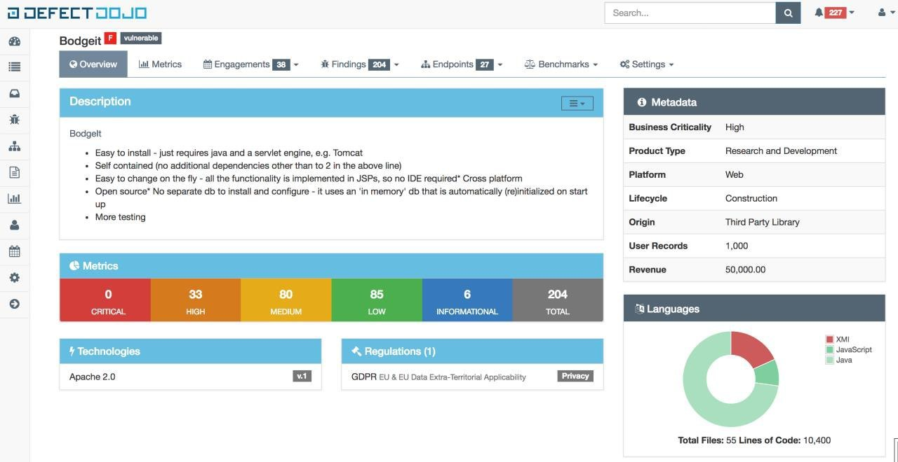
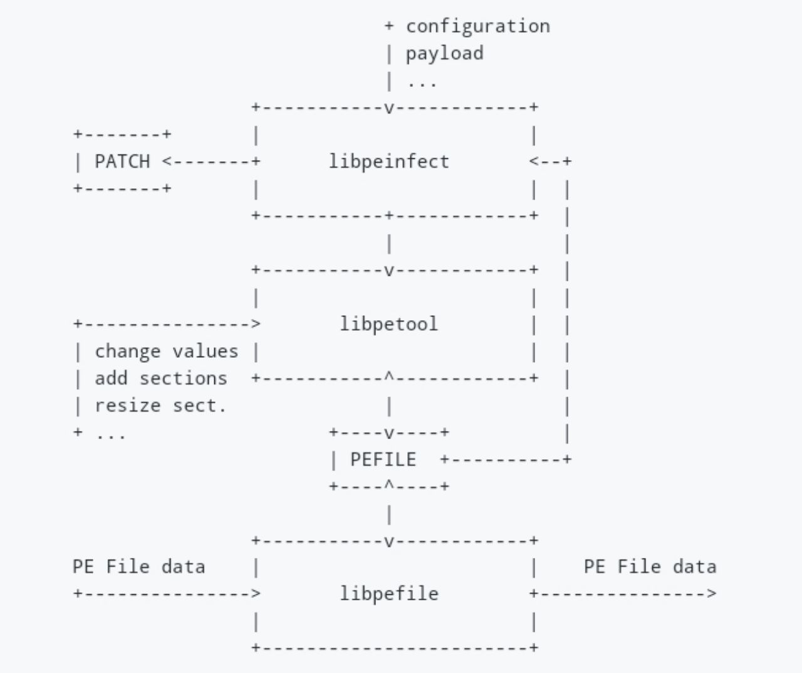
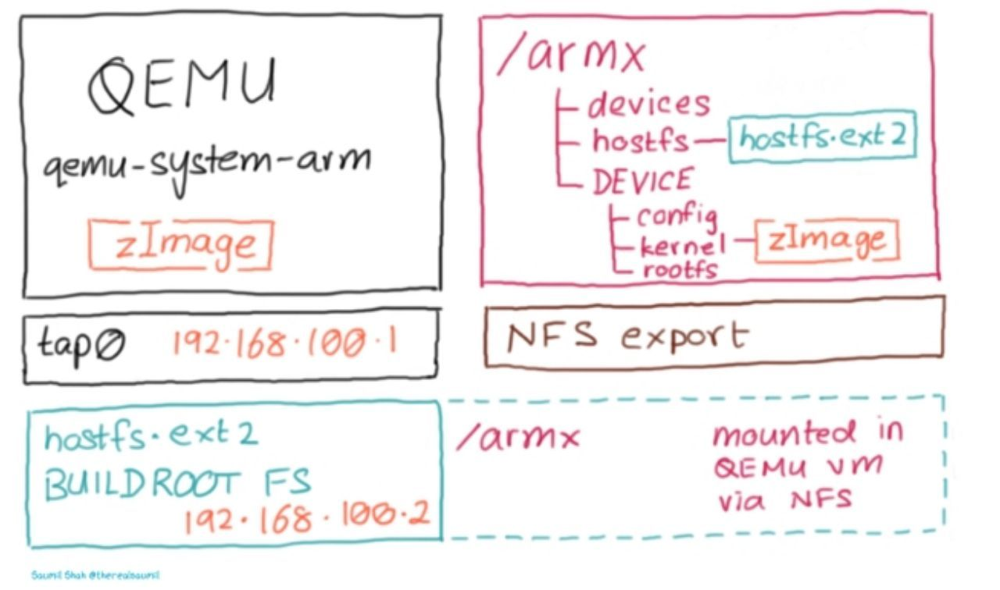
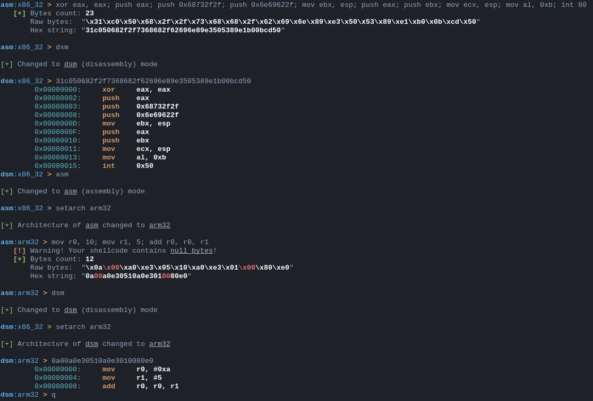
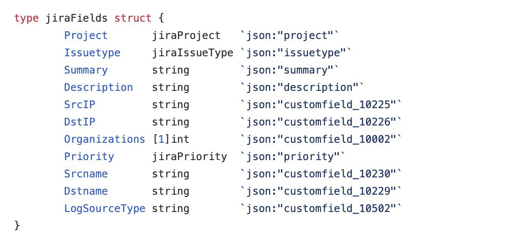

# R0_Crew
`2020-04-30 18:05:56`

<blockquote>
AutoIT Extractor https://gitlab.com/x0r19x91/autoit-extractor &#35;reverse &#35;dukeBarman
</blockquote>

<table><tr><td><b>→</b><a href="https://gitlab.com/x0r19x91/autoit-extractor">
https://gitlab.com/x0r19x91/autoit-extractor
</a>
<blockquote>
AutoIT Resource Extractor
</blockquote>
</td></tr></table>

---

# defcon_news
`2020-04-30 17:14:34`

<blockquote>
Super Backup v2.0.5 iOS - Directory Traversal Vulnerability
http://seclists.org/fulldisclosure/2020/Apr/61

via Full Disclosure
</blockquote>

<table><tr><td><b>→</b><a href="https://seclists.org/fulldisclosure/2020/Apr/61">
https://seclists.org/fulldisclosure/2020/Apr/61
</a>
</td></tr></table>

---

# defcon_news
`2020-04-30 17:14:33`

<blockquote>
HardDrive v2.1 iOS - Arbitrary File Upload Vulnerability
http://seclists.org/fulldisclosure/2020/Apr/60

via Full Disclosure
</blockquote>

<table><tr><td><b>→</b><a href="https://seclists.org/fulldisclosure/2020/Apr/60">
https://seclists.org/fulldisclosure/2020/Apr/60
</a>
</td></tr></table>

---

# exploitex
`2020-04-30 10:23:27`

* https://telegra.ph/file/1360913c45725d7b49c12.jpg

<blockquote>
​​​​Как ''пробить'' по IP адресу с помощью Termux

1. Скачиваем репозиторий:
git clone https://github.com/maldevel/IPGeoLocation
2. Открываем директорию:
cd IPGeoLocation
3. Добавляем разрешение файлу:
chmod +x *
4. Устанавливаем требования:
pip install -r requirements.txt
5. Запускаем программу:
python ipgeolocation.py -t [IP адрес]

После ввода IP, мы получаем такую информацию как: Город, страна, широту - долготу,  провайдер интернета, почтовый индекс и многое другое.

&#35;OSINT &#35;termux
</blockquote>

<table><tr><td><b>→</b><a href="https://telegra.ph/file/1360913c45725d7b49c12.jpg">
https://telegra.ph/file/1360913c45725d7b49c12.jpg
</a>
</td></tr></table>

---

# R0_Crew
`2020-04-30 10:16:19`

<blockquote>
PoC 2019-2215 exploit for S8/S8 active with DAC + SELinux + Knox/RKP bypass https://github.com/chompie1337/s8_2019_2215_poc/  &#35;android &#35;exploit &#35;jeisonwi
</blockquote>

<table><tr><td><b>→</b><a href="https://github.com/chompie1337/s8_2019_2215_poc">
https://github.com/chompie1337/s8_2019_2215_poc
</a>
<blockquote>
PoC 2019-2215 exploit for S8/S8 active with DAC + SELinux + Knox/RKP bypass - chompie1337/s8_2019_2215_poc
</blockquote>
</td></tr></table>

---

# R0_Crew
`2020-04-30 09:40:31`

<blockquote>
CyRC analysis: CVE-2020-7958 biometric data extraction in Android devices https://www.synopsys.com/blogs/software-security/cve-2020-7958-trustlet-tee-attack/ &#35;exploit &#35;android &#35;dukeBarman
</blockquote>

<table><tr><td><b>→</b><a href="https://www.synopsys.com/blogs/software-security/cve-2020-7958-trustlet-tee-attack/">
https://www.synopsys.com/blogs/software-security/cve-2020-7958-trustlet-tee-attack/
</a>
<blockquote>
We dig into the inner workings of trustlets, how different components work together to provide a Trusted Execution Environment, and how to attack them.
</blockquote>
</td></tr></table>

---

# isast
`2020-04-29 20:02:27`

<blockquote>
DefectDojo

DefectDojo - open-source система управления уязвимостями. DefectDojo позволяет организовать программу безопасности внутри организации, поддерживать информацию о приложении, планировать сканы и публиковать найденные дефекты в тикетницу. Есть много интеграций (22+) как с open-source сканерами (ZAP,  Trivy, nmap, Dependency Check), так и с enterprise (Veracode, Checkmarx, Twistlock)

&#35;tools
</blockquote>

---

# defcon_news
`2020-04-29 19:44:13`

<blockquote>
[local] Druva inSync Windows Client 6.5.2 - Local Privilege Escalation
https://www.exploit-db.com/exploits/48400

via Exploit Database
</blockquote>

<table><tr><td><b>→</b><a href="https://www.exploit-db.com/exploits/48400">
https://www.exploit-db.com/exploits/48400
</a>
<blockquote>
Druva inSync Windows Client 6.5.2 - Local Privilege Escalation. CVE-2019-3999 . local exploit for Windows platform
</blockquote>
</td></tr></table>

---

# defcon_news
`2020-04-29 19:44:12`

<blockquote>
[webapps] hits script 1.0 - 'item_name' SQL Injection
https://www.exploit-db.com/exploits/48399

via Exploit Database
</blockquote>

<table><tr><td><b>→</b><a href="https://www.exploit-db.com/exploits/48399">
https://www.exploit-db.com/exploits/48399
</a>
<blockquote>
hits script 1.0 - 'item_name' SQL Injection.. webapps exploit for PHP platform
</blockquote>
</td></tr></table>

---

# defcon_news
`2020-04-29 19:44:11`

<blockquote>
[local] EmEditor 19.8 - Insecure File Permissions
https://www.exploit-db.com/exploits/48398

via Exploit Database
</blockquote>

<table><tr><td><b>→</b><a href="https://www.exploit-db.com/exploits/48398">
https://www.exploit-db.com/exploits/48398
</a>
<blockquote>
EmEditor 19.8 - Insecure File Permissions.. local exploit for Windows platform
</blockquote>
</td></tr></table>

---

# defcon_news
`2020-04-29 19:44:06`

<blockquote>
[local] Internet Download Manager 6.37.11.1 - Stack Buffer Overflow (PoC)
https://www.exploit-db.com/exploits/48397

via Exploit Database
</blockquote>

<table><tr><td><b>→</b><a href="https://www.exploit-db.com/exploits/48397">
https://www.exploit-db.com/exploits/48397
</a>
<blockquote>
Internet Download Manager 6.37.11.1 - Stack Buffer Overflow (PoC).. local exploit for Windows platform
</blockquote>
</td></tr></table>

---

# defcon_news
`2020-04-29 19:44:05`

<blockquote>
[local] Andrea ST Filters Service 1.0.64.7 - 'Andrea ST Filters Service ' Unquoted Service Path
https://www.exploit-db.com/exploits/48396

via Exploit Database
</blockquote>

<table><tr><td><b>→</b><a href="https://www.exploit-db.com/exploits/48396">
https://www.exploit-db.com/exploits/48396
</a>
<blockquote>
Andrea ST Filters Service  1.0.64.7  - 'Andrea ST Filters Service ' Unquoted Service Path.. local exploit for Windows platform
</blockquote>
</td></tr></table>

---

# defcon_news
`2020-04-29 18:44:03`

<blockquote>
[webapps] Open-AudIT Professional 3.3.1 - Remote Code Execution
https://www.exploit-db.com/exploits/48393

via Exploit Database
</blockquote>

<table><tr><td><b>→</b><a href="https://www.exploit-db.com/exploits/48393">
https://www.exploit-db.com/exploits/48393
</a>
<blockquote>
Open-AudIT Professional 3.3.1 - Remote Code Execution.. webapps exploit for PHP platform
</blockquote>
</td></tr></table>

---

# defcon_news
`2020-04-29 17:44:32`

<blockquote>
[webapps] School ERP Pro 1.0 - Remote Code Execution
https://www.exploit-db.com/exploits/48392

via Exploit Database
</blockquote>

<table><tr><td><b>→</b><a href="https://www.exploit-db.com/exploits/48392">
https://www.exploit-db.com/exploits/48392
</a>
<blockquote>
School ERP Pro 1.0 - Remote Code Execution.. webapps exploit for PHP platform
</blockquote>
</td></tr></table>

---

# defcon_news
`2020-04-29 17:44:31`

<blockquote>
[local] NVIDIA Update Service Daemon 1.0.21 - 'nvUpdatusService' Unquoted Service Path
https://www.exploit-db.com/exploits/48391

via Exploit Database
</blockquote>

<table><tr><td><b>→</b><a href="https://www.exploit-db.com/exploits/48391">
https://www.exploit-db.com/exploits/48391
</a>
<blockquote>
NVIDIA Update Service Daemon 1.0.21  - 'nvUpdatusService' Unquoted Service Path.. local exploit for Windows platform
</blockquote>
</td></tr></table>

---

# defcon_news
`2020-04-29 17:44:30`

<blockquote>
[webapps] School ERP Pro 1.0 - 'es_messagesid' SQL Injection
https://www.exploit-db.com/exploits/48390

via Exploit Database
</blockquote>

<table><tr><td><b>→</b><a href="https://www.exploit-db.com/exploits/48390">
https://www.exploit-db.com/exploits/48390
</a>
<blockquote>
School ERP Pro 1.0 - 'es_messagesid' SQL Injection.. webapps exploit for PHP platform
</blockquote>
</td></tr></table>

---

# defcon_news
`2020-04-29 17:44:29`

<blockquote>
[remote] CloudMe 1.11.2 - Buffer Overflow (PoC)
https://www.exploit-db.com/exploits/48389

via Exploit Database
</blockquote>

<table><tr><td><b>→</b><a href="https://www.exploit-db.com/exploits/48389">
https://www.exploit-db.com/exploits/48389
</a>
<blockquote>
CloudMe 1.11.2 - Buffer Overflow (PoC).. remote exploit for Windows platform
</blockquote>
</td></tr></table>

---

# defcon_news
`2020-04-29 17:44:28`

<blockquote>
[local] Docker-Credential-Wincred.exe - Privilege Escalation (Metasploit)
https://www.exploit-db.com/exploits/48388

via Exploit Database
</blockquote>

<table><tr><td><b>→</b><a href="https://www.exploit-db.com/exploits/48388">
https://www.exploit-db.com/exploits/48388
</a>
<blockquote>
Docker-Credential-Wincred.exe - Privilege Escalation (Metasploit). CVE-2019-15752 . local exploit for Windows platform
</blockquote>
</td></tr></table>

---

# defcon_news
`2020-04-29 17:14:58`

<blockquote>
[local] Source Engine CS:GO BuildID: 4937372 - Arbitrary Code Execution
https://www.exploit-db.com/exploits/48387

via Exploit Database
</blockquote>

<table><tr><td><b>→</b><a href="https://www.exploit-db.com/exploits/48387">
https://www.exploit-db.com/exploits/48387
</a>
<blockquote>
Source Engine CS:GO BuildID: 4937372 - Arbitrary Code Execution. CVE-2020-12242 . local exploit for macOS platform
</blockquote>
</td></tr></table>

---

# defcon_news
`2020-04-29 17:14:54`

<blockquote>
[webapps] Maian Support Helpdesk 4.3 - Cross-Site Request Forgery (Add Admin)
https://www.exploit-db.com/exploits/48386

via Exploit Database
</blockquote>

<table><tr><td><b>→</b><a href="https://www.exploit-db.com/exploits/48386">
https://www.exploit-db.com/exploits/48386
</a>
<blockquote>
Maian Support Helpdesk 4.3 - Cross-Site Request Forgery (Add Admin).. webapps exploit for PHP platform
</blockquote>
</td></tr></table>

---

# defcon_news
`2020-04-29 17:14:53`

<blockquote>
[webapps] Online Course Registration 2.0 - Authentication Bypass
https://www.exploit-db.com/exploits/48385

via Exploit Database
</blockquote>

<table><tr><td><b>→</b><a href="https://www.exploit-db.com/exploits/48385">
https://www.exploit-db.com/exploits/48385
</a>
<blockquote>
Online Course Registration 2.0 - Authentication Bypass.. webapps exploit for PHP platform
</blockquote>
</td></tr></table>

---

# defcon_news
`2020-04-29 17:14:52`

<blockquote>
[webapps] Netis E1+ V1.2.32533 - Unauthenticated WiFi Password Leak
https://www.exploit-db.com/exploits/48384

via Exploit Database
</blockquote>

<table><tr><td><b>→</b><a href="https://www.exploit-db.com/exploits/48384">
https://www.exploit-db.com/exploits/48384
</a>
<blockquote>
Netis E1+ V1.2.32533 - Unauthenticated WiFi Password Leak.. webapps exploit for Hardware platform
</blockquote>
</td></tr></table>

---

# defcon_news
`2020-04-29 17:14:51`

<blockquote>
[webapps] Online shopping system advanced 1.0 - 'p' SQL Injection
https://www.exploit-db.com/exploits/48383

via Exploit Database
</blockquote>

<table><tr><td><b>→</b><a href="https://www.exploit-db.com/exploits/48383">
https://www.exploit-db.com/exploits/48383
</a>
<blockquote>
Online shopping system advanced 1.0 - 'p' SQL Injection.. webapps exploit for PHP platform
</blockquote>
</td></tr></table>

---

# defcon_news
`2020-04-29 17:14:50`

<blockquote>
[webapps] Netis E1+ 1.2.32533 - Backdoor Account (root)
https://www.exploit-db.com/exploits/48382

via Exploit Database
</blockquote>

<table><tr><td><b>→</b><a href="https://www.exploit-db.com/exploits/48382">
https://www.exploit-db.com/exploits/48382
</a>
<blockquote>
Netis E1+ 1.2.32533 - Backdoor Account (root).. webapps exploit for Hardware platform
</blockquote>
</td></tr></table>

---

# defcon_news
`2020-04-29 17:14:46`

<blockquote>
[webapps] PHP-Fusion 9.03.50 - 'Edit Profile' Arbitrary File Upload
https://www.exploit-db.com/exploits/48381

via Exploit Database
</blockquote>

<table><tr><td><b>→</b><a href="https://www.exploit-db.com/exploits/48381">
https://www.exploit-db.com/exploits/48381
</a>
<blockquote>
PHP-Fusion 9.03.50 - 'Edit Profile' Arbitrary File Upload.. webapps exploit for PHP platform
</blockquote>
</td></tr></table>

---

# defcon_news
`2020-04-29 17:14:45`

<blockquote>
[local] Popcorn Time 6.2 - 'Update service' Unquoted Service Path
https://www.exploit-db.com/exploits/48378

via Exploit Database
</blockquote>

<table><tr><td><b>→</b><a href="https://www.exploit-db.com/exploits/48378">
https://www.exploit-db.com/exploits/48378
</a>
<blockquote>
Popcorn Time 6.2 - 'Update service' Unquoted Service Path.. local exploit for Windows platform
</blockquote>
</td></tr></table>

---

# defcon_news
`2020-04-29 17:14:45`

<blockquote>
[webapps] Furukawa Electric ConsciusMAP 2.8.1 - Remote Code Execution
https://www.exploit-db.com/exploits/48380

via Exploit Database
</blockquote>

<table><tr><td><b>→</b><a href="https://www.exploit-db.com/exploits/48380">
https://www.exploit-db.com/exploits/48380
</a>
<blockquote>
Furukawa Electric ConsciusMAP 2.8.1 - Remote Code Execution.. webapps exploit for Java platform
</blockquote>
</td></tr></table>

---

# defcon_news
`2020-04-29 17:14:44`

<blockquote>
[webapps] Edimax EW-7438RPn 1.13 - Remote Code Execution
https://www.exploit-db.com/exploits/48377

via Exploit Database
</blockquote>

<table><tr><td><b>→</b><a href="https://www.exploit-db.com/exploits/48377">
https://www.exploit-db.com/exploits/48377
</a>
<blockquote>
Edimax EW-7438RPn 1.13 - Remote Code Execution.. webapps exploit for Hardware platform
</blockquote>
</td></tr></table>

---

# defcon_news
`2020-04-29 17:14:43`

<blockquote>
[webapps] EspoCRM 5.8.5 - Privilege Escalation
https://www.exploit-db.com/exploits/48376

via Exploit Database
</blockquote>

<table><tr><td><b>→</b><a href="https://www.exploit-db.com/exploits/48376">
https://www.exploit-db.com/exploits/48376
</a>
<blockquote>
EspoCRM 5.8.5 - Privilege Escalation.. webapps exploit for Multiple platform
</blockquote>
</td></tr></table>

---

# defcon_news
`2020-04-29 17:14:42`

<blockquote>
[webapps] Sky File 2.1.0 iOS - Directory Traversal
https://www.exploit-db.com/exploits/48375

via Exploit Database
</blockquote>

<table><tr><td><b>→</b><a href="https://www.exploit-db.com/exploits/48375">
https://www.exploit-db.com/exploits/48375
</a>
<blockquote>
Sky File 2.1.0 iOS - Directory Traversal.. webapps exploit for iOS platform
</blockquote>
</td></tr></table>

---

# defcon_news
`2020-04-29 17:14:41`

<blockquote>
[webapps] Zen Load Balancer 3.10.1 - Directory Traversal (Metasploit)
https://www.exploit-db.com/exploits/48373

via Exploit Database
</blockquote>

<table><tr><td><b>→</b><a href="https://www.exploit-db.com/exploits/48373">
https://www.exploit-db.com/exploits/48373
</a>
<blockquote>
Zen Load Balancer 3.10.1 - Directory Traversal (Metasploit).. webapps exploit for CGI platform
</blockquote>
</td></tr></table>

---

# defcon_news
`2020-04-29 17:14:40`

<blockquote>
[webapps] Complaint Management System 4.2 - Cross-Site Request Forgery (Delete User)
https://www.exploit-db.com/exploits/48372

via Exploit Database
</blockquote>

<table><tr><td><b>→</b><a href="https://www.exploit-db.com/exploits/48372">
https://www.exploit-db.com/exploits/48372
</a>
<blockquote>
Complaint Management System 4.2 - Cross-Site Request Forgery (Delete User).. webapps exploit for PHP platform
</blockquote>
</td></tr></table>

---

# defcon_news
`2020-04-29 17:14:39`

<blockquote>
[webapps] Complaint Management System 4.2 - Authentication Bypass
https://www.exploit-db.com/exploits/48371

via Exploit Database
</blockquote>

<table><tr><td><b>→</b><a href="https://www.exploit-db.com/exploits/48371">
https://www.exploit-db.com/exploits/48371
</a>
<blockquote>
Complaint Management System 4.2 - Authentication Bypass.. webapps exploit for PHP platform
</blockquote>
</td></tr></table>

---

# defcon_news
`2020-04-29 17:14:38`

<blockquote>
[webapps] Complaint Management System 4.2 - Persistent Cross-Site Scripting
https://www.exploit-db.com/exploits/48370

via Exploit Database
</blockquote>

<table><tr><td><b>→</b><a href="https://www.exploit-db.com/exploits/48370">
https://www.exploit-db.com/exploits/48370
</a>
<blockquote>
Complaint Management System 4.2 - Persistent Cross-Site Scripting.. webapps exploit for PHP platform
</blockquote>
</td></tr></table>

---

# defcon_news
`2020-04-29 17:14:37`

<blockquote>
[webapps] User Management System 2.0 - Authentication Bypass
https://www.exploit-db.com/exploits/48369

via Exploit Database
</blockquote>

<table><tr><td><b>→</b><a href="https://www.exploit-db.com/exploits/48369">
https://www.exploit-db.com/exploits/48369
</a>
<blockquote>
User Management System 2.0 - Authentication Bypass.. webapps exploit for PHP platform
</blockquote>
</td></tr></table>

---

# defcon_news
`2020-04-29 17:14:36`

<blockquote>
[webapps] User Management System 2.0 - Persistent Cross-Site Scripting
https://www.exploit-db.com/exploits/48368

via Exploit Database
</blockquote>

<table><tr><td><b>→</b><a href="https://www.exploit-db.com/exploits/48368">
https://www.exploit-db.com/exploits/48368
</a>
<blockquote>
User Management System 2.0 - Persistent Cross-Site Scripting.. webapps exploit for PHP platform
</blockquote>
</td></tr></table>

---

# defcon_news
`2020-04-29 17:14:34`

<blockquote>
[webapps] Mahara 19.10.2 CMS - Persistent Cross-Site Scripting
https://www.exploit-db.com/exploits/48367

via Exploit Database
</blockquote>

<table><tr><td><b>→</b><a href="https://www.exploit-db.com/exploits/48367">
https://www.exploit-db.com/exploits/48367
</a>
<blockquote>
Mahara 19.10.2 CMS - Persistent Cross-Site Scripting.. webapps exploit for Linux platform
</blockquote>
</td></tr></table>

---

# defcon_news
`2020-04-29 17:14:33`

<blockquote>
[webapps] Edimax EW-7438RPn - Cross-Site Request Forgery (MAC Filtering)
https://www.exploit-db.com/exploits/48366

via Exploit Database
</blockquote>

<table><tr><td><b>→</b><a href="https://www.exploit-db.com/exploits/48366?utm_source=dlvr.it&utm_medium=twitter">
https://www.exploit-db.com/exploits/48366?utm_source=dlvr.it&utm_medium=twitter
</a>
<blockquote>
Edimax EW-7438RPn - Cross-Site Request Forgery (MAC Filtering).. webapps exploit for Hardware platform
</blockquote>
</td></tr></table>

---

# defcon_news
`2020-04-29 16:44:33`

<blockquote>
[webapps] Edimax EW-7438RPn - Information Disclosure (WiFi Password)
https://www.exploit-db.com/exploits/48365

via Exploit Database
</blockquote>

<table><tr><td><b>→</b><a href="https://www.exploit-db.com/exploits/48365">
https://www.exploit-db.com/exploits/48365
</a>
<blockquote>
Edimax EW-7438RPn - Information Disclosure (WiFi Password).. webapps exploit for Hardware platform
</blockquote>
</td></tr></table>

---

# defcon_news
`2020-04-29 16:44:32`

<blockquote>
[local] RM Downloader 3.1.3.2.2010.06.13 - 'Load' Buffer Overflow (SEH)
https://www.exploit-db.com/exploits/48364

via Exploit Database
</blockquote>

<table><tr><td><b>→</b><a href="https://www.exploit-db.com/exploits/48364?utm_source=dlvr.it&utm_medium=twitter">
https://www.exploit-db.com/exploits/48364?utm_source=dlvr.it&utm_medium=twitter
</a>
<blockquote>
RM Downloader 3.1.3.2.2010.06.13 - 'Load' Buffer Overflow (SEH).. local exploit for Windows platform
</blockquote>
</td></tr></table>

---

# defcon_news
`2020-04-29 16:44:30`

<blockquote>
[remote] Neowise CarbonFTP 1.4 - Insecure Proprietary Password Encryption
https://www.exploit-db.com/exploits/48363

via Exploit Database
</blockquote>

<table><tr><td><b>→</b><a href="https://www.exploit-db.com/exploits/48363">
https://www.exploit-db.com/exploits/48363
</a>
<blockquote>
Neowise CarbonFTP 1.4 - Insecure Proprietary Password Encryption. CVE-2020-6857 . remote exploit for Windows platform
</blockquote>
</td></tr></table>

---

# defcon_news
`2020-04-29 15:44:33`

<blockquote>
[webapps] NSClient++ 0.5.2.35 - Authenticated Remote Code Execution
https://www.exploit-db.com/exploits/48360

via Exploit Database
</blockquote>

<table><tr><td><b>→</b><a href="https://www.exploit-db.com/exploits/48360">
https://www.exploit-db.com/exploits/48360
</a>
<blockquote>
NSClient++ 0.5.2.35 - Authenticated Remote Code Execution.. webapps exploit for JSON platform
</blockquote>
</td></tr></table>

---

# defcon_news
`2020-04-29 15:44:32`

<blockquote>
[local] Oracle Solaris Common Desktop Environment 1.6 - Local Privilege Escalation
https://www.exploit-db.com/exploits/48359

via Exploit Database
</blockquote>

<table><tr><td><b>→</b><a href="https://www.exploit-db.com/exploits/48359">
https://www.exploit-db.com/exploits/48359
</a>
<blockquote>
Oracle Solaris Common Desktop Environment 1.6 - Local Privilege Escalation. CVE-2020-2944 . local exploit for Solaris platform
</blockquote>
</td></tr></table>

---

# isast
`2020-04-29 15:15:24`

* https://telegra.ph/file/4f7da12d70246613bef7c.jpg

<blockquote>
​​Deal - &#35;python library for design by contract (DbC) programming.

That's nice assert statements in decorators style to validate function input, output, available operations and object state. Goal is make testing much easier and detect errors in your code that occasionally was missed in tests.

Features:
- Automatic property-based tests.
- Static analysis.
- Generators and async coroutines support.
- External validators support.
- Type-annotated and mypy-friendly.
- Specify allowed exceptions for function.
- Invariant for all actions with class instances.
- Decorators to control available resources: forbid output, network operations, raising exceptions.
- You can disable contracts on production.

https://github.com/life4/deal/

Showcase of many existing decorators:
</blockquote>

<table><tr><td><b>→</b><a href="https://telegra.ph/file/4f7da12d70246613bef7c.jpg">
https://telegra.ph/file/4f7da12d70246613bef7c.jpg
</a>
</td></tr></table>

---

# defcon_news
`2020-04-29 14:44:22`

<blockquote>
[webapps] CSZ CMS 1.2.7 - 'title' HTML Injection
https://www.exploit-db.com/exploits/48357

via Exploit Database
</blockquote>

<table><tr><td><b>→</b><a href="https://www.exploit-db.com/exploits/48357">
https://www.exploit-db.com/exploits/48357
</a>
<blockquote>
CSZ CMS 1.2.7 - 'title' HTML Injection.. webapps exploit for PHP platform
</blockquote>
</td></tr></table>

---

# defcon_news
`2020-04-29 14:44:21`

<blockquote>
[webapps] PMB 5.6 - 'logid' SQL Injection
https://www.exploit-db.com/exploits/48356

via Exploit Database
</blockquote>

<table><tr><td><b>→</b><a href="https://www.exploit-db.com/exploits/48356">
https://www.exploit-db.com/exploits/48356
</a>
<blockquote>
PMB 5.6 - 'logid' SQL Injection.. webapps exploit for PHP platform
</blockquote>
</td></tr></table>

---

# defcon_news
`2020-04-29 14:44:20`

<blockquote>
[webapps] CSZ CMS 1.2.7 - Persistent Cross-Site Scripting
https://www.exploit-db.com/exploits/48354

via Exploit Database
</blockquote>

<table><tr><td><b>→</b><a href="https://www.exploit-db.com/exploits/48354?utm_source=dlvr.it&utm_medium=twitter">
https://www.exploit-db.com/exploits/48354?utm_source=dlvr.it&utm_medium=twitter
</a>
<blockquote>
CSZ CMS 1.2.7 - Persistent Cross-Site Scripting.. webapps exploit for PHP platform
</blockquote>
</td></tr></table>

---

# defcon_news
`2020-04-29 14:44:19`

<blockquote>
[remote] Unraid 6.8.0 - Auth Bypass PHP Code Execution (Metasploit)
https://www.exploit-db.com/exploits/48353

via Exploit Database
</blockquote>

<table><tr><td><b>→</b><a href="https://www.exploit-db.com/exploits/48353">
https://www.exploit-db.com/exploits/48353
</a>
<blockquote>
Unraid 6.8.0 - Auth Bypass PHP Code Execution (Metasploit). CVE-2020-5849CVE-2020-5847 . remote exploit for Linux platform
</blockquote>
</td></tr></table>

---

# defcon_news
`2020-04-29 14:14:28`

<blockquote>
[local] Nsauditor 3.2.1.0 - Buffer Overflow (SEH+ASLR bypass (3 bytes overwrite))
https://www.exploit-db.com/exploits/48350

via Exploit Database
</blockquote>

<table><tr><td><b>→</b><a href="https://www.exploit-db.com/exploits/48350">
https://www.exploit-db.com/exploits/48350
</a>
<blockquote>
Nsauditor 3.2.1.0 - Buffer Overflow (SEH+ASLR bypass (3 bytes overwrite)).. local exploit for Windows platform
</blockquote>
</td></tr></table>

---

# defcon_news
`2020-04-29 14:14:27`

<blockquote>
[webapps] Fork CMS 5.8.0 - Persistent Cross-Site Scripting
https://www.exploit-db.com/exploits/48348

via Exploit Database
</blockquote>

<table><tr><td><b>→</b><a href="https://www.exploit-db.com/exploits/48348">
https://www.exploit-db.com/exploits/48348
</a>
<blockquote>
Fork CMS 5.8.0 - Persistent Cross-Site Scripting.. webapps exploit for PHP platform
</blockquote>
</td></tr></table>

---

# defcon_news
`2020-04-29 13:44:20`

<blockquote>
[local] Atomic Alarm Clock 6.3 - Stack Overflow (Unicode+SEH)
https://www.exploit-db.com/exploits/48346

via Exploit Database
</blockquote>

<table><tr><td><b>→</b><a href="https://www.exploit-db.com/exploits/48346?utm_source=dlvr.it&utm_medium=twitter">
https://www.exploit-db.com/exploits/48346?utm_source=dlvr.it&utm_medium=twitter
</a>
<blockquote>
Atomic Alarm Clock 6.3 - Stack Overflow (Unicode+SEH).. local exploit for Windows platform
</blockquote>
</td></tr></table>

---

# defcon_news
`2020-04-29 13:44:19`

<blockquote>
[webapps] Centreon 19.10.5 - 'id' SQL Injection
https://www.exploit-db.com/exploits/48345

via Exploit Database
</blockquote>

<table><tr><td><b>→</b><a href="https://www.exploit-db.com/exploits/48345">
https://www.exploit-db.com/exploits/48345
</a>
<blockquote>
Centreon 19.10.5 - 'id' SQL Injection.. webapps exploit for PHP platform
</blockquote>
</td></tr></table>

---

# defcon_news
`2020-04-29 13:44:18`

<blockquote>
[local] Code Blocks 16.01 - Buffer Overflow (SEH) UNICODE
https://www.exploit-db.com/exploits/48344

via Exploit Database
</blockquote>

<table><tr><td><b>→</b><a href="https://www.exploit-db.com/exploits/48344">
https://www.exploit-db.com/exploits/48344
</a>
<blockquote>
Code Blocks 16.01 - Buffer Overflow (SEH) UNICODE.. local exploit for Windows platform
</blockquote>
</td></tr></table>

---

# defcon_news
`2020-04-29 13:44:17`

<blockquote>
[remote] Nexus Repository Manager - Java EL Injection RCE (Metasploit)
https://www.exploit-db.com/exploits/48343

via Exploit Database
</blockquote>

<table><tr><td><b>→</b><a href="https://www.exploit-db.com/exploits/48343">
https://www.exploit-db.com/exploits/48343
</a>
<blockquote>
Nexus Repository Manager - Java EL Injection RCE (Metasploit). CVE-2020-10199 . remote exploit for Linux platform
</blockquote>
</td></tr></table>

---

# defcon_news
`2020-04-29 11:44:28`

<blockquote>
IDM v6.37.11.1 - Stack Buffer Overflow Vulnerabilities
http://seclists.org/fulldisclosure/2020/Apr/59

via Full Disclosure
</blockquote>

<table><tr><td><b>→</b><a href="https://seclists.org/fulldisclosure/2020/Apr/59">
https://seclists.org/fulldisclosure/2020/Apr/59
</a>
</td></tr></table>

---

# exploitex
`2020-04-29 09:15:04`

* https://telegra.ph/file/ca6c59c41ddbf3f3e24d6.jpg
* https://github.com/darkarp/chromepass

<blockquote>
Как удаленно получить доступ к сохраненным паролям Chrome

Google Chrome используют 86% пользователей интернета. В нем хранится очень много полезной инфы о каждом пользователе.

Chromepass - это консольное приложение на Python, которое умеет добывать сохраненные пароли в Chrome. Требуется Python 3.6+.

Итак, в терминале:
$ cd chromepass
$ pip install -r requirements.txt
$ python -m pip install --upgrade pip
$ python -m pip install -r requirements.txt
$ python create_server.py

Далее, выберите метод client.exe, введите свой IP. Включите сообщение об ошибке если нужно, и добавьте свое сообщение при необходимости.

Теперь подождите, пока исполняемые файлы будут готовы. Запустите client.exe. Файл server_ip.exe — должна получить жертва. После этого, в client.exe начинают появляться пароли, как показано на скрине.

&#35;хакинг
</blockquote>

<table><tr><td><b>→</b><a href="https://telegra.ph/file/ca6c59c41ddbf3f3e24d6.jpg">
https://telegra.ph/file/ca6c59c41ddbf3f3e24d6.jpg
</a>
</td></tr></table>

---

# sysadm_in_channel
`2020-04-29 05:56:37`

<blockquote>
Чит лист по некоторым инструментам Kali Linux (и не только)

https://github.com/NoorQureshi/kali-linux-cheatsheet/blob/master/README.md
</blockquote>

<table><tr><td><b>→</b><a href="https://github.com/NoorQureshi/kali-linux-cheatsheet/blob/master/README.md">
https://github.com/NoorQureshi/kali-linux-cheatsheet/blob/master/README.md
</a>
<blockquote>
Kali Linux Cheat Sheet for Penetration Testers. Contribute to NoorQureshi/kali-linux-cheatsheet development by creating an account on GitHub.
</blockquote>
</td></tr></table>

---

# sysadm_in_channel
`2020-04-29 05:53:00`

<blockquote>
Hacking Tools Cheat Sheet

https://github.com/CompassSecurity/Hacking_Tools_Cheat_Sheet/blob/master/README.md
</blockquote>

<table><tr><td><b>→</b><a href="https://github.com/CompassSecurity/Hacking_Tools_Cheat_Sheet/blob/master/README.md">
https://github.com/CompassSecurity/Hacking_Tools_Cheat_Sheet/blob/master/README.md
</a>
<blockquote>
Contribute to CompassSecurity/Hacking_Tools_Cheat_Sheet development by creating an account on GitHub.
</blockquote>
</td></tr></table>

---

# defcon_news
`2020-04-29 00:14:25`

<blockquote>
Exploiting java deserialization vulnerabilities in crypto contexts - a java applet case-study
http://seclists.org/fulldisclosure/2020/Apr/58

via Full Disclosure
</blockquote>

<table><tr><td><b>→</b><a href="https://seclists.org/fulldisclosure/2020/Apr/58">
https://seclists.org/fulldisclosure/2020/Apr/58
</a>
</td></tr></table>

---

# defcon_news
`2020-04-29 00:14:24`

<blockquote>
Multiple vulnerabilities OpenAudiT
http://seclists.org/fulldisclosure/2020/Apr/57

via Full Disclosure
</blockquote>

<table><tr><td><b>→</b><a href="https://seclists.org/fulldisclosure/2020/Apr/57">
https://seclists.org/fulldisclosure/2020/Apr/57
</a>
</td></tr></table>

---

# defcon_news
`2020-04-29 00:14:23`

<blockquote>
Gigamon - GigaVUE 0day
http://seclists.org/fulldisclosure/2020/Apr/56

via Full Disclosure
</blockquote>

<table><tr><td><b>→</b><a href="https://seclists.org/fulldisclosure/2020/Apr/56">
https://seclists.org/fulldisclosure/2020/Apr/56
</a>
</td></tr></table>

---

# defcon_news
`2020-04-29 00:14:22`

<blockquote>
Blind SQL Injection Vulnerability in Geeklog 2.2.1
http://seclists.org/fulldisclosure/2020/Apr/55

via Full Disclosure
</blockquote>

<table><tr><td><b>→</b><a href="https://seclists.org/fulldisclosure/2020/Apr/55">
https://seclists.org/fulldisclosure/2020/Apr/55
</a>
</td></tr></table>

---

# defcon_news
`2020-04-28 23:44:39`

<blockquote>
Cross-Site Scripting Vulnerability in Geeklog 2.2.1
http://seclists.org/fulldisclosure/2020/Apr/54

via Full Disclosure
</blockquote>

<table><tr><td><b>→</b><a href="https://seclists.org/fulldisclosure/2020/Apr/54">
https://seclists.org/fulldisclosure/2020/Apr/54
</a>
</td></tr></table>

---

# defcon_news
`2020-04-28 23:44:30`

<blockquote>
Samba Releases Security Updates
https://www.us-cert.gov/ncas/current-activity/2020/04/28/samba-releases-security-updates

via CISA Current Activity
</blockquote>

<table><tr><td><b>→</b><a href="https://www.us-cert.gov/ncas/current-activity/2020/04/28/samba-releases-security-updates">
https://www.us-cert.gov/ncas/current-activity/2020/04/28/samba-releases-security-updates
</a>
<blockquote>
The Samba Team has released security updates to address vulnerabilities in multiple versions of Samba. An attacker could exploit one of these vulnerabilities to take control of an affected system.

The Cybersecurity and Infrastructure Security Agency (CISA) encourages users and administrators to review the Samba Security Announcements for CVE-2020-10700 and CVE-2020-10704 and apply the necessary updates and workarounds.
</blockquote>
</td></tr></table>

---

# defcon_news
`2020-04-28 18:14:24`

<blockquote>
Internet Download Manager v6.37.11.1 - Stack Buffer Overflow Vulnerabilities
http://seclists.org/fulldisclosure/2020/Apr/53

via Full Disclosure
</blockquote>

<table><tr><td><b>→</b><a href="https://seclists.org/fulldisclosure/2020/Apr/53">
https://seclists.org/fulldisclosure/2020/Apr/53
</a>
</td></tr></table>

---

# defcon_news
`2020-04-28 18:14:23`

<blockquote>
File Explorer v1.4 iOS - Information Disclosure Vulnerability
http://seclists.org/fulldisclosure/2020/Apr/52

via Full Disclosure
</blockquote>

<table><tr><td><b>→</b><a href="https://seclists.org/fulldisclosure/2020/Apr/52">
https://seclists.org/fulldisclosure/2020/Apr/52
</a>
</td></tr></table>

---

# defcon_news
`2020-04-28 17:44:04`

<blockquote>
Transfer Master v3.3 iOS - Denial of Service Vulnerability
http://seclists.org/fulldisclosure/2020/Apr/51

via Full Disclosure
</blockquote>

<table><tr><td><b>→</b><a href="https://seclists.org/fulldisclosure/2020/Apr/51">
https://seclists.org/fulldisclosure/2020/Apr/51
</a>
</td></tr></table>

---

# defcon_news
`2020-04-28 17:44:02`

<blockquote>
File Sharing &amp; Chat v1.0 iOS - Denial of Service Vulnerability
http://seclists.org/fulldisclosure/2020/Apr/50

via Full Disclosure
</blockquote>

<table><tr><td><b>→</b><a href="https://seclists.org/fulldisclosure/2020/Apr/50">
https://seclists.org/fulldisclosure/2020/Apr/50
</a>
</td></tr></table>

---

# defcon_news
`2020-04-28 17:14:19`

<blockquote>
Easy Transfer v1.7 iOS - Multiple Web Vulnerabilities
http://seclists.org/fulldisclosure/2020/Apr/49

via Full Disclosure
</blockquote>

<table><tr><td><b>→</b><a href="https://seclists.org/fulldisclosure/2020/Apr/49">
https://seclists.org/fulldisclosure/2020/Apr/49
</a>
</td></tr></table>

---

# defcon_news
`2020-04-28 17:14:18`

<blockquote>
POS PHP v17.5 - Persistent Cross Site Web Vulnerability
http://seclists.org/fulldisclosure/2020/Apr/48

via Full Disclosure
</blockquote>

<table><tr><td><b>→</b><a href="https://seclists.org/fulldisclosure/2020/Apr/48">
https://seclists.org/fulldisclosure/2020/Apr/48
</a>
</td></tr></table>

---

# defcon_news
`2020-04-28 17:14:17`

<blockquote>
Project Open v5.0.3 CMS - Multiple Web Vulnerabilities
http://seclists.org/fulldisclosure/2020/Apr/47

via Full Disclosure
</blockquote>

<table><tr><td><b>→</b><a href="https://seclists.org/fulldisclosure/2020/Apr/47">
https://seclists.org/fulldisclosure/2020/Apr/47
</a>
</td></tr></table>

---

# defcon_news
`2020-04-28 15:44:35`

<blockquote>
CVE-2020-6861: Ledger Monero App Spend key Extraction
https://www.reddit.com/r/netsec/comments/g9085k/cve20206861_ledger_monero_app_spend_key_extraction/

via /r/netsec - Information Security News &amp; Discussion
</blockquote>

<table><tr><td><b>→</b><a href="https://www.reddit.com/r/netsec/comments/g9085k/cve20206861_ledger_monero_app_spend_key_extraction/?utm_source=ifttt">
https://www.reddit.com/r/netsec/comments/g9085k/cve20206861_ledger_monero_app_spend_key_extraction/?utm_source=ifttt
</a>
<blockquote>
Posted in r/netsec by u/ph4r05 • 9 points and 0 comments
</blockquote>
</td></tr></table>

---

# defcon_news
`2020-04-28 15:44:33`

<blockquote>
CVE-2018-8611 Exploiting Windows KTM Part 1/5 – Introduction
https://www.reddit.com/r/netsec/comments/g8yuzx/cve20188611_exploiting_windows_ktm_part_15/

via /r/netsec - Information Security News &amp; Discussion
</blockquote>

<table><tr><td><b>→</b><a href="https://www.reddit.com/r/netsec/comments/g8yuzx/cve20188611_exploiting_windows_ktm_part_15/">
https://www.reddit.com/r/netsec/comments/g8yuzx/cve20188611_exploiting_windows_ktm_part_15/
</a>
<blockquote>
Posted in r/netsec by u/digicat • 2 points and 0 comments
</blockquote>
</td></tr></table>

---

# chkpchat
`2020-04-28 12:30:17`

<blockquote>
https://gist.github.com/mkol5222/71696cecdc5d873658e16721823a9399
</blockquote>

<table><tr><td><b>→</b><a href="https://gist.github.com/mkol5222/71696cecdc5d873658e16721823a9399">
https://gist.github.com/mkol5222/71696cecdc5d873658e16721823a9399
</a>
<blockquote>
GitHub Gist: instantly share code, notes, and snippets.
</blockquote>
</td></tr></table>

---

# defcon_news
`2020-04-28 06:44:06`

<blockquote>
KeylogoverHTTP - Different keylogger that uses HTTP Requests to exilftrate keystrokes
https://www.reddit.com/r/Malware/comments/g8q9p3/keylogoverhttp_different_keylogger_that_uses_http/

via Malware Analysis &amp; Reports
</blockquote>

<table><tr><td><b>→</b><a href="https://www.reddit.com/r/Malware/comments/g8q9p3/keylogoverhttp_different_keylogger_that_uses_http/">
https://www.reddit.com/r/Malware/comments/g8q9p3/keylogoverhttp_different_keylogger_that_uses_http/
</a>
<blockquote>
[https://github.com/pioneerhfy/keylogoverhttp](https://github.com/pioneerhfy/keylogoverhttp) Different keylogger that uses HTTP Request to...
</blockquote>
</td></tr></table>

---

# MPSIEMChat
`2020-04-27 22:35:48`

<blockquote>
про темную тему
у нас есть определённый набор UI-компонентов
у него есть первая и вторая версия
вторая - публичная (https://github.com/positive-js/mosaic)
во второй с тёмной темой всё сразу сильно лучше
перевод приложений с 1 на 2 происходит постепенно
работы там хватает, а приоритет у неё не наивысший
поэтому сейчас мы видим это так:
сперва завершается переход на новый Mosaic и тогда появляется возможность сделать тёмную тему значительно дешевле, чем сейчас
</blockquote>

<table><tr><td><b>→</b><a href="https://github.com/positive-js/mosaic">
https://github.com/positive-js/mosaic
</a>
<blockquote>
Angular components ✨ 📦🐣 ✨. Contribute to positive-js/mosaic development by creating an account on GitHub.
</blockquote>
</td></tr></table>

---

# reverseengineeringx
`2020-04-27 10:54:07`

<blockquote>
peinjector
MITM PE file infector

https://github.com/JonDoNym/peinjector
</blockquote>

---

# exploitex
`2020-04-27 09:24:03`

* https://telegra.ph/file/99272ac954ac3c30a8e6f.jpg

<blockquote>
​​Набор утилит для деанонимизации в Termux

1. Скачиваем репозиторий:
git clone https://github.com/termux-lab/sherlock.git
2. Открываем директорию:
cd sherlock
3. Запускаем файл:
python3 install.py hello

После всех проделанных действий, у вас запускается программа, в которой множество функций, таких как: проверка по номеру телефона, по нику, IP адресу и другие. 

Чтобы в последующем запускать утилиту, необходимо будет открыть ее папку и запустить одной буквой:
cd sherlock 
s

&#35;OSINT &#35;termux
</blockquote>

<table><tr><td><b>→</b><a href="https://telegra.ph/file/99272ac954ac3c30a8e6f.jpg">
https://telegra.ph/file/99272ac954ac3c30a8e6f.jpg
</a>
</td></tr></table>

---

# defcon_news
`2020-04-25 16:11:26`

<blockquote>
CVE-2020-0022 an Android 8.0-9.0 Bluetooth Zero-Click RCE – BlueFrag
https://www.reddit.com/r/netsec/comments/g74prj/cve20200022_an_android_8090_bluetooth_zeroclick/

via /r/netsec - Information Security News &amp; Discussion
</blockquote>

<table><tr><td><b>→</b><a href="https://www.reddit.com/r/netsec/comments/g74prj/cve20200022_an_android_8090_bluetooth_zeroclick/?utm_source=ifttt">
https://www.reddit.com/r/netsec/comments/g74prj/cve20200022_an_android_8090_bluetooth_zeroclick/?utm_source=ifttt
</a>
<blockquote>
Posted in r/netsec by u/eberkut • 213 points and 23 comments
</blockquote>
</td></tr></table>

---

# cyberoffru
`2020-04-25 10:13:05`

<blockquote>
Вот это баянистое, но доставляет
https://github.com/nvbn/thefuck
</blockquote>

<table><tr><td><b>→</b><a href="https://github.com/nvbn/thefuck">
https://github.com/nvbn/thefuck
</a>
<blockquote>
Magnificent app which corrects your previous console command. - nvbn/thefuck
</blockquote>
</td></tr></table>

---

# defcon_news
`2020-04-24 20:38:03`

<blockquote>
jQuery &lt; 3.5 Cross-Site Scripting (XSS)
http://seclists.org/fulldisclosure/2020/Apr/46

via Full Disclosure
</blockquote>

<table><tr><td><b>→</b><a href="https://seclists.org/fulldisclosure/2020/Apr/46">
https://seclists.org/fulldisclosure/2020/Apr/46
</a>
</td></tr></table>

---

# reverseengineeringx
`2020-04-24 18:12:31`

<blockquote>
Ghidra Data
Data Archives for Ghidra

https://github.com/0x6d696368/ghidra-data
</blockquote>

<table><tr><td><b>→</b><a href="https://github.com/0x6d696368/ghidra-data">
https://github.com/0x6d696368/ghidra-data
</a>
<blockquote>
Supporting Data Archives for Ghidra. Contribute to 0x6d696368/ghidra-data development by creating an account on GitHub.
</blockquote>
</td></tr></table>

---

# defcon_news
`2020-04-24 13:38:11`

<blockquote>
Air Sender v1.0.2 iOS - Arbitrary File Upload Vulnerability
http://seclists.org/fulldisclosure/2020/Apr/45

via Full Disclosure
</blockquote>

<table><tr><td><b>→</b><a href="https://seclists.org/fulldisclosure/2020/Apr/45">
https://seclists.org/fulldisclosure/2020/Apr/45
</a>
</td></tr></table>

---

# exploitex
`2020-04-23 18:53:49`

* https://telegra.ph/file/07595b0eb619c039728b6.jpg
* https://github.com/revive-adserver/revive-adserver/

<blockquote>
​​Хакеры взломали более 60 рекламных серверов, чтобы распространить вирус

Уже девять месяцев кряду (с августа 2019 года) неизвестная хак-группа взламывает рекламные серверы, чтобы внедрять свои вредоносные объявления на самые разные сайты. 

Хакеры атакуют рекламные сети, использующие старые версии опенсорсного рекламного сервера Revive. Если атака удалась, злоумышленники добавляют к существующей рекламе свой вредоносный код, который перехватывает и перенаправляет их посетителей на вредоносные ресурсы, как правило, содержащие малварь, замаскированную под обновления Adobe Flash Player.

В итоге группировке удалось разместить вредоносную рекламу на тысячах сайтов, причем эти объявления транслируются и другим рекламным компаниям из-за RTB-интеграции между сервисами. То есть речь идет примерно о 1,25 млн показов рекламных объявлений в день для одного скомпрометированного RTB-сервера.

&#35;новость
</blockquote>

<table><tr><td><b>→</b><a href="https://telegra.ph/file/07595b0eb619c039728b6.jpg">
https://telegra.ph/file/07595b0eb619c039728b6.jpg
</a>
</td></tr></table>

---

# defcon_news
`2020-04-22 05:24:20`

<blockquote>
Во FreeBSD устранены удалённо эксплуатируемые уязвимости в ipfw
https://www.opennet.ru/opennews/art.shtml?num&#61;52783

via OpenNews.opennet.ru: Проблемы безопасности
</blockquote>

<table><tr><td><b>→</b><a href="https://www.opennet.ru/opennews/art.shtml?num=52783">
https://www.opennet.ru/opennews/art.shtml?num=52783
</a>
<blockquote>
В пакетном фильтре ipfw устранены две уязвимости в коде разбора опций TCP, вызванные некорректной проверкой данных в обрабатываемых сетевых пакетах. Первая уязвимость (CVE-2019-5614) при обработке определённым образом оформленных TCP-пакетов может привести к доступу к памяти вне выделенного буфера mbuf, а вторая (CVE-2019-15874) к обращению к уже освобождённым областям памяти (use-after-free).
</blockquote>
</td></tr></table>

---

# defcon_news
`2020-04-22 05:24:18`

<blockquote>
Опубликован OpenSSL 1.1.1g с устранением уязвимости, связанной с TLS 1.3
https://www.opennet.ru/opennews/art.shtml?num&#61;52782

via OpenNews.opennet.ru: Проблемы безопасности
</blockquote>

<table><tr><td><b>→</b><a href="https://www.opennet.ru/opennews/art.shtml?num=52782">
https://www.opennet.ru/opennews/art.shtml?num=52782
</a>
<blockquote>
Доступен корректирующий выпуск криптографической библиотеки OpenSSL 1.1.1g, в котором устранена уязвимость (CVE-2020-1967), приводящая к отказу в обслуживании при попытке согласовать соединение TLS 1.3 с подконтрольным злоумышленнику сервером или клиентом. Уязвимости присвоен высокий уровень опасности, так как она может использоваться для инициирования краха различных серверных приложений, собранных с OpenSSL.
</blockquote>
</td></tr></table>

---

# defcon_news
`2020-04-22 01:24:34`

<blockquote>
Web Application Firewall bypass via F5 Big-IP partial URI decoding
http://seclists.org/fulldisclosure/2020/Apr/44

via Full Disclosure
</blockquote>

<table><tr><td><b>→</b><a href="https://seclists.org/fulldisclosure/2020/Apr/44">
https://seclists.org/fulldisclosure/2020/Apr/44
</a>
</td></tr></table>

---

# defcon_news
`2020-04-22 01:24:32`

<blockquote>
Cisco AnyConnect elevation of privileges due to insecure handling of path names
http://seclists.org/fulldisclosure/2020/Apr/43

via Full Disclosure
</blockquote>

<table><tr><td><b>→</b><a href="https://seclists.org/fulldisclosure/2020/Apr/43">
https://seclists.org/fulldisclosure/2020/Apr/43
</a>
</td></tr></table>

---

# defcon_news
`2020-04-22 01:24:31`

<blockquote>
QRadar session manager path traversal vulnerability
http://seclists.org/fulldisclosure/2020/Apr/42

via Full Disclosure
</blockquote>

<table><tr><td><b>→</b><a href="https://seclists.org/fulldisclosure/2020/Apr/42">
https://seclists.org/fulldisclosure/2020/Apr/42
</a>
</td></tr></table>

---

# defcon_news
`2020-04-22 01:24:29`

<blockquote>
Authorization bypass in QRadar Forensics web application
http://seclists.org/fulldisclosure/2020/Apr/41

via Full Disclosure
</blockquote>

<table><tr><td><b>→</b><a href="https://seclists.org/fulldisclosure/2020/Apr/41">
https://seclists.org/fulldisclosure/2020/Apr/41
</a>
</td></tr></table>

---

# isast
`2020-04-22 00:08:34`

<blockquote>
https://github.com/google/syzkaller/blob/master/docs/syzbot.md
</blockquote>

<table><tr><td><b>→</b><a href="https://github.com/google/syzkaller/blob/master/docs/syzbot.md">
https://github.com/google/syzkaller/blob/master/docs/syzbot.md
</a>
<blockquote>
syzkaller is an unsupervised coverage-guided kernel fuzzer - google/syzkaller
</blockquote>
</td></tr></table>

---

# R0_Crew
`2020-04-21 23:01:04`

<blockquote>
Extracting a 19 Year Old Code Execution from WinRAR 

Article: https://research.checkpoint.com/extracting-code-execution-from-winrar/ 

POC: https://github.com/Ridter/acefile

&#35;expdev &#35;afl &#35;fuzzing &#35;winrar &#35;darw1n
</blockquote>

<table><tr><td><b>→</b><a href="https://research.checkpoint.com/extracting-code-execution-from-winrar/">
https://research.checkpoint.com/extracting-code-execution-from-winrar/
</a>
<blockquote>
Research by: Nadav Grossman Introduction In this article, we tell the story of how we found a logical bug using the WinAFL fuzzer and exploited it in WinRAR to gain full control over a victim’s computer. The exploit works by just extracting an archive, and puts over 500 million users at risk. This vulnerability has existed... Click to Read More
</blockquote>
</td></tr></table>

---

# defcon_news
`2020-04-21 17:54:20`

<blockquote>
Sky File v2.1.0 iOS - Multiple Web Vulnerabilities
http://seclists.org/fulldisclosure/2020/Apr/32

via Full Disclosure
</blockquote>

<table><tr><td><b>→</b><a href="https://seclists.org/fulldisclosure/2020/Apr/32">
https://seclists.org/fulldisclosure/2020/Apr/32
</a>
</td></tr></table>

---

# defcon_news
`2020-04-21 17:54:16`

<blockquote>
Mahara v19.10.2 CMS - Persistent Cross Site Scripting Web Vulnerability
http://seclists.org/fulldisclosure/2020/Apr/31

via Full Disclosure
</blockquote>

<table><tr><td><b>→</b><a href="https://seclists.org/fulldisclosure/2020/Apr/31">
https://seclists.org/fulldisclosure/2020/Apr/31
</a>
</td></tr></table>

---

# sysadm_in_channel
`2020-04-21 17:38:12`

<blockquote>
Собственно Ахтунг. Обновление, выпущенное сегодня для OpenSSL исправляет уязвимость высокой степени серьезности, которая может использоваться для атак типа &quot;отказ в обслуживании&quot; (DoS)

Ошибка сегментации в SSL_check_chain (CVE-2020-1967)

Серверные или клиентские приложения, вызывающие функцию SSL_check_chain () могут вызать сбой из-за  неправильной обработки расширения TLS &quot;signature_algorithms_cert&quot; о время или после рукопожатия TLS 1.3

Сбой происходит, если получен недопустимый или непризнанный алгоритм подписи от пира. Это может быть использовано злонамеренным узлом для проведения атаки типа Denial of Service attack

Подвержены этой проблеме OpenSSL версии 1.1.1d, 1.1.1e, 1.1.1f

https://www.openssl.org/news/secadv/20200421.txt

Обновленная версия на офф сайте:

https://www.openssl.org/source/
</blockquote>

<table><tr><td><b>→</b><a href="https://www.openssl.org/source/">
https://www.openssl.org/source/
</a>
</td></tr></table>

---

# exploitex
`2020-04-21 17:20:00`

* https://telegra.ph/file/b891b7350e41c080288ca.jpg

<blockquote>
​​Создаем DDoS атаку на сайт через Termux

1. Запускаем Termux и прописываем команды:
apt update &amp; apt upgrade -y
pkg install python
2. Скачиваем репозиторий:
git clone https://github.com/HardyTomas/DDos-Attack-OVH-
3. Переходим в директорию:
cd DDos-Attack-OVH-
4. Устанавливаем пакеты:
pip3 install toripchanger
pip3 install -r requirements.txt
5. Запускаем программу:
python3 80port.py

После запуска программы, водим нужный сайт, те же настройки, как на первом скриншоте снизу. Затем программа начнет посылать запросы на сайт. Если на нем не установлена никакая защита от DDoS атак, то сайт перестанет функционировать через несколько минут. Проверьте свой сайт и установите защиту от DDoS атак, если потребуется. Не рекомендуем использовать эту информацию во вред. 

&#35;хакинг &#35;termux
</blockquote>

<table><tr><td><b>→</b><a href="https://telegra.ph/file/b891b7350e41c080288ca.jpg">
https://telegra.ph/file/b891b7350e41c080288ca.jpg
</a>
</td></tr></table>

---

# defcon_news
`2020-04-21 13:54:19`

<blockquote>
Linkedin Scraper - An fully configurable Linkedin scrape
https://hakin9.org/linkedin-scraper-an-fully-configurable-linkedin-scrape/?utm_source&#61;rss&amp;utm_medium&#61;rss&amp;utm_campaign&#61;linkedin-scraper-an-fully-configurable-linkedin-scrape

via Hakin9 – IT Security Magazine
</blockquote>

<table><tr><td><b>→</b><a href="https://hakin9.org/linkedin-scraper-an-fully-configurable-linkedin-scrape/">
https://hakin9.org/linkedin-scraper-an-fully-configurable-linkedin-scrape/
</a>
<blockquote>
Scrapes any Linkedin data.    Installation    $ pip install git+git://github.com/jqueguiner/lk_scraper    Setup  Using Docker compose    $ docker-compose up -d  $ docker-compose run lk_scraper python3    Using Docker only for selenium server  First, you need to run a selenium server      $ docker run -d -p 4444:4444 --shm-size 2g
</blockquote>
</td></tr></table>

---

# reverseengineeringx
`2020-04-21 09:04:38`

<blockquote>
https://youtu.be/mvr7cHOUxlU
</blockquote>

<table><tr><td><b>→</b><a href="https://youtu.be/mvr7cHOUxlU">
https://youtu.be/mvr7cHOUxlU
</a>
<blockquote>
Slides https://github.com/radareorg/r2con-2017/tree/master/talks/hidden-gems

This talk will show a bunch of hidden or not much known/used features of radare2 that will make you laugh, think and even help you on solving some of your daily issues while reverse engineering binaries.
</blockquote>
</td></tr></table>

---

# defcon_news
`2020-04-21 08:54:21`

<blockquote>
Обновление Git с устранением ещё одной уязвимости
https://www.opennet.ru/opennews/art.shtml?num&#61;52774

via OpenNews.opennet.ru: Проблемы безопасности
</blockquote>

<table><tr><td><b>→</b><a href="https://www.opennet.ru/opennews/art.shtml?num=52774">
https://www.opennet.ru/opennews/art.shtml?num=52774
</a>
<blockquote>
Опубликованы корректирующие выпуски распределённой системы управления исходными текстами Git 2.26.2, 2.25.4, 2.24.3, 2.23.3, 2.22.4, 2.21.3, 2.20.4, 2.19.5, 2.18.4 и 2.17.5, в которых устранена уязвимость (CVE-2020-11008), напоминающая проблему, устранённую на прошлой неделе. Новая уязвимость также затрагивает обработчики &quot;credential.helper&quot; и эксплуатируется при передаче специально оформленного URL, содержащего символ новой строки, пустой хост или не указанную схему запроса. При обработке подобного URL credential.helper отправляет информацию об учётных данных, не соответствующих запрошенному протоколу или хосту, к которому осуществляется обращение.
</blockquote>
</td></tr></table>

---

# defcon_news
`2020-04-21 08:54:19`

<blockquote>
Folder Lock v3.4.5 iOS - Multiple Web Vulnerabilities
http://seclists.org/fulldisclosure/2020/Apr/30

via Full Disclosure
</blockquote>

<table><tr><td><b>→</b><a href="https://seclists.org/fulldisclosure/2020/Apr/30">
https://seclists.org/fulldisclosure/2020/Apr/30
</a>
</td></tr></table>

---

# defcon_news
`2020-04-21 08:54:18`

<blockquote>
Phpgurukul User Registration v2.0 - Multiple Vulnerabilities
http://seclists.org/fulldisclosure/2020/Apr/29

via Full Disclosure
</blockquote>

<table><tr><td><b>→</b><a href="https://seclists.org/fulldisclosure/2020/Apr/29">
https://seclists.org/fulldisclosure/2020/Apr/29
</a>
</td></tr></table>

---

# sysadm_in_channel
`2020-04-21 05:14:35`

<blockquote>
Использование SMBGhost (CVE-2020-0796) для локальной эскалации привилегий: Описание + PoC

https://blog.zecops.com/vulnerabilities/exploiting-smbghost-cve-2020-0796-for-a-local-privilege-escalation-writeup-and-poc/

* уязвимость представляет собой переполнение буфера на серверах SMB Microsoft, затрагивает SMBv3.

Простой сканер данной уязвимости https://github.com/ollypwn/SMBGhost
</blockquote>

<table><tr><td><b>→</b><a href="https://blog.zecops.com/vulnerabilities/exploiting-smbghost-cve-2020-0796-for-a-local-privilege-escalation-writeup-and-poc/">
https://blog.zecops.com/vulnerabilities/exploiting-smbghost-cve-2020-0796-for-a-local-privilege-escalation-writeup-and-poc/
</a>
<blockquote>
Introduction CVE-2020-0796 is a bug in the compression mechanism of SMBv3.1.1, also known as “SMBGhost”. The bug affects Windows 10 versions 1903 and 1909, and it was announced and patched by Microsoft about three weeks ago. Once we heard about it, we skimmed over the details and created a quick POC (proof of concept) that … Exploiting SMBGhost (CVE-2020-0796) for a Local Privilege Escalation: Writeup + POC Read More »
</blockquote>
</td></tr></table>

---

# defcon_news
`2020-04-20 13:24:03`

<blockquote>
The Intel® Converged Security and Management Engine IOMMU Hardware Issue–CVE-2019-0090
https://www.reddit.com/r/netsec/comments/g42vaf/the_intel_converged_security_and_management/

via /r/netsec - Information Security News &amp; Discussion
</blockquote>

<table><tr><td><b>→</b><a href="https://www.reddit.com/r/netsec/comments/g42vaf/the_intel_converged_security_and_management/?utm_source=ifttt">
https://www.reddit.com/r/netsec/comments/g42vaf/the_intel_converged_security_and_management/?utm_source=ifttt
</a>
<blockquote>
Posted in r/netsec by u/citypw • 12 points and 0 comments
</blockquote>
</td></tr></table>

---

# defcon_news
`2020-04-19 08:24:19`

<blockquote>
Uncovering OpenWRT RCE (CVE-2020-7982)
https://www.reddit.com/r/netsec/comments/g3bcsp/uncovering_openwrt_rce_cve20207982/

via /r/netsec - Information Security News &amp; Discussion
</blockquote>

<table><tr><td><b>→</b><a href="https://www.reddit.com/r/netsec/comments/g3bcsp/uncovering_openwrt_rce_cve20207982/">
https://www.reddit.com/r/netsec/comments/g3bcsp/uncovering_openwrt_rce_cve20207982/
</a>
<blockquote>
Posted in r/netsec by u/mgood16 • 1 point and 0 comments
</blockquote>
</td></tr></table>

---

# R0_Crew
`2020-04-18 17:54:46`

<blockquote>
IDA loader for SEGA Master System ROMs https://github.com/zznop/ida-sms &#35;reverse &#35;ida &#35;dukeBarman
</blockquote>

<table><tr><td><b>→</b><a href="https://github.com/zznop/ida-sms">
https://github.com/zznop/ida-sms
</a>
<blockquote>
IDA scripts for SEGA Master System ROM Hacking. Contribute to zznop/ida-sms development by creating an account on GitHub.
</blockquote>
</td></tr></table>

---

# R0_Crew
`2020-04-18 17:54:31`

<blockquote>
IDA Pro loader for the Nintendo Switch secure monitor https://github.com/SciresM/nx_secmon_ida_loader &#35;reverse &#35;hardware &#35;ida &#35;dukeBarman
</blockquote>

<table><tr><td><b>→</b><a href="https://github.com/SciresM/nx_secmon_ida_loader">
https://github.com/SciresM/nx_secmon_ida_loader
</a>
<blockquote>
IDA Pro loader for the Nintendo Switch secure monitor - SciresM/nx_secmon_ida_loader
</blockquote>
</td></tr></table>

---

# ctfchat
`2020-04-18 14:11:41`

<blockquote>
Подлинная история андеграунда началась в феврале 2018 года в сибирской CTF школе и конкретно с моей презы для &quot;sudo make ctf&quot; 

https://drive.google.com/open?id&#61;1CUoqUCACkKoMUXwt_Q1Nzl6ZmdtHl7qg
</blockquote>

<table><tr><td><b>→</b><a href="https://drive.google.com/open?id=1CUoqUCACkKoMUXwt_Q1Nzl6ZmdtHl7qg">
https://drive.google.com/open?id=1CUoqUCACkKoMUXwt_Q1Nzl6ZmdtHl7qg
</a>
</td></tr></table>

---

# defcon_news
`2020-04-18 04:18:08`

<blockquote>
CVE-2020-8835: Linux Kernel Privilege Escalation via improper EBPF Program Verification
https://www.reddit.com/r/netsec/comments/g2h00c/cve20208835_linux_kernel_privilege_escalation_via/

via /r/netsec - Information Security News &amp; Discussion
</blockquote>

<table><tr><td><b>→</b><a href="https://www.reddit.com/r/netsec/comments/g2h00c/cve20208835_linux_kernel_privilege_escalation_via/">
https://www.reddit.com/r/netsec/comments/g2h00c/cve20208835_linux_kernel_privilege_escalation_via/
</a>
<blockquote>
Posted in r/netsec by u/nuthinwrong • 1 point and 0 comments
</blockquote>
</td></tr></table>

---

# defcon_news
`2020-04-18 01:18:31`

<blockquote>
Fork CMS v5.8.0 - Multiple Persistent Web Vulnerbilities
http://seclists.org/fulldisclosure/2020/Apr/28

via Full Disclosure
</blockquote>

<table><tr><td><b>→</b><a href="https://seclists.org/fulldisclosure/2020/Apr/28">
https://seclists.org/fulldisclosure/2020/Apr/28
</a>
</td></tr></table>

---

# defcon_news
`2020-04-18 01:18:30`

<blockquote>
Swift File Transfer Mobile - Multiple Web Vulnerabilities
http://seclists.org/fulldisclosure/2020/Apr/27

via Full Disclosure
</blockquote>

<table><tr><td><b>→</b><a href="https://seclists.org/fulldisclosure/2020/Apr/27">
https://seclists.org/fulldisclosure/2020/Apr/27
</a>
</td></tr></table>

---

# defcon_news
`2020-04-17 23:18:30`

<blockquote>
Prestashop &lt;&#61;1.7.6.4 Multiple Vulnerabilities - CSRF to RCE
http://seclists.org/fulldisclosure/2020/Apr/26

via Full Disclosure
</blockquote>

<table><tr><td><b>→</b><a href="https://seclists.org/fulldisclosure/2020/Apr/26">
https://seclists.org/fulldisclosure/2020/Apr/26
</a>
</td></tr></table>

---

# defcon_news
`2020-04-17 23:18:29`

<blockquote>
CVE-2020-2771, CVE-2020-2851, CVE-2020-2944 - Multiple vulnerabilities in Oracle Solaris
http://seclists.org/fulldisclosure/2020/Apr/25

via Full Disclosure
</blockquote>

<table><tr><td><b>→</b><a href="https://seclists.org/fulldisclosure/2020/Apr/25">
https://seclists.org/fulldisclosure/2020/Apr/25
</a>
</td></tr></table>

---

# defcon_news
`2020-04-17 23:18:28`

<blockquote>
CA20200414-01: Security Notice for CA API Developer Portal
http://seclists.org/fulldisclosure/2020/Apr/24

via Full Disclosure
</blockquote>

<table><tr><td><b>→</b><a href="https://seclists.org/fulldisclosure/2020/Apr/24">
https://seclists.org/fulldisclosure/2020/Apr/24
</a>
</td></tr></table>

---

# sysadm_in_channel
`2020-04-17 17:13:58`

<blockquote>
Список &quot;злого-зла&quot; Chrome top6 (на сегодня)* :)

https://securitylab.github.com/advisories
</blockquote>

<table><tr><td><b>→</b><a href="https://securitylab.github.com/advisories/">
https://securitylab.github.com/advisories/
</a>
<blockquote>
Securing the world’s software, together
</blockquote>
</td></tr></table>

---

# R0_Crew
`2020-04-17 15:26:55`

<blockquote>
Developers of radare2 framework have started the asm/anal unification library, which is already ready to review in a PR, but there are several questions to discuss about the design, requirements. Fill the form to help if you have some time https://forms.gle/eDAWAHhVsHnjvpg28 &#35;reverse &#35;radare2 &#35;dukeBarman
</blockquote>

<table><tr><td><b>→</b><a href="https://forms.gle/eDAWAHhVsHnjvpg28">
https://forms.gle/eDAWAHhVsHnjvpg28
</a>
<blockquote>
https://github.com/radareorg/radare2/pull/16608
</blockquote>
</td></tr></table>

---

# defcon_news
`2020-04-17 12:18:37`

<blockquote>
Playable v9.18 iOS - Multiple Web Vulnerabilities
http://seclists.org/fulldisclosure/2020/Apr/23

via Full Disclosure
</blockquote>

<table><tr><td><b>→</b><a href="https://seclists.org/fulldisclosure/2020/Apr/23">
https://seclists.org/fulldisclosure/2020/Apr/23
</a>
</td></tr></table>

---

# defcon_news
`2020-04-17 12:18:36`

<blockquote>
SMACom v1.2.0 - Insecure Session Validation Vulnerability
http://seclists.org/fulldisclosure/2020/Apr/22

via Full Disclosure
</blockquote>

<table><tr><td><b>→</b><a href="https://seclists.org/fulldisclosure/2020/Apr/22">
https://seclists.org/fulldisclosure/2020/Apr/22
</a>
</td></tr></table>

---

# defcon_news
`2020-04-17 12:18:35`

<blockquote>
TAO Open Source Assessment Platform v3.3.0 RC02 - Multiple Web Vulnerabilities
http://seclists.org/fulldisclosure/2020/Apr/21

via Full Disclosure
</blockquote>

<table><tr><td><b>→</b><a href="https://seclists.org/fulldisclosure/2020/Apr/21">
https://seclists.org/fulldisclosure/2020/Apr/21
</a>
</td></tr></table>

---

# sysadm_in_channel
`2020-04-17 08:09:02`

<blockquote>
Во время ресерча на беспроводном IP-телефоне Cisco 8821 Tenable было обнаружено несколько уязвимостей, влияющих на большой ряд моделей IP-телефонов Cisco

https://www.tenable.com/security/research/tra-2020-24

PoC expolit:

https://github.com/tenable/poc/blob/master/cisco/ip_phone/cve_2020_3161.txt
</blockquote>

<table><tr><td><b>→</b><a href="https://www.tenable.com/security/research/tra-2020-24">
https://www.tenable.com/security/research/tra-2020-24
</a>
<blockquote>
While conducting research on a Cisco Wireless IP Phone 8821, Tenable discovered a couple of vulnerabilities affecting numerous Cisco IP Phone models.
</blockquote>
</td></tr></table>

---

# sysadm_in_channel
`2020-04-17 06:14:02`

<blockquote>
CVE-2020-8835: повышение привилегий ядра Linux через неправильную проверку EBPF

https://www.thezdi.com/blog/2020/4/8/cve-2020-8835-linux-kernel-privilege-escalation-via-improper-ebpf-program-verification
</blockquote>

<table><tr><td><b>→</b><a href="https://www.thezdi.com/blog/2020/4/8/cve-2020-8835-linux-kernel-privilege-escalation-via-improper-ebpf-program-verification">
https://www.thezdi.com/blog/2020/4/8/cve-2020-8835-linux-kernel-privilege-escalation-via-improper-ebpf-program-verification
</a>
<blockquote>
During the recent    Pwn2Own 2020    competition, Manfred Paul (   @_manfp   ) of    RedRocket CTF    used an improper input validation bug in the Linux kernel to go from a standard user to root. Manfred used this bug during the contest to win $30,000 in the Privilege Escalation category. He has gra
</blockquote>
</td></tr></table>

---

# reverseengineeringx
`2020-04-17 01:47:33`

<blockquote>
ARM-X Firmware Emulation Framework

https://github.com/therealsaumil/armx
</blockquote>

---

# defcon_news
`2020-04-16 21:48:11`

<blockquote>
What's a 10? Pwning vCenter with CVE-2020-3952
https://www.reddit.com/r/netsec/comments/g2991b/whats_a_10_pwning_vcenter_with_cve20203952/

via /r/netsec - Information Security News &amp; Discussion
</blockquote>

<table><tr><td><b>→</b><a href="https://www.reddit.com/r/netsec/comments/g2991b/whats_a_10_pwning_vcenter_with_cve20203952/">
https://www.reddit.com/r/netsec/comments/g2991b/whats_a_10_pwning_vcenter_with_cve20203952/
</a>
<blockquote>
Posted in r/netsec by u/ponyo_so • 191 points and 24 comments
</blockquote>
</td></tr></table>

---

# defcon_news
`2020-04-16 20:48:24`

<blockquote>
CVE-2019-1381 and CVE-2020-0859 – How Misleading Documentation Led to a Broken Patch for a Windows Arbitrary File Disclosure Vulnerability
https://www.reddit.com/r/netsec/comments/g1sqc3/cve20191381_and_cve20200859_how_misleading/

via /r/netsec - Information Security News &amp; Discussion
</blockquote>

<table><tr><td><b>→</b><a href="https://www.reddit.com/r/netsec/comments/g1sqc3/cve20191381_and_cve20200859_how_misleading/">
https://www.reddit.com/r/netsec/comments/g1sqc3/cve20191381_and_cve20200859_how_misleading/
</a>
<blockquote>
Posted in r/netsec by u/digicat • 4 points and 0 comments
</blockquote>
</td></tr></table>

---

# defcon_news
`2020-04-16 20:48:23`

<blockquote>
[remote] Apache Solr - Remote Code Execution via Velocity Template (Metasploit)
https://www.exploit-db.com/exploits/48338

via Exploit Database
</blockquote>

<table><tr><td><b>→</b><a href="https://www.exploit-db.com/exploits/48338">
https://www.exploit-db.com/exploits/48338
</a>
<blockquote>
Apache Solr - Remote Code Execution via Velocity Template (Metasploit). CVE-2019-17558 . remote exploit for Multiple platform
</blockquote>
</td></tr></table>

---

# defcon_news
`2020-04-16 20:48:22`

<blockquote>
[local] VMware Fusion - USB Arbitrator Setuid Privilege Escalation (Metasploit)
https://www.exploit-db.com/exploits/48337

via Exploit Database
</blockquote>

<table><tr><td><b>→</b><a href="https://www.exploit-db.com/exploits/48337">
https://www.exploit-db.com/exploits/48337
</a>
<blockquote>
VMware Fusion - USB Arbitrator Setuid Privilege Escalation (Metasploit). CVE-2020-3950 . local exploit for macOS platform
</blockquote>
</td></tr></table>

---

# defcon_news
`2020-04-16 20:48:21`

<blockquote>
[remote] DotNetNuke - Cookie Deserialization Remote Code Execution (Metasploit)
https://www.exploit-db.com/exploits/48336

via Exploit Database
</blockquote>

<table><tr><td><b>→</b><a href="https://www.exploit-db.com/exploits/48336">
https://www.exploit-db.com/exploits/48336
</a>
<blockquote>
DotNetNuke - Cookie Deserialization Remote Code Execution (Metasploit). CVE-2018-18326CVE-2018-18325CVE-2018-15812CVE-2018-15811CVE-2017-9822 . remote exploit for Windows platform
</blockquote>
</td></tr></table>

---

# defcon_news
`2020-04-16 20:48:20`

<blockquote>
[remote] PlaySMS - index.php Unauthenticated Template Injection Code Execution (Metasploit)
https://www.exploit-db.com/exploits/48335

via Exploit Database
</blockquote>

<table><tr><td><b>→</b><a href="https://www.exploit-db.com/exploits/48335">
https://www.exploit-db.com/exploits/48335
</a>
<blockquote>
PlaySMS - index.php Unauthenticated Template Injection Code Execution (Metasploit). CVE-2020-8644 . remote exploit for PHP platform
</blockquote>
</td></tr></table>

---

# defcon_news
`2020-04-16 20:48:19`

<blockquote>
[remote] Pandora FMS - Ping Authenticated Remote Code Execution (Metasploit)
https://www.exploit-db.com/exploits/48334

via Exploit Database
</blockquote>

<table><tr><td><b>→</b><a href="https://www.exploit-db.com/exploits/48334">
https://www.exploit-db.com/exploits/48334
</a>
<blockquote>
Pandora FMS - Ping Authenticated Remote Code Execution (Metasploit).. remote exploit for Linux platform
</blockquote>
</td></tr></table>

---

# defcon_news
`2020-04-16 20:48:18`

<blockquote>
[remote] ThinkPHP - Multiple PHP Injection RCEs (Metasploit)
https://www.exploit-db.com/exploits/48333

via Exploit Database
</blockquote>

<table><tr><td><b>→</b><a href="https://www.exploit-db.com/exploits/48333">
https://www.exploit-db.com/exploits/48333
</a>
<blockquote>
ThinkPHP - Multiple PHP Injection RCEs (Metasploit). CVE-2019-9082CVE-2018-20062 . remote exploit for Linux platform
</blockquote>
</td></tr></table>

---

# defcon_news
`2020-04-16 20:48:15`

<blockquote>
[remote] Liferay Portal - Java Unmarshalling via JSONWS RCE (Metasploit)
https://www.exploit-db.com/exploits/48332

via Exploit Database
</blockquote>

<table><tr><td><b>→</b><a href="https://www.exploit-db.com/exploits/48332">
https://www.exploit-db.com/exploits/48332
</a>
<blockquote>
Liferay Portal - Java Unmarshalling via JSONWS RCE (Metasploit). CVE-2020-7961 . remote exploit for Java platform
</blockquote>
</td></tr></table>

---

# defcon_news
`2020-04-16 20:18:30`

<blockquote>
[remote] TP-Link Archer A7/C7 - Unauthenticated LAN Remote Code Execution (Metasploit)
https://www.exploit-db.com/exploits/48331

via Exploit Database
</blockquote>

<table><tr><td><b>→</b><a href="https://www.exploit-db.com/exploits/48331">
https://www.exploit-db.com/exploits/48331
</a>
<blockquote>
TP-Link Archer A7/C7 - Unauthenticated LAN Remote Code Execution (Metasploit). CVE-2020-10884CVE-2020-10883CVE-2020-10882 . remote exploit for Linux_MIPS platform
</blockquote>
</td></tr></table>

---

# defcon_news
`2020-04-16 17:48:35`

<blockquote>
Уязвимость в драйвере vhost-net из состава ядра Linux
https://www.opennet.ru/opennews/art.shtml?num&#61;52747

via OpenNews.opennet.ru: Проблемы безопасности
</blockquote>

<table><tr><td><b>→</b><a href="https://www.opennet.ru/opennews/art.shtml?num=52747">
https://www.opennet.ru/opennews/art.shtml?num=52747
</a>
<blockquote>
В драйвере vhost-net, обеспечивающем работу virtio net на стороне хост-окружения, выявлена уязвимость (CVE-2020-10942), позволяющая локальному пользователю инициировать переполнение стека ядра через отправку устройству /dev/vhost-net определённым образом оформленного ioctl(VHOST_NET_SET_BACKEND). Проблема вызвана отсутствием должной проверки содержимого поля sk_family в коде функции get_raw_socket().
</blockquote>
</td></tr></table>

---

# defcon_news
`2020-04-16 17:48:34`

<blockquote>
Обновление Chrome 81.0.4044.113 с устранением критической уязвимости
https://www.opennet.ru/opennews/art.shtml?num&#61;52745

via OpenNews.opennet.ru: Проблемы безопасности
</blockquote>

<table><tr><td><b>→</b><a href="https://www.opennet.ru/opennews/art.shtml?num=52745">
https://www.opennet.ru/opennews/art.shtml?num=52745
</a>
<blockquote>
Опубликовано обновление браузера Chrome 81.0.4044.113 в котором устранена уязвимость, имеющая статус критической проблемы, позволяющей обойти все уровни защиты браузера и выполнить код в системе, за пределами sandbox-окружения. Детали об уязвимости (CVE-2020-6457) пока не раскрываются, известно только, что она вызвана обращением к уже освобождённому блоку памяти в компоненте для распознавания речи (к слову, прошлая критическая уязвимость в Chrome также затрагивала данный компонент).
</blockquote>
</td></tr></table>

---

# exploitex
`2020-04-16 09:04:55`

* https://telegra.ph/file/9b8bf1b140c838ec46ccf.jpg

<blockquote>
​​Tool-X: Хакерский инструмент из смартфона с помощью Termux

Tool-X - это установщик хакерских инструментов Kali Linux, который был разработан специально для Termux.

1. Запускаем Termux и обновляем пакеты:
apt update &amp;&amp; apt upgrade -y
2. Скачиваем репозиторий:
git clone https://github.com/rajkumardusad/Tool-X.git
3. Открываем папку и задаём ей приоритет:
cd Tool-X
chmod +x install.aex
4. Устанавливаем утилиту
sh install.aex
5. Далее, у вас откроется окно, где можно: обновить или запустить программу. Запускаем командой:
Tool-X

 После чего вам будет доступно более 370 программ, разбитых по категориям. Вы можете установить любой инструмент указав его порядковый номер. Все установленные приложения запускаются прямо в терминале. 

 &#35;хакинг &#35;termux
</blockquote>

<table><tr><td><b>→</b><a href="https://telegra.ph/file/9b8bf1b140c838ec46ccf.jpg">
https://telegra.ph/file/9b8bf1b140c838ec46ccf.jpg
</a>
</td></tr></table>

---

# reverseengineeringx
`2020-04-16 03:46:31`

<blockquote>
Interactive shellcoding environment to easily craft shellcodes

https://github.com/merrychap/shellen
</blockquote>

---

# defcon_news
`2020-04-15 18:36:20`

<blockquote>
[local] BlazeDVD 7.0.2 - Buffer Overflow (SEH)
https://www.exploit-db.com/exploits/48329

via Exploit Database
</blockquote>

<table><tr><td><b>→</b><a href="https://www.exploit-db.com/exploits/48329">
https://www.exploit-db.com/exploits/48329
</a>
<blockquote>
BlazeDVD 7.0.2 - Buffer Overflow (SEH).. local exploit for Windows platform
</blockquote>
</td></tr></table>

---

# defcon_news
`2020-04-15 18:36:19`

<blockquote>
[webapps] Xeroneit Library Management System 3.0 - 'category' SQL Injection
https://www.exploit-db.com/exploits/48328

via Exploit Database
</blockquote>

<table><tr><td><b>→</b><a href="https://www.exploit-db.com/exploits/48328">
https://www.exploit-db.com/exploits/48328
</a>
<blockquote>
Xeroneit Library Management System 3.0 - 'category' SQL Injection.. webapps exploit for PHP platform
</blockquote>
</td></tr></table>

---

# defcon_news
`2020-04-15 18:36:18`

<blockquote>
[webapps] File Transfer iFamily 2.1 - Directory Traversal
https://www.exploit-db.com/exploits/48327

via Exploit Database
</blockquote>

<table><tr><td><b>→</b><a href="https://www.exploit-db.com/exploits/48327?utm_source=dlvr.it&utm_medium=twitter">
https://www.exploit-db.com/exploits/48327?utm_source=dlvr.it&utm_medium=twitter
</a>
<blockquote>
File Transfer iFamily 2.1 - Directory Traversal.. webapps exploit for iOS platform
</blockquote>
</td></tr></table>

---

# defcon_news
`2020-04-15 18:36:17`

<blockquote>
[webapps] DedeCMS 7.5 SP2 - Persistent Cross-Site Scripting
https://www.exploit-db.com/exploits/48326

via Exploit Database
</blockquote>

<table><tr><td><b>→</b><a href="https://www.exploit-db.com/exploits/48326">
https://www.exploit-db.com/exploits/48326
</a>
<blockquote>
DedeCMS 7.5 SP2 - Persistent Cross-Site Scripting.. webapps exploit for PHP platform
</blockquote>
</td></tr></table>

---

# defcon_news
`2020-04-15 17:06:35`

<blockquote>
[webapps] Macs Framework 1.14f CMS - Persistent Cross-Site Scripting
https://www.exploit-db.com/exploits/48325

via Exploit Database
</blockquote>

<table><tr><td><b>→</b><a href="https://www.exploit-db.com/exploits/48325">
https://www.exploit-db.com/exploits/48325
</a>
<blockquote>
Macs Framework 1.14f CMS - Persistent Cross-Site Scripting.. webapps exploit for PHP platform
</blockquote>
</td></tr></table>

---

# defcon_news
`2020-04-15 17:06:35`

<blockquote>
[webapps] SeedDMS 5.1.18 - Persistent Cross-Site Scripting
https://www.exploit-db.com/exploits/48324

via Exploit Database
</blockquote>

<table><tr><td><b>→</b><a href="https://www.exploit-db.com/exploits/48324">
https://www.exploit-db.com/exploits/48324
</a>
<blockquote>
SeedDMS 5.1.18 - Persistent Cross-Site Scripting.. webapps exploit for PHP platform
</blockquote>
</td></tr></table>

---

# defcon_news
`2020-04-15 17:06:34`

<blockquote>
[webapps] Pinger 1.0 - Remote Code Execution
https://www.exploit-db.com/exploits/48323

via Exploit Database
</blockquote>

<table><tr><td><b>→</b><a href="https://www.exploit-db.com/exploits/48323">
https://www.exploit-db.com/exploits/48323
</a>
<blockquote>
Pinger 1.0 - Remote Code Execution.. webapps exploit for PHP platform
</blockquote>
</td></tr></table>

---

# defcon_news
`2020-04-15 17:06:32`

<blockquote>
[webapps] SuperBackup 2.0.5 for iOS - Persistent Cross-Site Scripting
https://www.exploit-db.com/exploits/48322

via Exploit Database
</blockquote>

<table><tr><td><b>→</b><a href="https://www.exploit-db.com/exploits/48322">
https://www.exploit-db.com/exploits/48322
</a>
<blockquote>
SuperBackup 2.0.5 for iOS - Persistent Cross-Site Scripting.. webapps exploit for iOS platform
</blockquote>
</td></tr></table>

---

# defcon_news
`2020-04-15 17:06:31`

<blockquote>
[webapps] AirDisk Pro 5.5.3 for iOS - Persistent Cross-Site Scripting
https://www.exploit-db.com/exploits/48321

via Exploit Database
</blockquote>

<table><tr><td><b>→</b><a href="https://www.exploit-db.com/exploits/48321">
https://www.exploit-db.com/exploits/48321
</a>
<blockquote>
AirDisk Pro 5.5.3 for iOS - Persistent Cross-Site Scripting.. webapps exploit for iOS platform
</blockquote>
</td></tr></table>

---

# defcon_news
`2020-04-15 16:06:18`

<blockquote>
Bundeswehr Karriere Portal - Cross Site Scripting Vulnerability
http://seclists.org/fulldisclosure/2020/Apr/20

via Full Disclosure
</blockquote>

<table><tr><td><b>→</b><a href="https://seclists.org/fulldisclosure/2020/Apr/20">
https://seclists.org/fulldisclosure/2020/Apr/20
</a>
</td></tr></table>

---

# defcon_news
`2020-04-15 16:06:17`

<blockquote>
AirDisk Pro v5.5.3 iOS - Multiple Persistent Vulnerabilities
http://seclists.org/fulldisclosure/2020/Apr/19

via Full Disclosure
</blockquote>

<table><tr><td><b>→</b><a href="https://seclists.org/fulldisclosure/2020/Apr/19">
https://seclists.org/fulldisclosure/2020/Apr/19
</a>
</td></tr></table>

---

# defcon_news
`2020-04-15 15:06:29`

<blockquote>
File Transfer iFamily v2.1 - Directory Traversal Vulnerability
http://seclists.org/fulldisclosure/2020/Apr/18

via Full Disclosure
</blockquote>

<table><tr><td><b>→</b><a href="https://seclists.org/fulldisclosure/2020/Apr/18">
https://seclists.org/fulldisclosure/2020/Apr/18
</a>
</td></tr></table>

---

# defcon_news
`2020-04-15 15:06:28`

<blockquote>
SuperBackup v2.0.5 iOS - (VCF) Persistent XSS Vulnerability
http://seclists.org/fulldisclosure/2020/Apr/17

via Full Disclosure
</blockquote>

<table><tr><td><b>→</b><a href="https://seclists.org/fulldisclosure/2020/Apr/17">
https://seclists.org/fulldisclosure/2020/Apr/17
</a>
</td></tr></table>

---

# defcon_news
`2020-04-15 15:06:27`

<blockquote>
SeedDMS v5.1.18 - Multiple Persistent Web Vulnerabilities
http://seclists.org/fulldisclosure/2020/Apr/16

via Full Disclosure
</blockquote>

<table><tr><td><b>→</b><a href="https://seclists.org/fulldisclosure/2020/Apr/16">
https://seclists.org/fulldisclosure/2020/Apr/16
</a>
</td></tr></table>

---

# defcon_news
`2020-04-15 15:06:26`

<blockquote>
Macs Framework v1.14f CMS - Multiple Web Vulnerabilities
http://seclists.org/fulldisclosure/2020/Apr/15

via Full Disclosure
</blockquote>

<table><tr><td><b>→</b><a href="https://seclists.org/fulldisclosure/2020/Apr/15">
https://seclists.org/fulldisclosure/2020/Apr/15
</a>
</td></tr></table>

---

# defcon_news
`2020-04-15 15:06:25`

<blockquote>
DedeCMS v7.5 SP2 - Multiple Persistent Web Vulnerabilities
http://seclists.org/fulldisclosure/2020/Apr/14

via Full Disclosure
</blockquote>

<table><tr><td><b>→</b><a href="https://seclists.org/fulldisclosure/2020/Apr/14">
https://seclists.org/fulldisclosure/2020/Apr/14
</a>
</td></tr></table>

---

# ctfchat
`2020-04-15 14:49:04`

* https://github.com/python/cpython/blob/master/Objects/unicodeobject.c#L11314
* https://github.com/python/cpython/blob/master/Objects/unicodeobject.c#L11125

<blockquote>
кажется, что нет. судя по дебагу он вызывает PyUnicode_RichCompare на сравнении двух строчек, который в свою очередь вызывает unicode_compare_eq, который тупо делает memcmp.
</blockquote>

<table><tr><td><b>→</b><a href="https://github.com/python/cpython/blob/master/Objects/unicodeobject.c">
https://github.com/python/cpython/blob/master/Objects/unicodeobject.c
</a>
<blockquote>
The Python programming language. Contribute to python/cpython development by creating an account on GitHub.
</blockquote>
</td></tr></table>

---

# defcon_news
`2020-04-15 14:36:07`

<blockquote>
DedeCMS v7.5 SP2 - Multiple Cross Site Scripting Web Vulnerabilities
http://seclists.org/fulldisclosure/2020/Apr/13

via Full Disclosure
</blockquote>

<table><tr><td><b>→</b><a href="https://seclists.org/fulldisclosure/2020/Apr/13">
https://seclists.org/fulldisclosure/2020/Apr/13
</a>
</td></tr></table>

---

# defcon_news
`2020-04-15 14:06:21`

<blockquote>
CVE-2020-2944 - Local privilege escalation via CDE sdtcm_convert
https://www.reddit.com/r/netsec/comments/g1m3rv/cve20202944_local_privilege_escalation_via_cde/

via /r/netsec - Information Security News &amp; Discussion
</blockquote>

<table><tr><td><b>→</b><a href="https://www.reddit.com/r/netsec/comments/g1m3rv/cve20202944_local_privilege_escalation_via_cde/">
https://www.reddit.com/r/netsec/comments/g1m3rv/cve20202944_local_privilege_escalation_via_cde/
</a>
<blockquote>
Posted in r/netsec by u/0xdea • 5 points and 2 comments
</blockquote>
</td></tr></table>

---

# ctfchat
`2020-04-15 13:45:01`

<blockquote>
Объясните, зачем так делать? https://github.com/CTFd/CTFd/blame/05e5730c54355a3056f82f7ac38a864af5270ffd/CTFd/plugins/flags/__init__.py&#35;L33
</blockquote>

<table><tr><td><b>→</b><a href="https://github.com/CTFd/CTFd/blame/05e5730c54355a3056f82f7ac38a864af5270ffd/CTFd/plugins/flags/__init__.py">
https://github.com/CTFd/CTFd/blame/05e5730c54355a3056f82f7ac38a864af5270ffd/CTFd/plugins/flags/__init__.py
</a>
<blockquote>
CTFs as you need them. Contribute to CTFd/CTFd development by creating an account on GitHub.
</blockquote>
</td></tr></table>

---

# exploitex
`2020-04-15 09:43:38`

* https://telegra.ph/file/b95fb8de8dea55b7dee3d.jpg
* https://github.com/DNSCrypt/dnscrypt-proxy/releases

<blockquote>
​​Защита приватности с помощью DNSCrypt

DNSCrypt — программа, которая улучшает защиту и конфиденциальность за счет шифрования DNS трафика между пользователем и OpenDNS, предотвращая попытки отслеживания, перехвата DNS и MITM-атаки.

1. Скачайте и установите dnscrypt-proxy для вашей архитектуры.
2. Сделайте копию example-dnscrypt-proxy.toml.
3. Настройте согласно вашим требованиям.
4. Запустите приложение dnscrypt-proxy в командной строке Windows в режиме администратора системы.
5. Измените ваши настройки DNS для настроенного IP-адреса.
6. Настройте DNS на 127.0.0.1
7. Дважды щелкните по файлу service-install.bat для установки службы автозагрузки.

Вы можете проверить информацию о DNS с помощью сервиса http://dnsleak.com. Если в результатах отображается сервис вашего Интернет-провайдера, то происходит утечка DNS.
</blockquote>

<table><tr><td><b>→</b><a href="https://telegra.ph/file/b95fb8de8dea55b7dee3d.jpg">
https://telegra.ph/file/b95fb8de8dea55b7dee3d.jpg
</a>
</td></tr></table>

---

# defcon_news
`2020-04-15 07:06:17`

<blockquote>
Уязвимость в Git, приводящая к утечке учётных данных
https://www.opennet.ru/opennews/art.shtml?num&#61;52734

via OpenNews.opennet.ru: Проблемы безопасности
</blockquote>

<table><tr><td><b>→</b><a href="https://www.opennet.ru/opennews/art.shtml?num=52734">
https://www.opennet.ru/opennews/art.shtml?num=52734
</a>
<blockquote>
Опубликованы корректирующие выпуски распределённой системы управления исходными текстами Git 2.26.1, 2.25.3, 2.24.2, 2.23.2, 2.22.3, 2.21.2, 2.20.3, 2.19.4, 2.18.3 и 2.17.4, в которых устранена уязвимость (CVE-2020-5260) в обработчике &quot;credential.helper&quot;, приводящая к отправке учётных данных не на тот хост при обращении git-клиента к репозиторию по специально оформленному URL, содержащему символ новой строки. Уязвимость можно использовать для организации отправки на сервер, подконтрольный атакующему, учётных данных от другого хоста.
</blockquote>
</td></tr></table>

---

# sysadm_in_channel
`2020-04-15 06:07:25`

<blockquote>
GitHub говорит (ссылка ниже), что теперь количество участников для приватных репозиториев может быть безлимитным, поддержка пайплайнов и тп...

НО, это же Microsoft... Есть доля подозрений, что ограничения могут быть введены снова, позже (после covid или спустя пару лет, когда народ подсядеи), такое уже было в o365 (точно в PowerApps. При помощи PA + MS Flows можно автоматизировать процессы, до сентября или октября прошлого года подписчики могли использовать бесплатно PA с SQL конекторами, в конце года внезапно, бесплатность выпилили)

К чему это все. Пробовать и использовать можно и нужно, но нужно быть готовым к быстрым маневрам, ежели что :)

Ссылки на анонс и прайс (в том числе free):

https://github.com/pricing

https://github.blog/2020-04-14-github-is-now-free-for-teams/
</blockquote>

<table><tr><td><b>→</b><a href="https://github.com/pricing">
https://github.com/pricing
</a>
<blockquote>
Whether you're starting an open source project or choosing new tools for your team, we’ve got you covered.
</blockquote>
</td></tr></table>

---

# defcon_news
`2020-04-15 01:36:16`

<blockquote>
Defense in depth -- the Microsoft way (part 67): we maintain 20 year old bugs since we don't care about our customers safety and security
http://seclists.org/fulldisclosure/2020/Apr/12

via Full Disclosure
</blockquote>

<table><tr><td><b>→</b><a href="https://seclists.org/fulldisclosure/2020/Apr/12">
https://seclists.org/fulldisclosure/2020/Apr/12
</a>
</td></tr></table>

---

# defcon_news
`2020-04-15 01:36:15`

<blockquote>
WSO2 API Manager Stored XSS Vulnerabilty
http://seclists.org/fulldisclosure/2020/Apr/11

via Full Disclosure
</blockquote>

<table><tr><td><b>→</b><a href="https://seclists.org/fulldisclosure/2020/Apr/11">
https://seclists.org/fulldisclosure/2020/Apr/11
</a>
</td></tr></table>

---

# defcon_news
`2020-04-15 01:36:14`

<blockquote>
Matrix42 Workspace Management 9.1.2.2765 – Reflected Cross-Site Scripting
http://seclists.org/fulldisclosure/2020/Apr/10

via Full Disclosure
</blockquote>

<table><tr><td><b>→</b><a href="https://seclists.org/fulldisclosure/2020/Apr/10">
https://seclists.org/fulldisclosure/2020/Apr/10
</a>
</td></tr></table>

---

# defcon_news
`2020-04-15 00:36:29`

<blockquote>
Matrix42 Workspace Management 9.1.2.2765 – Reflected Cross-Site Scripting
http://seclists.org/fulldisclosure/2020/Apr/9

via Full Disclosure
</blockquote>

<table><tr><td><b>→</b><a href="https://seclists.org/fulldisclosure/2020/Apr/9">
https://seclists.org/fulldisclosure/2020/Apr/9
</a>
</td></tr></table>

---

# defcon_news
`2020-04-15 00:36:28`

<blockquote>
Workspace Management 9.1.2.2765 - Stored Cross-Site Scripting
http://seclists.org/fulldisclosure/2020/Apr/8

via Full Disclosure
</blockquote>

<table><tr><td><b>→</b><a href="https://seclists.org/fulldisclosure/2020/Apr/8">
https://seclists.org/fulldisclosure/2020/Apr/8
</a>
</td></tr></table>

---

# defcon_news
`2020-04-15 00:36:27`

<blockquote>
Re: Two vulnerabilities found in MikroTik's RouterOS
http://seclists.org/fulldisclosure/2020/Apr/7

via Full Disclosure
</blockquote>

<table><tr><td><b>→</b><a href="https://seclists.org/fulldisclosure/2020/Apr/7">
https://seclists.org/fulldisclosure/2020/Apr/7
</a>
</td></tr></table>

---

# defcon_news
`2020-04-14 15:36:29`

<blockquote>
[webapps] Oracle WebLogic Server 12.2.1.4.0 - Remote Code Execution
https://www.exploit-db.com/exploits/48320

via Exploit Database
</blockquote>

<table><tr><td><b>→</b><a href="https://www.exploit-db.com/exploits/48320">
https://www.exploit-db.com/exploits/48320
</a>
<blockquote>
Oracle WebLogic Server 12.2.1.4.0 - Remote Code Execution. CVE-2020-2555 . webapps exploit for Java platform
</blockquote>
</td></tr></table>

---

# defcon_news
`2020-04-14 15:36:28`

<blockquote>
[webapps] WSO2 3.1.0 - Persistent Cross-Site Scripting
https://www.exploit-db.com/exploits/48319

via Exploit Database
</blockquote>

<table><tr><td><b>→</b><a href="https://www.exploit-db.com/exploits/48319">
https://www.exploit-db.com/exploits/48319
</a>
<blockquote>
WSO2 3.1.0 - Persistent Cross-Site Scripting.. webapps exploit for Java platform
</blockquote>
</td></tr></table>

---

# defcon_news
`2020-04-14 15:36:26`

<blockquote>
[webapps] Edimax Technology EW-7438RPn-v3 Mini 1.27 - Remote Code Execution
https://www.exploit-db.com/exploits/48318

via Exploit Database
</blockquote>

<table><tr><td><b>→</b><a href="https://www.exploit-db.com/exploits/48318">
https://www.exploit-db.com/exploits/48318
</a>
<blockquote>
Edimax Technology EW-7438RPn-v3 Mini 1.27 - Remote Code Execution.. webapps exploit for Hardware platform
</blockquote>
</td></tr></table>

---

# R0_Crew
`2020-04-14 14:20:01`

<blockquote>
IDA plugins and scripts for analyzing register usage frame https://github.com/shemesh999/oregami &#35;reverse &#35;ida &#35;dukeBarman
</blockquote>

<table><tr><td><b>→</b><a href="https://github.com/shemesh999/oregami">
https://github.com/shemesh999/oregami
</a>
<blockquote>
IDA plugins and scripts for analyzing register usage frame - shemesh999/oregami
</blockquote>
</td></tr></table>

---

# defcon_news
`2020-04-14 13:36:27`

<blockquote>
[local] B64dec 1.1.2 - Buffer Overflow (SEH Overflow + Egg Hunter)
https://www.exploit-db.com/exploits/48317

via Exploit Database
</blockquote>

<table><tr><td><b>→</b><a href="https://www.exploit-db.com/exploits/48317?utm_source=dlvr.it&utm_medium=twitter">
https://www.exploit-db.com/exploits/48317?utm_source=dlvr.it&utm_medium=twitter
</a>
<blockquote>
B64dec 1.1.2 - Buffer Overflow (SEH Overflow + Egg Hunter).. local exploit for Windows platform
</blockquote>
</td></tr></table>

---

# isast
`2020-04-14 03:09:47`

<blockquote>
hhatto/autopep8: A tool that automatically formats Python code to conform to the PEP 8 style guide.
https://github.com/hhatto/autopep8
</blockquote>

<table><tr><td><b>→</b><a href="https://github.com/hhatto/autopep8">
https://github.com/hhatto/autopep8
</a>
<blockquote>
A tool that automatically formats Python code to conform to the PEP 8 style guide. - hhatto/autopep8
</blockquote>
</td></tr></table>

---

# R0_Crew
`2020-04-14 01:56:58`

<blockquote>
https://github.com/a13xp0p0v/kconfig-hardened-check &#35;Linux &#35;dukeBarman
</blockquote>

<table><tr><td><b>→</b><a href="https://github.com/a13xp0p0v/kconfig-hardened-check">
https://github.com/a13xp0p0v/kconfig-hardened-check
</a>
<blockquote>
A tool for checking the hardening options in the Linux kernel config - a13xp0p0v/kconfig-hardened-check
</blockquote>
</td></tr></table>

---

# defcon_news
`2020-04-14 01:36:28`

<blockquote>
KL-001-2020-001 : Cellebrite Hardcoded ADB Authentication Keys
http://seclists.org/fulldisclosure/2020/Apr/6

via Full Disclosure
</blockquote>

<table><tr><td><b>→</b><a href="https://seclists.org/fulldisclosure/2020/Apr/6">
https://seclists.org/fulldisclosure/2020/Apr/6
</a>
</td></tr></table>

---

# defcon_news
`2020-04-13 18:36:26`

<blockquote>
[webapps] MOVEit Transfer 11.1.1 - 'token' Unauthenticated SQL Injection
https://www.exploit-db.com/exploits/48316

via Exploit Database
</blockquote>

<table><tr><td><b>→</b><a href="https://www.exploit-db.com/exploits/48316">
https://www.exploit-db.com/exploits/48316
</a>
<blockquote>
MOVEit Transfer 11.1.1 - 'token' Unauthenticated SQL Injection. CVE-2019-16383 . webapps exploit for PHP platform
</blockquote>
</td></tr></table>

---

# defcon_news
`2020-04-13 18:36:23`

<blockquote>
[webapps] Wordpress Plugin Media Library Assistant 2.81 - Local File Inclusion
https://www.exploit-db.com/exploits/48315

via Exploit Database
</blockquote>

<table><tr><td><b>→</b><a href="https://www.exploit-db.com/exploits/48315">
https://www.exploit-db.com/exploits/48315
</a>
<blockquote>
WordPress Plugin Media Library Assistant 2.81 - Local File Inclusion.. webapps exploit for PHP platform
</blockquote>
</td></tr></table>

---

# defcon_news
`2020-04-13 18:36:22`

<blockquote>
[local] Free Desktop Clock x86 Venetian Blinds Zipper 3.0 - Unicode Stack Overflow (SEH)
https://www.exploit-db.com/exploits/48314

via Exploit Database
</blockquote>

<table><tr><td><b>→</b><a href="https://www.exploit-db.com/exploits/48314">
https://www.exploit-db.com/exploits/48314
</a>
<blockquote>
Free Desktop Clock x86 Venetian Blinds Zipper 3.0 - Unicode Stack Overflow (SEH).. local exploit for Windows_x86 platform
</blockquote>
</td></tr></table>

---

# defcon_news
`2020-04-13 18:36:21`

<blockquote>
[webapps] WSO2 3.1.0 - Arbitrary File Delete
https://www.exploit-db.com/exploits/48313

via Exploit Database
</blockquote>

<table><tr><td><b>→</b><a href="https://www.exploit-db.com/exploits/48313">
https://www.exploit-db.com/exploits/48313
</a>
<blockquote>
WSO2 3.1.0 - Arbitrary File Delete.. webapps exploit for Java platform
</blockquote>
</td></tr></table>

---

# defcon_news
`2020-04-13 18:06:10`

<blockquote>
[webapps] Webtateas 2.0 - Arbitrary File Read
https://www.exploit-db.com/exploits/48312

via Exploit Database
</blockquote>

<table><tr><td><b>→</b><a href="https://www.exploit-db.com/exploits/48312">
https://www.exploit-db.com/exploits/48312
</a>
<blockquote>
Webtateas 2.0 - Arbitrary File Read.. webapps exploit for PHP platform
</blockquote>
</td></tr></table>

---

# defcon_news
`2020-04-13 17:36:32`

<blockquote>
[webapps] TVT NVMS 1000 - Directory Traversal
https://www.exploit-db.com/exploits/48311

via Exploit Database
</blockquote>

<table><tr><td><b>→</b><a href="https://www.exploit-db.com/exploits/48311">
https://www.exploit-db.com/exploits/48311
</a>
<blockquote>
TVT NVMS 1000 - Directory Traversal. CVE-2019-20085 . webapps exploit for Hardware platform
</blockquote>
</td></tr></table>

---

# defcon_news
`2020-04-13 17:06:30`

<blockquote>
[webapps] Huawei HG630 2 Router - Authentication Bypass
https://www.exploit-db.com/exploits/48310

via Exploit Database
</blockquote>

<table><tr><td><b>→</b><a href="https://www.exploit-db.com/exploits/48310">
https://www.exploit-db.com/exploits/48310
</a>
<blockquote>
Huawei HG630 2 Router - Authentication Bypass.. webapps exploit for Hardware platform
</blockquote>
</td></tr></table>

---

# reverseengineeringx
`2020-04-13 07:18:40`

<blockquote>
https://youtu.be/mYGt98FzzbU
</blockquote>

<table><tr><td><b>→</b><a href="https://youtu.be/mYGt98FzzbU">
https://youtu.be/mYGt98FzzbU
</a>
<blockquote>
&#61;&#61;&#61;&#61;&#61;&#61;&#61;&#61;&#61; LINKS &#61;&#61;&#61;&#61;&#61;&#61;&#61;&#61;&#61;
Twitter: https://twitter.com/kindredsec
Patreon: https://www.patreon.com/kindredsec
Twitch: https://www.twitch.tv/kindredsec
Discord: https://discord.gg/CCZCJCu
GitHub: https://github.com/itsKindred

Link to Sample: https://github.com/itsKindred/malware-samples/blob/master/powershell/chrome_password_stealer.ps1
code snippet on how extract chrome credentials: https://github.com/darkarp/chromepass/blob/master/create_server.py&#35;L212

 &#61;&#61;&#61;&#61;&#61;&#61;&#61;&#61;&#61; DESCRIPTION&#61;&#61;&#61;&#61;&#61;&#61;&#61;&#61;&#61;
In this video, we analyze a super simple malware sample designed to extract and send stored Google Chrome passwords over email. The sample consists of three &quot;components,&quot; the initial dropper, a PowerShell script to send off the stolen data via email, and a binary that actually extracts the Chrome passwords. We spend about half of the video diving into the PowerShell code itself statically, and the other half running the sample and watching how it goes about grabbing the stored passwords. This will likely be the last PowerShell…
</blockquote>
</td></tr></table>

---

# reverseengineeringx
`2020-04-13 07:17:56`

<blockquote>
https://youtu.be/TOof8VVjA8M
</blockquote>

<table><tr><td><b>→</b><a href="https://youtu.be/TOof8VVjA8M">
https://youtu.be/TOof8VVjA8M
</a>
<blockquote>
&#61;&#61;&#61;&#61;&#61;&#61;&#61;&#61;&#61; LINKS &#61;&#61;&#61;&#61;&#61;&#61;&#61;&#61;&#61;
Twitter: https://twitter.com/kindredsec
Patreon: https://www.patreon.com/kindredsec
Twitch: https://www.twitch.tv/kindredsec
Discord: https://discord.gg/CCZCJCu
GitHub: https://github.com/itsKindred

Link to Sample: https://github.com/itsKindred/malware-samples/blob/master/powershell/posh-coinminer.ps1

 &#61;&#61;&#61;&#61;&#61;&#61;&#61;&#61;&#61; DESCRIPTION&#61;&#61;&#61;&#61;&#61;&#61;&#61;&#61;&#61;
In this video, we analyze a PowerShell-implemented cryptomining malware. This particular sample takes extreme measures to kill off other mining processes, as well as common Windows-based defensive tools such as Windows Defender, AVAST, etc. This sample is written completely in PowerShell, and does not grab any other additional binaries other than an xmrig version hosted on GitHub. The majority of the video will be some static code analysis of the PowerShell script, while the last bit of the video we will run the malware and do some rudimentary behavioral analysis to verify that it acts as we expect.  

&#61;&#61;&#61;&#61;&#61;&#61;&#61;&#61;&#61; TIMESTAMPS &#61;&#61;&#61;&#61;&#61;&#61;&#61;&#61;&#61;
00:00:00 - Introduction…
</blockquote>
</td></tr></table>

---

# defcon_news
`2020-04-11 05:50:20`

<blockquote>
Critical Vuln in vCenter vmdir (CVE-2020-3952), (Fri, Apr 10th)
https://isc.sans.edu/diary/rss/26006

via SANS Internet Storm Center, InfoCON: green
</blockquote>

<table><tr><td><b>→</b><a href="https://isc.sans.edu/diary/rss/26006">
https://isc.sans.edu/diary/rss/26006
</a>
<blockquote>
Critical Vuln in vCenter vmdir (CVE-2020-3952), Author: Scott Fendley
</blockquote>
</td></tr></table>

---

# defcon_news
`2020-04-11 00:20:29`

<blockquote>
Re: TP-LINK Cloud Cameras NCXXX Remote NULL Pointer Dereference
http://seclists.org/fulldisclosure/2020/Apr/5

via Full Disclosure
</blockquote>

<table><tr><td><b>→</b><a href="https://seclists.org/fulldisclosure/2020/Apr/5">
https://seclists.org/fulldisclosure/2020/Apr/5
</a>
</td></tr></table>

---

# defcon_news
`2020-04-10 23:20:16`

<blockquote>
netABuse - Windows Insufficient Authentication Logic Scanner
http://seclists.org/fulldisclosure/2020/Apr/4

via Full Disclosure
</blockquote>

<table><tr><td><b>→</b><a href="https://seclists.org/fulldisclosure/2020/Apr/4">
https://seclists.org/fulldisclosure/2020/Apr/4
</a>
</td></tr></table>

---

# isast
`2020-04-10 18:54:36`

* https://telegra.ph/file/2133a4670927841eff748.jpg

<blockquote>
​​Copy/paste detector for programming source code.

Copy/paste is a common technical debt on a lot of projects. The jscpd gives the ability to find duplicated blocks implemented on more than 150 programming languages and digital formats of documents. The jscpd tool implements Rabin-Karp algorithm for searching duplications.

https://github.com/kucherenko/jscpd

&#35;ts
</blockquote>

<table><tr><td><b>→</b><a href="https://telegra.ph/file/2133a4670927841eff748.jpg">
https://telegra.ph/file/2133a4670927841eff748.jpg
</a>
</td></tr></table>

---

# defcon_news
`2020-04-10 15:20:09`

<blockquote>
[local] Windscribe 1.83 - 'WindscribeService' Unquoted Service Path
https://www.exploit-db.com/exploits/48306

via Exploit Database
</blockquote>

<table><tr><td><b>→</b><a href="https://www.exploit-db.com/exploits/48306">
https://www.exploit-db.com/exploits/48306
</a>
<blockquote>
Windscribe 1.83 - 'WindscribeService' Unquoted Service Path.. local exploit for Windows platform
</blockquote>
</td></tr></table>

---

# defcon_news
`2020-04-10 14:50:50`

<blockquote>
[dos] AbsoluteTelnet 11.12 - 'SSH1/username' Denial of Service (PoC)
https://www.exploit-db.com/exploits/48305

via Exploit Database
</blockquote>

<table><tr><td><b>→</b><a href="https://www.exploit-db.com/exploits/48305">
https://www.exploit-db.com/exploits/48305
</a>
<blockquote>
AbsoluteTelnet 11.12 - 'SSH1/username' Denial of Service (PoC).. dos exploit for Windows platform
</blockquote>
</td></tr></table>

---

# sysadm_in_channel
`2020-04-09 17:43:52`

<blockquote>
Злобный hover в PowerPoint. По наведению курсора мыши на соотв. область, согласившись с запуском контента, можно запустить PowerShell скрипт.

Уязвимость использовалась еще в 2017 году, была исправлена, но как оказалось, бэкдорчик остался. В сочетании с cоциальной инженерией, это почти 100% вариант успешной атаки на тырпрайз (и не только)

Как создать злую презентацию. Шаги для воспроизведения:
https://github.com/ethanhunnt/Hover_with_Power/blob/master/README.md

В MSRC - Microsoft Security Response Center сказали, что нет смысла латать эту уязвимость, так как ее эксплуатация требует соц. инженерии
</blockquote>

<table><tr><td><b>→</b><a href="https://github.com/ethanhunnt/Hover_with_Power/blob/master/README.md">
https://github.com/ethanhunnt/Hover_with_Power/blob/master/README.md
</a>
<blockquote>
This repo is dedicated to a powerpoint exploit. Contribute to ethanhunnt/Hover_with_Power development by creating an account on GitHub.
</blockquote>
</td></tr></table>

---

# defcon_news
`2020-04-09 09:01:38`

<blockquote>
Uncovering OpenWRT remote code execution (CVE-2020-7982)
https://www.reddit.com/r/netsec/comments/fwhgwk/uncovering_openwrt_remote_code_execution/

via /r/netsec - Information Security News &amp; Discussion
</blockquote>

<table><tr><td><b>→</b><a href="https://www.reddit.com/r/netsec/comments/fwhgwk/uncovering_openwrt_remote_code_execution/">
https://www.reddit.com/r/netsec/comments/fwhgwk/uncovering_openwrt_remote_code_execution/
</a>
<blockquote>
Posted in r/netsec by u/king_arley2 • 10 points and 1 comment
</blockquote>
</td></tr></table>

---

# sysadm_in_channel
`2020-04-09 08:39:18`

<blockquote>
Авторский опенгайд по AWS:

https://github.com/nickpoida/og-aws/blob/master/translations/ru.md

Source:
https://t.me/sysadm_in/115027

@mykola7799 Спасибо
</blockquote>

<table><tr><td><b>→</b><a href="https://github.com/nickpoida/og-aws/blob/master/translations/ru.md">
https://github.com/nickpoida/og-aws/blob/master/translations/ru.md
</a>
<blockquote>
📙 Amazon Web Services — a practical guide. Contribute to nickpoida/og-aws development by creating an account on GitHub.
</blockquote>
</td></tr></table>

---

# defcon_news
`2020-04-08 21:31:29`

<blockquote>
[webapps] Amcrest Dahua NVR Camera IP2M-841 - Denial of Service (PoC)
https://www.exploit-db.com/exploits/48304

via Exploit Database
</blockquote>

<table><tr><td><b>→</b><a href="https://www.exploit-db.com/exploits/48304">
https://www.exploit-db.com/exploits/48304
</a>
<blockquote>
Amcrest Dahua NVR Camera IP2M-841 - Denial of Service (PoC). CVE-2020-5735 . dos exploit for Hardware platform
</blockquote>
</td></tr></table>

---

# R0_Crew
`2020-04-08 19:19:12`

<blockquote>
Abstract library to generate angr states from a debugger state https://github.com/andreafioraldi/angrdbg &#35;reverse &#35;angr &#35;dukeBarman
</blockquote>

<table><tr><td><b>→</b><a href="https://github.com/andreafioraldi/angrdbg">
https://github.com/andreafioraldi/angrdbg
</a>
<blockquote>
Abstract library to generate angr states from a debugger state - andreafioraldi/angrdbg
</blockquote>
</td></tr></table>

---

# defcon_news
`2020-04-08 15:01:49`

<blockquote>
Project iKy - Tool That Collects Information From An Email
https://hakin9.org/project-iky-tool-that-collects-information-from-an-email/?utm_source&#61;rss&amp;utm_medium&#61;rss&amp;utm_campaign&#61;project-iky-tool-that-collects-information-from-an-email

via Hakin9 – IT Security Magazine
</blockquote>

<table><tr><td><b>→</b><a href="https://hakin9.org/project-iky-tool-that-collects-information-from-an-email/">
https://hakin9.org/project-iky-tool-that-collects-information-from-an-email/
</a>
<blockquote>
Project iKy is a tool that collects information from an email and shows results in a nice visual interface.    Installation  Clone repository  git clone https://gitlab.com/kennbroorg/iKy.git  Install Backend  Redis  You must install Redis    wget http://download.redis.io/redis-stable.tar.gz  tar xvzf redis-stable.tar.gz  cd redis-stable  make  sudo make install  Python stuff and Celery  You
</blockquote>
</td></tr></table>

---

# defcon_news
`2020-04-08 12:31:20`

<blockquote>
[webapps] Django 3.0 - Cross-Site Request Forgery Token Bypass
https://www.exploit-db.com/exploits/48303

via Exploit Database
</blockquote>

<table><tr><td><b>→</b><a href="https://www.exploit-db.com/exploits/48303">
https://www.exploit-db.com/exploits/48303
</a>
<blockquote>
Django 3.0 - Cross-Site Request Forgery Token Bypass.. webapps exploit for PHP platform
</blockquote>
</td></tr></table>

---

# defcon_news
`2020-04-07 23:31:13`

<blockquote>
[dos] dnsmasq-utils 2.79-1 - 'dhcp_release' Denial of Service (PoC)
https://www.exploit-db.com/exploits/48301

via Exploit Database
</blockquote>

<table><tr><td><b>→</b><a href="https://www.exploit-db.com/exploits/48301">
https://www.exploit-db.com/exploits/48301
</a>
<blockquote>
dnsmasq-utils 2.79-1 - 'dhcp_release' Denial of Service (PoC).. dos exploit for Linux platform
</blockquote>
</td></tr></table>

---

# defcon_news
`2020-04-07 21:31:19`

<blockquote>
Over 350,000 Microsoft Exchange Servers Still Open To Flaw
https://packetstormsecurity.com/news/view/31100/Over-350-000-Microsoft-Exchange-Servers-Still-Open-To-Flaw.html

via Packet Storm Security
</blockquote>

<table><tr><td><b>→</b><a href="https://packetstormsecurity.com/news/view/31100/Over-350-000-Microsoft-Exchange-Servers-Still-Open-To-Flaw.html">
https://packetstormsecurity.com/news/view/31100/Over-350-000-Microsoft-Exchange-Servers-Still-Open-To-Flaw.html
</a>
<blockquote>
State-sponsored hackers were already targeting CVE-2020-0688 in early March, yet organizations just aren't patching.
</blockquote>
</td></tr></table>

---

# defcon_news
`2020-04-07 18:31:06`

<blockquote>
SEC Consult SA-20200407-0 :: Multiple XSS vulnerabilities in TAO Open Source Assessment Platform
http://seclists.org/fulldisclosure/2020/Apr/3

via Full Disclosure
</blockquote>

<table><tr><td><b>→</b><a href="https://seclists.org/fulldisclosure/2020/Apr/3">
https://seclists.org/fulldisclosure/2020/Apr/3
</a>
</td></tr></table>

---

# defcon_news
`2020-04-07 14:01:42`

<blockquote>
[dos] ZOC Terminal 7.25.5 - 'Script' Denial of Service (PoC)
https://www.exploit-db.com/exploits/48302

via Exploit Database
</blockquote>

<table><tr><td><b>→</b><a href="https://www.exploit-db.com/exploits/48302">
https://www.exploit-db.com/exploits/48302
</a>
<blockquote>
ZOC Terminal 7.25.5 - 'Script' Denial of Service (PoC).. dos exploit for Windows platform
</blockquote>
</td></tr></table>

---

# defcon_news
`2020-04-06 19:23:08`

<blockquote>
Microsoft Windows &quot;net use&quot; Logon CMD / Insufficient Password Prompt
http://seclists.org/fulldisclosure/2020/Apr/2

via Full Disclosure
</blockquote>

<table><tr><td><b>→</b><a href="https://seclists.org/fulldisclosure/2020/Apr/2">
https://seclists.org/fulldisclosure/2020/Apr/2
</a>
</td></tr></table>

---

# defcon_news
`2020-04-06 15:51:12`

<blockquote>
[webapps] pfSense 2.4.4-P3 - 'User Manager' Persistent Cross-Site Scripting
https://www.exploit-db.com/exploits/48300

via Exploit Database
</blockquote>

<table><tr><td><b>→</b><a href="https://www.exploit-db.com/exploits/48300">
https://www.exploit-db.com/exploits/48300
</a>
<blockquote>
pfSense 2.4.4-P3 - 'User Manager' Persistent Cross-Site Scripting. CVE-2020-11457 . webapps exploit for FreeBSD platform
</blockquote>
</td></tr></table>

---

# defcon_news
`2020-04-06 15:51:11`

<blockquote>
[local] Microsoft NET USE win10 - Insufficient Authentication Logic
https://www.exploit-db.com/exploits/48299

via Exploit Database
</blockquote>

<table><tr><td><b>→</b><a href="https://www.exploit-db.com/exploits/48299">
https://www.exploit-db.com/exploits/48299
</a>
<blockquote>
Microsoft NET USE win10 - Insufficient Authentication Logic.. local exploit for Windows platform
</blockquote>
</td></tr></table>

---

# defcon_news
`2020-04-06 13:24:25`

<blockquote>
[webapps] LimeSurvey 4.1.11 - 'File Manager' Path Traversal
https://www.exploit-db.com/exploits/48297

via Exploit Database
</blockquote>

<table><tr><td><b>→</b><a href="https://www.exploit-db.com/exploits/48297">
https://www.exploit-db.com/exploits/48297
</a>
<blockquote>
LimeSurvey 4.1.11 - 'File Manager' Path Traversal. CVE-2020-11455 . webapps exploit for PHP platform
</blockquote>
</td></tr></table>

---

# defcon_news
`2020-04-06 12:56:12`

<blockquote>
[webapps] Bolt CMS 3.7.0 - Authenticated Remote Code Execution
https://www.exploit-db.com/exploits/48296

via Exploit Database
</blockquote>

<table><tr><td><b>→</b><a href="https://www.exploit-db.com/exploits/48296">
https://www.exploit-db.com/exploits/48296
</a>
<blockquote>
Bolt CMS 3.7.0 - Authenticated Remote Code Execution.. webapps exploit for PHP platform
</blockquote>
</td></tr></table>

---

# defcon_news
`2020-04-06 12:27:33`

<blockquote>
[webapps] WhatsApp Desktop 0.3.9308 - Persistent Cross-Site Scripting
https://www.exploit-db.com/exploits/48295

via Exploit Database
</blockquote>

<table><tr><td><b>→</b><a href="https://www.exploit-db.com/exploits/48295">
https://www.exploit-db.com/exploits/48295
</a>
<blockquote>
WhatsApp Desktop 0.3.9308 - Persistent Cross-Site Scripting. CVE-2019-18426 . webapps exploit for Multiple platform
</blockquote>
</td></tr></table>

---

# defcon_news
`2020-04-06 12:27:32`

<blockquote>
[webapps] Vesta Control Panel 0.9.8-26 - Authenticated Remote Code Execution (Metasploit)
https://www.exploit-db.com/exploits/48294

via Exploit Database
</blockquote>

<table><tr><td><b>→</b><a href="https://www.exploit-db.com/exploits/48294">
https://www.exploit-db.com/exploits/48294
</a>
<blockquote>
Vesta Control Panel 0.9.8-26 - Authenticated Remote Code Execution (Metasploit).. webapps exploit for Multiple platform
</blockquote>
</td></tr></table>

---

# defcon_news
`2020-04-06 12:27:29`

<blockquote>
[local] Triologic Media Player 8 - '.m3l' Buffer Overflow (Unicode) (SEH)
https://www.exploit-db.com/exploits/48293

via Exploit Database
</blockquote>

<table><tr><td><b>→</b><a href="https://www.exploit-db.com/exploits/48293">
https://www.exploit-db.com/exploits/48293
</a>
<blockquote>
Triologic Media Player 8 - '.m3l' Buffer Overflow (Unicode) (SEH).. local exploit for Windows platform
</blockquote>
</td></tr></table>

---

# defcon_news
`2020-04-06 12:27:28`

<blockquote>
[dos] ZOC Terminal v7.25.5 - 'Private key file' Denial of Service (PoC)
https://www.exploit-db.com/exploits/48292

via Exploit Database
</blockquote>

<table><tr><td><b>→</b><a href="https://www.exploit-db.com/exploits/48292">
https://www.exploit-db.com/exploits/48292
</a>
<blockquote>
ZOC Terminal v7.25.5 - 'Private key file' Denial of Service (PoC).. dos exploit for Windows platform
</blockquote>
</td></tr></table>

---

# defcon_news
`2020-04-06 12:27:27`

<blockquote>
[dos] UltraVNC Viewer 1.2.4.0 - 'VNCServer' Denial of Service (PoC)
https://www.exploit-db.com/exploits/48291

via Exploit Database
</blockquote>

<table><tr><td><b>→</b><a href="https://www.exploit-db.com/exploits/48291">
https://www.exploit-db.com/exploits/48291
</a>
<blockquote>
UltraVNC Viewer 1.2.4.0 - 'VNCServer' Denial of Service (PoC).. dos exploit for Windows platform
</blockquote>
</td></tr></table>

---

# defcon_news
`2020-04-06 12:27:23`

<blockquote>
[dos] UltraVNC Launcher 1.2.4.0 - 'Password' Denial of Service (PoC)
https://www.exploit-db.com/exploits/48290

via Exploit Database
</blockquote>

<table><tr><td><b>→</b><a href="https://www.exploit-db.com/exploits/48290?utm_source=dlvr.it&utm_medium=twitter">
https://www.exploit-db.com/exploits/48290?utm_source=dlvr.it&utm_medium=twitter
</a>
<blockquote>
UltraVNC Launcher 1.2.4.0 - 'Password' Denial of Service (PoC).. dos exploit for Windows platform
</blockquote>
</td></tr></table>

---

# defcon_news
`2020-04-06 12:27:22`

<blockquote>
[webapps] LimeSurvey 4.1.11 - 'Survey Groups' Persistent Cross-Site Scripting
https://www.exploit-db.com/exploits/48289

via Exploit Database
</blockquote>

<table><tr><td><b>→</b><a href="https://www.exploit-db.com/exploits/48289?utm_source=dlvr.it&utm_medium=twitter">
https://www.exploit-db.com/exploits/48289?utm_source=dlvr.it&utm_medium=twitter
</a>
<blockquote>
LimeSurvey 4.1.11 - 'Survey Groups' Persistent Cross-Site Scripting. CVE-2020-11456 . webapps exploit for PHP platform
</blockquote>
</td></tr></table>

---

# defcon_news
`2020-04-06 12:27:21`

<blockquote>
[dos] UltraVNC Launcher 1.2.4.0 - 'RepeaterHost' Denial of Service (PoC)
https://www.exploit-db.com/exploits/48288

via Exploit Database
</blockquote>

<table><tr><td><b>→</b><a href="https://www.exploit-db.com/exploits/48288?utm_source=dlvr.it&utm_medium=twitter">
https://www.exploit-db.com/exploits/48288?utm_source=dlvr.it&utm_medium=twitter
</a>
<blockquote>
UltraVNC Launcher 1.2.4.0 - 'RepeaterHost' Denial of Service (PoC).. dos exploit for Windows platform
</blockquote>
</td></tr></table>

---

# defcon_news
`2020-04-06 12:27:20`

<blockquote>
[dos] Frigate 3.36 - Denial of Service (PoC)
https://www.exploit-db.com/exploits/48287

via Exploit Database
</blockquote>

<table><tr><td><b>→</b><a href="https://www.exploit-db.com/exploits/48287">
https://www.exploit-db.com/exploits/48287
</a>
<blockquote>
Frigate 3.36 - Denial of Service (PoC).. dos exploit for Windows platform
</blockquote>
</td></tr></table>

---

# defcon_news
`2020-04-06 12:27:17`

<blockquote>
[dos] Nsauditor 3.2.0.0 - 'Name' Denial of Service (PoC)
https://www.exploit-db.com/exploits/48286

via Exploit Database
</blockquote>

<table><tr><td><b>→</b><a href="https://www.exploit-db.com/exploits/48286?utm_source=dlvr.it&utm_medium=twitter">
https://www.exploit-db.com/exploits/48286?utm_source=dlvr.it&utm_medium=twitter
</a>
<blockquote>
Nsauditor 3.2.0.0 - 'Name' Denial of Service (PoC).. dos exploit for Windows platform
</blockquote>
</td></tr></table>

---

# defcon_news
`2020-04-06 12:27:16`

<blockquote>
[dos] SpotAuditor 5.3.4 - 'Name' Denial of Service (PoC)
https://www.exploit-db.com/exploits/48285

via Exploit Database
</blockquote>

<table><tr><td><b>→</b><a href="https://www.exploit-db.com/exploits/48285">
https://www.exploit-db.com/exploits/48285
</a>
<blockquote>
SpotAuditor 5.3.4 - 'Name' Denial of Service (PoC).. dos exploit for Windows platform
</blockquote>
</td></tr></table>

---

# defcon_news
`2020-04-06 12:27:12`

<blockquote>
[dos] Product Key Explorer 4.2.2.0 - 'Key' Denial of Service (PoC)
https://www.exploit-db.com/exploits/48284

via Exploit Database
</blockquote>

<table><tr><td><b>→</b><a href="https://www.exploit-db.com/exploits/48284?utm_source=dlvr.it&utm_medium=twitter">
https://www.exploit-db.com/exploits/48284?utm_source=dlvr.it&utm_medium=twitter
</a>
<blockquote>
Product Key Explorer 4.2.2.0 - 'Key' Denial of Service (PoC).. dos exploit for Windows platform
</blockquote>
</td></tr></table>

---

# defcon_news
`2020-04-06 11:20:06`

<blockquote>
[local] Memu Play 7.1.3 - Insecure Folder Permissions
https://www.exploit-db.com/exploits/48283

via Exploit Database
</blockquote>

<table><tr><td><b>→</b><a href="https://www.exploit-db.com/exploits/48283">
https://www.exploit-db.com/exploits/48283
</a>
<blockquote>
Memu Play 7.1.3 - Insecure Folder Permissions.. local exploit for Windows platform
</blockquote>
</td></tr></table>

---

# R0_Crew
`2020-04-05 19:59:46`

<blockquote>
Reversing Maldev.exe with Ghidra https://www.youtube.com/watch?v&#61;uPlrtfnshGs &#35;reverse &#35;malware &#35;ghidra &#35;dukeBarman
</blockquote>

<table><tr><td><b>→</b><a href="https://www.youtube.com/watch?v=uPlrtfnshGs">
https://www.youtube.com/watch?v=uPlrtfnshGs
</a>
<blockquote>
Reverse Engineer Maldev.exe with me using Ghidra!

Maldev is a homemade sample that connects to a listening controller server via TCP Socket.  We will watch maldev.exe in action then Reverse Engineer it!

&#61;&#61;&#61;&#61;&#61;&#61;&#61;&#61;&#61;&#61;&#61;&#61;&#61;&#61;&#61;&#61;&#61;&#61;&#61;&#61;

Download maldev.exe at:
https://github.com/stryker2k2/ghidra-reverse-maldev

Reversing CrackMe with Ghidra (Part 1)
https://youtu.be/6p5Qviusskk

Reversing CrackMe with Ghidra (Part 2)
https://youtu.be/Eu9YC1Jq1Do
</blockquote>
</td></tr></table>

---

# ctfchat
`2020-04-04 12:56:54`

<blockquote>
https://drive.google.com/open?id&#61;1RkmH0TsiQsL24xR-wF7dQkEgPBusIpHu
</blockquote>

<table><tr><td><b>→</b><a href="https://drive.google.com/open?id=1RkmH0TsiQsL24xR-wF7dQkEgPBusIpHu">
https://drive.google.com/open?id=1RkmH0TsiQsL24xR-wF7dQkEgPBusIpHu
</a>
</td></tr></table>

---

# defcon_news
`2020-04-03 23:39:20`

<blockquote>
Обновление Firefox 74.0.1 и 68.6.1 с устранением 0-day уязвимостей
https://www.opennet.ru/opennews/art.shtml?num&#61;52672

via OpenNews.opennet.ru: Проблемы безопасности
</blockquote>

<table><tr><td><b>→</b><a href="https://www.opennet.ru/opennews/art.shtml?num=52672">
https://www.opennet.ru/opennews/art.shtml?num=52672
</a>
<blockquote>
Опубликованы корректирующие обновления Firefox 74.0.1 и 68.6.1, в которых исправлены две критические уязвимости, которые могут привести к выполнению кода атакующего при обработке определённым образом оформленного контента. Предупреждается, что в сети уже выявлены факты применения данных уязвимостей для совершения атак. Проблемы вызваны обращением к уже освобождённым областям памяти (use-after-free) при обработке ReadableStream (CVE-2020-6820) и при выполнении деструктора nsDocShell (CVE-2020-6819).
</blockquote>
</td></tr></table>

---

# cyberoffru
`2020-04-03 22:36:06`

<blockquote>
Обновление Firefox 74.0.1 с устранением 0-day уязвимостей https://opennet.ru/52672/
</blockquote>

<table><tr><td><b>→</b><a href="https://opennet.ru/52672">
https://opennet.ru/52672
</a>
<blockquote>
Опубликованы корректирующие обновления Firefox 74.0.1 и 68.6.1, в которых исправлены две критические уязвимости, которые могут привести к выполнению кода атакующего при обработке определённым образом оформленного контента. Предупреждается, что в сети уже выявлены факты применения данных уязвимостей для совершения атак. Проблемы вызваны обращением к уже освобождённым областям памяти (use-after-free) при обработке ReadableStream (CVE-2020-6820) и при выполнении деструктора nsDocShell (CVE-2020-6819). Firefox ESR 68.6.1
</blockquote>
</td></tr></table>

---

# isast
`2020-04-03 22:18:24`

<blockquote>
Недавно спрашивал для тулзы для race detection и вот что подкинули:
Решение от FB для Java, C/C++, Objective-C, но это все статический анализ
https://fbinfer.com/
https://github.com/facebook/infer

ReSharper - естественно для .Net и тоже статика (платное как помню)

CHESS Microsoft Research. По описанию как раз, что надо - проверка на баги в рантайме.
http://research.microsoft.com/en-us/projects/chess/
(еле нашел репу https://github.com/LeeSanderson/Chess)

Для C/C++/Fortran еще Helgrind
http://valgrind.org/docs/manual/hg-manual.html

Итог чуток ожидаемый и стремный (для меня) - как можно спокойно писать потокобезопасный код, без использования чего-то автоматического для проверки? Бррр
</blockquote>

<table><tr><td><b>→</b><a href="https://fbinfer.com/">
https://fbinfer.com/
</a>
<blockquote>
A tool to detect bugs in Java and C/C++/Objective-C code before it ships
</blockquote>
</td></tr></table>

---

# defcon_news
`2020-04-03 21:39:13`

<blockquote>
[JP] Attacks that exploit IE vulnerability (CVE-2020-0674) and Firefox vulnerability (CVE-2019-17026) - in Japanese
https://www.reddit.com/r/netsec/comments/ftirsr/jp_attacks_that_exploit_ie_vulnerability/

via /r/netsec - Information Security News &amp; Discussion
</blockquote>

<table><tr><td><b>→</b><a href="https://www.reddit.com/r/netsec/comments/ftirsr/jp_attacks_that_exploit_ie_vulnerability/">
https://www.reddit.com/r/netsec/comments/ftirsr/jp_attacks_that_exploit_ie_vulnerability/
</a>
<blockquote>
Posted in r/netsec by u/digicat • 1 point and 0 comments
</blockquote>
</td></tr></table>

---

# defcon_news
`2020-04-03 20:39:21`

<blockquote>
MicroStrategy Intelligence Server and Web 10.4 - multiple vulnerabilities
http://seclists.org/fulldisclosure/2020/Apr/1

via Full Disclosure
</blockquote>

<table><tr><td><b>→</b><a href="https://seclists.org/fulldisclosure/2020/Apr/1">
https://seclists.org/fulldisclosure/2020/Apr/1
</a>
</td></tr></table>

---

# defcon_news
`2020-04-03 20:39:20`

<blockquote>
Recon-Informer v1 - Intel for offensive systems tool.
http://seclists.org/fulldisclosure/2020/Apr/0

via Full Disclosure
</blockquote>

<table><tr><td><b>→</b><a href="https://seclists.org/fulldisclosure/2020/Apr/0">
https://seclists.org/fulldisclosure/2020/Apr/0
</a>
</td></tr></table>

---

# defcon_news
`2020-04-03 18:09:05`

<blockquote>
Liberapay: Leaking Of Sensitive Information on Github
https://vulners.com/hackerone/H1:837733?utm_source&#61;rss&amp;utm_medium&#61;rss&amp;utm_campaign&#61;rss

via Vulners
</blockquote>

<table><tr><td><b>→</b><a href="https://vulners.com/hackerone/H1:837733?utm_source=rss&utm_medium=rss&utm_campaign=rss">
https://vulners.com/hackerone/H1:837733?utm_source=rss&utm_medium=rss&utm_campaign=rss
</a>
<blockquote>
Summary: Sensitive Data were leaked in https://github.com/liberapay/liberapay.com Steps To Reproduce:   Install gitleaks from https://github.com/zricethezav/gitleaks   Run the following command in a Linux terminal   gitleaks -v --pretty...
</blockquote>
</td></tr></table>

---

# R0_Crew
`2020-04-03 15:54:57`

<blockquote>
Linux Kernel Manager and Activity Monitor https://github.com/orhun/kmon &#35;linux &#35;security &#35;jeisonwi
</blockquote>

<table><tr><td><b>→</b><a href="https://github.com/orhun/kmon">
https://github.com/orhun/kmon
</a>
<blockquote>
Linux Kernel Manager and Activity Monitor 🐧💻. Contribute to orhun/kmon development by creating an account on GitHub.
</blockquote>
</td></tr></table>

---

# defcon_news
`2020-04-03 14:09:16`

<blockquote>
r00kie-kr00kie: PoC exploit for the CVE-2019-15126 kr00k vulnerability
https://hakin9.org/r00kie-kr00kie-poc-exploit-for-the-cve-2019-15126-kr00k-vulnerability/?utm_source&#61;rss&amp;utm_medium&#61;rss&amp;utm_campaign&#61;r00kie-kr00kie-poc-exploit-for-the-cve-2019-15126-kr00k-vulnerability

via Hakin9 – IT Security Magazine
</blockquote>

<table><tr><td><b>→</b><a href="https://hakin9.org/r00kie-kr00kie-poc-exploit-for-the-cve-2019-15126-kr00k-vulnerability/">
https://hakin9.org/r00kie-kr00kie-poc-exploit-for-the-cve-2019-15126-kr00k-vulnerability/
</a>
<blockquote>
r00kie-kr00kie is a PoC exploit for the CVE-2019-15126 kr00k vulnerability.  This project is intended for educational purposes only and cannot be used for law violations or personal gain. The author of this project is not responsible for any
</blockquote>
</td></tr></table>

---

# defcon_news
`2020-04-03 13:39:10`

<blockquote>
[local] AIDA64 Engineer 6.20.5300 - 'Report File' filename Buffer Overflow (SEH)
https://www.exploit-db.com/exploits/48281

via Exploit Database
</blockquote>

<table><tr><td><b>→</b><a href="https://www.exploit-db.com/exploits/48281">
https://www.exploit-db.com/exploits/48281
</a>
<blockquote>
AIDA64 Engineer 6.20.5300 - 'Report File' filename Buffer Overflow (SEH).. local exploit for Windows platform
</blockquote>
</td></tr></table>

---

# defcon_news
`2020-04-03 13:39:08`

<blockquote>
[webapps] Pandora FMS 7.0NG - 'net_tools.php' Remote Code Execution
https://www.exploit-db.com/exploits/48280

via Exploit Database
</blockquote>

<table><tr><td><b>→</b><a href="https://www.exploit-db.com/exploits/48280">
https://www.exploit-db.com/exploits/48280
</a>
<blockquote>
Pandora FMS 7.0NG - 'net_tools.php' Remote Code Execution.. webapps exploit for PHP platform
</blockquote>
</td></tr></table>

---

# R0_Crew
`2020-04-02 16:40:05`

<blockquote>
Hacking the GameBoy cartridge protection https://www.youtube.com/watch?v&#61;ix5yZm4fwFQ &#35;reverse &#35;hardware &#35;dukeBarman
</blockquote>

<table><tr><td><b>→</b><a href="https://www.youtube.com/watch?v=ix5yZm4fwFQ">
https://www.youtube.com/watch?v=ix5yZm4fwFQ
</a>
<blockquote>
In this video we hack the GameBoy cartridge protection by building our own GameBoy cartridge using an FPGA!

You can find the FPGA source-code on my Github here: https://github.com/ghidraninja/gameboy-fpga-cartridge/

- ModernVintageGame on the CIC chips: https://www.youtube.com/watch?v&#61;x8PYE8A-WEw
- The Gbdev wiki: https://gbdev.gg8.se/wiki/articles/Main_Page

Equipment used in the video:
- FPGA Board: Digilent Arty 7
- Level shifters: TXS0108E
- A GameBoy...

Errata:
- I messed up the resolution - the logo is 48px by 8px, not 96px by 16px!

You can also find me on Twitter: https://twitter.com/ghidraninja
</blockquote>
</td></tr></table>

---

# reverseengineeringx
`2020-04-02 16:33:31`

<blockquote>
LoaderWatch

Toolbox to assist debugging, tracing and memory inspection of Windows PE image loader (LDR) NTDLL component

https://github.com/andrew-boyarshin/LoaderWatch
</blockquote>

<table><tr><td><b>→</b><a href="https://github.com/andrew-boyarshin/LoaderWatch">
https://github.com/andrew-boyarshin/LoaderWatch
</a>
<blockquote>
Windows 10 PE image loader (LDR) NTDLL component toolbox - andrew-boyarshin/LoaderWatch
</blockquote>
</td></tr></table>

---

# ctfchat
`2020-04-02 15:53:13`

<blockquote>
кто не видал, ctfd пушит собственный аналог цтфтайма, и отклоняет поддержку ctftime oauth из кодовой базы %)
https://github.com/CTFd/CTFd/pull/1300
</blockquote>

<table><tr><td><b>→</b><a href="https://github.com/CTFd/CTFd/pull/1300">
https://github.com/CTFd/CTFd/pull/1300
</a>
<blockquote>
First of all - thanks for this amazing CTF board engine!
I'm pretty sure it made CTF running much easier for a lot of people.
And I understand that MajorLeagueCyber was part of the project,...
</blockquote>
</td></tr></table>

---

# defcon_news
`2020-04-02 14:39:14`

<blockquote>
[local] DiskBoss 7.7.14 - 'Input Directory' Local Buffer Overflow (PoC)
https://www.exploit-db.com/exploits/48279

via Exploit Database
</blockquote>

<table><tr><td><b>→</b><a href="https://www.exploit-db.com/exploits/48279">
https://www.exploit-db.com/exploits/48279
</a>
<blockquote>
DiskBoss 7.7.14 - 'Input Directory' Local Buffer Overflow (PoC).. local exploit for Windows platform
</blockquote>
</td></tr></table>

---

# R0_Crew
`2020-04-02 10:27:51`

<blockquote>
Cutter: Presenting r2ghidra Decompiler https://www.youtube.com/watch?v&#61;eHtMiezr7l8 &#35;reverse &#35;ghidra &#35;radare2 &#35;r2con &#35;dukeBarman
</blockquote>

<table><tr><td><b>→</b><a href="https://www.youtube.com/watch?v=eHtMiezr7l8">
https://www.youtube.com/watch?v=eHtMiezr7l8
</a>
<blockquote>
Slides: https://github.com/radareorg/r2con2019/raw/master/talks/cutter/cutter-r2con2019.pdfBy: Antide Petit, Itay Cohen (Check Point Research), Florian Märkl...
</blockquote>
</td></tr></table>

---

# R0_Crew
`2020-04-02 10:27:03`

<blockquote>
RomHack &#35;CTF 2019 &quot;babysh&quot; - Defeating ASLR w/ Partial Overwrite https://www.youtube.com/watch?v&#61;v-7Ibom0Gyo &#35;reverse &#35;radare2 &#35;dukeBarman
</blockquote>

<table><tr><td><b>→</b><a href="https://www.youtube.com/watch?v=v-7Ibom0Gyo">
https://www.youtube.com/watch?v=v-7Ibom0Gyo
</a>
<blockquote>
Links

pwnapi: https://github.com/ndaprela/pwnapi 
Vagrant box conf files: https://github.com/ndaprela/vagrant

Music

&quot;Ice Flow&quot; Kevin MacLeod (incompetech.com) 
Licensed under Creative Commons: By Attribution 3.0
https://www.youtube.com/redirect?redir_token&#61;ICYyEyDH2GIH-1IywOTaqCGTPF18MTUyNjA3Mjc0N0AxNTI1OTg2MzQ3&amp;q&#61;http%3A%2F%2Fcreativecommons.org%2Flicenses%2Fby%2F3.0%2F&amp;event&#61;video_description&amp;v&#61;BtVugvboad0
Music promoted by Audio Library https://youtu.be/BtVugvboad0
</blockquote>
</td></tr></table>

---

# R0_Crew
`2020-04-02 10:24:02`

<blockquote>
A workshop about hash collisions exploitations by Ange Albertini Slides: https://speakerdeck.com/ange/colltris Materials: https://github.com/corkami/collisions/blob/master/workshop/README.md &#35;reverse &#35;dukeBarman
</blockquote>

<table><tr><td><b>→</b><a href="https://speakerdeck.com/ange/colltris">
https://speakerdeck.com/ange/colltris
</a>
<blockquote>
A workshop about hash collisions exploitations. 
 
Extra materials @ https://github.com/corkami/collisions/blob/master/workshop/README.md 
 
Current version: 2019/12/03 - 229 slides. 
 
Past sessions: 
  2019/07/02 150p @ Pass The Salt 
  2019/07/24 199p @ Google 
  2019/08/19 208p @ Google 
  2019/10/23 222p @ Hack.lu 
  2019/11/07 225p @ Black Alps 
  2019/12/03 229p @ Google
</blockquote>
</td></tr></table>

---

# R0_Crew
`2020-04-02 10:23:15`

<blockquote>
Destroying x86_64 instruction decoders with differential fuzzing 

Article: https://blog.trailofbits.com/2019/10/31/destroying-x86_64-instruction-decoders-with-differential-fuzzing/
Source: https://github.com/trailofbits/mishegos

 &#35;fuzzing &#35;dukeBarman
</blockquote>

<table><tr><td><b>→</b><a href="https://blog.trailofbits.com/2019/10/31/destroying-x86_64-instruction-decoders-with-differential-fuzzing/">
https://blog.trailofbits.com/2019/10/31/destroying-x86_64-instruction-decoders-with-differential-fuzzing/
</a>
<blockquote>
TL;DR: x86_64 decoding is hard, and the number and variety of implementations available for it makes it uniquely suited to differential fuzzing. We’re open sourcing mishegos, a differential fuzzer …
</blockquote>
</td></tr></table>

---

# R0_Crew
`2020-04-02 10:23:07`

<blockquote>
Frida FDE bruteforce Samsung S7 Edge https://github.com/Magpol/fridafde &#35;frida &#35;android &#35;dukeBarman
</blockquote>

<table><tr><td><b>→</b><a href="https://github.com/Magpol/fridafde">
https://github.com/Magpol/fridafde
</a>
<blockquote>
Frida FDE bruteforce Samsung S7 Edge. Contribute to Magpol/fridafde development by creating an account on GitHub.
</blockquote>
</td></tr></table>

---

# R0_Crew
`2020-04-02 10:23:01`

<blockquote>
rp++ is a full-cpp written tool that aims to find ROP sequences in PE/Elf/Mach-O x86/x64 binaries https://github.com/0vercl0k/rp &#35;exploitation &#35;dukeBarman
</blockquote>

<table><tr><td><b>→</b><a href="https://github.com/0vercl0k/rp">
https://github.com/0vercl0k/rp
</a>
<blockquote>
rp++ is a full-cpp written tool that aims to find ROP sequences in PE/Elf/Mach-O x86/x64 binaries. It is open-source and has been tested on several OS: Debian / Windows 8.1 / Mac OSX Lion (10.7.3)....
</blockquote>
</td></tr></table>

---

# R0_Crew
`2020-04-02 10:22:55`

<blockquote>
The Firmware Security Testing Methodology (FSTM)  by OWASP https://github.com/scriptingxss/owasp-fstm &#35;reverse &#35;hardware &#35;dukeBarman
</blockquote>

<table><tr><td><b>→</b><a href="https://github.com/scriptingxss/owasp-fstm">
https://github.com/scriptingxss/owasp-fstm
</a>
<blockquote>
The Firmware Security Testing Methodology (FSTM) is composed of nine stages tailored to enable security researchers, software developers, consultants, hobbyists, and Information Security profession...
</blockquote>
</td></tr></table>

---

# R0_Crew
`2020-04-02 10:17:05`

<blockquote>
A collection of pwn/CTF related utilities for Ghidra https://github.com/0xb0bb/pwndra &#35;reverse &#35;ctf &#35;ghidra &#35;dukeBarman
</blockquote>

<table><tr><td><b>→</b><a href="https://github.com/0xb0bb/pwndra">
https://github.com/0xb0bb/pwndra
</a>
<blockquote>
A collection of pwn/CTF related utilities for Ghidra - 0xb0bb/pwndra
</blockquote>
</td></tr></table>

---

# R0_Crew
`2020-04-02 10:16:43`

<blockquote>
Automatic ROPChain Generation https://github.com/d4em0n/exrop &#35;reverse &#35;exploitation &#35;dukeBarman
</blockquote>

<table><tr><td><b>→</b><a href="https://github.com/d4em0n/exrop">
https://github.com/d4em0n/exrop
</a>
<blockquote>
Automatic ROPChain Generation. Contribute to d4em0n/exrop development by creating an account on GitHub.
</blockquote>
</td></tr></table>

---

# R0_Crew
`2020-04-02 10:14:09`

<blockquote>
A static analyzer for PE executables https://github.com/JusticeRage/Manalyze &#35;reverse &#35;malware &#35;dukeBarman
</blockquote>

<table><tr><td><b>→</b><a href="https://github.com/JusticeRage/Manalyze">
https://github.com/JusticeRage/Manalyze
</a>
<blockquote>
A static analyzer for PE executables. Contribute to JusticeRage/Manalyze development by creating an account on GitHub.
</blockquote>
</td></tr></table>

---

# R0_Crew
`2020-04-02 10:13:30`

<blockquote>
Linux kernel 3.x - 5.x XFRM UAF PoC

A poc for the kernel vulnerability (CVE-2019-15666 Ubuntu / CentOS / RHEL) that was reported last year. CentOS was the last distribution to patch the bug in January 2020.

CVE-2019-15666:
https://duasynt.com/blog/ubuntu-centos-redhat-privesc

The technical report:
https://duasynt.com/pub/vnik/01-0311-2018.pdf

POC:
https://github.com/duasynt/xfrm_poc

&#35;re &#35;expdev &#35;linux &#35;kernel &#35;cve &#35;darw1n
</blockquote>

<table><tr><td><b>→</b><a href="https://duasynt.com/blog/ubuntu-centos-redhat-privesc">
https://duasynt.com/blog/ubuntu-centos-redhat-privesc
</a>
<blockquote>
Ubuntu 18.04 16.04 14.04 / CentOS 8 / RHEL 8 kernel local privilege escalation
</blockquote>
</td></tr></table>

---

# R0_Crew
`2020-04-02 10:13:11`

<blockquote>
Beginner/intermediate malware analysis training materials https://github.com/OpenRCE/Malware-Analysis-Training &#35;reverse &#35;malware &#35;dukeBarman
</blockquote>

<table><tr><td><b>→</b><a href="https://github.com/OpenRCE/Malware-Analysis-Training">
https://github.com/OpenRCE/Malware-Analysis-Training
</a>
<blockquote>
Retired beginner/intermediate malware analysis training materials from @pedramamini and @erocarrera. - OpenRCE/Malware-Analysis-Training
</blockquote>
</td></tr></table>

---

# defcon_news
`2020-04-02 10:09:27`

<blockquote>
Exploiting SMBGhost (CVE-2020-0796) for a Local Privilege Escalation: Writeup + POC
https://www.reddit.com/r/netsec/comments/fsnpwl/exploiting_smbghost_cve20200796_for_a_local/

via /r/netsec - Information Security News &amp; Discussion
</blockquote>

<table><tr><td><b>→</b><a href="https://www.reddit.com/r/netsec/comments/fsnpwl/exploiting_smbghost_cve20200796_for_a_local/?utm_source=ifttt">
https://www.reddit.com/r/netsec/comments/fsnpwl/exploiting_smbghost_cve20200796_for_a_local/?utm_source=ifttt
</a>
<blockquote>
0 votes and 0 comments so far on Reddit
</blockquote>
</td></tr></table>

---

# exploitex
`2020-04-02 09:02:10`

* https://telegra.ph/file/ffce76046b6ddce10d2eb.jpg
* https://play.google.com/store/apps/details?id=com.termux&hl=ru
* https://play.google.com/store/apps/details?id=com.farproc.wifi.analyzer&hl=ru
* https://play.google.com/store/apps/details?id=com.twistandroid.portscan&hl=ru

<blockquote>
​​DDoS атака на WIFI при помощи Termux
 
Для начала, скачиваем Termux.

Запускаем Termux, и обновляем пакеты:
apt update &amp; apt upgrade

Скачиваем репозиторий и переходим в него:
git clone https://github.com/Hydra7/Planetwork-DDOS
cd Planetwork-DDOS

Прописываем запуск программы:
python2 pntddos.py [ip-роутера] [открытый порт] [количество пакетов, которые нужно отправить на роутер]

Чтобы узнать ip-роутера, можно использовать программу Wifi Analyzer, и смотрим там ваш IP. У меня к примеру: 192.168.0.1.

Далее нужно узнать открытый порт, это можно сделать программой Port Scanner. В программу водим ваш IP,  а порты оставляем по умолчанию.

&#35;termux
</blockquote>

<table><tr><td><b>→</b><a href="https://telegra.ph/file/ffce76046b6ddce10d2eb.jpg">
https://telegra.ph/file/ffce76046b6ddce10d2eb.jpg
</a>
</td></tr></table>

---

# sysadm_in_channel
`2020-04-02 07:35:46`

<blockquote>
Linux Kernel eBPF Improper Input Validation Privilege Escalation Vulnerability

https://www.zerodayinitiative.com/advisories/ZDI-20-350/

Есть патч (https://lore.kernel.org/bpf/20200330160324.15259-1-daniel%40iogearbox.net/T/), пока ждем доставки, можно митигировать так:

https://people.canonical.com/~ubuntu-security/cve/2020/CVE-2020-8835.html
</blockquote>

<table><tr><td><b>→</b><a href="https://www.zerodayinitiative.com/advisories/ZDI-20-350/">
https://www.zerodayinitiative.com/advisories/ZDI-20-350/
</a>
<blockquote>
(Pwn2Own) Linux Kernel eBPF Improper Input Validation Privilege Escalation Vulnerability
</blockquote>
</td></tr></table>

---

# defcon_news
`2020-04-01 21:09:21`

<blockquote>
MS-ISAC Releases Advisory on DrayTek Devices
https://www.us-cert.gov/ncas/current-activity/2020/04/01/ms-isac-releases-advisory-draytek-devices

via CISA Current Activity
</blockquote>

<table><tr><td><b>→</b><a href="https://www.us-cert.gov/ncas/current-activity/2020/04/01/ms-isac-releases-advisory-draytek-devices">
https://www.us-cert.gov/ncas/current-activity/2020/04/01/ms-isac-releases-advisory-draytek-devices
</a>
<blockquote>
The Multi-State Information Sharing &amp; Analysis Center (MS-ISAC) has released an advisory regarding two vulnerable command injection points in DrayTek devices (CVE-2020-8515). An attacker could exploit these vulnerabilities to take control of an affected system. These vulnerabilities were detected in exploits in the wild.
</blockquote>
</td></tr></table>

---

# defcon_news
`2020-04-01 14:39:04`

<blockquote>
[local] 10Strike LANState 9.32 - 'Force Check' Buffer Overflow (SEH)
https://www.exploit-db.com/exploits/48277

via Exploit Database
</blockquote>

<table><tr><td><b>→</b><a href="https://www.exploit-db.com/exploits/48277">
https://www.exploit-db.com/exploits/48277
</a>
<blockquote>
10Strike LANState 9.32 - 'Force Check' Buffer Overflow (SEH).. local exploit for Windows platform
</blockquote>
</td></tr></table>

---

# defcon_news
`2020-04-01 13:39:06`

<blockquote>
[dos] DiskBoss 7.7.14 - Denial of Service (PoC)
https://www.exploit-db.com/exploits/48276

via Exploit Database
</blockquote>

<table><tr><td><b>→</b><a href="https://www.exploit-db.com/exploits/48276?utm_source=dlvr.it&utm_medium=twitter">
https://www.exploit-db.com/exploits/48276?utm_source=dlvr.it&utm_medium=twitter
</a>
<blockquote>
DiskBoss 7.7.14 - Denial of Service (PoC).. dos exploit for Windows platform
</blockquote>
</td></tr></table>

---

# sysadm_in_channel
`2020-04-01 11:07:29`

<blockquote>
OPENWRT REMOTE CODE EXECUTION (уже как три года эксплуатируется)

https://blog.forallsecure.com/uncovering-openwrt-remote-code-execution-cve-2020-7982

CVE - https://nvd.nist.gov/vuln/detail/CVE-2020-7982
</blockquote>

<table><tr><td><b>→</b><a href="https://blog.forallsecure.com/uncovering-openwrt-remote-code-execution-cve-2020-7982">
https://blog.forallsecure.com/uncovering-openwrt-remote-code-execution-cve-2020-7982
</a>
<blockquote>
Introduction For ForAllSecure, I’ve been focusing on finding bugs in OpenWRT using their Mayhem software. My research on OpenWRT has been a combination of writing custom harnesses, running binaries of the box without recompilation, and manual inspection of code. I found this vulnerability initially by chance when I was preparing ...
</blockquote>
</td></tr></table>

---

# phd_soc
`2020-04-01 10:59:57`

<blockquote>
мммм кастомфилды...
</blockquote>

---

