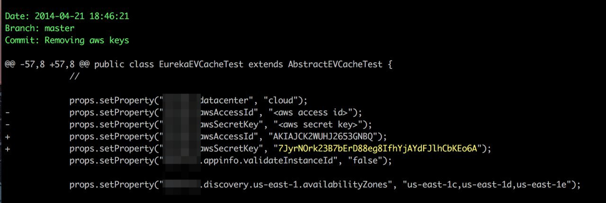
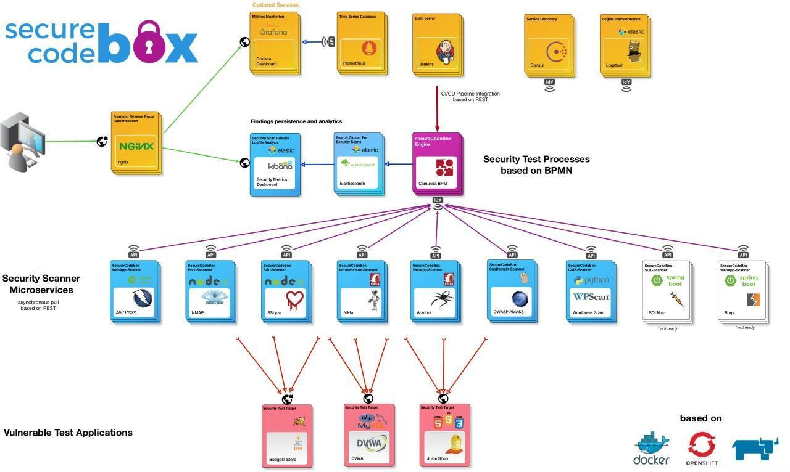
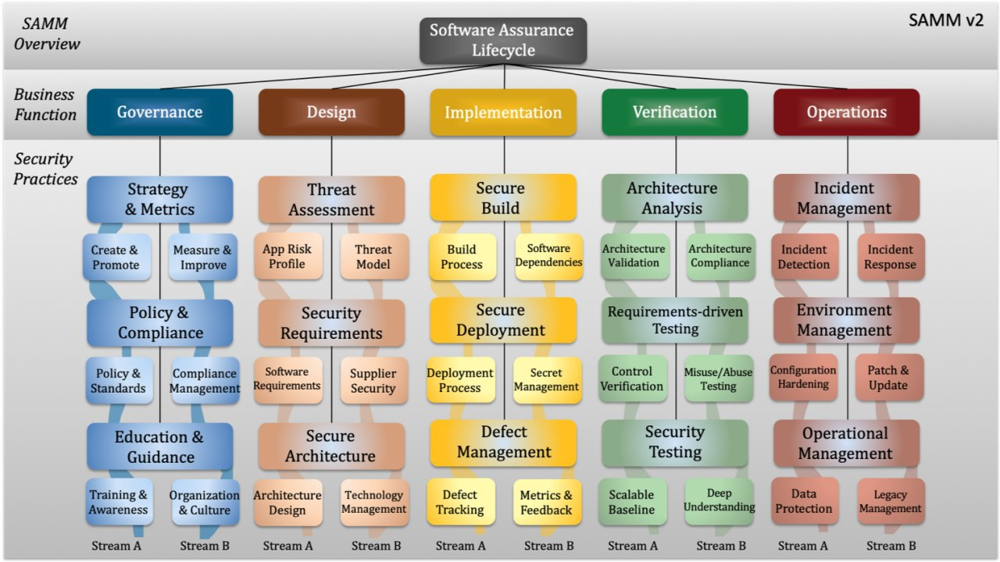

# isast
`2020-05-30 15:35:28`

<blockquote>
Finding secrets in repositories

truffleHog - open-source инструмент для поиска открытых секретов в репозиториях на GitHub. Инструмент просматривает всю история коммитов каждой ветки, проверяя каждый diff из каждого коммита на наличие секретов. Кстати truffleHog для поиска секретов использует анализ энтропии Шеннона.

Среди его аналогов -  defect-secrets, GitGuardian, о котором я писал ранее.

Дополнительно:
Раскрытие секретов на GitHub: что делать после утечки учетных данных и ключей API

LeakLooker - скрипт + веб-интерфейс для постоянного поиска утечки открытых баз данных и сервисов.

&#35;secret
</blockquote>

---

# isast
`2020-05-30 12:12:05`

<blockquote>
Pyanalyze is a tool for programmatically detecting common mistakes in &#35;python code, such as references to undefined variables and some categories of type mismatches. It can be extended to add additional rules and perform checks specific to particular functions.

It was opensourced just yesterday, so its still WIP.

https://github.com/quora/pyanalyze
</blockquote>

<table><tr><td><b>→</b><a href="https://github.com/quora/pyanalyze">
https://github.com/quora/pyanalyze
</a>
<blockquote>
A static analysis tool for Python. Contribute to quora/pyanalyze development by creating an account on GitHub.
</blockquote>
</td></tr></table>

---

# isast
`2020-05-28 10:54:05`

* https://telegra.ph/file/01d42102aecf929758fe1.jpg

<blockquote>
​​A crawler for automated functional testing of &#35;python web applications.

Crawling a server-side-rendered web application is a low cost way to get low quality test coverage of your JavaScript-light web application.

If you have only partial test coverage of your routes, but still want to protect against silly mistakes, then this is for you.

Why should I use this? Here's an example: Flaskr, the Flask tutorial application has 166 lines of test code to achieve 100% test coverage.

Using Python Testing Crawler in a similar way to the Usage example below, we can hit 73% with very little effort. Disclaimer: Of course! It's not the same quality or utility of testing! But it is better than no tests, a complement to hand-written unit or functional tests and a useful stopgap.

https://github.com/python-testing-crawler/python-testing-crawler
</blockquote>

<table><tr><td><b>→</b><a href="https://telegra.ph/file/01d42102aecf929758fe1.jpg">
https://telegra.ph/file/01d42102aecf929758fe1.jpg
</a>
</td></tr></table>

---

# isast
`2020-05-27 19:57:12`

<blockquote>
https://github.com/coinbase/salus
</blockquote>

<table><tr><td><b>→</b><a href="https://github.com/coinbase/salus">
https://github.com/coinbase/salus
</a>
<blockquote>
Security scanner coordinator. Contribute to coinbase/salus development by creating an account on GitHub.
</blockquote>
</td></tr></table>

---

# codeibcommunity
`2020-05-26 07:24:54`

<blockquote>
https://github.com/mxssl/tg-captcha-bot от добавления ботов. Со времени пропадут и существующие
</blockquote>

<table><tr><td><b>→</b><a href="https://github.com/mxssl/tg-captcha-bot">
https://github.com/mxssl/tg-captcha-bot
</a>
<blockquote>
Telegram Сaptcha Bot. Contribute to mxssl/tg-captcha-bot development by creating an account on GitHub.
</blockquote>
</td></tr></table>

---

# isast
`2020-05-24 22:23:46`

<blockquote>
terraform, mono-repo and compliance as code
https://medium.com/@emre.erkunt/terraform-mono-repo-and-compliance-as-code-109395659c3a

GitHub
https://github.com/eerkunt/terraform-compliance

Slides
https://www.slideshare.net/EmreErkunt/compliance-as-code-with-terraformcompliance
</blockquote>

---

# isast
`2020-05-24 09:58:29`

<blockquote>
Continuous Secure Delivery - Secure code Box

SecureCodeBox -  open-source фреймворк, объединяющий несколько бесплатных инсрументов сканирования (ZAP, NMAP, Nikto, Arachni), собранных вместе в docker-compose в связке с kibana и elasticsearch.  В отличие от того же DefectDojo, здесь все инструменты  развертываются вместе с решением, и репорты из сканеров подтягиваются сами (не нужно писать скрипты для автоматической отправки issue в сборщик). Также можно запускать сканирование всех заявленных инструментов из UI. На текущий момент инструменты направлены исключительно на тесирование веба.

Несмотря на кажущуюся простоту развертывания и работы,  разработчики заявляют,  что это не one-button-click-solution и требуется глубокое понимание для настройки сканеров.

&#35;web &#35;tools
</blockquote>

---

# isast
`2020-05-23 22:56:50`

<blockquote>
https://github.com/ajinabraham/njsscan
</blockquote>

<table><tr><td><b>→</b><a href="https://github.com/ajinabraham/njsscan">
https://github.com/ajinabraham/njsscan
</a>
<blockquote>
njsscan is a semantic aware SAST tool that can find insecure code patterns in your Node.js applications. - ajinabraham/njsscan
</blockquote>
</td></tr></table>

---

# cyberoffru
`2020-05-22 03:19:09`

<blockquote>
Уязвимость в Apache Tomcat, допускающая удалённое выполнение кода https://opennet.ru/53001/
</blockquote>

<table><tr><td><b>→</b><a href="https://opennet.ru/53001/">
https://opennet.ru/53001/
</a>
<blockquote>
Опубликованы сведения об уязвимости (CVE-2020-9484) в Apache Tomcat, открытой реализации технологий Java Servlet, JavaServer Pages, Java Expression Language и Java WebSocket. Проблема позволяет добиться выполнения кода на сервере через отправку специально оформленного запроса. Уязвимость устранена в выпусках Apache Tomcat 10.0.0-M5, 9.0.35, 8.5.55 и 7.0.104.
</blockquote>
</td></tr></table>

---

# exploitex
`2020-05-19 16:21:00`

* https://telegra.ph/file/b1b96105f0191796a3957.jpg

<blockquote>
​​Как скачивать видео с YouTube без ограничений с помощью Termux

С помощью этой программы вы сможете скачивать видео с YouTube без рекламы, без ограничений,  и в наилучшем качестве. 

1. Скачиваем нужные пакеты
$ apt update &amp;&amp; apt upgrade -y &amp;&amp; apt install python git -y
$ pip install pytube3
2. Клонируем репозиторий
$ git clone https://github.com/kitasS/YTDownload
3. Переходим в директорию и запускаем
$ cd YTDownload
$ python YTDwnload.py

Если вы хотите скачать одно видео, то просто вставляйте ссылку. Чтобы скачать много видео нужно создать файл со ссылками, каждая из которых должна быть с новой строки.  После скачивания видео будут храниться в папке Vidosiki.
</blockquote>

<table><tr><td><b>→</b><a href="https://telegra.ph/file/b1b96105f0191796a3957.jpg">
https://telegra.ph/file/b1b96105f0191796a3957.jpg
</a>
</td></tr></table>

---

# exploitex
`2020-05-19 14:21:30`

* https://telegra.ph/file/e92f8281e3b1af581aaf2.jpg
* https://nvd.nist.gov/vuln/detail/CVE-2019-15666

<blockquote>
​​Хакеры взломали суперкомпьютеры чтобы майнинить криптовалюту

Сверхмощные машины по всей Европе заставили тайно майнить криптовалюту. Сообщения о таких инцидентах поступили из Великобритании, Германии, Швейцарии и Испании.

Первая атака прошла в Эдинбургском университете, где размещается суперкомпьютер ARCHER. Администрация была вынуждена приостановить работу ARCHER, а также сбросить SSH-пароли для предотвращения дальнейших атак. Аналогичный случай произошел в Германии, где были взломаны одновременно 5 суперкомпьютеров.

Согласно отчетам, злоумышленники получили доступ к суперкомпьютерам через скомпрометированные учетные данные SSH. Судя по всему, учетные данные были похищены у персонала университетов. Хакеры использовали эксплойт для уязвимости CVE-2019-15666, что позволило им получить root-доступ и развернуть на зараженном суперкомпьютере майнер криптовалюты Monero (XMR).

&#35;новость
</blockquote>

<table><tr><td><b>→</b><a href="https://telegra.ph/file/e92f8281e3b1af581aaf2.jpg">
https://telegra.ph/file/e92f8281e3b1af581aaf2.jpg
</a>
</td></tr></table>

---

# cyberoffru
`2020-05-18 22:46:52`

<blockquote>
https://github.com/angristan/openvpn-install суше некуда
</blockquote>

<table><tr><td><b>→</b><a href="https://github.com/angristan/openvpn-install">
https://github.com/angristan/openvpn-install
</a>
<blockquote>
Set up your own OpenVPN server on Debian, Ubuntu, Fedora, CentOS or Arch Linux. - angristan/openvpn-install
</blockquote>
</td></tr></table>

---

# cyberoffru
`2020-05-18 22:43:07`

<blockquote>
https://github.com/StreisandEffect/streisand
</blockquote>

<table><tr><td><b>→</b><a href="https://github.com/StreisandEffect/streisand">
https://github.com/StreisandEffect/streisand
</a>
<blockquote>
Streisand sets up a new server running your choice of WireGuard, OpenConnect, OpenSSH, OpenVPN, Shadowsocks, sslh, Stunnel, or a Tor bridge. It also generates custom instructions for all of these s...
</blockquote>
</td></tr></table>

---

# isast
`2020-05-16 17:08:45`

<blockquote>
https://github.com/google/fuzzing/tree/master/dictionaries

Fuzzing dictionaries from Google
</blockquote>

<table><tr><td><b>→</b><a href="https://github.com/google/fuzzing/tree/master/dictionaries">
https://github.com/google/fuzzing/tree/master/dictionaries
</a>
<blockquote>
Tutorials, examples, discussions, research proposals, and other resources related to fuzzing - google/fuzzing
</blockquote>
</td></tr></table>

---

# phd_soc
`2020-05-15 18:49:27`

<blockquote>
Загляните к ребятам в проект https://github.com/atc-project/atomic-threat-coverage
</blockquote>

<table><tr><td><b>→</b><a href="https://github.com/atc-project/atomic-threat-coverage/">
https://github.com/atc-project/atomic-threat-coverage/
</a>
<blockquote>
Actionable analytics designed to combat threats. Contribute to atc-project/atomic-threat-coverage development by creating an account on GitHub.
</blockquote>
</td></tr></table>

---

# exploitex
`2020-05-13 09:21:05`

* https://telegra.ph/file/deb707a77eebe59377835.jpg
* https://webwormhole.io/
* https://github.com/saljam/webwormhole

<blockquote>
​​Прямая передача файлов между устройствами по WebRTC

Новый сервис WebWormHole позволяет передавать файлы с одного компьютера на другой через пиринговый тоннель, который быстрее и безопаснее, чем передача по почте, FTP или другими способами. 

Для того, чтобы установить соединение зайдите на сайт и нажмите кнопку «New Wormhole». Вы получите код для входа, который человек с другой стороны должен ввести, чтобы между вами установился туннель, по которому напрямую передаются файлы. Далее просто загружаете файл и он моментально будет передан получателю на другом конце тоннеля. 

Для установки портала между устройствами необязательно открывать браузер, клиент на Go запускается из командной строки и генерирует одноразовый код в консоли, где и происходит передача данных. Инструкция по установке и исходный код доступны на GitHub. 

&#35;безопасность
</blockquote>

<table><tr><td><b>→</b><a href="https://telegra.ph/file/deb707a77eebe59377835.jpg">
https://telegra.ph/file/deb707a77eebe59377835.jpg
</a>
</td></tr></table>

---

# isast
`2020-05-10 20:38:24`

* https://img.devrant.com/devrant/rant/r_542281_8wAJm.jpg

<blockquote>
​От нескольких человек слышал рекомендацию, что мне стоит заопенсорсить мой анализатор (holistic.dev) и зарабатывать на саппорте для enterprise.

У меня на этот счет несколько другое мнение. Мне кажется, что схема с OSS не сработает с инструментами для улучшения качества ПО.

Что можно предложить в качестве платных опций?
  - Несколько платных правил? Через месяц эти правила воспроизведут в OSS версии и смысла в них не будет.
  
  - Saas-версию? Этот класс ПО не требует какого-то специального обслуживания (бэкапы, настройка), поэтому даже предпочтительнее иметь on-premise версию, чем SaaS.
  
  - Сделать лицензию, чтоб ее не могли использовать облачные провайдеры в managed версиях бесплатно, как mongodb? 100 индусов за полгода перепишет все на java и в этой лицензии не будет никакого смысла.

  - Другое? Напишите в чат, пожалуйста, если есть идеи.

Особенно непонятно это все выглядит на фоне существующих продуктов (открытых и коммерческих) в той же предметной области.

Если в области статического анализа для c/ c++/ c&#35;/ java идет месилово, да и то коммерческие продукты как-то ухитряются существовать, то в области sql-анализа тишь да гладь.
Собираю тут полезные ссылки в этой области, ознакомьтесь, если интересно:
https://github.com/antonrevyako/useful-links/blob/master/opensource-sql-tools.md

И там все печально.

Я постоянно просматриваю много проектов, связанных с SQL. По понятной причине меня интересуют части, связанные с парсингом различных SQL - диалектов.
Абсолютно все проекты построены на кривых костылях. Они даже не пытаются сделать что-то приличное. 
Все делают вид, что работают со всеми основными базами pg/mysql/mssql/oracle. Достичь они это пытаются, сделав парсер некого обобщенного SQL - диалекта,
который работает везде. Если попытаться использовать какой-то специфичный синтаксис - все рушится. 

Например, свежий OSS-убийца DataGrip - beekeeper studio:
https://github.com/beekeeper-studio/beekeeper-studio

Без выбора базы автодополнение SELECT * FROM выглядит как список всех известных токенов (ALTER, AND, AS...), а при SELECT * FROM public. автодополнение не появляется.
И есть подозрение, что лучше тут ничего не будет, т.к. ноги растут из пакета https://github.com/maxcnunes/sql-query-identifier, который не обновлялся уже 3 года.

Или вот, vitess.io - a database clustering system for horizontal scaling of MySQL. Тулза на go, все по уму. 
Они заморочились и сделали свой AST парсер, который собирается из самописной грамматики. Можно попробовать собрать:
https://github.com/vitessio/vitess/tree/master/go/vt/sqlparser

И что? Грамматика описана криво даже для версии 5.7 
Например, в ней важен порядок DEFAULT и NOT NULL в CREATE TABLE, а в оригинальной MySQL - нет.
Новый синтаксис 8.0 не поддерживается совсем.
В прошедшем декабре CNCF объявила vitess достаточно зрелым для использования в production.

Вот такая ситуация с этими вашими OSS.

А что там у коммерческих продуктов?

Про drawsql.app (mysql/pg/mssql) и моего единственного конкурента я уже бугуртил тут
https://t.me/nosingularity/424

Так, что у нас там дальше... dbdiagram.io (mysql/pg/ror)
Не понимает половины ALTER, совсем не понимает CREATE FUNCTION, CREATE EXTENSION и тд.

Если вы можете порекомендовать какой-то продукт или сервис, связанный с SQL, на который стоит обратить внимание, напишите, пожалуйста. 

Почему все более или менее прилично у DateGrip? Они разрабатывают свой универсальный парсер грамматики:
https://github.com/JetBrains/Grammar-Kit
Специфичную для разных баз грамматику они пишут руками.

Справедливости ради, holistic.dev не начался бы, если бы не было OSS AST-парсера для postgresql.
Но на данный момент в этом парсере реализована поддержка специфичного синтаксиса postgresql только до 10 версии.

Поэтому нам пришлось самостоятельно выковыривать парсер из postgresql 13. В ближайшем большом релизе мы его выкатим.
Похожим образом приходится действовать с mysql и clickhouse.

Найти подходящий AST парсер - это процентов 5 всей работы.

Вы бы стали опенсорсить остальные 95%?
</blockquote>

<table><tr><td><b>→</b><a href="https://img.devrant.com/devrant/rant/r_542281_8wAJm.jpg">
https://img.devrant.com/devrant/rant/r_542281_8wAJm.jpg
</a>
</td></tr></table>

---

# isast
`2020-05-09 11:24:33`

<blockquote>
AddressSanitizerLeakSanitizer · google/sanitizers Wiki · GitHub
https://github.com/google/sanitizers/wiki/AddressSanitizerLeakSanitizer&#35;suppressions
</blockquote>

<table><tr><td><b>→</b><a href="https://github.com/google/sanitizers/wiki/AddressSanitizerLeakSanitizer">
https://github.com/google/sanitizers/wiki/AddressSanitizerLeakSanitizer
</a>
<blockquote>
AddressSanitizer, ThreadSanitizer, MemorySanitizer - google/sanitizers
</blockquote>
</td></tr></table>

---

# webware
`2020-05-08 08:45:08`

* https://telegra.ph/file/864a26388d70d593e14d3.jpg
* https://codeby.net/tags/attacks/
* https://codeby.net/tags/cve-2017-9841/
* https://codeby.net/tags/phpunit/

<blockquote>
​​Воскрешение уязвимости PHPUnit RCE

Как только патч для ПО выпущен, мы думаем, что проблема решена, и баг теперь не работает. В большинстве случаев это не так. Для решения этой проблемы от всех разработчиков требуется использование последней версии патча. Поскольку обновление не является особенно тривиальным действием, разработчикам необходимо планировать заранее и вставлять изменения через процесс разработки, планируя подходящее время для применения. В примерах, приведённых ниже, вы увидите, что иногда, даже этого недостаточно.

Читать статью полностью: https://codeby.net/threads/voskreshenie-ujazvimosti-phpunit-rce.73241/

&#35;attacks &#35;cve-2017-9841 &#35;phpunit
</blockquote>

<table><tr><td><b>→</b><a href="https://telegra.ph/file/864a26388d70d593e14d3.jpg">
https://telegra.ph/file/864a26388d70d593e14d3.jpg
</a>
</td></tr></table>

---

# isast
`2020-05-05 20:53:13`

<blockquote>
В начале года была опубликована вторая версия OWASP SAMM (Software Assurance Maturity Model), которая разрабатывалась пять лет. 

Это фреймворк позволяющий построить безопасную разработку приложений, так же он помогает провести оценку текущего состояния. 

Список изменений - https://owaspsamm.org/release-notes-v2/

Свежие материалы по теме 

1. В рамках OWASP Moscow (https://t.me/tech_b0lt_Genona/1621) был доклад

Проекты OWASP: SAMM выпуск 2
https://www.youtube.com/watch?v&#61;mNTCO0mzjsI

2. 1 мая проходил BSides Knoxville и один из докладов был посвящён SAMM v2.0

Navigating DevOps Security Journey with OWASP SAMM v2.0
https://www.youtube.com/watch?v&#61;3Kv-SNuL95Q

3. OZON сделал пост в блоге 

Как сэкономить время и силы на внедрении стандартов безопасной разработки с помощью OWASP SAMM
https://habr.com/ru/company/ozontech/blog/498272/

Сайт проекта - https://owaspsamm.org/
GitHub - https://github.com/OWASP/samm

ЗЫ Чат OWASP  - @OWASP_Russia
</blockquote>

---

# isast
`2020-05-05 17:58:14`

* https://github.com/imperva/automatic-api-attack-tool

<blockquote>
Automatic API Attack Tool

Automatic API Attack Tool от Imperva  принимает спецификацию API в качестве входных данных, после чего генерирует и запускает фаззиннг-атаки основываясь на выходных данных. Инструмент также может быть расширен для запуска таких атак, как XSS, SLi, RFi и т.д. Может быть встроен в CI/CD.

&#35;tool &#35;fuzzing &#35;web
</blockquote>

<table><tr><td><b>→</b><a href="https://github.com/imperva/automatic-api-attack-tool">
https://github.com/imperva/automatic-api-attack-tool
</a>
<blockquote>
Imperva's customizable API attack tool takes an API specification as an input, generates and runs attacks that are based on it as an output. - imperva/automatic-api-attack-tool
</blockquote>
</td></tr></table>

---

# exploitex
`2020-05-05 17:23:00`

* https://telegra.ph/file/480c2951d9c17f80ac873.jpg

<blockquote>
​​Как запутать своего интернет-провайдера через Termux

Всем давно известно, что провайдеры ведут логи и собирают информацию о том, какие сайты мы посещаем и когда мы это делаем. 

Эта программа будет  делать множество запрос в день на различные сайты с вашего IP, что может запутать провайдера, который пристально следит за вами.

1. Скачиваем нужные пакеты:
apt update &amp;&amp; apt upgrade -y &amp;&amp; apt install python git -y
2. Скачиваем зависимости:
pip install requests
3. Скачиваем репозиторий:
git clone https://github.com/1tayH/noisy.git
4. Открываем директорию:
cd noisy
5. Запускаем файл:
python noisy.py --config config.json

Опцианальные аргументы:
  --log -l -&gt; Настройка уровеня регистрации
  --config -c  -&gt; Кастомный config файл
  --timeout -t  -&gt; Время работаты сканера (в секундах)

&#35;анонимность &#35;termux
</blockquote>

<table><tr><td><b>→</b><a href="https://telegra.ph/file/480c2951d9c17f80ac873.jpg">
https://telegra.ph/file/480c2951d9c17f80ac873.jpg
</a>
</td></tr></table>

---

# phd_soc
`2020-05-03 22:33:14`

<blockquote>
https://t.me/phd_soc/16921
</blockquote>

<table><tr><td><b>→</b><a href="https://t.me/phd_soc/16921">
https://t.me/phd_soc/16921
</a>
<blockquote>
все что касается реагирования давно изложено в книгах. Вот одна из ключевых по DFIR [1]. 

Может и кажется что в РФ оно появилось типо лет пять назад (что вообще, с позиции масштабов какбе так и есть), но вообще для мира это не ново.

если нужны тренинги, то смотрите в сторону:

- Института SANS серии FOR [2]
- AND от Криса Сандерса, Investigation Theory и другие [3]

Но в целом я бы вам рекомендовал вот этот документ [4], вам поможет с порядком в плане постановки вопросов и поиска информации. 

[1] https://g.co/kgs/LL5Bah
[2] https://www.sans.org/courses/incident-response-digital-forensics
[3] https://www.networkdefense.io/library/the-analyst-mindset/110302/about/
[4] https://github.com/DC7499/kb/blob/master/beginners.md
</blockquote>
</td></tr></table>

---

# MPSIEMChat
`2020-05-03 11:05:03`

<blockquote>
https://github.com/saltstack/salt/issues/57057

Перепись пострадавших
</blockquote>

<table><tr><td><b>→</b><a href="https://github.com/saltstack/salt/issues/57057">
https://github.com/saltstack/salt/issues/57057
</a>
<blockquote>
Description My all servers with salt-minion installed，An unknown program suddenly ran today， He's /tmp/salt-minions [root@yunwei ~]&#35; top top - 10:06:44 up 511 days, 18:39, 3 users, load ave...
</blockquote>
</td></tr></table>

---

# exploitex
`2020-05-02 18:01:05`

* https://telegra.ph/file/67e1e2407dca643054e2c.jpg

<blockquote>
​​Как взломать принтер в локальной сети

Для того, чтобы перехватить управление беспроводным принтером, нам понадобиться подключиться к WiFi сети, в которой работает этот принтер. Данная утилита работает как на Kali linux, так и на Termux. 

Установка:
apt update &amp; apt upgrade
pip2 install colorama
git clone https://github.com/RUB-NDS/PRET
cd PRET
pip install colorama pysnmP

Далее, нам нужно будет узнать IP адрес нашего принтера, сделать это можно в настройках принтера или через программу WiFi Analyzer. Это приложение сканирует WiFi сеть и показывает, локальные IP устройств, которые к ней подключены. 

Запускаем программу:
python2 pret.py (IP принтера) pjl

Если подключение успешно, то вам будет доступен ввод различных команд для управления принтером.  Командой help можно посмотреть все доступные функции, среди которых: печать произвольного текста или файла, отображение текста на дисплее принтера, флуд печатью и многое другое. 

&#35;хакинг &#35;IoT
</blockquote>

<table><tr><td><b>→</b><a href="https://telegra.ph/file/67e1e2407dca643054e2c.jpg">
https://telegra.ph/file/67e1e2407dca643054e2c.jpg
</a>
</td></tr></table>

---

# isast
`2020-05-02 16:31:12`

<blockquote>
Недавно вы единодушно проголосовали за то, чтобы я начал публиковать правила анализатора с разбором кейсов (https://t.me/nosingularity/415)

Пока я не сформулировал с чего начать. И дело не в самих правилах, с ними проблем нет. Хочется как-то структурно подойти к этим публикациям. Может быть сначала есть смысл рассказать про некоторые внутренние процессы, происходящие в базе, для большего погружения в проблему?
С другой стороны давят Даннинг с Крюгером, нашептывая &quot;ты балбес, иди в сорцах поковыряйся&quot; :)

Пока я собираюсь с мыслями, предлагаю всем интересующимся заглянуть в доку 
https://github.com/antonrevyako/useful-links/blob/master/opensource-sql-tools.md

Например, там есть ссылки на реализацию mysql на go и репозиторий, где пытаются повторить postgres на go from the scratch.

Так же на глаза попался твиттер-тред (брррр) от Oracle Developer Advocate for SQL, где он рассказывает про различные проблемы, встречающиеся в запросах
https://twitter.com/ChrisRSaxon/status/1256233845642452994

Часть рекомендаций там с оракловским колоритом, но все равно может пригодиться. 
Например, в pg есть такая бага, что count(*) работает на 10% медленнее, чем count(1). В оракле такой баги нет. 

Давайте пока разберу одно правило из первых рекомендаций треда. 

select * from ... where anything &#61; NULL
ALWAYS returns no rows

Казалось бы, такое правило нужно только джунам. Кто не знает, что нельзя сравнивать с NULL'ом?

Если будет существовать правило, автоматом проверяющее на подобные вещи, то, во-первых, джун сможет за джуновскую зарплату не допускать ошибок, которые не допускают синьоры. 

Во-вторых, такой же эффект будет наблюдаться при сравнении с колонкой или выражением, которое может принимать значение NULL.

Пример:
WHERE a &lt; b + 1, 
где b может быть NULL

Отдельный вопрос сможет ли разработчик всегда понять, что b может принимать 'значения' NULL или нет, но конкретно тут, возможно, хотелось бы трактовать NULL как 0.

Пример:
WHERE a &#61; 'string' || b 
Казалось бы, 'string' || b  должен быть равен 'string', если b IS NULL.
Но фокус в том, что любые выражения с NULL дают NULL...

В этом случае стоит использовать CONCAT, который трактует NULL-значения как пустую строку. 

Все ли об этом знают?
</blockquote>

<table><tr><td><b>→</b><a href="https://t.me/nosingularity/415">
https://t.me/nosingularity/415
</a>
<blockquote>
https://twitter.com/lukaseder/status/1252919177515581441

Это не единственный заскок mysql. 
Пока для mysql правил не делали, но чувствуется, это будет веселая прогулка :)

Да, если кто-то еще не знает, я делаю статический анализатор для SQL. Сейчас поддерживается только Postgresql, но следующий на очереди mysql.

Честно говоря, когда я начал заниматься этим проектом, узнал много интересных вещей про postgresql, хотя казалось бы :) 

Скажите, интересно бы вам было, если бы я начал публиковать пару раз в неделю описание одного правила  от нашего анализатора с небольшим разбором?
</blockquote>
</td></tr></table>

---

