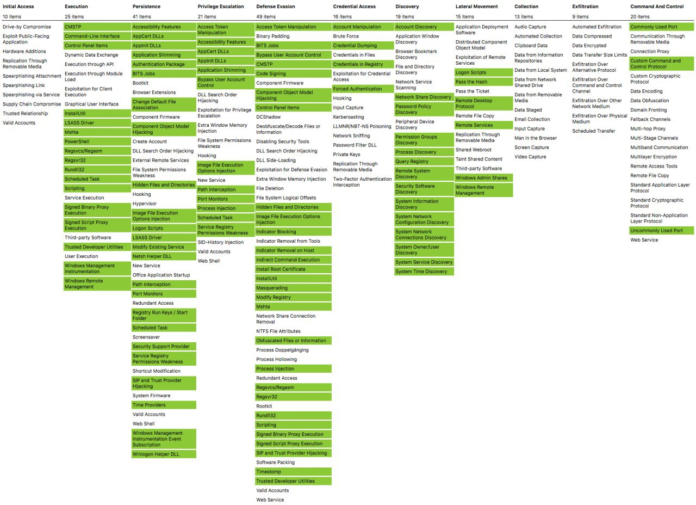
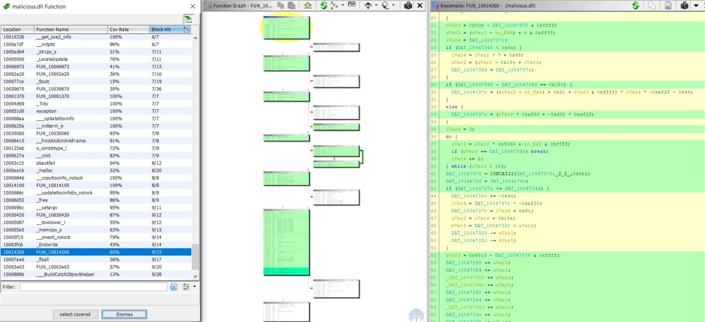

# sysadm_in_channel
`2020-06-30 17:59:03`

<blockquote>
Небольшая подборка pentest тулз обернутых в docker (Docker Images for Penetration Testing and Cybersecurity)

https://github.com/ellerbrock/docker-security-images

В довесок подборка ссылок на статьи, рекоммендации и тп на тему теста на проникновение (Awesome Penetration Testing)

https://github.com/enaqx/awesome-pentest
</blockquote>

<table><tr><td><b>→</b><a href="https://github.com/ellerbrock/docker-security-images">
https://github.com/ellerbrock/docker-security-images
</a>
<blockquote>
:closed_lock_with_key: Docker Container for Penetration Testing &amp; Security - ellerbrock/docker-security-images
</blockquote>
</td></tr></table>

---

# defcon_news
`2020-06-30 16:53:31`

<blockquote>
[KIS-2020-08] openSIS &lt;&#61;7.4 Multiple SQL Injection Vulnerabilities
http://seclists.org/fulldisclosure/2020/Jun/34

via Full Disclosure
</blockquote>

<table><tr><td><b>→</b><a href="https://seclists.org/fulldisclosure/2020/Jun/34">
https://seclists.org/fulldisclosure/2020/Jun/34
</a>
</td></tr></table>

---

# defcon_news
`2020-06-30 16:53:30`

<blockquote>
[KIS-2020-07] openSIS &lt;&#61;7.4 (Bottom.php) Local File Inclusion Vulnerability
http://seclists.org/fulldisclosure/2020/Jun/33

via Full Disclosure
</blockquote>

<table><tr><td><b>→</b><a href="https://seclists.org/fulldisclosure/2020/Jun/33">
https://seclists.org/fulldisclosure/2020/Jun/33
</a>
</td></tr></table>

---

# defcon_news
`2020-06-30 16:53:28`

<blockquote>
[KIS-2020-06] openSIS &lt;&#61;7.4 Incorrect Access Control Vulnerabilities
http://seclists.org/fulldisclosure/2020/Jun/32

via Full Disclosure
</blockquote>

<table><tr><td><b>→</b><a href="https://seclists.org/fulldisclosure/2020/Jun/32">
https://seclists.org/fulldisclosure/2020/Jun/32
</a>
</td></tr></table>

---

# defcon_news
`2020-06-30 13:53:27`

<blockquote>
[webapps] Reside Property Management 3.0 - 'profile' SQL Injection
https://www.exploit-db.com/exploits/48627

via Exploit Database
</blockquote>

<table><tr><td><b>→</b><a href="https://www.exploit-db.com/exploits/48627">
https://www.exploit-db.com/exploits/48627
</a>
<blockquote>
Reside Property Management 3.0 - 'profile' SQL Injection.. webapps exploit for PHP platform
</blockquote>
</td></tr></table>

---

# defcon_news
`2020-06-30 13:53:26`

<blockquote>
[webapps] Victor CMS 1.0 - 'user_firstname' Persistent Cross-Site Scripting
https://www.exploit-db.com/exploits/48626

via Exploit Database
</blockquote>

<table><tr><td><b>→</b><a href="https://www.exploit-db.com/exploits/48626?utm_source=dlvr.it&utm_medium=twitter">
https://www.exploit-db.com/exploits/48626?utm_source=dlvr.it&utm_medium=twitter
</a>
<blockquote>
Victor CMS 1.0 - 'user_firstname' Persistent Cross-Site Scripting.. webapps exploit for PHP platform
</blockquote>
</td></tr></table>

---

# cyberoffru
`2020-06-30 13:36:17`

* https://twitter.com/jfslowik/status/1277647427403608064
* https://security.paloaltonetworks.com/CVE-2020-2021
* https://twitter.com/CNMF_CyberAlert/status/1277674547542659074

<blockquote>
​​Вчера американская Palo Alto Networks опубликовала данные о выявленной критической уязвимости CVE-2020-2021 в механизме аутентификации операционной системы PAN-OS, на которой работают все nextgen файрволы Palo Alto.

Уязвимость позволяет злоумышленнику обходить аутентификацию PAN-OS и получать доступ к системе в случае отключения опции &quot;Validate Identity Provider Certificate&quot;. Отключение этой опции рекомендуют в своих мануалах ряд поставщиков ПО - например, это указывает Microsoft в руководстве по интеграции Azure AD c продуктами Palo Alto Networks.

Уязвимость получила оценку критичности 10 из 10. Ее эксплойт не требует от хакера высокой технической подготовки, а в случае успешной атаки злоумышленник может изменить настройки PAN-OS вплоть до отключения файрвола.

Исследователи бостонской Rapid7 обнаружили в сети почти 70 тыс. устройств на основе PAN-OS, 40% из которых защищают сети в США.

Видимо, в связи с большим количеством критических сетей, на которых стоят файрволы Palo Alto, у Киберкомандования США (USCYBERCOM) пригорело настолько, что они сразу обратились через Twitter с призывом немедленно обновить уязвимое ПО и исправить его настройки. 

При этом в качестве основной угрозы американское Киберкомандование указывает иностранные прогосударственные APT, которые &quot;вероятно, вскоре попытаются использовать данную уязвимость&quot;.

Инфосек сообщество с серьезностью угрозы полностью согласно.

Если вы используете файрволы от Palo Alto Networks - реагируйте сейчас. Потом может быть поздно.
</blockquote>

<table><tr><td><b>→</b><a href="https://twitter.com/jfslowik/status/1277647427403608064">
https://twitter.com/jfslowik/status/1277647427403608064
</a>
<blockquote>
&#35;CVE20202021 &#35;PatchYoShit https://t.co/PeVwxugQuk
</blockquote>
</td></tr></table>

---

# defcon_news
`2020-06-30 00:53:11`

<blockquote>
KL-001-2020-003 : Cellebrite EPR Decryption Relies on Hardcoded AES Key Material
http://seclists.org/fulldisclosure/2020/Jun/31

via Full Disclosure
</blockquote>

<table><tr><td><b>→</b><a href="https://seclists.org/fulldisclosure/2020/Jun/31">
https://seclists.org/fulldisclosure/2020/Jun/31
</a>
</td></tr></table>

---

# defcon_news
`2020-06-29 21:53:18`

<blockquote>
Palo Alto Releases Security Updates for PAN-OS
https://www.us-cert.gov/ncas/current-activity/2020/06/29/palo-alto-releases-security-updates-pan-os

via CISA Current Activity
</blockquote>

<table><tr><td><b>→</b><a href="https://www.us-cert.gov/ncas/current-activity/2020/06/29/palo-alto-releases-security-updates-pan-os">
https://www.us-cert.gov/ncas/current-activity/2020/06/29/palo-alto-releases-security-updates-pan-os
</a>
<blockquote>
Palo Alto Networks has released security updates to address a vulnerability affecting the use of Security Assertion Markup Language in PAN-OS. An unauthenticated attacker with network access could exploit this vulnerability to obtain sensitive information.

The Cybersecurity and Infrastructure Security Agency (CISA) encourages users and administrators to review Palo Alto Security Advisory for CVE-2020-2021 and apply the necessary updates or workarounds.
</blockquote>
</td></tr></table>

---

# cyberoffru
`2020-06-29 08:27:07`

<blockquote>
https://github.com/atc-project/atomic-threat-coverage
</blockquote>

<table><tr><td><b>→</b><a href="https://github.com/atc-project/atomic-threat-coverage">
https://github.com/atc-project/atomic-threat-coverage
</a>
<blockquote>
Actionable analytics designed to combat threats. Contribute to atc-project/atomic-threat-coverage development by creating an account on GitHub.
</blockquote>
</td></tr></table>

---

# ctfchat
`2020-06-29 00:56:14`

<blockquote>
https://github.com/aol/moloch

Но это рофлу ради, не советую для стфа :d
</blockquote>

<table><tr><td><b>→</b><a href="https://github.com/aol/moloch">
https://github.com/aol/moloch
</a>
<blockquote>
Arkime (formerly Moloch) is an open source, large scale, full packet capturing, indexing, and database system. - arkime/arkime
</blockquote>
</td></tr></table>

---

# defcon_news
`2020-06-28 00:53:03`

<blockquote>
Node.js third-party modules: bunyan - RCE via insecure command formatting
https://vulners.com/hackerone/H1:902739?utm_source&#61;rss&amp;utm_medium&#61;rss&amp;utm_campaign&#61;rss

via Vulners
</blockquote>

<table><tr><td><b>→</b><a href="https://vulners.com/hackerone/H1:902739?utm_source=rss&utm_medium=rss&utm_campaign=rss">
https://vulners.com/hackerone/H1:902739?utm_source=rss&utm_medium=rss&utm_campaign=rss
</a>
<blockquote>
I would like to report RCE in bunyan It allows arbitrary commands remotely inside the victim's PC Module module name: bunyan version: 1.8.12 npm page: https://www.npmjs.com/package/bunyan Module Description  Bunyan is a simple and fast JSON logging library for node.js services:  Module Stats [920,196] weekly downloads Vulnerability Vulnerability Description  The issue occurs because a user input is formatted inside a command that will be executed without any check. https://github.com/trentm/node-bunyan/blob/master/bin/bunyan&#35;L1224  Steps To Reproduce:  Run the following command npm install bunyan ./node_modules/bunyan/bin/bunyan -p &quot;S'11;touch hacked ;'&quot; Recheck the files: now hacked has been created  Patch  Check input before command  Supporting Material/References:  State all technical information about the stack where the vulnerability was found   [OPERATING SYSTEM VERSION]: Ubuntu 18.04 [NODEJS VERSION]: v8.10.0 [NPM VERSION]: 3.5.2  Wrap up  Select Y or N for the following statements:   I contacted the maintainer…
</blockquote>
</td></tr></table>

---

# R0_Crew
`2020-06-27 16:00:00`

<blockquote>
Magisk Module to enable engineering build props https://github.com/evdenis/enable_eng &#35;reverse &#35;hardware &#35;android &#35;dukeBarman
</blockquote>

<table><tr><td><b>→</b><a href="https://github.com/evdenis/enable_eng">
https://github.com/evdenis/enable_eng
</a>
<blockquote>
Magisk Module to enable engineering build props. Contribute to evdenis/enable_eng development by creating an account on GitHub.
</blockquote>
</td></tr></table>

---

# defcon_news
`2020-06-26 20:53:15`

<blockquote>
[local] KiteService 1.2020.618.0 - Unquoted Service Path
https://www.exploit-db.com/exploits/48625

via Exploit Database
</blockquote>

<table><tr><td><b>→</b><a href="https://www.exploit-db.com/exploits/48625?utm_source=dlvr.it&utm_medium=twitter">
https://www.exploit-db.com/exploits/48625?utm_source=dlvr.it&utm_medium=twitter
</a>
<blockquote>
KiteService 1.2020.618.0 - Unquoted Service Path.. local exploit for Windows platform
</blockquote>
</td></tr></table>

---

# defcon_news
`2020-06-26 20:53:11`

<blockquote>
[local] Windscribe 1.83 - 'WindscribeService' Unquoted Service Path
https://www.exploit-db.com/exploits/48624

via Exploit Database
</blockquote>

<table><tr><td><b>→</b><a href="https://www.exploit-db.com/exploits/48624">
https://www.exploit-db.com/exploits/48624
</a>
<blockquote>
Windscribe 1.83 - 'WindscribeService' Unquoted Service Path.. local exploit for Windows platform
</blockquote>
</td></tr></table>

---

# defcon_news
`2020-06-26 20:53:10`

<blockquote>
[webapps] OpenEMR 5.0.1 - 'controller' Remote Code Execution
https://www.exploit-db.com/exploits/48623

via Exploit Database
</blockquote>

<table><tr><td><b>→</b><a href="https://www.exploit-db.com/exploits/48623">
https://www.exploit-db.com/exploits/48623
</a>
<blockquote>
OpenEMR 5.0.1 - 'controller' Remote Code Execution.. webapps exploit for PHP platform
</blockquote>
</td></tr></table>

---

# defcon_news
`2020-06-26 18:53:24`

<blockquote>
Apache Releases Security Advisory for Apache Tomcat
https://www.us-cert.gov/ncas/current-activity/2020/06/26/apache-releases-security-advisory-apache-tomcat

via CISA Current Activity
</blockquote>

<table><tr><td><b>→</b><a href="https://www.us-cert.gov/ncas/current-activity/2020/06/26/apache-releases-security-advisory-apache-tomcat">
https://www.us-cert.gov/ncas/current-activity/2020/06/26/apache-releases-security-advisory-apache-tomcat
</a>
<blockquote>
The Apache Software Foundation has released a security advisory to address a vulnerability in Apache Tomcat. An attacker could exploit this vulnerability to cause a denial-of-service condition.

The Cybersecurity and Infrastructure Security Agency (CISA) encourages users and administrators to review the Apache security advisory for CVE-2019-10072 and upgrade to the appropriate version.
</blockquote>
</td></tr></table>

---

# isast
`2020-06-26 11:16:52`

* https://telegra.ph/file/0f87ffee585610d84358f.jpg

<blockquote>
​​Blazing fast linter for &#35;js and &#35;ts written in &#35;rust 

This crate powers deno lint, but is not &#35;deno specific and can be used to write linters for Node as well.

https://github.com/denoland/deno_lint

Blazing fast, see comparison with ESLint:
</blockquote>

<table><tr><td><b>→</b><a href="https://telegra.ph/file/0f87ffee585610d84358f.jpg">
https://telegra.ph/file/0f87ffee585610d84358f.jpg
</a>
</td></tr></table>

---

# isast
`2020-06-26 09:36:26`

<blockquote>
Introducing Piranha: An Open Source Tool to Automatically Delete Stale Code

Piranha - open-source инструмент от Uber для автоматического рефакторинга кода. Рефакторинг происходит за счет меток, проставляемых разработчиками в коде. Удаление кода, окруженного специальной меткой, позволяет избавиться от устаревшего, неиспользуемого и временного участка кода. Кроме повышения эффективности разработчиков, сокращения времени сборки и размера бинаря, инструмент позволяет увеличить безопасность кода приложения. На текущий момент поддерживается Java, Objective C, Swift.

О том, как Uber применил Piranha для своих мобильных приложений

Исследования и академические выводы об инструменте

6-и минутный ролик

&#35;tools &#35;mobile
</blockquote>


---

# isast
`2020-06-26 03:11:23`

<blockquote>
https://psalm.dev/articles/detect-security-vulnerabilities-with-psalm
+
https://github.com/vimeo/psalm
</blockquote>

<table><tr><td><b>→</b><a href="https://psalm.dev/articles/detect-security-vulnerabilities-with-psalm">
https://psalm.dev/articles/detect-security-vulnerabilities-with-psalm
</a>
<blockquote>
Security vulnerabilities are often pretty hard to spot manually. While a null-pointer error can make itself known very quickly, you can execute code…
</blockquote>
</td></tr></table>

---

# defcon_news
`2020-06-25 19:53:36`

<blockquote>
[webapps] FHEM 6.0 - Local File Inclusion
https://www.exploit-db.com/exploits/48621

via Exploit Database
</blockquote>

<table><tr><td><b>→</b><a href="https://www.exploit-db.com/exploits/48621">
https://www.exploit-db.com/exploits/48621
</a>
<blockquote>
FHEM 6.0 - Local File Inclusion.. webapps exploit for PHP platform
</blockquote>
</td></tr></table>

---

# defcon_news
`2020-06-25 19:53:35`

<blockquote>
Cisco Releases Security Advisory for Telnet Vulnerability in IOS XE Software
https://www.us-cert.gov/ncas/current-activity/2020/06/25/cisco-releases-security-advisory-telnet-vulnerability-ios-xe

via CISA Current Activity
</blockquote>

<table><tr><td><b>→</b><a href="https://www.us-cert.gov/ncas/current-activity/2020/06/25/cisco-releases-security-advisory-telnet-vulnerability-ios-xe">
https://www.us-cert.gov/ncas/current-activity/2020/06/25/cisco-releases-security-advisory-telnet-vulnerability-ios-xe
</a>
<blockquote>
Cisco has released a security advisory on a Telnet vulnerability—CVE-2020-10188—affecting Cisco IOS XE devices. A remote attacker could exploit this vulnerability to take control of an affected system. The advisory contains workarounds as well as indicators of compromise.

The Cybersecurity and Infrastructure Security Agency (CISA) encourages users and administrators to review the Cisco Security Advisory and apply the necessary workarounds.
</blockquote>
</td></tr></table>

---

# defcon_news
`2020-06-25 19:53:34`

<blockquote>
[remote] mySCADA myPRO 7 - Hardcoded Credentials
https://www.exploit-db.com/exploits/48620

via Exploit Database
</blockquote>

<table><tr><td><b>→</b><a href="https://www.exploit-db.com/exploits/48620">
https://www.exploit-db.com/exploits/48620
</a>
<blockquote>
mySCADA myPRO 7 - Hardcoded Credentials. CVE-2018-11311 . remote exploit for Hardware platform
</blockquote>
</td></tr></table>

---

# defcon_news
`2020-06-25 19:53:28`

<blockquote>
Windows Print Spooler Privilege Escalation
https://packetstormsecurity.com/files/158222/CVE-2020-1048-master.zip

via Exploit Files ≈ Packet Storm
</blockquote>

<table><tr><td><b>→</b><a href="https://packetstormsecurity.com/files/158222/CVE-2020-1048-master.zip">
https://packetstormsecurity.com/files/158222/CVE-2020-1048-master.zip
</a>
<blockquote>
Information Security Services, News, Files, Tools, Exploits, Advisories and Whitepapers
</blockquote>
</td></tr></table>

---

# defcon_news
`2020-06-25 19:53:27`

<blockquote>
ASUS Aura Sync 1.07.71 Privilege Escalation
https://packetstormsecurity.com/files/158221/CVE-2019-17603.c

via Exploit Files ≈ Packet Storm
</blockquote>

<table><tr><td><b>→</b><a href="https://packetstormsecurity.com/files/158221/CVE-2019-17603.c">
https://packetstormsecurity.com/files/158221/CVE-2019-17603.c
</a>
<blockquote>
Information Security Services, News, Files, Tools, Exploits, Advisories and Whitepapers
</blockquote>
</td></tr></table>

---

# R0_Crew
`2020-06-25 14:19:15`

<blockquote>
Tools used during the reversing of the Nikon firmware https://github.com/simeonpilgrim/nikon-firmware-tools &#35;reverse &#35;hardware &#35;ida &#35;dukeBarman
</blockquote>

<table><tr><td><b>→</b><a href="https://github.com/simeonpilgrim/nikon-firmware-tools">
https://github.com/simeonpilgrim/nikon-firmware-tools
</a>
<blockquote>
Tools used during the reversing of the Nikon firmware - simeonpilgrim/nikon-firmware-tools
</blockquote>
</td></tr></table>

---

# defcon_news
`2020-06-25 00:53:30`

<blockquote>
[webapps] BSA Radar 1.6.7234.24750 - Persistent Cross-Site Scripting
https://www.exploit-db.com/exploits/48619

via Exploit Database
</blockquote>

<table><tr><td><b>→</b><a href="https://www.exploit-db.com/exploits/48619">
https://www.exploit-db.com/exploits/48619
</a>
<blockquote>
BSA Radar 1.6.7234.24750 - Persistent Cross-Site Scripting. CVE-2020-14943 . webapps exploit for Multiple platform
</blockquote>
</td></tr></table>

---

# defcon_news
`2020-06-24 22:53:22`

<blockquote>
Exploiting an arbitrary file move in Symantec Endpoint Protection (CVE-2020-5825)
https://www.reddit.com/r/netsec/comments/hf6cd4/exploiting_an_arbitrary_file_move_in_symantec/

via /r/netsec - Information Security News &amp; Discussion
</blockquote>

<table><tr><td><b>→</b><a href="https://www.reddit.com/r/netsec/comments/hf6cd4/exploiting_an_arbitrary_file_move_in_symantec/?utm_source=ifttt">
https://www.reddit.com/r/netsec/comments/hf6cd4/exploiting_an_arbitrary_file_move_in_symantec/?utm_source=ifttt
</a>
<blockquote>
Posted in r/netsec by u/rkornmeyer • 91 points and 3 comments
</blockquote>
</td></tr></table>

---

# sysadm_in_channel
`2020-06-24 15:18:47`

<blockquote>
Какое-то время назад написал скрипт который делает бан по странам при помощи связки ipset + firewalld, хотел написать статью как пользоваться, но в итоге думаю Readme будет достаточно

Из основного:
- работает в CentOS / Deb* дистрах
- сам ставит firewalld если такового нет
- можно делать исключения по странам
- есть набор &quot;утилит&quot; по удалению ipset, сброса сделанных настроек
- протестирован и работает на нескольких VPS с CentOS / Ubuntu - нагрузка снизилась, атаки уменьшились в несколько раз

Перед вводом в прод, протесть работу на резервной виртуалочке. Будут вопросы или пожелания welcome, делюсь:

https://github.com/m0zgen/block-geoip
</blockquote>

<table><tr><td><b>→</b><a href="https://github.com/m0zgen/block-geoip">
https://github.com/m0zgen/block-geoip
</a>
<blockquote>
👊 This script blocking countries with ipset + firewalld - m0zgen/block-geoip
</blockquote>
</td></tr></table>

---

# defcon_news
`2020-06-24 13:53:24`

<blockquote>
Уязвимость в защищённом браузере Bitdefender SafePay, приводящая к выполнению кода
https://www.opennet.ru/opennews/art.shtml?num&#61;53223

via OpenNews.opennet.ru: Проблемы безопасности
</blockquote>

<table><tr><td><b>→</b><a href="https://www.opennet.ru/opennews/art.shtml?num=53223">
https://www.opennet.ru/opennews/art.shtml?num=53223
</a>
<blockquote>
Владимир Палант, создатель Adblock Plus, выявил уязвимость (CVE-2020-8102) в основанном на движке Chromium специализированном web-браузере Safepay, предлагаемом в составе антивирусного пакета Bitdefender Total Security 2020 и нацеленном на повышение безопасности работы пользователя в глобальной сети (например, предоставляется дополнительная изоляция при обращении к банкам и платёжным системам). Уязвимость даёт возможность открываемым в браузере сайтам выполнить произвольный код на уровне операционной системы.
</blockquote>
</td></tr></table>

---

# R0_Crew
`2020-06-24 10:15:43`

<blockquote>
Hyper-V backdoor https://github.com/Cr4sh/s6_pcie_microblaze/tree/master/python/payloads/DmaBackdoorHv &#35;exploitation &#35;reverse &#35;dukeBarman
</blockquote>

<table><tr><td><b>→</b><a href="https://github.com/Cr4sh/s6_pcie_microblaze/tree/master/python/payloads/DmaBackdoorHv">
https://github.com/Cr4sh/s6_pcie_microblaze/tree/master/python/payloads/DmaBackdoorHv
</a>
<blockquote>
PCI Express DIY hacking toolkit for Xilinx SP605. Contribute to Cr4sh/s6_pcie_microblaze development by creating an account on GitHub.
</blockquote>
</td></tr></table>

---

# defcon_news
`2020-06-24 00:53:25`

<blockquote>
Qmail Local Privilege Escalation / Remote Code Execution
https://packetstormsecurity.com/files/158203/CVE-2005-1513.tar.gz

via Exploit Files ≈ Packet Storm
</blockquote>

<table><tr><td><b>→</b><a href="https://packetstormsecurity.com/files/158203/CVE-2005-1513.tar.gz?utm_source=dlvr.it&utm_medium=twitter">
https://packetstormsecurity.com/files/158203/CVE-2005-1513.tar.gz?utm_source=dlvr.it&utm_medium=twitter
</a>
<blockquote>
Information Security Services, News, Files, Tools, Exploits, Advisories and Whitepapers
</blockquote>
</td></tr></table>

---

# ctfchat
`2020-06-23 22:58:37`

<blockquote>
https://github.com/kelseyhightower/nocode
</blockquote>

<table><tr><td><b>→</b><a href="https://github.com/kelseyhightower/nocode">
https://github.com/kelseyhightower/nocode
</a>
<blockquote>
The best way to write secure and reliable applications. Write nothing; deploy nowhere. - kelseyhightower/nocode
</blockquote>
</td></tr></table>

---

# defcon_news
`2020-06-23 21:53:15`

<blockquote>
[local] Lansweeper 7.2 - Incorrect Access Control
https://www.exploit-db.com/exploits/48618

via Exploit Database
</blockquote>

<table><tr><td><b>→</b><a href="https://www.exploit-db.com/exploits/48618">
https://www.exploit-db.com/exploits/48618
</a>
<blockquote>
Lansweeper 7.2 - Incorrect Access Control. CVE-2020-14011 . local exploit for Windows platform
</blockquote>
</td></tr></table>

---

# defcon_news
`2020-06-23 21:53:14`

<blockquote>
DLL Hijacking at the Trend Micro Password Manager (CVE-2020–8469)
http://seclists.org/fulldisclosure/2020/Jun/30

via Full Disclosure
</blockquote>

<table><tr><td><b>→</b><a href="https://seclists.org/fulldisclosure/2020/Jun/30">
https://seclists.org/fulldisclosure/2020/Jun/30
</a>
</td></tr></table>

---

# defcon_news
`2020-06-23 21:53:13`

<blockquote>
GilaCMS - CVE-2019-13364 CVE-2019-13363
http://seclists.org/fulldisclosure/2020/Jun/29

via Full Disclosure
</blockquote>

<table><tr><td><b>→</b><a href="https://seclists.org/fulldisclosure/2020/Jun/29">
https://seclists.org/fulldisclosure/2020/Jun/29
</a>
</td></tr></table>

---

# defcon_news
`2020-06-23 21:53:10`

<blockquote>
[dos] Code Blocks 20.03 - Denial Of Service (PoC)
https://www.exploit-db.com/exploits/48617

via Exploit Database
</blockquote>

<table><tr><td><b>→</b><a href="https://www.exploit-db.com/exploits/48617?utm_source=dlvr.it&utm_medium=twitter">
https://www.exploit-db.com/exploits/48617?utm_source=dlvr.it&utm_medium=twitter
</a>
<blockquote>
Code Blocks 20.03 - Denial Of Service (PoC).. dos exploit for Windows platform
</blockquote>
</td></tr></table>

---

# defcon_news
`2020-06-23 21:53:09`

<blockquote>
[webapps] Online Student Enrollment System 1.0 - Cross-Site Request Forgery (Add Student)
https://www.exploit-db.com/exploits/48616

via Exploit Database
</blockquote>

<table><tr><td><b>→</b><a href="https://www.exploit-db.com/exploits/48616?utm_source=dlvr.it&utm_medium=twitter">
https://www.exploit-db.com/exploits/48616?utm_source=dlvr.it&utm_medium=twitter
</a>
<blockquote>
Online Student Enrollment System 1.0 - Cross-Site Request Forgery (Add Student).. webapps exploit for PHP platform
</blockquote>
</td></tr></table>

---

# defcon_news
`2020-06-23 20:53:07`

<blockquote>
[webapps] Responsive Online Blog 1.0 - 'id' SQL Injection
https://www.exploit-db.com/exploits/48615

via Exploit Database
</blockquote>

<table><tr><td><b>→</b><a href="https://www.exploit-db.com/exploits/48615">
https://www.exploit-db.com/exploits/48615
</a>
<blockquote>
Responsive Online Blog 1.0 - 'id' SQL Injection.. webapps exploit for PHP platform
</blockquote>
</td></tr></table>

---

# defcon_news
`2020-06-23 19:53:10`

<blockquote>
Keystone Assembler Engine 0.9.2 is out!
http://seclists.org/fulldisclosure/2020/Jun/28

via Full Disclosure
</blockquote>

<table><tr><td><b>→</b><a href="https://seclists.org/fulldisclosure/2020/Jun/28">
https://seclists.org/fulldisclosure/2020/Jun/28
</a>
</td></tr></table>

---

# defcon_news
`2020-06-23 19:53:09`

<blockquote>
[SYSS_2020-014]: ABUS Secvest Wireless Control Device (FUBE50001) - Missing Encryption of Sensitive Data (CWE-311) (CVE-2020-14157)
http://seclists.org/fulldisclosure/2020/Jun/26

via Full Disclosure
</blockquote>

<table><tr><td><b>→</b><a href="https://seclists.org/fulldisclosure/2020/Jun/26">
https://seclists.org/fulldisclosure/2020/Jun/26
</a>
</td></tr></table>

---

# defcon_news
`2020-06-23 19:53:09`

<blockquote>
Re: Remote Code Execution in qmail (CVE-2005-1513)
http://seclists.org/fulldisclosure/2020/Jun/27

via Full Disclosure
</blockquote>

<table><tr><td><b>→</b><a href="https://seclists.org/fulldisclosure/2020/Jun/27">
https://seclists.org/fulldisclosure/2020/Jun/27
</a>
</td></tr></table>

---

# R0_Crew
`2020-06-23 17:52:20`

<blockquote>
The proof-of-concept smbdoor.sys driver is a silent remote backdoor that does not bind new sockets or perform function modification hooking. Instead it abuses undocumented APIs in srvnet.sys to register itself as a valid SMB handler. It then listens on the already-bound ports 139/445 for special packets in which to execute secondary shellcode. In several ways, it has similarities with DoublePulsar and DarkPulsar, as well as ToxicSerpent.

https://github.com/zerosum0x0/smbdoor

&#35;re &#35;malware &#35;backdoor &#35;darw1n
</blockquote>

<table><tr><td><b>→</b><a href="https://github.com/zerosum0x0/smbdoor">
https://github.com/zerosum0x0/smbdoor
</a>
<blockquote>
Windows kernel backdoor via registering a malicious SMB handler - zerosum0x0/smbdoor
</blockquote>
</td></tr></table>

---

# defcon_news
`2020-06-23 12:53:09`

<blockquote>
Osmedeus - Fully automated offensive security framework for reconnaissance and vulnerability scanning
https://hakin9.org/osmedeus-fully-automated-offensive-security-framework-for-reconnaissance-and-vulnerability-scanning/?utm_source&#61;rss&amp;utm_medium&#61;rss&amp;utm_campaign&#61;osmedeus-fully-automated-offensive-security-framework-for-reconnaissance-and-vulnerability-scanning

via Hakin9 – IT Security Magazine
</blockquote>

<table><tr><td><b>→</b><a href="https://hakin9.org/osmedeus-fully-automated-offensive-security-framework-for-reconnaissance-and-vulnerability-scanning/">
https://hakin9.org/osmedeus-fully-automated-offensive-security-framework-for-reconnaissance-and-vulnerability-scanning/
</a>
<blockquote>
Osmedeus allows you automated run the collection of awesome tools to reconnaissance and vulnerability scanning against the target.    Installation  git clone https://github.com/j3ssie/Osmedeus  cd Osmedeus  ./install.sh    This install only focuses on Kali Linux, check more install on the Usage page.  NOTE: You
</blockquote>
</td></tr></table>

---

# isast
`2020-06-23 12:10:07`

<blockquote>
gramfuzz is a grammar-based fuzzer that lets one define complex grammars to generate text and binary data formats. 

Official site: https://d0c-s4vage.github.io/gramfuzz/ 
Source: https://github.com/d0c-s4vage/gramfuzz
</blockquote>

<table><tr><td><b>→</b><a href="https://github.com/d0c-s4vage/gramfuzz">
https://github.com/d0c-s4vage/gramfuzz
</a>
<blockquote>
gramfuzz is a grammar-based fuzzer that lets one define complex grammars to generate text and binary data formats. - d0c-s4vage/gramfuzz
</blockquote>
</td></tr></table>

---

# R0_Crew
`2020-06-23 12:05:10`

<blockquote>
A Ghidra processor module for the EFI Byte Code (EBC) https://github.com/meromwolff/Ghidra-EFI-Byte-Code-Processor &#35;reverse &#35;uefi &#35;hardware &#35;ghidra &#35;dukeBarman
</blockquote>

<table><tr><td><b>→</b><a href="https://github.com/meromwolff/Ghidra-EFI-Byte-Code-Processor">
https://github.com/meromwolff/Ghidra-EFI-Byte-Code-Processor
</a>
<blockquote>
A Ghidra processor module for the EFI Byte Code (EBC) - meromwolff/Ghidra-EFI-Byte-Code-Processor
</blockquote>
</td></tr></table>

---

# R0_Crew
`2020-06-23 12:05:04`

<blockquote>
Hexrays Toolbox - Find code patterns within the Hexrays AST https://github.com/patois/HexraysToolbox &#35;reverse &#35;IDA &#35;dukeBarman
</blockquote>

<table><tr><td><b>→</b><a href="https://github.com/patois/HexraysToolbox">
https://github.com/patois/HexraysToolbox
</a>
<blockquote>
Hexrays Toolbox - Find code patterns within the Hexrays AST - patois/HexraysToolbox
</blockquote>
</td></tr></table>

---

# defcon_news
`2020-06-23 02:53:24`

<blockquote>
h1-ctf: [H1-2006 2020] CTF Writeup
https://vulners.com/hackerone/H1:893305?utm_source&#61;rss&amp;utm_medium&#61;rss&amp;utm_campaign&#61;rss

via Vulners
</blockquote>

<table><tr><td><b>→</b><a href="https://vulners.com/hackerone/H1:893305?utm_source=rss&utm_medium=rss&utm_campaign=rss">
https://vulners.com/hackerone/H1:893305?utm_source=rss&utm_medium=rss&utm_campaign=rss
</a>
<blockquote>
Summary: Multiple Vulnerabilities leading to full account takeover and access to restricted functions  Information Disclosure Login 2FA Bypass SSRF Hardcoded validation Sensitive information disclosure Privilege Escalation Payments 2FA Bypass through SSRF  Steps To Reproduce: 0. Recon I got some information about the subdomains with certspotter ```bash certspotter bountypay.h1ctf.com api.bountypay.h1ctf.com app.bountypay.h1ctf.com bountypay.h1ctf.com software.bountypay.h1ctf.com staff.bountypay.h1ctf.com www.bountypay.h1ctf.com ``` 1. Information Disclosure Doing some directory brute force to https://app.bountypay.h1ctf.com found a /.git/ directory with config file. {F858119} This config file is linked to a github repo https://github.com/bounty-pay-code/request-logger.git [core]     repositoryformatversion &#61; 0     filemode &#61; true     bare &#61; false     logallrefupdates &#61; true [remote &quot;origin&quot;]     url &#61; https://github.com/bounty-pay-code/request-logger.git     fetch &#61; +refs/heads/*:refs/remotes/origin/* [branch…
</blockquote>
</td></tr></table>

---

# defcon_news
`2020-06-22 22:53:12`

<blockquote>
[dos] Frigate 2.02 - Denial Of Service (PoC)
https://www.exploit-db.com/exploits/48613

via Exploit Database
</blockquote>

<table><tr><td><b>→</b><a href="https://www.exploit-db.com/exploits/48613">
https://www.exploit-db.com/exploits/48613
</a>
<blockquote>
Frigate 2.02 - Denial Of Service (PoC).. dos exploit for Windows platform
</blockquote>
</td></tr></table>

---

# defcon_news
`2020-06-22 22:53:11`

<blockquote>
[webapps] WebPort 1.19.1 - 'setup' Reflected Cross-Site Scripting
https://www.exploit-db.com/exploits/48612

via Exploit Database
</blockquote>

<table><tr><td><b>→</b><a href="https://www.exploit-db.com/exploits/48612">
https://www.exploit-db.com/exploits/48612
</a>
<blockquote>
WebPort 1.19.1 - 'setup' Reflected Cross-Site Scripting. CVE-2019-12460 . webapps exploit for PHP platform
</blockquote>
</td></tr></table>

---

# defcon_news
`2020-06-22 22:53:11`

<blockquote>
[webapps] WebPort 1.19.1 - Reflected Cross-Site Scripting
https://www.exploit-db.com/exploits/48611

via Exploit Database
</blockquote>

<table><tr><td><b>→</b><a href="https://www.exploit-db.com/exploits/48611">
https://www.exploit-db.com/exploits/48611
</a>
<blockquote>
WebPort 1.19.1 - Reflected Cross-Site Scripting. CVE-2019-12461 . webapps exploit for Multiple platform
</blockquote>
</td></tr></table>

---

# defcon_news
`2020-06-22 22:53:07`

<blockquote>
[webapps] Online Student Enrollment System 1.0 - Unauthenticated Arbitrary File Upload
https://www.exploit-db.com/exploits/48610

via Exploit Database
</blockquote>

<table><tr><td><b>→</b><a href="https://www.exploit-db.com/exploits/48610?utm_source=dlvr.it&utm_medium=twitter">
https://www.exploit-db.com/exploits/48610?utm_source=dlvr.it&utm_medium=twitter
</a>
<blockquote>
Online Student Enrollment System 1.0 - Unauthenticated Arbitrary File Upload.. webapps exploit for PHP platform
</blockquote>
</td></tr></table>

---

# defcon_news
`2020-06-22 22:53:06`

<blockquote>
[webapps] Odoo 12.0 - Local File Inclusion
https://www.exploit-db.com/exploits/48609

via Exploit Database
</blockquote>

<table><tr><td><b>→</b><a href="https://www.exploit-db.com/exploits/48609">
https://www.exploit-db.com/exploits/48609
</a>
<blockquote>
Odoo 12.0 - Local File Inclusion.. webapps exploit for Multiple platform
</blockquote>
</td></tr></table>

---

# defcon_news
`2020-06-22 22:53:05`

<blockquote>
[webapps] Student Enrollment 1.0 - Unauthenticated Remote Code Execution
https://www.exploit-db.com/exploits/48608

via Exploit Database
</blockquote>

<table><tr><td><b>→</b><a href="https://www.exploit-db.com/exploits/48608?utm_source=dlvr.it&utm_medium=twitter">
https://www.exploit-db.com/exploits/48608?utm_source=dlvr.it&utm_medium=twitter
</a>
<blockquote>
Student Enrollment 1.0 - Unauthenticated Remote Code Execution.. webapps exploit for PHP platform
</blockquote>
</td></tr></table>

---

# defcon_news
`2020-06-22 19:53:42`

<blockquote>
[webapps] FileRun 2019.05.21 - Reflected Cross-Site Scripting
https://www.exploit-db.com/exploits/48607

via Exploit Database
</blockquote>

<table><tr><td><b>→</b><a href="https://www.exploit-db.com/exploits/48607">
https://www.exploit-db.com/exploits/48607
</a>
<blockquote>
FileRun 2019.05.21 -  Reflected Cross-Site Scripting. CVE-2019-12905 . webapps exploit for Multiple platform
</blockquote>
</td></tr></table>

---

# isast
`2020-06-22 13:21:20`

* https://telegra.ph/file/82fb217396c25a1d73e08.jpg

<blockquote>
​​&#35;haskell STatic ANalyser 

Stan is a command-line tool for analysing Haskell projects and outputting discovered vulnerabilities in a helpful way with possible solutions for detected problems. Stan is searching for not only performance or error-prone code pieces, but it also can help with establishing and applying best-practices from the whole Haskell ecosystem.

Although Haskell is a statically typed language, not all properties can be encoded in types. Even though GHC is quite a powerful compiler, it tries to be library-agnostic and provide only language-specific suggestions, while Stan uses the knowledge about the current state of the ecosystem and commonly used libraries.

You will find Stan helpful if you enjoy writing in Haskell, but want more guarantees from your code, not provided by the Haskell type system or GHC.

Stan is a configurable CLI tool. Besides the main feature of analysing Haskell projects statically, Stan has a list of features that make it unique, easy to use and flexible to configure:

- Pretty analysis results, including both HTML and terminal reports
- Suggestions and possible solutions for fixing the existing problems
- Analysing not only Haskell source code, but also information from the .cabal files
- Flexible runtime configuration via TOML and CLI

https://github.com/kowainik/stan
</blockquote>

<table><tr><td><b>→</b><a href="https://telegra.ph/file/82fb217396c25a1d73e08.jpg">
https://telegra.ph/file/82fb217396c25a1d73e08.jpg
</a>
</td></tr></table>

---

# exploitex
`2020-06-22 10:23:13`

* https://telegra.ph/file/20e6eb4d786cf53163467.jpg

<blockquote>
​​Как искать конфиденциальные данные в репозиториях Github

Зачастую чувствительные данные хранятся в исходных кодах проектов, что упрощает жизнь разработчикам и в то же время специалистам по тестированию на проникновение. Не удивительно, что в Git-репозиториях хранится множество забытой информации, которая может помочь при проведении OSINT.

С помощью утилиты gittyleaks вы можете узнать утечки в Git-репозиториях, которые могут представлять из себя ключи API, имена пользователей, пароли, адреса электронной почты и многое другое.

1. Устанавливаем gittyleaks
$ pip3 install gittyleaks

2. Для поиска информации используйте следующие команды:
$ gittyleaks -link https://github.com/githubreponame
или
$ gittyleaks -user githubusername -repo githubusername

Таким образом, если в репозитории присутствует запрашиваемая вами информация, gittyleaks выдаст вам результат, который можно использовать в своих целях.
</blockquote>

<table><tr><td><b>→</b><a href="https://telegra.ph/file/20e6eb4d786cf53163467.jpg">
https://telegra.ph/file/20e6eb4d786cf53163467.jpg
</a>
</td></tr></table>

---

# defcon_news
`2020-06-21 11:53:10`

<blockquote>
Уязвимость в процессорах AMD, позволяющая выполнить код на уровне SMM
https://www.opennet.ru/opennews/art.shtml?num&#61;53204

via OpenNews.opennet.ru: Проблемы безопасности
</blockquote>

<table><tr><td><b>→</b><a href="https://www.opennet.ru/opennews/art.shtml?num=53204">
https://www.opennet.ru/opennews/art.shtml?num=53204
</a>
<blockquote>
Компания AMD сообщила о работе над исправлением серии уязвимостей &quot;SMM Callout&quot; (CVE-2020-12890), позволяющей получить контроль над прошивкой UEFI и выполнить код на уровне SMM (System Management Mode). Для атаки необходим физический доступ к оборудованию или доступ к системе с правами администратора. В случае успешной атаки злоумышленник может воспользоваться интерфейсом AGESA (AMD Generic Encapsulated Software Architecture) для выполнения произвольного кода, который невозможно выявить из операционной системы.
</blockquote>
</td></tr></table>

---

# reverseengineeringx
`2020-06-21 10:11:06`

<blockquote>
sysmon-config

a sysmon configuration file for everybody to fork

https://github.com/SwiftOnSecurity/sysmon-config
</blockquote>

<table><tr><td><b>→</b><a href="https://github.com/SwiftOnSecurity/sysmon-config">
https://github.com/SwiftOnSecurity/sysmon-config
</a>
<blockquote>
Sysmon configuration file template with default high-quality event tracing - SwiftOnSecurity/sysmon-config
</blockquote>
</td></tr></table>

---

# reverseengineeringx
`2020-06-21 10:08:47`

<blockquote>
sysmon-modular

a sysmon configuration repository for everybody to customise

https://github.com/olafhartong/sysmon-modular
</blockquote>



---

# defcon_news
`2020-06-21 07:53:48`

<blockquote>
I am studying kernel so I wrote a little write-up for CVE-2017-5123 as an introduction to kernel exploitation
https://www.reddit.com/r/netsec/comments/hc329d/i_am_studying_kernel_so_i_wrote_a_little_writeup/

via /r/netsec - Information Security News &amp; Discussion
</blockquote>

<table><tr><td><b>→</b><a href="https://www.reddit.com/r/netsec/comments/hc329d/i_am_studying_kernel_so_i_wrote_a_little_writeup/">
https://www.reddit.com/r/netsec/comments/hc329d/i_am_studying_kernel_so_i_wrote_a_little_writeup/
</a>
<blockquote>
Posted in r/netsec by u/bowline90 • 2 points and 0 comments
</blockquote>
</td></tr></table>

---

# defcon_news
`2020-06-20 22:53:14`

<blockquote>
SMBGhost-LPE-Metasploit-Module - This Is An Implementation Of The CVE-2020-0796 Aka SMBGhost Vulnerability, Compatible With The Metasploit Framework
http://exploit.kitploit.com/2020/06/smbghost-lpe-metasploit-module-this-is.html

via Exploit Collector
</blockquote>

<table><tr><td><b>→</b><a href="https://exploit.kitploit.com/2020/06/smbghost-lpe-metasploit-module-this-is.html">
https://exploit.kitploit.com/2020/06/smbghost-lpe-metasploit-module-this-is.html
</a>
<blockquote>
Exploit Collector is the ultimate collection of public exploits and exploitable vulnerabilities. Remote/Local Exploits, Shellcode and 0days.
</blockquote>
</td></tr></table>

---

# R0_Crew
`2020-06-20 20:17:24`

<blockquote>
Symbolic execution with SYMCC http://www.s3.eurecom.fr/tools/symbolic_execution/symcc.html

Article: http://www.s3.eurecom.fr/docs/usenixsec20_symcc.pdf
Source: https://github.com/eurecom-s3/symcc

 &#35;reverse &#35;fuzzing &#35;dukeBarman
</blockquote>

<table><tr><td><b>→</b><a href="http://www.s3.eurecom.fr/tools/symbolic_execution/symcc.html">
http://www.s3.eurecom.fr/tools/symbolic_execution/symcc.html
</a>
<blockquote>
System Security, Reversing Engineering,
    Exploitation, Malware Analysis, Cybercime, Web Security
</blockquote>
</td></tr></table>

---

# isast
`2020-06-20 12:27:02`

<blockquote>
https://github.com/google/clusterfuzz
</blockquote>

<table><tr><td><b>→</b><a href="https://github.com/google/clusterfuzz">
https://github.com/google/clusterfuzz
</a>
<blockquote>
Scalable fuzzing infrastructure. Contribute to google/clusterfuzz development by creating an account on GitHub.
</blockquote>
</td></tr></table>

---

# R0_Crew
`2020-06-20 12:26:15`

<blockquote>
AnyDesk UDP Discovery Remote Code Execution (CVE-2020-13160) 

https://twitter.com/R0_CREW/status/1272583273521217536

&#35;reverse &#35;fuzzing &#35;expdev &#35;rce &#35;cve &#35;linux &#35;darw1n
</blockquote>

<table><tr><td><b>→</b><a href="https://twitter.com/R0_CREW/status/1272583273521217536">
https://twitter.com/R0_CREW/status/1272583273521217536
</a>
<blockquote>
AnyDesk UDP Discovery Remote Code Execution (CVE-2020-13160) https://t.co/QEm5a0dFOD &#35;reverse &#35;fuzzing &#35;expdev &#35;rce &#35;cve &#35;linux
</blockquote>
</td></tr></table>

---

# isast
`2020-06-20 03:44:58`

* https://telegra.ph/file/9b45a5946b0cd80d1bb27.jpg
* https://fuchsia.dev/
* https://blog.quarkslab.com/playing-around-with-the-fuchsia-operating-system.html
* https://llvm.org/docs/LibFuzzer.html
* https://github.com/google/syzkaller

<blockquote>
​​Уже несколько лет внутри Google разрабатывается проект новой операционной системы - Fuchsia. Вокруг этого проекта огромное количество слухов, есть мнение, что он заменит собой Android или что это просто развлечение для разработчиков, что бы им не было скучно. Что это будет на самом деле, не ясно, так как Google хранит таинственное молчание 🤔

Очень интересно, как эта система устроена внутри и что там с безопасностью. В этой статье описана не только архитектура системы, но уязвимости, которые в ней уже нашли исследователи (к слову, их уже пофиксили). 

Наиболее интересное решение - отказ от монолитного ядра (которое использует большинство систем) и переход к микро ядру, выполняющему только основные операции. С точки зрения безопасности это означает, что если уязвимость будет присутствовать, например, в Bluetooth модуле, то атакующий получит доступ только к адресному пространству этого модуля без доступа к ядру. Что бы скомпроментировать систему придется искать и эксплуатировать другие уязвимости в ядре и повышать привилегии. Достаточно изящное решение, которое может существенно затруднить получение root-доступа на этой системе.

И что еще интересно - в процессе разработки для повышения безопасности практически каждый модуль проверяется не только юнит тестами, но и фаззингом (libfuzzer и syzkaller). 😎

&#35;Android &#35;Fuchsia &#35;Vulnerabilities &#35;Research
</blockquote>

<table><tr><td><b>→</b><a href="https://telegra.ph/file/9b45a5946b0cd80d1bb27.jpg">
https://telegra.ph/file/9b45a5946b0cd80d1bb27.jpg
</a>
</td></tr></table>

---

# defcon_news
`2020-06-19 21:53:22`

<blockquote>
h1-ctf: [H1-2006] CTF Writeup
https://vulners.com/hackerone/H1:895778?utm_source&#61;rss&amp;utm_medium&#61;rss&amp;utm_campaign&#61;rss

via Vulners
</blockquote>

<table><tr><td><b>→</b><a href="https://vulners.com/hackerone/H1:895778?utm_source=rss&utm_medium=rss&utm_campaign=rss">
https://vulners.com/hackerone/H1:895778?utm_source=rss&utm_medium=rss&utm_campaign=rss
</a>
<blockquote>
H1-2006 CTF Writeup I am fairly new to CTFs - this is just my second CTF after H1-415 CTF, at which I didn't get far at all. I think the most valuable thing I can do for anyone who comes across this writeup, is to describe exactly what I was thinking at each step along the way, including all my failures and dead ends. I personally always find those parts the most valuable in any bug report or writeup that I read.  TL;DR For those impatient, here is a condensed walk-through of the CTF. If you're here after the long writeup, you can safely skip this part..  Subdomain enumeration yields several subdomains: app.bountypay.h1ctf.com (customer portal with username/password login), staff.bountypay.h1ctf.com (staff portal with username/password login), api.bountypay.h1ctf.com, software.bountypay.h1ctf.com(denies access from public IPs). Content discovery on app.bountypay.h1ctf.com reveals /.git/config which references GitHub repo at https://github.com/bounty-pay-code/request-logger.git Source code in the repo exposes…
</blockquote>
</td></tr></table>

---

# defcon_news
`2020-06-19 18:53:27`

<blockquote>
Microsoft Releases Security Updates for Windows
https://www.us-cert.gov/ncas/current-activity/2020/06/19/microsoft-releases-security-updates-windows

via CISA Current Activity
</blockquote>

<table><tr><td><b>→</b><a href="https://www.us-cert.gov/ncas/current-activity/2020/06/19/microsoft-releases-security-updates-windows">
https://www.us-cert.gov/ncas/current-activity/2020/06/19/microsoft-releases-security-updates-windows
</a>
<blockquote>
Microsoft has released security updates to address a vulnerability in Windows 10 version 1903. An attacker could exploit this vulnerability to overwrite or modify a protected file and gain elevated privileges.

The Cybersecurity and Infrastructure Security Agency (CISA) encourages users and administrators to review Microsoft’s Security Advisory for CVE-2020-1441 and apply the necessary updates.
</blockquote>
</td></tr></table>

---

# isast
`2020-06-19 13:28:45`

<blockquote>
https://github.com/github/super-linter/wiki
</blockquote>

<table><tr><td><b>→</b><a href="https://github.com/github/super-linter/wiki">
https://github.com/github/super-linter/wiki
</a>
<blockquote>
Combination of multiple linters to install as a GitHub Action - github/super-linter
</blockquote>
</td></tr></table>

---

# isast
`2020-06-19 13:13:26`

<blockquote>
Вчера вышел пост от Github, презентовали их Super Linter. Комбайн из разных линтеров, чтобы сразу подключить все и вся.

С одной стороны эт круто, не надо будет бегать делать для каждого языка, с другой стороны вопрос, на сколько это гибко можно будет включить. Но вот как дефолт это вполне себе бонус.

https://github.blog/2020-06-18-introducing-github-super-linter-one-linter-to-rule-them-all/

Хотелось бы пойти в репу https://github.com/github/super-linter и посмотреть что как, так гитхаб сейчас 500 ошибки отдаёт раз через раз.
</blockquote>

<table><tr><td><b>→</b><a href="https://github.blog/2020-06-18-introducing-github-super-linter-one-linter-to-rule-them-all/">
https://github.blog/2020-06-18-introducing-github-super-linter-one-linter-to-rule-them-all/
</a>
<blockquote>
Setting up a new repository with all the right linters for the different types of code can be time consuming and tedious. So many tools and configurations to choose from and often more than one
</blockquote>
</td></tr></table>

---

# defcon_news
`2020-06-18 20:53:36`

<blockquote>
[webapps] Beauty Parlour Management System 1.0 - Authentication Bypass
https://www.exploit-db.com/exploits/48605

via Exploit Database
</blockquote>

<table><tr><td><b>→</b><a href="https://www.exploit-db.com/exploits/48605">
https://www.exploit-db.com/exploits/48605
</a>
<blockquote>
Beauty Parlour Management System 1.0 - Authentication Bypass.. webapps exploit for PHP platform
</blockquote>
</td></tr></table>

---

# defcon_news
`2020-06-18 18:53:33`

<blockquote>
h1-ctf: [H1-2006 2020] &quot;Swiss Cheese&quot; design style leads to helping Mårten Mickos pay poor hackers
https://vulners.com/hackerone/H1:890272?utm_source&#61;rss&amp;utm_medium&#61;rss&amp;utm_campaign&#61;rss

via Vulners
</blockquote>

<table><tr><td><b>→</b><a href="https://vulners.com/hackerone/H1:890272?utm_source=rss&utm_medium=rss&utm_campaign=rss">
https://vulners.com/hackerone/H1:890272?utm_source=rss&utm_medium=rss&utm_campaign=rss
</a>
<blockquote>
Summary: Several vulnerabilities in the bountypay application leads to unauthorised access, information disclosure, SSRF and other fun stuff.  Steps To Reproduce: This is how I helped Mårten Mickos pay the poor hackers who had been waiting so long for their bounties.  First part: Web I started by finding all subdomains for challenge:  https://bountypay.h1ctf.com https://app.bountypay.h1ctf.com https://staff.bountypay.h1ctf.com https://api.bountypay.h1ctf.com https://www.bountypay.h1ctf.com https://software.bountypay.h1ctf.com Fuzzing the subdomains, I found this: https://app.bountypay.h1ctf.com/.git/HEAD Checking /.git/config showed the link to the github repo and an interesting file:  https://github.com/bounty-pay-code/request-logger/blob/master/logger.php which referenced the file bp_web_trace.log which could be found here:  https://app.bountypay.h1ctf.com/bp_web_trace.log Decoding the contents of that file gave:  {&quot;IP&quot;:&quot;192.168.1.1&quot;,&quot;URI&quot;:&quot;\/&quot;,&quot;METHOD&quot;:&quot;GET&quot;,&quot;PARAMS&quot;:{&quot;GET&quot;:[],&quot;POST&quot;:[]}} {&quot;IP&quot;:&quot;192.168.1.1&quot;…
</blockquote>
</td></tr></table>

---

# defcon_news
`2020-06-18 18:53:29`

<blockquote>
h1-ctf: [H1-2006 2020] 36 hours of brain cycles utilized on solving a neat puzzle
https://vulners.com/hackerone/H1:889793?utm_source&#61;rss&amp;utm_medium&#61;rss&amp;utm_campaign&#61;rss

via Vulners
</blockquote>

<table><tr><td><b>→</b><a href="https://vulners.com/hackerone/H1:889793?utm_source=rss&utm_medium=rss&utm_campaign=rss">
https://vulners.com/hackerone/H1:889793?utm_source=rss&utm_medium=rss&utm_campaign=rss
</a>
<blockquote>
Here we go: {F852423} Recon: The given scope is: *.bountypay.h1ctf.com  Found subdomains: bountypay.h1ctf.com api.bountypay.h1ctf.com app.bountypay.h1ctf.com software.bountypay.h1ctf.com staff.bountypay.h1ctf.com www.bountypay.h1ctf.com Relevant GitHub repository: https://github.com/bounty-pay-code/request-logger.git I also found this looking after the repository above and found this path on the subdomain: https://app.bountypay.h1ctf.com/bp_web_trace.log  which has the following info:  1588931909:eyJJUCI6IjE5Mi4xNjguMS4xIiwiVVJJIjoiXC8iLCJNRVRIT0QiOiJHRVQiLCJQQVJBTVMiOnsiR0VUIjpbXSwiUE9TVCI6W119fQ&#61;&#61; 1588931919:eyJJUCI6IjE5Mi4xNjguMS4xIiwiVVJJIjoiXC8iLCJNRVRIT0QiOiJQT1NUIiwiUEFSQU1TIjp7IkdFVCI6W10sIlBPU1QiOnsidXNlcm5hbWUiOiJicmlhbi5vbGl2ZXIiLCJwYXNzd29yZCI6IlY3aDBpbnpYIn19fQ&#61;&#61; 1588931928:eyJJUCI6IjE5Mi4xNjguMS4xIiwiVVJJIjoiXC8iLCJNRVRIT0QiOiJQT1NUIiwiUEFSQU1TIjp7IkdFVCI6W10sIlBPU1QiOnsidXNlcm5hbWUiOiJicmlhbi5vbGl2ZXIiLCJwYXNzd29yZCI6IlY3aDBpbnpYIiwiY2hhbGxlbmdlX2Fuc3dlciI6ImJEODNKazI3ZFEifX19 1588931945:eyJJU…
</blockquote>
</td></tr></table>

---

# ctfchat
`2020-06-18 16:00:59`

<blockquote>
вот, к примеру, разрешения adblockplus.
Выглядит круто, да?)
</blockquote>


---

# defcon_news
`2020-06-18 12:53:15`

<blockquote>
BlackDir-Framework: Web Application Vulnerability Scanner
https://hakin9.org/blackdir-framework-web-application-vulnerability-scanner/?utm_source&#61;rss&amp;utm_medium&#61;rss&amp;utm_campaign&#61;blackdir-framework-web-application-vulnerability-scanner

via Hakin9 – IT Security Magazine
</blockquote>

<table><tr><td><b>→</b><a href="https://hakin9.org/blackdir-framework-web-application-vulnerability-scanner/">
https://hakin9.org/blackdir-framework-web-application-vulnerability-scanner/
</a>
<blockquote>
[1] Spider Directories    [2] Find Sub Domain    [3] Advanced Dorks Search    [4] Scan list of Dorks    [5] Scan WebSites [Xss,Sql,Html Inj]    [6] Reverse Ip Lookup    [7] Port Scan  Installation:  git clone https://github.com/RedVirus0/BlackDir-Framework.git cd BlackDir pip3 install -r requirements.txt python3 BlackDir.py          More: https://github.com/RedVirus0/BlackDir-Framework
</blockquote>
</td></tr></table>

---

# R0_Crew
`2020-06-18 12:27:13`

<blockquote>
SheLLVM is a collection of LLVM transform and analysis passes to write shellcode (or another words to write position-independent &quot;load anywhere and jump to the beginning&quot; machine code) in regular C.

https://github.com/SheLLVM/SheLLVM

&#35;tools &#35;reverse &#35;shellcode &#35;llvm &#35;darw1n
</blockquote>

<table><tr><td><b>→</b><a href="https://github.com/SheLLVM/SheLLVM">
https://github.com/SheLLVM/SheLLVM
</a>
<blockquote>
A collection of LLVM transform and analysis passes to write shellcode in regular C - SheLLVM/SheLLVM
</blockquote>
</td></tr></table>

---

# reverseengineeringx
`2020-06-18 08:41:26`

<blockquote>
emerald
Import DynamoRIO drcov code coverage data into Ghidra

https://github.com/reb311ion/emerald
</blockquote>



---

# defcon_news
`2020-06-18 02:53:29`

<blockquote>
h1-ctf: [H1-2006 2020] CTF Writeup!
https://vulners.com/hackerone/H1:889293?utm_source&#61;rss&amp;utm_medium&#61;rss&amp;utm_campaign&#61;rss

via Vulners
</blockquote>

<table><tr><td><b>→</b><a href="https://vulners.com/hackerone/H1:889293?utm_source=rss&utm_medium=rss&utm_campaign=rss">
https://vulners.com/hackerone/H1:889293?utm_source=rss&utm_medium=rss&utm_campaign=rss
</a>
<blockquote>
The Beginning The scope of the H1-2006 CTF was *.bountypay.h1ctf.com. After opening https://bountypay.h1ctf.com, I noticed that on the top left of the screen there was a dropdown with two login pages: one for Customers  (https://app.bountypay.h1ctf.com/) and one for Staff (https://staff.bountypay.h1ctf.com/). I used ffuf with the fuzz.txt wordlist by Bo0oM  to quickly enumerate files and folders on the first subdomain: ffuf -c -w ~/wordlists/fuzz.txt -u https://app.bountypay.h1ctf.com/FUZZ When it finished I noticed that there was a .git folder...interesting! The exposed .git repo {F852139} The best way to get all files out of a .git repository is by using a script like gitdumper.sh from GitTools...so I run the following command: bash ./gitdumper.sh https://app.bountypay.h1ctf.com/.git/ app The app/.git/config file looked like this: [core]     repositoryformatversion &#61; 0     filemode &#61; true     bare &#61; false     logallrefupdates &#61; true [remote &quot;origin&quot;]     url &#61; https://github.com/bounty-pay-code/request-logger.git…
</blockquote>
</td></tr></table>

---

# R0_Crew
`2020-06-18 02:46:45`

<blockquote>
Dynamic Data Resolver (DDR) — IDA Plugin 1.0 beta

Article: https://blog.talosintelligence.com/2020/05/dynamic-data-resolver-1-0.html
Source: https://github.com/Cisco-Talos/DynDataResolver

 &#35;reverse &#35;IDA &#35;dukeBarman
</blockquote>

<table><tr><td><b>→</b><a href="https://blog.talosintelligence.com/2020/05/dynamic-data-resolver-1-0.html">
https://blog.talosintelligence.com/2020/05/dynamic-data-resolver-1-0.html
</a>
<blockquote>
Talos Dynamic Data Resolver 1.0 IDA plugin
</blockquote>
</td></tr></table>

---

# defcon_news
`2020-06-17 20:53:39`

<blockquote>
🔥New SentinelLabs Discovery: A Click from the Backyard | Analysis of CVE-2020-9332, a Vulnerable USB Redirection Software
https://www.reddit.com/r/netsec/comments/hasui2/new_sentinellabs_discovery_a_click_from_the/

via /r/netsec - Information Security News &amp; Discussion
</blockquote>

<table><tr><td><b>→</b><a href="https://www.reddit.com/r/netsec/comments/hasui2/new_sentinellabs_discovery_a_click_from_the/">
https://www.reddit.com/r/netsec/comments/hasui2/new_sentinellabs_discovery_a_click_from_the/
</a>
<blockquote>
Posted in r/netsec by u/sentinelonesec • 0 points and 0 comments
</blockquote>
</td></tr></table>

---

# defcon_news
`2020-06-17 20:53:38`

<blockquote>
Pulse Secure Client &lt;9.1.6 TOCTOU Privilege Escalation (CVE-2020-13162)
https://www.reddit.com/r/netsec/comments/haovnr/pulse_secure_client_916_toctou_privilege/

via /r/netsec - Information Security News &amp; Discussion
</blockquote>

<table><tr><td><b>→</b><a href="https://www.reddit.com/r/netsec/comments/haovnr/pulse_secure_client_916_toctou_privilege/">
https://www.reddit.com/r/netsec/comments/haovnr/pulse_secure_client_916_toctou_privilege/
</a>
<blockquote>
Posted in r/netsec by u/redtimmysec • 1 point and 0 comments
</blockquote>
</td></tr></table>

---

# defcon_news
`2020-06-17 19:53:23`

<blockquote>
High-Risk SSRF: CVE-2020-13650
https://www.reddit.com/r/netsec/comments/h9k0ar/highrisk_ssrf_cve202013650/

via /r/netsec - Information Security News &amp; Discussion
</blockquote>

<table><tr><td><b>→</b><a href="https://www.reddit.com/r/netsec/comments/h9k0ar/highrisk_ssrf_cve202013650/?utm_source=dlvr.it&utm_medium=twitter">
https://www.reddit.com/r/netsec/comments/h9k0ar/highrisk_ssrf_cve202013650/?utm_source=dlvr.it&utm_medium=twitter
</a>
<blockquote>
Posted in r/netsec by u/breach_house • 5 points and 0 comments
</blockquote>
</td></tr></table>

---

# defcon_news
`2020-06-17 19:53:03`

<blockquote>
FF Sandbox Escape (CVE-2020-12388)
https://googleprojectzero.blogspot.com/2020/06/ff-sandbox-escape-cve-2020-12388.html

via Project Zero
</blockquote>

<table><tr><td><b>→</b><a href="https://googleprojectzero.blogspot.com/2020/06/ff-sandbox-escape-cve-2020-12388.html">
https://googleprojectzero.blogspot.com/2020/06/ff-sandbox-escape-cve-2020-12388.html
</a>
<blockquote>
By James Forshaw, Project Zero    In my previous blog post  I discussed an issue with the Windows Kernel’s handling of Restricted Tokens wh...
</blockquote>
</td></tr></table>

---

# R0_Crew
`2020-06-17 18:13:04`

<blockquote>
[CVE49] Microsoft Windows LNK Remote Code Execution Vulnerability - CVE-2020-1299 

https://blog.vincss.net/2020/06/cve49-microsoft-windows-lnk-remote-code-execution-vuln-cve-2020-1299-eng.html

&#35;reverse &#35;fuzzing &#35;expdev &#35;rce &#35;cve &#35;lnk &#35;windows &#35;darw1n
</blockquote>

<table><tr><td><b>→</b><a href="https://blog.vincss.net/2020/06/cve49-microsoft-windows-lnk-remote-code-execution-vuln-cve-2020-1299-eng.html">
https://blog.vincss.net/2020/06/cve49-microsoft-windows-lnk-remote-code-execution-vuln-cve-2020-1299-eng.html
</a>
<blockquote>
Shell Link Binary File Format, which contains information that can be used to access another data object. The Shell Link Binary File Format ...
</blockquote>
</td></tr></table>

---

# isast
`2020-06-17 17:40:24`

* https://telegra.ph/file/74d96ba4455e6178db7ce.jpg

<blockquote>
​​Nicene is a collection of extra Credo checks for linting &#35;elixir code.

https://github.com/sketch-hq/nicene
</blockquote>

<table><tr><td><b>→</b><a href="https://telegra.ph/file/74d96ba4455e6178db7ce.jpg">
https://telegra.ph/file/74d96ba4455e6178db7ce.jpg
</a>
</td></tr></table>

---

# cyberoffru
`2020-06-17 17:12:45`

<blockquote>
Обновление медиапроигрывателя VLC 3.0.11 с устранением уязвимости https://opennet.ru/53176/
</blockquote>

<table><tr><td><b>→</b><a href="https://opennet.ru/53176">
https://opennet.ru/53176
</a>
<blockquote>
Представлен корректирующий релиз медиаплеера VLC 3.0.11, в котором устранены накопившиеся ошибки и устранена уязвимость (CVE-2020-13428), вызванная переполнением буфера в функции hxxx_AnnexB_to_xVC(). Уязвимость потенциально позволяет организовать выполнение кода атакующего при воспроизведении специально оформленного видео в формате H.264 (Annex-B), упакованного, например, в контейнер AVI. Упоминаний о создании рабочего эксплоита пока нет. Кроме проблем в коде VLC отмечается устранение двух уязвимостей (CVE-2020-9308, CVE-2019-19221) в библиотеке libarchive, встроенной в некоторые загрузочные наборы.
</blockquote>
</td></tr></table>

---

# defcon_news
`2020-06-16 19:53:33`

<blockquote>
Pulse Secure Client &lt; 9.1R6 TOCTOU Privilege Escalation (CVE-2020-13162)
http://seclists.org/fulldisclosure/2020/Jun/25

via Full Disclosure
</blockquote>

<table><tr><td><b>→</b><a href="https://seclists.org/fulldisclosure/2020/Jun/25">
https://seclists.org/fulldisclosure/2020/Jun/25
</a>
</td></tr></table>

---

# defcon_news
`2020-06-16 19:53:32`

<blockquote>
TP-LINK Cloud Cameras NCXXX DelMultiUser Stack Overflow
http://seclists.org/fulldisclosure/2020/Jun/24

via Full Disclosure
</blockquote>

<table><tr><td><b>→</b><a href="https://seclists.org/fulldisclosure/2020/Jun/24">
https://seclists.org/fulldisclosure/2020/Jun/24
</a>
</td></tr></table>

---

# defcon_news
`2020-06-16 19:53:31`

<blockquote>
[CVE-2020-12827] MJML &lt;&#61;4.6.2 mj-include &quot;path&quot; Path Traversal
http://seclists.org/fulldisclosure/2020/Jun/23

via Full Disclosure
</blockquote>

<table><tr><td><b>→</b><a href="https://seclists.org/fulldisclosure/2020/Jun/23">
https://seclists.org/fulldisclosure/2020/Jun/23
</a>
</td></tr></table>

---

# isast
`2020-06-16 16:00:00`

<blockquote>
https://securitylab.github.com/research/fuzzing-sockets-FTP
</blockquote>

<table><tr><td><b>→</b><a href="https://securitylab.github.com/research/fuzzing-sockets-FTP/">
https://securitylab.github.com/research/fuzzing-sockets-FTP/
</a>
<blockquote>
Antonio shares his research on socket-based fuzzing, starting with the audit of three widely-used FTP servers. With details on interesting CVEs found along the way.
</blockquote>
</td></tr></table>

---

# isast
`2020-06-16 10:57:52`

<blockquote>
Docker-Slim

Docker-slim - бесплатный инструмент, позволяющий оптимизировать размер образов Docker, используя различные методики анализа. В некоторых случаях размер образов может быть уменьшен в 30 раз. Говоря про безопасность, Docker-slim также может автоматически сгенерировать AppArmor и Seccomp профили для выбранных образов.

Пример работы

DockerSlim Demo ( Docker Global Hack Day )

&#35;docker &#35;tools
</blockquote>


---

# R0_Crew
`2020-06-16 08:35:24`

<blockquote>
WinDivert is a user-mode packet interception library for Windows 7, Windows 8 and Windows 10. It enables user-mode capturing/modifying/dropping of network packets sent to/from the Windows network stack. 

https://github.com/basil00/Divert

&#35;tools &#35;pentest &#35;packets &#35;windows &#35;darw1n
</blockquote>

<table><tr><td><b>→</b><a href="https://github.com/basil00/Divert">
https://github.com/basil00/Divert
</a>
<blockquote>
WinDivert: Windows Packet Divert. Contribute to basil00/Divert development by creating an account on GitHub.
</blockquote>
</td></tr></table>

---

# R0_Crew
`2020-06-15 22:45:18`

<blockquote>
A lightweight dynamic instrumentation library https://github.com/googleprojectzero/TinyInst &#35;reverse &#35;dukeBarman
</blockquote>

<table><tr><td><b>→</b><a href="https://github.com/googleprojectzero/TinyInst">
https://github.com/googleprojectzero/TinyInst
</a>
<blockquote>
A lightweight dynamic instrumentation library. Contribute to googleprojectzero/TinyInst development by creating an account on GitHub.
</blockquote>
</td></tr></table>

---

# R0_Crew
`2020-06-15 21:54:16`

<blockquote>
GDBFrontend is an easy, flexible and extensionable gui debugger

Download: https://github.com/rohanrhu/gdb-frontend
Article: https://oguzhaneroglu.com/projects/gdb-frontend/

 &#35;reverse &#35;debugger &#35;dukeBarman
</blockquote>

<table><tr><td><b>→</b><a href="https://github.com/rohanrhu/gdb-frontend">
https://github.com/rohanrhu/gdb-frontend
</a>
<blockquote>
☕ GDBFrontend is an easy, flexible and extensionable gui debugger. - rohanrhu/gdb-frontend
</blockquote>
</td></tr></table>

---

# defcon_news
`2020-06-15 21:53:06`

<blockquote>
Microsoft Releases Update for DoS Flaw in .NET Core
https://www.darkreading.com/vulnerabilities---threats/microsoft-releases-update-for-dos-flaw-in-net-core-/d/d-id/1338089

via Dark Reading
</blockquote>

<table><tr><td><b>→</b><a href="https://www.darkreading.com/vulnerabilities---threats/microsoft-releases-update-for-dos-flaw-in-net-core-/d/d-id/1338089">
https://www.darkreading.com/vulnerabilities---threats/microsoft-releases-update-for-dos-flaw-in-net-core-/d/d-id/1338089
</a>
<blockquote>
Customers are advised to install the latest version of PowerShell to fully address CVE-2020-1108.
</blockquote>
</td></tr></table>

---

# cibsecurity
`2020-06-15 21:34:16`

* https://www.darkreading.com/vulnerabilities---threats/microsoft-releases-update-for-dos-flaw-in-net-core-/d/d-id/1338089?_mc=rss_x_drr_edt_aud_dr_x_x-rss-simple

<blockquote>
🕴 Microsoft Releases Update for DoS Flaw in .NET Core 🕴

Customers are advised to install the latest version of PowerShell to fully address CVE-2020-1108.

📖 Read

via &quot;Dark Reading: &quot;.
</blockquote>

<table><tr><td><b>→</b><a href="https://www.darkreading.com/vulnerabilities---threats/microsoft-releases-update-for-dos-flaw-in-net-core-/d/d-id/1338089?_mc=rss_x_drr_edt_aud_dr_x_x-rss-simple">
https://www.darkreading.com/vulnerabilities---threats/microsoft-releases-update-for-dos-flaw-in-net-core-/d/d-id/1338089?_mc=rss_x_drr_edt_aud_dr_x_x-rss-simple
</a>
<blockquote>
Customers are advised to install the latest version of PowerShell to fully address CVE-2020-1108.
</blockquote>
</td></tr></table>

---

# R0_Crew
`2020-06-15 20:12:51`

<blockquote>
[PoC] Windows DHCP Server RCE Vulnerability Analysis (CVE-2019-0626) https://mp.weixin.qq.com/s/OissE9gAVkKmAXuiIUeOLA &#35;windows &#35;expdev &#35;rce &#35;poc &#35;darw1n
</blockquote>

<table><tr><td><b>→</b><a href="https://mp.weixin.qq.com/s/OissE9gAVkKmAXuiIUeOLA">
https://mp.weixin.qq.com/s/OissE9gAVkKmAXuiIUeOLA
</a>
<blockquote>
Windows DHCP Server存在远程代码执行漏洞，当攻击者向DHCP服务器发送精心设计的数据包并成功利用后，就可以在DHCP服务中执行任意代码，漏洞影响范围较大。针对此漏洞，启明星辰ADLab第一时间对其进行了详细分析。
</blockquote>
</td></tr></table>

---

# R0_Crew
`2020-06-15 20:12:39`

<blockquote>
Defeating Patchguard universally for Windows 8, Windows 8.1 and all versions of Windows 10 regardless of HVCI

Article: https://blog.can.ac/2019/10/19/byepg-defeating-patchguard-using-exception-hooking/

Git: https://github.com/can1357/ByePg

&#35;re &#35;patchguard &#35;bypass &#35;windows &#35;hvci &#35;darw1n
</blockquote>

<table><tr><td><b>→</b><a href="https://blog.can.ac/2019/10/19/byepg-defeating-patchguard-using-exception-hooking/">
https://blog.can.ac/2019/10/19/byepg-defeating-patchguard-using-exception-hooking/
</a>
<blockquote>
&lt;p&gt;Now I know what you are thinking, exception hooks? …in kernel-mode? Yes, it is certainly is not as easy as a mere call to kernel32!AddVectoredExceptionHandler, but with some thinking out of t
</blockquote>
</td></tr></table>

---

# defcon_news
`2020-06-15 17:53:12`

<blockquote>
VMWare Security Advisory - VMSA-2020-0013 - https://www.vmware.com/security/advisories/VMSA-2020-0013.html, (Mon, Jun 15th)
https://isc.sans.edu/diary/rss/26240

via SANS Internet Storm Center, InfoCON: green
</blockquote>

<table><tr><td><b>→</b><a href="https://www.vmware.com/security/advisories/VMSA-2020-0013.html">
https://www.vmware.com/security/advisories/VMSA-2020-0013.html
</a>
<blockquote>
VMware Horizon Client for Windows update addresses privilege escalation vulnerability (CVE-2020-3961)
</blockquote>
</td></tr></table>

---

# defcon_news
`2020-06-14 15:53:15`

<blockquote>
OOB to RCE: Exploitation of the Hobbes Functional Interpreter (CVE-2020-13656)
https://www.reddit.com/r/netsec/comments/h7m7f4/oob_to_rce_exploitation_of_the_hobbes_functional/

via /r/netsec - Information Security News &amp; Discussion
</blockquote>

<table><tr><td><b>→</b><a href="https://www.reddit.com/r/netsec/comments/h7m7f4/oob_to_rce_exploitation_of_the_hobbes_functional/?utm_source=dlvr.it&utm_medium=twitter">
https://www.reddit.com/r/netsec/comments/h7m7f4/oob_to_rce_exploitation_of_the_hobbes_functional/?utm_source=dlvr.it&utm_medium=twitter
</a>
<blockquote>
Posted in r/netsec by u/theBumbleSec • 35 points and 3 comments
</blockquote>
</td></tr></table>

---

# R0_Crew
`2020-06-14 13:20:23`

<blockquote>
gramfuzz is a grammar-based fuzzer that lets one define complex grammars to generate text and binary data formats. 

Official site: https://d0c-s4vage.github.io/gramfuzz/ 
Source: https://github.com/d0c-s4vage/gramfuzz

 &#35;fuzzing &#35;dukeBarman
</blockquote>

<table><tr><td><b>→</b><a href="https://github.com/d0c-s4vage/gramfuzz">
https://github.com/d0c-s4vage/gramfuzz
</a>
<blockquote>
gramfuzz is a grammar-based fuzzer that lets one define complex grammars to generate text and binary data formats. - d0c-s4vage/gramfuzz
</blockquote>
</td></tr></table>

---

# webware
`2020-06-13 19:28:19`

* https://telegra.ph/file/25f2368111e53394b0fcd.jpg
* https://github.com/splunk/attack_range
* https://codeby.net/tags/guide/
* https://codeby.net/tags/splunk/
* https://codeby.net/tags/ubuntu/
* https://codeby.net/tags/virtual-machine/

<blockquote>
​​Splunk Attack Range в виртуальной гостевой Ubuntu VM: Руководство

Splunk Attack Range - это отличный проект от Splunk, который позволяет любому заинтересовавшемуся быстро (то есть автоматически) собрать и развернуть весь инфраструктурный стак с различным ПО, либо инструментом для тестирования кибер атака на уязвимые хосты, захвата и отправки логов с хостов, пересылки данных о событиях в Splunk и даже реализации SOAR playbooks (см. выше страницу GitHub проекта для получения подробной информации) .

Читать статью полностью: https://codeby.net/threads/splunk-attack-range-v-virtualnoj-gostevoj-ubuntu-vm-rukovodstvo.73460/

guide splunk ubuntu virtual machine
</blockquote>

<table><tr><td><b>→</b><a href="https://telegra.ph/file/25f2368111e53394b0fcd.jpg">
https://telegra.ph/file/25f2368111e53394b0fcd.jpg
</a>
</td></tr></table>

---

# defcon_news
`2020-06-13 11:53:10`

<blockquote>
Удалённо эксплуатируемые уязвимости в подсистемах Intel AMT и ISM
https://www.opennet.ru/opennews/art.shtml?num&#61;53149

via OpenNews.opennet.ru: Проблемы безопасности
</blockquote>

<table><tr><td><b>→</b><a href="https://www.opennet.ru/opennews/art.shtml?num=53149">
https://www.opennet.ru/opennews/art.shtml?num=53149
</a>
<blockquote>
Компания Intel устранила две критические уязвимости (CVE-2020-0594, CVE-2020-0595) в реализации технологий Intel Active Management Technology (AMT) и Intel Standard Manageability (ISM), предоставляющих интерфейсы для мониторинга и управления оборудованием. Проблемам присвоен высший уровень опасности (9.8 из 10 CVSS), так как уязвимости позволяют неаутентифицированному атакующему по сети получить доступ к функциям удалённого управления оборудованием через отправку специально оформленных пакетов IPv6. Проблема проявляется только при включении в AMT поддержки доступа по IPv6, который отключён по умолчанию. Уязвимости устранены в обновлениях прошивок 11.8.77, 11.12.77, 11.22.77 и 12.0.64.
</blockquote>
</td></tr></table>

---

# defcon_news
`2020-06-13 05:53:16`

<blockquote>
TheBigIndexer - Index services and leaks over the ipv4 internet
http://seclists.org/fulldisclosure/2020/Jun/22

via Full Disclosure
</blockquote>

<table><tr><td><b>→</b><a href="https://seclists.org/fulldisclosure/2020/Jun/22">
https://seclists.org/fulldisclosure/2020/Jun/22
</a>
</td></tr></table>

---

# defcon_news
`2020-06-12 20:53:14`

<blockquote>
[webapps] Sysax MultiServer 6.90 - Reflected Cross Site Scripting
https://www.exploit-db.com/exploits/48582

via Exploit Database
</blockquote>

<table><tr><td><b>→</b><a href="https://www.exploit-db.com/exploits/48582?utm_source=dlvr.it&utm_medium=twitter">
https://www.exploit-db.com/exploits/48582?utm_source=dlvr.it&utm_medium=twitter
</a>
<blockquote>
Sysax MultiServer 6.90 - Reflected Cross Site Scripting. CVE-2020-13228 . webapps exploit for Multiple platform
</blockquote>
</td></tr></table>

---

# defcon_news
`2020-06-12 20:53:10`

<blockquote>
Open-Xchange Security Advisory 2020-06-12
http://seclists.org/fulldisclosure/2020/Jun/21

via Full Disclosure
</blockquote>

<table><tr><td><b>→</b><a href="https://seclists.org/fulldisclosure/2020/Jun/21">
https://seclists.org/fulldisclosure/2020/Jun/21
</a>
</td></tr></table>

---

# defcon_news
`2020-06-12 20:53:09`

<blockquote>
Open-Xchange Security Advisory 2020-06-12
http://seclists.org/fulldisclosure/2020/Jun/20

via Full Disclosure
</blockquote>

<table><tr><td><b>→</b><a href="https://seclists.org/fulldisclosure/2020/Jun/20">
https://seclists.org/fulldisclosure/2020/Jun/20
</a>
</td></tr></table>

---

# defcon_news
`2020-06-12 20:53:08`

<blockquote>
New Release: UFONet v1.5 - [MLV] &quot;MuLTi.V3rSe!&quot;...
http://seclists.org/fulldisclosure/2020/Jun/19

via Full Disclosure
</blockquote>

<table><tr><td><b>→</b><a href="https://seclists.org/fulldisclosure/2020/Jun/19">
https://seclists.org/fulldisclosure/2020/Jun/19
</a>
</td></tr></table>

---

# R0_Crew
`2020-06-12 18:10:58`

<blockquote>
Raw binary firmware analysis software https://github.com/quarkslab/binbloom &#35;reverse &#35;ida &#35;dukeBarman
</blockquote>

<table><tr><td><b>→</b><a href="https://github.com/quarkslab/binbloom">
https://github.com/quarkslab/binbloom
</a>
<blockquote>
Raw binary firmware analysis software. Contribute to quarkslab/binbloom development by creating an account on GitHub.
</blockquote>
</td></tr></table>

---

# isast
`2020-06-12 16:49:11`

<blockquote>
Вот это поворот

GitLab Acquires Peach Tech and Fuzzit to Expand its DevSecOps Offering
https://about.gitlab.com/press/releases/2020-06-11-gitlab-acquires-peach-tech-and-fuzzit-to-expand-devsecops-offering.html
</blockquote>

<table><tr><td><b>→</b><a href="https://about.gitlab.com/press/releases/2020-06-11-gitlab-acquires-peach-tech-and-fuzzit-to-expand-devsecops-offering.html">
https://about.gitlab.com/press/releases/2020-06-11-gitlab-acquires-peach-tech-and-fuzzit-to-expand-devsecops-offering.html
</a>
<blockquote>
Acquisitions will make GitLab the first security solution to offer both coverage-guided and behavioral fuzz testing
</blockquote>
</td></tr></table>

---

# defcon_news
`2020-06-12 08:53:24`

<blockquote>
Удалённо эксплуатируемая уязвимость в библиотеке GNU adns
https://www.opennet.ru/opennews/art.shtml?num&#61;53141

via OpenNews.opennet.ru: Проблемы безопасности
</blockquote>

<table><tr><td><b>→</b><a href="https://www.opennet.ru/opennews/art.shtml?num=53141">
https://www.opennet.ru/opennews/art.shtml?num=53141
</a>
<blockquote>
В развиваемой проектом GNU библиотеке для выполнения DNS-запросов adns выявлено 7 уязвимостей, из которых четыре проблемы (CVE-2017-9103, CVE-2017-9104, CVE-2017-9105, CVE-2017-9109) могут использоваться для совершения атаки для удалённого выполнения кода в системе. Остальные три уязвимости приводят к отказу в обслуживании через вызов краха приложения, использующего adns.
</blockquote>
</td></tr></table>

---

# R0_Crew
`2020-06-12 04:06:51`

<blockquote>
A post exploitation framework designed to operate covertly on heavily monitored enviroments https://github.com/bats3c/shad0w &#35;exploitation &#35;pentest
</blockquote>

<table><tr><td><b>→</b><a href="https://github.com/bats3c/shad0w">
https://github.com/bats3c/shad0w
</a>
<blockquote>
A post exploitation framework designed to operate covertly on heavily monitored environments - bats3c/shad0w
</blockquote>
</td></tr></table>

---

# cyberoffru
`2020-06-12 01:01:14`

<blockquote>
https://www.opennet.ru/opennews/art.shtml?num&#61;53126
</blockquote>

<table><tr><td><b>→</b><a href="https://www.opennet.ru/opennews/art.shtml?num=53126">
https://www.opennet.ru/opennews/art.shtml?num=53126
</a>
<blockquote>
Группа исследователей из Амстердамского свободного университета выявила новую уязвимость (CVE-2020-0543) в микроархитектурных структурах процессоров Intel, примечательную тем, что она позволяет восстановить результаты выполнения некоторых инструкций, выполняемых на другом ядре CPU. Это первая уязвимость механизма спекулятивного выполнения инструкций, допускающая утечку данных между отдельными ядрами CPU (ранее утечки ограничивались разными потоками одного ядра). Исследователи присвоили проблеме имя CROSSTalk, но в документах Intel уязвимость упоминается как SRBDS (Special Register Buffer Data Sampling).
</blockquote>
</td></tr></table>

---

# cyberoffru
`2020-06-12 00:57:17`

<blockquote>
https://www.opennet.ru/opennews/art.shtml?num&#61;53123
</blockquote>

<table><tr><td><b>→</b><a href="https://www.opennet.ru/opennews/art.shtml?num=53123">
https://www.opennet.ru/opennews/art.shtml?num=53123
</a>
<blockquote>
Раскрыты сведения об уязвимости (CVE-2020-12695) в протоколе UPnP, позволяющей организовать отправку трафика произвольному получателю, используя предусмотренную в стандарте операцию &quot;SUBSCRIBE&quot;. Уязвимости присвоено кодовое имя CallStranger. Уязвимость может применяться для извлечения данных из сетей, защищённых системами предотвращения утечек данных (DLP), организации сканирования портов компьютеров во внутренней сети, а также для усиления DDoS-атак при помощи миллионов подключённых к глобальной сети UPnP-устройств, таких как кабельные модемы, домашние маршрутизаторы, игровые консоли, IP-камеры, TV-приставки, медиацентры и принтеры.
</blockquote>
</td></tr></table>

---

# defcon_news
`2020-06-11 21:53:12`

<blockquote>
SMBleedingGhost Writeup: Chaining SMBleed (CVE-2020-1206) with SMBGhost - ZecOps Blog
https://www.reddit.com/r/netsec/comments/gzw1ch/smbleedingghost_writeup_chaining_smbleed/

via /r/netsec - Information Security News &amp; Discussion
</blockquote>

<table><tr><td><b>→</b><a href="https://www.reddit.com/r/netsec/comments/gzw1ch/smbleedingghost_writeup_chaining_smbleed/?utm_source=ifttt">
https://www.reddit.com/r/netsec/comments/gzw1ch/smbleedingghost_writeup_chaining_smbleed/?utm_source=ifttt
</a>
<blockquote>
Posted in r/netsec by u/m417z • 6 points and 0 comments
</blockquote>
</td></tr></table>

---

# defcon_news
`2020-06-11 21:53:09`

<blockquote>
U.S. Dept Of Defense: Tomcat examples available for public, Disclosure Apache Tomcat version, Critical/High/Medium CVE
https://vulners.com/hackerone/H1:874427?utm_source&#61;rss&amp;utm_medium&#61;rss&amp;utm_campaign&#61;rss

via Vulners
</blockquote>

<table><tr><td><b>→</b><a href="https://vulners.com/hackerone/H1:874427?utm_source=rss&utm_medium=rss&utm_campaign=rss">
https://vulners.com/hackerone/H1:874427?utm_source=rss&utm_medium=rss&utm_campaign=rss
</a>
<blockquote>
Summary: There are multiple issues found on  ███: 1.  ███████/examples/ - Apache Tomcat examples are available for public. Multiple issues -  session and cookies manipulation, internals IP disclosure. 2. Error page contains information about Apache Tomcat version 3. Reported Tomcat version is vulnerable. Multiple CVEs - critical, high and medium Description: 1. Examples are available by link:  ███████/examples/   Information disclosure about Apache Tomcat version   Vulnerable version Apache Tomcat/8.5.33   https://nvd.nist.gov/vuln/detail/CVE-2020-1938 Base Score: 9.8 CRITICALVector:  CVSS:3.1/AV:N/AC:L/PR:N/UI:N/S:U/C:H/I:H/A:H https://nvd.nist.gov/vuln/detail/CVE-2019-0232 Base Score: 8.1 HIGH Vector:  CVSS:3.0/AV:N/AC:H/PR:N/UI:N/S:U/C:H/I:H/A:H https://nvd.nist.gov/vuln/detail/CVE-2019-17563 Base Score: 7.5 HIGH Vector:  CVSS:3.1/AV:N/AC:H/PR:N/UI:R/S:U/C:H/I:H/A:H https://nvd.nist.gov/vuln/detail/CVE-2019-10072 Base Score: 7.5 HIGH Vector:  CVSS:3.0/AV:N/AC:L/PR:N/UI:N/S:U/C:N/I:N/A:H https://nvd.nist.gov/vuln/detail/CVE…
</blockquote>
</td></tr></table>

---

# defcon_news
`2020-06-11 20:53:20`

<blockquote>
The WizardOpium LPE: Exploiting CVE-2019-1458
https://packetstormsecurity.com/news/view/31290/The-WizardOpium-LPE-Exploiting-CVE-2019-1458.html

via Packet Storm Security
</blockquote>

<table><tr><td><b>→</b><a href="https://packetstormsecurity.com/news/view/31290/The-WizardOpium-LPE-Exploiting-CVE-2019-1458.html">
https://packetstormsecurity.com/news/view/31290/The-WizardOpium-LPE-Exploiting-CVE-2019-1458.html
</a>
<blockquote>
In December Kaspersky published a blog post about a 0day exploit spotted in the wild, CVE-2019-1458.
</blockquote>
</td></tr></table>

---

# defcon_news
`2020-06-11 20:53:11`

<blockquote>
[local] Frigate Professional 3.36.0.9 - 'Find Computer' Local Buffer Overflow (SEH) (PoC)
https://www.exploit-db.com/exploits/48579

via Exploit Database
</blockquote>

<table><tr><td><b>→</b><a href="https://www.exploit-db.com/exploits/48579">
https://www.exploit-db.com/exploits/48579
</a>
<blockquote>
Frigate Professional 3.36.0.9 - 'Find Computer' Local Buffer Overflow (SEH) (PoC).. local exploit for Windows platform
</blockquote>
</td></tr></table>

---

# defcon_news
`2020-06-11 20:53:11`

<blockquote>
SMBleed Uninitialized Kernel Memory Read Proof Of Concept
https://packetstormsecurity.com/files/158053/CVE-2020-1206-POC-smbleed.zip

via Exploit Files ≈ Packet Storm
</blockquote>

<table><tr><td><b>→</b><a href="https://packetstormsecurity.com/files/158053/CVE-2020-1206-POC-smbleed.zip">
https://packetstormsecurity.com/files/158053/CVE-2020-1206-POC-smbleed.zip
</a>
<blockquote>
Information Security Services, News, Files, Tools, Exploits, Advisories and Whitepapers
</blockquote>
</td></tr></table>

---

# defcon_news
`2020-06-11 20:53:09`

<blockquote>
SMBleed / SMBGhost Pre-Authentication Remote Code Execution Proof Of Concept
https://packetstormsecurity.com/files/158054/CVE-2020-0796-RCE-POC-master.zip

via Exploit Files ≈ Packet Storm
</blockquote>

<table><tr><td><b>→</b><a href="https://packetstormsecurity.com/files/158054/CVE-2020-0796-RCE-POC-master.zip">
https://packetstormsecurity.com/files/158054/CVE-2020-0796-RCE-POC-master.zip
</a>
<blockquote>
Information Security Services, News, Files, Tools, Exploits, Advisories and Whitepapers
</blockquote>
</td></tr></table>

---

# isast
`2020-06-11 10:28:46`

<blockquote>
The Octopus Scanner Malware: Attacking the open source supply chain
https://securitylab.github.com/research/octopus-scanner-malware-open-source-supply-chain
</blockquote>

<table><tr><td><b>→</b><a href="https://securitylab.github.com/research/octopus-scanner-malware-open-source-supply-chain/">
https://securitylab.github.com/research/octopus-scanner-malware-open-source-supply-chain/
</a>
<blockquote>
This post details how an open source supply chain malware spread through build artifacts. 26 open source projects were backdoored by this malware and were actively serving backdoored code.
</blockquote>
</td></tr></table>

---

# defcon_news
`2020-06-10 20:53:35`

<blockquote>
[webapps] Virtual Airlines Manager 2.6.2 - 'id' SQL Injection
https://www.exploit-db.com/exploits/48574

via Exploit Database
</blockquote>

<table><tr><td><b>→</b><a href="https://www.exploit-db.com/exploits/48574">
https://www.exploit-db.com/exploits/48574
</a>
<blockquote>
Virtual Airlines Manager 2.6.2 - 'id' SQL Injection.. webapps exploit for PHP platform
</blockquote>
</td></tr></table>

---

# defcon_news
`2020-06-10 20:53:34`

<blockquote>
[local] WinGate 9.4.1.5998 - Insecure Folder Permissions
https://www.exploit-db.com/exploits/48573

via Exploit Database
</blockquote>

<table><tr><td><b>→</b><a href="https://www.exploit-db.com/exploits/48573?utm_source=dlvr.it&utm_medium=twitter">
https://www.exploit-db.com/exploits/48573?utm_source=dlvr.it&utm_medium=twitter
</a>
<blockquote>
WinGate 9.4.1.5998 - Insecure Folder Permissions. CVE-2020-13866 . local exploit for Windows platform
</blockquote>
</td></tr></table>

---

# sysadm_in_channel
`2020-06-10 19:31:10`

<blockquote>
Уязвимость выхода за пределы VMWare (ESXi, Workstation Pro / Player, Fusion Pro / Fusion) - CVE-2020-3960 

https://www.vmware.com/security/advisories/VMSA-2020-0012.html

Уязвимость повышения привилегий VMWare Horizon Client for Windows - CVE-2020-3961

https://www.vmware.com/security/advisories/VMSA-2020-0013.html
</blockquote>

<table><tr><td><b>→</b><a href="https://www.vmware.com/security/advisories/VMSA-2020-0013.html">
https://www.vmware.com/security/advisories/VMSA-2020-0013.html
</a>
<blockquote>
VMware Horizon Client for Windows update addresses privilege escalation vulnerability (CVE-2020-3961)
</blockquote>
</td></tr></table>

---

# defcon_news
`2020-06-10 17:53:21`

<blockquote>
[webapps] Joomla J2 Store 3.3.11 - 'filter_order_Dir' SQL Injection (Authenticated)
https://www.exploit-db.com/exploits/48572

via Exploit Database
</blockquote>

<table><tr><td><b>→</b><a href="https://www.exploit-db.com/exploits/48572">
https://www.exploit-db.com/exploits/48572
</a>
<blockquote>
Joomla! J2 Store 3.3.11 - 'filter_order_Dir' Authenticated SQL Injection.. webapps exploit for PHP platform
</blockquote>
</td></tr></table>

---

# defcon_news
`2020-06-10 17:53:21`

<blockquote>
[webapps] Sistem Informasi Pengumuman Kelulusan Online 1.0 - Cross-Site Request Forgery (Add Admin)
https://www.exploit-db.com/exploits/48571

via Exploit Database
</blockquote>

<table><tr><td><b>→</b><a href="https://www.exploit-db.com/exploits/48571">
https://www.exploit-db.com/exploits/48571
</a>
<blockquote>
Sistem Informasi Pengumuman Kelulusan Online 1.0 - Cross-Site Request Forgery (Add Admin).. webapps exploit for PHP platform
</blockquote>
</td></tr></table>

---

# defcon_news
`2020-06-10 17:53:19`

<blockquote>
[local] 10-Strike Bandwidth Monitor 3.9 - Buffer Overflow (SEH,DEP,ASLR)
https://www.exploit-db.com/exploits/48570

via Exploit Database
</blockquote>

<table><tr><td><b>→</b><a href="https://www.exploit-db.com/exploits/48570">
https://www.exploit-db.com/exploits/48570
</a>
<blockquote>
10-Strike Bandwidth Monitor 3.9 - Buffer Overflow (SEH,DEP,ASLR).. local exploit for Windows platform
</blockquote>
</td></tr></table>

---

# defcon_news
`2020-06-10 17:53:18`

<blockquote>
[remote] HFS Http File Server 2.3m Build 300 - Buffer Overflow (PoC)
https://www.exploit-db.com/exploits/48569

via Exploit Database
</blockquote>

<table><tr><td><b>→</b><a href="https://www.exploit-db.com/exploits/48569">
https://www.exploit-db.com/exploits/48569
</a>
<blockquote>
HFS Http File Server 2.3m Build 300 - Buffer Overflow (PoC).. remote exploit for Multiple platform
</blockquote>
</td></tr></table>

---

# defcon_news
`2020-06-10 15:53:19`

<blockquote>
Уязвимость во FreeBSD, эксплуатируемая через вредоносное USB-устройство
https://www.opennet.ru/opennews/art.shtml?num&#61;53130

via OpenNews.opennet.ru: Проблемы безопасности
</blockquote>

<table><tr><td><b>→</b><a href="https://www.opennet.ru/opennews/art.shtml?num=53130">
https://www.opennet.ru/opennews/art.shtml?num=53130
</a>
<blockquote>
Во FreeBSD устранена уязвимость в USB-стеке (CVE-2020-7456), которая позволяет организовать выполнение кода на уровне ядра или в пространстве пользователя при подключении к системе вредоносного USB-устройства. Дескрипторы устройств USB HID (Human Interface Device) могут помещать и извлекать текущее состояние, позволяя объединять описания элементов в многоуровневые группы. FreeBSD поддерживает до 4 подобных уровней извлечения. Если уровень не был восстановлен при обработке того же HID-элемента, выполняется обращение к некорректной области памяти. Проблема устранена в обновлениях FreeBSD 11.3-RELEASE-p10 и 12.1-RELEASE-p6. В качестве обходного пути защиты рекомендуется установить параметр &quot;sysctl hw.usb.disable_enumeration&#61;1&quot;.
</blockquote>
</td></tr></table>

---

# codeibcommunity
`2020-06-10 12:57:27`

<blockquote>
@ndthcrjq https://github.com/mxssl/tg-captcha-bot - страница бота. Если что-то найдёте подозрительное дайте знать, а то я и так в очках но допускаю косяки, бывает
</blockquote>

<table><tr><td><b>→</b><a href="https://github.com/mxssl/tg-captcha-bot">
https://github.com/mxssl/tg-captcha-bot
</a>
<blockquote>
Telegram Сaptcha Bot. Contribute to mxssl/tg-captcha-bot development by creating an account on GitHub.
</blockquote>
</td></tr></table>

---

# defcon_news
`2020-06-10 08:53:07`

<blockquote>
WebUntis: Stored XSS (Filter Bypass)
http://seclists.org/fulldisclosure/2020/Jun/17

via Full Disclosure
</blockquote>

<table><tr><td><b>→</b><a href="https://seclists.org/fulldisclosure/2020/Jun/17">
https://seclists.org/fulldisclosure/2020/Jun/17
</a>
</td></tr></table>

---

# sysadm_in_channel
`2020-06-10 08:20:33`

<blockquote>
При изучении уязвимой функции SMBGhost, была обнаружена еще одна уязвимость: SMBleed (CVE-2020-1206).

В сочетании с SMBGhost, который был исправлен три месяца назад, SMBleed позволяет добиться предварительного автоматического удаленного выполнения кода (RCE)

Описание + PoC:

https://blog.zecops.com/vulnerabilities/smbleedingghost-writeup-chaining-smbleed-cve-2020-1206-with-smbghost/

thx for the link, for subscriber ✌️
</blockquote>

<table><tr><td><b>→</b><a href="https://blog.zecops.com/vulnerabilities/smbleedingghost-writeup-chaining-smbleed-cve-2020-1206-with-smbghost/">
https://blog.zecops.com/vulnerabilities/smbleedingghost-writeup-chaining-smbleed-cve-2020-1206-with-smbghost/
</a>
<blockquote>
TL;DR While looking at the vulnerable function of SMBGhost, we discovered another vulnerability: SMBleed (CVE-2020-1206). SMBleed allows to leak kernel memory remotely. Combined with SMBGhost, which was patched three months ago, SMBleed allows to achieve pre-auth Remote Code Execution (RCE). POC &#35;1: SMBleed remote kernel memory read: POC &#35;1 Link POC &#35;2: Pre-Auth RCE Combining … SMBleedingGhost Writeup: Chaining SMBleed (CVE-2020-1206) with SMBGhost Read More »
</blockquote>
</td></tr></table>

---

# defcon_news
`2020-06-10 05:53:13`

<blockquote>
SMBGhost_RCE_PoC - RCE PoC for CVE-2020-0796 &quot;SMBGhost&quot;
http://exploit.kitploit.com/2020/06/smbghostrcepoc-rce-poc-for-cve-2020.html

via Exploit Collector
</blockquote>

<table><tr><td><b>→</b><a href="https://exploit.kitploit.com/2020/06/smbghostrcepoc-rce-poc-for-cve-2020.html">
https://exploit.kitploit.com/2020/06/smbghostrcepoc-rce-poc-for-cve-2020.html
</a>
<blockquote>
Exploit Collector is the ultimate collection of public exploits and exploitable vulnerabilities. Remote/Local Exploits, Shellcode and 0days.
</blockquote>
</td></tr></table>

---

# defcon_news
`2020-06-10 05:53:12`

<blockquote>
CVE-2020-1206-POC - CVE-2020-1206 Uninitialized Kernel Memory Read POC
http://exploit.kitploit.com/2020/06/cve-2020-1206-poc-cve-2020-1206.html

via Exploit Collector
</blockquote>

<table><tr><td><b>→</b><a href="https://exploit.kitploit.com/2020/06/cve-2020-1206-poc-cve-2020-1206.html">
https://exploit.kitploit.com/2020/06/cve-2020-1206-poc-cve-2020-1206.html
</a>
<blockquote>
Exploit Collector is the ultimate collection of public exploits and exploitable vulnerabilities. Remote/Local Exploits, Shellcode and 0days.
</blockquote>
</td></tr></table>

---

# defcon_news
`2020-06-10 05:53:11`

<blockquote>
CVE-2020-0796-RCE-POC - CVE-2020-0796 Remote Code Execution POC
http://exploit.kitploit.com/2020/06/cve-2020-0796-rce-poc-cve-2020-0796.html

via Exploit Collector
</blockquote>

<table><tr><td><b>→</b><a href="https://exploit.kitploit.com/2020/06/cve-2020-0796-rce-poc-cve-2020-0796.html">
https://exploit.kitploit.com/2020/06/cve-2020-0796-rce-poc-cve-2020-0796.html
</a>
<blockquote>
Exploit Collector is the ultimate collection of public exploits and exploitable vulnerabilities. Remote/Local Exploits, Shellcode and 0days.
</blockquote>
</td></tr></table>

---

# defcon_news
`2020-06-09 23:53:21`

<blockquote>
SMBleed: A New Critical Vulnerability Affects Windows SMB Protocol
https://thehackernews.com/2020/06/SMBleed-smb-vulnerability.html

via The Hacker News
</blockquote>

<table><tr><td><b>→</b><a href="https://thehackernews.com/2020/06/SMBleed-smb-vulnerability.html">
https://thehackernews.com/2020/06/SMBleed-smb-vulnerability.html
</a>
<blockquote>
SMBleed (CVE-2020-1206) : A New Critical Vulnerability Affects Windows SMB Protocol
</blockquote>
</td></tr></table>

---

# defcon_news
`2020-06-09 22:53:26`

<blockquote>
CROSSTalk - уязвимость в CPU Intel, приводящая к утечке данных между ядрами
https://www.opennet.ru/opennews/art.shtml?num&#61;53126

via OpenNews.opennet.ru: Проблемы безопасности
</blockquote>

<table><tr><td><b>→</b><a href="https://www.opennet.ru/opennews/art.shtml?num=53126">
https://www.opennet.ru/opennews/art.shtml?num=53126
</a>
<blockquote>
Группа исследователей из Амстердамского свободного университета выявила новую уязвимость (CVE-2020-0543) в микроархитектурных структурах процессоров Intel, примечательную тем, что она позволяет восстановить результаты выполнения некоторых инструкций, выполняемых на другом ядре CPU. Это первая уязвимость механизма спекулятивного выполнения инструкций, допускающая утечку данных между отдельными ядрами CPU (ранее утечки ограничивались разными потоками одного ядра). Исследователи присвоили проблеме имя CROSSTalk, но в документах Intel уязвимость упоминается как SRBDS (Special Register Buffer Data Sampling).
</blockquote>
</td></tr></table>

---

# ctfchat
`2020-06-09 22:16:59`

<blockquote>
https://github.com/cytopia/pwncat&#35;computer-usage
</blockquote>

<table><tr><td><b>→</b><a href="https://github.com/cytopia/pwncat">
https://github.com/cytopia/pwncat
</a>
<blockquote>
pwncat - netcat on steroids with Firewall, IDS/IPS evasion, bind and reverse shell, self-injecting shell and port forwarding magic - and its fully scriptable with Python (PSE) - cytopia/pwncat
</blockquote>
</td></tr></table>

---

# defcon_news
`2020-06-09 20:53:12`

<blockquote>
Web Application Firewall bypass - part 3
http://seclists.org/fulldisclosure/2020/Jun/18

via Full Disclosure
</blockquote>

<table><tr><td><b>→</b><a href="https://seclists.org/fulldisclosure/2020/Jun/18">
https://seclists.org/fulldisclosure/2020/Jun/18
</a>
</td></tr></table>

---

# defcon_news
`2020-06-09 20:53:11`

<blockquote>
Pydio cells - New advisory publication
http://seclists.org/fulldisclosure/2020/Jun/16

via Full Disclosure
</blockquote>

<table><tr><td><b>→</b><a href="https://seclists.org/fulldisclosure/2020/Jun/16">
https://seclists.org/fulldisclosure/2020/Jun/16
</a>
</td></tr></table>

---

# defcon_news
`2020-06-09 20:53:10`

<blockquote>
Ciphermail - New advisory publlication
http://seclists.org/fulldisclosure/2020/Jun/15

via Full Disclosure
</blockquote>

<table><tr><td><b>→</b><a href="https://seclists.org/fulldisclosure/2020/Jun/15">
https://seclists.org/fulldisclosure/2020/Jun/15
</a>
</td></tr></table>

---

# defcon_news
`2020-06-09 19:53:40`

<blockquote>
RoyalTS SSH Tunnel - Authentication Bypass
http://seclists.org/fulldisclosure/2020/Jun/14

via Full Disclosure
</blockquote>

<table><tr><td><b>→</b><a href="https://seclists.org/fulldisclosure/2020/Jun/14">
https://seclists.org/fulldisclosure/2020/Jun/14
</a>
</td></tr></table>

---

# defcon_news
`2020-06-09 19:53:39`

<blockquote>
CVE-2020-13432 - HFS HTTP File Server / Remote Buffer Overflow DoS
http://seclists.org/fulldisclosure/2020/Jun/13

via Full Disclosure
</blockquote>

<table><tr><td><b>→</b><a href="https://seclists.org/fulldisclosure/2020/Jun/13">
https://seclists.org/fulldisclosure/2020/Jun/13
</a>
</td></tr></table>

---

# defcon_news
`2020-06-09 19:53:38`

<blockquote>
Avaya IP Office v9.1.8.0 - 11 Insecure Transit Password Disclosure CVE-2020-7030
http://seclists.org/fulldisclosure/2020/Jun/12

via Full Disclosure
</blockquote>

<table><tr><td><b>→</b><a href="https://seclists.org/fulldisclosure/2020/Jun/12">
https://seclists.org/fulldisclosure/2020/Jun/12
</a>
</td></tr></table>

---

# defcon_news
`2020-06-09 19:53:37`

<blockquote>
WinGate v9.4.1.5998 Insecure Permissions EoP CVE-2020-13866
http://seclists.org/fulldisclosure/2020/Jun/11

via Full Disclosure
</blockquote>

<table><tr><td><b>→</b><a href="https://seclists.org/fulldisclosure/2020/Jun/11">
https://seclists.org/fulldisclosure/2020/Jun/11
</a>
</td></tr></table>

---

# defcon_news
`2020-06-09 19:53:35`

<blockquote>
CERT/CC Reports Vulnerability in Universal Plug and Play Protocol
https://www.us-cert.gov/ncas/current-activity/2020/06/09/certcc-reports-vulnerability-universal-plug-and-play-protocol

via CISA Current Activity
</blockquote>

<table><tr><td><b>→</b><a href="https://www.us-cert.gov/ncas/current-activity/2020/06/09/certcc-reports-vulnerability-universal-plug-and-play-protocol">
https://www.us-cert.gov/ncas/current-activity/2020/06/09/certcc-reports-vulnerability-universal-plug-and-play-protocol
</a>
<blockquote>
The CERT Coordination Center (CERT/CC) has released information on a vulnerability—CVE-2020-12695—affecting versions of the Universal Plug and Play (UPnP) protocol released before April 17, 2020. UPnP protocol allows networked devices to discover and connect with each other. A remote attacker could exploit this vulnerability to cause a distributed denial-of-service condition.
</blockquote>
</td></tr></table>

---

# defcon_news
`2020-06-09 19:53:26`

<blockquote>
CallStranger CVE-2020-12695 Data Exfiltration &amp; Reflected Amplified TCP DDOS &amp; Port Scan via UPnP SUBSCRIBE Callback
https://www.reddit.com/r/netsec/comments/gzm8ru/callstranger_cve202012695_data_exfiltration/

via /r/netsec - Information Security News &amp; Discussion
</blockquote>

<table><tr><td><b>→</b><a href="https://www.reddit.com/r/netsec/comments/gzm8ru/callstranger_cve202012695_data_exfiltration/?utm_source=ifttt">
https://www.reddit.com/r/netsec/comments/gzm8ru/callstranger_cve202012695_data_exfiltration/?utm_source=ifttt
</a>
<blockquote>
Posted in r/netsec by u/flipsideCREATIONS • 17 points and 0 comments
</blockquote>
</td></tr></table>

---

# defcon_news
`2020-06-09 18:53:29`

<blockquote>
fwupd - S3 bucket takeover and CVE-2020-10759 signature verification bypass (500,000 unique IP addresses affected)
https://www.reddit.com/r/netsec/comments/gzd2ih/fwupd_s3_bucket_takeover_and_cve202010759/

via /r/netsec - Information Security News &amp; Discussion
</blockquote>

<table><tr><td><b>→</b><a href="https://www.reddit.com/r/netsec/comments/gzd2ih/fwupd_s3_bucket_takeover_and_cve202010759/?utm_source=dlvr.it&utm_medium=twitter">
https://www.reddit.com/r/netsec/comments/gzd2ih/fwupd_s3_bucket_takeover_and_cve202010759/?utm_source=dlvr.it&utm_medium=twitter
</a>
<blockquote>
Posted in r/netsec by u/Gallus • 8 points and 1 comment
</blockquote>
</td></tr></table>

---

# defcon_news
`2020-06-09 18:53:25`

<blockquote>
RoyalTS SSH Tunnel – Authentication Bypass [CVE-2020-13872]
https://www.reddit.com/r/netsec/comments/gz843u/royalts_ssh_tunnel_authentication_bypass/

via /r/netsec - Information Security News &amp; Discussion
</blockquote>

<table><tr><td><b>→</b><a href="https://www.reddit.com/r/netsec/comments/gz843u/royalts_ssh_tunnel_authentication_bypass/?utm_source=ifttt">
https://www.reddit.com/r/netsec/comments/gz843u/royalts_ssh_tunnel_authentication_bypass/?utm_source=ifttt
</a>
<blockquote>
Posted in r/netsec by u/Mike_Touch • 1 point and 0 comments
</blockquote>
</td></tr></table>

---

# cyberoffru
`2020-06-09 18:52:01`

<blockquote>
Уязвимость в UPnP, подходящая для усиления DDoS-атак и сканирования внутренней сети https://opennet.ru/53123/
</blockquote>

<table><tr><td><b>→</b><a href="https://opennet.ru/53123/">
https://opennet.ru/53123/
</a>
<blockquote>
Раскрыты сведения об уязвимости (CVE-2020-12695) в протоколе UPnP, позволяющей организовать отправку трафика произвольному получателю, используя предусмотренную в стандарте операцию &quot;SUBSCRIBE&quot;. Уязвимости присвоено кодовое имя CallStranger. Уязвимость может применяться для извлечения данных из сетей, защищённых системами предотвращения утечек данных (DLP), организации сканирования портов компьютеров во внутренней сети, а также для усиления DDoS-атак при помощи миллионов подключённых к глобальной сети UPnP-устройств, таких как кабельные модемы, домашние маршрутизаторы, игровые консоли, IP-камеры, TV-приставки, медиацентры и принтеры.
</blockquote>
</td></tr></table>

---

# defcon_news
`2020-06-09 17:53:21`

<blockquote>
Уязвимость в UPnP, подходящая для усиления DDoS-атак и сканирования внутренней сети
https://www.opennet.ru/opennews/art.shtml?num&#61;53123

via OpenNews.opennet.ru: Проблемы безопасности
</blockquote>

<table><tr><td><b>→</b><a href="https://www.opennet.ru/opennews/art.shtml?num=53123">
https://www.opennet.ru/opennews/art.shtml?num=53123
</a>
<blockquote>
Раскрыты сведения об уязвимости (CVE-2020-12695) в протоколе UPnP, позволяющей организовать отправку трафика произвольному получателю, используя предусмотренную в стандарте операцию &quot;SUBSCRIBE&quot;. Уязвимости присвоено кодовое имя CallStranger. Уязвимость может применяться для извлечения данных из сетей, защищённых системами предотвращения утечек данных (DLP), организации сканирования портов компьютеров во внутренней сети, а также для усиления DDoS-атак при помощи миллионов подключённых к глобальной сети UPnP-устройств, таких как кабельные модемы, домашние маршрутизаторы, игровые консоли, IP-камеры, TV-приставки, медиацентры и принтеры.
</blockquote>
</td></tr></table>

---

# defcon_news
`2020-06-09 15:53:16`

<blockquote>
[webapps] Bludit 3.9.12 - Directory Traversal
https://www.exploit-db.com/exploits/48568

via Exploit Database
</blockquote>

<table><tr><td><b>→</b><a href="https://www.exploit-db.com/exploits/48568">
https://www.exploit-db.com/exploits/48568
</a>
<blockquote>
Bludit 3.9.12 - Directory Traversal. CVE-2019-16113 . webapps exploit for PHP platform
</blockquote>
</td></tr></table>

---

# defcon_news
`2020-06-09 15:53:12`

<blockquote>
[webapps] Virtual Airlines Manager 2.6.2 - 'airport' SQL Injection
https://www.exploit-db.com/exploits/48567

via Exploit Database
</blockquote>

<table><tr><td><b>→</b><a href="https://www.exploit-db.com/exploits/48567">
https://www.exploit-db.com/exploits/48567
</a>
<blockquote>
Virtual Airlines Manager 2.6.2 - 'airport' SQL Injection.. webapps exploit for PHP platform
</blockquote>
</td></tr></table>

---

# defcon_news
`2020-06-09 12:53:11`

<blockquote>
Tangalanga: the Zoom conference scanner hacking tool
https://hakin9.org/tangalanga-the-zoom-conference-scanner-hacking-tool/?utm_source&#61;rss&amp;utm_medium&#61;rss&amp;utm_campaign&#61;tangalanga-the-zoom-conference-scanner-hacking-tool

via Hakin9 – IT Security Magazine
</blockquote>

<table><tr><td><b>→</b><a href="https://hakin9.org/tangalanga-the-zoom-conference-scanner-hacking-tool/">
https://hakin9.org/tangalanga-the-zoom-conference-scanner-hacking-tool/
</a>
<blockquote>
Tangalanga is a Zoom Conference scanner. This scanner will check for a random meeting id and return information if available.  Download: https://github.com/elcuervo/tangalanga  Usage  Those are all the possible flags:      tangalanga \      -token&#61;user-token \   &#35; [default: env
</blockquote>
</td></tr></table>

---

# defcon_news
`2020-06-09 10:53:23`

<blockquote>
Уязвимость в GnuTLS, позволяющая возобновить сеанс TLS 1.3 без знания ключа
https://www.opennet.ru/opennews/art.shtml?num&#61;53120

via OpenNews.opennet.ru: Проблемы безопасности
</blockquote>

<table><tr><td><b>→</b><a href="https://www.opennet.ru/opennews/art.shtml?num=53120">
https://www.opennet.ru/opennews/art.shtml?num=53120
</a>
<blockquote>
В библиотеке GnuTLS, которая применяется по умолчанию во многих пакетах из состава Debian, включая пакетный менеджер APT и многие утилиты, выявлена уязвимость (CVE-2020-13777), позволяющая возобновить ранее остановленный сеанс TLS без знания сессионного ключа. С практической стороны уязвимость может применяться для осуществления MITM-атак.
</blockquote>
</td></tr></table>

---

# exploitex
`2020-06-09 09:25:00`

* https://telegra.ph/file/55adba6d0b5332a9c2071.jpg

<blockquote>
​​Как получить доступ к админ-панели роутера и узнать пароль от Wi-Fi

Самым простым способом получить доступ к административной панели роутера является использование RouterSploit Framework. Он представляет из себя фреймворк с открытым исходным кодом, посвящённый эксплуатации встраиваемых устройств (роутеров, беспроводных точек доступа).

С помощью фреймворка можно выбрать подходящий тип авторизации в административную панель и запустить перебор по словарю.

1. Устанавливаем фреймворк:
$ git clone https://www.github.com/threat9/routersploit
$ cd routersploit
$ python3 -m pip install -r requirements.txt
$ python3 rsf.py

2. Для выполнения атаки необходимо выполнить следующие команды: 
$ use creds/http_basic_bruteforce
$ set target 192.168.0.2
$ set passwords file:///usr/share/wordlists/nmap.lst
$ run

После успешного подбора авторизационных данных, вы можете зайти в панель настроек и найти пароль от Wi-Fi, как правило, в открытом виде. Вы также можете его поменять, отключить устройства, изменить настройки и многое другое.
</blockquote>

<table><tr><td><b>→</b><a href="https://telegra.ph/file/55adba6d0b5332a9c2071.jpg">
https://telegra.ph/file/55adba6d0b5332a9c2071.jpg
</a>
</td></tr></table>

---

# sysadm_in_channel
`2020-06-09 07:06:59`

<blockquote>
Новая уязвимость CallStranger

Уязвимость CallStranger, обнаруженная в миллиардах устройств UPNP, может быть использована для эксфильтрации данных (даже если у вас есть средства защиты, типа DLP), сканирования сети или даже для участия вашей сети в DDoS-атаке:

https://callstranger.com

https://github.com/yunuscadirci/CallStranger

Что такое UPnP

Universal Plug and Play (UPnP) используется для обеспечения автоматического обнаружения устройств в сети и обеспечения взаимодействия с ними. Он предназначен для локального использования в доверенной сети, поскольку отсутствует аутентификация или проверка подлинности.
</blockquote>

<table><tr><td><b>→</b><a href="https://github.com/yunuscadirci/CallStranger">
https://github.com/yunuscadirci/CallStranger
</a>
<blockquote>
Vulnerability checker for Callstranger (CVE-2020-12695) - yunuscadirci/CallStranger
</blockquote>
</td></tr></table>

---

# defcon_news
`2020-06-09 00:53:16`

<blockquote>
CVE-2020-13777: TLS 1.3 session resumption works without master key, allowing MITM (&#35;1011) · Issues · gnutls / GnuTLS
https://www.reddit.com/r/netsec/comments/gz63hp/cve202013777_tls_13_session_resumption_works/

via /r/netsec - Information Security News &amp; Discussion
</blockquote>

<table><tr><td><b>→</b><a href="https://www.reddit.com/r/netsec/comments/gz63hp/cve202013777_tls_13_session_resumption_works/">
https://www.reddit.com/r/netsec/comments/gz63hp/cve202013777_tls_13_session_resumption_works/
</a>
<blockquote>
Posted in r/netsec by u/Soatok • 2 points and 0 comments
</blockquote>
</td></tr></table>

---

# defcon_news
`2020-06-09 00:53:12`

<blockquote>
Apache Kylin 3.0.1 Command Injection Vulnerability (CVE-2020-1956)
https://www.reddit.com/r/netsec/comments/gz15sd/apache_kylin_301_command_injection_vulnerability/

via /r/netsec - Information Security News &amp; Discussion
</blockquote>

<table><tr><td><b>→</b><a href="https://www.reddit.com/r/netsec/comments/gz15sd/apache_kylin_301_command_injection_vulnerability/?utm_source=dlvr.it&utm_medium=twitter">
https://www.reddit.com/r/netsec/comments/gz15sd/apache_kylin_301_command_injection_vulnerability/?utm_source=dlvr.it&utm_medium=twitter
</a>
<blockquote>
Posted in r/netsec by u/websecdev • 3 points and 0 comments
</blockquote>
</td></tr></table>

---

# defcon_news
`2020-06-08 19:53:09`

<blockquote>
[local] Quick Player 1.3 - '.m3l' Buffer Overflow (Unicode &amp; SEH)
https://www.exploit-db.com/exploits/48564

via Exploit Database
</blockquote>

<table><tr><td><b>→</b><a href="https://www.exploit-db.com/exploits/48564">
https://www.exploit-db.com/exploits/48564
</a>
<blockquote>
Quick Player 1.3 - '.m3l' Buffer Overflow (Unicode &amp; SEH).. local exploit for Windows platform
</blockquote>
</td></tr></table>

---

# defcon_news
`2020-06-08 11:53:20`

<blockquote>
[local] Frigate 3.36.0.9 - 'Command Line' Local Buffer Overflow (SEH) (PoC)
https://www.exploit-db.com/exploits/48563

via Exploit Database
</blockquote>

<table><tr><td><b>→</b><a href="https://www.exploit-db.com/exploits/48563">
https://www.exploit-db.com/exploits/48563
</a>
<blockquote>
Frigate 3.36.0.9 - 'Command Line' Local Buffer Overflow (SEH) (PoC).. local exploit for Windows platform
</blockquote>
</td></tr></table>

---

# defcon_news
`2020-06-08 11:53:18`

<blockquote>
[webapps] Virtual Airlines Manager 2.6.2 - 'notam' SQL Injection
https://www.exploit-db.com/exploits/48562

via Exploit Database
</blockquote>

<table><tr><td><b>→</b><a href="https://www.exploit-db.com/exploits/48562">
https://www.exploit-db.com/exploits/48562
</a>
<blockquote>
Virtual Airlines Manager 2.6.2 - 'notam' SQL Injection.. webapps exploit for PHP platform
</blockquote>
</td></tr></table>

---

# defcon_news
`2020-06-08 11:53:17`

<blockquote>
[webapps] Kyocera Printer d-COPIA253MF - Directory Traversal (PoC)
https://www.exploit-db.com/exploits/48561

via Exploit Database
</blockquote>

<table><tr><td><b>→</b><a href="https://www.exploit-db.com/exploits/48561">
https://www.exploit-db.com/exploits/48561
</a>
<blockquote>
Kyocera Printer d-COPIA253MF - Directory Traversal (PoC).. webapps exploit for Hardware platform
</blockquote>
</td></tr></table>

---

# isast
`2020-06-08 10:25:20`

<blockquote>
IDACode - интеграция Visual Studio Code с IDA Pro для удобной разработки и дебага плагинов или скриптов на idapython 🙀
</blockquote>


---

# sysadm_in_channel
`2020-06-08 08:29:56`

<blockquote>
SMB Ghost (CVE-2020-0796) RCE - PoC

Уязвимость была обнаружена в марте текущего года и вот появился PoC... Напомню чем чревата данная уязвимость - потенциальный атакующий может использовать эту уязвимость для того, чтобы исполнить произвольный код на стороне SMB-сервера или SMB-клиента. Ну а что такое SMB, надеюсь все помнят: SMB - сетевой протокол для удалённого доступа к файлам, принтерам и прочим сетевым ресурсам, используется в реализации &quot;Сети Microsoft Windows&quot; и &quot;Совместного использования файлов и принтеров&quot;, если кто-либо использует эти фичи и до сих пор не пропатчился, то есть очередной повод задуматься над этим)

PoC:

https://github.com/chompie1337/SMBGhost_RCE_PoC/blob/master/README.md

Маленькое дополнение

Уязвимость была обнаружена в протоколе SMB 3.1.1, который используется во всех последних версиях Windows
</blockquote>

<table><tr><td><b>→</b><a href="https://github.com/chompie1337/SMBGhost_RCE_PoC/blob/master/README.md">
https://github.com/chompie1337/SMBGhost_RCE_PoC/blob/master/README.md
</a>
<blockquote>
Contribute to chompie1337/SMBGhost_RCE_PoC development by creating an account on GitHub.
</blockquote>
</td></tr></table>

---

# R0_Crew
`2020-06-06 18:38:56`

<blockquote>
Reverse engineering course by Z0F. Focuses on x64 Windows https://github.com/0xZ0F/Z0FCourse_ReverseEngineering &#35;reverse &#35;dukeBarman
</blockquote>

<table><tr><td><b>→</b><a href="https://github.com/0xZ0F/Z0FCourse_ReverseEngineering">
https://github.com/0xZ0F/Z0FCourse_ReverseEngineering
</a>
<blockquote>
Reverse engineering focusing on x64 Windows. Contribute to 0xZ0F/Z0FCourse_ReverseEngineering development by creating an account on GitHub.
</blockquote>
</td></tr></table>

---

# defcon_news
`2020-06-05 22:53:26`

<blockquote>
Unpatched Microsoft Systems Vulnerable to CVE-2020-0796
https://www.us-cert.gov/ncas/current-activity/2020/06/05/unpatched-microsoft-systems-vulnerable-cve-2020-0796

via CISA Current Activity
</blockquote>

<table><tr><td><b>→</b><a href="https://www.us-cert.gov/ncas/current-activity/2020/06/05/unpatched-microsoft-systems-vulnerable-cve-2020-0796">
https://www.us-cert.gov/ncas/current-activity/2020/06/05/unpatched-microsoft-systems-vulnerable-cve-2020-0796
</a>
<blockquote>
The Cybersecurity and Infrastructure Security Agency (CISA) is aware of publicly available and functional proof-of-concept (PoC) code that exploits CVE-2020-0796 in unpatched systems. Although Microsoft disclosed and provided updates for this vulnerability in March 2020, malicious cyber actors are targeting unpatched systems with the new PoC, according to recent open-source reports. CISA strongly recommends using a firewall to block SMB ports from the internet and to apply patches to critical- and high-severity vulnerabilities as soon as possible.  
</blockquote>
</td></tr></table>

---

# defcon_news
`2020-06-05 22:53:25`

<blockquote>
[webapps] Online-Exam-System 2015 - 'feedback' SQL Injection
https://www.exploit-db.com/exploits/48560

via Exploit Database
</blockquote>

<table><tr><td><b>→</b><a href="https://www.exploit-db.com/exploits/48560">
https://www.exploit-db.com/exploits/48560
</a>
<blockquote>
Online-Exam-System 2015 - 'feedback' SQL Injection.. webapps exploit for PHP platform
</blockquote>
</td></tr></table>

---

# defcon_news
`2020-06-05 19:53:17`

<blockquote>
Defense in depth -- the Microsoft way (part 69): security remarks are as futile as the qUACkery!
http://seclists.org/fulldisclosure/2020/Jun/10

via Full Disclosure
</blockquote>

<table><tr><td><b>→</b><a href="https://seclists.org/fulldisclosure/2020/Jun/10">
https://seclists.org/fulldisclosure/2020/Jun/10
</a>
</td></tr></table>

---

# defcon_news
`2020-06-05 19:53:16`

<blockquote>
Defense in depth -- the Microsoft way (part 68): qUACkery is futile!
http://seclists.org/fulldisclosure/2020/Jun/9

via Full Disclosure
</blockquote>

<table><tr><td><b>→</b><a href="https://seclists.org/fulldisclosure/2020/Jun/9">
https://seclists.org/fulldisclosure/2020/Jun/9
</a>
</td></tr></table>

---

# defcon_news
`2020-06-05 19:53:14`

<blockquote>
Castel NextGen DVR multiple CVEs
http://seclists.org/fulldisclosure/2020/Jun/8

via Full Disclosure
</blockquote>

<table><tr><td><b>→</b><a href="https://seclists.org/fulldisclosure/2020/Jun/8">
https://seclists.org/fulldisclosure/2020/Jun/8
</a>
</td></tr></table>

---

# defcon_news
`2020-06-05 16:53:20`

<blockquote>
[webapps] Online Course Registration 1.0 - Authentication Bypass
https://www.exploit-db.com/exploits/48559

via Exploit Database
</blockquote>

<table><tr><td><b>→</b><a href="https://www.exploit-db.com/exploits/48559">
https://www.exploit-db.com/exploits/48559
</a>
<blockquote>
Online Course Registration 1.0 - Authentication Bypass.. webapps exploit for PHP platform
</blockquote>
</td></tr></table>

---

# defcon_news
`2020-06-05 12:53:33`

<blockquote>
Docker-OSX - Run Mac in a Docker container
https://hakin9.org/docker-osx-run-mac-in-a-docker-container/?utm_source&#61;rss&amp;utm_medium&#61;rss&amp;utm_campaign&#61;docker-osx-run-mac-in-a-docker-container

via Hakin9 – IT Security Magazine
</blockquote>

<table><tr><td><b>→</b><a href="https://hakin9.org/docker-osx-run-mac-in-a-docker-container/">
https://hakin9.org/docker-osx-run-mac-in-a-docker-container/
</a>
<blockquote>
Run Mac in a Docker container! Run near-native OSX-KVM in Docker! X11 Forwarding!    Author: Sick.Codes https://sick.codes/    Credits: OSX-KVM project among many others: https://github.com/kholia/OSX-KVM/blob/master/CREDITS.md    Docker Hub: https://hub.docker.com/r/sickcodes/docker-osx    Pull requests, suggestions very welcome!  docker pull sickcodes/docker-osx    docker run --privileged -v /tmp/.X11-unix:/tmp/.X11-unix sickcodes/docker-osx    &#35; press
</blockquote>
</td></tr></table>

---

# defcon_news
`2020-06-05 05:53:14`

<blockquote>
CVE-2020-7350: Pwning Metasploit with Metasploit
https://www.reddit.com/r/netsec/comments/gve4sn/cve20207350_pwning_metasploit_with_metasploit/

via /r/netsec - Information Security News &amp; Discussion
</blockquote>

<table><tr><td><b>→</b><a href="https://www.reddit.com/r/netsec/comments/gve4sn/cve20207350_pwning_metasploit_with_metasploit/?utm_source=dlvr.it&utm_medium=twitter">
https://www.reddit.com/r/netsec/comments/gve4sn/cve20207350_pwning_metasploit_with_metasploit/?utm_source=dlvr.it&utm_medium=twitter
</a>
<blockquote>
Posted in r/netsec by u/pastaoficial • 12 points and 1 comment
</blockquote>
</td></tr></table>

---

# isast
`2020-06-05 05:08:06`

<blockquote>
A lightweight dynamic instrumentation library

https://github.com/googleprojectzero/TinyInst
</blockquote>

<table><tr><td><b>→</b><a href="https://github.com/googleprojectzero/TinyInst">
https://github.com/googleprojectzero/TinyInst
</a>
<blockquote>
A lightweight dynamic instrumentation library. Contribute to googleprojectzero/TinyInst development by creating an account on GitHub.
</blockquote>
</td></tr></table>

---

# defcon_news
`2020-06-04 23:53:12`

<blockquote>
[webapps] Cayin Digital Signage System xPost 2.5 - Remote Command Injection
https://www.exploit-db.com/exploits/48558

via Exploit Database
</blockquote>

<table><tr><td><b>→</b><a href="https://www.exploit-db.com/exploits/48558">
https://www.exploit-db.com/exploits/48558
</a>
<blockquote>
Cayin Digital Signage System xPost 2.5 - Remote Command Injection.. webapps exploit for Multiple platform
</blockquote>
</td></tr></table>

---

# defcon_news
`2020-06-04 23:53:11`

<blockquote>
[webapps] Cayin Signage Media Player 3.0 - Remote Command Injection (root)
https://www.exploit-db.com/exploits/48557

via Exploit Database
</blockquote>

<table><tr><td><b>→</b><a href="https://www.exploit-db.com/exploits/48557">
https://www.exploit-db.com/exploits/48557
</a>
<blockquote>
Cayin Signage Media Player 3.0 - Remote Command Injection (root).. webapps exploit for Multiple platform
</blockquote>
</td></tr></table>

---

# defcon_news
`2020-06-04 23:53:10`

<blockquote>
[webapps] Secure Computing SnapGear Management Console SG560 3.1.5 - Arbitrary File Read
https://www.exploit-db.com/exploits/48556

via Exploit Database
</blockquote>

<table><tr><td><b>→</b><a href="https://www.exploit-db.com/exploits/48556">
https://www.exploit-db.com/exploits/48556
</a>
<blockquote>
Secure Computing SnapGear Management Console SG560 3.1.5 - Arbitrary File Read.. webapps exploit for Hardware platform
</blockquote>
</td></tr></table>

---

# defcon_news
`2020-06-04 20:53:16`

<blockquote>
[webapps] SnapGear Management Console SG560 3.1.5 - Cross-Site Request Forgery (Add Super User)
https://www.exploit-db.com/exploits/48554

via Exploit Database
</blockquote>

<table><tr><td><b>→</b><a href="https://www.exploit-db.com/exploits/48554">
https://www.exploit-db.com/exploits/48554
</a>
<blockquote>
SnapGear Management Console SG560 3.1.5 - Cross-Site Request Forgery (Add Super User).. webapps exploit for Hardware platform
</blockquote>
</td></tr></table>

---

# defcon_news
`2020-06-04 18:53:27`

<blockquote>
[webapps] Cayin Content Management Server 11.0 - Remote Command Injection (root)
https://www.exploit-db.com/exploits/48553

via Exploit Database
</blockquote>

<table><tr><td><b>→</b><a href="https://www.exploit-db.com/exploits/48553">
https://www.exploit-db.com/exploits/48553
</a>
<blockquote>
Cayin Content Management Server 11.0 - Remote Command Injection (root).. webapps exploit for Multiple platform
</blockquote>
</td></tr></table>

---

# defcon_news
`2020-06-04 18:53:26`

<blockquote>
[webapps] Online Marriage Registration System 1.0 - Remote Code Execution
https://www.exploit-db.com/exploits/48552

via Exploit Database
</blockquote>

<table><tr><td><b>→</b><a href="https://www.exploit-db.com/exploits/48552">
https://www.exploit-db.com/exploits/48552
</a>
<blockquote>
Online Marriage Registration System 1.0 - Remote Code Execution (1).. webapps exploit for PHP platform
</blockquote>
</td></tr></table>

---

# defcon_news
`2020-06-04 17:53:12`

<blockquote>
[webapps] D-Link DIR-615 T1 20.10 - CAPTCHA Bypass
https://www.exploit-db.com/exploits/48551

via Exploit Database
</blockquote>

<table><tr><td><b>→</b><a href="https://www.exploit-db.com/exploits/48551">
https://www.exploit-db.com/exploits/48551
</a>
<blockquote>
D-Link DIR-615 T1 20.10 - CAPTCHA Bypass. CVE-2019-17525 . webapps exploit for Hardware platform
</blockquote>
</td></tr></table>

---

# defcon_news
`2020-06-04 17:53:07`

<blockquote>
[webapps] Navigate CMS 2.8.7 - Authenticated Directory Traversal
https://www.exploit-db.com/exploits/48550

via Exploit Database
</blockquote>

<table><tr><td><b>→</b><a href="https://www.exploit-db.com/exploits/48550?utm_source=dlvr.it&utm_medium=twitter">
https://www.exploit-db.com/exploits/48550?utm_source=dlvr.it&utm_medium=twitter
</a>
<blockquote>
Navigate CMS 2.8.7 - Authenticated Directory Traversal.. webapps exploit for PHP platform
</blockquote>
</td></tr></table>

---

# defcon_news
`2020-06-04 15:53:06`

<blockquote>
[webapps] Navigate CMS 2.8.7 - Cross-Site Request Forgery (Add Admin)
https://www.exploit-db.com/exploits/48548

via Exploit Database
</blockquote>

<table><tr><td><b>→</b><a href="https://www.exploit-db.com/exploits/48548">
https://www.exploit-db.com/exploits/48548
</a>
<blockquote>
Navigate CMS 2.8.7 - Cross-Site Request Forgery (Add Admin).. webapps exploit for PHP platform
</blockquote>
</td></tr></table>

---

# defcon_news
`2020-06-04 15:53:06`

<blockquote>
[webapps] VMWAre vCloud Director 9.7.0.15498291 - Remote Code Execution
https://www.exploit-db.com/exploits/48549

via Exploit Database
</blockquote>

<table><tr><td><b>→</b><a href="https://www.exploit-db.com/exploits/48549">
https://www.exploit-db.com/exploits/48549
</a>
<blockquote>
VMWAre vCloud Director 9.7.0.15498291 - Remote Code Execution.. webapps exploit for Java platform
</blockquote>
</td></tr></table>

---

# defcon_news
`2020-06-04 14:53:15`

<blockquote>
[webapps] Clinic Management System 1.0 - Authenticated Arbitrary File Upload
https://www.exploit-db.com/exploits/48547

via Exploit Database
</blockquote>

<table><tr><td><b>→</b><a href="https://www.exploit-db.com/exploits/48547?utm_source=dlvr.it&utm_medium=twitter">
https://www.exploit-db.com/exploits/48547?utm_source=dlvr.it&utm_medium=twitter
</a>
<blockquote>
Clinic Management System 1.0 - Authenticated Arbitrary File Upload.. webapps exploit for PHP platform
</blockquote>
</td></tr></table>

---

# defcon_news
`2020-06-04 14:53:14`

<blockquote>
[webapps] Oriol Espinal CMS 1.0 - 'id' SQL Injection
https://www.exploit-db.com/exploits/48546

via Exploit Database
</blockquote>

<table><tr><td><b>→</b><a href="https://www.exploit-db.com/exploits/48546">
https://www.exploit-db.com/exploits/48546
</a>
<blockquote>
Oriol Espinal CMS 1.0 - 'id' SQL Injection.. webapps exploit for PHP platform
</blockquote>
</td></tr></table>

---

# defcon_news
`2020-06-04 14:53:10`

<blockquote>
[webapps] Navigate CMS 2.8.7 - ''sidx' SQL Injection (Authenticated)
https://www.exploit-db.com/exploits/48545

via Exploit Database
</blockquote>

<table><tr><td><b>→</b><a href="https://www.exploit-db.com/exploits/48545">
https://www.exploit-db.com/exploits/48545
</a>
<blockquote>
Navigate CMS 2.8.7 - ''sidx' SQL Injection (Authenticated).. webapps exploit for PHP platform
</blockquote>
</td></tr></table>

---

# defcon_news
`2020-06-04 13:53:23`

<blockquote>
[webapps] Clinic Management System 1.0 - Unauthenticated Remote Code Execution
https://www.exploit-db.com/exploits/48544

via Exploit Database
</blockquote>

<table><tr><td><b>→</b><a href="https://www.exploit-db.com/exploits/48544">
https://www.exploit-db.com/exploits/48544
</a>
<blockquote>
Clinic Management System 1.0 - Unauthenticated Remote Code Execution.. webapps exploit for PHP platform
</blockquote>
</td></tr></table>

---

# defcon_news
`2020-06-04 12:53:09`

<blockquote>
[local] IObit Uninstaller 9.5.0.15 - 'IObit Uninstaller Service' Unquoted Service Path
https://www.exploit-db.com/exploits/48543

via Exploit Database
</blockquote>

<table><tr><td><b>→</b><a href="https://www.exploit-db.com/exploits/48543">
https://www.exploit-db.com/exploits/48543
</a>
<blockquote>
IObit Uninstaller 9.5.0.15 - 'IObit Uninstaller Service' Unquoted Service Path.. local exploit for Windows platform
</blockquote>
</td></tr></table>

---

# defcon_news
`2020-06-04 12:53:06`

<blockquote>
[webapps] Hostel Management System 2.0 - 'id' SQL Injection (Unauthenticated)
https://www.exploit-db.com/exploits/48542

via Exploit Database
</blockquote>

<table><tr><td><b>→</b><a href="https://www.exploit-db.com/exploits/48542">
https://www.exploit-db.com/exploits/48542
</a>
<blockquote>
Hostel Management System 2.0 - 'id' SQL Injection (Unauthenticated).. webapps exploit for PHP platform
</blockquote>
</td></tr></table>

---

# defcon_news
`2020-06-04 11:53:12`

<blockquote>
[webapps] AirControl 1.4.2 - PreAuth Remote Code Execution
https://www.exploit-db.com/exploits/48541

via Exploit Database
</blockquote>

<table><tr><td><b>→</b><a href="https://www.exploit-db.com/exploits/48541">
https://www.exploit-db.com/exploits/48541
</a>
<blockquote>
AirControl 1.4.2 - PreAuth Remote Code Execution.. webapps exploit for Hardware platform
</blockquote>
</td></tr></table>

---

# R0_Crew
`2020-06-04 10:39:28`

<blockquote>
A Frida based tool that traces usage of the JNI API in Android apps https://github.com/chame1eon/jnitrace &#35;frida &#35;android &#35;reverse &#35;dukeBarman
</blockquote>

<table><tr><td><b>→</b><a href="https://github.com/chame1eon/jnitrace">
https://github.com/chame1eon/jnitrace
</a>
<blockquote>
A Frida based tool that traces usage of the JNI API in Android apps. - chame1eon/jnitrace
</blockquote>
</td></tr></table>

---

# reverseengineeringx
`2020-06-04 09:04:27`

<blockquote>
DynamoRIO

DynamoRIO is a runtime code manipulation system that supports code transformations on any part of a program, while it executes. DynamoRIO exports an interface for building dynamic tools for a wide variety of uses: program analysis and understanding, profiling, instrumentation, optimization, translation, etc.

https://github.com/DynamoRIO/dynamorio
</blockquote>

<table><tr><td><b>→</b><a href="https://github.com/DynamoRIO/dynamorio">
https://github.com/DynamoRIO/dynamorio
</a>
<blockquote>
Dynamic Instrumentation Tool Platform. Contribute to DynamoRIO/dynamorio development by creating an account on GitHub.
</blockquote>
</td></tr></table>

---

# defcon_news
`2020-06-04 04:53:35`

<blockquote>
Linus Torvalds rejects 'beyond stupid' AWS-made Linux patch for Intel CPU Snoop attack
https://news.hitb.org/content/linus-torvalds-rejects-beyond-stupid-aws-made-linux-patch-intel-cpu-snoop-attack

via HITBSecNews - Keeping Knowledge Free for Over a Decade
</blockquote>

<table><tr><td><b>→</b><a href="https://news.hitb.org/content/linus-torvalds-rejects-beyond-stupid-aws-made-linux-patch-intel-cpu-snoop-attack">
https://news.hitb.org/content/linus-torvalds-rejects-beyond-stupid-aws-made-linux-patch-intel-cpu-snoop-attack
</a>
<blockquote>
Linux kernel head Linus Torvalds has trashed a patch from Amazon Web Services (AWS) engineers that was aimed at mitigating the Snoop attack on Intel CPUs discovered by an AWS engineer earlier this year.
The so-called 'Snoop-assisted L1 Data Sampling', or Snoop (CVE-2020-0550) attacks affecting a range of Intel Xeon and Core CPUs were disclosed in March.
</blockquote>
</td></tr></table>

---

# defcon_news
`2020-06-04 04:53:32`

<blockquote>
Apache Tomcat CVE-2020-9484 Proof Of Concept
http://exploit.kitploit.com/2020/06/apache-tomcat-cve-2020-9484-proof-of.html

via Exploit Collector
</blockquote>

<table><tr><td><b>→</b><a href="https://exploit.kitploit.com/2020/06/apache-tomcat-cve-2020-9484-proof-of.html">
https://exploit.kitploit.com/2020/06/apache-tomcat-cve-2020-9484-proof-of.html
</a>
<blockquote>
Exploit Collector is the ultimate collection of public exploits and exploitable vulnerabilities. Remote/Local Exploits, Shellcode and 0days.
</blockquote>
</td></tr></table>

---

# defcon_news
`2020-06-03 19:53:30`

<blockquote>
Apache Tomcat CVE-2020-9484 Proof Of Concept
https://packetstormsecurity.com/files/157924/CVE-2020-9484.tgz

via Exploit Files ≈ Packet Storm
</blockquote>

<table><tr><td><b>→</b><a href="https://packetstormsecurity.com/files/157924/CVE-2020-9484.tgz">
https://packetstormsecurity.com/files/157924/CVE-2020-9484.tgz
</a>
<blockquote>
Information Security Services, News, Files, Tools, Exploits, Advisories and Whitepapers
</blockquote>
</td></tr></table>

---

# defcon_news
`2020-06-03 19:53:27`

<blockquote>
Bluetooth Impersonation Attack (BIAS) Proof Of Concept
https://packetstormsecurity.com/files/157922/CVE-2020-10135.tgz

via Exploit Files ≈ Packet Storm
</blockquote>

<table><tr><td><b>→</b><a href="https://packetstormsecurity.com/files/157922/CVE-2020-10135.tgz">
https://packetstormsecurity.com/files/157922/CVE-2020-10135.tgz
</a>
<blockquote>
Information Security Services, News, Files, Tools, Exploits, Advisories and Whitepapers
</blockquote>
</td></tr></table>

---

# defcon_news
`2020-06-03 18:53:42`

<blockquote>
RCE PoC for CVE-2020-0796 &quot;SMBGhost&quot;
https://www.reddit.com/r/netsec/comments/gvoze4/rce_poc_for_cve20200796_smbghost/

via /r/netsec - Information Security News &amp; Discussion
</blockquote>

<table><tr><td><b>→</b><a href="https://www.reddit.com/r/netsec/comments/gvoze4/rce_poc_for_cve20200796_smbghost/?utm_source=dlvr.it&utm_medium=twitter">
https://www.reddit.com/r/netsec/comments/gvoze4/rce_poc_for_cve20200796_smbghost/?utm_source=dlvr.it&utm_medium=twitter
</a>
<blockquote>
Posted in r/netsec by u/digicat • 100 points and 4 comments
</blockquote>
</td></tr></table>

---

# defcon_news
`2020-06-03 13:53:11`

<blockquote>
[remote] vCloud Director 9.7.0.15498291 - Remote Code Execution
https://www.exploit-db.com/exploits/48540

via Exploit Database
</blockquote>

<table><tr><td><b>→</b><a href="https://www.exploit-db.com/exploits/48540">
https://www.exploit-db.com/exploits/48540
</a>
<blockquote>
vCloud Director 9.7.0.15498291 - Remote Code Execution. CVE-2020-3956 . remote exploit for Linux platform
</blockquote>
</td></tr></table>

---

# defcon_news
`2020-06-03 11:53:07`

<blockquote>
[LEAKED] JEB 3.19.1 PRO :p
https://forum.reverse4you.org/t/leaked-jeb-3-19-1-pro-p/11439/17

via R0 CREW - Latest posts
</blockquote>

<table><tr><td><b>→</b><a href="https://forum.reverse4you.org/t/leaked-jeb-3-19-1-pro-p/11439/17">
https://forum.reverse4you.org/t/leaked-jeb-3-19-1-pro-p/11439/17
</a>
<blockquote>
Big respect for this release to @jimmy (leaker) , @iNVINCIBLE (keygen) and @bugmenot1 (keygen). You are the best!  How to install:    Turn off the Internet or block the domains that JEB accesses.    Download jeb-pro-3.19.1.202005071620:  Mirror 1: https://www.sendspace.com/file/1vym4z  Mirror 2: https://www.mirrored.to/multilinks/dojzbtvua6  Mirror 3: https://drive.google.com/file/d/16MXvGzuQuEbEK2HsiTFUlmLHW2PLVbSl  Mirror 4: https://www15.zippyshare.com/v/YDzMfiHg/file.html    Run jeb_wincon.b...
</blockquote>
</td></tr></table>

---

# defcon_news
`2020-06-03 09:53:17`

<blockquote>
Sabberworm PHP CSS parser - Code injection vulnerability
http://seclists.org/fulldisclosure/2020/Jun/7

via Full Disclosure
</blockquote>

<table><tr><td><b>→</b><a href="https://seclists.org/fulldisclosure/2020/Jun/7">
https://seclists.org/fulldisclosure/2020/Jun/7
</a>
</td></tr></table>

---

# defcon_news
`2020-06-03 09:53:16`

<blockquote>
[CVE-2020-9484] Apache Tomcat RCE via PersistentManager
http://seclists.org/fulldisclosure/2020/Jun/6

via Full Disclosure
</blockquote>

<table><tr><td><b>→</b><a href="https://seclists.org/fulldisclosure/2020/Jun/6">
https://seclists.org/fulldisclosure/2020/Jun/6
</a>
</td></tr></table>

---

# defcon_news
`2020-06-03 09:53:15`

<blockquote>
BIAS (Bluetooth Impersonation Attack) CVE 2020-10135 reproduction
http://seclists.org/fulldisclosure/2020/Jun/5

via Full Disclosure
</blockquote>

<table><tr><td><b>→</b><a href="https://seclists.org/fulldisclosure/2020/Jun/5">
https://seclists.org/fulldisclosure/2020/Jun/5
</a>
</td></tr></table>

---

# defcon_news
`2020-06-03 09:53:12`

<blockquote>
APPLE-SA-2020-06-01-4 watchOS 6.2.6
http://seclists.org/fulldisclosure/2020/Jun/4

via Full Disclosure
</blockquote>

<table><tr><td><b>→</b><a href="https://seclists.org/fulldisclosure/2020/Jun/4">
https://seclists.org/fulldisclosure/2020/Jun/4
</a>
</td></tr></table>

---

# defcon_news
`2020-06-03 09:53:11`

<blockquote>
APPLE-SA-2020-06-01-3 tvOS 13.4.6
http://seclists.org/fulldisclosure/2020/Jun/3

via Full Disclosure
</blockquote>

<table><tr><td><b>→</b><a href="https://seclists.org/fulldisclosure/2020/Jun/3">
https://seclists.org/fulldisclosure/2020/Jun/3
</a>
</td></tr></table>

---

# defcon_news
`2020-06-03 09:53:10`

<blockquote>
APPLE-SA-2020-06-01-2 macOS Catalina 10.15.5 Supplemental Update, Security Update 2020-003 High Sierra
http://seclists.org/fulldisclosure/2020/Jun/2

via Full Disclosure
</blockquote>

<table><tr><td><b>→</b><a href="https://seclists.org/fulldisclosure/2020/Jun/2">
https://seclists.org/fulldisclosure/2020/Jun/2
</a>
</td></tr></table>

---

# defcon_news
`2020-06-03 09:53:09`

<blockquote>
APPLE-SA-2020-06-01-1 iOS 13.5.1 and iPadOS 13.5.1
http://seclists.org/fulldisclosure/2020/Jun/1

via Full Disclosure
</blockquote>

<table><tr><td><b>→</b><a href="https://seclists.org/fulldisclosure/2020/Jun/1">
https://seclists.org/fulldisclosure/2020/Jun/1
</a>
</td></tr></table>

---

# defcon_news
`2020-06-03 09:53:08`

<blockquote>
[Bug] Firefox privacy leakage: search term is sent to ISP without user's consent.
http://seclists.org/fulldisclosure/2020/Jun/0

via Full Disclosure
</blockquote>

<table><tr><td><b>→</b><a href="https://seclists.org/fulldisclosure/2020/Jun/0">
https://seclists.org/fulldisclosure/2020/Jun/0
</a>
</td></tr></table>

---

# exploitex
`2020-06-03 09:31:00`

* https://telegra.ph/file/ded4ed52fb96936f1026a.jpg
* https://drive.google.com/file/d/11rxzYvPcIOh_8GvS4XSC3YtbW3CecE-O/view

<blockquote>
​​Обычная фотография превращает Android-смартфоны в кирпич

Пользователи обнаружили, после установки обычной картинки с пейзажем в качестве обоев устройство перестает отвечать, постоянно включает и отключает экран блокировки и не позволяет сделать что-либо еще.

Дело в том, что обычно Android работает с sRGB, тогда как опасный пейзаж использует RGB. Другими словами, сама по себе фотография абсолютно безвредна, однако из этого следует, что сломать смартфон на базе Android версии от 1 до 10 включительно может абсолютно любое RGB-изображение.

Вернуть смартфон к жизни после этого можно сбросив настройки до заводских настроек или выполнив загрузку через меню recovery и удалив опасное изображение вручную. 

&#35;новость
</blockquote>

<table><tr><td><b>→</b><a href="https://telegra.ph/file/ded4ed52fb96936f1026a.jpg">
https://telegra.ph/file/ded4ed52fb96936f1026a.jpg
</a>
</td></tr></table>

---

# ruCyberSecurity
`2020-06-03 09:29:32`

<blockquote>
Бесплатные конференции, тренинги, книги, курсы и проч. по кибербезопасности
https://github.com/gerryguy311/CyberProfDevelopmentCovidResources/blob/master/README.md
</blockquote>


---

# R0_Crew
`2020-06-03 04:17:49`

<blockquote>
Advanced Windows exploit development resources https://github.com/FULLSHADE/WindowsExploitationResources &#35;exploitation &#35;windows &#35;dukeBarman
</blockquote>

<table><tr><td><b>→</b><a href="https://github.com/FULLSHADE/WindowsExploitationResources">
https://github.com/FULLSHADE/WindowsExploitationResources
</a>
<blockquote>
Resources for Windows exploit development. Contribute to FULLSHADE/WindowsExploitationResources development by creating an account on GitHub.
</blockquote>
</td></tr></table>

---

# defcon_news
`2020-06-02 22:53:16`

<blockquote>
[webapps] OpenCart 3.0.3.2 - Stored Cross Site Scripting (Authenticated)
https://www.exploit-db.com/exploits/48539

via Exploit Database
</blockquote>

<table><tr><td><b>→</b><a href="https://www.exploit-db.com/exploits/48539">
https://www.exploit-db.com/exploits/48539
</a>
<blockquote>
OpenCart 3.0.3.2 - Stored Cross Site Scripting (Authenticated). CVE-2020-10596 . webapps exploit for PHP platform
</blockquote>
</td></tr></table>

---

# defcon_news
`2020-06-02 22:53:14`

<blockquote>
[webapps] Clinic Management System 1.0 - Authentication Bypass
https://www.exploit-db.com/exploits/48538

via Exploit Database
</blockquote>

<table><tr><td><b>→</b><a href="https://www.exploit-db.com/exploits/48538?utm_source=dlvr.it&utm_medium=twitter">
https://www.exploit-db.com/exploits/48538?utm_source=dlvr.it&utm_medium=twitter
</a>
<blockquote>
Clinic Management System 1.0 - Authentication Bypass.. webapps exploit for PHP platform
</blockquote>
</td></tr></table>

---

# defcon_news
`2020-06-02 17:53:12`

<blockquote>
Apple Jailbreak Zero-Day Gets A Patch
https://packetstormsecurity.com/news/view/31258/Apple-Jailbreak-Zero-Day-Gets-A-Patch.html

via Packet Storm Security
</blockquote>

<table><tr><td><b>→</b><a href="https://packetstormsecurity.com/news/view/31258/Apple-Jailbreak-Zero-Day-Gets-A-Patch.html">
https://packetstormsecurity.com/news/view/31258/Apple-Jailbreak-Zero-Day-Gets-A-Patch.html
</a>
<blockquote>
The zero-day vulnerability tracked as CVE-2020-9859 is exploited by the &quot;Uncover&quot; jailbreak tool released last week.
</blockquote>
</td></tr></table>

---

# cibsecurity
`2020-06-02 17:09:18`

* https://threatpost.com/apple-jailbreak-zero-day-patch/156201/

<blockquote>
❌ Apple Jailbreak Zero-Day Gets a Patch ❌

The zero-day vulnerability tracked as CVE-2020-9859 is exploited by the &quot;Uncover&quot; jailbreak tool released last week.

📖 Read

via &quot;Threatpost&quot;.
</blockquote>

<table><tr><td><b>→</b><a href="https://threatpost.com/apple-jailbreak-zero-day-patch/156201/">
https://threatpost.com/apple-jailbreak-zero-day-patch/156201/
</a>
<blockquote>
The zero-day vulnerability tracked as CVE-2020-9859 is exploited by the &quot;Uncover&quot; jailbreak tool released last week.
</blockquote>
</td></tr></table>

---

# reverseengineeringx
`2020-06-02 16:17:13`

<blockquote>
Ghidra Extension to integrate BinDiff for function matching

https://github.com/ubfx/BinDiffHelper
</blockquote>

<table><tr><td><b>→</b><a href="https://github.com/ubfx/BinDiffHelper">
https://github.com/ubfx/BinDiffHelper
</a>
<blockquote>
Ghidra Extension to integrate BinDiff for function matching - ubfx/BinDiffHelper
</blockquote>
</td></tr></table>

---

# defcon_news
`2020-06-02 13:53:16`

<blockquote>
[remote] Microsoft Windows - 'SMBGhost' Remote Code Execution
https://www.exploit-db.com/exploits/48537

via Exploit Database
</blockquote>

<table><tr><td><b>→</b><a href="https://www.exploit-db.com/exploits/48537">
https://www.exploit-db.com/exploits/48537
</a>
<blockquote>
Microsoft Windows - 'SMBGhost' Remote Code Execution. CVE-2020-0796 . remote exploit for Windows platform
</blockquote>
</td></tr></table>

---

# defcon_news
`2020-06-02 10:53:23`

<blockquote>
Full infrastructure takeover of VMware Cloud Director (CVE-2020-3956) - analysis, exploitation and PoC exploit
https://www.reddit.com/r/netsec/comments/gv2mtk/full_infrastructure_takeover_of_vmware_cloud/

via /r/netsec - Information Security News &amp; Discussion
</blockquote>

<table><tr><td><b>→</b><a href="https://www.reddit.com/r/netsec/comments/gv2mtk/full_infrastructure_takeover_of_vmware_cloud/?utm_source=dlvr.it&utm_medium=twitter">
https://www.reddit.com/r/netsec/comments/gv2mtk/full_infrastructure_takeover_of_vmware_cloud/?utm_source=dlvr.it&utm_medium=twitter
</a>
<blockquote>
Posted in r/netsec by u/domineefh • 68 points and 3 comments
</blockquote>
</td></tr></table>

---

# sysadm_in_channel
`2020-06-02 08:49:40`

<blockquote>
VMware Cloud Director - внедрение стороннего кода в виду неправильной обработки входных данных

PoC
- https://citadelo.com/en/blog/full-infrastructure-takeover-of-vmware-cloud-director-CVE-2020-3956/
- https://github.com/aaronsvk/CVE-2020-3956/blob/master/exploit.py
- https://www.youtube.com/watch?v&#61;TO40leo9y9w

Информация на официальном сайте:
- https://www.vmware.com/security/advisories/VMSA-2020-0010.html
</blockquote>

<table><tr><td><b>→</b><a href="https://citadelo.com/en/blog/full-infrastructure-takeover-of-vmware-cloud-director-CVE-2020-3956/">
https://citadelo.com/en/blog/full-infrastructure-takeover-of-vmware-cloud-director-CVE-2020-3956/
</a>
<blockquote>
How a single simple form submission can be manipulated to gain control of any Virtual Machine (VM) within VMware Cloud Director. The story of a critical vulnerability that enables a full infrastructure takeover.
</blockquote>
</td></tr></table>

---

# R0_Crew
`2020-06-02 01:02:57`

<blockquote>
FI(le) SY(stem) - full file system fuzzing framework

Source: https://github.com/0xricksanchez/fisy-fuzz
Video from HITB 2020: https://www.youtube.com/watch?v&#61;VNzKVOsn5qQ&amp;feature&#61;youtu.be&amp;t&#61;17032
Materials: https://github.com/0xricksanchez/HITB2020_FSFUZZER

 &#35;fuzzing &#35;dukeBarman
</blockquote>

<table><tr><td><b>→</b><a href="https://github.com/0xricksanchez/fisy-fuzz">
https://github.com/0xricksanchez/fisy-fuzz
</a>
<blockquote>
This is the full file system fuzzing framework that I presented at the Hack in the Box 2020 Lockdown Edition conference in April. - 0xricksanchez/fisy-fuzz
</blockquote>
</td></tr></table>

---

# R0_Crew
`2020-06-02 00:56:22`

<blockquote>
Fridax enables you to read variables and intercept/hook functions in Xamarin/Mono JIT and AOT compiled iOS/Android applications. https://github.com/NorthwaveNL/fridax &#35;frida &#35;android &#35;ios &#35;dukeBarman
</blockquote>

<table><tr><td><b>→</b><a href="https://github.com/NorthwaveNL/fridax">
https://github.com/NorthwaveNL/fridax
</a>
<blockquote>
Fridax enables you to read variables and intercept/hook functions in Xamarin/Mono JIT and AOT compiled iOS/Android applications. - NorthwaveSecurity/fridax
</blockquote>
</td></tr></table>

---

# R0_Crew
`2020-06-02 00:54:17`

<blockquote>
radare2-4.4 is out! (Codename: pangolin) https://github.com/radareorg/radare2/releases/tag/4.4.0 &#35;reverse &#35;radare2 &#35;dukeBarman
</blockquote>

<table><tr><td><b>→</b><a href="https://github.com/radareorg/radare2/releases/tag/4.4.0">
https://github.com/radareorg/radare2/releases/tag/4.4.0
</a>
<blockquote>
Release Notes
Version: 4.4.0
Previous: 4.3.1
Commits: 328
Contributors: 41
Highlights

Replace shellscript, nodejs and V testsuites with r2r.c which is shipped by default
Added initial analysis plu...
</blockquote>
</td></tr></table>

---

# R0_Crew
`2020-06-02 00:54:04`

<blockquote>
r2con2019 - A journey through ESIL https://www.youtube.com/watch?v&#61;MaFafykTASw &#35;videos &#35;r2con &#35;reverse &#35;radare2 &#35;dukeBarman
</blockquote>

<table><tr><td><b>→</b><a href="https://www.youtube.com/watch?v=MaFafykTASw">
https://www.youtube.com/watch?v=MaFafykTASw
</a>
<blockquote>
&quot;A journey through ESIL: understanding code emulation within radare2&quot;

slides: https://github.com/radareorg/r2con2019/tree/master/talks/journey-through-esil
speaker: Arnau Gàmez i Montolio

This talk will serve as an introduction to ESIL in order to understand the basics of code emulation within radare2.
</blockquote>
</td></tr></table>

---

# defcon_news
`2020-06-01 20:53:27`

<blockquote>
[webapps] QuickBox Pro 2.1.8 - Authenticated Remote Code Execution
https://www.exploit-db.com/exploits/48536

via Exploit Database
</blockquote>

<table><tr><td><b>→</b><a href="https://www.exploit-db.com/exploits/48536">
https://www.exploit-db.com/exploits/48536
</a>
<blockquote>
QuickBox Pro 2.1.8 - Authenticated Remote Code Execution. CVE-2020-13448 . webapps exploit for PHP platform
</blockquote>
</td></tr></table>

---

# defcon_news
`2020-06-01 20:53:26`

<blockquote>
[webapps] VMware vCenter Server 6.7 - Authentication Bypass
https://www.exploit-db.com/exploits/48535

via Exploit Database
</blockquote>

<table><tr><td><b>→</b><a href="https://www.exploit-db.com/exploits/48535">
https://www.exploit-db.com/exploits/48535
</a>
<blockquote>
VMware vCenter Server 6.7 - Authentication Bypass. CVE-2020-3952 . webapps exploit for Multiple platform
</blockquote>
</td></tr></table>

---

# defcon_news
`2020-06-01 13:53:13`

<blockquote>
[webapps] Wordpress Plugin BBPress 2.5 - Unauthenticated Privilege Escalation
https://www.exploit-db.com/exploits/48534

via Exploit Database
</blockquote>

<table><tr><td><b>→</b><a href="https://www.exploit-db.com/exploits/48534">
https://www.exploit-db.com/exploits/48534
</a>
<blockquote>
WordPress Plugin BBPress 2.5 - Unauthenticated Privilege Escalation. CVE-2020-13693 . webapps exploit for PHP platform
</blockquote>
</td></tr></table>

---

# reverseengineeringx
`2020-06-01 12:06:52`

<blockquote>
https://www.youtube.com/watch?v&#61;JPvcLLYR0tE
</blockquote>

<table><tr><td><b>→</b><a href="https://www.youtube.com/watch?v=JPvcLLYR0tE">
https://www.youtube.com/watch?v=JPvcLLYR0tE
</a>
<blockquote>
The first part of our in-depth malware reverse engineering series analyzing an IRC worm from 2010. In this part we use IDA Pro and Python to decrypt the strings and resolved the dynamic imports to prepare the binary for analysis.... 

Automated Malware Unpacking
https://www.unpac.me/

Unpacked binary (malshare)
https://malshare.com/sample.php?action&#61;detail&amp;hash&#61;51e49a9ca65fac6e43827738f90bc475

SHA256 hash:
4eb33ce768def8f7db79ef935aabf1c712f78974237e96889e1be3ced0d7e619

IDA Pro string decryption script
https://gist.github.com/herrcore/72b0d1e32f7f9b3c193fe368eb75c6f5

Hex Copy IDA plugin for fast data copy-paste
https://gist.github.com/herrcore/01762779ae4ac130d3beb02bf8e99826

In-depth string decryption and import resolving video series with REvil ransomware:
https://www.youtube.com/watch?v&#61;0raUaL4TIo4&amp;list&#61;PLGf_j68jNtWG_H85OLEBpvkMSsREubo7n 

MalwareAnalysisForHedgehogs - Network Worm Basics
https://youtu.be/LxajkPFJsIo

Feedback, questions, and suggestions are always welcome : )

Sergei https://twitter.com/herrcore…
</blockquote>
</td></tr></table>

---

# isast
`2020-06-01 11:37:29`

<blockquote>
FI(le) SY(stem) - full file system fuzzing framework

Source: https://github.com/0xricksanchez/fisy-fuzz
Video from HITB 2020: https://www.youtube.com/watch?v&#61;VNzKVOsn5qQ&amp;feature&#61;youtu.be&amp;t&#61;17032
Materials: https://github.com/0xricksanchez/HITB2020_FSFUZZER

 &#35;fuzzing
</blockquote>

<table><tr><td><b>→</b><a href="https://github.com/0xricksanchez/fisy-fuzz">
https://github.com/0xricksanchez/fisy-fuzz
</a>
<blockquote>
This is the full file system fuzzing framework that I presented at the Hack in the Box 2020 Lockdown Edition conference in April. - 0xricksanchez/fisy-fuzz
</blockquote>
</td></tr></table>

---

# isast
`2020-06-01 11:37:10`

<blockquote>
Dagda

Dagda - инструмент для анализа уязвимостей, троянов, вирусов, вредоносного ПО в образах и контейнерах Docker, а также для выявления аномальной активности контейнеров. 

При инициализации загружает базу уязвимостей (CVE, BIG,  RHSA, RHBA) в базу MongoDB, с которой в дальнейшем сравнивает версии пакетов, установленные в образе. В качестве антивирусного ядра использует ClamAV, а для поиска аномальной активности Falco. Для анализа зависимостей используются DependencyCheck и Retire.js

&#35;tool &#35;docker &#35;k8s
</blockquote>


---

# sysadm_in_channel
`2020-06-01 06:37:45`

<blockquote>
Ранее, IDE NetBeans активно использовал в своей работе, оказывается на сегодня эта IDE, вернее пользователи этой IDE и в частности их проекты подвергаются достаточно серьезному риску.

На прошлой неделе GitHub рассказал, что он обнаружил 26 хранилищ NetBeans, заражённых вредоносным ПО Octopus Scanner. Когда пользователь пытается загрузить любое из этих хранилищ, вредоносное ПО начинает распространяться путем поиска установки IDE NetBeans на целевом компьютере. Затем он заражает другие java-проекты, и таким образом цикл самораспространения повторяется, при этом без разницы какая конечная платформа используется Windows, Linux или macOS:

https://securitylab.github.com/research/octopus-scanner-malware-open-source-supply-chain
</blockquote>

<table><tr><td><b>→</b><a href="https://securitylab.github.com/research/octopus-scanner-malware-open-source-supply-chain/">
https://securitylab.github.com/research/octopus-scanner-malware-open-source-supply-chain/
</a>
<blockquote>
This post details how an open source supply chain malware spread through build artifacts. 26 open source projects were backdoored by this malware and were actively serving backdoored code.
</blockquote>
</td></tr></table>

---

