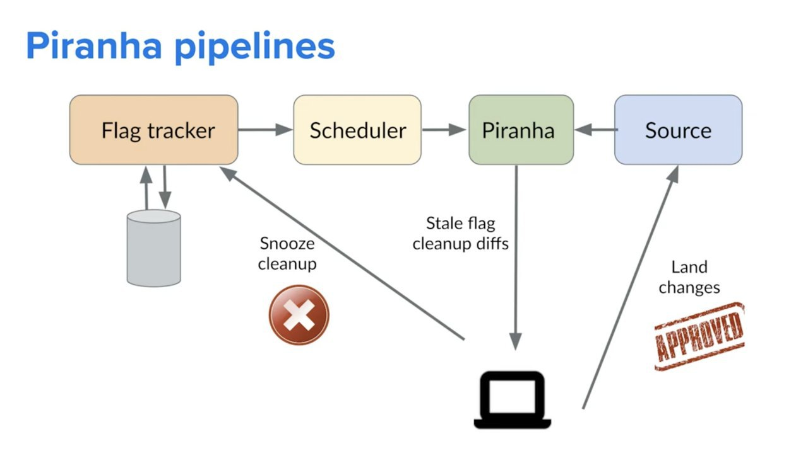
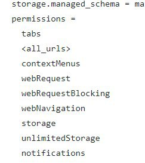
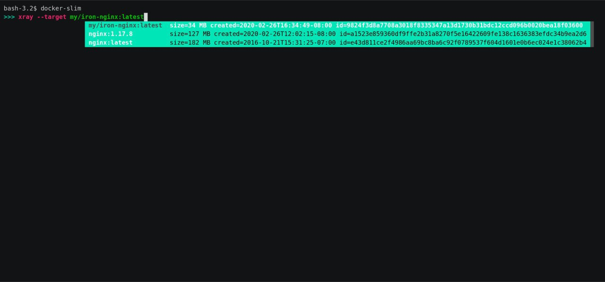
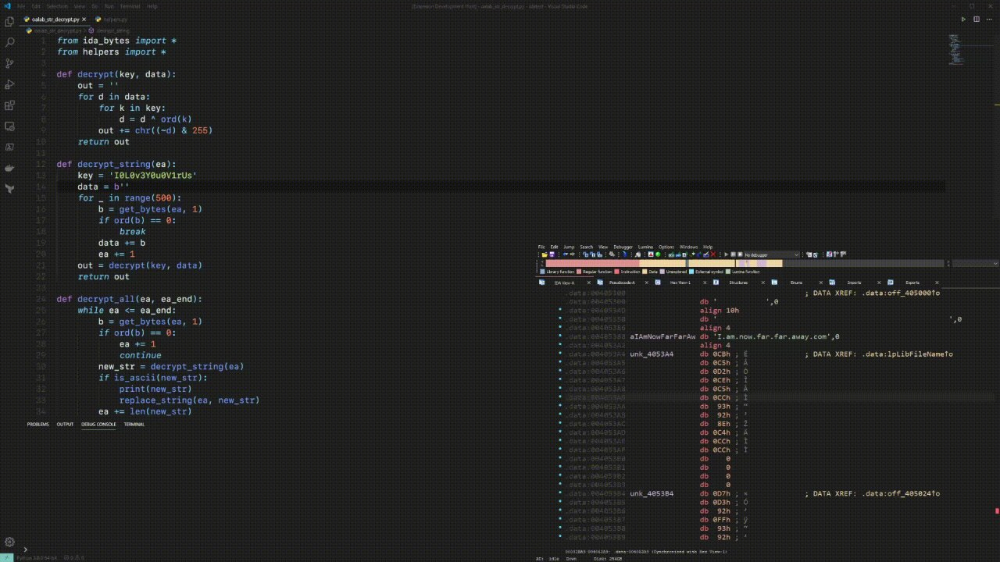
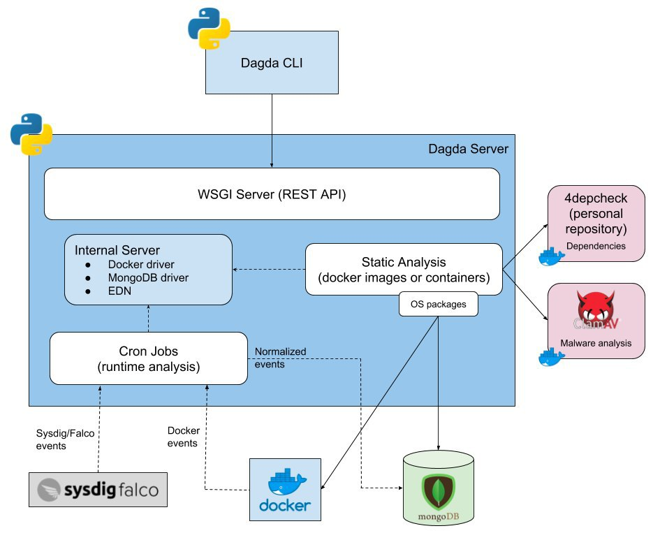

# cyberoffru
`2020-06-30 13:36:17`

* https://twitter.com/jfslowik/status/1277647427403608064
* https://security.paloaltonetworks.com/CVE-2020-2021
* https://twitter.com/CNMF_CyberAlert/status/1277674547542659074

<blockquote>
​​Вчера американская Palo Alto Networks опубликовала данные о выявленной критической уязвимости CVE-2020-2021 в механизме аутентификации операционной системы PAN-OS, на которой работают все nextgen файрволы Palo Alto.

Уязвимость позволяет злоумышленнику обходить аутентификацию PAN-OS и получать доступ к системе в случае отключения опции &quot;Validate Identity Provider Certificate&quot;. Отключение этой опции рекомендуют в своих мануалах ряд поставщиков ПО - например, это указывает Microsoft в руководстве по интеграции Azure AD c продуктами Palo Alto Networks.

Уязвимость получила оценку критичности 10 из 10. Ее эксплойт не требует от хакера высокой технической подготовки, а в случае успешной атаки злоумышленник может изменить настройки PAN-OS вплоть до отключения файрвола.

Исследователи бостонской Rapid7 обнаружили в сети почти 70 тыс. устройств на основе PAN-OS, 40% из которых защищают сети в США.

Видимо, в связи с большим количеством критических сетей, на которых стоят файрволы Palo Alto, у Киберкомандования США (USCYBERCOM) пригорело настолько, что они сразу обратились через Twitter с призывом немедленно обновить уязвимое ПО и исправить его настройки. 

При этом в качестве основной угрозы американское Киберкомандование указывает иностранные прогосударственные APT, которые &quot;вероятно, вскоре попытаются использовать данную уязвимость&quot;.

Инфосек сообщество с серьезностью угрозы полностью согласно.

Если вы используете файрволы от Palo Alto Networks - реагируйте сейчас. Потом может быть поздно.
</blockquote>

<table><tr><td><b>→</b><a href="https://twitter.com/jfslowik/status/1277647427403608064">
https://twitter.com/jfslowik/status/1277647427403608064
</a>
<blockquote>
&#35;CVE20202021 &#35;PatchYoShit https://t.co/PeVwxugQuk
</blockquote>
</td></tr></table>

---

# cyberoffru
`2020-06-29 08:27:07`

<blockquote>
https://github.com/atc-project/atomic-threat-coverage
</blockquote>

<table><tr><td><b>→</b><a href="https://github.com/atc-project/atomic-threat-coverage/">
https://github.com/atc-project/atomic-threat-coverage/
</a>
<blockquote>
Actionable analytics designed to combat threats. Contribute to atc-project/atomic-threat-coverage development by creating an account on GitHub.
</blockquote>
</td></tr></table>

---

# ctfchat
`2020-06-29 00:56:14`

<blockquote>
https://github.com/aol/moloch

Но это рофлу ради, не советую для стфа :d
</blockquote>

<table><tr><td><b>→</b><a href="https://github.com/aol/moloch">
https://github.com/aol/moloch
</a>
<blockquote>
Arkime (formerly Moloch) is an open source, large scale, full packet capturing, indexing, and database system. - arkime/arkime
</blockquote>
</td></tr></table>

---

# isast
`2020-06-26 11:16:52`

* https://telegra.ph/file/0f87ffee585610d84358f.jpg

<blockquote>
​​Blazing fast linter for &#35;js and &#35;ts written in &#35;rust 

This crate powers deno lint, but is not &#35;deno specific and can be used to write linters for Node as well.

https://github.com/denoland/deno_lint

Blazing fast, see comparison with ESLint:
</blockquote>

<table><tr><td><b>→</b><a href="https://telegra.ph/file/0f87ffee585610d84358f.jpg">
https://telegra.ph/file/0f87ffee585610d84358f.jpg
</a>
</td></tr></table>

---

# isast
`2020-06-26 09:36:26`

<blockquote>
Introducing Piranha: An Open Source Tool to Automatically Delete Stale Code

Piranha - open-source инструмент от Uber для автоматического рефакторинга кода. Рефакторинг происходит за счет меток, проставляемых разработчиками в коде. Удаление кода, окруженного специальной меткой, позволяет избавиться от устаревшего, неиспользуемого и временного участка кода. Кроме повышения эффективности разработчиков, сокращения времени сборки и размера бинаря, инструмент позволяет увеличить безопасность кода приложения. На текущий момент поддерживается Java, Objective C, Swift.

О том, как Uber применил Piranha для своих мобильных приложений

Исследования и академические выводы об инструменте

6-и минутный ролик

&#35;tools &#35;mobile
</blockquote>

---

# isast
`2020-06-26 03:11:23`

<blockquote>
https://psalm.dev/articles/detect-security-vulnerabilities-with-psalm
+
https://github.com/vimeo/psalm
</blockquote>

<table><tr><td><b>→</b><a href="https://psalm.dev/articles/detect-security-vulnerabilities-with-psalm">
https://psalm.dev/articles/detect-security-vulnerabilities-with-psalm
</a>
<blockquote>
Security vulnerabilities are often pretty hard to spot manually. While a null-pointer error can make itself known very quickly, you can execute code…
</blockquote>
</td></tr></table>

---

# ctfchat
`2020-06-23 22:58:37`

<blockquote>
https://github.com/kelseyhightower/nocode
</blockquote>

<table><tr><td><b>→</b><a href="https://github.com/kelseyhightower/nocode">
https://github.com/kelseyhightower/nocode
</a>
<blockquote>
The best way to write secure and reliable applications. Write nothing; deploy nowhere. - kelseyhightower/nocode
</blockquote>
</td></tr></table>

---

# isast
`2020-06-23 12:10:07`

<blockquote>
gramfuzz is a grammar-based fuzzer that lets one define complex grammars to generate text and binary data formats. 

Official site: https://d0c-s4vage.github.io/gramfuzz/ 
Source: https://github.com/d0c-s4vage/gramfuzz
</blockquote>

<table><tr><td><b>→</b><a href="https://github.com/d0c-s4vage/gramfuzz">
https://github.com/d0c-s4vage/gramfuzz
</a>
<blockquote>
gramfuzz is a grammar-based fuzzer that lets one define complex grammars to generate text and binary data formats. - d0c-s4vage/gramfuzz
</blockquote>
</td></tr></table>

---

# isast
`2020-06-22 13:21:20`

* https://telegra.ph/file/82fb217396c25a1d73e08.jpg

<blockquote>
​​&#35;haskell STatic ANalyser 

Stan is a command-line tool for analysing Haskell projects and outputting discovered vulnerabilities in a helpful way with possible solutions for detected problems. Stan is searching for not only performance or error-prone code pieces, but it also can help with establishing and applying best-practices from the whole Haskell ecosystem.

Although Haskell is a statically typed language, not all properties can be encoded in types. Even though GHC is quite a powerful compiler, it tries to be library-agnostic and provide only language-specific suggestions, while Stan uses the knowledge about the current state of the ecosystem and commonly used libraries.

You will find Stan helpful if you enjoy writing in Haskell, but want more guarantees from your code, not provided by the Haskell type system or GHC.

Stan is a configurable CLI tool. Besides the main feature of analysing Haskell projects statically, Stan has a list of features that make it unique, easy to use and flexible to configure:

- Pretty analysis results, including both HTML and terminal reports
- Suggestions and possible solutions for fixing the existing problems
- Analysing not only Haskell source code, but also information from the .cabal files
- Flexible runtime configuration via TOML and CLI

https://github.com/kowainik/stan
</blockquote>

<table><tr><td><b>→</b><a href="https://telegra.ph/file/82fb217396c25a1d73e08.jpg">
https://telegra.ph/file/82fb217396c25a1d73e08.jpg
</a>
</td></tr></table>

---

# exploitex
`2020-06-22 10:23:13`

* https://telegra.ph/file/20e6eb4d786cf53163467.jpg

<blockquote>
​​Как искать конфиденциальные данные в репозиториях Github

Зачастую чувствительные данные хранятся в исходных кодах проектов, что упрощает жизнь разработчикам и в то же время специалистам по тестированию на проникновение. Не удивительно, что в Git-репозиториях хранится множество забытой информации, которая может помочь при проведении OSINT.

С помощью утилиты gittyleaks вы можете узнать утечки в Git-репозиториях, которые могут представлять из себя ключи API, имена пользователей, пароли, адреса электронной почты и многое другое.

1. Устанавливаем gittyleaks
$ pip3 install gittyleaks

2. Для поиска информации используйте следующие команды:
$ gittyleaks -link https://github.com/githubreponame
или
$ gittyleaks -user githubusername -repo githubusername

Таким образом, если в репозитории присутствует запрашиваемая вами информация, gittyleaks выдаст вам результат, который можно использовать в своих целях.
</blockquote>

<table><tr><td><b>→</b><a href="https://telegra.ph/file/20e6eb4d786cf53163467.jpg">
https://telegra.ph/file/20e6eb4d786cf53163467.jpg
</a>
</td></tr></table>

---

# isast
`2020-06-20 12:27:02`

<blockquote>
https://github.com/google/clusterfuzz
</blockquote>

<table><tr><td><b>→</b><a href="https://github.com/google/clusterfuzz">
https://github.com/google/clusterfuzz
</a>
<blockquote>
Scalable fuzzing infrastructure. Contribute to google/clusterfuzz development by creating an account on GitHub.
</blockquote>
</td></tr></table>

---

# isast
`2020-06-20 03:44:58`

* https://telegra.ph/file/9b45a5946b0cd80d1bb27.jpg
* https://fuchsia.dev/
* https://blog.quarkslab.com/playing-around-with-the-fuchsia-operating-system.html
* https://llvm.org/docs/LibFuzzer.html
* https://github.com/google/syzkaller

<blockquote>
​​Уже несколько лет внутри Google разрабатывается проект новой операционной системы - Fuchsia. Вокруг этого проекта огромное количество слухов, есть мнение, что он заменит собой Android или что это просто развлечение для разработчиков, что бы им не было скучно. Что это будет на самом деле, не ясно, так как Google хранит таинственное молчание 🤔

Очень интересно, как эта система устроена внутри и что там с безопасностью. В этой статье описана не только архитектура системы, но уязвимости, которые в ней уже нашли исследователи (к слову, их уже пофиксили). 

Наиболее интересное решение - отказ от монолитного ядра (которое использует большинство систем) и переход к микро ядру, выполняющему только основные операции. С точки зрения безопасности это означает, что если уязвимость будет присутствовать, например, в Bluetooth модуле, то атакующий получит доступ только к адресному пространству этого модуля без доступа к ядру. Что бы скомпроментировать систему придется искать и эксплуатировать другие уязвимости в ядре и повышать привилегии. Достаточно изящное решение, которое может существенно затруднить получение root-доступа на этой системе.

И что еще интересно - в процессе разработки для повышения безопасности практически каждый модуль проверяется не только юнит тестами, но и фаззингом (libfuzzer и syzkaller). 😎

&#35;Android &#35;Fuchsia &#35;Vulnerabilities &#35;Research
</blockquote>

<table><tr><td><b>→</b><a href="https://telegra.ph/file/9b45a5946b0cd80d1bb27.jpg">
https://telegra.ph/file/9b45a5946b0cd80d1bb27.jpg
</a>
</td></tr></table>

---

# isast
`2020-06-19 13:28:45`

<blockquote>
https://github.com/github/super-linter/wiki
</blockquote>

<table><tr><td><b>→</b><a href="https://github.com/github/super-linter/wiki">
https://github.com/github/super-linter/wiki
</a>
<blockquote>
Combination of multiple linters to install as a GitHub Action - github/super-linter
</blockquote>
</td></tr></table>

---

# isast
`2020-06-19 13:13:26`

<blockquote>
Вчера вышел пост от Github, презентовали их Super Linter. Комбайн из разных линтеров, чтобы сразу подключить все и вся.

С одной стороны эт круто, не надо будет бегать делать для каждого языка, с другой стороны вопрос, на сколько это гибко можно будет включить. Но вот как дефолт это вполне себе бонус.

https://github.blog/2020-06-18-introducing-github-super-linter-one-linter-to-rule-them-all/

Хотелось бы пойти в репу https://github.com/github/super-linter и посмотреть что как, так гитхаб сейчас 500 ошибки отдаёт раз через раз.
</blockquote>

<table><tr><td><b>→</b><a href="https://github.blog/2020-06-18-introducing-github-super-linter-one-linter-to-rule-them-all/">
https://github.blog/2020-06-18-introducing-github-super-linter-one-linter-to-rule-them-all/
</a>
<blockquote>
Setting up a new repository with all the right linters for the different types of code can be time consuming and tedious. So many tools and configurations to choose from and often more than one
</blockquote>
</td></tr></table>

---

# ctfchat
`2020-06-18 16:00:59`

<blockquote>
вот, к примеру, разрешения adblockplus.
Выглядит круто, да?)
</blockquote>

---

# isast
`2020-06-17 17:40:24`

* https://telegra.ph/file/74d96ba4455e6178db7ce.jpg

<blockquote>
​​Nicene is a collection of extra Credo checks for linting &#35;elixir code.

https://github.com/sketch-hq/nicene
</blockquote>

<table><tr><td><b>→</b><a href="https://telegra.ph/file/74d96ba4455e6178db7ce.jpg">
https://telegra.ph/file/74d96ba4455e6178db7ce.jpg
</a>
</td></tr></table>

---

# cyberoffru
`2020-06-17 17:12:45`

<blockquote>
Обновление медиапроигрывателя VLC 3.0.11 с устранением уязвимости https://opennet.ru/53176/
</blockquote>

<table><tr><td><b>→</b><a href="https://opennet.ru/53176">
https://opennet.ru/53176
</a>
<blockquote>
Представлен корректирующий релиз медиаплеера VLC 3.0.11, в котором устранены накопившиеся ошибки и устранена уязвимость (CVE-2020-13428), вызванная переполнением буфера в функции hxxx_AnnexB_to_xVC(). Уязвимость потенциально позволяет организовать выполнение кода атакующего при воспроизведении специально оформленного видео в формате H.264 (Annex-B), упакованного, например, в контейнер AVI. Упоминаний о создании рабочего эксплоита пока нет. Кроме проблем в коде VLC отмечается устранение двух уязвимостей (CVE-2020-9308, CVE-2019-19221) в библиотеке libarchive, встроенной в некоторые загрузочные наборы.
</blockquote>
</td></tr></table>

---

# isast
`2020-06-16 16:00:00`

<blockquote>
https://securitylab.github.com/research/fuzzing-sockets-FTP
</blockquote>

<table><tr><td><b>→</b><a href="https://securitylab.github.com/research/fuzzing-sockets-FTP/">
https://securitylab.github.com/research/fuzzing-sockets-FTP/
</a>
<blockquote>
Antonio shares his research on socket-based fuzzing, starting with the audit of three widely-used FTP servers. With details on interesting CVEs found along the way.
</blockquote>
</td></tr></table>

---

# isast
`2020-06-16 10:57:52`

<blockquote>
Docker-Slim

Docker-slim - бесплатный инструмент, позволяющий оптимизировать размер образов Docker, используя различные методики анализа. В некоторых случаях размер образов может быть уменьшен в 30 раз. Говоря про безопасность, Docker-slim также может автоматически сгенерировать AppArmor и Seccomp профили для выбранных образов.

Пример работы

DockerSlim Demo ( Docker Global Hack Day )

&#35;docker &#35;tools
</blockquote>

---

# webware
`2020-06-13 19:28:19`

* https://telegra.ph/file/25f2368111e53394b0fcd.jpg
* https://github.com/splunk/attack_range
* https://codeby.net/tags/guide/
* https://codeby.net/tags/splunk/
* https://codeby.net/tags/ubuntu/
* https://codeby.net/tags/virtual-machine/

<blockquote>
​​Splunk Attack Range в виртуальной гостевой Ubuntu VM: Руководство

Splunk Attack Range - это отличный проект от Splunk, который позволяет любому заинтересовавшемуся быстро (то есть автоматически) собрать и развернуть весь инфраструктурный стак с различным ПО, либо инструментом для тестирования кибер атака на уязвимые хосты, захвата и отправки логов с хостов, пересылки данных о событиях в Splunk и даже реализации SOAR playbooks (см. выше страницу GitHub проекта для получения подробной информации) .

Читать статью полностью: https://codeby.net/threads/splunk-attack-range-v-virtualnoj-gostevoj-ubuntu-vm-rukovodstvo.73460/

guide splunk ubuntu virtual machine
</blockquote>

<table><tr><td><b>→</b><a href="https://telegra.ph/file/25f2368111e53394b0fcd.jpg">
https://telegra.ph/file/25f2368111e53394b0fcd.jpg
</a>
</td></tr></table>

---

# isast
`2020-06-12 16:49:11`

<blockquote>
Вот это поворот

GitLab Acquires Peach Tech and Fuzzit to Expand its DevSecOps Offering
https://about.gitlab.com/press/releases/2020-06-11-gitlab-acquires-peach-tech-and-fuzzit-to-expand-devsecops-offering.html
</blockquote>

<table><tr><td><b>→</b><a href="https://about.gitlab.com/press/releases/2020-06-11-gitlab-acquires-peach-tech-and-fuzzit-to-expand-devsecops-offering.html">
https://about.gitlab.com/press/releases/2020-06-11-gitlab-acquires-peach-tech-and-fuzzit-to-expand-devsecops-offering.html
</a>
<blockquote>
Acquisitions will make GitLab the first security solution to offer both coverage-guided and behavioral fuzz testing
</blockquote>
</td></tr></table>

---

# cyberoffru
`2020-06-12 01:01:14`

<blockquote>
https://www.opennet.ru/opennews/art.shtml?num&#61;53126
</blockquote>

<table><tr><td><b>→</b><a href="https://www.opennet.ru/opennews/art.shtml?num=53126">
https://www.opennet.ru/opennews/art.shtml?num=53126
</a>
<blockquote>
Группа исследователей из Амстердамского свободного университета выявила новую уязвимость (CVE-2020-0543) в микроархитектурных структурах процессоров Intel, примечательную тем, что она позволяет восстановить результаты выполнения некоторых инструкций, выполняемых на другом ядре CPU. Это первая уязвимость механизма спекулятивного выполнения инструкций, допускающая утечку данных между отдельными ядрами CPU (ранее утечки ограничивались разными потоками одного ядра). Исследователи присвоили проблеме имя CROSSTalk, но в документах Intel уязвимость упоминается как SRBDS (Special Register Buffer Data Sampling).
</blockquote>
</td></tr></table>

---

# cyberoffru
`2020-06-12 00:57:17`

<blockquote>
https://www.opennet.ru/opennews/art.shtml?num&#61;53123
</blockquote>

<table><tr><td><b>→</b><a href="https://www.opennet.ru/opennews/art.shtml?num=53123">
https://www.opennet.ru/opennews/art.shtml?num=53123
</a>
<blockquote>
Раскрыты сведения об уязвимости (CVE-2020-12695) в протоколе UPnP, позволяющей организовать отправку трафика произвольному получателю, используя предусмотренную в стандарте операцию &quot;SUBSCRIBE&quot;. Уязвимости присвоено кодовое имя CallStranger. Уязвимость может применяться для извлечения данных из сетей, защищённых системами предотвращения утечек данных (DLP), организации сканирования портов компьютеров во внутренней сети, а также для усиления DDoS-атак при помощи миллионов подключённых к глобальной сети UPnP-устройств, таких как кабельные модемы, домашние маршрутизаторы, игровые консоли, IP-камеры, TV-приставки, медиацентры и принтеры.
</blockquote>
</td></tr></table>

---

# isast
`2020-06-11 10:28:46`

<blockquote>
The Octopus Scanner Malware: Attacking the open source supply chain
https://securitylab.github.com/research/octopus-scanner-malware-open-source-supply-chain
</blockquote>

<table><tr><td><b>→</b><a href="https://securitylab.github.com/research/octopus-scanner-malware-open-source-supply-chain/">
https://securitylab.github.com/research/octopus-scanner-malware-open-source-supply-chain/
</a>
<blockquote>
This post details how an open source supply chain malware spread through build artifacts. 26 open source projects were backdoored by this malware and were actively serving backdoored code.
</blockquote>
</td></tr></table>

---

# codeibcommunity
`2020-06-10 12:57:27`

<blockquote>
@ndthcrjq https://github.com/mxssl/tg-captcha-bot - страница бота. Если что-то найдёте подозрительное дайте знать, а то я и так в очках но допускаю косяки, бывает
</blockquote>

<table><tr><td><b>→</b><a href="https://github.com/mxssl/tg-captcha-bot">
https://github.com/mxssl/tg-captcha-bot
</a>
<blockquote>
Telegram Сaptcha Bot. Contribute to mxssl/tg-captcha-bot development by creating an account on GitHub.
</blockquote>
</td></tr></table>

---

# ctfchat
`2020-06-09 22:16:59`

<blockquote>
https://github.com/cytopia/pwncat&#35;computer-usage
</blockquote>

<table><tr><td><b>→</b><a href="https://github.com/cytopia/pwncat">
https://github.com/cytopia/pwncat
</a>
<blockquote>
pwncat - netcat on steroids with Firewall, IDS/IPS evasion, bind and reverse shell, self-injecting shell and port forwarding magic - and its fully scriptable with Python (PSE) - cytopia/pwncat
</blockquote>
</td></tr></table>

---

# cyberoffru
`2020-06-09 18:52:01`

<blockquote>
Уязвимость в UPnP, подходящая для усиления DDoS-атак и сканирования внутренней сети https://opennet.ru/53123/
</blockquote>

<table><tr><td><b>→</b><a href="https://opennet.ru/53123/">
https://opennet.ru/53123/
</a>
<blockquote>
Раскрыты сведения об уязвимости (CVE-2020-12695) в протоколе UPnP, позволяющей организовать отправку трафика произвольному получателю, используя предусмотренную в стандарте операцию &quot;SUBSCRIBE&quot;. Уязвимости присвоено кодовое имя CallStranger. Уязвимость может применяться для извлечения данных из сетей, защищённых системами предотвращения утечек данных (DLP), организации сканирования портов компьютеров во внутренней сети, а также для усиления DDoS-атак при помощи миллионов подключённых к глобальной сети UPnP-устройств, таких как кабельные модемы, домашние маршрутизаторы, игровые консоли, IP-камеры, TV-приставки, медиацентры и принтеры.
</blockquote>
</td></tr></table>

---

# exploitex
`2020-06-09 09:25:00`

* https://telegra.ph/file/55adba6d0b5332a9c2071.jpg

<blockquote>
​​Как получить доступ к админ-панели роутера и узнать пароль от Wi-Fi

Самым простым способом получить доступ к административной панели роутера является использование RouterSploit Framework. Он представляет из себя фреймворк с открытым исходным кодом, посвящённый эксплуатации встраиваемых устройств (роутеров, беспроводных точек доступа).

С помощью фреймворка можно выбрать подходящий тип авторизации в административную панель и запустить перебор по словарю.

1. Устанавливаем фреймворк:
$ git clone https://www.github.com/threat9/routersploit
$ cd routersploit
$ python3 -m pip install -r requirements.txt
$ python3 rsf.py

2. Для выполнения атаки необходимо выполнить следующие команды: 
$ use creds/http_basic_bruteforce
$ set target 192.168.0.2
$ set passwords file:///usr/share/wordlists/nmap.lst
$ run

После успешного подбора авторизационных данных, вы можете зайти в панель настроек и найти пароль от Wi-Fi, как правило, в открытом виде. Вы также можете его поменять, отключить устройства, изменить настройки и многое другое.
</blockquote>

<table><tr><td><b>→</b><a href="https://telegra.ph/file/55adba6d0b5332a9c2071.jpg">
https://telegra.ph/file/55adba6d0b5332a9c2071.jpg
</a>
</td></tr></table>

---

# isast
`2020-06-08 10:25:20`

<blockquote>
IDACode - интеграция Visual Studio Code с IDA Pro для удобной разработки и дебага плагинов или скриптов на idapython 🙀
</blockquote>

---

# isast
`2020-06-05 05:08:06`

<blockquote>
A lightweight dynamic instrumentation library

https://github.com/googleprojectzero/TinyInst
</blockquote>

<table><tr><td><b>→</b><a href="https://github.com/googleprojectzero/TinyInst">
https://github.com/googleprojectzero/TinyInst
</a>
<blockquote>
A lightweight dynamic instrumentation library. Contribute to googleprojectzero/TinyInst development by creating an account on GitHub.
</blockquote>
</td></tr></table>

---

# exploitex
`2020-06-03 09:31:00`

* https://telegra.ph/file/ded4ed52fb96936f1026a.jpg
* https://drive.google.com/file/d/11rxzYvPcIOh_8GvS4XSC3YtbW3CecE-O/view

<blockquote>
​​Обычная фотография превращает Android-смартфоны в кирпич

Пользователи обнаружили, после установки обычной картинки с пейзажем в качестве обоев устройство перестает отвечать, постоянно включает и отключает экран блокировки и не позволяет сделать что-либо еще.

Дело в том, что обычно Android работает с sRGB, тогда как опасный пейзаж использует RGB. Другими словами, сама по себе фотография абсолютно безвредна, однако из этого следует, что сломать смартфон на базе Android версии от 1 до 10 включительно может абсолютно любое RGB-изображение.

Вернуть смартфон к жизни после этого можно сбросив настройки до заводских настроек или выполнив загрузку через меню recovery и удалив опасное изображение вручную. 

&#35;новость
</blockquote>

<table><tr><td><b>→</b><a href="https://telegra.ph/file/ded4ed52fb96936f1026a.jpg">
https://telegra.ph/file/ded4ed52fb96936f1026a.jpg
</a>
</td></tr></table>

---

# ruCyberSecurity
`2020-06-03 09:29:32`

<blockquote>
Бесплатные конференции, тренинги, книги, курсы и проч. по кибербезопасности
https://github.com/gerryguy311/CyberProfDevelopmentCovidResources/blob/master/README.md
</blockquote>

---

# isast
`2020-06-01 11:37:29`

<blockquote>
FI(le) SY(stem) - full file system fuzzing framework

Source: https://github.com/0xricksanchez/fisy-fuzz
Video from HITB 2020: https://www.youtube.com/watch?v&#61;VNzKVOsn5qQ&amp;feature&#61;youtu.be&amp;t&#61;17032
Materials: https://github.com/0xricksanchez/HITB2020_FSFUZZER

 &#35;fuzzing
</blockquote>

<table><tr><td><b>→</b><a href="https://github.com/0xricksanchez/fisy-fuzz">
https://github.com/0xricksanchez/fisy-fuzz
</a>
<blockquote>
This is the full file system fuzzing framework that I presented at the Hack in the Box 2020 Lockdown Edition conference in April. - 0xricksanchez/fisy-fuzz
</blockquote>
</td></tr></table>

---

# isast
`2020-06-01 11:37:10`

<blockquote>
Dagda

Dagda - инструмент для анализа уязвимостей, троянов, вирусов, вредоносного ПО в образах и контейнерах Docker, а также для выявления аномальной активности контейнеров. 

При инициализации загружает базу уязвимостей (CVE, BIG,  RHSA, RHBA) в базу MongoDB, с которой в дальнейшем сравнивает версии пакетов, установленные в образе. В качестве антивирусного ядра использует ClamAV, а для поиска аномальной активности Falco. Для анализа зависимостей используются DependencyCheck и Retire.js

&#35;tool &#35;docker &#35;k8s
</blockquote>

---

