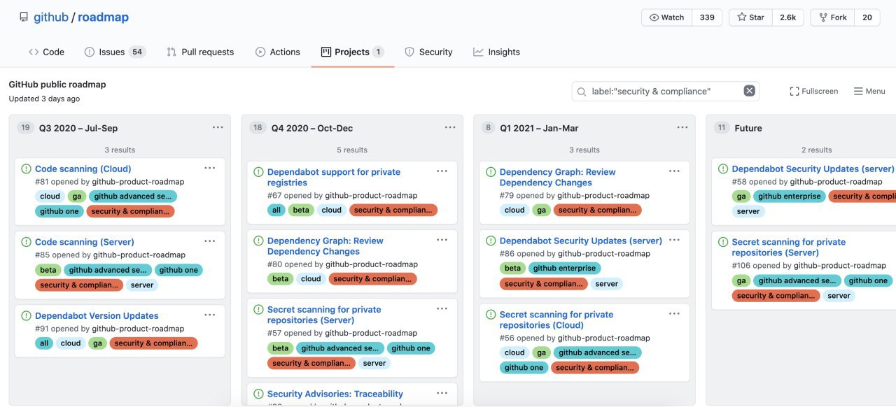
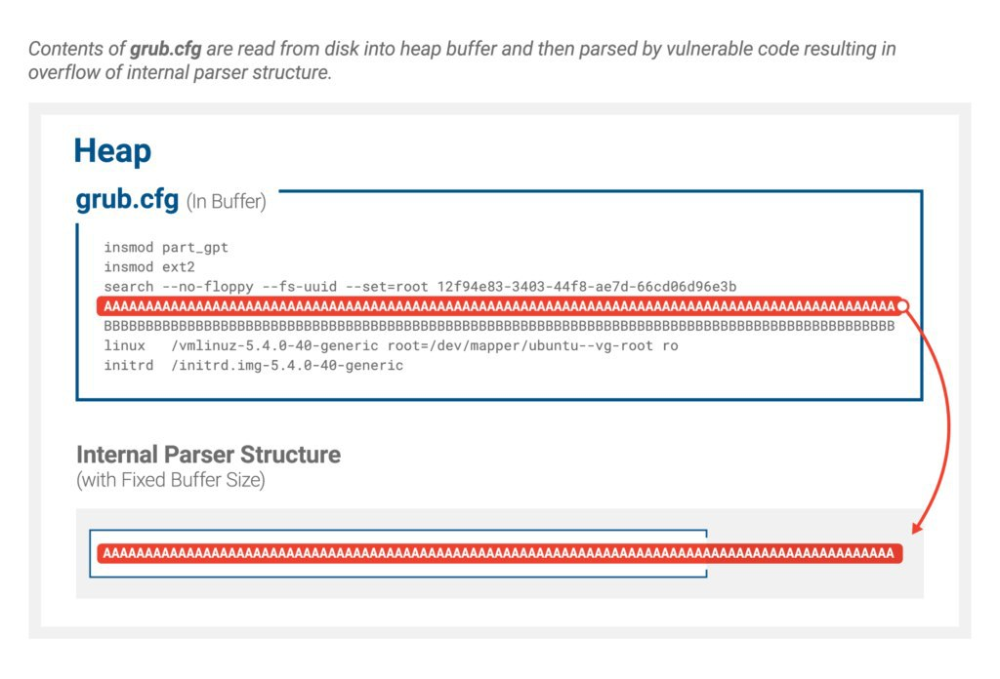
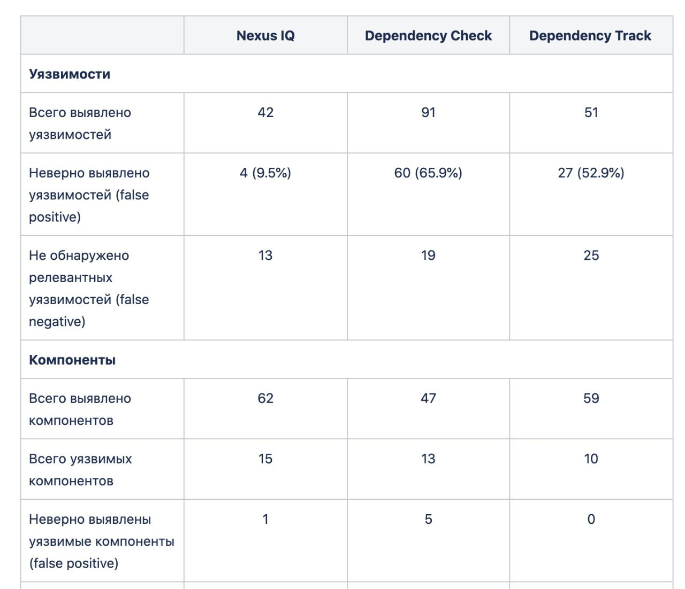
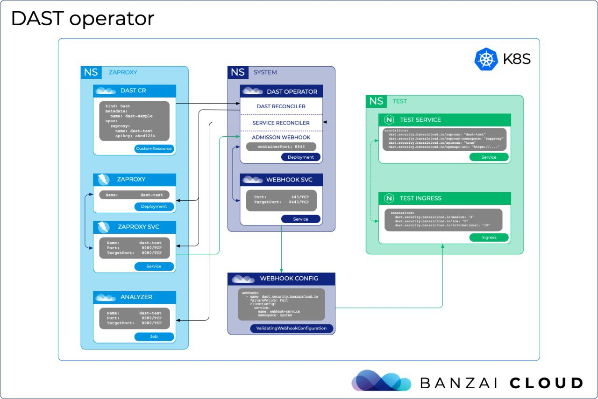

# isast
`2020-07-31 15:39:44`

<blockquote>
https://github.com/IBM/fhe-toolkit-linux
</blockquote>

<table><tr><td><b>→</b><a href="https://github.com/IBM/fhe-toolkit-linux">
https://github.com/IBM/fhe-toolkit-linux
</a>
<blockquote>
IBM Fully Homomorphic Encryption Toolkit For Linux. This toolkit is a Linux based Docker container that demonstrates computing on encrypted data without decrypting it! The toolkit ships with two de...
</blockquote>
</td></tr></table>

---

# isast
`2020-07-31 12:09:57`

<blockquote>
GitHub Public Roadmap

Кстати, еще немного про GitHub. Недавно они опубликовали свой Roadmap в открытый доступ, с чем вы уже можете познакомиться. По ссылке можно увидеть то, что относится к security.

https://github.com/github/roadmap/projects/1?card_filter_query&#61;label%3A%22security+%26+compliance%22

&#35;news
</blockquote>

---

# isast
`2020-07-29 22:52:28`

<blockquote>
⭕️ CVE-2020-10713 GRUB2 - BootHole

В GNU GRUB2 обнаружили неприятную уязвимость. 

Затрагивает SecureBoot. 
Уязвимы почти все дистры Linux, куча других embedded операционок и решений вроде Xen. 

Уязвимость как из учебника, переполнение кучи при чтении слишком длинного параметра из grub.cfg.

Проверку на длину конечно же добавили, и на такой случай вызвали макрос fatal_error, и как оказалось fatal_error громко ругается, но не останавливает исполнение кода (а все надеялись), отсюда контроль над памятью. 

И это всё за пределами контекста операционной системы, никаких ASLR, DEP и nx mitigation нет, зато есть полный контроль над загрузкой оси.

Так как GRUB отвечает за bootload, привилегии при эксплуатации наивысшие, простор для буткитов.

Репорт подтолкнул поаудитить код GRUB, и оказалось, что там еще ряд неприятных багов.

👉 https://eclypsium.com/2020/07/29/theres-a-hole-in-the-boot/
</blockquote>

---

# isast
`2020-07-25 23:59:19`

<blockquote>
https://github.com/hardenedlinux/harbian-qa/blob/master/syzkaller/kstate_resource.md
</blockquote>

<table><tr><td><b>→</b><a href="https://github.com/hardenedlinux/harbian-qa/blob/master/syzkaller/kstate_resource.md">
https://github.com/hardenedlinux/harbian-qa/blob/master/syzkaller/kstate_resource.md
</a>
<blockquote>
Bug hunting through fuzzer/*-sanitizer/etc... Contribute to hardenedlinux/harbian-qa development by creating an account on GitHub.
</blockquote>
</td></tr></table>

---

# exploitex
`2020-07-25 15:11:00`

* https://telegra.ph/file/da14ba6d32da1b24882ac.jpg
* http://sandlab.cs.uchicago.edu/fawkes/
* https://github.com/Shawn-Shan/fawkes
* https://github.com/Shawn-Shan/fawkes/blob/master/fawkes/README.md
* https://t.me/joinchat/AAAAAE3zHuKXF0sgmzL3OQ

<blockquote>
​​Защита фотографий от систем распознавания лиц

Современные системы распознавания лиц представляют большую угрозу личной приватности. Уже сейчас такие системы ежедневно сканируют миллионы лиц в Китае, Великобритании и России без их согласия. Исследователи придумали алгоритм, который делает незаметные попиксельные изменения в фотографии, делая ее бесполезной для систем распознавания лиц. 

После обработки вы можете использовать фотографии как угодно — публиковать в социальных сетях, передавать друзьям или распечатывать на бумаге. В любом случае, для распознавания лиц они уже бесполезны. Сжатие фотографий и применение любых графических фильтров не снимают защиту, поскольку клоакинг происходит на уровне пикселей, и не стирается в растровом редакторе. 

Алгоритм был протестирован и показал эффективность 100% против самых известных моделей распознавания Microsoft Azure Face API, Amazon Rekognition и Face++. Программа имеет открытый исходный код и ее можно установить на Windows, Linux и Mac.

Эксплойт / &#35;приватность
</blockquote>

<table><tr><td><b>→</b><a href="https://telegra.ph/file/da14ba6d32da1b24882ac.jpg">
https://telegra.ph/file/da14ba6d32da1b24882ac.jpg
</a>
</td></tr></table>

---

# isast
`2020-07-23 23:02:09`

<blockquote>
FuZZan: Efficient Sanitizer Metadata Design for Fuzzing

Source: https://github.com/HexHive/FuZZan
Article: http://hexhive.epfl.ch/publications/files/20ATC.pdf
</blockquote>

<table><tr><td><b>→</b><a href="https://github.com/HexHive/FuZZan">
https://github.com/HexHive/FuZZan
</a>
<blockquote>
FuZZan: Efficient Sanitizer Metadata Design for Fuzzing - HexHive/FuZZan
</blockquote>
</td></tr></table>

---

# isast
`2020-07-23 15:18:04`

* https://telegra.ph/file/b302db5355acde645933d.jpg

<blockquote>
​​A &#35;rust crate to offer compile-time assistance for working with unsafe code. 

Sometimes functions or methods have preconditions that cannot be ensured in the type system and cannot be guarded against at runtime. The most prominent example of functions like that are unsafe functions. When used correctly, unsafe functions are used to &quot;declare the existence of contracts the compiler can't check&quot;. These contracts are the preconditions for the function call. Failing to uphold them usually results in a violation of memory safety and undefined behavior.

Currently the most used scheme for dealing with these preconditions on unsafe functions is to mention them in the Safety section of the function's documentation. Programmers using the function then have to check what they have to ensure to call the function correctly. The programmer that uses the function may then leave a comment next to the function, describing why the call is safe (why the preconditions hold).

This approach is even advertised by the compiler (as of 1.44.1) when using an unsafe function outside of an unsafe block.

This library works by allowing programmers to specify preconditions on functions they write in a unified format. Those preconditions are then transformed into an additional function argument. Callers of the function then specify the same preconditions at the call site, along with a reason why they believe the precondition is upheld. If the preconditions don't match or are not specified, the function will have invalid arguments and the code will not compile.

https://github.com/aticu/pre
</blockquote>

<table><tr><td><b>→</b><a href="https://telegra.ph/file/b302db5355acde645933d.jpg">
https://telegra.ph/file/b302db5355acde645933d.jpg
</a>
</td></tr></table>

---

# chkpchat
`2020-07-23 11:56:06`

<blockquote>
https://mailing.checkpoint.com/click.html?x&#61;a62e&amp;lc&#61;kAn&amp;mc&#61;k&amp;s&#61;P4yr&amp;u&#61;7&amp;z&#61;G739fFe&amp;
</blockquote>

<table><tr><td><b>→</b><a href="https://mailing.checkpoint.com/click.html?x=a62e&lc=kAn&mc=k&s=P4yr&u=7&z=G739fFe&">
https://mailing.checkpoint.com/click.html?x=a62e&lc=kAn&mc=k&s=P4yr&u=7&z=G739fFe&
</a>
<blockquote>
We invited one of our most talented researchers - the brain behind the SIGRed vulnerability - Sagi Tzadik, to walk you through the process of discovering a CVSS 10.0 vulnerability.
We have also invited our Network Research Team Leader - Ori Hamama, which develop protections against new network threats.

This talk will discuss the research process, methodology, and mindset behind SIGRed.
We will also demonstrate how this attack can be mitigated with Check Point's various products.

Session Duration: ~ 45 min
Q&amp;A: At the end of the session , we will have a  Q&amp;A session
</blockquote>
</td></tr></table>

---

# isast
`2020-07-23 11:15:17`

* https://www.industrialempathy.com/posts/design-docs-at-google/
* https://go.googlesource.com/proposal/+/master/design/draft-fuzzing.md
* https://github.com/dvyukov/go-fuzz#trophies

<blockquote>
Гуглеры описали в статье как они документируют дизайн - Design Docs at Google. Свежий пример такого документа - Design Draft: First Class Fuzzing от сотрудника Гугла, который описывает интеграцию фаззера go-fuzz в тулинг Go. go-fuzz зарекомендовал себя успешным инструментом, в его списке трофеев 400(!) багов, найденных в коде Golang и популярных библиотеках на Go.
</blockquote>

<table><tr><td><b>→</b><a href="https://www.industrialempathy.com/posts/design-docs-at-google/">
https://www.industrialempathy.com/posts/design-docs-at-google/
</a>
<blockquote>
One of the key elements of Google's software engineering culture is the use of defining software designs through design docs. These are...
</blockquote>
</td></tr></table>

---

# isast
`2020-07-23 10:19:48`

<blockquote>
https://github.com/appsecco/dvja

&quot;Damn Vulnerable Java Application&quot;
</blockquote>

<table><tr><td><b>→</b><a href="https://github.com/appsecco/dvja">
https://github.com/appsecco/dvja
</a>
<blockquote>
Damn Vulnerable Java (EE) Application. Contribute to appsecco/dvja development by creating an account on GitHub.
</blockquote>
</td></tr></table>

---

# isast
`2020-07-23 10:17:31`

<blockquote>
False Positive: Dependency Check, Dependency Track and Nexus IQ

Просканировал уязвимый java-проект dvja тремя инструментами SCA: open-source Dependency Check, Dependency Track и платным продуктом Nexus IQ. Для каждой выявленной CVE сделал ревью и вот что предварительно получилось - 65% фолзов для Dependency Check, 52% для Dependency Track и только 10 для Nexus IQ.

Казалось бы, откуда тут фолзы? Так как  open source инструменты строят на базе выявленной компоненты CPE-строку, после чего лезут в NVD за CVE для этой компоненты, то могут возникать ошибки -  несоответствие CVE  к выявленной компоненте,  несоответствие CVE к выявленной версии и дублирование CVE (отображение несколько CVE об одной и той же уязвимости). Nexus в данном случае выиграет за счет того, что Sonatype расширили каждую CVE, указав уязвимый класс, функцию и проведя дополнительные ресерчи. 

Чуть попозже надеюсь, что оформим это все в статью, чтобы все могли познакомиться с ревью поглубже. 

&#35;sca &#35;tools
</blockquote>

---

# MPSIEMChat
`2020-07-22 18:30:42`

<blockquote>
Она и раньше была :) https://github.com/feedb/MPSiem_addons/tree/master/telegram-bot%20incidents
</blockquote>

<table><tr><td><b>→</b><a href="https://github.com/feedb/MPSiem_addons/tree/master/telegram-bot%20incidents">
https://github.com/feedb/MPSiem_addons/tree/master/telegram-bot%20incidents
</a>
<blockquote>
реп полезностей для PT MaxPatrol SIEM. Contribute to feedb/MPSiem_addons development by creating an account on GitHub.
</blockquote>
</td></tr></table>

---

# chkpchat
`2020-07-22 13:12:02`

<blockquote>
https://about.gitlab.com/ - только грузится 2 мин
</blockquote>

<table><tr><td><b>→</b><a href="https://about.gitlab.com/">
https://about.gitlab.com/
</a>
<blockquote>
Our open DevOps platform is a single application for unparalleled collaboration, visibility, and development velocity.
</blockquote>
</td></tr></table>

---

# chkpchat
`2020-07-22 03:01:55`

* https://telegra.ph/file/a89c777b3c84eddb18117.jpg
* https://t.me/chkpstar/136
* https://t.me/chkpstar/142
* https://t.me/chkpstar/144
* https://github.com/CheckPointSW
* https://github.com/CheckPointSW/ShowPolicyPackage

<blockquote>
​​&#35;learn 

У Check Point есть множество полезных инструментов автоматизации, например:
- анализ и очистка политики безопасности 
- SDK для питона под REST API, что бы писать любые скрипты  
- Скрипт для автоматического анализа &quot;здоровья&quot; GAIA 

И самое главное, они постоянно обновляются и модернизируются. 
Многие из них, расположены в официальном репозитории на Github - CheckPointSW 

Вот например, недавно была обновлена тулза для выгрузки политик и объектов в HTML/JSON из Check Point.
Про то, что это и как выглядит, было написано здесь -  https://t.me/chkpstar/89
А новая версия тут - ShowPolicyPackage 

Кстати, удобная штука, для анализа политики и ее объектов в сторонних инструментах !
</blockquote>

<table><tr><td><b>→</b><a href="https://telegra.ph/file/a89c777b3c84eddb18117.jpg">
https://telegra.ph/file/a89c777b3c84eddb18117.jpg
</a>
</td></tr></table>

---

# codeibcommunity
`2020-07-20 21:10:39`

<blockquote>
Вот есть достаточно известный товарищ Александр Попов https://a13xp0p0v.github.io/2017/03/24/CVE-2017-2636-ru.html
</blockquote>

<table><tr><td><b>→</b><a href="https://a13xp0p0v.github.io/2017/03/24/CVE-2017-2636-ru.html">
https://a13xp0p0v.github.io/2017/03/24/CVE-2017-2636-ru.html
</a>
<blockquote>
Введение
</blockquote>
</td></tr></table>

---

# cyberoffru
`2020-07-17 18:22:11`

<blockquote>
https://github.com/ezarko/opendlp
</blockquote>

<table><tr><td><b>→</b><a href="https://github.com/ezarko/opendlp">
https://github.com/ezarko/opendlp
</a>
<blockquote>
Contribute to ezarko/opendlp development by creating an account on GitHub.
</blockquote>
</td></tr></table>

---

# codeibcommunity
`2020-07-17 16:25:56`

<blockquote>
вот потыкать можно https://github.com/maxpl0it/CVE-2020-1350-DoS
</blockquote>

<table><tr><td><b>→</b><a href="https://github.com/maxpl0it/CVE-2020-1350-DoS">
https://github.com/maxpl0it/CVE-2020-1350-DoS
</a>
<blockquote>
A denial-of-service proof-of-concept for CVE-2020-1350 - maxpl0it/CVE-2020-1350-DoS
</blockquote>
</td></tr></table>

---

# codeibcommunity
`2020-07-17 15:38:50`

<blockquote>
дак вот же:
https://github.com/ZephrFish/CVE-2020-1350
И для DoS-атак:
https://github.com/maxpl0it/CVE-2020-1350-DoS
</blockquote>

<table><tr><td><b>→</b><a href="https://github.com/ZephrFish/CVE-2020-1350">
https://github.com/ZephrFish/CVE-2020-1350
</a>
<blockquote>
HoneyPoC: Proof-of-Concept (PoC) script to exploit SIGRed (CVE-2020-1350). Achieves Domain Admin on Domain Controllers running Windows Server 2000 up to Windows Server 2019. - ZephrFish/CVE-2020-1350
</blockquote>
</td></tr></table>

---

# codeibcommunity
`2020-07-17 15:15:56`

<blockquote>
Коллеги, завтра суббота, хороший день чтобы поставить на сервера новые заплатки от Microsoft:
https://portal.msrc.microsoft.com/en-US/security-guidance/advisory/CVE-2020-1350
Потенциально уязвимость Sigred (CVE-2020-1350) очень опасна, т.к. позволяет организовать удаленное выполнение кода. И на гитхабе уже есть примеры эксплойтов.
Подробнее о том, как обезопасить свои сервера мы написали в нашем блоге: https://2020.ideco.ru/blog/tpost/3mmbmj6snk-sigred-opasnaya-uyazvimost-dns-serverov
IPS с новыми сигнатурами в Ideco UTM эксплойты блокирует.
</blockquote>

<table><tr><td><b>→</b><a href="https://2020.ideco.ru/blog/tpost/3mmbmj6snk-sigred-opasnaya-uyazvimost-dns-serverov?utm_medium=email&utm_campaign=236895826&utm_source=UniSender">
https://2020.ideco.ru/blog/tpost/3mmbmj6snk-sigred-opasnaya-uyazvimost-dns-serverov?utm_medium=email&utm_campaign=236895826&utm_source=UniSender
</a>
<blockquote>
Даже если ваш DNS-сервер не имеет выхода в Интернет и расположен внутри сетевого периметра, он все равно может попасть под атаку.
</blockquote>
</td></tr></table>

---

# phd_soc
`2020-07-16 20:57:30`

<blockquote>
Вот тут списки коллекционеров https://github.com/InQuest/awesome-yara
</blockquote>

<table><tr><td><b>→</b><a href="https://github.com/InQuest/awesome-yara">
https://github.com/InQuest/awesome-yara
</a>
<blockquote>
A curated list of awesome YARA rules, tools, and people. - InQuest/awesome-yara
</blockquote>
</td></tr></table>

---

# phd_soc
`2020-07-16 20:15:14`

<blockquote>
https://github.com/maxpl0it/CVE-2020-1350-DoS
</blockquote>

<table><tr><td><b>→</b><a href="https://github.com/maxpl0it/CVE-2020-1350-DoS">
https://github.com/maxpl0it/CVE-2020-1350-DoS
</a>
<blockquote>
A denial-of-service proof-of-concept for CVE-2020-1350 - maxpl0it/CVE-2020-1350-DoS
</blockquote>
</td></tr></table>

---

# cyberoffru
`2020-07-15 10:19:00`

<blockquote>
https://github.com/ZephrFish/CVE-2020-1350
sigred poc ^_^
</blockquote>

<table><tr><td><b>→</b><a href="https://github.com/ZephrFish/CVE-2020-1350">
https://github.com/ZephrFish/CVE-2020-1350
</a>
<blockquote>
HoneyPoC: Proof-of-Concept (PoC) script to exploit SIGRed (CVE-2020-1350). Achieves Domain Admin on Domain Controllers running Windows Server 2000 up to Windows Server 2019. - ZephrFish/CVE-2020-1350
</blockquote>
</td></tr></table>

---

# isast
`2020-07-14 10:31:02`

* https://telegra.ph/file/6046b390b64fd5c11d791.jpg
* https://github.com/augmentable-dev/gitqlite

<blockquote>
​​Query &#35;git repositories with SQL. Uses SQLite virtual tables and go-git.

gitqlite is a tool for running SQL queries on git repositories. It implements SQLite virtual tables and uses go-git. It's meant for ad-hoc querying of git repositories on disk through a common interface (SQL), as an alternative to patching together various shell commands.

https://github.com/augmentable-dev/gitqlite

&#35;go
</blockquote>

<table><tr><td><b>→</b><a href="https://telegra.ph/file/6046b390b64fd5c11d791.jpg">
https://telegra.ph/file/6046b390b64fd5c11d791.jpg
</a>
</td></tr></table>

---

# codeibcommunity
`2020-07-13 10:19:56`

<blockquote>
&#35;ктоестькто

1. Кирилл Богданов
2. Эксперт по решениям в области ИБ, Microsoft (twitter.com/kirbogd; github.com/kirbogd)
3. Москва
4. Безопасность облаков, безопасность из облака, mdm, windows security
5. Изучаю смежные области и готов делиться знаниями
</blockquote>

<table><tr><td><b>→</b><a href="https://twitter.com/kirbogd">
https://twitter.com/kirbogd
</a>
<blockquote>
The latest Tweets from Kirill Bogdanov, CISSP, C|EH, CSAP, MS: EAE, ASAA (@kirbogd). Experienced cybersecurity specialist with more then 15 years of experience. all twits are mine and are not linked with my employer EPAM Systems. Moscow, Russian Federation
</blockquote>
</td></tr></table>

---

# phd_soc
`2020-07-11 21:22:07`

<blockquote>
FYI https://github.com/rstcloud/rstthreats
</blockquote>

<table><tr><td><b>→</b><a href="https://github.com/rstcloud/rstthreats">
https://github.com/rstcloud/rstthreats
</a>
<blockquote>
Aggregated Indicators of Compromise collected and cross-verified from multiple open and community-supported sources, enriched and ranked using our intelligence platform for you. Threat Intelligence...
</blockquote>
</td></tr></table>

---

# phd_soc
`2020-07-11 04:17:41`

<blockquote>
Делал так, ld.so не видел: https://gitlab.com/kevinreed/linux-audit/-/blob/master/audit.rules&#35;L19
</blockquote>

<table><tr><td><b>→</b><a href="https://gitlab.com/kevinreed/linux-audit/-/blob/master/audit.rules">
https://gitlab.com/kevinreed/linux-audit/-/blob/master/audit.rules
</a>
</td></tr></table>

---

# cyberoffru
`2020-07-08 12:30:49`

<blockquote>
https://github.com/cr0hn/nosqlinjection_wordlists
</blockquote>

<table><tr><td><b>→</b><a href="https://github.com/cr0hn/nosqlinjection_wordlists">
https://github.com/cr0hn/nosqlinjection_wordlists
</a>
<blockquote>
This repository contains payload to test NoSQL Injections - cr0hn/nosqlinjection_wordlists
</blockquote>
</td></tr></table>

---

# isast
`2020-07-08 11:23:12`

* https://telegra.ph/file/b6698e8ffca163ca15720.jpg
* https://github.com/returntocorp/semgrep

<blockquote>
​​Lightweight static analysis for many languages. Find bug variants with patterns that look like source code. 

Semgrep is a command-line tool for offline static analysis. Use pre-built or custom rules to enforce code and security standards in your codebase. You can try it now with our interactive live editor.

Semgrep combines the convenient and iterative style of grep with the powerful features of an Abstract Syntax Tree (AST) matcher and limited dataflow. Easily find function calls, class or method definitions, and more without having to understand ASTs or wrestle with regexes.

Supports &#35;python &#35;js &#35;go &#35;java and &#35;c

https://github.com/returntocorp/semgrep
</blockquote>

<table><tr><td><b>→</b><a href="https://telegra.ph/file/b6698e8ffca163ca15720.jpg">
https://telegra.ph/file/b6698e8ffca163ca15720.jpg
</a>
</td></tr></table>

---

# isast
`2020-07-08 00:30:32`

<blockquote>
SymCC: efficient compiler-based symbolic execution

http://www.s3.eurecom.fr/tools/symbolic_execution/symcc.html
https://github.com/eurecom-s3/symcc
</blockquote>

<table><tr><td><b>→</b><a href="http://www.s3.eurecom.fr/tools/symbolic_execution/symcc.html">
http://www.s3.eurecom.fr/tools/symbolic_execution/symcc.html
</a>
<blockquote>
System Security, Reversing Engineering,
    Exploitation, Malware Analysis, Cybercime, Web Security
</blockquote>
</td></tr></table>

---

# overlamer1
`2020-07-05 15:55:00`

* https://telegra.ph/EHmulyaciya-i-perehvat-SIM-komand-cherez-SIM-Toolkit-na-Android-51-i-nizhe-CVE-2015-3843-01-08

<blockquote>
Эмуляция и перехват SIM-команд через SIM Toolkit на Android 5.1 и ниже (CVE-2015-3843)
</blockquote>

<table><tr><td><b>→</b><a href="https://telegra.ph/EHmulyaciya-i-perehvat-SIM-komand-cherez-SIM-Toolkit-na-Android-51-i-nizhe-CVE-2015-3843-01-08">
https://telegra.ph/EHmulyaciya-i-perehvat-SIM-komand-cherez-SIM-Toolkit-na-Android-51-i-nizhe-CVE-2015-3843-01-08
</a>
<blockquote>
Представьте, что на SIM-карте есть небольшое приложение, которое получает сообщение от оператора связи и показывает его на экране вашего Android-устройства. Если покопаться в исходниках Android, можно наткнуться на класс com.android.internal.telephony.cat.CatService, который отвечает за передачу команд между слоем радиоинтерфейса (Radio Interface Layer, RIL) и ОС. public void handleMessage(Message msg) { CatLog.d(this, &quot;handleMessage[&quot; + msg.what + &quot;]&quot;); switch (msg.what) { case MSG…
</blockquote>
</td></tr></table>

---

# isast
`2020-07-03 13:48:20`

<blockquote>
DAST operator

DAST operator - open-source инструмент, цель которого упростить запуск OWASP ZAP, запуская ZAP в качестве оператора Kubernetes. Сам OWASP ZAP деплоится в виде custom resources. Недавно разработчики анонсировали, что теперь dast-operator может принимать определения OpenAPI для сканирования. Согласно roadmap инструмент должен будет поддерживать также SQLmap, тестирование API и фаззинг.

https://banzaicloud.com/blog/auto-dast-openapi/

&#35;tools &#35;dast &#35;k8s
</blockquote>

---

# isast
`2020-07-02 15:14:22`

<blockquote>
https://github.com/AFLplusplus/AFL-Snapshot-LKM - модуль Linux kernel, который реализует механизм быстрых снапшотов для фаззинга. Основан на  https://github.com/sslab-gatech/perf-fuzz . 
Создан для тех, для кого fork() слишком медленный. Даёт выигрыш в 1-20%. Хотя автор и предупреждает, что для statful-приложений persistent mode в llvm_mode даст лучшую производительность.

Когда модуль загружен, AFL++ определяет это и автоматически переключается с fork() на режим снапшотов.

&#35;fuzzing &#35;fork &#35;snapshot &#35;speed
</blockquote>

<table><tr><td><b>→</b><a href="https://github.com/AFLplusplus/AFL-Snapshot-LKM">
https://github.com/AFLplusplus/AFL-Snapshot-LKM
</a>
<blockquote>
A Linux Kernel Module that implements a fast snapshot mechanism for fuzzing. - AFLplusplus/AFL-Snapshot-LKM
</blockquote>
</td></tr></table>

---

# isast
`2020-07-02 15:12:56`

<blockquote>
A Linux Kernel Module that implements a fast snapshot mechanism for fuzzing.

https://github.com/AFLplusplus/AFL-Snapshot-LKM
</blockquote>

<table><tr><td><b>→</b><a href="https://github.com/AFLplusplus/AFL-Snapshot-LKM">
https://github.com/AFLplusplus/AFL-Snapshot-LKM
</a>
<blockquote>
A Linux Kernel Module that implements a fast snapshot mechanism for fuzzing. - AFLplusplus/AFL-Snapshot-LKM
</blockquote>
</td></tr></table>

---

# phd_soc
`2020-07-02 14:00:09`

<blockquote>
https://www.youtube.com/watch?v&#61;b1Lm60kOlAY&amp;t&#61;322s
</blockquote>

<table><tr><td><b>→</b><a href="https://www.youtube.com/watch?v=b1Lm60kOlAY&t=322s">
https://www.youtube.com/watch?v=b1Lm60kOlAY&t=322s
</a>
<blockquote>
Research of a chain of transactions and addresses. Step by step.
Repeating the parts of research PT (Alexey Goncharov, PT Expert Security Center).
1. https://habr.com/ru/company/pt/blog/460857/
2. https://github.com/b4bay/threat_mining_in_namecoin/blob/master/threat_mining_in_namecoin_phd_9.pdf
</blockquote>
</td></tr></table>

---

# phd_soc
`2020-07-02 13:59:05`

<blockquote>
https://www.youtube.com/watch?v&#61;zuJIHtP3tSU&amp;t&#61;56s
</blockquote>

<table><tr><td><b>→</b><a href="https://www.youtube.com/watch?v=zuJIHtP3tSU&t=56s">
https://www.youtube.com/watch?v=zuJIHtP3tSU&t=56s
</a>
<blockquote>
https://www.maltego.com/
https://en.wikipedia.org/wiki/Namecoin
https://github.com/JohnEskimSmith/Maltego-Examples
</blockquote>
</td></tr></table>

---

