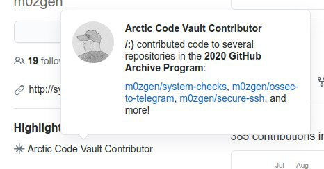

# defcon_news
`2020-07-31 21:53:18`

<blockquote>
Mirai Botnet Exploit Weaponized to Attack IoT Devices via CVE-2020-5902
https://blog.trendmicro.com/trendlabs-security-intelligence/mirai-botnet-exploit-weaponized-to-attack-iot-devices-via-cve-2020-5902/

via TrendLabs Security Intelligence Blog
</blockquote>

<table><tr><td><b>→</b><a href="https://blog.trendmicro.com/trendlabs-security-intelligence/mirai-botnet-exploit-weaponized-to-attack-iot-devices-via-cve-2020-5902/">
https://blog.trendmicro.com/trendlabs-security-intelligence/mirai-botnet-exploit-weaponized-to-attack-iot-devices-via-cve-2020-5902/
</a>
<blockquote>
We found an internet of things (IoT) Mirai botnet downloader exploiting CVE-2020-5902 in the wild, two weeks after getting a 10 out of 10 CVSS rating in its disclosure.
</blockquote>
</td></tr></table>

---

# isast
`2020-07-31 15:39:44`

<blockquote>
https://github.com/IBM/fhe-toolkit-linux
</blockquote>

<table><tr><td><b>→</b><a href="https://github.com/IBM/fhe-toolkit-linux">
https://github.com/IBM/fhe-toolkit-linux
</a>
<blockquote>
IBM Fully Homomorphic Encryption Toolkit For Linux. This toolkit is a Linux based Docker container that demonstrates computing on encrypted data without decrypting it! The toolkit ships with two de...
</blockquote>
</td></tr></table>

---

# defcon_news
`2020-07-31 14:53:30`

<blockquote>
Уязвимость в KDE Ark, позволяющая перезаписать файлы при открытии архива
https://www.opennet.ru/opennews/art.shtml?num&#61;53467

via OpenNews.opennet.ru: Проблемы безопасности
</blockquote>

<table><tr><td><b>→</b><a href="https://www.opennet.ru/opennews/art.shtml?num=53467">
https://www.opennet.ru/opennews/art.shtml?num=53467
</a>
<blockquote>
В развиваемом проектом KDE менеджере архивов Ark выявлена уязвимость (CVE-2020-16116), позволяющая при открытии в приложении специально оформленного архива перезаписать файлы вне каталога, указанного для раскрытия архива. Проблема в том числе проявляется при раскрытии архивов в файловом менеджере Dolphin (пункт Extract в контекстном меню), который использует функциональность Ark для работы с архивами. Уязвимость напоминает давно известную проблему Zip Slip.
</blockquote>
</td></tr></table>

---

# isast
`2020-07-31 12:09:57`

<blockquote>
GitHub Public Roadmap

Кстати, еще немного про GitHub. Недавно они опубликовали свой Roadmap в открытый доступ, с чем вы уже можете познакомиться. По ссылке можно увидеть то, что относится к security.

https://github.com/github/roadmap/projects/1?card_filter_query&#61;label%3A%22security+%26+compliance%22

&#35;news
</blockquote>

---

# defcon_news
`2020-07-30 20:53:24`

<blockquote>
[SYSS-2020-015]: ABUS Secvest Hybrid module (FUMO50110) - Authentication Bypass Using an Alternate Path or Channel (CWE-288) (CVE-2020-14158)
http://seclists.org/fulldisclosure/2020/Jul/36

via Full Disclosure
</blockquote>

<table><tr><td><b>→</b><a href="https://seclists.org/fulldisclosure/2020/Jul/36">
https://seclists.org/fulldisclosure/2020/Jul/36
</a>
</td></tr></table>

---

# defcon_news
`2020-07-30 20:53:20`

<blockquote>
[webapps] Online Shopping Alphaware 1.0 - Authentication Bypass
https://www.exploit-db.com/exploits/48725

via Exploit Database
</blockquote>

<table><tr><td><b>→</b><a href="https://www.exploit-db.com/exploits/48725">
https://www.exploit-db.com/exploits/48725
</a>
<blockquote>
Online Shopping Alphaware 1.0 - Authentication Bypass.. webapps exploit for PHP platform
</blockquote>
</td></tr></table>

---

# defcon_news
`2020-07-30 17:53:15`

<blockquote>
GNU GRUB2 Vulnerability
https://us-cert.cisa.gov/ncas/current-activity/2020/07/30/gnu-grub2-vulnerability

via CISA Current Activity
</blockquote>

<table><tr><td><b>→</b><a href="https://us-cert.cisa.gov/ncas/current-activity/2020/07/30/gnu-grub2-vulnerability">
https://us-cert.cisa.gov/ncas/current-activity/2020/07/30/gnu-grub2-vulnerability
</a>
<blockquote>
Free Software Foundation GNU Project's multiboot boot loader, GNU GRUB2, contains a vulnerability—CVE-2020-10713—that a local attacker could exploit to take control of an affected system.
</blockquote>
</td></tr></table>

---

# R0_Crew
`2020-07-30 15:05:15`

<blockquote>
Reversing WannaCry Part 2 - Diving into the malware with Ghidra https://www.youtube.com/watch?v&#61;Q90uZS3taG0 &#35;reverse &#35;ghidra &#35;malware &#35;dukeBarman
</blockquote>

<table><tr><td><b>→</b><a href="https://www.youtube.com/watch?v=Q90uZS3taG0">
https://www.youtube.com/watch?v=Q90uZS3taG0
</a>
<blockquote>
In the second video of the &quot;Reversing WannaCry&quot; series we continue to dive into the malware and find some encrypted components and the first traces of the decryption &amp; encryption functionality of the ransomware. We also learn how to use OOAnalyzer to easily reverse engineer C++ code in Ghidra!

Part 1: https://www.youtube.com/watch?v&#61;Sv8yu12y5zM

The scripts and Ghidra projects can be found here: https://github.com/ghidraninja/ReversingWannacry

Twitter: https://twitter.com/ghidraninja

Links:
- OOAnalyzer: https://insights.sei.cmu.edu/sei_blog/2019/07/using-ooanalyzer-to-reverse-engineer-object-oriented-code-with-ghidra.html
- My Ghidra Scripts: https://github.com/ghidraninja/ghidra_scripts
</blockquote>
</td></tr></table>

---

# R0_Crew
`2020-07-30 15:04:35`

<blockquote>
BinDiff 6 is released! https://zynamics.com/software.html IDA 7.4 and Ghidra experimental support (https://github.com/google/binexport) &#35;reverse &#35;ida &#35;ghidra &#35;dukeBarman
</blockquote>

<table><tr><td><b>→</b><a href="https://github.com/google/binexport">
https://github.com/google/binexport
</a>
<blockquote>
Export disassemblies into Protocol Buffers. Contribute to google/binexport development by creating an account on GitHub.
</blockquote>
</td></tr></table>

---

# R0_Crew
`2020-07-30 15:04:02`

<blockquote>
Port of devttyS0's IDA plugins to the Ghidra plugin framework https://github.com/fuzzywalls/ghidra_scripts &#35;reverse &#35;ghidra &#35;dukeBarman
</blockquote>

<table><tr><td><b>→</b><a href="https://github.com/fuzzywalls/ghidra_scripts">
https://github.com/fuzzywalls/ghidra_scripts
</a>
<blockquote>
Port of devttyS0's IDA plugins to the Ghidra plugin framework, new plugins as well. - tacnetsol/ghidra_scripts
</blockquote>
</td></tr></table>

---

# R0_Crew
`2020-07-30 15:02:38`

<blockquote>
Intezer Analyze Ghidra Plugin https://github.com/intezer/analyze-community-ghidra-plugin &#35;ghidra &#35;malware &#35;reverse &#35;dukeBarman
</blockquote>

<table><tr><td><b>→</b><a href="https://github.com/intezer/analyze-community-ghidra-plugin">
https://github.com/intezer/analyze-community-ghidra-plugin
</a>
<blockquote>
Ghidra plugin for https://analyze.intezer.com. Contribute to intezer/analyze-community-ghidra-plugin development by creating an account on GitHub.
</blockquote>
</td></tr></table>

---

# R0_Crew
`2020-07-30 15:01:37`

<blockquote>
Python scripts to help analzye go binaries in radare2. Basically this is a port of the IDA pro script golang_load_assist to r2. https://github.com/f0rki/r2-go-helpers &#35;reverse &#35;radare2 &#35;dukeBarman
</blockquote>

<table><tr><td><b>→</b><a href="https://github.com/f0rki/r2-go-helpers">
https://github.com/f0rki/r2-go-helpers
</a>
<blockquote>
[UNMAINTAINED] python scripts to help analzye go binaries in radare2 - f0rki/r2-go-helpers
</blockquote>
</td></tr></table>

---

# defcon_news
`2020-07-30 10:53:14`

<blockquote>
Свыше 350 000 серверов Microsoft Exchange уязвимы перед CVE-2020-0688
https://habr.com/ru/post/512952/

via Информационная безопасность – Защита данных
</blockquote>

<table><tr><td><b>→</b><a href="https://habr.com/ru/post/512952/">
https://habr.com/ru/post/512952/
</a>
<blockquote>
Бэкапы и патчи, латающие дыры в безопасности, вот уже много лет остаются одними из наиболее проблемных вопросов в IT-сфере. И если с резервным копированием дел...
</blockquote>
</td></tr></table>

---

# defcon_news
`2020-07-29 22:53:36`

<blockquote>
SEC Consult SA-20200728-0 :: Stored Cross-Site Scripting (XSS) Vulnerability in Namirial SIGNificant SignAnyWhere
http://seclists.org/fulldisclosure/2020/Jul/35

via Full Disclosure
</blockquote>

<table><tr><td><b>→</b><a href="https://seclists.org/fulldisclosure/2020/Jul/35">
https://seclists.org/fulldisclosure/2020/Jul/35
</a>
</td></tr></table>

---

# defcon_news
`2020-07-29 22:53:33`

<blockquote>
Critical GRUB2 Bootloader Bug Affects Billions of Linux and Windows Systems
https://thehackernews.com/2020/07/grub2-bootloader-vulnerability.html

via The Hacker News
</blockquote>

<table><tr><td><b>→</b><a href="https://thehackernews.com/2020/07/grub2-bootloader-vulnerability.html?utm_source=dlvr.it&utm_medium=twitter">
https://thehackernews.com/2020/07/grub2-bootloader-vulnerability.html?utm_source=dlvr.it&utm_medium=twitter
</a>
<blockquote>
A new GRUB2 bootloader vulnerability (CVE-2020-10713) affects billions of Linux and Windows computers.
</blockquote>
</td></tr></table>

---

# isast
`2020-07-29 22:52:28`

<blockquote>
⭕️ CVE-2020-10713 GRUB2 - BootHole

В GNU GRUB2 обнаружили неприятную уязвимость. 

Затрагивает SecureBoot. 
Уязвимы почти все дистры Linux, куча других embedded операционок и решений вроде Xen. 

Уязвимость как из учебника, переполнение кучи при чтении слишком длинного параметра из grub.cfg.

Проверку на длину конечно же добавили, и на такой случай вызвали макрос fatal_error, и как оказалось fatal_error громко ругается, но не останавливает исполнение кода (а все надеялись), отсюда контроль над памятью. 

И это всё за пределами контекста операционной системы, никаких ASLR, DEP и nx mitigation нет, зато есть полный контроль над загрузкой оси.

Так как GRUB отвечает за bootload, привилегии при эксплуатации наивысшие, простор для буткитов.

Репорт подтолкнул поаудитить код GRUB, и оказалось, что там еще ряд неприятных багов.

👉 https://eclypsium.com/2020/07/29/theres-a-hole-in-the-boot/
</blockquote>

---

# defcon_news
`2020-07-29 20:53:11`

<blockquote>
[webapps] Wordpress Plugin Maintenance Mode by SeedProd 5.1.1 - Persistent Cross-Site Scripting
https://www.exploit-db.com/exploits/48724

via Exploit Database
</blockquote>

<table><tr><td><b>→</b><a href="https://www.exploit-db.com/exploits/48724">
https://www.exploit-db.com/exploits/48724
</a>
<blockquote>
Wordpress Plugin Maintenance Mode by SeedProd 5.1.1 - Persistent Cross-Site Scripting. CVE-2020-15038 . webapps exploit for PHP platform
</blockquote>
</td></tr></table>

---

# defcon_news
`2020-07-29 20:53:10`

<blockquote>
[webapps] Cisco Adaptive Security Appliance Software 9.7 - Unauthenticated Arbitrary File Deletion
https://www.exploit-db.com/exploits/48723

via Exploit Database
</blockquote>

<table><tr><td><b>→</b><a href="https://www.exploit-db.com/exploits/48723">
https://www.exploit-db.com/exploits/48723
</a>
<blockquote>
Cisco Adaptive Security Appliance Software 9.7 - Unauthenticated Arbitrary File Deletion. CVE-2020-3187 . webapps exploit for Hardware platform
</blockquote>
</td></tr></table>

---

# sysadm_in_channel
`2020-07-29 17:47:25`

<blockquote>
Удалённое выполнение кода Cisco ASA, Firepower:

https://nvd.nist.gov/vuln/detail/CVE-2020-3452

Теперь можно искать  при помощи nuclei:

https://github.com/projectdiscovery/nuclei
</blockquote>

<table><tr><td><b>→</b><a href="https://github.com/projectdiscovery/nuclei">
https://github.com/projectdiscovery/nuclei
</a>
<blockquote>
Nuclei is a fast tool for configurable targeted vulnerability scanning based on templates offering massive extensibility and ease of use. - projectdiscovery/nuclei
</blockquote>
</td></tr></table>

---

# sysadm_in_channel
`2020-07-29 17:40:54`

<blockquote>
Subdomain enumeration tool

https://github.com/aboul3la/Sublist3r
</blockquote>

<table><tr><td><b>→</b><a href="https://github.com/aboul3la/Sublist3r">
https://github.com/aboul3la/Sublist3r
</a>
<blockquote>
Fast subdomains enumeration tool for penetration testers - aboul3la/Sublist3r
</blockquote>
</td></tr></table>

---

# R0_Crew
`2020-07-29 15:32:14`

<blockquote>
Converts .tag file produced by tiny_tracer to Cutter annotation script https://github.com/Dump-GUY/tiny_tracer_tag_to_cutter &#35;reverse &#35;radare2 &#35;dukeBarman
</blockquote>

<table><tr><td><b>→</b><a href="https://github.com/Dump-GUY/tiny_tracer_tag_to_cutter">
https://github.com/Dump-GUY/tiny_tracer_tag_to_cutter
</a>
<blockquote>
Contribute to Dump-GUY/tiny_tracer_tag_to_cutter development by creating an account on GitHub.
</blockquote>
</td></tr></table>

---

# defcon_news
`2020-07-29 14:53:49`

<blockquote>
Critical Secomea, Moxa, Ewon pre-auth RCE vulnerabilities. CVE-2020-14500, CVE-2020-14511, CVE-2020-14498
https://www.reddit.com/r/netsec/comments/hzrhav/critical_secomea_moxa_ewon_preauth_rce/

via /r/netsec - Information Security News &amp; Discussion
</blockquote>

<table><tr><td><b>→</b><a href="https://www.reddit.com/r/netsec/comments/hzrhav/critical_secomea_moxa_ewon_preauth_rce/?utm_source=ifttt">
https://www.reddit.com/r/netsec/comments/hzrhav/critical_secomea_moxa_ewon_preauth_rce/?utm_source=ifttt
</a>
<blockquote>
Posted in r/netsec by u/Substantial-Guava • 0 points and 0 comments
</blockquote>
</td></tr></table>

---

# defcon_news
`2020-07-29 14:53:46`

<blockquote>
Sometimes they come back: exfiltration through MySQL and CVE-2020-11579
https://www.reddit.com/r/netsec/comments/hzhphs/sometimes_they_come_back_exfiltration_through/

via /r/netsec - Information Security News &amp; Discussion
</blockquote>

<table><tr><td><b>→</b><a href="https://www.reddit.com/r/netsec/comments/hzhphs/sometimes_they_come_back_exfiltration_through/?utm_source=ifttt">
https://www.reddit.com/r/netsec/comments/hzhphs/sometimes_they_come_back_exfiltration_through/?utm_source=ifttt
</a>
<blockquote>
Posted in r/netsec by u/smaury • 10 points and 0 comments
</blockquote>
</td></tr></table>

---

# defcon_news
`2020-07-29 14:53:39`

<blockquote>
CVE-2020-13777 GnuTLS audit: be scared
https://www.reddit.com/r/netsec/comments/hylfnw/cve202013777_gnutls_audit_be_scared/

via /r/netsec - Information Security News &amp; Discussion
</blockquote>

<table><tr><td><b>→</b><a href="https://www.reddit.com/r/netsec/comments/hylfnw/cve202013777_gnutls_audit_be_scared/?utm_source=ifttt">
https://www.reddit.com/r/netsec/comments/hylfnw/cve202013777_gnutls_audit_be_scared/?utm_source=ifttt
</a>
<blockquote>
Posted in r/netsec by u/Gallus • 302 points and 69 comments
</blockquote>
</td></tr></table>

---

# R0_Crew
`2020-07-29 13:11:42`

<blockquote>
Binary instrumentation framework based on FRIDA https://github.com/Ch0pin/medusa &#35;reverse &#35;frida &#35;android &#35;dukeBarman
</blockquote>

<table><tr><td><b>→</b><a href="https://github.com/Ch0pin/medusa">
https://github.com/Ch0pin/medusa
</a>
<blockquote>
Binary instrumentation framework based on FRIDA. Contribute to Ch0pin/medusa development by creating an account on GitHub.
</blockquote>
</td></tr></table>

---

# sysadm_in_channel
`2020-07-29 04:36:06`

<blockquote>
Уязвимости в промышленных VPN решениях

- Secomea GateManager
- Moxa EDR-G902
- EDR-G903
- eWon HMS Networks

Данные решения широко используются в нефтегазовой, коммунальной секторах. Эксплуатация уязвимостей потенциально позволяет получить доступ к устройствам внутри периметра:

https://www.claroty.com/2020/07/28/vpn-security-flaws/

https://www.claroty.com/2020/07/15/cve-2020-14511/
</blockquote>

<table><tr><td><b>→</b><a href="https://www.claroty.com/2020/07/28/vpn-security-flaws/">
https://www.claroty.com/2020/07/28/vpn-security-flaws/
</a>
<blockquote>
Claroty researchers have discovered multiple vulnerabilities in popular industrial VPN-based solutions used to provide remote access to OT networks, including those within critical infrastructure.
</blockquote>
</td></tr></table>

---

# defcon_news
`2020-07-28 19:53:15`

<blockquote>
[webapps] Cisco Adaptive Security Appliance Software 9.11 - Local File Inclusion
https://www.exploit-db.com/exploits/48722

via Exploit Database
</blockquote>

<table><tr><td><b>→</b><a href="https://www.exploit-db.com/exploits/48722">
https://www.exploit-db.com/exploits/48722
</a>
<blockquote>
Cisco Adaptive Security Appliance Software 9.11 - Local File Inclusion. CVE-2020-3452 . webapps exploit for Hardware platform
</blockquote>
</td></tr></table>

---

# R0_Crew
`2020-07-28 15:51:14`

<blockquote>
Piercing the Veil: Android Code Deobfuscation https://www.youtube.com/watch?v&#61;lmHkfKXuN4A &#35;reverse &#35;android &#35;obfuscation &#35;dukeBarman
</blockquote>

<table><tr><td><b>→</b><a href="https://www.youtube.com/watch?v=lmHkfKXuN4A">
https://www.youtube.com/watch?v=lmHkfKXuN4A
</a>
<blockquote>
Presented at Silicon Valley Cyber Security Meetup Talkin' Security Online Event on Thursday, May 7, 2020

Slides can be found at https://drive.google.com/file/d/1QUpMOm1-gzWYLVsmGJrcOHyea2e0X93z

Summary of the Talk: Android malware analysts often encounter obfuscated code which has been intentionally modified to make it harder to understand. In order to remain effective, analysts must be aware of tools and techniques for deobfuscating code. This talk describes common obfuscation techniques as well as present two deobfuscation tools: Simplify and Oracle. Simplify learns what code does by executing it in a custom virtual machine and then replaces complex code with behaviorally-identical, simplified code. Oracle works similarly except it learns how code behaves by executing it in a real Android emulator and performs replacements using patterns.
</blockquote>
</td></tr></table>

---

# defcon_news
`2020-07-28 08:53:10`

<blockquote>
CVE-2020-6287-exploit - PoC For CVE-2020-6287 The PoC In Python For Add User Only, No Administrator Permission Set
http://exploit.kitploit.com/2020/07/cve-2020-6287-exploit-poc-for-cve-2020.html

via Exploit Collector
</blockquote>

<table><tr><td><b>→</b><a href="https://exploit.kitploit.com/2020/07/cve-2020-6287-exploit-poc-for-cve-2020.html?utm_source=dlvr.it&utm_medium=twitter">
https://exploit.kitploit.com/2020/07/cve-2020-6287-exploit-poc-for-cve-2020.html?utm_source=dlvr.it&utm_medium=twitter
</a>
<blockquote>
Exploit Collector is the ultimate collection of public exploits and exploitable vulnerabilities. Remote/Local Exploits, Shellcode and 0days.
</blockquote>
</td></tr></table>

---

# defcon_news
`2020-07-27 21:53:17`

<blockquote>
[webapps] eGroupWare 1.14 - 'spellchecker.php' Remote Command Execution
https://www.exploit-db.com/exploits/48720

via Exploit Database
</blockquote>

<table><tr><td><b>→</b><a href="https://www.exploit-db.com/exploits/48720">
https://www.exploit-db.com/exploits/48720
</a>
<blockquote>
eGroupWare 1.14 - 'spellchecker.php' Remote Command Execution.. webapps exploit for PHP platform
</blockquote>
</td></tr></table>

---

# defcon_news
`2020-07-27 21:53:14`

<blockquote>
Yelp: JDBC credentials leaked via github
https://vulners.com/hackerone/H1:935573?utm_source&#61;rss&amp;utm_medium&#61;rss&amp;utm_campaign&#61;rss

via Vulners
</blockquote>

<table><tr><td><b>→</b><a href="https://vulners.com/hackerone/H1:935573?utm_source=rss&utm_medium=rss&utm_campaign=rss">
https://vulners.com/hackerone/H1:935573?utm_source=rss&utm_medium=rss&utm_campaign=rss
</a>
<blockquote>
Summary: jdbc credentials found on a public github repo.though the repo belongs to yelp or not there is a doubt.I have found many more sensitive data on that repo.so kindly check the repo all together.sensitive data found publicly. Platform(s) Affected: website Steps To Reproduce:  visit the link  https://github.com/supernebula/yelp-j/blob/36de49095d7f3221e3a50adf9bd7ab26ef585f24/yelp/yelp-web-search/src/main/resources/application-dev.properties  you will see leaked credentials.also visit other path to discover more sensitive info.  Impact private credentials...
</blockquote>
</td></tr></table>

---

# defcon_news
`2020-07-26 23:53:25`

<blockquote>
[local] docPrint Pro 8.0 - 'Add URL' Buffer Overflow (SEH Egghunter)
https://www.exploit-db.com/exploits/48719

via Exploit Database
</blockquote>

<table><tr><td><b>→</b><a href="https://www.exploit-db.com/exploits/48719">
https://www.exploit-db.com/exploits/48719
</a>
<blockquote>
docPrint Pro 8.0 - 'Add URL' Buffer Overflow (SEH Egghunter).. local exploit for Windows platform
</blockquote>
</td></tr></table>

---

# defcon_news
`2020-07-26 23:53:23`

<blockquote>
[webapps] Rails 5.0.1 - Remote Code Execution
https://www.exploit-db.com/exploits/48716

via Exploit Database
</blockquote>

<table><tr><td><b>→</b><a href="https://www.exploit-db.com/exploits/48716">
https://www.exploit-db.com/exploits/48716
</a>
<blockquote>
Rails 5.0.1 - Remote Code Execution. CVE-2020-8163 . webapps exploit for Ruby platform
</blockquote>
</td></tr></table>

---

# defcon_news
`2020-07-26 23:53:19`

<blockquote>
[webapps] Virtual Airlines Manager 2.6.2 - Persistent Cross-Site Scripting
https://www.exploit-db.com/exploits/48715

via Exploit Database
</blockquote>

<table><tr><td><b>→</b><a href="https://www.exploit-db.com/exploits/48715">
https://www.exploit-db.com/exploits/48715
</a>
<blockquote>
Virtual Airlines Manager 2.6.2 - Persistent Cross-Site Scripting.. webapps exploit for PHP platform
</blockquote>
</td></tr></table>

---

# defcon_news
`2020-07-26 23:53:18`

<blockquote>
[webapps] pfSense 2.4.4-p3 - Cross-Site Request Forgery
https://www.exploit-db.com/exploits/48714

via Exploit Database
</blockquote>

<table><tr><td><b>→</b><a href="https://www.exploit-db.com/exploits/48714">
https://www.exploit-db.com/exploits/48714
</a>
<blockquote>
pfSense 2.4.4-p3 - Cross-Site Request Forgery. CVE-2019-16667 . webapps exploit for PHP platform
</blockquote>
</td></tr></table>

---

# defcon_news
`2020-07-26 23:53:17`

<blockquote>
[webapps] Socket.io-file 2.0.31 - Arbitrary File Upload
https://www.exploit-db.com/exploits/48713

via Exploit Database
</blockquote>

<table><tr><td><b>→</b><a href="https://www.exploit-db.com/exploits/48713">
https://www.exploit-db.com/exploits/48713
</a>
<blockquote>
Socket.io-file 2.0.31 - Arbitrary File Upload.. webapps exploit for Multiple platform
</blockquote>
</td></tr></table>

---

# defcon_news
`2020-07-26 23:53:16`

<blockquote>
[webapps] Sickbeard 0.1 - Cross-Site Request Forgery (Disable Authentication)
https://www.exploit-db.com/exploits/48712

via Exploit Database
</blockquote>

<table><tr><td><b>→</b><a href="https://www.exploit-db.com/exploits/48712">
https://www.exploit-db.com/exploits/48712
</a>
<blockquote>
Sickbeard 0.1 - Cross-Site Request Forgery (Disable Authentication).. webapps exploit for Multiple platform
</blockquote>
</td></tr></table>

---

# defcon_news
`2020-07-26 23:53:15`

<blockquote>
[webapps] F5 Big-IP 13.1.3 Build 0.0.6 - Local File Inclusion
https://www.exploit-db.com/exploits/48711

via Exploit Database
</blockquote>

<table><tr><td><b>→</b><a href="https://www.exploit-db.com/exploits/48711">
https://www.exploit-db.com/exploits/48711
</a>
<blockquote>
F5 Big-IP 13.1.3 Build 0.0.6 - Local File Inclusion. CVE-2020-5902 . webapps exploit for Hardware platform
</blockquote>
</td></tr></table>

---

# defcon_news
`2020-07-26 21:53:13`

<blockquote>
[webapps] Webtareas 2.1p - Arbitrary File Upload (Authenticated)
https://www.exploit-db.com/exploits/48709

via Exploit Database
</blockquote>

<table><tr><td><b>→</b><a href="https://www.exploit-db.com/exploits/48709">
https://www.exploit-db.com/exploits/48709
</a>
<blockquote>
Webtareas 2.1p - Arbitrary File Upload (Authenticated).. webapps exploit for PHP platform
</blockquote>
</td></tr></table>

---

# defcon_news
`2020-07-26 21:53:09`

<blockquote>
[webapps] PandoraFMS 7.0 NG 746 - Persistent Cross-Site Scripting
https://www.exploit-db.com/exploits/48707

via Exploit Database
</blockquote>

<table><tr><td><b>→</b><a href="https://www.exploit-db.com/exploits/48707">
https://www.exploit-db.com/exploits/48707
</a>
<blockquote>
PandoraFMS 7.0 NG 746 - Persistent Cross-Site Scripting. CVE-2020-11749 . webapps exploit for PHP platform
</blockquote>
</td></tr></table>

---

# defcon_news
`2020-07-26 21:53:09`

<blockquote>
[webapps] Bio Star 2.8.2 - Local File Inclusion
https://www.exploit-db.com/exploits/48708

via Exploit Database
</blockquote>

<table><tr><td><b>→</b><a href="https://www.exploit-db.com/exploits/48708">
https://www.exploit-db.com/exploits/48708
</a>
<blockquote>
Bio Star 2.8.2 - Local File Inclusion. CVE-2020-15050 . webapps exploit for Multiple platform
</blockquote>
</td></tr></table>

---

# defcon_news
`2020-07-26 21:53:08`

<blockquote>
[webapps] Koken CMS 0.22.24 - Arbitrary File Upload (Authenticated)
https://www.exploit-db.com/exploits/48706

via Exploit Database
</blockquote>

<table><tr><td><b>→</b><a href="https://www.exploit-db.com/exploits/48706">
https://www.exploit-db.com/exploits/48706
</a>
<blockquote>
Koken CMS 0.22.24 - Arbitrary File Upload (Authenticated).. webapps exploit for PHP platform
</blockquote>
</td></tr></table>

---

# defcon_news
`2020-07-26 21:53:07`

<blockquote>
[webapps] elaniin CMS - Authentication Bypass
https://www.exploit-db.com/exploits/48705

via Exploit Database
</blockquote>

<table><tr><td><b>→</b><a href="https://www.exploit-db.com/exploits/48705">
https://www.exploit-db.com/exploits/48705
</a>
<blockquote>
elaniin CMS - Authentication Bypass.. webapps exploit for PHP platform
</blockquote>
</td></tr></table>

---

# defcon_news
`2020-07-26 21:53:06`

<blockquote>
[webapps] Online Course Registration 1.0 - Unauthenticated Remote Code Execution
https://www.exploit-db.com/exploits/48704

via Exploit Database
</blockquote>

<table><tr><td><b>→</b><a href="https://www.exploit-db.com/exploits/48704">
https://www.exploit-db.com/exploits/48704
</a>
<blockquote>
Online Course Registration 1.0 - Unauthenticated Remote Code Execution.. webapps exploit for PHP platform
</blockquote>
</td></tr></table>

---

# defcon_news
`2020-07-26 20:53:45`

<blockquote>
[webapps] LibreHealth 2.0.0 - Authenticated Remote Code Execution
https://www.exploit-db.com/exploits/48702

via Exploit Database
</blockquote>

<table><tr><td><b>→</b><a href="https://www.exploit-db.com/exploits/48702">
https://www.exploit-db.com/exploits/48702
</a>
<blockquote>
LibreHealth 2.0.0 - Authenticated Remote Code Execution.. webapps exploit for PHP platform
</blockquote>
</td></tr></table>

---

# defcon_news
`2020-07-26 20:53:43`

<blockquote>
[webapps] Bludit 3.9.2 - Directory Traversal
https://www.exploit-db.com/exploits/48701

via Exploit Database
</blockquote>

<table><tr><td><b>→</b><a href="https://www.exploit-db.com/exploits/48701">
https://www.exploit-db.com/exploits/48701
</a>
<blockquote>
Bludit 3.9.2 - Directory Traversal. CVE-2019-16113 . webapps exploit for Multiple platform
</blockquote>
</td></tr></table>

---

# defcon_news
`2020-07-26 20:53:43`

<blockquote>
[webapps] WordPress Plugin Email Subscribers &amp; Newsletters 4.2.2 - 'hash' SQL Injection (Unauthenticated)
https://www.exploit-db.com/exploits/48699

via Exploit Database
</blockquote>

<table><tr><td><b>→</b><a href="https://www.exploit-db.com/exploits/48699">
https://www.exploit-db.com/exploits/48699
</a>
<blockquote>
WordPress Plugin Email Subscribers &amp; Newsletters 4.2.2 - 'hash' SQL Injection (Unauthenticated). CVE-2019-20361 . webapps exploit for PHP platform
</blockquote>
</td></tr></table>

---

# defcon_news
`2020-07-26 20:53:38`

<blockquote>
[webapps] WordPress Plugin Email Subscribers &amp; Newsletters 4.2.2 - Unauthenticated File Download
https://www.exploit-db.com/exploits/48698

via Exploit Database
</blockquote>

<table><tr><td><b>→</b><a href="https://www.exploit-db.com/exploits/48698">
https://www.exploit-db.com/exploits/48698
</a>
<blockquote>
WordPress Plugin Email Subscribers &amp; Newsletters 4.2.2 - Unauthenticated File Download. CVE-2019-19985 . webapps exploit for PHP platform
</blockquote>
</td></tr></table>

---

# defcon_news
`2020-07-26 20:53:37`

<blockquote>
[dos] Calavera UpLoader 3.5 - 'FTP Logi' Denial of Service (PoC + SEH Overwrite)
https://www.exploit-db.com/exploits/48697

via Exploit Database
</blockquote>

<table><tr><td><b>→</b><a href="https://www.exploit-db.com/exploits/48697?utm_source=dlvr.it&utm_medium=twitter">
https://www.exploit-db.com/exploits/48697?utm_source=dlvr.it&utm_medium=twitter
</a>
<blockquote>
Calavera UpLoader 3.5 - 'FTP Logi' Denial of Service (PoC + SEH Overwrite).. dos exploit for Windows platform
</blockquote>
</td></tr></table>

---

# defcon_news
`2020-07-26 20:53:36`

<blockquote>
[local] Free MP3 CD Ripper 2.8 - Stack Buffer Overflow (SEH + Egghunter)
https://www.exploit-db.com/exploits/48696

via Exploit Database
</blockquote>

<table><tr><td><b>→</b><a href="https://www.exploit-db.com/exploits/48696">
https://www.exploit-db.com/exploits/48696
</a>
<blockquote>
Free MP3 CD Ripper 2.8 - Stack Buffer Overflow (SEH + Egghunter).. local exploit for Windows platform
</blockquote>
</td></tr></table>

---

# defcon_news
`2020-07-26 20:53:35`

<blockquote>
[local] Port Forwarding Wizard 4.8.0 - Buffer Overflow (SEH)
https://www.exploit-db.com/exploits/48695

via Exploit Database
</blockquote>

<table><tr><td><b>→</b><a href="https://www.exploit-db.com/exploits/48695">
https://www.exploit-db.com/exploits/48695
</a>
<blockquote>
Port Forwarding Wizard 4.8.0 - Buffer Overflow (SEH).. local exploit for Windows platform
</blockquote>
</td></tr></table>

---

# defcon_news
`2020-07-26 20:53:31`

<blockquote>
[webapps] UBICOD Medivision Digital Signage 1.5.1 - Cross-Site Request Forgery (Add Admin)
https://www.exploit-db.com/exploits/48694

via Exploit Database
</blockquote>

<table><tr><td><b>→</b><a href="https://www.exploit-db.com/exploits/48694">
https://www.exploit-db.com/exploits/48694
</a>
<blockquote>
UBICOD Medivision Digital Signage 1.5.1 - Cross-Site Request Forgery (Add Admin).. webapps exploit for Hardware platform
</blockquote>
</td></tr></table>

---

# defcon_news
`2020-07-26 20:53:30`

<blockquote>
[webapps] INNEO Startup TOOLS 2018 M040 13.0.70.3804 - Remote Code Execution
https://www.exploit-db.com/exploits/48693

via Exploit Database
</blockquote>

<table><tr><td><b>→</b><a href="https://www.exploit-db.com/exploits/48693">
https://www.exploit-db.com/exploits/48693
</a>
<blockquote>
INNEO Startup TOOLS 2018 M040 13.0.70.3804 - Remote Code Execution. CVE-2020-15492 . webapps exploit for Multiple platform
</blockquote>
</td></tr></table>

---

# defcon_news
`2020-07-26 19:53:18`

<blockquote>
[webapps] ManageEngine Applications Manager 13 - 'MenuHandlerServlet' SQL Injection
https://www.exploit-db.com/exploits/48692

via Exploit Database
</blockquote>

<table><tr><td><b>→</b><a href="https://www.exploit-db.com/exploits/48692">
https://www.exploit-db.com/exploits/48692
</a>
<blockquote>
ManageEngine Applications Manager 13 - 'MenuHandlerServlet' SQL Injection. CVE-2016-9488 . webapps exploit for Java platform
</blockquote>
</td></tr></table>

---

# defcon_news
`2020-07-26 19:53:16`

<blockquote>
[local] Socusoft Photo to Video Converter Professional 8.07 - 'Output Folder' Buffer Overflow (SEH Egghunter)
https://www.exploit-db.com/exploits/48691

via Exploit Database
</blockquote>

<table><tr><td><b>→</b><a href="https://www.exploit-db.com/exploits/48691?utm_source=dlvr.it&utm_medium=twitter">
https://www.exploit-db.com/exploits/48691?utm_source=dlvr.it&utm_medium=twitter
</a>
<blockquote>
Socusoft Photo to Video Converter Professional 8.07 - 'Output Folder' Buffer Overflow (SEH Egghunter).. local exploit for Windows platform
</blockquote>
</td></tr></table>

---

# defcon_news
`2020-07-26 19:53:15`

<blockquote>
[webapps] GOautodial 4.0 - Persistent Cross-Site Scripting (Authenticated)
https://www.exploit-db.com/exploits/48690

via Exploit Database
</blockquote>

<table><tr><td><b>→</b><a href="https://www.exploit-db.com/exploits/48690?utm_source=dlvr.it&utm_medium=twitter">
https://www.exploit-db.com/exploits/48690?utm_source=dlvr.it&utm_medium=twitter
</a>
<blockquote>
GOautodial 4.0 - Persistent Cross-Site Scripting (Authenticated).. webapps exploit for PHP platform
</blockquote>
</td></tr></table>

---

# defcon_news
`2020-07-26 19:53:14`

<blockquote>
[local] DiskBoss 7.7.14 - 'Reports and Data Directory' Buffer Overflow (SEH Egghunter)
https://www.exploit-db.com/exploits/48689

via Exploit Database
</blockquote>

<table><tr><td><b>→</b><a href="https://www.exploit-db.com/exploits/48689">
https://www.exploit-db.com/exploits/48689
</a>
<blockquote>
DiskBoss 7.7.14 - 'Reports and Data Directory' Buffer Overflow (SEH Egghunter).. local exploit for Windows platform
</blockquote>
</td></tr></table>

---

# defcon_news
`2020-07-26 19:53:13`

<blockquote>
[local] Frigate Professional 3.36.0.9 - 'Pack File' Buffer Overflow (SEH Egghunter)
https://www.exploit-db.com/exploits/48688

via Exploit Database
</blockquote>

<table><tr><td><b>→</b><a href="https://www.exploit-db.com/exploits/48688">
https://www.exploit-db.com/exploits/48688
</a>
<blockquote>
Frigate Professional 3.36.0.9 - 'Pack File' Buffer Overflow (SEH Egghunter).. local exploit for Windows platform
</blockquote>
</td></tr></table>

---

# defcon_news
`2020-07-26 19:53:12`

<blockquote>
[local] Nidesoft DVD Ripper 5.2.18 - Local Buffer Overflow (SEH)
https://www.exploit-db.com/exploits/48687

via Exploit Database
</blockquote>

<table><tr><td><b>→</b><a href="https://www.exploit-db.com/exploits/48687">
https://www.exploit-db.com/exploits/48687
</a>
<blockquote>
Nidesoft DVD Ripper 5.2.18 - Local Buffer Overflow (SEH).. local exploit for Windows platform
</blockquote>
</td></tr></table>

---

# defcon_news
`2020-07-26 15:53:16`

<blockquote>
Weblate: Open Github Repo Leaking WEBLATE SECRET KEY
https://vulners.com/hackerone/H1:942146?utm_source&#61;rss&amp;utm_medium&#61;rss&amp;utm_campaign&#61;rss

via Vulners
</blockquote>

<table><tr><td><b>→</b><a href="https://vulners.com/hackerone/H1:942146?utm_source=rss&utm_medium=rss&utm_campaign=rss">
https://vulners.com/hackerone/H1:942146?utm_source=rss&utm_medium=rss&utm_campaign=rss
</a>
<blockquote>
Team, While going through Github search I discovered a public repository which contains Weblate Secret Key Issue &amp; Poc: Repo: https://github.com/WeblateOrg File:https://github.com/WeblateOrg/weblate/blob/592472958f7b847701c51b36f4768b9784219fa1/weblate/settings_docker.py SECRET_KEY &#61; os.environ.get(     &quot;WEBLATE_SECRET_KEY&quot;, &quot;jm8fqjlg+5!&#35;xu%e-oh&#35;7!$aa7!6avf7ud*_v&#61;chdrb9qdco6(&quot; )  Full Source Code:  Copyright © 2012 - 2020 Michal Čihař michal@cihar.com  This file is part of Weblate https://weblate.org/  This program is free software: you can redistribute it and/or modify it under the terms of the GNU General Public License as published by the Free Software Foundation, either version 3 of the License, or (at your option) any later version.  This program is distributed in the hope that it will be useful, but WITHOUT ANY WARRANTY; without even the implied warranty of MERCHANTABILITY or FITNESS FOR A PARTICULAR PURPOSE.  See the GNU General Public License for more details.  You should have received a copy of the GNU…
</blockquote>
</td></tr></table>

---

# R0_Crew
`2020-07-26 13:46:13`

<blockquote>
Binary Ninja loader for common Nintendo Switch file types https://github.com/EliseZeroTwo/Switch-Binja-Loader &#35;binaryninja &#35;reverse &#35;dukeBarman
</blockquote>

<table><tr><td><b>→</b><a href="https://github.com/EliseZeroTwo/Switch-Binja-Loader">
https://github.com/EliseZeroTwo/Switch-Binja-Loader
</a>
<blockquote>
Binary Ninja loader for common Nintendo Switch file types - EliseZeroTwo/Switch-Binja-Loader
</blockquote>
</td></tr></table>

---

# isast
`2020-07-25 23:59:19`

<blockquote>
https://github.com/hardenedlinux/harbian-qa/blob/master/syzkaller/kstate_resource.md
</blockquote>

<table><tr><td><b>→</b><a href="https://github.com/hardenedlinux/harbian-qa/blob/master/syzkaller/kstate_resource.md">
https://github.com/hardenedlinux/harbian-qa/blob/master/syzkaller/kstate_resource.md
</a>
<blockquote>
Bug hunting through fuzzer/*-sanitizer/etc... Contribute to hardenedlinux/harbian-qa development by creating an account on GitHub.
</blockquote>
</td></tr></table>

---

# reverseengineeringx
`2020-07-25 19:17:08`

<blockquote>
script will annotate and bookmark the code with tags produced by tool Tiny Tracer 

https://github.com/Dump-GUY/ghidra_scripts
</blockquote>

<table><tr><td><b>→</b><a href="https://github.com/Dump-GUY/ghidra_scripts">
https://github.com/Dump-GUY/ghidra_scripts
</a>
<blockquote>
Contribute to Dump-GUY/ghidra_scripts development by creating an account on GitHub.
</blockquote>
</td></tr></table>

---

# defcon_news
`2020-07-25 15:53:31`

<blockquote>
NMAP Script fot CVE-2020-3452.
https://www.reddit.com/r/netsec/comments/hwaj6f/nmap_script_fot_cve20203452/

via /r/netsec - Information Security News &amp; Discussion
</blockquote>

<table><tr><td><b>→</b><a href="https://www.reddit.com/r/netsec/comments/hwaj6f/nmap_script_fot_cve20203452/?utm_source=ifttt">
https://www.reddit.com/r/netsec/comments/hwaj6f/nmap_script_fot_cve20203452/?utm_source=ifttt
</a>
<blockquote>
Posted in r/netsec by u/input0 • 1 point and 0 comments
</blockquote>
</td></tr></table>

---

# exploitex
`2020-07-25 15:11:00`

* https://telegra.ph/file/da14ba6d32da1b24882ac.jpg
* http://sandlab.cs.uchicago.edu/fawkes/
* https://github.com/Shawn-Shan/fawkes
* https://github.com/Shawn-Shan/fawkes/blob/master/fawkes/README.md
* https://t.me/joinchat/AAAAAE3zHuKXF0sgmzL3OQ

<blockquote>
​​Защита фотографий от систем распознавания лиц

Современные системы распознавания лиц представляют большую угрозу личной приватности. Уже сейчас такие системы ежедневно сканируют миллионы лиц в Китае, Великобритании и России без их согласия. Исследователи придумали алгоритм, который делает незаметные попиксельные изменения в фотографии, делая ее бесполезной для систем распознавания лиц. 

После обработки вы можете использовать фотографии как угодно — публиковать в социальных сетях, передавать друзьям или распечатывать на бумаге. В любом случае, для распознавания лиц они уже бесполезны. Сжатие фотографий и применение любых графических фильтров не снимают защиту, поскольку клоакинг происходит на уровне пикселей, и не стирается в растровом редакторе. 

Алгоритм был протестирован и показал эффективность 100% против самых известных моделей распознавания Microsoft Azure Face API, Amazon Rekognition и Face++. Программа имеет открытый исходный код и ее можно установить на Windows, Linux и Mac.

Эксплойт / &#35;приватность
</blockquote>

<table><tr><td><b>→</b><a href="https://telegra.ph/file/da14ba6d32da1b24882ac.jpg">
https://telegra.ph/file/da14ba6d32da1b24882ac.jpg
</a>
</td></tr></table>

---

# defcon_news
`2020-07-24 20:53:29`

<blockquote>
Vulnerability Repot&#35; MAMP PRO 4.2.0 Local Privilege Escalation
http://seclists.org/fulldisclosure/2020/Jul/34

via Full Disclosure
</blockquote>

<table><tr><td><b>→</b><a href="https://seclists.org/fulldisclosure/2020/Jul/34">
https://seclists.org/fulldisclosure/2020/Jul/34
</a>
</td></tr></table>

---

# defcon_news
`2020-07-24 20:53:28`

<blockquote>
Defense in depth -- the Microsoft way (part 70): CVE-2014-0315 alias MS14-019 revisited
http://seclists.org/fulldisclosure/2020/Jul/33

via Full Disclosure
</blockquote>

<table><tr><td><b>→</b><a href="https://seclists.org/fulldisclosure/2020/Jul/33">
https://seclists.org/fulldisclosure/2020/Jul/33
</a>
</td></tr></table>

---

# defcon_news
`2020-07-24 20:53:27`

<blockquote>
Three vulnerabilities found in MikroTik's RouterOS
http://seclists.org/fulldisclosure/2020/Jul/32

via Full Disclosure
</blockquote>

<table><tr><td><b>→</b><a href="https://seclists.org/fulldisclosure/2020/Jul/32">
https://seclists.org/fulldisclosure/2020/Jul/32
</a>
</td></tr></table>

---

# defcon_news
`2020-07-24 19:53:26`

<blockquote>
lemlist: CVE-2019-19935 - DOM based XSS in the froala editor
https://vulners.com/hackerone/H1:938683?utm_source&#61;rss&amp;utm_medium&#61;rss&amp;utm_campaign&#61;rss

via Vulners
</blockquote>

<table><tr><td><b>→</b><a href="https://vulners.com/hackerone/H1:938683?utm_source=rss&utm_medium=rss&utm_campaign=rss">
https://vulners.com/hackerone/H1:938683?utm_source=rss&utm_medium=rss&utm_campaign=rss
</a>
<blockquote>
Summary: A stored XSS flow exist in the froala editor used in the web application. This can be trigger by using the code view of the editor Steps To Reproduce:  Start a new campaign fill all the fieds and choose blank email template for the message  Switch to code editor view and inject &lt;iframe srcdoc&#61;&quot;&lt;img src&#61;x onerror&#61;alert(document.domain)&gt;&quot;&gt;&lt;/iframe&gt; {F919075}   Switch back to the normal editor view and the XSS will be trigger   {F919076} See attachements. Supporting Material/References: Heavly inspired by the following article: https://blog.compass-security.com/2020/07/yet-another-froala-0-day-xss/ Remediation: Unfortunately the froala editor did not provide correction for this bug yet but publish an advisory: https://www.compass-security.com/fileadmin/Datein/Research/Advisories/CSNC-2020-004_DOM_XSS_in_Froala_WYSIWYG_HTML_Editor.txt Impact This issue can lead to cookie stealing, creating fake form by including an iframe, DOM rewriting and so...
</blockquote>
</td></tr></table>

---

# defcon_news
`2020-07-24 16:53:23`

<blockquote>
SEC Consult SA-20200724-0 :: Privilege Escalation Vulnerability in SteelCentral Aternity Agent
http://seclists.org/fulldisclosure/2020/Jul/31

via Full Disclosure
</blockquote>

<table><tr><td><b>→</b><a href="https://seclists.org/fulldisclosure/2020/Jul/31">
https://seclists.org/fulldisclosure/2020/Jul/31
</a>
</td></tr></table>

---

# R0_Crew
`2020-07-24 10:59:00`

<blockquote>
ARMv8.5-A Memory Tagging Extension (MTE) instructions support is now available in &#35;radare2 https://github.com/radareorg/radare2/commit/1dbe43d &#35;reverse &#35;dukeBarman
</blockquote>

<table><tr><td><b>→</b><a href="https://github.com/radareorg/radare2/commit/1dbe43d">
https://github.com/radareorg/radare2/commit/1dbe43d
</a>
<blockquote>
…7279)

Co-authored-by: phakeobj &lt;phakeobj@users.noreply.github.com&gt;
</blockquote>
</td></tr></table>

---

# R0_Crew
`2020-07-24 07:05:10`

<blockquote>
Parse YARA rules and operate over them more easily https://github.com/plyara/plyara &#35;reverse &#35;malware &#35;dukeBarman
</blockquote>

<table><tr><td><b>→</b><a href="https://github.com/plyara/plyara">
https://github.com/plyara/plyara
</a>
<blockquote>
Parse YARA rules and operate over them more easily. - plyara/plyara
</blockquote>
</td></tr></table>

---

# R0_Crew
`2020-07-24 07:04:27`

<blockquote>
Rust reversing helper script https://github.com/cha5126568/rust-reversing-helper &#35;reverse &#35;ida &#35;dukeBarman
</blockquote>

<table><tr><td><b>→</b><a href="https://github.com/cha5126568/rust-reversing-helper">
https://github.com/cha5126568/rust-reversing-helper
</a>
<blockquote>
Rust reversing helper script. Contribute to cha5126568/rust-reversing-helper development by creating an account on GitHub.
</blockquote>
</td></tr></table>

---

# isast
`2020-07-23 23:02:09`

<blockquote>
FuZZan: Efficient Sanitizer Metadata Design for Fuzzing

Source: https://github.com/HexHive/FuZZan
Article: http://hexhive.epfl.ch/publications/files/20ATC.pdf
</blockquote>

<table><tr><td><b>→</b><a href="https://github.com/HexHive/FuZZan">
https://github.com/HexHive/FuZZan
</a>
<blockquote>
FuZZan: Efficient Sanitizer Metadata Design for Fuzzing - HexHive/FuZZan
</blockquote>
</td></tr></table>

---

# defcon_news
`2020-07-23 21:53:19`

<blockquote>
[local] Snes9K 0.09z - 'Port Number' Buffer Overflow (SEH)
https://www.exploit-db.com/exploits/48686

via Exploit Database
</blockquote>

<table><tr><td><b>→</b><a href="https://www.exploit-db.com/exploits/48686">
https://www.exploit-db.com/exploits/48686
</a>
<blockquote>
Snes9K 0.09z - 'Port Number' Buffer Overflow (SEH).. local exploit for Windows platform
</blockquote>
</td></tr></table>

---

# defcon_news
`2020-07-23 21:53:16`

<blockquote>
[local] FTPDummy 4.80 - Local Buffer Overflow (SEH)
https://www.exploit-db.com/exploits/48685

via Exploit Database
</blockquote>

<table><tr><td><b>→</b><a href="https://www.exploit-db.com/exploits/48685?utm_source=dlvr.it&utm_medium=twitter">
https://www.exploit-db.com/exploits/48685?utm_source=dlvr.it&utm_medium=twitter
</a>
<blockquote>
FTPDummy 4.80 - Local Buffer Overflow (SEH).. local exploit for Windows platform
</blockquote>
</td></tr></table>

---

# defcon_news
`2020-07-23 21:53:13`

<blockquote>
[webapps] UBICOD Medivision Digital Signage 1.5.1 - Authorization Bypass
https://www.exploit-db.com/exploits/48684

via Exploit Database
</blockquote>

<table><tr><td><b>→</b><a href="https://www.exploit-db.com/exploits/48684">
https://www.exploit-db.com/exploits/48684
</a>
<blockquote>
UBICOD Medivision Digital Signage 1.5.1 - Authorization Bypass.. webapps exploit for Hardware platform
</blockquote>
</td></tr></table>

---

# isast
`2020-07-23 15:18:04`

* https://telegra.ph/file/b302db5355acde645933d.jpg

<blockquote>
​​A &#35;rust crate to offer compile-time assistance for working with unsafe code. 

Sometimes functions or methods have preconditions that cannot be ensured in the type system and cannot be guarded against at runtime. The most prominent example of functions like that are unsafe functions. When used correctly, unsafe functions are used to &quot;declare the existence of contracts the compiler can't check&quot;. These contracts are the preconditions for the function call. Failing to uphold them usually results in a violation of memory safety and undefined behavior.

Currently the most used scheme for dealing with these preconditions on unsafe functions is to mention them in the Safety section of the function's documentation. Programmers using the function then have to check what they have to ensure to call the function correctly. The programmer that uses the function may then leave a comment next to the function, describing why the call is safe (why the preconditions hold).

This approach is even advertised by the compiler (as of 1.44.1) when using an unsafe function outside of an unsafe block.

This library works by allowing programmers to specify preconditions on functions they write in a unified format. Those preconditions are then transformed into an additional function argument. Callers of the function then specify the same preconditions at the call site, along with a reason why they believe the precondition is upheld. If the preconditions don't match or are not specified, the function will have invalid arguments and the code will not compile.

https://github.com/aticu/pre
</blockquote>

<table><tr><td><b>→</b><a href="https://telegra.ph/file/b302db5355acde645933d.jpg">
https://telegra.ph/file/b302db5355acde645933d.jpg
</a>
</td></tr></table>

---

# R0_Crew
`2020-07-23 12:56:39`

<blockquote>
InputScope - a tool that automatically detects both the execution context of user input validation and also the content involved in the validation, to automatically expose the secrets of interest https://github.com/OSUSecLab/InputScope &#35;reverse &#35;android &#35;dukeBarman
</blockquote>

<table><tr><td><b>→</b><a href="https://github.com/OSUSecLab/InputScope">
https://github.com/OSUSecLab/InputScope
</a>
<blockquote>
A tool that automatically detects both the execution context of user input validation and also the content involved in the validation, to automatically expose the secrets of interest. - OSUSecLab/I...
</blockquote>
</td></tr></table>

---

# sysadm_in_channel
`2020-07-23 12:55:44`

<blockquote>
Подборка опенсурсных полезностей

https://github.com/kahun/awesome-sysadmin

За ссылку спасибо @ky3bmu4 @pak_dv
</blockquote>

<table><tr><td><b>→</b><a href="https://github.com/kahun/awesome-sysadmin">
https://github.com/kahun/awesome-sysadmin
</a>
<blockquote>
A curated list of amazingly awesome open source sysadmin resources inspired by Awesome PHP. - kahun/awesome-sysadmin
</blockquote>
</td></tr></table>

---

# chkpchat
`2020-07-23 11:56:06`

<blockquote>
https://mailing.checkpoint.com/click.html?x&#61;a62e&amp;lc&#61;kAn&amp;mc&#61;k&amp;s&#61;P4yr&amp;u&#61;7&amp;z&#61;G739fFe&amp;
</blockquote>

<table><tr><td><b>→</b><a href="https://mailing.checkpoint.com/click.html?x=a62e&lc=kAn&mc=k&s=P4yr&u=7&z=G739fFe&">
https://mailing.checkpoint.com/click.html?x=a62e&lc=kAn&mc=k&s=P4yr&u=7&z=G739fFe&
</a>
<blockquote>
We invited one of our most talented researchers - the brain behind the SIGRed vulnerability - Sagi Tzadik, to walk you through the process of discovering a CVSS 10.0 vulnerability.
We have also invited our Network Research Team Leader - Ori Hamama, which develop protections against new network threats.

This talk will discuss the research process, methodology, and mindset behind SIGRed.
We will also demonstrate how this attack can be mitigated with Check Point's various products.

Session Duration: ~ 45 min
Q&amp;A: At the end of the session , we will have a  Q&amp;A session
</blockquote>
</td></tr></table>

---

# isast
`2020-07-23 11:15:17`

* https://www.industrialempathy.com/posts/design-docs-at-google/
* https://go.googlesource.com/proposal/+/master/design/draft-fuzzing.md
* https://github.com/dvyukov/go-fuzz#trophies

<blockquote>
Гуглеры описали в статье как они документируют дизайн - Design Docs at Google. Свежий пример такого документа - Design Draft: First Class Fuzzing от сотрудника Гугла, который описывает интеграцию фаззера go-fuzz в тулинг Go. go-fuzz зарекомендовал себя успешным инструментом, в его списке трофеев 400(!) багов, найденных в коде Golang и популярных библиотеках на Go.
</blockquote>

<table><tr><td><b>→</b><a href="https://www.industrialempathy.com/posts/design-docs-at-google/">
https://www.industrialempathy.com/posts/design-docs-at-google/
</a>
<blockquote>
One of the key elements of Google's software engineering culture is the use of defining software designs through design docs. These are...
</blockquote>
</td></tr></table>

---

# isast
`2020-07-23 10:19:48`

<blockquote>
https://github.com/appsecco/dvja

&quot;Damn Vulnerable Java Application&quot;
</blockquote>

<table><tr><td><b>→</b><a href="https://github.com/appsecco/dvja">
https://github.com/appsecco/dvja
</a>
<blockquote>
Damn Vulnerable Java (EE) Application. Contribute to appsecco/dvja development by creating an account on GitHub.
</blockquote>
</td></tr></table>

---

# isast
`2020-07-23 10:17:31`

<blockquote>
False Positive: Dependency Check, Dependency Track and Nexus IQ

Просканировал уязвимый java-проект dvja тремя инструментами SCA: open-source Dependency Check, Dependency Track и платным продуктом Nexus IQ. Для каждой выявленной CVE сделал ревью и вот что предварительно получилось - 65% фолзов для Dependency Check, 52% для Dependency Track и только 10 для Nexus IQ.

Казалось бы, откуда тут фолзы? Так как  open source инструменты строят на базе выявленной компоненты CPE-строку, после чего лезут в NVD за CVE для этой компоненты, то могут возникать ошибки -  несоответствие CVE  к выявленной компоненте,  несоответствие CVE к выявленной версии и дублирование CVE (отображение несколько CVE об одной и той же уязвимости). Nexus в данном случае выиграет за счет того, что Sonatype расширили каждую CVE, указав уязвимый класс, функцию и проведя дополнительные ресерчи. 

Чуть попозже надеюсь, что оформим это все в статью, чтобы все могли познакомиться с ревью поглубже. 

&#35;sca &#35;tools
</blockquote>

---

# defcon_news
`2020-07-23 08:53:10`

<blockquote>
VulnFanatic - Binary Ninja plugin for vulnerability research
https://forum.reverse4you.org/t/vulnfanatic-binary-ninja-plugin-for-vulnerability-research/11654/1

via R0 CREW - Latest posts
</blockquote>

<table><tr><td><b>→</b><a href="https://forum.reverse4you.org/t/vulnfanatic-binary-ninja-plugin-for-vulnerability-research/11654/1">
https://forum.reverse4you.org/t/vulnfanatic-binary-ninja-plugin-for-vulnerability-research/11654/1
</a>
<blockquote>
Found some potentially interesting plugin for BinaryNinja: https://github.com/Martyx00/VulnFanatic
</blockquote>
</td></tr></table>

---

# sysadm_in_channel
`2020-07-23 07:06:21`

<blockquote>
Поиск уязвимостей - RECON сканер

https://github.com/Onapsis/CVE-2020-6287_RECON-scanner
</blockquote>

<table><tr><td><b>→</b><a href="https://github.com/Onapsis/CVE-2020-6287_RECON-scanner">
https://github.com/Onapsis/CVE-2020-6287_RECON-scanner
</a>
<blockquote>
Contribute to Onapsis/CVE-2020-6287_RECON-scanner development by creating an account on GitHub.
</blockquote>
</td></tr></table>

---

# sysadm_in_channel
`2020-07-23 05:53:40`

<blockquote>
Удалённое выполнение кода в SharePoint

Во всем виноват .NET фреймворк, так что полагаю разработчиков это касается в первую очередь.

Проблема касается типов .NET - dataset и datatable.

Информация и патчи от вендора:

https://portal.msrc.microsoft.com/en-US/security-guidance/advisory/CVE-2020-1147

Рекомендации по использованию dataset / datatable:

https://docs.microsoft.com/en-us/dotnet/framework/data/adonet/dataset-datatable-dataview/security-guidance

PoC:

https://srcincite.io/blog/2020/07/20/sharepoint-and-pwn-remote-code-execution-against-sharepoint-server-abusing-dataset.html
</blockquote>

<table><tr><td><b>→</b><a href="https://docs.microsoft.com/en-us/dotnet/framework/data/adonet/dataset-datatable-dataview/security-guidance">
https://docs.microsoft.com/en-us/dotnet/framework/data/adonet/dataset-datatable-dataview/security-guidance
</a>
<blockquote>
Learn more about: DataSet and DataTable security guidance
</blockquote>
</td></tr></table>

---

# MPSIEMChat
`2020-07-22 18:30:42`

<blockquote>
Она и раньше была :) https://github.com/feedb/MPSiem_addons/tree/master/telegram-bot%20incidents
</blockquote>

<table><tr><td><b>→</b><a href="https://github.com/feedb/MPSiem_addons/tree/master/telegram-bot%20incidents">
https://github.com/feedb/MPSiem_addons/tree/master/telegram-bot%20incidents
</a>
<blockquote>
реп полезностей для PT MaxPatrol SIEM. Contribute to feedb/MPSiem_addons development by creating an account on GitHub.
</blockquote>
</td></tr></table>

---

# defcon_news
`2020-07-22 13:53:11`

<blockquote>
[webapps] Sophos VPN Web Panel 2020 - Denial of Service (Poc)
https://www.exploit-db.com/exploits/48683

via Exploit Database
</blockquote>

<table><tr><td><b>→</b><a href="https://www.exploit-db.com/exploits/48683">
https://www.exploit-db.com/exploits/48683
</a>
<blockquote>
Sophos VPN Web Panel 2020 - Denial of Service (Poc).. webapps exploit for Multiple platform
</blockquote>
</td></tr></table>

---

# defcon_news
`2020-07-22 13:53:10`

<blockquote>
[webapps] WordPress Theme NexosReal Estate 1.7 - 'search_order' SQL Injection
https://www.exploit-db.com/exploits/48682

via Exploit Database
</blockquote>

<table><tr><td><b>→</b><a href="https://www.exploit-db.com/exploits/48682">
https://www.exploit-db.com/exploits/48682
</a>
<blockquote>
WordPress Theme NexosReal Estate 1.7 - 'search_order' SQL Injection. CVE-2020-15364CVE-2020-15363 . webapps exploit for PHP platform
</blockquote>
</td></tr></table>

---

# defcon_news
`2020-07-22 13:53:09`

<blockquote>
[webapps] Docsify.js 4.11.4 - Reflective Cross-Site Scripting
https://www.exploit-db.com/exploits/48681

via Exploit Database
</blockquote>

<table><tr><td><b>→</b><a href="https://www.exploit-db.com/exploits/48681">
https://www.exploit-db.com/exploits/48681
</a>
<blockquote>
Docsify.js 4.11.4 - Reflective Cross-Site Scripting. CVE-2020-7680 . webapps exploit for Multiple platform
</blockquote>
</td></tr></table>

---

# chkpchat
`2020-07-22 13:12:02`

<blockquote>
https://about.gitlab.com/ - только грузится 2 мин
</blockquote>

<table><tr><td><b>→</b><a href="https://about.gitlab.com/">
https://about.gitlab.com/
</a>
<blockquote>
Our open DevOps platform is a single application for unparalleled collaboration, visibility, and development velocity.
</blockquote>
</td></tr></table>

---

# defcon_news
`2020-07-22 12:53:09`

<blockquote>
[local] NetPCLinker 1.0.0.0 - Buffer Overflow (SEH Egghunter)
https://www.exploit-db.com/exploits/48680

via Exploit Database
</blockquote>

<table><tr><td><b>→</b><a href="https://www.exploit-db.com/exploits/48680">
https://www.exploit-db.com/exploits/48680
</a>
<blockquote>
NetPCLinker 1.0.0.0 - Buffer Overflow (SEH Egghunter).. local exploit for Windows platform
</blockquote>
</td></tr></table>

---

# defcon_news
`2020-07-22 07:53:21`

<blockquote>
A few IoCs related to CVE-2020-5092, (Wed, Jul 22nd)
https://isc.sans.edu/diary/rss/26378

via SANS Internet Storm Center, InfoCON: green
</blockquote>

<table><tr><td><b>→</b><a href="https://isc.sans.edu/diary/rss/26378">
https://isc.sans.edu/diary/rss/26378
</a>
<blockquote>
A few IoCs related to CVE-2020-5902, Author: Rick Wanner
</blockquote>
</td></tr></table>

---

# sysadm_in_channel
`2020-07-22 07:01:46`

<blockquote>
Мульти-фазовый инструмент для анализа узявимостей типа Directory Traversal / Path Traversal

Хелп и демо-видео прилагаются:

https://github.com/VainlyStrain/Vailyn
</blockquote>

<table><tr><td><b>→</b><a href="https://github.com/VainlyStrain/Vailyn">
https://github.com/VainlyStrain/Vailyn
</a>
<blockquote>
A phased, evasive Path Traversal + LFI scanning &amp; exploitation tool in Python - VainlyStrain/Vailyn
</blockquote>
</td></tr></table>

---

# chkpchat
`2020-07-22 03:01:55`

* https://telegra.ph/file/a89c777b3c84eddb18117.jpg
* https://t.me/chkpstar/136
* https://t.me/chkpstar/142
* https://t.me/chkpstar/144
* https://github.com/CheckPointSW
* https://github.com/CheckPointSW/ShowPolicyPackage

<blockquote>
​​&#35;learn 

У Check Point есть множество полезных инструментов автоматизации, например:
- анализ и очистка политики безопасности 
- SDK для питона под REST API, что бы писать любые скрипты  
- Скрипт для автоматического анализа &quot;здоровья&quot; GAIA 

И самое главное, они постоянно обновляются и модернизируются. 
Многие из них, расположены в официальном репозитории на Github - CheckPointSW 

Вот например, недавно была обновлена тулза для выгрузки политик и объектов в HTML/JSON из Check Point.
Про то, что это и как выглядит, было написано здесь -  https://t.me/chkpstar/89
А новая версия тут - ShowPolicyPackage 

Кстати, удобная штука, для анализа политики и ее объектов в сторонних инструментах !
</blockquote>

<table><tr><td><b>→</b><a href="https://telegra.ph/file/a89c777b3c84eddb18117.jpg">
https://telegra.ph/file/a89c777b3c84eddb18117.jpg
</a>
</td></tr></table>

---

# defcon_news
`2020-07-21 20:53:14`

<blockquote>
Advisory:[CVE-2020-15596]ALPS ALPINE DLL Hijacking Issue
http://seclists.org/fulldisclosure/2020/Jul/30

via Full Disclosure
</blockquote>

<table><tr><td><b>→</b><a href="https://seclists.org/fulldisclosure/2020/Jul/30">
https://seclists.org/fulldisclosure/2020/Jul/30
</a>
</td></tr></table>

---

# defcon_news
`2020-07-21 20:53:13`

<blockquote>
Mida Solutions eFramework &lt;&#61;2.9.0 Multiple Vulnerabilities
http://seclists.org/fulldisclosure/2020/Jul/29

via Full Disclosure
</blockquote>

<table><tr><td><b>→</b><a href="https://seclists.org/fulldisclosure/2020/Jul/29">
https://seclists.org/fulldisclosure/2020/Jul/29
</a>
</td></tr></table>

---

# sysadm_in_channel
`2020-07-21 19:58:16`

<blockquote>
Мои тулзы совместно с другим опенсурсым кодом попали в историю - их аккуратно записали и закопали где-то в Арктике:

- System Checker script (https://github.com/m0zgen/system-checks) - Bash-скрипт, который выводит информацию о системе, месте на дисках и их скорости, скорости интернет-соединения

- OSSEC to Telegram (https://github.com/m0zgen/ossec-to-telegram) - Bash-скрипт который шлет алерты из HIDS в Telegram

- Simple Secure SSH Script (https://github.com/m0zgen/secure-ssh) - Bash-скрипт, который осекуривает в базовом варианте SSH, работает в CentOS/Debian

- Арктический проект (https://archiveprogram.github.com/&#35;arctic-code-vault) - призван укрыть мировой запас открытого исходного кода от возможных грядущих катаклизмов, ядерной войны, краха цивилизации и других подобных нашествий включая нашествие инопланетян. Хранилище оборудованно на глубине 250 метров в бывшей угольной шахте на архипелаге Шпицбергене в зоне вечной мерзлоты за северным полярным кругом. Оно рассчитано как минимум на тысячу лет хранения.
</blockquote>

---

# R0_Crew
`2020-07-21 15:15:41`

<blockquote>
script will annotate and bookmark the code with tags produced by tool Tiny Tracer https://github.com/Dump-GUY/ghidra_scripts &#35;reverse &#35;ghidra &#35;dukeBarman
</blockquote>

<table><tr><td><b>→</b><a href="https://github.com/Dump-GUY/ghidra_scripts">
https://github.com/Dump-GUY/ghidra_scripts
</a>
<blockquote>
Contribute to Dump-GUY/ghidra_scripts development by creating an account on GitHub.
</blockquote>
</td></tr></table>

---

# R0_Crew
`2020-07-21 15:02:48`

<blockquote>
A repository for learning various heap exploitation techniques. https://github.com/shellphish/how2heap &#35;expdev &#35;linux &#35;heap &#35;darw1n
</blockquote>

<table><tr><td><b>→</b><a href="https://github.com/shellphish/how2heap">
https://github.com/shellphish/how2heap
</a>
<blockquote>
A repository for learning various heap exploitation techniques. - shellphish/how2heap
</blockquote>
</td></tr></table>

---

# R0_Crew
`2020-07-21 15:00:59`

<blockquote>
WEIZZ: Automatic Grey-Box Fuzzing for Structured Binary Formats

Slides: https://andreafioraldi.github.io/assets/weizz-issta2020-slides.pdf
Video: https://www.youtube.com/watch?v&#61;MOeUqlFtgwE
Article: https://andreafioraldi.github.io/assets/weizz-issta2020.pdf
Code: https://github.com/andreafioraldi/weizz-fuzzer

 &#35;fuzzing &#35;dukeBarman
</blockquote>

<table><tr><td><b>→</b><a href="https://andreafioraldi.github.io/assets/weizz-issta2020-slides.pdf">
https://andreafioraldi.github.io/assets/weizz-issta2020-slides.pdf
</a>
</td></tr></table>

---

# defcon_news
`2020-07-21 14:53:25`

<blockquote>
HoneyPoC: Data Analytics from the FakePoC of CVE-2020-1350
https://www.reddit.com/r/netsec/comments/hub5p2/honeypoc_data_analytics_from_the_fakepoc_of/

via /r/netsec - Information Security News &amp; Discussion
</blockquote>

<table><tr><td><b>→</b><a href="https://www.reddit.com/r/netsec/comments/hub5p2/honeypoc_data_analytics_from_the_fakepoc_of/">
https://www.reddit.com/r/netsec/comments/hub5p2/honeypoc_data_analytics_from_the_fakepoc_of/
</a>
<blockquote>
Posted in r/netsec by u/6yearsisalongtimetoo • 0 points and 0 comments
</blockquote>
</td></tr></table>

---

# defcon_news
`2020-07-21 14:53:13`

<blockquote>
Imperva Shields Against Windows DNS Server RCE Vulnerability (CVE-2020-1350)
https://www.imperva.com/blog/imperva-shields-against-windows-dns-server-rce-vulnerability-cve-2020-1350/

via Blog
</blockquote>

<table><tr><td><b>→</b><a href="https://www.imperva.com/blog/imperva-shields-against-windows-dns-server-rce-vulnerability-cve-2020-1350/?utm_campaign=2020_q3_linkedin_awareness&utm_medium=organic-social&utm_source=LinkedIn">
https://www.imperva.com/blog/imperva-shields-against-windows-dns-server-rce-vulnerability-cve-2020-1350/?utm_campaign=2020_q3_linkedin_awareness&utm_medium=organic-social&utm_source=LinkedIn
</a>
<blockquote>
Recently, Check Point researchers found a 17-year-old high-profile flaw, SIGRed (CVE-2020-1350). The flaw is a wormable, critical vulnerability in the Windows DNS server, and can be triggered by a malicious DNS response. On a zero to 10 scale, this vulnerability has received a CVSS base score of 10 in terms of how easy it is […]
</blockquote>
</td></tr></table>

---

# R0_Crew
`2020-07-21 10:30:23`

<blockquote>
Similar implementation of .gdbinit from fG! for lldb in python https://github.com/deroko/lldbinit &#35;reverse &#35;debugger &#35;macos &#35;ios &#35;dukeBarman
</blockquote>

<table><tr><td><b>→</b><a href="https://github.com/deroko/lldbinit">
https://github.com/deroko/lldbinit
</a>
<blockquote>
Contribute to deroko/lldbinit development by creating an account on GitHub.
</blockquote>
</td></tr></table>

---

# defcon_news
`2020-07-21 02:53:24`

<blockquote>
SIGRed Windows DNS Denial Of Service
https://packetstormsecurity.com/files/158484/CVE-2020-1350-DoS-master.zip

via Exploit Files ≈ Packet Storm
</blockquote>

<table><tr><td><b>→</b><a href="https://packetstormsecurity.com/files/158484/CVE-2020-1350-DoS-master.zip">
https://packetstormsecurity.com/files/158484/CVE-2020-1350-DoS-master.zip
</a>
<blockquote>
Information Security Services, News, Files, Tools, Exploits, Advisories and Whitepapers
</blockquote>
</td></tr></table>

---

# codeibcommunity
`2020-07-20 21:10:39`

<blockquote>
Вот есть достаточно известный товарищ Александр Попов https://a13xp0p0v.github.io/2017/03/24/CVE-2017-2636-ru.html
</blockquote>

<table><tr><td><b>→</b><a href="https://a13xp0p0v.github.io/2017/03/24/CVE-2017-2636-ru.html">
https://a13xp0p0v.github.io/2017/03/24/CVE-2017-2636-ru.html
</a>
<blockquote>
Введение
</blockquote>
</td></tr></table>

---

# R0_Crew
`2020-07-20 18:06:40`

<blockquote>
The FLARE team's open-source tool to identify capabilities in executable files https://github.com/fireeye/capa &#35;reverse &#35;dukeBarman
</blockquote>

<table><tr><td><b>→</b><a href="https://github.com/fireeye/capa">
https://github.com/fireeye/capa
</a>
<blockquote>
The FLARE team's open-source tool to identify capabilities in executable files. - fireeye/capa
</blockquote>
</td></tr></table>

---

# R0_Crew
`2020-07-20 07:18:53`

<blockquote>
Radare2 4.5.0 Codename: &quot;Organized Chaos&quot; released https://github.com/radareorg/radare2/releases/tag/4.5.0 Enjoy! &#35;reverse &#35;radare2 &#35;dukeBarman
</blockquote>

<table><tr><td><b>→</b><a href="https://github.com/radareorg/radare2/releases/tag/4.5.0">
https://github.com/radareorg/radare2/releases/tag/4.5.0
</a>
<blockquote>
Release Notes
Version: 4.5.0
Previous: 4.4.0
Commits: 426
Contributors: 58
Highlights
Analysis

Initial API for base type kinds (enum, struct, union)
Rename PowerPC to PPC
Improve RISC-V analysis f...
</blockquote>
</td></tr></table>

---

# R0_Crew
`2020-07-20 07:18:32`

<blockquote>
Lua Decompiler for lua 5.1 , 5.2 and 5.3  https://github.com/viruscamp/luadec &#35;reverse &#35;dukeBarman
</blockquote>

<table><tr><td><b>→</b><a href="https://github.com/viruscamp/luadec">
https://github.com/viruscamp/luadec
</a>
<blockquote>
Lua Decompiler for lua 5.1 , 5.2 and 5.3. Contribute to viruscamp/luadec development by creating an account on GitHub.
</blockquote>
</td></tr></table>

---

# R0_Crew
`2020-07-20 06:18:33`

<blockquote>
Tools to process ARM's Machine Readable Architecture Specification https://github.com/alastairreid/mra_tools &#35;reverse &#35;dukeBarman
</blockquote>

<table><tr><td><b>→</b><a href="https://github.com/alastairreid/mra_tools">
https://github.com/alastairreid/mra_tools
</a>
<blockquote>
Tools to process ARM's Machine Readable Architecture Specification - alastairreid/mra_tools
</blockquote>
</td></tr></table>

---

# R0_Crew
`2020-07-19 19:13:13`

<blockquote>
Demangle Rust symbols https://github.com/luser/rustfilt &#35;reverse &#35;dukeBarman
</blockquote>

<table><tr><td><b>→</b><a href="https://github.com/luser/rustfilt">
https://github.com/luser/rustfilt
</a>
<blockquote>
Demangle Rust symbols. Contribute to luser/rustfilt development by creating an account on GitHub.
</blockquote>
</td></tr></table>

---

# reverseengineeringx
`2020-07-18 14:38:24`

<blockquote>
capa detects capabilities in executable files. You run it against a PE file or shellcode and it tells you what it thinks the program can do. For example, it might suggest that the file is a backdoor, is capable of installing services, or relies on HTTP to communicate.

https://github.com/fireeye/capa
</blockquote>

<table><tr><td><b>→</b><a href="https://github.com/fireeye/capa">
https://github.com/fireeye/capa
</a>
<blockquote>
The FLARE team's open-source tool to identify capabilities in executable files. - fireeye/capa
</blockquote>
</td></tr></table>

---

# defcon_news
`2020-07-18 12:53:07`

<blockquote>
Weblate: Secret_key in GitHub
https://vulners.com/hackerone/H1:926093?utm_source&#61;rss&amp;utm_medium&#61;rss&amp;utm_campaign&#61;rss

via Vulners
</blockquote>

<table><tr><td><b>→</b><a href="https://vulners.com/hackerone/H1:926093?utm_source=rss&utm_medium=rss&utm_campaign=rss">
https://vulners.com/hackerone/H1:926093?utm_source=rss&utm_medium=rss&utm_campaign=rss
</a>
<blockquote>
hello  I have found secret_key in GitHub is public and noticed something this key have comment &#35; Make this unique, and don't share it with anybody. and it's public in GitHub also I noticed this file has coding to do the payment.db I think information like this must be private  SECRET_KEY &#61; &quot;qov6(cp%)bot+8c%&#35;4@4or(t@_$y5&#35;d8k9u1^+pknz%lms0x&quot; Link : https://github.com/WeblateOrg/website/blob/bc65d95a80d90ed95a8e59d0fa5dc14d7c060b3a/weblate_web/settings.py Impact i don't know what attacker can do but i know this info must be...
</blockquote>
</td></tr></table>

---

# R0_Crew
`2020-07-18 10:49:38`

<blockquote>
r2syntia (alpha stage), an integration of the program synthesis tool Syntia into &#35;radare2, allowing to synthesize the semantics of obfuscated code https://github.com/arnaugamez/r2syntia &#35;reverse &#35;dukeBarman
</blockquote>

<table><tr><td><b>→</b><a href="https://github.com/arnaugamez/r2syntia">
https://github.com/arnaugamez/r2syntia
</a>
<blockquote>
Integration of Syntia program synthesis tool into the radare2 reverse engineering framework. - arnaugamez/r2syntia
</blockquote>
</td></tr></table>

---

# defcon_news
`2020-07-17 19:53:43`

<blockquote>
CVE-2020-13405: MicroWeber Unauthenticated User Database Disclosure
https://www.reddit.com/r/netsec/comments/hscvys/cve202013405_microweber_unauthenticated_user/

via /r/netsec - Information Security News &amp; Discussion
</blockquote>

<table><tr><td><b>→</b><a href="https://www.reddit.com/r/netsec/comments/hscvys/cve202013405_microweber_unauthenticated_user/?utm_source=ifttt">
https://www.reddit.com/r/netsec/comments/hscvys/cve202013405_microweber_unauthenticated_user/?utm_source=ifttt
</a>
<blockquote>
Posted in r/netsec by u/hackers_and_builders • 3 points and 0 comments
</blockquote>
</td></tr></table>

---

# defcon_news
`2020-07-17 18:53:08`

<blockquote>
[webapps] CMSUno 1.6 - Cross-Site Request Forgery (Change Admin Password)
https://www.exploit-db.com/exploits/48679

via Exploit Database
</blockquote>

<table><tr><td><b>→</b><a href="https://www.exploit-db.com/exploits/48679">
https://www.exploit-db.com/exploits/48679
</a>
<blockquote>
CMSUno 1.6 - Cross-Site Request Forgery (Change Admin Password). CVE-2020-15600 . webapps exploit for PHP platform
</blockquote>
</td></tr></table>

---

# defcon_news
`2020-07-17 18:53:08`

<blockquote>
[local] Simple Startup Manager 1.17 - 'File' Local Buffer Overflow (PoC)
https://www.exploit-db.com/exploits/48678

via Exploit Database
</blockquote>

<table><tr><td><b>→</b><a href="https://www.exploit-db.com/exploits/48678">
https://www.exploit-db.com/exploits/48678
</a>
<blockquote>
Simple Startup Manager 1.17 - 'File' Local Buffer Overflow (PoC).. local exploit for Windows platform
</blockquote>
</td></tr></table>

---

# defcon_news
`2020-07-17 18:53:07`

<blockquote>
Microsoft Releases Security Update for Edge
https://us-cert.cisa.gov/ncas/current-activity/2020/07/17/microsoft-releases-security-update-edge

via CISA Current Activity
</blockquote>

<table><tr><td><b>→</b><a href="https://us-cert.cisa.gov/ncas/current-activity/2020/07/17/microsoft-releases-security-update-edge">
https://us-cert.cisa.gov/ncas/current-activity/2020/07/17/microsoft-releases-security-update-edge
</a>
<blockquote>
Microsoft has released a security update to address a vulnerability in Edge (Chromium-based). An attacker could exploit this vulnerability to drop Dynamic Link Library (DLL) files and gain elevated privileges.

The Cybersecurity and Infrastructure Security Agency (CISA) encourages users and administrators to review Microsoft’s Security Advisory for CVE-2020-1341 and apply the necessary update.
</blockquote>
</td></tr></table>

---

# cyberoffru
`2020-07-17 18:22:11`

<blockquote>
https://github.com/ezarko/opendlp
</blockquote>

<table><tr><td><b>→</b><a href="https://github.com/ezarko/opendlp">
https://github.com/ezarko/opendlp
</a>
<blockquote>
Contribute to ezarko/opendlp development by creating an account on GitHub.
</blockquote>
</td></tr></table>

---

# defcon_news
`2020-07-17 17:53:24`

<blockquote>
[local] Sonar Qube 8.3.1 - 'SonarQube Service' Unquoted Service Path
https://www.exploit-db.com/exploits/48677

via Exploit Database
</blockquote>

<table><tr><td><b>→</b><a href="https://www.exploit-db.com/exploits/48677">
https://www.exploit-db.com/exploits/48677
</a>
<blockquote>
Sonar Qube 8.3.1 - 'SonarQube Service' Unquoted Service Path.. local exploit for Windows platform
</blockquote>
</td></tr></table>

---

# defcon_news
`2020-07-17 17:53:21`

<blockquote>
SEC Consult SA-20200717-0 :: Multiple Vulnerabilities in WonderCMS
http://seclists.org/fulldisclosure/2020/Jul/28

via Full Disclosure
</blockquote>

<table><tr><td><b>→</b><a href="https://seclists.org/fulldisclosure/2020/Jul/28">
https://seclists.org/fulldisclosure/2020/Jul/28
</a>
</td></tr></table>

---

# codeibcommunity
`2020-07-17 16:25:56`

<blockquote>
вот потыкать можно https://github.com/maxpl0it/CVE-2020-1350-DoS
</blockquote>

<table><tr><td><b>→</b><a href="https://github.com/maxpl0it/CVE-2020-1350-DoS">
https://github.com/maxpl0it/CVE-2020-1350-DoS
</a>
<blockquote>
A denial-of-service proof-of-concept for CVE-2020-1350 - maxpl0it/CVE-2020-1350-DoS
</blockquote>
</td></tr></table>

---

# sysadm_in_channel
`2020-07-17 16:03:44`

<blockquote>
PoC SAP RECON Exploit

https://github.com/chipik/SAP_RECON
</blockquote>

<table><tr><td><b>→</b><a href="https://github.com/chipik/SAP_RECON">
https://github.com/chipik/SAP_RECON
</a>
<blockquote>
PoC for CVE-2020-6287, CVE-2020-6286 (SAP RECON vulnerability) - chipik/SAP_RECON
</blockquote>
</td></tr></table>

---

# codeibcommunity
`2020-07-17 15:38:50`

<blockquote>
дак вот же:
https://github.com/ZephrFish/CVE-2020-1350
И для DoS-атак:
https://github.com/maxpl0it/CVE-2020-1350-DoS
</blockquote>

<table><tr><td><b>→</b><a href="https://github.com/ZephrFish/CVE-2020-1350">
https://github.com/ZephrFish/CVE-2020-1350
</a>
<blockquote>
HoneyPoC: Proof-of-Concept (PoC) script to exploit SIGRed (CVE-2020-1350). Achieves Domain Admin on Domain Controllers running Windows Server 2000 up to Windows Server 2019. - ZephrFish/CVE-2020-1350
</blockquote>
</td></tr></table>

---

# codeibcommunity
`2020-07-17 15:15:56`

<blockquote>
Коллеги, завтра суббота, хороший день чтобы поставить на сервера новые заплатки от Microsoft:
https://portal.msrc.microsoft.com/en-US/security-guidance/advisory/CVE-2020-1350
Потенциально уязвимость Sigred (CVE-2020-1350) очень опасна, т.к. позволяет организовать удаленное выполнение кода. И на гитхабе уже есть примеры эксплойтов.
Подробнее о том, как обезопасить свои сервера мы написали в нашем блоге: https://2020.ideco.ru/blog/tpost/3mmbmj6snk-sigred-opasnaya-uyazvimost-dns-serverov
IPS с новыми сигнатурами в Ideco UTM эксплойты блокирует.
</blockquote>

<table><tr><td><b>→</b><a href="https://2020.ideco.ru/blog/tpost/3mmbmj6snk-sigred-opasnaya-uyazvimost-dns-serverov?utm_medium=email&utm_campaign=236895826&utm_source=UniSender">
https://2020.ideco.ru/blog/tpost/3mmbmj6snk-sigred-opasnaya-uyazvimost-dns-serverov?utm_medium=email&utm_campaign=236895826&utm_source=UniSender
</a>
<blockquote>
Даже если ваш DNS-сервер не имеет выхода в Интернет и расположен внутри сетевого периметра, он все равно может попасть под атаку.
</blockquote>
</td></tr></table>

---

# defcon_news
`2020-07-17 12:53:15`

<blockquote>
APPLE-SA-2020-07-15-5 Safari 13.1.2
http://seclists.org/fulldisclosure/2020/Jul/27

via Full Disclosure
</blockquote>

<table><tr><td><b>→</b><a href="https://seclists.org/fulldisclosure/2020/Jul/27">
https://seclists.org/fulldisclosure/2020/Jul/27
</a>
</td></tr></table>

---

# defcon_news
`2020-07-17 12:53:14`

<blockquote>
APPLE-SA-2020-07-15-4 watchOS 6.2.8
http://seclists.org/fulldisclosure/2020/Jul/26

via Full Disclosure
</blockquote>

<table><tr><td><b>→</b><a href="https://seclists.org/fulldisclosure/2020/Jul/26">
https://seclists.org/fulldisclosure/2020/Jul/26
</a>
</td></tr></table>

---

# defcon_news
`2020-07-17 11:53:16`

<blockquote>
APPLE-SA-2020-07-15-3 tvOS 13.4.8
http://seclists.org/fulldisclosure/2020/Jul/25

via Full Disclosure
</blockquote>

<table><tr><td><b>→</b><a href="https://seclists.org/fulldisclosure/2020/Jul/25">
https://seclists.org/fulldisclosure/2020/Jul/25
</a>
</td></tr></table>

---

# defcon_news
`2020-07-17 10:53:23`

<blockquote>
APPLE-SA-2020-07-15-2 macOS Catalina 10.15.6, Security Update 2020-004 Mojave, Security Update 2020-004 High Sierra
http://seclists.org/fulldisclosure/2020/Jul/24

via Full Disclosure
</blockquote>

<table><tr><td><b>→</b><a href="https://seclists.org/fulldisclosure/2020/Jul/24">
https://seclists.org/fulldisclosure/2020/Jul/24
</a>
</td></tr></table>

---

# defcon_news
`2020-07-17 10:53:22`

<blockquote>
APPLE-SA-2020-07-15-1 iOS 13.6 and iPadOS 13.6
http://seclists.org/fulldisclosure/2020/Jul/23

via Full Disclosure
</blockquote>

<table><tr><td><b>→</b><a href="https://seclists.org/fulldisclosure/2020/Jul/23">
https://seclists.org/fulldisclosure/2020/Jul/23
</a>
</td></tr></table>

---

# defcon_news
`2020-07-17 10:53:21`

<blockquote>
VMware ESXi: Multiple vulnerabilities [CVE-2020-3963, CVE-2020-3964, CVE-2020-3965, CVE-2020-3960]
http://seclists.org/fulldisclosure/2020/Jul/22

via Full Disclosure
</blockquote>

<table><tr><td><b>→</b><a href="https://seclists.org/fulldisclosure/2020/Jul/22">
https://seclists.org/fulldisclosure/2020/Jul/22
</a>
</td></tr></table>

---

# defcon_news
`2020-07-16 22:53:28`

<blockquote>
CISA Releases Emergency Directive on Critical Microsoft Vulnerabilities
https://us-cert.cisa.gov/ncas/current-activity/2020/07/16/cisa-releases-emergency-directive-critical-microsoft-0

via CISA Current Activity
</blockquote>

<table><tr><td><b>→</b><a href="https://us-cert.cisa.gov/ncas/current-activity/2020/07/16/cisa-releases-emergency-directive-critical-microsoft-0">
https://us-cert.cisa.gov/ncas/current-activity/2020/07/16/cisa-releases-emergency-directive-critical-microsoft-0
</a>
<blockquote>
The Cybersecurity and Infrastructure Security Agency (CISA) has released Emergency Directive 20-03 addressing a critical vulnerability—CVE-2020-1350—affecting all versions of Windows Server with the Domain Name System (DNS) role enabled. A remote attacker could exploit this vulnerability to take control of an affected system. This vulnerability is considered “wormable” because malware exploiting it on a system could, without user interaction, propagate to other vulnerable systems.
</blockquote>
</td></tr></table>

---

# defcon_news
`2020-07-16 21:53:11`

<blockquote>
[webapps] Wing FTP Server 6.3.8 - Remote Code Execution (Authenticated)
https://www.exploit-db.com/exploits/48676

via Exploit Database
</blockquote>

<table><tr><td><b>→</b><a href="https://www.exploit-db.com/exploits/48676">
https://www.exploit-db.com/exploits/48676
</a>
<blockquote>
Wing FTP Server 6.3.8 - Remote Code Execution (Authenticated).. webapps exploit for Lua platform
</blockquote>
</td></tr></table>

---

# defcon_news
`2020-07-16 21:53:10`

<blockquote>
[webapps] RiteCMS 2.2.1 - Remote Code Execution
https://www.exploit-db.com/exploits/48675

via Exploit Database
</blockquote>

<table><tr><td><b>→</b><a href="https://www.exploit-db.com/exploits/48675">
https://www.exploit-db.com/exploits/48675
</a>
<blockquote>
The Exploit Database - Exploits, Shellcode, 0days, Remote Exploits, Local Exploits, Web Apps, Vulnerability Reports, Security Articles, Tutorials and more.
</blockquote>
</td></tr></table>

---

# phd_soc
`2020-07-16 20:57:30`

<blockquote>
Вот тут списки коллекционеров https://github.com/InQuest/awesome-yara
</blockquote>

<table><tr><td><b>→</b><a href="https://github.com/InQuest/awesome-yara">
https://github.com/InQuest/awesome-yara
</a>
<blockquote>
A curated list of awesome YARA rules, tools, and people. - InQuest/awesome-yara
</blockquote>
</td></tr></table>

---

# phd_soc
`2020-07-16 20:15:14`

<blockquote>
https://github.com/maxpl0it/CVE-2020-1350-DoS
</blockquote>

<table><tr><td><b>→</b><a href="https://github.com/maxpl0it/CVE-2020-1350-DoS">
https://github.com/maxpl0it/CVE-2020-1350-DoS
</a>
<blockquote>
A denial-of-service proof-of-concept for CVE-2020-1350 - maxpl0it/CVE-2020-1350-DoS
</blockquote>
</td></tr></table>

---

# defcon_news
`2020-07-16 14:53:08`

<blockquote>
Для уязвимости RECON появился PoC-эксплоит
https://xakep.ru/2020/07/16/recon-poc/

via «Хакер»
</blockquote>

<table><tr><td><b>→</b><a href="https://xakep.ru/2020/07/16/recon-poc/">
https://xakep.ru/2020/07/16/recon-poc/
</a>
<blockquote>
На GitHub уже появился PoC-эксплоит для опасной уязвимости RECON (CVE-2020-6287), которая представляет угрозу для большинства SAP-приложений.
</blockquote>
</td></tr></table>

---

# defcon_news
`2020-07-16 14:53:06`

<blockquote>
Scrummage - tool that centralises search functionality from powerful, yet simple OSINT sites.
https://hakin9.org/scrummage-tool-that-centralises-search-functionality-from-powerful-yet-simple-osint-sites/?utm_source&#61;rss&amp;utm_medium&#61;rss&amp;utm_campaign&#61;scrummage-tool-that-centralises-search-functionality-from-powerful-yet-simple-osint-sites

via Hakin9 – IT Security Magazine
</blockquote>

<table><tr><td><b>→</b><a href="https://hakin9.org/scrummage-tool-that-centralises-search-functionality-from-powerful-yet-simple-osint-sites/">
https://hakin9.org/scrummage-tool-that-centralises-search-functionality-from-powerful-yet-simple-osint-sites/
</a>
<blockquote>
Scrummage is the ultimate OSINT framework. It is an OSINT tool that centralises search functionality from powerful, yet simple OSINT sites. This project draws inspiration mainly from two other projects, including:       
The https://github.com/Netflix-Skunkworks/Scumblr project, which while
</blockquote>
</td></tr></table>

---

# defcon_news
`2020-07-16 09:53:14`

<blockquote>
В состав Glibc включено исправление уязвимости в memcpy, подготовленное разработчиками ОС Аврора
https://www.opennet.ru/opennews/art.shtml?num&#61;53371

via OpenNews.opennet.ru: Проблемы безопасности
</blockquote>

<table><tr><td><b>→</b><a href="https://www.opennet.ru/opennews/art.shtml?num=53371">
https://www.opennet.ru/opennews/art.shtml?num=53371
</a>
<blockquote>
Разработчики мобильной операционной системы &quot;Аврора&quot; (форк ОС Sailfish, развиваемый компанией &quot;Открытая мобильная платформа&quot;) поделились показательной историей об устранении критической уязвимости (CVE-2020-6096) в Glibc, проявляющейся только на платформе ARMv7. Сведения об уязвимости были раскрыты ещё в мае, но до последних дней исправления не были доступны, несмотря на то, что уязвимости присвоен высокий уровень опасности и имеется рабочий прототип эксплоита, позволяющий организовать выполнение кода при обработке в функциях memcpy() и memmove() определённым образом оформленных данных. Исправления пакетов для Debian и Ubuntu не выпущены до сих пор и уязвимость остаётся неисправленной почти два месяца с момента публичного раскрытия и пять месяцев с момента уведомления разработчиков Glibc.
</blockquote>
</td></tr></table>

---

# defcon_news
`2020-07-15 19:53:26`

<blockquote>
[webapps] Infor Storefront B2B 1.0 - 'usr_name' SQL Injection
https://www.exploit-db.com/exploits/48674

via Exploit Database
</blockquote>

<table><tr><td><b>→</b><a href="https://www.exploit-db.com/exploits/48674">
https://www.exploit-db.com/exploits/48674
</a>
<blockquote>
Infor Storefront B2B 1.0 - 'usr_name' SQL Injection.. webapps exploit for PHP platform
</blockquote>
</td></tr></table>

---

# defcon_news
`2020-07-15 19:53:18`

<blockquote>
[webapps] Online Farm Management System 0.1.0 - Persistent Cross-Site Scripting
https://www.exploit-db.com/exploits/48673

via Exploit Database
</blockquote>

<table><tr><td><b>→</b><a href="https://www.exploit-db.com/exploits/48673">
https://www.exploit-db.com/exploits/48673
</a>
<blockquote>
Online Farm Management System 0.1.0 - Persistent Cross-Site Scripting.. webapps exploit for PHP platform
</blockquote>
</td></tr></table>

---

# defcon_news
`2020-07-15 18:53:24`

<blockquote>
[webapps] Web Based Online Hotel Booking System 0.1.0 - Authentication Bypass
https://www.exploit-db.com/exploits/48672

via Exploit Database
</blockquote>

<table><tr><td><b>→</b><a href="https://www.exploit-db.com/exploits/48672">
https://www.exploit-db.com/exploits/48672
</a>
<blockquote>
Web Based Online Hotel Booking System 0.1.0 - Authentication Bypass.. webapps exploit for PHP platform
</blockquote>
</td></tr></table>

---

# defcon_news
`2020-07-15 18:53:23`

<blockquote>
[webapps] Online Polling System 1.0 - Authentication Bypass
https://www.exploit-db.com/exploits/48671

via Exploit Database
</blockquote>

<table><tr><td><b>→</b><a href="https://www.exploit-db.com/exploits/48671">
https://www.exploit-db.com/exploits/48671
</a>
<blockquote>
Online Polling System 1.0 - Authentication Bypass.. webapps exploit for PHP platform
</blockquote>
</td></tr></table>

---

# defcon_news
`2020-07-15 18:53:22`

<blockquote>
[webapps] Joomla! J2 JOBS 1.3.0 - 'sortby' Authenticated SQL Injection
https://www.exploit-db.com/exploits/48670

via Exploit Database
</blockquote>

<table><tr><td><b>→</b><a href="https://www.exploit-db.com/exploits/48670">
https://www.exploit-db.com/exploits/48670
</a>
<blockquote>
Joomla! J2 JOBS 1.3.0 - 'sortby' Authenticated SQL Injection.. webapps exploit for PHP platform
</blockquote>
</td></tr></table>

---

# defcon_news
`2020-07-15 16:53:07`

<blockquote>
[webapps] Zyxel Armor X1 WAP6806 - Directory Traversal
https://www.exploit-db.com/exploits/48669

via Exploit Database
</blockquote>

<table><tr><td><b>→</b><a href="https://www.exploit-db.com/exploits/48669">
https://www.exploit-db.com/exploits/48669
</a>
<blockquote>
Zyxel Armor X1 WAP6806 - Directory Traversal. CVE-2020-14461 . webapps exploit for Hardware platform
</blockquote>
</td></tr></table>

---

# defcon_news
`2020-07-15 16:53:06`

<blockquote>
[webapps] SuperMicro IPMI WebInterface 03.40 - Cross-Site Request Forgery (Add Admin)
https://www.exploit-db.com/exploits/48668

via Exploit Database
</blockquote>

<table><tr><td><b>→</b><a href="https://www.exploit-db.com/exploits/48668">
https://www.exploit-db.com/exploits/48668
</a>
<blockquote>
SuperMicro IPMI WebInterface 03.40 - Cross-Site Request Forgery (Add Admin). CVE-2020-15046 . webapps exploit for Hardware platform
</blockquote>
</td></tr></table>

---

# defcon_news
`2020-07-15 10:53:11`

<blockquote>
PATCH NOW - SIGRed - CVE-2020-1350 - Microsoft DNS Server Vulnerability, (Wed, Jul 15th)
https://isc.sans.edu/diary/rss/26356

via SANS Internet Storm Center, InfoCON: green
</blockquote>

<table><tr><td><b>→</b><a href="https://isc.sans.edu/diary/rss/26356">
https://isc.sans.edu/diary/rss/26356
</a>
<blockquote>
PATCH NOW - SIGRed - CVE-2020-1350 - Microsoft DNS Server Vulnerability, Author: Johannes Ullrich
</blockquote>
</td></tr></table>

---

# cyberoffru
`2020-07-15 10:19:00`

<blockquote>
https://github.com/ZephrFish/CVE-2020-1350
sigred poc ^_^
</blockquote>

<table><tr><td><b>→</b><a href="https://github.com/ZephrFish/CVE-2020-1350">
https://github.com/ZephrFish/CVE-2020-1350
</a>
<blockquote>
HoneyPoC: Proof-of-Concept (PoC) script to exploit SIGRed (CVE-2020-1350). Achieves Domain Admin on Domain Controllers running Windows Server 2000 up to Windows Server 2019. - ZephrFish/CVE-2020-1350
</blockquote>
</td></tr></table>

---

# defcon_news
`2020-07-15 08:53:15`

<blockquote>
Re: Google's Android: remote install backdoor in Google Play Services
http://seclists.org/fulldisclosure/2020/Jul/21

via Full Disclosure
</blockquote>

<table><tr><td><b>→</b><a href="https://seclists.org/fulldisclosure/2020/Jul/21">
https://seclists.org/fulldisclosure/2020/Jul/21
</a>
</td></tr></table>

---

# defcon_news
`2020-07-15 08:53:11`

<blockquote>
Re: Google's Android: remote install backdoor in Google Play Services
http://seclists.org/fulldisclosure/2020/Jul/20

via Full Disclosure
</blockquote>

<table><tr><td><b>→</b><a href="https://seclists.org/fulldisclosure/2020/Jul/20">
https://seclists.org/fulldisclosure/2020/Jul/20
</a>
</td></tr></table>

---

# defcon_news
`2020-07-15 08:53:10`

<blockquote>
Insecure /tmp file use in Oracle Solaris 11 Device Driver Utility v1.3.1 leads to root
http://seclists.org/fulldisclosure/2020/Jul/19

via Full Disclosure
</blockquote>

<table><tr><td><b>→</b><a href="https://seclists.org/fulldisclosure/2020/Jul/19">
https://seclists.org/fulldisclosure/2020/Jul/19
</a>
</td></tr></table>

---

# defcon_news
`2020-07-15 08:53:09`

<blockquote>
NEProfile - Remote Code Execution
http://seclists.org/fulldisclosure/2020/Jul/18

via Full Disclosure
</blockquote>

<table><tr><td><b>→</b><a href="https://seclists.org/fulldisclosure/2020/Jul/18">
https://seclists.org/fulldisclosure/2020/Jul/18
</a>
</td></tr></table>

---

# defcon_news
`2020-07-14 23:53:39`

<blockquote>
Checker CVE-2020-5902
http://exploit.kitploit.com/2020/07/checker-cve-2020-5902.html

via Exploit Collector
</blockquote>

<table><tr><td><b>→</b><a href="https://exploit.kitploit.com/2020/07/checker-cve-2020-5902.html">
https://exploit.kitploit.com/2020/07/checker-cve-2020-5902.html
</a>
<blockquote>
Exploit Collector is the ultimate collection of public exploits and exploitable vulnerabilities. Remote/Local Exploits, Shellcode and 0days.
</blockquote>
</td></tr></table>

---

# defcon_news
`2020-07-14 23:53:35`

<blockquote>
[webapps] Trend Micro Web Security Virtual Appliance 6.5 SP2 Patch 4 Build 1901 - Remote Code Execution (Metasploit)
https://www.exploit-db.com/exploits/48667

via Exploit Database
</blockquote>

<table><tr><td><b>→</b><a href="https://www.exploit-db.com/exploits/48667">
https://www.exploit-db.com/exploits/48667
</a>
<blockquote>
Trend Micro Web Security Virtual Appliance 6.5 SP2 Patch 4 Build 1901 - Remote Code Execution (Metasploit). CVE-2020-8605 . webapps exploit for Multiple platform
</blockquote>
</td></tr></table>

---

# defcon_news
`2020-07-14 23:53:34`

<blockquote>
[webapps] BSA Radar 1.6.7234.24750 - Local File Inclusion
https://www.exploit-db.com/exploits/48666

via Exploit Database
</blockquote>

<table><tr><td><b>→</b><a href="https://www.exploit-db.com/exploits/48666">
https://www.exploit-db.com/exploits/48666
</a>
<blockquote>
BSA Radar 1.6.7234.24750 - Local File Inclusion. CVE-2020-14946 . webapps exploit for Multiple platform
</blockquote>
</td></tr></table>

---

# defcon_news
`2020-07-14 23:53:21`

<blockquote>
Checker CVE-2020-5902
https://packetstormsecurity.com/files/158414/checker-CVE-2020-5902-master.zip

via Exploit Files ≈ Packet Storm
</blockquote>

<table><tr><td><b>→</b><a href="https://packetstormsecurity.com/files/158414/checker-CVE-2020-5902-master.zip">
https://packetstormsecurity.com/files/158414/checker-CVE-2020-5902-master.zip
</a>
<blockquote>
Information Security Services, News, Files, Tools, Exploits, Advisories and Whitepapers
</blockquote>
</td></tr></table>

---

# reverseengineeringx
`2020-07-14 23:01:11`

<blockquote>
Beagle is an incident response and digital forensics tool which transforms security logs and data into graphs.

https://github.com/yampelo/beagle
</blockquote>

<table><tr><td><b>→</b><a href="https://github.com/yampelo/beagle">
https://github.com/yampelo/beagle
</a>
<blockquote>
Beagle is an incident response and digital forensics tool which transforms security logs and data into graphs. - yampelo/beagle
</blockquote>
</td></tr></table>

---

# defcon_news
`2020-07-14 21:53:10`

<blockquote>
Microsoft Addresses 'Wormable' RCE Vulnerability in Windows DNS Server
https://us-cert.cisa.gov/ncas/current-activity/2020/07/14/microsoft-addresses-wormable-rce-vulnerability-windows-dns-server

via CISA Current Activity
</blockquote>

<table><tr><td><b>→</b><a href="https://us-cert.cisa.gov/ncas/current-activity/2020/07/14/microsoft-addresses-wormable-rce-vulnerability-windows-dns-server">
https://us-cert.cisa.gov/ncas/current-activity/2020/07/14/microsoft-addresses-wormable-rce-vulnerability-windows-dns-server
</a>
<blockquote>
Microsoft has released a security update to address a remote code execution (RCE) vulnerability—CVE-2020-1350—in Windows DNS Server. A remote attacker could exploit this vulnerability to take control of an affected system. This is considered a “wormable” vulnerability that affects all Windows Server versions.
</blockquote>
</td></tr></table>

---

# sysadm_in_channel
`2020-07-14 17:46:43`

<blockquote>
Cloudsplaining - AWS IAM Security Assessment tool

https://github.com/salesforce/cloudsplaining
</blockquote>

<table><tr><td><b>→</b><a href="https://github.com/salesforce/cloudsplaining">
https://github.com/salesforce/cloudsplaining
</a>
<blockquote>
Cloudsplaining is an AWS IAM Security Assessment tool that identifies violations of least privilege and generates a risk-prioritized report. - salesforce/cloudsplaining
</blockquote>
</td></tr></table>

---

# defcon_news
`2020-07-14 12:53:19`

<blockquote>
shhgit - find secrets and sensitive files across GitHub (including Gists), GitLab and BitBucket
https://hakin9.org/shhgit-find-secrets-and-sensitive-files-across-github-including-gists-gitlab-and-bitbucket/?utm_source&#61;rss&amp;utm_medium&#61;rss&amp;utm_campaign&#61;shhgit-find-secrets-and-sensitive-files-across-github-including-gists-gitlab-and-bitbucket

via Hakin9 – IT Security Magazine
</blockquote>

<table><tr><td><b>→</b><a href="https://hakin9.org/shhgit-find-secrets-and-sensitive-files-across-github-including-gists-gitlab-and-bitbucket/">
https://hakin9.org/shhgit-find-secrets-and-sensitive-files-across-github-including-gists-gitlab-and-bitbucket/
</a>
<blockquote>
Love shhgit? Help me reach my goal by sponsoring me via GitHub: https://github.com/sponsors/eth0izzle/      NEW: LIVE VERSION. Find secrets find from your browser!  Finding secrets in GitHub is nothing new. There are many great tools available to help
</blockquote>
</td></tr></table>

---

# defcon_news
`2020-07-14 10:53:11`

<blockquote>
New Highly-Critical SAP Bug Could Let Attackers Take Over Corporate Servers
https://thehackernews.com/2020/07/sap-netweaver-vulnerability.html

via The Hacker News
</blockquote>

<table><tr><td><b>→</b><a href="https://thehackernews.com/2020/07/sap-netweaver-vulnerability.html">
https://thehackernews.com/2020/07/sap-netweaver-vulnerability.html
</a>
<blockquote>
Highly Critical SAP NetWeaver AS Java Vulnerability (CVE-2020-6287) Could Let Attackers Takeover Enterprise Systems
</blockquote>
</td></tr></table>

---

# isast
`2020-07-14 10:31:02`

* https://telegra.ph/file/6046b390b64fd5c11d791.jpg
* https://github.com/augmentable-dev/gitqlite

<blockquote>
​​Query &#35;git repositories with SQL. Uses SQLite virtual tables and go-git.

gitqlite is a tool for running SQL queries on git repositories. It implements SQLite virtual tables and uses go-git. It's meant for ad-hoc querying of git repositories on disk through a common interface (SQL), as an alternative to patching together various shell commands.

https://github.com/augmentable-dev/gitqlite

&#35;go
</blockquote>

<table><tr><td><b>→</b><a href="https://telegra.ph/file/6046b390b64fd5c11d791.jpg">
https://telegra.ph/file/6046b390b64fd5c11d791.jpg
</a>
</td></tr></table>

---

# R0_Crew
`2020-07-14 10:30:49`

<blockquote>
KLEE 2.1 has been released! https://github.com/klee/klee/releases/tag/v2.1 &#35;reverse &#35;dukeBarman
</blockquote>

<table><tr><td><b>→</b><a href="https://github.com/klee/klee/releases/tag/v2.1">
https://github.com/klee/klee/releases/tag/v2.1
</a>
<blockquote>
KLEE 2.1, 3 March 2020
Incorporating changes from 20 March 2019 to 3 March 2020.
Maintainers during this time span: @ccadar and @MartinNowack
Documentation at http://klee.github.io/releases/docs/v2...
</blockquote>
</td></tr></table>

---

# defcon_news
`2020-07-14 09:53:25`

<blockquote>
Verint Impact 360 login CSRF
http://seclists.org/fulldisclosure/2020/Jul/17

via Full Disclosure
</blockquote>

<table><tr><td><b>→</b><a href="https://seclists.org/fulldisclosure/2020/Jul/17">
https://seclists.org/fulldisclosure/2020/Jul/17
</a>
</td></tr></table>

---

# defcon_news
`2020-07-14 09:53:20`

<blockquote>
Verint Impact 360 onLogin open redirect
http://seclists.org/fulldisclosure/2020/Jul/16

via Full Disclosure
</blockquote>

<table><tr><td><b>→</b><a href="https://seclists.org/fulldisclosure/2020/Jul/16">
https://seclists.org/fulldisclosure/2020/Jul/16
</a>
</td></tr></table>

---

# defcon_news
`2020-07-14 09:53:18`

<blockquote>
Verint Impact 360 Open iFrame
http://seclists.org/fulldisclosure/2020/Jul/15

via Full Disclosure
</blockquote>

<table><tr><td><b>→</b><a href="https://seclists.org/fulldisclosure/2020/Jul/15">
https://seclists.org/fulldisclosure/2020/Jul/15
</a>
</td></tr></table>

---

# defcon_news
`2020-07-14 09:53:18`

<blockquote>
Multiple vulnerabilities found in V-SOL OLTs
http://seclists.org/fulldisclosure/2020/Jul/14

via Full Disclosure
</blockquote>

<table><tr><td><b>→</b><a href="https://seclists.org/fulldisclosure/2020/Jul/14">
https://seclists.org/fulldisclosure/2020/Jul/14
</a>
</td></tr></table>

---

# defcon_news
`2020-07-14 09:53:17`

<blockquote>
Re: Multiple vulnerabilities found in CDATA OLTs
http://seclists.org/fulldisclosure/2020/Jul/13

via Full Disclosure
</blockquote>

<table><tr><td><b>→</b><a href="https://seclists.org/fulldisclosure/2020/Jul/13">
https://seclists.org/fulldisclosure/2020/Jul/13
</a>
</td></tr></table>

---

# defcon_news
`2020-07-14 09:53:16`

<blockquote>
Ptrace based fuzzer for fuzzing binaries at high speeds
http://seclists.org/fulldisclosure/2020/Jul/12

via Full Disclosure
</blockquote>

<table><tr><td><b>→</b><a href="https://seclists.org/fulldisclosure/2020/Jul/12">
https://seclists.org/fulldisclosure/2020/Jul/12
</a>
</td></tr></table>

---

# defcon_news
`2020-07-14 09:53:15`

<blockquote>
Google's Android: remote install backdoor in Google Play Services
http://seclists.org/fulldisclosure/2020/Jul/11

via Full Disclosure
</blockquote>

<table><tr><td><b>→</b><a href="https://seclists.org/fulldisclosure/2020/Jul/11">
https://seclists.org/fulldisclosure/2020/Jul/11
</a>
</td></tr></table>

---

# defcon_news
`2020-07-14 04:53:22`

<blockquote>
Understanding the root cause of F5 Networks K52145254: TMUI RCE vulnerability CVE-2020-5902
https://www.reddit.com/r/netsec/comments/hq0sx5/understanding_the_root_cause_of_f5_networks/

via /r/netsec - Information Security News &amp; Discussion
</blockquote>

<table><tr><td><b>→</b><a href="https://www.reddit.com/r/netsec/comments/hq0sx5/understanding_the_root_cause_of_f5_networks/">
https://www.reddit.com/r/netsec/comments/hq0sx5/understanding_the_root_cause_of_f5_networks/
</a>
<blockquote>
Posted in r/netsec by u/digicat • 175 points and 7 comments
</blockquote>
</td></tr></table>

---

# defcon_news
`2020-07-14 04:53:12`

<blockquote>
RIFT: Citrix ADC Vulnerabilities CVE-2020-8193, CVE-2020-8195 and CVE-2020-8196 Intelligence
https://www.reddit.com/r/netsec/comments/hp8ne7/rift_citrix_adc_vulnerabilities_cve20208193/

via /r/netsec - Information Security News &amp; Discussion
</blockquote>

<table><tr><td><b>→</b><a href="https://www.reddit.com/r/netsec/comments/hp8ne7/rift_citrix_adc_vulnerabilities_cve20208193/?utm_source=share&utm_medium=ios_app&utm_name=iossmf">
https://www.reddit.com/r/netsec/comments/hp8ne7/rift_citrix_adc_vulnerabilities_cve20208193/?utm_source=share&utm_medium=ios_app&utm_name=iossmf
</a>
<blockquote>
Posted in r/netsec by u/digicat • 6 points and 0 comments
</blockquote>
</td></tr></table>

---

# defcon_news
`2020-07-13 13:53:23`

<blockquote>
[webapps] Park Ticketing Management System 1.0 - Authentication Bypass
https://www.exploit-db.com/exploits/48663

via Exploit Database
</blockquote>

<table><tr><td><b>→</b><a href="https://www.exploit-db.com/exploits/48663?utm_source=dlvr.it&utm_medium=twitter">
https://www.exploit-db.com/exploits/48663?utm_source=dlvr.it&utm_medium=twitter
</a>
<blockquote>
Park Ticketing Management System 1.0  - Authentication Bypass.. webapps exploit for PHP platform
</blockquote>
</td></tr></table>

---

# defcon_news
`2020-07-13 13:53:22`

<blockquote>
[webapps] Park Ticketing Management System 1.0 - 'viewid' SQL Injection
https://www.exploit-db.com/exploits/48662

via Exploit Database
</blockquote>

<table><tr><td><b>→</b><a href="https://www.exploit-db.com/exploits/48662">
https://www.exploit-db.com/exploits/48662
</a>
<blockquote>
Park Ticketing Management System 1.0  - 'viewid' SQL Injection.. webapps exploit for PHP platform
</blockquote>
</td></tr></table>

---

# codeibcommunity
`2020-07-13 10:19:56`

<blockquote>
&#35;ктоестькто

1. Кирилл Богданов
2. Эксперт по решениям в области ИБ, Microsoft (twitter.com/kirbogd; github.com/kirbogd)
3. Москва
4. Безопасность облаков, безопасность из облака, mdm, windows security
5. Изучаю смежные области и готов делиться знаниями
</blockquote>

<table><tr><td><b>→</b><a href="https://twitter.com/kirbogd">
https://twitter.com/kirbogd
</a>
<blockquote>
The latest Tweets from Kirill Bogdanov, CISSP, C|EH, CSAP, MS: EAE, ASAA (@kirbogd). Experienced cybersecurity specialist with more then 15 years of experience. all twits are mine and are not linked with my employer EPAM Systems. Moscow, Russian Federation
</blockquote>
</td></tr></table>

---

# defcon_news
`2020-07-13 02:53:21`

<blockquote>
Checker CVE-2020-5902: BIG-IP Versions Suffer From Traffic Management User Interface (TMUI) Arbitrary File Read And C ommand Execution Vulnerabilities
http://exploit.kitploit.com/2020/07/checker-cve-2020-5902-big-ip-versions.html

via Exploit Collector
</blockquote>

<table><tr><td><b>→</b><a href="https://exploit.kitploit.com/2020/07/checker-cve-2020-5902-big-ip-versions.html">
https://exploit.kitploit.com/2020/07/checker-cve-2020-5902-big-ip-versions.html
</a>
<blockquote>
Exploit Collector is the ultimate collection of public exploits and exploitable vulnerabilities. Remote/Local Exploits, Shellcode and 0days.
</blockquote>
</td></tr></table>

---

# defcon_news
`2020-07-11 23:53:30`

<blockquote>
VMware XPC Client validation privilege escalation vulnerability - https://www.vmware.com/security/advisories/VMSA-2020-0017.html, (Sat, Jul 11th)
https://isc.sans.edu/diary/rss/26338

via SANS Internet Storm Center, InfoCON: green
</blockquote>

<table><tr><td><b>→</b><a href="https://www.vmware.com/security/advisories/VMSA-2020-0017.html">
https://www.vmware.com/security/advisories/VMSA-2020-0017.html
</a>
<blockquote>
VMware Workstation, Fusion, VMware Remote Console and Horizon Client updates address privilege escalation and denial-of-service vulnerabilities (CVE-2020-3950, CVE-2020-3951)
</blockquote>
</td></tr></table>

---

# phd_soc
`2020-07-11 21:22:07`

<blockquote>
FYI https://github.com/rstcloud/rstthreats
</blockquote>

<table><tr><td><b>→</b><a href="https://github.com/rstcloud/rstthreats/">
https://github.com/rstcloud/rstthreats/
</a>
<blockquote>
Aggregated Indicators of Compromise collected and cross-verified from multiple open and community-supported sources, enriched and ranked using our intelligence platform for you. Threat Intelligence...
</blockquote>
</td></tr></table>

---

# defcon_news
`2020-07-11 08:53:11`

<blockquote>
New Mirai Variant Expands Arsenal, Exploits CVE-2020-10173
https://blog.trendmicro.com/trendlabs-security-intelligence/new-mirai-variant-expands-arsenal-exploits-cve-2020-10173/

via TrendLabs Security Intelligence Blog
</blockquote>

<table><tr><td><b>→</b><a href="https://blog.trendmicro.com/trendlabs-security-intelligence/new-mirai-variant-expands-arsenal-exploits-cve-2020-10173/?utm_campaign=shareaholic&utm_medium=twitter&utm_source=socialnetwork">
https://blog.trendmicro.com/trendlabs-security-intelligence/new-mirai-variant-expands-arsenal-exploits-cve-2020-10173/?utm_campaign=shareaholic&utm_medium=twitter&utm_source=socialnetwork
</a>
<blockquote>
A new Mirai variant exploits nine vulnerabilities, including CVE-2020-10173 in Comtrend VR-3033 routers which we have not observed exploited by past variants.
</blockquote>
</td></tr></table>

---

# phd_soc
`2020-07-11 04:17:41`

<blockquote>
Делал так, ld.so не видел: https://gitlab.com/kevinreed/linux-audit/-/blob/master/audit.rules&#35;L19
</blockquote>

<table><tr><td><b>→</b><a href="https://gitlab.com/kevinreed/linux-audit/-/blob/master/audit.rules">
https://gitlab.com/kevinreed/linux-audit/-/blob/master/audit.rules
</a>
</td></tr></table>

---

# defcon_news
`2020-07-10 22:53:26`

<blockquote>
[remote] Aruba ClearPass Policy Manager 6.7.0 - Unauthenticated Remote Command Execution
https://www.exploit-db.com/exploits/48661

via Exploit Database
</blockquote>

<table><tr><td><b>→</b><a href="https://www.exploit-db.com/exploits/48661">
https://www.exploit-db.com/exploits/48661
</a>
<blockquote>
Aruba ClearPass Policy Manager 6.7.0 - Unauthenticated Remote Command Execution. CVE-2020-7115 . remote exploit for Linux platform
</blockquote>
</td></tr></table>

---

# defcon_news
`2020-07-10 22:53:24`

<blockquote>
[webapps] HelloWeb 2.0 - Arbitrary File Download
https://www.exploit-db.com/exploits/48659

via Exploit Database
</blockquote>

<table><tr><td><b>→</b><a href="https://www.exploit-db.com/exploits/48659">
https://www.exploit-db.com/exploits/48659
</a>
<blockquote>
HelloWeb 2.0 - Arbitrary File Download.. webapps exploit for ASP platform
</blockquote>
</td></tr></table>

---

# defcon_news
`2020-07-10 22:53:24`

<blockquote>
[webapps] Barangay Management System 1.0 - Authentication Bypass
https://www.exploit-db.com/exploits/48660

via Exploit Database
</blockquote>

<table><tr><td><b>→</b><a href="https://www.exploit-db.com/exploits/48660?utm_source=dlvr.it&utm_medium=twitter">
https://www.exploit-db.com/exploits/48660?utm_source=dlvr.it&utm_medium=twitter
</a>
<blockquote>
Barangay Management System 1.0 - Authentication Bypass.. webapps exploit for PHP platform
</blockquote>
</td></tr></table>

---

# defcon_news
`2020-07-10 21:53:19`

<blockquote>
An exploitation case study of CVE-2020-1062, a use-after-free vulnerability in IE11
https://www.reddit.com/r/netsec/comments/hnmzvb/an_exploitation_case_study_of_cve20201062_a/

via /r/netsec - Information Security News &amp; Discussion
</blockquote>

<table><tr><td><b>→</b><a href="https://www.reddit.com/r/netsec/comments/hnmzvb/an_exploitation_case_study_of_cve20201062_a/?utm_source=ifttt">
https://www.reddit.com/r/netsec/comments/hnmzvb/an_exploitation_case_study_of_cve20201062_a/?utm_source=ifttt
</a>
<blockquote>
Posted in r/netsec by u/rkornmeyer • 11 points and 0 comments
</blockquote>
</td></tr></table>

---

# defcon_news
`2020-07-10 11:53:15`

<blockquote>
SEC Consult SA-20200708-0 :: Multiple Critical Vulnerabilities in Multiple Rittal Products Based on Same Software
http://seclists.org/fulldisclosure/2020/Jul/10

via Full Disclosure
</blockquote>

<table><tr><td><b>→</b><a href="https://seclists.org/fulldisclosure/2020/Jul/10">
https://seclists.org/fulldisclosure/2020/Jul/10
</a>
</td></tr></table>

---

# defcon_news
`2020-07-10 09:53:08`

<blockquote>
Microsoft OneDrive client for Windows Qt QML module hijack
http://seclists.org/fulldisclosure/2020/Jul/9

via Full Disclosure
</blockquote>

<table><tr><td><b>→</b><a href="https://seclists.org/fulldisclosure/2020/Jul/9">
https://seclists.org/fulldisclosure/2020/Jul/9
</a>
</td></tr></table>

---

# defcon_news
`2020-07-10 09:53:07`

<blockquote>
X41 D-Sec GmbH Security Advisory X41-2020-006: Memory Corruption Vulnerability in bspatch
http://seclists.org/fulldisclosure/2020/Jul/8

via Full Disclosure
</blockquote>

<table><tr><td><b>→</b><a href="https://seclists.org/fulldisclosure/2020/Jul/8">
https://seclists.org/fulldisclosure/2020/Jul/8
</a>
</td></tr></table>

---

# defcon_news
`2020-07-10 03:53:17`

<blockquote>
TTS Bug Bounty: Blind SSRF on https://labs.data.gov/dashboard/Campaign/json_status/ Endpoint
https://vulners.com/hackerone/H1:895696?utm_source&#61;rss&amp;utm_medium&#61;rss&amp;utm_campaign&#61;rss

via Vulners
</blockquote>

<table><tr><td><b>→</b><a href="https://vulners.com/hackerone/H1:895696?utm_source=rss&utm_medium=rss&utm_campaign=rss">
https://vulners.com/hackerone/H1:895696?utm_source=rss&utm_medium=rss&utm_campaign=rss
</a>
<blockquote>
Summary: Due to improper routes handling multiple malicious actions are possible. Attacker is able to call Class/Function/Param1/Param2 directly from source code. this may lead to call function that should be not accessible from GUI. Any Class from  https://github.com/GSA/project-open-data-dashboard/tree/master/application/controllers Can be called and any function as all of them are public. Description: Below we present example function call from routes. As example we present &quot;json_status&quot; function located at https://github.com/GSA/project-open-data-dashboard/blob/f29c98267f7d843e82bfdd0f61a8272a6225aeb6/application/controllers/Campaign.php&#35;L1048 Following URL Allow to call &quot;json_status&quot; function Function definition is following: public function json_status($status, $real_url &#61; null, $component &#61; null) To call function parameters we have to call following URL: https://labs.data.gov/dashboard/Campaign/json_status/$status/$real_url/$component Example URL will call SSRF to localhost using gopher protocol: http…
</blockquote>
</td></tr></table>

---

# defcon_news
`2020-07-09 22:53:25`

<blockquote>
[webapps] Savsoft Quiz 5 - Persistent Cross-Site Scripting
https://www.exploit-db.com/exploits/48658

via Exploit Database
</blockquote>

<table><tr><td><b>→</b><a href="https://www.exploit-db.com/exploits/48658">
https://www.exploit-db.com/exploits/48658
</a>
<blockquote>
Savsoft Quiz 5 - Persistent Cross-Site Scripting.. webapps exploit for PHP platform
</blockquote>
</td></tr></table>

---

# defcon_news
`2020-07-09 22:53:23`

<blockquote>
[local] FrootVPN 4.8 - 'frootvpn' Unquoted Service Path
https://www.exploit-db.com/exploits/48657

via Exploit Database
</blockquote>

<table><tr><td><b>→</b><a href="https://www.exploit-db.com/exploits/48657">
https://www.exploit-db.com/exploits/48657
</a>
<blockquote>
CompleteFTP Professional 12.1.3 - Remote Code Execution. CVE-2019-16116 . remote exploit for Windows platform
</blockquote>
</td></tr></table>

---

# defcon_news
`2020-07-09 22:53:22`

<blockquote>
[webapps] Wordpress Plugin Powie's WHOIS Domain Check 0.9.31 - Persistent Cross-Site Scripting
https://www.exploit-db.com/exploits/48656

via Exploit Database
</blockquote>

<table><tr><td><b>→</b><a href="https://www.exploit-db.com/exploits/48656">
https://www.exploit-db.com/exploits/48656
</a>
<blockquote>
Wordpress Plugin Powie's WHOIS Domain Check 0.9.31 - Persistent Cross-Site Scripting.. webapps exploit for PHP platform
</blockquote>
</td></tr></table>

---

# sysadm_in_channel
`2020-07-09 18:31:15`

<blockquote>
Fish Shell Cook Book

https://github.com/jorgebucaran/fish-cookbook

Что такое fish shell:

https://fishshell.com
</blockquote>

<table><tr><td><b>→</b><a href="https://github.com/jorgebucaran/fish-cookbook">
https://github.com/jorgebucaran/fish-cookbook
</a>
<blockquote>
Tips and recipes for Fish, from shell to plate. 🍣. Contribute to jorgebucaran/cookbook.fish development by creating an account on GitHub.
</blockquote>
</td></tr></table>

---

# defcon_news
`2020-07-09 12:53:23`

<blockquote>
[webapps] PHP 7.4 FFI - 'disable_functions' Bypass
https://www.exploit-db.com/exploits/48655

via Exploit Database
</blockquote>

<table><tr><td><b>→</b><a href="https://www.exploit-db.com/exploits/48655">
https://www.exploit-db.com/exploits/48655
</a>
<blockquote>
PHP 7.4 FFI - 'disable_functions' Bypass.. webapps exploit for PHP platform
</blockquote>
</td></tr></table>

---

# defcon_news
`2020-07-08 23:53:13`

<blockquote>
[webapps] BSA Radar 1.6.7234.24750 - Cross-Site Request Forgery (Change Password)
https://www.exploit-db.com/exploits/48653

via Exploit Database
</blockquote>

<table><tr><td><b>→</b><a href="https://www.exploit-db.com/exploits/48653">
https://www.exploit-db.com/exploits/48653
</a>
<blockquote>
BSA Radar 1.6.7234.24750 - Cross-Site Request Forgery (Change Password). CVE-2020-14944 . webapps exploit for Hardware platform
</blockquote>
</td></tr></table>

---

# defcon_news
`2020-07-08 22:53:23`

<blockquote>
[webapps] SuperMicro IPMI 03.40 - Cross-Site Request Forgery (Add Admin)
https://www.exploit-db.com/exploits/48652

via Exploit Database
</blockquote>

<table><tr><td><b>→</b><a href="https://www.exploit-db.com/exploits/48652">
https://www.exploit-db.com/exploits/48652
</a>
<blockquote>
SuperMicro IPMI 03.40 - Cross-Site Request Forgery (Add Admin). CVE-2020-15046 . webapps exploit for Hardware platform
</blockquote>
</td></tr></table>

---

# defcon_news
`2020-07-08 17:53:11`

<blockquote>
Wargames (ссылки)
https://forum.reverse4you.org/t/wargames/668/29

via R0 CREW - Latest posts
</blockquote>

<table><tr><td><b>→</b><a href="https://forum.reverse4you.org/t/wargames/668/29">
https://forum.reverse4you.org/t/wargames/668/29
</a>
<blockquote>
Challenges for Binary Exploitation Workshop  https://github.com/kablaa/CTF-Workshop
</blockquote>
</td></tr></table>

---

# defcon_news
`2020-07-08 17:53:07`

<blockquote>
Разбираем уязвимость в Citrix ADС, позволяющую за минуту проникнуть во внутреннюю сеть компании
https://habr.com/ru/post/510152/

via Информационная безопасность – Защита данных
</blockquote>

<table><tr><td><b>→</b><a href="https://habr.com/ru/post/510152/">
https://habr.com/ru/post/510152/
</a>
<blockquote>
В конце прошлого года эксперт Positive Technologies обнаружил уязвимость CVE-2019-19781 в ПО Citrix ADC, которая позволяет любому неавторизованному пользователю...
</blockquote>
</td></tr></table>

---

# sysadm_in_channel
`2020-07-08 16:09:32`

<blockquote>
Вымогатель под macOS OSX.EvilQuest - распространяется вместе с популярным пиратским ПО в итоге шифрует данные:

PoC (первая часть)

https://objective-see.com/blog/blog_0x59.html

Спустя некоторое время ресерчеры выпустили вторую часть, PoC:

https://objective-see.com/blog/blog_0x60.html

+ выпустили дешифратор:

https://github.com/Sentinel-One/foss/tree/master/s1-evilquest-decryptor
</blockquote>

<table><tr><td><b>→</b><a href="https://objective-see.com/blog/blog_0x59.html">
https://objective-see.com/blog/blog_0x59.html
</a>
<blockquote>
part i: infection, persistence, and more!
</blockquote>
</td></tr></table>

---

# cyberoffru
`2020-07-08 12:30:49`

<blockquote>
https://github.com/cr0hn/nosqlinjection_wordlists
</blockquote>

<table><tr><td><b>→</b><a href="https://github.com/cr0hn/nosqlinjection_wordlists">
https://github.com/cr0hn/nosqlinjection_wordlists
</a>
<blockquote>
This repository contains payload to test NoSQL Injections - cr0hn/nosqlinjection_wordlists
</blockquote>
</td></tr></table>

---

# sysadm_in_channel
`2020-07-08 11:42:09`

<blockquote>
AWS скоро в России

Нормы и законодательство будут соблюдены со слов партнёров из России

https://www.kommersant.ru/doc/4405864

Техническая часть:

https://github.com/MailRuCloudSolutions/k8sfed
</blockquote>

<table><tr><td><b>→</b><a href="https://www.kommersant.ru/doc/4405864">
https://www.kommersant.ru/doc/4405864
</a>
<blockquote>
Крупнейший в мире провайдер облачных сервисов Amazon Web Services (AWS) договорился о полноценном выходе на российский рынок в партнерстве с Mail.ru Group. Компании предложат клиентам единый доступ к облачным сервисам и решениям. Это позволит Amazon соблюдать законодательство о хранении персональных данных в России — до сих пор ближайший ее дата-центр был в Германии.
</blockquote>
</td></tr></table>

---

# isast
`2020-07-08 11:23:12`

* https://telegra.ph/file/b6698e8ffca163ca15720.jpg
* https://github.com/returntocorp/semgrep

<blockquote>
​​Lightweight static analysis for many languages. Find bug variants with patterns that look like source code. 

Semgrep is a command-line tool for offline static analysis. Use pre-built or custom rules to enforce code and security standards in your codebase. You can try it now with our interactive live editor.

Semgrep combines the convenient and iterative style of grep with the powerful features of an Abstract Syntax Tree (AST) matcher and limited dataflow. Easily find function calls, class or method definitions, and more without having to understand ASTs or wrestle with regexes.

Supports &#35;python &#35;js &#35;go &#35;java and &#35;c

https://github.com/returntocorp/semgrep
</blockquote>

<table><tr><td><b>→</b><a href="https://telegra.ph/file/b6698e8ffca163ca15720.jpg">
https://telegra.ph/file/b6698e8ffca163ca15720.jpg
</a>
</td></tr></table>

---

# isast
`2020-07-08 00:30:32`

<blockquote>
SymCC: efficient compiler-based symbolic execution

http://www.s3.eurecom.fr/tools/symbolic_execution/symcc.html
https://github.com/eurecom-s3/symcc
</blockquote>

<table><tr><td><b>→</b><a href="http://www.s3.eurecom.fr/tools/symbolic_execution/symcc.html">
http://www.s3.eurecom.fr/tools/symbolic_execution/symcc.html
</a>
<blockquote>
System Security, Reversing Engineering,
    Exploitation, Malware Analysis, Cybercime, Web Security
</blockquote>
</td></tr></table>

---

# defcon_news
`2020-07-07 23:53:28`

<blockquote>
[remote] Microsoft Windows mshta.exe 2019 - XML External Entity Injection
https://www.exploit-db.com/exploits/48650

via Exploit Database
</blockquote>

<table><tr><td><b>→</b><a href="https://www.exploit-db.com/exploits/48650">
https://www.exploit-db.com/exploits/48650
</a>
<blockquote>
Microsoft Windows mshta.exe 2019 - XML External Entity Injection.. remote exploit for XML platform
</blockquote>
</td></tr></table>

---

# defcon_news
`2020-07-07 23:53:20`

<blockquote>
[webapps] BSA Radar 1.6.7234.24750 - Authenticated Privilege Escalation
https://www.exploit-db.com/exploits/48649

via Exploit Database
</blockquote>

<table><tr><td><b>→</b><a href="https://www.exploit-db.com/exploits/48649">
https://www.exploit-db.com/exploits/48649
</a>
<blockquote>
BSA Radar 1.6.7234.24750 - Authenticated Privilege Escalation. CVE-2020-14945 . webapps exploit for Multiple platform
</blockquote>
</td></tr></table>

---

# defcon_news
`2020-07-07 19:53:13`

<blockquote>
BIG-IP TMUI Remote Code Execution
https://packetstormsecurity.com/files/158334/CVE-2020-5902.tgz

via Exploit Files ≈ Packet Storm
</blockquote>

<table><tr><td><b>→</b><a href="https://packetstormsecurity.com/files/158334/CVE-2020-5902.tgz">
https://packetstormsecurity.com/files/158334/CVE-2020-5902.tgz
</a>
<blockquote>
Information Security Services, News, Files, Tools, Exploits, Advisories and Whitepapers
</blockquote>
</td></tr></table>

---

# defcon_news
`2020-07-07 18:53:15`

<blockquote>
Multiple vulnerabilities found in CDATA OLTs
http://seclists.org/fulldisclosure/2020/Jul/7

via Full Disclosure
</blockquote>

<table><tr><td><b>→</b><a href="https://seclists.org/fulldisclosure/2020/Jul/7">
https://seclists.org/fulldisclosure/2020/Jul/7
</a>
</td></tr></table>

---

# defcon_news
`2020-07-07 18:53:14`

<blockquote>
Four vulnerabilities found in MikroTik's RouterOS
http://seclists.org/fulldisclosure/2020/Jul/6

via Full Disclosure
</blockquote>

<table><tr><td><b>→</b><a href="https://seclists.org/fulldisclosure/2020/Jul/6">
https://seclists.org/fulldisclosure/2020/Jul/6
</a>
</td></tr></table>

---

# defcon_news
`2020-07-07 18:53:14`

<blockquote>
Microsoft Windows mshta.exe HTA File / XML External Entity Injection
http://seclists.org/fulldisclosure/2020/Jul/5

via Full Disclosure
</blockquote>

<table><tr><td><b>→</b><a href="https://seclists.org/fulldisclosure/2020/Jul/5">
https://seclists.org/fulldisclosure/2020/Jul/5
</a>
</td></tr></table>

---

# defcon_news
`2020-07-07 17:53:42`

<blockquote>
F5 Releases Security Advisory for BIG-IP TMUI RCE vulnerability, CVE-2020-5902
https://us-cert.cisa.gov/ncas/current-activity/2020/07/04/f5-releases-security-advisory-big-ip-tmui-rce-vulnerability-cve

via CISA Current Activity
</blockquote>

<table><tr><td><b>→</b><a href="https://us-cert.cisa.gov/ncas/current-activity/2020/07/04/f5-releases-security-advisory-big-ip-tmui-rce-vulnerability-cve">
https://us-cert.cisa.gov/ncas/current-activity/2020/07/04/f5-releases-security-advisory-big-ip-tmui-rce-vulnerability-cve
</a>
<blockquote>
F5 has released a security advisory to address a remote code execution (RCE) vulnerability—CVE-2020-5902—in the BIG-IP Traffic Management User Interface (TMUI). An attacker could exploit this vulnerability to take control of an affected system.

The Cybersecurity and Infrastructure Security Agency (CISA) encourages users and administrators to review the F5 advisory for CVE-2020-5902 and upgrade to the appropriate version.
</blockquote>
</td></tr></table>

---

# defcon_news
`2020-07-07 17:53:37`

<blockquote>
Palo Alto Releases Security Updates for PAN-OS
https://us-cert.cisa.gov/ncas/current-activity/2020/06/29/palo-alto-releases-security-updates-pan-os

via CISA Current Activity
</blockquote>

<table><tr><td><b>→</b><a href="https://us-cert.cisa.gov/ncas/current-activity/2020/06/29/palo-alto-releases-security-updates-pan-os">
https://us-cert.cisa.gov/ncas/current-activity/2020/06/29/palo-alto-releases-security-updates-pan-os
</a>
<blockquote>
Palo Alto Networks has released security updates to address a vulnerability affecting the use of Security Assertion Markup Language in PAN-OS. An unauthenticated attacker with network access could exploit this vulnerability to obtain sensitive information.

The Cybersecurity and Infrastructure Security Agency (CISA) encourages users and administrators to review Palo Alto Security Advisory for CVE-2020-2021 and apply the necessary updates or workarounds.
</blockquote>
</td></tr></table>

---

# defcon_news
`2020-07-07 17:53:36`

<blockquote>
Apache Releases Security Advisory for Apache Tomcat
https://us-cert.cisa.gov/ncas/current-activity/2020/06/26/apache-releases-security-advisory-apache-tomcat

via CISA Current Activity
</blockquote>

<table><tr><td><b>→</b><a href="https://us-cert.cisa.gov/ncas/current-activity/2020/06/26/apache-releases-security-advisory-apache-tomcat">
https://us-cert.cisa.gov/ncas/current-activity/2020/06/26/apache-releases-security-advisory-apache-tomcat
</a>
<blockquote>
The Apache Software Foundation has released a security advisory to address a vulnerability in Apache Tomcat. An attacker could exploit this vulnerability to cause a denial-of-service condition.

The Cybersecurity and Infrastructure Security Agency (CISA) encourages users and administrators to review the Apache security advisory for CVE-2020-11996 and upgrade to the appropriate version.
</blockquote>
</td></tr></table>

---

# defcon_news
`2020-07-07 17:53:35`

<blockquote>
Cisco Releases Security Advisory for Telnet Vulnerability in IOS XE Software
https://us-cert.cisa.gov/ncas/current-activity/2020/06/25/cisco-releases-security-advisory-telnet-vulnerability-ios-xe

via CISA Current Activity
</blockquote>

<table><tr><td><b>→</b><a href="https://us-cert.cisa.gov/ncas/current-activity/2020/06/25/cisco-releases-security-advisory-telnet-vulnerability-ios-xe">
https://us-cert.cisa.gov/ncas/current-activity/2020/06/25/cisco-releases-security-advisory-telnet-vulnerability-ios-xe
</a>
<blockquote>
Cisco has released a security advisory on a Telnet vulnerability—CVE-2020-10188—affecting Cisco IOS XE devices. A remote attacker could exploit this vulnerability to take control of an affected system. The advisory contains workarounds as well as indicators of compromise.

The Cybersecurity and Infrastructure Security Agency (CISA) encourages users and administrators to review the Cisco Security Advisory and apply the necessary updates or workarounds.
</blockquote>
</td></tr></table>

---

# defcon_news
`2020-07-07 14:53:27`

<blockquote>
Wrote a MSF module for CVE-2020-5410 (Spring Cloud Directory Traversal)
https://www.reddit.com/r/netsec/comments/hmpbrz/wrote_a_msf_module_for_cve20205410_spring_cloud/

via /r/netsec - Information Security News &amp; Discussion
</blockquote>

<table><tr><td><b>→</b><a href="https://www.reddit.com/r/netsec/comments/hmpbrz/wrote_a_msf_module_for_cve20205410_spring_cloud/?utm_source=ifttt">
https://www.reddit.com/r/netsec/comments/hmpbrz/wrote_a_msf_module_for_cve20205410_spring_cloud/?utm_source=ifttt
</a>
<blockquote>
Posted in r/netsec by u/input0 • 37 points and 0 comments
</blockquote>
</td></tr></table>

---

# defcon_news
`2020-07-07 14:53:12`

<blockquote>
A quick NMAP script for CVE-2020-5902
https://www.reddit.com/r/netsec/comments/hm1wf9/a_quick_nmap_script_for_cve20205902/

via /r/netsec - Information Security News &amp; Discussion
</blockquote>

<table><tr><td><b>→</b><a href="https://www.reddit.com/r/netsec/comments/hm1wf9/a_quick_nmap_script_for_cve20205902/?utm_source=ifttt">
https://www.reddit.com/r/netsec/comments/hm1wf9/a_quick_nmap_script_for_cve20205902/?utm_source=ifttt
</a>
<blockquote>
Posted in r/netsec by u/input0 • 37 points and 2 comments
</blockquote>
</td></tr></table>

---

# defcon_news
`2020-07-07 14:53:11`

<blockquote>
RIFT: F5 Networks K52145254: TMUI RCE vulnerability CVE-2020-5902 Intelligence
https://www.reddit.com/r/netsec/comments/hlot0c/rift_f5_networks_k52145254_tmui_rce_vulnerability/

via /r/netsec - Information Security News &amp; Discussion
</blockquote>

<table><tr><td><b>→</b><a href="https://www.reddit.com/r/netsec/comments/hlot0c/rift_f5_networks_k52145254_tmui_rce_vulnerability/?utm_source=ifttt">
https://www.reddit.com/r/netsec/comments/hlot0c/rift_f5_networks_k52145254_tmui_rce_vulnerability/?utm_source=ifttt
</a>
<blockquote>
Posted in r/netsec by u/digicat • 69 points and 2 comments
</blockquote>
</td></tr></table>

---

# defcon_news
`2020-07-07 13:53:09`

<blockquote>
[webapps] Joomla! J2 JOBS 1.3.0 - 'sortby' Authenticated SQL Injection
https://www.exploit-db.com/exploits/48648

via Exploit Database
</blockquote>

<table><tr><td><b>→</b><a href="https://www.exploit-db.com/exploits/48648?utm_source=dlvr.it&utm_medium=twitter">
https://www.exploit-db.com/exploits/48648?utm_source=dlvr.it&utm_medium=twitter
</a>
<blockquote>
Joomla! J2 JOBS 1.3.0 - 'sortby' Authenticated SQL Injection.. webapps exploit for PHP platform
</blockquote>
</td></tr></table>

---

# defcon_news
`2020-07-07 13:53:08`

<blockquote>
[webapps] Online Shopping Portal 3.1 - 'email' SQL Injection
https://www.exploit-db.com/exploits/48647

via Exploit Database
</blockquote>

<table><tr><td><b>→</b><a href="https://www.exploit-db.com/exploits/48647">
https://www.exploit-db.com/exploits/48647
</a>
<blockquote>
Online Shopping Portal 3.1 - 'email' SQL Injection.. webapps exploit for PHP platform
</blockquote>
</td></tr></table>

---

# defcon_news
`2020-07-07 13:53:07`

<blockquote>
[webapps] Sickbeard 0.1 - Remote Command Injection
https://www.exploit-db.com/exploits/48646

via Exploit Database
</blockquote>

<table><tr><td><b>→</b><a href="https://www.exploit-db.com/exploits/48646">
https://www.exploit-db.com/exploits/48646
</a>
<blockquote>
Sickbeard 0.1 - Remote Command Injection.. webapps exploit for Hardware platform
</blockquote>
</td></tr></table>

---

# defcon_news
`2020-07-07 12:53:26`

<blockquote>
[webapps] BIG-IP 15.0.0 &lt; 15.1.0.3 / 14.1.0 &lt; 14.1.2.5 / 13.1.0 &lt; 13.1.3.3 / 12.1.0 &lt; 12.1.5.1 / 11.6.1 &lt; 11.6.5.1 - Traffic Management User Interface 'TMUI' Remote Code Execution
https://www.exploit-db.com/exploits/48642

via Exploit Database
</blockquote>

<table><tr><td><b>→</b><a href="https://www.exploit-db.com/exploits/48642">
https://www.exploit-db.com/exploits/48642
</a>
<blockquote>
BIG-IP 15.0.0 &lt; 15.1.0.3 / 14.1.0 &lt; 14.1.2.5 / 13.1.0 &lt; 13.1.3.3 / 12.1.0 &lt; 12.1.5.1 / 11.6.1 &lt; 11.6.5.1 - Traffic Management User Interface 'TMUI'  Remote Code Execution. CVE-2020-5902 . webapps exploit for Linux platform
</blockquote>
</td></tr></table>

---

# defcon_news
`2020-07-07 12:53:22`

<blockquote>
[webapps] BIG-IP 15.0.0 &lt; 15.1.0.3 / 14.1.0 &lt; 14.1.2.5 / 13.1.0 &lt; 13.1.3.3 / 12.1.0 &lt; 12.1.5.1 / 11.6.1 &lt; 11.6.5.1 - Traffic Management User Interface 'TMUI' Remote Code Execution (PoC)
https://www.exploit-db.com/exploits/48643

via Exploit Database
</blockquote>

<table><tr><td><b>→</b><a href="https://www.exploit-db.com/exploits/48643">
https://www.exploit-db.com/exploits/48643
</a>
<blockquote>
BIG-IP 15.0.0 &lt; 15.1.0.3 / 14.1.0 &lt; 14.1.2.5 / 13.1.0 &lt; 13.1.3.3 / 12.1.0 &lt; 12.1.5.1 / 11.6.1 &lt; 11.6.5.1 - Traffic Management User Interface 'TMUI'  Remote Code Execution (PoC). CVE-ve-2020-5902 . webapps exploit for Linux platform
</blockquote>
</td></tr></table>

---

# sysadm_in_channel
`2020-07-07 06:51:00`

<blockquote>
FastNetMon (Community Edition) выявление входящих/исходящих DDoS атак

Обнаружение хостов отправляющих или принимающих большие объемы трафика с настройкой обрабатываемых действий для событий (уведомления, блокировка хоста, отключение сервера), большой списолк фич:

https://github.com/pavel-odintsov/fastnetmon
</blockquote>

<table><tr><td><b>→</b><a href="https://github.com/pavel-odintsov/fastnetmon">
https://github.com/pavel-odintsov/fastnetmon
</a>
<blockquote>
FastNetMon - very fast DDoS sensor with sFlow/Netflow/IPFIX/SPAN support - pavel-odintsov/fastnetmon
</blockquote>
</td></tr></table>

---

# defcon_news
`2020-07-07 03:53:16`

<blockquote>
Summary of CVE-2020-5902 F5 BIG-IP RCE Vulnerability Exploits, (Mon, Jul 6th)
https://isc.sans.edu/diary/rss/26316

via SANS Internet Storm Center, InfoCON: green
</blockquote>

<table><tr><td><b>→</b><a href="https://isc.sans.edu/diary/rss/26316">
https://isc.sans.edu/diary/rss/26316
</a>
<blockquote>
Summary of CVE-2020-5902 F5 BIG-IP RCE Vulnerability Exploits, Author: Johannes Ullrich
</blockquote>
</td></tr></table>

---

# defcon_news
`2020-07-07 01:53:24`

<blockquote>
h1-ctf: @shakedko H1-2006 CTF writeup
https://vulners.com/hackerone/H1:894623?utm_source&#61;rss&amp;utm_medium&#61;rss&amp;utm_campaign&#61;rss

via Vulners
</blockquote>

<table><tr><td><b>→</b><a href="https://vulners.com/hackerone/H1:894623?utm_source=rss&utm_medium=rss&utm_campaign=rss">
https://vulners.com/hackerone/H1:894623?utm_source=rss&utm_medium=rss&utm_campaign=rss
</a>
<blockquote>
TL;DR Flag is: ^FLAG^736c635d8842751b8aafa556154eb9f3$FLAG$. Thank you for this awesome challenge!  Introduction I have participated in this CTF as I wanted to see how far I'd be able to get considering the fact that I'm doing bug bounty for a relatively short time.  Coming from the software engineering world, I wanted to see how I'd be able to implement my thinking process and figure out as much as I can by myself. Tools I have used several tools during this process. You may find these tools in the following links:  ffuf for fuzzing. Word lists mainly from [SecLists] (https://github.com/danielmiessler/SecLists/).  dex2jar JD-GUI Android Studio ngrok  findomain  Description HackerOne has tweeted about the mentioned CTF on its Twitter account, describing what would be the end result once the CTF is done:   We need your help! CEO  @martenmickos  needs to approve May bug bounty payments but he has lost his login details for BountyPay. Can you help retrieve them or make the payments for us? https://hackerone.com/h1…
</blockquote>
</td></tr></table>

---

# defcon_news
`2020-07-07 00:53:13`

<blockquote>
WhatsApp android-gif-drawable Double-Free
https://packetstormsecurity.com/files/158306/CVE-2019-11932-master.zip

via Exploit Files ≈ Packet Storm
</blockquote>

<table><tr><td><b>→</b><a href="https://packetstormsecurity.com/files/158306/CVE-2019-11932-master.zip">
https://packetstormsecurity.com/files/158306/CVE-2019-11932-master.zip
</a>
<blockquote>
Information Security Services, News, Files, Tools, Exploits, Advisories and Whitepapers
</blockquote>
</td></tr></table>

---

# defcon_news
`2020-07-06 17:53:08`

<blockquote>
[webapps] Nagios XI 5.6.12 - 'export-rrd.php' Remote Code Execution
https://www.exploit-db.com/exploits/48640

via Exploit Database
</blockquote>

<table><tr><td><b>→</b><a href="https://www.exploit-db.com/exploits/48640">
https://www.exploit-db.com/exploits/48640
</a>
<blockquote>
Nagios XI 5.6.12 - 'export-rrd.php' Remote Code Execution.. webapps exploit for PHP platform
</blockquote>
</td></tr></table>

---

# defcon_news
`2020-07-06 15:53:13`

<blockquote>
[webapps] RSA IG&amp;L Aveksa 7.1.1 - Remote Code Execution
https://www.exploit-db.com/exploits/48639

via Exploit Database
</blockquote>

<table><tr><td><b>→</b><a href="https://www.exploit-db.com/exploits/48639?utm_source=dlvr.it&utm_medium=twitter">
https://www.exploit-db.com/exploits/48639?utm_source=dlvr.it&utm_medium=twitter
</a>
<blockquote>
RSA IG&amp;L Aveksa 7.1.1 - Remote Code Execution. CVE-2019-3759 . webapps exploit for Multiple platform
</blockquote>
</td></tr></table>

---

# defcon_news
`2020-07-06 15:53:10`

<blockquote>
[dos] Grafana 7.0.1 - Denial of Service (PoC)
https://www.exploit-db.com/exploits/48638

via Exploit Database
</blockquote>

<table><tr><td><b>→</b><a href="https://www.exploit-db.com/exploits/48638">
https://www.exploit-db.com/exploits/48638
</a>
<blockquote>
Grafana 7.0.1 - Denial of Service (PoC). CVE-2020-13379 . dos exploit for Linux platform
</blockquote>
</td></tr></table>

---

# defcon_news
`2020-07-06 15:53:10`

<blockquote>
CVE-2020-5902: F5 BIG-IP RCE Vulnerability, (Mon, Jul 6th)
https://isc.sans.edu/diary/rss/26314

via SANS Internet Storm Center, InfoCON: green
</blockquote>

<table><tr><td><b>→</b><a href="https://isc.sans.edu/diary/rss/26314">
https://isc.sans.edu/diary/rss/26314
</a>
<blockquote>
CVE-2020-5902: F5 BIG-IP RCE Vulnerability, Author: Didier Stevens
</blockquote>
</td></tr></table>

---

# defcon_news
`2020-07-06 14:53:10`

<blockquote>
[dos] Fire Web Server 0.1 - Remote Denial of Service (PoC)
https://www.exploit-db.com/exploits/48637

via Exploit Database
</blockquote>

<table><tr><td><b>→</b><a href="https://www.exploit-db.com/exploits/48637">
https://www.exploit-db.com/exploits/48637
</a>
<blockquote>
Fire Web Server 0.1 - Remote Denial of Service (PoC).. dos exploit for Windows platform
</blockquote>
</td></tr></table>

---

# defcon_news
`2020-07-06 12:53:27`

<blockquote>
[webapps] RiteCMS 2.2.1 - Authenticated Remote Code Execution
https://www.exploit-db.com/exploits/48636

via Exploit Database
</blockquote>

<table><tr><td><b>→</b><a href="https://www.exploit-db.com/exploits/48636">
https://www.exploit-db.com/exploits/48636
</a>
<blockquote>
RiteCMS 2.2.1 - Authenticated Remote Code Execution. CVE-2020-23934 . webapps exploit for PHP platform
</blockquote>
</td></tr></table>

---

# defcon_news
`2020-07-06 12:53:26`

<blockquote>
[webapps] File Management System 1.1 - Persistent Cross-Site Scripting
https://www.exploit-db.com/exploits/48635

via Exploit Database
</blockquote>

<table><tr><td><b>→</b><a href="https://www.exploit-db.com/exploits/48635">
https://www.exploit-db.com/exploits/48635
</a>
<blockquote>
File Management System 1.1 - Persistent Cross-Site Scripting.. webapps exploit for PHP platform
</blockquote>
</td></tr></table>

---

# defcon_news
`2020-07-05 21:53:19`

<blockquote>
CVE-2020-5902 F5 BIG-IP Exploitation Attempt, (Sun, Jul 5th)
https://isc.sans.edu/diary/rss/26310

via SANS Internet Storm Center, InfoCON: green
</blockquote>

<table><tr><td><b>→</b><a href="https://isc.sans.edu/diary/rss/26310">
https://isc.sans.edu/diary/rss/26310
</a>
<blockquote>
CVE-2020-5902 F5 BIG-IP Exploitation Attempt, Author: Didier Stevens
</blockquote>
</td></tr></table>

---

# overlamer1
`2020-07-05 15:55:00`

* https://telegra.ph/EHmulyaciya-i-perehvat-SIM-komand-cherez-SIM-Toolkit-na-Android-51-i-nizhe-CVE-2015-3843-01-08

<blockquote>
Эмуляция и перехват SIM-команд через SIM Toolkit на Android 5.1 и ниже (CVE-2015-3843)
</blockquote>

<table><tr><td><b>→</b><a href="https://telegra.ph/EHmulyaciya-i-perehvat-SIM-komand-cherez-SIM-Toolkit-na-Android-51-i-nizhe-CVE-2015-3843-01-08">
https://telegra.ph/EHmulyaciya-i-perehvat-SIM-komand-cherez-SIM-Toolkit-na-Android-51-i-nizhe-CVE-2015-3843-01-08
</a>
<blockquote>
Представьте, что на SIM-карте есть небольшое приложение, которое получает сообщение от оператора связи и показывает его на экране вашего Android-устройства. Если покопаться в исходниках Android, можно наткнуться на класс com.android.internal.telephony.cat.CatService, который отвечает за передачу команд между слоем радиоинтерфейса (Radio Interface Layer, RIL) и ОС. public void handleMessage(Message msg) { CatLog.d(this, &quot;handleMessage[&quot; + msg.what + &quot;]&quot;); switch (msg.what) { case MSG…
</blockquote>
</td></tr></table>

---

# defcon_news
`2020-07-05 00:53:11`

<blockquote>
F5 Releases Security Advisory for BIG-IP TMUI RCE vulnerability, CVE-2020-5902
https://www.us-cert.gov/ncas/current-activity/2020/07/04/f5-releases-security-advisory-big-ip-tmui-rce-vulnerability-cve

via CISA Current Activity
</blockquote>

<table><tr><td><b>→</b><a href="https://www.us-cert.gov/ncas/current-activity/2020/07/04/f5-releases-security-advisory-big-ip-tmui-rce-vulnerability-cve">
https://www.us-cert.gov/ncas/current-activity/2020/07/04/f5-releases-security-advisory-big-ip-tmui-rce-vulnerability-cve
</a>
<blockquote>
F5 has released a security advisory to address a remote code execution (RCE) vulnerability—CVE-2020-5902—in the BIG-IP Traffic Management User Interface (TMUI). An attacker could exploit this vulnerability to take control of an affected system.

The Cybersecurity and Infrastructure Security Agency (CISA) encourages users and administrators to review the F5 advisory for CVE-2020-5902 and upgrade to the appropriate version.
</blockquote>
</td></tr></table>

---

# defcon_news
`2020-07-04 23:53:22`

<blockquote>
Уязвимость в SSH-клиентах OpenSSH и PuTTY
https://www.opennet.ru/opennews/art.shtml?num&#61;53286

via OpenNews.opennet.ru: Проблемы безопасности
</blockquote>

<table><tr><td><b>→</b><a href="https://www.opennet.ru/opennews/art.shtml?num=53286">
https://www.opennet.ru/opennews/art.shtml?num=53286
</a>
<blockquote>
В SSH-клиентах OpenSSH и PuTTY выявлена уязвимость (CVE-2020-14002 в PuTTY и CVE-2020-14145 в OpenSSH), приводящая к утечке сведений в алгоритме согласования соединения. Уязвимость позволяет атакующему, способному перехватить трафик клиента (например, при подключении пользователя через контролируемую атакующим точку беспроводного доступа), определить попытку первоначального подключения клиента к хосту, когда клиентом ещё не прокэширован ключ хоста.
</blockquote>
</td></tr></table>

---

# defcon_news
`2020-07-04 17:53:30`

<blockquote>
Critical RCE Flaw (CVSS 10) Affects F5 BIG-IP Application Security Servers
https://thehackernews.com/2020/07/f5-big-ip-application-security.html

via The Hacker News
</blockquote>

<table><tr><td><b>→</b><a href="https://thehackernews.com/2020/07/f5-big-ip-application-security.html">
https://thehackernews.com/2020/07/f5-big-ip-application-security.html
</a>
<blockquote>
Critical Remote Code Execution Flaw (CVE-2020-5902) Affects F5 BIG-IP Application Delivery Controller (ADC).
</blockquote>
</td></tr></table>

---

# defcon_news
`2020-07-04 10:53:27`

<blockquote>
Technical Advisory – macOS Installer Local Root Privilege Escalation (CVE-2020-9817)
https://www.reddit.com/r/netsec/comments/hjvkcd/technical_advisory_macos_installer_local_root/

via /r/netsec - Information Security News &amp; Discussion
</blockquote>

<table><tr><td><b>→</b><a href="https://www.reddit.com/r/netsec/comments/hjvkcd/technical_advisory_macos_installer_local_root/?utm_source=ifttt">
https://www.reddit.com/r/netsec/comments/hjvkcd/technical_advisory_macos_installer_local_root/?utm_source=ifttt
</a>
<blockquote>
Posted in r/netsec by u/digicat • 7 points and 0 comments
</blockquote>
</td></tr></table>

---

# defcon_news
`2020-07-04 10:53:26`

<blockquote>
CVE-2020-9497/8: Remote Code Execution in Apache Guacamole RDP Gateway
https://www.reddit.com/r/netsec/comments/hjuv66/cve202094978_remote_code_execution_in_apache/

via /r/netsec - Information Security News &amp; Discussion
</blockquote>

<table><tr><td><b>→</b><a href="https://www.reddit.com/r/netsec/comments/hjuv66/cve202094978_remote_code_execution_in_apache/?utm_source=ifttt">
https://www.reddit.com/r/netsec/comments/hjuv66/cve202094978_remote_code_execution_in_apache/?utm_source=ifttt
</a>
<blockquote>
Posted in r/netsec by u/eyalitki • 5 points and 1 comment
</blockquote>
</td></tr></table>

---

# defcon_news
`2020-07-03 20:53:19`

<blockquote>
Bolt CMS &lt;&#61;3.7.0 Multiple Vulnerabilities - CSRF to RCE
http://seclists.org/fulldisclosure/2020/Jul/4

via Full Disclosure
</blockquote>

<table><tr><td><b>→</b><a href="https://seclists.org/fulldisclosure/2020/Jul/4">
https://seclists.org/fulldisclosure/2020/Jul/4
</a>
</td></tr></table>

---

# defcon_news
`2020-07-03 20:53:18`

<blockquote>
[SYSS-2020-011] Apple iOS - Exposure of Resource to Wrong Sphere (CWE-668)
http://seclists.org/fulldisclosure/2020/Jul/3

via Full Disclosure
</blockquote>

<table><tr><td><b>→</b><a href="https://seclists.org/fulldisclosure/2020/Jul/3">
https://seclists.org/fulldisclosure/2020/Jul/3
</a>
</td></tr></table>

---

# defcon_news
`2020-07-03 20:53:17`

<blockquote>
[CVE-2020-11882] o2 Business for Android &quot;canvasm.myo2.SplashActivity&quot; &lt;&#61;1.2.0 Open Redirect
http://seclists.org/fulldisclosure/2020/Jul/2

via Full Disclosure
</blockquote>

<table><tr><td><b>→</b><a href="https://seclists.org/fulldisclosure/2020/Jul/2">
https://seclists.org/fulldisclosure/2020/Jul/2
</a>
</td></tr></table>

---

# defcon_news
`2020-07-03 20:53:16`

<blockquote>
CVE-2019-19935 - DOM XSS in Froala WYSIWYG HTML Editor
http://seclists.org/fulldisclosure/2020/Jul/1

via Full Disclosure
</blockquote>

<table><tr><td><b>→</b><a href="https://seclists.org/fulldisclosure/2020/Jul/1">
https://seclists.org/fulldisclosure/2020/Jul/1
</a>
</td></tr></table>

---

# isast
`2020-07-03 13:48:20`

<blockquote>
DAST operator

DAST operator - open-source инструмент, цель которого упростить запуск OWASP ZAP, запуская ZAP в качестве оператора Kubernetes. Сам OWASP ZAP деплоится в виде custom resources. Недавно разработчики анонсировали, что теперь dast-operator может принимать определения OpenAPI для сканирования. Согласно roadmap инструмент должен будет поддерживать также SQLmap, тестирование API и фаззинг.

https://banzaicloud.com/blog/auto-dast-openapi/

&#35;tools &#35;dast &#35;k8s
</blockquote>

---

# sysadm_in_channel
`2020-07-03 08:19:37`

<blockquote>
Критические уязвимости в F5, PaloAlto

F5 (CVE-2020-5902) - Выполнение произвольных команд, статус Critical

https://support.f5.com/csp/article/K52145254

PaloAlto (CVE-2020-2021 PAN-OS: Authentication Bypass in SAML Authentication) - неправильная проверка подписей в Pan-OS SAML Authentication позволяет не прошедшему проверку подлинности злоумышленнику получить доступ к защищенным ресурсам, статус Critical

https://security.paloaltonetworks.com/CVE-2020-2021
</blockquote>

<table><tr><td><b>→</b><a href="https://security.paloaltonetworks.com/CVE-2020-2021">
https://security.paloaltonetworks.com/CVE-2020-2021
</a>
<blockquote>
When Security Assertion Markup Language (SAML) authentication is enabled and the 'Validate Identity Provider Certificate' option is disabled (unchecked), improper verification of signatures in PAN-OS ...
</blockquote>
</td></tr></table>

---

# defcon_news
`2020-07-02 20:53:36`

<blockquote>
[webapps] OCS Inventory NG 2.7 - Remote Code Execution
https://www.exploit-db.com/exploits/48634

via Exploit Database
</blockquote>

<table><tr><td><b>→</b><a href="https://www.exploit-db.com/exploits/48634">
https://www.exploit-db.com/exploits/48634
</a>
<blockquote>
OCS Inventory NG 2.7 - Remote Code Execution. CVE-2020-14947 . webapps exploit for Multiple platform
</blockquote>
</td></tr></table>

---

# defcon_news
`2020-07-02 20:53:29`

<blockquote>
[webapps] ZenTao Pro 8.8.2 - Command Injection
https://www.exploit-db.com/exploits/48633

via Exploit Database
</blockquote>

<table><tr><td><b>→</b><a href="https://www.exploit-db.com/exploits/48633">
https://www.exploit-db.com/exploits/48633
</a>
<blockquote>
ZenTao Pro 8.8.2 - Command Injection.. webapps exploit for PHP platform
</blockquote>
</td></tr></table>

---

# defcon_news
`2020-07-02 20:53:28`

<blockquote>
[webapps] WhatsApp Remote Code Execution - Paper
https://www.exploit-db.com/exploits/48632

via Exploit Database
</blockquote>

<table><tr><td><b>→</b><a href="https://www.exploit-db.com/exploits/48632">
https://www.exploit-db.com/exploits/48632
</a>
<blockquote>
WhatsApp Remote Code Execution - Paper.. papers exploit for Android platform
</blockquote>
</td></tr></table>

---

# isast
`2020-07-02 15:14:22`

<blockquote>
https://github.com/AFLplusplus/AFL-Snapshot-LKM - модуль Linux kernel, который реализует механизм быстрых снапшотов для фаззинга. Основан на  https://github.com/sslab-gatech/perf-fuzz . 
Создан для тех, для кого fork() слишком медленный. Даёт выигрыш в 1-20%. Хотя автор и предупреждает, что для statful-приложений persistent mode в llvm_mode даст лучшую производительность.

Когда модуль загружен, AFL++ определяет это и автоматически переключается с fork() на режим снапшотов.

&#35;fuzzing &#35;fork &#35;snapshot &#35;speed
</blockquote>

<table><tr><td><b>→</b><a href="https://github.com/AFLplusplus/AFL-Snapshot-LKM">
https://github.com/AFLplusplus/AFL-Snapshot-LKM
</a>
<blockquote>
A Linux Kernel Module that implements a fast snapshot mechanism for fuzzing. - AFLplusplus/AFL-Snapshot-LKM
</blockquote>
</td></tr></table>

---

# isast
`2020-07-02 15:12:56`

<blockquote>
A Linux Kernel Module that implements a fast snapshot mechanism for fuzzing.

https://github.com/AFLplusplus/AFL-Snapshot-LKM
</blockquote>

<table><tr><td><b>→</b><a href="https://github.com/AFLplusplus/AFL-Snapshot-LKM">
https://github.com/AFLplusplus/AFL-Snapshot-LKM
</a>
<blockquote>
A Linux Kernel Module that implements a fast snapshot mechanism for fuzzing. - AFLplusplus/AFL-Snapshot-LKM
</blockquote>
</td></tr></table>

---

# phd_soc
`2020-07-02 14:00:09`

<blockquote>
https://www.youtube.com/watch?v&#61;b1Lm60kOlAY&amp;t&#61;322s
</blockquote>

<table><tr><td><b>→</b><a href="https://www.youtube.com/watch?v=b1Lm60kOlAY&t=322s">
https://www.youtube.com/watch?v=b1Lm60kOlAY&t=322s
</a>
<blockquote>
Research of a chain of transactions and addresses. Step by step.
Repeating the parts of research PT (Alexey Goncharov, PT Expert Security Center).
1. https://habr.com/ru/company/pt/blog/460857/
2. https://github.com/b4bay/threat_mining_in_namecoin/blob/master/threat_mining_in_namecoin_phd_9.pdf
</blockquote>
</td></tr></table>

---

# phd_soc
`2020-07-02 13:59:05`

<blockquote>
https://www.youtube.com/watch?v&#61;zuJIHtP3tSU&amp;t&#61;56s
</blockquote>

<table><tr><td><b>→</b><a href="https://www.youtube.com/watch?v=zuJIHtP3tSU&t=56s">
https://www.youtube.com/watch?v=zuJIHtP3tSU&t=56s
</a>
<blockquote>
https://www.maltego.com/
https://en.wikipedia.org/wiki/Namecoin
https://github.com/JohnEskimSmith/Maltego-Examples
</blockquote>
</td></tr></table>

---

# defcon_news
`2020-07-01 19:53:19`

<blockquote>
SEC Consult SA-20200701-0 :: Reflected Cross-Site Scripting (XSS) in EQDKP Plus CMS
http://seclists.org/fulldisclosure/2020/Jul/0

via Full Disclosure
</blockquote>

<table><tr><td><b>→</b><a href="https://seclists.org/fulldisclosure/2020/Jul/0">
https://seclists.org/fulldisclosure/2020/Jul/0
</a>
</td></tr></table>

---

# defcon_news
`2020-07-01 12:53:20`

<blockquote>
[webapps] Online Shopping Portal 3.1 - Authentication Bypass
https://www.exploit-db.com/exploits/48631

via Exploit Database
</blockquote>

<table><tr><td><b>→</b><a href="https://www.exploit-db.com/exploits/48631">
https://www.exploit-db.com/exploits/48631
</a>
<blockquote>
Online Shopping Portal 3.1 - Authentication Bypass.. webapps exploit for PHP platform
</blockquote>
</td></tr></table>

---

# defcon_news
`2020-07-01 12:53:19`

<blockquote>
[webapps] PHP-Fusion 9.03.60 - PHP Object Injection
https://www.exploit-db.com/exploits/48630

via Exploit Database
</blockquote>

<table><tr><td><b>→</b><a href="https://www.exploit-db.com/exploits/48630">
https://www.exploit-db.com/exploits/48630
</a>
<blockquote>
PHP-Fusion 9.03.60 - PHP Object Injection.. webapps exploit for PHP platform
</blockquote>
</td></tr></table>

---

# defcon_news
`2020-07-01 12:53:17`

<blockquote>
[webapps] e-learning Php Script 0.1.0 - 'search' SQL Injection
https://www.exploit-db.com/exploits/48629

via Exploit Database
</blockquote>

<table><tr><td><b>→</b><a href="https://www.exploit-db.com/exploits/48629">
https://www.exploit-db.com/exploits/48629
</a>
<blockquote>
e-learning Php Script 0.1.0 - 'search' SQL Injection.. webapps exploit for PHP platform
</blockquote>
</td></tr></table>

---

# defcon_news
`2020-07-01 12:53:16`

<blockquote>
[local] RM Downloader 2.50.60 2006.06.23 - 'Load' Local Buffer Overflow (EggHunter) (SEH) (PoC)
https://www.exploit-db.com/exploits/48628

via Exploit Database
</blockquote>

<table><tr><td><b>→</b><a href="https://www.exploit-db.com/exploits/48628">
https://www.exploit-db.com/exploits/48628
</a>
<blockquote>
RM Downloader 2.50.60 2006.06.23 - 'Load' Local Buffer Overflow (EggHunter) (SEH) (PoC).. local exploit for Windows platform
</blockquote>
</td></tr></table>

---

# R0_Crew
`2020-07-01 10:34:30`

<blockquote>
IDA plugin CMake build-script https://github.com/Jinmo/ida-cmake &#35;reverse &#35;ida &#35;dukeBarman
</blockquote>

<table><tr><td><b>→</b><a href="https://github.com/Jinmo/ida-cmake">
https://github.com/Jinmo/ida-cmake
</a>
<blockquote>
IDA plugin CMake build-script. Contribute to Jinmo/ida-cmake development by creating an account on GitHub.
</blockquote>
</td></tr></table>

---

# R0_Crew
`2020-07-01 10:24:05`

<blockquote>
tiny_tracer - A Pin Tool for tracing API calls etc https://github.com/hasherezade/tiny_tracer &#35;reverse &#35;dbi &#35;dukeBarman
</blockquote>

<table><tr><td><b>→</b><a href="https://github.com/hasherezade/tiny_tracer">
https://github.com/hasherezade/tiny_tracer
</a>
<blockquote>
A Pin Tool for tracing API calls etc. Contribute to hasherezade/tiny_tracer development by creating an account on GitHub.
</blockquote>
</td></tr></table>

---

