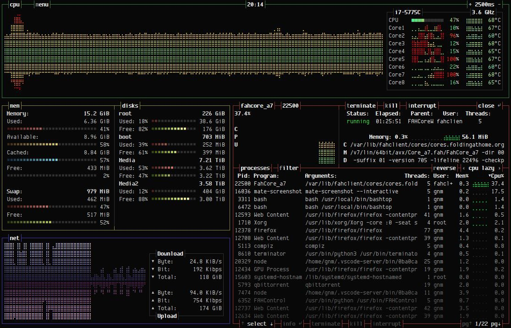
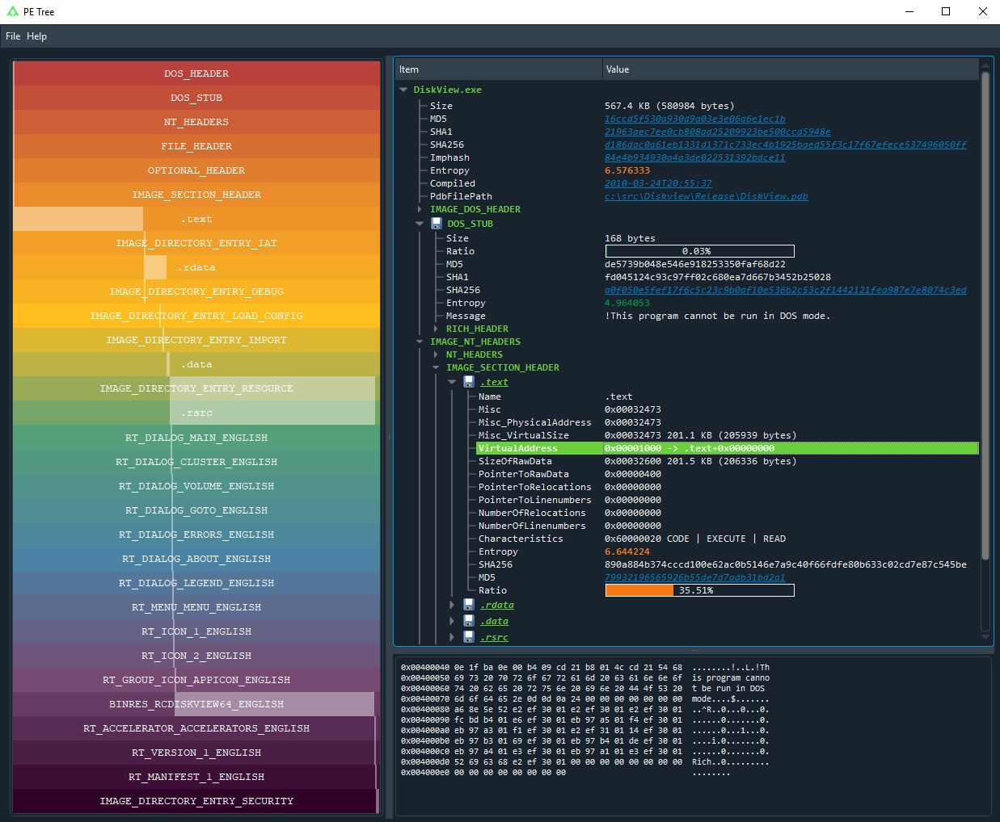

# phd_soc
`2020-08-31 21:36:08`

<blockquote>
https://github.com/sbousseaden/EVTX-ATTACK-SAMPLES - мне вот эта тема очень нравится как идея
</blockquote>

<table><tr><td><b>→</b><a href="https://github.com/sbousseaden/EVTX-ATTACK-SAMPLES">
https://github.com/sbousseaden/EVTX-ATTACK-SAMPLES
</a>
<blockquote>
Windows Events Attack Samples. Contribute to sbousseaden/EVTX-ATTACK-SAMPLES development by creating an account on GitHub.
</blockquote>
</td></tr></table>

---

# phd_soc
`2020-08-31 21:13:26`

<blockquote>
Можно попробовать на базе https://github.com/atc-project/atomic-threat-coverage сделать такой тест. Там у ребят есть и сэмплы событий и конкретные сценарии )
</blockquote>

<table><tr><td><b>→</b><a href="https://github.com/atc-project/atomic-threat-coverage">
https://github.com/atc-project/atomic-threat-coverage
</a>
<blockquote>
Actionable analytics designed to combat threats. Contribute to atc-project/atomic-threat-coverage development by creating an account on GitHub.
</blockquote>
</td></tr></table>

---

# defcon_news
`2020-08-31 12:53:08`

<blockquote>
[webapps] CMS Made Simple 2.2.14 - Arbitrary File Upload (Authenticated)
https://www.exploit-db.com/exploits/48779

via Exploit Database
</blockquote>

<table><tr><td><b>→</b><a href="https://www.exploit-db.com/exploits/48779">
https://www.exploit-db.com/exploits/48779
</a>
<blockquote>
CMS Made Simple 2.2.14 - Arbitrary File Upload (Authenticated).. webapps exploit for PHP platform
</blockquote>
</td></tr></table>

---

# defcon_news
`2020-08-31 12:53:07`

<blockquote>
[webapps] Fuel CMS 1.4.8 - 'fuel_replace_id' SQL Injection (Authenticated)
https://www.exploit-db.com/exploits/48778

via Exploit Database
</blockquote>

<table><tr><td><b>→</b><a href="https://www.exploit-db.com/exploits/48778">
https://www.exploit-db.com/exploits/48778
</a>
<blockquote>
Fuel CMS 1.4.8 - 'fuel_replace_id' SQL Injection (Authenticated).. webapps exploit for PHP platform
</blockquote>
</td></tr></table>

---

# defcon_news
`2020-08-31 12:53:06`

<blockquote>
[webapps] Mara CMS 7.5 - Reflective Cross-Site Scripting
https://www.exploit-db.com/exploits/48777

via Exploit Database
</blockquote>

<table><tr><td><b>→</b><a href="https://www.exploit-db.com/exploits/48777">
https://www.exploit-db.com/exploits/48777
</a>
<blockquote>
Mara CMS  7.5 - Reflective Cross-Site Scripting. CVE-2020-24223 . webapps exploit for PHP platform
</blockquote>
</td></tr></table>

---

# defcon_news
`2020-08-31 11:53:18`

<blockquote>
[local] BlazeDVD 7.0 Professional - '.plf' Local Buffer Overflow (SEH,ASLR,DEP)
https://www.exploit-db.com/exploits/48776

via Exploit Database
</blockquote>

<table><tr><td><b>→</b><a href="https://www.exploit-db.com/exploits/48776">
https://www.exploit-db.com/exploits/48776
</a>
<blockquote>
BlazeDVD 7.0 Professional - '.plf' Local Buffer Overflow (SEH,ASLR,DEP).. local exploit for Windows platform
</blockquote>
</td></tr></table>

---

# defcon_news
`2020-08-31 11:53:17`

<blockquote>
[webapps] Online Book Store 1.0 - 'id' SQL Injection
https://www.exploit-db.com/exploits/48775

via Exploit Database
</blockquote>

<table><tr><td><b>→</b><a href="https://www.exploit-db.com/exploits/48775">
https://www.exploit-db.com/exploits/48775
</a>
<blockquote>
Online Book Store 1.0 - 'id' SQL Injection.. webapps exploit for PHP platform
</blockquote>
</td></tr></table>

---

# MPSIEMChat
`2020-08-31 11:05:22`

<blockquote>
Привет. Вдруг кому-то пригодится, наш друг @zer0way_1 выложил на гите скрипт для отправки инцидентов по syslog. https://github.com/feedb/MPSiem_addons/tree/master/mpsiem2syslog
енджой
</blockquote>

<table><tr><td><b>→</b><a href="https://github.com/feedb/MPSiem_addons/tree/master/mpsiem2syslog">
https://github.com/feedb/MPSiem_addons/tree/master/mpsiem2syslog
</a>
<blockquote>
реп полезностей для PT MaxPatrol SIEM. Contribute to feedb/MPSiem_addons development by creating an account on GitHub.
</blockquote>
</td></tr></table>

---

# R0_Crew
`2020-08-31 10:09:33`

<blockquote>
Storm - a blackbox mutational fuzzer for detecting critical bugs in SMT solvers Article: https://numairmansur.github.io/STORM.pdf Code: https://github.com/Practical-Formal-Methods/storm &#35;fuzzing &#35;dukeBarman
</blockquote>

<table><tr><td><b>→</b><a href="https://numairmansur.github.io/STORM.pdf">
https://numairmansur.github.io/STORM.pdf
</a>
</td></tr></table>

---

# isast
`2020-08-30 21:33:05`

<blockquote>
https://github.com/hardik05/Damn_Vulnerable_C_Program
</blockquote>

<table><tr><td><b>→</b><a href="https://github.com/hardik05/Damn_Vulnerable_C_Program">
https://github.com/hardik05/Damn_Vulnerable_C_Program
</a>
<blockquote>
a c program containing vulnerable code for common types of vulnerabilities, can be used to show fuzzing concepts. - hardik05/Damn_Vulnerable_C_Program
</blockquote>
</td></tr></table>

---

# isast
`2020-08-30 21:31:03`

<blockquote>
https://github.com/softrams/bulwark
</blockquote>

<table><tr><td><b>→</b><a href="https://github.com/softrams/bulwark">
https://github.com/softrams/bulwark
</a>
<blockquote>
An organizational asset and vulnerability management tool, with Jira integration, designed for generating application security reports. - softrams/bulwark
</blockquote>
</td></tr></table>

---

# R0_Crew
`2020-08-29 21:24:00`

<blockquote>
Odyssey Swift-based semi-untethered jailbreak https://github.com/TheOdysseyJB/Odyssey &#35;jailbreak &#35;ios &#35;exploitation &#35;dukeBarman
</blockquote>

<table><tr><td><b>→</b><a href="https://github.com/TheOdysseyJB/Odyssey">
https://github.com/TheOdysseyJB/Odyssey
</a>
<blockquote>
Odyssey Swift-based semi-untethered jailbreak. Contribute to Odyssey-Team/Odyssey development by creating an account on GitHub.
</blockquote>
</td></tr></table>

---

# R0_Crew
`2020-08-29 12:03:53`

<blockquote>
Linux Kernel Runtime Guard https://github.com/openwall/lkrg &#35;linux &#35;dukeBarman
</blockquote>

<table><tr><td><b>→</b><a href="https://github.com/openwall/lkrg">
https://github.com/openwall/lkrg
</a>
<blockquote>
Linux Kernel Runtime Guard. Contribute to openwall/lkrg development by creating an account on GitHub.
</blockquote>
</td></tr></table>

---

# defcon_news
`2020-08-29 10:53:17`

<blockquote>
SUPERAntiSpyware Professional X Trial &lt; 10.0.1206 Local Privilege Escalation
http://seclists.org/fulldisclosure/2020/Aug/23

via Full Disclosure
</blockquote>

<table><tr><td><b>→</b><a href="https://seclists.org/fulldisclosure/2020/Aug/23">
https://seclists.org/fulldisclosure/2020/Aug/23
</a>
</td></tr></table>

---

# defcon_news
`2020-08-29 10:53:16`

<blockquote>
Missing Trust Validation in Visual Studio's VSIX Installer
http://seclists.org/fulldisclosure/2020/Aug/22

via Full Disclosure
</blockquote>

<table><tr><td><b>→</b><a href="https://seclists.org/fulldisclosure/2020/Aug/22">
https://seclists.org/fulldisclosure/2020/Aug/22
</a>
</td></tr></table>

---

# defcon_news
`2020-08-29 10:53:15`

<blockquote>
Three vulnerabilities found in MikroTik's RouterOS
http://seclists.org/fulldisclosure/2020/Aug/21

via Full Disclosure
</blockquote>

<table><tr><td><b>→</b><a href="https://seclists.org/fulldisclosure/2020/Aug/21">
https://seclists.org/fulldisclosure/2020/Aug/21
</a>
</td></tr></table>

---

# defcon_news
`2020-08-28 17:53:15`

<blockquote>
[webapps] Eibiz i-Media Server Digital Signage 3.8.0 - Privilege Escalation
https://www.exploit-db.com/exploits/48774

via Exploit Database
</blockquote>

<table><tr><td><b>→</b><a href="https://www.exploit-db.com/exploits/48774">
https://www.exploit-db.com/exploits/48774
</a>
<blockquote>
Eibiz i-Media Server Digital Signage 3.8.0 - Privilege Escalation.. webapps exploit for Hardware platform
</blockquote>
</td></tr></table>

---

# defcon_news
`2020-08-28 17:53:13`

<blockquote>
[webapps] SymphonyCMS 3.0.0 - Persistent Cross-Site Scripting
https://www.exploit-db.com/exploits/48773

via Exploit Database
</blockquote>

<table><tr><td><b>→</b><a href="https://www.exploit-db.com/exploits/48773">
https://www.exploit-db.com/exploits/48773
</a>
<blockquote>
SymphonyCMS 3.0.0 - Persistent Cross-Site Scripting.. webapps exploit for PHP platform
</blockquote>
</td></tr></table>

---

# defcon_news
`2020-08-28 17:53:12`

<blockquote>
[webapps] Nagios Log Server 2.1.6 - Persistent Cross-Site Scripting
https://www.exploit-db.com/exploits/48772

via Exploit Database
</blockquote>

<table><tr><td><b>→</b><a href="https://www.exploit-db.com/exploits/48772?utm_source=dlvr.it&utm_medium=twitter">
https://www.exploit-db.com/exploits/48772?utm_source=dlvr.it&utm_medium=twitter
</a>
<blockquote>
Nagios Log Server 2.1.6 - Persistent Cross-Site Scripting.. webapps exploit for Multiple platform
</blockquote>
</td></tr></table>

---

# defcon_news
`2020-08-28 17:53:11`

<blockquote>
[webapps] Online Shopping Alphaware 1.0 - 'id' SQL Injection
https://www.exploit-db.com/exploits/48771

via Exploit Database
</blockquote>

<table><tr><td><b>→</b><a href="https://www.exploit-db.com/exploits/48771">
https://www.exploit-db.com/exploits/48771
</a>
<blockquote>
Online Shopping Alphaware 1.0 - 'id' SQL Injection.. webapps exploit for PHP platform
</blockquote>
</td></tr></table>

---

# isast
`2020-08-28 16:34:02`

* https://telegra.ph/file/a438d7d70ec9fed85f539.jpg

<blockquote>
​​Fully automated python fuzzer built to test if code actually is production ready in seconds.

&#35;python allows you to do pretty much whatever you want. This is a good thing for the most part however it creates the opportunity for unexpected events to occur. One of battletested's strongest assets is its ability to show you all of those possibilities so there are no surprises. In a way, it surpasses learning about the behavior of code by reading docstrings because all behaviors are recorded during a fuzz.

https://github.com/CodyKochmann/battle_tested

For example, the image below shows just how much is brought to light about a piece of code without needing to read a textbook's worth of documentation (which almost never exists) just to learn about the full behavior of a single function.
</blockquote>

<table><tr><td><b>→</b><a href="https://telegra.ph/file/a438d7d70ec9fed85f539.jpg">
https://telegra.ph/file/a438d7d70ec9fed85f539.jpg
</a>
</td></tr></table>

---

# R0_Crew
`2020-08-28 16:33:33`

<blockquote>
0.7.0 version published, all known databases can be opened, widely tested: https://github.com/williballenthin/python-idb/releases/tag/v0.7.0
Also available on PyPI now: https://pypi.org/project/python-idb/

 &#35;ida &#35;reverse &#35;jeisonwi
</blockquote>

<table><tr><td><b>→</b><a href="https://github.com/williballenthin/python-idb/releases/tag/v0.7.0">
https://github.com/williballenthin/python-idb/releases/tag/v0.7.0
</a>
<blockquote>
notable changes:

support for v5.0 and v6.x
support for typeinf.FuncTypeData, argloc`
enhanced function call conventions and get_signature
improvements of IdaInfo
automated tests for scripts/*
lots...
</blockquote>
</td></tr></table>

---

# sysadm_in_channel
`2020-08-28 14:34:57`

<blockquote>
Osquery  - SQL powered operating system instrumentation, monitoring, and analytics framework.
Available for Linux, macOS, Windows, and FreeBSD

https://github.com/osquery/osquery
</blockquote>

<table><tr><td><b>→</b><a href="https://github.com/osquery/osquery">
https://github.com/osquery/osquery
</a>
<blockquote>
SQL powered operating system instrumentation, monitoring, and analytics. - osquery/osquery
</blockquote>
</td></tr></table>

---

# defcon_news
`2020-08-28 09:53:31`

<blockquote>
Write-up on the Authenticated Remote Code Execution in Pulse Secure VPN (CVE-2020-8218)
https://www.reddit.com/r/netsec/comments/ih0ruj/writeup_on_the_authenticated_remote_code/

via /r/netsec - Information Security News &amp; Discussion
</blockquote>

<table><tr><td><b>→</b><a href="https://www.reddit.com/r/netsec/comments/ih0ruj/writeup_on_the_authenticated_remote_code/?utm_source=dlvr.it&utm_medium=twitter">
https://www.reddit.com/r/netsec/comments/ih0ruj/writeup_on_the_authenticated_remote_code/?utm_source=dlvr.it&utm_medium=twitter
</a>
<blockquote>
Posted in r/netsec by u/obilodeau • 129 points and 5 comments
</blockquote>
</td></tr></table>

---

# defcon_news
`2020-08-28 09:53:18`

<blockquote>
Уязвимость в OpenZFS, нарушающая обработку прав доступа во FreeBSD
https://www.opennet.ru/opennews/art.shtml?num&#61;53611

via OpenNews.opennet.ru: Проблемы безопасности
</blockquote>

<table><tr><td><b>→</b><a href="https://www.opennet.ru/opennews/art.shtml?num=53611">
https://www.opennet.ru/opennews/art.shtml?num=53611
</a>
<blockquote>
В добавленном в OpenZFS коде для поддержки ОС FreeBSD выявлена критическая уязвимость (CVE-2020-24717), приводящая к нарушению обработки прав доступа. Суть проблемы в том, что права, устанавливаемые для группы, обрабатывались как права для владельца файла. Проблема устранена в обновлении OpenZFS 2.0.0-rc1. Исправление внесено до перевода кодовой базы FreeBSD HEAD на OpenZFS.
</blockquote>
</td></tr></table>

---

# overlamer1
`2020-08-28 09:28:36`

* https://telegra.ph/Poisk-uyazvimyh-IP-adresov-po-CVE-ID-CVE-2019-0192-07-14

<blockquote>
Поиск уязвимых IP-адресов по CVE ID: CVE-2019-0192
</blockquote>

<table><tr><td><b>→</b><a href="https://telegra.ph/Poisk-uyazvimyh-IP-adresov-po-CVE-ID-CVE-2019-0192-07-14">
https://telegra.ph/Poisk-uyazvimyh-IP-adresov-po-CVE-ID-CVE-2019-0192-07-14
</a>
<blockquote>
Дисклеймер: Статья предоставлена в ознакомительных целях. Мы не несём ответственность за ваши действия! В этой статье мы будем использовать Spyse для поиска уязвимых IP-адресов на CVE-2019-0192. Шаг 1. Найдите уязвимые версии программного обеспечения Посмотрим на описание NVD CVE: В версиях Apache Solr 5.0.0–5.5.5 и 6.0.0–6.6.5 API-интерфейс Config позволяет настраивать JMX-сервер с помощью HTTP-запроса POST. Направив его на вредоносный RMI-сервер, злоумышленник может воспользоваться небезопасной структуризацией…
</blockquote>
</td></tr></table>

---

# defcon_news
`2020-08-27 21:53:19`

<blockquote>
SEC Consult SA-20200827-0 :: Multiple Vulnerabilities in ZTE mobile Hotspot MS910S
http://seclists.org/fulldisclosure/2020/Aug/20

via Full Disclosure
</blockquote>

<table><tr><td><b>→</b><a href="https://seclists.org/fulldisclosure/2020/Aug/20">
https://seclists.org/fulldisclosure/2020/Aug/20
</a>
</td></tr></table>

---

# defcon_news
`2020-08-27 21:53:17`

<blockquote>
SEC Consult SA-20200826-0 :: Extensive file permissions on service executable in Eikon Thomson Reuters
http://seclists.org/fulldisclosure/2020/Aug/19

via Full Disclosure
</blockquote>

<table><tr><td><b>→</b><a href="https://seclists.org/fulldisclosure/2020/Aug/19">
https://seclists.org/fulldisclosure/2020/Aug/19
</a>
</td></tr></table>

---

# defcon_news
`2020-08-27 20:53:15`

<blockquote>
[webapps] Wordpress Plugin Autoptimize 2.7.6 - Arbitrary File Upload (Authenticated)
https://www.exploit-db.com/exploits/48770

via Exploit Database
</blockquote>

<table><tr><td><b>→</b><a href="https://www.exploit-db.com/exploits/48770">
https://www.exploit-db.com/exploits/48770
</a>
<blockquote>
Wordpress Plugin Autoptimize 2.7.6 - Arbitrary File Upload (Authenticated).. webapps exploit for PHP platform
</blockquote>
</td></tr></table>

---

# defcon_news
`2020-08-27 20:53:11`

<blockquote>
[local] ASX to MP3 converter 3.1.3.7.2010.11.05 - '.wax' Local Buffer Overflow (DEP,ASLR Bypass) (PoC)
https://www.exploit-db.com/exploits/48769

via Exploit Database
</blockquote>

<table><tr><td><b>→</b><a href="https://www.exploit-db.com/exploits/48769">
https://www.exploit-db.com/exploits/48769
</a>
<blockquote>
ASX to MP3 converter 3.1.3.7.2010.11.05 - '.wax' Local Buffer Overflow (DEP,ASLR Bypass) (PoC).. local exploit for Windows platform
</blockquote>
</td></tr></table>

---

# defcon_news
`2020-08-27 20:53:10`

<blockquote>
[webapps] Mida eFramework 2.9.0 - Remote Code Execution
https://www.exploit-db.com/exploits/48768

via Exploit Database
</blockquote>

<table><tr><td><b>→</b><a href="https://www.exploit-db.com/exploits/48768">
https://www.exploit-db.com/exploits/48768
</a>
<blockquote>
Mida eFramework 2.9.0 - Remote Code Execution. CVE-2020-15920 . webapps exploit for Multiple platform
</blockquote>
</td></tr></table>

---

# sysadm_in_channel
`2020-08-27 07:29:40`

<blockquote>
Swap Detector - Clang Static Analyzer Plugin 

Может быть использован так же с PyLint. В программировании функция swap() присваивает переменным значения друг друга. Данный модуль проверяет такие вызовы в программном коде. Авторы, одна из компаний занимающихся кибербезопасностью:

https://github.com/GrammaTech/swap-detector
</blockquote>

<table><tr><td><b>→</b><a href="https://github.com/GrammaTech/swap-detector">
https://github.com/GrammaTech/swap-detector
</a>
<blockquote>
A library for detecting swapped arguments in function calls, and a Clang Static Analyzer plugin used to demonstrate the library. - GrammaTech/swap-detector
</blockquote>
</td></tr></table>

---

# sysadm_in_channel
`2020-08-26 18:14:16`

<blockquote>
D(COM) V(ulnerability) S(canner)

Можно использовать как модуль PowerShell, может быть крайне полезен Windows админам и безопасникам:

https://github.com/ScorpionesLabs/DVS

Пример работы:

https://youtu.be/FAjwybmFJAA
</blockquote>

<table><tr><td><b>→</b><a href="https://github.com/ScorpionesLabs/DVS">
https://github.com/ScorpionesLabs/DVS
</a>
<blockquote>
D(COM) V(ulnerability) S(canner) AKA Devious swiss army knife - Lateral movement using DCOM Objects - ScorpionesLabs/DVS
</blockquote>
</td></tr></table>

---

# phd_soc
`2020-08-26 14:22:31`

<blockquote>
Вы дверью ошиблись. Вам сюда https://t.me/MPSIEMChat
</blockquote>

<table><tr><td><b>→</b><a href="https://t.me/MPSIEMChat">
https://t.me/MPSIEMChat
</a>
<blockquote>
Всякие полезности
https://github.com/feedb/MPSiem_addons
</blockquote>
</td></tr></table>

---

# defcon_news
`2020-08-26 12:53:10`

<blockquote>
[webapps] Eibiz i-Media Server Digital Signage 3.8.0 - Directory Traversal
https://www.exploit-db.com/exploits/48766

via Exploit Database
</blockquote>

<table><tr><td><b>→</b><a href="https://www.exploit-db.com/exploits/48766">
https://www.exploit-db.com/exploits/48766
</a>
<blockquote>
Eibiz i-Media Server Digital Signage 3.8.0 - Directory Traversal.. webapps exploit for Multiple platform
</blockquote>
</td></tr></table>

---

# defcon_news
`2020-08-26 11:53:12`

<blockquote>
[webapps] Ericom Access Server x64 9.2.0 - Server-Side Request Forgery
https://www.exploit-db.com/exploits/48765

via Exploit Database
</blockquote>

<table><tr><td><b>→</b><a href="https://www.exploit-db.com/exploits/48765">
https://www.exploit-db.com/exploits/48765
</a>
<blockquote>
Ericom Access Server x64 9.2.0 - Server-Side Request Forgery.. webapps exploit for Multiple platform
</blockquote>
</td></tr></table>

---

# R0_Crew
`2020-08-26 03:00:10`

<blockquote>
FuZZan: Efficient Sanitizer Metadata Design for Fuzzing
Source: https://github.com/HexHive/FuZZan
Article: http://hexhive.epfl.ch/publications/files/20ATC.pdf

 &#35;fuzzing &#35;dukeBarman
</blockquote>

<table><tr><td><b>→</b><a href="https://github.com/HexHive/FuZZan">
https://github.com/HexHive/FuZZan
</a>
<blockquote>
FuZZan: Efficient Sanitizer Metadata Design for Fuzzing - HexHive/FuZZan
</blockquote>
</td></tr></table>

---

# defcon_news
`2020-08-25 20:53:12`

<blockquote>
A Tale of Escaping a Hardened Docker container
http://seclists.org/fulldisclosure/2020/Aug/18

via Full Disclosure
</blockquote>

<table><tr><td><b>→</b><a href="https://seclists.org/fulldisclosure/2020/Aug/18">
https://seclists.org/fulldisclosure/2020/Aug/18
</a>
</td></tr></table>

---

# defcon_news
`2020-08-25 20:53:11`

<blockquote>
NEProfile - Host Header Injection
http://seclists.org/fulldisclosure/2020/Aug/17

via Full Disclosure
</blockquote>

<table><tr><td><b>→</b><a href="https://seclists.org/fulldisclosure/2020/Aug/17">
https://seclists.org/fulldisclosure/2020/Aug/17
</a>
</td></tr></table>

---

# defcon_news
`2020-08-25 20:53:10`

<blockquote>
Google Chromecast Auth Bypass/RCE
http://seclists.org/fulldisclosure/2020/Aug/16

via Full Disclosure
</blockquote>

<table><tr><td><b>→</b><a href="https://seclists.org/fulldisclosure/2020/Aug/16">
https://seclists.org/fulldisclosure/2020/Aug/16
</a>
</td></tr></table>

---

# defcon_news
`2020-08-25 20:53:08`

<blockquote>
CVE-2020-24548 / Ericom Access Server for (AccessNow &amp; Ericom Blaze) v9.2.0 / Server Side Request Forgery
http://seclists.org/fulldisclosure/2020/Aug/15

via Full Disclosure
</blockquote>

<table><tr><td><b>→</b><a href="https://seclists.org/fulldisclosure/2020/Aug/15">
https://seclists.org/fulldisclosure/2020/Aug/15
</a>
</td></tr></table>

---

# sysadm_in_channel
`2020-08-25 13:58:35`

<blockquote>
WindowsSpyBlocker 🛡️написан на Go доставляется в единственном исполняемом файле, цель -  блокировка трекинга / слежки в Windows системах

Не тестировал, но давно искал что-то подобное:

https://github.com/crazy-max/WindowsSpyBlocker
</blockquote>

<table><tr><td><b>→</b><a href="https://github.com/crazy-max/WindowsSpyBlocker">
https://github.com/crazy-max/WindowsSpyBlocker
</a>
<blockquote>
Block spying and tracking on Windows. Contribute to crazy-max/WindowsSpyBlocker development by creating an account on GitHub.
</blockquote>
</td></tr></table>

---

# R0_Crew
`2020-08-25 12:47:53`

<blockquote>
UAFuzz: Binary-level Directed Fuzzing for Use-After-Free Vulnerabilities https://github.com/strongcourage/uafuzz &#35;fuzzing &#35;dukeBarman
</blockquote>

<table><tr><td><b>→</b><a href="https://github.com/strongcourage/uafuzz">
https://github.com/strongcourage/uafuzz
</a>
<blockquote>
UAFuzz: Binary-level Directed Fuzzing for Use-After-Free Vulnerabilities - strongcourage/uafuzz
</blockquote>
</td></tr></table>

---

# R0_Crew
`2020-08-25 12:11:00`

<blockquote>
idapm is IDA Plugin Manager via GitHub Repository https://github.com/tkmru/idapm &#35;reverse &#35;ida &#35;dukeBarman
</blockquote>

<table><tr><td><b>→</b><a href="https://github.com/tkmru/idapm">
https://github.com/tkmru/idapm
</a>
<blockquote>
idapm is IDA Plugin Manager via GitHub Repository. - tkmru/idapm
</blockquote>
</td></tr></table>

---

# defcon_news
`2020-08-25 10:53:16`

<blockquote>
Google Researcher Reported 3 Flaws in Apache Web Server Software
https://thehackernews.com/2020/08/apache-webserver-security.html

via The Hacker News
</blockquote>

<table><tr><td><b>→</b><a href="https://thehackernews.com/2020/08/apache-webserver-security.html">
https://thehackernews.com/2020/08/apache-webserver-security.html
</a>
<blockquote>
Apache recently fixed multiple vulnerabilities (CVE-2020-9490, CVE-2020-11984, CVE-2020-11993) in its web server software.
</blockquote>
</td></tr></table>

---

# R0_Crew
`2020-08-25 01:14:26`

<blockquote>
Code deobfuscation by program synthesis-aided simplification of Mixed Boolean-Arithmetic expressions https://github.com/arnaugamez/tfg Code: https://github.com/arnaugamez/r2syntia &#35;reverse &#35;dukeBarman
</blockquote>

<table><tr><td><b>→</b><a href="https://github.com/arnaugamez/tfg">
https://github.com/arnaugamez/tfg
</a>
<blockquote>
A copy of my Mathematics and Computer Engineering B.Sc. thesis - arnaugamez/tfg
</blockquote>
</td></tr></table>

---

# defcon_news
`2020-08-24 21:53:18`

<blockquote>
[webapps] Eibiz i-Media Server Digital Signage 3.8.0 - Configuration Disclosure
https://www.exploit-db.com/exploits/48764

via Exploit Database
</blockquote>

<table><tr><td><b>→</b><a href="https://www.exploit-db.com/exploits/48764">
https://www.exploit-db.com/exploits/48764
</a>
<blockquote>
Eibiz i-Media Server Digital Signage 3.8.0 - Configuration Disclosure.. webapps exploit for Hardware platform
</blockquote>
</td></tr></table>

---

# defcon_news
`2020-08-24 20:53:20`

<blockquote>
[webapps] Eibiz i-Media Server Digital Signage 3.8.0 - Authentication Bypass
https://www.exploit-db.com/exploits/48763

via Exploit Database
</blockquote>

<table><tr><td><b>→</b><a href="https://www.exploit-db.com/exploits/48763">
https://www.exploit-db.com/exploits/48763
</a>
<blockquote>
Eibiz i-Media Server Digital Signage 3.8.0 - Authentication Bypass.. webapps exploit for Hardware platform
</blockquote>
</td></tr></table>

---

# defcon_news
`2020-08-24 20:53:18`

<blockquote>
[webapps] LimeSurvey 4.3.10 - 'Survey Menu' Persistent Cross-Site Scripting
https://www.exploit-db.com/exploits/48762

via Exploit Database
</blockquote>

<table><tr><td><b>→</b><a href="https://www.exploit-db.com/exploits/48762">
https://www.exploit-db.com/exploits/48762
</a>
<blockquote>
LimeSurvey 4.3.10 - 'Survey Menu' Persistent Cross-Site Scripting.. webapps exploit for PHP platform
</blockquote>
</td></tr></table>

---

# R0_Crew
`2020-08-24 19:32:47`

<blockquote>
Enumy - Linux post exploitation privilege escalation enumeration https://github.com/luke-goddard/enumy &#35;links &#35;linux &#35;ctf &#35;exploitation
</blockquote>

<table><tr><td><b>→</b><a href="https://github.com/luke-goddard/enumy">
https://github.com/luke-goddard/enumy
</a>
<blockquote>
Linux post exploitation privilege escalation enumeration  - luke-goddard/enumy
</blockquote>
</td></tr></table>

---

# isast
`2020-08-24 16:52:30`

<blockquote>
вот мб кому понадобится, сделала единый патч чтобы старый qemu в составе afl собирался под новые системы:
https://gist.github.com/holograin/2ae0f06cffa3201195fcd1a1574c1483
</blockquote>

<table><tr><td><b>→</b><a href="https://gist.github.com/holograin/2ae0f06cffa3201195fcd1a1574c1483">
https://gist.github.com/holograin/2ae0f06cffa3201195fcd1a1574c1483
</a>
<blockquote>
patch AFL-bundled qemu-2.10.0 build for newer systems - additional_patches.sh
</blockquote>
</td></tr></table>

---

# isast
`2020-08-24 14:44:18`

* https://telegra.ph/file/3ce6056713adb97710790.mp4

<blockquote>
​​Quality assurance for Jupyter Notebooks.

Adapter to run any code-quality tool on a Jupyter notebook. This is intended to be run as a pre-commit hook and/or during continuous integration.

Can run: flake8, mypy, black, isort, doctest.
Also works with wemake-python-styleguide!

https://github.com/nbQA-dev/nbQA

&#35;ds &#35;python
</blockquote>

<table><tr><td><b>→</b><a href="https://telegra.ph/file/3ce6056713adb97710790.mp4">
https://telegra.ph/file/3ce6056713adb97710790.mp4
</a>
</td></tr></table>

---

# isast
`2020-08-24 10:22:29`

<blockquote>
Krane - Kubernetes RBAC static analysis tool

Krane - open source утилита, выполняющая статический анализ RBAC за счет индексации объектов RBAC в RedisGraph. Управление рисками RBAC происходит через настройку политик.  Krane может работать как CLI, docker-контейнер или автономная служба для непрерывного анализа, а также быть встроенным в CI/CD. Также есть возможность построения отчетов, выполнения мониторинга и алертинга.

Кстати, лучшие практики по RBAC можно найти здесь: https://rbac.dev

&#35;k8s &#35;tools
</blockquote>

---

# isast
`2020-08-23 16:34:53`

* https://sanityisreallyoverrated.files.wordpress.com/2016/01/parsinghtmlwithregex.jpg
* https://t.me/dereference_pointer_there/883
* https://github.com/Wisdom/RegEx-DoS
* https://github.com/sindresorhus/eslint-plugin-unicorn/blob/v20.0.0/docs/rules/no-unsafe-regex.md
* https://t.me/nosingularity/433
* https://holistic.dev/playground/
* https://holistic.dev/playground/63750194-f3e4-45e5-8762-ec0096626b8e

<blockquote>
​Сегодня в эфире наброс на regexp’ы аж о двух постах.

Присоединюсь по всем пунктам, разве что за исключением того, что проверять регеспы можно статическими методами (раз, два). Если вы, конечно, не собираете их динамически :) А если собираете,... я даже не знаю как это можно назвать...

У меня как-то была история о регекспах, когда я парсил базу билетного агенства.

В holistic.dev тоже не обошлось без этой черной юниксово-перловой магии :)

Нет, запросы не парсятся регекспами, это невозможно. Для этого используется оригинальный AST-парсер из postgresql. 
Выковыривать его оттуда отдельное приключение. Т.к. разработчики не поставляют его как отдельный продукт, они не переживают за обратную совместимость. Поэтому у дерева постоянно появляются и пропадают узлы :)

Регекспы используются для подготовки сорцов, перед скармливанием их в AST-парсер. Т.к. мы маленький стартап и не можем позволить себе написать грамматику, например, под JetBrains Grammar-Kit, приходится выкручиваться. 

Т.к. изначально инструмент планировалось интегрировать с IDE, то хотелось сделать так, чтобы при наличии синтаксической ошибке в одной из sql-команд, только эта команда игнорировалась, а остальное парсилось. Именно так все работает в IDE от Jetbrains. Хотелось сделать так же, но нативный парсер такого не умеет - он падает на первой же синтаксической ошибке.

Идея делать плагин для IDE была отложена, а функционал остался. Если в playground сделать несколько ddl-команд, часть из которых будет с синтаксическими ошибками, это не помешает проверке. (выделение ошибочных мест в DDL будет позже, сейчас можно заметить, что поля из таблицы b не попали в экспорт типов).
Часто спрашивают - почему не подсвечивается отсутствующая таблица в запросе? Сейчас мы не ориентируемся на разработчиков, а у DBA не бывает невалидных запросов :) Но справедливости ради, это правило находится в процессе разработки и нашлись corner cases, которые требуют доработки парсера :)

К слову, если у вас есть экспертиза в AST-парсерах, я был бы рад пообщаться (@antonrevyako)
</blockquote>

<table><tr><td><b>→</b><a href="https://sanityisreallyoverrated.files.wordpress.com/2016/01/parsinghtmlwithregex.jpg">
https://sanityisreallyoverrated.files.wordpress.com/2016/01/parsinghtmlwithregex.jpg
</a>
</td></tr></table>

---

# defcon_news
`2020-08-22 21:53:04`

<blockquote>
VMware App Volumes patches address Stored Cross-Site Scripting (XSS) vulnerability - https://www.vmware.com/security/advisories/VMSA-2020-0019.html, (Sat, Aug 22nd)
https://isc.sans.edu/diary/rss/26490

via SANS Internet Storm Center, InfoCON: green
</blockquote>

<table><tr><td><b>→</b><a href="https://www.vmware.com/security/advisories/VMSA-2020-0019.html">
https://www.vmware.com/security/advisories/VMSA-2020-0019.html
</a>
<blockquote>
VMware App Volumes patches address Stored Cross-Site Scripting (XSS) vulnerability (CVE-2020-3975)
</blockquote>
</td></tr></table>

---

# R0_Crew
`2020-08-22 18:39:09`

<blockquote>
Fuzzing JavaScript Engines with Aspect-preserving Mutation

https://github.com/sslab-gatech/DIE

&#35;reverse &#35;expdev &#35;fuzzing &#35;javascript &#35;darw1n
</blockquote>

<table><tr><td><b>→</b><a href="https://github.com/sslab-gatech/DIE">
https://github.com/sslab-gatech/DIE
</a>
<blockquote>
Fuzzing JavaScript Engines with Aspect-preserving Mutation - sslab-gatech/DIE
</blockquote>
</td></tr></table>

---

# defcon_news
`2020-08-22 10:53:14`

<blockquote>
Уязвимость в chrony
https://www.opennet.ru/opennews/art.shtml?num&#61;53580

via OpenNews.opennet.ru: Проблемы безопасности
</blockquote>

<table><tr><td><b>→</b><a href="https://www.opennet.ru/opennews/art.shtml?num=53580">
https://www.opennet.ru/opennews/art.shtml?num=53580
</a>
<blockquote>
В chrony, реализации протокола NTP, применяемой для синхронизации точного времени в различных дистрибутивах Linux, выявлена уязвимость (CVE-2020-14367), позволяющая перезаписать любой файл в системе, имея доступ к локальному непривилегированному пользователю chrony. Уязвимость может быть эксплуатирована только через пользователя chrony, что снижает её опасность. Тем не менее, проблема компрометирует уровень изоляции в chrony и может использоваться в случае выявления другой уязвимости в коде, выполняемом после сброса привилегий.
</blockquote>
</td></tr></table>

---

# defcon_news
`2020-08-21 23:53:07`

<blockquote>
[webapps] Seowon SlC 130 Router - Remote Code Execution
https://www.exploit-db.com/exploits/48759

via Exploit Database
</blockquote>

<table><tr><td><b>→</b><a href="https://www.exploit-db.com/exploits/48759">
https://www.exploit-db.com/exploits/48759
</a>
<blockquote>
Seowon SlC 130 Router - Remote Code Execution.. webapps exploit for Hardware platform
</blockquote>
</td></tr></table>

---

# defcon_news
`2020-08-21 23:53:06`

<blockquote>
[webapps] Complaint Management System 1.0 - 'cid' SQL Injection
https://www.exploit-db.com/exploits/48758

via Exploit Database
</blockquote>

<table><tr><td><b>→</b><a href="https://www.exploit-db.com/exploits/48758">
https://www.exploit-db.com/exploits/48758
</a>
<blockquote>
Complaint Management System 1.0 - 'cid' SQL Injection.. webapps exploit for PHP platform
</blockquote>
</td></tr></table>

---

# defcon_news
`2020-08-21 20:53:06`

<blockquote>
Open-Xchange Security Advisory 2020-08-20
http://seclists.org/fulldisclosure/2020/Aug/14

via Full Disclosure
</blockquote>

<table><tr><td><b>→</b><a href="https://seclists.org/fulldisclosure/2020/Aug/14">
https://seclists.org/fulldisclosure/2020/Aug/14
</a>
</td></tr></table>

---

# defcon_news
`2020-08-21 20:53:04`

<blockquote>
Payment bypass in WordPress - WooCommerce - NAB Transact plugin disclosure
http://seclists.org/fulldisclosure/2020/Aug/13

via Full Disclosure
</blockquote>

<table><tr><td><b>→</b><a href="https://seclists.org/fulldisclosure/2020/Aug/13">
https://seclists.org/fulldisclosure/2020/Aug/13
</a>
</td></tr></table>

---

# sysadm_in_channel
`2020-08-21 17:11:42`

<blockquote>
String-classifier - is a python module for detecting random string and hashes text/code

Автор Adobe. Средство (модуль) для обнаружения чуствительных данных (api ключей, паролей), санитайзинг логов

https://github.com/adobe/stringlifier
</blockquote>

<table><tr><td><b>→</b><a href="https://github.com/adobe/stringlifier">
https://github.com/adobe/stringlifier
</a>
<blockquote>
Stringlifier is on Opensource ML Library for detecting random strings in raw text. It can be used in sanitising logs, detecting accidentally exposed credentials and as a pre-processing step in unsu...
</blockquote>
</td></tr></table>

---

# defcon_news
`2020-08-21 11:53:12`

<blockquote>
Обновление DNS-сервера BIND 9.11.22, 9.16.6, 9.17.4 с устранением 5 уязвимостей
https://www.opennet.ru/opennews/art.shtml?num&#61;53577

via OpenNews.opennet.ru: Проблемы безопасности
</blockquote>

<table><tr><td><b>→</b><a href="https://www.opennet.ru/opennews/art.shtml?num=53577">
https://www.opennet.ru/opennews/art.shtml?num=53577
</a>
<blockquote>
Опубликованы корректирующие обновления стабильных веток DNS-сервера BIND 9.11.22 и 9.16.6, а также находящейся в разработке экспериментальной ветки 9.17.4. В новых выпусках устранено 5 уязвимостей. Наиболее опасная уязвимость (CVE-2020-8620) позволяет удалённо вызвать отказ в обслуживании через отправку определённого набора пакетов на TCP-порт, на котором принимает соединения BIND. Отправка на TCP-порт аномально больших запросов AXFR, может привести к тому, что обслуживающая TCP-соединение библиотека libuv передаст серверу размер, приводящий к срабатыванию проверки assertion и завершению процесса.
</blockquote>
</td></tr></table>

---

# sysadm_in_channel
`2020-08-21 09:14:45`

<blockquote>
Socks Over RDP / Socks Over Citrix

Совместимость SOCKS proxy с Terminal Services (или Remote Desktop Services) / Citrix (XenApp/XenDesktop)

https://github.com/nccgroup/SocksOverRDP
</blockquote>

<table><tr><td><b>→</b><a href="https://github.com/nccgroup/SocksOverRDP">
https://github.com/nccgroup/SocksOverRDP
</a>
<blockquote>
Socks5/4/4a Proxy support for Remote Desktop Protocol / Terminal Services / Citrix / XenApp / XenDesktop - nccgroup/SocksOverRDP
</blockquote>
</td></tr></table>

---

# defcon_news
`2020-08-20 21:53:34`

<blockquote>
[webapps] PNPSCADA 2.200816204020 - 'interf' SQL Injection (Authenticated)
https://www.exploit-db.com/exploits/48757

via Exploit Database
</blockquote>

<table><tr><td><b>→</b><a href="https://www.exploit-db.com/exploits/48757">
https://www.exploit-db.com/exploits/48757
</a>
<blockquote>
PNPSCADA 2.200816204020 - 'interf' SQL Injection (Authenticated).. webapps exploit for Hardware platform
</blockquote>
</td></tr></table>

---

# defcon_news
`2020-08-20 21:53:28`

<blockquote>
[webapps] ElkarBackup 1.3.3 - Persistent Cross-Site Scripting
https://www.exploit-db.com/exploits/48756

via Exploit Database
</blockquote>

<table><tr><td><b>→</b><a href="https://www.exploit-db.com/exploits/48756">
https://www.exploit-db.com/exploits/48756
</a>
<blockquote>
ElkarBackup 1.3.3 - Persistent Cross-Site Scripting.. webapps exploit for PHP platform
</blockquote>
</td></tr></table>

---

# sysadm_in_channel
`2020-08-20 17:10:24`

<blockquote>
Credential Digger сканер захардкоженных кред в GitHub (Passwords, API Keys, Secret Keys, Tokens, personal information, etc)

https://github.com/SAP/credential-digger&#35;requirements
</blockquote>

<table><tr><td><b>→</b><a href="https://github.com/SAP/credential-digger">
https://github.com/SAP/credential-digger
</a>
<blockquote>
A Github scanning tool that identifies hardcoded credentials while filtering the false positive data through machine learning models :lock: - SAP/credential-digger
</blockquote>
</td></tr></table>

---

# defcon_news
`2020-08-20 11:53:23`

<blockquote>
Rocket.Chat Cross-Site Scripting leading to Remote Code Execution CVE-2020-15926
https://www.reddit.com/r/netsec/comments/ic2zf5/rocketchat_crosssite_scripting_leading_to_remote/

via /r/netsec - Information Security News &amp; Discussion
</blockquote>

<table><tr><td><b>→</b><a href="https://www.reddit.com/r/netsec/comments/ic2zf5/rocketchat_crosssite_scripting_leading_to_remote/">
https://www.reddit.com/r/netsec/comments/ic2zf5/rocketchat_crosssite_scripting_leading_to_remote/
</a>
<blockquote>
Posted in r/netsec by u/h0wlu • 1 point and 0 comments
</blockquote>
</td></tr></table>

---

# defcon_news
`2020-08-20 11:53:12`

<blockquote>
Microsoft два года исправляла находившуюся под атаками уязвимость
https://xakep.ru/2020/08/20/cve-2020-1464/

via «Хакер»
</blockquote>

<table><tr><td><b>→</b><a href="https://xakep.ru/2020/08/20/cve-2020-1464/">
https://xakep.ru/2020/08/20/cve-2020-1464/
</a>
<blockquote>
Один из патчей, вошедший в состав августовского «вторника обновлений», устранил уязвимость, позволявшую преобразовывать файлы MSI во вредоносные исполняемые файлы Java, сохраняя при этом легитимную цифровую подпись. Эта уязвимость уже давно находилась под атаками, но на ее исправление у Microsoft почему-то ушло два года.
</blockquote>
</td></tr></table>

---

# defcon_news
`2020-08-20 03:53:04`

<blockquote>
[webapps] Ruijie Networks Switch eWeb S29_RGOS 11.4 - Directory Traversal
https://www.exploit-db.com/exploits/48755

via Exploit Database
</blockquote>

<table><tr><td><b>→</b><a href="https://www.exploit-db.com/exploits/48755">
https://www.exploit-db.com/exploits/48755
</a>
<blockquote>
Ruijie Networks Switch eWeb S29_RGOS 11.4 - Directory Traversal.. webapps exploit for Hardware platform
</blockquote>
</td></tr></table>

---

# defcon_news
`2020-08-19 23:53:23`

<blockquote>
Уязвимость в интерфейсе мониторинга Icinga Web
https://www.opennet.ru/opennews/art.shtml?num&#61;53571

via OpenNews.opennet.ru: Проблемы безопасности
</blockquote>

<table><tr><td><b>→</b><a href="https://www.opennet.ru/opennews/art.shtml?num=53571">
https://www.opennet.ru/opennews/art.shtml?num=53571
</a>
<blockquote>
Опубликованы корректирующие выпуски пакета Icinga Web 2.6.4, 2.7.4 и v2.8.2, предоставляющего web-интерфейс для системы мониторинга Icinga. В предложенных обновлениях устранена критическая уязвимость (CVE-2020-24368), позволяющая неаутентифицированному атакующему получить доступ к файлам на сервере с привилегиями процесса Icinga Web (обычно пользователь, под которыми выполняется http-сервер или fpm).
</blockquote>
</td></tr></table>

---

# R0_Crew
`2020-08-19 17:54:47`

<blockquote>
Reverse Engineering Resources About All Platforms (Windows/Linux/macOS/Android/iOS/IoT)  https://github.com/alphaSeclab/awesome-reverse-engineering &#35;reverse &#35;dukeBarman
</blockquote>

<table><tr><td><b>→</b><a href="https://github.com/alphaSeclab/awesome-reverse-engineering">
https://github.com/alphaSeclab/awesome-reverse-engineering
</a>
<blockquote>
Reverse Engineering Resources About All Platforms(Windows/Linux/macOS/Android/iOS/IoT) And Every Aspect! (More than 3500 open source tools and 2300 posts&amp;videos) - alphaSeclab/awesome-rever...
</blockquote>
</td></tr></table>

---

# ctfchat
`2020-08-18 23:35:54`

<blockquote>
https://drive.google.com/file/d/1qZTakP92B4VQQk0QXnWu_bHz2ZNiF4gQ/view
</blockquote>

<table><tr><td><b>→</b><a href="https://drive.google.com/file/d/1qZTakP92B4VQQk0QXnWu_bHz2ZNiF4gQ/view">
https://drive.google.com/file/d/1qZTakP92B4VQQk0QXnWu_bHz2ZNiF4gQ/view
</a>
</td></tr></table>

---

# defcon_news
`2020-08-18 21:53:22`

<blockquote>
[webapps] Savsoft Quiz 5 - Stored Cross-Site Scripting
https://www.exploit-db.com/exploits/48753

via Exploit Database
</blockquote>

<table><tr><td><b>→</b><a href="https://www.exploit-db.com/exploits/48753?utm_source=dlvr.it&utm_medium=twitter">
https://www.exploit-db.com/exploits/48753?utm_source=dlvr.it&utm_medium=twitter
</a>
<blockquote>
Savsoft Quiz 5 - Stored Cross-Site Scripting.. webapps exploit for PHP platform
</blockquote>
</td></tr></table>

---

# defcon_news
`2020-08-18 21:53:18`

<blockquote>
[webapps] Pharmacy Medical Store and Sale Point 1.0 - 'catid' SQL Injection
https://www.exploit-db.com/exploits/48752

via Exploit Database
</blockquote>

<table><tr><td><b>→</b><a href="https://www.exploit-db.com/exploits/48752">
https://www.exploit-db.com/exploits/48752
</a>
<blockquote>
Pharmacy Medical Store and Sale Point 1.0  - 'catid' SQL Injection.. webapps exploit for PHP platform
</blockquote>
</td></tr></table>

---

# phd_soc
`2020-08-18 21:23:43`

<blockquote>
Из базы появляются вот такие штуки. А это просто их визуализация https://github.com/rstcloud/rstthreats/tree/master/threats/context
</blockquote>

<table><tr><td><b>→</b><a href="https://github.com/rstcloud/rstthreats/tree/master/threats/context">
https://github.com/rstcloud/rstthreats/tree/master/threats/context
</a>
<blockquote>
Aggregated Indicators of Compromise collected and cross-verified from multiple open and community-supported sources, enriched and ranked using our intelligence platform for you. Threat Intelligence...
</blockquote>
</td></tr></table>

---

# phd_soc
`2020-08-18 21:04:44`

<blockquote>
Очередная забавная аналитика. Пока в исследовательских целях начал генерить и выкладывать в общий доступ картинки по связям индикаторов. Наиболее &quot;жирные&quot; подграфы выкладываются отдельно. https://github.com/rstcloud/rstthreats/tree/master/threats/graphs
</blockquote>

<table><tr><td><b>→</b><a href="https://github.com/rstcloud/rstthreats/tree/master/threats/graphs">
https://github.com/rstcloud/rstthreats/tree/master/threats/graphs
</a>
<blockquote>
Aggregated Indicators of Compromise collected and cross-verified from multiple open and community-supported sources, enriched and ranked using our intelligence platform for you. Threat Intelligence...
</blockquote>
</td></tr></table>

---

# sysadm_in_channel
`2020-08-18 17:07:00`

<blockquote>
FestIN the powered S3 bucket finder and content discover

Куча опций, фич, очень внятный ридми:

https://github.com/cr0hn/festin
</blockquote>

<table><tr><td><b>→</b><a href="https://github.com/cr0hn/festin">
https://github.com/cr0hn/festin
</a>
<blockquote>
FestIn - S3 Bucket Weakness Discovery. Contribute to cr0hn/festin development by creating an account on GitHub.
</blockquote>
</td></tr></table>

---

# defcon_news
`2020-08-18 13:53:25`

<blockquote>
Critical Jenkins Server Vulnerability Could Leak Sensitive Information
https://thehackernews.com/2020/08/jenkins-server-vulnerability.html

via The Hacker News
</blockquote>

<table><tr><td><b>→</b><a href="https://thehackernews.com/2020/08/jenkins-server-vulnerability.html">
https://thehackernews.com/2020/08/jenkins-server-vulnerability.html
</a>
<blockquote>
Critical Jenkins Web Server Vulnerability (CVE-2019-17638) Could Leak Sensitive Information
</blockquote>
</td></tr></table>

---

# sysadm_in_channel
`2020-08-18 12:04:37`

<blockquote>
TLSv1.3 для уклонения от цензуры, обхода защиты сети

Домен-фронтинг, методы обхода интернет-цензуры и мониторинга путем обфускации домена в HTTPS-соединении, был &quot;убит&quot; крупными облачными провайдерами еще в прошлом году

Однако с появлением TLSv1.3 технологии позволяют &quot;скрывать&quot; соединения

Ниже представлено несколько утилит, доклад и описание как &quot;это&quot; работает:

Репозиторий:
https://github.com/SixGenInc/Noctilucent

Видео-доклад, демонстрация:
https://youtu.be/TDg092qe50g

Аналог:
https://github.com/iyouport-org/relaybaton
</blockquote>

<table><tr><td><b>→</b><a href="https://github.com/SixGenInc/Noctilucent">
https://github.com/SixGenInc/Noctilucent
</a>
<blockquote>
Using TLS 1.3 to evade censors, bypass network defenses, and blend in with the noise - SixGenInc/Noctilucent
</blockquote>
</td></tr></table>

---

# defcon_news
`2020-08-18 09:53:13`

<blockquote>
New Release: UFONet v1.6 - &quot;M4RAuD3R!&quot;...
http://seclists.org/fulldisclosure/2020/Aug/12

via Full Disclosure
</blockquote>

<table><tr><td><b>→</b><a href="https://seclists.org/fulldisclosure/2020/Aug/12">
https://seclists.org/fulldisclosure/2020/Aug/12
</a>
</td></tr></table>

---

# defcon_news
`2020-08-18 06:53:20`

<blockquote>
Solana BBP: i don't the important and it's impact . the affected asset: https://github.com/solana-labs/solana/blob/master/.buildkite/env/secrets.ejson
https://vulners.com/hackerone/H1:961175?utm_source&#61;rss&amp;utm_medium&#61;rss&amp;utm_campaign&#61;rss

via Vulners
</blockquote>

<table><tr><td><b>→</b><a href="https://github.com/solana-labs/solana/blob/master/.buildkite/env/secrets.ejson">
https://github.com/solana-labs/solana/blob/master/.buildkite/env/secrets.ejson
</a>
<blockquote>
Web-Scale Blockchain for fast, secure, scalable, decentralized apps and marketplaces. - solana-labs/solana
</blockquote>
</td></tr></table>

---

# defcon_news
`2020-08-18 06:53:19`

<blockquote>
Solana BBP: i don't the important and it's impact . the affected asset : https://github.com/solana-labs/solana/blob/master/.buildkite/env/secrets.ejson
https://vulners.com/hackerone/H1:961167?utm_source&#61;rss&amp;utm_medium&#61;rss&amp;utm_campaign&#61;rss

via Vulners
</blockquote>

<table><tr><td><b>→</b><a href="https://github.com/solana-labs/solana/blob/master/.buildkite/env/secrets.ejson">
https://github.com/solana-labs/solana/blob/master/.buildkite/env/secrets.ejson
</a>
<blockquote>
Web-Scale Blockchain for fast, secure, scalable, decentralized apps and marketplaces. - solana-labs/solana
</blockquote>
</td></tr></table>

---

# defcon_news
`2020-08-18 06:53:19`

<blockquote>
Solana BBP: Sensitive data leaks [username, password, keys]
https://vulners.com/hackerone/H1:961170?utm_source&#61;rss&amp;utm_medium&#61;rss&amp;utm_campaign&#61;rss

via Vulners
</blockquote>

<table><tr><td><b>→</b><a href="https://vulners.com/hackerone/H1:961170?utm_source=rss&utm_medium=rss&utm_campaign=rss">
https://vulners.com/hackerone/H1:961170?utm_source=rss&utm_medium=rss&utm_campaign=rss
</a>
<blockquote>
Summary: Hello team, This bug shows some critical asset like secret username, password, keys, etc. publicly on githubq Steps To Reproduce: Please visit the url below  https://github.com/solana-labs/solana/blob/e310bad7ab09a4a5bd23314983bffa1707506230/.buildkite/env/secrets.ejson  https://github.com/solana-labs/solana/blob/14dcaaee6cf39996c76c898444abfff1738a3429/docs/docusaurus.config.js   [attachment / reference] Poc is attached below   Impact This cases are sensitve and should made private from public...
</blockquote>
</td></tr></table>

---

# sysadm_in_channel
`2020-08-18 05:48:01`

<blockquote>
Уязвимость спуфинга Windows

Подписанные файлы, считаются операционной системой, иногда антивирусами, как доверенные и могут исполняться в различных контекстах ОС

В чем суть уязвимости - Windows неправильно проверяет подписи файлов.  Злоумышленник, успешно воспользовавшийся этой уязвимостью, может обойти функции безопасности, загрузить неправильно подписанные файлы

Описание от производителя + патчи

CVE-2020-1464 | Windows Spoofing Vulnerability

https://portal.msrc.microsoft.com/en-US/security-guidance/advisory/CVE-2020-1464

Описание уязвимости от исследователя. Что характерно, подобная уязвимость уже присутствовала в Windows

GlueBall: The story of CVE-2020–1464

https://medium.com/@TalBeerySec/glueball-the-story-of-cve-2020-1464-50091a1f98bd
</blockquote>

<table><tr><td><b>→</b><a href="https://medium.com/@TalBeerySec/glueball-the-story-of-cve-2020-1464-50091a1f98bd">
https://medium.com/@TalBeerySec/glueball-the-story-of-cve-2020-1464-50091a1f98bd
</a>
<blockquote>
Digitally signed files are more trusted by the Operating System. This higher trust allows such files to execute in sensitive contexts or…
</blockquote>
</td></tr></table>

---

# cyberoffru
`2020-08-17 18:28:34`

<blockquote>
https://www.youtube.com/watch?v&#61;i-2Xc8JqKBI
</blockquote>

<table><tr><td><b>→</b><a href="https://www.youtube.com/watch?v=i-2Xc8JqKBI">
https://www.youtube.com/watch?v=i-2Xc8JqKBI
</a>
<blockquote>
Что такое LAN TAP и с чем его едят. Небольшой ликбез и описание применения моего бейджа и аналогов для мониторинга сетевой активности, исследований и систем обнаружения вторжений.

Дополнительная информация здесь  https://github.com/n3m351d4/Throwing-Star-LAN-Tap

Заказать  LAN TAP -https://boosty.to/inside/posts/b1ceaa1c-2b10-4a5f-97a2-0797ca3b94f7?share&#61;post_link
</blockquote>
</td></tr></table>

---

# defcon_news
`2020-08-17 14:53:28`

<blockquote>
[webapps] QiHang Media Web Digital Signage 3.0.9 - Remote Code Execution (Unauthenticated)
https://www.exploit-db.com/exploits/48751

via Exploit Database
</blockquote>

<table><tr><td><b>→</b><a href="https://www.exploit-db.com/exploits/48751">
https://www.exploit-db.com/exploits/48751
</a>
<blockquote>
QiHang Media Web Digital Signage 3.0.9 - Remote Code Execution (Unauthenticated).. webapps exploit for Hardware platform
</blockquote>
</td></tr></table>

---

# defcon_news
`2020-08-17 13:53:35`

<blockquote>
[webapps] QiHang Media Web Digital Signage 3.0.9 - Unauthenticated Arbitrary File Disclosure
https://www.exploit-db.com/exploits/48750

via Exploit Database
</blockquote>

<table><tr><td><b>→</b><a href="https://www.exploit-db.com/exploits/48750?utm_source=dlvr.it&utm_medium=twitter">
https://www.exploit-db.com/exploits/48750?utm_source=dlvr.it&utm_medium=twitter
</a>
<blockquote>
QiHang Media Web Digital Signage 3.0.9 - Unauthenticated Arbitrary File Disclosure.. webapps exploit for Hardware platform
</blockquote>
</td></tr></table>

---

# defcon_news
`2020-08-17 13:53:33`

<blockquote>
[webapps] QiHang Media Web Digital Signage 3.0.9 - Unauthenticated Arbitrary File Deletion
https://www.exploit-db.com/exploits/48749

via Exploit Database
</blockquote>

<table><tr><td><b>→</b><a href="https://www.exploit-db.com/exploits/48749">
https://www.exploit-db.com/exploits/48749
</a>
<blockquote>
QiHang Media Web Digital Signage 3.0.9 - Unauthenticated Arbitrary File Deletion.. webapps exploit for Hardware platform
</blockquote>
</td></tr></table>

---

# defcon_news
`2020-08-17 13:53:31`

<blockquote>
[webapps] QiHang Media Web Digital Signage 3.0.9 - Cleartext Credential Disclosure
https://www.exploit-db.com/exploits/48748

via Exploit Database
</blockquote>

<table><tr><td><b>→</b><a href="https://www.exploit-db.com/exploits/48748">
https://www.exploit-db.com/exploits/48748
</a>
<blockquote>
QiHang Media Web Digital Signage 3.0.9 - Cleartext Credential Disclosure.. webapps exploit for Hardware platform
</blockquote>
</td></tr></table>

---

# defcon_news
`2020-08-17 13:53:30`

<blockquote>
[webapps] Microsoft SharePoint Server 2019 - Remote Code Execution
https://www.exploit-db.com/exploits/48747

via Exploit Database
</blockquote>

<table><tr><td><b>→</b><a href="https://www.exploit-db.com/exploits/48747">
https://www.exploit-db.com/exploits/48747
</a>
<blockquote>
Microsoft SharePoint Server 2019 - Remote Code Execution. CVE-2020-1147 . webapps exploit for ASPX platform
</blockquote>
</td></tr></table>

---

# defcon_news
`2020-08-17 13:53:25`

<blockquote>
[webapps] Bludit 3.9.2 - Authentication Bruteforce Mitigation Bypass
https://www.exploit-db.com/exploits/48746

via Exploit Database
</blockquote>

<table><tr><td><b>→</b><a href="https://www.exploit-db.com/exploits/48746">
https://www.exploit-db.com/exploits/48746
</a>
<blockquote>
Bludit  3.9.2 - Authentication Bruteforce Mitigation Bypass. CVE-2019-17240 . webapps exploit for PHP platform
</blockquote>
</td></tr></table>

---

# isast
`2020-08-15 10:55:13`

<blockquote>
etcd/SECURITY_AUDIT.pdf at master · etcd-io/etcd · GitHub
https://github.com/etcd-io/etcd/blob/master/security/SECURITY_AUDIT.pdf

Отчет об оценке безопасности etcd. Интересный образчик на предмет того, отчеты какого содержания и объема выкладывает организация уровня Linux Foundation. SAST, fuzzing и вот это всё.
</blockquote>

<table><tr><td><b>→</b><a href="https://github.com/etcd-io/etcd/blob/master/security/SECURITY_AUDIT.pdf">
https://github.com/etcd-io/etcd/blob/master/security/SECURITY_AUDIT.pdf
</a>
<blockquote>
Distributed reliable key-value store for the most critical data of a distributed system - etcd-io/etcd
</blockquote>
</td></tr></table>

---

# defcon_news
`2020-08-14 21:53:20`

<blockquote>
Two vulnerabilities found in MikroTik's RouterOS
http://seclists.org/fulldisclosure/2020/Aug/11

via Full Disclosure
</blockquote>

<table><tr><td><b>→</b><a href="https://seclists.org/fulldisclosure/2020/Aug/11">
https://seclists.org/fulldisclosure/2020/Aug/11
</a>
</td></tr></table>

---

# defcon_news
`2020-08-13 22:53:27`

<blockquote>
U.S. Dept Of Defense: https://█████ is vulnerable to CVE-2020-3452 Read-Only Path Traversal Vulnerability
https://vulners.com/hackerone/H1:940384?utm_source&#61;rss&amp;utm_medium&#61;rss&amp;utm_campaign&#61;rss

via Vulners
</blockquote>

<table><tr><td><b>→</b><a href="https://vulners.com/hackerone/H1:940384?utm_source=rss&utm_medium=rss&utm_campaign=rss">
https://vulners.com/hackerone/H1:940384?utm_source=rss&utm_medium=rss&utm_campaign=rss
</a>
<blockquote>
Summary: https:// ████████ is vulnerable to a Read-Only Path Traversal Vulnerability Description: Get request parameters at the /+CSCOT+/translation-table and the /+CSCOT+/oem-customization are not properly sanitized which allows for reading files within the webroot directory that are not intended to be readable. Impact An unauthenticated, remote attacker can read sensitive files located inside the webroot directory.  Step-by-step Reproduction Instructions Using Browser  Visit https:// ██████████/+CSCOT+/translation-table?type&#61;mst&amp;textdomain&#61;/%2bCSCOE%2b/portal_inc.lua&amp;default-language&amp;lang&#61;../ in browser and note that you are prompted for a file download. This will be the source code for portal_inc.lua which is not normally accessible. To verify you cannot access this file normally, visit https:// ██████/+CSCOE+/portal_inc.lua and verify that you receive a page that says &quot;Wrong URL&quot;.  Using Curl  In a linux terminal, send the following curl command:  curl -i -s -k -X $'GET' \     -H $'Host:  ████████' -H $'User…
</blockquote>
</td></tr></table>

---

# defcon_news
`2020-08-13 22:53:26`

<blockquote>
U.S. Dept Of Defense: Path traversal on https://███ allows arbitrary file read (CVE-2020-3452)
https://vulners.com/hackerone/H1:936399?utm_source&#61;rss&amp;utm_medium&#61;rss&amp;utm_campaign&#61;rss

via Vulners
</blockquote>

<table><tr><td><b>→</b><a href="https://vulners.com/hackerone/H1:936399?utm_source=rss&utm_medium=rss&utm_campaign=rss">
https://vulners.com/hackerone/H1:936399?utm_source=rss&utm_medium=rss&utm_campaign=rss
</a>
<blockquote>
Summary: According to Cisco: A vulnerability in the web services interface of Cisco Adaptive Security Appliance (ASA) Software and Cisco Firepower Threat Defense (FTD) Software could allow an unauthenticated, remote attacker to conduct directory traversal attacks and read sensitive files on a targeted system. The vulnerability is due to a lack of proper input validation of URLs in HTTP requests processed by an affected device. An attacker could exploit this vulnerability by sending a crafted HTTP request containing directory traversal character sequences to an affected device. A successful exploit could allow the attacker to view arbitrary files within the web services file system on the targeted device. The web services file system is enabled when the affected device is configured with either WebVPN or AnyConnect features. This vulnerability cannot be used to obtain access to ASA or FTD system files or underlying operating system (OS) files. An advisory can be found at the following link: https://tools.cisc…
</blockquote>
</td></tr></table>

---

# defcon_news
`2020-08-13 22:53:25`

<blockquote>
[webapps] GetSimple CMS Plugin Multi User 1.8.2 - Cross-Site Request Forgery (Add Admin)
https://www.exploit-db.com/exploits/48745

via Exploit Database
</blockquote>

<table><tr><td><b>→</b><a href="https://www.exploit-db.com/exploits/48745">
https://www.exploit-db.com/exploits/48745
</a>
<blockquote>
GetSimple CMS Plugin Multi User 1.8.2 - Cross-Site Request Forgery (Add Admin).. webapps exploit for PHP platform
</blockquote>
</td></tr></table>

---

# defcon_news
`2020-08-13 21:53:31`

<blockquote>
[webapps] Artica Proxy 4.3.0 - Authentication Bypass
https://www.exploit-db.com/exploits/48744

via Exploit Database
</blockquote>

<table><tr><td><b>→</b><a href="https://www.exploit-db.com/exploits/48744">
https://www.exploit-db.com/exploits/48744
</a>
<blockquote>
Artica Proxy 4.3.0 - Authentication Bypass. CVE-2020-17506 . webapps exploit for Hardware platform
</blockquote>
</td></tr></table>

---

# sysadm_in_channel
`2020-08-13 07:27:59`

<blockquote>
Сканер (python скрипт) доступных публично (через интернет) веб-камер

Использует shodan api, находит публичный IP адрес и порт, на котором “висит” камера. В репозитории есть демо-видео работы:

https://github.com/JettChenT/scan-for-webcams
</blockquote>

<table><tr><td><b>→</b><a href="https://github.com/JettChenT/scan-for-webcams">
https://github.com/JettChenT/scan-for-webcams
</a>
<blockquote>
scan for webcams on the internet. Contribute to JettChenT/scan-for-webcams development by creating an account on GitHub.
</blockquote>
</td></tr></table>

---

# defcon_news
`2020-08-13 01:53:03`

<blockquote>
SugarCRM &lt; 10.1.0 (Reports Export) SQL Injection Vulnerability
http://seclists.org/fulldisclosure/2020/Aug/9

via Full Disclosure
</blockquote>

<table><tr><td><b>→</b><a href="https://seclists.org/fulldisclosure/2020/Aug/9">
https://seclists.org/fulldisclosure/2020/Aug/9
</a>
</td></tr></table>

---

# defcon_news
`2020-08-12 22:53:25`

<blockquote>
[webapps] vBulletin 5.6.2 - 'widget_tabbedContainer_tab_panel' Remote Code Execution
https://www.exploit-db.com/exploits/48743

via Exploit Database
</blockquote>

<table><tr><td><b>→</b><a href="https://www.exploit-db.com/exploits/48743">
https://www.exploit-db.com/exploits/48743
</a>
<blockquote>
vBulletin 5.6.2 - 'widget_tabbedContainer_tab_panel' Remote Code Execution.. webapps exploit for PHP platform
</blockquote>
</td></tr></table>

---

# defcon_news
`2020-08-12 22:53:24`

<blockquote>
[webapps] CMS Made Simple 2.2.14 - Authenticated Arbitrary File Upload
https://www.exploit-db.com/exploits/48742

via Exploit Database
</blockquote>

<table><tr><td><b>→</b><a href="https://www.exploit-db.com/exploits/48742">
https://www.exploit-db.com/exploits/48742
</a>
<blockquote>
CMS Made Simple 2.2.14 - Authenticated Arbitrary File Upload.. webapps exploit for PHP platform
</blockquote>
</td></tr></table>

---

# ctfchat
`2020-08-12 22:21:05`

<blockquote>
https://github.com/CTFd/CTFd/blob/master/conf/nginx/http.conf
</blockquote>

<table><tr><td><b>→</b><a href="https://github.com/CTFd/CTFd/blob/master/conf/nginx/http.conf">
https://github.com/CTFd/CTFd/blob/master/conf/nginx/http.conf
</a>
<blockquote>
CTFs as you need them. Contribute to CTFd/CTFd development by creating an account on GitHub.
</blockquote>
</td></tr></table>

---

# ctfchat
`2020-08-12 22:16:37`

<blockquote>
https://github.com/CTFd/CTFd/releases/tag/3.0.0
</blockquote>

<table><tr><td><b>→</b><a href="https://github.com/CTFd/CTFd/releases/tag/3.0.0">
https://github.com/CTFd/CTFd/releases/tag/3.0.0
</a>
<blockquote>
3.0.0 / 2020-07-27
Changelog Summary
The CTFd v3 Changelog represents the changes from v2.5.0 to v3. It is a summarized version of the changes that occured in all CTFd v3 beta/alpha releases.
CTFd ...
</blockquote>
</td></tr></table>

---

# webware
`2020-08-12 18:27:33`

* https://telegra.ph/file/018887c3b3cd09c237f09.jpg
* http://freelance.codeby.net/

<blockquote>
​Эксплуатация CVE-2020-5902

Сегодня поговорим про уязвимость CVE-2020-5902.
Найдём уязвимую машину и проэксплуатируем данную уязвимость на конкретном примере.
Михаил Ключников обнаружил свежую уязвимость, которая сразу же была отмечена как критическая.
Был присвоен идентификатор CVE-2020-5902 и по шкале CVSS, уязвимость соответствует наивысшему уровню опасности.
Затрагивает она интерфейс контроллера приложений BIG-IP.

Читать на форуме: https://codeby.net/threads/ehkspluatacija-cve-2020-5902.74260/

&#35;cve &#35;bigip &#35;lfi &#35;rce &#35;pentest
————————————————
Фриланс Кодебай — сервис поиска удаленной работы и размещения заказов
</blockquote>

<table><tr><td><b>→</b><a href="https://telegra.ph/file/018887c3b3cd09c237f09.jpg">
https://telegra.ph/file/018887c3b3cd09c237f09.jpg
</a>
</td></tr></table>

---

# defcon_news
`2020-08-12 17:53:24`

<blockquote>
Очередной Patch Tuesday у Microsoft — исправлено 120 уязвимостей, из них 2 нулевого дня
https://securenews.ru/another-patch-tuesday-at-microsoft-120-vulnerabilities-fixed-2-of-them-are-zero-days/

via SecureNews
</blockquote>

<table><tr><td><b>→</b><a href="https://securenews.ru/another-patch-tuesday-at-microsoft-120-vulnerabilities-fixed-2-of-them-are-zero-days/">
https://securenews.ru/another-patch-tuesday-at-microsoft-120-vulnerabilities-fixed-2-of-them-are-zero-days/
</a>
<blockquote>
Вчера состоялся очередной «Patch вторник» от Microsoft. Компания выпустила обновление, которое затронуло около 120 уязвимостей. При этом 17 из них были признаны критическими. А эксперты сходятся во мнении, что системным администраторам нужно обратить особое внимание на 2 уязвимости нулевого дня. Первая — CVE-2020-1464. Это спуфинг-уязвимость, которая существует в процессе валидации сигнатур файлов в ОС Windows. Она позволяет злоумышленнику обойти защиту от загрузки некоторых вредоносных файлов. Затрагивает версии Windows от 7 до 10 и Windows Server от 2008 до 2019. Вторая уязвимость — CVE-2020-1380, позволяющая выполнять код удаленно и касающаяся того, как Internet Explorer управляет объектами в памяти. С ее помощью Читать далее
</blockquote>
</td></tr></table>

---

# defcon_news
`2020-08-12 17:53:11`

<blockquote>
CVE-2020-11518: how I bruteforced my way into your Active Directory
https://www.reddit.com/r/netsec/comments/i8ay70/cve202011518_how_i_bruteforced_my_way_into_your/

via /r/netsec - Information Security News &amp; Discussion
</blockquote>

<table><tr><td><b>→</b><a href="https://www.reddit.com/r/netsec/comments/i8ay70/cve202011518_how_i_bruteforced_my_way_into_your/?utm_source=ifttt">
https://www.reddit.com/r/netsec/comments/i8ay70/cve202011518_how_i_bruteforced_my_way_into_your/?utm_source=ifttt
</a>
<blockquote>
Posted in r/netsec by u/honoki • 86 points and 2 comments
</blockquote>
</td></tr></table>

---

# defcon_news
`2020-08-12 16:53:38`

<blockquote>
CVE-2020-6932 - Directory Traversal / RCE in QNX Slinger (web server)
https://www.reddit.com/r/netsec/comments/i8an09/cve20206932_directory_traversal_rce_in_qnx/

via /r/netsec - Information Security News &amp; Discussion
</blockquote>

<table><tr><td><b>→</b><a href="https://www.reddit.com/r/netsec/comments/i8an09/cve20206932_directory_traversal_rce_in_qnx/?utm_source=dlvr.it&utm_medium=twitter">
https://www.reddit.com/r/netsec/comments/i8an09/cve20206932_directory_traversal_rce_in_qnx/?utm_source=dlvr.it&utm_medium=twitter
</a>
<blockquote>
Posted in r/netsec by u/SRMish3 • 1 point and 0 comments
</blockquote>
</td></tr></table>

---

# defcon_news
`2020-08-12 16:53:36`

<blockquote>
Microsoft Security Advisory - Netlogon Elevation of Privilege Vulnerability (CVE-2020-1472)
https://www.reddit.com/r/netsec/comments/i88o9f/microsoft_security_advisory_netlogon_elevation_of/

via /r/netsec - Information Security News &amp; Discussion
</blockquote>

<table><tr><td><b>→</b><a href="https://www.reddit.com/r/netsec/comments/i88o9f/microsoft_security_advisory_netlogon_elevation_of/?utm_source=dlvr.it&utm_medium=twitter">
https://www.reddit.com/r/netsec/comments/i88o9f/microsoft_security_advisory_netlogon_elevation_of/?utm_source=dlvr.it&utm_medium=twitter
</a>
<blockquote>
Posted in r/netsec by u/JamesS237 • 5 points and 1 comment
</blockquote>
</td></tr></table>

---

# defcon_news
`2020-08-12 16:53:28`

<blockquote>
CVE-2020-1337 – PrintDemon is dead, long live PrintDemon!
https://www.reddit.com/r/netsec/comments/i7x1dj/cve20201337_printdemon_is_dead_long_live/

via /r/netsec - Information Security News &amp; Discussion
</blockquote>

<table><tr><td><b>→</b><a href="https://www.reddit.com/r/netsec/comments/i7x1dj/cve20201337_printdemon_is_dead_long_live/?utm_source=dlvr.it&utm_medium=twitter">
https://www.reddit.com/r/netsec/comments/i7x1dj/cve20201337_printdemon_is_dead_long_live/?utm_source=dlvr.it&utm_medium=twitter
</a>
<blockquote>
Posted in r/netsec by u/Void_Sec • 26 points and 3 comments
</blockquote>
</td></tr></table>

---

# defcon_news
`2020-08-12 16:53:20`

<blockquote>
CVE-2020-16139, CVE-2020-16138, CVE-2020-16137 - Cisco 7937G
https://www.reddit.com/r/netsec/comments/i77fo2/cve202016139_cve202016138_cve202016137_cisco_7937g/

via /r/netsec - Information Security News &amp; Discussion
</blockquote>

<table><tr><td><b>→</b><a href="https://www.reddit.com/r/netsec/comments/i77fo2/cve202016139_cve202016138_cve202016137_cisco_7937g/?utm_source=dlvr.it&utm_medium=twitter">
https://www.reddit.com/r/netsec/comments/i77fo2/cve202016139_cve202016138_cve202016137_cisco_7937g/?utm_source=dlvr.it&utm_medium=twitter
</a>
<blockquote>
Posted in r/netsec by u/aconite33 • 82 points and 3 comments
</blockquote>
</td></tr></table>

---

# defcon_news
`2020-08-12 16:53:19`

<blockquote>
Ghostscript SAFER Sandbox Breakout (CVE-2020-15900)
https://www.reddit.com/r/netsec/comments/i6trd5/ghostscript_safer_sandbox_breakout_cve202015900/

via /r/netsec - Information Security News &amp; Discussion
</blockquote>

<table><tr><td><b>→</b><a href="https://www.reddit.com/r/netsec/comments/i6trd5/ghostscript_safer_sandbox_breakout_cve202015900/?utm_source=ifttt">
https://www.reddit.com/r/netsec/comments/i6trd5/ghostscript_safer_sandbox_breakout_cve202015900/?utm_source=ifttt
</a>
<blockquote>
Posted in r/netsec by u/feabell • 19 points and 0 comments
</blockquote>
</td></tr></table>

---

# cyberoffru
`2020-08-12 15:16:21`

<blockquote>
Удалённо эксплуатируемая уязвимость в серверных материнских платах Intel,  https://opennet.ru/53535/
</blockquote>

<table><tr><td><b>→</b><a href="https://opennet.ru/53535/">
https://opennet.ru/53535/
</a>
<blockquote>
Компания Intel сообщила об устранении 22 уязвимостей в прошивках своих серверных материнских плат, серверных систем и вычислительных модулей. Три уязвимости, одной из которых присвоен критический уровень, (CVE-2020-8708 - CVSS 9.6, CVE-2020-8707 - CVSS 8.3, CVE-2020-8706 - CVSS 4.7) проявляется в прошивке BMC-контроллера Emulex Pilot 3, применяемого в продуктах Intel. Уязвимости позволяют без аутентификации получить доступ к консоли удалённого управления (KVM), обойти аутентификацию при эмуляции USB-устройств хранения и вызвать удалённое переполнение буфера в применяемом в BMC ядре Linux.
</blockquote>
</td></tr></table>

---

# defcon_news
`2020-08-12 12:53:09`

<blockquote>
Zomato: Lack of Password Confirmation for Account Deletion
https://vulners.com/hackerone/H1:950471?utm_source&#61;rss&amp;utm_medium&#61;rss&amp;utm_campaign&#61;rss

via Vulners
</blockquote>

<table><tr><td><b>→</b><a href="https://vulners.com/hackerone/H1:950471?utm_source=rss&utm_medium=rss&utm_campaign=rss">
https://vulners.com/hackerone/H1:950471?utm_source=rss&utm_medium=rss&utm_campaign=rss
</a>
<blockquote>
Description:  Issue in the zomato android application is that the user account can be deleted without confirming user password or re authentication.  The removal of account is one of the sensitive part of any application that needs to protect, therefore removing an account should validate the authenticity of the legitimate user.  Steps To Reproduce: 1. Login through google authentication in the Zomato android application.    Do some modification like change user name, add user address etc.   Go to account settings and click on delete account. Give any reason for deletion and click next..   There will next page where click on delete my account now option.    Remediation: System must confirm authentic user before performing such task. A link can be send to user email id that can be used for delete operation. Otherwise user password should be provided to application to confirm the entity identity. POC Video Link : https://drive.google.com/file/d/1645NnultPzEIvR1rPwBRFOOeV234U9mV/view?usp&#61;sharing Impact It seems…
</blockquote>
</td></tr></table>

---

# defcon_news
`2020-08-12 11:53:11`

<blockquote>
Удалённая уязвимость в серверных платах Intel с BMC Emulex Pilot 3
https://www.opennet.ru/opennews/art.shtml?num&#61;53535

via OpenNews.opennet.ru: Проблемы безопасности
</blockquote>

<table><tr><td><b>→</b><a href="https://www.opennet.ru/opennews/art.shtml?num=53535">
https://www.opennet.ru/opennews/art.shtml?num=53535
</a>
<blockquote>
Компания Intel сообщила об устранении 22 уязвимостей в прошивках своих серверных материнских плат, серверных систем и вычислительных модулей. Три уязвимости, одной из которых присвоен критический уровень, (CVE-2020-8708 - CVSS 9.6, CVE-2020-8707 - CVSS 8.3, CVE-2020-8706 - CVSS 4.7) проявляется в прошивке BMC-контроллера Emulex Pilot 3, применяемого в продуктах Intel. Уязвимости позволяют без аутентификации получить доступ к консоли удалённого управления (KVM), обойти аутентификацию при эмуляции USB-устройств хранения и вызвать удалённое переполнение буфера в применяемом в BMC ядре Linux.
</blockquote>
</td></tr></table>

---

# isast
`2020-08-12 10:45:19`

* https://www.facebook.com/notes/protect-the-graph/pyre-fast-type-checking-for-python/2048520695388071/
* https://github.com/facebook/pyre-check
* https://pyre-check.org/docs/overview.html
* https://github.com/PyCQA/bandit

<blockquote>
Pysa: An open source static analysis tool to detect and prevent security issues in Python code

Статья от Facebook о работе их open source статического анализатора кода на Python - Pysa, которого они используют для поиска дефекта кода Instagram. Немного рассказывают про то, как Pysa обнаруживает фолзы, и как работает data flow analysis. В документации Pysa позиционируется как  performant type checker. Pysa интегрируется с VSCode, но как и в Bandit результаты не приводятся к CWE, что нередко вызывает сложности при менеджменте дефектов.

https://www.facebook.com/notes/protect-the-graph/pyre-fast-type-checking-for-python/2048520695388071/

&#35;sast &#35;tools
</blockquote>

<table><tr><td><b>→</b><a href="https://www.facebook.com/notes/protect-the-graph/pyre-fast-type-checking-for-python/2048520695388071/">
https://www.facebook.com/notes/protect-the-graph/pyre-fast-type-checking-for-python/2048520695388071/
</a>
<blockquote>
Today, we're excited to announce Pyre, a static type checker for Python. Pyre is designed to help improve the quality and development speed in large Python
</blockquote>
</td></tr></table>

---

# defcon_news
`2020-08-11 23:53:33`

<blockquote>
Avian JVM vm::arrayCopy() silent return on negative length
http://seclists.org/fulldisclosure/2020/Aug/10

via Full Disclosure
</blockquote>

<table><tr><td><b>→</b><a href="https://seclists.org/fulldisclosure/2020/Aug/10">
https://seclists.org/fulldisclosure/2020/Aug/10
</a>
</td></tr></table>

---

# defcon_news
`2020-08-11 23:53:31`

<blockquote>
Avian JVM vm::arrayCopy() Multiple Integer Overflows
http://seclists.org/fulldisclosure/2020/Aug/8

via Full Disclosure
</blockquote>

<table><tr><td><b>→</b><a href="https://seclists.org/fulldisclosure/2020/Aug/8">
https://seclists.org/fulldisclosure/2020/Aug/8
</a>
</td></tr></table>

---

# defcon_news
`2020-08-11 23:53:30`

<blockquote>
SugarCRM &lt; 10.1.0 Multiple Reflected Cross-Site Scripting Vulnerabilities
http://seclists.org/fulldisclosure/2020/Aug/7

via Full Disclosure
</blockquote>

<table><tr><td><b>→</b><a href="https://seclists.org/fulldisclosure/2020/Aug/7">
https://seclists.org/fulldisclosure/2020/Aug/7
</a>
</td></tr></table>

---

# defcon_news
`2020-08-11 23:53:29`

<blockquote>
Re: [FD] ManageEngine ADSelfService Plus – Unauthenticated Remote Code Execution Vulnerability
http://seclists.org/fulldisclosure/2020/Aug/6

via Full Disclosure
</blockquote>

<table><tr><td><b>→</b><a href="https://seclists.org/fulldisclosure/2020/Aug/6">
https://seclists.org/fulldisclosure/2020/Aug/6
</a>
</td></tr></table>

---

# defcon_news
`2020-08-11 23:53:27`

<blockquote>
Remote Code Execution 0day in vBulletin 5.x
http://seclists.org/fulldisclosure/2020/Aug/5

via Full Disclosure
</blockquote>

<table><tr><td><b>→</b><a href="https://seclists.org/fulldisclosure/2020/Aug/5">
https://seclists.org/fulldisclosure/2020/Aug/5
</a>
</td></tr></table>

---

# defcon_news
`2020-08-11 23:53:21`

<blockquote>
SAP Releases August 2020 Security Updates
https://us-cert.cisa.gov/ncas/current-activity/2020/08/11/sap-releases-august-2020-security-updates

via CISA Current Activity
</blockquote>

<table><tr><td><b>→</b><a href="https://us-cert.cisa.gov/ncas/current-activity/2020/08/11/sap-releases-august-2020-security-updates">
https://us-cert.cisa.gov/ncas/current-activity/2020/08/11/sap-releases-august-2020-security-updates
</a>
<blockquote>
SAP has released security updates to address vulnerabilities affecting multiple products. An attacker could exploit some of these vulnerabilities to take control of an affected system. This includes a cross-site scripting vulnerability (CVE-2020-6284) in NetWeaver (Knowledge Management)

The Cybersecurity and Infrastructure Security Agency (CISA) encourages users and administrators to review the SAP Security Notes and apply the necessary updates.
</blockquote>
</td></tr></table>

---

# defcon_news
`2020-08-11 21:53:19`

<blockquote>
Microsoft Addresses RCE and Spoofing Vulnerabilities Under Active Exploitation
https://us-cert.cisa.gov/ncas/current-activity/2020/08/11/microsoft-addresses-rce-and-spoofing-vulnerabilities-under-active

via CISA Current Activity
</blockquote>

<table><tr><td><b>→</b><a href="https://us-cert.cisa.gov/ncas/current-activity/2020/08/11/microsoft-addresses-rce-and-spoofing-vulnerabilities-under-active">
https://us-cert.cisa.gov/ncas/current-activity/2020/08/11/microsoft-addresses-rce-and-spoofing-vulnerabilities-under-active
</a>
<blockquote>
Microsoft has released security updates to address two vulnerabilities—CVE-2020-1380 and CVE-2020-1464—that are being actively exploited. CVE-2020-1380 is a remote code execution vulnerability affecting Internet Explorer 11, and CVE-2020-1464 is a spoofing vulnerability that affects multiple Windows products. An attacker could exploit these vulnerabilities to take control of an affected system.
</blockquote>
</td></tr></table>

---

# R0_Crew
`2020-08-11 21:44:02`

<blockquote>
An integration for IDA and VS Code which connects both to easily execute and debug IDAPython scripts https://github.com/ioncodes/idacode &#35;reverse &#35;ida &#35;dukeBarman
</blockquote>

<table><tr><td><b>→</b><a href="https://github.com/ioncodes/idacode">
https://github.com/ioncodes/idacode
</a>
<blockquote>
An integration for IDA and VS Code which connects both to easily execute and debug IDAPython scripts. - ioncodes/idacode
</blockquote>
</td></tr></table>

---

# defcon_news
`2020-08-11 20:53:29`

<blockquote>
[webapps] Fuel CMS 1.4.7 - 'col' SQL Injection (Authenticated)
https://www.exploit-db.com/exploits/48741

via Exploit Database
</blockquote>

<table><tr><td><b>→</b><a href="https://www.exploit-db.com/exploits/48741">
https://www.exploit-db.com/exploits/48741
</a>
<blockquote>
Fuel CMS 1.4.7 - 'col' SQL Injection (Authenticated).. webapps exploit for PHP platform
</blockquote>
</td></tr></table>

---

# cyberoffru
`2020-08-11 10:22:30`

<blockquote>
и про обход блокировок

Выяснилось (ВНЕЗАПНО, ага), что обход блокировок иногда это критическая фича. В условиях, когда власти пытаются уничтожить собственный народ, когда на улицах мирных городов рвутся светшумовые гранаты — просто сообщить о собственном местоположении родственникам. 

МАМА, Я ЖИВ!

Так вот, в боевых условиях очень хорошо показали себя:

1. Телеграм. Все остальное — сдохло. А Телеграм работал. И это не просто так, а усилиями всей команды Телеграма и кучи волонтеров, которые подымали ноды и прокси в Беларуси, России и вообще везде. Да, там (ТУТ!) лагали загрузки видео и плохо работал голос. Но сообщения ходили не смотря на.

2. Psiphon (я не буду давать ссылок — гугл ит) — оказался самым популярным ВПН-сервисом. Потому что — работал. Почти все ВПН на стандартных протколах удалось погасить. Кроме Псайфона. Просто потому, что он был разработан для обхода Китайского Фаерволла. А Белтелеком просто пацаны сопливые супротив Чайнателекома.

3. Lantern — еще один сервис обхода блокировок (кстати, VPN это не очень правильно называть), который архитектурно близкий к Psiphon'у. Рекомендую, кстати. 

4. Разумеется, TOR. Он тоже работал. Но к этой системе лично у меня некоторое предубеждение, хотя...

5. И главное, что хотел написать: это NewNode.
Несколько (не очень популярных, признаться) приложений использовали библиотеки NN и оставались доступными даже в самые блокировочки.

NewNode — это SDK c открытым исходным кодом, которое делает  приложение не убиваемым блокировками и шатдаунами.

И если ТЫ разработчик и/или менеджер по разработке мобильных приложений (Android&amp;iOS), то требуй имплементации NewNode в последних релизах. Это вот вообще не сложно — добавляем  пару строчек и библиотеки с Гитхаба. И все должно работать.

Вот тут есть подробности: https://github.com/clostra/newnode

А за техподдержкой писать мне ЛС. Не стесняйтесь — отвечу на все вопросы.
</blockquote>

<table><tr><td><b>→</b><a href="https://github.com/clostra/newnode">
https://github.com/clostra/newnode
</a>
<blockquote>
NewNode decentralized Content Distribution Network - clostra/newnode
</blockquote>
</td></tr></table>

---

# defcon_news
`2020-08-11 01:53:28`

<blockquote>
Cisco 7937G Privilege Escalation
https://packetstormsecurity.com/files/158818/CVE-2020-16137.py.txt

via Exploit Files ≈ Packet Storm
</blockquote>

<table><tr><td><b>→</b><a href="https://packetstormsecurity.com/files/158818/CVE-2020-16137.py.txt">
https://packetstormsecurity.com/files/158818/CVE-2020-16137.py.txt
</a>
<blockquote>
Information Security Services, News, Files, Tools, Exploits, Advisories and Whitepapers
</blockquote>
</td></tr></table>

---

# defcon_news
`2020-08-10 11:53:11`

<blockquote>
[local] BarcodeOCR 19.3.6 - 'BarcodeOCR' Unquoted Service Path
https://www.exploit-db.com/exploits/48740

via Exploit Database
</blockquote>

<table><tr><td><b>→</b><a href="https://www.exploit-db.com/exploits/48740?utm_source=dlvr.it&utm_medium=twitter">
https://www.exploit-db.com/exploits/48740?utm_source=dlvr.it&utm_medium=twitter
</a>
<blockquote>
BarcodeOCR 19.3.6 - 'BarcodeOCR' Unquoted Service Path.. local exploit for Windows platform
</blockquote>
</td></tr></table>

---

# defcon_news
`2020-08-10 11:53:10`

<blockquote>
[webapps] ManageEngine ADSelfService Build prior to 6003 - Remote Code Execution (Unauthenticated)
https://www.exploit-db.com/exploits/48739

via Exploit Database
</blockquote>

<table><tr><td><b>→</b><a href="https://www.exploit-db.com/exploits/48739">
https://www.exploit-db.com/exploits/48739
</a>
<blockquote>
ManageEngine ADSelfService Build prior to 6003 - Remote Code Execution (Unauthenticated).. webapps exploit for Java platform
</blockquote>
</td></tr></table>

---

# defcon_news
`2020-08-10 11:53:08`

<blockquote>
[webapps] Warehouse Inventory System 1.0 - Cross-Site Request Forgery (Change Admin Password)
https://www.exploit-db.com/exploits/48738

via Exploit Database
</blockquote>

<table><tr><td><b>→</b><a href="https://www.exploit-db.com/exploits/48738">
https://www.exploit-db.com/exploits/48738
</a>
<blockquote>
Warehouse Inventory System 1.0 - Cross-Site Request Forgery (Change Admin Password).. webapps exploit for PHP platform
</blockquote>
</td></tr></table>

---

# defcon_news
`2020-08-10 10:53:08`

<blockquote>
Уязвимость в Ghostscript, позволяющая выполнить код при открытии PostScript-документа
https://www.opennet.ru/opennews/art.shtml?num&#61;53480

via OpenNews.opennet.ru: Проблемы безопасности
</blockquote>

<table><tr><td><b>→</b><a href="https://www.opennet.ru/opennews/art.shtml?num=53480">
https://www.opennet.ru/opennews/art.shtml?num=53480
</a>
<blockquote>
В Ghostscript, наборе инструментов для обработки, преобразования и генерации документов в форматах PostScript и PDF, выявлена уязвимость (CVE-2020-15900), которая может привести к изменению файлов и запуску произвольных команд при открытии специально оформленных документов в формате PostScript. Использование в документе нестандартного PostScript-оператора rsearch позволяет вызвать переполнение типа uint32_t при вычислении размера, переписать области памяти вне выделенного буфера и получить доступ к файлам в ФС, что можно использовать для организации атаки для выполнения произвольного кода в системе (например, через добавление команд в ~/.bashrc или ~/.profile).
</blockquote>
</td></tr></table>

---

# defcon_news
`2020-08-08 16:53:09`

<blockquote>
CVE-2020-6007: Infiltrating your home network using a malicious ZigBee lightbulb
https://www.reddit.com/r/netsec/comments/i5mkpz/cve20206007_infiltrating_your_home_network_using/

via /r/netsec - Information Security News &amp; Discussion
</blockquote>

<table><tr><td><b>→</b><a href="https://www.reddit.com/r/netsec/comments/i5mkpz/cve20206007_infiltrating_your_home_network_using/">
https://www.reddit.com/r/netsec/comments/i5mkpz/cve20206007_infiltrating_your_home_network_using/
</a>
<blockquote>
49 votes and 11 comments so far on Reddit
</blockquote>
</td></tr></table>

---

# defcon_news
`2020-08-08 08:53:18`

<blockquote>
ManageEngine ADSelfService Plus – Unauthenticated Remote Code Execution Vulnerability
http://seclists.org/fulldisclosure/2020/Aug/4

via Full Disclosure
</blockquote>

<table><tr><td><b>→</b><a href="https://seclists.org/fulldisclosure/2020/Aug/4">
https://seclists.org/fulldisclosure/2020/Aug/4
</a>
</td></tr></table>

---

# defcon_news
`2020-08-07 23:53:06`

<blockquote>
SEC Consult SA-20200807-0 :: Multiple Vulnerabilities in flatCore CMS
http://seclists.org/fulldisclosure/2020/Aug/3

via Full Disclosure
</blockquote>

<table><tr><td><b>→</b><a href="https://seclists.org/fulldisclosure/2020/Aug/3">
https://seclists.org/fulldisclosure/2020/Aug/3
</a>
</td></tr></table>

---

# defcon_news
`2020-08-07 23:53:05`

<blockquote>
Уязвимость в Wi-Fi чипах Qualcomm и MediaTek, позволяющая перехватить часть трафика WPA2
https://www.opennet.ru/opennews/art.shtml?num&#61;53512

via OpenNews.opennet.ru: Проблемы безопасности
</blockquote>

<table><tr><td><b>→</b><a href="https://www.opennet.ru/opennews/art.shtml?num=53512">
https://www.opennet.ru/opennews/art.shtml?num=53512
</a>
<blockquote>
Исследователи из компании Eset выявили новый вариант (CVE-2020-3702) уязвимости Kr00k, применимый к беспроводным чипам Qualcomm и MediaTek. Как и первый вариант, которому были подвержены чипы Cypress и Broadcom, новая уязвимость позволяет дешифровать перехваченный Wi-Fi трафик, защищённый с использованием протокола WPA2.
</blockquote>
</td></tr></table>

---

# defcon_news
`2020-08-07 19:53:14`

<blockquote>
[webapps] Daily Expenses Management System 1.0 - 'item' SQL Injection
https://www.exploit-db.com/exploits/48737

via Exploit Database
</blockquote>

<table><tr><td><b>→</b><a href="https://www.exploit-db.com/exploits/48737">
https://www.exploit-db.com/exploits/48737
</a>
<blockquote>
Daily Expenses Management System 1.0 - 'item' SQL Injection.. webapps exploit for PHP platform
</blockquote>
</td></tr></table>

---

# defcon_news
`2020-08-07 19:53:13`

<blockquote>
[webapps] All-Dynamics Digital Signage System 2.0.2 - Cross-Site Request Forgery (Add Admin)
https://www.exploit-db.com/exploits/48736

via Exploit Database
</blockquote>

<table><tr><td><b>→</b><a href="https://www.exploit-db.com/exploits/48736">
https://www.exploit-db.com/exploits/48736
</a>
<blockquote>
All-Dynamics Digital Signage System 2.0.2 - Cross-Site Request Forgery (Add Admin).. webapps exploit for Hardware platform
</blockquote>
</td></tr></table>

---

# isast
`2020-08-07 15:06:29`

<blockquote>
Introducing the State of Open Source Terraform Security Report 2020

Bridgecrew просканировали 2,6 тыс. модулей в Terraform Registry с помощью своего open-source инструмента Checkhov, который в настоящее время содержит 300 проверок соответствия и безопасности в AWS, Azure и Google Cloud.

Получилось примерно следующее:
- Каждый второй модуль имеет ошибки конфигурации
- Во втором квартале 2020 года наблюдался самый высокий показатель соотношения неправильно настроенных модулей
- 8 из 10 самых популярных модулей настроены неправильно
- Наиболее распространенные неправильные настройки относятся к категориям «Резервное копирование и восстановление», «Ведение журнала» и «Шифрование».

Сам отчет можно посмотреть здесь.

Chechov - open-source инструмент для статического анализа IaC от Terraform, Cloudformation, Kubernetes, Serverless или ARM Templates.

&#35;report &#35;terraform &#35;aws &#35;azure &#35;gcp
</blockquote>

---

# sysadm_in_channel
`2020-08-07 06:23:14`

<blockquote>
KrØØk - еще больше чипов Wi-Fi уязвимы для подслушивания

KrØØk (формально CVE-2019-15126) - это уязвимость в чипах Broadcom и Cypress Wi-Fi, которая позволяет несанкционированно расшифровывать некоторый зашифрованный WPA2 трафик. Использование KrØØk позволяет злоумышленникам перехватывать и расшифровывать (потенциально конфиденциальные) данные.

На сегодня, как оказалось чипы Qualcomm так же оказались уязвимы перед этим типом атаки (CVE-2020–3702). Пилотное тестирование на устройствах D-Link DCH-G020 Smart Home Hub и беспроводном маршрутизаторе Turris Omnia подтверждает этот факт (остальные устройства использующие данные чипы так же подвержены данному типу атаки)

Исследование:
https://www.welivesecurity.com/2020/08/06/beyond-kr00k-even-more-wifi-chips-vulnerable-eavesdropping/

Сценарий (python скрипт для обнаружения KrØØk)
https://github.com/eset/malware-research/tree/master/kr00k
</blockquote>

<table><tr><td><b>→</b><a href="https://www.welivesecurity.com/2020/08/06/beyond-kr00k-even-more-wifi-chips-vulnerable-eavesdropping/">
https://www.welivesecurity.com/2020/08/06/beyond-kr00k-even-more-wifi-chips-vulnerable-eavesdropping/
</a>
<blockquote>
Following their discovery of the KrØØk vulnerability, ESET researchers reveal that variants of the same flaw affect even more Wi-Fi chips than initially thought.
</blockquote>
</td></tr></table>

---

# defcon_news
`2020-08-06 23:53:27`

<blockquote>
[local] CodeMeter 6.60 - 'CodeMeter.exe' Unquoted Service Path
https://www.exploit-db.com/exploits/48735

via Exploit Database
</blockquote>

<table><tr><td><b>→</b><a href="https://www.exploit-db.com/exploits/48735">
https://www.exploit-db.com/exploits/48735
</a>
<blockquote>
CodeMeter 6.60 - 'CodeMeter.exe' Unquoted Service Path.. local exploit for Windows platform
</blockquote>
</td></tr></table>

---

# defcon_news
`2020-08-06 21:53:33`

<blockquote>
[webapps] Victor CMS 1.0 - 'Search' SQL Injection
https://www.exploit-db.com/exploits/48734

via Exploit Database
</blockquote>

<table><tr><td><b>→</b><a href="https://www.exploit-db.com/exploits/48734">
https://www.exploit-db.com/exploits/48734
</a>
<blockquote>
Victor CMS 1.0 - 'Search' SQL Injection.. webapps exploit for PHP platform
</blockquote>
</td></tr></table>

---

# defcon_news
`2020-08-05 14:53:09`

<blockquote>
[webapps] Stock Management System 1.0 - Authentication Bypass
https://www.exploit-db.com/exploits/48733

via Exploit Database
</blockquote>

<table><tr><td><b>→</b><a href="https://www.exploit-db.com/exploits/48733">
https://www.exploit-db.com/exploits/48733
</a>
<blockquote>
Stock Management System 1.0 - Authentication Bypass.. webapps exploit for PHP platform
</blockquote>
</td></tr></table>

---

# defcon_news
`2020-08-05 14:53:08`

<blockquote>
[dos] QlikView 12.50.20000.0 - 'FTP Server Address' Denial of Service (PoC)
https://www.exploit-db.com/exploits/48732

via Exploit Database
</blockquote>

<table><tr><td><b>→</b><a href="https://www.exploit-db.com/exploits/48732">
https://www.exploit-db.com/exploits/48732
</a>
<blockquote>
QlikView 12.50.20000.0 - 'FTP Server Address' Denial of Service (PoC).. dos exploit for Windows platform
</blockquote>
</td></tr></table>

---

# defcon_news
`2020-08-05 14:53:07`

<blockquote>
[dos] ACTi NVR3 Standard or Professional Server 3.0.12.42 - Denial of Service (PoC)
https://www.exploit-db.com/exploits/48731

via Exploit Database
</blockquote>

<table><tr><td><b>→</b><a href="https://www.exploit-db.com/exploits/48731?utm_source=dlvr.it&utm_medium=twitter">
https://www.exploit-db.com/exploits/48731?utm_source=dlvr.it&utm_medium=twitter
</a>
<blockquote>
ACTi NVR3 Standard or Professional Server 3.0.12.42 - Denial of Service (PoC). CVE-2020-15956 . dos exploit for Windows platform
</blockquote>
</td></tr></table>

---

# exploitex
`2020-08-05 14:37:00`

* https://telegra.ph/file/7842a82b7d4e4d8861352.jpg
* https://www.anti-malware.ru/news/2020-08-05-1447/33329
* https://www.zdnet.com/article/hacker-leaks-passwords-for-900-enterprise-vpn-servers/
* https://twitter.com/Bank_Security/
* https://t.me/joinchat/AAAAAE3zHuKXF0sgmzL3OQ

<blockquote>
​​Хакеры выложили в сеть пароли от 900 VPN серверов 

На одном из русскоязычных теневых форумов сегодня в виде открытого текста были опубликованы имена пользователей, пароли и IP-адреса более чем от 900 корпоративных VPN-серверов Pulse Secure.

Оо данным издания ZDNet БД содержит такую информацию, как: IP-адреса VPN-серверов, версию прошивки, SSH ключи для каждого сервера, список локальных пользователей, а также принадлежащие им пароли. В базе также можно найти детали аккаунта администратора, информацию о последнем входе и Сookie-сессии VPN.

Специалисты полагают, что злоумышленник воспользовался эксплойтом для уязвимости под идентификатором CVE-2019-11510, позволившей ему проникнуть в систему и извлечь данные. 

Эксплойт / &#35;новость
</blockquote>

<table><tr><td><b>→</b><a href="https://telegra.ph/file/7842a82b7d4e4d8861352.jpg">
https://telegra.ph/file/7842a82b7d4e4d8861352.jpg
</a>
</td></tr></table>

---

# sysadm_in_channel
`2020-08-05 08:42:28`

<blockquote>
Red Team - Подборка скриптов

https://github.com/BankSecurity/Red_Team
</blockquote>

<table><tr><td><b>→</b><a href="https://github.com/BankSecurity/Red_Team">
https://github.com/BankSecurity/Red_Team
</a>
<blockquote>
Some scripts useful for red team activities. Contribute to BankSecurity/Red_Team development by creating an account on GitHub.
</blockquote>
</td></tr></table>

---

# defcon_news
`2020-08-05 01:53:36`

<blockquote>
Technical analysis of Firefox &quot;Browser Lock&quot; bug CVE-2020-15654 and its predecessors
https://www.reddit.com/r/netsec/comments/i3b16v/technical_analysis_of_firefox_browser_lock_bug/

via /r/netsec - Information Security News &amp; Discussion
</blockquote>

<table><tr><td><b>→</b><a href="https://www.reddit.com/r/netsec/comments/i3b16v/technical_analysis_of_firefox_browser_lock_bug/">
https://www.reddit.com/r/netsec/comments/i3b16v/technical_analysis_of_firefox_browser_lock_bug/
</a>
<blockquote>
Posted in r/netsec by u/packetrat • 13 points and 6 comments
</blockquote>
</td></tr></table>

---

# defcon_news
`2020-08-05 01:53:27`

<blockquote>
Unauth SSRF in Grafana (CVE-2020-13379) - writeup
https://www.reddit.com/r/netsec/comments/i2txje/unauth_ssrf_in_grafana_cve202013379_writeup/

via /r/netsec - Information Security News &amp; Discussion
</blockquote>

<table><tr><td><b>→</b><a href="https://www.reddit.com/r/netsec/comments/i2txje/unauth_ssrf_in_grafana_cve202013379_writeup/?utm_source=ifttt">
https://www.reddit.com/r/netsec/comments/i2txje/unauth_ssrf_in_grafana_cve202013379_writeup/?utm_source=ifttt
</a>
<blockquote>
Posted in r/netsec by u/albinowax • 2 points and 0 comments
</blockquote>
</td></tr></table>

---

# MPSIEMChat
`2020-08-04 20:00:25`

<blockquote>
https://github.com/Neo23x0/sigma
</blockquote>

---

# MPSIEMChat
`2020-08-04 19:38:02`

<blockquote>
Ещё вот тут было..
Всякие полезности
https://github.com/feedb/MPSiem_addons
</blockquote>

<table><tr><td><b>→</b><a href="https://github.com/feedb/MPSiem_addons">
https://github.com/feedb/MPSiem_addons
</a>
<blockquote>
реп полезностей для PT MaxPatrol SIEM. Contribute to feedb/MPSiem_addons development by creating an account on GitHub.
</blockquote>
</td></tr></table>

---

# defcon_news
`2020-08-04 15:53:25`

<blockquote>
Reminder: Patch Cisco ASA / FTD Devices (CVE-2020-3452). Exploitation Continues , (Tue, Aug 4th)
https://isc.sans.edu/diary/rss/26426

via SANS Internet Storm Center, InfoCON: green
</blockquote>

<table><tr><td><b>→</b><a href="https://isc.sans.edu/diary/rss/26426">
https://isc.sans.edu/diary/rss/26426
</a>
<blockquote>
Reminder: Patch Cisco ASA / FTD Devices (CVE-2020-3452). Exploitation Continues , Author: Johannes Ullrich
</blockquote>
</td></tr></table>

---

# sysadm_in_channel
`2020-08-04 15:38:58`

<blockquote>
Монитор ресурсов - процессор, процессы, память, диски. Работает непосредственно в терминале, во многих дистрибутивах ставится из коробки (например в Fedora - dnf install bashtop) утилита - огонь.

Репозиторий с описанием и скринами:

https://github.com/aristocratos/bashtop
</blockquote>

---

# exploitex
`2020-08-04 15:21:00`

* https://telegra.ph/file/6faf23385abf5e5926d7d.jpg
* https://xakep.ru/2020/06/26/lg-electronics-maze/
* https://xakep.ru/2020/07/02/maze-xerox/
* https://mazenews.top/lg-electronics-dvo74
* https://xakep.ru/2019/12/24/citrix-rce/
* https://t.me/joinchat/AAAAAE3zHuKXF0sgmzL3OQ

<blockquote>
​​Не дождавшись выкупа хакеры слили данные LG и Xerox

Не получив выкупа от LG Electronics и Xerox, операторы шифровальщика Maze сдержали свое обещание и опубликовали на своем сайте 70 гб похищенных у компаний данных. Среди них 50,2 Гб данных из внутренней сети LG, а также 25,8 Гб данных, принадлежащих компании Xerox.

LG Electronics и Xerox, вероятно, были скомпрометированы благодаря уязвимости CVE-2019-19781 в NetScaler Gateway, которая позволяла неавторизованному злоумышленнику выполнение вредоносного кода в системе. Аналитики еще в конце 2019 года предупреждали, что открытом доступе можно обнаружить более 80 000 серверов с этой уязвимостью

Украденная у LG информация включает в себя исходные коды прошивок для различных продуктов компании, в том числе для телефонов и ноутбуков. У Xerox хакеры украли информацию, связанную с операциями поддержки клиентов, в частности, касающуюся сотрудников Xerox.  Подлинность данных пока еще проверяется. 

Эксплойт / &#35;новость
</blockquote>

<table><tr><td><b>→</b><a href="https://telegra.ph/file/6faf23385abf5e5926d7d.jpg">
https://telegra.ph/file/6faf23385abf5e5926d7d.jpg
</a>
</td></tr></table>

---

# defcon_news
`2020-08-04 12:53:21`

<blockquote>
October CMS &lt;&#61;Build 465 Multiple Vulnerabilities - Arbitrary File Read
http://seclists.org/fulldisclosure/2020/Aug/2

via Full Disclosure
</blockquote>

<table><tr><td><b>→</b><a href="https://seclists.org/fulldisclosure/2020/Aug/2">
https://seclists.org/fulldisclosure/2020/Aug/2
</a>
</td></tr></table>

---

# defcon_news
`2020-08-04 12:53:20`

<blockquote>
[SYSS-2020-030]: Jira module &quot;Gantt-Chart for Jira&quot; - Cross-Site Scripting (CWE-79)(CVE-2020-15944)
http://seclists.org/fulldisclosure/2020/Aug/1

via Full Disclosure
</blockquote>

<table><tr><td><b>→</b><a href="https://seclists.org/fulldisclosure/2020/Aug/1">
https://seclists.org/fulldisclosure/2020/Aug/1
</a>
</td></tr></table>

---

# defcon_news
`2020-08-04 12:53:19`

<blockquote>
[SYSS-2020-029]: Jira module &quot;Gantt-Chart for Jira&quot; - Improper Privilege Management (CWE-269)(CVE-2020-15943)
http://seclists.org/fulldisclosure/2020/Aug/0

via Full Disclosure
</blockquote>

<table><tr><td><b>→</b><a href="https://seclists.org/fulldisclosure/2020/Aug/0">
https://seclists.org/fulldisclosure/2020/Aug/0
</a>
</td></tr></table>

---

# defcon_news
`2020-08-04 12:53:16`

<blockquote>
[webapps] Daily Expenses Management System 1.0 - 'username' SQL Injection
https://www.exploit-db.com/exploits/48730

via Exploit Database
</blockquote>

<table><tr><td><b>→</b><a href="https://www.exploit-db.com/exploits/48730">
https://www.exploit-db.com/exploits/48730
</a>
<blockquote>
Daily Expenses Management System 1.0 - 'username' SQL Injection.. webapps exploit for PHP platform
</blockquote>
</td></tr></table>

---

# defcon_news
`2020-08-04 12:53:15`

<blockquote>
[dos] RTSP for iOS 1.0 - 'IP Address' Denial of Service (PoC)
https://www.exploit-db.com/exploits/48729

via Exploit Database
</blockquote>

<table><tr><td><b>→</b><a href="https://www.exploit-db.com/exploits/48729?utm_source=dlvr.it&utm_medium=twitter">
https://www.exploit-db.com/exploits/48729?utm_source=dlvr.it&utm_medium=twitter
</a>
<blockquote>
RTSP for iOS 1.0 - 'IP Address' Denial of Service (PoC).. dos exploit for Windows platform
</blockquote>
</td></tr></table>

---

# reverseengineeringx
`2020-08-04 12:26:38`

<blockquote>
PE Tree 
Python module for viewing Portable Executable (PE) files in a tree-view using pefile and PyQt5. Can also be used with IDA Pro to dump in-memory PE files and reconstruct imports.

https://github.com/blackberry/pe_tree
</blockquote>

---

# defcon_news
`2020-08-04 11:53:15`

<blockquote>
[dos] Mocha Telnet Lite for iOS 4.2 - 'User' Denial of Service (PoC)
https://www.exploit-db.com/exploits/48728

via Exploit Database
</blockquote>

<table><tr><td><b>→</b><a href="https://www.exploit-db.com/exploits/48728">
https://www.exploit-db.com/exploits/48728
</a>
<blockquote>
Mocha Telnet Lite for iOS 4.2 - 'User' Denial of Service (PoC).. dos exploit for Windows platform
</blockquote>
</td></tr></table>

---

# defcon_news
`2020-08-04 11:53:14`

<blockquote>
[webapps] Pi-hole 4.3.2 - Remote Code Execution (Authenticated)
https://www.exploit-db.com/exploits/48727

via Exploit Database
</blockquote>

<table><tr><td><b>→</b><a href="https://www.exploit-db.com/exploits/48727">
https://www.exploit-db.com/exploits/48727
</a>
<blockquote>
Pi-hole 4.3.2 - Remote Code Execution (Authenticated). CVE-2020-8816 . webapps exploit for Python platform
</blockquote>
</td></tr></table>

---

# defcon_news
`2020-08-03 21:53:18`

<blockquote>
How To: Applied Purple Teaming Lab Build on Azure with Terraform (Windows DC, Member, and HELK!)
https://www.blackhillsinfosec.com/how-to-applied-purple-teaming-lab-build-on-azure-with-terraform/

via Black Hills Information Security
</blockquote>

<table><tr><td><b>→</b><a href="https://www.blackhillsinfosec.com/how-to-applied-purple-teaming-lab-build-on-azure-with-terraform/">
https://www.blackhillsinfosec.com/how-to-applied-purple-teaming-lab-build-on-azure-with-terraform/
</a>
<blockquote>
Jordan Drysdale &amp; Kent Ickler // tl;dr Ubuntu base OS, install AZCLI, unpack terraform, gather auth tokens, run script, enjoy new domain.  https://github.com/DefensiveOrigins/APT-Lab-Terraform For those of you who have been diligently following along – three webcasts now, a four-hour intro training session on a Saturday, our students who have attended the virtual courses – it […]
</blockquote>
</td></tr></table>

---

# defcon_news
`2020-08-03 20:53:26`

<blockquote>
Microsoft Windows Win32k Privilege Escalation
https://packetstormsecurity.com/files/158729/cve-2020-0624.cpp.txt

via Exploit Files ≈ Packet Storm
</blockquote>

<table><tr><td><b>→</b><a href="https://packetstormsecurity.com/files/158729/cve-2020-0624.cpp.txt">
https://packetstormsecurity.com/files/158729/cve-2020-0624.cpp.txt
</a>
<blockquote>
Information Security Services, News, Files, Tools, Exploits, Advisories and Whitepapers
</blockquote>
</td></tr></table>

---

# defcon_news
`2020-08-03 04:53:16`

<blockquote>
CVE-2020-9934 POC
http://exploit.kitploit.com/2020/08/cve-2020-9934-poc.html

via Exploit Collector
</blockquote>

<table><tr><td><b>→</b><a href="https://exploit.kitploit.com/2020/08/cve-2020-9934-poc.html?utm_source=dlvr.it&utm_medium=twitter">
https://exploit.kitploit.com/2020/08/cve-2020-9934-poc.html?utm_source=dlvr.it&utm_medium=twitter
</a>
<blockquote>
Exploit Collector is the ultimate collection of public exploits and exploitable vulnerabilities. Remote/Local Exploits, Shellcode and 0days.
</blockquote>
</td></tr></table>

---

# R0_Crew
`2020-08-02 18:31:57`

<blockquote>
Set of antianalysis techniques found in malware https://github.com/hasherezade/antianalysis_demos &#35;reverse &#35;malware &#35;dukeBarman
</blockquote>

<table><tr><td><b>→</b><a href="https://github.com/hasherezade/antianalysis_demos">
https://github.com/hasherezade/antianalysis_demos
</a>
<blockquote>
Set of antianalysis techniques found in malware. Contribute to hasherezade/antianalysis_demos development by creating an account on GitHub.
</blockquote>
</td></tr></table>

---

# isast
`2020-08-02 14:57:40`

<blockquote>
Awesome DevSecOps

Большие подборки ресурсов по DevSecOps и AppSec. Здесь можно найти инструменты, доклады, все существующие конференции по каждой теме, подкасты, гайдлайны, фреймворки и так далее.

DevSecOps
Application Security
Web Security
Cybersecurity Blue Team 
Fuzzing 
Threat modeling
Static Analysis
Dynamic Analysis

А еще есть русская версия Awesome DevSecOps.

&#35;tools &#35;bestpractice  &#35;web &#35;fuzzing &#35;sast &#35;dast
</blockquote>

---

# defcon_news
`2020-08-01 21:53:07`

<blockquote>
curl: curl overwrites local file with -J option if file non-readable, but file writable.
https://vulners.com/hackerone/H1:926638?utm_source&#61;rss&amp;utm_medium&#61;rss&amp;utm_campaign&#61;rss

via Vulners
</blockquote>

<table><tr><td><b>→</b><a href="https://vulners.com/hackerone/H1:926638?utm_source=rss&utm_medium=rss&utm_campaign=rss">
https://vulners.com/hackerone/H1:926638?utm_source=rss&utm_medium=rss&utm_campaign=rss
</a>
<blockquote>
Summary: When using -J -O options on curl command line tool and a server responding with a header that is using Content-Disposition to provide a filename, existing local file will be overwritten if the file is non-readable by the current user, but file is writable by the current user. Curl contains protection to prevent the overwrite, but protection code is using the file's readability permission to check for its existence.  So protection will be bypassed in this case, as it is only writable by the user. Issue was discovered after review of CVE-2020-8177 description. I was curious how the Content-Disposition feature and prevention of file overwrite worked.  While reviewing the code around that feature noted that the existence of the file is checked via being able to read the file.  So what happens if the file is not readable, but writable!?! Why would a system have a file that is writable only, for sensitive information that must be collected by a particular user, but must not be viewable by that user.  Certain…
</blockquote>
</td></tr></table>

---

# overlamer1
`2020-08-01 00:20:20`

* https://telegra.ph/Saycheesedeanon-zhopy-01-08

<blockquote>
Saycheese:деанон жопы
</blockquote>

<table><tr><td><b>→</b><a href="https://telegra.ph/Saycheesedeanon-zhopy-01-08">
https://telegra.ph/Saycheesedeanon-zhopy-01-08
</a>
<blockquote>
Saycheese-инструмент с помощью которого вы сможете увидеть лицо любого человека которому вы скинете ссылку сгенерированную инструментом.Чтобы установить данный репозиторий надо несколько несложных команд: запускаем termux пишем команды: pkg update pkg upgrade git clone https://github.com/thelinuxchoice/saycheese cd saycheese bash saycheese.sh Получаем ссылку,при переходе на которую жертву можно задеанонить. У КОГО НЕТ ССЫЛКИ,ПРОБУЕМ ЧЕРЕЗ VPN! А так же создаём точку доступа с телефона, и пробуем снова через…
</blockquote>
</td></tr></table>

---

