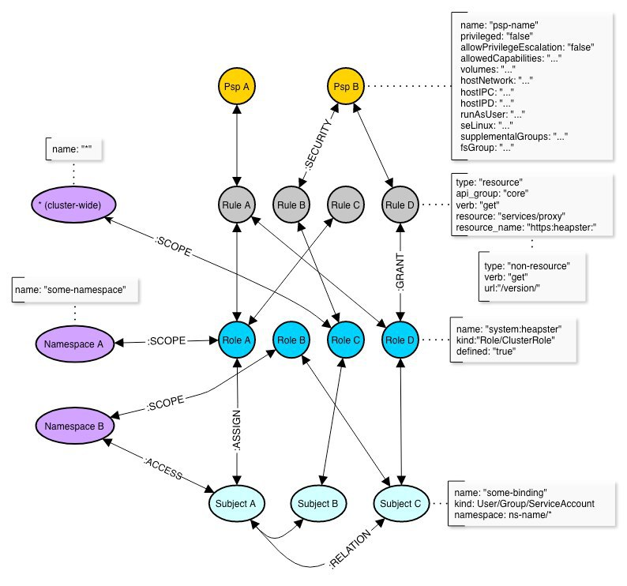
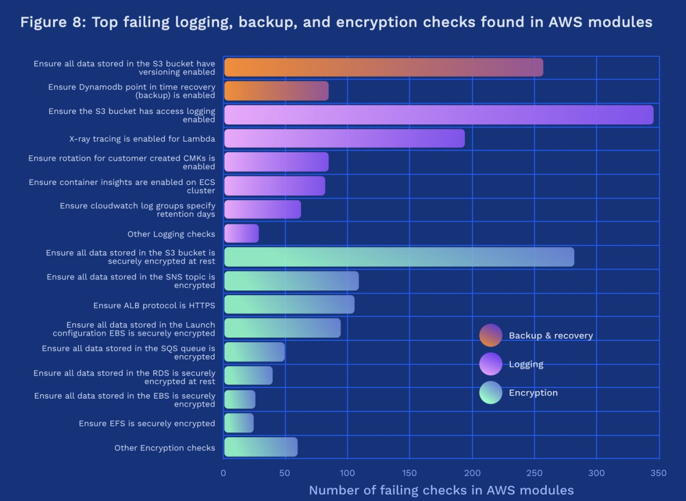

# phd_soc
`2020-08-31 21:36:08`

<blockquote>
https://github.com/sbousseaden/EVTX-ATTACK-SAMPLES - мне вот эта тема очень нравится как идея
</blockquote>

<table><tr><td><b>→</b><a href="https://github.com/sbousseaden/EVTX-ATTACK-SAMPLES">
https://github.com/sbousseaden/EVTX-ATTACK-SAMPLES
</a>
<blockquote>
Windows Events Attack Samples. Contribute to sbousseaden/EVTX-ATTACK-SAMPLES development by creating an account on GitHub.
</blockquote>
</td></tr></table>

---

# phd_soc
`2020-08-31 21:13:26`

<blockquote>
Можно попробовать на базе https://github.com/atc-project/atomic-threat-coverage сделать такой тест. Там у ребят есть и сэмплы событий и конкретные сценарии )
</blockquote>

<table><tr><td><b>→</b><a href="https://github.com/atc-project/atomic-threat-coverage">
https://github.com/atc-project/atomic-threat-coverage
</a>
<blockquote>
Actionable analytics designed to combat threats. Contribute to atc-project/atomic-threat-coverage development by creating an account on GitHub.
</blockquote>
</td></tr></table>

---

# MPSIEMChat
`2020-08-31 11:05:22`

<blockquote>
Привет. Вдруг кому-то пригодится, наш друг @zer0way_1 выложил на гите скрипт для отправки инцидентов по syslog. https://github.com/feedb/MPSiem_addons/tree/master/mpsiem2syslog
енджой
</blockquote>

<table><tr><td><b>→</b><a href="https://github.com/feedb/MPSiem_addons/tree/master/mpsiem2syslog">
https://github.com/feedb/MPSiem_addons/tree/master/mpsiem2syslog
</a>
<blockquote>
реп полезностей для PT MaxPatrol SIEM. Contribute to feedb/MPSiem_addons development by creating an account on GitHub.
</blockquote>
</td></tr></table>

---

# isast
`2020-08-30 21:33:05`

<blockquote>
https://github.com/hardik05/Damn_Vulnerable_C_Program
</blockquote>

<table><tr><td><b>→</b><a href="https://github.com/hardik05/Damn_Vulnerable_C_Program">
https://github.com/hardik05/Damn_Vulnerable_C_Program
</a>
<blockquote>
a c program containing vulnerable code for common types of vulnerabilities, can be used to show fuzzing concepts. - hardik05/Damn_Vulnerable_C_Program
</blockquote>
</td></tr></table>

---

# isast
`2020-08-30 21:31:03`

<blockquote>
https://github.com/softrams/bulwark
</blockquote>

<table><tr><td><b>→</b><a href="https://github.com/softrams/bulwark">
https://github.com/softrams/bulwark
</a>
<blockquote>
An organizational asset and vulnerability management tool, with Jira integration, designed for generating application security reports. - softrams/bulwark
</blockquote>
</td></tr></table>

---

# isast
`2020-08-28 16:34:02`

* https://telegra.ph/file/a438d7d70ec9fed85f539.jpg

<blockquote>
​​Fully automated python fuzzer built to test if code actually is production ready in seconds.

&#35;python allows you to do pretty much whatever you want. This is a good thing for the most part however it creates the opportunity for unexpected events to occur. One of battletested's strongest assets is its ability to show you all of those possibilities so there are no surprises. In a way, it surpasses learning about the behavior of code by reading docstrings because all behaviors are recorded during a fuzz.

https://github.com/CodyKochmann/battle_tested

For example, the image below shows just how much is brought to light about a piece of code without needing to read a textbook's worth of documentation (which almost never exists) just to learn about the full behavior of a single function.
</blockquote>

<table><tr><td><b>→</b><a href="https://telegra.ph/file/a438d7d70ec9fed85f539.jpg">
https://telegra.ph/file/a438d7d70ec9fed85f539.jpg
</a>
</td></tr></table>

---

# overlamer1
`2020-08-28 09:28:36`

* https://telegra.ph/Poisk-uyazvimyh-IP-adresov-po-CVE-ID-CVE-2019-0192-07-14

<blockquote>
Поиск уязвимых IP-адресов по CVE ID: CVE-2019-0192
</blockquote>

<table><tr><td><b>→</b><a href="https://telegra.ph/Poisk-uyazvimyh-IP-adresov-po-CVE-ID-CVE-2019-0192-07-14">
https://telegra.ph/Poisk-uyazvimyh-IP-adresov-po-CVE-ID-CVE-2019-0192-07-14
</a>
<blockquote>
Дисклеймер: Статья предоставлена в ознакомительных целях. Мы не несём ответственность за ваши действия! В этой статье мы будем использовать Spyse для поиска уязвимых IP-адресов на CVE-2019-0192. Шаг 1. Найдите уязвимые версии программного обеспечения Посмотрим на описание NVD CVE: В версиях Apache Solr 5.0.0–5.5.5 и 6.0.0–6.6.5 API-интерфейс Config позволяет настраивать JMX-сервер с помощью HTTP-запроса POST. Направив его на вредоносный RMI-сервер, злоумышленник может воспользоваться небезопасной структуризацией…
</blockquote>
</td></tr></table>

---

# phd_soc
`2020-08-26 14:22:31`

<blockquote>
Вы дверью ошиблись. Вам сюда https://t.me/MPSIEMChat
</blockquote>

<table><tr><td><b>→</b><a href="https://t.me/MPSIEMChat">
https://t.me/MPSIEMChat
</a>
<blockquote>
Всякие полезности
https://github.com/feedb/MPSiem_addons
</blockquote>
</td></tr></table>

---

# isast
`2020-08-24 16:52:30`

<blockquote>
вот мб кому понадобится, сделала единый патч чтобы старый qemu в составе afl собирался под новые системы:
https://gist.github.com/holograin/2ae0f06cffa3201195fcd1a1574c1483
</blockquote>

<table><tr><td><b>→</b><a href="https://gist.github.com/holograin/2ae0f06cffa3201195fcd1a1574c1483">
https://gist.github.com/holograin/2ae0f06cffa3201195fcd1a1574c1483
</a>
<blockquote>
patch AFL-bundled qemu-2.10.0 build for newer systems - additional_patches.sh
</blockquote>
</td></tr></table>

---

# isast
`2020-08-24 14:44:18`

* https://telegra.ph/file/3ce6056713adb97710790.mp4

<blockquote>
​​Quality assurance for Jupyter Notebooks.

Adapter to run any code-quality tool on a Jupyter notebook. This is intended to be run as a pre-commit hook and/or during continuous integration.

Can run: flake8, mypy, black, isort, doctest.
Also works with wemake-python-styleguide!

https://github.com/nbQA-dev/nbQA

&#35;ds &#35;python
</blockquote>

<table><tr><td><b>→</b><a href="https://telegra.ph/file/3ce6056713adb97710790.mp4">
https://telegra.ph/file/3ce6056713adb97710790.mp4
</a>
</td></tr></table>

---

# isast
`2020-08-24 10:22:29`

<blockquote>
Krane - Kubernetes RBAC static analysis tool

Krane - open source утилита, выполняющая статический анализ RBAC за счет индексации объектов RBAC в RedisGraph. Управление рисками RBAC происходит через настройку политик.  Krane может работать как CLI, docker-контейнер или автономная служба для непрерывного анализа, а также быть встроенным в CI/CD. Также есть возможность построения отчетов, выполнения мониторинга и алертинга.

Кстати, лучшие практики по RBAC можно найти здесь: https://rbac.dev

&#35;k8s &#35;tools
</blockquote>

---

# isast
`2020-08-23 16:34:53`

* https://sanityisreallyoverrated.files.wordpress.com/2016/01/parsinghtmlwithregex.jpg
* https://t.me/dereference_pointer_there/883
* https://github.com/Wisdom/RegEx-DoS
* https://github.com/sindresorhus/eslint-plugin-unicorn/blob/v20.0.0/docs/rules/no-unsafe-regex.md
* https://t.me/nosingularity/433
* https://holistic.dev/playground/
* https://holistic.dev/playground/63750194-f3e4-45e5-8762-ec0096626b8e

<blockquote>
​Сегодня в эфире наброс на regexp’ы аж о двух постах.

Присоединюсь по всем пунктам, разве что за исключением того, что проверять регеспы можно статическими методами (раз, два). Если вы, конечно, не собираете их динамически :) А если собираете,... я даже не знаю как это можно назвать...

У меня как-то была история о регекспах, когда я парсил базу билетного агенства.

В holistic.dev тоже не обошлось без этой черной юниксово-перловой магии :)

Нет, запросы не парсятся регекспами, это невозможно. Для этого используется оригинальный AST-парсер из postgresql. 
Выковыривать его оттуда отдельное приключение. Т.к. разработчики не поставляют его как отдельный продукт, они не переживают за обратную совместимость. Поэтому у дерева постоянно появляются и пропадают узлы :)

Регекспы используются для подготовки сорцов, перед скармливанием их в AST-парсер. Т.к. мы маленький стартап и не можем позволить себе написать грамматику, например, под JetBrains Grammar-Kit, приходится выкручиваться. 

Т.к. изначально инструмент планировалось интегрировать с IDE, то хотелось сделать так, чтобы при наличии синтаксической ошибке в одной из sql-команд, только эта команда игнорировалась, а остальное парсилось. Именно так все работает в IDE от Jetbrains. Хотелось сделать так же, но нативный парсер такого не умеет - он падает на первой же синтаксической ошибке.

Идея делать плагин для IDE была отложена, а функционал остался. Если в playground сделать несколько ddl-команд, часть из которых будет с синтаксическими ошибками, это не помешает проверке. (выделение ошибочных мест в DDL будет позже, сейчас можно заметить, что поля из таблицы b не попали в экспорт типов).
Часто спрашивают - почему не подсвечивается отсутствующая таблица в запросе? Сейчас мы не ориентируемся на разработчиков, а у DBA не бывает невалидных запросов :) Но справедливости ради, это правило находится в процессе разработки и нашлись corner cases, которые требуют доработки парсера :)

К слову, если у вас есть экспертиза в AST-парсерах, я был бы рад пообщаться (@antonrevyako)
</blockquote>

<table><tr><td><b>→</b><a href="https://sanityisreallyoverrated.files.wordpress.com/2016/01/parsinghtmlwithregex.jpg">
https://sanityisreallyoverrated.files.wordpress.com/2016/01/parsinghtmlwithregex.jpg
</a>
</td></tr></table>

---

# ctfchat
`2020-08-18 23:35:54`

<blockquote>
https://drive.google.com/file/d/1qZTakP92B4VQQk0QXnWu_bHz2ZNiF4gQ/view
</blockquote>

<table><tr><td><b>→</b><a href="https://drive.google.com/file/d/1qZTakP92B4VQQk0QXnWu_bHz2ZNiF4gQ/view">
https://drive.google.com/file/d/1qZTakP92B4VQQk0QXnWu_bHz2ZNiF4gQ/view
</a>
</td></tr></table>

---

# phd_soc
`2020-08-18 21:23:43`

<blockquote>
Из базы появляются вот такие штуки. А это просто их визуализация https://github.com/rstcloud/rstthreats/tree/master/threats/context
</blockquote>

<table><tr><td><b>→</b><a href="https://github.com/rstcloud/rstthreats/tree/master/threats/context">
https://github.com/rstcloud/rstthreats/tree/master/threats/context
</a>
<blockquote>
Aggregated Indicators of Compromise collected and cross-verified from multiple open and community-supported sources, enriched and ranked using our intelligence platform for you. Threat Intelligence...
</blockquote>
</td></tr></table>

---

# phd_soc
`2020-08-18 21:04:44`

<blockquote>
Очередная забавная аналитика. Пока в исследовательских целях начал генерить и выкладывать в общий доступ картинки по связям индикаторов. Наиболее &quot;жирные&quot; подграфы выкладываются отдельно. https://github.com/rstcloud/rstthreats/tree/master/threats/graphs
</blockquote>

<table><tr><td><b>→</b><a href="https://github.com/rstcloud/rstthreats/tree/master/threats/graphs">
https://github.com/rstcloud/rstthreats/tree/master/threats/graphs
</a>
<blockquote>
Aggregated Indicators of Compromise collected and cross-verified from multiple open and community-supported sources, enriched and ranked using our intelligence platform for you. Threat Intelligence...
</blockquote>
</td></tr></table>

---

# cyberoffru
`2020-08-17 18:28:34`

<blockquote>
https://www.youtube.com/watch?v&#61;i-2Xc8JqKBI
</blockquote>

<table><tr><td><b>→</b><a href="https://www.youtube.com/watch?v=i-2Xc8JqKBI">
https://www.youtube.com/watch?v=i-2Xc8JqKBI
</a>
<blockquote>
Что такое LAN TAP и с чем его едят. Небольшой ликбез и описание применения моего бейджа и аналогов для мониторинга сетевой активности, исследований и систем обнаружения вторжений.

Дополнительная информация здесь  https://github.com/n3m351d4/Throwing-Star-LAN-Tap

Заказать  LAN TAP -https://boosty.to/inside/posts/b1ceaa1c-2b10-4a5f-97a2-0797ca3b94f7?share&#61;post_link
</blockquote>
</td></tr></table>

---

# isast
`2020-08-15 10:55:13`

<blockquote>
etcd/SECURITY_AUDIT.pdf at master · etcd-io/etcd · GitHub
https://github.com/etcd-io/etcd/blob/master/security/SECURITY_AUDIT.pdf

Отчет об оценке безопасности etcd. Интересный образчик на предмет того, отчеты какого содержания и объема выкладывает организация уровня Linux Foundation. SAST, fuzzing и вот это всё.
</blockquote>

<table><tr><td><b>→</b><a href="https://github.com/etcd-io/etcd/blob/master/security/SECURITY_AUDIT.pdf">
https://github.com/etcd-io/etcd/blob/master/security/SECURITY_AUDIT.pdf
</a>
<blockquote>
Distributed reliable key-value store for the most critical data of a distributed system - etcd-io/etcd
</blockquote>
</td></tr></table>

---

# ctfchat
`2020-08-12 22:21:05`

<blockquote>
https://github.com/CTFd/CTFd/blob/master/conf/nginx/http.conf
</blockquote>

<table><tr><td><b>→</b><a href="https://github.com/CTFd/CTFd/blob/master/conf/nginx/http.conf">
https://github.com/CTFd/CTFd/blob/master/conf/nginx/http.conf
</a>
<blockquote>
CTFs as you need them. Contribute to CTFd/CTFd development by creating an account on GitHub.
</blockquote>
</td></tr></table>

---

# ctfchat
`2020-08-12 22:16:37`

<blockquote>
https://github.com/CTFd/CTFd/releases/tag/3.0.0
</blockquote>

<table><tr><td><b>→</b><a href="https://github.com/CTFd/CTFd/releases/tag/3.0.0">
https://github.com/CTFd/CTFd/releases/tag/3.0.0
</a>
<blockquote>
3.0.0 / 2020-07-27
Changelog Summary
The CTFd v3 Changelog represents the changes from v2.5.0 to v3. It is a summarized version of the changes that occured in all CTFd v3 beta/alpha releases.
CTFd ...
</blockquote>
</td></tr></table>

---

# webware
`2020-08-12 18:27:33`

* https://telegra.ph/file/018887c3b3cd09c237f09.jpg
* http://freelance.codeby.net/

<blockquote>
​Эксплуатация CVE-2020-5902

Сегодня поговорим про уязвимость CVE-2020-5902.
Найдём уязвимую машину и проэксплуатируем данную уязвимость на конкретном примере.
Михаил Ключников обнаружил свежую уязвимость, которая сразу же была отмечена как критическая.
Был присвоен идентификатор CVE-2020-5902 и по шкале CVSS, уязвимость соответствует наивысшему уровню опасности.
Затрагивает она интерфейс контроллера приложений BIG-IP.

Читать на форуме: https://codeby.net/threads/ehkspluatacija-cve-2020-5902.74260/

&#35;cve &#35;bigip &#35;lfi &#35;rce &#35;pentest
————————————————
Фриланс Кодебай — сервис поиска удаленной работы и размещения заказов
</blockquote>

<table><tr><td><b>→</b><a href="https://telegra.ph/file/018887c3b3cd09c237f09.jpg">
https://telegra.ph/file/018887c3b3cd09c237f09.jpg
</a>
</td></tr></table>

---

# cyberoffru
`2020-08-12 15:16:21`

<blockquote>
Удалённо эксплуатируемая уязвимость в серверных материнских платах Intel,  https://opennet.ru/53535/
</blockquote>

<table><tr><td><b>→</b><a href="https://opennet.ru/53535/">
https://opennet.ru/53535/
</a>
<blockquote>
Компания Intel сообщила об устранении 22 уязвимостей в прошивках своих серверных материнских плат, серверных систем и вычислительных модулей. Три уязвимости, одной из которых присвоен критический уровень, (CVE-2020-8708 - CVSS 9.6, CVE-2020-8707 - CVSS 8.3, CVE-2020-8706 - CVSS 4.7) проявляется в прошивке BMC-контроллера Emulex Pilot 3, применяемого в продуктах Intel. Уязвимости позволяют без аутентификации получить доступ к консоли удалённого управления (KVM), обойти аутентификацию при эмуляции USB-устройств хранения и вызвать удалённое переполнение буфера в применяемом в BMC ядре Linux.
</blockquote>
</td></tr></table>

---

# isast
`2020-08-12 10:45:19`

* https://www.facebook.com/notes/protect-the-graph/pyre-fast-type-checking-for-python/2048520695388071/
* https://github.com/facebook/pyre-check
* https://pyre-check.org/docs/overview.html
* https://github.com/PyCQA/bandit

<blockquote>
Pysa: An open source static analysis tool to detect and prevent security issues in Python code

Статья от Facebook о работе их open source статического анализатора кода на Python - Pysa, которого они используют для поиска дефекта кода Instagram. Немного рассказывают про то, как Pysa обнаруживает фолзы, и как работает data flow analysis. В документации Pysa позиционируется как  performant type checker. Pysa интегрируется с VSCode, но как и в Bandit результаты не приводятся к CWE, что нередко вызывает сложности при менеджменте дефектов.

https://www.facebook.com/notes/protect-the-graph/pyre-fast-type-checking-for-python/2048520695388071/

&#35;sast &#35;tools
</blockquote>

<table><tr><td><b>→</b><a href="https://www.facebook.com/notes/protect-the-graph/pyre-fast-type-checking-for-python/2048520695388071/">
https://www.facebook.com/notes/protect-the-graph/pyre-fast-type-checking-for-python/2048520695388071/
</a>
<blockquote>
Today, we're excited to announce Pyre, a static type checker for Python. Pyre is designed to help improve the quality and development speed in large Python
</blockquote>
</td></tr></table>

---

# cyberoffru
`2020-08-11 10:22:30`

<blockquote>
и про обход блокировок

Выяснилось (ВНЕЗАПНО, ага), что обход блокировок иногда это критическая фича. В условиях, когда власти пытаются уничтожить собственный народ, когда на улицах мирных городов рвутся светшумовые гранаты — просто сообщить о собственном местоположении родственникам. 

МАМА, Я ЖИВ!

Так вот, в боевых условиях очень хорошо показали себя:

1. Телеграм. Все остальное — сдохло. А Телеграм работал. И это не просто так, а усилиями всей команды Телеграма и кучи волонтеров, которые подымали ноды и прокси в Беларуси, России и вообще везде. Да, там (ТУТ!) лагали загрузки видео и плохо работал голос. Но сообщения ходили не смотря на.

2. Psiphon (я не буду давать ссылок — гугл ит) — оказался самым популярным ВПН-сервисом. Потому что — работал. Почти все ВПН на стандартных протколах удалось погасить. Кроме Псайфона. Просто потому, что он был разработан для обхода Китайского Фаерволла. А Белтелеком просто пацаны сопливые супротив Чайнателекома.

3. Lantern — еще один сервис обхода блокировок (кстати, VPN это не очень правильно называть), который архитектурно близкий к Psiphon'у. Рекомендую, кстати. 

4. Разумеется, TOR. Он тоже работал. Но к этой системе лично у меня некоторое предубеждение, хотя...

5. И главное, что хотел написать: это NewNode.
Несколько (не очень популярных, признаться) приложений использовали библиотеки NN и оставались доступными даже в самые блокировочки.

NewNode — это SDK c открытым исходным кодом, которое делает  приложение не убиваемым блокировками и шатдаунами.

И если ТЫ разработчик и/или менеджер по разработке мобильных приложений (Android&amp;iOS), то требуй имплементации NewNode в последних релизах. Это вот вообще не сложно — добавляем  пару строчек и библиотеки с Гитхаба. И все должно работать.

Вот тут есть подробности: https://github.com/clostra/newnode

А за техподдержкой писать мне ЛС. Не стесняйтесь — отвечу на все вопросы.
</blockquote>

<table><tr><td><b>→</b><a href="https://github.com/clostra/newnode">
https://github.com/clostra/newnode
</a>
<blockquote>
NewNode decentralized Content Distribution Network - clostra/newnode
</blockquote>
</td></tr></table>

---

# isast
`2020-08-07 15:06:29`

<blockquote>
Introducing the State of Open Source Terraform Security Report 2020

Bridgecrew просканировали 2,6 тыс. модулей в Terraform Registry с помощью своего open-source инструмента Checkhov, который в настоящее время содержит 300 проверок соответствия и безопасности в AWS, Azure и Google Cloud.

Получилось примерно следующее:
- Каждый второй модуль имеет ошибки конфигурации
- Во втором квартале 2020 года наблюдался самый высокий показатель соотношения неправильно настроенных модулей
- 8 из 10 самых популярных модулей настроены неправильно
- Наиболее распространенные неправильные настройки относятся к категориям «Резервное копирование и восстановление», «Ведение журнала» и «Шифрование».

Сам отчет можно посмотреть здесь.

Chechov - open-source инструмент для статического анализа IaC от Terraform, Cloudformation, Kubernetes, Serverless или ARM Templates.

&#35;report &#35;terraform &#35;aws &#35;azure &#35;gcp
</blockquote>

---

# exploitex
`2020-08-05 14:37:00`

* https://telegra.ph/file/7842a82b7d4e4d8861352.jpg
* https://www.anti-malware.ru/news/2020-08-05-1447/33329
* https://www.zdnet.com/article/hacker-leaks-passwords-for-900-enterprise-vpn-servers/
* https://twitter.com/Bank_Security/
* https://t.me/joinchat/AAAAAE3zHuKXF0sgmzL3OQ

<blockquote>
​​Хакеры выложили в сеть пароли от 900 VPN серверов 

На одном из русскоязычных теневых форумов сегодня в виде открытого текста были опубликованы имена пользователей, пароли и IP-адреса более чем от 900 корпоративных VPN-серверов Pulse Secure.

Оо данным издания ZDNet БД содержит такую информацию, как: IP-адреса VPN-серверов, версию прошивки, SSH ключи для каждого сервера, список локальных пользователей, а также принадлежащие им пароли. В базе также можно найти детали аккаунта администратора, информацию о последнем входе и Сookie-сессии VPN.

Специалисты полагают, что злоумышленник воспользовался эксплойтом для уязвимости под идентификатором CVE-2019-11510, позволившей ему проникнуть в систему и извлечь данные. 

Эксплойт / &#35;новость
</blockquote>

<table><tr><td><b>→</b><a href="https://telegra.ph/file/7842a82b7d4e4d8861352.jpg">
https://telegra.ph/file/7842a82b7d4e4d8861352.jpg
</a>
</td></tr></table>

---

# MPSIEMChat
`2020-08-04 20:00:25`

<blockquote>
https://github.com/Neo23x0/sigma
</blockquote>

---

# MPSIEMChat
`2020-08-04 19:38:02`

<blockquote>
Ещё вот тут было..
Всякие полезности
https://github.com/feedb/MPSiem_addons
</blockquote>

<table><tr><td><b>→</b><a href="https://github.com/feedb/MPSiem_addons">
https://github.com/feedb/MPSiem_addons
</a>
<blockquote>
реп полезностей для PT MaxPatrol SIEM. Contribute to feedb/MPSiem_addons development by creating an account on GitHub.
</blockquote>
</td></tr></table>

---

# exploitex
`2020-08-04 15:21:00`

* https://telegra.ph/file/6faf23385abf5e5926d7d.jpg
* https://xakep.ru/2020/06/26/lg-electronics-maze/
* https://xakep.ru/2020/07/02/maze-xerox/
* https://mazenews.top/lg-electronics-dvo74
* https://xakep.ru/2019/12/24/citrix-rce/
* https://t.me/joinchat/AAAAAE3zHuKXF0sgmzL3OQ

<blockquote>
​​Не дождавшись выкупа хакеры слили данные LG и Xerox

Не получив выкупа от LG Electronics и Xerox, операторы шифровальщика Maze сдержали свое обещание и опубликовали на своем сайте 70 гб похищенных у компаний данных. Среди них 50,2 Гб данных из внутренней сети LG, а также 25,8 Гб данных, принадлежащих компании Xerox.

LG Electronics и Xerox, вероятно, были скомпрометированы благодаря уязвимости CVE-2019-19781 в NetScaler Gateway, которая позволяла неавторизованному злоумышленнику выполнение вредоносного кода в системе. Аналитики еще в конце 2019 года предупреждали, что открытом доступе можно обнаружить более 80 000 серверов с этой уязвимостью

Украденная у LG информация включает в себя исходные коды прошивок для различных продуктов компании, в том числе для телефонов и ноутбуков. У Xerox хакеры украли информацию, связанную с операциями поддержки клиентов, в частности, касающуюся сотрудников Xerox.  Подлинность данных пока еще проверяется. 

Эксплойт / &#35;новость
</blockquote>

<table><tr><td><b>→</b><a href="https://telegra.ph/file/6faf23385abf5e5926d7d.jpg">
https://telegra.ph/file/6faf23385abf5e5926d7d.jpg
</a>
</td></tr></table>

---

# isast
`2020-08-02 14:57:40`

<blockquote>
Awesome DevSecOps

Большие подборки ресурсов по DevSecOps и AppSec. Здесь можно найти инструменты, доклады, все существующие конференции по каждой теме, подкасты, гайдлайны, фреймворки и так далее.

DevSecOps
Application Security
Web Security
Cybersecurity Blue Team 
Fuzzing 
Threat modeling
Static Analysis
Dynamic Analysis

А еще есть русская версия Awesome DevSecOps.

&#35;tools &#35;bestpractice  &#35;web &#35;fuzzing &#35;sast &#35;dast
</blockquote>

---

# overlamer1
`2020-08-01 00:20:20`

* https://telegra.ph/Saycheesedeanon-zhopy-01-08

<blockquote>
Saycheese:деанон жопы
</blockquote>

<table><tr><td><b>→</b><a href="https://telegra.ph/Saycheesedeanon-zhopy-01-08">
https://telegra.ph/Saycheesedeanon-zhopy-01-08
</a>
<blockquote>
Saycheese-инструмент с помощью которого вы сможете увидеть лицо любого человека которому вы скинете ссылку сгенерированную инструментом.Чтобы установить данный репозиторий надо несколько несложных команд: запускаем termux пишем команды: pkg update pkg upgrade git clone https://github.com/thelinuxchoice/saycheese cd saycheese bash saycheese.sh Получаем ссылку,при переходе на которую жертву можно задеанонить. У КОГО НЕТ ССЫЛКИ,ПРОБУЕМ ЧЕРЕЗ VPN! А так же создаём точку доступа с телефона, и пробуем снова через…
</blockquote>
</td></tr></table>

---

