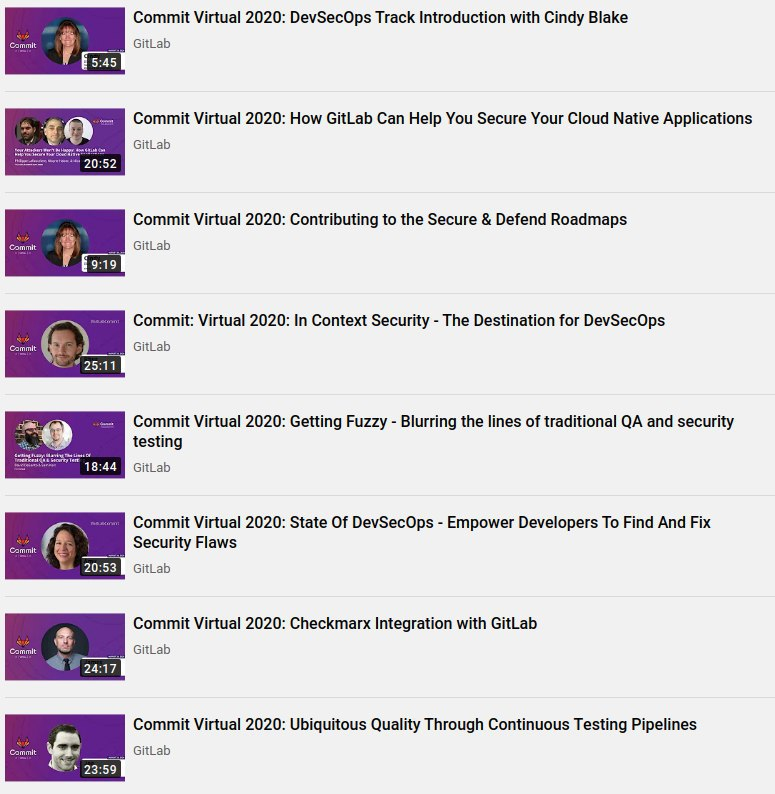
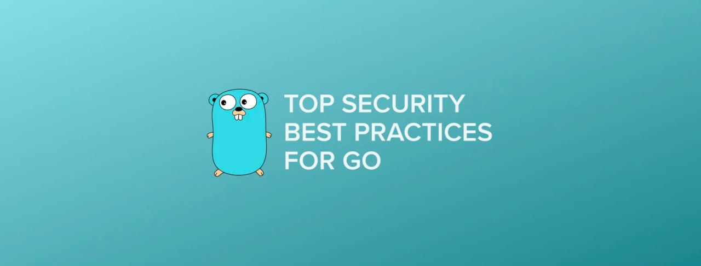

# cyberoffru
`2020-09-30 13:16:59`

<blockquote>
посмотрел я эту ссылку, может кто автору перекинуть эту ссылку, для так сказать, повышения уровня проработки решения? https://gitlab.com/flypatriot/allb-tool/-/wikis/home-ru
</blockquote>

<table><tr><td><b>→</b><a href="https://gitlab.com/flypatriot/allb-tool/-/wikis/home-ru">
https://gitlab.com/flypatriot/allb-tool/-/wikis/home-ru
</a>
<blockquote>
Astra Linux live build tool
</blockquote>
</td></tr></table>

---

# isast
`2020-09-26 09:45:40`

<blockquote>
Выложены доклады с GitLab Commit Virtual 2020

Там был отдельный поток посвящённый DevSecOps
https://www.youtube.com/playlist?list&#61;PLFGfElNsQthbJaOG4pV450Y_eIdfr2p9Y

Ссылка на все потоки
https://www.youtube.com/c/Gitlab/playlists?view&#61;50&amp;sort&#61;dd&amp;shelf_id&#61;5

Программа
https://about.gitlab.com/events/commit/&#35;schedule
</blockquote>

---

# ctfchat
`2020-09-25 00:53:38`

<blockquote>
https://github.com/veracode-research/solr-injection&#35;7-cve-2019-17558-rce-via-velocity-template-by-_s00py
</blockquote>

<table><tr><td><b>→</b><a href="https://github.com/veracode-research/solr-injection">
https://github.com/veracode-research/solr-injection
</a>
<blockquote>
Apache Solr Injection Research. Contribute to veracode-research/solr-injection development by creating an account on GitHub.
</blockquote>
</td></tr></table>

---

# FinSecurity
`2020-09-24 12:06:49`

<blockquote>
https://www.youtube.com/watch?v&#61;pGOQDOR1198&amp;feature&#61;youtu.be&amp;utm_source&#61;sendpulse&amp;utm_medium&#61;email&amp;utm_campaign&#61;o-proshedshem-vebinare-gost&amp;spush&#61;ZC5lZmltb3ZAb2tiYW5rLnJ1
</blockquote>

<table><tr><td><b>→</b><a href="https://www.youtube.com/watch?v=pGOQDOR1198&feature=youtu.be&utm_source=sendpulse&utm_medium=email&utm_campaign=o-proshedshem-vebinare-gost&spush=ZC5lZmltb3ZAb2tiYW5rLnJ1">
https://www.youtube.com/watch?v=pGOQDOR1198&feature=youtu.be&utm_source=sendpulse&utm_medium=email&utm_campaign=o-proshedshem-vebinare-gost&spush=ZC5lZmltb3ZAb2tiYW5rLnJ1
</a>
<blockquote>
Презентация с вебинара: https://drive.google.com/file/d/1KdJci15UeMX74wymX6KEY683Zf0JEuXb/view?usp&#61;sharing

В 2021 году вступят в силу требования по обязательному соответствию ГОСТ Р 57580 для финансовых организаций (ФО). В связи с этим ФО активно проводят самооценки и аудиты.

В 2020 году аудиторы ITGLOBAL.COM провели достаточно большое количество оценок соответствия ГОСТ Р 57580. По наблюдениям наших специалистов, у большинства организаций есть общие проблемы, которые в значительной степени снижают оценку. На вебинаре разберемся, какие ошибки чаще всего допускают ФО и как их избежать.

Вебинар актуален для тех, кто хочет подготовиться к внедрению нового стандарта и успешно пройти оценку соответствия.

Программа

— самые частые нарушениях в проектах по внедрению ГОСТ Р 57580;
— пути их устранения с помощью основных и компенсационных мер;
— интересные случаи из практики аудитов ITGLOBAL.COM по ГОСТ Р 57580.

Также аудиторы ответят на интересующие вопросы по ГОСТ Р 57580. Вопросы можно задавать уже сейчас при…
</blockquote>
</td></tr></table>

---

# FinSecurity
`2020-09-24 11:16:14`

<blockquote>
Вот ссылка, как и просили https://youtu.be/pGOQDOR1198
</blockquote>

<table><tr><td><b>→</b><a href="https://youtu.be/pGOQDOR1198">
https://youtu.be/pGOQDOR1198
</a>
<blockquote>
Презентация с вебинара: https://drive.google.com/file/d/1KdJci15UeMX74wymX6KEY683Zf0JEuXb/view?usp&#61;sharing

В 2021 году вступят в силу требования по обязательному соответствию ГОСТ Р 57580 для финансовых организаций (ФО). В связи с этим ФО активно проводят самооценки и аудиты.

В 2020 году аудиторы ITGLOBAL.COM провели достаточно большое количество оценок соответствия ГОСТ Р 57580. По наблюдениям наших специалистов, у большинства организаций есть общие проблемы, которые в значительной степени снижают оценку. На вебинаре разберемся, какие ошибки чаще всего допускают ФО и как их избежать.

Вебинар актуален для тех, кто хочет подготовиться к внедрению нового стандарта и успешно пройти оценку соответствия.

Программа

— самые частые нарушениях в проектах по внедрению ГОСТ Р 57580;
— пути их устранения с помощью основных и компенсационных мер;
— интересные случаи из практики аудитов ITGLOBAL.COM по ГОСТ Р 57580.

Также аудиторы ответят на интересующие вопросы по ГОСТ Р 57580. Вопросы можно задавать уже сейчас при…
</blockquote>
</td></tr></table>

---

# MPSIEMChat
`2020-09-21 12:21:58`

<blockquote>
Всем привет!

Через 2 недели, 5-го октября, начнётся второй двухнедельный спринт [1] Open Security Collaborative Development (OSCD) [2] - открытой международной инициативы специалистов по компьютерной безопасности, направленной на решение общих проблем, распространение знаний и улучшение компьютерной безопасности в целом.

Год назад, в ходе первого спринта [3], тридцать участников из девяти стран за две недели смогли увеличить открытый набор правил обнаружения угроз проекта Sigma [4] более чем на 40%, добавив в него 144 новых правила.

В этот раз мы сосредоточимся на трех областях практической компьютерной безопасности — Threat Simulation, Threat Detection и Incident Response.
Будем разрабатывать тесты Atomic Red Team [5], правила Sigma [4] и TheHive Responders [6], улучшая их покрытие фреймворков MITRE ATT&amp;CK [7] и ATC RE&amp;CT [8].

Задач много [9], и они очень разные — от написания правил Sigma по готовым поисковым запросам (20-30 минут) до разработки модулей реагирования TheHive на Python (16+ часов). Для каждой задачи определен список необходимых знаний и перечислены обучающие ресурсы [10], которые помогут разобраться в предмете.

Если идея глобального объединения для борьбы с угрозами вам близка, то мы будем рады поработать вместе с вами.

Участники смогут приобрести опыт решения практических задач компьютерной безопасности, работая над насущными проблемами ИБ-сообщества совместно с экспертами индустрии, которые помогут советом и направят в нужное русло если что-то пойдет не так. 

Если вам интересно — пишите в телеграм мне (@CatSchrodinger) или Антону Кутепову (@aw350m3)

[1] https://oscd.community/sprints/sprint_2_ru.html
[2] https://oscd.community/index_ru.html
[3] https://oscd.community/sprints/sprint_1_ru.html
[4] https://github.com/Neo23x0/sigma
[5] https://github.com/redcanaryco/atomic-red-team
[6] https://thehive-project.org/&#35;section_cortex
[7] https://attack.mitre.org/
[8] https://atc-project.github.io/atc-react/
[9] https://oscd.community/sprints/sprint_2_backlog_ru.html
[10] https://oscd.community/sprints/sprint_2_howto_ru.html
</blockquote>

<table><tr><td><b>→</b><a href="https://github.com/Neo23x0/sigma">
https://github.com/Neo23x0/sigma
</a>
<blockquote>
Generic Signature Format for SIEM Systems. Contribute to SigmaHQ/sigma development by creating an account on GitHub.
</blockquote>
</td></tr></table>

---

# isast
`2020-09-19 09:41:43`

<blockquote>
Антон Бабенко (https://github.com/antonbabenko) вернул к жизни свой канал на Youtube и теперь пилит там годноту. 

Вот, например, он не только потрогал утилиту статического анализа checkov для IaC (https://github.com/bridgecrewio/checkov), но и пригласил на стрим автора оной тулы - Barak Schoster. В общем, если интересен Terraform и мир вокруг него, то рекомендую.

Terraform security tools review (part 1) - checkov
https://www.youtube.com/watch?v&#61;KdH-7_vpFag
</blockquote>

<table><tr><td><b>→</b><a href="https://github.com/antonbabenko">
https://github.com/antonbabenko
</a>
<blockquote>
AWS Community Hero / Terraform fanatic / HashiCorp Ambassador 🇺🇦🇳🇴 
 
Watch &quot;Your Weekly Dose of Terraform&quot; - http://bit.ly/terraform-youtube - antonbabenko
</blockquote>
</td></tr></table>

---

# overlamer1
`2020-09-17 18:40:31`

* https://telegra.ph/Ustanovka-ngrok-v-termux-07-30

<blockquote>
Установка ngrok в termux
</blockquote>

<table><tr><td><b>→</b><a href="https://telegra.ph/Ustanovka-ngrok-v-termux-07-30">
https://telegra.ph/Ustanovka-ngrok-v-termux-07-30
</a>
<blockquote>
Всем привет! Хочу рассказать вам про установку ngrok в termux, данная статья вам понадобится для одного очень интересного инструмента, про который я расскажу вам завтра) Перейдем к установке. источник статьи Как всегда сначала обновим пакеты: apt-get update &amp;&amp; apt-get upgrade Установим git: apt-get install git И скопируем репозиторий: git clone https://github.com/tchelospy/termux-ngrok.git Откроем его: cd termux-ngrok Сейчас сделаем файл termux-ngrok.sh исполняемым, и запустим его: chmod +x termux-ngrok.sh…
</blockquote>
</td></tr></table>

---

# isast
`2020-09-17 13:58:43`

<blockquote>
https://github.com/aquasecurity/trivy

https://www.youtube.com/watch?v&#61;XnYxX9uueoQ&amp;ab_channel&#61;CNCF%5BCloudNativeComputingFoundation%5D

https://medium.com/@knqyf263/a-simple-and-comprehensive-vulnerability-scanner-for-containers-compatible-with-ci-b3c0982d4fb6

&quot;Trivy (tri pronounced like trigger, vy pronounced like envy) is a simple and comprehensive vulnerability scanner for containers. Trivy detects vulnerabilities of OS packages (Alpine, RHEL, CentOS, etc.) and application dependencies (Bundler, Composer, npm, yarn etc.). Trivy is easy to use. Just install the binary and you're ready to scan. All you need to do for scanning is to specify an image name of container.&quot;

&quot;Trivy находит уязвимости двух типов – проблемы сборок ОС (поддерживаются Alpine, RedHat (EL), CentOS, Debian GNU, Ubuntu) и проблемы в зависимостях (Gemfile.lock, Pipfile.lock, composer.lock, package-lock.json, yarn.lock, Cargo.lock)

В отличие от Clair умеет сканировать как в репозитории, так и локально, так и вообще на основании переданного .tar файла с Docker образом.

Умеет опционально показывать только те CVE, для которых были фиксы, а также скрывать CVE, добавленные в локальный whitelist ( .trivyignore)

Вывод осуществляется как на экран, так и в json. При этом есть возможность фильтрации уязвимостей по критичности, а также Trivy достаточно просто встраивается в CI/CD процессы.&quot; (https://swordfishsecurity.ru/blog/obzor-utilit-bezopasnosti-docker)
</blockquote>

<table><tr><td><b>→</b><a href="https://github.com/aquasecurity/trivy">
https://github.com/aquasecurity/trivy
</a>
<blockquote>
A Simple and Comprehensive Vulnerability Scanner for Container Images, Git Repositories and Filesystems. Suitable for CI - aquasecurity/trivy
</blockquote>
</td></tr></table>

---

# isast
`2020-09-17 10:04:41`

* https://telegra.ph/file/a7cc0b4c0c4692c837dea.png

<blockquote>
​​Flaky (&quot;моргающие&quot;, нестабильные) тесты - это бич любого программного проекта и есть разные способы их выявления. Один из самых популярных это запускать тесты больше одного раз подряд. Если тест хотя бы один раз пройдет успешно, значит это нестабильный тест. У этого способа есть как и плюсы так и минусы. Есть изящное решение, которое предлагают авторы DeFlaker - в случае нестабильного поведения теста покрытие кода проекта будет отличаться, поэтому они предлагают собирать каждый раз информацию о покрытии кода продукта и сравнивать его с зафиксированным ранее результатом. Тестировать проект с включенной инструментацией для сбора информации о покрытии так себе идея. Есть и другие способы для выявления нестабильных тестов, но, к сожалению, серебряной пули в этой области нет.

Причина нестабильных тестов в недерминированном поведении кода и общие причины недерминированного поведения известны давно. В результатах исследований из академических статей и в известной статье Фаулера одни и те же причины перечислены:  Lack of Isolation, Asynchronous Behavior, Remote Services, Time, Resource Leaks. Цитата из статьи &quot;What is the Vocabulary of Flaky Tests?&quot;: &quot;The top three categories of flaky tests are Async Wait, Concurrency, and Test Order Dependency. Most of flaky tests (78%) are flaky the first time they are written. Average number of days it takes to fix a test was 388.&quot;. Почти для всех общих причин можно привести примеры кода, которые тоже будут общими для разных проектов. А раз так, то можно сделать статический анализатор, который будет выявлять куски кода, потенциально приводящие к недерминированному поведению.

Ранее писал про статический анализ на коленке и рассказал про Coccinelle. Недостаток этого инструмента в том, что он ограничен только поддержкой языка Си, а я пользуюсь не только им и хочется что-то подобное и для других языков программирования. И такой инструмент есть, это semgrep, который изначально сделали в Facebook, потом забросили и какие-то ребята с одним из бывших разработчиков этого инструмента сделали стартап.

В чём прелесть semgrep? Если вы когда-нибудь хотите сделать статическую проверку в коде, то вы будете использовать grep, который не учитывает семантику кода, или специфичный для вашего языка статический анализатор (например flake8 для Питона) и разбираться как работать с AST, чтобы добавить вашу собственную проверку. Если нужно будет добавить похожую проверку для кода на другом языке, например JS, то всю работу вы будете делать заново, добавляя проверку в ESLint. С semgrep вы на DSL описываете паттерн кода, который вы хотите найти и всё! Остальную работу (парсинг кода в AST и поиск кода по вашему паттерну) делает semgrep. Причем он поддерживает самые популярные в коммерческой разработке ПО языки: Go, Java, JavaScript, Python, Ruby, C.

Вообщем я сделал несколько правил для semgrep и буду добавлять ещё по мере необходимости. Буду вам благодарен, если вы запустите semgrep с моими правилами на коде своего проекта и расскажите о результатах.

https://github.com/ligurio/semgrep-rules
</blockquote>

<table><tr><td><b>→</b><a href="https://telegra.ph/file/a7cc0b4c0c4692c837dea.png">
https://telegra.ph/file/a7cc0b4c0c4692c837dea.png
</a>
</td></tr></table>

---

# cyberoffru
`2020-09-16 12:12:56`

<blockquote>
https://github.com/certsocietegenerale/IRM/tree/master/RU
</blockquote>

<table><tr><td><b>→</b><a href="https://github.com/certsocietegenerale/IRM/tree/master/RU">
https://github.com/certsocietegenerale/IRM/tree/master/RU
</a>
<blockquote>
Incident Response Methodologies. Contribute to certsocietegenerale/IRM development by creating an account on GitHub.
</blockquote>
</td></tr></table>

---

# ctfchat
`2020-09-13 18:52:27`

<blockquote>
https://github.com/leshark/xss-ctf-challenge

Ну в общем вот, я сделаль
</blockquote>

<table><tr><td><b>→</b><a href="https://github.com/leshark/xss-ctf-challenge">
https://github.com/leshark/xss-ctf-challenge
</a>
<blockquote>
Simple web application with XSS checker. Contribute to leshark/xss-ctf-challenge development by creating an account on GitHub.
</blockquote>
</td></tr></table>

---

# cyberoffru
`2020-09-13 18:05:29`

<blockquote>
https://github.com/certsocietegenerale/IRM/tree/master/RU
</blockquote>

<table><tr><td><b>→</b><a href="https://github.com/certsocietegenerale/IRM/tree/master/RU">
https://github.com/certsocietegenerale/IRM/tree/master/RU
</a>
<blockquote>
Incident Response Methodologies. Contribute to certsocietegenerale/IRM development by creating an account on GitHub.
</blockquote>
</td></tr></table>

---

# ctfchat
`2020-09-12 14:43:04`

<blockquote>
https://github.com/leshark/cyberthon19-20-tasks/blob/master/final_stage7/cyberthon_finals_writeup.md
В конце райтапа
</blockquote>

<table><tr><td><b>→</b><a href="https://github.com/leshark/cyberthon19-20-tasks/blob/master/final_stage7/cyberthon_finals_writeup.md">
https://github.com/leshark/cyberthon19-20-tasks/blob/master/final_stage7/cyberthon_finals_writeup.md
</a>
<blockquote>
Все мои задачи, созданные для соревнований по информационной безопасности для школьников в рамках Московского Технологического Марафона - leshark/cyberthon19-20-tasks
</blockquote>
</td></tr></table>

---

# cyberoffru
`2020-09-11 14:24:48`

<blockquote>
https://github.com/criticalstack/quake-kube
&#35;хотьктотоделомзанят
</blockquote>

<table><tr><td><b>→</b><a href="https://github.com/criticalstack/quake-kube">
https://github.com/criticalstack/quake-kube
</a>
<blockquote>
Quake 3 on Kubernetes. Contribute to criticalstack/quake-kube development by creating an account on GitHub.
</blockquote>
</td></tr></table>

---

# phd_soc
`2020-09-10 22:01:06`

<blockquote>
https://github.com/spacepatcher/FireHOL-IP-Aggregator
эта штука поможет с хранением фидов FireHOL и поиском по ним
</blockquote>

<table><tr><td><b>→</b><a href="https://github.com/spacepatcher/FireHOL-IP-Aggregator">
https://github.com/spacepatcher/FireHOL-IP-Aggregator
</a>
<blockquote>
Application for keeping feeds from FireHOL https://github.com/firehol/blocklist-ipsets with IP addresses appearance history. HTTP-based API service is developed for search requests. - spacepatcher/...
</blockquote>
</td></tr></table>

---

# phd_soc
`2020-09-10 17:43:49`

<blockquote>
https://github.com/hslatman/awesome-threat-intelligence
</blockquote>

<table><tr><td><b>→</b><a href="https://github.com/hslatman/awesome-threat-intelligence">
https://github.com/hslatman/awesome-threat-intelligence
</a>
<blockquote>
A curated list of Awesome Threat Intelligence resources - hslatman/awesome-threat-intelligence
</blockquote>
</td></tr></table>

---

# isast
`2020-09-10 15:49:01`

<blockquote>
https://www.youtube.com/watch?v&#61;h_A8IRBEtdQ&amp;list&#61;PLI0R_0_8-TV4JArtdlgnuPtgXALZxAYqu&amp;index&#61;9&amp;t&#61;0s&amp;ab_channel&#61;CodeIntelligence
</blockquote>

<table><tr><td><b>→</b><a href="https://www.youtube.com/watch?v=h_A8IRBEtdQ&list=PLI0R_0_8-TV4JArtdlgnuPtgXALZxAYqu&index=9&t=0s&ab_channel=CodeIntelligence">
https://www.youtube.com/watch?v=h_A8IRBEtdQ&list=PLI0R_0_8-TV4JArtdlgnuPtgXALZxAYqu&index=9&t=0s&ab_channel=CodeIntelligence
</a>
<blockquote>
Get free access to all presentations and slides from FuzzCon Europe 2020 on: https://www.fuzzcon.eu/sign-up-recording

Up until recently, Sebastian Pöplau, PhD was working for the Software and Systems Security Group of Eurcom.  In this presentation, he mainly discussed symbolic execution and how it can be implemented alongside fuzzing. 

Presentation topics:
- What is Symbolic Execution and how can it complement Fuzzing?
- SMT Solving
- Comparision: Symbolic Execution vs Fuzzing
- Tracing Computation

If you want to become a fuzzing expert yourself, go to our Fuzzing Academy and start right now. Our courses consist of videos, quizzes, practical examples and much more. Fuzzing Academy is completely FREE and online: https://academy.code-intelligence.com/p/fuzzing-101

Check us out:
Our fuzzing platform: https://www.code-intelligence.com/product-tour
LinkedIn: https://www.linkedin.com/company/codeintelligence/
Twitter: https://twitter.com/CI_GmbH
GitHub: https://github.com/code-intelligence-gmbh
</blockquote>
</td></tr></table>

---

# isast
`2020-09-10 15:48:27`

<blockquote>
https://www.youtube.com/watch?v&#61;UrSTTlCTRgg&amp;list&#61;PLI0R_0_8-TV4JArtdlgnuPtgXALZxAYqu&amp;index&#61;8&amp;t&#61;0s&amp;ab_channel&#61;CodeIntelligence
</blockquote>

<table><tr><td><b>→</b><a href="https://www.youtube.com/watch?v=UrSTTlCTRgg&list=PLI0R_0_8-TV4JArtdlgnuPtgXALZxAYqu&index=8&t=0s&ab_channel=CodeIntelligence">
https://www.youtube.com/watch?v=UrSTTlCTRgg&list=PLI0R_0_8-TV4JArtdlgnuPtgXALZxAYqu&index=8&t=0s&ab_channel=CodeIntelligence
</a>
<blockquote>
Get free access to all presentations and slides from FuzzCon Europe 2020 on: https://www.fuzzcon.eu/sign-up-recording

Sirko Höer is a Vulnerability Expert at the German Federal Office for Information Security. He gained his experience in the field of fuzzing doing cybersecurity in the military-industry, but also at Code Intelligence. During his time at Code Intelligence, he tested the open source program Suricata.

Presentation topics:
- Methodology of Fuzzing Projects
- The setup
- Analysis 
- The Fuzz Target
- Which bugs were found?

If you want to become a fuzzing expert yourself, go to our Fuzzing Academy and start right now. Our courses consist of videos, quizzes, practical examples and much more. Fuzzing Academy is completely FREE and online: https://academy.code-intelligence.com/p/fuzzing-101

Check us out:
Our fuzzing platform: https://www.code-intelligence.com/product-tour
LinkedIn: https://www.linkedin.com/company/codeintelligence/
Twitter: https://twitter.com/CI_GmbH
GitHub: https://github.com/code…
</blockquote>
</td></tr></table>

---

# isast
`2020-09-10 15:48:02`

<blockquote>
https://youtu.be/X2sHUOTEHGM?list&#61;PLI0R_0_8-TV4JArtdlgnuPtgXALZxAYqu
</blockquote>

<table><tr><td><b>→</b><a href="https://youtu.be/X2sHUOTEHGM?list=PLI0R_0_8-TV4JArtdlgnuPtgXALZxAYqu">
https://youtu.be/X2sHUOTEHGM?list=PLI0R_0_8-TV4JArtdlgnuPtgXALZxAYqu
</a>
<blockquote>
Get free access to all presentations and slides from FuzzCon Europe 2020 on: https://www.fuzzcon.eu/sign-up-recording

Matthew Smith is a professor at the university of Bonn, co-founder of Code Intelligence and a member of Frauenhofer FKIE. His research interest lies in the intersection of technical IT security and behavioural sciences.

Presentation topics:
- Introduction into usable security
- A user study comparing static code analysis to fuzzing
- Usability comparision of libfuzzer and CLANG 

If you want to become a fuzzing expert yourself, go to our Fuzzing Academy and start right now. Our courses consist of videos, quizzes, practical examples and much more. Fuzzing Academy is completely FREE and online: https://academy.code-intelligence.com/p/fuzzing-101

Check us out:
Our fuzzing platform: https://www.code-intelligence.com/product-tour
LinkedIn: https://www.linkedin.com/company/codeintelligence/
Twitter: https://twitter.com/CI_GmbH
GitHub: https://github.com/code-intelligence-gmbh
</blockquote>
</td></tr></table>

---

# cyberoffru
`2020-09-10 14:47:33`

<blockquote>
https://github.com/disclose/tools-and-data/blob/master/list-of-certs.csv
</blockquote>

<table><tr><td><b>→</b><a href="https://github.com/disclose/tools-and-data/blob/master/list-of-certs.csv">
https://github.com/disclose/tools-and-data/blob/master/list-of-certs.csv
</a>
<blockquote>
Tools, data, and contact lists relevant to The disclose.io Project. - disclose/diodata
</blockquote>
</td></tr></table>

---

# cyberoffru
`2020-09-10 10:45:58`

<blockquote>
https://github.com/ricklahaye/NTPTunnel
</blockquote>

<table><tr><td><b>→</b><a href="https://github.com/ricklahaye/NTPTunnel">
https://github.com/ricklahaye/NTPTunnel
</a>
<blockquote>
Covert channel over NTP protocol. . Contribute to ricklahaye/NTPTunnel development by creating an account on GitHub.
</blockquote>
</td></tr></table>

---

# isast
`2020-09-09 23:57:40`

<blockquote>
https://github.com/googleprojectzero/fuzzilli
</blockquote>

<table><tr><td><b>→</b><a href="https://github.com/googleprojectzero/fuzzilli">
https://github.com/googleprojectzero/fuzzilli
</a>
<blockquote>
A JavaScript Engine Fuzzer. Contribute to googleprojectzero/fuzzilli development by creating an account on GitHub.
</blockquote>
</td></tr></table>

---

# isast
`2020-09-07 10:42:40`

<blockquote>
Scan git repos for secrets using regex and entropy 🔑

Gitleaks is a SAST tool for detecting hardcoded secrets like passwords, api keys, and tokens in git repos. Gitleaks aims to be the easy-to-use, all-in-one solution for finding secrets, past or present, in your code.

Features:
- Scans for commited secrets
- Scans for uncommitted secrets as part of shifting security left
- Available Github Action
- Gitlab and Github API support which allows scans of whole organizations, users, and pull/merge requests
- Custom rules via toml configuration
- High performance using &#35;go and go-git
- JSON and CSV reporting
- Private repo scans using key or password based authentication

https://github.com/zricethezav/gitleaks
</blockquote>

<table><tr><td><b>→</b><a href="https://github.com/zricethezav/gitleaks">
https://github.com/zricethezav/gitleaks
</a>
<blockquote>
Scan git repos (or files) for secrets using regex and entropy 🔑 - zricethezav/gitleaks
</blockquote>
</td></tr></table>

---

# webware
`2020-09-07 08:56:03`

* https://telegra.ph/file/ae09d61a51aadc42e9f0e.jpg
* https://freelance.codeby.net/

<blockquote>
​​Уязвимость CVE-2020-3452

Приветствую Друзей,Уважаемых Форумчан и Читателей Форума.
Сегодня поговорим немного о нашумевшей уязвимости в Cisco
Оперативно искать решение проблемы IT-компании заставил Михаил Ключников.
Эксперт из Positive Technologies не впервые находит опасные уязвимости.

Читать: https://codeby.net/threads/ujazvimost-cve-2020-3452.74667/

&#35;cisco &#35;pentest
————————————————
Фриланс Кодебай — сервис поиска удаленной работы и размещения заказов
</blockquote>

<table><tr><td><b>→</b><a href="https://telegra.ph/file/ae09d61a51aadc42e9f0e.jpg">
https://telegra.ph/file/ae09d61a51aadc42e9f0e.jpg
</a>
</td></tr></table>

---

# overlamer1
`2020-09-04 17:30:20`

* https://telegra.ph/Stavim-otpechatok-palca-na-termuks-09-04

<blockquote>
Ставим отпечаток пальца на термукс
</blockquote>

<table><tr><td><b>→</b><a href="https://telegra.ph/Stavim-otpechatok-palca-na-termuks-09-04">
https://telegra.ph/Stavim-otpechatok-palca-na-termuks-09-04
</a>
<blockquote>
Всем привет! Нашел инструмент для входа по отпечатку в термукс, думаю это прикольно, так что давайте установим данный инструмент, поехали! источник статьи Обновим пакеты: pkg update upgrade -y Теперь нужен git: pkg install git Качаем инструмент: git clone https://github.com/MrAlpha786/termux-fingerprint-lock Открываем папек с инструментом: cd termux-fingerprint-lock Делаем главный файл исполняемым: chmod u+x setup И запускаем его: bash setup Попросят нажать на отпечаток, если что-то пошло не так, значит…
</blockquote>
</td></tr></table>

---

# cyberoffru
`2020-09-04 09:11:23`

<blockquote>
Уязвимость в реализации сокетов AF_PACKET ядра Linux  https://opennet.ru/53656/
</blockquote>

<table><tr><td><b>→</b><a href="https://opennet.ru/53656/">
https://opennet.ru/53656/
</a>
<blockquote>
Спустя три года с момента волны уязвимостей (1, 2, 3, 4, 5) в подсистеме AF_PACKET ядра Linux выявлена ещё одна проблема (CVE-2020-14386), позволяющая локальному непривилегированному пользователю выполнить код с правами root или выйти из изолированных контейнеров, при наличии в них root-доступа.
</blockquote>
</td></tr></table>

---

# cyberoffru
`2020-09-03 22:28:28`

<blockquote>
Обновление GnuPG 2.2.23 с устранением критической уязвимости https://opennet.ru/53655/
</blockquote>

<table><tr><td><b>→</b><a href="https://opennet.ru/53655/">
https://opennet.ru/53655/
</a>
<blockquote>
Опубликован релиз инструментария GnuPG 2.2.23 (GNU Privacy Guard), совместимого со стандартами OpenPGP (RFC-4880) и S/MIME, и предоставляющего утилиты для шифрования данных, работы с электронными подписями, управления ключами и доступа к публичным хранилищам ключей. В новой версии устранена критическая уязвимость (CVE-2020-25125), проявляющаяся начиная с версии 2.2.21 и эксплуатируемая при импорте специально оформленного ключа OpenPGP.
</blockquote>
</td></tr></table>

---

# isast
`2020-09-03 10:18:23`

<blockquote>
https://github.com/trailofbits/not-going-anywhere/
</blockquote>

<table><tr><td><b>→</b><a href="https://github.com/trailofbits/not-going-anywhere/">
https://github.com/trailofbits/not-going-anywhere/
</a>
<blockquote>
A Set of Vulnerable Golang programs. Contribute to trailofbits/not-going-anywhere development by creating an account on GitHub.
</blockquote>
</td></tr></table>

---

# isast
`2020-09-03 10:18:05`

<blockquote>
https://github.com/stripe/safesql
</blockquote>

<table><tr><td><b>→</b><a href="https://github.com/stripe/safesql">
https://github.com/stripe/safesql
</a>
<blockquote>
Static analysis tool for Golang that protects against SQL injections      - stripe/safesql
</blockquote>
</td></tr></table>

---

# isast
`2020-09-03 10:17:48`

<blockquote>
https://github.com/golangci/golangci-lint
</blockquote>

<table><tr><td><b>→</b><a href="https://github.com/golangci/golangci-lint">
https://github.com/golangci/golangci-lint
</a>
<blockquote>
Fast linters Runner for Go. Contribute to golangci/golangci-lint development by creating an account on GitHub.
</blockquote>
</td></tr></table>

---

# isast
`2020-09-03 10:17:35`

<blockquote>
https://github.com/securego/gosec
</blockquote>

<table><tr><td><b>→</b><a href="https://github.com/securego/gosec">
https://github.com/securego/gosec
</a>
<blockquote>
Golang security checker. Contribute to securego/gosec development by creating an account on GitHub.
</blockquote>
</td></tr></table>

---

# isast
`2020-09-03 10:16:49`

<blockquote>
Golang Security

В силу того, что все больше компаний начинают переписывать свои сервисы на golang, решил сделать подборку по аспектам безопасности этого языка.

Awesome golang security - подборка лучших практик, включая библиотеки, фреймворки для харденинга, статьи

OWASP Go-SCP - лучшие практики по написанию безопасного кода на Go от OWASP

Go-ing for an Evening Stroll: Golang Beasts &amp; Where to Find Them - обсуждение 4х распространенных уязвимостей в Golang. Репо с расширенной версией доклада + слайды

Статические анализаторы: gosec, gometalinteer, safesql

Not-going -anywhere - набор уязвимых программ на Golang для выявления распространенных уязвимостей.

OnEdge - библиотека для обнаружения неправильного использования паттернов Defer, Panic, Recover.

&#35;dev
</blockquote>

---

# isast
`2020-09-03 06:29:52`

<blockquote>
https://github.com/NetSPI/PESecurity
</blockquote>

<table><tr><td><b>→</b><a href="https://github.com/NetSPI/PESecurity">
https://github.com/NetSPI/PESecurity
</a>
<blockquote>
PowerShell module to check if a Windows binary (EXE/DLL) has been compiled with ASLR, DEP, SafeSEH, StrongNaming, and Authenticode. - NetSPI/PESecurity
</blockquote>
</td></tr></table>

---

# isast
`2020-09-02 21:33:18`

<blockquote>
https://github.com/microsoft/binskim
</blockquote>

<table><tr><td><b>→</b><a href="https://github.com/microsoft/binskim">
https://github.com/microsoft/binskim
</a>
<blockquote>
A binary static analysis tool that provides security and correctness results for Windows Portable Executable and *nix ELF binary formats - microsoft/binskim
</blockquote>
</td></tr></table>

---

