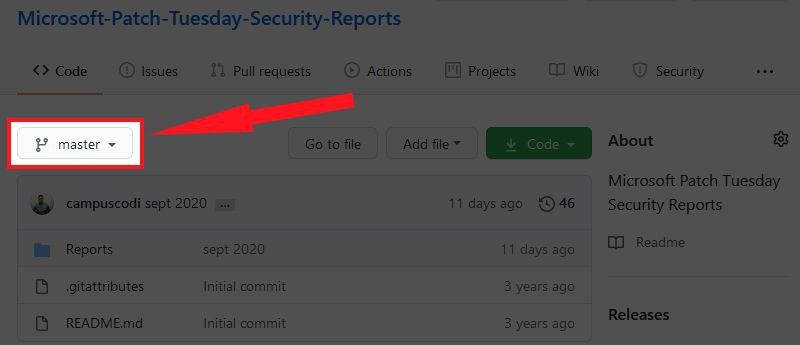

# sysadm_in_channel
`2020-09-30 18:18:28`

<blockquote>
Эксплуатация MS Exchange - захват всей среды Exchange (включая всю электронную почту) и потенциально всего Active Directory

Уязвимость в Microsoft Exchange, которая позволяет злоумышленнику превратить любую украденную учетную запись пользователя Exchange в полный компроментат всей инфраструктуры. В разных реализациях уязвимость может быть использована для полной компрометации всей среды Exchange (включая всю электронную почту) и потенциально всего Active Directory:

https://blog.rapid7.com/2020/04/06/phishing-for-system-on-microsoft-exchange-cve-2020-0688/

Информация по CVE на официальном сайте MS:
https://portal.msrc.microsoft.com/en-US/security-guidance/advisory/CVE-2020-0688
</blockquote>

<table><tr><td><b>→</b><a href="https://blog.rapid7.com/2020/04/06/phishing-for-system-on-microsoft-exchange-cve-2020-0688/">
https://blog.rapid7.com/2020/04/06/phishing-for-system-on-microsoft-exchange-cve-2020-0688/
</a>
<blockquote>
As of March 24, there were over 350,000 Microsoft Exchange servers exposing a version of the software with a vulnerability.
</blockquote>
</td></tr></table>

---

# R0_Crew
`2020-09-30 16:59:34`

<blockquote>
efiXplorer v2.0 [Hex-Rays Contest Edition] https://github.com/binarly-io/efiXplorer/releases/tag/v2.0 &#35;ida &#35;hardware &#35;uefi &#35;dukeBarman
</blockquote>

<table><tr><td><b>→</b><a href="https://github.com/binarly-io/efiXplorer/releases/tag/v2.0">
https://github.com/binarly-io/efiXplorer/releases/tag/v2.0
</a>
<blockquote>
[new feature] UEFI image loader (loading the whole image to IDA Pro)
Support of analyzing 32-bit images
Support of analyzing SMM images
[new feature] PEI images analyzer
Multiple improvements and f...
</blockquote>
</td></tr></table>

---

# cyberoffru
`2020-09-30 13:16:59`

<blockquote>
посмотрел я эту ссылку, может кто автору перекинуть эту ссылку, для так сказать, повышения уровня проработки решения? https://gitlab.com/flypatriot/allb-tool/-/wikis/home-ru
</blockquote>

<table><tr><td><b>→</b><a href="https://gitlab.com/flypatriot/allb-tool/-/wikis/home-ru">
https://gitlab.com/flypatriot/allb-tool/-/wikis/home-ru
</a>
<blockquote>
Astra Linux live build tool
</blockquote>
</td></tr></table>

---

# defcon_news
`2020-09-30 00:53:18`

<blockquote>
Re: Navy Federal Reflective Cross Site Scripting (XSS)
http://seclists.org/fulldisclosure/2020/Sep/54

via Full Disclosure
</blockquote>

<table><tr><td><b>→</b><a href="https://seclists.org/fulldisclosure/2020/Sep/54">
https://seclists.org/fulldisclosure/2020/Sep/54
</a>
</td></tr></table>

---

# defcon_news
`2020-09-30 00:53:17`

<blockquote>
CVE-2020-24721: Corona Exposure Notifications API: risk of coercion/data leakage [vs]
http://seclists.org/fulldisclosure/2020/Sep/53

via Full Disclosure
</blockquote>

<table><tr><td><b>→</b><a href="https://seclists.org/fulldisclosure/2020/Sep/53">
https://seclists.org/fulldisclosure/2020/Sep/53
</a>
</td></tr></table>

---

# defcon_news
`2020-09-30 00:53:15`

<blockquote>
U.S. Dept Of Defense: Unauthenticated Arbitrary File Deletion (&quot;CVE-2020-3187&quot;) in ████████
https://vulners.com/hackerone/H1:978335?utm_source&#61;rss&amp;utm_medium&#61;rss&amp;utm_campaign&#61;rss

via Vulners
</blockquote>

<table><tr><td><b>→</b><a href="https://vulners.com/hackerone/H1:978335?utm_source=rss&utm_medium=rss&utm_campaign=rss">
https://vulners.com/hackerone/H1:978335?utm_source=rss&utm_medium=rss&utm_campaign=rss
</a>
<blockquote>
Description: A vulnerability in the interface of Cisco Adaptive Security Appliance (ASA) Software and Cisco Firepower Threat Defense (FTD) Software could allow an unauthenticated, remote attacker to conduct directory traversal attacks and obtain read and delete access to sensitive files. Vulnerable host:  https:// ██████/  Impact An exploit could allow the attacker to view or delete arbitrary files on the system. Step-by-step Reproduction Instructions 1) Identifying vulnerable host by send request to /+CSCOE+/session_password.html. ```bash  curl -skiL &quot;https:// ██████/+CSCOE+/session_password.html&quot; ```  ``` GET /+CSCOE+/session_password.html HTTP/1.1 Host:  ███████ User-Agent: curl/7.47.0 Accept: / ``` If the target is vulnerable, the response header will display webvpn header, like: ``` HTTP/1.1 200 OK Content-Type: text/plain Content-Length: 0 Cache-Control: no-cache Pragma: no-cache Connection: Keep-Alive Date: Thu, 10 Sep 2020 04:14:27 GMT X-Frame-Options: SAMEORIGIN webvpn:  ``` 2) Perform exploits to delete…
</blockquote>
</td></tr></table>

---

# defcon_news
`2020-09-29 23:53:12`

<blockquote>
[local] CloudMe 1.11.2 - Buffer Overflow ROP (DEP,ASLR)
https://www.exploit-db.com/exploits/48840

via Exploit Database
</blockquote>

<table><tr><td><b>→</b><a href="https://www.exploit-db.com/exploits/48840">
https://www.exploit-db.com/exploits/48840
</a>
<blockquote>
CloudMe 1.11.2 - Buffer Overflow ROP (DEP,ASLR).. local exploit for Windows platform
</blockquote>
</td></tr></table>

---

# defcon_news
`2020-09-29 23:53:11`

<blockquote>
[local] BearShare Lite 5.2.5 - 'Advanced Search'Buffer Overflow in (PoC)
https://www.exploit-db.com/exploits/48839

via Exploit Database
</blockquote>

<table><tr><td><b>→</b><a href="https://www.exploit-db.com/exploits/48839">
https://www.exploit-db.com/exploits/48839
</a>
<blockquote>
BearShare Lite 5.2.5 - 'Advanced Search'Buffer Overflow in (PoC).. local exploit for Windows platform
</blockquote>
</td></tr></table>

---

# defcon_news
`2020-09-29 23:53:10`

<blockquote>
[webapps] WebsiteBaker 2.12.2 - Remote Code Execution
https://www.exploit-db.com/exploits/48838

via Exploit Database
</blockquote>

<table><tr><td><b>→</b><a href="https://www.exploit-db.com/exploits/48838">
https://www.exploit-db.com/exploits/48838
</a>
<blockquote>
WebsiteBaker 2.12.2 - Remote Code Execution.. webapps exploit for PHP platform
</blockquote>
</td></tr></table>

---

# cibsecurity
`2020-09-29 21:38:27`

* https://threatpost.com/zerologon-attacks-microsoft-dcs-snowball/159656/

<blockquote>
❌ Zerologon Attacks Against Microsoft DCs Snowball in a Week ❌

The attempted compromises, which could allow full control over Active Directory identity services, are flying thick and fast just a week after active exploits of CVE-2020-1472 were first flagged.

📖 Read

via &quot;Threat Post&quot;.
</blockquote>

<table><tr><td><b>→</b><a href="https://threatpost.com/zerologon-attacks-microsoft-dcs-snowball/159656/?utm_source=dlvr.it&utm_medium=twitter">
https://threatpost.com/zerologon-attacks-microsoft-dcs-snowball/159656/?utm_source=dlvr.it&utm_medium=twitter
</a>
<blockquote>
The attempted compromises, which could allow full control over Active Directory identity services, are flying thick and fast just a week after active exploits of CVE-2020-1472 were first flagged.
</blockquote>
</td></tr></table>

---

# defcon_news
`2020-09-29 19:53:46`

<blockquote>
Critical Information Disclosure on WP Courses plugin &lt;&#61;2.0.29 exposes private course videos and materials
http://seclists.org/fulldisclosure/2020/Sep/52

via Full Disclosure
</blockquote>

<table><tr><td><b>→</b><a href="https://seclists.org/fulldisclosure/2020/Sep/52">
https://seclists.org/fulldisclosure/2020/Sep/52
</a>
</td></tr></table>

---

# defcon_news
`2020-09-29 19:53:45`

<blockquote>
[SYSS-2020-025] DOMOS 5.8 - OS Command Injection
http://seclists.org/fulldisclosure/2020/Sep/51

via Full Disclosure
</blockquote>

<table><tr><td><b>→</b><a href="https://seclists.org/fulldisclosure/2020/Sep/51">
https://seclists.org/fulldisclosure/2020/Sep/51
</a>
</td></tr></table>

---

# defcon_news
`2020-09-29 19:53:44`

<blockquote>
[SYSS-2020-024] Qiata FTA - Persistent Cross-Site Scripting
http://seclists.org/fulldisclosure/2020/Sep/50

via Full Disclosure
</blockquote>

<table><tr><td><b>→</b><a href="https://seclists.org/fulldisclosure/2020/Sep/50">
https://seclists.org/fulldisclosure/2020/Sep/50
</a>
</td></tr></table>

---

# defcon_news
`2020-09-29 19:53:43`

<blockquote>
[SYSS-2019-049] Insufficient Session Expiration (CWE-613) in REDDOXX MailDepot (CVE-2019-19199)
http://seclists.org/fulldisclosure/2020/Sep/49

via Full Disclosure
</blockquote>

<table><tr><td><b>→</b><a href="https://seclists.org/fulldisclosure/2020/Sep/49">
https://seclists.org/fulldisclosure/2020/Sep/49
</a>
</td></tr></table>

---

# defcon_news
`2020-09-29 19:53:42`

<blockquote>
Regarding the semi-recent OnBase vulnerabilities
http://seclists.org/fulldisclosure/2020/Sep/48

via Full Disclosure
</blockquote>

<table><tr><td><b>→</b><a href="https://seclists.org/fulldisclosure/2020/Sep/48">
https://seclists.org/fulldisclosure/2020/Sep/48
</a>
</td></tr></table>

---

# defcon_news
`2020-09-28 21:53:37`

<blockquote>
[webapps] Joplin 1.0.245 - Arbitrary Code Execution (PoC)
https://www.exploit-db.com/exploits/48837

via Exploit Database
</blockquote>

<table><tr><td><b>→</b><a href="https://www.exploit-db.com/exploits/48837">
https://www.exploit-db.com/exploits/48837
</a>
<blockquote>
Joplin 1.0.245 - Arbitrary Code Execution (PoC). CVE-2020-15930 . webapps exploit for Multiple platform
</blockquote>
</td></tr></table>

---

# defcon_news
`2020-09-28 20:53:14`

<blockquote>
[local] MSI Ambient Link Driver 1.0.0.8 - Local Privilege Escalation
https://www.exploit-db.com/exploits/48836

via Exploit Database
</blockquote>

<table><tr><td><b>→</b><a href="https://www.exploit-db.com/exploits/48836">
https://www.exploit-db.com/exploits/48836
</a>
<blockquote>
MSI Ambient Link Driver 1.0.0.8 - Local Privilege Escalation. CVE-2020-17382 . local exploit for Windows platform
</blockquote>
</td></tr></table>

---

# defcon_news
`2020-09-28 20:53:13`

<blockquote>
[webapps] Mida eFramework 2.8.9 - Remote Code Execution
https://www.exploit-db.com/exploits/48835

via Exploit Database
</blockquote>

<table><tr><td><b>→</b><a href="https://www.exploit-db.com/exploits/48835">
https://www.exploit-db.com/exploits/48835
</a>
<blockquote>
Mida eFramework 2.8.9 - Remote Code Execution. CVE-2020-15922 . webapps exploit for Hardware platform
</blockquote>
</td></tr></table>

---

# defcon_news
`2020-09-28 09:53:24`

<blockquote>
Kernel exploitation: weaponizing CVE-2020-17382 MSI Ambient Link driver ::
https://www.reddit.com/r/netsec/comments/j01zuq/kernel_exploitation_weaponizing_cve202017382_msi/

via /r/netsec - Information Security News &amp; Discussion
</blockquote>

<table><tr><td><b>→</b><a href="https://www.reddit.com/r/netsec/comments/j01zuq/kernel_exploitation_weaponizing_cve202017382_msi/">
https://www.reddit.com/r/netsec/comments/j01zuq/kernel_exploitation_weaponizing_cve202017382_msi/
</a>
<blockquote>
Posted in r/netsec by u/digicat • 15 points and 0 comments
</blockquote>
</td></tr></table>

---

# R0_Crew
`2020-09-26 15:10:56`

<blockquote>
GammaRay is a tool to poke around in a Qt-application and also to manipulate the application to some extent.

https://github.com/KDAB/GammaRay

&#35;reverse &#35;tools &#35;inspect &#35;qt &#35;darw1n
</blockquote>

<table><tr><td><b>→</b><a href="https://github.com/KDAB/GammaRay">
https://github.com/KDAB/GammaRay
</a>
<blockquote>
GammaRay is a tool to poke around in a Qt-application and also to manipulate the application to some extent. - KDAB/GammaRay
</blockquote>
</td></tr></table>

---

# isast
`2020-09-26 09:45:40`

<blockquote>
Выложены доклады с GitLab Commit Virtual 2020

Там был отдельный поток посвящённый DevSecOps
https://www.youtube.com/playlist?list&#61;PLFGfElNsQthbJaOG4pV450Y_eIdfr2p9Y

Ссылка на все потоки
https://www.youtube.com/c/Gitlab/playlists?view&#61;50&amp;sort&#61;dd&amp;shelf_id&#61;5

Программа
https://about.gitlab.com/events/commit/&#35;schedule
</blockquote>


---

# defcon_news
`2020-09-25 22:53:19`

<blockquote>
A different way of abusing Zerologon (CVE-2020-1472)
https://www.reddit.com/r/netsec/comments/iz6vvd/a_different_way_of_abusing_zerologon_cve20201472/

via /r/netsec - Information Security News &amp; Discussion
</blockquote>

<table><tr><td><b>→</b><a href="https://www.reddit.com/r/netsec/comments/iz6vvd/a_different_way_of_abusing_zerologon_cve20201472/">
https://www.reddit.com/r/netsec/comments/iz6vvd/a_different_way_of_abusing_zerologon_cve20201472/
</a>
<blockquote>
Posted in r/netsec by u/0xdea • 174 points and 10 comments
</blockquote>
</td></tr></table>

---

# defcon_news
`2020-09-25 22:53:09`

<blockquote>
ZeroLogon(CVE-2020-1472) - Attacking &amp; Defending
https://www.reddit.com/r/netsec/comments/iyoovi/zerologoncve20201472_attacking_defending/

via /r/netsec - Information Security News &amp; Discussion
</blockquote>

<table><tr><td><b>→</b><a href="https://www.reddit.com/r/netsec/comments/iyoovi/zerologoncve20201472_attacking_defending/">
https://www.reddit.com/r/netsec/comments/iyoovi/zerologoncve20201472_attacking_defending/
</a>
<blockquote>
Posted in r/netsec by u/ZephrX112 • 72 points and 21 comments
</blockquote>
</td></tr></table>

---

# defcon_news
`2020-09-25 17:53:16`

<blockquote>
This Week in Security: uTorrent Vulnerable, Crowd-Sourcing Your Fail2Ban, and Cryptographers at Casinos
https://hackaday.com/2020/09/25/this-week-in-security-utorrent-vulnerable-crowd-sourcing-your-fail2ban-and-cryptographers-at-casinos/

via Hackaday
</blockquote>

<table><tr><td><b>→</b><a href="https://hackaday.com/2020/09/25/this-week-in-security-utorrent-vulnerable-crowd-sourcing-your-fail2ban-and-cryptographers-at-casinos/">
https://hackaday.com/2020/09/25/this-week-in-security-utorrent-vulnerable-crowd-sourcing-your-fail2ban-and-cryptographers-at-casinos/
</a>
<blockquote>
The uTorrent client was recently updated to fix a null pointer dereference (CVE-2020-8437), discovered by [whtaguy]. Triggering the dereference simply crashes the client — so far an actual RC…
</blockquote>
</td></tr></table>

---

# defcon_news
`2020-09-25 16:53:10`

<blockquote>
[webapps] B-swiss 3 Digital Signage System 3.6.5 - Database Disclosure
https://www.exploit-db.com/exploits/48834

via Exploit Database
</blockquote>

<table><tr><td><b>→</b><a href="https://www.exploit-db.com/exploits/48834">
https://www.exploit-db.com/exploits/48834
</a>
<blockquote>
B-swiss 3 Digital Signage System 3.6.5 -  Database Disclosure.. webapps exploit for Multiple platform
</blockquote>
</td></tr></table>

---

# defcon_news
`2020-09-25 16:53:10`

<blockquote>
[webapps] B-swiss 3 Digital Signage System 3.6.5 - Cross-Site Request Forgery (Add Maintenance Admin)
https://www.exploit-db.com/exploits/48833

via Exploit Database
</blockquote>

<table><tr><td><b>→</b><a href="https://www.exploit-db.com/exploits/48833">
https://www.exploit-db.com/exploits/48833
</a>
<blockquote>
B-swiss 3 Digital Signage System 3.6.5 - Cross-Site Request Forgery (Add Maintenance Admin).. webapps exploit for Multiple platform
</blockquote>
</td></tr></table>

---

# defcon_news
`2020-09-25 16:53:08`

<blockquote>
[webapps] Anchor CMS 0.12.7 - Persistent Cross-Site Scripting (Authenticated)
https://www.exploit-db.com/exploits/48832

via Exploit Database
</blockquote>

<table><tr><td><b>→</b><a href="https://www.exploit-db.com/exploits/48832">
https://www.exploit-db.com/exploits/48832
</a>
<blockquote>
Anchor CMS 0.12.7 - Persistent Cross-Site Scripting (Authenticated).. webapps exploit for PHP platform
</blockquote>
</td></tr></table>

---

# defcon_news
`2020-09-25 16:53:07`

<blockquote>
[webapps] BigTree CMS 4.4.10 - Remote Code Execution
https://www.exploit-db.com/exploits/48831

via Exploit Database
</blockquote>

<table><tr><td><b>→</b><a href="https://www.exploit-db.com/exploits/48831">
https://www.exploit-db.com/exploits/48831
</a>
<blockquote>
BigTree CMS 4.4.10 - Remote Code Execution.. webapps exploit for PHP platform
</blockquote>
</td></tr></table>

---

# defcon_news
`2020-09-25 08:53:15`

<blockquote>
APPLE-SA-2020-09-24-1 macOS Catalina 10.15.6 Supplemental Update, Security Update 2020-005 High Sierra, Security Update 2020-005 Mojave
http://seclists.org/fulldisclosure/2020/Sep/47

via Full Disclosure
</blockquote>

<table><tr><td><b>→</b><a href="https://seclists.org/fulldisclosure/2020/Sep/47">
https://seclists.org/fulldisclosure/2020/Sep/47
</a>
</td></tr></table>

---

# ctfchat
`2020-09-25 00:53:38`

<blockquote>
https://github.com/veracode-research/solr-injection&#35;7-cve-2019-17558-rce-via-velocity-template-by-_s00py
</blockquote>

<table><tr><td><b>→</b><a href="https://github.com/veracode-research/solr-injection">
https://github.com/veracode-research/solr-injection
</a>
<blockquote>
Apache Solr Injection Research. Contribute to veracode-research/solr-injection development by creating an account on GitHub.
</blockquote>
</td></tr></table>

---

# defcon_news
`2020-09-24 21:53:15`

<blockquote>
Unpatched Domain Controllers Remain Vulnerable to Netlogon Vulnerability, CVE-2020-1472
https://us-cert.cisa.gov/ncas/current-activity/2020/09/24/unpatched-domain-controllers-remain-vulnerable-netlogon

via CISA Current Activity
</blockquote>

<table><tr><td><b>→</b><a href="https://us-cert.cisa.gov/ncas/current-activity/2020/09/24/unpatched-domain-controllers-remain-vulnerable-netlogon">
https://us-cert.cisa.gov/ncas/current-activity/2020/09/24/unpatched-domain-controllers-remain-vulnerable-netlogon
</a>
<blockquote>
The Cybersecurity and Infrastructure Security Agency (CISA) is aware of active exploitation of CVE-2020-1472, an elevation of privilege vulnerability in Microsoft’s Netlogon. A remote attacker can exploit this vulnerability to breach unpatched Active Directory domain controllers and obtain domain administrator access.
</blockquote>
</td></tr></table>

---

# defcon_news
`2020-09-24 17:53:26`

<blockquote>
[webapps] Simple Online Food Ordering System 1.0 - 'id' SQL Injection (Unauthenticated)
https://www.exploit-db.com/exploits/48829

via Exploit Database
</blockquote>

<table><tr><td><b>→</b><a href="https://www.exploit-db.com/exploits/48829">
https://www.exploit-db.com/exploits/48829
</a>
<blockquote>
Simple Online Food Ordering System 1.0 - 'id' SQL Injection (Unauthenticated).. webapps exploit for PHP platform
</blockquote>
</td></tr></table>

---

# defcon_news
`2020-09-24 17:53:26`

<blockquote>
[webapps] Visitor Management System in PHP 1.0 - Persistent Cross-Site Scripting
https://www.exploit-db.com/exploits/48830

via Exploit Database
</blockquote>

<table><tr><td><b>→</b><a href="https://www.exploit-db.com/exploits/48830?utm_source=dlvr.it&utm_medium=twitter">
https://www.exploit-db.com/exploits/48830?utm_source=dlvr.it&utm_medium=twitter
</a>
<blockquote>
Visitor Management System in PHP 1.0 - Persistent Cross-Site Scripting.. webapps exploit for PHP platform
</blockquote>
</td></tr></table>

---

# sysadm_in_channel
`2020-09-24 14:16:09`

<blockquote>
Ошибка приложения Instagram могла дать хакерам удаленный доступ к вашему телефону

Суть - ошибка в Android-приложении Instagram могла позволить удаленным злоумышленникам взять под контроль целевое устройство, просто отправив жертвам специально созданное изображение:

https://thehackernews.com/2020/09/instagram-android-hack.html

Ссылка на статью от исследователей:

https://blog.checkpoint.com/2020/09/24/instahack-how-researchers-were-able-to-take-over-the-instagram-app-using-a-malicious-image/

Спасибо за ссылку Nitro Team ✌️
</blockquote>

<table><tr><td><b>→</b><a href="https://thehackernews.com/2020/09/instagram-android-hack.html">
https://thehackernews.com/2020/09/instagram-android-hack.html
</a>
<blockquote>
CVE-2020-1895: A critical vulnerability in Instagram's Android app that could have allowed remote attackers to take control over a targeted device
</blockquote>
</td></tr></table>

---

# defcon_news
`2020-09-24 13:53:24`

<blockquote>
Major Instagram App Bug Could've Given Hackers Remote Access to Your Phone
https://thehackernews.com/2020/09/instagram-android-hack.html

via The Hacker News
</blockquote>

<table><tr><td><b>→</b><a href="https://thehackernews.com/2020/09/instagram-android-hack.html">
https://thehackernews.com/2020/09/instagram-android-hack.html
</a>
<blockquote>
CVE-2020-1895: A critical vulnerability in Instagram's Android app that could have allowed remote attackers to take control over a targeted device
</blockquote>
</td></tr></table>

---

# FinSecurity
`2020-09-24 12:06:49`

<blockquote>
https://www.youtube.com/watch?v&#61;pGOQDOR1198&amp;feature&#61;youtu.be&amp;utm_source&#61;sendpulse&amp;utm_medium&#61;email&amp;utm_campaign&#61;o-proshedshem-vebinare-gost&amp;spush&#61;ZC5lZmltb3ZAb2tiYW5rLnJ1
</blockquote>

<table><tr><td><b>→</b><a href="https://www.youtube.com/watch?v=pGOQDOR1198&feature=youtu.be&utm_source=sendpulse&utm_medium=email&utm_campaign=o-proshedshem-vebinare-gost&spush=ZC5lZmltb3ZAb2tiYW5rLnJ1">
https://www.youtube.com/watch?v=pGOQDOR1198&feature=youtu.be&utm_source=sendpulse&utm_medium=email&utm_campaign=o-proshedshem-vebinare-gost&spush=ZC5lZmltb3ZAb2tiYW5rLnJ1
</a>
<blockquote>
Презентация с вебинара: https://drive.google.com/file/d/1KdJci15UeMX74wymX6KEY683Zf0JEuXb/view?usp&#61;sharing

В 2021 году вступят в силу требования по обязательному соответствию ГОСТ Р 57580 для финансовых организаций (ФО). В связи с этим ФО активно проводят самооценки и аудиты.

В 2020 году аудиторы ITGLOBAL.COM провели достаточно большое количество оценок соответствия ГОСТ Р 57580. По наблюдениям наших специалистов, у большинства организаций есть общие проблемы, которые в значительной степени снижают оценку. На вебинаре разберемся, какие ошибки чаще всего допускают ФО и как их избежать.

Вебинар актуален для тех, кто хочет подготовиться к внедрению нового стандарта и успешно пройти оценку соответствия.

Программа

— самые частые нарушениях в проектах по внедрению ГОСТ Р 57580;
— пути их устранения с помощью основных и компенсационных мер;
— интересные случаи из практики аудитов ITGLOBAL.COM по ГОСТ Р 57580.

Также аудиторы ответят на интересующие вопросы по ГОСТ Р 57580. Вопросы можно задавать уже сейчас при…
</blockquote>
</td></tr></table>

---

# FinSecurity
`2020-09-24 11:16:14`

<blockquote>
Вот ссылка, как и просили https://youtu.be/pGOQDOR1198
</blockquote>

<table><tr><td><b>→</b><a href="https://youtu.be/pGOQDOR1198">
https://youtu.be/pGOQDOR1198
</a>
<blockquote>
Презентация с вебинара: https://drive.google.com/file/d/1KdJci15UeMX74wymX6KEY683Zf0JEuXb/view?usp&#61;sharing

В 2021 году вступят в силу требования по обязательному соответствию ГОСТ Р 57580 для финансовых организаций (ФО). В связи с этим ФО активно проводят самооценки и аудиты.

В 2020 году аудиторы ITGLOBAL.COM провели достаточно большое количество оценок соответствия ГОСТ Р 57580. По наблюдениям наших специалистов, у большинства организаций есть общие проблемы, которые в значительной степени снижают оценку. На вебинаре разберемся, какие ошибки чаще всего допускают ФО и как их избежать.

Вебинар актуален для тех, кто хочет подготовиться к внедрению нового стандарта и успешно пройти оценку соответствия.

Программа

— самые частые нарушениях в проектах по внедрению ГОСТ Р 57580;
— пути их устранения с помощью основных и компенсационных мер;
— интересные случаи из практики аудитов ITGLOBAL.COM по ГОСТ Р 57580.

Также аудиторы ответят на интересующие вопросы по ГОСТ Р 57580. Вопросы можно задавать уже сейчас при…
</blockquote>
</td></tr></table>

---

# sysadm_in_channel
`2020-09-24 07:03:22`

<blockquote>
Google Osconfig - Повышение привилегий

PoC

https://github.com/irsl/google-osconfig-privesc

Что такое Google Osconfig

https://github.com/GoogleCloudPlatform/osconfig
</blockquote>

<table><tr><td><b>→</b><a href="https://github.com/irsl/google-osconfig-privesc">
https://github.com/irsl/google-osconfig-privesc
</a>
<blockquote>
Proof of concept about the privilege escalation flaw identified in Google's Osconfig - irsl/google-osconfig-privesc
</blockquote>
</td></tr></table>

---

# defcon_news
`2020-09-24 05:53:15`

<blockquote>
uTorrent CVE-2020-8437 null deref vulnerability (and the BitTorrent protocol knowledge to exploit it)
https://www.reddit.com/r/netsec/comments/ixxtny/utorrent_cve20208437_null_deref_vulnerability_and/

via /r/netsec - Information Security News &amp; Discussion
</blockquote>

<table><tr><td><b>→</b><a href="https://www.reddit.com/r/netsec/comments/ixxtny/utorrent_cve20208437_null_deref_vulnerability_and/">
https://www.reddit.com/r/netsec/comments/ixxtny/utorrent_cve20208437_null_deref_vulnerability_and/
</a>
<blockquote>
Posted in r/netsec by u/va_start • 3 points and 0 comments
</blockquote>
</td></tr></table>

---

# defcon_news
`2020-09-23 21:53:07`

<blockquote>
Detecting and Preventing Critical ZeroLogon Windows Server Vulnerability
https://thehackernews.com/2020/09/detecting-and-preventing-critical.html

via The Hacker News
</blockquote>

<table><tr><td><b>→</b><a href="https://thehackernews.com/2020/09/detecting-and-preventing-critical.html">
https://thehackernews.com/2020/09/detecting-and-preventing-critical.html
</a>
<blockquote>
Learn How to Detect and Prevent Critical ZeroLogon Windows Server Vulnerability (CVE-2020-1472)
</blockquote>
</td></tr></table>

---

# reverseengineeringx
`2020-09-23 20:18:07`

<blockquote>
A modern Java bytecode editor

https://github.com/Col-E/Recaf
</blockquote>

<table><tr><td><b>→</b><a href="https://github.com/Col-E/Recaf">
https://github.com/Col-E/Recaf
</a>
<blockquote>
The modern Java bytecode editor. Contribute to Col-E/Recaf development by creating an account on GitHub.
</blockquote>
</td></tr></table>

---

# reverseengineeringx
`2020-09-23 20:16:43`

<blockquote>
Course materials for Advanced Binary Deobfuscation by NTT Secure Platform Laboratories

https://github.com/malrev/ABD
</blockquote>

<table><tr><td><b>→</b><a href="https://github.com/malrev/ABD">
https://github.com/malrev/ABD
</a>
<blockquote>
Course materials for Advanced Binary Deobfuscation by NTT Secure Platform Laboratories - malrev/ABD
</blockquote>
</td></tr></table>

---

# defcon_news
`2020-09-23 16:53:05`

<blockquote>
[webapps] Online Food Ordering System 1.0 - Remote Code Execution
https://www.exploit-db.com/exploits/48827

via Exploit Database
</blockquote>

<table><tr><td><b>→</b><a href="https://www.exploit-db.com/exploits/48827?utm_source=dlvr.it&utm_medium=twitter">
https://www.exploit-db.com/exploits/48827?utm_source=dlvr.it&utm_medium=twitter
</a>
<blockquote>
Online Food Ordering System 1.0 - Remote Code Execution.. webapps exploit for PHP platform
</blockquote>
</td></tr></table>

---

# sysadm_in_channel
`2020-09-23 06:59:30`

<blockquote>
Edex-UI кросс-платформенный терминальный эмулятор с множеством встроенных фич

Что-то новенькое... Short description: A cross-platform, customizable science fiction terminal emulator with advanced monitoring &amp; touchscreen support.
https://github.com/GitSquared/edex-ui
</blockquote>

<table><tr><td><b>→</b><a href="https://github.com/GitSquared/edex-ui">
https://github.com/GitSquared/edex-ui
</a>
<blockquote>
A cross-platform, customizable science fiction terminal emulator with advanced monitoring &amp; touchscreen support. - GitSquared/edex-ui
</blockquote>
</td></tr></table>

---

# defcon_news
`2020-09-23 02:53:02`

<blockquote>
Visitor Management System in PHP 1.0 - Unauthenticated Stored XSS
http://seclists.org/fulldisclosure/2020/Sep/45

via Full Disclosure
</blockquote>

<table><tr><td><b>→</b><a href="https://seclists.org/fulldisclosure/2020/Sep/45">
https://seclists.org/fulldisclosure/2020/Sep/45
</a>
</td></tr></table>

---

# defcon_news
`2020-09-22 23:53:03`

<blockquote>
Solana BBP: Public and secret api key leaked via Solana BBP github repo
https://vulners.com/hackerone/H1:987084?utm_source&#61;rss&amp;utm_medium&#61;rss&amp;utm_campaign&#61;rss

via Vulners
</blockquote>

<table><tr><td><b>→</b><a href="https://vulners.com/hackerone/H1:987084?utm_source=rss&utm_medium=rss&utm_campaign=rss">
https://vulners.com/hackerone/H1:987084?utm_source=rss&utm_medium=rss&utm_campaign=rss
</a>
<blockquote>
Sumarry: Most often Developers for their ease of use,leave API keys and some sensitive keys ,Tokens as hardcoded strings,which isn't really a good ideas as it can result in Leaks of sensitive information getting in Wrong Hands which indeed can results in Data theft and Tampering with how the application deals with the data, and API requests the application Makes. URL Vulnerability  https://github.com/solana-labs/solana/blob/e310bad7ab09a4a5bd23314983bffa1707506230/.buildkite/env/secrets.ejson Proof On Concept javascript {     &quot;_public_key&quot;: &quot;ae29f4f7ad2fc92de70d470e411c8426d5d48db8817c9e3dae574b122192335f&quot;,     &quot;_comment&quot;: &quot;These credentials are encrypted and pose no risk&quot;,     &quot;environment&quot;: {       &quot;CODECOV_TOKEN&quot;: &quot;EJ[1:Z7OneT3RdJJ0DipCHQ7rC84snQ+FPbgHwZADQiz54wk&#61;:3K68mE38LJ2RB98VWmjuNLFBNn1XTGR4:cR4r05/TOZQKmEZp1v4CSgUJtC6QJiOaL85QjXW0qZ061fMnsBA8AtAPMDoDq4WCGOZM1A&#61;&#61;]&quot;,       &quot;CRATES_IO_TOKEN&quot;: &quot;EJ[1:Z7OneT3RdJJ0DipCHQ7rC84snQ+FPbgHwZADQiz54wk&#61;:GGRTYDjMXksevzR6kq4Jx+FaIQZz50RU:xkbwDxcgoCyU+aT2tiI9mymigrE…
</blockquote>
</td></tr></table>

---

# defcon_news
`2020-09-22 21:53:06`

<blockquote>
Google's osconfig agent - local privilege escalation
http://seclists.org/fulldisclosure/2020/Sep/46

via Full Disclosure
</blockquote>

<table><tr><td><b>→</b><a href="https://seclists.org/fulldisclosure/2020/Sep/46">
https://seclists.org/fulldisclosure/2020/Sep/46
</a>
</td></tr></table>

---

# defcon_news
`2020-09-22 20:53:23`

<blockquote>
[CVE-2020-25203] Frame Preview &quot;com.framer.viewer.FramerViewActivity&quot; Arbitrary URL Loading
http://seclists.org/fulldisclosure/2020/Sep/44

via Full Disclosure
</blockquote>

<table><tr><td><b>→</b><a href="https://seclists.org/fulldisclosure/2020/Sep/44">
https://seclists.org/fulldisclosure/2020/Sep/44
</a>
</td></tr></table>

---

# defcon_news
`2020-09-22 20:53:22`

<blockquote>
Visitor Management System in PHP 1.0 - Authenticated SQL Injection
http://seclists.org/fulldisclosure/2020/Sep/43

via Full Disclosure
</blockquote>

<table><tr><td><b>→</b><a href="https://seclists.org/fulldisclosure/2020/Sep/43">
https://seclists.org/fulldisclosure/2020/Sep/43
</a>
</td></tr></table>

---

# defcon_news
`2020-09-22 20:53:20`

<blockquote>
Seat Reservation System 1.0 Unauthenticated SQL Injection (CVE-2020-25762)
http://seclists.org/fulldisclosure/2020/Sep/42

via Full Disclosure
</blockquote>

<table><tr><td><b>→</b><a href="https://seclists.org/fulldisclosure/2020/Sep/42">
https://seclists.org/fulldisclosure/2020/Sep/42
</a>
</td></tr></table>

---

# defcon_news
`2020-09-22 20:53:19`

<blockquote>
Seat Reservation System 1.0 Unauthenticated Remote Code Execution (CVE-2020-25763)
http://seclists.org/fulldisclosure/2020/Sep/41

via Full Disclosure
</blockquote>

<table><tr><td><b>→</b><a href="https://seclists.org/fulldisclosure/2020/Sep/41">
https://seclists.org/fulldisclosure/2020/Sep/41
</a>
</td></tr></table>

---

# defcon_news
`2020-09-22 19:53:18`

<blockquote>
Extracting the decrypted flash data from a fully protected ESP32 chip using chip-level weaknesses, no knowledge of the decryption key and a single glitch (CVE-2020-13629).
https://www.reddit.com/r/netsec/comments/ixiod4/extracting_the_decrypted_flash_data_from_a_fully/

via /r/netsec - Information Security News &amp; Discussion
</blockquote>

<table><tr><td><b>→</b><a href="https://www.reddit.com/r/netsec/comments/ixiod4/extracting_the_decrypted_flash_data_from_a_fully/?utm_source=ifttt">
https://www.reddit.com/r/netsec/comments/ixiod4/extracting_the_decrypted_flash_data_from_a_fully/?utm_source=ifttt
</a>
<blockquote>
Posted in r/netsec by u/tieknimmers • 283 points and 21 comments
</blockquote>
</td></tr></table>

---

# defcon_news
`2020-09-22 18:55:59`

<blockquote>
[webapps] Flatpress Add Blog 1.0.3 - Persistent Cross-Site Scripting
https://www.exploit-db.com/exploits/48826

via Exploit Database
</blockquote>

<table><tr><td><b>→</b><a href="https://www.exploit-db.com/exploits/48826">
https://www.exploit-db.com/exploits/48826
</a>
<blockquote>
Flatpress Add Blog 1.0.3 - Persistent Cross-Site Scripting.. webapps exploit for PHP platform
</blockquote>
</td></tr></table>

---

# defcon_news
`2020-09-22 17:53:13`

<blockquote>
[webapps] Comodo Unified Threat Management Web Console 2.7.0 - Remote Code Execution
https://www.exploit-db.com/exploits/48825

via Exploit Database
</blockquote>

<table><tr><td><b>→</b><a href="https://www.exploit-db.com/exploits/48825">
https://www.exploit-db.com/exploits/48825
</a>
<blockquote>
Comodo Unified Threat Management Web Console 2.7.0 - Remote Code Execution. CVE-2018-17431 . webapps exploit for Multiple platform
</blockquote>
</td></tr></table>

---

# R0_Crew
`2020-09-22 15:35:46`

<blockquote>
Reverse Engineers' Hex Editor https://github.com/solemnwarning/rehex &#35;reverse &#35;dukeBarman
</blockquote>

<table><tr><td><b>→</b><a href="https://github.com/solemnwarning/rehex">
https://github.com/solemnwarning/rehex
</a>
<blockquote>
Reverse Engineers' Hex Editor. Contribute to solemnwarning/rehex development by creating an account on GitHub.
</blockquote>
</td></tr></table>

---

# R0_Crew
`2020-09-22 13:39:58`

<blockquote>
abyss - IDAPython Plugin for Postprocessing of Hexrays Decompiler Output https://github.com/patois/abyss &#35;ida &#35;reverse &#35;dukeBarman
</blockquote>

<table><tr><td><b>→</b><a href="https://github.com/patois/abyss">
https://github.com/patois/abyss
</a>
<blockquote>
abyss - IDAPython Plugin for Postprocessing of Hexrays Decompiler Output - patois/abyss
</blockquote>
</td></tr></table>

---

# sysadm_in_channel
`2020-09-22 06:29:51`

<blockquote>
Не преднамеренный запуск Android Firefox удалённым злоумышленником

Эта атака может быть использована злоумышленниками в той же сети Wi-Fi где находится атакуемое устройство, что позволяет запускать приложение на целевом устройстве в обход разрешений пользователей и выполнять различные действия.

Прямо легитимной бэкдор... Эксплоит и PoC для любителей ФФ прилагается:

https://gitlab.com/gitlab-com/gl-security/security-operations/gl-redteam/red-team-tech-notes/-/tree/master/firefox-android-2020
</blockquote>

<table><tr><td><b>→</b><a href="https://gitlab.com/gitlab-com/gl-security/security-operations/gl-redteam/red-team-tech-notes/-/tree/master/firefox-android-2020">
https://gitlab.com/gitlab-com/gl-security/security-operations/gl-redteam/red-team-tech-notes/-/tree/master/firefox-android-2020
</a>
<blockquote>
As we come across interesting things that we want to share with the community we will document them here as a tech note.
</blockquote>
</td></tr></table>

---

# defcon_news
`2020-09-21 22:53:17`

<blockquote>
Samba Releases Security Update for CVE-2020-1472
https://us-cert.cisa.gov/ncas/current-activity/2020/09/21/samba-releases-security-update-cve-2020-1472

via CISA Current Activity
</blockquote>

<table><tr><td><b>→</b><a href="https://us-cert.cisa.gov/ncas/current-activity/2020/09/21/samba-releases-security-update-cve-2020-1472">
https://us-cert.cisa.gov/ncas/current-activity/2020/09/21/samba-releases-security-update-cve-2020-1472
</a>
<blockquote>
The Samba Team has released a security update to address a critical vulnerability—CVE-2020-1472—in multiple versions of Samba. This vulnerability could allow a remote attacker to take control of an affected system.

The Cybersecurity and Infrastructure Security Agency (CISA) encourages users and administrators to review the Samba Security Announcement for CVE-2020-1472 and apply the necessary updates or workaround.
</blockquote>
</td></tr></table>

---

# defcon_news
`2020-09-21 19:53:14`

<blockquote>
[webapps] B-swiss 3 Digital Signage System 3.6.5 - Remote Code Execution
https://www.exploit-db.com/exploits/48824

via Exploit Database
</blockquote>

<table><tr><td><b>→</b><a href="https://www.exploit-db.com/exploits/48824">
https://www.exploit-db.com/exploits/48824
</a>
<blockquote>
B-swiss 3 Digital Signage System 3.6.5 - Remote Code Execution.. webapps exploit for Multiple platform
</blockquote>
</td></tr></table>

---

# defcon_news
`2020-09-21 18:53:39`

<blockquote>
[webapps] Mida eFramework 2.9.0 - Back Door Access
https://www.exploit-db.com/exploits/48823

via Exploit Database
</blockquote>

<table><tr><td><b>→</b><a href="https://www.exploit-db.com/exploits/48823">
https://www.exploit-db.com/exploits/48823
</a>
<blockquote>
Mida eFramework 2.9.0 - Back Door Access. CVE-2020-15921 . webapps exploit for Hardware platform
</blockquote>
</td></tr></table>

---

# defcon_news
`2020-09-21 18:53:35`

<blockquote>
[webapps] Seat Reservation System 1.0 - 'id' SQL Injection
https://www.exploit-db.com/exploits/48822

via Exploit Database
</blockquote>

<table><tr><td><b>→</b><a href="https://www.exploit-db.com/exploits/48822">
https://www.exploit-db.com/exploits/48822
</a>
<blockquote>
Seat Reservation System 1.0 - 'id' SQL Injection.. webapps exploit for PHP platform
</blockquote>
</td></tr></table>

---

# defcon_news
`2020-09-21 18:53:33`

<blockquote>
[local] ForensiTAppxService 2.2.0.4 - 'ForensiTAppxService.exe' Unquoted Service Path
https://www.exploit-db.com/exploits/48821

via Exploit Database
</blockquote>

<table><tr><td><b>→</b><a href="https://www.exploit-db.com/exploits/48821">
https://www.exploit-db.com/exploits/48821
</a>
<blockquote>
ForensiTAppxService 2.2.0.4 - 'ForensiTAppxService.exe' Unquoted Service Path.. local exploit for Windows platform
</blockquote>
</td></tr></table>

---

# defcon_news
`2020-09-21 18:53:32`

<blockquote>
[webapps] BlackCat CMS 1.3.6 - Cross-Site Request Forgery
https://www.exploit-db.com/exploits/48820

via Exploit Database
</blockquote>

<table><tr><td><b>→</b><a href="https://www.exploit-db.com/exploits/48820">
https://www.exploit-db.com/exploits/48820
</a>
<blockquote>
BlackCat CMS 1.3.6 - Cross-Site Request Forgery. CVE-2020-25453 . webapps exploit for PHP platform
</blockquote>
</td></tr></table>

---

# defcon_news
`2020-09-21 18:53:30`

<blockquote>
[webapps] Online Shop Project 1.0 - 'p' SQL Injection
https://www.exploit-db.com/exploits/48819

via Exploit Database
</blockquote>

<table><tr><td><b>→</b><a href="https://www.exploit-db.com/exploits/48819">
https://www.exploit-db.com/exploits/48819
</a>
<blockquote>
Online Shop Project 1.0 - 'p' SQL Injection.. webapps exploit for PHP platform
</blockquote>
</td></tr></table>

---

# defcon_news
`2020-09-21 18:53:26`

<blockquote>
Patch by Tonight: CISA Issues Emergency Directive for Critical Netlogon Flaw
https://www.darkreading.com/vulnerabilities---threats/patch-by-tonight-cisa-issues-emergency-directive-for-critical-netlogon-flaw/d/d-id/1338971

via Dark Reading
</blockquote>

<table><tr><td><b>→</b><a href="https://www.darkreading.com/vulnerabilities---threats/patch-by-tonight-cisa-issues-emergency-directive-for-critical-netlogon-flaw/d/d-id/1338971">
https://www.darkreading.com/vulnerabilities---threats/patch-by-tonight-cisa-issues-emergency-directive-for-critical-netlogon-flaw/d/d-id/1338971
</a>
<blockquote>
The directive requires all federal agencies to apply a patch for Windows Netlogon vulnerability CVE-2020-1472 by midnight on Sept. 21.
</blockquote>
</td></tr></table>

---

# cibsecurity
`2020-09-21 18:34:19`

* https://www.darkreading.com/vulnerabilities---threats/patch-by-tonight-cisa-issues-emergency-directive-for-critical-netlogon-flaw/d/d-id/1338971?_mc=rss_x_drr_edt_aud_dr_x_x-rss-simple

<blockquote>
🕴 Patch by Tonight: CISA Issues Emergency Directive for Critical Netlogon Flaw 🕴

The directive requires all federal agencies to apply a patch for Windows Netlogon vulnerability CVE-2020-1472 by midnight on Sept. 21.

📖 Read

via &quot;Dark Reading: &quot;.
</blockquote>

<table><tr><td><b>→</b><a href="https://www.darkreading.com/vulnerabilities---threats/patch-by-tonight-cisa-issues-emergency-directive-for-critical-netlogon-flaw/d/d-id/1338971?_mc=rss_x_drr_edt_aud_dr_x_x-rss-simple">
https://www.darkreading.com/vulnerabilities---threats/patch-by-tonight-cisa-issues-emergency-directive-for-critical-netlogon-flaw/d/d-id/1338971?_mc=rss_x_drr_edt_aud_dr_x_x-rss-simple
</a>
<blockquote>
The directive requires all federal agencies to apply a patch for Windows Netlogon vulnerability CVE-2020-1472 by midnight on Sept. 21.
</blockquote>
</td></tr></table>

---

# MPSIEMChat
`2020-09-21 12:21:58`

<blockquote>
Всем привет!

Через 2 недели, 5-го октября, начнётся второй двухнедельный спринт [1] Open Security Collaborative Development (OSCD) [2] - открытой международной инициативы специалистов по компьютерной безопасности, направленной на решение общих проблем, распространение знаний и улучшение компьютерной безопасности в целом.

Год назад, в ходе первого спринта [3], тридцать участников из девяти стран за две недели смогли увеличить открытый набор правил обнаружения угроз проекта Sigma [4] более чем на 40%, добавив в него 144 новых правила.

В этот раз мы сосредоточимся на трех областях практической компьютерной безопасности — Threat Simulation, Threat Detection и Incident Response.
Будем разрабатывать тесты Atomic Red Team [5], правила Sigma [4] и TheHive Responders [6], улучшая их покрытие фреймворков MITRE ATT&amp;CK [7] и ATC RE&amp;CT [8].

Задач много [9], и они очень разные — от написания правил Sigma по готовым поисковым запросам (20-30 минут) до разработки модулей реагирования TheHive на Python (16+ часов). Для каждой задачи определен список необходимых знаний и перечислены обучающие ресурсы [10], которые помогут разобраться в предмете.

Если идея глобального объединения для борьбы с угрозами вам близка, то мы будем рады поработать вместе с вами.

Участники смогут приобрести опыт решения практических задач компьютерной безопасности, работая над насущными проблемами ИБ-сообщества совместно с экспертами индустрии, которые помогут советом и направят в нужное русло если что-то пойдет не так. 

Если вам интересно — пишите в телеграм мне (@CatSchrodinger) или Антону Кутепову (@aw350m3)

[1] https://oscd.community/sprints/sprint_2_ru.html
[2] https://oscd.community/index_ru.html
[3] https://oscd.community/sprints/sprint_1_ru.html
[4] https://github.com/Neo23x0/sigma
[5] https://github.com/redcanaryco/atomic-red-team
[6] https://thehive-project.org/&#35;section_cortex
[7] https://attack.mitre.org/
[8] https://atc-project.github.io/atc-react/
[9] https://oscd.community/sprints/sprint_2_backlog_ru.html
[10] https://oscd.community/sprints/sprint_2_howto_ru.html
</blockquote>

<table><tr><td><b>→</b><a href="https://github.com/Neo23x0/sigma">
https://github.com/Neo23x0/sigma
</a>
<blockquote>
Generic Signature Format for SIEM Systems. Contribute to SigmaHQ/sigma development by creating an account on GitHub.
</blockquote>
</td></tr></table>

---

# R0_Crew
`2020-09-21 12:20:12`

<blockquote>
Unc0ver Jailbreak has been released for iOS 12 .1.2 to iOS 12 with full functional Cydia. Unc0ver tool compatible with iOS 11 to 11.4.1 Jailbreak too.

Article: https://pangu8.com/jailbreak/unc0ver/
Release: https://github.com/pwn20wndstuff/Undecimus/releases

&#35;ios &#35;jailbreak &#35;expdev &#35;tools &#35;darw1n
</blockquote>

<table><tr><td><b>→</b><a href="https://pangu8.com/jailbreak/unc0ver/">
https://pangu8.com/jailbreak/unc0ver/
</a>
<blockquote>
Unc0ver Jailbreak is now available for iOS 11 - iOS 14.3 Jailbreak on all device models. Download Unc0ver using Altstore, Sideloadly, ReProvision or Online.
</blockquote>
</td></tr></table>

---

# sysadm_in_channel
`2020-09-21 09:04:58`

<blockquote>
GitHub мастер уже не мастер (почти)

https://github.com/github/renaming
</blockquote>



---

# isast
`2020-09-19 09:41:43`

<blockquote>
Антон Бабенко (https://github.com/antonbabenko) вернул к жизни свой канал на Youtube и теперь пилит там годноту. 

Вот, например, он не только потрогал утилиту статического анализа checkov для IaC (https://github.com/bridgecrewio/checkov), но и пригласил на стрим автора оной тулы - Barak Schoster. В общем, если интересен Terraform и мир вокруг него, то рекомендую.

Terraform security tools review (part 1) - checkov
https://www.youtube.com/watch?v&#61;KdH-7_vpFag
</blockquote>

<table><tr><td><b>→</b><a href="https://github.com/antonbabenko">
https://github.com/antonbabenko
</a>
<blockquote>
AWS Community Hero / Terraform fanatic / HashiCorp Ambassador 🇺🇦🇳🇴 
 
Watch &quot;Your Weekly Dose of Terraform&quot; - http://bit.ly/terraform-youtube - antonbabenko
</blockquote>
</td></tr></table>

---

# defcon_news
`2020-09-19 05:53:20`

<blockquote>
CISA Releases Emergency Directive on Microsoft Windows Netlogon Remote Protocol
https://us-cert.cisa.gov/ncas/current-activity/2020/09/18/cisa-releases-emergency-directive-microsoft-windows-netlogon

via CISA Current Activity
</blockquote>

<table><tr><td><b>→</b><a href="https://us-cert.cisa.gov/ncas/current-activity/2020/09/18/cisa-releases-emergency-directive-microsoft-windows-netlogon">
https://us-cert.cisa.gov/ncas/current-activity/2020/09/18/cisa-releases-emergency-directive-microsoft-windows-netlogon
</a>
<blockquote>
The Cybersecurity and Infrastructure Security Agency (CISA) has released Emergency Directive (ED) 20-04 addressing a critical vulnerability— CVE-2020-1472—affecting Microsoft Windows Netlogon Remote Protocol. An unauthenticated attacker with network access to a domain controller could exploit this vulnerability to compromise all Active Directory identity services.
</blockquote>
</td></tr></table>

---

# defcon_news
`2020-09-18 21:53:12`

<blockquote>
APPLE-SA-2020-09-16-5 Xcode 12.0
http://seclists.org/fulldisclosure/2020/Sep/40

via Full Disclosure
</blockquote>

<table><tr><td><b>→</b><a href="https://seclists.org/fulldisclosure/2020/Sep/40">
https://seclists.org/fulldisclosure/2020/Sep/40
</a>
</td></tr></table>

---

# defcon_news
`2020-09-18 20:53:25`

<blockquote>
APPLE-SA-2020-09-16-4 watchOS 7.0
http://seclists.org/fulldisclosure/2020/Sep/39

via Full Disclosure
</blockquote>

<table><tr><td><b>→</b><a href="https://seclists.org/fulldisclosure/2020/Sep/39">
https://seclists.org/fulldisclosure/2020/Sep/39
</a>
</td></tr></table>

---

# defcon_news
`2020-09-18 20:53:24`

<blockquote>
APPLE-SA-2020-09-16-3 Safari 14.0
http://seclists.org/fulldisclosure/2020/Sep/38

via Full Disclosure
</blockquote>

<table><tr><td><b>→</b><a href="https://seclists.org/fulldisclosure/2020/Sep/38">
https://seclists.org/fulldisclosure/2020/Sep/38
</a>
</td></tr></table>

---

# defcon_news
`2020-09-18 20:53:23`

<blockquote>
APPLE-SA-2020-09-16-2 tvOS 14.0
http://seclists.org/fulldisclosure/2020/Sep/37

via Full Disclosure
</blockquote>

<table><tr><td><b>→</b><a href="https://seclists.org/fulldisclosure/2020/Sep/37">
https://seclists.org/fulldisclosure/2020/Sep/37
</a>
</td></tr></table>

---

# defcon_news
`2020-09-18 20:53:22`

<blockquote>
APPLE-SA-2020-09-16-1 iOS 14.0 and iPadOS 14.0
http://seclists.org/fulldisclosure/2020/Sep/36

via Full Disclosure
</blockquote>

<table><tr><td><b>→</b><a href="https://seclists.org/fulldisclosure/2020/Sep/36">
https://seclists.org/fulldisclosure/2020/Sep/36
</a>
</td></tr></table>

---

# defcon_news
`2020-09-18 20:53:09`

<blockquote>
Navy Federal Reflective Cross Site Scripting (XSS)
http://seclists.org/fulldisclosure/2020/Sep/35

via Full Disclosure
</blockquote>

<table><tr><td><b>→</b><a href="https://seclists.org/fulldisclosure/2020/Sep/35">
https://seclists.org/fulldisclosure/2020/Sep/35
</a>
</td></tr></table>

---

# defcon_news
`2020-09-18 20:53:08`

<blockquote>
Apache + PHP &lt;&#61;7.4.10 open_basedir bypass
http://seclists.org/fulldisclosure/2020/Sep/34

via Full Disclosure
</blockquote>

<table><tr><td><b>→</b><a href="https://seclists.org/fulldisclosure/2020/Sep/34">
https://seclists.org/fulldisclosure/2020/Sep/34
</a>
</td></tr></table>

---

# defcon_news
`2020-09-18 17:53:22`

<blockquote>
[webapps] Mantis Bug Tracker 2.3.0 - Remote Code Execution (Unauthenticated)
https://www.exploit-db.com/exploits/48818

via Exploit Database
</blockquote>

<table><tr><td><b>→</b><a href="https://www.exploit-db.com/exploits/48818">
https://www.exploit-db.com/exploits/48818
</a>
<blockquote>
Mantis Bug Tracker 2.3.0 - Remote Code Execution (Unauthenticated). CVE-2019-15715CVE-2017-7615 . webapps exploit for PHP platform
</blockquote>
</td></tr></table>

---

# defcon_news
`2020-09-18 17:53:21`

<blockquote>
[webapps] SpamTitan 7.07 - Remote Code Execution (Authenticated)
https://www.exploit-db.com/exploits/48817

via Exploit Database
</blockquote>

<table><tr><td><b>→</b><a href="https://www.exploit-db.com/exploits/48817">
https://www.exploit-db.com/exploits/48817
</a>
<blockquote>
SpamTitan 7.07 - Remote Code Execution (Authenticated). CVE-2020-11804CVE-2020-11803CVE-2020-11700CVE-2020-11699 . webapps exploit for Multiple platform
</blockquote>
</td></tr></table>

---

# defcon_news
`2020-09-18 17:53:17`

<blockquote>
This Week in Security: AD has Fallen, Two Factor Flaws, And Hacking Politicians
https://hackaday.com/2020/09/18/this-week-in-security-ad-has-fallen-two-factor-flaws-and-hacking-politicians/

via Hackaday
</blockquote>

<table><tr><td><b>→</b><a href="https://hackaday.com/2020/09/18/this-week-in-security-ad-has-fallen-two-factor-flaws-and-hacking-politicians/">
https://hackaday.com/2020/09/18/this-week-in-security-ad-has-fallen-two-factor-flaws-and-hacking-politicians/
</a>
<blockquote>
The big news this week is the huge flaw in Microsoft’s Active Directory, CVE-2020-1472 (whitepaper). Netlogon is a part of the Windows domain scheme, and is used to authenticate users without…
</blockquote>
</td></tr></table>

---

# sysadm_in_channel
`2020-09-18 12:55:43`

<blockquote>
Setting up continuous integration using workflow templates - GitHub Docs
https://docs.github.com/en/actions/guides/setting-up-continuous-integration-using-workflow-templates
</blockquote>

<table><tr><td><b>→</b><a href="https://docs.github.com/en/actions/guides/setting-up-continuous-integration-using-workflow-templates">
https://docs.github.com/en/actions/guides/setting-up-continuous-integration-using-workflow-templates
</a>
<blockquote>
You can set up continuous integration for your project using a workflow template that matches the language and tooling you want to use.
</blockquote>
</td></tr></table>

---

# sysadm_in_channel
`2020-09-18 06:03:48`

<blockquote>
Уязвимость Apache позволяет удалённому атакующему выполнить произвольный код

Позволяла, патч уже есть.

Детали уязвимости:

https://www.thezdi.com/blog/2020/9/14/cve-2020-9496-rce-in-apache-ofbiz-xmlrpc-via-deserialization-of-untrusted-data
</blockquote>

<table><tr><td><b>→</b><a href="https://www.thezdi.com/blog/2020/9/14/cve-2020-9496-rce-in-apache-ofbiz-xmlrpc-via-deserialization-of-untrusted-data">
https://www.thezdi.com/blog/2020/9/14/cve-2020-9496-rce-in-apache-ofbiz-xmlrpc-via-deserialization-of-untrusted-data
</a>
<blockquote>
In this excerpt of a Trend Micro Vulnerability Research Service vulnerability report, John Simpson and Dusan Stevanovic of the Trend Micro Research Team detail a recent code execution vulnerability in the Apache OFBiz suite. The bug was originally discovered and reported by Alvaro Munoz from the Git
</blockquote>
</td></tr></table>

---

# defcon_news
`2020-09-18 02:53:11`

<blockquote>
Solana BBP: email spoofing
https://vulners.com/hackerone/H1:981456?utm_source&#61;rss&amp;utm_medium&#61;rss&amp;utm_campaign&#61;rss

via Vulners
</blockquote>

<table><tr><td><b>→</b><a href="https://vulners.com/hackerone/H1:981456?utm_source=rss&utm_medium=rss&utm_campaign=rss">
https://vulners.com/hackerone/H1:981456?utm_source=rss&utm_medium=rss&utm_campaign=rss
</a>
<blockquote>
email spoofing Impact step 1:visit: https://www.kitterman.com/spf/getspf3.py step 2:in domain name, type:https://github.com/solana-labs/solana-program-library step 3: check SPF record, it will appear&quot; No valid SPF record found&quot; step 4:visit: https://emkei.cz/ step 5:type name as support@solana-labs-program-library type from mail as stage.github.com/solana-labs/solana-program-library@gmail.com step 6:check your inbox,their will be a spam in mailbox Impact email spoofing,Improper Authentication -...
</blockquote>
</td></tr></table>

---

# defcon_news
`2020-09-17 20:53:11`

<blockquote>
[remote] Microsoft SQL Server Reporting Services 2016 - Remote Code Execution
https://www.exploit-db.com/exploits/48816

via Exploit Database
</blockquote>

<table><tr><td><b>→</b><a href="https://www.exploit-db.com/exploits/48816">
https://www.exploit-db.com/exploits/48816
</a>
<blockquote>
Microsoft SQL Server Reporting Services 2016 - Remote Code Execution. CVE-2020-0618 . remote exploit for Windows platform
</blockquote>
</td></tr></table>

---

# defcon_news
`2020-09-17 18:53:13`

<blockquote>
CERT/CC Releases Information on Critical Vulnerability in Microsoft Windows Netlogon Remote Protocol
https://us-cert.cisa.gov/ncas/current-activity/2020/09/17/certcc-releases-information-critical-vulnerability-microsoft

via CISA Current Activity
</blockquote>

<table><tr><td><b>→</b><a href="https://us-cert.cisa.gov/ncas/current-activity/2020/09/17/certcc-releases-information-critical-vulnerability-microsoft">
https://us-cert.cisa.gov/ncas/current-activity/2020/09/17/certcc-releases-information-critical-vulnerability-microsoft
</a>
<blockquote>
The CERT Coordination Center (CERT/CC) has released information on CVE-2020-1472, a vulnerability affecting Microsoft Windows Netlogon Remote Protocol. An unauthenticated attacker could exploit this vulnerability to obtain Active Directory domain administrator access. Although Microsoft provided patches for CVE-2020-1472 in August 2020, unpatched systems will be an attractive target for malicious actors.
</blockquote>
</td></tr></table>

---

# isast
`2020-09-17 13:58:43`

<blockquote>
https://github.com/aquasecurity/trivy

https://www.youtube.com/watch?v&#61;XnYxX9uueoQ&amp;ab_channel&#61;CNCF%5BCloudNativeComputingFoundation%5D

https://medium.com/@knqyf263/a-simple-and-comprehensive-vulnerability-scanner-for-containers-compatible-with-ci-b3c0982d4fb6

&quot;Trivy (tri pronounced like trigger, vy pronounced like envy) is a simple and comprehensive vulnerability scanner for containers. Trivy detects vulnerabilities of OS packages (Alpine, RHEL, CentOS, etc.) and application dependencies (Bundler, Composer, npm, yarn etc.). Trivy is easy to use. Just install the binary and you're ready to scan. All you need to do for scanning is to specify an image name of container.&quot;

&quot;Trivy находит уязвимости двух типов – проблемы сборок ОС (поддерживаются Alpine, RedHat (EL), CentOS, Debian GNU, Ubuntu) и проблемы в зависимостях (Gemfile.lock, Pipfile.lock, composer.lock, package-lock.json, yarn.lock, Cargo.lock)

В отличие от Clair умеет сканировать как в репозитории, так и локально, так и вообще на основании переданного .tar файла с Docker образом.

Умеет опционально показывать только те CVE, для которых были фиксы, а также скрывать CVE, добавленные в локальный whitelist ( .trivyignore)

Вывод осуществляется как на экран, так и в json. При этом есть возможность фильтрации уязвимостей по критичности, а также Trivy достаточно просто встраивается в CI/CD процессы.&quot; (https://swordfishsecurity.ru/blog/obzor-utilit-bezopasnosti-docker)
</blockquote>

<table><tr><td><b>→</b><a href="https://github.com/aquasecurity/trivy">
https://github.com/aquasecurity/trivy
</a>
<blockquote>
A Simple and Comprehensive Vulnerability Scanner for Container Images, Git Repositories and Filesystems. Suitable for CI - aquasecurity/trivy
</blockquote>
</td></tr></table>

---

# defcon_news
`2020-09-17 12:53:13`

<blockquote>
Реализация контроллера домена в Samba оказалась подвержена уязвимости ZeroLogin
https://www.opennet.ru/opennews/art.shtml?num&#61;53728

via OpenNews.opennet.ru: Проблемы безопасности
</blockquote>

<table><tr><td><b>→</b><a href="https://www.opennet.ru/opennews/art.shtml?num=53728">
https://www.opennet.ru/opennews/art.shtml?num=53728
</a>
<blockquote>
Разработчики проекта Samba предупредили пользователей, что недавно выявленная в Windows уязвимость ZeroLogin (CVE-2020-1472) проявляется и в реализации контроллера домена на базе Samba. Уязвимость вызвана недоработками в протоколе MS-NRPC и криптоалгоритме AES-CFB8, и при успешной эксплуатации позволяет злоумышленнику получить права администратора в контроллере домена.
</blockquote>
</td></tr></table>

---

# isast
`2020-09-17 10:04:41`

* https://telegra.ph/file/a7cc0b4c0c4692c837dea.png

<blockquote>
​​Flaky (&quot;моргающие&quot;, нестабильные) тесты - это бич любого программного проекта и есть разные способы их выявления. Один из самых популярных это запускать тесты больше одного раз подряд. Если тест хотя бы один раз пройдет успешно, значит это нестабильный тест. У этого способа есть как и плюсы так и минусы. Есть изящное решение, которое предлагают авторы DeFlaker - в случае нестабильного поведения теста покрытие кода проекта будет отличаться, поэтому они предлагают собирать каждый раз информацию о покрытии кода продукта и сравнивать его с зафиксированным ранее результатом. Тестировать проект с включенной инструментацией для сбора информации о покрытии так себе идея. Есть и другие способы для выявления нестабильных тестов, но, к сожалению, серебряной пули в этой области нет.

Причина нестабильных тестов в недерминированном поведении кода и общие причины недерминированного поведения известны давно. В результатах исследований из академических статей и в известной статье Фаулера одни и те же причины перечислены:  Lack of Isolation, Asynchronous Behavior, Remote Services, Time, Resource Leaks. Цитата из статьи &quot;What is the Vocabulary of Flaky Tests?&quot;: &quot;The top three categories of flaky tests are Async Wait, Concurrency, and Test Order Dependency. Most of flaky tests (78%) are flaky the first time they are written. Average number of days it takes to fix a test was 388.&quot;. Почти для всех общих причин можно привести примеры кода, которые тоже будут общими для разных проектов. А раз так, то можно сделать статический анализатор, который будет выявлять куски кода, потенциально приводящие к недерминированному поведению.

Ранее писал про статический анализ на коленке и рассказал про Coccinelle. Недостаток этого инструмента в том, что он ограничен только поддержкой языка Си, а я пользуюсь не только им и хочется что-то подобное и для других языков программирования. И такой инструмент есть, это semgrep, который изначально сделали в Facebook, потом забросили и какие-то ребята с одним из бывших разработчиков этого инструмента сделали стартап.

В чём прелесть semgrep? Если вы когда-нибудь хотите сделать статическую проверку в коде, то вы будете использовать grep, который не учитывает семантику кода, или специфичный для вашего языка статический анализатор (например flake8 для Питона) и разбираться как работать с AST, чтобы добавить вашу собственную проверку. Если нужно будет добавить похожую проверку для кода на другом языке, например JS, то всю работу вы будете делать заново, добавляя проверку в ESLint. С semgrep вы на DSL описываете паттерн кода, который вы хотите найти и всё! Остальную работу (парсинг кода в AST и поиск кода по вашему паттерну) делает semgrep. Причем он поддерживает самые популярные в коммерческой разработке ПО языки: Go, Java, JavaScript, Python, Ruby, C.

Вообщем я сделал несколько правил для semgrep и буду добавлять ещё по мере необходимости. Буду вам благодарен, если вы запустите semgrep с моими правилами на коде своего проекта и расскажите о результатах.

https://github.com/ligurio/semgrep-rules
</blockquote>

<table><tr><td><b>→</b><a href="https://telegra.ph/file/a7cc0b4c0c4692c837dea.png">
https://telegra.ph/file/a7cc0b4c0c4692c837dea.png
</a>
</td></tr></table>

---

# defcon_news
`2020-09-17 05:53:24`

<blockquote>
Instantly become Domain Admin by subverting Netlogon cryptography (CVE-2020-1472)
https://www.reddit.com/r/netsec/comments/itmukx/instantly_become_domain_admin_by_subverting/

via /r/netsec - Information Security News &amp; Discussion
</blockquote>

<table><tr><td><b>→</b><a href="https://www.reddit.com/r/netsec/comments/itmukx/instantly_become_domain_admin_by_subverting/">
https://www.reddit.com/r/netsec/comments/itmukx/instantly_become_domain_admin_by_subverting/
</a>
<blockquote>
Posted in r/netsec by u/ac1db1tch3z • 35 points and 2 comments
</blockquote>
</td></tr></table>

---

# defcon_news
`2020-09-16 19:53:15`

<blockquote>
[local] Windows TCPIP Finger Command - C2 Channel and Bypassing Security Software
https://www.exploit-db.com/exploits/48815

via Exploit Database
</blockquote>

<table><tr><td><b>→</b><a href="https://www.exploit-db.com/exploits/48815">
https://www.exploit-db.com/exploits/48815
</a>
<blockquote>
Windows TCPIP Finger Command - C2 Channel and Bypassing Security Software.. local exploit for Windows platform
</blockquote>
</td></tr></table>

---

# defcon_news
`2020-09-16 18:53:29`

<blockquote>
[webapps] Piwigo 2.10.1 - Cross Site Scripting
https://www.exploit-db.com/exploits/48814

via Exploit Database
</blockquote>

<table><tr><td><b>→</b><a href="https://www.exploit-db.com/exploits/48814">
https://www.exploit-db.com/exploits/48814
</a>
<blockquote>
Piwigo 2.10.1 - Cross Site Scripting. CVE-2020-9467 . webapps exploit for PHP platform
</blockquote>
</td></tr></table>

---

# defcon_news
`2020-09-16 18:53:23`

<blockquote>
Zerologon Proof Of Concept
https://packetstormsecurity.com/files/159190/CVE-2020-1472-master.zip

via Exploit Files ≈ Packet Storm
</blockquote>

<table><tr><td><b>→</b><a href="https://packetstormsecurity.com/files/159190/CVE-2020-1472-master.zip">
https://packetstormsecurity.com/files/159190/CVE-2020-1472-master.zip
</a>
<blockquote>
Information Security Services, News, Files, Tools, Exploits, Advisories and Whitepapers
</blockquote>
</td></tr></table>

---

# cyberoffru
`2020-09-16 12:12:56`

<blockquote>
https://github.com/certsocietegenerale/IRM/tree/master/RU
</blockquote>

<table><tr><td><b>→</b><a href="https://github.com/certsocietegenerale/IRM/tree/master/RU">
https://github.com/certsocietegenerale/IRM/tree/master/RU
</a>
<blockquote>
Incident Response Methodologies. Contribute to certsocietegenerale/IRM development by creating an account on GitHub.
</blockquote>
</td></tr></table>

---

# defcon_news
`2020-09-16 09:53:13`

<blockquote>
Уязвимость в ftpd из FreeBSD, позволявшая получить root-доступ при использовании ftpchroot
https://www.opennet.ru/opennews/art.shtml?num&#61;53720

via OpenNews.opennet.ru: Проблемы безопасности
</blockquote>

<table><tr><td><b>→</b><a href="https://www.opennet.ru/opennews/art.shtml?num=53720">
https://www.opennet.ru/opennews/art.shtml?num=53720
</a>
<blockquote>
В поставляемом в составе FreeBSD сервере ftpd выявлена критическая уязвимость (CVE-2020-7468), дающая возможность пользователям, ограниченным своим домашним каталогом при помощи опции ftpchroot, получить полный root-доступ к системе.
</blockquote>
</td></tr></table>

---

# sysadm_in_channel
`2020-09-16 06:33:22`

<blockquote>
К уязвимости Netlogon про которую писал вчера (Zerologon) проявились эксплоиты

 1.  https://github.com/dirkjanm/CVE-2020-1472
 2. https://github.com/blackarrowsec/redteam-research/tree/master/CVE-2020-1472

В свою очередь Microsoft выпустило обновление и рекомендации по данному &quot;багу&quot;:

https://support.microsoft.com/en-us/help/4557222/how-to-manage-the-changes-in-netlogon-secure-channel-connections-assoc

А исследователи, которые нашли уязвимость выпустили специальную утилиту для поиска/теста наличия данной уязвимости:

https://github.com/SecuraBV/CVE-2020-1472
</blockquote>

<table><tr><td><b>→</b><a href="https://github.com/dirkjanm/CVE-2020-1472">
https://github.com/dirkjanm/CVE-2020-1472
</a>
<blockquote>
PoC for Zerologon - all research credits go to Tom Tervoort of Secura - dirkjanm/CVE-2020-1472
</blockquote>
</td></tr></table>

---

# defcon_news
`2020-09-16 00:53:20`

<blockquote>
CVE-2020-16171: Exploiting Acronis Cyber Backup for Fun and Emails
https://www.reddit.com/r/netsec/comments/itacgu/cve202016171_exploiting_acronis_cyber_backup_for/

via /r/netsec - Information Security News &amp; Discussion
</blockquote>

<table><tr><td><b>→</b><a href="https://www.reddit.com/r/netsec/comments/itacgu/cve202016171_exploiting_acronis_cyber_backup_for/">
https://www.reddit.com/r/netsec/comments/itacgu/cve202016171_exploiting_acronis_cyber_backup_for/
</a>
<blockquote>
Posted in r/netsec by u/albinowax • 3 points and 0 comments
</blockquote>
</td></tr></table>

---

# defcon_news
`2020-09-16 00:53:13`

<blockquote>
Technical details of CVE-2020-1472 Zerologon
https://www.reddit.com/r/netsec/comments/isk4fo/technical_details_of_cve20201472_zerologon/

via /r/netsec - Information Security News &amp; Discussion
</blockquote>

<table><tr><td><b>→</b><a href="https://www.reddit.com/r/netsec/comments/isk4fo/technical_details_of_cve20201472_zerologon/">
https://www.reddit.com/r/netsec/comments/isk4fo/technical_details_of_cve20201472_zerologon/
</a>
<blockquote>
Posted in r/netsec by u/gquere • 68 points and 26 comments
</blockquote>
</td></tr></table>

---

# defcon_news
`2020-09-16 00:53:10`

<blockquote>
Espressif ESP32: Bypassing Flash Encryption by leveraging a design weakness (CVE-2020-15048) in combination with EMFI
https://www.reddit.com/r/netsec/comments/ishag6/espressif_esp32_bypassing_flash_encryption_by/

via /r/netsec - Information Security News &amp; Discussion
</blockquote>

<table><tr><td><b>→</b><a href="https://www.reddit.com/r/netsec/comments/ishag6/espressif_esp32_bypassing_flash_encryption_by/?utm_source=ifttt">
https://www.reddit.com/r/netsec/comments/ishag6/espressif_esp32_bypassing_flash_encryption_by/?utm_source=ifttt
</a>
<blockquote>
Posted in r/netsec by u/tieknimmers • 14 points and 6 comments
</blockquote>
</td></tr></table>

---

# cibsecurity
`2020-09-15 23:09:22`

* https://threatpost.com/ibm-flaws-spectrum-protect-plus/159268/

<blockquote>
❌ IBM Spectrum Protect Plus Security Open to RCE ❌

Two bugs (CVE-2020-4703 and CVE-2020-4711) in IBM's Spectrum Protect Plus data-storage protection solution could enable remote code execution.

📖 Read

via &quot;Threatpost&quot;.
</blockquote>

<table><tr><td><b>→</b><a href="https://threatpost.com/ibm-flaws-spectrum-protect-plus/159268/">
https://threatpost.com/ibm-flaws-spectrum-protect-plus/159268/
</a>
<blockquote>
Two high-severity bugs (CVE-2020-4703 and CVE-2020-4711) in IBM's Spectrum Protect Plus data-storage protection solution could enable remote code execution.
</blockquote>
</td></tr></table>

---

# defcon_news
`2020-09-15 21:53:13`

<blockquote>
CISA Issues Alert for Microsoft Netlogon Vulnerability
https://www.darkreading.com/vulnerabilities---threats/cisa-issues-alert-for-microsoft-netlogon-vulnerability/d/d-id/1338920

via Dark Reading
</blockquote>

<table><tr><td><b>→</b><a href="https://www.darkreading.com/vulnerabilities---threats/cisa-issues-alert-for-microsoft-netlogon-vulnerability/d/d-id/1338920">
https://www.darkreading.com/vulnerabilities---threats/cisa-issues-alert-for-microsoft-netlogon-vulnerability/d/d-id/1338920
</a>
<blockquote>
CISA has issued an alert following the discovery of publicly available exploit code for Windows elevation of privilege flaw CVE-2020-1472.
</blockquote>
</td></tr></table>

---

# cibsecurity
`2020-09-15 21:34:30`

* https://www.darkreading.com/vulnerabilities---threats/cisa-issues-alert-for-microsoft-netlogon-vulnerability/d/d-id/1338920?_mc=rss_x_drr_edt_aud_dr_x_x-rss-simple

<blockquote>
🕴 CISA Issues Alert for Microsoft Netlogon Vulnerability 🕴

CISA has issued an alert following the discovery of publicly available exploit code for Windows elevation of privilege flaw CVE-2020-1472.

📖 Read

via &quot;Dark Reading: &quot;.
</blockquote>

<table><tr><td><b>→</b><a href="https://www.darkreading.com/vulnerabilities---threats/cisa-issues-alert-for-microsoft-netlogon-vulnerability/d/d-id/1338920?_mc=rss_x_drr_edt_aud_dr_x_x-rss-simple">
https://www.darkreading.com/vulnerabilities---threats/cisa-issues-alert-for-microsoft-netlogon-vulnerability/d/d-id/1338920?_mc=rss_x_drr_edt_aud_dr_x_x-rss-simple
</a>
<blockquote>
CISA has issued an alert following the discovery of publicly available exploit code for Windows elevation of privilege flaw CVE-2020-1472.
</blockquote>
</td></tr></table>

---

# defcon_news
`2020-09-15 20:56:00`

<blockquote>
[CVE-2020-16171] Acronis Cyber Backup &lt;&#61;v12.5 Build 16341 Full Unauthenticated SSRF
http://seclists.org/fulldisclosure/2020/Sep/33

via Full Disclosure
</blockquote>

<table><tr><td><b>→</b><a href="https://seclists.org/fulldisclosure/2020/Sep/33">
https://seclists.org/fulldisclosure/2020/Sep/33
</a>
</td></tr></table>

---

# defcon_news
`2020-09-15 20:55:59`

<blockquote>
ModSecurity v3 affected by DoS (CVE-2020-15598)
http://seclists.org/fulldisclosure/2020/Sep/32

via Full Disclosure
</blockquote>

<table><tr><td><b>→</b><a href="https://seclists.org/fulldisclosure/2020/Sep/32">
https://seclists.org/fulldisclosure/2020/Sep/32
</a>
</td></tr></table>

---

# defcon_news
`2020-09-15 20:55:57`

<blockquote>
ARA-2020-005: Insecure Direct Object Reference in 1CRM (CVE-2020-15958)
http://seclists.org/fulldisclosure/2020/Sep/31

via Full Disclosure
</blockquote>

<table><tr><td><b>→</b><a href="https://seclists.org/fulldisclosure/2020/Sep/31">
https://seclists.org/fulldisclosure/2020/Sep/31
</a>
</td></tr></table>

---

# defcon_news
`2020-09-15 15:53:13`

<blockquote>
[webapps] Tailor MS 1.0 - Reflected Cross-Site Scripting
https://www.exploit-db.com/exploits/48813

via Exploit Database
</blockquote>

<table><tr><td><b>→</b><a href="https://www.exploit-db.com/exploits/48813">
https://www.exploit-db.com/exploits/48813
</a>
<blockquote>
Tailor MS 1.0 - Reflected Cross-Site Scripting. CVE-2020-23835 . webapps exploit for PHP platform
</blockquote>
</td></tr></table>

---

# defcon_news
`2020-09-15 15:53:11`

<blockquote>
[webapps] ThinkAdmin 6 - Arbitrarily File Read
https://www.exploit-db.com/exploits/48812

via Exploit Database
</blockquote>

<table><tr><td><b>→</b><a href="https://www.exploit-db.com/exploits/48812">
https://www.exploit-db.com/exploits/48812
</a>
<blockquote>
ThinkAdmin 6 -  Arbitrarily File Read. CVE-2020-25540 . webapps exploit for PHP platform
</blockquote>
</td></tr></table>

---

# defcon_news
`2020-09-15 09:53:05`

<blockquote>
CVE-2020-1472 - Impacket library to test vulnerability for the Zerologon exploit
http://exploit.kitploit.com/2020/09/cve-2020-1472-impacket-library-to-test.html

via Exploit Collector
</blockquote>

<table><tr><td><b>→</b><a href="https://exploit.kitploit.com/2020/09/cve-2020-1472-impacket-library-to-test.html">
https://exploit.kitploit.com/2020/09/cve-2020-1472-impacket-library-to-test.html
</a>
<blockquote>
Exploit Collector is the ultimate collection of public exploits and exploitable vulnerabilities. Remote/Local Exploits, Shellcode and 0days.
</blockquote>
</td></tr></table>

---

# sysadm_in_channel
`2020-09-15 07:29:38`

<blockquote>
Администратор домена одним щелчком мыши - уязвимость Netlogon

В прошлом месяце Microsoft исправила очень интересную уязвимость, которая позволила бы злоумышленнику, закрепившемуся в вашей внутренней сети, фактически стать администратором домена одним щелчком мыши.

Ранее была обнаружена менее серьезная уязвимость Netlogon (в прошлом году), которая позволяла захватывать рабочие станции, но злоумышленнику требовалась позиция Person-in-the-Middle (PitM), чтобы это работало. Теперь обнаружена вторая, гораздо более серьезная (оценка CVSS: 10,0):

https://www.secura.com/blog/zero-logon

Подписчику спасибо за ссылку ✌️
</blockquote>

<table><tr><td><b>→</b><a href="https://www.secura.com/blog/zero-logon">
https://www.secura.com/blog/zero-logon
</a>
<blockquote>
Secura is your independent, specialised advisor taking care of your digital security needs. We bundle our services into a complete portfolio that enables you to be proactive and in control of your digital security.  Take control of your digital security.
</blockquote>
</td></tr></table>

---

# defcon_news
`2020-09-14 23:53:36`

<blockquote>
Exploit for Netlogon Remote Protocol Vulnerability, CVE-2020-1472
https://us-cert.cisa.gov/ncas/current-activity/2020/09/14/exploit-netlogon-remote-protocol-vulnerability-cve-2020-1472

via CISA Current Activity
</blockquote>

<table><tr><td><b>→</b><a href="https://us-cert.cisa.gov/ncas/current-activity/2020/09/14/exploit-netlogon-remote-protocol-vulnerability-cve-2020-1472">
https://us-cert.cisa.gov/ncas/current-activity/2020/09/14/exploit-netlogon-remote-protocol-vulnerability-cve-2020-1472
</a>
<blockquote>
The Cybersecurity and Infrastructure Security Agency (CISA) is aware of publicly available exploit code for CVE-2020-1472, an elevation of privilege vulnerability in Microsoft’s Netlogon. Although Microsoft provided patches for CVE-2020-1472 in August 2020, unpatched systems will be an attractive target for malicious actors. Attackers could exploit this vulnerability to obtain domain administrator access.
</blockquote>
</td></tr></table>

---

# defcon_news
`2020-09-14 19:53:27`

<blockquote>
[webapps] Joomla! paGO Commerce 2.5.9.0 - SQL Injection (Authenticated)
https://www.exploit-db.com/exploits/48811

via Exploit Database
</blockquote>

<table><tr><td><b>→</b><a href="https://www.exploit-db.com/exploits/48811">
https://www.exploit-db.com/exploits/48811
</a>
<blockquote>
Joomla! paGO Commerce 2.5.9.0 - SQL Injection (Authenticated).. webapps exploit for PHP platform
</blockquote>
</td></tr></table>

---

# defcon_news
`2020-09-14 19:53:25`

<blockquote>
[local] Pearson Vue VTS 2.3.1911 Installer - 'VUEApplicationWrapper' Unquoted Service Path
https://www.exploit-db.com/exploits/48810

via Exploit Database
</blockquote>

<table><tr><td><b>→</b><a href="https://www.exploit-db.com/exploits/48810">
https://www.exploit-db.com/exploits/48810
</a>
<blockquote>
Pearson Vue VTS 2.3.1911 Installer - 'VUEApplicationWrapper' Unquoted Service Path.. local exploit for Windows platform
</blockquote>
</td></tr></table>

---

# defcon_news
`2020-09-14 19:53:23`

<blockquote>
[webapps] RAD SecFlow-1v SF_0290_2.3.01.26 - Cross-Site Request Forgery (Reboot)
https://www.exploit-db.com/exploits/48809

via Exploit Database
</blockquote>

<table><tr><td><b>→</b><a href="https://www.exploit-db.com/exploits/48809">
https://www.exploit-db.com/exploits/48809
</a>
<blockquote>
RAD SecFlow-1v SF_0290_2.3.01.26 - Cross-Site Request Forgery (Reboot).. webapps exploit for Hardware platform
</blockquote>
</td></tr></table>

---

# defcon_news
`2020-09-14 19:53:21`

<blockquote>
[local] Rapid7 Nexpose Installer 6.6.39 - 'nexposeengine' Unquoted Service Path
https://www.exploit-db.com/exploits/48808

via Exploit Database
</blockquote>

<table><tr><td><b>→</b><a href="https://www.exploit-db.com/exploits/48808">
https://www.exploit-db.com/exploits/48808
</a>
<blockquote>
Rapid7 Nexpose Installer 6.6.39 - 'nexposeengine' Unquoted Service Path.. local exploit for Windows platform
</blockquote>
</td></tr></table>

---

# defcon_news
`2020-09-14 19:53:09`

<blockquote>
[webapps] RAD SecFlow-1v SF_0290_2.3.01.26 - Persistent Cross-Site Scripting
https://www.exploit-db.com/exploits/48807

via Exploit Database
</blockquote>

<table><tr><td><b>→</b><a href="https://www.exploit-db.com/exploits/48807">
https://www.exploit-db.com/exploits/48807
</a>
<blockquote>
RAD SecFlow-1v SF_0290_2.3.01.26  - Persistent Cross-Site Scripting.. webapps exploit for Hardware platform
</blockquote>
</td></tr></table>

---

# sysadm_in_channel
`2020-09-14 18:35:15`

<blockquote>
Аналоговый звонок терминальных событий

Можно собрать самому, винтажно, технологично. Видео прилагается :)

https://github.com/tenderlove/analog-terminal-bell
</blockquote>

<table><tr><td><b>→</b><a href="https://github.com/tenderlove/analog-terminal-bell">
https://github.com/tenderlove/analog-terminal-bell
</a>
<blockquote>
A bell for your terminal that is analog. Contribute to tenderlove/analog-terminal-bell development by creating an account on GitHub.
</blockquote>
</td></tr></table>

---

# R0_Crew
`2020-09-14 10:52:59`

<blockquote>
Lucid is a new and interactive IDA plugin that makes it effortless to study the Hex-Rays microcode as it flows through the decompilation pipeline:

BLOG: https://blog.ret2.io/2020/09/11/lucid-hexrays-microcode-explorer/

CODE: https://github.com/gaasedelen/lucid

 &#35;reverse &#35;uefi &#35;ida &#35;KosBeg
</blockquote>

<table><tr><td><b>→</b><a href="https://blog.ret2.io/2020/09/11/lucid-hexrays-microcode-explorer/">
https://blog.ret2.io/2020/09/11/lucid-hexrays-microcode-explorer/
</a>
<blockquote>
Recently, we blogged about the Hex-Rays microcode that powers the IDA Pro decompiler. We showed how a few days spent hacking on the microcode API could drama...
</blockquote>
</td></tr></table>

---

# defcon_news
`2020-09-14 07:53:40`

<blockquote>
CVE-2020-15505 - [RCE on MobileIron MDM]
https://www.reddit.com/r/netsec/comments/is4i8a/cve202015505_rce_on_mobileiron_mdm/

via /r/netsec - Information Security News &amp; Discussion
</blockquote>

<table><tr><td><b>→</b><a href="https://www.reddit.com/r/netsec/comments/is4i8a/cve202015505_rce_on_mobileiron_mdm/">
https://www.reddit.com/r/netsec/comments/is4i8a/cve202015505_rce_on_mobileiron_mdm/
</a>
<blockquote>
Posted in r/netsec by u/input0 • 6 points and 7 comments
</blockquote>
</td></tr></table>

---

# defcon_news
`2020-09-14 07:53:36`

<blockquote>
Test tool for CVE-2020-1472 (DC auth bypass)
https://www.reddit.com/r/netsec/comments/irwd3d/test_tool_for_cve20201472_dc_auth_bypass/

via /r/netsec - Information Security News &amp; Discussion
</blockquote>

<table><tr><td><b>→</b><a href="https://www.reddit.com/r/netsec/comments/irwd3d/test_tool_for_cve20201472_dc_auth_bypass/">
https://www.reddit.com/r/netsec/comments/irwd3d/test_tool_for_cve20201472_dc_auth_bypass/
</a>
<blockquote>
Posted in r/netsec by u/djrevmoon • 151 points and 3 comments
</blockquote>
</td></tr></table>

---

# ctfchat
`2020-09-13 18:52:27`

<blockquote>
https://github.com/leshark/xss-ctf-challenge

Ну в общем вот, я сделаль
</blockquote>

<table><tr><td><b>→</b><a href="https://github.com/leshark/xss-ctf-challenge">
https://github.com/leshark/xss-ctf-challenge
</a>
<blockquote>
Simple web application with XSS checker. Contribute to leshark/xss-ctf-challenge development by creating an account on GitHub.
</blockquote>
</td></tr></table>

---

# cyberoffru
`2020-09-13 18:05:29`

<blockquote>
https://github.com/certsocietegenerale/IRM/tree/master/RU
</blockquote>

<table><tr><td><b>→</b><a href="https://github.com/certsocietegenerale/IRM/tree/master/RU">
https://github.com/certsocietegenerale/IRM/tree/master/RU
</a>
<blockquote>
Incident Response Methodologies. Contribute to certsocietegenerale/IRM development by creating an account on GitHub.
</blockquote>
</td></tr></table>

---

# R0_Crew
`2020-09-12 20:13:44`

<blockquote>
VivienneVMM is a stealthy debugging framework implemented via an Intel VT-x hypervisor. The VMM driver implements multiple breakpoint control managers which allow a user mode client to set, clear, and inspect the logs of VMM-backed breakpoints. These breakpoints are invisible to the guest.

https://github.com/changeofpace/VivienneVMM

&#35;reverse &#35;hypervisor &#35;debugger &#35;darw1n
</blockquote>

<table><tr><td><b>→</b><a href="https://github.com/changeofpace/VivienneVMM">
https://github.com/changeofpace/VivienneVMM
</a>
<blockquote>
VivienneVMM is a stealthy debugging framework implemented via an Intel VT-x hypervisor. - changeofpace/VivienneVMM
</blockquote>
</td></tr></table>

---

# R0_Crew
`2020-09-12 20:12:20`

<blockquote>
DRAKVUF is a virtualization based agentless black-box binary analysis system

https://github.com/tklengyel/drakvuf

&#35;reverse &#35;hypervisor &#35;tracer &#35;h0t_max
</blockquote>

<table><tr><td><b>→</b><a href="https://github.com/tklengyel/drakvuf">
https://github.com/tklengyel/drakvuf
</a>
<blockquote>
DRAKVUF Black-box Binary Analysis. Contribute to tklengyel/drakvuf development by creating an account on GitHub.
</blockquote>
</td></tr></table>

---

# R0_Crew
`2020-09-12 19:55:27`

<blockquote>
Set of IDA Pro scripts for parsing GoLang types information stored in compiled binary https://github.com/sibears/IDAGolangHelper &#35;ida &#35;reverse &#35;dukeBarman
</blockquote>

<table><tr><td><b>→</b><a href="https://github.com/sibears/IDAGolangHelper">
https://github.com/sibears/IDAGolangHelper
</a>
<blockquote>
Set of IDA Pro scripts for parsing GoLang types information stored in compiled binary - sibears/IDAGolangHelper
</blockquote>
</td></tr></table>

---

# R0_Crew
`2020-09-12 19:53:39`

<blockquote>
Article: Removing Kernel Callbacks Using Signed Drivers
https://br-sn.github.io/Removing-Kernel-Callbacks-Using-Signed-Drivers/

Code: Enumerating and removing kernel callbacks using signed vulnerable drivers
https://github.com/br-sn/CheekyBlinder

&#35;reverse &#35;expdev &#35;malware &#35;darw1n
</blockquote>

<table><tr><td><b>→</b><a href="https://github.com/br-sn/CheekyBlinder">
https://github.com/br-sn/CheekyBlinder
</a>
<blockquote>
Enumerating and removing kernel callbacks using signed vulnerable drivers - br-sn/CheekyBlinder
</blockquote>
</td></tr></table>

---

# R0_Crew
`2020-09-12 19:12:52`

<blockquote>
The Art of Large Scale Cumulative Binary Diffing

Article: http://www.debasish.in/2018/03/the-art-of-large-scale-cumulative.html
Code: https://github.com/debasishm89/MassDiffer

 &#35;reverse &#35;ida &#35;dukeBarman
</blockquote>

<table><tr><td><b>→</b><a href="http://www.debasish.in/2018/03/the-art-of-large-scale-cumulative.html">
http://www.debasish.in/2018/03/the-art-of-large-scale-cumulative.html
</a>
<blockquote>
Debasish Mandal's Personal Blog about Information Security Research,Exploit Development,Vulnerability Research,Python and some random ideas!
</blockquote>
</td></tr></table>

---

# R0_Crew
`2020-09-12 19:10:50`

<blockquote>
Find ioctls in binaries (For IDA 7.5 and Python3 ) https://gist.github.com/uf0o/011cedcae3f52102c69c7d8c28ae678c &#35;ida &#35;reverse &#35;dukeBarman
</blockquote>

<table><tr><td><b>→</b><a href="https://gist.github.com/uf0o/011cedcae3f52102c69c7d8c28ae678c">
https://gist.github.com/uf0o/011cedcae3f52102c69c7d8c28ae678c
</a>
<blockquote>
GitHub Gist: instantly share code, notes, and snippets.
</blockquote>
</td></tr></table>

---

# ctfchat
`2020-09-12 14:43:04`

<blockquote>
https://github.com/leshark/cyberthon19-20-tasks/blob/master/final_stage7/cyberthon_finals_writeup.md
В конце райтапа
</blockquote>

<table><tr><td><b>→</b><a href="https://github.com/leshark/cyberthon19-20-tasks/blob/master/final_stage7/cyberthon_finals_writeup.md">
https://github.com/leshark/cyberthon19-20-tasks/blob/master/final_stage7/cyberthon_finals_writeup.md
</a>
<blockquote>
Все мои задачи, созданные для соревнований по информационной безопасности для школьников в рамках Московского Технологического Марафона - leshark/cyberthon19-20-tasks
</blockquote>
</td></tr></table>

---

# reverseengineeringx
`2020-09-12 13:11:49`

<blockquote>
MalConfScan

a Volatility plugin extracts configuration data of known malware. Volatility is an open-source memory forensics framework for incident response and malware analysis. This tool searches for malware in memory images and dumps configuration data. In addition, this tool has a function to list strings to which malicious code refers.

https://github.com/JPCERTCC/MalConfScan
</blockquote>

<table><tr><td><b>→</b><a href="https://github.com/JPCERTCC/MalConfScan">
https://github.com/JPCERTCC/MalConfScan
</a>
<blockquote>
Volatility plugin for extracts configuration data of known malware - JPCERTCC/MalConfScan
</blockquote>
</td></tr></table>

---

# defcon_news
`2020-09-12 07:53:13`

<blockquote>
Windows TCPIP Finger Command / C2 Channel and Bypassing Security Software
http://seclists.org/fulldisclosure/2020/Sep/30

via Full Disclosure
</blockquote>

<table><tr><td><b>→</b><a href="https://seclists.org/fulldisclosure/2020/Sep/30">
https://seclists.org/fulldisclosure/2020/Sep/30
</a>
</td></tr></table>

---

# defcon_news
`2020-09-12 00:53:33`

<blockquote>
The short story of 1 Linux Kernel Use-After-Free bug and 2 CVEs (CVE-2020-14356 and CVE-2020-25220)
https://www.reddit.com/r/netsec/comments/iqvsi8/the_short_story_of_1_linux_kernel_useafterfree/

via /r/netsec - Information Security News &amp; Discussion
</blockquote>

<table><tr><td><b>→</b><a href="https://www.reddit.com/r/netsec/comments/iqvsi8/the_short_story_of_1_linux_kernel_useafterfree/?utm_source=ifttt">
https://www.reddit.com/r/netsec/comments/iqvsi8/the_short_story_of_1_linux_kernel_useafterfree/?utm_source=ifttt
</a>
<blockquote>
0 votes and 0 comments so far on Reddit
</blockquote>
</td></tr></table>

---

# defcon_news
`2020-09-11 20:53:31`

<blockquote>
CVE-2020-8152 – Elevation of Privilege in Backblaze
http://seclists.org/fulldisclosure/2020/Sep/29

via Full Disclosure
</blockquote>

<table><tr><td><b>→</b><a href="https://seclists.org/fulldisclosure/2020/Sep/29">
https://seclists.org/fulldisclosure/2020/Sep/29
</a>
</td></tr></table>

---

# defcon_news
`2020-09-11 20:53:28`

<blockquote>
CVE-2020-8150 – Remote Code Execution as SYSTEM/root via Backblaze
http://seclists.org/fulldisclosure/2020/Sep/28

via Full Disclosure
</blockquote>

<table><tr><td><b>→</b><a href="https://seclists.org/fulldisclosure/2020/Sep/28">
https://seclists.org/fulldisclosure/2020/Sep/28
</a>
</td></tr></table>

---

# defcon_news
`2020-09-11 20:53:27`

<blockquote>
Cross-Site Scripting Vulnerabilities in IlchCMS 2.1.37
http://seclists.org/fulldisclosure/2020/Sep/27

via Full Disclosure
</blockquote>

<table><tr><td><b>→</b><a href="https://seclists.org/fulldisclosure/2020/Sep/27">
https://seclists.org/fulldisclosure/2020/Sep/27
</a>
</td></tr></table>

---

# defcon_news
`2020-09-11 20:53:25`

<blockquote>
Two vulnerabilities found in MikroTik's RouterOS
http://seclists.org/fulldisclosure/2020/Sep/26

via Full Disclosure
</blockquote>

<table><tr><td><b>→</b><a href="https://seclists.org/fulldisclosure/2020/Sep/26">
https://seclists.org/fulldisclosure/2020/Sep/26
</a>
</td></tr></table>

---

# defcon_news
`2020-09-11 20:53:23`

<blockquote>
Hyland OnBase 19.x and below - Data Import Denial Of Service
http://seclists.org/fulldisclosure/2020/Sep/25

via Full Disclosure
</blockquote>

<table><tr><td><b>→</b><a href="https://seclists.org/fulldisclosure/2020/Sep/25">
https://seclists.org/fulldisclosure/2020/Sep/25
</a>
</td></tr></table>

---

# defcon_news
`2020-09-11 20:53:21`

<blockquote>
Hyland OnBase 19.x and below - Unrestricted File Upload
http://seclists.org/fulldisclosure/2020/Sep/24

via Full Disclosure
</blockquote>

<table><tr><td><b>→</b><a href="https://seclists.org/fulldisclosure/2020/Sep/24">
https://seclists.org/fulldisclosure/2020/Sep/24
</a>
</td></tr></table>

---

# defcon_news
`2020-09-11 15:53:27`

<blockquote>
[local] Internet Explorer 11 - Use-After-Free
https://www.exploit-db.com/exploits/48806

via Exploit Database
</blockquote>

<table><tr><td><b>→</b><a href="https://www.exploit-db.com/exploits/48806">
https://www.exploit-db.com/exploits/48806
</a>
<blockquote>
Internet Explorer 11 - Use-After-Free. CVE-2020-0674 . local exploit for Windows platform
</blockquote>
</td></tr></table>

---

# defcon_news
`2020-09-11 15:53:25`

<blockquote>
[webapps] Tea LaTex 1.0 - Remote Code Execution (Unauthenticated)
https://www.exploit-db.com/exploits/48805

via Exploit Database
</blockquote>

<table><tr><td><b>→</b><a href="https://www.exploit-db.com/exploits/48805">
https://www.exploit-db.com/exploits/48805
</a>
<blockquote>
Tea LaTex 1.0 - Remote Code Execution (Unauthenticated).. webapps exploit for Multiple platform
</blockquote>
</td></tr></table>

---

# defcon_news
`2020-09-11 15:53:23`

<blockquote>
[webapps] VTENEXT 19 CE - Remote Code Execution
https://www.exploit-db.com/exploits/48804

via Exploit Database
</blockquote>

<table><tr><td><b>→</b><a href="https://www.exploit-db.com/exploits/48804?utm_source=dlvr.it&utm_medium=twitter">
https://www.exploit-db.com/exploits/48804?utm_source=dlvr.it&utm_medium=twitter
</a>
<blockquote>
VTENEXT 19 CE - Remote Code Execution.. webapps exploit for Multiple platform
</blockquote>
</td></tr></table>

---

# defcon_news
`2020-09-11 15:53:21`

<blockquote>
[local] Gnome Fonts Viewer 3.34.0 - Heap Corruption
https://www.exploit-db.com/exploits/48803

via Exploit Database
</blockquote>

<table><tr><td><b>→</b><a href="https://www.exploit-db.com/exploits/48803">
https://www.exploit-db.com/exploits/48803
</a>
<blockquote>
Gnome Fonts Viewer 3.34.0 - Heap Corruption.. local exploit for Linux platform
</blockquote>
</td></tr></table>

---

# R0_Crew
`2020-09-11 14:45:08`

<blockquote>
Red Teaming/Adversary Simulation Toolkit is a collection of open source and commercial tools that aid in red team operations. This repository will help you during red team engagement.

https://github.com/infosecn1nja/Red-Teaming-Toolkit

&#35;reverse &#35;redteam &#35;tools &#35;darw1n
</blockquote>

<table><tr><td><b>→</b><a href="https://github.com/infosecn1nja/Red-Teaming-Toolkit">
https://github.com/infosecn1nja/Red-Teaming-Toolkit
</a>
<blockquote>
A collection of open source and commercial tools that aid in red team operations.  - infosecn1nja/Red-Teaming-Toolkit
</blockquote>
</td></tr></table>

---

# R0_Crew
`2020-09-11 14:44:55`

<blockquote>
Using Qiling to resolve obfuscated import on windows https://gist.github.com/y0ug/b83fcf121f80d419c8d5eb342ca31a59 &#35;reverse &#35;ida &#35;malware &#35;dukeBarman
</blockquote>

<table><tr><td><b>→</b><a href="https://gist.github.com/y0ug/b83fcf121f80d419c8d5eb342ca31a59">
https://gist.github.com/y0ug/b83fcf121f80d419c8d5eb342ca31a59
</a>
<blockquote>
Using Qiling to resolve obfuscated import on windows - _IAT_qiling.py
</blockquote>
</td></tr></table>

---

# R0_Crew
`2020-09-11 14:44:48`

<blockquote>
Automated dynamic import resolving using binary emulation (and integrating Qiling to Ghidra with https://github.com/justfoxing/ghidra_bridge project) https://lopqto.me/posts/automated-dynamic-import-resolving &#35;reverse &#35;ghidra &#35;dukeBarman
</blockquote>

<table><tr><td><b>→</b><a href="https://github.com/justfoxing/ghidra_bridge">
https://github.com/justfoxing/ghidra_bridge
</a>
<blockquote>
Python 3 bridge to Ghidra's Python scripting. Contribute to justfoxing/ghidra_bridge development by creating an account on GitHub.
</blockquote>
</td></tr></table>

---

# cyberoffru
`2020-09-11 14:24:48`

<blockquote>
https://github.com/criticalstack/quake-kube
&#35;хотьктотоделомзанят
</blockquote>

<table><tr><td><b>→</b><a href="https://github.com/criticalstack/quake-kube">
https://github.com/criticalstack/quake-kube
</a>
<blockquote>
Quake 3 on Kubernetes. Contribute to criticalstack/quake-kube development by creating an account on GitHub.
</blockquote>
</td></tr></table>

---

# phd_soc
`2020-09-10 22:01:06`

<blockquote>
https://github.com/spacepatcher/FireHOL-IP-Aggregator
эта штука поможет с хранением фидов FireHOL и поиском по ним
</blockquote>

<table><tr><td><b>→</b><a href="https://github.com/spacepatcher/FireHOL-IP-Aggregator">
https://github.com/spacepatcher/FireHOL-IP-Aggregator
</a>
<blockquote>
Application for keeping feeds from FireHOL https://github.com/firehol/blocklist-ipsets with IP addresses appearance history. HTTP-based API service is developed for search requests. - spacepatcher/...
</blockquote>
</td></tr></table>

---

# defcon_news
`2020-09-10 21:53:36`

<blockquote>
[webapps] CuteNews 2.1.2 - Remote Code Execution
https://www.exploit-db.com/exploits/48800

via Exploit Database
</blockquote>

<table><tr><td><b>→</b><a href="https://www.exploit-db.com/exploits/48800">
https://www.exploit-db.com/exploits/48800
</a>
<blockquote>
CuteNews 2.1.2 - Remote Code Execution. CVE-2019-11447 . webapps exploit for PHP platform
</blockquote>
</td></tr></table>

---

# defcon_news
`2020-09-10 21:53:28`

<blockquote>
[webapps] Tiandy IPC and NVR 9.12.7 - Credential Disclosure
https://www.exploit-db.com/exploits/48799

via Exploit Database
</blockquote>

<table><tr><td><b>→</b><a href="https://www.exploit-db.com/exploits/48799">
https://www.exploit-db.com/exploits/48799
</a>
<blockquote>
Tiandy IPC and NVR 9.12.7 - Credential Disclosure.. webapps exploit for Hardware platform
</blockquote>
</td></tr></table>

---

# phd_soc
`2020-09-10 17:43:49`

<blockquote>
https://github.com/hslatman/awesome-threat-intelligence
</blockquote>

<table><tr><td><b>→</b><a href="https://github.com/hslatman/awesome-threat-intelligence">
https://github.com/hslatman/awesome-threat-intelligence
</a>
<blockquote>
A curated list of Awesome Threat Intelligence resources - hslatman/awesome-threat-intelligence
</blockquote>
</td></tr></table>

---

# R0_Crew
`2020-09-10 16:07:21`

<blockquote>
Dealing with Manipulated ELF Binary and Manually Resolving Import Functions

https://forum.reverse4you.org/t/dealing-with-manipulated-elf-binary-and-manually-resolving-import-functions/11842

&#35;reverse &#35;linux &#35;import &#35;reconstruct &#35;elf &#35;antidebug &#35;crackme &#35;writeup &#35;darw1n
</blockquote>

<table><tr><td><b>→</b><a href="https://forum.reverse4you.org/t/dealing-with-manipulated-elf-binary-and-manually-resolving-import-functions/11842">
https://forum.reverse4you.org/t/dealing-with-manipulated-elf-binary-and-manually-resolving-import-functions/11842
</a>
<blockquote>
Source: github.com/jeffli678  This is a writeup about solving the BinaryNewbie’s Tr1cky Cr4ckm3. It is created by user BinaryNewbie, who is NOT a newbie for binary reversing.  It can be downloaded at:   https://crackmes.one/crackme/5e727daa33c5d4439bb2decd  5e727daa33c5d4439bb2decd.zip (6.0 KB)  We will discuss an important topic in this writeup: how to mutate binary executable to obstruct reverse engineering tools. Specifically, these techniques aim to fool the binary parsers so that they fail ...
</blockquote>
</td></tr></table>

---

# isast
`2020-09-10 15:49:01`

<blockquote>
https://www.youtube.com/watch?v&#61;h_A8IRBEtdQ&amp;list&#61;PLI0R_0_8-TV4JArtdlgnuPtgXALZxAYqu&amp;index&#61;9&amp;t&#61;0s&amp;ab_channel&#61;CodeIntelligence
</blockquote>

<table><tr><td><b>→</b><a href="https://www.youtube.com/watch?v=h_A8IRBEtdQ&list=PLI0R_0_8-TV4JArtdlgnuPtgXALZxAYqu&index=9&t=0s&ab_channel=CodeIntelligence">
https://www.youtube.com/watch?v=h_A8IRBEtdQ&list=PLI0R_0_8-TV4JArtdlgnuPtgXALZxAYqu&index=9&t=0s&ab_channel=CodeIntelligence
</a>
<blockquote>
Get free access to all presentations and slides from FuzzCon Europe 2020 on: https://www.fuzzcon.eu/sign-up-recording

Up until recently, Sebastian Pöplau, PhD was working for the Software and Systems Security Group of Eurcom.  In this presentation, he mainly discussed symbolic execution and how it can be implemented alongside fuzzing. 

Presentation topics:
- What is Symbolic Execution and how can it complement Fuzzing?
- SMT Solving
- Comparision: Symbolic Execution vs Fuzzing
- Tracing Computation

If you want to become a fuzzing expert yourself, go to our Fuzzing Academy and start right now. Our courses consist of videos, quizzes, practical examples and much more. Fuzzing Academy is completely FREE and online: https://academy.code-intelligence.com/p/fuzzing-101

Check us out:
Our fuzzing platform: https://www.code-intelligence.com/product-tour
LinkedIn: https://www.linkedin.com/company/codeintelligence/
Twitter: https://twitter.com/CI_GmbH
GitHub: https://github.com/code-intelligence-gmbh
</blockquote>
</td></tr></table>

---

# isast
`2020-09-10 15:48:27`

<blockquote>
https://www.youtube.com/watch?v&#61;UrSTTlCTRgg&amp;list&#61;PLI0R_0_8-TV4JArtdlgnuPtgXALZxAYqu&amp;index&#61;8&amp;t&#61;0s&amp;ab_channel&#61;CodeIntelligence
</blockquote>

<table><tr><td><b>→</b><a href="https://www.youtube.com/watch?v=UrSTTlCTRgg&list=PLI0R_0_8-TV4JArtdlgnuPtgXALZxAYqu&index=8&t=0s&ab_channel=CodeIntelligence">
https://www.youtube.com/watch?v=UrSTTlCTRgg&list=PLI0R_0_8-TV4JArtdlgnuPtgXALZxAYqu&index=8&t=0s&ab_channel=CodeIntelligence
</a>
<blockquote>
Get free access to all presentations and slides from FuzzCon Europe 2020 on: https://www.fuzzcon.eu/sign-up-recording

Sirko Höer is a Vulnerability Expert at the German Federal Office for Information Security. He gained his experience in the field of fuzzing doing cybersecurity in the military-industry, but also at Code Intelligence. During his time at Code Intelligence, he tested the open source program Suricata.

Presentation topics:
- Methodology of Fuzzing Projects
- The setup
- Analysis 
- The Fuzz Target
- Which bugs were found?

If you want to become a fuzzing expert yourself, go to our Fuzzing Academy and start right now. Our courses consist of videos, quizzes, practical examples and much more. Fuzzing Academy is completely FREE and online: https://academy.code-intelligence.com/p/fuzzing-101

Check us out:
Our fuzzing platform: https://www.code-intelligence.com/product-tour
LinkedIn: https://www.linkedin.com/company/codeintelligence/
Twitter: https://twitter.com/CI_GmbH
GitHub: https://github.com/code…
</blockquote>
</td></tr></table>

---

# isast
`2020-09-10 15:48:02`

<blockquote>
https://youtu.be/X2sHUOTEHGM?list&#61;PLI0R_0_8-TV4JArtdlgnuPtgXALZxAYqu
</blockquote>

<table><tr><td><b>→</b><a href="https://youtu.be/X2sHUOTEHGM?list=PLI0R_0_8-TV4JArtdlgnuPtgXALZxAYqu">
https://youtu.be/X2sHUOTEHGM?list=PLI0R_0_8-TV4JArtdlgnuPtgXALZxAYqu
</a>
<blockquote>
Get free access to all presentations and slides from FuzzCon Europe 2020 on: https://www.fuzzcon.eu/sign-up-recording

Matthew Smith is a professor at the university of Bonn, co-founder of Code Intelligence and a member of Frauenhofer FKIE. His research interest lies in the intersection of technical IT security and behavioural sciences.

Presentation topics:
- Introduction into usable security
- A user study comparing static code analysis to fuzzing
- Usability comparision of libfuzzer and CLANG 

If you want to become a fuzzing expert yourself, go to our Fuzzing Academy and start right now. Our courses consist of videos, quizzes, practical examples and much more. Fuzzing Academy is completely FREE and online: https://academy.code-intelligence.com/p/fuzzing-101

Check us out:
Our fuzzing platform: https://www.code-intelligence.com/product-tour
LinkedIn: https://www.linkedin.com/company/codeintelligence/
Twitter: https://twitter.com/CI_GmbH
GitHub: https://github.com/code-intelligence-gmbh
</blockquote>
</td></tr></table>

---

# cyberoffru
`2020-09-10 14:47:33`

<blockquote>
https://github.com/disclose/tools-and-data/blob/master/list-of-certs.csv
</blockquote>

<table><tr><td><b>→</b><a href="https://github.com/disclose/tools-and-data/blob/master/list-of-certs.csv">
https://github.com/disclose/tools-and-data/blob/master/list-of-certs.csv
</a>
<blockquote>
Tools, data, and contact lists relevant to The disclose.io Project. - disclose/diodata
</blockquote>
</td></tr></table>

---

# defcon_news
`2020-09-10 11:53:16`

<blockquote>
Уязвимость в TLS, допускающая определение ключа для соединений на базе шифров DH
https://www.opennet.ru/opennews/art.shtml?num&#61;53686

via OpenNews.opennet.ru: Проблемы безопасности
</blockquote>

<table><tr><td><b>→</b><a href="https://www.opennet.ru/opennews/art.shtml?num=53686">
https://www.opennet.ru/opennews/art.shtml?num=53686
</a>
<blockquote>
Раскрыты сведения о новой уязвимости (CVE-2020-1968) в протоколе TLS, получившей кодовое имя Raccoon и позволяющей при редком стечении обстоятельств определить предварительный первичный ключ (pre-master), который можно использовать для расшифровки TLS-соединений, в том числе HTTPS, при перехвате транзитного трафика (MITM). Отмечается, что атака очень сложна для практической реализации и больше носит теоретический характер. Для проведения атаки требуется специфичная конфигурация TLS-сервера и возможность очень точного замера времени обработки операций сервером.
</blockquote>
</td></tr></table>

---

# cyberoffru
`2020-09-10 10:45:58`

<blockquote>
https://github.com/ricklahaye/NTPTunnel
</blockquote>

<table><tr><td><b>→</b><a href="https://github.com/ricklahaye/NTPTunnel">
https://github.com/ricklahaye/NTPTunnel
</a>
<blockquote>
Covert channel over NTP protocol. . Contribute to ricklahaye/NTPTunnel development by creating an account on GitHub.
</blockquote>
</td></tr></table>

---

# defcon_news
`2020-09-10 00:53:10`

<blockquote>
CVE-2020-1013: Windows Local Privilege Escalation (LPE) with PoC
https://www.reddit.com/r/netsec/comments/ip12pn/cve20201013_windows_local_privilege_escalation/

via /r/netsec - Information Security News &amp; Discussion
</blockquote>

<table><tr><td><b>→</b><a href="https://www.reddit.com/r/netsec/comments/ip12pn/cve20201013_windows_local_privilege_escalation/?utm_source=ifttt">
https://www.reddit.com/r/netsec/comments/ip12pn/cve20201013_windows_local_privilege_escalation/?utm_source=ifttt
</a>
<blockquote>
Posted in r/netsec by u/obilodeau • 14 points and 0 comments
</blockquote>
</td></tr></table>

---

# isast
`2020-09-09 23:57:40`

<blockquote>
https://github.com/googleprojectzero/fuzzilli
</blockquote>

<table><tr><td><b>→</b><a href="https://github.com/googleprojectzero/fuzzilli">
https://github.com/googleprojectzero/fuzzilli
</a>
<blockquote>
A JavaScript Engine Fuzzer. Contribute to googleprojectzero/fuzzilli development by creating an account on GitHub.
</blockquote>
</td></tr></table>

---

# defcon_news
`2020-09-09 23:53:40`

<blockquote>
CVE-2020-24553 (Demo): XSS in Gitea Caused by Bug in Go Standard Library
https://www.reddit.com/r/netsec/comments/ioumdi/cve202024553_demo_xss_in_gitea_caused_by_bug_in/

via /r/netsec - Information Security News &amp; Discussion
</blockquote>

<table><tr><td><b>→</b><a href="https://www.reddit.com/r/netsec/comments/ioumdi/cve202024553_demo_xss_in_gitea_caused_by_bug_in/">
https://www.reddit.com/r/netsec/comments/ioumdi/cve202024553_demo_xss_in_gitea_caused_by_bug_in/
</a>
<blockquote>
Posted in r/netsec by u/RedTeamPentesting • 13 points and 1 comment
</blockquote>
</td></tr></table>

---

# defcon_news
`2020-09-09 20:53:44`

<blockquote>
[webapps] Scopia XT Desktop 8.3.915.4 - Cross-Site Request Forgery (change admin password)
https://www.exploit-db.com/exploits/48798

via Exploit Database
</blockquote>

<table><tr><td><b>→</b><a href="https://www.exploit-db.com/exploits/48798?utm_source=dlvr.it&utm_medium=twitter">
https://www.exploit-db.com/exploits/48798?utm_source=dlvr.it&utm_medium=twitter
</a>
<blockquote>
Scopia XT Desktop 8.3.915.4 - Cross-Site Request Forgery (change admin password).. webapps exploit for Java platform
</blockquote>
</td></tr></table>

---

# defcon_news
`2020-09-09 20:53:42`

<blockquote>
[webapps] Tailor Management System - 'id' SQL Injection
https://www.exploit-db.com/exploits/48797

via Exploit Database
</blockquote>

<table><tr><td><b>→</b><a href="https://www.exploit-db.com/exploits/48797">
https://www.exploit-db.com/exploits/48797
</a>
<blockquote>
Tailor Management System - 'id' SQL Injection.. webapps exploit for PHP platform
</blockquote>
</td></tr></table>

---

# defcon_news
`2020-09-09 20:53:41`

<blockquote>
[local] Audio Playback Recorder 3.2.2 - Local Buffer Overflow (SEH)
https://www.exploit-db.com/exploits/48796

via Exploit Database
</blockquote>

<table><tr><td><b>→</b><a href="https://www.exploit-db.com/exploits/48796">
https://www.exploit-db.com/exploits/48796
</a>
<blockquote>
Audio Playback Recorder 3.2.2 - Local Buffer Overflow (SEH).. local exploit for Windows platform
</blockquote>
</td></tr></table>

---

# defcon_news
`2020-09-09 20:53:38`

<blockquote>
[local] Input Director 1.4.3 - 'Input Director' Unquoted Service Path
https://www.exploit-db.com/exploits/48795

via Exploit Database
</blockquote>

<table><tr><td><b>→</b><a href="https://www.exploit-db.com/exploits/48795">
https://www.exploit-db.com/exploits/48795
</a>
<blockquote>
Input Director 1.4.3 - 'Input Director' Unquoted Service Path.. local exploit for Windows platform
</blockquote>
</td></tr></table>

---

# sysadm_in_channel
`2020-09-09 18:27:11`

<blockquote>
Обновление KB4571756 убивает WSL

На это поступлили (и все еще поступают) жалобы в официальном репозитории WSL

https://github.com/microsoft/WSL/issues/5880
</blockquote>

<table><tr><td><b>→</b><a href="https://github.com/microsoft/WSL/issues/5880">
https://github.com/microsoft/WSL/issues/5880
</a>
<blockquote>
Environment Windows build number: Microsoft Windows NT 10.0.19042.0 Your Distribution version: Ubuntu 20.04 (WSL 2) Steps to reproduce Install KB4571756 Reboot PC Launch Windows Terminal with WSL W...
</blockquote>
</td></tr></table>

---

# sysadm_in_channel
`2020-09-09 18:21:30`

<blockquote>
Weave Scope - Troubleshooting &amp; Monitoring for Docker &amp; Kubernetes

Автоматически генерирует карту приложения, что позволяет интуитивно понимать, контролировать и управлять контейнерным микросервисным приложением:

https://github.com/weaveworks/scope
</blockquote>

<table><tr><td><b>→</b><a href="https://github.com/weaveworks/scope">
https://github.com/weaveworks/scope
</a>
<blockquote>
Monitoring, visualisation &amp; management for Docker &amp; Kubernetes - weaveworks/scope
</blockquote>
</td></tr></table>

---

# defcon_news
`2020-09-09 17:53:13`

<blockquote>
Patch-Tuesday от Microsoft
https://securenews.ru/patch-tuesday-from-microsoft/

via SecureNews
</blockquote>

<table><tr><td><b>→</b><a href="https://securenews.ru/patch-tuesday-from-microsoft/">
https://securenews.ru/patch-tuesday-from-microsoft/
</a>
<blockquote>
В этот вторник Microsoft в очередной раз выкатил обновление с исправлением 129 уязвимостей. Из них 23 классифицируются как критические. Что интересно, это седьмой месяц подряд, когда количество пропатченных уязвимостей превышает сотню. 7 исправлений критических уязвимостей, каждая из которых несла опасность удаленного исполнения кода, коснулись SharePoint. 5 из них, CVE-2020-1200, CVE-2020-1210, CVE-2020-1452, CVE-2020-1453 и CVE-2020-1576 подразумевали загрузку и установку зараженного пакета SharePoint, а уязвимость под индексом CVE-2020-1460 могла быть задействована при помощи вредоносного пользовательского контента. Седьмая уязвимость, CVE-2020-1595, касается механизма десериализации в API SharePoint. В числе прочих были поправлены баги, создававшие опасность удаленного выполнения кода. Первый, CVE-2020-16875, был обнаружен в Exchange Читать далее
</blockquote>
</td></tr></table>

---

# defcon_news
`2020-09-08 21:53:23`

<blockquote>
[local] ShareMouse 5.0.43 - 'ShareMouse Service' Unquoted Service Path
https://www.exploit-db.com/exploits/48794

via Exploit Database
</blockquote>

<table><tr><td><b>→</b><a href="https://www.exploit-db.com/exploits/48794">
https://www.exploit-db.com/exploits/48794
</a>
<blockquote>
ShareMouse 5.0.43 - 'ShareMouse Service' Unquoted Service Path.. local exploit for Windows platform
</blockquote>
</td></tr></table>

---

# defcon_news
`2020-09-08 19:53:49`

<blockquote>
Hyland OnBase 19.x and below - XML External Entity (XXE) Injection
http://seclists.org/fulldisclosure/2020/Sep/23

via Full Disclosure
</blockquote>

<table><tr><td><b>→</b><a href="https://seclists.org/fulldisclosure/2020/Sep/23">
https://seclists.org/fulldisclosure/2020/Sep/23
</a>
</td></tr></table>

---

# defcon_news
`2020-09-08 19:53:48`

<blockquote>
Hyland OnBase 19.x and below - Insecure Deserialization
http://seclists.org/fulldisclosure/2020/Sep/22

via Full Disclosure
</blockquote>

<table><tr><td><b>→</b><a href="https://seclists.org/fulldisclosure/2020/Sep/22">
https://seclists.org/fulldisclosure/2020/Sep/22
</a>
</td></tr></table>

---

# sysadm_in_channel
`2020-09-08 12:06:07`

<blockquote>
https://www.criticalstart.com/critical-vulnerabilities-discovered-in-mofi-routers/
</blockquote>

<table><tr><td><b>→</b><a href="https://www.criticalstart.com/critical-vulnerabilities-discovered-in-mofi-routers/">
https://www.criticalstart.com/critical-vulnerabilities-discovered-in-mofi-routers/
</a>
<blockquote>
Versions Tested: MOFI4500-4GXeLTE V2 Firmware 3.6.1-std MOFI4500-4GXeLTE V2 Firmware 4.0.8-std MOFI4500-4GXeLTE V2 Firmware 4.2.5-std Product: http://mofinetwork.com/ CVE Numbers: CVE-2020-13856 CVE-2020-13857 CVE-2020-13858 CVE-2020-13859 CVE-2020-13860 CVE-2020-15832 CVE-2020-15833 CVE-2020-15834 CVE-2020-15835 CVE-2020-15836   Summary: Multiple critical vulnerabilities have been discovered in the MoFi4500 router, an OpenWRT based wireless router that provides Internet access via LTE.  The initial vulnerabilities were [...]Read More...
</blockquote>
</td></tr></table>

---

# sysadm_in_channel
`2020-09-08 05:54:05`

<blockquote>
Инструментарий сбора доказательств с мобильных устройств - M.E.A.T

Форензика для криминалистов с мобильных устройств:

https://github.com/jfarley248/MEAT
</blockquote>

<table><tr><td><b>→</b><a href="https://github.com/jfarley248/MEAT">
https://github.com/jfarley248/MEAT
</a>
<blockquote>
This toolkit aims to help forensicators perform different kinds of acquisitions on iOS devices - jfarley248/MEAT
</blockquote>
</td></tr></table>

---

# defcon_news
`2020-09-08 02:53:30`

<blockquote>
Endless Hosting: XSS on https://fax.pbx.itsendless.org/ (CVE-2017-18024)
https://vulners.com/hackerone/H1:963798?utm_source&#61;rss&amp;utm_medium&#61;rss&amp;utm_campaign&#61;rss

via Vulners
</blockquote>

<table><tr><td><b>→</b><a href="https://fax.pbx.itsendless.org/">
https://fax.pbx.itsendless.org/
</a>
<blockquote>
Web 2.0 HylaFAX management
</blockquote>
</td></tr></table>

---

# defcon_news
`2020-09-07 23:53:33`

<blockquote>
Hyland OnBase 19.x and below - Path Traversal
http://seclists.org/fulldisclosure/2020/Sep/21

via Full Disclosure
</blockquote>

<table><tr><td><b>→</b><a href="https://seclists.org/fulldisclosure/2020/Sep/21">
https://seclists.org/fulldisclosure/2020/Sep/21
</a>
</td></tr></table>

---

# defcon_news
`2020-09-07 22:53:14`

<blockquote>
Hyland OnBase 19.x and below - DLL Hijacking
http://seclists.org/fulldisclosure/2020/Sep/20

via Full Disclosure
</blockquote>

<table><tr><td><b>→</b><a href="https://seclists.org/fulldisclosure/2020/Sep/20">
https://seclists.org/fulldisclosure/2020/Sep/20
</a>
</td></tr></table>

---

# defcon_news
`2020-09-07 22:53:11`

<blockquote>
Hyland OnBase 19.x and below - Unity Client Malformed Image Denial Of Service
http://seclists.org/fulldisclosure/2020/Sep/19

via Full Disclosure
</blockquote>

<table><tr><td><b>→</b><a href="https://seclists.org/fulldisclosure/2020/Sep/19">
https://seclists.org/fulldisclosure/2020/Sep/19
</a>
</td></tr></table>

---

# defcon_news
`2020-09-07 22:53:08`

<blockquote>
Hyland OnBase 19.x and below - Hardcoded PKI Certificates And AES Key Material
http://seclists.org/fulldisclosure/2020/Sep/18

via Full Disclosure
</blockquote>

<table><tr><td><b>→</b><a href="https://seclists.org/fulldisclosure/2020/Sep/18">
https://seclists.org/fulldisclosure/2020/Sep/18
</a>
</td></tr></table>

---

# defcon_news
`2020-09-07 22:53:07`

<blockquote>
Hyland OnBase 19.x and below - Log Injection And Denial Of Service
http://seclists.org/fulldisclosure/2020/Sep/17

via Full Disclosure
</blockquote>

<table><tr><td><b>→</b><a href="https://seclists.org/fulldisclosure/2020/Sep/17">
https://seclists.org/fulldisclosure/2020/Sep/17
</a>
</td></tr></table>

---

# defcon_news
`2020-09-07 22:53:05`

<blockquote>
Hyland OnBase 19.x and below - Insufficient Authorization (Client-Side Enforcement of Server-Side Security)
http://seclists.org/fulldisclosure/2020/Sep/16

via Full Disclosure
</blockquote>

<table><tr><td><b>→</b><a href="https://seclists.org/fulldisclosure/2020/Sep/16">
https://seclists.org/fulldisclosure/2020/Sep/16
</a>
</td></tr></table>

---

# defcon_news
`2020-09-07 16:53:25`

<blockquote>
[webapps] ManageEngine Applications Manager 14700 - Remote Code Execution (Authenticated)
https://www.exploit-db.com/exploits/48793

via Exploit Database
</blockquote>

<table><tr><td><b>→</b><a href="https://www.exploit-db.com/exploits/48793">
https://www.exploit-db.com/exploits/48793
</a>
<blockquote>
ManageEngine Applications Manager 14700 - Remote Code Execution (Authenticated). CVE-2020-14008 . webapps exploit for Java platform
</blockquote>
</td></tr></table>

---

# defcon_news
`2020-09-07 16:53:22`

<blockquote>
[webapps] grocy 2.7.1 - Persistent Cross-Site Scripting
https://www.exploit-db.com/exploits/48792

via Exploit Database
</blockquote>

<table><tr><td><b>→</b><a href="https://www.exploit-db.com/exploits/48792">
https://www.exploit-db.com/exploits/48792
</a>
<blockquote>
grocy 2.7.1 - Persistent Cross-Site Scripting.. webapps exploit for PHP platform
</blockquote>
</td></tr></table>

---

# defcon_news
`2020-09-07 16:53:13`

<blockquote>
[webapps] Cabot 0.11.12 - Persistent Cross-Site Scripting
https://www.exploit-db.com/exploits/48791

via Exploit Database
</blockquote>

<table><tr><td><b>→</b><a href="https://www.exploit-db.com/exploits/48791">
https://www.exploit-db.com/exploits/48791
</a>
<blockquote>
Cabot 0.11.12 - Persistent Cross-Site Scripting.. webapps exploit for Multiple platform
</blockquote>
</td></tr></table>

---

# R0_Crew
`2020-09-07 11:14:15`

<blockquote>
Python 3 bridge to Ghidra's Python scripting https://github.com/justfoxing/ghidra_bridge &#35;reverse &#35;ghidra &#35;dukeBarman
</blockquote>

<table><tr><td><b>→</b><a href="https://github.com/justfoxing/ghidra_bridge">
https://github.com/justfoxing/ghidra_bridge
</a>
<blockquote>
Python 3 bridge to Ghidra's Python scripting. Contribute to justfoxing/ghidra_bridge development by creating an account on GitHub.
</blockquote>
</td></tr></table>

---

# isast
`2020-09-07 10:42:40`

<blockquote>
Scan git repos for secrets using regex and entropy 🔑

Gitleaks is a SAST tool for detecting hardcoded secrets like passwords, api keys, and tokens in git repos. Gitleaks aims to be the easy-to-use, all-in-one solution for finding secrets, past or present, in your code.

Features:
- Scans for commited secrets
- Scans for uncommitted secrets as part of shifting security left
- Available Github Action
- Gitlab and Github API support which allows scans of whole organizations, users, and pull/merge requests
- Custom rules via toml configuration
- High performance using &#35;go and go-git
- JSON and CSV reporting
- Private repo scans using key or password based authentication

https://github.com/zricethezav/gitleaks
</blockquote>

<table><tr><td><b>→</b><a href="https://github.com/zricethezav/gitleaks">
https://github.com/zricethezav/gitleaks
</a>
<blockquote>
Scan git repos (or files) for secrets using regex and entropy 🔑 - zricethezav/gitleaks
</blockquote>
</td></tr></table>

---

# webware
`2020-09-07 08:56:03`

* https://telegra.ph/file/ae09d61a51aadc42e9f0e.jpg
* https://freelance.codeby.net/

<blockquote>
​​Уязвимость CVE-2020-3452

Приветствую Друзей,Уважаемых Форумчан и Читателей Форума.
Сегодня поговорим немного о нашумевшей уязвимости в Cisco
Оперативно искать решение проблемы IT-компании заставил Михаил Ключников.
Эксперт из Positive Technologies не впервые находит опасные уязвимости.

Читать: https://codeby.net/threads/ujazvimost-cve-2020-3452.74667/

&#35;cisco &#35;pentest
————————————————
Фриланс Кодебай — сервис поиска удаленной работы и размещения заказов
</blockquote>

<table><tr><td><b>→</b><a href="https://telegra.ph/file/ae09d61a51aadc42e9f0e.jpg">
https://telegra.ph/file/ae09d61a51aadc42e9f0e.jpg
</a>
</td></tr></table>

---

# defcon_news
`2020-09-06 07:53:22`

<blockquote>
Ubuntu ppp's CVE-2020-15704 (privilege escalation) wrap-up
https://www.reddit.com/r/netsec/comments/imhe1y/ubuntu_ppps_cve202015704_privilege_escalation/

via /r/netsec - Information Security News &amp; Discussion
</blockquote>

<table><tr><td><b>→</b><a href="https://www.reddit.com/r/netsec/comments/imhe1y/ubuntu_ppps_cve202015704_privilege_escalation/">
https://www.reddit.com/r/netsec/comments/imhe1y/ubuntu_ppps_cve202015704_privilege_escalation/
</a>
<blockquote>
Posted in r/netsec by u/monoimpact • 44 points and 5 comments
</blockquote>
</td></tr></table>

---

# defcon_news
`2020-09-06 07:53:12`

<blockquote>
A Classic: Content-Length DoS in Keycloak, Red Hat SSO, CVE-2020-10758
https://www.reddit.com/r/netsec/comments/ilzipu/a_classic_contentlength_dos_in_keycloak_red_hat/

via /r/netsec - Information Security News &amp; Discussion
</blockquote>

<table><tr><td><b>→</b><a href="https://www.reddit.com/r/netsec/comments/ilzipu/a_classic_contentlength_dos_in_keycloak_red_hat/?utm_source=ifttt">
https://www.reddit.com/r/netsec/comments/ilzipu/a_classic_contentlength_dos_in_keycloak_red_hat/?utm_source=ifttt
</a>
<blockquote>
0 votes and 1 comment so far on Reddit
</blockquote>
</td></tr></table>

---

# R0_Crew
`2020-09-05 21:25:05`

<blockquote>
Use angr from Ghidra! One-click symbolic execution with AngryGhidraPlugin https://github.com/Nalen98/AngryGhidra &#35;reverse &#35;ghidra &#35;dukeBarman
</blockquote>

<table><tr><td><b>→</b><a href="https://github.com/Nalen98/AngryGhidra">
https://github.com/Nalen98/AngryGhidra
</a>
<blockquote>
Use angr in Ghidra. Contribute to Nalen98/AngryGhidra development by creating an account on GitHub.
</blockquote>
</td></tr></table>

---

# R0_Crew
`2020-09-05 21:24:18`

<blockquote>
VMX intrinsics plugin for Hex-Rays decompiler. The plugin allow to display unhandled VMX instructions into their respective intrinsic form when using the decompiler. Might be useful for those who enjoy reversing hypervisors.

https://github.com/synacktiv/vmx_intrinsics

&#35;reverse &#35;ida &#35;plugin &#35;hypervisor &#35;vmx &#35;darw1n
</blockquote>

<table><tr><td><b>→</b><a href="https://github.com/synacktiv/vmx_intrinsics">
https://github.com/synacktiv/vmx_intrinsics
</a>
<blockquote>
VMX intrinsics plugin for Hex-Rays decompiler. Contribute to synacktiv/vmx_intrinsics development by creating an account on GitHub.
</blockquote>
</td></tr></table>

---

# R0_Crew
`2020-09-05 21:23:22`

<blockquote>
Angr integration with Cutter's debugger https://github.com/yossizap/angrcutter &#35;reverse &#35;radare2 &#35;smt &#35;dukeBarman
</blockquote>

<table><tr><td><b>→</b><a href="https://github.com/yossizap/angrcutter">
https://github.com/yossizap/angrcutter
</a>
<blockquote>
Angr integration with Cutter's debugger. Contribute to yossizap/angrcutter development by creating an account on GitHub.
</blockquote>
</td></tr></table>

---

# defcon_news
`2020-09-05 15:53:18`

<blockquote>
Pulse Secure Windows Client &lt;9.1.6 (CVE-2020-13162) - exploit
http://seclists.org/fulldisclosure/2020/Sep/15

via Full Disclosure
</blockquote>

<table><tr><td><b>→</b><a href="https://seclists.org/fulldisclosure/2020/Sep/15">
https://seclists.org/fulldisclosure/2020/Sep/15
</a>
</td></tr></table>

---

# defcon_news
`2020-09-05 15:53:14`

<blockquote>
Noise-Java ChaChaPolyCipherState.encryptWithAd() insufficient boundary checks
http://seclists.org/fulldisclosure/2020/Sep/14

via Full Disclosure
</blockquote>

<table><tr><td><b>→</b><a href="https://seclists.org/fulldisclosure/2020/Sep/14">
https://seclists.org/fulldisclosure/2020/Sep/14
</a>
</td></tr></table>

---

# defcon_news
`2020-09-05 15:53:12`

<blockquote>
Noise-Java AESGCMOnCtrCipherState.encryptWithAd() insufficient boundary checks
http://seclists.org/fulldisclosure/2020/Sep/13

via Full Disclosure
</blockquote>

<table><tr><td><b>→</b><a href="https://seclists.org/fulldisclosure/2020/Sep/13">
https://seclists.org/fulldisclosure/2020/Sep/13
</a>
</td></tr></table>

---

# defcon_news
`2020-09-05 01:53:33`

<blockquote>
Dealing with Manipulated ELF Binary and Manually Resolving Import Functions
https://forum.reverse4you.org/t/dealing-with-manipulated-elf-binary-and-manually-resolving-import-functions/11842/1

via R0 CREW - Latest posts
</blockquote>

<table><tr><td><b>→</b><a href="https://forum.reverse4you.org/t/dealing-with-manipulated-elf-binary-and-manually-resolving-import-functions/11842/1">
https://forum.reverse4you.org/t/dealing-with-manipulated-elf-binary-and-manually-resolving-import-functions/11842/1
</a>
<blockquote>
Source: github.com/jeffli678  This is a writeup about solving the BinaryNewbie’s Tr1cky Cr4ckm3. It is created by user BinaryNewbie, who is NOT a newbie for binary reversing.  It can be downloaded at:   https://crackmes.one/crackme/5e727daa33c5d4439bb2decd  5e727daa33c5d4439bb2decd.zip (6.0 KB)  We will discuss an important topic in this writeup: how to mutate binary executable to obstruct reverse engineering tools. Specifically, these techniques aim to fool the binary parsers so that they fail ...
</blockquote>
</td></tr></table>

---

# defcon_news
`2020-09-04 22:53:36`

<blockquote>
Pulse Secure Windows Client Privilege Escalation
https://packetstormsecurity.com/files/159065/tu-TOCTOU-kaiu-TOCMEU-CVE-2020-13162--master.zip

via Exploit Files ≈ Packet Storm
</blockquote>

<table><tr><td><b>→</b><a href="https://packetstormsecurity.com/files/159065/tu-TOCTOU-kaiu-TOCMEU-CVE-2020-13162--master.zip">
https://packetstormsecurity.com/files/159065/tu-TOCTOU-kaiu-TOCMEU-CVE-2020-13162--master.zip
</a>
<blockquote>
Information Security Services, News, Files, Tools, Exploits, Advisories and Whitepapers
</blockquote>
</td></tr></table>

---

# defcon_news
`2020-09-04 19:53:45`

<blockquote>
Open Source Tool | vPrioritization | Risk Prioritization Framework
http://seclists.org/fulldisclosure/2020/Sep/12

via Full Disclosure
</blockquote>

<table><tr><td><b>→</b><a href="https://seclists.org/fulldisclosure/2020/Sep/12">
https://seclists.org/fulldisclosure/2020/Sep/12
</a>
</td></tr></table>

---

# defcon_news
`2020-09-04 19:53:44`

<blockquote>
Noise-Java AESGCMFallbackCipherState.encryptWithAd() insufficient boundary checks
http://seclists.org/fulldisclosure/2020/Sep/11

via Full Disclosure
</blockquote>

<table><tr><td><b>→</b><a href="https://seclists.org/fulldisclosure/2020/Sep/11">
https://seclists.org/fulldisclosure/2020/Sep/11
</a>
</td></tr></table>

---

# defcon_news
`2020-09-04 19:53:43`

<blockquote>
Full Disclosure - Telnet Hardcoded credentials - CVE-2018-20432
http://seclists.org/fulldisclosure/2020/Sep/10

via Full Disclosure
</blockquote>

<table><tr><td><b>→</b><a href="https://seclists.org/fulldisclosure/2020/Sep/10">
https://seclists.org/fulldisclosure/2020/Sep/10
</a>
</td></tr></table>

---

# defcon_news
`2020-09-04 19:53:40`

<blockquote>
Hyland OnBase 19.x and below - CSRF
http://seclists.org/fulldisclosure/2020/Sep/9

via Full Disclosure
</blockquote>

<table><tr><td><b>→</b><a href="https://seclists.org/fulldisclosure/2020/Sep/9">
https://seclists.org/fulldisclosure/2020/Sep/9
</a>
</td></tr></table>

---

# defcon_news
`2020-09-04 19:53:38`

<blockquote>
Hyland OnBase 19.x and below - Insufficient Logging (Client-Side Enforcement of Server-Side Security)
http://seclists.org/fulldisclosure/2020/Sep/8

via Full Disclosure
</blockquote>

<table><tr><td><b>→</b><a href="https://seclists.org/fulldisclosure/2020/Sep/8">
https://seclists.org/fulldisclosure/2020/Sep/8
</a>
</td></tr></table>

---

# defcon_news
`2020-09-04 19:53:36`

<blockquote>
Hyland OnBase 19.x and below - SQL Injection
http://seclists.org/fulldisclosure/2020/Sep/7

via Full Disclosure
</blockquote>

<table><tr><td><b>→</b><a href="https://seclists.org/fulldisclosure/2020/Sep/7">
https://seclists.org/fulldisclosure/2020/Sep/7
</a>
</td></tr></table>

---

# overlamer1
`2020-09-04 17:30:20`

* https://telegra.ph/Stavim-otpechatok-palca-na-termuks-09-04

<blockquote>
Ставим отпечаток пальца на термукс
</blockquote>

<table><tr><td><b>→</b><a href="https://telegra.ph/Stavim-otpechatok-palca-na-termuks-09-04">
https://telegra.ph/Stavim-otpechatok-palca-na-termuks-09-04
</a>
<blockquote>
Всем привет! Нашел инструмент для входа по отпечатку в термукс, думаю это прикольно, так что давайте установим данный инструмент, поехали! источник статьи Обновим пакеты: pkg update upgrade -y Теперь нужен git: pkg install git Качаем инструмент: git clone https://github.com/MrAlpha786/termux-fingerprint-lock Открываем папек с инструментом: cd termux-fingerprint-lock Делаем главный файл исполняемым: chmod u+x setup И запускаем его: bash setup Попросят нажать на отпечаток, если что-то пошло не так, значит…
</blockquote>
</td></tr></table>

---

# R0_Crew
`2020-09-04 17:07:52`

<blockquote>
This three-part series highlights the technical challenges involved in finding and exploiting JavaScript engine vulnerabilities in modern web browsers and evaluates current exploit mitigation technologies. The exploited vulnerability, CVE-2020-9802, was fixed in iOS 13.5, while two of the mitigation bypasses, CVE-2020-9870 and CVE-2020-9910, were fixed in iOS 13.6.

JITSploitation I: A JIT Bug
https://googleprojectzero.blogspot.com/2020/09/jitsploitation-one.html

JITSploitation II: Getting Read/Write
https://googleprojectzero.blogspot.com/2020/09/jitsploitation-two.html

JITSploitation III: Subverting Control Flow
https://googleprojectzero.blogspot.com/2020/09/jitsploitation-three.html

&#35;mobile &#35;ios &#35;javascript &#35;browser &#35;jit &#35;webkit &#35;expdev &#35;cve &#35;reverse &#35;darw1n
</blockquote>

<table><tr><td><b>→</b><a href="https://googleprojectzero.blogspot.com/2020/09/jitsploitation-one.html">
https://googleprojectzero.blogspot.com/2020/09/jitsploitation-one.html
</a>
<blockquote>
By Samuel Gro ß , Project Zero     This three-part series highlights the technical challenges involved in finding and exploiting JavaScri...
</blockquote>
</td></tr></table>

---

# defcon_news
`2020-09-04 16:53:10`

<blockquote>
[local] Nord VPN-6.31.13.0 - 'nordvpn-service' Unquoted Service Path
https://www.exploit-db.com/exploits/48790

via Exploit Database
</blockquote>

<table><tr><td><b>→</b><a href="https://www.exploit-db.com/exploits/48790">
https://www.exploit-db.com/exploits/48790
</a>
<blockquote>
Nord VPN-6.31.13.0 - 'nordvpn-service' Unquoted Service Path.. local exploit for Windows platform
</blockquote>
</td></tr></table>

---

# R0_Crew
`2020-09-04 12:53:34`

<blockquote>
Cutter 1.12.0 release with major decompiler widget changes https://github.com/radareorg/cutter/releases/tag/v1.12.0

 &#35;reverse &#35;radare2 &#35;jeisonwi
</blockquote>

<table><tr><td><b>→</b><a href="https://github.com/radareorg/cutter/releases/tag/v1.12.0">
https://github.com/radareorg/cutter/releases/tag/v1.12.0
</a>
<blockquote>
Highlights
Decompiler
In this release, we introduce major improvements to the Decompiler feature in Cutter. These improvements couldn't be made without the help of our team member and GSoC stud...
</blockquote>
</td></tr></table>

---

# defcon_news
`2020-09-04 12:53:09`

<blockquote>
Geo-Recon - An OSINT CLI Tool Desgined To Fast Track IP Reputation And Geo-locaton Look Up For Security Analysts
https://hakin9.org/geo-recon-an-osint-cli-tool-desgined-to-fast-track-ip-reputation-and-geo-locaton-look-up-for-security-analysts/?utm_source&#61;rss&amp;utm_medium&#61;rss&amp;utm_campaign&#61;geo-recon-an-osint-cli-tool-desgined-to-fast-track-ip-reputation-and-geo-locaton-look-up-for-security-analysts

via Hakin9 – IT Security Magazine
</blockquote>

<table><tr><td><b>→</b><a href="https://hakin9.org/geo-recon-an-osint-cli-tool-desgined-to-fast-track-ip-reputation-and-geo-locaton-look-up-for-security-analysts/">
https://hakin9.org/geo-recon-an-osint-cli-tool-desgined-to-fast-track-ip-reputation-and-geo-locaton-look-up-for-security-analysts/
</a>
<blockquote>
Geo-Recon is an OSINT CLI tool designed to fast track IP Reputation and Geo-location lookup for Security Analysts.  Setup  This tool is compatible with:       
Any Linux Operating System (Debian, Ubuntu, CentOS)   
Termux    Linux Setup    git clone https://github.com/radioactivetobi/geo-recon.git  cd geo-recon  chmod +x geo-recon.py  pip
</blockquote>
</td></tr></table>

---

# R0_Crew
`2020-09-04 12:00:31`

<blockquote>
&#35;r2con2020 DAY2 is online - https://www.youtube.com/watch?v&#61;sgNDYgLyAP4
Schedule: https://rada.re/con/2020/assets/r2con2020schedule.pdf 

 &#35;reverse &#35;conference &#35;videos &#35;r2con2020 &#35;dukeBarman
</blockquote>

<table><tr><td><b>→</b><a href="https://www.youtube.com/watch?v=sgNDYgLyAP4">
https://www.youtube.com/watch?v=sgNDYgLyAP4
</a>
<blockquote>
SLIDES https://github.com/radareorg/r2con2020/tree/master/day1
👉 TALK INDEX 👈
0:00 r2con2020 day 1
20:35 Opening r2con2020 keynote by Pancake
35:48 r2wars for n00bs by @CaptnBanana
59:00 r2wars training round 1
1:51:40 Mobile reverse engineering with r2frida, a beginners workshop by @enovella_ @as0ler @hexploitable
BREAK 3:14:00
3:26:35 Mobile reverse engineering with r2frida, a beginners workshop
BREAK 4:07:24
4:27:02 Mobile reverse engineering with r2frida, a beginners workshop
</blockquote>
</td></tr></table>

---

# sysadm_in_channel
`2020-09-04 09:17:57`

<blockquote>
Linux сборка от AWS

Заточена под управление контейнерами. Если кратко - убрано все лишнее, оставлен только необходимый инструментарий

Есть инструментарий для создания собственных сборок

https://aws.amazon.com/about-aws/whats-new/2020/08/announcing-general-availability-of-bottlerocket/

Проект + мануалы на GitHub:

https://github.com/bottlerocket-os/bottlerocket

Часть компонент написана на Rust, что должно давать достаточный плюс к производительности*
</blockquote>

<table><tr><td><b>→</b><a href="https://aws.amazon.com/about-aws/whats-new/2020/08/announcing-general-availability-of-bottlerocket/">
https://aws.amazon.com/about-aws/whats-new/2020/08/announcing-general-availability-of-bottlerocket/
</a>
</td></tr></table>

---

# cyberoffru
`2020-09-04 09:11:23`

<blockquote>
Уязвимость в реализации сокетов AF_PACKET ядра Linux  https://opennet.ru/53656/
</blockquote>

<table><tr><td><b>→</b><a href="https://opennet.ru/53656/">
https://opennet.ru/53656/
</a>
<blockquote>
Спустя три года с момента волны уязвимостей (1, 2, 3, 4, 5) в подсистеме AF_PACKET ядра Linux выявлена ещё одна проблема (CVE-2020-14386), позволяющая локальному непривилегированному пользователю выполнить код с правами root или выйти из изолированных контейнеров, при наличии в них root-доступа.
</blockquote>
</td></tr></table>

---

# defcon_news
`2020-09-04 08:53:20`

<blockquote>
Уязвимость в реализации сокетов AF_PACKET ядра Linux
https://www.opennet.ru/opennews/art.shtml?num&#61;53656

via OpenNews.opennet.ru: Проблемы безопасности
</blockquote>

<table><tr><td><b>→</b><a href="https://www.opennet.ru/opennews/art.shtml?num=53656">
https://www.opennet.ru/opennews/art.shtml?num=53656
</a>
<blockquote>
Спустя три года с момента волны уязвимостей (1, 2, 3, 4, 5) в подсистеме AF_PACKET ядра Linux выявлена ещё одна проблема (CVE-2020-14386), позволяющая локальному непривилегированному пользователю выполнить код с правами root или выйти из изолированных контейнеров, при наличии в них root-доступа.
</blockquote>
</td></tr></table>

---

# R0_Crew
`2020-09-03 23:07:30`

<blockquote>
&#35;r2con2020 is online &amp; FREE - https://www.youtube.com/watch?v&#61;sgNDYgLyAP4
Schedule: https://rada.re/con/2020/assets/r2con2020schedule.pdf

 &#35;reverse &#35;conference &#35;videos &#35;r2con &#35;dukeBarman
</blockquote>

<table><tr><td><b>→</b><a href="https://www.youtube.com/watch?v=sgNDYgLyAP4">
https://www.youtube.com/watch?v=sgNDYgLyAP4
</a>
<blockquote>
SLIDES https://github.com/radareorg/r2con2020/tree/master/day1
👉 TALK INDEX 👈
0:00 r2con2020 day 1
20:35 Opening r2con2020 keynote by Pancake
35:48 r2wars for n00bs by @CaptnBanana
59:00 r2wars training round 1
1:51:40 Mobile reverse engineering with r2frida, a beginners workshop by @enovella_ @as0ler @hexploitable
BREAK 3:14:00
3:26:35 Mobile reverse engineering with r2frida, a beginners workshop
BREAK 4:07:24
4:27:02 Mobile reverse engineering with r2frida, a beginners workshop
</blockquote>
</td></tr></table>

---

# defcon_news
`2020-09-03 22:53:51`

<blockquote>
Обновление GnuPG 2.2.23 с устранением критической уязвимости
https://www.opennet.ru/opennews/art.shtml?num&#61;53655

via OpenNews.opennet.ru: Проблемы безопасности
</blockquote>

<table><tr><td><b>→</b><a href="https://www.opennet.ru/opennews/art.shtml?num=53655">
https://www.opennet.ru/opennews/art.shtml?num=53655
</a>
<blockquote>
Опубликован релиз инструментария GnuPG 2.2.23 (GNU Privacy Guard), совместимого со стандартами OpenPGP (RFC-4880) и S/MIME, и предоставляющего утилиты для шифрования данных, работы с электронными подписями, управления ключами и доступа к публичным хранилищам ключей. В новой версии устранена критическая уязвимость (CVE-2020-25125), проявляющаяся начиная с версии 2.2.21 и эксплуатируемая при импорте специально оформленного ключа OpenPGP.
</blockquote>
</td></tr></table>

---

# defcon_news
`2020-09-03 22:53:45`

<blockquote>
U.S. Dept Of Defense: Remote Code Execution on █████████
https://vulners.com/hackerone/H1:962013?utm_source&#61;rss&amp;utm_medium&#61;rss&amp;utm_campaign&#61;rss

via Vulners
</blockquote>

<table><tr><td><b>→</b><a href="https://vulners.com/hackerone/H1:962013?utm_source=rss&utm_medium=rss&utm_campaign=rss">
https://vulners.com/hackerone/H1:962013?utm_source=rss&utm_medium=rss&utm_campaign=rss
</a>
<blockquote>
Summary: An unauth solr lead to RCE on  ██████████ Description: Hello, I found a solr unauth at https:// ██████/solr/ This version is 5.5.1, vulnerable with CVE-2019-0192 and CVE-2019-0193, i have try CVE-2019-0193 and successful RCE. Impact Attacker can get shell on server. Step-by-step Reproduction Instructions  First go to Core Admin and copy path.  ██████ Update the config.  ███████ Execute code.  ██████████  Product, Version, and Configuration (If applicable) Apache Sole 5.5.1 Suggested Mitigation/Remediation Actions Update to the latest version and set auth. Impact Attacker can get shell on...
</blockquote>
</td></tr></table>

---

# defcon_news
`2020-09-03 22:53:43`

<blockquote>
U.S. Dept Of Defense: ███ is vulnerable to CVE-2020-3452 Read-Only Path Traversal Vulnerability
https://vulners.com/hackerone/H1:959187?utm_source&#61;rss&amp;utm_medium&#61;rss&amp;utm_campaign&#61;rss

via Vulners
</blockquote>

<table><tr><td><b>→</b><a href="https://vulners.com/hackerone/H1:959187?utm_source=rss&utm_medium=rss&utm_campaign=rss">
https://vulners.com/hackerone/H1:959187?utm_source=rss&utm_medium=rss&utm_campaign=rss
</a>
<blockquote>
Summary:  ████████ is vulnerable to Read-Only Path Traversal Vulnerability as described at https://tools.cisco.com/security/center/content/CiscoSecurityAdvisory/cisco-sa-asaftd-ro-path-KJuQhB86 Description: Get request parameters at the /+CSCOT+/translation-table and the /+CSCOT+/oem-customization are not properly sanitized which allows for reading files within the webroot directory that are not intended to be readable. According to Cisco: The vulnerability is due to a lack of proper input validation of URLs in HTTP requests processed by an affected device. An attacker could exploit this vulnerability by sending a crafted HTTP request containing directory traversal character sequences to an affected device. Step-by-step Reproduction Instructions In Browser:  Copy and paste into your browser:  ███/+CSCOT+/translation-table?type&#61;mst&amp;textdomain&#61;/%2bCSCOE%2b/portal_inc.lua&amp;default-language&amp;lang&#61;../&quot; Note the file being requested to be download. This will be the source code for portal_inc.lua which is not normally accessible.…
</blockquote>
</td></tr></table>

---

# defcon_news
`2020-09-03 22:53:41`

<blockquote>
U.S. Dept Of Defense: CVE-2020-3452, unauthenticated file read in Cisco ASA &amp; Cisco Firepower.
https://vulners.com/hackerone/H1:951508?utm_source&#61;rss&amp;utm_medium&#61;rss&amp;utm_campaign&#61;rss

via Vulners
</blockquote>

<table><tr><td><b>→</b><a href="https://vulners.com/hackerone/H1:951508?utm_source=rss&utm_medium=rss&utm_campaign=rss">
https://vulners.com/hackerone/H1:951508?utm_source=rss&utm_medium=rss&utm_campaign=rss
</a>
<blockquote>
Summary: The affected IP:  █████ Here is POC of CVE-2020-3452, unauthenticated file read in Cisco ASA &amp; Cisco Firepower. For example to read &quot;/+CSCOE+/portal_inc.lua&quot; file. for example:  ████/+CSCOT+/translation-table?type&#61;mst&amp;textdomain&#61;/%2bCSCOE%2b/portal_inc.lua&amp;default-language&amp;lang&#61;../ Suggested Mitigation/Remediation Actions Cisco has released the fix https://tools.cisco.com/security/center/content/CiscoSecurityAdvisory/cisco-sa-asaftd-ro-path-KJuQhB86 Impact This vulnerability allows an unauthenticated, remote attacker to perform directory traversal attacks and read sensitive files on the ...
</blockquote>
</td></tr></table>

---

# defcon_news
`2020-09-03 22:53:34`

<blockquote>
[local] BarracudaDrive v6.5 - Insecure Folder Permissions
https://www.exploit-db.com/exploits/48789

via Exploit Database
</blockquote>

<table><tr><td><b>→</b><a href="https://www.exploit-db.com/exploits/48789">
https://www.exploit-db.com/exploits/48789
</a>
<blockquote>
BarracudaDrive v6.5 - Insecure Folder Permissions.. local exploit for Windows platform
</blockquote>
</td></tr></table>

---

# defcon_news
`2020-09-03 22:53:33`

<blockquote>
[webapps] SiteMagic CMS 4.4.2 - Arbitrary File Upload (Authenticated)
https://www.exploit-db.com/exploits/48788

via Exploit Database
</blockquote>

<table><tr><td><b>→</b><a href="https://www.exploit-db.com/exploits/48788">
https://www.exploit-db.com/exploits/48788
</a>
<blockquote>
SiteMagic CMS 4.4.2 - Arbitrary File Upload (Authenticated).. webapps exploit for PHP platform
</blockquote>
</td></tr></table>

---

# defcon_news
`2020-09-03 22:53:32`

<blockquote>
[webapps] Daily Tracker System 1.0 - Authentication Bypass
https://www.exploit-db.com/exploits/48787

via Exploit Database
</blockquote>

<table><tr><td><b>→</b><a href="https://www.exploit-db.com/exploits/48787">
https://www.exploit-db.com/exploits/48787
</a>
<blockquote>
Daily Tracker System 1.0 - Authentication Bypass.. webapps exploit for PHP platform
</blockquote>
</td></tr></table>

---

# defcon_news
`2020-09-03 22:53:31`

<blockquote>
[webapps] BloodX CMS 1.0 - Authentication Bypass
https://www.exploit-db.com/exploits/48786

via Exploit Database
</blockquote>

<table><tr><td><b>→</b><a href="https://www.exploit-db.com/exploits/48786">
https://www.exploit-db.com/exploits/48786
</a>
<blockquote>
BloodX CMS 1.0 - Authentication Bypass.. webapps exploit for PHP platform
</blockquote>
</td></tr></table>

---

# defcon_news
`2020-09-03 22:53:28`

<blockquote>
[webapps] Savsoft Quiz Enterprise Version 5.5 - Persistent Cross-Site Scripting
https://www.exploit-db.com/exploits/48785

via Exploit Database
</blockquote>

<table><tr><td><b>→</b><a href="https://www.exploit-db.com/exploits/48785">
https://www.exploit-db.com/exploits/48785
</a>
<blockquote>
Savsoft Quiz Enterprise Version 5.5 - Persistent Cross-Site Scripting. CVE-2020-24609 . webapps exploit for PHP platform
</blockquote>
</td></tr></table>

---

# cyberoffru
`2020-09-03 22:28:28`

<blockquote>
Обновление GnuPG 2.2.23 с устранением критической уязвимости https://opennet.ru/53655/
</blockquote>

<table><tr><td><b>→</b><a href="https://opennet.ru/53655/">
https://opennet.ru/53655/
</a>
<blockquote>
Опубликован релиз инструментария GnuPG 2.2.23 (GNU Privacy Guard), совместимого со стандартами OpenPGP (RFC-4880) и S/MIME, и предоставляющего утилиты для шифрования данных, работы с электронными подписями, управления ключами и доступа к публичным хранилищам ключей. В новой версии устранена критическая уязвимость (CVE-2020-25125), проявляющаяся начиная с версии 2.2.21 и эксплуатируемая при импорте специально оформленного ключа OpenPGP.
</blockquote>
</td></tr></table>

---

# cibsecurity
`2020-09-03 21:09:20`

* https://threatpost.com/attackers-can-exploit-critical-cisco-jabber-flaw-with-one-message/158942/

<blockquote>
❌ Attackers Can Exploit Critical Cisco Jabber Flaw With One Message ❌

An attacker can execute remote code with no user interaction, thanks to CVE-2020-3495.

📖 Read

via &quot;Threatpost&quot;.
</blockquote>

<table><tr><td><b>→</b><a href="https://threatpost.com/attackers-can-exploit-critical-cisco-jabber-flaw-with-one-message/158942/">
https://threatpost.com/attackers-can-exploit-critical-cisco-jabber-flaw-with-one-message/158942/
</a>
<blockquote>
An attacker can execute remote code with no user interaction, thanks to CVE-2020-3495.
</blockquote>
</td></tr></table>

---

# sysadm_in_channel
`2020-09-03 19:06:43`

<blockquote>
Харвестер паролей локально хранящихся - LaZagne

Браузеры, чаты, базы данных, wifi, чего там только нет, список достаточно широк:

https://github.com/AlessandroZ/LaZagne
</blockquote>

<table><tr><td><b>→</b><a href="https://github.com/AlessandroZ/LaZagne">
https://github.com/AlessandroZ/LaZagne
</a>
<blockquote>
Credentials recovery project. Contribute to AlessandroZ/LaZagne development by creating an account on GitHub.
</blockquote>
</td></tr></table>

---

# isast
`2020-09-03 10:18:23`

<blockquote>
https://github.com/trailofbits/not-going-anywhere/
</blockquote>

<table><tr><td><b>→</b><a href="https://github.com/trailofbits/not-going-anywhere">
https://github.com/trailofbits/not-going-anywhere
</a>
<blockquote>
A set of vulnerable Golang programs. Contribute to trailofbits/not-going-anywhere development by creating an account on GitHub.
</blockquote>
</td></tr></table>

---

# isast
`2020-09-03 10:18:05`

<blockquote>
https://github.com/stripe/safesql
</blockquote>

<table><tr><td><b>→</b><a href="https://github.com/stripe/safesql">
https://github.com/stripe/safesql
</a>
<blockquote>
Static analysis tool for Golang that protects against SQL injections      - stripe/safesql
</blockquote>
</td></tr></table>

---

# isast
`2020-09-03 10:17:48`

<blockquote>
https://github.com/golangci/golangci-lint
</blockquote>

<table><tr><td><b>→</b><a href="https://github.com/golangci/golangci-lint">
https://github.com/golangci/golangci-lint
</a>
<blockquote>
Fast linters Runner for Go. Contribute to golangci/golangci-lint development by creating an account on GitHub.
</blockquote>
</td></tr></table>

---

# isast
`2020-09-03 10:17:35`

<blockquote>
https://github.com/securego/gosec
</blockquote>

<table><tr><td><b>→</b><a href="https://github.com/securego/gosec">
https://github.com/securego/gosec
</a>
<blockquote>
Golang security checker. Contribute to securego/gosec development by creating an account on GitHub.
</blockquote>
</td></tr></table>

---

# isast
`2020-09-03 10:16:49`

<blockquote>
Golang Security

В силу того, что все больше компаний начинают переписывать свои сервисы на golang, решил сделать подборку по аспектам безопасности этого языка.

Awesome golang security - подборка лучших практик, включая библиотеки, фреймворки для харденинга, статьи

OWASP Go-SCP - лучшие практики по написанию безопасного кода на Go от OWASP

Go-ing for an Evening Stroll: Golang Beasts &amp; Where to Find Them - обсуждение 4х распространенных уязвимостей в Golang. Репо с расширенной версией доклада + слайды

Статические анализаторы: gosec, gometalinteer, safesql

Not-going -anywhere - набор уязвимых программ на Golang для выявления распространенных уязвимостей.

OnEdge - библиотека для обнаружения неправильного использования паттернов Defer, Panic, Recover.

&#35;dev
</blockquote>


---

# sysadm_in_channel
`2020-09-03 08:08:01`

<blockquote>
Запуск Python кода без Python

Оказывается так можно:

https://github.com/checkymander/Zolom
</blockquote>

<table><tr><td><b>→</b><a href="https://github.com/checkymander/Zolom">
https://github.com/checkymander/Zolom
</a>
<blockquote>
C&#35; Executable with embedded Python that can be used reflectively to run python code on systems without Python installed - checkymander/Zolom
</blockquote>
</td></tr></table>

---

# isast
`2020-09-03 06:29:52`

<blockquote>
https://github.com/NetSPI/PESecurity
</blockquote>

<table><tr><td><b>→</b><a href="https://github.com/NetSPI/PESecurity">
https://github.com/NetSPI/PESecurity
</a>
<blockquote>
PowerShell module to check if a Windows binary (EXE/DLL) has been compiled with ASLR, DEP, SafeSEH, StrongNaming, and Authenticode. - NetSPI/PESecurity
</blockquote>
</td></tr></table>

---

# sysadm_in_channel
`2020-09-03 04:51:39`

<blockquote>
AMDH - Android Mobile Device Hardening

https://github.com/SecTheTech/AMDH
</blockquote>

<table><tr><td><b>→</b><a href="https://github.com/SecTheTech/AMDH">
https://github.com/SecTheTech/AMDH
</a>
<blockquote>
Android Mobile Device Hardening. Contribute to SecTheTech/AMDH development by creating an account on GitHub.
</blockquote>
</td></tr></table>

---

# defcon_news
`2020-09-03 03:53:39`

<blockquote>
[CVE-2020-24553] Inconsistent Behavior of Go's CGI and FastCGI Transport May Lead to Cross-Site Scripting
https://www.reddit.com/r/netsec/comments/il2cl3/cve202024553_inconsistent_behavior_of_gos_cgi_and/

via /r/netsec - Information Security News &amp; Discussion
</blockquote>

<table><tr><td><b>→</b><a href="https://www.reddit.com/r/netsec/comments/il2cl3/cve202024553_inconsistent_behavior_of_gos_cgi_and/">
https://www.reddit.com/r/netsec/comments/il2cl3/cve202024553_inconsistent_behavior_of_gos_cgi_and/
</a>
<blockquote>
Posted in r/netsec by u/RedTeamPentesting • 7 points and 0 comments
</blockquote>
</td></tr></table>

---

# defcon_news
`2020-09-02 22:53:19`

<blockquote>
SEC Consult SA-20200902-0 :: Multiple Vulnerabilities in Red Lion N-Tron 702-W, Red Lion N-Tron 702M12-W
http://seclists.org/fulldisclosure/2020/Sep/6

via Full Disclosure
</blockquote>

<table><tr><td><b>→</b><a href="https://seclists.org/fulldisclosure/2020/Sep/6">
https://seclists.org/fulldisclosure/2020/Sep/6
</a>
</td></tr></table>

---

# isast
`2020-09-02 21:33:18`

<blockquote>
https://github.com/microsoft/binskim
</blockquote>

<table><tr><td><b>→</b><a href="https://github.com/microsoft/binskim">
https://github.com/microsoft/binskim
</a>
<blockquote>
A binary static analysis tool that provides security and correctness results for Windows Portable Executable and *nix ELF binary formats - microsoft/binskim
</blockquote>
</td></tr></table>

---

# defcon_news
`2020-09-02 17:53:04`

<blockquote>
[webapps] Stock Management System 1.0 - Cross-Site Request Forgery (Change Username)
https://www.exploit-db.com/exploits/48783

via Exploit Database
</blockquote>

<table><tr><td><b>→</b><a href="https://www.exploit-db.com/exploits/48783">
https://www.exploit-db.com/exploits/48783
</a>
<blockquote>
Stock Management System 1.0 - Cross-Site Request Forgery (Change Username).. webapps exploit for PHP platform
</blockquote>
</td></tr></table>

---

# defcon_news
`2020-09-02 10:53:31`

<blockquote>
[RT-SA-2020-004] Inconsistent Behavior of Go's CGI and FastCGI Transport May Lead to Cross-Site Scripting
http://seclists.org/fulldisclosure/2020/Sep/5

via Full Disclosure
</blockquote>

<table><tr><td><b>→</b><a href="https://seclists.org/fulldisclosure/2020/Sep/5">
https://seclists.org/fulldisclosure/2020/Sep/5
</a>
</td></tr></table>

---

# sysadm_in_channel
`2020-09-02 08:48:31`

<blockquote>
Magento RCE. PoC:

https://www.tenable.com/blog/cve-2020-5776-cve-2020-5777-multiple-vulnerabilities-in-the-magmi-magento-mass-import-plugin
</blockquote>

<table><tr><td><b>→</b><a href="https://www.tenable.com/blog/cve-2020-5776-cve-2020-5777-multiple-vulnerabilities-in-the-magmi-magento-mass-import-plugin">
https://www.tenable.com/blog/cve-2020-5776-cve-2020-5777-multiple-vulnerabilities-in-the-magmi-magento-mass-import-plugin
</a>
<blockquote>
Tenable Research discovers multiple vulnerabilities in the MAGMI Magento plugin that could lead to remote code execution on a vulnerable Magento site.
</blockquote>
</td></tr></table>

---

# defcon_news
`2020-09-02 03:53:40`

<blockquote>
Ruby on Rails: XSS by file (Active Storage `Proxying`)
https://vulners.com/hackerone/H1:949513?utm_source&#61;rss&amp;utm_medium&#61;rss&amp;utm_campaign&#61;rss

via Vulners
</blockquote>

<table><tr><td><b>→</b><a href="https://vulners.com/hackerone/H1:949513?utm_source=rss&utm_medium=rss&utm_campaign=rss">
https://vulners.com/hackerone/H1:949513?utm_source=rss&utm_medium=rss&utm_campaign=rss
</a>
<blockquote>
Hello, I've seen similar issues with &#35;407319 and &#35;429868 occur with Active Storage's new File serving strategies Proxying. Commit is https://github.com/rails/rails/commit/dfb5a82b259e134eac89784ac4ace0c44d1b4aee. ```ruby https://github.com/rails/rails/blob/master/activestorage/app/controllers/concerns/active_storage/set_headers.rb&#35;L9   response.headers[&quot;Content-Disposition&quot;] &#61; ActionDispatch::Http::ContentDisposition.format \     disposition: params[:disposition] || &quot;inline&quot;, filename: blob.filename.  ``` ```ruby https://github.com/rails/rails/blob/master/activestorage/app/controllers/active_storage/blobs/proxy_controller.rb Proxy files through application. This avoids having a redirect and makes files easier to cache. class ActiveStorage::Blobs::ProxyController &lt; ActiveStorage::BaseController   include ActiveStorage::SetBlob   include ActiveStorage::SetHeaders def show     http_cache_forever public: true do       set_content_headers_from @blob       stream @blob     end   end end ``` Since inline can be set…
</blockquote>
</td></tr></table>

---

# defcon_news
`2020-09-01 20:53:21`

<blockquote>
Kamailio vulnerable to header smuggling possible due to bypass of remove_hf
http://seclists.org/fulldisclosure/2020/Sep/4

via Full Disclosure
</blockquote>

<table><tr><td><b>→</b><a href="https://seclists.org/fulldisclosure/2020/Sep/4">
https://seclists.org/fulldisclosure/2020/Sep/4
</a>
</td></tr></table>

---

# defcon_news
`2020-09-01 20:53:19`

<blockquote>
Sagemcom router insecure deserialization &gt; privilege escalation
http://seclists.org/fulldisclosure/2020/Sep/3

via Full Disclosure
</blockquote>

<table><tr><td><b>→</b><a href="https://seclists.org/fulldisclosure/2020/Sep/3">
https://seclists.org/fulldisclosure/2020/Sep/3
</a>
</td></tr></table>

---

# defcon_news
`2020-09-01 20:53:17`

<blockquote>
Roundcube issue - Auth bypass via Improper Session Management
http://seclists.org/fulldisclosure/2020/Sep/2

via Full Disclosure
</blockquote>

<table><tr><td><b>→</b><a href="https://seclists.org/fulldisclosure/2020/Sep/2">
https://seclists.org/fulldisclosure/2020/Sep/2
</a>
</td></tr></table>

---

# defcon_news
`2020-09-01 20:53:16`

<blockquote>
Bagisto: Default credentials for admin interface
http://seclists.org/fulldisclosure/2020/Sep/1

via Full Disclosure
</blockquote>

<table><tr><td><b>→</b><a href="https://seclists.org/fulldisclosure/2020/Sep/1">
https://seclists.org/fulldisclosure/2020/Sep/1
</a>
</td></tr></table>

---

# defcon_news
`2020-09-01 20:53:15`

<blockquote>
Bagisto: Insecure installation in sub-directories
http://seclists.org/fulldisclosure/2020/Sep/0

via Full Disclosure
</blockquote>

<table><tr><td><b>→</b><a href="https://seclists.org/fulldisclosure/2020/Sep/0">
https://seclists.org/fulldisclosure/2020/Sep/0
</a>
</td></tr></table>

---

# defcon_news
`2020-09-01 19:53:15`

<blockquote>
[webapps] moziloCMS 2.0 - Persistent Cross-Site Scripting (Authenticated)
https://www.exploit-db.com/exploits/48781

via Exploit Database
</blockquote>

<table><tr><td><b>→</b><a href="https://www.exploit-db.com/exploits/48781">
https://www.exploit-db.com/exploits/48781
</a>
<blockquote>
moziloCMS 2.0 - Persistent Cross-Site Scripting (Authenticated).. webapps exploit for PHP platform
</blockquote>
</td></tr></table>

---

# defcon_news
`2020-09-01 19:53:14`

<blockquote>
[webapps] Mara CMS 7.5 - Remote Code Execution (Authenticated)
https://www.exploit-db.com/exploits/48780

via Exploit Database
</blockquote>

<table><tr><td><b>→</b><a href="https://www.exploit-db.com/exploits/48780">
https://www.exploit-db.com/exploits/48780
</a>
<blockquote>
Mara CMS 7.5 - Remote Code Execution (Authenticated).. webapps exploit for PHP platform
</blockquote>
</td></tr></table>

---

# sysadm_in_channel
`2020-09-01 06:59:07`

<blockquote>
Модерновая замена ls написаная на Rust 

https://github.com/ogham/exa
</blockquote>

<table><tr><td><b>→</b><a href="https://github.com/ogham/exa">
https://github.com/ogham/exa
</a>
<blockquote>
A modern replacement for ‘ls’. Contribute to ogham/exa development by creating an account on GitHub.
</blockquote>
</td></tr></table>

---

# defcon_news
`2020-09-01 02:53:22`

<blockquote>
Cisco Releases Security Advisory for DVMRP Vulnerability in IOS XR Software
https://us-cert.cisa.gov/ncas/current-activity/2020/08/31/cisco-releases-security-advisory-dvmrp-vulnerability-ios-xr

via CISA Current Activity
</blockquote>

<table><tr><td><b>→</b><a href="https://us-cert.cisa.gov/ncas/current-activity/2020/08/31/cisco-releases-security-advisory-dvmrp-vulnerability-ios-xr">
https://us-cert.cisa.gov/ncas/current-activity/2020/08/31/cisco-releases-security-advisory-dvmrp-vulnerability-ios-xr
</a>
<blockquote>
Cisco has released a security advisory on a vulnerability—CVE-2020-3566—in the Distance Vector Multicast Routing Protocol (DVMRP) feature of Cisco IOS XR software. This vulnerability affects Cisco devices running IOS XR software that have an active interface configured under multicast routing. A remote attacker could exploit this vulnerability to exhaust process memory of an affected device. This vulnerability was detected in exploits in the wild.
</blockquote>
</td></tr></table>

---

