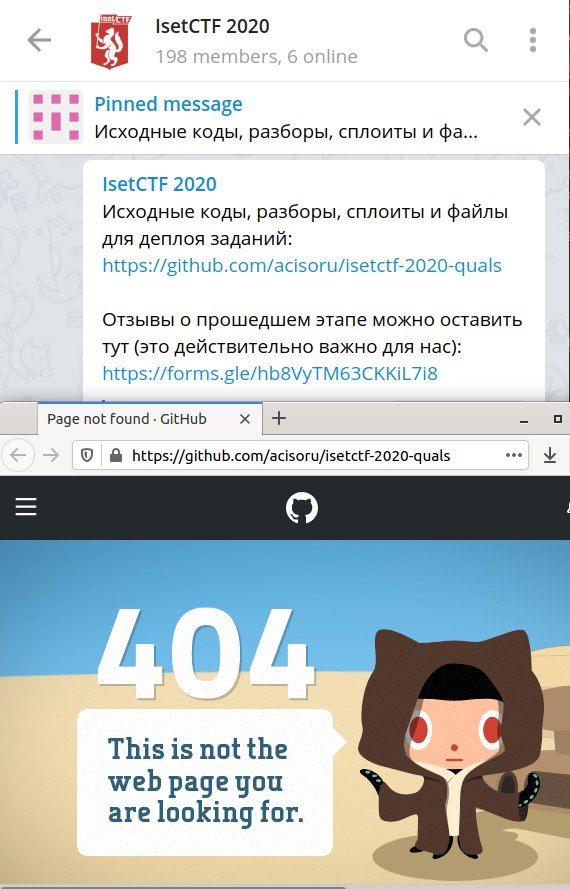
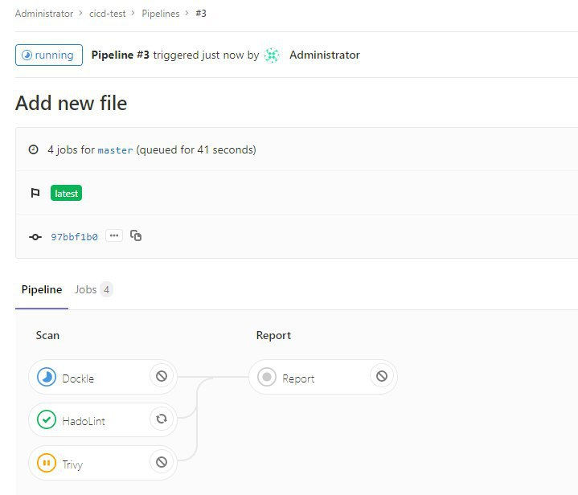
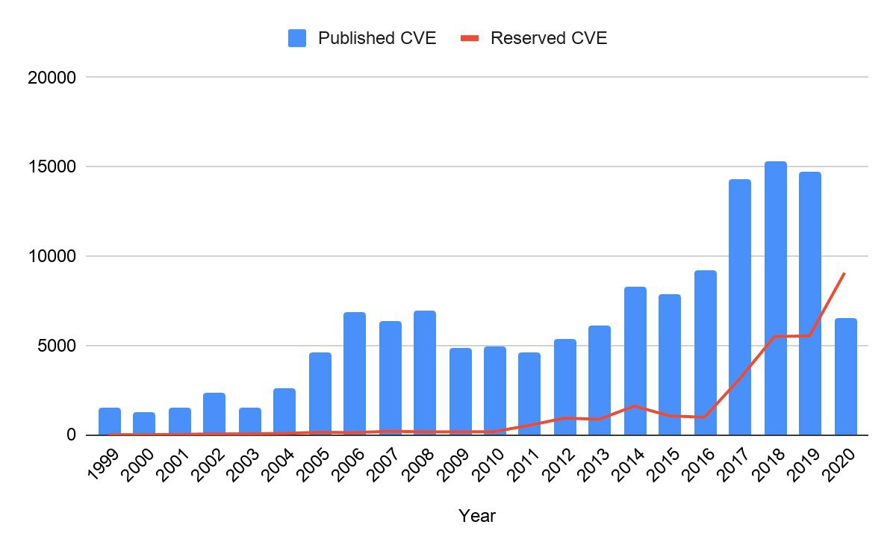
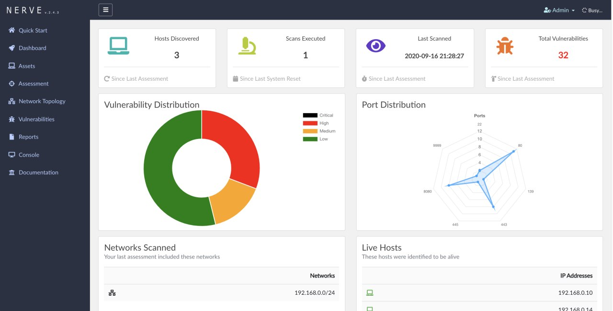

# sysadm_in_channel
`2020-10-31 08:29:23`

<blockquote>
CVE-2020-15180 – Affects Percona XtraDB Cluster (RCE)

https://www.percona.com/blog/2020/10/30/cve-2020-15180-affects-percona-xtradb-cluster/

За линку спасибо ✌️
</blockquote>

<table><tr><td><b>→</b><a href="https://www.percona.com/blog/2020/10/30/cve-2020-15180-affects-percona-xtradb-cluster/">
https://www.percona.com/blog/2020/10/30/cve-2020-15180-affects-percona-xtradb-cluster/
</a>
<blockquote>
CVE-2020-15180: Galera replication technology, a key component of Percona XtraDB Cluster, suffered from a remote code execution vulnerability.
</blockquote>
</td></tr></table>

---

# R0_Crew
`2020-10-30 22:11:14`

<blockquote>
Dobby a lightweight, multi-platform, multi-architecture hook framework. https://github.com/jmpews/Dobby &#35;reverse &#35;dukeBarman
</blockquote>

<table><tr><td><b>→</b><a href="https://github.com/jmpews/Dobby">
https://github.com/jmpews/Dobby
</a>
<blockquote>
a lightweight, multi-platform, multi-architecture hook framework. - jmpews/Dobby
</blockquote>
</td></tr></table>

---

# ctfchat
`2020-10-30 21:22:41`

<blockquote>
Многие организаторы CTF публикуют репозитории с заданиями и райтапами после окончания.

В ряду таких организаторов случилось пополнение — правда, почему-то в этой организации ноль репозиториев. Неужели они ещё не успели провести ни одного цтфа?

Один скриншот вместо тысячи действительно важных отзывов.
</blockquote>

---

# defcon_news
`2020-10-30 19:53:54`

<blockquote>
Критическая уязвимость в Oracle WebLogic уже находится под атаками
https://xakep.ru/2020/10/30/weblogic-attacks/

via «Хакер»
</blockquote>

<table><tr><td><b>→</b><a href="https://xakep.ru/2020/10/30/weblogic-attacks/">
https://xakep.ru/2020/10/30/weblogic-attacks/
</a>
<blockquote>
Разработчики Oracle предупреждают: исправленная недавно критическая уязвимость CVE-2020-14882, набравшая 9,8 баллов из 10 по шкале CVSS, уже находится под атаками.
</blockquote>
</td></tr></table>

---

# defcon_news
`2020-10-30 19:53:44`

<blockquote>
Chrome heap buffer overflow in freetype2 CVE-2020-15999
http://seclists.org/fulldisclosure/2020/Oct/33

via Full Disclosure
</blockquote>

<table><tr><td><b>→</b><a href="https://seclists.org/fulldisclosure/2020/Oct/33">
https://seclists.org/fulldisclosure/2020/Oct/33
</a>
</td></tr></table>

---

# cyberoffru
`2020-10-30 16:59:06`

<blockquote>
MaxPatrol SIEM
Всякие полезности
https://github.com/feedb/MPSiem_addons
https://t.me/MPSIEMChat
</blockquote>

<table><tr><td><b>→</b><a href="https://github.com/feedb/MPSiem_addons">
https://github.com/feedb/MPSiem_addons
</a>
<blockquote>
реп полезностей для PT MaxPatrol SIEM. Contribute to feedb/MPSiem_addons development by creating an account on GitHub.
</blockquote>
</td></tr></table>

---

# defcon_news
`2020-10-30 16:53:16`

<blockquote>
[webapps] Simple College Website 1.0 - 'username' SQL Injection / Remote Code Execution
https://www.exploit-db.com/exploits/48977

via Exploit Database
</blockquote>

<table><tr><td><b>→</b><a href="https://www.exploit-db.com/exploits/48977">
https://www.exploit-db.com/exploits/48977
</a>
<blockquote>
Simple College Website 1.0 - 'username' SQL Injection / Remote Code Execution.. webapps exploit for PHP platform
</blockquote>
</td></tr></table>

---

# defcon_news
`2020-10-30 14:53:12`

<blockquote>
[webapps] Online Job Portal 1.0 - 'userid' SQL Injection
https://www.exploit-db.com/exploits/48976

via Exploit Database
</blockquote>

<table><tr><td><b>→</b><a href="https://www.exploit-db.com/exploits/48976">
https://www.exploit-db.com/exploits/48976
</a>
<blockquote>
Online Job Portal 1.0 - 'userid' SQL Injection.. webapps exploit for PHP platform
</blockquote>
</td></tr></table>

---

# defcon_news
`2020-10-30 14:53:11`

<blockquote>
[webapps] Citadel WebCit &lt; 926 - Session Hijacking Exploit
https://www.exploit-db.com/exploits/48975

via Exploit Database
</blockquote>

<table><tr><td><b>→</b><a href="https://www.exploit-db.com/exploits/48975">
https://www.exploit-db.com/exploits/48975
</a>
<blockquote>
Citadel WebCit &lt; 926 - Session Hijacking Exploit.. webapps exploit for Multiple platform
</blockquote>
</td></tr></table>

---

# defcon_news
`2020-10-30 13:53:32`

<blockquote>
[webapps] DedeCMS v.5.8 - &quot;keyword&quot; Cross-Site Scripting
https://www.exploit-db.com/exploits/48974

via Exploit Database
</blockquote>

<table><tr><td><b>→</b><a href="https://www.exploit-db.com/exploits/48974">
https://www.exploit-db.com/exploits/48974
</a>
<blockquote>
DedeCMS v.5.8 - &quot;keyword&quot; Cross-Site Scripting. CVE-2020-27533 . webapps exploit for PHP platform
</blockquote>
</td></tr></table>

---

# defcon_news
`2020-10-30 13:53:28`

<blockquote>
[webapps] CSE Bookstore 1.0 - 'quantity' Persistent Cross-site Scripting
https://www.exploit-db.com/exploits/48973

via Exploit Database
</blockquote>

<table><tr><td><b>→</b><a href="https://www.exploit-db.com/exploits/48973">
https://www.exploit-db.com/exploits/48973
</a>
<blockquote>
CSE Bookstore 1.0 - 'quantity' Persistent Cross-site Scripting.. webapps exploit for PHP platform
</blockquote>
</td></tr></table>

---

# sysadm_in_channel
`2020-10-30 12:56:47`

<blockquote>
В продолжение эпопеи с youtube-dl (пост: https://t.me/sysadm_in_channel/2317)

Вынесено судебное решение, письмо выслали даже хостеру, где находится сайт youtube-dl

https://www.opennet.ru/opennews/art.shtml?num&#61;53990
</blockquote>

<table><tr><td><b>→</b><a href="https://t.me/sysadm_in_channel/2317">
https://t.me/sysadm_in_channel/2317
</a>
<blockquote>
Youtube-dl убрали из GitHub на основании заявления правообладателей

Кто не знает, это замечательный консольный инструмент при помощи которого можно загружать видео / аудио из youtube и других ресурсов:

https://github.com/github/dmca/blob/master/2020/10/2020-10-23-RIAA.md

Что особенно интересно, то что при помощи данного инструмента можно загружать целые листы из youtube:

https://sys-adm.in/systadm/software/608-zakachka-listov-s-youtube-chto-mozhet-byt-proshche.html
</blockquote>
</td></tr></table>

---

# defcon_news
`2020-10-29 23:53:42`

<blockquote>
WebLogic RCE - CVE-2020-14882 - Single GET Request
https://www.reddit.com/r/netsec/comments/jk2o26/weblogic_rce_cve202014882_single_get_request/

via /r/netsec - Information Security News &amp; Discussion
</blockquote>

<table><tr><td><b>→</b><a href="https://www.reddit.com/r/netsec/comments/jk2o26/weblogic_rce_cve202014882_single_get_request/">
https://www.reddit.com/r/netsec/comments/jk2o26/weblogic_rce_cve202014882_single_get_request/
</a>
<blockquote>
Posted in r/netsec by u/Arstas • 34 points and 6 comments
</blockquote>
</td></tr></table>

---

# defcon_news
`2020-10-29 23:53:39`

<blockquote>
Microsoft Warns of Continued Exploitation of CVE-2020-1472
https://us-cert.cisa.gov/ncas/current-activity/2020/10/29/microsoft-warns-continued-exploitation-cve-2020-1472

via CISA Current Activity
</blockquote>

<table><tr><td><b>→</b><a href="https://us-cert.cisa.gov/ncas/current-activity/2020/10/29/microsoft-warns-continued-exploitation-cve-2020-1472">
https://us-cert.cisa.gov/ncas/current-activity/2020/10/29/microsoft-warns-continued-exploitation-cve-2020-1472
</a>
<blockquote>
Microsoft has released a blog post on cyber threat actors exploiting CVE-2020-1472, an elevation of privilege vulnerability in Microsoft’s Netlogon. A remote attacker can exploit this vulnerability to breach unpatched Active Directory domain controllers and obtain domain administrator access. The Cybersecurity and Infrastructure Security Agency (CISA) has observed nation state activity exploiting this vulnerability.
</blockquote>
</td></tr></table>

---

# cibsecurity
`2020-10-29 18:14:25`

* https://threatpost.com/oracle-weblogic-server-rce-flaw-attack/160723/

<blockquote>
❌ Oracle WebLogic Server RCE Flaw Under Active Attack ❌

The flaw in the console component of the WebLogic Server, CVE-2020-14882, is under active attack, researchers warn.

📖 Read

via &quot;Threat Post&quot;.
</blockquote>

<table><tr><td><b>→</b><a href="https://threatpost.com/oracle-weblogic-server-rce-flaw-attack/160723/">
https://threatpost.com/oracle-weblogic-server-rce-flaw-attack/160723/
</a>
<blockquote>
The flaw in the console component of the WebLogic Server, CVE-2020-14882, is under active attack, researchers warn.
</blockquote>
</td></tr></table>

---

# sysadm_in_channel
`2020-10-29 16:16:21`

<blockquote>
CVE-2020-14882 RCE Oracle Weblogic

Actively Exploited Against Honeypots

https://testbnull.medium.com/weblogic-rce-by-only-one-get-request-cve-2020-14882-analysis-6e4b09981dbf

https://isc.sans.edu/diary/26734
</blockquote>

<table><tr><td><b>→</b><a href="https://testbnull.medium.com/weblogic-rce-by-only-one-get-request-cve-2020-14882-analysis-6e4b09981dbf">
https://testbnull.medium.com/weblogic-rce-by-only-one-get-request-cve-2020-14882-analysis-6e4b09981dbf
</a>
<blockquote>
TL;DR
</blockquote>
</td></tr></table>

---

# defcon_news
`2020-10-29 12:53:31`

<blockquote>
German armed forces launch security vulnerability disclosure program
http://seclists.org/fulldisclosure/2020/Oct/32

via Full Disclosure
</blockquote>

<table><tr><td><b>→</b><a href="https://seclists.org/fulldisclosure/2020/Oct/32">
https://seclists.org/fulldisclosure/2020/Oct/32
</a>
</td></tr></table>

---

# defcon_news
`2020-10-29 11:53:22`

<blockquote>
[webapps] Genexis Platinum-4410 P4410-V2-1.28 - Cross Site Request Forgery to Reboot
https://www.exploit-db.com/exploits/48972

via Exploit Database
</blockquote>

<table><tr><td><b>→</b><a href="https://www.exploit-db.com/exploits/48972">
https://www.exploit-db.com/exploits/48972
</a>
<blockquote>
Genexis Platinum-4410 P4410-V2-1.28 - Cross Site Request Forgery to Reboot.. webapps exploit for Hardware platform
</blockquote>
</td></tr></table>

---

# defcon_news
`2020-10-29 11:53:21`

<blockquote>
[webapps] WebLogic Server 10.3.6.0.0 / 12.1.3.0.0 / 12.2.1.3.0 / 12.2.1.4.0 / 14.1.1.0.0 - Unauthenticated RCE via GET request
https://www.exploit-db.com/exploits/48971

via Exploit Database
</blockquote>

<table><tr><td><b>→</b><a href="https://www.exploit-db.com/exploits/48971">
https://www.exploit-db.com/exploits/48971
</a>
<blockquote>
WebLogic Server 10.3.6.0.0 / 12.1.3.0.0 / 12.2.1.3.0 / 12.2.1.4.0 / 14.1.1.0.0 - Unauthenticated RCE via GET request.. webapps exploit for Java platform
</blockquote>
</td></tr></table>

---

# defcon_news
`2020-10-29 11:53:20`

<blockquote>
[webapps] Mailman 1.x &gt; 2.1.23 - Cross Site Scripting (XSS)
https://www.exploit-db.com/exploits/48970

via Exploit Database
</blockquote>

<table><tr><td><b>→</b><a href="https://www.exploit-db.com/exploits/48970">
https://www.exploit-db.com/exploits/48970
</a>
<blockquote>
Mailman 1.x &gt; 2.1.23 - Cross Site Scripting (XSS).. webapps exploit for CGI platform
</blockquote>
</td></tr></table>

---

# defcon_news
`2020-10-29 11:53:18`

<blockquote>
[webapps] Online Examination System 1.0 - 'name' Stored Cross Site Scripting
https://www.exploit-db.com/exploits/48969

via Exploit Database
</blockquote>

<table><tr><td><b>→</b><a href="https://www.exploit-db.com/exploits/48969">
https://www.exploit-db.com/exploits/48969
</a>
<blockquote>
Online Examination System 1.0 - 'name' Stored Cross Site Scripting.. webapps exploit for PHP platform
</blockquote>
</td></tr></table>

---

# isast
`2020-10-29 11:18:33`

* https://github.com/hadolint/hadolint
* https://www.conftest.dev/
* https://t.me/sec_devops/333
* https://cloudberry.engineering/article/dockerfile-security-best-practices/

<blockquote>
Static analysis by OPA - Dockerfiles

Уже ни для кого не секрет, что неправильное формирование Dockerfile может являться серьезной проблемой в безопасности приложений. Как правило, для решения данной проблемы все используют Hadolint для статического сканирования Docker-файлов. 

В этом посте я предлагаю вам взглянуть на детектирование проблем с помощью Conftest - инструмента для выполнения статического анализа конфигурационных файлов (YAML, JSON, XML, Dockerfile, HCL и многое другое). Что самое интересное в нем, так это то, что правила для Conftest пишутся на языке Rego. Это позволяет стать на шаг ближе к унифицированному подходу контроля за средой с помощью Open Policy Agent, о котором я писал ранее, и не городить кучу инструментов. Вот статья, в которой описано применение Conftest для проверки Dockerfile с помощью кастомных рулов.

&#35;docker &#35;ops &#35;dev
</blockquote>

<table><tr><td><b>→</b><a href="https://github.com/hadolint/hadolint">
https://github.com/hadolint/hadolint
</a>
<blockquote>
Dockerfile linter, validate inline bash, written in Haskell - hadolint/hadolint
</blockquote>
</td></tr></table>

---

# sysadm_in_channel
`2020-10-29 10:11:43`

<blockquote>
KubeLinter - Инструмент для поиска мисконфигов Kubernetes

https://github.com/stackrox/kube-linter
</blockquote>

<table><tr><td><b>→</b><a href="https://github.com/stackrox/kube-linter">
https://github.com/stackrox/kube-linter
</a>
<blockquote>
KubeLinter is a static analysis tool that checks Kubernetes YAML files and Helm charts to ensure the applications represented in them adhere to best practices. - stackrox/kube-linter
</blockquote>
</td></tr></table>

---

# defcon_news
`2020-10-29 05:53:28`

<blockquote>
PATCH NOW: CVE-2020-14882 Weblogic Actively Exploited Against Honeypots, (Thu, Oct 29th)
https://isc.sans.edu/diary/rss/26734

via SANS Internet Storm Center, InfoCON: green
</blockquote>

<table><tr><td><b>→</b><a href="https://isc.sans.edu/diary/rss/26734">
https://isc.sans.edu/diary/rss/26734
</a>
<blockquote>
PATCH NOW: CVE-2020-14882 Weblogic Actively Exploited Against Honeypots, Author: Johannes Ullrich
</blockquote>
</td></tr></table>

---

# defcon_news
`2020-10-28 13:53:26`

<blockquote>
[local] IP Watcher v3.0.0.30 - 'PACService.exe' Unquoted Service Path
https://www.exploit-db.com/exploits/48968

via Exploit Database
</blockquote>

<table><tr><td><b>→</b><a href="https://www.exploit-db.com/exploits/48968">
https://www.exploit-db.com/exploits/48968
</a>
<blockquote>
IP Watcher v3.0.0.30 - 'PACService.exe' Unquoted Service Path.. local exploit for Windows platform
</blockquote>
</td></tr></table>

---

# defcon_news
`2020-10-28 13:53:25`

<blockquote>
[local] Prey 1.9.6 - &quot;CronService&quot; Unquoted Service Path
https://www.exploit-db.com/exploits/48967

via Exploit Database
</blockquote>

<table><tr><td><b>→</b><a href="https://www.exploit-db.com/exploits/48967?utm_source=dlvr.it&utm_medium=twitter">
https://www.exploit-db.com/exploits/48967?utm_source=dlvr.it&utm_medium=twitter
</a>
<blockquote>
Prey 1.9.6 - &quot;CronService&quot; Unquoted Service Path.. local exploit for Windows platform
</blockquote>
</td></tr></table>

---

# defcon_news
`2020-10-28 13:53:24`

<blockquote>
[local] Program Access Controller v1.2.0.0 - 'PACService.exe' Unquoted Service Path
https://www.exploit-db.com/exploits/48966

via Exploit Database
</blockquote>

<table><tr><td><b>→</b><a href="https://www.exploit-db.com/exploits/48966">
https://www.exploit-db.com/exploits/48966
</a>
<blockquote>
Program Access Controller v1.2.0.0 - 'PACService.exe' Unquoted Service Path.. local exploit for Windows platform
</blockquote>
</td></tr></table>

---

# defcon_news
`2020-10-28 13:53:23`

<blockquote>
[local] Exploit - EPSON 1.124 - 'seksmdb.exe' Unquoted Service Path
https://www.exploit-db.com/exploits/48965

via Exploit Database
</blockquote>

<table><tr><td><b>→</b><a href="https://www.exploit-db.com/exploits/48965?utm_source=dlvr.it&utm_medium=twitter">
https://www.exploit-db.com/exploits/48965?utm_source=dlvr.it&utm_medium=twitter
</a>
<blockquote>
Exploit - EPSON 1.124 - 'seksmdb.exe' Unquoted Service Path.. local exploit for Windows platform
</blockquote>
</td></tr></table>

---

# defcon_news
`2020-10-28 12:53:50`

<blockquote>
[webapps] Oracle Business Intelligence Enterprise Edition 5.5.0.0.0 / 12.2.1.3.0 / 12.2.1.4.0 - 'getPreviewImage' Directory Traversal/Local File Inclusion
https://www.exploit-db.com/exploits/48964

via Exploit Database
</blockquote>

<table><tr><td><b>→</b><a href="https://www.exploit-db.com/exploits/48964">
https://www.exploit-db.com/exploits/48964
</a>
<blockquote>
Oracle Business Intelligence Enterprise Edition 5.5.0.0.0 / 12.2.1.3.0 / 12.2.1.4.0 - 'getPreviewImage' Directory Traversal/Local File Inclusion. CVE-2020-14864 . webapps exploit for Linux platform
</blockquote>
</td></tr></table>

---

# defcon_news
`2020-10-28 12:53:46`

<blockquote>
[local] Blueman &lt; 2.1.4 - Local Privilege Escalation
https://www.exploit-db.com/exploits/48963

via Exploit Database
</blockquote>

<table><tr><td><b>→</b><a href="https://www.exploit-db.com/exploits/48963">
https://www.exploit-db.com/exploits/48963
</a>
<blockquote>
Blueman &lt; 2.1.4 - Local Privilege Escalation. CVE-2020-15238 . local exploit for Linux platform
</blockquote>
</td></tr></table>

---

# defcon_news
`2020-10-28 12:53:45`

<blockquote>
[local] aptdaemon &lt; 1.1.1 - File Existence Disclosure
https://www.exploit-db.com/exploits/48962

via Exploit Database
</blockquote>

<table><tr><td><b>→</b><a href="https://www.exploit-db.com/exploits/48962?utm_source=dlvr.it&utm_medium=twitter">
https://www.exploit-db.com/exploits/48962?utm_source=dlvr.it&utm_medium=twitter
</a>
<blockquote>
aptdaemon &lt; 1.1.1 - File Existence Disclosure.. local exploit for Linux platform
</blockquote>
</td></tr></table>

---

# defcon_news
`2020-10-28 12:53:44`

<blockquote>
[local] PackageKit &lt; 1.1.13 - File Existence Disclosure
https://www.exploit-db.com/exploits/48961

via Exploit Database
</blockquote>

<table><tr><td><b>→</b><a href="https://www.exploit-db.com/exploits/48961?utm_source=dlvr.it&utm_medium=twitter">
https://www.exploit-db.com/exploits/48961?utm_source=dlvr.it&utm_medium=twitter
</a>
<blockquote>
PackageKit &lt; 1.1.13 - File Existence Disclosure.. local exploit for Linux platform
</blockquote>
</td></tr></table>

---

# defcon_news
`2020-10-28 12:53:43`

<blockquote>
[webapps] CSE Bookstore 1.0 - Authentication Bypass
https://www.exploit-db.com/exploits/48960

via Exploit Database
</blockquote>

<table><tr><td><b>→</b><a href="https://www.exploit-db.com/exploits/48960?utm_source=dlvr.it&utm_medium=twitter">
https://www.exploit-db.com/exploits/48960?utm_source=dlvr.it&utm_medium=twitter
</a>
<blockquote>
CSE Bookstore 1.0 - Authentication Bypass.. webapps exploit for PHP platform
</blockquote>
</td></tr></table>

---

# defcon_news
`2020-10-28 12:53:42`

<blockquote>
[webapps] Nagios XI 5.7.3 - 'mibs.php' Remote Command Injection (Authenticated)
https://www.exploit-db.com/exploits/48959

via Exploit Database
</blockquote>

<table><tr><td><b>→</b><a href="https://www.exploit-db.com/exploits/48959">
https://www.exploit-db.com/exploits/48959
</a>
<blockquote>
Nagios XI 5.7.3 - 'mibs.php' Remote Command Injection (Authenticated). CVE-2020-5791 . webapps exploit for PHP platform
</blockquote>
</td></tr></table>

---

# sysadm_in_channel
`2020-10-28 04:29:41`

<blockquote>
CVE-2020-16939: Windows Group Policy DACL Overwrite Privilege Escalation https://www.thezdi.com/blog/2020/10/27/cve-2020-16939-windows-group-policy-dacl-overwrite-privilege-escalation
</blockquote>

<table><tr><td><b>→</b><a href="https://www.thezdi.com/blog/2020/10/27/cve-2020-16939-windows-group-policy-dacl-overwrite-privilege-escalation">
https://www.thezdi.com/blog/2020/10/27/cve-2020-16939-windows-group-policy-dacl-overwrite-privilege-escalation
</a>
<blockquote>
In October, Microsoft released a patch to correct a vulnerability in the Windows Group Policy client. The bug could allow an attacker to execute code with escalated privileges. This vulnerability was reported to the ZDI program by security researcher Nabeel Ahmed. He has graciously provided this det
</blockquote>
</td></tr></table>

---

# defcon_news
`2020-10-27 21:53:45`

<blockquote>
[CVE-2020-25204] God Kings &quot;com.innogames.core.frontend.notifications.receivers.LocalNotificationBroadcastReceiver&quot; Improper Authorization Allowing In-Game Notification Spoofing
http://seclists.org/fulldisclosure/2020/Oct/31

via Full Disclosure
</blockquote>

<table><tr><td><b>→</b><a href="https://seclists.org/fulldisclosure/2020/Oct/31">
https://seclists.org/fulldisclosure/2020/Oct/31
</a>
</td></tr></table>

---

# defcon_news
`2020-10-27 14:53:12`

<blockquote>
[remote] GoAhead Web Server 5.1.1 - Digest Authentication Capture Replay Nonce Reuse
https://www.exploit-db.com/exploits/48958

via Exploit Database
</blockquote>

<table><tr><td><b>→</b><a href="https://www.exploit-db.com/exploits/48958">
https://www.exploit-db.com/exploits/48958
</a>
<blockquote>
GoAhead Web Server 5.1.1 - Digest Authentication Capture Replay Nonce Reuse.. remote exploit for Hardware platform
</blockquote>
</td></tr></table>

---

# defcon_news
`2020-10-27 13:53:20`

<blockquote>
[webapps] Sphider Search Engine 1.3.6 - 'word_upper_bound' RCE (Authenticated)
https://www.exploit-db.com/exploits/48957

via Exploit Database
</blockquote>

<table><tr><td><b>→</b><a href="https://www.exploit-db.com/exploits/48957">
https://www.exploit-db.com/exploits/48957
</a>
<blockquote>
Sphider Search Engine 1.3.6 - 'word_upper_bound' RCE (Authenticated).. webapps exploit for PHP platform
</blockquote>
</td></tr></table>

---

# defcon_news
`2020-10-27 12:53:52`

<blockquote>
[webapps] Client Management System 1.0 - 'searchdata' SQL injection
https://www.exploit-db.com/exploits/48956

via Exploit Database
</blockquote>

<table><tr><td><b>→</b><a href="https://www.exploit-db.com/exploits/48956">
https://www.exploit-db.com/exploits/48956
</a>
<blockquote>
Client Management System 1.0 - 'searchdata' SQL injection.. webapps exploit for PHP platform
</blockquote>
</td></tr></table>

---

# defcon_news
`2020-10-27 12:53:51`

<blockquote>
[webapps] Sentrifugo 3.2 - File Upload Restriction Bypass (Authenticated)
https://www.exploit-db.com/exploits/48955

via Exploit Database
</blockquote>

<table><tr><td><b>→</b><a href="https://www.exploit-db.com/exploits/48955">
https://www.exploit-db.com/exploits/48955
</a>
<blockquote>
Sentrifugo 3.2 - File Upload Restriction Bypass (Authenticated). CVE-2019-15813 . webapps exploit for PHP platform
</blockquote>
</td></tr></table>

---

# defcon_news
`2020-10-27 12:53:45`

<blockquote>
[remote] Adtec Digital Multiple Products - Default Hardcoded Credentials Remote Root
https://www.exploit-db.com/exploits/48954

via Exploit Database
</blockquote>

<table><tr><td><b>→</b><a href="https://www.exploit-db.com/exploits/48954">
https://www.exploit-db.com/exploits/48954
</a>
<blockquote>
Adtec Digital Multiple Products - Default Hardcoded Credentials Remote Root.. remote exploit for Hardware platform
</blockquote>
</td></tr></table>

---

# defcon_news
`2020-10-27 12:53:43`

<blockquote>
[local] TDM Digital Signage PC Player 4.1 - Insecure File Permissions
https://www.exploit-db.com/exploits/48953

via Exploit Database
</blockquote>

<table><tr><td><b>→</b><a href="https://www.exploit-db.com/exploits/48953">
https://www.exploit-db.com/exploits/48953
</a>
<blockquote>
TDM Digital Signage PC Player 4.1 - Insecure File Permissions.. local exploit for Windows platform
</blockquote>
</td></tr></table>

---

# defcon_news
`2020-10-26 22:53:06`

<blockquote>
Remote Command Execution in Ruckus IoT Controller (CVE-2020-26878 &amp; CVE-2020-26879)
https://www.reddit.com/r/netsec/comments/jiifpr/remote_command_execution_in_ruckus_iot_controller/

via /r/netsec - Information Security News &amp; Discussion
</blockquote>

<table><tr><td><b>→</b><a href="https://www.reddit.com/r/netsec/comments/jiifpr/remote_command_execution_in_ruckus_iot_controller/">
https://www.reddit.com/r/netsec/comments/jiifpr/remote_command_execution_in_ruckus_iot_controller/
</a>
<blockquote>
Posted in r/netsec by u/NoUseForANick • 8 points and 0 comments
</blockquote>
</td></tr></table>

---

# defcon_news
`2020-10-26 20:53:44`

<blockquote>
[webapps] ReQuest Serious Play F3 Media Server 7.0.3 - Remote Code Execution (Unauthenticated)
https://www.exploit-db.com/exploits/48952

via Exploit Database
</blockquote>

<table><tr><td><b>→</b><a href="https://www.exploit-db.com/exploits/48952">
https://www.exploit-db.com/exploits/48952
</a>
<blockquote>
ReQuest Serious Play F3 Media Server 7.0.3 - Remote Code Execution (Unauthenticated).. webapps exploit for Hardware platform
</blockquote>
</td></tr></table>

---

# defcon_news
`2020-10-26 20:53:43`

<blockquote>
[webapps] ReQuest Serious Play F3 Media Server 7.0.3 - Remote Denial of Service
https://www.exploit-db.com/exploits/48951

via Exploit Database
</blockquote>

<table><tr><td><b>→</b><a href="https://www.exploit-db.com/exploits/48951">
https://www.exploit-db.com/exploits/48951
</a>
<blockquote>
ReQuest Serious Play F3 Media Server 7.0.3 - Remote Denial of Service.. webapps exploit for Hardware platform
</blockquote>
</td></tr></table>

---

# defcon_news
`2020-10-26 20:53:41`

<blockquote>
[webapps] ReQuest Serious Play F3 Media Server 7.0.3 - Debug Log Disclosure
https://www.exploit-db.com/exploits/48950

via Exploit Database
</blockquote>

<table><tr><td><b>→</b><a href="https://www.exploit-db.com/exploits/48950">
https://www.exploit-db.com/exploits/48950
</a>
<blockquote>
ReQuest Serious Play F3 Media Server 7.0.3 - Debug Log Disclosure.. webapps exploit for Hardware platform
</blockquote>
</td></tr></table>

---

# defcon_news
`2020-10-26 20:53:40`

<blockquote>
[webapps] ReQuest Serious Play Media Player 3.0 - Directory Traversal File Disclosure
https://www.exploit-db.com/exploits/48949

via Exploit Database
</blockquote>

<table><tr><td><b>→</b><a href="https://www.exploit-db.com/exploits/48949">
https://www.exploit-db.com/exploits/48949
</a>
<blockquote>
ReQuest Serious Play Media Player 3.0 - Directory Traversal File Disclosure.. webapps exploit for Hardware platform
</blockquote>
</td></tr></table>

---

# cibsecurity
`2020-10-26 20:42:08`

* https://threatpost.com/containerd-bug-cloud-account-credentials/160546/

<blockquote>
❌ Containerd Bug Exposes Cloud Account Credentials ❌

The flaw (CVE-2020-15157) is located in the container image-pulling process.

📖 Read

via &quot;Threat Post&quot;.
</blockquote>

<table><tr><td><b>→</b><a href="https://threatpost.com/containerd-bug-cloud-account-credentials/160546/">
https://threatpost.com/containerd-bug-cloud-account-credentials/160546/
</a>
<blockquote>
The flaw (CVE-2020-15157) is located in the container image-pulling process.
</blockquote>
</td></tr></table>

---

# defcon_news
`2020-10-26 11:53:23`

<blockquote>
[webapps] Genexis Platinum-4410 - 'SSID' Persistent XSS
https://www.exploit-db.com/exploits/48948

via Exploit Database
</blockquote>

<table><tr><td><b>→</b><a href="https://www.exploit-db.com/exploits/48948">
https://www.exploit-db.com/exploits/48948
</a>
<blockquote>
Genexis Platinum-4410 - 'SSID' Persistent XSS.. webapps exploit for Hardware platform
</blockquote>
</td></tr></table>

---

# defcon_news
`2020-10-26 11:53:22`

<blockquote>
[webapps] PDW File Browser 1.3 - 'new_filename' Cross-Site Scripting (XSS)
https://www.exploit-db.com/exploits/48947

via Exploit Database
</blockquote>

<table><tr><td><b>→</b><a href="https://www.exploit-db.com/exploits/48947">
https://www.exploit-db.com/exploits/48947
</a>
<blockquote>
PDW File Browser 1.3 - 'new_filename' Cross-Site Scripting (XSS).. webapps exploit for PHP platform
</blockquote>
</td></tr></table>

---

# defcon_news
`2020-10-26 11:53:21`

<blockquote>
[webapps] InoERP 0.7.2 - Remote Code Execution (Unauthenticated)
https://www.exploit-db.com/exploits/48946

via Exploit Database
</blockquote>

<table><tr><td><b>→</b><a href="https://www.exploit-db.com/exploits/48946">
https://www.exploit-db.com/exploits/48946
</a>
<blockquote>
InoERP 0.7.2 - Remote Code Execution (Unauthenticated).. webapps exploit for PHP platform
</blockquote>
</td></tr></table>

---

# defcon_news
`2020-10-26 11:53:20`

<blockquote>
[webapps] Online Health Care System 1.0 - Multiple Cross Site Scripting (Stored)
https://www.exploit-db.com/exploits/48945

via Exploit Database
</blockquote>

<table><tr><td><b>→</b><a href="https://www.exploit-db.com/exploits/48945">
https://www.exploit-db.com/exploits/48945
</a>
<blockquote>
Online Health Care System 1.0 - Multiple Cross Site Scripting (Stored).. webapps exploit for PHP platform
</blockquote>
</td></tr></table>

---

# defcon_news
`2020-10-26 11:53:18`

<blockquote>
[webapps] CMS Made Simple 2.1.6 - 'cntnt01detailtemplate' Server-Side Template Injection
https://www.exploit-db.com/exploits/48944

via Exploit Database
</blockquote>

<table><tr><td><b>→</b><a href="https://www.exploit-db.com/exploits/48944">
https://www.exploit-db.com/exploits/48944
</a>
<blockquote>
CMS Made Simple 2.1.6 - 'cntnt01detailtemplate' Server-Side Template Injection. CVE-2017-16783 . webapps exploit for PHP platform
</blockquote>
</td></tr></table>

---

# sysadm_in_channel
`2020-10-26 04:41:53`

<blockquote>
Youtube-dl убрали из GitHub на основании заявления правообладателей

Кто не знает, это замечательный консольный инструмент при помощи которого можно загружать видео / аудио из youtube и других ресурсов:

https://github.com/github/dmca/blob/master/2020/10/2020-10-23-RIAA.md

Что особенно интересно, то что при помощи данного инструмента можно загружать целые листы из youtube:

https://sys-adm.in/systadm/software/608-zakachka-listov-s-youtube-chto-mozhet-byt-proshche.html
</blockquote>

<table><tr><td><b>→</b><a href="https://github.com/github/dmca/blob/master/2020/10/2020-10-23-RIAA.md">
https://github.com/github/dmca/blob/master/2020/10/2020-10-23-RIAA.md
</a>
<blockquote>
Repository with text of DMCA takedown notices as received. GitHub does not endorse or adopt any assertion contained in the following notices. Users identified in the notices are presumed innocent u...
</blockquote>
</td></tr></table>

---

# sysadm_in_channel
`2020-10-26 04:31:51`

<blockquote>
GitHub - mitre/advmlthreatmatrix: Adversarial Threat Matrix
https://github.com/mitre/advmlthreatmatrix
</blockquote>

<table><tr><td><b>→</b><a href="https://github.com/mitre/advmlthreatmatrix">
https://github.com/mitre/advmlthreatmatrix
</a>
<blockquote>
Adversarial Threat Matrix. Contribute to mitre/advmlthreatmatrix development by creating an account on GitHub.
</blockquote>
</td></tr></table>

---

# reverseengineeringx
`2020-10-24 09:48:14`

<blockquote>
https://github.com/ercoppa/symbolic-execution-tutorial
</blockquote>

<table><tr><td><b>→</b><a href="https://github.com/ercoppa/symbolic-execution-tutorial">
https://github.com/ercoppa/symbolic-execution-tutorial
</a>
<blockquote>
Tutorial on Symbolic Execution. Hands-on session is based on the angr framework. - ercoppa/symbolic-execution-tutorial
</blockquote>
</td></tr></table>

---

# overlamer1
`2020-10-24 00:52:22`

* https://telegra.ph/Routersploit-Ishchem-uyazvimosti-SVOEGO-routera-08-02

<blockquote>
Routersploit: Ищем уязвимости СВОЕГО роутера
</blockquote>

<table><tr><td><b>→</b><a href="https://telegra.ph/Routersploit-Ishchem-uyazvimosti-SVOEGO-routera-08-02">
https://telegra.ph/Routersploit-Ishchem-uyazvimosti-SVOEGO-routera-08-02
</a>
<blockquote>
Всем привет! Вы наверное знаете про такую штуку как routersploit, с помощью которого можно узнать уязвимости своего, или роутера, пароль которого у вас есть. Если нет, то сейчас все расскажу источник статьи И так, сначала качаем git и питон: pkg update pkg upgrade pkg install git python Теперь сам репозиторий: git clone https://github.com/threat9/routersploit Открываем папку с репом, и установим все библиотеки, которые нужны для работы инструмента: cd routersploit Осталось запустить: python rsf.py Используем…
</blockquote>
</td></tr></table>

---

# defcon_news
`2020-10-23 21:53:18`

<blockquote>
CVE-2020-24990 Q-SYS &lt;&#61;8.2.1 TFTP Directory Traversal
http://seclists.org/fulldisclosure/2020/Oct/30

via Full Disclosure
</blockquote>

<table><tr><td><b>→</b><a href="https://seclists.org/fulldisclosure/2020/Oct/30">
https://seclists.org/fulldisclosure/2020/Oct/30
</a>
</td></tr></table>

---

# defcon_news
`2020-10-23 21:53:17`

<blockquote>
Unicorn Emulator 1.0.2 is out!
http://seclists.org/fulldisclosure/2020/Oct/29

via Full Disclosure
</blockquote>

<table><tr><td><b>→</b><a href="https://seclists.org/fulldisclosure/2020/Oct/29">
https://seclists.org/fulldisclosure/2020/Oct/29
</a>
</td></tr></table>

---

# defcon_news
`2020-10-23 19:53:16`

<blockquote>
[webapps] TextPattern CMS 4.8.3 - Remote Code Execution (Authenticated)
https://www.exploit-db.com/exploits/48943

via Exploit Database
</blockquote>

<table><tr><td><b>→</b><a href="https://www.exploit-db.com/exploits/48943">
https://www.exploit-db.com/exploits/48943
</a>
<blockquote>
TextPattern CMS 4.8.3 - Remote Code Execution (Authenticated).. webapps exploit for PHP platform
</blockquote>
</td></tr></table>

---

# defcon_news
`2020-10-23 19:53:12`

<blockquote>
[webapps] Bludit 3.9.2 - Auth Bruteforce Bypass
https://www.exploit-db.com/exploits/48942

via Exploit Database
</blockquote>

<table><tr><td><b>→</b><a href="https://www.exploit-db.com/exploits/48942">
https://www.exploit-db.com/exploits/48942
</a>
<blockquote>
Bludit 3.9.2 - Auth Bruteforce Bypass. CVE-2019-17240 . webapps exploit for PHP platform
</blockquote>
</td></tr></table>

---

# defcon_news
`2020-10-23 19:53:11`

<blockquote>
[webapps] Gym Management System 1.0 - Stored Cross Site Scripting
https://www.exploit-db.com/exploits/48941

via Exploit Database
</blockquote>

<table><tr><td><b>→</b><a href="https://www.exploit-db.com/exploits/48941">
https://www.exploit-db.com/exploits/48941
</a>
<blockquote>
Gym Management System 1.0 - Stored Cross Site Scripting.. webapps exploit for PHP platform
</blockquote>
</td></tr></table>

---

# defcon_news
`2020-10-23 19:53:10`

<blockquote>
[webapps] Gym Management System 1.0 - Authentication Bypass
https://www.exploit-db.com/exploits/48940

via Exploit Database
</blockquote>

<table><tr><td><b>→</b><a href="https://www.exploit-db.com/exploits/48940?utm_source=dlvr.it&utm_medium=twitter">
https://www.exploit-db.com/exploits/48940?utm_source=dlvr.it&utm_medium=twitter
</a>
<blockquote>
Gym Management System 1.0 - Authentication Bypass.. webapps exploit for PHP platform
</blockquote>
</td></tr></table>

---

# defcon_news
`2020-10-23 18:53:52`

<blockquote>
[webapps] School Faculty Scheduling System 1.0 - 'username' SQL Injection
https://www.exploit-db.com/exploits/48939

via Exploit Database
</blockquote>

<table><tr><td><b>→</b><a href="https://www.exploit-db.com/exploits/48939">
https://www.exploit-db.com/exploits/48939
</a>
<blockquote>
School Faculty Scheduling System 1.0 - 'username' SQL Injection.. webapps exploit for PHP platform
</blockquote>
</td></tr></table>

---

# defcon_news
`2020-10-23 18:53:51`

<blockquote>
[webapps] School Faculty Scheduling System 1.0 - 'id' SQL Injection
https://www.exploit-db.com/exploits/48938

via Exploit Database
</blockquote>

<table><tr><td><b>→</b><a href="https://www.exploit-db.com/exploits/48938">
https://www.exploit-db.com/exploits/48938
</a>
<blockquote>
School Faculty Scheduling System 1.0 - 'id' SQL Injection.. webapps exploit for PHP platform
</blockquote>
</td></tr></table>

---

# defcon_news
`2020-10-23 18:53:50`

<blockquote>
[webapps] Point of Sales 1.0 - 'username' SQL Injection
https://www.exploit-db.com/exploits/48937

via Exploit Database
</blockquote>

<table><tr><td><b>→</b><a href="https://www.exploit-db.com/exploits/48937">
https://www.exploit-db.com/exploits/48937
</a>
<blockquote>
Point of Sales 1.0 - 'username' SQL Injection.. webapps exploit for PHP platform
</blockquote>
</td></tr></table>

---

# defcon_news
`2020-10-23 18:53:49`

<blockquote>
[webapps] Gym Management System 1.0 - 'id' SQL Injection
https://www.exploit-db.com/exploits/48936

via Exploit Database
</blockquote>

<table><tr><td><b>→</b><a href="https://www.exploit-db.com/exploits/48936">
https://www.exploit-db.com/exploits/48936
</a>
<blockquote>
Gym Management System 1.0 - 'id' SQL Injection.. webapps exploit for PHP platform
</blockquote>
</td></tr></table>

---

# defcon_news
`2020-10-23 18:53:48`

<blockquote>
[webapps] Lot Reservation Management System 1.0 - Cross-Site Scripting (Stored)
https://www.exploit-db.com/exploits/48935

via Exploit Database
</blockquote>

<table><tr><td><b>→</b><a href="https://www.exploit-db.com/exploits/48935">
https://www.exploit-db.com/exploits/48935
</a>
<blockquote>
Lot Reservation Management System 1.0 - Cross-Site Scripting (Stored).. webapps exploit for PHP platform
</blockquote>
</td></tr></table>

---

# defcon_news
`2020-10-23 18:53:47`

<blockquote>
[webapps] Lot Reservation Management System 1.0 - Authentication Bypass
https://www.exploit-db.com/exploits/48934

via Exploit Database
</blockquote>

<table><tr><td><b>→</b><a href="https://www.exploit-db.com/exploits/48934">
https://www.exploit-db.com/exploits/48934
</a>
<blockquote>
Lot Reservation Management System 1.0 - Authentication Bypass.. webapps exploit for PHP platform
</blockquote>
</td></tr></table>

---

# defcon_news
`2020-10-23 18:53:45`

<blockquote>
[webapps] Point of Sales 1.0 - 'id' SQL Injection
https://www.exploit-db.com/exploits/48933

via Exploit Database
</blockquote>

<table><tr><td><b>→</b><a href="https://www.exploit-db.com/exploits/48933">
https://www.exploit-db.com/exploits/48933
</a>
<blockquote>
Point of Sales 1.0 - 'id' SQL Injection.. webapps exploit for PHP platform
</blockquote>
</td></tr></table>

---

# defcon_news
`2020-10-23 18:53:44`

<blockquote>
[webapps] User Registration &amp; Login and User Management System 2.1 - SQL Injection
https://www.exploit-db.com/exploits/48932

via Exploit Database
</blockquote>

<table><tr><td><b>→</b><a href="https://www.exploit-db.com/exploits/48932?utm_source=dlvr.it&utm_medium=twitter">
https://www.exploit-db.com/exploits/48932?utm_source=dlvr.it&utm_medium=twitter
</a>
<blockquote>
User Registration &amp; Login and User Management System 2.1 - SQL Injection.. webapps exploit for PHP platform
</blockquote>
</td></tr></table>

---

# defcon_news
`2020-10-23 18:53:42`

<blockquote>
[webapps] Car Rental Management System 1.0 - Arbitrary File Upload
https://www.exploit-db.com/exploits/48931

via Exploit Database
</blockquote>

<table><tr><td><b>→</b><a href="https://www.exploit-db.com/exploits/48931">
https://www.exploit-db.com/exploits/48931
</a>
<blockquote>
Car Rental Management System 1.0 - Arbitrary File Upload.. webapps exploit for PHP platform
</blockquote>
</td></tr></table>

---

# defcon_news
`2020-10-23 18:53:40`

<blockquote>
[webapps] Stock Management System 1.0 - 'brandId and categoriesId' SQL Injection
https://www.exploit-db.com/exploits/48930

via Exploit Database
</blockquote>

<table><tr><td><b>→</b><a href="https://www.exploit-db.com/exploits/48930">
https://www.exploit-db.com/exploits/48930
</a>
<blockquote>
Stock Management System 1.0 - 'brandId and categoriesId' SQL Injection.. webapps exploit for PHP platform
</blockquote>
</td></tr></table>

---

# defcon_news
`2020-10-23 18:53:39`

<blockquote>
[webapps] Ajenti 2.1.36 - Remote Code Execution (Authenticated)
https://www.exploit-db.com/exploits/48929

via Exploit Database
</blockquote>

<table><tr><td><b>→</b><a href="https://www.exploit-db.com/exploits/48929">
https://www.exploit-db.com/exploits/48929
</a>
<blockquote>
Ajenti 2.1.36 - Remote Code Execution (Authenticated).. webapps exploit for Python platform
</blockquote>
</td></tr></table>

---

# defcon_news
`2020-10-23 18:53:37`

<blockquote>
[webapps] Online Library Management System 1.0 - Arbitrary File Upload
https://www.exploit-db.com/exploits/48928

via Exploit Database
</blockquote>

<table><tr><td><b>→</b><a href="https://www.exploit-db.com/exploits/48928">
https://www.exploit-db.com/exploits/48928
</a>
<blockquote>
Online Library Management System 1.0 - Arbitrary File Upload.. webapps exploit for PHP platform
</blockquote>
</td></tr></table>

---

# defcon_news
`2020-10-23 17:53:13`

<blockquote>
SEC Consult SA-20201023-0 :: Multiple Vulnerabilities in PubliXone
http://seclists.org/fulldisclosure/2020/Oct/28

via Full Disclosure
</blockquote>

<table><tr><td><b>→</b><a href="https://seclists.org/fulldisclosure/2020/Oct/28">
https://seclists.org/fulldisclosure/2020/Oct/28
</a>
</td></tr></table>

---

# isast
`2020-10-23 14:36:29`

<blockquote>
Способы и примеры внедрения утилит для проверки безопасности Docker

Тут Павел (@shad0wrunner) выпустил статью на Хабре по способам и примерам внедрения проверки образов Docker. В число рассматриваемых инструментов входят Dockle, Trivy и Hadolint. Варианты внедрения: путём конфигурации CI/CD pipeline на примере GitLab (с описанием процесса поднятия тестового инстанса), с использованием shell-скрипта, с построением Docker-образа для сканирования.

https://habr.com/ru/company/swordfish_security/blog/524490/

&#35;docker &#35;dev
</blockquote>

---

# defcon_news
`2020-10-22 22:53:52`

<blockquote>
CVE-2020-17365 – Hotspot Shield VPN New Privilege Escalation Vulnerability
https://www.reddit.com/r/netsec/comments/jf9xdm/cve202017365_hotspot_shield_vpn_new_privilege/

via /r/netsec - Information Security News &amp; Discussion
</blockquote>

<table><tr><td><b>→</b><a href="https://www.reddit.com/r/netsec/comments/jf9xdm/cve202017365_hotspot_shield_vpn_new_privilege/">
https://www.reddit.com/r/netsec/comments/jf9xdm/cve202017365_hotspot_shield_vpn_new_privilege/
</a>
<blockquote>
Posted in r/netsec by u/chenerlich • 1 point and 0 comments
</blockquote>
</td></tr></table>

---

# defcon_news
`2020-10-22 20:53:25`

<blockquote>
Проблема Zerologon представляет угрозу для некоторых NAS производства Qnap
https://xakep.ru/2020/10/22/zerologon-qnap/

via «Хакер»
</blockquote>

<table><tr><td><b>→</b><a href="https://xakep.ru/2020/10/22/zerologon-qnap/">
https://xakep.ru/2020/10/22/zerologon-qnap/
</a>
<blockquote>
Представители Qnap предупредили, что уязвимость Zerologon (CVE-2020-1472), исправленная Microsoft в рамках августовского «вторника обновлений», может представлять опасность для некоторых моделей устройств компании.
</blockquote>
</td></tr></table>

---

# R0_Crew
`2020-10-22 20:05:13`

<blockquote>
Resurrected IDA plugin for UEFI RE - ida-efitools &quot;v2.0&quot; is now LIVE https://github.com/p-state/ida-efitools2 &#35;reverse &#35;uefi &#35;ida &#35;dukeBarman
</blockquote>

<table><tr><td><b>→</b><a href="https://github.com/p-state/ida-efitools2">
https://github.com/p-state/ida-efitools2
</a>
<blockquote>
IDA plugin for extending UEFI reverse engineering capabilities - p-state/ida-efitools2
</blockquote>
</td></tr></table>

---

# overlamer1
`2020-10-22 14:51:59`

* https://telegra.ph/Ishchem-adminki-pri-pomoshchi-adfind-07-07-2

<blockquote>
Ищем админки при помощи adfind
</blockquote>

<table><tr><td><b>→</b><a href="https://telegra.ph/Ishchem-adminki-pri-pomoshchi-adfind-07-07-2">
https://telegra.ph/Ishchem-adminki-pri-pomoshchi-adfind-07-07-2
</a>
<blockquote>
Сегодня я расскажу вам про простой и одновременно очень полезный инструмент. Adfind - это поисковик панелей администрирования (админок, панелей управления). Источник статьи Установка в Kali Linux git clone https://github.com/sahakkhotsanyan/adfind.git cd adfind* sudo cp adfind /bin/adfind sudo chmod +x /bin/adfind adfind -h Кстати, программа предустановлена в BlackArch. Доступные команды: adfind url php          Найти административные панели на PHP adfind url asp          Найти административные панели на…
</blockquote>
</td></tr></table>

---

# defcon_news
`2020-10-22 12:53:11`

<blockquote>
VL 2020-10-22 - German Bundeswehr starts own Responsible Disclosure Program (VDPBw)
http://seclists.org/fulldisclosure/2020/Oct/27

via Full Disclosure
</blockquote>

<table><tr><td><b>→</b><a href="https://seclists.org/fulldisclosure/2020/Oct/27">
https://seclists.org/fulldisclosure/2020/Oct/27
</a>
</td></tr></table>

---

# freedomf0x
`2020-10-22 11:48:27`

* https://www.exploit-db.com/searchsploit
* https://github.com/vulnersCom/getsploit

<blockquote>
https://telegra.ph/25-sposobov-kak-kitajskie-hakery-hotyat-poimet-servery-planety-Uspej-bystree-10-22

https://telegra.ph/25-sposobov-kak-kitajskie-hakery-hotyat-poimet-servery-planety-Uspej-ranshe-10-22 (продолжение)

25 способов как китайские хакеры хотят поиметь серверы планеты. Успей быстрее.
&#35;APT &#35;hackers &#35;exploit &#35;NSA
Пользуясь случаем, широкой русской душой благодарим Национальное агенство безопасности Объединенных Штатов Америки на хорошую работу. Благодарим компанию Offensive Security за утилиту SearchSploit. Благодарим компанию Vulners за утилиту GetSploit.
</blockquote>

<table><tr><td><b>→</b><a href="https://telegra.ph/25-sposobov-kak-kitajskie-hakery-hotyat-poimet-servery-planety-Uspej-bystree-10-22">
https://telegra.ph/25-sposobov-kak-kitajskie-hakery-hotyat-poimet-servery-planety-Uspej-bystree-10-22
</a>
<blockquote>
Пользуясь случаем, широкой русской душой благодарим Национальное агенство безопасности Объединенных Штатов Америки на хорошую работу. Благодарим компанию Offensive Security за утилиту SearchSploit. Благодарим компанию Vulners за утилиту GetSploit. CVE-2019-11510 In Pulse Secure Pulse Connect Secure (PCS) 8.2 before 8.2R12.1, 8.3 before 8.3R7.1, and 9.0 before 9.0R3.4, an unauthenticated remote attacker can send a specially crafted URI to perform an arbitrary file reading vulnerability . projectzeroindia/CVE…
</blockquote>
</td></tr></table>

---

# R0_Crew
`2020-10-22 09:45:40`

<blockquote>
Binary Ninja loader for 64 bits SEPROMs https://github.com/matteyeux/seprom-loader &#35;reverse &#35;ios &#35;binaryninja &#35;dukeBarman
</blockquote>

<table><tr><td><b>→</b><a href="https://github.com/matteyeux/seprom-loader">
https://github.com/matteyeux/seprom-loader
</a>
<blockquote>
Binary Ninja loader for 64 bits Apple SEPROMs. Contribute to matteyeux/seprom-loader development by creating an account on GitHub.
</blockquote>
</td></tr></table>

---

# chkpchat
`2020-10-22 09:00:28`

* https://telegra.ph/file/3975039eaeb3210db9ce4.jpg
* https://developer.checkpoint.com/
* https://sc1.checkpoint.com/documents/latest/api_reference/index.html
* https://t.me/chkpstar/184
* https://github.com/CheckPointSW-Community

<blockquote>
​​&#35;learn

У Check Point появился портал с примерами скриптов/программ/шаблонов для автоматизации и использования Check Point API, коих множество. 

Причем можно даже искать по кускам кода, что бы найти нужный пример !

Сами примеры консолидируются в двух местах:
- официальный репозиторий Check Point
- Checkmates репозиторий, где собираются примеры от партнеров и заказчиков 

Хорошее место, где можно подчерпнуть идеи, возможно, поделиться своими примерами и рабочими скриптами. 

https://developer.checkpoint.com/

Кстати, для партнеров доступна лаба в DemoPoint - R80.40 Automation,  где выложено множество готовых примеров для Terraform/Ansible и прочими bash скриптами.
</blockquote>

<table><tr><td><b>→</b><a href="https://telegra.ph/file/3975039eaeb3210db9ce4.jpg">
https://telegra.ph/file/3975039eaeb3210db9ce4.jpg
</a>
</td></tr></table>

---

# R0_Crew
`2020-10-22 01:37:55`

<blockquote>
ESILSolve - A python symbolic execution framework using r2 and ESIL https://github.com/aemmitt-ns/esilsolve (now support symbolically execution PCODE) &#35;reverse &#35;radare2 &#35;ghidra &#35;dukeBarman
</blockquote>

<table><tr><td><b>→</b><a href="https://github.com/aemmitt-ns/esilsolve">
https://github.com/aemmitt-ns/esilsolve
</a>
<blockquote>
A python symbolic execution framework using radare2's ESIL (Evaluable String Intermediate Language) - radareorg/esilsolve
</blockquote>
</td></tr></table>

---

# defcon_news
`2020-10-21 22:53:15`

<blockquote>
How to Install Mitre CALDERA and Configure Your SSL Certificate
https://www.blackhillsinfosec.com/how-to-install-mitre-caldera-and-configure-your-ssl-certificate/

via Black Hills Information Security
</blockquote>

<table><tr><td><b>→</b><a href="https://www.blackhillsinfosec.com/how-to-install-mitre-caldera-and-configure-your-ssl-certificate/">
https://www.blackhillsinfosec.com/how-to-install-mitre-caldera-and-configure-your-ssl-certificate/
</a>
<blockquote>
Carrie &amp; Darin Roberts // If you would like to install the Mitre CALDERA server on your own, the CALDERA GitHub page has installation instructions on their ReadMe here. Detailed steps are provided below for installing CALDERA on Ubuntu and configuring it to use your SSL certification. Clone the Repository git clone https://github.com/mitre/caldera.git --recursive --branch […]
</blockquote>
</td></tr></table>

---

# defcon_news
`2020-10-21 14:53:08`

<blockquote>
[RT-SA-2020-005] Arbitrary File Disclosure and Server-Side Request Forgery in BigBlueButton
http://seclists.org/fulldisclosure/2020/Oct/26

via Full Disclosure
</blockquote>

<table><tr><td><b>→</b><a href="https://seclists.org/fulldisclosure/2020/Oct/26">
https://seclists.org/fulldisclosure/2020/Oct/26
</a>
</td></tr></table>

---

# defcon_news
`2020-10-21 11:53:29`

<blockquote>
[webapps] Tiki Wiki CMS Groupware 21.1 - Authentication Bypass
https://www.exploit-db.com/exploits/48927

via Exploit Database
</blockquote>

<table><tr><td><b>→</b><a href="https://www.exploit-db.com/exploits/48927">
https://www.exploit-db.com/exploits/48927
</a>
<blockquote>
Tiki Wiki CMS Groupware 21.1 - Authentication Bypass.. webapps exploit for PHP platform
</blockquote>
</td></tr></table>

---

# defcon_news
`2020-10-21 11:53:21`

<blockquote>
[webapps] Stock Management System 1.0 - 'Brand Name' Persistent Cross-Site Scripting
https://www.exploit-db.com/exploits/48926

via Exploit Database
</blockquote>

<table><tr><td><b>→</b><a href="https://www.exploit-db.com/exploits/48926">
https://www.exploit-db.com/exploits/48926
</a>
<blockquote>
Stock Management System 1.0 - 'Brand Name' Persistent Cross-Site Scripting.. webapps exploit for PHP platform
</blockquote>
</td></tr></table>

---

# defcon_news
`2020-10-21 11:53:20`

<blockquote>
[webapps] Stock Management System 1.0 - 'Categories Name' Persistent Cross-Site Scripting
https://www.exploit-db.com/exploits/48925

via Exploit Database
</blockquote>

<table><tr><td><b>→</b><a href="https://www.exploit-db.com/exploits/48925">
https://www.exploit-db.com/exploits/48925
</a>
<blockquote>
Stock Management System 1.0 - 'Categories Name' Persistent Cross-Site Scripting.. webapps exploit for PHP platform
</blockquote>
</td></tr></table>

---

# defcon_news
`2020-10-21 11:53:18`

<blockquote>
[webapps] Stock Management System 1.0 - 'Product Name' Persistent Cross-Site Scripting
https://www.exploit-db.com/exploits/48924

via Exploit Database
</blockquote>

<table><tr><td><b>→</b><a href="https://www.exploit-db.com/exploits/48924">
https://www.exploit-db.com/exploits/48924
</a>
<blockquote>
Stock Management System 1.0 - 'Product Name' Persistent Cross-Site Scripting.. webapps exploit for PHP platform
</blockquote>
</td></tr></table>

---

# defcon_news
`2020-10-21 11:53:16`

<blockquote>
[webapps] GOautodial 4.0 - Authenticated Shell Upload
https://www.exploit-db.com/exploits/48923

via Exploit Database
</blockquote>

<table><tr><td><b>→</b><a href="https://www.exploit-db.com/exploits/48923">
https://www.exploit-db.com/exploits/48923
</a>
<blockquote>
GOautodial 4.0 - Authenticated Shell Upload.. webapps exploit for PHP platform
</blockquote>
</td></tr></table>

---

# defcon_news
`2020-10-21 10:53:57`

<blockquote>
[webapps] School Faculty Scheduling System 1.0 - Authentication Bypass POC
https://www.exploit-db.com/exploits/48922

via Exploit Database
</blockquote>

<table><tr><td><b>→</b><a href="https://www.exploit-db.com/exploits/48922">
https://www.exploit-db.com/exploits/48922
</a>
<blockquote>
School Faculty Scheduling System 1.0 - Authentication Bypass POC.. webapps exploit for PHP platform
</blockquote>
</td></tr></table>

---

# defcon_news
`2020-10-21 10:53:56`

<blockquote>
[webapps] School Faculty Scheduling System 1.0 - Stored Cross Site Scripting POC
https://www.exploit-db.com/exploits/48921

via Exploit Database
</blockquote>

<table><tr><td><b>→</b><a href="https://www.exploit-db.com/exploits/48921">
https://www.exploit-db.com/exploits/48921
</a>
<blockquote>
School Faculty Scheduling System 1.0 - Stored Cross Site Scripting POC.. webapps exploit for PHP platform
</blockquote>
</td></tr></table>

---

# defcon_news
`2020-10-21 10:53:55`

<blockquote>
[webapps] Hrsale 2.0.0 - Local File Inclusion
https://www.exploit-db.com/exploits/48920

via Exploit Database
</blockquote>

<table><tr><td><b>→</b><a href="https://www.exploit-db.com/exploits/48920">
https://www.exploit-db.com/exploits/48920
</a>
<blockquote>
Hrsale 2.0.0 - Local File Inclusion.. webapps exploit for PHP platform
</blockquote>
</td></tr></table>

---

# defcon_news
`2020-10-21 10:53:37`

<blockquote>
[CVE-2020-26887] FRITZ!Box DNS Rebinding Protection Bypass
https://www.reddit.com/r/netsec/comments/je0n2b/cve202026887_fritzbox_dns_rebinding_protection/

via /r/netsec - Information Security News &amp; Discussion
</blockquote>

<table><tr><td><b>→</b><a href="https://www.reddit.com/r/netsec/comments/je0n2b/cve202026887_fritzbox_dns_rebinding_protection/">
https://www.reddit.com/r/netsec/comments/je0n2b/cve202026887_fritzbox_dns_rebinding_protection/
</a>
<blockquote>
Posted in r/netsec by u/RedTeamPentesting • 3 points and 1 comment
</blockquote>
</td></tr></table>

---

# defcon_news
`2020-10-21 09:53:26`

<blockquote>
Compromising virtualization without attacking the hypervisor
https://theori.io/research/compromising-dom0-in-xen/

via Theori
</blockquote>

<table><tr><td><b>→</b><a href="https://theori.io/research/compromising-dom0-in-xen/">
https://theori.io/research/compromising-dom0-in-xen/
</a>
<blockquote>
This post explains a denial-of-service (and potentially out-of-bounds write) vulnerability (CVE-2020-27675, XSA-331) we discovered in the Xen paravirtualization driver in Linux, and how a virtualization platform may be compromised without direct attacks to the hypervisor.
</blockquote>
</td></tr></table>

---

# defcon_news
`2020-10-20 20:53:37`

<blockquote>
Re: Google's Android: remote install backdoor in Google Play Services
http://seclists.org/fulldisclosure/2020/Oct/25

via Full Disclosure
</blockquote>

<table><tr><td><b>→</b><a href="https://seclists.org/fulldisclosure/2020/Oct/25">
https://seclists.org/fulldisclosure/2020/Oct/25
</a>
</td></tr></table>

---

# defcon_news
`2020-10-20 20:53:35`

<blockquote>
Re: Google's Android: remote install backdoor in Google Play Services
http://seclists.org/fulldisclosure/2020/Oct/24

via Full Disclosure
</blockquote>

<table><tr><td><b>→</b><a href="https://seclists.org/fulldisclosure/2020/Oct/24">
https://seclists.org/fulldisclosure/2020/Oct/24
</a>
</td></tr></table>

---

# defcon_news
`2020-10-20 20:53:34`

<blockquote>
LISTSERV Maestro Remote Code Execution Vulnerability
http://seclists.org/fulldisclosure/2020/Oct/23

via Full Disclosure
</blockquote>

<table><tr><td><b>→</b><a href="https://seclists.org/fulldisclosure/2020/Oct/23">
https://seclists.org/fulldisclosure/2020/Oct/23
</a>
</td></tr></table>

---

# defcon_news
`2020-10-20 20:53:33`

<blockquote>
Re: Google's Android: remote install backdoor in Google Play Services
http://seclists.org/fulldisclosure/2020/Oct/22

via Full Disclosure
</blockquote>

<table><tr><td><b>→</b><a href="https://seclists.org/fulldisclosure/2020/Oct/22">
https://seclists.org/fulldisclosure/2020/Oct/22
</a>
</td></tr></table>

---

# defcon_news
`2020-10-20 19:53:28`

<blockquote>
[webapps] WordPress Plugin Colorbox Lightbox v1.1.1 - Persistent Cross-Site Scripting (Authenticated)
https://www.exploit-db.com/exploits/48919

via Exploit Database
</blockquote>

<table><tr><td><b>→</b><a href="https://www.exploit-db.com/exploits/48919">
https://www.exploit-db.com/exploits/48919
</a>
<blockquote>
WordPress Plugin Colorbox Lightbox v1.1.1 - Persistent Cross-Site Scripting (Authenticated).. webapps exploit for Multiple platform
</blockquote>
</td></tr></table>

---

# defcon_news
`2020-10-20 19:53:26`

<blockquote>
[webapps] WordPress Plugin Rest Google Maps &lt; 7.11.18 - SQL Injection
https://www.exploit-db.com/exploits/48918

via Exploit Database
</blockquote>

<table><tr><td><b>→</b><a href="https://www.exploit-db.com/exploits/48918">
https://www.exploit-db.com/exploits/48918
</a>
<blockquote>
WordPress Plugin Rest Google Maps &lt; 7.11.18 - SQL Injection.. webapps exploit for PHP platform
</blockquote>
</td></tr></table>

---

# defcon_news
`2020-10-20 19:53:24`

<blockquote>
[webapps] Apache Struts 2 - DefaultActionMapper Prefixes OGNL Code Execution
https://www.exploit-db.com/exploits/48917

via Exploit Database
</blockquote>

<table><tr><td><b>→</b><a href="https://www.exploit-db.com/exploits/48917">
https://www.exploit-db.com/exploits/48917
</a>
<blockquote>
Apache Struts 2 - DefaultActionMapper Prefixes OGNL Code Execution.. webapps exploit for Java platform
</blockquote>
</td></tr></table>

---

# defcon_news
`2020-10-20 19:53:22`

<blockquote>
[webapps] Mobile Shop System v1.0 - SQL Injection Authentication Bypass
https://www.exploit-db.com/exploits/48916

via Exploit Database
</blockquote>

<table><tr><td><b>→</b><a href="https://www.exploit-db.com/exploits/48916">
https://www.exploit-db.com/exploits/48916
</a>
<blockquote>
Mobile Shop System v1.0 - SQL Injection Authentication Bypass.. webapps exploit for PHP platform
</blockquote>
</td></tr></table>

---

# defcon_news
`2020-10-20 19:53:20`

<blockquote>
[webapps] RiteCMS 2.2.1 - Remote Code Execution (Authenticated)
https://www.exploit-db.com/exploits/48915

via Exploit Database
</blockquote>

<table><tr><td><b>→</b><a href="https://www.exploit-db.com/exploits/48915">
https://www.exploit-db.com/exploits/48915
</a>
<blockquote>
RiteCMS 2.2.1 - Remote Code Execution (Authenticated).. webapps exploit for PHP platform
</blockquote>
</td></tr></table>

---

# defcon_news
`2020-10-20 18:53:45`

<blockquote>
[webapps] User Registration &amp; Login and User Management System With admin panel 2.1 - Persistent XSS
https://www.exploit-db.com/exploits/48914

via Exploit Database
</blockquote>

<table><tr><td><b>→</b><a href="https://www.exploit-db.com/exploits/48914?utm_source=dlvr.it&utm_medium=twitter">
https://www.exploit-db.com/exploits/48914?utm_source=dlvr.it&utm_medium=twitter
</a>
<blockquote>
User Registration &amp; Login and User Management System With admin panel 2.1 - Persistent XSS.. webapps exploit for PHP platform
</blockquote>
</td></tr></table>

---

# defcon_news
`2020-10-20 18:53:33`

<blockquote>
[webapps] WordPress Plugin HS Brand Logo Slider 2.1 - 'logoupload' File Upload
https://www.exploit-db.com/exploits/48913

via Exploit Database
</blockquote>

<table><tr><td><b>→</b><a href="https://www.exploit-db.com/exploits/48913">
https://www.exploit-db.com/exploits/48913
</a>
<blockquote>
WordPress Plugin HS Brand Logo Slider 2.1 - 'logoupload' File Upload.. webapps exploit for PHP platform
</blockquote>
</td></tr></table>

---

# defcon_news
`2020-10-20 17:53:24`

<blockquote>
[webapps] Ultimate Project Manager CRM PRO Version 2.0.5 - SQLi (Authenticated)
https://www.exploit-db.com/exploits/48912

via Exploit Database
</blockquote>

<table><tr><td><b>→</b><a href="https://www.exploit-db.com/exploits/48912">
https://www.exploit-db.com/exploits/48912
</a>
<blockquote>
Ultimate Project Manager CRM PRO Version 2.0.5 - SQLi (Authenticated).. webapps exploit for PHP platform
</blockquote>
</td></tr></table>

---

# defcon_news
`2020-10-20 14:53:28`

<blockquote>
[webapps] Visitor Management System in PHP 1.0 - SQL Injection (Authenticated)
https://www.exploit-db.com/exploits/48911

via Exploit Database
</blockquote>

<table><tr><td><b>→</b><a href="https://www.exploit-db.com/exploits/48911">
https://www.exploit-db.com/exploits/48911
</a>
<blockquote>
Visitor Management System in PHP 1.0 - SQL Injection (Authenticated).. webapps exploit for PHP platform
</blockquote>
</td></tr></table>

---

# defcon_news
`2020-10-20 13:53:19`

<blockquote>
[webapps] Wordpress Plugin WP Courses &lt; 2.0.29 - Broken Access Controls leading to Courses Content Disclosure
https://www.exploit-db.com/exploits/48910

via Exploit Database
</blockquote>

<table><tr><td><b>→</b><a href="https://www.exploit-db.com/exploits/48910">
https://www.exploit-db.com/exploits/48910
</a>
<blockquote>
Wordpress Plugin WP Courses &lt; 2.0.29 - Broken Access Controls leading to Courses Content Disclosure.. webapps exploit for PHP platform
</blockquote>
</td></tr></table>

---

# defcon_news
`2020-10-20 13:53:16`

<blockquote>
[webapps] Loan Management System 1.0 - Multiple Cross Site Scripting (Stored)
https://www.exploit-db.com/exploits/48909

via Exploit Database
</blockquote>

<table><tr><td><b>→</b><a href="https://www.exploit-db.com/exploits/48909">
https://www.exploit-db.com/exploits/48909
</a>
<blockquote>
Loan Management System 1.0 - Multiple Cross Site Scripting (Stored).. webapps exploit for PHP platform
</blockquote>
</td></tr></table>

---

# defcon_news
`2020-10-20 13:53:15`

<blockquote>
[webapps] Comtrend AR-5387un router - Persistent XSS (Authenticated)
https://www.exploit-db.com/exploits/48908

via Exploit Database
</blockquote>

<table><tr><td><b>→</b><a href="https://www.exploit-db.com/exploits/48908">
https://www.exploit-db.com/exploits/48908
</a>
<blockquote>
Comtrend AR-5387un router - Persistent XSS (Authenticated).. webapps exploit for Hardware platform
</blockquote>
</td></tr></table>

---

# defcon_news
`2020-10-20 12:53:37`

<blockquote>
Meduza - A more or less universal SSL unpinning tool for iOS
https://hakin9.org/meduza-a-more-or-less-universal-ssl-unpinning-tool-for-ios/?utm_source&#61;rss&amp;utm_medium&#61;rss&amp;utm_campaign&#61;meduza-a-more-or-less-universal-ssl-unpinning-tool-for-ios

via Hakin9 – IT Security Magazine
</blockquote>

<table><tr><td><b>→</b><a href="https://hakin9.org/meduza-a-more-or-less-universal-ssl-unpinning-tool-for-ios/">
https://hakin9.org/meduza-a-more-or-less-universal-ssl-unpinning-tool-for-ios/
</a>
<blockquote>
What is MEDUZA?  It's a Frida-based tool, my replacement for SSLKillSwitch. I created it for in-house use but then decided to opensource it. TBH, I hate open source, but the world is full of compromises... :(  https://github.com/kov4l3nko/MEDUZA  How
</blockquote>
</td></tr></table>

---

# defcon_news
`2020-10-20 07:53:41`

<blockquote>
Уязвимость во FreeType, эксплуатируемая через TTF-шрифт
https://www.opennet.ru/opennews/art.shtml?num&#61;53922

via OpenNews.opennet.ru: Проблемы безопасности
</blockquote>

<table><tr><td><b>→</b><a href="https://www.opennet.ru/opennews/art.shtml?num=53922">
https://www.opennet.ru/opennews/art.shtml?num=53922
</a>
<blockquote>
Вернер Лемберг (Werner Lemberg), ключевой разработчик библиотеки рендеринга шрифтов FreeType, предупредил пользователей о выявлении уязвимости (CVE-2020-15999), которая позволяет выполнить свой код при обработке специально оформленных TTF-файлов с PNG sbit глифами. Имеются сведения, что уязвимость уже активно эксплуатируется злоумышленниками (0-day). Проблема вызвана переполнением буфера в функции Load_SBit_Png, возникающим при обработке глифов с битовыми картами большого размера (указание в заголовке ширины или высоты больше 65535). Пример шрифта (940 байт), который вызывает переполнение буфера.
</blockquote>
</td></tr></table>

---

# sysadm_in_channel
`2020-10-20 06:05:41`

<blockquote>
NTLMRawUnhide - Python3 скрипт предназначенный для парсинга cap* файлов и извлечения из них NTLMv2 хешей

Поддерживаемые форматы:
• *.pcap
• *.pcapng
• *.cap
• *.etl

https://github.com/mlgualtieri/NTLMRawUnHide
</blockquote>

<table><tr><td><b>→</b><a href="https://github.com/mlgualtieri/NTLMRawUnHide">
https://github.com/mlgualtieri/NTLMRawUnHide
</a>
<blockquote>
NTLMRawUnhide.py is a Python3 script designed to parse network packet capture files and extract NTLMv2 hashes in a crackable format. The following binary network packet capture formats are supporte...
</blockquote>
</td></tr></table>

---

# defcon_news
`2020-10-19 18:53:17`

<blockquote>
[webapps] Textpattern CMS 4.6.2 - Cross-site Request Forgery
https://www.exploit-db.com/exploits/48907

via Exploit Database
</blockquote>

<table><tr><td><b>→</b><a href="https://www.exploit-db.com/exploits/48907">
https://www.exploit-db.com/exploits/48907
</a>
<blockquote>
Textpattern CMS 4.6.2 - Cross-site Request Forgery.. webapps exploit for PHP platform
</blockquote>
</td></tr></table>

---

# defcon_news
`2020-10-19 18:53:14`

<blockquote>
[webapps] Typesetter CMS 5.1 - Arbitrary Code Execution (Authenticated)
https://www.exploit-db.com/exploits/48906

via Exploit Database
</blockquote>

<table><tr><td><b>→</b><a href="https://www.exploit-db.com/exploits/48906?utm_source=dlvr.it&utm_medium=twitter">
https://www.exploit-db.com/exploits/48906?utm_source=dlvr.it&utm_medium=twitter
</a>
<blockquote>
Typesetter CMS 5.1 - Arbitrary Code Execution (Authenticated). CVE-2020-25790 . webapps exploit for PHP platform
</blockquote>
</td></tr></table>

---

# defcon_news
`2020-10-19 18:53:11`

<blockquote>
[webapps] Hostel Management System 2.1 - Cross Site Scripting (Multiple Fields)
https://www.exploit-db.com/exploits/48905

via Exploit Database
</blockquote>

<table><tr><td><b>→</b><a href="https://www.exploit-db.com/exploits/48905">
https://www.exploit-db.com/exploits/48905
</a>
<blockquote>
Hostel Management System 2.1 - Cross Site Scripting (Multiple Fields). CVE-2020-25270 . webapps exploit for PHP platform
</blockquote>
</td></tr></table>

---

# defcon_news
`2020-10-19 17:53:52`

<blockquote>
[webapps] Jenkins 2.63 - Sandbox bypass in pipeline: Groovy plug-in
https://www.exploit-db.com/exploits/48904

via Exploit Database
</blockquote>

<table><tr><td><b>→</b><a href="https://www.exploit-db.com/exploits/48904">
https://www.exploit-db.com/exploits/48904
</a>
<blockquote>
Jenkins 2.63 - Sandbox bypass in pipeline: Groovy plug-in. CVE-2019-1003030 . webapps exploit for Java platform
</blockquote>
</td></tr></table>

---

# defcon_news
`2020-10-19 17:53:43`

<blockquote>
[webapps] HiSilicon Video Encoders - Unauthenticated RTSP buffer overflow (DoS)
https://www.exploit-db.com/exploits/48903

via Exploit Database
</blockquote>

<table><tr><td><b>→</b><a href="https://www.exploit-db.com/exploits/48903">
https://www.exploit-db.com/exploits/48903
</a>
<blockquote>
HiSilicon Video Encoders - Unauthenticated RTSP buffer overflow (DoS). CVE-2020-24214 . webapps exploit for Hardware platform
</blockquote>
</td></tr></table>

---

# defcon_news
`2020-10-19 17:53:41`

<blockquote>
[webapps] HiSilicon Video Encoders - Full admin access via backdoor password
https://www.exploit-db.com/exploits/48902

via Exploit Database
</blockquote>

<table><tr><td><b>→</b><a href="https://www.exploit-db.com/exploits/48902">
https://www.exploit-db.com/exploits/48902
</a>
<blockquote>
HiSilicon Video Encoders - Full admin access via backdoor password. CVE-2020-24215 . webapps exploit for Hardware platform
</blockquote>
</td></tr></table>

---

# defcon_news
`2020-10-19 17:53:39`

<blockquote>
[webapps] HiSilicon video encoders - RCE via unauthenticated upload of malicious firmware
https://www.exploit-db.com/exploits/48901

via Exploit Database
</blockquote>

<table><tr><td><b>→</b><a href="https://www.exploit-db.com/exploits/48901?utm_source=dlvr.it&utm_medium=twitter">
https://www.exploit-db.com/exploits/48901?utm_source=dlvr.it&utm_medium=twitter
</a>
<blockquote>
HiSilicon video encoders - RCE via unauthenticated upload of malicious firmware. CVE-2020-24217 . webapps exploit for Hardware platform
</blockquote>
</td></tr></table>

---

# defcon_news
`2020-10-19 17:53:35`

<blockquote>
[webapps] HiSilicon Video Encoders - RCE via unauthenticated command injection
https://www.exploit-db.com/exploits/48900

via Exploit Database
</blockquote>

<table><tr><td><b>→</b><a href="https://www.exploit-db.com/exploits/48900">
https://www.exploit-db.com/exploits/48900
</a>
<blockquote>
HiSilicon Video Encoders - RCE via unauthenticated command injection. CVE-2020-24217 . webapps exploit for Hardware platform
</blockquote>
</td></tr></table>

---

# defcon_news
`2020-10-19 17:53:33`

<blockquote>
[webapps] HiSilicon Video Encoders - Unauthenticated file disclosure via path traversal
https://www.exploit-db.com/exploits/48899

via Exploit Database
</blockquote>

<table><tr><td><b>→</b><a href="https://www.exploit-db.com/exploits/48899?utm_source=dlvr.it&utm_medium=twitter">
https://www.exploit-db.com/exploits/48899?utm_source=dlvr.it&utm_medium=twitter
</a>
<blockquote>
HiSilicon Video Encoders - Unauthenticated file disclosure via path traversal. CVE-2020-24219 . webapps exploit for Hardware platform
</blockquote>
</td></tr></table>

---

# defcon_news
`2020-10-19 16:53:39`

<blockquote>
[webapps] Online Job Portal 1.0 - Cross Site Scripting (Stored)
https://www.exploit-db.com/exploits/48898

via Exploit Database
</blockquote>

<table><tr><td><b>→</b><a href="https://www.exploit-db.com/exploits/48898">
https://www.exploit-db.com/exploits/48898
</a>
<blockquote>
Online Job Portal 1.0 - Cross Site Scripting (Stored).. webapps exploit for PHP platform
</blockquote>
</td></tr></table>

---

# defcon_news
`2020-10-19 16:53:38`

<blockquote>
[webapps] Online Discussion Forum Site 1.0 - XSS in Messaging System
https://www.exploit-db.com/exploits/48897

via Exploit Database
</blockquote>

<table><tr><td><b>→</b><a href="https://www.exploit-db.com/exploits/48897?utm_source=dlvr.it&utm_medium=twitter">
https://www.exploit-db.com/exploits/48897?utm_source=dlvr.it&utm_medium=twitter
</a>
<blockquote>
Online Discussion Forum Site 1.0 - XSS in Messaging System.. webapps exploit for PHP platform
</blockquote>
</td></tr></table>

---

# defcon_news
`2020-10-19 16:53:36`

<blockquote>
[webapps] Online Student's Management System 1.0 - Remote Code Execution (Authenticated)
https://www.exploit-db.com/exploits/48896

via Exploit Database
</blockquote>

<table><tr><td><b>→</b><a href="https://www.exploit-db.com/exploits/48896?utm_source=dlvr.it&utm_medium=twitter">
https://www.exploit-db.com/exploits/48896?utm_source=dlvr.it&utm_medium=twitter
</a>
<blockquote>
Online Student's Management System 1.0 - Remote Code Execution (Authenticated).. webapps exploit for PHP platform
</blockquote>
</td></tr></table>

---

# defcon_news
`2020-10-19 16:53:35`

<blockquote>
[webapps] Nagios XI 5.7.3 - 'SNMP Trap Interface' Authenticated SQL Injection
https://www.exploit-db.com/exploits/48895

via Exploit Database
</blockquote>

<table><tr><td><b>→</b><a href="https://www.exploit-db.com/exploits/48895">
https://www.exploit-db.com/exploits/48895
</a>
<blockquote>
Nagios XI 5.7.3 - 'SNMP Trap Interface' Authenticated SQL Injection.. webapps exploit for PHP platform
</blockquote>
</td></tr></table>

---

# defcon_news
`2020-10-19 16:53:34`

<blockquote>
[webapps] Nagios XI 5.7.3 - 'Manage Users' Authenticated SQL Injection
https://www.exploit-db.com/exploits/48894

via Exploit Database
</blockquote>

<table><tr><td><b>→</b><a href="https://www.exploit-db.com/exploits/48894">
https://www.exploit-db.com/exploits/48894
</a>
<blockquote>
Nagios XI 5.7.3 - 'Manage Users' Authenticated SQL Injection.. webapps exploit for PHP platform
</blockquote>
</td></tr></table>

---

# defcon_news
`2020-10-19 16:53:33`

<blockquote>
[webapps] Nagios XI 5.7.3 - 'Contact Templates' Persistent Cross-Site Scripting
https://www.exploit-db.com/exploits/48893

via Exploit Database
</blockquote>

<table><tr><td><b>→</b><a href="https://www.exploit-db.com/exploits/48893">
https://www.exploit-db.com/exploits/48893
</a>
<blockquote>
Nagios XI 5.7.3 - 'Contact Templates' Persistent Cross-Site Scripting.. webapps exploit for PHP platform
</blockquote>
</td></tr></table>

---

# defcon_news
`2020-10-19 16:53:32`

<blockquote>
[webapps] Tourism Management System 1.0 - Arbitrary File Upload
https://www.exploit-db.com/exploits/48892

via Exploit Database
</blockquote>

<table><tr><td><b>→</b><a href="https://www.exploit-db.com/exploits/48892">
https://www.exploit-db.com/exploits/48892
</a>
<blockquote>
Tourism Management System 1.0 - Arbitrary File Upload.. webapps exploit for PHP platform
</blockquote>
</td></tr></table>

---

# defcon_news
`2020-10-19 15:53:26`

<blockquote>
[RT-SA-2020-003] FRITZ!Box DNS Rebinding Protection Bypass
http://seclists.org/fulldisclosure/2020/Oct/21

via Full Disclosure
</blockquote>

<table><tr><td><b>→</b><a href="https://seclists.org/fulldisclosure/2020/Oct/21">
https://seclists.org/fulldisclosure/2020/Oct/21
</a>
</td></tr></table>

---

# defcon_news
`2020-10-19 12:53:23`

<blockquote>
HackBrowserData - Decrypt passwords/cookies/history/bookmarks from the browser
https://hakin9.org/hackbrowserdata-decrypt-passwords-cookies-history-bookmarks-from-the-browser/?utm_source&#61;rss&amp;utm_medium&#61;rss&amp;utm_campaign&#61;hackbrowserdata-decrypt-passwords-cookies-history-bookmarks-from-the-browser

via Hakin9 – IT Security Magazine
</blockquote>

<table><tr><td><b>→</b><a href="https://hakin9.org/hackbrowserdata-decrypt-passwords-cookies-history-bookmarks-from-the-browser/">
https://hakin9.org/hackbrowserdata-decrypt-passwords-cookies-history-bookmarks-from-the-browser/
</a>
<blockquote>
hack-browser-data is an open-source tool that could help you decrypt data ( passwords|bookmarks|cookies|history ) from the browser. It supports the most popular browsers on the market and runs on Windows, macOS and Linux.  https://github.com/moonD4rk/HackBrowserData  Supported Browser  Windows        Browser  Password  Cookie  Bookmark  History          Google Chrome  ✅  ✅  ✅  ✅      Firefox  ✅  ✅  ✅  ✅      Microsoft
</blockquote>
</td></tr></table>

---

# R0_Crew
`2020-10-19 12:01:25`

<blockquote>
Hex-Rays MicroCode Explorer https://github.com/gdbinit/MicrocodeExplorer &#35;reverse &#35;ida &#35;dukeBarman
</blockquote>

<table><tr><td><b>→</b><a href="https://github.com/gdbinit/MicrocodeExplorer">
https://github.com/gdbinit/MicrocodeExplorer
</a>
<blockquote>
Hex-Rays MicrocodeExplorer. Contribute to gdbinit/MicrocodeExplorer development by creating an account on GitHub.
</blockquote>
</td></tr></table>

---

# defcon_news
`2020-10-19 05:53:50`

<blockquote>
RCE in Discord Desktop App via CVE-2020-15174
https://www.reddit.com/r/netsec/comments/jdjtfg/rce_in_discord_desktop_app_via_cve202015174/

via /r/netsec - Information Security News &amp; Discussion
</blockquote>

<table><tr><td><b>→</b><a href="https://www.reddit.com/r/netsec/comments/jdjtfg/rce_in_discord_desktop_app_via_cve202015174/">
https://www.reddit.com/r/netsec/comments/jdjtfg/rce_in_discord_desktop_app_via_cve202015174/
</a>
<blockquote>
Posted in r/netsec by u/libcrypt_so • 13 points and 0 comments
</blockquote>
</td></tr></table>

---

# defcon_news
`2020-10-19 05:53:48`

<blockquote>
CVE-2020-3657 - Remote command injection in Qualcomm &quot;MDM&quot; modems
https://www.reddit.com/r/netsec/comments/jdj017/cve20203657_remote_command_injection_in_qualcomm/

via /r/netsec - Information Security News &amp; Discussion
</blockquote>

<table><tr><td><b>→</b><a href="https://www.reddit.com/r/netsec/comments/jdj017/cve20203657_remote_command_injection_in_qualcomm/">
https://www.reddit.com/r/netsec/comments/jdj017/cve20203657_remote_command_injection_in_qualcomm/
</a>
<blockquote>
Posted in r/netsec by u/SRMish3 • 17 points and 1 comment
</blockquote>
</td></tr></table>

---

# defcon_news
`2020-10-19 02:53:19`

<blockquote>
Microsoft fixes elevation of privileges security vulnerability in Windows Setup
https://news.hitb.org/content/microsoft-fixes-elevation-privileges-security-vulnerability-windows-setup

via HITBSecNews - Keeping Knowledge Free for Over a Decade
</blockquote>

<table><tr><td><b>→</b><a href="https://news.hitb.org/content/microsoft-fixes-elevation-privileges-security-vulnerability-windows-setup">
https://news.hitb.org/content/microsoft-fixes-elevation-privileges-security-vulnerability-windows-setup
</a>
<blockquote>
Unbeknownst to Windows 10 users until now, a security vulnerability existed in Windows Setup, the process with runs when installing Feature Updates for the operating system.
The vulnerability (CVE-2020-16908) made it possible for a locally authenticated attacker to run arbitrary code with elevated system privileges. This flaw could be exploited to install software, create new user accounts, or interfere with data.
</blockquote>
</td></tr></table>

---

# isast
`2020-10-18 18:59:31`

<blockquote>
Collection of articles on good practices and tools to improve C code quality

Интересно тем, что от автора LZ4 и ZSTD (можно сказать лучшие компрессоры данных, да, на Си)

https://github.com/Cyan4973/Writing_Safer_C_code
</blockquote>

<table><tr><td><b>→</b><a href="https://github.com/Cyan4973/Writing_Safer_C_code">
https://github.com/Cyan4973/Writing_Safer_C_code
</a>
<blockquote>
Collection of articles on good practices and tools to improve C code quality - Cyan4973/Writing_Safer_C_code
</blockquote>
</td></tr></table>

---

# defcon_news
`2020-10-17 20:53:22`

<blockquote>
CVE-2020-5135 - Buffer Overflow in SonicWall VPNs - Patch Now, (Sat, Oct 17th)
https://isc.sans.edu/diary/rss/26692

via SANS Internet Storm Center, InfoCON: green
</blockquote>

<table><tr><td><b>→</b><a href="https://isc.sans.edu/diary/rss/26692">
https://isc.sans.edu/diary/rss/26692
</a>
<blockquote>
CVE-2020-5135 - Buffer Overflow in SonicWall VPNs - Patch Now, Author: Rick Wanner
</blockquote>
</td></tr></table>

---

# defcon_news
`2020-10-17 01:53:08`

<blockquote>
CVE-2020-3991 VMWare Security Advisory for VMWare Horizon Client - https://www.vmware.com/security/advisories/VMSA-2020-0022.html, (Fri, Oct 16th)
https://isc.sans.edu/diary/rss/26690

via SANS Internet Storm Center, InfoCON: green
</blockquote>

<table><tr><td><b>→</b><a href="https://www.vmware.com/security/advisories/VMSA-2020-0022.html">
https://www.vmware.com/security/advisories/VMSA-2020-0022.html
</a>
<blockquote>
VMware Horizon Client update addresses a denial-of-service vulnerability (CVE-2020-3991)
</blockquote>
</td></tr></table>

---

# defcon_news
`2020-10-17 00:53:53`

<blockquote>
U.S. Dept Of Defense: Sensitive data exposure via https://████████.mil/secure/QueryComponent!Default.jspa - CVE-2020-14179
https://vulners.com/hackerone/H1:988550?utm_source&#61;rss&amp;utm_medium&#61;rss&amp;utm_campaign&#61;rss

via Vulners
</blockquote>

<table><tr><td><b>→</b><a href="https://vulners.com/hackerone/H1:988550?utm_source=rss&utm_medium=rss&utm_campaign=rss">
https://vulners.com/hackerone/H1:988550?utm_source=rss&utm_medium=rss&utm_campaign=rss
</a>
<blockquote>
Summary: Information Disclosure vulnerability in outdated Jira. Description: Affected versions of Atlassian Jira Server and Data Center allow remote, unauthenticated attackers to view custom field names and custom SLA names via an Information Disclosure vulnerability in the /secure/QueryComponent!Default.jspa endpoint.  Additional details from Atlassian  and related CVE-2020-14179 Screenshot:  ██████████ JSON output of exposed information:  █████ Step-by-step Reproduction Instructions  Visit URL: https:// █████████.mil/secure/QueryComponent!Default.jspa to view exposed information in any web browser.  Product, Version, and Configuration (If applicable) The affected versions are before version 8.5.8, and from version 8.6.0 before 8.11.1. Your currently instilled version is 8.11.0 which is displayed in page source - screenshot  █████████ Suggested Mitigation/Remediation Actions Update affected Jira version according to vendor instructions. Thank you. Impact Unauthenticated attackers to view custom Jira field names…
</blockquote>
</td></tr></table>

---

# defcon_news
`2020-10-17 00:53:50`

<blockquote>
U.S. Dept Of Defense: https://██████ vulnerable to CVE-2020-3187 - Unauthenticated arbitrary file deletion in Cisco ASA/FTD
https://vulners.com/hackerone/H1:987090?utm_source&#61;rss&amp;utm_medium&#61;rss&amp;utm_campaign&#61;rss

via Vulners
</blockquote>

<table><tr><td><b>→</b><a href="https://vulners.com/hackerone/H1:987090?utm_source=rss&utm_medium=rss&utm_campaign=rss">
https://vulners.com/hackerone/H1:987090?utm_source=rss&utm_medium=rss&utm_campaign=rss
</a>
<blockquote>
Hi team , while testing i found a host ip https:// █████████ which belong to DoD ( ██████████.mil) running web services interface of Cisco ASA/FTD and it is vulnerable to CVE-2020-3187 - Unauthenticated arbitrary file deletion in Cisco ASA/FTD. An attacker could exploit this vulnerability by sending a crafted HTTP request containing directory traversal character sequences. An exploit could allow the attacker to view or delete arbitrary files on the targeted system. When the device is reloaded after exploitation of this vulnerability, any files that were deleted are restored. The attacker can only view and delete files within the web services file system. Vulnerable IP : https:// █████████ i did a whois search on it and it confirmed it belongs to DoD as you seen below  ████ Steps to Reproduce go to https:// ████  █████ you will be redirected to SSL VPN service and you will see a web services interface of Cisco ASA/FTD. In above pic you can see the page we are looking at a web service which is vulnerable to CVE 2020…
</blockquote>
</td></tr></table>

---

# defcon_news
`2020-10-17 00:53:49`

<blockquote>
CVE-2020-16898 - Very detailed write-up about exploiting the bug + PoC
https://www.reddit.com/r/netsec/comments/jcgf45/cve202016898_very_detailed_writeup_about/

via /r/netsec - Information Security News &amp; Discussion
</blockquote>

<table><tr><td><b>→</b><a href="https://www.reddit.com/r/netsec/comments/jcgf45/cve202016898_very_detailed_writeup_about/">
https://www.reddit.com/r/netsec/comments/jcgf45/cve202016898_very_detailed_writeup_about/
</a>
<blockquote>
Posted in r/netsec by u/Adam_pi3 • 32 points and 3 comments
</blockquote>
</td></tr></table>

---

# defcon_news
`2020-10-16 23:53:28`

<blockquote>
CVE-2020-15157 &quot;ContainerDrip&quot; Write-up
https://www.reddit.com/r/netsec/comments/jc2ltn/cve202015157_containerdrip_writeup/

via /r/netsec - Information Security News &amp; Discussion
</blockquote>

<table><tr><td><b>→</b><a href="https://www.reddit.com/r/netsec/comments/jc2ltn/cve202015157_containerdrip_writeup/">
https://www.reddit.com/r/netsec/comments/jc2ltn/cve202015157_containerdrip_writeup/
</a>
<blockquote>
Posted in r/netsec by u/freakwin • 15 points and 1 comment
</blockquote>
</td></tr></table>

---

# defcon_news
`2020-10-16 23:53:11`

<blockquote>
CVE-2020-16938 - Arbitrary File Read via weak NTFS volume permissions
https://www.reddit.com/r/netsec/comments/jb43w3/cve202016938_arbitrary_file_read_via_weak_ntfs/

via /r/netsec - Information Security News &amp; Discussion
</blockquote>

<table><tr><td><b>→</b><a href="https://www.reddit.com/r/netsec/comments/jb43w3/cve202016938_arbitrary_file_read_via_weak_ntfs/">
https://www.reddit.com/r/netsec/comments/jb43w3/cve202016938_arbitrary_file_read_via_weak_ntfs/
</a>
<blockquote>
Posted in r/netsec by u/mubix • 3 points and 3 comments
</blockquote>
</td></tr></table>

---

# defcon_news
`2020-10-16 21:53:05`

<blockquote>
CVE-2020-16898 (Bad Neighbor) Microsoft Windows TCP/IP Vulnerability Detection Logic And Rule
http://exploit.kitploit.com/2020/10/cve-2020-16898-bad-neighbor-microsoft.html

via Exploit Collector
</blockquote>

<table><tr><td><b>→</b><a href="https://exploit.kitploit.com/2020/10/cve-2020-16898-bad-neighbor-microsoft.html">
https://exploit.kitploit.com/2020/10/cve-2020-16898-bad-neighbor-microsoft.html
</a>
<blockquote>
Exploit Collector is the ultimate collection of public exploits and exploitable vulnerabilities. Remote/Local Exploits, Shellcode and 0days.
</blockquote>
</td></tr></table>

---

# defcon_news
`2020-10-16 20:53:36`

<blockquote>
Open-Xchange Security Advisory 2020-10-13
http://seclists.org/fulldisclosure/2020/Oct/20

via Full Disclosure
</blockquote>

<table><tr><td><b>→</b><a href="https://seclists.org/fulldisclosure/2020/Oct/20">
https://seclists.org/fulldisclosure/2020/Oct/20
</a>
</td></tr></table>

---

# defcon_news
`2020-10-16 20:53:34`

<blockquote>
Re: Google's Android: remote install backdoor in Google Play Services
http://seclists.org/fulldisclosure/2020/Oct/19

via Full Disclosure
</blockquote>

<table><tr><td><b>→</b><a href="https://seclists.org/fulldisclosure/2020/Oct/19">
https://seclists.org/fulldisclosure/2020/Oct/19
</a>
</td></tr></table>

---

# defcon_news
`2020-10-16 20:53:33`

<blockquote>
Java deserialization vulnerability in QRadar RemoteJavaScript Servlet
http://seclists.org/fulldisclosure/2020/Oct/18

via Full Disclosure
</blockquote>

<table><tr><td><b>→</b><a href="https://seclists.org/fulldisclosure/2020/Oct/18">
https://seclists.org/fulldisclosure/2020/Oct/18
</a>
</td></tr></table>

---

# defcon_news
`2020-10-16 20:53:32`

<blockquote>
NCSC Releases Alert on Microsoft SharePoint Vulnerability
https://us-cert.cisa.gov/ncas/current-activity/2020/10/16/ncsc-releases-alert-microsoft-sharepoint-vulnerability

via CISA Current Activity
</blockquote>

<table><tr><td><b>→</b><a href="https://us-cert.cisa.gov/ncas/current-activity/2020/10/16/ncsc-releases-alert-microsoft-sharepoint-vulnerability?utm_content=buffer6288a&utm_medium=social&utm_source=twitter.com&utm_campaign=buffer">
https://us-cert.cisa.gov/ncas/current-activity/2020/10/16/ncsc-releases-alert-microsoft-sharepoint-vulnerability?utm_content=buffer6288a&utm_medium=social&utm_source=twitter.com&utm_campaign=buffer
</a>
<blockquote>
The United Kingdom (UK) National Cyber Security Centre (NCSC) has released an Alert to address a vulnerability—CVE-2020-16952—affecting Microsoft SharePoint server. An attacker could exploit this vulnerability to take control of an affected system. Applying patches from Microsoft’s October 2020 Security Advisory for CVE-2020-16952 can prevent exploitation of this vulnerability.
</blockquote>
</td></tr></table>

---

# defcon_news
`2020-10-16 17:53:52`

<blockquote>
[webapps] CS-Cart 1.3.3 - authenticated RCE
https://www.exploit-db.com/exploits/48891

via Exploit Database
</blockquote>

<table><tr><td><b>→</b><a href="https://www.exploit-db.com/exploits/48891">
https://www.exploit-db.com/exploits/48891
</a>
<blockquote>
CS-Cart 1.3.3 - authenticated RCE.. webapps exploit for PHP platform
</blockquote>
</td></tr></table>

---

# defcon_news
`2020-10-16 17:53:51`

<blockquote>
[webapps] CS-Cart 1.3.3 - 'classes_dir' LFI
https://www.exploit-db.com/exploits/48890

via Exploit Database
</blockquote>

<table><tr><td><b>→</b><a href="https://www.exploit-db.com/exploits/48890?utm_source=dlvr.it&utm_medium=twitter">
https://www.exploit-db.com/exploits/48890?utm_source=dlvr.it&utm_medium=twitter
</a>
<blockquote>
CS-Cart 1.3.3 - 'classes_dir' LFI.. webapps exploit for PHP platform
</blockquote>
</td></tr></table>

---

# defcon_news
`2020-10-16 17:53:50`

<blockquote>
[webapps] Seat Reservation System 1.0 - Unauthenticated SQL Injection
https://www.exploit-db.com/exploits/48889

via Exploit Database
</blockquote>

<table><tr><td><b>→</b><a href="https://www.exploit-db.com/exploits/48889?utm_source=dlvr.it&utm_medium=twitter">
https://www.exploit-db.com/exploits/48889?utm_source=dlvr.it&utm_medium=twitter
</a>
<blockquote>
Seat Reservation System 1.0 - Unauthenticated SQL Injection. CVE-2020-25762 . webapps exploit for PHP platform
</blockquote>
</td></tr></table>

---

# defcon_news
`2020-10-16 17:53:49`

<blockquote>
[webapps] Hotel Management System 1.0 - Remote Code Execution (Authenticated)
https://www.exploit-db.com/exploits/48888

via Exploit Database
</blockquote>

<table><tr><td><b>→</b><a href="https://www.exploit-db.com/exploits/48888">
https://www.exploit-db.com/exploits/48888
</a>
<blockquote>
Hotel Management System 1.0 - Remote Code Execution (Authenticated).. webapps exploit for PHP platform
</blockquote>
</td></tr></table>

---

# defcon_news
`2020-10-16 17:53:45`

<blockquote>
[webapps] Seat Reservation System 1.0 - Remote Code Execution (Unauthenticated)
https://www.exploit-db.com/exploits/48887

via Exploit Database
</blockquote>

<table><tr><td><b>→</b><a href="https://www.exploit-db.com/exploits/48887">
https://www.exploit-db.com/exploits/48887
</a>
<blockquote>
Seat Reservation System 1.0 - Remote Code Execution (Unauthenticated).. webapps exploit for PHP platform
</blockquote>
</td></tr></table>

---

# defcon_news
`2020-10-16 17:53:42`

<blockquote>
[webapps] aaPanel 6.6.6 - Privilege Escalation &amp; Remote Code Execution (Authenticated)
https://www.exploit-db.com/exploits/48886

via Exploit Database
</blockquote>

<table><tr><td><b>→</b><a href="https://www.exploit-db.com/exploits/48886">
https://www.exploit-db.com/exploits/48886
</a>
<blockquote>
aaPanel 6.6.6 - Privilege Escalation &amp; Remote Code Execution (Authenticated).. webapps exploit for Python platform
</blockquote>
</td></tr></table>

---

# defcon_news
`2020-10-16 16:53:46`

<blockquote>
[webapps] Restaurant Reservation System 1.0 - 'date' SQL Injection (Authenticated)
https://www.exploit-db.com/exploits/48885

via Exploit Database
</blockquote>

<table><tr><td><b>→</b><a href="https://www.exploit-db.com/exploits/48885">
https://www.exploit-db.com/exploits/48885
</a>
<blockquote>
Restaurant Reservation System 1.0 - 'date' SQL Injection (Authenticated).. webapps exploit for PHP platform
</blockquote>
</td></tr></table>

---

# defcon_news
`2020-10-16 16:53:45`

<blockquote>
[webapps] Company Visitor Management System (CVMS) 1.0 - Authentication Bypass
https://www.exploit-db.com/exploits/48884

via Exploit Database
</blockquote>

<table><tr><td><b>→</b><a href="https://www.exploit-db.com/exploits/48884">
https://www.exploit-db.com/exploits/48884
</a>
<blockquote>
Company Visitor Management System (CVMS) 1.0 - Authentication Bypass.. webapps exploit for PHP platform
</blockquote>
</td></tr></table>

---

# defcon_news
`2020-10-16 16:53:43`

<blockquote>
[webapps] Alumni Management System 1.0 - Authentication Bypass
https://www.exploit-db.com/exploits/48883

via Exploit Database
</blockquote>

<table><tr><td><b>→</b><a href="https://www.exploit-db.com/exploits/48883">
https://www.exploit-db.com/exploits/48883
</a>
<blockquote>
Alumni Management System 1.0 - Authentication Bypass.. webapps exploit for PHP platform
</blockquote>
</td></tr></table>

---

# defcon_news
`2020-10-16 16:53:42`

<blockquote>
[webapps] Employee Management System 1.0 - Authentication Bypass
https://www.exploit-db.com/exploits/48882

via Exploit Database
</blockquote>

<table><tr><td><b>→</b><a href="https://www.exploit-db.com/exploits/48882">
https://www.exploit-db.com/exploits/48882
</a>
<blockquote>
Employee Management System 1.0 - Authentication Bypass.. webapps exploit for PHP platform
</blockquote>
</td></tr></table>

---

# defcon_news
`2020-10-16 16:53:41`

<blockquote>
[webapps] Employee Management System 1.0 - Cross Site Scripting (Stored)
https://www.exploit-db.com/exploits/48881

via Exploit Database
</blockquote>

<table><tr><td><b>→</b><a href="https://www.exploit-db.com/exploits/48881">
https://www.exploit-db.com/exploits/48881
</a>
<blockquote>
Employee Management System 1.0 - Cross Site Scripting (Stored).. webapps exploit for PHP platform
</blockquote>
</td></tr></table>

---

# freedomf0x
`2020-10-16 13:19:30`

<blockquote>
CVE-2020-12928 Exploit Proof-of-Concept, Privilege Escalation in AMD Ryzen Master AMDRyzenMasterDriver.sys

https://h0mbre.github.io/RyzenMaster_CVE/
</blockquote>

<table><tr><td><b>→</b><a href="https://h0mbre.github.io/RyzenMaster_CVE/">
https://h0mbre.github.io/RyzenMaster_CVE/
</a>
<blockquote>
BackgroundEarlier this year I was really focused on Windows exploit development and was working through the FuzzySecurity exploit development tutorials on the HackSysExtremeVulnerableDriver to try and learn and eventually went bug hunting on my own.
</blockquote>
</td></tr></table>

---

# freedomf0x
`2020-10-16 13:08:57`

<blockquote>
2020-10 Patch Tuesday CVE-2020-16898 proof-of-concept

https://vimeo.com/467834951
</blockquote>

<table><tr><td><b>→</b><a href="https://vimeo.com/467834951">
https://vimeo.com/467834951
</a>
<blockquote>
In a proof-of-concept published on October 13, 2020, the SophosLabs Offensive Security team demonstrates one possible exploit against a bug in Windows computers…
</blockquote>
</td></tr></table>

---

# freedomf0x
`2020-10-16 13:04:53`

<blockquote>
CVE-2020-15157 &quot;ContainerDrip&quot; Write-up

https://darkbit.io/blog/cve-2020-15157-containerdrip
</blockquote>

<table><tr><td><b>→</b><a href="https://darkbit.io/blog/cve-2020-15157-containerdrip">
https://darkbit.io/blog/cve-2020-15157-containerdrip
</a>
<blockquote>
CVE-2020-15157 &quot;ContainerDrip&quot; Write-up - Darkbit
</blockquote>
</td></tr></table>

---

# isast
`2020-10-16 12:11:40`

<blockquote>
The State of Exploit Development: 80% of Exploits Publish Faster than CVEs

Palo Alto провели исследование, согласно которому только для 26% опубликованных публичных эксплоитов есть закрепленная CVE. Из них 14% - 0-day, 23% публиковались через неделю после выхода патча, 50% через месяц после патча. При этом 80% эксплоитов публикуется до CVE (в среднем за 23 дня до выхода CVE). 

Вывод один - своевременно обновляйтесь.

Кстати также вот интересное репо Vulhub, в котором собраны сборки с публичными CVE, которые можно попробовать проэксплуатировать, либо протестировать SAST,SCA,DAST (сборки обернуты в docker compose). Здесь есть уязвимые версии Jenkins, Elasticsearch, Nexus Repo, Jira, Kibana и много чего еще.

&#35;dev
</blockquote>

---

# ctfchat
`2020-10-16 11:12:35`

<blockquote>
https://github.com/google/security-research/security/advisories/GHSA-h637-c88j-47wq че, поцаны, кому RCE по bluetooth?
</blockquote>

<table><tr><td><b>→</b><a href="https://github.com/google/security-research/security/advisories/GHSA-h637-c88j-47wq">
https://github.com/google/security-research/security/advisories/GHSA-h637-c88j-47wq
</a>
<blockquote>
GitHub is where people build software. More than 65 million people use GitHub to discover, fork, and contribute to over 200 million projects.
</blockquote>
</td></tr></table>

---

# defcon_news
`2020-10-16 00:53:18`

<blockquote>
Уязвимости в утилите fsck для F2FS, позволяющие выполнить код на этапе проверки ФС
https://www.opennet.ru/opennews/art.shtml?num&#61;53896

via OpenNews.opennet.ru: Проблемы безопасности
</blockquote>

<table><tr><td><b>→</b><a href="https://www.opennet.ru/opennews/art.shtml?num=53896">
https://www.opennet.ru/opennews/art.shtml?num=53896
</a>
<blockquote>
В штатной утилите fsck для файловой системы F2FS, предназначенной для работы с накопителями на основе Flash-памяти, выявлены две уязвимости (CVE-2020-6105, CVE-2020-6108), приводящие к перезаписи областей памяти за пределами выделенного буфера при проверке специально модифицированной файловой системы. Уязвимости могут быть эксплуатированы для выполнение кода с правами суперпользователя во время проверки ФС. Проблемы устранены в пакете f2fs-tools 1.14.
</blockquote>
</td></tr></table>

---

# cibsecurity
`2020-10-16 00:29:06`

* https://threatpost.com/critical-magento-holes-online-shops-code-execution/160181/

<blockquote>
❌ Critical Magento Holes Open Online Shops to Code Execution ❌

Adobe says the two critical flaws (CVE-2020-24407 and CVE-2020-24400) could allow arbitrary code execution as well as read or write access to the database.

📖 Read

via &quot;Threat Post&quot;.
</blockquote>

<table><tr><td><b>→</b><a href="https://threatpost.com/critical-magento-holes-online-shops-code-execution/160181/">
https://threatpost.com/critical-magento-holes-online-shops-code-execution/160181/
</a>
<blockquote>
Adobe says the two critical flaws (CVE-2020-24407 and CVE-2020-24400) could allow arbitrary code execution as well as read or write access to the database.
</blockquote>
</td></tr></table>

---

# defcon_news
`2020-10-15 22:53:41`

<blockquote>
[webapps] Zoo Management System 1.0 - Authentication Bypass
https://www.exploit-db.com/exploits/48880

via Exploit Database
</blockquote>

<table><tr><td><b>→</b><a href="https://www.exploit-db.com/exploits/48880?utm_source=dlvr.it&utm_medium=twitter">
https://www.exploit-db.com/exploits/48880?utm_source=dlvr.it&utm_medium=twitter
</a>
<blockquote>
Zoo Management System 1.0 - Authentication Bypass.. webapps exploit for PHP platform
</blockquote>
</td></tr></table>

---

# defcon_news
`2020-10-15 22:53:27`

<blockquote>
[webapps] Simple Grocery Store Sales And Inventory System 1.0 - Authentication Bypass
https://www.exploit-db.com/exploits/48879

via Exploit Database
</blockquote>

<table><tr><td><b>→</b><a href="https://www.exploit-db.com/exploits/48879">
https://www.exploit-db.com/exploits/48879
</a>
<blockquote>
Simple Grocery Store Sales And Inventory System 1.0 - Authentication Bypass.. webapps exploit for PHP platform
</blockquote>
</td></tr></table>

---

# defcon_news
`2020-10-15 21:53:29`

<blockquote>
CVE-2020-16898: Windows ICMPv6 Router Advertisement RRDNS Option Remote Code Execution Vulnerability, (Thu, Oct 15th)
https://isc.sans.edu/diary/rss/26684

via SANS Internet Storm Center, InfoCON: green
</blockquote>

<table><tr><td><b>→</b><a href="https://isc.sans.edu/diary/rss/26684">
https://isc.sans.edu/diary/rss/26684
</a>
<blockquote>
CVE-2020-16898: Windows ICMPv6 Router Advertisement RRDNS Option Remote Code Execution Vulnerability, Author: Johannes Ullrich
</blockquote>
</td></tr></table>

---

# reverseengineeringx
`2020-10-15 20:27:10`

<blockquote>
Pe-sieve
Scans a given process. Recognizes and dumps a variety of potentially malicious implants (replaced/injected PEs, shellcodes, hooks, in-memory patches).

https://github.com/hasherezade/pe-sieve
</blockquote>

<table><tr><td><b>→</b><a href="https://github.com/hasherezade/pe-sieve">
https://github.com/hasherezade/pe-sieve
</a>
<blockquote>
Scans a given process. Recognizes and dumps a variety of potentially malicious implants (replaced/injected PEs, shellcodes, hooks, in-memory patches). - hasherezade/pe-sieve
</blockquote>
</td></tr></table>

---

# reverseengineeringx
`2020-10-15 20:26:03`

<blockquote>
Loki
Simple IOC and Incident Response Scanner

https://github.com/Neo23x0/Loki
</blockquote>

<table><tr><td><b>→</b><a href="https://github.com/Neo23x0/Loki">
https://github.com/Neo23x0/Loki
</a>
<blockquote>
Loki - Simple IOC and Incident Response Scanner. Contribute to Neo23x0/Loki development by creating an account on GitHub.
</blockquote>
</td></tr></table>

---

# defcon_news
`2020-10-15 19:53:54`

<blockquote>
[webapps] rConfig 3.9.5 - Remote Code Execution (Unauthenticated)
https://www.exploit-db.com/exploits/48878

via Exploit Database
</blockquote>

<table><tr><td><b>→</b><a href="https://www.exploit-db.com/exploits/48878">
https://www.exploit-db.com/exploits/48878
</a>
<blockquote>
rConfig 3.9.5 - Remote Code Execution (Unauthenticated).. webapps exploit for PHP platform
</blockquote>
</td></tr></table>

---

# defcon_news
`2020-10-15 19:53:51`

<blockquote>
[webapps] Vehicle Parking Management System 1.0 - Authentication Bypass
https://www.exploit-db.com/exploits/48877

via Exploit Database
</blockquote>

<table><tr><td><b>→</b><a href="https://www.exploit-db.com/exploits/48877">
https://www.exploit-db.com/exploits/48877
</a>
<blockquote>
Vehicle Parking Management System 1.0 - Authentication Bypass.. webapps exploit for PHP platform
</blockquote>
</td></tr></table>

---

# ctfchat
`2020-10-15 18:09:04`

<blockquote>
https://github.com/Drive-Trust-Alliance/sedutil
</blockquote>

<table><tr><td><b>→</b><a href="https://github.com/Drive-Trust-Alliance/sedutil">
https://github.com/Drive-Trust-Alliance/sedutil
</a>
<blockquote>
DTA sedutil  Self encrypting drive software. Contribute to Drive-Trust-Alliance/sedutil development by creating an account on GitHub.
</blockquote>
</td></tr></table>

---

# sysadm_in_channel
`2020-10-15 18:03:25`

<blockquote>
HiveJack или дамп кред учетных записей Windows

Позволяет дампить данные реестра - SYSTEM, SECURITY, SAM, так же может удалить дампы

Нюансы - не дампит если на диске C нет каталога temp. Антивирус не дремлет...) Проверено, работает на Windows Server 2016

https://github.com/Viralmaniar/HiveJack
</blockquote>

<table><tr><td><b>→</b><a href="https://github.com/Viralmaniar/HiveJack">
https://github.com/Viralmaniar/HiveJack
</a>
<blockquote>
This tool can be used during internal penetration testing to dump Windows credentials from an already-compromised host. It allows one to dump SYSTEM, SECURITY and SAM hives and once copied to the a...
</blockquote>
</td></tr></table>

---

# freedomf0x
`2020-10-15 17:55:00`

<blockquote>
BadKarma: Heap-Based Type Confusion (BleedingTooth)

https://github.com/google/security-research/security/advisories/GHSA-h637-c88j-47wq
</blockquote>

<table><tr><td><b>→</b><a href="https://github.com/google/security-research/security/advisories/GHSA-h637-c88j-47wq">
https://github.com/google/security-research/security/advisories/GHSA-h637-c88j-47wq
</a>
<blockquote>
GitHub is where people build software. More than 65 million people use GitHub to discover, fork, and contribute to over 200 million projects.
</blockquote>
</td></tr></table>

---

# sysadm_in_channel
`2020-10-15 17:27:05`

<blockquote>
Уязвимости SonicWall VPN 

Критическая ошибка безопасности VPN-портала SonicWall может быть использована для DoS'а устройства, предотвращения подключения пользователей к корпоративным ресурсам, что также может открыть возможность для удаленного выполнения кода (RCE)

https://www.tripwire.com/state-of-security/vert/sonicwall-vpn-portal-critical-flaw-cve-2020-5135/
</blockquote>

<table><tr><td><b>→</b><a href="https://www.tripwire.com/state-of-security/vert/sonicwall-vpn-portal-critical-flaw-cve-2020-5135/">
https://www.tripwire.com/state-of-security/vert/sonicwall-vpn-portal-critical-flaw-cve-2020-5135/
</a>
<blockquote>
Tripwire VERT has identified a stack-based buffer overflow in SonicWall Network Security Appliance (CVE-2020-5135). Craig Young has the details.
</blockquote>
</td></tr></table>

---

# defcon_news
`2020-10-15 10:53:22`

<blockquote>
Уязвимость в Bluetooth-стеке BlueZ, позволяющая удалённо выполнить код с правами ядра Linux
https://www.opennet.ru/opennews/art.shtml?num&#61;53892

via OpenNews.opennet.ru: Проблемы безопасности
</blockquote>

<table><tr><td><b>→</b><a href="https://www.opennet.ru/opennews/art.shtml?num=53892">
https://www.opennet.ru/opennews/art.shtml?num=53892
</a>
<blockquote>
Инженеры из компании Google выявили серьёзную уязвимость (CVE-2020-12351) в свободном Bluetooth-стеке BlueZ, используемом в дистрибутивах Linux и Chrome OS. Уязвимость, которой присвоено кодовое имя BleedingTooth, позволяет неавторизированному атакующему без участия пользователя организовать выполнение своего кода на уровне ядра Linux через отправку специально оформленных Bluetooth-пакетов.
</blockquote>
</td></tr></table>

---

# cibsecurity
`2020-10-14 21:58:10`

* https://threatpost.com/critical-sonicwall-vpn-bug/160108/

<blockquote>
❌ Critical SonicWall VPN Portal Bug Allows DoS, Worming RCE ❌

The CVE-2020-5135 stack-based buffer overflow security vulnerability is trivial to exploit, without logging in.

📖 Read

via &quot;Threat Post&quot;.
</blockquote>

<table><tr><td><b>→</b><a href="https://threatpost.com/critical-sonicwall-vpn-bug/160108/">
https://threatpost.com/critical-sonicwall-vpn-bug/160108/
</a>
<blockquote>
The CVE-2020-5135 stack-based buffer overflow security vulnerability is trivial to exploit, without logging in.
</blockquote>
</td></tr></table>

---

# defcon_news
`2020-10-14 20:53:54`

<blockquote>
[local] Guild Wars 2 - Insecure Folder Permissions
https://www.exploit-db.com/exploits/48876

via Exploit Database
</blockquote>

<table><tr><td><b>→</b><a href="https://www.exploit-db.com/exploits/48876?utm_source=dlvr.it&utm_medium=twitter">
https://www.exploit-db.com/exploits/48876?utm_source=dlvr.it&utm_medium=twitter
</a>
<blockquote>
Guild Wars 2 - Insecure Folder Permissions.. local exploit for Windows platform
</blockquote>
</td></tr></table>

---

# defcon_news
`2020-10-14 20:53:53`

<blockquote>
[webapps] NodeBB Forum 1.12.2-1.14.2 - Account Takeover
https://www.exploit-db.com/exploits/48875

via Exploit Database
</blockquote>

<table><tr><td><b>→</b><a href="https://www.exploit-db.com/exploits/48875">
https://www.exploit-db.com/exploits/48875
</a>
<blockquote>
NodeBB Forum 1.12.2-1.14.2 - Account Takeover.. webapps exploit for Multiple platform
</blockquote>
</td></tr></table>

---

# defcon_news
`2020-10-14 19:53:33`

<blockquote>
Microsoft Addresses Windows TCP/IP RCE/DoS Vulnerability
https://us-cert.cisa.gov/ncas/current-activity/2020/10/14/microsoft-addresses-windows-tcpip-rcedos-vulnerability

via CISA Current Activity
</blockquote>

<table><tr><td><b>→</b><a href="https://us-cert.cisa.gov/ncas/current-activity/2020/10/14/microsoft-addresses-windows-tcpip-rcedos-vulnerability">
https://us-cert.cisa.gov/ncas/current-activity/2020/10/14/microsoft-addresses-windows-tcpip-rcedos-vulnerability
</a>
<blockquote>
Microsoft has released a security update to address a protocol vulnerability—CVE-2020-16898—in Windows Transmission Control Protocol (TCP)/IP stack handling of Internet Control Message Protocol version 6 (ICMPv6) Router Advertisement packets. A remote attacker could exploit this vulnerability to take control of an affected system or cause a denial-of-service condition.
 
</blockquote>
</td></tr></table>

---

# phd_soc
`2020-10-14 18:33:55`

<blockquote>
https://mobile.twitter.com/jonasLyk/status/1316104870987010048
</blockquote>

<table><tr><td><b>→</b><a href="https://mobile.twitter.com/jonasLyk/status/1316104870987010048">
https://mobile.twitter.com/jonasLyk/status/1316104870987010048
</a>
<blockquote>
CVE-2020-16938 - aka bits please! So...recent update changed the permissions on partitions and volume device objects, granting everybody read access. This means that by opening the device directly you can read the raw data without any privs. 7zip parses NTFS so super for POC
</blockquote>
</td></tr></table>

---

# sysadm_in_channel
`2020-10-14 16:45:49`

<blockquote>
Уязвимость BlueZ (Zero-Click) компроментирует Linux-based устройства

BlueZ - это официальный стек протоколов Bluetooth для Linux, уязвимость позволяет повысить привилегии, раскрыть информацию. Уязвимости подвержены Linux ядра начиная с версии 2.4.6 до 5.9

https://www.intel.com/content/www/us/en/security-center/advisory/intel-sa-00435.html

PoC (от Google)

https://github.com/google/security-research/security/advisories/GHSA-h637-c88j-47wq

Детали о BlueZ

http://www.bluez.org/about/
</blockquote>

<table><tr><td><b>→</b><a href="https://www.intel.com/content/www/us/en/security-center/advisory/intel-sa-00435.html">
https://www.intel.com/content/www/us/en/security-center/advisory/intel-sa-00435.html
</a>
</td></tr></table>

---

# cyberoffru
`2020-10-14 15:58:38`

<blockquote>
https://twitter.com/jonasLyk/status/1316104870987010048
</blockquote>

<table><tr><td><b>→</b><a href="https://twitter.com/jonasLyk/status/1316104870987010048">
https://twitter.com/jonasLyk/status/1316104870987010048
</a>
<blockquote>
CVE-2020-16938 - aka bits please! So...recent update changed the permissions on partitions and volume device objects, granting everybody read access. This means that by opening the device directly you can read the raw data without any privs. 7zip parses NTFS so super for POC
</blockquote>
</td></tr></table>

---

# defcon_news
`2020-10-14 13:53:25`

<blockquote>
CVE-2020-16898 | Windows TCP/IP Remote Code Execution Vulnerability
https://www.reddit.com/r/netsec/comments/jajcff/cve202016898_windows_tcpip_remote_code_execution/

via /r/netsec - Information Security News &amp; Discussion
</blockquote>

<table><tr><td><b>→</b><a href="https://www.reddit.com/r/netsec/comments/jajcff/cve202016898_windows_tcpip_remote_code_execution/">
https://www.reddit.com/r/netsec/comments/jajcff/cve202016898_windows_tcpip_remote_code_execution/
</a>
<blockquote>
Posted in r/netsec by u/0xdea • 318 points and 74 comments
</blockquote>
</td></tr></table>

---

# webware
`2020-10-14 13:10:43`

* https://telegra.ph/file/1cf9742c550598772a898.jpg
* https://codeby.net/threads/cscan.75280/
* https://codeby.net/threads/keychain-v-ios-chto-vnutri.75274/
* https://codeby.net/threads/generacija-bolshix-prostyx-chisel-python.75268/
* https://codeby.net/threads/sysenter-skrytyj-zapusk-native-api.75264/
* https://codeby.net/threads/ujazvimost-recon.75293/
* https://codeby.net/threads/obzor-ujazvimosti-cve-2020-1472-i-ehksploita-zerologon.75277/
* https://codeby.net/threads/kak-zabanit-ip-adres.75256/
* https://codeby.net/threads/specialist-po-razvitiju-napravlenija-advanced-threat-protection.75296/
* https://codeby.net/threads/vzlomat-vk.75269/
* https://codeby.net/threads/na-kakom-jap-napisano-mobilnoe-prilozhenie-vkontakte.75242/
* https://codeby.net/threads/izuchenie-programmirovanie.75265/

<blockquote>
​​Самые популярные темы за прошедшую неделю

✔️ Soft - Cscan
✔️ Keychain в iOS - что внутри?
✔️ Генерация больших простых чисел Python
✔️ SYSENTER – скрытый запуск Native-API
✔️ Уязвимость Recon
✔️ Обзор уязвимости CVE-2020-1472 и эксплоита “ZeroLogon”
✔️ Как забанить IP адрес?
✔️ Вакансия - Специалист по развитию направления Advanced Threat Protection
✔️ Взломать вк
✔️ На каком яп написано мобильное приложение ВКонтакте?
✔️ изучение программирование
</blockquote>

<table><tr><td><b>→</b><a href="https://telegra.ph/file/1cf9742c550598772a898.jpg">
https://telegra.ph/file/1cf9742c550598772a898.jpg
</a>
</td></tr></table>

---

# isast
`2020-10-14 11:31:16`

* https://telegra.ph/file/598c8c43a8f1351fafa77.jpg

<blockquote>
​​Flake8 plugin to find commented out or dead &#35;python code 

Part of our wemake-python-styleguide project. But, you can install it independently!

https://github.com/sobolevn/flake8-eradicate
</blockquote>

<table><tr><td><b>→</b><a href="https://telegra.ph/file/598c8c43a8f1351fafa77.jpg">
https://telegra.ph/file/598c8c43a8f1351fafa77.jpg
</a>
</td></tr></table>

---

# isast
`2020-10-14 00:30:16`

<blockquote>
NERVE Continuous Vulnerability Scanner
https://github.com/PaytmLabs/nerve
</blockquote>

---

# defcon_news
`2020-10-13 22:53:12`

<blockquote>
[local] Battle.Net 1.27.1.12428 - Insecure File Permissions
https://www.exploit-db.com/exploits/48873

via Exploit Database
</blockquote>

<table><tr><td><b>→</b><a href="https://www.exploit-db.com/exploits/48873">
https://www.exploit-db.com/exploits/48873
</a>
<blockquote>
Battle.Net 1.27.1.12428 - Insecure File Permissions.. local exploit for Windows platform
</blockquote>
</td></tr></table>

---

# defcon_news
`2020-10-13 22:53:10`

<blockquote>
[webapps] berliCRM 1.0.24 - 'src_record' SQL Injection
https://www.exploit-db.com/exploits/48872

via Exploit Database
</blockquote>

<table><tr><td><b>→</b><a href="https://www.exploit-db.com/exploits/48872">
https://www.exploit-db.com/exploits/48872
</a>
<blockquote>
berliCRM 1.0.24 - 'src_record' SQL Injection.. webapps exploit for PHP platform
</blockquote>
</td></tr></table>

---

# defcon_news
`2020-10-13 19:53:33`

<blockquote>
SAP Releases October 2020 Security Updates
https://us-cert.cisa.gov/ncas/current-activity/2020/10/13/sap-releases-october-2020-security-updates

via CISA Current Activity
</blockquote>

<table><tr><td><b>→</b><a href="https://us-cert.cisa.gov/ncas/current-activity/2020/10/13/sap-releases-october-2020-security-updates">
https://us-cert.cisa.gov/ncas/current-activity/2020/10/13/sap-releases-october-2020-security-updates
</a>
<blockquote>
SAP has released security updates to address vulnerabilities affecting multiple products. An attacker could exploit some of these vulnerabilities to take control of an affected system. This includes an OS command injection vulnerability (CVE-2020-6364) affecting SAP Solution Manager and SAP Focused Run.
 
The Cybersecurity and Infrastructure Security Agency (CISA) encourages users and administrators to review the SAP Security Notes for October 2020 and apply the necessary updates.
</blockquote>
</td></tr></table>

---

# defcon_news
`2020-10-13 11:53:15`

<blockquote>
Bxss - A Blind XSS Injector tool
https://hakin9.org/bxss-a-blind-xss-injector-tool/?utm_source&#61;rss&amp;utm_medium&#61;rss&amp;utm_campaign&#61;bxss-a-blind-xss-injector-tool

via Hakin9 – IT Security Magazine
</blockquote>

<table><tr><td><b>→</b><a href="https://hakin9.org/bxss-a-blind-xss-injector-tool/">
https://hakin9.org/bxss-a-blind-xss-injector-tool/
</a>
<blockquote>
Features     
Inject Blind XSS payloads into custom headers   
Inject Blind XSS payloads into parameters   
Uses Different Request Methods (PUT, POST, GET, OPTIONS) all at once   
Tool Chaining   
Really fast   
Easy to setup    https://github.com/ethicalhackingplayground/bxss      Install  $ go get -u
</blockquote>
</td></tr></table>

---

# R0_Crew
`2020-10-12 22:44:51`

<blockquote>
Binary Ninja developers open sourced two of their core architectures: armv7 and aarch64

Code: https://github.com/Vector35/arch-armv7 and https://github.com/Vector35/arch-arm64
Article: https://binary.ninja/2020/10/07/open-source-architectures.html

 &#35;reverse &#35;arm &#35;binaryninja &#35;dukeBarman
</blockquote>

<table><tr><td><b>→</b><a href="https://github.com/Vector35/arch-armv7">
https://github.com/Vector35/arch-armv7
</a>
<blockquote>
ARMv7 architecture plugin. Contribute to Vector35/arch-armv7 development by creating an account on GitHub.
</blockquote>
</td></tr></table>

---

# defcon_news
`2020-10-12 20:53:49`

<blockquote>
[webapps] Cisco ASA and FTD 9.6.4.42 - Path Traversal
https://www.exploit-db.com/exploits/48871

via Exploit Database
</blockquote>

<table><tr><td><b>→</b><a href="https://www.exploit-db.com/exploits/48871">
https://www.exploit-db.com/exploits/48871
</a>
<blockquote>
Cisco ASA and FTD 9.6.4.42 - Path Traversal. CVE-2020-3452 . webapps exploit for Hardware platform
</blockquote>
</td></tr></table>

---

# defcon_news
`2020-10-12 20:53:47`

<blockquote>
[webapps] Online Students Management System 1.0 - 'username' SQL Injections
https://www.exploit-db.com/exploits/48870

via Exploit Database
</blockquote>

<table><tr><td><b>→</b><a href="https://www.exploit-db.com/exploits/48870">
https://www.exploit-db.com/exploits/48870
</a>
<blockquote>
Online Students Management System 1.0 - 'username' SQL Injections.. webapps exploit for PHP platform
</blockquote>
</td></tr></table>

---

# defcon_news
`2020-10-12 20:53:45`

<blockquote>
[webapps] Liman 0.7 - Cross-Site Request Forgery (Change Password)
https://www.exploit-db.com/exploits/48869

via Exploit Database
</blockquote>

<table><tr><td><b>→</b><a href="https://www.exploit-db.com/exploits/48869">
https://www.exploit-db.com/exploits/48869
</a>
<blockquote>
Liman 0.7 - Cross-Site Request Forgery (Change Password).. webapps exploit for Multiple platform
</blockquote>
</td></tr></table>

---

# defcon_news
`2020-10-12 20:53:43`

<blockquote>
[webapps] MedDream PACS Server 6.8.3.751 - Remote Code Execution (Unauthenticated)
https://www.exploit-db.com/exploits/48868

via Exploit Database
</blockquote>

<table><tr><td><b>→</b><a href="https://www.exploit-db.com/exploits/48868">
https://www.exploit-db.com/exploits/48868
</a>
<blockquote>
MedDream PACS Server 6.8.3.751 - Remote Code Execution (Unauthenticated).. webapps exploit for PHP platform
</blockquote>
</td></tr></table>

---

# defcon_news
`2020-10-12 20:53:40`

<blockquote>
[webapps] Small CRM 2.0 - 'email' SQL Injection
https://www.exploit-db.com/exploits/48867

via Exploit Database
</blockquote>

<table><tr><td><b>→</b><a href="https://www.exploit-db.com/exploits/48867?utm_source=dlvr.it&utm_medium=twitter">
https://www.exploit-db.com/exploits/48867?utm_source=dlvr.it&utm_medium=twitter
</a>
<blockquote>
Small CRM 2.0 - 'email' SQL Injection.. webapps exploit for PHP platform
</blockquote>
</td></tr></table>

---

# defcon_news
`2020-10-12 18:53:39`

<blockquote>
SEC Consult SA-20201012-0 :: Reflected Cross-Site Scripting and Unauthenticated Malicious File Upload in Sage DPW
http://seclists.org/fulldisclosure/2020/Oct/17

via Full Disclosure
</blockquote>

<table><tr><td><b>→</b><a href="https://seclists.org/fulldisclosure/2020/Oct/17">
https://seclists.org/fulldisclosure/2020/Oct/17
</a>
</td></tr></table>

---

# R0_Crew
`2020-10-12 14:29:46`

<blockquote>
Speakeasy is a portable, modular, binary emulator designed to emulate Windows kernel and user mode malware

Code: https://github.com/fireeye/speakeasy
Article: https://www.fireeye.com/blog/threat-research/2020/08/emulation-of-malicious-shellcode-with-speakeasy.html

 &#35;reverse &#35;malware &#35;dukeBarman
</blockquote>

<table><tr><td><b>→</b><a href="https://github.com/fireeye/speakeasy">
https://github.com/fireeye/speakeasy
</a>
<blockquote>
Windows kernel and user mode emulation. Contribute to fireeye/speakeasy development by creating an account on GitHub.
</blockquote>
</td></tr></table>

---

# sysadm_in_channel
`2020-10-12 13:45:30`

<blockquote>
Статический анализатор кода для облачных сред “инфраструткура как код”

Построенных при помощи различных инструментов (см далее по тексту). Сканирует облачную инфраструктуру, подготовленную с использованием шаблонов Terraform, Cloudformation, Kubernetes, Serverless или ARM, и обнаруживает неправильные конфигурации безопасности и соответствия требованиям:

https://github.com/bridgecrewio/checkov/
</blockquote>

<table><tr><td><b>→</b><a href="https://github.com/bridgecrewio/checkov">
https://github.com/bridgecrewio/checkov
</a>
<blockquote>
Prevent cloud misconfigurations during build-time for Terraform, Cloudformation, Kubernetes, Serverless framework and other infrastructure-as-code-languages with Checkov by Bridgecrew. - bridgecrew...
</blockquote>
</td></tr></table>

---

# ctfchat
`2020-10-12 01:48:07`

<blockquote>
https://github.com/kappactf/mailbox
</blockquote>

<table><tr><td><b>→</b><a href="https://github.com/kappactf/mailbox">
https://github.com/kappactf/mailbox
</a>
<blockquote>
Contribute to kappactf/mailbox development by creating an account on GitHub.
</blockquote>
</td></tr></table>

---

# defcon_news
`2020-10-10 02:53:48`

<blockquote>
RIFT: F5 CVE-2020-5902 and Citrix CVE-2020-8193, CVE-2020-8195 and CVE-2020-8196 honeypot data release - three months of honeypot web traffic data related to the exploitation events earlier in the year
https://www.reddit.com/r/netsec/comments/j7wu2r/rift_f5_cve20205902_and_citrix_cve20208193/

via /r/netsec - Information Security News &amp; Discussion
</blockquote>

<table><tr><td><b>→</b><a href="https://www.reddit.com/r/netsec/comments/j7wu2r/rift_f5_cve20205902_and_citrix_cve20208193/">
https://www.reddit.com/r/netsec/comments/j7wu2r/rift_f5_cve20205902_and_citrix_cve20208193/
</a>
<blockquote>
Posted in r/netsec by u/digicat • 1 point and 0 comments
</blockquote>
</td></tr></table>

---

# defcon_news
`2020-10-09 20:53:15`

<blockquote>
Cisco Webex Teams Client for Windows DLL Hijacking Vulnerability
http://seclists.org/fulldisclosure/2020/Oct/16

via Full Disclosure
</blockquote>

<table><tr><td><b>→</b><a href="https://seclists.org/fulldisclosure/2020/Oct/16">
https://seclists.org/fulldisclosure/2020/Oct/16
</a>
</td></tr></table>

---

# defcon_news
`2020-10-09 19:53:42`

<blockquote>
[webapps] openMAINT 1.1-2.4.2 - Arbitrary File Upload
https://www.exploit-db.com/exploits/48866

via Exploit Database
</blockquote>

<table><tr><td><b>→</b><a href="https://www.exploit-db.com/exploits/48866">
https://www.exploit-db.com/exploits/48866
</a>
<blockquote>
openMAINT 1.1-2.4.2 - Arbitrary File Upload.. webapps exploit for JSON platform
</blockquote>
</td></tr></table>

---

# defcon_news
`2020-10-09 19:53:41`

<blockquote>
[webapps] DynPG 4.9.1 - Persistent Cross-Site Scripting (Authenticated)
https://www.exploit-db.com/exploits/48865

via Exploit Database
</blockquote>

<table><tr><td><b>→</b><a href="https://www.exploit-db.com/exploits/48865">
https://www.exploit-db.com/exploits/48865
</a>
<blockquote>
DynPG 4.9.1 - Persistent Cross-Site Scripting (Authenticated).. webapps exploit for PHP platform
</blockquote>
</td></tr></table>

---

# defcon_news
`2020-10-09 19:53:40`

<blockquote>
[webapps] Kentico CMS 9.0-12.0.49 - Persistent Cross Site Scripting
https://www.exploit-db.com/exploits/48864

via Exploit Database
</blockquote>

<table><tr><td><b>→</b><a href="https://www.exploit-db.com/exploits/48864?utm_source=dlvr.it&utm_medium=twitter">
https://www.exploit-db.com/exploits/48864?utm_source=dlvr.it&utm_medium=twitter
</a>
<blockquote>
Kentico CMS 9.0-12.0.49 - Persistent Cross Site Scripting. CVE-2019-19493 . webapps exploit for PHP platform
</blockquote>
</td></tr></table>

---

# defcon_news
`2020-10-09 14:53:25`

<blockquote>
SEC Consult SA-20201008-0 :: Multiple Cross-Site Scripting Vulnerabilities in Confluence Marketplace Plugins
http://seclists.org/fulldisclosure/2020/Oct/15

via Full Disclosure
</blockquote>

<table><tr><td><b>→</b><a href="https://seclists.org/fulldisclosure/2020/Oct/15">
https://seclists.org/fulldisclosure/2020/Oct/15
</a>
</td></tr></table>

---

# defcon_news
`2020-10-08 23:53:33`

<blockquote>
[webapps] D-Link DSR-250N 3.12 - Denial of Service (PoC)
https://www.exploit-db.com/exploits/48863

via Exploit Database
</blockquote>

<table><tr><td><b>→</b><a href="https://www.exploit-db.com/exploits/48863">
https://www.exploit-db.com/exploits/48863
</a>
<blockquote>
D-Link DSR-250N 3.12 - Denial of Service (PoC). CVE-2020-26567 . webapps exploit for Hardware platform
</blockquote>
</td></tr></table>

---

# defcon_news
`2020-10-08 23:53:31`

<blockquote>
[webapps] SEO Panel 4.6.0 - Remote Code Execution
https://www.exploit-db.com/exploits/48862

via Exploit Database
</blockquote>

<table><tr><td><b>→</b><a href="https://www.exploit-db.com/exploits/48862">
https://www.exploit-db.com/exploits/48862
</a>
<blockquote>
SEO Panel 4.6.0 - Remote Code Execution (1).. webapps exploit for PHP platform
</blockquote>
</td></tr></table>

---

# reverseengineeringx
`2020-10-08 18:50:12`

<blockquote>
speakeasy
Windows kernel and user mode emulation.

https://github.com/fireeye/speakeasy
</blockquote>

<table><tr><td><b>→</b><a href="https://github.com/fireeye/speakeasy">
https://github.com/fireeye/speakeasy
</a>
<blockquote>
Windows kernel and user mode emulation. Contribute to fireeye/speakeasy development by creating an account on GitHub.
</blockquote>
</td></tr></table>

---

# sysadm_in_channel
`2020-10-08 17:56:26`

<blockquote>
SUDO_KILLER - инструмент, который можно использовать для повышения привилегий в среде linux, злоупотребляя некоторыми способами SUDO.

Инструмент помогает идентифицировать неправильную конфигурацию в правилах sudo, уязвимость в используемой версии sudo (CVE, vulns) и использование опасных двоичных файлов, все что может быть использовано для повышения привилегий до root’a

Так же SUDO_KILLER предоставляет список команд или локальных эксплойтов, которые могут быть использованы для повышения привилегий. Стоит отметить, что инструмент не выполняет никакой эксплуатации

Демонстрации, как работает, описание, все здесь:

https://github.com/TH3xACE/SUDO_KILLER

up

В довесок:
https://github.com/cervoise/linuxprivcheck
</blockquote>

<table><tr><td><b>→</b><a href="https://github.com/TH3xACE/SUDO_KILLER">
https://github.com/TH3xACE/SUDO_KILLER
</a>
<blockquote>
A tool to identify and exploit sudo rules' misconfigurations and vulnerabilities within sudo for linux privilege escalation. - TH3xACE/SUDO_KILLER
</blockquote>
</td></tr></table>

---

# defcon_news
`2020-10-08 14:53:27`

<blockquote>
[RT-SA-2020-002] Denial of Service in D-Link DSR-250N
http://seclists.org/fulldisclosure/2020/Oct/14

via Full Disclosure
</blockquote>

<table><tr><td><b>→</b><a href="https://seclists.org/fulldisclosure/2020/Oct/14">
https://seclists.org/fulldisclosure/2020/Oct/14
</a>
</td></tr></table>

---

# defcon_news
`2020-10-08 11:53:13`

<blockquote>
CSRFER - Tool to generate csrf payloads based on vulnerable requests
https://hakin9.org/csrfer-tool-to-generate-csrf-payloads-based-on-vulnerable-requests/?utm_source&#61;rss&amp;utm_medium&#61;rss&amp;utm_campaign&#61;csrfer-tool-to-generate-csrf-payloads-based-on-vulnerable-requests

via Hakin9 – IT Security Magazine
</blockquote>

<table><tr><td><b>→</b><a href="https://hakin9.org/csrfer-tool-to-generate-csrf-payloads-based-on-vulnerable-requests/">
https://hakin9.org/csrfer-tool-to-generate-csrf-payloads-based-on-vulnerable-requests/
</a>
<blockquote>
CSRFER is a tool to generate csrf payloads, based on vulnerable requests.  It parses supplied requests to generate either a form or a fetch request. The payload can then be embedded in an HTML template.  More: https://github.com/luisfontes19/CSRFER  Installation    npm
</blockquote>
</td></tr></table>

---

# defcon_news
`2020-10-07 23:53:25`

<blockquote>
[webapps] Textpattern CMS 4.6.2 - 'body' Persistent Cross-Site Scripting
https://www.exploit-db.com/exploits/48861

via Exploit Database
</blockquote>

<table><tr><td><b>→</b><a href="https://www.exploit-db.com/exploits/48861">
https://www.exploit-db.com/exploits/48861
</a>
<blockquote>
Textpattern CMS 4.6.2 - 'body' Persistent Cross-Site Scripting.. webapps exploit for PHP platform
</blockquote>
</td></tr></table>

---

# defcon_news
`2020-10-07 23:53:24`

<blockquote>
[dos] BACnet Test Server 1.01 - Remote Denial of Service (PoC)
https://www.exploit-db.com/exploits/48860

via Exploit Database
</blockquote>

<table><tr><td><b>→</b><a href="https://www.exploit-db.com/exploits/48860">
https://www.exploit-db.com/exploits/48860
</a>
<blockquote>
BACnet Test Server 1.01 - Remote Denial of Service (PoC).. dos exploit for Windows platform
</blockquote>
</td></tr></table>

---

# defcon_news
`2020-10-07 22:53:18`

<blockquote>
HP Device Manager – CVE-2020-6925, CVE-2020-6926, CVE-2020-6927
https://www.reddit.com/r/netsec/comments/j5raa3/hp_device_manager_cve20206925_cve20206926/

via /r/netsec - Information Security News &amp; Discussion
</blockquote>

<table><tr><td><b>→</b><a href="https://www.reddit.com/r/netsec/comments/j5raa3/hp_device_manager_cve20206925_cve20206926/">
https://www.reddit.com/r/netsec/comments/j5raa3/hp_device_manager_cve20206925_cve20206926/
</a>
<blockquote>
Posted in r/netsec by u/0xdea • 1 point and 0 comments
</blockquote>
</td></tr></table>

---

# cibsecurity
`2020-10-07 21:51:48`

* https://threatpost.com/google-android-system-flaws/159948/

<blockquote>
❌ Google Rolls Out Fixes for High-Severity Android System Flaws ❌

The most serious bugs are elevation-of-privilege issues in the Android System component (CVE-2020-0215 and CVE-2020-0416).

📖 Read

via &quot;Threat Post&quot;.
</blockquote>

<table><tr><td><b>→</b><a href="https://threatpost.com/google-android-system-flaws/159948/">
https://threatpost.com/google-android-system-flaws/159948/
</a>
<blockquote>
The most serious bugs are elevation-of-privilege issues in the Android System component (CVE-2020-0215 and CVE-2020-0416).
</blockquote>
</td></tr></table>

---

# infobezopasnost
`2020-10-07 07:31:14`

<blockquote>
https://github.com/Swordfish-Security/awesome-devsecops-russia
</blockquote>

<table><tr><td><b>→</b><a href="https://github.com/Swordfish-Security/awesome-devsecops-russia">
https://github.com/Swordfish-Security/awesome-devsecops-russia
</a>
<blockquote>
Awesome DevSecOps на русском языке. Contribute to Swordfish-Security/awesome-devsecops-russia development by creating an account on GitHub.
</blockquote>
</td></tr></table>

---

# defcon_news
`2020-10-06 22:53:25`

<blockquote>
[webapps] EasyPMS 1.0.0 - Authentication Bypass
https://www.exploit-db.com/exploits/48858

via Exploit Database
</blockquote>

<table><tr><td><b>→</b><a href="https://www.exploit-db.com/exploits/48858">
https://www.exploit-db.com/exploits/48858
</a>
<blockquote>
EasyPMS 1.0.0 - Authentication Bypass.. webapps exploit for JSON platform
</blockquote>
</td></tr></table>

---

# defcon_news
`2020-10-06 22:53:18`

<blockquote>
[webapps] Karel IP Phone IP1211 Web Management Panel - Directory Traversal
https://www.exploit-db.com/exploits/48857

via Exploit Database
</blockquote>

<table><tr><td><b>→</b><a href="https://www.exploit-db.com/exploits/48857">
https://www.exploit-db.com/exploits/48857
</a>
<blockquote>
Karel IP Phone IP1211 Web Management Panel - Directory Traversal.. webapps exploit for Hardware platform
</blockquote>
</td></tr></table>

---

# defcon_news
`2020-10-06 20:53:33`

<blockquote>
Student Result Management System 1.0 - Multiple SQL Injection Vulnerabilities
http://seclists.org/fulldisclosure/2020/Oct/13

via Full Disclosure
</blockquote>

<table><tr><td><b>→</b><a href="https://seclists.org/fulldisclosure/2020/Oct/13">
https://seclists.org/fulldisclosure/2020/Oct/13
</a>
</td></tr></table>

---

# defcon_news
`2020-10-06 20:53:31`

<blockquote>
CVE-2020-24722: GAEN Protocol Metadata Deanonymization and Risk-score Inflation Issues
http://seclists.org/fulldisclosure/2020/Oct/12

via Full Disclosure
</blockquote>

<table><tr><td><b>→</b><a href="https://seclists.org/fulldisclosure/2020/Oct/12">
https://seclists.org/fulldisclosure/2020/Oct/12
</a>
</td></tr></table>

---

# defcon_news
`2020-10-06 20:53:28`

<blockquote>
CVE-2020-25790
http://seclists.org/fulldisclosure/2020/Oct/11

via Full Disclosure
</blockquote>

<table><tr><td><b>→</b><a href="https://seclists.org/fulldisclosure/2020/Oct/11">
https://seclists.org/fulldisclosure/2020/Oct/11
</a>
</td></tr></table>

---

# defcon_news
`2020-10-06 20:53:27`

<blockquote>
FortSIEM &lt;&#61;5.2.8 RCE due to EL Injection - analysis
http://seclists.org/fulldisclosure/2020/Oct/10

via Full Disclosure
</blockquote>

<table><tr><td><b>→</b><a href="https://seclists.org/fulldisclosure/2020/Oct/10">
https://seclists.org/fulldisclosure/2020/Oct/10
</a>
</td></tr></table>

---

# defcon_news
`2020-10-06 20:53:25`

<blockquote>
Re: Navy Federal Reflective Cross Site Scripting (XSS)
http://seclists.org/fulldisclosure/2020/Oct/9

via Full Disclosure
</blockquote>

<table><tr><td><b>→</b><a href="https://seclists.org/fulldisclosure/2020/Oct/9">
https://seclists.org/fulldisclosure/2020/Oct/9
</a>
</td></tr></table>

---

# defcon_news
`2020-10-06 20:53:24`

<blockquote>
Recon Informer v1.2 - Intel for offensive systems tool.
http://seclists.org/fulldisclosure/2020/Oct/8

via Full Disclosure
</blockquote>

<table><tr><td><b>→</b><a href="https://seclists.org/fulldisclosure/2020/Oct/8">
https://seclists.org/fulldisclosure/2020/Oct/8
</a>
</td></tr></table>

---

# defcon_news
`2020-10-06 20:53:22`

<blockquote>
XSS in krpano Panorama Viewer
http://seclists.org/fulldisclosure/2020/Oct/7

via Full Disclosure
</blockquote>

<table><tr><td><b>→</b><a href="https://seclists.org/fulldisclosure/2020/Oct/7">
https://seclists.org/fulldisclosure/2020/Oct/7
</a>
</td></tr></table>

---

# cibsecurity
`2020-10-06 19:20:48`

* https://threatpost.com/microsoft-zerologon-attack-iranian-actors/159874/

<blockquote>
❌ Microsoft Zerologon Flaw Under Attack By Iranian Nation-State Actors ❌

Microsoft warns that the MERCURY APT has been actively exploiting CVE-2020-1472 in campaigns for the past two weeks.

📖 Read

via &quot;Threat Post&quot;.
</blockquote>

<table><tr><td><b>→</b><a href="https://threatpost.com/microsoft-zerologon-attack-iranian-actors/159874/">
https://threatpost.com/microsoft-zerologon-attack-iranian-actors/159874/
</a>
<blockquote>
Microsoft warns that the MERCURY APT has been actively exploiting CVE-2020-1472 in campaigns for the past two weeks.
</blockquote>
</td></tr></table>

---

# sysadm_in_channel
`2020-10-06 13:38:12`

<blockquote>
Проверка Kubernetes согласно CIS (security-бенчмаркам)

Написано на Go, сами тесты описаны в yaml формате:

https://github.com/aquasecurity/kube-bench&#35;running-kube-bench
</blockquote>

<table><tr><td><b>→</b><a href="https://github.com/aquasecurity/kube-bench">
https://github.com/aquasecurity/kube-bench
</a>
<blockquote>
Checks whether Kubernetes is deployed according to security best practices as defined in the CIS Kubernetes Benchmark - aquasecurity/kube-bench
</blockquote>
</td></tr></table>

---

# freedomf0x
`2020-10-06 11:11:47`

<blockquote>
https://www.youtube.com/watch?v&#61;zGf1Rat3rEk

https://blog.cobaltstrike.com/2020/09/17/beacon-object-file-adventures-some-zerologon-smbghost-and-situational-awareness/

&#35;cobaltstrike
</blockquote>

<table><tr><td><b>→</b><a href="https://www.youtube.com/watch?v=zGf1Rat3rEk">
https://www.youtube.com/watch?v=zGf1Rat3rEk
</a>
<blockquote>
Demonstration of Zerologon attack chain with Cobalt Strike. The Beacon Object File code is at:

https://github.com/rsmudge/ZeroLogon-BOF

Ported from:

https://github.com/nccgroup/nccfsas/tree/main/Tools/SharpZeroLogon

Original whitepaper on the attack:

https://www.secura.com/blog/zero-logon
</blockquote>
</td></tr></table>

---

# sysadm_in_channel
`2020-10-06 09:49:16`

<blockquote>
Злые Антивирусы

Уязвимости в антивирусах (список ниже) позволяют повышать привилегии, оперировать с файлами, логами систем в которых они работают и тп, полный список продуктов, которые призваны &quot;защищать&quot; системы конечных пользователей:

- Kaspersky CVE-2020-25045, CVE-2020-25044, CVE-2020-25043
- McAfee CVE-2020-7250, CVE-2020-7310
- Symantec CVE-2019-19548
- Fortinet CVE-2020-9290
- Checkpoint CVE-2019-8452
- Trend Micro CVE-2019-19688, CVE-2019-19689 +3
- Avira – CVE-2020-13903
- Microsoft-CVE-2019-1161
- Avast + F-Secure – Waiting for Mitre

Исследование:

https://www.cyberark.com/resources/threat-research-blog/anti-virus-vulnerabilities-who-s-guarding-the-watch-tower

P.S. Возможно уже есть смысл заменить слова &quot;обнаружена уязвимость&quot; на &quot;обнаружен скрытый функционал&quot; или &quot;бэкдор функционал, позволяет...&quot; в новостях подобного рода...
</blockquote>

<table><tr><td><b>→</b><a href="https://www.cyberark.com/resources/threat-research-blog/anti-virus-vulnerabilities-who-s-guarding-the-watch-tower">
https://www.cyberark.com/resources/threat-research-blog/anti-virus-vulnerabilities-who-s-guarding-the-watch-tower
</a>
<blockquote>
This blog entry is a special anti-malware edition showcasing how the most common bugs security products suffer from can allow a standard user to escalate into a privileged user. What we found...
</blockquote>
</td></tr></table>

---

# defcon_news
`2020-10-06 00:53:12`

<blockquote>
Android Camera Bug Under the Microscope
https://www.darkreading.com/vulnerabilities---threats/android-camera-bug-under-the-microscope/d/d-id/1339090

via Dark Reading
</blockquote>

<table><tr><td><b>→</b><a href="https://www.darkreading.com/vulnerabilities---threats/android-camera-bug-under-the-microscope/d/d-id/1339090">
https://www.darkreading.com/vulnerabilities---threats/android-camera-bug-under-the-microscope/d/d-id/1339090
</a>
<blockquote>
Critical Android vulnerability CVE-2019-2234 could enable attackers to take control of a victim's camera and take photos, record videos, and learn location.
</blockquote>
</td></tr></table>

---

# cibsecurity
`2020-10-06 00:23:39`

* https://www.darkreading.com/vulnerabilities---threats/android-camera-bug-under-the-microscope/d/d-id/1339090?_mc=rss_x_drr_edt_aud_dr_x_x-rss-simple

<blockquote>
🕴 Android Camera Bug Under the Microscope 🕴

Critical Android vulnerability CVE-2019-2234 could enable attackers to take control of a victim's camera and take photos, record videos, and learn location.

📖 Read

via &quot;Dark Reading&quot;.
</blockquote>

<table><tr><td><b>→</b><a href="https://www.darkreading.com/vulnerabilities---threats/android-camera-bug-under-the-microscope/d/d-id/1339090?_mc=rss_x_drr_edt_aud_dr_x_x-rss-simple">
https://www.darkreading.com/vulnerabilities---threats/android-camera-bug-under-the-microscope/d/d-id/1339090?_mc=rss_x_drr_edt_aud_dr_x_x-rss-simple
</a>
<blockquote>
Critical Android vulnerability CVE-2019-2234 could enable attackers to take control of a victim's camera and take photos, record videos, and learn location.
</blockquote>
</td></tr></table>

---

# defcon_news
`2020-10-05 19:53:16`

<blockquote>
[webapps] SpamTitan 7.07 - Unauthenticated Remote Code Execution
https://www.exploit-db.com/exploits/48856

via Exploit Database
</blockquote>

<table><tr><td><b>→</b><a href="https://www.exploit-db.com/exploits/48856">
https://www.exploit-db.com/exploits/48856
</a>
<blockquote>
SpamTitan 7.07 - Unauthenticated Remote Code Execution. CVE-2020-11698 . webapps exploit for PHP platform
</blockquote>
</td></tr></table>

---

# defcon_news
`2020-10-05 19:53:14`

<blockquote>
[webapps] MOVEit Transfer 11.1.1 - 'token' Unauthenticated SQL Injection
https://www.exploit-db.com/exploits/48855

via Exploit Database
</blockquote>

<table><tr><td><b>→</b><a href="https://www.exploit-db.com/exploits/48855?utm_source=dlvr.it&utm_medium=twitter">
https://www.exploit-db.com/exploits/48855?utm_source=dlvr.it&utm_medium=twitter
</a>
<blockquote>
MOVEit Transfer 11.1.1 - 'token' Unauthenticated SQL Injection. CVE-2019-16383 . webapps exploit for Multiple platform
</blockquote>
</td></tr></table>

---

# defcon_news
`2020-10-05 18:53:42`

<blockquote>
SEC Consult SA-20201005-0 :: Multiple Critical Vulnerabilities in RocketLinx Series
http://seclists.org/fulldisclosure/2020/Oct/6

via Full Disclosure
</blockquote>

<table><tr><td><b>→</b><a href="https://seclists.org/fulldisclosure/2020/Oct/6">
https://seclists.org/fulldisclosure/2020/Oct/6
</a>
</td></tr></table>

---

# defcon_news
`2020-10-05 16:53:25`

<blockquote>
[Перевод] Взлом ESP32 путём обхода Secure Boot и Flash Encryption (CVE-2020-13629)
https://habr.com/ru/post/522080/

via Информационная безопасность – Защита данных
</blockquote>

<table><tr><td><b>→</b><a href="https://habr.com/ru/post/522080/">
https://habr.com/ru/post/522080/
</a>
<blockquote>
Мы провели исследование микроконтроллера Espressif ESP32 на предмет устойчивости к атакам, выполняемым методом внесения сбоев в работу чипов (Fault Injection). М...
</blockquote>
</td></tr></table>

---

# cyberoffru
`2020-10-05 15:01:36`

* https://research.checkpoint.com/wp-content/uploads/2020/09/volodya_fig_2.png
* https://research.checkpoint.com/2020/graphology-of-an-exploit-volodya/

<blockquote>
​​Исследователи Check Point в пятницу опубликовали отчет, в котором рассказали о своей новой методологии изучения эксплойтов для отслеживания их авторов.

В процессе реагирования на киберинциденты израильские ресерчеры обратили внимание на то, что в ряде случаев вредонос и используемый им эксплойт написаны разными людьми (командами). Об этом явно свидетельствовал анализ кода.

Таким образом, исследователи решили составить своеобразные fingerprint'ы авторов различных эксплойтов. В качестве отправной точки они взяли бинарный файл, являющийся чистым эксплойтом CVE-2019-0859, который был найден во время реагирования на одну из атак.

Для изучения эксплойтов они выделили несколько групп признаков, фактически оценивая бинарные файлы на разных уровнях.

В итоге Check Point смогли установить принадлежность 10 эксплойтов одному и тому же автору, основываясь только на своем методе изучения fingerprint'ов. Его идентифицировали как Volodya, ранее известный как BuggiCorp. Все эксплойты были направлены на повышение локальных привилегий (LPE) в  Windows, половина из них основывалась на 0-day уязвимостях. Израильтяне даже составили таблицу клиентов Volodya, покупавших у него эти эксплойты, среди которых нашлись вполне себе серьезные APT - Fancy Bear, Turla, FIN8, Buhtrap и др. Volodya, как считается, является украинским актором (скорее всего, конечно, это группа), специализирующимся на продаже эксплойтов 0-day уязвимостей под Windows. 

Кроме того исследователи смогли связать вместе пять эксплойтов, написанных актором PlayBit, которые также были заточены на LPE.

Check Point всячески хвалят свою новую методу и призывают остальные инфосек команды брать ее на вооружение.
</blockquote>

<table><tr><td><b>→</b><a href="http://research.checkpoint.com/wp-content/uploads/2020/09/volodya_fig_2.png">
http://research.checkpoint.com/wp-content/uploads/2020/09/volodya_fig_2.png
</a>
</td></tr></table>

---

# cyberoffru
`2020-10-05 12:45:48`

<blockquote>
пф, я вот проникся, может следующим летом попробую сделать - https://www.youtube.com/watch?v&#61;Perqf0dOGLk
</blockquote>

<table><tr><td><b>→</b><a href="https://www.youtube.com/watch?v=Perqf0dOGLk">
https://www.youtube.com/watch?v=Perqf0dOGLk
</a>
<blockquote>
In this video we'll be building an invisible PC! Also, regarding KiwiCo, visit http://www.kiwico.com/diyperks for 20% off EVERYTHING or use code DIYPERKS. Hurry, it's valid until the 30th of September!

This build is sleek, stylish, and elegant - a real masterpiece! 

Timestamps:

00:00 - Introduction
01:44 - Outer Shell
04:46 - Component Prep
09:01 - Hardwood Illusion
16:04 - Final Component Mounting
17:31 - Cooling System
19:32 - Bottom Panel
22:17 - Thermals and Sound Tests

DIY Brass &amp; Leather PC: https://www.youtube.com/watch?v&#61;JZZGdWV5WX8
DIY super silent desk PC: https://www.youtube.com/watch?v&#61;QaoFh1DH51U

ATX Template: https://drive.google.com/file/d/14tRyPqhrS7S-T_XOqlgwWBTaEf5OqHoF/view?usp&#61;sharing

Linus' version: https://www.youtube.com/watch?v&#61;UbkhvYWqbhQ

Now, some build notes:

Regarding the use of acetone, it's not the most dangerous chemical in the world (it's used in nail varnish remover for example) but it's always a good idea to wear suitable gloves when handling it and be in a well…
</blockquote>
</td></tr></table>

---

# MPSIEMChat
`2020-10-05 00:49:31`

<blockquote>
Всем привет! 

Второй спринт OSCD начинается уже завтра (: 

https://twitter.com/oscd_initiative/status/1312840601184997376
</blockquote>

<table><tr><td><b>→</b><a href="https://twitter.com/oscd_initiative/status/1312840601184997376">
https://twitter.com/oscd_initiative/status/1312840601184997376
</a>
<blockquote>
The sprint starts tomorrow! Please keep in mind that you need to create one Pull Request per analytic (@sigma_hq rule or Atomic test). Use the How-To as a reference for the rest of the workflow specifics: https://t.co/4oHWOGaXjr See you in GitHub comments! https://t.co/ieKNkNEqcj
</blockquote>
</td></tr></table>

---

# R0_Crew
`2020-10-04 19:51:55`

<blockquote>
APIMiner - The API Logger for Malwares - The Fast Way To Identifying Malwares http://www.malware-analysis-and-detection-engineering.com/2020/09/apiminer-api-logger-for-malwares-fast.html &#35;reverse &#35;malware &#35;dukeBarman
</blockquote>

<table><tr><td><b>→</b><a href="http://www.malware-analysis-and-detection-engineering.com/2020/09/apiminer-api-logger-for-malwares-fast.html">
http://www.malware-analysis-and-detection-engineering.com/2020/09/apiminer-api-logger-for-malwares-fast.html
</a>
<blockquote>
    Direct Download Link for Latest Release of APIMiner: https://github.com/poona/APIMiner/releases/download/1.0.0/release-v1.0.0.zip One of...
</blockquote>
</td></tr></table>

---

# R0_Crew
`2020-10-04 19:38:44`

<blockquote>
Yet another rule generator for Yara  https://github.com/immortalp0ny/yarg &#35;reverse &#35;ida &#35;dukeBarman
</blockquote>

<table><tr><td><b>→</b><a href="https://github.com/immortalp0ny/yarg">
https://github.com/immortalp0ny/yarg
</a>
<blockquote>
Yet another rule generator for Yara. Contribute to immortalp0ny/yarg development by creating an account on GitHub.
</blockquote>
</td></tr></table>

---

# defcon_news
`2020-10-02 21:53:15`

<blockquote>
SEC Consult SA-20201002-0 :: Multiple Vulnerabilities in SevOne Network Management System (NMS)
http://seclists.org/fulldisclosure/2020/Oct/5

via Full Disclosure
</blockquote>

<table><tr><td><b>→</b><a href="https://seclists.org/fulldisclosure/2020/Oct/5">
https://seclists.org/fulldisclosure/2020/Oct/5
</a>
</td></tr></table>

---

# defcon_news
`2020-10-02 21:53:13`

<blockquote>
SEC Consult SA-20201001-0 :: Broken Access Control in Platinum Mobile
http://seclists.org/fulldisclosure/2020/Oct/4

via Full Disclosure
</blockquote>

<table><tr><td><b>→</b><a href="https://seclists.org/fulldisclosure/2020/Oct/4">
https://seclists.org/fulldisclosure/2020/Oct/4
</a>
</td></tr></table>

---

# defcon_news
`2020-10-02 20:53:31`

<blockquote>
[SYSS-2019-048] Improper Authorization (CWE-285) in REDDOXX MailDepot (CVE-2019-19200)
http://seclists.org/fulldisclosure/2020/Oct/3

via Full Disclosure
</blockquote>

<table><tr><td><b>→</b><a href="https://seclists.org/fulldisclosure/2020/Oct/3">
https://seclists.org/fulldisclosure/2020/Oct/3
</a>
</td></tr></table>

---

# defcon_news
`2020-10-02 20:53:29`

<blockquote>
How to build Win2k3
http://seclists.org/fulldisclosure/2020/Oct/2

via Full Disclosure
</blockquote>

<table><tr><td><b>→</b><a href="https://seclists.org/fulldisclosure/2020/Oct/2">
https://seclists.org/fulldisclosure/2020/Oct/2
</a>
</td></tr></table>

---

# defcon_news
`2020-10-02 15:53:30`

<blockquote>
[webapps] Photo Share Website 1.0 - Persistent Cross-Site Scripting
https://www.exploit-db.com/exploits/48854

via Exploit Database
</blockquote>

<table><tr><td><b>→</b><a href="https://www.exploit-db.com/exploits/48854?utm_source=dlvr.it&utm_medium=twitter">
https://www.exploit-db.com/exploits/48854?utm_source=dlvr.it&utm_medium=twitter
</a>
<blockquote>
Photo Share Website 1.0 - Persistent Cross-Site Scripting.. webapps exploit for PHP platform
</blockquote>
</td></tr></table>

---

# defcon_news
`2020-10-02 15:53:29`

<blockquote>
[webapps] MedDream PACS Server 6.8.3.751 - Remote Code Execution (Authenticated)
https://www.exploit-db.com/exploits/48853

via Exploit Database
</blockquote>

<table><tr><td><b>→</b><a href="https://www.exploit-db.com/exploits/48853">
https://www.exploit-db.com/exploits/48853
</a>
<blockquote>
MedDream PACS Server 6.8.3.751 - Remote Code Execution (Authenticated).. webapps exploit for PHP platform
</blockquote>
</td></tr></table>

---

# R0_Crew
`2020-10-02 12:43:29`

<blockquote>
Python module for viewing Portable Executable (PE) files in a tree-view using pefile and PyQt5. Can also be used with IDA Pro to dump in-memory PE files and reconstruct imports. https://github.com/blackberry/pe_tree &#35;reverse &#35;windows &#35;ida &#35;dukeBarman
</blockquote>

<table><tr><td><b>→</b><a href="https://github.com/blackberry/pe_tree">
https://github.com/blackberry/pe_tree
</a>
<blockquote>
Python module for viewing Portable Executable (PE) files in a tree-view using pefile and PyQt5. Can also be used with IDA Pro and Rekall to dump in-memory PE files and reconstruct imports. - blackb...
</blockquote>
</td></tr></table>

---

# defcon_news
`2020-10-02 11:53:09`

<blockquote>
Pastego - Scrape/Parse Pastebin using GO and expression grammar (PEG)
https://hakin9.org/pastego-scrape-parse-pastebin-using-go-and-expression-grammar-peg/?utm_source&#61;rss&amp;utm_medium&#61;rss&amp;utm_campaign&#61;pastego-scrape-parse-pastebin-using-go-and-expression-grammar-peg

via Hakin9 – IT Security Magazine
</blockquote>

<table><tr><td><b>→</b><a href="https://hakin9.org/pastego-scrape-parse-pastebin-using-go-and-expression-grammar-peg/">
https://hakin9.org/pastego-scrape-parse-pastebin-using-go-and-expression-grammar-peg/
</a>
<blockquote>
pastego is a scrape/Parse Pastebin using GO and grammar expression (PEG).    Installation  $ go get -u github.com/notdodo/pastego    Usage  Search keywords are case sensitive  pastego -s &quot;password,keygen,PASSWORD&quot;  You can use boolean operators to reduce false positive  pastego -s &quot;quake &amp;&amp; ~earthquake,
</blockquote>
</td></tr></table>

---

# defcon_news
`2020-10-02 04:53:19`

<blockquote>
Race Condition vulnerability in handling of PID by apport CVE-2020-15702
https://www.reddit.com/r/netsec/comments/j2fb5y/race_condition_vulnerability_in_handling_of_pid/

via /r/netsec - Information Security News &amp; Discussion
</blockquote>

<table><tr><td><b>→</b><a href="https://www.reddit.com/r/netsec/comments/j2fb5y/race_condition_vulnerability_in_handling_of_pid/">
https://www.reddit.com/r/netsec/comments/j2fb5y/race_condition_vulnerability_in_handling_of_pid/
</a>
<blockquote>
Posted in r/netsec by u/niconegoto • 9 points and 0 comments
</blockquote>
</td></tr></table>

---

# isast
`2020-10-01 12:03:56`

* https://habr.com/ru/company/swordfish_security/blog/521396/
* https://habr.com/ru/company/dins/blog/477742/
* https://github.com/Swordfish-Security/Checkmarx-Custom-Query-Rules

<blockquote>
Как написать правила для Checkmarx и не сойти с ума

Тем временем Юра(@Mr_R1p) выпустил статью по кастомным правилам Checkmarx. Это вторая статья в русскоговорящем сообществе, объясняющая queries в чеке (первая статья от Максима). Здесь есть и словарь, и методика написания правил и то, что можно уже использовать прямо сейчас в своих проектах. Плюс к статье прилагается полезное репо с правилами.

https://habr.com/ru/company/swordfish_security/blog/521396/

&#35;sast &#35;dev
</blockquote>

<table><tr><td><b>→</b><a href="https://habr.com/ru/company/swordfish_security/blog/521396/">
https://habr.com/ru/company/swordfish_security/blog/521396/
</a>
<blockquote>
Привет, Хабр!В своей работе наша компания очень часто имеет дело с различными инструментами статического анализа кода (SAST). Из коробки они все работают средне.
</blockquote>
</td></tr></table>

---

# sysadm_in_channel
`2020-10-01 11:16:44`

<blockquote>
Уязвимость в IBM WEBSPHERE 

PoC:

https://www.zerodayinitiative.com/blog/2020/7/20/abusing-java-remote-protocols-in-ibm-websphere

Что такое IBM вебсфера:

https://www.ibm.com/developerworks/ru/websphere/newto/index.html
</blockquote>

<table><tr><td><b>→</b><a href="https://www.zerodayinitiative.com/blog/2020/7/20/abusing-java-remote-protocols-in-ibm-websphere">
https://www.zerodayinitiative.com/blog/2020/7/20/abusing-java-remote-protocols-in-ibm-websphere
</a>
<blockquote>
Back in April of this year, a researcher named  tint0  submitted two bugs in IBM WebSphere to the ZDI program. One was an information disclosure vulnerability while the other could lead to remote code execution (RCE). This blog covers  ZDI-20-689 /CVE-2020-4450 and  ZDI-20-690 /CVE-2020-4449 – the R
</blockquote>
</td></tr></table>

---

# defcon_news
`2020-10-01 10:53:29`

<blockquote>
[webapps] Typesetter CMS 5.1 - 'Site Title' Persistent Cross-Site Scripting
https://www.exploit-db.com/exploits/48852

via Exploit Database
</blockquote>

<table><tr><td><b>→</b><a href="https://www.exploit-db.com/exploits/48852">
https://www.exploit-db.com/exploits/48852
</a>
<blockquote>
Typesetter CMS 5.1 - 'Site Title' Persistent Cross-Site Scripting.. webapps exploit for PHP platform
</blockquote>
</td></tr></table>

---

# defcon_news
`2020-10-01 10:53:28`

<blockquote>
[webapps] CMS Made Simple 2.2.14 - Persistent Cross-Site Scripting (Authenticated)
https://www.exploit-db.com/exploits/48851

via Exploit Database
</blockquote>

<table><tr><td><b>→</b><a href="https://www.exploit-db.com/exploits/48851">
https://www.exploit-db.com/exploits/48851
</a>
<blockquote>
CMS Made Simple 2.2.14 - Persistent Cross-Site Scripting (Authenticated).. webapps exploit for PHP platform
</blockquote>
</td></tr></table>

---

# defcon_news
`2020-10-01 10:53:27`

<blockquote>
[webapps] GetSimple CMS 3.3.16 - Persistent Cross-Site Scripting (Authenticated)
https://www.exploit-db.com/exploits/48850

via Exploit Database
</blockquote>

<table><tr><td><b>→</b><a href="https://www.exploit-db.com/exploits/48850">
https://www.exploit-db.com/exploits/48850
</a>
<blockquote>
GetSimple CMS 3.3.16 - Persistent Cross-Site Scripting (Authenticated).. webapps exploit for PHP platform
</blockquote>
</td></tr></table>

---

# defcon_news
`2020-10-01 10:53:26`

<blockquote>
[webapps] WebsiteBaker 2.12.2 - 'display_name' SQL Injection (authenticated)
https://www.exploit-db.com/exploits/48849

via Exploit Database
</blockquote>

<table><tr><td><b>→</b><a href="https://www.exploit-db.com/exploits/48849">
https://www.exploit-db.com/exploits/48849
</a>
<blockquote>
WebsiteBaker 2.12.2 - 'display_name' SQL Injection (authenticated).. webapps exploit for PHP platform
</blockquote>
</td></tr></table>

---

# defcon_news
`2020-10-01 10:53:25`

<blockquote>
[webapps] MonoCMS Blog 1.0 - Arbitrary File Deletion (Authenticated)
https://www.exploit-db.com/exploits/48848

via Exploit Database
</blockquote>

<table><tr><td><b>→</b><a href="https://www.exploit-db.com/exploits/48848">
https://www.exploit-db.com/exploits/48848
</a>
<blockquote>
MonoCMS Blog 1.0 - Arbitrary File Deletion (Authenticated).. webapps exploit for PHP platform
</blockquote>
</td></tr></table>

---

# defcon_news
`2020-10-01 10:53:23`

<blockquote>
[webapps] SpinetiX Fusion Digital Signage 3.4.8 - Username Enumeration
https://www.exploit-db.com/exploits/48847

via Exploit Database
</blockquote>

<table><tr><td><b>→</b><a href="https://www.exploit-db.com/exploits/48847?utm_source=dlvr.it&utm_medium=twitter">
https://www.exploit-db.com/exploits/48847?utm_source=dlvr.it&utm_medium=twitter
</a>
<blockquote>
SpinetiX Fusion Digital Signage 3.4.8 - Username Enumeration.. webapps exploit for Hardware platform
</blockquote>
</td></tr></table>

---

# defcon_news
`2020-10-01 10:53:22`

<blockquote>
[webapps] SpinetiX Fusion Digital Signage 3.4.8 - Cross-Site Request Forgery (Add Admin)
https://www.exploit-db.com/exploits/48846

via Exploit Database
</blockquote>

<table><tr><td><b>→</b><a href="https://www.exploit-db.com/exploits/48846">
https://www.exploit-db.com/exploits/48846
</a>
<blockquote>
SpinetiX Fusion Digital Signage 3.4.8 - Cross-Site Request Forgery (Add Admin).. webapps exploit for Hardware platform
</blockquote>
</td></tr></table>

---

# defcon_news
`2020-10-01 10:53:21`

<blockquote>
[webapps] SpinetiX Fusion Digital Signage 3.4.8 - Database Backup Disclosure
https://www.exploit-db.com/exploits/48845

via Exploit Database
</blockquote>

<table><tr><td><b>→</b><a href="https://www.exploit-db.com/exploits/48845?utm_source=dlvr.it&utm_medium=twitter">
https://www.exploit-db.com/exploits/48845?utm_source=dlvr.it&utm_medium=twitter
</a>
<blockquote>
SpinetiX Fusion Digital Signage 3.4.8 - Database Backup Disclosure.. webapps exploit for Hardware platform
</blockquote>
</td></tr></table>

---

# defcon_news
`2020-10-01 10:53:20`

<blockquote>
[webapps] BrightSign Digital Signage Diagnostic Web Server 8.2.26 - File Delete Path Traversal
https://www.exploit-db.com/exploits/48844

via Exploit Database
</blockquote>

<table><tr><td><b>→</b><a href="https://www.exploit-db.com/exploits/48844?utm_source=dlvr.it&utm_medium=twitter">
https://www.exploit-db.com/exploits/48844?utm_source=dlvr.it&utm_medium=twitter
</a>
<blockquote>
BrightSign Digital Signage Diagnostic Web Server 8.2.26 - File Delete Path Traversal.. webapps exploit for Hardware platform
</blockquote>
</td></tr></table>

---

# defcon_news
`2020-10-01 10:53:11`

<blockquote>
[webapps] BrightSign Digital Signage Diagnostic Web Server 8.2.26 - Server-Side Request Forgery (Unauthenticated)
https://www.exploit-db.com/exploits/48843

via Exploit Database
</blockquote>

<table><tr><td><b>→</b><a href="https://www.exploit-db.com/exploits/48843">
https://www.exploit-db.com/exploits/48843
</a>
<blockquote>
BrightSign Digital Signage Diagnostic Web Server 8.2.26 - Server-Side Request Forgery (Unauthenticated).. webapps exploit for Hardware platform
</blockquote>
</td></tr></table>

---

# defcon_news
`2020-10-01 09:53:15`

<blockquote>
[remote] Sony IPELA Network Camera 1.82.01 - 'ftpclient.cgi' Remote Stack Buffer Overflow
https://www.exploit-db.com/exploits/48842

via Exploit Database
</blockquote>

<table><tr><td><b>→</b><a href="https://www.exploit-db.com/exploits/48842?utm_source=dlvr.it&utm_medium=twitter">
https://www.exploit-db.com/exploits/48842?utm_source=dlvr.it&utm_medium=twitter
</a>
<blockquote>
Sony IPELA Network Camera 1.82.01 - 'ftpclient.cgi' Remote Stack Buffer Overflow.. remote exploit for Hardware platform
</blockquote>
</td></tr></table>

---

