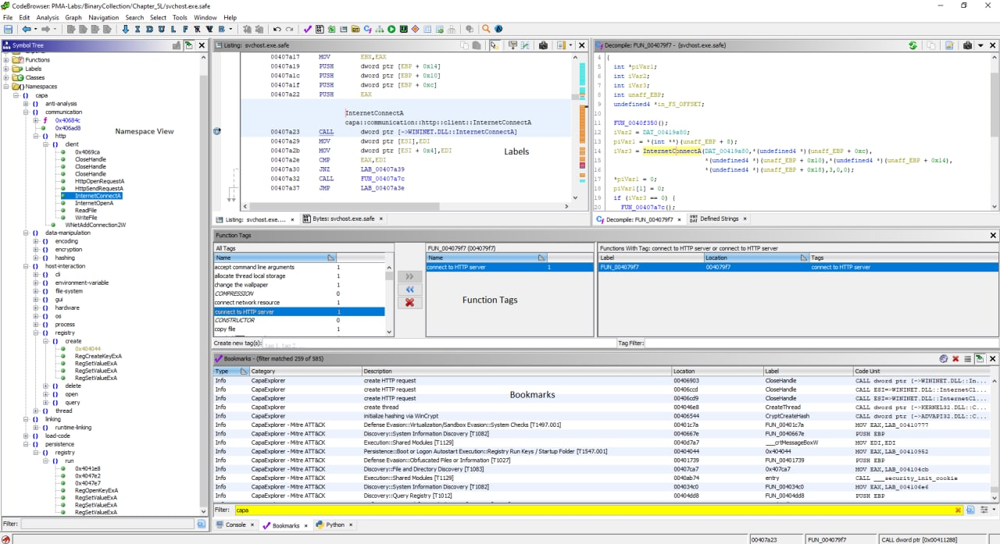
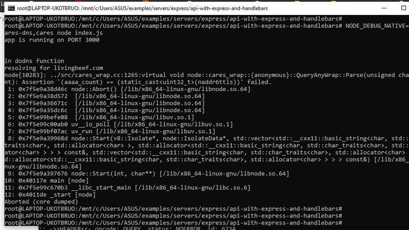
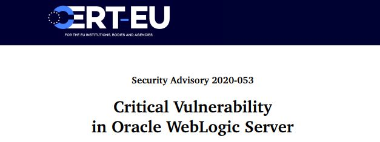

# defcon_news
`2020-11-30 21:53:32`

<blockquote>
scikit-learn 0.23.2 Local Denial of Service
http://seclists.org/fulldisclosure/2020/Nov/44

via Full Disclosure
</blockquote>

<table><tr><td><b>→</b><a href="https://seclists.org/fulldisclosure/2020/Nov/44">
https://seclists.org/fulldisclosure/2020/Nov/44
</a>
</td></tr></table>

---

# defcon_news
`2020-11-30 21:53:30`

<blockquote>
Etherify 4 - jumping air gaps with real ethernet hardware
http://seclists.org/fulldisclosure/2020/Nov/43

via Full Disclosure
</blockquote>

<table><tr><td><b>→</b><a href="https://seclists.org/fulldisclosure/2020/Nov/43">
https://seclists.org/fulldisclosure/2020/Nov/43
</a>
</td></tr></table>

---

# defcon_news
`2020-11-30 20:53:20`

<blockquote>
Zerologon is now detected by Microsoft Defender for Identity
https://www.microsoft.com/security/blog/2020/11/30/zerologon-is-now-detected-by-microsoft-defender-for-identity/

via Microsoft Security
</blockquote>

<table><tr><td><b>→</b><a href="https://www.microsoft.com/security/blog/2020/11/30/zerologon-is-now-detected-by-microsoft-defender-for-identity/">
https://www.microsoft.com/security/blog/2020/11/30/zerologon-is-now-detected-by-microsoft-defender-for-identity/
</a>
<blockquote>
A new detection allows Microsoft Defender for Identity to detect adversaries as they try to exploit the Zerologon vulnerability (CVE-2020-1472) against your domain controllers.
</blockquote>
</td></tr></table>

---

# freedomf0x
`2020-11-30 19:14:55`

<blockquote>
&#35;web

https://github.com/ptswarm/ptswarm-twitter/blob/main/2020-11-30-open-redirect-params.txt
</blockquote>

<table><tr><td><b>→</b><a href="https://github.com/ptswarm/ptswarm-twitter/blob/main/2020-11-30-open-redirect-params.txt">
https://github.com/ptswarm/ptswarm-twitter/blob/main/2020-11-30-open-redirect-params.txt
</a>
<blockquote>
Contribute to ptswarm/ptswarm-twitter development by creating an account on GitHub.
</blockquote>
</td></tr></table>

---

# overlamer1
`2020-11-30 16:28:04`

<blockquote>
Небольшой квест от нашей группы LAMERLAND
</blockquote>

---

# isast
`2020-11-30 15:33:58`

<blockquote>
https://github.com/xmendez/wfuzz

Wfuzz - The Web Fuzzer
Wfuzz has been created to facilitate the task in web applications assessments and it is based on a simple concept: it replaces any reference to the FUZZ keyword by the value of a given payload.

A payload in Wfuzz is a source of data.

This simple concept allows any input to be injected in any field of an HTTP request, allowing to perform complex web security attacks in different web application components such as: parameters, authentication, forms, directories/files, headers, etc.

Wfuzz is more than a web content scanner:
* Wfuzz could help you to secure your web applications by finding and exploiting web application vulnerabilities. Wfuzz’s web application vulnerability scanner is supported by plugins.
* Wfuzz is a completely modular framework and makes it easy for even the newest of Python developers to contribute. Building plugins is simple and takes little more than a few minutes.
* Wfuzz exposes a simple language interface to the previous HTTP requests/responses performed using Wfuzz or other tools, such as Burp. This allows you to perform manual and semi-automatic tests with full context and understanding of your actions, without relying on a web application scanner underlying implementation.

It was created to facilitate the task in web applications assessments, it's a tool by pentesters for pentesters ;)
</blockquote>

<table><tr><td><b>→</b><a href="https://github.com/xmendez/wfuzz">
https://github.com/xmendez/wfuzz
</a>
<blockquote>
Web application fuzzer. Contribute to xmendez/wfuzz development by creating an account on GitHub.
</blockquote>
</td></tr></table>

---

# defcon_news
`2020-11-30 12:53:29`

<blockquote>
[remote] YATinyWinFTP - Denial of Service (PoC)
https://www.exploit-db.com/exploits/49127

via Exploit Database
</blockquote>

<table><tr><td><b>→</b><a href="https://www.exploit-db.com/exploits/49127?utm_source=dlvr.it&utm_medium=twitter">
https://www.exploit-db.com/exploits/49127?utm_source=dlvr.it&utm_medium=twitter
</a>
<blockquote>
YATinyWinFTP - Denial of Service (PoC).. remote exploit for Windows platform
</blockquote>
</td></tr></table>

---

# freedomf0x
`2020-11-30 12:42:49`

<blockquote>
GitHub - mdsecactivebreach/o365-attack-toolkit: A toolkit to attack Office365

Спизжено у бублика) 

https://github.com/mdsecactivebreach/o365-attack-toolkit
</blockquote>

<table><tr><td><b>→</b><a href="https://github.com/mdsecactivebreach/o365-attack-toolkit">
https://github.com/mdsecactivebreach/o365-attack-toolkit
</a>
<blockquote>
A toolkit to attack Office365. Contribute to mdsecactivebreach/o365-attack-toolkit development by creating an account on GitHub.
</blockquote>
</td></tr></table>

---

# defcon_news
`2020-11-30 11:53:17`

<blockquote>
[webapps] Intelbras Router RF 301K 1.1.2 - Authentication Bypass
https://www.exploit-db.com/exploits/49126

via Exploit Database
</blockquote>

<table><tr><td><b>→</b><a href="https://www.exploit-db.com/exploits/49126">
https://www.exploit-db.com/exploits/49126
</a>
<blockquote>
Intelbras Router RF 301K 1.1.2 - Authentication Bypass.. webapps exploit for Hardware platform
</blockquote>
</td></tr></table>

---

# defcon_news
`2020-11-30 10:53:27`

<blockquote>
[webapps] Rejetto HttpFileServer 2.3.x - Remote Command Execution (3)
https://www.exploit-db.com/exploits/49125

via Exploit Database
</blockquote>

<table><tr><td><b>→</b><a href="https://www.exploit-db.com/exploits/49125">
https://www.exploit-db.com/exploits/49125
</a>
<blockquote>
Rejetto HttpFileServer 2.3.x - Remote Command Execution (3). CVE-2014-6287 . webapps exploit for Windows platform
</blockquote>
</td></tr></table>

---

# defcon_news
`2020-11-30 10:53:25`

<blockquote>
[webapps] ATX MiniCMTS200a Broadband Gateway 2.0 - Credential Disclosure
https://www.exploit-db.com/exploits/49124

via Exploit Database
</blockquote>

<table><tr><td><b>→</b><a href="https://www.exploit-db.com/exploits/49124?utm_source=dlvr.it&utm_medium=twitter">
https://www.exploit-db.com/exploits/49124?utm_source=dlvr.it&utm_medium=twitter
</a>
<blockquote>
ATX MiniCMTS200a Broadband Gateway 2.0 - Credential Disclosure.. webapps exploit for Hardware platform
</blockquote>
</td></tr></table>

---

# sysadm_in_channel
`2020-11-30 04:28:33`

<blockquote>
Neurax: A library for constructing self-spreading binaries

С помощью Neurax двоичные файлы Golang могут распространяться по локальной сети без использования внешних серверов.

Разнообразные параметры конфигурации и этапы команд позволяют быстро распространяться в различных беспроводных средах.

https://github.com/redcode-labs/Neurax
</blockquote>

<table><tr><td><b>→</b><a href="https://github.com/redcode-labs/Neurax">
https://github.com/redcode-labs/Neurax
</a>
<blockquote>
A framework for constructing self-spreading binaries - redcode-labs/Neurax
</blockquote>
</td></tr></table>

---

# R0_Crew
`2020-11-29 07:58:36`

<blockquote>
InfoSec Black Friday Deals 2020 (updated). Enjoy! https://github.com/0x90n/InfoSec-Black-Friday and https://github.com/Securityinfos/Black-Friday-Deals &#35;dukeBarman
</blockquote>

<table><tr><td><b>→</b><a href="https://github.com/0x90n/InfoSec-Black-Friday">
https://github.com/0x90n/InfoSec-Black-Friday
</a>
<blockquote>
All the deals for InfoSec related software/tools this Black Friday - 0x90n/InfoSec-Black-Friday
</blockquote>
</td></tr></table>

---

# R0_Crew
`2020-11-28 19:30:38`

<blockquote>
New release CHIPSEC 1.5.7 https://github.com/chipsec/chipsec/releases/tag/1.5.7 &#35;reverse &#35;hardware &#35;uefi &#35;dukeBarman
</blockquote>

<table><tr><td><b>→</b><a href="https://github.com/chipsec/chipsec/releases/tag/1.5.7">
https://github.com/chipsec/chipsec/releases/tag/1.5.7
</a>
<blockquote>
New or Updated Modules/UtilCmds:

utilcmd.iommu_cmd - Updated command to use argparse
utilcmd.mem_cmd - Updated command to use argparse
utilcmd.msr_cmd - Updated command to use argparse
utilcmd.smb...
</blockquote>
</td></tr></table>

---

# isast
`2020-11-28 14:21:05`

<blockquote>
A self-hosted Fuzzing-As-A-Service platform

https://github.com/microsoft/onefuzz
</blockquote>

<table><tr><td><b>→</b><a href="https://github.com/microsoft/onefuzz">
https://github.com/microsoft/onefuzz
</a>
<blockquote>
A self-hosted Fuzzing-As-A-Service platform. Contribute to microsoft/onefuzz development by creating an account on GitHub.
</blockquote>
</td></tr></table>

---

# freedomf0x
`2020-11-28 10:15:09`

<blockquote>
GitHub - 0x90n/InfoSec-Black-Friday: All the deals for InfoSec related software/tools this Black Friday
https://github.com/0x90n/InfoSec-Black-Friday
</blockquote>

<table><tr><td><b>→</b><a href="https://github.com/0x90n/InfoSec-Black-Friday">
https://github.com/0x90n/InfoSec-Black-Friday
</a>
<blockquote>
All the deals for InfoSec related software/tools this Black Friday - 0x90n/InfoSec-Black-Friday
</blockquote>
</td></tr></table>

---

# freedomf0x
`2020-11-27 19:31:59`

<blockquote>
PrivescCheck:

This script aims to enumerate common Windows security misconfigurations that can be leveraged for privilege escalation. It also gathers various information that might be useful for exploitation and/or post-exploitation.

https://github.com/itm4n/PrivescCheck
</blockquote>

<table><tr><td><b>→</b><a href="https://github.com/itm4n/PrivescCheck">
https://github.com/itm4n/PrivescCheck
</a>
<blockquote>
Privilege Escalation Enumeration Script for Windows - itm4n/PrivescCheck
</blockquote>
</td></tr></table>

---

# sysadm_in_channel
`2020-11-27 15:26:26`

<blockquote>
Drupal core - Critical - Arbitrary PHP code execution

https://www.drupal.org/sa-core-2020-013
</blockquote>

<table><tr><td><b>→</b><a href="https://www.drupal.org/sa-core-2020-013">
https://www.drupal.org/sa-core-2020-013
</a>
<blockquote>
The Drupal project uses the PEAR Archive_Tar library. The PEAR Archive_Tar library has released a security update that impacts Drupal. For more information please see: CVE-2020-28948 CVE-2020-28949 Multiple vulnerabilities are possible if Drupal is configured to allow .tar, .tar.gz, .bz2, or .tlz file uploads and processes them. To mitigate this issue, prevent untrusted users
</blockquote>
</td></tr></table>

---

# sysadm_in_channel
`2020-11-27 14:54:08`

<blockquote>
Tracee - Container and system tracing using eBPF

https://github.com/aquasecurity/tracee&#35;getting-started
</blockquote>

<table><tr><td><b>→</b><a href="https://github.com/aquasecurity/tracee">
https://github.com/aquasecurity/tracee
</a>
<blockquote>
Linux Runtime Security and Forensics using eBPF. Contribute to aquasecurity/tracee development by creating an account on GitHub.
</blockquote>
</td></tr></table>

---

# defcon_news
`2020-11-27 14:53:15`

<blockquote>
[webapps] Best Support System 3.0.4 - 'ticket_body' Persistent XSS (Authenticated)
https://www.exploit-db.com/exploits/49122

via Exploit Database
</blockquote>

<table><tr><td><b>→</b><a href="https://www.exploit-db.com/exploits/49122?utm_source=dlvr.it&utm_medium=twitter">
https://www.exploit-db.com/exploits/49122?utm_source=dlvr.it&utm_medium=twitter
</a>
<blockquote>
Best Support System 3.0.4 - 'ticket_body' Persistent XSS (Authenticated).. webapps exploit for PHP platform
</blockquote>
</td></tr></table>

---

# defcon_news
`2020-11-27 14:53:13`

<blockquote>
[webapps] ElkarBackup 1.3.3 - 'Policy[name]' and 'Policy[Description]' Stored Cross-site Scripting
https://www.exploit-db.com/exploits/49121

via Exploit Database
</blockquote>

<table><tr><td><b>→</b><a href="https://www.exploit-db.com/exploits/49121?utm_source=dlvr.it&utm_medium=twitter">
https://www.exploit-db.com/exploits/49121?utm_source=dlvr.it&utm_medium=twitter
</a>
<blockquote>
ElkarBackup 1.3.3 - 'Policy[name]' and 'Policy[Description]' Stored Cross-site Scripting.. webapps exploit for PHP platform
</blockquote>
</td></tr></table>

---

# defcon_news
`2020-11-27 14:53:10`

<blockquote>
[dos] libupnp 1.6.18 - Stack-based buffer overflow (DoS)
https://www.exploit-db.com/exploits/49119

via Exploit Database
</blockquote>

<table><tr><td><b>→</b><a href="https://www.exploit-db.com/exploits/49119?utm_source=dlvr.it&utm_medium=twitter">
https://www.exploit-db.com/exploits/49119?utm_source=dlvr.it&utm_medium=twitter
</a>
<blockquote>
libupnp 1.6.18 - Stack-based buffer overflow (DoS). CVE-2012-5958 . dos exploit for Linux platform
</blockquote>
</td></tr></table>

---

# defcon_news
`2020-11-27 13:53:29`

<blockquote>
[webapps] House Rental 1.0 - 'keywords' SQL Injection
https://www.exploit-db.com/exploits/49117

via Exploit Database
</blockquote>

<table><tr><td><b>→</b><a href="https://www.exploit-db.com/exploits/49117">
https://www.exploit-db.com/exploits/49117
</a>
<blockquote>
House Rental 1.0 - 'keywords' SQL Injection.. webapps exploit for PHP platform
</blockquote>
</td></tr></table>

---

# defcon_news
`2020-11-27 12:53:36`

<blockquote>
[local] Foxit Reader 9.0.1.1049 - Arbitrary Code Execution
https://www.exploit-db.com/exploits/49116

via Exploit Database
</blockquote>

<table><tr><td><b>→</b><a href="https://www.exploit-db.com/exploits/49116">
https://www.exploit-db.com/exploits/49116
</a>
<blockquote>
Foxit Reader 9.0.1.1049 - Arbitrary Code Execution. CVE-2018-9958 . local exploit for Windows platform
</blockquote>
</td></tr></table>

---

# defcon_news
`2020-11-27 12:53:27`

<blockquote>
[webapps] Wordpress Theme Accesspress Social Icons 1.7.9 - SQL injection (Authenticated)
https://www.exploit-db.com/exploits/49115

via Exploit Database
</blockquote>

<table><tr><td><b>→</b><a href="https://www.exploit-db.com/exploits/49115">
https://www.exploit-db.com/exploits/49115
</a>
<blockquote>
Wordpress Theme Accesspress Social Icons 1.7.9 - SQL injection (Authenticated).. webapps exploit for PHP platform
</blockquote>
</td></tr></table>

---

# defcon_news
`2020-11-27 12:53:26`

<blockquote>
[webapps] Moodle 3.8 - Unrestricted File Upload
https://www.exploit-db.com/exploits/49114

via Exploit Database
</blockquote>

<table><tr><td><b>→</b><a href="https://www.exploit-db.com/exploits/49114">
https://www.exploit-db.com/exploits/49114
</a>
<blockquote>
Moodle 3.8 - Unrestricted File Upload.. webapps exploit for PHP platform
</blockquote>
</td></tr></table>

---

# freedomf0x
`2020-11-27 12:39:26`

<blockquote>
New gadget chain for deserialization in Zend Framework applications. Triggers on __destruct(), gives RCE and works in PHP 7. 

O:8:\&quot;Zend_Log\&quot;:1:{s:11:\&quot;%00*%00_writers\&quot;%3Ba:1:{i:0%3BO:20:\&quot;Zend_Log_Writer_Mail\&quot;:5:{s:16:\&quot;%00*%00_eventsToMail\&quot;%3Ba:1:{i:0%3Bi:1%3B}s:22:\&quot;%00*%00_layoutEventsToMail\&quot;%3Ba:0:{}s:8:\&quot;%00*%00_mail\&quot;%3BO:9:\&quot;Zend_Mail\&quot;:0:{}s:10:\&quot;%00*%00_layout\&quot;%3BO:11:\&quot;Zend_Layout\&quot;:3:{s:13:\&quot;%00*%00_inflector\&quot;%3BO:21:\&quot;Zend_Filter_Inflector\&quot;:1:{s:9:\&quot;%00*%00_rules\&quot;%3Ba:1:{s:6:\&quot;script\&quot;%3Ba:1:{i:0%3BO:20:\&quot;Zend_Filter_Callback\&quot;:2:{s:12:\&quot;%00*%00_callback\&quot;%3Bs:15:\&quot;create_function\&quot;%3Bs:11:\&quot;%00*%00_options\&quot;%3Ba:1:{i:0%3Bs:0:\&quot;\&quot;%3B}}}}}s:20:\&quot;%00*%00_inflectorEnabled\&quot;%3Bb:1%3Bs:10:\&quot;%00*%00_layout\&quot;%3Bs:20:\&quot;){}phpinfo()%3Bexit%3B\/*\&quot;%3B}s:22:\&quot;%00*%00_subjectPrependText\&quot;%3BN%3B}}}

https://gist.github.com/YDyachenko/6f60709ce0fc346d0cc0252e07c6aa38
</blockquote>

<table><tr><td><b>→</b><a href="https://gist.github.com/YDyachenko/6f60709ce0fc346d0cc0252e07c6aa38">
https://gist.github.com/YDyachenko/6f60709ce0fc346d0cc0252e07c6aa38
</a>
<blockquote>
`__destruct` Gadget chain for ZF1. GitHub Gist: instantly share code, notes, and snippets.
</blockquote>
</td></tr></table>

---

# defcon_news
`2020-11-27 11:53:19`

<blockquote>
[webapps] Acronis Cyber Backup 12.5 Build 16341 - Unauthenticated SSRF
https://www.exploit-db.com/exploits/49113

via Exploit Database
</blockquote>

<table><tr><td><b>→</b><a href="https://www.exploit-db.com/exploits/49113">
https://www.exploit-db.com/exploits/49113
</a>
<blockquote>
Acronis Cyber Backup 12.5 Build 16341 - Unauthenticated SSRF. CVE-2020-16171 . webapps exploit for Multiple platform
</blockquote>
</td></tr></table>

---

# defcon_news
`2020-11-27 11:53:17`

<blockquote>
[webapps] FrozenNode Laravel-Administrator 4 - Unrestricted File Upload (Authenticated)
https://www.exploit-db.com/exploits/49112

via Exploit Database
</blockquote>

<table><tr><td><b>→</b><a href="https://www.exploit-db.com/exploits/49112">
https://www.exploit-db.com/exploits/49112
</a>
<blockquote>
Laravel Administrator 4 - Unrestricted File Upload (Authenticated). CVE-2020-10963 . webapps exploit for PHP platform
</blockquote>
</td></tr></table>

---

# defcon_news
`2020-11-27 11:53:15`

<blockquote>
[webapps] Ruckus IoT Controller (Ruckus vRIoT) 1.5.1.0.21 - Remote Code Execution
https://www.exploit-db.com/exploits/49110

via Exploit Database
</blockquote>

<table><tr><td><b>→</b><a href="https://www.exploit-db.com/exploits/49110">
https://www.exploit-db.com/exploits/49110
</a>
<blockquote>
Ruckus IoT Controller (Ruckus vRIoT) 1.5.1.0.21 - Remote Code Execution.. webapps exploit for Hardware platform
</blockquote>
</td></tr></table>

---

# defcon_news
`2020-11-27 11:53:10`

<blockquote>
[webapps] WonderCMS 3.1.3 - 'uploadFile' Stored Cross-Site Scripting
https://www.exploit-db.com/exploits/49109

via Exploit Database
</blockquote>

<table><tr><td><b>→</b><a href="https://www.exploit-db.com/exploits/49109?utm_source=dlvr.it&utm_medium=twitter">
https://www.exploit-db.com/exploits/49109?utm_source=dlvr.it&utm_medium=twitter
</a>
<blockquote>
WonderCMS 3.1.3 - 'uploadFile' Stored Cross-Site Scripting.. webapps exploit for PHP platform
</blockquote>
</td></tr></table>

---

# defcon_news
`2020-11-27 11:53:09`

<blockquote>
[local] SAP Lumira 1.31 - Stored Cross-Site Scripting
https://www.exploit-db.com/exploits/49108

via Exploit Database
</blockquote>

<table><tr><td><b>→</b><a href="https://www.exploit-db.com/exploits/49108?utm_source=dlvr.it&utm_medium=twitter">
https://www.exploit-db.com/exploits/49108?utm_source=dlvr.it&utm_medium=twitter
</a>
<blockquote>
SAP Lumira 1.31 - Stored Cross-Site Scripting.. local exploit for Multiple platform
</blockquote>
</td></tr></table>

---

# defcon_news
`2020-11-27 10:53:10`

<blockquote>
[webapps] Wordpress Theme Wibar 1.1.8 - 'Brand Component' Stored Cross Site Scripting
https://www.exploit-db.com/exploits/49107

via Exploit Database
</blockquote>

<table><tr><td><b>→</b><a href="https://www.exploit-db.com/exploits/49107?utm_source=dlvr.it&utm_medium=twitter">
https://www.exploit-db.com/exploits/49107?utm_source=dlvr.it&utm_medium=twitter
</a>
<blockquote>
Wordpress Theme Wibar 1.1.8 - 'Brand Component' Stored Cross Site Scripting.. webapps exploit for PHP platform
</blockquote>
</td></tr></table>

---

# freedomf0x
`2020-11-27 07:09:00`

<blockquote>
CVE-2020-28949/CVE-2020-28948
https://drupal.org/sa-core-2020-013
RCE on Drupal via Phar Deserialization in PEAR Archive_Tar library. 

Poc: phar &#61;&gt; PHAR
PHAR://malicious_file.phar
</blockquote>

---

# reverseengineeringx
`2020-11-27 00:08:26`

<blockquote>
AngryGhidra

https://github.com/Nalen98/AngryGhidra
</blockquote>

<table><tr><td><b>→</b><a href="https://github.com/Nalen98/AngryGhidra">
https://github.com/Nalen98/AngryGhidra
</a>
<blockquote>
Use angr in Ghidra. Contribute to Nalen98/AngryGhidra development by creating an account on GitHub.
</blockquote>
</td></tr></table>

---

# reverseengineeringx
`2020-11-26 20:29:08`

<blockquote>
CapaExplorer
Capa analysis importer for Ghidra.

https://github.com/reb311ion/CapaExplorer
</blockquote>

---

# freedomf0x
`2020-11-26 19:37:37`

<blockquote>
PoC for Node.JS CVE-2020-8277
</blockquote>

---

# freedomf0x
`2020-11-26 19:29:22`

<blockquote>
CVE-2020-0022 an Android 8.0-9.0 Bluetooth Zero-Click RCE – BlueFrag

https://insinuator.net/2020/04/cve-2020-0022-an-android-8-0-9-0-bluetooth-zero-click-rce-bluefrag/
</blockquote>

<table><tr><td><b>→</b><a href="https://insinuator.net/2020/04/cve-2020-0022-an-android-8-0-9-0-bluetooth-zero-click-rce-bluefrag/">
https://insinuator.net/2020/04/cve-2020-0022-an-android-8-0-9-0-bluetooth-zero-click-rce-bluefrag/
</a>
<blockquote>
Nowadays, Bluetooth is an integral part of mobile devices. Smartphones interconnect with smartwatches and wireless headphones. By default, most devices are configured to accept Bluetooth connections from any 
nearby unauthenticated device. Bluetooth packets are processed by the Bluetooth chip (also called a controller), and then passed to the host (Android, Linux, etc.). Both, the firmware on  ...
</blockquote>
</td></tr></table>

---

# cyberoffru
`2020-11-26 17:56:14`

<blockquote>
InfoSec Black Friday Deals 2020

Традиционная подборка интересных предложений «Чёрной пятницы» из сферы инфосек — https://github.com/0x90n/InfoSec-Black-Friday

1Password с 50% скидкой, много платформ для обучения, трейнингов и лаб по скидке (SANS, Practical DevSecOps, PentesterLab и пр.) и многое другое. 

Большая часть скорее всего появится завтра, но уже есть из чего выбирать.
</blockquote>

<table><tr><td><b>→</b><a href="https://github.com/0x90n/InfoSec-Black-Friday">
https://github.com/0x90n/InfoSec-Black-Friday
</a>
<blockquote>
All the deals for InfoSec related software/tools this Black Friday - 0x90n/InfoSec-Black-Friday
</blockquote>
</td></tr></table>

---

# freedomf0x
`2020-11-26 16:33:47`

<blockquote>
Tangalanga: the Zoom conference scanner hacking tool

https://github.com/elcuervo/tangalanga
</blockquote>

<table><tr><td><b>→</b><a href="https://github.com/elcuervo/tangalanga">
https://github.com/elcuervo/tangalanga
</a>
<blockquote>
Tangalanga: the Zoom conference scanner hacking tool - elcuervo/tangalanga
</blockquote>
</td></tr></table>

---

# defcon_news
`2020-11-26 15:53:05`

<blockquote>
[remote] Razer Chroma SDK Server 3.16.02 - Race Condition Remote File Execution
https://www.exploit-db.com/exploits/49106

via Exploit Database
</blockquote>

<table><tr><td><b>→</b><a href="https://www.exploit-db.com/exploits/49106">
https://www.exploit-db.com/exploits/49106
</a>
<blockquote>
Razer Chroma SDK Server 3.16.02 - Race Condition Remote File Execution. CVE-2020-16602 . remote exploit for Windows platform
</blockquote>
</td></tr></table>

---

# defcon_news
`2020-11-26 13:53:26`

<blockquote>
[dos] Pure-FTPd 1.0.48 - Remote Denial of Service
https://www.exploit-db.com/exploits/49105

via Exploit Database
</blockquote>

<table><tr><td><b>→</b><a href="https://www.exploit-db.com/exploits/49105">
https://www.exploit-db.com/exploits/49105
</a>
<blockquote>
Pure-FTPd 1.0.48 - Remote Denial of Service.. dos exploit for Multiple platform
</blockquote>
</td></tr></table>

---

# defcon_news
`2020-11-25 13:53:37`

<blockquote>
[webapps] SyncBreeze 10.0.28 - 'password' Remote Buffer Overflow
https://www.exploit-db.com/exploits/49104

via Exploit Database
</blockquote>

<table><tr><td><b>→</b><a href="https://www.exploit-db.com/exploits/49104">
https://www.exploit-db.com/exploits/49104
</a>
<blockquote>
SyncBreeze 10.0.28 - 'password' Remote Buffer Overflow.. webapps exploit for Windows platform
</blockquote>
</td></tr></table>

---

# defcon_news
`2020-11-25 12:53:47`

<blockquote>
[webapps] osCommerce 2.3.4.1 - 'title' Persistent Cross-Site Scripting
https://www.exploit-db.com/exploits/49103

via Exploit Database
</blockquote>

<table><tr><td><b>→</b><a href="https://www.exploit-db.com/exploits/49103?utm_source=dlvr.it&utm_medium=twitter">
https://www.exploit-db.com/exploits/49103?utm_source=dlvr.it&utm_medium=twitter
</a>
<blockquote>
osCommerce 2.3.4.1 - 'title' Persistent Cross-Site Scripting.. webapps exploit for PHP platform
</blockquote>
</td></tr></table>

---

# defcon_news
`2020-11-25 12:53:40`

<blockquote>
[webapps] WonderCMS 3.1.3 - 'page' Persistent Cross-Site Scripting
https://www.exploit-db.com/exploits/49102

via Exploit Database
</blockquote>

<table><tr><td><b>→</b><a href="https://www.exploit-db.com/exploits/49102">
https://www.exploit-db.com/exploits/49102
</a>
<blockquote>
WonderCMS 3.1.3 - 'page' Persistent Cross-Site Scripting.. webapps exploit for PHP platform
</blockquote>
</td></tr></table>

---

# defcon_news
`2020-11-25 12:53:38`

<blockquote>
[local] Wondershare Driver Install Service help 10.7.1.321 - 'ElevationService' Unquote Service Path
https://www.exploit-db.com/exploits/49101

via Exploit Database
</blockquote>

<table><tr><td><b>→</b><a href="https://www.exploit-db.com/exploits/49101">
https://www.exploit-db.com/exploits/49101
</a>
<blockquote>
Wondershare Driver Install Service help 10.7.1.321 - 'ElevationService' Unquote Service Path.. local exploit for Windows platform
</blockquote>
</td></tr></table>

---

# freedomf0x
`2020-11-25 12:14:38`

<blockquote>
Опубликовали новые 3д модели поверхностей Флиппера и чертежи для разработчиков модулей и чехлов. https://github.com/Flipper-Zero/flipperzero-3d-models

⚠️ !!! Внимание !!! ⚠️
Это не финальная версия и корпус может измениться. Не используйте эти модели для своего финального дизайна. &#35;flipperzero
</blockquote>

---

# sysadm_in_channel
`2020-11-25 04:57:18`

<blockquote>
GitHub - yardenshafir/CVE-2020-1034: PoC demonstrating the use of cve-2020-1034 for privilege escalation
https://github.com/yardenshafir/CVE-2020-1034
</blockquote>

<table><tr><td><b>→</b><a href="https://github.com/yardenshafir/CVE-2020-1034">
https://github.com/yardenshafir/CVE-2020-1034
</a>
<blockquote>
PoC demonstrating the use of cve-2020-1034 for privilege escalation - yardenshafir/CVE-2020-1034
</blockquote>
</td></tr></table>

---

# defcon_news
`2020-11-24 20:53:25`

<blockquote>
[local] docPrint Pro 8.0 - 'Add URL' Buffer Overflow (SEH Egghunter)
https://www.exploit-db.com/exploits/49100

via Exploit Database
</blockquote>

<table><tr><td><b>→</b><a href="https://www.exploit-db.com/exploits/49100">
https://www.exploit-db.com/exploits/49100
</a>
<blockquote>
docPrint Pro 8.0 - 'Add URL' Buffer Overflow (SEH Egghunter).. local exploit for Windows platform
</blockquote>
</td></tr></table>

---

# infobezopasnost
`2020-11-24 18:09:59`

<blockquote>
Охота на Zerologon / undefined / Хабр
https://m.habr.com/ru/company/bizone/blog/526168/
</blockquote>

<table><tr><td><b>→</b><a href="https://m.habr.com/ru/company/bizone/blog/526168/">
https://m.habr.com/ru/company/bizone/blog/526168/
</a>
<blockquote>
Авторы: Демьян Соколин (@_drd0c), Александр Большаков (@spacepatcher), Ильяс Игисинов (@ph7ntom), Хрыков Вадим (@BlackMatter23) CVE-2020-1472, или Zerologon, уже получила звание одной...
</blockquote>
</td></tr></table>

---

# R0_Crew
`2020-11-24 18:09:54`

<blockquote>
Ghidra Extension to integrate BinDiff for function matching https://github.com/ubfx/BinDiffHelper &#35;reverse &#35;ghidra &#35;dukeBarman
</blockquote>

<table><tr><td><b>→</b><a href="https://github.com/ubfx/BinDiffHelper">
https://github.com/ubfx/BinDiffHelper
</a>
<blockquote>
Ghidra Extension to integrate BinDiff for function matching - ubfx/BinDiffHelper
</blockquote>
</td></tr></table>

---

# defcon_news
`2020-11-24 17:53:25`

<blockquote>
[webapps] OpenCart 3.0.3.6 - 'subject' Stored Cross-Site Scripting
https://www.exploit-db.com/exploits/49099

via Exploit Database
</blockquote>

<table><tr><td><b>→</b><a href="https://www.exploit-db.com/exploits/49099">
https://www.exploit-db.com/exploits/49099
</a>
<blockquote>
OpenCart 3.0.3.6 - 'subject' Stored Cross-Site Scripting.. webapps exploit for PHP platform
</blockquote>
</td></tr></table>

---

# defcon_news
`2020-11-24 17:53:24`

<blockquote>
[webapps] OpenCart 3.0.3.6 - 'Profile Image' Stored Cross Site Scripting (Authenticated)
https://www.exploit-db.com/exploits/49098

via Exploit Database
</blockquote>

<table><tr><td><b>→</b><a href="https://www.exploit-db.com/exploits/49098">
https://www.exploit-db.com/exploits/49098
</a>
<blockquote>
OpenCart 3.0.3.6 - 'Profile Image' Stored Cross-Site Scripting (Authenticated).. webapps exploit for PHP platform
</blockquote>
</td></tr></table>

---

# defcon_news
`2020-11-24 12:53:23`

<blockquote>
[webapps] Seowon 130-SLC router 1.0.11 - 'ipAddr' RCE (Authenticated)
https://www.exploit-db.com/exploits/49097

via Exploit Database
</blockquote>

<table><tr><td><b>→</b><a href="https://www.exploit-db.com/exploits/49097">
https://www.exploit-db.com/exploits/49097
</a>
<blockquote>
Seowon 130-SLC router 1.0.11 - 'ipAddr' RCE (Authenticated).. webapps exploit for Hardware platform
</blockquote>
</td></tr></table>

---

# defcon_news
`2020-11-24 11:53:30`

<blockquote>
[webapps] ZeroShell 3.9.0 - 'cgi-bin/kerbynet' Remote Root Command Injection (Metasploit)
https://www.exploit-db.com/exploits/49096

via Exploit Database
</blockquote>

<table><tr><td><b>→</b><a href="https://www.exploit-db.com/exploits/49096">
https://www.exploit-db.com/exploits/49096
</a>
<blockquote>
ZeroShell 3.9.0 - 'cgi-bin/kerbynet' Remote Root Command Injection (Metasploit). CVE-2019-12725 . webapps exploit for Linux platform
</blockquote>
</td></tr></table>

---

# sysadm_in_channel
`2020-11-24 11:52:40`

<blockquote>
VMware - command injection vulnerability (critical)

Испоавлений нет, есть workaround, уязвимость влияет как на операционные системы Windows, так и дистрибутивы Linux, так и на Workspace One.

https://www.vmware.com/security/advisories/VMSA-2020-0027.html

Информация об уязвимости на сайте CISA

https://us-cert.cisa.gov/ncas/current-activity/2020/11/23/vmware-releases-workarounds-cve-2020-4006
</blockquote>

<table><tr><td><b>→</b><a href="https://www.vmware.com/security/advisories/VMSA-2020-0027.html">
https://www.vmware.com/security/advisories/VMSA-2020-0027.html
</a>
<blockquote>
VMware Workspace One Access, Access Connector, Identity Manager, and Identity Manager Connector address command injection vulnerability
</blockquote>
</td></tr></table>

---

# defcon_news
`2020-11-24 10:53:18`

<blockquote>
[webapps] Apache OpenMeetings 5.0.0 - 'hostname' Denial of Service
https://www.exploit-db.com/exploits/49094

via Exploit Database
</blockquote>

<table><tr><td><b>→</b><a href="https://www.exploit-db.com/exploits/49094?utm_source=dlvr.it&utm_medium=twitter">
https://www.exploit-db.com/exploits/49094?utm_source=dlvr.it&utm_medium=twitter
</a>
<blockquote>
Apache OpenMeetings 5.0.0 - 'hostname' Denial of Service. CVE-2020-13951 . webapps exploit for Multiple platform
</blockquote>
</td></tr></table>

---

# defcon_news
`2020-11-24 10:53:17`

<blockquote>
[webapps] nopCommerce Store 4.30 - 'name' Stored Cross-Site Scripting
https://www.exploit-db.com/exploits/49093

via Exploit Database
</blockquote>

<table><tr><td><b>→</b><a href="https://www.exploit-db.com/exploits/49093">
https://www.exploit-db.com/exploits/49093
</a>
<blockquote>
nopCommerce Store 4.30 - 'name' Stored Cross-Site Scripting.. webapps exploit for Multiple platform
</blockquote>
</td></tr></table>

---

# defcon_news
`2020-11-24 09:53:27`

<blockquote>
SSRFs caused by bad RegEx in server-side npm package &quot;private-ip&quot; - 4 year old 0day - 12,000+ weekly installs - CVE-2020-28360: IP Phone Home
https://www.reddit.com/r/netsec/comments/jzmk6f/ssrfs_caused_by_bad_regex_in_serverside_npm/

via /r/netsec - Information Security News &amp; Discussion
</blockquote>

<table><tr><td><b>→</b><a href="https://www.reddit.com/r/netsec/comments/jzmk6f/ssrfs_caused_by_bad_regex_in_serverside_npm/">
https://www.reddit.com/r/netsec/comments/jzmk6f/ssrfs_caused_by_bad_regex_in_serverside_npm/
</a>
<blockquote>
Posted in r/netsec by u/docker-osx • 1 point and 0 comments
</blockquote>
</td></tr></table>

---

# reverseengineeringx
`2020-11-24 04:31:25`

<blockquote>
Collection of malware source code for a variety of platforms in an array of different programming languages.

https://github.com/vxunderground/MalwareSourceCode
</blockquote>

<table><tr><td><b>→</b><a href="https://github.com/vxunderground/MalwareSourceCode">
https://github.com/vxunderground/MalwareSourceCode
</a>
<blockquote>
Collection of malware source code for a variety of platforms in an array of different programming languages. - vxunderground/MalwareSourceCode
</blockquote>
</td></tr></table>

---

# freedomf0x
`2020-11-24 02:51:13`

<blockquote>
&#35;nmap &#35;nse script to grab &#35;cobaltstrike beacon config

https://github.com/whickey-r7/grab_beacon_config
</blockquote>

---

# defcon_news
`2020-11-23 22:53:29`

<blockquote>
SEC Consult SA-20201123-0 :: Multiple Vulnerabilities in ZTE WLAN router MF253V
http://seclists.org/fulldisclosure/2020/Nov/42

via Full Disclosure
</blockquote>

<table><tr><td><b>→</b><a href="https://seclists.org/fulldisclosure/2020/Nov/42">
https://seclists.org/fulldisclosure/2020/Nov/42
</a>
</td></tr></table>

---

# defcon_news
`2020-11-23 22:53:27`

<blockquote>
VMware Releases Workarounds for CVE-2020-4006
https://us-cert.cisa.gov/ncas/current-activity/2020/11/23/vmware-releases-workarounds-cve-2020-4006

via CISA Current Activity
</blockquote>

<table><tr><td><b>→</b><a href="https://us-cert.cisa.gov/ncas/current-activity/2020/11/23/vmware-releases-workarounds-cve-2020-4006">
https://us-cert.cisa.gov/ncas/current-activity/2020/11/23/vmware-releases-workarounds-cve-2020-4006
</a>
<blockquote>
VMware has released workarounds to address a vulnerability—CVE-2020-4006—in VMware Workspace One Access, Access Connector, Identity Manager, and Identity Manager Connector. An attacker could exploit this vulnerability to take control of an affected system.
</blockquote>
</td></tr></table>

---

# defcon_news
`2020-11-23 22:53:26`

<blockquote>
CA20201116-01: Security Notice for CA Unified Infrastructure Management
http://seclists.org/fulldisclosure/2020/Nov/41

via Full Disclosure
</blockquote>

<table><tr><td><b>→</b><a href="https://seclists.org/fulldisclosure/2020/Nov/41">
https://seclists.org/fulldisclosure/2020/Nov/41
</a>
</td></tr></table>

---

# defcon_news
`2020-11-23 21:53:10`

<blockquote>
U.S. Dept Of Defense: https://██████ vulnerable to CVE-2020-3187 - Unauthenticated arbitrary file deletion in Cisco ASA/FTD
https://vulners.com/hackerone/H1:1031437?utm_source&#61;rss&amp;utm_medium&#61;rss&amp;utm_campaign&#61;rss

via Vulners
</blockquote>

<table><tr><td><b>→</b><a href="https://vulners.com/hackerone/H1:1031437?utm_source=rss&utm_medium=rss&utm_campaign=rss">
https://vulners.com/hackerone/H1:1031437?utm_source=rss&utm_medium=rss&utm_campaign=rss
</a>
<blockquote>
Hi @U.S. Dept Of Defense, I found a host https:// ██████ which is running on the web services interface of Cisco ASA/FTD and it is vulnerable to CVE-2020-3187 - Unauthenticated arbitrary file deletion in Cisco ASA/FTD. An attacker could exploit this vulnerability by sending a crafted HTTP request containing directory traversal character sequences. An exploit could allow the attacker to view or delete arbitrary files on the targeted system. When the device is reloaded after the exploitation of this vulnerability, any files that were deleted are restored. The attacker can only view and delete files within the web services file system. Proof of Concept: Now we know that in CVE-2020-3187 - Unauthenticated arbitrary file deletion in Cisco ASA/FTD. This allow the attacker to view or delete arbitrary files on the targeted system In this we can delete the files. For example the logo file present on the server at https:// ████████/+CSCOU+/csco_logo.gif can be deleted by the following steps. This can be done by sending a…
</blockquote>
</td></tr></table>

---

# defcon_news
`2020-11-23 21:53:09`

<blockquote>
U.S. Dept Of Defense: Unauthenticated Arbitrary File Deletion &quot;CVE-2020-3187&quot; in █████
https://vulners.com/hackerone/H1:1026265?utm_source&#61;rss&amp;utm_medium&#61;rss&amp;utm_campaign&#61;rss

via Vulners
</blockquote>

<table><tr><td><b>→</b><a href="https://vulners.com/hackerone/H1:1026265?utm_source=rss&utm_medium=rss&utm_campaign=rss">
https://vulners.com/hackerone/H1:1026265?utm_source=rss&utm_medium=rss&utm_campaign=rss
</a>
<blockquote>
Summary: A vulnerability in the interface of Cisco Adaptive Security Appliance (ASA) Software and Cisco Firepower Threat Defense (FTD) Software could allow an unauthenticated, remote attacker to conduct directory traversal attacks and obtain read and delete access to sensitive files. Description: Vulnerable host:  ██████████ Impact An exploit could allow the attacker to view or delete arbitrary files on the system. Step-by-step Reproduction Instructions 1.Identifying vulnerable host by send request to /+CSCOE+/session_password.html. curl -skiL &quot; ███/+CSCOE+/session_password.html&quot; GET /+CSCOE+/session_password.html HTTP/1.1 Host:  ███████ User-Agent: Mozilla/5.0 (Windows NT 10.0; Win64; x64; rv:76.0) Gecko/20100101 Firefox/76.0 Accept: text/html,application/xhtml+xml,application/xml;q&#61;0.9,image/webp,*/*;q&#61;0.8 Accept-Language: en-US,ar;q&#61;0.7,en;q&#61;0.3 Accept-Encoding: gzip, deflate Connection: close Cookie: webvpnlogin&#61;1; webvpnLang&#61;en Upgrade-Insecure-Requests: 1 If the target is vulnerable, the response header will…
</blockquote>
</td></tr></table>

---

# defcon_news
`2020-11-23 12:53:30`

<blockquote>
[webapps] TP-Link TL-WA855RE V5_200415 - Device Reset Auth Bypass
https://www.exploit-db.com/exploits/49092

via Exploit Database
</blockquote>

<table><tr><td><b>→</b><a href="https://www.exploit-db.com/exploits/49092?utm_source=dlvr.it&utm_medium=twitter">
https://www.exploit-db.com/exploits/49092?utm_source=dlvr.it&utm_medium=twitter
</a>
<blockquote>
TP-Link TL-WA855RE V5_200415 - Device Reset Auth Bypass. CVE-2020-24363 . webapps exploit for Hardware platform
</blockquote>
</td></tr></table>

---

# freedomf0x
`2020-11-23 12:44:12`

<blockquote>
CVE-2020-13942

https://github.com/eugenebmx/CVE-2020-13942
</blockquote>

<table><tr><td><b>→</b><a href="https://github.com/eugenebmx/CVE-2020-13942">
https://github.com/eugenebmx/CVE-2020-13942
</a>
<blockquote>
CVE-2020-13942 unauthenticated RCE POC through MVEL and OGNL injection - eugenebmx/CVE-2020-13942
</blockquote>
</td></tr></table>

---

# defcon_news
`2020-11-23 11:53:16`

<blockquote>
[webapps] LifeRay 7.2.1 GA2 - Stored XSS
https://www.exploit-db.com/exploits/49091

via Exploit Database
</blockquote>

<table><tr><td><b>→</b><a href="https://www.exploit-db.com/exploits/49091">
https://www.exploit-db.com/exploits/49091
</a>
<blockquote>
LifeRay 7.2.1 GA2 - Stored XSS. CVE-2020-7934 . webapps exploit for Multiple platform
</blockquote>
</td></tr></table>

---

# defcon_news
`2020-11-23 11:53:14`

<blockquote>
[webapps] VTiger v7.0 CRM - 'To' Persistent XSS
https://www.exploit-db.com/exploits/49090

via Exploit Database
</blockquote>

<table><tr><td><b>→</b><a href="https://www.exploit-db.com/exploits/49090?utm_source=dlvr.it&utm_medium=twitter">
https://www.exploit-db.com/exploits/49090?utm_source=dlvr.it&utm_medium=twitter
</a>
<blockquote>
VTiger v7.0 CRM - 'To' Persistent XSS.. webapps exploit for PHP platform
</blockquote>
</td></tr></table>

---

# defcon_news
`2020-11-23 10:53:18`

<blockquote>
[local] Boxoft Audio Converter 2.3.0 - '.wav' Buffer Overflow (SEH)
https://www.exploit-db.com/exploits/49089

via Exploit Database
</blockquote>

<table><tr><td><b>→</b><a href="https://www.exploit-db.com/exploits/49089?utm_source=dlvr.it&utm_medium=twitter">
https://www.exploit-db.com/exploits/49089?utm_source=dlvr.it&utm_medium=twitter
</a>
<blockquote>
Boxoft Audio Converter 2.3.0 - '.wav' Buffer Overflow (SEH).. local exploit for Windows platform
</blockquote>
</td></tr></table>

---

# isast
`2020-11-23 08:49:48`

<blockquote>
Terrier: An Open-Source Tool for Identifying and Analyzing Container and Image Components 
https://blog.heroku.com/terrier-open-source-identifying-analyzing-containers
+
https://github.com/heroku/terrier
</blockquote>

---

# freedomf0x
`2020-11-23 07:47:53`

<blockquote>
https://github.com/wrongbaud/hackaday-u

&#35;reverse
</blockquote>

<table><tr><td><b>→</b><a href="https://github.com/wrongbaud/hackaday-u">
https://github.com/wrongbaud/hackaday-u
</a>
<blockquote>
Course materials for hackaday.io Ghidra training. Contribute to wrongbaud/hackaday-u development by creating an account on GitHub.
</blockquote>
</td></tr></table>

---

# sysadm_in_channel
`2020-11-23 04:21:31`

<blockquote>
Smartdump - создаёт дампы выбранных таблиц MySQL вместе с зависимостями

https://github.com/BenMorel/smartdump
</blockquote>

<table><tr><td><b>→</b><a href="https://github.com/BenMorel/smartdump">
https://github.com/BenMorel/smartdump
</a>
<blockquote>
Dumps selected MySQL tables together with their relationships - BenMorel/smartdump
</blockquote>
</td></tr></table>

---

# R0_Crew
`2020-11-22 15:22:06`

<blockquote>
IDA AArch64 processor extender extension: Adding support for ARMv8.5 memory tagging extension opcodes https://github.com/Antid0teCom/aarch64_mte &#35;ida &#35;reverse &#35;ios &#35;arm &#35;dukeBarman
</blockquote>

<table><tr><td><b>→</b><a href="https://github.com/Antid0teCom/aarch64_mte">
https://github.com/Antid0teCom/aarch64_mte
</a>
<blockquote>
IDA AArch64 processor extender extension: Adding support for ARMv8.5 memory tagging extension opcodes - Antid0teCom/aarch64_mte
</blockquote>
</td></tr></table>

---

# defcon_news
`2020-11-21 15:53:20`

<blockquote>
VMware privilege escalation vulnerabilities (CVE-2020-4004, CVE-2020-4005) - https://www.vmware.com/security/advisories/VMSA-2020-0026.html, (Sat, Nov 21st)
https://isc.sans.edu/diary/rss/26814

via SANS Internet Storm Center, InfoCON: green
</blockquote>

<table><tr><td><b>→</b><a href="https://www.vmware.com/security/advisories/VMSA-2020-0026.html">
https://www.vmware.com/security/advisories/VMSA-2020-0026.html
</a>
<blockquote>
VMware ESXi, Workstation and Fusion updates address use-after-free and privilege escalation vulnerabilities (CVE-2020-4004, CVE-2020-4005)
</blockquote>
</td></tr></table>

---

# defcon_news
`2020-11-21 12:53:27`

<blockquote>
Критическая уязвимость в системе управления контентом Drupal
https://www.opennet.ru/opennews/art.shtml?num&#61;54127

via OpenNews.opennet.ru: Проблемы безопасности
</blockquote>

<table><tr><td><b>→</b><a href="https://www.opennet.ru/opennews/art.shtml?num=54127">
https://www.opennet.ru/opennews/art.shtml?num=54127
</a>
<blockquote>
В системе управления контентом Drupal выявлена критическая уязвимость (CVE-2020-13671), позволяющая удалённо выполнить произвольный PHP код на сервере. Уязвимости присвоен критический уровень опасности. Проблема устранена в выпусках Drupal 7.74, 8.9.9, 8.8.11 и 9.0.8.
</blockquote>
</td></tr></table>

---

# reverseengineeringx
`2020-11-21 11:09:38`

<blockquote>
Malware Behavior Catalog v2.0

The Malware Behavior Catalog (MBC) is a catalog of malware objectives and behaviors, created to support malware analysis-oriented use cases, such as labeling, similarity analysis, and standardized reporting.

https://github.com/MBCProject/mbc-markdown
</blockquote>

<table><tr><td><b>→</b><a href="https://github.com/MBCProject/mbc-markdown">
https://github.com/MBCProject/mbc-markdown
</a>
<blockquote>
MBC content in markdown. Contribute to MBCProject/mbc-markdown development by creating an account on GitHub.
</blockquote>
</td></tr></table>

---

# reverseengineeringx
`2020-11-21 10:59:43`

<blockquote>
Malware Capabilities

Starting with version 4.1, MAEC offers a standard way of capturing the set of high-level abilities that a malware instance possesses, which we term Capabilities. For instance, to state that a malware instance is capable of exfiltrating data, one may simply specify a single MAEC &quot;Data Exfiltration&quot; Capability. We have defined an initial set of Capabilities for the MAEC v4.1 release, which is captured in detail in the hierarchy below.

https://github.com/MAECProject/schemas/wiki/Malware-Capabilities
</blockquote>

<table><tr><td><b>→</b><a href="https://github.com/MAECProject/schemas/wiki/Malware-Capabilities">
https://github.com/MAECProject/schemas/wiki/Malware-Capabilities
</a>
<blockquote>
MAEC Schemas and Schema Development. Contribute to MAECProject/schemas development by creating an account on GitHub.
</blockquote>
</td></tr></table>

---

# defcon_news
`2020-11-20 23:53:18`

<blockquote>
KL-001-2020-009 : Barco wePresent Insecure Firmware Image
http://seclists.org/fulldisclosure/2020/Nov/40

via Full Disclosure
</blockquote>

<table><tr><td><b>→</b><a href="https://seclists.org/fulldisclosure/2020/Nov/40">
https://seclists.org/fulldisclosure/2020/Nov/40
</a>
</td></tr></table>

---

# defcon_news
`2020-11-20 23:53:16`

<blockquote>
KL-001-2020-008 : Barco wePresent Global Hardcoded Root SSH Password
http://seclists.org/fulldisclosure/2020/Nov/39

via Full Disclosure
</blockquote>

<table><tr><td><b>→</b><a href="https://seclists.org/fulldisclosure/2020/Nov/39">
https://seclists.org/fulldisclosure/2020/Nov/39
</a>
</td></tr></table>

---

# defcon_news
`2020-11-20 23:53:15`

<blockquote>
KL-001-2020-007 : Barco wePresent Undocumented SSH Interface Accessible Via Web UI
http://seclists.org/fulldisclosure/2020/Nov/38

via Full Disclosure
</blockquote>

<table><tr><td><b>→</b><a href="https://seclists.org/fulldisclosure/2020/Nov/38">
https://seclists.org/fulldisclosure/2020/Nov/38
</a>
</td></tr></table>

---

# defcon_news
`2020-11-20 23:53:13`

<blockquote>
KL-001-2020-006 : Barco wePresent Authentication Bypass
http://seclists.org/fulldisclosure/2020/Nov/37

via Full Disclosure
</blockquote>

<table><tr><td><b>→</b><a href="https://seclists.org/fulldisclosure/2020/Nov/37">
https://seclists.org/fulldisclosure/2020/Nov/37
</a>
</td></tr></table>

---

# defcon_news
`2020-11-20 23:53:12`

<blockquote>
KL-001-2020-005 : Barco wePresent Admin Credentials Exposed In Plain-text
http://seclists.org/fulldisclosure/2020/Nov/36

via Full Disclosure
</blockquote>

<table><tr><td><b>→</b><a href="https://seclists.org/fulldisclosure/2020/Nov/36">
https://seclists.org/fulldisclosure/2020/Nov/36
</a>
</td></tr></table>

---

# defcon_news
`2020-11-20 23:53:11`

<blockquote>
KL-001-2020-004 : Barco wePresent Hardcoded API Credentials
http://seclists.org/fulldisclosure/2020/Nov/35

via Full Disclosure
</blockquote>

<table><tr><td><b>→</b><a href="https://seclists.org/fulldisclosure/2020/Nov/35">
https://seclists.org/fulldisclosure/2020/Nov/35
</a>
</td></tr></table>

---

# defcon_news
`2020-11-20 17:53:41`

<blockquote>
VTiger v7.0 CRM - (To) Persistent Email Vulnerability
http://seclists.org/fulldisclosure/2020/Nov/34

via Full Disclosure
</blockquote>

<table><tr><td><b>→</b><a href="https://seclists.org/fulldisclosure/2020/Nov/34">
https://seclists.org/fulldisclosure/2020/Nov/34
</a>
</td></tr></table>

---

# defcon_news
`2020-11-20 16:53:27`

<blockquote>
[local] Boxoft Convert Master 1.3.0 - 'wav' SEH Local Exploit
https://www.exploit-db.com/exploits/49088

via Exploit Database
</blockquote>

<table><tr><td><b>→</b><a href="https://www.exploit-db.com/exploits/49088">
https://www.exploit-db.com/exploits/49088
</a>
<blockquote>
Boxoft Convert Master 1.3.0 - 'wav' SEH Local Exploit.. local exploit for Windows platform
</blockquote>
</td></tr></table>

---

# defcon_news
`2020-11-20 15:53:13`

<blockquote>
[local] Free MP3 CD Ripper 2.8 - Multiple File Buffer Overflow (Metasploit)
https://www.exploit-db.com/exploits/49087

via Exploit Database
</blockquote>

<table><tr><td><b>→</b><a href="https://www.exploit-db.com/exploits/49087">
https://www.exploit-db.com/exploits/49087
</a>
<blockquote>
Free MP3 CD Ripper 2.8 - Multiple File Buffer Overflow (Metasploit).. local exploit for Windows platform
</blockquote>
</td></tr></table>

---

# sysadm_in_channel
`2020-11-20 15:20:05`

<blockquote>
Critical - VMware ESXi, Workstation 

Privilege escalation vulnerabilities 

https://www.vmware.com/security/advisories/VMSA-2020-0026.html
</blockquote>

<table><tr><td><b>→</b><a href="https://www.vmware.com/security/advisories/VMSA-2020-0026.html">
https://www.vmware.com/security/advisories/VMSA-2020-0026.html
</a>
<blockquote>
VMware ESXi, Workstation and Fusion updates address use-after-free and privilege escalation vulnerabilities (CVE-2020-4004, CVE-2020-4005)
</blockquote>
</td></tr></table>

---

# defcon_news
`2020-11-20 12:53:29`

<blockquote>
[local] IBM Tivoli Storage Manager Command Line Administrative Interface 5.2.0.1 - id' Field Stack Based Buffer Overflow
https://www.exploit-db.com/exploits/49086

via Exploit Database
</blockquote>

<table><tr><td><b>→</b><a href="https://www.exploit-db.com/exploits/49086">
https://www.exploit-db.com/exploits/49086
</a>
<blockquote>
IBM Tivoli Storage Manager Command Line Administrative Interface 5.2.0.1 - id' Field Stack Based Buffer Overflow.. local exploit for Windows platform
</blockquote>
</td></tr></table>

---

# defcon_news
`2020-11-20 11:53:51`

<blockquote>
[webapps] WonderCMS 3.1.3 - 'content' Persistent Cross-Site Scripting
https://www.exploit-db.com/exploits/49085

via Exploit Database
</blockquote>

<table><tr><td><b>→</b><a href="https://www.exploit-db.com/exploits/49085">
https://www.exploit-db.com/exploits/49085
</a>
<blockquote>
WonderCMS 3.1.3 - 'content' Persistent Cross-Site Scripting.. webapps exploit for PHP platform
</blockquote>
</td></tr></table>

---

# defcon_news
`2020-11-20 11:53:36`

<blockquote>
[local] Zortam Mp3 Media Studio 27.60 - Remote Code Execution (SEH)
https://www.exploit-db.com/exploits/49084

via Exploit Database
</blockquote>

<table><tr><td><b>→</b><a href="https://www.exploit-db.com/exploits/49084">
https://www.exploit-db.com/exploits/49084
</a>
<blockquote>
Zortam Mp3 Media Studio 27.60 - Remote Code Execution (SEH).. local exploit for Windows platform
</blockquote>
</td></tr></table>

---

# sysadm_in_channel
`2020-11-20 08:12:05`

<blockquote>
Патчи для VMware SD-WAN Orchestrator

Тот случай когда не авторизованный атакующий может положить всю сеть

https://www.vmware.com/security/advisories/VMSA-2020-0025.html
</blockquote>

<table><tr><td><b>→</b><a href="https://www.vmware.com/security/advisories/VMSA-2020-0025.html">
https://www.vmware.com/security/advisories/VMSA-2020-0025.html
</a>
<blockquote>
VMware SD-WAN Orchestrator updates address multiple security vulnerabilities (CVE-2020-3984, CVE-2020-3985, CVE-2020-4000, CVE-2020-4001, CVE-2020-4002 ,CVE-2020-4003)
</blockquote>
</td></tr></table>

---

# defcon_news
`2020-11-19 17:53:18`

<blockquote>
[dos] Internet Download Manager 6.38.12 - Scheduler Downloads Scheduler Buffer Overflow (PoC)
https://www.exploit-db.com/exploits/49083

via Exploit Database
</blockquote>

<table><tr><td><b>→</b><a href="https://www.exploit-db.com/exploits/49083">
https://www.exploit-db.com/exploits/49083
</a>
<blockquote>
Internet Download Manager 6.38.12 - Scheduler Downloads Scheduler Buffer Overflow (PoC).. dos exploit for Windows platform
</blockquote>
</td></tr></table>

---

# defcon_news
`2020-11-19 13:53:43`

<blockquote>
[webapps] Nagios Log Server 2.1.7 - Persistent Cross-Site Scripting
https://www.exploit-db.com/exploits/49082

via Exploit Database
</blockquote>

<table><tr><td><b>→</b><a href="https://www.exploit-db.com/exploits/49082">
https://www.exploit-db.com/exploits/49082
</a>
<blockquote>
Nagios Log Server 2.1.7 - Persistent Cross-Site Scripting.. webapps exploit for Multiple platform
</blockquote>
</td></tr></table>

---

# defcon_news
`2020-11-19 13:53:42`

<blockquote>
[webapps] M/Monit 3.7.4 - Password Disclosure
https://www.exploit-db.com/exploits/49081

via Exploit Database
</blockquote>

<table><tr><td><b>→</b><a href="https://www.exploit-db.com/exploits/49081">
https://www.exploit-db.com/exploits/49081
</a>
<blockquote>
M/Monit 3.7.4 - Password Disclosure.. webapps exploit for Multiple platform
</blockquote>
</td></tr></table>

---

# defcon_news
`2020-11-19 13:53:40`

<blockquote>
[webapps] M/Monit 3.7.4 - Privilege Escalation
https://www.exploit-db.com/exploits/49080

via Exploit Database
</blockquote>

<table><tr><td><b>→</b><a href="https://www.exploit-db.com/exploits/49080">
https://www.exploit-db.com/exploits/49080
</a>
<blockquote>
M/Monit 3.7.4 - Privilege Escalation.. webapps exploit for Multiple platform
</blockquote>
</td></tr></table>

---

# freedomf0x
`2020-11-19 13:50:42`

<blockquote>
GHSL-2020-138, GHSL-2020-139: Remote code execution (RCE) and elevation of privileges (EoP) in SmartStoreNET - CVE-2020-27996, CVE-2020-27997

https://securitylab.github.com/advisories/GHSL-2020-138-139-SmartstoreAG-SmartStoreNET
</blockquote>

<table><tr><td><b>→</b><a href="https://securitylab.github.com/advisories/GHSL-2020-138-139-SmartstoreAG-SmartStoreNET/">
https://securitylab.github.com/advisories/GHSL-2020-138-139-SmartstoreAG-SmartStoreNET/
</a>
<blockquote>
SmartStoreNET 4.0.0 is vulnerable to Remote code execution (RCE) and elevation of privileges (EoP)
</blockquote>
</td></tr></table>

---

# freedomf0x
`2020-11-19 13:47:46`

<blockquote>
P for Privacy – The Background Story of CVE-2020-9773

https://blog.zimperium.com/p-for-privacy-the-background-story-of-cve-2020-9773/
</blockquote>

<table><tr><td><b>→</b><a href="https://blog.zimperium.com/p-for-privacy-the-background-story-of-cve-2020-9773/">
https://blog.zimperium.com/p-for-privacy-the-background-story-of-cve-2020-9773/
</a>
<blockquote>
A sandboxed application can circumvent updated iOS restrictions to enumerate installed applications on a device.
</blockquote>
</td></tr></table>

---

# defcon_news
`2020-11-19 12:53:42`

<blockquote>
[webapps] Gemtek WVRTM-127ACN 01.01.02.141 - Authenticated Arbitrary Command Injection
https://www.exploit-db.com/exploits/49079

via Exploit Database
</blockquote>

<table><tr><td><b>→</b><a href="https://www.exploit-db.com/exploits/49079">
https://www.exploit-db.com/exploits/49079
</a>
<blockquote>
Gemtek WVRTM-127ACN 01.01.02.141 - Authenticated Arbitrary Command Injection. CVE-2020-24365 . webapps exploit for CGI platform
</blockquote>
</td></tr></table>

---

# defcon_news
`2020-11-19 12:53:36`

<blockquote>
[webapps] TestBox CFML Test Framework 4.1.0 - Directory Traversal
https://www.exploit-db.com/exploits/49078

via Exploit Database
</blockquote>

<table><tr><td><b>→</b><a href="https://www.exploit-db.com/exploits/49078">
https://www.exploit-db.com/exploits/49078
</a>
<blockquote>
TestBox CFML Test Framework 4.1.0 - Directory Traversal.. webapps exploit for Multiple platform
</blockquote>
</td></tr></table>

---

# defcon_news
`2020-11-19 12:53:34`

<blockquote>
[webapps] TestBox CFML Test Framework 4.1.0 - Arbitrary File Write and Remote Code Execution
https://www.exploit-db.com/exploits/49077

via Exploit Database
</blockquote>

<table><tr><td><b>→</b><a href="https://www.exploit-db.com/exploits/49077">
https://www.exploit-db.com/exploits/49077
</a>
<blockquote>
TestBox CFML Test Framework 4.1.0 - Arbitrary File Write and Remote Code Execution.. webapps exploit for Multiple platform
</blockquote>
</td></tr></table>

---

# defcon_news
`2020-11-19 11:53:34`

<blockquote>
[webapps] Gitlab 12.9.0 - Arbitrary File Read (Authenticated)
https://www.exploit-db.com/exploits/49076

via Exploit Database
</blockquote>

<table><tr><td><b>→</b><a href="https://www.exploit-db.com/exploits/49076?utm_source=dlvr.it&utm_medium=twitter">
https://www.exploit-db.com/exploits/49076?utm_source=dlvr.it&utm_medium=twitter
</a>
<blockquote>
Gitlab 12.9.0 - Arbitrary File Read (Authenticated).. webapps exploit for Ruby platform
</blockquote>
</td></tr></table>

---

# defcon_news
`2020-11-19 11:53:32`

<blockquote>
[remote] Genexis Platinum 4410 Router 2.1 - UPnP Credential Exposure
https://www.exploit-db.com/exploits/49075

via Exploit Database
</blockquote>

<table><tr><td><b>→</b><a href="https://www.exploit-db.com/exploits/49075?utm_source=dlvr.it&utm_medium=twitter">
https://www.exploit-db.com/exploits/49075?utm_source=dlvr.it&utm_medium=twitter
</a>
<blockquote>
Genexis Platinum 4410 Router 2.1 - UPnP Credential Exposure. CVE-2020-25988 . remote exploit for Hardware platform
</blockquote>
</td></tr></table>

---

# defcon_news
`2020-11-19 11:53:28`

<blockquote>
[webapps] Fortinet FortiOS 6.0.4 - Unauthenticated SSL VPN User Password Modification
https://www.exploit-db.com/exploits/49074

via Exploit Database
</blockquote>

<table><tr><td><b>→</b><a href="https://www.exploit-db.com/exploits/49074">
https://www.exploit-db.com/exploits/49074
</a>
<blockquote>
Fortinet FortiOS 6.0.4 - Unauthenticated SSL VPN User Password Modification. CVE-2018-13382 . webapps exploit for Hardware platform
</blockquote>
</td></tr></table>

---

# defcon_news
`2020-11-19 11:53:27`

<blockquote>
[webapps] xuucms 3 - 'keywords' SQL Injection
https://www.exploit-db.com/exploits/49073

via Exploit Database
</blockquote>

<table><tr><td><b>→</b><a href="https://www.exploit-db.com/exploits/49073">
https://www.exploit-db.com/exploits/49073
</a>
<blockquote>
xuucms 3 - 'keywords' SQL Injection. CVE-2020-28091 . webapps exploit for Multiple platform
</blockquote>
</td></tr></table>

---

# defcon_news
`2020-11-19 11:53:26`

<blockquote>
[webapps] PESCMS TEAM 2.3.2 - Multiple Reflected XSS
https://www.exploit-db.com/exploits/49072

via Exploit Database
</blockquote>

<table><tr><td><b>→</b><a href="https://www.exploit-db.com/exploits/49072">
https://www.exploit-db.com/exploits/49072
</a>
<blockquote>
PESCMS TEAM 2.3.2 - Multiple Reflected XSS. CVE-2020-28092 . webapps exploit for Multiple platform
</blockquote>
</td></tr></table>

---

# defcon_news
`2020-11-19 02:53:29`

<blockquote>
TCMalloc viewer/dumper - TCMalloc Inspector Tool
http://seclists.org/fulldisclosure/2020/Nov/33

via Full Disclosure
</blockquote>

<table><tr><td><b>→</b><a href="https://seclists.org/fulldisclosure/2020/Nov/33">
https://seclists.org/fulldisclosure/2020/Nov/33
</a>
</td></tr></table>

---

# defcon_news
`2020-11-19 02:53:27`

<blockquote>
SOWA.OPAC Reflected Cross Site Scripting
http://seclists.org/fulldisclosure/2020/Nov/32

via Full Disclosure
</blockquote>

<table><tr><td><b>→</b><a href="https://seclists.org/fulldisclosure/2020/Nov/32">
https://seclists.org/fulldisclosure/2020/Nov/32
</a>
</td></tr></table>

---

# defcon_news
`2020-11-18 21:53:10`

<blockquote>
[remote] ZeroLogon - Netlogon Elevation of Privilege
https://www.exploit-db.com/exploits/49071

via Exploit Database
</blockquote>

<table><tr><td><b>→</b><a href="https://www.exploit-db.com/exploits/49071">
https://www.exploit-db.com/exploits/49071
</a>
<blockquote>
ZeroLogon - Netlogon Elevation of Privilege. CVE-2020-1472 . remote exploit for Windows platform
</blockquote>
</td></tr></table>

---

# defcon_news
`2020-11-18 20:53:27`

<blockquote>
[webapps] BigBlueButton 2.2.25 - Arbitrary File Disclosure and Server-Side Request Forgery
https://www.exploit-db.com/exploits/49070

via Exploit Database
</blockquote>

<table><tr><td><b>→</b><a href="https://www.exploit-db.com/exploits/49070">
https://www.exploit-db.com/exploits/49070
</a>
<blockquote>
BigBlueButton 2.2.25 - Arbitrary File Disclosure and Server-Side Request Forgery. CVE-2020-25820 . webapps exploit for Multiple platform
</blockquote>
</td></tr></table>

---

# defcon_news
`2020-11-18 20:53:23`

<blockquote>
[webapps] Wordpress Plugin WPForms 1.6.3.1 - Persistent Cross Site Scripting (Authenticated)
https://www.exploit-db.com/exploits/49069

via Exploit Database
</blockquote>

<table><tr><td><b>→</b><a href="https://www.exploit-db.com/exploits/49069">
https://www.exploit-db.com/exploits/49069
</a>
<blockquote>
Wordpress Plugin WPForms 1.6.3.1 - Persistent Cross Site Scripting (Authenticated).. webapps exploit for PHP platform
</blockquote>
</td></tr></table>

---

# sysadm_in_channel
`2020-11-18 18:30:05`

<blockquote>
Mas-cli - command line interface for the Mac App Store. Designed for scripting and automation

App Store, но из терминала, позволяет искать, обновлять, удалять и устаналивать софт. Можно ставить из homebrew…

https://github.com/mas-cli/mas
</blockquote>

<table><tr><td><b>→</b><a href="https://github.com/mas-cli/mas">
https://github.com/mas-cli/mas
</a>
<blockquote>
:package: Mac App Store command line interface. Contribute to mas-cli/mas development by creating an account on GitHub.
</blockquote>
</td></tr></table>

---

# defcon_news
`2020-11-17 23:53:10`

<blockquote>
SEC Consult SA-20201117-0 :: Blind Out-Of-Band XML External Entity Injection in Avaya Web License Manager
http://seclists.org/fulldisclosure/2020/Nov/31

via Full Disclosure
</blockquote>

<table><tr><td><b>→</b><a href="https://seclists.org/fulldisclosure/2020/Nov/31">
https://seclists.org/fulldisclosure/2020/Nov/31
</a>
</td></tr></table>

---

# defcon_news
`2020-11-17 21:53:24`

<blockquote>
Fancy Product Designer for WooCommerce - Unrestricted File Upload
http://seclists.org/fulldisclosure/2020/Nov/30

via Full Disclosure
</blockquote>

<table><tr><td><b>→</b><a href="https://seclists.org/fulldisclosure/2020/Nov/30">
https://seclists.org/fulldisclosure/2020/Nov/30
</a>
</td></tr></table>

---

# defcon_news
`2020-11-17 21:53:23`

<blockquote>
Fancy Product Designer for WooCommerce - Stored XSS via SVG upload
http://seclists.org/fulldisclosure/2020/Nov/29

via Full Disclosure
</blockquote>

<table><tr><td><b>→</b><a href="https://seclists.org/fulldisclosure/2020/Nov/29">
https://seclists.org/fulldisclosure/2020/Nov/29
</a>
</td></tr></table>

---

# cibsecurity
`2020-11-17 18:44:12`

* https://threatpost.com/critical-cisco-flaw-sensitive-data/161305/

<blockquote>
❌ Cisco Patches Critical Flaw After PoC Exploit Code Release ❌

A critical path-traversal flaw (CVE-2020-27130) exists in Cisco Security Manager that lays bare sensitive information to remote, unauthenticated attackers.

📖 Read

via &quot;Threat Post&quot;.
</blockquote>

<table><tr><td><b>→</b><a href="https://threatpost.com/critical-cisco-flaw-sensitive-data/161305/">
https://threatpost.com/critical-cisco-flaw-sensitive-data/161305/
</a>
<blockquote>
A critical path-traversal flaw (CVE-2020-27130) exists in Cisco Security Manager that lays bare sensitive information to remote, unauthenticated attackers.
</blockquote>
</td></tr></table>

---

# defcon_news
`2020-11-17 17:53:51`

<blockquote>
[remote] Apache Struts 2.5.20 - Double OGNL evaluation
https://www.exploit-db.com/exploits/49068

via Exploit Database
</blockquote>

<table><tr><td><b>→</b><a href="https://www.exploit-db.com/exploits/49068?utm_source=dlvr.it&utm_medium=twitter">
https://www.exploit-db.com/exploits/49068?utm_source=dlvr.it&utm_medium=twitter
</a>
<blockquote>
Apache Struts 2.5.20 - Double OGNL evaluation. CVE-2019-0230 . remote exploit for Multiple platform
</blockquote>
</td></tr></table>

---

# defcon_news
`2020-11-17 17:53:50`

<blockquote>
[remote] Aerospike Database 5.1.0.3 - OS Command Execution
https://www.exploit-db.com/exploits/49067

via Exploit Database
</blockquote>

<table><tr><td><b>→</b><a href="https://www.exploit-db.com/exploits/49067?utm_source=dlvr.it&utm_medium=twitter">
https://www.exploit-db.com/exploits/49067?utm_source=dlvr.it&utm_medium=twitter
</a>
<blockquote>
Aerospike Database 5.1.0.3 - OS Command Execution. CVE-2020-13151 . remote exploit for Multiple platform
</blockquote>
</td></tr></table>

---

# defcon_news
`2020-11-17 17:53:48`

<blockquote>
[local] LCD_Service 1.0.1.0 - 'LCD_Service' Unquote Service Path
https://www.exploit-db.com/exploits/49066

via Exploit Database
</blockquote>

<table><tr><td><b>→</b><a href="https://www.exploit-db.com/exploits/49066?utm_source=dlvr.it&utm_medium=twitter">
https://www.exploit-db.com/exploits/49066?utm_source=dlvr.it&utm_medium=twitter
</a>
<blockquote>
LCD_Service 1.0.1.0 - 'LCD_Service' Unquote Service Path.. local exploit for Windows platform
</blockquote>
</td></tr></table>

---

# defcon_news
`2020-11-17 17:53:47`

<blockquote>
[webapps] Froxlor Froxlor Server Management Panel 0.10.16 - Persistent Cross-Site Scripting
https://www.exploit-db.com/exploits/49063

via Exploit Database
</blockquote>

<table><tr><td><b>→</b><a href="https://www.exploit-db.com/exploits/49063?utm_source=dlvr.it&utm_medium=twitter">
https://www.exploit-db.com/exploits/49063?utm_source=dlvr.it&utm_medium=twitter
</a>
<blockquote>
Froxlor Froxlor Server Management Panel 0.10.16 - Persistent Cross-Site Scripting.. webapps exploit for PHP platform
</blockquote>
</td></tr></table>

---

# defcon_news
`2020-11-17 17:53:46`

<blockquote>
[local] Microsoft Internet Explorer 11 - Use-After-Free
https://www.exploit-db.com/exploits/49062

via Exploit Database
</blockquote>

<table><tr><td><b>→</b><a href="https://www.exploit-db.com/exploits/49062">
https://www.exploit-db.com/exploits/49062
</a>
<blockquote>
Microsoft Internet Explorer 11 - Use-After-Free. CVE-2020-0674 . local exploit for Windows platform
</blockquote>
</td></tr></table>

---

# defcon_news
`2020-11-17 17:53:45`

<blockquote>
[webapps] WordPress Plugin Buddypress 6.2.0 - Persistent Cross-Site Scripting
https://www.exploit-db.com/exploits/49061

via Exploit Database
</blockquote>

<table><tr><td><b>→</b><a href="https://www.exploit-db.com/exploits/49061">
https://www.exploit-db.com/exploits/49061
</a>
<blockquote>
WordPress Plugin Buddypress 6.2.0 - Persistent Cross-Site Scripting.. webapps exploit for PHP platform
</blockquote>
</td></tr></table>

---

# defcon_news
`2020-11-17 11:53:15`

<blockquote>
[webapps] SugarCRM 6.5.18 - Persistent Cross-Site Scripting
https://www.exploit-db.com/exploits/49060

via Exploit Database
</blockquote>

<table><tr><td><b>→</b><a href="https://www.exploit-db.com/exploits/49060">
https://www.exploit-db.com/exploits/49060
</a>
<blockquote>
SugarCRM 6.5.18 - Persistent Cross-Site Scripting.. webapps exploit for PHP platform
</blockquote>
</td></tr></table>

---

# defcon_news
`2020-11-17 11:53:14`

<blockquote>
[webapps] Online Doctor Appointment Booking System PHP and Mysql 1.0 - 'q' SQL Injection
https://www.exploit-db.com/exploits/49059

via Exploit Database
</blockquote>

<table><tr><td><b>→</b><a href="https://www.exploit-db.com/exploits/49059">
https://www.exploit-db.com/exploits/49059
</a>
<blockquote>
Online Doctor Appointment Booking System PHP and Mysql 1.0 - 'q' SQL Injection.. webapps exploit for PHP platform
</blockquote>
</td></tr></table>

---

# defcon_news
`2020-11-17 11:53:11`

<blockquote>
[webapps] EgavilanMedia User Registration &amp; Login System with Admin Panel Exploit - SQLi Auth Bypass
https://www.exploit-db.com/exploits/49058

via Exploit Database
</blockquote>

<table><tr><td><b>→</b><a href="https://www.exploit-db.com/exploits/49058">
https://www.exploit-db.com/exploits/49058
</a>
<blockquote>
EgavilanMedia User Registration &amp; Login System with Admin Panel Exploit - SQLi Auth Bypass.. webapps exploit for PHP platform
</blockquote>
</td></tr></table>

---

# sysadm_in_channel
`2020-11-17 07:39:38`

<blockquote>
GitHub - Youtube-dl восстановлен 

Что и требовалось доказать

https://github.com/ytdl-org/youtube-dl

Заявление:

https://github.com/github/dmca/blob/master/2020/11/2020-11-16-RIAA-reversal.md
</blockquote>

<table><tr><td><b>→</b><a href="https://github.com/ytdl-org/youtube-dl">
https://github.com/ytdl-org/youtube-dl
</a>
<blockquote>
Command-line program to download videos from YouTube.com and other video sites - ytdl-org/youtube-dl
</blockquote>
</td></tr></table>

---

# freedomf0x
`2020-11-17 06:08:35`

<blockquote>
&#35;bluetooth

https://github.com/Charmve/BLE-Security-Attack-Defence
</blockquote>

<table><tr><td><b>→</b><a href="https://github.com/Charmve/BLE-Security-Attack-Defence">
https://github.com/Charmve/BLE-Security-Attack-Defence
</a>
<blockquote>
✨ Purpose only! The dangers of Bluetooth Low Energy（BLE）implementations: Unveiling zero day vulnerabilities and security flaws in modern Bluetooth LE stacks. - Charmve/BLE-Security-Attack-Defence
</blockquote>
</td></tr></table>

---

# defcon_news
`2020-11-16 16:53:46`

<blockquote>
Security Week 47: обход защиты компьютера в режиме сна
https://habr.com/ru/post/528306/

via Информационная безопасность – Защита данных
</blockquote>

<table><tr><td><b>→</b><a href="https://habr.com/ru/post/528306/?utm_source=habrahabr&utm_medium=rss&utm_campaign=528306">
https://habr.com/ru/post/528306/?utm_source=habrahabr&utm_medium=rss&utm_campaign=528306
</a>
<blockquote>
10 ноября компания Intel пропатчила уязвимость CVE-2020-8705 в механизме Intel Boot Guard, которая позволяет обходить ключевые методы защиты компьютера, если он...
</blockquote>
</td></tr></table>

---

# defcon_news
`2020-11-16 13:53:52`

<blockquote>
SugarCRM v6.5.18 - (Contacts) Persistent Cross Site Web Vulnerability
http://seclists.org/fulldisclosure/2020/Nov/28

via Full Disclosure
</blockquote>

<table><tr><td><b>→</b><a href="https://seclists.org/fulldisclosure/2020/Nov/28">
https://seclists.org/fulldisclosure/2020/Nov/28
</a>
</td></tr></table>

---

# defcon_news
`2020-11-16 13:53:50`

<blockquote>
SugarCRM v6.5.18 - (Employees) Persistent Cross Site Vulnerability
http://seclists.org/fulldisclosure/2020/Nov/27

via Full Disclosure
</blockquote>

<table><tr><td><b>→</b><a href="https://seclists.org/fulldisclosure/2020/Nov/27">
https://seclists.org/fulldisclosure/2020/Nov/27
</a>
</td></tr></table>

---

# defcon_news
`2020-11-16 13:53:49`

<blockquote>
Intel NUC - Local Privilege Escalation Vulnerability
http://seclists.org/fulldisclosure/2020/Nov/26

via Full Disclosure
</blockquote>

<table><tr><td><b>→</b><a href="https://seclists.org/fulldisclosure/2020/Nov/26">
https://seclists.org/fulldisclosure/2020/Nov/26
</a>
</td></tr></table>

---

# defcon_news
`2020-11-16 13:53:48`

<blockquote>
Buddypress v6.2.0 WP Plugin - Persistent Web Vulnerability
http://seclists.org/fulldisclosure/2020/Nov/25

via Full Disclosure
</blockquote>

<table><tr><td><b>→</b><a href="https://seclists.org/fulldisclosure/2020/Nov/25">
https://seclists.org/fulldisclosure/2020/Nov/25
</a>
</td></tr></table>

---

# defcon_news
`2020-11-16 13:53:46`

<blockquote>
Froxlor v0.10.16 CP - (Customer) Persistent Vulnerability
http://seclists.org/fulldisclosure/2020/Nov/24

via Full Disclosure
</blockquote>

<table><tr><td><b>→</b><a href="https://seclists.org/fulldisclosure/2020/Nov/24">
https://seclists.org/fulldisclosure/2020/Nov/24
</a>
</td></tr></table>

---

# defcon_news
`2020-11-16 13:53:45`

<blockquote>
SIGE (Joomla) 3.4.1 &amp; 3.5.3 Pro - Multiple Vulnerabilities
http://seclists.org/fulldisclosure/2020/Nov/23

via Full Disclosure
</blockquote>

<table><tr><td><b>→</b><a href="https://seclists.org/fulldisclosure/2020/Nov/23">
https://seclists.org/fulldisclosure/2020/Nov/23
</a>
</td></tr></table>

---

# defcon_news
`2020-11-16 12:53:49`

<blockquote>
[webapps] Car Rental Management System 1.0 - 'car_id' Sql Injection
https://www.exploit-db.com/exploits/49056

via Exploit Database
</blockquote>

<table><tr><td><b>→</b><a href="https://www.exploit-db.com/exploits/49056">
https://www.exploit-db.com/exploits/49056
</a>
<blockquote>
Car Rental Management System 1.0 - 'car_id' Sql Injection.. webapps exploit for PHP platform
</blockquote>
</td></tr></table>

---

# defcon_news
`2020-11-16 12:53:48`

<blockquote>
[webapps] Car Rental Management System 1.0 - Remote Code Execution (Authenticated)
https://www.exploit-db.com/exploits/49055

via Exploit Database
</blockquote>

<table><tr><td><b>→</b><a href="https://www.exploit-db.com/exploits/49055?utm_source=dlvr.it&utm_medium=twitter">
https://www.exploit-db.com/exploits/49055?utm_source=dlvr.it&utm_medium=twitter
</a>
<blockquote>
Car Rental Management System 1.0 - Remote Code Execution (Authenticated).. webapps exploit for PHP platform
</blockquote>
</td></tr></table>

---

# defcon_news
`2020-11-16 12:53:41`

<blockquote>
[webapps] User Registration &amp; Login and User Management System 2.1 - Login Bypass SQL Injection
https://www.exploit-db.com/exploits/49052

via Exploit Database
</blockquote>

<table><tr><td><b>→</b><a href="https://www.exploit-db.com/exploits/49052?utm_source=dlvr.it&utm_medium=twitter">
https://www.exploit-db.com/exploits/49052?utm_source=dlvr.it&utm_medium=twitter
</a>
<blockquote>
User Registration &amp; Login and User Management System 2.1 - Login Bypass SQL Injection.. webapps exploit for PHP platform
</blockquote>
</td></tr></table>

---

# defcon_news
`2020-11-16 12:53:40`

<blockquote>
[webapps] Car Rental Management System 1.0 - 'id' SQL Injection (Authenticated)
https://www.exploit-db.com/exploits/49051

via Exploit Database
</blockquote>

<table><tr><td><b>→</b><a href="https://www.exploit-db.com/exploits/49051?utm_source=dlvr.it&utm_medium=twitter">
https://www.exploit-db.com/exploits/49051?utm_source=dlvr.it&utm_medium=twitter
</a>
<blockquote>
Car Rental Management System 1.0 - 'id' SQL Injection (Authenticated).. webapps exploit for PHP platform
</blockquote>
</td></tr></table>

---

# defcon_news
`2020-11-16 12:53:38`

<blockquote>
[local] Logitech Solar Keyboard Service - 'L4301_Solar' Unquoted Service Path
https://www.exploit-db.com/exploits/49050

via Exploit Database
</blockquote>

<table><tr><td><b>→</b><a href="https://www.exploit-db.com/exploits/49050?utm_source=dlvr.it&utm_medium=twitter">
https://www.exploit-db.com/exploits/49050?utm_source=dlvr.it&utm_medium=twitter
</a>
<blockquote>
Logitech Solar Keyboard Service - 'L4301_Solar' Unquoted Service Path.. local exploit for Windows platform
</blockquote>
</td></tr></table>

---

# defcon_news
`2020-11-16 12:53:34`

<blockquote>
[local] Advanced System Care Service 13 - 'AdvancedSystemCareService13' Unquoted Service Path
https://www.exploit-db.com/exploits/49049

via Exploit Database
</blockquote>

<table><tr><td><b>→</b><a href="https://www.exploit-db.com/exploits/49049?utm_source=dlvr.it&utm_medium=twitter">
https://www.exploit-db.com/exploits/49049?utm_source=dlvr.it&utm_medium=twitter
</a>
<blockquote>
Advanced System Care Service 13 - 'AdvancedSystemCareService13' Unquoted Service Path.. local exploit for Windows platform
</blockquote>
</td></tr></table>

---

# defcon_news
`2020-11-16 12:53:30`

<blockquote>
[webapps] Pandora FMS 7.0 NG 749 - 'CG Items' SQL Injection (Authenticated)
https://www.exploit-db.com/exploits/49046

via Exploit Database
</blockquote>

<table><tr><td><b>→</b><a href="https://www.exploit-db.com/exploits/49046?utm_source=dlvr.it&utm_medium=twitter">
https://www.exploit-db.com/exploits/49046?utm_source=dlvr.it&utm_medium=twitter
</a>
<blockquote>
Pandora FMS 7.0 NG 749 - 'CG Items' SQL Injection (Authenticated).. webapps exploit for PHP platform
</blockquote>
</td></tr></table>

---

# defcon_news
`2020-11-15 21:53:19`

<blockquote>
APPLE-SA-2020-11-13-6 Additional information for APPLE-SA-2020-09-16-4 watchOS 7.0
http://seclists.org/fulldisclosure/2020/Nov/22

via Full Disclosure
</blockquote>

<table><tr><td><b>→</b><a href="https://seclists.org/fulldisclosure/2020/Nov/22">
https://seclists.org/fulldisclosure/2020/Nov/22
</a>
</td></tr></table>

---

# defcon_news
`2020-11-15 21:53:17`

<blockquote>
APPLE-SA-2020-11-13-7 Additional information for APPLE-SA-2020-09-24-1 macOS Catalina 10.15.7, Security Update 2020-005 High Sierra, Security Update 2020-005 Mojave
http://seclists.org/fulldisclosure/2020/Nov/21

via Full Disclosure
</blockquote>

<table><tr><td><b>→</b><a href="https://seclists.org/fulldisclosure/2020/Nov/21">
https://seclists.org/fulldisclosure/2020/Nov/21
</a>
</td></tr></table>

---

# defcon_news
`2020-11-15 21:53:16`

<blockquote>
APPLE-SA-2020-11-13-3 Additional information for APPLE-SA-2020-09-16-1 iOS 14.0 and iPadOS 14.0
http://seclists.org/fulldisclosure/2020/Nov/20

via Full Disclosure
</blockquote>

<table><tr><td><b>→</b><a href="https://seclists.org/fulldisclosure/2020/Nov/20">
https://seclists.org/fulldisclosure/2020/Nov/20
</a>
</td></tr></table>

---

# defcon_news
`2020-11-15 21:53:15`

<blockquote>
APPLE-SA-2020-11-13-4 Additional information for APPLE-SA-2020-09-16-2 tvOS 14.0
http://seclists.org/fulldisclosure/2020/Nov/19

via Full Disclosure
</blockquote>

<table><tr><td><b>→</b><a href="https://seclists.org/fulldisclosure/2020/Nov/19">
https://seclists.org/fulldisclosure/2020/Nov/19
</a>
</td></tr></table>

---

# defcon_news
`2020-11-15 21:53:13`

<blockquote>
APPLE-SA-2020-11-13-5 Additional information for APPLE-SA-2020-09-16-3 Safari 14.0
http://seclists.org/fulldisclosure/2020/Nov/18

via Full Disclosure
</blockquote>

<table><tr><td><b>→</b><a href="https://seclists.org/fulldisclosure/2020/Nov/18">
https://seclists.org/fulldisclosure/2020/Nov/18
</a>
</td></tr></table>

---

# defcon_news
`2020-11-15 21:53:12`

<blockquote>
APPLE-SA-2020-11-13-2 Security Update 2020-006 High Sierra, Security Update 2020-006 Mojave
http://seclists.org/fulldisclosure/2020/Nov/17

via Full Disclosure
</blockquote>

<table><tr><td><b>→</b><a href="https://seclists.org/fulldisclosure/2020/Nov/17">
https://seclists.org/fulldisclosure/2020/Nov/17
</a>
</td></tr></table>

---

# defcon_news
`2020-11-15 21:53:11`

<blockquote>
Re: Scope of Debian's /home/loser is with permissions 755, default umask 002
http://seclists.org/fulldisclosure/2020/Nov/16

via Full Disclosure
</blockquote>

<table><tr><td><b>→</b><a href="https://seclists.org/fulldisclosure/2020/Nov/16">
https://seclists.org/fulldisclosure/2020/Nov/16
</a>
</td></tr></table>

---

# defcon_news
`2020-11-15 21:53:09`

<blockquote>
[SYSS-2020-037] Persistent Cross-site Scripting (CWE-79) in REDDOXX MailDepot (CVE-2020-26554)
http://seclists.org/fulldisclosure/2020/Nov/15

via Full Disclosure
</blockquote>

<table><tr><td><b>→</b><a href="https://seclists.org/fulldisclosure/2020/Nov/15">
https://seclists.org/fulldisclosure/2020/Nov/15
</a>
</td></tr></table>

---

# defcon_news
`2020-11-15 21:53:07`

<blockquote>
Re: Scope of Debian's /home/loser is with permissions 755, default umask 002
http://seclists.org/fulldisclosure/2020/Nov/14

via Full Disclosure
</blockquote>

<table><tr><td><b>→</b><a href="https://seclists.org/fulldisclosure/2020/Nov/14">
https://seclists.org/fulldisclosure/2020/Nov/14
</a>
</td></tr></table>

---

# overlamer1
`2020-11-15 21:06:58`

* https://telegra.ph/Stavim-otpechatok-palca-na-termuks-09-16

<blockquote>
Ставим отпечаток пальца на термукс
</blockquote>

<table><tr><td><b>→</b><a href="https://telegra.ph/Stavim-otpechatok-palca-na-termuks-09-16">
https://telegra.ph/Stavim-otpechatok-palca-na-termuks-09-16
</a>
<blockquote>
Всем привет! Нашел инструмент для входа по отпечатку в термукс, думаю это прикольно, так что давайте установим данный инструмент, поехали! источник статьи Обновим пакеты: pkg update upgrade -y Теперь нужен git: pkg install git Качаем инструмент: git clone https://github.com/MrAlpha786/termux-fingerprint-lock Открываем папек с инструментом: cd termux-fingerprint-lock Делаем главный файл исполняемым: chmod u+x setup И запускаем его: bash setup Попросят нажать на отпечаток, если что-то пошло не так, значит…
</blockquote>
</td></tr></table>

---

# defcon_news
`2020-11-15 12:53:32`

<blockquote>
Атака SAD DNS для подстановки фиктивных данных в кэш DNS
https://www.opennet.ru/opennews/art.shtml?num&#61;54091

via OpenNews.opennet.ru: Проблемы безопасности
</blockquote>

<table><tr><td><b>→</b><a href="https://www.opennet.ru/opennews/art.shtml?num=54091">
https://www.opennet.ru/opennews/art.shtml?num=54091
</a>
<blockquote>
Группа исследователей из Университета Цинхуа и Калифорнийского университета в Риверсайде разработали новый вид атаки (CVE-2020-25705), позволяющей осуществить подстановку фиктивных данных в кэш DNS-сервера, что может использоваться для подмены IP адреса произвольного домена и перенаправления обращений к домену на сервер злоумышленника. Атака позволяет обойти защиту, добавленную в DNS-серверы для блокирования классического метода отравления кэша DNS, предложенного в 2008 году Дэном Камински (Dan Kaminsky).
</blockquote>
</td></tr></table>

---

# freedomf0x
`2020-11-15 09:35:59`

<blockquote>
&#35;cobaltstrike

https://github.com/alphaSeclab/cobalt-strike
</blockquote>

<table><tr><td><b>→</b><a href="https://github.com/alphaSeclab/cobalt-strike">
https://github.com/alphaSeclab/cobalt-strike
</a>
<blockquote>
Resources About Cobalt Strike. 100+ Tools And 200+ Posts. - alphaSeclab/cobalt-strike
</blockquote>
</td></tr></table>

---

# freedomf0x
`2020-11-14 20:23:51`

<blockquote>
&#35;BruteShark: Network Analysis Tool

https://github.com/odedshimon/BruteShark
</blockquote>

<table><tr><td><b>→</b><a href="https://github.com/odedshimon/BruteShark">
https://github.com/odedshimon/BruteShark
</a>
<blockquote>
Network Analysis Tool. Contribute to odedshimon/BruteShark development by creating an account on GitHub.
</blockquote>
</td></tr></table>

---

# R0_Crew
`2020-11-14 15:23:33`

<blockquote>
https://github.com/IDArlingTeam/IDArling/ &#35;ida &#35;reverse &#35;dukeBarman
</blockquote>

<table><tr><td><b>→</b><a href="https://github.com/IDArlingTeam/IDArling">
https://github.com/IDArlingTeam/IDArling
</a>
<blockquote>
Collaborative Reverse Engineering plugin for IDA Pro &amp; Hex-Rays - IDArlingTeam/IDArling
</blockquote>
</td></tr></table>

---

# defcon_news
`2020-11-13 20:53:26`

<blockquote>
[webapps] OpenCart Theme Journal 3.1.0 - Sensitive Data Exposure
https://www.exploit-db.com/exploits/49044

via Exploit Database
</blockquote>

<table><tr><td><b>→</b><a href="https://www.exploit-db.com/exploits/49044?utm_source=dlvr.it&utm_medium=twitter">
https://www.exploit-db.com/exploits/49044?utm_source=dlvr.it&utm_medium=twitter
</a>
<blockquote>
OpenCart Theme Journal 3.1.0 - Sensitive Data Exposure. CVE-2020-15478 . webapps exploit for PHP platform
</blockquote>
</td></tr></table>

---

# defcon_news
`2020-11-13 20:53:24`

<blockquote>
[local] IDT PC Audio 1.0.6425.0 - 'STacSV' Unquoted Service Path
https://www.exploit-db.com/exploits/49043

via Exploit Database
</blockquote>

<table><tr><td><b>→</b><a href="https://www.exploit-db.com/exploits/49043?utm_source=dlvr.it&utm_medium=twitter">
https://www.exploit-db.com/exploits/49043?utm_source=dlvr.it&utm_medium=twitter
</a>
<blockquote>
IDT PC Audio 1.0.6425.0 - 'STacSV' Unquoted Service Path.. local exploit for Windows platform
</blockquote>
</td></tr></table>

---

# defcon_news
`2020-11-13 20:53:23`

<blockquote>
[local] SAntivirus IC 10.0.21.61 - 'SAntivirusIC' Unquoted Service Path
https://www.exploit-db.com/exploits/49042

via Exploit Database
</blockquote>

<table><tr><td><b>→</b><a href="https://www.exploit-db.com/exploits/49042?utm_source=dlvr.it&utm_medium=twitter">
https://www.exploit-db.com/exploits/49042?utm_source=dlvr.it&utm_medium=twitter
</a>
<blockquote>
SAntivirus IC 10.0.21.61 - 'SAntivirusIC' Unquoted Service Path.. local exploit for Windows platform
</blockquote>
</td></tr></table>

---

# freedomf0x
`2020-11-13 20:22:26`

<blockquote>
gsocket: Global Socket. Moving data from here to there. Securely, Fast and trough NAT/Firewalls

https://github.com/hackerschoice/gsocket

&#35;golang &#35;go
</blockquote>

<table><tr><td><b>→</b><a href="https://github.com/hackerschoice/gsocket">
https://github.com/hackerschoice/gsocket
</a>
<blockquote>
Connect like there is no firewall. Securely. Contribute to hackerschoice/gsocket development by creating an account on GitHub.
</blockquote>
</td></tr></table>

---

# defcon_news
`2020-11-13 19:53:54`

<blockquote>
[local] DigitalPersona 5.1.0.656 'DpHostW' - Unquoted Service Path
https://www.exploit-db.com/exploits/49041

via Exploit Database
</blockquote>

<table><tr><td><b>→</b><a href="https://www.exploit-db.com/exploits/49041">
https://www.exploit-db.com/exploits/49041
</a>
<blockquote>
DigitalPersona 5.1.0.656 'DpHostW' - Unquoted Service Path.. local exploit for Windows platform
</blockquote>
</td></tr></table>

---

# defcon_news
`2020-11-13 19:53:34`

<blockquote>
[webapps] Touchbase.io 1.10 - Stored Cross Site Scripting
https://www.exploit-db.com/exploits/49040

via Exploit Database
</blockquote>

<table><tr><td><b>→</b><a href="https://www.exploit-db.com/exploits/49040">
https://www.exploit-db.com/exploits/49040
</a>
<blockquote>
Touchbase.io 1.10 - Stored Cross Site Scripting.. webapps exploit for Multiple platform
</blockquote>
</td></tr></table>

---

# defcon_news
`2020-11-13 19:53:17`

<blockquote>
[webapps] Apache Tomcat - AJP 'Ghostcat' File Read/Inclusion (Metasploit)
https://www.exploit-db.com/exploits/49039

via Exploit Database
</blockquote>

<table><tr><td><b>→</b><a href="https://www.exploit-db.com/exploits/49039">
https://www.exploit-db.com/exploits/49039
</a>
<blockquote>
Apache Tomcat - AJP 'Ghostcat' File Read/Inclusion (Metasploit). CVE-2020-1938 . webapps exploit for Multiple platform
</blockquote>
</td></tr></table>

---

# defcon_news
`2020-11-13 18:53:12`

<blockquote>
[webapps] Citrix ADC NetScaler - Local File Inclusion (Metasploit)
https://www.exploit-db.com/exploits/49038

via Exploit Database
</blockquote>

<table><tr><td><b>→</b><a href="https://www.exploit-db.com/exploits/49038">
https://www.exploit-db.com/exploits/49038
</a>
<blockquote>
Citrix ADC NetScaler - Local File Inclusion (Metasploit).. webapps exploit for Hardware platform
</blockquote>
</td></tr></table>

---

# freedomf0x
`2020-11-13 17:17:47`

<blockquote>
&#35;threatleak 

https://thedfirreport.com/2020/11/12/cryptominers-exploiting-weblogic-rce-cve-2020-14882/
</blockquote>

<table><tr><td><b>→</b><a href="https://thedfirreport.com/2020/11/12/cryptominers-exploiting-weblogic-rce-cve-2020-14882/">
https://thedfirreport.com/2020/11/12/cryptominers-exploiting-weblogic-rce-cve-2020-14882/
</a>
<blockquote>
We started seeing attackers taking advantage of a WebLogic RCE vulnerability (CVE-2020-14882) towards the end of October. SANS ISC recently talked about this vulnerability being exploited in the wild which you can read more about here and here. This vulnerability is very easy to exploit and we assume ransomware actors are using this currently or will be soon.
</blockquote>
</td></tr></table>

---

# defcon_news
`2020-11-13 12:53:48`

<blockquote>
[webapps] ASUS TM-AC1900 - Arbitrary Command Execution (Metasploit)
https://www.exploit-db.com/exploits/49036

via Exploit Database
</blockquote>

<table><tr><td><b>→</b><a href="https://www.exploit-db.com/exploits/49036">
https://www.exploit-db.com/exploits/49036
</a>
<blockquote>
ASUS TM-AC1900 - Arbitrary Command Execution (Metasploit).. webapps exploit for Hardware platform
</blockquote>
</td></tr></table>

---

# cyberoffru
`2020-11-13 11:51:28`

* https://github.com/docker/for-mac/issues/4733

<blockquote>
Всё, народ. Расходимся.

Docker fails to launch on Apple Silicon

&#35;docker &#35;mac
</blockquote>

<table><tr><td><b>→</b><a href="https://github.com/docker/for-mac/issues/4733">
https://github.com/docker/for-mac/issues/4733
</a>
<blockquote>
Fails to launch on Apple Silicon (unsurprisingly given it's so new). Can't see a similar issue so raising here to track. I have tried with the latest version of my channel (Stable o...
</blockquote>
</td></tr></table>

---

# isast
`2020-11-13 10:08:54`

<blockquote>
&quot;Scorecard выполняет набор проверок, например:

- Есть ли в проекте политика безопасности (https://docs.github.com/en/free-pro-team@latest/github/managing-security-vulnerabilities/adding-a-security-policy-to-your-repository?)?
- Использует ли проект статические анализаторы кода (например, CodeQL (https://docs.github.com/en/free-pro-team@latest/github/finding-security-vulnerabilities-and-errors-in-your-code/enabling-code-scanning-for-a-repository&#35;enabling-code-scanning-using-actions))?
- Использует ли проект OSS-Fuzz (https://github.com/google/oss-fuzz)?
- Был ли новый релиз и коммит за последние 90 дней?
- Подписываются (https://wiki.debian.org/Creating%20signed%20GitHub%20releases) ли релизы?
- Являются ли контрибьютеры членами разных организаций?
- и другие проверки.

Каждая проверка оценивается по 10-бальной шкале уверенности. 0 - невозможно получить сигнал, 10 - инструмент уверен в результате.&quot;
</blockquote>

<table><tr><td><b>→</b><a href="https://docs.github.com/en/free-pro-team@latest/github/managing-security-vulnerabilities/adding-a-security-policy-to-your-repository">
https://docs.github.com/en/free-pro-team@latest/github/managing-security-vulnerabilities/adding-a-security-policy-to-your-repository
</a>
<blockquote>
You can give instructions for how to responsibly report a security vulnerability in your project by adding a security policy to your repository.
</blockquote>
</td></tr></table>

---

# isast
`2020-11-13 10:08:53`

* https://openssf.org/
* https://github.com/ossf/scorecard
* https://docs.github.com/en/free-pro-team@latest/github/managing-security-vulnerabilities/adding-a-security-policy-to-your-repository?
* https://docs.github.com/en/free-pro-team@latest/github/finding-security-vulnerabilities-and-errors-in-your-code/enabling-code-scanning-for-a-repository#enabling-code-scanning-using-actions
* https://github.com/google/oss-fuzz
* https://wiki.debian.org/Creating%20signed%20GitHub%20releases

<blockquote>
Security Scorecard for Open Source Projects

Open Source Security Foundation выпустила инструмент под названием Security Scorecard. Основная цель инструмента - автоматизировать анализ и процесс принятия решений об использовании open-source проектов на GitHub. Запускается инструмент довольно просто:
./scorecard --repo&#61;github.com/kubernetes/kubernetes 

После этого Scorecard выполняет набор проверок, например:

- Есть ли в проекте политика безопасности?
- Использует ли проект статические анализаторы кода (например, CodeQL)?
- Использует ли проект OSS-Fuzz?
- Был ли новый релиз и коммит за последние 90 дней?
- Подписываются ли релизы?
- Являются ли контрибьютеры членами разных организаций?
- и другие проверки.

Каждая проверка оценивается по 10-бальной шкале уверенности. 0 - невозможно получить сигнал, 10 - инструмент уверен в результате.

&#35;dev
</blockquote>

<table><tr><td><b>→</b><a href="https://openssf.org/">
https://openssf.org/
</a>
<blockquote>
Consolidating industry efforts to improve the security of open source software.
</blockquote>
</td></tr></table>

---

# defcon_news
`2020-11-13 05:53:22`

<blockquote>
Scope of Debian's /home/loser is with permissions 755, default umask 002
http://seclists.org/fulldisclosure/2020/Nov/13

via Full Disclosure
</blockquote>

<table><tr><td><b>→</b><a href="https://seclists.org/fulldisclosure/2020/Nov/13">
https://seclists.org/fulldisclosure/2020/Nov/13
</a>
</td></tr></table>

---

# defcon_news
`2020-11-13 05:53:21`

<blockquote>
Avian JVM FileOutputStream.write() Integer Overflow
http://seclists.org/fulldisclosure/2020/Nov/12

via Full Disclosure
</blockquote>

<table><tr><td><b>→</b><a href="https://seclists.org/fulldisclosure/2020/Nov/12">
https://seclists.org/fulldisclosure/2020/Nov/12
</a>
</td></tr></table>

---

# defcon_news
`2020-11-12 19:53:33`

<blockquote>
Google Releases Security Updates for Chrome
https://us-cert.cisa.gov/ncas/current-activity/2020/11/12/google-releases-security-updates-chrome

via CISA Current Activity
</blockquote>

<table><tr><td><b>→</b><a href="https://us-cert.cisa.gov/ncas/current-activity/2020/11/12/google-releases-security-updates-chrome">
https://us-cert.cisa.gov/ncas/current-activity/2020/11/12/google-releases-security-updates-chrome
</a>
<blockquote>
Google has released Chrome version 86.0.4240.198 for Windows, Mac, and Linux. This version addresses CVE-2020-16013 and CVE-2020-16017. An attacker could exploit one of these vulnerabilities to take control of an affected system. These vulnerabilities have been detected in exploits in the wild.

The Cybersecurity and Infrastructure Security Agency (CISA) encourages users and administrators to review the following resources and apply the necessary updates.
</blockquote>
</td></tr></table>

---

# R0_Crew
`2020-11-12 19:46:04`

<blockquote>
A Binary Ninja plugin for vulnerability research https://github.com/Martyx00/VulnFanatic/ &#35;reverse &#35;binaryninja &#35;dukeBarman
</blockquote>

<table><tr><td><b>→</b><a href="https://github.com/Martyx00/VulnFanatic">
https://github.com/Martyx00/VulnFanatic
</a>
<blockquote>
A Binary Ninja plugin for vulnerability research. Contribute to Martyx00/VulnFanatic development by creating an account on GitHub.
</blockquote>
</td></tr></table>

---

# sysadm_in_channel
`2020-11-12 18:22:58`

<blockquote>
Keepalived - обеспечивает высокую доступность и балансировку нагрузки

Балансирует нагрузку между серверами, позволяет построить отказоустойчивый кластер. При горизонтальном масштабировании, может быть “тем самым” решением, которое может обеспечить доступноть и масштабируемость

https://www.redhat.com/sysadmin/keepalived-basics
https://www.redhat.com/sysadmin/advanced-keepalived

GitHub автора - https://github.com/acassen/keepalived
</blockquote>

<table><tr><td><b>→</b><a href="https://www.redhat.com/sysadmin/keepalived-basics">
https://www.redhat.com/sysadmin/keepalived-basics
</a>
<blockquote>
In this second of three Linux HA cluster articles, you'll explore the fundamentals of Keepalived installation and configuration.
</blockquote>
</td></tr></table>

---

# defcon_news
`2020-11-12 17:53:10`

<blockquote>
[local] Nidesoft 3GP Video Converter 2.6.18 - Local Stack Buffer Overflow
https://www.exploit-db.com/exploits/49034

via Exploit Database
</blockquote>

<table><tr><td><b>→</b><a href="https://www.exploit-db.com/exploits/49034">
https://www.exploit-db.com/exploits/49034
</a>
<blockquote>
Nidesoft 3GP Video Converter 2.6.18 - Local Stack Buffer Overflow.. local exploit for Windows platform
</blockquote>
</td></tr></table>

---

# defcon_news
`2020-11-12 15:53:14`

<blockquote>
Exploring the Exploitability of “Bad Neighbor”: The Recent ICMPv6 Vulnerability (CVE-2020-16898) - ZecOps Blog
https://www.reddit.com/r/netsec/comments/jshl6l/exploring_the_exploitability_of_bad_neighbor_the/

via /r/netsec - Information Security News &amp; Discussion
</blockquote>

<table><tr><td><b>→</b><a href="https://www.reddit.com/r/netsec/comments/jshl6l/exploring_the_exploitability_of_bad_neighbor_the/">
https://www.reddit.com/r/netsec/comments/jshl6l/exploring_the_exploitability_of_bad_neighbor_the/
</a>
<blockquote>
Posted in r/netsec by u/m417z • 23 points and 0 comments
</blockquote>
</td></tr></table>

---

# defcon_news
`2020-11-12 15:53:09`

<blockquote>
Sleep Attack: Intel Bootguard vulnerability waking from S3 (CVE-2020-8705)
https://www.reddit.com/r/netsec/comments/js79b0/sleep_attack_intel_bootguard_vulnerability_waking/

via /r/netsec - Information Security News &amp; Discussion
</blockquote>

<table><tr><td><b>→</b><a href="https://www.reddit.com/r/netsec/comments/js79b0/sleep_attack_intel_bootguard_vulnerability_waking/">
https://www.reddit.com/r/netsec/comments/js79b0/sleep_attack_intel_bootguard_vulnerability_waking/
</a>
<blockquote>
Posted in r/netsec by u/0xdea • 1 point and 1 comment
</blockquote>
</td></tr></table>

---

# R0_Crew
`2020-11-12 13:40:18`

<blockquote>
Source code for Hexext was released! Hexext is a plugin for extending Hexrays 7.0 via microcode. It makes code prettier. 

Info: https://forum.reverse4you.org/t/hexext-source-release-the-return-of-the-hex/10675
Github: https://github.com/chrisps/Hexext

&#35;re &#35;idapro &#35;plugin &#35;source &#35;darw1n
</blockquote>

<table><tr><td><b>→</b><a href="https://forum.reverse4you.org/t/hexext-source-release-the-return-of-the-hex/10675">
https://forum.reverse4you.org/t/hexext-source-release-the-return-of-the-hex/10675
</a>
<blockquote>
The repo also contains new releases, which may be unstable as I havent tested much.  Before is to the left, after is to the right        It’s still super messy, I’ve just kinda given up on making it less messy for now. Documentation isn’t that great either.  There’s a lot of new stuff in new binaries, but not all of it is well tested and some things may be unstable.  This release removes the if-inversion from the early preoptimization pass and moves it to instead operate using the ctree API. A...
</blockquote>
</td></tr></table>

---

# defcon_news
`2020-11-12 12:53:17`

<blockquote>
Новая атака Platypus на процессоры Intel и AMD
https://www.opennet.ru/opennews/art.shtml?num&#61;54068

via OpenNews.opennet.ru: Проблемы безопасности
</blockquote>

<table><tr><td><b>→</b><a href="https://www.opennet.ru/opennews/art.shtml?num=54068">
https://www.opennet.ru/opennews/art.shtml?num=54068
</a>
<blockquote>
Группа исследователей из Грацского технического университета (Австрия), ранее известная разработкой методов атак MDS, NetSpectre, Throwhammer и ZombieLoad, разработала новый метод атаки по сторонним каналам, получивший кодовое имя PLATYPUS. Атака позволяет воссоздать обрабатываемые при вычислении данные на основе сведений, получаемых непривилегированным пользователем через интерфейс мониторинга энергопотребления RAPL, предоставляемый в современных процессорах Intel (CVE-2020-8694, CVE-2020-8695) и AMD (CVE-2020-12912).
</blockquote>
</td></tr></table>

---

# MPSIEMChat
`2020-11-12 12:52:06`

<blockquote>
Это я из присланного Валерой описания бага понял :) https://github.com/elastic/elasticsearch/issues/44484
</blockquote>

<table><tr><td><b>→</b><a href="https://github.com/elastic/elasticsearch/issues/44484">
https://github.com/elastic/elasticsearch/issues/44484
</a>
<blockquote>
The Problem Currently, when a node experiences heavy load we continue to read from connections as fast as possible in most cases (recovery, snapshots, etc. have throughput limits, but essentially a...
</blockquote>
</td></tr></table>

---

# defcon_news
`2020-11-12 11:53:39`

<blockquote>
[webapps] Wordpress Plugin Good LMS 2.1.4 - 'id' Unauthenticated SQL Injection
https://www.exploit-db.com/exploits/49033

via Exploit Database
</blockquote>

<table><tr><td><b>→</b><a href="https://www.exploit-db.com/exploits/49033">
https://www.exploit-db.com/exploits/49033
</a>
<blockquote>
Wordpress Plugin Good LMS 2.1.4 - 'id' Unauthenticated SQL Injection.. webapps exploit for PHP platform
</blockquote>
</td></tr></table>

---

# defcon_news
`2020-11-12 11:53:38`

<blockquote>
[webapps] Water Billing System 1.0 - 'username' and 'password' parameters SQL Injection
https://www.exploit-db.com/exploits/49032

via Exploit Database
</blockquote>

<table><tr><td><b>→</b><a href="https://www.exploit-db.com/exploits/49032">
https://www.exploit-db.com/exploits/49032
</a>
<blockquote>
Water Billing System 1.0 - 'username' and 'password' parameters SQL Injection.. webapps exploit for PHP platform
</blockquote>
</td></tr></table>

---

# exploitex
`2020-11-12 09:20:04`

* https://telegra.ph/file/c32a178484359df40c39f.jpg
* https://tox.chat/
* https://ru.wikipedia.org/wiki/Tox
* https://github.com/Tox/tox.chat/tree/master/themes/website/templates/download.html

<blockquote>
​Какой сервис использовать для безопасной и конфиденциальной связи

Ни для кого не секрет, что приложения для видеозвонков, вроде Skype не имеют на борту надежного шифрования. На днях власти США выяснили, что даже сервис видеозвонков Zoom с 2016 года обманывал своих пользователей, заявляя о наличии сквозного шифрования, которого там на самом деле не было. 
 
Одним из малоизвестных в широких кругах приложением для анонимной и конфиденциальной связи является qTox. Используя протокол Tox для децентрализованной P2P связи на основе асимметричного шифрования, сервис позволяет не только переписываться, но и совершать аудио и видеозвонки. 

Для установки связи не нужно регистрироваться и подключаться к серверам, вам нужно лишь поделиться своим уникальным идентификатором, обмен информацией происходит напрямую между устройствами пользователей. Приложение имеет открытый исходный код, и доступно для таких платформ, как Windows, Linux, macOS, Android и FreeBSD. 

&#35;приватность
</blockquote>

<table><tr><td><b>→</b><a href="https://telegra.ph/file/c32a178484359df40c39f.jpg">
https://telegra.ph/file/c32a178484359df40c39f.jpg
</a>
</td></tr></table>

---

# sysadm_in_channel
`2020-11-11 17:00:43`

<blockquote>
Teler - терминальная система обнаружения вторжений и оповещения об угрозах в режиме реального времени, основанная на мониторинге веб-журналов

Поддерживает большой набор web-логов:

- Apache
- Nginx
- Nginx Ingress
- Amazon S3
- Elastic LB
- CloudFront

Использовать можно готовые бинарные файлы или установочный скрипт или docker контейнер:

https://github.com/kitabisa/teler&#35;demo
</blockquote>

<table><tr><td><b>→</b><a href="https://github.com/kitabisa/teler">
https://github.com/kitabisa/teler
</a>
<blockquote>
Real-time HTTP Intrusion Detection. Contribute to kitabisa/teler development by creating an account on GitHub.
</blockquote>
</td></tr></table>

---

# defcon_news
`2020-11-11 12:53:49`

<blockquote>
CVE-2020-16995: Microsoft Azure Network Watcher Linux Extension EoP
https://www.reddit.com/r/netsec/comments/jrq65g/cve202016995_microsoft_azure_network_watcher/

via /r/netsec - Information Security News &amp; Discussion
</blockquote>

<table><tr><td><b>→</b><a href="https://www.reddit.com/r/netsec/comments/jrq65g/cve202016995_microsoft_azure_network_watcher/">
https://www.reddit.com/r/netsec/comments/jrq65g/cve202016995_microsoft_azure_network_watcher/
</a>
<blockquote>
Posted in r/netsec by u/partyfaker • 4 points and 0 comments
</blockquote>
</td></tr></table>

---

# sysadm_in_channel
`2020-11-11 11:59:00`

<blockquote>
How to get root on Ubuntu 20.04 by pretending nobody’s /home - GitHub Security Lab
https://securitylab.github.com/research/Ubuntu-gdm3-accountsservice-LPE
</blockquote>

<table><tr><td><b>→</b><a href="https://securitylab.github.com/research/Ubuntu-gdm3-accountsservice-LPE/">
https://securitylab.github.com/research/Ubuntu-gdm3-accountsservice-LPE/
</a>
<blockquote>
Ubuntu 20.04 local privilege escalation using vulnerabilities in gdm3 and accountsservice (CVE-2020-16125, CVE-2020-16126, CVE-2020-16127)
</blockquote>
</td></tr></table>

---

# defcon_news
`2020-11-11 11:53:49`

<blockquote>
Уязвимость в GDM, позволяющая получить привилегии root в Ubuntu
https://www.opennet.ru/opennews/art.shtml?num&#61;54065

via OpenNews.opennet.ru: Проблемы безопасности
</blockquote>

<table><tr><td><b>→</b><a href="https://www.opennet.ru/opennews/art.shtml?num=54065">
https://www.opennet.ru/opennews/art.shtml?num=54065
</a>
<blockquote>
Исследователь безопасности из GitHub выявил уязвимость (CVE-2020-16125) в дисплейном менеджере GDM (GNOME Display Manager), отвечающем за вывод экрана входа в систему. В сочетании с другой уязвимостью в сервисе отслеживания учётных записей (accounts-daemon) проблема позволяет выполнить код с правами root. Уязвимость устранена в GNOME 3.36.2 и 3.38.2. Возможность эксплуатации уязвимости подтверждена в Ubuntu и производных дистрибутивах.
</blockquote>
</td></tr></table>

---

# defcon_news
`2020-11-11 11:53:47`

<blockquote>
[webapps] CMSUno 1.6.2 - 'user' Remote Code Execution (Authenticated)
https://www.exploit-db.com/exploits/49031

via Exploit Database
</blockquote>

<table><tr><td><b>→</b><a href="https://www.exploit-db.com/exploits/49031">
https://www.exploit-db.com/exploits/49031
</a>
<blockquote>
CMSUno 1.6.2 - 'user' Remote Code Execution (Authenticated).. webapps exploit for PHP platform
</blockquote>
</td></tr></table>

---

# defcon_news
`2020-11-11 11:53:46`

<blockquote>
[webapps] Customer Support System 1.0 - 'username' Authentication Bypass
https://www.exploit-db.com/exploits/49030

via Exploit Database
</blockquote>

<table><tr><td><b>→</b><a href="https://www.exploit-db.com/exploits/49030">
https://www.exploit-db.com/exploits/49030
</a>
<blockquote>
Customer Support System 1.0 - 'username' Authentication Bypass.. webapps exploit for PHP platform
</blockquote>
</td></tr></table>

---

# defcon_news
`2020-11-11 11:53:43`

<blockquote>
[webapps] Customer Support System 1.0 - 'description' Stored XSS in The Admin Panel
https://www.exploit-db.com/exploits/49028

via Exploit Database
</blockquote>

<table><tr><td><b>→</b><a href="https://www.exploit-db.com/exploits/49028">
https://www.exploit-db.com/exploits/49028
</a>
<blockquote>
Customer Support System 1.0  - 'description' Stored XSS in The Admin Panel.. webapps exploit for PHP platform
</blockquote>
</td></tr></table>

---

# sysadm_in_channel
`2020-11-11 04:46:07`

<blockquote>
GitHub - loimu/zeit: Qt frontend to at &amp; crontab CLI utilities

GUI для crontab / at

https://github.com/loimu/zeit
</blockquote>

<table><tr><td><b>→</b><a href="https://github.com/loimu/zeit">
https://github.com/loimu/zeit
</a>
<blockquote>
Qt frontend to at &amp; crontab CLI utilities. Contribute to loimu/zeit development by creating an account on GitHub.
</blockquote>
</td></tr></table>

---

# sysadm_in_channel
`2020-11-11 04:29:22`

<blockquote>
Вышел патч для уязвимости повышения привилегий Windows Kernel

https://msrc.microsoft.com/update-guide/en-US/vulnerability/CVE-2020-17087
</blockquote>

<table><tr><td><b>→</b><a href="https://msrc.microsoft.com/update-guide/en-US/vulnerability/CVE-2020-17087">
https://msrc.microsoft.com/update-guide/en-US/vulnerability/CVE-2020-17087
</a>
<blockquote>
The Microsoft Security Response Center (MSRC) investigates all reports of security vulnerabilities affecting Microsoft products and services, and provides the information here as part of the ongoing effort to help you manage security risks and help keep your systems protected.
</blockquote>
</td></tr></table>

---

# reverseengineeringx
`2020-11-10 22:31:40`

<blockquote>
https://github.com/lief-project/LIEF
</blockquote>

<table><tr><td><b>→</b><a href="https://github.com/lief-project/LIEF">
https://github.com/lief-project/LIEF
</a>
<blockquote>
LIEF - Library to Instrument Executable Formats. Contribute to lief-project/LIEF development by creating an account on GitHub.
</blockquote>
</td></tr></table>

---

# defcon_news
`2020-11-10 21:55:08`

<blockquote>
[No cON Name] &#35;ncn2k20 CFP online - Barcelona
http://seclists.org/fulldisclosure/2020/Nov/11

via Full Disclosure
</blockquote>

<table><tr><td><b>→</b><a href="https://seclists.org/fulldisclosure/2020/Nov/11">
https://seclists.org/fulldisclosure/2020/Nov/11
</a>
</td></tr></table>

---

# defcon_news
`2020-11-10 21:55:06`

<blockquote>
NtFileSins v2.2 / Windows NTFS Privileged File Access Enumeration Tool (Python v3)
http://seclists.org/fulldisclosure/2020/Nov/10

via Full Disclosure
</blockquote>

<table><tr><td><b>→</b><a href="https://seclists.org/fulldisclosure/2020/Nov/10">
https://seclists.org/fulldisclosure/2020/Nov/10
</a>
</td></tr></table>

---

# sysadm_in_channel
`2020-11-10 17:15:17`

<blockquote>
win-zsh - руководство по настройке красивого терминала в Windows на базе zsh

https://github.com/DigitalMachinist/win-zsh
</blockquote>

<table><tr><td><b>→</b><a href="https://github.com/DigitalMachinist/win-zsh">
https://github.com/DigitalMachinist/win-zsh
</a>
<blockquote>
A guide for setting up the nicest terminal Windows has ever had - DigitalMachinist/win-zsh
</blockquote>
</td></tr></table>

---

# defcon_news
`2020-11-10 15:55:53`

<blockquote>
[webapps] Anuko Time Tracker 1.19.23.5325 - CSV/Formula Injection
https://www.exploit-db.com/exploits/49027

via Exploit Database
</blockquote>

<table><tr><td><b>→</b><a href="https://www.exploit-db.com/exploits/49027">
https://www.exploit-db.com/exploits/49027
</a>
<blockquote>
Anuko Time Tracker 1.19.23.5325 - CSV/Formula Injection. CVE-2020-15255 . webapps exploit for PHP platform
</blockquote>
</td></tr></table>

---

# defcon_news
`2020-11-10 15:55:48`

<blockquote>
[webapps] ShoreTel Conferencing 19.46.1802.0 - Reflected Cross-Site Scripting
https://www.exploit-db.com/exploits/49026

via Exploit Database
</blockquote>

<table><tr><td><b>→</b><a href="https://www.exploit-db.com/exploits/49026">
https://www.exploit-db.com/exploits/49026
</a>
<blockquote>
ShoreTel Conferencing 19.46.1802.0 - Reflected Cross-Site Scripting. CVE-2020-28351 . webapps exploit for PHP platform
</blockquote>
</td></tr></table>

---

# defcon_news
`2020-11-10 15:55:46`

<blockquote>
[webapps] Car Rental Management System 1.0 - SQL injection + Arbitrary File Upload
https://www.exploit-db.com/exploits/49025

via Exploit Database
</blockquote>

<table><tr><td><b>→</b><a href="https://www.exploit-db.com/exploits/49025">
https://www.exploit-db.com/exploits/49025
</a>
<blockquote>
Car Rental Management System 1.0 - SQL injection + Arbitrary File Upload.. webapps exploit for PHP platform
</blockquote>
</td></tr></table>

---

# sysadm_in_channel
`2020-11-10 08:03:08`

* https://i.imgur.com/7cq4CQA.jpg
* https://sys-adm.in/virtualization/780-vagrant-nadezhnaya-bystro-legko-vosproizvodimaya-sistema-avtomatizatsii-virtualnykh-sred.html
* https://sys-adm.in/virtualization/793-sozdanie-vagrant-box-a-shablona-virtualnoj-mashiny-centos-dlya-virtualbox.html
* https://sys-adm.in/virtualization/909-vagrant-multi-machine-sozdanie-neskolkikh-prednastroennykh-mashin.html

<blockquote>
⁠
Vagrant - как инструмент который может экономить время

Использую vagrant в домашней/тестовой среде, значительно экономит время, позволяет гибко и кроссплатформенно управлять виртуальными машинами, практически прозрачно меняя различные хост-платформы и гипервизоры

В итоге, в дополнение к статьям решил голосом рассказать про Vagrant (см ссылку в конце поста). 

Статьи:

- Vagrant - надежная, быстро / легко воспроизводимая система автоматизации виртуальных сред

- Создание Vagrant box'a (шаблона) виртуальной машины CentOS для VirtualBox

- Vagrant Multi-Machine - Создание нескольких преднастроенных машин

Видео писалось в разное время, есть огрехи, поэтому заранее спасибо за понимание 🙂

Видео &quot;Vagrant - Вводный курс&quot;. :
- https://youtu.be/wfIYoorInaA

System-Check скрипт используемый в демонстрации:
- https://github.com/m0zgen/system-checks
⁠
</blockquote>

<table><tr><td><b>→</b><a href="https://i.imgur.com/7cq4CQA.jpg">
https://i.imgur.com/7cq4CQA.jpg
</a>
</td></tr></table>

---

# R0_Crew
`2020-11-10 00:31:41`

<blockquote>
Patch Diffing a Cisco RV110W Firmware Update (Part II) https://quentinkaiser.be/exploitdev/2020/10/01/patch-diffing-cisco-rv110/ &#35;reverse &#35;ghidra &#35;hardware &#35;dukeBarman
</blockquote>

<table><tr><td><b>→</b><a href="https://quentinkaiser.be/exploitdev/2020/10/01/patch-diffing-cisco-rv110/">
https://quentinkaiser.be/exploitdev/2020/10/01/patch-diffing-cisco-rv110/
</a>
<blockquote>
This is the second part of a two part blog series on patch diffing Cisco RV firmware where I try to identify fixed flaws (namely CVE-2020-3323, CVE-2020-3330, and CVE-2020-3332). In the first part we identified the static credentials present in Cisco RV110 firmware up to version 1.2.2.5 included. In this post, we will perform more serious patch diffing to identify memory corruption and command injection issues in order to provide reduced test cases that can be used to develop a fully working exploit.
</blockquote>
</td></tr></table>

---

# defcon_news
`2020-11-09 13:53:32`

<blockquote>
[webapps] Joplin 1.2.6 - 'link' Cross Site Scripting
https://www.exploit-db.com/exploits/49024

via Exploit Database
</blockquote>

<table><tr><td><b>→</b><a href="https://www.exploit-db.com/exploits/49024?utm_source=dlvr.it&utm_medium=twitter">
https://www.exploit-db.com/exploits/49024?utm_source=dlvr.it&utm_medium=twitter
</a>
<blockquote>
Joplin 1.2.6 - 'link' Cross Site Scripting. CVE-2020-28249 . webapps exploit for Multiple platform
</blockquote>
</td></tr></table>

---

# defcon_news
`2020-11-09 13:53:29`

<blockquote>
[local] Privacy Drive v3.17.0 - 'pdsvc.exe' Unquoted Service Path
https://www.exploit-db.com/exploits/49023

via Exploit Database
</blockquote>

<table><tr><td><b>→</b><a href="https://www.exploit-db.com/exploits/49023">
https://www.exploit-db.com/exploits/49023
</a>
<blockquote>
Privacy Drive v3.17.0 - 'pdsvc.exe' Unquoted Service Path.. local exploit for Windows platform
</blockquote>
</td></tr></table>

---

# defcon_news
`2020-11-09 13:53:27`

<blockquote>
[local] DiskBoss v11.7.28 - Multiple Services Unquoted Service Path
https://www.exploit-db.com/exploits/49022

via Exploit Database
</blockquote>

<table><tr><td><b>→</b><a href="https://www.exploit-db.com/exploits/49022?utm_source=dlvr.it&utm_medium=twitter">
https://www.exploit-db.com/exploits/49022?utm_source=dlvr.it&utm_medium=twitter
</a>
<blockquote>
DiskBoss v11.7.28 - Multiple Services Unquoted Service Path.. local exploit for Windows platform
</blockquote>
</td></tr></table>

---

# defcon_news
`2020-11-09 12:53:39`

<blockquote>
[local] RealTimes Desktop Service 18.1.4 - 'rpdsvc.exe' Unquoted Service Path
https://www.exploit-db.com/exploits/49021

via Exploit Database
</blockquote>

<table><tr><td><b>→</b><a href="https://www.exploit-db.com/exploits/49021?utm_source=dlvr.it&utm_medium=twitter">
https://www.exploit-db.com/exploits/49021?utm_source=dlvr.it&utm_medium=twitter
</a>
<blockquote>
RealTimes Desktop Service 18.1.4 - 'rpdsvc.exe' Unquoted Service Path.. local exploit for Windows platform
</blockquote>
</td></tr></table>

---

# defcon_news
`2020-11-09 12:53:38`

<blockquote>
[local] Deep Instinct Windows Agent 1.2.24.0 - 'DeepNetworkService' Unquoted Service Path
https://www.exploit-db.com/exploits/49020

via Exploit Database
</blockquote>

<table><tr><td><b>→</b><a href="https://www.exploit-db.com/exploits/49020">
https://www.exploit-db.com/exploits/49020
</a>
<blockquote>
Deep Instinct Windows Agent 1.2.24.0 - 'DeepNetworkService' Unquoted Service Path.. local exploit for Windows platform
</blockquote>
</td></tr></table>

---

# defcon_news
`2020-11-09 12:53:36`

<blockquote>
[local] Canon Inkjet Extended Survey Program 5.1.0.8 - 'IJPLMSVC.EXE' - Unquoted Service Path
https://www.exploit-db.com/exploits/49019

via Exploit Database
</blockquote>

<table><tr><td><b>→</b><a href="https://www.exploit-db.com/exploits/49019?utm_source=dlvr.it&utm_medium=twitter">
https://www.exploit-db.com/exploits/49019?utm_source=dlvr.it&utm_medium=twitter
</a>
<blockquote>
Canon Inkjet Extended Survey Program 5.1.0.8 - 'IJPLMSVC.EXE'  - Unquoted Service Path.. local exploit for Windows platform
</blockquote>
</td></tr></table>

---

# defcon_news
`2020-11-09 12:53:35`

<blockquote>
[local] iDeskService 3.0.2.1 - 'iDeskService' Unquoted Service Path
https://www.exploit-db.com/exploits/49018

via Exploit Database
</blockquote>

<table><tr><td><b>→</b><a href="https://www.exploit-db.com/exploits/49018?utm_source=dlvr.it&utm_medium=twitter">
https://www.exploit-db.com/exploits/49018?utm_source=dlvr.it&utm_medium=twitter
</a>
<blockquote>
iDeskService 3.0.2.1 - 'iDeskService' Unquoted Service Path.. local exploit for Windows platform
</blockquote>
</td></tr></table>

---

# defcon_news
`2020-11-09 12:53:33`

<blockquote>
[local] Magic Mouse 2 utilities 2.20 - 'magicmouse2service' Unquoted Service Path
https://www.exploit-db.com/exploits/49017

via Exploit Database
</blockquote>

<table><tr><td><b>→</b><a href="https://www.exploit-db.com/exploits/49017">
https://www.exploit-db.com/exploits/49017
</a>
<blockquote>
Magic Mouse 2 utilities  2.20 - 'magicmouse2service' Unquoted Service Path.. local exploit for Windows platform
</blockquote>
</td></tr></table>

---

# defcon_news
`2020-11-09 12:53:27`

<blockquote>
[local] MEMU PLAY 3.7.0 - 'MEmusvc' Unquoted Service Path
https://www.exploit-db.com/exploits/49016

via Exploit Database
</blockquote>

<table><tr><td><b>→</b><a href="https://www.exploit-db.com/exploits/49016?utm_source=dlvr.it&utm_medium=twitter">
https://www.exploit-db.com/exploits/49016?utm_source=dlvr.it&utm_medium=twitter
</a>
<blockquote>
MEMU PLAY 3.7.0 - 'MEmusvc' Unquoted Service Path.. local exploit for Windows platform
</blockquote>
</td></tr></table>

---

# defcon_news
`2020-11-09 12:53:26`

<blockquote>
[local] Realtek Andrea RT Filters 1.0.64.10 - 'AERTSr64.EXE' Unquoted Service Path
https://www.exploit-db.com/exploits/49014

via Exploit Database
</blockquote>

<table><tr><td><b>→</b><a href="https://www.exploit-db.com/exploits/49014?utm_source=dlvr.it&utm_medium=twitter">
https://www.exploit-db.com/exploits/49014?utm_source=dlvr.it&utm_medium=twitter
</a>
<blockquote>
Realtek Andrea RT Filters 1.0.64.10 - 'AERTSr64.EXE' Unquoted Service Path.. local exploit for Windows platform
</blockquote>
</td></tr></table>

---

# defcon_news
`2020-11-09 12:53:24`

<blockquote>
[local] Motorola Device Manager 2.5.4 - 'ForwardDaemon.exe ' Unquoted Service Path
https://www.exploit-db.com/exploits/49013

via Exploit Database
</blockquote>

<table><tr><td><b>→</b><a href="https://www.exploit-db.com/exploits/49013?utm_source=dlvr.it&utm_medium=twitter">
https://www.exploit-db.com/exploits/49013?utm_source=dlvr.it&utm_medium=twitter
</a>
<blockquote>
Motorola Device Manager 2.5.4 - 'ForwardDaemon.exe ' Unquoted Service Path.. local exploit for Windows platform
</blockquote>
</td></tr></table>

---

# defcon_news
`2020-11-09 12:53:22`

<blockquote>
[local] Motorola Device Manager 2.5.4 - 'MotoHelperService.exe' Unquoted Service Path
https://www.exploit-db.com/exploits/49012

via Exploit Database
</blockquote>

<table><tr><td><b>→</b><a href="https://www.exploit-db.com/exploits/49012?utm_source=dlvr.it&utm_medium=twitter">
https://www.exploit-db.com/exploits/49012?utm_source=dlvr.it&utm_medium=twitter
</a>
<blockquote>
Motorola Device Manager 2.5.4 - 'MotoHelperService.exe' Unquoted Service Path.. local exploit for Windows platform
</blockquote>
</td></tr></table>

---

# defcon_news
`2020-11-09 12:53:21`

<blockquote>
[local] Motorola Device Manager 2.4.5 - 'ForwardDaemon.exe ' Unquoted Service Path
https://www.exploit-db.com/exploits/49011

via Exploit Database
</blockquote>

<table><tr><td><b>→</b><a href="https://www.exploit-db.com/exploits/49011?utm_source=dlvr.it&utm_medium=twitter">
https://www.exploit-db.com/exploits/49011?utm_source=dlvr.it&utm_medium=twitter
</a>
<blockquote>
Motorola Device Manager 2.4.5 - 'ForwardDaemon.exe ' Unquoted Service Path.. local exploit for Windows platform
</blockquote>
</td></tr></table>

---

# defcon_news
`2020-11-09 12:53:19`

<blockquote>
[local] HP WMI Service 1.4.8.0 - 'HPWMISVC.exe' Unquoted Service Path
https://www.exploit-db.com/exploits/49010

via Exploit Database
</blockquote>

<table><tr><td><b>→</b><a href="https://www.exploit-db.com/exploits/49010?utm_source=dlvr.it&utm_medium=twitter">
https://www.exploit-db.com/exploits/49010?utm_source=dlvr.it&utm_medium=twitter
</a>
<blockquote>
HP WMI Service 1.4.8.0 - 'HPWMISVC.exe' Unquoted Service Path.. local exploit for Windows platform
</blockquote>
</td></tr></table>

---

# defcon_news
`2020-11-09 12:53:18`

<blockquote>
[local] Syncplify.me Server! 5.0.37 - 'SMWebRestServicev5' Unquoted Service Path
https://www.exploit-db.com/exploits/49009

via Exploit Database
</blockquote>

<table><tr><td><b>→</b><a href="https://www.exploit-db.com/exploits/49009">
https://www.exploit-db.com/exploits/49009
</a>
<blockquote>
Syncplify.me Server! 5.0.37 - 'SMWebRestServicev5' Unquoted Service Path.. local exploit for Windows platform
</blockquote>
</td></tr></table>

---

# defcon_news
`2020-11-09 12:53:17`

<blockquote>
[local] DigitalPersona 4.5.0.2213 - 'DpHostW' Unquoted Service Path
https://www.exploit-db.com/exploits/49008

via Exploit Database
</blockquote>

<table><tr><td><b>→</b><a href="https://www.exploit-db.com/exploits/49008?utm_source=dlvr.it&utm_medium=twitter">
https://www.exploit-db.com/exploits/49008?utm_source=dlvr.it&utm_medium=twitter
</a>
<blockquote>
DigitalPersona 4.5.0.2213 - 'DpHostW' Unquoted Service Path.. local exploit for Windows platform
</blockquote>
</td></tr></table>

---

# defcon_news
`2020-11-09 12:53:16`

<blockquote>
[local] Genexus Protection Server 9.6.4.2 - 'protsrvservice' Unquoted Service Path
https://www.exploit-db.com/exploits/49007

via Exploit Database
</blockquote>

<table><tr><td><b>→</b><a href="https://www.exploit-db.com/exploits/49007?utm_source=dlvr.it&utm_medium=twitter">
https://www.exploit-db.com/exploits/49007?utm_source=dlvr.it&utm_medium=twitter
</a>
<blockquote>
Genexus Protection Server 9.6.4.2 - 'protsrvservice' Unquoted Service Path.. local exploit for Windows platform
</blockquote>
</td></tr></table>

---

# defcon_news
`2020-11-09 12:53:14`

<blockquote>
[local] IPTInstaller 4.0.9 - 'PassThru Service' Unquoted Service Path
https://www.exploit-db.com/exploits/49006

via Exploit Database
</blockquote>

<table><tr><td><b>→</b><a href="https://www.exploit-db.com/exploits/49006?utm_source=dlvr.it&utm_medium=twitter">
https://www.exploit-db.com/exploits/49006?utm_source=dlvr.it&utm_medium=twitter
</a>
<blockquote>
IPTInstaller 4.0.9 - 'PassThru Service' Unquoted Service Path.. local exploit for Windows platform
</blockquote>
</td></tr></table>

---

# defcon_news
`2020-11-09 12:53:13`

<blockquote>
[local] OKI sPSV Port Manager 1.0.41 - 'sPSVOpLclSrv' Unquoted Service Path
https://www.exploit-db.com/exploits/49005

via Exploit Database
</blockquote>

<table><tr><td><b>→</b><a href="https://www.exploit-db.com/exploits/49005?utm_source=dlvr.it&utm_medium=twitter">
https://www.exploit-db.com/exploits/49005?utm_source=dlvr.it&utm_medium=twitter
</a>
<blockquote>
OKI sPSV Port Manager 1.0.41 - 'sPSVOpLclSrv' Unquoted Service Path.. local exploit for Windows platform
</blockquote>
</td></tr></table>

---

# defcon_news
`2020-11-09 11:53:41`

<blockquote>
[local] Winstep Xtreme Service 18.06.0096 - Unquoted Service Path
https://www.exploit-db.com/exploits/49004

via Exploit Database
</blockquote>

<table><tr><td><b>→</b><a href="https://www.exploit-db.com/exploits/49004?utm_source=dlvr.it&utm_medium=twitter">
https://www.exploit-db.com/exploits/49004?utm_source=dlvr.it&utm_medium=twitter
</a>
<blockquote>
Winstep 18.06.0096 - 'Xtreme Service' Unquoted Service Path.. local exploit for Windows platform
</blockquote>
</td></tr></table>

---

# defcon_news
`2020-11-09 11:53:40`

<blockquote>
[local] KMSpico 'Service KMSELDI' 17.1.0.0 - Unquoted Service Path
https://www.exploit-db.com/exploits/49003

via Exploit Database
</blockquote>

<table><tr><td><b>→</b><a href="https://www.exploit-db.com/exploits/49003">
https://www.exploit-db.com/exploits/49003
</a>
<blockquote>
KMSpico 17.1.0.0 - 'Service KMSELDI' Unquoted Service Path.. local exploit for Windows platform
</blockquote>
</td></tr></table>

---

# defcon_news
`2020-11-09 11:53:39`

<blockquote>
[local] HP Display Assistant x64 Edition 3.20 - 'DTSRVC' Unquoted Service Path
https://www.exploit-db.com/exploits/49002

via Exploit Database
</blockquote>

<table><tr><td><b>→</b><a href="https://www.exploit-db.com/exploits/49002">
https://www.exploit-db.com/exploits/49002
</a>
<blockquote>
HP Display Assistant x64 Edition 3.20 - 'DTSRVC' Unquoted Service Path.. local exploit for Windows platform
</blockquote>
</td></tr></table>

---

# defcon_news
`2020-11-09 11:53:37`

<blockquote>
[webapps] SuiteCRM 7.11.15 - 'last_name' Remote Code Execution (Authenticated)
https://www.exploit-db.com/exploits/49001

via Exploit Database
</blockquote>

<table><tr><td><b>→</b><a href="https://www.exploit-db.com/exploits/49001">
https://www.exploit-db.com/exploits/49001
</a>
<blockquote>
SuiteCRM 7.11.15 - 'last_name' Remote Code Execution (Authenticated). CVE-2020-28328 . webapps exploit for PHP platform
</blockquote>
</td></tr></table>

---

# defcon_news
`2020-11-09 11:53:30`

<blockquote>
[webapps] Genexis Platinum-4410 P4410-V2-1.28 - Broken Access Control and CSRF
https://www.exploit-db.com/exploits/49000

via Exploit Database
</blockquote>

<table><tr><td><b>→</b><a href="https://www.exploit-db.com/exploits/49000">
https://www.exploit-db.com/exploits/49000
</a>
<blockquote>
Genexis Platinum-4410 P4410-V2-1.28 - Broken Access Control and CSRF. CVE-2020-25015 . webapps exploit for Hardware platform
</blockquote>
</td></tr></table>

---

# R0_Crew
`2020-11-09 11:02:27`

<blockquote>
Block Redo &amp; Undo To Achieve Legacy IDA https://github.com/tmr232/BRUTAL-IDA &#35;reverse &#35;ida &#35;dukeBarman
</blockquote>

<table><tr><td><b>→</b><a href="https://github.com/tmr232/BRUTAL-IDA">
https://github.com/tmr232/BRUTAL-IDA
</a>
<blockquote>
Block Redo &amp; Undo To Achieve Legacy IDA. Contribute to tmr232/BRUTAL-IDA development by creating an account on GitHub.
</blockquote>
</td></tr></table>

---

# R0_Crew
`2020-11-09 00:30:14`

<blockquote>
A curated list of Android Security materials and resources For Pentesters and Bug Hunters

https://github.com/saeidshirazi/awesome-android-security

&#35;reverse &#35;pentest &#35;mobile &#35;Und3rCover
</blockquote>

<table><tr><td><b>→</b><a href="https://github.com/saeidshirazi/awesome-android-security">
https://github.com/saeidshirazi/awesome-android-security
</a>
<blockquote>
A curated list of Android Security materials and resources For Pentesters and Bug Hunters - saeidshirazi/awesome-android-security
</blockquote>
</td></tr></table>

---

# defcon_news
`2020-11-07 20:53:40`

<blockquote>
Advisory: ES2020-02 - Asterisk crash due to INVITE flood over TCP
http://seclists.org/fulldisclosure/2020/Nov/9

via Full Disclosure
</blockquote>

<table><tr><td><b>→</b><a href="https://seclists.org/fulldisclosure/2020/Nov/9">
https://seclists.org/fulldisclosure/2020/Nov/9
</a>
</td></tr></table>

---

# defcon_news
`2020-11-07 20:53:39`

<blockquote>
APPLE-SA-2020-11-05-7 tvOS 14.2
http://seclists.org/fulldisclosure/2020/Nov/8

via Full Disclosure
</blockquote>

<table><tr><td><b>→</b><a href="https://seclists.org/fulldisclosure/2020/Nov/8">
https://seclists.org/fulldisclosure/2020/Nov/8
</a>
</td></tr></table>

---

# freedomf0x
`2020-11-07 08:03:07`

<blockquote>
PoC for iOS kernel bug reachable from within the sandbox

https://gist.github.com/0x36/ebb6af89f8dae65e4a1b9bc9dc6c2884

&#35;poc &#35;exploit
</blockquote>

<table><tr><td><b>→</b><a href="https://gist.github.com/0x36/ebb6af89f8dae65e4a1b9bc9dc6c2884">
https://gist.github.com/0x36/ebb6af89f8dae65e4a1b9bc9dc6c2884
</a>
<blockquote>
IOAccelContext2::finish_fence_event() race condition OOB read/write - oob_events.c
</blockquote>
</td></tr></table>

---

# freedomf0x
`2020-11-07 08:02:05`

<blockquote>
Git &lt;&#61; 2.29.2 - Remote Code Execution (RCE) via git-lfs

https://exploitbox.io/vuln/Git-Git-LFS-RCE-Exploit-CVE-2020-27955.html

&#35;rce &#35;exploit
</blockquote>

<table><tr><td><b>→</b><a href="https://exploitbox.io/vuln/Git-Git-LFS-RCE-Exploit-CVE-2020-27955.html">
https://exploitbox.io/vuln/Git-Git-LFS-RCE-Exploit-CVE-2020-27955.html
</a>
<blockquote>
A playground &amp; labs For Hackers, 0day Bug Hunters, Pentesters, Vulnerability Researchers &amp; other security folks. Learn, share, pwn.
</blockquote>
</td></tr></table>

---

# R0_Crew
`2020-11-07 03:13:21`

<blockquote>
CHIPSEC 1.5.6 has been released! https://github.com/chipsec/chipsec/releases/tag/1.5.6 &#35;reverse &#35;uefi &#35;dukeBarman
</blockquote>

<table><tr><td><b>→</b><a href="https://github.com/chipsec/chipsec/releases/tag/1.5.6">
https://github.com/chipsec/chipsec/releases/tag/1.5.6
</a>
<blockquote>
New or Updated Modules/UtilCmds:

common.secureboot.variables - Changed verbiage around &quot;Blacklist&quot; and &quot;Whitelist&quot; to use neutral terms
tools.smm.smm_ptr - Fixed python3 str/by...
</blockquote>
</td></tr></table>

---

# defcon_news
`2020-11-06 21:53:10`

<blockquote>
secuvera-SA-2020-01: Broken Object Level Authorization Vulnerability in OvulaRing-Webapplication
http://seclists.org/fulldisclosure/2020/Nov/7

via Full Disclosure
</blockquote>

<table><tr><td><b>→</b><a href="https://seclists.org/fulldisclosure/2020/Nov/7">
https://seclists.org/fulldisclosure/2020/Nov/7
</a>
</td></tr></table>

---

# defcon_news
`2020-11-06 21:53:09`

<blockquote>
APPLE-SA-2020-11-05-1 iOS 14.2 and iPadOS 14.2
http://seclists.org/fulldisclosure/2020/Nov/6

via Full Disclosure
</blockquote>

<table><tr><td><b>→</b><a href="https://seclists.org/fulldisclosure/2020/Nov/6">
https://seclists.org/fulldisclosure/2020/Nov/6
</a>
</td></tr></table>

---

# defcon_news
`2020-11-06 21:53:07`

<blockquote>
APPLE-SA-2020-11-05-2 iOS 12.4.9
http://seclists.org/fulldisclosure/2020/Nov/5

via Full Disclosure
</blockquote>

<table><tr><td><b>→</b><a href="https://seclists.org/fulldisclosure/2020/Nov/5">
https://seclists.org/fulldisclosure/2020/Nov/5
</a>
</td></tr></table>

---

# defcon_news
`2020-11-06 21:53:06`

<blockquote>
Etherify - bringing the ether back to ethernet
http://seclists.org/fulldisclosure/2020/Nov/4

via Full Disclosure
</blockquote>

<table><tr><td><b>→</b><a href="https://seclists.org/fulldisclosure/2020/Nov/4">
https://seclists.org/fulldisclosure/2020/Nov/4
</a>
</td></tr></table>

---

# cyberoffru
`2020-11-06 20:31:40`

<blockquote>
Ну вот например, без привязки к конкретному вендору, порядок цен на одного из них в публичном доступе
https://about.gitlab.com/devops-tools/checkmarx-vs-gitlab/
 like the other AppSec vendors, Checkmarx is expensive. It is priced per developer with a rough estimate of 12 Developers for $59k USD per year or 50 Developers for $99k USD per year.
</blockquote>

<table><tr><td><b>→</b><a href="https://about.gitlab.com/devops-tools/checkmarx-vs-gitlab/">
https://about.gitlab.com/devops-tools/checkmarx-vs-gitlab/
</a>
<blockquote>
Compare Checkmarx vs. GitLab
</blockquote>
</td></tr></table>

---

# defcon_news
`2020-11-06 18:54:15`

<blockquote>
git-lfs Remote Code Execution
https://packetstormsecurity.com/files/159923/git-lfs-RCE-exploit-CVE-2020-27955.go.txt

via Exploit Files ≈ Packet Storm
</blockquote>

<table><tr><td><b>→</b><a href="https://packetstormsecurity.com/files/159923/git-lfs-RCE-exploit-CVE-2020-27955.go.txt">
https://packetstormsecurity.com/files/159923/git-lfs-RCE-exploit-CVE-2020-27955.go.txt
</a>
<blockquote>
Information Security Services, News, Files, Tools, Exploits, Advisories and Whitepapers
</blockquote>
</td></tr></table>

---

# defcon_news
`2020-11-06 13:53:46`

<blockquote>
Уязвимость в tmux, эксплуатируемая через escape-последовательность
https://www.opennet.ru/opennews/art.shtml?num&#61;54038

via OpenNews.opennet.ru: Проблемы безопасности
</blockquote>

<table><tr><td><b>→</b><a href="https://www.opennet.ru/opennews/art.shtml?num=54038">
https://www.opennet.ru/opennews/art.shtml?num=54038
</a>
<blockquote>
В консольном оконном менеджере tmux (&quot;terminal multiplexer&quot;), разрабатываемом проектом OpenBSD для замены программы GNU Screen, выявлена уязвимость (CVE-2020-27347), приводящая к переполнению буфера при вводе специально оформленной escape-последовательности. Для атаки достаточно вывести на экран псевдотерминала escape-последовательность, например, пользователь может быть атакован при просмотре через curl содержимого вредоносной страницы, при входе по ssh на вредоносный хост или при выводе содержимого лога, в котором могут быть отражены данные атакующего. Уязвимость устранена или не проявляется (уязвимы только версии, начиная с tmux 2.9) в OpenBSD, Debian, SUSE, RHEL, Fedora, Ubuntu, FreeBSD.
</blockquote>
</td></tr></table>

---

# sysadm_in_channel
`2020-11-06 12:01:27`

* https://i.imgur.com/jO2yC0p.png
* https://sys-adm.in/systadm/929-system-checks-obnovlennaya-versiya-skripta-proverki-linux-sistem.html
* https://system-checks.org/
* https://github.com/m0zgen/system-checks

<blockquote>
System-checks - Обновленная версия скрипта проверки Linux систем
⁠
Это bash скрипт, который выводит основную информацию о системе. Поддерживаются CentOS 7/8, Ubuntu 18+

При создании скрипта преследовалась идея &quot;без лишних компонент&quot; т.е. без необходимости что-либо устанавливать в систему используя &quot;коробочные&quot; возможности с выводом информации о:

•  Системе
•  Процессоре
•  Памяти
•  Аптайм информация
•  Информация по последних загрузках и логонах
•  Использовании жесткого диска + тестирование на чтение / запись
•  Топ программ использующих память
•  Замер интернет-скорости (три Amazon зоны)
•  Проверка статусов сервисов (из листа проверки сервисов)

Что добавилось:

Параметры запуска скрипта
•  Пропустить проверку интернет скорости -sn
•  Пропустить проверку диска -sd
•  Отобразить extra информацию -e

Экстра информация:
•  Информация о внешнем IP адресе
•  Список /bin/bash пользователей
•  Список пользователей из-под которых крутятся процессы
•  Список logged пользователей
•  Список слушаемых (локально) портов
•  Информация о всех запущенных сервисах
•  Дерево процессов
•  Поиск файлов и папок без пользователей / групп

•  Статья о System-checks в моем блоге
•  Сайт System-checks.org
•  Репозиторий
</blockquote>

<table><tr><td><b>→</b><a href="https://i.imgur.com/jO2yC0p.png">
https://i.imgur.com/jO2yC0p.png
</a>
</td></tr></table>

---

# defcon_news
`2020-11-06 11:53:30`

<blockquote>
[webapps] BlogEngine 3.3.8 - 'Content' Stored XSS
https://www.exploit-db.com/exploits/48999

via Exploit Database
</blockquote>

<table><tr><td><b>→</b><a href="https://www.exploit-db.com/exploits/48999">
https://www.exploit-db.com/exploits/48999
</a>
<blockquote>
BlogEngine 3.3.8 - 'Content' Stored XSS.. webapps exploit for ASPX platform
</blockquote>
</td></tr></table>

---

# defcon_news
`2020-11-06 11:53:27`

<blockquote>
[webapps] Sentrifugo Version 3.2 - 'announcements' Remote Code Execution (Authenticated)
https://www.exploit-db.com/exploits/48998

via Exploit Database
</blockquote>

<table><tr><td><b>→</b><a href="https://www.exploit-db.com/exploits/48998?utm_source=dlvr.it&utm_medium=twitter">
https://www.exploit-db.com/exploits/48998?utm_source=dlvr.it&utm_medium=twitter
</a>
<blockquote>
Sentrifugo Version 3.2 - 'announcements' Remote Code Execution (Authenticated).. webapps exploit for PHP platform
</blockquote>
</td></tr></table>

---

# defcon_news
`2020-11-06 11:53:26`

<blockquote>
[webapps] Sentrifugo 3.2 - 'assets' Remote Code Execution (Authenticated)
https://www.exploit-db.com/exploits/48997

via Exploit Database
</blockquote>

<table><tr><td><b>→</b><a href="https://www.exploit-db.com/exploits/48997?utm_source=dlvr.it&utm_medium=twitter">
https://www.exploit-db.com/exploits/48997?utm_source=dlvr.it&utm_medium=twitter
</a>
<blockquote>
Sentrifugo 3.2 - 'assets' Remote Code Execution (Authenticated).. webapps exploit for PHP platform
</blockquote>
</td></tr></table>

---

# defcon_news
`2020-11-06 11:53:21`

<blockquote>
[webapps] CMSUno 1.6.2 - 'lang' Remote Code Execution (Authenticated)
https://www.exploit-db.com/exploits/48996

via Exploit Database
</blockquote>

<table><tr><td><b>→</b><a href="https://www.exploit-db.com/exploits/48996?utm_source=dlvr.it&utm_medium=twitter">
https://www.exploit-db.com/exploits/48996?utm_source=dlvr.it&utm_medium=twitter
</a>
<blockquote>
CMSUno 1.6.2 - 'lang' Remote Code Execution (Authenticated).. webapps exploit for PHP platform
</blockquote>
</td></tr></table>

---

# defcon_news
`2020-11-06 11:53:20`

<blockquote>
[webapps] SmartBlog 2.0.1 - 'id_post' Blind SQL injection
https://www.exploit-db.com/exploits/48995

via Exploit Database
</blockquote>

<table><tr><td><b>→</b><a href="https://www.exploit-db.com/exploits/48995">
https://www.exploit-db.com/exploits/48995
</a>
<blockquote>
SmartBlog 2.0.1 - 'id_post' Blind SQL injection.. webapps exploit for PHP platform
</blockquote>
</td></tr></table>

---

# defcon_news
`2020-11-06 01:53:23`

<blockquote>
AST-2020-002: Outbound INVITE loop on challenge with different nonce.
http://seclists.org/fulldisclosure/2020/Nov/3

via Full Disclosure
</blockquote>

<table><tr><td><b>→</b><a href="https://seclists.org/fulldisclosure/2020/Nov/3">
https://seclists.org/fulldisclosure/2020/Nov/3
</a>
</td></tr></table>

---

# defcon_news
`2020-11-06 01:53:21`

<blockquote>
AST-2020-001: Remote crash in res_pjsip_session
http://seclists.org/fulldisclosure/2020/Nov/2

via Full Disclosure
</blockquote>

<table><tr><td><b>→</b><a href="https://seclists.org/fulldisclosure/2020/Nov/2">
https://seclists.org/fulldisclosure/2020/Nov/2
</a>
</td></tr></table>

---

# defcon_news
`2020-11-05 22:53:27`

<blockquote>
Git LFS (git-lfs) - Remote Code Execution (RCE) exploit CVE-2020-27955 - Clone to Pwn
http://seclists.org/fulldisclosure/2020/Nov/1

via Full Disclosure
</blockquote>

<table><tr><td><b>→</b><a href="https://seclists.org/fulldisclosure/2020/Nov/1">
https://seclists.org/fulldisclosure/2020/Nov/1
</a>
</td></tr></table>

---

# defcon_news
`2020-11-05 17:55:41`

<blockquote>
[remote] TP-Link WDR4300 - Remote Code Execution (Authenticated)
https://www.exploit-db.com/exploits/48994

via Exploit Database
</blockquote>

<table><tr><td><b>→</b><a href="https://www.exploit-db.com/exploits/48994">
https://www.exploit-db.com/exploits/48994
</a>
<blockquote>
TP-Link WDR4300 - Remote Code Execution (Authenticated). CVE-2017-13772 . remote exploit for Hardware platform
</blockquote>
</td></tr></table>

---

# defcon_news
`2020-11-05 15:56:09`

<blockquote>
Critical Git git-lfs vuln RCE exploit CVE-2020-27955 many git clients affected
https://www.reddit.com/r/netsec/comments/jo5s77/critical_git_gitlfs_vuln_rce_exploit_cve202027955/

via /r/netsec - Information Security News &amp; Discussion
</blockquote>

<table><tr><td><b>→</b><a href="https://www.reddit.com/r/netsec/comments/jo5s77/critical_git_gitlfs_vuln_rce_exploit_cve202027955/">
https://www.reddit.com/r/netsec/comments/jo5s77/critical_git_gitlfs_vuln_rce_exploit_cve202027955/
</a>
<blockquote>
Posted in r/netsec by u/dgolunski • 1 point and 0 comments
</blockquote>
</td></tr></table>

---

# sysadm_in_channel
`2020-11-05 14:16:37`

<blockquote>
https://www.openwall.com/lists/oss-security/2020/11/05/1
https://youtu.be/tlptOf9w274

За ссылку спасибо gjlgbcxbre канала ✌️
</blockquote>

<table><tr><td><b>→</b><a href="https://youtu.be/tlptOf9w274">
https://youtu.be/tlptOf9w274
</a>
<blockquote>
Git / Git-lfs / GitHub CLI (gh) - Remote Code Execution (RCE) Exploit CVE-2020-27955 Discovered by: Dawid Golunski ( https://legalhackers.com | https://explo...
</blockquote>
</td></tr></table>

---

# defcon_news
`2020-11-05 12:55:56`

<blockquote>
Локальная уязвимость в дисплейном менеджере SDDM
https://www.opennet.ru/opennews/art.shtml?num&#61;54030

via OpenNews.opennet.ru: Проблемы безопасности
</blockquote>

<table><tr><td><b>→</b><a href="https://www.opennet.ru/opennews/art.shtml?num=54030">
https://www.opennet.ru/opennews/art.shtml?num=54030
</a>
<blockquote>
В дисплейном менеджере SDDM (Simple Desktop Display Manager), который применяется по умолчанию в Fedora Linux при выборе рабочего стола KDE и развивается при участии проектов Liri, KDE и LXQt, выявлена уязвимость (CVE-2020-28049), позволяющая локальному пользователю повысить свои привилегии. Проблема устранена в выпуске SDDM 0.19, но в дистрибутивах пока остаётся неисправленной (Debian, RHEL (epel), Ubuntu, SUSE, Fedora).
</blockquote>
</td></tr></table>

---

# defcon_news
`2020-11-05 12:55:43`

<blockquote>
[local] Amarok 2.8.0 - Denial-of-Service
https://www.exploit-db.com/exploits/48993

via Exploit Database
</blockquote>

<table><tr><td><b>→</b><a href="https://www.exploit-db.com/exploits/48993">
https://www.exploit-db.com/exploits/48993
</a>
<blockquote>
Amarok 2.8.0 - Denial-of-Service. CVE-2020-13152 . local exploit for Windows platform
</blockquote>
</td></tr></table>

---

# defcon_news
`2020-11-05 12:55:41`

<blockquote>
[webapps] iDS6 DSSPro Digital Signage System 6.2 - Improper Access Control Privilege Escalation
https://www.exploit-db.com/exploits/48992

via Exploit Database
</blockquote>

<table><tr><td><b>→</b><a href="https://www.exploit-db.com/exploits/48992">
https://www.exploit-db.com/exploits/48992
</a>
<blockquote>
iDS6 DSSPro Digital Signage System 6.2 - Improper Access Control Privilege Escalation.. webapps exploit for Hardware platform
</blockquote>
</td></tr></table>

---

# defcon_news
`2020-11-05 12:55:40`

<blockquote>
[webapps] iDS6 DSSPro Digital Signage System 6.2 - CAPTCHA Security Bypass
https://www.exploit-db.com/exploits/48991

via Exploit Database
</blockquote>

<table><tr><td><b>→</b><a href="https://www.exploit-db.com/exploits/48991">
https://www.exploit-db.com/exploits/48991
</a>
<blockquote>
iDS6 DSSPro Digital Signage System 6.2 - CAPTCHA Security Bypass.. webapps exploit for Hardware platform
</blockquote>
</td></tr></table>

---

# defcon_news
`2020-11-05 11:55:32`

<blockquote>
[webapps] iDS6 DSSPro Digital Signage System 6.2 - Cross-Site Request Forgery (CSRF)
https://www.exploit-db.com/exploits/48990

via Exploit Database
</blockquote>

<table><tr><td><b>→</b><a href="https://www.exploit-db.com/exploits/48990?utm_source=dlvr.it&utm_medium=twitter">
https://www.exploit-db.com/exploits/48990?utm_source=dlvr.it&utm_medium=twitter
</a>
<blockquote>
iDS6 DSSPro Digital Signage System 6.2 - Cross-Site Request Forgery (CSRF).. webapps exploit for Hardware platform
</blockquote>
</td></tr></table>

---

# defcon_news
`2020-11-05 11:55:26`

<blockquote>
Критическая уязвимость в Git LFS, проявляющаяся на платформе Windows
https://www.opennet.ru/opennews/art.shtml?num&#61;54029

via OpenNews.opennet.ru: Проблемы безопасности
</blockquote>

<table><tr><td><b>→</b><a href="https://www.opennet.ru/opennews/art.shtml?num=54029">
https://www.opennet.ru/opennews/art.shtml?num=54029
</a>
<blockquote>
В Git LFS выявлена критическая уязвимость (CVE-2020-27955), позволяющая удалённому злоумышленнику выполнить свой код в системе жертвы при клонировании жертвой специально оформленного репозитория. Проблема проявляется только на платформе Windows и устранена в предложенном несколько часов назад обновлении git-lfs 2.12.1. На Unix-системах уязвимость не проявляется.
</blockquote>
</td></tr></table>

---

# freedomf0x
`2020-11-05 06:50:09`

<blockquote>
&#35;router &#35;network &#35;security

https://github.com/threat9/routersploit
</blockquote>

---

# defcon_news
`2020-11-04 23:53:16`

<blockquote>
Brave Software: Brave Browser potentially logs the last time a Tor window was used
https://vulners.com/hackerone/H1:1024668?utm_source&#61;rss&amp;utm_medium&#61;rss&amp;utm_campaign&#61;rss

via Vulners
</blockquote>

<table><tr><td><b>→</b><a href="https://vulners.com/hackerone/H1:1024668?utm_source=rss&utm_medium=rss&utm_campaign=rss">
https://vulners.com/hackerone/H1:1024668?utm_source=rss&utm_medium=rss&utm_campaign=rss
</a>
<blockquote>
Summary: A vulnerability in the Brave Browser allows an attacker to view the last time a Tor session was used in incognito mode. A local, on-disk attacker could read the Brave Browser's &quot;Local State&quot; json file and identify the last time a Tor session was used, affecting the confidentiality of a user's Tor session. For example, the &quot;Local State&quot; file of a user who has recently used a Tor session would list a key value pair with a timestamp as accurate as &quot;13248493693576042&quot;. This allows an attacker to fingerprint, or prove beyond reasonable doubt, that a user was using Tor at that very specific moment in time. Products affected: Brave 1.18.27 and below Steps To Reproduce: Start a Tor session in Brave Browser Supporting Material/References: As discussed with security@ team in email chain titled: Re: [Security] CVE Request 981386 - Brave Browser (All) - Exposure of  Sensitive Information to an Unauthorized Actor While Using Tor Feature And fixed in PR 7010: https://github.com/brave/brave-core/pull/7010  List any…
</blockquote>
</td></tr></table>

---

# defcon_news
`2020-11-04 22:53:33`

<blockquote>
In Wild Critical Buffer Overflow Vulnerability in Solaris Can Allow Remote Takeover — CVE-2020-14871
http://www.fireeye.com/blog/threat-research/2020/11/critical-buffer-overflow-vulnerability-in-solaris-can-allow-remote-takeover.html

via Fire Eye Threat Research
</blockquote>

<table><tr><td><b>→</b><a href="https://www.fireeye.com/blog/threat-research/2020/11/critical-buffer-overflow-vulnerability-in-solaris-can-allow-remote-takeover.html">
https://www.fireeye.com/blog/threat-research/2020/11/critical-buffer-overflow-vulnerability-in-solaris-can-allow-remote-takeover.html
</a>
<blockquote>
After seeing Oracle Solaris compromises, we analyzed the exploit to determine how it worked and then reported it to Oracle.
</blockquote>
</td></tr></table>

---

# defcon_news
`2020-11-04 20:53:19`

<blockquote>
SEC Consult SA-20201104-0 :: Multiple vulnerabilities in Trend Micro InterScan Messaging Security Virtual Appliance (IMSVA)
http://seclists.org/fulldisclosure/2020/Nov/0

via Full Disclosure
</blockquote>

<table><tr><td><b>→</b><a href="https://seclists.org/fulldisclosure/2020/Nov/0">
https://seclists.org/fulldisclosure/2020/Nov/0
</a>
</td></tr></table>

---

# sysadm_in_channel
`2020-11-04 16:50:14`

<blockquote>
IOActive Labs: CVE-2020-16877: Exploiting Microsoft Store Games
https://labs.ioactive.com/2020/11/cve-2020-16877-exploiting-microsoft.html
</blockquote>

<table><tr><td><b>→</b><a href="https://labs.ioactive.com/2020/11/cve-2020-16877-exploiting-microsoft.html">
https://labs.ioactive.com/2020/11/cve-2020-16877-exploiting-microsoft.html
</a>
<blockquote>
by Donato Ferrante      TL;DR   This blog post describes a privilege escalation issue in Windows ( CVE-2020-16877 ) I reported to Microsoft ...
</blockquote>
</td></tr></table>

---

# sysadm_in_channel
`2020-11-04 13:40:02`

<blockquote>
Red Team's SIEM - tool for Red Teams for tracking and alarming about Blue Team activities

https://github.com/outflanknl/RedELK&#35;supported-tech-and-requirements
</blockquote>

<table><tr><td><b>→</b><a href="https://github.com/outflanknl/RedELK">
https://github.com/outflanknl/RedELK
</a>
<blockquote>
Red Team's SIEM - tool for Red Teams used for tracking and alarming about Blue Team activities as well as better usability in long term operations. - outflanknl/RedELK
</blockquote>
</td></tr></table>

---

# phd_soc
`2020-11-04 13:14:23`

<blockquote>
Коллеги привет. Мои ребята написали статью про детектирование попыток эксплуатации Zerologon - https://habr.com/ru/company/bizone/blog/526168/
</blockquote>

<table><tr><td><b>→</b><a href="https://habr.com/ru/company/bizone/blog/526168/">
https://habr.com/ru/company/bizone/blog/526168/
</a>
<blockquote>
Авторы: Демьян Соколин (@_drd0c), Александр Большаков (@spacepatcher), Ильяс Игисинов (@ph7ntom), Хрыков Вадим (@BlackMatter23) CVE-2020-1472, или Zerologon, уж...
</blockquote>
</td></tr></table>

---

# defcon_news
`2020-11-04 11:53:15`

<blockquote>
Уязвимость в GitHub Actions, допускающая подстановку команд
https://www.opennet.ru/opennews/art.shtml?num&#61;54023

via OpenNews.opennet.ru: Проблемы безопасности
</blockquote>

<table><tr><td><b>→</b><a href="https://www.opennet.ru/opennews/art.shtml?num=54023">
https://www.opennet.ru/opennews/art.shtml?num=54023
</a>
<blockquote>
Компания Google раскрыла информацию о методе эксплуатации уязвимости (CVE-2020-15228) в механизме GitHub Actions, предназначенном для прикрепления обработчиков для автоматизации различных операций в GitHub. Например, при помощи GitHub Actions можно выполнить определённые проверки и тесты при совершении коммитов или автоматизировать обработку новых Issues. Уязвимость вызвана тем, что обмен командами между процессом запуска Action и запускаемым действием (Action) производится через стандартный поток (STDOUT) - Actions Runner парсит стандартный поток, формируемый в процессе выполнения действий, и выделяет в нём маркеры команд &quot;&#35;&#35;[command parameter1&#61;data;]command-value...&quot;.
</blockquote>
</td></tr></table>

---

# defcon_news
`2020-11-04 10:53:22`

<blockquote>
[webapps] Student Attendance Management System 1.0 - 'username' SQL Injection / Remote Code Execution
https://www.exploit-db.com/exploits/48989

via Exploit Database
</blockquote>

<table><tr><td><b>→</b><a href="https://www.exploit-db.com/exploits/48989">
https://www.exploit-db.com/exploits/48989
</a>
<blockquote>
Student Attendance Management System 1.0 - 'username' SQL Injection / Remote Code Execution.. webapps exploit for PHP platform
</blockquote>
</td></tr></table>

---

# defcon_news
`2020-11-04 10:53:21`

<blockquote>
[webapps] School Log Management System 1.0 - 'username' SQL Injection / Remote Code Execution
https://www.exploit-db.com/exploits/48988

via Exploit Database
</blockquote>

<table><tr><td><b>→</b><a href="https://www.exploit-db.com/exploits/48988?utm_source=dlvr.it&utm_medium=twitter">
https://www.exploit-db.com/exploits/48988?utm_source=dlvr.it&utm_medium=twitter
</a>
<blockquote>
School Log Management System 1.0 - 'username' SQL Injection / Remote Code Execution.. webapps exploit for PHP platform
</blockquote>
</td></tr></table>

---

# defcon_news
`2020-11-04 10:53:19`

<blockquote>
[webapps] PDW File Browser &lt; v1.3 - Remote Code Execution
https://www.exploit-db.com/exploits/48987

via Exploit Database
</blockquote>

<table><tr><td><b>→</b><a href="https://www.exploit-db.com/exploits/48987">
https://www.exploit-db.com/exploits/48987
</a>
<blockquote>
PDW File Browser 1.3 - Remote Code Execution.. webapps exploit for PHP platform
</blockquote>
</td></tr></table>

---

# freedomf0x
`2020-11-04 10:32:23`

<blockquote>
Фром Слава виф ловэ

XSS
https://github.com/EdOverflow/bugbounty-cheatsheet/blob/master/cheatsheets/xss.md
https://github.com/ismailtasdelen/xss-payload-list

SQLi
https://github.com/EdOverflow/bugbounty-cheatsheet/blob/master/cheatsheets/sqli.md

SSRF
https://github.com/EdOverflow/bugbounty-cheatsheet/blob/master/cheatsheets/ssrf.md
https://github.com/swisskyrepo/PayloadsAllTheThings/tree/master/Server%20Side%20Request%20Forgery

CRLF
https://github.com/EdOverflow/bugbounty-cheatsheet/blob/master/cheatsheets/crlf.md
https://github.com/swisskyrepo/PayloadsAllTheThings/tree/master/CRLF%20Injection

CSV-Injection
https://github.com/EdOverflow/bugbounty-cheatsheet/blob/master/cheatsheets/csv-injection.md
https://github.com/swisskyrepo/PayloadsAllTheThings/tree/master/CSV%20Injection

Command Injection
https://github.com/swisskyrepo/PayloadsAllTheThings/tree/master/Command%20Injection

Directory Traversal
https://github.com/swisskyrepo/PayloadsAllTheThings/tree/master/Directory%20Traversal

LFI
https://github.com/EdOverflow/bugbounty-cheatsheet/blob/master/cheatsheets/lfi.md
https://github.com/swisskyrepo/PayloadsAllTheThings/tree/master/File%20Inclusion

XXE
https://github.com/EdOverflow/bugbounty-cheatsheet/blob/master/cheatsheets/xxe.md

Open-Redirect
https://github.com/EdOverflow/bugbounty-cheatsheet/blob/master/cheatsheets/open-redirect.md

RCE
https://github.com/EdOverflow/bugbounty-cheatsheet/blob/master/cheatsheets/rce.md

Crypto
https://github.com/EdOverflow/bugbounty-cheatsheet/blob/master/cheatsheets/crypto.md

Template Injection
https://github.com/EdOverflow/bugbounty-cheatsheet/blob/master/cheatsheets/template-injection.md
https://github.com/swisskyrepo/PayloadsAllTheThings/tree/master/Server%20Side%20Template%20Injection

XSLT
https://github.com/EdOverflow/bugbounty-cheatsheet/blob/master/cheatsheets/xslt.md

Content Injection
https://github.com/EdOverflow/bugbounty-cheatsheet/blob/master/cheatsheets/content-injection.md

LDAP Injection
https://github.com/swisskyrepo/PayloadsAllTheThings/tree/master/LDAP%20Injection

NoSQL Injection
https://github.com/swisskyrepo/PayloadsAllTheThings/tree/master/NoSQL%20Injection

CSRF Injection
https://github.com/swisskyrepo/PayloadsAllTheThings/tree/master/CSRF%20Injection

GraphQL Injection
https://github.com/swisskyrepo/PayloadsAllTheThings/tree/master/GraphQL%20Injection

IDOR
https://github.com/swisskyrepo/PayloadsAllTheThings/tree/master/Insecure%20Direct%20Object%20References

ISCM
https://github.com/swisskyrepo/PayloadsAllTheThings/tree/master/Insecure%20Source%20Code%20Management

LaTex Injection
https://github.com/swisskyrepo/PayloadsAllTheThings/tree/master/LaTeX%20Injection

OAuth 
https://github.com/swisskyrepo/PayloadsAllTheThings/tree/master/OAuth

XPATH Injection
https://github.com/swisskyrepo/PayloadsAllTheThings/tree/master/XPATH%20Injection

Bypass Upload Tricky
https://github.com/swisskyrepo/PayloadsAllTheThings/tree/master/Upload%20Insecure%20Files
</blockquote>

<table><tr><td><b>→</b><a href="https://github.com/EdOverflow/bugbounty-cheatsheet/blob/master/cheatsheets/xss.md">
https://github.com/EdOverflow/bugbounty-cheatsheet/blob/master/cheatsheets/xss.md
</a>
<blockquote>
A list of interesting payloads, tips and tricks for bug bounty hunters. - EdOverflow/bugbounty-cheatsheet
</blockquote>
</td></tr></table>

---

# freedomf0x
`2020-11-04 10:28:59`

<blockquote>
GitHub - oxfemale/PENTESTING-BIBLE: Learn ethical hacking.Learn about reconnaissance,windows/linux hacking,attacking web technologies,and pen testing wireless networks.Resources for learning malware analysis and reverse engineering.

https://github.com/oxfemale/PENTESTING-BIBLE
</blockquote>

<table><tr><td><b>→</b><a href="https://github.com/oxfemale/PENTESTING-BIBLE">
https://github.com/oxfemale/PENTESTING-BIBLE
</a>
<blockquote>
Learn ethical hacking.Learn about reconnaissance,windows/linux hacking,attacking web technologies,and pen testing wireless networks.Resources for learning malware analysis and reverse engineering. ...
</blockquote>
</td></tr></table>

---

# defcon_news
`2020-11-04 09:53:28`

<blockquote>
[webapps] Processwire CMS 2.4.0 - 'download' Local File Inclusion
https://www.exploit-db.com/exploits/48986

via Exploit Database
</blockquote>

<table><tr><td><b>→</b><a href="https://www.exploit-db.com/exploits/48986?utm_source=dlvr.it&utm_medium=twitter">
https://www.exploit-db.com/exploits/48986?utm_source=dlvr.it&utm_medium=twitter
</a>
<blockquote>
Processwire CMS 2.4.0 - 'download' Local File Inclusion.. webapps exploit for PHP platform
</blockquote>
</td></tr></table>

---

# sysadm_in_channel
`2020-11-04 08:20:32`

<blockquote>
Minikube - построение локального кластера Kubernetes

macOS, Linux, Windows

https://github.com/kubernetes/minikube
</blockquote>

<table><tr><td><b>→</b><a href="https://github.com/kubernetes/minikube">
https://github.com/kubernetes/minikube
</a>
<blockquote>
Run Kubernetes locally. Contribute to kubernetes/minikube development by creating an account on GitHub.
</blockquote>
</td></tr></table>

---

# defcon_news
`2020-11-04 04:53:29`

<blockquote>
Attackers Exploiting WebLogic Servers via CVE-2020-14882 to install Cobalt Strike, (Tue, Nov 3rd)
https://isc.sans.edu/diary/rss/26752

via SANS Internet Storm Center, InfoCON: green
</blockquote>

<table><tr><td><b>→</b><a href="https://isc.sans.edu/diary/rss/26752">
https://isc.sans.edu/diary/rss/26752
</a>
<blockquote>
Attackers Exploiting WebLogic Servers via CVE-2020-14882 to install Cobalt Strike, Author: Renato Marinho
</blockquote>
</td></tr></table>

---

# defcon_news
`2020-11-04 01:53:19`

<blockquote>
Oracle patches severe flaw in WebLogic Server that could be exploited 'without the need for a username and password'
https://news.hitb.org/content/oracle-patches-severe-flaw-weblogic-server-could-be-exploited-without-need-username-and

via HITBSecNews - Keeping Knowledge Free for Over a Decade
</blockquote>

<table><tr><td><b>→</b><a href="https://news.hitb.org/content/oracle-patches-severe-flaw-weblogic-server-could-be-exploited-without-need-username-and">
https://news.hitb.org/content/oracle-patches-severe-flaw-weblogic-server-could-be-exploited-without-need-username-and
</a>
<blockquote>
Oracle has released an emergency patch after a security vulnerability was revealed in its WebLogic middleware last week.
The security alert addresses CVE-2020-14750, a remote code execution vulnerability in Oracle WebLogic Server.
</blockquote>
</td></tr></table>

---

# defcon_news
`2020-11-03 19:53:22`

<blockquote>
Oracle выпустила экстренный патч для критического бага WebLogic
https://xakep.ru/2020/11/03/cve-2020-14750/

via «Хакер»
</blockquote>

<table><tr><td><b>→</b><a href="https://xakep.ru/2020/11/03/cve-2020-14750/">
https://xakep.ru/2020/11/03/cve-2020-14750/
</a>
<blockquote>
Инженеры компании Oracle были вынуждены выпустить «патч для патча», так как обнаружили, что недавно выпущенное исправление для критической уязвимости в WebLogic можно легко обойти.
</blockquote>
</td></tr></table>

---

# defcon_news
`2020-11-03 19:53:20`

<blockquote>
Google Releases Security Updates for Chrome, CVE-2020-16009
https://us-cert.cisa.gov/ncas/current-activity/2020/11/03/google-releases-security-updates-chrome-cve-2020-16009

via CISA Current Activity
</blockquote>

<table><tr><td><b>→</b><a href="https://us-cert.cisa.gov/ncas/current-activity/2020/11/03/google-releases-security-updates-chrome-cve-2020-16009">
https://us-cert.cisa.gov/ncas/current-activity/2020/11/03/google-releases-security-updates-chrome-cve-2020-16009
</a>
<blockquote>
Google has released Chrome version 86.0.4240.183 for Windows, Mac, and Linux addressing multiple vulnerabilities, including vulnerability CVE-2020-16009. Exploit code for this vulnerability exists in the wild.

The Cybersecurity and Infrastructure Security Agency (CISA) encourages users and administrators to review the Chrome Release Note and apply the necessary updates immediately.
</blockquote>
</td></tr></table>

---

# defcon_news
`2020-11-03 18:53:32`

<blockquote>
CVE-2020-16877: Exploiting Microsoft Store Games
https://www.reddit.com/r/netsec/comments/jmpo8t/cve202016877_exploiting_microsoft_store_games/

via /r/netsec - Information Security News &amp; Discussion
</blockquote>

<table><tr><td><b>→</b><a href="https://www.reddit.com/r/netsec/comments/jmpo8t/cve202016877_exploiting_microsoft_store_games/">
https://www.reddit.com/r/netsec/comments/jmpo8t/cve202016877_exploiting_microsoft_store_games/
</a>
<blockquote>
Posted in r/netsec by u/0xRaindrop • 2 points and 0 comments
</blockquote>
</td></tr></table>

---

# defcon_news
`2020-11-03 18:53:29`

<blockquote>
Analysing the WebSocket Vulnerability in Apache Tomcat (CVE-2020-13935)
https://www.reddit.com/r/netsec/comments/jmpd8r/analysing_the_websocket_vulnerability_in_apache/

via /r/netsec - Information Security News &amp; Discussion
</blockquote>

<table><tr><td><b>→</b><a href="https://www.reddit.com/r/netsec/comments/jmpd8r/analysing_the_websocket_vulnerability_in_apache/">
https://www.reddit.com/r/netsec/comments/jmpd8r/analysing_the_websocket_vulnerability_in_apache/
</a>
<blockquote>
Posted in r/netsec by u/RedTeamPentesting • 5 points and 0 comments
</blockquote>
</td></tr></table>

---

# cibsecurity
`2020-11-03 17:18:41`

* https://threatpost.com/oracle-update-weblogic-server-flaw/160889/

<blockquote>
❌ Oracle Rushes Emergency Fix for Critical WebLogic Server Flaw ❌

The remote code-execution flaw (CVE-2020-14750) is low-complexity and requires no user interaction to exploit.

📖 Read

via &quot;Threat Post&quot;.
</blockquote>

<table><tr><td><b>→</b><a href="https://threatpost.com/oracle-update-weblogic-server-flaw/160889/?utm_source=dlvr.it&utm_medium=twitter">
https://threatpost.com/oracle-update-weblogic-server-flaw/160889/?utm_source=dlvr.it&utm_medium=twitter
</a>
<blockquote>
The remote code-execution flaw (CVE-2020-14750) is low-complexity and requires no user interaction to exploit.
</blockquote>
</td></tr></table>

---

# sysadm_in_channel
`2020-11-03 16:52:49`

<blockquote>
Охота на Zerologon

Подробное описание работы, методов обнаружения с пояснениями, примерами кода и скриншотами

https://habr.com/ru/company/bizone/blog/526168/
</blockquote>

<table><tr><td><b>→</b><a href="https://habr.com/ru/company/bizone/blog/526168/">
https://habr.com/ru/company/bizone/blog/526168/
</a>
<blockquote>
Авторы: Демьян Соколин (@_drd0c), Александр Большаков (@spacepatcher), Ильяс Игисинов (@ph7ntom), Хрыков Вадим (@BlackMatter23) CVE-2020-1472, или Zerologon, уж...
</blockquote>
</td></tr></table>

---

# defcon_news
`2020-11-03 12:53:12`

<blockquote>
Zerologon: практические методы выявления фактов эксплуатации уязвимости
https://habr.com/ru/post/526168/

via Информационная безопасность – Защита данных
</blockquote>

<table><tr><td><b>→</b><a href="https://habr.com/ru/post/526168/">
https://habr.com/ru/post/526168/
</a>
<blockquote>
Авторы: Демьян Соколин (@_drd0c), Александр Большаков (@spacepatcher), Ильяс Игисинов (@ph7ntom), Хрыков Вадим (@BlackMatter23) CVE-2020-1472, или Zerologon, уж...
</blockquote>
</td></tr></table>

---

# defcon_news
`2020-11-03 11:53:09`

<blockquote>
[webapps] Exploit Title: Complaints Report Management System 1.0 - 'username' SQL Injection / Remote Code Execution
https://www.exploit-db.com/exploits/48985

via Exploit Database
</blockquote>

<table><tr><td><b>→</b><a href="https://www.exploit-db.com/exploits/48985?utm_source=dlvr.it&utm_medium=twitter">
https://www.exploit-db.com/exploits/48985?utm_source=dlvr.it&utm_medium=twitter
</a>
<blockquote>
Exploit Title: Complaints Report Management System 1.0 - 'username' SQL Injection / Remote Code Execution.. webapps exploit for PHP platform
</blockquote>
</td></tr></table>

---

# defcon_news
`2020-11-03 11:53:08`

<blockquote>
[webapps] Multi Restaurant Table Reservation System 1.0 - 'table_id' Unauthenticated SQL Injection
https://www.exploit-db.com/exploits/48984

via Exploit Database
</blockquote>

<table><tr><td><b>→</b><a href="https://www.exploit-db.com/exploits/48984?utm_source=dlvr.it&utm_medium=twitter">
https://www.exploit-db.com/exploits/48984?utm_source=dlvr.it&utm_medium=twitter
</a>
<blockquote>
Multi Restaurant Table Reservation System 1.0 - 'table_id' Unauthenticated SQL Injection.. webapps exploit for PHP platform
</blockquote>
</td></tr></table>

---

# defcon_news
`2020-11-03 10:53:35`

<blockquote>
Удалённая root-уязвимость в Solaris
https://www.opennet.ru/opennews/art.shtml?num&#61;54017

via OpenNews.opennet.ru: Проблемы безопасности
</blockquote>

<table><tr><td><b>→</b><a href="https://www.opennet.ru/opennews/art.shtml?num=54017">
https://www.opennet.ru/opennews/art.shtml?num=54017
</a>
<blockquote>
В октябрьском обновлении Solaris была устранена уязвимость (CVE-2020-14871) в подсистеме PAM (Pluggable Authentication Module), которой был присвоен наивысший уровень опасности (10 CVSS), но информация ограничивалась только тем, что проблема может быть эксплуатирована удалённо. Теперь появились первые сведения о совершении реальных атак и доступности рабочего эксплоита, который, как оказалось, продавался на чёрном рынке ещё с апреля этого года. Эксплоит позволяет неаутентифицированному атакующему получить root-доступ к системе. Проблеме подвержены ветки Solaris 10 и 11.
</blockquote>
</td></tr></table>

---

# defcon_news
`2020-11-03 07:53:32`

<blockquote>
Bug hunting for a quick buck using WebLogic vulnerability (CVE-2020–14882)
https://www.imperva.com/blog/bug-hunting-for-a-quick-buck-using-weblogic-vulnerability-cve-2020-14882/

via Blog
</blockquote>

<table><tr><td><b>→</b><a href="https://www.imperva.com/blog/bug-hunting-for-a-quick-buck-using-weblogic-vulnerability-cve-2020-14882/">
https://www.imperva.com/blog/bug-hunting-for-a-quick-buck-using-weblogic-vulnerability-cve-2020-14882/
</a>
<blockquote>
Introduction Popular within the commercial sphere, Oracle WebLogic Server is a scalable enterprise Java platform application server for Java-based web applications. When a vulnerability is discovered in WebLogic, hackers will try to exploit it ASAP. And it’s not only hackers – bug hunters also want to make a quick buck and report the organization’s vulnerability. […]
</blockquote>
</td></tr></table>

---

# freedomf0x
`2020-11-03 01:25:11`

<blockquote>
https://www.oracle.com/security-alerts/alert-cve-2020-14750.html
</blockquote>

---

# defcon_news
`2020-11-02 21:53:48`

<blockquote>
Oracle Releases Out-of-Band Security Alert
https://us-cert.cisa.gov/ncas/current-activity/2020/11/02/oracle-releases-out-band-security-alert

via CISA Current Activity
</blockquote>

<table><tr><td><b>→</b><a href="https://us-cert.cisa.gov/ncas/current-activity/2020/11/02/oracle-releases-out-band-security-alert">
https://us-cert.cisa.gov/ncas/current-activity/2020/11/02/oracle-releases-out-band-security-alert
</a>
<blockquote>
Oracle has released an out-of-band security alert to address a remote code execution vulnerability—CVE-2020-14750—in Oracle WebLogic Server. A remote attacker can exploit this vulnerability to take control of an affected system.
 
The Cybersecurity and Infrastructure Security Agency (CISA) urges users and administrators review the Oracle Security Alert and apply the necessary updates.
</blockquote>
</td></tr></table>

---

# defcon_news
`2020-11-02 18:53:44`

<blockquote>
CVE-2020-17087 - Windows Kernel Buffer Overflow. Already being exploited in the wild.
https://www.reddit.com/r/netsec/comments/jm85hw/cve202017087_windows_kernel_buffer_overflow/

via /r/netsec - Information Security News &amp; Discussion
</blockquote>

<table><tr><td><b>→</b><a href="https://www.reddit.com/r/netsec/comments/jm85hw/cve202017087_windows_kernel_buffer_overflow/?utm_source=ifttt">
https://www.reddit.com/r/netsec/comments/jm85hw/cve202017087_windows_kernel_buffer_overflow/?utm_source=ifttt
</a>
<blockquote>
Posted in r/netsec by u/sigmoid10 • 356 points and 29 comments
</blockquote>
</td></tr></table>

---

# defcon_news
`2020-11-02 12:53:30`

<blockquote>
[local] Quick N Easy FTP Service 3.2 - Unquoted Service Path
https://www.exploit-db.com/exploits/48983

via Exploit Database
</blockquote>

<table><tr><td><b>→</b><a href="https://www.exploit-db.com/exploits/48983">
https://www.exploit-db.com/exploits/48983
</a>
<blockquote>
Quick N Easy FTP Service 3.2 - Unquoted Service Path.. local exploit for Windows platform
</blockquote>
</td></tr></table>

---

# defcon_news
`2020-11-02 12:53:29`

<blockquote>
[local] Foxit Reader 9.7.1 - Remote Command Execution (Javascript API)
https://www.exploit-db.com/exploits/48982

via Exploit Database
</blockquote>

<table><tr><td><b>→</b><a href="https://www.exploit-db.com/exploits/48982">
https://www.exploit-db.com/exploits/48982
</a>
<blockquote>
Foxit Reader 9.7.1 - Remote Command Execution (Javascript API). CVE-2020-14425 . local exploit for Windows platform
</blockquote>
</td></tr></table>

---

# defcon_news
`2020-11-02 12:53:28`

<blockquote>
[webapps] Monitorr 1.7.6m - Authorization Bypass
https://www.exploit-db.com/exploits/48981

via Exploit Database
</blockquote>

<table><tr><td><b>→</b><a href="https://www.exploit-db.com/exploits/48981?utm_source=dlvr.it&utm_medium=twitter">
https://www.exploit-db.com/exploits/48981?utm_source=dlvr.it&utm_medium=twitter
</a>
<blockquote>
Monitorr 1.7.6m - Authorization Bypass.. webapps exploit for PHP platform
</blockquote>
</td></tr></table>

---

# defcon_news
`2020-11-02 12:53:26`

<blockquote>
[webapps] Monitorr 1.7.6m - Remote Code Execution (Unauthenticated)
https://www.exploit-db.com/exploits/48980

via Exploit Database
</blockquote>

<table><tr><td><b>→</b><a href="https://www.exploit-db.com/exploits/48980">
https://www.exploit-db.com/exploits/48980
</a>
<blockquote>
Monitorr 1.7.6m - Remote Code Execution (Unauthenticated).. webapps exploit for PHP platform
</blockquote>
</td></tr></table>

---

# defcon_news
`2020-11-02 12:53:24`

<blockquote>
[webapps] WordPress Plugin Simple File List 5.4 - Arbitrary File Upload
https://www.exploit-db.com/exploits/48979

via Exploit Database
</blockquote>

<table><tr><td><b>→</b><a href="https://www.exploit-db.com/exploits/48979">
https://www.exploit-db.com/exploits/48979
</a>
<blockquote>
WordPress Plugin Simple File List 4.2.2 - Arbitrary File Upload.. webapps exploit for PHP platform
</blockquote>
</td></tr></table>

---

# defcon_news
`2020-11-02 12:53:23`

<blockquote>
[webapps] Apache Flink 1.9.x - File Upload RCE (Unauthenticated)
https://www.exploit-db.com/exploits/48978

via Exploit Database
</blockquote>

<table><tr><td><b>→</b><a href="https://www.exploit-db.com/exploits/48978">
https://www.exploit-db.com/exploits/48978
</a>
<blockquote>
Apache Flink 1.9.x - File Upload RCE (Unauthenticated).. webapps exploit for Java platform
</blockquote>
</td></tr></table>

---

# ctfchat
`2020-11-01 19:02:20`

<blockquote>
https://t.me/spbctfnews/418
</blockquote>

<table><tr><td><b>→</b><a href="https://t.me/spbctfnews/418">
https://t.me/spbctfnews/418
</a>
<blockquote>
По многочисленным просьбам выкладываем репозиторий Ыжедневных тасков и сервисы с полузакрытой атак-дефенсной тренировки.

🦔 https://github.com/SPbCTF/daily_2020-02-02
🤼‍♂️ https://github.com/SPbCTF/training_2020-02-23 

Разбор ыжовых тасков: youtu.be/lTFmPYYCW5w

— vk.com/wall-114366489_1804 —
</blockquote>
</td></tr></table>

---

# R0_Crew
`2020-11-01 03:27:46`

<blockquote>
Plugin for Ghidra to assist reversing Golang binaries https://github.com/felberj/gotools &#35;reverse &#35;ghidra &#35;dukeBarman
</blockquote>

<table><tr><td><b>→</b><a href="https://github.com/felberj/gotools">
https://github.com/felberj/gotools
</a>
<blockquote>
Plugin for Ghidra to assist reversing Golang binaries - felberj/gotools
</blockquote>
</td></tr></table>

---

