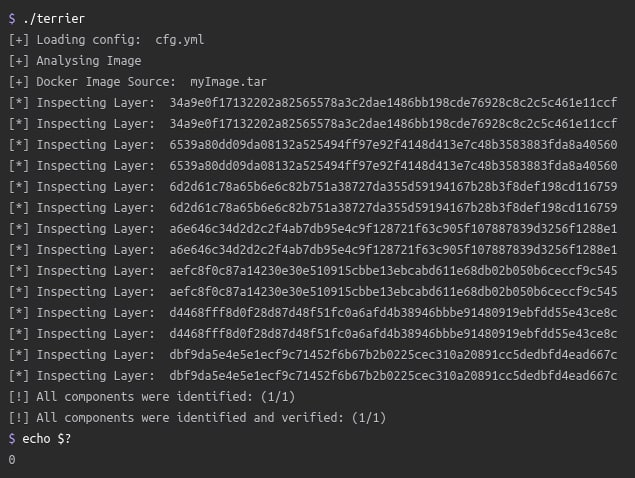

# overlamer1
`2020-11-30 16:28:04`

<blockquote>
Небольшой квест от нашей группы LAMERLAND
</blockquote>

---

# isast
`2020-11-30 15:33:58`

<blockquote>
https://github.com/xmendez/wfuzz

Wfuzz - The Web Fuzzer
Wfuzz has been created to facilitate the task in web applications assessments and it is based on a simple concept: it replaces any reference to the FUZZ keyword by the value of a given payload.

A payload in Wfuzz is a source of data.

This simple concept allows any input to be injected in any field of an HTTP request, allowing to perform complex web security attacks in different web application components such as: parameters, authentication, forms, directories/files, headers, etc.

Wfuzz is more than a web content scanner:
* Wfuzz could help you to secure your web applications by finding and exploiting web application vulnerabilities. Wfuzz’s web application vulnerability scanner is supported by plugins.
* Wfuzz is a completely modular framework and makes it easy for even the newest of Python developers to contribute. Building plugins is simple and takes little more than a few minutes.
* Wfuzz exposes a simple language interface to the previous HTTP requests/responses performed using Wfuzz or other tools, such as Burp. This allows you to perform manual and semi-automatic tests with full context and understanding of your actions, without relying on a web application scanner underlying implementation.

It was created to facilitate the task in web applications assessments, it's a tool by pentesters for pentesters ;)
</blockquote>

<table><tr><td><b>→</b><a href="https://github.com/xmendez/wfuzz">
https://github.com/xmendez/wfuzz
</a>
<blockquote>
Web application fuzzer. Contribute to xmendez/wfuzz development by creating an account on GitHub.
</blockquote>
</td></tr></table>

---

# isast
`2020-11-28 14:21:05`

<blockquote>
A self-hosted Fuzzing-As-A-Service platform

https://github.com/microsoft/onefuzz
</blockquote>

<table><tr><td><b>→</b><a href="https://github.com/microsoft/onefuzz">
https://github.com/microsoft/onefuzz
</a>
<blockquote>
A self-hosted Fuzzing-As-A-Service platform. Contribute to microsoft/onefuzz development by creating an account on GitHub.
</blockquote>
</td></tr></table>

---

# cyberoffru
`2020-11-26 17:56:14`

<blockquote>
InfoSec Black Friday Deals 2020

Традиционная подборка интересных предложений «Чёрной пятницы» из сферы инфосек — https://github.com/0x90n/InfoSec-Black-Friday

1Password с 50% скидкой, много платформ для обучения, трейнингов и лаб по скидке (SANS, Practical DevSecOps, PentesterLab и пр.) и многое другое. 

Большая часть скорее всего появится завтра, но уже есть из чего выбирать.
</blockquote>

<table><tr><td><b>→</b><a href="https://github.com/0x90n/InfoSec-Black-Friday">
https://github.com/0x90n/InfoSec-Black-Friday
</a>
<blockquote>
All the deals for InfoSec related software/tools this Black Friday - 0x90n/InfoSec-Black-Friday
</blockquote>
</td></tr></table>

---

# infobezopasnost
`2020-11-24 18:09:59`

<blockquote>
Охота на Zerologon / undefined / Хабр
https://m.habr.com/ru/company/bizone/blog/526168/
</blockquote>

<table><tr><td><b>→</b><a href="https://m.habr.com/ru/company/bizone/blog/526168/">
https://m.habr.com/ru/company/bizone/blog/526168/
</a>
<blockquote>
Авторы: Демьян Соколин (@_drd0c), Александр Большаков (@spacepatcher), Ильяс Игисинов (@ph7ntom), Хрыков Вадим (@BlackMatter23) CVE-2020-1472, или Zerologon, уже получила звание одной...
</blockquote>
</td></tr></table>

---

# isast
`2020-11-23 08:49:48`

<blockquote>
Terrier: An Open-Source Tool for Identifying and Analyzing Container and Image Components 
https://blog.heroku.com/terrier-open-source-identifying-analyzing-containers
+
https://github.com/heroku/terrier
</blockquote>

---

# overlamer1
`2020-11-15 21:06:58`

* https://telegra.ph/Stavim-otpechatok-palca-na-termuks-09-16

<blockquote>
Ставим отпечаток пальца на термукс
</blockquote>

<table><tr><td><b>→</b><a href="https://telegra.ph/Stavim-otpechatok-palca-na-termuks-09-16">
https://telegra.ph/Stavim-otpechatok-palca-na-termuks-09-16
</a>
<blockquote>
Всем привет! Нашел инструмент для входа по отпечатку в термукс, думаю это прикольно, так что давайте установим данный инструмент, поехали! источник статьи Обновим пакеты: pkg update upgrade -y Теперь нужен git: pkg install git Качаем инструмент: git clone https://github.com/MrAlpha786/termux-fingerprint-lock Открываем папек с инструментом: cd termux-fingerprint-lock Делаем главный файл исполняемым: chmod u+x setup И запускаем его: bash setup Попросят нажать на отпечаток, если что-то пошло не так, значит…
</blockquote>
</td></tr></table>

---

# cyberoffru
`2020-11-13 11:51:28`

* https://github.com/docker/for-mac/issues/4733

<blockquote>
Всё, народ. Расходимся.

Docker fails to launch on Apple Silicon

&#35;docker &#35;mac
</blockquote>

<table><tr><td><b>→</b><a href="https://github.com/docker/for-mac/issues/4733">
https://github.com/docker/for-mac/issues/4733
</a>
<blockquote>
Fails to launch on Apple Silicon (unsurprisingly given it's so new). Can't see a similar issue so raising here to track. I have tried with the latest version of my channel (Stable o...
</blockquote>
</td></tr></table>

---

# isast
`2020-11-13 10:08:54`

<blockquote>
&quot;Scorecard выполняет набор проверок, например:

- Есть ли в проекте политика безопасности (https://docs.github.com/en/free-pro-team@latest/github/managing-security-vulnerabilities/adding-a-security-policy-to-your-repository?)?
- Использует ли проект статические анализаторы кода (например, CodeQL (https://docs.github.com/en/free-pro-team@latest/github/finding-security-vulnerabilities-and-errors-in-your-code/enabling-code-scanning-for-a-repository&#35;enabling-code-scanning-using-actions))?
- Использует ли проект OSS-Fuzz (https://github.com/google/oss-fuzz)?
- Был ли новый релиз и коммит за последние 90 дней?
- Подписываются (https://wiki.debian.org/Creating%20signed%20GitHub%20releases) ли релизы?
- Являются ли контрибьютеры членами разных организаций?
- и другие проверки.

Каждая проверка оценивается по 10-бальной шкале уверенности. 0 - невозможно получить сигнал, 10 - инструмент уверен в результате.&quot;
</blockquote>

<table><tr><td><b>→</b><a href="https://docs.github.com/en/free-pro-team@latest/github/managing-security-vulnerabilities/adding-a-security-policy-to-your-repository">
https://docs.github.com/en/free-pro-team@latest/github/managing-security-vulnerabilities/adding-a-security-policy-to-your-repository
</a>
<blockquote>
You can give instructions for how to responsibly report a security vulnerability in your project by adding a security policy to your repository.
</blockquote>
</td></tr></table>

---

# isast
`2020-11-13 10:08:53`

* https://openssf.org/
* https://github.com/ossf/scorecard
* https://docs.github.com/en/free-pro-team@latest/github/managing-security-vulnerabilities/adding-a-security-policy-to-your-repository?
* https://docs.github.com/en/free-pro-team@latest/github/finding-security-vulnerabilities-and-errors-in-your-code/enabling-code-scanning-for-a-repository#enabling-code-scanning-using-actions
* https://github.com/google/oss-fuzz
* https://wiki.debian.org/Creating%20signed%20GitHub%20releases

<blockquote>
Security Scorecard for Open Source Projects

Open Source Security Foundation выпустила инструмент под названием Security Scorecard. Основная цель инструмента - автоматизировать анализ и процесс принятия решений об использовании open-source проектов на GitHub. Запускается инструмент довольно просто:
./scorecard --repo&#61;github.com/kubernetes/kubernetes 

После этого Scorecard выполняет набор проверок, например:

- Есть ли в проекте политика безопасности?
- Использует ли проект статические анализаторы кода (например, CodeQL)?
- Использует ли проект OSS-Fuzz?
- Был ли новый релиз и коммит за последние 90 дней?
- Подписываются ли релизы?
- Являются ли контрибьютеры членами разных организаций?
- и другие проверки.

Каждая проверка оценивается по 10-бальной шкале уверенности. 0 - невозможно получить сигнал, 10 - инструмент уверен в результате.

&#35;dev
</blockquote>

<table><tr><td><b>→</b><a href="https://openssf.org/">
https://openssf.org/
</a>
<blockquote>
Consolidating industry efforts to improve the security of open source software.
</blockquote>
</td></tr></table>

---

# MPSIEMChat
`2020-11-12 12:52:06`

<blockquote>
Это я из присланного Валерой описания бага понял :) https://github.com/elastic/elasticsearch/issues/44484
</blockquote>

<table><tr><td><b>→</b><a href="https://github.com/elastic/elasticsearch/issues/44484">
https://github.com/elastic/elasticsearch/issues/44484
</a>
<blockquote>
The Problem Currently, when a node experiences heavy load we continue to read from connections as fast as possible in most cases (recovery, snapshots, etc. have throughput limits, but essentially a...
</blockquote>
</td></tr></table>

---

# exploitex
`2020-11-12 09:20:04`

* https://telegra.ph/file/c32a178484359df40c39f.jpg
* https://tox.chat/
* https://ru.wikipedia.org/wiki/Tox
* https://github.com/Tox/tox.chat/tree/master/themes/website/templates/download.html

<blockquote>
​Какой сервис использовать для безопасной и конфиденциальной связи

Ни для кого не секрет, что приложения для видеозвонков, вроде Skype не имеют на борту надежного шифрования. На днях власти США выяснили, что даже сервис видеозвонков Zoom с 2016 года обманывал своих пользователей, заявляя о наличии сквозного шифрования, которого там на самом деле не было. 
 
Одним из малоизвестных в широких кругах приложением для анонимной и конфиденциальной связи является qTox. Используя протокол Tox для децентрализованной P2P связи на основе асимметричного шифрования, сервис позволяет не только переписываться, но и совершать аудио и видеозвонки. 

Для установки связи не нужно регистрироваться и подключаться к серверам, вам нужно лишь поделиться своим уникальным идентификатором, обмен информацией происходит напрямую между устройствами пользователей. Приложение имеет открытый исходный код, и доступно для таких платформ, как Windows, Linux, macOS, Android и FreeBSD. 

&#35;приватность
</blockquote>

<table><tr><td><b>→</b><a href="https://telegra.ph/file/c32a178484359df40c39f.jpg">
https://telegra.ph/file/c32a178484359df40c39f.jpg
</a>
</td></tr></table>

---

# cyberoffru
`2020-11-06 20:31:40`

<blockquote>
Ну вот например, без привязки к конкретному вендору, порядок цен на одного из них в публичном доступе
https://about.gitlab.com/devops-tools/checkmarx-vs-gitlab/
 like the other AppSec vendors, Checkmarx is expensive. It is priced per developer with a rough estimate of 12 Developers for $59k USD per year or 50 Developers for $99k USD per year.
</blockquote>

<table><tr><td><b>→</b><a href="https://about.gitlab.com/devops-tools/checkmarx-vs-gitlab/">
https://about.gitlab.com/devops-tools/checkmarx-vs-gitlab/
</a>
<blockquote>
Compare Checkmarx vs. GitLab
</blockquote>
</td></tr></table>

---

# phd_soc
`2020-11-04 13:14:23`

<blockquote>
Коллеги привет. Мои ребята написали статью про детектирование попыток эксплуатации Zerologon - https://habr.com/ru/company/bizone/blog/526168/
</blockquote>

<table><tr><td><b>→</b><a href="https://habr.com/ru/company/bizone/blog/526168/">
https://habr.com/ru/company/bizone/blog/526168/
</a>
<blockquote>
Авторы: Демьян Соколин (@_drd0c), Александр Большаков (@spacepatcher), Ильяс Игисинов (@ph7ntom), Хрыков Вадим (@BlackMatter23) CVE-2020-1472, или Zerologon, уж...
</blockquote>
</td></tr></table>

---

# ctfchat
`2020-11-01 19:02:20`

<blockquote>
https://t.me/spbctfnews/418
</blockquote>

<table><tr><td><b>→</b><a href="https://t.me/spbctfnews/418">
https://t.me/spbctfnews/418
</a>
<blockquote>
По многочисленным просьбам выкладываем репозиторий Ыжедневных тасков и сервисы с полузакрытой атак-дефенсной тренировки.

🦔 https://github.com/SPbCTF/daily_2020-02-02
🤼‍♂️ https://github.com/SPbCTF/training_2020-02-23 

Разбор ыжовых тасков: youtu.be/lTFmPYYCW5w

— vk.com/wall-114366489_1804 —
</blockquote>
</td></tr></table>

---

