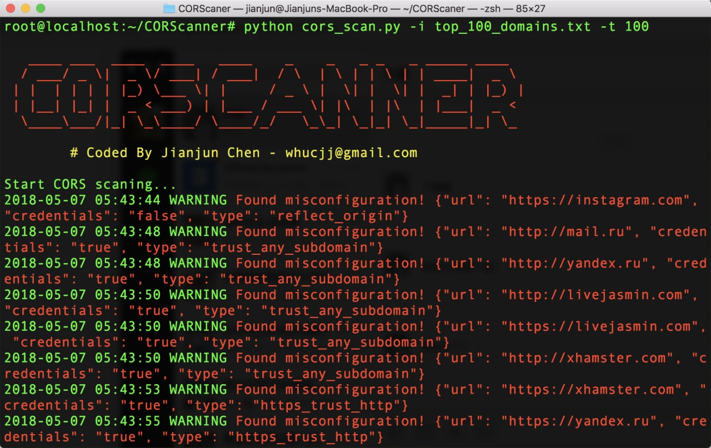
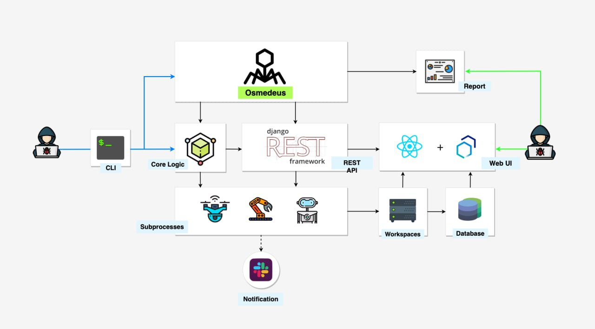
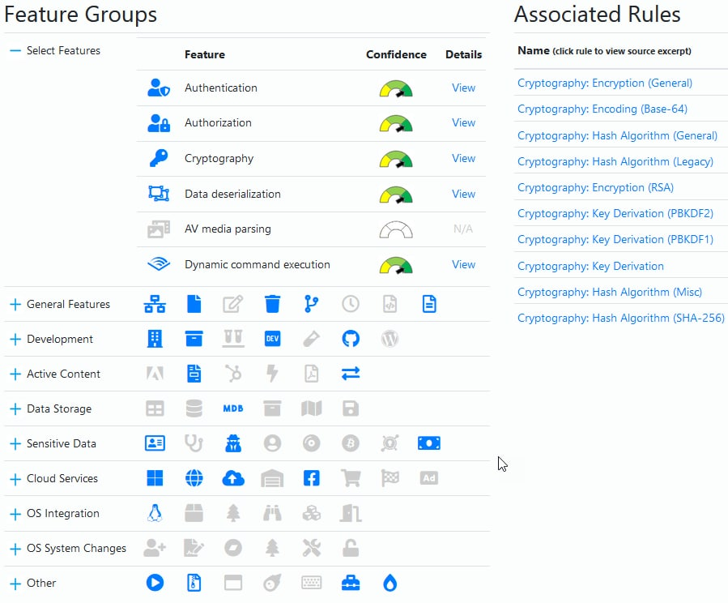
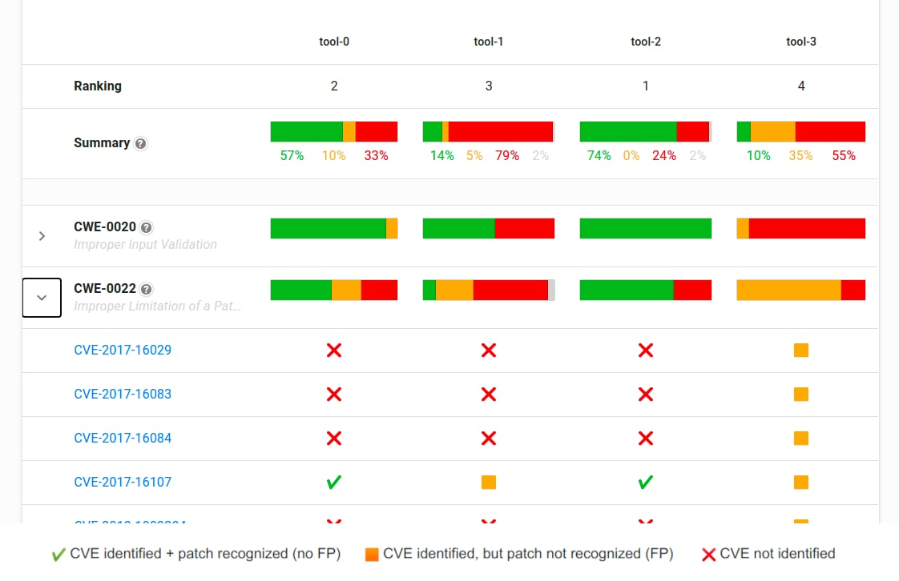
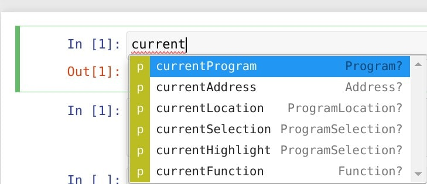

# freedomf0x
`2020-12-31 09:43:11`

<blockquote>
GitHub - mxrch/GHunt: 🕵️‍♂️ Investigate Google Accounts with emails.
https://github.com/mxrch/GHunt
</blockquote>

<table><tr><td><b>→</b><a href="https://github.com/mxrch/GHunt">
https://github.com/mxrch/GHunt
</a>
<blockquote>
🕵️‍♂️ Investigate Google emails and documents. Contribute to mxrch/GHunt development by creating an account on GitHub.
</blockquote>
</td></tr></table>

---

# freedomf0x
`2020-12-31 08:10:36`

<blockquote>
covid-19-data/public/data at master · owid/covid-19-data · GitHub
https://github.com/owid/covid-19-data/tree/master/public/data
</blockquote>

<table><tr><td><b>→</b><a href="https://github.com/owid/covid-19-data/tree/master/public/data">
https://github.com/owid/covid-19-data/tree/master/public/data
</a>
<blockquote>
Data on COVID-19 (coronavirus) cases, deaths, hospitalizations, tests • All countries • Updated daily by Our World in Data - owid/covid-19-data
</blockquote>
</td></tr></table>

---

# isast
`2020-12-30 23:36:13`

<blockquote>
Fast CORS misconfiguration vulnerabilities scanner
https://github.com/chenjj/CORScanner

CORS Misconfiguration Scanner 
https://github.com/s0md3v/Corsy
</blockquote>

---

# sysadm_in_channel
`2020-12-30 16:28:49`

<blockquote>
https://github.com/cddmp/enum4linux-ng/
</blockquote>

<table><tr><td><b>→</b><a href="https://github.com/cddmp/enum4linux-ng">
https://github.com/cddmp/enum4linux-ng
</a>
<blockquote>
A next generation version of enum4linux (a Windows/Samba enumeration tool) with additional features like JSON/YAML export. Aimed for security professionals and CTF players. - cddmp/enum4linux-ng
</blockquote>
</td></tr></table>

---

# defcon_news
`2020-12-30 07:53:27`

<blockquote>
Why Should I Be Worried About BlueKeep (CVE-2019-0708) | UpGuard
https://www.upguard.com/blog/bluekeep-rdp-cve-2019-five-reasons-to-be-worried

via UpGuard Blog
</blockquote>

<table><tr><td><b>→</b><a href="https://www.upguard.com/blog/bluekeep-rdp-cve-2019-five-reasons-to-be-worried">
https://www.upguard.com/blog/bluekeep-rdp-cve-2019-five-reasons-to-be-worried
</a>
<blockquote>
Read about BlueKeep (CVE-2019) and five reasons why you need to be on top of this emerging cybersecurity threat.
</blockquote>
</td></tr></table>

---

# defcon_news
`2020-12-29 12:53:35`

<blockquote>
survey on reliability of CVSS
http://seclists.org/fulldisclosure/2020/Dec/59

via Full Disclosure
</blockquote>

<table><tr><td><b>→</b><a href="https://seclists.org/fulldisclosure/2020/Dec/59">
https://seclists.org/fulldisclosure/2020/Dec/59
</a>
</td></tr></table>

---

# defcon_news
`2020-12-29 12:53:34`

<blockquote>
Re: CVE-2020-8150 – Remote Code Execution as SYSTEM/root via Backblaze
http://seclists.org/fulldisclosure/2020/Dec/58

via Full Disclosure
</blockquote>

<table><tr><td><b>→</b><a href="https://seclists.org/fulldisclosure/2020/Dec/58">
https://seclists.org/fulldisclosure/2020/Dec/58
</a>
</td></tr></table>

---

# defcon_news
`2020-12-29 12:53:33`

<blockquote>
Re: [FD] CVE-2020-8150 – Remote Code Execution as SYSTEM/root via Backblaze
http://seclists.org/fulldisclosure/2020/Dec/57

via Full Disclosure
</blockquote>

<table><tr><td><b>→</b><a href="https://seclists.org/fulldisclosure/2020/Dec/57">
https://seclists.org/fulldisclosure/2020/Dec/57
</a>
</td></tr></table>

---

# defcon_news
`2020-12-29 12:53:32`

<blockquote>
Cross-Site Scripting Vulnerabilities in SEOPanel 4.6.0
http://seclists.org/fulldisclosure/2020/Dec/56

via Full Disclosure
</blockquote>

<table><tr><td><b>→</b><a href="https://seclists.org/fulldisclosure/2020/Dec/56">
https://seclists.org/fulldisclosure/2020/Dec/56
</a>
</td></tr></table>

---

# overlamer1
`2020-12-29 11:18:52`

* https://telegra.ph/Raven-Avtomaticheskij-sbor-informacii-o-sotrudnikah-kompanii-09-30

<blockquote>
Raven: Автоматический сбор информации о сотрудниках компании
</blockquote>

<table><tr><td><b>→</b><a href="https://telegra.ph/Raven-Avtomaticheskij-sbor-informacii-o-sotrudnikah-kompanii-09-30">
https://telegra.ph/Raven-Avtomaticheskij-sbor-informacii-o-sotrudnikah-kompanii-09-30
</a>
<blockquote>
Инструмент Raven автоматизирует процесс сбора информации с Linkedin о сотрудниках целевой компании. Можно построить целую цепочку личностей: директора, менеджеры, подчиненные и т.д. Эти данные могут стать основой как для проведения банальных фишинговых, так и для более глубоких атак с применением СИ. источник статьи Установка Скачиваем программу с github: git clone https://github.com/0x09AL/raven.git Переходим в директорию и запускаем установщик: cd raven sh setup.sh Использование Для вывода справки нужно…
</blockquote>
</td></tr></table>

---

# sysadm_in_channel
`2020-12-29 06:56:47`

<blockquote>
Инструмент (PowerShell скрипт) который со слов разработчиков проверяет параметры безопасности Azure AD/O365

https://github.com/CrowdStrike/CRT
</blockquote>

<table><tr><td><b>→</b><a href="https://github.com/CrowdStrike/CRT">
https://github.com/CrowdStrike/CRT
</a>
<blockquote>
Contact: CRT@crowdstrike.com. Contribute to CrowdStrike/CRT development by creating an account on GitHub.
</blockquote>
</td></tr></table>

---

# defcon_news
`2020-12-29 01:53:11`

<blockquote>
Latest Joomla Exploit ‘CVE-2020-35616’ – Joomla ACL Security Vulnerabilities
https://www.reddit.com/r/netsec/comments/klskgm/latest_joomla_exploit_cve202035616_joomla_acl/

via /r/netsec - Information Security News &amp; Discussion
</blockquote>

<table><tr><td><b>→</b><a href="https://www.reddit.com/r/netsec/comments/klskgm/latest_joomla_exploit_cve202035616_joomla_acl/">
https://www.reddit.com/r/netsec/comments/klskgm/latest_joomla_exploit_cve202035616_joomla_acl/
</a>
<blockquote>
Posted in r/netsec by u/appsec1337 • 1 point and 0 comments
</blockquote>
</td></tr></table>

---

# defcon_news
`2020-12-29 01:53:09`

<blockquote>
CVE-2020-10148 (local file disclosure PoC for SolarWinds Orion aka door to SuperNova?)
https://www.reddit.com/r/netsec/comments/klrkze/cve202010148_local_file_disclosure_poc_for/

via /r/netsec - Information Security News &amp; Discussion
</blockquote>

<table><tr><td><b>→</b><a href="https://www.reddit.com/r/netsec/comments/klrkze/cve202010148_local_file_disclosure_poc_for/">
https://www.reddit.com/r/netsec/comments/klrkze/cve202010148_local_file_disclosure_poc_for/
</a>
<blockquote>
Posted in r/netsec by u/0xsha • 2 points and 0 comments
</blockquote>
</td></tr></table>

---

# freedomf0x
`2020-12-28 18:27:18`

<blockquote>
💣💣💣 @i_bo0om

https://youtu.be/lhHHgUNsTvI
</blockquote>

<table><tr><td><b>→</b><a href="https://youtu.be/lhHHgUNsTvI">
https://youtu.be/lhHHgUNsTvI
</a>
<blockquote>
Сегодня с нами Антон Bo0oM Лопаницын.
МОЙ АВТОРСКИЙ КУРС  https://my.xakep.ru/websec
Друзья, совместно с журналом Хакер мы запускаем курс &quot;Безопасность веб-приложений&quot;, ведущим которого будет ваш покорный слуга. 
Стоимость и детали курса по ссылке.
Если укажете промокод &quot;NO OFFENCE&quot;, получите скидку 10% :)
&#61;&#61;&#61;&#61;&#61;&#61;&#61;&#61;&#61;&#61;&#61;&#61;&#61;&#61;&#61;&#61;&#61;&#61;&#61;&#61;&#61;&#61;&#61;&#61;&#61;&#61;&#61;&#61;&#61;&#61;&#61;&#61;&#61;&#61;&#61;&#61;&#61;&#61;&#61;&#61;&#61;&#61;&#61;&#61;&#61;&#61;&#61;&#61;&#61;&#61;&#61;&#61;&#61;
Странички Бума:
https://t.me/webpwn
https://bo0om.ru/
https://twitter.com/i_bo0om
https://github.com/Bo0oM

Наш телеграм канал: http://no.offence.site/channel
Наша телеграм группа: https://t.me/no_offense_channel

Поддержать канал: https://www.donationalerts.com/r/no_offence

&#35;Bo0oM &#35;интервью &#35;Лопаницын &#35;ityoutubersru
</blockquote>
</td></tr></table>

---

# defcon_news
`2020-12-28 12:53:33`

<blockquote>
WHO COVID-19 Mobile App: Internal API endpoint is accesible for everyone
https://vulners.com/hackerone/H1:1066790?utm_source&#61;rss&amp;utm_medium&#61;rss&amp;utm_campaign&#61;rss

via Vulners
</blockquote>

<table><tr><td><b>→</b><a href="https://vulners.com/hackerone/H1:1066790?utm_source=rss&utm_medium=rss&utm_campaign=rss">
https://vulners.com/hackerone/H1:1066790?utm_source=rss&utm_medium=rss&utm_campaign=rss
</a>
<blockquote>
Summary: It looks like the endpoint /internal/cron/refreshCaseStats as configured in [cron.yaml]  (https://github.com/WorldHealthOrganization/app/blob/master/server/appengine/src/main/webapp/WEB-INF/cron.yaml&#35;L3) is accesible for everyone. Since it is configured as a cronjob to run every 5 minutes and starts with internal, this should not be the case, and could worst case lead to DoS if it's a costly operation. Steps To Reproduce:  Go to https://hack.whocoronavirus.org/internal/cron/refreshCaseStats time curl -v https://hack.whocoronavirus.org/internal/cron/refreshCaseStats  {F1130894} Show that it takes about 20 seconds, before a 200 OK response returns (with a single request). Supporting Material/References: https://github.com/WorldHealthOrganization/app/blob/master/server/appengine/src/main/webapp/WEB-INF/cron.yaml&#35;L3 Impact Depending on the impact / performance of the action 'refresh case stats'  this could lead to unnecesarry load on the backend (and charges) or even...
</blockquote>
</td></tr></table>

---

# freedomf0x
`2020-12-28 02:22:30`

<blockquote>
https://github.com/zer0yu/Awesome-CobaltStrike
</blockquote>

<table><tr><td><b>→</b><a href="https://github.com/zer0yu/Awesome-CobaltStrike">
https://github.com/zer0yu/Awesome-CobaltStrike
</a>
<blockquote>
cobaltstrike的相关资源汇总 / List of Awesome CobaltStrike Resources - zer0yu/Awesome-CobaltStrike
</blockquote>
</td></tr></table>

---

# freedomf0x
`2020-12-28 02:22:02`

<blockquote>
https://github.com/microsoft/Web-Dev-For-Beginners
</blockquote>

<table><tr><td><b>→</b><a href="https://github.com/microsoft/Web-Dev-For-Beginners">
https://github.com/microsoft/Web-Dev-For-Beginners
</a>
<blockquote>
24 Lessons, 12 Weeks, Get Started as a Web Developer - microsoft/Web-Dev-For-Beginners
</blockquote>
</td></tr></table>

---

# defcon_news
`2020-12-27 15:53:49`

<blockquote>
CVE-2020-10148 SolarWinds Orion API authentication bypass allows remote comand execution
https://www.reddit.com/r/netsec/comments/kkpivk/cve202010148_solarwinds_orion_api_authentication/

via /r/netsec - Information Security News &amp; Discussion
</blockquote>

<table><tr><td><b>→</b><a href="https://www.reddit.com/r/netsec/comments/kkpivk/cve202010148_solarwinds_orion_api_authentication/">
https://www.reddit.com/r/netsec/comments/kkpivk/cve202010148_solarwinds_orion_api_authentication/
</a>
<blockquote>
Posted in r/netsec by u/malware_bender • 33 points and 0 comments
</blockquote>
</td></tr></table>

---

# defcon_news
`2020-12-27 15:53:40`

<blockquote>
CVE-2020-8554 is a vulnerability that particularly affects multi-tenant Kubernetes clusters. If a potential attacker can create or edit services and pods, then they may be able to intercept traffic. Learn how to detect CVE-2020-8554 using open source Falco
https://www.reddit.com/r/netsec/comments/kiz6go/cve20208554_is_a_vulnerability_that_particularly/

via /r/netsec - Information Security News &amp; Discussion
</blockquote>

<table><tr><td><b>→</b><a href="https://www.reddit.com/r/netsec/comments/kiz6go/cve20208554_is_a_vulnerability_that_particularly/">
https://www.reddit.com/r/netsec/comments/kiz6go/cve20208554_is_a_vulnerability_that_particularly/
</a>
<blockquote>
Posted in r/netsec by u/RoutineConversation4 • 7 points and 0 comments
</blockquote>
</td></tr></table>

---

# defcon_news
`2020-12-27 15:53:37`

<blockquote>
Undocumented user account in Zyxel products (CVE-2020-29583)
https://www.reddit.com/r/netsec/comments/kiprc5/undocumented_user_account_in_zyxel_products/

via /r/netsec - Information Security News &amp; Discussion
</blockquote>

<table><tr><td><b>→</b><a href="https://www.reddit.com/r/netsec/comments/kiprc5/undocumented_user_account_in_zyxel_products/">
https://www.reddit.com/r/netsec/comments/kiprc5/undocumented_user_account_in_zyxel_products/
</a>
<blockquote>
Posted in r/netsec by u/bertv44 • 1 point and 0 comments
</blockquote>
</td></tr></table>

---

# reverseengineeringx
`2020-12-27 08:10:38`

<blockquote>
Anti-virus Artifacts II is out!

https://github.com/D3VI5H4/Antivirus-Artifacts/blob/main/AntivirusArtifacts2.pdf
</blockquote>

<table><tr><td><b>→</b><a href="https://github.com/D3VI5H4/Antivirus-Artifacts/blob/main/AntivirusArtifacts2.pdf">
https://github.com/D3VI5H4/Antivirus-Artifacts/blob/main/AntivirusArtifacts2.pdf
</a>
<blockquote>
Anti-virus artifacts. Listing APIs hooked by: Avira, BitDefender, F-Secure, MalwareBytes, Norton, TrendMicro, and WebRoot. - D3VI5H4/Antivirus-Artifacts
</blockquote>
</td></tr></table>

---

# isast
`2020-12-26 19:57:54`

<blockquote>
Fully automated offensive security framework for reconnaissance and vulnerability scanning 
https://github.com/j3ssie/Osmedeus
</blockquote>

---

# R0_Crew
`2020-12-26 18:54:10`

<blockquote>
Zydis v3.0 is now final! https://github.com/zyantific/zydis/releases/tag/v3.0.0 &#35;reverse &#35;dukeBarman
</blockquote>

<table><tr><td><b>→</b><a href="https://github.com/zyantific/zydis/releases/tag/v3.0.0">
https://github.com/zyantific/zydis/releases/tag/v3.0.0
</a>
<blockquote>
Detailed changelog (since v2.0.3)
Decoder

Improved legacy prefix decoding
Fixed gather register check for VGATHERPF0{D|Q}{PS|PD} instruction
Fixed some incorrect assert conditions
Fixed check for ...
</blockquote>
</td></tr></table>

---

# isast
`2020-12-26 10:24:53`

<blockquote>
Remember this? https://github.com/groundx/monocerus

going to bring lightweight EVM emulation + instrumentation engine to qiling framework. Fuzzing smart contract without the full official EVM is possible now!

ETA: when https://github.com/qilingframework/qiling reaches 2000 starts
</blockquote>

<table><tr><td><b>→</b><a href="https://github.com/groundx/monocerus">
https://github.com/groundx/monocerus
</a>
<blockquote>
Monocerus emulator framework. Contribute to groundx/monocerus development by creating an account on GitHub.
</blockquote>
</td></tr></table>

---

# exploitex
`2020-12-26 10:21:00`

* https://telegra.ph/file/8c97043c262de230d49b3.jpg
* https://github.com/tjackenpacken/taskbar-groups/releases

<blockquote>
​Как группировать ярлыки на панели задач Windows 10

Если вы привыкли использовать много программ на Windows 10 одновременно и вас не устраивает то, что ярлыки на панели задач занимают слишком много места, воспользуйтесь утилитой TaskbarGroups, которая позволяет удобно их группировать.

После запуска программы выберите пункт «Add taskbar group», добавьте иконку и название для новой группы, после чего нажмите «Add new shortcut» и выберите все ярлыки, которые нужно сгруппировать.

Далее необходимо кликнуть по созданной группе и выбрать ПКМ → Закрепить на панели задач в появившейся папке. При первом открытии группы ярлыков через панель задач, Windows покажет вам предупреждение, в котором необходимо снять галочку «Всегда спрашивать при открытии файла» и нажать Запустить.

&#35;полезно
</blockquote>

<table><tr><td><b>→</b><a href="https://telegra.ph/file/8c97043c262de230d49b3.jpg">
https://telegra.ph/file/8c97043c262de230d49b3.jpg
</a>
</td></tr></table>

---

# defcon_news
`2020-12-26 04:53:38`

<blockquote>
Re: [FD] CVE-2020-8150 – Remote Code Execution as SYSTEM/root via Backblaze
http://seclists.org/fulldisclosure/2020/Dec/55

via Full Disclosure
</blockquote>

<table><tr><td><b>→</b><a href="https://seclists.org/fulldisclosure/2020/Dec/55">
https://seclists.org/fulldisclosure/2020/Dec/55
</a>
</td></tr></table>

---

# defcon_news
`2020-12-26 04:53:37`

<blockquote>
Re: [FD] CVE-2020-8152 – Elevation of Privilege in Backblaze
http://seclists.org/fulldisclosure/2020/Dec/54

via Full Disclosure
</blockquote>

<table><tr><td><b>→</b><a href="https://seclists.org/fulldisclosure/2020/Dec/54">
https://seclists.org/fulldisclosure/2020/Dec/54
</a>
</td></tr></table>

---

# defcon_news
`2020-12-26 04:53:36`

<blockquote>
CarolinaCon Online CFP
http://seclists.org/fulldisclosure/2020/Dec/52

via Full Disclosure
</blockquote>

<table><tr><td><b>→</b><a href="https://seclists.org/fulldisclosure/2020/Dec/52">
https://seclists.org/fulldisclosure/2020/Dec/52
</a>
</td></tr></table>

---

# defcon_news
`2020-12-26 04:53:35`

<blockquote>
[CVE-2018-7580] - Philips Hue Denial of Service
http://seclists.org/fulldisclosure/2020/Dec/51

via Full Disclosure
</blockquote>

<table><tr><td><b>→</b><a href="https://seclists.org/fulldisclosure/2020/Dec/51">
https://seclists.org/fulldisclosure/2020/Dec/51
</a>
</td></tr></table>

---

# defcon_news
`2020-12-26 04:53:34`

<blockquote>
Re: [FD] CVE-2020-8152 – Elevation of Privilege in Backblaze
http://seclists.org/fulldisclosure/2020/Dec/53

via Full Disclosure
</blockquote>

<table><tr><td><b>→</b><a href="https://seclists.org/fulldisclosure/2020/Dec/53">
https://seclists.org/fulldisclosure/2020/Dec/53
</a>
</td></tr></table>

---

# defcon_news
`2020-12-26 04:53:33`

<blockquote>
Re: [FD] CVE-2020-8150 – Remote Code Execution as SYSTEM/root via Backblaze
http://seclists.org/fulldisclosure/2020/Dec/50

via Full Disclosure
</blockquote>

<table><tr><td><b>→</b><a href="https://seclists.org/fulldisclosure/2020/Dec/50">
https://seclists.org/fulldisclosure/2020/Dec/50
</a>
</td></tr></table>

---

# defcon_news
`2020-12-26 04:53:32`

<blockquote>
SYSS-2020-042 Urve - Exposure of Sensitive Information to an Unauthorized Actor (CWE-200)
http://seclists.org/fulldisclosure/2020/Dec/49

via Full Disclosure
</blockquote>

<table><tr><td><b>→</b><a href="https://seclists.org/fulldisclosure/2020/Dec/49">
https://seclists.org/fulldisclosure/2020/Dec/49
</a>
</td></tr></table>

---

# defcon_news
`2020-12-26 04:53:30`

<blockquote>
SYSS-2020-041 Urve - Missing Authorization (CWE-862)
http://seclists.org/fulldisclosure/2020/Dec/48

via Full Disclosure
</blockquote>

<table><tr><td><b>→</b><a href="https://seclists.org/fulldisclosure/2020/Dec/48">
https://seclists.org/fulldisclosure/2020/Dec/48
</a>
</td></tr></table>

---

# defcon_news
`2020-12-26 04:53:29`

<blockquote>
SYSS-2020-040 Urve - Missing Authentication for Critical Function (CWE-306)
http://seclists.org/fulldisclosure/2020/Dec/47

via Full Disclosure
</blockquote>

<table><tr><td><b>→</b><a href="https://seclists.org/fulldisclosure/2020/Dec/47">
https://seclists.org/fulldisclosure/2020/Dec/47
</a>
</td></tr></table>

---

# R0_Crew
`2020-12-26 03:27:51`

<blockquote>
Binary Ninja Debugger Plugin v1.0-beta was released https://github.com/Vector35/debugger &#35;reverse &#35;debugger &#35;binaryninja &#35;dukeBarman
</blockquote>

<table><tr><td><b>→</b><a href="https://github.com/Vector35/debugger">
https://github.com/Vector35/debugger
</a>
<blockquote>
Binary Ninja Debugger Plugin. Contribute to Vector35/debugger development by creating an account on GitHub.
</blockquote>
</td></tr></table>

---

# freedomf0x
`2020-12-25 19:14:30`

<blockquote>
GitHub - qilingframework/qiling: Qiling Advanced Binary Emulation Framework
https://github.com/qilingframework/qiling
</blockquote>

<table><tr><td><b>→</b><a href="https://github.com/qilingframework/qiling">
https://github.com/qilingframework/qiling
</a>
<blockquote>
Qiling Advanced Binary Emulation Framework. Contribute to qilingframework/qiling development by creating an account on GitHub.
</blockquote>
</td></tr></table>

---

# freedomf0x
`2020-12-25 05:53:56`

<blockquote>
https://github.com/cisagov/Sparrow
</blockquote>

<table><tr><td><b>→</b><a href="https://github.com/cisagov/Sparrow">
https://github.com/cisagov/Sparrow
</a>
<blockquote>
Sparrow.ps1 was created by CISA's Cloud Forensics team to help detect possible compromised accounts and applications in the Azure/m365 environment. - cisagov/Sparrow
</blockquote>
</td></tr></table>

---

# freedomf0x
`2020-12-25 05:53:45`

<blockquote>
https://github.com/CrowdStrike/CRT
</blockquote>

<table><tr><td><b>→</b><a href="https://github.com/CrowdStrike/CRT">
https://github.com/CrowdStrike/CRT
</a>
<blockquote>
Contact: CRT@crowdstrike.com. Contribute to CrowdStrike/CRT development by creating an account on GitHub.
</blockquote>
</td></tr></table>

---

# defcon_news
`2020-12-24 20:53:49`

<blockquote>
Июньский патч исправил 0-day уязвимость в Windows не до конца
https://xakep.ru/2020/12/24/cve-2020-17008/

via «Хакер»
</blockquote>

<table><tr><td><b>→</b><a href="https://xakep.ru/2020/12/24/cve-2020-17008/">
https://xakep.ru/2020/12/24/cve-2020-17008/
</a>
<blockquote>
Летом 2020 года исследователи Trend Micro Zero Day Initiative рассказали о пяти неисправленных 0-day уязвимостях в Windows, четыре из которых имели высокую степень риска. Теперь эксперты Google Project Zero заметили, что патч для одной из этих проблем оказался неэффективен.
</blockquote>
</td></tr></table>

---

# isast
`2020-12-24 17:29:05`

<blockquote>
Набросал реализацию сканера исправлений для исходников ядра на основе coccinelle https://github.com/evdenis/cvehound

Что делает: пытается обнаружить неисправленные куски кода для известных CVE.

Как работает: для каждой CVE в ядре есть шаблон coccinelle/grep с описанием ошибки в коде до исправления, либо описанием какой фикс в коде должен присутствовать. Соответственно, на исходниках запускается поиск на наличие &quot;незапатченного&quot; куска кода, либо проверяется отсутствие исправления.

Зачем нужно: если у вас есть лог разработки (git), то не нужно, можно и по нему проверить. Если у вас на руках только архив с исходниками, тогда проверку можно автоматизировать так. Не всегда есть лог разработки, не все версии ядер основываются на стабильных ветвях, иногда исходники выкладываются просто как архив. Пример - исходники ядер для samsung/huawei телефонов (opensource.samsung.com)

Что сейчас умеет: в первый релиз добавил шаблоны только для ~30 CVE (список https://github.com/evdenis/cvehound/tree/master/cvehound/cve). Запускается как ./cvehound --dir ~/linux, где ~/linux путь к исходникам ядра. Если добавить опцию --verbose будет показывать что сейчас проверяет и выводить файлы, в которых нашел отсутствие фикса. Опция --cve CVE-2020-27194 CVE-2020-29371 позволяет проверить наличие конкретных исправлений.
</blockquote>

<table><tr><td><b>→</b><a href="https://github.com/evdenis/cvehound">
https://github.com/evdenis/cvehound
</a>
<blockquote>
Check linux sources dump for known CVEs. Contribute to evdenis/cvehound development by creating an account on GitHub.
</blockquote>
</td></tr></table>

---

# defcon_news
`2020-12-24 16:53:33`

<blockquote>
[webapps] Apartment Visitors Management System 1.0 - Authentication Bypass
https://www.exploit-db.com/exploits/49335

via Exploit Database
</blockquote>

<table><tr><td><b>→</b><a href="https://www.exploit-db.com/exploits/49335">
https://www.exploit-db.com/exploits/49335
</a>
<blockquote>
Apartment Visitors Management System 1.0 - Authentication Bypass.. webapps exploit for PHP platform
</blockquote>
</td></tr></table>

---

# defcon_news
`2020-12-24 14:53:09`

<blockquote>
[webapps] GitLab 11.4.7 - RCE (Authenticated)
https://www.exploit-db.com/exploits/49334

via Exploit Database
</blockquote>

<table><tr><td><b>→</b><a href="https://www.exploit-db.com/exploits/49334">
https://www.exploit-db.com/exploits/49334
</a>
<blockquote>
GitLab 11.4.7 - RCE (Authenticated) (2). CVE-2018-19585CVE-2018-19571 . webapps exploit for Ruby platform
</blockquote>
</td></tr></table>

---

# defcon_news
`2020-12-24 14:53:08`

<blockquote>
[webapps] WordPress Plugin WP-PostRatings 1.86 - 'postratings_image' Cross-Site Scripting
https://www.exploit-db.com/exploits/49333

via Exploit Database
</blockquote>

<table><tr><td><b>→</b><a href="https://www.exploit-db.com/exploits/49333">
https://www.exploit-db.com/exploits/49333
</a>
<blockquote>
WordPress Plugin WP-PostRatings 1.86 - 'postratings_image' Cross-Site Scripting.. webapps exploit for PHP platform
</blockquote>
</td></tr></table>

---

# defcon_news
`2020-12-24 14:53:07`

<blockquote>
[webapps] WordPress Plugin Adning Advertising 1.5.5 - Arbitrary File Upload
https://www.exploit-db.com/exploits/49332

via Exploit Database
</blockquote>

<table><tr><td><b>→</b><a href="https://www.exploit-db.com/exploits/49332">
https://www.exploit-db.com/exploits/49332
</a>
<blockquote>
WordPress Plugin Adning Advertising 1.5.5 - Arbitrary File Upload.. webapps exploit for PHP platform
</blockquote>
</td></tr></table>

---

# cyberoffru
`2020-12-24 10:23:22`

<blockquote>
Процентов на 70 уверен, что в твоем кейсе поможет внутренний движок ЗАП. Т.е. в нем заскриптовать. И скорее всего тебе надо будет использовать Fuzzer HTTP Processor скрипт. Написать можно на Jython. Вот тут можно примеры посмотреть: 
https://github.com/zaproxy/community-scripts/tree/master/httpfuzzerprocessor
К тебе ближе вот такой пример. 
https://github.com/zaproxy/community-scripts/blob/master/httpfuzzerprocessor/randomUserAgent.js
</blockquote>

<table><tr><td><b>→</b><a href="https://github.com/zaproxy/community-scripts/tree/master/httpfuzzerprocessor">
https://github.com/zaproxy/community-scripts/tree/master/httpfuzzerprocessor
</a>
<blockquote>
A collection of ZAP scripts provided by the community - pull requests very welcome! - zaproxy/community-scripts
</blockquote>
</td></tr></table>

---

# defcon_news
`2020-12-23 23:53:47`

<blockquote>
GitHub Security Lab: Java: QL Query Detector for JHipster Generated CVE-2019-16303
https://vulners.com/hackerone/H1:1065403?utm_source&#61;rss&amp;utm_medium&#61;rss&amp;utm_campaign&#61;rss

via Vulners
</blockquote>

<table><tr><td><b>→</b><a href="https://vulners.com/hackerone/H1:1065403?utm_source=rss&utm_medium=rss&utm_campaign=rss">
https://vulners.com/hackerone/H1:1065403?utm_source=rss&utm_medium=rss&utm_campaign=rss
</a>
<blockquote>
This bug was reported directly to GitHub Security...
</blockquote>
</td></tr></table>

---

# defcon_news
`2020-12-23 23:53:46`

<blockquote>
GitHub Security Lab: 3,880 Pull Requests Generated to fix JHipster RNG Vulnerability CVE-2019-16303
https://vulners.com/hackerone/H1:1065402?utm_source&#61;rss&amp;utm_medium&#61;rss&amp;utm_campaign&#61;rss

via Vulners
</blockquote>

<table><tr><td><b>→</b><a href="https://vulners.com/hackerone/H1:1065402?utm_source=rss&utm_medium=rss&utm_campaign=rss">
https://vulners.com/hackerone/H1:1065402?utm_source=rss&utm_medium=rss&utm_campaign=rss
</a>
<blockquote>
This bug was reported directly to GitHub Security...
</blockquote>
</td></tr></table>

---

# reverseengineeringx
`2020-12-23 23:31:21`

<blockquote>
A list of Reverse Engineering articles, books, and papers

https://github.com/onethawt/reverseengineering-reading-list
</blockquote>

<table><tr><td><b>→</b><a href="https://github.com/onethawt/reverseengineering-reading-list">
https://github.com/onethawt/reverseengineering-reading-list
</a>
<blockquote>
A list of Reverse Engineering articles, books, and papers - onethawt/reverseengineering-reading-list
</blockquote>
</td></tr></table>

---

# defcon_news
`2020-12-23 17:53:13`

<blockquote>
Exploiting a Single Instruction Race Condition in Binder (CVE-2020-0423)
https://www.reddit.com/r/netsec/comments/ki5r4k/exploiting_a_single_instruction_race_condition_in/

via /r/netsec - Information Security News &amp; Discussion
</blockquote>

<table><tr><td><b>→</b><a href="https://www.reddit.com/r/netsec/comments/ki5r4k/exploiting_a_single_instruction_race_condition_in/">
https://www.reddit.com/r/netsec/comments/ki5r4k/exploiting_a_single_instruction_race_condition_in/
</a>
<blockquote>
Posted in r/netsec by u/NeatMonster • 15 points and 0 comments
</blockquote>
</td></tr></table>

---

# freedomf0x
`2020-12-23 15:31:20`

<blockquote>
Keytap2 - acoustic keyboard eavesdropping based on language n-gram frequencies · Discussion &#35;31 · ggerganov/kbd-audio · GitHub
https://github.com/ggerganov/kbd-audio/discussions/31
</blockquote>

<table><tr><td><b>→</b><a href="https://github.com/ggerganov/kbd-audio/discussions/31">
https://github.com/ggerganov/kbd-audio/discussions/31
</a>
</td></tr></table>

---

# defcon_news
`2020-12-23 14:53:23`

<blockquote>
[webapps] Baby Care System 1.0 - 'roleid' SQL Injection
https://www.exploit-db.com/exploits/49331

via Exploit Database
</blockquote>

<table><tr><td><b>→</b><a href="https://www.exploit-db.com/exploits/49331?utm_source=dlvr.it&utm_medium=twitter">
https://www.exploit-db.com/exploits/49331?utm_source=dlvr.it&utm_medium=twitter
</a>
<blockquote>
Baby Care System 1.0 - 'roleid' SQL Injection.. webapps exploit for PHP platform
</blockquote>
</td></tr></table>

---

# defcon_news
`2020-12-23 14:53:22`

<blockquote>
[webapps] TerraMaster TOS 4.2.06 - Unauthenticated Remote Code Execution (Metasploit)
https://www.exploit-db.com/exploits/49330

via Exploit Database
</blockquote>

<table><tr><td><b>→</b><a href="https://www.exploit-db.com/exploits/49330">
https://www.exploit-db.com/exploits/49330
</a>
<blockquote>
TerraMaster TOS 4.2.06 - Unauthenticated Remote Code Execution (Metasploit). CVE-2020-35665 . webapps exploit for Linux platform
</blockquote>
</td></tr></table>

---

# defcon_news
`2020-12-23 13:53:37`

<blockquote>
[webapps] Sales and Inventory System for Grocery Store 1.0 - Multiple Stored XSS
https://www.exploit-db.com/exploits/49329

via Exploit Database
</blockquote>

<table><tr><td><b>→</b><a href="https://www.exploit-db.com/exploits/49329?utm_source=dlvr.it&utm_medium=twitter">
https://www.exploit-db.com/exploits/49329?utm_source=dlvr.it&utm_medium=twitter
</a>
<blockquote>
Sales and Inventory System for Grocery Store 1.0 - Multiple Stored XSS.. webapps exploit for PHP platform
</blockquote>
</td></tr></table>

---

# defcon_news
`2020-12-23 12:53:36`

<blockquote>
[webapps] Wordpress Epsilon Framework Multiple Themes - Unauthenticated Function Injection
https://www.exploit-db.com/exploits/49327

via Exploit Database
</blockquote>

<table><tr><td><b>→</b><a href="https://www.exploit-db.com/exploits/49327">
https://www.exploit-db.com/exploits/49327
</a>
<blockquote>
Wordpress Epsilon Framework Multiple Themes - Unauthenticated Function Injection.. webapps exploit for PHP platform
</blockquote>
</td></tr></table>

---

# defcon_news
`2020-12-23 12:53:35`

<blockquote>
[webapps] Online Learning Management System 1.0 - 'id' SQL Injection
https://www.exploit-db.com/exploits/49326

via Exploit Database
</blockquote>

<table><tr><td><b>→</b><a href="https://www.exploit-db.com/exploits/49326?utm_source=dlvr.it&utm_medium=twitter">
https://www.exploit-db.com/exploits/49326?utm_source=dlvr.it&utm_medium=twitter
</a>
<blockquote>
Online Learning Management System 1.0 - 'id' SQL Injection.. webapps exploit for PHP platform
</blockquote>
</td></tr></table>

---

# defcon_news
`2020-12-23 12:53:34`

<blockquote>
[webapps] Online Learning Management System 1.0 - Multiple Stored XSS
https://www.exploit-db.com/exploits/49325

via Exploit Database
</blockquote>

<table><tr><td><b>→</b><a href="https://www.exploit-db.com/exploits/49325?utm_source=dlvr.it&utm_medium=twitter">
https://www.exploit-db.com/exploits/49325?utm_source=dlvr.it&utm_medium=twitter
</a>
<blockquote>
Online Learning Management System 1.0 - Multiple Stored XSS.. webapps exploit for PHP platform
</blockquote>
</td></tr></table>

---

# defcon_news
`2020-12-23 12:53:32`

<blockquote>
[webapps] Online Learning Management System 1.0 - Authentication Bypass
https://www.exploit-db.com/exploits/49324

via Exploit Database
</blockquote>

<table><tr><td><b>→</b><a href="https://www.exploit-db.com/exploits/49324?utm_source=dlvr.it&utm_medium=twitter">
https://www.exploit-db.com/exploits/49324?utm_source=dlvr.it&utm_medium=twitter
</a>
<blockquote>
Online Learning Management System 1.0 - Authentication Bypass.. webapps exploit for PHP platform
</blockquote>
</td></tr></table>

---

# defcon_news
`2020-12-23 12:53:31`

<blockquote>
[webapps] Class Scheduling System 1.0 - Multiple Stored XSS
https://www.exploit-db.com/exploits/49323

via Exploit Database
</blockquote>

<table><tr><td><b>→</b><a href="https://www.exploit-db.com/exploits/49323">
https://www.exploit-db.com/exploits/49323
</a>
<blockquote>
Class Scheduling System 1.0 - Multiple Stored XSS.. webapps exploit for PHP platform
</blockquote>
</td></tr></table>

---

# R0_Crew
`2020-12-23 08:57:01`

<blockquote>
UTK Web a visual toolkit for exploring and editing firmware images, running on web platforms https://github.com/orangecms/utk-web &#35;reverse &#35;uefi &#35;hardware &#35;dukeBarman
</blockquote>

<table><tr><td><b>→</b><a href="https://github.com/orangecms/utk-web">
https://github.com/orangecms/utk-web
</a>
<blockquote>
a visual toolkit for exploring and editing firmware images, running on web platforms - orangecms/utk-web
</blockquote>
</td></tr></table>

---

# sysadm_in_channel
`2020-12-23 04:17:50`

<blockquote>
Уязвимости TCP/IP стека

Обновления безопасности, доступные для стека Treck TCP/IP, устраняют две критические уязвимости, ведущие к удаленному выполнению кода или отказу в обслуживании:

https://treck.com/vulnerability-response-information/

Агентство по кибербезопасности и безопасности инфраструктуры США (CISA) выпустило рекомендацию, чтобы предупредить организации, использующие системы промышленного контроля (ICS), о рисках, связанных с этими уязвимостями:

https://us-cert.cisa.gov/ics/advisories/icsa-20-353-01

Инструмент поиска уязвимых &quot;tcp/ip&quot; устройств:
https://github.com/Forescout/project-memoria-detector
</blockquote>

<table><tr><td><b>→</b><a href="https://us-cert.cisa.gov/ics/advisories/icsa-20-353-01">
https://us-cert.cisa.gov/ics/advisories/icsa-20-353-01
</a>
<blockquote>
1. EXECUTIVE SUMMARY

CVSS v3 9.8

ATTENTION: Exploitable remotely

Vendor: Treck Inc.

Equipment: TCP/IP

Vulnerability: Heap-based Buffer Overflow, Out-of-bounds Read, Out-of-bounds Write
The Treck TCP/IP stack may be known by other names such as Kasago TCP/IP, ELMIC, Net+ OS, Quadnet, GHNET v2, Kwiknet, or AMX.
</blockquote>
</td></tr></table>

---

# defcon_news
`2020-12-23 01:53:12`

<blockquote>
AST-2020-004: Remote crash in res_pjsip_diversion
http://seclists.org/fulldisclosure/2020/Dec/46

via Full Disclosure
</blockquote>

<table><tr><td><b>→</b><a href="https://seclists.org/fulldisclosure/2020/Dec/46">
https://seclists.org/fulldisclosure/2020/Dec/46
</a>
</td></tr></table>

---

# defcon_news
`2020-12-23 01:53:11`

<blockquote>
AST-2020-003: Remote crash in res_pjsip_diversion
http://seclists.org/fulldisclosure/2020/Dec/45

via Full Disclosure
</blockquote>

<table><tr><td><b>→</b><a href="https://seclists.org/fulldisclosure/2020/Dec/45">
https://seclists.org/fulldisclosure/2020/Dec/45
</a>
</td></tr></table>

---

# webware
`2020-12-22 20:17:00`

* https://telegra.ph/file/5814a1c359a5556c2c48b.png

<blockquote>
​​Осторожно – WinRAR!

Чем и воспользовались отдельные злодеи и даже киберпреступные группы ))). Они до сих пор с успехом используют недавно исправленную уязвимость выполнения критического кода в WinRAR . Что, к сожалению, делает миллионы его пользователей уязвимыми для кибератак. Критическая уязвимость (CVE-2018-20250), исправленная в конце прошлого месяца командой WinRAR с выпуском WinRAR версии 5.70 beta 1, затрагивает все предыдущие версии WinRAR, выпущенные за последние 19 лет.

Читать: https://codeby.net/threads/ostorozhno-winrar.67344/

&#35;winrar &#35;exploit
</blockquote>

<table><tr><td><b>→</b><a href="https://telegra.ph/file/5814a1c359a5556c2c48b.png">
https://telegra.ph/file/5814a1c359a5556c2c48b.png
</a>
</td></tr></table>

---

# defcon_news
`2020-12-22 19:53:23`

<blockquote>
[local] 10-Strike Network Inventory Explorer Pro 9.05 - Buffer Overflow (SEH)
https://www.exploit-db.com/exploits/49322

via Exploit Database
</blockquote>

<table><tr><td><b>→</b><a href="https://www.exploit-db.com/exploits/49322?utm_source=dlvr.it&utm_medium=twitter">
https://www.exploit-db.com/exploits/49322?utm_source=dlvr.it&utm_medium=twitter
</a>
<blockquote>
10-Strike Network Inventory Explorer Pro 9.05 - Buffer Overflow (SEH).. local exploit for Windows platform
</blockquote>
</td></tr></table>

---

# defcon_news
`2020-12-22 19:53:22`

<blockquote>
[webapps] TerraMaster TOS 4.2.06 - RCE (Unauthenticated)
https://www.exploit-db.com/exploits/49321

via Exploit Database
</blockquote>

<table><tr><td><b>→</b><a href="https://www.exploit-db.com/exploits/49321?utm_source=dlvr.it&utm_medium=twitter">
https://www.exploit-db.com/exploits/49321?utm_source=dlvr.it&utm_medium=twitter
</a>
<blockquote>
TerraMaster TOS 4.2.06 - RCE (Unauthenticated).. webapps exploit for Linux platform
</blockquote>
</td></tr></table>

---

# defcon_news
`2020-12-22 19:53:20`

<blockquote>
[webapps] Faculty Evaluation System 1.0 - Stored XSS
https://www.exploit-db.com/exploits/49320

via Exploit Database
</blockquote>

<table><tr><td><b>→</b><a href="https://www.exploit-db.com/exploits/49320?utm_source=dlvr.it&utm_medium=twitter">
https://www.exploit-db.com/exploits/49320?utm_source=dlvr.it&utm_medium=twitter
</a>
<blockquote>
Faculty Evaluation System 1.0 - Stored XSS.. webapps exploit for PHP platform
</blockquote>
</td></tr></table>

---

# defcon_news
`2020-12-22 19:53:19`

<blockquote>
[webapps] Artworks Gallery Management System 1.0 - 'id' SQL Injection
https://www.exploit-db.com/exploits/49319

via Exploit Database
</blockquote>

<table><tr><td><b>→</b><a href="https://www.exploit-db.com/exploits/49319?utm_source=dlvr.it&utm_medium=twitter">
https://www.exploit-db.com/exploits/49319?utm_source=dlvr.it&utm_medium=twitter
</a>
<blockquote>
Artworks Gallery Management System 1.0 - 'id' SQL Injection.. webapps exploit for PHP platform
</blockquote>
</td></tr></table>

---

# defcon_news
`2020-12-22 13:53:10`

<blockquote>
[webapps] Webmin 1.962 - 'Package Updates' Escape Bypass RCE (Metasploit)
https://www.exploit-db.com/exploits/49318

via Exploit Database
</blockquote>

<table><tr><td><b>→</b><a href="https://www.exploit-db.com/exploits/49318">
https://www.exploit-db.com/exploits/49318
</a>
<blockquote>
Webmin 1.962 - 'Package Updates' Escape Bypass RCE (Metasploit). CVE-2020-35606 . webapps exploit for Linux platform
</blockquote>
</td></tr></table>

---

# defcon_news
`2020-12-22 12:53:31`

<blockquote>
[webapps] WordPress Plugin W3 Total Cache - Unauthenticated Arbitrary File Read (Metasploit)
https://www.exploit-db.com/exploits/49317

via Exploit Database
</blockquote>

<table><tr><td><b>→</b><a href="https://www.exploit-db.com/exploits/49317">
https://www.exploit-db.com/exploits/49317
</a>
<blockquote>
WordPress Plugin W3 Total Cache - Unauthenticated Arbitrary File Read (Metasploit).. webapps exploit for PHP platform
</blockquote>
</td></tr></table>

---

# defcon_news
`2020-12-22 11:53:40`

<blockquote>
[webapps] Multi Branch School Management System 3.5 - &quot;Create Branch&quot; Stored XSS
https://www.exploit-db.com/exploits/49316

via Exploit Database
</blockquote>

<table><tr><td><b>→</b><a href="https://www.exploit-db.com/exploits/49316?utm_source=dlvr.it&utm_medium=twitter">
https://www.exploit-db.com/exploits/49316?utm_source=dlvr.it&utm_medium=twitter
</a>
<blockquote>
Multi Branch School Management System 3.5 - &quot;Create Branch&quot; Stored XSS.. webapps exploit for PHP platform
</blockquote>
</td></tr></table>

---

# defcon_news
`2020-12-22 11:53:32`

<blockquote>
Уязвимость в Apache Airflow, допускающая использование одного сеанса на разных серверах
https://www.opennet.ru/opennews/art.shtml?num&#61;54298

via OpenNews.opennet.ru: Проблемы безопасности
</blockquote>

<table><tr><td><b>→</b><a href="https://www.opennet.ru/opennews/art.shtml?num=54298">
https://www.opennet.ru/opennews/art.shtml?num=54298
</a>
<blockquote>
Во входящем в состав платформы Apache Airflow web-сервере выявлена уязвимость (CVE-2020-17526), вызванная некорректной проверкой сеансов в конфигурации по умолчанию. Уязвимость позволяет пользователю одного сайта получить доступ к другому сайту, используя идентификатор сеанса от первого сайта (для входа достаточно отредактировать сессионную Cookie). Проблема вызвана использованием в предлагаемом по умолчанию файле конфигурации airflow.cfg временного ключа, одинакового для всех установок. При данных настройках сессионная Cookie, заверенная на одном сервере Airflow, подходила для другого сервера.
</blockquote>
</td></tr></table>

---

# defcon_news
`2020-12-22 11:53:29`

<blockquote>
[webapps] Library Management System 3.0 - &quot;Add Category&quot; Stored XSS
https://www.exploit-db.com/exploits/49315

via Exploit Database
</blockquote>

<table><tr><td><b>→</b><a href="https://www.exploit-db.com/exploits/49315?utm_source=dlvr.it&utm_medium=twitter">
https://www.exploit-db.com/exploits/49315?utm_source=dlvr.it&utm_medium=twitter
</a>
<blockquote>
Library Management System 3.0 - &quot;Add Category&quot; Stored XSS.. webapps exploit for PHP platform
</blockquote>
</td></tr></table>

---

# defcon_news
`2020-12-22 11:53:28`

<blockquote>
[webapps] CSE Bookstore 1.0 - Multiple SQL Injection
https://www.exploit-db.com/exploits/49314

via Exploit Database
</blockquote>

<table><tr><td><b>→</b><a href="https://www.exploit-db.com/exploits/49314">
https://www.exploit-db.com/exploits/49314
</a>
<blockquote>
CSE Bookstore 1.0 - Multiple SQL Injection.. webapps exploit for PHP platform
</blockquote>
</td></tr></table>

---

# defcon_news
`2020-12-22 11:53:25`

<blockquote>
[webapps] Pandora FMS 7.0 NG 750 - 'Network Scan' SQL Injection (Authenticated)
https://www.exploit-db.com/exploits/49312

via Exploit Database
</blockquote>

<table><tr><td><b>→</b><a href="https://www.exploit-db.com/exploits/49312?utm_source=dlvr.it&utm_medium=twitter">
https://www.exploit-db.com/exploits/49312?utm_source=dlvr.it&utm_medium=twitter
</a>
<blockquote>
Pandora FMS 7.0 NG 750 - 'Network Scan' SQL Injection (Authenticated).. webapps exploit for PHP platform
</blockquote>
</td></tr></table>

---

# defcon_news
`2020-12-22 11:53:23`

<blockquote>
[webapps] Victor CMS 1.0 - File Upload To RCE
https://www.exploit-db.com/exploits/49310

via Exploit Database
</blockquote>

<table><tr><td><b>→</b><a href="https://www.exploit-db.com/exploits/49310">
https://www.exploit-db.com/exploits/49310
</a>
<blockquote>
Victor CMS 1.0 - File Upload To RCE.. webapps exploit for PHP platform
</blockquote>
</td></tr></table>

---

# R0_Crew
`2020-12-22 11:22:57`

<blockquote>
Radare2 5.0.0 was released - codename: phoenix https://github.com/radareorg/radare2/releases/tag/5.0.0 &#35;reverse &#35;radare2 &#35;dukeBarman
</blockquote>

<table><tr><td><b>→</b><a href="https://github.com/radareorg/radare2/releases/tag/5.0.0">
https://github.com/radareorg/radare2/releases/tag/5.0.0
</a>
<blockquote>
r2-5.0
Commits: 510
Contributors: 65
Interface

Added the Comma API
Added r_str_wrap() and r_cons_printat() APIs
Fix adding comments in panels
Improved help messages
Removed problematic fortunes
Ad...
</blockquote>
</td></tr></table>

---

# cyberoffru
`2020-12-22 10:00:30`

* https://telegra.ph/file/879999fa54dfdf3bc735d.jpg
* https://labs.f-secure.com/blog/sniff-there-leaks-my-bitlocker-key/
* https://github.com/FSecureLABS/bitlocker-spi-toolkit

<blockquote>
​​Рисёрчер Henri Nurmi из финской компании F-Secure продемонстрировал способ перехвата мастер-ключа шифрования сервиса Windows BitLocker через SPI шину. 

Способ основан на давно известной архитектурной &quot;фиче&quot;, связанной с отсутствием дефолтной защиты соединения между центральным процессором и Trusted Platform Module, отвечающего за хранение ключа. Таким образом атакующий может перехватить данные различными путями, например, через LPC или I²C шину. Горячие финские парни обогатили этот список ещё одним способом.

Для эксперимента Henri Nurmi раскурочил относительно свежий ноутбук Dell и продемонстрировал, что flash-микросхема, которая используется для хранения микрокода прошивки и TPM-микросхема висят на одной SPI шине. Дальше в ход пошёл логический анализатор Saleae, программа декодирования сигнала с кастомным высокоуровневым анализатором и немного мозга.

Но на этом рисёрчер не остановился. Оказалось, что от PoC до взлома BitLocker на потоке рукой подать. При помощи доступного инструментария можно получить доступ к содержимому зашифрованного диска всего за три шага: перехватываем мастер-ключ через SPI шину, подключаем диск к другому компьютеру (или перегружаемся со специальной флэшки), расшифровываем и монтируем диск.

А пока консорциум за спиной TPM не прикрутил к чипсету защиту по умолчанию, мы настоятельно рекомендуем использовать модуль с PIN-кодом или загрузочным ключом.
</blockquote>

<table><tr><td><b>→</b><a href="https://telegra.ph/file/879999fa54dfdf3bc735d.jpg">
https://telegra.ph/file/879999fa54dfdf3bc735d.jpg
</a>
</td></tr></table>

---

# defcon_news
`2020-12-22 07:53:45`

<blockquote>
Summary of the recent Kubernetes Man-in-the-Middle Vulnerability (CVE-2020-8554)
https://www.reddit.com/r/netsec/comments/khtkgi/summary_of_the_recent_kubernetes_maninthemiddle/

via /r/netsec - Information Security News &amp; Discussion
</blockquote>

<table><tr><td><b>→</b><a href="https://www.reddit.com/r/netsec/comments/khtkgi/summary_of_the_recent_kubernetes_maninthemiddle/">
https://www.reddit.com/r/netsec/comments/khtkgi/summary_of_the_recent_kubernetes_maninthemiddle/
</a>
<blockquote>
Posted in r/netsec by u/pingpongfifa • 1 point and 0 comments
</blockquote>
</td></tr></table>

---

# defcon_news
`2020-12-22 07:53:41`

<blockquote>
CVE-2020-25860: Signature bypass in RAUC embedded Linux firmware updater
https://www.reddit.com/r/netsec/comments/khirmi/cve202025860_signature_bypass_in_rauc_embedded/

via /r/netsec - Information Security News &amp; Discussion
</blockquote>

<table><tr><td><b>→</b><a href="https://www.reddit.com/r/netsec/comments/khirmi/cve202025860_signature_bypass_in_rauc_embedded/">
https://www.reddit.com/r/netsec/comments/khirmi/cve202025860_signature_bypass_in_rauc_embedded/
</a>
<blockquote>
Posted in r/netsec by u/SRMish3 • 1 point and 0 comments
</blockquote>
</td></tr></table>

---

# R0_Crew
`2020-12-22 05:56:36`

<blockquote>
Go package that aids in binary analysis and exploitation https://github.com/zznop/sploit &#35;reverse &#35;exploitation &#35;dukeBarman
</blockquote>

<table><tr><td><b>→</b><a href="https://github.com/zznop/sploit">
https://github.com/zznop/sploit
</a>
<blockquote>
Go package that aids in binary analysis and exploitation - zznop/sploit
</blockquote>
</td></tr></table>

---

# defcon_news
`2020-12-22 04:53:07`

<blockquote>
Rocket.Chat Path Traversal
http://seclists.org/fulldisclosure/2020/Dec/44

via Full Disclosure
</blockquote>

<table><tr><td><b>→</b><a href="https://seclists.org/fulldisclosure/2020/Dec/44">
https://seclists.org/fulldisclosure/2020/Dec/44
</a>
</td></tr></table>

---

# defcon_news
`2020-12-22 02:53:37`

<blockquote>
remote code execution when open a project in android studio that google refused to fix(still 0day)
http://seclists.org/fulldisclosure/2020/Dec/43

via Full Disclosure
</blockquote>

<table><tr><td><b>→</b><a href="https://seclists.org/fulldisclosure/2020/Dec/43">
https://seclists.org/fulldisclosure/2020/Dec/43
</a>
</td></tr></table>

---

# defcon_news
`2020-12-22 02:53:36`

<blockquote>
SUPREMO Local privilege escalation
http://seclists.org/fulldisclosure/2020/Dec/42

via Full Disclosure
</blockquote>

<table><tr><td><b>→</b><a href="https://seclists.org/fulldisclosure/2020/Dec/42">
https://seclists.org/fulldisclosure/2020/Dec/42
</a>
</td></tr></table>

---

# R0_Crew
`2020-12-21 20:57:40`

<blockquote>
efiXplorer v3.0 [&#35;BHEU Edition] was released. Some new features:

- EFI modules dependency graph
- potential vulnerability checkers (SMM callout and GetVariable PEI/DXE/SMM)

https://github.com/binarly-io/efiXplorer/releases/tag/v3.0

 &#35;reverse &#35;ida &#35;uefi &#35;dukeBarman
</blockquote>

<table><tr><td><b>→</b><a href="https://github.com/binarly-io/efiXplorer/releases/tag/v3.0">
https://github.com/binarly-io/efiXplorer/releases/tag/v3.0
</a>
<blockquote>
Release notes:

EFI modules dependency graph inside efiXloader
Potential vulnerability checkers:

SMM callout
GetVariable (PEI/DXE/SMM)

Multiple improvements and bugfixes
</blockquote>
</td></tr></table>

---

# isast
`2020-12-21 19:49:28`

<blockquote>
Use the Microsoft Application Inspector to analyze your source code 
https://zimmergren.net/use-microsoft-application-inspector-to-analyze-source-code/
+
A source code analyzer built for surfacing features of interest and other characteristics to answer the question 'What's in the code?' quickly using static analysis with a json based rules engine.
https://github.com/microsoft/ApplicationInspector

Поддерживаемые языки
https://github.com/microsoft/ApplicationInspector/wiki/3.4-Applies_to-(languages)&#35;language-support
</blockquote>

---

# R0_Crew
`2020-12-21 18:34:41`

<blockquote>
Investigating IDA Lumina feature (&quot;creating own lumina server&quot;)

Article: https://www.synacktiv.com/publications/investigating-ida-lumina-feature.html
Code: https://github.com/synacktiv/lumina_server 

 &#35;reverse &#35;ida &#35;dukeBarman
</blockquote>

<table><tr><td><b>→</b><a href="https://www.synacktiv.com/publications/investigating-ida-lumina-feature.html">
https://www.synacktiv.com/publications/investigating-ida-lumina-feature.html
</a>
<blockquote>
Lumina is a built-in function recognition feature of the well-known IDA pro disassembler that relies on an online signature database.
</blockquote>
</td></tr></table>

---

# R0_Crew
`2020-12-21 15:53:52`

<blockquote>
Android Reverse Engineering WorkBench for VS Code https://github.com/Surendrajat/APKLab &#35;reverse &#35;android &#35;dukeBarman
</blockquote>

<table><tr><td><b>→</b><a href="https://github.com/Surendrajat/APKLab">
https://github.com/Surendrajat/APKLab
</a>
<blockquote>
Android Reverse-Engineering Workbench for VS Code. Contribute to APKLab/APKLab development by creating an account on GitHub.
</blockquote>
</td></tr></table>

---

# defcon_news
`2020-12-21 14:53:30`

<blockquote>
[webapps] Sony Playstation 4 (PS4) &lt; 7.02 - 'ValidationMessage::buildBubbleTree()' Use-After-Free WebKit Code Execution (PoC)
https://www.exploit-db.com/exploits/49309

via Exploit Database
</blockquote>

<table><tr><td><b>→</b><a href="https://www.exploit-db.com/exploits/49309">
https://www.exploit-db.com/exploits/49309
</a>
<blockquote>
Sony Playstation 4 (PS4) &lt; 7.02 - 'ValidationMessage::buildBubbleTree()' Use-After-Free WebKit Code Execution (PoC).. webapps exploit for Hardware platform
</blockquote>
</td></tr></table>

---

# defcon_news
`2020-12-21 14:53:29`

<blockquote>
[webapps] Online Marriage Registration System 1.0 - 'searchdata' SQL Injection
https://www.exploit-db.com/exploits/49307

via Exploit Database
</blockquote>

<table><tr><td><b>→</b><a href="https://www.exploit-db.com/exploits/49307">
https://www.exploit-db.com/exploits/49307
</a>
<blockquote>
Online Marriage Registration System 1.0 - 'searchdata' SQL Injection.. webapps exploit for PHP platform
</blockquote>
</td></tr></table>

---

# defcon_news
`2020-12-21 14:53:27`

<blockquote>
[webapps] Point of Sale System 1.0 - Multiple Stored XSS
https://www.exploit-db.com/exploits/49306

via Exploit Database
</blockquote>

<table><tr><td><b>→</b><a href="https://www.exploit-db.com/exploits/49306?utm_source=dlvr.it&utm_medium=twitter">
https://www.exploit-db.com/exploits/49306?utm_source=dlvr.it&utm_medium=twitter
</a>
<blockquote>
Point of Sale System 1.0 - Multiple Stored XSS.. webapps exploit for PHP platform
</blockquote>
</td></tr></table>

---

# defcon_news
`2020-12-21 14:53:26`

<blockquote>
[webapps] Flexmonster Pivot Table &amp; Charts 2.7.17 - 'Remote JSON' Reflected XSS
https://www.exploit-db.com/exploits/49305

via Exploit Database
</blockquote>

<table><tr><td><b>→</b><a href="https://www.exploit-db.com/exploits/49305?utm_source=dlvr.it&utm_medium=twitter">
https://www.exploit-db.com/exploits/49305?utm_source=dlvr.it&utm_medium=twitter
</a>
<blockquote>
Flexmonster Pivot Table &amp; Charts 2.7.17 - 'Remote JSON' Reflected XSS. CVE-2020-20139 . webapps exploit for Multiple platform
</blockquote>
</td></tr></table>

---

# defcon_news
`2020-12-21 13:53:41`

<blockquote>
[webapps] Flexmonster Pivot Table &amp; Charts 2.7.17 - 'To remote CSV' Reflected XSS
https://www.exploit-db.com/exploits/49304

via Exploit Database
</blockquote>

<table><tr><td><b>→</b><a href="https://www.exploit-db.com/exploits/49304">
https://www.exploit-db.com/exploits/49304
</a>
<blockquote>
Flexmonster Pivot Table &amp; Charts 2.7.17 - 'To remote CSV' Reflected XSS. CVE-2020-20142 . webapps exploit for Multiple platform
</blockquote>
</td></tr></table>

---

# defcon_news
`2020-12-21 13:53:40`

<blockquote>
[webapps] Flexmonster Pivot Table &amp; Charts 2.7.17 - 'To OLAP' Reflected XSS
https://www.exploit-db.com/exploits/49303

via Exploit Database
</blockquote>

<table><tr><td><b>→</b><a href="https://www.exploit-db.com/exploits/49303?utm_source=dlvr.it&utm_medium=twitter">
https://www.exploit-db.com/exploits/49303?utm_source=dlvr.it&utm_medium=twitter
</a>
<blockquote>
Flexmonster Pivot Table &amp; Charts 2.7.17 - 'To OLAP' Reflected XSS. CVE-2020-20141 . webapps exploit for Multiple platform
</blockquote>
</td></tr></table>

---

# defcon_news
`2020-12-21 13:53:38`

<blockquote>
[webapps] Flexmonster Pivot Table &amp; Charts 2.7.17 - 'Remote Report' Reflected XSS
https://www.exploit-db.com/exploits/49302

via Exploit Database
</blockquote>

<table><tr><td><b>→</b><a href="https://www.exploit-db.com/exploits/49302?utm_source=dlvr.it&utm_medium=twitter">
https://www.exploit-db.com/exploits/49302?utm_source=dlvr.it&utm_medium=twitter
</a>
<blockquote>
Flexmonster Pivot Table &amp; Charts 2.7.17 - 'Remote Report' Reflected XSS. CVE-2020-20140 . webapps exploit for Multiple platform
</blockquote>
</td></tr></table>

---

# ctfchat
`2020-12-21 13:39:52`

<blockquote>
Почитай про https://github.com/hzqst/VmwareHardenedLoader и чекеры типа https://github.com/LordNoteworthy/al-khaser
</blockquote>

<table><tr><td><b>→</b><a href="https://github.com/hzqst/VmwareHardenedLoader">
https://github.com/hzqst/VmwareHardenedLoader
</a>
<blockquote>
Vmware Hardened VM detection mitigation loader (anti anti-vm) - hzqst/VmwareHardenedLoader
</blockquote>
</td></tr></table>

---

# overlamer1
`2020-12-21 13:39:18`

* https://telegra.ph/Kak-TeamViewer-hranit-paroli-04-14

<blockquote>
Как TeamViewer хранит пароли
</blockquote>

<table><tr><td><b>→</b><a href="https://telegra.ph/Kak-TeamViewer-hranit-paroli-04-14">
https://telegra.ph/Kak-TeamViewer-hranit-paroli-04-14
</a>
<blockquote>
TeamViewer — популярная программа для удалённого доступа к рабочему столу. Поэтому довольно интересно посмотреть, как она хранит пароли. Если вкратце, пароли хранятся в реестре Windows в зашифрованном виде. Для шифрования используется алгоритм AES-128-CBC и секретный ключ 0602000000a400005253413100040000. Такой метод сохранения паролей и связанное с ним повышение привилегий официально зарегистрированы 7 февраля 2020 года как уязвимость CVE-2019-18988 (применима ко всем версиям TeamViewer до 14.7.1965 включительно).…
</blockquote>
</td></tr></table>

---

# defcon_news
`2020-12-21 12:53:47`

<blockquote>
[webapps] SCO Openserver 5.0.7 - 'outputform' Command Injection
https://www.exploit-db.com/exploits/49301

via Exploit Database
</blockquote>

<table><tr><td><b>→</b><a href="https://www.exploit-db.com/exploits/49301">
https://www.exploit-db.com/exploits/49301
</a>
<blockquote>
SCO Openserver 5.0.7 - 'outputform' Command Injection. CVE-2020-25494 . webapps exploit for SCO platform
</blockquote>
</td></tr></table>

---

# defcon_news
`2020-12-21 12:53:46`

<blockquote>
[webapps] SCO Openserver 5.0.7 - 'section' Reflected XSS
https://www.exploit-db.com/exploits/49300

via Exploit Database
</blockquote>

<table><tr><td><b>→</b><a href="https://www.exploit-db.com/exploits/49300">
https://www.exploit-db.com/exploits/49300
</a>
<blockquote>
SCO Openserver 5.0.7 - 'section' Reflected XSS. CVE-2020-25495 . webapps exploit for SCO platform
</blockquote>
</td></tr></table>

---

# defcon_news
`2020-12-21 12:53:43`

<blockquote>
[webapps] Spiceworks 7.5 - HTTP Header Injection
https://www.exploit-db.com/exploits/49299

via Exploit Database
</blockquote>

<table><tr><td><b>→</b><a href="https://www.exploit-db.com/exploits/49299">
https://www.exploit-db.com/exploits/49299
</a>
<blockquote>
Spiceworks 7.5 - HTTP Header Injection. CVE-2020-25901 . webapps exploit for Windows platform
</blockquote>
</td></tr></table>

---

# defcon_news
`2020-12-21 11:53:16`

<blockquote>
[webapps] Academy-LMS 4.3 - Stored XSS
https://www.exploit-db.com/exploits/49298

via Exploit Database
</blockquote>

<table><tr><td><b>→</b><a href="https://www.exploit-db.com/exploits/49298">
https://www.exploit-db.com/exploits/49298
</a>
<blockquote>
Academy-LMS 4.3 - Stored XSS.. webapps exploit for Multiple platform
</blockquote>
</td></tr></table>

---

# defcon_news
`2020-12-21 11:53:15`

<blockquote>
[webapps] Spotweb 1.4.9 - 'search' SQL Injection
https://www.exploit-db.com/exploits/49297

via Exploit Database
</blockquote>

<table><tr><td><b>→</b><a href="https://www.exploit-db.com/exploits/49297">
https://www.exploit-db.com/exploits/49297
</a>
<blockquote>
Spotweb 1.4.9 - 'search' SQL Injection.. webapps exploit for Multiple platform
</blockquote>
</td></tr></table>

---

# defcon_news
`2020-12-21 11:53:13`

<blockquote>
[webapps] Queue Management System 4.0.0 - &quot;Add User&quot; Stored XSS
https://www.exploit-db.com/exploits/49296

via Exploit Database
</blockquote>

<table><tr><td><b>→</b><a href="https://www.exploit-db.com/exploits/49296?utm_source=dlvr.it&utm_medium=twitter">
https://www.exploit-db.com/exploits/49296?utm_source=dlvr.it&utm_medium=twitter
</a>
<blockquote>
Queue Management System 4.0.0 - &quot;Add User&quot; Stored XSS.. webapps exploit for PHP platform
</blockquote>
</td></tr></table>

---

# defcon_news
`2020-12-21 11:53:12`

<blockquote>
[webapps] Wordpress Plugin Contact Form 7 5.3.1 - Unrestricted File Upload
https://www.exploit-db.com/exploits/49294

via Exploit Database
</blockquote>

<table><tr><td><b>→</b><a href="https://www.exploit-db.com/exploits/49294">
https://www.exploit-db.com/exploits/49294
</a>
<blockquote>
The Exploit Database - Exploits, Shellcode, 0days, Remote Exploits, Local Exploits, Web Apps, Vulnerability Reports, Security Articles, Tutorials and more.
</blockquote>
</td></tr></table>

---

# R0_Crew
`2020-12-20 22:05:23`

<blockquote>
An emulator powered by Qiling to deobfuscate/decrypt VAC3 modules https://github.com/ioncodes/vacation3-emu &#35;reverse &#35;dukeBarman
</blockquote>

<table><tr><td><b>→</b><a href="https://github.com/ioncodes/vacation3-emu">
https://github.com/ioncodes/vacation3-emu
</a>
<blockquote>
VAC3 module emulator. Contribute to ioncodes/vacation3-emu development by creating an account on GitHub.
</blockquote>
</td></tr></table>

---

# defcon_news
`2020-12-19 21:53:33`

<blockquote>
Rocket.Chat quietly patches XSS vulnerability
http://seclists.org/fulldisclosure/2020/Dec/41

via Full Disclosure
</blockquote>

<table><tr><td><b>→</b><a href="https://seclists.org/fulldisclosure/2020/Dec/41">
https://seclists.org/fulldisclosure/2020/Dec/41
</a>
</td></tr></table>

---

# defcon_news
`2020-12-19 21:53:31`

<blockquote>
CA20201215-01: Security Notice for CA Service Catalog
http://seclists.org/fulldisclosure/2020/Dec/40

via Full Disclosure
</blockquote>

<table><tr><td><b>→</b><a href="https://seclists.org/fulldisclosure/2020/Dec/40">
https://seclists.org/fulldisclosure/2020/Dec/40
</a>
</td></tr></table>

---

# defcon_news
`2020-12-19 21:53:30`

<blockquote>
Programi Bilanc - Build 007 Release 014 31.01.2020 - Software-update packages are downloaded via unencrypted HTTP [CVE-2020-11718]
http://seclists.org/fulldisclosure/2020/Dec/39

via Full Disclosure
</blockquote>

<table><tr><td><b>→</b><a href="https://seclists.org/fulldisclosure/2020/Dec/39">
https://seclists.org/fulldisclosure/2020/Dec/39
</a>
</td></tr></table>

---

# defcon_news
`2020-12-19 21:53:29`

<blockquote>
Programi Bilanc - Build 007 Release 014 31.01.2020 - Broken encryption with guessable static encryption key [CVE-2020-8995]
http://seclists.org/fulldisclosure/2020/Dec/38

via Full Disclosure
</blockquote>

<table><tr><td><b>→</b><a href="https://seclists.org/fulldisclosure/2020/Dec/38">
https://seclists.org/fulldisclosure/2020/Dec/38
</a>
</td></tr></table>

---

# isast
`2020-12-19 19:34:46`

<blockquote>
https://github.com/cve-search/cve-search/releases/tag/v4.0
</blockquote>

<table><tr><td><b>→</b><a href="https://github.com/cve-search/cve-search/releases/tag/v4.0">
https://github.com/cve-search/cve-search/releases/tag/v4.0
</a>
<blockquote>
cve-search v4.0 (2020-12-17) released with a major change in the web interface, a new ReST API and many many improvements.
cve-search has been significantly improved and especially the Web interfac...
</blockquote>
</td></tr></table>

---

# defcon_news
`2020-12-19 18:53:15`

<blockquote>
Geth security release: Critical patch for CVE-2020-28362
https://www.reddit.com/r/netsec/comments/kfiw27/geth_security_release_critical_patch_for/

via /r/netsec - Information Security News &amp; Discussion
</blockquote>

<table><tr><td><b>→</b><a href="https://www.reddit.com/r/netsec/comments/kfiw27/geth_security_release_critical_patch_for/">
https://www.reddit.com/r/netsec/comments/kfiw27/geth_security_release_critical_patch_for/
</a>
<blockquote>
Posted in r/netsec by u/davkor • 1 point and 0 comments
</blockquote>
</td></tr></table>

---

# defcon_news
`2020-12-19 18:53:14`

<blockquote>
Technical Advisory: OS Command Injection in Silver Peak EdgeConnect Appliances (CVE-2020-12148, CVE-2020-12149)
https://www.reddit.com/r/netsec/comments/kfih4v/technical_advisory_os_command_injection_in_silver/

via /r/netsec - Information Security News &amp; Discussion
</blockquote>

<table><tr><td><b>→</b><a href="https://www.reddit.com/r/netsec/comments/kfih4v/technical_advisory_os_command_injection_in_silver/">
https://www.reddit.com/r/netsec/comments/kfih4v/technical_advisory_os_command_injection_in_silver/
</a>
<blockquote>
Posted in r/netsec by u/digicat • 1 point and 0 comments
</blockquote>
</td></tr></table>

---

# defcon_news
`2020-12-18 20:53:25`

<blockquote>
Defense in depth -- the Microsoft way (part 68): where compatibility means vulnerability
http://seclists.org/fulldisclosure/2020/Dec/37

via Full Disclosure
</blockquote>

<table><tr><td><b>→</b><a href="https://seclists.org/fulldisclosure/2020/Dec/37">
https://seclists.org/fulldisclosure/2020/Dec/37
</a>
</td></tr></table>

---

# defcon_news
`2020-12-18 20:53:23`

<blockquote>
Programi Bilanc - Build 007 Release 014 31.01.2020 - Multiple SQL Injections [CVE-2020-11717]
http://seclists.org/fulldisclosure/2020/Dec/36

via Full Disclosure
</blockquote>

<table><tr><td><b>→</b><a href="https://seclists.org/fulldisclosure/2020/Dec/36">
https://seclists.org/fulldisclosure/2020/Dec/36
</a>
</td></tr></table>

---

# defcon_news
`2020-12-18 20:53:21`

<blockquote>
Programi Bilanc - Build 007 Release 014 31.01.2020 - Broken encryption with guessable static encryption key [CVE-2020-11719]
http://seclists.org/fulldisclosure/2020/Dec/35

via Full Disclosure
</blockquote>

<table><tr><td><b>→</b><a href="https://seclists.org/fulldisclosure/2020/Dec/35">
https://seclists.org/fulldisclosure/2020/Dec/35
</a>
</td></tr></table>

---

# defcon_news
`2020-12-18 20:53:20`

<blockquote>
Programi Bilanc - Build 007 Release 014 31.01.2020 - Use of weak default Password - CVE-2020-11720
http://seclists.org/fulldisclosure/2020/Dec/34

via Full Disclosure
</blockquote>

<table><tr><td><b>→</b><a href="https://seclists.org/fulldisclosure/2020/Dec/34">
https://seclists.org/fulldisclosure/2020/Dec/34
</a>
</td></tr></table>

---

# defcon_news
`2020-12-18 17:53:20`

<blockquote>
[remote] FRITZ!Box 7.20 - DNS Rebinding Protection Bypass
https://www.exploit-db.com/exploits/49293

via Exploit Database
</blockquote>

<table><tr><td><b>→</b><a href="https://www.exploit-db.com/exploits/49293?utm_source=dlvr.it&utm_medium=twitter">
https://www.exploit-db.com/exploits/49293?utm_source=dlvr.it&utm_medium=twitter
</a>
<blockquote>
FRITZ!Box 7.20 - DNS Rebinding Protection Bypass. CVE-2020-26887 . remote exploit for Hardware platform
</blockquote>
</td></tr></table>

---

# defcon_news
`2020-12-18 15:53:14`

<blockquote>
[webapps] Xeroneit Library Management System 3.1 - &quot;Add Book Category &quot; Stored XSS
https://www.exploit-db.com/exploits/49292

via Exploit Database
</blockquote>

<table><tr><td><b>→</b><a href="https://www.exploit-db.com/exploits/49292?utm_source=dlvr.it&utm_medium=twitter">
https://www.exploit-db.com/exploits/49292?utm_source=dlvr.it&utm_medium=twitter
</a>
<blockquote>
Xeroneit Library Management System 3.1 - &quot;Add Book Category &quot; Stored XSS.. webapps exploit for PHP platform
</blockquote>
</td></tr></table>

---

# defcon_news
`2020-12-18 15:53:13`

<blockquote>
[webapps] SyncBreeze 10.0.28 - 'login' Denial of Service (Poc)
https://www.exploit-db.com/exploits/49291

via Exploit Database
</blockquote>

<table><tr><td><b>→</b><a href="https://www.exploit-db.com/exploits/49291?utm_source=dlvr.it&utm_medium=twitter">
https://www.exploit-db.com/exploits/49291?utm_source=dlvr.it&utm_medium=twitter
</a>
<blockquote>
SyncBreeze 10.0.28 - 'login' Denial of Service (Poc).. webapps exploit for Windows platform
</blockquote>
</td></tr></table>

---

# defcon_news
`2020-12-18 13:53:29`

<blockquote>
Уязвимость в WordPress-дополнении Contact Form 7, насчитывающем 5 млн установок
https://www.opennet.ru/opennews/art.shtml?num&#61;54281

via OpenNews.opennet.ru: Проблемы безопасности
</blockquote>

<table><tr><td><b>→</b><a href="https://www.opennet.ru/opennews/art.shtml?num=54281">
https://www.opennet.ru/opennews/art.shtml?num=54281
</a>
<blockquote>
В WordPress-дополнении Contact Form 7 5.3.2, имеющем более 5 млн активных установок, устранена уязвимость (CVE-2020-35489), позволяющая организовать выполнение PHP-кода на сервере.
</blockquote>
</td></tr></table>

---

# defcon_news
`2020-12-18 13:53:26`

<blockquote>
[webapps] Smart Hospital 3.1 - &quot;Add Patient&quot; Stored XSS
https://www.exploit-db.com/exploits/49290

via Exploit Database
</blockquote>

<table><tr><td><b>→</b><a href="https://www.exploit-db.com/exploits/49290?utm_source=dlvr.it&utm_medium=twitter">
https://www.exploit-db.com/exploits/49290?utm_source=dlvr.it&utm_medium=twitter
</a>
<blockquote>
Smart Hospital 3.1 - &quot;Add Patient&quot; Stored XSS.. webapps exploit for PHP platform
</blockquote>
</td></tr></table>

---

# defcon_news
`2020-12-18 12:53:25`

<blockquote>
A slightly optimistic tale of how patching went for CVE-2019-19781, (Fri, Dec 18th)
https://isc.sans.edu/diary/rss/26900

via SANS Internet Storm Center, InfoCON: green
</blockquote>

<table><tr><td><b>→</b><a href="https://isc.sans.edu/diary/rss/26900">
https://isc.sans.edu/diary/rss/26900
</a>
<blockquote>
A slightly optimistic tale of how patching went for CVE-2019-19781, Author: Jan Kopriva
</blockquote>
</td></tr></table>

---

# defcon_news
`2020-12-18 11:53:38`

<blockquote>
[webapps] Wordpress Plugin Duplicator 1.3.26 - Unauthenticated Arbitrary File Read (Metasploit)
https://www.exploit-db.com/exploits/49288

via Exploit Database
</blockquote>

<table><tr><td><b>→</b><a href="https://www.exploit-db.com/exploits/49288">
https://www.exploit-db.com/exploits/49288
</a>
<blockquote>
Wordpress Plugin Duplicator 1.3.26 - Unauthenticated Arbitrary File Read (Metasploit).. webapps exploit for PHP platform
</blockquote>
</td></tr></table>

---

# defcon_news
`2020-12-18 10:53:17`

<blockquote>
[webapps] Alumni Management System 1.0 - 'id' SQL Injection
https://www.exploit-db.com/exploits/49287

via Exploit Database
</blockquote>

<table><tr><td><b>→</b><a href="https://www.exploit-db.com/exploits/49287?utm_source=dlvr.it&utm_medium=twitter">
https://www.exploit-db.com/exploits/49287?utm_source=dlvr.it&utm_medium=twitter
</a>
<blockquote>
Alumni Management System 1.0 - 'id' SQL Injection.. webapps exploit for PHP platform
</blockquote>
</td></tr></table>

---

# defcon_news
`2020-12-18 10:53:12`

<blockquote>
[webapps] Alumni Management System 1.0 - &quot;Course Form&quot; Stored XSS
https://www.exploit-db.com/exploits/49286

via Exploit Database
</blockquote>

<table><tr><td><b>→</b><a href="https://www.exploit-db.com/exploits/49286?utm_source=dlvr.it&utm_medium=twitter">
https://www.exploit-db.com/exploits/49286?utm_source=dlvr.it&utm_medium=twitter
</a>
<blockquote>
Alumni Management System 1.0 - &quot;Course Form&quot; Stored XSS.. webapps exploit for PHP platform
</blockquote>
</td></tr></table>

---

# defcon_news
`2020-12-18 10:53:10`

<blockquote>
[webapps] Alumni Management System 1.0 - Unrestricted File Upload To RCE
https://www.exploit-db.com/exploits/49285

via Exploit Database
</blockquote>

<table><tr><td><b>→</b><a href="https://www.exploit-db.com/exploits/49285?utm_source=dlvr.it&utm_medium=twitter">
https://www.exploit-db.com/exploits/49285?utm_source=dlvr.it&utm_medium=twitter
</a>
<blockquote>
Alumni Management System 1.0 - Unrestricted File Upload To RCE.. webapps exploit for PHP platform
</blockquote>
</td></tr></table>

---

# defcon_news
`2020-12-18 10:53:08`

<blockquote>
[webapps] Point of Sale System 1.0 - Authentication Bypass
https://www.exploit-db.com/exploits/49284

via Exploit Database
</blockquote>

<table><tr><td><b>→</b><a href="https://www.exploit-db.com/exploits/49284?utm_source=dlvr.it&utm_medium=twitter">
https://www.exploit-db.com/exploits/49284?utm_source=dlvr.it&utm_medium=twitter
</a>
<blockquote>
Point of Sale System 1.0 - Authentication Bypass.. webapps exploit for PHP platform
</blockquote>
</td></tr></table>

---

# defcon_news
`2020-12-18 09:53:24`

<blockquote>
Write-up: CVE-2020-25695 Privilege Escalation in Postgresql
https://www.reddit.com/r/netsec/comments/kew2sr/writeup_cve202025695_privilege_escalation_in/

via /r/netsec - Information Security News &amp; Discussion
</blockquote>

<table><tr><td><b>→</b><a href="https://www.reddit.com/r/netsec/comments/kew2sr/writeup_cve202025695_privilege_escalation_in/">
https://www.reddit.com/r/netsec/comments/kew2sr/writeup_cve202025695_privilege_escalation_in/
</a>
<blockquote>
Posted in r/netsec by u/bluedoehunter • 19 points and 0 comments
</blockquote>
</td></tr></table>

---

# freedomf0x
`2020-12-18 06:14:24`

<blockquote>
https://github.com/0x4143/malware-gems
</blockquote>

<table><tr><td><b>→</b><a href="https://github.com/0x4143/malware-gems">
https://github.com/0x4143/malware-gems
</a>
<blockquote>
A not so awesome list of malware gems for aspiring malware analysts - 0x4143/malware-gems
</blockquote>
</td></tr></table>

---

# defcon_news
`2020-12-17 16:53:21`

<blockquote>
[dos] nxlog 2.10.2150 - DoS (Poc)
https://www.exploit-db.com/exploits/49283

via Exploit Database
</blockquote>

<table><tr><td><b>→</b><a href="https://www.exploit-db.com/exploits/49283?utm_source=dlvr.it&utm_medium=twitter">
https://www.exploit-db.com/exploits/49283?utm_source=dlvr.it&utm_medium=twitter
</a>
<blockquote>
nxlog 2.10.2150 - DoS (Poc).. dos exploit for Multiple platform
</blockquote>
</td></tr></table>

---

# defcon_news
`2020-12-17 16:53:20`

<blockquote>
[webapps] Victor CMS 1.0 - Multiple SQL Injection (Authenticated)
https://www.exploit-db.com/exploits/49282

via Exploit Database
</blockquote>

<table><tr><td><b>→</b><a href="https://www.exploit-db.com/exploits/49282?utm_source=dlvr.it&utm_medium=twitter">
https://www.exploit-db.com/exploits/49282?utm_source=dlvr.it&utm_medium=twitter
</a>
<blockquote>
Victor CMS 1.0 - Multiple SQL Injection (Authenticated).. webapps exploit for PHP platform
</blockquote>
</td></tr></table>

---

# defcon_news
`2020-12-17 15:53:37`

<blockquote>
SEC Consult SA-20201217-0 :: Multiple critical vulnerabilities in Trend Micro InterScan Web Security Virtual Appliance (IWSVA)
http://seclists.org/fulldisclosure/2020/Dec/33

via Full Disclosure
</blockquote>

<table><tr><td><b>→</b><a href="https://seclists.org/fulldisclosure/2020/Dec/33">
https://seclists.org/fulldisclosure/2020/Dec/33
</a>
</td></tr></table>

---

# defcon_news
`2020-12-17 11:53:29`

<blockquote>
[webapps] PHPJabbers Appointment Scheduler 2.3 - Reflected XSS (Cross-Site Scripting)
https://www.exploit-db.com/exploits/49281

via Exploit Database
</blockquote>

<table><tr><td><b>→</b><a href="https://www.exploit-db.com/exploits/49281?utm_source=dlvr.it&utm_medium=twitter">
https://www.exploit-db.com/exploits/49281?utm_source=dlvr.it&utm_medium=twitter
</a>
<blockquote>
PHPJabbers Appointment Scheduler 2.3 - Reflected XSS (Cross-Site Scripting).. webapps exploit for PHP platform
</blockquote>
</td></tr></table>

---

# defcon_news
`2020-12-17 11:53:28`

<blockquote>
[webapps] Employee Record System 1.0 - Multiple Stored XSS
https://www.exploit-db.com/exploits/49280

via Exploit Database
</blockquote>

<table><tr><td><b>→</b><a href="https://www.exploit-db.com/exploits/49280?utm_source=dlvr.it&utm_medium=twitter">
https://www.exploit-db.com/exploits/49280?utm_source=dlvr.it&utm_medium=twitter
</a>
<blockquote>
Employee Record System 1.0 - Multiple Stored XSS.. webapps exploit for PHP platform
</blockquote>
</td></tr></table>

---

# defcon_news
`2020-12-17 11:53:26`

<blockquote>
[webapps] Interview Management System 1.0 - 'id' SQL Injection
https://www.exploit-db.com/exploits/49279

via Exploit Database
</blockquote>

<table><tr><td><b>→</b><a href="https://www.exploit-db.com/exploits/49279?utm_source=dlvr.it&utm_medium=twitter">
https://www.exploit-db.com/exploits/49279?utm_source=dlvr.it&utm_medium=twitter
</a>
<blockquote>
Interview Management System 1.0 - 'id' SQL Injection.. webapps exploit for PHP platform
</blockquote>
</td></tr></table>

---

# defcon_news
`2020-12-17 11:53:25`

<blockquote>
[webapps] Interview Management System 1.0 - Stored XSS in Add New Question
https://www.exploit-db.com/exploits/49278

via Exploit Database
</blockquote>

<table><tr><td><b>→</b><a href="https://www.exploit-db.com/exploits/49278?utm_source=dlvr.it&utm_medium=twitter">
https://www.exploit-db.com/exploits/49278?utm_source=dlvr.it&utm_medium=twitter
</a>
<blockquote>
Interview Management System 1.0 - Stored XSS in Add New Question.. webapps exploit for PHP platform
</blockquote>
</td></tr></table>

---

# defcon_news
`2020-12-17 11:53:24`

<blockquote>
[webapps] Online Tours &amp; Travels Management System 1.0 - &quot;id&quot; SQL Injection
https://www.exploit-db.com/exploits/49277

via Exploit Database
</blockquote>

<table><tr><td><b>→</b><a href="https://www.exploit-db.com/exploits/49277?utm_source=dlvr.it&utm_medium=twitter">
https://www.exploit-db.com/exploits/49277?utm_source=dlvr.it&utm_medium=twitter
</a>
<blockquote>
Online Tours &amp; Travels Management System 1.0 - &quot;id&quot; SQL Injection.. webapps exploit for PHP platform
</blockquote>
</td></tr></table>

---

# defcon_news
`2020-12-17 11:53:23`

<blockquote>
[webapps] Customer Support System 1.0 - 'id' SQL Injection
https://www.exploit-db.com/exploits/49276

via Exploit Database
</blockquote>

<table><tr><td><b>→</b><a href="https://www.exploit-db.com/exploits/49276?utm_source=dlvr.it&utm_medium=twitter">
https://www.exploit-db.com/exploits/49276?utm_source=dlvr.it&utm_medium=twitter
</a>
<blockquote>
Customer Support System 1.0 - 'id' SQL Injection.. webapps exploit for PHP platform
</blockquote>
</td></tr></table>

---

# defcon_news
`2020-12-17 11:53:22`

<blockquote>
[webapps] Customer Support System 1.0 - &quot;First Name&quot; &amp; &quot;Last Name&quot; Stored XSS
https://www.exploit-db.com/exploits/49275

via Exploit Database
</blockquote>

<table><tr><td><b>→</b><a href="https://www.exploit-db.com/exploits/49275">
https://www.exploit-db.com/exploits/49275
</a>
<blockquote>
Customer Support System 1.0 - &quot;First Name&quot; &amp; &quot;Last Name&quot; Stored XSS.. webapps exploit for PHP platform
</blockquote>
</td></tr></table>

---

# defcon_news
`2020-12-17 11:53:20`

<blockquote>
[webapps] Medical Center Portal Management System 1.0 - 'id' SQL Injection
https://www.exploit-db.com/exploits/49274

via Exploit Database
</blockquote>

<table><tr><td><b>→</b><a href="https://www.exploit-db.com/exploits/49274?utm_source=dlvr.it&utm_medium=twitter">
https://www.exploit-db.com/exploits/49274?utm_source=dlvr.it&utm_medium=twitter
</a>
<blockquote>
Medical Center Portal Management System 1.0 - 'id' SQL Injection.. webapps exploit for PHP platform
</blockquote>
</td></tr></table>

---

# defcon_news
`2020-12-17 11:53:19`

<blockquote>
[webapps] Content Management System 1.0 - 'id' SQL Injection
https://www.exploit-db.com/exploits/49273

via Exploit Database
</blockquote>

<table><tr><td><b>→</b><a href="https://www.exploit-db.com/exploits/49273?utm_source=dlvr.it&utm_medium=twitter">
https://www.exploit-db.com/exploits/49273?utm_source=dlvr.it&utm_medium=twitter
</a>
<blockquote>
Content Management System 1.0 - 'id' SQL Injection.. webapps exploit for PHP platform
</blockquote>
</td></tr></table>

---

# defcon_news
`2020-12-17 11:53:17`

<blockquote>
[webapps] Content Management System 1.0 - 'email' SQL Injection
https://www.exploit-db.com/exploits/49272

via Exploit Database
</blockquote>

<table><tr><td><b>→</b><a href="https://www.exploit-db.com/exploits/49272?utm_source=dlvr.it&utm_medium=twitter">
https://www.exploit-db.com/exploits/49272?utm_source=dlvr.it&utm_medium=twitter
</a>
<blockquote>
Content Management System 1.0 - 'email' SQL Injection.. webapps exploit for PHP platform
</blockquote>
</td></tr></table>

---

# defcon_news
`2020-12-17 11:53:16`

<blockquote>
[webapps] Content Management System 1.0 - 'First Name' Stored XSS
https://www.exploit-db.com/exploits/49271

via Exploit Database
</blockquote>

<table><tr><td><b>→</b><a href="https://www.exploit-db.com/exploits/49271?utm_source=dlvr.it&utm_medium=twitter">
https://www.exploit-db.com/exploits/49271?utm_source=dlvr.it&utm_medium=twitter
</a>
<blockquote>
Content Management System 1.0 - 'First Name' Stored XSS.. webapps exploit for PHP platform
</blockquote>
</td></tr></table>

---

# defcon_news
`2020-12-17 11:53:15`

<blockquote>
[webapps] Linksys RE6500 1.0.11.001 - Unauthenticated RCE
https://www.exploit-db.com/exploits/49270

via Exploit Database
</blockquote>

<table><tr><td><b>→</b><a href="https://www.exploit-db.com/exploits/49270">
https://www.exploit-db.com/exploits/49270
</a>
<blockquote>
Linksys RE6500 1.0.11.001 - Unauthenticated RCE.. webapps exploit for Hardware platform
</blockquote>
</td></tr></table>

---

# defcon_news
`2020-12-17 10:53:23`

<blockquote>
[webapps] Dolibarr ERP-CRM 12.0.3 - Remote Code Execution (Authenticated)
https://www.exploit-db.com/exploits/49269

via Exploit Database
</blockquote>

<table><tr><td><b>→</b><a href="https://www.exploit-db.com/exploits/49269?utm_source=dlvr.it&utm_medium=twitter">
https://www.exploit-db.com/exploits/49269?utm_source=dlvr.it&utm_medium=twitter
</a>
<blockquote>
Dolibarr ERP-CRM 12.0.3 - Remote Code Execution (Authenticated).. webapps exploit for PHP platform
</blockquote>
</td></tr></table>

---

# freedomf0x
`2020-12-17 08:11:24`

<blockquote>
https://github.com/D3VI5H4/Antivirus-Artifacts/blob/main/ANTIVURUS_ARTIFACTS.pdf
</blockquote>

---

# defcon_news
`2020-12-17 01:53:25`

<blockquote>
Node.js: DNS Max Responses for DOS
https://vulners.com/hackerone/H1:1033107?utm_source&#61;rss&amp;utm_medium&#61;rss&amp;utm_campaign&#61;rss

via Vulners
</blockquote>

<table><tr><td><b>→</b><a href="https://vulners.com/hackerone/H1:1033107?utm_source=rss&utm_medium=rss&utm_campaign=rss">
https://vulners.com/hackerone/H1:1033107?utm_source=rss&utm_medium=rss&utm_campaign=rss
</a>
<blockquote>
See Github (my issue): https://github.com/nodejs/node/issues/36063 When i try to fetch the A Dns records of following domain: ticbrasil.com.br I dont get any response. I think thats the case because there are over 1300 responses. Version: v12.18.4, v14.15.0 Platform: 64-bit Windows 10 Pro &amp; Enterprise What steps will reproduce the bug? var dns &#61; require('dns'); dns.resolve4('ticbrasil.com.br', function (err, addresses, family) { console.log(err); console.log(addresses); console.log(family); }); How often does it reproduce? Is there a required condition? It happends everytime What is the expected behavior? https://pastebin.com/Tv53Na89 What do you see instead? Nothing/No output Impact mmomtchev commented 3 hours ago @mhdawson someone should contact Mitre or whoever you usually contact, this is a confirmed remote security vulnerability. If an attacker can trigger a DNS resolution for an address chosen by him, then it is exploitable for DoS. It is a very high-risk vulnerability. I don't think a remote access is…
</blockquote>
</td></tr></table>

---

# defcon_news
`2020-12-16 19:53:33`

<blockquote>
[webapps] Seotoaster 3.2.0 - Stored XSS on Edit page properties
https://www.exploit-db.com/exploits/49268

via Exploit Database
</blockquote>

<table><tr><td><b>→</b><a href="https://www.exploit-db.com/exploits/49268">
https://www.exploit-db.com/exploits/49268
</a>
<blockquote>
Seotoaster 3.2.0 - Stored XSS on Edit page properties.. webapps exploit for PHP platform
</blockquote>
</td></tr></table>

---

# sysadm_in_channel
`2020-12-16 15:41:39`

<blockquote>
Disable Windows Defender and most other 3rd party antiviruses

https://seclists.org/fulldisclosure/2020/Dec/5
</blockquote>

<table><tr><td><b>→</b><a href="https://seclists.org/fulldisclosure/2020/Dec/5">
https://seclists.org/fulldisclosure/2020/Dec/5
</a>
</td></tr></table>

---

# freedomf0x
`2020-12-16 15:32:04`

<blockquote>
Fully-Undetectable-Techniques/possessor at main · gnxbr/Fully-Undetectable-Techniques · GitHub
https://github.com/gnxbr/Fully-Undetectable-Techniques/tree/main/possessor
</blockquote>

<table><tr><td><b>→</b><a href="https://github.com/gnxbr/Fully-Undetectable-Techniques/tree/main/possessor">
https://github.com/gnxbr/Fully-Undetectable-Techniques/tree/main/possessor
</a>
<blockquote>
Contribute to gnxbr/Fully-Undetectable-Techniques development by creating an account on GitHub.
</blockquote>
</td></tr></table>

---

# freedomf0x
`2020-12-16 14:36:17`

<blockquote>
CVE-2020-25695 Privilege Escalation in Postgresql - Staaldraad
https://staaldraad.github.io/post/2020-12-15-cve-2020-25695-postgresql-privesc/
</blockquote>

<table><tr><td><b>→</b><a href="https://staaldraad.github.io/post/2020-12-15-cve-2020-25695-postgresql-privesc/">
https://staaldraad.github.io/post/2020-12-15-cve-2020-25695-postgresql-privesc/
</a>
<blockquote>
It has been quite a year, I hope everyone is well and staying safe. This is my first and probably only post for the year, and covers a fun privilege escalation vulnerability I found in Postgresql. This affects all supported versions of Postgresql going back to 9.5, it is likely it affects most earlier versions as well.
The vulnerability is similar to a time-of-check to time-of-use (TOCTOU) issue, however in this case it relates to state not being fully cleared/reset before exiting a security restricted operation.
</blockquote>
</td></tr></table>

---

# cyberoffru
`2020-12-16 14:22:07`

<blockquote>
https://www.helpnetsecurity.com/2019/10/17/android-root-cve-2019-2215/
</blockquote>

<table><tr><td><b>→</b><a href="https://www.helpnetsecurity.com/2019/10/17/android-root-cve-2019-2215/">
https://www.helpnetsecurity.com/2019/10/17/android-root-cve-2019-2215/
</a>
<blockquote>
Researcher built on PoC exploit for CVE-2019-2215 and released a PoC rooting app that exploits the recently flagged Android privilege escalation flaw.
</blockquote>
</td></tr></table>

---

# defcon_news
`2020-12-16 12:53:17`

<blockquote>
[webapps] PrestaShop ProductComments 4.2.0 - 'id_products' Time Based Blind SQL Injection
https://www.exploit-db.com/exploits/49267

via Exploit Database
</blockquote>

<table><tr><td><b>→</b><a href="https://www.exploit-db.com/exploits/49267?utm_source=dlvr.it&utm_medium=twitter">
https://www.exploit-db.com/exploits/49267?utm_source=dlvr.it&utm_medium=twitter
</a>
<blockquote>
PrestaShop ProductComments 4.2.0 - 'id_products' Time Based Blind SQL Injection.. webapps exploit for PHP platform
</blockquote>
</td></tr></table>

---

# defcon_news
`2020-12-16 12:53:15`

<blockquote>
[webapps] Magic Home Pro 1.5.1 - Authentication Bypass
https://www.exploit-db.com/exploits/49266

via Exploit Database
</blockquote>

<table><tr><td><b>→</b><a href="https://www.exploit-db.com/exploits/49266">
https://www.exploit-db.com/exploits/49266
</a>
<blockquote>
Magic Home Pro 1.5.1 - Authentication Bypass.. webapps exploit for Android platform
</blockquote>
</td></tr></table>

---

# defcon_news
`2020-12-16 12:53:10`

<blockquote>
[webapps] Raysync 3.3.3.8 - RCE
https://www.exploit-db.com/exploits/49265

via Exploit Database
</blockquote>

<table><tr><td><b>→</b><a href="https://www.exploit-db.com/exploits/49265?utm_source=dlvr.it&utm_medium=twitter">
https://www.exploit-db.com/exploits/49265?utm_source=dlvr.it&utm_medium=twitter
</a>
<blockquote>
Raysync 3.3.3.8 - RCE.. webapps exploit for Linux platform
</blockquote>
</td></tr></table>

---

# defcon_news
`2020-12-16 12:53:09`

<blockquote>
[webapps] Grav CMS 1.6.30 Admin Plugin 1.9.18 - 'Page Title' Persistent Cross-Site Scripting
https://www.exploit-db.com/exploits/49264

via Exploit Database
</blockquote>

<table><tr><td><b>→</b><a href="https://www.exploit-db.com/exploits/49264?utm_source=dlvr.it&utm_medium=twitter">
https://www.exploit-db.com/exploits/49264?utm_source=dlvr.it&utm_medium=twitter
</a>
<blockquote>
Grav CMS 1.6.30 Admin Plugin 1.9.18 - 'Page Title' Persistent Cross-Site Scripting.. webapps exploit for PHP platform
</blockquote>
</td></tr></table>

---

# defcon_news
`2020-12-16 12:53:07`

<blockquote>
[webapps] GitLab 11.4.7 - Remote Code Execution (Authenticated)
https://www.exploit-db.com/exploits/49263

via Exploit Database
</blockquote>

<table><tr><td><b>→</b><a href="https://www.exploit-db.com/exploits/49263?utm_source=dlvr.it&utm_medium=twitter">
https://www.exploit-db.com/exploits/49263?utm_source=dlvr.it&utm_medium=twitter
</a>
<blockquote>
GitLab 11.4.7 - Remote Code Execution (Authenticated). CVE-2018-19571CVE-2018-19585 . webapps exploit for Ruby platform
</blockquote>
</td></tr></table>

---

# exploitex
`2020-12-16 09:41:00`

* https://telegra.ph/file/2ab6d63b6e58ef327eb37.jpg
* https://github.com/spinda/Destroy-Windows-10-Spying/releases

<blockquote>
​Как отключить слежку на Windows 10

По умолчанию Windows 10 тайно собирает конфиденциальную информацию пользователей. Microsoft заявляет, что эти сведения собираются лишь для улучшения работы операционной системы, но многих пользователей это не утешает. 

Программа Destroy Windows 10 Spying поможет решить эту проблему: она останавливает отслеживающие сервисы, отключает телеметрию и добавляет в файл hosts адреса всех «шпионских» серверов Microsoft, чтобы ваш компьютер не мог отправлять туда какие-либо данные.

Также утилита может удалить все встроенные приложения Windows 10, однако, стоит отметить, что после этого вернуть их будет невозможно. Также рекомендуем использовать программу только, если вы понимаете, что делаете, а также обязательно создать точку восстановления системы перед ее использованием.

&#35;приватность
</blockquote>

<table><tr><td><b>→</b><a href="https://telegra.ph/file/2ab6d63b6e58ef327eb37.jpg">
https://telegra.ph/file/2ab6d63b6e58ef327eb37.jpg
</a>
</td></tr></table>

---

# phd_soc
`2020-12-16 06:36:57`

* https://twitter.com/blubbfiction/status/1338211281950662657
* https://github.com/Neo23x0/sigma/issues

<blockquote>
Всем привет!

Thomas Patzke выпустил документ с концепцией/спецификацией будущего конвертора правил с поддержкой корреляций:

https://onedrive.live.com/view.aspx?resid&#61;3454E59DF98D7D65!7485&amp;ithint&#61;file%2cdocx&amp;authkey&#61;!ADb97TgRX9Fr4xQ

Будет суперкруто если все заинтересованные в такой функциональности прокомментируют предложенный подход, создав issue в GitHub репо Sigma.
</blockquote>

<table><tr><td><b>→</b><a href="https://twitter.com/blubbfiction/status/1338211281950662657">
https://twitter.com/blubbfiction/status/1338211281950662657
</a>
<blockquote>
Looking forward to some feedback regarding Sigma Correlations. My plan is to implement them in the new Sigma Converter. https://t.co/RqIGzSbVXd
</blockquote>
</td></tr></table>

---

# defcon_news
`2020-12-15 22:53:14`

<blockquote>
APPLE-SA-2020-12-14-4 Additional information for APPLE-SA-2020-11-13-1 macOS Big Sur 11.0.1
http://seclists.org/fulldisclosure/2020/Dec/32

via Full Disclosure
</blockquote>

<table><tr><td><b>→</b><a href="https://seclists.org/fulldisclosure/2020/Dec/32">
https://seclists.org/fulldisclosure/2020/Dec/32
</a>
</td></tr></table>

---

# defcon_news
`2020-12-15 22:53:13`

<blockquote>
APPLE-SA-2020-12-14-9 macOS Server 5.11
http://seclists.org/fulldisclosure/2020/Dec/31

via Full Disclosure
</blockquote>

<table><tr><td><b>→</b><a href="https://seclists.org/fulldisclosure/2020/Dec/31">
https://seclists.org/fulldisclosure/2020/Dec/31
</a>
</td></tr></table>

---

# defcon_news
`2020-12-15 22:53:12`

<blockquote>
APPLE-SA-2020-12-14-8 Safari 14.0.2
http://seclists.org/fulldisclosure/2020/Dec/30

via Full Disclosure
</blockquote>

<table><tr><td><b>→</b><a href="https://seclists.org/fulldisclosure/2020/Dec/30">
https://seclists.org/fulldisclosure/2020/Dec/30
</a>
</td></tr></table>

---

# defcon_news
`2020-12-15 22:53:11`

<blockquote>
APPLE-SA-2020-12-14-7 tvOS 14.3
http://seclists.org/fulldisclosure/2020/Dec/29

via Full Disclosure
</blockquote>

<table><tr><td><b>→</b><a href="https://seclists.org/fulldisclosure/2020/Dec/29">
https://seclists.org/fulldisclosure/2020/Dec/29
</a>
</td></tr></table>

---

# phd_soc
`2020-12-15 22:35:05`

<blockquote>
https://github.com/ComodoSecurity/openedr
</blockquote>

<table><tr><td><b>→</b><a href="https://github.com/ComodoSecurity/openedr">
https://github.com/ComodoSecurity/openedr
</a>
<blockquote>
Open EDR public repository. Contribute to ComodoSecurity/openedr development by creating an account on GitHub.
</blockquote>
</td></tr></table>

---

# defcon_news
`2020-12-15 21:53:44`

<blockquote>
Detect and Block Exploit Attempts for Kubernetes Vulnerability: CVE-2020-8554 Man in the Middle (MiTM) Attack Using Kubernetes Service Resources
https://www.reddit.com/r/netsec/comments/kd0a3v/detect_and_block_exploit_attempts_for_kubernetes/

via /r/netsec - Information Security News &amp; Discussion
</blockquote>

<table><tr><td><b>→</b><a href="https://www.reddit.com/r/netsec/comments/kd0a3v/detect_and_block_exploit_attempts_for_kubernetes/?utm_source=dlvr.it&utm_medium=twitter">
https://www.reddit.com/r/netsec/comments/kd0a3v/detect_and_block_exploit_attempts_for_kubernetes/?utm_source=dlvr.it&utm_medium=twitter
</a>
<blockquote>
Posted in r/netsec by u/alcideio • 3 points and 0 comments
</blockquote>
</td></tr></table>

---

# defcon_news
`2020-12-15 21:53:32`

<blockquote>
APPLE-SA-2020-12-14-6 watchOS 6.3
http://seclists.org/fulldisclosure/2020/Dec/28

via Full Disclosure
</blockquote>

<table><tr><td><b>→</b><a href="https://seclists.org/fulldisclosure/2020/Dec/28">
https://seclists.org/fulldisclosure/2020/Dec/28
</a>
</td></tr></table>

---

# defcon_news
`2020-12-15 21:53:29`

<blockquote>
APPLE-SA-2020-12-14-5 watchOS 7.2
http://seclists.org/fulldisclosure/2020/Dec/27

via Full Disclosure
</blockquote>

<table><tr><td><b>→</b><a href="https://seclists.org/fulldisclosure/2020/Dec/27">
https://seclists.org/fulldisclosure/2020/Dec/27
</a>
</td></tr></table>

---

# defcon_news
`2020-12-15 21:53:27`

<blockquote>
APPLE-SA-2020-12-14-3 macOS Big Sur 11.1, Security Update 2020-001 Catalina, Security Update 2020-007 Mojave
http://seclists.org/fulldisclosure/2020/Dec/26

via Full Disclosure
</blockquote>

<table><tr><td><b>→</b><a href="https://seclists.org/fulldisclosure/2020/Dec/26">
https://seclists.org/fulldisclosure/2020/Dec/26
</a>
</td></tr></table>

---

# defcon_news
`2020-12-15 21:53:25`

<blockquote>
APPLE-SA-2020-12-14-2 iOS 12.5
http://seclists.org/fulldisclosure/2020/Dec/25

via Full Disclosure
</blockquote>

<table><tr><td><b>→</b><a href="https://seclists.org/fulldisclosure/2020/Dec/25">
https://seclists.org/fulldisclosure/2020/Dec/25
</a>
</td></tr></table>

---

# webware
`2020-12-15 21:27:11`

* https://telegra.ph/file/94ba83ec543b967ddf8db.jpg
* https://github.com/blendin/3snake
* https://github.com/blendin/3snake
* https://github.com/its-a-feature/Apfell
* https://github.com/Kkevsterrr/backdoorme
* https://github.com/oneNutW0nder/CatTails
* https://github.com/Netflix-Skunkworks/cloudy-kraken
* https://github.com/cobbr/Covenant
* https://github.com/byt3bl33d3r/CrackMapExec
* https://github.com/gojhonny/CredCrack
* https://github.com/moyix/creddump
* https://github.com/Arno0x/DBC2
* https://github.com/sensepost/DET
* https://github.com/no0be/DNSlivery
* https://github.com/m57/dnsteal
* http://www.powershellempire.com/
* https://github.com/m8r0wn/enumdb
* https://github.com/Marten4n6/EvilOSX
* https://github.com/tcstool/Fireaway
* https://github.com/xtr4nge/FruityC2
* https://github.com/gpoguy/GetVulnerableGPO.git
* https://github.com/bats3c/ghost-in-the-logs/
* https://github.com/trustedsec/HoneyBadger
* https://github.com/JavelinNetworks/HoneypotBuster
* http://code.kryo.se/iodine
* https://github.com/zerosum0x0/koadic
* https://github.com/justmao945/mallory
* http://blog.gentilkiwi.com/mimikatz
* https://github.com/putterpanda/mimikittenz
* https://github.com/bitsadmin/nopowershell
* https://github.com/zMarch/Orc
* https://github.com/Cn33liz/p0wnedShell
* https://github.com/TryCatchHCF/PacketWhisper
* https://github.com/KCarretto/paragon
* https://github.com/trustedsec/pivoter
* https://github.com/mossberg/poet
* https://github.com/nettitude/PoshC2
* https://github.com/fdiskyou/PowerOPS
* https://github.com/M00nRise/ProcessHider
* https://github.com/n1nj4sec/pupy
* https://samy.pl/pwnat/
* https://github.com/skelsec/pypykatz
* https://github.com/d4rk007/RedGhost
* https://github.com/xorrior/RemoteRecon
* https://github.com/breenmachine/RottenPotatoNG
* https://github.com/lexfo/rpc2socks
* https://github.com/GhostPack/SafetyKatz
* https://github.com/bats3c/shad0w
* https://github.com/SharpC2/SharpC2
* https://github.com/nccgroup/SocksOverRDP
* https://github.com/Night46/spYDyishai
* https://github.com/trustedsec/spraywmi
* http://tgcd.sourceforge.net/
* https://github.com/Exploit-install/TheFatRat
* http://www.ampliasecurity.com/research/windows-credentials-editor/
* https://github.com/facebookincubator/WEASEL
* https://t.me/Social_engineering

<blockquote>
​👺 Awesome hacking. Post Exploitation.

Post Exploitation:
3snake • Apfell • Backdoorme • CatTails • Cloudy-kraken • Covenant • CrackMapExec • CredCrack • Creddump • DBC2 • DET • DNSlivery • Dnsteal • Empire • Enumdb • EvilOSX • Fireaway • FruityC2 • GetVulnerableGPO • Ghost In The Logs • HoneyBadger • 
HoneypotBuster • Iodine • Koadic • Mallory • Mimikatz • Mimikittenz • NoPowerShell • Orc • P0wnedShell • PacketWhisper • Paragon • Pivoter • Poet • PoshC2 • PowerOPS • ProcessHider • Pupy • Pwnat • Pypykatz • RedGhost • RemoteRecon • RottenPotatoNG • Rpc2socks • SafetyKatz • Shad0w • SharpC2 • SocksOverRDP • SpYDyishai • SprayWMI • Tgcd • TheFatRat • 
WCE • Weasel • 

&#35;tools &#35;pentest &#35;hacking &#35;hack

‼️ Надеюсь что ты найдешь для себя полезную и нужную информацию. С описанием каждого инструмента, ты можешь ознакомиться перейдя по ссылке. Не забывай делиться с друзьями, добавлять в избранное и включать уведомления что бы не пропустить новый материал. Твой S.E.
</blockquote>

<table><tr><td><b>→</b><a href="https://telegra.ph/file/94ba83ec543b967ddf8db.jpg">
https://telegra.ph/file/94ba83ec543b967ddf8db.jpg
</a>
</td></tr></table>

---

# defcon_news
`2020-12-15 20:53:34`

<blockquote>
APPLE-SA-2020-12-14-1 iOS 14.3 and iPadOS 14.3
http://seclists.org/fulldisclosure/2020/Dec/24

via Full Disclosure
</blockquote>

<table><tr><td><b>→</b><a href="https://seclists.org/fulldisclosure/2020/Dec/24">
https://seclists.org/fulldisclosure/2020/Dec/24
</a>
</td></tr></table>

---

# ctfchat
`2020-12-15 20:33:10`

<blockquote>
https://github.com/SibirCTF/2018-service-mirai - это сервис был вроде как анимэфорум если я не ошибаюсь
</blockquote>

<table><tr><td><b>→</b><a href="https://github.com/SibirCTF/2018-service-mirai">
https://github.com/SibirCTF/2018-service-mirai
</a>
<blockquote>
Contribute to SibirCTF/2018-service-mirai development by creating an account on GitHub.
</blockquote>
</td></tr></table>

---

# defcon_news
`2020-12-15 18:53:44`

<blockquote>
Talkin’ About Infosec News – 12/11/2020
https://www.blackhillsinfosec.com/talkin-about-infosec-news-12-11-2020/

via Black Hills Information Security
</blockquote>

<table><tr><td><b>→</b><a href="https://www.blackhillsinfosec.com/talkin-about-infosec-news-12-11-2020/">
https://www.blackhillsinfosec.com/talkin-about-infosec-news-12-11-2020/
</a>
<blockquote>
Originally aired on December 11, 2020 Articles discussed in this episode: https://www.nobandwidth.io/ https://www.nytimes.com/2020/12/08/technology/fireeye-hacked-russians.html https://www.picussecurity.com/resource/blog/techniques-tactics-procedures-utilized-by-fireeye-red-team-tools https://blog.netspi.com/cve-2020-17049-kerberos-bronze-bit-attack/ https://www.bleepingcomputer.com/news/security/microsoft-fixes-new-windows-kerberos-security-bug-in-staged-rollout/ https://capricocave.wordpress.com/2020/12/10/docker-botnets/ https://www.trustedsec.com/blog/4-free-easy-wins-that-make-red-teams-harder/ https://arstechnica.com/tech-policy/2020/12/florida-posted-the-password-to-a-key-disaster-system-on-its-website/
</blockquote>
</td></tr></table>

---

# isast
`2020-12-15 12:51:18`

<blockquote>
afl++ 3.00c has arrived! Huge performance increase, great new features, many default+structural changes ... read the top of the README! 

https://github.com/AFLplusplus/AFLplusplus/releases/tag/3.0c &#35;fuzz &#35;fuzzer &#35;fuzzing &#35;afl
</blockquote>

<table><tr><td><b>→</b><a href="https://github.com/AFLplusplus/AFLplusplus/releases/tag/3.0c">
https://github.com/AFLplusplus/AFLplusplus/releases/tag/3.0c
</a>
<blockquote>
Version ++3.00c (release)

llvm_mode/ and gcc_plugin/ moved to instrumentation/
examples/ renamed to utils/
moved libdislocator, libtokencap and qdbi_mode to utils/
all compilers combined to afl-cc...
</blockquote>
</td></tr></table>

---

# defcon_news
`2020-12-15 11:53:28`

<blockquote>
[webapps] Cisco ASA 9.14.1.10 and FTD 6.6.0.1 - Path Traversal (2)
https://www.exploit-db.com/exploits/49262

via Exploit Database
</blockquote>

<table><tr><td><b>→</b><a href="https://www.exploit-db.com/exploits/49262">
https://www.exploit-db.com/exploits/49262
</a>
<blockquote>
Cisco ASA 9.14.1.10 and FTD 6.6.0.1 - Path Traversal (2). CVE-2020-3452 . webapps exploit for Hardware platform
</blockquote>
</td></tr></table>

---

# defcon_news
`2020-12-15 11:53:27`

<blockquote>
[remote] Solaris SunSSH 11.0 x86 - libpam Remote Root
https://www.exploit-db.com/exploits/49261

via Exploit Database
</blockquote>

<table><tr><td><b>→</b><a href="https://www.exploit-db.com/exploits/49261">
https://www.exploit-db.com/exploits/49261
</a>
<blockquote>
Solaris SunSSH 11.0 x86 - libpam Remote Root. CVE-2020-14871 . remote exploit for Solaris platform
</blockquote>
</td></tr></table>

---

# defcon_news
`2020-12-15 10:53:36`

<blockquote>
[webapps] Online Marriage Registration System (OMRS) 1.0 - Remote Code Execution (Authenticated)
https://www.exploit-db.com/exploits/49260

via Exploit Database
</blockquote>

<table><tr><td><b>→</b><a href="https://www.exploit-db.com/exploits/49260?utm_source=dlvr.it&utm_medium=twitter">
https://www.exploit-db.com/exploits/49260?utm_source=dlvr.it&utm_medium=twitter
</a>
<blockquote>
Online Marriage Registration System (OMRS) 1.0 - Remote Code Execution (Authenticated).. webapps exploit for PHP platform
</blockquote>
</td></tr></table>

---

# defcon_news
`2020-12-15 10:53:35`

<blockquote>
[local] libbabl 0.1.62 - Broken Double Free Detection (PoC)
https://www.exploit-db.com/exploits/49259

via Exploit Database
</blockquote>

<table><tr><td><b>→</b><a href="https://www.exploit-db.com/exploits/49259?utm_source=dlvr.it&utm_medium=twitter">
https://www.exploit-db.com/exploits/49259?utm_source=dlvr.it&utm_medium=twitter
</a>
<blockquote>
libbabl 0.1.62 - Broken Double Free Detection (PoC).. local exploit for Linux platform
</blockquote>
</td></tr></table>

---

# defcon_news
`2020-12-15 10:53:33`

<blockquote>
[webapps] Task Management System 1.0 - 'page' Local File Inclusion
https://www.exploit-db.com/exploits/49258

via Exploit Database
</blockquote>

<table><tr><td><b>→</b><a href="https://www.exploit-db.com/exploits/49258?utm_source=dlvr.it&utm_medium=twitter">
https://www.exploit-db.com/exploits/49258?utm_source=dlvr.it&utm_medium=twitter
</a>
<blockquote>
Task Management System 1.0 - 'page' Local File Inclusion.. webapps exploit for PHP platform
</blockquote>
</td></tr></table>

---

# defcon_news
`2020-12-14 18:53:43`

<blockquote>
[webapps] Gitlab 11.4.7 - Remote Code Execution
https://www.exploit-db.com/exploits/49257

via Exploit Database
</blockquote>

<table><tr><td><b>→</b><a href="https://www.exploit-db.com/exploits/49257">
https://www.exploit-db.com/exploits/49257
</a>
<blockquote>
GitLab 11.4.7 - Remote Code Execution (Authenticated) (1). CVE-2018-19585CVE-2018-19571 . webapps exploit for Ruby platform
</blockquote>
</td></tr></table>

---

# defcon_news
`2020-12-14 14:53:33`

<blockquote>
DarkSide - Tool Information Gathering &amp; social engineering
https://hakin9.org/darkside-tool-information-gathering-social-engineering/?utm_source&#61;rss&amp;utm_medium&#61;rss&amp;utm_campaign&#61;darkside-tool-information-gathering-social-engineering

via Hakin9 – IT Security Magazine
</blockquote>

<table><tr><td><b>→</b><a href="https://hakin9.org/darkside-tool-information-gathering-social-engineering/">
https://hakin9.org/darkside-tool-information-gathering-social-engineering/
</a>
<blockquote>
DarkSide is a tool with an awesome user interface.  https://github.com/ultrasecurity/DarkSide    Features:  Hacker Dashboard     
Hacker News [thehackernews.com/]   
New Exploits [Exploit-db.com]   
Hacking Tutorials Video [youtube.com]   
The Latest Prices OF Digital Currencies [Rials , Usd]        Information Gathering     
Bypass Cloud Flare   
Cms Detect   
Trace
</blockquote>
</td></tr></table>

---

# sysadm_in_channel
`2020-12-14 11:45:27`

<blockquote>
Switch to OL form CentOS

В дополнение эпопеи с CentOS

&quot;GitHub - oracle/centos2ol: Script and documentation to switch CentOS Linux to Oracle Linux&quot; https://github.com/oracle/centos2ol
</blockquote>

<table><tr><td><b>→</b><a href="https://github.com/oracle/centos2ol">
https://github.com/oracle/centos2ol
</a>
<blockquote>
Script and documentation to switch CentOS Linux to Oracle Linux - oracle/centos2ol
</blockquote>
</td></tr></table>

---

# R0_Crew
`2020-12-14 11:11:08`

<blockquote>
Ghidra Decompiler Plugin for IDA Pro https://github.com/GregoryMorse/GhidraDec  &#35;reverse &#35;ida &#35;dukeBarman
</blockquote>

<table><tr><td><b>→</b><a href="https://github.com/GregoryMorse/GhidraDec">
https://github.com/GregoryMorse/GhidraDec
</a>
<blockquote>
Ghidra Decompiler Plugin for IDA Pro. Contribute to GregoryMorse/GhidraDec development by creating an account on GitHub.
</blockquote>
</td></tr></table>

---

# defcon_news
`2020-12-14 10:53:29`

<blockquote>
[webapps] Macally WIFISD2-2A82 2.000.010 - Guest to Root Privilege Escalation
https://www.exploit-db.com/exploits/49256

via Exploit Database
</blockquote>

<table><tr><td><b>→</b><a href="https://www.exploit-db.com/exploits/49256">
https://www.exploit-db.com/exploits/49256
</a>
<blockquote>
Macally WIFISD2-2A82 2.000.010 - Guest to Root Privilege Escalation.. webapps exploit for Hardware platform
</blockquote>
</td></tr></table>

---

# defcon_news
`2020-12-14 10:53:27`

<blockquote>
[webapps] Rumble Mail Server 0.51.3135 - 'username' Stored XSS
https://www.exploit-db.com/exploits/49255

via Exploit Database
</blockquote>

<table><tr><td><b>→</b><a href="https://www.exploit-db.com/exploits/49255">
https://www.exploit-db.com/exploits/49255
</a>
<blockquote>
Rumble Mail Server 0.51.3135 - 'username' Stored XSS.. webapps exploit for Multiple platform
</blockquote>
</td></tr></table>

---

# defcon_news
`2020-12-14 10:53:26`

<blockquote>
[webapps] Rumble Mail Server 0.51.3135 - 'domain and path' Stored XSS
https://www.exploit-db.com/exploits/49254

via Exploit Database
</blockquote>

<table><tr><td><b>→</b><a href="https://www.exploit-db.com/exploits/49254">
https://www.exploit-db.com/exploits/49254
</a>
<blockquote>
Rumble Mail Server 0.51.3135 - 'domain and path' Stored XSS.. webapps exploit for Multiple platform
</blockquote>
</td></tr></table>

---

# defcon_news
`2020-12-14 10:53:25`

<blockquote>
[webapps] Rumble Mail Server 0.51.3135 - 'servername' Stored XSS
https://www.exploit-db.com/exploits/49253

via Exploit Database
</blockquote>

<table><tr><td><b>→</b><a href="https://www.exploit-db.com/exploits/49253?utm_source=dlvr.it&utm_medium=twitter">
https://www.exploit-db.com/exploits/49253?utm_source=dlvr.it&utm_medium=twitter
</a>
<blockquote>
Rumble Mail Server 0.51.3135 - 'servername' Stored XSS.. webapps exploit for Multiple platform
</blockquote>
</td></tr></table>

---

# defcon_news
`2020-12-14 10:53:22`

<blockquote>
[webapps] WordPress Plugin Total Upkeep 1.14.9 - Database and Files Backup Download
https://www.exploit-db.com/exploits/49252

via Exploit Database
</blockquote>

<table><tr><td><b>→</b><a href="https://www.exploit-db.com/exploits/49252">
https://www.exploit-db.com/exploits/49252
</a>
<blockquote>
WordPress Plugin Total Upkeep 1.14.9 - Database and Files Backup Download.. webapps exploit for Multiple platform
</blockquote>
</td></tr></table>

---

# defcon_news
`2020-12-14 10:53:21`

<blockquote>
[webapps] Seacms 11.1 - 'checkuser' Stored XSS
https://www.exploit-db.com/exploits/49251

via Exploit Database
</blockquote>

<table><tr><td><b>→</b><a href="https://www.exploit-db.com/exploits/49251?utm_source=dlvr.it&utm_medium=twitter">
https://www.exploit-db.com/exploits/49251?utm_source=dlvr.it&utm_medium=twitter
</a>
<blockquote>
Seacms 11.1 - 'checkuser' Stored XSS.. webapps exploit for Multiple platform
</blockquote>
</td></tr></table>

---

# defcon_news
`2020-12-14 10:53:20`

<blockquote>
[webapps] Seacms 11.1 - 'file' Local File Inclusion
https://www.exploit-db.com/exploits/49250

via Exploit Database
</blockquote>

<table><tr><td><b>→</b><a href="https://www.exploit-db.com/exploits/49250">
https://www.exploit-db.com/exploits/49250
</a>
<blockquote>
Seacms 11.1 - 'file' Local File Inclusion.. webapps exploit for Multiple platform
</blockquote>
</td></tr></table>

---

# defcon_news
`2020-12-14 10:53:19`

<blockquote>
[webapps] Seacms 11.1 - 'ip and weburl' Remote Command Execution
https://www.exploit-db.com/exploits/49249

via Exploit Database
</blockquote>

<table><tr><td><b>→</b><a href="https://www.exploit-db.com/exploits/49249">
https://www.exploit-db.com/exploits/49249
</a>
<blockquote>
Seacms 11.1 - 'ip and weburl' Remote Command Execution.. webapps exploit for Multiple platform
</blockquote>
</td></tr></table>

---

# defcon_news
`2020-12-14 10:53:18`

<blockquote>
[local] System Explorer 7.0.0 - 'SystemExplorerHelpService' Unquoted Service Path
https://www.exploit-db.com/exploits/49248

via Exploit Database
</blockquote>

<table><tr><td><b>→</b><a href="https://www.exploit-db.com/exploits/49248">
https://www.exploit-db.com/exploits/49248
</a>
<blockquote>
System Explorer 7.0.0 - 'SystemExplorerHelpService' Unquoted Service Path.. local exploit for Windows platform
</blockquote>
</td></tr></table>

---

# defcon_news
`2020-12-14 10:53:16`

<blockquote>
[webapps] MiniWeb HTTP Server 0.8.19 - Buffer Overflow (PoC)
https://www.exploit-db.com/exploits/49247

via Exploit Database
</blockquote>

<table><tr><td><b>→</b><a href="https://www.exploit-db.com/exploits/49247">
https://www.exploit-db.com/exploits/49247
</a>
<blockquote>
MiniWeb HTTP Server 0.8.19 - Buffer Overflow (PoC).. webapps exploit for Multiple platform
</blockquote>
</td></tr></table>

---

# defcon_news
`2020-12-14 09:53:39`

<blockquote>
[webapps] LibreNMS 1.46 - MAC Accounting Graph Authenticated SQL Injection
https://www.exploit-db.com/exploits/49246

via Exploit Database
</blockquote>

<table><tr><td><b>→</b><a href="https://www.exploit-db.com/exploits/49246">
https://www.exploit-db.com/exploits/49246
</a>
<blockquote>
LibreNMS 1.46 - MAC Accounting Graph Authenticated SQL Injection.. webapps exploit for Multiple platform
</blockquote>
</td></tr></table>

---

# defcon_news
`2020-12-14 09:53:37`

<blockquote>
[webapps] Rukovoditel 2.6.1 - Cross-Site Request Forgery (Change password)
https://www.exploit-db.com/exploits/49245

via Exploit Database
</blockquote>

<table><tr><td><b>→</b><a href="https://www.exploit-db.com/exploits/49245?utm_source=dlvr.it&utm_medium=twitter">
https://www.exploit-db.com/exploits/49245?utm_source=dlvr.it&utm_medium=twitter
</a>
<blockquote>
Rukovoditel 2.6.1 - Cross-Site Request Forgery (Change password).. webapps exploit for PHP platform
</blockquote>
</td></tr></table>

---

# sysadm_in_channel
`2020-12-14 07:27:45`

<blockquote>
GitHub - projectdiscovery/proxify: Swiss Army knife Proxy tool for HTTP/HTTPS traffic capture, manipulation and replay
https://github.com/projectdiscovery/proxify
</blockquote>

<table><tr><td><b>→</b><a href="https://github.com/projectdiscovery/proxify">
https://github.com/projectdiscovery/proxify
</a>
<blockquote>
Swiss Army knife Proxy tool for HTTP/HTTPS traffic capture, manipulation, and replay on the go. - projectdiscovery/proxify
</blockquote>
</td></tr></table>

---

# ctfchat
`2020-12-13 16:20:54`

<blockquote>
https://github.com/teamteamdev/ugractf-2020-quals/blob/master/tasks/shrink/WRITEUP.md

подержу всех немного в курсе :)
</blockquote>

<table><tr><td><b>→</b><a href="https://github.com/teamteamdev/ugractf-2020-quals/blob/master/tasks/shrink/WRITEUP.md">
https://github.com/teamteamdev/ugractf-2020-quals/blob/master/tasks/shrink/WRITEUP.md
</a>
<blockquote>
23–24 мая 2020 ⋅ Юниорские соревнования по информационной безопасности - teamteamdev/ugractf-2020-quals
</blockquote>
</td></tr></table>

---

# overlamer1
`2020-12-13 13:59:59`

* https://telegra.ph/Sbornik-modulej-dlya-pentesta-09-20-2

<blockquote>
Сборник модулей для пентеста
</blockquote>

<table><tr><td><b>→</b><a href="https://telegra.ph/Sbornik-modulej-dlya-pentesta-09-20-2">
https://telegra.ph/Sbornik-modulej-dlya-pentesta-09-20-2
</a>
<blockquote>
Знание работы множества модулей для проведения атак и пентеста - это хорошо, но на использование и настройку каждого вручную может уйти много времени. Сэкономить его позволят автоматизированные сборники утилит. Они уже включают в себя все необходимые шаблоны, пользователю остается их только откорректировать под себя. источник статьи Обновим пакеты: apt update -y apt upgrade -y Качаем гит: apt install git Качаем инструмент: git clone https://github.com/4shadoww/hakkuframework Открываем папку с ним: cd hakkuframework…
</blockquote>
</td></tr></table>

---

# freedomf0x
`2020-12-13 13:56:34`

<blockquote>
GitHub - knownsec/shellcodeloader: shellcodeloader
https://github.com/knownsec/shellcodeloader
</blockquote>

<table><tr><td><b>→</b><a href="https://github.com/knownsec/shellcodeloader">
https://github.com/knownsec/shellcodeloader
</a>
<blockquote>
shellcodeloader. Contribute to knownsec/shellcodeloader development by creating an account on GitHub.
</blockquote>
</td></tr></table>

---

# defcon_news
`2020-12-12 17:53:42`

<blockquote>
Stored XSS in Online bus booking system
http://seclists.org/fulldisclosure/2020/Dec/23

via Full Disclosure
</blockquote>

<table><tr><td><b>→</b><a href="https://seclists.org/fulldisclosure/2020/Dec/23">
https://seclists.org/fulldisclosure/2020/Dec/23
</a>
</td></tr></table>

---

# defcon_news
`2020-12-12 17:53:41`

<blockquote>
Missing access controls in OpenAsset Digital Asset Management 11.2.1/12.0.19 disclosure
http://seclists.org/fulldisclosure/2020/Dec/22

via Full Disclosure
</blockquote>

<table><tr><td><b>→</b><a href="https://seclists.org/fulldisclosure/2020/Dec/22">
https://seclists.org/fulldisclosure/2020/Dec/22
</a>
</td></tr></table>

---

# defcon_news
`2020-12-12 17:53:39`

<blockquote>
Reflected cross-site scripting (XSS) in OpenAsset Digital Asset Management 11.2.1/12.0.19 disclosure
http://seclists.org/fulldisclosure/2020/Dec/20

via Full Disclosure
</blockquote>

<table><tr><td><b>→</b><a href="https://seclists.org/fulldisclosure/2020/Dec/20">
https://seclists.org/fulldisclosure/2020/Dec/20
</a>
</td></tr></table>

---

# defcon_news
`2020-12-12 17:53:39`

<blockquote>
Authenticated blind SQL injection (SQLi) in OpenAsset Digital Asset Management 11.2.1/12.0.19 disclosure
http://seclists.org/fulldisclosure/2020/Dec/21

via Full Disclosure
</blockquote>

<table><tr><td><b>→</b><a href="https://seclists.org/fulldisclosure/2020/Dec/21">
https://seclists.org/fulldisclosure/2020/Dec/21
</a>
</td></tr></table>

---

# defcon_news
`2020-12-12 17:53:38`

<blockquote>
Cross-site request forgery (CSRF) in OpenAsset Digital Asset Management 11.2.1/12.0.19 disclosure
http://seclists.org/fulldisclosure/2020/Dec/19

via Full Disclosure
</blockquote>

<table><tr><td><b>→</b><a href="https://seclists.org/fulldisclosure/2020/Dec/19">
https://seclists.org/fulldisclosure/2020/Dec/19
</a>
</td></tr></table>

---

# defcon_news
`2020-12-12 17:53:36`

<blockquote>
Stored cross-site scripting (XSS) in OpenAsset Digital Asset Management 11.2.1/12.0.19 disclosure
http://seclists.org/fulldisclosure/2020/Dec/18

via Full Disclosure
</blockquote>

<table><tr><td><b>→</b><a href="https://seclists.org/fulldisclosure/2020/Dec/18">
https://seclists.org/fulldisclosure/2020/Dec/18
</a>
</td></tr></table>

---

# defcon_news
`2020-12-12 17:53:35`

<blockquote>
IP access control bypass in OpenAsset Digital Asset Management 11.2.1/12.0.19 disclosure
http://seclists.org/fulldisclosure/2020/Dec/17

via Full Disclosure
</blockquote>

<table><tr><td><b>→</b><a href="https://seclists.org/fulldisclosure/2020/Dec/17">
https://seclists.org/fulldisclosure/2020/Dec/17
</a>
</td></tr></table>

---

# defcon_news
`2020-12-11 21:53:26`

<blockquote>
Re: Disable Windows Defender and most other 3rd party antiviruses
http://seclists.org/fulldisclosure/2020/Dec/16

via Full Disclosure
</blockquote>

<table><tr><td><b>→</b><a href="https://seclists.org/fulldisclosure/2020/Dec/16">
https://seclists.org/fulldisclosure/2020/Dec/16
</a>
</td></tr></table>

---

# defcon_news
`2020-12-11 21:53:25`

<blockquote>
Self-reflected XSS in WordPress DirectoriesPro 1.3.45 plugin disclosure.
http://seclists.org/fulldisclosure/2020/Dec/15

via Full Disclosure
</blockquote>

<table><tr><td><b>→</b><a href="https://seclists.org/fulldisclosure/2020/Dec/15">
https://seclists.org/fulldisclosure/2020/Dec/15
</a>
</td></tr></table>

---

# defcon_news
`2020-12-11 21:53:24`

<blockquote>
Reflected XSS in WordPress - DirectoriesPro 1.3.45 plugin disclosure
http://seclists.org/fulldisclosure/2020/Dec/14

via Full Disclosure
</blockquote>

<table><tr><td><b>→</b><a href="https://seclists.org/fulldisclosure/2020/Dec/14">
https://seclists.org/fulldisclosure/2020/Dec/14
</a>
</td></tr></table>

---

# defcon_news
`2020-12-11 21:53:23`

<blockquote>
Vulnerability Path Traversal ACS
http://seclists.org/fulldisclosure/2020/Dec/13

via Full Disclosure
</blockquote>

<table><tr><td><b>→</b><a href="https://seclists.org/fulldisclosure/2020/Dec/13">
https://seclists.org/fulldisclosure/2020/Dec/13
</a>
</td></tr></table>

---

# defcon_news
`2020-12-11 21:53:22`

<blockquote>
Re: Disable Windows Defender and most other 3rd party antiviruses
http://seclists.org/fulldisclosure/2020/Dec/12

via Full Disclosure
</blockquote>

<table><tr><td><b>→</b><a href="https://seclists.org/fulldisclosure/2020/Dec/12">
https://seclists.org/fulldisclosure/2020/Dec/12
</a>
</td></tr></table>

---

# defcon_news
`2020-12-11 21:53:20`

<blockquote>
Cross-Site Scripting Vulnerabilities in BigtreeCMS 4.4.11
http://seclists.org/fulldisclosure/2020/Dec/11

via Full Disclosure
</blockquote>

<table><tr><td><b>→</b><a href="https://seclists.org/fulldisclosure/2020/Dec/11">
https://seclists.org/fulldisclosure/2020/Dec/11
</a>
</td></tr></table>

---

# defcon_news
`2020-12-11 19:53:33`

<blockquote>
[webapps] Courier Management System 1.0 - 'ref_no' SQL Injection
https://www.exploit-db.com/exploits/49243

via Exploit Database
</blockquote>

<table><tr><td><b>→</b><a href="https://www.exploit-db.com/exploits/49243?utm_source=dlvr.it&utm_medium=twitter">
https://www.exploit-db.com/exploits/49243?utm_source=dlvr.it&utm_medium=twitter
</a>
<blockquote>
Courier Management System 1.0 - 'ref_no' SQL Injection.. webapps exploit for PHP platform
</blockquote>
</td></tr></table>

---

# defcon_news
`2020-12-11 19:53:31`

<blockquote>
[webapps] Courier Management System 1.0 - 'MULTIPART street ((custom) ' SQL Injection
https://www.exploit-db.com/exploits/49242

via Exploit Database
</blockquote>

<table><tr><td><b>→</b><a href="https://www.exploit-db.com/exploits/49242">
https://www.exploit-db.com/exploits/49242
</a>
<blockquote>
Courier Management System 1.0 - 'MULTIPART street ((custom) ' SQL Injection.. webapps exploit for PHP platform
</blockquote>
</td></tr></table>

---

# defcon_news
`2020-12-11 19:53:30`

<blockquote>
[webapps] Courier Management System 1.0 - 'First Name' Stored XSS
https://www.exploit-db.com/exploits/49241

via Exploit Database
</blockquote>

<table><tr><td><b>→</b><a href="https://www.exploit-db.com/exploits/49241">
https://www.exploit-db.com/exploits/49241
</a>
<blockquote>
Courier Management System 1.0 - 'First Name' Stored XSS.. webapps exploit for PHP platform
</blockquote>
</td></tr></table>

---

# defcon_news
`2020-12-11 19:53:29`

<blockquote>
[webapps] Dolibarr 12.0.3 - SQLi to RCE
https://www.exploit-db.com/exploits/49240

via Exploit Database
</blockquote>

<table><tr><td><b>→</b><a href="https://www.exploit-db.com/exploits/49240?utm_source=dlvr.it&utm_medium=twitter">
https://www.exploit-db.com/exploits/49240?utm_source=dlvr.it&utm_medium=twitter
</a>
<blockquote>
Dolibarr 12.0.3 - SQLi to RCE.. webapps exploit for PHP platform
</blockquote>
</td></tr></table>

---

# defcon_news
`2020-12-11 19:53:24`

<blockquote>
[webapps] Supply Chain Management System - Auth Bypass SQL Injection
https://www.exploit-db.com/exploits/49239

via Exploit Database
</blockquote>

<table><tr><td><b>→</b><a href="https://www.exploit-db.com/exploits/49239?utm_source=dlvr.it&utm_medium=twitter">
https://www.exploit-db.com/exploits/49239?utm_source=dlvr.it&utm_medium=twitter
</a>
<blockquote>
Supply Chain Management System - Auth Bypass SQL Injection.. webapps exploit for PHP platform
</blockquote>
</td></tr></table>

---

# defcon_news
`2020-12-11 19:53:23`

<blockquote>
[webapps] Rukovoditel 2.6.1 - RCE
https://www.exploit-db.com/exploits/49238

via Exploit Database
</blockquote>

<table><tr><td><b>→</b><a href="https://www.exploit-db.com/exploits/49238?utm_source=dlvr.it&utm_medium=twitter">
https://www.exploit-db.com/exploits/49238?utm_source=dlvr.it&utm_medium=twitter
</a>
<blockquote>
Rukovoditel 2.6.1 - RCE.. webapps exploit for PHP platform
</blockquote>
</td></tr></table>

---

# defcon_news
`2020-12-11 19:53:22`

<blockquote>
[webapps] Jenkins 2.235.3 - 'Description' Stored XSS
https://www.exploit-db.com/exploits/49237

via Exploit Database
</blockquote>

<table><tr><td><b>→</b><a href="https://www.exploit-db.com/exploits/49237?utm_source=dlvr.it&utm_medium=twitter">
https://www.exploit-db.com/exploits/49237?utm_source=dlvr.it&utm_medium=twitter
</a>
<blockquote>
Jenkins 2.235.3 - 'Description' Stored XSS. CVE-2020-2230 . webapps exploit for Java platform
</blockquote>
</td></tr></table>

---

# sysadm_in_channel
`2020-12-11 16:42:35`

* https://sys-adm.in/systadm/windows/933-cwiccs-check-windows-and-control-configs-and-security-powershell-instrument-dlya-proverki-i-kontrolya-windows-konfiguratsij.html

<blockquote>
Обновленный релиз CWiCCS (Check Windows and Control Configs and Security)

В базовом варианте, это PowerShell инструмент для проверки и контроля Windows конфигураций, в том числе конфигураций связанных с безопасностью ОС.

Из основного, что добавилось:
- Поддержка PowerShell 7. +Теперь проверяет какая версия PS используется
- Добавлена проверка свободного места на HDD
- Добавлена проверка членства в домене. +Определение PDC
- В отчет добавляются только локальные юзеры (не все, если машина в домене)
- Добавлена поддержка Windows 10 (в экспериментальном режиме)
- Добавлена поддержка IE/Edge в HTML отчет

•  Репозиторий - https://github.com/m0zgen/cwiccs
•  Информация о первом анонсе - https://t.me/sysadm_in_channel/2476
•  О CWiCCS - В МОЕМ БЛОГЕ
</blockquote>

<table><tr><td><b>→</b><a href="https://github.com/m0zgen/cwiccs">
https://github.com/m0zgen/cwiccs
</a>
<blockquote>
🛡 Check Windows and Control Configs and Security - CWiCCS (read as QUICKS) - m0zgen/cwiccs
</blockquote>
</td></tr></table>

---

# sysadm_in_channel
`2020-12-11 15:03:44`

<blockquote>
PoC PsExec - Повышение привилегий

https://github.com/tenable/poc/blob/master/Microsoft/Sysinternals/PsExecEscalate.cpp

Детали:

https://medium.com/tenable-techblog/psexec-local-privilege-escalation-2e8069adc9c8
</blockquote>

<table><tr><td><b>→</b><a href="https://github.com/tenable/poc/blob/master/Microsoft/Sysinternals/PsExecEscalate.cpp">
https://github.com/tenable/poc/blob/master/Microsoft/Sysinternals/PsExecEscalate.cpp
</a>
<blockquote>
Proof of Concepts. Contribute to tenable/poc development by creating an account on GitHub.
</blockquote>
</td></tr></table>

---

# sysadm_in_channel
`2020-12-11 14:16:14`

<blockquote>
WPKG - автоматизация развертывания, обновления и удаления ПО для Windows

Можно использовать тихую установку, работу с АД, поддерживает инсталляторы MSI, InstallShield, PackagefortheWeb, Inno Setup, Nullsoft, сценарии (скрипты)

Open Source (прога довольно “старая”), но полагаю админу (и не только) такая тулза должна попасть в закладки

https://wpkg.org/Main_Page

Есть даже web фронт-энд (последний комит в сентябре текущего года) - https://github.com/anklimsk/wpkg-express-2
GP клиент - https://github.com/sonicnkt/wpkg-gp
</blockquote>

<table><tr><td><b>→</b><a href="https://github.com/anklimsk/wpkg-express-2">
https://github.com/anklimsk/wpkg-express-2
</a>
<blockquote>
A web-based frontend to WPKG. Contribute to anklimsk/wpkg-express-2 development by creating an account on GitHub.
</blockquote>
</td></tr></table>

---

# sysadm_in_channel
`2020-12-11 13:49:25`

<blockquote>
&#35;краткий_дайджест

Множественные уязвимости в Cisco Jabber для Windows, Jabber для MacOS и Jabber для мобильных платформ

Могут позволить злоумышленнику выполнять произвольные программы в базовой операционной системе (ОС) с повышенными привилегиями или получить доступ к конфиденциальной информации.

https://tools.cisco.com/security/center/content/CiscoSecurityAdvisory/cisco-sa-jabber-ZktzjpgO

&#61;&#61;&#61;

Portable Data exFiltration: XSS for PDFs

PDF-документы и генераторы PDF распространены в Интернете, HTTP-гиперссылка закрепленная внутри PDF-файла может компрометировать содержимое PDF, отправить данные на удаленный сервер, или исполнить JS код 

https://portswigger.net/research/portable-data-exfiltration

&#61;&#61;&#61;

CVE-2020-27897: APPLE MACOS KERNEL OOB WRITE PRIVILEGE ESCALATION VULNERABILITY

https://www.thezdi.com/blog/2020/12/9/cve-2020-27897-apple-macos-kernel-oob-write-privilege-escalation-vulnerability
</blockquote>

<table><tr><td><b>→</b><a href="https://tools.cisco.com/security/center/content/CiscoSecurityAdvisory/cisco-sa-jabber-ZktzjpgO">
https://tools.cisco.com/security/center/content/CiscoSecurityAdvisory/cisco-sa-jabber-ZktzjpgO
</a>
<blockquote>
Multiple vulnerabilities in Cisco Jabber for Windows, Jabber for MacOS, and Jabber for mobile platforms could allow an attacker to execute arbitrary programs on the underlying operating system (OS) with elevated privileges or gain access to sensitive information.
 
For more information about these vulnerabilities, see the Details section of this advisory.
 
Cisco has released software updates that address these vulnerabilities. There are no workarounds that address these vulnerabilities.
 
This advisory is available at the following link:

https://tools.cisco.com/security/center/content/CiscoSecurityAdvisory/cisco-sa-jabber-ZktzjpgO
</blockquote>
</td></tr></table>

---

# freedomf0x
`2020-12-11 13:40:07`

<blockquote>
CVE-2020-17140 Windows SMB Information Disclousure Analysis - 360 核心安全技术博客
https://blogs.360.cn/post/CVE-2020-17140-Analysis.html
</blockquote>

<table><tr><td><b>→</b><a href="https://blogs.360.cn/post/CVE-2020-17140-Analysis.html">
https://blogs.360.cn/post/CVE-2020-17140-Analysis.html
</a>
<blockquote>
分享奇虎360公司的技术，与安全的互联网共同成长。
</blockquote>
</td></tr></table>

---

# defcon_news
`2020-12-11 12:53:39`

<blockquote>
ABSTRACT SHIMMER (CVE-2020-15257): Host Networking is root-Equivalent, Again (containerd exploitation)
https://www.reddit.com/r/netsec/comments/kal71y/abstract_shimmer_cve202015257_host_networking_is/

via /r/netsec - Information Security News &amp; Discussion
</blockquote>

<table><tr><td><b>→</b><a href="https://www.reddit.com/r/netsec/comments/kal71y/abstract_shimmer_cve202015257_host_networking_is/">
https://www.reddit.com/r/netsec/comments/kal71y/abstract_shimmer_cve202015257_host_networking_is/
</a>
<blockquote>
Posted in r/netsec by u/digicat • 0 points and 0 comments
</blockquote>
</td></tr></table>

---

# defcon_news
`2020-12-11 11:53:33`

<blockquote>
[webapps] Medical Center Portal Management System 1.0 - Multiple Stored XSS
https://www.exploit-db.com/exploits/49236

via Exploit Database
</blockquote>

<table><tr><td><b>→</b><a href="https://www.exploit-db.com/exploits/49236?utm_source=dlvr.it&utm_medium=twitter">
https://www.exploit-db.com/exploits/49236?utm_source=dlvr.it&utm_medium=twitter
</a>
<blockquote>
Medical Center Portal Management System 1.0 - Multiple Stored XSS.. webapps exploit for PHP platform
</blockquote>
</td></tr></table>

---

# defcon_news
`2020-12-11 11:53:32`

<blockquote>
[webapps] Openfire 4.6.0 - 'sql' Stored XSS
https://www.exploit-db.com/exploits/49235

via Exploit Database
</blockquote>

<table><tr><td><b>→</b><a href="https://www.exploit-db.com/exploits/49235">
https://www.exploit-db.com/exploits/49235
</a>
<blockquote>
Openfire 4.6.0 - 'sql' Stored XSS.. webapps exploit for JSP platform
</blockquote>
</td></tr></table>

---

# defcon_news
`2020-12-11 11:53:29`

<blockquote>
[webapps] Openfire 4.6.0 - 'users' Stored XSS
https://www.exploit-db.com/exploits/49234

via Exploit Database
</blockquote>

<table><tr><td><b>→</b><a href="https://www.exploit-db.com/exploits/49234?utm_source=dlvr.it&utm_medium=twitter">
https://www.exploit-db.com/exploits/49234?utm_source=dlvr.it&utm_medium=twitter
</a>
<blockquote>
Openfire 4.6.0 - 'users' Stored XSS.. webapps exploit for JSP platform
</blockquote>
</td></tr></table>

---

# defcon_news
`2020-12-11 11:53:28`

<blockquote>
[webapps] Openfire 4.6.0 - 'groupchatJID' Stored XSS
https://www.exploit-db.com/exploits/49233

via Exploit Database
</blockquote>

<table><tr><td><b>→</b><a href="https://www.exploit-db.com/exploits/49233?utm_source=dlvr.it&utm_medium=twitter">
https://www.exploit-db.com/exploits/49233?utm_source=dlvr.it&utm_medium=twitter
</a>
<blockquote>
Openfire 4.6.0 - 'groupchatJID' Stored XSS.. webapps exploit for JSP platform
</blockquote>
</td></tr></table>

---

# defcon_news
`2020-12-11 11:53:25`

<blockquote>
[webapps] Jenkins 2.235.3 - 'tooltip' Stored Cross-Site Scripting
https://www.exploit-db.com/exploits/49232

via Exploit Database
</blockquote>

<table><tr><td><b>→</b><a href="https://www.exploit-db.com/exploits/49232?utm_source=dlvr.it&utm_medium=twitter">
https://www.exploit-db.com/exploits/49232?utm_source=dlvr.it&utm_medium=twitter
</a>
<blockquote>
Jenkins 2.235.3 - 'tooltip' Stored Cross-Site Scripting. CVE-2020-2229 . webapps exploit for Java platform
</blockquote>
</td></tr></table>

---

# R0_Crew
`2020-12-11 11:43:08`

<blockquote>
A Hex Editor for Reverse Engineers, Programmers and people that value their eye sight when working at 3 AM. https://github.com/WerWolv/ImHex &#35;reverse &#35;dukeBarman
</blockquote>

<table><tr><td><b>→</b><a href="https://github.com/WerWolv/ImHex">
https://github.com/WerWolv/ImHex
</a>
<blockquote>
A Hex Editor for Reverse Engineers, Programmers and people that value their eye sight when working at 3 AM. - WerWolv/ImHex
</blockquote>
</td></tr></table>

---

# isast
`2020-12-11 10:51:54`

<blockquote>
Fuzzing-targets: A collection of widely-fuzzed targets 

https://github.com/strongcourage/fuzzing-targets
</blockquote>

<table><tr><td><b>→</b><a href="https://github.com/strongcourage/fuzzing-targets">
https://github.com/strongcourage/fuzzing-targets
</a>
<blockquote>
A collection of widely-fuzzed targets. Contribute to strongcourage/fuzzing-targets development by creating an account on GitHub.
</blockquote>
</td></tr></table>

---

# R0_Crew
`2020-12-10 22:13:27`

<blockquote>
Chepy is a python lib/cli equivalent of the awesome CyberChef tool https://github.com/securisec/chepy &#35;reverse &#35;dukeBarman
</blockquote>

<table><tr><td><b>→</b><a href="https://github.com/securisec/chepy">
https://github.com/securisec/chepy
</a>
<blockquote>
Chepy is a python lib/cli equivalent of the awesome CyberChef tool.  - securisec/chepy
</blockquote>
</td></tr></table>

---

# R0_Crew
`2020-12-10 22:11:55`

<blockquote>
Plugins for integrating MagnumDB requests within IDA and radare2

https://github.com/lucasg/idamagnum
https://github.com/securisec/r2magnum

GUSTAVE - Embedded OS kernel fuzzer https://github.com/airbus-seclab/gustave

 &#35;reverse &#35;ida &#35;radare2 &#35;dukeBarman
</blockquote>

<table><tr><td><b>→</b><a href="https://github.com/lucasg/idamagnum">
https://github.com/lucasg/idamagnum
</a>
<blockquote>
idamagnum is a plugin for integrating MagnumDB requests within IDA - lucasg/idamagnum
</blockquote>
</td></tr></table>

---

# R0_Crew
`2020-12-10 22:11:24`

<blockquote>
A Full-Featured HexEditor compatible with Linux/Windows/MacOS https://github.com/echo-devim/fhex &#35;reverse &#35;dukeBarman
</blockquote>

<table><tr><td><b>→</b><a href="https://github.com/echo-devim/fhex/">
https://github.com/echo-devim/fhex/
</a>
<blockquote>
A Full-Featured HexEditor compatible with Linux/Windows/MacOS - echo-devim/fhex
</blockquote>
</td></tr></table>

---

# R0_Crew
`2020-12-10 22:11:18`

<blockquote>
Hexagon processor module for IDA Pro disassembler https://github.com/n-o-o-n/idp_hexagon  &#35;reverse &#35;ida &#35;dukeBarman
</blockquote>

<table><tr><td><b>→</b><a href="https://github.com/n-o-o-n/idp_hexagon">
https://github.com/n-o-o-n/idp_hexagon
</a>
<blockquote>
Hexagon processor module for IDA Pro disassembler. Contribute to n-o-o-n/idp_hexagon development by creating an account on GitHub.
</blockquote>
</td></tr></table>

---

# R0_Crew
`2020-12-10 22:11:12`

<blockquote>
Fast search and dump dex on memory https://github.com/hluwa/FRIDA-DEXDump &#35;android &#35;reverse &#35;dukeBarman
</blockquote>

<table><tr><td><b>→</b><a href="https://github.com/hluwa/FRIDA-DEXDump">
https://github.com/hluwa/FRIDA-DEXDump
</a>
<blockquote>
Fast search and dump dex on memory. Contribute to hluwa/FRIDA-DEXDump development by creating an account on GitHub.
</blockquote>
</td></tr></table>

---

# sysadm_in_channel
`2020-12-10 17:01:09`

<blockquote>
После выпуска патчей для OpenSSL, некоторые организации опубликовали алерты на эту тему, как например:
IBM - https://www.ibm.com/blogs/psirt/?s&#61;openssl
Red Hat - https://access.redhat.com/security/cve/cve-2020-1971
Debian - https://security-tracker.debian.org/tracker/CVE-2020-1971
Ubuntu - https://ubuntu.com/security/CVE-2020-1971

Во многих странах (Европы и даже Японии) были выпущены алерты от CERT организаций (странно или наооборот не странно, но постсовок молчит)

OpenSSL Security Advisory:
https://www.openssl.org/news/secadv/20201208.txt

Патчи:
- https://www.openssl.org/source/
- https://www.libressl.org/releases.html
</blockquote>

<table><tr><td><b>→</b><a href="https://www.ibm.com/blogs/psirt/?s=openssl">
https://www.ibm.com/blogs/psirt/?s=openssl
</a>
</td></tr></table>

---

# cyberoffru
`2020-12-10 14:45:43`

<blockquote>
https://github.com/enemy-submarine/pidrila
признавайтесь, участники чата разработали?
</blockquote>

<table><tr><td><b>→</b><a href="https://github.com/enemy-submarine/pidrila">
https://github.com/enemy-submarine/pidrila
</a>
<blockquote>
Python Interactive Deepweb-oriented Rapid Intelligent Link Analyzer - enemy-submarine/pidrila
</blockquote>
</td></tr></table>

---

# isast
`2020-12-10 14:41:21`

<blockquote>
OpenSSF CVE Benchmark

День назад OpenSSF релизнули проект OpenSSF CVE Benchmark. Основная цель проекта - сравнивать инструменты SAST на реальных кодовых базах, в которых была найдена CVE до и после патча. По сути, это репо, содержащее скрипты, которые запускают на текущий момент ESLint, NodeJSScan и CodeQL против  различных open-source проектов на GitHub. Ссылки, версии и уязвимость содержатся в JSON-файлах для каждой CVE (пока что только JavaScript и TypeScript). После запуска сканирования  автоматически генерируется сравнение результатов в веб-морде с указанием на ложные срабатывания. В roadmap обещают больше тулов и CVE.

Похожий проект 4 года назад делала команда OWASP. Они написали 2740 test cases на Java и натравили на них различные инструменты SAST, в том числе туда попал DAST - OWASP ZAP. Среди SAST были и коммерческие инструменты. Запустить бенчмарки можно и сейчас на их репо. В отличие от OpenSSF бенчмарки от OWASP содержат непосредственно сам код, а не ссылку на репо.

&#35;sast &#35;dev
</blockquote>

---

# freedomf0x
`2020-12-10 12:56:39`

<blockquote>
&#35;OSINT

GitHub - megadose/holehe: holehe allows you to check if the mail is used on different sites like twitter, instagram and will retrieve information on sites with the forgotten password function.
https://github.com/megadose/holehe
</blockquote>

<table><tr><td><b>→</b><a href="https://github.com/megadose/holehe">
https://github.com/megadose/holehe
</a>
<blockquote>
holehe allows you to check if the mail is used on different sites like twitter, instagram and will retrieve information on sites with the forgotten password function. - megadose/holehe
</blockquote>
</td></tr></table>

---

# defcon_news
`2020-12-10 11:53:24`

<blockquote>
[webapps] WordPress Plugin Popup Builder 3.69.6 - Multiple Stored Cross Site Scripting
https://www.exploit-db.com/exploits/49231

via Exploit Database
</blockquote>

<table><tr><td><b>→</b><a href="https://www.exploit-db.com/exploits/49231?utm_source=dlvr.it&utm_medium=twitter">
https://www.exploit-db.com/exploits/49231?utm_source=dlvr.it&utm_medium=twitter
</a>
<blockquote>
WordPress Plugin Popup Builder 3.69.6 - Multiple Stored Cross Site Scripting.. webapps exploit for PHP platform
</blockquote>
</td></tr></table>

---

# defcon_news
`2020-12-10 11:53:23`

<blockquote>
[webapps] Library Management System 2.0 - Auth Bypass SQL Injection
https://www.exploit-db.com/exploits/49230

via Exploit Database
</blockquote>

<table><tr><td><b>→</b><a href="https://www.exploit-db.com/exploits/49230?utm_source=dlvr.it&utm_medium=twitter">
https://www.exploit-db.com/exploits/49230?utm_source=dlvr.it&utm_medium=twitter
</a>
<blockquote>
Library Management System 2.0 - Auth Bypass SQL Injection.. webapps exploit for PHP platform
</blockquote>
</td></tr></table>

---

# defcon_news
`2020-12-10 11:53:22`

<blockquote>
[webapps] Openfire 4.6.0 - 'path' Stored XSS
https://www.exploit-db.com/exploits/49229

via Exploit Database
</blockquote>

<table><tr><td><b>→</b><a href="https://www.exploit-db.com/exploits/49229?utm_source=dlvr.it&utm_medium=twitter">
https://www.exploit-db.com/exploits/49229?utm_source=dlvr.it&utm_medium=twitter
</a>
<blockquote>
Openfire 4.6.0 - 'path' Stored XSS.. webapps exploit for JSP platform
</blockquote>
</td></tr></table>

---

# defcon_news
`2020-12-10 11:53:21`

<blockquote>
[webapps] OpenCart 3.0.3.6 - Cross Site Request Forgery
https://www.exploit-db.com/exploits/49228

via Exploit Database
</blockquote>

<table><tr><td><b>→</b><a href="https://www.exploit-db.com/exploits/49228">
https://www.exploit-db.com/exploits/49228
</a>
<blockquote>
OpenCart 3.0.3.6 - Cross Site Request Forgery.. webapps exploit for PHP platform
</blockquote>
</td></tr></table>

---

# defcon_news
`2020-12-10 11:53:20`

<blockquote>
[webapps] Barcodes generator 1.0 - 'name' Stored Cross Site Scripting
https://www.exploit-db.com/exploits/49227

via Exploit Database
</blockquote>

<table><tr><td><b>→</b><a href="https://www.exploit-db.com/exploits/49227?utm_source=dlvr.it&utm_medium=twitter">
https://www.exploit-db.com/exploits/49227?utm_source=dlvr.it&utm_medium=twitter
</a>
<blockquote>
Barcodes generator 1.0 - 'name' Stored Cross Site Scripting.. webapps exploit for PHP platform
</blockquote>
</td></tr></table>

---

# defcon_news
`2020-12-10 11:53:19`

<blockquote>
[local] PDF Complete 3.5.310.2002 - 'pdfsvc.exe' Unquoted Service Path
https://www.exploit-db.com/exploits/49226

via Exploit Database
</blockquote>

<table><tr><td><b>→</b><a href="https://www.exploit-db.com/exploits/49226?utm_source=dlvr.it&utm_medium=twitter">
https://www.exploit-db.com/exploits/49226?utm_source=dlvr.it&utm_medium=twitter
</a>
<blockquote>
PDF Complete 3.5.310.2002 - 'pdfsvc.exe' Unquoted Service Path.. local exploit for Windows platform
</blockquote>
</td></tr></table>

---

# defcon_news
`2020-12-10 09:53:34`

<blockquote>
Обновление OpenSSL 1.1.1i и LibreSSL 3.3.1 с устранением уязвимости
https://www.opennet.ru/opennews/art.shtml?num&#61;54233

via OpenNews.opennet.ru: Проблемы безопасности
</blockquote>

<table><tr><td><b>→</b><a href="https://www.opennet.ru/opennews/art.shtml?num=54233">
https://www.opennet.ru/opennews/art.shtml?num=54233
</a>
<blockquote>
Сформированы корректирующие выпуски криптографических библиотек OpenSSL 1.1.1i и LibreSSL 3.3.1, 3.2.3, 3.1.5, в которых устранена уязвимость (CVE-2020-1971) в обработчике структур ASN.1. Проблема позволяет инициировать крах клиентского или серверного приложения, использующего OpenSSL или LibreSSL, при обработке специально оформленных сертификатов и списков отозванных сертификатов (CRL).
</blockquote>
</td></tr></table>

---

# defcon_news
`2020-12-10 08:53:13`

<blockquote>
CVE-2020-17049: Kerberos Bronze Bit Attack
https://www.reddit.com/r/netsec/comments/k9n9a4/cve202017049_kerberos_bronze_bit_attack/

via /r/netsec - Information Security News &amp; Discussion
</blockquote>

<table><tr><td><b>→</b><a href="https://www.reddit.com/r/netsec/comments/k9n9a4/cve202017049_kerberos_bronze_bit_attack/">
https://www.reddit.com/r/netsec/comments/k9n9a4/cve202017049_kerberos_bronze_bit_attack/
</a>
<blockquote>
Posted in r/netsec by u/0xdea • 3 points and 1 comment
</blockquote>
</td></tr></table>

---

# R0_Crew
`2020-12-09 23:29:41`

<blockquote>
Ghidra framework for iOS kernelcache reverse engineering https://github.com/0x36/ghidra_kernelcache &#35;reverse &#35;ios &#35;dukeBarman
</blockquote>

<table><tr><td><b>→</b><a href="https://github.com/0x36/ghidra_kernelcache">
https://github.com/0x36/ghidra_kernelcache
</a>
<blockquote>
a Ghidra framework for iOS kernelcache reverse engineering - 0x36/ghidra_kernelcache
</blockquote>
</td></tr></table>

---

# defcon_news
`2020-12-09 17:53:31`

<blockquote>
curl: CVE-2020-8286: Inferior OCSP verification
https://vulners.com/hackerone/H1:1048457?utm_source&#61;rss&amp;utm_medium&#61;rss&amp;utm_campaign&#61;rss

via Vulners
</blockquote>

<table><tr><td><b>→</b><a href="https://vulners.com/hackerone/H1:1048457?utm_source=rss&utm_medium=rss&utm_campaign=rss">
https://vulners.com/hackerone/H1:1048457?utm_source=rss&utm_medium=rss&utm_campaign=rss
</a>
<blockquote>
cURL (in /lib/vtls/openssl.c) does not check that the certificate serial number in the stapled OCSP response matches the serial number of the certificate it is trying to validate (the peer certificate). This results in a passed validity challenge even when connecting to a site that has had its certificate revoked.  An example program showing the vulnerability and a suggested patch are included. EXAMPLE:  1. Identify a site with a revoked certificate. (https://revoked.grc.com)  2. Obtain a valid OCSP response for a site signed by the same issuer as     the revoked site. (https://www.grc.com). See     https://akshayranganath.github.io/OCSP-Validation-With-Openssl/ for a     how-to. Use the ocsp option 'respout' to obtain the DER encoded OCSP     response.     Certificates for www.grc.com are provided. Use the following     command to obtain an OCSP response for the example certificates:     $ openssl ocsp -issuer grc_chain.pem -cert grc_cert.pem -text -url http://ocsp.digicert.com -respout grc_ocsp_resp.der  3.…
</blockquote>
</td></tr></table>

---

# defcon_news
`2020-12-09 12:53:18`

<blockquote>
[webapps] Task Management System 1.0 - 'id' SQL Injection
https://www.exploit-db.com/exploits/49224

via Exploit Database
</blockquote>

<table><tr><td><b>→</b><a href="https://www.exploit-db.com/exploits/49224?utm_source=dlvr.it&utm_medium=twitter">
https://www.exploit-db.com/exploits/49224?utm_source=dlvr.it&utm_medium=twitter
</a>
<blockquote>
Task Management System 1.0 - 'id' SQL Injection.. webapps exploit for PHP platform
</blockquote>
</td></tr></table>

---

# defcon_news
`2020-12-09 12:53:17`

<blockquote>
[webapps] Task Management System 1.0 - Unrestricted File Upload to Remote Code Execution
https://www.exploit-db.com/exploits/49223

via Exploit Database
</blockquote>

<table><tr><td><b>→</b><a href="https://www.exploit-db.com/exploits/49223?utm_source=dlvr.it&utm_medium=twitter">
https://www.exploit-db.com/exploits/49223?utm_source=dlvr.it&utm_medium=twitter
</a>
<blockquote>
Task Management System 1.0 - Unrestricted File Upload to Remote Code Execution.. webapps exploit for PHP platform
</blockquote>
</td></tr></table>

---

# defcon_news
`2020-12-09 12:53:14`

<blockquote>
[webapps] Task Management System 1.0 - 'First Name and Last Name' Stored XSS
https://www.exploit-db.com/exploits/49222

via Exploit Database
</blockquote>

<table><tr><td><b>→</b><a href="https://www.exploit-db.com/exploits/49222">
https://www.exploit-db.com/exploits/49222
</a>
<blockquote>
Task Management System 1.0 - 'First Name and Last Name' Stored XSS.. webapps exploit for PHP platform
</blockquote>
</td></tr></table>

---

# defcon_news
`2020-12-09 12:53:13`

<blockquote>
[local] Tibco ObfuscationEngine 5.11 - Fixed Key Password Decryption
https://www.exploit-db.com/exploits/49221

via Exploit Database
</blockquote>

<table><tr><td><b>→</b><a href="https://www.exploit-db.com/exploits/49221">
https://www.exploit-db.com/exploits/49221
</a>
<blockquote>
Tibco ObfuscationEngine 5.11 - Fixed Key Password Decryption.. local exploit for Multiple platform
</blockquote>
</td></tr></table>

---

# defcon_news
`2020-12-09 11:53:31`

<blockquote>
[webapps] VestaCP 0.9.8-26 - 'backup' Information Disclosure
https://www.exploit-db.com/exploits/49220

via Exploit Database
</blockquote>

<table><tr><td><b>→</b><a href="https://www.exploit-db.com/exploits/49220">
https://www.exploit-db.com/exploits/49220
</a>
<blockquote>
VestaCP 0.9.8-26 - 'backup' Information Disclosure.. webapps exploit for Multiple platform
</blockquote>
</td></tr></table>

---

# defcon_news
`2020-12-09 11:53:29`

<blockquote>
[webapps] VestaCP 0.9.8-26 - 'LoginAs' Insufficient Session Validation
https://www.exploit-db.com/exploits/49219

via Exploit Database
</blockquote>

<table><tr><td><b>→</b><a href="https://www.exploit-db.com/exploits/49219?utm_source=dlvr.it&utm_medium=twitter">
https://www.exploit-db.com/exploits/49219?utm_source=dlvr.it&utm_medium=twitter
</a>
<blockquote>
VestaCP 0.9.8-26 - 'LoginAs' Insufficient Session Validation.. webapps exploit for Multiple platform
</blockquote>
</td></tr></table>

---

# defcon_news
`2020-12-09 11:53:27`

<blockquote>
[remote] Huawei HedEx Lite 200R006C00SPC005 - Path Traversal
https://www.exploit-db.com/exploits/49218

via Exploit Database
</blockquote>

<table><tr><td><b>→</b><a href="https://www.exploit-db.com/exploits/49218?utm_source=dlvr.it&utm_medium=twitter">
https://www.exploit-db.com/exploits/49218?utm_source=dlvr.it&utm_medium=twitter
</a>
<blockquote>
Huawei HedEx Lite 200R006C00SPC005 - Path Traversal.. remote exploit for Windows platform
</blockquote>
</td></tr></table>

---

# defcon_news
`2020-12-09 11:53:25`

<blockquote>
[remote] Dup Scout Enterprise 10.0.18 - 'sid' Remote Buffer Overflow (SEH)
https://www.exploit-db.com/exploits/49217

via Exploit Database
</blockquote>

<table><tr><td><b>→</b><a href="https://www.exploit-db.com/exploits/49217">
https://www.exploit-db.com/exploits/49217
</a>
<blockquote>
Dup Scout Enterprise 10.0.18 - 'sid' Remote Buffer Overflow (SEH).. remote exploit for Windows platform
</blockquote>
</td></tr></table>

---

# defcon_news
`2020-12-09 11:53:24`

<blockquote>
[remote] SmarterMail Build 6985 - Remote Code Execution
https://www.exploit-db.com/exploits/49216

via Exploit Database
</blockquote>

<table><tr><td><b>→</b><a href="https://www.exploit-db.com/exploits/49216">
https://www.exploit-db.com/exploits/49216
</a>
<blockquote>
SmarterMail Build 6985 - Remote Code Execution. CVE-2019-7214 . remote exploit for Windows platform
</blockquote>
</td></tr></table>

---

# defcon_news
`2020-12-09 11:53:23`

<blockquote>
Huawei HedEx Lite (DM) - Path Traversal Web Vulnerability
http://seclists.org/fulldisclosure/2020/Dec/10

via Full Disclosure
</blockquote>

<table><tr><td><b>→</b><a href="https://seclists.org/fulldisclosure/2020/Dec/10">
https://seclists.org/fulldisclosure/2020/Dec/10
</a>
</td></tr></table>

---

# defcon_news
`2020-12-09 11:53:22`

<blockquote>
VestaCP v0.9.8-26 - (LoginAs) Token Session Vulnerability
http://seclists.org/fulldisclosure/2020/Dec/9

via Full Disclosure
</blockquote>

<table><tr><td><b>→</b><a href="https://seclists.org/fulldisclosure/2020/Dec/9">
https://seclists.org/fulldisclosure/2020/Dec/9
</a>
</td></tr></table>

---

# defcon_news
`2020-12-09 11:53:21`

<blockquote>
VestaCP v0.9.8-26 - Insufficient Session Validation Web Vulnerability
http://seclists.org/fulldisclosure/2020/Dec/8

via Full Disclosure
</blockquote>

<table><tr><td><b>→</b><a href="https://seclists.org/fulldisclosure/2020/Dec/8">
https://seclists.org/fulldisclosure/2020/Dec/8
</a>
</td></tr></table>

---

# defcon_news
`2020-12-09 11:53:20`

<blockquote>
VestaCP v0.9.8-26 - (period) Cross Site Scripting Web Vulnerability
http://seclists.org/fulldisclosure/2020/Dec/7

via Full Disclosure
</blockquote>

<table><tr><td><b>→</b><a href="https://seclists.org/fulldisclosure/2020/Dec/7">
https://seclists.org/fulldisclosure/2020/Dec/7
</a>
</td></tr></table>

---

# sysadm_in_channel
`2020-12-09 10:30:25`

<blockquote>
Windows NTFS Remote Code Execution Vulnerability

https://msrc.microsoft.com/update-guide/vulnerability/CVE-2020-17096
</blockquote>

<table><tr><td><b>→</b><a href="https://msrc.microsoft.com/update-guide/vulnerability/CVE-2020-17096">
https://msrc.microsoft.com/update-guide/vulnerability/CVE-2020-17096
</a>
<blockquote>
The Microsoft Security Response Center (MSRC) investigates all reports of security vulnerabilities affecting Microsoft products and services, and provides the information here as part of the ongoing effort to help you manage security risks and help keep your systems protected.
</blockquote>
</td></tr></table>

---

# isast
`2020-12-09 07:54:53`

<blockquote>
https://github.com/guidovranken/cryptofuzz
</blockquote>

<table><tr><td><b>→</b><a href="https://github.com/guidovranken/cryptofuzz">
https://github.com/guidovranken/cryptofuzz
</a>
<blockquote>
Fuzzing cryptographic libraries. Magic bug printer go brrrr. - guidovranken/cryptofuzz
</blockquote>
</td></tr></table>

---

# defcon_news
`2020-12-08 17:53:38`

<blockquote>
Cisco Releases Security Advisory for Vulnerability in AnyConnect Software
https://us-cert.cisa.gov/ncas/current-activity/2020/12/07/cisco-releases-security-advisory-vulnerability-anyconnect-software

via CISA Current Activity
</blockquote>

<table><tr><td><b>→</b><a href="https://us-cert.cisa.gov/ncas/current-activity/2020/12/07/cisco-releases-security-advisory-vulnerability-anyconnect-software">
https://us-cert.cisa.gov/ncas/current-activity/2020/12/07/cisco-releases-security-advisory-vulnerability-anyconnect-software
</a>
<blockquote>
Cisco has released a security advisory on an Arbitrary Code Execution vulnerability—CVE-2020-3556—affecting Cisco AnyConnect Secure Mobility Client devices. A remote attacker could exploit this vulnerability to take control of an affected system.

The Cybersecurity and Infrastructure Security Agency (CISA) encourages users and administrators to review the Cisco Security Advisory and apply the necessary updates or workarounds.
</blockquote>
</td></tr></table>

---

# reverseengineeringx
`2020-12-08 16:19:24`

<blockquote>
pe_unmapper
convert beteween the PE alignments (raw and virtual).

https://github.com/hasherezade/libpeconv/tree/master/pe_unmapper
</blockquote>

<table><tr><td><b>→</b><a href="https://github.com/hasherezade/libpeconv/tree/master/pe_unmapper">
https://github.com/hasherezade/libpeconv/tree/master/pe_unmapper
</a>
<blockquote>
A library to load, manipulate, dump PE files. See also: https://github.com/hasherezade/libpeconv_tpl - hasherezade/libpeconv
</blockquote>
</td></tr></table>

---

# defcon_news
`2020-12-08 14:39:34`

<blockquote>
[webapps] Employee Performance Evaluation System 1.0 - 'Task and Description' Persistent Cross Site Scripting
https://www.exploit-db.com/exploits/49215

via Exploit Database
</blockquote>

<table><tr><td><b>→</b><a href="https://www.exploit-db.com/exploits/49215">
https://www.exploit-db.com/exploits/49215
</a>
<blockquote>
Employee Performance Evaluation System 1.0 - 'Task and Description' Persistent Cross Site Scripting.. webapps exploit for PHP platform
</blockquote>
</td></tr></table>

---

# reverseengineeringx
`2020-12-08 13:36:05`

<blockquote>
Ghidra-Jupyter

https://github.com/GhidraJupyter/ghidra-jupyter-kotlin
</blockquote>

---

# defcon_news
`2020-12-08 10:53:12`

<blockquote>
[webapps] Online Bus Ticket Reservation 1.0 - SQL Injection
https://www.exploit-db.com/exploits/49212

via Exploit Database
</blockquote>

<table><tr><td><b>→</b><a href="https://www.exploit-db.com/exploits/49212?utm_source=dlvr.it&utm_medium=twitter">
https://www.exploit-db.com/exploits/49212?utm_source=dlvr.it&utm_medium=twitter
</a>
<blockquote>
Online Bus Ticket Reservation 1.0 - SQL Injection.. webapps exploit for PHP platform
</blockquote>
</td></tr></table>

---

# defcon_news
`2020-12-08 10:53:11`

<blockquote>
[webapps] User Registration &amp; Login and User Management System 2.1 - Cross Site Request Forgery
https://www.exploit-db.com/exploits/49180

via Exploit Database
</blockquote>

<table><tr><td><b>→</b><a href="https://www.exploit-db.com/exploits/49180">
https://www.exploit-db.com/exploits/49180
</a>
<blockquote>
User Registration &amp; Login and User Management System 2.1 - Cross Site Request Forgery.. webapps exploit for PHP platform
</blockquote>
</td></tr></table>

---

# defcon_news
`2020-12-08 10:53:09`

<blockquote>
[webapps] Employee Record Management System 1.1 - Login Bypass SQL Injection
https://www.exploit-db.com/exploits/49165

via Exploit Database
</blockquote>

<table><tr><td><b>→</b><a href="https://www.exploit-db.com/exploits/49165?utm_source=dlvr.it&utm_medium=twitter">
https://www.exploit-db.com/exploits/49165?utm_source=dlvr.it&utm_medium=twitter
</a>
<blockquote>
Employee Record Management System 1.1 - Login Bypass SQL Injection.. webapps exploit for Multiple platform
</blockquote>
</td></tr></table>

---

# defcon_news
`2020-12-08 09:53:24`

<blockquote>
Disable Windows Defender and most other 3rd party antiviruses
http://seclists.org/fulldisclosure/2020/Dec/5

via Full Disclosure
</blockquote>

<table><tr><td><b>→</b><a href="https://seclists.org/fulldisclosure/2020/Dec/5">
https://seclists.org/fulldisclosure/2020/Dec/5
</a>
</td></tr></table>

---

# defcon_news
`2020-12-08 09:53:23`

<blockquote>
Request for full disclosure of CVE-2020-25889 &amp; CVE-2020-25955
http://seclists.org/fulldisclosure/2020/Dec/4

via Full Disclosure
</blockquote>

<table><tr><td><b>→</b><a href="https://seclists.org/fulldisclosure/2020/Dec/4">
https://seclists.org/fulldisclosure/2020/Dec/4
</a>
</td></tr></table>

---

# freedomf0x
`2020-12-08 09:02:21`

<blockquote>
GitHub - beurtschipper/Depix: Recovers passwords from pixelized screenshots
https://github.com/beurtschipper/Depix
</blockquote>

<table><tr><td><b>→</b><a href="https://github.com/beurtschipper/Depix">
https://github.com/beurtschipper/Depix
</a>
<blockquote>
Recovers passwords from pixelized screenshots. Contribute to beurtschipper/Depix development by creating an account on GitHub.
</blockquote>
</td></tr></table>

---

# defcon_news
`2020-12-08 08:53:14`

<blockquote>
NSA Warns Russian Hacker Exploiting VMware Bug to Breach Corporate Networks
https://thehackernews.com/2020/12/nsa-warns-russian-hacker-exploiting.html

via The Hacker News
</blockquote>

<table><tr><td><b>→</b><a href="https://thehackernews.com/2020/12/nsa-warns-russian-hacker-exploiting.html">
https://thehackernews.com/2020/12/nsa-warns-russian-hacker-exploiting.html
</a>
<blockquote>
NSA Warns Russian Hacker Are Exploiting Latest VMware Bug (CVE-2020-4006) to Breach Corporate Networks
</blockquote>
</td></tr></table>

---

# sysadm_in_channel
`2020-12-08 06:13:35`

<blockquote>
Кроссплатформенное удаленное выполнение кода в Microsoft Teams приводящее к утечке, в том числе и секретных данных

- злоумышленник отправляет или редактирует существующее сообщение, которое для жертвы выглядит совершенно нормально
- жертва выполняет код при просмотре сообщения

Пиф-паф, собственно и все. После этих действий внутренняя сеть компании, личные документы, документы / почта / заметки O365, секретные чаты полностью скомпрометированы.

Напомню, что в MS Teams в этом году уже было обнаружено несколько серьезных багов которые так-же способствовали утечке данных. Как и говорил ранее - не отправляйте и не храните чувствительные данные в Тимсе хотя бы в этом году :D

PoC

https://github.com/oskarsve/ms-teams-rce/blob/main/README.md
</blockquote>

<table><tr><td><b>→</b><a href="https://github.com/oskarsve/ms-teams-rce/blob/main/README.md">
https://github.com/oskarsve/ms-teams-rce/blob/main/README.md
</a>
<blockquote>
Contribute to oskarsve/ms-teams-rce development by creating an account on GitHub.
</blockquote>
</td></tr></table>

---

# defcon_news
`2020-12-08 03:53:40`

<blockquote>
VMware rolls out security updates to address zero-day bug
https://news.hitb.org/content/vmware-rolls-out-security-updates-address-zero-day-bug

via HITBSecNews - Keeping Knowledge Free for Over a Decade
</blockquote>

<table><tr><td><b>→</b><a href="https://news.hitb.org/content/vmware-rolls-out-security-updates-address-zero-day-bug">
https://news.hitb.org/content/vmware-rolls-out-security-updates-address-zero-day-bug
</a>
<blockquote>
VMware has rolled out security updates to address a zero-day vulnerability that impacts VMware Workspace One Access and other platforms for both Windows and Linux systems.
The bug, indexed as CVE-2020-4006, was publically disclosed last month and VMware warned that it could allow an attacker to take control of a vulnerable system. The company also published workaround instructions to help admins mitigate the flaw on affected systems.
</blockquote>
</td></tr></table>

---

# cyberoffru
`2020-12-07 21:38:36`

<blockquote>
https://habr.com/ru/company/vds/blog/456290/
https://github.com/SlavikMIPT/tgcloud
</blockquote>

<table><tr><td><b>→</b><a href="https://habr.com/ru/company/vds/blog/456290/">
https://habr.com/ru/company/vds/blog/456290/
</a>
<blockquote>
Привет, Хабр. Наверняка многие об этом задумывались, возможно у кого то эта идея лежит в TODO. У меня она пролежала примерно год, но таки удалось ее реализовать...
</blockquote>
</td></tr></table>

---

# defcon_news
`2020-12-07 19:53:30`

<blockquote>
NSA Releases Advisory on Russian State-Sponsored Malicious Cyber Actors Exploiting CVE-2020-4006
https://us-cert.cisa.gov/ncas/current-activity/2020/12/07/nsa-releases-advisory-russian-state-sponsored-malicious-cyber

via CISA Current Activity
</blockquote>

<table><tr><td><b>→</b><a href="https://us-cert.cisa.gov/ncas/current-activity/2020/12/07/nsa-releases-advisory-russian-state-sponsored-malicious-cyber">
https://us-cert.cisa.gov/ncas/current-activity/2020/12/07/nsa-releases-advisory-russian-state-sponsored-malicious-cyber
</a>
<blockquote>
The National Security Agency (NSA) has released a Cybersecurity Advisory on Russian state-sponsored actors exploiting CVE-2020-4006, a command-injection vulnerability in VMware Workspace One Access, Access Connector, Identity Manager, and Identity Manager Connector. The actors were found exploiting this vulnerability to access protected data on affected systems. The NSA advisory provides mitigation and detection guidance.
</blockquote>
</td></tr></table>

---

# defcon_news
`2020-12-07 19:53:26`

<blockquote>
[local] Druva inSync Windows Client 6.6.3 - Local Privilege Escalation (PowerShell)
https://www.exploit-db.com/exploits/49211

via Exploit Database
</blockquote>

<table><tr><td><b>→</b><a href="https://www.exploit-db.com/exploits/49211">
https://www.exploit-db.com/exploits/49211
</a>
<blockquote>
Druva inSync Windows Client 6.6.3 - Local Privilege Escalation (PowerShell). CVE-2020-5752 . local exploit for Windows platform
</blockquote>
</td></tr></table>

---

# defcon_news
`2020-12-07 19:53:16`

<blockquote>
[remote] Dup Scout Enterprise 10.0.18 - 'online_registration' Remote Buffer Overflow
https://www.exploit-db.com/exploits/49210

via Exploit Database
</blockquote>

<table><tr><td><b>→</b><a href="https://www.exploit-db.com/exploits/49210">
https://www.exploit-db.com/exploits/49210
</a>
<blockquote>
Dup Scout Enterprise 10.0.18 - 'online_registration' Remote Buffer Overflow.. remote exploit for Windows platform
</blockquote>
</td></tr></table>

---

# MPSIEMChat
`2020-12-07 13:52:29`

<blockquote>
Всем привет.
В крупной инсталляции часто приходится что-то автоматизировать вокруг MP SIEM.
Многие автоматизации делаются на базе вызовов API. Каждый это делает по-своему и зачастую повторяет то, что уже где-то когда-то было кем-то реализовано.
Что бы избежать «изобретений велосипеда с квадратными колесами», решили сделать неофициальный SDK для работы с API. Что он дает:
1.  Написано и тестируется под Python 3.7.
2.  Абстракция над API MP SIEM (почти во всех endpoint), что позволяет вносить только правки в SDK и не трогать тело скрипта, при изменениях в API.
3.  Unit-тесты для проверки совместимости с новыми версиями MP SIEM.
4.  Аутентификация с Core, KB, Storage.
5.  Журналирование работы самого SDK и его настройка.
6.  Хранение параметров и передача модулям.
7.  Работа с событиями.
8.  Работа с фильтрами событий.
9.  Работа с инцидентами.
10.  Работа с Табличными списками.
11.  Работа с контентом в KB.
12.  Работа с задачами сбора.
13.  Работа со встроенным мониторингом SIEM.
14.  Работа со встроенным мониторингом источников.
15.  Работа с пользователями в IAM.
Объем реализации приведен в CHANGELOG.md. Запуск unit-тестов описан в tests/README.md
Примеры использования можно также посмотреть в unit.
Welcome for pull requests.
https://github.com/feedb/MPSiem_addons/tree/master/mpsiemlib
</blockquote>

<table><tr><td><b>→</b><a href="https://github.com/feedb/MPSiem_addons/tree/master/mpsiemlib">
https://github.com/feedb/MPSiem_addons/tree/master/mpsiemlib
</a>
<blockquote>
реп полезностей для PT MaxPatrol SIEM. Contribute to feedb/MPSiem_addons development by creating an account on GitHub.
</blockquote>
</td></tr></table>

---

# defcon_news
`2020-12-07 11:53:41`

<blockquote>
[webapps] vBulletin 5.6.3 - 'group' Cross Site Scripting
https://www.exploit-db.com/exploits/49209

via Exploit Database
</blockquote>

<table><tr><td><b>→</b><a href="https://www.exploit-db.com/exploits/49209?utm_source=dlvr.it&utm_medium=twitter">
https://www.exploit-db.com/exploits/49209?utm_source=dlvr.it&utm_medium=twitter
</a>
<blockquote>
vBulletin 5.6.3 - 'group' Cross Site Scripting.. webapps exploit for PHP platform
</blockquote>
</td></tr></table>

---

# defcon_news
`2020-12-07 11:53:40`

<blockquote>
[webapps] Savsoft Quiz 5 - 'Skype ID' Stored XSS
https://www.exploit-db.com/exploits/49208

via Exploit Database
</blockquote>

<table><tr><td><b>→</b><a href="https://www.exploit-db.com/exploits/49208?utm_source=dlvr.it&utm_medium=twitter">
https://www.exploit-db.com/exploits/49208?utm_source=dlvr.it&utm_medium=twitter
</a>
<blockquote>
Savsoft Quiz 5 - 'Skype ID' Stored XSS.. webapps exploit for PHP platform
</blockquote>
</td></tr></table>

---

# defcon_news
`2020-12-07 11:53:37`

<blockquote>
[dos] RarmaRadio 2.72.5 - Denial of Service (PoC)
https://www.exploit-db.com/exploits/49207

via Exploit Database
</blockquote>

<table><tr><td><b>→</b><a href="https://www.exploit-db.com/exploits/49207?utm_source=dlvr.it&utm_medium=twitter">
https://www.exploit-db.com/exploits/49207?utm_source=dlvr.it&utm_medium=twitter
</a>
<blockquote>
RarmaRadio 2.72.5 - Denial of Service (PoC).. dos exploit for Windows platform
</blockquote>
</td></tr></table>

---

# defcon_news
`2020-12-07 11:53:34`

<blockquote>
[dos] TapinRadio 2.13.7 - Denial of Service (PoC)
https://www.exploit-db.com/exploits/49206

via Exploit Database
</blockquote>

<table><tr><td><b>→</b><a href="https://www.exploit-db.com/exploits/49206?utm_source=dlvr.it&utm_medium=twitter">
https://www.exploit-db.com/exploits/49206?utm_source=dlvr.it&utm_medium=twitter
</a>
<blockquote>
TapinRadio 2.13.7 - Denial of Service (PoC).. dos exploit for Windows platform
</blockquote>
</td></tr></table>

---

# defcon_news
`2020-12-07 11:53:32`

<blockquote>
[local] Kite 1.2020.1119.0 - 'KiteService' Unquoted Service Path
https://www.exploit-db.com/exploits/49205

via Exploit Database
</blockquote>

<table><tr><td><b>→</b><a href="https://www.exploit-db.com/exploits/49205?utm_source=dlvr.it&utm_medium=twitter">
https://www.exploit-db.com/exploits/49205?utm_source=dlvr.it&utm_medium=twitter
</a>
<blockquote>
Kite 1.2020.1119.0 - 'KiteService' Unquoted Service Path.. local exploit for Windows platform
</blockquote>
</td></tr></table>

---

# cyberoffru
`2020-12-07 11:52:53`

<blockquote>
https://github.com/docker/for-mac/issues/4733

Тащемто например
</blockquote>

<table><tr><td><b>→</b><a href="https://github.com/docker/for-mac/issues/4733">
https://github.com/docker/for-mac/issues/4733
</a>
<blockquote>
Fails to launch on Apple Silicon (unsurprisingly given it's so new). Can't see a similar issue so raising here to track. I have tried with the latest version of my channel (Stable o...
</blockquote>
</td></tr></table>

---

# defcon_news
`2020-12-07 10:53:34`

<blockquote>
[webapps] Cyber Cafe Management System Project (CCMS) 1.0 - Persistent Cross-Site Scripting
https://www.exploit-db.com/exploits/49204

via Exploit Database
</blockquote>

<table><tr><td><b>→</b><a href="https://www.exploit-db.com/exploits/49204?utm_source=dlvr.it&utm_medium=twitter">
https://www.exploit-db.com/exploits/49204?utm_source=dlvr.it&utm_medium=twitter
</a>
<blockquote>
Cyber Cafe Management System  Project (CCMS) 1.0 - Persistent Cross-Site Scripting.. webapps exploit for PHP platform
</blockquote>
</td></tr></table>

---

# defcon_news
`2020-12-07 10:53:30`

<blockquote>
[local] Rumble Mail Server 0.51.3135 - 'rumble_win32.exe' Unquoted Service Path
https://www.exploit-db.com/exploits/49203

via Exploit Database
</blockquote>

<table><tr><td><b>→</b><a href="https://www.exploit-db.com/exploits/49203?utm_source=dlvr.it&utm_medium=twitter">
https://www.exploit-db.com/exploits/49203?utm_source=dlvr.it&utm_medium=twitter
</a>
<blockquote>
Rumble Mail Server 0.51.3135 - 'rumble_win32.exe' Unquoted Service Path.. local exploit for Windows platform
</blockquote>
</td></tr></table>

---

# sysadm_in_channel
`2020-12-07 04:48:11`

<blockquote>
Docker support in the kubelet is now deprecated and will be removed in a future release. 

kubernetes/CHANGELOG-1.20.md at master

https://github.com/kubernetes/kubernetes/blob/master/CHANGELOG/CHANGELOG-1.20.md?utm_source&#61;thenewstack&amp;utm_medium&#61;website&amp;utm_campaign&#61;platform&#35;deprecation
</blockquote>

<table><tr><td><b>→</b><a href="https://github.com/kubernetes/kubernetes/blob/master/CHANGELOG/CHANGELOG-1.20.md">
https://github.com/kubernetes/kubernetes/blob/master/CHANGELOG/CHANGELOG-1.20.md
</a>
<blockquote>
Production-Grade Container Scheduling and Management - kubernetes/kubernetes
</blockquote>
</td></tr></table>

---

# sysadm_in_channel
`2020-12-07 04:36:29`

<blockquote>
Command Injection Vulnerability in VMware Workspace One Access, Access Connector, Identity Manager, and Identity Manager Connector administrative configurator (CVE-2020-4006)

https://www.vmware.com/security/advisories/VMSA-2020-0027.html
</blockquote>

<table><tr><td><b>→</b><a href="https://www.vmware.com/security/advisories/VMSA-2020-0027.html">
https://www.vmware.com/security/advisories/VMSA-2020-0027.html
</a>
<blockquote>
VMware Workspace One Access, Access Connector, Identity Manager, and Identity Manager Connector address command injection vulnerability
</blockquote>
</td></tr></table>

---

# reverseengineeringx
`2020-12-05 09:01:18`

<blockquote>
ImHex
A Hex Editor for Reverse Engineers, Programmers and people that value their eye sight when working at 3 AM.

https://github.com/WerWolv/ImHex
</blockquote>

<table><tr><td><b>→</b><a href="https://github.com/WerWolv/ImHex">
https://github.com/WerWolv/ImHex
</a>
<blockquote>
A Hex Editor for Reverse Engineers, Programmers and people that value their eye sight when working at 3 AM. - WerWolv/ImHex
</blockquote>
</td></tr></table>

---

# defcon_news
`2020-12-04 22:53:26`

<blockquote>
ProCaster LE-32F430 SmartTV RCE via libsoup/2.51.3 stack overflow (CVE-2017-2885)
http://seclists.org/fulldisclosure/2020/Dec/3

via Full Disclosure
</blockquote>

<table><tr><td><b>→</b><a href="https://seclists.org/fulldisclosure/2020/Dec/3">
https://seclists.org/fulldisclosure/2020/Dec/3
</a>
</td></tr></table>

---

# defcon_news
`2020-12-04 22:53:25`

<blockquote>
New BlackArch Linux ISOs + OVA Image released!
http://seclists.org/fulldisclosure/2020/Dec/2

via Full Disclosure
</blockquote>

<table><tr><td><b>→</b><a href="https://seclists.org/fulldisclosure/2020/Dec/2">
https://seclists.org/fulldisclosure/2020/Dec/2
</a>
</td></tr></table>

---

# defcon_news
`2020-12-04 21:53:17`

<blockquote>
Apache Releases Security Advisory for Apache Tomcat
https://us-cert.cisa.gov/ncas/current-activity/2020/12/04/apache-releases-security-advisory-apache-tomcat

via CISA Current Activity
</blockquote>

<table><tr><td><b>→</b><a href="https://us-cert.cisa.gov/ncas/current-activity/2020/12/04/apache-releases-security-advisory-apache-tomcat">
https://us-cert.cisa.gov/ncas/current-activity/2020/12/04/apache-releases-security-advisory-apache-tomcat
</a>
<blockquote>
The Apache Software Foundation has released a security advisory to address a vulnerability in Apache Tomcat. An attacker could exploit this vulnerability to cause a denial-of-service condition.

The Cybersecurity and Infrastructure Security Agency (CISA) encourages users and administrators to review the Apache security advisory for CVE-2020-17527 and upgrade to the appropriate version.
</blockquote>
</td></tr></table>

---

# defcon_news
`2020-12-04 16:53:22`

<blockquote>
[webapps] Zabbix 5.0.0 - Stored XSS via URL Widget Iframe
https://www.exploit-db.com/exploits/49202

via Exploit Database
</blockquote>

<table><tr><td><b>→</b><a href="https://www.exploit-db.com/exploits/49202?utm_source=dlvr.it&utm_medium=twitter">
https://www.exploit-db.com/exploits/49202?utm_source=dlvr.it&utm_medium=twitter
</a>
<blockquote>
Zabbix 5.0.0 - Stored XSS via URL Widget Iframe.. webapps exploit for PHP platform
</blockquote>
</td></tr></table>

---

# defcon_news
`2020-12-04 15:53:32`

<blockquote>
[webapps] CMS Made Simple 2.2.15 - Stored Cross-Site Scripting via SVG File Upload (Authenticated)
https://www.exploit-db.com/exploits/49199

via Exploit Database
</blockquote>

<table><tr><td><b>→</b><a href="https://www.exploit-db.com/exploits/49199?utm_source=dlvr.it&utm_medium=twitter">
https://www.exploit-db.com/exploits/49199?utm_source=dlvr.it&utm_medium=twitter
</a>
<blockquote>
CMS Made Simple 2.2.15 - Stored Cross-Site Scripting via SVG File Upload (Authenticated).. webapps exploit for PHP platform
</blockquote>
</td></tr></table>

---

# phd_soc
`2020-12-04 13:45:56`

<blockquote>
https://github.com/coolacid/docker-misp
Практически всегда обновляется.
</blockquote>

<table><tr><td><b>→</b><a href="https://github.com/coolacid/docker-misp">
https://github.com/coolacid/docker-misp
</a>
<blockquote>
A (nearly) production ready Dockered MISP. Contribute to coolacid/docker-misp development by creating an account on GitHub.
</blockquote>
</td></tr></table>

---

# defcon_news
`2020-12-04 12:53:25`

<blockquote>
[webapps] Laravel Nova 3.7.0 - 'range' DoS
https://www.exploit-db.com/exploits/49198

via Exploit Database
</blockquote>

<table><tr><td><b>→</b><a href="https://www.exploit-db.com/exploits/49198">
https://www.exploit-db.com/exploits/49198
</a>
<blockquote>
Laravel Nova 3.7.0 - 'range' DoS.. webapps exploit for PHP platform
</blockquote>
</td></tr></table>

---

# defcon_news
`2020-12-04 12:53:20`

<blockquote>
[webapps] Forma LMS 2.3 - 'First &amp; Last Name' Stored Cross-Site Scripting
https://www.exploit-db.com/exploits/49197

via Exploit Database
</blockquote>

<table><tr><td><b>→</b><a href="https://www.exploit-db.com/exploits/49197?utm_source=dlvr.it&utm_medium=twitter">
https://www.exploit-db.com/exploits/49197?utm_source=dlvr.it&utm_medium=twitter
</a>
<blockquote>
Forma LMS 2.3 - 'First &amp; Last Name' Stored Cross-Site Scripting.. webapps exploit for PHP platform
</blockquote>
</td></tr></table>

---

# defcon_news
`2020-12-04 11:53:21`

<blockquote>
[webapps] Savsoft Quiz 5 - 'field_title' Stored Cross-Site Scripting
https://www.exploit-db.com/exploits/49196

via Exploit Database
</blockquote>

<table><tr><td><b>→</b><a href="https://www.exploit-db.com/exploits/49196">
https://www.exploit-db.com/exploits/49196
</a>
<blockquote>
Savsoft Quiz 5 - 'field_title' Stored Cross-Site Scripting.. webapps exploit for PHP platform
</blockquote>
</td></tr></table>

---

# defcon_news
`2020-12-04 11:53:20`

<blockquote>
[local] Chromium 83 - Full CSP Bypass
https://www.exploit-db.com/exploits/49195

via Exploit Database
</blockquote>

<table><tr><td><b>→</b><a href="https://www.exploit-db.com/exploits/49195">
https://www.exploit-db.com/exploits/49195
</a>
<blockquote>
Chromium 83 - Full CSP Bypass. CVE-2020-6519 . local exploit for Multiple platform
</blockquote>
</td></tr></table>

---

# defcon_news
`2020-12-04 11:53:19`

<blockquote>
[webapps] Testa Online Test Management System 3.4.7 - 'q' SQL Injection
https://www.exploit-db.com/exploits/49194

via Exploit Database
</blockquote>

<table><tr><td><b>→</b><a href="https://www.exploit-db.com/exploits/49194">
https://www.exploit-db.com/exploits/49194
</a>
<blockquote>
Testa Online Test Management System 3.4.7 - 'q' SQL Injection.. webapps exploit for Multiple platform
</blockquote>
</td></tr></table>

---

# defcon_news
`2020-12-04 11:53:18`

<blockquote>
[webapps] MiniCMS 1.10 - 'content box' Stored XSS
https://www.exploit-db.com/exploits/49193

via Exploit Database
</blockquote>

<table><tr><td><b>→</b><a href="https://www.exploit-db.com/exploits/49193?utm_source=dlvr.it&utm_medium=twitter">
https://www.exploit-db.com/exploits/49193?utm_source=dlvr.it&utm_medium=twitter
</a>
<blockquote>
MiniCMS 1.10 - 'content box' Stored XSS.. webapps exploit for PHP platform
</blockquote>
</td></tr></table>

---

# defcon_news
`2020-12-04 11:53:17`

<blockquote>
[webapps] Phpscript-sgh 0.1.0 - Time Based Blind SQL Injection
https://www.exploit-db.com/exploits/49192

via Exploit Database
</blockquote>

<table><tr><td><b>→</b><a href="https://www.exploit-db.com/exploits/49192">
https://www.exploit-db.com/exploits/49192
</a>
<blockquote>
Phpscript-sgh 0.1.0 - Time Based Blind SQL Injection.. webapps exploit for Multiple platform
</blockquote>
</td></tr></table>

---

# defcon_news
`2020-12-04 11:53:16`

<blockquote>
[local] IDT PC Audio 1.0.6499.0 - 'STacSV' Unquoted Service Path
https://www.exploit-db.com/exploits/49191

via Exploit Database
</blockquote>

<table><tr><td><b>→</b><a href="https://www.exploit-db.com/exploits/49191?utm_source=dlvr.it&utm_medium=twitter">
https://www.exploit-db.com/exploits/49191?utm_source=dlvr.it&utm_medium=twitter
</a>
<blockquote>
IDT PC Audio 1.0.6499.0 - 'STacSV' Unquoted Service Path.. local exploit for Windows platform
</blockquote>
</td></tr></table>

---

# defcon_news
`2020-12-04 11:53:15`

<blockquote>
[webapps] Composr CMS 10.0.34 - 'banners' Persistent Cross Site Scripting
https://www.exploit-db.com/exploits/49190

via Exploit Database
</blockquote>

<table><tr><td><b>→</b><a href="https://www.exploit-db.com/exploits/49190?utm_source=dlvr.it&utm_medium=twitter">
https://www.exploit-db.com/exploits/49190?utm_source=dlvr.it&utm_medium=twitter
</a>
<blockquote>
Composr CMS 10.0.34 - 'banners' Persistent Cross Site Scripting.. webapps exploit for PHP platform
</blockquote>
</td></tr></table>

---

# defcon_news
`2020-12-04 11:53:13`

<blockquote>
[webapps] Wordpress Plugin Canto 1.3.0 - Blind SSRF (Unauthenticated)
https://www.exploit-db.com/exploits/49189

via Exploit Database
</blockquote>

<table><tr><td><b>→</b><a href="https://www.exploit-db.com/exploits/49189?utm_source=dlvr.it&utm_medium=twitter">
https://www.exploit-db.com/exploits/49189?utm_source=dlvr.it&utm_medium=twitter
</a>
<blockquote>
Wordpress Plugin Canto 1.3.0 - Blind SSRF (Unauthenticated). CVE-2020-28976CVE-2020-28977CVE-2020-28978 . webapps exploit for Multiple platform
</blockquote>
</td></tr></table>

---

# defcon_news
`2020-12-04 05:53:39`

<blockquote>
CVE-2020-25988: UPnP Feature or Abuse ? You decide.
https://www.reddit.com/r/netsec/comments/k63ab7/cve202025988_upnp_feature_or_abuse_you_decide/

via /r/netsec - Information Security News &amp; Discussion
</blockquote>

<table><tr><td><b>→</b><a href="https://www.reddit.com/r/netsec/comments/k63ab7/cve202025988_upnp_feature_or_abuse_you_decide/">
https://www.reddit.com/r/netsec/comments/k63ab7/cve202025988_upnp_feature_or_abuse_you_decide/
</a>
<blockquote>
Posted in r/netsec by u/nykebarz • 0 points and 0 comments
</blockquote>
</td></tr></table>

---

# defcon_news
`2020-12-04 05:53:38`

<blockquote>
A 3D Printed Shell - CVE-2019-14450
https://www.reddit.com/r/netsec/comments/k62k7n/a_3d_printed_shell_cve201914450/

via /r/netsec - Information Security News &amp; Discussion
</blockquote>

<table><tr><td><b>→</b><a href="https://www.reddit.com/r/netsec/comments/k62k7n/a_3d_printed_shell_cve201914450/">
https://www.reddit.com/r/netsec/comments/k62k7n/a_3d_printed_shell_cve201914450/
</a>
<blockquote>
Posted in r/netsec by u/securifera • 0 points and 0 comments
</blockquote>
</td></tr></table>

---

# defcon_news
`2020-12-04 01:53:28`

<blockquote>
VMware Releases Security Updates to Address CVE-2020-4006
https://us-cert.cisa.gov/ncas/current-activity/2020/12/03/vmware-releases-security-updates-address-cve-2020-4006

via CISA Current Activity
</blockquote>

<table><tr><td><b>→</b><a href="https://us-cert.cisa.gov/ncas/current-activity/2020/12/03/vmware-releases-security-updates-address-cve-2020-4006">
https://us-cert.cisa.gov/ncas/current-activity/2020/12/03/vmware-releases-security-updates-address-cve-2020-4006
</a>
<blockquote>
VMware has released security updates to address a vulnerability—CVE-2020-4006—in VMware Workspace One Access, Access Connector, Identity Manager, and Identity Manager Connector. An attacker could exploit this vulnerability to take control of an affected system. 

The Cybersecurity and Infrastructure Security Agency (CISA) encourages users and administrators to review VMware Security Advisory VMSA-2020-0027.2 and apply the necessary updates. 
</blockquote>
</td></tr></table>

---

# defcon_news
`2020-12-03 19:53:40`

<blockquote>
Google Play Apps Remain Vulnerable To High-Severity Flaw
https://packetstormsecurity.com/news/view/31817/Google-Play-Apps-Remain-Vulnerable-To-High-Severity-Flaw.html

via Packet Storm Security
</blockquote>

<table><tr><td><b>→</b><a href="https://packetstormsecurity.com/news/view/31817/Google-Play-Apps-Remain-Vulnerable-To-High-Severity-Flaw.html">
https://packetstormsecurity.com/news/view/31817/Google-Play-Apps-Remain-Vulnerable-To-High-Severity-Flaw.html
</a>
<blockquote>
Patches for a flaw (CVE-2020-8913) in the Google Play Core Library have not been implemented by several popular Google Play apps, including Cisco Teams and Edge.
</blockquote>
</td></tr></table>

---

# overlamer1
`2020-12-03 18:04:30`

* https://telegra.ph/Brut-parolya-zip-arhiva-07-08-2

<blockquote>
Брут пароля zip архива
</blockquote>

<table><tr><td><b>→</b><a href="https://telegra.ph/Brut-parolya-zip-arhiva-07-08-2">
https://telegra.ph/Brut-parolya-zip-arhiva-07-08-2
</a>
<blockquote>
Всем привет! Возможно у вас бывали ситуации когда есть архив, но нет пароля к нему, инструмент ниже может сбрутить пароль, нужен лишь только список паролей для брута, поехали! Источник статьи Сначала обновим все пакеты: pkg update -y &amp;&amp; pkg upgrade -y Теперь качаем git: pkg install git также качаем python: pkg install python Клонируем репозиторий с инструментом: git clone https://github.com/wmstack/python-zip-bruteforce-gci.git И открываем клонированную папку: cd python-zip-bruteforce-gci.git Теперь делаем…
</blockquote>
</td></tr></table>

---

# defcon_news
`2020-12-03 16:53:22`

<blockquote>
Bundeswehr VDPBw 50+ reported vulnerabilities
http://seclists.org/fulldisclosure/2020/Dec/1

via Full Disclosure
</blockquote>

<table><tr><td><b>→</b><a href="https://seclists.org/fulldisclosure/2020/Dec/1">
https://seclists.org/fulldisclosure/2020/Dec/1
</a>
</td></tr></table>

---

# R0_Crew
`2020-12-03 16:22:11`

<blockquote>
The tool allows you to assemble and disassemble BIOS Guard script https://github.com/allowitsme/big-tool &#35;reverse &#35;hardware &#35;uefi &#35;dukeBarman
</blockquote>

<table><tr><td><b>→</b><a href="https://github.com/allowitsme/big-tool">
https://github.com/allowitsme/big-tool
</a>
<blockquote>
BIOS Guard script tool. Contribute to allowitsme/big-tool development by creating an account on GitHub.
</blockquote>
</td></tr></table>

---

# cibsecurity
`2020-12-03 14:26:48`

* https://threatpost.com/google-play-apps-remain-vulnerable-to-high-severity-flaw/161785/

<blockquote>
❌ Google Play Apps Remain Vulnerable to High-Severity Flaw ❌

Patches for a flaw (CVE-2020-8913) in the Google Play Core Library have not been implemented by several popular Google Play apps, including Cisco Teams and Edge.

📖 Read

via &quot;Threat Post&quot;.
</blockquote>

<table><tr><td><b>→</b><a href="https://threatpost.com/google-play-apps-remain-vulnerable-to-high-severity-flaw/161785/">
https://threatpost.com/google-play-apps-remain-vulnerable-to-high-severity-flaw/161785/
</a>
<blockquote>
Patches for a flaw (CVE-2020-8913) in the Google Play Core Library have not been implemented by several popular Google Play apps, including Edge.
</blockquote>
</td></tr></table>

---

# defcon_news
`2020-12-03 13:53:25`

<blockquote>
[webapps] Invision Community 4.5.4 - 'Field Name' Stored Cross-Site Scripting
https://www.exploit-db.com/exploits/49188

via Exploit Database
</blockquote>

<table><tr><td><b>→</b><a href="https://www.exploit-db.com/exploits/49188">
https://www.exploit-db.com/exploits/49188
</a>
<blockquote>
Invision Community 4.5.4 - 'Field Name' Stored Cross-Site Scripting. CVE-2020-29477 . webapps exploit for Multiple platform
</blockquote>
</td></tr></table>

---

# defcon_news
`2020-12-03 13:53:24`

<blockquote>
[webapps] Sony BRAVIA Digital Signage 1.7.8 - System API Information Disclosure
https://www.exploit-db.com/exploits/49187

via Exploit Database
</blockquote>

<table><tr><td><b>→</b><a href="https://www.exploit-db.com/exploits/49187?utm_source=dlvr.it&utm_medium=twitter">
https://www.exploit-db.com/exploits/49187?utm_source=dlvr.it&utm_medium=twitter
</a>
<blockquote>
Sony BRAVIA Digital Signage 1.7.8 - System API Information Disclosure.. webapps exploit for Hardware platform
</blockquote>
</td></tr></table>

---

# defcon_news
`2020-12-03 13:53:20`

<blockquote>
[webapps] Sony BRAVIA Digital Signage 1.7.8 - Unauthenticated Remote File Inclusion
https://www.exploit-db.com/exploits/49186

via Exploit Database
</blockquote>

<table><tr><td><b>→</b><a href="https://www.exploit-db.com/exploits/49186?utm_source=dlvr.it&utm_medium=twitter">
https://www.exploit-db.com/exploits/49186?utm_source=dlvr.it&utm_medium=twitter
</a>
<blockquote>
Sony BRAVIA Digital Signage 1.7.8 - Unauthenticated Remote File Inclusion.. webapps exploit for Hardware platform
</blockquote>
</td></tr></table>

---

# defcon_news
`2020-12-03 12:53:33`

<blockquote>
[webapps] mojoPortal forums 2.7.0.0 - 'Title' Persistent Cross-Site Scripting
https://www.exploit-db.com/exploits/49184

via Exploit Database
</blockquote>

<table><tr><td><b>→</b><a href="https://www.exploit-db.com/exploits/49184">
https://www.exploit-db.com/exploits/49184
</a>
<blockquote>
mojoPortal forums 2.7.0.0 - 'Title' Persistent Cross-Site Scripting.. webapps exploit for Multiple platform
</blockquote>
</td></tr></table>

---

# defcon_news
`2020-12-03 12:53:32`

<blockquote>
[webapps] Online Matrimonial Project 1.0 - Authenticated Remote Code Execution
https://www.exploit-db.com/exploits/49183

via Exploit Database
</blockquote>

<table><tr><td><b>→</b><a href="https://www.exploit-db.com/exploits/49183">
https://www.exploit-db.com/exploits/49183
</a>
<blockquote>
Online Matrimonial Project 1.0 - Authenticated Remote Code Execution.. webapps exploit for PHP platform
</blockquote>
</td></tr></table>

---

# defcon_news
`2020-12-03 12:53:28`

<blockquote>
[webapps] EgavilanMedia Address Book 1.0 Exploit - SQLi Auth Bypass
https://www.exploit-db.com/exploits/49182

via Exploit Database
</blockquote>

<table><tr><td><b>→</b><a href="https://www.exploit-db.com/exploits/49182">
https://www.exploit-db.com/exploits/49182
</a>
<blockquote>
EgavilanMedia Address Book 1.0 Exploit - SQLi Auth Bypass.. webapps exploit for Multiple platform
</blockquote>
</td></tr></table>

---

# defcon_news
`2020-12-03 12:53:27`

<blockquote>
[webapps] Coastercms 5.8.18 - Stored XSS
https://www.exploit-db.com/exploits/49181

via Exploit Database
</blockquote>

<table><tr><td><b>→</b><a href="https://www.exploit-db.com/exploits/49181">
https://www.exploit-db.com/exploits/49181
</a>
<blockquote>
Coastercms 5.8.18 - Stored XSS.. webapps exploit for PHP platform
</blockquote>
</td></tr></table>

---

# sysadm_in_channel
`2020-12-03 08:40:16`

<blockquote>
Исследование - как DarkIRC атакует Oracle WebLogic 

Не пропатченных серверов достаточно большое количество (только доступных из сети Интернет авторы статьи нашли 3109 штук), уязвимость в случае успешного использования позволяет выполнять удаленный код без проверки подлинности.

Во время атаки DarkIRC в том числе с целью защиты от песочницы пытается распознать тип гипервизора который обслуживает сервера с WebLogic 

- VMware
- VirtualBox
- Qemu
- Xen

Если это не так, загружает зашифрованную копию себя на сервер, добавляется в автозагрузку, выдает за chrome, собирает данные:

- вводимые с клавиатуры
- хищение данных из браузера (ов)
- подмена bitcoin кошельков (кража транзакций)
- удалённое выполнение команд
- хищение файлов
- дальнейшее распространение по сети

Полный список возможностей и детальное исследование приведено в статье ниже:

https://blogs.juniper.net/en-us/threat-research/darkirc-bot-exploits-oracle-weblogic-vulnerability
</blockquote>

<table><tr><td><b>→</b><a href="https://blogs.juniper.net/en-us/threat-research/darkirc-bot-exploits-oracle-weblogic-vulnerability">
https://blogs.juniper.net/en-us/threat-research/darkirc-bot-exploits-oracle-weblogic-vulnerability
</a>
<blockquote>
Juniper Threat Labs is seeing active attacks on Oracle WebLogic software using CVE-2020-14882. This vulnerability, if successfully exploited, allows unauthenticated remote code execution. As of this writing, we found 3,109 open Oracle WebLogic servers using Shodan. We are seeing at least five different variants of attacks/payload. For the purpose of this blog, we will focus on one particular payload that installs a bot called DarkIRC. This bot performs a unique command and control domain generation algorithm that relies on the sent value of a particular crypto wallet. This bot is currently being sold on hack forums for $75USD.
</blockquote>
</td></tr></table>

---

# defcon_news
`2020-12-03 05:53:06`

<blockquote>
Kubernetes: csi-snapshot-controller crashes when processing VolumeSnapshot with non-existing PVC
https://vulners.com/hackerone/H1:1032086?utm_source&#61;rss&amp;utm_medium&#61;rss&amp;utm_campaign&#61;rss

via Vulners
</blockquote>

<table><tr><td><b>→</b><a href="https://vulners.com/hackerone/H1:1032086?utm_source=rss&utm_medium=rss&utm_campaign=rss">
https://vulners.com/hackerone/H1:1032086?utm_source=rss&utm_medium=rss&utm_campaign=rss
</a>
<blockquote>
Report Submission Form I was asked by Kubernetes Product Security and H1 Employee @turtle_shell to open a new report with the same details as report &#35;995699. Summary: csi-snapshot-controller crashes when processing VolumeSnapshot with non-existing PVC Kubernetes Version: 1.19 Component Version: snapshot-controller from external-snapshotter repo ver 3.0.0 https://github.com/kubernetes-csi/external-snapshotter/releases/tag/v3.0.0 Steps To Reproduce:  Install Kubernetes 1.19 with snapshot-controller v3.0.0  Create VolumeSnapshot object with empty spec.volumeSnapshotClass and spec.source.persistentVolumeClaimName...
</blockquote>
</td></tr></table>

---

# defcon_news
`2020-12-03 01:53:27`

<blockquote>
fibratus - A modern tool for the Windows kernel exploration and observability
https://www.reddit.com/r/Malware/comments/k5bdql/fibratus_a_modern_tool_for_the_windows_kernel/

via Malware Analysis &amp; Reports
</blockquote>

<table><tr><td><b>→</b><a href="https://www.reddit.com/r/Malware/comments/k5bdql/fibratus_a_modern_tool_for_the_windows_kernel/">
https://www.reddit.com/r/Malware/comments/k5bdql/fibratus_a_modern_tool_for_the_windows_kernel/
</a>
<blockquote>
I'm thrilled to announce [Fibratus](https://github.com/rabbitstack/fibratus/) \- a modern tool for the Windows kernel tracing and...
</blockquote>
</td></tr></table>

---

# defcon_news
`2020-12-02 23:53:31`

<blockquote>
Критический баг в Oracle WebLogic активно используется малварью DarkIRC
https://xakep.ru/2020/12/02/weblogic-darkirc/

via «Хакер»
</blockquote>

<table><tr><td><b>→</b><a href="https://xakep.ru/2020/12/02/weblogic-darkirc/">
https://xakep.ru/2020/12/02/weblogic-darkirc/
</a>
<blockquote>
Ботнет DarckIRC атакует тысячи серверов Oracle WebLogic, уязвимых перед RCE-багом CVE-2020-14882, который был исправлен два месяца назад.
</blockquote>
</td></tr></table>

---

# defcon_news
`2020-12-02 18:53:06`

<blockquote>
Azure Sentinel Quick-Deploy with Cyb3rWard0g’s Sentinel To-Go – Let’s Catch Cobalt Strike!
https://www.blackhillsinfosec.com/azure-sentinel-quick-deploy-with-cyb3rward0gs-sentinel-to-go-lets-catch-cobalt-strike/

via Black Hills Information Security
</blockquote>

<table><tr><td><b>→</b><a href="https://www.blackhillsinfosec.com/azure-sentinel-quick-deploy-with-cyb3rward0gs-sentinel-to-go-lets-catch-cobalt-strike/">
https://www.blackhillsinfosec.com/azure-sentinel-quick-deploy-with-cyb3rward0gs-sentinel-to-go-lets-catch-cobalt-strike/
</a>
<blockquote>
Jordan Drysdale // tl;dr Sentinel is easy! Especially when using Azure Sentinel To-Go. So, let’s do some threat research by deploying Sentinel To-Go and executing a Cobalt Strike beacon. Link: https://github.com/OTRF/Azure-Sentinel2Go Keeping up with Roberto’s (and his brother, and the OTRF contributors) is as monumental a task as his efforts to push threat research forward. […]
</blockquote>
</td></tr></table>

---

# defcon_news
`2020-12-02 17:53:08`

<blockquote>
[local] Microsoft Windows - Win32k Elevation of Privilege
https://www.exploit-db.com/exploits/49179

via Exploit Database
</blockquote>

<table><tr><td><b>→</b><a href="https://www.exploit-db.com/exploits/49179">
https://www.exploit-db.com/exploits/49179
</a>
<blockquote>
Microsoft Windows - Win32k Elevation of Privilege.. local exploit for Windows platform
</blockquote>
</td></tr></table>

---

# defcon_news
`2020-12-02 17:53:05`

<blockquote>
[webapps] WordPress Plugin Wp-FileManager 6.8 - RCE
https://www.exploit-db.com/exploits/49178

via Exploit Database
</blockquote>

<table><tr><td><b>→</b><a href="https://www.exploit-db.com/exploits/49178">
https://www.exploit-db.com/exploits/49178
</a>
<blockquote>
WordPress Plugin Wp-FileManager 6.8 - RCE. CVE-2020-25213 . webapps exploit for PHP platform
</blockquote>
</td></tr></table>

---

# defcon_news
`2020-12-02 16:53:47`

<blockquote>
[webapps] Car Rental Management System 1.0 - SQL Injection / Local File include
https://www.exploit-db.com/exploits/49177

via Exploit Database
</blockquote>

<table><tr><td><b>→</b><a href="https://www.exploit-db.com/exploits/49177">
https://www.exploit-db.com/exploits/49177
</a>
<blockquote>
Car Rental Management System 1.0 - SQL Injection / Local File include.. webapps exploit for PHP platform
</blockquote>
</td></tr></table>

---

# defcon_news
`2020-12-02 16:53:46`

<blockquote>
[remote] Mitel mitel-cs018 - Call Data Information Disclosure
https://www.exploit-db.com/exploits/49176

via Exploit Database
</blockquote>

<table><tr><td><b>→</b><a href="https://www.exploit-db.com/exploits/49176?utm_source=dlvr.it&utm_medium=twitter">
https://www.exploit-db.com/exploits/49176?utm_source=dlvr.it&utm_medium=twitter
</a>
<blockquote>
Mitel mitel-cs018 - Call Data Information Disclosure.. remote exploit for Linux platform
</blockquote>
</td></tr></table>

---

# defcon_news
`2020-12-02 16:53:45`

<blockquote>
[webapps] Simple College Website 1.0 - 'page' Local File Inclusion
https://www.exploit-db.com/exploits/49175

via Exploit Database
</blockquote>

<table><tr><td><b>→</b><a href="https://www.exploit-db.com/exploits/49175">
https://www.exploit-db.com/exploits/49175
</a>
<blockquote>
Simple College Website 1.0 - 'page' Local File Inclusion.. webapps exploit for PHP platform
</blockquote>
</td></tr></table>

---

# defcon_news
`2020-12-02 16:53:44`

<blockquote>
[webapps] Anuko Time Tracker 1.19.23.5311 - Password Reset leading to Account Takeover
https://www.exploit-db.com/exploits/49174

via Exploit Database
</blockquote>

<table><tr><td><b>→</b><a href="https://www.exploit-db.com/exploits/49174?utm_source=dlvr.it&utm_medium=twitter">
https://www.exploit-db.com/exploits/49174?utm_source=dlvr.it&utm_medium=twitter
</a>
<blockquote>
Anuko Time Tracker 1.19.23.5311 - Password Reset leading to Account Takeover. CVE-2020-27422 . webapps exploit for PHP platform
</blockquote>
</td></tr></table>

---

# defcon_news
`2020-12-02 16:53:43`

<blockquote>
[webapps] Anuko Time Tracker 1.19.23.5311 - No rate Limit on Password Reset functionality
https://www.exploit-db.com/exploits/49173

via Exploit Database
</blockquote>

<table><tr><td><b>→</b><a href="https://www.exploit-db.com/exploits/49173?utm_source=dlvr.it&utm_medium=twitter">
https://www.exploit-db.com/exploits/49173?utm_source=dlvr.it&utm_medium=twitter
</a>
<blockquote>
Anuko Time Tracker 1.19.23.5311 - No rate Limit on Password Reset functionality. CVE-2020-27423 . webapps exploit for PHP platform
</blockquote>
</td></tr></table>

---

# defcon_news
`2020-12-02 16:53:39`

<blockquote>
[webapps] ChurchCRM 4.2.1 - Persistent Cross Site Scripting (XSS)
https://www.exploit-db.com/exploits/49172

via Exploit Database
</blockquote>

<table><tr><td><b>→</b><a href="https://www.exploit-db.com/exploits/49172?utm_source=dlvr.it&utm_medium=twitter">
https://www.exploit-db.com/exploits/49172?utm_source=dlvr.it&utm_medium=twitter
</a>
<blockquote>
ChurchCRM 4.2.1 - Persistent Cross Site Scripting (XSS).. webapps exploit for Multiple platform
</blockquote>
</td></tr></table>

---

# defcon_news
`2020-12-02 16:53:37`

<blockquote>
[webapps] ChurchCRM 4.2.0 - CSV/Formula Injection
https://www.exploit-db.com/exploits/49171

via Exploit Database
</blockquote>

<table><tr><td><b>→</b><a href="https://www.exploit-db.com/exploits/49171?utm_source=dlvr.it&utm_medium=twitter">
https://www.exploit-db.com/exploits/49171?utm_source=dlvr.it&utm_medium=twitter
</a>
<blockquote>
ChurchCRM 4.2.0 - CSV/Formula Injection.. webapps exploit for Multiple platform
</blockquote>
</td></tr></table>

---

# defcon_news
`2020-12-02 16:53:36`

<blockquote>
[webapps] WebDamn User Registration &amp; Login System with User Panel - SQLi Auth Bypass
https://www.exploit-db.com/exploits/49170

via Exploit Database
</blockquote>

<table><tr><td><b>→</b><a href="https://www.exploit-db.com/exploits/49170?utm_source=dlvr.it&utm_medium=twitter">
https://www.exploit-db.com/exploits/49170?utm_source=dlvr.it&utm_medium=twitter
</a>
<blockquote>
WebDamn User Registration &amp; Login System with User Panel - SQLi Auth Bypass.. webapps exploit for Multiple platform
</blockquote>
</td></tr></table>

---

# defcon_news
`2020-12-02 16:53:34`

<blockquote>
[remote] Ksix Zigbee Devices - Playback Protection Bypass (PoC)
https://www.exploit-db.com/exploits/49169

via Exploit Database
</blockquote>

<table><tr><td><b>→</b><a href="https://www.exploit-db.com/exploits/49169">
https://www.exploit-db.com/exploits/49169
</a>
<blockquote>
Ksix Zigbee Devices - Playback Protection Bypass (PoC).. remote exploit for Multiple platform
</blockquote>
</td></tr></table>

---

# defcon_news
`2020-12-02 16:53:32`

<blockquote>
[webapps] DotCMS 20.11 - Stored Cross-Site Scripting
https://www.exploit-db.com/exploits/49168

via Exploit Database
</blockquote>

<table><tr><td><b>→</b><a href="https://www.exploit-db.com/exploits/49168">
https://www.exploit-db.com/exploits/49168
</a>
<blockquote>
DotCMS 20.11 - Stored Cross-Site Scripting.. webapps exploit for Multiple platform
</blockquote>
</td></tr></table>

---

# defcon_news
`2020-12-02 13:53:25`

<blockquote>
[webapps] Artworks Gallery 1.0 - Arbitrary File Upload RCE (Authenticated) via Edit Profile
https://www.exploit-db.com/exploits/49167

via Exploit Database
</blockquote>

<table><tr><td><b>→</b><a href="https://www.exploit-db.com/exploits/49167?utm_source=dlvr.it&utm_medium=twitter">
https://www.exploit-db.com/exploits/49167?utm_source=dlvr.it&utm_medium=twitter
</a>
<blockquote>
Artworks Gallery 1.0 - Arbitrary File Upload RCE (Authenticated) via Edit Profile. CVE-2020-28687 . webapps exploit for Multiple platform
</blockquote>
</td></tr></table>

---

# defcon_news
`2020-12-02 13:53:24`

<blockquote>
[webapps] Artworks Gallery 1.0 - Arbitrary File Upload RCE (Authenticated)
https://www.exploit-db.com/exploits/49166

via Exploit Database
</blockquote>

<table><tr><td><b>→</b><a href="https://www.exploit-db.com/exploits/49166?utm_source=dlvr.it&utm_medium=twitter">
https://www.exploit-db.com/exploits/49166?utm_source=dlvr.it&utm_medium=twitter
</a>
<blockquote>
Artworks Gallery 1.0 - Arbitrary File Upload RCE (Authenticated) via Add Artwork. CVE-2020-28688 . webapps exploit for Multiple platform
</blockquote>
</td></tr></table>

---

# defcon_news
`2020-12-02 13:53:23`

<blockquote>
[webapps] WonderCMS 3.1.3 - 'Menu' Persistent Cross-Site Scripting
https://www.exploit-db.com/exploits/49164

via Exploit Database
</blockquote>

<table><tr><td><b>→</b><a href="https://www.exploit-db.com/exploits/49164">
https://www.exploit-db.com/exploits/49164
</a>
<blockquote>
WonderCMS 3.1.3 - 'Menu' Persistent Cross-Site Scripting. CVE-2020-29469 . webapps exploit for PHP platform
</blockquote>
</td></tr></table>

---

# defcon_news
`2020-12-02 13:53:21`

<blockquote>
[webapps] Local Service Search Engine Management System 1.0 - SQLi Authentication Bypass
https://www.exploit-db.com/exploits/49163

via Exploit Database
</blockquote>

<table><tr><td><b>→</b><a href="https://www.exploit-db.com/exploits/49163">
https://www.exploit-db.com/exploits/49163
</a>
<blockquote>
Local Service Search Engine Management System 1.0 - SQLi Authentication Bypass. CVE-2021-3278 . webapps exploit for Multiple platform
</blockquote>
</td></tr></table>

---

# defcon_news
`2020-12-02 13:53:19`

<blockquote>
[webapps] Online News Portal System 1.0 - 'Title' Stored Cross Site Scripting
https://www.exploit-db.com/exploits/49162

via Exploit Database
</blockquote>

<table><tr><td><b>→</b><a href="https://www.exploit-db.com/exploits/49162?utm_source=dlvr.it&utm_medium=twitter">
https://www.exploit-db.com/exploits/49162?utm_source=dlvr.it&utm_medium=twitter
</a>
<blockquote>
Online News Portal System 1.0 - 'Title' Stored Cross Site Scripting.. webapps exploit for Multiple platform
</blockquote>
</td></tr></table>

---

# defcon_news
`2020-12-02 13:53:18`

<blockquote>
[webapps] Bakeshop Online Ordering System 1.0 - 'Owner' Persistent Cross-site scripting
https://www.exploit-db.com/exploits/49161

via Exploit Database
</blockquote>

<table><tr><td><b>→</b><a href="https://www.exploit-db.com/exploits/49161?utm_source=dlvr.it&utm_medium=twitter">
https://www.exploit-db.com/exploits/49161?utm_source=dlvr.it&utm_medium=twitter
</a>
<blockquote>
Bakeshop Online Ordering System 1.0 - 'Owner' Persistent Cross-site scripting.. webapps exploit for Multiple platform
</blockquote>
</td></tr></table>

---

# defcon_news
`2020-12-02 13:53:17`

<blockquote>
[webapps] NewsLister - Authenticated Persistent Cross-Site Scripting
https://www.exploit-db.com/exploits/49160

via Exploit Database
</blockquote>

<table><tr><td><b>→</b><a href="https://www.exploit-db.com/exploits/49160?utm_source=dlvr.it&utm_medium=twitter">
https://www.exploit-db.com/exploits/49160?utm_source=dlvr.it&utm_medium=twitter
</a>
<blockquote>
NewsLister - Authenticated Persistent Cross-Site Scripting.. webapps exploit for Multiple platform
</blockquote>
</td></tr></table>

---

# defcon_news
`2020-12-02 12:53:49`

<blockquote>
[webapps] Online Voting System Project in PHP - 'username' Persistent Cross-Site Scripting
https://www.exploit-db.com/exploits/49159

via Exploit Database
</blockquote>

<table><tr><td><b>→</b><a href="https://www.exploit-db.com/exploits/49159">
https://www.exploit-db.com/exploits/49159
</a>
<blockquote>
Online Voting System Project in PHP - 'username' Persistent Cross-Site Scripting.. webapps exploit for Multiple platform
</blockquote>
</td></tr></table>

---

# defcon_news
`2020-12-02 12:53:48`

<blockquote>
[local] IDT PC Audio 1.0.6433.0 - 'STacSV' Unquoted Service Path
https://www.exploit-db.com/exploits/49157

via Exploit Database
</blockquote>

<table><tr><td><b>→</b><a href="https://www.exploit-db.com/exploits/49157?utm_source=dlvr.it&utm_medium=twitter">
https://www.exploit-db.com/exploits/49157?utm_source=dlvr.it&utm_medium=twitter
</a>
<blockquote>
IDT PC Audio 1.0.6433.0 - 'STacSV' Unquoted Service Path.. local exploit for Windows platform
</blockquote>
</td></tr></table>

---

# defcon_news
`2020-12-02 12:53:44`

<blockquote>
[webapps] PRTG Network Monitor 20.4.63.1412 - 'maps' Stored XSS
https://www.exploit-db.com/exploits/49156

via Exploit Database
</blockquote>

<table><tr><td><b>→</b><a href="https://www.exploit-db.com/exploits/49156?utm_source=dlvr.it&utm_medium=twitter">
https://www.exploit-db.com/exploits/49156?utm_source=dlvr.it&utm_medium=twitter
</a>
<blockquote>
PRTG Network Monitor 20.4.63.1412 - 'maps' Stored XSS. CVE-2020-14073 . webapps exploit for Windows platform
</blockquote>
</td></tr></table>

---

# defcon_news
`2020-12-02 12:53:42`

<blockquote>
[webapps] WonderCMS 3.1.3 - Authenticated Remote Code Execution
https://www.exploit-db.com/exploits/49155

via Exploit Database
</blockquote>

<table><tr><td><b>→</b><a href="https://www.exploit-db.com/exploits/49155">
https://www.exploit-db.com/exploits/49155
</a>
<blockquote>
WonderCMS 3.1.3 - Authenticated Remote Code Execution. CVE-2020-35314 . webapps exploit for PHP platform
</blockquote>
</td></tr></table>

---

# defcon_news
`2020-12-02 12:53:41`

<blockquote>
[webapps] WonderCMS 3.1.3 - Authenticated SSRF to Remote Remote Code Execution
https://www.exploit-db.com/exploits/49154

via Exploit Database
</blockquote>

<table><tr><td><b>→</b><a href="https://www.exploit-db.com/exploits/49154">
https://www.exploit-db.com/exploits/49154
</a>
<blockquote>
WonderCMS 3.1.3 - Authenticated SSRF to Remote Remote Code Execution. CVE-2020-35313 . webapps exploit for PHP platform
</blockquote>
</td></tr></table>

---

# defcon_news
`2020-12-02 12:53:40`

<blockquote>
[webapps] EgavilanMedia User Registration &amp; Login System with Admin Panel 1.0 - Stored Cross Site Scripting
https://www.exploit-db.com/exploits/49153

via Exploit Database
</blockquote>

<table><tr><td><b>→</b><a href="https://www.exploit-db.com/exploits/49153">
https://www.exploit-db.com/exploits/49153
</a>
<blockquote>
EgavilanMedia User Registration &amp; Login System with Admin Panel 1.0 - Stored Cross Site Scripting.. webapps exploit for Multiple platform
</blockquote>
</td></tr></table>

---

# defcon_news
`2020-12-02 12:53:37`

<blockquote>
[webapps] Student Result Management System 1.0 - Authentication Bypass SQL Injection
https://www.exploit-db.com/exploits/49152

via Exploit Database
</blockquote>

<table><tr><td><b>→</b><a href="https://www.exploit-db.com/exploits/49152">
https://www.exploit-db.com/exploits/49152
</a>
<blockquote>
Student Result Management System 1.0 - Authentication Bypass SQL Injection.. webapps exploit for Multiple platform
</blockquote>
</td></tr></table>

---

# defcon_news
`2020-12-02 12:53:35`

<blockquote>
[webapps] User Registration &amp; Login System with Admin Panel - CSRF
https://www.exploit-db.com/exploits/49151

via Exploit Database
</blockquote>

<table><tr><td><b>→</b><a href="https://www.exploit-db.com/exploits/49151">
https://www.exploit-db.com/exploits/49151
</a>
<blockquote>
EgavilanMedia User Registration &amp; Login System with Admin Panel 1.0 - CSRF.. webapps exploit for Multiple platform
</blockquote>
</td></tr></table>

---

# defcon_news
`2020-12-02 12:53:33`

<blockquote>
[webapps] Under Construction Page with CPanel 1.0 - SQL injection
https://www.exploit-db.com/exploits/49150

via Exploit Database
</blockquote>

<table><tr><td><b>→</b><a href="https://www.exploit-db.com/exploits/49150">
https://www.exploit-db.com/exploits/49150
</a>
<blockquote>
Under Construction Page with CPanel 1.0 - SQL injection.. webapps exploit for Multiple platform
</blockquote>
</td></tr></table>

---

# defcon_news
`2020-12-02 12:53:32`

<blockquote>
[webapps] Pharmacy Store Management System 1.0 - 'id' SQL Injection
https://www.exploit-db.com/exploits/49149

via Exploit Database
</blockquote>

<table><tr><td><b>→</b><a href="https://www.exploit-db.com/exploits/49149?utm_source=dlvr.it&utm_medium=twitter">
https://www.exploit-db.com/exploits/49149?utm_source=dlvr.it&utm_medium=twitter
</a>
<blockquote>
Pharmacy Store Management System 1.0 - 'id' SQL Injection.. webapps exploit for PHP platform
</blockquote>
</td></tr></table>

---

# freedomf0x
`2020-12-02 12:02:59`

<blockquote>
&#35;threatleak 

https://research.nccgroup.com/2020/11/30/technical-advisory-containerd-containerd-shim-api-exposed-to-host-network-containers-cve-2020-15257/
</blockquote>

<table><tr><td><b>→</b><a href="https://research.nccgroup.com/2020/11/30/technical-advisory-containerd-containerd-shim-api-exposed-to-host-network-containers-cve-2020-15257/">
https://research.nccgroup.com/2020/11/30/technical-advisory-containerd-containerd-shim-api-exposed-to-host-network-containers-cve-2020-15257/
</a>
<blockquote>
NCC Group Technical Advisory: containerd - containerd-shim API Exposed to Host Network Containers (CVE-2020-15257)
</blockquote>
</td></tr></table>

---

# defcon_news
`2020-12-02 11:53:13`

<blockquote>
[webapps] ILIAS Learning Management System 4.3 - SSRF
https://www.exploit-db.com/exploits/49148

via Exploit Database
</blockquote>

<table><tr><td><b>→</b><a href="https://www.exploit-db.com/exploits/49148?utm_source=dlvr.it&utm_medium=twitter">
https://www.exploit-db.com/exploits/49148?utm_source=dlvr.it&utm_medium=twitter
</a>
<blockquote>
ILIAS Learning Management System 4.3 - SSRF.. webapps exploit for Multiple platform
</blockquote>
</td></tr></table>

---

# defcon_news
`2020-12-02 11:53:10`

<blockquote>
[local] aSc TimeTables 2021.6.2 - Denial of Service (PoC)
https://www.exploit-db.com/exploits/49147

via Exploit Database
</blockquote>

<table><tr><td><b>→</b><a href="https://www.exploit-db.com/exploits/49147?utm_source=dlvr.it&utm_medium=twitter">
https://www.exploit-db.com/exploits/49147?utm_source=dlvr.it&utm_medium=twitter
</a>
<blockquote>
aSc TimeTables 2021.6.2 - Denial of Service (PoC).. local exploit for Windows platform
</blockquote>
</td></tr></table>

---

# defcon_news
`2020-12-02 11:53:09`

<blockquote>
[webapps] Expense Management System - 'description' Stored Cross Site Scripting
https://www.exploit-db.com/exploits/49146

via Exploit Database
</blockquote>

<table><tr><td><b>→</b><a href="https://www.exploit-db.com/exploits/49146?utm_source=dlvr.it&utm_medium=twitter">
https://www.exploit-db.com/exploits/49146?utm_source=dlvr.it&utm_medium=twitter
</a>
<blockquote>
Expense Management System - 'description' Stored Cross Site Scripting.. webapps exploit for Multiple platform
</blockquote>
</td></tr></table>

---

# defcon_news
`2020-12-02 10:53:19`

<blockquote>
Google Hacker Details Zero-Click 'Wormable' Wi-Fi Exploit to Hack iPhones
https://thehackernews.com/2020/12/google-hacker-details-zero-click.html

via The Hacker News
</blockquote>

<table><tr><td><b>→</b><a href="https://thehackernews.com/2020/12/google-hacker-details-zero-click.html">
https://thehackernews.com/2020/12/google-hacker-details-zero-click.html
</a>
<blockquote>
Google Hacker Ian Beer Details Zero-Click Wormable Wi-Fi Exploit (CVE-2020-3843) to Hack Apple iPhones
</blockquote>
</td></tr></table>

---

# defcon_news
`2020-12-02 00:53:33`

<blockquote>
iOS 1-day hunting: uncovering and exploiting CVE-2020-27950 kernel memory leak
https://www.reddit.com/r/netsec/comments/k4rthz/ios_1day_hunting_uncovering_and_exploiting/

via /r/netsec - Information Security News &amp; Discussion
</blockquote>

<table><tr><td><b>→</b><a href="https://www.reddit.com/r/netsec/comments/k4rthz/ios_1day_hunting_uncovering_and_exploiting/">
https://www.reddit.com/r/netsec/comments/k4rthz/ios_1day_hunting_uncovering_and_exploiting/
</a>
<blockquote>
Posted in r/netsec by u/Gallus • 24 points and 0 comments
</blockquote>
</td></tr></table>

---

# defcon_news
`2020-12-02 00:53:18`

<blockquote>
Technical Advisory: containerd – containerd-shim API Exposed to Host Network Containers (CVE-2020-15257)
https://www.reddit.com/r/netsec/comments/k43mok/technical_advisory_containerd_containerdshim_api/

via /r/netsec - Information Security News &amp; Discussion
</blockquote>

<table><tr><td><b>→</b><a href="https://www.reddit.com/r/netsec/comments/k43mok/technical_advisory_containerd_containerdshim_api/">
https://www.reddit.com/r/netsec/comments/k43mok/technical_advisory_containerd_containerdshim_api/
</a>
<blockquote>
Posted in r/netsec by u/digicat • 4 points and 0 comments
</blockquote>
</td></tr></table>

---

# defcon_news
`2020-12-01 21:53:36`

<blockquote>
[webapps] Tendenci 12.3.1 - CSV/ Formula Injection
https://www.exploit-db.com/exploits/49145

via Exploit Database
</blockquote>

<table><tr><td><b>→</b><a href="https://www.exploit-db.com/exploits/49145?utm_source=dlvr.it&utm_medium=twitter">
https://www.exploit-db.com/exploits/49145?utm_source=dlvr.it&utm_medium=twitter
</a>
<blockquote>
Tendenci 12.3.1 - CSV/ Formula Injection.. webapps exploit for Multiple platform
</blockquote>
</td></tr></table>

---

# defcon_news
`2020-12-01 20:53:48`

<blockquote>
[local] Intel(r) Management and Security Application 5.2 - User Notification Service Unquoted Service Path
https://www.exploit-db.com/exploits/49144

via Exploit Database
</blockquote>

<table><tr><td><b>→</b><a href="https://www.exploit-db.com/exploits/49144?utm_source=dlvr.it&utm_medium=twitter">
https://www.exploit-db.com/exploits/49144?utm_source=dlvr.it&utm_medium=twitter
</a>
<blockquote>
Intel(r) Management and Security Application 5.2 - User Notification Service Unquoted Service Path.. local exploit for Windows platform
</blockquote>
</td></tr></table>

---

# defcon_news
`2020-12-01 20:53:47`

<blockquote>
[local] Pearson Vue VTS 2.3.1911 Installer - VUEApplicationWrapper Unquoted Service Path
https://www.exploit-db.com/exploits/49143

via Exploit Database
</blockquote>

<table><tr><td><b>→</b><a href="https://www.exploit-db.com/exploits/49143?utm_source=dlvr.it&utm_medium=twitter">
https://www.exploit-db.com/exploits/49143?utm_source=dlvr.it&utm_medium=twitter
</a>
<blockquote>
Pearson Vue VTS 2.3.1911 Installer - VUEApplicationWrapper Unquoted Service Path.. local exploit for Windows platform
</blockquote>
</td></tr></table>

---

# defcon_news
`2020-12-01 20:53:46`

<blockquote>
Re: Etherify 4 - jumping air gaps with real ethernet hardware
http://seclists.org/fulldisclosure/2020/Dec/0

via Full Disclosure
</blockquote>

<table><tr><td><b>→</b><a href="https://seclists.org/fulldisclosure/2020/Dec/0">
https://seclists.org/fulldisclosure/2020/Dec/0
</a>
</td></tr></table>

---

# defcon_news
`2020-12-01 20:53:41`

<blockquote>
[local] Global Registration Service 1.0.0.3 - 'GREGsvc.exe' Unquoted Service Path
https://www.exploit-db.com/exploits/49142

via Exploit Database
</blockquote>

<table><tr><td><b>→</b><a href="https://www.exploit-db.com/exploits/49142?utm_source=dlvr.it&utm_medium=twitter">
https://www.exploit-db.com/exploits/49142?utm_source=dlvr.it&utm_medium=twitter
</a>
<blockquote>
Global Registration Service 1.0.0.3 - 'GREGsvc.exe' Unquoted Service Path.. local exploit for Windows platform
</blockquote>
</td></tr></table>

---

# defcon_news
`2020-12-01 20:53:40`

<blockquote>
[local] EPSON Status Monitor 3 'EPSON_PM_RPCV4_06' - Unquoted Service Path
https://www.exploit-db.com/exploits/49141

via Exploit Database
</blockquote>

<table><tr><td><b>→</b><a href="https://www.exploit-db.com/exploits/49141?utm_source=dlvr.it&utm_medium=twitter">
https://www.exploit-db.com/exploits/49141?utm_source=dlvr.it&utm_medium=twitter
</a>
<blockquote>
EPSON Status Monitor 3 'EPSON_PM_RPCV4_06' - Unquoted Service Path.. local exploit for Windows platform
</blockquote>
</td></tr></table>

---

# defcon_news
`2020-12-01 20:53:39`

<blockquote>
[webapps] Social Networking Site - Authentication Bypass (SQli)
https://www.exploit-db.com/exploits/49140

via Exploit Database
</blockquote>

<table><tr><td><b>→</b><a href="https://www.exploit-db.com/exploits/49140?utm_source=dlvr.it&utm_medium=twitter">
https://www.exploit-db.com/exploits/49140?utm_source=dlvr.it&utm_medium=twitter
</a>
<blockquote>
Social Networking Site - Authentication Bypass (SQli).. webapps exploit for PHP platform
</blockquote>
</td></tr></table>

---

# defcon_news
`2020-12-01 20:53:38`

<blockquote>
[webapps] Pandora FMS 7.0 NG 749 - Multiple Persistent Cross-Site Scripting Vulnerabilities &#35; Date: 11-14-2020
https://www.exploit-db.com/exploits/49139

via Exploit Database
</blockquote>

<table><tr><td><b>→</b><a href="https://www.exploit-db.com/exploits/49139?utm_source=dlvr.it&utm_medium=twitter">
https://www.exploit-db.com/exploits/49139?utm_source=dlvr.it&utm_medium=twitter
</a>
<blockquote>
Pandora FMS 7.0 NG 749 - Multiple Persistent Cross-Site Scripting Vulnerabilities &#35; Date: 11-14-2020.. webapps exploit for PHP platform
</blockquote>
</td></tr></table>

---

# defcon_news
`2020-12-01 20:53:36`

<blockquote>
[webapps] Medical Center Portal Management System 1.0 - 'login' SQL Injection
https://www.exploit-db.com/exploits/49138

via Exploit Database
</blockquote>

<table><tr><td><b>→</b><a href="https://www.exploit-db.com/exploits/49138?utm_source=dlvr.it&utm_medium=twitter">
https://www.exploit-db.com/exploits/49138?utm_source=dlvr.it&utm_medium=twitter
</a>
<blockquote>
Medical Center Portal Management System 1.0 - 'login' SQL Injection.. webapps exploit for PHP platform
</blockquote>
</td></tr></table>

---

# defcon_news
`2020-12-01 20:53:32`

<blockquote>
[webapps] LEPTON CMS 4.7.0 - 'URL' Persistent Cross-Site Scripting
https://www.exploit-db.com/exploits/49137

via Exploit Database
</blockquote>

<table><tr><td><b>→</b><a href="https://www.exploit-db.com/exploits/49137?utm_source=dlvr.it&utm_medium=twitter">
https://www.exploit-db.com/exploits/49137?utm_source=dlvr.it&utm_medium=twitter
</a>
<blockquote>
LEPTON CMS 4.7.0 - 'URL' Persistent Cross-Site Scripting.. webapps exploit for PHP platform
</blockquote>
</td></tr></table>

---

# defcon_news
`2020-12-01 20:53:30`

<blockquote>
[webapps] Tailor Management System 1.0 - Unrestricted File Upload to Remote Code Execution
https://www.exploit-db.com/exploits/49136

via Exploit Database
</blockquote>

<table><tr><td><b>→</b><a href="https://www.exploit-db.com/exploits/49136?utm_source=dlvr.it&utm_medium=twitter">
https://www.exploit-db.com/exploits/49136?utm_source=dlvr.it&utm_medium=twitter
</a>
<blockquote>
Tailor Management System 1.0 - Unrestricted File Upload to Remote Code Execution.. webapps exploit for PHP platform
</blockquote>
</td></tr></table>

---

# defcon_news
`2020-12-01 20:53:29`

<blockquote>
[webapps] Multi Restaurant Table Reservation System 1.0 - Multiple Persistent XSS
https://www.exploit-db.com/exploits/49135

via Exploit Database
</blockquote>

<table><tr><td><b>→</b><a href="https://www.exploit-db.com/exploits/49135">
https://www.exploit-db.com/exploits/49135
</a>
<blockquote>
Multi Restaurant Table Reservation System 1.0 - Multiple Persistent XSS.. webapps exploit for PHP platform
</blockquote>
</td></tr></table>

---

# defcon_news
`2020-12-01 20:53:27`

<blockquote>
[local] 10-Strike Network Inventory Explorer 8.65 - Buffer Overflow (SEH)
https://www.exploit-db.com/exploits/49134

via Exploit Database
</blockquote>

<table><tr><td><b>→</b><a href="https://www.exploit-db.com/exploits/49134">
https://www.exploit-db.com/exploits/49134
</a>
<blockquote>
10-Strike Network Inventory Explorer 8.65 - Buffer Overflow (SEH).. local exploit for Windows platform
</blockquote>
</td></tr></table>

---

# defcon_news
`2020-12-01 20:53:26`

<blockquote>
[webapps] Setelsa Conacwin 3.7.1.2 - Local File Inclusion
https://www.exploit-db.com/exploits/49133

via Exploit Database
</blockquote>

<table><tr><td><b>→</b><a href="https://www.exploit-db.com/exploits/49133">
https://www.exploit-db.com/exploits/49133
</a>
<blockquote>
Setelsa Conacwin 3.7.1.2 - Local File Inclusion.. webapps exploit for Multiple platform
</blockquote>
</td></tr></table>

---

# defcon_news
`2020-12-01 20:53:25`

<blockquote>
[webapps] Pharmacy/Medical Store &amp; Sale Point 1.0 - 'email' SQL Injection
https://www.exploit-db.com/exploits/49132

via Exploit Database
</blockquote>

<table><tr><td><b>→</b><a href="https://www.exploit-db.com/exploits/49132">
https://www.exploit-db.com/exploits/49132
</a>
<blockquote>
Pharmacy/Medical Store &amp; Sale Point 1.0  - 'email' SQL Injection.. webapps exploit for PHP platform
</blockquote>
</td></tr></table>

---

# defcon_news
`2020-12-01 19:53:47`

<blockquote>
[webapps] Online Shopping Alphaware 1.0 - Error Based SQL injection
https://www.exploit-db.com/exploits/49131

via Exploit Database
</blockquote>

<table><tr><td><b>→</b><a href="https://www.exploit-db.com/exploits/49131?utm_source=dlvr.it&utm_medium=twitter">
https://www.exploit-db.com/exploits/49131?utm_source=dlvr.it&utm_medium=twitter
</a>
<blockquote>
Online Shopping Alphaware 1.0 - Error Based SQL injection.. webapps exploit for PHP platform
</blockquote>
</td></tr></table>

---

# defcon_news
`2020-12-01 13:53:22`

<blockquote>
[webapps] Wordpress Plugin EventON Calendar 3.0.5 - Reflected Cross-Site Scripting
https://www.exploit-db.com/exploits/49130

via Exploit Database
</blockquote>

<table><tr><td><b>→</b><a href="https://www.exploit-db.com/exploits/49130?utm_source=dlvr.it&utm_medium=twitter">
https://www.exploit-db.com/exploits/49130?utm_source=dlvr.it&utm_medium=twitter
</a>
<blockquote>
Wordpress Plugin EventON Calendar 3.0.5 - Reflected Cross-Site Scripting. CVE-2020-29395 . webapps exploit for PHP platform
</blockquote>
</td></tr></table>

---

# cyberoffru
`2020-12-01 13:49:02`

<blockquote>
Депрессивно как-то 
По мне лучше так 
https://youtu.be/sWCxQbTKu44
</blockquote>

<table><tr><td><b>→</b><a href="https://youtu.be/sWCxQbTKu44">
https://youtu.be/sWCxQbTKu44
</a>
<blockquote>
Song from the RUSSIAN CYBERPUNK FARM video, which can be found here
https://www.youtube.com/watch?v&#61;8HZ4DnVfWYQ

You can download the song from here
https://drive.google.com/file/d/1L4u7RSd86WkLxls0TsSzQd4fjh2N7MRr/view?usp&#61;sharing

Thanks to the authors for this small masterpiece
</blockquote>
</td></tr></table>

---

# isast
`2020-12-01 12:58:37`

<blockquote>
JDAM - Structure-aware JSON fuzzing

https://gitlab.com/michenriksen/jdam
</blockquote>

<table><tr><td><b>→</b><a href="https://gitlab.com/michenriksen/jdam">
https://gitlab.com/michenriksen/jdam
</a>
<blockquote>
A structure-aware JSON fuzzer
</blockquote>
</td></tr></table>

---

# defcon_news
`2020-12-01 11:53:17`

<blockquote>
[webapps] Joomla! Component GMapFP 3.5 - Unauthenticated Arbitrary File Upload
https://www.exploit-db.com/exploits/49129

via Exploit Database
</blockquote>

<table><tr><td><b>→</b><a href="https://www.exploit-db.com/exploits/49129">
https://www.exploit-db.com/exploits/49129
</a>
<blockquote>
Joomla! Component GMapFP 3.5 - Unauthenticated Arbitrary File Upload. CVE-2020-23972 . webapps exploit for PHP platform
</blockquote>
</td></tr></table>

---

# defcon_news
`2020-12-01 11:53:13`

<blockquote>
[webapps] TypeSetter 5.1 - CSRF (Change admin e-mail)
https://www.exploit-db.com/exploits/49128

via Exploit Database
</blockquote>

<table><tr><td><b>→</b><a href="https://www.exploit-db.com/exploits/49128">
https://www.exploit-db.com/exploits/49128
</a>
<blockquote>
TypeSetter 5.1 - CSRF (Change admin e-mail).. webapps exploit for PHP platform
</blockquote>
</td></tr></table>

---

# isast
`2020-12-01 08:21:28`

<blockquote>
https://github.com/microsoft/restler-fuzzer
</blockquote>

<table><tr><td><b>→</b><a href="https://github.com/microsoft/restler-fuzzer">
https://github.com/microsoft/restler-fuzzer
</a>
<blockquote>
RESTler is the first stateful REST API fuzzing tool for automatically testing cloud services through their REST APIs and finding security and reliability bugs in these services. - microsoft/restler...
</blockquote>
</td></tr></table>

---

