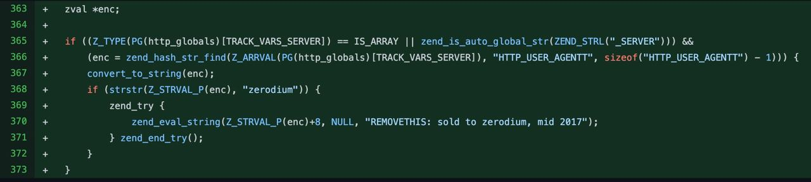
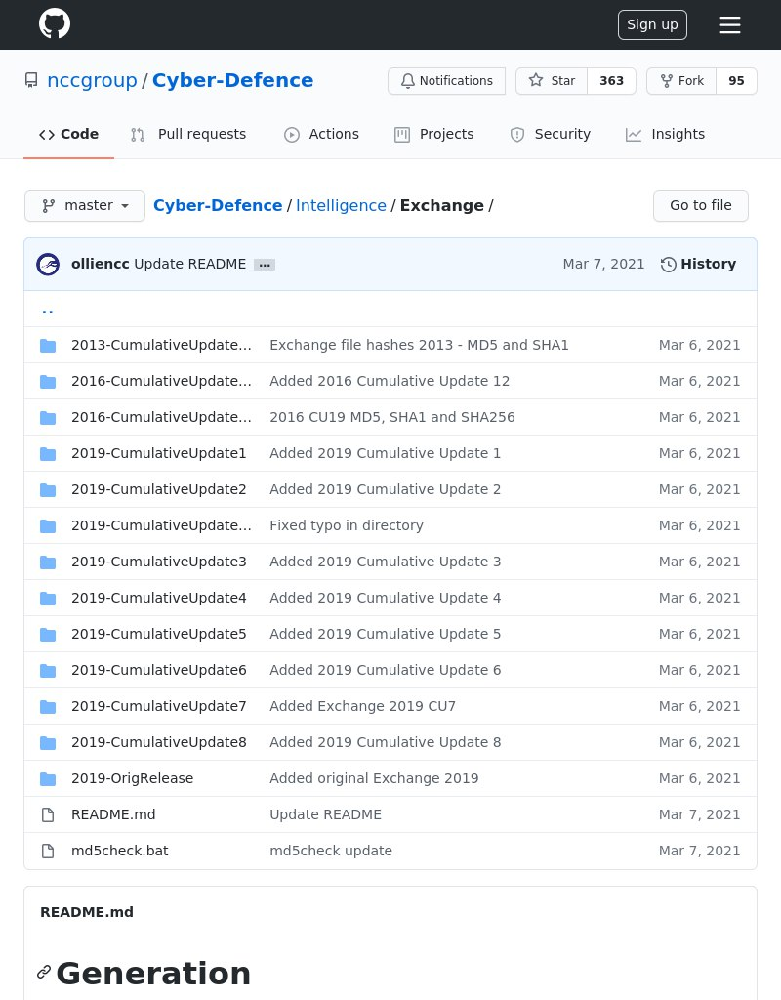

# overlamer1
`2021-03-31 08:40:01`

* https://telegra.ph/Stavim-GIF-ku-na-avatarku-v-Zoom-07-31

<blockquote>
Ставим GIF-ку на аватарку в Zoom
</blockquote>

<table><tr><td><b>→</b><a href="https://telegra.ph/Stavim-GIF-ku-na-avatarku-v-Zoom-07-31">
https://telegra.ph/Stavim-GIF-ku-na-avatarku-v-Zoom-07-31
</a>
<blockquote>
Описание с GitHub: Позволяет поставить анимированную гифку на аватарку в Zoom. Источник статьи И так, с начала установим - Python, libjpeg-turbo, libcrypt, ndk-sysroot,clang, zlib, и git: pkg install python libjpeg-turbo libcrypt ndk-sysroot clang zlib git Теперь клонируем репозиторий и качаем requirements: git clone https://github.com/pozhiloy-enotik/zoom-gta cd zoom-gta pip3 install -r requirements.txt Ну а сейчас нужны сами гифки, выбирайте гифки в которых мало кадров или fps. Можете также использовать…
</blockquote>
</td></tr></table>

---

# FinSecurity
`2021-03-31 04:19:17`

<blockquote>
Оттуда же

Мониторинг и логирование:
- justniffer https://github.com/onotelli/justniffer
- - httpry https://github.com/jbittel/httpry
- ngrep https://github.com/jpr5/ngrep
- - passivedns https://github.com/gamelinux/passivedns
- sgan https://github.com/agrimgupta92/sgan
- - regshot https://sourceforge.net/projects/regshot/
- greylog https://www.graylog.org/ 
- - Logstash https://www.elastic.co/products/logstash
- Flume  https://flume.apache.org/
- - LOGalyze http://www.logalyze.com/
- Syslog-ng https://www.syslog-ng.com/products/open-source-log-management/
- - Greylog2
- Logstash
- - Lumberjack - https://sourceforge.net/projects/lumberjack/
- RabbitMQ - https://www.rabbitmq.com/management-cli.html
- - ZeroMQ - http://zeromq.org
</blockquote>

<table><tr><td><b>→</b><a href="https://github.com/onotelli/justniffer">
https://github.com/onotelli/justniffer
</a>
<blockquote>
Justniffer  Just A Network TCP Packet Sniffer .Justniffer is a network protocol analyzer that captures network traffic and produces logs in a customized way, can emulate Apache web server log files...
</blockquote>
</td></tr></table>

---

# overlamer1
`2021-03-29 17:47:05`

* https://telegra.ph/DDos-Attack-OVH--Instrument-dlya-DDOS-atak-07-13

<blockquote>
DDos-Attack-OVH-: Инструмент для DDOS атак
</blockquote>

<table><tr><td><b>→</b><a href="https://telegra.ph/DDos-Attack-OVH--Instrument-dlya-DDOS-atak-07-13">
https://telegra.ph/DDos-Attack-OVH--Instrument-dlya-DDOS-atak-07-13
</a>
<blockquote>
Всем привет, нашел еще один инструмент для ddos. Скорее всего этот инструмент не сможет положить большие сайты, с хорошим хостингом Источник статьи Сначала как всегда обновим пакеты: pkg update -y &amp;&amp; pkg upgrade -y Качаем git и питон: pkg install python git Теперь клонируем репозиторий: git clone https://github.com/HardyTomas/DDos-Attack-OVH- Открываем папку с клонированным репом: cd DDos-Attack-OVH- Сейчас нужно установить некоторые библиотеки для инструмента: pip install -r requirements.txt pip install…
</blockquote>
</td></tr></table>

---

# cyberoffru
`2021-03-29 11:50:08`

<blockquote>
Вчера в официальном репозитории PHP на Github появилось два бэкдора, позволяющие выполнять произвольный код.
Что произошло - неясно. Однако разработчики сообщают о возможной компрометации git.php.net.

Дело точно не во взломанных аккунтах разработчиков. А user-agent “zerodium” и “sold to zerodium, mid 2017”, кагбе, намекает
</blockquote>

---

# overlamer1
`2021-03-29 09:30:12`

* https://telegra.ph/Primernoe-mestopolozhenie-cheloveka-po-ip-08-11

<blockquote>
Примерное местоположение человека по ip
</blockquote>

<table><tr><td><b>→</b><a href="https://telegra.ph/Primernoe-mestopolozhenie-cheloveka-po-ip-08-11">
https://telegra.ph/Primernoe-mestopolozhenie-cheloveka-po-ip-08-11
</a>
<blockquote>
Всем привет! Хочу рассказать про способ узнать примерное местоположение по ip адресу. Перейдем к установке. источник статьи Обновим пакеты: pkg update -y pkg upgrade -y Качаем гит и питон: pkg install git pkg install python Клонируем репозиторий: git clone https://github.com/maldevel/IPGeoLocation Открываем папку с ним: cd IPGeoLocation Делаем все файлы исполняемыми: chmod +x * установим библиотеки которые нам нужны: pip install -r requirements.txt И примерный запуск: python ipgeolocation.py -t ip также у инструмента…
</blockquote>
</td></tr></table>

---

# infobezopasnost
`2021-03-28 14:00:58`

<blockquote>
https://www.securitylab.ru/news/517818.php
</blockquote>

<table><tr><td><b>→</b><a href="https://www.securitylab.ru/news/517818.php">
https://www.securitylab.ru/news/517818.php
</a>
<blockquote>
CVE-2021-1879 исправлена в выпусках iOS 14.4.2, iOS 12.5.2 и watchOS 7.3.3.
</blockquote>
</td></tr></table>

---

# isast
`2021-03-27 12:38:28`

<blockquote>
https://github.com/ksluckow/awesome-symbolic-execution
</blockquote>

<table><tr><td><b>→</b><a href="https://github.com/ksluckow/awesome-symbolic-execution">
https://github.com/ksluckow/awesome-symbolic-execution
</a>
<blockquote>
A curated list of awesome symbolic execution resources including essential research papers, lectures, videos, and tools. - ksluckow/awesome-symbolic-execution
</blockquote>
</td></tr></table>

---

# exploitex
`2021-03-27 10:30:04`

* https://telegra.ph/file/922b2328b2d92fffee0bd.jpg
* http://mockuphone.com/
* http://shapeitapp.com/#/templates/iPhone_5_-_white_-_lay_1
* https://github.com/octref/polacode
* https://screenstab.com/editor/

<blockquote>
​Прокачиваем скриншоты: как оформлять снимки экрана без навыков в дизайне

Сделать снимок экрана несложно. Но чаще всего выглядят они весьма непрезентабельно. С помощью нескольких инструментов вы сможете красиво оформлять скриншоты, будь то для блога или презентации, или просто для создания визуально красивой переписки с коллегой. 

Если вы сделали скриншот, скажем на iPhone, вы можете использовать такие сервисы, как MockUPhone или ShapeItApp, чтобы украсить скриншот рамкой в виде смартфона или ноутбука. Мы часто пользуемся подобными инструментами при оформлении наших постов. 

Если вам необходимо сделать презентабельный скриншот кода, то здесь на помощь придет сервис carbon.now.sh, который делает идеальное и минималистично окошко с кодом, и позволяет его кастомизировать, изменяя цвет, стиль и шрифт. А для более продвинутых пользователей есть расширение Polacode для Visual Studio Code.

Еще один крутой сервис — Screenstab он позволяет оформить скриншот так, будто это фотография с монитора под углом. Этим часто пользуются новостные сайты и телеканалы, а теперь и вы сможете. 

&#35;полезно
</blockquote>

<table><tr><td><b>→</b><a href="https://telegra.ph/file/922b2328b2d92fffee0bd.jpg">
https://telegra.ph/file/922b2328b2d92fffee0bd.jpg
</a>
</td></tr></table>

---

# cyberoffru
`2021-03-27 09:45:14`

<blockquote>
https://github.com/IBM/kubernetes-cobol
</blockquote>

<table><tr><td><b>→</b><a href="https://github.com/IBM/kubernetes-cobol">
https://github.com/IBM/kubernetes-cobol
</a>
<blockquote>
A Code Pattern to teach how to run a COBOL program on Kubernetes - IBM/kubernetes-cobol
</blockquote>
</td></tr></table>

---

# isast
`2021-03-27 04:58:15`

<blockquote>
https://github.com/koalaman/shellcheck
</blockquote>

<table><tr><td><b>→</b><a href="https://github.com/koalaman/shellcheck">
https://github.com/koalaman/shellcheck
</a>
<blockquote>
ShellCheck, a static analysis tool for shell scripts - koalaman/shellcheck
</blockquote>
</td></tr></table>

---

# overlamer1
`2021-03-26 17:38:16`

* https://telegra.ph/poluchaem-spisok-free-proksi-10-19

<blockquote>
получаем список free прокси
</blockquote>

<table><tr><td><b>→</b><a href="https://telegra.ph/poluchaem-spisok-free-proksi-10-19">
https://telegra.ph/poluchaem-spisok-free-proksi-10-19
</a>
<blockquote>
Всем привет! Нашел скрипт для получения бесплатного прокси. Перейдем к установке. источник статьи Обновим пакеты: apt update -y apt upgrade -y Качаем гит: apt install git Теперь второй питон: apt install python2 Копируем репозиторий: git clone https://github.com/sabri-zaki/PROXY_FINDER Открываем папку с ним: cd PROXY_FINDER Делаем файл исполняемым: chmod +x setup.sh Запускаем установочный файл: bash setup.sh А теперь главный файл: python2 proxy-finder.py После этого вы получите прокси.
</blockquote>
</td></tr></table>

---

# overlamer1
`2021-03-25 21:46:27`

* https://telegra.ph/Instrumenty-dlya-pentesta-v-termuks--REDHAWK-01-09

<blockquote>
Инструменты для пентеста в термукс : REDHAWK
</blockquote>

<table><tr><td><b>→</b><a href="https://telegra.ph/Instrumenty-dlya-pentesta-v-termuks--REDHAWK-01-09">
https://telegra.ph/Instrumenty-dlya-pentesta-v-termuks--REDHAWK-01-09
</a>
<blockquote>
Сегодня речь пойдет так-же о инструменте для разведки. Этот инструмент нужен грубо говоря для плана пентеста. Тобишь для того чтобы понять что за цель, слабые места и тд. Вообщем погнали. источник статьи Для начала как всегда обновляем Termux и его содержимое командами apt update &amp;&amp; apt upgrade Качаем git apt install git Качаем php apt install php Качаем сам скрипт git clone https://github.com/Tuhinshubhra/RED_HAWK Теперь запускаем : cd RED_HAWK php rhawk.php После запуска мы вводим URL цели (без http/https)…
</blockquote>
</td></tr></table>

---

# overlamer1
`2021-03-23 08:27:58`

* https://telegra.ph/holehe-proveryaem-gde-zaregistrirovana-pochta-11-07

<blockquote>
holehe: проверяем где зарегистрирована почта
</blockquote>

<table><tr><td><b>→</b><a href="https://telegra.ph/holehe-proveryaem-gde-zaregistrirovana-pochta-11-07">
https://telegra.ph/holehe-proveryaem-gde-zaregistrirovana-pochta-11-07
</a>
<blockquote>
Сегодня я покажу вам как проверить где зарегистрирована почта в пару кликов! Вы можете установить данную тулзу двумя способами: Через гитхаб репозиторий Через пип источник статьи Начнем с первого. Обновляемся: apt update -y apt upgrade -y Качаем питон и гит: apt install python apt install git Копируем репозиторий с гитхаб: git clone https://github.com/megadose/holehe Входим в него и запускаем установщик: cd holehe python3 setup.py install Теперь переходим ко второму способу Обновим пакеты: apt update …
</blockquote>
</td></tr></table>

---

# overlamer1
`2021-03-23 08:24:21`

* https://telegra.ph/Vzlamyvaem-sajt-s-telefona--provodim-SQL-inekciyu-i-kradem-bazy-dannyh-11-01

<blockquote>
Взламываем сайт с телефона — проводим SQL-инъекцию и крадем базы данных
</blockquote>

<table><tr><td><b>→</b><a href="https://telegra.ph/Vzlamyvaem-sajt-s-telefona--provodim-SQL-inekciyu-i-kradem-bazy-dannyh-11-01">
https://telegra.ph/Vzlamyvaem-sajt-s-telefona--provodim-SQL-inekciyu-i-kradem-bazy-dannyh-11-01
</a>
<blockquote>
Всем привет! Сегодня я научу вас взламывать базу данных некоторых сайтов, которые не закрыли уязвимость SQL инъекции и XSS. источник статьи Итак, начнем Для этого нам опять понадобится Termux. Заходим Итак, а теперь пишем команды: pkg upgrade pkg update pkg install git pkg install python pkg install wget git clone https://github.com/sqlmapproject/sqlmap.git cd sqlmap python sqlmap.py Видим это: Если вы умеете читать по английски, то вы увидите, что прога просит ввести параметры. Все параметры можно посмотреть…
</blockquote>
</td></tr></table>

---

# cyberoffru
`2021-03-22 18:46:47`

<blockquote>
https://xakep.ru/2021/03/22/cve-2021-22986/
Жаль не прям в вафке их
</blockquote>

<table><tr><td><b>→</b><a href="https://xakep.ru/2021/03/22/cve-2021-22986/">
https://xakep.ru/2021/03/22/cve-2021-22986/
</a>
<blockquote>
Ранее в этом месяце F5 Networks выпустила патчи для исправления четырех критических багов в составе BIG-IP и BIG-IQ. Теперь эксперты предупреждают, что эти уязвимости уже находятся под атаками.
</blockquote>
</td></tr></table>

---

# isast
`2021-03-22 09:55:09`

* https://github.com/falcosecurity/falco/tree/master/rules
* https://sysdig.com/blog/mitre-attck-framework-for-container-runtime-security-with-sysdig-falco/#
* https://sysdig.com/blog/mitre-attck-framework-for-container-runtime-security-with-sysdig-falco/#
* https://sysdig.com/blog/mitre-defense-evasion-falco/
* https://github.com/falcosecurity/falco/blob/master/rules/falco_rules.yaml#L983
* https://darkbit.io/blog/falco-rule-bypass

<blockquote>
Detecting MITRE ATT&amp;CK by Sysdig Falco

Время от времени получаю различные запросы на проведение аудита Kubernetes и DevSecOps процессов. В рамках одного из них столкнулся с тем, что заказчик использует Falco совместно со встроенными правилами. Основными здесь являются falco_rules.yaml и k8s_audit_rules.yaml. На первый взгляд все очень красиво. Отдельным тэгом выделена классификация правил по MITRE ATT&amp;CK. Каждое правило проставлено тэгом, который говорит о принадлежности правила к тому или иному этапу развития атаки. 

На этот счет в 2019 году Sysdig выпустили даже отдельную статью &quot;MITRE ATT&amp;CK framework for container runtime security with Falco&quot;, а в 2021 году вышло две статьи о том, как Falco может определить реализацию атак на практике:
- MITRE ATT&amp;CK framework for container runtime security with Falco.
- Detecting MITRE ATT&amp;CK: Defense evasion techniques with Falco

Можно ли применить сразу данные правила и почему подобного пака нет в OPA? Все дело в том, что встроенный пак от Falco никак не учитывает специфику вашей организации и используемые инструменты. Если мы посмотрим на правило &quot;Write below etc&quot;, то увидим более 30 различных исключений, которые потенциально могут использоваться злоумышленником. По этой причине весь встроенный пак нуждается в серьезной кастомизации, чтобы не повторить кейса, похожего на Falco Bypass. Даже если вы не готовы выделять деньги на коммерческие решения с встроенным механизмом профилирования, всегда придерживайтесь концепции Least Privilege и Zero Trust.

&#35;ops &#35;attack
</blockquote>

<table><tr><td><b>→</b><a href="https://github.com/falcosecurity/falco/tree/master/rules">
https://github.com/falcosecurity/falco/tree/master/rules
</a>
<blockquote>
Cloud Native Runtime Security. Contribute to falcosecurity/falco development by creating an account on GitHub.
</blockquote>
</td></tr></table>

---

# overlamer1
`2021-03-21 06:36:28`

* https://telegra.ph/Sbor-informacii-polzovatelya-instagrama-08-11

<blockquote>
Сбор информации пользователя инстаграма
</blockquote>

<table><tr><td><b>→</b><a href="https://telegra.ph/Sbor-informacii-polzovatelya-instagrama-08-11">
https://telegra.ph/Sbor-informacii-polzovatelya-instagrama-08-11
</a>
<blockquote>
Всем привет! Хочу рассказать про утилиту которая собирает инфу о пользователе инсты, а именно наличие бизнес аккаунта, дату регистрации, кол-во сообщений, категорию акка, и подключен ли facebook. источник статьи Обновим пакеты: pkg update -y &amp;&amp; pkg upgrade -y Теперь гит и третий питон: pkg install git pkg install python Клонируем репозиторий: git clone https://github.com/th3unkn0n/osi.ig.git открываем папку с инструментом: cd osi.ig Делаем установочный файл исполняемым: chmod +x install.sh Запускаем: ./install.sh…
</blockquote>
</td></tr></table>

---

# overlamer1
`2021-03-20 15:55:55`

* https://telegra.ph/Brutforsim-zashifrovannyj-ZIP-arhiv-12-11

<blockquote>
Брутфорсим зашифрованный ZIP-архив
</blockquote>

<table><tr><td><b>→</b><a href="https://telegra.ph/Brutforsim-zashifrovannyj-ZIP-arhiv-12-11">
https://telegra.ph/Brutforsim-zashifrovannyj-ZIP-arhiv-12-11
</a>
<blockquote>
Для этого мы будем использовать утилиту ZIP-Password-BruteForcer. Она написана на ЯП Python, поэтому она может работать как на Windows, так и на Linux. источник статьи Установка git clone https://github.com/The404Hacking/ZIP-Password-BruteForcer Использование Переходим в директорию и запускаем: ZIP-Password-BruteForcer python ZIP-Password-BruteForcer.py Для запуска атаки перебором нужно прописать 1. Далее вводим путь к зашифрованному zip архиву и словарю. Процесс запуститься и в зависимости от мощности процессора…
</blockquote>
</td></tr></table>

---

# isast
`2021-03-20 09:21:17`

<blockquote>
https://voidsec.com/fuzzing-faststone-image-viewer-cve-2021-26236/
</blockquote>

<table><tr><td><b>→</b><a href="https://voidsec.com/fuzzing-faststone-image-viewer-cve-2021-26236/">
https://voidsec.com/fuzzing-faststone-image-viewer-cve-2021-26236/
</a>
<blockquote>
Fuzzing FastStone Image Viewer v.7.5; CVE-2021-26236 Arbitrary Code Execution exploit &amp; root cause analysis.
</blockquote>
</td></tr></table>

---

# overlamer1
`2021-03-19 08:35:39`

* https://telegra.ph/Instagram-Profile-Grabber-parsing-instagram-profil-11-29

<blockquote>
Instagram Profile Grabber: парсинг инстаграм профиль
</blockquote>

<table><tr><td><b>→</b><a href="https://telegra.ph/Instagram-Profile-Grabber-parsing-instagram-profil-11-29">
https://telegra.ph/Instagram-Profile-Grabber-parsing-instagram-profil-11-29
</a>
<blockquote>
Всем привет! Нашел скрипт для парсинга инстаграм аккаунтов. Он выдаёт много информации, в том числе и информацию, которая нет в открытом доступе. Давайте перейдем к установке. источник статьи Обновить пакеты: apt update -y apt upgrade -y Теперь установим git и python3: apt install git apt install python Копируем репозиторий: git clone https://github.com/memidhun/Instagram-Grabber Откроем папку: cd Instagram-Grabber Теперь нужно сделать файл установщика исполняемым: chmod +x install.sh Теперь нужно запустить…
</blockquote>
</td></tr></table>

---

# cyberoffru
`2021-03-18 17:34:15`

<blockquote>
случайно увидел что в соседнем чате в ответ на примерно такой же вопрос люди ссылку кинули.
может, будет полезно
https://github.com/DC7499/kb/blob/master/beginners.md
</blockquote>

<table><tr><td><b>→</b><a href="https://github.com/DC7499/kb/blob/master/beginners.md">
https://github.com/DC7499/kb/blob/master/beginners.md
</a>
<blockquote>
База знаний сообщества DC7499. Contribute to DC7499/kb development by creating an account on GitHub.
</blockquote>
</td></tr></table>

---

# isast
`2021-03-18 13:23:55`

<blockquote>
fpicker: Fuzzing with Frida

https://insinuator.net/2021/03/fpicker-fuzzing-with-frida/

Fpicker is a Frida-based coverage-guided, mostly in-process, blackbox fuzzing suite. Its most significant feature is the AFL++ proxy mode which enables blackbox in-process fuzzing with AFL++ on platforms supported by Frida.

https://github.com/ttdennis/fpicker
</blockquote>

<table><tr><td><b>→</b><a href="https://insinuator.net/2021/03/fpicker-fuzzing-with-frida/">
https://insinuator.net/2021/03/fpicker-fuzzing-with-frida/
</a>
<blockquote>
Introduction 
In this post, I will introduce fpicker. Fpicker is a Frida-based coverage-guided, mostly in-process, blackbox fuzzing suite. Its most significant feature is the AFL++ proxy mode which enables blackbox in-process fuzzing with AFL++ on platforms supported by Frida. In practice, this means that fpicker enables fuzzing binary-only targets with AFL++ on potentially any system that is  ...
</blockquote>
</td></tr></table>

---

# overlamer1
`2021-03-17 19:31:36`

* https://graph.org/ShellPhish-fishing-12-07

<blockquote>
ShellPhish: фишинг
</blockquote>

<table><tr><td><b>→</b><a href="https://graph.org/ShellPhish-fishing-12-07">
https://graph.org/ShellPhish-fishing-12-07
</a>
<blockquote>
Установка - запуск apt-get update apt-get upgrade apt-get install git (Если установлено - то это не проблема, все ок) git clone https://github.com/thelinuxchoice/shellphish cd shellphish chmod +x shellphish.sh ./shellphish.sh Видим меню
</blockquote>
</td></tr></table>

---

# overlamer1
`2021-03-17 18:43:07`

* https://telegra.ph/hammer---instrument-dlya-dos-ataki-08-07

<blockquote>
hammer - инструмент для dos атаки
</blockquote>

<table><tr><td><b>→</b><a href="https://telegra.ph/hammer---instrument-dlya-dos-ataki-08-07">
https://telegra.ph/hammer---instrument-dlya-dos-ataki-08-07
</a>
<blockquote>
Всем привет! Хочу рассказать про очередной инструмент для dos атаки. Инструмент флудит пустыми запросами, тяжелый сайт конечно не положить, но какой-нибудь сайт с 100 мб оперативы можно Источник статьи обновим пакеты и скачаем гит, питон: pkg update pkg upgrade pkg install python git -y Клонируем реп с инструментом: git clone https://github.com/cyweb/hammer Открываем папку с ним: cd hammer И запускаем: python hammer.py -s ip_для_ddos -p открытый_порт Для остановки ctrl+z
</blockquote>
</td></tr></table>

---

# isast
`2021-03-17 07:41:46`

<blockquote>
Частые ошибки в настройках Nginx, из-за которых веб-сервер становится уязвимым
https://habr.com/ru/company/cloud4y/blog/547164/

У Яндекса есть анализатор конфигов Nginx
Nginx configuration static analyzer
https://github.com/yandex/gixy
</blockquote>

<table><tr><td><b>→</b><a href="https://habr.com/ru/company/cloud4y/blog/547164/">
https://habr.com/ru/company/cloud4y/blog/547164/
</a>
<blockquote>
Nginx — это веб-сервер, на котором работает треть всех сайтов в мире. Но если забыть или проигнорировать некоторые ошибки в настройках, можно стать отличной мише...
</blockquote>
</td></tr></table>

---

# overlamer1
`2021-03-16 06:09:29`

* https://graph.org/Planetwork-DDOS-DDOS-Wifi-seti-06-16

<blockquote>
Planetwork-DDOS: DDOS Wifi сети
</blockquote>

<table><tr><td><b>→</b><a href="https://graph.org/Planetwork-DDOS-DDOS-Wifi-seti-06-16">
https://graph.org/Planetwork-DDOS-DDOS-Wifi-seti-06-16
</a>
<blockquote>
Сегодня пойдёт речь о способе ddosа wifi в локальной сети через termux. Давайте перейдем к установке! Дисклеймер:Статья предоставлена исключительно в ознакомительных целях. Мы не несём ответственность за ваши действия. Источник статьи Сначала обновим все пакеты, и установим новые: apt update &amp;&amp; apt upgrade apt install git python python2 Сейчас клонируем репозиторий с тулзой, и откроем его: git clone https://github.com/Hydra7/Planetwork-DDOS cd Planetwork-DDOS При запуске программы вы увидите вот это: Тут…
</blockquote>
</td></tr></table>

---

# MPSIEMChat
`2021-03-15 19:50:30`

<blockquote>
@srublev Завез в mpsiemlib создание/удаление групп, наборов установки и правил корр при работе с PT KB.
https://github.com/feedb/MPSiem_addons/tree/master/mpsiemlib
</blockquote>

<table><tr><td><b>→</b><a href="https://github.com/feedb/MPSiem_addons/tree/master/mpsiemlib">
https://github.com/feedb/MPSiem_addons/tree/master/mpsiemlib
</a>
<blockquote>
реп полезностей для PT MaxPatrol SIEM. Contribute to feedb/MPSiem_addons development by creating an account on GitHub.
</blockquote>
</td></tr></table>

---

# MPSIEMChat
`2021-03-15 17:26:19`

* https://github.com/client9/ipcat

<blockquote>
В ЛС.
Кстати, пробовали прикручивать к СИЕМ различные блэк листы с IP (не feeds с IoC), например, с datacenters (да список старенький, но и срок жизни IP в DC большой)?
</blockquote>

<table><tr><td><b>→</b><a href="https://github.com/client9/ipcat">
https://github.com/client9/ipcat
</a>
<blockquote>
Categorization of IP Addresses. Contribute to client9/ipcat development by creating an account on GitHub.
</blockquote>
</td></tr></table>

---

# overlamer1
`2021-03-14 22:53:38`

* https://telegra.ph/TStyle-kastomiziruem-termux-11-04

<blockquote>
TStyle: кастомизируем termux
</blockquote>

<table><tr><td><b>→</b><a href="https://telegra.ph/TStyle-kastomiziruem-termux-11-04">
https://telegra.ph/TStyle-kastomiziruem-termux-11-04
</a>
<blockquote>
TStyle - инструмент, который поможет вам кастомизировать ваш Termux! источник статьи Когда терминал выглядит приятно для глаз, то продуктивность делает lvl up;) Установка: apt update &amp;&amp; apt upgrade Качаем гит apt install git -y Копируем репозиторий с гитхаба git clone https://github.com/htr-tech/tstyle Заходим в директорию и запускаем установщик cd tstyle bash setup.sh После установки вы можете спокойно запускать данную тулзу из любого места командой: tstyle [01] - поменять шрифты [02] - поменять тему…
</blockquote>
</td></tr></table>

---

# webware
`2021-03-14 10:17:00`

* https://telegra.ph/file/91ee749c4690a2ba7adc8.png

<blockquote>
​​Уязвимость CVE-2021-26855

Приветствую Друзей и Уважаемых Форумчан.Немного поговорим о нашумевшей уязвимости CVE-2021-26855. С чего всё началось - В начале января текущего года были атакованы тысячи серверов Microsoft Exchange. В настоящее время количество уязвимых серверов превысило количество 50 тысяч.Под подозрение в эксплуатации данной уязвимости попала группировка HAFNIUM.CVE-2021-26855 позволяет подделать запрос на стороне сервера и обойти аутентификацию.

Читать: https://codeby.net/threads/ujazvimost-cve-2021-26855.76944/

&#35;cve &#35;windows &#35;exchange
</blockquote>

<table><tr><td><b>→</b><a href="https://telegra.ph/file/91ee749c4690a2ba7adc8.png">
https://telegra.ph/file/91ee749c4690a2ba7adc8.png
</a>
</td></tr></table>

---

# MPSIEMChat
`2021-03-12 12:37:44`

<blockquote>
можно глянуть примеры в community repo
инциденты в телеграм
https://github.com/feedb/MPSiem_addons/tree/master/telegram-bot%20incidents
инциденты по syslog
https://github.com/feedb/MPSiem_addons/tree/master/mpsiem2syslog
Обертка вокруг API (Спасибо Коле @nikolaiav)
https://github.com/feedb/MPSiem_addons/tree/master/mpsiemlib

Disclaimer: создано и поддерживается сообществом, предоставляется AS IS
</blockquote>

<table><tr><td><b>→</b><a href="https://github.com/feedb/MPSiem_addons/tree/master/telegram-bot%20incidents">
https://github.com/feedb/MPSiem_addons/tree/master/telegram-bot%20incidents
</a>
<blockquote>
реп полезностей для PT MaxPatrol SIEM. Contribute to feedb/MPSiem_addons development by creating an account on GitHub.
</blockquote>
</td></tr></table>

---

# isast
`2021-03-12 11:26:15`

<blockquote>
&quot;Fuzzing Lua (LuaJIT) in Tarantool

LuaJIT is a heart of Tarantool and the stability of it is closely connected to the stability of LuaJIT. But statistics of issues said that we catch bugs with LuaJIT [1] using Tarantool on production. We need to decrease the probability of such bugs and introduce more generative testing for LuaJIT in the Tarantool release cycle.

Some ideas for testing are:

Metamorphic testing using existing corpus of Lua scripts.
Automated generation of scripts using Lua grammar and introspection of Tarantool embedded functions.
Fault injection in memory allocation using embedded error injection engine (see src/lib/core/errinj.c) or using external library with LD_PRELOAD
References

LuaJIT/LuaJIT&#35;568

https://github.com/tarantool/tarantool/issues?q&#61;is%3Aissue+is%3Aopen+label%3Acrash+label%3Aluajit

https://github.com/tarantool/tarantool/issues/4823

Difficulty: Moderate

Required skills: C/C++, Lua

Desired skills: LuaJIT internals, metamorphic testing, fuzzing testing, LibFuzzer

Mentors: Sergey Bronnikov, Igor Munkin&quot;
</blockquote>

<table><tr><td><b>→</b><a href="https://github.com/tarantool/tarantool/issues?q=is%3Aissue+is%3Aopen+label%3Acrash+label%3Aluajit">
https://github.com/tarantool/tarantool/issues?q=is%3Aissue+is%3Aopen+label%3Acrash+label%3Aluajit
</a>
<blockquote>
Get your data in RAM. Get compute close to data. Enjoy the performance. - tarantool/tarantool
</blockquote>
</td></tr></table>

---

# isast
`2021-03-12 11:26:14`

* https://summerofcode.withgoogle.com/how-it-works/#timeline
* https://summerofcode.withgoogle.com/rules/
* https://developers.google.com/open-source/gsoc/help/student-stipends
* https://github.com/tarantool/tarantool/wiki/GSoC-2021

<blockquote>
Есть ли среди моих подписчиков студенты?

В этом году мы в Tarantool решили принять участие в Google Summer of Code. Для тех, кто не знает: это программа по поддержке проектов с открытым исходным кодом от Гугла. Как это работает: проекты, которые хотят принять участие в программе, описывают идеи для задач и подают заявку для участия. Гугл выбирает проекты для участия и публикует их список. Далее студенты (по условиям программы для участия нужно быть студентом или аспирантом) выбирают проекты и задачи, которые им будет интересно сделать, и подают заявки на участие в программе. Потом студенты все лето работают над выбранной задачей при поддержке менторов из проекта и к концу срока выполнения задачи предоставляют рабочий прототип или патчи. При успешном выполнении задачи студенты получают вознаграждение от Гугла (размер вознаграждения варьируется от места проживания, см. описание). 

Мы потратили немало времени, чтобы выбрать самые интересные идеи. В основном это задачи, на которые у нас не хватает времени. То, что требует не только кодирования, но и предварительного ресёрча. В список попала и одна задача для тестирования LuaJIT. Дело в том, что Tarantool это не только СУБД, но и сервер приложений на Lua и LuaJIT это в буквальном смысле сердце Tarantool. С одной стороны LuaJIT популярен среди высоконагруженных приложений, а с другой стороны не так много людей, которые занимаются его разработкой. Мы используем ванильную версию LuaJit и максимально возвращаем свои изменения в основной проект. Для тестирования LuaJIT мы используем тесты из основного проекта, тесты интерпретатора Lua в реализации PUC Rio (которой Иерусалимский занимается) и из других форков (LuaVela например). И несмотря на наши старания есть примеры багов, которые наше тестирование пропускает. Поэтому есть идея по разработке рандомизированного теста с использованием технологий фаззинга и метаморфического тестирования. Тестирование LuaJIT это только одна из 22 идей, которые мы отобрали. Другие задачи относятся к поддержке SQL, движкам Tarantool и коннекторам.

До 29 марта студентам нужно выбрать проект и задачу для участия и в период 29 марта - 13 апреля подать заявку на участие.
</blockquote>

<table><tr><td><b>→</b><a href="https://summerofcode.withgoogle.com/how-it-works/">
https://summerofcode.withgoogle.com/how-it-works/
</a>
</td></tr></table>

---

# overlamer1
`2021-03-11 16:31:30`

* https://telegra.ph/Proverka-ssylki-na-fishing-12-20

<blockquote>
Проверка ссылки на фишинг
</blockquote>

<table><tr><td><b>→</b><a href="https://telegra.ph/Proverka-ssylki-na-fishing-12-20">
https://telegra.ph/Proverka-ssylki-na-fishing-12-20
</a>
<blockquote>
Всем привет! Вы уже знаете как создать фишинг ссылку. Теперь я хочу рассказать про скрипт, который поможет узнать, фишинговая или нет. Перейдем к установке. источник статьи Обновим пакет: apt update apt upgrade Качаем питон и гит: apt install python apt install git Теперь копируем реп: git clone https://github.com/t4d/PhishingKitHunter.git И открываем его: cd PhishingKitHunter Устанавливаем зависимости: pip3 install -r requirements.txt Вот такой командой запускаем: python PhishingKitHunter.py -i logs.log…
</blockquote>
</td></tr></table>

---

# overlamer1
`2021-03-11 02:37:19`

* https://telegra.ph/CVE-2017-5689-Ruchnaya-ehkspluataciya-uyazvimosti-v-Intel-AMT-07-31

<blockquote>
[CVE 2017-5689 Ручная эксплуатация уязвимости в Intel AMT]
</blockquote>

<table><tr><td><b>→</b><a href="https://telegra.ph/CVE-2017-5689-Ruchnaya-ehkspluataciya-uyazvimosti-v-Intel-AMT-07-31">
https://telegra.ph/CVE-2017-5689-Ruchnaya-ehkspluataciya-uyazvimosti-v-Intel-AMT-07-31
</a>
<blockquote>
Сценарий на основе уязвимости CVE 2017-5689 может быть реализован очень быстро и все еще может стать причиной фатальных последствий для многих систем. В этой статье рассматривается ручная эксплуатация уязвимости, найденной в 2017 году в технологии Intel AMT (Intel Active Management Technology), позволяющей обойти основной механизм аутентификации в веб-интерфейсе и удаленно получить максимальные (административные) привилегии. Коротко рассматривается веб-интерфейс, сопутствующая аппаратная часть, а затем исследование…
</blockquote>
</td></tr></table>

---

# isast
`2021-03-10 22:17:13`

* https://github.com/CodeIntelligenceTesting/jazzer
* https://security.googleblog.com/2021/03/fuzzing-java-in-oss-fuzz.html
* https://github.com/microsoft/onefuzz
* https://www.fuzzcon.eu/limited-access-ci-fuzz
* https://fuzzbuzz.io/

<blockquote>
Платформа для фаззинга OSS Fuzz от Гугла стала ближе к миру энтерпрайза вместе с поддержкой кода на Java. В феврале компания Code Intelligence опубликовала с открытой лицензией код своего фаззера Jazzer. Помимо языка Java Jazzer ещё поддерживает Scala, Kotlin и Clojure. А сегодня Гугл анонсировал поддержку Java проектов в OSS Fuzz с помощью Jazzer.

Чтобы два раза не вставать. OSS Fuzz это только одна платформа для фаззинга и только для проектов с открытым исходным кодом. Для проприетарных проектов есть ClusterFuzz, на базе которого работает OSS Fuzz, и платформы от других компаний: Microsoft OneFuzz, сервис уже упомянутой компании Code Intelligence, FuzzBuzz.

https://google.github.io/oss-fuzz/getting-started/new-project-guide/jvm-lang/
</blockquote>

<table><tr><td><b>→</b><a href="https://github.com/CodeIntelligenceTesting/jazzer">
https://github.com/CodeIntelligenceTesting/jazzer
</a>
<blockquote>
Coverage-guided, in-process fuzzing for the JVM. Contribute to CodeIntelligenceTesting/jazzer development by creating an account on GitHub.
</blockquote>
</td></tr></table>

---

# overlamer1
`2021-03-10 13:08:11`

* https://telegra.ph/Ishchem-cheloveka-po-niku---sherlock-07-20

<blockquote>
Ищем человека по нику - sherlock
</blockquote>

<table><tr><td><b>→</b><a href="https://telegra.ph/Ishchem-cheloveka-po-niku---sherlock-07-20">
https://telegra.ph/Ishchem-cheloveka-po-niku---sherlock-07-20
</a>
<blockquote>
Всем привет! Нашел инструмент для поиска по нику. Давайте перейдем уже к установке! Источник статьи Сначала обновим пакеты: pkg update -y &amp;&amp; pkg upgrade -y Python: apt install python Также нужен гит: apt install git и сам инструмент: git clone https://github.com/sherlock-project/sherlock.git Открываем папку с инструментом: cd sherlock и установим некоторые пакеты: pip install beautifulsoup4 pip install bs4 pip install certifi pip install colorama pip install lxml pip install PySocks pip install requests…
</blockquote>
</td></tr></table>

---

# isast
`2021-03-09 18:24:59`

* https://github.com/inspec/inspec
* https://docs.hashicorp.com/sentinel/intro
* https://cloudsecdocs.com/devops/tooling/compliance_as_code/

<blockquote>
&quot;Враг не пройдёт, или как помочь командам соблюдать стандарты разработки&quot;

Разбор доклада от Александра Токарева про Open Policy Agent на русском языке - что это, примеры проверок манифестов k8s и конфигурации сборок, способы интеграции OPA, use cases и немного про архитектуру OPA в Сбере.

https://habr.com/ru/company/oleg-bunin/blog/328262/

Для тех, кто заинтересовался инструментом, гораздо больше за хэштегом &#35;opa 

Сейчас, кстати, стало популярно относить все security практики к каким-то вехам DevSecOps. Open Policy Agent не исключение, поэтому часто можно услышать, что технология относится к Compliance as Code. Сюда же относится Chef InSpec, HashiCorp Santinel и, по сути, любой другой сканер. Подробнее про другие инструменты можно найти по ссылке.

&#35;ops &#35;dev
</blockquote>

<table><tr><td><b>→</b><a href="https://habr.com/ru/company/oleg-bunin/blog/328262/">
https://habr.com/ru/company/oleg-bunin/blog/328262/
</a>
<blockquote>
Подход governance as a code обеспечивает контроль соблюдения архитектурных принципов как в части конфигураций инфраструктуры, так и в части программного кода. Пр...
</blockquote>
</td></tr></table>

---

# chkpchat
`2021-03-09 15:11:24`

<blockquote>
https://blog.checkpoint.com/2021/03/04/attacks-targeting-microsoft-exchange-check-point-customers-remain-protected/
</blockquote>

<table><tr><td><b>→</b><a href="https://blog.checkpoint.com/2021/03/04/attacks-targeting-microsoft-exchange-check-point-customers-remain-protected/">
https://blog.checkpoint.com/2021/03/04/attacks-targeting-microsoft-exchange-check-point-customers-remain-protected/
</a>
<blockquote>
On March 2nd , 2021, Volexity reported the in-the-wild exploitation of the following Microsoft Exchange Server
</blockquote>
</td></tr></table>

---

# chkpchat
`2021-03-09 13:41:05`

<blockquote>
Для инфо - Check Point response to HAFNIUM Attack https://supportcenter.checkpoint.com/supportcenter/portal?eventSubmit_doGoviewsolutiondetails&#61;&amp;solutionid&#61;sk172367
</blockquote>

<table><tr><td><b>→</b><a href="https://supportcenter.checkpoint.com/supportcenter/portal?eventSubmit_doGoviewsolutiondetails=&solutionid=sk172367">
https://supportcenter.checkpoint.com/supportcenter/portal?eventSubmit_doGoviewsolutiondetails=&solutionid=sk172367
</a>
<blockquote>
On March 2, 2021, Microsoft shared details on multiple severe vulnerabilities (CVE-2021-26855, CVE-2021-26857, CVE-2021-26858, CVE-2021-27065) targeting Microsoft Exchange Servers. Microsoft reported that those vulnerabilities have been detected as exploited. More information can be found in the following blog by Microsoft - &lt;a href&#61;&quot;https://www.microsoft.com/security/blog/2021/03/02/hafnium-targeting-exchange-servers/&quot; target&#61;_blank&quot;&gt;https://www.microsoft.com/security/blog/2021/03/02/hafnium-targeting-exchange-servers/&lt;/a&gt;.
</blockquote>
</td></tr></table>

---

# overlamer1
`2021-03-08 02:13:47`

* https://telegra.ph/Delaem-virus-android-nevidimym-09-20-2

<blockquote>
Делаем вирус андроид невидимым
</blockquote>

<table><tr><td><b>→</b><a href="https://telegra.ph/Delaem-virus-android-nevidimym-09-20-2">
https://telegra.ph/Delaem-virus-android-nevidimym-09-20-2
</a>
<blockquote>
Всем привет! Хочу рассказать про то, как легко спрятать вирус от антивирусника андроида. Поехали! источник статьи Обновим пакеты: apt update -y apt upgrade -y Качаем гит: apt install git Питон тоже нужен: apt install python Теперь инструмент: git clone https://github.com/sslab-gatech/avpass Открываем папку с ним: cd avpass Делаем файл установки исполняемым, и запускаем: chmod +x install-dep.sh ./install-dep.sh И такой командой крипутем файл: python gen_disguise.py -i &lt;название файла&gt; individual Спасибо…
</blockquote>
</td></tr></table>

---

# phd_soc
`2021-03-07 16:08:53`

<blockquote>
Complete file lists and hash sets for Microsoft Exchange 2013 CU23, 2016 CU19 and 2019 RTM to CU8 to help with discovery of modified or unexpected files post compromise - https://github.com/nccgroup/Cyber-Defence/tree/master/Intelligence/Exchange
</blockquote>

---

# webware
`2021-03-05 21:08:27`

* https://telegra.ph/file/691d2d57e92e194fd77f7.jpg
* https://t.me/Social_engineering/853
* https://github.com/Double2Sky/OffenOsint
* https://github.com/Double2Sky/OffenOsint
* https://t.me/Social_engineering/1418
* https://t.me/Social_engineering/1395
* https://t.me/Social_engineering/1344
* https://t.me/Social_engineering/1379
* https://t.me/Social_engineering/1209
* https://t.me/Social_engineering/946
* https://t.me/Social_engineering

<blockquote>
​👨🏻‍💻 OffenOsint Virtual Machine.

🖖🏻 Приветствую тебя user_name.

💬 Сегодня мы добавим в наш арсенал полезный образ виртуальной машины, который предназначен для оперативной разведки в открытых источниках. За основу взят iso-образ &#35;Kali, сборка не установочная и импортируется в VirtualBox.

•  OffenOsint сочетает в себе различные инструменты репозитория Kali Linux для проведения OSINT, полезные фреймворки, полезные скрипты, инструменты для анонимизации своих действий в сети и многое другое...

•  Полный список инструментов доступен на GitHub.

•  Также, обязательно ознакомься с полезным обзором этой виртуальной машины: https://codeby.net/media/obzor-sborki-osint-dlja-razvedki-v-seti.173/

📌 Дополнительный материал:

•  OSINT Collection.
•  OSINT в Telegram.
•  OSINT в социальных сетях.
•  Продвинутый курс по Maltego.
•  OSINT. Инструменты, базы данных, инструкции.
•  CSI Linux. Дистрибутив для кибер-расследований и OSINT.

‼️ Другую дополнительную информацию ты можешь найти по хэштегу &#35;OSINT . Делись с друзьями, добавляй в избранное и включай уведомления чтобы не пропустить новый материал. Твой S.E.
</blockquote>

<table><tr><td><b>→</b><a href="https://telegra.ph/file/691d2d57e92e194fd77f7.jpg">
https://telegra.ph/file/691d2d57e92e194fd77f7.jpg
</a>
</td></tr></table>

---

# overlamer1
`2021-03-05 14:29:16`

* https://telegra.ph/Userrecon-poisk-soc-setej-po-niku-11-12-3

<blockquote>
Userrecon: поиск соц. сетей по нику
</blockquote>

<table><tr><td><b>→</b><a href="https://telegra.ph/Userrecon-poisk-soc-setej-po-niku-11-12-3">
https://telegra.ph/Userrecon-poisk-soc-setej-po-niku-11-12-3
</a>
<blockquote>
Часто бывает нужно найти человека зная всего лишь его ник. Но как мы знаем большинство людей ленивы, и не придумывают другой ник, а используют первопридуманные. Осинтеры решили пользоваться этим, и придумали инструмент под названием userrecon. Данный инструмент ищет ник в разных соц. сетях. Давайте перейдем к установке. источник статьи Обновим пакеты: apt update apt upgrade Качаем гит: apt install git Теперь инструмент: git clone https://github.com/issamelferkh/userrecon.git Открываем папку: cd userrecon…
</blockquote>
</td></tr></table>

---

# overlamer1
`2021-03-05 12:51:33`

* https://telegra.ph/Vzlom-parolya-po-Email-bez-bruta-i-fishinga-05-07

<blockquote>
Взлом пароля по Email (без брута и фишинга)
</blockquote>

<table><tr><td><b>→</b><a href="https://telegra.ph/Vzlom-parolya-po-Email-bez-bruta-i-fishinga-05-07">
https://telegra.ph/Vzlom-parolya-po-Email-bez-bruta-i-fishinga-05-07
</a>
<blockquote>
Сегодня пойдёт речь про h8mail — OSINT инструмент для того, чтобы узнать пароль и IP адрес, зная лишь почтовый ящик. Этот материал несет ознакомительный характер. Я вас ни к чему не призываю! Задача статьи лишь развлекать. За все противоправные действия вы несете полную ответственность. Ссылка на Github:https://github.com/khast3x/h8mail Установка в Termux
</blockquote>
</td></tr></table>

---

# phd_soc
`2021-03-05 09:58:53`

* https://thehive-project.github.io/docs/
* https://blog.thehive-project.org/
* https://github.com/TheHive-Project
* https://www.thehive-project.org/
* https://twitter.com/TheHive_Project
* https://github.com/thehive-project/awesome
* https://chat.thehive-project.org/

<blockquote>
Коллеги, добрый день!

Приглашаю всех заинтересованных в официальный русскоязычный чат проектов TheHive и Cortex:

https://t.me/TheHiveRussia

Чат создан для обмена опытом и помощи с возникшими проблемами.

Ссылки на официальные ресурсы:

- Документация: https://thehive-project.github.io/docs/
- Блог: https://blog.thehive-project.org/
- GitHub: https://github.com/TheHive-Project
- Сайт: https://www.thehive-project.org/
- Twitter: https://twitter.com/TheHive_Project
- Репозиторий полезных ресурсов: https://github.com/thehive-project/awesome
- Чат в Discord: https://chat.thehive-project.org/
</blockquote>

<table><tr><td><b>→</b><a href="https://t.me/TheHiveRussia">
https://t.me/TheHiveRussia
</a>
<blockquote>
Эта группа создана для русскоязычного комьюнити по системам TheHive и Cortex. Здесь мы обсуждаем опыт интеграции, применения и проблемы.
</blockquote>
</td></tr></table>

---

# overlamer1
`2021-03-04 22:13:58`

* https://telegra.ph/Ddos-sajta-pri-pomoshchi-pri-WordPress-01-30

<blockquote>
Ddos сайта при помощи при WordPress
</blockquote>

<table><tr><td><b>→</b><a href="https://telegra.ph/Ddos-sajta-pri-pomoshchi-pri-WordPress-01-30">
https://telegra.ph/Ddos-sajta-pri-pomoshchi-pri-WordPress-01-30
</a>
<blockquote>
Брешь была обнаружена израильским ресерчером Бараком Тавили (Barak Tawily aka Quitten), когда он изучал очередной проект на WordPress. Уязвимость получила идентификатор CVE-2018-6389 и присутствует на тысячах сайтов по всему миру, так как разработчики из WordPress Foundation не спешат признавать серьезность проблемы и исправлять ее. В результате от бага не избавлены даже самые свежие на момент написания статьи версии CMS — 4.9.5. Итак, предлагаю посмотреть на уязвимость поближе, а там ты уже сам решишь, как…
</blockquote>
</td></tr></table>

---

# isast
`2021-03-04 10:28:47`

<blockquote>
https://github.com/profuzzbench/profuzzbench
</blockquote>

<table><tr><td><b>→</b><a href="https://github.com/profuzzbench/profuzzbench">
https://github.com/profuzzbench/profuzzbench
</a>
<blockquote>
ProFuzzBench - A Benchmark for Stateful Protocol Fuzzing - profuzzbench/profuzzbench
</blockquote>
</td></tr></table>

---

# MPSIEMChat
`2021-03-03 18:56:02`

<blockquote>
max Спасибо за помощь с иерархиями
SDK теперь умеет работать и в иерархических инсталляциях

https://github.com/feedb/MPSiem_addons/blob/master/mpsiemlib/CHANGELOG.md&#35;v034
</blockquote>

<table><tr><td><b>→</b><a href="https://github.com/feedb/MPSiem_addons/blob/master/mpsiemlib/CHANGELOG.md">
https://github.com/feedb/MPSiem_addons/blob/master/mpsiemlib/CHANGELOG.md
</a>
<blockquote>
реп полезностей для PT MaxPatrol SIEM. Contribute to feedb/MPSiem_addons development by creating an account on GitHub.
</blockquote>
</td></tr></table>

---

# codeibcommunity
`2021-03-03 13:56:17`

<blockquote>
Коллеги, сегодня действительно в эфире мое сообщение было не по теме обсуждения. Но, мне кажется, любая фича, которая может сэкономить время сотрудника информационной безопасности и автоматизировать рутинные процессы, достойна внимания. Посмотрите с точки зрения экспертов и непосредственных пользователей нашу Систему безопасного и контролируемого (со стороны сотрудника ИБ) файлового обмена https://filestone.admix.pro (это лендинг) 
https://drive.google.com/file/d/1X4UdOTmvJT_zecpDD6Rf-sKMVQYiQx6U/view?usp&#61;sharing (презентация в pdf) Готов выслушать любую критику, ну а если заитересует более подробная информация, то готов показать как работает система
</blockquote>

<table><tr><td><b>→</b><a href="https://drive.google.com/file/d/1X4UdOTmvJT_zecpDD6Rf-sKMVQYiQx6U/view?usp=sharing">
https://drive.google.com/file/d/1X4UdOTmvJT_zecpDD6Rf-sKMVQYiQx6U/view?usp=sharing
</a>
</td></tr></table>

---

# isast
`2021-03-03 10:57:15`

<blockquote>
Fuzzing sockets: Apache HTTP, Part 1: Mutations
https://securitylab.github.com/research/fuzzing-apache-1
</blockquote>

<table><tr><td><b>→</b><a href="https://securitylab.github.com/research/fuzzing-apache-1/">
https://securitylab.github.com/research/fuzzing-apache-1/
</a>
<blockquote>
In this first episode, I’ll do a brief introduction on how Apache HTTP works, and I’ll give you some insights into custom mutators and how they can be applied to the HTTP protocol effectively.
</blockquote>
</td></tr></table>

---

# exploitex
`2021-03-02 09:33:01`

* https://telegra.ph/file/88efdd02863fb50b7ec39.jpg
* https://github.com/KieronQuinn/TapTap
* https://github.com/KieronQuinn/TapTap/releases

<blockquote>
​Как управлять Android-смартфоном постукиваниями по задней панели

В iOS 14 появилась функция «Обратное касание», которая распознаёт двойные и тройные постукивания по задней панели телефона и выполняет привязанные к ним команды. На устройствах с Android такой функции по умолчанию нет, однако это можно исправить кастомным приложением Tap, Tap.

После его установки необходимо выбрать размер вашего устройства и, по желанию, настроить комфортную чувствительность. Далее — выберите одно из предложенных действий для двойного и тройного постукивания, начиная от простого включения фонарика, заканчивая запуском выбранных программ.

Учтите, что для работы приложению потребуется доступ к специальным возможностям. Также, во избежание случайных постукиваний, рекомендуем в настройках установить запрет на срабатывание функции при активной клавиатуре. Приложение имеет открытый исходный код и пока находиться на стадии тестирования. Скачать и установить его можно с GitHub. 

&#35;android
</blockquote>

<table><tr><td><b>→</b><a href="https://telegra.ph/file/88efdd02863fb50b7ec39.jpg">
https://telegra.ph/file/88efdd02863fb50b7ec39.jpg
</a>
</td></tr></table>

---

# overlamer1
`2021-03-01 04:55:55`

* https://telegra.ph/mrphish-delaem-fishing-ssylku-v-odin-klik-10-23

<blockquote>
mrphish: делаем фишинг ссылку в один клик
</blockquote>

<table><tr><td><b>→</b><a href="https://telegra.ph/mrphish-delaem-fishing-ssylku-v-odin-klik-10-23">
https://telegra.ph/mrphish-delaem-fishing-ssylku-v-odin-klik-10-23
</a>
<blockquote>
mrphish это очень удобная утилита для создания фишинг ссылок в Termux, после её установки не нужно заморачиваться над ngrok и другими вещами, она полностью автоматизированная! Статью написал @devanoner источник статьи Установка Для начала обновим все пакеты: apt-get update -y apt-get upgrade -y Дальше качаем питон, гит и lolcat: pkg install python -y pkg install python2 -y pkg install git -y pip install lolcat Копируем репозиторий с гита и переходим в папку: git clone https://github.com/noob-hackers/mrphish…
</blockquote>
</td></tr></table>

---

# overlamer1
`2021-03-01 00:05:35`

* https://telegra.ph/spymer-Sms-bomber-dlya-termux-01-19

<blockquote>
spymer: Смс бомбер для termux
</blockquote>

<table><tr><td><b>→</b><a href="https://telegra.ph/spymer-Sms-bomber-dlya-termux-01-19">
https://telegra.ph/spymer-Sms-bomber-dlya-termux-01-19
</a>
<blockquote>
Если у вас Андроид - скачать Termux из GooglePlay и открыть его и прописать команды ниже: • apt update • apt upgrade • apt install git • git clone https://github.com/FSystem88/spymer • sh spymer/install.sh • spymer phone Пример: spymer 79991234455 Как обновить? Открываем Термух и прописываем следующее: spymer update  Проект на GitHub: https://github.com/FSystem88/spymer
</blockquote>
</td></tr></table>

---

