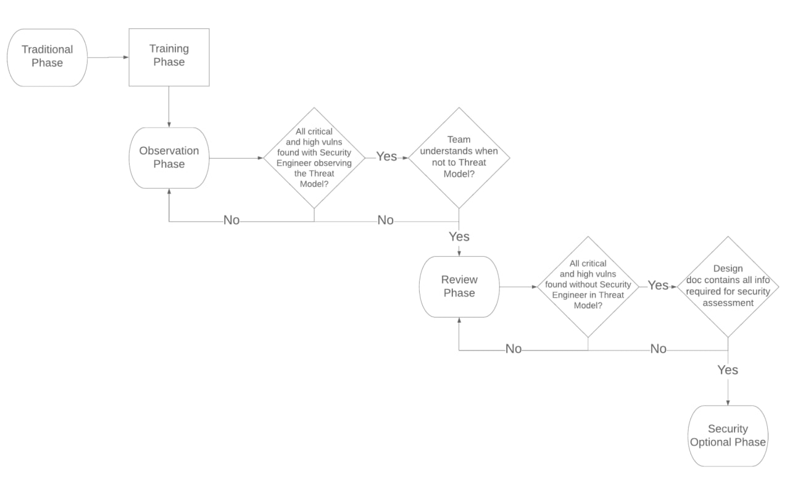
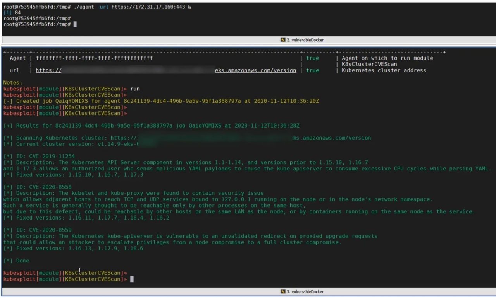
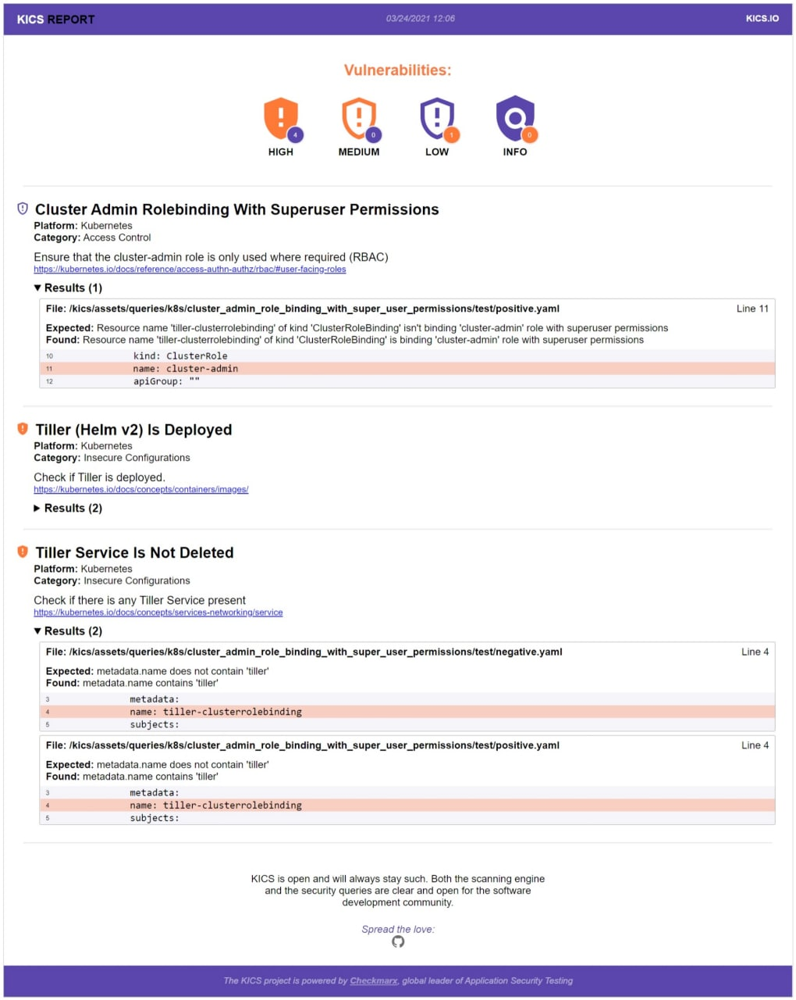
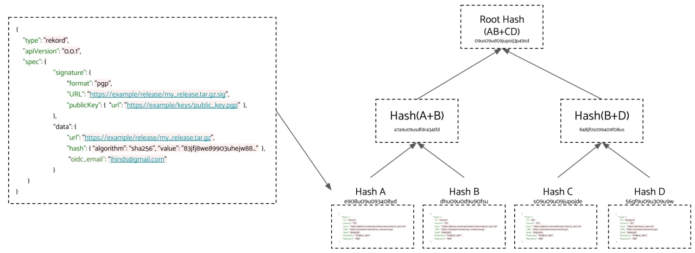

# chkpchat
`2021-04-30 10:48:50`

<blockquote>
https://github.com/stamparm/ipsum
</blockquote>

<table><tr><td><b>→</b><a href="https://github.com/stamparm/ipsum">
https://github.com/stamparm/ipsum
</a>
<blockquote>
Daily feed of bad IPs (with blacklist hit scores). Contribute to stamparm/ipsum development by creating an account on GitHub.
</blockquote>
</td></tr></table>

---

# overlamer1
`2021-04-30 00:59:28`

* https://telegra.ph/Recreator-Phishing-Utilita-sozdaniya-fishing-sajta-03-27

<blockquote>
Recreator-Phishing: Утилита создания фишинг-сайта
</blockquote>

<table><tr><td><b>→</b><a href="https://telegra.ph/Recreator-Phishing-Utilita-sozdaniya-fishing-sajta-03-27">
https://telegra.ph/Recreator-Phishing-Utilita-sozdaniya-fishing-sajta-03-27
</a>
<blockquote>
Дисклеймер: Мы не несём ответственности за ваши действия! Статья предоставлена в ознакомительных целях Большая часть успеха зависит от ваших навыков СИ, так что заранее придумайте под каким предлогом будете закидать сайт жертвам. Установка: apt update &amp;&amp; apt upgrade pkg install git python wget pip3 install wget git clone https://github.com/AngelSecurityTeam/Recreator-Phishing cd Recreator-Phishing chmod +x * &#35;даём права исполнения python3 Server Install.py python3 recreator-phishing.py
</blockquote>
</td></tr></table>

---

# overlamer1
`2021-04-28 23:28:45`

* https://graph.org/Planetwork-DDOS-DDOS-Wifi-seti-06-16

<blockquote>
Planetwork-DDOS: DDOS Wifi сети
</blockquote>

<table><tr><td><b>→</b><a href="https://graph.org/Planetwork-DDOS-DDOS-Wifi-seti-06-16">
https://graph.org/Planetwork-DDOS-DDOS-Wifi-seti-06-16
</a>
<blockquote>
Сегодня пойдёт речь о способе ddosа wifi в локальной сети через termux. Давайте перейдем к установке! Дисклеймер:Статья предоставлена исключительно в ознакомительных целях. Мы не несём ответственность за ваши действия. Источник статьи Сначала обновим все пакеты, и установим новые: apt update &amp;&amp; apt upgrade apt install git python python2 Сейчас клонируем репозиторий с тулзой, и откроем его: git clone https://github.com/Hydra7/Planetwork-DDOS cd Planetwork-DDOS При запуске программы вы увидите вот это: Тут…
</blockquote>
</td></tr></table>

---

# infobezopasnost
`2021-04-28 19:48:14`

<blockquote>
https://xakep.ru/2021/04/28/cve-2019-0604/
</blockquote>

<table><tr><td><b>→</b><a href="https://xakep.ru/2021/04/28/cve-2019-0604/">
https://xakep.ru/2021/04/28/cve-2019-0604/
</a>
<blockquote>
Серверы Microsoft SharePoint пополнили длинный список устройств, которые вымогатели используют как средство проникновения в корпоративные сети.
</blockquote>
</td></tr></table>

---

# overlamer1
`2021-04-28 16:57:37`

* https://telegra.ph/holehe-proveryaem-gde-zaregistrirovana-pochta-11-07

<blockquote>
holehe: проверяем где зарегистрирована почта
</blockquote>

<table><tr><td><b>→</b><a href="https://telegra.ph/holehe-proveryaem-gde-zaregistrirovana-pochta-11-07">
https://telegra.ph/holehe-proveryaem-gde-zaregistrirovana-pochta-11-07
</a>
<blockquote>
Сегодня я покажу вам как проверить где зарегистрирована почта в пару кликов! Вы можете установить данную тулзу двумя способами: Через гитхаб репозиторий Через пип источник статьи Начнем с первого. Обновляемся: apt update -y apt upgrade -y Качаем питон и гит: apt install python apt install git Копируем репозиторий с гитхаб: git clone https://github.com/megadose/holehe Входим в него и запускаем установщик: cd holehe python3 setup.py install Теперь переходим ко второму способу Обновим пакеты: apt update …
</blockquote>
</td></tr></table>

---

# overlamer1
`2021-04-27 16:54:09`

* https://telegra.ph/PyCompile-pryachem-python-skript-10-29

<blockquote>
PyCompile: прячем python скрипт
</blockquote>

<table><tr><td><b>→</b><a href="https://telegra.ph/PyCompile-pryachem-python-skript-10-29">
https://telegra.ph/PyCompile-pryachem-python-skript-10-29
</a>
<blockquote>
Всем привет! Нашел крутой инструмент, который спрячет ваш зловещий (ну может и обычный) скрипт на python. Можно сказать это недокриптование(хотя даже недокриптованием сложно назвать), но впринципе просто скрыть от других нарисанное можно. Перейдем к установке. Установка Обновим пакеты: apt update apt upgrade -y Качаем гит и питон второй версии: apt install git python2 Качаем инструмент: git https://github.com/htr-tech/Pycompile Открываем папку: cd Pycompile Запускаем скрипт: python2 compile.py По картинке…
</blockquote>
</td></tr></table>

---

# overlamer1
`2021-04-27 16:21:04`

* https://telegra.ph/mrphish-delaem-fishing-ssylku-v-odin-klik-10-23

<blockquote>
mrphish: делаем фишинг ссылку в один клик
</blockquote>

<table><tr><td><b>→</b><a href="https://telegra.ph/mrphish-delaem-fishing-ssylku-v-odin-klik-10-23">
https://telegra.ph/mrphish-delaem-fishing-ssylku-v-odin-klik-10-23
</a>
<blockquote>
mrphish это очень удобная утилита для создания фишинг ссылок в Termux, после её установки не нужно заморачиваться над ngrok и другими вещами, она полностью автоматизированная! Статью написал @devanoner источник статьи Установка Для начала обновим все пакеты: apt-get update -y apt-get upgrade -y Дальше качаем питон, гит и lolcat: pkg install python -y pkg install python2 -y pkg install git -y pip install lolcat Копируем репозиторий с гита и переходим в папку: git clone https://github.com/noob-hackers/mrphish…
</blockquote>
</td></tr></table>

---

# webware
`2021-04-27 14:50:39`

* https://telegra.ph/file/030d4a2af6d7ff0feb68d.jpg
* https://github.com/martinvigo/email2phonenumber
* https://t.me/Social_engineering
* https://github.com/martinvigo/email2phonenumber
* https://t.me/Social_engineering/628
* http://eog.pw/bot
* https://t.me/Social_engineering
* http://eog.pw/bot
* https://t.me/Social_engineering/1221
* http://www.cyberbackgroundchecks.com/email
* https://github.com/megadose/holehe
* https://tools.epieos.com/email.php
* https://t.me/Social_engineering
* https://tools.epieos.com/email.php
* https://m.ok.ru/dk?st.cmd=accountRecoverFeedbackForm
* https://t.me/Social_engineering
* https://m.ok.ru/dk?st.cmd=accountRecoverFeedbackForm
* https://t.me/s_e_oblako/1020
* https://t.me/Social_engineering

<blockquote>
​🔎 Поиск информации о цели, зная Email адрес.

🖖🏻 Приветствую тебя user_name.

💬 Продолжаем пополнять нашу коллекцию &#35;OSINT ресурсов. Каким образом используется полученная информация в сфере &#35;СИ ты можешь узнать в нашем канале если воспользуешься поиском по словам или хештегу. Сегодня я собрал для тебя подборку полезных сервисов и инструментов, благодаря которым ты сможешь найти полезную информацию о цели, зная электронный адрес:

•  haveibeenpwned.com — проверка почты в слитых базах
•  emailrep.io — найдет на каких сайтах был зарегистрирован аккаунт использующий определенную почту
•  dehashed.com — проверка почты в слитых базах
•  intelx.io — многофункциональный поисковик, поиск осуществляется еще и по даркнету
•  @info_baza_bot — покажет из какой базы слита почта, 2 бесплатных скана
•  leakedsource.ru — покажет в каких базах слита почта;
•  mostwantedhf.info — найдет аккаунт skype;
•  email2phonenumber (t) — автоматически собирает данные со страниц восстановления аккаунта, и находит номер телефона;
•  spiderfoot — автоматический поиск с использованием огромного количества методов, можно использовать в облаке если пройти регистрацию;
•  reversegenie.com — найдет местоположение, Первую букву имени и номера телефонов;
•  @last4mailbot — бот найдет последние 4 цифры номера телефона клиента Сбербанка;
•  searchmy.bio — найдет учетную запись Instagram с электронной почтой в описании;
•  leakprobe.net — найдет ник и источник слитой базы;
•  recon.secapps.com — автоматический поиск и создание карт взаимосвязей;
•  @AvinfoBot (r) — найдет аккаунт в ВК;
•  account.lampyre.io (t) (r) — программа выполняет поиск по аккаунтам  в соц. сетях и мессенджерам и другим источникам;
•  eog.pw (r) — найдет фото аккаунта;
•  @StealDetectorBOT — покажет часть утекшего пароля;
•  @UniversalSearchBot — бот найдет ID аккаунта, даст ссылку на Google Maps и альбомы и многое другое;
•  scylla.so — поисковик по базам утечек, найдет пароли, IP, ники и многое другое, в поле поиска введите email: и после e-mail адрес, например email:example@gmail.com;
•  @Quick_OSINT_bot — найдет пароли, соц. сети, логины, телефоны и многое другое;
•  GHunt — инструмент достанет Google ID, устройства, имя аккаунта, найдет какие сервисы Google используется, данные из отзывов на Google картах;
•  cyberbackgroundchecks.com — найдет все данные гражданина США, вход на сайт разрешен только с IP адреса США
•  holehe (t) — инструмент проверяет аккаунты каких сайтов зарегистрированы на искомый email адрес, поиск по 30 источникам;
•  tools.epieos.com — найдет Google ID, даст ссылки на профиль в Google карты, альбомы и календарь, найдет к каким сайтам привязана почта, профиль LinkedIn;
•  grep.app — поиск в репозиториях GitHub;
•  @PasswordSearchBot — выдает пароли;
•  m.ok.ru — показывает часть номера телефона, email, фамилии и полностью город с датой регистрации, используй во вкладке инкогнито;
•  www.avatarapi.com — найдет аватарку из множества источников;
•  @mailExistsBot — найдет к каким сайтам привязана почта, даст данные из форм восстановления пароля;
•  @SEARCHUA_bot — выдает досье на гражданина Украины где есть паспорт, адрес проживания, ФИО, автомобили, родственники, email, номера телефонов и много другого;
•  @SovaAppBot — найдет к каким сайтам привязана почта, результаты могут отличаться от аналогичных инструментов;
•  @shi_ver_bot — утекшие пароли;
•  @smart_search_3_bot — найдет ФИО, дату рождения, адрес, телефон и много другого, дает несколько бесплатных попыток на один аккаунт;

‼️ Другую дополнительную информацию ты можешь найти по хештегам &#35;OSINT и &#35;СИ. Делись с друзьями, добавляй в избранное и включай уведомления чтобы не пропустить новый материал. Твой S.E.
</blockquote>

<table><tr><td><b>→</b><a href="https://telegra.ph/file/030d4a2af6d7ff0feb68d.jpg">
https://telegra.ph/file/030d4a2af6d7ff0feb68d.jpg
</a>
</td></tr></table>

---

# phd_soc
`2021-04-23 10:02:03`

<blockquote>
OTX-MISP Error - Update Environment · Issue &#35;38 · gcrahay/otx_misp · GitHub
https://github.com/gcrahay/otx_misp/issues/38
</blockquote>

<table><tr><td><b>→</b><a href="https://github.com/gcrahay/otx_misp/issues/38">
https://github.com/gcrahay/otx_misp/issues/38
</a>
<blockquote>
Description otx-misp appers to be not working to publish event on updated environment. runing otx-misp with &quot;-d&quot; options runs smoothly, but when removing (real publishing) we got ...
</blockquote>
</td></tr></table>

---

# MPSIEMChat
`2021-04-22 17:56:13`

<blockquote>
Я кстати так понимаю, это тоже под угрозой 

https://github.com/PositiveTechnologies
</blockquote>

<table><tr><td><b>→</b><a href="https://github.com/PositiveTechnologies">
https://github.com/PositiveTechnologies
</a>
<blockquote>
PT open source projects. Positive Technologies has 36 repositories available. Follow their code on GitHub.
</blockquote>
</td></tr></table>

---

# exploitex
`2021-04-20 09:20:07`

* https://telegra.ph/file/dbb2efd540f779845efca.jpg
* https://www.voidtools.com/ru-ru/
* https://github.com/stnkl/EverythingToolbar/releases

<blockquote>
​Замена стандартного поиска в Windows 10

Поиск файлов и папок - очень полезная функция, которой обладают все современные операционные системы. К сожалению, поиск в Windows 10 оставляет желать лучшего: поиск ведётся очень медленно, и не рассчитан на большие жёсткие диски. В таком случае можно подобрать приложение от сторонних разработчиков, например Everything.

Функционал данной программы аналогичен поисковому сервису Windows 10, но с одним значительным отличием: поиск файлов происходит мгновенно. Этого удалось добиться благодаря индексации всего содержимого локальных хранилищ, но не пугайтесь - скорость индексации очень высока, да и в оперативной памяти программа не занимает много места.

Everything также можно встроить в панель задач: для этого кроме установки самого приложения необходимо скачать и установить EverythingToolbar. После этого в настройках панели задач необходимо выбрать &quot;Everything Toolbar&quot; во вкладке &quot;Панели&quot; и убрать стандартный поиск.

&#35;windows
</blockquote>

<table><tr><td><b>→</b><a href="https://telegra.ph/file/dbb2efd540f779845efca.jpg">
https://telegra.ph/file/dbb2efd540f779845efca.jpg
</a>
</td></tr></table>

---

# infobezopasnost
`2021-04-20 08:22:26`

<blockquote>
Эксплуатируемая злоумышленниками уязвимость нулевого дня в диспетчере окон рабочего стола (CVE-2021-28310) | Securelist
https://securelist.ru/zero-day-vulnerability-in-desktop-window-manager-cve-2021-28310-used-in-the-wild/101227/?utm_source&#61;twitter&amp;utm_medium&#61;social&amp;utm_campaign&#61;ru_zero_zp0159&amp;utm_content&#61;sm-post&amp;utm_term&#61;ru_twitter_organic_159dzjemwyzlbwk
</blockquote>

<table><tr><td><b>→</b><a href="https://securelist.ru/zero-day-vulnerability-in-desktop-window-manager-cve-2021-28310-used-in-the-wild/101227/">
https://securelist.ru/zero-day-vulnerability-in-desktop-window-manager-cve-2021-28310-used-in-the-wild/101227/
</a>
<blockquote>
Рассказываем про CVE-2021-28310 — уязвимость нулевого дня, связанная с библиотекой dwmcore.dll, входящей в диспетчер окон рабочего стола (dwm.exe).
</blockquote>
</td></tr></table>

---

# webware
`2021-04-17 22:32:44`

<blockquote>
🔖 S.E.Заметка. OSINT + Дорки.

•  Google Dorks - мощный инструмент, при помощи которого можно скомпрометировать устройство или найти нужную нам информацию о цели, используя Google и правильный запрос. Так как этот поисковик умеет индексировать все, что подключено к интернету, можно найти файлы, оказавшиеся доступными случайно и содержащие конфиденциальную информацию. Попробуй выполнить поиск и указать ФИО своей цели с заданными параметрами:

1. &quot;ФИО&quot; ext:doc | ext:docx | ext:ppt | ext:pptx | ext:pdf | ext:txt | ext:odt | ext:log

Дополнительные сервисы и инструменты:

2. recruitin.net — составляет Google дорки для поиска в LinkedIn, Dribbble, GitHub, Xing, Stack Overflow, Twitter.

3. Очень много интересных дорков для Shodan: https://github.com/jakejarvis/awesome-shodan-queries || https://github.com/robocyber/Shodan-Dorks

4. + 100 дорков Shodan.

5. Инструмент Dorks Eye — использует огромную базу запросов (около 15к) для поиска нужной информации. Полная инструкция по использованию есть тут.

&#35;Заметка &#35;OSINT.
</blockquote>

---

# exploitex
`2021-04-17 10:30:06`

* https://telegra.ph/file/47e7ec70453ae2db7b571.jpg
* https://github.com/code4charity/YouTube-Extension/
* https://github.com/code4charity/YouTube-Extension/

<blockquote>
​Как активировать скрытые функции YouTube 

За время своего существования YouTube оброс огромным количеством сторонних расширений, которые позволяют превратить страницу видеохостинга в настоящий кинотеатр, изменять скрытые настройки, отключать лишние элементы, и многое другое.

Одним из таких является Improve YouTube. Это бесплатное расширение с открытым исходным кодом, которое позволяет изменить практически любой элемент YouTube. Вы можете, например, менять размер окошка плеера, скрыть «Похожие видео» и «Комментарии», менять цвета и шрифты или даже восстановить классический дизайн сайта, если он вам больше нравится.

Вы также можете зафиксировать качество видео и звука, заблокировать всю рекламу, и активировать кнопки с дополнительным функционалом. Это лишь малая часть возможностей расширения, найти больше информации и установить его можно с официальной страницы на GitHub. 

&#35;расширение
</blockquote>

<table><tr><td><b>→</b><a href="https://telegra.ph/file/47e7ec70453ae2db7b571.jpg">
https://telegra.ph/file/47e7ec70453ae2db7b571.jpg
</a>
</td></tr></table>

---

# isast
`2021-04-16 23:23:35`

<blockquote>
OpenCVE is a platform used to locally import the list of CVEs and perform searches on it (by vendors, products, CVSS, CWE...).

Users subscribe to vendors or products, and OpenCVE alerts them when a new CVE is created or when an update is done in an existing CVE.

How does it work

OpenCVE uses the JSON feed provided by the NVD to update the local list of CVEs.

After an initial import, a background task is regularly executed to synchronize the local copy with the NVD feed. If a new CVE is added, or if a change is detected, the subscribers of the related vendors and products are alerted.

https://github.com/opencve/opencve
</blockquote>

<table><tr><td><b>→</b><a href="https://github.com/opencve/opencve">
https://github.com/opencve/opencve
</a>
<blockquote>
CVE Alerting Platform. Contribute to opencve/opencve development by creating an account on GitHub.
</blockquote>
</td></tr></table>

---

# phd_soc
`2021-04-16 11:18:56`

<blockquote>
Немного примеров сценариев реагирования на инциденты от участников https://t.me/phd_soc :

https://github.com/certsocietegenerale/IRM

https://www.incidentresponse.com/playbooks/
</blockquote>

<table><tr><td><b>→</b><a href="https://github.com/certsocietegenerale/IRM">
https://github.com/certsocietegenerale/IRM
</a>
<blockquote>
Incident Response Methodologies. Contribute to certsocietegenerale/IRM development by creating an account on GitHub.
</blockquote>
</td></tr></table>

---

# phd_soc
`2021-04-16 11:13:52`

<blockquote>
https://github.com/certsocietegenerale/IRM
</blockquote>

<table><tr><td><b>→</b><a href="https://github.com/certsocietegenerale/IRM">
https://github.com/certsocietegenerale/IRM
</a>
<blockquote>
Incident Response Methodologies. Contribute to certsocietegenerale/IRM development by creating an account on GitHub.
</blockquote>
</td></tr></table>

---

# overlamer1
`2021-04-15 12:35:50`

* https://telegra.ph/Vzlamyvaem-sajt-s-telefona--provodim-SQL-inekciyu-i-kradem-bazy-dannyh-11-01

<blockquote>
Взламываем сайт с телефона — проводим SQL-инъекцию и крадем базы данных
</blockquote>

<table><tr><td><b>→</b><a href="https://telegra.ph/Vzlamyvaem-sajt-s-telefona--provodim-SQL-inekciyu-i-kradem-bazy-dannyh-11-01">
https://telegra.ph/Vzlamyvaem-sajt-s-telefona--provodim-SQL-inekciyu-i-kradem-bazy-dannyh-11-01
</a>
<blockquote>
Всем привет! Сегодня я научу вас взламывать базу данных некоторых сайтов, которые не закрыли уязвимость SQL инъекции и XSS. источник статьи Итак, начнем Для этого нам опять понадобится Termux. Заходим Итак, а теперь пишем команды: pkg upgrade pkg update pkg install git pkg install python pkg install wget git clone https://github.com/sqlmapproject/sqlmap.git cd sqlmap python sqlmap.py Видим это: Если вы умеете читать по английски, то вы увидите, что прога просит ввести параметры. Все параметры можно посмотреть…
</blockquote>
</td></tr></table>

---

# isast
`2021-04-15 09:44:06`

<blockquote>
Redefining Threat Modeling: Security team goes on vacation

Статья от компании Segment о том, что такое Threat Modeling и как они сделали так, чтобы разработчики сами его выполняли. Данную активность они назвали символично &quot;Utopia&quot;. Сам по себе процесс участия безопасников в данном случае они сделали опциональным. Также команда Segment поделилась опытом обучения разработчиков моделированию угроз, включая презентации.

Данную идею я, кстати, встречаю не в первый раз. В качестве примера можно почитать &quot;Appsec Development: Keeping it all together at scale&quot; об опыте в Snowflake.

Если у вас в закромах сохраненок есть подобные статьи про опыт самостоятельного триажа разработчиками, с удовольствием бы почитал.

&#35;threatmodeling
</blockquote>

---

# infobezopasnost
`2021-04-14 19:07:56`

<blockquote>
https://www.kaspersky.ru/blog/cve-2021-28310/30513/
</blockquote>

<table><tr><td><b>→</b><a href="https://www.kaspersky.ru/blog/cve-2021-28310/30513/?utm_source=newsletter&utm_medium=Email&utm_campaign=kd+weekly+digest">
https://www.kaspersky.ru/blog/cve-2021-28310/30513/?utm_source=newsletter&utm_medium=Email&utm_campaign=kd+weekly+digest
</a>
<blockquote>
Эксперты «Лаборатории Касперского» обнаружили CVE-2021-28310 — уязвимость нулевого дня в Windows, которую уже эксплуатируют злоумышленники.
</blockquote>
</td></tr></table>

---

# isast
`2021-04-14 10:36:30`

<blockquote>
We want to provide a low-noise, reliable way for Go developers to be alerted of known security vulnerabilities that affect their applications.

We aim to build a first-party, curated, consistent database of security vulnerabilities open to community submissions, and static analysis tooling to surface only the vulnerabilities that are likely to affect an application, minimizing false positives.

The primary consumer of the database and the protocol will be a Go tool, tentatively go audit, which will analyze a module and report what vulnerabilities it’s affected by.

https://github.com/golang/go/issues/45519

https://go.googlesource.com/proposal/+/master/design/draft-vulndb.md
</blockquote>

<table><tr><td><b>→</b><a href="https://github.com/golang/go/issues/45519">
https://github.com/golang/go/issues/45519
</a>
<blockquote>
Per https://golang.org/design/draft-vulndb, I am creating golang.org/x/vulndb following the instructions at https://golang.org/wiki/CreatingSubRepository. This repository will host the Go Vulnerabi...
</blockquote>
</td></tr></table>

---

# MPSIEMChat
`2021-04-12 16:13:53`

<blockquote>
Если, вдруг, ODBC не взлетит и придется писать на питоне, то тут можете подглядеть https://github.com/feedb/MPSiem_addons/blob/f31bda03bbea10313a95d390f4fdf58f86831234/mpsiemlib/mpsiemlib/modules/Events.py&#35;L95
</blockquote>

<table><tr><td><b>→</b><a href="https://github.com/feedb/MPSiem_addons/blob/f31bda03bbea10313a95d390f4fdf58f86831234/mpsiemlib/mpsiemlib/modules/Events.py">
https://github.com/feedb/MPSiem_addons/blob/f31bda03bbea10313a95d390f4fdf58f86831234/mpsiemlib/mpsiemlib/modules/Events.py
</a>
<blockquote>
реп полезностей для PT MaxPatrol SIEM. Contribute to feedb/MPSiem_addons development by creating an account on GitHub.
</blockquote>
</td></tr></table>

---

# isast
`2021-04-12 13:28:59`

<blockquote>
Поглядываю на разные ключевики в твитере и вот такое попалось по &quot;static analysis&quot;.
Может пригодится кому.

Static analysis tool for Android/iOS apps focusing on security issues outside the source code

https://github.com/nightwatchcybersecurity/truegaze
</blockquote>

<table><tr><td><b>→</b><a href="https://github.com/nightwatchcybersecurity/truegaze">
https://github.com/nightwatchcybersecurity/truegaze
</a>
<blockquote>
Static analysis tool for Android/iOS apps focusing on security issues outside the source code - nightwatchcybersecurity/truegaze
</blockquote>
</td></tr></table>

---

# overlamer1
`2021-04-10 01:44:48`

* https://telegra.ph/TStyle-kastomiziruem-termux-11-04

<blockquote>
TStyle: кастомизируем termux
</blockquote>

<table><tr><td><b>→</b><a href="https://telegra.ph/TStyle-kastomiziruem-termux-11-04">
https://telegra.ph/TStyle-kastomiziruem-termux-11-04
</a>
<blockquote>
TStyle - инструмент, который поможет вам кастомизировать ваш Termux! источник статьи Когда терминал выглядит приятно для глаз, то продуктивность делает lvl up;) Установка: apt update &amp;&amp; apt upgrade Качаем гит apt install git -y Копируем репозиторий с гитхаба git clone https://github.com/htr-tech/tstyle Заходим в директорию и запускаем установщик cd tstyle bash setup.sh После установки вы можете спокойно запускать данную тулзу из любого места командой: tstyle [01] - поменять шрифты [02] - поменять тему…
</blockquote>
</td></tr></table>

---

# MPSIEMChat
`2021-04-09 13:09:25`

<blockquote>
Коллеги, привет всем. Был у кого опыт работы со скриптом выгрузки инцидентов MP SIEM и связанных с инцидентом событий в The Hive? из https://github.com/feedb/MPSiem_addons.
</blockquote>

<table><tr><td><b>→</b><a href="https://github.com/feedb/MPSiem_addons">
https://github.com/feedb/MPSiem_addons
</a>
<blockquote>
реп полезностей для PT MaxPatrol SIEM. Contribute to feedb/MPSiem_addons development by creating an account on GitHub.
</blockquote>
</td></tr></table>

---

# isast
`2021-04-09 11:35:47`

<blockquote>
https://github.com/sbilly/awesome-security

&quot;A collection of awesome software, libraries, documents, books, resources and cool stuff about security.

Inspired by awesome-php, awesome-python.&quot;
</blockquote>

<table><tr><td><b>→</b><a href="https://github.com/sbilly/awesome-security">
https://github.com/sbilly/awesome-security
</a>
<blockquote>
A collection of awesome software, libraries, documents, books, resources and cools stuffs about security. - sbilly/awesome-security
</blockquote>
</td></tr></table>

---

# isast
`2021-04-09 10:50:26`

<blockquote>
https://github.com/panda-re/panda

&quot;PANDA is an open-source Platform for Architecture-Neutral Dynamic Analysis. 

It is built upon the QEMU whole system emulator, and so analyses have access to all code executing in the guest and all data. 

PANDA adds the ability to record and replay executions, enabling iterative, deep, whole system analyses. Further, the replay log files are compact and shareable, allowing for repeatable experiments. A nine billion instruction boot of FreeBSD, e.g., is represented by only a few hundred MB. PANDA leverages QEMU's support of thirteen different CPU architectures to make analyses of those diverse instruction sets possible within the LLVM IR.

In this way, PANDA can have a single dynamic taint analysis, for example, that precisely supports many CPUs. PANDA analyses are written in a simple plugin architecture which includes a mechanism to share functionality between plugins, increasing analysis code re-use and simplifying complex analysis development.&quot;
</blockquote>

<table><tr><td><b>→</b><a href="https://github.com/panda-re/panda">
https://github.com/panda-re/panda
</a>
<blockquote>
Platform for Architecture-Neutral Dynamic Analysis - panda-re/panda
</blockquote>
</td></tr></table>

---

# isast
`2021-04-09 07:31:06`

<blockquote>
Kubesploit: A New Offensive Tool for Testing Containerized Environments
https://www.cyberark.com/resources/threat-research-blog/kubesploit-a-new-offensive-tool-for-testing-containerized-environments
+
https://github.com/cyberark/kubesploit
</blockquote>

---

# phd_soc
`2021-04-08 11:14:06`

<blockquote>
Коллеги, привет! Мы планируем написание цикла статей по атака на MS Exchange. Сегодня вышла первая статья - https://habr.com/ru/company/bizone/blog/551228/
</blockquote>

<table><tr><td><b>→</b><a href="https://habr.com/ru/company/bizone/blog/551228/?utm_source=habrahabr&utm_medium=rss&utm_campaign=551228">
https://habr.com/ru/company/bizone/blog/551228/?utm_source=habrahabr&utm_medium=rss&utm_campaign=551228
</a>
<blockquote>
Авторы статьи: Антон Медведев, Демьян Соколин, Вадим Хрыков Microsoft Exchange — один из самых распространенных почтовых серверов, который используют сотни тысяч...
</blockquote>
</td></tr></table>

---

# MPSIEMChat
`2021-04-07 19:14:54`

<blockquote>
🤪 посмотрел.
тут фикс:
https://github.com/saltstack/salt/pull/59829/commits/593b6466364de895e906de2457979d8588c73f92

надо скрипт подправить было б: salt/modules/network.py
</blockquote>

<table><tr><td><b>→</b><a href="https://github.com/saltstack/salt/pull/59829/commits/593b6466364de895e906de2457979d8588c73f92">
https://github.com/saltstack/salt/pull/59829/commits/593b6466364de895e906de2457979d8588c73f92
</a>
<blockquote>
What does this PR do?
Add processing for multicast entries in ip -6 route show table all output
What issues does this PR fix or reference?
Patrial fix (only for multicast entries for now) for &#35;5837...
</blockquote>
</td></tr></table>

---

# MPSIEMChat
`2021-04-07 19:12:03`

<blockquote>
https://github.com/saltstack/salt/issues/58377

в следующей публичной сборке в siem storage будет включен net-tools
</blockquote>

<table><tr><td><b>→</b><a href="https://github.com/saltstack/salt/issues/58377">
https://github.com/saltstack/salt/issues/58377
</a>
<blockquote>
Description of Issue Salt network module not working when default route has several destinations. Setup Routing table looks like: default proto bird metric 32 nexthop via 1.2.3.4 dev eth1 weight 1 ...
</blockquote>
</td></tr></table>

---

# isast
`2021-04-07 12:21:47`

<blockquote>
Now &#35;openwifi FPGA allows more control on your needs over the re-transmission and ACK operations under monitor mode. A more powerful WiFi fuzzer can be done! Check out the updated packet injection and fuzzing app note 

https://github.com/open-sdr/openwifi/blob/master/doc/app_notes/inject_80211.md&#35;fpga-behavior-control
</blockquote>

<table><tr><td><b>→</b><a href="https://github.com/open-sdr/openwifi/blob/master/doc/app_notes/inject_80211.md">
https://github.com/open-sdr/openwifi/blob/master/doc/app_notes/inject_80211.md
</a>
<blockquote>
open-source IEEE802.11/Wi-Fi baseband chip/FPGA design - open-sdr/openwifi
</blockquote>
</td></tr></table>

---

# MPSIEMChat
`2021-04-06 20:37:21`

<blockquote>
@srublev добавил еще больше фич по работе с группами в КБ

- Парсинг структуры набора установки в объект
- Дамп объекта в файловую структуру набора установки
- Выгрузка перечня наборов установки из SIEM (с возможностью выгрузки дерева)
- Загрузка перечня наборов установки в SIEM

Что-то проект уже так разросся, что скоро его надо будет выносить в отдельную репу.

https://github.com/feedb/MPSiem_addons/blob/master/mpsiemlib/CHANGELOG.md
</blockquote>

<table><tr><td><b>→</b><a href="https://github.com/feedb/MPSiem_addons/blob/master/mpsiemlib/CHANGELOG.md">
https://github.com/feedb/MPSiem_addons/blob/master/mpsiemlib/CHANGELOG.md
</a>
<blockquote>
реп полезностей для PT MaxPatrol SIEM. Contribute to feedb/MPSiem_addons development by creating an account on GitHub.
</blockquote>
</td></tr></table>

---

# ctfchat
`2021-04-06 19:26:43`

<blockquote>
а никто не знает что за https://github.com/C4T-BuT-S4D/ctf_dashboard ? и есть ли сейчас ферма лучше деструктива?
</blockquote>

<table><tr><td><b>→</b><a href="https://github.com/C4T-BuT-S4D/ctf_dashboard">
https://github.com/C4T-BuT-S4D/ctf_dashboard
</a>
<blockquote>
Dashboard centralising all CTF tools. Contribute to C4T-BuT-S4D/ctf_dashboard development by creating an account on GitHub.
</blockquote>
</td></tr></table>

---

# isast
`2021-04-06 09:59:10`

<blockquote>
Kics - Secure IaC by Checkmarx (with OPA engine)

Checkmarx выпустили open-source инструмент Kics - сканер IaC (Terraform, Kubernetes, Dockerfile, Ansible, CloudFormation, Helm) на предмет мисконфигураций. Работает на базе правил Rego и умеет выдавать результат в JSON и красивых HTML. Правила все находятся в репо и дописываются, пока я пишу текст к этому посту. В общем выглядит очень интересно.

Если вам интересны еще подобные проекты, то оказывается, существует отдельный Awesome под OPA - интеграции, статьи, тренинги, коммерческие обвязки.

&#35;opa &#35;dev &#35;ops
</blockquote>

---

# overlamer1
`2021-04-03 20:13:53`

* https://telegra.ph/wifi-crusher-Vzlom-wi-fi-02-09

<blockquote>
wifi crusher: Взлом wi-fi
</blockquote>

<table><tr><td><b>→</b><a href="https://telegra.ph/wifi-crusher-Vzlom-wi-fi-02-09">
https://telegra.ph/wifi-crusher-Vzlom-wi-fi-02-09
</a>
<blockquote>
Дисклеймер:мы не несём ответственности за ваши действия!всё на ваш страх и риск Использует aircrack-ng и MDK4 в качестве API для создания Хотспот и размывания сетей. Это также позволяет троллить Он имеет удобный интерфейс, с большим количеством, я имею в виду... Много пасхальных яиц, поэтому я предлагаю покопаться, или посмотреть на код, чтобы найти немного пасхальных яиц. Для установки,прописываем команду в терминале: git clone https://github.com/inquisition-musician/wifi_crusher Устанавливаем python3,если…
</blockquote>
</td></tr></table>

---

# MPSIEMChat
`2021-04-03 12:56:45`

<blockquote>
max завез в mpsiemlib кучу крутых штук для работы с активами.

- Выгрузка списка инфраструктур
- Выгрузка списка групп
- Создание/удаление статических и динамических групп
- Выгрузка активов по PDQL в JSON и CSV
- Импорт активов из CSV в заданную группу 

Либа апнулась до версии 1.3.0

https://github.com/feedb/MPSiem_addons/tree/master/mpsiemlib
</blockquote>

<table><tr><td><b>→</b><a href="https://github.com/feedb/MPSiem_addons/tree/master/mpsiemlib">
https://github.com/feedb/MPSiem_addons/tree/master/mpsiemlib
</a>
<blockquote>
реп полезностей для PT MaxPatrol SIEM. Contribute to feedb/MPSiem_addons development by creating an account on GitHub.
</blockquote>
</td></tr></table>

---

# overlamer1
`2021-04-02 17:36:37`

* https://telegra.ph/TeleGram-Scraper-ParserInvajterSpammer-03-22

<blockquote>
TeleGram-Scraper: Парсер/Инвайтер/Спаммер
</blockquote>

<table><tr><td><b>→</b><a href="https://telegra.ph/TeleGram-Scraper-ParserInvajterSpammer-03-22">
https://telegra.ph/TeleGram-Scraper-ParserInvajterSpammer-03-22
</a>
<blockquote>
Всем привет, господа! У нас на подходе склейка скриптов, которые помогут вам в развитии своих проектов. Это парсер, инвайтер и спаммер одновременно - https://github.com/th3unkn0n/TeleGram-Scraper. Давайте сделаем обзор на данную тулзу. Для установки скрипта, пишем эти команды: $ pkg install -y git python $ git clone https://github.com/th3unkn0n/TeleGram-Scraper.git $ cd TeleGram-Scraper Инструкция: 1. установить питон (по ссылке, обязательно!).  1.1 При установке, ставим галочку на Add Python 3.7 to PATH,…
</blockquote>
</td></tr></table>

---

# overlamer1
`2021-04-01 11:50:09`

* https://telegra.ph/Sbornik-OSINT-instrumentov-10-04

<blockquote>
Сборник OSINT инструментов
</blockquote>

<table><tr><td><b>→</b><a href="https://telegra.ph/Sbornik-OSINT-instrumentov-10-04">
https://telegra.ph/Sbornik-OSINT-instrumentov-10-04
</a>
<blockquote>
Сборники инструментов предназначенных для определенного спектра атак давно стали основной составляющей базового набора для пентеста. Сюда можно добавить и фреймворк The Inspector, который включает в себя модули для получения информации о телефоне либо о домене, обхода CloudFlare и т.д. источник статьи Установка Качаем гит и перл: apt install git apt install perl Получаем репозиторий: git clone https://github.com/Moham3dRiahi/Th3inspector Переходим в директорию с The Inspector, ставим права на установщик и…
</blockquote>
</td></tr></table>

---

# isast
`2021-04-01 10:37:23`

<blockquote>
Introducing sigstore: Easy Code Signing &amp; Verification for Supply Chain Integrity

Сегодня у нас новый проект от Linux Foundation - Sigstore, основная цель которого предоставить возможность подписывать и проверять релизы. Из слов разработчиков, &quot;Так же, как Let's Encrypt предоставляет бесплатные сертификаты и инструменты автоматизации для HTTPS, sigstore предоставляет бесплатные сертификаты и инструменты для автоматизации и проверки подписей исходного кода.&quot; 

На текущий момент проект нацелен на артефакты вроде tar, бинарных файлов и образов контейнеров. Позже будут рассмотрены jar-файлы, манифесты (например, SBOM).

Важно отметить, что речь идет именно о проекте. Реализация зависит от конкретного инструмента. На текущий момент это Cosign от инженера Google (пример работы), Rekore и Fulcio.

Среди примеров угроз, от которых потенциально спасает инструмент - dependency confusion attack и импорт уязвимых пакетов RubyGems.

&#35;sca
</blockquote>

---

# isast
`2021-04-01 07:47:22`

<blockquote>
https://securitylab.github.com/research/fuzzing-apache-2/
</blockquote>

<table><tr><td><b>→</b><a href="https://securitylab.github.com/research/fuzzing-apache-2/">
https://securitylab.github.com/research/fuzzing-apache-2/
</a>
<blockquote>
In this second installment, I will focus on how to build our own custom ASAN interceptors in order to catch memory bugs when custom memory pools are implemented and also on how to intercept file system syscalls to detect logic errors in the target application.
</blockquote>
</td></tr></table>

---

