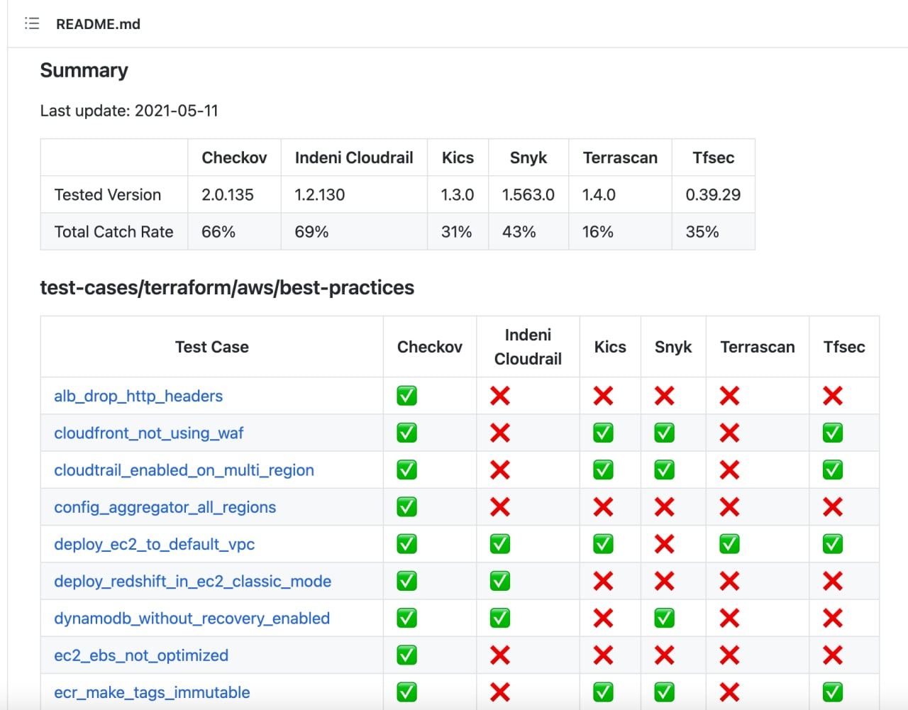

# overlamer1
`2021-05-31 09:32:23`

* https://telegra.ph/Kak-sozdat-krasivyj-BTC-adres-01-03

<blockquote>
Как создать красивый BTC адрес
</blockquote>

<table><tr><td><b>→</b><a href="https://telegra.ph/Kak-sozdat-krasivyj-BTC-adres-01-03">
https://telegra.ph/Kak-sozdat-krasivyj-BTC-adres-01-03
</a>
<blockquote>
Всем привет! Сегодня вам расскажем как же сгенерировать себе красивый биткоин адрес. Реальных целей конечно же за этим делом быть не может, зато для понта и произведения впечатления - вполне. Начнем! источник статьи Например: 1337nNS92kmWwQkj7nhW4tbq3ATWGo3jFs 13Durex37ihmKKbxe1yArTeo6r565oRCoZ 1DoxEReRyR9NScZGr9XUKfZ7Qp8ikCtSj4 1pepsi5vWXE5HPSxRFuHLugezBhpKo1gf И так далее, думаю Вы поняли. Сразу проясню что единица вначале адреса обязательна. Начнём. Качаем с гитхаба вот это &gt; https://github.com/samr7…
</blockquote>
</td></tr></table>

---

# exploitex
`2021-05-31 09:27:00`

* https://telegra.ph/file/b0329411b996f3f8ac83f.jpg
* https://github.com/dessant/buster

<blockquote>
​Как облегчить прохождение reCaptcha

Безусловно, Captcha разрабатывалась с благими намерениями: для защиты сайтов от ботов и одновременной помощи в оцифровке текстов книг. Но ее сложность часто бывает несбалансированной, что за собой влечет бесполезную трату личного времени и нервов на многократное перепрохождение.

В таких случаях, прекрасно может помочь браузерное расширение Buster. Его задача быстро пройти ненавистную капчу за вас, выполняя аудио задачи с использованием распознавания речи. Данное расширение доступно для большинства популярных браузеров. 

Суть его работы незамысловата: вам достаточно нажать на дополнительно появившийся значок расширения внизу окна reCaptcha, чтобы алгоритм автоматически решил задачу. 

&#35;расширение
</blockquote>

<table><tr><td><b>→</b><a href="https://telegra.ph/file/b0329411b996f3f8ac83f.jpg">
https://telegra.ph/file/b0329411b996f3f8ac83f.jpg
</a>
</td></tr></table>

---

# cyberoffru
`2021-05-28 16:53:54`

<blockquote>
https://github.com/arcomage/arcomage-hd
</blockquote>

<table><tr><td><b>→</b><a href="https://github.com/arcomage/arcomage-hd">
https://github.com/arcomage/arcomage-hd
</a>
<blockquote>
Web-based, open source, remastered 3D clone of 3DO/NWC's 2000 card game Arcomage. 11 languages. Desktop / tablet / mobile screen. PWA. Against AI or Multiplayer (w/o server). 🧝👾🃏 (ts+react+...
</blockquote>
</td></tr></table>

---

# chkpchat
`2021-05-28 11:50:25`

<blockquote>
Никак
https://github.com/projectcalico/calicoctl/issues/2278
</blockquote>

<table><tr><td><b>→</b><a href="https://github.com/projectcalico/calicoctl/issues/2278">
https://github.com/projectcalico/calicoctl/issues/2278
</a>
<blockquote>
In the current calicoctl apply output, all that it lists is: Successfully applied &#35; 'NetworkPolicy' resource(s) If you pass multiple, but only a subset gets applied, it would be ver...
</blockquote>
</td></tr></table>

---

# phd_soc
`2021-05-28 10:45:26`

<blockquote>
Странно, что никто не написал, что любой продукт это всего лишь инструмент, с которым работают люди. 
ИМХО, разницу (фактическую пользу от любого продукта) приносят именно люди. Поэтому, очень важны вопросы удобства (да и просто привычки), умение использовать продукт конкретными людьми для решения конкретных задач.

Красивый (дорогой коммерческий продукт) не гарантирует вам ровным счетом ничего (кроме возможности обращения к вендору). Его нужно уметь правильно установить, настроить, поддерживать и анализировать то, что он генерирует. + поставляемая в продукте экспертиза всегда вызывала у меня вопросы и необходимость потратить много времени на её доработку.  

Упрёки в сторону опенсорс, что он чего-то не может - знаю несколько организаций, где ребята неплохо справляются практически только опенсорс средствами для решения конкретных задач. Например, мне вспомнился доклад Данила Бородавкина на PHD 2017, где он рассказал про свой опыт создания песочницы на базе опенсорс (http://2017.phdays.ru/program/231392/).
Опенсорс СИЕМ не пережевывает большой поток - можно грамотно масштабировать инстансы и накрутить верхнеуровневую агрегацию детектов (правда я так ещё не делал в проде).

Если действительно хочется разобраться в вопросе, то лучше поучаствовать в нескольких больших проектах с интересующими вас системами (внедрение или уже эксплуатация в рамках процессов SOC). Если есть ресурсы, то можно развернуть и посмотреть на некоторые опенсорс проекты:
https://securityonionsolutions.com/software
https://github.com/Cyb3rWard0g/HELK
https://github.com/philhagen/sof-elk

и триалки дорогих продуктов:
https://www.ibm.com/community/qradar/trial/
https://www.splunk.com/en_us/download.html
...
</blockquote>

<table><tr><td><b>→</b><a href="https://2017.phdays.ru/program/231392/">
https://2017.phdays.ru/program/231392/
</a>
<blockquote>
Международный форум по практической безопасности Positive Hack Days проходит каждую весну в Москве. Конференция, организованная компанией Positive Technologies, на два дня собирает вместе ведущих безопасников и хакеров со всего мира, представителей госструктур и крупных бизнесменов, молодых ученых и журналистов.
</blockquote>
</td></tr></table>

---

# phd_soc
`2021-05-27 20:22:41`

<blockquote>
Всем привет! Выпустили вторую статью цикла - https://habr.com/ru/company/bizone/blog/559208/
</blockquote>

<table><tr><td><b>→</b><a href="https://habr.com/ru/company/bizone/blog/559208/?utm_campaign=559208&utm_source=habrahabr&utm_medium=rss">
https://habr.com/ru/company/bizone/blog/559208/?utm_campaign=559208&utm_source=habrahabr&utm_medium=rss
</a>
<blockquote>
Автор статьи: Антон Медведев Наша прошлая статья была посвящена различным методам обнаружения эксплуатации уязвимостей ProxyLogon. В этот раз мы поговорим о мето...
</blockquote>
</td></tr></table>

---

# phd_soc
`2021-05-27 14:09:14`

<blockquote>
Короткие читщиты с советами по аудиту (и его тюнингу) WindowsLogs и Sysmon:
https://www.malwarearchaeology.com/cheat-sheets

Хорошие ссылки на разные материалы по сисмону:
https://github.com/MHaggis/sysmon-dfir
первая ссылка в списке  - общий гайд по сисмону от TrustedSec (КМК, весьма неплох, если вы только начинаете использовать сисмон)

Но как ни крути, действительно хорошо оптимизировать аудит и сбор необходимых событий можно только имея внятные входные условия. Для меня в упрощенном виде нужно: 
* модель угроз (бизнес-риск -&gt; объект защиты -&gt; векторы атак с оценкой возможности реализации каждого вектора);
* имея такую упрощенную модель уже можно будет расставлять приоритеты, раскладывать каждый вектор атаки на TTP, проецировать их на конкретные узлы инфраструктуры и под них формировать логику выявления, исходя из который вы сможете понять какие исходные данные (логи, трафик, возможность получения снимка активности ОС,..) нужны для:
a. автоматизированного оперативного выявления атак;
b. анализа потенциальный инцидентов;
c. расследования подтвержденных инцидентов;
d. Threat Hunting-а и ретроанализа.

При этом не обязательно тащить сразу все эти исходные данные в средства мониторинга. Например, условные хостовые события сетевой активности (Sysmon 3, SecurityLog 5156) генерируют большой поток событий, поэтому часто на узлах включают аудит этих событий (с исключениями в конфиге Sysmon), но не собирают их с узлов (либо собирают с ограниченного скоупа узлов) без видимой необходимости (подтягивают только в случаях &quot;b&quot;-&quot;d&quot;). 
Поэтому советы по профилям аудита и сбора событий носят общий характер и не факт, что будут полезны для мониторинга вашей инфры.
</blockquote>

<table><tr><td><b>→</b><a href="https://www.malwarearchaeology.com/cheat-sheets">
https://www.malwarearchaeology.com/cheat-sheets
</a>
<blockquote>
&quot;Windows logging Cheat Sheet&quot;, &quot;Splunk Logging Cheat Sheet&quot;
</blockquote>
</td></tr></table>

---

# phd_soc
`2021-05-27 11:50:42`

<blockquote>
Посмотрите ещё на вот такой конфиг: https://github.com/SwiftOnSecurity/sysmon-config/blob/master/sysmonconfig-export.xml

Там есть полезные комментарии
</blockquote>

<table><tr><td><b>→</b><a href="https://github.com/SwiftOnSecurity/sysmon-config/blob/master/sysmonconfig-export.xml">
https://github.com/SwiftOnSecurity/sysmon-config/blob/master/sysmonconfig-export.xml
</a>
<blockquote>
Sysmon configuration file template with default high-quality event tracing - SwiftOnSecurity/sysmon-config
</blockquote>
</td></tr></table>

---

# phd_soc
`2021-05-27 11:50:42`

<blockquote>
И ещё интересный проект: https://github.com/olafhartong/sysmon-modular

Модульный конфиг, состоящий из отдельных частей. Удобен для постепенного изучения
</blockquote>

<table><tr><td><b>→</b><a href="https://github.com/olafhartong/sysmon-modular">
https://github.com/olafhartong/sysmon-modular
</a>
<blockquote>
A repository of sysmon configuration modules. Contribute to olafhartong/sysmon-modular development by creating an account on GitHub.
</blockquote>
</td></tr></table>

---

# chkpchat
`2021-05-27 09:00:23`

* https://telegra.ph/file/91fee8f72af32f5902b3b.png
* https://docs.gitlab.com/ee/ci/introduction/
* https://t.me/chkpstar/232
* https://youtu.be/qh1u-gkit9o?t=1435
* https://we45.com/blog/top-10-security-risks-in-serverless/

<blockquote>
​&#35;marketing &#35;learn

Защита облаков, CI/CD, бессерверных функций, контейнеров,  воркеров ....
Порой в этом крайне сложно разобраться и непонятно как защищаться от новомодных угроз.

Как-то был вебинар про основы kubernetes и как его защитить,  технически объемный материал с множеством нюансов и примеров. Там даже была демонстрация с реальной атакой контейнера через metasploit.

Но кроме кубика есть еще множество точек, о которых стоит позаботиться ! 

Поэтому у Check Point появился документ с описанием разных кейсов защиты современных инраструктур и что применить в каком случае.

Схемки  - https://cloud.chkp.pro/s/q3TmSS8GTmt6LxX
</blockquote>

<table><tr><td><b>→</b><a href="https://telegra.ph/file/91fee8f72af32f5902b3b.png">
https://telegra.ph/file/91fee8f72af32f5902b3b.png
</a>
</td></tr></table>

---

# MPSIEMChat
`2021-05-26 18:10:31`

<blockquote>
Вот тут можно подглядеть как выгружать https://github.com/feedb/MPSiem_addons/blob/921eae26e0b133a0ce6d6751710a188a8552f96e/mpsiemlib/tests/unit_tables.py&#35;L28
</blockquote>

<table><tr><td><b>→</b><a href="https://github.com/feedb/MPSiem_addons/blob/921eae26e0b133a0ce6d6751710a188a8552f96e/mpsiemlib/tests/unit_tables.py">
https://github.com/feedb/MPSiem_addons/blob/921eae26e0b133a0ce6d6751710a188a8552f96e/mpsiemlib/tests/unit_tables.py
</a>
<blockquote>
реп полезностей для PT MaxPatrol SIEM. Contribute to feedb/MPSiem_addons development by creating an account on GitHub.
</blockquote>
</td></tr></table>

---

# overlamer1
`2021-05-26 08:01:13`

* https://telegra.ph/Brutforsim-zashifrovannyj-ZIP-arhiv-12-11

<blockquote>
Брутфорсим зашифрованный ZIP-архив
</blockquote>

<table><tr><td><b>→</b><a href="https://telegra.ph/Brutforsim-zashifrovannyj-ZIP-arhiv-12-11">
https://telegra.ph/Brutforsim-zashifrovannyj-ZIP-arhiv-12-11
</a>
<blockquote>
Для этого мы будем использовать утилиту ZIP-Password-BruteForcer. Она написана на ЯП Python, поэтому она может работать как на Windows, так и на Linux. источник статьи Установка git clone https://github.com/The404Hacking/ZIP-Password-BruteForcer Использование Переходим в директорию и запускаем: ZIP-Password-BruteForcer python ZIP-Password-BruteForcer.py Для запуска атаки перебором нужно прописать 1. Далее вводим путь к зашифрованному zip архиву и словарю. Процесс запуститься и в зависимости от мощности процессора…
</blockquote>
</td></tr></table>

---

# overlamer1
`2021-05-26 07:59:08`

* https://telegra.ph/Proverka-ssylki-na-fishing-12-20

<blockquote>
Проверка ссылки на фишинг
</blockquote>

<table><tr><td><b>→</b><a href="https://telegra.ph/Proverka-ssylki-na-fishing-12-20">
https://telegra.ph/Proverka-ssylki-na-fishing-12-20
</a>
<blockquote>
Всем привет! Вы уже знаете как создать фишинг ссылку. Теперь я хочу рассказать про скрипт, который поможет узнать, фишинговая или нет. Перейдем к установке. источник статьи Обновим пакет: apt update apt upgrade Качаем питон и гит: apt install python apt install git Теперь копируем реп: git clone https://github.com/t4d/PhishingKitHunter.git И открываем его: cd PhishingKitHunter Устанавливаем зависимости: pip3 install -r requirements.txt Вот такой командой запускаем: python PhishingKitHunter.py -i logs.log…
</blockquote>
</td></tr></table>

---

# isast
`2021-05-25 21:07:12`

<blockquote>
https://github.com/google/fuzzing/blob/master/docs/split-inputs.md&#35;fuzzed-data-provider

FuzzedDataProvider (FDP) is a single-header C++ library that is helpful for splitting a fuzz input into multiple parts of various types. It is a part of LLVM and can be included via &#35;include &lt;fuzzer/FuzzedDataProvider.h&gt; directive. If your compiler doesn't have this header (in case it's an older Clang version or some other compiler), you can copy the header from here and add it to your project manually. It should just work, as the header doesn't depend on LLVM.

An advantage and disadvantage of using this library is that the input splitting happens dynamically, i.e. you don't need to define any structure of the input. This might be very helpful in certain cases, but would also make the corpus to be no longer in a particular format. For example, if you fuzz an image parser and split the fuzz input into several parts, the corpus elements will no longer be valid image files, and you won't be able to simply add image files to your corpus.
</blockquote>

<table><tr><td><b>→</b><a href="https://github.com/google/fuzzing/blob/master/docs/split-inputs.md">
https://github.com/google/fuzzing/blob/master/docs/split-inputs.md
</a>
<blockquote>
Tutorials, examples, discussions, research proposals, and other resources related to fuzzing - google/fuzzing
</blockquote>
</td></tr></table>

---

# isast
`2021-05-25 14:40:57`

<blockquote>
https://github.com/llvm/llvm-project/blob/main/compiler-rt/include/fuzzer/FuzzedDataProvider.h

A single header library providing an utility class to break up an array of
bytes. Whenever run on the same input, provides the same output, as long as
its methods are called in the same order, with the same arguments.
</blockquote>

<table><tr><td><b>→</b><a href="https://github.com/llvm/llvm-project/blob/main/compiler-rt/include/fuzzer/FuzzedDataProvider.h">
https://github.com/llvm/llvm-project/blob/main/compiler-rt/include/fuzzer/FuzzedDataProvider.h
</a>
<blockquote>
The LLVM Project is a collection of modular and reusable compiler and toolchain technologies. Note: the repository does not accept github pull requests at this moment. Please submit your patches at...
</blockquote>
</td></tr></table>

---

# isast
`2021-05-25 14:22:00`

<blockquote>
https://github.com/google/atheris&#35;fuzzeddataprovider

Often, a bytes object is not convenient input to your code being fuzzed. Similar to libFuzzer, we provide a FuzzedDataProvider to translate these bytes into other input forms. Alternatively, you can use Hypothesis as described below.
</blockquote>

<table><tr><td><b>→</b><a href="https://github.com/google/atheris">
https://github.com/google/atheris
</a>
<blockquote>
Contribute to google/atheris development by creating an account on GitHub.
</blockquote>
</td></tr></table>

---

# overlamer1
`2021-05-24 23:21:47`

* https://telegra.ph/Ustanovka-ngrok-v-termux-07-30

<blockquote>
Установка ngrok в termux
</blockquote>

<table><tr><td><b>→</b><a href="https://telegra.ph/Ustanovka-ngrok-v-termux-07-30">
https://telegra.ph/Ustanovka-ngrok-v-termux-07-30
</a>
<blockquote>
Всем привет! Хочу рассказать вам про установку ngrok в termux, данная статья вам понадобится для одного очень интересного инструмента, про который я расскажу вам завтра) Перейдем к установке. источник статьи Как всегда сначала обновим пакеты: apt-get update &amp;&amp; apt-get upgrade Установим git: apt-get install git И скопируем репозиторий: git clone https://github.com/tchelospy/termux-ngrok.git Откроем его: cd termux-ngrok Сейчас сделаем файл termux-ngrok.sh исполняемым, и запустим его: chmod +x termux-ngrok.sh…
</blockquote>
</td></tr></table>

---

# exploitex
`2021-05-23 09:20:03`

* https://telegra.ph/file/1a41247f65f4c87bd4d27.jpg
* https://chrome.google.com/webstore/detail/consent-o-matic/mdjildafknihdffpkfmmpnpoiajfjnjd/related?hl=en
* https://addons.mozilla.org/en-GB/firefox/addon/consent-manager/
* https://github.com/cavi-au/Consent-O-Matic
* https://chrome.google.com/webstore/detail/consent-manager/gpkoajillfmlpnglbagpplnphadbfalh?hl=en
* https://addons.mozilla.org/en-GB/firefox/addon/consent-manager/
* https://github.com/privacycloud/consent-manager-web-ext
* https://t.me/exploitex/1830

<blockquote>
​Веб-сёрфинг без сладкого: как автоматически отклонять cookies

Вы наверное уже привыкли к тому, что всплывающие оповещения о согласии на использование файлов cookie встречаются повсеместно. Вопрос всегда один и тот же, и проще согласиться, чем каждый раз погружаться в запутанные списки разрешений, чтобы найти заветную кнопку «Не отслеживать».

Расширение Consent-O-Matic автоматически отклоняет запросы о хранении cookies при появлении всплывающих окон. Конечно, в расширении есть свой whitelist — там вы сможете отключить блокировку cookies для тех сайтов, которым вы доверяете. Расширение доступно для браузеров Chrome и Firefox, а ознакомится с исходным кодом можно на GitHub. 

Аналогичное open-source расширение Consent Manager (Chrome, Firefox, GitHub) также автоматически отказывается от всех файлов cookie, где это возможно, и отмечает, если сайт не уважает ваш выбор. 

Самым популярным блокировщиком cookie является «I don’t care about cookies», но в отличие от приведенных выше инструментов, он не защитит вашу конфиденциальность, так как его цель - просто избавиться от всплывающих окон.

&#35;расширение
</blockquote>

<table><tr><td><b>→</b><a href="https://telegra.ph/file/1a41247f65f4c87bd4d27.jpg">
https://telegra.ph/file/1a41247f65f4c87bd4d27.jpg
</a>
</td></tr></table>

---

# phd_soc
`2021-05-21 18:33:18`

<blockquote>
Кстати, у меня есть наборчик, собранный за последние пару лет, тут:

https://github.com/like-a-freedom/cti-stats-collector/blob/master/src/config/feeds.yaml

Но у Коли он еще и бережно отобран вручную, с учетом обновляемости
</blockquote>

<table><tr><td><b>→</b><a href="https://github.com/like-a-freedom/cti-stats-collector/blob/master/src/config/feeds.yaml">
https://github.com/like-a-freedom/cti-stats-collector/blob/master/src/config/feeds.yaml
</a>
<blockquote>
Let's collect cyber threat intelligence statistics! - like-a-freedom/cti-stats-collector
</blockquote>
</td></tr></table>

---

# infobezopasnost
`2021-05-20 19:53:42`

<blockquote>
https://securenews.ru/android-has-fixed-4-vulnerabilities-that-were-used-in-attacks/
</blockquote>

<table><tr><td><b>→</b><a href="https://securenews.ru/android-has-fixed-4-vulnerabilities-that-were-used-in-attacks/">
https://securenews.ru/android-has-fixed-4-vulnerabilities-that-were-used-in-attacks/
</a>
<blockquote>
Как сообщает команда Google Project Zero, 4 уязвимости в системе Android использовались в атаках до того, как их исправили ранее в этом месяце. Атаки с использованием этих уязвимостей были нацелены на ограниченное количество пользователей, основываясь на данных, о которых стало известно после выхода обновлений. Сообщается, что уязвимости CVE-2021-1905, CVE-2021-1906, CVE-2021-28663 и CVE-2021-28664 могут быть использованы в атаках. Эти уязвимости также влияли на компоненты Qualcomm GPU и Arm Mali GPU Driver. Однако, судя по всему, пользователи, которые не приобрели новые устройства, все еще получающие обновления каждый месяц, не смогут установить патчи.
</blockquote>
</td></tr></table>

---

# overlamer1
`2021-05-19 16:35:56`

* https://telegra.ph/hammer---instrument-dlya-dos-ataki-08-07

<blockquote>
hammer - инструмент для dos атаки
</blockquote>

<table><tr><td><b>→</b><a href="https://telegra.ph/hammer---instrument-dlya-dos-ataki-08-07">
https://telegra.ph/hammer---instrument-dlya-dos-ataki-08-07
</a>
<blockquote>
Всем привет! Хочу рассказать про очередной инструмент для dos атаки. Инструмент флудит пустыми запросами, тяжелый сайт конечно не положить, но какой-нибудь сайт с 100 мб оперативы можно Источник статьи обновим пакеты и скачаем гит, питон: pkg update pkg upgrade pkg install python git -y Клонируем реп с инструментом: git clone https://github.com/cyweb/hammer Открываем папку с ним: cd hammer И запускаем: python hammer.py -s ip_для_ddos -p открытый_порт Для остановки ctrl+z
</blockquote>
</td></tr></table>

---

# isast
`2021-05-19 16:23:16`

<blockquote>
&quot;This tutorial walks through the process of writing a standalone test driver using JQF, a structured input generator using junit-quickcheck, and fuzzing with the Zest algorithm using command-line scripts. &quot;

https://github.com/rohanpadhye/JQF/wiki/Fuzzing-with-Zest
</blockquote>

<table><tr><td><b>→</b><a href="https://github.com/rohanpadhye/JQF/wiki/Fuzzing-with-Zest">
https://github.com/rohanpadhye/JQF/wiki/Fuzzing-with-Zest
</a>
<blockquote>
JQF + Zest: Coverage-guided semantic fuzzing for Java. - rohanpadhye/JQF
</blockquote>
</td></tr></table>

---

# cyberoffru
`2021-05-18 13:22:11`

<blockquote>
https://github.com/cyberjobsrussia/rules/blob/main/README.md
</blockquote>

<table><tr><td><b>→</b><a href="https://github.com/cyberjobsrussia/rules/blob/main/README.md">
https://github.com/cyberjobsrussia/rules/blob/main/README.md
</a>
<blockquote>
Contribute to cyberjobsrussia/rules development by creating an account on GitHub.
</blockquote>
</td></tr></table>

---

# overlamer1
`2021-05-18 11:51:51`

* https://telegra.ph/spymer-Sms-bomber-dlya-termux-01-19

<blockquote>
spymer: Смс бомбер для termux
</blockquote>

<table><tr><td><b>→</b><a href="https://telegra.ph/spymer-Sms-bomber-dlya-termux-01-19">
https://telegra.ph/spymer-Sms-bomber-dlya-termux-01-19
</a>
<blockquote>
Если у вас Андроид - скачать Termux из GooglePlay и открыть его и прописать команды ниже: • apt update • apt upgrade • apt install git • git clone https://github.com/FSystem88/spymer • sh spymer/install.sh • spymer phone Пример: spymer 79991234455 Как обновить? Открываем Термух и прописываем следующее: spymer update  Проект на GitHub: https://github.com/FSystem88/spymer
</blockquote>
</td></tr></table>

---

# cyberoffru
`2021-05-17 18:50:34`

<blockquote>
https://t.me/MPSIEMChat
</blockquote>

<table><tr><td><b>→</b><a href="https://t.me/MPSIEMChat">
https://t.me/MPSIEMChat
</a>
<blockquote>
Всякие полезности
https://github.com/feedb/MPSiem_addons
</blockquote>
</td></tr></table>

---

# cyberoffru
`2021-05-16 18:58:43`

<blockquote>
Говорят Асгорет чат девопс успешно развалил уж не знаю ради блага соблюдения правил или нет https://t.me/CyberJobsRussia/27864
</blockquote>

<table><tr><td><b>→</b><a href="https://t.me/CyberJobsRussia/27864">
https://t.me/CyberJobsRussia/27864
</a>
<blockquote>
Думаем о принятии новых правил на базе правил чатов ДевОпс, мнения просьба выразить в @cyberoffru https://github.com/Asgoret/devops_chats/blob/master/CoC.md
</blockquote>
</td></tr></table>

---

# cyberoffru
`2021-05-16 14:35:12`

<blockquote>
Думаем о принятии новых правил на базе правил чатов ДевОпс, мнения просьба выразить в @cyberoffru https://github.com/Asgoret/devops_chats/blob/master/CoC.md
</blockquote>

<table><tr><td><b>→</b><a href="https://github.com/Asgoret/devops_chats/blob/master/CoC.md">
https://github.com/Asgoret/devops_chats/blob/master/CoC.md
</a>
<blockquote>
Repository of DevOps (RUS) chats in Telegram. Contribute to Asgoret/devops_chats development by creating an account on GitHub.
</blockquote>
</td></tr></table>

---

# exploitex
`2021-05-16 10:26:00`

* https://telegra.ph/file/0fcf3ad46062de9f9f080.jpg
* https://play.google.com/store/apps/details?id=org.telegram.plus&hl=ru&gl=US
* https://testflight.apple.com/join/5PKTTCN0
* https://exploit.media/promo/dvoinoie-dno-v-telegram/
* https://github.com/wrwrabbit/Partisan-Telegram-Android
* https://play.google.com/store/apps/details?id=org.thunderdog.challegram
* https://apps.apple.com/app/id1457369322

<blockquote>
​Воскресная подборка: лучшие альтернативные клиенты Telegram

Telegram уже давно заслужил звание самого популярного мессенджера в СНГ, ведь он прост, удобен и безопасен. Более того, Telegram API позволяет сторонним разработчикам создавать собственные версии клиента, добавляя туда дополнительный функционал. Сегодня мы отобрали 5 наиболее интересных из них:

Plus Messenger — всё что есть в Telegram есть и здесь, но больше: больше закреплённых чатов, мультиаккаунт, полная кастомизация интерфейса, категории для чатов;

Postufgram — позволяет сделать «двойное дно» в клиенте для защиты личной информации от посторонних глаз;

Partisan-Telegram — творение белорусских киберпартизан с упором на безопасность: SOS выбранным контактам, быстрое удаление чатов и каналов;

Telegram X — не совсем верно называть его альтернативным клиентом: это официальная разработка Telegram, в которой тестируются новые фишки;

Nicegram — одна из немногих достойных альтернатив для iOS: в нём разблокированы все чаты и каналы, которые заблокированы в официальном Telegram.

&#35;приложения &#35;telegram
</blockquote>

<table><tr><td><b>→</b><a href="https://telegra.ph/file/0fcf3ad46062de9f9f080.jpg">
https://telegra.ph/file/0fcf3ad46062de9f9f080.jpg
</a>
</td></tr></table>

---

# overlamer1
`2021-05-15 23:24:50`

* https://telegra.ph/Instrumenty-dlya-pentesta-v-termuks--REDHAWK-01-09

<blockquote>
Инструменты для пентеста в термукс : REDHAWK
</blockquote>

<table><tr><td><b>→</b><a href="https://telegra.ph/Instrumenty-dlya-pentesta-v-termuks--REDHAWK-01-09">
https://telegra.ph/Instrumenty-dlya-pentesta-v-termuks--REDHAWK-01-09
</a>
<blockquote>
Сегодня речь пойдет так-же о инструменте для разведки. Этот инструмент нужен грубо говоря для плана пентеста. Тобишь для того чтобы понять что за цель, слабые места и тд. Вообщем погнали. источник статьи Для начала как всегда обновляем Termux и его содержимое командами apt update &amp;&amp; apt upgrade Качаем git apt install git Качаем php apt install php Качаем сам скрипт git clone https://github.com/Tuhinshubhra/RED_HAWK Теперь запускаем : cd RED_HAWK php rhawk.php После запуска мы вводим URL цели (без http/https)…
</blockquote>
</td></tr></table>

---

# ctfchat
`2021-05-15 23:23:46`

<blockquote>
https://github.com/openshift-evangelists/ctfd-quickstart

Вот к слову туториал по запуску ctfd в OpenShift
</blockquote>

<table><tr><td><b>→</b><a href="https://github.com/openshift-evangelists/ctfd-quickstart">
https://github.com/openshift-evangelists/ctfd-quickstart
</a>
<blockquote>
Quickstart for deploying CTFd (capture the flag) software. - openshift-evangelists/ctfd-quickstart
</blockquote>
</td></tr></table>

---

# ctfchat
`2021-05-15 22:48:10`

<blockquote>
Привет всем, вопрос по платформе CTFd: знаю, что у нее есть много проблем при высокой нагрузке, есть ли какая то сборка CTFd для высоконагруженных систем? Например, для разворачивания в куберах. 

Нагуглил это: https://github.com/thomaspreece/rd-ctf-2020 , но мб посоветуете что еще.
</blockquote>

<table><tr><td><b>→</b><a href="https://github.com/thomaspreece/rd-ctf-2020">
https://github.com/thomaspreece/rd-ctf-2020
</a>
<blockquote>
CTFD Kubernetes deployment, set of CTFD challenges and all backed behind Louketo-Proxy. Used during the R&amp;D CTF 2020  - thomaspreece/rd-ctf-2020
</blockquote>
</td></tr></table>

---

# overlamer1
`2021-05-14 11:46:10`

* https://telegra.ph/Sbor-informacii-polzovatelya-instagrama-08-11

<blockquote>
Сбор информации пользователя инстаграма
</blockquote>

<table><tr><td><b>→</b><a href="https://telegra.ph/Sbor-informacii-polzovatelya-instagrama-08-11">
https://telegra.ph/Sbor-informacii-polzovatelya-instagrama-08-11
</a>
<blockquote>
Всем привет! Хочу рассказать про утилиту которая собирает инфу о пользователе инсты, а именно наличие бизнес аккаунта, дату регистрации, кол-во сообщений, категорию акка, и подключен ли facebook. источник статьи Обновим пакеты: pkg update -y &amp;&amp; pkg upgrade -y Теперь гит и третий питон: pkg install git pkg install python Клонируем репозиторий: git clone https://github.com/th3unkn0n/osi.ig.git открываем папку с инструментом: cd osi.ig Делаем установочный файл исполняемым: chmod +x install.sh Запускаем: ./install.sh…
</blockquote>
</td></tr></table>

---

# isast
`2021-05-14 11:36:54`

<blockquote>
&quot;This tutorial walks through the process of fuzzing a Java program using JQF with the AFL fuzzing engine.&quot;

https://github.com/rohanpadhye/jqf/wiki/Fuzzing-with-AFL
</blockquote>

<table><tr><td><b>→</b><a href="https://github.com/rohanpadhye/jqf/wiki/Fuzzing-with-AFL">
https://github.com/rohanpadhye/jqf/wiki/Fuzzing-with-AFL
</a>
<blockquote>
Coverage-guided semantic fuzzing for Java. Contribute to rohanpadhye/jqf development by creating an account on GitHub.
</blockquote>
</td></tr></table>

---

# overlamer1
`2021-05-12 14:49:39`

* https://graph.org/Dekompiliruem-exe-fajl-na-Python-12-06

<blockquote>
Декомпиляция exe файлов на Python
</blockquote>

<table><tr><td><b>→</b><a href="https://graph.org/Dekompiliruem-exe-fajl-na-Python-12-06">
https://graph.org/Dekompiliruem-exe-fajl-na-Python-12-06
</a>
<blockquote>
Проще всего скачать готовый скрипт, который я написал: https://github.com/Numenorean/exe2py/ Но: Скачиваем pyinstallerextractor. Скачать https://sourceforge.net/projects/pyinstallerextractor Устанавливаем uncompyle6. В консоле pip install uncompyle6&#61;&#61;2.8.3 Так же устанавливаем HxD Создаем папку для удобства Далее ФАЙЛ - имя нашего файла Перемещаем туда pyinstxtractor.py и наш exe Открываем консоль в папке, пишем pyinstxtractor ФАЙЛ.exe Заходим в папку ФАЙЛ.exe_extracted Ищем файл ФАЙЛ, без расширения Добавим…
</blockquote>
</td></tr></table>

---

# webware
`2021-05-12 12:08:21`

<blockquote>
Крутой разбор RCE в VMware vCenter от команды @ptswarm

https://swarm.ptsecurity.com/unauth-rce-vmware/
</blockquote>

<table><tr><td><b>→</b><a href="https://swarm.ptsecurity.com/unauth-rce-vmware/">
https://swarm.ptsecurity.com/unauth-rce-vmware/
</a>
<blockquote>
Since the PoC for the VMware vCenter RCE (CVE-2021-21972) is now readily available, we’re publishing our article covering all of the technical details. In fall of 2020, I discovered couple vulnerabilities in the vSphere Client component of VMware vCenter. These vulnerabilities allowed non-authorized clients to execute arbitrary commands and send requests on behalf of the […]
</blockquote>
</td></tr></table>

---

# isast
`2021-05-12 10:48:34`

<blockquote>
Infrastructure-as-code security tool compare

Сравнение инструментов для анализа конфигурационных файлов IaC: Checkov, Indeni Cloudrail, Kics, Snyk, Terrascan, Tfsec. В качестве тестовой выборки был взят Terraform для AWS. Каждый test-case можно увидеть в репо. Полезно также будет для понимания типовых ошибок. 

&#35;terraform &#35;iac &#35;sast &#35;dev &#35;ops
</blockquote>

---

# overlamer1
`2021-05-11 16:38:37`

* https://graph.org/ShellPhish-fishing-12-07

<blockquote>
ShellPhish: фишинг
</blockquote>

<table><tr><td><b>→</b><a href="https://graph.org/ShellPhish-fishing-12-07">
https://graph.org/ShellPhish-fishing-12-07
</a>
<blockquote>
Установка - запуск apt-get update apt-get upgrade apt-get install git (Если установлено - то это не проблема, все ок) git clone https://github.com/thelinuxchoice/shellphish cd shellphish chmod +x shellphish.sh ./shellphish.sh Видим меню
</blockquote>
</td></tr></table>

---

# overlamer1
`2021-05-11 00:16:26`

<blockquote>
Шалом, с вами Овер! 

Спасибо за ЛЯМ 👍

Юбилейное видео будет позже, а сейчас зацени новый ролик...

▶️ youtu.be/0Kkejo9RN4E
</blockquote>

<table><tr><td><b>→</b><a href="https://youtu.be/0Kkejo9RN4E">
https://youtu.be/0Kkejo9RN4E
</a>
<blockquote>
https://bit.ly/2vavygj - сайт проекта Utopia P2P
https://bit.ly/2SPCt7C - тех.поддержка

📌 overbafer1 личный блог - https://t.me/overbafer1
📌 TESTLAND - https://bit.ly/36vAUkS
📌 LAMERLAND - https://t.me/overlamer1

Паблик - https://vk.com/over_view

Сотрудничество - https://bit.ly/2nChGY8

Instagram:
https://www.instagram.com/overbafer1

Необычный AliExpress:
https://vk.com/public146011210

Стать спонсором канала:
https://www.youtube.com/channel/UCspfe9lef7ApJaHQsOcPC1A/join

Поддержка:
https://www.donationalerts.com/r/igorover

Сколько QR-кодов ты насчитал? И нашел ли пасхалку?
Информация из видео: 
QRCODE
https://kciter.github.io/qart.js/ - делает в один клик
https://github.com/sylnsfar/qrcode&#35;install - делаем в ручную

Пробив AVITO
https://bit.ly/37SR9Hs
https://bit.ly/38Vvvn2

OSINT по нику
https://github.com/snooppr/snoop

Парсер DonatAlerts
https://github.com/XRetr0/DonAlerts_iDOR

Если вас интересовала информация как сделать красивый QRcode бесплатно то здесь вы найдёте ответ! Многие сервисы готовы сделать…
</blockquote>
</td></tr></table>

---

# isast
`2021-05-09 11:55:01`

<blockquote>
Добрый день, коллеги!

Хочу поделиться с вами новостью: 
Marc &quot;van Hauser&quot; Heuse принял в ветку Dev фаззера AFL++ мой &quot;комплаенс&quot;/CI патч (https://github.com/AFLplusplus/AFLplusplus/pull/904).

Идея патча - прекращать фаззинг, если новые пути не были найдены в течение таймаута, заданного переменной окружения AFL_EXIT_ON_TIME (в секундах) - 2, 4 или 8 часов в зависимости от уровня контроля. 
Т.е. автоматически контролировать  выполнение одного из требований Регулятора по качеству фаззинга.

Ждем релиза.
</blockquote>

<table><tr><td><b>→</b><a href="https://github.com/AFLplusplus/AFLplusplus/pull/904">
https://github.com/AFLplusplus/AFLplusplus/pull/904
</a>
<blockquote>
Added code to terminate fuzzing by timeout if no new paths are found.
The absence of new paths found may indicate fuzzing problems. It can be pointless to continue fuzzing.
The patch adds the abili...
</blockquote>
</td></tr></table>

---

# cyberoffru
`2021-05-05 08:53:12`

<blockquote>
https://www.opennet.ru/opennews/art.shtml?num&#61;55079
Ну что, на любимую работу?
</blockquote>

<table><tr><td><b>→</b><a href="https://www.opennet.ru/opennews/art.shtml?num=55079">
https://www.opennet.ru/opennews/art.shtml?num=55079
</a>
<blockquote>
Опубликован выпуск почтового сервера Exim 4.94.2 с устранением 21 уязвимости (CVE-2020-28007-CVE-2020-28026, CVE-2021-27216), которые выявлены компанией Qualys и представлены под кодовым именем 21Nails. 10 проблем могут быть эксплуатированы удалённо (в том числе для выполнения кода с правами root), через манипуляции с SMTP-командами при взаимодействии с сервером.
</blockquote>
</td></tr></table>

---

